# Introduction

## Navigation

- [Introduction](#introduction)
- [Design and Concept](#design_and_concept-basic_concept)
  - [Basic Concept](#design_and_concept-basic_concept)
  - [Format](#design_and_concept-the_format_in_inlong)
- [Quick Start](#quick_start-data_ingestion-file_pulsar_clickhouse_example)
  - [Data Ingestion](#quick_start-data_ingestion-file_pulsar_clickhouse_example)
    - [Pulsar Example](#quick_start-data_ingestion-file_pulsar_clickhouse_example)
    - [Kafka Example](#quick_start-data_ingestion-mysql_kafka_clickhouse_example)
  - [Realtime Data Synchronization](#quick_start-realtime_data_sync-mysql_clickhouse_example)
    - [MySQL to ClickHouse Example](#quick_start-realtime_data_sync-mysql_clickhouse_example)
    - [MySQL to StarRocks Example](#quick_start-realtime_data_sync-mysql_starrocks_example)
    - [MySQL to Iceberg Example](#quick_start-realtime_data_sync-mysql_iceberg_example)
    - [Pulsar to ClickHouse Example](#quick_start-realtime_data_sync-pulsar_clickhouse_example)
  - [Offline Data Synchronization](#quick_start-offline_data_sync-quartz_example)
    - [Quartz Scheduling Engine Example](#quick_start-offline_data_sync-quartz_example)
    - [DolphinScheduler Scheduling Engine Example](#quick_start-offline_data_sync-dolphinscheduler_example)
    - [Airflow Scheduling Engine Example](#quick_start-offline_data_sync-airflow_example)
  - [HTTP Report](#quick_start-data_http_report-http_report)
    - [HTTP Report Example](#quick_start-data_http_report-http_report)
  - [Transform](#quick_start-transform-sdk_example)
    - [SDK Usage Example](#quick_start-transform-sdk_example)
  - [Data Subscription](#quick_start-data_subscription-clickhouse_example)
    - [Clickhouse](#quick_start-data_subscription-clickhouse_example)
- [Deployment](#deployment-standalone)
  - [Standalone](#deployment-standalone)
  - [Docker](#deployment-docker)
  - [Kubernetes](#deployment-k8s)
  - [Bare Metal](#deployment-bare_metal)
- [Components](#modules-agent-overview)
  - [Agent](#modules-agent-overview)
    - [Overview](#modules-agent-overview)
    - [Deployment](#modules-agent-deployment)
    - [Configuration](#modules-agent-configure)
    - [Monitor Metrics](#modules-agent-metrics)
  - [DataProxy](#modules-dataproxy-overview)
    - [Overview](#modules-dataproxy-overview)
    - [Deployment](#modules-dataproxy-deployment)
    - [Configuration](#modules-dataproxy-configuration)
  - [TubeMQ](#modules-tubemq-overview)
    - [Overview](#modules-tubemq-overview)
    - [Quick Start](#modules-tubemq-quick_start)
    - [Producer Example](#modules-tubemq-producer_example)
    - [Consumer Example](#modules-tubemq-consumer_example)
    - [tubemq-manager](#modules-tubemq-tubemq-manager-overview)
      - [Overview](#modules-tubemq-tubemq-manager-overview)
      - [Deployment](#modules-tubemq-tubemq-manager-deployment)
    - [Command-line Tools](#modules-tubemq-commandline_tools)
    - [client partition assign](#modules-tubemq-client_partition_assign_introduction)
    - [TubeMQ JAVA SDK API](#modules-tubemq-clients_java)
    - [Configuration](#modules-tubemq-configure_introduction)
    - [Console Introduction](#modules-tubemq-console_introduction)
    - [Error Code](#modules-tubemq-error_code)
    - [HTTP API](#modules-tubemq-http_access_api)
    - [TubeMQ Metrics](#modules-tubemq-tubemq_metrics)
    - [TubeMQ VS Kafka](#modules-tubemq-tubemq_perf_test_vs_kafka)
  - [Sort](#modules-sort-overview)
    - [Overview](#modules-sort-overview)
    - [Deployment](#modules-sort-deployment)
    - [Example](#modules-sort-example)
    - [Monitor Metrics](#modules-sort-metrics)
    - [Dirty Data Archive](#modules-sort-dirty_data_archive)
    - [OpenTelemetry Log Report](#modules-sort-log_report)
  - [Manager](#modules-manager-overview)
    - [Overview](#modules-manager-overview)
    - [Deployment](#modules-manager-deployment)
    - [Configuration](#modules-manager-configure)
  - [Dashboard](#modules-dashboard-overview)
    - [Overview](#modules-dashboard-overview)
    - [Deployment](#modules-dashboard-deployment)
  - [Sort Standalone](#modules-sort-standalone-overview)
    - [Overview](#modules-sort-standalone-overview)
    - [Deployment](#modules-sort-standalone-deployment)
    - [Pulsar To Hive Example](#modules-sort-standalone-pulsar2hive)
    - [Pulsar To Elasticsearch Example](#modules-sort-standalone-pulsar2es)
    - [Pulsar To kafka Example](#modules-sort-standalone-pulsar2kafka)
  - [Audit](#modules-audit-overview)
    - [Overview](#modules-audit-overview)
    - [Deployment](#modules-audit-deployment)
    - [Configuration](#modules-audit-configure)
  - [Transform](#modules-transform-overview)
    - [Overview](#modules-transform-overview)
    - [Configuration Instructions](#modules-transform-configuration)
- [Data Nodes](#data_node-extract_node-overview)
  - [Extract Nodes](#data_node-extract_node-overview)
    - [Overview](#data_node-extract_node-overview)
    - [Auto Push](#data_node-extract_node-auto_push)
    - [File](#data_node-extract_node-file)
    - [Kafka](#data_node-extract_node-kafka)
    - [MongoDB-CDC](#data_node-extract_node-mongodb-cdc)
    - [MySQL-CDC](#data_node-extract_node-mysql-cdc)
    - [Oracle-CDC](#data_node-extract_node-oracle-cdc)
    - [PostgreSQL-CDC](#data_node-extract_node-postgresql-cdc)
    - [Pulsar](#data_node-extract_node-pulsar)
    - [SQLServer-CDC](#data_node-extract_node-sqlserver-cdc)
    - [Doris](#data_node-extract_node-doris)
    - [Hudi](#data_node-extract_node-hudi)
    - [TubeMQ](#data_node-extract_node-tube)
    - [Iceberg](#data_node-extract_node-iceberg)
  - [Load Nodes](#data_node-load_node-overview)
    - [Overview](#data_node-load_node-overview)
    - [Auto Consumption](#data_node-load_node-auto_consumption)
    - [ClickHouse](#data_node-load_node-clickhouse)
    - [Elasticsearch](#data_node-load_node-elasticsearch)
    - [Greenplum](#data_node-load_node-greenplum)
    - [HBase](#data_node-load_node-hbase)
    - [HDFS](#data_node-load_node-hdfs)
    - [Hive](#data_node-load_node-hive)
    - [Iceberg](#data_node-load_node-iceberg)
    - [Kafka](#data_node-load_node-kafka)
    - [MySQL](#data_node-load_node-mysql)
    - [Oracle](#data_node-load_node-oracle)
    - [PostgreSQL](#data_node-load_node-postgresql)
    - [SQLServer](#data_node-load_node-sqlserver)
    - [TDSQL-PostgreSQL](#data_node-load_node-tdsql-postgresql)
    - [Doris](#data_node-load_node-doris)
    - [StarRocks](#data_node-load_node-starrocks)
    - [Hudi](#data_node-load_node-hudi)
    - [Redis](#data_node-load_node-redis)
    - [TubeMQ](#data_node-load_node-tube)
- [SDK](#sdk-dataproxy-sdk-cpp)
  - [DataProxy SDK](#sdk-dataproxy-sdk-cpp)
    - [C++ SDK](#sdk-dataproxy-sdk-cpp)
    - [Java SDK](#sdk-dataproxy-sdk-java)
    - [HTTP Report](#sdk-dataproxy-sdk-http)
    - [Golang SDK](#sdk-dataproxy-sdk-go)
    - [Python SDK](#sdk-dataproxy-sdk-python)
  - [Manager SDK](#sdk-manager-sdk-example)
    - [Example](#sdk-manager-sdk-example)
  - [TubeMQ SDK](#sdk-tubemq-sdk-cpp)
    - [C++ SDK](#sdk-tubemq-sdk-cpp)
    - [Python SDK](#sdk-tubemq-sdk-python)
    - [Golang SDK](#sdk-tubemq-sdk-go)
- [User Guide](#user_guide-dashboard_usage)
  - [Dashboard](#user_guide-dashboard_usage)
  - [Command-line Tools](#user_guide-command_line_tools)
- [Development](#development-how_to_build)
  - [How to Build](#development-how_to_build)
  - [Binary Protocol](#development-binary_protocol-inlong_msg)
    - [InLongMsg format definition and usage](#development-binary_protocol-inlong_msg)
    - [Agent binary protocol](#development-binary_protocol-agent)
    - [DataProxy binary protocol and usage](#development-binary_protocol-dataproxy_binary)
    - [TubeMQ binary protocol](#development-binary_protocol-tubemq_binary)
    - [Audit data format definition and usage](#development-binary_protocol-audit_msg)
  - [Agent Plugins Extension](#development-extension_agent-agent)
    - [Agent Plugin](#development-extension_agent-agent)
  - [DataProxy Plugins Extension](#development-extension_dataproxy-how_to_write_plugin_dataproxy)
    - [DataProxy Plugin Extension](#development-extension_dataproxy-how_to_write_plugin_dataproxy)
  - [Manager Plugins Extension](#development-extension_manager-inlong_manager_shiro_plugin)
    - [Custom Authentication](#development-extension_manager-inlong_manager_shiro_plugin)
    - [Manager Custom Plugin](#development-extension_manager-inlong_manager_plugin)
    - [Manager Custom Data Node](#development-extension_manager-inlong_manger_data_node_extension)
  - [Sort Plugins Extension](#development-extension_sort-extension_connector)
    - [Sort Extension Connector](#development-extension_sort-extension_connector)
    - [InLong sort format extend](#development-extension_sort-inlong_sort_data_organization_and_binary_protocol)
    - [Offline Sync Connector Extension](#development-extension_sort-offline_data_sync)
    - [Customize Flink Metrics in Sort](#development-extension_sort-custom_flink_metrics)
  - [Transform Plugins Extension](#development-extension_transform-transform_udf)
    - [Transform UDF extension](#development-extension_transform-transform_udf)
  - [Dashboard Plugins Extension](#development-extension_dashboard-how_to_write_plugin_dashboard)
    - [Dashboard Plugin Extension](#development-extension_dashboard-how_to_write_plugin_dashboard)
  - [REST API](#development-api)
- [Administration](#administration-user_management)
  - [User Management](#administration-user_management)
  - [Approval Management](#administration-approval_management)
  - [Tenant Management](#administration-multiple_tenant)
  - [Node Management](#administration-node_management)
  - [Cluster Management](#administration-cluster_management)
  - [Tag Management](#administration-tag_management)
  - [Template Management](#administration-template_management)
  - [Agent management](#administration-agent_management)
- [Security](#security)
- [Contact Us](#contact)

## Content

<a id="introduction"></a>

<!-- source_url: https://inlong.apache.org/docs/introduction/ -->

<!-- page_index: 1 -->

# Introduction

Version: 2.3.0

> InLong (应龙) is a divine beast in Chinese mythology who guides the river into the sea,
> and it is regarded as a metaphor of the InLong system for reporting data streams.

[Apache InLong](https://inlong.apache.org/) is a one-stop, full-scenario integration framework for massive data that supports `Data Ingestion`, `Data Synchronization` and `Data Subscription`, and it provides automatic, safe, reliable, and high-performance data transmission capabilities to
facilitate the construction of streaming-based data analysis, modeling, and applications. The Apache InLong project was originally called TubeMQ, focusing on high-performance, low-cost message queuing services. To further release the surrounding ecological capabilities of TubeMQ, the community upgraded the project to InLong, focusing on creating a one-stop, full-scenario integration framework for massive data.
Apache InLong relies on 10 trillion-level data ingestion and processing capabilities to integrate the entire process of data collection, aggregation, storage, and sorting data processing. It is simple, flexible, stable, and reliable.
The project was initially donated to the Apache incubator by the Tencent Big Data team in November 2019 and officially graduated as an Apache top-level project in June 2022. Currently, InLong is widely used in various industries such as advertising, payment, social networking, games, artificial intelligence, etc., to provide efficient and convenient customer services in multiple fields.

- Ease of Use

  InLong is a SaaS-based service platform. Users can easily and quickly report, transfer, and distribute data by publishing and subscribing to data based on topics.
- Stability & Reliability

  InLong is derived from the actual online production environment. It delivers high-performance processing capabilities for 100 trillion-level data streams and highly reliable services for 100 billion-level data streams.
- Comprehensive Features

  InLong supports various types of data access methods and can be integrated with different types of Message Queue (MQ). It also provides real-time data extract, transform, and load (ETL) and sorting capabilities based on rules. InLong also allows users to plug features to extend system capabilities.
- Service Integration

  InLong provides unified system monitoring and alert services. It provides fine-grained metrics to facilitate data visualization. Users can view the running status of queues and topic-based data statistics in a unified data metric platform. Users can also configure the alert service based on their business requirements so that users can be alerted when errors occur.
- Scalability

  InLong adopts a pluggable architecture that allows you to plug modules into the system based on specific protocols. Users can replace components and add features based on their business requirements.

<div class="tabs-container tabList__CuJ"><ul><li>Standard</li><li>Lightweight</li></ul><div><div> Standard Architecture: contains all InLong components such as InLong Agent, Manager, MQ, Sort, Dashboard, which supports `Data Ingestion`, `Data Synchronization` and `Data Subscription` at the same time.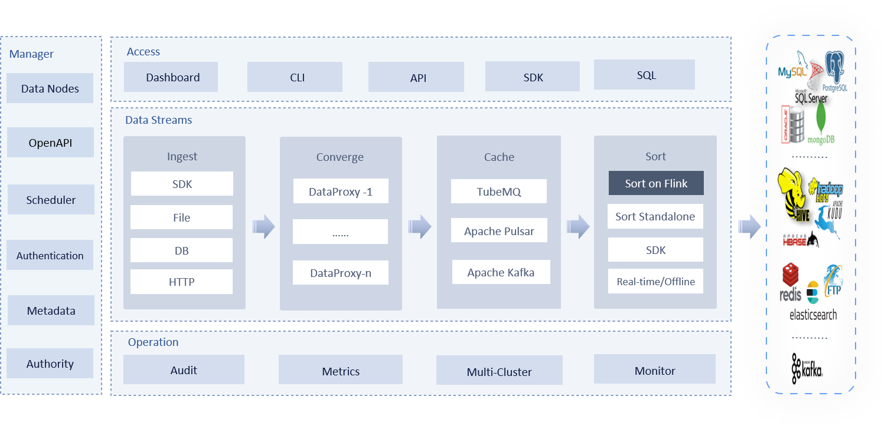</div><div> Lightweight Architecture: contains only one component of InLong Sort, which also can be used with Manager, Dashboard, and it is simple and flexible, support `Data Synchronization`.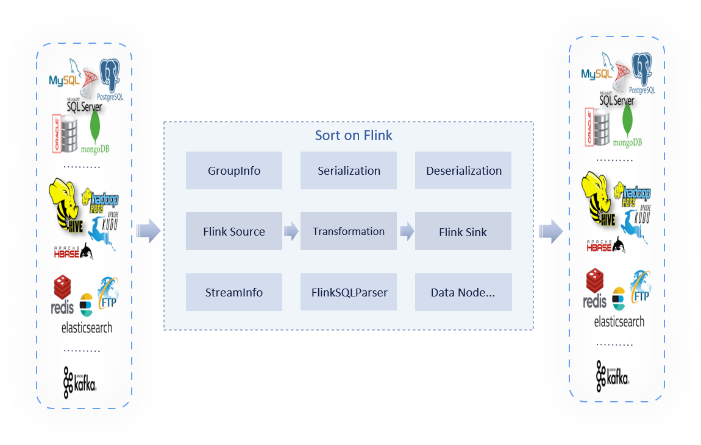</div></div></div>

Apache InLong serves the entire life cycle from data collection to landing, and provides different processing modules according to different stages of data, including the next modules:

- **inlong-agent**, data collection services, including file collection, DB collection, etc.
- **inlong-dataproxy**, a Proxy component based on Flume-ng, supports data transmission blocking, placing retransmission, and has the ability to forward received data to different MQ (message queues).
- **inlong-tubemq**, Tencent's self-developed message queuing service, focuses on high-performance storage and transmission of massive data in big data scenarios and has a relatively good core advantage in mass practice and low cost.
- **inlong-sort**, after consuming data from different MQ services, perform ETL processing, and then aggregate and write the data into Apache Hive, ClickHouse, HBase, IceBerg, Hudi, etc.
- **inlong-manager**, provides complete data service management and control capabilities, including metadata, OpenAPI, task flow, authority, etc.
- **inlong-dashboard**, a front-end page for managing data integration task, simplifying the use of the entire InLong control platform.
- **inlong-audit**, performs real-time audit and reconciliation on the incoming and outgoing traffic of the Agent, DataProxy, and Sort modules of the InLong system.

| Type | Name | Version |
| --- | --- | --- |
| Extract Node | Auto Push | None |
|  | Doris | >= 0.13 |
|  | File | None |
|  | Iceberg | 0.12.x |
|  | Kafka | 2.x |
|  | MySQL | 5.6, 5.7, 8.0.x |
|  | MongoDB | >= 3.6 |
|  | MQTT | >= 3.1 |
|  | OceanusBase | None |
|  | Oracle | 11,12,19 |
|  | PostgreSQL | 9.6, 10, 11, 12 |
|  | Pulsar | 2.8.x |
|  | Redis | 2.6.x |
|  | SQLServer | 2012, 2014, 2016, 2017, 2019 |
|  | TubeMQ | 1.3.0+ |
| Load Node | Auto Consumption | None |
|  | ClickHouse | 20.7+ |
|  | Doris | >= 0.13 |
|  | Elasticsearch | 6.x, 7.x |
|  | Greenplum | 4.x, 5.x, 6.x |
|  | HBase | 2.2.x |
|  | HDFS | 2.x, 3.x |
|  | Hive | 1.x, 2.x, 3.x |
|  | Hudi | 0.12.x |
|  | Iceberg | 0.12.x |
|  | Kafka | 2.x |
|  | MySQL | 5.6, 5.7, 8.0.x |
|  | OceanusBase | None |
|  | Oracle | 11, 12, 19 |
|  | PostgreSQL | 9.6, 10, 11, 12 |
|  | Redis | 2.6.x |
|  | SQLServer | 2012, 2014, 2016, 2017, 2019 |
|  | StarRocks | >= 2.0 |
|  | TDSQL-PostgreSQL | 10.17 |

---

<a id="design_and_concept-basic_concept"></a>

<!-- source_url: https://inlong.apache.org/docs/design_and_concept/basic_concept/ -->

<!-- page_index: 2 -->

# Basic Concept

Version: 2.3.0

| Name | Description | Other |
| --- | --- | --- |
| Standard | Standard Architecture, contains all InLong components such as InLong Agent, Manager, MQ, Sort, Dashboard | Support `Data Ingestion`, `Data Synchronization` and `Data Subscription` at the same time |
| Lightweight | Lightweight Architecture, contains only one component of InLong Sort, which also can be used with Manager, Dashboard | The lightweight architecture is simple and flexible, only support `Data Synchronization` |
| Data Ingestion | Data ingestion is the process of moving data from a source into a landing area or an object store where it can be used for ad hoc queries and analytics |  |
| Data Synchronization | Data synchronization is the process of establishing consistency between source and target data stores, and the continuous harmonization of the data over time |  |
| Data Subscription | Data Subscription provides subscribers bulk data feeds of the data they are entitled to access |  |
| Group | Data Streams Group, it contains multiple data streams, and one Group represents one data business unit. | Group has attributes such as ID and Name. |
| Stream | Data Stream, a stream has a specific data source, data format and data sink. | Stream has attributes such as ID, Name, and data fields. |
| Node | Data Node, including `Extract Node` and `Load Node`, stands for the data source and sink types separately. |  |
| InLongMsg | InLong data format, if you consume message directly from the message queue, you need to perform `InLongMsg` parsing first. |  |
| Cluster | Each component can form a single cluster. | Contains cluster name, label, necessary information for each component, etc. |
| Tag | Clusters of different components can use the same tag to represent a set of data stream execution units. | Currently tag are only available for clusters |
| Agent | The standard architecture uses Agent for data collection, and Agent represents different types of collection capabilities. | It contains File Agent, SQL Agent, Binlog Agent, etc. |
| DataProxy | Forward received data to different message queues. | Supports data transmission blocking, placing retransmission. |
| Sort | Data stream sorting. | Sort-flink based on Flink, sort-standalone for local sorting. |
| TubeMQ | InLong's self-developed message queuing service | It can also be called Tube, with low-cost, high-performance features. |
| Pulsar | [Apache Pulsar](https://pulsar.apache.org/), a high-performance, high-consistency message queue service |  |

---

<a id="design_and_concept-the_format_in_inlong"></a>

<!-- source_url: https://inlong.apache.org/docs/design_and_concept/the_format_in_inlong/ -->

<!-- page_index: 3 -->

# Format

Version: 2.3.0

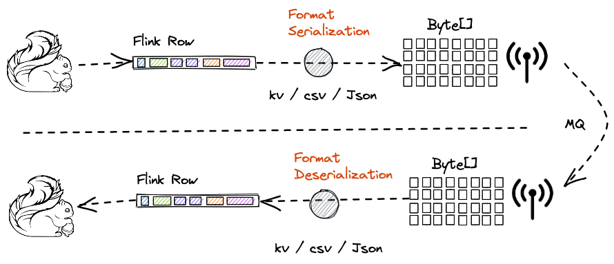

As shown in the figure, in Flink SQL, when reading and writing data, it adopts the form of Row. Inside it is an Object array `Object[]`, and each element in the array represents a field of the Flink table. The information about field type , name and precision is marked by `Schema` .

Format provides two interfaces : SerializationSchema and DeserializationSchema :

- When Flink writes data to MQ , it needs to serialize `Flink Row` into `key-value` / `csv` / `Json` format . Then call the method of `SerializationSchema#serialize` . Data will be serialized into Byte[] , which can be written to MQ .
- When Flink reads data from MQ , it works vice versa . It reads data from MQ with format Byte[] . Then deserializes them into Format and finally converts them into Flink row .

> See
> details: [`inlong-sort/sort-formats`](https://github.com/apache/inlong/tree/master/inlong-sort/sort-formats)

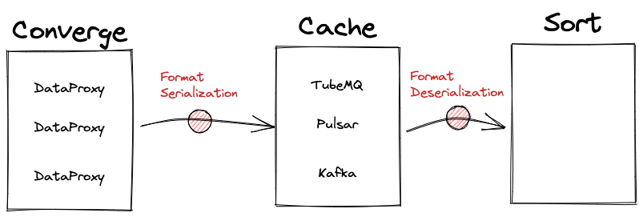

InLong serves as a one-stop, full-scenario data integration platform , with MQ (the Cache part in the picture) as the transmission channel , which decouples DataProxy and Sort and provides better scalability . When DataProxy is reporting data , it needs to serialize the data into corresponding format ( `SerializationSchema#serialize` ) . When Sort receives data, it will deserialize the MQ data ( `DeserializationSchema#deserialize` ) into `Flink Row` , and then write to the corresponding storage using Flink SQL .

Currently , InLong-sort provides CSV / KeyValue / JSON , and the corresponding InLongMsg packaging format .

```xml
<dependency> 
    <groupId>org.apache.inlong</groupId> 
    <artifactId>sort-format-csv</artifactId> 
    <version>${inlong.version}</version> 
</dependency> 
```

`org.apache.inlong.sort.formats.kv.KvFormatFactory`

| Option | Type | Required | Default value | Advanced | Remark |
| --- | --- | --- | --- | --- | --- |
| `format.delimiter` | char | Y | `,` | N |  |
| `format.escape-character` | char | N | disabled | Y |  |
| `format.quote-character` | char | N | disabled | Y |  |
| `format.null-literal` | String | N | disabled | Y |  |
| `format.charset` | String | Y | "UTF-8" | N |  |
| `format.ignore-errors` | Boolean | Y | true | N |  |
| `format.derive_schema` | Boolean | N | Required if no format schema is defined . | Y | Derives the format schema from the table's schema . This allows for defining schema information only once . The names , types , and fields' order of the format are determined by the table's schema . Time attributes are ignored if their origin is not a field . A "from" definition is interpreted as a field renaming in the format . |

```xml
<dependency> 
    <groupId>org.apache.inlong</groupId> 
    <artifactId>sort-format-kv</artifactId> 
    <version>${inlong.version}</version> 
</dependency> 
```

`org.apache.inlong.sort.formats.csv.CsvFormatFactory`

| Option | Type | Required | Default value | Advanced | Remark |
| --- | --- | --- | --- | --- | --- |
| `format.entry-delimiter` | char | N | `&` | N |  |
| `format.kv-delimiter` | char | N | `=` | N |  |
| `format.escape-character` | char | N | disabled | Y |  |
| `format.quote-character` | char | N | disabled | Y |  |
| `format.null-literal` | char | N | disabled | Y |  |
| `format.charset` | String | Y | "UTF-8" | N |  |
| `format.ignore-errors` | Boolean | Y | true | N |  |
| `format.derive_schema` | Boolean | N | Required if no format schema is defined . | Y | Derives the format schema from the table's schema . This allows for defining schema information only once . The names , types , and fields' order of the format are determined by the table's schema . Time attributes are ignored if their origin is not a field . A "from" definition is interpreted as a field renaming in the format . |

```xml
<dependency> 
    <groupId>org.apache.flink</groupId> 
    <artifactId>flink-json</artifactId> 
    <version>${flink.version}</version> 
</dependency> 
```

`org.apache.flink.formats.json.JsonFormatFactory`

`org.apache.flink.formats.json.JsonOptions`

| Option | Type | Required | Default value | Advanced | Remark |
| --- | --- | --- | --- | --- | --- |
| `ignore-parse-errors` | Boolean | N | false | N | Optional flag to skip fields and rows with parse errors instead of failing ; fields are set to null in case of errors , false by default . |
| `map-null-key.mode` | String | N | "FAIL" | Y | Optional flag to control the handling mode when serializing null key for map data ." Option DROP will drop null key entries for map data ." Option LITERAL will use `map-null-key.literal` as key literal . |
| `map-null-key.literal` | String | N | "null" | Y | Optional flag to specify string literal for null keys when `map-null-key.mode` is LITERAL . |
| `encode.decimal-as-plain-number` | Boolean | N | false | Y | Optional flag to specify whether to encode all decimals as plain numbers instead of possible scientific notations , false by default . |
| `timestamp-format.standard` | String | N | "SQL" | Y | Optional flag to specify timestamp format , SQL by default ." Option ISO-8601 will parse input timestamp in "yyyy-MM-ddTHH:mm:ss.s{precision}" format and output timestamp in the same format ." Option SQL will parse input timestamp in "yyyy-MM-dd HH:mm:ss.s{precision}" format and output timestamp in the same format . |
| `encode.decimal-as-plain-number` | Boolean | N | false | Y | Optional flag to specify whether to encode all decimals as plain numbers instead of possible scientific notations , false by default . |

---

<a id="quick_start-data_ingestion-file_pulsar_clickhouse_example"></a>

<!-- source_url: https://inlong.apache.org/docs/quick_start/data_ingestion/file_pulsar_clickhouse_example/ -->

<!-- page_index: 4 -->

# Pulsar Example

Version: 2.3.0

> [!WARNING]
> **caution**
> Since each component reports the ClusterTags as `default_cluster` by default, do not use other names.

---

<a id="quick_start-data_ingestion-mysql_kafka_clickhouse_example"></a>

<!-- source_url: https://inlong.apache.org/docs/quick_start/data_ingestion/mysql_kafka_clickhouse_example/ -->

<!-- page_index: 5 -->

# Kafka Example

Version: 2.3.0

> [!WARNING]
> **caution**
> Since each component reports the ClusterTags as `default_cluster` by default, do not use other names.

---

<a id="quick_start-realtime_data_sync-mysql_clickhouse_example"></a>

<!-- source_url: https://inlong.apache.org/docs/quick_start/realtime_data_sync/mysql_clickhouse_example/ -->

<!-- page_index: 6 -->

# MySQL to ClickHouse Example

Version: 2.3.0

> [!NOTE]
> - Please create the test.source\_table database table in advance, the schema is: CREATE TABLE test.source\_table (id INT PRIMARY KEY, name VARCHAR(50));

---

<a id="quick_start-realtime_data_sync-mysql_starrocks_example"></a>

<!-- source_url: https://inlong.apache.org/docs/quick_start/realtime_data_sync/mysql_starrocks_example/ -->

<!-- page_index: 7 -->

# MySQL to StarRocks Example

Version: 2.3.0

> [!NOTE]
> - Please do not fill in `http://` for LOAD URL, just fill in `IP:PORT`.

---

<a id="quick_start-realtime_data_sync-mysql_iceberg_example"></a>

<!-- source_url: https://inlong.apache.org/docs/quick_start/realtime_data_sync/mysql_iceberg_example/ -->

<!-- page_index: 8 -->

# MySQL to Iceberg Example

Version: 2.3.0

> [!NOTE]
> - If the read mode is `Full amount + Incremental`, the existing data in the source table will also be collected, but the `Incremental` mode will not.
> - The table white list format is `<dbName>.<tableName>` and supports regular expressions.

---

<a id="quick_start-realtime_data_sync-pulsar_clickhouse_example"></a>

<!-- source_url: https://inlong.apache.org/docs/quick_start/realtime_data_sync/pulsar_clickhouse_example/ -->

<!-- page_index: 9 -->

# Pulsar to ClickHouse Example

Version: 2.3.0

> [!NOTE]
> - Please create the pulsar tenant, namespace and topic in advance, you can do it by [Pulsar-admin](https://pulsar.apache.org/docs/2.10.x/pulsar-admin/#create-3)

---

<a id="quick_start-offline_data_sync-quartz_example"></a>

<!-- source_url: https://inlong.apache.org/docs/quick_start/offline_data_sync/quartz_example/ -->

<!-- page_index: 10 -->

# Quartz Scheduling Engine Example

Version: 2.3.0

> [!WARNING]
> **caution**
> `default_cluster` is the default ClusterTags for each component. If you decide to use a different name, make sure to update the corresponding tag configuration accordingly.

---

<a id="quick_start-offline_data_sync-dolphinscheduler_example"></a>

<!-- source_url: https://inlong.apache.org/docs/quick_start/offline_data_sync/dolphinscheduler_example/ -->

<!-- page_index: 11 -->

# DolphinScheduler Scheduling Engine Example

Version: 2.3.0

In the following sections, we will walk through a complete example to demonstrate how to integrate the third-party scheduling engine DolphinScheduler into Apache InLong to create an offline data synchronization from Pulsar to MySQL.

Before we begin, we need to install InLong and a usable DolphinScheduler. Here we provide two ways:

- [Docker Deployment](#deployment-docker) (Recommended)
- [Bare Metal Deployment](#deployment-bare_metal)

Download the [connectors](https://inlong.apache.org/downloads/) corresponding to Flink version, and after decompression, place `sort-connector-jdbc-[version]-SNAPSHOT.jar` in `/inlong-sort/connectors/` directory.

> Currently, Apache InLong's offline data synchronization capability only supports Flink-1.18, so please download the 1.18 version of connectors.

When all containers are successfully started, you can access the InLong dashboard address `http://localhost`, and use the following default account to log in.

```properties
User: admin 
Password: inlong 
```


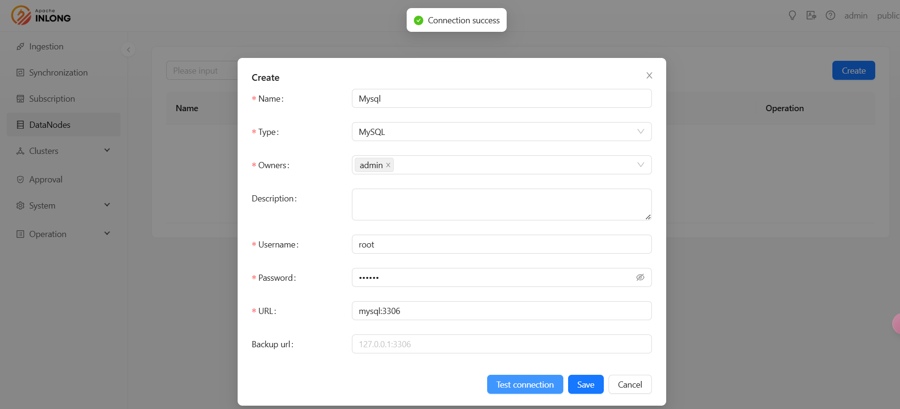

Execute the following SQL statement:

```sql
CREATE TABLE sink_table ( 
    id INT AUTO_INCREMENT PRIMARY KEY, 
    name VARCHAR(255) NOT NULL, 
    create_time TIMESTAMP DEFAULT CURRENT_TIMESTAMP 
); 
```

Before using DolphinScheduler as your scheduling engine, please make sure you have a working DolphinScheduler on hand. If you need to deploy a DolphinScheduler for yourself, please refer to the [DolphinScheduler Official Document](https://dolphinscheduler.apache.org/zh-cn).

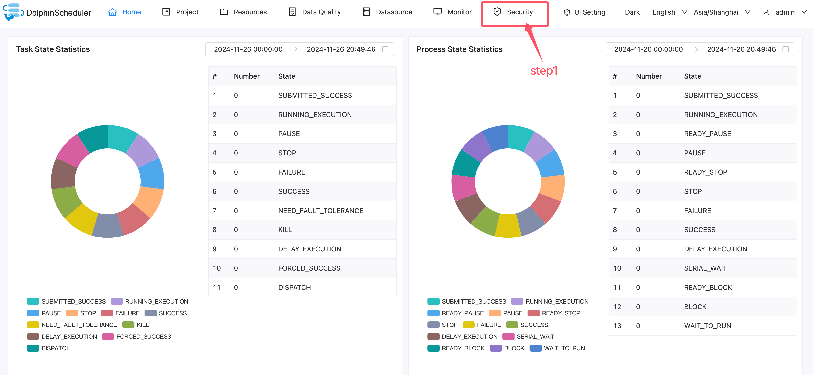

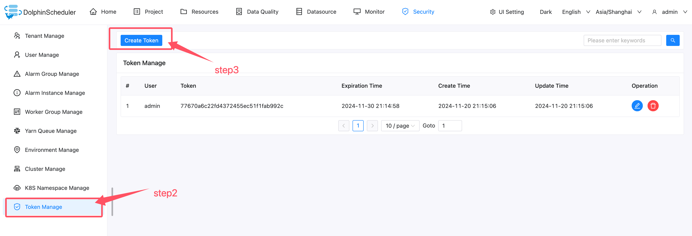

Go into Token Manager page to create a token for InLong to access.

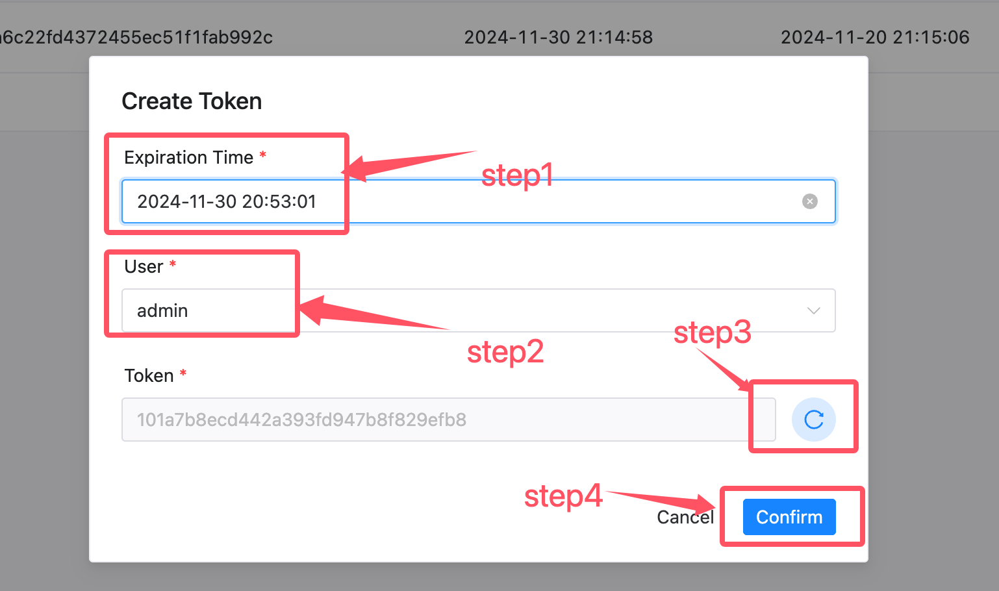

Set parameters for the token according to the steps in the figure, include [Expiration Time], [User], then generate a token.

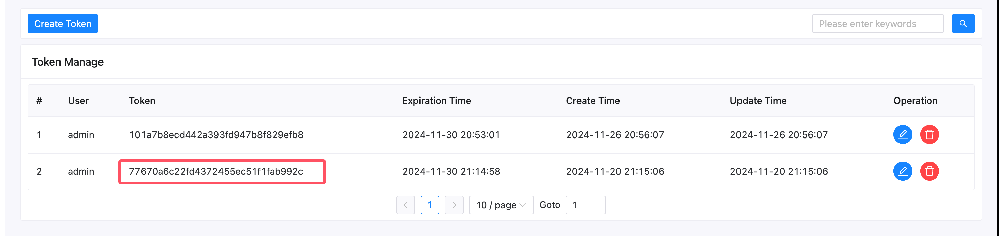

For third-party scheduling engine, we need to modify configurations in manager.

For DolphinScheduler engine there are following configurations need to be modified:

- `schedule.engine.inlong.manager.url` : Third-party scheduling engine needs to access the inlong manager through this url.
- `schedule.engine.dolphinscheduler.url` : DolphinScheduler deployment url, general format is http://{ip}:{port}/dolphinscheduler
- `schedule.engine.dolphinscheduler.token` : Token you just generated in Token Manager of DolphinScheduler.

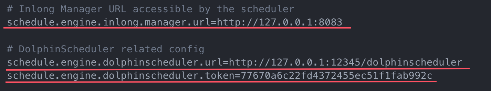

After doing this, restart the InLong Manager to ensure the configuration is enabled.


During configure the offline synchronization task, choose DolphinScheduler when selecting the scheduling engine, then configure other parameters.

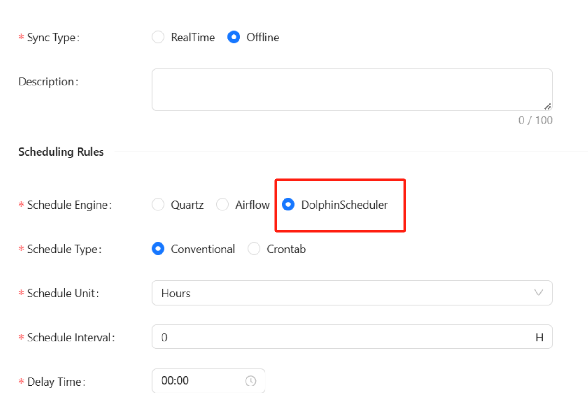

For details about how to manage clusters and configure data nodes, see [Quartz Scheduling Engine Example](#quick_start-offline_data_sync-quartz_example).

After approval data flow, return to the [Synchronization] page and wait for the task configuration to succeed. Once configured successfully, the DolphinScheduler will periodically calls back InLong to synchronize offline data and the Manager will periodically submit Flink Batch Jobs to the Flink cluster.

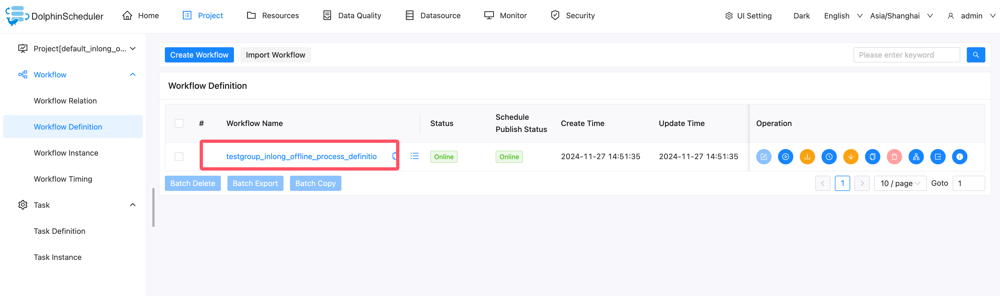

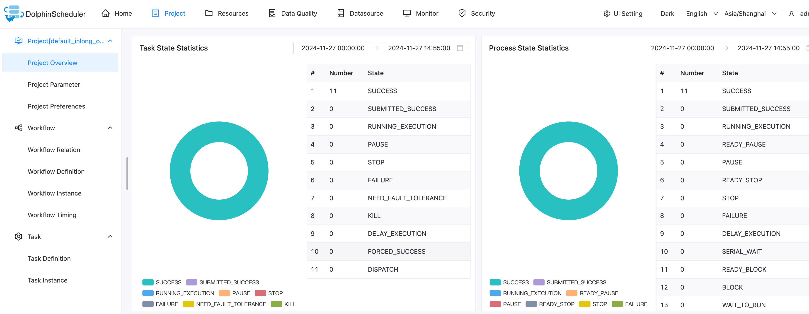

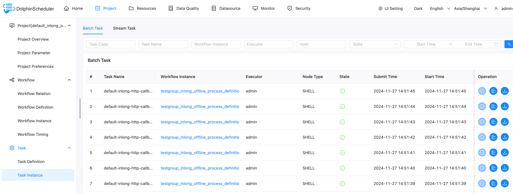

View the DolphinScheduler task instance logs. The following logs indicate that the configuration is successful.

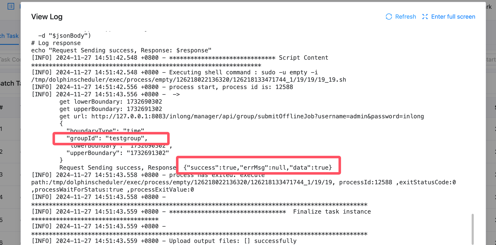

Use the Pulsar SDK to produce data into the Pulsar topic. An example is as follows:

```java
// Create Pulsar client and producer 
PulsarClient pulsarClient = PulsarClient.builder().serviceUrl("pulsar://localhost:6650").build(); 
Producer<byte[]> producer = pulsarClient.newProducer().topic("public/default/test").create(); 
 
// Send messages 
for (int i = 0; i < 10000; i++) { 
    // Field separator is | 
    String msgStr = i + "|msg-" + i; 
    MessageId msgId = producer.send(msgStr.getBytes(StandardCharsets.UTF_8)); 
    System.out.println("Send msg : " + msgStr + " with msgId: " + msgId); 
} 
```

Then enter MySQL to check the data in the table:

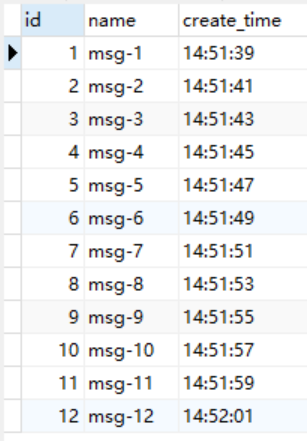

---

<a id="quick_start-offline_data_sync-airflow_example"></a>

<!-- source_url: https://inlong.apache.org/docs/quick_start/offline_data_sync/airflow_example/ -->

<!-- page_index: 12 -->

# Airflow Scheduling Engine Example

Version: 2.3.0

In the following sections, we will walk through a complete example to demonstrate how to integrate the third-party scheduling engine Airflow into Apache InLong to create an offline data synchronization from Pulsar to MySQL.

Before we begin, we need to install InLong. Here we provide two ways:

- [Docker Deployment](#deployment-docker) (Recommended)
- [Bare Metal Deployment](#deployment-bare_metal)

Download the [connectors](https://inlong.apache.org/downloads/) corresponding to Flink version, and after decompression, place `sort-connector-jdbc-[version]-SNAPSHOT.jar` in `/inlong-sort/connectors/` directory.

> Currently, Apache InLong's offline data synchronization capability only supports Flink-1.18, so please download the 1.18 version of connectors.

When all containers are successfully started, you can access the InLong dashboard address `http://localhost`, and use the following default account to log in.

```properties
User: admin 
Password: inlong 
```

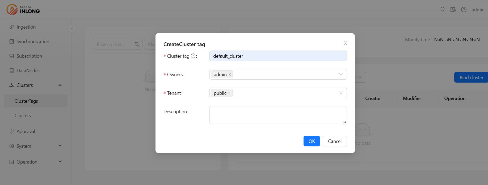

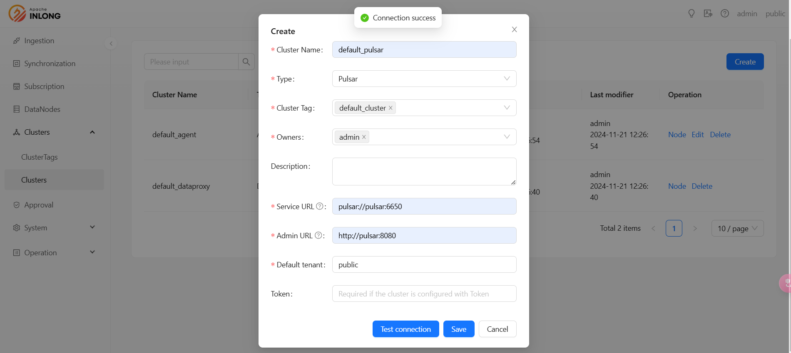


Execute the following SQL statement:

```sql
CREATE TABLE sink_table ( 
    id INT AUTO_INCREMENT PRIMARY KEY, 
    name VARCHAR(255) NOT NULL, 
    create_time TIMESTAMP DEFAULT CURRENT_TIMESTAMP 
); 
```

They can be obtained from [InLong](https://github.com/apache/inlong).

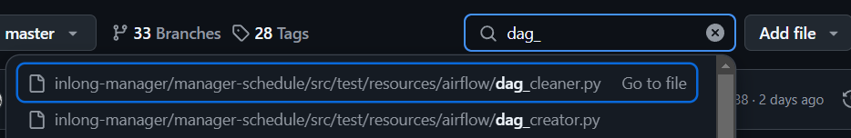

> Airflow does not provide an API for DAG creation, so two original DAGs are required. `dag_creator` is used to create offline tasks, and `dag_cleaner` is used to clean up offline tasks regularly.

Place the DAG file in the Airflow default DAG directory and wait for a while. The Airflow scheduler will scan the directory and load the DAG:
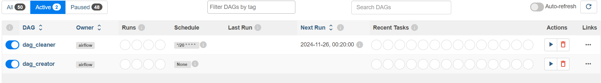

By default, Airflow will reject all REST API requests. Please refer to the [Airflow official documentation](https://airflow.apache.org/docs/apache-airflow-providers-fab/stable/auth-manager/api-authentication.html) for configuration.

Modify the configuration file according to the configuration file requirements and restart InLong Manager.

```properties
# InLong Manager URL accessible by the scheduler 
schedule.engine.inlong.manager.url=http://inlongManagerIp:inlongManagerPort 
# Management URL for Airflow 
schedule.engine.airflow.baseUrl=http://airflowIP:airflowPort 
# Username and password for Airflow REST API authentication 
schedule.engine.airflow.username=airflow 
schedule.engine.airflow.password=airflow 
# Connection used to save InLong Manager authentication information 
schedule.engine.airflow.connection.id=inlong_connection 
# The ids of the two original DAGs 
schedule.engine.airflow.cleaner.id=dag_cleaner 
schedule.engine.airflow.creator.id=dag_creator 
```

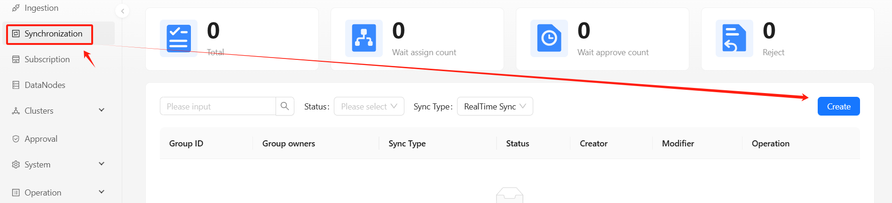

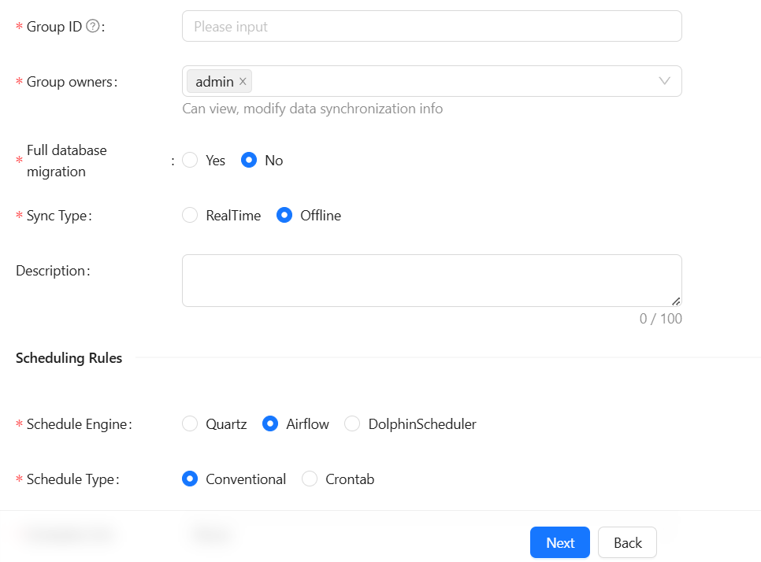

Please refer to the following steps: [Quartz Scheduling Engine Example](#quick_start-offline_data_sync-quartz_example)

After approval and configuration, InLong Manager will trigger `dag_creator` through the Airflow API to create the offline task DAG:

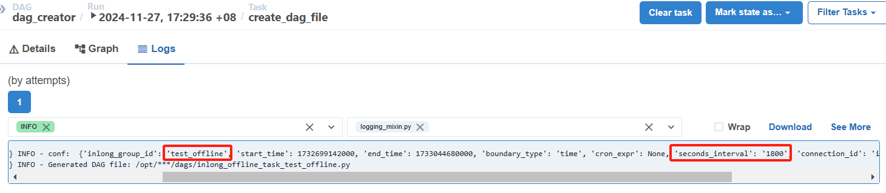

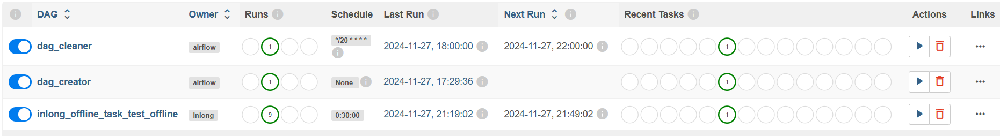

> Offline task DAG may not be scheduled immediately, because Airflow will scan DAG files regularly and add them to the schedule, so it may take some time.

The offline task execution results are as follows:

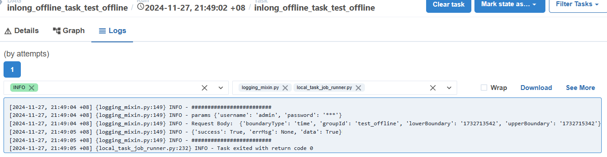

> Airflow will periodically call the interface provided by InLong Manager to submit Flink tasks according to the configuration in the `Create Data Stream Group` section. This is why the authentication information of InLong Manager needs to be saved in the `Configure InLong Manager` section.

Use the Pulsar SDK to produce data into the Pulsar topic. An example is as follows:

```java
// Create pulsar client and producer 
PulsarClient pulsarClient = PulsarClient.builder().serviceUrl("pulsar://localhost:6650").build(); 
Producer<byte[]> producer = pulsarClient.newProducer().topic("public/default/test").create(); 
 
// Send a message 
for (int i = 0; i < 10000; i++) { 
    // The field separator is | 
    String msgStr = i + "|msg-" + i; 
    MessageId msgId = producer.send(msgStr.getBytes(StandardCharsets.UTF_8)); 
    System.out.println("Send msg : " + msgStr + " with msgId: " + msgId); 
} 
```

Then enter MySQL to check the data in the table:

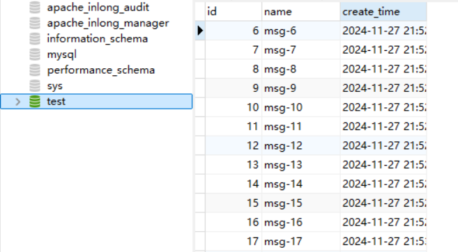

---

<a id="quick_start-data_http_report-http_report"></a>

<!-- source_url: https://inlong.apache.org/docs/quick_start/data_http_report/http_report/ -->

<!-- page_index: 13 -->

# HTTP Report Example

Version: 2.3.0

In the following content, we will use a complete example to introduce how to use HTTP to report data, quickly verify whether the applied {groupId, streamId} is effective, and whether the data is accepted by InLong DataProxy and correctly written to the MQ cluster.

We need to apply for {groupId, streamId} in InLong Manager first. As shown in the following figure, we have applied for {test\_http, test\_stream} information and the administrator has approved it:
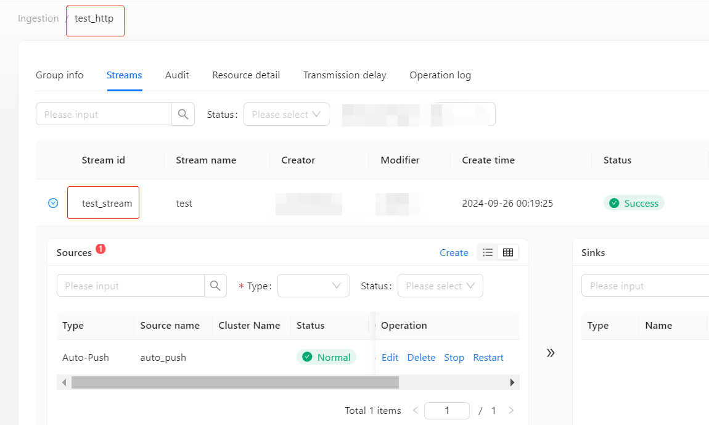

In the application report stream, we defined that the data of this report stream is reported in CSV format. The data content consists of three fields (ID, Name, Desc) separated by vertical bars ("|"):
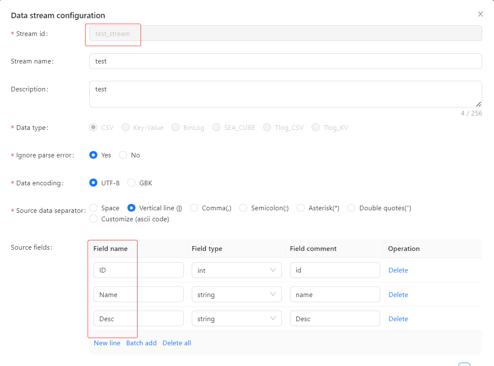

InLong supports direct data reporting via HTTP. In this reporting example, we directly select a DataProxy that supports HTTP reporting from the resource details page of the InLong group to report the message. In the demonstration environment, the HTTP receiving port opened by DataProxy is 47805, as shown below:
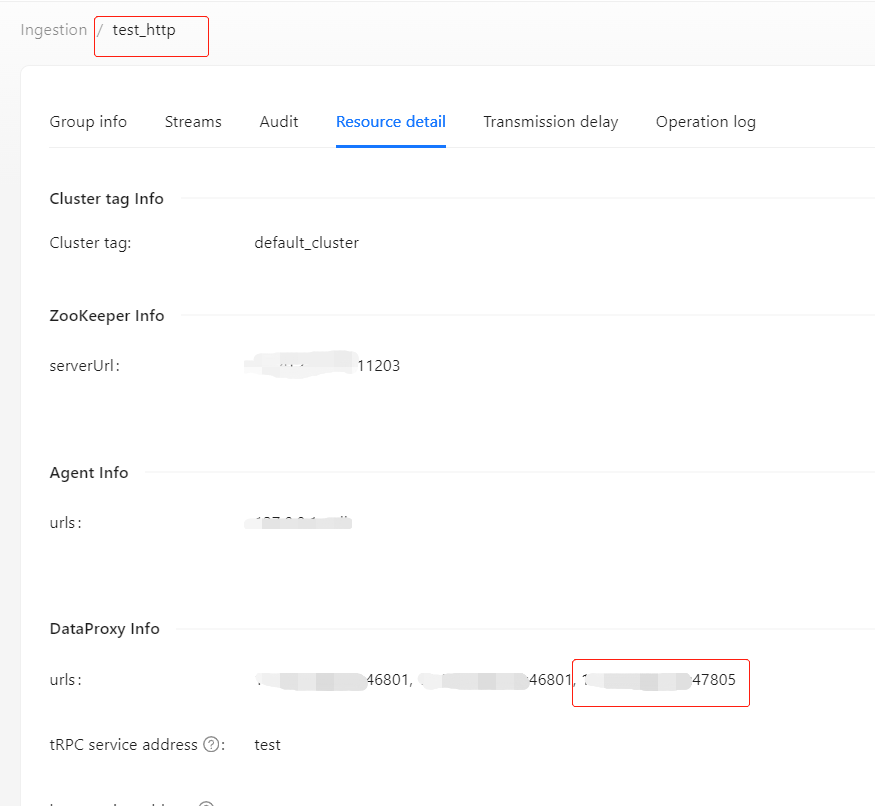

At this point, we have obtained the InLong group and stream information required for data reporting, as well as the DataProxy node IP and port information to be reported by HTTP reporting. Next, we can report data through HTTP to verify whether the requested InLong group and stream, pipeline are available.

According to the HTTP reporting protocol requirements of InLong, we use curl tool to construct an HTTP instruction as shown below for execution. In the body part, we construct a record containing three field values according to the format definition of test\_stream. {dataproxy\_ip:dataproxy\_httpport} is the DataProxy IP and port for receiving the reported message. You can replace it with the corresponding information in your environment:

```bash
curl -X POST -d 'groupId=test_http&streamId=test_stream&dt=data_time&body=1|name_1|desc_record_one&cnt=1' http://{dataproxy_ip:dataproxy_httpport}/dataproxy/message 
```

- Parameter Description：

| parameter | meaning | Remark |
| --- | --- | --- |
| groupId | Data stream group id |  |
| streamId | Data stream ID |  |
| body | Data content to be pushed |  |
| dt | Data time to be pushed | timestamp in millisecond |
| cnt | The count of data pieces to be pushed |  |

- Return Value：

| return value | meaning |
| --- | --- |
| 0 | Success |
| !=0 | Failure |

We use the data preview function of the data stream test\_http:test\_stream to view the HTTP reporting status. This function directly samples the latest data from the MQ cluster corresponding to the data stream:
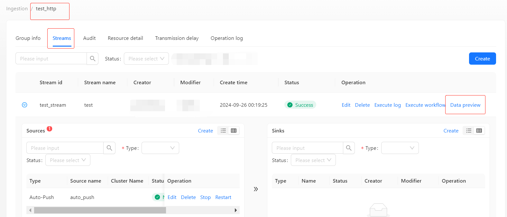

We can see that the data just reported has been successfully written to the MQ cluster:
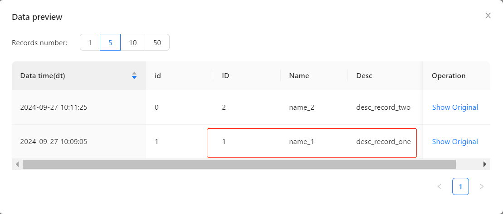

At this point, we quickly and clearly know that the requested InLong group and stream, as well as the pipeline resources, are all available.

The return code and error message in the HTTP response will clearly indicate the specific cause of the error, such as the group or stream does not exist, the reporting protocol format is not equal, etc., and the problem can be quickly solved by adjusting according to the corresponding error prompt or aligning with the system administrator.

---

<a id="quick_start-transform-sdk_example"></a>

<!-- source_url: https://inlong.apache.org/docs/quick_start/transform/sdk_example/ -->

<!-- page_index: 14 -->

# Prerequisites

Version: 2.3.0

<a id="quick_start-transform-sdk_example--prerequisites"></a>

# Prerequisites

- JDK 1.8 or above
- Maven 2.5 or above

<a id="quick_start-transform-sdk_example--installing-sdk-dependencies"></a>

# Installing SDK Dependencies

You need to include the SDK library in your project to use the SDK. The library can be obtained in the following two ways:

- Obtain the source code, compile it yourself, and deploy the SDK package to the local repository. See [How to Compile](https://inlong.apache.org/docs/next/quick_start/how_to_build/) for details.
- Directly reference the existing library in the Apache repository.
  xml

```xml
<dependency> 
    <groupId>org.apache.inlong</groupId> 
    <artifactId>transform-sdk</artifactId> 
    <version>1.13.0</version> 
</dependency> 
```

<a id="quick_start-transform-sdk_example--specific-examples"></a>

# Specific Examples

- Filter out the video playback start data in the Shenzhen region, the original fields include:
  - event\_time
  - zone, optional values: [ shenzhen, shanghai, beijing ]
  - video\_id
  - username
  - operation\_type, optional values [ start, end ]
- Original test data, CSV format, vertical bar delimited.

```shell
2024-05-09 20:00:01|shenzhen|1111|zhangsan|start 
2024-05-09 20:00:02|shanghai|1111|lisi|start 
2024-05-09 20:00:03|shanghai|1111|lisi|end 
2024-05-09 20:00:04|shenzhen|1111|zhangsan|end 
2024-05-09 20:00:05|beijing|1111|zhangsan|start 
2024-05-09 20:00:06|beijing|1111|zhangsan|end 
```

- Expected result data, KV format

```shell
event_time=2024-05-09 20:00:02&zone=shanghai&video_id=1111&username=lisi&operation_type=start 
```

```java
// source 
SourceInfo csvSource = new CsvSourceInfo("UTF-8", "|", "\\", null); 
```

```java
// sink 
SinkInfo kvSink = new KvSinkInfo("UTF-8", null); 
```

```java
String transformSql = "select $1 event_time,$2 zone,$3 video_id,$4 username,$5 operation_type from source where $2='shenzhen' and $5='start' "; 
TransformConfig config = new TransformConfig(csvSource, kvSink, transformSql); 
```

```java
TransformProcessor processor = new TransformProcessor(config); 
 
String srcString = "2024-05-09 20:00:01|shenzhen|1111|zhangsan|start\n" 
  + "2024-05-09 20:00:02|shanghai|1111|lisi|start\n" 
  + "2024-05-09 20:00:03|shanghai|1111|lisi|end\n" 
  + "2024-05-09 20:00:04|shenzhen|1111|zhangsan|end\n" 
  + "2024-05-09 20:00:05|beijing|1111|zhangsan|start\n" 
  + "2024-05-09 20:00:06|beijing|1111|zhangsan|end"; 
 
List<String> outputs = processor.transform("2024-04-28 00:00:00|ok", new HashMap<>()); 
 
// Expected outcome：[event_time=2024-05-09 20:00:02&zone=shanghai&video_id=1111&username=lisi&operation_type=start] 
System.out.println(outputs); 
```

<a id="quick_start-transform-sdk_example--more-transform-examples"></a>

# More Transform Examples

- For more examples, please see [More Examples](https://github.com/apache/inlong/blob/master/inlong-sdk/transform-sdk/src/test/java/org/apache/inlong/sdk/transform/process).

---

<a id="quick_start-data_subscription-clickhouse_example"></a>

<!-- source_url: https://inlong.apache.org/docs/quick_start/data_subscription/clickhouse_example/ -->

<!-- page_index: 15 -->

# Prerequisites

Version: 2.3.0

<a id="quick_start-data_subscription-clickhouse_example--prerequisites"></a>

# Prerequisites

- Configure the Clickhouse data node
- Configure the Inlong group and Inlong stream

<a id="quick_start-data_subscription-clickhouse_example--create-clickhouse-sink"></a>

# Create clickhouse sink

After configuring the Clickhouse data node, Inlong group and Inlong stream, you can create a Clickhouse sink:

Select【Ingestion】and click【Detail】

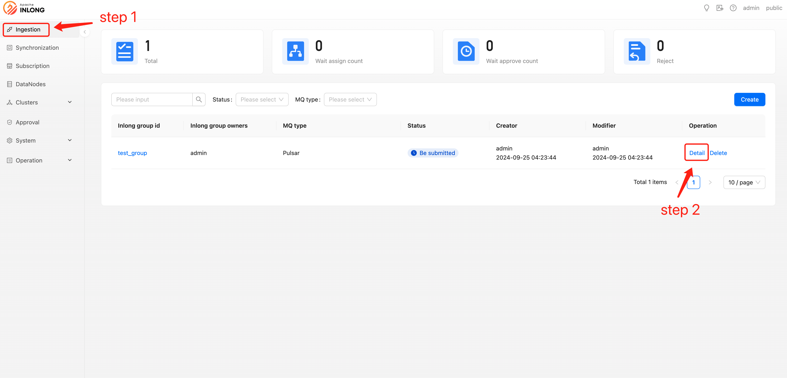

Select【Create】and click Clickhouse type.

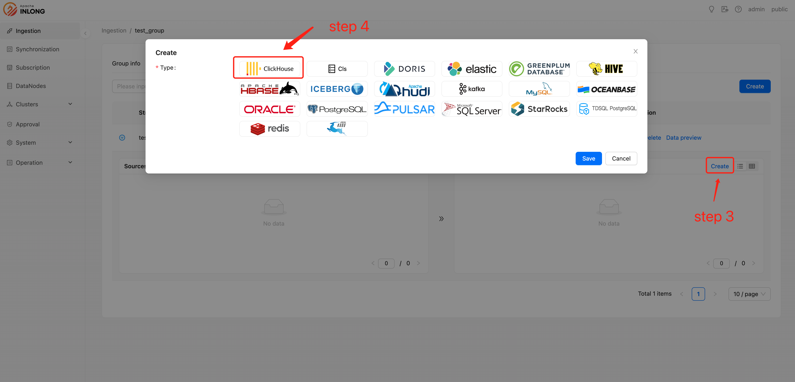

Fill in the required configuration information for Clickhouse and click Save.

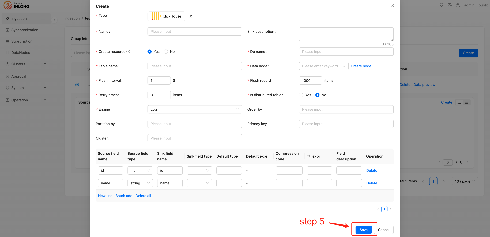

- Name：User-defined name, used to identify this sink information.
- Sink description：This sink description information.
- Create resource：Decide whether to perform table creation operation for this sink.
- DB name：Clickhouse database name.
- Table name：Clickhouse table name.
- Data node：Clickhouse data node.

The creation of the subscription is now complete.

---

<a id="deployment-standalone"></a>

<!-- source_url: https://inlong.apache.org/docs/deployment/standalone/ -->

<!-- page_index: 16 -->

# Standalone

Version: 2.3.0

> [!NOTE]
> Extract `apache-inlong-[version]-bin.tar.gz` and `apache-inlong-[version]-sort-connectors.tar.gz`, and make sure the `inlong-sort/connectors/` directory contains `sort-connector-[type]-[version].jar`.

---

<a id="deployment-docker"></a>

<!-- source_url: https://inlong.apache.org/docs/deployment/docker/ -->

<!-- page_index: 17 -->

# Docker

Version: 2.3.0

> [!NOTE]
> Docker Compose deploys all components for Standard Architecture, and choose [Apache Pulsar](https://pulsar.apache.org/docs/concepts-overview) as the default message queue.

---

<a id="deployment-k8s"></a>

<!-- source_url: https://inlong.apache.org/docs/deployment/k8s/ -->

<!-- page_index: 18 -->

# Kubernetes

Version: 2.3.0

> [!NOTE]
> If the error of `unable to do port forwarding: socat not found` appears, you need to install `socat` at first.

---

<a id="deployment-bare_metal"></a>

<!-- source_url: https://inlong.apache.org/docs/deployment/bare_metal/ -->

<!-- page_index: 19 -->

# Bare Metal

Version: 2.3.0

- MySQL 5.7+ or PostgreSQL
- [Apache Flink 1.13.x](https://nightlies.apache.org/flink/flink-docs-release-1.13/docs/try-flink/local_installation/) or [1.15.x](https://nightlies.apache.org/flink/flink-docs-release-1.15/docs/try-flink/local_installation/)

InLong Support the following Message Queue services now, you can choose one of them.

- [Apache InLong TubeMQ](#modules-tubemq-quick_start)
- [Apache Pulsar 2.8.x](https://pulsar.apache.org/docs/2.8.x/getting-started-home/)
- [Apache Kafka 2.x](https://kafka.apache.org/quickstart)

You can get binary package from [Download Page](https://inlong.apache.org/download) ,or you can build the InLong refer to [How to Build](#development-how_to_build).。

You need deploy all InLong components for Standard Architecture, which supports `Data Ingestion`, `Data Synchronization` and `Data Subscription` at the same time.

| order | component | dependencies | deploy guide | description |
| --- | --- | --- | --- | --- |
| 1 | inlong-audit | MySQL or StarRocks | [InLong Audit](#modules-audit-deployment) |  |
| 2 | inlong-manager | MySQL | [InLong Manager](#modules-manager-deployment) |  |
| 3 | inlong-dataproxy | None | [InLong DataProxy](#modules-dataproxy-deployment) |  |
| 4 | inlong-agent | None | [InLong Agent](#modules-agent-deployment) |  |
| 5 | inlong-dashboard | Nginx or Docker | [InLong Dashboard](#modules-dashboard-deployment) |  |
| 6 | inlong-sort-connectors | Apache Flink 1.13.x or 1.15.x | Extract [apache-inlong-[version]-sort-connectors.tar.gz](https://inlong.apache.org/download/) and move connectors jar to `inlong-sort/connectors` directory. |  |

After the InLong cluster deployed successfully, you can create a data stream refer to the [Dashboard Usage Guide](#user_guide-dashboard_usage) to start using.

Lightweight Architecture only support `Data Synchronization`, you need to deploy InLong Sort component, it is simple and flexible, suitable for small-scale data.
You can deploy and use it refer [the deployment guide](#modules-sort-deployment).

---

<a id="modules-agent-overview"></a>

<!-- source_url: https://inlong.apache.org/docs/modules/agent/overview/ -->

<!-- page_index: 20 -->

# Overview

Version: 2.3.0

The InLong Agent belongs to the collection layer of the InLong data link and is a collection tool that supports multiple types of data sources. It is committed to achieving stable and efficient data collection functions for various heterogeneous data sources, including File, MySQL, Pulsar, Metrics, etc.

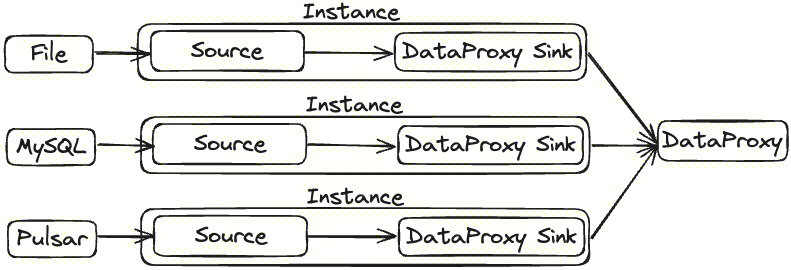

The InLong Agent itself serves as a data collection framework. In order to facilitate the expansion of data sources, the data sources are abstracted as Source plugins and integrated into the entire framework.
-Source: Source is a data collection module responsible for collecting data from the data source.
-Agent configuration synchronization thread Manager Fetcher pulls from Manager to collection configuration
-Instance: Instance is used to retrieve data from the Source and write it to the DataProxy Sink

In order to address the issue of data source diversity, InLong Agent abstracts multiple data sources into a unified Source concept and abstracts a unified DataProxy Sink to write data into the InLong link. When a new data source needs to be connected, simply configure the format and reading parameters of the data source to achieve efficient reading.

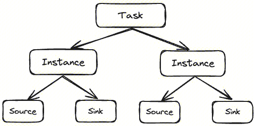

- Task
  Collection tasks configured on behalf of users
- Instance
  Instantiation of collection tasks, generated by Tasks, responsible for executing specific collection tasks

Taking file collection as an example, there is a collection task configuration on the Manager: `127.0.0.1->/data/log/YYYYMMDDhh.log._[0-9]+` indicates that the user needs to collect data that meets the requirements of`/data/log/YYYYMMDDhh.log` on the `127.0.0.1` machine\_ The data for this path rule, [0-9]+, is a task. Assuming there are three files that meet this path rule:/data/log/202404021. log. 0,/data/log/202404021. log. 1,/data/log/202404021. log. 3, Task will generate three instances to collect these three files separately.

Source and Sink belong to the concept of the lower level of an instance. Each instance has a Source and a Sink, where the Source reads data from the data source and the Sink writes the data to the target storage. In the InLong system, data collected by the Agent will be uniformly written to the DataProxy service, which only has DataProxy Sink types.

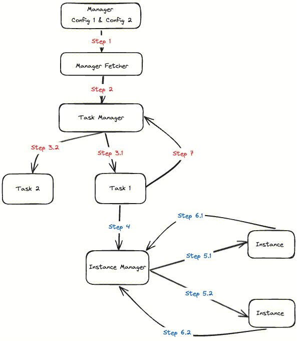

Agent data collection tasks include configuration pulling, Task/Instance generation, Task/Instance execution, and other processes. Taking file collection as an example, the entire process of collection tasks includes:

- Step 1: Agent configuration synchronization thread Manager Fetcher pulls from Manager to collection configuration, such as Configuration 1 and Configuration 2
- Step 2: Synchronize thread to submit configuration to Task Manager
- Step 3.1/3.2: Task Manager will generate Task 1 and Task 2 based on Config1 and Config2
- Step 4: Task 1 scans files that comply with the rules of Configuration 1, such as File 1 and File 2, and submits the information of File 1 and File 2 to the instance manager, Instance Manger (where Instance Manager is a member variable of Task)
- Step 5.1/5.2: The Instance Manager generates corresponding instances based on the file information of File 1 and File 2, and runs them
- Step 6.1/6.2: The Source of each instance will collect file data based on the file information and send the collected data through Sink. After the file collection and transmission are completed, a signal indicating the completion of the instance will be sent to the instance manager, triggering the instance manager to release the instance
- Step 7: After detecting the completion of all instances through the Instance Manager, the Task Manager will send a signal to complete the Task, triggering the Task Manager to release the Task

Agent data collection has a state, and in order to ensure the continuity of data collection, it is necessary to save the collected state to prevent the task from being unable to recover after the Agent stops unexpectedly. The Agent divides states into three categories: Task, Instance, and Offset, corresponding to Task task status, Instance instance status, and point status during the collection process, respectively. These three types of state data are saved through RocksDB and exist in three different DB directories.

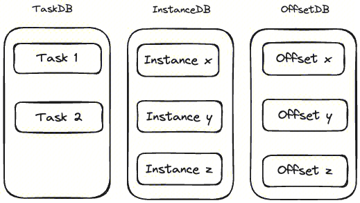

The specified Source and Sink class names are saved in the InstanceDB record, as the class names may change after the Agent upgrade, such as the Source class changing from LogFileSource V1 to NewLogFileSource V1. At the same time, a task corresponds to multiple instances, and in order to avoid changes between different instances affecting each other, tasks and instances are also placed in different DBs. Place Offset in an independent DB to address the issue of using the old version's location information when upgrading the Agent.

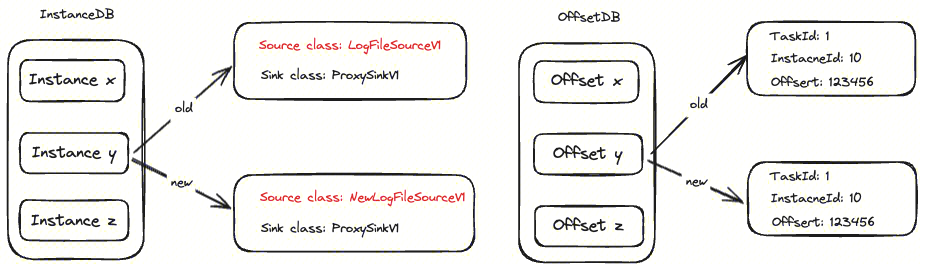

We adopt a similar "sliding window" algorithm: the Agent can send multiple pieces of data before stopping and waiting for confirmation. There is no need to stop and wait for confirmation for each piece of data sent, which ensures that the "offset is updated only after the ack is successful" and maintains a fast sending speed. Taking the collection of four pieces of data as an example:

- Firstly, Source sequentially reads 4 pieces of data from the data source

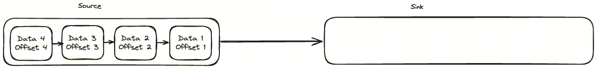

- Secondly, 4 pieces of data were retrieved from the Source`is sent in an orderly manner` Sink, when Sink receives the data `first records the offset of the data in the OffsetList and marks it as not sent`.

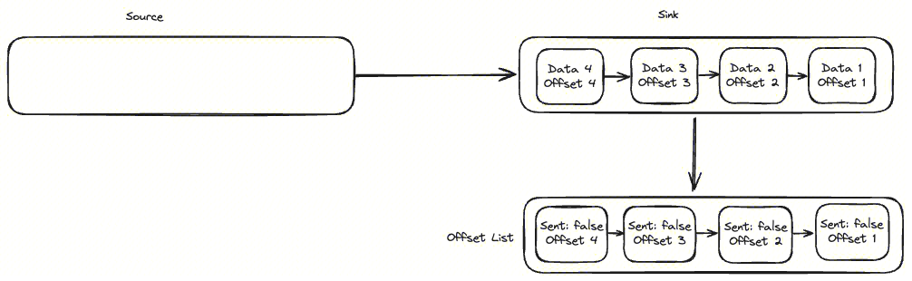

Then Sink sent 4 pieces of data through the SDK, but only 3 pieces of data, 1, 2, and 4, returned success. Returning success will `sets the corresponding identifier in OffsetList to true`

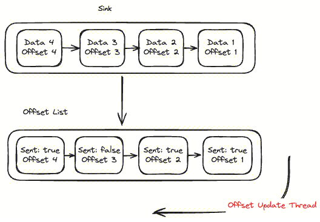

The offset update thread will traverse the OffsetList and find that Offset3 is not acked. Therefore, it will flush the closest Offset2 before Offset3 to the storage, ensuring that the data must be successfully sent downstream before performing the offset refresh.

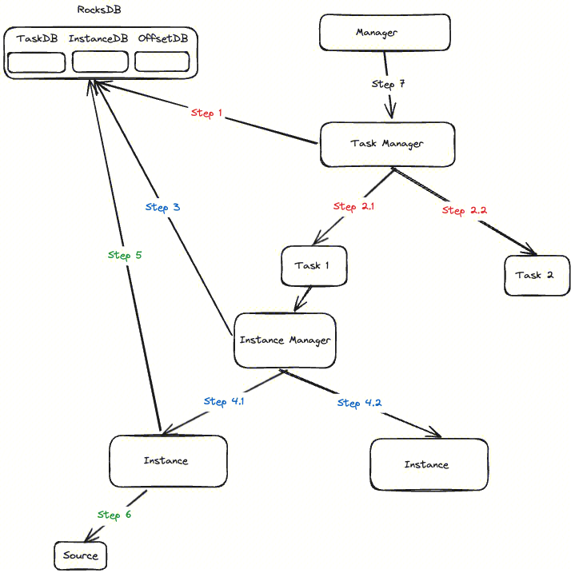

As mentioned above, the status information of Task, Instance, and Offset is stored through RocksDB, and it can ensure that the data is successfully sent downstream before performing offset refreshing. The restart and recovery of collection tasks also depend on the saved state, and the entire process is as follows:

- Step 1: When starting, the Task Manager reads the TaskDB
- Step 2: Task Manager generates Task 1 and Task 2 based on the configuration of Task DB
- Step 3: Instance Manager reads InstanceDB
- Step 4: The Instance Manager generates an instance based on the records of the InstanceDB
- Step 5: Instance reads OffsetDB
- Step 6: Instance initializes the Source based on the OffsetDB configuration and restores the Offset
- Step 7: Regularly update tasks based on Manager configuration

Scan all the files in the corresponding path and match the rules. Once matched, it is considered to be found. However, in the case of a large number of files, scanning once takes a long time and consumes resources. If the scanning cycle is too small, the resource consumption is too high; If the scanning cycle is too long, the response speed will be too slow.

The above problem can be solved by listening to folders. We just need to register the folder to the listener, and then we can query whether any events have occurred through the interface of this listener. The types of listening events include adding, deleting, modifying, etc. Usually, we only need to listen for the addition of files, but it is easy to make too many modifications, while file deletion events can be actively detected during the process of reading files. But because listening events are triggered, consistency issues are prone to occur.

In practical applications, we adopt a combination of folder scanning and monitoring mode. Simply put, for a folder, we perform both "scheduled scanning" and "monitoring" simultaneously, ensuring consistency and fast response speed. The specific process is as follows:

- Firstly, check from the file listener if there are any newly created files. If there are, check if they have been cached. If there is no cache, place them in the queue to be collected
- Secondly, if the scanning time interval is met, start scanning the file. If a file is scanned, check if it has been cached. If not, place it in the queue to be collected
- Finally, process the file information in the queue to be collected, which is to submit it to the Instance Manager

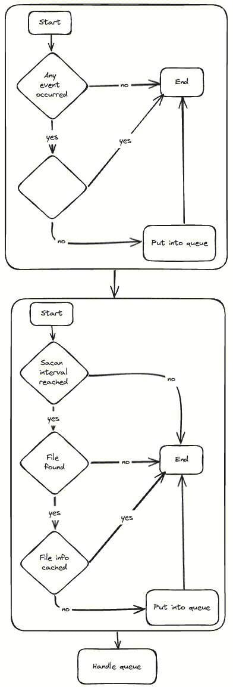

We used the `RandomAccess File` class to read files, and the instance of `RandomAccess File` supports reading and writing to randomly accessed files. The behavior of randomly accessing files is similar to a large byte array stored in the file system. There is a cursor or index pointing to the implicit array, called a file pointer; Start reading bytes from the file pointer and move the file pointer forward as the byte is read. For example, the file has a total of 13 bytes, and we need to start reading 3 bytes from the offset of 4. We just need to point the file pointer to the offset of 4 and read 3 bytes.


---

<a id="modules-agent-deployment"></a>

<!-- source_url: https://inlong.apache.org/docs/modules/agent/deployment/ -->

<!-- page_index: 21 -->

# Deployment

Version: 2.3.0

All deploying files at `inlong-agent` directory.

Agent needs to pull the configuration from Manager, the configuration conf/agent.properties is as follows:

```properties
# replace by agent IP 
agent.local.ip=127.0.0.1 
# manager IP 
agent.manager.vip.http.host=127.0.0.1 
# manager port 
agent.manager.vip.http.port=8083 
# audit proxy address 
audit.proxys=127.0.0.1:10081 
```

- If the backend database is MySQL, please download [mysql-connector-java-8.0.28.jar](https://repo1.maven.org/maven2/mysql/mysql-connector-java/8.0.28/mysql-connector-java-8.0.28.jar) and put it into `lib/` directory.
- If the backend database is PostgreSQL, there's no need for additional dependencies.

```bash
bash +x bin/agent.sh start 
```

---

<a id="modules-agent-configure"></a>

<!-- source_url: https://inlong.apache.org/docs/modules/agent/configure/ -->

<!-- page_index: 22 -->

# Configuration

Version: 2.3.0

Uses can set customized configuration in `agent.properties`.

| Parameter | Description | Default Value | Notes |
| --- | --- | --- | --- |
| thread.pool.await.time | max wait time(s) for thread pool to terminate running | 30 |  |
| agent.local.ip | local ip of Agent | 127.0.0.1 |  |
| agent.enable.oom.exit | whether allow Agent to automatically exit when OutOfMemory happens | false |  |
| agent.custom.fixed.ip | custom fixed ip for Agent | `blank` | If `agent.local.ip` and `agent.custom.fixed.ip` are both set, the latter is used first. |
| agent.fetchCenter.interval | interval time(s) of fetching Agent tasks from InLong-Manager | 30 |  |
| agent.fetcher.classname | customized class for fetching Agent tasks from InLong-Manager | org.apache.inlong.agent.plugin.fetcher.ManagerFetcher | This parameter is used for supporting the development of fetcher plug-in. |
| channel.memory.capacity | max capacity of memory channel | 5000 |  |

| Parameter | Description | Default Value | Notes |
| --- | --- | --- | --- |
| agent.localStore.readonly | whether local-store-data is readonly | false |  |

| Parameter | Description | Default | Notes |
| --- | --- | --- | --- |
| job.monitor.interval | job metric monitor interval(s) | 5 |  |
| job.finish.checkInterval | check interval(s) whether job is finished | 6 |  |
| job.number.limit | the amount of jobs that Agent can support | 15 |  |

| Parameter | Description | Default | Notes |
| --- | --- | --- | --- |
| task.retry.maxCapacity | max number of retrying tasks | 10000 |  |
| task.monitor.interval | task metric monitor interval(s) | 6 |  |
| task.maxRetry.time | max retry time for single task | 3 |  |
| task.push.maxSecond | max time(s) of pushing data to channel | 2 |  |
| task.pull.maxSecond | max time(s) of pulling data from channel | 2 |  |

| Parameter | Description | Default | Notes |
| --- | --- | --- | --- |
| agent.manager.vip.http.host | InLong-Manager virtual http host | 127.0.0.1 |  |
| agent.manager.vip.http.port | InLong-Manager virtual http port | 8083 |  |
| agent.manager.auth.secretId | InLong-Manager authentic secretId | `blank` | If InLong-Manager doesn't open authentic service, this parameter can be empty. |
| agent.manager.auth.secretKey | InLong-Manager authentic secretKey | `blank` |  |

| Parameter | Description | Default | Notes |
| --- | --- | --- | --- |
| metricDomains.Agent.domainListeners | class name of metriclistener | org.apache.inlong.agent.metrics.AgentPrometheusMetricListener | Support multiple methods of reporting metrics, and different class name is separated by spaces. |
| metricDomains.Agent.snapshotInterval | interval(ms) of reporting metrics | 60000 |  |
| agent.prometheus.exporter.port | exporter server default port if using prometheus |  |  |

| Parameter | Description | Default | Notes |
| --- | --- | --- | --- |
| audit.enable | whether enable InLong-Audit service | true |  |
| audit.proxys | audit proxy address | 127.0.0.1:10081 |  |

---

<a id="modules-agent-metrics"></a>

<!-- source_url: https://inlong.apache.org/docs/modules/agent/metrics/ -->

<!-- page_index: 23 -->

# Monitor Metrics

Version: 2.3.0

```properties
# The listener of JMX is AgentJmxMetricListener 
agent.domainListeners=org.apache.inlong.agent.metrics.AgentJmxMetricListener 
```

```properties
# The listener of Prometheus is AgentPrometheusMetricListener 
agent.domainListeners=org.apache.inlong.agent.metrics.AgentPrometheusMetricListener 
# the default is 9080 
agent.prometheus.exporter.port=9080 
```

If the user wants to monitor the indicator capabilities in other ways, You can inherit the `org.apache.inlong.agent.metrics.AgentMetricBaseListener` class and implement it, and finally configure the `agent.domainListeners` property in the `agent.properties` file.

| property | description |
| --- | --- |
| runningTasks | tasks currently being executed |
| retryingTasks | Tasks that are currently being retried |
| fatalTasks | The total number of currently failed tasks |

| property | description |
| --- | --- |
| runningJobs | the total number of currently running jobs |
| fatalJobs | the total number of currently failed jobs |

| property | description |
| --- | --- |
| readNum | the number of reads |
| sendNum | the number of sent items |
| sendFailedNum | the number of failed sending |
| readFailedNum | the number of failed reads |
| readSuccessNum | the number of successful reads |
| sendSuccessNum | the number of successfully sent |

| property | type | description |
| --- | --- | --- |
| agent\_source\_count\_success | Counter | the success message count in agent source since agent started |
| agent\_source\_count\_fail | Counter | the sink success message count in agent source since agent started |

| property | type | description |
| --- | --- | --- |
| agent\_sink\_count\_success | Counter | the sink success message count in agent source since agent started |
| agent\_sink\_count\_fail | Counter | the sink failed message count in agent source since agent started |

---

<a id="modules-dataproxy-overview"></a>

<!-- source_url: https://inlong.apache.org/docs/modules/dataproxy/overview/ -->

<!-- page_index: 24 -->

# Overview

Version: 2.3.0

InLong DataProxy mainly consists of connection convergence, routing, data compression, and protocol conversion. DataProxy acts as a bridge from the InLong Agent to the message queue, When the DataProxy pulls the metadata of the data streams from the Manager module, the corresponding relationship between the data streams and the topic name of the message queue is determined. When DataProxy receives a message, it will first be sent to Memory Channel for compression.
And use the local Producer to send data to the back-end Cache layer (ie message queue). When the message queue fails to send abnormally, DataProxy will cache the message to the Disk Channel, the local disk.
The overall architecture of InLong DataProxy is based on Apache Flume, which extends the source layer and sinks layer. It optimizes disaster recovery forwarding to improve the stability of the system.

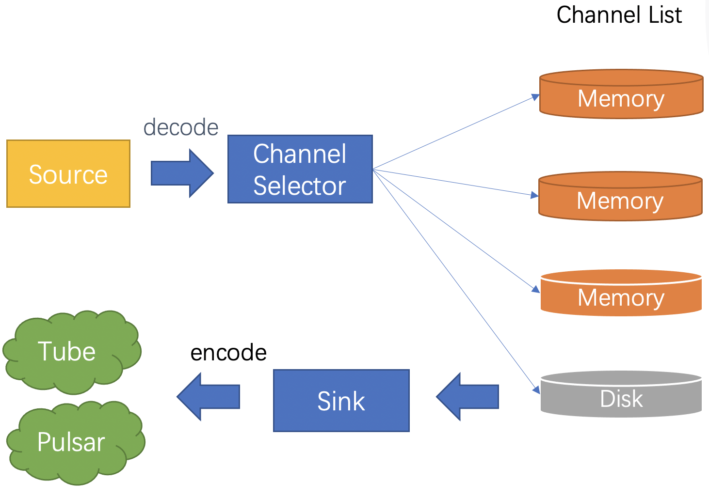

- The source layer opens port monitoring, which is realized through netty server. The decoded data is sent to the channel layer
- The channel layer has a selector, which is used to choose which type of channel to go. If the memory is eventually full, the data will be processed.
- The data of the channel layer will be forwarded through the sink layer. The main purpose here is to convert the data to the TDMsg1 format and push it to the cache layer (tube is more commonly used here)

DataProxy provide monitor indicator based on JMX, user can implement the code that read the metrics and report to user-defined monitor system.
Source-module and Sink-module can add monitor metric class that is the subclass of org.apache.inlong.commons.config.metrics.MetricItemSet, and register it to MBeanServer. User-defined plugin can get module metric with JMX, and report metric data to different monitor system.

User can describe the configuration in the file "common.properties ". For example:

```shell
metricDomains=DataProxy 
metricDomains.DataProxy.domainListeners=org.apache.inlong.dataproxy.metrics.prometheus.PrometheusMetricListener 
metricDomains.DataProxy.snapshotInterval=60000 
```

- The JMX domain name of DataProxy is "DataProxy".
- It is defined by the parameter "metricDomains".
- The listeners of JMX domain is defined by the parameter "metricDomains.$domainName.domainListeners".
- The class names of the listeners is separated by the space char.
- The listener class need to implement the interface "org.apache.inlong.dataproxy.metrics.MetricListener".
- The snapshot interval of the listeners is defined by the parameter "metricDomains.$domainName.snapshotInterval", the parameter unit is "millisecond".

The method proto of org.apache.inlong.dataproxy.metrics.MetricListener is:

```java
public void snapshot(String domain, List itemValues); 
```

The field of MetricItemValue.dimensions has these dimensions(The fields of DataProxyMetricItem defined by the Annotation "@Dimension"):

| property | description |
| --- | --- |
| clusterId | DataProxy cluster ID. |
| sourceId | DataProxy source component name. |
| sourceDataId | DataProxy source component data id, when source is a TCP source, it will be port number. |
| inlongGroupId | Inlong data group ID. |
| inlongStreamId | Inlong data stream ID. |
| sinkId | DataProxy sink component name. |
| sinkDataId | DataProxy sink component data id, when sink is a pulsar sink, it will be topic name. |

The field of MetricItemValue.metrics has these metrics(The fields of DataProxyMetricItem defined by the Annotation "@CountMetric"):

| property | description |
| --- | --- |
| readSuccessCount | Successful event count reading from source component. |
| readSuccessSize | Successful event body size reading from source component. |
| readFailCount | Failure event count reading from source component. |
| readFailSize | Failure event body size reading from source component. |
| sendCount | Event count sending to sink destination. |
| sendSize | Event body size sending to sink destination. |
| sendSuccessCount | Successful event count sending to sink destination. |
| sendSuccessSize | Successful event body size sending to sink destination. |
| sendFailCount | Failure event count sending to sink destination. |
| sendFailSize | Failure event body size sending to sink destination. |
| sinkDuration | The unit is millisecond, the duration is between current timepoint and the timepoint in sending to sink destination. |
| nodeDuration | The unit is millisecond, the duration is between current timepoint and the timepoint in getting event from source. |
| wholeDuration | The unit is millisecond, the duration is between current timepoint and the timepoint in generating event. |

Monitor indicators have registered to MBeanServer, user can append JMX parameters when running DataProxy, remote server can get monitor metrics with RMI.

```shell
-Dcom.sun.management.jmxremote 
-Djava.rmi.server.hostname=127.0.0.1 
-Dcom.sun.management.jmxremote.port=9999 
-Dcom.sun.management.jmxremote.authenticate=false 
-Dcom.sun.management.jmxremote.ssl=false 
```

---

<a id="modules-dataproxy-deployment"></a>

<!-- source_url: https://inlong.apache.org/docs/modules/dataproxy/deployment/ -->

<!-- page_index: 25 -->

# Deployment

Version: 2.3.0

All deploying files at `inlong-dataproxy` directory.

configuration file: `conf/common.properties`:

```properties
# local IP 
proxy.local.ip=127.0.0.1 
# manager address 
manager.hosts=127.0.0.1:8083 
# audit proxy address 
audit.proxys=127.0.0.1:10081 
```

```shell
# If using Pulsar or Kafka to cache data bash +x bin/dataproxy-start.sh
# If using Inlong TubeMQ to cache data
# bash +x bin/dataproxy-start.sh tubemq
```

```shell
telnet 127.0.0.1 46801 
```

---

<a id="modules-dataproxy-configuration"></a>

<!-- source_url: https://inlong.apache.org/docs/modules/dataproxy/configuration/ -->

<!-- page_index: 26 -->

# Configuration

Version: 2.3.0

| Parameter | Description | Default | Notes |
| --- | --- | --- | --- |
| manager.hosts | InLong-Manager http host and port | 127.0.0.1:8083 | Empty is not allowed, the format is configured according to the format of {ip1:port1}[,{ip2:port2}][,{ip3:port3}] |
| manager.auth.secretId | InLong-Manager authentic secretId | `blank` | If InLong-Manager doesn't open authentic service, this parameter can be empty. |
| manager.auth.secretKey | InLong-Manager authentic secretKey | `blank` |  |
| proxy.cluster.tag | The cluster Tag name where the dataproxy is located | default\_cluster | A cluster Tag can contain multiple dataproxy and MQ clusters |
| proxy.cluster.name | The cluster name where dataproxy is located | default\_dataproxy | used to distinguish different environments |
| proxy.cluster.inCharges | The incharge of the cluster where dataproxy is located | admin |  |
| configCheckInterval | Configuration file checking and loading interval of the conf directory (unit: ms) | 10000 |  |
| metricDomains | JMX domain name | DataProxy | Obtain the following configuration items of "metricDomains.${metricDomains}.xxx" through this configuration value |
| metricDomains.DataProxy.domainListeners | The class for indicator monitoring, and the service is started through reflection of the class name | org.apache.inlong.dataproxy.metrics.prometheus.PrometheusMetricListener | If there are multiple indicator monitoring class configurations, separate them by spaces, carriage returns, or line feeds |
| metricDomains.DataProxy.snapshotInterval | Time interval for periodic reporting of indicators (unit: ms) | 60000 |  |
| prometheusHttpPort | The port when reporting using Prometheus | 9081 |  |
| audit.enable | Whether to enable data reporting InLong-Audit service | true |  |
| audit.proxys | The address of the InLong-Audit service | 127.0.0.1:10081 | The format is configured according to {ip1:port1}[ {ip2:port2}][ {ip3:port3}], and different ip:ports are separated by spaces, carriage returns, or line feeds |

DataProxy uses Log4j2 to output logs, and the related configuration is set based on Log4j2. This configuration only mentions common setting items:

| Parameter | Description | Default | Notes |
| --- | --- | --- | --- |
| basePath | Storage path of log files | ${sys:dataproxy.log.path} |  |
| every\_file\_size | The size of each log file | 1G |  |
| output\_log\_level | log output level | DEBUG | It is recommended to set to INFO when using online |
| rolling\_max | The number of logs of the same type that can be stored in the same directory | 50 |  |
| debug\_max | The number of DEBUG type logs that can be stored in the same directory | 7 |  |
| info\_max | The number of INFO type logs that can be stored in the same directory | 7 |  |
| warn\_max | The number of WARN type logs that can be stored in the same directory | 7 |  |
| error\_max | The number of ERROR type logs that can be stored in the same directory | 7 |  |

After DataProxy is started and successfully linked to the Manager, it will automatically synchronize the running configuration from the Manager and update it regularly. The following configuration cannot be modified.

| File Name | Description | Notes |
| --- | --- | --- |
| mq\_cluster.properties | MQ cluster configuration |  |
| topics.properties | Mapping configuration of groupId to MQ topic |  |
| weight.properties | System Load Weight Configuration |  |

DataProxy supports configurable source-channel-sink, which is consistent to flume's configuration file structure, so it should be modified according to the configuration file definition of Apache flume. The configuration file is placed in the dataproxy-{tube|pulsar}.conf file. Currently, dataproxy-pulsar.conf and dataproxy-tube.conf are supported to distinguish different middleware types. The specific type can be specified at startup. The default (when not specified) ) using dataproxy-pulsar.conf as configuration file. The following is an example for this configuration file:

- Source configuration example:

```properties
# Define the channel used in the source. Note that if the configuration below this 
# source uses the channel, it needs to be annotated here 
agent1.sources.tcp-source.channels = ch-msg1 ch-msg2 ch-msg3 ch-more1 ch-more2 ch-more3 ch-msg5 ch-msg6 ch-msg7 ch-msg8 ch-msg9 ch-msg10 ch-transfer ch-back 
 
# TCP resolution type definition, here provide the class name for instantiation. 
# SimpleTcpSource is mainly to initialize the configuration and start port monitoring 
agent1.sources.tcp-source.type = org.apache.flume.source.SimpleTcpSource 
 
# Handler used for message structure analysis, and set read stream handler and 
# write stream handler 
agent1.sources.tcp-source.msg-factory-name = org.apache.flume.source.ServerMessageFactory 
 
# TCP IP binding monitoring, binding all network cards by default 
agent1.sources.tcp-source.host = 0.0.0.0 
 
# TCP port binding, port 46801 is bound by default 
agent1.sources.tcp-source.port = 46801 
 
# The concept of Netty, set the Netty high water level value 
agent1.sources.tcp-source.highWaterMark = 2621440 
 
# The new function of v1.7 version, optional, the default is false. Used to open 
# the exception channel. When an exception occurs, the data is written to the  
# exception channel to prevent other normal data transmission (the open source  
# version does not add this function). Details | Increase the local disk of  
# abnormal data landing 
agent1.sources.tcp-source.enableExceptionReturn = true 
 
# Limit the size of a single package. Here if the compressed package is  
# transmitted, it is the compressed package size. The limit is 512KB 
agent1.sources.tcp-source.max-msg-length = 524288 
 
# The default topic value, if the mapping relationship between groupId and topic  
# cannot be found, it will be sent to this topic 
agent1.sources.tcp-source.topic = test_token 
 
# The default value of m is set, where the value of m is the version of Inlong's  
# internal TdMsg protocol 
agent1.sources.tcp-source.attr = m=9 
 
# Concurrent connections go online. New connections will be broken when the  
# upper limit is exceeded 
agent1.sources.tcp-source.connections = 5000 
 
# Netty thread pool work thread upper limit. Generally recommended to choose  
# twice the CPU 
agent1.sources.tcp-source.max-threads = 64 
 
# Netty server TCP receive buffer size tuning parameter 
agent1.sources.tcp-source.receiveBufferSize = 524288 
 
# Netty server TCP send buffer size tuning parameter 
agent1.sources.tcp-source.sendBufferSize = 524288 
 
# Whether to use the self-developed channel process. The self-developed channel  
# process can select the alternate channel to send when the main channel is blocked 
agent1.sources.tcp-source.custom-cp = true 
 
# This channel selector is a self-developed channel selector, which is not much  
# different from the official website, mainly because of the channel master-slave  
# selection logic 
agent1.sources.tcp-source.selector.type = org.apache.flume.channel.FailoverChannelSelector 
 
# Specify the master channel. These channels will be preferentially selected for  
# data push. Those channels that are not in the master, transfer, fileMetric, and  
# slaMetric configuration items, but are in defined channels, are all classified  
# as slave channels. When the master channel is full, the slave channel will be  
# selected. Generally, the file channel type is recommended for the slave channel. 
agent1.sources.tcp-source.selector.master = ch-msg5 ch-msg6 ch-msg7 ch-msg8 ch-msg9 
 
# Specify the transfer channel to accept the transfer type data. The transfer  
# here generally refers to the data pushed to the non-tube cluster, which is only  
# for forwarding, and it is reserved for subsequent functions. 
agent1.sources.tcp-source.selector.transfer = ch-msg5 ch-msg6 ch-msg7 ch-msg8 ch-msg9 
 
# Specify the fileMetric channel to receive the metric data reported by the agent 
agent1.sources.tcp-source.selector.fileMetric = ch-back 
```

- Channel configuration examples, memory channel:

```properties
# memory channel type 
agent1.channels.ch-more1.type = memory 
 
# Memory channel queue size, the maximum number of messages that can be cached 
agent1.channels.ch-more1.capacity = 10000000 
 
# The keep-alive time for the memory channel 
agent1.channels.ch-more1.keep-alive = 0 
 
# The maximum number of batches are processed in atomic operations, and the memory channel needs to be locked when used,  
# so there will be a batch process to increase efficiency 
agent1.channels.ch-more1.transactionCapacity = 20 
```

- Channel configuration examples, file channel:

```properties
# file channel type 
agent1.channels.ch-msg5.type = file 
 
# The maximum number of messages that can be cached in a file channel 
agent1.channels.ch-msg5.capacity = 100000000 
 
# file channel file maximum limit, the number of bytes 
agent1.channels.ch-msg5.maxFileSize = 1073741824 
 
# The minimum free space of the disk where the file channel is located. Setting this value can prevent the disk from being full 
agent1.channels.ch-msg5.minimumRequiredSpace = 1073741824 
 
# file channel checkpoint path 
agent1.channels.ch-msg5.checkpointDir = /data/work/file/ch-msg5/check 
 
# file channel data path 
agent1.channels.ch-msg5.dataDirs = /data/work/file/ch-msg5/data 
 
# Whether to synchronize the disk for each atomic operation, it is recommended to change it to false, otherwise it will affect the performance 
agent1.channels.ch-msg5.fsyncPerTransaction = false 
 
# The time interval between data flush from memory to disk, in seconds 
agent1.channels.ch-msg5.fsyncInterval = 5 
```

- Sink configuration example:

```properties
# The upstream channel name of the sink 
agent1.sinks.mq-sink-msg1.channel = ch-msg1 
 
# The sink class is implemented, where the message is implemented to push data to some mq cluster 
agent1.sinks.mq-sink-msg1.type = org.apache.inlong.dataproxy.sink.mq.MessageQueueZoneSink 
 
# The maximum threads for sending message 
agent1.sinks.mq-sink-msg1.maxThreads = 2 
 
# Timeout when dispatching message 
agent1.sinks.mq-sink-msg1.dispatchTimeout = 2000 
 
# Dispatch queue max pack count 
agent1.sinks.mq-sink-msg1.dispatchMaxPackCount = 256 
 
# Dispatch queue max pack size 
agent1.sinks.mq-sink-msg1.dispatchMaxPackSize = 3276800 
 
# Dispatch max buffer queue size  
agent1.sinks.mq-sink-msg1.maxBufferQueueSize=131072 
 
# Interval to retry 
agent1.sinks.mq-sink-msg1.processInterval=100 
 
# Interval to reload remote configuration 
agent1.sinks.mq-sink-msg1.reloadInterval=60000 
 
# Data compression type 
agent1.sinks.mq-sink-msg1.producer.compressionType=SNAPPY 
```

---

<a id="modules-tubemq-overview"></a>

<!-- source_url: https://inlong.apache.org/docs/modules/tubemq/overview/ -->

<!-- page_index: 27 -->

# Overview

Version: 2.3.0

After years of evolution, the TubeMQ cluster is divided into the following 4 parts:
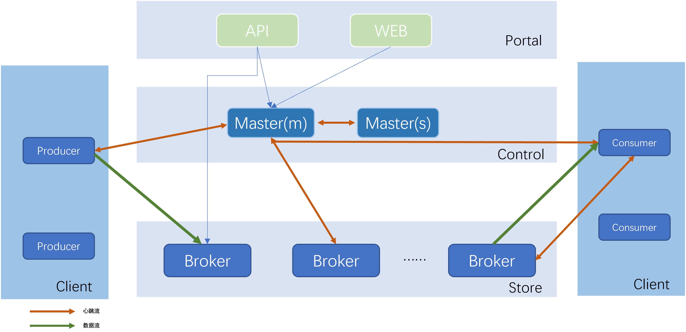

- **Portal：** The Portal part responsible for external interaction and maintenance operations, including API and Web.
  The API connects to the management system outside the cluster. The Web is a page encapsulation of daily operation
  and maintenance functions based on the API;
- **Master：** It is responsible for the Control part of the cluster. This part is composed of one or more Master nodes.
  Master HA performs heartbeat keep-alive and real-time hot standby switching between master nodes (This is the reason
  why everyone needs to fill in the addresses of all Master nodes corresponding to the cluster when using TubeMQ Lib).
  The main master is responsible for managing the status of the entire cluster, resource scheduling, permission
  checking, metadata query, etc.;
- **Broker：** The Store part responsible for data storage. This part is composed of independent Broker nodes.
  Each Broker node manages the Topic set in this node, including the addition, deletion, modification, and inquiring
  about Topics. It is also responsible for message storage, consumption, aging, partition expansion, data consumption
  offset records, etc. On the topic, and the external capabilities of the cluster, including the number of topics,
  throughput, and capacity, are completed by horizontally expanding the broker node;
- **Client：** The Client part responsible for data production and consumption. We provide this part in the form of Lib.
  The most commonly used is the consumer. Compared with the previous, the consumer now supports Push and Pull data pull
  modes, data consumption behavior support both order and filtered consumption. For the Pull consumption mode, the
  service supports resetting the precise offset through the client to support the business extract-once consumption.
  At the same time, the consumer has launched a new cross-cluster switch-free Consumer client;

Systems that use disks as data persistence media are faced with various system performance problems caused by disk problems. The TubeMQ system is no exception, the performance improvement is largely to solve the problem of how to read, write and store message data. In this regard TubeMQ has made many improvements: storage instances is as the smallest Topic data management unit; each storage instance includes a file storage block and a memory cache block; each Topic can be assigned multiple storage instances.

1. **File storage block:** The disk storage solution of TubeMQ is similar to Kafka, but it is not the same, as shown in the following figure: each file storage block is composed of an index file and a data file; the partiton is a logical partition in the data file; each Topic maintains and manages the file storage block separately, the related mechanisms include the aging cycle, the number of partitions, whether it is readable and writable, etc.
   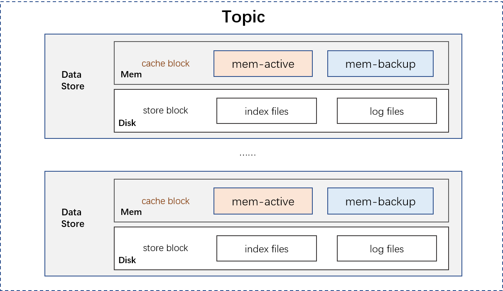

2. **Memory cache block:** We added a separate memory cache block on the file storage block, that is, add a block of memory to the original write disk to isolate the slow effect of the hard disk. The data is first flushed to the memory cache block, and then the memory cache block is batched flush the data to the disk file.
   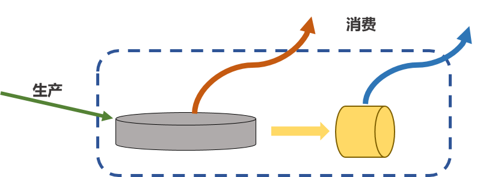

---

<a id="modules-tubemq-quick_start"></a>

<!-- source_url: https://inlong.apache.org/docs/modules/tubemq/quick_start/ -->

<!-- page_index: 28 -->

# Quick Start

Version: 2.3.0

There're two components in the cluster: **Master** and **Broker**. Master and Broker
can be deployed on the same server or different servers. In this example, we setup our cluster
like this, and all services run on the same node. Zookeeper should be setup in your environment also.

| Role | TCP Port | TLS Port | Web Port | Comment |
| --- | --- | --- | --- | --- |
| Master | 8099 | 8199 | 8080 | Meta data is stored in ZooKeeper /tubemq |
| Broker | 8123 | 8124 | 8081 | Message is stored at /stage/msg\_data |
| Zookeeper | 2181 |  |  | Master metadata is stored at /tubemq, this component is not required if meta\_bdb is configured. |

- ZooKeeper Cluster

ZooKeeper is not mandatory in the TubeMQ environment. If the Master metadata is stored in BDB, this part of the resource can be omitted.

- TubeMQ installation package deployment

After you extract the package file, here's the folder structure.

```text
/INSTALL_PATH/inlong-tubemq-server/ 
├── bin 
├── conf 
├── lib 
├── logs 
└── resources 
```

You can change configurations in `conf/master.ini` according to cluster information.

- Master IP and Port

```ini
[master] 
hostName=YOUR_SERVER_IP                  // replaced with your server IP 
port=8099 
webPort=8080 
```

- Access Authorization Token

```ini
confModAuthToken=abc                    // for configuring Web Resources\API etc 
```

- meta\_zookeeper Cluster

```ini
[meta_zookeeper]                        // Masters in the same cluster must use the same zookeeper environment and have the same configuration 
zkNodeRoot=/tubemq 
zkServerAddr=localhost:2181             // multi zookeeper addresses can separate with "," 
```

> [!NOTE]
> - meta\_bdb Strategy(Optional)
>   : Due to the LICENSE problem of Apache dependency packages, the packages released by TubeMQ from version 1.1.0 no longer contain BDB packages. If you need BDB to store metadata, you need to download com.sleepycat.je-7.3.7 by yourself. .jar package, otherwise a "java.lang.ClassNotFoundException: com.sleepycat.je.ReplicaConsistencyPolicy" error will be reported when the system is running.

```ini
[meta_bdb] 
repGroupName=tubemqGroup1                // The Master of the same cluster must use the same group name, and the group names of different clusters must be different 
repNodeName=tubemqGroupNode1             // The master node names of the same cluster must be different names 
metaDataPath=/stage/meta_data 
repHelperHost=FIRST_MASTER_NODE_IP:9001  // helperHost is used for building HA master. 
```

- (Optional) Master High Availability
  In the example above, we run the services on a single node. However, in real production environment, you
  need to run multiple master services on different servers for high availability purpose. Here's
  the introduction of availability level.

| HA Level | Master Number | Description |
| --- | --- | --- |
| High | 3 masters | After any master crashed, the cluster meta data is still in read/write state and can accept new producers/consumers. |
| Medium | 2 masters | After one master crashed, the cluster meta data is in read only state. There's no affect on existing producers and consumers. |
| Minimum | 1 master | After the master crashed, there's no affect on existing producer and consumer. |

**Notice**:

- Based on the need of Docker containerization, the [meta\_zookeeper] or [meta\_bdb] above 3 parameters in the master.ini file are all the default settings used, and the actual information of the Master node needs to be configured when used in actual networking.
- The IP information of all master nodes should be mapped to the hostName in the hosts configuration file, such as "192.168.0.1 192-168-0-1"
- It is necessary to ensure the clock synchronization between all master nodes

You can change configurations in `conf/broker.ini` according to cluster information.

- Broker IP and Port

```ini
[broker] 
brokerId=0 
hostName=YOUR_SERVER_IP                 // replaced with your server IP 
port=8123 
webPort=8081 
defEthName=eth1                         // default network interface used to get localhost IP 
```

- Master Address

```ini
masterAddressList=MASTER_NODE_IP1:8099,MASTER_NODE_IP2:8099   // multi addresses can separate with "," 
```

- Metadata Path

```ini
primaryPath=/stage/msg_data 
```

- Please go to the `bin` folder and run this command to start
  the master service.

```bash
./tubemq.sh master start 
```

- You should be able to access `http://your-master-ip:8080` to see the
  web GUI now.

Before we start a broker service, we need to configure it on master web GUI first. Go to the `Broker List` page, click `Add Single Broker`, and input the new broker information.
In this example, we only need to input broker IP and authToken:

1. broker IP: broker server ip
2. authToken: A token pre-configured in the `conf/master.ini` file. Please check the
   `confModAuthToken` field in your `master.ini` file.

Click the online link to activate the new added broker.

- Please go to the `bin` folder and run this command to start the broker service

```bash
./tubemq.sh broker start 
```

- Refresh the GUI broker list page, you can see that the broker now is registered.
- After the sub-state of the broker changed to `idle`, we can add topics to that broker.

- 3.1.1 We can add or manage the cluster topics on the web GUI. To add a new topic, go to the
  topic list page and click the add new topic button
- 3.1.2 Then select the brokers which you want to deploy the topics to.
- 3.1.3 We can see the publish and subscribe state of the new added topic is still grey. We need
  to go to the broker list page to reload the broker configuration.
- 3.1.4 When the broker sub-state changed to idle, go to the topic list page. We can see
  that the topic publish/subscribe state is active now.
- 3.1.5 Now we can use the topic to send messages.

Now we can use `demo` topic which created before to test our cluster.

Please don't forget replace `YOUR_MASTER_IP:port` with your server ip and port, and start producer.

```bash
cd /INSTALL_PATH/apache-inlong-tubemq-server-[TUBEMQ-VERSION]-bin 
./bin/tubemq-producer-test.sh --master-servers YOUR_MASTER_IP1:port,YOUR_MASTER_IP2:port --topicName demo 
```

From the log, we can see the message is sent out.
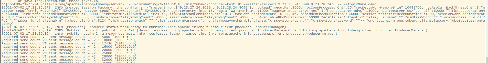

Please don't forget replace YOUR\_MASTER\_IP:port with your server ip and port, and start consumer.

```bash
cd /INSTALL_PATH/apache-inlong-tubemq-server-[TUBEMQ-VERSION]-bin 
./bin/tubemq-consumer-test.sh --master-servers YOUR_MASTER_IP1:port,YOUR_MASTER_IP2:port --topicName demo --groupName test_consume 
```

From the log, we can see the message received by the consumer.
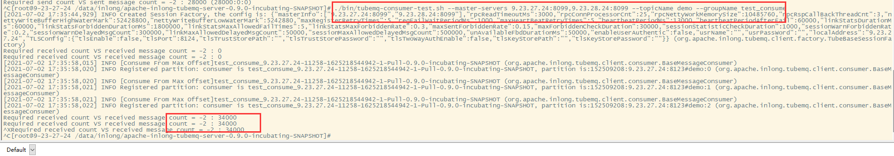

You can refer to [InLong TubeMQ Manager](#modules-tubemq-tubemq-manager-deployment)

Here, the compilation, deployment, system configuration, startup, production and consumption of TubeMQ have been completed. If you need to understand more in-depth content, please check the relevant content in "TubeMQ HTTP API" and make the corresponding configuration settings.

---

---

<a id="modules-tubemq-producer_example"></a>

<!-- source_url: https://inlong.apache.org/docs/modules/tubemq/producer_example/ -->

<!-- page_index: 29 -->

# Producer Example

Version: 2.3.0

TubeMQ provides two ways to initialize session factory, TubeSingleSessionFactory and TubeMultiSessionFactory:

- TubeSingleSessionFactory creates only one session in the lifecycle, this is very useful in streaming scenarios.
- TubeMultiSessionFactory creates new session on every call.

```java
public final class SyncProducerExample { 
    
    public static void main(String[] args) throws Throwable { 
        final String masterHostAndPort = "localhost:8000"; 
        final TubeClientConfig clientConfig = new TubeClientConfig(masterHostAndPort); 
        final MessageSessionFactory messageSessionFactory = new TubeSingleSessionFactory(clientConfig); 
        final MessageProducer messageProducer = messageSessionFactory.createProducer(); 
        final String topic = "test"; 
        final String body = "This is a test message from single-session-factory!"; 
        byte[] bodyData = StringUtils.getBytesUtf8(body); 
        messageProducer.publish(topic); 
        Message message = new Message(topic, bodyData); 
        MessageSentResult result = messageProducer.sendMessage(message); 
        if (result.isSuccess()) { 
            System.out.println("sync send message : " + message); 
        } 
        messageProducer.shutdown(); 
    } 
} 
```

```java
public final class AsyncProducerExample { 
    
    public static void main(String[] args) throws Throwable { 
        final String masterHostAndPort = "localhost:8000"; 
        final TubeClientConfig clientConfig = new TubeClientConfig(masterHostAndPort); 
        final MessageSessionFactory messageSessionFactory = new TubeSingleSessionFactory(clientConfig); 
        final MessageProducer messageProducer = messageSessionFactory.createProducer(); 
        final String topic = "test"; 
        final String body = "async send message from single-session-factory!"; 
        byte[] bodyData = StringUtils.getBytesUtf8(body); 
        messageProducer.publish(topic); 
        final Message message = new Message(topic, bodyData); 
         
        messageProducer.sendMessage(message, new MessageSentCallback(){ 
            @Override 
            public void onMessageSent(MessageSentResult result) { 
                if (result.isSuccess()) { 
                    System.out.println("async send message : " + message); 
                } else { 
                    System.out.println("async send message failed : " + result.getErrMsg()); 
                } 
            } 
            @Override 
            public void onException(Throwable e) { 
                System.out.println("async send message error : " + e); 
            } 
        }); 
        messageProducer.shutdown(); 
} 
```

```java
public final class ProducerWithAttributeExample { 
    
    public static void main(String[] args) throws Throwable { 
        final String masterHostAndPort = "localhost:8000"; 
        final TubeClientConfig clientConfig = new TubeClientConfig(masterHostAndPort); 
        final MessageSessionFactory messageSessionFactory = new TubeSingleSessionFactory(clientConfig); 
        final MessageProducer messageProducer = messageSessionFactory.createProducer(); 
        final String topic = "test"; 
        final String body = "send message with attribute from single-session-factory!"; 
        byte[] bodyData = StringUtils.getBytesUtf8(body); 
        messageProducer.publish(topic); 
        Message message = new Message(topic, bodyData); 
        //set attribute 
        message.setAttrKeyVal("test_key", "test value"); 
        //msgType is used for consumer filtering, and msgTime(accurate to minute) is used as the pipe to send and receive statistics 
        SimpleDateFormat sdf = new SimpleDateFormat("yyyyMMddHHmm"); 
        message.putSystemHeader("test", sdf.format(new Date())); 
        messageProducer.sendMessage(message); 
        messageProducer.shutdown(); 
    } 
} 
```

```java
public class MultiSessionProducerExample { 
 
    public static void main(String[] args) throws Throwable { 
        final int SESSION_FACTORY_NUM = 10; 
        final String masterHostAndPort = "localhost:8000"; 
        final TubeClientConfig clientConfig = new TubeClientConfig(masterHostAndPort); 
        final List<MessageSessionFactory> sessionFactoryList = new ArrayList<>(SESSION_FACTORY_NUM); 
        final ExecutorService sendExecutorService = Executors.newFixedThreadPool(SESSION_FACTORY_NUM); 
        final CountDownLatch latch = new CountDownLatch(SESSION_FACTORY_NUM); 
        for (int i = 0; i < SESSION_FACTORY_NUM; i++) { 
            TubeMultiSessionFactory tubeMultiSessionFactory = new TubeMultiSessionFactory(clientConfig); 
            sessionFactoryList.add(tubeMultiSessionFactory); 
            MessageProducer producer = tubeMultiSessionFactory.createProducer(); 
            Sender sender = new Sender(producer, latch); 
            sendExecutorService.submit(sender); 
        } 
        latch.await(); 
        sendExecutorService.shutdownNow(); 
        for (MessageSessionFactory sessionFactory : sessionFactoryList) { 
            sessionFactory.shutdown(); 
        } 
    } 
 
    private static class Sender implements Runnable { 
 
        private MessageProducer producer; 
 
        private CountDownLatch latch; 
 
        public Sender(MessageProducer producer, CountDownLatch latch) { 
            this.producer = producer; 
            this.latch = latch; 
        } 
 
        @Override 
        public void run() { 
            final String topic = "test"; 
            try { 
                producer.publish(topic); 
                final byte[] bodyData = StringUtils.getBytesUtf8("This is a test message from multi-session factory"); 
                Message message = new Message(topic, bodyData); 
                producer.sendMessage(message); 
                producer.shutdown(); 
            } catch (Throwable ex) { 
                System.out.println("send message error : " + ex); 
            } finally { 
                latch.countDown(); 
            } 
        } 
    } 
} 
```

---

[Back to top](#modules-tubemq-producer_example--top)

---

<a id="modules-tubemq-consumer_example"></a>

<!-- source_url: https://inlong.apache.org/docs/modules/tubemq/consumer_example/ -->

<!-- page_index: 30 -->

# Consumer Example

Version: 2.3.0

TubeMQ provides two ways to consumer message, PullConsumer and PushConsumer:

```java
public class PullConsumerExample {public static void main(String[] args) throws Throwable {final String masterHostAndPort = "localhost:8000"; final String topic = "test"; final String group = "test-group"; final ConsumerConfig consumerConfig = new ConsumerConfig(masterHostAndPort, group); consumerConfig.setConsumePosition(ConsumePosition.CONSUMER_FROM_LATEST_OFFSET); final MessageSessionFactory messageSessionFactory = new TubeSingleSessionFactory(consumerConfig); final PullMessageConsumer messagePullConsumer = messageSessionFactory.createPullConsumer(consumerConfig); messagePullConsumer.subscribe(topic, null); messagePullConsumer.completeSubscribe(); // wait for client to join the exact consumer queue that consumer group allocated while (!messagePullConsumer.isPartitionsReady(1000)) {ThreadUtils.sleep(1000);} while (true) {ConsumerResult result = messagePullConsumer.getMessage(); if (result.isSuccess()) {List<Message> messageList = result.getMessageList(); for (Message message : messageList) {System.out.println("received message : " + message);} messagePullConsumer.confirmConsume(result.getConfirmContext(), true);}}}}
```

```java
public class PushConsumerExample {
public static void test(String[] args) throws Throwable {final String masterHostAndPort = "localhost:8000"; final String topic = "test"; final String group = "test-group"; final ConsumerConfig consumerConfig = new ConsumerConfig(masterHostAndPort, group); consumerConfig.setConsumePosition(ConsumePosition.CONSUMER_FROM_LATEST_OFFSET); final MessageSessionFactory messageSessionFactory = new TubeSingleSessionFactory(consumerConfig); final PushMessageConsumer pushConsumer = messageSessionFactory.createPushConsumer(consumerConfig); pushConsumer.subscribe(topic, null, new MessageListener() {@Override public void receiveMessages(PeerInfo peerInfo, List<Message> messages) throws InterruptedException {for (Message message : messages) {System.out.println("received message : " + new String(message.getData()));}} @Override public Executor getExecutor() {return null;} @Override public void stop() {//} }); pushConsumer.completeSubscribe(); CountDownLatch latch = new CountDownLatch(1); latch.await(10, TimeUnit.MINUTES);}}
```

---

<a id="modules-tubemq-tubemq-manager-overview"></a>

<!-- source_url: https://inlong.apache.org/docs/modules/tubemq/tubemq-manager/overview/ -->

<!-- page_index: 31 -->

# Overview

Version: 2.3.0

Operation interface

Query full data of clusterId and clusterName (get)

Example:

```shell
curl -X GET /v1/cluster 
```

Return Value:

```json
{ 
  "errMsg": "", 
  "errCode": 0, 
  "result": true, 
  "data": "[{\"clusterId\":1,\"clusterName\":\"1124\", \"masterIp\":\"127.0.0.1\"}]" 
} 
```

Parameter:

```text
type     (required) request type, fill in the field: op_query 
clusterId   (required) Request cluster id 
addTopicTasks (required) topicTasks, create task task json 
user    (required) After the access authorization verification needs to verify the user, it is reserved here 
```

addTopicTasks currently only includes one field as topicName
After accessing the region design, a new region field will be added to represent brokers in different regions
Currently an addTopicTask will create topics in all brokers in the cluster

AddTopicTasks is a list of the following objects, which can carry multiple create topic requests

```text
topicName (required) topic name 
```

Example:

```shell
curl -X POST /v1/task?method=addTopicTask -H "Content-Type: application/json" -d '{"clusterId": "1","addTopicTasks": [{"topicName": "1"} ],"user": "test" }'
```

Return Json:

```json
{ 
  "errMsg": "There are topic tasks [a12322] already in adding status", 
  "errCode": 200, 
  "result": false, 
  "data": "" 
} 
```

If result is false, the writing task failed

```text
clusterId   (Required) Request cluster id 
topicName   (Required) Query topic name 
user    (Required) After the access authorization verification needs to verify the user, it is reserved here 
```

Example:

```shell
curl -X POST /v1/topic?method=queryCanWrite -H "Content-Type: application/json" -d '{ 
  "clusterId": "1", 
  "topicName": "1", 
  "user": "test" 
}' 
```

Return Json:

```json
{  
  "result":true,  
  "errCode":0,  
  "errMsg":"OK" 
} 
```

```json
{  
  "result":false,  
  "errCode": 100,  
  "errMsg":"topic test is not writable" 
} 
```

```json
{  
  "result":false,  
  "errCode": 101,  
  "errMsg":"no such topic in master" 
} 
```

Result is false as not writable.

---

<a id="modules-tubemq-tubemq-manager-deployment"></a>

<!-- source_url: https://inlong.apache.org/docs/modules/tubemq/tubemq-manager/deployment/ -->

<!-- page_index: 32 -->

# Deployment

Version: 2.3.0

All deploying files at `inlong-tubemq-manager` directory.

- Install and start MySQL 5.7+
- Load `sql/apache_tube_manager.sql` through the command to complete the initialization of the table structure and basic data:

```shell
# Create database and table with username and password:mysql -uDB_USER -pDB_PASSWD < sql/apache_tube_manager.sql
```

```ini
# MySQL configuration for Manager 
spring.datasource.url=jdbc:mysql://mysql_ip:mysql_port/apache_tube_manager 
spring.datasource.username=mysql_username 
spring.datasource.password=mysql_password 
 
# If you are on JDK version 11+, add the following extra 
spring.jaxb-compatibility-mode=true 
spring.jpa.properties.hibernate.dialect=org.hibernate.dialect.MySQLDialect 
```

- Please download [hibernate-commons-annotations-5.1.2.Final.jar](https://repo1.maven.org/maven2/org/hibernate/common/hibernate-commons-annotations/5.1.2.Final/hibernate-commons-annotations-5.1.2.Final.jar),
  [hibernate-core-5.6.7.Final.jar](https://repo1.maven.org/maven2/org/hibernate/hibernate-core/5.6.7.Final/hibernate-core-5.6.7.Final.jar),
  [antlr-2.7.7.jar](https://repo1.maven.org/maven2/antlr/antlr/2.7.7/antlr-2.7.7.jar),
  [jboss-logging-3.4.3.Final.jar](https://repo1.maven.org/maven2/org/jboss/logging/jboss-logging/3.4.3.Final/jboss-logging-3.4.3.Final.jar) and put it into `lib/` directory.
- If the backend database is MySQL, please download [mysql-connector-java-8.0.28.jar](https://repo1.maven.org/maven2/mysql/mysql-connector-java/8.0.28/mysql-connector-java-8.0.28.jar) and put it into `lib/` directory.
- If the backend database is PostgreSQL, there's no need for additional dependencies.

```bash
$ bin/start-manager.sh
```

```bash
$ bin/restart-manager.sh
```

```bash
vim bin/init-tube-cluster.sh 
```

replace the parameters below

```properties
TUBE_MANAGER_IP=   
TUBE_MANAGER_PORT=    
TUBE_MASTER_IP=    
TUBE_MASTER_PORT= 
TUBE_MASTER_WEB_PORT= 
TUBE_MASTER_TOKEN= 
```

then run：

```bash
sh bin/init-tube-cluster.sh 
```

this will create a cluster with id = 1, note that this operation should not be executed repeatedly.

---

<a id="modules-tubemq-commandline_tools"></a>

<!-- source_url: https://inlong.apache.org/docs/modules/tubemq/commandline_tools/ -->

<!-- page_index: 33 -->

# Command-line Tools

Version: 2.3.0

TubeMQ provides command line tools to manage topics, produce and consume messages, and manage consumer groups.
The command line tool `tubectl` can be found in the `bin` directory of the TubeMQ installation path.

usage:

```shell
$ bin/tubectl [options] [command] [command options]
```

command:

- `topic`
- `message`
- `group`
  > You can also use --help or -h to get help for the above commands, for example:

```shell
$ bin/tubectl topic -h
```

`topic` is used to manage topics, including adding, deleting, modifying, checking, etc.

command:

- `list`
- `update`
- `create`
- `delete`

```shell
$ bin/tubectl topic list
```

options:

| **parameter** | **type** | **description** | **default** | **required** |
| --- | --- | --- | --- | --- |
| -t, --topic | String | Topic name |  |  |
| -sid, --topic-status-id | Int | Topic status ID | 0 |  |
| -bid, --broker-id | String | Brokers' ID, separated by commas |  |  |
| -dp, --delete-policy | String | File aging strategy |  |  |
| -np, --num-partitions | Int | Number of partitions | 3 |  |
| -nts, --num-topic-stores | Int | Number of topic stores | 1 |  |
| -uft, --unflush-threshold | Int | Maximum allowed disk unflushing message count | 1000 |  |
| -ufi, --unflush-interval | Int | Maximum allowed disk unflushing interval | 10000 |  |
| -ufd, --unflush-dataHold | Int | Maximum allowed disk unflushing data size | 0 |  |
| -mc, --memcache-msgcnt-ink | Int | Maximum allowed memory cache unflushing message count | 10 |  |
| -ms, --memcache-msgsize-inmb | Int | Maximum allowed memory cache size in MB | 2 |  |
| -mfi, --memcache-flush-intvl | Int | Maximum allowed disk unflushing data size | 20000 |  |
| -c, --creator | String | Record creator |  |  |
| -m, --modifier | String | Record modifier |  |  |

```shell
$ bin/tubectl topic update
```

options:

| **parameter** | **type** | **description** | **default** | **required** |
| --- | --- | --- | --- | --- |
| -t, --topic | String | Topic name |  | yes |
| -bid, --broker-id | String | Brokers' ID, separated by commas |  | yes |
| -m, --modifier | String | Record modifier |  | yes |
| -at, --auth-token | String | Admin api operation authorization cod |  | yes |
| -dp, --delete-policy | String | File aging strategy |  |  |
| -np, --num-partitions | Int | Number of partitions | 3 |  |
| -uft, --unflush-threshold | Int | Maximum allowed disk unflushing message count | 1000 |  |
| -ufi, --unflush-interval | Int | Maximum allowed disk unflushing interval | 10000 |  |
| -ufd, --unflush-datahold | Int | Maximum allowed disk unflushing data size | 0 |  |
| -nts, --num-topic-stores | Int | Number of topic stores | 1 |  |
| -mc, --memcache-msgcnt-ink | Int | Maximum allowed memory cache unflushing message count | 10 |  |
| -ms, --memcache-msgsize-inmb | Int | Maximum allowed memory cache size in MB | 2 |  |
| -mfi, --memcache-flush-intvl | Int | Maximum allowed disk unflushing data size | 20000 |  |
| -ap, --accept-publish | Boolean | Enable publishing | true |  |
| -as, --accept-subscribe | Boolean | Enable subscription | true |  |
| -mms, --max-msgsize-inmb | Int | Maximum allowed message length, unit MB | 1 |  |
| -md, --modify-date | String | Record modification date |  |  |

```shell
$ bin/tubectl topic create
```

options:

| **parameter** | **type** | **description** | **default** | **required** |
| --- | --- | --- | --- | --- |
| -t, --topic | String | Topic name |  | yes |
| -bid, --broker-id | String | Brokers' ID, separated by commas |  | yes |
| -c, --creator | String | Record creator |  | yes |
| -at, --auth-token | String | Admin api operation authorization cod |  | yes |
| -dp, --delete-policy | String | File aging strategy |  |  |
| -np, --num-partitions | Int | Number of partitions | -1 |  |
| -uft, --unflush-threshold | Int | Maximum allowed disk unflushing message count | -1 |  |
| -ufi, --unflush-interval | Int | Maximum allowed disk unflushing interval | -1 |  |
| -ufd, --unflush-datahold | Int | Maximum allowed disk unflushing data size | 0 |  |
| -nts, --num-topic-stores | Int | Number of topic stores | 1 |  |
| -mc, --memcache-msgcnt-ink | Int | Maximum allowed memory cache unflushing message count | 10 |  |
| -ms, --memcache-msgsize-inmb | Int | Maximum allowed memory cache size in MB | 2 |  |
| -mfi, --memcache-flush-intvl | Int | Maximum allowed disk unflushing data size | 20000 |  |
| -ap, --accept-publish | Boolean | Enable publishing | true |  |
| -as, --accept-subscribe | Boolean | Enable subscription | true |  |
| -mms, --max-msgsize-inmb | Int | Maximum allowed message length, unit MB | 1 |  |
| -cd, --create-date | String | Record creation date |  |  |

```shell
$ bin/tubectl topic delete
```

options:

| **parameter** | **type** | **description** | **default** | **required** |
| --- | --- | --- | --- | --- |
| -o, --delete-opt | String | Delete option, optional values: `soft`, `redo`,`hard` | `soft` |  |
| -t, --topic | String | Topic name |  | yes |
| -bid, --broker-id | String | Brokers' ID, separated by commas |  | yes |
| -m, --modifier | String | Record modifier |  | yes |
| -at, --auth-token | String | Admin api operation authorization code |  | yes |
| -md, --modify-date | String | Record modification date |  |  |

> [!NOTE]
> **delete option type**
> | delete options type | description |
> | --- | --- |
> | `soft` | soft deletion |
> | `redo` | rollback a previous soft delete |
> | `hard` | hard deletion |

`message` is used to produce and consume messages.

command:

- `produce`
- `consume`

```shell
$ bin/tubectl message produce
```

options:

| **parameter** | **type** | **description** | **default** | **required** |
| --- | --- | --- | --- | --- |
| -t, --topic | String | Topic name |  | yes |
| -ms, --master-servers | String | The master address to connect to. Format is master1\_ip:port[,master2\_ip:port] |  | yes |
| -mt, --msg-total | Long | The total number of messages to be produced, -1 means unlimited | -1 |  |
| -m, --mode | String | Produce mode, optional values: `sync`, `async` | `async` |  |

> [!NOTE]
> **produce mode type**
> | produce mode type | description |
> | --- | --- |
> | `sync` | sync mode |
> | `async` | async mode |

```shell
$ bin/tubectl message consume
```

options:

| **parameter** | **type** | **description** | **default** | **required** |
| --- | --- | --- | --- | --- |
| -t, --topic | String | Topic name |  | yes |
| -g, --group | String | Consumer group |  | yes |
| -ms, --master-servers | String | The master address to connect to. Format is master1\_ip:port[,master2\_ip:port] |  | yes |
| -p, --position | String | Consume position, optional values: `first`, `latest`, `max` | `first` |  |
| -po, --partitions-offsets | String | Assign consume partition ids and their offsets. Format is id1:offset1[,id2:offset2], for example: 0:0,1:0,2:0 |  |  |
| -m, --mode | String | Consume mode, optional values: `pull`, `push`, `balance`. When the -po parameter is specified, `balance` mode is used by default. | `pull` |  |

> [!NOTE]
> **consume position type**
> | consume position | description |
> | --- | --- |
> | `first` | Start from 0 for the first time. Otherwise start from last consume position. |
> | `latest` | Start from the latest position for the first time. Otherwise start from last consume position. |
> | `max` | Always start from the max consume position. |

> [!NOTE]
> **consume mode type**
> | consume mode | description |
> | --- | --- |
> | `pull` | pull mode |
> | `push` | push mode |
> | `balance` | client balance mode |

`group` is used for consumer group management. It currently supports query, addition, and deletion.

command：

- `list`
- `create`
- `delete`

```shell
$ bin/tubectl group list
```

options:

| **parameter** | **type** | **description** | **default** | **required** |
| --- | --- | --- | --- | --- |
| -t, --topic | String | Topic name |  |  |
| -g, --group | String | Consumer group |  |  |
| -c, --creator | String | Record creator |  |  |

```shell
$ bin/tubectl group create
```

options:

| **parameter** | **type** | **description** | **default** | **required** |
| --- | --- | --- | --- | --- |
| -t, --topic | String | Topic name |  | yes |
| -g, --group | String | Consumer group |  | yes |
| -at, --auth-token | String | Admin api operation authorization code |  | yes |
| c, --creator | String | Record creator |  | yes |
| -cd, --create-date | String | Record creation date |  |  |

```shell
$ bin/tubectl group delete
```

options:

| **parameter** | **type** | **description** | **default** | **required** |
| --- | --- | --- | --- | --- |
| -t, --topic | String | Topic name |  | yes |
| -at, --auth-token | String | Admin api operation authorization code |  | yes |
| -m, --modifier | String | Record modifier |  | yes |
| -g, --group | String | Consumer group |  |  |

---

<a id="modules-tubemq-client_partition_assign_introduction"></a>

<!-- source_url: https://inlong.apache.org/docs/modules/tubemq/client_partition_assign_introduction/ -->

<!-- page_index: 34 -->

# client partition assign

Version: 2.3.0

Before version 0.12.0, the partition allocation of TubeMQ was controlled by the server-side. The advantage of this solution is that the client is simple to implement, after the client registers, it only needs to wait for the server-side to distribute the partition and register and consume the distributed partition. But its shortcomings are also more obvious:

1. Data consumption waiting time is too long: the client has a relatively long time from startup to consumption to the first piece of data. In the best case, the client needs to wait for an allocation period (configurable, 30 seconds by default) to obtain the partition to be consumed and in extreme cases, it may exceed a few minutes. So the user is not satisfied with the waiting time;
2. The partition allocation plan is not rich enough: the current service-side partition allocation plan is based on the total set of Topic partitions subscribed by the client, and the total number of clients in the distribution of this consumer group is distributed in a Hash modulo mode, and when the business needs a special distribution plan is adopted, the current distribution plan on the server-side is not friendly enough and cannot be changed at any time according to business needs;
3. Does not support specified partition consumption: during the use of the version, the business feedback that the current server-side management and control is not flexible enough, for example, when the client needs to bind the consumption relationship between the consumer and the partition, or when you only want to consume certain partitions at a certain startup, The current service-side consumption control is not supported.
   In response to these problems, the 0.12.0 version launched a new client partition allocation management and control consumption model, combined with the current consumption lag situation awareness function of the partition, allowing the business to autonomously control the distribution and consumption of the partition.

The client of partition assign is defined based on the ClientBalanceConsumer interface class, including 17 APIs in total. For related demo codes, please refer to the [ClientBalanceConsumerExample.java](<https://github.com/apache/inlong/blob/master/inlong-> tubemq/tubemq-example/src/main/java/org/apache/inlong/tubemq/example/ClientBalanceConsumerExample.java).

The overall code implementation logic is as follows:


According to business needs and analysis of the implementation of similar MQs, we added the ClientBalanceConsumer class on the TubeMQ consumer end. Through the API provided by the SDK, the business can periodically query the partition set information corresponding to the topic to be consumed; and the business can specify the partition and initial The offset is used to register and to cancel the registered partition; at the same time, the server does not control the partition allocation of this type of consumer group, and the client completely controls the allocation and release the relationship between the client and the partition.

Before using this type of consumer, the business needs to pay attention to the following two field definition information:

- PartitionKey: Partition Key, String type, ID used to uniquely identify a partition in TubeMQ, globally unique within the cluster, in the format of "BrokerId:TopicName:PartitionId", the business query partition metadata information will return the result as PartitionKey gather;
- bootstrapOffset: reset Offset, long type, the initial consumption value provided by the business when registering consumption on the specified partition, the effective value is [0, +value); when this interface is called, the field is set to -1, indicating that the business is stored on the service side Offset position continues consumption data


As shown above, the logic behind the client load balancing operation is mainly to deal with the partition set. The client must periodically obtain the subscribable partition set, and obtain the current consuming partition set of each client according to the allocation algorithm; the current consuming set is the same as The client is currently consuming the set of partitions to take the intersection to obtain the partitions that need to be released and newly registered; for the partitions that need to be newly registered, the client is supported to specify the offset value of the initial consumption.

The following two issues need to be paid attention to during the client partition allocation and use business:

- How to reduce the impact of partition expansion and contraction: TubeMQ will expand and contract at any time, such as abnormal Broker offline, operation and maintenance blacklist operation, operation and maintenance expansion topic partition, etc. In order to deal with this problem, business pull The partition metadata information obtained is the configuration information and the subscribed status of the partition; it is recommended that the business be distributed according to the complete set of configuration, and then the metadata status is unregistered and registered (there are examples in the sample code), so as to avoid the exception of Broker. Frequent release and join processing caused by operations such as online, blacklist, and temporary unsubscription.
- How to deal with the expansion and contraction on the client-side: By default, we believe that the business will use the number of partitions and the number of clients in the consumer group to allocate partitions based on the modulus. Therefore, we added sourceCount (consumer group) to the start() function of TubeMQ. The total number of nodes) and nodeId (the ID number of the current node) are two fields to tell the service side how many clients the consumer group will start, and what is the ID number of each client to ensure the consistency of the modulus distribution; When using a consumer group, you need to specify the above two parameters. The sourceCount must ensure that all consumers in the same group provide the same value, and the nodeId must ensure that the ID used by all consumers in the same group is unique. In this way, it is ensured that if the consumer group uses the modulo scheme, the corresponding basic parameters are not in conflict. It is possible that the business does not choose a modular solution. At this time, you only need to set the sourceCount to an invalid value (less than 0), and you can turn off the default parameter requirements.

The interaction between each node is as follows:


- The Master does not execute the balancing process on the Consumer controlled by the client. After the Master receives the consumer group registered by this type of client, it does not control partition assign, which is completely controlled by the client;
- Consumer provides a partition query API for businesses to periodically query the partition set information corresponding to the Topic set to be consumed;
- Consumer provides partition registration and deregistration APIs for the business to deregister the partitions that the client has registered and needs to be deregistered, register the designated unregistered partitions through the registration interface, and support the initial offset of the designated registration of the business during registration;
- Consumers regularly report status and partition registration information, so that the Master side can perceive the current partition assign and registration status of each SDK so that the server can obtain the partition allocation information of the entire group;
- Master provides a query API and supports operation and maintenance to query the partition allocation status of each node in the specified partition allocation consumer group through the API query interface.

At this point, we have completed the introduction of client partition assign and made a detailed example of partition allocation through the client hash modulus based on the total number of partitions and the total number of clients in the consumer group. There is no restriction on the partition allocation scheme, and you can also use other schemes when you use them, only need to set the sourceCount value to -1 to turn off the system default allocation strategy.

In the implementation, the initial plan was to externalize the allocation plan in a callback mode and include the partition allocation thread into the SDK. However, later considering that the client may do a lot of fine processing, encapsulation may limit the use of the business. In contrast, the business only creates one more thread, so the current version does not carry out this encapsulation. The follow-up to see the effect of the implementation, if this is necessary, we will improve it.

---

[Back to top](#modules-tubemq-client_partition_assign_introduction--top)

---

<a id="modules-tubemq-clients_java"></a>

<!-- source_url: https://inlong.apache.org/docs/modules/tubemq/clients_java/ -->

<!-- page_index: 35 -->

# TubeMQ JAVA SDK API

Version: 2.3.0

TubeMQ uses MessageSessionFactory (message session factory) to manage network connections, and is subdivided into TubeSingleSessionFactory (single-connection session factory) class and TubeMultiSessionFactory (multi-connection session factory) class according to whether different clients in different businesses reuse connections. As you can see from the code, the single-connection session defines the clientFactory static class to realize the feature that only one underlying physical connection is established when different clients in the process connect to the same target server. The clientFactory defined in the multi-connection session is a non-static class. In this way, through different session factories in the same process, different connection sessions to which the created clients belong can establish different physical connections. This structure solves the problem of creating too many connections. Businesses can choose different message session factory classes according to their own needs. In general, we use a single-connection session factory class.

The Master address information object of TubeMQ. The feature of this object is to support the configuration of multiple Master addresses. Since TubeMQ Master uses the storage capacity of BDB for metadata management and the eagerness to serve HA, the Master address needs to be configured with multiple pieces of information accordingly. This configuration information supports two modes: IP and domain name. Since TubeMQ's HA is eager mode, the client must ensure that each Master address is connected. This information is used when initializing the TubeClientConfig class object and the ConsumerConfig class object. Considering the convenience of configuration, we construct and parse multiple Master addresses into the format of "ip1:port1, ip2:port2, ip3:port3".

The MessageSessionFactory initialization class is used to carry the object class for creating network connection information and client control parameter information, including RPC duration settings, Socket property settings, connection quality detection parameter settings, TLS parameter settings, authentication and authorization information settings, etc. Information, this class, together with the ConsumerConfig class introduced next, is the class with the largest change from the class of the version before TubeMQ-3.8.0. The main reason is that the interface definition of TubeMQ has not changed for more than 6 years before this, and the interface usage exists. The interface semantic definition is ambiguous, the interface attribute setting unit is not clear, and the program cannot identify the content selection of various situations. Considering the convenience of open source code self-examination and the problem of novice learning cost, we redefine the interface this time. . For the difference before and after the redefinition, see the description of the configuration interface definition section.

The ConsumerConfig class is a subclass of the TubeClientConfig class. It adds the parameter carrying when the Consumer class object is initialized based on the TubeClientConfig class. Therefore, in a MessageSessionFactory (message session factory) class object that has both a Producer and a Consumer, the session factory class The relevant settings are subject to the content initialized by the MessageSessionFactory class, and the Consumer class object is subject to the initialization class object passed at the time of creation. In the consumer, it is divided into two types: Pull consumer and Push consumer according to different consumption behaviors. The two kinds of unique parameters are distinguished by carrying different characteristics of "pull" or "push" through the parameter interface.

The Message class is the message object class passed in TubeMQ. The data set by the business will be passed from the production end to the message receiving end as it is. The attribute content is a field shared with the TubeMQ system. The content filled in by the business will not be lost or rewritten, but this field has The content filled in by the TubeMQ system may be added, and in subsequent versions, the newly added content in the TubeMQ system may be removed without being notified. What should be noted in this part is the Message.putSystemHeader(final String msgType, final String msgTime) interface, which is used to set the message type and message sending time of the message, msgType is used for consumer filtering, and msgTime is used as TubeMQ for data sending and receiving statistics Time message time statistics dimension is used.

Message producer class, this class completes the production of messages. Message sending is divided into two interfaces: synchronous sending and asynchronous sending. Currently, messages are sent to the back-end server in the Round Robin method. In the future, the back-end will be considered according to the algorithm specified by the business. Server selection method for production. When using this class, it should be noted that we support the publish specified by the full topic during initialization, and also support the temporary increase of the publish of the new topic during the production process, but the temporarily added topic will not take effect immediately, so when using the new topic Before a topic, call the isTopicCurAcceptPublish interface to check whether the topic has been published and accepted by the server, otherwise the message may fail to be sent.

This class has two subclasses, PullMessageConsumer and PushMessageConsumer. By wrapping these two subclasses, the Pull and Push semantics on the business side are completed. In fact, TubeMQ uses the Pull mode to interact with the back-end service. In order to facilitate the use of the business interface, we encapsulate it. You can see that the difference is that Push initializes a thread group at startup to complete active data pull. operate. The things to pay attention to are:

- CompleteSubscribe interface, the interface with parameters supports the client to consume the specified offset for the specified partition, and the interface without parameters uses the ConsumerConfig.setConsumeModel(int consumeModel) interface to set the corresponding consumption mode to consume data;
- For the subscribe interface, it is used to define the consumption target of the consumer, and the filterConds parameter indicates whether the topic to be consumed is filtered and consumed, and the msgType message type value to be filtered when filtering consumption. If filtering consumption is not required, this parameter is filled with null, or an empty collection value.

---

The TubeMQ open source package org.apache.tubemq.example provides specific code examples for production and consumption. Here we use an actual example to introduce how to fill in parameters and call the corresponding interface. First, we build a TubeMQ cluster with 3 Master nodes. The 3 Master addresses and ports are test\_1.domain.com, test\_2.domain.com, test\_3.domain.com, and the ports are 8080. In this cluster, we establish Several Brokers have been created, and we have created 3 topics for the Broker: topic\_1, topic\_2, topic\_3 and other topic configurations; then we start the corresponding Broker and wait for the creation of the Consumer and Producer.

See the package org.apache.tubemq.example.MessageConsumerExample class file. Consumer is a client object that includes network interaction coordination. It needs to be initialized and long-term resident memory is reused. It is not suitable for a single consumption scenario. As shown in the figure below, we define the MessageConsumerExample encapsulation class, in which we define the MessageSessionFactory class, the session factory for network interaction, and the PushMessageConsumer class for Push consumption:

1. First construct a ConsumerConfig class, fill in the initialization information, including the local IP V4 address, Master cluster address, consumer group name information, where the incoming value of the Master address information is: "test\_1.domain.com:8080,test\_2.domain .com:8080,test\_3.domain.com:8080";
2. Then set the consumption mode: we set the consumption from the end of the queue for the first time, and then continue the consumption mode;
3. Then set the number of callback functions for Push consumption
4. Perform session factory initialization: In this scenario, we choose to establish a single-linked session factory;
5. Create a consumer in the session factory:

```java
public final class MessageConsumerExample { 
    private static final Logger logger =  
        LoggerFactory.getLogger(MessageConsumerExample.class); 
    private static final MsgRecvStats msgRecvStats = new MsgRecvStats(); 
    private final String masterHostAndPort; 
    private final String localHost; 
    private final String group; 
    private PushMessageConsumer messageConsumer; 
    private MessageSessionFactory messageSessionFactory; 
     
    public MessageConsumerExample(String localHost, 
                                  String masterHostAndPort, 
                                  String group, 
                                  int fetchCount) throws Exception { 
        this.localHost = localHost; 
        this.masterHostAndPort = masterHostAndPort; 
        this.group = group; 
        ConsumerConfig consumerConfig =  
            new ConsumerConfig(this.localHost,this.masterHostAndPort, this.group); 
        consumerConfig.setConsumeModel(0); 
        if (fetchCount > 0) { 
            consumerConfig.setPushFetchThreadCnt(fetchCount); 
        } 
        this.messageSessionFactory = new TubeSingleSessionFactory(consumerConfig); 
        this.messageConsumer = messageSessionFactory.createPushConsumer(consumerConfig); 
    } 
} 
```

We did not use the specified offset consumption mode to subscribe, and there was no filtering requirement, so we only specified the topic in the following code, and we passed the null value for the corresponding filter item set. At the same time, for different topics, we can Pass different message callback processing functions; here we subscribe to 3 topics, topic\_1, topic\_2, topic\_3, and each topic calls the subscribe function to set the corresponding parameters:

```java
public void subscribe(final Map<String, TreeSet<String>> topicStreamIdsMap) throws TubeClientException {for (Map.Entry<String, TreeSet<String>> entry : topicStreamIdsMap.entrySet()) {this.messageConsumer.subscribe(entry.getKey(),entry.getValue(),new DefaultMessageListener(entry.getKey()));} messageConsumer.completeSubscribe();}
```

At this point, the subscription to the corresponding topic in the cluster has been completed. After the system starts running, the data in the callback function will be continuously pushed to the business layer for processing through the callback function:

```java
public class DefaultMessageListener implements MessageListener {
private String topic;
public DefaultMessageListener(String topic) {this.topic = topic;}
public void receiveMessages(PeerInfo peerInfo, final List<Message> messages) throws InterruptedException {if (messages != null && !messages.isEmpty()) {msgRecvStats.addMsgCount(this.topic, messages.size());}}
public Executor getExecutor() {return null;}
public void stop() {}}
```

> [!NOTE]
> In the current network environment, the business data is received and aggregated through the agent layer, which packs a lot of exception handling. Most of the business does not have and will not touch the Producer class of TubeSDK. Considering that the business builds its own cluster and uses TubeMQ for processing For the usage scenario, the corresponding usage demo is provided here, see the package org.apache.tubemq.example.MessageProducerExample class file for reference, is that unless the business uses the TubeMQ cluster of the data platform as the MQ service, it will still be To use the proxy layer for data production according to the access process of the existing network:

- **Initialize the MessageProducerExample class:**

Similar to the initialization of Consumer, it also constructs an encapsulation class, defines a session factory, and a Producer class. The session factory initialization on the production side is carried out through the TubeClientConfig class. As mentioned before, the ConsumerConfig class is a subclass of the TubeClientConfig class, although The incoming parameters are different, but the session factory is initialized through the TubeClientConfig class:

```java
public final class MessageProducerExample { 
 
    private static final Logger logger =  
        LoggerFactory.getLogger(MessageProducerExample.class); 
    private static final ConcurrentHashMap<String, AtomicLong> counterMap =  
        new ConcurrentHashMap<String, AtomicLong>(); 
    String[] arrayKey = {"aaa", "bbb", "ac", "dd", "eee", "fff", "gggg", "hhhh"}; 
    private MessageProducer messageProducer; 
    private TreeSet<String> filters = new TreeSet<String>(); 
    private int keyCount = 0; 
    private int sentCount = 0; 
    private MessageSessionFactory messageSessionFactory; 
 
    public MessageProducerExample(final String localHost, final String masterHostAndPort)  
        throws Exception { 
        filters.add("aaa"); 
        filters.add("bbb"); 
        TubeClientConfig clientConfig =  
            new TubeClientConfig(localHost, masterHostAndPort); 
        this.messageSessionFactory = new TubeSingleSessionFactory(clientConfig); 
        this.messageProducer = this.messageSessionFactory.createProducer(); 
    } 
} 
```

```java
public void publishTopics(List<String> topicList) throws TubeClientException { 
    this.messageProducer.publish(new TreeSet<String>(topicList)); 
} 
```

As shown below, it is the specific data construction and sending logic. After constructing a Message object, call the sendMessage() function to send it. There are synchronous interfaces and asynchronous interfaces to choose from, and different interfaces are selected according to business requirements; it should be noted that the business is based on Different messages call the message.putSystemHeader() function to set the filtering properties and sending time of the message, which is convenient for the system to filter and consume messages, as well as for indicator statistics. After completing these, a message is sent. If the return result is successful, the message is successfully accepted and processed. If the return fails, the business will judge and process according to the specific error code and error prompt. For details of the relevant errors, see [Error Code](https://inlong.apache.org/docs/next/modules/tubemq/error_code):

```java
public void sendMessageAsync(int id, long currtime, 
                             String topic, byte[] body, 
                             MessageSentCallback callback) { 
    Message message = new Message(topic, body); 
    SimpleDateFormat sdf = new SimpleDateFormat("yyyyMMddHHmm"); 
    long currTimeMillis = System.currentTimeMillis(); 
    message.setAttrKeyVal("index", String.valueOf(1)); 
    String keyCode = arrayKey[sentCount++ % arrayKey.length]; 
    message.putSystemHeader(keyCode, sdf.format(new Date(currTimeMillis)));  
    if (filters.contains(keyCode)) { 
        keyCount++; 
    } 
    try { 
        message.setAttrKeyVal("dataTime", String.valueOf(currTimeMillis)); 
        messageProducer.sendMessage(message, callback); 
    } catch (TubeClientException e) { 
        logger.error("Send message failed!", e); 
    } catch (InterruptedException e) { 
        logger.error("Send message failed!", e); 
    } 
} 
```

The initialization of this class is different from the MessageProducerExample class. It uses the connection initialization performed by the TubeMultiSessionFactory multi-session factory class. This demo provides the characteristics of how to use the multi-session factory class, which can be used to improve system throughput through multiple physical connections (TubeMQ Reduce the use of physical connection resources through connection multiplexing mode), proper use can improve the production performance of the system. The consumer side can also be initialized through a multi-session factory, but considering that consumption is a long-term process and occupies less connection resources, it is not recommended for consumption scenarios.

Since then, the entire production and consumption examples have been introduced, you can directly download the corresponding code, compile and run to see if it is that simple😊

---

[Back to top](#modules-tubemq-clients_java--top)

---

<a id="modules-tubemq-configure_introduction"></a>

<!-- source_url: https://inlong.apache.org/docs/modules/tubemq/configure_introduction/ -->

<!-- page_index: 36 -->

# Configuration

Version: 2.3.0

The TubeMQ server includes two modules for the Master and the Broker. The Master also includes a Web front-end module for external page access (this part is stored in the resources). Considering the actual deployment, two modules are often deployed in the same machine, TubeMQ. The contents of the three parts of the two modules are packaged and delivered to the operation and maintenance; the client does not include the lib package of the server part and is delivered to the user separately.

Master and Broker use the ini configuration file format, and the relevant configuration files are placed in the master.ini and broker.ini files in the tubemq-server-x.y.z/conf/ directory:


Their configuration is defined by a set of configuration units. The Master configuration consists of four mandatory units: [master], required but optional in [meta\_zookeeper], [meta\_bdb], and optional [tlsSetting]. The Broker configuration is mandatory. [Broker], and optional [tlsSetting] consist of a total of 2 configuration units; in actual use, you can also combine the contents of the two configuration files into one ini file.

> [!NOTE]
> :

- Due to the LICENSE problem of the Apache dependency package, the package released by TubeMQ from version 1.1.0 no longer contains the BDB package;
- Starting from version 1.1.0, the metadata is stored in ZooKeeper by default, and BDB is optionally supported. In version 1.1.0, the master.ini configuration file needs to be manually set, and the [meta\_bdb] configuration unit can be added to support BDB storage.
- If the business uses the BDB component, you need to download the com.sleepycat.je-7.3.7.jar package by yourself, otherwise the system will report the error "java.lang.ClassNotFoundException: com.sleepycat.je.ReplicaConsistencyPolicy";

In addition to the back-end system configuration file, the Master also stores the Web front-end page module in the resources. The root directory velocity.properties file of the resources is the Web front-end page configuration file of the Master.


[master]

> Master system runs the main configuration unit, required unit, the value is fixed to "[master]"

| Name | Required | Type | Description |
| --- | --- | --- | --- |
| hostName | yes | string | The host address of the master external service, required, must be configured on the NIC, is enabled, non-loopback and cannot be IP of 127.0.0.1 |
| port | no | int | Master listening port, optional, default is 8715 |
| webPort | no | int | Master web console access port, the default value is 8080 |
| webResourcePath | yes | string | Master Web Resource deploys an absolute path, which is required. If the value is set incorrectly, the web page will not display properly. |
| confModAuthToken | no | string | The authorization Token provided by the operator when the change operation (including adding, deleting, changing configuration, and changing the master and managed Broker status) is performed by the Master Web or API. The value is optional. The default is "ASDFGHJKL". |
| firstBalanceDelayAfterStartMs | no | long | Master starts to the interval of the first time to start Rebalance, optional, default 30000 milliseconds |
| consumerBalancePeriodMs | no | long | The master balances the rebalance period of the consumer group. The default is 60000 milliseconds. When the cluster size is large, increase the value. |
| consumerHeartbeatTimeoutMs | no | long | Consumer heartbeat timeout period, optional, default 30000 milliseconds, when the cluster size is large, please increase the value |
| producerHeartbeatTimeoutMs | no | long | Producer heartbeat timeout period, optional, default 30000 milliseconds, when the cluster size is large, please increase the value |
| brokerHeartbeatTimeoutMs | no | long | Broker heartbeat timeout period, optional, default 30000 milliseconds, when the cluster size is large, please increase the value |
| rebalanceParallel | no | int | Master rebalance parallelism, optional, default 4, the value range of this field is [1, 20], when the cluster size is large, please increase the value |
| socketRecvBuffer | no | long | Socket receives the size of the Buffer buffer SO\_RCVBUF, the unit byte, the negative number is set as the default value |
| socketSendBuffer | no | long | Socket sends Buffer buffer SO\_SNDBUF size, unit byte, negative number is set as the default value |
| maxAutoForbiddenCnt | no | int | When the broker has an IO failure, the maximum number of masters allowed to automatically go offline is the number of options. The default value is 5. It is recommended that the value does not exceed 10% of the total number of brokers in the cluster. |
| startOffsetResetCheck | no | boolean | Whether to enable the check function of the client Offset reset function, optional, the default is false |
| needBrokerVisitAuth | no | boolean | Whether to enable Broker access authentication, the default is false. If true, the message reported by the broker must carry the correct username and signature information. |
| visitName | no | string | The username of the Broker access authentication. The default is an empty string. This value must exist when needBrokerVisitAuth is true. This value must be the same as the value of the visitName field in broker.ini. |
| visitPassword | no | string | The password for the Broker access authentication. The default is an empty string. This value must exist when needBrokerVisitAuth is true. This value must be the same as the value of the visitPassword field in broker.ini. |
| startVisitTokenCheck | no | boolean | Whether to enable client visitToken check, the default is false |
| startProduceAuthenticate | no | boolean | Whether to enable production end user authentication, the default is false |
| startProduceAuthorize | no | boolean | Whether to enable production-side production authorization authentication, the default is false |
| startConsumeAuthenticate | no | boolean | Whether to enable consumer user authentication, the default is false |
| startConsumeAuthorize | no | boolean | Whether to enable consumer consumption authorization authentication, the default is false |
| maxGroupBrokerConsumeRate | no | int | The maximum ratio of the number of clustered brokers to the number of members in the consumer group. The default is 50. In a 50-kerrow cluster, one consumer group is allowed to start at least one client. |

[meta\_zookeeper]

> Replication configuration for metadata storage replication and multi-node hot standby between Masters. The required unit has a fixed value of "[meta\_zookeeper]"，this part and [meta\_bdb] can choose one.

| Name | Required | Type | Description |
| --- | --- | --- | --- |
| zkServerAddr | no | string | Zk server address, optional configuration, defaults to "localhost:2181" |
| zkNodeRoot | no | string | The root path of the node on zk, optional configuration. The default is "/tube". |
| zkSessionTimeoutMs | no | long | Zk heartbeat timeout, in milliseconds, default 30 seconds |
| zkConnectionTimeoutMs | no | long | Zk connection timeout, in milliseconds, default 30 seconds |
| zkSyncTimeMs | no | long | Zk data synchronization time, in milliseconds, default 5 seconds |
| zkCommitPeriodMs | no | long | The interval at which the Master cache data is flushed to zk, in milliseconds, default 5 seconds. |
| zkMasterCheckPeriodMs | no | long | The time interval for the node to check whether it is the Master role, in milliseconds, the default is 5 seconds. |

[meta\_bdb]

> Replication configuration for metadata storage replication and multi-node hot standby between Masters. The required unit has a fixed value of "[meta\_bdb]"，this part and [meta\_zookeeper] can choose one.

| Name | Required | Type | Description |
| --- | --- | --- | --- |
| repGroupName | no | string | Cluster name, the primary and backup master node values must be the same. Optional field, default is "tubemqMasterGroup". |
| repNodeName | yes | string | The name of the master node in the cluster. The value of each node MUST BE DIFFERENT. Required field. |
| metaDataPath | no | string | Metadata storage path. Absolute, or relative to TubeMQ base directory (`$BASE_DIR`). Optional field, default is "var/meta\_data". |
| repNodePort | no | int | Node communication port, optional field, default is 9001. |
| repHelperHost | no | string | Primary node when the master cluster starts, optional field, default is "127.0.0.1:9001". |
| metaLocalSyncPolicy | no | int | Replication data node local storage mode, the value range of this field is [1, 2, 3]. The default is 1: 1 is data saved to disk, 2 is data only saved to memory, and 3 is only data is written to file system buffer without flush. |
| metaReplicaSyncPolicy | no | int | Replication data node synchronization save mode, the value range of this field is [1, 2, 3]. The default is 1: 1 is data saved to disk, 2 is data only saved to memory, and 3 is only data is written to file system buffer without flush. |
| repReplicaAckPolicy | no | int | The response policy of the replication node data synchronization, the value range of this field is [1, 2, 3], the default is 1: 1 is more than 1/2 majority is valid, 2 is valid for all nodes, 3 is not Need node response. |
| repStatusCheckTimeoutMs | no | long | Replication status check interval, optional field, in milliseconds, defaults to 10 seconds. |

[prometheus]

> Master uses Prometheus to provide querying metric data, optional

| Name | Required | Type | Description |
| --- | --- | --- | --- |
| promEnable | no | boolean | whether to enable prometheus service, optional configuration, default is false |
| promClusterName | no | String | cluster name which the node belong to, default is " InLong " |
| promHttpPort | no | int | port that prometheus listens to, optional, default is 9081 |

**Notice**:

- Based on the need of Docker containerization, the [meta\_bdb] above 3 parameters in the master.ini file are all the default settings used, and the actual information of the Master node needs to be configured when used in actual networking.
- The IP information of all master nodes should be mapped to the hostName in the hosts configuration file, such as "10.10.11.205 10-10-11-205"
- It is necessary to ensure the clock synchronization between all master nodes

- [tlsSetting]
  > The Master uses TLS to encrypt the transport layer data. When TLS is enabled, the configuration unit provides related settings. The optional unit has a fixed value of "[tlsSetting]".

| Name | Required | Type | Description |
| --- | --- | --- | --- |
| tlsEnable | no | boolean | Whether to enable TLS function, optional configuration, default is false |
| tlsPort | no | int | Master TLS port number, optional configuration, default is 8716 |
| tlsKeyStorePath | no | string | The absolute storage path of the TLS keyStore file + the name of the keyStore file. This field is required and cannot be empty when the TLS function is enabled. |
| tlsKeyStorePassword | no | string | The absolute storage path of the TLS keyStorePassword file + the name of the keyStorePassword file. This field is required and cannot be empty when the TLS function is enabled. |
| tlsTwoWayAuthEnable | no | boolean | Whether to enable TLS mutual authentication, optional configuration, the default is false |
| tlsTrustStorePath | no | string | The absolute storage path of the TLS TrustStore file + the TrustStore file name. This field is required and cannot be empty when the TLS function is enabled and mutual authentication is enabled. |
| tlsTrustStorePassword | no | string | The absolute storage path of the TLS TrustStorePassword file + the TrustStorePassword file name. This field is required and cannot be empty when the TLS function is enabled and mutual authentication is enabled. |

| Name | Required | Type | Description |
| --- | --- | --- | --- |
| file.resource.loader.path | yes | string | The absolute path of the master web template. This part is the absolute path plus /resources/templates of the project when the master is deployed. The configuration is consistent with the actual deployment. If the configuration fails, the master front page access fails. |

[broker]

> The broker system runs the main configuration unit, required unit, and the value is fixed to "[broker]"

| Name | Required | Type | Description |
| --- | --- | --- | --- |
| brokerId | yes | int | Server unique flag, required field, can be set to 0; when set to 0, the system will default to take the local IP to int value |
| hostName | yes | string | The host address of the broker external service, required, must be configured in the NIC, is enabled, non-loopback and cannot be IP of 127.0.0.1 |
| port | no | int | Broker listening port, optional, default is 8123 |
| webPort | no | int | Broker http management access port, optional, default is 8081 |
| masterAddressList | yes | string | Master address list of the cluster to which the broker belongs. Required fields. The format must be ip1:port1, ip2:port2, ip3:port3. |
| primaryPath | yes | string | Broker stores the absolute path of the message, mandatory field |
| maxSegmentSize | no | int | Broker stores the file size of the message data content, optional field, default 512M, maximum 1G |
| maxIndexSegmentSize | no | int | Broker stores the file size of the message Index content, optional field, default 18M, about 70W messages per file |
| transferSize | no | int | Broker allows the maximum message content size to be transmitted to the client each time, optional field, default is 512K |
| consumerRegTimeoutMs | no | long | Consumer heartbeat timeout, optional, in milliseconds, default 30 seconds |
| socketRecvBuffer | no | long | Socket receives the size of the Buffer buffer SO\_RCVBUF, the unit byte, the negative number is not set, the default value is |
| socketSendBuffer | no | long | Socket sends Buffer buffer SO\_SNDBUF size, unit byte, negative number is not set, the default value is |
| tcpWriteServiceThread | no | int | Broker supports the number of socket worker threads for TCP production services, optional fields, and defaults to 2 times the number of CPUs of the machine. |
| tcpReadServiceThread | no | int | Broker supports the number of socket worker threads for TCP consumer services, optional fields, defaults to 2 times the number of CPUs of the machine |
| logClearupDurationMs | no | long | The aging cleanup period of the message file, in milliseconds. The default is 3 minutes for a log cleanup operation. The minimum is 1 minutes. |
| logFlushDiskDurMs | no | long | Batch check message persistence to file check cycle, in milliseconds, default is 20 seconds for a full check and brush |
| visitTokenCheckInValidTimeMs | no | long | The length of the delay check for the visitToken check since the Broker is registered, in ms, the default is 120000, the value range [60000, 300000]. |
| visitMasterAuth | no | boolean | Whether the authentication of the master is enabled, the default is false. If true, the user name and signature information are added to the signaling reported to the master. |
| visitName | no | string | User name of the access master. The default is an empty string. This value must exist when visitMasterAuth is true. The value must be the same as the value of the visitName field in master.ini. |
| visitPassword | no | string | The password for accessing the master. The default is an empty string. This value must exist when visitMasterAuth is true. The value must be the same as the value of the visitPassword field in master.ini. |
| logFlushMemDurMs | no | long | Batch check message memory persistence to file check cycle, in milliseconds, default is 10 seconds for a full check and brush |
| enableWriteOffset2Zk | no | boolean | Whether to write the consumer group Offset record to ZooKeeper at the same time. The default value is false, which means no record is written. |
| offsetStgFilePath | no | String | The file storage path of the consumer group Offset record, the default is the primaryPath directory |
| grpOffsetStgExpMs | no | long | The storage period of the unupdated consumer group Offset record in the file, in milliseconds, the default value is 20 days (20 *24* 60 *60* 1000) |
| offsetStgCacheFlushMs | no | long | The period for updating the Offset record of the consumer group to the cache, in ms, with a default value of 5000ms |
| offsetStgFileSyncMs | no | long | The consumer group Offset records the period of synchronizing from the cache to the file, in milliseconds. The default value is offsetStgCacheFlushMs + 1000ms |
| offsetStgSyncDurWarnMs | no | long | The alarm value of the excessive time taken for the consumer group Offset record to be synchronized from the cache to the file, in milliseconds, with a default value of 20000ms |

[tlsSetting]

> The Master uses TLS to encrypt the transport layer data. When TLS is enabled, the configuration unit provides related settings. The optional unit has a fixed value of "[tlsSetting]".

| Name | Required | Type | Description |
| --- | --- | --- | --- |
| tlsEnable | no | boolean | Whether to enable TLS function, optional configuration, default is false |
| tlsPort | no | int | Broker TLS port number, optional configuration, default is 8124 |
| tlsKeyStorePath | no | string | The absolute storage path of the TLS keyStore file + the name of the keyStore file. This field is required and cannot be empty when the TLS function is enabled. |
| tlsKeyStorePassword | no | string | The absolute storage path of the TLS keyStorePassword file + the name of the keyStorePassword file. This field is required and cannot be empty when the TLS function is enabled. |
| tlsTwoWayAuthEnable | no | boolean | Whether to enable TLS mutual authentication, optional configuration, the default is false |
| tlsTrustStorePath | no | string | The absolute storage path of the TLS TrustStore file + the TrustStore file name. This field is required and cannot be empty when the TLS function is enabled and mutual authentication is enabled. |
| tlsTrustStorePassword | no | string | The absolute storage path of the TLS TrustStorePassword file + the TrustStorePassword file name. This field is required and cannot be empty when the TLS function is enabled and mutual authentication is enabled. |

[audit]

> The Broker uses audit module to report data. When audit is enabled, the configuration unit provides related settings. The optional unit has a fixed value of "[audit]".

| Name | Required | Type | Description |
| --- | --- | --- | --- |
| auditEnable | no | boolean | Whether to enable audit report function, optional configuration, default is false |
| auditProxyAddr | no | string | Audit server address list, the format must be ip1:port1, ip2:port2, ip3:port3; default is 127.0.0.1:10081 |
| auditCacheFilePath | no | string | The absolute file path for audit cache data. the default value is "/data/inlong/audit". |
| auditCacheMaxRows | no | int | The max cache records for audit cache， the default value is 200000 records |
| auditIdProduce | no | int | The audit id value for production, the default value is 9 |
| auditIdConsume | no | int | The audit id value for production, the default value is 10. |

[prometheus]

> Broker uses Prometheus to provide querying metric data, optional

| Name | Required | Type | Description |
| --- | --- | --- | --- |
| promEnable | no | boolean | whether to enable prometheus service, optional configuration, default is false |
| promClusterName | no | String | cluster name which the node belong to, default is " InLong " |
| promHttpPort | no | int | port that prometheus listens to, optional, default is 9081 |

---

[Back to top](#modules-tubemq-configure_introduction--top)

---

<a id="modules-tubemq-console_introduction"></a>

<!-- source_url: https://inlong.apache.org/docs/modules/tubemq/console_introduction/ -->

<!-- page_index: 37 -->

# Console Introduction

Version: 2.3.0

The TubeMQ console is a simple operation tool for managing the TubeMQ cluster, including the Master, Broker in the cluster, and Topic metadata deployed on the Broker and other operational data and operations related to the TubeMQ system. It should be noted that the functions provided by the TubeMQ front desk currently provided do not cover the scope of functions provided by TubeMQ. You can refer to "TubeMQ HTTP Access Interface Definition.xls" to define your own management and control front desk that meets your business needs. The access address of the TubeMQ control console is http://portal:webport

Among them, the portal parameter is the IP address of any Master or backup Master in the cluster, and the webport parameter is the web port of the configured Master.

The console has 3 parts: consumption query, configuration management, and cluster management; configuration management is divided into two parts: Broker configuration and Topic configuration. We first introduce simple consumption query and cluster management and then introduce complex configuration management.

Click the consumption query, we will see the following list information, which is the registered consumer group information in the current TubeMQ cluster, including the specific consumer group name, the topic of consumption, and the summary information about the total number of consumer partitions in the group, as follows :

Click on the page and you can see the consumer members in the selected consumer group, and the Broker and Partition information of the corresponding consumer, as shown in the following figure:

This page can be used for us to query, enter the topic or consumer group name, you can quickly confirm which consumer groups in the system are consuming topics, and what the consumption goals of each consumer group are.

Cluster management mainly manages the HA of the Master. On this page, we can see the current master's various nodes and node status. At the same time, we can change the active and standby status of the nodes through the "switch" operation:

The configuration management page includes not only the management of Broker and Topic metadata but also the online release and offline operations of Broker and Topic. It has two meanings. For example, the Broker list displays the configured Broker metadata in the current cluster. , Including Broker record information that is in draft, online, and offline state:

From the page information, we can also see that in addition to Broker’s record information, there is also Broker’s management information in the cluster, including whether it is online, whether it is in command processing, whether it is readable, whether it is writable, and whether the configuration is done Change, whether the changed configuration information has been loaded.

Click the Add button, and the pop-up box will be as follows. This indicates the metadata information of the broker to be added, including BrokerID, BrokerIP, BrokerPort, and the default configuration information of the Topic deployed in the Broker. For details of the related fields, see "TubeMQ HTTP API definition.xls ":

All TubeMQ console change operations will require the input of the operation authorization code, which is defined by the operation and maintenance through the confModAuthToken field of the master configuration file master.ini: if you know the password of this cluster, you can proceed For this operation, for example, if you are an administrator, you are an authorized person, or you can log in to the master machine to get the password, you are considered to be authorized to operate this function.

As mentioned above, the TubeMQ control console operates the Tube MQ cluster. The suite is responsible for the management of TubeMQ cluster nodes such as Master and Broker, including automatic deployment and installation. Therefore, the following points need to be paid attention to:

1. **When the TubeMQ cluster is expanded or reduced, the Broker nodes must be added, online, offline, and deleted on the TubeMQ console before the corresponding Broker nodes can be added or deleted in the physical environment**:

The TubeMQ cluster manages the Broker in accordance with the state machine. As shown in the figure above, it involves [draft, online, read-only, write-only, offline] and other states. When the record increase has not yet taken effect, it is in the draft state; after confirming to go online, it is in the online state; the node to delete, first change from the online state to the offline state, and then clear the node records saved in the system through the delete operation. The states of the draft, online, and offline are to distinguish the status where each Broker node is, and the Master only distributes the brokers in the online state to the corresponding producers and consumers; read-only and write-only are the sub-states of Broker in the online state, which means that only the data on the Broker can be read or written; the relevant state and operation are shown on the page details. Add a record then you can understand the relationship.

After adding these records to the TubeMQ console, we can deploy and start the Broker node. At this time, the page of the Tube cluster environment will display the running status of the node. If it is in the unregistered state, as shown in the figure below, it means that the node registration has failed. Check the log on the corresponding broker node to confirm the reason. At present, this part is very mature, the error message will prompt the complete information, and you can directly deal with the problem according to the prompt.

2. **Topic metadata information needs to be added and deleted through the topic\_list page:**

As shown in the figure below, if the business finds that the topic that it consumes is not on the TubeMQ console, it needs to operate directly on the TubeMQ console:

When we add a topic through the topic\_list page in the above figure, the following box will pop up:

After clicking Confirm, there will be a list of Brokers that choose to deploy the added Topic, and confirm the operation after selecting the deployment scope:

After completing the operation of adding a topic, we also need to reload the Broker that has made configuration changes, as shown in the following figure:

The topic can only be used externally after the reload is completed. We will find that the following configuration changes have changed status after the restart is completed:

Now, we can produce and consume the topic.

After you click on any topic in the Topic list, the following box will pop up, which contains the related metadata information of the topic, which determines how many partitions the topic has set on the Broker, the current read and write states, and the frequency of data flashing. Information such as data aging cycle and time:

This information is directly defined by the system administrator after setting the default values. Generally, it will not change. If the business has special needs, such as increasing the parallelism of consumption and increasing the partition or want to reduce the frequency of flashing, how to operate? As shown in the figure below, the meaning and function of the fields on each page are as follows:

| name | must | description | type |
| --- | --- | --- | --- |
| topicName | yes | the topic name | String |
| brokerId | yes | the id of the broker, its default value is 0. If brokerId is not zero, it ignores brokerIp field | String |
| deleteWhen | no | the default deleting time of the topic data. The format should like cronjob form `0 0 6, 18 * * ?` | String |
| deletePolicy | no | the default policy for deleting, the default policy is "delete, 168" | String |
| numPartitions | no | the default partition number of a default topic on the broker. Default 1 | Int |
| unflushThreshold | no | the maximum message number which allows in memory. It has to be flushed to disk if the number exceed this value. Default 1000 | Int |
| numTopicStores | no | the number of data block and partition group allowed to create, default 1. If it is larger than 1, the partition number and topic number should be mapping with this value | Int |
| unflushInterval | no | the maximum interval for unflush, default 1000ms | Int |
| memCacheMsgCntInK | no | the max cached message package, default is 10, the unit is K | Int |
| memCacheMsgSizeInMB | no | the max cache message size in MB, default 3 | Int |
| memCacheFlushIntvl | no | the max unflush interval in ms, default 20000 | Int |
| brokerTLSPort | no | the port of TLS of the broker, it has no default value | Int |
| acceptPublish | no | whether the broker accept publish, default true | Boolean |
| acceptSubscribe | no | whether the broker accept subscribe, default true | Boolean |
| createUser | yes | the create user | String |
| createDate | yes | the create date in format `yyyyMMddHHmmss` | String |
| confModAuthToken | yes | the authorized key for configuration update | String |

For the detail please see "Tube MQ HTTP API Definition.xls", which has a very clear definition. You can make changes through the **Modify** button in the upper right corner of the page, and after confirming, the following box will pop up:

Its steps are:

- a. Select the set of Broker nodes that participate in the modification of Topic metadata;
- b. Provide the authorization information code for the modification operation.

**Special Notice: You need to note that after entering the authorization code to modify, the data change will not take effect until it is refreshed. At the same time, the effective Broker must be operated on a proportional basis.**

As shown above, after choosing to change Topic metadata, the previously selected Broker collection will display a yes prompt on **Configuration Has Been Changed**. We also need to reload and refresh the changes, select the Broker set, and then select the refresh operation, which can be batch or single, but it must be noted that the operation should be carried out in batches, and the current Broker running status of the previous batch of operations is running After that, the next batch of configuration refresh operations can be entered; if a node is in the online state but does not enter the running state for a long time (the default maximum is 2 minutes), you need to stop the refresh and check the cause of the problem before continuing the operation.

The reason for the batch operation is that when our system changes, the designated Broker will stop reading and writing. If all Brokers are reloaded in a unified manner, it is obvious that the entire cluster will have unreadable or unwritable services, and the access must be abnormal.

The deletion on the page is a soft delete process. If you want to completely delete the topic, you need to perform a hard delete operation through the API interface (to avoid business misoperation).

To this end, After completing the above content, the Topic metadata is changed.

---

[Back to top](#modules-tubemq-console_introduction--top)

---

<a id="modules-tubemq-error_code"></a>

<!-- source_url: https://inlong.apache.org/docs/modules/tubemq/error_code/ -->

<!-- page_index: 38 -->

# Error Code

Version: 2.3.0

TubeMQ use `errCode` and `errMsg` combined to return specific operation result. Firstly, determine the type of result(problem) by errCode, and then determine the specific reson of the errCode based on errMsg. The following table summarizes all the errCodes and errMsgs that may return during operation.
TubeMQ's computation is parallel, and all child operations are surrounded by the parent value. Note that the error code of the parent class and the subclass have no synchronization relationship, and the error code of the parent class only indicates whether the allocator of the TubeMQ child request works properly.
The following error codes represent the error codes for sub-operations.

| Error Type | errCode | Error Mark | Meaning | Note |
| --- | --- | --- | --- | --- |
| Operation Success | 0 | Operation Success | This is the normal error code that is currently used uniformly |  |
| Operation Success | 200 | Operation Success | This is the original normal error code, this part of the error code is gradually modified to 0, but 200 still means normal |  |
| Operation Success | 201 | NOT\_READY | The request is accepted, but the server is not ready or the service is not running. | unused now, reserved. |
| Temporary Conflict Resolved | 301 | MOVED | Temporary switching of data results in an unsuccessful operation and a request for a new operation needs to be initiated. |  |
| Client Error | 400 | BAD\_REQUEST | Client error, including parameter error, status error, etc. | Refer to ErrMsg for detail to location the error. |
| Client Error | 401 | UNAUTHORIZED | Unauthorized operation, make sure that the client has permission to perform the operation. | Need to check configuration. |
| Client Error | 403 | FORBIDDEN | Topic not found or already deleted. |  |
| Client Error | 404 | NOT\_FOUND | Consumer has reach the max offset of the topic. |  |
| Client Error | 405 | ALL\_PARTITION\_FROZEN | All available partitions are frozen. | The available partition has been frozen by the client, and it needs to be unfrozen or wait a while and try again. |
| Client Error | 406 | NO\_PARTITION\_ASSIGNED | The current client is not allocated a partition for consumption. | The number of clients exceeds the number of partitions, or the server has not performed load balancing operations, so you need to wait and try again. |
| Client Error | 407 | ALL\_PARTITION\_WAITING | The current available partitions have reached the maximum consumption position. | Need to wait and try again. |
| Client Error | 408 | ALL\_PARTITION\_INUSE | Currently available partitions are all used by business but not released. | Need to wait for the business logic to call the confirm API to release the partition, wait and try again. |
| Client Error | 410 | PARTITION\_OCCUPIED | Partition consumption conflicts. Ignore it. | Temporary status of internal registration. |
| Client Error | 411 | HB\_NO\_NODE | Node timeout, need to reduce the frequency of the operation and wait a while before retrying. | It usually occurs when the heartbeat sent from client to the server is timeout, try to reduce the operation frequency and wait for a while for the lib to register successfully before retrying the process. |
| Client Error | 412 | DUPLICATE\_PARTITION | Partition consumption conflicts. Ignore it. | Usually caused by node timeout, retry it. |
| Client Error | 415 | CERTIFICATE\_FAILURE | Authorization fails, including user authentication and operational authorization. | Usually occurs when the user name and password are inconsistent, the operation is not authorized. |
| Client Error | 419 | SERVER\_RECEIVE\_OVERFLOW | Server receives overflow and need to retry. | For long-term overflow, try to expand the storage instance or expand the memory cache size. |
| Client Error | 450 | CONSUME\_GROUP\_FORBIDDEN | Consumer group is forbidden. |  |
| Client Error | 452 | SERVER\_CONSUME\_SPEED\_LIMIT | Consumption speed is limited. |  |
| Client Error | 455 | CONSUME\_CONTENT\_FORBIDDEN | Consumption is rejected, including that the consumer group is forbidden to filter consume and The filter `streamId` set does not match the allowed `streamId` set, etc. | Confirm the setting of filter of message. |
| Server Error | 500 | INTERNAL\_SERVER\_ERROR | Internal server error | Refer to ErrMsg for detail to location the error. |
| Server Error | 503 | SERVICE\_UNAVILABLE | Temporary ban on reading or writing for business. | Retry it. |
| Server Error | 510 | INTERNAL\_SERVER\_ERROR\_MSGSET\_NULL | Can not read Message Set. | Retry it. |

| Record ID | errMsg | Meaning | Note |
| --- | --- | --- | --- |
| 1 | Status error: producer has been shutdown! | Producer has been shutdown. |  |
| 2 | Illegal parameter: blank topic! | parameter error: blank topic |  |
| 3 | Illegal parameter: topicSet is null or empty! | parameter error: empty topic |  |
| 4 | Illegal parameter: found blank topic value in topicSet: xxxxx | parameter error: The topic set contains an empty topic. |  |
| 5 | Send message failed | Send message failed. |  |
| 6 | Illegal parameter: null message package! | Empty message package. |  |
| 7 | Illegal parameter: null data in message package! | Empty message content. |  |
| 8 | Illegal parameter: over max message length for the total size of message data and attribute, allowed size is XX, message's real size is YY | Message length over specified maximum length. |  |
| 9 | Topic XX not publish, please publish first! | Topic is not published yet. |  |
| 10 | Topic XX not publish, make sure the topic exist or acceptPublish and try later! | Topic is not published yet or not exist. |  |
| 11 | Null partition for topic: XX, please try later! | Topic has not been assigned to a partition. |  |
| 12 | No available partition for topic: XX | No available partition. |  |
| 13 | Current delayed messages over max allowed count, allowed is xxxxx, current count is yyyy | The number of unanswered messages currently stranded exceeds the allowed value. | Send again later. The maximum amount can be changed by `TubeClientConfig.setSessionMaxAllowedDelayedMsgCount()`, 400000 as default. |
| 14 | The brokers of topic are all forbidden! | Brokers of the topic are blocked due to network problem. | Retry later when the blocking strategy is lifted. |
| 15 | Not found available partition for topic: XX | Can not find available partition. | Partition exists but blocked due to network problem. |
| 16 | Channel is not writable, please try later! | Channel is not writable now. | Modify buffer size by `TubeClientConfig.setNettyWriteBufferHighWaterMark()`, 10M as default. |
| 17 | Put message failed from xxxxx, server receive message overflow! | Server is overloaded when storing messages | Retry sending. If error persists, try to expand the storage size. |
| 18 | Write StoreService temporary unavailable! | Temporary invalid writing operation towards corresponding server. | Retry sending message. If error presists, adjust the partition distribution on the broker, and deal with the abnormal brokers. |
| 19 | Topic xxx not existed, please check your configure | Topic does not exist. | It is possible that the topic was deleted by the administrator during production. Contact the administrator to deal with it. |
| 20 | Partition[xxx:yyy] has been closed | Topic has been deleted. | It is possible that the topic was deleted by the administrator during the production. Contact the administrator to deal with it. |
| 21 | Partition xxx-yyy not existed, please check your configure | Topic does not exist. | Partitions will only be increased, contact the administrator to deal with the situation. |
| 22 | Checksum failure xxx of yyyy not equal to the data's checksum | Inconsistent checksum. | The checksum of the content is incorrectly calculated, or is tampered with during transmission. |
| 23 | Put message failed from xxxxx | Message storage failure. | Retry. Also send the error message to the administrator to confirm the cause of the problem. |
| 24 | Put message failed from | Message storage failure. | Retry. Also send the error message to the administrator to confirm the cause of the problem. |
| 25 | Null brokers to select sent, please try later! | No available broker fro sending message now. | Retry later. If error presists, it may be some exception with broker or there is too many incomplete messages, check the status of broker. |
| 26 | Publish topic failure, make sure the topic xxx exist or acceptPublish and try later! | publish topic failed, make sure that the topic exists and is writable | This error is reported when `void publish(final String topic)` interface is called and the topic is not local or does not exist. Wait about 1 minute or use `Set<String> publish(Set<String> topicSet)` interface to finish publishing the topic. |
| 27 | Register producer failure, response is null! | Fail to register producer. | Contact administrator to deal with it. |
| 28 | Register producer failure, error is XXX | Fail to register producer for some reason. | Check the problem against the cause of the error, and if it is still wrong, contact the administrator. |
| 29 | Register producer exception, error is XXX | Fail to register producer for some reason. | Check the problem against the cause of the error, and if it is still wrong, contact the administrator. |
| 30 | Status error: please call start function first! | Call `start()` firstly. | Producer is not created from sessionFactory, call `createProducer()` in sessionfactory first. |
| 31 | Status error: producer service has been shutdown! | Producer has been shutdowned. | Producer has been shutdowned and stop calling any function. |
| 32 | Listener is null for topic XXX | Callback Listener passed against a topic is null. | Input parameters are not valid, need to check code. |
| 33 | Please complete topic's Subscribe call first! | Call `subscribe()` of the topic first. | Complete the topic subscription before consuming. |
| 34 | ConfirmContext is null ! | Empty ConfirmContext content, illegal contexts. | Check the call of function in code. |
| 35 | ConfirmContext format error: value must be aaaa:bbbb:cccc:ddddd ! | ConfirmContext format incorrect. | Check the call of function in code. |
| 36 | ConfirmContext's format error: item (XXX) is null ! | ConfirmContext contain blank content. | Check the call of function in code. |
| 37 | The confirmContext's value invalid! | Invalid ConfirmContext content. | It is possible that the context does not exist, or has expired because the load balancing corresponding partition has been released. |
| 38 | Confirm XXX 's offset failed! | Fail to confirm offset. | Confirm the cause of the problem based on the log details, and if the problem persists, contact administrator to resolve it. |
| 39 | Not found the partition by confirmContext:XXX | Can not find the coresponding partition. | The corresponding load balancing partition on the server is released. |
| 40 | Illegal parameter: messageSessionFactory or consumerConfig is null! | messageSessionFactory or consumerConfig is null | Check the object initialization logic and the configuration. |
| 41 | Get consumer id failed! | Fail to generate uuid for consumer. | Contact the system administrator to check the exception stack information where error presists. |
| 42 | Parameter error: topic is Blank! | topic inputed is blank. | Blank includes arguments that are null, arguments inputed that are not null but have a content length of 0, or content with the whitespace character |
| 43 | Parameter error: Over max allowed filter count, allowed count is XXX | The number of filter items exceeds the maximum allowed by the system. | Parameter error and modify the amount. |
| 44 | Parameter error: blank filter value in parameter filterConds! | filterConds contain blank content. | Parameter error and modify the parameter. |
| 45 | Parameter error: over max allowed filter length, allowed length is XXX | Exceeded filter length. |  |
| 46 | Parameter error: null messageListener | MessageListener inputed is null. |  |
| 47 | Topic=XXX has been subscribed | Subscribe topic duplicately. |  |
| 48 | Not subscribe any topic, please subscribe first! | No topic subscribed. | Check business code for inappropriate call of function. |
| 49 | Duplicated completeSubscribe call! | Call `completeSubscribe()` duplicately. | Check business code for inappropriate call of function. |
| 50 | Subscribe has finished! | Call `completeSubscribe()` duplicately. |  |
| 51 | Parameter error: sessionKey is Blank! | Parameter error: sessionKey is not allowed to be blank. |  |
| 52 | Parameter error: sourceCount must over zero! | Parameter error: sourceCount must over zero! |  |
| 53 | Parameter error: partOffsetMap's key XXX format error: value must be aaaa:bbbb:cccc ! | Parameter error: The key content of the partOffsetMap must be in "aaaa:bbbb:cccc" format. |  |
| 54 | Parameter error: not included in subscribed topic list: partOffsetMap's key is XXX , subscribed topics are YYY | Parameter error: The specified topic does not exist in the subscription list. |  |
| 55 | Parameter error: illegal format error of XXX: value must not include ',' char!" | Parameter error: cannot contain the "," character. |  |
| 56 | Parameter error: Offset must over or equal zero of partOffsetMap key XXX, value is YYY | Parameter error: Offset must over or equal zero. |  |
| 57 | Duplicated completeSubscribe call! | Call `completeSubscribe()` duplicately. |  |
| 58 | Register to master failed! ConsumeGroup forbidden, XXX | Fail to register to master. Consumer group is forbidden | Server prohibits this operation, contact administrator to deal with it. |
| 59 | Register to master failed! Restricted consume content, XXX | Fail to register to master, and comsumption is limited. | Filter consumption of `streamId` sets that are not within the scope of the requested set. |
| 60 | Register to master failed! please check and retry later. | Fail to register to master, retry it. | In this case, check the client log to confirm the cause of the problem, and then contact the administrator to verify that there is no abnormal log and the master address is correct. |
| 61 | Get message error, reason is XXX | Pull message fail by some reason. | Submit the relevant error message to the relevant business owner for action, aligning the cause with the specific error message. |
| 62 | Get message null | Message pulled from topic is null. | Retry it. |
| 63 | Get message failed, topic=XXX,partition=YYY, throw info is ZZZ | Failed to pull message. | Submit the relevant error message to the relevant business owner for action, aligning the cause with the specific error message. |
| 64 | Status error: consumer has been shutdown | The consumer has called shutdown and should not continue to call other functions. |  |
| 65 | All partition in waiting, retry later! | All partition in waiting status, retry later. | This erMsg can be ignored, pulling thread will sleep 200-400ms in this case. |
| 66 | The request offset reached maxOffset | The request partition has reached the max offset | Modify the period of waiting for new message in a partition by `ConsumerConfig.setMsgNotFoundWaitPeriodMs()` |
| 67 | No partition info in local, please wait and try later | There is no partition information locally, you need to wait and try again | Possible situations include that the server has not rebalanced, or the number of clients is greater than the number of partitions |
| 68 | No idle partition to consume, please wait and try later | There is no free partition for consumption, need to wait and try again | Need to wait for the business logic to call the confirm API to release the partition, wait and try again |
| 69 | All partition are frozen to consume, please unfreeze partition(s) or wait | All partitions are frozen | It is possible that the business calls the freeze interface to freeze the partitionable consumption, and the business needs to call the unfreeze API to unfreeze |

If there is error not mentioned above, please do contact us.

---

[Back to top](#modules-tubemq-error_code--top)

---

<a id="modules-tubemq-http_access_api"></a>

<!-- source_url: https://inlong.apache.org/docs/modules/tubemq/http_access_api/ -->

<!-- page_index: 39 -->

# HTTP API

Version: 2.3.0

The online configuration of the Brokers are new or offline. The configuration of Topics are distributed to related Brokers as well.

**Request**

| name | must | description | type |
| --- | --- | --- | --- |
| brokerId | yes | The broker ID. It supports bulk brokerId which is separated by `,`. The maximum number of a bulk is `50`. The brokerId should be distinct in case of bulk value | int |
| modifyUser | yes | The user who executes this | String |
| modifyDate | no | The modify date in the format of "yyyyMMddHHmmss" | String |
| confModAuthToken | yes | The authorization key | String |

**Response**

| name | description | type |
| --- | --- | --- |
| code | Returns `0` if success, otherwise failed | int |
| errMsg | "OK" if success, other return error message | string |

Update the configuration of the Brokers which are **online**. The new configuration will be published to Broker server, it
will return error if the broker is offline.

**Request**

| name | must | description | type |
| --- | --- | --- | --- |
| brokerId | yes | the id of broker. It supports bulk brokerId which separated by `,`. The maximum number of a bulk is 50. The brokerId should be distinct in case of bulk value | int |
| modifyUser | yes | the user who executes this | String |
| modifyDate | no | the modify date in the format of "yyyyMMddHHmmss" | String |
| confModAuthToken | yes | the authorization key | String |

**Response**

| name | description | type |
| --- | --- | --- |
| code | return 0 if success, otherwise failed | int |
| errMsg | "OK" if success, other return error message | string |

Offline the configuration of the Brokers which are **online**. It should be called before Broker offline or retired.
The Broker processes can be terminated once all offline tasks are done.

**Request**

| name | must | description | type |
| --- | --- | --- | --- |
| brokerId | yes | the id of broker. It supports bulk brokerId which separated by `,`. The maximum number of a bulk is 50. The brokerId should be distinct in case of bulk value | int |
| modifyUser | yes | the user who executes this | String |
| modifyDate | no | the modify date in the format of "yyyyMMddHHmmss" | String |
| confModAuthToken | yes | the authorization key | String |

**Response**

| name | description | type |
| --- | --- | --- |
| code | return 0 if success, otherwise failed | int |
| errMsg | "OK" if success, other return error message | string |

Set Broker into a read-only or write-only state. Only Brokers are online and idle can be handled.

**Request**

| name | must | description | type |
| --- | --- | --- | --- |
| brokerId | yes | the id of broker. It supports bulk brokerId which separated by `,`. The maximum number of a bulk is 50. The brokerId should be distinct in case of bulk value | int |
| isAcceptPublish | yes | whether the brokers accept publish requests, default is true | Boolean |
| isAcceptSubscribe | no | whether the brokers accept subscribe requests, default is true | Boolean |
| modifyUser | yes | the user who request the change, default is creator | String |
| modifyDate | no | the modify date in the format of "yyyyMMddHHmmss" | String |
| confModAuthToken | yes | the authorization key | String |

**Response**

| name | description | type |
| --- | --- | --- |
| code | return 0 if success, otherwise failed | int |
| errMsg | "OK" if success, other return error message | string |

Query Broker status. Only the Brokers processes are **offline** and idle can be terminated.

**Request**

| name | must | description | type |
| --- | --- | --- | --- |
| brokerId | yes | the id of broker. It supports bulk brokerId which separated by `,`. The maximum number of a bulk is 50. The brokerId should be distinct in case of bulk value | int |
| onlyAbnormal | no | only report abnormal set, default is false | Boolean |
| onlyAutoForbidden | no | only auto forbidden set, default is false | Boolean |
| onlyEnableTLS | no | only enable TLS set, default is false | Boolean |
| withDetail | yes | whether it needs detail, default is false | Boolean |

**Response**

| name | description | type |
| --- | --- | --- |
| code | return 0 if success, otherwise failed | int |
| errMsg | "OK" if success, other return error message | string |

Release the brokers' auto forbidden status.

**Request**

| name | must | description | type |
| --- | --- | --- | --- |
| brokerId | yes | the id of broker. It supports bulk brokerId which separated by `,`. The maximum number of a bulk is 50. The brokerId should be distinct in case of bulk value | int |
| realReason | yes | the reason of why it needs to release | String |
| modifyUser | yes | the user who request the change, default is creator | String |
| modifyDate | no | the modify date in the format of "yyyyMMddHHmmss" | String |
| confModAuthToken | yes | the authorization key | String |

Response

| name | description | type |
| --- | --- | --- |
| code | return 0 if success, otherwise failed | int |
| errMsg | "OK" if success, other return error message | string |

Query the detail of master cluster nodes.

Set current master node as backup node, let it select another master.

Clean the invalid node inside master group.

**Request**

| name | must | description | type |
| --- | --- | --- | --- |
| groupName | yes | the name of master group | String |
| helperHost | yes | the address of an online master node which will connect. The format is `ip:port` | String |
| nodeName2Remove | no | the group node to be clean | String |

Response

| name | description | type |
| --- | --- | --- |
| code | return 0 if success, otherwise failed | int |
| errMsg | "OK" if success, other return error message | string |

Add broker default configuration (not include topic info). It will be effective after calling load API.

**Request**

| name | must | description | type |
| --- | --- | --- | --- |
| brokerIp | yes | a ip v4 address | string |
| brokerPort | no | the port of broker. Default is 8123 | Int |
| brokerId | yes | the id of the broker, its default value is 0. If brokerId is not zero, it ignores brokerIp field | String |
| deleteWhen | no | the default deleting time of the topic data. The format should like cronjob form `0 0 6, 18 * * ?` | String |
| deletePolicy | no | the default policy for deleting, the default policy is "delete, 168" | String |
| numPartitions | no | the default partition number of a default topic on the broker. Default 1 | Int |
| unflushThreshold | no | the maximum message number which allows in memory. It has to be flushed to disk if the number exceed this value. Default 1000 | Int |
| numTopicStores | no | the number of data block and partition group allowed to create, default 1. If it is larger than 1, the partition number and topic number should be mapping with this value | Int |
| unflushInterval | no | the maximum interval for unflush, default 1000ms | Int |
| memCacheMsgCntInK | no | the max cached message package, default is 10, the unit is K | Int |
| memCacheMsgSizeInMB | no | the max cache message size in MB, default 3 | Int |
| memCacheFlushIntvl | no | the max unflush interval in ms, default 20000 | Int |
| brokerTLSPort | no | the port of TLS of the broker, it has no default value | Int |
| acceptPublish | no | whether the broker accept publish, default true | Boolean |
| acceptSubscribe | no | whether the broker accept subscribe, default true | Boolean |
| createUser | yes | the create user | String |
| createDate | yes | the create date in format `yyyyMMddHHmmss` | String |
| confModAuthToken | yes | the authorized key for configuration update | String |

Add broker default configuration in batch (not include topic info). It will be effective after calling load API.

This API take a json string referred as `brokerJsonSet` as input parameter. The content of Json contains the configuration lists in
`admin_add_broker_configure`

**Request**

| name | must | description | type |
| --- | --- | --- | --- |
| brokerJsonSet | yes | the parameter for the configuration | String |
| createUser | yes | the creator | String |
| createDate | yes | the create date in format `yyyyMMddHHmmss` | String |
| confModAuthToken | yes | the authorized key for configuration update | String |

Update broker default configuration (not include topic info). It will be effective after calling load API.

**Request**

| name | must | description | type |
| --- | --- | --- | --- |
| brokerId | yes | the id of the broker. It supports bulk operation by providing id set here. The brokerId should separated by `,` and be distinct | String |
| brokerPort | no | the port of broker. Default is 8123 | Int |
| deleteWhen | no | the default deleting time of the topic data. The format should like cronjob form `0 0 6, 18 * * ?` | String |
| deletePolicy | no | the default policy for deleting, the default policy is "delete, 168" | String |
| numPartitions | no | the default partition number of a default topic on the broker. Default 1 | Int |
| unflushThreshold | no | the maximum message number which allows in memory. It has to be flushed to disk if the number exceed this value. Default 1000 | Int |
| numTopicStores | no | the number of data block and partition group allowed to create, default 1. If it is larger than 1, the partition number and topic number should be mapping with this value | Int |
| unflushInterval | no | the maximum interval for unflush, default 1000ms | Int |
| memCacheMsgCntInK | no | the max cached message package, default is 10, the unit is K | Int |
| memCacheMsgSizeInMB | no | the max cache message size in MB, default 3 | Int |
| memCacheFlushIntvl | no | the max unflush interval in ms, default 20000 | Int |
| brokerTLSPort | no | the port of TLS of the broker, it has no default value | Int |
| acceptPublish | no | whether the broker accept publish, default true | Boolean |
| acceptSubscribe | no | whether the broker accept subscribe, default true | Boolean |
| modifyUser | yes | the modifier | String |
| modifyDate | yes | the modify date in format `yyyyMMddHHmmss` | String |
| confModAuthToken | yes | the authorized key for configuration update | String |

Query the broker configuration.

**Request**

| name | must | description | type |
| --- | --- | --- | --- |
| brokerId | yes | the id of the broker. It supports bulk operation by providing id set here. The brokerId should separated by `,` and be distinct | String |
| brokerPort | no | the port of broker. Default is 8123 | Int |
| deleteWhen | no | the default deleting time of the topic data. The format should like cronjob form `0 0 6, 18 * * ?` | String |
| deletePolicy | no | the default policy for deleting, the default policy is "delete, 168" | String |
| numPartitions | no | the default partition number of a default topic on the broker. Default 1 | Int |
| unflushThreshold | no | the maximum message number which allows in memory. It has to be flushed to disk if the number exceed this value. Default 1000 | Int |
| numTopicStores | no | the number of data block and partition group allowed to create, default 1. If it is larger than 1, the partition number and topic number should be mapping with this value | Int |
| unflushInterval | no | the maximum interval for unflush, default 1000ms | Int |
| memCacheMsgCntInK | no | the max cached message package, default is 10, the unit is K | Int |
| memCacheMsgSizeInMB | no | the max cache message size in MB, default 3 | Int |
| memCacheFlushIntvl | no | the max unflush interval in ms, default 20000 | Int |
| brokerTLSPort | no | the port of TLS of the broker, it has no default value | Int |
| acceptPublish | no | whether the broker accept publish, default true | Boolean |
| acceptSubscribe | no | whether the broker accept subscribe, default true | Boolean |
| createUser | yes | the creator to be query | String |
| modifyUser | yes | the modifier to be query | String |
| topicStatusId | yes | the status of topic record | int |
| withTopic | no | whether it needs topic configuration | Boolean |

Delete the broker's default configuration. It requires the related topic configuration to be delete at first, and the broker should be offline.

**Request**

| name | must | description | type |
| --- | --- | --- | --- |
| brokerId | yes | the id of the broker. It supports bulk operation by providing id set here. The brokerId should separated by `,` and be distinct | String |
| modifyUser | yes | the modifier | String |
| modifyDate | no | the modifying date in format `yyyyMMddHHmmss` | String |
| isReserveData | no | whether to reserve production data, default false | Boolean |
| confModAuthToken | yes | the authorized key for configuration update | String |

Add topic related configuration.

**Request**

| name | must | description | type |
| --- | --- | --- | --- |
| topicName | yes | the topic name | String |
| brokerId | yes | the id of the broker, its default value is 0. If brokerId is not zero, it ignores brokerIp field | String |
| deleteWhen | no | the default deleting time of the topic data. The format should like cronjob form `0 0 6, 18 * * ?` | String |
| deletePolicy | no | the default policy for deleting, the default policy is "delete, 168" | String |
| numPartitions | no | the default partition number of a default topic on the broker. Default 1 | Int |
| unflushThreshold | no | the maximum message number which allows in memory. It has to be flushed to disk if the number exceed this value. Default 1000 | Int |
| numTopicStores | no | the number of data block and partition group allowed to create, default 1. If it is larger than 1, the partition number and topic number should be mapping with this value | Int |
| unflushInterval | no | the maximum interval for unflush, default 1000ms | Int |
| memCacheMsgCntInK | no | the max cached message package, default is 10, the unit is K | Int |
| memCacheMsgSizeInMB | no | the max cache message size in MB, default 3 | Int |
| memCacheFlushIntvl | no | the max unflush interval in ms, default 20000 | Int |
| brokerTLSPort | no | the port of TLS of the broker, it has no default value | Int |
| acceptPublish | no | whether the broker accept publish, default true | Boolean |
| acceptSubscribe | no | whether the broker accept subscribe, default true | Boolean |
| createUser | yes | the create user | String |
| createDate | yes | the create date in format `yyyyMMddHHmmss` | String |
| confModAuthToken | yes | the authorized key for configuration update | String |

Query specific topic record info.

**Request**

| name | must | description | type |
| --- | --- | --- | --- |
| topicName | no | the topic name | String |
| topicStatusId | no | the status of topic record, 0-normal record, 1-already soft delete, 2-already hard delete, default 0 | int |
| brokerId | no | the id of the broker, its default value is 0. If brokerId is not zero, it ignores brokerIp field | String |
| deleteWhen | no | the default deleting time of the topic data. The format should like cronjob form `0 0 6, 18 * * ?` | String |
| deletePolicy | no | the default policy for deleting, the default policy is "delete, 168" | String |
| numPartitions | no | the default partition number of a default topic on the broker. Default 3 | Int |
| unflushThreshold | no | the maximum message number which allows in memory. It has to be flushed to disk if the number exceed this value. Default 1000 | Int |
| numTopicStores | no | the number of data block and partition group allowed to create, default 1. If it is larger than 1, the partition number and topic number should be mapping with this value | Int |
| unflushInterval | no | the maximum interval for unflush, default 1000ms | Int |
| memCacheMsgCntInK | no | the max cached message package, default is 10, the unit is K | Int |
| memCacheMsgSizeInMB | no | the max cache message size in MB, default 3 | Int |
| memCacheFlushIntvl | no | the max unflush interval in ms, default 20000 | Int |
| brokerTLSPort | no | the port of TLS of the broker, it has no default value | Int |
| acceptPublish | no | whether the broker accept publish, default true | Boolean |
| acceptSubscribe | no | whether the broker accept subscribe, default true | Boolean |
| createUser | no | the creator | String |
| modifyUser | no | the modifier | String |

Modify specific topic record info.

**Request**

| name | must | description | type |
| --- | --- | --- | --- |
| topicName | yes | the topic name | String |
| topicStatusId | no | the status of topic record, 0-normal record, 1-already soft delete, 2-already hard delete, default 0 | int |
| brokerId | yes | the id of the broker, its default value is 0. If brokerId is not zero, it ignores brokerIp field | String |
| deleteWhen | no | the default deleting time of the topic data. The format should like cronjob form `0 0 6, 18 * * ?` | String |
| deletePolicy | no | the default policy for deleting, the default policy is "delete, 168" | String |
| numPartitions | no | the default partition number of a default topic on the broker. Default 3 | Int |
| unflushThreshold | no | the maximum message number which allows in memory. It has to be flushed to disk if the number exceed this value. Default 1000 | Int |
| numTopicStores | no | the number of data block and partition group allowed to create, default 1. If it is larger than 1, the partition number and topic number should be mapping with this value | Int |
| unflushInterval | no | the maximum interval for unflush, default 1000ms | Int |
| memCacheMsgCntInK | no | the max cached message package, default is 10, the unit is K | Int |
| memCacheMsgSizeInMB | no | the max cache message size in MB, default 3 | Int |
| memCacheFlushIntvl | no | the max unflush interval in ms, default 20000 | Int |
| brokerTLSPort | no | the port of TLS of the broker, it has no default value | Int |
| acceptPublish | no | whether the broker accept publish, default true | Boolean |
| acceptSubscribe | no | whether the broker accept subscribe, default true | Boolean |
| modifyUser | yes | the modifier | String |
| modifyDate | yes | the modification date in format `yyyyMMddHHmmss` | String |
| confModAuthToken | yes | the authorized key for configuration update | String |

Delete specific topic record info softly.

**Request**

| name | must | description | type |
| --- | --- | --- | --- |
| topicName | yes | the topic name | String |
| brokerId | yes | the id of the broker, its default value is 0. If brokerId is not zero, it ignores brokerIp field | String |
| modifyUser | yes | the modifier | String |
| modifyDate | yes | the modification date in format `yyyyMMddHHmmss` | String |
| confModAuthToken | yes | the authorized key for configuration update | String |

Redo the Deleted specific topic record info.

**Request**

| name | must | description | type |
| --- | --- | --- | --- |
| topicName | yes | the topic name | String |
| brokerId | yes | the id of the broker, its default value is 0. If brokerId is not zero, it ignores brokerIp field | String |
| modifyUser | yes | the modifier | String |
| modifyDate | yes | the modification date in format `yyyyMMddHHmmss` | String |
| confModAuthToken | yes | the authorized key for configuration update | String |

Delete specific topic record info hardly.

**Request**

| name | must | description | type |
| --- | --- | --- | --- |
| topicName | yes | the topic name | String |
| brokerId | yes | the id of the broker, its default value is 0. If brokerId is not zero, it ignores brokerIp field | String |
| modifyUser | yes | the modifier | String |
| modifyDate | yes | the modification date in format `yyyyMMddHHmmss` | String |
| confModAuthToken | yes | the authorized key for configuration update | String |

Query the topic configuration info of the broker in current cluster.

**Request**

| name | must | description | type |
| --- | --- | --- | --- |
| topicName | yes | the topic name | String |

Enable or disable the authorization control feature of the topic. If the consumer group is not authorized, the register request will be denied.
If the topic's authorization group is empty, the topic will fail.

**Request**

| name | must | description | type |
| --- | --- | --- | --- |
| topicName | yes | the topic name | String |
| createUser | yes | the creator | String |
| createDate | no | the creating date in format `yyyyMMddHHmmss` | String |
| isEnable | no | whether the authorization control is enable, default false | Boolean |
| confModAuthToken | yes | the authorized key for configuration update | String |

Delete the authorization control feature of the topic. The content of the authorized consumer group list will be delete as well.

**Request**

| name | must | description | type |
| --- | --- | --- | --- |
| topicName | yes | the topic name | String |
| createUser | yes | the creator | String |
| confModAuthToken | yes | the authorized key for configuration update | String |

Query the authorization control feature of the topic.

**Request**

| name | must | description | type |
| --- | --- | --- | --- |
| topicName | yes | the topic name | String |
| createUser | yes | the creator | String |

Add new authorized consumer group record of the topic. The server will deny the registration from the consumer group which is not exist in
topic's authorized consumer group.

**Request**

| name | must | description | type |
| --- | --- | --- | --- |
| topicName | yes | the topic name | String |
| groupName | yes | the group name to be added | String |
| createUser | yes | the creator | String |
| createDate | no | the creating date in format `yyyyMMddHHmmss` | String |
| confModAuthToken | yes | the authorized key for configuration update | String |

Query the authorized consumer group record of the topic.

**Request**

| name | must | description | type |
| --- | --- | --- | --- |
| topicName | yes | the topic name | String |
| groupName | yes | the group name to be added | String |
| createUser | yes | the creator | String |

Delete the authorized consumer group record of the topic.

**Request**

| name | must | description | type |
| --- | --- | --- | --- |
| topicName | yes | the topic name | String |
| groupName | yes | the group name to be added | String |
| confModAuthToken | yes | the authorized key for configuration update | String |

Add the authorized consumer group of the topic record in batch mode.

**Request**

| name | must | description | type |
| --- | --- | --- | --- |
| topicJsonSet | yes | the topic names in JSON format | List |
| createUser | yes | the creator | String |
| createDate | no | the creating date in format `yyyyMMddHHmmss` | String |
| confModAuthToken | yes | the authorized key for configuration update | String |

Add the authorized consumer group record in batch mode.

**Request**

| name | must | description | type |
| --- | --- | --- | --- |
| groupNameJsonSet | yes | the group names in JSON format | List |
| createUser | yes | the creator | String |
| createDate | no | the creating date in format `yyyyMMddHHmmss` | String |
| confModAuthToken | yes | the authorized key for configuration update | String |

Add consumer group into the black list of the topic. The registered consumer on the group cannot consume topic later as well as unregistered one.

**Request**

| name | must | description | type |
| --- | --- | --- | --- |
| topicName | yes | the topic name | List |
| groupName | yes | the group name | List |
| createUser | yes | the creator | String |
| createDate | no | the creating date in format `yyyyMMddHHmmss` | String |
| confModAuthToken | yes | the authorized key for configuration update | String |

Query the black list of the topic.

**Request**

| name | must | description | type |
| --- | --- | --- | --- |
| topicName | yes | the topic name | List |
| groupName | yes | the group name | List |
| createUser | yes | the creator | String |

Delete the black list of the topic.

**Request**

| name | must | description | type |
| --- | --- | --- | --- |
| topicName | yes | the topic name | List |
| groupName | yes | the group name | List |
| confModAuthToken | yes | the authorized key for configuration update | String |

Add condition of consuming filter for the consumer group

**Request**

| name | must | description | type |
| --- | --- | --- | --- |
| topicName | yes | the topic name | List |
| groupName | yes | the group name | List |
| confModAuthToken | yes | the authorized key for configuration update | String |
| condStatus | no | the condition status, 0: disable, 1:enable full authorization, 2:enable and limit consuming | Int |
| filterConds | no | the filter conditions, the max length is 256 | String |
| createUser | yes | the creator | String |
| createDate | no | the creating date in format `yyyyMMddHHmmss` | String |

Modify the condition of consuming filter for the consumer group

**Request**

| name | must | description | type |
| --- | --- | --- | --- |
| topicName | yes | the topic name | List |
| groupName | yes | the group name | List |
| confModAuthToken | yes | the authorized key for configuration update | String |
| condStatus | no | the condition status, 0: disable, 1:enable full authorization, 2:enable and limit consuming | Int |
| filterConds | no | the filter conditions, the max length is 256 | String |
| modifyUser | yes | the modifier | String |
| modifyDate | no | the modification date in format `yyyyMMddHHmmss` | String |

Delete the condition of consuming filter for the consumer group

**Request**

| name | must | description | type |
| --- | --- | --- | --- |
| topicName | yes | the topic name | List |
| groupName | yes | the group name | List |
| confModAuthToken | yes | the authorized key for configuration update | String |

Query the condition of consuming filter for the consumer group

**Request**

| name | must | description | type |
| --- | --- | --- | --- |
| topicName | yes | the topic name | List |
| groupName | yes | the group name | List |
| condStatus | no | the condition status, 0: disable, 1:enable full authorization, 2:enable and limit consuming | Int |
| filterConds | no | the filter conditions, the max length is 256 | String |

Adjust consuming partition of the specific consumer in consumer group. This includes: \

1. release current consuming partition and retrieve new consuming partition.
2. release current consuming partition and stop consuming for a while, then retrieve new consuming partition.

**Request**

| name | must | description | type |
| --- | --- | --- | --- |
| confModAuthToken | yes | the authorized key for configuration update | String |
| consumerId | yes | the consumer id | List |
| groupName | yes | the group name | List |
| reJoinWait | no | the time in ms wait for re-consuming, the default value is 0 which means re-consuming immediately | Int |
| modifyUser | yes | the modifier | String |
| modifyDate | yes | the modification date in format `yyyyMMddHHmmss` | String |

Set default flow control rule. It is effective for all consumer group. It worth to note that the priority is lower than the setting in consumer group.

The flow control info is described in JSON format, for example:

```json
[{"type":0,"rule":[{"start":"08:00","end":"17:59","dltInM":1024,"limitInM":20,"freqInMs":1000},{"start":"18:00","end":"22:00","dltInM":1024,"limitInM":20,"freqInMs":5000}]},{"type":2,"rule":[{"start":"18:00","end":"23:59","dltStInM":20480,"dltEdInMM":2048}]},{"type":1,"rule":[{"zeroCnt":3,"freqInMs":300},{"zeroCnt":8,"freqInMs":1000}]},{"type":3,"rule":[{"normFreqInMs":0,"filterFreqInMs":100,"minDataFilterFreqInMs":400}]}] 
```

The `type` has four values [0, 1, 3]. 0: flow control, 1: frequency control, 3: filter consumer frequency control, `[start, end]` is an inclusive range of time, `dltInM` is the consuming delta in MB, `limitInM` is the flow control each minute, `freqInMs` is the interval for sending request after exceeding the flow or freq limit, `zeroCnt` is the count of how many times occurs zero data, `normFreqInMs` is the interval of sequential pulling, `filterFreqInMs` is the interval of pulling filtered request.

**Request**

| name | must | description | type |
| --- | --- | --- | --- |
| flowCtrlInfo | yes | the flow control info in JSON format | String |
| confModAuthToken | yes | the authorized key for configuration update | String |
| consumerId | yes | the consumer id | List |
| groupName | yes | the group name | List |
| reJoinWait | no | the time in ms wait for re-consuming, the default value is 0 which means re-consuming immediately | Int |
| modifyUser | yes | the modifier | String |
| modifyDate | yes | the modification date in format `yyyyMMddHHmmss` | String |

Update the default flow control rule.

**Request**

| name | must | description | type |
| --- | --- | --- | --- |
| confModAuthToken | yes | the authorized key for configuration update | String |
| StatusId | no | the strategy status Id, default 0 | int |
| qryPriorityId | no | the consuming priority Id. It is a composed field `A0B` with default value 301, the value of A,B is [1, 2, 3] which means file, backup memory, and main memory respectively | int |
| createUser | yes | the creator | String |
| flowCtrlInfo | yes | the flow control info in JSON format | String |
| createDate | yes | the creating date in format `yyyyMMddHHmmss` | String |

Query the default flow control rule.

**Request**

| name | must | description | type |
| --- | --- | --- | --- |
| StatusId | no | the strategy status Id, default 0 | int |
| qryPriorityId | no | the consuming priority Id. It is a composed field `A0B` with default value 301, the value of A,B is [1, 2, 3] which means file, backup memory, and main memory respectively | int |
| createUser | yes | the creator | String |

Set the group flow control rule.

**Request**

| name | must | description | type |
| --- | --- | --- | --- |
| flowCtrlInfo | yes | the flow control info in JSON format | String |
| groupName | yes | the group name to set flow control rule | String |
| confModAuthToken | yes | the authorized key for configuration update | String |
| StatusId | no | the strategy status Id, default 0 | int |
| qryPriorityId | no | the consuming priority Id. It is a composed field `A0B` with default value 301, the value of A,B is [1, 2, 3] which means file, backup memory, and main memory respectively | int |
| createUser | yes | the creator | String |
| createDate | yes | the creating date in format `yyyyMMddHHmmss` | String |

Update the group flow control rule.

**Request**

| name | must | description | type |
| --- | --- | --- | --- |
| flowCtrlInfo | yes | the flow control info in JSON format | String |
| groupName | yes | the group name to set flow control rule | String |
| confModAuthToken | yes | the authorized key for configuration update | String |
| StatusId | no | the strategy status Id, default 0 | int |
| qryPriorityId | no | the consuming priority Id. It is a composed field `A0B` with default value 301, the value of A,B is [1, 2, 3] which means file, backup memory, and main memory respectively | int |
| createUser | yes | the creator | String |
| createDate | yes | the creating date in format `yyyyMMddHHmmss` | String |

Remove the group flow control rule.

**Request**

| name | must | description | type |
| --- | --- | --- | --- |
| groupName | yes | the group name to set flow control rule | String |
| confModAuthToken | yes | the authorized key for configuration update | String |
| createUser | yes | the creator | String |

Remove the group flow control rule.

**Request**

| name | must | description | type |
| --- | --- | --- | --- |
| groupName | yes | the group name to set flow control rule | String |
| StatusId | no | the strategy status Id, default 0 | int |
| qryPriorityId | no | the consuming priority Id. It is a composed field `A0B` with default value 301, the value of A,B is [1, 2, 3] which means file, backup memory, and main memory respectively | int |
| createUser | yes | the creator | String |

Set whether to allow consume group to consume via specific offset, and the ratio of broker and client when starting the consume group.

**Request**

| name | must | description | type |
| --- | --- | --- | --- |
| groupName | yes | the group name to set flow control rule | String |
| enableBind | no | whether to bind consuming permission, default value 0 means disable | int |
| allowedBClientRate | no | the ratio of the number of the consuming target's broker against the number of client in consuming group | int |
| createUser | yes | the creator | String |
| createDate | yes | the creating date in format `yyyyMMddHHmmss` | String |
| confModAuthToken | yes | the authorized key for configuration update | String |

Query the consume group setting to check whether to allow consume group to consume via specific offset, and the ratio of broker and client when starting the consume group.

**Request**

| name | must | description | type |
| --- | --- | --- | --- |
| groupName | yes | the group name to set flow control rule | String |
| enableBind | no | whether to bind consuming permission, default value 0 means disable | int |
| allowedBClientRate | no | the ratio of the number of the consuming target's broker against the number of client in consuming group | int |
| createUser | yes | the creator | String |

Update the consume group setting for whether to allow consume group to consume via specific offset, and the ratio of broker and client when starting the consume group.

**Request**

| name | must | description | type |
| --- | --- | --- | --- |
| groupName | yes | the group name to set flow control rule | String |
| enableBind | no | whether to bind consuming permission, default value 0 means disable | int |
| allowedBClientRate | no | the ratio of the number of the consuming target's broker against the number of client in consuming group | int |
| modifyUser | yes | the modifier | String |
| modifyDate | yes | the modifying date in format `yyyyMMddHHmmss` | String |
| confModAuthToken | yes | the authorized key for configuration update | String |

Delete the consume group setting for whether to allow consume group to consume via specific offset, and the ratio of broker and client when starting the consume group.

**Request**

| name | must | description | type |
| --- | --- | --- | --- |
| groupName | yes | the group name to set flow control rule | String |
| modifyUser | yes | the modifier | String |
| modifyDate | yes | the modifying date in format `yyyyMMddHHmmss` | String |
| confModAuthToken | yes | the authorized key for configuration update | String |

Url `http://127.0.0.1:8080/webapi.htm?type=op_query&method=admin_query_sub_info&topicName=test&consumeGroup=xxx`

response:

```json
{"errCode": 0,"errMsg": "Ok","count": 263,"data": [{"consumeGroup": "","topicSet": ["a", "b"],"consumerNum": 33 }]}
```

Url `http://127.0.0.1:8080/webapi.htm?type=op_query&method=admin_query_consume_group_detail&consumeGroup=test_25`

response:

```json
{"errCode": 0,"errMsg": "Ok","count": 263,"topicSet": ["a", "b"],"consumeGroup": "","data": [{"consumerId": "","parCount": 1,"parInfo": [{"brokerAddr": "","topic": "","partId": 2 }] }]}
```

Check whether it is transferring data under current broker's topic, and what is the content.

**Request**

| name | must | description | type |
| --- | --- | --- | --- |
| topicName | yes | the topic name | String |
| msgCount | no | the max number of message to extract | int |
| partitionId | yes | the partition ID which must exists | int |
| filterConds | yes | the streamId value for filtering | String |

Modify the offset value of consuming group under current broker. The new value will be persisted to ZK.

**Request**

| name | must | description | type |
| --- | --- | --- | --- |
| topicName | yes | the topic name | String |
| groupName | yes | the group name | String |
| modifyUser | no | the user who modify the value | String |
| partitionId | yes | the partition ID which must exists | int |
| manualOffset | yes | the offset to be modified, it must be a valid value | long |

Query the offset of consuming group under current broker.

**Request**

| name | must | description | type |
| --- | --- | --- | --- |
| topicName | yes | the topic name | String |
| groupName | yes | the group name | String |
| partitionId | yes | the partition ID which must exists | int |
| requireRealOffset | no | whether to check real offset on ZK, default false | Boolean |

Query consumer info of the specific consume group on the broker.

**Request**

| name | must | description | type |
| --- | --- | --- | --- |
| groupName | yes | the group name | String |

Query store info of the specific topic on the broker.

**Request**

| name | must | description | type |
| --- | --- | --- | --- |
| topicName | yes | the topic name | String |

Query memory store info of the specific topic on the broker.

**Request**

| name | must | description | type |
| --- | --- | --- | --- |
| topicName | yes | the topic name | String |
| needRefresh | no | whether it needs to refresh, default false | Boolean |

More API see:

[TubeMQ HTTP API](https://inlong.apache.org/appendixfiles/http_access_api_definition_cn.xls)

---

[Back to top](#modules-tubemq-http_access_api--top)

---

<a id="modules-tubemq-tubemq_metrics"></a>

<!-- source_url: https://inlong.apache.org/docs/modules/tubemq/tubemq_metrics/ -->

<!-- page_index: 40 -->

# TubeMQ Metrics

Version: 2.3.0

TubeMQ has supported the output of JMX metric items since version 0.12.0. At present, it mainly adds overall operating metrics to the Master and Broker modules; in the future, we will consider adding corresponding metrics to the Producer and Consumer modules. At the same time, the metrics of the Master and Broker modules are implemented as needed to continue to expand.

The indicator output format currently only supports the standard JMX access method, next, Prometheus and HTTP access mode will be added. The metrics' values are obtained through the getMetrics() and getAndReSetMetrics() methods: getMetrics() only pulls the indicator data, and does not change the current data metric value; the getAndReSetMetrics() method performs the pull of the current metric data, for the Counter and The maximum and minimum metrics are reset to facilitate business re-statistics of system operation.

| Metric Item | Metric Type | Desc |
| --- | --- | --- |
| consume\_group\_cnt | Gauge | The number of consumer groups currently online |
| consume\_group\_timeout\_cnt | Counter | The total number of consumer group timeouts since the last count |
| client\_balance\_group\_cnt | Gauge | The number of consumer groups allocated by the currently registered client partition |
| clt\_balance\_timeout\_cnt | Counter | The total number of timeouts of client partition allocation consumer group timeouts since the last statistics |
| consumer\_online\_cnt | Gauge | Number of consumers currently online |
| consumer\_timeout\_cnt | Counter | The total number of consumer timeout exits since the last count |
| producer\_online\_cnt | Gauge | The number of producers currently online |
| producer\_timeout\_cnt | Counter | The total number of producer timeout exits since the last count |
| broker\_configure\_cnt | Gauge | Number of Broker records currently configured |
| broker\_online\_cnt | Gauge | Number of Broker nodes currently online |
| broker\_timeout\_cnt | Counter | The total number of broker node timeouts since the last count |
| broker\_abn\_current\_cnt | Gauge | Number of Broker nodes that currently report exceptions |
| broker\_abn\_total\_cnt | Counter | The number of Broker nodes that have reported exceptions since the last statistics |
| broker\_fbd\_current\_cnt | Gauge | The number of Broker nodes that are currently reporting exceptions and are prohibited from serving |
| broker\_fbd\_total\_cnt | Counter | The number of Broker nodes that have reported exceptions and are prohibited from serving since the last statistics |
| svrbalance\_duration | Gauge | Current server load balancing continuous-time |
| svrbalance\_duration\_min | Gauge | Current server load balancing minimum time consumption |
| svrbalance\_duration\_max | Gauge | Current server load balancing maximum time consumption |
| svrbal\_reset\_duration\_min | Gauge | The current minimum equalization time to reset the equalization |
| svrbal\_reset\_duration\_max | Gauge | The maximum equalization time consumption of the current reset equalization |
| svrbal\_con\_consumer\_cnt | Gauge | The number of clients currently processing connection tasks |
| svrbal\_discon\_consumer\_cnt | Gauge | The number of clients currently processing disconnected tasks |

| Metric Item | Metric Type | Desc |
| --- | --- | --- |
| fSync\_duration\_min | Gauge | Current data synchronization to file minimum time consumption |
| fSync\_duration\_max | Gauge | Maximum time consumption of current data synchronization to file |
| zkSync\_duration\_min | Gauge | Current data synchronization to ZooKeeper minimum time consumption |
| zkSync\_duration\_max | Gauge | Maximum time consumption of current data synchronization to ZooKeeper |
| zk\_exception\_cnt | Counter | Number of exceptions thrown during ZooKeeper operations |
| online\_timeout\_cnt | Counter | The total number of times the master reported the heartbeat timeout of this node |
| io\_exception\_cnt | Counter | Total number of IOExceptions reported by reading and writing data disks |
| consumer\_online\_cnt | Gauge | Total number of consumers registered to this node |
| consumer\_timeout\_cnt | Counter | The total number of heartbeat timeouts for consumers registered on this node |

---

[Back to top](#modules-tubemq-tubemq_metrics--top)

---

<a id="modules-tubemq-tubemq_perf_test_vs_kafka"></a>

<!-- source_url: https://inlong.apache.org/docs/modules/tubemq/tubemq_perf_test_vs_Kafka/ -->

<!-- page_index: 41 -->

# TubeMQ VS Kafka

Version: 2.3.0

TubeMQ is a distributed messaging middleware developed by Tencent Big Data. Its system architecture idea comes from [Apache Kafka](http://kafka.apache.org/). In terms of implementation, it adopts a completely adaptive method, and has done a lot of optimization and R&D work in combination with actual combat, such as partition management, distribution mechanism and new node communication process, and self-developed high-performance underlying RPC communication modules.
These implementations make TubeMQ have good robustness and higher throughput on the premise of ensuring real-time and consistency. Combined with the current usage of mainstream message middleware, we take Kafka as a reference for performance comparison test, and compare the performance of the two systems in conventional application scenarios.

The following is the test plan we designed according to the actual application scenario:


To describe the characters in "The Avengers":

| Characters | Test Scenarios | Highlights |
| --- | --- | --- |
| The Flash | Scenario 5 | Fast (Data production and consumption delay TubeMQ 10ms vs kafka 250ms) |
| Hulk | Scenario 3, Scenario 4 | Anti-attack capability (as the number of topics gradually increases from 100,200, to 500,1000, the capability of the TubeMQ system does not decrease, the throughput decreases slightly with the increase of load, and the capability is flat vs kafka throughput is obvious Decreased and unstable; when filtering consumption, the increase in inbound and outbound traffic of TubeMQ directly defeats the decline in inbound and outbound traffic of kafka and the decrease in throughput) |
| Spider-Man | Scenario 8 | Each scenario comes and goes freely (comparison test under different models, TubeMQ throughput is stable vs Kafka's lower performance under BX1 model) |
| Iron Man | Scenario 2, Scenario 3, Scenario 6 | Automation (TubeMQ can dynamically adjust system settings and consumption behavior in real time during system operation to improve system performance) |

For specific data analysis:

1. Under the single-topic and single-instance configuration, the throughput of TubeMQ is much lower than that of Kafka; under the single-topic multi-instance configuration, the throughput of TubeMQ catches up with Kafka in the configuration of 5 partitions when there are 4 instances, and the throughput of TubeMQ varies with the number of instances. Increases and increases, Kafka does not rise but falls; TubeMQ can dynamically control the throughput improvement by adjusting various parameters during system operation;
2. Under the multi-topic and multi-instance configuration, the throughput of TubeMQ is maintained in a very stable range, and the resource consumption, including the number of file handles and network connection handles, is very low; the throughput of Kafka shows a significant downward trend with the increase of the number of topics. And resource consumption increases sharply; under the condition of SATA disk storage, as the configuration of the model improves, the throughput of TubeMQ can be directly pressed to the disk bottleneck, while Kafka is in an unstable state; in the case of CG1 model SSD disk, Kafka's The throughput is better than TubeMQ;
3. When filtering consumption, TubeMQ can greatly reduce the network outbound traffic of the server, and at the same time, the resources consumed by filtering consumption are less than the full consumption, which in turn promotes the throughput of TubeMQ; kafka has no server-side filtering, outflow and full volume Consistent consumption, no significant savings in traffic;
4. There are differences in resource consumption: TubeMQ uses sequential writing and random reading, which consumes a lot of CPU. Kafka uses sequential writing and block reading, which consumes very little CPU, but other resources, such as file handles and network connections, consume a lot of money. In the actual operating environment in SAAS mode, Kafka will have system bottlenecks due to zookeeper dependence, and there will be more restrictions due to production, consumption, and brokers, such as file handles, network connections, etc., and resource consumption will be higher. Big;

| **Role** | **TubeMQ** | **Kafka** |
| --- | --- | --- |
| **Software Version** | tubemq-3.8.0 | Kafka\_2.11-0.10.2.0 |
| **zookeeper deployment** | Not on the same machine as the Broker, single machine | Not on the same machine as the Broker configuration, single machine |
| **Broker Deployment** | Single Machine | Single Machine |
| **Master deployment** | Not on the same machine as the Broker, single machine | Not involved |
| **Producer** | 1 M10 + 1 CG1 | 1 M10 + 1 CG1 |
| **Consumer** | 6 TS50 10G machines | 6 TS50 10G machines |

| **Model** | Configuration | **Remarks** |
| --- | --- | --- |
| **TS60** | (E5-2620v3\*2/16G\*4/SATA3-2T\*12/SataSSD-80G\*1/10GE\*2) Pcs | If not specified, the default is TS60 Test comparison on the model |
| **BX1-10G** | SA5212M5(6133\*2/16G\*16/4T\*12/10GE\*2) Pcs |  |
| **CG1-10G** | CG1-10G\_6.0.2.12\_RM760-FX(6133\*2/16G\*16/5200-480G\*6 RAID/10GE\*2)-ODM Pcs |  |

| **Configuration Items** | **TubeMQ Broker** | **Kafka Broker** |
| --- | --- | --- |
| **Log Storage** | SATA disk or SSD disk processed by Raid10 | SATA disk or SSD disk processed by Raid10 |
| **Startup parameters** | BROKER\_JVM\_ARGS="-Dcom.sun.management.jmxremote -server -Xmx24g -Xmn8g -XX:SurvivorRatio=6 -XX:+UseMembar -XX:+UseConcMarkSweepGC -XX:+CMSParallelRemarkEnabled -XX:+ CMSScavengeBeforeRemark -XX:ParallelCMSThreads=4 -XX:+UseCMSCompactAtFullCollection -verbose:gc -Xloggc:$BASE\_DIR/logs/gc.log.`date +%Y-%m-%d-%H-%M-%S` - XX:+PrintGCDetails -XX:+PrintGCDateStamps -XX:+CMSClassUnloadingEnabled -XX:CMSInitiatingOccupancyFraction=75 -XX:CMSFullGCsBeforeCompaction=1 -Dsun.net.inetaddr.ttl=3 -Dsun.net.inetaddr.negative.ttl=1 -Dtubemq .fast\_boot=false -Dtubemq.home=$tubemq\_home -cp $CLASSPATH" | KAFKA\_HEAP\_OPTS="-Xms24g -Xmx24g -XX:PermSize=48m -XX:MaxPermSize=48m -XX:+UseG1GC -XX:MaxGCPauseMillis=20 -XX: InitiatingHeapOccupancyPercent=35 |
| **Configuration file** | Changed on the broker.ini configuration file of tubemq-3.8.0 version: consumerRegTimeoutMs=35000 tcpWriteServiceThread=50 tcpReadServiceThread=50 primaryPath is the SATA disk log directory | Changes in the server.properties configuration file of version kafka\_2.11-0.10.2.0: log.flush.interval.messages=5000 log.flush.interval.ms=10000 log.dirs SATA disk log directory socket.send.buffer.bytes=1024000 socket.receive.buffer.bytes=1024000 socket.request.max.bytes=2147483600 log. segment.bytes=1073741824 num.network.threads=25 num.io.threads=48 log.retention.hours=5 |
| **Others** | Unless specified in the test case, set each topic when it is created: memCacheMsgSizeInMB=5 memCacheFlushIntvl=20000 memCacheMsgCntInK=10 unflushThreshold=5000< br/>unflushInterval=10000 unFlushDataHold=5000 | Setting in client code: Production side: props.put("key.serializer", "org.apache.kafka.common. serialization.StringSerializer"); props.put("value.serializer", "org.apache.kafka.common.serialization.StringSerializer"); props.put("linger.ms", " 200"); props.put("block.on.buffer.full", false); props.put("max.block.ms", "10"); props.put("batch.size", 50000); props.put("buffer.memory", 1073741824 ); props.put("metadata.fetch.timeout.ms", 30000) ; props.put("metadata.max.age.ms", 1000000); props.put("request.timeout.ms", 1000000); Consumer: props.put(ConsumerConfig.SESSION\_TIMEOUT\_MS\_CONFIG, "30000"); props.put(ConsumerConfig.KEY\_DESERIALIZER\_CLASS\_CONFIG, "org.apache.kafka.common.serialization.StringDeserializer"); props.put( ConsumerConfig.VALUE\_DESERIALIZER\_C LASS\_CONFIG, "org.apache.kafka.common.serialization.StringDeserializer"); props.put(ConsumerConfig.ENABLE\_AUTO\_COMMIT\_CONFIG, true/false); props.put(ConsumerConfig.AUTO\_COMMIT\_INTERVAL\_MS\_CONFIG, "10000") ; |


In the case of a single topic with different partitions:

1. The throughput of TubeMQ does not change with the change of partitions. At the same time, TubeMQ belongs to the sequential write and random read mode. In the case of a single instance, the throughput is lower than that of Kafka, and the CPU is higher than that of Kafka;
2. The throughput of Kafka decreases slightly with the increase of partitions, and the CPU usage is very low;
3. Since TubeMQ partitions are logical partitions, increasing the partitions will not affect the throughput; Kafka partitions are the increase of physical files, but increasing the inbound and outbound traffic of the partitions will actually decrease;

####5.1.2 【Indicators】


From the combination of test data of scenario 1 and scenario 2:

1. As the number of instances increases, the throughput of TubeMQ increases. When there are 4 instances, the throughput is the same as that of Kafka, the usage of disk IO is lower than that of Kafka, and the usage of CPU is higher than that of Kafka;
2. The consumption mode of TubeMQ affects the throughput of the system. The performance of the memory read mode (301) is lower than that of the file read mode (101), but it can reduce the delay of messages;
3. Kafka does not improve the system throughput as scheduled as the number of partition instances increases;
4. After TubeMQ increases the instances (physical files) equivalent to Kafka, the throughput increases accordingly, and the test effect reaches and exceeds that of Kafka when there are 4 instances.
   The status of 5 partitions; TubeMQ can adjust the data reading method according to the needs of business or system configuration, which can dynamically improve the throughput of the system; as the number of partitions increases, the incoming traffic of Kafka decreases;

**Note 1:** In the following scenarios, they are all tests in different partitions or instances, and in different read mode scenarios under a single topic test, and the length of a single message packet is 1K;

**Note 2:**In read mode, set qryPriorityId to the corresponding value through admin\_upd\_def\_flow\_control\_rule.


Test in multi-topic scenarios:

1. As the number of topics in TubeMQ increases, the production and consumption performance maintains an average line, there is no particularly large traffic fluctuation, and the number of file handles, memory, and network connections occupied is not large (1k
   There are about 7500 file handles under topic and 150 network connections), but the CPU usage is relatively large;
2. After TubeMQ has changed the consumption mode from memory consumption to file consumption, the throughput has increased greatly, the CPU usage has decreased, and services with different performance requirements can be differentiated;
3. As the number of topics increases, the throughput of Kafka decreases significantly. At the same time, the Kafka traffic fluctuates violently, the storage and consumption lag in long-term operation, and the throughput decreases obviously, and the number of memory, file handles, and network connections is very large. (at 1K
   When Topic is configured, the network connection reaches 1.2W, and the file handle reaches 4.5W) and other problems;
4. In terms of data comparison, TubeMQ runs more stably than Kafka, the throughput is presented in a stable situation, the throughput does not drop for a long time, and the resource occupation is small, but the CPU occupation needs to be solved in subsequent versions;

**Note:** In the following scenarios, the package length is 1K and the number of partitions is 10.


1. TubeMQ adopts the mode of server-side filtering, and there is a significant difference between outgoing traffic indicators and incoming traffic;
2. TubeMQ server-side filtering provides more resources for production, and the production performance is improved compared to the non-filtering situation;
3. Kafka adopts the client-side filtering mode, the incoming traffic is not improved, the outgoing traffic is almost twice the incoming traffic, and the incoming and outgoing traffic is unstable;

**Note:** In the following scenario, the topic is 100, the packet length is 1K, and the number of partitions is 10


| Type | Delay | Ping Delay |
| --- | --- | --- |
| TubeMQ | 90% data within 10ms± | C->B: 0.05ms ~ 0.13ms, P->B: 2.40ms ~ 2.42ms |
| Kafka | 90% concentrated in 250ms± | C->B: 0.05ms ~ 0.07ms, P->B: 2.95ms ~ 2.96ms |

Remarks: There is a situation in the consumer side of TubeMQ that the data is not found when waiting for the queue processing message to equalize the production. The default waiting delay is 200ms. When testing this item, the TubeMQ consumer should adjust the pull delay (ConsumerConfig.setMsgNotFoundWaitPeriodMs()) to 10ms, or set the frequency control policy to 10ms.

1. TubeMQ's adjustment of the topic's memory cache size can have a positive impact on throughput, and it can be adjusted reasonably according to the machine conditions in actual use;
2. From the actual usage, the memory size setting is not as large as possible, and the value needs to be set reasonably;

**Note:** In the following scenarios, the consumption method is to read the PULL consumption of memory (301), and the length of a single message packet is 1K


1. TubeMQ has a higher throughput under the BX1 model than the TS60 model. At the same time, because the IO util reaches the bottleneck, it cannot be improved any more. The throughput of the CG1 model has a higher index value than that of the BX1 model;
2. The system throughput of Kafka under the BX1 model is unstable, and it is lower than that tested under the TS60 model. Under the CG1 model, the system throughput reaches the highest level, and the 10G network card is full;
3. Under the condition of SATA disk storage, the performance indicators of TubeMQ have been significantly improved with the improvement of hardware configuration; the performance indicators of Kafka have not increased but decreased with the improvement of hardware models;
4. Under the condition of SSD disk storage, Kafka has the best performance indicators, and TubeMQ indicators are not as good as Kafka;
5. The data storage disk of the CG1 model is small (only 2.2T), and the disk will be full within 90 minutes under the RAID 10 configuration, so it is impossible to test the long-term operation of the two systems.

**Note 1:** In the following scenarios, the topic number is configured with 500 topics, 10 partitions, and the message packet size is 1K bytes;

**Note 2:** TubeMQ uses 301 memory read mode consumption;


---

[Back to top](#modules-tubemq-tubemq_perf_test_vs_kafka--top)

---

<a id="modules-sort-overview"></a>

<!-- source_url: https://inlong.apache.org/docs/modules/sort/overview/ -->

<!-- page_index: 42 -->

# Overview

Version: 2.3.0

InLong Sort is used to extract data from different source systems, then transforms the data and finally loads the data into different storage systems.

InLong Sort can be used together with the Manager to manage metadata, or it can run independently in the Flink environment.

| Type | Service |
| --- | --- |
| Extract Node | Pulsar |
|  | MySQL |
|  | Kafka |
|  | MongoDB |
|  | PostgreSQL |
| Transform | String Split |
|  | String Regular Replace |
|  | String Regular Replace First Matched Value |
|  | Data Filter |
|  | Data Distinct |
|  | Regular Join |
| Load Node | Hive |
|  | Kafka |
|  | HBase |
|  | ClickHouse |
|  | Iceberg |
|  | PostgreSQL |
|  | HDFS |
|  | TDSQL Postgres |
|  | Hudi |

---

<a id="modules-sort-deployment"></a>

<!-- source_url: https://inlong.apache.org/docs/modules/sort/deployment/ -->

<!-- page_index: 43 -->

# Deployment

Version: 2.3.0

> [!WARNING]
> **caution**
> Please put required Connectors jars into under `FLINK_HOME/lib/` after download.
> Put [mysql-connector-java:8.0.21.jar](https://repo1.maven.org/maven2/mysql/mysql-connector-java/8.0.21/mysql-connector-java-8.0.21.jar) to `FLINK_HOME/lib/` when you use `mysql-cdc-inlong` connector.
> If you change the Apache Flink version, you also need to change the `connectors` of the corresponding version.

---

<a id="modules-sort-example"></a>

<!-- source_url: https://inlong.apache.org/docs/modules/sort/example/ -->

<!-- page_index: 44 -->

# Example

Version: 2.3.0

> [!WARNING]
> **caution**
> First you need to create `user` table in Hive.

---

<a id="modules-sort-metrics"></a>

<!-- source_url: https://inlong.apache.org/docs/modules/sort/metrics/ -->

<!-- page_index: 45 -->

# Monitor Metrics

Version: 2.3.0

We add metric computing for node. Sort will compute metric when user just need add with option `inlong.metric.labels` that includes groupId=`{groupId}`&streamId=`{streamId}`&nodeId=`{nodeId}`.
Sort will export metric by flink metric group, So user can use [metric reporter](https://nightlies.apache.org/flink/flink-docs-release-1.13/zh/docs/deployment/metric_reporters/) to get metric data.

| metric name | extract node | description |
| --- | --- | --- |
| groupId\_streamId\_nodeId\_numRecordsIn | kafka,mongodb-cdc,mysql-cdc,oracle-cdc,postgresql-cdc,pulsar,sqlserver-cdc | input records number |
| groupId\_streamId\_nodeId\_numBytesIn | kafka,mongodb-cdc,mysql-cdc,oracle-cdc,postgresql-cdc,pulsar,sqlserver-cdc | input bytes number |
| groupId\_streamId\_nodeId\_numRecordsInPerSecond | kafka,mongodb-cdc,mysql-cdc,oracle-cdc,postgresql-cdc,pulsar,sqlserver-cdc | input records per second |
| groupId\_streamId\_nodeId\_numBytesInPerSecond | kafka,mongodb-cdc,mysql-cdc,oracle-cdc,postgresql-cdc,pulsar,sqlserver-cdc | input bytes number per second |

It is used for all database sync.

| Metric name | Extract node | Description |
| --- | --- | --- |
| groupId\_streamId\_nodeId\_database\_table\_numRecordsIn | mysql-cdc | input records number |
| groupId\_streamId\_nodeId\_database\_schema\_table\_numRecordsIn | oracle-cdc,postgresql-cdc | input records number |
| groupId\_streamId\_nodeId\_database\_collection\_numRecordsIn | mongodb-cdc | input records number |
| groupId\_streamId\_nodeId\_database\_table\_numBytesIn | mysql-cdc | input records number |
| groupId\_streamId\_nodeId\_database\_schema\_table\_numBytesIn | oracle-cdc,postgresql-cdc | input records number |
| groupId\_streamId\_nodeId\_database\_collection\_numBytesIn | mongodb-cdc | input bytes number |
| groupId\_streamId\_nodeId\_database\_table\_numRecordsInPerSecond | mysql-cdc | input records number per second |
| groupId\_streamId\_nodeId\_database\_schema\_table\_numRecordsInPerSecond | oracle-cdc,postgresql-cdc | input records number per second |
| groupId\_streamId\_nodeId\_database\_collection\_numRecordsInPerSecond | mongodb-cdc | input records number per second |
| groupId\_streamId\_nodeId\_database\_table\_numBytesInPerSecond | mysql-cdc | input bytes number per second |
| groupId\_streamId\_nodeId\_database\_schema\_table\_numBytesInPerSecond | oracle-cdc,postgresql-cdc | input bytes number per second |
| groupId\_streamId\_nodeId\_database\_collection\_numBytesInPerSecond | mongodb-cdc | input bytes number per second |
| groupId\_streamId\_nodeId\_database\_collection\_numSnapshotCreate | postgresql-cdc,pulsar,mongodb-cdc,sqlserver-cdc | checkpoint creation attempt number |
| groupId\_streamId\_nodeId\_database\_collection\_numSnapshotError | postgresql-cdc,pulsar,mongodb-cdc,sqlserver-cdc | checkpoint creation exception number |
| groupId\_streamId\_nodeId\_database\_collection\_numSnapshotComplete | postgresql-cdc,pulsar,mongodb-cdc,sqlserver-cdc | successful checkpoint creation number |
| groupId\_streamId\_nodeId\_database\_collection\_snapshotToCheckpointTimeLag | postgresql-cdc,pulsar,mongodb-cdc,sqlserver-cdc | time lag from start to completion of checkpoint creation (ms) |
| groupId\_streamId\_nodeId\_database\_collection\_numDeserializeSuccess | postgresql-cdc,pulsar,mongodb-cdc,sqlserver-cdc | successful deserialization number |
| groupId\_streamId\_nodeId\_database\_collection\_numDeserializeError | postgresql-cdc,pulsar,mongodb-cdc,sqlserver-cdc | deserialization error number |
| groupId\_streamId\_nodeId\_database\_collection\_deserializeTimeLag | postgresql-cdc,pulsar,mongodb-cdc,sqlserver-cdc | deserialization time lag (ms) |

| Metric name | Load node | Description |
| --- | --- | --- |
| groupId\_streamId\_nodeId\_numRecordsOut | clickhouse,elasticsearch,greenplum,hbase, hdfs,hive,iceberg,kafka,mysql, oracle,postgresql,sqlserver,tdsql-postgresql | out records number |
| groupId\_streamId\_nodeId\_numBytesOut | clickhouse,elasticsearch,greenplum,hbase, hdfs,hive,iceberg,kafka,mysql, oracle,postgresql,sqlserver,tdsql-postgresql | output byte number |
| groupId\_streamId\_nodeId\_numRecordsOutPerSecond | clickhouse,elasticsearch,greenplum,hbase, hdfs,hive,iceberg,kafka,mysql, oracle,postgresql,sqlserver,tdsql-postgresql | output records per second |
| groupId\_streamId\_nodeId\_numBytesOutPerSecond | clickhouse,elasticsearch,greenplum,hbase, hdfs,hive,iceberg,kafka,mysql, oracle,postgresql,sqlserver,tdsql-postgresql | output bytes per second |
| groupId\_streamId\_nodeId\_dirtyRecordsOut | clickhouse,elasticsearch,greenplum,hbase, hdfs,hive,iceberg,kafka,mysql, oracle,postgresql,sqlserver,tdsql-postgresql | output records |
| groupId\_streamId\_nodeId\_dirtyBytesOut | clickhouse,elasticsearch,greenplum,hbase, hdfs,hive,iceberg,kafka,mysql, oracle,postgresql,sqlserver,tdsql-postgresql | output bytes |

| Metric name | Load node | Description |
| --- | --- | --- |
| groupId\_streamId\_nodeId\_database\_table\_numRecordsOut | doris,iceberg,starRocks | out records number |
| groupId\_streamId\_nodeId\_database\_schema\_table\_numRecordsOut | postgresql | out records number |
| groupId\_streamId\_nodeId\_topic\_numRecordsOut | kafka | out records number |
| groupId\_streamId\_nodeId\_database\_table\_numBytesOut | doris,iceberg,starRocks | out byte number |
| groupId\_streamId\_nodeId\_database\_schema\_table\_numBytesOut | postgresql | out byte number |
| groupId\_streamId\_nodeId\_topic\_numBytesOut | kafka | out byte number |
| groupId\_streamId\_nodeId\_database\_table\_numRecordsOutPerSecond | doris,iceberg,starRocks | out records number per second |
| groupId\_streamId\_nodeId\_database\_schema\_table\_numRecordsOutPerSecond | postgresql | out records number per second |
| groupId\_streamId\_nodeId\_topic\_numRecordsOutPerSecond | kafka | out records number per second |
| groupId\_streamId\_nodeId\_database\_table\_numBytesOutPerSecond | doris,iceberg,starRocks | out bytes number per second |
| groupId\_streamId\_nodeId\_database\_schema\_table\_numBytesOutPerSecond | postgresql | out bytes number per second |
| groupId\_streamId\_nodeId\_topic\_numBytesOutPerSecond | kafka | out bytes number per second |
| groupId\_streamId\_nodeId\_database\_table\_dirtyRecordsOut | doris,iceberg,starRocks | out records number |
| groupId\_streamId\_nodeId\_database\_schema\_table\_dirtyRecordsOut | postgresql | out records number |
| groupId\_streamId\_nodeId\_topic\_dirtyRecordsOut | kafka | out records number |
| groupId\_streamId\_nodeId\_database\_table\_dirtyBytesOut | doris,iceberg,starRocks | out byte number |
| groupId\_streamId\_nodeId\_database\_schema\_table\_dirtyBytesOut | postgresql | out byte number |
| groupId\_streamId\_nodeId\_topic\_dirtyBytesOut | kafka | out byte number |
| groupId\_streamId\_nodeId\_numSerializeSuccess | starRocks | successful deserialization number |
| groupId\_streamId\_nodeId\_numSerializeError | starRocks | deserialization exception number |
| groupId\_streamId\_nodeId\_serializeTimeLag | starRocks | serialization time lag (ms) |
| groupId\_streamId\_nodeId\_numSnapshotCreate | starRocks | checkpoint creation attempt number |
| groupId\_streamId\_nodeId\_numSnapshotError | starRocks | checkpoint creation exception number |
| groupId\_streamId\_nodeId\_numSnapshotComplete | starRocks | successful checkpoint creation number |
| groupId\_streamId\_nodeId\_snapshotToCheckpointTimeLag | starRocks | time lag from start to completion of checkpoint creation (ms) |

One example about sync mysql data to postgresql data. And We will introduce usage of metric.

- use flink sql

```sql
CREATE TABLE `table_groupId_streamId_nodeId1` ( 
    `id` INT, 
    `name` INT, 
    `age` STRING, 
    PRIMARY KEY (`id`) NOT ENFORCED 
) WITH ( 
    'connector' = 'mysql-cdc-inlong', 
    'hostname' = 'xxxx', 
    'username' = 'xxx', 
    'password' = 'xxx', 
    'database-name' = 'test', 
    'scan.incremental.snapshot.enabled' = 'true', 
    'server-time-zone' = 'GMT+8', 
    'table-name' = 'user', 
    'inlong.metric.labels' = 'groupId=xxgroup&streamId=xxstream&nodeId=xxnode' 
); 
 
CREATE TABLE `table_groupId_streamId_nodeId2` ( 
    `id` INT, 
    `name` STRING, 
    `age` INT, 
    PRIMARY KEY (`id`) NOT ENFORCED 
) WITH ( 
    'connector' = 'jdbc-inlong', 
    'url' = 'jdbc:postgresql://ip:5432/postgres', 
    'username' = 'postgres', 
    'password' = 'inlong', 
    'table-name' = 'public.user', 
    'inlong.metric.labels' = 'groupId=pggroup&streamId=pgStream&nodeId=pgNode' 
); 
 
INSERT INTO `table_groupId_streamId_nodeId2` 
SELECT 
    `id`, 
    `name`, 
    `age` 
FROM `table_groupId_streamId_nodeId1`; 
```

- To report the metrics to an external system, we can add metric report in flink-conf.yaml. Take the `Prometheus` reporter as an example.

```yaml
metric.reporters: promgateway 
metrics.reporter.promgateway.class: org.apache.flink.metrics.prometheus.PrometheusPushGatewayReporter 
metrics.reporter.promgateway.host: ip 
metrics.reporter.promgateway.port: 9091 
metrics.reporter.promgateway.interval: 60 SECONDS 
```

`ip` and `port` is your [pushgateway](https://github.com/prometheus/pushgateway/releases) setting.

- We can visit http://ip:port of pushgateway after execute flink sql.
  Metric name will add prefix `flink_taskmanager_job_task_operator` when metric report is `org.apache.flink.metrics.prometheus.PrometheusPushGatewayReporter`.
  We can see full metric name:
  `flink_taskmanager_job_task_operator_groupId_streamId_nodeId_numRecordsIn`,
  `flink_taskmanager_job_task_operator_groupId_streamId_nodeId_numBytesIn`,
  `flink_taskmanager_job_task_operator_groupId_streamId_nodeId_numRecordsInPerSecond`,
  `flink_taskmanager_job_task_operator_groupId_streamId_nodeId_numBytesInPerSecond`,
  `flink_taskmanager_job_task_operator_groupId_streamId_nodeId_numRecordsOut`,
  `flink_taskmanager_job_task_operator_groupId_streamId_nodeId_numBytesOut`,
  `flink_taskmanager_job_task_operator_groupId_streamId_nodeId_numRecordsOutPerSecond`,
  `flink_taskmanager_job_task_operator_groupId_streamId_nodeId_numBytesOutPerSecond`.

---

<a id="modules-sort-dirty_data_archive"></a>

<!-- source_url: https://inlong.apache.org/docs/modules/sort/dirty_data_archive/ -->

<!-- page_index: 46 -->

# Dirty Data Archive

Version: 2.3.0

Dirty data refers to data that cannot be extracted, transformed, and loaded correctly due to the quality of the data itself during the process of data extraction, transform, and loading.
Common dirty data may have field types, lengths, and numbers that do not match. Data serialization, deserialization exception, target library, the table does not exist, etc.
Dirty data archives can dump the dirty data during InLong data flow operation to third-party storage, which is convenient for businesses to find problems.
Sort currently supports dirty data archiving for S3 and Log targets, as well as dirty data archiving for common data sources such as Kafka, Doris, Iceberg, HBase, Hive, Elasticsearch, and JDBC.

| Type | Name | Archive Target System |
| --- | --- | --- |
| Extract Node | Kafka | Log, S3 |
| Load Node | Hive | Log, S3 |
|  | Kafka | Log, S3 |
|  | HBase | Log, S3 |
|  | ClickHouse | Log, S3 |
|  | Iceberg | Log, S3 |
|  | Elasticsearch | Log, S3 |
|  | PostgreSQL | Log, S3 |
|  | HDFS | Log, S3 |
|  | TDSQL Postgres | Log, S3 |
|  | Doris | Log, S3 |
|  | SQL Server | Log, S3 |
|  | Greenplum | Log, S3 |

During the processing of dirty data archive, we define the following system variables for formatting dirty data:

- SYSTEM\_TIME: System time, the format is 'yyyy-MM-dd HH:mm:ss'
- DIRTY\_TYPE：Dirty type, common dirty types are SerializeError, DeserializeError, DataTypeMappingError, etc
- DIRTY\_MESSAGE: Dirty data message, that is the cause of dirty data, abnormal information, etc

The format for archiving to Log：

- [${dirty.side-output.log-tag}] ${value}, Among them, ${value} is the merged value of ${dirty.side-output.labels} and ${dirty data}, and formatted by 'csv' or 'json'

The format for archiving to S3：

- The filename generation format of S3: ${dirty.side-output.s3.key}/${dirty.identifier}-${randome-sequence}.${suffix}
- The format of the data in the file of S3: it merge the ${dirty.side-output.labels} and ${dirty data} and formatted by 'csv' or 'json'

**Notes**：For ${dirty.side-output.log-tag}, ${dirty.side-output.labels}, ${dirty.identifier}, ${dirty.side-output.s3.key} see the configuration details below.

| Option | Required | Default | Type | Description |
| --- | --- | --- | --- | --- |
| dirty.ignore | optional | false | Boolean | Whether to ignore dirty data, the default is 'false' |
| dirty.side-output.enable | optional | false | Boolean | Whether to support dirty data archive, the default is 'false' |
| dirty.side-output.connector | required | (none) | String | The connector of dirty data archive, it must be set when 'dirty.side-output.enable' is 'true', currently only 'log' and 's3' are supported. |
| dirty.side-output.format | optional | csv | String | The format of dirty data archive, currently only supports 'csv' and 'json', defaults is 'csv'. |
| dirty.side-output.log.enable | optional | true | Boolean | Whether to support log printing when dirty data is archived, the default is 'true'. |
| dirty.side-output.ignore-errors | optional | true | Boolean | Whether to ignore errors in dirty data archives, defaults is 'true'. |
| dirty.identifier | required | (none) | String | The identifier of dirty data, it will be used for filename generation of file dirty archive, topic generation of mq dirty archive, tablename generation of database, etc, and it supports variable replace like '${variable}'. There are several system variables(SYSTEM\_TIME,DIRTY\_TYPE,DIRTY\_MESSAGE) are currently supported, and the support of other variables is determined by the connector. |
| dirty.side-output.log-tag | optional | (none) | String | The log tag of dirty data, it will be used for log printing, and it supports variable replace like '${variable}'. There are several system variables(SYSTEM\_TIME,DIRTY\_TYPE,DIRTY\_MESSAGE) are currently supported, and the support of other variables is determined by the connector. |
| dirty.side-output.labels | optional | (none) | String | The labels of dirty data, it will be used for log printing and will be archived with dirty data, and it supports variable replace like '${variable}'. There are several system variables(SYSTEM\_TIME,DIRTY\_TYPE,DIRTY\_MESSAGE) are currently supported, and the support of other variables is determined by the connector. |
| dirty.side-output.field-delimiter | optional | , | String | The column separator of dirty data archive, it is used for 'csv' format, the default is ','. |
| dirty.side-output.line-delimiter | optional | \n | String | The row separator of dirty data archive, it is used for 'csv' and 'json' format, the default is '\n'. |
| dirty.side-output.batch.size | optional | 100 | Integer | The cache batch size of dirty data archive, the default is '100'. |
| dirty.side-output.batch.bytes | optional | 10240 | Integer | The cache batch byte of dirty data archive, the unit is byte and the default is '10240'(10KB). |
| dirty.side-output.retries | optional | 3 | Integer | The retris of dirty data archive，the default is '3'. |
| dirty.side-output.batch.interval | optional | 60000 | Integer | The interval time of irty data archive, the unit is millisecond, the default is '60000'(60s). |

| Option | Required | Default | Type | Description |
| --- | --- | --- | --- | --- |
| dirty.side-output.s3.endpoint | required | (none) | String | The endpoint of s3 archive |
| dirty.side-output.s3.region | required | (none) | String | The region of s3 archive |
| dirty.side-output.s3.bucket | required | (none) | String | The bucket of s3 archive |
| dirty.side-output.s3.key | required | (none) | String | The key of s3 archive |
| dirty.side-output.s3.access-key-id | optional | (none) | String | The access key id of s3 archive, it needs to be configured in the environment if this item is not configured. |
| dirty.side-output.s3.secret-key-id | optional | (none) | String | The secret key id of s3 archive, it needs to be configured in the environment if this item is not configured. |

One example about sync Kafka data to Kafka data and we will introduce usage of dirty data archive(it is similar to other nodes).

- The useage for archive to log

```sql
CREATE TABLE `table_user_input` ( 
    `id` INT, 
    `name` INT, 
    `age` STRING 
) WITH ( 
    'dirty.side-output.connector' = 'log', 
    'dirty.ignore' = 'true', 
    'dirty.side-output.enable' = 'true', 
    'dirty.side-output.format' = 'csv', 
    'dirty.side-output.labels' = 'SYSTEM_TIME=${SYSTEM_TIME}&DIRTY_TYPE=${DIRTY_TYPE}&database=inlong&table=user', 
    'inlong.metric.labels' = 'groupId=1&streamId=1&nodeId=1', 
    'topic' = 'user_input', 
    'properties.bootstrap.servers' = 'localhost:9092', 
    'connector' = 'kafka-inlong', 
    'scan.startup.mode' = 'earliest-offset', 
    'json.timestamp-format.standard' = 'SQL', 
    'json.encode.decimal-as-plain-number' = 'true', 
    'json.map-null-key.literal' = 'null', 
    'json.ignore-parse-errors' = 'false', 
    'json.map-null-key.mode' = 'DROP', 
    'format' = 'json', 
    'json.fail-on-missing-field' = 'false', 
    'properties.group.id' = 'test_group' 
); 
 
CREATE TABLE `table_user_output` ( 
    `id` INT, 
    `name` STRING, 
    `age` INT 
) WITH ( 
    'topic' = 'user_output', 
    'properties.bootstrap.servers' = 'localhost:9092', 
    'connector' = 'kafka-inlong', 
    'sink.ignore.changelog' = 'true', 
    'json.timestamp-format.standard' = 'SQL', 
    'json.encode.decimal-as-plain-number' = 'true', 
    'json.map-null-key.literal' = 'null', 
    'json.ignore-parse-errors' = 'true', 
    'json.map-null-key.mode' = 'DROP', 
    'format' = 'json', 
    'json.fail-on-missing-field' = 'true', 
    'dirty.ignore' = 'true', 
    'dirty.side-output.connector' = 'log', 
    'dirty.side-output.enable' = 'true', 
    'dirty.side-output.format' = 'csv', 
    'dirty.side-output.log.enable' = 'true', 
    'dirty.side-output.log-tag' = 'DirtyData', 
    'dirty.side-output.labels' = 'SYSTEM_TIME=${SYSTEM_TIME}&DIRTY_TYPE=${DIRTY_TYPE}&database=inlong&table=user' 
); 
 
INSERT INTO `table_user_output` 
SELECT 
    `id`, 
    `name`, 
    `age` 
FROM `table_user_input`; 
-- In this example, we deliberately input a piece of data in non-json format, such as: 1,zhangsan,18, then the following dirty data will be printed in the log according to the configuration： 
[DirtyData] 2023-01-30 13:01:01 ValueDeserializeError,inlong,user,1,zhangsan,18 
```

- The useage for archive to s3

```sql
CREATE TABLE `table_user_input` ( 
    `id` INT, 
    `name` INT, 
    `age` STRING 
) WITH ( 
    'dirty.side-output.connector' = 's3', 
    'dirty.ignore' = 'true', 
    'dirty.side-output.enable' = 'true', 
    'dirty.side-output.format' = 'csv', 
    'dirty.side-output.labels' = 'SYSTEM_TIME=${SYSTEM_TIME}&DIRTY_TYPE=${DIRTY_TYPE}&database=inlong&table=user', 
    'dirty.side-output.s3.bucket' = 's3-test-bucket', 
    'dirty.side-output.s3.endpoint' = 's3.test.endpoint', 
    'dirty.side-output.s3.key' = 'dirty/test', 
    'dirty.side-output.s3.region' = 'region', 
    'dirty.side-output.s3.access-key-id' = 'access_key_id', 
    'dirty.side-output.s3.secret-key-id' = 'secret_key_id', 
    'dirty.identifier' = 'inlong-user-${SYSTEM_TIME}', 
    'inlong.metric.labels' = 'groupId=1&streamId=1&nodeId=1', 
    'topic' = 'user_input', 
    'properties.bootstrap.servers' = 'localhost:9092', 
    'connector' = 'kafka-inlong', 
    'scan.startup.mode' = 'earliest-offset', 
    'json.timestamp-format.standard' = 'SQL', 
    'json.encode.decimal-as-plain-number' = 'true', 
    'json.map-null-key.literal' = 'null', 
    'json.ignore-parse-errors' = 'false', 
    'json.map-null-key.mode' = 'DROP', 
    'format' = 'json', 
    'json.fail-on-missing-field' = 'false', 
    'properties.group.id' = 'test_group' 
); 
 
CREATE TABLE `table_user_output` ( 
    `id` INT, 
    `name` STRING, 
    `age` INT 
) WITH ( 
    'topic' = 'user_output', 
    'properties.bootstrap.servers' = 'localhost:9092', 
    'connector' = 'kafka-inlong', 
    'sink.ignore.changelog' = 'true', 
    'json.timestamp-format.standard' = 'SQL', 
    'json.encode.decimal-as-plain-number' = 'true', 
    'json.map-null-key.literal' = 'null', 
    'json.ignore-parse-errors' = 'true', 
    'json.map-null-key.mode' = 'DROP', 
    'format' = 'json', 
    'json.fail-on-missing-field' = 'true', 
    'dirty.side-output.connector' = 's3', 
    'dirty.ignore' = 'true', 
    'dirty.side-output.enable' = 'true', 
    'dirty.side-output.format' = 'csv', 
    'dirty.side-output.labels' = 'SYSTEM_TIME=${SYSTEM_TIME}&DIRTY_TYPE=${DIRTY_TYPE}&database=inlong&table=user', 
    'dirty.side-output.s3.bucket' = 's3-test-bucket', 
    'dirty.side-output.s3.endpoint' = 's3.test.endpoint', 
    'dirty.side-output.s3.key' = 'dirty/test', 
    'dirty.side-output.s3.region' = 'region', 
    'dirty.side-output.s3.access-key-id' = 'access_key_id', 
    'dirty.side-output.s3.secret-key-id' = 'secret_key_id', 
    'dirty.identifier' = 'inlong-user-${SYSTEM_TIME}' 
); 
 
INSERT INTO `table_user_output` 
SELECT 
    `id`, 
    `name`, 
    `age` 
FROM `table_user_input`; 
-- In this example, we deliberately input a piece of data in non-json format, such as: 1,zhangsan,18, then the following dirty data will be written to s3 according to the configuration(the file path is: dirty/test/inlong-user-2023-01-01130101xxxx.txt, where xxxx is a 4-digit random sequence): 
[DirtyData] 2023-01-30 13:01:01 ValueDeserializeError,inlong,user,1,zhangsan,18 
```

---

<a id="modules-sort-log_report"></a>

<!-- source_url: https://inlong.apache.org/docs/modules/sort/log_report/ -->

<!-- page_index: 47 -->

# OpenTelemetry Log Report

Version: 2.3.0

As `InLong Sort` runs on different `Task Manager` nodes of `Apache Flink`, each node stores the logs independently, and it is inefficient to view the logs on each node. To solve this, a centralized log management solution based on [OpenTelemetry](https://opentelemetry.io/) is provided, which allows users to efficiently manage Flink logs.

InLong Sort can integrate the log reporting function into every `Connector`. The log processing flow is shown in the figure below. The logs are reported through [OpenTelemetry](https://opentelemetry.io/), collected and processed by [OpenTelemetry Collector](https://opentelemetry.io/docs/collector/), and then sent to [Grafana Loki](https://grafana.com/oss/loki/) for centralized management.


InLong Sort wraps the [OpenTelemetryLogger](https://github.com/apache/inlong/blob/6e78dd2de8e917b9fc17a18d5e990b43089bb804/inlong-sort/sort-flink/base/src/main/java/org/apache/inlong/sort/base/util/OpenTelemetryLogger.java) class, which provides a `Builder` to help users to quickly configure an  `OpenTelemetryLogger` and can enable or disable logging reporting by calling its `install` or `uninstall` functions. With the help of `OpenTelemetryLogger`, the connector can report logs more easily. The following steps describe how to use the OpenTelemetryLogger class to integrate log reporting for connector based on[FLIP-27](https://cwiki.apache.org/confluence/display/FLINK/FLIP-27%3A+Refactor+Source+Interface#FLIP27:RefactorSourceInterface-Motivation) standard:

1. Construct an `OpenTelemetryLogger` object using `OpenTelemetryLogger.Builder()` in the constructor method of connector `SourceReader`'s class.
2. Call `install()` method of the `OpenTelemetryLogger` object in `Start()` function of `SourceReader`.
3. Call `uninstall()` method of the `OpenTelemetryLogger` object in `close()` function of `SourceReader`.

> [!NOTE]
> : If the `maven-shade-plugin` plugin is used, the `opentelemetry` and `okhttp` related packages need to be included:

```xml
<build> 
    <plugins> 
        <plugin> 
            <groupId>org.apache.maven.plugins</groupId> 
            <artifactId>maven-shade-plugin</artifactId> 
            <version>${plugin.shade.version}</version> 
            <executions> 
                <execution> 
                    <id>shade-flink</id> 
                    <goals> 
                        <goal>shade</goal> 
                    </goals> 
                    <phase>package</phase> 
                    <configuration> 
                        <createDependencyReducedPom>false</createDependencyReducedPom> 
                        <artifactSet> 
                            <includes> 
                                <include>io.opentelemetry*</include> 
                                <include>com.squareup.*</include> 
                            </includes> 
                        </artifactSet> 
                    </configuration> 
                </execution> 
            </executions> 
        </plugin> 
    </plugins> 
</build> 
```

The example is:

```java
import org.apache.inlong.sort.base.util.OpenTelemetryLogger;
public class XXXSourceReader<T> {
private static final Logger LOG = LoggerFactory.getLogger(XXXSourceReader.class);
private final OpenTelemetryLogger openTelemetryLogger;
public XXXSourceReader() {...// initial OpenTelemetryLogger this.openTelemetryLogger = new OpenTelemetryLogger.Builder() .setServiceName(this.getClass().getSimpleName()) .setLocalHostIp(this.context.getLocalHostName()).build();}
@Override public void start() {openTelemetryLogger.install(); //  start log reporting ...}
@Override public void close() throws Exception {super.close(); openTelemetryLogger.uninstall(); // close log reporting}
...}
```

The `OpenTelemetryLogger` currently provides the following configuration items:

| Configuration | Description | Default value |
| --- | --- | --- |
| `endpoint` | `OpenTelemetry Collector` address, if not specified,it will try to get from `OTEL_EXPORTER_ENDPOINT` environment variable; if the environment variable is not configured, then use the default value. | `localhost:4317` |
| `serviceName` | `OpenTelemetry`'s service name, which can be used to distinguish between different connectors. | `unnamed_service` |
| `layout` | `Log4j2`'s log format, which is an instance of `PatternLayout` class | `%d{HH:mm:ss.SSS} [%t] %-5level %logger{36} - %msg%n` |
| `logLevel` | Log level | `Level.INFO` |
| `localHostIp` | IP of the `Flink` node, available in `SourceReader` via `this.context.getLocalHostName()`. | `null` |

In addition to integrating the log reporting function for Connector, you also need to add three docker containers(`opentelemetry-collector`, `grafana loki`, `grafana`), and configure the `OTEL_EXPORTER_ENDPOINT` environment variable for the `Flink` container.

> This part of the configuration is already provided in `-inlong-docker-docker-compose-docker-compose.yml`. Just add the `--profile sort-report` option when starting `docker compose` to enable it. The full command is `docker compose --profile sort-report up -d`

You can also refer to the following content to configure your own application， the `docker-compose.yml` file is shown below:

```docker
# flink jobmanager 
jobmanager: 
  image: apache/flink:1.15-scala_2.12 
  container_name: jobmanager 
  environment: 
    - | 
      FLINK_PROPERTIES= 
      jobmanager.rpc.address: jobmanager 
    - OTEL_EXPORTER_ENDPOINT=logcollector:4317 
  ports: 
    - "8081:8081" 
  command: jobmanager 
 
# flink taskmanager 
taskmanager: 
  image: apache/flink:1.15-scala_2.12 
  container_name: taskmanager 
  environment: 
    - | 
      FLINK_PROPERTIES= 
      jobmanager.rpc.address: jobmanager 
      taskmanager.numberOfTaskSlots: 2 
    - OTEL_EXPORTER_ENDPOINT=logcollector:4317 
  command: taskmanager 
 
# opentelemetry collector 
logcollector: 
  image: otel/opentelemetry-collector-contrib:0.110.0 
  container_name: logcollector 
  volumes: 
    - ./log-system/otel-config.yaml:/otel-config.yaml 
  command: [ "--config=/otel-config.yaml"] 
  ports: 
    - "4317:4317" 
 
# grafana loki 
loki: 
  image: grafana/loki:3.0.0 
  ports: 
    - "3100:3100" 
  volumes: 
    - ./log-system/loki.yaml:/etc/loki/local-config.yaml 
  command: -config.file=/etc/loki/local-config.yaml 
 
# grafana 
grafana: 
  environment: 
    - GF_PATHS_PROVISIONING=/etc/grafana/provisioning 
    - GF_AUTH_ANONYMOUS_ENABLED=true 
    - GF_AUTH_ANONYMOUS_ORG_ROLE=Admin 
  entrypoint: 
    - sh 
    - -euc 
    - | 
      mkdir -p /etc/grafana/provisioning/datasources 
      cat <<EOF > /etc/grafana/provisioning/datasources/ds.yaml 
      apiVersion: 1 
      datasources: 
      - name: Loki 
        type: loki 
        access: proxy  
        orgId: 1 
        url: http://loki:3100 
        basicAuth: false 
        isDefault: true 
        version: 1 
        editable: false 
      EOF 
      /run.sh 
  image: grafana/grafana:latest 
  ports: 
    - "3000:3000" 
```

You also need to provide configuration files (`otel-config.yaml` for logcollector and `loki.yaml` for Loki). The content of the otel-config.yaml file is:

```yaml
receivers: 
  otlp: 
    protocols: 
      grpc: 
        endpoint: logcollector:4317 
processors: 
  batch: 
 
exporters: 
  logging: 
    verbosity: detailed 
  otlphttp: 
    endpoint: http://loki:3100/otlp 
    tls: 
      insecure: true 
 
service: 
  pipelines: 
    logs: 
      receivers: [otlp] 
      processors: [batch] 
      exporters: [otlphttp, logging] 
```

And the content of the `loki.yaml` file is:

```yaml
auth_enabled: false 
 
limits_config: 
  allow_structured_metadata: true 
  volume_enabled: true 
  otlp_config: 
    resource_attributes: 
      attributes_config: 
        - action: index_label 
          attributes: 
            - level 
server: 
  http_listen_port: 3100 
 
common: 
  ring: 
    instance_addr: 0.0.0.0 
    kvstore: 
      store: inmemory 
  replication_factor: 1 
  path_prefix: /tmp/loki 
 
schema_config: 
  configs: 
    - from: 2020-05-15 
      store: tsdb 
      object_store: filesystem 
      schema: v13 
      index: 
        prefix: index_ 
        period: 24h 
 
storage_config: 
  tsdb_shipper: 
    active_index_directory: /tmp/loki/index 
    cache_location: /tmp/loki/index_cache 
  filesystem: 
    directory: /tmp/loki/chunks 
 
pattern_ingester: 
  enabled: true 
```

Execute `docker compose --profile sort-report up -d` in the `inlong/docker/` path to start the relevant containers, then create and start a task process according to [Data Ingestion](#quick_start-data_ingestion-file_pulsar_clickhouse_example) (the involved connectors need to be integrated with OpenTelemetryAppender).

After that you can enter the `Grafana Loki` system by `http://127.0.0.1:3000/explore`, and query the logs by the `service_name` field:


Click on the log item to view the log details (**Note:** The default log reporting level is `ERROR`.):


---

<a id="modules-manager-overview"></a>

<!-- source_url: https://inlong.apache.org/docs/modules/manager/overview/ -->

<!-- page_index: 48 -->

# Overview

Version: 2.3.0

InLong Manager is a unified management platform for the Apache InLong project. The platform provides maintenance portals for various basic configurations (such as data flow configuration, consumption configuration, cluster management, etc.). Users can create data collection tasks and view indicator data.

| Modules | Description |
| --- | --- |
| manager-common | Module common code, such as exception definition, tool class, enumeration, etc. |
| manager-dao | database operations |
| manager-service | business logic layer |
| manager-workflow | Workflow Services |
| manager-plugins | Sort plugin service |
| manager-web | Front-end interactive interface layer |
| manager-client | Client Services |
| manager-client-examples | Client usage examples |
| manager-client-tools | Client command line tools |


Currently, the InLong Manager mainly consists of the following data models:

- InlongGroup: Data Streams Group, it contains multiple data streams, and one InlongGroup represents one data business unit.
- InlongStream: Data Stream, a stream has a specific data source, data format and data sink.
- StreamSource: Data sources, including File collection, MySQL collection, etc.
- StreamSink: Data targets, including Hive, ClickHouse, and other locations where data ultimately flows into.
- DataNode: Data nodes, including information such as data collection address, username, password, etc.
- InlongCluster: Clusters, including cluster information such as Pulsar, TubeMQ, Kafka, etc.

---

<a id="modules-manager-deployment"></a>

<!-- source_url: https://inlong.apache.org/docs/modules/manager/deployment/ -->

<!-- page_index: 49 -->

# Deployment

Version: 2.3.0

> [!NOTE]
> If test or prod is specified, modify the corresponding application-test.properties or application-prod.properties file.

---

<a id="modules-manager-configure"></a>

<!-- source_url: https://inlong.apache.org/docs/modules/manager/configure/ -->

<!-- page_index: 50 -->

# Configuration

Version: 2.3.0

- application.properties

| Parameter | Value | Default | Notes |
| --- | --- | --- | --- |
| server.host | server address | 127.0.0.1 |  |
| server.port | server port | 8083 |  |
| default.admin.user | usename | admin |  |
| default.admin.password | password | inlong |  |
| server.servlet.context-path | context path |  | Form part of the url |
| spring.application.name | server name |  |  |
| spring.profiles.active | dev/prod/test | dev | Used to differentiate between different environments |
| spring.mvc.pathmatch.matching-strategy | ANT\_PATH\_MATCHER/PATH\_PATTERN\_PARSER | ANT\_PATH\_MATCHER | Path Matching Strategy of MVC |
| spring.jackson.serialization.write-dates-as-timestamps | true/false | true | Whether to convert date to timestamp |
| spring.jackson.date-format | Date Format | yyyy-MM-dd HH:mm:ss |  |
| spring.jackson.time-zone | Default Time Zone | GMT+8 |  |
| mybatis.mapper-locations | Path of mapper file | classpath:mappers/\*.xml |  |
| mybatis.type-aliases-package | Path of entity class | org.apache.inlong.manager.dao.entity |  |
| mybatis.configuration.map-underscore-to-camel-case | true/false | true | Whether to map the underlined table field to the entity class attribute of hump type |
| pagehelper.helperDialect | Database Type | mysql | Database type used to specify paging |
| pagehelper.reasonable | true/false | false | Whether paging is reasonable |
| pagehelper.params | Supported parameter configuration |  | Used to support parameter configuration, such as pagehelper. params=count=countSql |
| common.http-client.maxTotal | Total connections | 20 | Maximum number of connections in use at the same time |
| common.http-client.defaultMaxPerRoute | The maximum number of connections being used by the same host: port at the same time | 2 | The default number of connections per route, and the number of requests that a service can receive in parallel each time |
| common.http-client.validateAfterInactivity | Check time after inactive connection |  | When obtaining a connection from the connection pool, how long after the connection is inactive should it be verified |
| common.http-client.connectionTimeout | Connection establishment timeout |  | In Milliseconds |
| common.http-client.readTimeout | Data transmission timeout |  | In Milliseconds |
| common.http-client.connectionRequestTimeout | Get connection timeout |  | In Milliseconds |
| inlong.auth.type | Custom Authentication Configuration | default |  |
| inlong.encrypt.version | Encrypted version | 1 |  |
| inlong.encrypt.key.value1 |  |  |  |
| openapi.auth.enabled | true/false | false | Whether to enable openApi authentication |

- application-dev.properties, application-prod.properties, application-test.properties

| Parameter | Value | Default | Notes |
| --- | --- | --- | --- |
| logging.level.{effective\_area} | info/warn/error | info | effective\_ Area is the effective area at the log level. Root represents the entire project. It can also be set to a package name |

- application-dev.properties, application-prod.properties, application-test.properties

| Parameter | Value | Default | Notes |
| --- | --- | --- | --- |
| spring.datasource.druid.url | database url | jdbc:mysql://127.0.0.1:3306/apache\_inlong\_manager?useSSL=false&allowPublicKeyRetrieval=true&characterEncoding=UTF-8&nullCatalogMeansCurrent=true&serverTimezone=GMT%2b8 |  |
| spring.datasource.druid.username | database username | root |  |
| spring.datasource.druid.password | database password | inlong |  |
| spring.datasource.druid.driver-class-name | datasource driver class name | com.mysql.cj.jdbc.Driver |  |
| spring.datasource.druid.validationQuery | sql statement | SELECT 'x' | Verify whether the database is available through the sql statement when the system starts |
| spring.datasource.druid.initialSize | Initialization size of database connection pool | 20 |  |
| spring.datasource.druid.minIdle | Minimum size of database connection pool | 20 |  |
| spring.datasource.druid.maxActive | Maximum size of database connection pool | 300 |  |
| spring.datasource.druid.maxWait | Maximum waiting time when getting a connection | 600000 | In milliseconds |
| spring.datasource.druid.minEvictableIdleTimeMillis | The maximum time that the connection remains idle without being evicted | 3600000 | In milliseconds |
| spring.datasource.druid.testWhileIdle | true/false | true | Whether to enable idle connection detection for recycling |
| spring.datasource.druid.testOnBorrow | true/false | false | Whether to detect connection availability when obtaining connections from the connection pool. Enabling the connection will have a certain impact on performance |
| spring.datasource.druid.testOnReturn | true/false | false | Whether the connection availability is detected when the connection is released to the connection pool. Enabling the connection will have a certain impact on the performance |
| spring.datasource.druid.filters | stat,wall,log4j | stat,wall | Configure filters for monitoring statistics interception, stat:monitoring statistics, log4j:log, wall:defense against SQL injection |
| spring.datasource.druid.connectionProperties | datasource connection properties | druid.stat.mergeSql=true;druid.stat.slowSqlMillis=5000 | Open the mergeSql function through the connectProperties property, Slow SQL records |

- application-dev.properties, application-prod.properties, application-test.properties

| Parameter | Value | Default | Notes |
| --- | --- | --- | --- |
| audit.query.source | MYSQL/ELASTICSEARCH/CLICKHOUSE | MYSQL | Audit query source that decide what data source to query, currently only supports MYSQL, ELASTICSEARCH, CLICKHOUSE |
| es.index.search.hostname | Elasticsearch hostname | 127.0.0.1 | Elasticsearch host split by coma if more than one host, such as 'host1,host2' |
| es.index.search.port | Elasticsearch port | 9200 |  |
| es.auth.enable | true/false | false | Elasticsearch support authentication flag |
| es.auth.user | Elasticsearch user of authentication info | admin |  |
| es.auth.password | Elasticsearch password of authentication info | inlong |  |
| audit.ck.jdbcUrl | ClickHouse jdbc url | jdbc:clickhouse://127.0.0.1:8123/apache\_inlong\_audit |  |
| audit.ck.username | ClickHouse usename | default |  |
| audit.ck.password | ClickHouse password |  |  |

---

<a id="modules-dashboard-overview"></a>

<!-- source_url: https://inlong.apache.org/docs/modules/dashboard/overview/ -->

<!-- page_index: 51 -->

# Overview

Version: 2.3.0

This is a dashboard console for us to use the [Apache InLong](https://github.com/apache/inlong).

You should check that `nodejs >= 12.0` is installed.

In the project, you can run some built-in commands:

If `node_modules` is not installed, you should first run `npm install` or `yarn install`.

Use `npm run dev` or `yarn dev` to run the application in development mode.

If the server runs successfully, the browser will open <http://localhost:5173> to view in the browser.

If you edit, the page will reload.
You will also see any lint errors in the console.

The start of the web server depends on the back-end server `manger api` interface.

You should start the backend server first, and then set the variable `target` in `/inlong-dashboard/vite.config.ts` to the address of the api service.

Run `npm test` or `yarn test`

Start the test runner in interactive observation mode.
For more information, see the section on [Running Tests](https://create-react-app.dev/docs/running-tests/).

First, make sure that the project has run `npm install` or `yarn install` to install `node_modules`.

Run `npm run build` or `yarn build`.

Build the application for production into the build folder.
Better page performance can be obtained in the constructed production mode.

After the build, the code is compressed, and the file name includes the hash value.
Your application is ready to be deployed!

For details, see the section on [deployment](https://create-react-app.dev/docs/deployment/).

---

<a id="modules-dashboard-deployment"></a>

<!-- source_url: https://inlong.apache.org/docs/modules/dashboard/deployment/ -->

<!-- page_index: 52 -->

# Deployment

Version: 2.3.0

pull image from central hub：

```shell
docker pull inlong/dashboard:latest 
```

```shell
# MANAGER_API_ADDRESS must be replaced by inlong-manager address docker run -d --name dashboard -e MANAGER_API_ADDRESS=127.0.0.1:8083 -p 80:80 inlong/dashboard
```

For example, please replace the value according to the path of `inlong-dashboard` and the manager service address:

```nginx
server { 
    listen       80; 
    listen       [::]:80; 
    server_name  _; 
    root         ${dashboard_installed_path}; 
    # API prefix of InlongManager 
    location /inlong/manager { 
        proxy_pass      http://{manager_api_address}; 
    } 
} 
```

---

<a id="modules-sort-standalone-overview"></a>

<!-- source_url: https://inlong.apache.org/docs/modules/sort-standalone/overview/ -->

<!-- page_index: 53 -->

# Overview

Version: 2.3.0

Inlong sort standalone is a module responsible for consuming the data stream reported by users from the cache layer and distributing it to different data stores. It supports hive, elasticsearch, CLS and other data stores.
Inlong sort standalone relies on inlong manager to manage system metadata. Inlong sort standalone is deployed by cluster and aggregates and distributes tasks by target storage.

Inlong sort standalone supports multi tenancy. An inlong sort standalone cluster can host the distribution tasks of different tenants. The distribution tasks are obtained from the inlong manager.
Each distribution task is responsible for distributing multiple data streams to a data store. Users only need to configure on the front page of inlong manager to specify the data streams to be distributed to a specific data store.
For example, the inlong data streams D1 and D2 are distributed to hive cluster H1, D1 is also distributed to elasticsearch cluster E1, and D2 is also distributed to CLS cluster C1. Then the inlong sort standalone cluster will receive three distribution tasks.

- H1 distributes task consumption D1 and D2 to hive cluster H1;
- E1 distribution task consumption D1, distributed to elasticsearch cluster E1;
- C1 distributes the task consumption D2 and distributes it to CLS cluster C1.

Inlong sort standalone supports dynamic updating of distribution tasks, such as the information of the data source where the inlong data stream is located, the data stream schema information, and the information of the target data store.
It should be noted that the new distribution of inlong data stream will be consumed from the latest location of the cache layer;
After the inlong data stream is distributed offline, it goes online again. If the consumption location when it goes offline is still within the life cycle of the cache layer, it continues to consume from the consumption location when it goes offline;
If the consumption location at the time of offline is no longer within the life cycle of the cache layer, consumption starts from the latest location of the cache layer.

- Inlong-Tube
- Apache Pulsar
- Apache Kafka

- Apache Hive (currently only supports sequence file format)
- Apache Pulsar
- Apache Kafka
- Elasticsearch
- ClickHouse
- Tencent CLS

HBase, etc.

Orc file, etc.

---

<a id="modules-sort-standalone-deployment"></a>

<!-- source_url: https://inlong.apache.org/docs/modules/sort-standalone/deployment/ -->

<!-- page_index: 54 -->

# Deployment

Version: 2.3.0

Module archive is in the directory: `inlong-sort-standalone/sort-standalone-dist/target/`, the archive file is `apache-inlong-sort-standalone-${project.version}-bin.tar.gz`.

After the compilation is completed and the `tar.gz` package is generated, unzip the file to start the `inlong-sort-standalone` application.

example:

```shell
./bin/sort-start.sh 
```

| Parameter | Required | DefaultValue | Remark |
| --- | --- | --- | --- |
| clusterId | Y | NA | inlong-sort-standalone cluster id |
| sortSource.type | N | org.apache.inlong.sort.standalone.source.readapi.ReadApiSource | Source class name |
| sortChannel.type | N | org.apache.inlong.sort.standalone.channel.BufferQueueChannel | Channel class name |
| sortSink.type | N | org.apache.inlong.sort.standalone.sink.hive.HiveSink | Sink class name. Different distribution types use different Sink classes |
| sortClusterConfig.type | N | org.apache.inlong.sort.standalone.config.loader.ClassResourceSortClusterConfigLoader | The distribution cluster configuration loading class name, ClassResourceSortClusterConfigLoader reads the distribution cluster configuration from the SortClusterConfig.conf source file in ClassPath |
| sortClusterConfig.managerPath | N | NA | Distribute the parameters of the cluster configuration loading class org.apache.inlong.sort.standalone.config.loader.ManagerSortClusterConfigLoader and specify the URL path of the Inlong Manager |
| eventFormatHandler | N | org.apache.inlong.sort.standalone.sink.hive.DefaultEventFormatHandler | Format conversion class name before distributing Hive |
| maxThreads | N | 10 | Sink thread number |
| reloadInterval | N | 60000 | Interval updating Configuration data(millisecond) |
| processInterval | N | 100 | Interval processing data(millisecond) |
| metricDomains | N | Sort | Domain name of metric |
| metricDomains.Sort.domainListeners | N | org.apache.inlong.sort.standalone.metrics.prometheus.PrometheusMetricListener | Class name list of metric listener, separated by space |
| prometheusHttpPort | N | 8080 | HTTP server port of prometheus simple client |
| metricDomains.Sort.snapshotInterval | N | 60000 | Interval snapshoting metric data(millisecond) |

- Can read from the SortClusterConfig.conf source file in ClassPath, but does not support real-time updates
- Can get the configuration from the HTTP interface of Inlong Manager


| Parameter | Required | DefaultValue | Remark |
| --- | --- | --- | --- |
| clusterName | Y | NA | Used to uniquely identify an inlong-sort-standalone cluster |
| sortTasks | Y | NA | Distribute task lists |

| Parameter | Required | DefaultValue | Remark |
| --- | --- | --- | --- |
| name | Y | NA | Distribute task name |
| type | Y | NA | Distribute task types, such as `HIVE("hive")`, `TUBE("tube")`, `KAFKA("kafka")`, `PULSAR("pulsar")`, `ElasticSearch("ElasticSearch")`, `UNKNOWN("n")` |
| idParams | Y | NA | Inlong data stream parameter list |
| sinkParams | Y | NA | Distribute task parameters |

| Parameter | Required | DefaultValue | Remark |
| --- | --- | --- | --- |
| inlongGroupId | Y | NA | inlongGroupId |
| inlongStreamId | Y | NA | inlongStreamId |
| separator | Y | NA | Delimiter |
| partitionIntervalMs | N | 3600000 | Partition interval, in milliseconds |
| idRootPath | Y | NA | HDFS root directory of Inlong data stream |
| partitionSubPath | Y | NA | Partition subdirectories for inlong data streams |
| hiveTableName | Y | NA | Hive table name of the Inlong data stream |
| partitionFieldName | N | dt | Partition field name of the Inlong data stream |
| partitionFieldPattern | Y | NA | The partition field value format of the Inlong data stream, such as `{yyyyMMdd}`, `{yyyyMMddHH}`, `{yyyyMMddHHmm}` |
| msgTimeFieldPattern | Y | NA | The field value format of the message generation time, Java time format |
| maxPartitionOpenDelayHour | N | 8 | Maximum opening delay time of the partition, in hours |

| Parameter | Required | DefaultValue | Remark |
| --- | --- | --- | --- |
| hdfsPath | Y | NA | HDFS nameNode |
| maxFileOpenDelayMinute | N | 5 | Maximum write time of a single HDFS file, in minutes |
| tokenOvertimeMinute | N | 60 | The maximum time it takes to create a token for a partition of a single Inlong data stream, in minutes |
| maxOutputFileSizeGb | N | 2 | Maximum size of a single HDFS file, in GB |
| hiveJdbcUrl | Y | NA | Hive JDBC Path |
| hiveDatabase | Y | NA | Hive Database |
| hiveUsername | Y | NA | Hive Username |
| hivePassword | Y | NA | Hive Password |

| Parameter | Required | DefaultValue | Remark |
| --- | --- | --- | --- |
| inlongGroupId | Y | NA | inlongGroupId |
| inlongStreamId | Y | NA | inlongStreamId |
| topic | Y | NA | Pulsar Topic |

| Parameter | Required | DefaultValue | Remark |
| --- | --- | --- | --- |
| serviceUrl | Y | NA | Pulsar service path |
| authentication | Y | NA | Pulsar cluster authentication |
| enableBatching | N | true | enableBatching |
| batchingMaxBytes | N | 5242880 | batchingMaxBytes |
| batchingMaxMessages | N | 3000 | batchingMaxMessages |
| batchingMaxPublishDelay | N | 1 | batchingMaxPublishDelay |
| maxPendingMessages | N | 1000 | maxPendingMessages |
| maxPendingMessagesAcrossPartitions | N | 50000 | maxPendingMessagesAcrossPartitions |
| sendTimeout | N | 0 | sendTimeout |
| compressionType | N | NONE | compressionType |
| blockIfQueueFull | N | true | blockIfQueueFull |
| roundRobinRouterBatchingPartitionSwitchFrequency | N | 10 | roundRobinRouterBatchingPartitionSwitchFrequency |

```json
{ 
  "data": { 
    "clusterName": "hivev3-sz-sz1", 
    "sortTasks": [ 
      { 
        "idParams": [ 
          { 
            "inlongGroupId": "0fc00000046", 
            "inlongStreamId": "", 
            "separator": "|", 
            "partitionIntervalMs": 3600000, 
            "idRootPath": "/user/hive/warehouse/t_inlong_v1_0fc00000046", 
            "partitionSubPath": "/{yyyyMMdd}/{yyyyMMddHH}", 
            "hiveTableName": "t_inlong_v1_0fc00000046", 
            "partitionFieldName": "dt", 
            "partitionFieldPattern": "yyyyMMddHH", 
            "msgTimeFieldPattern": "yyyy-MM-dd HH:mm:ss", 
            "maxPartitionOpenDelayHour": 8 
          }, 
          { 
            "inlongGroupId": "03600000045", 
            "inlongStreamId": "", 
            "separator": "|", 
            "partitionIntervalMs": 3600000, 
            "idRootPath": "/user/hive/warehouse/t_inlong_v1_03600000045", 
            "partitionSubPath": "/{yyyyMMdd}/{yyyyMMddHH}", 
            "hiveTableName": "t_inlong_v1_03600000045", 
            "partitionFieldName": "dt", 
            "partitionFieldPattern": "yyyyMMddHH", 
            "msgTimeFieldPattern": "yyyy-MM-dd HH:mm:ss", 
            "maxPartitionOpenDelayHour": 8 
          }, 
          { 
            "inlongGroupId": "05100054990", 
            "inlongStreamId": "", 
            "separator": "|", 
            "partitionIntervalMs": 3600000, 
            "idRootPath": "/user/hive/warehouse/t_inlong_v1_05100054990", 
            "partitionSubPath": "/{yyyyMMdd}/{yyyyMMddHH}", 
            "hiveTableName": "t_inlong_v1_05100054990", 
            "partitionFieldName": "dt", 
            "partitionFieldPattern": "yyyyMMddHH", 
            "msgTimeFieldPattern": "yyyy-MM-dd HH:mm:ss", 
            "maxPartitionOpenDelayHour": 8 
          }, 
          { 
            "inlongGroupId": "09c00014434", 
            "inlongStreamId": "", 
            "separator": "|", 
            "partitionIntervalMs": 3600000, 
            "idRootPath": "/user/hive/warehouse/t_inlong_v1_09c00014434", 
            "partitionSubPath": "/{yyyyMMdd}/{yyyyMMddHH}", 
            "hiveTableName": "t_inlong_v1_09c00014434", 
            "partitionFieldName": "dt", 
            "partitionFieldPattern": "yyyyMMddHH", 
            "msgTimeFieldPattern": "yyyy-MM-dd HH:mm:ss", 
            "maxPartitionOpenDelayHour": 8 
          }, 
          { 
            "inlongGroupId": "0c900035509", 
            "inlongStreamId": "", 
            "separator": "|", 
            "partitionIntervalMs": 3600000, 
            "idRootPath": "/user/hive/warehouse/t_inlong_v1_0c900035509", 
            "partitionSubPath": "/{yyyyMMdd}/{yyyyMMddHH}", 
            "hiveTableName": "t_inlong_v1_0c900035509", 
            "partitionFieldName": "dt", 
            "partitionFieldPattern": "yyyyMMddHH", 
            "msgTimeFieldPattern": "yyyy-MM-dd HH:mm:ss", 
            "maxPartitionOpenDelayHour": 8 
          } 
        ], 
        "name": "sid_hive_inlong6th_v3", 
        "sinkParams": { 
          "hdfsPath": "hdfs://127.0.0.1:9000", 
          "maxFileOpenDelayMinute": "5", 
          "tokenOvertimeMinute": "60", 
          "maxOutputFileSizeGb": "2", 
          "hiveJdbcUrl": "jdbc:hive2://127.0.0.2:10000", 
          "hiveDatabase": "default", 
          "hiveUsername": "hive", 
          "hivePassword": "hive" 
        }, 
        "type": "HIVE" 
      } 
    ] 
  }, 
  "errCode": 0, 
  "md5": "md5", 
  "result": true 
} 
```

---

<a id="modules-sort-standalone-pulsar2hive"></a>

<!-- source_url: https://inlong.apache.org/docs/modules/sort-standalone/pulsar2hive/ -->

<!-- page_index: 55 -->

# Pulsar To Hive Example

Version: 2.3.0

Module archive is in the directory:`inlong-sort-standalone/sort-standalone-dist/target/`, the archive file is `apache-inlong-sort-standalone-${project.version}-bin.tar.gz`.

At first, decompress the archive file, copy three files in the directory `conf/hive/` to the directory `conf/`.

- conf/common.properties, common configuration of all components.
- conf/SortClusterConfig.conf, sink configuration of all sort tasks.
- conf/sid\_hive\_inlong6th\_v3.conf, data source configuration example of a sort task, the file name is same with sort task name in SortClusterConfig.conf.

```properties
# inlong-sort-standalone cluster id 
clusterId=hivev3-sz-sz1 
# Current node ID 
nodeId=nodeId 
# Domain name of metric  
metricDomains=Sort 
# Class name list of metric listener, separated by space 
metricDomains.Sort.domainListeners=org.apache.inlong.sort.standalone.metrics.prometheus.PrometheusMetricListener 
# Interval snapshoting metric data(millisecond) 
metricDomains.Sort.snapshotInterval=60000 
# Channel class name  
sortChannel.type=org.apache.inlong.sort.standalone.channel.BufferQueueChannel 
# Sink class name. Different distribution types use different Sink classes  
sortSink.type=org.apache.inlong.sort.standalone.sink.hive.HiveSink 
# Source class name  
sortSource.type=org.apache.inlong.sort.standalone.source.sortsdk.SortSdkSource 
# There are three ways to load cluster configuration data: [file, Manager, custom class]. 
sortClusterConfig.type=file 
# When the cluster configuration data is loaded from a file, the name of the configuration file in the classpath 
sortClusterConfig.file=SortClusterConfig.conf 
# There are three ways to load the Sort task configuration data: [file, Manager, custom class] 
sortSourceConfig.QueryConsumeConfigType=file 
```

```json
{ 
  "data": { 
    "clusterName": "hivev3-sz-sz1", 
    "sortTasks": [ 
      { 
        "idParams": [ 
          { 
            "inlongGroupId": "0fc00000046", 
            "inlongStreamId": "", 
            "separator": "|", 
            "partitionIntervalMs": 3600000, 
            "idRootPath": "/user/hive/warehouse/t_inlong_v1_0fc00000046", 
            "partitionSubPath": "/{yyyyMMdd}/{yyyyMMddHH}", 
            "hiveTableName": "t_inlong_v1_0fc00000046", 
            "partitionFieldName": "dt", 
            "partitionFieldPattern": "yyyyMMddHH", 
            "msgTimeFieldPattern": "yyyy-MM-dd HH:mm:ss", 
            "maxPartitionOpenDelayHour": 8 
          }, 
          { 
            "inlongGroupId": "03600000045", 
            "inlongStreamId": "", 
            "separator": "|", 
            "partitionIntervalMs": 3600000, 
            "idRootPath": "/user/hive/warehouse/t_inlong_v1_03600000045", 
            "partitionSubPath": "/{yyyyMMdd}/{yyyyMMddHH}", 
            "hiveTableName": "t_inlong_v1_03600000045", 
            "partitionFieldName": "dt", 
            "partitionFieldPattern": "yyyyMMddHH", 
            "msgTimeFieldPattern": "yyyy-MM-dd HH:mm:ss", 
            "maxPartitionOpenDelayHour": 8 
          }, 
          { 
            "inlongGroupId": "05100054990", 
            "inlongStreamId": "", 
            "separator": "|", 
            "partitionIntervalMs": 3600000, 
            "idRootPath": "/user/hive/warehouse/t_inlong_v1_05100054990", 
            "partitionSubPath": "/{yyyyMMdd}/{yyyyMMddHH}", 
            "hiveTableName": "t_inlong_v1_05100054990", 
            "partitionFieldName": "dt", 
            "partitionFieldPattern": "yyyyMMddHH", 
            "msgTimeFieldPattern": "yyyy-MM-dd HH:mm:ss", 
            "maxPartitionOpenDelayHour": 8 
          }, 
          { 
            "inlongGroupId": "09c00014434", 
            "inlongStreamId": "", 
            "separator": "|", 
            "partitionIntervalMs": 3600000, 
            "idRootPath": "/user/hive/warehouse/t_inlong_v1_09c00014434", 
            "partitionSubPath": "/{yyyyMMdd}/{yyyyMMddHH}", 
            "hiveTableName": "t_inlong_v1_09c00014434", 
            "partitionFieldName": "dt", 
            "partitionFieldPattern": "yyyyMMddHH", 
            "msgTimeFieldPattern": "yyyy-MM-dd HH:mm:ss", 
            "maxPartitionOpenDelayHour": 8 
          }, 
          { 
            "inlongGroupId": "0c900035509", 
            "inlongStreamId": "", 
            "separator": "|", 
            "partitionIntervalMs": 3600000, 
            "idRootPath": "/user/hive/warehouse/t_inlong_v1_0c900035509", 
            "partitionSubPath": "/{yyyyMMdd}/{yyyyMMddHH}", 
            "hiveTableName": "t_inlong_v1_0c900035509", 
            "partitionFieldName": "dt", 
            "partitionFieldPattern": "yyyyMMddHH", 
            "msgTimeFieldPattern": "yyyy-MM-dd HH:mm:ss", 
            "maxPartitionOpenDelayHour": 8 
          } 
        ], 
        "name": "sid_hive_inlong6th_v3", 
        "sinkParams": { 
          "hdfsPath": "hdfs://127.0.0.1:9000", 
          "maxFileOpenDelayMinute": "5", 
          "tokenOvertimeMinute": "60", 
          "maxOutputFileSizeGb": "2", 
          "hiveJdbcUrl": "jdbc:hive2://127.0.0.2:10000", 
          "hiveDatabase": "default", 
          "hiveUsername": "hive", 
          "hivePassword": "hive" 
        }, 
        "type": "HIVE" 
      } 
    ] 
  }, 
  "errCode": 0, 
  "md5": "md5", 
  "result": true 
} 
```

```json
{"sortClusterName": "hivev3-sz-sz1","sortTaskId": "sid_hive_inlong6th_v3","cacheZones": {"pc_inlong6th_sz1": {"zoneName": "${PULSAR_CLUSTER_NAME}","serviceUrl": "http://${PULSAR_IP}:${PULSAR_PORT}","authentication": "${PULSAR_AUTH}","topics": [{"topic": "${TENANT/NAMESPACE/TOPIC}","partitionCnt": 10,"topicProperties": {}} ],"cacheZoneProperties": {},"zoneType": "pulsar"}}}
```

| Parameter | Required | DefaultValue | Remark |
| --- | --- | --- | --- |
| clusterId | Y | NA | inlong-sort-standalone collection unique identification |
| nodeId | N | Localhost IP | Current node ID |
| metricDomains | N | Sort | Index summary name |
| metricDomains.Sort.domainListeners | N | org.apache.inlong.sort.standalone.metrics.prometheus.PrometheusMetricListener | List of indexes and list of equipment categories, empty case interval |
| metricDomains.Sort.snapshotInterval | N | 60000 | The retry timeout for subscribing to a tube, in ms |
| prometheusHttpPort | N | 8080 | Parameters of org.apache.inlong.sort.standalone.metrics.prometheus.PrometheusMetricListener, HttpServer port of Prometheus |
| sortChannel.type | N | org.apache.inlong.sort.standalone.channel.BufferQueueChannel | Channel type |
| sortSink.type | Y | NA | Sink class name. Different distribution types use different Sink classes. |
| sortSource.type | N | org.apache.inlong.sort.standalone.source.sortsdk.SortSdkSource | Source class name |
| sortClusterConfig.type | N | manager | There are three ways to load cluster configuration data: [file, Manager, custom class]. |
| sortClusterConfig.file | N | SortClusterConfig.conf | When the cluster configuration data is loaded from a file, the name of the configuration file in the classpath |
| sortClusterConfig.managerUrl | N | NA | When the cluster configuration data is loaded from the manager, define the URL of InlongManager here For example: http://${manager ip:port}/api/inlong/manager/openapi/sort/standalone/getClusterConfig |
| sortSourceConfig.QueryConsumeConfigType | N | manager | There are three ways to load the Sort task configuration data: [file, Manager, custom class]. If the loading path is file, the Sort task configuration file is in the class path, and the file name format is: `${sortTaskId}.conf`. |
| sortSourceConfig.managerUrl | N | NA | When the Sort task configuration data loading source is manager, define the URL of InlongManager here For example::http://${manager ip:port}/api/inlong/manager/openapi/sort/standalone/getSortSource |

- SortClusterConfig.conf source file in ClassPath, but does not support real-time updates
- Can obtain configuration from the HTTP interface of Inlong Manager, supporting real-time updates

| Parameter | Required | Types | DefaultValue | Remark |
| --- | --- | --- | --- | --- |
| clusterName | Y | String | NA | inlong-sort-standalone cluster unique identifier |
| sortTasks | Y | JsonArray<SortTaskConfig> | NA | Sort task list |

| Parameter | Required | DefaultValue | Remark |
| --- | --- | --- | --- |
| name | Y | NA | Sort task name |
| type | Y | NA | Sort assignment type, like: `HIVE("hive")`, `TUBE("tube")`, `KAFKA("kafka")`, `PULSAR("pulsar")`, ElasticSearch("ElasticSearch"), UNKNOWN("n") |
| idParams | Y | NA | Inlong data stream parameter list |
| sinkParams | Y | NA | Sort task parameters |

| Parameter | Required | DefaultValue | Remark |
| --- | --- | --- | --- |
| inlongGroupId | Y | NA | inlongGroupId |
| inlongStreamId | Y | NA | inlongStreamId |
| separator | Y | NA | Delimiter |
| partitionIntervalMs | N | 3600000 | Partition interval, in milliseconds |
| idRootPath | Y | NA | HDFS root directory of Inlong data stream |
| partitionSubPath | Y | NA | Partition subdirectories for inlong data streams |
| hiveTableName | Y | NA | Hive table name of the Inlong data stream |
| partitionFieldName | N | dt | Partition field name of the Inlong data stream |
| partitionFieldPattern | Y | NA | The partition field value format of the Inlong data stream, such as `{yyyyMMdd}`, `{yyyyMMddHH}`, `{yyyyMMddHHmm}` |
| msgTimeFieldPattern | Y | NA | The field value format of the message generation time, Java time format |
| maxPartitionOpenDelayHour | N | 8 | Maximum opening delay time of the partition, in hours |

| Parameter | Required | DefaultValue | Remark |
| --- | --- | --- | --- |
| hdfsPath | Y | NA | HDFS nameNode |
| maxFileOpenDelayMinute | N | 5 | Maximum write time of a single HDFS file, in minutes |
| tokenOvertimeMinute | N | 60 | The maximum time it takes to create a token for a partition of a single Inlong data stream, in minutes |
| maxOutputFileSizeGb | N | 2 | Maximum size of a single HDFS file, in GB |
| hiveJdbcUrl | Y | NA | Hive JDBC Path |
| hiveDatabase | Y | NA | Hive Database |
| hiveUsername | Y | NA | Hive Username |
| hivePassword | Y | NA | Hive Password |

- File name format: Sort task name + `.conf`.
- Can read from the SortClusterConfig.conf source file in the ClassPath, but does not support live updates.
- Can be obtained from the HTTP interface of Inlong Manager, which supports real-time updates.

| Parameter | Required | Type | DefaultValue | Remark |
| --- | --- | --- | --- | --- |
| sortClusterName | Y | String | NA | inlong-sort-standalone Unique identifier of the cluster |
| sortTaskId | Y | String | NA | Sort task name |
| cacheZones | Y | JsonObject<String, JsonObject> | NA | Cache layer cluster list, format: Map<cacheClusterName, CacheCluster> |

| Parameter | Required | Type | DefaultValue | Remark |
| --- | --- | --- | --- | --- |
| zoneName | Y | String | NA | Cache layer cluster name |
| zoneType | Y | String | NA | Cache type: [pulsar,tube,kafka] |
| serviceUrl | Y | String | NA | Pulsar's serviceUrl parameter, or Kafka's Broker list |
| authentication | Y | String | NA | Pulsar Authentication |
| cacheZoneProperties | N | Map<String,String> | NA | Cache layer Consumer parameters |
| topics | N | List<Topic> | NA | List of topics consumed by the cache layer |

| Parameter | Required | Type | DefaultValue | Remark |
| --- | --- | --- | --- | --- |
| topic | Y | String | NA | Topic full name, Pulsar: tenant/namespace/topic |
| partitionCnt | Y | Integer | NA | Number of Topic Partitions |
| topicProperties | N | Map<String,String> | NA | Consumer parameters of cache layer topics |

Finally, execute the script `./bin/sort-start.sh` to start the sort-standalone application.
You can then check the log file sort.log to confirm the startup status.

---

<a id="modules-sort-standalone-pulsar2es"></a>

<!-- source_url: https://inlong.apache.org/docs/modules/sort-standalone/pulsar2es/ -->

<!-- page_index: 56 -->

# Pulsar To Elasticsearch Example

Version: 2.3.0

Module archive is in the directory:`inlong-sort-standalone/sort-standalone-dist/target/`, the archive file is `apache-inlong-sort-standalone-${project.version}-bin.tar.gz`.

At first, decompress the archive file, copy three files in the directory `conf/es/` to the directory `conf/`.

- conf/common.properties, common configuration of all components.
- conf/SortClusterConfig.conf, sink configuration of all sort tasks.
- conf/sid\_es\_v3.conf, data source configuration example of a sort task, the file name is same with sort task name in SortClusterConfig.conf.

```properties
# inlong-sort-standalone cluster id 
clusterId=esv3-sz-sz1 
# Current node ID 
nodeId=nodeId 
# Domain name of metric  
metricDomains=Sort 
# Class name list of metric listener, separated by space 
metricDomains.Sort.domainListeners=org.apache.inlong.sort.standalone.metrics.prometheus.PrometheusMetricListener 
# Interval snapshoting metric data(millisecond) 
metricDomains.Sort.snapshotInterval=60000 
# Channel class name  
sortChannel.type=org.apache.inlong.sort.standalone.channel.BufferQueueChannel 
# Sink class name. Different distribution types use different Sink classes  
sortSink.type=org.apache.inlong.sort.standalone.sink.elasticsearch.EsSink 
# Source class name  
sortSource.type=org.apache.inlong.sort.standalone.source.sortsdk.SortSdkSource 
# There are three ways to load cluster configuration data: [file, Manager, custom class]. 
sortClusterConfig.type=file 
# When the cluster configuration data is loaded from a file, the name of the configuration file in the classpath 
sortClusterConfig.file=SortClusterConfig.conf 
# There are three ways to load the Sort task configuration data: [file, Manager, custom class] 
sortSourceConfig.QueryConsumeConfigType=file 
```

```json
{"clusterName": "esv3-gz-gz1","sortTasks": [{"name": "sid_es_v3","type": "ES","idParams": [{"indexNamePattern": "inlong0fc00000046_{yyyyMMdd}","contentOffset": "0","inlongGroupId": "testgroup","fieldOffset": "0","fieldNames": "ftime extinfo t1 t2 t3 t4","inlongStreamId": "0fc00000046","separator": "|"} ],"sinkParams": {"httpHosts": "ip:port","password": "password","bulkSizeMb": "10","flushInterval": "60","keywordMaxLength": "32767","bulkAction": "4000","concurrentRequests": "5","maxConnect": "10","isUseIndexId": "false","username": "elastic"}}]}
```

```json
{"sortClusterName": "esv3-gz-gz1","sortTaskId": "sid_es_v3","cacheZones": {"pc_inlong6th_sz1": {"zoneName": "${PULSAR_CLUSTER_NAME}","serviceUrl": "http://${PULSAR_IP}:${PULSAR_PORT}","authentication": "${PULSAR_AUTH}","topics": [{"topic": "${TENANT/NAMESPACE/TOPIC}","partitionCnt": 10,"topicProperties": {}} ],"cacheZoneProperties": {},"zoneType": "pulsar"}}}
```

| Parameter | Required | DefaultValue | Remark |
| --- | --- | --- | --- |
| clusterId | Y | NA | inlong-sort-standalone collection unique identification |
| nodeId | N | Localhost IP | Current node ID |
| metricDomains | N | Sort | Index summary name |
| metricDomains.Sort.domainListeners | N | org.apache.inlong.sort.standalone.metrics.prometheus.PrometheusMetricListener | List of indexes and list of equipment categories, empty case interval |
| metricDomains.Sort.snapshotInterval | N | 60000 | The retry timeout for subscribing to a tube, in ms |
| prometheusHttpPort | N | 8080 | Parameters of org.apache.inlong.sort.standalone.metrics.prometheus.PrometheusMetricListener, HttpServer port of Prometheus |
| sortChannel.type | N | org.apache.inlong.sort.standalone.channel.BufferQueueChannel | Channel type |
| sortSink.type | Y | NA | Sink class name. Different distribution types use different Sink classes. |
| sortSource.type | N | org.apache.inlong.sort.standalone.source.sortsdk.SortSdkSource | Source class name |
| sortClusterConfig.type | N | manager | There are three ways to load cluster configuration data: [file, Manager, custom class]. |
| sortClusterConfig.file | N | SortClusterConfig.conf | When the cluster configuration data is loaded from a file, the name of the configuration file in the classpath |
| sortClusterConfig.managerUrl | N | NA | When the cluster configuration data is loaded from the manager, define the URL of InlongManager here For example: http://${manager ip:port}/api/inlong/manager/openapi/sort/standalone/getClusterConfig |
| sortSourceConfig.QueryConsumeConfigType | N | manager | There are three ways to load the Sort task configuration data: [file, Manager, custom class]. If the loading path is file, the Sort task configuration file is in the class path, and the file name format is: `${sortTaskId}.conf`. |
| sortSourceConfig.managerUrl | N | NA | When the Sort task configuration data loading source is manager, define the URL of InlongManager here For example::http://${manager ip:port}/api/inlong/manager/openapi/sort/standalone/getSortSource |

- SortClusterConfig.conf source file in ClassPath, but does not support real-time updates
- Can obtain configuration from the HTTP interface of Inlong Manager, supporting real-time updates

| Parameter | Required | Types | DefaultValue | Remark |
| --- | --- | --- | --- | --- |
| clusterName | Y | String | NA | inlong-sort-standalone cluster unique identifier |
| sortTasks | Y | JsonArray<SortTaskConfig> | NA | Sort task list |

| Parameter | Required | DefaultValue | Remark |
| --- | --- | --- | --- |
| name | Y | NA | Sort task name |
| type | Y | NA | Sort assignment type, like: `HIVE("hive")`, `TUBE("tube")`, `KAFKA("kafka")`, `PULSAR("pulsar")`, ElasticSearch("ElasticSearch"), UNKNOWN("n") |
| idParams | Y | NA | Inlong data stream parameter list |
| sinkParams | Y | NA | Sort task parameters |

| Parameter | Required | DefaultValue | Remark |
| --- | --- | --- | --- |
| inlongGroupId | Y | NA | inlongGroupId |
| inlongStreamId | Y | NA | inlongStreamId |
| separator | Y | NA | Delimiter |
| fieldNames | Y | NA | Elasticsearch Index field list, separated by spaces |
| indexNamePattern | Y | NA | Index name template supports three date and time format variables: `{yyyyMMdd}`, `{yyyyMMddHH}`, `{yyyyMMddHHmm}` |
| contentOffset | Y | NA | The valid field start offset of the source data, starting from 0 |
| fieldOffset | Y | NA | The starting offset of the Elasticsearch Index field list |

| Parameter | Required | DefaultValue | Remark |
| --- | --- | --- | --- |
| httpHosts | Y | NA | Elasticsearch host IP port |
| username | Y | NA | Elasticsearch Username |
| password | Y | NA | Elasticsearch Password |
| isUseIndexId | N | false | Whether to create IndexId affects the distribution of Index fragments |
| bulkSizeMb | N | 10 | The maximum size of a single bulk, in MB |
| flushInterval | N | 60 | The interval between disk flushing, in seconds |
| keywordMaxLength | N | 32767 | The maximum length of a single keyword, in bytes |
| bulkAction | N | 4000 | Maximum number of IndexRequests for a single Bulk |
| maxConnect | N | 10 | Maximum number of HTTP connections |
| concurrentRequests | N | 5 | The maximum number of pending requests for a single HTTP connection |

- File name format: Sort task name + `.conf`.
- Can read from the SortClusterConfig.conf source file in the ClassPath, but does not support live updates.
- Can be obtained from the HTTP interface of Inlong Manager, which supports real-time updates.

| Parameter | Required | Type | DefaultValue | Remark |
| --- | --- | --- | --- | --- |
| sortClusterName | Y | String | NA | inlong-sort-standalone cluster unique identifier |
| sortTaskId | Y | String | NA | Sort task name |
| cacheZones | Y | JsonObject<String, JsonObject> | NA | 缓存层集群列表，格式：Map<cacheClusterName, CacheCluster> |

| Parameter | Required | Type | DefaultValue | Remark |
| --- | --- | --- | --- | --- |
| zoneName | Y | String | NA | Cache layer cluster name |
| zoneType | Y | String | NA | Cache type: [pulsar,tube,kafka] |
| serviceUrl | Y | String | NA | Pulsar's serviceUrl parameter, or Kafka's Broker list |
| authentication | Y | String | NA | Pulsar Authentication |
| cacheZoneProperties | N | Map<String,String> | NA | Cache layer Consumer parameters |
| topics | N | List<Topic> | NA | List of topics consumed by the cache layer |

| Parameter | Required | Type | DefaultValue | Remark |
| --- | --- | --- | --- | --- |
| topic | Y | String | NA | Topic full name, Pulsar: tenant/namespace/topic |
| partitionCnt | Y | Integer | NA | Number of Topic Partitions |
| topicProperties | N | Map<String,String> | NA | Consumer parameters of cache layer topics |

Finally, execute the script `./bin/sort-start.sh` to start the sort-standalone application.
You can then check the log file sort.log to confirm the startup status.

---

<a id="modules-sort-standalone-pulsar2kafka"></a>

<!-- source_url: https://inlong.apache.org/docs/modules/sort-standalone/pulsar2kafka/ -->

<!-- page_index: 57 -->

# Pulsar To kafka Example

Version: 2.3.0

Module archive is in the directory:`inlong-sort-standalone/sort-standalone-dist/target/`, the archive file is `apache-inlong-sort-standalone-${project.version}-bin.tar.gz`.

At first, decompress the archive file, copy three files in the directory `conf/kafka/` to the directory `conf/`.

- conf/common.properties, common configuration of all components.
- conf/SortClusterConfig.conf, sink configuration of all sort tasks.
- conf/sid\_kafka\_v3.conf, data source configuration example of a sort task, the file name is same with sort task name in SortClusterConfig.conf.

```properties
# inlong-sort-standalone cluster id 
clusterId=kafkav3-sz-sz1 
# Current node ID 
nodeId=nodeId 
# Domain name of metric  
metricDomains=Sort 
# Class name list of metric listener, separated by space 
metricDomains.Sort.domainListeners=org.apache.inlong.sort.standalone.metrics.prometheus.PrometheusMetricListener 
# Interval snapshoting metric data(millisecond) 
metricDomains.Sort.snapshotInterval=60000 
# Channel class name  
sortChannel.type=org.apache.inlong.sort.standalone.channel.BufferQueueChannel 
# Sink class name. Different distribution types use different Sink classes  
sortSink.type=org.apache.inlong.sort.standalone.sink.kafka.KafkaSink 
# Source class name  
sortSource.type=org.apache.inlong.sort.standalone.source.sortsdk.SortSdkSource 
# The distribution cluster configuration loading class name 
sortClusterConfig.type=file 
# When the cluster configuration data is loaded from a file, the name of the configuration file in the classpath 
sortClusterConfig.file=SortClusterConfig.conf 
# There are three ways to load the Sort task configuration data: [file, Manager, custom class] 
sortSourceConfig.QueryConsumeConfigType=file 
```

```json
{"clusterName": "kafkav3-gz-gz1","sortTasks": [{"name": "sid_kafka_v3","type": "KAFKA","idParams": [{"topic": "the kafka topic report to","inlongGroupId": "0fc00000046","inlongStreamId": "1"} ],"sinkParams": {"client.id": "client_id","bootstrap.servers": "127.0.0.1:10005"}}]}
```

```json
{"sortClusterName": "kafkav3-gz-gz1","sortTaskId": "sid_kafka_v3","cacheZones": {"pc_inlong6th_sz1": {"zoneName": "${PULSAR_CLUSTER_NAME}","serviceUrl": "http://${PULSAR_IP}:${PULSAR_PORT}","authentication": "${PULSAR_AUTH}","topics": [{"topic": "${TENANT/NAMESPACE/TOPIC}","partitionCnt": 10,"topicProperties": {}} ],"cacheZoneProperties": {},"zoneType": "pulsar"}}}
```

---

<a id="modules-audit-overview"></a>

<!-- source_url: https://inlong.apache.org/docs/modules/audit/overview/ -->

<!-- page_index: 58 -->

# Overview

Version: 2.3.0

InLong audit is a subsystem independent of InLong, which performs real-time audit and reconciliation on the incoming and
outgoing traffic of the Agent, DataProxy, and Sort modules of the InLong system.
There are three granularities for reconciliation: minutes, hours, and days.

The audit reconciliation is based on the log reporting time, and each service participating in the audit will conduct
real-time reconciliation according to the same log time. Through audit reconciliation, we can clearly understand InLong
The transmission status of each module, and whether the data stream is lost or repeated


- The audit SDK is nested in the service that needs to be audited, audits the service, and sends the audit result to
  the audit access layer
- The audit proxy writes audit data to MQ (Pulsar, Kafka or TubeMQ)
- The distribution service consumes the audit data of MQ, and writes the audit data to MySQL or StarRocks.
- The interface layer encapsulates the data of MySQL or StarRocks.
- Application scenarios mainly include report display, audit reconciliation, etc.
- Support audit and reconciliation of data supplementary recording scenarios.
- Support audit reconciliation in Flink checkpoint scenarios.

| Modules | Description |
| --- | --- |
| audit-sdk | Audit hidden points are reported. Each module uses the SDK to report audit data |
| audit-proxy | Audit proxy layer, receives data reported by SDK and forwards it to MQ (pulsar/kafka/tubeMQ) |
| audit-store | Audit storage layer, supporting common JDBC protocol |
| audit-service | Audit service layer, providing aggregation, cache, OpenAPI and other capabilities |

<table><thead><tr><th></th><th></th><th></th><th></th><th></th><th></th><th></th><th></th><th></th><th></th></tr></thead><tbody><tr><td>Machine ip</td><td>Container ID</td><td>Thread ID</td><td>Log time (minutes)</td><td>Audit ID</td><td>inlong_group_id</td><td>inlong_stream_id</td><td>Number of records</td><td>Size</td><td>Transmission delay (ms)</td></tr></tbody></table>

The receiving and sending of each module are respectively an independent audit item ID

| Inlong Service Module | Audit ID |
| --- | --- |
| Inlong API Received Successfully | 1 |
| Inlong API Send Successfully | 2 |
| Inlong Agent Received Successfully | 3 |
| Inlong Agent Send Successfully | 4 |
| Inlong DataProxy Received Successfully | 5 |
| Inlong DataProxy Send Successfully | 6 |

Audit Store supports writing operations to all storage components compatible with the JDBC protocol. Therefore, when
selecting a storage component compatible with the JDBC protocol, it is only necessary to ensure that it meets the
following schema:

```sql
CREATE TABLE IF NOT EXISTS `audit_data` 
( 
    `id`               int(32)      NOT NULL PRIMARY KEY AUTO_INCREMENT COMMENT 'Incremental primary key', 
    `ip`               varchar(32)  NOT NULL DEFAULT '' COMMENT 'Client IP', 
    `docker_id`        varchar(100) NOT NULL DEFAULT '' COMMENT 'Client docker id', 
    `thread_id`        varchar(50)  NOT NULL DEFAULT '' COMMENT 'Client thread id', 
    `sdk_ts`           TIMESTAMP    NOT NULL DEFAULT CURRENT_TIMESTAMP COMMENT 'SDK timestamp', 
    `packet_id`        BIGINT       NOT NULL DEFAULT '0' COMMENT 'Packet id', 
    `log_ts`           TIMESTAMP    NOT NULL DEFAULT CURRENT_TIMESTAMP COMMENT 'Log timestamp', 
    `inlong_group_id`  varchar(100) NOT NULL DEFAULT '' COMMENT 'The target inlong group id', 
    `inlong_stream_id` varchar(100) NOT NULL DEFAULT '' COMMENT 'The target inlong stream id', 
    `audit_id`         varchar(100) NOT NULL DEFAULT '' COMMENT 'Audit id', 
    `audit_tag`        varchar(100)          DEFAULT '' COMMENT 'Audit tag', 
    `audit_version`    BIGINT                DEFAULT -1 COMMENT 'Audit version', 
    `count`            BIGINT       NOT NULL DEFAULT '0' COMMENT 'Message count', 
    `size`             BIGINT       NOT NULL DEFAULT '0' COMMENT 'Message size', 
    `delay`            BIGINT       NOT NULL DEFAULT '0' COMMENT 'Message delay count', 
    `update_time`      timestamp    NOT NULL DEFAULT CURRENT_TIMESTAMP ON UPDATE CURRENT_TIMESTAMP COMMENT 'Update time', 
    INDEX group_stream_audit_id (`inlong_group_id`, `inlong_stream_id`, `audit_id`, `log_ts`) 
) ENGINE = InnoDB 
  DEFAULT CHARSET = UTF8 COMMENT ='InLong audit data table'; 
```

- ip: Represents the client's IP address;
- docker\_id: String of length 100 that represents the client's Docker ID;
- thread\_id: String of length 50 that represents the client's thread ID;
- sdk\_ts: TIMESTAMP type that represents the SDK timestamp, with a default value of the current timestamp;
- packet\_id: 64-bit integer that represents the ID of the data packet;
- log\_ts: TIMESTAMP type that represents the timestamp of the log, with a default value of the current timestamp;
- inlong\_group\_id: String of length 100 that represents the ID of the target Inlong group;
- inlong\_stream\_id: String of length 100 that represents the ID of the target Inlong stream;
- audit\_id: String of length 100 that represents the audit ID;
- audit\_tag: String of length 100 that represents the audit tag, with a default value of an empty string;
- audit\_version: 64-bit integer that represents the audit version, with a default value of -1;
- count: 64-bit integer that represents the message count, with a default value of 0;
- size: 64-bit integer that represents the message size, with a default value of 0;
- delay: 64-bit integer that represents the message delay count, with a default value of 0;
- update\_time: TIMESTAMP type that represents the update time, with a default value of the current timestamp.

---

<a id="modules-audit-deployment"></a>

<!-- source_url: https://inlong.apache.org/docs/modules/audit/deployment/ -->

<!-- page_index: 59 -->

# Deployment

Version: 2.3.0

All installation files are in the `inlong-audit` directory, if you use MySQL to store audit data, you need to first create the database through `sql/apache_inlong_audit_mysql.sql`.

```shell
# initialize database mysql -uDB_USER -pDB_PASSWD < sql/apache_inlong_audit_mysql.sql
```

If you use StarRocks to store audit data, you need to first create the database through `sql/apache_inlong_audit_starrocks.sql`.

```shell
# initialize database mysql -uDB_USER -pDB_PASSWD < sql/apache_inlong_audit_starrocks.sql
```

You can choose Apache Pulsar, Apache Kafka or InLong TubeMQ as your MessageQueue service:

- If using Pulsar, the configuration file is `conf/audit-proxy-pulsar.conf`. Change the Pulsar Topic info.

```shell
agent1.sinks.pulsar-sink-msg1.topic = persistent://public/default/inlong-audit 
agent1.sinks.pulsar-sink-msg2.topic = persistent://public/default/inlong-audit 
```

- If using Kafka, the configuration file is `conf/audit-proxy-kafka.conf`. Change the Kafka Topic info.

```shell
agent1.sinks.kafka-sink-msg1.topic = inlong-audit 
agent1.sinks.kafka-sink-msg2.topic = inlong-audit 
```

```shell
# By default, pulsar is used as the MessageQueue, and the audit-proxy-pulsar.conf configuration file is loaded. bash +x ./bin/proxy-start.sh [pulsar｜kafka]
```

The default listen port is `10081`.

The configuration file is `conf/application.properties`.

```properties
# the MQ type for audit proxy: pulsar / kafka 
audit.config.proxy.type=pulsar 
 
# manger config 
manager.hosts=127.0.0.1:8083 
 
# Get Kafka or Pulsar address from the cluster tag 
default.mq.cluster.tag=default_cluster 
 
# pulsar config 
audit.pulsar.topic=persistent://public/default/inlong-audit 
audit.pulsar.consumer.sub.name=inlong-audit-subscription 
audit.pulsar.token= 
audit.pulsar.enable.auth=false 
 
# kafka config 
audit.kafka.topic=inlong-audit 
audit.kafka.topic.numPartitions=3 
audit.kafka.topic.replicationFactor=2 
audit.kafka.consumer.name=inlong-audit-consumer 
audit.kafka.group.id=audit-consumer-group 
 
# Generic jdbc storage 
jdbc.driver=com.mysql.cj.jdbc.Driver 
jdbc.url=jdbc:mysql://127.0.0.1:3306/apache_inlong_audit?characterEncoding=utf8&useSSL=false&serverTimezone=GMT%2b8&rewriteBatchedStatements=true&allowMultiQueries=true&zeroDateTimeBehavior=CONVERT_TO_NULL 
jdbc.username=root 
jdbc.password=inlong 
```

- If the backend database is MySQL, please download [mysql-connector-java-8.0.28.jar](https://repo1.maven.org/maven2/mysql/mysql-connector-java/8.0.28/mysql-connector-java-8.0.28.jar) and put it into `lib/` directory.
- If the backend database is PostgreSQL, there's no need for additional dependencies.

```shell
bash +x ./bin/store-start.sh 
```

The configuration file is `conf/audit-service.properties`

```properties
mysql.jdbc.url=jdbc:mysql://127.0.0.1:3306/apache_inlong_audit?characterEncoding=utf8&useUnicode=true&rewriteBatchedStatements=true 
mysql.username=root 
mysql.password=inlong 
```

- (optional) Configure Audit Data Sources
  In the audit\_source\_config table used by the Audit Service, configure the data source for audit storage. By default, the same MySQL configuration is used as the Audit Service
- (optional) Configure Audit Items
  In the audit\_id\_config table used by the Audit Service, configure the audit items that need to be cached. By default, Agent is used to receive successfully, Agent is sent successfully, DataProxy is received successfully, and DataProxy is sent successfully.

- If the backend database is MySQL, please download [mysql-connector-java-8.0.28.jar](https://repo1.maven.org/maven2/mysql/mysql-connector-java/8.0.28/mysql-connector-java-8.0.28.jar) and put it into `lib/` directory.
- If the backend database is PostgreSQL, there's no need for additional dependencies.

```shell
bash +x ./bin/service-start.sh 
```

The default listen port is `10080`.

---

<a id="modules-audit-configure"></a>

<!-- source_url: https://inlong.apache.org/docs/modules/audit/configure/ -->

<!-- page_index: 60 -->

# Configuration

Version: 2.3.0

- Audit-proxy source-channel-sink pipeline configuration (audit-proxy-{tube|pulsar|kafka}.conf).
- Audit-store storage service configuration (application.properties).
- OpenAPI audit-service configuration audit-service.properties.

| Parameter | Description | Default value | Notes |
| --- | --- | --- | --- |
| agent1.sources | source typpe | tcp-source |  |
| agent1.channels | used channel | ch-msg1 |  |
| agent1.sinks | used sink | pulsar-sink-msg1 |  |

| Parameter | Description | Default value | Notes |
| --- | --- | --- | --- |
| agent1.sources.tcp-source.channels | Define the channel used in the source | ch-msg1 |  |
| agent1.sources.tcp-source.host | tcp ip binding and listening | 0.0.0.0 |  |
| agent1.sources.tcp-source.port | tcp port binding | 10081 |  |

| Parameter | Description | Default value | Notes |
| --- | --- | --- | --- |
| agent1.channels.ch-msg1.type | memory channel type | memory |  |
| agent1.channels.ch-msg2.type | file channel type | file |  |

| Parameter | Description | Default value | Notes |
| --- | --- | --- | --- |
| agent1.sinks.pulsar-sink-msg1.channel | The upstream channel name of the sink | ch-msg1 |  |
| agent1.sinks.pulsar-sink-msg1.type | The sink class is implemented, where the message pushes data to the pulsar cluster | org.apache.inlong.audit.sink.PulsarSink |  |
| agent1.sinks.pulsar-sink-msg1.pulsar\_server\_url | pulsar broker | pulsar://localhost:6650 |  |
| agent1.sinks.pulsar-sink-msg1.topic | pulsar topic | persistent://public/Default value/inlong-audit |  |
| agent1.sinks.pulsar-sink-msg1.enable\_token\_auth | Whether security certification is required | false |  |
| agent1.sinks.pulsar-sink-msg1.auth\_token | pulsar authentication token |  |  |

| Parameter | Description | Default value | Notes |
| --- | --- | --- | --- |
| audit.config.proxy.type | MQ type | pulsar |  |
| audit.pulsar.server.url | pulsar broker | pulsar://127.0.0.1:6650 |  |
| audit.pulsar.topic | pulsar topic | persistent://public/Default value/inlong-audit |  |
| audit.pulsar.consumer.sub.name | consumer | inlong-audit-subscription |  |
| audit.pulsar.enable.auth | Whether security certification is required | false |  |
| audit.pulsar.token | pulsar authentication token |  |  |

| Parameter | Description | Default value | Notes |
| --- | --- | --- | --- |
| jdbc.url | StarRocks URL | jdbc:mysql://127.0.0.1:8123/default |  |
| jdbc.username | account name | default |  |
| jdbc.password | password | default |  |

configuration `audit-service.properties`

| Parameter | Description | Default value | Notes |
| --- | --- | --- | --- |
| mysql.jdbc.url | mysql URL | jdbc:mysql://127.0.0.1:8123/default |  |
| mysql.username | account name | default |  |
| mysql.password | password | default |  |

---

<a id="modules-transform-overview"></a>

<!-- source_url: https://inlong.apache.org/docs/modules/transform/overview/ -->

<!-- page_index: 61 -->

# Introduction

Version: 2.3.0

<a id="modules-transform-overview--introduction"></a>

# Introduction

InLong Transform helps InLong expand its access and distribution capabilities, adapting to a richer variety of data protocols and reporting scenarios on the access side, and accommodating complex and diverse data analysis scenarios on the distribution side. It improves data quality and collaboration, providing computational capabilities decoupled from the computing engine such as connection, aggregation, filtering, grouping, value extraction, sampling, etc. It simplifies the preliminary operations for users to report data, lowers the threshold for data usage, and focuses on the business value of data, achieving the principle of "what is visible is usable."


<a id="modules-transform-overview--application-scenarios"></a>

# Application Scenarios

- Data Cleaning: During the data integration process, it is necessary to clean data from different sources to eliminate errors, duplicates, and inconsistencies. Transform capabilities can help enterprises clean data more effectively, improving data quality.
- Data Fusion: Combining data from different sources for unified analysis and reporting. Transform capabilities can handle data in various formats and structures, achieving data fusion and integration.
- Data Standardization: Converting data into a unified standard format for cross-system and cross-platform data analysis. Transform capabilities can help enterprises standardize and normalize data.
- Data Partitioning and Indexing: To improve the performance of data querying and analysis, partition data and create indexes. Transform capabilities can dynamically adjust the field values for partitioning and indexing, thereby improving the performance of data warehouses.
- Data Aggregation and Calculation: During data analysis, extract valuable business information through data aggregation and calculation. Transform capabilities can achieve complex data aggregation and calculation, covering multi-dimensional data analysis.
- Data Security and Privacy Protection: Ensure data security and privacy during the data integration process. Transform capabilities can achieve data masking, encryption, and authorization management, protecting data security and privacy.
- Cross-Team Data Sharing: Share only a filtered subset of the data stream for data security considerations; agree on data interfaces with partner teams for data dependency decoupling, dynamically adjusting the merging of multiple streams into the data stream interface.

<a id="modules-transform-overview--features"></a>

# Features

- Describe the Transform processing logic of the data stream through SQL, supporting standard SQL syntax.
- Provide a rich SQL Function to handle various Transform needs and support UDF extensions.
- Support CSV, KV, ProtoBuffer, JSON, and other flat table and tree structure data source decoding frameworks.
- Support CSV, KV, and other data target encoding frameworks.
- Data source decoding and data target encoding are extensible for development.

<a id="modules-transform-overview--future-planning"></a>

# Future Planning

- Support richer Transform UDFs, data source decoders, and data target encoders.
- Support Group and Join capabilities based on Time Window.
- Integrate Transform into each module of InLong to enhance processing capabilities and user experience.
  - Agent: Responsible for collecting raw data from various data sources. After expanding Transform capabilities, it adds support for complex data source protocols such as PB, Json, and increases data filtering and format conversion capabilities.
  - Realtime Synchronization: Currently, real-time synchronization is implemented based on FlinkSQL transformation, one data stream per job; after expanding Transform capabilities, it adds support for complex data source protocols such as PB, Json; and supports multiple data streams per job.
  - Offline Synchronization: Offline synchronization is currently planned to be implemented based on Flink Batch, with InLongTransform as a custom function to expand its transformation capabilities; it can use the data target of the InLong data stream as a data source, achieve internal data integration, implement preprocessing, and trigger downstream offline jobs through the end of the pre-sort job or the offline synchronization job or partition closure event.
  - Manager: After expanding Transform capabilities, the Manager interface provides preliminary transformation operations for raw data, verifies the correctness of the transformation logic configuration, and improves user experience.
  - Sort: Currently, Sort defines that one data stream has only one offline data target per type, but after expanding Transform capabilities, it allows multiple copies and subsets to be stored, and enriches the final storage content through association with static database tables, optimizing the processing of subsequent business tasks.

---

<a id="modules-transform-configuration"></a>

<!-- source_url: https://inlong.apache.org/docs/modules/transform/configuration/ -->

<!-- page_index: 62 -->

# Parameter Configuration Description

Version: 2.3.0

<a id="modules-transform-configuration--parameter-configuration-description"></a>

# Parameter Configuration Description

```java
public class TransformConfig { 
    @JsonProperty("sourceInfo") 
    private SourceInfo sourceInfo;    // Definition of data source decoding 
    @JsonProperty("sinkInfo") 
    private SinkInfo sinkInfo;        // Definition of data result encoding 
    @JsonProperty("transformSql") 
    private String transformSql;    //Data transformation SQL 
} 
```

```java
public CsvSourceInfo( 
    @JsonProperty("charset") String charset,        // Character set 
    @JsonProperty("delimiter") String delimiter,    // Delimiter 
    @JsonProperty("escapeChar") String escapeChar,  // Escape character, if empty, no unescaping operation is performed during decoding 
    @JsonProperty("fields") List<FieldInfo> fields) // Field list, if empty, decode by default according to the delimiter, field names are assigned as $1, $2, $3... starting from 1; 
); 
```

```java
public KvSourceInfo( 
    @JsonProperty("charset") String charset,        // Character set 
    @JsonProperty("fields") List<FieldInfo> fields) // Field list, if empty, decode by default using the Key in KV as the field name 
); 
```

```java
public PbSourceInfo( 
    @JsonProperty("charset") String charset,                    // Character set 
    @JsonProperty("protoDescription") String protoDescription,  // Base64 encoded ProtoBuf protocol description 
    @JsonProperty("rootMessageType") String rootMessageType,    // MessageType of the decoded source data, MessageType needs to be defined in the ProtoBuf protocol 
    @JsonProperty("rowsNodePath") String rowsNodePath)          // Array node path of the ProtoBuf protocol containing multiple data to be converted 
); 
```

- Install Protocol Buffers compiler

```shell
PB_REL="https://github.com/protocolbuffers/protobuf/releases" 
curl -LO $PB_REL/download/v3.15.8/protoc-3.15.8-linux-x86_64.zip 
unzip protoc-3.15.8-linux-x86_64.zip -d $HOME/.local 
export PATH="$HOME/.local/bin:$PATH" 
protoc --version 
#Displays libprotoc 3.15.8 
```

- Parse the protocol to generate a Base64 encoded description

```shell
# transform.proto is the proto protocol file, transform.description is the binary description file after parsing the protocol protoc --descriptor_set_out=transform.description ./transform.proto --proto_path=.
# Base64 encode the binary description file transform.description and write it to the file transform.base64, which is the parameter protoDescription in the configuration interface base64 transform.description |tr -d '\n' > transform.base64
```

- Example of transform.proto

```protobuf
syntax = "proto3"; 
package test; 
message SdkMessage { 
  bytes msg = 1; 
  int64 msgTime = 2; 
  map<string, string> extinfo = 3; 
} 
message SdkDataRequest { 
  string sid = 1; 
  repeated SdkMessage msgs = 2; 
  uint64 packageID = 3; 
} 
```

- Example of transform.base64

```text
CrcCCg90cmFuc2Zvcm0ucHJvdG8SBHRlc3QirQEKClNka01lc3NhZ2USEAoDbXNnGAEgASgMUgNtc2cSGAoHbXNnVGltZRgCIAEoA1IHbXNnVGltZRI3CgdleHRpbmZvGAMgAygLMh0udGVzdC5TZGtNZXNzYWdlLkV4dGluZm9FbnRyeVIHZXh0aW5mbxo6CgxFeHRpbmZvRW50cnkSEAoDa2V5GAEgASgJUgNrZXkSFAoFdmFsdWUYAiABKAlSBXZhbHVlOgI4ASJmCg5TZGtEYXRhUmVxdWVzdBIQCgNzaWQYASABKAlSA3NpZBIkCgRtc2dzGAIgAygLMhAudGVzdC5TZGtNZXNzYWdlUgRtc2dzEhwKCXBhY2thZ2VJRBgDIAEoBFIJcGFja2FnZUlEYgZwcm90bzM= 
```

- Example of transform.description
  

```java
public JsonSourceInfo( 
    @JsonProperty("charset") String charset,            // Character set 
    @JsonProperty("rowsNodePath") String rowsNodePath)  // Array node path of the Json protocol containing multiple data to be converted 
); 
```

```java
public CsvSinkInfo( 
    @JsonProperty("charset") String charset,        // Character set 
    @JsonProperty("delimiter") String delimiter,    // Delimiter 
    @JsonProperty("escapeChar") String escapeChar,  // Escape character, if empty, no escaping operation is performed during encoding 
    @JsonProperty("fields") List<FieldInfo> fields) // Field list, if empty, encode by default according to the Select field order of TransformSQL 
); 
```

```java
public KvSinkInfo( 
    @JsonProperty("charset") String charset,        // Character set 
    @JsonProperty("fields") List<FieldInfo> fields) // Field list, if empty, encode by default using the Alias of Select fields in TransformSQL as the Key 
); 
```

<a id="modules-transform-configuration--transformsql-configuration-description"></a>

# TransformSQL Configuration Description

- SourceInfo does not have a configured field list.
  - For CSV format, field names are referenced using 2, $3...
  - For KV format, field names directly reference the Key in the source data.
- If the field names in SourceInfo and SinkInfo are inconsistent, you can use the Alias of Select fields to map the conversion.

- All fields can only be prefixed with "$root.", "$child".
  - "$root" means the root node.
  - "$child" means the array node of multiple rows.
- For multi-level nodes, use a decimal point to separate, such as $root.extParams.name.
- For array nodes, use parentheses to identify the array index, such as $root.msgs(1).msgTime.

- Currently supported operators
  - Arithmetic operators: +, -, \*, /, (, )
  - Comparison operators: =, !=, >, >=, <, <=
  - Logical operators: and, or, !, not, (, )

- CONCAT(string1, string2, ...), returns a concatenated string of string1, string2, ... If any parameter is NULL, it returns NULL. For example, CONCAT('AA', 'BB', 'CC') returns "AABBCC".
- NOW(), returns the current SQL timestamp in the local timezone.
- See the function description section for details.

```sql
SELECT ftime,extinfo FROM source WHERE extinfo='ok' 
 
SELECT $1 ftime,$2 extinfo FROM source WHERE $2!='ok' 
 
SELECT $root.sid,$root.packageID,$child.msgTime,$child.msg FROM source 
 
SELECT $root.sid,$root.packageID,$root.msgs(1).msgTime,$root.msgs(0).msg FROM source 
 
SELECT $root.sid, 
  ($root.msgs(1).msgTime-$root.msgs(0).msgTime)/$root.packageID field2, 
  $root.packageID*($root.msgs(0).msgTime*$root.packageID+$root.msgs(1).msgTime/$root.packageID)*$root.packageID field3, 
  $root.msgs(0).msg field4 
FROM source  
WHERE $root.packageID<($root.msgs(0).msgTime+$root.msgs(1).msgTime+$root.msgs(0).msgTime+$root.msgs(1).msgTime) 
 
SELECT $root.sid, 
  $root.packageID, 
  $child.msgTime, 
  concat($root.sid,$root.packageID,$child.msgTime,$child.msg) msg,$root.msgs.msgTime.msg 
FROM source 
 
SELECT now() FROM source 
```

<a id="modules-transform-configuration--common-issues"></a>

# Common Issues

- SDK calls are thread-safe.
- Configuration changes, directly modifying the parameters of the configuration object will not take effect, you need to rebuild the SDK object.
- If the CSV, KV format conversion source data contains line breaks, delimiters (vertical bars, commas, etc.), backslashes (escape characters), you need to configure the correct escape character and line separator.
  - If not configured, the field order of the converted data will be disordered, line breaks will cause one piece of data to become two, and vertical bar delimiters will cause field misalignment.
- Avoid creating an SDK object for each piece of data processed, SDK object initialization requires compiling the conversion SQL and establishing an AST semantic parsing tree, frequent calls will cause performance problems, the recommended usage is to reuse an initialized SDK object to process data in the program.

---

<a id="data_node-extract_node-overview"></a>

<!-- source_url: https://inlong.apache.org/docs/data_node/extract_node/overview/ -->

<!-- page_index: 63 -->

# Overview

Version: 2.3.0

Extract Nodes is a set of Source Connectors based on [Apache Flink®](https://flink.apache.org/) for extracting data from different source systems.

| Extract Node | Version | Driver |
| --- | --- | --- |
| [Kafka](#data_node-extract_node-kafka) | [Kafka](https://kafka.apache.org/): 0.10+ | None |
| [Pulsar](#data_node-extract_node-pulsar) | [Pulsar](https://pulsar.apache.org/): 2.8.x+ | None |
| [MongoDB-CDC](#data_node-extract_node-mongodb-cdc) | [MongoDB](https://www.mongodb.com): 3.6, 4.x, 5.0 | None |
| [MySQL-CDC](#data_node-extract_node-mysql-cdc) | [MySQL](https://dev.mysql.com/doc): 5.6, 5.7, 8.0.x [RDS MySQL](https://www.aliyun.com/product/rds/mysql): 5.6, 5.7, 8.0.x [PolarDB MySQL](https://www.aliyun.com/product/polardb): 5.6, 5.7, 8.0.x [Aurora MySQL](https://aws.amazon.com/cn/rds/aurora): 5.6, 5.7, 8.0.x [MariaDB](https://mariadb.org): 10.x [PolarDB X](https://github.com/polardb/polardbx-sql): 2.0.1 | JDBC Driver: 8.0.21 |
| [Oracle-CDC](#data_node-extract_node-oracle-cdc) | [Oracle](https://www.oracle.com/index.html): 11, 12, 19 | Oracle Driver: 19.3.0.0 |
| [PostgreSQL-CDC](#data_node-extract_node-postgresql-cdc) | [PostgreSQL](https://www.postgresql.org): 9.6, 10, 11, 12 | JDBC Driver: 42.2.12 |
| [SqlServer-CDC](#data_node-extract_node-sqlserver-cdc) | [SQLServer](https://www.microsoft.com/sql-server): 2012, 2014, 2016, 2017, 2019 | None |

The following table shows the version mapping between InLong® Extract Nodes and Flink®:

| InLong® Extract Nodes Version | Flink® Version |
| --- | --- |
| 1.2.0 | 1.15.4 |

- [Deploy InLong Sort](#modules-sort-deployment)
- Create Data Node

The example shows how to create a MySQL Extract Node in [Flink SQL Client](https://ci.apache.org/projects/flink/flink-docs-release-1.13/dev/table/sqlClient.html) and execute queries on it.

```sql
-- Creates a MySQL Extract Node 
CREATE TABLE mysql_extract_node ( 
 id INT NOT NULL, 
 name STRING, 
 age INT, 
 weight DECIMAL(10,3), 
 PRIMARY KEY(id) NOT ENFORCED 
) WITH ( 
 'connector' = 'mysql-cdc-inlong', 
 'hostname' = 'YourHostname', 
 'port' = '3306', 
 'username' = 'YourUsername', 
 'password' = 'YourPassword', 
 'database-name' = 'YourDatabaseName', 
 'table-name' = 'YourTableName' 
); 
 
SELECT id, name, age, weight FROM mysql_extract_node; 
```

---

<a id="data_node-extract_node-auto_push"></a>

<!-- source_url: https://inlong.apache.org/docs/data_node/extract_node/auto_push/ -->

<!-- page_index: 64 -->

# Auto Push

Version: 2.3.0

**Auto Push** meanings send data to DataProxy module using DataProxy SDK, collect without Agent.
DataProxy SDK currently supports TCP, HTTP, UDP protocols, please refer to the usage method [DataProxy SDK Example](https://inlong.apache.org/docs/next/sdk/dataproxy-sdk/example/).

---

<a id="data_node-extract_node-file"></a>

<!-- source_url: https://inlong.apache.org/docs/data_node/extract_node/file/ -->

<!-- page_index: 65 -->

# File

Version: 2.3.0


- DataSource Name
- Data source IP: Collect Node Agent IP.
- File path: Must be an absolute path and support regular expressions.
- Time offset: The file will be collected from a certain time, `1m` means 1 minute later, `-1m` means 1 minute before, and m(minute), h(hour), d(day) are supported. If it is empty, the file will be collected from the current time.
- Source data fileDelimiter: Vertical line(|), Comma(,), Semicolon(;)...
- Source data field: Delimited fields

```text
/data/inlong-agent/test.log //Represents reading the new file test.log in the inlong-agent folder 
/data/inlong-agent/test[0-9]{1} // means to read the new file test in the inlong-agent folder followed by a number at the end 
/data/inlong-agent/test //If test is a directory, it means to read all new files under test 
/data/inlong-agent/^\\d+(\\.\\d+)? // Start with one or more digits, followed by. or end with one. or more digits (? stands for optional, can match Examples: "5", "1.5" and "2.21" 
```

Agent supports obtaining the time from the file name as the production time of the data. The configuration instructions are as follows:

```text
/data/inlong-agent/***YYYYMMDDHH*** 
```

Where YYYYDDMMHH represents the data time, YYYY represents the year, MM represents the month, DD represents the day, and HH represents the hour
Where \*\*\* is any character

At the same time, you need to add the current data cycle to the job conf, the current support day cycle and hour cycle, When adding a task, add the property job.cycleUnit. job.cycleUnit contains the following two types:

- D: Represents the data time and day dimension
- H: Represents the data time and hour dimension

E.g:
The configuration data source is

```text
/data/inlong-agent/2021020211.log 
```

Write data to 2021020211.log
Configure job.cycleUnit as D
Then the agent will try the 202020211.log file at the time of 202020211. When reading the data in the file, it will write all the data to the backend proxy at the time of 20210202.
If job.cycleUnit is configured as H
When collecting data in the 2021020211.log file, all data will be written to the backend proxy at the time of 2021020211。

---

<a id="data_node-extract_node-kafka"></a>

<!-- source_url: https://inlong.apache.org/docs/data_node/extract_node/kafka/ -->

<!-- page_index: 66 -->

# Kafka

Version: 2.3.0

The `Kafka Extract Node` supports to read data from Kafka topics. It can support read data in the normal fashion and read data in the
upsert fashion. The `upsert-kafka` connector produces a `changelog stream`, where each data record represents an `update` or
`delete` event. The `kafka-inlong` connector can read data and metadata.

| Extract Node | Kafka version |
| --- | --- |
| [Kafka](#data_node-extract_node-kafka) | 0.10+ |

In order to set up the `Kafka Extract Node`, the following provides dependency information for both projects using a
build automation tool (such as Maven or SBT) and SQL Client with Sort Connectors JAR bundles.

```xml
<dependency> 
    <groupId>org.apache.inlong</groupId> 
    <artifactId>sort-connector-kafka</artifactId> 
    <version>${siteVariables.inLongVersion}</version> 
</dependency> 
```

The example below shows how to create a Kafka Extract Node with `Flink SQL` :

- connector is `kafka-inlong`

```sql
-- Set checkpoint every 3000 milliseconds                        
Flink SQL> SET 'execution.checkpointing.interval' = '3s';    
 
-- Create a Kafka table 'kafka_extract_node' in Flink SQL 
Flink SQL> CREATE TABLE kafka_extract_node ( 
           `id` INT, 
           `name` STRINTG 
           ) WITH ( 
           'connector' = 'kafka-inlong', 
           'topic' = 'user', 
           'properties.bootstrap.servers' = 'localhost:9092', 
           'properties.group.id' = 'testGroup', 
           'scan.startup.mode' = 'earliest-offset', 
           'format' = 'csv' 
           ) 
   
-- Read data 
Flink SQL> SELECT * FROM kafka_extract_node; 
```

- connector is `upsert-kafka-inlong`

```sql
-- Set checkpoint every 3000 milliseconds                        
Flink SQL> SET 'execution.checkpointing.interval' = '3s'; 
 
-- Create a Kafka table 'kafka_extract_node' in Flink SQL 
Flink SQL> CREATE TABLE kafka_extract_node ( 
          `id` INT, 
          `name` STRINTG, 
           PRIMARY KEY (`id`) NOT ENFORCED 
          ) WITH ( 
          'connector' = 'upsert-kafka-inlong', 
          'topic' = 'user', 
          'properties.bootstrap.servers' = 'localhost:9092', 
          'properties.group.id' = 'testGroup', 
          'scan.startup.mode' = 'earliest-offset', 
          'key.format' = 'csv', 
          'value.format' = 'csv' 
          ) 
     
-- Read data 
Flink SQL> SELECT * FROM kafka_extract_node;        
```

TODO: It will be supported in the future.

TODO: It will be supported in the future.

| Option | Required | Default | Type | Description |
| --- | --- | --- | --- | --- |
| connector | required | (none) | String | Specify which connector to use, valid values are: 1. for the Upsert Kafka use: `upsert-kafka-inlong` 2. for normal Kafka use: `kafka-inlong` |
| topic | optional | (none) | String | Topic name(s) to read data from when the table is used as source. It also supports topic list for source by separating topic by semicolon like `topic-1;topic-2`. Note, only one of `topic-pattern` and `topic` can be specified for sources. |
| topic-pattern | optional | (none) | String | The regular expression for a pattern of topic names to read from. All topics with names that match the specified regular expression will be subscribed by the consumer when the job starts running. Note, only one of `topic-pattern` and `topic` can be specified for sources. |
| properties.bootstrap.servers | required | (none) | String | Comma separated list of Kafka brokers. |
| properties.group.id | required | (none) | String | The id of the consumer group for Kafka source. |
| properties.\* | optional | (none) | String | This can set and pass arbitrary Kafka configurations. Suffix names must match the configuration key defined in [Kafka Configuration documentation](https://kafka.apache.org/documentation/#configuration). Flink will remove the `properties.` key prefix and pass the transformed key and values to the underlying KafkaClient. For example, you can disable automatic topic creation via `properties.allow.auto.create.topics` = `false`. But there are some configurations that do not support to set, because Flink will override them, e.g. `key.deserializer` and `value.deserializer`. |
| format | required for normal kafka | (none) | String | The format used to deserialize and serialize the value part of Kafka messages. Please refer to the formats page for more details and more [format](https://nightlies.apache.org/flink/flink-docs-release-1.13/docs/connectors/table/formats/overview/) options. Note: Either this option or the `value.format` option are required. |
| key.format | optional | (none) | String | The format used to deserialize and serialize the key part of Kafka messages. Please refer to the formats page for more details and more format options. Note: If a key format is defined, the 'key.fields' option is required as well. Otherwise the Kafka records will have an empty key. |
| key.fields | optional | [] | `List<String>` | Defines an explicit list of physical columns from the table schema that configure the data type for the key format. By default, this list is empty and thus a key is undefined. The list should look like 'field1;field2'. |
| key.fields-prefix | optional | (none) | String | Defines a custom prefix for all fields of the key format to avoid name clashes with fields of the value format. By default, the prefix is empty. If a custom prefix is defined, both the table schema and 'key.fields' will work with prefixed names. When constructing the data type of the key format, the prefix will be removed and the non-prefixed names will be used within the key format. Please note that this option requires that 'value.fields-include' must be set to 'EXCEPT\_KEY'. |
| value.format | required for upsert Kafka | (none) | String | The [format](https://nightlies.apache.org/flink/flink-docs-release-1.13/docs/connectors/table/formats/overview/) used to deserialize and serialize the value part of Kafka messages. Please refer to the formats page for more details and more format options. |
| value.fields-include | optional | ALL | Enum Possible values: [ALL, EXCEPT\_KEY] | Defines a strategy how to deal with key columns in the data type of the value format. By default, 'ALL' physical columns of the table schema will be included in the value format which means that key columns appear in the data type for both the key and value format |
| scan.startup.mode | optional | group-offsets | String | Startup mode for Kafka consumer, valid values are 'earliest-offset', 'latest-offset', 'group-offsets', 'timestamp' and 'specific-offsets'. See the following Start Reading Position for more details. |
| scan.startup.specific-offsets | optional | (none) | String | Specify offsets for each partition in case of 'specific-offsets' startup mode, e.g. 'partition:0,offset:42;partition:1,offset:300'. |
| scan.startup.timestamp-millis | optional | (none) | Long | Start from the specified epoch timestamp (milliseconds) used in case of 'timestamp' startup mode. |
| scan.topic-partition-discovery.interval | optional | (none) | Duration | Interval for consumer to discover dynamically created Kafka topics and partitions periodically. |
| inlong.metric.labels | optional | (none) | String | Inlong metric label, format of value is groupId=`{groupId}`&streamId=`{streamId}`&nodeId=`{nodeId}`. |
| sink.ignore.changelog | optional | false | Boolean | Importing all changelog mode data ingest into Kafka . |

The following format metadata can be exposed as read-only (VIRTUAL) columns in a table definition. It supports read metadata for format `canal-json-inlong`.

| key | Data Type | Description |
| --- | --- | --- |
| value.table\_name | STRING | Name of the table that contain the row |
| value.database\_name | STRING | Name of the database that contain the row |
| value.op\_ts | TIMESTAMP(3) | It indicates the time that the change was made in the database. If the record is read from snapshot of the table instead of the binlog, the value is always 0 |
| value.op\_type | STRING | Operation type, INSERT/UPDATE/DELETE |
| value.batch\_id | BIGINT | Not important, a simple increment counter |
| value.is\_ddl | BOOLEAN | Source does not emit ddl data, value is false |
| value.update\_before | `ARRAY<MAP<STRING, STRING>>` | The update-before data for UPDATE record |
| value.mysql\_type | MAP<STRING, STRING> | MySQL field type |
| value.pk\_names | `ARRAY<STRING>` | Primary key |
| value.sql\_type | MAP<STRING, INT> | SQL field type |
| value.ts | TIMESTAMP\_LTZ(3) | The ts\_ms field is used to store the information about the local time at which the connector processed/generated the event |

The extended CREATE TABLE example demonstrates the syntax for exposing these metadata fields:

```sql
CREATE TABLE `kafka_extract_node` ( 
      `id` INT, 
      `name` STRING, 
      `database_name` string METADATA FROM 'value.database_name', 
      `table_name`    string METADATA FROM 'value.table_name', 
      `op_ts`         timestamp(3) METADATA FROM 'value.op_ts', 
      `op_type` string METADATA FROM 'value.op_type', 
      `batch_id` bigint METADATA FROM 'value.batch_id', 
      `is_ddl` boolean METADATA FROM 'value.is_ddl', 
      `update_before` ARRAY<MAP<STRING, STRING>> METADATA FROM 'value.update_before', 
      `mysql_type` MAP<STRING, STRING> METADATA FROM 'value.mysql_type', 
      `pk_names` ARRAY<STRING> METADATA FROM 'value.pk_names', 
      `data` STRING METADATA FROM 'value.data', 
      `sql_type` MAP<STRING, INT> METADATA FROM 'value.sql_type', 
      `ingestion_ts` TIMESTAMP(3) METADATA FROM 'value.ts', 
) WITH ( 
      'connector' = 'kafka-inlong', 
      'topic' = 'user', 
      'properties.bootstrap.servers' = 'localhost:9092', 
      'properties.group.id' = 'testGroup', 
      'scan.startup.mode' = 'earliest-offset', 
      'format' = 'canal-json-inlong' 
) 
```

Kafka stores message keys and values as bytes, so Kafka doesn’t have schema or data types. The Kafka messages are deserialized and serialized by formats, e.g. csv, json, avro. Thus, the data type mapping is determined by specific formats. Please refer to [Formats](https://nightlies.apache.org/flink/flink-docs-release-1.13/docs/connectors/table/formats/overview/) pages for more details.

---

<a id="data_node-extract_node-mongodb-cdc"></a>

<!-- source_url: https://inlong.apache.org/docs/data_node/extract_node/mongodb-cdc/ -->

<!-- page_index: 67 -->

# MongoDB-CDC

Version: 2.3.0

The MongoDB CDC connector allows for reading snapshot data and incremental data from MongoDB. This document describes how to setup the MongoDB CDC connector to run SQL queries against MongoDB.

| Extract Node | Version |
| --- | --- |
| [MongoDB-CDC](#data_node-extract_node-mongodb-cdc) | [MongoDB](https://www.mongodb.com/): >= 3.6 |

In order to setup the MongoDB CDC connector, the following table provides dependency information for both projects using a build automation tool (such as Maven or SBT) and SQL Client with SQL JAR bundles.

```xml
<dependency> 
    <groupId>org.apache.inlong</groupId> 
    <artifactId>sort-connector-mongodb-cdc</artifactId> 
    <version>${siteVariables.inLongVersion}</version> 
</dependency> 
```

- MongoDB version

  MongoDB version >= 3.6
  We use [change streams](https://docs.mongodb.com/manual/changeStreams/) feature (new in version 3.6) to capture change data.
- Cluster Deployment

  [replica sets](https://docs.mongodb.com/manual/replication/) or [sharded clusters](https://docs.mongodb.com/manual/sharding/) is required.
- Storage Engine

  [WiredTiger](https://docs.mongodb.com/manual/core/wiredtiger/#std-label-storage-wiredtiger) storage engine is required.
- [Replica set protocol version](https://docs.mongodb.com/manual/reference/replica-configuration/#mongodb-rsconf-rsconf.protocolVersion)

  Replica set protocol version 1 [(pv1)](https://docs.mongodb.com/manual/reference/replica-configuration/#mongodb-rsconf-rsconf.protocolVersion) is required.
  Starting in version 4.0, MongoDB only supports pv1. pv1 is the default for all new replica sets created with MongoDB 3.2 or later.
- Privileges

  `changeStream` and `read` privileges are required by MongoDB Kafka Connector.

  You can use the following example for simple authorization.
  For more detailed authorization, please refer to [MongoDB Database User Roles](https://docs.mongodb.com/manual/reference/built-in-roles/#database-user-roles).


```shell
use admin; db.createUser({user: "flinkuser",pwd: "flinkpw",roles: [{ role: "read", db: "admin" }, // read role includes changeStream privilege { role: "readAnyDatabase", db: "admin" } // for snapshot reading] });
```

The example below shows how to create an MongoDB Extract Node with `Flink SQL` :

```sql
-- Set checkpoint every 3000 milliseconds                        
Flink SQL> SET 'execution.checkpointing.interval' = '3s';    
 
-- Create a MySQL table 'mongodb_extract_node' in Flink SQL 
Flink SQL> CREATE TABLE mongodb_extract_node ( 
  _id STRING, // must be declared 
  name STRING, 
  weight DECIMAL(10,3), 
  tags ARRAY<STRING>, -- array 
  price ROW<amount DECIMAL(10,2), currency STRING>, -- embedded document 
  suppliers ARRAY<ROW<name STRING, address STRING>>, -- embedded documents 
  PRIMARY KEY(_id) NOT ENFORCED 
) WITH ( 
  'connector' = 'mongodb-cdc-inlong', 
  'hosts' = 'localhost:27017,localhost:27018,localhost:27019', 
  'username' = 'flinkuser', 
  'password' = 'flinkpw', 
  'database' = 'inventory', 
  'collection' = 'mongodb_extract_node' 
); 
 
-- Read snapshot and binlogs from mongodb_extract_node 
Flink SQL> SELECT * FROM mongodb_extract_node; 
```

> [!NOTE]
>

MongoDB’s change event record doesn’t have update before message. So, we can only convert it to Flink’s UPSERT changelog stream. An upsert stream requires a unique key, so we must declare `_id` as primary key. We can’t declare other column as primary key, becauce delete operation do not contain’s the key and value besides `_id` and `sharding key`.

TODO: It will be supported in the future.

TODO: It will be supported in the future.

| **Option** | **Required** | **Default** | **Type** | **Description** |
| --- | --- | --- | --- | --- |
| connector | required | (none) | String | Specify what connector to use, here should be `mongodb-cdc-inlong`. |
| hosts | required | (none) | String | The comma-separated list of hostname and port pairs of the MongoDB servers. eg. `localhost:27017,localhost:27018` |
| username | optional | (none) | String | Name of the database user to be used when connecting to MongoDB. This is required only when MongoDB is configured to use authentication. |
| password | optional | (none) | String | Password to be used when connecting to MongoDB. This is required only when MongoDB is configured to use authentication. |
| database | required | (none) | String | Name of the database to watch for changes. |
| collection | required | (none) | String | Name of the collection in the database to watch for changes. |
| connection.options | optional | (none) | String | The ampersand-separated [connection options](https://docs.mongodb.com/manual/reference/connection-string/#std-label-connections-connection-options) of MongoDB. eg. `replicaSet=test&connectTimeoutMS=300000` |
| copy.existing | optional | true | Boolean | Whether copy existing data from source collections. |
| copy.existing.queue.size | optional | 10240 | Integer | The max size of the queue to use when copying data. |
| batch.size | optional | 1024 | Integer | The cursor batch size. |
| poll.max.batch.size | optional | 1024 | Integer | Maximum number of change stream documents to include in a single batch when polling for new data. |
| poll.await.time.ms | optional | 1000 | Integer | The amount of time to wait before checking for new results on the change stream. |
| heartbeat.interval.ms | optional | 0 | Integer | The length of time in milliseconds between sending heartbeat messages. Use 0 to disa |
| inlong.metric.labels | optional | (none) | String | Inlong metric label, format of value is groupId=`{groupId}`&streamId=`{streamId}`&nodeId=`{nodeId}`. |
| scan.incremental.snapshot.enabled | optional | false | Boolean | Whether enable incremental snapshot. The incremental snapshot feature only supports after MongoDB 4.0. |
| scan.incremental.snapshot.chunk.size.mb | optional | 64 | Integer | The chunk size mb of incremental snapshot. |
| chunk-meta.group.size | optional | 1000 | Integer | The group size of chunk meta, if the meta size exceeds the group size, the meta will be divided into multiple groups. |

The following format metadata can be exposed as read-only (VIRTUAL) columns in a table definition.

| Key | DataType | Description |
| --- | --- | --- |
| database\_name | STRING NOT NULL | Name of the database that contain the row. |
| collection\_name | STRING NOT NULL | Name of the collection that contain the row. |
| op\_ts | TIMESTAMP\_LTZ(3) NOT NULL | It indicates the time that the change was made in the database. If the record is read from snapshot of the table instead of the change stream, the value is always 0. |

The extended CREATE TABLE example demonstrates the syntax for exposing these metadata fields:

```sql
CREATE TABLE `mysql_extract_node` ( 
    db_name STRING METADATA FROM 'database_name' VIRTUAL, 
    collection_name STRING METADATA  FROM 'collection_name' VIRTUAL, 
    operation_ts TIMESTAMP_LTZ(3) METADATA FROM 'op_ts' VIRTUAL, 
    _id STRING, // must be declared 
    name STRING, 
    weight DECIMAL(10,3), 
    tags ARRAY<STRING>, -- array 
    price ROW<amount DECIMAL(10,2), currency STRING>, -- embedded document 
    suppliers ARRAY<ROW<name STRING, address STRING>>, -- embedded documents 
    PRIMARY KEY(_id) NOT ENFORCED 
) WITH ( 
      'connector' = 'mongodb-cdc-inlong',  
      'hostname' = 'YourHostname', 
      'username' = 'YourUsername', 
      'password' = 'YourPassword', 
      'database' = 'YourDatabase', 
      'collection' = 'YourTable'  
); 
```

| BSON type | Flink SQL type |
| --- | --- |
| Int | INT |
| Long | BIGINT |
| Double | DOUBLE |
| Decimal128 | DECIMAL(p, s) |
| Boolean | BOOLEAN |
| Date Timestamp | DATE |
| Date Timestamp | TIME |
| Date | TIMESTAMP(3) TIMESTAMP\_LTZ(3) |
| Timestamp | TIMESTAMP(0) TIMESTAMP\_LTZ(0) |
| String ObjectId UUID Symbol MD5 JavaScript Regex | STRING |
| BinData | BYTES |
| Object | ROW |
| Array | ARRAY |
| DBPointer | ROW\<\$ref STRING, \$id STRING> |
| [GeoJSON](https://docs.mongodb.com/manual/reference/geojson/) | Point : ROW\<type STRING, coordinates ARRAY\<DOUBLE>> Line : ROW\<type STRING, coordinates ARRAY\<ARRAY\< DOUBLE>>> ... |

---

<a id="data_node-extract_node-mysql-cdc"></a>

<!-- source_url: https://inlong.apache.org/docs/data_node/extract_node/mysql-cdc/ -->

<!-- page_index: 68 -->

# MySQL-CDC

Version: 2.3.0

> [!WARNING]
> **caution**
> If you use MySQL with the version above 8.0 with SSL mode disable, you should try one of these to make connector work normally:
>
> - Giving RSA of server when connecting
> - Enable `allowPublicKeyRetrieval` (Maybe cause MITM)
> - Using MySQL native password mode (Do not recommend this for safety reason)

---

<a id="data_node-extract_node-oracle-cdc"></a>

<!-- source_url: https://inlong.apache.org/docs/data_node/extract_node/oracle-cdc/ -->

<!-- page_index: 69 -->

# Oracle-CDC

Version: 2.3.0

The Oracle Extract Node allows for reading snapshot data and incremental data from Oracle database.
This document describes how to setup the Oracle Extract Node to run SQL queries against Oracle databases.

| Extract Node | Version | Driver |
| --- | --- | --- |
| [Oracle-CDC](#data_node-extract_node-oracle-cdc) | [Oracle](https://www.oracle.com/index.html): 11, 12, 19 | Oracle Driver: 19.3.0.0 |

In order to setup the Oracle Extract Node, the following table provides dependency information for both projects using a build automation tool (such as Maven or SBT) and SQL Client with Sort Connectors JAR bundles.

```xml
<dependency> 
    <groupId>org.apache.inlong</groupId> 
    <artifactId>sort-connector-oracle-cdc</artifactId> 
    <version>${siteVariables.inLongVersion}</version> 
</dependency> 
```

The Oracle driver dependency is also required to connect to Oracle database. Please download [ojdbc8-19.3.0.0.jar](https://repo1.maven.org/maven2/com/oracle/database/jdbc/ojdbc8/19.3.0.0/ojdbc8-19.3.0.0.jar) and put it into `FLINK_HOME/lib/`.

You have to enable log archiving for Oracle database and define an Oracle user with appropriate permissions on all databases that the Debezium Oracle connector monitors.

- Enable log archiving

  (1.1). Connect to the database as DBA


```sql
ORACLE_SID=SID 
export ORACLE_SID 
sqlplus /nolog 
  CONNECT sys/password AS SYSDBA 
```

  (1.2). Enable log archiving


```sql
alter system set db_recovery_file_dest_size = 10G; 
alter system set db_recovery_file_dest = '/opt/oracle/oradata/recovery_area' scope=spfile; 
shutdown immediate; 
startup mount; 
alter database archivelog; 
alter database open; 
```

  **Note:**

  - Enable log archiving requires database restart, pay attention when try to do it
  - The archived logs will occupy a large amount of disk space, so consider clean the expired logs the periodically

    (1.3). Check whether log archiving is enabled


```sql
-- Should now "Database log mode: Archive Mode" 
archive log list; 
```

    **Note:**

    Supplemental logging must be enabled for captured tables or the database in order for data changes to capture the *before* state of changed database rows.
    The following illustrates how to configure this on the table/database level.


```sql
-- Enable supplemental logging for a specific table: 
ALTER TABLE inventory.customers ADD SUPPLEMENTAL LOG DATA (ALL) COLUMNS; 
```


```sql
-- Enable supplemental logging for database 
ALTER DATABASE ADD SUPPLEMENTAL LOG DATA; 
```

- Create an Oracle user with permissions

  (2.1). Create Tablespace


```sql
sqlplus sys/password@host:port/SID AS SYSDBA; 
  CREATE TABLESPACE logminer_tbs DATAFILE '/opt/oracle/oradata/SID/logminer_tbs.dbf' SIZE 25M REUSE AUTOEXTEND ON MAXSIZE UNLIMITED; 
  exit; 
```

  (2.2). Create a user and grant permissions


```sql
sqlplus sys/password@host:port/SID AS SYSDBA; 
  CREATE USER flinkuser IDENTIFIED BY flinkpw DEFAULT TABLESPACE LOGMINER_TBS QUOTA UNLIMITED ON LOGMINER_TBS; 
  GRANT CREATE SESSION TO flinkuser; 
  GRANT SET CONTAINER TO flinkuser; 
  GRANT SELECT ON V_$DATABASE to flinkuser; 
  GRANT FLASHBACK ANY TABLE TO flinkuser; 
  GRANT SELECT ANY TABLE TO flinkuser; 
  GRANT SELECT_CATALOG_ROLE TO flinkuser; 
  GRANT EXECUTE_CATALOG_ROLE TO flinkuser; 
  GRANT SELECT ANY TRANSACTION TO flinkuser; 
  GRANT LOGMINING TO flinkuser; 
 
  GRANT CREATE TABLE TO flinkuser; 
  GRANT LOCK ANY TABLE TO flinkuser; 
  GRANT ALTER ANY TABLE TO flinkuser; 
  GRANT CREATE SEQUENCE TO flinkuser; 
 
  GRANT EXECUTE ON DBMS_LOGMNR TO flinkuser; 
  GRANT EXECUTE ON DBMS_LOGMNR_D TO flinkuser; 
 
  GRANT SELECT ON V_$LOG TO flinkuser; 
  GRANT SELECT ON V_$LOG_HISTORY TO flinkuser; 
  GRANT SELECT ON V_$LOGMNR_LOGS TO flinkuser; 
  GRANT SELECT ON V_$LOGMNR_CONTENTS TO flinkuser; 
  GRANT SELECT ON V_$LOGMNR_PARAMETERS TO flinkuser; 
  GRANT SELECT ON V_$LOGFILE TO flinkuser; 
  GRANT SELECT ON V_$ARCHIVED_LOG TO flinkuser; 
  GRANT SELECT ON V_$ARCHIVE_DEST_STATUS TO flinkuser; 
  exit; 
```

Overall, the steps for configuring CDB database is quite similar to non-CDB database, but the commands may be different.

- Enable log archiving


```sql
ORACLE_SID=ORCLCDB 
export ORACLE_SID 
sqlplus /nolog 
  CONNECT sys/password AS SYSDBA 
  alter system set db_recovery_file_dest_size = 10G; 
  -- should exist 
  alter system set db_recovery_file_dest = '/opt/oracle/oradata/recovery_area' scope=spfile; 
  shutdown immediate 
  startup mount 
  alter database archivelog; 
  alter database open; 
  -- Should show "Database log mode: Archive Mode" 
  archive log list 
  exit; 
```

  **Note:**
  You can also use the following commands to enable supplemental logging:


```sql
-- Enable supplemental logging for a specific table: 
ALTER TABLE inventory.customers ADD SUPPLEMENTAL LOG DATA (ALL) COLUMNS; 
-- Enable supplemental logging for database 
ALTER DATABASE ADD SUPPLEMENTAL LOG DATA; 
```

- Create an Oracle user with permissions


```sql
sqlplus sys/password@//localhost:1521/ORCLCDB as sysdba 
  CREATE TABLESPACE logminer_tbs DATAFILE '/opt/oracle/oradata/ORCLCDB/logminer_tbs.dbf' SIZE 25M REUSE AUTOEXTEND ON MAXSIZE UNLIMITED; 
  exit 
```


```sql
sqlplus sys/password@//localhost:1521/ORCLPDB1 as sysdba 
  CREATE TABLESPACE logminer_tbs DATAFILE '/opt/oracle/oradata/ORCLCDB/ORCLPDB1/logminer_tbs.dbf' SIZE 25M REUSE AUTOEXTEND ON MAXSIZE UNLIMITED; 
  exit 
```


```sql
sqlplus sys/password@//localhost:1521/ORCLCDB as sysdba 
  CREATE USER flinkuser IDENTIFIED BY flinkpw DEFAULT TABLESPACE logminer_tbs QUOTA UNLIMITED ON logminer_tbs CONTAINER=ALL; 
  GRANT CREATE SESSION TO flinkuser CONTAINER=ALL; 
  GRANT SET CONTAINER TO flinkuser CONTAINER=ALL; 
  GRANT SELECT ON V_$DATABASE to flinkuser CONTAINER=ALL; 
  GRANT FLASHBACK ANY TABLE TO flinkuser CONTAINER=ALL; 
  GRANT SELECT ANY TABLE TO flinkuser CONTAINER=ALL; 
  GRANT SELECT_CATALOG_ROLE TO flinkuser CONTAINER=ALL; 
  GRANT EXECUTE_CATALOG_ROLE TO flinkuser CONTAINER=ALL; 
  GRANT SELECT ANY TRANSACTION TO flinkuser CONTAINER=ALL; 
  GRANT LOGMINING TO flinkuser CONTAINER=ALL; 
  GRANT CREATE TABLE TO flinkuser CONTAINER=ALL; 
  -- Don’t need to execute this statement, If you set 'scan.incremental.snapshot.enabled=true' (default). 
  GRANT LOCK ANY TABLE TO flinkuser CONTAINER=ALL; 
  GRANT CREATE SEQUENCE TO flinkuser CONTAINER=ALL; 
 
  GRANT EXECUTE ON DBMS_LOGMNR TO flinkuser CONTAINER=ALL; 
  GRANT EXECUTE ON DBMS_LOGMNR_D TO flinkuser CONTAINER=ALL; 
 
  GRANT SELECT ON V_$LOG TO flinkuser CONTAINER=ALL; 
  GRANT SELECT ON V_$LOG_HISTORY TO flinkuser CONTAINER=ALL; 
  GRANT SELECT ON V_$LOGMNR_LOGS TO flinkuser CONTAINER=ALL; 
  GRANT SELECT ON V_$LOGMNR_CONTENTS TO flinkuser CONTAINER=ALL; 
  GRANT SELECT ON V_$LOGMNR_PARAMETERS TO flinkuser CONTAINER=ALL; 
  GRANT SELECT ON V_$LOGFILE TO flinkuser CONTAINER=ALL; 
  GRANT SELECT ON V_$ARCHIVED_LOG TO flinkuser CONTAINER=ALL; 
  GRANT SELECT ON V_$ARCHIVE_DEST_STATUS TO flinkuser CONTAINER=ALL; 
  exit 
```

See more about the [Setting up Oracle](https://debezium.io/documentation/reference/1.5/connectors/oracle.html#setting-up-oracle)

The Oracle Extract Node can be defined as following:

```sql
-- Create an Oracle Extract Node 'user' in Flink SQL 
Flink SQL> CREATE TABLE oracle_extract_node ( 
     ID INT NOT NULL, 
     NAME STRING, 
     DESCRIPTION STRING, 
     WEIGHT DECIMAL(10, 3), 
     PRIMARY KEY(id) NOT ENFORCED 
     ) WITH ( 
     'connector' = 'oracle-cdc-inlong', 
     'hostname' = 'localhost', 
     'port' = '1521', 
     'username' = 'flinkuser', 
     'password' = 'flinkpw', 
     'database-name' = 'XE', 
     'schema-name' = 'inlong', 
     'table-name' = 'user'); 
   
-- Read snapshot and redo logs from products table 
Flink SQL> SELECT * FROM oracle_extract_node; 
```

**Note:**
When working with the CDB + PDB model, you are expected to add an extra option `'debezium.database.pdb.name' = 'xxx'` in Flink DDL to specific the name of the PDB to connect to.

TODO: It will be supported in the future.

TODO: It will be supported in the future.

| **Option** | **Required** | **Default** | **Type** | **Description** |
| --- | --- | --- | --- | --- |
| connector | required | (none) | String | Specify what connector to use, here should be `oracle-cdc-inlong`. |
| hostname | required | (none) | String | IP address or hostname of the Oracle database server. |
| username | required | (none) | String | Name of the Oracle database to use when connecting to the Oracle database server. |
| password | required | (none) | String | Password to use when connecting to the Oracle database server. |
| database-name | required | (none) | String | Database name of the Oracle server to monitor. |
| schema-name | required | (none) | String | Schema name of the Oracle database to monitor. |
| table-name | required | (none) | String | Table name of the Oracle database to monitor. The value is of the form *<schema\_name>.<table\_name>* |
| port | optional | 1521 | Integer | Integer port number of the Oracle database server. |
| scan.startup.mode | optional | initial | String | Optional startup mode for Oracle CDC consumer, valid enumerations are "initial" and "latest-offset". Please see [Startup Reading Position](#data_node-extract_node-oracle-cdc--startup-reading-position)section for more detailed information. |
| debezium.\* | optional | (none) | String | Pass-through Debezium's properties to Debezium Embedded Engine which is used to capture data changes from Oracle server. For example: `debezium.snapshot.mode` = `never` See more about the [Debezium's Oracle Connector properties](https://debezium.io/documentation/reference/1.5/connectors/oracle.html#oracle-connector-properties) |
| inlong.metric.labels | optional | (none) | String | Inlong metric label, format of value is groupId=[groupId]&streamId=[streamId]&nodeId=[nodeId]. |
| source.multiple.enable | optional | false | Boolean | Whether to enable multiple schema and table migration. If it is `true`, Oracle Extract Node will compress the physical field of the table into a special meta field `data_canal` in the format of `canal json`. |
| scan.incremental.snapshot.enabled | optional | true | Boolean | Incremental snapshot is a new mechanism to read snapshot of a table. Compared to the old snapshot mechanism, the incremental snapshot has many advantages, including: (1) source can be parallel during snapshot reading, (2) source can perform checkpoints in the chunk granularity during snapshot reading, (3) source doesn't need to acquire ROW SHARE MODE lock before snapshot reading. |
| scan.incremental.snapshot.chunk.size | optional | 8096 | Integer | The chunk size (number of rows) of table snapshot, captured tables are split into multiple chunks when read the snapshot of table. |
| scan.snapshot.fetch.size | optional | 1024 | Integer | The maximum fetch size for per poll when read table snapshot. |
| connect.max-retries | optional | 3 | Integer | The max retry times that the connector should retry to build Oracle database server connection. |
| chunk-meta.group.size | optional | 1000 | Integer | The group size of chunk meta, if the meta size exceeds the group size, the meta will be divided into multiple groups. |
| connect.timeout | optional | 30s | Duration | The maximum time that the connector should wait after trying to connect to the Oracle database server before timing out. |
| chunk-key.even-distribution.factor.lower-bound | optional | 0.05d | Double | The lower bound of chunk key distribution factor. The distribution factor is used to determine whether the table is evenly distribution or not. The table chunks would use evenly calculation optimization when the data distribution is even, and the query for splitting would happen when it is uneven. The distribution factor could be calculated by (MAX(id) - MIN(id) + 1) / rowCount. |
| chunk-key.even-distribution.factor.upper-bound | optional | 1000.0d | Double | The upper bound of chunk key distribution factor. The distribution factor is used to determine whether the table is evenly distribution or not. The table chunks would use evenly calculation optimization when the data distribution is even, and the query for splitting would happen when it is uneven. The distribution factor could be calculated by (MAX(id) - MIN(id) + 1) / rowCount. |
| connection.pool.size | optional | 20 | Integer | The connection pool size. |

During scanning snapshot of database tables, since there is no recoverable position, we can't perform checkpoints. In order to not perform checkpoints, Oracle CDC source will keep the checkpoint waiting to timeout. The timeout checkpoint will be recognized as failed checkpoint, by default, this will trigger a failover for the Flink job. So if the database table is large, it is recommended to add following Flink configurations to avoid failover because of the timeout checkpoints:

```yaml
execution.checkpointing.interval: 10min 
execution.checkpointing.tolerable-failed-checkpoints: 100 
restart-strategy: fixed-delay 
restart-strategy.fixed-delay.attempts: 2147483647 
```

The following format metadata can be exposed as read-only (VIRTUAL) columns in a table definition.

| **Key** | **DataType** | **Description** |
| --- | --- | --- |
| table\_name | STRING NOT NULL | Name of the table that contain the row. |
| schema\_name | STRING NOT NULL | Name of the schema that contain the row. |
| database\_name | STRING NOT NULL | Name of the database that contain the row. |
| op\_ts | TIMESTAMP\_LTZ(3) NOT NULL | It indicates the time that the change was made in the database. If the record is read from snapshot of the table instead of the change stream, the value is always 0. |
| meta.table\_name | STRING NOT NULL | Name of the table that contain the row. |
| meta.schema\_name | STRING NOT NULL | Name of the schema that contain the row. |
| meta.database\_name | STRING NOT NULL | Name of the database that contain the row. |
| meta.op\_ts | TIMESTAMP\_LTZ(3) NOT NULL | It indicates the time that the change was made in the database. If the record is read from snapshot of the table instead of the change stream, the value is always 0. |
| meta.op\_type | STRING | Type of database operation, such as INSERT/DELETE, etc. |
| meta.data\_canal | STRING/BYTES | Data for rows in `canal-json` format only exists when the `source.multiple.enable` option is 'true'. |
| meta.is\_ddl | BOOLEAN | Whether the DDL statement. |
| meta.ts | TIMESTAMP\_LTZ(3) NOT NULL | The current time when the row was received and processed. |
| meta.sql\_type | MAP | Mapping of sql\_type table fields to java data type IDs. |
| meta.oracle\_type | MAP | Structure of the table. |
| meta.pk\_names | ARRAY | Primay key name of the table. |

The extended CREATE TABLE example demonstrates the syntax for exposing these metadata fields:

```sql
CREATE TABLE products ( 
    db_name STRING METADATA FROM 'database_name' VIRTUAL, 
    schema_name STRING METADATA FROM 'schema_name' VIRTUAL,  
    table_name STRING METADATA  FROM 'table_name' VIRTUAL, 
    op_ts TIMESTAMP_LTZ(3) METADATA FROM 'op_ts' VIRTUAL, 
    meta_db_name STRING METADATA FROM 'meta.database_name' VIRTUAL, 
    meta_schema_name STRING METADATA FROM 'meta.schema_name' VIRTUAL,  
    meta_table_name STRING METADATA  FROM 'meta.table_name' VIRTUAL, 
    meat_op_ts TIMESTAMP_LTZ(3) METADATA FROM 'meta.op_ts' VIRTUAL, 
    meta_op_type STRING METADATA  FROM 'meta.op_type' VIRTUAL, 
    meta_data_canal STRING METADATA  FROM 'meta.data_canal' VIRTUAL, 
    meta_is_ddl BOOLEAN METADATA FROM 'meta.is_ddl' VIRTUAL, 
    meta_ts TIMESTAMP_LTZ(3) METADATA FROM 'meta.ts' VIRTUAL, 
    meta_sql_type MAP<STRING, INT> METADATA FROM 'meta.sql_type' VIRTUAL, 
    meat_oracle_type MAP<STRING, STRING> METADATA FROM 'meta.oracle_type' VIRTUAL, 
    meta_pk_names ARRAY<STRING> METADATA FROM 'meta.pk_names' VIRTUAL 
    ID INT NOT NULL, 
    NAME STRING, 
    DESCRIPTION STRING, 
    WEIGHT DECIMAL(10, 3), 
    PRIMARY KEY(id) NOT ENFORCED 
) WITH ( 
    'connector' = 'oracle-cdc-inlong', 
    'hostname' = 'localhost', 
    'port' = '1521', 
    'username' = 'flinkuser', 
    'password' = 'flinkpw', 
    'database-name' = 'XE', 
    'schema-name' = 'inventory', 
    'table-name' = 'inventory.products' 
); 
```

> [!NOTE]
> : The Oracle dialect is case-sensitive, it converts field name to uppercase if the field name is not quoted, Flink SQL doesn't convert the field name. Thus for physical columns from oracle database, we should use its converted field name in Oracle when define an `oracle-cdc` table in Flink SQL.

The Oracle Extract Node is a Flink Source connector which will read database snapshot first and then continues to read change events with **exactly-once processing** even failures happen. Please read [How the connector works](https://debezium.io/documentation/reference/1.5/connectors/oracle.html#how-the-oracle-connector-works).

The config option `scan.startup.mode` specifies the startup mode for Oracle CDC consumer. The valid enumerations are:

- `initial` (default): Performs an initial snapshot on the monitored database tables upon first startup, and continue to read the latest redo log.
- `latest-offset`: Never to perform a snapshot on the monitored database tables upon first startup, just read from
  the change since the connector was started.

*Note: the mechanism of `scan.startup.mode` option relying on Debezium's `snapshot.mode` configuration. So please do not use them together. If you specific both `scan.startup.mode` and `debezium.snapshot.mode` options in the table DDL, it may make `scan.startup.mode` doesn't work.*

The Oracle Extract Node can't work in parallel reading, because there is only one task can receive change events.

Oracle Extract Node supports the whole database, multiple schemas, multiple tables migration function. When you enable this function, Oracle Extract Node will compress the physical field of the table into a special meta field `data_canal` in the format of `canal json`.

config options:

| **Option** | **Required** | **Default** | **Type** | **Description** |
| --- | --- | --- | --- | --- |
| source.multiple.enable | optional | false | String | Specify `'source.multiple.enable' = 'true'` to enable the whole database, multiple schemas, multiple tables migration function |
| schema-name | required | (none) | String | Schema name of the Oracle database to monitor. If you want to capture multiple schemas, you can use commas to separate them. For example: `'schema-name' = 'SCHEMA1,SCHEMA2'` |
| table-name | required | (none) | String | Table name of the Oracle database to monitor. If you want to capture multiple tables, you can use commas to separate them. For example: `'table-name' = 'SCHEMA1.TB.*, SCHEMA2.TB1'` |

The CREATE TABLE example demonstrates the syntax of this function:

```sql
CREATE TABLE node( 
    data STRING METADATA FROM 'meta.data_canal' VIRTUAL) 
WITH ( 
    'connector' = 'oracle-cdc-inlong', 
    'hostname' = 'localhost', 
    'port' = '1521', 
    'username' = 'flinkuser', 
    'password' = 'flinkpw', 
    'database-name' = 'XE', 
    'schema-name' = 'inventory', 
    'table-name' = 'inventory..*', 
    'source.multiple.enable' = 'true' 
) 
```

| **[Oracle type](https://docs.oracle.com/en/database/oracle/oracle-database/21/sqlrf/Data-Types.html)** | **Flink SQL type** |
| --- | --- |
| NUMBER(p, s <= 0), p - s < 3 | TINYINT |
| NUMBER(p, s <= 0), p - s < 5 | SMALLINT |
| NUMBER(p, s <= 0), p - s < 10 | INT |
| NUMBER(p, s <= 0), p - s < 19 | BIGINT |
| NUMBER(p, s <= 0), 19 <= p - s <= 38 | DECIMAL(p - s, 0) |
| NUMBER(p, s > 0) | DECIMAL(p, s) |
| NUMBER(p, s <= 0), p - s > 38 | STRING |
| FLOAT BINARY\_FLOAT | FLOAT |
| DOUBLE PRECISION BINARY\_DOUBLE | DOUBLE |
| NUMBER(1) | BOOLEAN |
| DATE TIMESTAMP [(p)] | TIMESTAMP [(p)][WITHOUT TIMEZONE] |
| TIMESTAMP [(p)] WITH TIME ZONE | TIMESTAMP [(p)] WITH TIME ZONE |
| TIMESTAMP [(p)] WITH LOCAL TIME ZONE | TIMESTAMP\_LTZ [(p)] |
| CHAR(n) NCHAR(n) NVARCHAR2(n) VARCHAR(n) VARCHAR2(n) CLOB NCLOB XMLType | STRING |
| BLOB ROWID | BYTES |
| INTERVAL DAY TO SECOND INTERVAL YEAR TO MONTH | BIGINT |

---

<a id="data_node-extract_node-postgresql-cdc"></a>

<!-- source_url: https://inlong.apache.org/docs/data_node/extract_node/postgresql-cdc/ -->

<!-- page_index: 70 -->

# PostgreSQL-CDC

Version: 2.3.0

> [!WARNING]
> **caution**
> - `slot.name` is recommended to set for different tables to avoid the potential PSQLException: ERROR: replication slot "flink" is active for PID 974 error.
> - PSQLException: ERROR: all replication slots are in use Hint: Free one or increase max\_replication\_slots. We can delete slot by the following statement.

---

<a id="data_node-extract_node-pulsar"></a>

<!-- source_url: https://inlong.apache.org/docs/data_node/extract_node/pulsar/ -->

<!-- page_index: 71 -->

# Pulsar

Version: 2.3.0

[Apache Pulsar](https://pulsar.apache.org/) is a distributed, open source pub-sub messaging and steaming platform for real-time workloads, managing hundreds of billions of events per day.

| Extract Node | Version |
| --- | --- |
| [Pulsar](#data_node-extract_node-pulsar) | [Pulsar](https://pulsar.apache.org/docs/next/): >= 2.8.x |

```xml
<dependency> 
    <groupId>org.apache.inlong</groupId> 
    <artifactId>sort-connector-pulsar</artifactId> 
    <version>${siteVariables.inLongVersion}</version> 
</dependency> 
```

Step.1 Ready for sql client

The [SQL Client](https://ci.apache.org/projects/flink/flink-docs-release-1.12/dev/table/sqlClient.html) is used to write SQL queries for manipulating data in Pulsar, you can use the `-addclasspath` option to add `sort-connector-pulsar-{{INLONG_VERSION}}.jar` package.

**Example**

```shell
./bin/sql-client.sh embedded --jar sort-connector-pulsar_{{INLONG_VERSION}}.jar 
```

> Note
> If you put the JAR package of our connector under `$FLINK_HOME/lib`, do not use `--jar` again to specify the package of the connector.

Step.2 Read data from pulsar

```sql
CREATE TABLE pulsar ( 
  `physical_1` STRING, 
  `physical_2` INT, 
  `eventTime` TIMESTAMP(3) METADATA, 
  `properties` MAP<STRING, STRING> METADATA , 
  `topic` STRING METADATA VIRTUAL, 
  `sequenceId` BIGINT METADATA VIRTUAL, 
  `key` STRING , 
  `physical_3` BOOLEAN 
) WITH ( 
  'connector' = 'pulsar-inlong', 
  'topic' = 'persistent://public/default/topic82547611', 
  'key.format' = 'raw', 
  'key.fields' = 'key', 
  'value.format' = 'avro', 
  'service-url' = 'pulsar://localhost:6650', 
  'admin-url' = 'http://localhost:8080', 
  'scan.startup.mode' = 'earliest'  
) 
 
INSERT INTO `sink_table`  
    SELECT  
    `physical_1` AS `physical_1`, 
    `physical_2` AS `physical_2` 
    FROM `pulsar` 
INSERT INTO pulsar  
VALUES 
 ('data 1', 1, TIMESTAMP '2020-03-08 13:12:11.123', MAP['k11', 'v11', 'k12', 'v12'], 'key1', TRUE), 
 ('data 2', 2, TIMESTAMP '2020-03-09 13:12:11.123', MAP['k21', 'v21', 'k22', 'v22'], 'key2', FALSE), 
 ('data 3', 3, TIMESTAMP '2020-03-10 13:12:11.123', MAP['k31', 'v31', 'k32', 'v32'], 'key3', TRUE) 
```

TODO

TODO

| Parameter | Required | Default value | Type | Description |
| --- | --- | --- | --- | --- |
| connector | required | (none) | String | Set the connector type. Available options are `pulsar-inlong`. |
| topic | optional | (none) | String | Set the input or output topic, use half comma for multiple and concatenate topics. Choose one with the topic-pattern. |
| topic-pattern | optional | (none) | String | Use regular to get the matching topic. |
| service-url | required | (none) | String | Set the Pulsar broker service address. |
| admin-url | optional | (none) | String | Set the Pulsar administration service address.**When this parameter is not passed in, the `startup mode` only supports `earliest` and `latest`, and the offset in the pulsar cluster cannot be updated.** |
| scan.startup.mode | optional | latest | String | Configure the Source's startup mode. Available options are `earliest`, `latest`, `external-subscription`, and `specific-offsets`. |
| scan.startup.specific-offsets | optional | (none) | String | This parameter is required when the `specific-offsets` parameter is specified. |
| scan.startup.sub-name | optional | (none) | String | This parameter is required when the `external-subscription` parameter is specified. |
| discovery topic interval | optional | (none) | Long | Set the time interval for partition discovery, in unit of milliseconds. |
| sink.message-router | optional | key-hash | String | Set the routing method for writing messages to the Pulsar partition. Available options are `key-hash`, `round-robin`, and `custom MessageRouter`. |
| sink.semantic | optional | at-least-once | String | The Sink writes the assurance level of the message. Available options are `at-least-once`, `exactly-once`, and `none`. |
| properties | optional | empty | Map | Set Pulsar optional configurations, in a format of `properties.key='value'`. For details, see [Configuration parameters](https://github.com/streamnative/pulsar-flink#configuration-parameters). |
| key.format | optional | (none) | String | Set the key-based serialization format for Pulsar messages. Available options are `No format`, `optional raw`, `Avro`, `JSON`, etc. |
| key.fields | optional | (none) | String | The SQL definition field to be used when serializing Key, multiple by half comma `,` concatenated. |
| key.fields-prefix | optional | (none) | String | Define a custom prefix for all fields in the key format to avoid name conflicts with fields in the value format. By default, the prefix is empty. If a custom prefix is defined, the Table schema and `key.fields` are used. |
| format or value.format | required | (none) | String | Set the name with a prefix. When constructing data types in the key format, the prefix is removed and non-prefixed names are used within the key format. Pulsar message value serialization format, support JSON, Avro, etc. For more information, see the Flink format. |
| value.fields-include | optional | ALL | Enum | The Pulsar message value contains the field policy, optionally ALL, and EXCEPT\_KEY. |
| inlong.metric.labels | optional | (none) | String | Inlong metric label, format of value is groupId=`{groupId}`&streamId=`{streamId}`&nodeId=`{nodeId}`. |

The METADATA flag is used to read and write metadata in Pulsar messages. The support list is as follows.

> Note
> The R/W column defines whether a metadata field is readable (R) and/or writable (W). Read-only columns must be declared VIRTUAL to exclude them during an INSERT INTO operation.

| Key | Data Type | Description | R/W |
| --- | --- | --- | --- |
| topic | STRING NOT NULL | Topic name of the Pulsar message. | R |
| messageId | BYTES NOT NULL | Message ID of the Pulsar message. | R |
| sequenceId | BIGINT NOT NULL | sequence ID of the Pulsar message. | R |
| publishTime | TIMESTAMP(3) WITH LOCAL TIME ZONE NOT NULL | Publishing time of the Pulsar message. | R |
| eventTime | TIMESTAMP(3) WITH LOCAL TIME ZONE NOT NULL | Generation time of the Pulsar message. | R/W |
| properties | MAP<STRING, STRING> NOT NULL | Extensions information of the Pulsar message. | R/W |

Pulsar stores message keys and values as bytes, so Pulsar doesn’t have schema or data types. The Pulsar messages are deserialized and serialized by formats, e.g. csv, json, avro. Thus, the data type mapping is determined by specific formats. Please refer to [Formats](https://nightlies.apache.org/flink/flink-docs-release-1.13/docs/connectors/table/formats/overview/) pages for more details.

---

<a id="data_node-extract_node-sqlserver-cdc"></a>

<!-- source_url: https://inlong.apache.org/docs/data_node/extract_node/sqlserver-cdc/ -->

<!-- page_index: 72 -->

# SQLServer-CDC

Version: 2.3.0

The SQLServer Extract Node reads data and incremental data from the SQLServer database. The following will describe how to set up the SQLServer extraction node.

| Extract Node | Version |
| --- | --- |
| [SQLServer-cdc](#data_node-extract_node-sqlserver-cdc) | [SQLServer](https://docs.microsoft.com/en-us/sql/database-engine/install-windows/install-sql-server?view=sql-server-ver16): 2014、2016、2017、2019、2022 |

Introduce related SQLServer Extract Node dependencies through maven.
Of course, you can also use INLONG to provide jar packages.([sort-connector-sqlserver-cdc](https://inlong.apache.org/download))

```xml
<dependency> 
    <groupId>org.apache.inlong</groupId> 
    <artifactId>sort-connector-sqlserver-cdc</artifactId> 
    <version>${siteVariables.inLongVersion}</version> 
</dependency> 
```

SQLServer Extract Node needs to open related libraries and tables, the steps are as follows:

1. Enable the CDC function for the database.

```sql
if exists(select 1 from sys.databases where name='dbName' and is_cdc_enabled=0) 
begin 
    exec sys.sp_cdc_enable_db 
end 
```

2. Check the database CDC capability status.

```sql
select is_cdc_enabled from sys.databases where name='dbName' 
```

note: 1 is running CDC of DB.

3. Turn on CDC for the table

```sql
IF EXISTS(SELECT 1 FROM sys.tables WHERE name='tableName' AND is_tracked_by_cdc = 0) 
BEGIN 
    EXEC sys.sp_cdc_enable_table 
        @source_schema = 'dbo', -- source_schema 
        @source_name = 'tableName', -- table_name 
        @capture_instance = NULL, -- capture_instance 
        @supports_net_changes = 1, -- supports_net_changes 
        @role_name = NULL, -- role_name 
        @index_name = NULL, -- index_name 
        @captured_column_list = NULL, -- captured_column_list 
        @filegroup_name = 'PRIMARY' -- filegroup_name 
END 
```

note: The table must have a primary key or unique index.

4. Check the table CDC capability status.

```sql
SELECT is_tracked_by_cdc FROM sys.tables WHERE name='tableName' 
```

note: 1 is running CDC of table.

The example below shows how to create a SQLServer Extract Node with `Flink SQL Cli` :

```sql
-- Set checkpoint every 3000 milliseconds                        
Flink SQL> SET 'execution.checkpointing.interval' = '3s';    
 
-- Create a SQLServer table 'sqlserver_extract_node' in Flink SQL Cli 
Flink SQL> CREATE TABLE sqlserver_extract_node ( 
     order_id INT, 
     order_date TIMESTAMP(0), 
     customer_name STRING, 
     price DECIMAL(10, 5), 
     product_id INT, 
     order_status BOOLEAN, 
     PRIMARY KEY(order_id) NOT ENFORCED 
     ) WITH ( 
     'connector' = 'sqlserver-cdc-inlong', 
     'hostname' = 'YourHostname', 
     'port' = 'port', --default:1433 
     'username' = 'YourUsername', 
     'password' = 'YourPassword', 
     'database-name' = 'YourDatabaseName', 
     'schema-name' = 'YourSchemaName' -- default:dbo 
     'table-name' = 'YourTableName'); 
   
-- Read snapshot and binlog from sqlserver_extract_node 
Flink SQL> SELECT * FROM sqlserver_extract_node; 
```

TODO

TODO

| Option | Required | Default | Type | Description |
| --- | --- | --- | --- | --- |
| connector | required | (none) | String | Specify what connector to use, here should be `sqlserver-cdc-inlong`. |
| hostname | required | (none) | String | IP address or hostname of the SQLServer database. |
| username | required | (none) | String | Username to use when connecting to the SQLServer database. |
| password | required | (none) | String | Password to use when connecting to the SQLServer database. |
| database-name | required | (none) | String | Database name of the SQLServer database to monitor. |
| schema-name | required | dbo | String | Schema name of the SQLServer database to monitor. |
| table-name | required | (none) | String | Table name of the SQLServer database to monitor. |
| port | optional | 1433 | Integer | Integer port number of the SQLServer database. |
| server-time-zone | optional | UTC | String | The session time zone in database server, e.g. "Asia/Shanghai". |
| inlong.metric.labels | optional | (none) | String | Inlong metric label, format of value is groupId=[groupId]&streamId=[streamId]&nodeId=[nodeId]. |

The following format metadata can be exposed as read-only (VIRTUAL) columns in a table definition.

| Key | DataType | Description |
| --- | --- | --- |
| table\_name | STRING NOT NULL | Name of the table that contain the row. |
| schema\_name | STRING NOT NULL | Name of the schema that contain the row. |
| database\_name | STRING NOT NULL | Name of the database that contain the row. |
| op\_ts | TIMESTAMP\_LTZ(3) NOT NULL | It indicates the time that the change was made in the database. If the record is read from snapshot of the table instead of the binlog, the value is always 0. |

The extended CREATE TABLE example demonstrates the syntax for exposing these metadata fields:

```sql
CREATE TABLE sqlserver_extract_node ( 
    table_name STRING METADATA  FROM 'table_name' VIRTUAL, 
    schema_name STRING METADATA  FROM 'schema_name' VIRTUAL, 
    db_name STRING METADATA FROM 'database_name' VIRTUAL, 
    operation_ts TIMESTAMP_LTZ(3) METADATA FROM 'op_ts' VIRTUAL, 
    id INT NOT NULL 
) WITH ( 
    'connector' = 'sqlserver-cdc-inlong', 
    'hostname' = 'localhost', 
    'port' = '1433', 
    'username' = 'sa', 
    'password' = 'password', 
    'database-name' = 'test', 
    'schema-name' = 'dbo', 
    'table-name' = 'worker' 
); 
```

| SQLServer type | Flink SQL type |
| --- | --- |
| char(n) | CHAR(n) |
| varchar(n) nvarchar(n) nchar(n) | VARCHAR(n) |
| text ntext xml | STRING |
| decimal(p, s) money smallmoney | DECIMAL(p, s) |
| numeric | NUMERIC |
| REAL FLOAT | FLOAT |
| bit | BOOLEAN |
| int | INT |
| tinyint | TINYINT |
| smallint | SMALLINT |
| time (n) | TIME (n) |
| bigint | BIGINT |
| date | DATE |
| datetime2 datetime smalldatetime | TIMESTAMP(n) |
| datetimeoffset | TIMESTAMP\_LTZ(3) |

---

<a id="data_node-extract_node-doris"></a>

<!-- source_url: https://inlong.apache.org/docs/data_node/extract_node/doris/ -->

<!-- page_index: 73 -->

# Doris

Version: 2.3.0

`Doris Extract` node supports reading data from Doris. This chapter describes how to set up a Doris Extract
node to run SQL queries against the Doris database.

| Extract Node | Doris version |
| --- | --- |
| [Doris](#data_node-extract_node-doris) | 0.13+ |

In order to set up the Doris Extract node, the dependency information needed to use build automation tools
such as Maven or SBT is provided below.

```xml
<dependency> 
    <groupId>org.apache.inlong</groupId> 
    <artifactId>sort-connector-doris</artifactId> 
    <version>${siteVariables.inLongVersion}</version> 
</dependency> 
```

First create a table `doris_extract_node` in the Doris database, the command is as follows:

```shell
[root@fe001 ~]# mysql -u root -h localhost -P 9030 -p000000 
mysql> use test; 
Reading table information for completion of table and column names 
You can turn off this feature to get a quicker startup with -A 
 
Database changed 
mysql> CREATE TABLE `doris_extract_node` ( 
       `id` int(11) NOT NULL COMMENT "user id", 
       `name` varchar(50) NOT NULL COMMENT "user name", 
       `dr` tinyint(4) NULL COMMENT "delete tag" 
       ) ENGINE=OLAP 
       UNIQUE KEY(`id`) 
       COMMENT "OLAP" 
       DISTRIBUTED BY HASH(`id`) BUCKETS 1 
       PROPERTIES ( 
       "replication_allocation" = "tag.location.default: 1", 
       "in_memory" = "false", 
       "storage_format" = "V2" 
       ); 
Query OK, 0 rows affected (0.03 sec) 
 
mysql> insert into doris_extract_node values(1, 'zhangsan', 0),(2, 'lisi', 0),(3, 'wangwu', 0); 
Query OK, 3 rows affected (0.07 sec) 
{'label':'insert_29d973e9509a48d4-a20e9f0e2d510605', 'status':'VISIBLE', 'txnId':'1032'} 
 
mysql> select * from doris_extract_node; 
+------+---------+------+ 
| id   | name    | dr   | 
+------+---------+------+ 
|    1 | zhansan |    0 | 
|    2 | lisi    |    0 | 
|    3 | wangwu  |    0 | 
+------+---------+------+ 
3 rows in set (0.02 sec)        
```

The following example shows how to create a Doris Extract node with `Flink SQL`:

- connector is `doris`

```shell
# Start flink sql-client, load the doris connector jar package [root@tasknode001 flink-1.15.4]# ./bin/sql-client.sh -l ./opt/connectors/doris/
 
-- Create Doris table 'doris_extract_node' using Flink SQL 
Flink SQL> CREATE TABLE doris_extract_node ( 
           `id` INT, 
           `name` STRINTG, 
           `dr` TINYINT 
           ) WITH ( 
           'connector' = 'doris', 
           'fenodes' = 'localhost:8030', 
           'table.identifier' = 'test.doris_extract_node', 
           'username' = 'root', 
           'password' = '000000' 
           ); 
   
-- query data 
Flink SQL> SELECT * FROM doris_extract_node; 
```

TODO: It will be supported in the future.

TODO: It will be supported in the future.

| Option | Required | Default | Type | Description |
| --- | --- | --- | --- | --- |
| connector | required | (none) | string | Specify which connector to use, valid values are: `doris` |
| fenodes | required | (none) | string | Doris FE http address, support multiple addresses, separated by commas |
| table.identifier | required | (none) | string | Doris table identifier, eg, db1.tbl1 |
| username | required | (none) | string | Doris username |
| password | required | (none) | string | Doris password |
| doris.request.retries | optional | 3 | int | Number of retries to send requests to Doris |
| doris.request.connect.timeout.ms | optional | 30000 | int | Connection timeout for sending requests to Doris |
| doris.request.read.timeout.ms | optional | 30000 | int | Read timeout for sending request to Doris |
| doris.request.query.timeout.s | optional | 3600 | int | Query the timeout time of doris, the default is 1 hour, -1 means no timeout limit |
| doris.request.tablet.size | optional | Integer.MAX\_VALUE | int | The number of Doris Tablets corresponding to an Partition. The smaller this value is set, the more partitions will be generated. This will increase the parallelism on the flink side, but at the same time will cause greater pressure on Doris. |
| doris.batch.size | optional | 1024 | int | The maximum number of rows to read data from BE at one time. Increasing this value can reduce the number of connections between Flink and Doris. Thereby reducing the extra time overhead caused by network delay. |
| doris.exec.mem.limit | optional | 2147483648 | long | Memory limit for a single query. The default is 2GB, in bytes. |
| doris.deserialize.arrow.async | optional | false | boolean | Whether to support asynchronous conversion of Arrow format to RowBatch required for flink-doris-connector iteration |
| doris.deserialize.queue.size | optional | 64 | int | Asynchronous conversion of the internal processing queue in Arrow format takes effect when doris.deserialize.arrow.async is true |
| doris.read.field | optional | (none) | string | List of column names in the Doris table, separated by commas |
| doris.filter.query | optional | (none) | string | Filter expression of the query, which is transparently transmitted to Doris. Doris uses this expression to complete source-side data filtering. |

| Doris Type | Flink Type |
| --- | --- |
| NULL\_TYPE | NULL |
| BOOLEAN | BOOLEAN |
| TINYINT | TINYINT |
| SMALLINT | SMALLINT |
| INT | INT |
| BIGINT | BIGINT |
| FLOAT | FLOAT |
| DOUBLE | DOUBLE |
| DATE | STRING |
| DATETIME | STRING |
| DECIMAL | DECIMAL |
| CHAR | STRING |
| LARGEINT | STRING |
| VARCHAR | STRING |
| DECIMALV2 | DECIMAL |
| TIME | DOUBLE |
| HLL | Unsupported datatype |

See [flink-doris-connector](https://github.com/apache/doris/blob/1.0.0-rc03/docs/en/extending-doris/flink-doris-connector.md) for more details.

---

<a id="data_node-extract_node-hudi"></a>

<!-- source_url: https://inlong.apache.org/docs/data_node/extract_node/hudi/ -->

<!-- page_index: 74 -->

# Hudi

Version: 2.3.0

[Apache Hudi](https://hudi.apache.org/cn/docs/overview/) (pronounced "hoodie") is a next-generation streaming data lake platform.
Apache Hudi brings core warehouse and database functionality directly into the data lake.
Hudi provides tables, transactions, efficient upserts/deletes, advanced indexing, streaming ingestion services, data clustering/compression optimizations, and concurrency while keeping data in an open source file format.

| Load Node | Version |
| --- | --- |
| [Hudi](#data_node-extract_node-hudi) | [Hudi](https://hudi.apache.org/cn/docs/quick-start-guide): 0.12+ |

Introduce `sort-connector-hudi` through `Maven` to build your own project.
Of course, you can also directly use the `jar` package provided by `INLONG`.
([sort-connector-hudi](https://inlong.apache.org/download/))

```xml
<dependency> 
    <groupId>org.apache.inlong</groupId> 
    <artifactId>sort-connector-hudi</artifactId> 
    <version>${siteVariables.inLongVersion}</version> 
</dependency> 
```

The example below shows how to create a Hudi Load Node with `Flink SQL Cli` :

```sql
CREATE TABLE `hudi_table_name` ( 
  id STRING, 
  name STRING, 
  uv BIGINT, 
  pv BIGINT 
) WITH ( 
    'connector' = 'hudi-inlong', 
    'path' = 'hdfs://127.0.0.1:90001/data/warehouse/hudi_db_name.db/hudi_table_name', 
    'uri' = 'thrift://127.0.0.1:8091', 
    'hoodie.database.name' = 'hudi_db_name', 
    'hoodie.table.name' = 'hudi_table_name', 
    'read.streaming.check-interval'='1', 
    'read.streaming.enabled'='true', 
    'read.streaming.skip_compaction'='true', 
    'read.start-commit'='20221220121000', 
    -- 
    'hoodie.bucket.index.hash.field' = 'id', 
    -- compaction 
    'compaction.tasks' = '10', 
    'compaction.async.enabled' = 'true', 
    'compaction.schedule.enabled' = 'true', 
    'compaction.max_memory' = '3096', 
    'compaction.trigger.strategy' = 'num_or_time', 
    'compaction.delta_commits' = '5', 
    'compaction.max_memory' = '3096', 
    -- 
    'hoodie.keep.min.commits' = '1440', 
    'hoodie.keep.max.commits' = '2880', 
    'clean.async.enabled' = 'true', 
    -- 
    'write.operation' = 'upsert', 
    'write.bucket_assign.tasks' = '60', 
    'write.tasks' = '60', 
    'write.log_block.size' = '128', 
    -- 
    'index.type' = 'BUCKET', 
    'metadata.enabled' = 'false', 
    'hoodie.bucket.index.num.buckets' = '20', 
    'table.type' = 'MERGE_ON_READ', 
    'clean.retain_commits' = '30', 
    'hoodie.cleaner.policy' = 'KEEP_LATEST_COMMITS' 
); 
```

When creating a data stream, select `Hudi` for the data stream direction, and click "Add" to configure it.


| Config Item | prop in DDL statement | remark |
| --- | --- | --- |
| `DbName` | `hoodie.database.name` | the name of database |
| `TableName` | `hudi_table_name` | the name of table |
| `EnableCreateResource` | - | If the library table already exists and does not need to be modified, select [Do not create], otherwise select [Create], and the system will automatically create the resource. |
| `Catalog URI` | `uri` | The server uri of catalog |
| `Warehouse` | - | The location where the hudi table is stored in HDFS In the SQL DDL, the path attribute is to splice the `warehouse path` with the name of db and table |
| `StartCommit` | `read.start-commit` | Start commit instant for reading, the commit time format should be `yyyyMMddHHmmss`, by default reading from the latest instant for streaming read |
| `SkipCompaction` | `read.streaming.skip_compaction` | Whether to skip compaction instants for streaming read, there are two cases that this option can be used to avoid reading duplicates: 1) you are definitely sure that the consumer reads faster than any compaction instants, usually with delta time compaction strategy that is long enough, for e.g, one week; 2) changelog mode is enabled, this option is a solution to keep data integrity |

TODO

| Option | Required | Default | Type | Description |
| --- | --- | --- | --- | --- |
| connector | required | (none) | String | Specify what connector to use, here should be `hudi-inlong`. |
| uri | required | (none) | String | Metastore uris for hive sync |
| hoodie.database.name | optional | (none) | String | Database name that will be used for incremental query.If different databases have the same table name during incremental query, we can set it to limit the table name under a specific database |
| hoodie.table.name | optional | (none) | String | Table name that will be used for registering with Hive. Needs to be same across runs. |
| `read.start-commit` | optional | newest commit id | String | Start commit instant for reading, the commit time format should be `yyyyMMddHHmmss`, by default reading from the latest instant for streaming read |
| `read.streaming.skip_compaction` | option | false | String | Whether to skip compaction instants for streaming read, there are two cases that this option can be used to avoid reading duplicates: 1) you are definitely sure that the consumer reads faster than any compaction instants, usually with delta time compaction strategy that is long enough, for e.g, one week; 2) changelog mode is enabled, this option is a solution to keep data integrity |
| inlong.metric.labels | optional | (none) | String | Inlong metric label, format of value is groupId=xxgroup&streamId=xxstream&nodeId=xxnode. |

| Hive type | Flink SQL type |
| --- | --- |
| char(p) | CHAR(p) |
| varchar(p) | VARCHAR(p) |
| string | STRING |
| boolean | BOOLEAN |
| tinyint | TINYINT |
| smallint | SMALLINT |
| int | INT |
| bigint | BIGINT |
| float | FLOAT |
| double | DOUBLE |
| decimal(p, s) | DECIMAL(p, s) |
| date | DATE |
| timestamp(9) | TIMESTAMP |
| bytes | BINARY |
| array | LIST |
| map | MAP |
| row | STRUCT |

---

<a id="data_node-extract_node-tube"></a>

<!-- source_url: https://inlong.apache.org/docs/data_node/extract_node/tube/ -->

<!-- page_index: 75 -->

# TubeMQ

Version: 2.3.0

[Apache InLong TubeMQ](#modules-tubemq-overview) is a distributed, open source pub-sub messaging and steaming platform for real-time workloads, trillions of massive
data precipitation.

| Extract Node | Version |
| --- | --- |
| [TubeMQ](#data_node-extract_node-tube) | [TubeMQ](https://inlong.apache.org/docs/next/modules/tubemq/overview): >=0.1.0 |

In order to set up the `TubeMQ Extract Node`, the following provides dependency information for both
projects using a
build automation tool (such as Maven or SBT) and SQL Client with Sort Connectors JAR bundles.

```xml
<dependency> 
    <groupId>org.apache.inlong</groupId> 
    <artifactId>sort-connector-tubemq</artifactId> 
    <version>${siteVariables.inLongVersion}</version> 
</dependency> 
```

The example below shows how to create a TubeMQ Extract Node with `Flink SQL Cli` :

```sql
-- Create a TubeMQ table 'tube_extract_node' in Flink SQL Cli 
Flink SQL> 
CREATE TABLE tube_extract_node 
( 
    id     INT, 
    name   STRING, 
    age    INT, 
    salary FLOAT 
) WITH ( 
      'connector' = 'tubemq', 
      'topic' = 'topicName', 
      'master.rpc' = 'rpcUrl', -- 127.0.0.1:8715 
      'format' = 'json', 
      'group.name' = 'groupName'); 
 
-- Read data from tube_extract_node 
Flink SQL> 
SELECT * 
FROM tube_extract_node; 
```

TODO

TODO

| Parameter | Required | Default value | Type | Description |
| --- | --- | --- | --- | --- |
| connector | required | tubemq | String | Set the connector type. Available options are `tubemq`. |
| topic | required | (none) | String | Set the input or output topic |
| masterRpc | required | (none) | String | Set the TubeMQ master service address. |
| format | required | (none) | String | TubeMQ message value serialization format, support JSON, Avro, etc. For more information, see the [Flink format](https://nightlies.apache.org/flink/flink-docs-release-1.15/docs/connectors/table/formats/overview/). |
| groupId | required | (none) | String | Consumer group in TubeMQ |

The METADATA flag is used to read and write metadata in Tube messages. The support list is as
follows.

> Note
> The R/W column defines whether a metadata field is readable (R) and/or writable (W). Read-only
> columns must be declared VIRTUAL to exclude them during an INSERT INTO operation.

| Key | Data Type | Description | R/W |
| --- | --- | --- | --- |
| topic | STRING NOT NULL | Topic name of the Tube message | R |
| consume\_time | BIGINT | Consume time of the Tube message | R |

Tube stores message keys and values as bytes, so Tube doesn’t have schema or data types. The Tube
messages are deserialized and serialized by formats, e.g. csv, json, avro. Thus, the data type
mapping is determined by specific formats. Please refer
to [Formats](https://nightlies.apache.org/flink/flink-docs-release-1.13/docs/connectors/table/formats/overview/)
pages for more details.

---

<a id="data_node-extract_node-iceberg"></a>

<!-- source_url: https://inlong.apache.org/docs/data_node/extract_node/iceberg/ -->

<!-- page_index: 76 -->

# Iceberg

Version: 2.3.0

[Apache Iceberg](https://iceberg.apache.org/) is a high-performance format for huge analytic tables.

| Extract Node | Version |
| --- | --- |
| [Iceberg](#data_node-extract_node-iceberg) | [Iceberg](https://iceberg.apache.org/): 1.13+ |

```xml
<dependency> 
    <groupId>org.apache.inlong</groupId> 
    <artifactId>sort-connector-iceberg</artifactId> 
    <version>${siteVariables.inLongVersion}</version> 
</dependency> 
```

Before creating the Iceberg task, we need a Flink environment integrated with Hadoop.

- Download [`Apache Hadoop`](https://hadoop.apache.org/releases.html).
- Modify `jobmanager.sh` and `taskmanager.sh` and add `Hadoop` environment variables.
  For commands, please refer to [Apache Flink](https://github.com/apache/flink/tree/master/flink-dist/src/main/flink-bin/bin).

```shell
export HADOOP_CLASSPATH=`$HADOOP_HOME/bin/hadoop classpath` 
```

- Modify `docker-compose.yml` in the `docker/docker-compose` and mount `Hadoop` and `Flink startup commands` into the container:

```docker
  jobmanager: 
    image: apache/flink:1.15-scala_2.12 
    container_name: jobmanager 
    user: root 
    environment: 
      - | 
        FLINK_PROPERTIES= 
        jobmanager.rpc.address: jobmanager 
    volumes: 
      # Mount Hadoop 
      - HADOOP_HOME:HADOOP_HOME 
      # Mount the modified jobmanager.sh which adds the HADOOP_HOME env correctly 
      - /jobmanager.sh:/opt/flink/bin/jobmanager.sh 
    ports: 
      - "8081:8081" 
    command: jobmanager 
 
  taskmanager: 
    image: apache/flink:1.15-scala_2.12 
    container_name: taskmanager 
    environment: 
      - | 
        FLINK_PROPERTIES= 
        jobmanager.rpc.address: jobmanager 
        taskmanager.numberOfTaskSlots: 2 
    volumes: 
      # Mount Hadoop 
      - HADOOP_HOME:HADOOP_HOME 
      # Mount the modified taskmanager.sh which adds the HADOOP_HOME env correctly 
      - /taskmanager.sh:/opt/flink/bin/taskmanager.sh 
    command: taskmanager 
```

Before using `Flink sql client`, `sql-client.sh` also needs to add Hadoop environment variables and mounted to the container.
For commands, please refer to [Apache Flink](https://github.com/apache/flink/blob/master/flink-table/flink-sql-client/bin/sql-client.sh).

```shell
export HADOOP_CLASSPATH=`$HADOOP_HOME/bin/hadoop classpath` 
```

使用 `Flink sql cli`：

```sql
CREATE TABLE `iceberg_table_source`( 
    PRIMARY KEY (`_id`) NOT ENFORCED, 
    `_id` STRING, 
    `id` INT, 
    `name` STRING, 
    `age` INT) 
    WITH ( 
    'connector' = 'iceberg-inlong', 
    'catalog-database' = 'DATABASES', 
    'catalog-table' = 'TABLE', 
    'catalog-type' = 'HIVE', 
    'catalog-name' = 'HIVE', 
    'streaming' = 'true', 
    'uri' = 'thrift://127.0.0.1:9083' 
); 
```

Source → Create → Iceberg


TODO

| Options | Required | Type | Description |
| --- | --- | --- | --- |
| connector | required | String | Specify what connector to use, here should be `iceberg-inlong` |
| catalog-database | required | String | Database name managed in the Iceberg directory |
| catalog-table | required | String | Table name managed in Iceberg catalogs and databases |
| catalog-type | required | String | `hive` or `hadoop` for built-in directories |
| catalog-name | required | String | directory name |
| uri | required | String | The thrift URI of Hive metastore, such as: `thrift://127.0.0.1:9083` |
| warehouse | optional | String | For a Hive directory, the Hive repository location. For the hadoop directory, it is the HDFS directory that stores metadata files and data files. |
| inlong.metric.labels | optional | String | In long metric label, the format of value is groupId=xxgroup&streamId=xxstream&nodeId=xxnode |

| Flink SQL Type | Iceberg Type |
| --- | --- |
| CHAR | STRING |
| VARCHAR | STRING |
| STRING | STRING |
| BOOLEAN | BOOLEAN |
| BINARY | FIXED(L) |
| VARBINARY | BINARY |
| DECIMAL | DECIMAL(P,S) |
| TINYINT | INT |
| SMALLINT | INT |
| INTEGER | INT |
| BIGINT | LONG |
| FLOAT | FLOAT |
| DOUBLE | DOUBLE |
| DATE | DATE |
| TIME | TIME |
| TIMESTAMP | TIMESTAMP |
| TIMESTAMP\_LTZ | TIMESTAMPTZ |
| INTERVAL | - |
| ARRAY | LIST |
| MULTISET | MAP |
| MAP | MAP |
| ROW | STRUCT |
| RAW | - |

---

<a id="data_node-load_node-overview"></a>

<!-- source_url: https://inlong.apache.org/docs/data_node/load_node/overview/ -->

<!-- page_index: 77 -->

# Overview

Version: 2.3.0

Load Nodes is a set of Sink Connectors based on [Apache Flink®](https://flink.apache.org/) for loading data to different storage systems.

| Load Node | Version | Driver |
| --- | --- | --- |
| [Kafka](#data_node-load_node-kafka) | [Kafka](https://kafka.apache.org/): 0.10+ | None |
| [HBase](#data_node-load_node-hbase) | [HBase](https://hbase.apache.org/): 2.2.x | None |
| [PostgreSQL](#data_node-load_node-postgresql) | [PostgreSQL](https://www.postgresql.org/): 9.6, 10, 11, 12 | JDBC Driver: 42.2.12 |
| [Oracle](#data_node-load_node-oracle) | [Oracle](https://www.oracle.com/index.html): 11, 12, 19 | Oracle Driver: 19.3.0.0 |
| [MySQL](#data_node-load_node-mysql) | [MySQL](https://dev.mysql.com/doc): 5.6, 5.7, 8.0.x [RDS MySQL](https://www.aliyun.com/product/rds/mysql): 5.6, 5.7, 8.0.x [PolarDB MySQL](https://www.aliyun.com/product/polardb): 5.6, 5.7, 8.0.x [Aurora MySQL](https://aws.amazon.com/cn/rds/aurora): 5.6, 5.7, 8.0.x [MariaDB](https://mariadb.org): 10.x [PolarDB X](https://github.com/polardb/polardbx-sql): 2.0.1 | JDBC Driver: 8.0.21 |
| [TDSQL-PostgreSQL](#data_node-load_node-tdsql-postgresql) | [TDSQL-PostgreSQL](https://cloud.tencent.com/document/product/1129): 10.17 | JDBC Driver: 42.2.12 |
| [Greenplum](#data_node-load_node-greenplum) | [Greenplum](https://greenplum.org/): 4.x, 5.x, 6.x | JDBC Driver: 42.2.12 |
| [Elasticsearch](#data_node-load_node-elasticsearch) | [Elasticsearch](https://www.elastic.co/): 6.x, 7.x | None |
| [ClickHouse](#data_node-load_node-clickhouse) | [ClickHouse](https://clickhouse.com/): 20.7+ | JDBC Driver: 0.3.1 |
| [Hive](#data_node-load_node-hive) | [Hive](https://hive.apache.org/): 1.x, 2.x, 3.x | None |
| [SQLServer](#data_node-load_node-sqlserver) | [SQLServer](https://www.microsoft.com/sql-server): 2012, 2014, 2016, 2017, 2019 | JDBC Driver: 7.2.2.jre8 |
| [HDFS](#data_node-load_node-hdfs) | [HDFS](https://hadoop.apache.org/): 2.x, 3.x | None |
| [Iceberg](#data_node-load_node-iceberg) | [Iceberg](https://iceberg.apache.org/): 0.13.1+ | None |
| [Hudi](#data_node-load_node-hudi) | [Hudi](https://hudi.apache.org/): 0.12.x | None |

The following table shows the version mapping between InLong® Load Nodes and Flink®:

| InLong® Load Nodes Version | Flink® Version |
| --- | --- |
| 1.2.0 | 1.15.4 |

- [Deploy InLong Sort](#modules-sort-deployment)
- Create Data Node

The example shows how to create a MySQL Load Node in [Flink SQL Client](https://ci.apache.org/projects/flink/flink-docs-release-1.13/dev/table/sqlClient.html) and load data to it.

```sql
-- Creates a MySQL Extract Node 
CREATE TABLE mysql_extract_node ( 
    id INT NOT NULL, 
    name STRING, 
    age INT, 
    weight DECIMAL(10,3), 
    PRIMARY KEY(id) NOT ENFORCED 
) WITH ( 
      'connector' = 'mysql-cdc-inlong', 
      'hostname' = 'YourHostname', 
      'port' = '3306', 
      'username' = 'YourUsername', 
      'password' = 'YourPassword', 
      'database-name' = 'YourDatabaseName', 
      'table-name' = 'YourTableName' 
      ); 
-- Creates a MySQL Load Node 
CREATE TABLE mysql_load_node ( 
 id INT NOT NULL, 
 name STRING, 
 age INT, 
 weight DECIMAL(10,3), 
 PRIMARY KEY(id) NOT ENFORCED 
) WITH ( 
 'connector' = 'jdbc-inlong', 
 'url' = 'jdbc:mysql://YourHostname:3306/YourDatabaseName', 
 'username' = 'YourUsername', 
 'password' = 'YourPassword', 
 'table-name' = 'YourTableName' 
); 
 
INSERT INTO mysql_load_node SELECT id, name, age, weight FROM mysql_extract_node; 
```

---

<a id="data_node-load_node-auto_consumption"></a>

<!-- source_url: https://inlong.apache.org/docs/data_node/load_node/auto_consumption/ -->

<!-- page_index: 78 -->

# Auto Consumption

Version: 2.3.0

**Auto Consumption** meanings receive data from Message Queue Services (TubeMQ or Pulsar) directly, you can consume the message from MQ
by [Pulsar SDK Client](https://pulsar.apache.org/docs/en/2.8.3/client-libraries/) or [TubeMQ SDK Client](#modules-tubemq-clients_java), after that, you have to [Parse the InLongMsg](#development-binary_protocol-inlong_msg) to get raw data for forward processing.

---

<a id="data_node-load_node-clickhouse"></a>

<!-- source_url: https://inlong.apache.org/docs/data_node/load_node/clickhouse/ -->

<!-- page_index: 79 -->

# ClickHouse

Version: 2.3.0

The `ClickHouse Load Node` supports to write data into ClickHouse database. This document describes how to set up the ClickHouse Load
Node to run SQL queries against ClickHouse database.

| Load Node | Driver | Group Id | Artifact Id | JAR |
| --- | --- | --- | --- | --- |
| [ClickHouse](#data_node-load_node-clickhouse) | ClickHouse | ru.yandex.clickhouse | clickhouse-jdbc | [Download](https://mvnrepository.com/artifact/ru.yandex.clickhouse/clickhouse-jdbc) |

In order to set up the `ClickHouse Load Node`, the following provides dependency information for both projects using a
build automation tool (such as Maven or SBT) and SQL Client with Sort Connectors JAR bundles.

```xml
<dependency> 
    <groupId>org.apache.inlong</groupId> 
    <artifactId>sort-connector-jdbc</artifactId> 
    <version>${siteVariables.inLongVersion}</version> 
</dependency> 
```

```sql
-- MySQL extract node 
CREATE TABLE `mysql_extract_table`( 
  PRIMARY KEY (`id`) NOT ENFORCED, 
  `id` BIGINT, 
  `name` STRING, 
  `age` INT 
) WITH ( 
  'connector' = 'mysql-cdc-inlong', 
  'url' = 'jdbc:mysql://localhost:3306/read', 
  'username' = 'inlong', 
  'password' = 'inlong', 
  'table-name' = 'user' 
) 
 
-- ClickHouse load node 
CREATE TABLE `clickhouse_load_table`( 
  PRIMARY KEY (`id`) NOT ENFORCED, 
  `id` BIGINT, 
  `name` STRING, 
  `age` INT 
) WITH ( 
  'connector' = 'jdbc-inlong', 
  'dialect-impl' = 'org.apache.inlong.sort.jdbc.dialect.ClickHouseDialect', 
  'url' = 'jdbc:clickhouse://localhost:8123/demo', 
  'username' = 'inlong', 
  'password' = 'inlong', 
  'table-name' = 'demo.user' 
) 
 
-- write data into ClickHouse 
INSERT INTO clickhouse_load_table  
SELECT id, name , age FROM mysql_extract_table;   
 
```

When creating a data flow, select `ClickHouse` for the data stream direction, and click "Add" to configure it.


TODO: It will be supported in the future.

| Option | Required | Default | Type | Description |
| --- | --- | --- | --- | --- |
| connector | required | (none) | String | Specify what connector to use, here should be 'jdbc-inlong'. |
| url | required | (none) | String | The JDBC database url. |
| dialect-impl | required | (none) | String | `org.apache.inlong.sort.jdbc.dialect.ClickHouseDialect` |
| table-name | required | (none) | String | The name of JDBC table to connect, for example `database.tableName` |
| driver | optional | (none) | String | The class name of the JDBC driver to use to connect to this URL, if not set, it will automatically be derived from the URL. |
| username | optional | (none) | String | The JDBC user name. 'username' and 'password' must both be specified if any of them is specified. |
| password | optional | (none) | String | The JDBC password. |
| connection.max-retry-timeout | optional | 60s | Duration | Maximum timeout between retries. The timeout should be in second granularity and shouldn't be smaller than 1 second. |
| sink.buffer-flush.max-rows | optional | 100 | Integer | The max size of buffered records before flush. Can be set to zero to disable it. |
| sink.buffer-flush.interval | optional | 1s | Duration | The flush interval mills, over this time, asynchronous threads will flush data. Can be set to '0' to disable it. Note, 'sink.buffer-flush.max-rows' can be set to '0' with the flush interval set allowing for complete async processing of buffered actions. |
| sink.max-retries | optional | 3 | Integer | The max retry times if writing records to database failed. |
| sink.parallelism | optional | (none) | Integer | Defines the parallelism of the JDBC sink operator. By default, the parallelism is determined by the framework using the same parallelism of the upstream chained operator. |
| sink.ignore.changelog | optional | false | Boolean | Ignore all `RowKind`, ingest them as `INSERT`. |
| inlong.metric.labels | optional | (none) | String | Inlong metric label, format of value is groupId=`{groupId}`&streamId=`{streamId}`&nodeId=`{nodeId}`. |

| ClickHouse type | Flink SQL type |
| --- | --- |
| String | CHAR |
| String IP UUID | VARCHAR |
| String EnumL | STRING |
| UInt8 | BOOLEAN |
| FixedString | BYTES |
| Decimal Int128 Int256 UInt64 UInt128 UInt256 | DECIMAL |
| Int8 | TINYINT |
| Int16 UInt8 | SMALLINT |
| Int32 UInt16 Interval | INTEGER |
| Int64 UInt32 | BIGINT |
| Float32 | FLOAT |
| Date | DATE |
| DateTime | TIME |
| DateTime | TIMESTAMP |
| DateTime | TIMESTAMP\_LTZ |
| Int32 | INTERVAL\_YEAR\_MONTH |
| Int64 | INTERVAL\_DAY\_TIME |
| Array | ARRAY |
| Map | MAP |
| Not supported | ROW |
| Not supported | MULTISET |
| Not supported | RAW |

---

<a id="data_node-load_node-elasticsearch"></a>

<!-- source_url: https://inlong.apache.org/docs/data_node/load_node/elasticsearch/ -->

<!-- page_index: 80 -->

# Elasticsearch

Version: 2.3.0

The Elasticsearch Load Node allows for writing into an index of the Elasticsearch engine. This document describes how to setup the Elasticsearch Load Node to run SQL queries against Elasticsearch.

The Load Node can operate in upsert mode for exchanging UPDATE/DELETE messages with the external system using the primary key defined on the DDL.

If no primary key is defined on the DDL, the Load Node can only operate in append mode for exchanging INSERT only messages with external system.

| Load Node | Version |
| --- | --- |
| [elasticsearch](#data_node-load_node-elasticsearch) | [Elasticsearch](https://www.elastic.co/): 5.x, 6.x, 7.x |

In order to use the Elasticsearch Load Node the following dependencies are required for both projects using a build automation tool (such as Maven or SBT) and SQL Client with Sort Connectors JAR bundles.

- Elasticsearch 6

```xml
<dependency> 
    <groupId>org.apache.inlong</groupId> 
    <artifactId>sort-connector-elasticsearch6</artifactId> 
    <version>${siteVariables.inLongVersion}</version> 
</dependency> 
```

- Elasticsearch 7

```xml
<dependency> 
    <groupId>org.apache.inlong</groupId> 
    <artifactId>sort-connector-elasticsearch7</artifactId> 
    <version>${siteVariables.inLongVersion}</version> 
</dependency> 
```

The example below shows how to create an Elasticsearch Load Node with `Flink SQL` :

```sql
CREATE TABLE myUserTable ( 
  user_id STRING, 
  user_name STRING, 
  uv BIGINT, 
  pv BIGINT, 
  PRIMARY KEY (user_id) NOT ENFORCED 
) WITH ( 
  'connector' = 'elasticsearch-7-inlong', 
  'hosts' = 'http://localhost:9200', 
  'index' = 'users' 
); 
```

TODO: It will be supported in the future.

TODO: It will be supported in the future.

| Option | Required | Default | Type | Description |
| --- | --- | --- | --- | --- |
| connector | required | (none) | String | Specify what connector to use, valid values are: - `elasticsearch-6-inlong`: connect to Elasticsearch 5.x and 6.x cluster. - `elasticsearch-7-inlong`: connect to Elasticsearch 7.x and later versions cluster. |
| hosts | required | (none) | String | One or more Elasticsearch hosts to connect to, e.g. `'http://host_name:9092;http://host_name:9093'`. |
| index | required | (none) | String | Elasticsearch index for every record. Can be a static index (e.g. `'myIndex'`) or a dynamic index (e.g. `'index-\{log_ts\\|yyyy-MM-dd}'`). See the following [Dynamic Index](#data_node-load_node-elasticsearch--dynamic-index) section for more details. |
| document-type | required in 5.x and 6.x | (none) | String | Elasticsearch document type. Not necessary anymore in `elasticsearch-7`. |
| document-id.key-delimiter | optional | \_ | String | Delimiter for composite keys ("\_" by default), e.g., "$" would result in IDs "KEY1\$KEY2\$KEY3". |
| username | optional | (none) | String | Username used to connect to Elasticsearch instance. Please notice that Elasticsearch doesn't pre-bundled security feature, but you can enable it by following the [guideline](https://www.elastic.co/guide/en/elasticsearch/reference/master/configuring-security.html) to secure an Elasticsearch cluster. |
| password | optional | (none) | String | Password used to connect to Elasticsearch instance. If `username` is configured, this option must be configured with non-empty string as well. |
| failure-handler | optional | fail | String | Failure handling strategy in case a request to Elasticsearch fails. Valid strategies are: - `fail`: throws an exception if a request fails and thus causes a job failure. - `ignore`: ignores failures and drops the request. - `retry-rejected`: re-adds requests that have failed due to queue capacity saturation. - custom class name: for failure handling with a ActionRequestFailureHandler subclass. |
| sink.flush-on-checkpoint | optional | true | Boolean | Flush on checkpoint or not. When disabled, a sink will not wait for all pending action requests to be acknowledged by Elasticsearch on checkpoints. Thus, a sink does NOT provide any strong guarantees for at-least-once delivery of action requests. |
| sink.bulk-flush.max-actions | optional | 1000 | Integer | Maximum number of buffered actions per bulk request. Can be set to `'0'` to disable it. |
| sink.bulk-flush.max-size | optional | 2mb | MemorySize | Maximum size in memory of buffered actions per bulk request. Must be in MB granularity. Can be set to `'0'` to disable it. |
| sink.bulk-flush.interval | optional | 1s | Duration | The interval to flush buffered actions. Can be set to `'0'` to disable it. Note, both `'sink.bulk-flush.max-size'` and `'sink.bulk-flush.max-actions'`can be set to `'0'` with the flush interval set allowing for complete async processing of buffered actions. |
| sink.bulk-flush.backoff.strategy | optional | DISABLED | String | Specify how to perform retries if any flush actions failed due to a temporary request error. Valid strategies are: - `DISABLED`: no retry performed, i.e. fail after the first request error. - `CONSTANT`: wait for backoff delay between retries. - `EXPONENTIAL`: initially wait for backoff delay and increase exponentially between retries. |
| sink.bulk-flush.backoff.max-retries | optional | 8 | Integer | Maximum number of backoff retries. |
| sink.bulk-flush.backoff.delay | optional | 50ms | Duration | Delay between each backoff attempt. For `CONSTANT` backoff, this is simply the delay between each retry. For `EXPONENTIAL` backoff, this is the initial base delay. |
| connection.max-retry-timeout | optional | (none) | Duration | Maximum timeout between retries. |
| connection.path-prefix | optional | (none) | String | Prefix string to be added to every REST communication, e.g., `'/v1'`. |
| routing.filed-name | optional | (none) | String | Using field value in the record to dynamically generate routing filed. |
| format | optional | json | String | Elasticsearch connector supports to specify a format. The format must produce a valid json document. By default uses built-in `'json'` format. Please refer to [JSON Format](https://nightlies.apache.org/flink/flink-docs-release-1.13/docs/connectors/table/formats/overview/) page for more details. |
| inlong.metric.labels | optional | (none) | String | Inlong metric label, format of value is groupId=[groupId]&streamId=[streamId]&nodeId=[nodeId]. |

Elasticsearch sink can work in either upsert mode or append mode, it depends on whether primary key is defined.
If primary key is defined, Elasticsearch sink works in upsert mode which can consume queries containing UPDATE/DELETE messages.
If primary key is not defined, Elasticsearch sink works in append mode which can only consume queries containing INSERT only messages.

In Elasticsearch connector, the primary key is used to calculate the Elasticsearch document id, which is a string of up to 512 bytes. It cannot have whitespaces.
The Elasticsearch connector generates a document ID string for every row by concatenating all primary key fields in the order defined in the DDL using a key delimiter specified by `document-id.key-delimiter`.
Certain types are not allowed as primary key field as they do not have a good string representation, e.g. `BYTES`, `ROW`, `ARRAY`, `MAP`, etc.
If no primary key is specified, Elasticsearch will generate a document id automatically.

See [CREATE TABLE DDL](https://nightlies.apache.org/flink/flink-docs-release-1.13/docs/dev/table/sql/create/#create-table) for more details about PRIMARY KEY syntax.

Elasticsearch Load Node supports both static index and dynamic index.

If you want to have a static index, the `index` option value should be a plain string, e.g. `'myusers'`, all the records will be consistently written into `myusers` index.

If you want to have a dynamic index, you can use `{field_name}` to reference a field value in the record to dynamically generate a target index.
You can also use `'{field_name|date_format_string}'` to convert a field value of `TIMESTAMP/DATE/TIME` type into the format specified by the `date_format_string`.
The `date_format_string` is compatible with Java's [DateTimeFormatter](https://docs.oracle.com/javase/8/docs/api/index.html).
For example, if the option value is `'myusers-{'{log_ts|yyyy-MM-dd}'}'`, then a record with `log_ts` field value `2020-03-27 12:25:55` will be written into `myusers-2020-03-27` index.

| JSON type | Flink SQL type |
| --- | --- |
| string | CHAR / VARCHAR / STRING |
| boolean | BOOLEAN |
| string with encoding: base64 | BINARY / VARBINARY |
| number | DECIMAL |
| number | TINYINT |
| number | SMALLINT |
| number | INT |
| number | BIGINT |
| number | FLOAT |
| number | DOUBLE |
| string with format: date | DATE |
| string with format: time | TIME |
| string with format: date-time | TIMESTAMP |
| string with format: date-time (with UTC time zone) | TIMESTAMP\_WITH\_LOCAL\_TIME\_ZONE |
| number | INTERVAL |
| array | ARRAY |
| object | MAP / MULTISET |
| object | ROW |

---

<a id="data_node-load_node-greenplum"></a>

<!-- source_url: https://inlong.apache.org/docs/data_node/load_node/greenplum/ -->

<!-- page_index: 81 -->

# Greenplum

Version: 2.3.0

The `Greenplum Load Node` supports to write data into Greenplum database. This document describes how to set up the Greenplum Load
Node to run SQL queries against Greenplum database.

| Load Node | Driver | Group Id | Artifact Id | JAR |
| --- | --- | --- | --- | --- |
| [Greenplum](#data_node-load_node-greenplum) | PostgreSQL | org.postgresql | postgresql | [Download](https://jdbc.postgresql.org/download.html) |

In order to set up the `Greenplum Load Node`, the following provides dependency information for both projects using a
build automation tool (such as Maven or SBT) and SQL Client with Sort Connectors JAR bundles.

```xml
<dependency> 
    <groupId>org.apache.inlong</groupId> 
    <artifactId>sort-connector-jdbc</artifactId> 
    <version>${siteVariables.inLongVersion}</version> 
</dependency> 
```

```sql
-- MySQL extract node 
CREATE TABLE `mysql_extract_table`( 
  PRIMARY KEY (`id`) NOT ENFORCED, 
  `id` BIGINT, 
  `name` STRING, 
  `age` INT 
) WITH ( 
  'connector' = 'mysql-cdc-inlong', 
  'url' = 'jdbc:mysql://localhost:3306/read', 
  'username' = 'inlong', 
  'password' = 'inlong', 
  'table-name' = 'user' 
) 
 
-- Greenplum load node 
CREATE TABLE `greenplum_load_table`( 
  PRIMARY KEY (`id`) NOT ENFORCED, 
  `id` BIGINT, 
  `name` STRING, 
  `age` INT 
) WITH ( 
  'connector' = 'jdbc-inlong', 
  'url' = 'jdbc:postgresql://localhost:5432/write', 
  'dialect-impl' = 'org.apache.inlong.sort.jdbc.dialect.GreenplumDialect', 
  'username' = 'inlong', 
  'password' = 'inlong', 
  'table-name' = 'public.user' 
) 
 
-- write data into Greenplum 
INSERT INTO greenplum_load_table  
SELECT id, name , age FROM mysql_extract_table;   
 
```

TODO: It will be supported in the future.

TODO: It will be supported in the future.

| Option | Required | Default | Type | Description |
| --- | --- | --- | --- | --- |
| connector | required | (none) | String | Specify what connector to use, here should be `jdbc-inlong`. |
| url | required | (none) | String | The JDBC database url. |
| dialect-impl | required | (none) | String | `org.apache.inlong.sort.jdbc.dialect.GreenplumDialect` |
| table-name | required | (none) | String | The name of JDBC table to connect. |
| driver | optional | (none) | String | The class name of the JDBC driver to use to connect to this URL, if not set, it will automatically be derived from the URL. |
| username | optional | (none) | String | The JDBC user name. `username` and `password` must both be specified if any of them is specified. |
| password | optional | (none) | String | The JDBC password. |
| connection.max-retry-timeout | optional | 60s | Duration | Maximum timeout between retries. The timeout should be in second granularity and shouldn't be smaller than 1 second. |
| sink.buffer-flush.max-rows | optional | 100 | Integer | The max size of buffered records before flush. Can be set to zero to disable it. |
| sink.buffer-flush.interval | optional | 1s | Duration | The flush interval mills, over this time, asynchronous threads will flush data. Can be set to `0` to disable it. Note, `sink.buffer-flush.max-rows` can be set to `0` with the flush interval set allowing for complete async processing of buffered actions. |
| sink.max-retries | optional | 3 | Integer | The max retry times if writing records to database failed. |
| sink.parallelism | optional | (none) | Integer | Defines the parallelism of the JDBC sink operator. By default, the parallelism is determined by the framework using the same parallelism of the upstream chained operator. |
| sink.ignore.changelog | optional | false | Boolean | Ignore all `RowKind`, ingest them as `INSERT`. |
| inlong.metric.labels | optional | (none) | String | Inlong metric label, format of value is groupId=`{groupId}`&streamId=`{streamId}`&nodeId=`{nodeId}`. |

| Greenplum type | Flink SQL type |
| --- | --- |
| SMALLINT INT2 SMALLSERIAL SERIAL2 | SMALLINT |
| INTEGER SERIAL | INT |
| BIGINT BIGSERIAL | BIGINT |
| REAL FLOAT4 | FLOAT |
| FLOAT8 DOUBLE PRECISION | DOUBLE |
| NUMERIC(p, s) DECIMAL(p, s) | DECIMAL(p, s) |
| BOOLEAN | BOOLEAN |
| DATE | DATE |
| TIME [(p)][WITHOUT TIMEZONE] | TIME [(p)][WITHOUT TIMEZONE] |
| TIMESTAMP [(p)]WITHOUT TIMEZONE | TIMESTAMP [(p)][WITHOUT TIMEZONE] |
| CHAR(n) CHARACTER(n) VARCHAR(n) CHARACTER VARYING(n) TEXT | STRING |
| BYTEA | BYTES |

---

<a id="data_node-load_node-hbase"></a>

<!-- source_url: https://inlong.apache.org/docs/data_node/load_node/hbase/ -->

<!-- page_index: 82 -->

# HBase

Version: 2.3.0

The `HBase Load Node` supports to write data into HBase database.

| Load Node | HBase version |
| --- | --- |
| [HBase](#data_node-load_node-hbase) | 2.2.x |

In order to set up the `HBase Load Node`, the following provides dependency information for both projects using a
build automation tool (such as Maven or SBT) and SQL Client with Sort Connectors JAR bundles.

```xml
<dependency> 
    <groupId>org.apache.inlong</groupId> 
    <artifactId>sort-connector-hbase</artifactId> 
    <version>${siteVariables.inLongVersion}</version> 
</dependency> 
```

All the column families in HBase table must be declared as ROW type, the field name maps to the column family name, and
the nested field names map to the column qualifier names. There is no need to declare all the families and qualifiers in
the schema, users can declare what’s used in the query. Except the ROW type fields, the single atomic type field
(e.g. STRING, BIGINT)will be recognized as HBase rowkey. The rowkey field can be arbitrary name, but should be quoted
using backticks if it is a reserved keyword.

The example below shows how to create a HBase Load Node with `Flink SQL` :

```sql
-- Create a HBase table 'hbase_load_node' in Flink SQL 
CREATE TABLE hbase_load_node ( 
    rowkey STRING, 
    family1 ROW<q1 INT>, 
    family2 ROW<q2 STRING, q3 BIGINT>, 
    family3 ROW<q4 DOUBLE, q5 BOOLEAN, q6 STRING>, 
    PRIMARY KEY (rowkey) NOT ENFORCED 
) WITH ( 
      'connector' = 'hbase-2.2-inlong', 
      'table-name' = 'mytable', 
      'zookeeper.quorum' = 'localhost:2181' 
); 
 
-- use ROW(...) construction function construct column families and write data into the HBase table. 
-- assuming the schema of "T" is [rowkey, f1q1, f2q2, f2q3, f3q4, f3q5, f3q6] 
INSERT INTO hbase_load_node 
SELECT rowkey, ROW(f1q1), ROW(f2q2, f2q3), ROW(f3q4, f3q5, f3q6) FROM T; 
 
-- scan data from the HBase table 
SELECT rowkey, family1, family3.q4, family3.q6 FROM hbase_load_node; 
 
-- temporal join the HBase table as a dimension table 
SELECT * FROM myTopic 
LEFT JOIN hbase_load_node FOR SYSTEM_TIME AS OF myTopic.proctime 
ON myTopic.key = hbase_load_node.rowkey; 
```

TODO: It will be supported in the future.

TODO: It will be supported in the future.

| Option | Required | Default | Type | Description |
| --- | --- | --- | --- | --- |
| connector | required | (none) | String | Specify what connector to use, valid values are: hbase-2.2-inlong: connect to HBase 2.2.x cluster |
| table-name | required | (none) | String | The name of HBase table to connect. |
| zookeeper.quorum | required | (none) | String | The HBase Zookeeper quorum. |
| zookeeper.znode.parent | optional | /hbase | String | The root dir in Zookeeper for HBase cluster. |
| null-string-literal | optional | null | String | Representation for null values for string fields. HBase source and sink encodes/decodes empty bytes as null values for all types except string type. |
| sink.buffer-flush.max-size | optional | 2mb | MemorySize | Writing option, maximum size in memory of buffered rows for each writing request. This can improve performance for writing data to HBase database, but may increase the latency. Can be set to `0` to disable it. |
| sink.buffer-flush.max-rows | optional | 1000 | Integer | Writing option, maximum number of rows to buffer for each writing request. This can improve performance for writing data to HBase database, but may increase the latency. Can be set to `0` to disable it. |
| sink.buffer-flush.interval | optional | 1s | Duration | Writing option, the interval to flush any buffered rows. This can improve performance for writing data to HBase database, but may increase the latency. Can be set to `0` to disable it. Note, both `sink.buffer-flush.max-size` and `sink.buffer-flush.max-rows` can be set to `0` with the flush interval set allowing for complete async processing of buffered actions. |
| sink.parallelism | optional | (none) | Integer | Defines the parallelism of the HBase sink operator. By default, the parallelism is determined by the framework using the same parallelism of the upstream chained operator. |
| lookup.async | optional | false | Boolean | Whether async lookup are enabled. If true, the lookup will be async. Note, async only supports hbase-2.2 connector. |
| lookup.cache.max-rows | optional | (none) | Integer | The max number of rows of lookup cache, over this value, the oldest rows will be expired. Note, "lookup.cache.max-rows" and "lookup.cache.ttl" options must all be specified if any of them is specified. Lookup cache is disabled by default. |
| lookup.cache.ttl | optional | (none) | Duration | The max time to live for each rows in lookup cache, over this time, the oldest rows will be expired. Note, "cache.max-rows" and "cache.ttl" options must all be specified if any of them is specified.Lookup cache is disabled by default. |
| lookup.max-retries | optional | 3 | Integer | The max retry times if lookup database failed. |
| properties.\* | optional | (none) | String | This can set and pass arbitrary HBase configurations. Suffix names must match the configuration key defined in [HBase Configuration documentation](https://hbase.apache.org/2.3/book.html#hbase_default_configurations). Flink will remove the "properties." key prefix and pass the transformed key and values to the underlying HBaseClient. For example, you can add a kerberos authentication parameter `properties.hbase.security.authentication` = `kerberos`. |
| inlong.metric.labels | optional | (none) | String | Inlong metric label, format of value is groupId=`{groupId}`&streamId=`{streamId}`&nodeId=`{nodeId}`. |

HBase stores all data as byte arrays. The data needs to be serialized and deserialized during read and write operation.

When serializing and de-serializing, Flink HBase connector uses utility class org.apache.hadoop.hbase.util.Bytes provided by HBase (Hadoop) to convert Flink Data Types to and from byte arrays.

Flink HBase connector encodes null values to empty bytes, and decode empty bytes to null values for all data types except string type. For string type, the null literal is determined by null-string-literal option.

The data type mappings are as follows:

| Flink SQL type | HBase conversion |
| --- | --- |
| CHAR VARCHAR STRING | byte[] toBytes(String s) String toString(byte[] b) |
| BOOLEAN | byte[] toBytes(boolean b) boolean toBoolean(byte[] b) |
| BINARY VARBINARY | Returns byte[] as is. |
| DECIMAL | byte[] toBytes(BigDecimal v) BigDecimal toBigDecimal(byte[] b) |
| TINYINT | new byte[] { val } bytes[0] // returns first and only byte from bytes |
| SMALLINT | byte[] toBytes(short val) short toShort(byte[] bytes) |
| INT | byte[] toBytes(int val) int toInt(byte[] bytes) |
| BIGINT | byte[] toBytes(long val) long toLong(byte[] bytes) |
| FLOAT | byte[] toBytes(float val) float toFloat(byte[] bytes) |
| DOUBLE | byte[] toBytes(double val) double toDouble(byte[] bytes) |
| DATE | Stores the number of days since epoch as int value. |
| TIME | Stores the number of milliseconds of the day as int value. |
| TIMESTAMP | Stores the milliseconds since epoch as long value. |
| ARRAY | Not supported |
| MAP MULTISET | Not supported |
| ROW | Not supported |

---

<a id="data_node-load_node-hdfs"></a>

<!-- source_url: https://inlong.apache.org/docs/data_node/load_node/hdfs/ -->

<!-- page_index: 83 -->

# HDFS

Version: 2.3.0

HDFS uses the general capabilities of flink's fileSystem to support single files and partitioned files.
The file system connector itself is included in Flink and does not require an additional dependency.
The corresponding jar can be found in the Flink distribution inside the /lib directory.
A corresponding format needs to be specified for reading and writing rows from and to a file system.

The example below shows how to create a HDFS Load Node with `Flink SQL Cli` :

```sql
CREATE TABLE hdfs_load_node ( 
  id STRING, 
  name STRING, 
  uv BIGINT, 
  pv BIGINT, 
  dt STRING, 
 `hour` STRING 
  ) PARTITIONED BY (dt, `hour`) WITH ( 
    'connector'='filesystem-inlong', 
    'path'='...', 
    'format'='orc', 
    'sink.partition-commit.delay'='1 h', 
    'sink.partition-commit.policy.kind'='success-file' 
  ); 
```

- CSV(Uncompressed)
- JSON(JSON format for file system connector is not a typical JSON file but uncompressed newline delimited JSON.)
- Avro(Support compression by configuring avro.codec.)
- Parquet(Compatible with Hive.)
- Orc(Compatible with Hive.)
- Debezium-JSON
- Canal-JSON
- Raw

Data within the partition directories are split into part files.
Each partition will contain at least one part file for each subtask of the sink that has received data for that partition.
The in-progress part file will be closed and additional part file will be created according to the configurable rolling policy.
The policy rolls part files based on size, a timeout that specifies the maximum duration for which a file can be open.

| Option | Default | Type | Description |
| --- | --- | --- | --- |
| sink.rolling-policy.file-size | 128MB | MemorySize | The maximum part file size before rolling. |
| sink.rolling-policy.rollover-interval | 30 min | String | The maximum time duration a part file can stay open before rolling (by default 30 min to avoid to many small files). The frequency at which this is checked is controlled by the `sink.rolling-policy.check-interval` option. |
| sink.rolling-policy.check-interval | 1 min | String | The interval for checking time based rolling policies. This controls the frequency to check whether a part file should rollover based on `sink.rolling-policy.rollover-interval`. |

The file sink supports file compactions, which allows applications to have smaller checkpoint intervals without generating a large number of files.

| Option | Default | Type | Description |
| --- | --- | --- | --- |
| auto-compaction | false | Boolean | Whether to enable automatic compaction in streaming sink or not. The data will be written to temporary files. After the checkpoint is completed, the temporary files generated by a checkpoint will be compacted. The temporary files are invisible before compaction. |
| compaction.file-size | (none) | String | The compaction target file size, the default value is the rolling file size. |
| inlong.metric.labels | (none) | String | Inlong metric label, format of value is groupId=[groupId]&streamId=[streamId]&nodeId=[nodeId]. |

After writing a partition, it is often necessary to notify downstream applications.
For example, add the partition to a Hive metastore or writing a \_SUCCESS file in the directory.
The file system sink contains a partition commit feature that allows configuring custom policies.
Commit actions are based on a combination of triggers and policies.

| Option | Default | Type | Description |
| --- | --- | --- | --- |
| sink.partition-commit.trigger | process-time | String | Trigger type for partition commit: `process-time`: based on the time of the machine, it neither requires partition time extraction nor watermark generation. Commit partition once the `current system time` passes `partition creation system time` plus `delay`. `partition-time`: based on the time that extracted from partition values, it requires watermark generation. Commit partition once the `watermark` passes `time extracted from partition values` plus `delay`. |
| sink.partition-commit.delay | 0 s | Duration | The partition will not commit until the delay time. If it is a daily partition, should be `1 d`, if it is a hourly partition, should be `1 h`. |
| sink.partition-commit.watermark-time-zone | UTC | String | The time zone to parse the long watermark value to TIMESTAMP value, the parsed watermark timestamp is used to compare with partition time to decide the partition should commit or not. This option is only take effect when `sink.partition-commit.trigger` is set to `partition-time`. If this option is not configured correctly, e.g. source rowtime is defined on TIMESTAMP\_LTZ column, but this config is not configured, then users may see the partition committed after a few hours. The default value is `UTC`, which means the watermark is defined on TIMESTAMP column or not defined. If the watermark is defined on TIMESTAMP\_LTZ column, the time zone of watermark is the session time zone. The option value is either a full name such as `America/Los_Angeles`, or a custom timezone id such as `GMT-08:00`. |

The partition strategy defines the specific operation of partition submission.

- metastore：This strategy is only supported when hive.
- success: The `_SUCCESS` file will be generated after the part file is generated.

| Option | Required | Default | Type | Description |
| --- | --- | --- | --- | --- |
| sink.partition-commit.policy.kind | optional | (none) | String | Policy to commit a partition is to notify the downstream application that the partition has finished writing, the partition is ready to be read. metastore: add partition to metastore. Only hive table supports metastore policy, file system manages partitions through directory structure. success-file: add `_success` file to directory. Both can be configured at the same time: `metastore,success-file`. custom: use policy class to create a commit policy. Support to configure multiple policies: `metastore,success-file`. |
| sink.partition-commit.policy.class | optional | (none) | String | The partition commit policy class for implement PartitionCommitPolicy interface. Only work in custom commit policy. |
| sink.partition-commit.success-file.name | optional | \_SUCCESS | String | The file name for success-file partition commit policy, default is `_SUCCESS`. |

---

<a id="data_node-load_node-hive"></a>

<!-- source_url: https://inlong.apache.org/docs/data_node/load_node/hive/ -->

<!-- page_index: 84 -->

# Hive

Version: 2.3.0

Hive Load Node can write data to hive. Using the flink dialect, the insert operation is currently supported, and the data in the upsert mode will be converted into insert.
Manipulating hive tables using the hive dialect is currently not supported.

| Load Node | Version |
| --- | --- |
| [Hive](#data_node-load_node-hive) | [Hive](https://nightlies.apache.org/flink/flink-docs-master/docs/connectors/table/hive/overview/#supported-hive-versions): 1.x, 2.x, 3.x |

Using Hive load requires the introduction of dependencies.
Of course, you can also use INLONG to provide jar packages.([sort-connector-hive](https://inlong.apache.org/download/))

```xml
<dependency> 
    <groupId>org.apache.inlong</groupId> 
    <artifactId>sort-connector-hive</artifactId> 
    <version>${siteVariables.inLongVersion}</version> 
</dependency> 
```

The example below shows how to create a Hive Load Node with `Flink SQL Cli` :

```sql
CREATE TABLE hiveTableName ( 
  id STRING, 
  name STRING, 
  uv BIGINT, 
  pv BIGINT 
) WITH ( 
  'connector' = 'hive', 
  'default-database' = 'default', 
  'hive-version' = '3.1.2', 
  'hive-conf-dir' = 'hdfs://localhost:9000/user/hive/hive-site.xml' 
); 
```

When creating a data stream, select `Hive` for the data stream direction, and click "Add" to configure it.


TODO: It will be supported in the future.

| Option | Required | Default | Type | Description |
| --- | --- | --- | --- | --- |
| connector | required | (none) | String | Specify what connector to use, here should be 'hive'. |
| default-database | required | (none) | String |  |
| hive-conf-dir | required | (none) | String | If you don't want to upload hive-site.xml to HDFS, you can put this configuration into the classpath of the project, and then this place only needs to be not empty, otherwise you must fill in the complete HDFS URL. |
| sink.partition-commit.trigger | optional | (none) | String | If hive exists partition you can set trigger mode.(process-time) |
| partition.time-extractor.timestamp-pattern | optional | (none) | String | If hive exists partition you can set timestamp-pattern mode.(yyyy-MM-dd...) |
| sink.partition-commit.delay | optional | (none) | String | If hive exists partition you can set delay mode.(10s,20s,1m...) |
| sink.partition-commit.policy.kind | optional | (none) | String | Policy to commit a partition is to notify the downstream application that the partition has finished writing, the partition is ready to be read. metastore: add partition to metastore. Only hive table supports metastore policy, file system manages partitions through directory structure. success-file: add '\_success' file to directory. Both can be configured at the same time: 'metastore,success-file'. custom: use policy class to create a commit policy. Support to configure multiple policies: 'metastore,success-file'. |
| inlong.metric.labels | optional | (none) | String | Inlong metric label, format of value is groupId=[groupId]&streamId=[streamId]&nodeId=[nodeId]. |

| Hive type | Flink SQL type |
| --- | --- |
| char(p) | CHAR(p) |
| varchar(p) | VARCHAR(p) |
| string | STRING |
| boolean | BOOLEAN |
| tinyint | TINYINT |
| smallint | SMALLINT |
| int | INT |
| bigint | BIGINT |
| float | FLOAT |
| double | DOUBLE |
| decimal(p, s) | DECIMAL(p, s) |
| date | DATE |
| timestamp(9) | TIMESTAMP |
| bytes | BINARY |
| array | LIST |
| map | MAP |
| row | STRUCT |

---

<a id="data_node-load_node-iceberg"></a>

<!-- source_url: https://inlong.apache.org/docs/data_node/load_node/iceberg/ -->

<!-- page_index: 85 -->

# Iceberg

Version: 2.3.0

[Apache Iceberg](https://iceberg.apache.org/) is a high-performance format for huge analytic tables.

| Extract Node | Version |
| --- | --- |
| [Iceberg](#data_node-load_node-iceberg) | [Iceberg](https://dev.mysql.com/doc): 1.13+ |

```xml
<dependency> 
    <groupId>org.apache.inlong</groupId> 
    <artifactId>sort-connector-iceberg</artifactId> 
    <version>${siteVariables.inLongVersion}</version> 
</dependency> 
```

To create iceberg table in flink, we recommend to use [Flink SQL Client](https://ci.apache.org/projects/flink/flink-docs-stable/dev/table/sqlClient.html) because it’s easier for users to understand the concepts.

Step.1 Start a standalone flink cluster within hadoop environment.

```bash
# HADOOP_HOME is your hadoop root directory after unpack the binary package. export HADOOP_CLASSPATH=`$HADOOP_HOME/bin/hadoop classpath`
 
# Start the flink standalone cluster./bin/start-cluster.sh
```

Step.2 Start the Flink SQL client.

We’ve created a separate `flink-runtime` module in iceberg project to generate a bundled jar, which could be loaded by flink SQL client directly.

If we want to build the `flink-runtime` bundled jar manually, please just build the `inlong` project and it will generate the jar under `<inlong-root-dir>/inlong-sort/sort-connectors/iceberg/target`.

By default, iceberg has included hadoop jars for hadoop catalog. If we want to use hive catalog, we will need to load the hive jars when opening the flink sql client. Fortunately, inlong auto package a bundled hive jar into iceberg. So we could open the sql client as the following:

```bash
# HADOOP_HOME is your hadoop root directory after unpack the binary package. export HADOOP_CLASSPATH=`$HADOOP_HOME/bin/hadoop classpath`
 
./bin/sql-client.sh embedded -j <flink-runtime-directory>/sort-connector-iceberg-{inlong-version}.jar 
```

Step.3 create a table in current Flink catalog

By default，we do not need to create a catalog ,just use memory catalog. In catalog if `catalog-database.catalog-table` doesn't exist, it will be created automatic.Here we just load data into it.

**Table managed in Hive catalog**

The following SQL will create a Flink table in the current Flink catalog, which maps to the iceberg table `default_database.iceberg_table` managed in iceberg catalog.Because catalog type default is hive,so here do not need to put `catalog-type`.

```sql
CREATE TABLE flink_table ( 
    id   BIGINT, 
    data STRING 
) WITH ( 
    'connector'='iceberg', 
    'catalog-name'='hive_prod', 
    'uri'='thrift://localhost:9083', 
    'warehouse'='hdfs://nn:8020/path/to/warehouse' 
); 
```

If you want to create a Flink table mapping to a different iceberg table managed in Hive catalog (such as `hive_db.hive_iceberg_table` in Hive), then you can create Flink table as following:

```sql
CREATE TABLE flink_table ( 
    id   BIGINT, 
    data STRING 
) WITH ( 
    'connector'='iceberg', 
    'catalog-name'='hive_prod', 
    'catalog-database'='hive_db', 
    'catalog-table'='hive_iceberg_table', 
    'uri'='thrift://localhost:9083', 
    'warehouse'='hdfs://nn:8020/path/to/warehouse' 
); 
```

> The underlying catalog database (`hive_db` in the above example) will be created automatically if it does not exist when writing records into the Flink table.

**Table managed in hadoop catalog**

The following SQL will create a Flink table in current Flink catalog, which maps to the iceberg table `default_database.flink_table` managed in hadoop catalog.

```sql
CREATE TABLE flink_table ( 
    id   BIGINT, 
    data STRING 
) WITH ( 
    'connector'='iceberg', 
    'catalog-name'='hadoop_prod', 
    'catalog-type'='hadoop', 
    'warehouse'='hdfs://nn:8020/path/to/warehouse' 
); 
```

**Table managed in custom catalog**

The following SQL will create a Flink table in current Flink catalog, which maps to the iceberg table `default_database.flink_table` managed in custom catalog.

```sql
CREATE TABLE flink_table ( 
    id   BIGINT, 
    data STRING 
) WITH ( 
    'connector'='iceberg', 
    'catalog-name'='custom_prod', 
    'catalog-type'='custom', 
    'catalog-impl'='com.my.custom.CatalogImpl', 
     -- More table properties for the customized catalog 
    'my-additional-catalog-config'='my-value', 
     ... 
); 
```

Please check sections under the Integrations tab for all custom catalogs.

Step.4 insert data into iceberg table

```sql
INSERT INTO `flink_table`  
    SELECT  
    `id` AS `id`, 
    `d` AS `name` 
    FROM `source_table` 
```

TODO

TODO

Currently Iceberg support multiple table sinking, it require FLINK SQL create table parameters add
`'sink.multiple.enable' = 'true'` and target table schema can only be defined as `BYTES` or `STRING`
Examples as follows:

```sql
CREATE TABLE `table_2`( 
    `data` STRING) 
WITH ( 
    'connector'='iceberg-inlong', 
    'catalog-name'='hive_prod', 
    'uri'='thrift://localhost:9083', 
    'warehouse'='hdfs://localhost:8020/hive/warehouse', 
    'sink.multiple.enable' = 'true', 
    'sink.multiple.format' = 'canal-json', 
    'sink.multiple.add-column.policy' = 'TRY_IT_BEST', 
    'sink.multiple.database-pattern' = '${database}', 
    'sink.multiple.table-pattern' = 'test_${table}', 
    'sink.multiple.auto-create-table-when-snapshot' = 'true' 
); 
```

To support multiple sink, it is necessary to set the serialization format of upstream data
(Via option 'sink.multiple.format' to set, currently only supports [canal-json|debezium-json]).

Iceberg can customize mapping rules for database names and table names, it can fill in placeholders and add prefixes
and suffixes to modify the mapped target table name. Iceberg Load Node will extract `'sink.multiple.database-pattern'`
as target database name, extract `'sink.multiple.table-pattern'` as target table name, The placeholder is parsed from the data, the variable is strictly represented by '${VARIABLE\_NAME}', the value of the variable comes from the data itself, it can be a metadata field of a Format specified by
`'sink.multiple.format'`, or it can be a physical field in the data.
Examples of 'topic-parttern' are as follows:

- 'sink.multiple.format' is 'canal-json':

The upstream data is:

```json
{"data": [{"id": "111","name": "scooter","description": "Big 2-wheel scooter","weight": "5.18"} ],"database": "inventory","es": 1589373560000,"id": 9,"isDdl": false,"mysqlType": {"id": "INTEGER","name": "VARCHAR(255)","description": "VARCHAR(512)","weight": "FLOAT" },"old": [{"weight": "5.15"} ],"pkNames": ["id" ],"sql": "","sqlType": {"id": 4,"name": 12,"description": 12,"weight": 7 },"table": "products","ts": 1589373560798,"type": "UPDATE"}
```

`topic-pattern` is `{database}_${table}`, and the extracted topic is `inventory_products`
(`source.db`, `source.table` are metadata fields, and `id` are physical fields)

`topic-pattern` is `{database}_${table}_${id}`, and the extracted topic is `inventory_products_111`
(`source.db`, `source.table` are metadata fields, and `id` are physical fields)

Iceberg can auto create database and auto create table in multiple sink scenes if database and table not exists, and it supports capture new table at runtime。
default Iceberg table parameters: `'format-version' = '2'`、`'write.upsert.enabled' = 'true'`、`'engine.hive.enabled' = 'true'`

Iceberg support schema evolution from source table to target table in multiple sink scenes(DDL synchronize), supported schema evolution：

| schema evolution type | supported |
| --- | --- |
| Column add | true |
| Column delete | false |
| Column reorder | false |
| Column rename | false |
| Column type update | false |

| Option | Required | Default | Type | Description |
| --- | --- | --- | --- | --- |
| connector | required | (none) | String | Specify what connector to use, here should be `'iceberg'`. |
| catalog-type | required | hive | String | `hive` or `hadoop` for built-in catalogs, or left unset for custom catalog implementations using catalog-impl. |
| catalog-name | required | (none) | String | Catalog name. |
| catalog-database | required | (none) | String | Database name managed in the iceberg catalog. |
| catalog-table | required | (none) | String | Table name managed in the underlying iceberg catalog and database. |
| catalog-impl | optional for custom catalog | (none) | String | The fully-qualified class name custom catalog implementation, must be set if `catalog-type` is unset. |
| cache-enabled | optional | true | Boolean | Whether to enable catalog cache, default value is `true` |
| uri | required for hive catalog | (none) | String | The Hive metastore’s thrift URI. |
| clients | optional for hive catalog | 2 | Integer | The Hive metastore client pool size, default value is 2. |
| warehouse | optional for hadoop catalog or hive catalog | (none) | String | For Hive catalog，is the Hive warehouse location, users should specify this path if neither set the `hive-conf-dir` to specify a location containing a `hive-site.xml` configuration file nor add a correct `hive-site.xml` to classpath. For hadoop catalog，The HDFS directory to store metadata files and data files. |
| hive-conf-dir | optional for hive catalog | (none) | String | Path to a directory containing a `hive-site.xml` configuration file which will be used to provide custom Hive configuration values. The value of `hive.metastore.warehouse.dir` from `<hive-conf-dir>/hive-site.xml` (or hive configure file from classpath) will be overwrote with the `warehouse` value if setting both `hive-conf-dir` and `warehouse` when creating iceberg catalog. |
| inlong.metric.labels | optional | (none) | String | Inlong metric label, format of value is groupId=`{groupId}`&streamId=`{streamId}`&nodeId=`{nodeId}`. |
| sink.multiple.enable | optional | false | Boolean | Whether to enable multiple sink |
| sink.multiple.schema-update.policy | optional | TRY\_IT\_BEST | Enum | The policy to handle the inconsistency between the schema in the data and the schema of the target table TRY\_IT\_BEST: try best, deal with as much as possible, ignore it if can't handled. IGNORE\_WITH\_LOG:ignore it and log it,ignore this table later. THROW\_WITH\_STOP:throw exception and stop the job, until user deal with schema conflict and job restore. |
| sink.multiple.pk-auto-generated | optional | false | Boolean | Whether auto generate primary key, regard all field combined as primary key in multiple sink scenes. |
| sink.multiple.typemap-compatible-with-spark | optional | false | Boolean | Whether to adapt spark type system in auto generate table. |
| sink.multiple.auto-create-table-when-snapshot | optional | false | Boolean | Whether to generate table at snapshot phase. |

[Iceberg data type](https://iceberg.apache.org/spec/#schemas-and-data-types) detail. Here is iceberg type convert to flink type when load data.

| Flink SQL Type | Iceberg Type |
| --- | --- |
| CHAR | STRING |
| VARCHAR | STRING |
| STRING | STRING |
| BOOLEAN | BOOLEAN |
| BINARY | FIXED(L) |
| VARBINARY | BINARY |
| DECIMAL | DECIMAL(P,S) |
| TINYINT | INT |
| SMALLINT | INT |
| INTEGER | INT |
| BIGINT | LONG |
| FLOAT | FLOAT |
| DOUBLE | DOUBLE |
| DATE | DATE |
| TIME | TIME |
| TIMESTAMP | TIMESTAMP |
| TIMESTAMP\_LTZ | TIMESTAMPTZ |
| INTERVAL | - |
| ARRAY | LIST |
| MULTISET | MAP |
| MAP | MAP |
| ROW | STRUCT |
| RAW | - |

---

<a id="data_node-load_node-kafka"></a>

<!-- source_url: https://inlong.apache.org/docs/data_node/load_node/kafka/ -->

<!-- page_index: 86 -->

# Kafka

Version: 2.3.0

The `Kafka Load Node` supports to write data into Kafka topics. It can support to write data in the normal fashion and write data in the
upsert fashion. The `upsert-kafka` connector can consume a changelog stream. It will write INSERT/UPDATE\_AFTER data as
normal Kafka messages value, and write DELETE data as Kafka messages with null values (indicate tombstone for the key).

| Load Node | Kafka version |
| --- | --- |
| [Kafka](#data_node-load_node-kafka) | 0.10+ |

In order to set up the `Kafka Load Node`, the following provides dependency information for both projects using a
build automation tool (such as Maven or SBT) and SQL Client with Sort Connectors JAR bundles.

```xml
<dependency> 
    <groupId>org.apache.inlong</groupId> 
    <artifactId>sort-connector-kafka</artifactId> 
    <version>${siteVariables.inLongVersion}</version> 
</dependency> 
```

The example below shows how to create a Kafka Load Node with `Flink SQL` :

- connector is `kafka-inlong`

```sql
-- Create a Kafka table 'kafka_load_node' in Flink SQL 
Flink SQL> CREATE TABLE kafka_load_node ( 
        `id` INT, 
        `name` STRINTG 
    ) WITH ( 
        'connector' = 'kafka-inlong', 
        'topic' = 'user', 
        'properties.bootstrap.servers' = 'localhost:9092', 
        'properties.group.id' = 'testGroup', 
        'format' = 'csv' 
    ) 
```

- connector is `upsert-kafka`

```sql
-- Create a Kafka table 'kafka_load_node' in Flink SQL 
Flink SQL> CREATE TABLE kafka_load_node ( 
        `id` INT, 
        `name` STRINTG, 
           PRIMARY KEY (`id`) NOT ENFORCED 
    ) WITH ( 
        'connector' = 'upsert-kafka-inlong', 
        'topic' = 'user', 
        'properties.bootstrap.servers' = 'localhost:9092', 
        'key.format' = 'csv', 
        'value.format' = 'csv' 
    )    
```

When creating a data flow, select `Kafka` for the data stream direction, and click "Add" to configure it.


TODO: It will be supported in the future.

| Option | Required | Default | Type | Description |
| --- | --- | --- | --- | --- |
| connector | required | (none) | String | Specify which connector to use, valid values are: 1. for the Upsert Kafka use: `upsert-kafka-inlong` 2. for normal Kafka use: `kafka-inlong` |
| topic | required | (none) | String | Topic name(s) to read data from when the table is used as source. It also supports topic list for source by separating topic by semicolon like `topic-1;topic-2`. Note, only one of `topic-pattern` and `topic` can be specified for sources. |
| topic-pattern | optional | (none) | String | Dynamic topic extraction pattern, like `${VARIABLE_NAME}`, which is only used in kafka multiple sink scenarios and is valid when `format` is `raw`. |
| sink.multiple.format | optional | (none) | String | Format of kafka raw data, currently only supports [canal-json\|debezium-json] which is only used in kafka multiple sink scenarios and is valid when `format` is `raw`. |
| properties.bootstrap.servers | required | (none) | String | Comma separated list of Kafka brokers. |
| properties.\* | optional | (none) | String | This can set and pass arbitrary Kafka configurations. Suffix names must match the configuration key defined in [Kafka Configuration documentation](https://kafka.apache.org/documentation/#configuration). Flink will remove the `properties.` key prefix and pass the transformed key and values to the underlying KafkaClient. For example, you can disable automatic topic creation via `properties.allow.auto.create.topics` = `false`. But there are some configurations that do not support to set, because Flink will override them, e.g. `key.deserializer` and `value.deserializer`. |
| format | required for normal Kafka | (none) | String | The format used to deserialize and serialize the value part of Kafka messages. Please refer to the formats page for more details and more [format](https://nightlies.apache.org/flink/flink-docs-release-1.13/docs/connectors/table/formats/overview/) options. Note: Either this option or the `value.format` option are required. |
| key.format | optional | (none) | String | The format used to deserialize and serialize the key part of Kafka messages. Please refer to the formats page for more details and more format options. Note: If a key format is defined, the `key.fields` option is required as well. Otherwise the Kafka records will have an empty key. |
| key.fields | optional | [] | `List<String>` | Defines an explicit list of physical columns from the table schema that configure the data type for the key format. By default, this list is empty and thus a key is undefined. The list should look like `field1;field2`. |
| key.fields-prefix | optional | (none) | String | Defines a custom prefix for all fields of the key format to avoid name clashes with fields of the value format. By default, the prefix is empty. If a custom prefix is defined, both the table schema and `key.fields` will work with prefixed names. When constructing the data type of the key format, the prefix will be removed and the non-prefixed names will be used within the key format. Please note that this option requires that `value.fields-include` must be set to `EXCEPT_KEY`. |
| value.format | required for upsert Kafka | (none) | String | The [format](https://nightlies.apache.org/flink/flink-docs-release-1.13/docs/connectors/table/formats/overview/) used to deserialize and serialize the value part of Kafka messages. Please refer to the formats page for more details and more format options. |
| value.fields-include | optional | ALL | Enum Possible values: [ALL, EXCEPT\_KEY] | Defines a strategy how to deal with key columns in the data type of the value format. By default, `ALL` physical columns of the table schema will be included in the value format which means that key columns appear in the data type for both the key and value format |
| sink.partitioner | optional | `default` | String | Output partitioning from Flink partitions into Kafka partitions. Valid values are `default`: use the kafka default partitioner to partition records. `fixed`: each Flink partition ends up in at most one Kafka partition. `round-robin`: a Flink partition is distributed to Kafka partitions sticky round-robin. raw-hash: Extract value based on `sink.multiple.partition-pattern` to `hash` as the final partition, which is only used in kafka multiple sink scenarios and is valid when `format` is `raw`. It only works when record's keys are not specified. Custom FlinkKafkaPartitioner subclass: e.g. `org.mycompany.MyPartitioner`. See the following [Sink Partitioning](https://nightlies.apache.org/flink/flink-docs-release-1.13/docs/connectors/table/kafka/#sink-partitioning) for more details. |
| sink.multiple.partition-pattern | optional | (none) | String | Dynamic partition extraction pattern, like `${VARIABLE_NAME}` which is only used in kafka multiple sink scenarios and is valid when `format` is `raw`. |
| sink.semantic | optional | at-least-once | String | Defines the delivery semantic for the Kafka sink. Valid enumerationns are `at-least-once`, `exactly-once` and `none`. See [Consistency guarantees](https://nightlies.apache.org/flink/flink-docs-release-1.13/docs/connectors/table/kafka/#consistency-guarantees) for more details. |
| sink.parallelism | optional | (none) | Integer | Defines the parallelism of the Kafka sink operator. By default, the parallelism is determined by the framework using the same parallelism of the upstream chained operator. |
| inlong.metric.labels | optional | (none) | String | Inlong metric label, format of value is groupId=`{groupId}`&streamId=`{streamId}`&nodeId=`{nodeId}`. |

It supports write metadata for format `canal-json-inlong`.

See the [Kafka Extract Node](#data_node-extract_node-kafka) for a list of all available metadata fields.

Dynamic schema writing supports dynamic extraction of topic and partition from data and writes to the corresponding topic
and partition. In order to support dynamic schema writing, you need to set the format of Kafka to `raw`, Also need to set the serialization format of the upstream data (via the option `sink.multiple.format`
to set, currently only supports [canal-json|debezium-json]).

Dynamic topic extraction is by parsing the topic pattern and extracting the topic from the data.
In order to support dynamic extraction of topic, you need to set the option `topic-pattern`, Kafka Load Node will parse `topic-pattern` as the final topic, If parsing fails, it will be written to the default topic set via `topic`. `topic-pattern` supports constants and variables, constants are string constants, variables are strictly represented by `${VARIABLE_NAME}`, and the value of the variable comes from the data itself, that is, through `sink.multiple.format`
a metadata field of a specified Format, or a physical field in the data.

Examples of `topic-parttern` are as follows:

- `sink.multiple.format` is `canal-json`:

The upstream data is:

```json
{"data": [{"id": "111","name": "scooter","description": "Big 2-wheel scooter","weight": "5.18"} ],"database": "inventory","es": 1589373560000,"id": 9,"isDdl": false,"mysqlType": {"id": "INTEGER","name": "VARCHAR(255)","description": "VARCHAR(512)","weight": "FLOAT" },"old": [{"weight": "5.15"} ],"pkNames": ["id" ],"sql": "","sqlType": {"id": 4,"name": 12,"description": 12,"weight": 7 },"table": "products","ts": 1589373560798,"type": "UPDATE"}
```

`topic-pattern` is `{database}_${table}`, and the extracted topic is `inventory_products` (`database`, `table` are metadata fields)

`topic-pattern` is `{database}_${table}_${id}`, and the extracted topic is `inventory_products_111` (`database`, `table` are metadata fields, and `id` are physical fields)

- `sink.multiple.format` is `debezium-json`:

The upstream data is:

```json
{"before": {"id": 4,"name": "scooter","description": "Big 2-wheel scooter","weight": 5.18 },"after": {"id": 4,"name": "scooter","description": "Big 2-wheel scooter","weight": 5.15 },"source": {"db": "inventory","table": "products" },"op": "u","ts_ms": 1589362330904,"transaction": null}
```

`topic-pattern` is `{source.db}_${source.table}`, and the extracted topic is `inventory_products` (`source.db`, `source.table` are metadata fields)

`topic-pattern` is `{source.db}_${source.table}_${id}`, and the extracted topic is `inventory_products_4` (`source.db`, `source.table` are metadata fields, and `id` are physical fields)

Dynamic partition extraction is to extract Partition from data by parsing partition pattern, which is similar to dynamic topic extraction.
To support dynamic extraction of topics, you need to set the option `sink.partitioner` to `raw-hash`
and option `sink.multiple.partition-pattern`, Kafka Load Node will parse `sink.multiple.partition-pattern`
as the partition key, hash the partition key and take the remainder of the partition size as the final partition, If parsing fails, it will return null and execute Kafka default partitioning strategy. `sink.multiple.partition-pattern`
support constants, variables and primary keys. Constants are string constants. Variables are strictly represented by `${VARIABLE_NAME}`, the value of the variable comes from the data itself, that is, it can be a metadata field of a format specified by `sink.multiple.format`, or it can be a physical field in the data.
The primary key is a special constant `PRIMARY_KEY`, which extracts the primary key value of the record based on a certain format data format.

Notes: Kafka dynamic partition extraction based on `PRIMARY_KEY` has a limitation that the primary key information needs to be specified in the data, For example, if Format is `canal-json`, then its primary key is `pkNames`. In addition, because format `debezium-json` has no definition of primary key, here
we agree that the primary key of `debezium-json` is also `pkNames` and is included in `source` like other metadata fields such as `table` and `db`, If partitioning by primary key is used, and the format is `debezium-json`, you need to ensure that the real data meets the above conventions.

Kafka stores message keys and values as bytes, so Kafka doesn’t have schema or data types. The Kafka messages are deserialized and serialized by formats, e.g. csv, json, avro. Thus, the data type mapping is determined by specific formats. Please refer to [Formats](https://nightlies.apache.org/flink/flink-docs-release-1.13/docs/connectors/table/formats/overview/) pages for more details.

---

<a id="data_node-load_node-mysql"></a>

<!-- source_url: https://inlong.apache.org/docs/data_node/load_node/mysql/ -->

<!-- page_index: 87 -->

# MySQL

Version: 2.3.0

The `MySQL Load Node` supports to write data into MySQL database. This document describes how to set up the MySQL Load
Node to run SQL queries against MySQL database.

| Load Node | Driver | Group Id | Artifact Id | JAR |
| --- | --- | --- | --- | --- |
| [MySQL](#data_node-load_node-mysql) | MySQL | mysql | mysql-connector-java | [Download](https://repo.maven.apache.org/maven2/mysql/mysql-connector-java/) |

In order to set up the `MySQL Load Node`, the following provides dependency information for both projects using a
build automation tool (such as Maven or SBT) and SQL Client with Sort Connectors JAR bundles.

```xml
<dependency> 
    <groupId>org.apache.inlong</groupId> 
    <artifactId>sort-connector-jdbc</artifactId> 
    <version>${siteVariables.inLongVersion}</version> 
</dependency> 
```

MySQL license is conflict with Inlong license. So We remove MySQL driver in pom.xml. User can modify pom.xml before maven
packaging if User need use it.

```sql
-- MySQL extract node 
CREATE TABLE `mysql_extract_table`( 
  PRIMARY KEY (`id`) NOT ENFORCED, 
  `id` BIGINT, 
  `name` STRING, 
  `age` INT 
) WITH ( 
  'connector' = 'mysql-cdc-inlong', 
  'url' = 'jdbc:mysql://localhost:3306/read', 
  'username' = 'inlong', 
  'password' = 'inlong', 
  'table-name' = 'user' 
) 
 
-- MySQL load node 
CREATE TABLE `mysql_load_table`( 
  PRIMARY KEY (`id`) NOT ENFORCED, 
  `id` BIGINT, 
  `name` STRING, 
  `age` INT 
) WITH ( 
  'connector' = 'jdbc-inlong', 
  'url' = 'jdbc:mysql://localhost:3306/write', 
  'username' = 'inlong', 
  'password' = 'inlong', 
  'table-name' = 'user' 
) 
 
-- write data into mysql 
INSERT INTO mysql_load_table  
SELECT id, name , age FROM mysql_extract_table;   
```

TODO: It will be supported in the future.

TODO: It will be supported in the future.

| Option | Required | Default | Type | Description |
| --- | --- | --- | --- | --- |
| connector | required | (none) | String | Specify what connector to use, here should be `jdbc-inlong`. |
| url | required | (none) | String | The JDBC database url. |
| table-name | required | (none) | String | The name of JDBC table to connect. |
| driver | optional | (none) | String | The class name of the JDBC driver to use to connect to this URL, if not set, it will automatically be derived from the URL. |
| username | optional | (none) | String | The JDBC user name. `username` and `password` must both be specified if any of them is specified. |
| password | optional | (none) | String | The JDBC password. |
| connection.max-retry-timeout | optional | 60s | Duration | Maximum timeout between retries. The timeout should be in second granularity and shouldn't be smaller than 1 second. |
| sink.buffer-flush.max-rows | optional | 100 | Integer | The max size of buffered records before flush. Can be set to zero to disable it. |
| sink.buffer-flush.interval | optional | 1s | Duration | The flush interval mills, over this time, asynchronous threads will flush data. Can be set to `0` to disable it. Note, `sink.buffer-flush.max-rows` can be set to `0` with the flush interval set allowing for complete async processing of buffered actions. |
| sink.max-retries | optional | 3 | Integer | The max retry times if writing records to database failed. |
| sink.parallelism | optional | (none) | Integer | Defines the parallelism of the JDBC sink operator. By default, the parallelism is determined by the framework using the same parallelism of the upstream chained operator. |
| inlong.metric.labels | optional | (none) | String | Inlong metric label, format of value is groupId=`{groupId}`&streamId=`{streamId}`&nodeId=`{nodeId}`. |

| MySQL type | Flink SQL type |
| --- | --- |
| TINYINT | TINYINT |
| SMALLINT TINYINT UNSIGNED | SMALLINT |
| INT MEDIUMINT SMALLINT UNSIGNED | INT |
| BIGINT INT UNSIGNED | BIGINT |
| BIGINT UNSIGNED | DECIMAL(20, 0) |
| FLOAT | FLOAT |
| DOUBLE DOUBLE PRECISION | DOUBLE |
| NUMERIC(p, s) DECIMAL(p, s) | DECIMAL(p, s) |
| BOOLEAN TINYINT(1) | BOOLEAN |
| DATE | DATE |
| TIME [(p)] | TIME [(p)][WITHOUT TIMEZONE] |
| DATETIME [(p)] | TIMESTAMP [(p)][WITHOUT TIMEZONE] |
| CHAR(n) VARCHAR(n) TEXT | STRING |
| BINARY VARBINARY BLOB | BYTES |
|  | ARRAY |

---

<a id="data_node-load_node-oracle"></a>

<!-- source_url: https://inlong.apache.org/docs/data_node/load_node/oracle/ -->

<!-- page_index: 88 -->

# Oracle

Version: 2.3.0

The `Oracle Load Node` supports to write data into Oracle database. This document describes how to set up the Oracle Load
Node to run SQL queries against Oracle database.

| Load Node | Driver | Group Id | Artifact Id | JAR |
| --- | --- | --- | --- | --- |
| [Oracle](#data_node-load_node-oracle) | Oracle | com.oracle.database.jdbc | ojdbc8 | [Download](https://mvnrepository.com/artifact/com.oracle.database.jdbc/ojdbc8) |

In order to set up the `Oracle Load Node`, the following provides dependency information for both projects using a
build automation tool (such as Maven or SBT) and SQL Client with Sort Connectors JAR bundles.

```xml
<dependency> 
    <groupId>org.apache.inlong</groupId> 
    <artifactId>sort-connector-jdbc</artifactId> 
    <version>${siteVariables.inLongVersion}</version> 
</dependency> 
```

Oracle license is conflict with Inlong license. So We remove Oracle driver in pom.xml. User can modify pom.xml before maven
packaging if User need use it.

```sql
-- MySQL extract node 
CREATE TABLE `mysql_extract_table`( 
  PRIMARY KEY (`id`) NOT ENFORCED, 
  `id` BIGINT, 
  `name` STRING, 
  `age` INT 
) WITH ( 
  'connector' = 'mysql-cdc-inlong', 
  'url' = 'jdbc:mysql://localhost:3306/read', 
  'username' = 'inlong', 
  'password' = 'inlong', 
  'table-name' = 'user' 
) 
 
-- Oracle load node 
CREATE TABLE `oracle_load_table`( 
  PRIMARY KEY (`id`) NOT ENFORCED, 
  `id` BIGINT, 
  `name` STRING, 
  `age` INT 
) WITH ( 
  'connector' = 'jdbc-inlong', 
  'url' = 'jdbc:oracle:thin://host:port/database/', 
  'username' = 'inlong', 
  'password' = 'inlong', 
  'table-name' = 'public.user' 
) 
 
-- write data into Oracle 
INSERT INTO oracle_load_table  
SELECT id, name , age FROM mysql_extract_table;   
```

TODO: It will be supported in the future.

TODO: It will be supported in the future.

| Option | Required | Default | Type | Description |
| --- | --- | --- | --- | --- |
| connector | required | (none) | String | Specify what connector to use, here should be `jdbc-inlong`. |
| url | required | (none) | String | The JDBC database url. |
| table-name | required | (none) | String | The name of JDBC table to connect. |
| driver | optional | (none) | String | The class name of the JDBC driver to use to connect to this URL, if not set, it will automatically be derived from the URL. |
| username | optional | (none) | String | The JDBC user name. `username` and `password` must both be specified if any of them is specified. |
| password | optional | (none) | String | The JDBC password. |
| connection.max-retry-timeout | optional | 60s | Duration | Maximum timeout between retries. The timeout should be in second granularity and shouldn't be smaller than 1 second. |
| sink.buffer-flush.max-rows | optional | 100 | Integer | The max size of buffered records before flush. Can be set to zero to disable it. |
| sink.buffer-flush.interval | optional | 1s | Duration | The flush interval mills, over this time, asynchronous threads will flush data. Can be set to `0` to disable it. Note, `sink.buffer-flush.max-rows` can be set to `0` with the flush interval set allowing for complete async processing of buffered actions. |
| sink.max-retries | optional | 3 | Integer | The max retry times if writing records to database failed. |
| sink.parallelism | optional | (none) | Integer | Defines the parallelism of the JDBC sink operator. By default, the parallelism is determined by the framework using the same parallelism of the upstream chained operator. |
| sink.ignore.changelog | optional | false | Boolean | Ignore all `RowKind`, ingest them as `INSERT`. |
| inlong.metric.labels | optional | (none) | String | Inlong metric label, format of value is groupId=`{groupId}`&streamId=`{streamId}`&nodeId=`{nodeId}`. |

| Oracle type | Flink SQL type |
| --- | --- |
| BINARY\_FLOAT | FLOAT |
| BINARY\_DOUBLE | DOUBLE |
| SMALLINT FLOAT(s) DOUBLE PRECISION REAL NUMBER(p, s) | DECIMAL(p, s) |
| DATE | DATE |
| REAL FLOAT4 | FLOAT |
| FLOAT8 DOUBLE PRECISION | DOUBLE |
| NUMERIC(p, s) DECIMAL(p, s) | DECIMAL(p, s) |
| BOOLEAN | BOOLEAN |
| DATE | DATE |
| TIMESTAMP [(p)]WITHOUT TIMEZONE | TIMESTAMP [(p)][WITHOUT TIMEZONE] |
| CHAR(n) VARCHAR(n) CLOB(n) | STRING |
| RAW(s) BLOB | BYTES |

---

<a id="data_node-load_node-postgresql"></a>

<!-- source_url: https://inlong.apache.org/docs/data_node/load_node/postgresql/ -->

<!-- page_index: 89 -->

# PostgreSQL

Version: 2.3.0

The `PostgreSQL Load Node` supports to write data into PostgreSQL database. This document describes how to set up the PostgreSQL Load
Node to run SQL queries against PostgreSQL database.

| Load Node | Driver | Group Id | Artifact Id | JAR |
| --- | --- | --- | --- | --- |
| [PostgreSQL](#data_node-load_node-postgresql) | PostgreSQL | org.postgresql | postgresql | [Download](https://jdbc.postgresql.org/download.html) |

In order to set up the `PostgreSQL Load Node`, the following provides dependency information for both projects using a
build automation tool (such as Maven or SBT) and SQL Client with Sort Connectors JAR bundles.

```xml
<dependency> 
    <groupId>org.apache.inlong</groupId> 
    <artifactId>sort-connector-jdbc</artifactId> 
    <version>${siteVariables.inLongVersion}</version> 
</dependency> 
```

```sql
-- MySQL extract node 
CREATE TABLE `mysql_extract_table`( 
  PRIMARY KEY (`id`) NOT ENFORCED, 
  `id` BIGINT, 
  `name` STRING, 
  `age` INT 
) WITH ( 
  'connector' = 'mysql-cdc-inlong', 
  'url' = 'jdbc:mysql://localhost:3306/read', 
  'username' = 'inlong', 
  'password' = 'inlong', 
  'table-name' = 'user' 
) 
 
-- PostgreSQL load node 
CREATE TABLE `postgresql_load_table`( 
  PRIMARY KEY (`id`) NOT ENFORCED, 
  `id` BIGINT, 
  `name` STRING, 
  `age` INT 
) WITH ( 
  'connector' = 'jdbc-inlong', 
  'dialect-impl' = 'org.apache.inlong.sort.jdbc.dialect.PostgresDialect', 
  'url' = 'jdbc:postgresql://localhost:5432/write', 
  'username' = 'inlong', 
  'password' = 'inlong', 
  'table-name' = 'public.user' 
) 
 
-- write data into postgresql 
INSERT INTO postgresql_load_table  
SELECT id, name , age FROM mysql_extract_table;   
```

TODO: It will be supported in the future.

TODO: It will be supported in the future.

| Option | Required | Default | Type | Description |
| --- | --- | --- | --- | --- |
| connector | required | (none) | String | Specify what connector to use, here should be `jdbc-inlong`. |
| url | required | (none) | String | The JDBC database url. |
| table-name | required | (none) | String | The name of JDBC table to connect. |
| driver | optional | (none) | String | The class name of the JDBC driver to use to connect to this URL, if not set, it will automatically be derived from the URL. |
| username | optional | (none) | String | The JDBC user name. `username` and `password` must both be specified if any of them is specified. |
| password | optional | (none) | String | The JDBC password. |
| connection.max-retry-timeout | optional | 60s | Duration | Maximum timeout between retries. The timeout should be in second granularity and shouldn't be smaller than 1 second. |
| sink.buffer-flush.max-rows | optional | 100 | Integer | The max size of buffered records before flush. Can be set to zero to disable it. |
| sink.buffer-flush.interval | optional | 1s | Duration | The flush interval mills, over this time, asynchronous threads will flush data. Can be set to `0` to disable it. Note, `sink.buffer-flush.max-rows` can be set to `0` with the flush interval set allowing for complete async processing of buffered actions. |
| sink.max-retries | optional | 3 | Integer | The max retry times if writing records to database failed. |
| sink.parallelism | optional | (none) | Integer | Defines the parallelism of the JDBC sink operator. By default, the parallelism is determined by the framework using the same parallelism of the upstream chained operator. |
| sink.ignore.changelog | optional | false | Boolean | Ignore all `RowKind`, ingest them as `INSERT`. |
| inlong.metric.labels | optional | (none) | String | Inlong metric label, format of value is groupId=`{groupId}`&streamId=`{streamId}`&nodeId=`{nodeId}`. |

| PostgreSQL type | Flink SQL type |
| --- | --- |
| SMALLINT INT2 SMALLSERIAL SERIAL2 | SMALLINT |
| INTEGER SERIAL | INT |
| BIGINT BIGSERIAL | BIGINT |
| REAL FLOAT4 | FLOAT |
| FLOAT8 DOUBLE PRECISION | DOUBLE |
| NUMERIC(p, s) DECIMAL(p, s) | DECIMAL(p, s) |
| BOOLEAN | BOOLEAN |
| DATE | DATE |
| TIME [(p)][WITHOUT TIMEZONE] | TIME [(p)][WITHOUT TIMEZONE] |
| TIMESTAMP [(p)]WITHOUT TIMEZONE | TIMESTAMP [(p)][WITHOUT TIMEZONE] |
| CHAR(n) CHARACTER(n) VARCHAR(n) CHARACTER VARYING(n) TEXT | STRING |
| BYTEA | BYTES |

---

<a id="data_node-load_node-sqlserver"></a>

<!-- source_url: https://inlong.apache.org/docs/data_node/load_node/sqlserver/ -->

<!-- page_index: 90 -->

# SQLServer

Version: 2.3.0

The `SQLServer Load Node` supports to write data into SQLServer database. This document describes how to set up the SQLServer Load
Node to run SQL queries against SQLServer database.

| Load Node | Driver | Group Id | Artifact Id | JAR |
| --- | --- | --- | --- | --- |
| [SQLServer](#data_node-load_node-sqlserver) | SQL Server | com.microsoft.sqlserver | mssql-jdbc | [Download](https://mvnrepository.com/artifact/com.microsoft.sqlserver/mssql-jdbc) |

In order to set up the `SQLServer Load Node`, the following provides dependency information for both projects using a
build automation tool (such as Maven or SBT) and SQL Client with Sort Connectors JAR bundles.

```xml
<dependency> 
    <groupId>org.apache.inlong</groupId> 
    <artifactId>sort-connector-jdbc</artifactId> 
    <version>${siteVariables.inLongVersion}</version> 
</dependency> 
```

```sql
 
-- SQLServer extract node 
CREATE TABLE `sqlserver_extract_table`( 
  PRIMARY KEY (`id`) NOT ENFORCED, 
  `id` BIGINT, 
  `name` STRING, 
  `age` INT 
) WITH ( 
  'connector' = 'sqlserver-cdc-inlong', 
  'url' = 'jdbc:sqlserver://localhost:1433/read', 
  'username' = 'inlong', 
  'password' = 'inlong', 
  'table-name' = 'dbo.user' 
) 
 
-- SQLServer load node 
CREATE TABLE `sqlserver_load_table`( 
  PRIMARY KEY (`id`) NOT ENFORCED, 
  `id` BIGINT, 
  `name` STRING, 
  `age` INT 
) WITH ( 
  'connector' = 'jdbc-inlong', 
  'url' = 'jdbc:sqlserver://localhost:1433;databaseName=column_type_test', 
  'username' = 'inlong', 
  'password' = 'inlong', 
  'table-name' = 'dbo.work1' 
) 
 
-- write data into SQLServer 
INSERT INTO sqlserver_load_table  
SELECT id, name , age FROM mysql_extract_table;   
 
```

TODO: It will be supported in the future.

TODO: It will be supported in the future.

| Option | Required | Default | Type | Description |
| --- | --- | --- | --- | --- |
| connector | required | (none) | String | Specify what connector to use, here should be `jdbc-inlong`. |
| url | required | (none) | String | The JDBC database url. |
| table-name | required | (none) | String | The name of JDBC table to connect. |
| driver | optional | (none) | String | The class name of the JDBC driver to use to connect to this URL, if not set, it will automatically be derived from the URL. |
| username | optional | (none) | String | The JDBC user name. `username` and `password` must both be specified if any of them is specified. |
| password | optional | (none) | String | The JDBC password. |
| connection.max-retry-timeout | optional | 60s | Duration | Maximum timeout between retries. The timeout should be in second granularity and shouldn't be smaller than 1 second. |
| sink.buffer-flush.max-rows | optional | 100 | Integer | The max size of buffered records before flush. Can be set to zero to disable it. |
| sink.buffer-flush.interval | optional | 1s | Duration | The flush interval mills, over this time, asynchronous threads will flush data. Can be set to `0` to disable it. Note, `sink.buffer-flush.max-rows` can be set to `0` with the flush interval set allowing for complete async processing of buffered actions. |
| sink.max-retries | optional | 3 | Integer | The max retry times if writing records to database failed. |
| sink.parallelism | optional | (none) | Integer | Defines the parallelism of the JDBC sink operator. By default, the parallelism is determined by the framework using the same parallelism of the upstream chained operator. |
| sink.ignore.changelog | optional | false | Boolean | Ignore all `RowKind`, ingest them as `INSERT`. |
| inlong.metric.labels | optional | (none) | String | Inlong metric label, format of value is groupId=`{groupId}`&streamId=`{streamId}`&nodeId=`{nodeId}`. |

| SQLServer type | Flink SQL type |
| --- | --- |
| char(n) | CHAR(n) |
| varchar(n) nvarchar(n) nchar(n) | VARCHAR(n) |
| text ntext xml | STRING |
| BIGINT BIGSERIAL | BIGINT |
| decimal(p, s) money smallmoney | DECIMAL(p, s) |
| numeric | NUMERIC |
| float real | FLOAT |
| bit | BOOLEAN |
| int | INT |
| tinyint | TINYINT |
| smallint | SMALLINT |
| bigint | BIGINT |
| time(n) | TIME(n) |
| datetime2 datetime smalldatetime | TIMESTAMP(n) |
| datetimeoffset | TIMESTAMP\_LTZ(3) |

---

<a id="data_node-load_node-tdsql-postgresql"></a>

<!-- source_url: https://inlong.apache.org/docs/data_node/load_node/tdsql-postgresql/ -->

<!-- page_index: 91 -->

# TDSQL-PostgreSQL

Version: 2.3.0

The `TDSQL-PostgreSQL Load Node` supports to write data into TDSQL-PostgreSQL database. This document describes how to set up the TDSQL-PostgreSQL Load
Node to run SQL queries against TDSQL-PostgreSQL database.

| Load Node | Driver | Group Id | Artifact Id | JAR |
| --- | --- | --- | --- | --- |
| [TDSQL-PostgreSQL](#data_node-load_node-tdsql-postgresql) | PostgreSQL | org.postgresql | postgresql | [Download](https://jdbc.postgresql.org/download.html) |

In order to set up the `TDSQL-PostgreSQL Load Node`, the following provides dependency information for both projects using a
build automation tool (such as Maven or SBT) and SQL Client with Sort Connectors JAR bundles.

```xml
<dependency> 
    <groupId>org.apache.inlong</groupId> 
    <artifactId>sort-connector-jdbc</artifactId> 
    <version>${siteVariables.inLongVersion}</version> 
</dependency> 
```

```sql
-- MySQL extract node 
CREATE TABLE `mysql_extract_table`( 
  PRIMARY KEY (`id`) NOT ENFORCED, 
  `id` BIGINT, 
  `name` STRING, 
  `age` INT 
) WITH ( 
  'connector' = 'mysql-cdc-inlong', 
  'url' = 'jdbc:mysql://localhost:3306/read', 
  'username' = 'inlong', 
  'password' = 'inlong', 
  'table-name' = 'user' 
) 
 
-- TDSQL-PostgreSQL load node 
CREATE TABLE `tdsql_postgresql_load_table`( 
  PRIMARY KEY (`id`) NOT ENFORCED, 
  `id` BIGINT, 
  `name` STRING, 
  `age` INT 
) WITH ( 
  'connector' = 'jdbc-inlong', 
  'url' = 'jdbc:postgresql://localhost:5432/write', 
  'username' = 'inlong', 
  'password' = 'inlong', 
  'table-name' = 'public.user' 
) 
 
-- write data into TDSQL-PostgreSQL 
INSERT INTO tdsql_postgresql_load_table  
SELECT id, name , age FROM mysql_extract_table;   
```

TODO: It will be supported in the future.

TODO: It will be supported in the future.

| Option | Required | Default | Type | Description |
| --- | --- | --- | --- | --- |
| connector | required | (none) | String | Specify what connector to use, here should be `jdbc-inlong`. |
| url | required | (none) | String | The JDBC database url. |
| table-name | required | (none) | String | The name of JDBC table to connect. |
| driver | optional | (none) | String | The class name of the JDBC driver to use to connect to this URL, if not set, it will automatically be derived from the URL. |
| username | optional | (none) | String | The JDBC user name. `username` and `password` must both be specified if any of them is specified. |
| password | optional | (none) | String | The JDBC password. |
| connection.max-retry-timeout | optional | 60s | Duration | Maximum timeout between retries. The timeout should be in second granularity and shouldn't be smaller than 1 second. |
| sink.buffer-flush.max-rows | optional | 100 | Integer | The max size of buffered records before flush. Can be set to zero to disable it. |
| sink.buffer-flush.interval | optional | 1s | Duration | The flush interval mills, over this time, asynchronous threads will flush data. Can be set to `0` to disable it. Note, `sink.buffer-flush.max-rows` can be set to `0` with the flush interval set allowing for complete async processing of buffered actions. |
| sink.max-retries | optional | 3 | Integer | The max retry times if writing records to database failed. |
| sink.parallelism | optional | (none) | Integer | Defines the parallelism of the JDBC sink operator. By default, the parallelism is determined by the framework using the same parallelism of the upstream chained operator. |
| sink.ignore.changelog | optional | false | Boolean | Ignore all `RowKind`, ingest them as `INSERT`. |
| inlong.metric.labels | optional | (none) | String | Inlong metric label, format of value is groupId=`{groupId}`&streamId=`{streamId}`&nodeId=`{nodeId}`. |

| TDSQL-PostgreSQL type | Flink SQL type |
| --- | --- |
| SMALLINT INT2 SMALLSERIAL SERIAL2 | SMALLINT |
| INTEGER SERIAL | INT |
| BIGINT BIGSERIAL | BIGINT |
| REAL FLOAT4 | FLOAT |
| FLOAT8 DOUBLE PRECISION | DOUBLE |
| NUMERIC(p, s) DECIMAL(p, s) | DECIMAL(p, s) |
| BOOLEAN | BOOLEAN |
| DATE | DATE |
| TIME [(p)][WITHOUT TIMEZONE] | TIME [(p)][WITHOUT TIMEZONE] |
| TIMESTAMP [(p)]WITHOUT TIMEZONE | TIMESTAMP [(p)][WITHOUT TIMEZONE] |
| CHAR(n) CHARACTER(n) VARCHAR(n) CHARACTER VARYING(n) TEXT | STRING |
| BYTEA | BYTES |

---

<a id="data_node-load_node-doris"></a>

<!-- source_url: https://inlong.apache.org/docs/data_node/load_node/doris/ -->

<!-- page_index: 92 -->

# Doris

Version: 2.3.0

- `Doris Load` node supports writing data to the Doris database.
- Two modes are supported for sink to Doris:
  Single-sink for specify fixed database name and table name to sink.
  Multi-sink for custom database name and table name according to src format, which suitable for scenarios such as multi-table writing or whole database synchronization.
- This document describes how to set up a Doris Load node to sink to Doris.

| Load Node | Doris version |
| --- | --- |
| [Doris](#data_node-load_node-doris) | 0.13+ |

In order to set up the Doris Load node, the dependency information needed to use a build automation tool
such as Maven or SBT is provided below.

```xml
<dependency> 
    <groupId>org.apache.inlong</groupId> 
    <artifactId>sort-connector-doris</artifactId> 
    <version>${siteVariables.inLongVersion}</version> 
</dependency> 
```

- For Single-sink: Create a table `cdc.cdc_mysql_source` in the MySQL database. The command is as follows:

```shell
[root@fe001 ~]# mysql -u root -h localhost -P 3306 -p123456 
mysql> use cdc; 
Database changed 
mysql> CREATE TABLE `cdc_mysql_source` ( 
       `id` int(11) NOT NULL AUTO_INCREMENT, 
       `name` varchar(64) DEFAULT NULL, 
       `dr` tinyint(3) DEFAULT 0, 
       PRIMARY KEY (`id`) 
       ); 
Query OK, 0 rows affected (0.02 sec) 
 
mysql> insert into cdc_mysql_source values(1, 'zhangsan', 0),(2, 'lisi', 0),(3, 'wangwu', 0); 
Query OK, 3 rows affected (0.01 sec) 
Records: 3  Duplicates: 0  Warnings: 0 
 
mysql> select * from cdc_mysql_source; 
+----+----------+----+ 
| id | name     | dr | 
+----+----------+----+ 
|  1 | zhangsan |  0 | 
|  2 | lisi     |  0 | 
|  3 | wangwu   |  0 | 
+----+----------+----+ 
3 rows in set (0.07 sec) 
```

- For Multi-sink: Create tables `user_db.user_id_name`、`user_db.user_id_score` in the MySQL database. The command is as follows:

```shell
[root@fe001 ~]# mysql -u root -h localhost -P 3306 -p123456 mysql> use user_db; Database changed mysql> CREATE TABLE `user_id_name` (`id` int(11) NOT NULL AUTO_INCREMENT,`name` varchar(64) DEFAULT NULL PRIMARY KEY (`id`) ); Query OK, 0 rows affected (0.02 sec)
mysql> CREATE TABLE `user_id_score` (`id` int(11) NOT NULL AUTO_INCREMENT,`score` double default 0,PRIMARY KEY (`id`) ); Query OK, 0 rows affected (0.02 sec)
mysql> insert into user_id_name values(1001, 'lily'),(1002, 'tom'),(1003, 'alan'); Query OK, 3 rows affected (0.01 sec) Records: 3  Duplicates: 0  Warnings: 0
mysql> insert into user_id_score values(1001, 99),(1002, 96),(1003, 98); Query OK, 3 rows affected (0.01 sec) Records: 3  Duplicates: 0  Warnings: 0
mysql> select * from user_id_name; +------+--------+ |  id  | name   | +------+--------+ | 1001 | lily   | | 1002 | tom    | | 1003 | alan   | +----+----------+ 3 rows in set (0.07 sec)
mysql> select * from user_id_score; +------+------+ |  id  | name | +------+------+ | 1001 | 99   | | 1002 | 96   | | 1003 | 98   | +----+--------+ 3 rows in set (0.07 sec)
```

- For Single-sink: Create a table `cdc.cdc_doris_sink` in the Doris database. The command is as follows:

```shell
[root@fe001 ~]# mysql -u root -h localhost -P 9030 -p000000 
mysql> use cdc; 
Reading table information for completion of table and column names 
You can turn off this feature to get a quicker startup with -A 
Database changed 
 
mysql> CREATE TABLE `cdc_doris_sink` ( 
       `id` int(11) NOT NULL COMMENT "user id", 
       `name` varchar(50) NOT NULL COMMENT "user name", 
       `dr` tinyint(4) NULL COMMENT "delete tag" 
       ) ENGINE=OLAP 
       UNIQUE KEY(`id`) 
       COMMENT "OLAP" 
       DISTRIBUTED BY HASH(`id`) BUCKETS 1 
       PROPERTIES ( 
       "replication_allocation" = "tag.location.default: 1" 
       ); 
Query OK, 0 rows affected (0.06 sec) 
```

- For Multi-sink: Create tables `user_db.doris_user_id_name`、`user_db.doris_user_id_score` in the Doris database. The command is as follows:

```shell
[root@fe001 ~]# mysql -u root -h localhost -P 9030 -p000000 
mysql> use user_db; 
Reading table information for completion of table and column names 
You can turn off this feature to get a quicker startup with -A 
Database changed 
 
mysql> CREATE TABLE `doris_user_id_name` ( 
       `id` int(11) NOT NULL COMMENT "用户id", 
       `name` varchar(50) NOT NULL COMMENT "昵称" 
       ) ENGINE=OLAP 
       UNIQUE KEY(`id`) 
       COMMENT "OLAP" 
       DISTRIBUTED BY HASH(`id`) BUCKETS 1 
       PROPERTIES ( 
       "replication_allocation" = "tag.location.default: 1" 
       ); 
Query OK, 0 rows affected (0.06 sec) 
 
mysql> CREATE TABLE `doris_user_id_score` ( 
       `id` int(11) NOT NULL COMMENT "用户id", 
       `score` double default 0 
       ) ENGINE=OLAP 
       UNIQUE KEY(`id`) 
       COMMENT "OLAP" 
       DISTRIBUTED BY HASH(`id`) BUCKETS 1 
       PROPERTIES ( 
       "replication_allocation" = "tag.location.default: 1" 
       ); 
Query OK, 0 rows affected (0.06 sec) 
```

- For Single-sink: Doris load

```shell
[root@tasknode001 flink-1.15.4]# ./bin/sql-client.sh -l ./opt/connectors/mysql-cdc-inlong/ -l ./opt/connectors/doris/ 
Flink SQL> SET 'execution.checkpointing.interval' = '3s'; 
[INFO] Session property has been set. 
 
Flink SQL> SET 'table.dynamic-table-options.enabled' = 'true'; 
[INFO] Session property has been set. 
 
Flink SQL> CREATE TABLE cdc_mysql_source ( 
    >   id int
    >   ,name VARCHAR
    >   ,dr TINYINT
    >   ,PRIMARY KEY (id) NOT ENFORCED
    > ) WITH (
    >  'connector' = 'mysql-cdc-inlong',
    >  'hostname' = 'localhost',
    >  'port' = '3306',
    >  'username' = 'root',
    >  'password' = '123456',
    >  'database-name' = 'cdc',
    >  'table-name' = 'cdc_mysql_source'
> ); [INFO] Execute statement succeed.
 
Flink SQL> CREATE TABLE cdc_doris_sink ( 
    > id INT,
    > name STRING,
    > dr TINYINT
    > ) WITH (
    >  'connector' = 'doris-inlong',
    >  'fenodes' = 'localhost:8030',
    >  'table.identifier' = 'cdc.cdc_doris_sink',
    >  'username' = 'root',
    >  'password' = '000000',
    >  'sink.properties.format' = 'json',
    >  'sink.properties.strip_outer_array' = 'true',
    >  'sink.enable-delete' = 'true'
> ); [INFO] Execute statement succeed.
 
-- Support delete event synchronization (sink.enable-delete='true'), requires Doris table to enable batch delete function 
Flink SQL> insert into cdc_doris_sink select * from cdc_mysql_source /*+ OPTIONS('server-id'='5402') */; 
[INFO] Submitting SQL update statement to the cluster... 
[INFO] SQL update statement has been successfully submitted to the cluster: 
Job ID: 5f89691571d7b3f3ca446589e3d0c3d3 
```

- For Single-sink: Doris load

```shell
./bin/sql-client.sh -l ./opt/connectors/mysql-cdc-inlong/ -l ./opt/connectors/doris/ 
Flink SQL> SET 'execution.checkpointing.interval' = '3s'; 
[INFO] Session property has been set. 
 
Flink SQL> SET 'table.dynamic-table-options.enabled' = 'true'; 
[INFO] Session property has been set. 
 
Flink SQL> CREATE TABLE cdc_mysql_source ( 
    >   id int
    >   ,name VARCHAR
    >   ,dr TINYINT
    >   ,PRIMARY KEY (id) NOT ENFORCED
    > ) WITH (
    >  'connector' = 'mysql-cdc-inlong',
    >  'hostname' = 'localhost',
    >  'port' = '3306',
    >  'username' = 'root',
    >  'password' = '123456',
    >  'database-name' = 'test',
    >  'table-name' = 'cdc_mysql_source'
> ); [INFO] Execute statement succeed.
 
Flink SQL> CREATE TABLE cdc_doris_sink ( 
    > id INT,
    > name STRING,
    > dr TINYINT
    > ) WITH (
    >  'connector' = 'doris-inlong',
    >  'fenodes' = 'localhost:8030',
    >  'username' = 'root',
    >  'password' = '000000',
    >  'sink.enable-delete' = 'true',
    >  'sink.multiple.enable' = 'true',
    >  'sink.multiple.format' = 'canal-json',
    >  'sink.multiple.database-pattern' = '${database}',
    >  'sink.multiple.table-pattern' = 'doris_${table}'
> ); [INFO] Execute statement succeed.
 
-- Support delete event synchronization (sink.enable-delete='true'), requires Doris table to enable batch delete function 
Flink SQL> insert into cdc_doris_sink select * from cdc_mysql_source /*+ OPTIONS('server-id'='5402') */; 
[INFO] Submitting SQL update statement to the cluster... 
[INFO] SQL update statement has been successfully submitted to the cluster: 
Job ID: 30feaa0ede92h6b6e25ea0cfda26df5e 
```

TODO: It will be supported in the future.

TODO: It will be supported in the future.

| Option | Required | Default | Type | Description |
| --- | --- | --- | --- | --- |
| connector | required | (none) | string | Specify which connector to use, valid values are: `doris` |
| fenodes | required | (none) | string | Doris FE http address, support multiple addresses, separated by commas |
| table.identifier | required | (none) | string | Doris table identifier, eg, db1.tbl1 |
| username | required | (none) | string | Doris username |
| password | required | (none) | string | Doris password |
| doris.request.retries | optional | 3 | int | Number of retries to send requests to Doris |
| doris.request.connect.timeout.ms | optional | 30000 | int | Connection timeout for sending requests to Doris |
| doris.request.read.timeout.ms | optional | 30000 | int | Read timeout for sending request to Doris |
| doris.request.query.timeout.s | optional | 3600 | int | Query the timeout time of Doris, the default is 1 hour, -1 means no timeout limit |
| doris.request.tablet.size | optional | Integer.MAX\_VALUE | int | The number of Doris Tablets corresponding to an Partition. The smaller this value is set, the more partitions will be generated. This will increase the parallelism on the flink side, but at the same time will cause greater pressure on Doris. |
| doris.batch.size | optional | 1024 | int | The maximum number of rows to read data from BE at one time. Increasing this value can reduce the number of connections between Flink and Doris. Thereby reducing the extra time overhead caused by network delay. |
| doris.exec.mem.limit | optional | 2147483648 | long | Memory limit for a single query. The default is 2GB, in bytes. |
| doris.deserialize.arrow.async | optional | false | boolean | Whether to support asynchronous conversion of Arrow format to RowBatch required for flink-doris-connector iteration |
| doris.deserialize.queue.size | optional | 64 | int | Asynchronous conversion of the internal processing queue in Arrow format takes effect when doris.deserialize.arrow.async is true |
| doris.read.field | optional | (none) | string | List of column names in the Doris table, separated by commas |
| doris.filter.query | optional | (none) | string | Filter expression of the query, which is transparently transmitted to Doris. Doris uses this expression to complete source-side data filtering. |
| sink.batch.size | optional | 10000 | int | Maximum number of lines in a single write BE |
| sink.max-retries | optional | 1 | int | Number of retries after writing BE failed |
| sink.batch.interval | optional | 10s | string | The flush interval, after which the asynchronous thread will write the data in the cache to BE. The default value is 10 second, and the time units are ms, s, min, h, and d. Set to 0 to turn off periodic writing. |
| sink.properties.\* | optional | (none) | string | The stream load parameters. eg: `sink.properties.column_separator` = `,` Setting `sink.properties.escape_delimiters` = `true` if you want to use a control char as a separator, so that such as `\\x01` will translate to binary 0x01 Support `JSON` format import, you need to enable both `sink.properties.format` =`json` and `sink.properties.strip_outer_array` =`true` Support `CSV` format data writing if `sink.properties.format` = `csv` is setted. |
| sink.enable-delete | optional | true | boolean | Whether to enable deletion. This option requires Doris table to enable batch delete function (0.15+ version is enabled by default), and only supports Unique model. |
| sink.multiple.enable | optional | false | boolean | Determine whether to support multiple sink writing, default is `false`. when `sink.multiple.enable` is `true`, need `sink.multiple.format`、`sink.multiple.database-pattern`、`sink.multiple.table-pattern` be correctly set. |
| sink.multiple.format | optional | (none) | string | The format of multiple sink, it represents the real format of the raw binary data. can be `canal-json` or `debezium-json` at present. See [kafka -- Dynamic Topic Extraction](https://github.com/apache/inlong-website/blob/master/docs/data_node/load_node/kafka.md) for more details. |
| sink.multiple.database-pattern | optional | (none) | string | Extract database name from the raw binary data, this is only used in the multiple sink writing scenario. |
| sink.multiple.table-pattern | optional | (none) | string | Extract table name from the raw binary data, this is only used in the multiple sink writing scenario. |
| sink.multiple.ignore-single-table-errors | optional | true | boolean | Whether ignore the single table erros when multiple sink writing scenario. When it is `true`，sink continue when one table occur exception, only stop the exception table sink. When it is `false`, stop the whole sink when one table occur exception. |
| inlong.metric.labels | optional | (none) | string | Inlong metric label, format of value is groupId=`{groupId}`&streamId=`{streamId}`&nodeId=`{nodeId}`. |
| sink.multiple.schema-update.policy | optional | (none) | string | If sink data fields do not match doris table, such as table does not exsit or string data is over length, doris server will throw an exception. When this option is `THROW_WITH_STOP`, the exception will be thrown up to flink framework, flink will restart task automatically, trying to resume the task. When this option is `STOP_PARTIAL`, doris connector will stop writing into this table, other tables are written normally. The exception will be logging but not thrown up. When this option is `LOG_WITH_IGNORE`, doris connector only log the error, not throw up. Doris connector will try to write to doris server again when receiving new source data. |
| dirty.ignore | optinal | (none) | boolean | When writing data into doris table, errors may be thrown by doris server as table does not exist or data is over length. When this option is `true`, and `dirty.side-output.*` properties are configed correctly, dirty data can be written to Amazon S3 or Tencent Colud COS storage. Dirty data metrics will also be collected automatically. When this option is `false`, only dirty data metrics will be collected, but dirty data will not be archived. |
| dirty.side-output.enable | optinal | (none) | boolean | When this option is `ture` and other options about S3 or COS is configed correctly, dirty data archiving will works. When `false`, dirty data archiving will not work. |
| dirty.side-output.connector | optinal | (none) | string | `s3` or `log` are supported now. When `log`, doris connector only log the dirty data, not archive data. When `s3`, doris connector can write dirty data to S3 or COS. |
| dirty.side-output.s3.bucket | optinal | (none) | string | The bucket name of S3 or COS |
| dirty.side-output.s3.endpoint | optinal | (none) | string | The endpoint of S3 or COS |
| dirty.side-output.s3.key | optinal | (none) | string | The key of S3 or COS |
| dirty.side-output.s3.region | optinal | (none) | string | The region of S3 or COS |
| dirty.side-output.line-delimiter | optinal | (none) | string | The line delimiter of dirty data |
| dirty.side-output.field-delimiter | optinal | (none) | string | The field delimiter of dirty data |
| dirty.side-output.s3.secret-key-id | optinal | (none) | string | The secret key of S3 or COS |
| dirty.side-output.s3.access-key-id | optinal | (none) | string | The access key of S3 or COS |
| dirty.side-output.format | optinal | (none) | string | The format of dirty data archiving, supports `json` or `csv` |
| dirty.side-output.log-tag | optinal | (none) | string | The log tag of dirty data. Doris connector uses lags to distinguish which doris database and table the dirty data will be written to. |
| dirty.identifier | optinal | (none) | string | The file name of drity data which written to S3 or COS. |
| dirty.side-output.labels | optinal | (none) | string | Every dirty data line contains label and business data fields. Label is in front, and business data is at end. |

| Doris Type | Flink Type |
| --- | --- |
| NULL\_TYPE | NULL |
| BOOLEAN | BOOLEAN |
| TINYINT | TINYINT |
| SMALLINT | SMALLINT |
| INT | INT |
| BIGINT | BIGINT |
| FLOAT | FLOAT |
| DOUBLE | DOUBLE |
| DATE | STRING |
| DATETIME | STRING |
| DECIMAL | DECIMAL |
| CHAR | STRING |
| LARGEINT | STRING |
| VARCHAR | STRING |
| DECIMALV2 | DECIMAL |
| TIME | DOUBLE |
| HLL | Unsupported datatype |

See [flink-doris-connector](https://github.com/apache/doris/blob/1.0.0-rc03/docs/en/extending-doris/flink-doris-connector.md) for more details.

---

<a id="data_node-load_node-starrocks"></a>

<!-- source_url: https://inlong.apache.org/docs/data_node/load_node/starrocks/ -->

<!-- page_index: 93 -->

# StarRocks

Version: 2.3.0

- `StarRocks Load` node supports writing data to the StarRocks database.
- Two modes are supported for sink to StarRocks:
  Single-sink for specify fixed database name and table name to sink.
  Multi-sink for custom database name and table name according to src format, which suitable for scenarios such as multi-table writing or whole database synchronization.
- This document describes how to set up a StarRocks Load node to sink to StarRocks.

| Load Node | StarRocks version |
| --- | --- |
| [StarRocks](#data_node-load_node-starrocks) | 2.0+ |

In order to set up the StarRocks Load node, the dependency information needed to use a build automation tool
such as Maven or SBT is provided below.

```xml
<dependency> 
    <groupId>org.apache.inlong</groupId> 
    <artifactId>sort-connector-starrocks</artifactId> 
    <version>${siteVariables.inLongVersion}</version> 
</dependency> 
```

- For Single-sink: Create a table `cdc.cdc_mysql_source` in the MySQL database. The command is as follows:

```shell
[root@fe001 ~]# mysql -u root -h localhost -P 3306 -p123456 
mysql> use cdc; 
Database changed 
mysql> CREATE TABLE `cdc_mysql_source` ( 
       `id` int(11) NOT NULL AUTO_INCREMENT, 
       `name` varchar(64) DEFAULT NULL, 
       `dr` tinyint(3) DEFAULT 0, 
       PRIMARY KEY (`id`) 
       ); 
Query OK, 0 rows affected (0.02 sec) 
 
mysql> insert into cdc_mysql_source values(1, 'zhangsan', 0),(2, 'lisi', 0),(3, 'wangwu', 0); 
Query OK, 3 rows affected (0.01 sec) 
Records: 3  Duplicates: 0  Warnings: 0 
 
mysql> select * from cdc_mysql_source; 
+----+----------+----+ 
| id | name     | dr | 
+----+----------+----+ 
|  1 | zhangsan |  0 | 
|  2 | lisi     |  0 | 
|  3 | wangwu   |  0 | 
+----+----------+----+ 
3 rows in set (0.07 sec) 
```

- For Multi-sink: Create tables `user_db.user_id_name`、`user_db.user_id_score` in the MySQL database. The command is as follows:

```shell
[root@fe001 ~]# mysql -u root -h localhost -P 3306 -p123456 mysql> use user_db; Database changed mysql> CREATE TABLE `user_id_name` (`id` int(11) NOT NULL AUTO_INCREMENT,`name` varchar(64) DEFAULT NULL PRIMARY KEY (`id`) ); Query OK, 0 rows affected (0.02 sec)
mysql> CREATE TABLE `user_id_score` (`id` int(11) NOT NULL AUTO_INCREMENT,`score` double default 0,PRIMARY KEY (`id`) ); Query OK, 0 rows affected (0.02 sec)
mysql> insert into user_id_name values(1001, 'lily'),(1002, 'tom'),(1003, 'alan'); Query OK, 3 rows affected (0.01 sec) Records: 3  Duplicates: 0  Warnings: 0
mysql> insert into user_id_score values(1001, 99),(1002, 96),(1003, 98); Query OK, 3 rows affected (0.01 sec) Records: 3  Duplicates: 0  Warnings: 0
mysql> select * from user_id_name; +------+--------+ |  id  | name   | +------+--------+ | 1001 | lily   | | 1002 | tom    | | 1003 | alan   | +----+----------+ 3 rows in set (0.07 sec)
mysql> select * from user_id_score; +------+------+ |  id  | name | +------+------+ | 1001 | 99   | | 1002 | 96   | | 1003 | 98   | +----+--------+ 3 rows in set (0.07 sec)
```

- For Single-sink: Create a table `cdc.cdc_starrocks_sink` in the StarRocks database. The command is as follows:

```shell
[root@fe001 ~]# mysql -u username -h localhost -P 9030 -p password 
mysql> use cdc; 
Reading table information for completion of table and column names 
You can turn off this feature to get a quicker startup with -A 
Database changed 
 
mysql> CREATE TABLE `cdc_starrocks_sink` ( 
       `id` int(11) NOT NULL COMMENT "user id", 
       `name` varchar(50) NOT NULL COMMENT "user name", 
       `dr` tinyint(4) NULL COMMENT "delete tag" 
       ) ENGINE=OLAP 
       PRIMARY KEY(`id`) 
       COMMENT "OLAP" 
       DISTRIBUTED BY HASH(`id`) BUCKETS 1 
       PROPERTIES ( 
       "replication_allocation" = "tag.location.default: 1" 
       ); 
Query OK, 0 rows affected (0.06 sec) 
```

- For Multi-sink: Create tables `user_db.starrocks_user_id_name`、`user_db.starrocks_user_id_score` in the StarRocks database. The command is as follows:

```shell
[root@fe001 ~]# mysql -u username -h localhost -P 9030 -p password 
mysql> use user_db; 
Reading table information for completion of table and column names 
You can turn off this feature to get a quicker startup with -A 
Database changed 
 
mysql> CREATE TABLE `starrocks_user_id_name` ( 
       `id` int(11) NOT NULL COMMENT "用户id", 
       `name` varchar(50) NOT NULL COMMENT "昵称" 
       ) ENGINE=OLAP 
       PRIMARY KEY(`id`) 
       COMMENT "OLAP" 
       DISTRIBUTED BY HASH(`id`) BUCKETS 1 
       PROPERTIES ( 
       "replication_allocation" = "tag.location.default: 1" 
       ); 
Query OK, 0 rows affected (0.06 sec) 
 
mysql> CREATE TABLE `starrocks_user_id_score` ( 
       `id` int(11) NOT NULL COMMENT "用户id", 
       `score` double default 0 
       ) ENGINE=OLAP 
       PRIMARY KEY(`id`) 
       COMMENT "OLAP" 
       DISTRIBUTED BY HASH(`id`) BUCKETS 1 
       PROPERTIES ( 
       "replication_allocation" = "tag.location.default: 1" 
       ); 
Query OK, 0 rows affected (0.06 sec) 
```

- For Single-sink: StarRocks load

```shell
[root@tasknode001 flink-1.15.4]# ./bin/sql-client.sh -l ./opt/connectors/mysql-cdc-inlong/ -l ./opt/connectors/starrocks/ 
Flink SQL> SET 'execution.checkpointing.interval' = '3s'; 
[INFO] Session property has been set. 
 
Flink SQL> SET 'table.dynamic-table-options.enabled' = 'true'; 
[INFO] Session property has been set. 
 
Flink SQL> CREATE TABLE cdc_mysql_source ( 
    >   id int
    >   ,name VARCHAR
    >   ,dr TINYINT
    >   ,PRIMARY KEY (id) NOT ENFORCED
    > ) WITH (
    >  'connector' = 'mysql-cdc-inlong',
    >  'hostname' = 'localhost',
    >  'port' = '3306',
    >  'username' = 'root',
    >  'password' = '123456',
    >  'database-name' = 'cdc',
    >  'table-name' = 'cdc_mysql_source'
> ); [INFO] Execute statement succeed.
 
Flink SQL> CREATE TABLE cdc_starrocks_sink ( 
    > id INT,
    > name STRING,
    > dr TINYINT
    > ) WITH (
    >  'connector' = 'starrocks-inlong',
    >  'fenodes' = 'localhost:8030',
    >  'table.identifier' = 'cdc.cdc_starrocks_sink',
    >  'username' = 'username',
    >  'password' = 'password',
    >  'sink.properties.format' = 'json',
    >  'sink.properties.strip_outer_array' = 'true'
> ); [INFO] Execute statement succeed.
 
Flink SQL> insert into cdc_starrocks_sink select * from cdc_mysql_source /*+ OPTIONS('server-id'='5402') */; 
[INFO] Submitting SQL update statement to the cluster... 
[INFO] SQL update statement has been successfully submitted to the cluster: 
Job ID: 5f89691571d7b3f3ca446589e3d0c3d3 
```

- For Single-sink: StarRocks load

```shell
./bin/sql-client.sh -l ./opt/connectors/mysql-cdc-inlong/ -l ./opt/connectors/starrocks/ 
Flink SQL> SET 'execution.checkpointing.interval' = '3s'; 
[INFO] Session property has been set. 
 
Flink SQL> SET 'table.dynamic-table-options.enabled' = 'true'; 
[INFO] Session property has been set. 
 
Flink SQL> CREATE TABLE cdc_mysql_source ( 
    >   id int
    >   ,name VARCHAR
    >   ,dr TINYINT
    >   ,PRIMARY KEY (id) NOT ENFORCED
    > ) WITH (
    >  'connector' = 'mysql-cdc-inlong',
    >  'hostname' = 'localhost',
    >  'port' = '3306',
    >  'username' = 'root',
    >  'password' = '123456',
    >  'database-name' = 'test',
    >  'table-name' = 'cdc_mysql_source'
> ); [INFO] Execute statement succeed.
 
Flink SQL> CREATE TABLE cdc_starrocks_sink ( 
    > id INT,
    > name STRING,
    > dr TINYINT
    > ) WITH (
    >  'connector' = 'starrocks-inlong',
    >  'fenodes' = 'localhost:8030',
    >  'username' = 'username',
    >  'password' = 'password',
    >  'sink.multiple.enable' = 'true',
    >  'sink.multiple.format' = 'canal-json',
    >  'sink.multiple.database-pattern' = '${database}',
    >  'sink.multiple.table-pattern' = 'starrocks_${table}'
> ); [INFO] Execute statement succeed.
 
Flink SQL> insert into cdc_starrocks_sink select * from cdc_mysql_source /*+ OPTIONS('server-id'='5402') */; 
[INFO] Submitting SQL update statement to the cluster... 
[INFO] SQL update statement has been successfully submitted to the cluster: 
Job ID: 30feaa0ede92h6b6e25ea0cfda26df5e 
```

TODO: It will be supported in the future.

TODO: It will be supported in the future.

| Option | Required | Default | Type | Description |
| --- | --- | --- | --- | --- |
| connector | required | (none) | string | Specify which connector to use, valid values are: `starrocks-inlong` |
| jdbc-url | required | (none) | string | this will be used to execute queries in starrocks. |
| load-url | required | (none) | string | fe\_ip:http\_port;fe\_ip:http\_port separated with `;`, which would be used to do the batch sinking. |
| database-name | required | (none) | string | starrocks database name |
| table-name | required | (none) | string | starrocks table name |
| username | required | (none) | string | starrocks connecting username |
| password | required | (none) | string | starrocks connecting password |
| sink.semantic | optional | at-least-once | string | at-least-once or exactly-once(flush at checkpoint only and options like sink.buffer-flush.\* won't work either). |
| sink.version | optional | AUTO | string | The version of implementaion for sink exactly-once. Only availible for connector 1.2.4+. If V2, use StarRocks stream load transaction interface which requires StarRocks 2.4+. If V1, use stream load non-transaction interface. If AUTO, connector will choose the stream load transaction interface automatically if the StarRocks supports the feature, otherwise choose non-transaction interface. |
| sink.buffer-flush.max-bytes | optional | 94371840(90M) | string | the max batching size of the serialized data, range: [64MB, 10GB]. |
| sink.buffer-flush.max-rows | optional | 500000 | string | the max batching rows, range: [64,000, 5000,000]. |
| sink.buffer-flush.interval-ms | optional | 300000 | string | the flushing time interval, range: [1000ms, 3600000ms]. |
| sink.max-retries | optional | 3 | string | max retry times of the stream load request, range: [0, 10]. |
| sink.connect.timeout-ms | optional | 1000 | string | Timeout in millisecond for connecting to the load-url, range: [100, 60000]. |
| sink.properties.format | optional | CSV | string | The file format of data loaded into starrocks. Valid values: CSV and JSON. Default value: CSV. |
| sink.properties.\* | optional | NONE | string | the stream load properties like `sink.properties.columns` = `k1, k2, k3`,details in STREAM LOAD. Since 2.4, the flink-connector-starrocks supports partial updates for Primary Key model. |
| sink.properties.ignore\_json\_size | optional | false | string | ignore the batching size (100MB) of json data |
| sink.multiple.enable | optional | false | boolean | Determine whether to support multiple sink writing, default is `false`. when `sink.multiple.enable` is `true`, need `sink.multiple.format`、`sink.multiple.database-pattern`、`sink.multiple.table-pattern` be correctly set. |
| sink.multiple.format | optional | (none) | string | The format of multiple sink, it represents the real format of the raw binary data. can be `canal-json` or `debezium-json` at present. See [kafka -- Dynamic Topic Extraction](https://github.com/apache/inlong-website/blob/master/docs/data_node/load_node/kafka.md) for more details. |
| sink.multiple.database-pattern | optional | (none) | string | Extract database name from the raw binary data, this is only used in the multiple sink writing scenario. |
| sink.multiple.table-pattern | optional | (none) | string | Extract table name from the raw binary data, this is only used in the multiple sink writing scenario. |
| inlong.metric.labels | optional | (none) | String | Inlong metric label, format of value is groupId=`{groupId}`&streamId=`{streamId}`&nodeId=`{nodeId}`. |
| sink.multiple.schema-update.policy | optional | (none) | string | If sink data fields do not match starrocks table, such as table does not exsit or string data is over length, starrocks server will throw an exception. When this option is `THROW_WITH_STOP`, the exception will be thrown up to flink framework, flink will restart task automatically, trying to resume the task. When this option is `STOP_PARTIAL`, starrocks connector will stop writing into this table, other tables are written normally. The exception will be logging but not thrown up. When this option is `LOG_WITH_IGNORE`, starrocks connector only log the error, not throw up. StarRocks connector will try to write to starrocks server again when receiving new source data. |
| dirty.ignore | optinal | (none) | boolean | When writing data into starrocks table, errors may be thrown by starrocks server as table does not exist or data is over length. When this option is `true`, and `dirty.side-output.*` properties are configed correctly, dirty data can be written to Amazon S3 or Tencent Colud COS storage. Dirty data metrics will also be collected automatically. When this option is `false`, only dirty data metrics will be collected, but dirty data will not be archived. |
| dirty.side-output.enable | optinal | (none) | boolean | When this option is `ture` and other options about S3 or COS is configed correctly, dirty data archiving will works. When `false`, dirty data archiving will not work. |
| dirty.side-output.connector | optinal | (none) | string | `s3` or `log` are supported now. When `log`, starrocks connector only log the dirty data, not archive data. When `s3`, starrocks connector can write dirty data to S3 or COS. |
| dirty.side-output.s3.bucket | optinal | (none) | string | The bucket name of S3 or COS |
| dirty.side-output.s3.endpoint | optinal | (none) | string | The endpoint of S3 or COS |
| dirty.side-output.s3.key | optinal | (none) | string | The key of S3 or COS |
| dirty.side-output.s3.region | optinal | (none) | string | The region of S3 or COS |
| dirty.side-output.line-delimiter | optinal | (none) | string | The line delimiter of dirty data |
| dirty.side-output.field-delimiter | optinal | (none) | string | The field delimiter of dirty data |
| dirty.side-output.s3.secret-key-id | optinal | (none) | string | The secret key of S3 or COS |
| dirty.side-output.s3.access-key-id | optinal | (none) | string | The access key of S3 or COS |
| dirty.side-output.format | optinal | (none) | string | The format of dirty data archiving, supports `json` or `csv` |
| dirty.side-output.log-tag | optinal | (none) | string | The log tag of dirty data. StarRocks connector uses lags to distinguish which starrocks database and table the dirty data will be written to. |
| dirty.identifier | optinal | (none) | string | The file name of drity data which written to S3 or COS. |
| dirty.side-output.labels | optinal | (none) | string | Every dirty data line contains label and business data fields. Label is in front, and business data is at end. |

| Flink type | StarRocks type |
| --- | --- |
| BOOLEAN | BOOLEAN |
| TINYINT | TINYINT |
| SMALLINT | SMALLINT |
| INTEGER | INTEGER |
| BIGINT | BIGINT |
| FLOAT | FLOAT |
| DOUBLE | DOUBLE |
| DECIMAL | DECIMAL |
| BINARY | INT |
| CHAR | JSON / STRING |
| VARCHAR | JSON / STRING |
| STRING | JSON / STRING |
| DATE | DATE |
| TIMESTAMP\_WITHOUT\_TIME\_ZONE(N) | DATETIME |
| TIMESTAMP\_WITH\_LOCAL\_TIME\_ZONE(N) | DATETIME |
| ARRAY<T> | ARRAY<T> |
| MAP<KT,VT> | JSON / JSON STRING |
| ROW<arg T...> | JSON / JSON STRING |

See [flink-connector-starrocks](https://github.com/StarRocks/starrocks-connector-for-apache-flink/blob/main/README.md) for more details.

---

<a id="data_node-load_node-hudi"></a>

<!-- source_url: https://inlong.apache.org/docs/data_node/load_node/hudi/ -->

<!-- page_index: 94 -->

# Hudi

Version: 2.3.0

[Apache Hudi](https://hudi.apache.org/cn/docs/overview/) (pronounced "hoodie") is a next-generation streaming data lake platform.
Apache Hudi brings core warehouse and database functionality directly into the data lake.
Hudi provides tables, transactions, efficient upserts/deletes, advanced indexing, streaming ingestion services, data clustering/compression optimizations, and concurrency while keeping data in an open source file format.

| Load Node | Version |
| --- | --- |
| [Hudi](#data_node-load_node-hudi) | [Hudi](https://hudi.apache.org/cn/docs/quick-start-guide): 0.12+ |

Introduce `sort-connector-hudi` through `Maven` to build your own project.
Of course, you can also directly use the `jar` package provided by `INLONG`.
([sort-connector-hudi](https://inlong.apache.org/download/))

```xml
<dependency> 
    <groupId>org.apache.inlong</groupId> 
    <artifactId>sort-connector-hudi</artifactId> 
    <version>${siteVariables.inLongVersion}</version> 
</dependency> 
```

The example below shows how to create a Hudi Load Node with `Flink SQL Cli` :

```sql
CREATE TABLE `hudi_table_name` ( 
  id STRING, 
  name STRING, 
  uv BIGINT, 
  pv BIGINT 
) WITH ( 
    'connector' = 'hudi-inlong', 
    'path' = 'hdfs://127.0.0.1:90001/data/warehouse/hudi_db_name.db/hudi_table_name', 
    'uri' = 'thrift://127.0.0.1:8091', 
    'hoodie.database.name' = 'hudi_db_name', 
    'hoodie.table.name' = 'hudi_table_name', 
    'hoodie.datasource.write.recordkey.field' = 'id', 
    'hoodie.bucket.index.hash.field' = 'id', 
    -- compaction 
    'compaction.tasks' = '10', 
    'compaction.async.enabled' = 'true', 
    'compaction.schedule.enabled' = 'true', 
    'compaction.max_memory' = '3096', 
    'compaction.trigger.strategy' = 'num_or_time', 
    'compaction.delta_commits' = '5', 
    'compaction.max_memory' = '3096', 
    -- 
    'hoodie.keep.min.commits' = '1440', 
    'hoodie.keep.max.commits' = '2880', 
    'clean.async.enabled' = 'true', 
    -- 
    'write.operation' = 'upsert', 
    'write.bucket_assign.tasks' = '60', 
    'write.tasks' = '60', 
    'write.log_block.size' = '128', 
    -- 
    'index.type' = 'BUCKET', 
    'metadata.enabled' = 'false', 
    'hoodie.bucket.index.num.buckets' = '20', 
    'table.type' = 'MERGE_ON_READ', 
    'clean.retain_commits' = '30', 
    'hoodie.cleaner.policy' = 'KEEP_LATEST_COMMITS' 
); 
```

When creating a data stream, select `Hudi` for the data stream direction, and click "Add" to configure it.


| Config Item | prop in DDL statement | remark |
| --- | --- | --- |
| `DbName` | `hoodie.database.name` | the name of database |
| `TableName` | `hudi_table_name` | the name of table |
| `EnableCreateResource` | - | If the library table already exists and does not need to be modified, select [Do not create], otherwise select [Create], and the system will automatically create the resource. |
| `Catalog URI` | `uri` | The server uri of catalog |
| `Warehouse` | - | The location where the hudi table is stored in HDFS In the SQL DDL, the path attribute is to splice the `warehouse path` with the name of db and table |
| `ExtList` | - | The DDL attribute of the hudi table needs to be prefixed with 'ddl.' |
| `Advanced options`>`DataConsistency` | - | Consistency semantics of Flink computing engine: `EXACTLY_ONCE` or `AT_LEAST_ONCE` |
| `PartitionFieldList` | `hoodie.datasource.write.partitionpath.field` | partition field list |
| `PrimaryKey` | `hoodie.datasource.write.recordkey.field` | primary key |

TODO: It will be supported in the future.

| Option | Required | Default | Type | Description |
| --- | --- | --- | --- | --- |
| connector | required | (none) | String | Specify what connector to use, here should be 'hudi-inlong'. |
| uri | required | (none) | String | Metastore uris for hive sync |
| hoodie.database.name | optional | (none) | String | Database name that will be used for incremental query.If different databases have the same table name during incremental query, we can set it to limit the table name under a specific database |
| hoodie.table.name | optional | (none) | String | Table name that will be used for registering with Hive. Needs to be same across runs. |
| hoodie.datasource.write.recordkey.field | required | (none) | String | Record key field. Value to be used as the `recordKey` component of `HoodieKey`. Actual value will be obtained by invoking .toString() on the field value. Nested fields can be specified using the dot notation eg: `a.b.c` |
| hoodie.datasource.write.partitionpath.field | optional | (none) | String | Partition path field. Value to be used at the partitionPath component of HoodieKey. Actual value obtained by invoking .toString() |
| inlong.metric.labels | optional | (none) | String | Inlong metric label, format of value is groupId=xxgroup&streamId=xxstream&nodeId=xxnode. |

| Hive type | Flink SQL type |
| --- | --- |
| char(p) | CHAR(p) |
| varchar(p) | VARCHAR(p) |
| string | STRING |
| boolean | BOOLEAN |
| tinyint | TINYINT |
| smallint | SMALLINT |
| int | INT |
| bigint | BIGINT |
| float | FLOAT |
| double | DOUBLE |
| decimal(p, s) | DECIMAL(p, s) |
| date | DATE |
| timestamp(9) | TIMESTAMP |
| bytes | BINARY |
| array | LIST |
| map | MAP |
| row | STRUCT |

---

<a id="data_node-load_node-redis"></a>

<!-- source_url: https://inlong.apache.org/docs/data_node/load_node/redis/ -->

<!-- page_index: 95 -->

# Redis

Version: 2.3.0

`Redis Load` Node supports writing data to redis.

See detail: [Redis Data Type](https://redis.io/topics/data-types-intro)

| c1 | c2 | c3 | c4 | c5 | c6 | c7 |
| --- | --- | --- | --- | --- | --- | --- |
| rowKey |  |  |  |  |  |  |

Redis strings commands are used for managing string values in Redis

The first element is Redis row key,must be string type, and the remaining fields(`c2`~`c6`) will be serialized into one value and put into Redis.

- A Redis hash is a data type that represents a mapping between a string field and a string
  value. There are two members in hash DataType:

- Redis Hash
- Redis Hash value

Redis SET are simply lists of strings, sorted by insertion order. You can add elements in Redis SET in the head or the tail of the list.

BitMaps are not an actual data type, but a set of bit-oriented operations defined on the String type.Since strings are binary safe blobs and their maximum length is 512 MB, they are suitable to set up to 2^32 different bits.

The DYNAMIC mode witch mapping a java.util.Map to RedisDataType. There are two members in DYNAMIC mode:

- Redis key
- java.util.Map object, witch will be iterated, the entry key is redis key, and the entry value is redis value.

The are at least two fields, the first member is redis key, and each field from the second field represents a redis value.

```shell
key, field, value1, value2, value3, [value]... 
```

There are two fields, the first field is key, and the other fields are pairs of field and value.

```shell
 key, field1, value1,field2,value2,field3,value3,[field,value]... 
```

> Plain only support STATIC\_PREFIX\_MATCH schema mapping mode

```sql
CREATE TABLE sink ( 
    key STRING, 
    aaa STRING, 
    bbb DOUBLE,     
    ccc BIGINT,     
    PRIMARY KEY (`key`) NOT ENFORCED 
) WITH (   
    'connector' = 'redis-inlong',   
    'sink.batch-size' = '1',   
    'format' = 'csv',   
    'data-type' = 'PLAIN',   
    'redis-mode' = 'standalone',   
    'host' = 'localhost',   
    'port' = '56615',   
    'maxIdle' = '8',   
    'minIdle' = '1',   
    'maxTotal' = '2',   
    'timeout' = '2000' 
); 
```

| c1 | c2 | c3 | c4 | c5 | c6 | c7 |
| --- | --- | --- | --- | --- | --- | --- |
| rowKey | field: String |  |  |  |  |  |

The first element is Redis row key, must be string type.
The second element is Redis field name in Hash DataType.
The remaining fields(`c2`~`c7`) will be serialized into one value and put into redis

```sql
CREATE TABLE sink ( 
    key STRING,  
    field_name STRING,  
    value_1 DOUBLE, 
    value_2 BIGINT,  
    PRIMARY KEY (`key`) NOT ENFORCED 
) WITH ( 
   'connector' = 'redis-inlong', 
   'sink.batch-size' = '1', 
   'format' = 'csv', 
   'data-type' = 'HASH', 
   'redis-mode' = 'standalone', 
   'host' = 'localhost', 
   'port' = '56869', 
   'maxIdle' = '8', 
   'minIdle' = '1', 
   'maxTotal' = '2', 
   'timeout' = '2000' 
); 
```

| c1 | c2 | c3 | c4 | c5 | c6 | c7 |
| --- | --- | --- | --- | --- | --- | --- |
| rowKey | field1: String | value 1:String | field 2: String | value 2:String | field 3: String | value 3:String |

The first element is Redis row key, must be string type.
The odd elements(`c2` / `c4` / `c6`) are Redis field names in Hash DataType, must be String type.
The even elements(`c3` / `c5` / `c7`) are Redis field values in Hash DataType, must be String type.

```sql
CREATE TABLE sink ( 
    key STRING, 
    field1 STRING, 
    value1 STRING, 
    field2 STRING, 
    value2 STRING, 
    PRIMARY KEY (`key`) NOT ENFORCED 
) WITH ( 
  'connector' = 'redis-inlong', 
  'sink.batch-size' = '1', 
  'format' = 'csv', 
  'data-type' = 'HASH', 
  'schema-mapping-mode' = 'STATIC_KV_PAIR', 
  'redis-mode' = 'standalone', 
  'host' = 'localhost', 
  'port' = '6379', 
  'maxIdle' = '8', 
  'minIdle' = '1', 
  'maxTotal' = '2', 
  'timeout' = '2000' 
); 
```

| c1 | c2 |
| --- | --- |
| rowKey | fieldValueMap |

The first element is Redis row key, must be string type.
The second element is must be `Map<String,String>` type: key is fieldName, value is fieldValue.

```sql
CREATE TABLE sink ( 
    key STRING, 
    fieldValueMap MAP<STRING,STRING>, 
    PRIMARY KEY (`key`) NOT ENFORCED 
) WITH ( 
  'connector' = 'redis-inlong', 
  'sink.batch-size' = '1', 
  'format' = 'csv', 
  'data-type' = 'HASH', 
  'schema-mapping-mode' = 'DYNAMIC', 
  'redis-mode' = 'standalone', 
  'host' = 'localhost', 
  'port' = '6379', 
  'maxIdle' = '8', 
  'minIdle' = '1', 
  'maxTotal' = '2', 
  'timeout' = '2000' 
)" 
```

| c1 | c2 | c3 | c4 | c5 | c6 | c7 |
| --- | --- | --- | --- | --- | --- | --- |
| rowKey | field1: Long | value 1:Boolean | field 2: Long | value 2:Boolean | field 3: Long | value 3:Boolean |

The first element is Redis row key, must be string type.
The odd elements(`c2` /`c4` /`c6` ) are Redis offsets in Bitmap DataType, must be Long type.
The even elements(`c3` / `c5` / `c7`) are Redis values in Bitmap DataType, must be Boolean type.

```sql
CREATE TABLE sink ( 
    key STRING, 
    offset_1 BIGINT, 
    value_1 BOOLEAN, 
    offset_2 BIGINT, 
    value_2 BOOLEAN, 
    PRIMARY KEY (`key`) NOT ENFORCED 
) WITH ( 
  'connector' = 'redis-inlong', 
  'sink.batch-size' = '1', 
  'format' = 'csv', 
  'data-type' = 'BITMAP', 
  'schema-mapping-mode' = 'STATIC_KV_PAIR', 
  'redis-mode' = 'standalone', 
  'host' = 'localhost', 
  'port' = '6379', 
  'maxIdle' = '8', 
  'minIdle' = '1', 
  'maxTotal' = '2', 
  'timeout' = '2000' 
) 
```

---

<a id="data_node-load_node-tube"></a>

<!-- source_url: https://inlong.apache.org/docs/data_node/load_node/tube/ -->

<!-- page_index: 96 -->

# TubeMQ

Version: 2.3.0

[Apache InLong TubeMQ](#modules-tubemq-overview) is a distributed, open source pub-sub messaging and steaming platform for real-time workloads, trillions of massive
data precipitation.

| Load Node | Version |
| --- | --- |
| [TubeMQ](#data_node-load_node-tube) | [TubeMQ](https://inlong.apache.org/docs/next/modules/tubemq/overview): >=0.1.0 |

In order to set up the `TubeMQ Load Node`, the following provides dependency information for both
projects using a
build automation tool (such as Maven or SBT) and SQL Client with Sort Connectors JAR bundles.

```xml
<dependency> 
    <groupId>org.apache.inlong</groupId> 
    <artifactId>sort-connector-tubemq</artifactId> 
    <version>${siteVariables.inLongVersion}</version> 
</dependency> 
```

The example below shows how to create a TubeMQ Load Node with `Flink SQL Cli` :

```sql
-- Create a TubeMQ table 'tube_load_node' in Flink SQL Cli 
Flink SQL> 
CREATE TABLE tube_load_node 
( 
    id     INT, 
    name   STRING, 
    age    INT, 
    salary FLOAT 
) WITH ( 
      'connector' = 'tubemq', 
      'topic' = 'topicName', 
      'master.rpc' = 'rpcUrl', -- 127.0.0.1:8715 
      'format' = 'json', 
      'group.name' = 'groupName'); 
 
-- Read data from tube_load_node 
Flink SQL> 
SELECT * 
FROM tube_load_node; 
```

TODO

TODO

| Parameter | Required | Default value | Type | Description |
| --- | --- | --- | --- | --- |
| connector | required | tubemq | String | Set the connector type. Available options are `tubemq`. |
| topic | required | (none) | String | Set the input or output topic |
| masterRpc | required | (none) | String | Set the TubeMQ master service address. |
| format | required | (none) | String | TubeMQ message value serialization format, support JSON, Avro, etc. For more information, see the [Flink format](https://nightlies.apache.org/flink/flink-docs-release-1.15/docs/connectors/table/formats/overview/). |
| groupId | required | (none) | String | Consumer group in TubeMQ |

---

<a id="sdk-dataproxy-sdk-cpp"></a>

<!-- source_url: https://inlong.apache.org/docs/sdk/dataproxy-sdk/cpp/ -->

<!-- page_index: 97 -->

# C++ SDK

Version: 2.3.0

Create a task on the Dashboard or through the command line, and use `Auto Push` (autonomous push) as the data source
type.

The header files and libraries of the SDK need to be introduced into the project before using the SDK. Header files and
libraries can be self-compiled from source, see [SDK Compile&Use](https://github.com/apache/inlong/tree/master/inlong-sdk/dataproxy-sdk-twins/dataproxy-sdk-cpp)。

After import the SDK, you can report single or batch data by calling the `send` related interface of the
SDK [send\_demo.cc](https://github.com/apache/inlong/blob/master/inlong-sdk/dataproxy-sdk-twins/dataproxy-sdk-cpp/release/demo/send_demo.cc)
。The overall process includes the following three steps：

SDK supports a process to create one SDK instance, which is multi-thread safe. It also supports a process to create
multiple SDK instances. Each SDK instance is independent of each other and each SDK instance is also thread-safe

- Create SDK instance object

```cpp
InLongApi inlong_api 
```

- object instance initialization
  Configuration files are in json format, see [Config file description](#Appendix：Config File Description), initialize
  the SDK through the configuration file:

```cpp
// Initialize the SDK, the parameter is the path name of the configuration file; a return value of zero indicates successful initialization 
int32_t result = inlong_api.InitApi("/home/conf/config.json"); 
```

The SDK supports single (recommended) and batch sending, both of which are sent in asynchronous mode, and the data
reporting interface is thread-safe. Before data reporting, the callback function can be set to perform callback
processing when the data transmission fails. The callback function signature is as follows:

```cpp
int32_t CallBackFunc(const char* inlong_group_id, const char* inlong_stream_id, 
                     const char* msg, int32_t msg_len,  
                     const int64_t report_time,  
                     const char* client_ip); 
```

- Single data reporting interface

```cpp
// Return value: zero means sending is successful, non-zero means failure, see SDKInvalidReuslt in tc_api.h for specific exception return value 
int32_t Send(const char *inlong_group_id, const char *inlong_stream_id, 
             const char *msg, int32_t msg_len, 
             UserCallBack call_back = nullptr) 
```

Call the close interface to close the SDK:

```cpp
// A return value of zero means that the shutdown is successful, and subsequent data reporting cannot be performed 
// max_waitms：The maximum number of milliseconds to wait before closing the SDK, waiting for the completion of the SDK internal data sending 
int32_t CloseApi(int32_t max_waitms); 
```

- It is recommended to use the SDK as a resident service for data reporting to avoid frequent initialization and
  shutdown of the same process midway, as repeated initialization and shutdown will bring more overhead;
- SDK sending is asynchronous, and a return value of 0 indicates that the data has been successfully stored in the SDK's
  internal buffer and is waiting for network sending. If `inlong_group_id` itself is misconfigured or the network is
  abnormal, it will also cause the data to fail to send, so it is recommended that the user set a callback when calling
  this interface, and execute the callback when the data fails to be sent after multiple retries.

The configuration file format and important parameters are as follows:

```json
{ 
  "init-param": { 
    "inlong_group_ids": "b_inlong_group_test_01, b_inlong_group_test_02", 
    "manager_url": "http://127.0.0.1:8099/inlong/manager/openapi/dataproxy/getIpList", 
    "manager_update_interval": 2, 
    "manager_url_timeout": 5, 
    "msg_type": 7, 
    "max_proxy_num": 8, 
    "per_groupid_thread_nums": 1, 
    "dispatch_interval_zip": 8, 
    "dispatch_interval_send": 10, 
    "recv_buf_size": 10240000, 
    "send_buf_size": 10240000, 
    "enable_pack": true, 
    "pack_size": 409600, 
    "pack_timeout": 3000, 
    "ext_pack_size": 409600, 
    "enable_zip": true, 
    "min_zip_len": 512, 
    "tcp_detection_interval": 60000, 
    "tcp_idle_time": 600000, 
    "log_num": 10, 
    "log_size": 104857600, 
    "log_level": 3, 
    "log_path": "./", 
    "need_auth": false, 
    "auth_id": "****", 
    "auth_key": "****" 
  } 
} 
```

| parameter | meaning | Defaults |
| --- | --- | --- |
| inlong\_group\_ids | inlong\_group\_id list | b\_inlong\_group\_test\_01, b\_inlong\_group\_test\_02 |
| manager\_url | manager address | <http://127.0.0.1:8099/inlong/manager/openapi/dataproxy/getIpList> |
| manager\_update\_interval | request manager intervals | 2 minute |
| manager\_url\_timeout | request manager timeout | Timestamp |
| msg\_type | data type | 7 |
| max\_proxy\_num | maximum proxy data for a single instance | 8 |
| per\_groupid\_thread\_nums | number of single inlong\_group\_id threads | 1 |
| dispatch\_interval\_zip | compress data intervals | 8 ms |
| dispatch\_interval\_send | data distribution intervals | 10 ms |
| recv\_buf\_size | receive buffer size | 10240000 Byte |
| send\_buf\_size | send buffer size | 10240000 Byte |
| enable\_pack | whether to allow packaging | true |
| pack\_size | pack size | 409600 Byte |
| pack\_timeout | pack interval | 3000 ms |
| ext\_pack\_size | maximum size of a single message | 409600 Byte |
| enable\_zip | whether to allow compression | true |
| min\_zip\_len | minimum compression size | 512 Byte |
| tcp\_detection\_interval | tcp detection intervals | 60000 ms |
| tcp\_idle\_time | tcp idle time | 600000 ms |
| log\_num | Number of log files | 10 |
| log\_size | single log file size | 104857600 Byte |
| log\_level | log level | 3 .trace(4)>debug(3)>info(2)>warn(1)>error(0) |
| log\_path | log directory | ./ |
| need\_auth | whether to enable authentication | false |
| auth\_id | account |  |
| auth\_key | password |  |

---

<a id="sdk-dataproxy-sdk-java"></a>

<!-- source_url: https://inlong.apache.org/docs/sdk/dataproxy-sdk/java/ -->

<!-- page_index: 98 -->

# Java SDK

Version: 2.3.0

Create a task on the Dashboard or through the command line, and use `Auto Push` (autonomous push) as the data source type.

The library of the SDK need to be imported into the project before using the SDK. The library can be obtained in the following two ways:

- Get the source code and compile it yourself and deploy the SDK package to the local warehouse, see [How to Build](https://inlong.apache.org/docs/next/development/how_to_build/).
- Imported through maven dependency like this:

```xml
<dependency> 
    <groupId>org.apache.inlong</groupId> 
    <artifactId>dataproxy-sdk</artifactId> 
    <version>${siteVariables.inLongVersion}</version> 
</dependency> 
```

After import the SDK, you can instantiate a [TcpMsgSender](https://github.com/apache/inlong/blob/master/inlong-sdk/dataproxy-sdk/src/main/java/org/apache/inlong/sdk/dataproxy/sender/tcp/TcpMsgSender.java) object, call sync(`sendMessage()`) or async(`asyncSendMessage()`) interface to report single or multiple(batch) data. see [TcpClientExample.java](https://github.com/apache/inlong/blob/master/inlong-sdk/dataproxy-sdk/src/main/java/org/apache/inlong/sdk/dataproxy/example/TcpClientExample.java).
The overall process includes the following three steps：

From the demo code, we can see that the client initialization is mainly done in the `getMessageSender()` function:

```java
public TcpMsgSender getMessageSender(MsgSenderFactory senderFactory, boolean visitMgrByHttps, 
                                         String managerAddr, String managerPort, String inlongGroupId, int msgType, 
                                         boolean useLocalMetaConfig, String configBasePath) { 
    TcpMsgSender messageSender = null; 
    try { 
        // build sender configure 
        // 'admin', 'inlong' is default username and password of InLong-Manager, which need to be replaced according to the environment configuration in actual use. 
        TcpMsgSenderConfig tcpConfig = 
                new TcpMsgSenderConfig(visitMgrByHttps, managerAddr, 
                        Integer.parseInt(managerPort), inlongGroupId, "admin", "inlong"); 
        // Set the local save path of the configuration. This setting is optional. By default, the SDK will create a "/.inlong/" directory under the current user's working directory to store the configuration. 
        tcpConfig.setMetaStoreBasePath(configBasePath); 
        // Set whether to use the local saved configuration or not. This setting is optional. By default, do not use.  
        tcpConfig.setOnlyUseLocalProxyConfig(useLocalMetaConfig); 
        // Set message type to send. This setting is optional. By default, send data in binary format. 
        tcpConfig.setSdkMsgType(MsgType.valueOf(msgType)); 
        tcpConfig.setRequestTimeoutMs(20000L); 
        // build sender object 
        messageSender = senderFactory.genTcpSenderByClusterId(tcpConfig); 
    } catch (Throwable ex) { 
        System.out.println("Get MessageSender throw exception, " + ex); 
    } 
    return messageSender; 
} 
```

| parameter name | Parameter Description | default value |
| --- | --- | --- |
| inlongGroupId | inlongGroupId | not null |
| inlongStreamId | inlongStreamId | not null |
| username | username | not null |
| password | password | not null |
| visitMgrByHttps | request inlong manager protocol | https: true , http: false |
| useLocalMetaConfig | whether to read DataProxy ip from local | false |

The SDK data send interface is thread safe, support send single or multiple messages by sync and async two ways. The following demo uses a single sync way to send, and the message does not contain property information:

```java
    public void sendTcpMessage(TcpMsgSender sender, 
                               String inlongGroupId, String inlongStreamId, long dt, String messageBody) { 
    ProcessResult procResult = new ProcessResult(); 
    try { 
        // Sends a single message in sync mode, and does not contain property information  
        sender.sendMessage(new TcpEventInfo(inlongGroupId, inlongStreamId, 
                dt, null, messageBody.getBytes(StandardCharsets.UTF_8)), procResult); 
    } catch (Throwable ex) { 
        System.out.println("Message sent throw exception, " + ex); 
        return; 
    } 
    System.out.println("Message sent result = " + procResult); 
} 
```

You can also choose different send interfaces to report data according to your business needs. For the details of the interface, please refer to the definition in the [TcpMsgSender](https://github.com/apache/inlong/blob/master/inlong-sdk/dataproxy-sdk/src/main/java/org/apache/inlong/sdk/dataproxy/sender/tcp/TcpMsgSender.java) interface file, which has a detailed introduction, no additional explanation here.

Since we create and reuse Sender objects through the Sender object factory, we close the data reporting service by calling the shutdownAll() function of the factory when exiting.

```java
senderFactory.shutdownAll(); 
```

- The `MessageSender` interface object is initialized based on the `inlongGroupId`, so each `MessageSender` object can be used differently based on the `inlongGroupId`, and multiple `MessageSender` objects can be created in the same process.
- The SDK provides three different network interaction ways: TCP, HTTP. Examples of these three ways are given in the [example](https://github.com/apache/inlong/blob/master/inlong-sdk/dataproxy-sdk/src/main/java/org/apache/inlong/sdk/dataproxy/example) (refer to `TcpClientExample.java`, `HttpClientExample.java`, `UdpClientExample.java`), and the business can be customized according to its own needs to initialize different `MessageSender` object.
- The SDK contains complex network interactions, `MessageSender` should be used as a resident object. Avoid frequent initialization and shutdown of `MessageSender` (frequent initialization and shutdown will have a large resource overhead and will affect the timeliness of data reporting).
- The SDK does not resend the failed message. When using the SDK to report data, if send fails, you need to decide whether to resend according to your own needs.

Common error codes are as follows.

| Code | Explain | Remarks |
| --- | --- | --- |
| ErrorCode.OK | Successfully sent |  |
| ErrorCode.SDK\_CLOSED | SDK has closed |  |
| ErrorCode.FETCH\_PROXY\_META\_FAILURE | SDK failed to obtain metadata |  |
| ErrorCode.EMPTY\_ACTIVE\_NODE\_SET | No active nodes available |  |
| ErrorCode.EMPTY\_WRITABLE\_NODE\_SET | All nodes are not writable |  |
| ErrorCode.NO\_VALID\_REMOTE\_NODE | No available connection | In this case, it is recommended to increase the number of available connections. |
| ErrorCode.REPORT\_INFO\_EXCEED\_MAX\_LEN | The reported data exceeds the maximum allowed length |  |
| ErrorCode.CONNECTION\_UNAVAILABLE | Connection unavailable |  |
| ErrorCode.CONNECTION\_BREAK | Connection is breaked |  |
| ErrorCode.CONNECTION\_UNWRITABLE | Connection not writable | This is usually caused by the front-end producing data faster than the server's response speed. It is recommended to sleep appropriately when sending to avoid blocking. |
| ErrorCode.CONNECTION\_WRITE\_EXCEPTION | Write report request process exception |  |
| ErrorCode.SEND\_WAIT\_INTERRUPT | Interrupt |  |
| ErrorCode.SEND\_WAIT\_TIMEOUT | Request response timeout |  |
| ErrorCode.SEND\_ON\_EXCEPTION | Send request exception |  |
| ErrorCode.UNKOWN\_ERROR | Unknown error |  |

| Parameter | Explain | Adjustment Suggestion |
| --- | --- | --- |
| setAliveConnections(int aliveConnections) | Set the number of DataProxy connections. Default: 7. | 1) If the amount of data is large or sensitive to delay, increase this parameter appropriately; 2) According to the size of the DataProxy cluster, adjust this parameter appropriately. For example, if the cluster size is 30, this value can be set to 5 ~ 10; 3) Experience value 15 ~ 20. |
| setSendBufferSize(int sendBufferSize) | Set the size of SDK internal buffer queue during async send. The buffer is used to store packets that have been sent but have not received an Ack from the dataProxy. When the buffer reaches this threshold, continue to send data, and will receive an ErrorCode.CONNECTION\_UNWRITABLE exception. Default: 16 *1024* 1024 Bytes. | 1) Normally, there is no need to adjust this parameter; 2) When the amount of data is very large or the load of DataProxy is high, it can be increased appropriately. Be careful not to be too large, which may cause OOM. |
| setConnectTimeoutMs(int connectTimeoutMs) | Set the connection timeout interval. Unit: ms, Default: 8000. | Set according to the actual environment. |
| setRequestTimeoutMs(long requestTimeoutMs) | Set request timeout interval. Unit: ms, Default: 10000. | Adjust settings as needed. |
| setMaxAllowedSyncMsgTimeoutCnt(int maxAllowedSyncMsgTimeoutCnt) | Set the number of timeout disconnections of a single DataProxy connection. The SDK will internally count the DataProxy connections that have timed out and have not received an Ack. If the timeout times of a connection reach the value within a short period of time, the SDK automatically disconnects the connection and selects another DataProxy to create a new connection for data reporting. Default value: 10. | If the size of the DataProxy cluster is small, you can appropriately increase this parameter to avoid frequent disconnection in a short time. |
| setMgrConnTimeoutMs(int mgrConnTimeoutMs) | Set the timeout interval for SDK connection to InLong Manager. Unit: ms, Default: 8000. | 1) When the network environment is not good, the value can be increased appropriately; 2) When the client takes a long time to resolve the domain name, the value can be increased appropriately. |
| setMgrSocketTimeoutMs(int mgrSocketTimeoutMs) | Sets the timeout for the SDK to get the DataProxy list from the InLong Manager connection, Unit: ms, Default: 15000. | When the network environment is not good, the value can be increased appropriately. |

---

<a id="sdk-dataproxy-sdk-http"></a>

<!-- source_url: https://inlong.apache.org/docs/sdk/dataproxy-sdk/http/ -->

<!-- page_index: 99 -->

# HTTP Report

Version: 2.3.0

InLong processes HTTP report messages through DataProxy nodes：the reporting source periodically obtains the access point list from the Manager, and then selects available HTTP reporting nodes from the access point list based on its own strategy, after that uses the HTTP protocol for data production. The overall HTTP reporting process is illustrated in the following diagram:


- Heartbeat reporting: DataProxy periodically reports heartbeats to the Manager, providing information about the enabled access points, including {IP, Port, Protocol, Load}.
- Online node caching: The Manager caches the heartbeat information reported by DataProxy, sensing the available access nodes in the cluster and the available reporting access information.
- Access point acquisition: The HTTP SDK (either an HttpProxySender implemented by DataProxy-SDK or an HTTP reporting SDK developed according to the HTTP reporting protocol) periodically obtains the available reporting access point list information for the current groupId by calling the "/inlong/manager/openapi/dataproxy/getIpList/{inlongGroupId}" method from the Manager.
- Access point selection: The HTTP SDK selects the DataProxy node for message reporting based on the reporting node selection strategy.
- Data reporting: The HTTP SDK constructs the reporting message according to the HTTP reporting protocol, sends the request message to the selected DataProxy node, and performs actions such as resending or exception output based on the response result after receiving the response.
- Data acceptance: DataProxy checks the HTTP message. If the message is successfully accepted, it returns a success response and forwards the message to the MQ cluster. If the message format or value does not meet the specifications, or if the message processing fails, DataProxy returns a failure response with the corresponding error code and detailed error information.

Suggestion:
Due to the issues of low performance, low proportion of valid data, and the ease of losing request messages in HTTP reporting, it is recommended for businesses to prioritize using the TCP method for data reporting.

Create a task on the Dashboard or through the command line, and use `Auto Push` (autonomous push) as the data source type.

```bash
curl -X POST -d 'groupId=give_your_group_id&streamId=give_your_stream_id&dt=data_time&body=give_your_data_body&cnt=1' http://dataproxy_url:46802/dataproxy/message 
```

- Parameter Description：

| parameter | meaning | Remark |
| --- | --- | --- |
| groupId | Data stream group id |  |
| streamId | Data stream ID |  |
| body | Data content to be pushed |  |
| dt | Data time to be pushed | timestamp in millisecond |
| cnt | The count of data pieces to be pushed |  |

- Return Value：

| return value | meaning |
| --- | --- |
| 0 | Success |
| !=0 | Failure |

The following packages need to be imported first `httpclient`、`commons-lang3`、`jackson-databind` code example:

```java
public class DataPush { 
 
    private static CloseableHttpClient httpClient; 
    private static final ObjectMapper OBJECT_MAPPER = new ObjectMapper(); 
    private final Random rand = new Random(); 
 
    private String sendByHttp(List<String> bodies, String groupId, String streamId, long dataTime, 
            long timeout, TimeUnit timeUnit, List<String> addresses) throws Exception { 
        if (null == addresses || addresses.isEmpty()) { 
            throw new RuntimeException("addresses are null"); 
        } 
        HttpPost httpPost = null; 
        CloseableHttpResponse response = null; 
        try { 
            if (httpClient == null) { 
                httpClient = constructHttpClient(timeout, timeUnit); 
            } 
            int randomNum = rand.nextInt((addresses.size() - 1) + 1); 
            String url = "http://" + addresses.get(randomNum) + "/dataproxy/message"; 
 
            httpPost = new HttpPost(url); 
            httpPost.setHeader(HttpHeaders.CONNECTION, "close"); 
            httpPost.setHeader(HttpHeaders.CONTENT_TYPE, "application/x-www-form-urlencoded"); 
            ArrayList<BasicNameValuePair> contents = getContents(bodies, groupId, streamId, dataTime); 
            String s = URLEncodedUtils.format(contents, StandardCharsets.UTF_8); 
            httpPost.setEntity(new StringEntity(s)); 
 
            response = httpClient.execute(httpPost); 
            String returnStr = EntityUtils.toString(response.getEntity()); 
 
            if (StringUtils.isNotBlank(returnStr) && response.getStatusLine().getStatusCode() == 200) { 
                JsonNode jsonNode = OBJECT_MAPPER.readTree(returnStr); 
                if (jsonNode.has("code")) { 
                    int code = jsonNode.get("code").asInt(); 
                    if (code == 0) { 
                        return "success"; 
                    } else { 
                        return "fail"; 
                    } 
                } 
 
            } else { 
                throw new Exception("exception to get response from request " + returnStr + " " 
                        + response.getStatusLine().getStatusCode()); 
            } 
 
        } finally { 
            if (httpPost != null) { 
                httpPost.releaseConnection(); 
            } 
            if (response != null) { 
                response.close(); 
            } 
        } 
        return "fail"; 
    } 
 
    private static synchronized CloseableHttpClient constructHttpClient(long timeout, TimeUnit timeUnit) { 
        if (httpClient != null) { 
            return httpClient; 
        } 
        long timeoutInMs = timeUnit.toMillis(timeout); 
        RequestConfig requestConfig = RequestConfig.custom() 
                .setConnectTimeout((int) timeoutInMs) 
                .setSocketTimeout((int) timeoutInMs).build(); 
        HttpClientBuilder httpClientBuilder = HttpClientBuilder.create(); 
        httpClientBuilder.setDefaultRequestConfig(requestConfig); 
        return httpClientBuilder.build(); 
    } 
 
    private static ArrayList<BasicNameValuePair> getContents(List<String> bodies, 
            String groupId, String streamId, long dt) { 
        ArrayList<BasicNameValuePair> params = new ArrayList<BasicNameValuePair>(); 
        params.add(new BasicNameValuePair("groupId", groupId)); 
        params.add(new BasicNameValuePair("streamId", streamId)); 
        params.add(new BasicNameValuePair("dt", String.valueOf(dt))); 
        params.add(new BasicNameValuePair("body", StringUtils.join(bodies, "\n"))); 
        params.add(new BasicNameValuePair("cnt", String.valueOf(bodies.size()))); 
        return params; 
    } 
} 
```

---

<a id="sdk-dataproxy-sdk-go"></a>

<!-- source_url: https://inlong.apache.org/docs/sdk/dataproxy-sdk/go/ -->

<!-- page_index: 100 -->

# Golang SDK

Version: 2.3.0

Create a task on the Dashboard or with the command line tool, and set `Auto Push` (autonomous push) as the data source type.

To use the Golang SDK, you need to import it into your projects. Import the Golang SDK:

```go
import "github.com/apache/inlong/inlong-sdk/dataproxy-sdk-twins/dataproxy-sdk-golang/dataproxy" 
```

After importing the SDK, you can initialize a [Client](https://github.com/apache/inlong/tree/master/inlong-sdk/dataproxy-sdk-twins/dataproxy-sdk-golang/dataproxy/client.go) instance, and then call `Send()` or `SendAsync()` to produce messages to DataProxy, SDK will put the messages with a same StreamID into a batch and send them together. A demo can be found at: [example\_test.go](https://github.com/apache/inlong/tree/master/inlong-sdk/dataproxy-sdk-twins/dataproxy-sdk-golang/dataproxy/example_test.go).
Basically, there are 3 steps to produce messages:

```go
client, err := dataproxy.NewClient(dataproxy.WithGroupID("test"),dataproxy.WithURL("http://127.0.0.1:8083/inlong/manager/openapi/dataproxy/getIpList"),dataproxy.WithMetricsName("test"),)
if err != nil {fmt.Println(err) return}
```

Parameters:

- `dataproxy.WithGroupID("test")` sets the GroupID;
- `dataproxy.WithURL("http://127.0.0.1:8083/inlong/manager/openapi/dataproxy/getIpList")` sets the Manager URL;
- `dataproxy.WithMetricsName("test")` sets the value of the metrics label: "name" of the `Client`.

The send methods of the SDK are goroutine safe, you can send a message synchronously or asynchronously, there are both synchronous and asynchronous examples in the demo.

Send synchronously :

```go
for i := 0; i < 1000; i++ {err := client.Send(context.Background(), dataproxy.Message{GroupID:  "test",StreamID: "test",Payload:  []byte("test|a|b|c"),}) if err !=nil {fmt.Println(err)}}
```

Send asynchronously:

```go
var success atomic.Uint64 
var failed atomic.Uint64 
for i := 0; i < 1000; i++ { 
    client.SendAsync(context.Background(), 
        dataproxy.Message{ 
            GroupID:  "test", 
            StreamID: "test", 
            Payload:  []byte("test|a|b|c"), 
        }, 
        func(msg dataproxy.Message, err error) { 
            if err != nil { 
                success.Add(1) 
            } else { 
                failed.Add(1) 
            } 
        }) 
} 
 
// wait async send finish 
time.Sleep(3 * time.Second) 
fmt.Println("success:", success.Load()) 
fmt.Println("failed:", failed.Load()) 
```

The asynchronous way is recommended, as the synchronous way has no concurrency, messages can be sent after the previous one is done or timeout, it can't fulfill your requirements when you need high throughput.

Closing the SDK can be done simply by calling the `Close()` method of the `Client`:

```go
client.Close() 
```

- `GroupID` and `URL` are mandatory options when you initialize the SDK, you can call `dataproxy.WithGroupID()` and
  `dataproxy.WithURL()` to set them;
- When you initialize more the one instance of `Client`, the `MetricsName` must be set to different values, or it will be failed when pulling metrics, you can call `dataproxy.WithMetricsName()` to set it;
- The default values of the config options of the SDK are good enough for production, you don't need the change then unless you really need to do that, the default values are described in a section below;
- The `Send()` method of the SDK has no concurrent, messages are sent one by one, it is NOT recommended;
- The SDK will retry 2 times each message, if it still failed finally, it is up to you to decide what to do next.

Some common errors:

| Error | Desc |
| --- | --- |
| errors.New("URL is not given") | Manager URL is not set. |
| errors.New("group ID is not given") | Group ID is not set. |
| errors.New("invalid URL") | Manager URL is invalid. |
| errors.New("invalid group ID") | Group ID is invalid. |
| errors.New("service has no endpoints") | Service has no endpoints, service discoery failed. |
| errors.New("no available worker") | No available workers, workers are busy. |
| errNo{code: 10001, strCode: "10001", message: "message send timeout"} | Send timeout. |
| errNo{code: 10002, strCode: "10002", message: "message send failed"} | Send failed. |
| errNo{code: 10003, strCode: "10003", message: "producer already been closed"} | Producer is closed. |
| errNo{code: 10004, strCode: "10004", message: "producer send queue is full"} | Send queue is full, return immediately. |
| errNo{code: 10005, strCode: "10005", message: "message context expired"} | Send queue is full, enqueue timeout. |
| errNo{code: 10010, strCode: "10010", message: "input log is invalid"} | Input message is invalid, the payload may be empty. |

| Option | Default value | Desc | Optional |
| --- | --- | --- | --- |
| WithGroupID() | "" | Sets the Group ID. | No |
| WithURL() | "" | Sets the Manager URL. | No |
| WithUpdateInterval() | 5m | Sets the update interval of service discoery. | Yes |
| WithConnTimeout() | 3000ms | Sets the connection timeout. | Yes |
| WriteBufferSize | 8M | Sets the write buffer size. | Yes |
| WithReadBufferSize | 1M | Sets the read buffer size. | Yes |
| WithSocketSendBufferSize | 8M | Sets the socket send buffer size. | Yes |
| WithSocketRecvBufferSize | 1M | Sets the socket receive buffer size. | Yes |
| WithBufferPool | nil | Sets the buffer pool to use. | Yes, if the application has one, use the same one is recommended. |
| WithBytePool | nil | Sets the byte pool to use. | Yes, if the application has one, use the same one is recommended. |
| WithBufferPoolSize | 409600 | Sets the buffer pool size. | Yes |
| WithBytePoolSize | 409600 | Sets the byte pool size. | Yes |
| WithBytePoolWidth | equals to BatchingMaxSize | Sets the byte pool width. | Yes |
| WithLogger | std.out | Sets the debug logger. | Yes, but the default one is not recommended, as it has no log levels control. |
| WithMetricsName | "dataproxy-go" | Sets the metrics name of this client. | Yes, if there are more than one client instance in one application, the metrics names must be different. |
| WithMetricsRegistry | prometheus.DefaultRegisterer | Sets the metrics registry. | Yes |
| WithWorkerNum | 8 | Sets the worker number. | Yes |
| WithSendTimeout | 30000ms | Sets the send timeout. | Yes |
| WithMaxRetries | 2 | Sets the max retry count. | Yes |
| WithBatchingMaxPublishDelay | 20ms | Sets how long a message to wait for batching. | Yes |
| WithBatchingMaxMessages | 50 | Sets the message number of a batch. | Yes |
| WithBatchingMaxSize | 40K | Sets the batch size in Bytes of a batch. | Yes |
| WithMaxPendingMessages | 204800 | Sets the queue length of each worker. | Yes |
| WithBlockIfQueueIsFull | false | Sets if block if the queue is full. | Yes |
| WithAddColumns | nil | Sets the added columns to all the messages, DataProxy supports add addtional columns at specific positions to all messages，for example:\_\_addcol1\_\_worldid=xxx will add a column named 'worldid' at position 1 and its value is 'xxx'. | Yes |

options refers to [options.go](https://github.com/apache/inlong/tree/master/inlong-sdk/dataproxy-sdk-twins/dataproxy-sdk-golang/dataproxy/opitons.go)

| Name | Type | Labels | Desc |
| --- | --- | --- | --- |
| data\_proxy\_error\_count | counter | name: name we set with WithMetricsName() code: error code | count the errors and the error code. |
| data\_proxy\_retry\_count | counter | name: name we set with WithMetricsName() worker: worker index | count the retry messages and the worker's index. |
| data\_proxy\_timeout\_count | counter | name: name we set with WithMetricsName() worker: worker index | count the timeout messages and the worker's index. |
| data\_proxy\_msg\_count | counter | name: name we set with WithMetricsName() code: error code | count the message handled and error code. |
| data\_proxy\_update\_conn\_count | counter | name: name we set with WithMetricsName() code: error code | count the connection update/switch times and error code. when error code is '0', it is a normal update, otherwise, it may be network error. |
| data\_proxy\_pending\_msg\_gauge | gauge | name: name we set with WithMetricsName() worker: error code | count the pending message in each worker and the worker index. |
| data\_proxy\_batch\_size | histogram | name: name we set with WithMetricsName() code: error code | distribution of the batch size and the error code. |
| data\_proxy\_batch\_time | histogram | name: name we set with WithMetricsName() code: error code | distribution of the batch send time duration and the error code. |

metrics refers to [metrics.go](https://github.com/apache/inlong/tree/master/inlong-sdk/dataproxy-sdk-twins/dataproxy-sdk-golang/dataproxy/metrics.go)

error codes refers to [worker.go](https://github.com/apache/inlong/tree/master/inlong-sdk/dataproxy-sdk-twins/dataproxy-sdk-golang/dataproxy/worker.go)

---

<a id="sdk-dataproxy-sdk-python"></a>

<!-- source_url: https://inlong.apache.org/docs/sdk/dataproxy-sdk/python/ -->

<!-- page_index: 101 -->

# Python SDK

Version: 2.3.0

Create data ingestion in the Dashboard or through the command-line tool, using Auto Push as the data source type.

The Python SDK is built by encapsulating the C++ SDK and exposes relevant interfaces. At runtime, it calls the underlying C++ SDK to implement related operations (such as sending, closing, etc.).
Because the underlying layer runs based on the C++ SDK, it is highly bound to the system's C++ environment. If the C++ environment used by the provided software package is not completely consistent with the user's system environment, it may cause runtime errors.
First, you need to compile it from the source code yourself. See [C++ SDK Compilation and Usage](https://github.com/apache/inlong/tree/master/inlong-sdk/dataproxy-sdk-twins/dataproxy-sdk-cpp).
If compilation is successful, you will find the static library file dataproxy\_sdk.a in the dataproxy-sdk-cpp/release/lib directory.
Enter the Python SDK directory [dataproxy-sdk-python](https://github.com/apache/inlong/tree/master/inlong-sdk/dataproxy-sdk-twins/dataproxy-sdk-python) and execute the following commands in sequence:

```shell
chmod +x ./build.sh 
./build.sh 
```

When the .so file is generated, you will see the following message, and you can choose to enter the target directory of the .so file. By default, the .so file will be copied to the system python site-packages directory.

```shell
Your system's Python site-packages directory is: xxx/xxx 
Enter the target directory for the .so files (Press Enter to use the default site-packages directory): 
```

After the build process is completed, you can import the package in your Python project and use the InLong DataProxy SDK to report data.

```python
import inlong_dataproxy 
```

>
> [!NOTE]
> : When the C++ SDK or the Python version you are using is updated, you need to rebuild it following the steps above.

After introducing the SDK, you can report single (or batch) data by calling the SDK's send related interfaces. For sending demo, please refer to [send\_demo.py](https://github.com/apache/inlong/tree/master/inlong-sdk/dataproxy-sdk-twins/dataproxy-sdk-python/demo). The overall process includes the following three steps:

The SDK supports the creation of multiple SDK instances within a process. Each SDK instance is independent, and the SDK instance is thread-safe:

- Create an SDK instance object

```python
inlong_api = inlong_dataproxy.InLongApi() 
```

- Configure GroupID, StreamID task parameters, auth\_id, auth\_auth\_key user CMK authentication parameters, and set is\_internal to true in the configuration file. For detailed configuration file instructions, see the appendix.

```python
// Initialize the SDK, with the parameter being the path name of the configuration file; a return value of zero indicates successful initialization. 
init_status = inlong_api.init_api("./config.json") 
```

The SDK supports single (recommended) and batch sending, both of which are asynchronous modes, and the data reporting interface is thread-safe. Before reporting data, you can set a callback function to handle callbacks when data sending fails. The callback function signature is as follows:

```python
int CallbackFunc(const char *a, const char *b, const char *c, int32_t d, const int64_t e, const char *f) 
```

- Single Data Reporting Interface

```python
// Return value: Zero indicates successful sending, non-zero indicates failure. For specific exception return values, please refer to SDKInvalidResult in tc_api.h of the C++ SDK. 
// msg is the data to be sent, msg_len is the length of the data, and call_back_func is the callback function (which can be set to None). 
send(inlong_group_id, inlong_stream_id, msg, msg_len, call_back_func) 
```

Call the close interface to close the SDK:

```python
// A return value of zero indicates successful closure, and subsequent data reporting will not be possible. 
// max_waitms: The maximum number of milliseconds to wait before closing the SDK, waiting for the internal data sending of the SDK to complete. 
inlong_api.close_api(max_waitms) 
```

- It is recommended to use the SDK as a resident service for data reporting, to avoid frequent initialization and closure in the same process midway. Repeated initialization and closure will bring more overhead.
- The SDK sending is carried out asynchronously, and a return value of 0 indicates that the data has been successfully stored in the SDK internal buffer, waiting for network transmission. If the inlong\_group\_id itself is incorrectly configured or there is a network exception, it will also lead to data sending failure. Therefore, it is recommended that users set a callback when calling this interface, and execute the callback when data fails to be sent after multiple retries.

| Parameter | Meaning | Default Value |
| --- | --- | --- |
| is\_internal | Company Internal Use Flag | true |
| inlong\_group\_ids | List of inlong\_group\_id | b\_inlong\_group\_test\_01, b\_inlong\_group\_test\_02 |
| manager\_url | Manager Address | <http://127.0.0.1:8099/inlong/manager/openapi/dataproxy/getIpList> |
| manager\_update\_interval | Request Manager Interval | 2 minutes |
| manager\_url\_timeout | Pushed Data Time | Timestamp in milliseconds |
| msg\_type | Data Type | 7 |
| max\_proxy\_num | Maximum DataProxy Data per Instance | 8 |
| per\_groupid\_thread\_nums | Number of Threads per inlong\_group\_id | 1 |
| dispatch\_interval\_zip | Compression Data Interval Period | 8 ms |
| dispatch\_interval\_send | Data Distribution Interval | 10 ms |
| recv\_buf\_size | Receive Buffer Size | 10240000 bytes |
| send\_buf\_size | Send Buffer Size | 10240000 bytes |
| enable\_pack | Whether to Allow Packing | true |
| pack\_size | Packing Size | 409600 bytes |
| pack\_timeout | Packing Interval | 3000 ms |
| ext\_pack\_size | Maximum Size of Single Message | 409600 bytes |
| enable\_zip | Whether to Allow Compression | true |
| min\_zip\_len | Minimum Compression Size | 512 bytes |
| tcp\_detection\_interval | TCP Detection Period | 60000 ms |
| tcp\_idle\_time | TCP Idle Cycle | 600000 ms |
| log\_num | Number of Log Files | 10 |
| log\_size | Size of Single Log File | 104857600 bytes |
| log\_level | Log Level | 3. Log Levels: trace(4)>debug(3)>info(2)>warn(1)>error(0) |
| log\_path | Log Directory | ./ |
| need\_auth | Whether to Enable Authentication | true |
| auth\_id | Account |  |
| auth\_key | Key |  |

---

<a id="sdk-manager-sdk-example"></a>

<!-- source_url: https://inlong.apache.org/docs/sdk/manager-sdk/example/ -->

<!-- page_index: 102 -->

# Example

Version: 2.3.0

Apache InLong Manager is the user-oriented unified UI of the entire data access platform. Now we provide client SDK for users, which means you can use client to manipulate your group task instead of UI.

- Add Maven Dependency

```xml
<dependency> 
    <groupId>org.apache.inlong</groupId> 
    <artifactId>manager-client</artifactId> 
    <version>${siteVariables.inLongVersion}</version> 
</dependency> 
```

- We provide two unit cases for you to build your own group task, you can replace the predefined params and try it in your own cluster.
- In following cases, **Apache Pulsar** and **Apache Flink** are needed when your group is inited. You can run Inlong group in your own cluster, or with the help of third-party services.

```java
// Create client configuration 
ClientConfiguration configuration = createClientConfig(); 
// Init Inlong client 
InlongClient inlongClient = InlongClient.create(SERVICE_URL, configuration); 
try { 
    // Create group conf 
    InlongGroupConf groupConf = createGroupConf(); 
    // Init group resource by conf 
    InlongGroup group = inlongClient.forGroup(groupConf); 
    // Create stream conf 
    InlongStreamConf streamConf = createStreamConf(); 
    // Create Stream builder  
    InlongStreamBuilder streamBuilder = group.createStream(streamConf); 
    // Create stream source 
    streamBuilder.source(createSource()); 
    // Create stream sink 
    streamBuilder.sink(createSink()); 
    // Init stream  
    streamBuilder.initOrUpdate(); 
    // Start group in server 
    InlongGroupContext inlongGroupContext = group.init(); 
} catch (Exception e) { 
    e.printStackTrace(); 
} 
```

Refer to **manager-client-examples**
[org.apache.inlong.manager.client.Kafka2HiveExample.java](https://github.com/apache/inlong/blob/master/inlong-manager/manager-client-examples/src/test/java/org/apache/inlong/manager/client/Kafka2HiveExample.java)

Refer to **manager-client-examples**
[org.apache.inlong.manager.client.Binlog2KafkaExample.java](https://github.com/apache/inlong/blob/master/inlong-manager/manager-client-examples/src/test/java/org/apache/inlong/manager/client/Binlog2KafkaExample.java)

If you have any question about manager client, communicate with us please.

---

<a id="sdk-tubemq-sdk-cpp"></a>

<!-- source_url: https://inlong.apache.org/docs/sdk/tubemq-sdk/cpp/ -->

<!-- page_index: 103 -->

# C++ SDK

Version: 2.3.0

C++ SDK is based on the non-boost asio, and the CMake is used for building, the commands are：

```bash
# enter the root directory of c++ sdk source git clone https://github.com/apache/inlong.git cd inlong/inlong-tubemq/tubemq-client-twins/tubemq-client-cpp
 
mkdir build && cd build 
 
cmake ..  
 
make -j8 # the thread num is based on the cpu cores 
```

The building can also be completed in [docker](https://github.com/apache/inlong/tree/master/inlong-tubemq/tubemq-docker/tubemq-cpp) environment provided by InLong.

```bash
# pull image docker pull inlong/tubemq-cpp
 
# start container and mount the source code docker run -it --net=host -v ${REPLACE_BY_CPP_SOURCE_DIR_PATH}:/tubemq-cpp/ inlong/tubemq-cpp /bin/bash
 
# same as the build process in physical machines mkdir build && cd build cmake .. make -j8
```

Similar with other MQ systems，C++ SDK is diveded into **Producer** and **Consumer**. The API of Producer and Consumer are introduced respectively below.

First of all, regardless of role, start the background global TubeMQ SDK service (support the default C++ `namespace` is `tubemq`)。

```cpp
bool StartTubeMQService(string& err_info, const TubeMQServiceConfig& serviceConfig); 
```

Look up the return boolean value and the `err_info` to check the start process is successful。

The user-level api class is `TubeMQProducer`，the first thing is initializing the class.

```cpp
#include "tubemq/tubemq_client.h" // header file of TubeMQProducer 
 
TubeMQProducer producer; 
```

Set the config of producer, then start the producer

```cpp
ProducerConfig producer_config; 
producer_config.SetRpcReadTimeoutMs(20000); 
producer_config.SetMasterAddrInfo(err_info, master_addr); 
bool result = producer.start(); // start producer 
```

When `register2Master` is successed，producer will send heartbeat request to master periodically to update the meta info of topics. Then users can publish topics, multiple topics can be published at once, and the param type is `std::set`.

```cpp
std::set topics{"topic_0", "topic_1"}; 
bool result = producer.Publish(err_info, topics); 
```

After publishing, construct the message

```cpp
#include "tubemq/tubemq_message.h" // header file of tubemq::Message 
 
std::string topic_name = "demo"; 
std::string send_data = "hello_world"; 
Message message(topic_name, send_data.c_str(), send_data.size()); // type is const char* 
```

There are two `SendMessage` API: synchronous sending and asynchronous sending.

```cpp
// sync send 
bool TubeMQProducer::SendMessage(string& err_info, const Message& message); 
// async send 
void TubeMQProducer::SendMessage(const Message& message, const std::function<void(const ErrorCode&)>& callback); 
```

How to use these two `SendMessage`

```cpp
bool result = producer.SendMessage(err_info, message); 
 
void callback(const ErrorCode&);  
producer.SendMessage(message, callback); // callback can be other invoked objects 
```

Synchronous sending will block until the result is returned, asynchronous sending will not, and the returnted result is received through the user-defined callback function.

Finally, close the producer.

```cpp
producer.ShutDown(); 
```

Similar with producer，initialize the consumer object and set the config.

```cpp
#include "tubemq/tubemq_client.h" // header file of TubeMQConsumer 
 
TubeMQConsumer consumer; 
 
// config of consumption 
ConsumerConfig consumer_config; 
consumer_config.SetRpcReadTimeoutMs(20000); 
consumer_config.SetMasterAddrInfo(err_info, master_addr); 
// set the consume group and the topic  
consumer_config.SetGroupConsumeTarget(err_info, group_name, topic_list); 
 
// start the consumer 
consumer.start(); 
```

After starting the consumer, invoke the `GetMessage` to get messages.

```cpp
ConsumerResult get_result; 
ConsumerResult confirm_result; 
 
bool result = consumer.GetMessage(get_result); 
if (result) { 
    list<Message> messages = get_result.GetMessageList(); 
    consumer.Confirm(get_result.GetConfirmContext(), true, confirm_result); 
} 
 
// stop the consumer  
consumer.ShutDown(); 
```

There are more detailed examples about C++ SDK in [C++ SDK Example](https://github.com/apache/inlong/tree/master/inlong-tubemq/tubemq-client-twins/tubemq-client-cpp/example)，the compiled executable is located in `build/example/producer` and `build/example/consumer`

---

<a id="sdk-tubemq-sdk-python"></a>

<!-- source_url: https://inlong.apache.org/docs/sdk/tubemq-sdk/python/ -->

<!-- page_index: 104 -->

# Python SDK

Version: 2.3.0

Python SDK is a wrapper of C++ SDK through [pybind11](https://pybind11.readthedocs.io/en/stable/), so before building Python SDK，ensure the C++ SDK has built. The build process of C++ SDK is in [Build TubeMQ C++ SDK](#sdk-tubemq-sdk-cpp)

Then install the C++ SDK library and header files.

```bash
# copy header files cp -r /tubemq-cpp/include/tubemq /usr/local/include
 
# copy third party and tubemq library files cp /tubemq-cpp/build/src/libtubemq.a \
   /tubemq-cpp/build/proto/libtubemq_proto.a \ 
   /tubemq-cpp/build/third_party/lib/lib* \ 
   /usr/local/lib64/ 
 
```

Install `python3`, requirements and python sdk

```bash
# install requirements pip3 install -r requirements.txt
 
# install python sdk python3 setup.py install
```

After installation，there are compliled so files and python package in `build/lib`, they can be added to python's `site-packages` or `PYTHONPATH`

Similar with C++ SDK ，Python SDK is also divided into Producer and Consumer.

First of all, initialize `tubemq.Producer`

```python
import tubemq 
 
master_addr = "127.0.0.1:8000" 
producer = tubemq.Producer(master_addr) 
```

then, publish the topic list

```python
topic_list = ["topic_0", "topic_1"] 
producer.publish(topic_list) 
```

Construct the `tubemq.Message` and send

```python
send_data = "hello_tubemq" 
topic_name = "demo" 
msg = tubemq_message.Message(topic_name, send_data, len(send_data)) 
if is_sync: 
    result = producer.send(msg, is_sync=True) 
else: 
    producer.send(msg, callback=func) # default is async send 
```

The Python SDK also supports synchronous and asynchronous sending methods, which are similar to C++ SDK. When sending asynchronously, a callable object should be provided.

Finally, stop the producer

```python
producer.stop() 
```

Consumer API of Python SDK is similar with Producer, this is a simple example

```python
import tubemq 
 
master_addr = "127.0.0.1:8000" 
topic_list = ["demo"] 
group_name = "test_group" 
consumer = tubemq.Consumer(master_addr, group_name, topic_list) # initialize consumer 
 
msgs = consumer.receive() 
if msgs: 
    consumer.acknowledge() 
 
consumer.stop() 
```

For more detailed python sdk use cases, please refer to [Python SDK Example](https://github.com/apache/inlong/tree/master/inlong-tubemq/tubemq-client-twins/tubemq-client-python/src/python/example)

---

<a id="sdk-tubemq-sdk-go"></a>

<!-- source_url: https://inlong.apache.org/docs/sdk/tubemq-sdk/go/ -->

<!-- page_index: 105 -->

# Golang SDK

Version: 2.3.0

Similar to the C++/Python SDK, the Golang SDK is also divided into two parts: `Producer` and `Consumer`. Here is an introduction to both.

First, import necessary packages:

```go
import ( 
    "github.com/apache/inlong/inlong-tubemq/tubemq-client-twins/tubemq-client-go/client" 
    "github.com/apache/inlong/inlong-tubemq/tubemq-client-twins/tubemq-client-go/config" 
    "github.com/apache/inlong/inlong-tubemq/tubemq-client-twins/tubemq-client-go/log" 
    "github.com/apache/inlong/inlong-tubemq/tubemq-client-twins/tubemq-client-go/util" 
) 
```

Then, set the producer's configuration. In the following example, we access the local `Master` and subscribe to the topic `demo_0`:

```go
cfg, err := config.ParseAddress("127.0.0.1:8715?topic=demo_0") 
```

If there are multiple topics, you can directly modify the `Topics` in the `config`:

```go
cfg.Producer.Topics = []string{"demo", "demo_0", "demo_1"} 
```

After the configuration is completed, create a new instance of `Producer`. During this process, the `SDK` will register to the `TubeMQ Master` and send a heartbeat to get the metadata of the topic:

```go
p, err := client.NewProducer(cfg) 
```

Then, construct and send the message:

```go
demoData := "hello_tubemq" 
msg := client.Message{ 
    Topic:   cfg.Producer.Topics[topicIndex], // You can choose from the subscribed topic list 
    Data:    []byte(demoData),  
    DataLen: int32(len(demoData)), 
} 
 
success, errCode, errMsg := p.SendMessage(&msg) // Send a message to TubeMQ, return whether it is successful, the error code, and the error message 
```

The `Consumer` is roughly the same as the `Producer`, except that there is the concept of a consumer group when setting the `config`:

```go
cfg, err := config.ParseAddress("127.0.0.1:8715?topic=demo_0&group=test_group") 
```

Then, refer to the usage of the `Producer` to consume:

```go
c, err := client.NewConsumer(cfg) // Create a new Consumer instance 
cr, err := c.GetMessage() // Get message 
_, err = c.Confirm(cr.ConfirmContext, true) // Confirm to TubeMQ after getting the data 
```

The above content is a demo and ignores some details. For a complete and runnable example, please refer to [Golang SDK Example](https://github.com/apache/inlong/tree/master/inlong-tubemq/tubemq-client-twins/tubemq-client-go/example).

---

<a id="user_guide-dashboard_usage"></a>

<!-- source_url: https://inlong.apache.org/docs/user_guide/dashboard_usage/ -->

<!-- page_index: 106 -->

# Dashboard

Version: 2.3.0

> [!TIP]
> We recommend using `docker` for deployment.

---

<a id="user_guide-command_line_tools"></a>

<!-- source_url: https://inlong.apache.org/docs/user_guide/command_line_tools/ -->

<!-- page_index: 107 -->

# Command-line Tools

Version: 2.3.0

In addition to [InLong Dashboard](#user_guide-dashboard_usage), you can view and create data resources through
command-line tools.

`inlongctl` can be run from InLong's `bin` directory.

usage:

```text
$ bin/inlongctl [options] [command] [command options] 
```

command:

- `list`
- `describe`
- `create`
- `update`
- `delete`
- `log`

> You can also use `--help` or `-h` to get help for the above commands, for example:

```text
$ bin/inlongctl list -h 
```

Go to the `inlong-manager` directory , modify the following configurations of the `conf/application.properties` file.

```text
server.host=127.0.0.1 
server.port=8080 
default.admin.user=admin 
default.admin.password=inlong 
```

`list` is used to display the core information of resources and display them in a table.

command:

- `group`
- `stream`
- `source`
- `sink`
- `cluster`
- `cluster-tag`
- `cluster-node`
- `user`

```text
$ bin/inlongctl list group 
```

options:

| parameter | description | default |
| --- | --- | --- |
| `-g`, `--group` | inlong group id, support fuzzy query |  |
| `-s`, `--status` | inlong group status , Optional values: `CREATE`, `REJECTED`, `INITIALIZING`, `OPERATING`, `STARTED`, `FAILED`, `STOPPED`, `FINISHED`, `DELETED` |  |
| `-n`, `--num` | maximum number of displays | 10 |

> [!NOTE]
> **group status**
> | group status | description |
> | --- | --- |
> | `CREATE` | to be submit or to be approval |
> | `REJECTED` | approval rejected |
> | `INITIALIZING` | configuring |
> | `OPERATING` | deleting, stopping or restarting |
> | `STARTED` | successful configuration and restart |
> | `FAILED` | failed to configure |
> | `STOPPED` | suspended |
> | `FINISHED` | finish |
> | `DELETED` | deleted |

```text
$ bin/inlongctl list stream 
```

options:

| parameter | description | default |
| --- | --- | --- |
| `-g`, `--group` \* | inlong group id |  |

> \* means required parameter.

```text
$ bin/inlongctl list source 
```

options:

| parameter | description | default |
| --- | --- | --- |
| `-g`, `--group` \* | inlong group id |  |
| `-s`, `--stream` \* | inlong stream id |  |
| `-t`, `--type` | stream source type, Optional values: `AUTO_PUSH`, `TUBEMQ`, `PULSAR`, `KAFKA`, `FILE`, `MYSQL_SQL`, `MYSQL_BINLOG`, `POSTGRESQL`, `ORACLE`, `SQLSERVER`, `MONGODB`, `REDIS` |  |

> [!NOTE]
> **stream source type**
> | stream source type | description |
> | --- | --- |
> | `AUTO_PUSH` | Auto Push |
> | `TUBEMQ` | TubeMQ |
> | `PULSAR` | Pulsar |
> | `KAFKA` | Kafka |
> | `FILE` | File |
> | `MYSQL_SQL` | SQL |
> | `MYSQL_BINLOG` | Binlog |
> | `POSTGRESQL` | PostgreSQL |
> | `ORACLE` | Oracle |
> | `SQLSERVER` | SQL server |
> | `MONGODB` | MongoDB |
> | `REDIS` | Redis |

```text
$ bin/inlongctl list sink 
```

options:

| parameter | description | default |
| --- | --- | --- |
| `-g`, `--group` \* | inlong group id |  |
| `-s`, `--stream` \* | inlong stream id |  |

```text
$ bin/inlongctl list cluster-tag 
```

options:

| parameter | description | default |
| --- | --- | --- |
| `--tag` | cluster tag, support fuzzy query |  |

```text
$ bin/inlongctl list cluster 
```

options:

| parameter | description | default |
| --- | --- | --- |
| `--tag` | cluster tag |  |
| `--type` | cluster type, Optional values: `AGENT`, `TUBEMQ`, `PULSAR`, `DATAPROXY`, `KAFKA` |  |

> [!NOTE]
> **cluster type**
> | cluster type | description |
> | --- | --- |
> | `AGENT` | Agent |
> | `TUBEMQ` | TubeMQ |
> | `PULSAR` | Pulsar |
> | `DATAPROXY` | DataProxy |
> | `KAFKA` | Kafka |

```text
$ bin/inlongctl list cluster-node 
```

options:

| parameter | description | default |
| --- | --- | --- |
| `--tag` \* | cluster tag |  |
| `--type` | cluster type, Optional values: `AGENT`, `TUBEMQ`, `PULSAR`, `DATAPROXY`, `KAFKA` |  |

```text
$ bin/inlongctl list user 
```

options:

| parameter | description | default |
| --- | --- | --- |
| `-u`, `--username` | username, support fuzzy query |  |
| `--type` | user type, Optional values: `ADMIN`, `OPERATOR` |  |

> [!NOTE]
> **user type**
> | user type | description |
> | --- | --- |
> | `ADMIN` | admin |
> | `OPERATOR` | other user |

`describe` is used to display detailed information and output in json format.

command:

- `group`
- `stream`
- `source`
- `sink`
- `cluster`
- `cluster-tag`
- `cluster-node`
- `user`

```text
$ bin/inlongctl describe group 
```

options:

| parameter | description | default |
| --- | --- | --- |
| `-g`, `--group` | inlong group id, support fuzzy query |  |
| `-s`, `--status` | inlong group status , Optional values: `CREATE`, `REJECTED`, `INITIALIZING`, `OPERATING`, `STARTED`, `FAILED`, `STOPPED`, `FINISHED`, `DELETED` |  |
| `-n`, `--num` | maximum number of displays | 10 |

> [!NOTE]
> **group status**
> | group status | description |
> | --- | --- |
> | `CREATE` | to be submit or to be approval |
> | `REJECTED` | approval rejected |
> | `INITIALIZING` | configuring |
> | `OPERATING` | deleting, stopping or restarting |
> | `STARTED` | successful configuration and restart |
> | `FAILED` | failed to configure |
> | `STOPPED` | suspended |
> | `FINISHED` | finish |
> | `DELETED` | deleted |

```text
$ bin/inlongctl describe stream 
```

options:

| parameter | description | default |
| --- | --- | --- |
| `-g`, `--group` \* | inlong group id |  |

```text
$ bin/inlongctl describe source 
```

options:

| parameter | description | default |
| --- | --- | --- |
| `-g`, `--group` \* | inlong group id |  |
| `-s`, `--stream` \* | inlong stream id |  |
| `-t`, `--type` | stream source type, Optional values: `AUTO_PUSH`, `TUBEMQ`, `PULSAR`, `KAFKA`, `FILE`, `MYSQL_SQL`, `MYSQL_BINLOG`, `POSTGRESQL`, `ORACLE`, `SQLSERVER`, `MONGODB`, `REDIS` |  |

> [!NOTE]
> **stream source type**
> | stream source type | description |
> | --- | --- |
> | `AUTO_PUSH` | Auto Push |
> | `TUBEMQ` | TubeMQ |
> | `PULSAR` | Pulsar |
> | `KAFKA` | Kafka |
> | `FILE` | File |
> | `MYSQL_SQL` | SQL |
> | `MYSQL_BINLOG` | Binlog |
> | `POSTGRESQL` | PostgreSQL |
> | `ORACLE` | Oracle |
> | `SQLSERVER` | SQL server |
> | `MONGODB` | MongoDB |
> | `REDIS` | Redis |

```text
$ bin/inlongctl describe sink 
```

options:

| parameter | description | default |
| --- | --- | --- |
| `-g`, `--group` \* | inlong group id |  |
| `-s`, `--stream` \* | inlong stream id |  |

```text
$ bin/inlongctl describe cluster-tag 
```

options:

| parameter | description | default |
| --- | --- | --- |
| `-id`, `--id` \* | cluster tag id |  |

```text
$ bin/inlongctl describe cluster 
```

options:

| parameter | description | default |
| --- | --- | --- |
| `-id`, `--id` \* | cluster id |  |

```text
$ bin/inlongctl describe cluster-node 
```

options:

| parameter | description | default |
| --- | --- | --- |
| `-id`, `--id` \* | cluster node id |  |

```text
$ bin/inlongctl describe user 
```

options:

| parameter | description | default |
| --- | --- | --- |
| `-id`, `--id` \* | user id |  |

`create` is used to create resources, currently created by using a json file.

command:

- `group`
- `cluster`
- `cluster-tag`
- `cluster-node`
- `user`

```text
$ bin/inlongctl create group 
```

options:

| parameter | description | default |
| --- | --- | --- |
| `-f`, `--file` | json file name |  |

json:

```json
{"groupInfo": {"inlongGroupId": "test_group_ctl","inlongClusterTag": "default_cluster","mqType": "PULSAR" },"streamInfo": {"inlongStreamId": "test_stream_ctl","fieldList": [{"fieldName": "name","fieldType": "string"} ],"sourceList": [{"sourceType": "FILE","sourceName": "test_source_ctl","agentIp": "127.0.0.1","pattern": "/data/test.txt"} ],"sinkList": [{"sinkType": "CLICKHOUSE","sinkName": "test_sink_ctl","dataNodeName": "test_clickhouse","dbName": "db_test","tableName": "table_test","flushInterval": 1,"flushRecord": 1000,"retryTimes": 3,"engine": "Log","isDistributed": 1,"sinkFieldList": [{"sourceFieldName": "name","sourceFieldType": "string","fieldName": "name","fieldType": "string"}]}]}}
```

- This is an example of `file` → `pulsar` → `clickhouse`, if you want to use other data flow, just replace the corresponding part.

**Source:**

<div class="tabs-container tabList__CuJ"><ul><li>File</li><li>PostgreSQL</li><li>MySQL</li><li>SQLServer</li><li>MongoDB</li><li>Redis</li><li>Oracle</li><li>MQTT</li></ul><div><div><div><div><pre><code><span><span>{ </span> </span><span><span>    "sourceType": "FILE",</span> </span><span><span>    "sourceName": "test_source_ctl",</span> </span><span><span>    "agentIp": "127.0.0.1",</span> </span><span><span>    "pattern": "/data/test.txt"</span> </span><span><span>}</span> </span></code></pre><div></div></div></div></div><div><div><div><pre><code><span><span>{ </span> </span><span><span>    "sourceType": "MYSQL_BINLOG",</span> </span><span><span>    "sourceName": "test_source_ctl",</span> </span><span><span>    "agentIp": "127.0.0.1",</span> </span><span><span>    "user": "username",</span> </span><span><span>    "password": "password",</span> </span><span><span>    "hostname": "127.0.0.1",</span> </span><span><span>    "port": 3306,</span> </span><span><span>    "tableWhiteList": "db_test.table_test",</span> </span><span><span>    "serverTimezone": "UTC",</span> </span><span><span>    "intervalMs": "1000",</span> </span><span><span>    "historyFilename": "/data/inlong-agent/.history",</span> </span><span><span>    "allMigration": false</span> </span><span><span>}</span> </span></code></pre><div></div></div></div></div><div><div><div><pre><code><span><span>{ </span> </span><span><span>    "sourceType": "MONGODB",</span> </span><span><span>    "sourceName": "test_source_ctl",</span> </span><span><span>    "agentIp": "127.0.0.1",</span> </span><span><span>    "hosts": "127.0.0.1:27017",</span> </span><span><span>    "username": "username",</span> </span><span><span>    "password": "password",</span> </span><span><span>    "database": "database_test",</span> </span><span><span>    "collection": "collection_test",</span> </span><span><span>    "primaryKey": "_id"</span> </span><span><span>}</span> </span></code></pre><div></div></div></div></div><div><div><div><pre><code><span><span>{ </span> </span><span><span>    "sourceType": "SQLSERVER",</span> </span><span><span>    "sourceName": "test_source_ctl",</span> </span><span><span>    "agentIp": "127.0.0.1",</span> </span><span><span>    "username": "username",</span> </span><span><span>    "password": "password",</span> </span><span><span>    "hostname": "127.0.0.1",</span> </span><span><span>    "port": 1433,</span> </span><span><span>    "database": "database_test",</span> </span><span><span>    "schemaName": "schema_test",</span> </span><span><span>    "tableName": "table_test",</span> </span><span><span>    "serverTimezone": "UTC",</span> </span><span><span>    "allMigration": false,</span> </span><span><span>    "primaryKey": "id"</span> </span><span><span>}</span> </span></code></pre><div></div></div></div></div><div><div><div><pre><code><span><span>{ </span> </span><span><span>    "sourceType": "REDIS",</span> </span><span><span>    "sourceName": "test_source_ctl",</span> </span><span><span>    "agentIp": "127.0.0.1",</span> </span><span><span>    "host": "127.0.0.1",</span> </span><span><span>    "port": 6379,</span> </span><span><span>    "username": "username",</span> </span><span><span>    "password": "password",</span> </span><span><span>    "database": 0,</span> </span><span><span>    "redisMode": "cluster",</span> </span><span><span>    "timeout": 1000,</span> </span><span><span>    "soTimeout": 1000</span> </span><span><span>}</span> </span></code></pre><div></div></div></div></div><div><div><div><pre><code><span><span>{ </span> </span><span><span>    "sourceType": "POSTGRESQL",</span> </span><span><span>    "sourceName": "test_source_ctl",</span> </span><span><span>    "agentIp": "127.0.0.1",</span> </span><span><span>    "username": "username",</span> </span><span><span>    "password": "password",</span> </span><span><span>    "hostname": "127.0.0.1",</span> </span><span><span>    "port": 5432,</span> </span><span><span>    "database": "database_test",</span> </span><span><span>    "schema": "public",</span> </span><span><span>    "decodingPluginName": "pgoutput",</span> </span><span><span>    "tableNameList": [</span> </span><span><span>        "table_test"</span> </span><span><span>    ],</span> </span><span><span>    "primaryKey": "id"</span> </span><span><span>}</span> </span></code></pre><div></div></div></div></div><div><div><div><pre><code><span><span>{ </span> </span><span><span>    "sourceType": "ORACLE",</span> </span><span><span>    "sourceName": "test_source_ctl",</span> </span><span><span>    "agentIp": "127.0.0.1",</span> </span><span><span>    "hostname": "127.0.0.1",</span> </span><span><span>    "port": 1521,</span> </span><span><span>    "username": "username",</span> </span><span><span>    "password": "password",</span> </span><span><span>    "database": "database_test",</span> </span><span><span>    "schemaName": "schema_test",</span> </span><span><span>    "tableName": "table_test",</span> </span><span><span>    "scanStartupMode": "initial",</span> </span><span><span>    "allMigration": false</span> </span><span><span>}</span> </span></code></pre><div></div></div></div></div><div><div><div><pre><code><span><span>{ </span> </span><span><span>    "sourceType": "MQTT",</span> </span><span><span>    "sourceName": "test_source_ctl",</span> </span><span><span>    "agentIp": "127.0.0.1",</span> </span><span><span>    "serverURI": "tcp://127.0.0.1:1883",</span> </span><span><span>    "username": "username",</span> </span><span><span>    "password": "password",</span> </span><span><span>    "topic": "topic_test",</span> </span><span><span>    "qos": 1,</span> </span><span><span>    "clientId": "client_test",</span> </span><span><span>    "mqttVersion": "4"</span> </span><span><span>}</span> </span></code></pre><div></div></div></div></div></div></div>

**Sink:**

<div class="tabs-container tabList__CuJ"><ul><li>Clickhouse</li><li>Hive</li><li>Elasticsearch</li><li>Kafka</li><li>MySQL</li><li>Oracle</li><li>PostgreSQL</li><li>SQLServer</li><li>Iceberg</li></ul><div><div><div><div><pre><code><span><span>{</span> </span><span><span>    "sinkType": "CLICKHOUSE",</span> </span><span><span>    "sinkName": "test_sink_ctl",</span> </span><span><span>    "dataNodeName": "test_clickhouse",</span> </span><span><span>    "dbName": "db_test",</span> </span><span><span>    "tableName": "table_test",</span> </span><span><span>    "flushInterval": 1,</span> </span><span><span>    "flushRecord": 1000,</span> </span><span><span>    "retryTimes": 3,</span> </span><span><span>    "engine": "Log",</span> </span><span><span>    "isDistributed": 1,</span> </span><span><span>    "enableCreateResource": 1,</span> </span><span><span>    "sinkFieldList": []</span> </span><span><span>}</span> </span></code></pre><div></div></div></div></div><div><div><div><pre><code><span><span>{ </span> </span><span><span>    "sinkType": "HIVE",</span> </span><span><span>    "sinkName": "test_sink_ctl",</span> </span><span><span>    "dataNodeName": "hive_test",</span> </span><span><span>    "dbName": "db_test",</span> </span><span><span>    "tableName": "table_test",</span> </span><span><span>    "enableCreateResource": 1,</span> </span><span><span>    "dataEncoding": "UTF-8",</span> </span><span><span>    "fileFormat": "TextFile",</span> </span><span><span>    "dataSeparator": "124",</span> </span><span><span>    "enableCreateResource": 1,</span> </span><span><span>    "sinkFieldList": []</span> </span><span><span>}</span> </span></code></pre><div></div></div></div></div><div><div><div><pre><code><span><span>{ </span> </span><span><span>    "sinkType": "ELASTICSEARCH",</span> </span><span><span>    "sinkName": "test_sink_ctl",</span> </span><span><span>    "dataNodeName": "test_es",</span> </span><span><span>    "indexName": "index_test",</span> </span><span><span>    "documentType": "doc_test",</span> </span><span><span>    "flushRecord": 1000,</span> </span><span><span>    "primaryKey": "_id",</span> </span><span><span>    "esVersion": 5,</span> </span><span><span>    "enableCreateResource": 1,</span> </span><span><span>    "sinkFieldList": []</span> </span><span><span>}</span> </span></code></pre><div></div></div></div></div><div><div><div><pre><code><span><span>{ </span> </span><span><span>    "sinkType": "KAFKA",</span> </span><span><span>    "sinkName": "test_sink_ctl",</span> </span><span><span>    "bootstrapServers": "127.0.0.1:9092",</span> </span><span><span>    "topicName": "topic_test",</span> </span><span><span>    "partitionNum": 3,</span> </span><span><span>    "serializationType": "JSON",</span> </span><span><span>    "autoOffsetReset": "earliest",</span> </span><span><span>    "enableCreateResource": 1,</span> </span><span><span>    "sinkFieldList": []</span> </span><span><span>}</span> </span></code></pre><div></div></div></div></div><div><div><div><pre><code><span><span>{ </span> </span><span><span>    "sinkType": "MYSQL",</span> </span><span><span>    "sinkName": "test_sink_ctl",</span> </span><span><span>    "dataNodeName": "test_mysql",</span> </span><span><span>    "databaseName": "database_test",</span> </span><span><span>    "tableName": "table_test",</span> </span><span><span>    "primaryKey": "id",</span> </span><span><span>    "enableCreateResource": 1,</span> </span><span><span>    "sinkFieldList": []</span> </span><span><span>}</span> </span></code></pre><div></div></div></div></div><div><div><div><pre><code><span><span>{ </span> </span><span><span>    "sinkType": "ORACLE",</span> </span><span><span>    "sinkName": "test_sink_ctl",</span> </span><span><span>    "jdbcUrl": "jdbc:oracle:thin://127.0.0.1:1521/db_name",</span> </span><span><span>    "username": "username",</span> </span><span><span>    "password": "password",</span> </span><span><span>    "tableName": "test_table",</span> </span><span><span>    "primaryKey": "id",</span> </span><span><span>    "enableCreateResource": 1,</span> </span><span><span>    "sinkFieldList": []</span> </span><span><span>}</span> </span></code></pre><div></div></div></div></div><div><div><div><pre><code><span><span>{ </span> </span><span><span>    "sinkType": "POSTGRESQL",</span> </span><span><span>    "sinkName": "test_sink_ctl",</span> </span><span><span>    "jdbcUrl": "jdbc:postgresql://127.0.0.1:5432/db_name",</span> </span><span><span>    "username": "username",</span> </span><span><span>    "password": "password",</span> </span><span><span>    "dbName": "db_test",</span> </span><span><span>    "tableName": "table_test",</span> </span><span><span>    "primaryKey": "id",</span> </span><span><span>    "enableCreateResource": 1,</span> </span><span><span>    "sinkFieldList": []</span> </span><span><span>}</span> </span></code></pre><div></div></div></div></div><div><div><div><pre><code><span><span>{ </span> </span><span><span>    "sinkType": "SQLSERVER",</span> </span><span><span>    "sinkName": "test_sink_ctl",</span> </span><span><span>    "jdbcUrl": "jdbc:sqlserver://127.0.0.1:1433;database=db_test",</span> </span><span><span>    "tableName": "table_test",</span> </span><span><span>    "schemaName": "schema_test",</span> </span><span><span>    "username": "username",</span> </span><span><span>    "password": "password",</span> </span><span><span>    "serverTimezone": "UTC",</span> </span><span><span>    "allMigration": false,</span> </span><span><span>    "primaryKey": "id",</span> </span><span><span>    "enableCreateResource": 1,</span> </span><span><span>    "sinkFieldList": []</span> </span><span><span>}</span> </span></code></pre><div></div></div></div></div><div><div><div><pre><code><span><span>{</span> </span><span><span>    "sinkType": "ICEBERG",</span> </span><span><span>    "sinkName": "test_sink_ctl",</span> </span><span><span>    "dataNodeName": "test_iceberg",</span> </span><span><span>    "dbName": "db_test",</span> </span><span><span>    "tableName": "table_test",</span> </span><span><span>    "fileFormat": "Parquet",</span> </span><span><span>    "primaryKey": "id",</span> </span><span><span>    "enableCreateResource": 1,</span> </span><span><span>    "sinkFieldList": []</span> </span><span><span>}</span> </span></code></pre><div></div></div></div></div></div></div>

```text
$ bin/inlongctl create cluster 
```

options:

| parameter | description | default |
| --- | --- | --- |
| `-f`, `--file` | json file name |  |

json:

```json
{ 
  "name": "test_cluster", 
  "url": "127.0.0.1:8080", 
  "clusterTags": "test_cluster_tag", 
  "extTag": null, 
  "description": null, 
  "inCharges": "admin", 
  "type": "PULSAR", 
  "adminUrl": "http://127.0.0.1:8080", 
  "tenant": "public" 
} 
```

```text
$ bin/inlongctl create cluster-tag 
```

options:

| parameter | description | default |
| --- | --- | --- |
| `-f`, `--file` | json file name |  |

json:

```json
{ 
  "clusterTag": "test_cluster_tag", 
  "inCharges": "ctl", 
  "extParams": null, 
  "description": null 
} 
```

```text
$ bin/inlongctl create cluster-node 
```

options:

| parameter | description | default |
| --- | --- | --- |
| `-f`, `--file` | json file name |  |

json:

```json
{"parentId": 1,"type": "AGENT","ip": "127.0.0.1","port": 8008,"extParams": null,"description": "null"}
```

> `parentId` is the corresponding cluster id of this node, and the cluster id can be obtained through `list cluster` or `describe cluster`

```text
$ bin/inlongctl create user 
```

options:

| parameter | description | default |
| --- | --- | --- |
| `-u`, `--username` | username |  |
| `-p`, `--password` | password |  |
| `-t`, `--type` | account type |  |
| `-d`, `--day` | valid days |  |

`update` is used to update resources, currently update by using a json file.

command:

- `cluster`
- `cluster-tag`
- `cluster-node`
- `user`

> The json file required by `update` can be modified on the json obtained by `describe`.

```text
$ bin/inlongctl update cluster 
```

options:

| parameter | description | default |
| --- | --- | --- |
| `-f`, `--file` | json file name |  |

```text
$ bin/inlongctl update cluster-tag 
```

options:

| parameter | description | default |
| --- | --- | --- |
| `-f`, `--file` | json file name |  |

```text
$ bin/inlongctl update cluster-node 
```

options:

| parameter | description | default |
| --- | --- | --- |
| `-f`, `--file` | json file name |  |

```text
$ bin/inlongctl update user 
```

options:

| parameter | description | default |
| --- | --- | --- |
| `-u`, `--username` | username |  |
| `-p`, `--password` | new password |  |
| `-d`, `--day` | new valid days |  |

`suspend` is used to suspend inlong group task.

command:

- `group`

```text
$ bin/inlongctl suspend group 
```

options:

| parameter | description | default |
| --- | --- | --- |
| `-g`, `--group` | inlong group id |  |

`restart` is used to restart inlong group task.

command:

- `group`

```text
$ bin/inlongctl restart group 
```

options:

| parameter | description | default |
| --- | --- | --- |
| `-g`, `--group` | inlong group id |  |

`delete` is used to delete resources.

command:

- `group`
- `stream`
- `source`
- `sink`
- `cluster`
- `cluster-tag`
- `cluster-node`
- `user`

```text
$ bin/inlongctl delete group 
```

options:

| parameter | description | default |
| --- | --- | --- |
| `-g`, `--group` | inlong group id, support fuzzy query |  |
| `-s`, `--status` | inlong group status , Optional values: `CREATE`, `REJECTED`, `INITIALIZING`, `OPERATING`, `STARTED`, `FAILED`, `STOPPED`, `FINISHED`, `DELETED` |  |
| `-n`, `--num` | maximum number of displays | 10 |

> [!NOTE]
> **group status**
> | group status | description |
> | --- | --- |
> | `CREATE` | to be submit or to be approval |
> | `REJECTED` | approval rejected |
> | `INITIALIZING` | configuring |
> | `OPERATING` | deleting, stopping or restarting |
> | `STARTED` | successful configuration and restart |
> | `FAILED` | failed to configure |
> | `STOPPED` | suspended |
> | `FINISHED` | finish |
> | `DELETED` | deleted |

```text
$ bin/inlongctl delete stream 
```

options:

| parameter | description | default |
| --- | --- | --- |
| `-g`, `--group` \* | inlong group id |  |

```text
$ bin/inlongctl delete source 
```

options:

| parameter | description | default |
| --- | --- | --- |
| `-g`, `--group` \* | inlong group id |  |
| `-s`, `--stream` \* | inlong stream id |  |
| `-t`, `--type` | stream source type, Optional values: `AUTO_PUSH`, `TUBEMQ`, `PULSAR`, `KAFKA`, `FILE`, `MYSQL_SQL`, `MYSQL_BINLOG`, `POSTGRESQL`, `ORACLE`, `SQLSERVER`, `MONGODB`, `REDIS` |  |

> [!NOTE]
> **stream source type**
> | stream source type | description |
> | --- | --- |
> | `AUTO_PUSH` | Auto Push |
> | `TUBEMQ` | TubeMQ |
> | `PULSAR` | Pulsar |
> | `KAFKA` | Kafka |
> | `FILE` | File |
> | `MYSQL_SQL` | SQL |
> | `MYSQL_BINLOG` | Binlog |
> | `POSTGRESQL` | PostgreSQL |
> | `ORACLE` | Oracle |
> | `SQLSERVER` | SQL server |
> | `MONGODB` | MongoDB |
> | `REDIS` | Redis |

```text
$ bin/inlongctl delete sink 
```

options:

| parameter | description | default |
| --- | --- | --- |
| `-g`, `--group` \* | inlong group id |  |
| `-s`, `--stream` \* | inlong stream id |  |

```text
$ bin/inlongctl delete cluster-tag 
```

options:

| parameter | description | default |
| --- | --- | --- |
| `-id`, `--id` \* | cluster tag id |  |

```text
$ bin/inlongctl delete cluster 
```

options:

| parameter | description | default |
| --- | --- | --- |
| `-id`, `--id` \* | cluster id |  |

```text
$ bin/inlongctl delete cluster-node 
```

options:

| parameter | description | default |
| --- | --- | --- |
| `-id`, `--id` \* | cluster node id |  |

```text
$ bin/inlongctl delete user 
```

options:

| parameter | description | default |
| --- | --- | --- |
| `-id`, `--id` \* | user id |  |

After creating the task process, you can use the `log` command to view the execution log of each stage of the task.

command:

- `group`

```text
$ bin/inlongctl log group 
```

options:

| parameter | description | default |
| --- | --- | --- |
| `-g`, `--group` | inlong group id, not support fuzzy query |  |

---

<a id="development-how_to_build"></a>

<!-- source_url: https://inlong.apache.org/docs/development/how_to_build/ -->

<!-- page_index: 108 -->

# How to Build

Version: 2.3.0

Download Source Code from [InLong Download Page](https://inlong.apache.org/download).

- Java [JDK 8](https://adoptopenjdk.net/?variant=openjdk8)
- Maven 3.6.1+

```shell
$ mvn clean install -DskipTests
```

(Optional) Compile using docker image:

```shell
$ docker pull maven:3.6-openjdk-8
$ docker run -v `pwd`:/inlong  -w /inlong maven:3.6-openjdk-8 mvn clean install -DskipTests
```

after compile successfully, you could find distribution file at `inlong-distribution/target` with `tar.gz` format, it includes following files:

```text
docker 
inlong-agent 
inlong-audit 
inlong-dataproxy 
inlong-manager 
inlong-sort 
inlong-tubemq-manager 
inlong-tubemq-server 
inlong-dashboard 
```

- [Docker](https://docs.docker.com/engine/install/) 19.03.1+

```shell
mvn clean package -DskipTests -Pdocker 
```

---

<a id="development-binary_protocol-inlong_msg"></a>

<!-- source_url: https://inlong.apache.org/docs/development/binary_protocol/inlong_msg/ -->

<!-- page_index: 109 -->

# InLongMsg format definition and usage

Version: 2.3.0

Users report data to the InLong system through SDK, HTTP, Agent and other data reporting methods. InLong's DataProxy component packages the received data into the `InLongMsg` format and stores it in the message body of the MQ message. After consuming data from MQ, users need to decode it according to the `InLongMsg` format to obtain the original reported data. This article mainly introduces the data structure of the `InLongMsg` format and how users parse this type of data after receiving it.

InLongMsg is a binary data packet in a custom format, which consists of a formatted payload information encapsulated by the same magic number (Magic) of 2 bytes at the front and back, as shown in the following figure:


The Magic field has 4 valid values in the current implementation of InLongMsg, which respectively identify 4 different data versions that can be carried in the Payload part (MAGIC0 is an invalid value):

```java
private static final byte[] MAGIC0 = {(byte) 0xf, (byte) 0x0}; 
private static final byte[] MAGIC1 = {(byte) 0xf, (byte) 0x1}; 
private static final byte[] MAGIC2 = {(byte) 0xf, (byte) 0x2}; 
private static final byte[] MAGIC3 = {(byte) 0xf, (byte) 0x3}; 
private static final byte[] MAGIC4 = {(byte) 0xf, (byte) 0x4}; 
```

The Payload part carries data content in the corresponding format according to the definition of the above Magic field. Regardless of the format used, these contents are ultimately mapped to the original data information reported by the user according to {attribute set, single data} or {attribute set, multiple data}.
Next, we begin to introduce the corresponding Payload definitions according to different Magic version values.

For the InLongMsg V1 format, the Magic field value is 0x0f01. In this value, the Payload format is as shown below:


Among them:

- CreatTime: field identifies the construction time of the InLogMsg message;
- AttrDataCnt: field identifies how many {attribute, data} pairs are carried in the message;

AttrDataCnt The following information is stored in pairs of {attribute, data}

- AttrLen, AttrData: The fields define the length and value of the attribute information;
- ItemsLen: The field identifies the entire data length information contained in the attribute, and this field contains the length information of the following Compress field;
- Compress: The field identifies whether the following data part is compressed. If it is compressed, it is organized in the following format after decompression. InLongMsg currently only supports Snappy data compression;

Since the attribute may carry multiple data, the data part needs to support multiple data:

- ItemLen: field identifies the length of the data item;
- ItemData: field identifies the data value.

For the InLongMsg V2 format, the Magic field value is 0x0f02. When this value is used, the Payload format is as shown in the following figure:


Compared with the InLongMsg V1 format, the meanings of the other fields of the InLongMsg V2 format are the same as those of the V1 format except for the newly added MsgCnt and ItemCnt fields:

- MsgCnt: used to identify the total number of data items carried by the message;
- ItemCnt: used to identify the total number of data items in the {attribute, data} pair information.

For the InLongMsg V3 format, the Magic field value is 0x0f03. When this value is used, the Payload format is as shown in the following figure:


Compared with InLongMsg V1 and V2 formats, InLongMsg V3 format mainly solves the data reporting situation of {attribute set, multiple data} in the information, and each data carries private attributes. In the V3 format definition, it is completed by adding data private attribute fields to each data part, as follows:

- RecordLen: used to identify the total length of a single data record;
- IAttrLen: used to identify the length of the private attribute carried by a single data;
- IitemAttr: used to identify the private attribute data value carried by a single data.

For the InLongMsg V4 format, the Magic field value is 0x0f04. When this value is used, the Payload format is as shown in the following figure:


Compared with the previous InLongMsg V1, V2, and V3 format definitions, InLongMsg V4 has two improvements:

1. The fixed fields in the common attributes are extracted from the attribute key-value pairs and saved as fixed fields, thereby reducing the total message length;
2. Different bits of some fixed fields carry different values to indicate different function activations or type definitions.

The relevant fields are defined as follows:

- TotalLen: identifies the total length of the entire message;
- MsgType: This field is a composite field that indicates the type and compression type of the message. The lower 5 bits indicate the message type, and the upper 3 bits indicate the compression method. Different bits indicate different meanings;
- GroupId: identifies the ID value corresponding to the group, used when transmitting digital group information;
- StreamId: identifies the ID value corresponding to the stream, used when transmitting digital stream information;
- ExtField: identifies the extended function enabling field, used to transmit the extended function enabled by the message, and different bits indicate different meanings. For details, see the ExtField bit definition table;
- DataTime: identifies the data time, with precision in seconds;
- MsgCnt: identifies the total number of messages carried;
- UniqueId: identifies the unique tag of the 8-byte long type of the message;
- BodyLen: identifies the total length of the message body, and identifies the length of the following binary message body data;
- BodyData: identifies the binary message content carried by the message;
- AttrLen: identifies the attribute length;
- AttrData: identifies the attribute value content.

For ExtField field, each bit is defined as follows:

| Bit | Meaning | Remark |
| --- | --- | --- |
| 0 | reserved |  |
| 1 | Whether each data contains private attributes | 1 indicates inclusion, 0 indicates exclusion |
| 2 | Whether to enable digital group, stream | 0 indicates enabled, 1 indicates not enabled |
| 3 | reserved |  |
| 4 | reserved |  |
| 5 | Whether multiple data are separated by newline characters | 1 indicates enabled, 0 indicates not enabled |
| 6 | reserved |  |
| 7 | reserved |  |

For BodyData field value, the format is as follows:

![InLongMsg V4 BodyData]()

- ItemLen: identifies the data length;
- ItemData: identifies the data value;
- IAttrLen: identifies the private attribute length;
- IitemAttr: identifies the private attribute value.

The data consumed directly from InLong's message queue (InLong TubeMQ or Pulsar), you need to parse InLongMsg first. You can parse the source data in the following ways.

```xml
<dependency> 
    <groupId>org.apache.inlong</groupId> 
    <artifactId>inlong-common</artifactId> 
    <version>${siteVariables.inLongVersion}</version> 
</dependency> 
```

```java
public static List<byte[]> parserInLongMsg(byte[] bytes) {List<byte[]> originalContentByteList = new ArrayList<>(); InLongMsg inLongMsg = InLongMsg.parseFrom(bytes); Set<String> attrs = inLongMsg.getAttrs(); if (CollectionUtils.isEmpty(attrs)) {return originalContentByteList;} for (String attr : attrs) {if (attr == null) {continue;} Iterator<byte[]> iterator = inLongMsg.getIterator(attr); if (iterator == null) {continue;} while (iterator.hasNext()) {byte[] bodyBytes = iterator.next(); if (bodyBytes == null || bodyBytes.length == 0) {continue;} // Origin data sent by InLong reporter originalContentByteList.add(bodyBytes);}} return originalContentByteList;}
```

---

<a id="development-binary_protocol-agent"></a>

<!-- source_url: https://inlong.apache.org/docs/development/binary_protocol/agent/ -->

<!-- page_index: 110 -->

# Agent binary protocol

Version: 2.3.0

This article mainly introduces the flow of Agent data between submodules and the corresponding binary protocol.


When introducing the Agent module, we know that there are Source and Sink modules in the Agent, where Source is responsible
for collecting data from the data source; Sink is responsible for sending data downstream, and currently we believed that
downstream only had DataProxy; Instance is responsible for moving data from Source to Sink.


Source has three main functions:

- Collect data from the data source and fill each data into a new SourceData object.
- Put the filled SourceData object into the cache queue of the Source module.
- When calling the Read method of the Source module externally, extract a SourceData from the cache queue, assemble it into a Message, and return it.

```java
public class SourceData { 
    private byte[] data; 
    private String offset; 
} 
```

The data collected from the data source may have various formats, so we use byte[] to store it (the original data is kept in byte[] during
subsequent stages of circulation). At the same time, each piece of data will have corresponding positional information, and due to the diversity
of positional information, we use String to store positional information.

As the name suggests, we put SourceData into the Queue for caching purposes, which can solve the problem of mismatched processing speeds between
the data source and the Agent internally. The Queue type is LinkedBlockingQueue, which prevents problems with multi-threaded access. As it is a
pure memory operation, it can ensure performance.

```java
public interface Message { 
 
    byte[] getBody(); 
    Map<String, String> getHeader(); 
} 
```

The return type of the Read method provided by Source is Message, and the specific implementation is as follows:

```java
public class DefaultMessage implements Message { 
 
    private final byte[] body; 
    protected final Map<String, String> header; 
     
    ... 
} 
```

As mentioned earlier, Message is filled with SourceData, specifically in the case of DefaultMessage::body, which
is filled with SourceData::data; The Default Message::header is filled with SourceData::offset and other attributes, each of which is a k/v pair of the Default Message::header. Usually, we also fill in the inlongStreamId of this message here.

The main function of Instance is to retrieve the Message from the Source and write it to the Sink, without generating any
new binary protocol during the process.


Currently, in our implementation, there is only one type of Sink that can be considered, and that is DataProxy Sink. There are four main functions of DataProxy Sink:

- Call the Write method externally to write Message type data to the DataProxy Sink, and fill the ProxyMessage with Message internally within the method.
- Put the ProxyMessage into the ProxyMessageCache, which will store ProxyMessages with different inlongStreamId separately.
- Retrieve SenderMessage (composed of multiple ProxyMessages) from cache and call SenderManager::sendBatch to send.
- After receiving SenderMessage, SenderManager constructs the required callback object AgentSenderCallback for the DataProxy SDK method to send asynchronously.

```java
public class ProxyMessage implements Message { 
 
    private final byte[] body; 
    private final Map<String, String> header; 
    OffsetAckInfo ackInfo; 
```

The body and header of ProxyMessage are copied from the Message. In addition, a new ackInfo has been added to record the sending status:

```java
public class OffsetAckInfo { 
 
    private String offset; 
    private int len; 
    private Boolean hasAck; 
} 
```

The offset comes from the Message::header; Len comes from Message::body len; HasAck indicates whether the information was successfully sent and is initialized to false.


The filled ProxyMessage will first be placed in the ProxyMessageCache:

```java
public class ProxyMessageCache { 
 
    private final String taskId; 
    private final String instanceId; 
    private final int maxPackSize; 
    private final int maxQueueNumber; 
    private final String groupId; 
    // streamId -> list of proxyMessage 
    private final ConcurrentHashMap<String, LinkedBlockingQueue<ProxyMessage>> messageQueueMap; 
    private long dataTime; 
} 
```

The core property of ProxyMessageCache is messageQueueMap, whose key is inlongStreamId and value is a queue.
In addition, ProxyMessageCache will return SenderMessage through the fetchSenderMessage method. SenderMessage
consists of multiple ProxyMessages, allowing for batch sending of data.

```java
public class SenderMessage { 
 
    private List<byte[]> dataList; 
    private Map<String, String> extraMap; 
    private List<OffsetAckInfo> offsetAckList; 
} 
```

SenderMessage is built inside the ProxyMessageCache and consists of multiple ProxyMessages with the same inlongStreamId:

- The dataList is filled with multiple ProxyMessage::body;
- ExtraMap includes audit versions and predefined fields (obtained from task configurations);
- OffsetAckList is filled with multiple ProxyMessage::ackInfo;

SenderManager directly calls the DataProxy SDK internally for data transmission, requiring three core parameters:

- Original data content
- Expand attributes
- Callback object
  The original data content is provided by dataList; Extended attributes are provided by extraMap; The callback content needs to construct AgentSenderCallback to provide:

```java
private class AgentSenderCallback implements SendMessageCallback {
private final SenderMessage message;
AgentSenderCallback(SenderMessage message, int retry) {this.message = message;}
@Override public void onMessageAck(SendResult result) {...}}
```

The onMessageAck method of the callback object will carry the sending result. After returning success, it will iterate through the
SenderMessage::offsetAckList and set OffsetAckInfo::hasAck to true.

The data goes through the following data structure from the data source to the DataProxy SDK within the Agent:


We can see from the various data types introduced above that the original data content of each structure is stored using byte[]. On the one hand, it can preserve the original
data information without being affected by the encoding format, and on the other hand, it can reduce the cost of string conversion, making the overall efficiency higher.

---

<a id="development-binary_protocol-dataproxy_binary"></a>

<!-- source_url: https://inlong.apache.org/docs/development/binary_protocol/dataproxy_binary/ -->

<!-- page_index: 111 -->

# DataProxy binary protocol and usage

Version: 2.3.0

When users report data to the InLong system through the SDK, the interaction between the SDK and DataProxy uses the InLong custom binary protocol. This article mainly introduces the definition of the DataProxy binary protocol and how to use the SDK to report data.

DataProxy and SDK use TCP long connection to transmit binary data packets in custom format. After receiving the report request message from SDK, DataProxy processes the data and returns the result to SDK through request response, as shown in the following figure:


The DataProxy node only passively receives messages reported by the SDK. The received message is called a request message, and the message sent to the SDK is called a response message. Both the request and response messages are defined in the following format, as shown in the following figure:

![DataProxy binary frame]()

Among them:

- TotalLen: total length of the message, in bytes;
- MsgType: message type, identifies the encoding format of the message, and determines what encoding and decoding scheme is used in the subsequent Payload part
- Payload: message content, the encoding and decoding of this part is determined by the MsgType value

Different types of messages have different lengths and formats, but the 5 bytes of the message header received by DataProxy are fixed field values. DataProxy identifies different types of messages based on this feature and handles them accordingly.

In the current implementation, MsgType has 4 valid values: 3, 5, 7, and 8. 3, 5, and 7 are used to report data, and 8 is used to keep the link alive and synchronize status information between the SDK and DataProxy.

Next, we introduce different protocol encodings according to MsgType values:

In the message of MsgType=3 format, the MsgType field is fixed to 3. The Payload part of the request message carries {attribute set, data list} information; the message body length of the response message is 0 and only carries attribute set information, as shown in the following figure:


Among them:

- BodyLen: message body length, indicating the total length of the Body part that follows;
- Body: message body, if there are multiple data, the data is separated by a single byte '\n';
- AttrLen: attribute length, indicating the total length of the AttrData part that follows;
- AttrData: attribute value

DataProxy processes the request message and returns a response message. In the attribute information of the response, it will add attributes such as `errCode` and `errMsg` based on the request attribute value, and carry the processing result of the request back to the SDK for processing.

For messages in the MsgType=5 format, the MsgType field is fixed to 5, as shown in the following figure:


Compared with MsgType=3, MsgType=5 has a different message body definition in the Payload part of the request message. It is saved in the form of {length, data} instead of the fixed single-byte '\n' delimiter. In the field definition of this type:

- ItemLen: the length of a single data item, indicating the length of the Body part that follows;
- Body: the reported binary data content.

For messages in the MsgType=7 format, the MsgType field is fixed to 7, as shown in the following figure:


Compared with the previous MsgType=3 and 5 format definitions, the MsgType=7 message presents fixed attribute value information in the form of fixed fields, and adds a 2-byte message integrity check mark 0xee01 at the end of the message; to be compatible with multiple data packaging methods with different formats of MsgType=3 and MsgType=5, different type definitions are added to the message body and identified by the ExtField field; at the same time, the response message adopts a new format definition instead of reusing the request message format. The specific fields are explained as follows:

- MsgTYpe: In this message type, in addition to identifying the type, this field also uses other available bits to identify whether the relevant function is enabled;
- GroupNum: Identifies the ID value corresponding to the group, used when transmitting digital group information;
- StreamNum: Identifies the ID value corresponding to the stream, used when transmitting digital stream information;
- ExtField: Identifies the extended function enabling field, used to transmit the extended function enabled by the message, different bits have different meanings, see the ExtField bit definition table for details;
- DataTime: Identifies the data time, with precision in seconds;
- MsgCnt: Identifies the total number of messages carried;
- UniqueId: unique tag of 8-byte long type that identifies the message;
- BodyLen: identifies the total length of the message body and the length of the following binary message body data;
- BodyData: identifies the binary message content carried by the message. This part has different storage methods according to different data organization formats. See the schematic diagram of BodyData:

  - Use MsgType=3 to store data, and the data is separated by a single-byte '\n' delimiter;
  - Use MsgType=5 to store data, and the data is saved in the form of {length, data}

Under this type, the definitions of the MsgType fields are as follows:

| Bit | Meaning | Remark |
| --- | --- | --- |
| 0 ~ 4 | Message type |  |
| 5 | Compress | 1 indicates enabled, 0 indicates disabled |
| 6 | Encryption | 1 indicates enabled, 0 indicates disabled |
| 7 | Authorization | 1 indicates enabled, 0 indicates disabled |

For ExtField fields, each bit is defined as follows:

| Bit | Meaning | Remark |
| --- | --- | --- |
| 0 | Reserved |  |
| 1 | Report the node's IP and processing time | 1 means report, 0 means do not report |
| 2 | Whether to enable digital group, stream | 0 indicates enabled, 1 indicates disabled |
| 3 ~ 4 | Reserved |  |
| 5 | Multiple data are separated by line breaks | 1 indicates enabled, 0 indicates disabled |
| 6 ~ 7 | Reserved |  |

The data format of the BodyData field uses MsgType=5 to store data when the value of the 5th bit of the ExtField field is 0; when it is 1, it uses MsgType=3 to store data.

The message in the MsgType=8 format is a link heartbeat keep-alive and status transfer message, and its MsgType field is fixed to 8, as shown in the following figure:


This message type is used as a heartbeat packet for a TCP long connection between the SDK and DataProxy. The heartbeat request and response message formats are the same. In addition to completing the heartbeat keepalive, the SDK also carries the SDK version information in the request Version field; DataProxy fills in the 2-byte node load information in the response BodyData.

Refer to the introduction of the relevant part of the [DataProxy SDK](#sdk-dataproxy-sdk-java), which is omitted here.

---

<a id="development-binary_protocol-tubemq_binary"></a>

<!-- source_url: https://inlong.apache.org/docs/development/binary_protocol/tubemq_binary/ -->

<!-- page_index: 112 -->

# TubeMQ binary protocol

Version: 2.3.0

The various nodes (Client, Master, Broker) of the InLong TubeMQ module interact with each other in the form of TCP long connections, and use a custom binary encoding protocol to construct interactive request and response messages. This article mainly introduces the definition of the binary protocol and gives an example of how to complete the entire process of TubeMQ production and consumption interaction through this protocol.

The following figure is a schematic diagram of the TubeMQ message format definition:


As shown from the figure above, each interactive message consists of three fixed parts:

- MsgToken: this field is used to identify the legitimacy of the TubeMQ message. Each TubeMQ message will carry the specified `RPC_PROTOCOL_BEGIN_TOKEN` parameter value. When the client receives a message that does not start with this field, it means that the message is not a legitimate message sent by TubeMQ. The connection can be closed according to the policy, prompting an error exit or reconnection;
- SerialNo: the message sequence number is generated by the requester and returned by the recipient of the request in the response message as is, so that the recipient of the response can associate the request corresponding to the response message lock;
- Message content part: this part is encoded by Protobuf and consists of several parts:

  - ListSize: 4 bytes, indicating the total number of data blocks after the data encoded by Protobuf is cut into a certain length. This field is not 0 under the current protocol definition;
  - `[<Length><Data>]`: data block, composed of 2 fields, indicating the length of the data block sent and the data content, among which:

    - Length: identifies the length of the data block
    - Data: identifies the binary data content of the data block

Why is the Protobuf (hereinafter referred to as PB) encoded data content defined in the form of `ListSize [<Length><Data>]`?

The main reason is that in the initial implementation of TubeMQ, the serialized PB data is stored in ByteBuffer objects. The maximum block length of a single ByteBuffer in Java is 8196 bytes. PB message content exceeding the length of a single block is stored in multiple ByteBuffers; and when the data is serialized to the TCP message, the total length is not counted, and the ByteBuffer list serialized in PB is directly written into the message.
**When implementing in multiple languages, this needs special attention:** the PB data content needs to be serialized into a block array (there is corresponding support in the PB codec).

The PB codec file of the message content is stored in the `org.apache.inlong.tubemq.corerpc` module. For detailed format definitions, refer to the relevant files.

The PB protocol is divided into three parts:

- RPC framework definition: `RPC.proto`
- Master-related message encoding: `MasterService.proto`
- Broker-related message encoding: `BrokerService.proto`

These protocol definition files are directly compiled through PB to obtain the corresponding implementation class. Taking RPC.proto as an example, RPC.proto defines 6 structures, which are divided into 2 types:

- Request message
- Response message, including normal response return and response return in case of exception

The request message encoding and response message decoding can be implemented by referring to the `NettyClient.java` class. There is some room for improvement in the definition of this part, see [TUBEMQ-109](https://issues.apache.org/jira/browse/TUBEMQ-109) for details. However, due to compatibility considerations, it will be gradually replaced. According to the current proto version, interaction is not a problem at least before version 1.0.0, but the new protocol will be considered for 1.0.0. The protocol implementation module requires each SDK to reserve room for improvement.

Taking the request message filling as an example, the RpcConnHeader and other related structures are as follows:

```protobuf
message RpcConnHeader { 
    required int32 flag = 1; 
    optional int64 traceId = 2; 
    optional int64 spanId = 3; 
    optional int64 parentId = 4; 
} 
 
message RequestHeader { 
    optional int32 serviceType = 1; 
    optional int32 protocolVer = 2; 
} 
 
message RequestBody { 
    required int32 method = 1; 
    optional int64 timeout = 2; 
    optional bytes request = 3; 
} 
```

Among them:

- `RpcConnHeader`'s `flag` marks whether the message is requested, and the following three fields mark the relevant content of message tracking, which is not used at present;
- `RequestHeader` contains information about service type and protocol version;
- `RequestBody` contains request method, timeout, and request content, among which `timeout` is the maximum allowed waiting time from when a request is received by the server to when it is actually processed. If it exceeds, it will be discarded. The current default is 10 seconds.

The specific implementation of request filling is shown in the following part:

```java
RequestWrapper requestWrapper = 
                new RequestWrapper(PbEnDecoder.getServiceIdByServiceName(targetInterface), 
                        RpcProtocol.RPC_PROTOCOL_VERSION, 
                        RpcConstants.RPC_FLAG_MSG_TYPE_REQUEST, 
                        requestTimeout); // request timeout 
```

At this point, the introduction to the protocol format definition of TubeMQ is complete. Next, we will complete data production and consumption with messages composed of these protocol formats.

The Producer uses a total of 4 pairs of instructions: registering with the Master node, maintaining heartbeats, and exiting registration operations; interacting with the Broker node to report messages:


From here we can see that the Producer obtains metadata information such as the partition list corresponding to the specified Topic from the Master. After obtaining this information, it selects the partition according to the client's rules and sends the message to the corresponding Broker.

Producer needs to pay attention to **multi-language implementation:**

- The Master has active and standby nodes, and only the active node can provide services. When the Producer connects to the standby node, it will receive a `StandbyException` exception response. At this time, the client needs to select other Master nodes for registration, and finally select the active Master node for registration;
- When the Master connection fails during the production process, such as timeout, passive disconnection of the link, etc., the Producer must initiate a re-registration request to the Master;
- After receiving the metadata information of the Topic from the Master, the Producer must pre-connect to the Broker in advance to avoid a sudden increase in connection requests during data production that affects the message reporting performance;
- The connection between the Producer and the Broker must be detected for anomalies: Broker failure nodes must be detected in long-term running scenarios, and links that have not sent messages for a long time must be recycled to improve the stability of the data reporting service.

Consumer uses a total of 8 pairs of instructions: registering with the Master, heartbeat, and deregistering; registering with the Broker, deregistering, heartbeat, pulling messages, and confirming messages; the registration and deregistration with the Broker use the same command name with different status codes to identify and distinguish different operations:


From the example in the figure above, we can see that:

- When the Consumer registers with the main Master node, the Master does not return metadata information to the Consumer, but returns it in the subsequent heartbeat link. The reason is that the Consumer in the example uses the server-side load balancing mode, and needs to wait for the server to distribute the consumption partition information before obtaining the corresponding consumption partition;
- There are registration and un-registration operations from Consumer to Broker. The reason is that the partition is exclusive consumption during consumption, that is, the same partition can only be consumed by one consumer in the same group at the same time. The client obtains the consumption rights of the partition through the registration operation;
- Consumer message pulling and consumption confirmation need to appear in pairs. Through the secondary confirmation of data consumption, the problem of repeated consumption can be minimized as much as possible, and the problem of data being missed in abnormal situations can be solved.

As shown below:


- When the client interacts with the TubeMQ server, it must maintain local storage of the sent request message until the RPC times out or a response message is received;
- The client associates the SerialNo value carried in the response message with the previously cached sent request record;
- After receiving the Broker and Topic metadata information from the Master, the client must save it locally and update it with the latest metadata, and report the cached metadata to the Master regularly;
- The client must maintain the heartbeat of the Master or Broker. If the Master reports a registration timeout error, it must re-register;
- The client must establish a connection based on the Broker, and the business is allowed to choose to establish a connection by object or by process between different objects in the same process.

---

```protobuf
message RegisterRequestP2M { 
    required string clientId = 1; 
    repeated string topicList = 2; 
    required int64 brokerCheckSum = 3; 
    required string hostName = 4; 
    optional MasterCertificateInfo authInfo = 5; 
    optional string jdkVersion = 6; 
    optional ApprovedClientConfig appdConfig = 7; 
} 
 
message RegisterResponseM2P { 
    required bool success = 1; 
    required int32 errCode = 2; 
    required string errMsg = 3; 
    required int64 brokerCheckSum = 4; 
    repeated string brokerInfos = 5; 
    optional MasterAuthorizedInfo authorizedInfo = 6; 
    optional ApprovedClientConfig appdConfig = 7; 
} 
```

- clientId：Identifies the Producer object. The ID value is constructed when the Producer is started and is valid during the Producer life cycle. The current construction rules of the Java version of the SDK are:


```java
ClientId = consumerGroup + "_" 
        + AddressUtils.getLocalAddress() + "_" // local ip (IPV4) 
        + pid + "_" // processId 
        + timestamp + "_" // timestamp 
        + counter + "_" // increament counter 
        + consumerType + "_" // type of consumer，including Pull and Push  
        + clientVersion; // version for client 
```

  It is recommended that other languages add the above mark to facilitate troubleshooting;
- topicList: Identifies the topic list published by the user. The Producer will provide the initial topic list of the data to be published during initialization. During operation, the business is also allowed to delay adding new topics and reducing published topics through the Publish function;
- brokerCheckSum: The check value of the Broker metadata information saved locally by the client. The Producer does not have this data locally during initial startup, so the value is -1; the SDK needs to carry the last brokerCheckSum value in each request, and the Master determines whether the client's metadata needs to be updated by comparing this value;
- hostname: The IPV4 address value of the machine where the Producer is located;
- success: Whether the operation is successful, success is true, and failure is false;
- errCode: Error code, combined with errMsg information to determine the specific cause of the error;
- errMsg: Error message, if the request response fails, the SDK needs to print out the specific error message
- authInfo: authentication and authorization information. If the user configuration has filled in the "Start authentication process", fill it in; if authentication is required, report it according to the signature of the username and password. If it is running, such as during heartbeat, if the Master forces authentication, report it according to the signature of the username and password. If not, authenticate it according to the authorization token provided by the Master during the previous interaction; the authorization token is also used to carry the message production to the Broker during production.
- brokerInfos: Broker metadata information. This field mainly contains the Broker information list of the entire cluster fed back by the Master to the Producer; its format is as follows:


```java
public BrokerInfo(String strBrokerInfo, int brokerPort) { 
        String[] strBrokers = 
                strBrokerInfo.split(TokenConstants.ATTR_SEP); 
        this.brokerId = Integer.parseInt(strBrokers[0]); 
        this.host = strBrokers[1]; 
        this.port = brokerPort; 
        if (!TStringUtils.isBlank(strBrokers[2])) { 
            this.port = Integer.parseInt(strBrokers[2]); 
        } 
        this.buildStrInfo(); 
} 
```

- authorizedInfo：Master provides authorization information in the following format:


```protobuf
message MasterAuthorizedInfo { 
    required int64 visitAuthorizedToken = 1; 
    optional string authAuthorizedToken = 2; 
} 
```

- visitAuthorizedToken: Access authorization token, to prevent the client from bypassing the Master to access the Broker node. The SDK needs to save this information locally and carry this information when accessing the Broker in the future. If this field changes in the subsequent heartbeat, the locally cached data of this field needs to be updated;
- authAuthorizedToken: Authorization token that has passed authentication. If there is data in this field, the SDK needs to save it and carry this field information when accessing the Master and Broker in the future. If this field changes in the subsequent heartbeat, the locally cached data of this field needs to be updated.

---

```protobuf
message HeartRequestP2M { 
    required string clientId = 1; 
    required int64 brokerCheckSum = 2; 
    required string hostName = 3; 
    repeated string topicList = 4; 
    optional MasterCertificateInfo authInfo = 5; 
    optional ApprovedClientConfig appdConfig = 6; 
} 
 
message HeartResponseM2P { 
    required bool success = 1; 
    required int32 errCode = 2; 
    required string errMsg = 3; 
    required int64 brokerCheckSum = 4; 
    /* brokerId:host:port-topic:partitionNum */ 
    repeated string topicInfos = 5; 
    repeated string brokerInfos = 6; 
    optional bool requireAuth = 7; 
    optional MasterAuthorizedInfo authorizedInfo = 8; 
    optional ApprovedClientConfig appdConfig = 9; 
} 
```

- topicInfos: Topic metadata information published by the SDK, including partition information and the Broker node where it is located. The specific decoding method is as follows:


```java
public static Tuple2<Map<String, Integer>, List<TopicInfo>> convertTopicInfo(Map<Integer, BrokerInfo> brokerInfoMap, List<String> strTopicInfos) {List<TopicInfo> topicList = new ArrayList<>(); Map<String, Integer> topicMaxSizeInBMap = new ConcurrentHashMap<>(); if (strTopicInfos == null || strTopicInfos.isEmpty()) {return new Tuple2<>(topicMaxSizeInBMap, topicList);} String[] strInfo; String[] strTopicInfoSet; String[] strTopicInfo; BrokerInfo brokerInfo; for (String info : strTopicInfos) {if (info == null || info.isEmpty()) {continue;} info = info.trim(); strInfo = info.split(TokenConstants.SEGMENT_SEP, -1); strTopicInfoSet = strInfo[1].split(TokenConstants.ARRAY_SEP); for (String s : strTopicInfoSet) {strTopicInfo = s.split(TokenConstants.ATTR_SEP); brokerInfo = brokerInfoMap.get(Integer.parseInt(strTopicInfo[0])); if (brokerInfo != null) {topicList.add(new TopicInfo(brokerInfo,strInfo[0], Integer.parseInt(strTopicInfo[1]),Integer.parseInt(strTopicInfo[2]), true, true));}} if (strInfo.length == 2 || TStringUtils.isEmpty(strInfo[2])) {continue;} try {topicMaxSizeInBMap.put(strInfo[0], Integer.parseInt(strInfo[2])); } catch (Throwable e) {//}} return new Tuple2<>(topicMaxSizeInBMap, topicList);}
```

- requireAuth: indicates that the previous authorized access code (authAuthorizedToken) of the Master has expired, requiring the SDK to carry the signature information of the username and password for authentication in the next request;

---

```protobuf
message CloseRequestP2M{required string clientId = 1; optional MasterCertificateInfo authInfo = 2;}
message CloseResponseM2P{required bool success = 1; required int32 errCode = 2; required string errMsg = 3;}
```

Noted that if authentication is turned on, authentication will be done when it is turned off to avoid external interference.

---

The content of this section is mainly related to the definition of Message:

```protobuf
message SendMessageRequestP2B { 
    required string clientId = 1; 
    required string topicName = 2; 
    required int32 partitionId = 3; 
    required bytes data = 4; 
    required int32 flag = 5; 
    required int32 checkSum = 6; 
    required int32 sentAddr = 7; 
    optional string msgType = 8; 
    optional string msgTime = 9; 
    optional AuthorizedInfo authInfo = 10; 
} 
 
message SendMessageResponseB2P { 
    required bool success = 1; 
    required int32 errCode = 2; 
    required string errMsg = 3; 
    optional bool requireAuth = 4; 
    optional int64 messageId = 5; 
    optional int64 appendTime = 6; 
    optional int64 appendOffset = 7; 
} 
```

- data: Binary byte stream information of Message, implemented as follows:

```java
private byte[] encodePayload(final Message message) { 
    final byte[] payload = message.getData(); 
    final String attribute = message.getAttribute(); 
    if (TStringUtils.isBlank(attribute)) { 
        return payload; 
    } 
    byte[] attrData = StringUtils.getBytesUtf8(attribute); 
    final ByteBuffer buffer = yteBuffer.allocate(4 + attrData.length + payload.length); 
    buffer.putInt(attrData.length); 
    buffer.put(attrData); 
    buffer.put(payload); 
    return buffer.array(); 
} 
```

- sentAddr: IPv4 of the local machine where the SDK is located. Here, the IP address is converted into a 32-bit digital ID;
- msgType: The stream value to which the message belongs, used for filtering consumption;
- msgTime The time when the SDK sends a message. Its value comes from the value filled in by putSystemHeader when constructing the Message;
- requireAuth: Whether authentication identification is required for data production to the Broker. Considering performance issues, it is not effective at present. The authAuthorizedToken value filled in the sent message is based on the value provided by the Master side and changes with the Master side.

---

The InLong TubeMQ module currently supports two balancing modes: server-side load balancing and client-side balancing. The business can choose different balancing methods according to needs.

The server balancing process is managed and maintained by the server, and the requirements for the Consumer consumption side are relatively low. The load balancing process is as follows:

1. After the Master process is started, the load balancing thread balancerChore is started. BalancerChore periodically checks the currently registered consumer groups and performs load balancing. In simple terms, the process is to evenly distribute the partitions subscribed by the consumer group to the registered clients, and regularly check whether the current number of partitions of the client exceeds the predetermined number. If it exceeds, the excess partitions are split to other clients with a smaller number.
2. The Master checks whether the current consumer group needs to be load balanced. If necessary, all partitions of the Topic set subscribed by the consumer group and all consumer IDs of this consumer group are sorted, and then the number of partitions and the number of clients of the consumer group are divided and modulo to obtain the maximum number of partitions subscribed by each client; then partitions are allocated to each client, and the partition information is carried in the heartbeat response when the consumer subscribes; if the client currently has more partitions, a partition release instruction is given to the client to release the partition from the consumer, and a partition allocation instruction is given to the allocated consumer to inform the partition that the corresponding client is allocated. The specific instructions are as follows:


```protobuf
message EventProto{ 
    optional int64 rebalanceId = 1; 
    optional int32 opType = 2; 
    optional int32 status = 3; 
    /* consumerId@group-brokerId:host:port-topic:partitionId */ 
    repeated string subscribeInfo = 4; 
} 
```

   Among them:

   - rebalanceId: self-incrementing long value ID, indicating the round of load balancing;
   - subscribeInfo: indicates the assigned partition information;
   - opType: operation code, the value is defined in EventType, and the currently implemented operation codes only have the following 4 parts: release connection, establish connection; only\_xxx is not expanded at present. After receiving the load balancing information carried in the heartbeat, the Consumer performs corresponding business operations according to this value;


```java
switch (event.getType()) { 
       case DISCONNECT: 
       case ONLY_DISCONNECT: 
           disconnectFromBroker(event); 
           rebalanceResults.put(event); 
           break; 
       case CONNECT: 
       case ONLY_CONNECT: 
           connect2Broker(event); 
           rebalanceResults.put(event); 
           break; 
       case REPORT: 
           reportSubscribeInfo(); 
           break; 
       case STOPREBALANCE: 
           break; 
       default: 
           throw new TubeClientException(strBuffer 
                   .append("Invalid rebalance opCode:") 
                   .append(event.getType()).toString()); 
} 
```

   - status: indicates the status of the event, defined in `EventStatus`:


```java
public enum EventStatus {/** * To be processed state.* */ TODO(0, "To be processed"),/** * On processing state.* */ PROCESSING(1, "Being processed"),/** * Processed state.* */ DONE(2, "Process Done"),
/** * Unknown state.* */ UNKNOWN(-1, "Unknown event status"),/** * Failed state.* */ FAILED(-2, "Process failed");}
```

3. When the Master constructs the load balancing processing task, it sets the instruction status to TODO; when the client heartbeat request comes, the Master writes the task into the response message and sets the instruction status to PROCESSING; the client receives the load balancing instruction from the heartbeat response, performs the actual connection or disconnection operation, and after the operation is completed, sets the instruction status to DONE, and waits for the next heartbeat request to be sent back to the Master;
4. Consumer operation: After the Consumer receives the metadata information returned by the Master, it establishes and releases the connection, see the opType annotation above, and after the connection is established, returns the event processing result to the Master, thereby completing the related operations of receiving tasks, executing tasks, and returning task processing results; it should be noted that load balancing registration is a best-effort operation. If the consumer initiates a connection operation, but the consumer that previously occupied the partition has not had time to exit, it will receive `PARTITION_OCCUPIED` The partition is deleted from the attempt queue at this time; the previous partition consumer will still perform the deletion operation after receiving the corresponding response, so that the consumer assigned to this partition in the next round of load balancing is successfully registered on the partition.

At this point, the consumption balancing operation on the consumer side is completed, and the consumer registers and consumes data after obtaining the partition information.

---

<a id="development-binary_protocol-audit_msg"></a>

<!-- source_url: https://inlong.apache.org/docs/development/binary_protocol/audit_msg/ -->

<!-- page_index: 113 -->

# Audit data format definition and usage

Version: 2.3.0

In the InLong system architecture, modules such as the collection layer, aggregation layer, and sorting layer report
audit data to the Audit system through the Audit SDK. The Audit Proxy component is responsible for receiving this data
and converting it into the `AuditData` format, which is then stored in the message body of the MQ message.
Next, the Audit Store extracts this data from the MQ and persists it in storage systems such as ClickHouse. This article
will provide an in-depth analysis and explanation of the data protocol related to the Audit system.


The raw data of the Audit SDK is encapsulated using the Protobuf protocol, which includes information such as request
type, common data header, and data body. Here is a detailed description of the relevant protocol:

```protobuf
syntax = "proto3"; 
 
package org.apache.inlong.audit.protocol; 
 
message BaseCommand { 
  enum Type { 
    PING = 0; 
    PONG = 1; 
    AUDIT_REQUEST = 2; 
    AUDIT_REPLY = 3; 
  } 
  Type type = 1; 
  AuditRequest audit_request = 2; 
  AuditReply audit_reply = 3; 
  Ping ping = 4; 
  Pong pong = 5; 
} 
 
message Ping { 
} 
 
message Pong { 
} 
 
message AuditRequest { 
  uint64 request_id = 1; 
  AuditMessageHeader msg_header = 2; 
  repeated AuditMessageBody msg_body = 3; 
} 
 
message AuditMessageHeader { 
  string ip = 1; 
  string docker_id = 2; 
  string thread_id = 3; 
  uint64 sdk_ts = 4; 
  uint64 packet_id = 5; 
} 
 
message AuditMessageBody { 
  uint64 log_ts = 1; 
  string inlong_group_id = 2; 
  string inlong_stream_id = 3; 
  string audit_id = 4; 
  uint64 count = 5; 
  uint64 size = 6; 
  int64  delay = 7; 
  string audit_tag = 8; 
  uint64 audit_version = 9; 
} 
 
message AuditReply { 
  enum RSP_CODE { 
    SUCCESS = 0; 
    FAILED = 1; 
    DISASTER = 2; 
  } 
  uint64 request_id = 1; 
  RSP_CODE rsp_code = 2; 
  string message = 3; 
} 
```

The header of the audit data contains the following machine metadata information: machine IP, container ID, thread ID, current machine time, and data packet ID. Here is the specific protocol description:

```protobuf
message AuditMessageHeader { 
  string ip = 1; 
  string docker_id = 2; 
  string thread_id = 3; 
  uint64 sdk_ts = 4; 
  uint64 packet_id = 5; 
} 
```

- IP: Record the IP address of the machine generating or processing the data;
- Docker ID: Identify the container to which the data belongs;
- Thread ID: Identify the thread generating or processing the data;
- SdkTs: Record the machine timestamp of the data reported by the SDK;
- Packet ID: Used to identify each data packet;

The purpose of these machine metadata information is to achieve deduplication of audit data and enable operational
monitoring. By recording and analyzing these information, it ensures the uniqueness of the data and facilitates
operations monitoring and troubleshooting activities.

The subject of audit data includes the following information: data time, InLong GroupId, InLong StreamId, AuditId, AuditTag, Audit version, count, size, and transmission delay. Here is the specific protocol description:

```protobuf
message AuditMessageBody { 
  uint64 log_ts = 1; 
  string inlong_group_id = 2; 
  string inlong_stream_id = 3; 
  string audit_id = 4; 
  uint64 count = 5; 
  uint64 size = 6; 
  int64  delay = 7; 
  string audit_tag = 8; 
  uint64 audit_version = 9; 
} 
```

- LogTs: Record the timestamp of data generation or processing;
- InLong GroupId: Identify the InLong group to which the data belongs;
- InLong StreamId: Identify the InLong stream to which the data belongs;
- AuditId: Used to uniquely identify each audit record;
- AuditTag: Used to tag specific audit records;
- Audit Version: Record the version number of the audit record;
- Count: Record the number of entries included in the data;
- Size: Record the size of the data;
- Delay: Record the time taken for data transmission.

The purpose of these audit information is for reconciliation to ensure the integrity and accuracy of the data. By
performing statistical analysis on this information, data validation, troubleshooting, and performance analysis
operations can be achieved.

The Audit Proxy is responsible for receiving Protobuf formatted data from the Audit SDK and parsing it. Once the parsing
is complete, it assembles the Audit Header and Audit Body into a complete audit record, which is then written to a
message queue ( MQ ). `AuditData` represents the format of the assembled data, with the following specific details:

```json
{ 
  "ip": "127.0.0.1", 
  "dockerId": "1", 
  "threadId": "1", 
  "sdkTs": 1727600278000, 
  "packetId": 1, 
  "logTs": 1727600278000, 
  "inlongGroupId": "groupId", 
  "inlongStreamId": "streamId", 
  "auditId": "auditId", 
  "auditTag": "auditTag", 
  "count": 1, 
  "size": 1, 
  "delay": 1, 
  "auditVersion": 1 
} 
```

The Audit Store consumes `AuditData` audit data from the message queue ( MQ ), performs protocol parsing, and persists the
data into storage systems such as ClickHouse, MySQL, etc. The specific storage target schema is as follows:

```sql
CREATE TABLE apache_inlong_audit.audit_data 
( 
    `log_ts`           DateTime COMMENT 'Log timestamp', 
    `audit_id`         String COMMENT 'Audit id', 
    `inlong_group_id`  String COMMENT 'The target inlong group id', 
    `inlong_stream_id` String COMMENT 'The target inlong stream id', 
    `audit_tag`        String COMMENT 'Audit tag', 
    `audit_version`    Int64 DEFAULT -1 COMMENT 'Audit version', 
    `ip`               String COMMENT 'Client IP', 
    `docker_id`        String COMMENT 'Client docker id', 
    `thread_id`        String COMMENT 'Client thread id', 
    `sdk_ts`           DateTime COMMENT 'SDK timestamp', 
    `packet_id`        Int64 COMMENT 'Packet id', 
    `count`            Int64 COMMENT 'Message count', 
    `size`             Int64 COMMENT 'Message size', 
    `delay`            Int64 COMMENT 'Message delay', 
    `update_time`      DateTime COMMENT 'Update time' 
) ENGINE = ReplicatedMergeTree('/clickhouse/tables/{uuid}/{shard}', '{replica}') 
  PARTITION BY toDate(log_ts) 
  ORDER BY (log_ts, audit_id, inlong_group_id, inlong_stream_id, audit_tag, audit_version, ip) 
  TTL toDateTime(log_ts) + toIntervalDay(8) 
  SETTINGS index_granularity = 8192 
```

As described above, the table uses the ReplicatedMergeTree storage engine to achieve distributed storage and high
availability. The data will be partitioned based on the log\_ts column and stored and managed in the order of ( log\_ts, audit\_id, inlong\_group\_id, inlong\_stream\_id, audit\_tag, audit\_version, ip ) to optimize query performance.

```sql
CREATE TABLE IF NOT EXISTS `audit_data` 
( 
    `id`               int(32)      NOT NULL PRIMARY KEY AUTO_INCREMENT COMMENT 'Incremental primary key', 
    `ip`               varchar(32)  NOT NULL DEFAULT '' COMMENT 'Client IP', 
    `docker_id`        varchar(100) NOT NULL DEFAULT '' COMMENT 'Client docker id', 
    `thread_id`        varchar(50)  NOT NULL DEFAULT '' COMMENT 'Client thread id', 
    `sdk_ts`           TIMESTAMP    NOT NULL DEFAULT CURRENT_TIMESTAMP COMMENT 'SDK timestamp', 
    `packet_id`        BIGINT       NOT NULL DEFAULT '0' COMMENT 'Packet id', 
    `log_ts`           TIMESTAMP    NOT NULL DEFAULT CURRENT_TIMESTAMP COMMENT 'Log timestamp', 
    `inlong_group_id`  varchar(100) NOT NULL DEFAULT '' COMMENT 'The target inlong group id', 
    `inlong_stream_id` varchar(100) NOT NULL DEFAULT '' COMMENT 'The target inlong stream id', 
    `audit_id`         varchar(100) NOT NULL DEFAULT '' COMMENT 'Audit id', 
    `audit_tag`        varchar(100)          DEFAULT '' COMMENT 'Audit tag', 
    `audit_version`    BIGINT                DEFAULT -1 COMMENT 'Audit version', 
    `count`            BIGINT       NOT NULL DEFAULT '0' COMMENT 'Message count', 
    `size`             BIGINT       NOT NULL DEFAULT '0' COMMENT 'Message size', 
    `delay`            BIGINT       NOT NULL DEFAULT '0' COMMENT 'Message delay count', 
    `update_time`      timestamp    NOT NULL DEFAULT CURRENT_TIMESTAMP ON UPDATE CURRENT_TIMESTAMP COMMENT 'Update time', 
    INDEX group_stream_audit_id (`inlong_group_id`, `inlong_stream_id`, `audit_id`, `log_ts`) 
) ENGINE = InnoDB 
  DEFAULT CHARSET = UTF8 COMMENT ='Inlong audit data table'; 
```

As described above, the table uses the InnoDB storage engine to ensure data consistency. Additionally, an index
named "group\_stream\_audit\_id" has been created using the INDEX clause, which covers the columns inlong\_group\_id, inlong\_stream\_id, audit\_id, and log\_ts. This index creation helps improve query efficiency, especially when filtering
and sorting based on these columns.

---

<a id="development-extension_agent-agent"></a>

<!-- source_url: https://inlong.apache.org/docs/development/extension_agent/agent/ -->

<!-- page_index: 114 -->

# Agent Plugin

Version: 2.3.0

In Standard Architecture, we can collect various types of data sources through the InLong Agent. The InLong Agent supports the extension of new collection types through plugins. This article will guide developers on how to customize the new Agent collection data source plugin.

Task and Instance are the two core concepts of Agent. Simple understanding: Task corresponds to a collection task configured on the management platform, while Instance is a specific collection instance generated by Task. For example, there is a collection task configuration on the management platform: `127.0.0.1 -> /data/log/YYMMDDhh.log._[0-9]+`, which means that the user needs to access the machine `127.0.0.1` collect data that conforms to the path rule `/data/log/YYMMDDhh.log._[0-9]+`. **This is a Task**. This Task will search for files that meet the conditions based on this path rule, and generate a corresponding Instance for each file that meets the conditions, for example, `/data/log/2024040221.log.0, /data/log /2024040221.log.1, /data/log/2024040221.log.3` 3 files, then the Task will generate 3 Instances to collect data from these three files respectively.


Source and Sink are lower-level concepts of Instance. They can be simply understood as each Instance has a Source and a Sink. As the name suggests, Source is used to read data from the data source; Sink is used to write data to the target storage.

- Add Task: implement logic such as initialization, destruction, configuration verification, etc.
- Add Instance: implements logic such as node information setting.
- Add Source: implements logic such as initialization, destruction, data collection, and data provision.
- Add Sink: implement logic such as initialization, destruction, data input, data output (this article only focuses on new data sources, Sink will not be introduced, the default Sink is ProxySink).
- Add TaskPojo: handles the differences between Agent and Manager fields and binds Task, Source, etc.

Here we need to add a PulsarTask class to org.apache.inlong.agent.plugin.task.

```java
public class PulsarTask extends AbstractTask {
@Override public boolean isProfileValid(TaskProfile profile) {return false;}
@Override protected void initTask() {
}
@Override protected List<InstanceProfile> getNewInstanceList() {return null;}}
```

- initTask: initialization. For example, file collection can start folder monitoring during initialization.
- isProfilevalid: determine whether the task configuration is legal. The configuration of each type of task will have different restrictions, which can be implemented here.
- releaseTask: release task resources. For example, file collection can cancel folder monitoring here.
- getNewInstanceList: get a new instance. For example, when collecting files, it is found that there are new files that can be collected.

Add the PulsarInstance class in `org.apache.inlong.agent.plugin.instance`. This class will be relatively idle because the main logic is in the CommonInstance base class. Its function is to create Source and Sink, read data from Source, and then write it to Sink. We only need to implement the setInodeInfo interface here. Except for FileInstance, which needs to set the Inode Info of the file, the other Instance classes only need to be set to empty strings.

```java
public class PulsarInstance extends CommonInstance { 
 
    @Override 
    public void setInodeInfo(InstanceProfile profile) { 
        profile.set(TaskConstants.INODE_INFO, ""); 
    } 
} 
```

Add the PulsarSource class to `org.apache.inlong.agent.plugin.sources:

```java
public class PulsarSource extends AbstractSource {
@Override public boolean sourceExist() {return false;}
@Override protected void initSource(InstanceProfile profile) {
}
@Override protected void printCurrentState() {
}
@Override protected boolean doPrepareToRead() {return false;}
@Override protected List<SourceData> readFromSource() {return null;}
@Override protected String getThreadName() {return null;}
@Override protected boolean isRunnable() {return false;}
@Override protected void releaseSource() {
}}
```

- initSource: initialize the basic resource of this data source.
- sourceExist: returns whether the current data source exists, for example, whether the file was deleted during file collection.
- printCurrentState: prints the current collection status and is called regularly.
- doPrepareToRead: you can do some checks before reading data, such as whether the file is overwritten during file collection.
- readFromSource: actually reads data from the data source, such as consuming data from Kafka SDK and Pulsar SDK.
- getThreadName: get the worker thread name of the data source.
- isRunnable: returns whether this data source should continue.
- releaseSource: release the resources of the data source.

Add the PulsarTask class in `org.apache.inlong.agent.pojo`:

```java
public class PulsarTask {
private String topic; private String subscription;
public static class PulsarTaskConfig {
private String topic; private String subscription;}}
```

- The field names in PulsarTaskConfig are the names passed by the Manager and must be consistent with the field names defined by the Manager.
- The field names and types in PulsarTask are the ones required by the Agent.

From the above, we can see that we have created new classes such as Task, Instance, Source, etc., and task configuration is to connect these classes together.

Bind Task, Source, etc. to Pulsar in `convertToTaskProfile` in `org.apache.inlong.agent.pojo.TaskProfileDto` class:

```java
case PULSAR: 
    task.setTaskClass(DEFAULT_PULSAR_TASK); 
    PulsarTask pulsarTask = getPulsarTask(dataConfig); 
    task.setPulsarTask(pulsarTask); 
    task.setSource(PULSAR_SOURCE); 
    profileDto.setTask(task); 
    break; 
```

- task.source: Source class specified.
- task.sink: Sink class specified.
- task.taskClass: specifies the Task class.

```java
protected class SourceData { 
 
    private byte[] data; 
    private Long offset; 
} 
```

```java
protected List<SourceData> readFromSource() { 
    return null; 
} 
```

We can see that when the Source reads data, each piece of data will record its corresponding Offset. This Offset will be automatically recorded by the Agent after the Sink is successfully written.
When Source is initialized, its corresponding Offset will be automatically read and stored in the member variable offsetProfile of AbstractSource. You can use offsetProfile.getOffset() to
get its Offset for initializing the data source.

```java
protected void initOffset() { 
    offsetProfile = OffsetManager.getInstance().getOffset(taskId, instanceId); 
} 
```

- **Audit Metrics Alignment**
  It is required that the three indicators of Agent collection, Agent sending, and DataProxy receiving are completely aligned.
  

---

<a id="development-extension_dataproxy-how_to_write_plugin_dataproxy"></a>

<!-- source_url: https://inlong.apache.org/docs/development/extension_dataproxy/how_to_write_plugin_dataproxy/ -->

<!-- page_index: 115 -->

# DataProxy Plugin Extension

Version: 2.3.0

DataProxy implements an abstract unified MQ (Message Queue) sink model, so that developers and easily extend mq sink types under standard MessageQueueZoneSink. By default, Apache Pulsar, Apache Kafka and InLong TubeMQ are already integrated. This article guides developers to extend new MQ types accordingly.

DataProxy is a message flow architecture based on Apache Flume with its `Source` + `Channel` + `Sink` components. Here we focus on the sink layer alone.

- `MessageQueueZoneSink`: The standard MQ sink provided by DataProxy, supposedly to support all kinds of MQ types.
- `MessageQueueHandler`: The abstract MQ handler interface that deals with connecting, sending data to, and disconnecting the MQ cluster.
- `EventHandler`: The interface to convert MQ message header and body when required. For example to convert the data protocol.

When a new MQ cluster type needs to be integrated, developers should at least implement the MessageQueueHandler interface as plugin. Optionally they can also implement the EventHandler interface to transform data as required. The plugin classes can be specified and pulled from manager as configuration information so that new MQ type can be easily extended on the fly.

The concepts introduced above can be represented by the following figure:


In the rest of the article we use the Kafka MQ with ProtoBuffer message format as an example. Here's what to do:

- Implement the subclass plugin of MessageQueueHandler, namely KafKaHandler and its init / start /stop / send methods.
- Implenent the EventHandler interface as ProtoBufferEventHandler and its parseHeader / parseBody method

```java
private class KafkaHandler implements MessageQueueHandler {
private EventHandler handler;
@Override public void init(CacheClusterConfig config, MessageQueueZoneSinkContext sinkContext) {// initialize configuration and event handler}
@Override public void start() {// create Kafka Producer}
@Override public void stop() {// close Kafka Producer}
@Override public boolean send(BatchPackProfile event) {// process and send data}}
```

```java
public class ProtoBufferEventHandler implements EventHandler {
@Override public Map<String, String> parseHeader(IdTopicConfig idConfig, BatchPackProfile profile, String nodeId,INLONG_COMPRESSED_TYPE compressType) {// retrieve, process and convert event header}
@Override public byte[] parseBody(IdTopicConfig idConfig, BatchPackProfile profile, INLONG_COMPRESSED_TYPE compressType) throws IOException {// retrieve and repack event to ProtoBuffer message}}
```

(See the full implementation org.apache.inlong.dataproxy.sink.mq.kafka.KafkaHandler from inlong-dataproxy module)

The sink configuration please refer to [Sink Configuration Exampnle](#modules-dataproxy-configuration)

---

<a id="development-extension_manager-inlong_manager_shiro_plugin"></a>

<!-- source_url: https://inlong.apache.org/docs/development/extension_manager/inlong_manager_shiro_plugin/ -->

<!-- page_index: 116 -->

# Custom Authentication

Version: 2.3.0

The Apache Shiro framework is used in the inlong manager to realize the functions of authentication and authorization. The manager has integrated the default implementation logic. If you want to realize the custom Shiro based authentication and authorization function in the inlong manager, you can carry out the plug-in development of relevant functions according to the following instructions.

- Add Maven Dependency

```xml
<dependency> 
    <groupId>org.apache.inlong</groupId> 
    <artifactId>manager-common</artifactId> 
    <version>${siteVariables.inLongVersion}</version> 
</dependency> 
```

- Implement the following interfaces

```java
package org.apache.inlong.manager.common.auth.InlongShiro 
 
public interface InlongShiro { 
 
    WebSecurityManager getWebSecurityManager(); 
 
    AuthorizingRealm getShiroRealm(); 
 
    WebSessionManager getWebSessionManager(); 
 
    CredentialsMatcher getCredentialsMatcher(); 
 
    ShiroFilterFactoryBean getShiroFilter(SecurityManager securityManager); 
 
    AuthorizationAttributeSourceAdvisor getAuthorizationAttributeSourceAdvisor(SecurityManager securityManager); 
 
} 
```

- Implement  *InlongShiro*  interface and specify the configuration in "@ conditionalonproperty"

```java
@ConditionalOnProperty(name = "type", prefix = "inlong.auth", havingValue = "Custom") 
@Component 
public class InlongShiroImpl implements InlongShiro { 
   //todo 
} 
```

- Modify the application.properties under the manager web module

```properties
inlong.auth.type=Custom 
```

---

<a id="development-extension_manager-inlong_manager_plugin"></a>

<!-- source_url: https://inlong.apache.org/docs/development/extension_manager/inlong_manager_plugin/ -->

<!-- page_index: 117 -->

# Manager Custom Plugin

Version: 2.3.0

This article is aimed at InLong-Manager plugin developers, trying to explain the process of developing an Manager plugin as comprehensively as possible, and strive to eliminate the confusion of developers and make plugin development easier.

- Inlong is stream processing framework constructed with a Group + Stream architecture.
- An Inlong Group contains more than one Inlong Stream, each Inlong Stream is capable of a single individual dataflow.
- Inlong Group is responsible for physical resource definition shared by all Inlong Streams included, especially middleware clusters and sort functions.
- In order to create Inlong Group, Inlong Manager use **CreateGroupWorkflowDefinition** to init all necessary physical resources, a workflow definition contains several individual service tasks. When it's created and processed, service tasks will be executed one after another.
- Service task is constructed in **observer pattern**, which also known as the **publish-subscribe pattern**, each service task will register several task listeners. Listener accepts workflow context and controls execution logic on physical resources.
- As a developer, you need to develop specific Listener with personalized logic.

- The Inlong Manager plugin mechanism can be represented by the following figure:


As shown in the figure, plugins mainly serve the workflows in InLong. Each task in the workflow corresponds to a listener queue, such as Init Mq corresponding to QueueOperateListener, Init Sink corresponding to SinkOperateListener, Init Sort corresponding to SortOperateListener, and Init Source corresponding to SourceOperateListener.

When developers need to add a task to the workflow, they can add a Listener through the plugin and register the Listener to the task.

Below is an example of adding a TestListener process for the Init Sort task, mainly adding three files: TestListener, TestProcessPlugin, and plugin.yaml.


```java
@Slf4j public class TestListener implements SortOperateListener {
@Override public TaskEvent event() {return TaskEvent.COMPLETE;}
@Override public boolean accept(WorkflowContext workflowContext) {return true;}
@Override public ListenerResult listen(WorkflowContext context) throws Exception {log.info("Success execute test stream listener"); return ListenerResult.success();}}
```

TestListener implements SortOperateListener and overrides the listen method. When the execution reaches TestListener, it will print a line of log.

```java
@Slf4j public class TestProcessPlugin implements ProcessPlugin {
@Override public List<SourceOperateListener> createSourceOperateListeners() {return new LinkedList<>();}
@Override public List<SortOperateListener> createSortOperateListeners() {List<SortOperateListener> listeners = new LinkedList<>(); listeners.add(new TestListener()); return listeners;}
@Override public Map<DataSourceOperateListener, EventSelector> createSourceOperateListeners() {return new LinkedHashMap<>();}
@Override public Map<QueueOperateListener, EventSelector> createQueueOperateListeners() {return new LinkedHashMap<>();}
@Override public Map<SinkOperateListener, EventSelector> createSinkOperateListeners() {return new LinkedHashMap<>();}
}
```

TestProcessPlugin implements ProcessPlugin and overrides the createSortOperateListeners method. When the plugin is loaded, the Manager will load TestListener into the SortOperateListener queue. When the workflow executes to Init Sort, TestListener will be executed.

- After developing you plugin, you should prepare plugin definition file in **Yaml**, and put it under resources/META-INF.

```yaml
name: test 
description: example for manager plugin 
javaVersion: 1.8 
pluginClass: org.apache.inlong.manager.plugin.TestProcessPlugin 
```

- When Inlong Manager is deployed, plugins must be located under installation directory, then **Manager Process** will find the plugin jar and install the plugin automatically.


- As a developer, you can confirm your plugin be loaded successfully by searching logs below:


- In this way, after executing the workflow, the following log will be printed, indicating that the plugin has been successfully executed.


- To develop available Listeners , you can refer to the native Listeners in `org.apache.inlong.manager.service.workflow.listener.GroupTaskListenerFactory`

We provide the plugin mechanism in Inlong Manager make it easier and more convenient for developers to customize personalized logic when Inlong is not supported.
Plugin mechanism is far from perfect now and we will continuously devote to improve it.

---

<a id="development-extension_manager-inlong_manger_data_node_extension"></a>

<!-- source_url: https://inlong.apache.org/docs/development/extension_manager/inlong_manger_data_node_extension/ -->

<!-- page_index: 118 -->

# Manager Custom Data Node

Version: 2.3.0

Inlong is aimed at create dataflow between different data sources, now Inlong has support several universal data sources such as **MySQL**, **Apache Kafka**, **ClickHouse** on Input/Output respectively, You can refer to [Data Node](#data_node-extract_node-overview) for specific information. Each Data Node of InLong supports unified management through Manager to simplify the use of users.
This article describes how to extend a new data node through the Manager to provide services.

- Develop extract node plugin in sort, refer to [Sort Plugin](#development-extension_sort-extension_connector)
- Add **TaskType** in `org.apache.inlong.common.enums.TaskTypeEnum`
- Add **SourceType** in `org.apache.inlong.manager.common.consts.SourceType`
- Create new package under package path: `org.apache.inlong.manager.common.pojo.source`, develop every entity class needed.
- Create Operation class for new data source under package path: `org.apache.inlong.manager.service.source`.
- Transfer data source to **ExtractNode** supported in **Sort**, create the implementation class Provider for the `org.apache.inlong.manager.pojo.sort.node.provider.ExtractNodeProvider` interface under the `org.apache.inlong.manager.pojo.sort.node.provider` path, and register it with the `org.apache.inlong.manager.pojo.sort.node.ExtractNodeProviderFactory`

- Develop load node plugin in sort, refer to [Sort Plugin](#development-extension_sort-extension_connector)
- Add **SinkType** in `org.apache.inlong.manager.common.consts.SinkType`
- Create new package under package path: `org.apache.inlong.manager.common.pojo.sink`, develop every entity class needed.
- Create Operation class for new data source under package path: `org.apache.inlong.manager.service.sink`.
- Transfer data sink to **LoadNode** supported in **Sort**, create the implementation class Provider for the `org.apache.inlong.manager.pojo.sort.node.provider.LoadNodeProvider` interface under the `org.apache.inlong.manager.pojo.sort.node.provider` path, and register it with the `org.apache.inlong.manager.pojo.sort.node.LoadNodeProviderFactory`

---

<a id="development-extension_sort-extension_connector"></a>

<!-- source_url: https://inlong.apache.org/docs/development/extension_sort/extension_connector/ -->

<!-- page_index: 119 -->

# Sort Extension Connector

Version: 2.3.0

<a id="development-extension_sort-extension_connector--sort-extension-connector"></a>

# Sort Extension Connector

InLong Sort is an ETL service based on Apache Flink SQL, the powerful expressive power of Flink SQL brings high scalability and flexibility.
Basically, the semantics supported by Flink SQL are supported by InLong Sort. In some scenarios, when the built-in functions of Flink SQL do not meet the requirements, they can also be extended through various UDFs in InLong Sort. At the same time, it will be easier for those who have used SQL, especially Flink SQL, to get started.

This article describes how to extend a new source (abstracted as extract node in inlong) or a new sink (abstracted as load node in inlong) in InLong Sort.
The architecture of inlong sort can be represented by UML object relation diagram as:


The concepts of each component are:

| **Name** | **Description** |
| --- | --- |
| **Group** | data flow group, including multiple data flows, one group represents one data access |
| **Stream** | data flow, a data flow has a specific flow direction |
| **GroupInfo** | encapsulation of data flow in sort. a groupinfo can contain multiple dataflowinfo |
| **StreamInfo** | abstract of data flow in sort, including various sources, transformations, destinations, etc. |
| **Node** | abstraction of data source, data transformation and data destination in data synchronization |
| **ExtractNode** | source-side abstraction for data synchronization |
| **TransformNode** | transformation process abstraction of data synchronization |
| **LoadNode** | destination abstraction for data synchronization |
| **NodeRelationShip** | abstraction of each node relationship in data synchronization |
| **FieldRelationShip** | abstraction of the relationship between upstream and downstream node fields in data synchronization |
| **FieldInfo** | node field |
| **MetaFieldInfo** | node meta fields |
| **Function** | abstraction of transformation function |
| **FunctionParam** | input parameter abstraction of function |
| **ConstantParam** | constant parameters |

The Extract nodes is a set of Source Connectors based on [Apache Flink®](https://flink.apache.org/) used to extract data from different source systems.
The Load nodes is a set of Sink Connectors based on [Apache Flink®](https://flink.apache.org/) used to load data into different storage systems.

When Apache InLong Sort starts, it translates a set of Extract and Load Node configurations into corresponding Flink SQL and submits them to the Flink cluster, initiating the data extraction and loading tasks specified by the user.

To customize an `Extract Node`, you need to inherit the `org.apache.inlong.sort.protocol.node.ExtractNode` class, and to customize a `Load Node`, you need to inherit the `org.apache.inlong.sort.protocol.node.LoadNode` class. Both must selectively implement methods from the `org.apache.inlong.sort.protocol.node.Node` interface.

| Method Name | Meaning | Default Value |
| --- | --- | --- |
| getId | Get node ID | Inlong StreamSource Id |
| getName | Get node name | Inlong StreamSource Name |
| getFields | Get field information | Fields defined by Inlong Stream |
| getProperties | Get additional node properties | Empty Map |
| tableOptions | Get Flink SQL table properties | Additional node properties |
| genTableName | Generate Flink SQL table name | No default value |
| getPrimaryKey | Get primary key | null |
| getPartitionFields | Get partition fields | null |

There are three steps to extend an ExtractNode:

**Step 1**：Inherit the ExtractNode class,the location of the class is:

```bash
inlong-sort/sort-common/src/main/java/org/apache/inlong/sort/protocol/node/ExtractNode.java 
```

Specify the connector in the implemented ExtractNode.

```java
// Inherit ExtractNode class and implement specific classes, such as MongoExtractNode 
@EqualsAndHashCode(callSuper = true) 
@JsonTypeName("MongoExtract") 
@Data 
public class MongoExtractNode extends ExtractNode implements Serializable { 
    @JsonInclude(Include.NON_NULL) 
    @JsonProperty("primaryKey") 
    private String primaryKey; 
    ... 
 
    @JsonCreator 
    public MongoExtractNode(@JsonProperty("id") String id, ...) { ... } 
 
    @Override 
    public Map<String, String> tableOptions() { 
        Map<String, String> options = super.tableOptions(); 
        // configure the specified connector, here is mongodb-cdc 
        options.put("connector", "mongodb-cdc"); 
        ... 
        return options; 
    } 
} 
```

**Step 2**：add the Extract to JsonSubTypes in ExtractNode and Node

```java
// add field in JsonSubTypes of ExtractNode and Node ...@JsonSubTypes({@JsonSubTypes.Type(value = MongoExtractNode.class, name = "mongoExtract") }) ...public abstract class ExtractNode implements Node{...}
...@JsonSubTypes({@JsonSubTypes.Type(value = MongoExtractNode.class, name = "mongoExtract") }) public interface Node {...}
```

**Step 3**：Expand the Sort connector and check whether the corresponding connector already exists in the (`InLong Agentinlong-sort/sort-connectors/mongodb-cdc`) directory. If you haven't already, you need to refer to the official flink documentation [DataStream Connectors](https://nightlies.apache.org/flink/flink-docs-release-1.13/docs/connectors/datastream/overview/#datastream-connectors) to extend, directly call the existing flink-connector (such as`inlong-sort/sort-connectors/mongodb-cdc`) or implement the related connector by yourself.

There are three steps to extend an LoadNode:

**Step 1**：Inherit the LoadNode class, the location of the class is:

```bash
inlong-sort/sort-common/src/main/java/org/apache/inlong/sort/protocol/node/LoadNode.java 
```

specify the connector in the implemented LoadNode.

```java
// Inherit LoadNode class and implement specific classes, such as KafkaLoadNode 
@EqualsAndHashCode(callSuper = true) 
@JsonTypeName("kafkaLoad") 
@Data 
@NoArgsConstructor 
public class KafkaLoadNode extends LoadNode implements Serializable { 
    @Nonnull 
    @JsonProperty("topic") 
    private String topic; 
    ... 
 
    @JsonCreator 
    public KafkaLoadNode(@Nonnull @JsonProperty("topic") String topic, ...) {...} 
 
    // configure and use different connectors according to different conditions 
    @Override 
    public Map<String, String> tableOptions() { 
      ... 
        if (format instanceof JsonFormat || format instanceof AvroFormat || format instanceof CsvFormat) { 
            if (StringUtils.isEmpty(this.primaryKey)) { 
                // kafka connector 
                options.put("connector", "kafka"); 
                options.putAll(format.generateOptions(false)); 
            } else { 
                options.put("connector", "upsert-kafka"); // upsert-kafka connector 
                options.putAll(format.generateOptions(true)); 
            } 
        } else if (format instanceof CanalJsonFormat || format instanceof DebeziumJsonFormat) { 
            // kafka-inlong connector 
            options.put("connector", "kafka-inlong"); 
            options.putAll(format.generateOptions(false)); 
        } else { 
            throw new IllegalArgumentException("kafka load Node format is IllegalArgument"); 
        } 
        return options; 
    } 
} 
```

**Step 2**：add the Load to JsonSubTypes in ExtractNode and Node

```java
// add field in JsonSubTypes of LoadNode and Node ...@JsonSubTypes({@JsonSubTypes.Type(value = KafkaLoadNode.class, name = "kafkaLoad") }) ...public abstract class LoadNode implements Node{...}
...@JsonSubTypes({@JsonSubTypes.Type(value = KafkaLoadNode.class, name = "kafkaLoad") }) public interface Node {...}
```

**Step 3**：Extend the Sort connector, Kafka's sort connector is in `inlong-sort/sort-connectors/kafka`.

To integrate extract and load into the InLong Sort mainstream, you need to implement the semantics mentioned in the overview section: group, stream, node, etc. The entry class of InLong Sort is in :

```bash
inlong-sort/sort-core/src/main/java/org/apache/inlong/sort/Entrance.java 
```

How to integrate extract and load into InLong Sort can refer to the following ut. First, build the corresponding extractnode and loadnode, then build noderelation, streaminfo and groupinfo, and finally use FlinkSqlParser to execute.

```java
public class MongoExtractToKafkaLoad extends AbstractTestBase { 
 
    // create MongoExtractNode 
    private MongoExtractNode buildMongoNode() { 
        List<FieldInfo> fields = Arrays.asList(new FieldInfo("name", new StringFormatInfo()), ...); 
        return new MongoExtractNode(..., fields, ...); 
    } 
 
    // create KafkaLoadNode 
    private KafkaLoadNode buildAllMigrateKafkaNode() { 
        List<FieldInfo> fields = Arrays.asList(new FieldInfo("name", new StringFormatInfo()), ...); 
        List<FieldRelation> relations = Arrays.asList(new FieldRelation(new FieldInfo("name", new StringFormatInfo()), ...), ...); 
        CsvFormat csvFormat = new CsvFormat(); 
        return new KafkaLoadNode(..., fields, relations, csvFormat, ...); 
    } 
 
    // create NodeRelation 
    private NodeRelation buildNodeRelation(List<Node> inputs, List<Node> outputs) { 
        List<String> inputIds = inputs.stream().map(Node::getId).collect(Collectors.toList()); 
        List<String> outputIds = outputs.stream().map(Node::getId).collect(Collectors.toList()); 
        return new NodeRelation(inputIds, outputIds); 
    } 
 
    // test the main flow: mongodb to kafka 
    @Test 
    public void testMongoDbToKafka() throws Exception { 
        EnvironmentSettings settings = EnvironmentSettings. ... .build(); 
        StreamExecutionEnvironment env = StreamExecutionEnvironment.getExecutionEnvironment(); 
        ... 
        StreamTableEnvironment tableEnv = StreamTableEnvironment.create(env, settings); 
        Node inputNode = buildMongoNode(); 
        Node outputNode = buildAllMigrateKafkaNode(); 
        StreamInfo streamInfo = new StreamInfo("1", Arrays.asList(inputNode, outputNode), ...); 
        GroupInfo groupInfo = new GroupInfo("1", Collections.singletonList(streamInfo)); 
        FlinkSqlParser parser = FlinkSqlParser.getInstance(tableEnv, groupInfo); 
        ParseResult result = parser.parse(); 
        Assert.assertTrue(result.tryExecute()); 
    } 
} 
```

Additionally, Sort has added two extra interfaces, `InlongMetric` and `Metadata`, to support richer semantics.

If a custom node needs to report Inlong metrics, it must implement the `org.apache.inlong.sort.protocol.InlongMetric` interface.
When Sort parses the configuration, it adds the startup parameter `'inlong.metric.labels' = 'groupId={g}&streamId={s}&nodeId={n}'` to the table option, which is used to configure Inlong Audit.
For details, see [How to Integrate Inlong Audit into Custom Connector](#development-extension_sort-extension_connector--jump1)

If a custom node needs to specify a field as a Flink SQL Metadata field, it must implement the `org.apache.inlong.sort.protocol.Metadata` interface.
Sort will automatically mark the corresponding field as Metadata when parsing the configuration.

Sort is implemented based on Apache Flink version 1.15. For information on how to extend the Apache Flink Connector, refer to [User-defined Sources & Sinks](https://nightlies.apache.org/flink/flink-docs-release-1.15/zh/docs/dev/table/sourcessinks/)

Inlong Sort encapsulates the metric reporting process in the `org.apache.inlong.sort.base.metric.SourceExactlyMetric` and `org.apache.inlong.sort.base.metric.SinkExactlyMetric` classes. Developers only need to initialize the corresponding `Metric` object according to the Source/Sink type to implement metric reporting.

The common practice is to pass parameters such as the InLong Audit address when constructing the Source/Sink, and initialize the `SourceExactlyMetric/SinkExactlyMetric` object when calling the open() method to initialize the Source/Sink operator. After processing the actual data, call the corresponding audit reporting method.

```java
public class StarRocksDynamicSinkFunctionV2<T> extends StarRocksDynamicSinkFunctionBase<T> { 
 
    private static final long serialVersionUID = 1L; 
    private static final Logger log = LoggerFactory.getLogger(StarRocksDynamicSinkFunctionV2.class); 
 
    private transient SinkExactlyMetric sinkExactlyMetric; 
 
    private String inlongMetric; 
    private String auditHostAndPorts; 
    private String auditKeys; 
    private String stateKey; 
 
    public StarRocksDynamicSinkFunctionV2(StarRocksSinkOptions sinkOptions, 
            TableSchema schema, 
            StarRocksIRowTransformer<T> rowTransformer, String inlongMetric, 
            String auditHostAndPorts, String auditKeys) { 
        this.sinkOptions = sinkOptions; 
         
        // pass the params of inlong audit 
        this.auditHostAndPorts = auditHostAndPorts; 
        this.inlongMetric = inlongMetric; 
        this.auditKeys = auditKeys; 
    } 
 
    @Override 
    public void open(Configuration parameters) { 
 
        // init SinkExactlyMetric in open() 
        MetricOption metricOption = MetricOption.builder().withInlongLabels(inlongMetric) 
                .withAuditAddress(auditHostAndPorts) 
                .withAuditKeys(auditKeys) 
                .build(); 
 
        if (metricOption != null) { 
            sinkExactlyMetric = new SinkExactlyMetric(metricOption, getRuntimeContext().getMetricGroup()); 
        } 
    } 
     
    @Override 
    public void invoke(T value, Context context) 
            throws IOException, ClassNotFoundException, JSQLParserException { 
        Object[] data = rowTransformer.transform(value, sinkOptions.supportUpsertDelete()); 
 
        sinkManager.write( 
                null, 
                sinkOptions.getDatabaseName(), 
                sinkOptions.getTableName(), 
                serializer.serialize(schemaUtils.filterOutTimeField(data))); 
 
        // output audit after write data to sink 
        if (sinkExactlyPropagateMetric != null) { 
            sinkExactlyPropagateMetric.invoke(1, getDataSize(value), schemaUtils.getDataTime(data)); 
        } 
    } 
}     
```

---

<a id="development-extension_sort-inlong_sort_data_organization_and_binary_protocol"></a>

<!-- source_url: https://inlong.apache.org/docs/development/extension_sort/inlong_sort_data_organization_and_binary_protocol/ -->

<!-- page_index: 120 -->

# InLong sort format extend

Version: 2.3.0

This article is aimed at InLong-Sort-Formats data format parsing developers and aims to comprehensively explain the process of developing data parsing for a data format.

The InLong-Sort-Formats module supports two major types of data format parsing, implemented based on the Flink Row and Flink RowData types. These two implementations differ only in the Flink API used. This article will describe the implementation based on the Flink RowData.

Currently, InLong-Sort supports the following formats, including 6 formats encapsulated in the InLongMsg format and 3 original data formats:

- InLongMsg binlog
- InLongMSg CSV
- InLongMsg KV
- InLongMsg Tlog-CSV
- InLongMsg Tlog-KV
- InLongMsg PB
- CSV
- KV
- JSON
  By implementing the data parsing process for these formats, developers can effectively handle and process data in the InLong-Sort module.

- InLongMsg refer to [InLongMsg](#development-binary_protocol-inlong_msg);
- When selecting a specific parsing method, it is important to note that the original data, after passing through the DataProxy module, is encapsulated using the InLongMsg format;
- InLongMsg encapsulates at least one data record, so the parsing logic should handle scenarios with multiple records.
- Each InLongMsg consists of two parts: the message header and the message body:
  - The message header is composed of key-value pairs in the format of k1=v1&k2=v2. It should contain essential information such as the streamId (stream ID) and dt (data timestamp).
  - The message body is represented by a binary array of the specific data format to be parsed, such as key-value (kv), comma-separated values (csv), and so on.

When implementing the parsing process, you need to extract the message header and body separately. The header can be parsed to retrieve the necessary information, while the body should be processed based on the specific data format such as CSV, kv and so on.

By understanding the structure and components of the InLongMsg format, you can develop the appropriate parsing logic to handle multiple records and extract the necessary information from the message header and body.

- Raw Format Data

  - Parse processing

    - Step 1: Build a DeserializationFormatFactory object for the specific format, for example, CsvFormatFactory.
    - Step 2: Use the DeserializationFormatFactory object to obtain the corresponding DecodingFormat object.
    - Step 3: Use the DecodingFormat object to obtain the DeserializationSchema object for the specific format.
    - Step 4: Use the DeserializationSchema object to call the deserialize(byte[] message) or deserialize(byte[] message, Collector\<T> out) method, passing the data to be parsed and retrieving the parsed result.
  - Extend processing
    To extend the parsing of raw data formats that are not encapsulated in the InLongMsg format, you would need to implement the three interfaces shown in Figure 1. The arrows in the diagram represent the calling relationships between the implementations.

    

    Figure 1 The extension of parsing raw data formats not encapsulated in the InLongMsg
- Data formatted using InLongMsg

  - Parse processing

    - Step 1: Build a specific format DeserializationFormatFactory, such as InLongMsgCsvFormatFactory. This factory class is responsible for creating parsers for the desired format.
    - Step 2: Using the DeserializationFormatFactory object, obtain the corresponding DecodingFormat object, which is a subclass of AbstractInLongMsgDecodingFormat. This object is used to decode the InLongMsg formatted data.
    - Step 3: Using the DecodingFormat object, obtain the DeserializationSchema object corresponding to the specific format. This object is a subclass of AbstractInLongMsgDeserializationSchema. It defines the parsing rules and how the parsed results are returned.
    - Step 4: Using the DeserializationSchema object, call the deserialize(byte[] message) or deserialize(byte[] message, Collector\<T> out) methods. Pass the data to be parsed as input and retrieve the parsed results. These methods will parse the data according to the defined rules and return the parsed results.
      By following these steps, you can parse data in the specific format of InLongMsg and obtain the parsed results. The actual implementation may involve specific classes and methods based on your requirements and the specific parsing format.
  - Extend processing
    To extend the parsing of data formats encapsulated in the InLongMsg format, you need to implement one interface and inherit three base classes as shown in Figure 2. The arrows in the diagram represent the calling relationships between the implementations.

    

    Figure 2 To extend the parsing of data formats encapsulated in the InLongMsg format

    Compareing with the parsing process shown in Figure 1, the main difference is that the DecodingFormat and DeserializationSchema obtained in the Figure 2 are subclasses of AbstractInLongMsgDecodingFormat and AbstractInLongMsgDeserializationSchema. For the implementation of the subclass of AbstractInLongMsgDeserializationSchema, it is recommended to implement a subclass of AbstractInLongMsgFormatDeserializer and invoke it.

- For Raw Format Data
  refer to：[format-rowdata-kv](https://github.com/apache/inlong/tree/master/inlong-sort/sort-formats/format-rowdata/format-rowdata-kv)
- For InLongMsg Format Data
  refer to：[format-inlongmsg-rowdata-kv](https://github.com/apache/inlong/tree/master/inlong-sort/sort-formats/format-rowdata/format-inlongmsg-rowdata-kv)

In Inlong-Sort-formats, we provide implementations for common data formats to achieve out-of-the-box usability. We have also designed a unified data parsing and processing framework that allows developers to customize their own data parsing and transformation based on the characteristics of the data format they are working with.

However, it's important to note that our current implementation and architectural design are primarily focused on meeting the current parsing and processing requirements, and we currently only support a few common data formats. We are committed to continuously expanding the range of supported data formats, improving parsing efficiency, and making overall enhancements. We also welcome your contributions and involvement in this endeavor.

Thank you for your feedback and support! If you have any questions or suggestions, please feel free to reach out to us.

---

<a id="development-extension_sort-offline_data_sync"></a>

<!-- source_url: https://inlong.apache.org/docs/development/extension_sort/offline_data_sync/ -->

<!-- page_index: 121 -->

# Offline Sync Connector Extension

Version: 2.3.0

Apache InLong is a powerful data synchronization tool that supports both real-time and offline synchronization, relying on Flink as its underlying engine.
Through a unified Flink SQL API, users can handle both types of data synchronization tasks using the same code.

The difference between the two is that real-time synchronization uses Flink Streaming to implement data synchronization, while offline synchronization uses Flink Batch for data synchronization.
In practical use, users can choose the appropriate synchronization method based on their needs..

This article describes how to extend offline synchronization connector plugins and how to extend third-party scheduling services.

Offline synchronization, like real-time synchronization, mainly consists of two parts: Source and Sink. The biggest difference lies in whether the Source is bounded:

- The Source for real-time synchronization is unbounded.
- The Source for offline synchronization is bounded.

Bounded means that the offline data source has a clear start and end, typically using batch processing for offline data synchronization.
The offline data source reuses the Flink Connector from real-time synchronization and adds the property of whether the Source is bounded, while the implementation of the Sink is consistent with that of real-time synchronization.

Flink's Source provides interfaces to set data boundaries:

```java
/** 
 * Get the boundedness of this source. 
 * 
 * @return the boundedness of this source. 
 */ 
Boundedness getBoundedness(); 
```

Boundedness is an enumeration type with two values: BOUNDED and CONTINUOUS\_UNBOUNDED.

```java
@Public public enum Boundedness {/** * A BOUNDED stream is a stream with finite records.*/ BOUNDED,
/** * A CONTINUOUS_UNBOUNDED stream is a stream with infinite records.*/ CONTINUOUS_UNBOUNDED}
```

Using Pulsar Source as an example, describe how to set the boundedness property for the Pulsar Source.

`lowerBound`: Represents the starting position of the boundary.
`upperBound`: Represents the ending position of the boundary.
`boundaryType`: Indicates the type of boundary, currently supporting two types: TIME and OFFSET.

```java
public class Boundaries { 
    public String lowerBound; 
    public String upperBound; 
    public BoundaryType boundaryType; 
} 
```

The boundary information is carried by the ExtractNode, which corresponds to the Source in Flink.

```java
public abstract class ExtractNode implements Node { 
    public void fillInBoundaries(Boundaries boundaries) { 
        Preconditions.checkNotNull(boundaries, "boundaries is null"); 
        // every single kind of extract node should provide the way to fill in boundaries individually 
    } 
} 
```

In `PulsarExtractNode`, the Boundaries information will be configured into the relevant parameters of the Pulsar Connector.：

```java
@Override 
public void fillInBoundaries(Boundaries boundaries) { 
    super.fillInBoundaries(boundaries); 
    BoundaryType boundaryType = boundaries.getBoundaryType(); 
    String lowerBoundary = boundaries.getLowerBound(); 
    String upperBoundary = boundaries.getUpperBound(); 
    if (Objects.requireNonNull(boundaryType) == BoundaryType.TIME) { 
        // set time boundaries 
        sourceBoundaryOptions.put("source.start.publish-time", lowerBoundary); 
        sourceBoundaryOptions.put("source.stop.at-publish-time", upperBoundary); 
        og.info("Filled in source boundaries options"); 
    } else { 
        log.warn("Not supported boundary type: {}", boundaryType); 
    } 
} 
```

These parameters will be recognized by the PulsarSource, and during the initialization of the PulsarSource, a `BoundedStopCursor` will be set for the Source.

```java
@Override 
public ScanRuntimeProvider getScanRuntimeProvider(ScanContext context) { 
    PulsarDeserializationSchema<RowData> deserializationSchema = 
            deserializationSchemaFactory.createPulsarDeserialization(context); 
    PulsarSourceBuilder<RowData> sourceBuilder = PulsarSource.builder(); 
    sourceBuilder 
            .setTopics(topics) 
            .setStartCursor(startCursor) 
            .setDeserializationSchema(deserializationSchema) 
            .setProperties(properties); 
    if (!(stopCursor instanceof NeverStopCursor)) { 
        // 设置 stop cursor 
        sourceBuilder.setBoundedStopCursor(stopCursor); 
    } else { 
        sourceBuilder.setUnboundedStopCursor(stopCursor); 
    } 
    return SourceProvider.of(sourceBuilder.build()); 
} 
```

If a `BoundedStopCursor` is configured, the Source's boundedness property will be set to `Boundedness.BOUNDED`.

```java
public PulsarSourceBuilder<OUT> setBoundedStopCursor(StopCursor stopCursor) { 
    this.boundedness = Boundedness.BOUNDED; 
    this.stopCursor = checkNotNull(stopCursor); 
    return this; 
} 
```

This way, the Flink engine can recognize that this is a bounded Source, allowing it to process data using a batch approach.

Offline synchronization is based on Flink batch jobs and can be scheduled at regular intervals. Each Flink batch job is triggered by the scheduling system. InLong has a built-in scheduling system based on Quartz, which supports the scheduling of offline tasks.

The overall process of offline synchronization task scheduling is illustrated in the following diagram:


- The user creates an offline synchronization task
- After task approval, the task will be registered with the scheduling system via ScheduleClient.
- The scheduling service will periodically generate scheduling instances based on the configuration information.
- The scheduling instance will callback to InLong's Schedule Operator, initiating a task execution. The callback will carry detailed task information, including GroupId, StreamId, task start and end boundaries, and other parameters.
- The Schedule Operator will create a Flink Job based on the task's detailed information and submit it to the Flink cluster for execution.

InLong's offline scheduling capability supports third-party scheduling systems. Next, we will introduce how to expand scheduling capabilities.

`ScheduleClient` is the client for scheduling task registration, allowing users to register tasks with the scheduling system.
The `ScheduleClient` selects the scheduling engine based on the engineType in `ScheduleInfo`, and users can extend scheduling capabilities by implementing the `ScheduleEngineClient` interface.

```java
public interface ScheduleEngineClient {/** * Check whether scheduleEngine type is matched.* */ boolean accept(String engineType); /** * Register schedule to schedule engine.* @param scheduleInfo schedule info to register * */ boolean register(ScheduleInfo scheduleInfo); /** * Un-register schedule from schedule engine.* * @param groupId schedule info to unregister */ boolean unregister(String groupId); /** * Update schedule from schedule engine.* @param scheduleInfo schedule info to update * */ boolean update(ScheduleInfo scheduleInfo);}
```

`ScheduleEngineClient` provides the capability to register, unregister, and update scheduling tasks, allowing users to implement these interfaces according to their needs.

The execution of scheduling tasks relies on the scheduling service, which periodically generates scheduling instances based on the scheduling configuration. It then callbacks to InLong's `Schedule Operator` to initiate a task execution.
For example, using the built-in Quartz scheduling service, we can demonstrate how the scheduling system periodically triggers offline synchronization tasks.

```java
public interface ScheduleEngine {/** * Start schedule engine.* */ void start(); /** * Handle schedule register.* @param scheduleInfo schedule info to register * */ boolean handleRegister(ScheduleInfo scheduleInfo); /** * Handle schedule unregister.* @param groupId group to un-register schedule info * */ boolean handleUnregister(String groupId); /** * Handle schedule update.* @param scheduleInfo schedule info to update * */ boolean handleUpdate(ScheduleInfo scheduleInfo); /** * Stop schedule engine.* */ void stop();}
```

`QuartzScheduleEngine` provides a `Scheduler` that offers capabilities for starting, stopping, registering, unregistering, and updating scheduling tasks in response to requests from `ScheduleEngineClient`.

Currently, `QuartzScheduleEngine` supports periodic scheduling based on scheduling cycle configurations and crontab expressions. Each periodic scheduling instance includes trigger time, cycle, and other relevant information, which is used to initiate InLong data synchronization tasks.

Each scheduling instance corresponds to a `QuartzOfflineSyncJob`, which sends an `OfflineJobRequest` to the Manager.

```java
public class OfflineJobRequest { 
 
    @ApiModelProperty("Inlong Group ID") 
    @NotNull 
    private String groupId; 
 
    @ApiModelProperty("Source boundary type, TIME and OFFSET are supported") 
    @NotNull 
    private String boundaryType; 
 
    @ApiModelProperty("The lower bound for bounded source") 
    @NotNull 
    private String lowerBoundary; 
 
    @ApiModelProperty("The upper bound for bounded source") 
    @NotNull 
    private String upperBoundary; 
} 
```

`OfflineJobRequest` includes parameters such as GroupId, StreamId, and the task's start and end boundaries.

When extending third-party scheduling engines, users also need to construct `OfflineJobRequest` within the scheduling instance and send task execution requests to the `Manager`.

This article primarily describes methods for extending offline data synchronization capabilities, including how to enhance offline synchronization based on real-time data sources and how to support third-party scheduling engines.

---

<a id="development-extension_sort-custom_flink_metrics"></a>

<!-- source_url: https://inlong.apache.org/docs/development/extension_sort/custom_flink_metrics/ -->

<!-- page_index: 122 -->

# Customize Flink Metrics in Sort-Connector

Version: 2.3.0

<a id="development-extension_sort-custom_flink_metrics--customize-flink-metrics-in-sort-connector"></a>

# Customize Flink Metrics in Sort-Connector

The InLong Sort framework allows users to define and insert custom Flink metrics within different connectors to monitor the data processing pipeline closely. These custom metrics are generally used to track key performance indicators such as serialization/deserialization success/failure counts, latency, snapshot states, transaction completion statuses, etc. These metrics are recorded and reported through `SourceExactlyMetric` and `SinkExactlyMetric` objects at the appropriate logic nodes.

To create and insert a custom Flink metric within a new connector, you typically need to follow these steps. Using the example of tracking deserialization error count (`numDeserializeError`) in the `inlong-sort/sort-flink/sort-flink-v1.15/sort-connectors/postgres-cdc`, the following steps outline how to insert a custom metric within the InLong Sort framework.

First, add a new Flink metric object in the `SourceExactlyMetric` or `SinkExactlyMetric` class. Metric objects can typically be of types like `Counter`, `Gauge`, or `Meter`. In this example, a `Counter` is created to track deserialization errors and is added as a class member:

```java
private Counter numDeserializeError; 
```

To initialize and register this metric object, write a `registerMetricsForNumDeserializeError` method. Within this method, the `Counter` object is registered with Flink's metric system using `registerCounter`, allowing Flink to track the metric.

```java
public void registerMetricsForNumDeserializeError(Counter counter) { 
    numDeserializeError = registerCounter("numDeserializeError", counter); 
} 
```

In this method, the custom `Counter` object is linked to Flink's metric system using `registerCounter`, ensuring that the metric is properly recorded during data processing.

Within the class constructor, call the registration method with the `MetricOption` and `MetricGroup` parameters. This ensures the metric object is properly initialized and registered upon instantiation:

```java
public SourceExactlyMetric(MetricOption option, MetricGroup metricGroup) { 
    this.metricGroup = metricGroup; 
    this.labels = option.getLabels(); 
    registerMetricsForNumDeserializeError(new ThreadSafeCounter()); 
} 
```

By calling the `registerMetricsForNumDeserializeError` method in the constructor, the `numDeserializeError` counter is initialized and ready to record deserialization errors upon each instantiation.

To manipulate the `numDeserializeError` counter externally, implement the necessary getter and operation methods. In this case, an `incNumDeserializeError` method increments the counter whenever a deserialization error occurs:

```java
public void incNumDeserializeError() { 
    if (numDeserializeError != null) { 
        numDeserializeError.inc(); 
    } 
} 
```

This method ensures that `incNumDeserializeError` is called to increment the error count whenever a deserialization error is detected.

To facilitate debugging, monitoring and ensure the completeness of code, include the custom metric output in the `toString` method:

```java
@Override 
public String toString() { 
    return "SourceMetricData{"  
        + ", numDeserializeError=" + numDeserializeError.getCount() 
        + "}"; 
} 
```

After registering and initializing the metric, invoke it at the appropriate logic node. In this example, call `incNumDeserializeError` in the deserialization method to track each deserialization error. The following code shows how to implement this:

```java
@Override public void deserialize(SourceRecord record, Collector<RowData> out) throws Exception {try {// Execute deserialization logic } catch (Exception e) {// Increment error count on deserialization failure // Ensure sourceExactlyMetric is not null if(sourceExactlyMetric != null) {sourceExactlyMetric.incNumDeserializeError();} throw e;}}
```

This method ensures that each deserialization error triggers `incNumDeserializeError`, accurately reflecting error frequency.

Using `sort-end-to-end-tests` located in the `inlong-sort/sort-end-to-end-tests/` directory:

1. **Set Metric Labels in SQL**: Add `inlong.metric.labels` in the test SQL file to ensure Flink recognizes the metric labels. For example, in `sort-end-to-end-tests/sort-end-to-end-tests-v1.15/src/test/resources/flinkSql/postgres_test.sql`:


```sql
CREATE TABLE test_input1 ( 
    `id` INT primary key, 
    name STRING, 
    description STRING 
) WITH ( 
    'connector' = 'postgres-cdc-inlong', 
    'hostname' = 'postgres', 
    'port' = '5432', 
    'username' = 'flinkuser', 
    'password' = 'flinkpw', 
    'database-name' = 'test', 
    'table-name' = 'test_input1', 
    'schema-name' = 'public', 
    'decoding.plugin.name' = 'pgoutput', 
    'slot.name' = 'inlong_slot', 
    'debezium.slot.name' = 'inlong_slot', 
    -- Added portion 
    'inlong.metric.labels' = 'groupId=pggroup&streamId=pgStream&nodeId=pgNode' 
); 
 
-- Keep Flink SQL for sink unchanged 
```

2. **Configure Log Output for Metric Viewing**: Enable metric log output in the test environment configuration to view results on the console:


```properties
metrics.reporter.slf4j.class: org.apache.flink.metrics.slf4j.Slf4jReporter 
metrics.reporter.slf4j.interval: 5 SECONDS 
```

3. **Run the end-to-end Test and Verify Output**: Run the specific end-to-end test under path `inlong-sort/sort-end-to-end-tests/sort-end-to-end-tests-v1.15` and check whether `numDeserializeError` is the expected value:


```bash
mvn test -Dtest=Postgres2StarRocksTest 
```

Note: You may want to insert test code or construct specific data to trigger `incDeserializeError()` and ensure your metrics are functioning as expected.

- **Pass `MetricGroup` When Creating Metrics**: Ensure that when creating `SourceExactlyMetric` or `SinkExactlyMetric`, you pass a `MetricGroup` obtained via `runtimeContext` to avoid registration failures.
- **Check for Non-Null `MetricOption`**: Validate that `MetricOption` is non-null before creating metric objects to avoid null pointer exceptions due to missing `inlong.metric.labels`.
- **Handle Null Pointers**: Check for null `SourceExactlyMetric` or `SinkExactlyMetric` objects when operating on custom metrics like `incNumDeserializeSuccess()` to avoid null pointer exceptions if `'inlong.metric.labels'` isn’t specified.
- **End-to-end Test Coverage**: If a new connector metric isn’t covered by an end-to-end test, create a test to verify metric reporting functionality.

This approach allows the insertion of custom Flink metrics in the Postgres connector, verified by testing, to enhance observability.

---

<a id="development-extension_transform-transform_udf"></a>

<!-- source_url: https://inlong.apache.org/docs/development/extension_transform/transform_udf/ -->

<!-- page_index: 123 -->

# Basic Concepts

Version: 2.3.0

<a id="development-extension_transform-transform_udf--basic-concepts"></a>

# Basic Concepts

The following are some basic concepts that need to be understood during the development process:

- Transform SQL functions, including arithmetic functions (such as abs, power), time functions (such as localtime, date\_format), string functions (such as locate, translate), etc. Functions generally have one or more parameters, and their function is to perform some transformation operation on the input data, and then output the transformed result.
- Transform SQL parser, there are mainly two types of parsers, one is the parser class for type, which is used to convert the original data into the corresponding type object, such as DateParser can convert the input data into a Date object in Java, which is convenient for further conversion operations; The other is the parser class for calculation expressions, which is used to perform certain calculation operations on the converted original data and output the calculation result (similar to a function), such as AdditionParser can parse the part like a + b in SQL statements and output the corresponding result.
- Transform SQL operators, mainly some logical operators, such as (and, or, not), etc., to implement some logical judgment operations, and the output result is a Boolean value.

<a id="development-extension_transform-transform_udf--function-development"></a>

# Function Development

This section introduces how to expand a new function.

The function implementation class is stored in this [directory](https://github.com/apache/inlong/tree/master/inlong-sdk/transform-sdk/src/main/java/org/apache/inlong/sdk/transform/process/function). After determining the function you want to expand, create a new class in this directory, and the class name consists of function name + Function, such as AbsFunction.

After creating the class, build the basic framework of the code, taking AbsFunction as an example:

```java
/** * AbsFunction * description: abs(numeric)--returns the absolute value of numeric */ @TransformFunction(names = {"abs"}) public class AbsFunction implements ValueParser {
@Override public Object parse(SourceData sourceData, int rowIndex, Context context) {
}}
```

Add corresponding class comments and @TransformFunction annotation for the function. The function needs to implement the ValueParser interface and override the parse method in the interface.

Add a parameterized constructor and related ValueParser member variables to the function. In the constructor, parse the function expression and initialize the parameter parser object. Taking AbsFunction as an example:

```java
private ValueParser numberParser; 
 
public AbsFunction(Function expr) { 
    numberParser = OperatorTools.buildParser(expr.getParameters().getExpressions().get(0)); 
} 
```

The number of ValueParser objects is the same as the number of function parameters.

Override the parse method, parse the parameters and implement the function logic, and calculate the function return value. Taking AbsFunction as an example:

```java
@Override 
public Object parse(SourceData sourceData, int rowIndex, Context context) { 
    Object numberObj = numberParser.parse(sourceData, rowIndex, context); 
    BigDecimal numberValue = OperatorTools.parseBigDecimal(numberObj); 
    return numberValue.abs(); 
} 
```

Each function needs to pass unit tests to verify whether the function logic is correct. The unit test class is located in this directory. All unit test functions for each function are placed in the same unit test class, and the unit test class is named in the format of Test + function name + Function, taking testAbsFunction() as an example:

```java
@Test 
public void testAbsFunction() throws Exception { 
    String transformSql = "select abs(numeric1) from source"; 
    TransformConfig config = new TransformConfig(transformSql); 
    // case1: |2| 
    TransformProcessor<String, String> processor = TransformProcessor 
            .create(config, SourceDecoderFactory.createCsvDecoder(csvSource), 
                    SinkEncoderFactory.createKvEncoder(kvSink)); 
    List<String> output1 = processor.transform("2|4|6|8", new HashMap<>()); 
    Assert.assertEquals(1, output1.size()); 
    Assert.assertEquals(output1.get(0), "result=2"); 
    // case2: |-4.25| 
    List<String> output2 = processor.transform("-4.25|4|6|8", new HashMap<>()); 
    Assert.assertEquals(1, output2.size()); 
    Assert.assertEquals(output2.get(0), "result=4.25"); 
} 
```

After the above steps, congratulations on completing the implementation of a new function, and you can submit your code to the community. The complete code of AbsFunction can be seen at [code link](https://github.com/apache/inlong/blob/master/inlong-sdk/transform-sdk/src/main/java/org/apache/inlong/sdk/transform/process/function/AbsFunction.java)

Here are some precautions:

- Some function parameters can be NULL. Pay attention to the parsing logic for NULL objects in the parse function to prevent NullPointerException.
- The function name in the @TransformFunction annotation can have multiple names, as long as it follows the naming conventions of various databases.
- Some functions have a variable number of parameters. Be careful to prevent IndexOutOfBoundsException when constructing ValueParser.
- Please cover as many situations as possible in unit tests, such as using different numbers of parameters, setting parameters to NULL, etc., to ensure that the function can output correct results under different circumstances.

<a id="development-extension_transform-transform_udf--parser-development"></a>

# Parser Development

This section introduces how to expand a new parser class.

Parsers are stored in this [directory](https://github.com/apache/inlong/tree/master/inlong-sdk/transform-sdk/src/main/java/org/apache/inlong/sdk/transform/process/parser). After determining the parser you want to expand, create a new class in this directory, and the class name consists of type + Parser, such as AdditionParser.

After creating the class, build the basic framework of the code, taking AdditionParser as an example:

```java
/** * description: calcute a + b */ @TransformParser(values = Addition.class) public class AdditionParser implements ValueParser {
@Override public Object parse(SourceData sourceData, int rowIndex, Context context) {}}
```

Add the corresponding @TransformParser annotation to the parser class. Type parser classes need to implement the ValueParser interface and override the parse method in the interface.

Add a parameterized constructor and related member variables to the parser class. In the constructor, parse the input expression and convert it into the corresponding type object. Taking AdditionParser as an example:

```java
private final ValueParser left; 
 
private final ValueParser right; 
 
public AdditionParser(Addition expr) { 
    this.left = OperatorTools.buildParser(expr.getLeftExpression()); 
    this.right = OperatorTools.buildParser(expr.getRightExpression()); 
} 
```

Override the parse method. If the parser needs to perform further processing on the type object parsed in the previous step, you can implement the corresponding processing logic in this method. Otherwise, just return the type object parsed in the previous step directly. Taking AdditionParser as an example:

```java
@Override 
public Object parse(SourceData sourceData, int rowIndex, Context context) { 
    if (this.left instanceof IntervalParser && this.right instanceof IntervalParser) { 
        return null; 
    } else if (this.left instanceof IntervalParser || this.right instanceof IntervalParser) { 
        IntervalParser intervalParser = null; 
        ValueParser dateParser = null; 
        if (this.left instanceof IntervalParser) { 
            intervalParser = (IntervalParser) this.left; 
            dateParser = this.right; 
        } else { 
            intervalParser = (IntervalParser) this.right; 
             dateParser = this.left; 
        } 
        Object intervalPairObj = intervalParser.parse(sourceData, rowIndex, context); 
        Object dateObj = dateParser.parse(sourceData, rowIndex, context); 
        if (intervalPairObj == null || dateObj == null) { 
            return null; 
        } 
        return DateUtil.dateAdd(OperatorTools.parseString(dateObj), 
            (Pair<Integer, Map<ChronoField, Long>>) intervalPairObj, 1); 
    } else { 
        return numericalOperation(sourceData, rowIndex, context); 
    } 
} 
```

Each parser class needs to pass unit tests to verify whether the logic is correct. The unit test class is located in this directory. All unit test functions for each parser are placed in the same unit test class, and the unit test class is named in the format of Test + Parser Name + Parser, taking TestAdditionParser as an example:

```java
@Test 
public void testAdditionParser() throws Exception { 
    String transformSql = null; 
    TransformConfig config = null; 
    TransformProcessor<String, String> processor = null; 
    List<String> output = null; 
 
    transformSql = "select numeric1 + numeric2 from source"; 
    config = new TransformConfig(transformSql); 
    processor = TransformProcessor 
        .create(config, SourceDecoderFactory.createCsvDecoder(csvSource), 
            SinkEncoderFactory.createKvEncoder(kvSink)); 
    // case1: 1 + 10 
    output = processor.transform("1|10||||", new HashMap<>()); 
    Assert.assertEquals(1, output.size()); 
    Assert.assertEquals("result=11", output.get(0)); 
} 
```

After the above steps, congratulations on completing the implementation of a new parser class, and you can submit your code to the community. The complete code of AdditionParser can be seen at [code link](https://github.com/apache/inlong/blob/master/inlong-sdk/transform-sdk/src/main/java/org/apache/inlong/sdk/transform/process/parser/AdditionParser.java)

<a id="development-extension_transform-transform_udf--logic-operator-development-specification"></a>

# Logic Operator Development Specification

This section introduces how to expand a new logical operator class.

Logical operator classes are stored in this [directory](https://github.com/apache/inlong/tree/master/inlong-sdk/transform-sdk/src/main/java/org/apache/inlong/sdk/transform/process/operator). After determining the logical operator you want to expand, create a new class in this directory, and the class name consists of logical operator name + Parser, such as AndOperator.

After creating the class, build the basic framework of the code, taking AndOperator as an example:

```java
@TransformOperator(values = AndExpression.class) 
public class AndOperator implements ExpressionOperator { 
 
    @Override 
    public boolean check(SourceData sourceData, int rowIndex, Context context) {} 
} 
```

Add the corresponding @TransformOperator annotation to the logical operator class. The operator class needs to implement the ExpressionOperator interface and override the check method in the interface.

Add a parameterized constructor and related member variables to the class. In the constructor, parse the input expression and construct the objects needed for the judgment logic in the check method. Taking AndOperator as an example:

```java
private final ExpressionOperator left; 
private final ExpressionOperator right; 
 
public AndOperator(AndExpression expr) { 
    this.left = OperatorTools.buildOperator(expr.getLeftExpression()); 
    this.right = OperatorTools.buildOperator(expr.getRightExpression()); 
} 
```

Override the check method, implement the judgment logic according to the definition of the logical operator and the data parsed in the previous step, and output the judgment result (true or false). Taking AndOperator as an example:

```java
@Override 
public boolean check(SourceData sourceData, int rowIndex, Context context) { 
    return OperatorTools.compareValue((Comparable) this.left.parse(sourceData, rowIndex, context), 
            (Comparable) this.right.parse(sourceData, rowIndex, context)) > 0; 
} 
```

Each logical operator class needs to pass unit tests to verify whether the logic is correct. The unit test class is located in this [directory](https://github.com/apache/inlong/tree/master/inlong-sdk/transform-sdk/src/test/java/org/apache/inlong/sdk/transform/process/operator). All unit test functions for each logical operator are placed in the same unit test class, and the unit test class is named in the format of Test + Logical Operator Name + Operator, taking TestAndOperator as an example:

```java
public void testAndOperator() throws Exception { 
    String transformSql = "select if((string2 < 4) and (numeric4 > 5),1,0) from source"; 
    TransformConfig config = new TransformConfig(transformSql); 
     
    // case1: "3.14159265358979323846|3a|4|4" 
    TransformProcessor<String, String> processor = TransformProcessor 
            .create(config, SourceDecoderFactory.createCsvDecoder(csvSource), 
                    SinkEncoderFactory.createKvEncoder(kvSink)); 
    List<String> output1 = processor.transform("3.14159265358979323846|3a|4|4"); 
    Assert.assertEquals(1, output1.size()); 
    Assert.assertEquals(output1.get(0), "result=0"); 
     
    // case2: "3.14159265358979323846|5|4|8" 
    List<String> output2 = processor.transform("3.14159265358979323846|5|4|8"); 
    Assert.assertEquals(1, output1.size()); 
    Assert.assertEquals(output2.get(0), "result=0"); 
     
    // case3: "3.14159265358979323846|3|4|8" 
    List<String> output3 = processor.transform("3.14159265358979323846|3|4|8"); 
    Assert.assertEquals(1, output1.size()); 
    Assert.assertEquals(output3.get(0), "result=1"); 
 
    transformSql = "select if((numeric3 < 4) and (numeric4 > 5),1,0) from source"; 
    config = new TransformConfig(transformSql); 
     
    // case4: "3.14159265358979323846|4|4|8" 
    processor = TransformProcessor 
            .create(config, SourceDecoderFactory.createCsvDecoder(csvSource), 
                    SinkEncoderFactory.createKvEncoder(kvSink)); 
    List<String> output4 = processor.transform("3.14159265358979323846|4|4|8"); 
    Assert.assertEquals(1, output1.size()); 
    Assert.assertEquals(output4.get(0), "result=0"); 
     
    // case5: "3.14159265358979323846|4|3.2|4" 
    List<String> output5 = processor.transform("3.14159265358979323846|4|3.2|4"); 
    Assert.assertEquals(1, output1.size()); 
    Assert.assertEquals(output5.get(0), "result=0"); 
     
    // case6: "3.14159265358979323846|4|3.2|8" 
    List<String> output6 = processor.transform("3.14159265358979323846|4|3.2|8"); 
    Assert.assertEquals(1, output1.size()); 
    Assert.assertEquals(output6.get(0), "result=1"); 
} 
```

After the above steps, congratulations on completing the implementation of a new logical operator class, and you can submit your code to the community. The complete code of AndOperator can be seen at [code link](https://github.com/apache/inlong/blob/master/inlong-sdk/transform-sdk/src/main/java/org/apache/inlong/sdk/transform/process/operator/AndOperator.java)

---

<a id="development-extension_dashboard-how_to_write_plugin_dashboard"></a>

<!-- source_url: https://inlong.apache.org/docs/development/extension_dashboard/how_to_write_plugin_dashboard/ -->

<!-- page_index: 124 -->

# Dashboard Plugin Extension

Version: 2.3.0

This article is aimed at InLong Dashboard plug-in developers, trying to describe the process of developing a Dashboard plug-in as comprehensively as possible, helping developers quickly add a data storage LoadNode, and making plug-in development easier.
The InLong Dashboard itself acts as a front-end console, built with the React framework.

This is a schematic diagram of the design of the InLong Dashboard plugin. We treat the plugin as a separate level, and each page uses different plugins for consumption. Data and View are abstract classes provided by the system, and plugins are derived classes one by one.


```sh
| 
|- defaults: default public plugins provided by the InLong community 
|- extends: The extension plug-in during privatization deployment, as an internal plug-in, will not be released to the community 
|- common: the common design of the plugin, e.g. the design of `BasicInfo` 
```

We provide two basic data classes, and each plugin can only implement one of them to implement the data model. At the same time, in the basic data class, a `@I18n` is provided, which can be used to describe the field.

- DataStatic static data class
- DataWithBackend communicates with the backend data class

On the view, we provide two basic view classes, each plugin can implement one or more of them to implement the view model.

- RenderRow, in which `@FieldDecorator` is provided to describe the row data view
- RenderList, in which `@ColumnDecorator` is provided to describe the column data view

Below is a basic example, in the plugin, a class that communicates with backend is implemented, containing 3 fields (username, password, format). Among them, `BasicInfo` comes from their different base type classes.

```typescript
import { DataWithBackend } from '@/metas/DataWithBackend'; import { RenderRow } from '@/metas/RenderRow'; import { RenderList } from '@/metas/RenderList'; import { BasicInfo } from '../common/BasicInfo';
const { I18n } = DataWithBackend; const { FieldDecorator } = RenderRow; const { ColumnDecorator } = RenderList;
export default class Example extends BasicInfo implements DataWithBackend, RenderRow, RenderList {@FieldDecorator({type: 'input',rules: [{ required: true }],}) @I18n('meta.Sinks.Username') username: string;
@FieldDecorator({type: 'password',rules: [{ required: true }],}) @I18n('meta.Sinks.Password') password: string;
@FieldDecorator({type: 'radio',initialValue: 'TextFile',rules: [{ required: true }],props: {options: [{label: 'TextFile',value: 'TextFile',},{label: 'SequenceFile',value: 'SequenceFile',},],},}) @I18n('meta.Sinks.Example.Format') format: string;}
```

In the `inlong-dashboard/src/metas/sources/defaults` directory, create a new `Example.ts` file as a new plugin, and export it in the `index.ts` file in the current directory (refer to Existing writing method), which completes a new ExtractNode named `Example`.

In the `inlong-dashboard/src/metas/sinks/defaults` directory, create a new `Example.ts` file as a new plugin, and export it in the `index.ts` file in the current directory (refer to The existing writing method), which completes a new LoadNode named `Example`.

---

<a id="development-api"></a>

<!-- source_url: https://inlong.apache.org/docs/development/api/ -->

<!-- page_index: 125 -->

# REST API

Version: 2.3.0

Sorry, ssr is not currently supported.

---

<a id="administration-user_management"></a>

<!-- source_url: https://inlong.apache.org/docs/administration/user_management/ -->

<!-- page_index: 126 -->

# User Management

Version: 2.3.0

Only users with the role of system administrator can use this function. They can create, modify, and delete users:

Users with system administrator rights can create new user accounts

![]()

- Account types: Ordinary users (with data access and data consumption permissions, but without data access approval and
  account management permissions); system administrators (with data access and data consumption permissions, data access
  approval and account management permissions)
- username: username for login
- user password:
  -Effective duration: the account can be used in the system

The system administrator can delete the account of the created user. After the deletion, the account will stop using:


The system administrator can modify the created account:


The user can modify the account password, click [Modify Password], enter the old password and the new password, after
confirmation, the new password of this account will take effect:


---

<a id="administration-approval_management"></a>

<!-- source_url: https://inlong.apache.org/docs/administration/approval_management/ -->

<!-- page_index: 127 -->

# Approval Management

Version: 2.3.0

As a data access officer and system member with approval authority, have the responsibility for data access or
consumption approval.


New data access approval: currently it is a first-level approval, which is approved by the system administrator.

The system administrator will review whether the access process meets the access requirements based on the data access
business information.


New data consume approval: currently it is a first-level approval, which is approved by the person in charge of the
business.

Business approval: The person in charge of the data access business judges whether the consumption meets the business
requirements according to the access information:


---

<a id="administration-multiple_tenant"></a>

<!-- source_url: https://inlong.apache.org/docs/administration/multiple_tenant/ -->

<!-- page_index: 128 -->

# Tenant Management

Version: 2.3.0

> [!WARNING]
> **caution**
> - Resources and permissions are isolated between different tenants, and users can only see resources under their tenant.
> - After upgrading from a lower version to version 1.8.0, all resources will be migrated to the `public` tenant.

---

<a id="administration-node_management"></a>

<!-- source_url: https://inlong.apache.org/docs/administration/node_management/ -->

<!-- page_index: 129 -->

# Node Management

Version: 2.3.0

In Long, a data node represents a set of server address configurations, which can serve as both the source end for data collection and the storage end for data subscription. For example, when using a MySQL node, the registered information includes the MySQL address, username, and password. During data collection or subscription, this node information can be used to indicate that data collection or storage operations are performed from this MySQL server.

Node management provides users with the ability to reuse data node information, allowing users to create, modify, and delete data nodes, and reuse configured data node information during data access:

Users can create data node to generate a commonly used node information:


- name： A user-defined name to identify this node information.
- type：The type of the node.
- owners：The person responsible for this node, only the person in charge can modify the configuration information of this node.
- description：Node description information.

The above are the common configurations of the node. In addition, according to different node types, there will be different configuration information. For example, ClickHouse nodes need to fill in the username, password, and ClickHouse address information.

Users can delete data node. After delete, this node will stop being used:


Users can update node information. Click [Edit], enter the new node information, and after confirmation, this node configuration will take effect:


Users can use the test connection to verify whether the node status is normal:


After configuring the node, users can use the configured node information in data subscription:

- select 【Ingestion】，and click 【Detail】
  
- When selecting a data target, choose 【Create】, select a configured data node, complete other configurations, and then click Save.
  
  At this point, the node usage process is complete.

---

<a id="administration-cluster_management"></a>

<!-- source_url: https://inlong.apache.org/docs/administration/cluster_management/ -->

<!-- page_index: 130 -->

# Cluster Management

Version: 2.3.0

Only system administrators or tenant administrators have permission to use this feature, and they can create, modify, and delete clusters.

Users with system administrator or tenant administrator permissions can create new clusters. When creating, you need to fill in the following information:


- Cluster Name：A user-defined name used to identify the cluster.
- Type：Cluster type.
- Cluster Tag：The cluster belongs to the cluster tag
- Owners：Specify the person responsible for the cluster, who is the only one able to modify the cluster's configuration information.
- Description：Provide a brief description of the cluster.

The above are the basic configuration information for the cluster. Depending on the type of cluster, additional configuration information may be required. For example, for a Pulsar cluster, you may need to fill in the Service URL, AdminURL, default tenant, and token.

System administrators or tenant administrators have the right to delete created clusters. Once deleted, the cluster will no longer be available:


System administrators or tenant administrators can modify created clusters. When modifying, you can change the basic configuration information of the cluster as well as any additional configuration information required based on the cluster type:


---

<a id="administration-tag_management"></a>

<!-- source_url: https://inlong.apache.org/docs/administration/tag_management/ -->

<!-- page_index: 131 -->

# Tag Management

Version: 2.3.0

Tag management allows system administrators or tenant administrators to create, modify, and delete cluster tags, as well as bind and unbind cluster information to these tags. Below is a detailed operation guide.

Users with system administrator or tenant administrator privileges can create new cluster tags. When creating, the following information needs to be filled in:


- Cluster tag：A custom name used to uniquely identify this tag.
- Owners：Specifies the person responsible, who alone can modify the configuration information of this tag.
- Tenant：Specifies the tenant to which it belongs, ensuring that only users under the corresponding tenant can see this tag.
- Description：Provide a brief description of the cluster tag.

System administrators or tenant administrators have the right to delete cluster tags that are no longer needed. Once deleted, the tag will no longer be available.


If you need to update the information of a cluster tag, system administrators or tenant administrators can perform modification operations.


Administrators can bind created cluster tags with specific cluster information for classification and management purposes.


When adjustments are needed for the association of cluster tags, administrators can perform unbinding operations to remove clusters from a certain tag.


---

<a id="administration-template_management"></a>

<!-- source_url: https://inlong.apache.org/docs/administration/template_management/ -->

<!-- page_index: 132 -->

# Template Management

Version: 2.3.0

Template management provides users with the convenient ability to reuse field templates, allowing users to create, modify, and delete templates, as well as reuse configured field template information during data access.

Users can generate a commonly used field template information by creating a template:


- Template Name：A user-defined name used to identify this field template configuration.
- Owner：The person responsible for this template; only the person in charge can modify the template's configuration information.
- Visible Range：The visibility range of this template, including three options: tenant, person in charge, and globally visible. Users within the visibility range can use this template.
- Source fields：The field information configured for this template.

For templates that are no longer needed, users can perform a deletion operation, and the deleted template will no longer be available.


Users can modify an already created template according to their needs.


After configuring the field template, users can use the pre-configured field template information during data access:

- Select【Ingestion】and click【Detail】
  
- Select【Create】and click【Select Template】.
  
- Select the pre-configured template and click Save.
  

  After these steps, you have successfully used the field template.

---

<a id="administration-agent_management"></a>

<!-- source_url: https://inlong.apache.org/docs/administration/agent_management/ -->

<!-- page_index: 133 -->

# Agent management

Version: 2.3.0

The platform has implemented interface based management capabilities for agents, supporting installation package management, version management, installation operations, uninstallation operations, upgrade operations, restart operations, and batch operations.

Installation package management mainly involves managing the name, address, and MD5 of installation packages.

As shown in the figure, click "Create Package" in "Operation-Package" to create a new installation package:

File Name: Agent Installation Package Name

Download Url: The download url for the installation package. We download the installation package through wget.

MD5: The MD5 value of the installation package file, used to verify whether the installation package is damaged after downloading.

Storage Path: The storage path after the installation package is downloaded.

Click on "Details" to modify the Agent; Click 'Delete' to delete the installation package.


The Installer is the daemon process of the Agent, and in fact, we install both the Installer and Agent processes on the business machine. The installation package, version management, and agent of the Installer are the same.

Version management is based on installation package management, mainly managing the installation, inspection, start, and stop commands required for this installation package.

As shown in the figure, click "Create Module" in "Operations-Version Management" to create a new version:

Name: Version name.

Version: Version number, which must follow the X.X.X three part specification and can only be a number.

Installation package: Select the installation package corresponding to this version.

Check Command: A command used to detect the existence of a process.

Start command: Used to start the process.

Stop command: Used to stop the process.

Uninstall command: Used to uninstall the agent.

Click on 'Details' to modify the version; Click 'Delete' to delete the version.


After finding the Agent cluster in the cluster management as shown in the figure, select "Create":

IP: The IP of the machine where the agent is to be installed.

Protocol Type: Identify the protocol type used by the Agent and Manager for interaction. If they are on the same local area network, we choose HTTP; If cross public network transmission is required, choose HTTPS.

Version: Select the version of the Agent.

Installation: If you want the platform to install automatically, please choose SSH installation, and usually install through SSH password.

SSH Username: SSH login username

SSH Password: SSH login password

SSH Port: SSH port number

After completing the form, you can click the "Test Connection" button to test whether the SSH login was successful.
After clicking the 'Save' button, automatic installation will begin.

Click 'Edit' to modify the Agent node; Click 'Delete' to delete the Agent node.


As shown in the figure, we can select multiple Agent nodes and click the "Batch Update" button to perform batch operations.

Batch Num: We can perform batch operations, which are divided into batches.

Interval: The time interval between each batch.

Operation type: The operation to be performed on this batch of nodes,

Version: Agent version.

Installer: Installer version.

---

<a id="security"></a>

<!-- source_url: https://inlong.apache.org/docs/security/ -->

<!-- page_index: 134 -->

# Security

Version: 2.3.0

The Apache Software Foundation takes a very active stance in eliminating security issues and denial of service attacks against its products.

We strongly encourage folks to report such issues to our **developing mailing list** first, before disclosing them in a public forum.

Please note that this mailing list should only be used for reporting **undisclosed security vulnerabilities** and managing the process of fixing such vulnerabilities. Regular bug reports or other queries should be created as an [issue](https://github.com/apache/inlong/issues).

The security mailing address is:
**[dev@inlong.apache.org](mailto:dev@inlong.apache.org)**

Apache InLong's Sort module provides real-time synchronization capabilities, supporting reading from and writing to various types of databases with trusted data. Unless specified otherwise, the presence of malicious data in the database is considered a security risk for the user. We emphasize that users are responsible for ensuring the security of their database data. Therefore, if vulnerabilities are triggered by the content of the synchronized data, such issues should not be reported as vulnerabilities of Apache InLong. We welcome suggestions for enhancing our code base.

---

<a id="contact"></a>

<!-- source_url: https://inlong.apache.org/docs/contact/ -->

<!-- page_index: 135 -->

# Contact Us

Version: 2.3.0

- **Home Page**: [https://inlong.apache.org](https://inlong.apache.org/)
- **Ask Questions on**: [Slack Channel](https://the-asf.slack.com/archives/C01QAG6U00L)
- **Ask Questions on**: [WeChat Official Accounts](assets/images/apache-inlong-wechat_d9252ca8540df12c.jpg)
- **Ask Questions on**: [GitHub Discussions](https://github.com/apache/inlong/discussions)
- **Mailing lists**:

| Name | Scope |  |  |  |
| --- | --- | --- | --- | --- |
| [dev@inlong.apache.org](mailto:dev@inlong.apache.org) | Development-related discussions | [Subscribe](mailto:dev-subscribe@inlong.apache.org) | [Unsubscribe](mailto:dev-unsubscribe@inlong.apache.org) | [Archives](http://mail-archives.apache.org/mod_mbox/inlong-dev/) |

- **Issues**: <https://github.com/apache/inlong/issues>

© Contributors Licensed under an [Apache-2.0](https://github.com/apache/inlong/blob/master/LICENSE) license.

---
