# User's Manual ¶

## Navigation

- Documentation
  - [Get Started](#get-started)
  - [User Manual](#index)
  - [Best Practices](#best-practices)
  - [Component Reference](#component_reference)
  - [Functions Reference](#functions)
  - [Properties Reference](#properties_reference)
- Tutorials
  - [Distributed Testing](#jmeter_distributed_testing_step_by_step)
  - [Recording Tests](#jmeter_proxy_step_by_step)
  - [JUnit Sampler](#junitsampler_tutorial)
  - [Access Log Sampler](#jmeter_accesslog_sampler_step_by_step)
  - [Extending JMeter](#jmeter_tutorial)
- Other pages
  - [17. Help! My boss wants me to load test our application! ¶](#boss)
  - [5. Building an Advanced Web Test Plan ¶](#build-adv-web-test-plan)
  - [6. Building a Database Test Plan ¶](#build-db-test-plan)
  - [7. Building an FTP Test Plan ¶](#build-ftp-test-plan)
  - [10. Building a JMS Point-to-Point Test Plan ¶](#build-jms-point-to-point-test-plan)
  - [11. Building a JMS Topic Test Plan ¶](#build-jms-topic-test-plan)
  - [8a. Building an LDAP Test Plan ¶](#build-ldap-test-plan)
  - [8b. Building an Extended LDAP Test Plan ¶](#build-ldapext-test-plan)
  - [Building a Test Plan Programmatically ¶](#build-programmatic-test-plan)
  - [2. Building a Test Plan](#build-test-plan)
  - [4. Building a Web Test Plan ¶](#build-web-test-plan)
  - [9. Building a WebService Test Plan ¶](#build-ws-test-plan)
  - [24. Curl ¶](#curl)
  - [14. Generating Report Dashboard ¶](#generating-dashboard)
  - [23. Glossary ¶](#glossary)
  - [22. Hints and Tips ¶](#hints_and_tips)
  - [25. History and Future ¶](#history_future)
  - [description of the ldapanswer XML definition ¶](#ldapanswer_xml)
  - [A short LDAP Operations tutorial ¶](#ldapops_tutor)
  - [12. Introduction to listeners ¶](#listeners)
  - [15. Real-time results ¶](#realtime-results)
  - [21. Regular Expressions ¶](#regular_expressions)
  - [13. Remote Testing](#remote-test)
  - [3. Elements of a Test Plan](#test_plan)

## Content

<a id="get-started"></a>

<!-- source_url: https://jmeter.apache.org/usermanual/get-started.html -->

<!-- page_index: 1 -->

# 1. Getting Started ¶

- [Twitter](https://twitter.com/ApacheJMeter "Follow us on Twitter")
- [github](https://github.com/apache/jmeter "Fork us on github")

- [Index](https://jmeter.apache.org/index.html)
- [Next >](#build-test-plan)

<a id="get-started--get_started"></a>
<a id="get-started--1.-getting-started"></a>

# 1. Getting Started[¶](#get-started--get_started "Link to here")

<a id="get-started--overview"></a>
<a id="get-started--1.0-overview"></a>

# 1.0 Overview[¶](#get-started--overview "Link to here")

When using JMeter you will usually follow this process:

<a id="get-started--test_plan_building"></a>
<a id="get-started--1.0.1-test-plan-building"></a>

## 1.0.1 Test plan building[¶](#get-started--test_plan_building "Link to here")

To do that, you will [run JMeter in GUI Mode.](#get-started--running)
Then you can either choose to record the application from a browser, or native application.
You can use for that the menu File → Templates... → Recording

Note you can also manually build your plan. Ensure you read this [documentation](#test_plan) to understand major concepts.

You will also debug it using one of these options:

- Run → Start no pauses
- Run → Start
- Validate on [Thread Group](#component_reference--thread_group)

and [View Results Tree](#component_reference--view_results_tree) renderers or Testers (CSS/JQUERY, JSON, Regexp, XPath).
Ensure you follow [best-practices](#best-practices) when building your Test Plan.

<a id="get-started--load_test_running"></a>
<a id="get-started--1.0.2-load-test-running"></a>

## 1.0.2 Load Test running[¶](#get-started--load_test_running "Link to here")

Once your Test Plan is ready, you can start your Load Test.
The first step is to configure the injectors that will run JMeter, this as for any other Load Testing tool includes:

- Correct machine sizing in terms of CPU, memory and network
- OS Tuning
- Java setup: Ensure you install the latest version of Java supported by JMeter
- **Increase the Java Heap size**. By default JMeter runs with a heap of 1 GB, this might not be enough for your test and depends on your test plan and number of threads you want to run

Once everything is ready, you will use CLI mode (Command-line mode previously called [Non-GUI mode](#get-started--non_gui)) to run it for the Load Test.

Don't run load test using GUI mode !

Using CLI mode, you can generate a CSV (or XML) file containing results and have JMeter [generate an HTML report](#generating-dashboard) at end of Load Test.
JMeter will by default provide a summary of load test while it's running.
You can also have [real-time results](#realtime-results) during your test using [Backend Listener](#component_reference--backend_listener).

<a id="get-started--load_test_analysis"></a>
<a id="get-started--1.0.3-load-test-analysis"></a>

## 1.0.3 Load Test analysis[¶](#get-started--load_test_analysis "Link to here")

Once your Load Test is finished, you can use the HTML report to analyze your load test.

<a id="get-started--lets_start"></a>
<a id="get-started--1.0.4-let-s-start"></a>

## 1.0.4 Let's start[¶](#get-started--lets_start "Link to here")

The easiest way to begin using JMeter is to first
[download the latest production release](http://jmeter.apache.org/download_jmeter.cgi) and install it.
The release contains all of the files you need to build and run most types of tests, e.g. Web (HTTP/HTTPS), FTP, JDBC, LDAP, Java, JUnit and more.

If you want to perform JDBC testing, then you will, of course, need the appropriate JDBC driver from your vendor. JMeter does not come with
any JDBC drivers.

JMeter includes the JMS API jar, but does not include a JMS client implementation.
If you want to run JMS tests, you will need to download the appropriate jars from the JMS provider.

See the [JMeter Classpath](#get-started--classpath) section for details on installing additional jars.

Next, start JMeter and go through the [Building a Test Plan](#build-test-plan) section
of the User Guide to familiarize yourself with JMeter basics (for example, adding and removing elements).

Finally, go through the appropriate section on how to build a specific type of Test Plan.
For example, if you are interested in testing a Web application, then see the section
[Building a Web Test Plan](#build-web-test-plan).
The other specific Test Plan sections are:

- [Advanced Web Test Plan](#build-adv-web-test-plan)
- [JDBC](#build-db-test-plan)
- [FTP](#build-ftp-test-plan)
- [JMS Point-to-Point](#build-jms-point-to-point-test-plan)
- [JMS Topic](#build-jms-topic-test-plan)
- [LDAP](#build-ldap-test-plan)
- [LDAP Extended](#build-ldapext-test-plan)
- [WebServices (SOAP)](#build-ws-test-plan)
- [Building Test Plan programmatically](#build-programmatic-test-plan)

Once you are comfortable with building and running JMeter Test Plans, you can look into the
various configuration elements (timers, listeners, assertions, and others) which give you more control
over your Test Plans.

<a id="get-started--requirements"></a>
<a id="get-started--1.1-requirements"></a>

# 1.1 Requirements[¶](#get-started--requirements "Link to here")

JMeter requires that your computing environment meets some minimum requirements.

<a id="get-started--java_versions"></a>
<a id="get-started--1.1.1-java-version"></a>

## 1.1.1 Java Version[¶](#get-started--java_versions "Link to here")

JMeter is compatible with Java 8 or higher.
We highly advise you to install latest minor version of your major version for security and performance reasons.

Because JMeter uses only standard Java APIs, please do not file bug reports if your JRE fails to run
JMeter because of JRE implementation issues.

Although you can use a JRE, it is better to install a JDK as for recording of HTTPS, JMeter needs keytool utility from JDK.

<a id="get-started--os"></a>
<a id="get-started--1.1.2-operating-systems"></a>

## 1.1.2 Operating Systems[¶](#get-started--os "Link to here")

JMeter is a 100% Java application and should run correctly on any system
that has a compliant Java implementation.

Operating systems tested with JMeter can be viewed on
[this page](https://cwiki.apache.org/confluence/display/JMETER/JMeterAndOperatingSystemsTested)
on JMeter wiki.

Even if your OS is not listed on the wiki page, JMeter should run on it provided that the JVM is compliant.

<a id="get-started--optional"></a>
<a id="get-started--1.2-optional"></a>

# 1.2 Optional[¶](#get-started--optional "Link to here")

If you plan on doing JMeter development, then you will need one or more optional packages listed below.

<a id="get-started--opt_compiler"></a>
<a id="get-started--1.2.1-java-compiler"></a>

## 1.2.1 Java Compiler[¶](#get-started--opt_compiler "Link to here")

If you want to build the JMeter source or develop JMeter plugins, then you will need a fully compliant JDK 8 or higher.

<a id="get-started--opt_sax"></a>
<a id="get-started--1.2.2-sax-xml-parser"></a>

## 1.2.2 SAX XML Parser[¶](#get-started--opt_sax "Link to here")

JMeter comes with Apache's [Xerces XML parser](http://xml.apache.org/). You have the option of telling JMeter
to use a different XML parser. To do so, include the classes for the third-party parser in JMeter's [classpath](#get-started--classpath), and update the [jmeter.properties](#get-started--configuring_jmeter) file with the full classname of the parser
implementation.

<a id="get-started--opt_email"></a>
<a id="get-started--1.2.3-email-support"></a>

## 1.2.3 Email Support[¶](#get-started--opt_email "Link to here")

JMeter has extensive Email capabilities.
It can send email based on test results, and has a POP3(S)/IMAP(S) sampler.
It also has an SMTP(S) sampler.

<a id="get-started--opt_ssl"></a>
<a id="get-started--1.2.4-ssl-encryption"></a>

## 1.2.4 SSL Encryption[¶](#get-started--opt_ssl "Link to here")

To test a web server using SSL encryption (HTTPS), JMeter requires that an
implementation of SSL be provided, as is the case with Sun Java 1.4 and above.
If your version of Java does not include SSL support, then it is possible to add an external implementation.
Include the necessary encryption packages in JMeter's [classpath](#get-started--classpath).
Also, update [system.properties](#get-started--configuring_jmeter) to register the SSL Provider.

JMeter HTTP defaults to protocol level TLS. This can be changed by editing the JMeter property
https.default.protocol in jmeter.properties or user.properties.

**The JMeter HTTP samplers are configured to accept all certificates, whether trusted or not, regardless of validity periods, etc.**
This is to allow the maximum flexibility in testing servers.

If the server requires a client certificate, this can be provided.

There is also the [SSL Manager](#component_reference--ssl_manager), for greater control of certificates.

The JMeter proxy server (see below) supports recording HTTPS (SSL)

The SMTP sampler can optionally use a local trust store or trust all certificates.

<a id="get-started--opt_jdbc"></a>
<a id="get-started--1.2.5-jdbc-driver"></a>

## 1.2.5 JDBC Driver[¶](#get-started--opt_jdbc "Link to here")

You will need to add your database vendor's JDBC driver to the [classpath](#get-started--classpath) if you want to do JDBC testing.
Make sure the file is a jar file, not a zip.

<a id="get-started--opt_jms"></a>
<a id="get-started--1.2.6-jms-client"></a>

## 1.2.6 JMS client[¶](#get-started--opt_jms "Link to here")

JMeter now includes the JMS API from Apache Geronimo, so you just need to add the appropriate JMS Client implementation
jar(s) from the JMS provider. Please refer to their documentation for details.
There may also be some information on the [JMeter Wiki](https://cwiki.apache.org/confluence/display/JMETER/Home).

<a id="get-started--libraries_activemq"></a>
<a id="get-started--1.2.7-libraries-for-activemq-jms"></a>

## 1.2.7 Libraries for ActiveMQ JMS[¶](#get-started--libraries_activemq "Link to here")

You will need to add the jar activemq-all-X.X.X.jar to your classpath, e.g. by storing it in the lib/ directory.

See [ActiveMQ initial configuration page](http://activemq.apache.org/initial-configuration.html)
for details.

See the [JMeter Classpath](#get-started--classpath) section for more details on installing additional jars.

<a id="get-started--install"></a>
<a id="get-started--1.3-installation"></a>

# 1.3 Installation[¶](#get-started--install "Link to here")

We recommend that most users run the [latest release](http://jmeter.apache.org/download_jmeter.cgi).

To install a release build, simply unzip the zip/tar file into the directory
where you want JMeter to be installed. Provided that you have a JRE/JDK correctly installed
and the JAVA\_HOME environment variable set, there is nothing more for you to do.

There can be problems (especially with client-server mode) if the directory path contains any spaces.

The installation directory structure should look something like this (where X.Y is version number):

```

apache-jmeter-X.Y
apache-jmeter-X.Y/bin
apache-jmeter-X.Y/docs
apache-jmeter-X.Y/extras
apache-jmeter-X.Y/lib/
apache-jmeter-X.Y/lib/ext
apache-jmeter-X.Y/lib/junit
apache-jmeter-X.Y/licenses
apache-jmeter-X.Y/printable_docs
```

You can rename the parent directory (i.e. apache-jmeter-X.Y) if you want, but do not change any of the sub-directory names.

<a id="get-started--running"></a>
<a id="get-started--1.4-running-jmeter"></a>

# 1.4 Running JMeter[¶](#get-started--running "Link to here")

To run JMeter, run the jmeter.bat (for Windows) or jmeter (for Unix) file.
These files are found in the bin directory.
After a short time, the JMeter GUI should appear.

GUI mode should only be used for creating the test script, CLI mode (NON GUI) must be used for load testing

There are some additional scripts in the bin directory that you may find useful.
Windows script files (the .CMD files require Win2K or later):

jmeter.bat
:   run JMeter (in GUI mode by default)

jmeterw.cmd
:   run JMeter without the windows shell console (in GUI mode by default)

jmeter-n.cmd
:   drop a JMX file on this to run a CLI mode test

jmeter-n-r.cmd
:   drop a JMX file on this to run a CLI mode test remotely

jmeter-t.cmd
:   drop a JMX file on this to load it in GUI mode

jmeter-server.bat
:   start JMeter in server mode

mirror-server.cmd
:   runs the JMeter Mirror Server in CLI mode

shutdown.cmd
:   Run the Shutdown client to stop a CLI mode instance gracefully

stoptest.cmd
:   Run the Shutdown client to stop a CLI mode instance abruptly

The special name LAST can be used with jmeter-n.cmd, jmeter-t.cmd and jmeter-n-r.cmd
and means the last test plan that was run interactively.

There are a few environment variables, that can be used to customize the JVM settings for JMeter. An easy way to set those is by creating a file named setenv.bat in the bin directory. Such a file could look like:

```

rem This is the content of bin\setenv.bat,
rem it will be called by bin\jmeter.bat

set JVM_ARGS=-Xms1024m -Xmx1024m -Dpropname=value
```

The JVM\_ARGS can be used to override JVM settings in the jmeter.bat script and will get set when starting JMeter, e.g.:

```

jmeter -t test.jmx …
```

The following environment variables can be defined:

DDRAW
:   JVM options to influence usage of direct draw, e.g. -Dsun.java2d.ddscale=true. Default is empty.

GC\_ALGO
:   JVM garbage collector options. Defaults to -XX:+UseG1GC -XX:MaxGCPauseMillis=250 -XX:G1ReservePercent=20

HEAP
:   JVM memory settings used when starting JMeter. Defaults to -Xms1g -Xmx1g -XX:MaxMetaspaceSize=256m

JMETER\_BIN
:   JMeter bin directory (must end in \). Value will have been guessed, when setenv.bat is called.

JMETER\_COMPLETE\_ARGS
:   If set indicates, that JVM\_ARGS and JMETER\_OPTS are to be used, only. All other options like HEAP and GC\_ALGO will be ignored. Default is empty.

JMETER\_HOME
:   installation directory. Will be guessed from location of jmeter.bat

JMETER\_LANGUAGE
:   Java runtime options to specify used language. Defaults to: -Duser.language="en" -Duser.region="EN"

JM\_LAUNCH
:   Name of the java executable, like java.exe (default) or javaw.exe

JVM\_ARGS
:   Java options to be used when starting JMeter. These will be added last to the java command. Default is empty

Un\*x script files; should work on most Linux/Unix systems:

jmeter
:   run JMeter (in GUI mode by default). Defines some JVM settings which may not work for all JVMs.

jmeter-server
:   start JMeter in server mode (calls jmeter script with appropriate parameters)

jmeter.sh
:   very basic JMeter script (You may need to adapt JVM options like memory settings).

mirror-server.sh
:   runs the JMeter Mirror Server in CLI mode

shutdown.sh
:   Run the Shutdown client to stop a CLI mode instance gracefully

stoptest.sh
:   Run the Shutdown client to stop a CLI mode instance abruptly

It may be necessary to set a few environment variables to configure the JVM used by JMeter. Those variables can be either set directly in the shell starting the jmeter script. For example setting the variable JVM\_ARGS will override most pre-defined settings, for example

```

JVM_ARGS="-Xms1024m -Xmx1024m" jmeter -t test.jmx [etc.]
```

will override the HEAP settings in the script.

To set those variables permanently, you can place them in a file called setenv.sh in the bin directory. This file will be sourced when running JMeter by calling the jmeter script. An example for bin/setenv.sh could look like:

```

# This is the file bin/setenv.sh,
# it will be sourced in by bin/jmeter

# Use a bigger heap, but a smaller metaspace, than the default export HEAP="-Xms1G -Xmx1G -XX:MaxMetaspaceSize=192m"

# Try to guess the locale from the OS. The space as value is on purpose! export JMETER_LANGUAGE=" "
```

The following environment variables can be defined:

GC\_ALGO
:   Java runtime options to specify JVM garbage collection algorithm. Defaults to -XX:+UseG1GC -XX:MaxGCPauseMillis=250 -XX:G1ReservePercent=20

HEAP
:   Java runtime options for memory management used when JMeter is started. Defaults to -Xms1g -Xmx1g -X:MaxMetaspaceSize=256m

JAVA\_HOME
:   Must point at your Java Development Kit installation. Required to run the with the "debug" argument. On some OSes it JMeter will try its best to guess the location of the JVM.

JMETER\_COMPLETE\_ARGS
:   If set indicates, that JVM\_ARGS and JMETER\_OPTS are to be used, only. All other options like HEAP and GC\_ALGO will be ignored. Default is empty.

JMETER\_HOME
:   May point to your JMeter install dir. If empty it will be set relative to the jmeter script.

JMETER\_LANGUAGE
:   Java runtime options to specify used language. Defaults to -Duser.language=en -Duser.region=EN

JMETER\_OPTS
:   Java runtime options used when JMeter is started. Special options for operating systems might be added by JMeter.

JRE\_HOME
:   Must point at your Java Runtime installation. Defaults to JAVA\_HOME if empty. If JRE\_HOME and JAVA\_HOME are both empty, JMeter will try to guess JAVA\_HOME. If JRE\_HOME and JAVA\_HOME are both set, JAVA\_HOME is used.

JVM\_ARGS
:   Java options to be used when starting JMeter. These will be added before JMETER\_OPTS and after the other JVM options. Default is empty

<a id="get-started--classpath"></a>
<a id="get-started--1.4.1-jmeter-s-classpath"></a>

## 1.4.1 JMeter's Classpath[¶](#get-started--classpath "Link to here")

JMeter automatically finds classes from jars in the following directories:

JMETER\_HOME/lib
:   used for utility jars

JMETER\_HOME/lib/ext
:   used for JMeter components and plugins

If you have developed new JMeter components, then you should jar them and copy the jar into JMeter's lib/ext directory.
JMeter will automatically find JMeter components in any jars found here.
Do not use lib/ext for utility jars or dependency jars used by the plugins;
it is only intended for JMeter components and plugins.

If you don't want to put JMeter plugin jars in the lib/ext directory, then define the property search\_paths in jmeter.properties.

Utility and dependency jars (libraries etc) can be placed in the lib directory.

If you don't want to put such jars in the lib directory, then define the property user.classpath or plugin\_dependency\_paths
in jmeter.properties. See below for an explanation of the differences.

Other jars (such as JDBC, JMS implementations and any other support libraries needed by the JMeter code)
should be placed in the lib directory - not the lib/ext directory, or added to user.classpath.

JMeter will only find .jar files, not .zip.

You can also install utility Jar files in $JAVA\_HOME/jre/lib/ext, or you can set the
property user.classpath in jmeter.properties

Note that setting the CLASSPATH environment variable will have no effect.
This is because JMeter is started with "java -jar", and the java command silently ignores the CLASSPATH variable, and the -classpath/-cp
options when -jar is used.

This occurs with all Java programs, not just JMeter.

<a id="get-started--template"></a>
<a id="get-started--1.4.2-create-test-plan-from-template"></a>

## 1.4.2 Create Test Plan from Template[¶](#get-started--template "Link to here")

You have the ability to create a new Test Plan from existing template.

To do so you use the menu
File → Templates… or Templates icon:
[](assets/images/template-menu_7f195bfb5af06145.png)

Templates icon item

A popup appears, you can then choose a template among the list:
[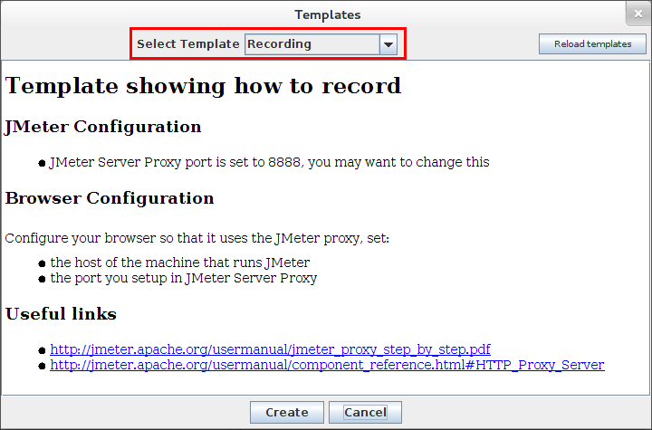](assets/images/template-wizard_e8deefdb8905f872.png)

Templates popup

Some templates may need parameters input from the user. For theses ones, after a click on the create button, a new window will appear as follow :
[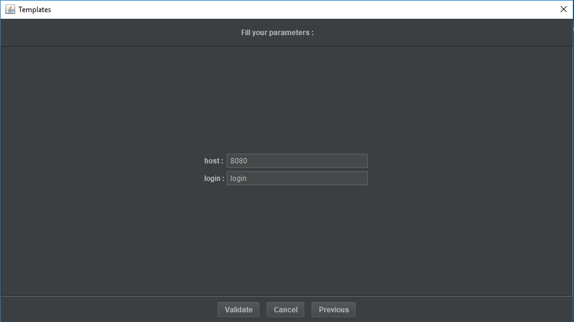](assets/images/template-parameters_7de702f8cd40a5bd.png)

Parameters window

When you are done with parameters, click on the Validate button and the template will be created.

A documentation for each template explains what to do once test plan is created from template.

You can create your own templates following documentation [here](https://jmeter.apache.org/creating-templates.html)

<a id="get-started--proxy_server"></a>
<a id="get-started--1.4.3-using-jmeter-behind-a-proxy"></a>

## 1.4.3 Using JMeter behind a proxy[¶](#get-started--proxy_server "Link to here")

If you are testing from behind a firewall/proxy server, you may need to provide JMeter with
the firewall/proxy server hostname and port number. To do so, run the jmeter[.bat] file
from a command line with the following parameters:

-E
:   [proxy scheme to use - optional - for non-http]

-H
:   [proxy server hostname or ip address]

-P
:   [proxy server port]

-N
:   [nonproxy hosts] (e.g. \*.apache.org|localhost)

-u
:   [username for proxy authentication - if required]

-a
:   [password for proxy authentication - if required]

**Example**:

```
jmeter -E https -H my.proxy.server -P 8000 -u username -a password -N localhost
```

You can also use --proxyScheme, --proxyHost, --proxyPort, --username, and --password as parameter names

Parameters provided on a command-line may be visible to other users on the system.

If the proxy scheme is provided, then JMeter sets the following System properties:

- http.proxyScheme

If the proxy host and port are provided, then JMeter sets the following System properties:

- http.proxyHost
- http.proxyPort
- https.proxyHost
- https.proxyPort

The user and password used for a proxy can be given by the System properties http.proxyUser
and http.proxyUser. They will get overridden by the above arguments or values set in the
HTTP Samplers.

If a nonproxy host list is provided, then JMeter sets the following System properties:

- http.nonProxyHosts
- https.nonProxyHosts

So if you don't wish to set both http and https proxies, you can define the relevant properties in system.properties instead of using the command-line parameters.

Proxy Settings can also be defined in a Test Plan, using either the [HTTP Request Defaults](#component_reference--http_request_defaults)
configuration or the [HTTP Request](#component_reference--http_request) sampler elements.

JMeter also has its own in-built Proxy Server, the [HTTP(S) Test Script Recorder](#component_reference--http-s-_test_script_recorder).
This is only used for recording HTTP or HTTPS browser sessions.
This is not to be confused with the proxy settings described above, which are used when JMeter makes HTTP or HTTPS requests itself.

<a id="get-started--non_gui"></a>
<a id="get-started--1.4.4-cli-mode-command-line-mode-was-called-non-gui-mode"></a>

## 1.4.4 CLI Mode (Command Line mode was called NON GUI mode)[¶](#get-started--non_gui "Link to here")

For load testing, you must run JMeter in this mode (Without the GUI) to get the optimal results from it. To do so, use
the following command options:

-n
:   This specifies JMeter is to run in cli mode

-t
:   [name of JMX file that contains the Test Plan].

-l
:   [name of JTL file to log sample results to].

-j
:   [name of JMeter run log file].

-r
:   Run the test in the servers specified by the JMeter property "remote\_hosts"

-R
:   [list of remote servers] Run the test in the specified remote servers

-g
:   [path to CSV file] generate report dashboard only

-e
:   generate report dashboard after load test

-o
:   output folder where to generate the report dashboard after load test. Folder must not exist or be empty

The script also lets you specify the optional firewall/proxy server information:

-H
:   [proxy server hostname or ip address]

-P
:   [proxy server port]

**Example**

```
jmeter -n -t my_test.jmx -l log.jtl -H my.proxy.server -P 8000
```

If the property jmeterengine.stopfail.system.exit is set to true (default is false), then JMeter will invoke System.exit(1) if it cannot stop all threads.
Normally this is not necessary.

<a id="get-started--server"></a>
<a id="get-started--1.4.5-server-mode"></a>

## 1.4.5 Server Mode[¶](#get-started--server "Link to here")

For [distributed testing](#remote-test), run JMeter in server mode on the remote node(s), and then control the server(s) from the GUI.
You can also use CLI mode to run remote tests.
To start the server(s), run jmeter-server[.bat] on each server host.

The script also lets you specify the optional firewall/proxy server information:

-H
:   [proxy server hostname or ip address]

-P
:   [proxy server port]

**Example**:

```
jmeter-server -H my.proxy.server -P 8000
```

If you want the server to exit after a single test has been run, then define the JMeter property server.exitaftertest=true.

To run the test from the client in CLI mode, use the following command:

```

jmeter -n -t testplan.jmx -r [-Gprop=val] [-Gglobal.properties] [-X]
```

where:

-G
:   is used to define JMeter properties to be set in the servers

-X
:   means exit the servers at the end of the test

-Rserver1,server2
:   can be used instead of -r to provide a list of servers to start.
    Overrides remote\_hosts, but does not define the property.

If the property jmeterengine.remote.system.exit is set to true (default is false), then JMeter will invoke System.exit(0) after stopping RMI at the end of a test.
Normally this is not necessary.

<a id="get-started--override"></a>
<a id="get-started--1.4.6-overriding-properties-via-the-command-line"></a>

## 1.4.6 Overriding Properties Via The Command Line[¶](#get-started--override "Link to here")

Java system properties and JMeter properties can be overridden directly on the command lin
(instead of modifying jmeter.properties).
To do so, use the following options:

-D[prop\_name]=[value]
:   defines a java system property value.

-J[prop\_name]=[value]
:   defines a local JMeter property.

-G[prop\_name]=[value]
:   defines a JMeter property to be sent to all remote servers.

-G[propertyfile]
:   defines a file containing JMeter properties to be sent to all remote servers.

-L[category]=[priority]
:   overrides a logging setting, setting a particular category to the given priority level.

The -L flag can also be used without the category name to set the root logging level.

**Examples**:

```

jmeter -Duser.dir=/home/mstover/jmeter_stuff \
    -Jremote_hosts=127.0.0.1 -Ljmeter.engine=DEBUG
```

```
jmeter -LDEBUG
```

The command line properties are processed early in startup, but after the logging system has been set up.

<a id="get-started--logging"></a>
<a id="get-started--1.4.7-logging-and-error-messages"></a>

## 1.4.7 Logging and error messages[¶](#get-started--logging "Link to here")

Since 3.2, JMeter logging is not configured through properties file(s) such as jmeter.properties any more, but it is configured through a [Apache Log4j 2](http://logging.apache.org/log4j/2.x/) configuration file
(log4j2.xml in the directory from which JMeter was launched, by default) instead.
Also, every code including JMeter and plugins MUST use [SLF4J](https://www.slf4j.org/) library
to leave logs since 3.2.

Here is an example log4j2.xml file which defines two log appenders and loggers for each category.

```
<Configuration status="WARN" packages="org.apache.jmeter.gui.logging">

  <Appenders>

    <!-- The main log file appender to jmeter.log in the directory from which JMeter was launched, by default. -->
    <File name="jmeter-log" fileName="${sys:jmeter.logfile:-jmeter.log}" append="false">
      <PatternLayout>
        <pattern>%d %p %c{1.}: %m%n</pattern>
      </PatternLayout>
    </File>

    <!-- Log appender for GUI Log Viewer. See below. -->
    <GuiLogEvent name="gui-log-event">
      <PatternLayout>
        <pattern>%d %p %c{1.}: %m%n</pattern>
      </PatternLayout>
    </GuiLogEvent>

  </Appenders>

  <Loggers>

    <!-- Root logger -->
    <Root level="info">
      <AppenderRef ref="jmeter-log" />
      <AppenderRef ref="gui-log-event" />
    </Root>

    <!-- SNIP -->

    <!--
# Apache HttpClient logging examples --> <!-- # Enable header wire + context logging - Best for Debugging --> <!--<Logger name="org.apache.http" level="debug" /> <Logger name="org.apache.http.wire" level="error" /> -->

    <!-- SNIP -->

  </Loggers>

</Configuration>
```

So, if you want to change the log level for org.apache.http category to debug level for instance, you can simply add (or uncomment) the following logger element in log4j2.xml file before launching JMeter.

```
  <Loggers>
    <!-- SNIP -->
    <Logger name="org.apache.http" level="debug" />
    <!-- SNIP -->
  </Loggers>
```

For more detail on how to configure log4j2.xml file, please see [Apache Log4j 2 Configuration](http://logging.apache.org/log4j/2.x/manual/configuration.html) page.

Log level for specific categories or root logger can be overridden directly on the command line (instead of modifying log4j2.xml) as well.
To do so, use the following options:

-L[category]=[priority]
:   Overrides a logging setting, setting a particular category to the given priority level.
    Since 3.2, it is recommended to use a full category name (e.g, org.apache.jmeter or com.example.foo),
    but if the category name starts with either jmeter or jorphan, org.apache.
    will be prepended internally to the category name input to construct a full category name (i.e, org.apache.jmeter or org.apache.jorphan) for backward compatibility.

**Examples**:

```
jmeter -Ljmeter.engine=DEBUG
```

```
jmeter -Lorg.apache.jmeter.engine=DEBUG
```

```
jmeter -Lcom.example.foo=DEBUG
```

```
jmeter -LDEBUG
```

**Differences in Logging : Old vs New Practices**:

As JMeter uses SLF4J as logging API and Apache Log4j 2 as a logging framework since 3.2, not every log level
used before 3.2 can match exactly with one of the new available log levels provided by SLF4J/Log4j2.
Therefore, please keep the following differences and new suggested practices in mind
if you need to migrate any existing logging configurations and logging code.

<table>
<thead>
<tr>
<th>Category</th>
<th>Old Practices Before 3.2</th>
<th>New Practices Since 3.2</th>
</tr>
</thead>
<tbody>
<tr>
<td>
            Logger Reference
          </td>
<td>
            Logger reference through <span>LoggingManager</span>:

                                    <pre>LoggingManager.getLoggerFor(String category);
LoggingManager.getLoggerForClass();</pre>
</td>
<td>
            Use SLF4J API with either category or explicit class:

                                    <pre>LoggerFactory.getLogger(String category);
LoggerFactory.getLogger(Foo.class);</pre>
</td>
</tr>
<tr>
<td>
            Log Levels in Configuration or Command Line Arguments
          </td>
<td>
            Old Log Levels:

                                    <ul>
<li>
<span>DEBUG</span>
</li>
<li>
<span>INFO</span>
</li>
<li>
<span>WARN</span>
</li>
<li>
<span>ERROR</span>
</li>
<li>
<span>FATAL_ERROR</span>
</li>
<li>
<span>NONE</span>
</li>
</ul>
</td>
<td>
            Mapping to New Levels through SLF4J/Log4j2:

                                    <ul>
<li>
<span>DEBUG</span>
</li>
<li>
<span>INFO</span>
</li>
<li>
<span>WARN</span>
</li>
<li>
<span>ERROR</span>
</li>
<li>
<span>ERROR</span>
</li>
<li>
<span>OFF</span>
</li>
</ul>
<div>
                                                      Since <span>FATAL_ERROR</span> is not supported by SLF4J API,
              it is treated as <span>ERROR</span> instead for existing code not to break.
              There is also the <span>FATAL</span> log level option.

                                    </div>
<div>
<span>TRACE</span> level, which is less specific than <span>DEBUG</span>, is supported additionally since 3.2.
              Look up SLF4J or Apache Log4J 2 documentations for details.

                                    </div>
</td>
</tr>
</tbody>
</table>

JMeter does not generally use pop-up dialog boxes for errors, as these would interfere with
running tests. Nor does it report any error for a mis-spelt variable or function; instead the
reference is just used as is. See [Functions and Variables for more information](#functions).

If JMeter detects an error during a test, a message will be written to the log file.
The log file name is defined in the log4j2.xml file (or using the -j option, see below).
It defaults to jmeter.log, and will be found in the directory from which JMeter was launched.

The menu Options → Log Viewer
displays the log file in a bottom pane on main JMeter window.

In the GUI mode, the number of error/fatal messages logged in the log file is displayed at top-right.

[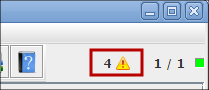](assets/images/log-errors-counter_96eb8b97ad5dce82.png)

Error/fatal counter

The command-line option -j jmeterlogfile allow to process
after the initial properties file is read, and before any further properties are processed.
It therefore allows the default of jmeter.log to be overridden.
The jmeter scripts that take a test plan name as a parameter (e.g. jmeter-n.cmd) have been updated
to define the log file using the test plan name, e.g. for the test plan Test27.jmx the log file is set to Test27.log.

When running on Windows, the file may appear as just **jmeter** unless you have set Windows to show file extensions.
[Which you should do anyway, to make it easier to detect viruses and other nasties that pretend to be text files …]

As well as recording errors, the jmeter.log file records some information about the test run. For example:

```

2017-03-01 12:19:20,314 INFO o.a.j.JMeter: Version 3.2.20170301
2017-03-01 12:19:45,314 INFO o.a.j.g.a.Load: Loading file: c:\mytestfiles\BSH.jmx
2017-03-01 12:19:52,328 INFO o.a.j.e.StandardJMeterEngine: Running the test!
2017-03-01 12:19:52,384 INFO o.a.j.e.StandardJMeterEngine: Starting 1 threads for group BSH. Ramp up = 1.
2017-03-01 12:19:52,485 INFO o.a.j.e.StandardJMeterEngine: Continue on error
2017-03-01 12:19:52,589 INFO o.a.j.t.JMeterThread: Thread BSH1-1 started
2017-03-01 12:19:52,590 INFO o.a.j.t.JMeterThread: Thread BSH1-1 is done
2017-03-01 12:19:52,691 INFO o.a.j.e.StandardJMeterEngine: Test has ended
```

The log file can be helpful in determining the cause of an error, as JMeter does not interrupt a test to display an error dialogue.

<a id="get-started--options"></a>
<a id="get-started--1.4.8-full-list-of-command-line-options"></a>

## 1.4.8 Full list of command-line options[¶](#get-started--options "Link to here")

Invoking JMeter as "jmeter -?" will print a list of all the command-line options.
These are shown below.

```

    --?
        print command line options and exit
    -h, --help
        print usage information and exit
    -v, --version
        print the version information and exit
    -p, --propfile <argument>
        the jmeter property file to use
    -q, --addprop <argument>
        additional JMeter property file(s)
    -t, --testfile <argument>
        the jmeter test(.jmx) file to run
    -l, --logfile <argument>
        the file to log samples to
    -i, --jmeterlogconf <argument>
        jmeter logging configuration file (log4j2.xml)
    -j, --jmeterlogfile <argument>
        jmeter run log file (jmeter.log)
    -n, --nongui
        run JMeter in nongui mode
    -s, --server
        run the JMeter server
    -H, --proxyHost <argument>
        Set a proxy server for JMeter to use
    -P, --proxyPort <argument>
        Set proxy server port for JMeter to use
    -N, --nonProxyHosts <argument>
        Set nonproxy host list (e.g. *.apache.org|localhost)
    -u, --username <argument>
        Set username for proxy server that JMeter is to use
    -a, --password <argument>
        Set password for proxy server that JMeter is to use
    -J, --jmeterproperty <argument>=<value>
        Define additional JMeter properties
    -G, --globalproperty <argument>=<value>
        Define Global properties (sent to servers)
        e.g. -Gport=123
         or -Gglobal.properties
    -D, --systemproperty <argument>=<value>
        Define additional system properties
    -S, --systemPropertyFile <argument>
        additional system property file(s)
    -f, --forceDeleteResultFile
        force delete existing results files and web report folder if present before starting the test
    -L, --loglevel <argument>=<value>
        [category=]level e.g. jorphan=INFO, jmeter.util=DEBUG or com.example.foo=WARN
    -r, --runremote
        Start remote servers (as defined in remote_hosts)
    -R, --remotestart <argument>
        Start these remote servers (overrides remote_hosts)
    -d, --homedir <argument>
        the jmeter home directory to use
    -X, --remoteexit
        Exit the remote servers at end of test (CLI mode)
    -g, --reportonly <argument>
        generate report dashboard only, from a test results file
    -e, --reportatendofloadtests
        generate report dashboard after load test
    -o, --reportoutputfolder <argument>
        output folder for report dashboard
```

Note: the JMeter log file name is formatted as a SimpleDateFormat (applied to the current date)
if it contains paired single-quotes, .e.g. 'jmeter\_'yyyyMMddHHmmss'.log'

If the special name LAST is used for the -t, -j or -l flags, then JMeter takes that to mean the last test plan
that was run in interactive mode.

<a id="get-started--shutdown"></a>
<a id="get-started--1.4.9-cli-mode-shutdown"></a>

## 1.4.9 CLI mode shutdown[¶](#get-started--shutdown "Link to here")

Prior to version 2.5.1, JMeter invoked System.exit() when a CLI mode test completed.
This caused problems for applications that invoke JMeter directly, so JMeter no longer invokes System.exit()
for a normal test completion. [Some fatal errors may still invoke System.exit()]
JMeter will exit all the non-daemon threads it starts, but it is possible that some non-daemon threads
may still remain; these will prevent the JVM from exiting.
To detect this situation, JMeter starts a new daemon thread just before it exits.
This daemon thread waits a short while; if it returns from the wait, then clearly the
JVM has not been able to exit, and the thread prints a message to say why.

The property jmeter.exit.check.pause can be used to configure the delay before printing non-daemon threads.
If set to 0 (default value), then JMeter does not print non-terminated threads at the end of the test.

<a id="get-started--configuring_jmeter"></a>
<a id="get-started--1.5-configuring-jmeter"></a>

# 1.5 Configuring JMeter[¶](#get-started--configuring_jmeter "Link to here")

If you wish to modify the properties with which JMeter runs you need to
either modify the user.properties in the /bin directory or create
your own copy of the jmeter.properties and specify it in the command line.

Note: You can define additional JMeter properties in the file defined by the
JMeter property user.properties which has the default value user.properties.
The file will be automatically loaded if it is found in the current directory
or if it is found in the JMeter bin directory.
Similarly, system.properties is used to update system properties.

<a id="get-started--parameters"></a>

### Parameters

Attribute

Description

Required

ssl.provider

You can specify the class for your SSL
implementation if you don't want to use the built-in Java implementation.

No

xml.parser

You can specify an implementation as your XML
parser. The default value is: org.apache.xerces.parsers.SAXParser

No

remote\_hosts

Comma-delimited list of remote JMeter hosts (or host:port if required).
If you are running JMeter in a distributed environment, list the machines where
you have JMeter remote servers running. This will allow you to control those
servers from this machine's GUI

No

not\_in\_menu

A list of components you do not want to see in
JMeter's menus. As JMeter has more and more components added, you may wish to
customize your JMeter to show only those components you are interested in.
You may list their classname or their class label (the string that appears
in JMeter's UI) here, and they will no longer appear in the menus.

No

search\_paths

List of paths (separated by ;) that JMeter will search for JMeter plugin classes, for example additional samplers. A path item can either be a jar file or a directory.
Any jar file in such a directory will be automatically included in search\_paths, jar files in sub directories are ignored.
The given value is in addition to any jars found in the lib/ext directory.

No

user.classpath

List of paths that JMeter will search for utility and plugin dependency classes.
Use your platform path separator to separate multiple paths.
A path item can either be a jar file or a directory.
Any jar file in such a directory will be automatically included in user.classpath, jar files in sub directories are ignored.
The given value is in addition to any jars found in the lib directory.
All entries will be added to the class path of the system class loader
and also to the path of the JMeter internal loader.

No

plugin\_dependency\_paths

List of paths (separated by ;) that JMeter will search for utility
and plugin dependency classes.
A path item can either be a jar file or a directory.
Any jar file in such a directory will be automatically included in plugin\_dependency\_paths, jar files in sub directories are ignored.
The given value is in addition to any jars found in the lib directory
or given by the user.classpath property.
All entries will be added to the path of the JMeter internal loader only.
For plugin dependencies using plugin\_dependency\_paths should be preferred over
user.classpath.

No

user.properties

Name of file containing additional JMeter properties.
These are added after the initial property file, but before the -q and -J options are processed.

No

system.properties

Name of file containing additional system properties.
These are added before the -S and -D options are processed.

No

The command line options and properties files are processed in the following order:

1. -p propfile
2. jmeter.properties (or the file from the -p option) is then loaded
3. -j logfile
4. Logging is initialised
5. user.properties is loaded
6. system.properties is loaded
7. all other command-line options are processed

**See also the comments in the jmeter.properties, user.properties and system.properties files for further information on other settings you can change.**

- [Index](https://jmeter.apache.org/index.html)
- [Next >](#build-test-plan)

Share this page:

- share
- tweet

[Go to top](#get-started--top)

---

<a id="index"></a>

<!-- source_url: https://jmeter.apache.org/usermanual/index.html -->

<!-- page_index: 2 -->

<a id="index--index"></a>
<a id="index--user-s-manual"></a>

# User's Manual[¶](#index--index "Link to here")

Click on the section name to go straight to the section.
Click on the "+" to go to the relevant section of the detailed section list, where you can select individual subsections.

<a id="index--summary"></a>
<a id="index--section-summary"></a>

## Section Summary[¶](#index--summary "Link to here")

- [Changes](https://jmeter.apache.org/changes.html)
- [+](#index--get-started)...[1. Getting Started](#get-started)
- [+](#index--build-test-plan)...[2. Building a Test Plan](#build-test-plan)
- [+](#index--test_plan)...[3. Elements of a Test Plan](#test_plan)
- [+](#index--build-web-test-plan)...[4. Building a Web Test Plan](#build-web-test-plan)
- [+](#index--build-adv-web-test-plan)...[5. Building an Advanced Web Test Plan](#build-adv-web-test-plan)
- [+](#index--build-db-test-plan)...[6. Building a Database Test Plan](#build-db-test-plan)
- [+](#index--build-ftp-test-plan)...[7. Building an FTP Test Plan](#build-ftp-test-plan)
- [+](#index--build-ldap-test-plan)...[8a. Building an LDAP Test Plan](#build-ldap-test-plan)
- [+](#index--build-ldapext-test-plan)...[8b. Building an Extended LDAP Test Plan](#build-ldapext-test-plan)
- [+](#index--build-ws-test-plan)...[9. Building a Webservice Test Plan](#build-ws-test-plan)
- [+](#index--build-jms-point-to-point-test-plan)...[10. Building a JMS Point to point Test Plan](#build-jms-point-to-point-test-plan)
- [+](#index--build-jms-topic-test-plan)...[11. Building a JMS Topic Test Plan](#build-jms-topic-test-plan)
- [+](#index--build-programmatic-test-plan)...[11. Building a Test Plan Programmatically](#build-programmatic-test-plan)
- [+](#index--listeners)...[12. Listeners](#listeners)
- [+](#index--remote-test)...[13. Remote Testing](#remote-test)
- [+](#index--generating-dashboard)...[14. Dashboard Report](#generating-dashboard)
- [+](#index--realtime-results)...[15. Real time Results](#realtime-results)
- [+](#index--best-practices)...[16. Best Practices](#best-practices)
- [+](#index--boss)...[17. Help! My boss wants me to load test our web app!](#boss)
- [+](#index--component_reference)...[18. Component Reference](#component_reference)
- [+](#index--properties_reference)...[19. Properties Reference](#properties_reference)
- [+](#index--functions)...[20. Functions](#functions)
- [+](#index--regex)...[21. Regular Expressions](#regular_expressions)
- [+](#index--hints)...[22. Hints and Tips](#hints_and_tips)
- [+](#index--glossary)...[23. Glossary](#glossary)
- [+](#index--curl)...[24. Curl](#curl)
- [+](#index--history_future)...[25. History / Future](#history_future)

<a id="index--details"></a>
<a id="index--detailed-section-list"></a>

## Detailed Section List[¶](#index--details "Link to here")

- [1. Getting Started](#get-started)
  - [1.0 Overview](#get-started--overview)
  - [Test plan building](#get-started--test_plan_building)
  - [Load Test running](#get-started--load_test_running)
  - [Load Test analysis](#get-started--load_test_analysis)
  - [Let's start](#get-started--lets_start)- [1.1 Requirements](#get-started--requirements)
  - [1.1.1 Java Version](#get-started--java_versions)
  - [1.1.2 Operating Systems](#get-started--os)- [1.2 Optional](#get-started--optional)
    - [1.2.1 Java Compiler](#get-started--opt_compiler)
    - [1.2.2 SAX XML Parser](#get-started--opt_sax)
    - [1.2.3 Email Support](#get-started--opt_email)
    - [1.2.4 SSL Encryption](#get-started--opt_ssl)
    - [1.2.5 JDBC Driver](#get-started--opt_jdbc)
    - [1.2.6 JMS client](#get-started--opt_jms)
    - [1.2.7 Libraries for ActiveMQ JMS](#get-started--libraries_activemq)
  - [1.3 Installation](#get-started--install)
  - [1.4 Running JMeter](#get-started--running)
    - [1.4.1 JMeter's Classpath](#get-started--classpath)
    - [1.4.2 Create Test Plan from Template](#get-started--template)
    - [1.4.3 Using JMeter behind a proxy](#get-started--proxy_server)
    - [1.4.4 CLI mode](#get-started--non_gui)
    - [1.4.5 Server Mode](#get-started--server)
    - [1.4.6 Overriding Properties Via The Command Line](#get-started--override)
    - [1.4.7 Logging and Error Messages](#get-started--logging)
    - [1.4.8 Full list of command-line options](#get-started--options)
    - [1.4.9 CLI mode shutdown](#get-started--shutdown)
  - [1.5 Configuring JMeter](#get-started--configuring_jmeter)
- [2. Building a Test Plan](#build-test-plan)
  - [2.1 Adding and Removing Elements](#build-test-plan--add_remove)
  - [2.2 Loading and Saving Elements](#build-test-plan--load_save)
  - [2.3 Configuring Tree Elements](#build-test-plan--config_element)
  - [2.4 Saving the Test Plan](#build-test-plan--save)
  - [2.5 Running a Test Plan](#build-test-plan--run)
  - [2.6 Stopping a Test](#build-test-plan--stop)
  - [2.7 Error reporting](#build-test-plan--error_reporting)
- [3. Elements of a Test Plan](#test_plan)
  - [3.1 Thread Group](#test_plan--thread_group)
  - [3.2 Controllers](#test_plan--controllers)
    - [3.2.1 Samplers](#test_plan--samplers)
    - [3.2.2 Logic Controllers](#test_plan--logic_controller)
    - [3.2.3 Test Fragments](#test_plan--test_fragments)
  - [3.3 Listeners](#test_plan--listeners)
  - [3.4 Timers](#test_plan--timers)
  - [3.5 Assertions](#test_plan--assertions)
  - [3.6 Configuration Elements](#test_plan--config_elements)
  - [3.7 Pre-Processor Elements](#test_plan--preprocessors)
  - [3.8 Post-Processor Elements](#test_plan--postprocessors)
  - [3.9 Execution order](#test_plan--executionorder)
  - [3.10 Scoping Rules](#test_plan--scoping_rules)
  - [3.11 Properties and Variables](#test_plan--properties)
  - [3.12 Using Variables to parameterise tests](#test_plan--using_variables)
- [4. Building a Web Test Plan](#build-web-test-plan)
  - [4.1 Adding Users](#build-web-test-plan--adding_users)
  - [4.2 Adding Default HTTP Request Properties](#build-web-test-plan--adding_defaults)
  - [4.3 Adding Cookie Support](#build-web-test-plan--adding_cookie_support)
  - [4.4 Adding HTTP Requests](#build-web-test-plan--adding_requests)
  - [4.5 Adding a Listener to View/Store the Test Results](#build-web-test-plan--adding_listener)
  - [4.6 Logging in to a web-site](#build-web-test-plan--logging_in)
- [5. Building an Advanced Web Test Plan](#build-adv-web-test-plan)
  - [5.1 Handling User Sessions With URL Rewriting](#build-adv-web-test-plan--session_url_rewriting)
  - [5.2 Using a Header Manager](#build-adv-web-test-plan--header_manager)
- [6. Building a Database Test Plan](#build-db-test-plan)
  - [6.1 Adding Users](#build-db-test-plan--adding_users)
  - [6.2 Adding JDBC Requests](#build-db-test-plan--adding_requests)
  - [6.3 Adding a Listener to View/Store the Test Results](#build-db-test-plan--adding_listener)
- [7. Building an FTP Test Plan](#build-ftp-test-plan)
  - [7.1 Adding Users](#build-ftp-test-plan--adding_users)
  - [7.2 Adding Default FTP Request Properties](#build-ftp-test-plan--adding_defaults)
  - [7.3 Adding FTP Requests](#build-ftp-test-plan--adding_requests)
  - [7.4 Adding a Listener to View/Store the Test Results](#build-ftp-test-plan--adding_listener)
- [8a. Building an LDAP Test Plan](#build-ldap-test-plan)
  - [8a.1 Adding Users](#build-ldap-test-plan--adding_users)
  - [8a.2 Adding Login Config Element](#build-ldap-test-plan--add_login)
  - [8a.3 Adding LDAP Request Defaults](#build-ldap-test-plan--add_defaults)
  - [8a.4 Adding LDAP Requests](#build-ldap-test-plan--add_requests)
  - [8a.5 Adding a Response Assertion](#build-ldap-test-plan--responseassertion)
  - [8a.6 Adding a Listener to View/Store the Test Results](#build-ldap-test-plan--add_listener)
- [8b. Building an Extended LDAP Test Plan](#build-ldap-test-plan)
  - [8b.1 Adding Users](#build-ldapext-test-plan--ext_adding_users)
  - [8b.2 Adding LDAP Extended Request Defaults](#build-ldapext-test-plan--add_login)
  - [8b.3 Adding LDAP Requests](#build-ldapext-test-plan--add_extrequests)
  - [8b.4 Adding a Listener to View/Store the Test Results](#build-ldapext-test-plan--add_ldapext_listener)
- [9. Building a Webservice Test Plan](#build-ws-test-plan)
- [10. Building a JMS Point to point Test Plan](#build-jms-point-to-point-test-plan)
- [11. Building a JMS topic Test Plan](#build-jms-topic-test-plan)
- [11. Building a Test Plan Programatically](#build-programmatic-test-plan)
- [12. Introduction to Listeners](#listeners)
- [13. Remote Testing](#remote-test)
- [14. Dashboard Report](#generating-dashboard)
  - [14.1 Overview](#generating-dashboard--overview)
  - [14.2 Configuring Dashboard Generation](#generating-dashboard--configuration)
  - [14.3 Generating reports](#generating-dashboard--report)
  - [14.4 Default graphs](#generating-dashboard--default_graphs)
  - [14.5 Want to improve Report Dashboard](#generating-dashboard--development)
- [15. Real time Results](#realtime-results)
- [16. Best Practices](#best-practices)
- [17. Help! My boss wants me to load test our web app!](#boss)
- [18. Component Reference](#component_reference)
- [19. Properties reference](#properties_reference)
- [20. Functions](#functions)
- [21. Regular Expressions](#regular_expressions)
- [22. Hints and Tips](#hints_and_tips)
- [23. Glossary](#glossary)
- [24. Curl](#curl)
  - [24.1 How to enter (a) command(s)](#curl--enter_command)
  - [24.2 Curl options supported](#curl--curl_options)
  - [24.3 Warning](#curl--warning)
  - [24.4 Some Examples](#curl--example)
- [25. History / Future](#history_future)

---

<a id="best-practices"></a>

<!-- source_url: https://jmeter.apache.org/usermanual/best-practices.html -->

<!-- page_index: 3 -->

# 16. Best Practices ¶

- [Twitter](https://twitter.com/ApacheJMeter "Follow us on Twitter")
- [github](https://github.com/apache/jmeter "Fork us on github")

- [< Prev](#realtime-results)
- [Index](https://jmeter.apache.org/index.html)
- [Next >](#boss)

<a id="best-practices--best_practices"></a>
<a id="best-practices--16.-best-practices"></a>

# 16. Best Practices[¶](#best-practices--best_practices "Link to here")

<a id="best-practices--use_latest_version"></a>
<a id="best-practices--16.1-always-use-latest-version-of-jmeter"></a>

# 16.1 Always use latest version of JMeter[¶](#best-practices--use_latest_version "Link to here")

The performance of JMeter is being constantly improved, so users are highly encouraged to use the most up to date version.
Ensure you always read [changes list](https://jmeter.apache.org/changes.html) to be aware of new improvements and components.
You should absolutely avoid using versions that are older than 3 versions before the last one.

<a id="best-practices--sizing_threads"></a>
<a id="best-practices--16.2-use-the-correct-number-of-threads"></a>

# 16.2 Use the correct Number of Threads[¶](#best-practices--sizing_threads "Link to here")

Your hardware capabilities as well as the Test Plan design will both impact the number of threads you can effectively
run with JMeter. The number will also depend on how fast your server is (a faster server
makes JMeter work harder since it returns a response quicker). As with any Load Testing tool, if you don't correctly size
the number of threads, you will face the "Coordinated Omission" problem which can give you wrong or inaccurate results.
If you need large-scale load testing, consider running multiple CLI JMeter instances on multiple machines
using distributed mode (or not). When using distributed mode the result file is combined on the Controller node, if
using multiple autonomous instances, the sample result files can be combined for subsequent analysis.
For testing how JMeter performs on a given platform, the JavaTest sampler can be used.
It does not require any network access so can give some idea as to the maximum throughput achievable.

JMeter has an option to delay thread creation until the thread starts sampling, i.e. after any thread group delay and the ramp-up time for the thread itself.
This allows for a very large total number of threads, provided that not too many are active concurrently.

<a id="best-practices--put_cookie_manager"></a>
<a id="best-practices--16.3-where-to-put-the-cookie-manager"></a>

# 16.3 Where to Put the Cookie Manager[¶](#best-practices--put_cookie_manager "Link to here")

See [Building a Web Test](#build-web-test-plan--adding_cookie_support)
for information.

<a id="best-practices--put_auth_manager"></a>
<a id="best-practices--16.4-where-to-put-the-authorization-manager"></a>

# 16.4 Where to Put the Authorization Manager[¶](#best-practices--put_auth_manager "Link to here")

See [Building an Advanced
Web Test](#build-adv-web-test-plan--header_manager) for information.

<a id="best-practices--proxy_server"></a>
<a id="best-practices--16.5-using-the-http-s-test-script-recorder"></a>

# 16.5 Using the HTTP(S) Test Script Recorder[¶](#best-practices--proxy_server "Link to here")

Refer to [HTTP(S) Test Script Recorder](#component_reference--http-s-_test_script_recorder) for details on setting up the
recorder. The most important thing to do is filter out all requests you aren't
interested in. For instance, there's no point in recording image requests (JMeter can
be instructed to download all images on a page - see [HTTP Request](#component_reference--http_request)).
These will just clutter your test plan. Most likely, there is an extension all your files
share, such as .jsp, .asp, .php, .html or the like.
These you should "include" by entering ".\*\.jsp" as an "Include Pattern".

Alternatively, you can exclude images by entering ".\*\.gif" as an "Exclude Pattern".
Depending on your application, this may or may not be a better way to go. You may
also have to exclude stylesheets, javascript files, and other included files. Test
out your settings to verify you are recording what you want, and then erase and start
fresh.

The HTTP(S) Test Script Recorder expects to find a ThreadGroup element with a Recording Controller
under it where it will record HTTP Requests to. This conveniently packages all your samples under one
controller, which can be given a name that describes the test case.

Now, go through the steps of a Test Case. If you have no pre-defined test cases, use
JMeter to record your actions to define your test cases. Once you have finished a
definite series of steps, save the entire test case in an appropriately named file. Then, wipe
clean and start a new test case. By doing this, you can quickly record a large number of
test case "rough drafts".

One of the most useful features of the HTTP(S) Test Script Recorder is that you can abstract out
certain common elements from the recorded samples. By defining some
[user-defined variables](#functions) at the Test Plan level or in
[User Defined Variables](#component_reference--user_defined_variables) elements, you can have JMeter automatically
replace values in you recorded samples. For instance, if you are testing an app on
server "xxx.example.com", then you can define a variable called "server" with the value of
"xxx.example.com", and anyplace that value is found in your recorded samples will be replaced
with "${server}".

Please note that matching is case-sensitive.

If JMeter does not record any samples, check that the browser really is using the proxy.
If the browser works OK even if JMeter is not running, then the browser cannot be using the proxy.
Some browsers ignore proxy settings for localhost or 127.0.0.1; try using the local hostname or IP instead.

The error "unknown\_ca" probably means that you are trying to record HTTPS, and the browser has not accepted the
JMeter Proxy server certificate.

<a id="best-practices--user_variables"></a>
<a id="best-practices--16.6-user-variables"></a>

# 16.6 User variables[¶](#best-practices--user_variables "Link to here")

Some test plans need to use different values for different users/threads.
For example, you might want to test a sequence that requires a unique login for each user.
This is easy to achieve with the facilities provided by JMeter.

For example:

- Create a text file containing the user names and passwords, separated by commas.
  Put this in the same directory as your test plan.
- Add a CSV DataSet configuration element to the test plan.
  Name the variables USER and PASS.
- Replace the login name with ${USER} and the password with ${PASS} on the appropriate
  samplers

The CSV Data Set element will read a new line for each thread.

<a id="best-practices--lean_mean"></a>
<a id="best-practices--16.7-reducing-resource-requirements"></a>

# 16.7 Reducing resource requirements[¶](#best-practices--lean_mean "Link to here")

Some suggestions on reducing resource usage.

- Use CLI mode: jmeter -n -t test.jmx -l test.jtl
- Use as few Listeners as possible; if using the -l flag as above they can all be deleted or disabled.
- Don't use "View Results Tree" or "View Results in Table" listeners during the load test, use them only during scripting phase to debug your scripts.
- Rather than using lots of similar samplers,
  use the same sampler in a loop, and use variables (CSV Data Set) to vary the sample.
  [The Include Controller does not help here, as it adds all the test elements in the file to the test plan.]
- Don't use functional mode
- Use CSV output rather than XML
- Only save the data that you need
- Use as few Assertions as possible
- Use the most performing scripting language (see JSR223 section)

If your test needs large amounts of data - particularly if it needs to be randomised - create the test data in a file
that can be read with CSV Dataset. This avoids wasting resources at run-time.

<a id="best-practices--beanshell_server"></a>
<a id="best-practices--16.8-beanshell-server"></a>

# 16.8 BeanShell server[¶](#best-practices--beanshell_server "Link to here")

The BeanShell interpreter has a very useful feature - it can act as a server, which is accessible by telnet or http.

There is no security. Anyone who can connect to the port can issue any BeanShell commands.
These can provide unrestricted access to the JMeter application and the host.
**Do not enable the server unless the ports are protected against access, e.g. by a firewall.**

If you do wish to use the server, define the following in jmeter.properties:

```

beanshell.server.port=9000
beanshell.server.file=../extras/startup.bsh
```

In the above example, the server will be started, and will listen on ports 9000 and 9001.
Port 9000 will be used for http access. Port 9001 will be used for telnet access.
The startup.bsh file will be processed by the server, and can be used to define various functions and set up variables.
The startup file defines methods for setting and printing JMeter and system properties.
This is what you should see in the JMeter console:

```

Startup script running
Startup script completed
Httpd started on port: 9000
Session started on port: 9001
```

There is a sample script (extras/remote.bsh) you can use to test the server.
[Have a look at it to see how it works.]
When starting it in the JMeter bin directory
(adjust paths as necessary if running from elsewhere)
the output should look like:

```

$ java -jar ../lib/bshclient.jar localhost 9000 ../extras/remote.bsh Connecting to BSH server on localhost:9000 Reading responses from server … BeanShell 2.0b5 - by Pat Niemeyer (pat@pat.net) bsh % remote.bsh starting
user.home = C:\Documents and Settings\User
user.dir = D:\eclipseworkspaces\main\JMeter_trunk\bin
Setting property 'EXAMPLE' to '0'.
Setting property 'EXAMPLE' to '1'.
Setting property 'EXAMPLE' to '2'.
Setting property 'EXAMPLE' to '3'.
Setting property 'EXAMPLE' to '4'.
Setting property 'EXAMPLE' to '5'.
Setting property 'EXAMPLE' to '6'.
Setting property 'EXAMPLE' to '7'.
Setting property 'EXAMPLE' to '8'.
Setting property 'EXAMPLE' to '9'.
EXAMPLE = 9
remote.bsh ended
bsh % … disconnected from server.
```

As a practical example, assume you have a long-running JMeter test running in CLI mode, and you want to vary the throughput at various times during the test.
The test-plan includes a Constant Throughput Timer which is defined in terms of a property, e.g. ${\_\_P(throughput)}.
The following BeanShell commands could be used to change the test:

```

printprop("throughput");
curr = Integer.decode(args[0]);  // Start value
inc  = Integer.decode(args[1]);  // Increment
end  = Integer.decode(args[2]);  // Final value
secs = Integer.decode(args[3]);  // Wait between changes
while(curr <= end) {
  setprop("throughput",curr.toString()); // Needs to be a string here
  Thread.sleep(secs*1000);
  curr += inc;
}
printprop("throughput");
```

The script can be stored in a file (throughput.bsh, say), and sent to the server using bshclient.jar.
For example:

```

java -jar ../lib/bshclient.jar localhost 9000 throughput.bsh 70 5 100 60
```

<a id="best-practices--bsh_scripting"></a>
<a id="best-practices--16.9-beanshell-scripting"></a>

# 16.9 BeanShell scripting[¶](#best-practices--bsh_scripting "Link to here")

Since JMeter 3.1, we advise switching from BeanShell to JSR223 Test Elements (see JSR223 section below for more details), and switching from [\_\_Beanshell](#functions--__beanshell) function
to [\_\_groovy](#functions--__groovy) function.

<a id="best-practices--bsh_overview"></a>
<a id="best-practices--16.9.1-overview"></a>

## 16.9.1 Overview[¶](#best-practices--bsh_overview "Link to here")

Each BeanShell test element has its own copy of the interpreter (for each thread).
If the test element is repeatedly called, e.g. within a loop, then the interpreter is retained
between invocations unless the "Reset bsh.Interpreter before each call" option is selected.

Some long-running tests may cause the interpreter to use lots of memory; if this is the case try using the reset option.

You can test BeanShell scripts outside JMeter by using the command-line interpreter:

```

$ java -cp bsh-xxx.jar[;other jars as needed] bsh.Interpreter file.bsh [parameters]
```

or

```

$ java -cp bsh-xxx.jar bsh.Interpreter bsh% source("file.bsh"); bsh% exit(); // or use EOF key (e.g. ^Z or ^D)
```

<a id="best-practices--bsh_variables"></a>
<a id="best-practices--16.9.2-sharing-variables"></a>

## 16.9.2 Sharing Variables[¶](#best-practices--bsh_variables "Link to here")

Variables can be defined in startup (initialisation) scripts.
These will be retained across invocations of the test element, unless the reset option is used.

Scripts can also access JMeter variables using the get() and put() methods of the "vars" variable, for example:

```
vars.get("HOST");
vars.put("MSG","Successful");
```

The get() and put() methods only support variables with String values, but there are also getObject() and putObject() methods which can be used for arbitrary objects.
JMeter variables are local to a thread, but can be used by all test elements (not just Beanshell).

If you need to share variables between threads, then JMeter properties can be used:

```

import org.apache.jmeter.util.JMeterUtils;
String value = JMeterUtils.getPropDefault("name","");
JMeterUtils.setProperty("name", "value");
```

The sample .bshrc files contain sample definitions of getprop() and setprop() methods.

Another possible method of sharing variables is to use the "bsh.shared" shared namespace.
For example:

```

if (bsh.shared.myObj == void){
    // not yet defined, so create it:
    myObj = new AnyObject();
}
bsh.shared.myObj.process();
```

Rather than creating the object in the test element, it can be created in the startup file
defined by the JMeter property "beanshell.init.file". This is only processed once.

<a id="best-practices--developing_scripts"></a>
<a id="best-practices--16.10-developing-script-functions-in-groovy-or-jexl3-etc."></a>

# 16.10 Developing script functions in Groovy or Jexl3 etc.[¶](#best-practices--developing_scripts "Link to here")

It's quite hard to write and test scripts as functions.
However, JMeter has the JSR223 samplers which can be used instead with any language supporting it.
We advise using [Apache Groovy](http://www.groovy-lang.org/) or any language that supports the [Compilable](https://docs.oracle.com/javase/8/docs/api/javax/script/Compilable.html) interface of JSR223.

Create a simple Test Plan containing the JSR223 Sampler and Tree View Listener.
Code the script in the sampler script pane, and test it by running the test.
If there are any errors, these will show up in the Tree View and jmeter.log file.
Also the result of running the script will show up as the response.

Once the script is working properly, it can be stored as a variable on the Test Plan.
The script variable can then be used to create the function call.
For example, suppose a Groovy script is stored in the variable RANDOM\_NAME.
The function call can then be coded as ${\_\_groovy(${RANDOM\_NAME})}.
There is no need to escape any commas in the script, because the function call is parsed before the variable's value is interpolated.

<a id="best-practices--parameterising_tests"></a>
<a id="best-practices--16.11-parameterising-tests"></a>

# 16.11 Parameterising tests[¶](#best-practices--parameterising_tests "Link to here")

Often it is useful to be able to re-run the same test with different settings.
For example, changing the number of threads or loops, or changing a hostname.

One way to do this is to define a set of variables on the Test Plan, and then use those variables in the test elements.
For example, one could define the variable LOOPS=10, and refer to that in the Thread Group as ${LOOPS}.
To run the test with 20 loops, just change the value of the LOOPS variable on the Test Plan.

This quickly becomes tedious if you want to run lots of tests in CLI mode.
One solution to this is to define the Test Plan variable in terms of a property, for example LOOPS=${\_\_P(loops,10)}.
This uses the value of the property "loops", defaulting to 10 if the property is not found.
The "loops" property can then be defined on the JMeter command-line:

```
jmeter … -Jloops=12 …
```

If there are a lot of properties that need to be changed together, then one way to achieve this is to use a set of property files.
The appropriate property file can be passed in to JMeter using the -q command-line option.

<a id="best-practices--jsr223"></a>
<a id="best-practices--16.12-jsr223-elements"></a>

# 16.12 JSR223 Elements[¶](#best-practices--jsr223 "Link to here")

For intensive load testing, the recommended scripting language is one whose ScriptingEngine implements the [Compilable](https://docs.oracle.com/javase/8/docs/api/javax/script/Compilable.html) interface.
Groovy scripting engine implements [Compilable](https://docs.oracle.com/javase/8/docs/api/javax/script/Compilable.html). However neither Beanshell nor Javascript do so as of release date of JMeter 3.1, so it is
recommended to avoid them for intensive load testing.

Note: Beanshell implements the [Compilable](https://docs.oracle.com/javase/8/docs/api/javax/script/Compilable.html) interface but it has not been coded - the method just throws an Exception.
JMeter has an explicit work-round for this bug.

When using JSR 223 elements, it is advised to check Cache compiled script if available property to ensure the script compilation is cached if underlying language supports it.
In this case, ensure the script does not use any variable using ${varName} as caching would take only first value of ${varName}. Instead use :

```

vars.get("varName")
```

You can also pass them as Parameters to the script and use them this way.

<a id="best-practices--sharing_variables"></a>
<a id="best-practices--16.13-sharing-variables-between-threads-and-thread-groups"></a>

# 16.13 Sharing variables between threads and thread groups[¶](#best-practices--sharing_variables "Link to here")

Variables are local to a thread; a variable set in one thread cannot be read in another.
This is by design. For variables that can be determined before a test starts, see
[Parameterising Tests](#best-practices--parameterising_tests) (above).
If the value is not known until the test starts, there are various options:

- Store the variable as a property - properties are global to the JMeter instance
- Write variables to a file and re-read them.
- Use the bsh.shared namespace - see [above](#best-practices--bsh_variables)
- Write your own Java classes

<a id="best-practices--properties"></a>
<a id="best-practices--16.14-managing-properties"></a>

# 16.14 Managing properties[¶](#best-practices--properties "Link to here")

When you need to modify jmeter properties, ensure you don't modify jmeter.properties file,
**instead copy the property from jmeter.properties and modify its value in user.properties file**.
Doing so will ease you migration to the next version of JMeter.
Note that in the documentation jmeter.properties is frequently mentioned but this should be understood as
"Copy from jmeter.properties to user.properties the property you want to modify and do so in the latter file".

user.properties file supersedes the properties defined in jmeter.properties

<a id="best-practices--deprecation"></a>
<a id="best-practices--16.15-deprecated-elements"></a>

# 16.15 Deprecated elements[¶](#best-practices--deprecation "Link to here")

It is advised not to use deprecated elements (marked as such in [changes list](https://jmeter.apache.org/changes.html) and in [component reference](#component_reference))
and to migrate to new advised elements if available or new way of doing the same thing.
Deprecated elements are removed from the menu in version N but can be enabled for migration by modifying not\_in\_menu property in user.properties file and removing the full class name
of the element from there.

Please note that deprecated elements in version N will be removed definitely in version N+1, so ensure you stop using them as soon as possible.

- [< Prev](#realtime-results)
- [Index](https://jmeter.apache.org/index.html)
- [Next >](#boss)

Share this page:

- share
- tweet

[Go to top](#best-practices--top)

---

<a id="component_reference"></a>

<!-- source_url: https://jmeter.apache.org/usermanual/component_reference.html -->

<!-- page_index: 4 -->

# 18 Introduction ¶

- [Twitter](https://twitter.com/ApacheJMeter "Follow us on Twitter")
- [github](https://github.com/apache/jmeter "Fork us on github")

- [< Prev](#boss)
- [Index](https://jmeter.apache.org/index.html)
- [Next >](#properties_reference)

- [18 Introduction](#component_reference--introduction)
- [18.1 Samplers](#component_reference--samplers)
  - [FTP Request](#component_reference--ftp_request)
  - [HTTP Request](#component_reference--http_request)
  - [JDBC Request](#component_reference--jdbc_request)
  - [Java Request](#component_reference--java_request)
  - [LDAP Request](#component_reference--ldap_request)
  - [LDAP Extended Request](#component_reference--ldap_extended_request)
  - [Access Log Sampler](#component_reference--access_log_sampler)
  - [BeanShell Sampler](#component_reference--beanshell_sampler)
  - [JSR223 Sampler](#component_reference--jsr223_sampler)
  - [TCP Sampler](#component_reference--tcp_sampler)
  - [JMS Publisher](#component_reference--jms_publisher)
  - [JMS Subscriber](#component_reference--jms_subscriber)
  - [JMS Point-to-Point](#component_reference--jms_point-to-point)
  - [JUnit Request](#component_reference--junit_request)
  - [Mail Reader Sampler](#component_reference--mail_reader_sampler)
  - [Flow Control Action
    (was:
    Test Action
    )](#component_reference--flow_control_action)
  - [SMTP Sampler](#component_reference--smtp_sampler)
  - [OS Process Sampler](#component_reference--os_process_sampler)
  - [MongoDB Script (DEPRECATED)](#component_reference--mongodb_script_-deprecated)
  - [Bolt Request](#component_reference--bolt_request)
- [18.2 Logic Controllers](#component_reference--logic_controllers)
  - [Simple Controller](#component_reference--simple_controller)
  - [Loop Controller](#component_reference--loop_controller)
  - [Once Only Controller](#component_reference--once_only_controller)
  - [Interleave Controller](#component_reference--interleave_controller)
  - [Random Controller](#component_reference--random_controller)
  - [Random Order Controller](#component_reference--random_order_controller)
  - [Throughput Controller](#component_reference--throughput_controller)
  - [Runtime Controller](#component_reference--runtime_controller)
  - [If Controller](#component_reference--if_controller)
  - [While Controller](#component_reference--while_controller)
  - [Switch Controller](#component_reference--switch_controller)
  - [ForEach Controller](#component_reference--foreach_controller)
  - [Module Controller](#component_reference--module_controller)
  - [Include Controller](#component_reference--include_controller)
  - [Transaction Controller](#component_reference--transaction_controller)
  - [Recording Controller](#component_reference--recording_controller)
  - [Critical Section Controller](#component_reference--critical_section_controller)
- [18.3 Listeners](#component_reference--listeners)
  - [Sample Result Save Configuration](#component_reference--sample_result_save_configuration)
  - [Graph Results](#component_reference--graph_results)
  - [Assertion Results](#component_reference--assertion_results)
  - [View Results Tree](#component_reference--view_results_tree)
  - [Aggregate Report](#component_reference--aggregate_report)
  - [View Results in Table](#component_reference--view_results_in_table)
  - [Simple Data Writer](#component_reference--simple_data_writer)
  - [Aggregate Graph](#component_reference--aggregate_graph)
  - [Response Time Graph](#component_reference--response_time_graph)
  - [Mailer Visualizer](#component_reference--mailer_visualizer)
  - [BeanShell Listener](#component_reference--beanshell_listener)
  - [Summary Report](#component_reference--summary_report)
  - [Save Responses to a file](#component_reference--save_responses_to_a_file)
  - [JSR223 Listener](#component_reference--jsr223_listener)
  - [Generate Summary Results](#component_reference--generate_summary_results)
  - [Comparison Assertion Visualizer](#component_reference--comparison_assertion_visualizer)
  - [Backend Listener](#component_reference--backend_listener)
- [18.4 Configuration Elements](#component_reference--config_elements)
  - [CSV Data Set Config](#component_reference--csv_data_set_config)
  - [FTP Request Defaults](#component_reference--ftp_request_defaults)
  - [DNS Cache Manager](#component_reference--dns_cache_manager)
  - [HTTP Authorization Manager](#component_reference--http_authorization_manager)
  - [HTTP Cache Manager](#component_reference--http_cache_manager)
  - [HTTP Cookie Manager](#component_reference--http_cookie_manager)
  - [HTTP Request Defaults](#component_reference--http_request_defaults)
  - [HTTP Header Manager](#component_reference--http_header_manager)
  - [Java Request Defaults](#component_reference--java_request_defaults)
  - [JDBC Connection Configuration](#component_reference--jdbc_connection_configuration)
  - [Keystore Configuration](#component_reference--keystore_configuration)
  - [Login Config Element](#component_reference--login_config_element)
  - [LDAP Request Defaults](#component_reference--ldap_request_defaults)
  - [LDAP Extended Request Defaults](#component_reference--ldap_extended_request_defaults)
  - [TCP Sampler Config](#component_reference--tcp_sampler_config)
  - [User Defined Variables](#component_reference--user_defined_variables)
  - [Random Variable](#component_reference--random_variable)
  - [Counter](#component_reference--counter)
  - [Simple Config Element](#component_reference--simple_config_element)
  - [MongoDB Source Config (DEPRECATED)](#component_reference--mongodb_source_config_-deprecated)
  - [Bolt Connection Configuration](#component_reference--bolt_connection_configuration)
- [18.5 Assertions](#component_reference--assertions)
  - [Response Assertion](#component_reference--response_assertion)
  - [Duration Assertion](#component_reference--duration_assertion)
  - [Size Assertion](#component_reference--size_assertion)
  - [XML Assertion](#component_reference--xml_assertion)
  - [BeanShell Assertion](#component_reference--beanshell_assertion)
  - [MD5Hex Assertion](#component_reference--md5hex_assertion)
  - [HTML Assertion](#component_reference--html_assertion)
  - [XPath Assertion](#component_reference--xpath_assertion)
  - [XPath2 Assertion](#component_reference--xpath2_assertion)
  - [XML Schema Assertion](#component_reference--xml_schema_assertion)
  - [JSR223 Assertion](#component_reference--jsr223_assertion)
  - [Compare Assertion](#component_reference--compare_assertion)
  - [SMIME Assertion](#component_reference--smime_assertion)
  - [JSON Assertion](#component_reference--json_assertion)
  - [JSON JMESPath Assertion](#component_reference--json_jmespath_assertion)
- [18.6 Timers](#component_reference--timers)
  - [Constant Timer](#component_reference--constant_timer)
  - [Gaussian Random Timer](#component_reference--gaussian_random_timer)
  - [Uniform Random Timer](#component_reference--uniform_random_timer)
  - [Constant Throughput Timer](#component_reference--constant_throughput_timer)
  - [Precise Throughput Timer](#component_reference--precise_throughput_timer)
  - [Synchronizing Timer](#component_reference--synchronizing_timer)
  - [BeanShell Timer](#component_reference--beanshell_timer)
  - [JSR223 Timer](#component_reference--jsr223_timer)
  - [Poisson Random Timer](#component_reference--poisson_random_timer)
- [18.7 Pre Processors](#component_reference--preprocessors)
  - [HTML Link Parser](#component_reference--html_link_parser)
  - [HTTP URL Re-writing Modifier](#component_reference--http_url_re-writing_modifier)
  - [User Parameters](#component_reference--user_parameters)
  - [BeanShell PreProcessor](#component_reference--beanshell_preprocessor)
  - [JSR223 PreProcessor](#component_reference--jsr223_preprocessor)
  - [JDBC PreProcessor](#component_reference--jdbc_preprocessor)
  - [RegEx User Parameters](#component_reference--regex_user_parameters)
  - [Sample Timeout](#component_reference--sample_timeout)
- [18.8 Post-Processors](#component_reference--postprocessors)
  - [Regular Expression Extractor](#component_reference--regular_expression_extractor)
  - [CSS Selector Extractor
    (was:
    CSS/JQuery Extractor
    )](#component_reference--css_selector_extractor)
  - [XPath2 Extractor](#component_reference--xpath2_extractor)
  - [XPath Extractor](#component_reference--xpath_extractor)
  - [JSON JMESPath Extractor](#component_reference--json_jmespath_extractor)
  - [Result Status Action Handler](#component_reference--result_status_action_handler)
  - [BeanShell PostProcessor](#component_reference--beanshell_postprocessor)
  - [JSR223 PostProcessor](#component_reference--jsr223_postprocessor)
  - [JDBC PostProcessor](#component_reference--jdbc_postprocessor)
  - [JSON Extractor](#component_reference--json_extractor)
  - [Boundary Extractor](#component_reference--boundary_extractor)
- [18.9 Miscellaneous Features](#component_reference--miscellaneous_features)
  - [Test Plan](#component_reference--test_plan)
  - [Open Model Thread Group](#component_reference--open_model_thread_group)
  - [Thread Group](#component_reference--thread_group)
  - [WorkBench](#component_reference--workbench)
  - [SSL Manager](#component_reference--ssl_manager)
  - [HTTP(S) Test Script Recorder
    (was:
    HTTP Proxy Server
    )](#component_reference--http-s-_test_script_recorder)
  - [HTTP Mirror Server](#component_reference--http_mirror_server)
  - [Property Display](#component_reference--property_display)
  - [Debug Sampler](#component_reference--debug_sampler)
  - [Debug PostProcessor](#component_reference--debug_postprocessor)
  - [Test Fragment](#component_reference--test_fragment)
  - [setUp Thread Group](#component_reference--setup_thread_group)
  - [tearDown Thread Group](#component_reference--teardown_thread_group)

<a id="component_reference--introduction"></a>
<a id="component_reference--18-introduction"></a>

# 18 Introduction[¶](#component_reference--introduction "Link to here")

Several test elements use JMeter properties to control their behaviour.
These properties are normally resolved when the class is loaded.
This generally occurs before the test plan starts, so it's not possible to change the settings by using the [\_\_setProperty()](#functions--__setproperty) function.

<a id="component_reference--samplers"></a>
<a id="component_reference--18.1-samplers"></a>

# 18.1 Samplers[¶](#component_reference--samplers "Link to here")

Samplers perform the actual work of JMeter.
Each sampler (except [Flow Control Action](#component_reference--flow_control_action)) generates one or more sample results.
The sample results have various attributes (success/fail, elapsed time, data size etc.) and can be viewed in the various listeners.

<a id="component_reference--ftp_request"></a>
<a id="component_reference--ftp-request"></a>

## FTP Request[¶](#component_reference--ftp_request "Link to here")

This controller lets you send an FTP "retrieve file" or "upload file" request to an FTP server.
If you are going to send multiple requests to the same FTP server, consider
using a [FTP Request Defaults](#component_reference--ftp_request_defaults) Configuration
Element so you do not have to enter the same information for each FTP Request Generative
Controller. When downloading a file, it can be stored on disk (Local File) or in the Response Data, or both.

Latency is set to the time it takes to login.

[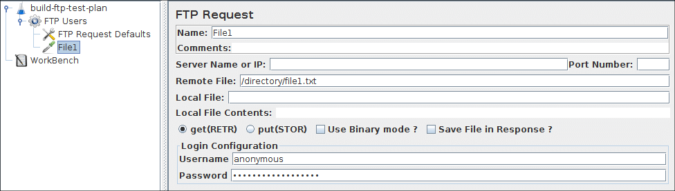](assets/images/ftp-request_fbad39b4914f65c2.png)

Screenshot of Control-Panel of FTP Request

<a id="component_reference--ftp_request_parms1"></a>
<a id="component_reference--parameters"></a>

### Parameters [¶](#component_reference--ftp_request_parms1 "Link to here")

Attribute

Description

Required

Name

Descriptive name for this sampler that is shown in the tree.

No

Server Name or IP

Domain name or IP address of the FTP server.

Yes

Port

Port to use. If this is >0, then this specific port is used, otherwise JMeter uses the default FTP port.

No

Remote File:

File to retrieve or name of destination file to upload.

Yes

Local File:

File to upload, or destination for downloads (defaults to remote file name).

Yes, if uploading (\*)

Local File Contents:

Provides the contents for the upload, overrides the Local File property.

Yes, if uploading (\*)

get(RETR) / put(STOR)

Whether to retrieve or upload a file.

Yes

Use Binary mode?

Check this to use Binary mode (default ASCII)

Yes

Save File in Response?

Whether to store contents of retrieved file in response data.
If the mode is ASCII, then the contents will be visible in the [View Results Tree](#component_reference--view_results_tree).

Yes, if downloading

Username

FTP account username.

Usually

Password

FTP account password. N.B. This will be visible in the test plan.

Usually

See also:

- [Assertions](#test_plan--assertions)
- [FTP Request Defaults](#component_reference--ftp_request_defaults)
- [Building an FTP Test Plan](#build-ftp-test-plan)

[^](#component_reference)

<a id="component_reference--http_request"></a>
<a id="component_reference--http-request"></a>

## HTTP Request[¶](#component_reference--http_request "Link to here")

This sampler lets you send an HTTP/HTTPS request to a web server. It
also lets you control whether or not JMeter parses HTML files for images and
other embedded resources and sends HTTP requests to retrieve them.
The following types of embedded resource are retrieved:

- images
- applets
- stylesheets (CSS) and resources referenced from those files
- external scripts
- frames, iframes
- background images (body, table, TD, TR)
- background sound

The default parser is org.apache.jmeter.protocol.http.parser.LagartoBasedHtmlParser.
This can be changed by using the property "htmlparser.className" - see jmeter.properties for details.

If you are going to send multiple requests to the same web server, consider
using an [HTTP Request Defaults](#component_reference--http_request_defaults)
Configuration Element so you do not have to enter the same information for each
HTTP Request.

Or, instead of manually adding HTTP Requests, you may want to use
JMeter's [HTTP(S) Test Script Recorder](#component_reference--http-s-_test_script_recorder) to create
them. This can save you time if you have a lot of HTTP requests or requests with many
parameters.

**There are three different test elements used to define the samplers:**

AJP/1.3 Sampler
:   uses the Tomcat mod\_jk protocol (allows testing of Tomcat in AJP mode without needing Apache httpd)
    The AJP Sampler does not support multiple file upload; only the first file will be used.

HTTP Request
:   this has an implementation drop-down box, which selects the HTTP protocol implementation to be used:

    Java
    :   uses the HTTP implementation provided by the JVM.
        This has some limitations in comparison with the HttpClient implementations - see below.

    HTTPClient4
    :   uses Apache HttpComponents HttpClient 4.x.

    Blank Value
    :   does not set implementation on HTTP Samplers, so relies on HTTP Request Defaults if present or on jmeter.httpsampler property defined in jmeter.properties

GraphQL HTTP Request
:   this is a GUI variation of the **HTTP Request** to provide more convenient UI elements
    to view or edit GraphQL **Query**, **Variables** and **Operation Name**, while converting them into HTTP Arguments automatically under the hood
    using the same sampler.
    This hides or customizes the following UI elements as they are less convenient for or irrelevant to GraphQL over HTTP/HTTPS requests:

    - **Method**: Only POST and GET methods are available conforming the GraphQL over HTTP specification. POST method is selected by default.
    - **Parameters** and **Post Body** tabs: you may view or edit parameter content through Query, Variables and Operation Name UI elements instead.
    - **File Upload** tab: irrelevant to GraphQL queries.
    - **Embedded Resources from HTML Files** section in the Advanced tab: irrelevant in GraphQL JSON responses.

The Java HTTP implementation has some limitations:

- There is no control over how connections are re-used.
  When a connection is released by JMeter, it may or may not be re-used by the same thread.
- The API is best suited to single-threaded usage - various settings
  are defined via system properties, and therefore apply to all connections.
- No support of Kerberos authentication
- It does not support client based certificate testing with Keystore Config.
- Better control of Retry mechanism
- It does not support virtual hosts.
- It supports only the following methods: GET, POST, HEAD, OPTIONS, PUT, DELETE and TRACE
- Better control on DNS Caching with [DNS Cache Manager](#component_reference--dns_cache_manager)

Note: the FILE protocol is intended for testing purposes only.
It is handled by the same code regardless of which HTTP Sampler is used.

If the request requires server or proxy login authorization (i.e. where a browser would create a pop-up dialog box), you will also have to add an [HTTP Authorization Manager](#component_reference--http_authorization_manager) Configuration Element.
For normal logins (i.e. where the user enters login information in a form), you will need to work out what the form submit button does, and create an HTTP request with the appropriate method (usually POST)
and the appropriate parameters from the form definition.
If the page uses HTTP, you can use the JMeter Proxy to capture the login sequence.

A separate SSL context is used for each thread.
If you want to use a single SSL context (not the standard behaviour of browsers), set the JMeter property:

```

https.sessioncontext.shared=true
```

By default, since version 5.0, the SSL context is retained during a Thread Group iteration and reset for each test iteration.
If in your test plan the same user iterates multiple times, then you should set this to false.

```

httpclient.reset_state_on_thread_group_iteration=true
```

Note: this does not apply to the Java HTTP implementation.

JMeter defaults to the SSL protocol level TLS.
If the server needs a different level, e.g. SSLv3, change the JMeter property, for example:

```

https.default.protocol=SSLv3
```

JMeter also allows one to enable additional protocols, by changing the property https.socket.protocols.

If the request uses cookies, then you will also need an
[HTTP Cookie Manager](#component_reference--http_cookie_manager). You can
add either of these elements to the Thread Group or the HTTP Request. If you have
more than one HTTP Request that needs authorizations or cookies, then add the
elements to the Thread Group. That way, all HTTP Request controllers will share the
same Authorization Manager and Cookie Manager elements.

If the request uses a technique called "URL Rewriting" to maintain sessions, then see section
[6.1 Handling User Sessions With URL Rewriting](#build-adv-web-test-plan--session_url_rewriting)
for additional configuration steps.

[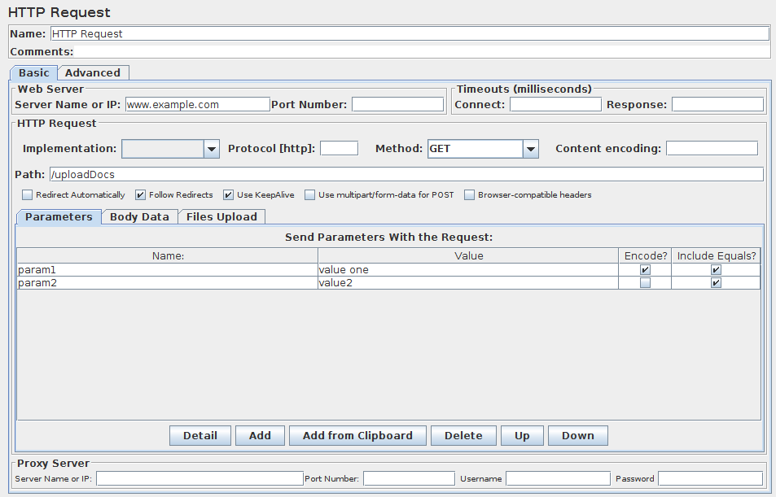](assets/images/http-request_cb7a2d7f216d2ca7.png)

Screenshot of Control-Panel of HTTP Request

[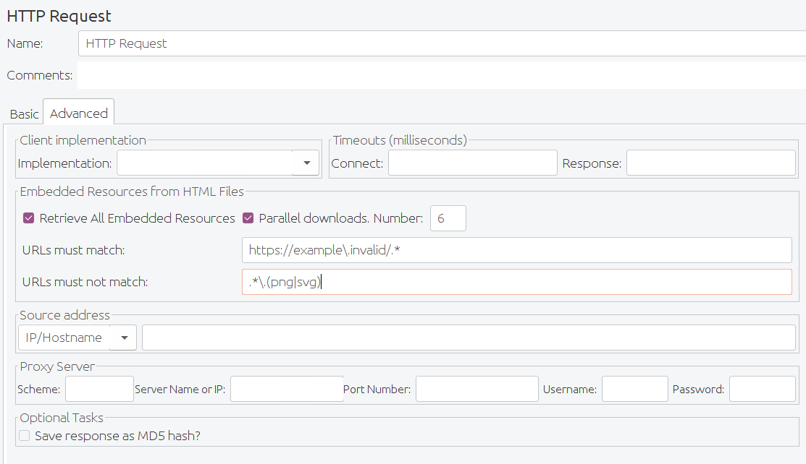](assets/images/http-request-advanced-tab_0a9681dc2a8249cd.png)

HTTP Request Advanced config fields

[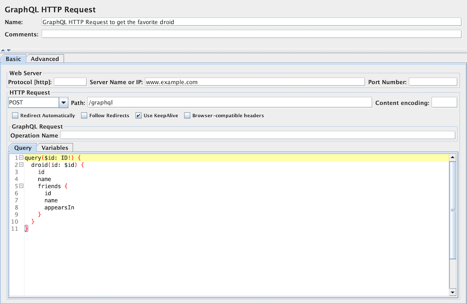](assets/images/graphql-http-request_9bcff2f3e8b19de8.png)

Screenshot of Control-Panel of GraphQL HTTP Request

[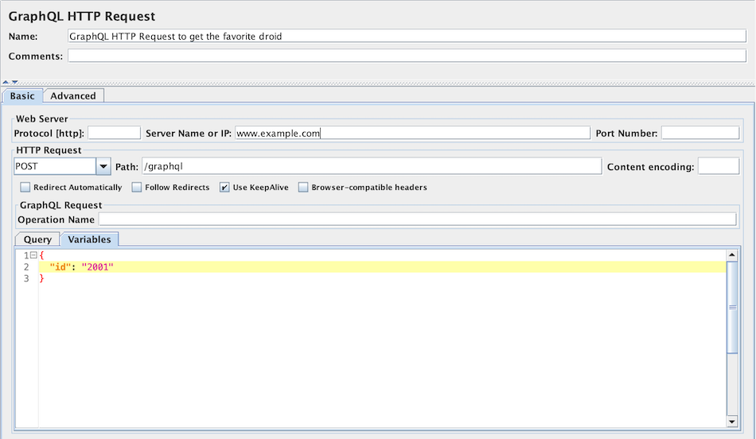](assets/images/graphql-http-request-vars_153b246b9b5adbff.png)

Variables field for GraphQL HTTP Request

<a id="component_reference--http_request_parms1"></a>
<a id="component_reference--parameters-2"></a>

### Parameters [¶](#component_reference--http_request_parms1 "Link to here")

Attribute

Description

Required

Name

Descriptive name for this sampler that is shown in the tree.

No

Server

Domain name or IP address of the web server, e.g. www.example.com. [Do not include the http:// prefix.]
Note: If the "Host" header is defined in a Header Manager, then this will be used
as the virtual host name.

Server is required, unless:

- it is provided by [HTTP Request Defaults](#component_reference--http_request_defaults)
- or a full URL including scheme, host and port (scheme://host:port) is set in **Path** field

No

Port

Port the web server is listening to. Default: 80

No

Connect Timeout

Connection Timeout. Number of milliseconds to wait for a connection to open.

No

Response Timeout

Response Timeout. Number of milliseconds to wait for a response.
Note that this applies to each wait for a response. If the server response is sent in several chunks, the overall
elapsed time may be longer than the timeout.

A [Duration Assertion](#component_reference--duration_assertion) can be used to detect responses that take too long to complete.

No

Server (proxy)

Hostname or IP address of a proxy server to perform request. [Do not include the http:// prefix.]

No

Port

Port the proxy server is listening to.

No, unless proxy hostname is specified

Username

(Optional) username for proxy server.

No

Password

(Optional) password for proxy server. (N.B. this is stored unencrypted in the test plan)

No

Implementation

Java, HttpClient4.
If not specified (and not defined by HTTP Request Defaults), the default depends on the value of the JMeter property
jmeter.httpsampler, failing that, the HttpClient4 implementation is used.

No

Protocol

HTTP, HTTPS or FILE. Default: HTTP

No

Method

GET, POST, HEAD, TRACE, OPTIONS, PUT, DELETE, PATCH (not supported for
JAVA implementation). With HttpClient4, the following methods related to WebDav are
also allowed: COPY, LOCK, MKCOL, MOVE, PROPFIND, PROPPATCH, UNLOCK, REPORT, MKCALENDAR, SEARCH.

More methods can be pre-defined for the HttpClient4 by using the JMeter property
httpsampler.user\_defined\_methods.

Yes

Content Encoding

Content encoding to be used (for POST, PUT, PATCH and FILE).
This is the character encoding to be used, and is not related to the Content-Encoding HTTP header.

No

Redirect Automatically

Sets the underlying http protocol handler to automatically follow redirects, so they are not seen by JMeter, and thus will not appear as samples.
Should only be used for GET and HEAD requests.
The HttpClient sampler will reject attempts to use it for POST or PUT.

Warning: see below for information on cookie and header handling.

No

Follow Redirects

This only has any effect if "Redirect Automatically" is not enabled.
If set, the JMeter sampler will check if the response is a redirect and follow it if so.
The initial redirect and further responses will appear as additional samples.
The URL and data fields of the parent sample will be taken from the final (non-redirected)
sample, but the parent byte count and elapsed time include all samples.
The latency is taken from the initial response.
Note that the HttpClient sampler may log the following message:

```
"Redirect requested but followRedirects is disabled"
```

This can be ignored.
JMeter will collapse paths of the form '/../segment' in
both absolute and relative redirect URLs. For example http://host/one/../two will be collapsed into http://host/two.
If necessary, this behaviour can be suppressed by setting the JMeter property
httpsampler.redirect.removeslashdotdot=false

No

Use KeepAlive

JMeter sets the Connection: keep-alive header. This does not work properly with the default HTTP implementation, as connection re-use is not under user-control.
It does work with the Apache HttpComponents HttpClient implementations.

No

Use multipart/form-data for HTTP POST

Use a multipart/form-data or application/x-www-form-urlencoded post request

No

Browser-compatible headers

When using multipart/form-data, this suppresses the Content-Type and
Content-Transfer-Encoding headers; only the Content-Disposition header is sent.

No

Path

The path to resource (for example, /servlets/myServlet). If the
resource requires query string parameters, add them below in the
"Send Parameters With the Request" section.

As a special case, if the path starts with "http://" or "https://" then this is used as the full URL.

In this case, the server, port and protocol fields are ignored; parameters are also ignored for GET and DELETE methods.
Also please note that the path is not encoded - apart from replacing spaces with %20 -
so unsafe characters may need to be encoded to avoid errors such as URISyntaxException.

No

Send Parameters With the Request

The query string will
be generated from the list of parameters you provide. Each parameter has a name and
value, the options to encode the parameter, and an option to include or exclude an equals sign (some applications
don't expect an equals sign when the value is the empty string). The query string will be generated in the correct fashion, depending on
the choice of "Method" you made (i.e. if you chose GET or DELETE, the query string will be
appended to the URL, if POST or PUT, then it will be sent separately). Also, if you are
sending a file using a multipart form, the query string will be created using the
multipart form specifications.
**See below for some further information on parameter handling.**

Additionally, you can specify whether each parameter should be URL encoded. If you are not sure what this
means, it is probably best to select it. If your values contain characters such as the following then encoding is usually required.:

- ASCII Control Chars
- Non-ASCII characters
- Reserved characters:URLs use some characters for special use in defining their syntax. When these characters are not used in their special role inside a URL, they need to be encoded, example: '$', '&', '+', ',' , '/', ':', ';', '=', '?', '@'
- Unsafe characters: Some characters present the possibility of being misunderstood within URLs for various reasons. These characters should also always be encoded, example: ' ', '<', '>', '#', '%', …

No

File Path:

Name of the file to send. If left blank, JMeter
does not send a file, if filled in, JMeter automatically sends the request as
a multipart form request.

When MIME Type is empty, JMeter will try to guess the MIME type of the given file.

If it is a POST or PUT or PATCH request and there is a single file whose 'Parameter name'
attribute (below) is omitted, then the file is sent as the entire body of the request, i.e. no wrappers are added. This allows arbitrary
bodies to be sent. This functionality is present for POST requests, and also for PUT requests.
**See below for some further information on parameter handling.**

No

Parameter name:

Value of the "name" web request parameter.

No

MIME Type

MIME type (for example, text/plain).
If it is a POST or PUT or PATCH request and either the 'name' attribute (below) are omitted or the request body is
constructed from parameter values only, then the value of this field is used as the value of the
content-type request header.

No

Retrieve All Embedded Resources from HTML Files

Tell JMeter to parse the HTML file
and send HTTP/HTTPS requests for all images, Java applets, JavaScript files, CSSs, etc. referenced in the file.
See below for more details.

No

Save response as MD5 hash?

If this is selected, then the response is not stored in the sample result.
Instead, the 32 character MD5 hash of the data is calculated and stored instead.
This is intended for testing large amounts of data.

No

URLs must match:

If present, this must be a regular expression that is used to match against any embedded URLs found.
So if you only want to download embedded resources from http://example.invalid/, use the expression:
http://example\.invalid/.\*

No

URLs must not match:

If present, this must be a regular expression that is used to filter out any embedded URLs found.
So if you don't want to download PNG or SVG files from any source, use the expression:
.\*\.(?i:svg|png)

No

Use concurrent pool

Use a pool of concurrent connections to get embedded resources.

No

Size

Pool size for concurrent connections used to get embedded resources.

No

Source address type

*[Only for HTTP Request with HTTPClient implementation]*
To distinguish the source address value, select the type of these:

- Select *IP/Hostname* to use a specific IP address or a (local) hostname
- Select *Device* to pick the first available address for that interface which
  this may be either IPv4 or IPv6
- Select *Device IPv4* to select the IPv4 address of the device name (like eth0, lo, em0, etc.)
- Select *Device IPv6* to select the IPv6 address of the device name (like eth0, lo, em0, etc.)

No

Source address field

*[Only for HTTP Request with HTTPClient implementation]*
This property is used to enable IP Spoofing.
It overrides the default local IP address for this sample.
The JMeter host must have multiple IP addresses (i.e. IP aliases, network interfaces, devices).
The value can be a host name, IP address, or a network interface device such as "eth0" or "lo" or "wlan0".
If the property httpclient.localaddress is defined, that is used for all HttpClient requests.

No

The following parameters are available only for **GraphQL HTTP Request**:

<a id="component_reference--http_request_parms2"></a>
<a id="component_reference--parameters-3"></a>

### Parameters [¶](#component_reference--http_request_parms2 "Link to here")

Attribute

Description

Required

Query

GraphQL query (or mutation) statement.

Yes

Variables

GraphQL query (or mutation) variables in a valid JSON string.
**Note**: If the input string is not a valid JSON string, this will be ignored with an ERROR log.

No

Operation Name

Optional GraphQL operation name when making a request for multi-operation documents.

No

When using Automatic Redirection, cookies are only sent for the initial URL.
This can cause unexpected behaviour for web-sites that redirect to a local server.
E.g. if www.example.com redirects to www.example.co.uk.
In this case the server will probably return cookies for both URLs, but JMeter will only see the cookies for the last
host, i.e. www.example.co.uk. If the next request in the test plan uses www.example.com, rather than www.example.co.uk, it will not get the correct cookies.
Likewise, Headers are sent for the initial request, and won't be sent for the redirect.
This is generally only a problem for manually created test plans, as a test plan created using a recorder would continue from the redirected URL.

**Parameter Handling:**
For the POST and PUT method, if there is no file to send, and the name(s) of the parameter(s) are omitted, then the body is created by concatenating all the value(s) of the parameters.
Note that the values are concatenated without adding any end-of-line characters.
These can be added by using the [\_\_char()](#functions--__char) function in the value fields.
This allows arbitrary bodies to be sent.
The values are encoded if the encoding flag is set.
See also the MIME Type above how you can control the content-type request header that is sent.
For other methods, if the name of the parameter is missing, then the parameter is ignored. This allows the use of optional parameters defined by variables.

You have the option to switch to Body Data tab when a request has only unnamed parameters
(or no parameters at all).
This option is useful in the following cases (amongst others):

- GWT RPC HTTP Request
- JSON REST HTTP Request
- XML REST HTTP Request
- SOAP HTTP Request

Note that once you leave the Tree node, you cannot switch back to the parameter tab unless you clear the Body Data tab from its data.

In Body Data mode, each line will be sent with CRLF appended, apart from the last line.
To send a CRLF after the last line of data, just ensure that there is an empty line following it.
(This cannot be seen, except by noting whether the cursor can be placed on the subsequent line.)

[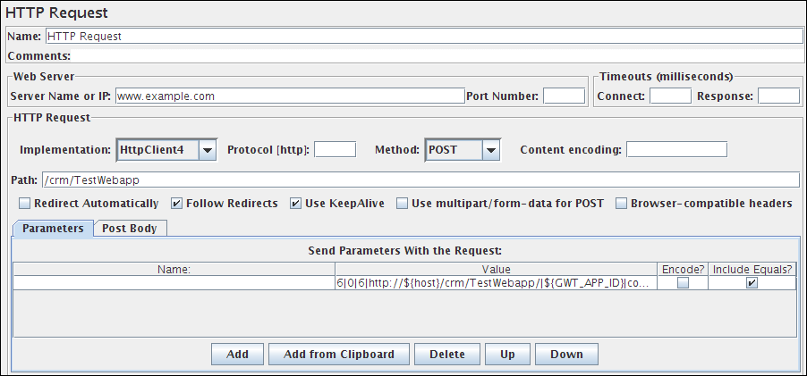](assets/images/http-request-raw-single-parameter_c63872a080df8c95.png)

Figure 1 - HTTP Request with one unnamed parameter

[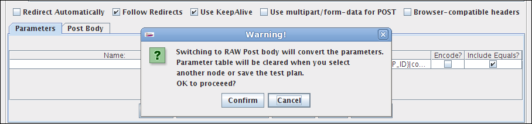](assets/images/http-request-confirm-raw-body_74de62c5a12e9295.png)

Figure 2 - Confirm dialog to switch

[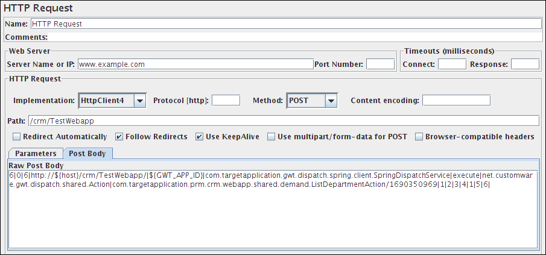](assets/images/http-request-raw-body_d4e9dbf87438382d.png)

Figure 3 - HTTP Request using Body Data

**Method Handling:**
The GET, DELETE, POST, PUT and PATCH request methods work similarly, except that as of 3.1, only POST method supports multipart requests
or file upload.
The PUT and PATCH method body must be provided as one of the following:

- define the body as a file with empty Parameter name field; in which case the MIME Type is used as the Content-Type
- define the body as parameter value(s) with no name
- use the Body Data tab

The GET, DELETE and POST methods have an additional way of passing parameters by using the Parameters tab.
GET, DELETE, PUT and PATCH require a Content-Type.
If not using a file, attach a Header Manager to the sampler and define the Content-Type there.

JMeter scan responses from embedded resources. It uses the property HTTPResponse.parsers, which is a list of parser ids, e.g. htmlParser, cssParser and wmlParser. For each id found, JMeter checks two further properties:

- id.types - a list of content types
- id.className - the parser to be used to extract the embedded resources

See jmeter.properties file for the details of the settings.
If the HTTPResponse.parser property is not set, JMeter reverts to the previous behaviour, i.e. only text/html responses will be scanned

**Emulating slow connections:**

HttpClient4 and Java Sampler support emulation of slow connections; see the following entries in jmeter.properties:

```

# Define characters per second > 0 to emulate slow connections #httpclient.socket.http.cps=0 #httpclient.socket.https.cps=0
```

However the Java sampler only supports slow HTTPS connections.

**Response size calculation**

The Java implementation does not include transport overhead such as
chunk headers in the response body size.
The HttpClient4 implementation does include the overhead in the response body size, so the value may be greater than the number of bytes in the response content.

**Retry handling**
By default retry has been set to 0 for both HttpClient4 and Java implementations, meaning no retry is attempted.
For HttpClient4, the retry count can be overridden by setting the relevant JMeter property, for example:

```

httpclient4.retrycount=3
```

With HC4 Implementation, retry will be done on Idempotent Http Methods by default.
If you want to retry for all methods, then set property

```

httpclient4.request_sent_retry_enabled=true
```

Note that the Java implementation does not retry neither by default, you can change this by setting

```
http.java.sampler.retries=3
```

**Note: Certificates does not conform to algorithm constraints**
You may encounter the following error: java.security.cert.CertificateException: Certificates does not conform to algorithm constraints
if you run a HTTPS request on a web site with a SSL certificate (itself or one of SSL certificates in its chain of trust) with a signature
algorithm using MD2 (like md2WithRSAEncryption) or with a SSL certificate with a size lower than 1024 bits.

This error is related to increased security in Java 8.

To allow you to perform your HTTPS request, you can downgrade the security of your Java installation by editing
the Java jdk.certpath.disabledAlgorithms property. Remove the MD2 value or the constraint on size, depending on your case.

This property is in this file:

```
JAVA_HOME/jre/lib/security/java.security
```

See [Bug
56357](https://bz.apache.org/bugzilla/show_bug.cgi?id=56357) for details.

See also:

- [Assertion](#test_plan--assertions)
- [Building a Web Test Plan](#build-web-test-plan)
- [Building an Advanced Web Test Plan](#build-adv-web-test-plan)
- [HTTP Authorization Manager](#component_reference--http_authorization_manager)
- [HTTP Cookie Manager](#component_reference--http_cookie_manager)
- [HTTP Header Manager](#component_reference--http_header_manager)
- [HTML Link Parser](#component_reference--html_link_parser)
- [HTTP(S) Test Script Recorder](#component_reference--http-s-_test_script_recorder)
- [HTTP Request Defaults](#component_reference--http_request_defaults)
- [HTTP Requests and Session ID's: URL Rewriting](#build-adv-web-test-plan--session_url_rewriting)

[^](#component_reference)

<a id="component_reference--jdbc_request"></a>
<a id="component_reference--jdbc-request"></a>

## JDBC Request[¶](#component_reference--jdbc_request "Link to here")

This sampler lets you send a JDBC Request (an SQL query) to a database.

Before using this you need to set up a
[JDBC Connection Configuration](#component_reference--jdbc_connection_configuration) Configuration element

If the Variable Names list is provided, then for each row returned by a Select statement, the variables are set up
with the value of the corresponding column (if a variable name is provided), and the count of rows is also set up.
For example, if the Select statement returns 2 rows of 3 columns, and the variable list is A,,C, then the following variables will be set up:

```

A_#=2 (number of rows)
A_1=column 1, row 1
A_2=column 1, row 2
C_#=2 (number of rows)
C_1=column 3, row 1
C_2=column 3, row 2
```

If the Select statement returns zero rows, then the A\_# and C\_# variables would be set to 0, and no other variables would be set.

Old variables are cleared if necessary - e.g. if the first select retrieves six rows and a second select returns only three rows, the additional variables for rows four, five and six will be removed.

The latency time is set from the time it took to acquire a connection.

[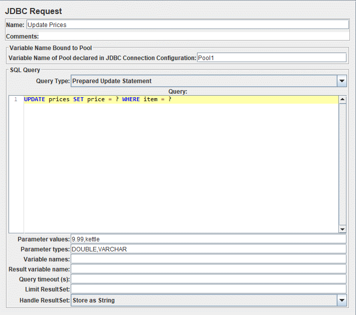](assets/images/jdbc-request_6e3eb61d034faa3b.png)

Screenshot of Control-Panel of JDBC Request

<a id="component_reference--jdbc_request_parms1"></a>
<a id="component_reference--parameters-4"></a>

### Parameters [¶](#component_reference--jdbc_request_parms1 "Link to here")

Attribute

Description

Required

Name

Descriptive name for this sampler that is shown in the tree.

No

Variable Name of Pool declared in JDBC Connection Configuration

Name of the JMeter variable that the connection pool is bound to.
This must agree with the 'Variable Name' field of a [JDBC Connection Configuration](#component_reference--jdbc_connection_configuration).

Yes

Query Type

Set this according to the statement type:

- Select Statement
- Update Statement - use this for Inserts and Deletes as well
- Callable Statement
- Prepared Select Statement
- Prepared Update Statement - use this for Inserts and Deletes as well
- Commit
- Rollback
- Autocommit(false)
- Autocommit(true)
- Edit - this should be a variable reference that evaluates to one of the above

The types Commit, Rollback, Autocommit(false) and Autocommit(true)
are special, as they are ignoring the given SQL statements and are changing the state of the connection, only.

Yes

SQL Query

SQL query.

Do not enter a trailing semi-colon.

There is generally no need to use { and } to enclose Callable statements;
however they may be used if the database uses a non-standard syntax.

The JDBC driver automatically converts the statement if necessary when it is enclosed in {}.

For example:

- select \* from t\_customers where id=23
- CALL SYSCS\_UTIL.SYSCS\_EXPORT\_TABLE (null, ?, ?, null, null, null)
  - Parameter values: tablename,filename
  - Parameter types: VARCHAR,VARCHAR

The second example assumes you are using Apache Derby.

Yes

Parameter values

Comma-separated list of parameter values. Use ]NULL[ to indicate a NULL parameter.
(If required, the null string can be changed by defining the property "jdbcsampler.nullmarker".)
The list must be enclosed in double-quotes if any of the values contain a comma or double-quote, and any embedded double-quotes must be doubled-up, for example:

```
"Dbl-Quote: "" and Comma: ,"
```

There must be as many values as there are placeholders in the statement even if your parameters are OUT ones.
Be sure to set a value even if the value will not be used (for example in a CallableStatement).

Yes, if a prepared or callable statement has parameters

Parameter types

Comma-separated list of SQL parameter types (e.g. INTEGER, DATE, VARCHAR, DOUBLE) or integer values of Constants. Those integer values can be used, when you use custom database types proposed by driver (For example OracleTypes.CURSOR could be represented by its integer value -10).
These are defined as fields in the class java.sql.Types, see for example:
[Javadoc for java.sql.Types](http://docs.oracle.com/javase/8/docs/api/java/sql/Types.html).

Note: JMeter will use whatever types are defined by the runtime JVM, so if you are running on a different JVM, be sure to check the appropriate documentation

**If the callable statement has INOUT or OUT parameters, then these must be indicated by prefixing the
appropriate parameter types, e.g. instead of "INTEGER", use "INOUT INTEGER".**
If not specified, "IN" is assumed, i.e. "DATE" is the same as "IN DATE".
If the type is not one of the fields found in java.sql.Types, JMeter also
accepts the corresponding integer number, e.g. since OracleTypes.CURSOR == -10, you can use "INOUT -10".
There must be as many types as there are placeholders in the statement.

Yes, if a prepared or callable statement has parameters

Variable Names

Comma-separated list of variable names to hold values returned by Select statements, Prepared Select Statements or CallableStatement.
Note that when used with CallableStatement, list of variables must be in the same sequence as the OUT parameters returned by the call.
If there are less variable names than OUT parameters only as many results shall be stored in the thread-context variables as variable names were supplied.
If more variable names than OUT parameters exist, the additional variables will be ignored

No

Result Variable Name

If specified, this will create an Object variable containing a list of row maps.
Each map contains the column name as the key and the column data as the value. Usage:

```
columnValue = vars.getObject("resultObject").get(0).get("Column Name");
```

No

Query timeout(s)

Set a timeout in seconds for query, empty value means 0 which is infinite. -1 means don't set any query timeout
which might be needed for use case or when certain drivers don't support timeout. Defaults to 0.

No

Limit ResultSet

Limits the number of rows to iterate through the ResultSet. Empty value means -1, e.g. no limitation, which is also the default. This can help to reduce the amount of data to be fetched from the database via the JDBC driver, but affects all possible options of Handle ResultSet respectively – e.g. incomplete ResultSet and a record count ≤ the limit.

No

Handle ResultSet

Defines how ResultSet returned from callable statements be handled:

- Store As String (default) - All variables on Variable Names list are stored as strings, will not iterate through a ResultSet when present on the list. CLOBs will be converted to Strings. BLOBs will be converted to Strings as if they were an UTF-8 encoded byte-array. Both CLOBs and BLOBs will be cut off after jdbcsampler.max\_retain\_result\_size bytes.
- Store As Object - Variables of ResultSet type on Variables Names list will be stored as Object and can be accessed in subsequent tests/scripts and iterated, will not iterate through the ResultSet. CLOBs will be handled as if Store As String was selected. BLOBs will be stored as a byte array. Both CLOBs and BLOBs will be cut off after jdbcsampler.max\_retain\_result\_size bytes.
- Count Records - Variables of ResultSet types will be iterated through showing the count of records as result. Variables will be stored as Strings. For BLOBs the size of the object will be stored.

No

See also:

- [Building a Database Test Plan](#build-db-test-plan)
- [JDBC Connection Configuration](#component_reference--jdbc_connection_configuration)

Current Versions of JMeter use UTF-8 as the character encoding. Previously the platform default was used.

Ensure Variable Name is unique across Test Plan.

[^](#component_reference)

<a id="component_reference--java_request"></a>
<a id="component_reference--java-request"></a>

## Java Request[¶](#component_reference--java_request "Link to here")

This sampler lets you control a java class that implements the
org.apache.jmeter.protocol.java.sampler.JavaSamplerClient interface.
By writing your own implementation of this interface, you can use JMeter to harness multiple threads, input parameter control, and
data collection.

The pull-down menu provides the list of all such implementations found by
JMeter in its classpath. The parameters can then be specified in the
table below - as defined by your implementation. Two simple examples (JavaTest and SleepTest) are provided.

The JavaTest example sampler can be useful for checking test plans, because it allows one to set
values in almost all the fields. These can then be used by Assertions, etc.
The fields allow variables to be used, so the values of these can readily be seen.

[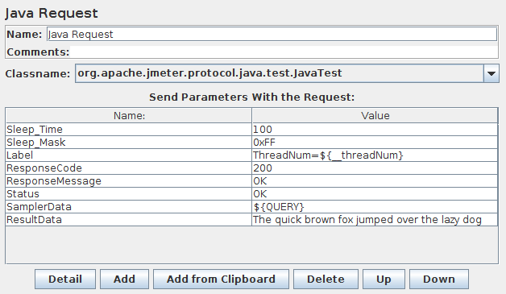](assets/images/java-request_6ab04fbc9ce7141b.png)

Screenshot of Control-Panel of Java Request

If the method teardownTest is not overridden by a subclass of [AbstractJavaSamplerClient](https://jmeter.apache.org/api/org/apache/jmeter/protocol/java/sampler/AbstractJavaSamplerClient.html), its teardownTest method will not be called.
This reduces JMeter memory requirements.
This will not have any impact on existing Test plans.

The Add/Delete buttons don't serve any purpose at present.

<a id="component_reference--java_request_parms1"></a>
<a id="component_reference--parameters-5"></a>

### Parameters [¶](#component_reference--java_request_parms1 "Link to here")

Attribute

Description

Required

Name

Descriptive name for this sampler
that is shown in the tree.

No

Classname

The specific implementation of
the JavaSamplerClient interface to be sampled.

Yes

Send Parameters with Request

A list of
arguments that will be passed to the sampled class. All arguments
are sent as Strings. See below for specific settings.

No

The following parameters apply to the SleepTest and JavaTest implementations:

<a id="component_reference--java_request_parms2"></a>
<a id="component_reference--parameters-6"></a>

### Parameters [¶](#component_reference--java_request_parms2 "Link to here")

Attribute

Description

Required

Sleep\_time

How long to sleep for (ms)

Yes

Sleep\_mask

How much "randomness" to add:
The sleep time is calculated as follows:

```
totalSleepTime = SleepTime + (System.currentTimeMillis() % SleepMask)
```

Yes

The following parameters apply additionally to the JavaTest implementation:

<a id="component_reference--java_request_parms3"></a>
<a id="component_reference--parameters-7"></a>

### Parameters [¶](#component_reference--java_request_parms3 "Link to here")

Attribute

Description

Required

Label

The label to use. If provided, overrides Name

No

ResponseCode

If provided, sets the SampleResult ResponseCode.

No

ResponseMessage

If provided, sets the SampleResult ResponseMessage.

No

Status

If provided, sets the SampleResult Status. If this equals "OK" (ignoring case) then the status is set to success, otherwise the sample is marked as failed.

No

SamplerData

If provided, sets the SampleResult SamplerData.

No

ResultData

If provided, sets the SampleResult ResultData.

No

[^](#component_reference)

<a id="component_reference--ldap_request"></a>
<a id="component_reference--ldap-request"></a>

## LDAP Request[¶](#component_reference--ldap_request "Link to here")

This Sampler lets you send a different LDAP request(Add, Modify, Delete and Search) to an LDAP server.

If you are going to send multiple requests to the same LDAP server, consider
using an [LDAP Request Defaults](#component_reference--ldap_request_defaults)
Configuration Element so you do not have to enter the same information for each
LDAP Request.

The same way the [Login Config Element](#component_reference--login_config_element) also using for Login and password.

[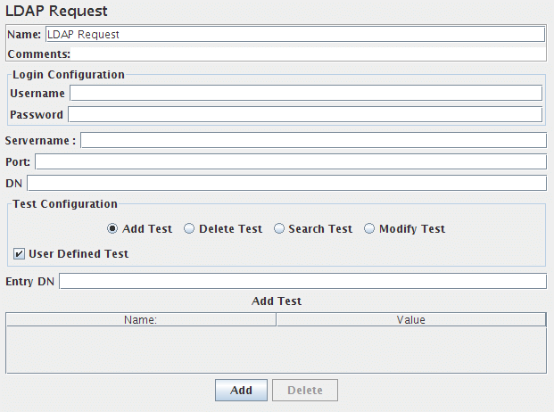](assets/images/ldap-request_e87ce841e37b8cb9.png)

Screenshot of Control-Panel of LDAP Request

There are two ways to create test cases for testing an LDAP Server.

1. Inbuilt Test cases.
2. User defined Test cases.

There are four test scenarios of testing LDAP. The tests are given below:

1. Add Test
   1. Inbuilt test:

      This will add a pre-defined entry in the LDAP Server and calculate
      the execution time. After execution of the test, the created entry will be
      deleted from the LDAP
      Server.
   2. User defined test:

      This will add the entry in the LDAP Server. User has to enter all the
      attributes in the table.The entries are collected from the table to add. The
      execution time is calculated. The created entry will not be deleted after the
      test.
2. Modify Test
   1. Inbuilt test:

      This will create a pre-defined entry first, then will modify the
      created entry in the LDAP Server.And calculate the execution time. After
      execution
      of the test, the created entry will be deleted from the LDAP Server.
   2. User defined test:

      This will modify the entry in the LDAP Server. User has to enter all the
      attributes in the table. The entries are collected from the table to modify.
      The execution time is calculated. The entry will not be deleted from the LDAP
      Server.
3. Search Test
   1. Inbuilt test:

      This will create the entry first, then will search if the attributes
      are available. It calculates the execution time of the search query. At the
      end of the execution,created entry will be deleted from the LDAP Server.
   2. User defined test:

      This will search the user defined entry(Search filter) in the Search
      base (again, defined by the user). The entries should be available in the LDAP
      Server. The execution time is calculated.
4. Delete Test
   1. Inbuilt test:

      This will create a pre-defined entry first, then it will be deleted
      from the LDAP Server. The execution time is calculated.
   2. User defined test:

      This will delete the user-defined entry in the LDAP Server. The entries
      should be available in the LDAP Server. The execution time is calculated.

<a id="component_reference--ldap_request_parms1"></a>
<a id="component_reference--parameters-8"></a>

### Parameters [¶](#component_reference--ldap_request_parms1 "Link to here")

Attribute

Description

Required

Name

Descriptive name for this sampler that is shown in the tree.

No

Server Name or IP

Domain name or IP address of the LDAP server.
JMeter assumes the LDAP server is listening on the default port (389).

Yes

Port

Port to connect to (default is 389).

Yes

root DN

Base DN to use for LDAP operations

Yes

Username

LDAP server username.

Usually

Password

LDAP server password. (N.B. this is stored unencrypted in the test plan)

Usually

Entry DN

the name of the context to create or Modify; may not be empty.

You have to set the right attributes of the object yourself. So if you want to add cn=apache,ou=test
you have to add in the table name and value to cn and apache.

Yes, if User Defined Test and Add Test or Modify Test is selected

Delete

the name of the context to Delete; may not be empty

Yes, if User Defined Test and Delete Test is selected

Search base

the name of the context or object to search

Yes, if User Defined Test and Search Test is selected

Search filter

the filter expression to use for the search; may not be null

Yes, if User Defined Test and Search Test is selected

add test

Use these name, value pairs for creation of the new object in the given context

Yes, if User Defined Test and add Test is selected

modify test

Use these name, value pairs for modification of the given context object

Yes, if User Defined Test and Modify Test is selected

See also:

- [Building an LDAP Test Plan](#build-ldap-test-plan)
- [LDAP Request Defaults](#component_reference--ldap_request_defaults)

[^](#component_reference)

<a id="component_reference--ldap_extended_request"></a>
<a id="component_reference--ldap-extended-request"></a>

## LDAP Extended Request[¶](#component_reference--ldap_extended_request "Link to here")

This Sampler can send all 8 different LDAP requests to an LDAP server. It is an extended version of the LDAP sampler, therefore it is harder to configure, but can be made much closer resembling a real LDAP session.

If you are going to send multiple requests to the same LDAP server, consider
using an [LDAP Extended Request Defaults](#component_reference--ldap_extended_request_defaults)
Configuration Element so you do not have to enter the same information for each
LDAP Request.

[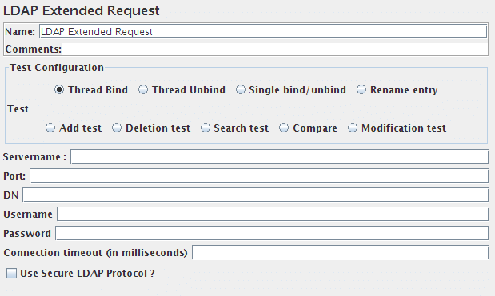](assets/images/ldapext-request_c818587297fd7b28.png)

Screenshot of Control-Panel of LDAP Extended Request

There are nine test operations defined. These operations are given below:

**Thread bind**
:   Any LDAP request is part of an LDAP session, so the first thing that should be done is starting a session to the LDAP server.
    For starting this session a thread bind is used, which is equal to the LDAP "bind" operation.
    The user is requested to give a username (Distinguished name) and password,
    which will be used to initiate a session.
    When no password, or the wrong password is specified, an anonymous session is started. Take care,
    omitting the password will not fail this test, a wrong password will.
    (N.B. this is stored unencrypted in the test plan)

    <a id="component_reference--parameters-9"></a>

    ### Parameters

    Attribute

    Description

    Required

    Name

    Descriptive name for this sampler that is shown in the tree.

    No

    Servername

    The name (or IP-address) of the LDAP server.

    Yes

    Port

    The port number that the LDAP server is listening to. If this is omitted
    JMeter assumes the LDAP server is listening on the default port(389).

    No

    DN

    The distinguished name of the base object that will be used for any subsequent operation.
    It can be used as a starting point for all operations. You cannot start any operation on a higher level than this DN!

    No

    Username

    Full distinguished name of the user as which you want to bind.

    No

    Password

    Password for the above user. If omitted it will result in an anonymous bind.
    If it is incorrect, the sampler will return an error and revert to an anonymous bind. (N.B. this is stored unencrypted in the test plan)

    No

    Connection timeout (in milliseconds)

    Timeout for connection, if exceeded connection will be aborted

    No

    Use Secure LDAP Protocol

    Use ldaps:// scheme instead of ldap://

    No

    Trust All Certificates

    Trust all certificates, only used if Use Secure LDAP Protocol is checked

    No

**Thread unbind**
:   This is simply the operation to end a session.
    It is equal to the LDAP "unbind" operation.

    <a id="component_reference--parameters-10"></a>

    ### Parameters

    Attribute

    Description

    Required

    Name

    Descriptive name for this sampler that is shown in the tree.

    No

**Single bind/unbind**
:   This is a combination of the LDAP "bind" and "unbind" operations.
    It can be used for an authentication request/password check for any user. It will open a new session, just to
    check the validity of the user/password combination, and end the session again.

    <a id="component_reference--parameters-11"></a>

    ### Parameters

    Attribute

    Description

    Required

    Name

    Descriptive name for this sampler that is shown in the tree.

    No

    Username

    Full distinguished name of the user as which you want to bind.

    Yes

    Password

    Password for the above user. If omitted it will result in an anonymous bind.
    If it is incorrect, the sampler will return an error. (N.B. this is stored unencrypted in the test plan)

    No

**Rename entry**
:   This is the LDAP "moddn" operation. It can be used to rename an entry, but
    also for moving an entry or a complete subtree to a different place in
    the LDAP tree.

    <a id="component_reference--parameters-12"></a>

    ### Parameters

    Attribute

    Description

    Required

    Name

    Descriptive name for this sampler that is shown in the tree.

    No

    Old entry name

    The current distinguished name of the object you want to rename or move,
    relative to the given DN in the thread bind operation.

    Yes

    New distinguished name

    The new distinguished name of the object you want to rename or move,
    relative to the given DN in the thread bind operation.

    Yes

**Add test**
:   This is the LDAP "add" operation. It can be used to add any kind of
    object to the LDAP server.

    <a id="component_reference--parameters-13"></a>

    ### Parameters

    Attribute

    Description

    Required

    Name

    Descriptive name for this sampler that is shown in the tree.

    No

    Entry DN

    Distinguished name of the object you want to add, relative to the given DN in the thread bind operation.

    Yes

    Add test

    A list of attributes and their values you want to use for the object.
    If you need to add a multiple value attribute, you need to add the same attribute with their respective
    values several times to the list.

    Yes

**Delete test**
:   This is the LDAP "delete" operation, it can be used to delete an
    object from the LDAP tree

    <a id="component_reference--parameters-14"></a>

    ### Parameters

    Attribute

    Description

    Required

    Name

    Descriptive name for this sampler that is shown in the tree.

    No

    Delete

    Distinguished name of the object you want to delete, relative to the given DN in the thread bind operation.

    Yes

**Search test**
:   This is the LDAP "search" operation, and will be used for defining searches.

    <a id="component_reference--parameters-15"></a>

    ### Parameters

    Attribute

    Description

    Required

    Name

    Descriptive name for this sampler that is shown in the tree.

    No

    Search base

    Distinguished name of the subtree you want your
    search to look in, relative to the given DN in the thread bind operation.

    No

    Search Filter

    searchfilter, must be specified in LDAP syntax.

    Yes

    Scope

    Use 0 for baseobject-, 1 for onelevel- and 2 for a subtree search. (Default=0)

    No

    Size Limit

    Specify the maximum number of results you want back from the server. (default=0, which means no limit.) When the sampler hits the maximum number of results, it will fail with errorcode 4

    No

    Time Limit

    Specify the maximum amount of (cpu)time (in milliseconds) that the server can spend on your search. Take care, this does not say anything about the response time. (default is 0, which means no limit)

    No

    Attributes

    Specify the attributes you want to have returned, separated by a semicolon. An empty field will return all attributes

    No

    Return object

    Whether the object will be returned (true) or not (false). Default=false

    No

    Dereference aliases

    If true, it will dereference aliases, if false, it will not follow them (default=false)

    No

    Parse the search results?

    If true, the search results will be added to the response data. If false, a marker - whether results where found or not - will be added to the response data.

    No

**Modification test**
:   This is the LDAP "modify" operation. It can be used to modify an object. It
    can be used to add, delete or replace values of an attribute.

    <a id="component_reference--parameters-16"></a>

    ### Parameters

    Attribute

    Description

    Required

    Name

    Descriptive name for this sampler that is shown in the tree.

    No

    Entry name

    Distinguished name of the object you want to modify, relative
    to the given DN in the thread bind operation

    Yes

    Modification test

    The attribute-value-opCode triples.
    The opCode can be any valid LDAP operationCode (add, delete, remove or replace).
    If you don't specify a value with a delete operation, all values of the given attribute will be deleted.
    If you do specify a value in a delete operation, only the given value will be deleted.
    If this value is non-existent, the sampler will fail the test.

    Yes

**Compare**
:   This is the LDAP "compare" operation. It can be used to compare the value
    of a given attribute with some already known value. In reality this is mostly
    used to check whether a given person is a member of some group. In such a case
    you can compare the DN of the user as a given value, with the values in the
    attribute "member" of an object of the type groupOfNames.
    If the compare operation fails, this test fails with errorcode 49.

    <a id="component_reference--parameters-17"></a>

    ### Parameters

    Attribute

    Description

    Required

    Name

    Descriptive name for this sampler that is shown in the tree.

    No

    Entry DN

    The current distinguished name of the object of
    which you want to compare an attribute, relative to the given DN in the thread bind operation.

    Yes

    Compare filter

    In the form "attribute=value"

    Yes

See also:

- [Building an LDAP Test Plan](#build-ldapext-test-plan)
- [LDAP Extended Request Defaults](#component_reference--ldap_extended_request_defaults)

[^](#component_reference)

<a id="component_reference--access_log_sampler"></a>
<a id="component_reference--access-log-sampler"></a>

## Access Log Sampler[¶](#component_reference--access_log_sampler "Link to here")

AccessLogSampler was designed to read access logs and generate http requests.
For those not familiar with the access log, it is the log the webserver maintains of every
request it accepted. This means every image, CSS file, JavaScript file, html file, …

Tomcat uses the common format for access logs. This means any webserver that uses the
common log format can use the AccessLogSampler. Server that use common log format include:
Tomcat, Resin, Weblogic, and SunOne. Common log format looks
like this:

```
127.0.0.1 - - [21/Oct/2003:05:37:21 -0500] "GET /index.jsp?%2Findex.jsp= HTTP/1.1" 200 8343
```

The current implementation of the parser only looks at the text within the quotes that contains one of the HTTP protocol methods (GET, PUT, POST, DELETE, …).
Everything else is stripped out and ignored. For example, the response code is completely
ignored by the parser.

For the future, it might be nice to filter out entries that
do not have a response code of 200. Extending the sampler should be fairly simple. There
are two interfaces you have to implement:

- org.apache.jmeter.protocol.http.util.accesslog.LogParser
- org.apache.jmeter.protocol.http.util.accesslog.Generator

The current implementation of AccessLogSampler uses the generator to create a new
HTTPSampler. The servername, port and get images are set by AccessLogSampler. Next, the parser is called with integer 1, telling it to parse one entry. After that, HTTPSampler.sample() is called to make the request.

```

samp = (HTTPSampler) GENERATOR.generateRequest();
samp.setDomain(this.getDomain());
samp.setPort(this.getPort());
samp.setImageParser(this.isImageParser());
PARSER.parse(1);
res = samp.sample();
res.setSampleLabel(samp.toString());
```

The required methods in LogParser are:

- setGenerator(Generator)
- parse(int)

Classes implementing Generator interface should provide concrete implementation
for all the methods. For an example of how to implement either interface, refer to
StandardGenerator and TCLogParser.

[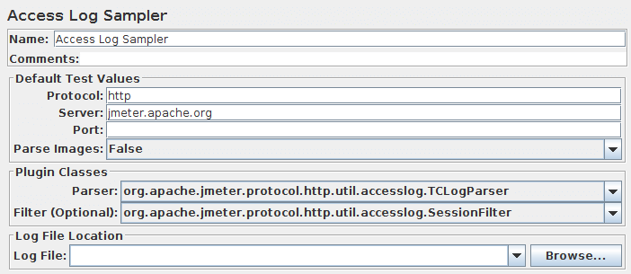](assets/images/accesslogsampler_43b10b2322ea171c.png)

Screenshot of Control-Panel of Access Log Sampler

<a id="component_reference--beta-code"></a>

## (Beta Code)

<a id="component_reference--access_log_sampler_parms1"></a>
<a id="component_reference--parameters-18"></a>

### Parameters [¶](#component_reference--access_log_sampler_parms1 "Link to here")

Attribute

Description

Required

Name

Descriptive name for this sampler that is shown in the tree.

No

Server

Domain name or IP address of the web server.

Yes

Protocol

Scheme

No (defaults to http

Port

Port the web server is listening to.

No (defaults to 80)

Log parser class

The log parser class is responsible for parsing the logs.

Yes (default provided)

Filter

The filter class is used to filter out certain lines.

No

Location of log file

The location of the access log file.

Yes

The TCLogParser processes the access log independently for each thread.
The SharedTCLogParser and OrderPreservingLogParser share access to the file, i.e. each thread gets the next entry in the log.

The SessionFilter is intended to handle Cookies across threads.
It does not filter out any entries, but modifies the cookie manager so that the cookies for a given IP are
processed by a single thread at a time. If two threads try to process samples from the same client IP address, then one will be forced to wait until the other has completed.

The LogFilter is intended to allow access log entries to be filtered by filename and regex, as well as allowing for the replacement of file extensions. However, it is not currently possible
to configure this via the GUI, so it cannot really be used.

[^](#component_reference)

<a id="component_reference--beanshell_sampler"></a>
<a id="component_reference--beanshell-sampler"></a>

## BeanShell Sampler[¶](#component_reference--beanshell_sampler "Link to here")

This sampler allows you to write a sampler using the BeanShell scripting language.

**For full details on using BeanShell, please see the [BeanShell website.](http://www.beanshell.org/)**

Migration to [JSR223 Sampler](#component_reference--jsr223_sampler)+Groovy is highly recommended for performance, support of new Java features and limited maintenance of the BeanShell library.

The test element supports the ThreadListener and TestListener interface methods.
These must be defined in the initialisation file.
See the file BeanShellListeners.bshrc for example definitions.

The BeanShell sampler also supports the Interruptible interface.
The interrupt() method can be defined in the script or the init file.

[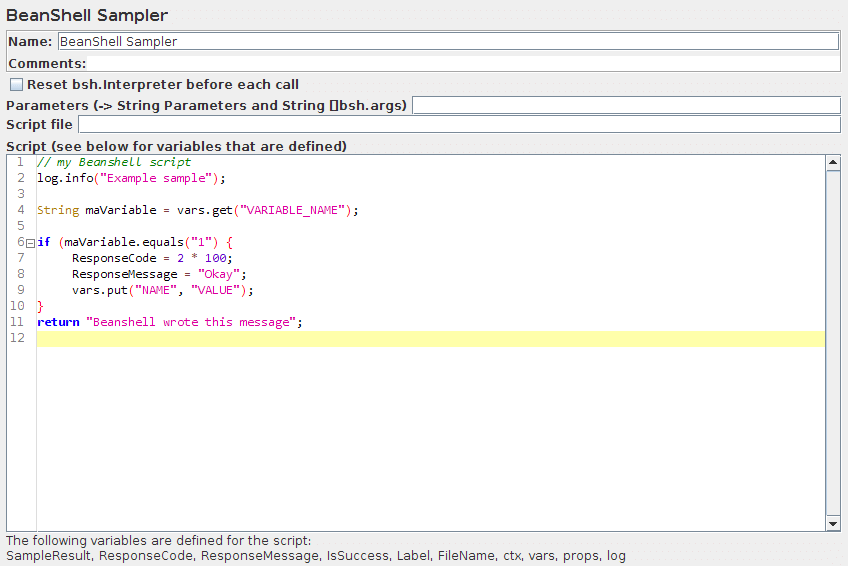](assets/images/beanshellsampler_efb8fe02cc05e8bf.png)

Screenshot of Control-Panel of BeanShell Sampler

<a id="component_reference--beanshell_sampler_parms1"></a>
<a id="component_reference--parameters-19"></a>

### Parameters [¶](#component_reference--beanshell_sampler_parms1 "Link to here")

Attribute

Description

Required

Name

Descriptive name for this sampler that is shown in the tree.
The name is stored in the script variable Label

No

Reset bsh.Interpreter before each call

If this option is selected, then the interpreter will be recreated for each sample.
This may be necessary for some long running scripts.
For further information, see [Best Practices - BeanShell scripting](#best-practices--bsh_scripting).

Yes

Parameters

Parameters to pass to the BeanShell script.
This is intended for use with script files; for scripts defined in the GUI, you can use whatever
variable and function references you need within the script itself.
The parameters are stored in the following variables:

Parameters
:   string containing the parameters as a single variable

bsh.args
:   String array containing parameters, split on white-space

No

Script file

A file containing the BeanShell script to run.
The file name is stored in the script variable FileName

No

Script

The BeanShell script to run.
The return value (if not null) is stored as the sampler result.

Yes (unless script file is provided)

N.B. Each Sampler instance has its own BeanShell interpreter, and Samplers are only called from a single thread

If the property "beanshell.sampler.init" is defined, it is passed to the Interpreter
as the name of a sourced file.
This can be used to define common methods and variables.
There is a sample init file in the bin directory: BeanShellSampler.bshrc.

If a script file is supplied, that will be used, otherwise the script will be used.

JMeter processes function and variable references before passing the script field to the interpreter, so the references will only be resolved once.
Variable and function references in script files will be passed
verbatim to the interpreter, which is likely to cause a syntax error.
In order to use runtime variables, please use the appropriate props methods, e.g.props.get("START.HMS"); props.put("PROP1","1234");
BeanShell does not currently support Java 5 syntax such as generics and the enhanced for loop.

Before invoking the script, some variables are set up in the BeanShell interpreter:

The contents of the Parameters field is put into the variable "Parameters".
The string is also split into separate tokens using a single space as the separator, and the resulting list
is stored in the String array bsh.args.

The full list of BeanShell variables that is set up is as follows:

- log - the [Logger](https://www.slf4j.org/api/org/slf4j/Logger.html)
- Label - the Sampler label
- FileName - the file name, if any
- Parameters - text from the Parameters field
- bsh.args - the parameters, split as described above
- SampleResult - pointer to the current [SampleResult](https://jmeter.apache.org/api/org/apache/jmeter/samplers/SampleResult.html)
- ResponseCode defaults to 200
- ResponseMessage defaults to "OK"
- IsSuccess defaults to true
- ctx - [JMeterContext](https://jmeter.apache.org/api/org/apache/jmeter/threads/JMeterContext.html)
- vars - [JMeterVariables](https://jmeter.apache.org/api/org/apache/jmeter/threads/JMeterVariables.html) - e.g.

```
vars.get("VAR1");
vars.put("VAR2","value");
vars.remove("VAR3");
vars.putObject("OBJ1",new Object());
```

- props - JMeterProperties (class [java.util.Properties](https://docs.oracle.com/javase/8/docs/api/java/util/Properties.html)) - e.g.

```
props.get("START.HMS");
props.put("PROP1","1234");
```

When the script completes, control is returned to the Sampler, and it copies the contents
of the following script variables into the corresponding variables in the [SampleResult](https://jmeter.apache.org/api/org/apache/jmeter/samplers/SampleResult.html):

- ResponseCode - for example 200
- ResponseMessage - for example "OK"
- IsSuccess - true or false

The SampleResult ResponseData is set from the return value of the script.
If the script returns null, it can set the response directly, by using the method
SampleResult.setResponseData(data), where data is either a String or a byte array.
The data type defaults to "text", but can be set to binary by using the method
SampleResult.setDataType(SampleResult.BINARY).

The SampleResult variable gives the script full access to all the fields and
methods in the SampleResult. For example, the script has access to the methods
setStopThread(boolean) and setStopTest(boolean).
Here is a simple (not very useful!) example script:

```

if (bsh.args[0].equalsIgnoreCase("StopThread")) {
    log.info("Stop Thread detected!");
    SampleResult.setStopThread(true);
}
return "Data from sample with Label "+Label;
//or
SampleResult.setResponseData("My data");
return null;
```

Another example:
ensure that the property beanshell.sampler.init=BeanShellSampler.bshrc is defined in jmeter.properties.
The following script will show the values of all the variables in the ResponseData field:

```

return getVariables();
```

For details on the methods available for the various classes ([JMeterVariables](https://jmeter.apache.org/api/org/apache/jmeter/threads/JMeterVariables.html), [SampleResult](https://jmeter.apache.org/api/org/apache/jmeter/samplers/SampleResult.html) etc.) please check the Javadoc or the source code.
Beware however that misuse of any methods can cause subtle faults that may be difficult to find.

[^](#component_reference)

<a id="component_reference--jsr223_sampler"></a>
<a id="component_reference--jsr223-sampler"></a>

## JSR223 Sampler[¶](#component_reference--jsr223_sampler "Link to here")

The JSR223 Sampler allows JSR223 script code to be used to perform a sample or some computation required to create/update variables.

If you don't want to generate a [SampleResult](https://jmeter.apache.org/api/org/apache/jmeter/samplers/SampleResult.html) when this sampler is run, call the following method:

```
SampleResult.setIgnore();
```

This call will have the following impact:

- SampleResult will not be delivered to SampleListeners like View Results Tree, Summariser ...
- SampleResult will not be evaluated in Assertions nor PostProcessors
- SampleResult will be evaluated to computing last sample status (${JMeterThread.last\_sample\_ok}),
  and ThreadGroup "Action to be taken after a Sampler error" (since JMeter 5.4)

The JSR223 test elements have a feature (compilation) that can significantly increase performance.
To benefit from this feature:

- Use Script files instead of inlining them. This will make JMeter compile them if this feature is available on ScriptEngine and cache them.
- Or Use Script Text and check Cache compiled script if available property.

  When using this feature, ensure your script code does not use JMeter variables or JMeter function calls directly in script code as caching would only cache first replacement. Instead use script parameters.

  To benefit from caching and compilation, the language engine used for scripting must implement JSR223 [Compilable](https://docs.oracle.com/javase/8/docs/api/javax/script/Compilable.html) interface (Groovy is one of these, java, beanshell and javascript are not)

  When using Groovy as scripting language and not checking Cache compiled script if available (while caching is recommended), you should set this JVM Property -Dgroovy.use.classvalue=true
  due to a Groovy Memory leak as of version 2.4.6, see:
  - [GROOVY-7683](https://issues.apache.org/jira/browse/GROOVY-7683)
  - [GROOVY-7591](https://issues.apache.org/jira/browse/GROOVY-7591)
  - [JDK-8136353](https://bugs.openjdk.java.net/browse/JDK-8136353)

Cache size is controlled by the following JMeter property (jmeter.properties):

```
jsr223.compiled_scripts_cache_size=100
```

Unlike the [BeanShell Sampler](#component_reference--beanshell_sampler), the interpreter is not saved between invocations.

JSR223 Test Elements using Script file or Script text + checked Cache compiled script if available are now compiled if ScriptEngine supports this feature, this enables great performance enhancements.

[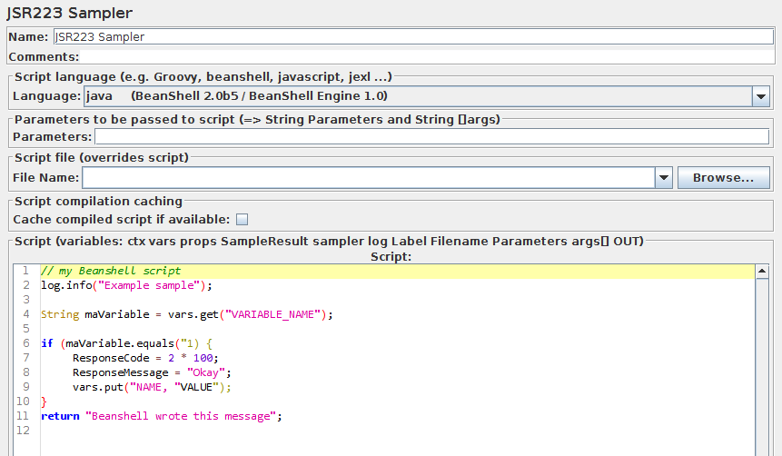](assets/images/jsr223-sampler_0e1d3189ee614e33.png)

Screenshot of Control-Panel of JSR223 Sampler

JMeter processes function and variable references before passing the script field to the interpreter, so the references will only be resolved once.
Variable and function references in script files will be passed
verbatim to the interpreter, which is likely to cause a syntax error.
In order to use runtime variables, please use the appropriate props methods, e.g.

```
props.get("START.HMS");
props.put("PROP1","1234");
```

<a id="component_reference--jsr223_sampler_parms1"></a>
<a id="component_reference--parameters-20"></a>

### Parameters [¶](#component_reference--jsr223_sampler_parms1 "Link to here")

Attribute

Description

Required

Name

Descriptive name for this sampler that is shown in the tree.

No

Scripting Language

Name of the JSR223 scripting language to be used.

There are other languages supported than those that appear in the drop-down list.
Others may be available if the appropriate jar is installed in the JMeter lib directory.
Notice that some languages such as Velocity may use a different syntax for JSR223 variables, e.g.

```
$log.debug("Hello " + $vars.get("a"));
```

for Velocity.

Yes

Script File

Name of a file to be used as a JSR223 script, if a relative file path is used, then it will be relative to directory referenced by "user.dir" System property

No

Parameters

List of parameters to be passed to the script file or the script.

No

Cache compiled script if available

If checked (advised) and the language used supports [Compilable](https://docs.oracle.com/javase/8/docs/api/javax/script/Compilable.html) interface (Groovy is one of these, java, beanshell and javascript are not), JMeter will compile the Script and cache it using its MD5 hash as unique cache key

No

Script

Script to be passed to JSR223 language

Yes (unless script file is provided)

If a script file is supplied, that will be used, otherwise the script will be used.

Before invoking the script, some variables are set up.
Note that these are JSR223 variables - i.e. they can be used directly in the script.

- log - the [Logger](https://www.slf4j.org/api/org/slf4j/Logger.html)
- Label - the Sampler label
- FileName - the file name, if any
- Parameters - text from the Parameters field
- args - the parameters, split as described above
- SampleResult - pointer to the current [SampleResult](https://jmeter.apache.org/api/org/apache/jmeter/samplers/SampleResult.html)
- sampler - ([Sampler](https://jmeter.apache.org/api/org/apache/jmeter/samplers/Sampler.html)) - pointer to current Sampler
- ctx - [JMeterContext](https://jmeter.apache.org/api/org/apache/jmeter/threads/JMeterContext.html)
- vars - [JMeterVariables](https://jmeter.apache.org/api/org/apache/jmeter/threads/JMeterVariables.html) - e.g.

```
vars.get("VAR1");
vars.put("VAR2","value");
vars.remove("VAR3");
vars.putObject("OBJ1",new Object());
```

- props - JMeterProperties (class [java.util.Properties](https://docs.oracle.com/javase/8/docs/api/java/util/Properties.html)) - e.g.

```
props.get("START.HMS");
props.put("PROP1","1234");
```

- OUT - System.out - e.g. OUT.println("message")

The [SampleResult](https://jmeter.apache.org/api/org/apache/jmeter/samplers/SampleResult.html) ResponseData is set from the return value of the script.
If the script returns null, it can set the response directly, by using the method
SampleResult.setResponseData(data), where data is either a String or a byte array.
The data type defaults to "text", but can be set to binary by using the method
SampleResult.setDataType(SampleResult.BINARY).

The SampleResult variable gives the script full access to all the fields and
methods in the SampleResult. For example, the script has access to the methods
setStopThread(boolean) and setStopTest(boolean).

Unlike the BeanShell Sampler, the JSR223 Sampler does not set the ResponseCode, ResponseMessage and sample status via script variables.
Currently the only way to changes these is via the [SampleResult](https://jmeter.apache.org/api/org/apache/jmeter/samplers/SampleResult.html) methods:

- SampleResult.setSuccessful(true/false)
- SampleResult.setResponseCode("code")
- SampleResult.setResponseMessage("message")

[^](#component_reference)

<a id="component_reference--tcp_sampler"></a>
<a id="component_reference--tcp-sampler"></a>

## TCP Sampler[¶](#component_reference--tcp_sampler "Link to here")

The TCP Sampler opens a TCP/IP connection to the specified server.
It then sends the text, and waits for a response.

If "Re-use connection" is selected, connections are shared between Samplers in the same thread, provided that the exact same host name string and port are used.
Different hosts/port combinations will use different connections, as will different threads.
If both of "Re-use connection" and "Close connection" are selected, the socket will be closed after running the sampler.
On the next sampler, another socket will be created. You may want to close a socket at the end of each thread loop.

If an error is detected - or "Re-use connection" is not selected - the socket is closed.
Another socket will be reopened on the next sample.

The following properties can be used to control its operation:

tcp.status.prefix
:   text that precedes a status number

tcp.status.suffix
:   text that follows a status number

tcp.status.properties
:   name of property file to convert status codes to messages

tcp.handler
:   Name of TCP Handler class (default TCPClientImpl) - only used if not specified on the GUI

The class that handles the connection is defined by the GUI, failing that the property tcp.handler.
If not found, the class is then searched for in the package org.apache.jmeter.protocol.tcp.sampler.

Users can provide their own implementation.
The class must extend org.apache.jmeter.protocol.tcp.sampler.TCPClient.

The following implementations are currently provided.

- TCPClientImpl
- BinaryTCPClientImpl
- LengthPrefixedBinaryTCPClientImpl

The implementations behave as follows:

TCPClientImpl
:   This implementation is fairly basic.
    When reading the response, it reads until the end of line byte, if this is defined
    by setting the property tcp.eolByte, otherwise until the end of the input stream.
    You can control charset encoding by setting tcp.charset, which will default to Platform default encoding.

BinaryTCPClientImpl
:   This implementation converts the GUI input, which must be a hex-encoded string, into binary,
    and performs the reverse when reading the response.
    When reading the response, it reads until the end of message byte, if this is defined
    by setting the property tcp.BinaryTCPClient.eomByte, otherwise until the end of the input stream.

LengthPrefixedBinaryTCPClientImpl
:   This implementation extends BinaryTCPClientImpl by prefixing the binary message data with a binary length byte.
    The length prefix defaults to 2 bytes.
    This can be changed by setting the property tcp.binarylength.prefix.length.

**Timeout handling**
:   If the timeout is set, the read will be terminated when this expires.
    So if you are using an eolByte/eomByte, make sure the timeout is sufficiently long,
    otherwise the read will be terminated early.

**Response handling**
:   If tcp.status.prefix is defined, then the response message is searched for the text following
    that up to the suffix. If any such text is found, it is used to set the response code.
    The response message is then fetched from the properties file (if provided).

    Usage of pre- and suffix[¶](#component_reference--tcp-prefix-example "Link to here")

    For example, if the prefix = "[" and the suffix = "]", then the following response:

```
[J28] XI123,23,GBP,CR
```

    would have the response code J28.

    Response codes in the range "400"-"499" and "500"-"599" are currently regarded as failures;
    all others are successful. [This needs to be made configurable!]

The login name/password are not used by the supplied TCP implementations.

Sockets are disconnected at the end of a test run.

[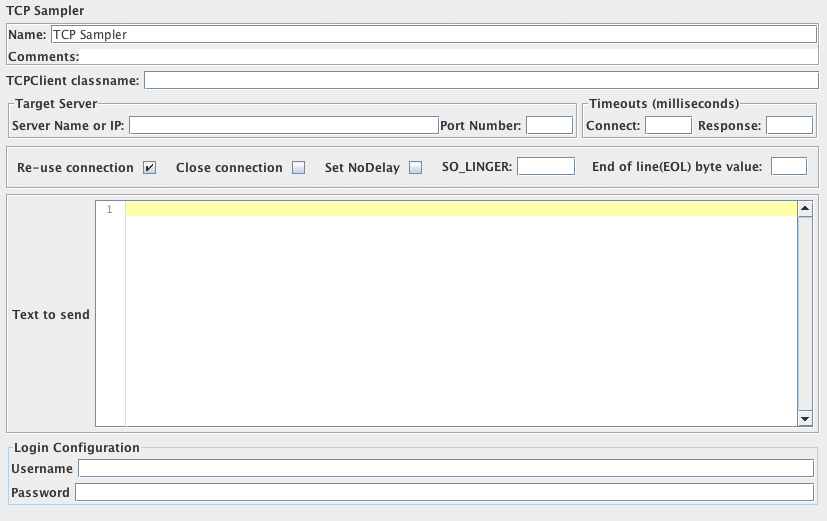](assets/images/tcpsampler_9a62a61f28a2e65a.png)

Screenshot of Control-Panel of TCP Sampler

<a id="component_reference--tcp_sampler_parms1"></a>
<a id="component_reference--parameters-21"></a>

### Parameters [¶](#component_reference--tcp_sampler_parms1 "Link to here")

Attribute

Description

Required

Name

Descriptive name for this element that is shown in the tree.

TCPClient classname

Name of the TCPClient class. Defaults to the property tcp.handler, failing that TCPClientImpl.

No

ServerName or IP

Name or IP of TCP server

Yes

Port Number

Port to be used

Yes

Re-use connection

If selected, the connection is kept open. Otherwise it is closed when the data has been read.

Yes

Close connection

If selected, the connection will be closed after running the sampler.

Yes

SO\_LINGER

Enable/disable SO\_LINGER with the specified linger time in seconds when a socket is created. If you set "SO\_LINGER" value as 0, you may prevent large numbers of sockets sitting around with a TIME\_WAIT status.

No

End of line(EOL) byte value

Byte value for end of line, set this to a value outside the range -128 to +127 to skip eol checking. You may set this in jmeter.properties file as well with eolByte property. If you set this in TCP Sampler Config and in jmeter.properties file at the same time, the setting value in the TCP Sampler Config will be used.

No

Connect Timeout

Connect Timeout (milliseconds, 0 disables).

No

Response Timeout

Response Timeout (milliseconds, 0 disables).

No

Set NoDelay

See java.net.Socket.setTcpNoDelay().
If selected, this will disable Nagle's algorithm, otherwise Nagle's algorithm will be used.

Yes

Text to Send

Text to be sent

Yes

Login User

User Name - not used by default implementation

No

Password

Password - not used by default implementation (N.B. this is stored unencrypted in the test plan)

No

[^](#component_reference)

<a id="component_reference--jms_publisher"></a>
<a id="component_reference--jms-publisher"></a>

## JMS Publisher[¶](#component_reference--jms_publisher "Link to here")

JMS Publisher will publish messages to a given destination (topic/queue). For those not
familiar with JMS, it is the J2EE specification for messaging. There are
numerous JMS servers on the market and several open source options.

JMeter does not include any JMS implementation jar; this must be downloaded from the JMS provider and put in the lib directory

[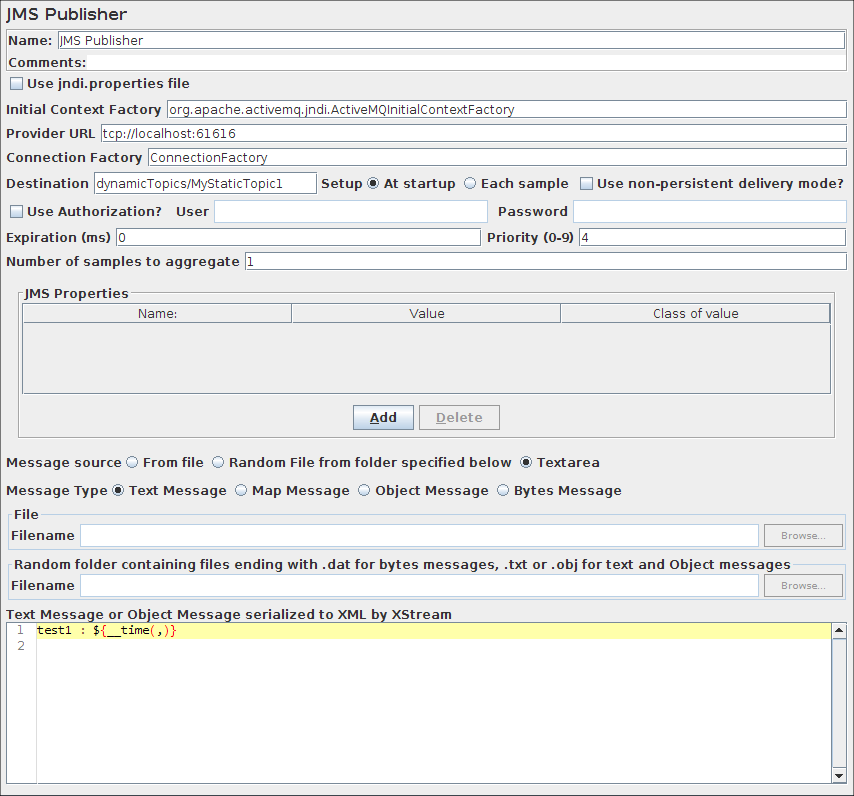](assets/images/jmspublisher_c2bb32a90d556fbb.png)

Screenshot of Control-Panel of JMS Publisher

<a id="component_reference--jms_publisher_parms1"></a>
<a id="component_reference--parameters-22"></a>

### Parameters [¶](#component_reference--jms_publisher_parms1 "Link to here")

Attribute

Description

Required

Name

Descriptive name for this element that is shown in the tree.

use JNDI properties file

use jndi.properties.
Note that the file must be on the classpath - e.g. by updating the user.classpath JMeter property.
If this option is not selected, JMeter uses the "JNDI Initial Context Factory" and "Provider URL" fields
to create the connection.

Yes

JNDI Initial Context Factory

Name of the context factory

No

Provider URL

The URL for the JMS provider

Yes, unless using jndi.properties

Destination

The message destination (topic or queue name)

Yes

Setup

The destination setup type. With At startup, the destination name is static (i.e. always same name during the test), with Each sample, the destination name is dynamic and is evaluate at each sample (i.e. the destination name may be a variable)

Yes

Authentication

Authentication requirement for the JMS provider

Yes

User

User Name

No

Password

Password (N.B. this is stored unencrypted in the test plan)

No

Expiration

The expiration time (in milliseconds) of the message before it becomes obsolete.
If you do not specify an expiration time, the default value is 0 (never expires).

No

Priority

The priority level of the message. There are ten priority levels from 0 (lowest) to 9 (highest).
If you do not specify a priority level, the default level is 4.

No

Reconnect on error codes (regex)

Regular expression for JMSException error codes which force reconnection. If empty no reconnection will be done

No

Number of samples to aggregate

Number of samples to aggregate

Yes

Message source

Where to obtain the message:

From File
:   means the referenced file will be read and reused by all samples. If file name changes it is reloaded since JMeter 3.0

Random File from folder specified below
:   means a random file will be selected from folder specified below, this folder must contain either files with extension .dat for Bytes Messages, or files with extension .txt or .obj for Object or Text messages

Text area
:   The Message to use either for Text or Object message

Yes

Message type

Text, Map, Object message or Bytes Message

Yes

Content encoding

Specify the encoding for reading the message source file:

RAW:
:   No variable support from the file and load it with default system charset.

DEFAULT:
:   Load file with default system encoding, except for XML which relies on XML prolog. If the file contain variables, they will be processed.

Standard charsets:
:   The specified encoding (valid or not) is used for reading the file and processing variables

Yes

Use non-persistent delivery mode?

Whether to set DeliveryMode.NON\_PERSISTENT (defaults to false)

No

JMS Properties

The JMS Properties are properties specific for the underlying messaging system.
You can setup the name, the value and the class (type) of value. Default type is String.
For example: for WebSphere 5.1 web services you will need to set the JMS Property targetService to test
webservices through JMS.

No

For the MapMessage type, JMeter reads the source as lines of text.
Each line must have 3 fields, delimited by commas.
The fields are:

- Name of entry
- Object class name, e.g. "String" (assumes java.lang package if not specified)
- Object string value

valueOf(String)

```

name,String,Example
size,Integer,1234
```

The Object message is implemented and works as follow:

- Put the JAR that contains your object and its dependencies in jmeter\_home/lib/ folder
- Serialize your object as XML using XStream
- Either put result in a file suffixed with .txt or .obj or put XML content directly in Text Area

Note that if message is in a file, replacement of properties will not occur while it will if you use Text Area.

The following table shows some values which may be useful when configuring JMS:

| Apache [ActiveMQ](http://activemq.apache.org/) | Value(s) | Comment |
| --- | --- | --- |
| Context Factory | org.apache.activemq.jndi.ActiveMQInitialContextFactory | . |
| Provider URL | vm://localhost |  |
| Provider URL | vm:(broker:(vm://localhost)?persistent=false) | Disable persistence |
| Queue Reference | dynamicQueues/QUEUENAME | [Dynamically define](http://activemq.apache.org/jndi-support.html#JNDISupport-Dynamicallycreatingdestinations) the QUEUENAME to JNDI |
| Topic Reference | dynamicTopics/TOPICNAME | [Dynamically define](http://activemq.apache.org/jndi-support.html#JNDISupport-Dynamicallycreatingdestinations) the TOPICNAME to JNDI |

[^](#component_reference)

<a id="component_reference--jms_subscriber"></a>
<a id="component_reference--jms-subscriber"></a>

## JMS Subscriber[¶](#component_reference--jms_subscriber "Link to here")

JMS Subscriber will subscribe to messages in a given destination (topic or queue). For those not
familiar with JMS, it is the J2EE specification for messaging. There are
numerous JMS servers on the market and several open source options.

JMeter does not include any JMS implementation jar; this must be downloaded from the JMS provider and put in the lib directory

[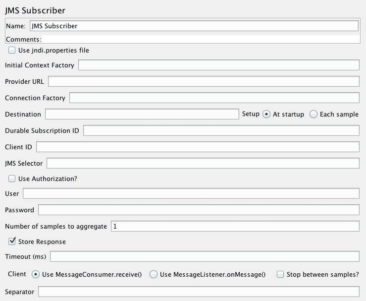](assets/images/jmssubscriber_af52cfa155d5361e.png)

Screenshot of Control-Panel of JMS Subscriber

<a id="component_reference--jms_subscriber_parms1"></a>
<a id="component_reference--parameters-23"></a>

### Parameters [¶](#component_reference--jms_subscriber_parms1 "Link to here")

Attribute

Description

Required

Name

Descriptive name for this element that is shown in the tree.

use JNDI properties file

use jndi.properties.
Note that the file must be on the classpath - e.g. by updating the user.classpath JMeter property.
If this option is not selected, JMeter uses the "JNDI Initial Context Factory" and "Provider URL" fields
to create the connection.

Yes

JNDI Initial Context Factory

Name of the context factory

No

Provider URL

The URL for the JMS provider

No

Destination

the message destination (topic or queue name)

Yes

Durable Subscription ID

The ID to use for a durable subscription. On first
use the respective queue will automatically be generated by the JMS provider if it does not exist yet.

No

Client ID

The Client ID to use when you use a durable subscription.
Be sure to add a variable like ${\_\_threadNum} when you have more than one Thread.

No

JMS Selector

Message Selector as defined by JMS specification to extract only
messages that respect the Selector condition. Syntax uses subpart of SQL 92.

No

Setup

The destination setup type. With At startup, the destination name is static (i.e. always same name during the test), with Each sample, the destination name is dynamic and is evaluated at each sample (i.e. the destination name may be a variable)

Yes

Authentication

Authentication requirement for the JMS provider

Yes

User

User Name

No

Password

Password (N.B. this is stored unencrypted in the test plan)

No

Number of samples to aggregate

number of samples to aggregate

Yes

Save response

should the sampler store the response. If not, only the response length is returned.

Yes

Timeout

Specify the timeout to be applied, in milliseconds. 0=none.
This is the overall aggregate timeout, not per sample.

Yes

Client

Which client implementation to use.
Both of them create connections which can read messages. However they use a different strategy, as described below:

MessageConsumer.receive()
:   calls receive() for every requested message.
    Retains the connection between samples, but does not fetch messages unless the sampler is active.
    This is best suited to Queue subscriptions.

MessageListener.onMessage()
:   establishes a Listener that stores all incoming messages on a queue.
    The listener remains active after the sampler completes.
    This is best suited to Topic subscriptions.

Yes

Stop between samples?

If selected, then JMeter calls Connection.stop() at the end of each sample (and calls start() before each sample).
This may be useful in some cases where multiple samples/threads have connections to the same queue.
If not selected, JMeter calls Connection.start() at the start of the thread, and does not call stop() until the end of the thread.

Yes

Separator

Separator used to separate messages when there is more than one (related to setting Number of samples to aggregate).
Note that \n, \r, \t are accepted.

No

Reconnect on error codes (regex)

Regular expression for JMSException error codes which force reconnection. If empty no reconnection will be done

No

Pause between errors (ms)

Pause in milliseconds that Subscriber will make when an error occurs

No

[^](#component_reference)

<a id="component_reference--jms_point-to-point"></a>
<a id="component_reference--jms-point-to-point"></a>

## JMS Point-to-Point[¶](#component_reference--jms_point-to-point "Link to here")

This sampler sends and optionally receives JMS Messages through point-to-point connections (queues).
It is different from pub/sub messages and is generally used for handling transactions.

request\_only will typically be used to put load on a JMS System.
request\_reply will be used when you want to test response time of a JMS service that processes messages sent to the Request Queue as this mode will wait for the response on the Reply queue sent by this service.
browse returns the current queue depth, i.e. the number of messages on the queue.
read reads a message from the queue (if any).
clear clears the queue, i.e. remove all messages from the queue.

JMeter use the properties java.naming.security.[principal|credentials] - if present -
when creating the Queue Connection. If this behaviour is not desired, set the JMeter property
JMSSampler.useSecurity.properties=false

JMeter does not include any JMS implementation jar; this must be downloaded from the JMS provider and put in the lib directory

[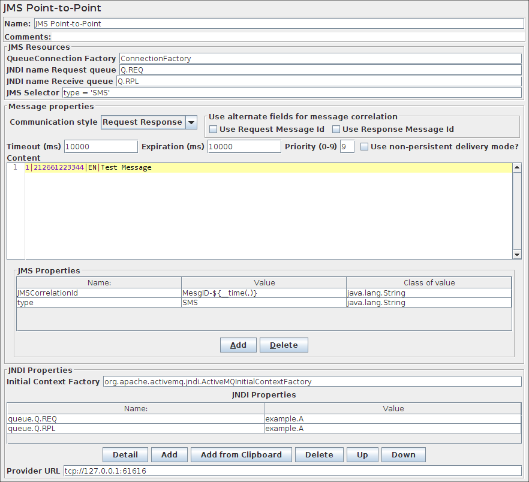](assets/images/jms-point-to-point_c07e76dd03cc3b42.png)

Screenshot of Control-Panel of JMS Point-to-Point

<a id="component_reference--jms_point-to-point_parms1"></a>
<a id="component_reference--parameters-24"></a>

### Parameters [¶](#component_reference--jms_point-to-point_parms1 "Link to here")

Attribute

Description

Required

Name

Descriptive name for this element that is shown in the tree.

QueueConnection Factory

The JNDI name of the queue connection factory to use for connecting to the messaging system.

Yes

JNDI Name Request queue

This is the JNDI name of the queue to which the messages are sent.

Yes

JNDI Name Reply queue

The JNDI name of the receiving queue. If a value is provided here and the communication style is Request Response
this queue will be monitored for responses to the requests sent.

No

Number of samples to aggregate

Number of samples to aggregate. Only applicable for Communication style Read.

Yes

JMS Selector

Message Selector as defined by JMS specification to extract only
messages that respect the Selector condition. Syntax uses subpart of SQL 92.

No

Communication style

The Communication style can be Request Only (also known as Fire and Forget), Request Response, Read, Browse, Clear:

Request Only
:   will only send messages and will not monitor replies. As such it can be used to put load on a system.

Request Response
:   will send messages and monitor the replies it receives. Behaviour depends on the value of the JNDI Name Reply Queue.
    If JNDI Name Reply Queue has a value, this queue is used to monitor the results. Matching of request and reply is done with
    the message id of the request and the correlation id of the reply. If the JNDI Name Reply Queue is empty, then
    temporary queues will be used for the communication between the requestor and the server.
    This is very different from the fixed reply queue. With temporary queues the sending thread will block until the reply message has been received.
    With Request Response mode, you need to have a Server that listens to messages sent to Request Queue and sends replies to
    queue referenced by message.getJMSReplyTo().

Read
:   will read a message from an outgoing queue which has no listeners attached. This can be convenient for testing purposes.
    This method can be used if you need to handle queues without a binding file (in case the jmeter-jms-skip-jndi library is used),
    which only works with the JMS Point-to-Point sampler. In case binding files are used, one can also use the JMS Subscriber Sampler for reading from a queue.

Browse
:   will determine the current queue depth without removing messages from the queue, returning the number of messages on the queue.

Clear
:   will clear the queue, i.e. remove all messages from the queue.

Yes

Use alternate fields for message correlation

These check-boxes select the fields which will be used for matching the response message with the original request.

Use Request Message Id
:   if selected, the request JMSMessageID will be used,
    otherwise the request JMSCorrelationID will be used.
    In the latter case the correlation id must be specified in the request.

Use Response Message Id
:   if selected, the response JMSMessageID will be used,
    otherwise the response JMSCorrelationID will be used.

There are two frequently used JMS Correlation patterns:

JMS Correlation ID Pattern
:   i.e. match request and response on their correlation Ids
    => deselect both checkboxes, and provide a correlation id.

JMS Message ID Pattern
:   i.e. match request message id with response correlation id
    => select "Use Request Message Id" only.

In both cases the JMS application is responsible for populating the correlation ID as necessary.

if the same queue is used to send and receive messages, then the response message will be the same as the request message.
In which case, either provide a correlation id and clear both checkboxes;
or select both checkboxes to use the message Id for correlation.
This can be useful for checking raw JMS throughput.

Yes

Timeout

The timeout in milliseconds for the reply-messages. If a reply has not been received within the specified
time, the specific testcase fails and the specific reply message received after the timeout is discarded.
Default value is 2000 ms. 0 means no timeout.

Yes

Expiration

The expiration time (in milliseconds) of the message before it becomes obsolete.
If you do not specify an expiration time, the default value is 0 (never expires).

No

Priority

The priority level of the message. There are ten priority levels from 0 (lowest) to 9 (highest).
If you do not specify a priority level, the default level is 4.

No

Use non-persistent delivery mode?

Whether to set DeliveryMode.NON\_PERSISTENT.

Yes

Content

The content of the message.

No

JMS Properties

The JMS Properties are properties specific for the underlying messaging system.
You can setup the name, the value and the class (type) of value. Default type is String.
For example: for WebSphere 5.1 web services you will need to set the JMS Property targetService to test
webservices through JMS.

No

Initial Context Factory

The Initial Context Factory is the factory to be used to look up the JMS Resources.

No

JNDI properties

The JNDI Properties are the specific properties for the underlying JNDI implementation.

No

Provider URL

The URL for the JMS provider.

No

[^](#component_reference)

<a id="component_reference--junit_request"></a>
<a id="component_reference--junit-request"></a>

## JUnit Request[¶](#component_reference--junit_request "Link to here")

The current implementation supports standard JUnit convention and extensions. It also
includes extensions like oneTimeSetUp and oneTimeTearDown. The sampler works like the
[Java Request](#component_reference--java_request) with some differences.

- rather than use JMeter's test interface, it scans the jar files for classes extending JUnit's TestCase class. That includes any class or subclass.
- JUnit test jar files should be placed in jmeter/lib/junit instead of /lib directory.
  You can also use the "user.classpath" property to specify where to look for TestCase classes.
- JUnit sampler does not use name/value pairs for configuration like the [Java Request](#component_reference--java_request). The sampler assumes setUp and tearDown will configure the test correctly.
- The sampler measures the elapsed time only for the test method and does not include setUp and tearDown.
- Each time the test method is called, JMeter will pass the result to the listeners.
- Support for oneTimeSetUp and oneTimeTearDown is done as a method. Since JMeter is multi-threaded, we cannot call oneTimeSetUp/oneTimeTearDown the same way Maven does it.
- The sampler reports unexpected exceptions as errors.
  There are some important differences between standard JUnit test runners and JMeter's
  implementation. Rather than make a new instance of the class for each test, JMeter
  creates 1 instance per sampler and reuses it.
  This can be changed with checkbox "Create a new instance per sample".

The current implementation of the sampler will try to create an instance using the string constructor first. If the test class does not declare a string constructor, the sampler will look for an empty constructor. Example below:

JUnit Constructors[¶](#component_reference--junit_constructor_example "Link to here")

Empty Constructor:

```

public class myTestCase {
  public myTestCase() {}
}
```

String Constructor:

```

public class myTestCase {
  public myTestCase(String text) {
    super(text);
  }
}
```

By default, JMeter will provide some default values for the success/failure code and message. Users should define a set of unique success and failure codes and use them uniformly across all tests.

<a id="component_reference--general-guidelines"></a>

### General Guidelines

If you use setUp and tearDown, make sure the methods are declared public. If you do not, the test may not run properly.
Here are some general guidelines for writing JUnit tests so they work well with JMeter. Since JMeter runs multi-threaded, it is important to keep certain things in mind.

- Write the setUp and tearDown methods so they are thread safe. This generally means avoid using static members.
- Make the test methods discrete units of work and not long sequences of actions. By keeping the test method to a discrete operation, it makes it easier to combine test methods to create new test plans.
- Avoid making test methods depend on each other. Since JMeter allows arbitrary sequencing of test methods, the runtime behavior is different than the default JUnit behavior.
- If a test method is configurable, be careful about where the properties are stored. Reading the properties from the Jar file is recommended.
- Each sampler creates an instance of the test class, so write your test so the setup happens in oneTimeSetUp and oneTimeTearDown.

[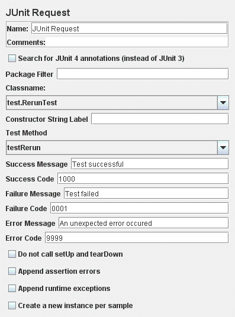](assets/images/junit-sampler_8c94f4daa8dcaed3.png)

Screenshot of Control-Panel of JUnit Request

<a id="component_reference--junit_request_parms1"></a>
<a id="component_reference--parameters-25"></a>

### Parameters [¶](#component_reference--junit_request_parms1 "Link to here")

Attribute

Description

Required

Name

Descriptive name for this element that is shown in the tree.

Search for JUnit4 annotations

Select this to search for JUnit4 tests (@Test annotations)

Yes

Package filter

Comma separated list of packages to show. Example, org.apache.jmeter,junit.framework.

Class name

Fully qualified name of the JUnit test class.

Yes

Constructor string

String pass to the string constructor. If a string is set, the sampler will use the
string constructor instead of the empty constructor.

Test method

The method to test.

Yes

Success message

A descriptive message indicating what success means.

Success code

An unique code indicating the test was successful.

Failure message

A descriptive message indicating what failure means.

Failure code

An unique code indicating the test failed.

Error message

A description for errors.

Error code

Some code for errors. Does not need to be unique.

Do not call setUp and tearDown

Set the sampler not to call setUp and tearDown.
By default, setUp and tearDown should be called. Not calling those methods could affect the test and make it inaccurate.
This option should only be used with calling oneTimeSetUp and oneTimeTearDown. If the selected method is oneTimeSetUp or oneTimeTearDown, this option should be checked.

Yes

Append assertion errors

Whether or not to append assertion errors to the response message.

Yes

Append runtime exceptions

Whether or not to append runtime exceptions to the response message. Only applies if "Append assertion errors" is not selected.

Yes

Create a new Instance per sample

Whether or not to create a new JUnit instance for each sample. Defaults to false, meaning JUnit TestCase is created one and reused.

Yes

The following JUnit4 annotations are recognised:

@Test
:   used to find test methods and classes. The "expected" and "timeout" attributes are supported.

@Before
:   treated the same as setUp() in JUnit3

@After
:   treated the same as tearDown() in JUnit3

@BeforeClass, @AfterClass
:   treated as test methods so they can be run independently as required

Note that JMeter currently runs the test methods directly, rather than leaving it to JUnit.
This is to allow the setUp/tearDown methods to be excluded from the sample time.
As a consequence, the sampler time excludes the time taken to call setUp/tearDown methods and their annotation based alternatives.

[^](#component_reference)

<a id="component_reference--mail_reader_sampler"></a>
<a id="component_reference--mail-reader-sampler"></a>

## Mail Reader Sampler[¶](#component_reference--mail_reader_sampler "Link to here")

The Mail Reader Sampler can read (and optionally delete) mail messages using POP3(S) or IMAP(S) protocols.

[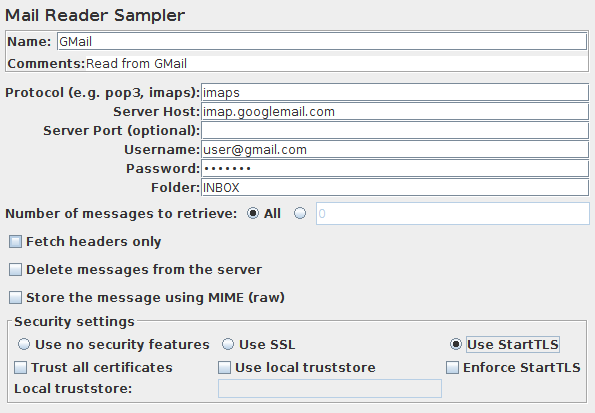](assets/images/mailreader-sampler_60bab0116eb3cb94.png)

Screenshot of Control-Panel of Mail Reader Sampler

<a id="component_reference--mail_reader_sampler_parms1"></a>
<a id="component_reference--parameters-26"></a>

### Parameters [¶](#component_reference--mail_reader_sampler_parms1 "Link to here")

Attribute

Description

Required

Name

Descriptive name for this element that is shown in the tree.

Server Type

The protocol used by the provider: e.g. pop3, pop3s, imap, imaps.
or another string representing the server protocol.
For example file for use with the read-only mail file provider.
The actual provider names for POP3 and IMAP are pop3 and imap

Yes

Server

Hostname or IP address of the server. See below for use with file protocol.

Yes

Port

Port to be used to connect to the server (optional)

No

Username

User login name

Password

User login password (N.B. this is stored unencrypted in the test plan)

Folder

The IMAP(S) folder to use. See below for use with file protocol.

Yes, if using IMAP(S)

Number of messages to retrieve

Set this to retrieve all or some messages

Yes

Fetch headers only

If selected, only the message headers will be retrieved.

Yes

Delete messages from the server

If set, messages will be deleted after retrieval

Yes

Store the message using MIME

Whether to store the message as MIME.
If so, then the entire raw message is stored in the Response Data; the headers are not stored as they are available in the data.
If not, the message headers are stored as Response Headers.
A few headers are stored (Date, To, From, Subject) in the body.

Yes

Use no security features

Indicates that the connection to the server does not use any security protocol.

Use SSL

Indicates that the connection to the server must use the SSL protocol.

Use StartTLS

Indicates that the connection to the server should attempt to start the TLS protocol.

Enforce StartTLS

If the server does not start the TLS protocol the connection will be terminated.

Trust All Certificates

When selected it will accept all certificates independent of the CA.

Use local truststore

When selected it will only accept certificates that are locally trusted.

Local truststore

Path to file containing the trusted certificates.
Relative paths are resolved against the current directory.
Failing that, against the directory containing the test script (JMX file).

You can pass mail related environment properties by adding to user.properties any of the properties described [here](https://javaee.github.io/javamail/docs/api/com/sun/mail/pop3/package-summary.html).

Messages are stored as subsamples of the main sampler.
Multipart message parts are stored as subsamples of the message.

**Special handling for "file" protocol:**
The file JavaMail provider can be used to read raw messages from files.
The server field is used to specify the path to the parent of the folder.
Individual message files should be stored with the name n.msg, where n is the message number.
Alternatively, the server field can be the name of a file which contains a single message.
The current implementation is quite basic, and is mainly intended for debugging purposes.

[^](#component_reference)

<a id="component_reference--flow_control_action"></a>
<a id="component_reference--flow-control-action-was:-test-action"></a>

## Flow Control Action(was: Test Action )[¶](#component_reference--flow_control_action "Link to here")

The Flow Control Action sampler is a sampler that is intended for use in a conditional controller.
Rather than generate a sample, the test element either pauses or stops the selected target.

This sampler can also be useful in conjunction with the Transaction Controller, as it allows
pauses to be included without needing to generate a sample.
For variable delays, set the pause time to zero, and add a Timer as a child.

The "Stop" action stops the thread or test after completing any samples that are in progress.
The "Stop Now" action stops the test without waiting for samples to complete; it will interrupt any active samples.
If some threads fail to stop within the 5 second time-limit, a message will be displayed in GUI mode.
You can try using the Stop command to see if this will stop the threads, but if not, you should exit JMeter.
In CLI mode, JMeter will exit if some threads fail to stop within the 5 second time limit.

The time to wait can be changed using the JMeter property jmeterengine.threadstop.wait. The time is given in milliseconds.

[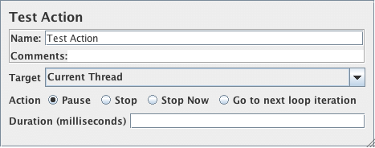](assets/images/test-action_a7397739599132c7.png)

Screenshot of Control-Panel of Flow Control Action

<a id="component_reference--flow_control_action_parms1"></a>
<a id="component_reference--parameters-27"></a>

### Parameters [¶](#component_reference--flow_control_action_parms1 "Link to here")

Attribute

Description

Required

Name

Descriptive name for this element that is shown in the tree.

Target

Current Thread / All Threads (ignored for Pause and Go to next loop iteration)

Yes

Action

Pause / Stop / Stop Now / Go to next loop iteration

Yes

Duration

How long to pause for (milliseconds)

Yes, if Pause is selected

[^](#component_reference)

<a id="component_reference--smtp_sampler"></a>
<a id="component_reference--smtp-sampler"></a>

## SMTP Sampler[¶](#component_reference--smtp_sampler "Link to here")

The SMTP Sampler can send mail messages using SMTP/SMTPS protocol.
It is possible to set security protocols for the connection (SSL and TLS), as well as user authentication.
If a security protocol is used a verification on the server certificate will occur.
Two alternatives to handle this verification are available:

Trust all certificates
:   This will ignore certificate chain verification

Use a local truststore
:   With this option the certificate chain will be validated against the local truststore file.

[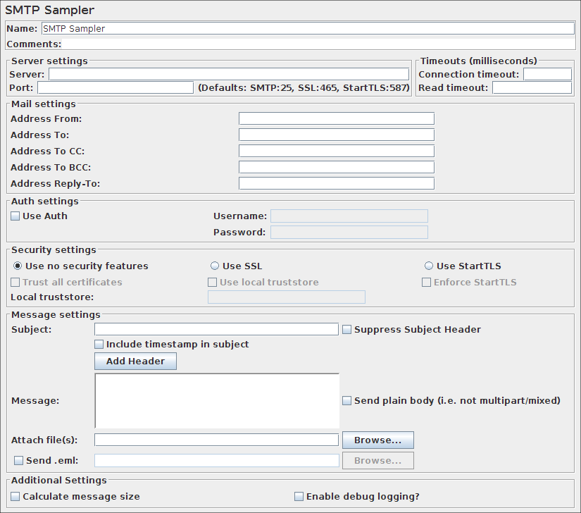](assets/images/smtp-sampler_3bee89ebe52f31b1.png)

Screenshot of Control-Panel of SMTP Sampler

<a id="component_reference--smtp_sampler_parms1"></a>
<a id="component_reference--parameters-28"></a>

### Parameters [¶](#component_reference--smtp_sampler_parms1 "Link to here")

Attribute

Description

Required

Server

Hostname or IP address of the server. See below for use with file protocol.

Yes

Port

Port to be used to connect to the server.
Defaults are: SMTP=25, SSL=465, StartTLS=587

No

Connection timeout

Connection timeout value in milliseconds (socket level). Default is infinite timeout.

No

Read timeout

Read timeout value in milliseconds (socket level). Default is infinite timeout.

No

Address From

The from address that will appear in the e-mail

Yes

Address To

The destination e-mail address (multiple values separated by ";")

Yes, unless CC or BCC is specified

Address To CC

Carbon copy destinations e-mail address (multiple values separated by ";")

No

Address To BCC

Blind carbon copy destinations e-mail address (multiple values separated by ";")

No

Address Reply-To

Alternate Reply-To address (multiple values separated by ";")

No

Use Auth

Indicates if the SMTP server requires user authentication

Username

User login name

Password

User login password (N.B. this is stored unencrypted in the test plan)

Use no security features

Indicates that the connection to the SMTP server does not use any security protocol.

Use SSL

Indicates that the connection to the SMTP server must use the SSL protocol.

Use StartTLS

Indicates that the connection to the SMTP server should attempt to start the TLS protocol.

Enforce StartTLS

If the server does not start the TLS protocol the connection will be terminated.

Trust All Certificates

When selected it will accept all certificates independent of the CA.

Use local truststore

When selected it will only accept certificates that are locally trusted.

Local truststore

Path to file containing the trusted certificates.
Relative paths are resolved against the current directory.
Failing that, against the directory containing the test script (JMX file).

Override System SSL/TLS Protocols

Specify a custom SSL/TLS protocol as space separated list to use on handshake example TLSv1 TLSv1.1 TLSv1.2. Defaults to all supported protocols.

No

Subject

The e-mail message subject.

Suppress Subject Header

If selected, the "Subject:" header is omitted from the mail that is sent.
This is different from sending an empty "Subject:" header, though some e-mail clients may display it identically.

Include timestamp in subject

Includes the System.currentTimemillis() in the subject line.

Add Header

Additional headers can be defined using this button.

No

Message

The message body.

Send plain body (i.e. not multipart/mixed)

If selected, then send the body as a plain message, i.e. not multipart/mixed, if possible.
If the message body is empty and there is a single file, then send the file contents as the message body.

Note: If the message body is not empty, and there is at least one attached file, then the body is sent as multipart/mixed.

No

Attach files

Files to be attached to the message.

Send .eml

If set, the .eml file will be sent instead of the entries in the Subject, Message, and Attach file(s) fields

Calculate message size

Calculates the message size and stores it in the sample result.

Enable debug logging?

If set, then the "mail.debug" property is set to "true"

[^](#component_reference)

<a id="component_reference--os_process_sampler"></a>
<a id="component_reference--os-process-sampler"></a>

## OS Process Sampler[¶](#component_reference--os_process_sampler "Link to here")

The OS Process Sampler is a sampler that can be used to execute commands on the local machine.
It should allow execution of any command that can be run from the command line.
Validation of the return code can be enabled, and the expected return code can be specified.

Note that OS shells generally provide command-line parsing.
This varies between OSes, but generally the shell will split parameters on white-space.
Some shells expand wild-card file names; some don't.
The quoting mechanism also varies between OSes.
The sampler deliberately does not do any parsing or quote handling.
The command and its parameters must be provided in the form expected by the executable.
This means that the sampler settings will not be portable between OSes.

Many OSes have some built-in commands which are not provided as separate executables.
For example the Windows DIR command is part of the command interpreter (CMD.EXE).
These built-ins cannot be run as independent programs, but have to be provided as arguments to the appropriate command interpreter.

For example, the Windows command-line: DIR C:\TEMP needs to be specified as follows:

Command:
:   CMD

Param 1:
:   /C

Param 2:
:   DIR

Param 3:
:   C:\TEMP

[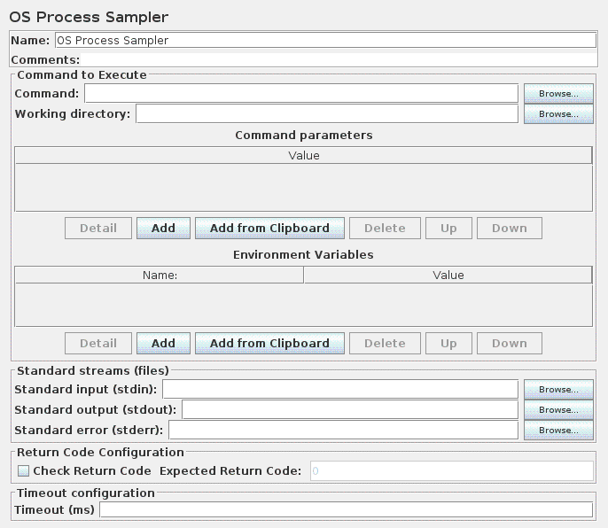](assets/images/os-process-sampler_eb0d89274eff4398.png)

Screenshot of Control-Panel of OS Process Sampler

<a id="component_reference--os_process_sampler_parms1"></a>
<a id="component_reference--parameters-29"></a>

### Parameters [¶](#component_reference--os_process_sampler_parms1 "Link to here")

Attribute

Description

Required

Command

The program name to execute.

Yes

Working directory

Directory from which command will be executed, defaults to folder referenced by "user.dir" System property

No

Command Parameters

Parameters passed to the program name.

No

Environment Parameters

Key/Value pairs added to environment when running command.

No

Standard input (stdin)

Name of file from which input is to be taken (STDIN).

No

Standard output (stdout

Name of output file for standard output (STDOUT).
If omitted, output is captured and returned as the response data.

No

Standard error (stderr)

Name of output file for standard error (STDERR).
If omitted, output is captured and returned as the response data.

No

Check Return Code

If checked, sampler will compare return code with Expected Return Code.

No

Expected Return Code

Expected return code for System Call, required if "Check Return Code" is checked. Note 500 is used as an error indicator in JMeter so you should not use it.

No

Timeout

Timeout for command in milliseconds, defaults to 0, which means *no* timeout.
If the timeout expires before the command finishes, JMeter will attempt to kill the OS process.

No

[^](#component_reference)

<a id="component_reference--mongodb_script_-deprecated"></a>
<a id="component_reference--mongodb-script-deprecated"></a>

## MongoDB Script (DEPRECATED)[¶](#component_reference--mongodb_script_-deprecated "Link to here")

This sampler lets you send a Request to a MongoDB.

Before using this you need to set up a
[MongoDB Source Config](#component_reference--mongodb_source_config) Configuration element

This Element currently uses com.mongodb.DB#eval which takes a global write lock causing a performance impact on the database, see [db.eval()](http://docs.mongodb.org/manual/reference/method/db.eval/).
So it is better to avoid using this element for load testing and use JSR223+Groovy scripting using [MongoDBHolder](https://jmeter.apache.org/api/org/apache/jmeter/protocol/mongodb/config/MongoDBHolder.html) instead.
MongoDB Script is more suitable for functional testing or test setup (setup/teardown threads)

[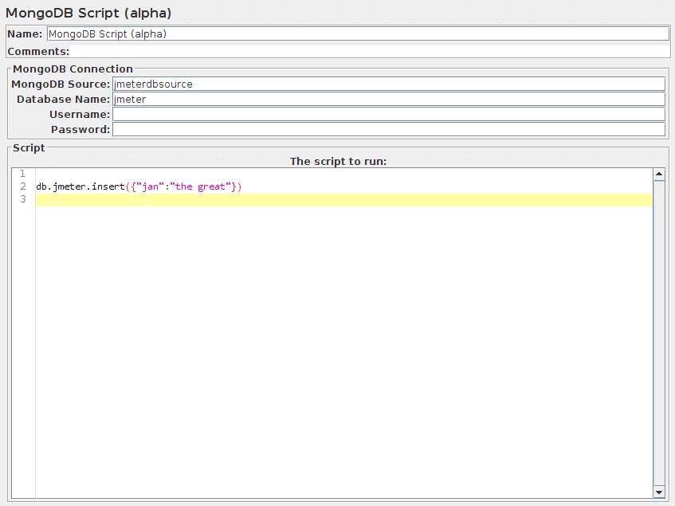](assets/images/mongodb-script_973a829b7ba4791d.png)

Screenshot of Control-Panel of MongoDB Script (DEPRECATED)

<a id="component_reference--mongodb_script_-deprecated-_parms1"></a>
<a id="component_reference--parameters-30"></a>

### Parameters [¶](#component_reference--mongodb_script_-deprecated-_parms1 "Link to here")

Attribute

Description

Required

Name

Descriptive name for this sampler that is shown in the tree.

No

MongoDB Source

Name of the JMeter variable that the MongoDB connection is bound to.
This must agree with the 'MongoDB Source' field of a MongoDB Source Config.

Yes

Database Name

Database Name, will be used in your script

Yes

Username

No

Password

No

Script

Mongo script as it would be used in MongoDB shell

Yes

See also:

- [MongoDB Source Config](#component_reference--mongodb_source_config)

Ensure Variable Name is unique across Test Plan.

[^](#component_reference)

[^](#component_reference)

<a id="component_reference--bolt_request"></a>
<a id="component_reference--bolt-request"></a>

## Bolt Request[¶](#component_reference--bolt_request "Link to here")

This sampler allows you to run Cypher queries through the Bolt protocol.

Before using this you need to set up a [Bolt Connection Configuration](#component_reference--bolt_connection_configuration)

Every request uses a connection acquired from the pool and returns it to the pool when the sampler completes.
The connection pool size defaults to 100 and is configurable.

The measured response time corresponds to the "full" query execution, including both
the time to execute the cypher query AND the time to consume the results sent back by the database.

[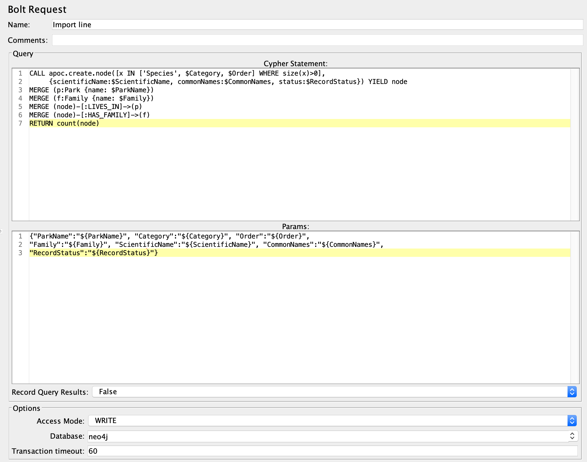](assets/images/bolt-request_867191aa6202553b.png)

Screenshot of Control-Panel of Bolt Request

<a id="component_reference--bolt_request_parms1"></a>
<a id="component_reference--parameters-31"></a>

### Parameters [¶](#component_reference--bolt_request_parms1 "Link to here")

Attribute

Description

Required

Name

Descriptive name for this sampler that is shown in the tree.

No

Comments

Free text for additional details.

No

Cypher statement

The query to execute.

Yes

Params

The parameter values, JSON formatted.

No

Record Query Results

Whether to add or not query result data to the sampler response (default false).
Note that activating this has a memory overhead, use it wisely.

No

Access Mode

Whether to access the database in WRITE or READ mode.
Use WRITE for a standalone Neo4j instance.
For a Neo4j cluster, select mode depending on whether the query writes to the database.
That setting will allow correct routing to the cluster leader, followers or read replicas.

Yes

Database

The database to run the query against.
Required for Neo4j 4.0+, unless querying the default database. Must be undefined for Neo4j 3.5.

No

Transaction timeout

Timeout for the transaction.

No

It is strongly advised to use query parameters, allowing the database to cache and reuse execution plans.

See also:

- [Bolt Connection Configuration](#component_reference--bolt_connection_configuration)

[^](#component_reference)

[^](#component_reference)

<a id="component_reference--logic_controllers"></a>
<a id="component_reference--18.2-logic-controllers"></a>

# 18.2 Logic Controllers[¶](#component_reference--logic_controllers "Link to here")

Logic Controllers determine the order in which Samplers are processed.

<a id="component_reference--simple_controller"></a>
<a id="component_reference--simple-controller"></a>

## Simple Controller[¶](#component_reference--simple_controller "Link to here")

The Simple Logic Controller lets you organize your Samplers and other
Logic Controllers. Unlike other Logic Controllers, this controller provides no functionality beyond that of a
storage device.

[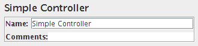](assets/images/simple-controller_6b5559c1aab44a01.png)

Screenshot of Control-Panel of Simple Controller

<a id="component_reference--simple_controller_parms1"></a>
<a id="component_reference--parameters-32"></a>

### Parameters [¶](#component_reference--simple_controller_parms1 "Link to here")

Attribute

Description

Required

Name

Descriptive name for this controller that is shown in the tree.

No

Using the Simple Controller[¶](#component_reference--simple_controller_example "Link to here")

[Download](https://jmeter.apache.org/demos/SimpleTestPlan.jmx) this example (see Figure 6).
In this example, we created a Test Plan that sends two Ant HTTP requests and two
Log4J HTTP requests. We grouped the Ant and Log4J requests by placing them inside
Simple Logic Controllers. Remember, the Simple Logic Controller has no effect on how JMeter
processes the controller(s) you add to it. So, in this example, JMeter sends the requests in the
following order: Ant Home Page, Ant News Page, Log4J Home Page, Log4J History Page.

Note, the File Reporter
is configured to store the results in a file named "simple-test.dat" in the current directory.

[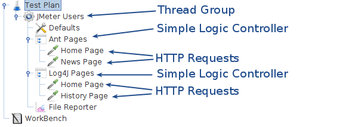](assets/images/simple-example_d5244ba38bb0b4aa.png)

Figure 6 Simple Controller Example

[^](#component_reference)

<a id="component_reference--loop_controller"></a>
<a id="component_reference--loop-controller"></a>

## Loop Controller[¶](#component_reference--loop_controller "Link to here")

If you add Generative or Logic Controllers to a Loop Controller, JMeter will
loop through them a certain number of times, in addition to the loop value you
specified for the Thread Group. For example, if you add one HTTP Request to a
Loop Controller with a loop count of two, and configure the Thread Group loop
count to three, JMeter will send a total of 2 \* 3 = 6 HTTP Requests.

JMeter will expose the looping index as a variable named \_\_jm\_\_<Name of your element>\_\_idx. So for
example, if your Loop Controller is named LC, then you can access the looping index through ${\_\_jm\_\_LC\_\_idx}.
Index starts at 0

[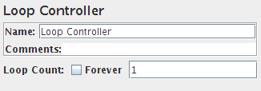](assets/images/loop-controller_d84145522772a067.png)

Screenshot of Control-Panel of Loop Controller

<a id="component_reference--loop_controller_parms1"></a>
<a id="component_reference--parameters-33"></a>

### Parameters [¶](#component_reference--loop_controller_parms1 "Link to here")

Attribute

Description

Required

Name

Descriptive name for this controller that is shown in the tree.

No

Loop Count

The number of times the subelements of this controller will be iterated each time
through a test run.

The value -1 is equivalent to checking the Forever toggle.

**Special Case:** The Loop Controller embedded in the [Thread Group](#test_plan--thread_group)
element behaves slightly different. Unless set to forever, it stops the test after
the given number of iterations have been done.

When using a function in this field, be aware it may be evaluated multiple times.
Example using [\_\_Random](#functions--__random) will evaluate it to a different value for each child samplers of Loop Controller and result into unwanted behaviour.

Yes, unless "Forever" is checked

Looping Example[¶](#component_reference--loop_example "Link to here")

[Download](https://jmeter.apache.org/demos/LoopTestPlan.jmx) this example (see Figure 4).
In this example, we created a Test Plan that sends a particular HTTP Request
only once and sends another HTTP Request five times.

[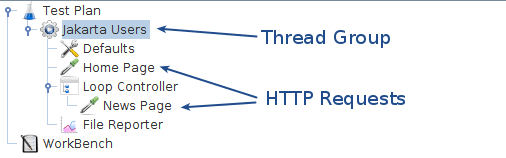](assets/images/loop-example_fcdd2e3442c1357b.png)

Figure 4 - Loop Controller Example

We configured the Thread Group for a single thread and a loop count value of
one. Instead of letting the Thread Group control the looping, we used a Loop
Controller. You can see that we added one HTTP Request to the Thread Group and
another HTTP Request to a Loop Controller. We configured the Loop Controller
with a loop count value of five.

JMeter will send the requests in the following order: Home Page, News Page, News Page, News Page, News Page, and News Page.

Note, the File Reporter
is configured to store the results in a file named "loop-test.dat" in the current directory.

[^](#component_reference)

<a id="component_reference--once_only_controller"></a>
<a id="component_reference--once-only-controller"></a>

## Once Only Controller[¶](#component_reference--once_only_controller "Link to here")

The Once Only Logic Controller tells JMeter to process the controller(s) inside it only once per Thread, and pass over any requests under it
during further iterations through the test plan.

The Once Only Controller will now execute always during the first iteration of any looping parent controller.
Thus, if the Once Only Controller is placed under a Loop Controller specified to loop 5 times, then the Once Only Controller will execute only on the first iteration through the Loop Controller
(i.e. every 5 times).

Note this means the Once Only Controller will still behave as previously expected if put under a Thread Group (runs only once per test per Thread), but now the user has more flexibility in the use of the Once Only Controller.

For testing that requires a login, consider placing the login request in this controller since each thread only needs
to login once to establish a session.

[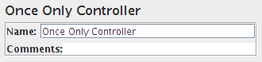](assets/images/once-only-controller_3d12e49fb6850f0b.png)

Screenshot of Control-Panel of Once Only Controller

<a id="component_reference--once_only_controller_parms1"></a>
<a id="component_reference--parameters-34"></a>

### Parameters [¶](#component_reference--once_only_controller_parms1 "Link to here")

Attribute

Description

Required

Name

Descriptive name for this controller that is shown in the tree.

No

Once Only Example[¶](#component_reference--once_only_example "Link to here")

[Download](https://jmeter.apache.org/demos/OnceOnlyTestPlan.jmx) this example (see Figure 5).
In this example, we created a Test Plan that has two threads that send HTTP request.
Each thread sends one request to the Home Page, followed by three requests to the Bug Page.
Although we configured the Thread Group to iterate three times, each JMeter thread only
sends one request to the Home Page because this request lives inside a Once Only Controller.

[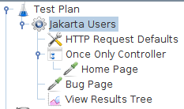](assets/images/once-only-example_dc1c120a5b64e37a.png)

Figure 5. Once Only Controller Example

Each JMeter thread will send the requests in the following order: Home Page, Bug Page, Bug Page, Bug Page.

Note, the File Reporter is configured to store the results in a file named "loop-test.dat" in the current directory.

[^](#component_reference)

<a id="component_reference--interleave_controller"></a>
<a id="component_reference--interleave-controller"></a>

## Interleave Controller[¶](#component_reference--interleave_controller "Link to here")

If you add Generative or Logic Controllers to an Interleave Controller, JMeter will alternate among each of the
other controllers for each loop iteration.

[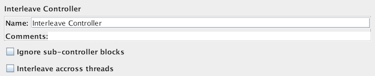](assets/images/interleave-controller_2476758d33cc4ae4.png)

Screenshot of Control-Panel of Interleave Controller

<a id="component_reference--interleave_controller_parms1"></a>
<a id="component_reference--parameters-35"></a>

### Parameters [¶](#component_reference--interleave_controller_parms1 "Link to here")

Attribute

Description

Required

name

Descriptive name for this controller that is shown in the tree.

No

ignore sub-controller blocks

If checked, the interleave controller will treat sub-controllers like single request elements and only allow one request per controller at a time.

No

Interleave across threads

If checked, the interleave controller will alternate among each of its children controllers for each loop iteration but across all threads, for example in a
configuration with 4 threads and 3 child controllers, on first iteration
thread 1 will run first child, thread 2 second child, thread 3 third child, thread 4 first child, on next iteration each thread will run the following child controller

No

Simple Interleave Example[¶](#component_reference--simple_interleave_example "Link to here")

[Download](https://jmeter.apache.org/demos/InterleaveTestPlan.jmx) this example (see Figure 1). In this example, we configured the Thread Group to have two threads and a loop count of five, for a total of ten
requests per thread. See the table below for the sequence JMeter sends the HTTP Requests.

[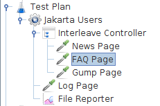](assets/images/interleave_f4d5ef0793080c87.png)

Figure 1 - Interleave Controller Example 1

| Loop Iteration | Each JMeter Thread Sends These HTTP Requests |
| --- | --- |
| 1 | News Page |
| 1 | Log Page |
| 2 | FAQ Page |
| 2 | Log Page |
| 3 | Gump Page |
| 3 | Log Page |
| 4 | Because there are no more requests in the controller, JMeter starts over and sends the first HTTP Request, which is the News Page. |
| 4 | Log Page |
| 5 | FAQ Page |
| 5 | Log Page |

Useful Interleave Example[¶](#component_reference--useful_interleave_example "Link to here")

[Download](https://jmeter.apache.org/demos/InterleaveTestPlan2.jmx) another example (see Figure 2). In this
example, we configured the Thread Group
to have a single thread and a loop count of eight. Notice that the Test Plan has an outer Interleave Controller with
two Interleave Controllers inside of it.

[](assets/images/interleave2_674678d5e5ee037e.png)

Figure 2 - Interleave Controller Example 2

The outer Interleave Controller alternates between the
two inner ones. Then, each inner Interleave Controller alternates between each of the HTTP Requests. Each JMeter
thread will send the requests in the following order: Home Page, Interleaved, Bug Page, Interleaved, CVS Page, Interleaved, and FAQ Page, Interleaved.

Note, the File Reporter is configured to store the results in a file named "interleave-test2.dat" in the current directory.

[](assets/images/interleave3_b6986961babd748c.png)

Figure 3 - Interleave Controller Example 3

If the two interleave controllers under the main interleave controller were instead simple controllers, then the order would be: Home Page, CVS Page, Interleaved, Bug Page, FAQ Page, Interleaved.

However, if "ignore sub-controller blocks" was checked on the main interleave controller, then the order would be: Home Page, Interleaved, Bug Page, Interleaved, CVS Page, Interleaved, and FAQ Page, Interleaved.

[^](#component_reference)

<a id="component_reference--random_controller"></a>
<a id="component_reference--random-controller"></a>

## Random Controller[¶](#component_reference--random_controller "Link to here")

The Random Logic Controller acts similarly to the Interleave Controller, except that
instead of going in order through its sub-controllers and samplers, it picks one
at random at each pass.

Interactions between multiple controllers can yield complex behavior.
This is particularly true of the Random Controller. Experiment before you assume
what results any given interaction will give

[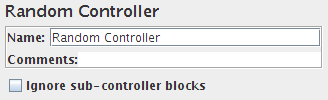](assets/images/random-controller_828ac90f68dd433a.png)

Screenshot of Control-Panel of Random Controller

<a id="component_reference--random_controller_parms1"></a>
<a id="component_reference--parameters-36"></a>

### Parameters [¶](#component_reference--random_controller_parms1 "Link to here")

Attribute

Description

Required

Name

Descriptive name for this controller that is shown in the tree.

No

ignore sub-controller blocks

If checked, the interleave controller will treat sub-controllers like single request elements and only allow one request per controller at a time.

No

[^](#component_reference)

<a id="component_reference--random_order_controller"></a>
<a id="component_reference--random-order-controller"></a>

## Random Order Controller[¶](#component_reference--random_order_controller "Link to here")

The Random Order Controller is much like a Simple Controller in that it will execute each child
element at most once, but the order of execution of the nodes will be random.

[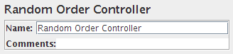](assets/images/randomordercontroller_af83bc46806dddf3.png)

Screenshot of Control-Panel of Random Order Controller

<a id="component_reference--random_order_controller_parms1"></a>
<a id="component_reference--parameters-37"></a>

### Parameters [¶](#component_reference--random_order_controller_parms1 "Link to here")

Attribute

Description

Required

Name

Descriptive name for this controller that is shown in the tree.

No

[^](#component_reference)

<a id="component_reference--throughput_controller"></a>
<a id="component_reference--throughput-controller"></a>

## Throughput Controller[¶](#component_reference--throughput_controller "Link to here")

The Throughput Controller allows the user to control how often it is executed.
There are two modes:

- percent execution
- total executions

Percent executions
:   causes the controller to execute a certain percentage of the iterations through the test plan.

Total executions
:   causes the controller to stop executing after a certain number of executions have occurred.

Like the Once Only Controller, this setting is reset when a parent Loop Controller restarts.

This controller is badly named, as it does not control throughput.
Please refer to the [Constant Throughput Timer](#component_reference--constant_throughput_timer) for an element that can be used to adjust the throughput.

[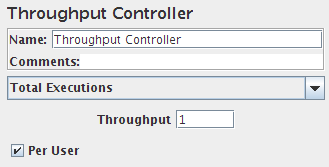](assets/images/throughput-controller_f0eaaa09b049196a.png)

Screenshot of Control-Panel of Throughput Controller

The Throughput Controller can yield very complex behavior when combined with other controllers - in particular with interleave or random controllers as parents (also very useful).

<a id="component_reference--throughput_controller_parms1"></a>
<a id="component_reference--parameters-38"></a>

### Parameters [¶](#component_reference--throughput_controller_parms1 "Link to here")

Attribute

Description

Required

Name

Descriptive name for this controller that is shown in the tree.

No

Execution Style

Whether the controller will run in percent executions or total executions mode.

Yes

Throughput

A number. For percent execution mode, a number from 0-100 that indicates the percentage of times the controller will execute. "50" means the controller will execute during half the iterations through the test plan. For total execution mode, the number indicates the total number of times the controller will execute.

Yes

Per User

If checked, per user will cause the controller to calculate whether it should execute on a per user (per thread) basis. If unchecked, then the calculation will be global for all users. For example, if using total execution mode, and uncheck "per user", then the number given for throughput will be the total number of executions made. If "per user" is checked, then the total number of executions would be the number of users times the number given for throughput.

No

[^](#component_reference)

<a id="component_reference--runtime_controller"></a>
<a id="component_reference--runtime-controller"></a>

## Runtime Controller[¶](#component_reference--runtime_controller "Link to here")

The Runtime Controller controls how long its children will run.
Controller will run its children until configured Runtime(s) is exceeded.

[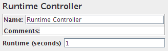](assets/images/runtimecontroller_f7ff6124d4cae2b3.png)

Screenshot of Control-Panel of Runtime Controller

<a id="component_reference--runtime_controller_parms1"></a>
<a id="component_reference--parameters-39"></a>

### Parameters [¶](#component_reference--runtime_controller_parms1 "Link to here")

Attribute

Description

Required

Name

Descriptive name for this controller that is shown in the tree, and used to name the transaction.

Yes

Runtime (seconds)

Desired runtime in seconds. 0 means no run.

Yes

[^](#component_reference)

<a id="component_reference--if_controller"></a>
<a id="component_reference--if-controller"></a>

## If Controller[¶](#component_reference--if_controller "Link to here")

The If Controller allows the user to control whether the test elements below it (its children) are run or not.

By default, the condition is evaluated only once on initial entry, but you have the option to have it evaluated for every runnable element contained in the controller.

The best option (default one) is to check Interpret Condition as Variable Expression?, then in the condition field you have 2 options:

- Option 1: Use a variable that contains true or false

  If you want to test if last sample was successful, you can use ${JMeterThread.last\_sample\_ok}

  [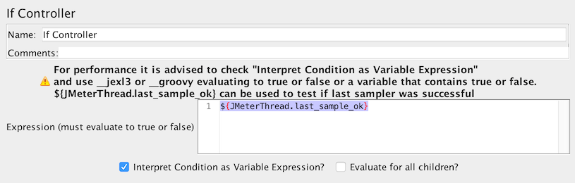](assets/images/if-controller-variable_1b5b9d9174133458.png)

  If Controller using Variable
- Option 2: Use a function (${\_\_jexl3()} is advised) to evaluate an expression that must return true or false

  [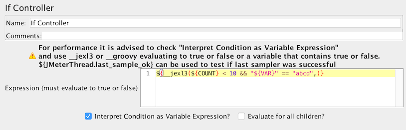](assets/images/if-controller-expression_00b7552fd7034672.png)

  If Controller using expression

For example, previously one could use the condition:
${\_\_jexl3(${VAR} == 23)} and this would be evaluated as true/false, the result would then be passed to JavaScript
which would then return true/false. If the Variable Expression option is selected, then the expression is evaluated
and compared with "true", without needing to use JavaScript.

To test if a variable is undefined (or null) do the following, suppose var is named myVar, expression will be:

```
"${myVar}" == "\${myVar}"
```

Or use:

```
"${myVar}" != "\${myVar}"
```

to test if a variable is defined and is not null.

If you uncheck Interpret Condition as Variable Expression?, If Controller will internally use javascript to evaluate the condition
which has a performance penalty that can be very big and make your test less scalable.
[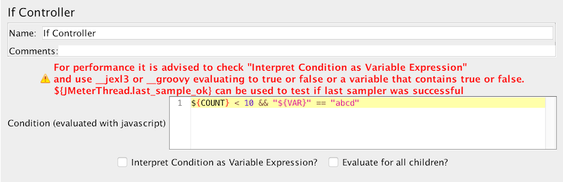](assets/images/if-controller-javascript_4baac7b4d99b5ac4.png)

If Controller using javascript

[](assets/images/if-controller-expression_00b7552fd7034672.png)

Screenshot of Control-Panel of If Controller

<a id="component_reference--if_controller_parms1"></a>
<a id="component_reference--parameters-40"></a>

### Parameters [¶](#component_reference--if_controller_parms1 "Link to here")

Attribute

Description

Required

Name

Descriptive name for this controller that is shown in the tree.

No

Condition (default JavaScript)

By default the condition is interpreted as **JavaScript** code that returns "true" or "false", but this can be overridden (see below)

Yes

Interpret Condition as Variable Expression?

If this is selected, then the condition must be an expression that evaluates to "true" (case is ignored).
For example, ${FOUND} or ${\_\_jexl3(${VAR} > 100)}.
Unlike the JavaScript case, the condition is only checked to see if it matches "true" (case is ignored).

Checking this and using [\_\_jexl3](#functions--__jexl3) or [\_\_groovy](#functions--__groovy) function in Condition is advised for performances

Yes

Evaluate for all children

Should condition be evaluated for all children?
If not checked, then the condition is only evaluated on entry.

Yes

Examples (JavaScript)[¶](#component_reference--example_if_javascript "Link to here")

- ${COUNT} < 10
- "${VAR}" == "abcd"

If there is an error interpreting the code, the condition is assumed to be false, and a message is logged in jmeter.log.

Note it is advised to avoid using JavaScript mode for performance.
When using [\_\_groovy](#functions--__groovy) take care to not use variable replacement in the string, otherwise if using a variable that changes the script cannot be cached. Instead get the variable using: vars.get("myVar"). See the Groovy examples below.

Examples (Variable Expression)[¶](#component_reference--example_if_variable "Link to here")

- ${\_\_groovy(vars.get("myVar") != "Invalid" )} (Groovy check myVar is not equal to Invalid)
- ${\_\_groovy(vars.get("myInt").toInteger() <=4 )} (Groovy check myInt is less then or equal to 4)
- ${\_\_groovy(vars.get("myMissing") != null )} (Groovy check if the myMissing variable is not set)
- ${\_\_jexl3(${COUNT} < 10)}
- ${RESULT}
- ${JMeterThread.last\_sample\_ok} (check if the last sample succeeded)

[^](#component_reference)

<a id="component_reference--while_controller"></a>
<a id="component_reference--while-controller"></a>

## While Controller[¶](#component_reference--while_controller "Link to here")

The While Controller runs its children until the condition is "false".

JMeter will expose the looping index as a variable named \_\_jm\_\_<Name of your element>\_\_idx. So for
example, if your While Controller is named WC, then you can access the looping index through ${\_\_jm\_\_WC\_\_idx}.
Index starts at 0

Possible condition values:

- blank - exit loop when last sample in loop fails
- LAST - exit loop when last sample in loop fails.
  If the last sample just before the loop failed, don't enter loop.
- Otherwise - exit (or don't enter) the loop when the condition is equal to the string "false"

The condition can be any variable or function that eventually evaluates to the string "false".
This allows the use of [\_\_jexl3](#functions--__jexl3), [\_\_groovy](#functions--__groovy) function, properties or variables as needed.

Note that the condition is evaluated twice, once before starting sampling children and once at end of children sampling, so putting
non idempotent functions in Condition (like [\_\_counter](#functions--__counter)) can introduce issues.

For example:

- ${VAR} - where VAR is set to false by some other test element
- ${\_\_jexl3(${C}==10)}
- ${\_\_jexl3("${VAR2}"=="abcd")}
- ${\_P(property)} - where property is set to "false" somewhere else

[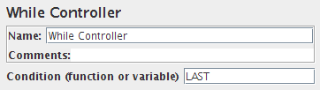](assets/images/whilecontroller_2b8b3c89f6b00ae9.png)

Screenshot of Control-Panel of While Controller

<a id="component_reference--while_controller_parms1"></a>
<a id="component_reference--parameters-41"></a>

### Parameters [¶](#component_reference--while_controller_parms1 "Link to here")

Attribute

Description

Required

Name

Descriptive name for this controller that is shown in the tree, and used to name the transaction.

No

Condition

blank, LAST, or variable/function

No

[^](#component_reference)

<a id="component_reference--switch_controller"></a>
<a id="component_reference--switch-controller"></a>

## Switch Controller[¶](#component_reference--switch_controller "Link to here")

The Switch Controller acts like the [Interleave Controller](#component_reference--interleave_controller)
in that it runs one of the subordinate elements on each iteration, but rather than
run them in sequence, the controller runs the element defined by the switch value.

The switch value can also be a name.

If the switch value is out of range, it will run the zeroth element, which therefore acts as the default for the numeric case.
It also runs the zeroth element if the value is the empty string.

If the value is non-numeric (and non-empty), then the Switch Controller looks for the
element with the same name (case is significant).
If none of the names match, then the element named "default" (case not significant) is selected.
If there is no default, then no element is selected, and the controller will not run anything.

[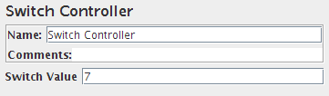](assets/images/switchcontroller_e645ae325c12358f.png)

Screenshot of Control-Panel of Switch Controller

<a id="component_reference--switch_controller_parms1"></a>
<a id="component_reference--parameters-42"></a>

### Parameters [¶](#component_reference--switch_controller_parms1 "Link to here")

Attribute

Description

Required

Name

Descriptive name for this controller that is shown in the tree.

No

Switch Value

The number (or name) of the subordinate element to be invoked. Elements are numbered from 0. Defaults to 0

No

[^](#component_reference)

<a id="component_reference--foreach_controller"></a>
<a id="component_reference--foreach-controller"></a>

## ForEach Controller[¶](#component_reference--foreach_controller "Link to here")

A ForEach controller loops through the values of a set of related variables.
When you add samplers (or controllers) to a ForEach controller, every sample (or controller)
is executed one or more times, where during every loop the variable has a new value.
The input should consist of several variables, each extended with an underscore and a number.
Each such variable must have a value.
So for example when the input variable has the name inputVar, the following variables should have been defined:

- inputVar\_1 = wendy
- inputVar\_2 = charles
- inputVar\_3 = peter
- inputVar\_4 = john

Note: the "\_" separator is now optional.

When the return variable is given as "returnVar", the collection of samplers and controllers under the ForEach controller will be executed 4 consecutive times, with the return variable having the respective above values, which can then be used in the samplers.

JMeter will expose the looping index as a variable named \_\_jm\_\_<Name of your element>\_\_idx. So for
example, if your Loop Controller is named FEC, then you can access the looping index through ${\_\_jm\_\_FEC\_\_idx}.
Index starts at 0

It is especially suited for running with the regular expression post-processor.
This can "create" the necessary input variables out of the result data of a previous request.
By omitting the "\_" separator, the ForEach Controller can be used to loop through the groups by using
the input variable refName\_g, and can also loop through all the groups in all the matches
by using an input variable of the form refName\_${C}\_g, where C is a counter variable.

The ForEach Controller does not run any samples if inputVar\_1 is null.
This would be the case if the Regular Expression returned no matches.

[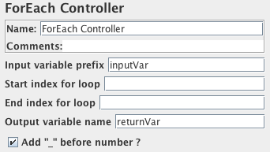](assets/images/foreach-controller_27955122be29edb1.png)

Screenshot of Control-Panel of ForEach Controller

<a id="component_reference--foreach_controller_parms1"></a>
<a id="component_reference--parameters-43"></a>

### Parameters [¶](#component_reference--foreach_controller_parms1 "Link to here")

Attribute

Description

Required

Name

Descriptive name for this controller that is shown in the tree.

No

Input variable prefix

Prefix for the variable names to be used as input. Defaults to an empty string as prefix.

No

Start index for loop

Start index (exclusive) for loop over variables (first element is at start index + 1)

No

End index for loop

End index (inclusive) for loop over variables

No

Output variable

The name of the variable which can be used in the loop for replacement in the samplers. Defaults to an empty variable name, which is most probably not wanted.

No

Use Separator

If not checked, the "\_" separator is omitted.

Yes

ForEach Example[¶](#component_reference--foreach_example "Link to here")

[Download](https://jmeter.apache.org/demos/forEachTestPlan.jmx) this example (see Figure 7).
In this example, we created a Test Plan that sends a particular HTTP Request
only once and sends another HTTP Request to every link that can be found on the page.

[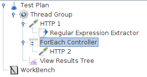](assets/images/foreach-example_deb0882264b22667.png)

Figure 7 - ForEach Controller Example

We configured the Thread Group for a single thread and a loop count value of
one. You can see that we added one HTTP Request to the Thread Group and
another HTTP Request to the ForEach Controller.

After the first HTTP request, a regular expression extractor is added, which extracts all the html links
out of the return page and puts them in the inputVar variable

In the ForEach loop, a HTTP sampler is added which requests all the links that were extracted from the first returned HTML page.

ForEach Example[¶](#component_reference--foreach_example2 "Link to here")

Here is [another example](https://jmeter.apache.org/demos/ForEachTest2.jmx) you can download.
This has two Regular Expressions and ForEach Controllers.
The first RE matches, but the second does not match, so no samples are run by the second ForEach Controller

[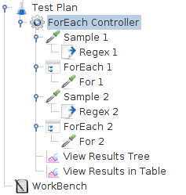](assets/images/foreach-example2_d0effb42a067daf3.png)

Figure 8 - ForEach Controller Example 2

The Thread Group has a single thread and a loop count of two.

Sample 1 uses the JavaTest Sampler to return the string "a b c d".

The Regex Extractor uses the expression (\w)\s which matches a letter followed by a space, and returns the letter (not the space). Any matches are prefixed with the string "inputVar".

The ForEach Controller extracts all variables with the prefix "inputVar\_", and executes its
sample, passing the value in the variable "returnVar". In this case it will set the variable to the values "a" "b" and "c" in turn.

The For 1 Sampler is another Java Sampler which uses the return variable "returnVar" as part of the sample Label
and as the sampler Data.

Sample 2, Regex 2 and For 2 are almost identical, except that the Regex has been changed to "(\w)\sx", which clearly won't match. Thus the For 2 Sampler will not be run.

[^](#component_reference)

<a id="component_reference--module_controller"></a>
<a id="component_reference--module-controller"></a>

## Module Controller[¶](#component_reference--module_controller "Link to here")

The Module Controller provides a mechanism for substituting test plan fragments into the current test plan at run-time.

A test plan fragment consists of a Controller and all the test elements (samplers etc.) contained in it.
The fragment can be located in any Thread Group.
If the fragment is located in a Thread Group, then its Controller can be disabled to prevent the fragment being run
except by the Module Controller.
Or you can store the fragments in a dummy Thread Group, and disable the entire Thread Group.

There can be multiple fragments, each with a different series of
samplers under them. The module controller can then be used to easily switch between these multiple test cases simply by choosing
the appropriate controller in its drop down box. This provides convenience for running many alternate test plans quickly and easily.

A fragment name is made up of the Controller name and all its parent names.
For example:

```

Test Plan / Protocol: JDBC / Control / Interleave Controller (Module1)
```

Any **fragments used by the Module Controller must have a unique name**, as the name is used to find the target controller when a test plan is reloaded.
For this reason it is best to ensure that the Controller name is changed from the default
- as shown in the example above -
otherwise a duplicate may be accidentally created when new elements are added to the test plan.

[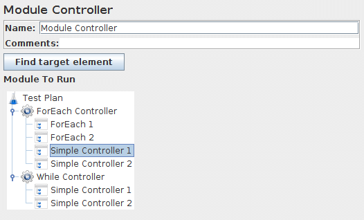](assets/images/module-controller_e81a4fa8b173773e.png)

Screenshot of Control-Panel of Module Controller

<a id="component_reference--module_controller_parms1"></a>
<a id="component_reference--parameters-44"></a>

### Parameters [¶](#component_reference--module_controller_parms1 "Link to here")

Attribute

Description

Required

Name

Descriptive name for this controller that is shown in the tree.

No

Module to Run

The module controller provides a list of all controllers loaded into the gui. Select
the one you want to substitute in at runtime.

Yes

[^](#component_reference)

<a id="component_reference--include_controller"></a>
<a id="component_reference--include-controller"></a>

## Include Controller[¶](#component_reference--include_controller "Link to here")

The include controller is designed to use an external JMX file. To use it, create a Test Fragment
underneath the Test Plan and add any desired samplers, controllers etc. below it.
Then save the Test Plan. The file is now ready to be included as part of other Test Plans.

For convenience, a [Thread Group](#component_reference--thread_group) can also be added in the external JMX file for debugging purposes.
A [Module Controller](#component_reference--module_controller) can be used to reference the Test Fragment. The [Thread Group](#component_reference--thread_group) will be ignored during the
include process.

If the test uses a Cookie Manager or User Defined Variables, these should be placed in the top-level
test plan, not the included file, otherwise they are not guaranteed to work.

This element does not support variables/functions in the filename field.
However, if the property includecontroller.prefix is defined, the contents are used to prefix the pathname.

When using Include Controller and including the same JMX file, ensure you name the Include Controller differently to avoid facing known issue [Bug
50898](https://bz.apache.org/bugzilla/show_bug.cgi?id=50898).

If the file cannot be found at the location given by prefix+Filename, then the controller
attempts to open the Filename relative to the JMX launch directory.

[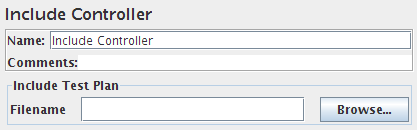](assets/images/includecontroller_0373f30a04ea19a8.png)

Screenshot of Control-Panel of Include Controller

<a id="component_reference--include_controller_parms1"></a>
<a id="component_reference--parameters-45"></a>

### Parameters [¶](#component_reference--include_controller_parms1 "Link to here")

Attribute

Description

Required

Filename

The file to include.

Yes

[^](#component_reference)

<a id="component_reference--transaction_controller"></a>
<a id="component_reference--transaction-controller"></a>

## Transaction Controller[¶](#component_reference--transaction_controller "Link to here")

The Transaction Controller generates an additional
sample which measures the overall time taken to perform the nested test elements.

Note: when the check box "Include duration of timer and pre-post processors in generated sample" is checked, the time includes all processing within the controller scope, not just the samples.

There are two modes of operation:

- additional sample is added after the nested samples
- additional sample is added as a parent of the nested samples

The generated sample time includes all the times for the nested samplers excluding by default (since 2.11) timers and processing time of pre/post processors
unless checkbox "Include duration of timer and pre-post processors in generated sample" is checked.
Depending on the clock resolution, it may be slightly longer than the sum of the individual samplers plus timers.
The clock might tick after the controller recorded the start time but before the first sample starts.
Similarly at the end.

The generated sample is only regarded as successful if all its sub-samples are successful.

In parent mode, the individual samples can still be seen in the Tree View Listener, but no longer appear as separate entries in other Listeners.
Also, the sub-samples do not appear in CSV log files, but they can be saved to XML files.

In parent mode, Assertions (etc.) can be added to the Transaction Controller.
However by default they will be applied to both the individual samples and the overall transaction sample.
To limit the scope of the Assertions, use a Simple Controller to contain the samples, and add the Assertions
to the Simple Controller.
Parent mode controllers do not currently properly support nested transaction controllers of either type.

[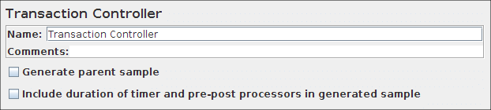](assets/images/transactioncontroller_f35e3ed7198b655e.png)

Screenshot of Control-Panel of Transaction Controller

<a id="component_reference--transaction_controller_parms1"></a>
<a id="component_reference--parameters-46"></a>

### Parameters [¶](#component_reference--transaction_controller_parms1 "Link to here")

Attribute

Description

Required

Name

Descriptive name for this controller that is shown in the tree, and used to name the transaction.

Yes

Generate Parent Sample

If checked, then the sample is generated as a parent of the other samples, otherwise the sample is generated as an independent sample.

Yes

Include duration of timer and pre-post processors in generated sample

Whether to include timer, pre- and post-processing delays in the generated sample.
Default is false

Yes

[^](#component_reference)

<a id="component_reference--recording_controller"></a>
<a id="component_reference--recording-controller"></a>

## Recording Controller[¶](#component_reference--recording_controller "Link to here")

The Recording Controller is a place holder indicating where the proxy server should
record samples to. During test run, it has no effect, similar to the Simple Controller. But during
recording using the [HTTP(S) Test Script Recorder](#component_reference--http-s-_test_script_recorder), all recorded samples will by default
be saved under the Recording Controller.

[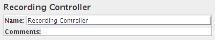](assets/images/recording-controller_3e690bc0ceb372d1.png)

Screenshot of Control-Panel of Recording Controller

<a id="component_reference--recording_controller_parms1"></a>
<a id="component_reference--parameters-47"></a>

### Parameters [¶](#component_reference--recording_controller_parms1 "Link to here")

Attribute

Description

Required

Name

Descriptive name for this controller that is shown in the tree.

No

[^](#component_reference)

<a id="component_reference--critical_section_controller"></a>
<a id="component_reference--critical-section-controller"></a>

## Critical Section Controller[¶](#component_reference--critical_section_controller "Link to here")

The Critical Section Controller ensures that its children elements (samplers/controllers, etc.) will be executed
by only one thread as a named lock will be taken before executing children of controller.

[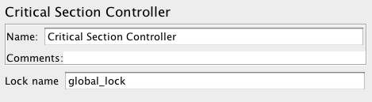](assets/images/critical-section-controller_46050eeb2b08120a.png)

Screenshot of Control-Panel of Critical Section Controller

The figure below shows an example of using Critical Section Controller, in the figure below 2 Critical Section Controllers ensure
that:

- DS2-${\_\_threadNum} is executed only by one thread at a time
- DS4-${\_\_threadNum} is executed only by one thread at a time

[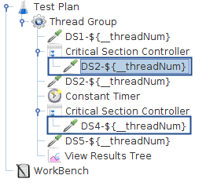](assets/images/critical-section-controller-tp_72abdb28f3144256.png)

Test Plan using Critical Section Controller

<a id="component_reference--critical_section_controller_parms1"></a>
<a id="component_reference--parameters-48"></a>

### Parameters [¶](#component_reference--critical_section_controller_parms1 "Link to here")

Attribute

Description

Required

Lock Name

Lock that will be taken by controller, ensure you use different lock names for unrelated sections

Yes

Critical Section Controller takes locks only within one JVM, so if using Distributed testing ensure your use case does not rely on all threads of all JVMs blocking.

[^](#component_reference)

[^](#component_reference)

<a id="component_reference--listeners"></a>
<a id="component_reference--18.3-listeners"></a>

# 18.3 Listeners[¶](#component_reference--listeners "Link to here")

Most of the listeners perform several roles in addition to "listening"
to the test results.
They also provide means to view, save, and read saved test results.

Note that Listeners are processed at the end of the scope in which they are found.

The saving and reading of test results is generic. The various
listeners have a panel whereby one can specify the file to
which the results will be written (or read from).
By default, the results are stored as XML
files, typically with a ".jtl" extension.
Storing as CSV is the most efficient option, but is less detailed than XML (the other available option).

**Listeners do *not* process sample data in CLI mode, but the raw data will be saved if an output
file has been configured.**
In order to analyse the data generated by a CLI run, you need to load the file into the appropriate
Listener.

To read existing results and display them, use the file panel Browse button to open the file.

If you want to clear any current data before loading a new file, use the menu item
Run → Clear
(Ctrl + Shift + E)
or
Run → Clear All
(Ctrl + E)
before loading the file.

Results can be read from XML or CSV format files.
When reading from CSV results files, the header (if present) is used to determine which fields are present.
**In order to interpret a header-less CSV file correctly, the appropriate properties must be set in jmeter.properties.**

XML files written by JMeter have version 1.0 declared in header while actual file is serialized with 1.1 rules.
(This is done for historical compatibility reasons; see [Bug
59973](https://bz.apache.org/bugzilla/show_bug.cgi?id=59973) and [Bug
58679](https://bz.apache.org/bugzilla/show_bug.cgi?id=58679))
This causes strict XML parsers to fail. Consider using non-strict XML parsers to read JTL files.

The file name can contain function and/or variable references.
However variable references do not work in client-server mode (functions work OK).
This is because the file is created on the client, and the client does not run the test locally so does not set up variables.

**Listeners can use a lot of memory if there are a lot of samples.**
Most of the listeners currently keep a copy of every sample in their scope, apart from:

- Simple Data Writer
- BeanShell/JSR223 Listener
- Mailer Visualizer
- Summary Report

The following Listeners no longer need to keep copies of every single sample.
Instead, samples with the same elapsed time are aggregated.
Less memory is now needed, especially if most samples only take a second or two at most.

- Aggregate Report
- Aggregate Graph

To minimise the amount of memory needed, use the Simple Data Writer, and use the CSV format.

JMeter variables can be saved to the output files.
This can only be specified using a property.
See the [Listener Sample Variables](#listeners--sample_variables) for details

For full details on setting up the default items to be saved
see the [Listener Default Configuration](#listeners--defaults) documentation.
For details of the contents of the output files, see the [CSV log](#listeners--csvlogformat) format or
the [XML log](#listeners--xmlformat2.1) format.

The entries in jmeter.properties are used to define the defaults;
these can be overridden for individual listeners by using the Configure button, as shown below.
The settings in jmeter.properties also apply to the listener that is added
by using the -l command-line flag.

The figure below shows an example of the result file configuration panel

[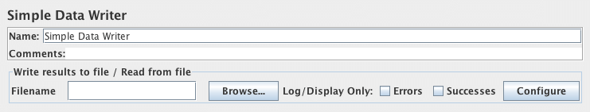](assets/images/simpledatawriter_d2d1e6a85920322a.png)

Result file configuration panel

<a id="component_reference--parameters-49"></a>

### Parameters

Attribute

Description

Required

Filename

Name of the file containing sample results.
The file name can be specified using either a relative or an absolute path name.
Relative paths are resolved relative to the current working directory (which defaults to the bin/ directory).
JMeter also support paths relative to the directory containing the current test plan (JMX file).
If the path name begins with "~/" (or whatever is in the jmeter.save.saveservice.base\_prefix JMeter property), then the path is assumed to be relative to the JMX file location.

No

Browse …

File Browse Button

No

Errors

Select this to write/read only results with errors

No

Successes

Select this to write/read only results without errors.
If neither Errors nor Successes is selected, then all results are processed.

No

Configure

Configure Button, see below

No

<a id="component_reference--sample_result_save_configuration"></a>
<a id="component_reference--sample-result-save-configuration"></a>

## Sample Result Save Configuration[¶](#component_reference--sample_result_save_configuration "Link to here")

Listeners can be configured to save different items to the result log files (JTL) by using the Config popup as shown below.
The defaults are defined as described in the [Listener Default Configuration](#listeners--defaults) documentation.
Items with (CSV) after the name only apply to the CSV format; items with (XML) only apply to XML format.
CSV format cannot currently be used to save any items that include line-breaks.

Note that cookies, method and the query string are saved as part of the "Sampler Data" option.

[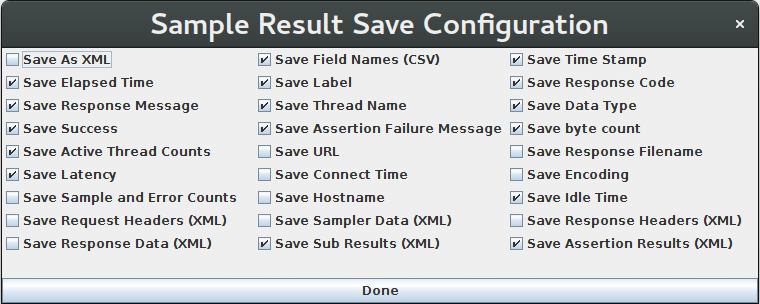](assets/images/sample-result-config_fc97857fc2b27144.png)

Screenshot of Control-Panel of Sample Result Save Configuration

[^](#component_reference)

<a id="component_reference--graph_results"></a>
<a id="component_reference--graph-results"></a>

## Graph Results[¶](#component_reference--graph_results "Link to here")

Graph Results MUST NOT BE USED during load test as it consumes a lot of resources (memory and CPU). Use it only for either functional testing or
during Test Plan debugging and Validation.

The Graph Results listener generates a simple graph that plots all sample times. Along
the bottom of the graph, the current sample (black), the current average of all samples (blue), the
current standard deviation (red), and the current throughput rate (green) are displayed in milliseconds.

The throughput number represents the actual number of requests/minute the server handled. This calculation
includes any delays you added to your test and JMeter's own internal processing time. The advantage
of doing the calculation like this is that this number represents something
real - your server in fact handled that many requests per minute, and you can increase the number of threads
and/or decrease the delays to discover your server's maximum throughput. Whereas if you made calculations
that factored out delays and JMeter's processing, it would be unclear what you could conclude from that
number.

[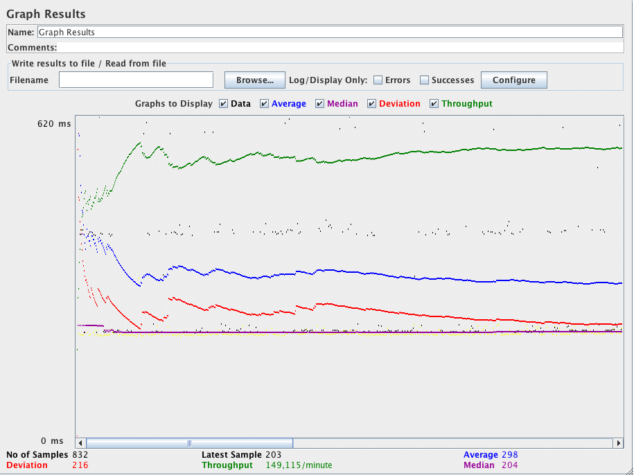](assets/images/graph-results_a7068abc061ac50c.png)

Screenshot of Control-Panel of Graph Results

The following table briefly describes the items on the graph.
Further details on the precise meaning of the statistical terms can be found on the web
- e.g. Wikipedia - or by consulting a book on statistics.

- Data - plot the actual data values
- Average - plot the Average
- Median - plot the [Median](#glossary--median) (midway value)
- Deviation - plot the [Standard Deviation](#glossary--standarddeviation) (a measure of the variation)
- Throughput - plot the number of samples per unit of time

The individual figures at the bottom of the display are the current values.
"Latest Sample" is the current elapsed sample time, shown on the graph as "Data".

The value displayed on the top left of graph is the max of 90th percentile of response time.

[^](#component_reference)

<a id="component_reference--assertion_results"></a>
<a id="component_reference--assertion-results"></a>

## Assertion Results[¶](#component_reference--assertion_results "Link to here")

Assertion Results MUST NOT BE USED during load test as it consumes a lot of resources (memory and CPU). Use it only for either functional testing or
during Test Plan debugging and Validation.

The Assertion Results visualizer shows the Label of each sample taken.
It also reports failures of any [Assertions](#test_plan--assertions) that
are part of the test plan.

[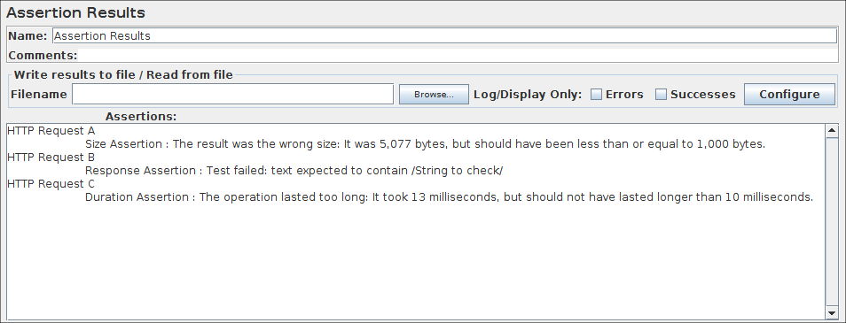](assets/images/assertion-results_4940cc7bd14c00c3.png)

Screenshot of Control-Panel of Assertion Results

See also:

- [Response Assertion](#component_reference--response_assertion)

[^](#component_reference)

<a id="component_reference--view_results_tree"></a>
<a id="component_reference--view-results-tree"></a>

## View Results Tree[¶](#component_reference--view_results_tree "Link to here")

View Results Tree MUST NOT BE USED during load test as it consumes a lot of resources (memory and CPU).
Use it only for either functional testing or during Test Plan debugging and Validation.

The View Results Tree shows a tree of all sample responses, allowing you to view the
response for any sample. In addition to showing the response, you can see the time it took to get
this response, and some response codes.
Note that the Request panel only shows the headers added by JMeter.
It does not show any headers (such as Host) that may be added by the HTTP protocol implementation.

There are several ways to view the response, selectable by a drop-down box at the bottom of the left hand panel.

<table>
<tr>
<th>Renderer</th><th>Description</th>
</tr>
<tr>
<td><span>CSS/JQuery Tester</span></td>
<td>The CSS/JQuery Tester only works for text responses. It shows the plain text in the upper panel.
The "<span>Test</span>" button allows the user to apply the CSS/JQuery to the upper panel and the results
will be displayed in the lower panel.


                                    The CSS/JQuery expression engine can be JSoup or Jodd, syntax of these 2 implementation differs slightly.


                                    For example, the Selector <span>a[class=sectionlink]</span> with attribute <span>href</span> applied to the current JMeter functions page gives the following output:


<pre>
Match count: 74
Match[1]=#functions
Match[2]=#what_can_do
Match[3]=#where
Match[4]=#how
Match[5]=#function_helper
Match[6]=#functions
Match[7]=#__regexFunction
Match[8]=#__regexFunction_parms
Match[9]=#__counter
… and so on …
</pre>
</td>
</tr>
<tr>
<td><span>Document</span></td>
<td>The Document view will show the extract text from various type of documents like Microsoft Office
(Word, Excel, PowerPoint 97-2003, 2007-2010 (openxml), Apache OpenOffice (writer, calc, impress), HTML, gzip, jar/zip files (list of content), and some meta-data on "multimedia" files like mp3, mp4, flv, etc. The complete list of
support format is available on <a href="http://tika.apache.org/1.2/formats.html">Apache Tika format page.</a>
<div>
                                        A requirement to the <span>Document view</span> is to download the <a href="http://tika.apache.org/download.html">
Apache Tika binary package</a> (<span>tika-app-x.x.jar</span>) and put this in <span>JMETER_HOME/lib</span> directory.

                                    </div>

                                    If the document is larger than 10 MB, then it won't be displayed.
To change this limit, set the JMeter property <span>document.max_size</span> (unit is byte) or set to <span>0</span> to remove the limit.


</td>
</tr>
<tr>
<td><span>HTML</span></td>
<td>The HTML view attempts to render the response as
HTML.  The rendered HTML is likely to compare poorly to the view one
would get in any web browser; however, it does provide a quick
approximation that is helpful for initial result evaluation.

                                    Images, style-sheets, etc. aren't downloaded.


</td>
</tr>
<tr>
<td><span>HTML (download resources)</span></td>
<td>If the HTML (download resources) view option is selected, the renderer
may download images, style-sheets, etc. referenced by the HTML code.


</td>
</tr>
<tr>
<td><span>HTML Source formatted</span></td>
<td>If the <em>HTML Source formatted view</em> option is selected, the renderer will display the HTML source code formatted and cleaned by <a href="https://jsoup.org/">Jsoup</a>.


</td>
</tr>
<tr>
<td><span>JSON</span></td>
<td>The JSON view will show the response in tree style (also handles JSON embedded in JavaScript).


</td>
</tr>
<tr>
<td><span>JSON Path Tester</span></td>
<td>The JSON Path Tester view will let you test your JSON-PATH expressions and see the extracted data from a particular response.


</td>
</tr>
<tr>
<td><span>JSON JMESPath Tester</span></td>
<td>The JSON JMESPath Tester view will let you test your <a href="http://jmespath.org/">JMESPath</a> expressions and see the extracted data from a particular response.


</td>
</tr>
<tr>
<td><span>Regexp Tester</span></td>
<td>The Regexp Tester view only works for text responses. It shows the plain text in the upper panel.
The "<span>Test</span>" button allows the user to apply the Regular Expression to the upper panel and the results
will be displayed in the lower panel.


                                    The regular expression engine is the same as that used in the Regular Expression Extractor.


                                    For example, the RE <span>(JMeter\w*).*</span> applied to the current JMeter home page gives the following output:


<pre>
Match count: 26
Match[1][0]=JMeter - Apache JMeter&lt;/title&gt;
Match[1][1]=JMeter
Match[2][0]=JMeter" title="JMeter" border="0"/&gt;&lt;/a&gt;
Match[2][1]=JMeter
Match[3][0]=JMeterCommitters"&gt;Contributors&lt;/a&gt;
Match[3][1]=JMeterCommitters
… and so on …
</pre>

                                    The first number in <span>[]</span> is the match number; the second number is the group.
Group <span>[0]</span> is whatever matched the whole RE.
Group <span>[1]</span> is whatever matched the 1st group, i.e. <span>(JMeter\w*)</span> in this case.
See Figure 9b (below).


</td>
</tr>
<tr>
<td><span>Text</span></td>
<td>
The default Text view shows all of the text contained in the response.
Note that this will only work if the response <span>content-type</span> is considered to be text.
If the <span>content-type</span> begins with any of the following, it is considered as binary, otherwise it is considered to be text.

                                    <pre>
image/
audio/
video/
</pre>
</td>
</tr>
<tr>
<td><span>XML</span></td>
<td>The XML view will show response in tree style.
Any DTD nodes or Prolog nodes will not show up in tree; however, response may contain those nodes.
You can right-click on any node and expand or collapse all nodes below it.


</td>
</tr>
<tr>
<td><span>XPath Tester</span></td>
<td>The XPath Tester only works for text responses. It shows the plain text in the upper panel.
The "<span>Test</span>" button allows the user to apply the XPath query to the upper panel and the results
will be displayed in the lower panel.

</td>
</tr>
<tr>
<td><span>Boundary Extractor Tester </span></td>
<td>The Boundary Extractor Tester only works for text responses. It shows the plain text in the upper panel.
The "<span>Test</span>" button allows the user to apply the Boundary Extractor query to the upper panel and the results
will be displayed in the lower panel.

</td>
</tr>
</table>

Scroll automatically? option permit to have last node display in tree selection

Starting with version 3.2 the number of entries in the View is restricted to the value of the
property view.results.tree.max\_results which defaults to 500 entries. The old
behaviour can be restored by setting the property to 0. Beware, that this might consume
a lot of memory.

With Search option, most of the views also allow the displayed data to be searched; the result of the search will be high-lighted
in the display above. For example the Control panel screenshot below shows one result of searching for "Java".
Note that the search operates on the visible text, so you may get different results when searching
the Text and HTML views.
Note: The regular expression uses the Java engine (not ORO engine like the Regular Expression Extractor or Regexp Tester view).

If there is no content-type provided, then the content
will not be displayed in the any of the Response Data panels.
You can use [Save Responses to a file](#component_reference--save_responses_to_a_file) to save the data in this case.
Note that the response data will still be available in the sample result, so can still be accessed using Post-Processors.

If the response data is larger than 200K, then it won't be displayed.
To change this limit, set the JMeter property view.results.tree.max\_size.
You can also use save the entire response to a file using
[Save Responses to a file](#component_reference--save_responses_to_a_file).

Additional renderers can be created.
The class must implement the interface org.apache.jmeter.visualizers.ResultRenderer
and/or extend the abstract class org.apache.jmeter.visualizers.SamplerResultTab, and the
compiled code must be available to JMeter (e.g. by adding it to the lib/ext directory).

[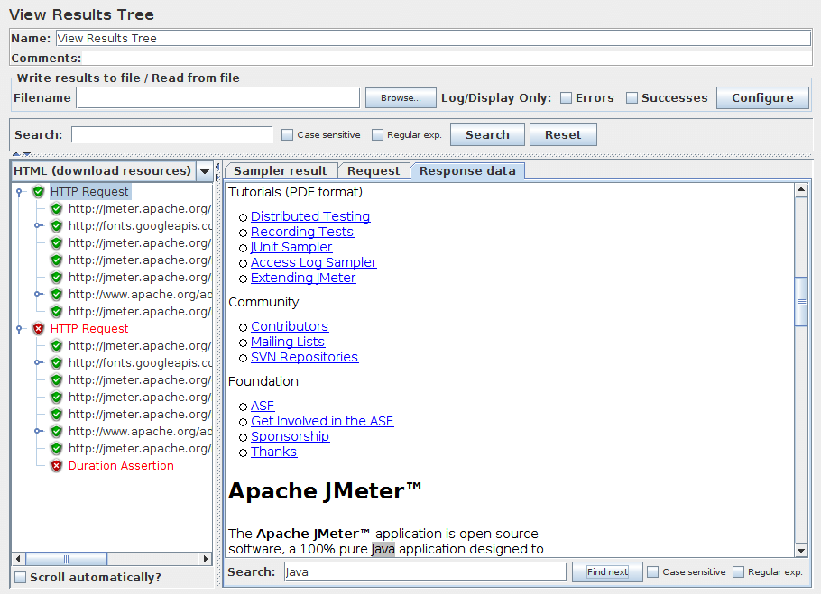](assets/images/view-results-tree_c3192b4e9efe1ea9.png)

Screenshot of Control-Panel of View Results Tree

The Control Panel (above) shows an example of an HTML display.
Figure 9 (below) shows an example of an XML display.
Figure 9a (below) shows an example of a Regexp tester display.
Figure 9b (below) shows an example of a Document display.

[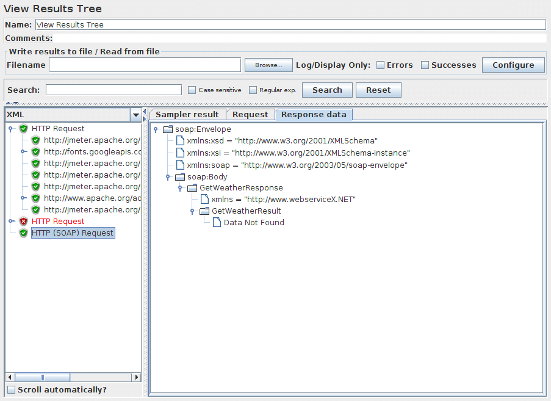](assets/images/view-results-tree-xml_e159e707ec23d434.png)

Figure 9 Sample XML display

[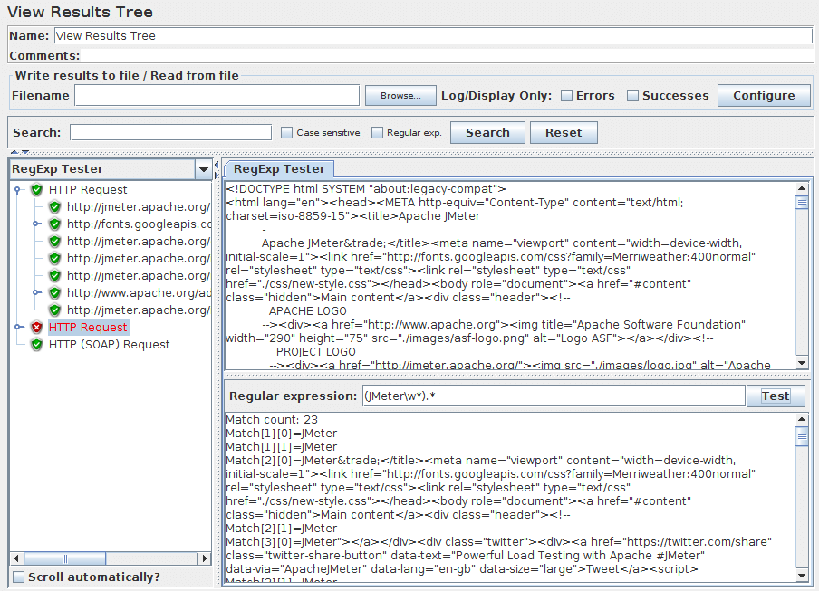](assets/images/view-results-tree-regex_26b343e1e6107b3b.png)

Figure 9a Sample Regexp Test display

[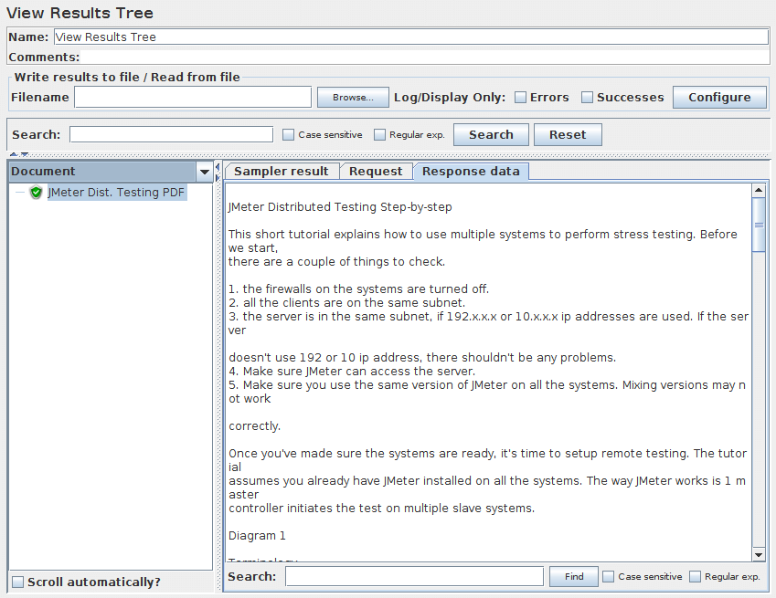](assets/images/view-results-tree-document_cbeb69a15d2c976a.png)

Figure 9b Sample Document (here PDF) display

[^](#component_reference)

<a id="component_reference--aggregate_report"></a>
<a id="component_reference--aggregate-report"></a>

## Aggregate Report[¶](#component_reference--aggregate_report "Link to here")

The aggregate report creates a table row for each differently named request in your
test. For each request, it totals the response information and provides request count, min, max, average, error rate, approximate throughput (request/second) and Kilobytes per second throughput.
Once the test is done, the throughput is the actual through for the duration of the entire test.

The throughput is calculated from the point of view of the sampler target
(e.g. the remote server in the case of HTTP samples).
JMeter takes into account the total time over which the requests have been generated.
If other samplers and timers are in the same thread, these will increase the total time, and therefore reduce the throughput value.
So two identical samplers with different names will have half the throughput of two samplers with the same name.
It is important to choose the sampler names correctly to get the best results from
the Aggregate Report.

Calculation of the [Median](#glossary--median) and 90 % Line (90th [percentile](#glossary--percentile)) values requires additional memory.
JMeter now combines samples with the same elapsed time, so far less memory is used.
However, for samples that take more than a few seconds, the probability is that fewer samples will have identical times, in which case more memory will be needed.
Note you can use this listener afterwards to reload a CSV or XML results file which is the recommended way to avoid performance impacts.
See the [Summary Report](#component_reference--summary_report) for a similar Listener that does not store individual samples and so needs constant memory.

Starting with JMeter 2.12, you can configure the 3 percentile values you want to compute, this can be done by setting properties:

- aggregate\_rpt\_pct1: defaults to 90th [percentile](#glossary--percentile)
- aggregate\_rpt\_pct2: defaults to 95th [percentile](#glossary--percentile)
- aggregate\_rpt\_pct3: defaults to 99th [percentile](#glossary--percentile)

- Label - The label of the sample.
  If "Include group name in label?" is selected, then the name of the thread group is added as a prefix.
  This allows identical labels from different thread groups to be collated separately if required.
- # Samples - The number of samples with the same label
- Average - The average time of a set of results
- Median - The [median](#glossary--median) is the time in the middle of a set of results.
  50 % of the samples took no more than this time; the remainder took at least as long.
- 90% Line - 90 % of the samples took no more than this time.
  The remaining samples took at least as long as this. (90th [percentile](#glossary--percentile))
- 95% Line - 95 % of the samples took no more than this time.
  The remaining samples took at least as long as this. (95th [percentile](#glossary--percentile))
- 99% Line - 99 % of the samples took no more than this time.
  The remaining samples took at least as long as this. (99th [percentile](#glossary--percentile))
- Min - The shortest time for the samples with the same label
- Max - The longest time for the samples with the same label
- Error % - Percent of requests with errors
- Throughput - the [Throughput](#glossary--throughput) is measured in requests per second/minute/hour.
  The time unit is chosen so that the displayed rate is at least 1.0.
  When the throughput is saved to a CSV file, it is expressed in requests/second,
  i.e. 30.0 requests/minute is saved as 0.5.
- Received KB/sec - The throughput measured in received Kilobytes per second
- Sent KB/sec - The throughput measured in sent Kilobytes per second

Times are in milliseconds.

[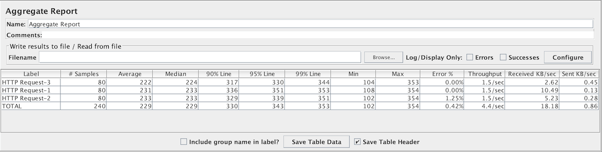](assets/images/aggregate-report_3cf898897e23531d.png)

Screenshot of Control-Panel of Aggregate Report

The figure below shows an example of selecting the "Include group name" checkbox.

[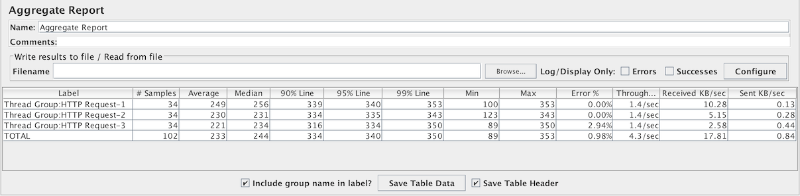](assets/images/aggregate-report-grouped_3321a8bf02138ae9.png)

Sample "Include group name" display

[^](#component_reference)

<a id="component_reference--view_results_in_table"></a>
<a id="component_reference--view-results-in-table"></a>

## View Results in Table[¶](#component_reference--view_results_in_table "Link to here")

This visualizer creates a row for every sample result.
Like the [View Results Tree](#component_reference--view_results_tree), this visualizer uses a lot of memory.

By default, it only displays the main (parent) samples; it does not display the sub-samples (child samples).
JMeter has a "Child Samples?" check-box.
If this is selected, then the sub-samples are displayed instead of the main samples.

[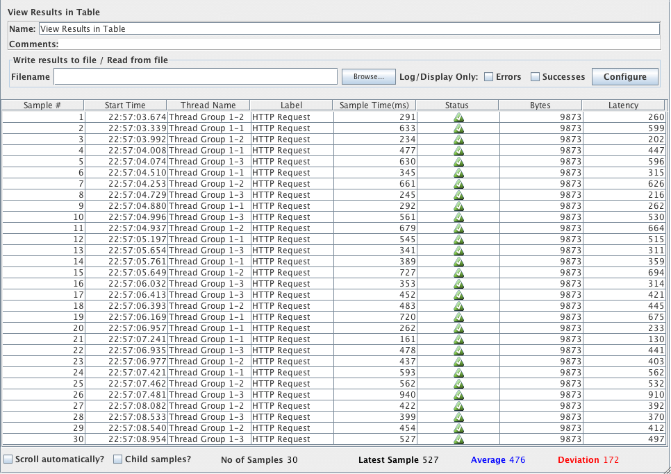](assets/images/table-results_41b89852eb86c52b.png)

Screenshot of Control-Panel of View Results in Table

[^](#component_reference)

<a id="component_reference--simple_data_writer"></a>
<a id="component_reference--simple-data-writer"></a>

## Simple Data Writer[¶](#component_reference--simple_data_writer "Link to here")

This listener can record results to a file
but not to the UI. It is meant to provide an efficient means of
recording data by eliminating GUI overhead.
When running in CLI mode, the -l flag can be used to create a data file.
The fields to save are defined by JMeter properties.
See the jmeter.properties file for details.

[](assets/images/simpledatawriter_d2d1e6a85920322a.png)

Screenshot of Control-Panel of Simple Data Writer

[^](#component_reference)

<a id="component_reference--aggregate_graph"></a>
<a id="component_reference--aggregate-graph"></a>

## Aggregate Graph[¶](#component_reference--aggregate_graph "Link to here")

The aggregate graph is similar to the aggregate report. The primary
difference is the aggregate graph provides an easy way to generate bar graphs and save
the graph as a PNG file.

[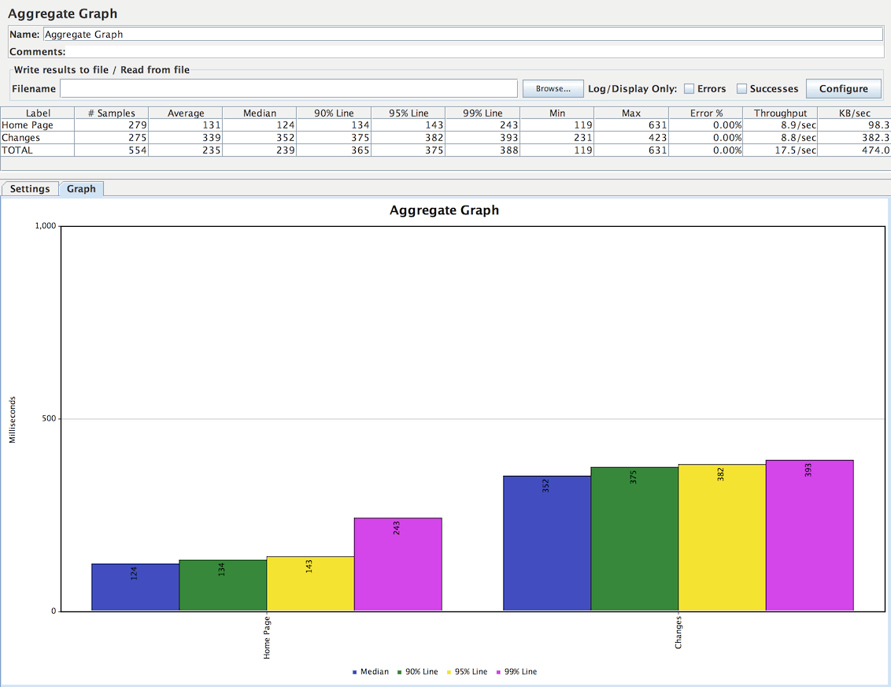](assets/images/aggregate-graph_23f80923a100db57.png)

Screenshot of Control-Panel of Aggregate Graph

The figure below shows an example of settings to draw this graph.

[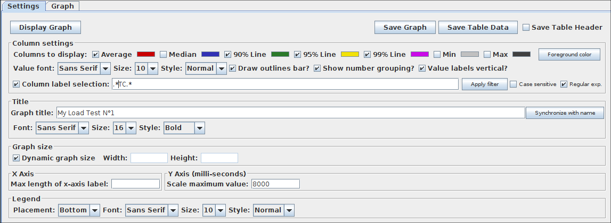](assets/images/aggregate-graph-settings_36f98eca983b69e9.png)

Aggregate graph settings

Please note: All this parameters *aren't* saved in JMeter JMX script.

<a id="component_reference--aggregate_graph_parms1"></a>
<a id="component_reference--parameters-50"></a>

### Parameters [¶](#component_reference--aggregate_graph_parms1 "Link to here")

Attribute

Description

Required

Column settings

- Columns to display: Choose the column(s) to display in graph.
- Rectangles color: Click on right color rectangle open a popup dialog to choose a custom color for column.
- Foreground color Allow to change the value text color.
- Value font: Allow to define font settings for the text.
- Draw outlines bar? To draw or not the border line on bar chart
- Show number grouping? Show or not the number grouping in Y Axis labels.
- Value labels vertical? Change orientation for value label. (Default is horizontal)
- Column label selection: Filter by result label. A regular expression can be used, example: .\*Transaction.\*
  Before display the graph, click on Apply filter button to refresh internal data.

Yes

Title

Define the graph's title on the head of chart. Empty value is the default value: "Aggregate Graph".
The button Synchronize with name define the title with the label of the listener. And define font settings for graph title

No

Graph size

Compute the graph size by the width and height depending of the current JMeter's window size.
Use Width and Height fields to define a custom size. The unit is pixel.

No

X Axis settings

Define the max length of X Axis label (in pixel).

No

Y Axis settings

Define a custom maximum value for Y Axis.

No

Legend

Define the placement and font settings for chart legend

Yes

[^](#component_reference)

<a id="component_reference--response_time_graph"></a>
<a id="component_reference--response-time-graph"></a>

## Response Time Graph[¶](#component_reference--response_time_graph "Link to here")

The Response Time Graph draws a line chart showing the evolution of response time during the test, for each labelled request.
If many samples exist for the same timestamp, the mean value is displayed.

[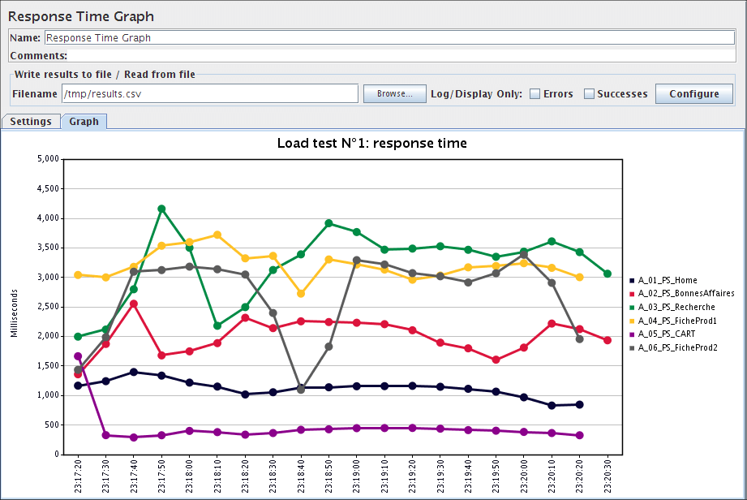](assets/images/response-time-graph_ef719742fba02a14.png)

Screenshot of Control-Panel of Response Time Graph

The figure below shows an example of settings to draw this graph.

[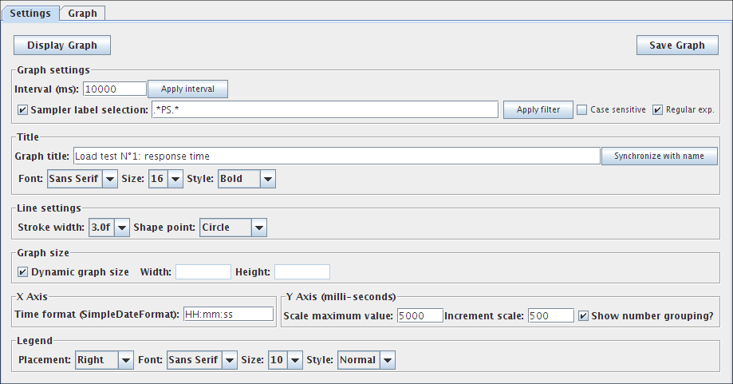](assets/images/response-time-graph-settings_0fc6adb4fae196db.png)

Response time graph settings

Please note: All this parameters are saved in JMeter .jmx file.

<a id="component_reference--response_time_graph_parms1"></a>
<a id="component_reference--parameters-51"></a>

### Parameters [¶](#component_reference--response_time_graph_parms1 "Link to here")

Attribute

Description

Required

Interval (ms)

The time in milliseconds for X axis interval. Samples are grouped according to this value.
Before display the graph, click on Apply interval button to refresh internal data.

Yes

Sampler label selection

Filter by result label. A regular expression can be used, ex. .\*Transaction.\*.
Before display the graph, click on Apply filter button to refresh internal data.

No

Title

Define the graph's title on the head of chart. Empty value is the default value: "Response Time Graph".
The button Synchronize with name define the title with the label of the listener. And define font settings for graph title

No

Line settings

Define the width of the line. Define the type of each value point. Choose none to have a line without mark

Yes

Graph size

Compute the graph size by the width and height depending of the current JMeter's window size.
Use Width and Height fields to define a custom size. The unit is pixel.

No

X Axis settings

Customize the date format of X axis label.
The syntax is the Java [SimpleDateFormat API](http://docs.oracle.com/javase/8/docs/api/java/text/SimpleDateFormat.html).

No

Y Axis settings

Define a custom maximum value for Y Axis in milli-seconds. Define the increment for the scale (in ms) Show or not the number grouping in Y Axis labels.

No

Legend

Define the placement and font settings for chart legend

Yes

[^](#component_reference)

<a id="component_reference--mailer_visualizer"></a>
<a id="component_reference--mailer-visualizer"></a>

## Mailer Visualizer[¶](#component_reference--mailer_visualizer "Link to here")

The mailer visualizer can be set up to send email if a test run receives too many
failed responses from the server.

[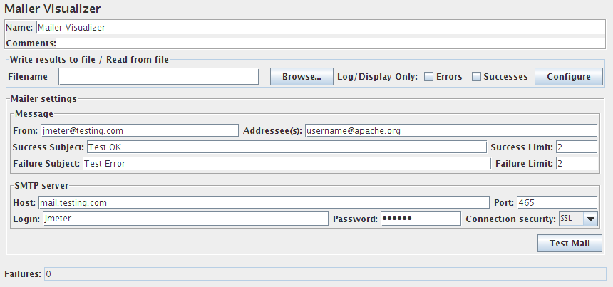](assets/images/mailervisualizer_19ab1585ebce3901.png)

Screenshot of Control-Panel of Mailer Visualizer

<a id="component_reference--mailer_visualizer_parms1"></a>
<a id="component_reference--parameters-52"></a>

### Parameters [¶](#component_reference--mailer_visualizer_parms1 "Link to here")

Attribute

Description

Required

Name

Descriptive name for this element that is shown in the tree.

No

From

Email address to send messages from.

Yes

Addressee(s)

Email address to send messages to, comma-separated.

Yes

Success Subject

Email subject line for success messages.

No

Success Limit

Once this number of successful responses is exceeded
**after previously reaching the failure limit**, a success email
is sent. The mailer will thus only send out messages in a sequence of failed-succeeded-failed-succeeded, etc.

Yes

Failure Subject

Email subject line for fail messages.

No

Failure Limit

Once this number of failed responses is exceeded, a failure
email is sent - i.e. set the count to 0 to send an e-mail on the first failure.

Yes

Host

IP address or host name of SMTP server (email redirector)
server.

No

Port

Port of SMTP server (defaults to 25).

No

Login

Login used to authenticate.

No

Password

Password used to authenticate.

No

Connection security

Type of encryption for SMTP authentication (SSL, TLS or none).

No

Test Mail

Press this button to send a test mail

No

Failures

A field that keeps a running total of number
of failures so far received.

No

[^](#component_reference)

<a id="component_reference--beanshell_listener"></a>
<a id="component_reference--beanshell-listener"></a>

## BeanShell Listener[¶](#component_reference--beanshell_listener "Link to here")

The BeanShell Listener allows the use of BeanShell for processing samples for saving etc.

**For full details on using BeanShell, please see the [BeanShell website.](http://www.beanshell.org/)**

Migration to [JSR223 Listener](#component_reference--jsr223_listener)+Groovy is highly recommended for performance, support of new Java features and limited maintenance of the BeanShell library.

The test element supports the ThreadListener and TestListener methods.
These should be defined in the initialisation file.
See the file BeanShellListeners.bshrc for example definitions.

[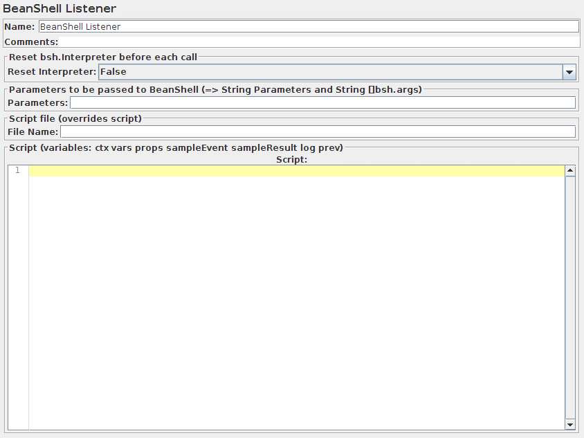](assets/images/beanshell-listener_685d6ae276a6e417.png)

Screenshot of Control-Panel of BeanShell Listener

<a id="component_reference--beanshell_listener_parms1"></a>
<a id="component_reference--parameters-53"></a>

### Parameters [¶](#component_reference--beanshell_listener_parms1 "Link to here")

Attribute

Description

Required

Name

Descriptive name for this element that is shown in the tree.
The name is stored in the script variable Label

Reset bsh.Interpreter before each call

If this option is selected, then the interpreter will be recreated for each sample.
This may be necessary for some long running scripts.
For further information, see [Best Practices - BeanShell scripting](#best-practices--bsh_scripting).

Yes

Parameters

Parameters to pass to the BeanShell script.
The parameters are stored in the following variables:

Parameters
:   string containing the parameters as a single variable

bsh.args
:   String array containing parameters, split on white-space

No

Script file

A file containing the BeanShell script to run.
The file name is stored in the script variable FileName

No

Script

The BeanShell script to run. The return value is ignored.

Yes (unless script file is provided)

Before invoking the script, some variables are set up in the BeanShell interpreter:

- log - ([Logger](https://www.slf4j.org/api/org/slf4j/Logger.html)) - can be used to write to the log file
- ctx - ([JMeterContext](https://jmeter.apache.org/api/org/apache/jmeter/threads/JMeterContext.html)) - gives access to the context
- vars - ([JMeterVariables](https://jmeter.apache.org/api/org/apache/jmeter/threads/JMeterVariables.html)) - gives read/write access to variables:

```
vars.get(key);
vars.put(key,val);
vars.putObject("OBJ1",new Object());
```

- props - (JMeterProperties - class [java.util.Properties](https://docs.oracle.com/javase/8/docs/api/java/util/Properties.html)) - e.g. props.get("START.HMS"); props.put("PROP1","1234");
- sampleResult, prev - ([SampleResult](https://jmeter.apache.org/api/org/apache/jmeter/samplers/SampleResult.html)) - gives access to the previous [SampleResult](https://jmeter.apache.org/api/org/apache/jmeter/samplers/SampleResult.html)
- sampleEvent ([SampleEvent](https://jmeter.apache.org/api/org/apache/jmeter/samplers/SampleEvent.html)) gives access to the current sample event

For details of all the methods available on each of the above variables, please check the Javadoc

If the property beanshell.listener.init is defined, this is used to load an initialisation file, which can be used to define methods etc. for use in the BeanShell script.

[^](#component_reference)

<a id="component_reference--summary_report"></a>
<a id="component_reference--summary-report"></a>

## Summary Report[¶](#component_reference--summary_report "Link to here")

The summary report creates a table row for each differently named request in your
test. This is similar to the [Aggregate Report](#component_reference--aggregate_report) , except that it uses less memory.

The throughput is calculated from the point of view of the sampler target
(e.g. the remote server in the case of HTTP samples).
JMeter takes into account the total time over which the requests have been generated.
If other samplers and timers are in the same thread, these will increase the total time, and therefore reduce the throughput value.
So two identical samplers with different names will have half the throughput of two samplers with the same name.
It is important to choose the sampler labels correctly to get the best results from
the Report.

- Label - The label of the sample.
  If "Include group name in label?" is selected, then the name of the thread group is added as a prefix.
  This allows identical labels from different thread groups to be collated separately if required.
- # Samples - The number of samples with the same label
- Average - The average elapsed time of a set of results
- Min - The lowest elapsed time for the samples with the same label
- Max - The longest elapsed time for the samples with the same label
- Std. Dev. - the [Standard Deviation](#glossary--standarddeviation) of the sample elapsed time
- Error % - Percent of requests with errors
- Throughput - the [Throughput](#glossary--throughput) is measured in requests per second/minute/hour.
  The time unit is chosen so that the displayed rate is at least 1.0.
  When the throughput is saved to a CSV file, it is expressed in requests/second,
  i.e. 30.0 requests/minute is saved as 0.5.
- Received KB/sec - The throughput measured in Kilobytes per second
- Sent KB/sec - The throughput measured in Kilobytes per second
- Avg. Bytes - average size of the sample response in bytes.

Times are in milliseconds.

[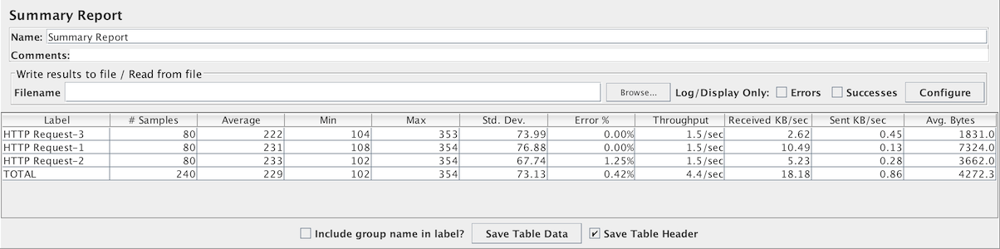](assets/images/summary-report_baf454d9cd844d94.png)

Screenshot of Control-Panel of Summary Report

The figure below shows an example of selecting the "Include group name" checkbox.

[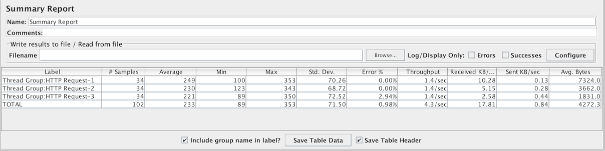](assets/images/summary-report-grouped_688c63d59c250aa4.png)

Sample "Include group name" display

[^](#component_reference)

<a id="component_reference--save_responses_to_a_file"></a>
<a id="component_reference--save-responses-to-a-file"></a>

## Save Responses to a file[¶](#component_reference--save_responses_to_a_file "Link to here")

This test element can be placed anywhere in the test plan.
For each sample in its scope, it will create a file of the response Data.
The primary use for this is in creating functional tests, but it can also
be useful where the response is too large to be displayed in the
[View Results Tree](#component_reference--view_results_tree) Listener.
The file name is created from the specified prefix, plus a number (unless this is disabled, see below).
The file extension is created from the document type, if known.
If not known, the file extension is set to 'unknown'.
If numbering is disabled, and adding a suffix is disabled, then the file prefix is
taken as the entire file name. This allows a fixed file name to be generated if required.
The generated file name is stored in the sample response, and can be saved
in the test log output file if required.

The current sample is saved first, followed by any sub-samples (child samples).
If a variable name is provided, then the names of the files are saved in the order
that the sub-samples appear. See below.

[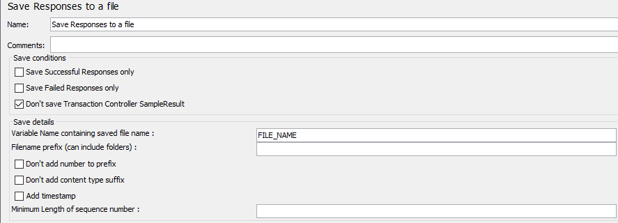](assets/images/savetofile_5ee97f4ab5f17f56.png)

Screenshot of Control-Panel of Save Responses to a file

<a id="component_reference--save_responses_to_a_file_parms1"></a>
<a id="component_reference--parameters-54"></a>

### Parameters [¶](#component_reference--save_responses_to_a_file_parms1 "Link to here")

Attribute

Description

Required

Name

Descriptive name for this element that is shown in the tree.

No

Filename Prefix (can include folders)

Prefix for the generated file names; this can include a directory name.
Relative paths are resolved relative to the current working directory (which defaults to the bin/ directory).
JMeter also supports paths relative to the directory containing the current test plan (JMX file).
If the path name begins with "~/" (or whatever is in the jmeter.save.saveservice.base\_prefix JMeter property), then the path is assumed to be relative to the JMX file location.
If parent folders in prefix do not exists, JMeter will create them and stop test if it fails.

Please note that Filename Prefix must not contain Thread related data, so don't use any Variable (${varName}) or functions like ${\_\_threadNum} in this field

Yes

Variable Name containing saved file name

Name of a variable in which to save the generated file name (so it can be used later in the test plan).
If there are sub-samples then a numeric suffix is added to the variable name.
E.g. if the variable name is FILENAME, then the parent sample file name is saved in the variable FILENAME, and the filenames for the child samplers are saved in FILENAME1, FILENAME2 etc.

No

Minimum Length of sequence number

If "Don't add number to prefix" is not checked, then numbers added to prefix will be padded by 0 so that prefix is has size of this value. Defaults to 0.

No

Save Failed Responses only

If selected, then only failed responses are saved

Yes

Save Successful Responses only

If selected, then only successful responses are saved

Yes

Don't add number to prefix

If selected, then no number is added to the prefix. If you select this option, make sure that the prefix is unique or the file may be overwritten.

Yes

Don't add content type suffix

If selected, then no suffix is added. If you select this option, make sure that the prefix is unique or the file may be overwritten.

Yes

Add timestamp

If selected, then date will be included in file suffix following format yyyyMMdd-HHmm\_

Yes

Don't Save Transaction Controller SampleResult

If selected, then SamplerResult generated by Transaction Controller will be ignored

Yes

[^](#component_reference)

<a id="component_reference--jsr223_listener"></a>
<a id="component_reference--jsr223-listener"></a>

## JSR223 Listener[¶](#component_reference--jsr223_listener "Link to here")

The JSR223 Listener allows JSR223 script code to be applied to sample results.

<a id="component_reference--jsr223_listener_parms1"></a>
<a id="component_reference--parameters-55"></a>

### Parameters [¶](#component_reference--jsr223_listener_parms1 "Link to here")

Attribute

Description

Required

Name

Descriptive name for this element that is shown in the tree.

No

Language

The JSR223 language to be used

Yes

Parameters

Parameters to pass to the script.
The parameters are stored in the following variables:

Parameters
:   string containing the parameters as a single variable

args
:   String array containing parameters, split on white-space

No

Script file

A file containing the script to run, if a relative file path is used, then it will be relative to directory referenced by "user.dir" System property

No

Script compilation caching

Unique String across Test Plan that JMeter will use to cache result of Script compilation if language used supports [Compilable](https://docs.oracle.com/javase/8/docs/api/javax/script/Compilable.html) interface (Groovy is one of these, java, beanshell and javascript are not).

See note in JSR223 Sampler Java System property if you're using Groovy without checking this option

No

Script

The script to run.

Yes (unless script file is provided)

Before invoking the script, some variables are set up.
Note that these are JSR223 variables - i.e. they can be used directly in the script.

log
:   ([Logger](https://www.slf4j.org/api/org/slf4j/Logger.html)) - can be used to write to the log file

Label
:   the String Label

FileName
:   the script file name (if any)

Parameters
:   the parameters (as a String)

args
:   the parameters as a String array (split on whitespace)

ctx
:   ([JMeterContext](https://jmeter.apache.org/api/org/apache/jmeter/threads/JMeterContext.html)) - gives access to the context

vars
:   ([JMeterVariables](https://jmeter.apache.org/api/org/apache/jmeter/threads/JMeterVariables.html)) - gives read/write access to variables:

```
vars.get(key);
vars.put(key,val);
vars.putObject("OBJ1",new Object());
vars.getObject("OBJ2");
```

props
:   (JMeterProperties - class [java.util.Properties](https://docs.oracle.com/javase/8/docs/api/java/util/Properties.html)) - e.g. props.get("START.HMS"); props.put("PROP1","1234");

sampleResult, prev
:   ([SampleResult](https://jmeter.apache.org/api/org/apache/jmeter/samplers/SampleResult.html)) - gives access to the SampleResult

sampleEvent
:   ([SampleEvent](https://jmeter.apache.org/api/org/apache/jmeter/samplers/SampleEvent.html)) - gives access to the SampleEvent

sampler
:   ([Sampler](https://jmeter.apache.org/api/org/apache/jmeter/samplers/Sampler.html))- gives access to the last sampler

OUT
:   System.out - e.g. OUT.println("message")

For details of all the methods available on each of the above variables, please check the Javadoc

[^](#component_reference)

<a id="component_reference--generate_summary_results"></a>
<a id="component_reference--generate-summary-results"></a>

## Generate Summary Results[¶](#component_reference--generate_summary_results "Link to here")

This test element can be placed anywhere in the test plan.
Generates a summary of the test run so far to the log file and/or
standard output. Both running and differential totals are shown.
Output is generated every n seconds (default 30 seconds) on the appropriate
time boundary, so that multiple test runs on the same time will be synchronised.

Since a summary/differential line is written only if there are samples emitted, the interval
for generation may not be respected if your test has no sample generated within the interval

See jmeter.properties file for the summariser configuration items:

```

# Define the following property to automatically start a summariser with that name
# (applies to CLI mode only) #summariser.name=summary #
# interval between summaries (in seconds) default 3 minutes #summariser.interval=30 #
# Write messages to log file #summariser.log=true #
# Write messages to System.out #summariser.out=true
```

This element is mainly intended for batch (CLI) runs.
The output looks like the following:

```

label +     16 in 0:00:12 =    1.3/s Avg:  1608 Min:  1163 Max:  2009 Err:     0 (0.00%) Active: 5 Started: 5 Finished: 0
label +     82 in 0:00:30 =    2.7/s Avg:  1518 Min:  1003 Max:  2020 Err:     0 (0.00%) Active: 5 Started: 5 Finished: 0
label =     98 in 0:00:42 =    2.3/s Avg:  1533 Min:  1003 Max:  2020 Err:     0 (0.00%)
label +     85 in 0:00:30 =    2.8/s Avg:  1505 Min:  1008 Max:  2005 Err:     0 (0.00%) Active: 5 Started: 5 Finished: 0
label =    183 in 0:01:13 =    2.5/s Avg:  1520 Min:  1003 Max:  2020 Err:     0 (0.00%)
label +     79 in 0:00:30 =    2.7/s Avg:  1578 Min:  1089 Max:  2012 Err:     0 (0.00%) Active: 5 Started: 5 Finished: 0
label =    262 in 0:01:43 =    2.6/s Avg:  1538 Min:  1003 Max:  2020 Err:     0 (0.00%)
label +     80 in 0:00:30 =    2.7/s Avg:  1531 Min:  1013 Max:  2014 Err:     0 (0.00%) Active: 5 Started: 5 Finished: 0
label =    342 in 0:02:12 =    2.6/s Avg:  1536 Min:  1003 Max:  2020 Err:     0 (0.00%)
label +     83 in 0:00:31 =    2.7/s Avg:  1512 Min:  1003 Max:  1982 Err:     0 (0.00%) Active: 5 Started: 5 Finished: 0
label =    425 in 0:02:43 =    2.6/s Avg:  1531 Min:  1003 Max:  2020 Err:     0 (0.00%)
label +     83 in 0:00:29 =    2.8/s Avg:  1487 Min:  1023 Max:  2013 Err:     0 (0.00%) Active: 5 Started: 5 Finished: 0
label =    508 in 0:03:12 =    2.6/s Avg:  1524 Min:  1003 Max:  2020 Err:     0 (0.00%)
label +     78 in 0:00:30 =    2.6/s Avg:  1594 Min:  1013 Max:  2016 Err:     0 (0.00%) Active: 5 Started: 5 Finished: 0
label =    586 in 0:03:43 =    2.6/s Avg:  1533 Min:  1003 Max:  2020 Err:     0 (0.00%)
label +     80 in 0:00:30 =    2.7/s Avg:  1516 Min:  1013 Max:  2005 Err:     0 (0.00%) Active: 5 Started: 5 Finished: 0
label =    666 in 0:04:12 =    2.6/s Avg:  1531 Min:  1003 Max:  2020 Err:     0 (0.00%)
label +     86 in 0:00:30 =    2.9/s Avg:  1449 Min:  1004 Max:  2017 Err:     0 (0.00%) Active: 5 Started: 5 Finished: 0
label =    752 in 0:04:43 =    2.7/s Avg:  1522 Min:  1003 Max:  2020 Err:     0 (0.00%)
label +     65 in 0:00:24 =    2.7/s Avg:  1579 Min:  1007 Max:  2003 Err:     0 (0.00%) Active: 0 Started: 5 Finished: 5
label =    817 in 0:05:07 =    2.7/s Avg:  1526 Min:  1003 Max:  2020 Err:     0 (0.00%)
```

The "label" is the name of the element.
The "+" means that the line is a delta line, i.e. shows the changes since the last output.
The "=" means that the line is a total line, i.e. it shows the running total.
Entries in the JMeter log file also include time-stamps.
The example "817 in 0:05:07 = 2.7/s" means that there were 817 samples recorded in 5 minutes and 7 seconds, and that works out at 2.7 samples per second.
The Avg (Average), Min (Minimum) and Max (Maximum) times are in milliseconds.
"Err" means number of errors (also shown as percentage).
The last two lines will appear at the end of a test.
They will not be synchronised to the appropriate time boundary.
Note that the initial and final deltas may be for less than the interval (in the example above this is 30 seconds).
The first delta will generally be lower, as JMeter synchronizes to the interval boundary.
The last delta will be lower, as the test will generally not finish on an exact interval boundary.

The label is used to group sample results together.
So if you have multiple Thread Groups and want to summarize across them all, then use the same label
- or add the summariser to the Test Plan (so all thread groups are in scope).
Different summary groupings can be implemented
by using suitable labels and adding the summarisers to appropriate parts of the test plan.

In CLI mode by default a Generate Summary Results listener named "summariser" is configured, if you have already added one to your Test Plan, ensure you name it differently
otherwise results will be accumulated under this label (summary) leading to wrong results (sum of total samples + samples located under the Parent of Generate Summary Results listener).
This is not a bug but a design choice allowing to summarize across thread groups.

[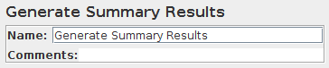](assets/images/summary_a71c3c3f30c7d172.png)

Screenshot of Control-Panel of Generate Summary Results

<a id="component_reference--generate_summary_results_parms1"></a>
<a id="component_reference--parameters-56"></a>

### Parameters [¶](#component_reference--generate_summary_results_parms1 "Link to here")

Attribute

Description

Required

Name

Descriptive name for this element that is shown in the tree.
It appears as the "label" in the output. Details for all elements with the same label will be added together.

Yes

[^](#component_reference)

<a id="component_reference--comparison_assertion_visualizer"></a>
<a id="component_reference--comparison-assertion-visualizer"></a>

## Comparison Assertion Visualizer[¶](#component_reference--comparison_assertion_visualizer "Link to here")

The Comparison Assertion Visualizer shows the results of any [Compare Assertion](#component_reference--compare_assertion) elements.

[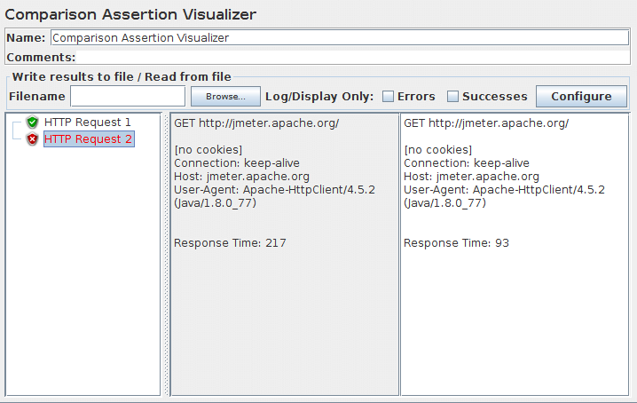](assets/images/comparison-assertion-visualizer_0dd3d382dd113e86.png)

Screenshot of Control-Panel of Comparison Assertion Visualizer

<a id="component_reference--comparison_assertion_visualizer_parms1"></a>
<a id="component_reference--parameters-57"></a>

### Parameters [¶](#component_reference--comparison_assertion_visualizer_parms1 "Link to here")

Attribute

Description

Required

Name

Descriptive name for this element that is shown in the tree.

Yes

[^](#component_reference)

<a id="component_reference--backend_listener"></a>
<a id="component_reference--backend-listener"></a>

## Backend Listener[¶](#component_reference--backend_listener "Link to here")

The backend listener is an Asynchronous listener that enables you to plug custom implementations of [BackendListenerClient](https://jmeter.apache.org/api/org/apache/jmeter/visualizers/backend/BackendListenerClient.html).
By default, a Graphite implementation is provided.

[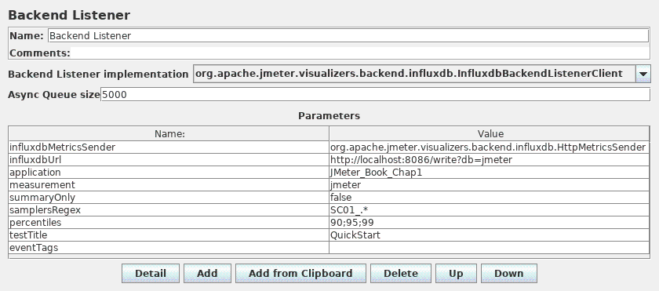](assets/images/backend-listener_133f4bea213fd928.png)

Screenshot of Control-Panel of Backend Listener

<a id="component_reference--backend_listener_parms1"></a>
<a id="component_reference--parameters-58"></a>

### Parameters [¶](#component_reference--backend_listener_parms1 "Link to here")

Attribute

Description

Required

Name

Descriptive name for this element that is shown in the tree.

Yes

Backend Listener implementation

Class of the BackendListenerClient implementation.

Yes

Async Queue size

Size of the queue that holds the SampleResults while they are processed asynchronously.

Yes

Parameters

Parameters of the BackendListenerClient implementation.

Yes

The following parameters apply to the [GraphiteBackendListenerClient](https://jmeter.apache.org/api/org/apache/jmeter/visualizers/backend/graphite/GraphiteBackendListenerClient.html) implementation:

<a id="component_reference--backend_listener_parms2"></a>
<a id="component_reference--parameters-59"></a>

### Parameters [¶](#component_reference--backend_listener_parms2 "Link to here")

Attribute

Description

Required

graphiteMetricsSender

org.apache.jmeter.visualizers.backend.graphite.TextGraphiteMetricsSender or org.apache.jmeter.visualizers.backend.graphite.PickleGraphiteMetricsSender

Yes

graphiteHost

Graphite or InfluxDB (with Graphite plugin enabled) server host

Yes

graphitePort

Graphite or InfluxDB (with Graphite plugin enabled) server port, defaults to 2003. Note PickleGraphiteMetricsSender (port 2004) can only talk to Graphite server.

Yes

rootMetricsPrefix

Prefix of metrics sent to backend. Defaults to "jmeter."
Note that JMeter does not add a separator between the root prefix and the samplerName which is why the trailing dot is currently needed.

Yes

summaryOnly

Only send a summary with no detail. Defaults to true.

Yes

samplersList

Defines the names (labels) of sample results to be sent to the back end.
If useRegexpForSamplersList=false this is a list of semi-colon separated names.
If useRegexpForSamplersList=true this is a regular expression which will be matched against the names.

Yes

useRegexpForSamplersList

Consider samplersList as a regular expression to select the samplers for which you want to report metrics to backend. Defaults to false.

Yes

percentiles

The percentiles you want to send to the backend.
A percentile may contain a fractional part, for example 12.5.
(The separator is always ".")
List must be semicolon separated. Generally 3 or 4 values should be sufficient.

Yes

See also [Real-time results](#realtime-results) for more details.

[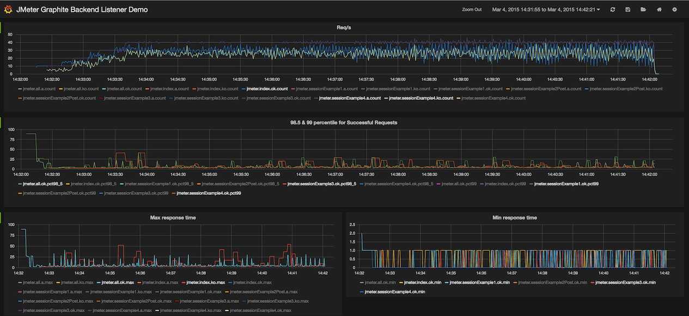](assets/images/grafana-dashboard_14bb967a74a68f36.png)

Grafana dashboard

Since JMeter 3.2, an implementation that allows writing directly in InfluxDB with a custom schema.
It is called InfluxdbBackendListenerClient. The following parameters apply to the
[InfluxdbBackendListenerClient](https://jmeter.apache.org/api/org/apache/jmeter/visualizers/backend/influxdb/InfluxdbBackendListenerClient.html) implementation:

<a id="component_reference--backend_listener_parms3"></a>
<a id="component_reference--parameters-60"></a>

### Parameters [¶](#component_reference--backend_listener_parms3 "Link to here")

Attribute

Description

Required

influxdbMetricsSender

org.apache.jmeter.visualizers.backend.influxdb.HttpMetricsSender

Yes

influxdbUrl

Influx URL (example: http://influxHost:8086/write?db=jmeter)

Yes

influxdbToken

InfluxDB 2 [authentication token](https://v2.docs.influxdata.com/v2.0/security/) (example: HE9yIdAPzWJDspH\_tCc2UvdKZpX==); since 5.2.

No

application

Name of tested application. This value is stored in the 'events' measurement as a tag named 'application'

Yes

measurement

Measurement as per [Influx Line Protocol Reference](https://docs.influxdata.com/influxdb/v1.1/write_protocols/line_protocol_reference/). Defaults to "jmeter".

Yes

summaryOnly

Only send a summary with no detail. Defaults to true.

Yes

samplersRegex

Regular expression which will be matched against the names of samples and sent to the back end.

Yes

testTitle

Test name. Defaults to Test name. This value is stored in the 'events' measurement as a field named 'text'. JMeter generate automatically at the start and the end of the test an annotation with this value ending with ' started' and ' ended'

Yes

eventTags

Grafana allow to display tag for each annotation. You can fill them here. This value is stored in the 'events' measurement as a tag named 'tags'.

No

percentiles

The percentiles you want to send to the backend.
A percentile may contain a fractional part, for example 12.5
(The separator is always ".").
List must be semicolon separated. Generally three or four values should be sufficient.

Yes

TAG\_WhatEverYouWant

You can add as many custom tags as you want. For each of them, create a new line and prefix its name by "TAG\_"

No

See also [Real-time results](#realtime-results) and [Influxdb annotations in Grafana](http://docs.grafana.org/reference/annotations/#influxdb-annotations) for more details.
There is also a [subsection on configuring the listener for InfluxDB v2](#realtime-results--influxdb_v2).

Since JMeter 5.4, an implementation that writes all sample results to InfluxDB.
It is called InfluxDBRawBackendListenerClient.
It is worth noting that this will use more resources than the
InfluxdbBackendListenerClient, both by JMeter and InfluxDB
due to the increase in data and individual writes.
The following parameters apply to the
[InfluxDBRawBackendListenerClient](https://jmeter.apache.org/api/org/apache/jmeter/visualizers/backend/influxdb/InfluxDBRawBackendListenerClient.html)
implementation:

<a id="component_reference--backend_listener_parms4"></a>
<a id="component_reference--parameters-61"></a>

### Parameters [¶](#component_reference--backend_listener_parms4 "Link to here")

Attribute

Description

Required

influxdbMetricsSender

org.apache.jmeter.visualizers.backend.influxdb.HttpMetricsSender

Yes

influxdbUrl

Influx URL (e.g. http://influxHost:8086/write?db=jmeter or, for the cloud, https://eu-central-1-1.aws.cloud2.influxdata.com/api/v2/write?org=org-id&bucket=jmeter)

Yes

influxdbToken

InfluxDB 2 [authentication token](https://v2.docs.influxdata.com/v2.0/security/) (e.g. HE9yIdAPzWJDspH\_tCc2UvdKZpX==)

No

measurement

Measurement as per [Influx Line Protocol Reference](https://docs.influxdata.com/influxdb/v1.7/write_protocols/line_protocol_reference/).
Defaults to "jmeter."

Yes

[^](#component_reference)

[^](#component_reference)

<a id="component_reference--config_elements"></a>
<a id="component_reference--18.4-configuration-elements"></a>

# 18.4 Configuration Elements[¶](#component_reference--config_elements "Link to here")

Configuration elements can be used to set up defaults and variables for later use by samplers.
Note that these elements are processed at the start of the scope in which they are found, i.e. before any samplers in the same scope.

<a id="component_reference--csv_data_set_config"></a>
<a id="component_reference--csv-data-set-config"></a>

## CSV Data Set Config[¶](#component_reference--csv_data_set_config "Link to here")

CSV Data Set Config is used to read lines from a file, and split them into variables.
It is easier to use than the [\_\_CSVRead()](#functions--__csvread) and [\_\_StringFromFile()](#functions--__stringfromfile) functions.
It is well suited to handling large numbers of variables, and is also useful for testing with
"random" and unique values.

Generating unique random values at run-time is expensive in terms of CPU and memory, so just create the data
in advance of the test. If necessary, the "random" data from the file can be used in conjunction with
a run-time parameter to create different sets of values from each run - e.g. using concatenation - which is
much cheaper than generating everything at run-time.

JMeter allows values to be quoted; this allows the value to contain a delimiter.
If "allow quoted data" is enabled, a value may be enclosed in double-quotes.
These are removed. To include double-quotes within a quoted field, use two double-quotes.
For example:

```

1,"2,3","4""5" =>
1
2,3
4"5
```

JMeter supports CSV files which have a header line defining the column names.
To enable this, leave the "Variable Names" field empty. The correct delimiter must be provided.

JMeter supports CSV files with quoted data that includes new-lines.

By default, the file is only opened once, and each thread will use a different line from the file.
However the order in which lines are passed to threads depends on the order in which they execute, which may vary between iterations.
Lines are read at the start of each test iteration.
The file name and mode are resolved in the first iteration.

See the description of the Share mode below for additional options.
If you want each thread to have its own set of values, then you will need to create a set of files, one for each thread. For example test1.csv, test2.csv, …, test*n*.csv. Use the filename
test${\_\_threadNum}.csv and set the "Sharing mode" to "Current thread".

CSV Dataset variables are defined at the start of each test iteration.
As this is after configuration processing is completed, they cannot be used for some configuration items - such as JDBC Config -
that process their contents at configuration time (see [Bug
40394](https://bz.apache.org/bugzilla/show_bug.cgi?id=40394))
However the variables do work in the HTTP Auth Manager, as the username etc. are processed at run-time.

As a special case, the string "\t" (without quotes) in the delimiter field is treated as a Tab.

When the end of file (EOF) is reached, and the recycle option is true, reading starts again with the first line of the file.

If the recycle option is false, and stopThread is false, then all the variables are set to <EOF> when the end of file is reached.
This value can be changed by setting the JMeter property csvdataset.eofstring.

If the Recycle option is false, and Stop Thread is true, then reaching EOF will cause the thread to be stopped.

[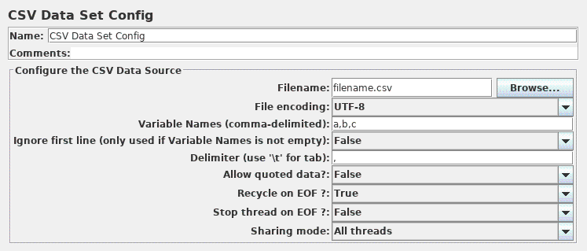](assets/images/csvdatasetconfig_51d304200be9f993.png)

Screenshot of Control-Panel of CSV Data Set Config

<a id="component_reference--csv_data_set_config_parms1"></a>
<a id="component_reference--parameters-62"></a>

### Parameters [¶](#component_reference--csv_data_set_config_parms1 "Link to here")

Attribute

Description

Required

Name

Descriptive name for this element that is shown in the tree.

Filename

Name of the file to be read.
**Relative file names are resolved with respect to the path of the active test plan.**
**For distributed testing, the CSV file must be stored on the server host system in the correct relative directory to where the JMeter server is started.**
Absolute file names are also supported, but note that they are unlikely to work in remote mode, unless the remote server has the same directory structure.
If the same physical file is referenced in two different ways - e.g. csvdata.txt and ./csvdata.txt -
then these are treated as different files.
If the OS does not distinguish between upper and lower case, csvData.TXT would also be opened separately.

Yes

File Encoding

The encoding to be used to read the file, if not the platform default.

No

Variable Names

List of variable names. The names must be separated by the delimiter character. They can be quoted using double-quotes.
JMeter supports CSV header lines:
if the variable name field empty, then the first line of the file is read and interpreted as the list of column names.

No

Use first line as Variable Names

Ignore first line of CSV file, it will only be used if Variable Names is not empty, if Variable Names is empty the first line must contain the headers.

No

Delimiter

Delimiter to be used to split the records in the file.
If there are fewer values on the line than there are variables the remaining variables are not updated -
so they will retain their previous value (if any).

Yes

Allow quoted data?

Should the CSV file allow values to be quoted?
If enabled, then values can be enclosed in " - double-quote - allowing values to contain a delimiter.

Yes

Recycle on EOF?

Should the file be re-read from the beginning on reaching EOF? (default is true)

Yes

Stop thread on EOF?

Should the thread be stopped on EOF, if Recycle is false? (default is false)

Yes

Sharing mode

- All threads - (the default) the file is shared between all the threads.
- Current thread group - each file is opened once for each thread group in which the element appears
- Current thread - each file is opened separately for each thread
- Identifier - all threads sharing the same identifier share the same file.
  So for example if you have 4 thread groups, you could use a common id for two or more of the groups
  to share the file between them.
  Or you could use the thread number to share the file between the same thread numbers in different thread groups.

Yes

[^](#component_reference)

<a id="component_reference--ftp_request_defaults"></a>
<a id="component_reference--ftp-request-defaults"></a>

## FTP Request Defaults[¶](#component_reference--ftp_request_defaults "Link to here")

[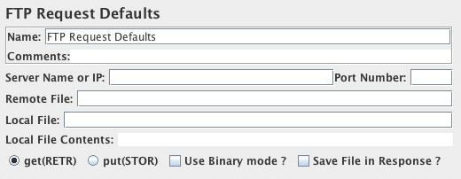](assets/images/ftp-request-defaults_1fbef5aa16e186b8.png)

Screenshot of Control-Panel of FTP Request Defaults

[^](#component_reference)

<a id="component_reference--dns_cache_manager"></a>
<a id="component_reference--dns-cache-manager"></a>

## DNS Cache Manager[¶](#component_reference--dns_cache_manager "Link to here")

The DNS Cache Manager element allows to test applications, which have several servers behind load balancers (CDN, etc.), when user receives content from different IP's. By default JMeter uses JVM DNS cache. That's why
only one server from the cluster receives load. DNS Cache Manager resolves names for each thread separately each iteration and
saves results of resolving to its internal DNS Cache, which is independent from both JVM and OS DNS caches.

A mapping for static hosts can be used to simulate something like /etc/hosts file.
These entries will be preferred over the custom resolver. Use custom DNS resolver has to be enabled, if you want to use this mapping.

Usage of static host table[¶](#component_reference--static_host_table "Link to here")

Say, you have a test server, that you want to reach with a name, that is not (yet) set up in your DNS servers.
For our example, this would be www.example.com for the server name, which you want to reach at the
IP of the server a123.another.example.org.

You could change your workstation and add an entry to your /etc/hosts file - or the equivalent for
your OS, or add an entry to the Static Host Table of the DNS Cache Manager.

You would type www.example.com into the first column (Host) and
a123.another.example.org into the second column (Hostname or IP address).
As the name of the second column implies, you could even use the IP address of your test server there.

The IP address for the test server will be looked up by using the custom DNS resolver. When none is given, the
system DNS resolver will be used.

Now you can use www.example.com in your HTTPClient4 samplers and the requests will be made against
a123.another.example.org with all headers set to www.example.com.

[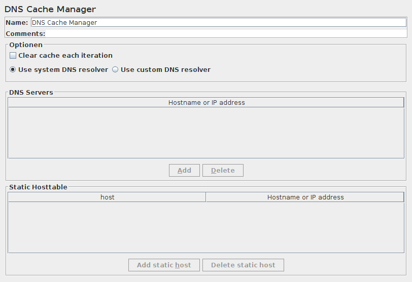](assets/images/dns-cache-manager_d0b77e8539ae1baf.png)

Screenshot of Control-Panel of DNS Cache Manager

DNS Cache Manager is designed for using in the root of Thread Group or Test Plan. Do not place it as child element of particular HTTP Sampler

DNS Cache Manager works only with HTTP requests using HTTPClient4 implementation.

<a id="component_reference--dns_cache_manager_parms1"></a>
<a id="component_reference--parameters-63"></a>

### Parameters [¶](#component_reference--dns_cache_manager_parms1 "Link to here")

Attribute

Description

Required

Name

Descriptive name for this element that is shown in the tree.

No

Clear cache each Iteration

If selected, DNS cache of every Thread is cleared each time new iteration is started.

No

Use system DNS resolver

System DNS resolver will be used. For correct work edit
$JAVA\_HOME/jre/lib/security/java.security and add networkaddress.cache.ttl=0

N/A

Use custom DNS resolver

Custom DNS resolver (from dnsjava library) will be used.

N/A

Hostname or IP address

List of DNS servers to use. If empty, network configuration DNS will used.

No

Add Button

Add an entry to the DNS servers table.

N/A

Delete Button

Delete the currently selected table entry.

N/A

Host and Hostname or IP address

Mapping of hostnames to a static host entry which will be resolved using the custom DNS resolver.

No

Add static host Button

Add an entry to the static hosts table.

N/A

Delete static host Button

Delete the currently selected static host in the table.

N/A

[^](#component_reference)

<a id="component_reference--http_authorization_manager"></a>
<a id="component_reference--http-authorization-manager"></a>

## HTTP Authorization Manager[¶](#component_reference--http_authorization_manager "Link to here")

The Authorization Manager lets you specify one or more user logins for web pages that are
restricted using server authentication. You see this type of authentication when you use
your browser to access a restricted page, and your browser displays a login dialog box. JMeter
transmits the login information when it encounters this type of page.

The Authorization headers may not be shown in the Tree View Listener "Request" tab.
The Java implementation does pre-emptive authentication, but it does not
return the Authorization header when JMeter fetches the headers.
The HttpComponents (HC 4.5.X) implementation defaults to pre-emptive since 3.2 and the header will be shown.
To disable this, set the values as below, in which case authentication will only be performed in response to a challenge.

In the file jmeter.properties set httpclient4.auth.preemptive=false

Note: the above settings only apply to the HttpClient sampler.

When looking for a match against a URL, JMeter checks each entry in turn, and stops when it finds the first match.
Thus the most specific URLs should appear first in the list, followed by less specific ones.
Duplicate URLs will be ignored.
If you want to use different usernames/passwords for different threads, you can use variables.
These can be set up using a [CSV Data Set Config](#component_reference--csv_data_set_config) Element (for example).

[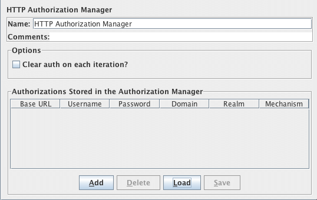](assets/images/http-auth-manager_32447ba48a588a7d.png)

Screenshot of Control-Panel of HTTP Authorization Manager

If there is more than one Authorization Manager in the scope of a Sampler, there is currently no way to specify which one is to be used.

<a id="component_reference--http_authorization_manager_parms1"></a>
<a id="component_reference--parameters-64"></a>

### Parameters [¶](#component_reference--http_authorization_manager_parms1 "Link to here")

Attribute

Description

Required

Name

Descriptive name for this element that is shown in the tree.

No

Clear auth on each iteration?

Used by Kerberos authentication. If checked, authentication will be done on each iteration of Main Thread Group loop even if it has already been done in a previous one.
This is usually useful if each main thread group iteration represents behaviour of one Virtual User.

Yes

Base URL

A partial or complete URL that matches one or more HTTP Request URLs. As an example, say you specify a Base URL of "http://localhost/restricted/" with a Username of "jmeter" and
a Password of "jmeter". If you send an HTTP request to the URL
"http://localhost/restricted/ant/myPage.html", the Authorization Manager sends the login
information for the user named, "jmeter".

Yes

Username

The username to authorize.

Yes

Password

The password for the user. (N.B. this is stored unencrypted in the test plan)

Yes

Domain

The domain to use for NTLM.

No

Realm

The realm to use for NTLM.

No

Mechanism

Type of authentication to perform. JMeter can perform different types of authentications based on used Http Samplers:

Java
:   BASIC

HttpClient 4
:   BASIC, DIGEST and Kerberos

No

The Realm only applies to the HttpClient sampler.

**Kerberos Configuration:**

To configure Kerberos you need to setup at least two JVM system properties:

- -Djava.security.krb5.conf=krb5.conf
- -Djava.security.auth.login.config=jaas.conf

You can also configure those two properties in the file bin/system.properties.
Look at the two sample configuration files (krb5.conf and jaas.conf) located in the JMeter bin folder
for references to more documentation, and tweak them to match your Kerberos configuration.

Delegation of credentials is disabled by default for SPNEGO. If you want to enable it, you can do so by setting the property kerberos.spnego.delegate\_cred to true.

When generating a SPN for Kerberos SPNEGO authentication IE and Firefox will omit the port number
from the URL. Chrome has an option (--enable-auth-negotiate-port) to include the port
number if it differs from the standard ones (80 and 443). That behavior
can be emulated by setting the following JMeter property as below.

In jmeter.properties or user.properties, set:

- kerberos.spnego.strip\_port=false

**Controls:**

- Add Button - Add an entry to the authorization table.
- Delete Button - Delete the currently selected table entry.
- Load Button - Load a previously saved authorization table and add the entries to the existing
  authorization table entries.
- Save As Button - Save the current authorization table to a file.

When you save the Test Plan, JMeter automatically saves all of the authorization
table entries - including any passwords, which are not encrypted.

Authorization Example[¶](#component_reference--authorization_example "Link to here")

[Download](https://jmeter.apache.org/demos/AuthManagerTestPlan.jmx) this example. In this example, we created a Test Plan on a local server that sends three HTTP requests, two requiring a login and the
other is open to everyone. See figure 10 to see the makeup of our Test Plan. On our server, we have a restricted
directory named, "secret", which contains two files, "index.html" and "index2.html". We created a login id named, "kevin", which has a password of "spot". So, in our Authorization Manager, we created an entry for the restricted directory and
a username and password (see figure 11). The two HTTP requests named "SecretPage1" and "SecretPage2" make requests
to "/secret/index.html" and "/secret/index2.html". The other HTTP request, named "NoSecretPage" makes a request to
"/index.html".

[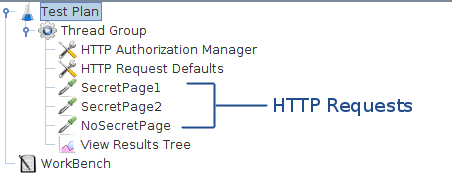](assets/images/auth-manager-example1a_833ef65158f027d9.png)

Figure 10 - Test Plan

[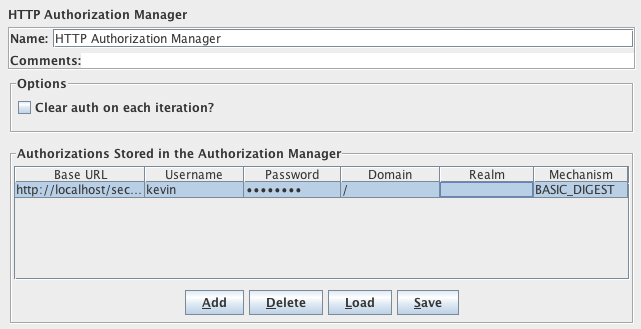](assets/images/auth-manager-example1b_fe80026737af4876.png)

Figure 11 - Authorization Manager Control Panel

When we run the Test Plan, JMeter looks in the Authorization table for the URL it is requesting. If the Base URL matches
the URL, then JMeter passes this information along with the request.

You can download the Test Plan, but since it is built as a test for our local server, you will not
be able to run it. However, you can use it as a reference in constructing your own Test Plan.

[^](#component_reference)

<a id="component_reference--http_cache_manager"></a>
<a id="component_reference--http-cache-manager"></a>

## HTTP Cache Manager[¶](#component_reference--http_cache_manager "Link to here")

The HTTP Cache Manager is used to add caching functionality to HTTP requests within its scope to simulate browser cache feature.
Each Virtual User thread has its own Cache. By default, Cache Manager will store up to 5000 items in cache per Virtual User thread, using LRU algorithm.
Use property "maxSize" to modify this value. Note that the more you increase this value the more HTTP Cache Manager will consume memory, so be sure to adapt the -Xmx JVM option accordingly.

If a sample is successful (i.e. has response code 2xx) then the Last-Modified and Etag (and Expired if relevant) values are saved for the URL.
Before executing the next sample, the sampler checks to see if there is an entry in the cache, and if so, the If-Last-Modified and If-None-Match conditional headers are set for the request.

Additionally, if the "Use Cache-Control/Expires header" option is selected, then the Cache-Control/Expires value is checked against the current time.
If the request is a GET request, and the timestamp is in the future, then the sampler returns immediately, without requesting the URL from the remote server. This is intended to emulate browser behaviour.
Note that if Cache-Control header is "no-cache", the response will be stored in cache as pre-expired, so will generate a conditional GET request.
If Cache-Control has any other value, the "max-age" expiry option is processed to compute entry lifetime, if missing then expire header will be used, if also missing entry will be cached
as specified in [RFC 2616 section 13.2.4](https://tools.ietf.org/html/2616#section-13.2.4) using Last-Modified time and response Date.

If the requested document has not changed since it was cached, then the response body will be empty.
Likewise if the Expires date is in the future.
This may cause problems for Assertions.

[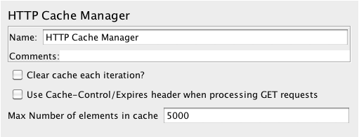](assets/images/http-cache-manager_d6671d167154fba1.png)

Screenshot of Control-Panel of HTTP Cache Manager

<a id="component_reference--http_cache_manager_parms1"></a>
<a id="component_reference--parameters-65"></a>

### Parameters [¶](#component_reference--http_cache_manager_parms1 "Link to here")

Attribute

Description

Required

Name

Descriptive name for this element that is shown in the tree.

No

Clear cache each iteration

If selected, then the cache is cleared at the start of the thread.

Yes

Use Cache Control/Expires header when processing GET requests

See description above.

Yes

Max Number of elements in cache

See description above.

Yes

[^](#component_reference)

<a id="component_reference--http_cookie_manager"></a>
<a id="component_reference--http-cookie-manager"></a>

## HTTP Cookie Manager[¶](#component_reference--http_cookie_manager "Link to here")

The Cookie Manager element has two functions:
First, it stores and sends cookies just like a web browser. If you have an HTTP Request and
the response contains a cookie, the Cookie Manager automatically stores that cookie and will
use it for all future requests to that particular web site. Each JMeter thread has its own
"cookie storage area". So, if you are testing a web site that uses a cookie for storing
session information, each JMeter thread will have its own session.
Note that such cookies do not appear on the Cookie Manager display, but they can be seen using
the [View Results Tree](#component_reference--view_results_tree) Listener.

JMeter checks that received cookies are valid for the URL.
This means that cross-domain cookies are not stored.
If you have bugged behaviour or want Cross-Domain cookies to be used, define the JMeter property "CookieManager.check.cookies=false".

Received Cookies can be stored as JMeter thread variables.
To save cookies as variables, define the property "CookieManager.save.cookies=true".
Also, cookies names are prefixed with "COOKIE\_" before they are stored (this avoids accidental corruption of local variables)
To revert to the original behaviour, define the property "CookieManager.name.prefix= " (one or more spaces).
If enabled, the value of a cookie with the name TEST can be referred to as ${COOKIE\_TEST}.

Second, you can manually add a cookie to the Cookie Manager. However, if you do this, the cookie will be shared by all JMeter threads.

Note that such Cookies are created with an Expiration time far in the future

Cookies with null values are ignored by default.
This can be changed by setting the JMeter property: CookieManager.delete\_null\_cookies=false.
Note that this also applies to manually defined cookies - any such cookies will be removed from the display when it is updated.
Note also that the cookie name must be unique - if a second cookie is defined with the same name, it will replace the first.

[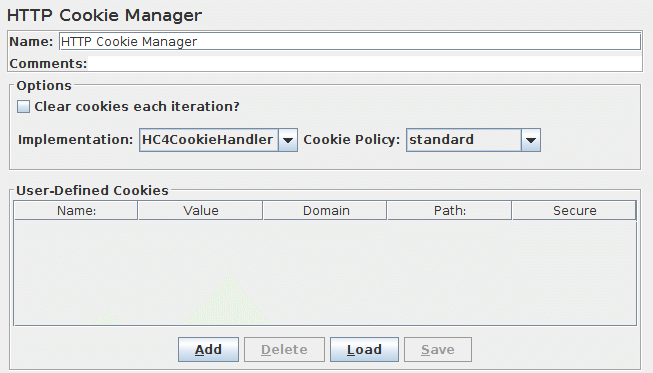](assets/images/http-cookie-manager_3b2ac8e45ec6ce3c.png)

Screenshot of Control-Panel of HTTP Cookie Manager

If there is more than one Cookie Manager in the scope of a Sampler, there is currently no way to specify which one is to be used.
Also, a cookie stored in one cookie manager is not available to any other manager, so use multiple Cookie Managers with care.

<a id="component_reference--http_cookie_manager_parms1"></a>
<a id="component_reference--parameters-66"></a>

### Parameters [¶](#component_reference--http_cookie_manager_parms1 "Link to here")

Attribute

Description

Required

Name

Descriptive name for this element that is shown in the tree.

No

Clear Cookies each Iteration

If selected, all server-defined cookies are cleared each time the main Thread Group loop is executed.
Any cookie defined in the GUI are not cleared.

Yes

Cookie Policy

The cookie policy that will be used to manage the cookies.
"standard" is the default since 3.0, and should work in most cases.
See [Cookie specifications](https://hc.apache.org/httpcomponents-client-ga/tutorial/html/statemgmt.html#d5e515) and
[CookieSpec implementations](http://hc.apache.org/httpcomponents-client-ga/httpclient/apidocs/org/apache/http/cookie/CookieSpec.html)
[Note: "ignoreCookies" is equivalent to omitting the CookieManager.]

Yes

Implementation

HC4CookieHandler (HttpClient 4.5.X API).
Default is HC4CookieHandler since 3.0.
*[Note: If you have a website to test with IPv6 address, choose HC4CookieHandler (IPv6 compliant)]*

Yes

User-Defined Cookies

This
gives you the opportunity to use hardcoded cookies that will be used by all threads during the test execution.
The "domain" is the hostname of the server (without http://); the port is currently ignored.

No (discouraged, unless you know what you're doing)

Add Button

Add an entry to the cookie table.

N/A

Delete Button

Delete the currently selected table entry.

N/A

Load Button

Load a previously saved cookie table and add the entries to the existing
cookie table entries.

N/A

Save As Button

Save the current cookie table to a file (does not save any cookies extracted from HTTP Responses).

N/A

[^](#component_reference)

<a id="component_reference--http_request_defaults"></a>
<a id="component_reference--http-request-defaults"></a>

## HTTP Request Defaults[¶](#component_reference--http_request_defaults "Link to here")

This element lets you set default values that your HTTP Request controllers use. For example, if you are
creating a Test Plan with 25 HTTP Request controllers and all of the requests are being sent to the same server, you could add a single HTTP Request Defaults element with the "Server Name or IP" field filled in. Then, when
you add the 25 HTTP Request controllers, leave the "Server Name or IP" field empty. The controllers will inherit
this field value from the HTTP Request Defaults element.

All port values are treated equally; a sampler that does not specify a port will use the HTTP Request Defaults port, if one is provided.

[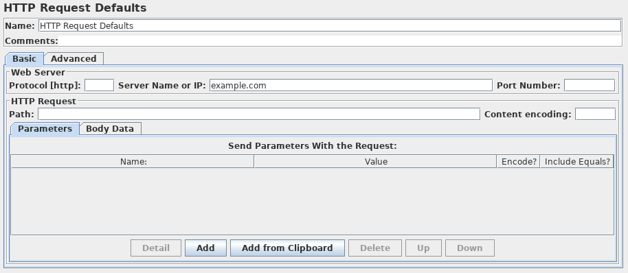](assets/images/http-request-defaults_43e25dec9e3e2321.png)

Screenshot of Control-Panel of HTTP Request Defaults

[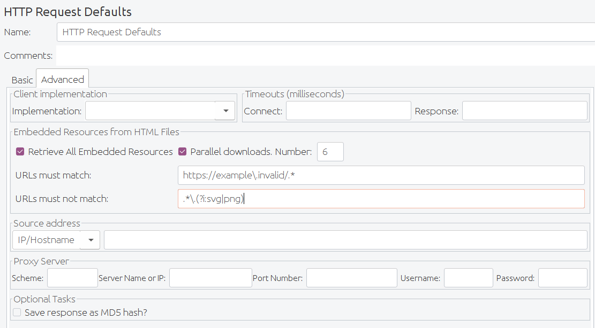](assets/images/http-request-defaults-advanced-tab_80e93261ba19bba6.png)

HTTP Request Advanced config fields

<a id="component_reference--http_request_defaults_parms1"></a>
<a id="component_reference--parameters-67"></a>

### Parameters [¶](#component_reference--http_request_defaults_parms1 "Link to here")

Attribute

Description

Required

Name

Descriptive name for this element that is shown in the tree.

No

Server

Domain name or IP address of the web server. E.g. www.example.com. [Do not include the http:// prefix.

No

Port

Port the web server is listening to.

No

Connect Timeout

Connection Timeout. Number of milliseconds to wait for a connection to open.

No

Response Timeout

Response Timeout. Number of milliseconds to wait for a response.

No

Implementation

Java, HttpClient4.
If not specified the default depends on the value of the JMeter property
jmeter.httpsampler, failing that, the Java implementation is used.

No

Protocol

HTTP or HTTPS.

No

Content encoding

The encoding to be used for the request.

No

Path

The path to resource (for example, /servlets/myServlet). If the
resource requires query string parameters, add them below in the "Send Parameters With the Request" section.
Note that the path is the default for the full path, not a prefix to be applied to paths
specified on the HTTP Request screens.

No

Send Parameters With the Request

The query string will
be generated from the list of parameters you provide. Each parameter has a *name* and
*value*. The query string will be generated in the correct fashion, depending on
the choice of "Method" you made (i.e. if you chose GET, the query string will be
appended to the URL, if POST, then it will be sent separately). Also, if you are
sending a file using a multipart form, the query string will be created using the
multipart form specifications.

No

Server (proxy)

Hostname or IP address of a proxy server to perform request. [Do not include the http:// prefix.]

No

Port

Port the proxy server is listening to.

No, unless proxy hostname is specified

Username

(Optional) username for proxy server.

No

Password

(Optional) password for proxy server. (N.B. this is stored unencrypted in the test plan)

No

Retrieve All Embedded Resources from HTML Files

Tell JMeter to parse the HTML file
and send HTTP/HTTPS requests for all images, Java applets, JavaScript files, CSSs, etc. referenced in the file.

No

Use concurrent pool

Use a pool of concurrent connections to get embedded resources.

No

Size

Pool size for concurrent connections used to get embedded resources.

No

URLs must match:

If present, this must be a regular expression that is used to match against any embedded URLs found.
So if you only want to download embedded resources from http://example.invalid/, use the expression:
http://example\.invalid/.\*

No

URLs must not match:

If present, this must be a regular expression that is used to filter out any embedded URLs found.
So if you don't want to download PNG or SVG files from any source, use the expression:
.\*\.(?i:svg|png)

No

Note: radio buttons only have two states - on or off.
This makes it impossible to override settings consistently
- does off mean off, or does it mean use the current default?
JMeter uses the latter (otherwise defaults would not work at all).
So if the button is off, then a later element can set it on, but if the button is on, a later element cannot set it off.

[^](#component_reference)

<a id="component_reference--http_header_manager"></a>
<a id="component_reference--http-header-manager"></a>

## HTTP Header Manager[¶](#component_reference--http_header_manager "Link to here")

The Header Manager lets you add or override HTTP request headers.

**JMeter now supports multiple Header Managers**. The header entries are merged to form the list for the sampler.
If an entry to be merged matches an existing header name, it replaces the previous entry.
This allows one to set up a default set of headers, and apply adjustments to particular samplers.
Note that an empty value for a header does not remove an existing header, it justs replace its value.

[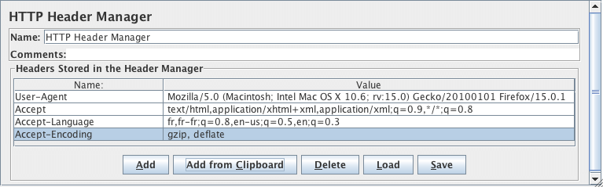](assets/images/http-header-manager_09631193ab725c3c.png)

Screenshot of Control-Panel of HTTP Header Manager

<a id="component_reference--http_header_manager_parms1"></a>
<a id="component_reference--parameters-68"></a>

### Parameters [¶](#component_reference--http_header_manager_parms1 "Link to here")

Attribute

Description

Required

Name

Descriptive name for this element that is shown in the tree.

No

Name (Header)

Name of the request header.
Two common request headers you may want to experiment with
are "User-Agent" and "Referer".

No (You should have at least one, however)

Value

Request header value.

No (You should have at least one, however)

Add Button

Add an entry to the header table.

N/A

Delete Button

Delete the currently selected table entry.

N/A

Load Button

Load a previously saved header table and add the entries to the existing
header table entries.

N/A

Save As Button

Save the current header table to a file.

N/A

Header Manager example[¶](#component_reference--header_manager_example "Link to here")

[Download](https://jmeter.apache.org/demos/HeaderManagerTestPlan.jmx) this example. In this example, we created a Test Plan
that tells JMeter to override the default "User-Agent" request header and use a particular Internet Explorer agent string
instead. (see figures 12 and 13).

[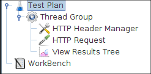](assets/images/header-manager-example1a_f0e1927af5b669de.png)

Figure 12 - Test Plan

[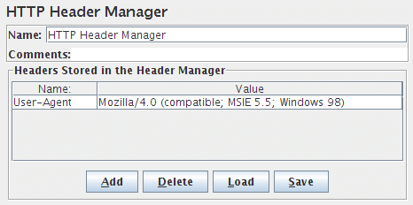](assets/images/header-manager-example1b_adfa2fc65e18e3c2.png)

Figure 13 - Header Manager Control Panel

[^](#component_reference)

<a id="component_reference--java_request_defaults"></a>
<a id="component_reference--java-request-defaults"></a>

## Java Request Defaults[¶](#component_reference--java_request_defaults "Link to here")

The Java Request Defaults component lets you set default values for Java testing. See the [Java Request](#component_reference--java_request).

[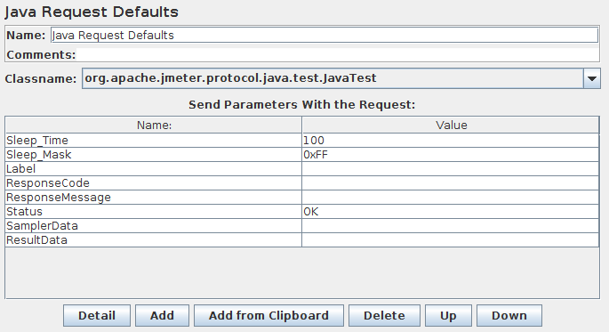](assets/images/java-defaults_0a02c491e12f5d7a.png)

Screenshot of Control-Panel of Java Request Defaults

[^](#component_reference)

<a id="component_reference--jdbc_connection_configuration"></a>
<a id="component_reference--jdbc-connection-configuration"></a>

## JDBC Connection Configuration[¶](#component_reference--jdbc_connection_configuration "Link to here")

Creates a database connection (used by [JDBC Request](#component_reference--jdbc_request)Sampler)
from the supplied JDBC Connection settings. The connection may be optionally pooled between threads.
Otherwise each thread gets its own connection.
The connection configuration name is used by the JDBC Sampler to select the appropriate
connection.
The used pool is DBCP, see [BasicDataSource Configuration Parameters](https://commons.apache.org/proper/commons-dbcp/configuration.html)

[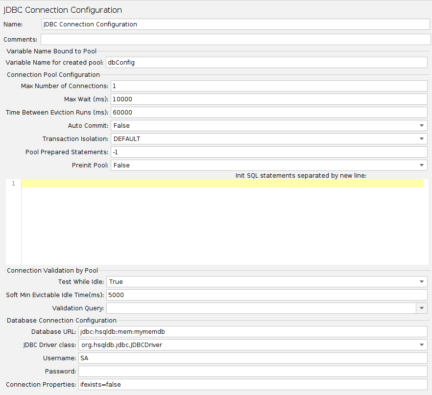](assets/images/jdbc-conn-config_5be5b834240ab347.png)

Screenshot of Control-Panel of JDBC Connection Configuration

<a id="component_reference--jdbc_connection_configuration_parms1"></a>
<a id="component_reference--parameters-69"></a>

### Parameters [¶](#component_reference--jdbc_connection_configuration_parms1 "Link to here")

Attribute

Description

Required

Name

Descriptive name for the connection configuration that is shown in the tree.

No

Variable Name for created pool

The name of the variable the connection is tied to.
Multiple connections can be used, each tied to a different variable, allowing JDBC Samplers
to select the appropriate connection.

Each name must be different. If there are two configuration elements using the same name, only one will be saved. JMeter logs a message if a duplicate name is detected.

Yes

Max Number of Connections

Maximum number of connections allowed in the pool.
In most cases, **set this to zero (0)**.
This means that each thread will get its own pool with a single connection in it, i.e.
the connections are not shared between threads.
If you really want to use shared pooling (why?), then set the max count to the same as the number of threads
to ensure threads don't wait on each other.

Yes

Max Wait (ms)

Pool throws an error if the timeout period is exceeded in the
process of trying to retrieve a connection, see [BasicDataSource.html#getMaxWaitMillis](https://commons.apache.org/proper/commons-dbcp/api-2.1.1/org/apache/commons/dbcp2/BasicDataSource.html#getMaxWaitMillis--)

Yes

Time Between Eviction Runs (ms)

The number of milliseconds to sleep between runs of the idle object evictor thread. When non-positive, no idle object evictor thread will be run. (Defaults to "60000", 1 minute).
See [BasicDataSource.html#getTimeBetweenEvictionRunsMillis](https://commons.apache.org/proper/commons-dbcp/api-2.1.1/org/apache/commons/dbcp2/BasicDataSource.html#getTimeBetweenEvictionRunsMillis--)

Yes

Auto Commit

Turn auto commit on or off for the connections.

Yes

Transaction isolation

Transaction isolation level

Yes

Pool Prepared Statements

Max number of Prepared Statements to pool per connection. "-1" disables the pooling and "0" means unlimited number of Prepared Statements to pool. (Defaults to "-1")

Yes

Preinit Pool

The connection pool can be initialized instantly. If set to False (default), the JDBC request samplers using this pool might measure higher response times for the first queries – as the connection establishment time for the whole pool is included.

No

Init SQL statements separated by new line

A Collection of SQL statements that will be used to initialize physical connections when they are first created. These statements are executed only once - when the configured connection factory creates the connection.

No

Test While Idle

Test idle connections of the pool, see [BasicDataSource.html#getTestWhileIdle](https://commons.apache.org/proper/commons-dbcp/api-2.1.1/org/apache/commons/dbcp2/BasicDataSource.html#getTestWhileIdle--).
Validation Query will be used to test it.

Yes

Soft Min Evictable Idle Time(ms)

Minimum amount of time a connection may sit idle in the pool before it is eligible for eviction by the idle object evictor, with the extra condition that at least minIdle connections remain in the pool.
See [BasicDataSource.html#getSoftMinEvictableIdleTimeMillis](https://commons.apache.org/proper/commons-dbcp/api-2.1.1/org/apache/commons/dbcp2/BasicDataSource.html#getSoftMinEvictableIdleTimeMillis--).
Defaults to 5000 (5 seconds)

Yes

Validation Query

A simple query used to determine if the database is still responding.
This defaults to the 'isValid()' method of the jdbc driver, which is suitable for many databases.
However some may require a different query; for example Oracle something like 'SELECT 1 FROM DUAL' could be used.

The list of the validation queries can be configured with jdbc.config.check.query property and are by default:

hsqldb
:   select 1 from INFORMATION\_SCHEMA.SYSTEM\_USERS

Oracle
:   select 1 from dual

DB2
:   select 1 from sysibm.sysdummy1

MySQL or MariaDB
:   select 1

Microsoft SQL Server (MS JDBC driver)
:   select 1

PostgreSQL
:   select 1

Ingres
:   select 1

Derby
:   values 1

H2
:   select 1

Firebird
:   select 1 from rdb$database

Exasol
:   select 1

The list come from [stackoverflow entry on different database validation queries](https://stackoverflow.com/questions/10684244/dbcp-validationquery-for-different-databases) and it can be incorrect

Note this validation query is used on pool creation to validate it even if "Test While Idle" suggests query would only be used on idle connections.
This is DBCP behaviour.

No

Database URL

JDBC Connection string for the database.

Yes

JDBC Driver class

Fully qualified name of driver class. (Must be in
JMeter's classpath - easiest to copy .jar file into JMeter's /lib directory).

The list of the preconfigured jdbc driver classes can be configured with jdbc.config.jdbc.driver.class property and are by default:

hsqldb
:   org.hsqldb.jdbc.JDBCDriver

Oracle
:   oracle.jdbc.OracleDriver

DB2
:   com.ibm.db2.jcc.DB2Driver

MySQL
:   com.mysql.jdbc.Driver

Microsoft SQL Server (MS JDBC driver)
:   com.microsoft.sqlserver.jdbc.SQLServerDriver or com.microsoft.jdbc.sqlserver.SQLServerDriver

PostgreSQL
:   org.postgresql.Driver

Ingres
:   com.ingres.jdbc.IngresDriver

Derby
:   org.apache.derby.jdbc.ClientDriver

H2
:   org.h2.Driver

Firebird
:   org.firebirdsql.jdbc.FBDriver

Apache Derby
:   org.apache.derby.jdbc.ClientDriver

MariaDB
:   org.mariadb.jdbc.Driver

SQLite
:   org.sqlite.JDBC

Sybase AES
:   net.sourceforge.jtds.jdbc.Driver

Exasol
:   com.exasol.jdbc.EXADriver

Yes

Username

Name of user to connect as.

No

Password

Password to connect with. (N.B. this is stored unencrypted in the test plan)

No

Connection Properties

Connection Properties to set when establishing connection (like internal\_logon=sysdba for Oracle for example)

No

Different databases and JDBC drivers require different JDBC settings.
The Database URL and JDBC Driver class are defined by the provider of the JDBC implementation.

Some possible settings are shown below. Please check the exact details in the JDBC driver documentation.

If JMeter reports No suitable driver, then this could mean either:

- The driver class was not found. In this case, there will be a log message such as DataSourceElement: Could not load driver: {classname} java.lang.ClassNotFoundException: {classname}
- The driver class was found, but the class does not support the connection string. This could be because of a syntax error in the connection string, or because the wrong classname was used.

If the database server is not running or is not accessible, then JMeter will report a java.net.ConnectException.

Some examples for databases and their parameters are given below.

MySQL
:   Driver class
    :   com.mysql.jdbc.Driver

    Database URL
    :   jdbc:mysql://host[:port]/dbname

PostgreSQL
:   Driver class
    :   org.postgresql.Driver

    Database URL
    :   jdbc:postgresql:{dbname}

Oracle
:   Driver class
    :   oracle.jdbc.OracleDriver

    Database URL
    :   jdbc:oracle:thin:@//host:port/service OR jdbc:oracle:thin:@(description=(address=(host={mc-name})(protocol=tcp)(port={port-no}))(connect\_data=(sid={sid})))

Ingress (2006)
:   Driver class
    :   ingres.jdbc.IngresDriver

    Database URL
    :   jdbc:ingres://host:port/db[;attr=value]

Microsoft SQL Server (MS JDBC driver)
:   Driver class
    :   com.microsoft.sqlserver.jdbc.SQLServerDriver

    Database URL
    :   jdbc:sqlserver://host:port;DatabaseName=dbname

Apache Derby
:   Driver class
    :   org.apache.derby.jdbc.ClientDriver

    Database URL
    :   jdbc:derby://server[:port]/databaseName[;URLAttributes=value[;…]]

MariaDB
:   Driver class
    :   org.mariadb.jdbc.Driver

    Database URL
    :   jdbc:mariadb://host[:port]/dbname[;URLAttributes=value[;…]]

Exasol (see also [JDBC driver documentation](https://docs.exasol.com/connect_exasol/drivers/jdbc.htm))
:   Driver class
    :   com.exasol.jdbc.EXADriver

    Database URL
    :   jdbc:exa:host[:port][;schema=SCHEMA\_NAME][;prop\_x=value\_x]

The above may not be correct - please check the relevant JDBC driver documentation.

[^](#component_reference)

<a id="component_reference--keystore_configuration"></a>
<a id="component_reference--keystore-configuration"></a>

## Keystore Configuration[¶](#component_reference--keystore_configuration "Link to here")

The Keystore Config Element lets you configure how Keystore will be loaded and which keys it will use.
This component is typically used in HTTPS scenarios where you don't want to take into account keystore initialization into account in response time.

To use this element, you need to setup first a Java Key Store with the client certificates you want to test, to do that:

1. Create your certificates either with Java keytool utility or through your PKI
2. If created by PKI, import your keys in Java Key Store by converting them to a format acceptable by JKS
3. Then reference the keystore file through the two JVM properties (or add them in system.properties):
   - -Djavax.net.ssl.keyStore=path\_to\_keystore
   - -Djavax.net.ssl.keyStorePassword=password\_of\_keystore

To use PKCS11 as the source for the store, you need to set javax.net.ssl.keyStoreType to PKCS11
and javax.net.ssl.keyStore to NONE.

[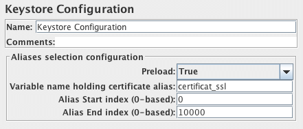](assets/images/keystore-config_624cbc8a6adf5b23.png)

Screenshot of Control-Panel of Keystore Configuration

<a id="component_reference--keystore_configuration_parms1"></a>
<a id="component_reference--parameters-70"></a>

### Parameters [¶](#component_reference--keystore_configuration_parms1 "Link to here")

Attribute

Description

Required

Name

Descriptive name for this element that is shown in the tree.

No

Preload

Whether or not to preload Keystore. Setting it to true is usually the best option.

Yes

Variable name holding certificate alias

Variable name that will contain the alias to use for authentication by client certificate. Variable value will be filled from CSV Data Set for example. In the screenshot, "certificat\_ssl" will also be a variable in CSV Data Set. Defaults to clientCertAliasVarName

False

Alias Start Index

The index of the first key to use in Keystore, 0-based.

Yes

Alias End Index

The index of the last key to use in Keystore, 0-based. When using "Variable name holding certificate alias" ensure it is large enough so that all keys are loaded at startup. Default to -1 which means load all.

Yes

To make JMeter use more than one certificate you need to ensure that:

- https.use.cached.ssl.context=false is set in jmeter.properties or user.properties
- You use HTTPClient 4 implementation for HTTP Request

[^](#component_reference)

<a id="component_reference--login_config_element"></a>
<a id="component_reference--login-config-element"></a>

## Login Config Element[¶](#component_reference--login_config_element "Link to here")

The Login Config Element lets you add or override username and password settings in samplers that use username and password as part of their setup.

[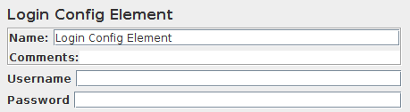](assets/images/login-config_3e0e5890e8371cf8.png)

Screenshot of Control-Panel of Login Config Element

<a id="component_reference--login_config_element_parms1"></a>
<a id="component_reference--parameters-71"></a>

### Parameters [¶](#component_reference--login_config_element_parms1 "Link to here")

Attribute

Description

Required

Name

Descriptive name for this element that is shown in the tree.

No

Username

The default username to use.

No

Password

The default password to use. (N.B. this is stored unencrypted in the test plan)

No

[^](#component_reference)

<a id="component_reference--ldap_request_defaults"></a>
<a id="component_reference--ldap-request-defaults"></a>

## LDAP Request Defaults[¶](#component_reference--ldap_request_defaults "Link to here")

The LDAP Request Defaults component lets you set default values for LDAP testing. See the [LDAP Request](#component_reference--ldap_request).

[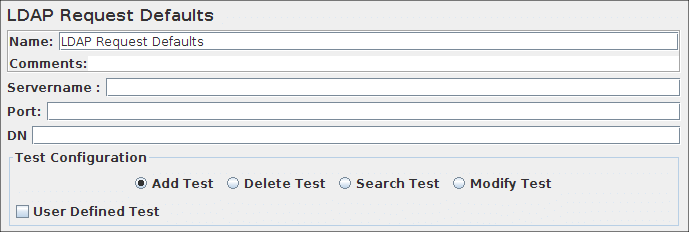](assets/images/ldap-defaults_35f7835c8f862739.png)

Screenshot of Control-Panel of LDAP Request Defaults

[^](#component_reference)

<a id="component_reference--ldap_extended_request_defaults"></a>
<a id="component_reference--ldap-extended-request-defaults"></a>

## LDAP Extended Request Defaults[¶](#component_reference--ldap_extended_request_defaults "Link to here")

The LDAP Extended Request Defaults component lets you set default values for extended LDAP testing. See the [LDAP Extended Request](#component_reference--ldap_extended_request).

[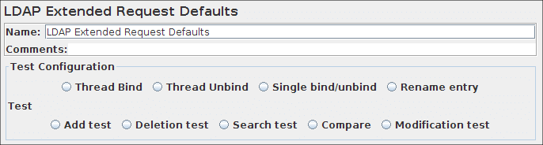](assets/images/ldapext-defaults_32e2fd785c23cd04.png)

Screenshot of Control-Panel of LDAP Extended Request Defaults

[^](#component_reference)

<a id="component_reference--tcp_sampler_config"></a>
<a id="component_reference--tcp-sampler-config"></a>

## TCP Sampler Config[¶](#component_reference--tcp_sampler_config "Link to here")

The TCP Sampler Config provides default data for the TCP Sampler

[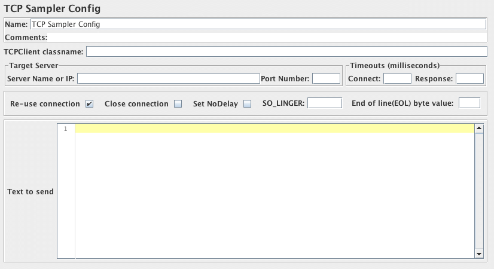](assets/images/tcpsamplerconfig_4243919df4fd17f8.png)

Screenshot of Control-Panel of TCP Sampler Config

<a id="component_reference--tcp_sampler_config_parms1"></a>
<a id="component_reference--parameters-72"></a>

### Parameters [¶](#component_reference--tcp_sampler_config_parms1 "Link to here")

Attribute

Description

Required

Name

Descriptive name for this element that is shown in the tree.

TCPClient classname

Name of the TCPClient class. Defaults to the property tcp.handler, failing that TCPClientImpl.

No

ServerName or IP

Name or IP of TCP server

Port Number

Port to be used

Re-use connection

If selected, the connection is kept open. Otherwise it is closed when the data has been read.

Yes

Close connection

If selected, the connection will be closed after running the sampler.

Yes

SO\_LINGER

Enable/disable SO\_LINGER with the specified linger time in seconds when a socket is created. If you set "SO\_LINGER" value as 0, you may prevent large numbers of sockets sitting around with a TIME\_WAIT status.

No

End of line(EOL) byte value

Byte value for end of line, set this to a value outside the range -128 to +127 to skip EOL checking. You may set this in jmeter.properties file as well with the tcp.eolByte property. If you set this in TCP Sampler Config and in jmeter.properties file at the same time, the setting value in the TCP Sampler Config will be used.

No

Connect Timeout

Connect Timeout (milliseconds, 0 disables).

No

Response Timeout

Response Timeout (milliseconds, 0 disables).

No

Set Nodelay

Should the nodelay property be set?

Text to Send

Text to be sent

[^](#component_reference)

<a id="component_reference--user_defined_variables"></a>
<a id="component_reference--user-defined-variables"></a>

## User Defined Variables[¶](#component_reference--user_defined_variables "Link to here")

The User Defined Variables element lets you define an **initial set of variables**, just as in the [Test Plan](#component_reference--test_plan).

Note that all the UDV elements in a test plan - no matter where they are - are processed at the start.

So you cannot reference variables which are defined as part of a test run, e.g. in a Post-Processor.

**UDVs should not be used with functions that generate different results each time they are called.
Only the result of the first function call will be saved in the variable.**
However, UDVs can be used with functions such as [\_\_P()](#functions--__p), for example:

```

HOST      ${__P(host,localhost)}
```

which would define the variable "HOST" to have the value of the JMeter property "host", defaulting to "localhost" if not defined.

For defining variables during a test run, see [User Parameters](#component_reference--user_parameters).
UDVs are processed in the order they appear in the Plan, from top to bottom.

For simplicity, it is suggested that UDVs are placed only at the start of a Thread Group
(or perhaps under the Test Plan itself).

Once the Test Plan and all UDVs have been processed, the resulting set of variables is
copied to each thread to provide the initial set of variables.

If a runtime element such as a User Parameters Pre-Processor or Regular Expression Extractor defines a variable
with the same name as one of the UDV variables, then this will replace the initial value, and all other test
elements in the thread will see the updated value.

[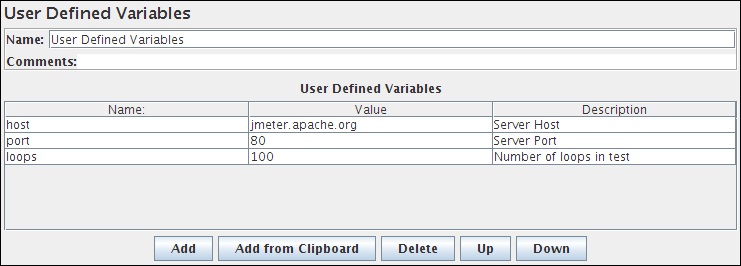](assets/images/user-defined-variables_f3117347711d565f.png)

Screenshot of Control-Panel of User Defined Variables

If you have more than one Thread Group, make sure you use different names for different values, as UDVs are shared between Thread Groups.
Also, the variables are not available for use until after the element has been processed, so you cannot reference variables that are defined in the same element.
You can reference variables defined in earlier UDVs or on the Test Plan.

<a id="component_reference--user_defined_variables_parms1"></a>
<a id="component_reference--parameters-73"></a>

### Parameters [¶](#component_reference--user_defined_variables_parms1 "Link to here")

Attribute

Description

Required

Name

Descriptive name for this element that is shown in the tree.

User Defined Variables

Variable name/value pairs. The string under the "Name"
column is what you'll need to place inside the brackets in ${…} constructs to use the variables later on. The
whole ${…} will then be replaced by the string in the "Value" column.

[^](#component_reference)

<a id="component_reference--random_variable"></a>
<a id="component_reference--random-variable"></a>

## Random Variable[¶](#component_reference--random_variable "Link to here")

The Random Variable Config Element is used to generate random numeric strings and store them in variable for use later.
It's simpler than using [User Defined Variables](#component_reference--user_defined_variables) together with the [\_\_Random()](#functions--__random) function.

The output variable is constructed by using the random number generator, and then the resulting number is formatted using the format string.
The number is calculated using the formula minimum+Random.nextInt(maximum-minimum+1).
Random.nextInt() requires a positive integer.
This means that maximum-minimum - i.e. the range - must be less than 2147483647, however the minimum and maximum values can be any long values so long as the range is OK.

As the random value is evaluated at the start of each iteration, it is probably not a good idea
to use a variable other than a property as a value for the minimum or maximum. It would be zero on the first iteration.

[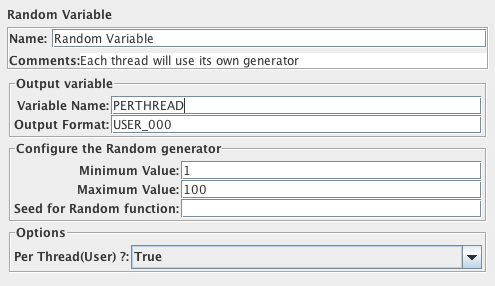](assets/images/random-variable_cbf7edf15572f7ea.png)

Screenshot of Control-Panel of Random Variable

<a id="component_reference--random_variable_parms1"></a>
<a id="component_reference--parameters-74"></a>

### Parameters [¶](#component_reference--random_variable_parms1 "Link to here")

Attribute

Description

Required

Name

Descriptive name for this element that is shown in the tree.

Yes

Variable Name

The name of the variable in which to store the random string.

Yes

Format String

The java.text.DecimalFormat format string to be used.
For example "000" which will generate numbers with at least 3 digits, or "USER\_000" which will generate output of the form USER\_nnn.
If not specified, the default is to generate the number using Long.toString()

No

Minimum Value

The minimum value (long) of the generated random number.

Yes

Maximum Value

The maximum value (long) of the generated random number.

Yes

Random Seed

The seed for the random number generator.
If you use the same seed value with Per Thread set to true, you will get the same value for each Thread as per
[Random](http://docs.oracle.com/javase/8/docs/api/java/util/Random.html) class.
If no seed is set, Default constructor of Random will be used.

No

Per Thread(User)?

If False, the generator is shared between all threads in the thread group.
If True, then each thread has its own random generator.

Yes

[^](#component_reference)

<a id="component_reference--counter"></a>

## Counter[¶](#component_reference--counter "Link to here")

Allows the user to create a counter that can be referenced anywhere
in the Thread Group. The counter config lets the user configure a starting point, a maximum, and the increment. The counter will loop from the start to the max, and then start over
with the start, continuing on like that until the test is ended.

The counter uses a long to store the value, so the range is from -2^63 to 2^63-1.

[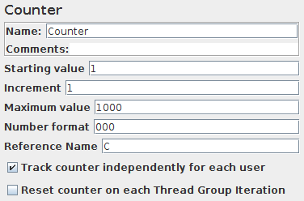](assets/images/counter_c144869137321e68.png)

Screenshot of Control-Panel of Counter

<a id="component_reference--counter_parms1"></a>
<a id="component_reference--parameters-75"></a>

### Parameters [¶](#component_reference--counter_parms1 "Link to here")

Attribute

Description

Required

Name

Descriptive name for this element that is shown in the tree.

Starting value

The starting value for the counter. The counter will equal this
value during the first iteration (defaults to 0).

No

Increment

How much to increment the counter by after each
iteration (defaults to 0, meaning no increment).

Yes

Maximum value

If the counter exceeds the maximum, then it is reset to the Starting value.
Default is Long.MAX\_VALUE

No

Format

Optional format, e.g. 000 will format as 001, 002, etc.
This is passed to DecimalFormat, so any valid formats can be used.
If there is a problem interpreting the format, then it is ignored.
[The default format is generated using Long.toString()]

No

Exported Variable Name

This will be the variable name under which the counter value is available.
If you name it counterA, you can then access it using ${counterA}
as explained in [user-defined values](#functions) (By default, it creates an empty string variable that can be accessed using ${} but this is highly discouraged)

No

Track Counter Independently for each User

In other words, is this a global counter, or does each user get their
own counter? If unchecked, the counter is global (i.e., user #1 will get value "1", and user #2 will get value "2" on
the first iteration). If checked, each user has an independent counter.

No

Reset counter on each Thread Group Iteration

This option is only available when counter is tracked per User, if checked, counter will be reset to Start value on each Thread Group iteration. This can be useful when Counter is inside a Loop Controller.

No

[^](#component_reference)

<a id="component_reference--simple_config_element"></a>
<a id="component_reference--simple-config-element"></a>

## Simple Config Element[¶](#component_reference--simple_config_element "Link to here")

The Simple Config Element lets you add or override arbitrary values in samplers. You can choose the name of the value
and the value itself. Although some adventurous users might find a use for this element, it's here primarily for developers as a basic
GUI that they can use while developing new JMeter components.

[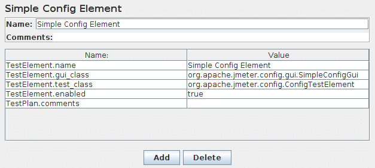](assets/images/simple-config-element_33db2b691cd1cb02.png)

Screenshot of Control-Panel of Simple Config Element

<a id="component_reference--simple_config_element_parms1"></a>
<a id="component_reference--parameters-76"></a>

### Parameters [¶](#component_reference--simple_config_element_parms1 "Link to here")

Attribute

Description

Required

Name

Descriptive name for this element that is shown in the tree.

Yes

Parameter Name

The name of each parameter. These values are internal to JMeter's workings and
are not generally documented. Only those familiar with the code will know these values.

Yes

Parameter Value

The value to apply to that parameter.

Yes

[^](#component_reference)

<a id="component_reference--mongodb_source_config_-deprecated"></a>
<a id="component_reference--mongodb-source-config-deprecated"></a>

## MongoDB Source Config (DEPRECATED)[¶](#component_reference--mongodb_source_config_-deprecated "Link to here")

Creates a MongoDB connection (used by [MongoDB Script](#component_reference--mongodb_script)Sampler)
from the supplied Connection settings. Each thread gets its own connection.
The connection configuration name is used by the JDBC Sampler to select the appropriate
connection.

You can then access com.mongodb.DB object in Beanshell or JSR223 Test Elements through the element [MongoDBHolder](https://jmeter.apache.org/api/org/apache/jmeter/protocol/mongodb/config/MongoDBHolder.html)
using this code

```

import com.mongodb.DB;
import org.apache.jmeter.protocol.mongodb.config.MongoDBHolder;
DB db = MongoDBHolder.getDBFromSource("value of property MongoDB Source",
            "value of property Database Name");
…
    
```

[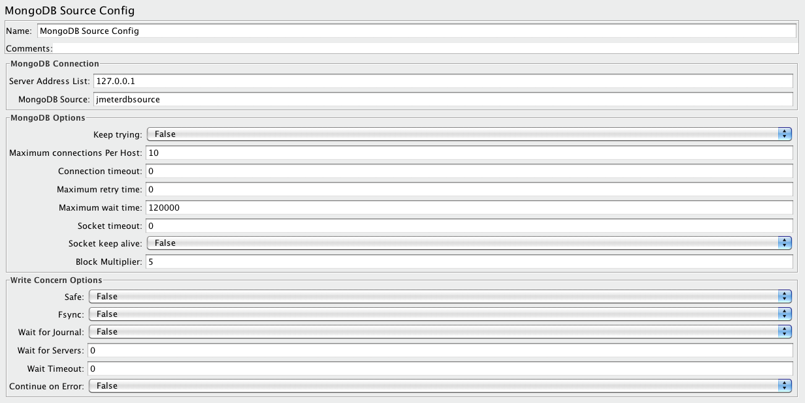](assets/images/mongodb-source-config_31ec720cf21ca076.png)

Screenshot of Control-Panel of MongoDB Source Config (DEPRECATED)

<a id="component_reference--mongodb_source_config_-deprecated-_parms1"></a>
<a id="component_reference--parameters-77"></a>

### Parameters [¶](#component_reference--mongodb_source_config_-deprecated-_parms1 "Link to here")

Attribute

Description

Required

Name

Descriptive name for the connection configuration that is shown in the tree.

No

Server Address List

Mongo DB Servers

Yes

MongoDB Source

The name of the variable the connection is tied to.

Each name must be different. If there are two configuration elements using the same name, only one will be saved.

Yes

Keep Trying

If true, the driver will keep trying to connect to the same server in case that the socket cannot be established.
There is maximum amount of time to keep retrying, which is 15s by default.
This can be useful to avoid some exceptions being thrown when a server is down temporarily by blocking the operations.
It can also be useful to smooth the transition to a new primary node (so that a new primary node is elected within the retry time).

Note that when using this flag

- for a replica set, the driver will try to connect to the old primary node for that time, instead of failing over to the new one right away
- this does not prevent exception from being thrown in read/write operations on the socket, which must be handled by application.

Even if this flag is false, the driver already has mechanisms to automatically recreate broken connections and retry the read operations.

Default is false.

No

Maximum connections per host

No

Connection timeout

The connection timeout in milliseconds.
It is used solely when establishing a new connection Socket.connect(java.net.SocketAddress, int)
Default is 0 and means no timeout.

No

Maximum retry time

The maximum amount of time in milliseconds to spend retrying to open connection to the same server.
Default is 0, which means to use the default 15s if autoConnectRetry is on.

No

Maximum wait time

The maximum wait time in milliseconds that a thread may wait for a connection to become available.
Default is 120,000.

No

Socket timeout

The socket timeout in milliseconds It is used for I/O socket read and write operations Socket.setSoTimeout(int)
Default is 0 and means no timeout.

No

Socket keep alive

This flag controls the socket keep alive feature that keeps a connection alive through firewalls Socket.setKeepAlive(boolean)
Default is false.

No

ThreadsAllowedToBlockForConnectionMultiplier

This multiplier, multiplied with the connectionsPerHost setting, gives the maximum number of threads that may be waiting for a connection to become available from the pool.
All further threads will get an exception right away.
For example if connectionsPerHost is 10 and threadsAllowedToBlockForConnectionMultiplier is 5, then up to 50 threads can wait for a connection.
Default is 5.

No

Write Concern: Safe

If true the driver will use a WriteConcern of WriteConcern.SAFE for all operations.
If w, wtimeout, fsync or j are specified, this setting is ignored.
Default is false.

No

Write Concern: Fsync

The fsync value of the global WriteConcern.
Default is false.

No

Write Concern: Wait for Journal

The j value of the global WriteConcern.
Default is false.

No

Write Concern: Wait for servers

The w value of the global WriteConcern.
Default is 0.

No

Write Concern: Wait timeout

The wtimeout value of the global WriteConcern.
Default is 0.

No

Write Concern: Continue on error

If batch inserts should continue after the first error

No

[^](#component_reference)

[^](#component_reference)

<a id="component_reference--bolt_connection_configuration"></a>
<a id="component_reference--bolt-connection-configuration"></a>

## Bolt Connection Configuration[¶](#component_reference--bolt_connection_configuration "Link to here")

Creates a Bolt connection pool (used by [Bolt Request](#component_reference--bolt_request) Sampler)
from the supplied Connection settings.

[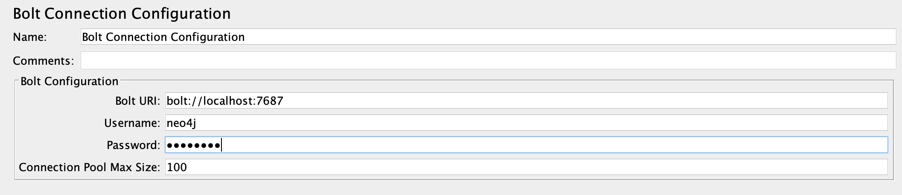](assets/images/bolt-connection-config_998347837a89c34e.png)

Screenshot of Control-Panel of Bolt Connection Configuration

<a id="component_reference--bolt_connection_configuration_parms1"></a>
<a id="component_reference--parameters-78"></a>

### Parameters [¶](#component_reference--bolt_connection_configuration_parms1 "Link to here")

Attribute

Description

Required

Name

Descriptive name for this sampler that is shown in the tree.

No

Comments

Free text for additional details.

No

Bolt URI

The database URI.

Yes

Username

User account.

No

Password

User credentials.

No

Connection Pool Max Size

Max size of the Neo4j driver Bolt connection pool.
Raise the value if running large number of concurrent threads, so that JMeter threads are not blocked waiting
for a connection to be released to the pool.

Yes

[^](#component_reference)

[^](#component_reference)

<a id="component_reference--assertions"></a>
<a id="component_reference--18.5-assertions"></a>

# 18.5 Assertions[¶](#component_reference--assertions "Link to here")

Assertions are used to perform additional checks on samplers, and are processed after **every sampler**
in the same scope.
To ensure that an Assertion is applied only to a particular sampler, add it as a child of the sampler.

Note: Unless documented otherwise, Assertions are not applied to sub-samples (child samples) -
only to the parent sample.
In the case of JSR223 and BeanShell Assertions, the script can retrieve sub-samples using the method
prev.getSubResults() which returns an array of SampleResults.
The array will be empty if there are none.

Assertions can be applied to either the main sample, the sub-samples or both.
The default is to apply the assertion to the main sample only.
If the Assertion supports this option, then there will be an entry on the GUI which looks like the following:

[](assets/images/assertionscope_e09eafbc7b41a03e.png)

Assertion Scope

or the following
[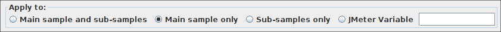](assets/images/assertionscopevar_9e21fa57326b183b.png)

Assertion Scope

If a sub-sampler fails and the main sample is successful, then the main sample will be set to failed status and an Assertion Result will be added.
If the JMeter variable option is used, it is assumed to relate to the main sample, and
any failure will be applied to the main sample only.

The variable JMeterThread.last\_sample\_ok is updated to
"true" or "false" after all assertions for a sampler have been run.

<a id="component_reference--response_assertion"></a>
<a id="component_reference--response-assertion"></a>

## Response Assertion[¶](#component_reference--response_assertion "Link to here")

The response assertion control panel lets you add pattern strings to be compared against various
fields of the request or response.
The pattern strings are:

- Contains, Matches: Perl5-style regular expressions
- Equals, Substring: plain text, case-sensitive

A summary of the pattern matching characters can be found at [ORO Perl5 regular expressions.](http://jakarta.apache.org/oro/api/org/apache/oro/text/regex/package-summary.html)

You can also choose whether the strings will be expected
to **match** the entire response, or if the response is only expected to **contain** the
pattern. You can attach multiple assertions to any controller for additional flexibility.

Note that the pattern string should not include the enclosing delimiters, i.e. use Price: \d+ not /Price: \d+/.

By default, the pattern is in multi-line mode, which means that the "." meta-character does not match newline.
In multi-line mode, "^" and "$" match the start or end of any line anywhere within the string
- not just the start and end of the entire string. Note that \s does match new-line.
Case is also significant. To override these settings, one can use the *extended regular expression* syntax.
For example:

(?i)
:   ignore case

(?s)
:   treat target as single line, i.e. "." matches new-line

(?is)
:   both the above

These can be used anywhere within the expression and remain in effect until overridden. E.g.

(?i)apple(?-i) Pie
:   matches "ApPLe Pie", but not "ApPLe pIe"

(?s)Apple.+?Pie
:   matches Apple followed by Pie, which may be on a subsequent line.

Apple(?s).+?Pie
:   same as above, but it's probably clearer to use the (?s) at the start.

[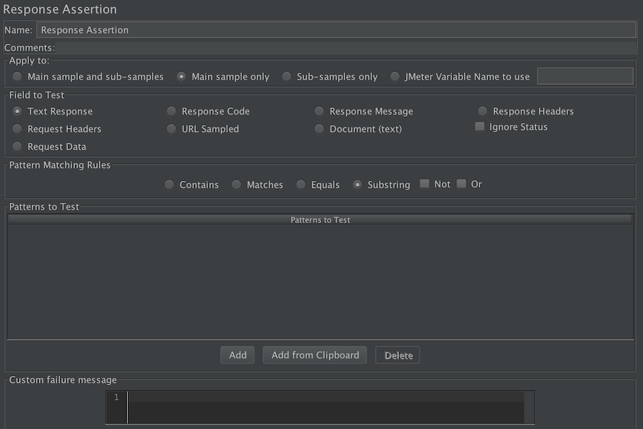](assets/images/assertion_584f081cc4fbb624.png)

Screenshot of Control-Panel of Response Assertion

<a id="component_reference--response_assertion_parms1"></a>
<a id="component_reference--parameters-79"></a>

### Parameters [¶](#component_reference--response_assertion_parms1 "Link to here")

Attribute

Description

Required

Name

Descriptive name for this element that is shown in the tree.

No

Apply to:

This is for use with samplers that can generate sub-samples, e.g. HTTP Sampler with embedded resources, Mail Reader or samples generated by the Transaction Controller.

- Main sample only - only applies to the main sample
- Sub-samples only - only applies to the sub-samples
- Main sample and sub-samples - applies to both.
- JMeter Variable Name to use - assertion is to be applied to the contents of the named variable

Yes

Field to Test

Instructs JMeter which field of the Request or Response to test.

- Text Response - the response text from the server, i.e. the body, excluding any HTTP headers.
- Request data - the request text sent to the server, i.e. the body, excluding any HTTP headers.
- Response Code - e.g. 200
- Response Message - e.g. OK
- Response Headers, including Set-Cookie headers (if any)
- Request Headers
- URL sampled
- Document (text) - the extract text from various type of documents via Apache Tika (see [View Results Tree](#component_reference--view_results_tree) Document view section).

Yes

Ignore status

Instructs JMeter to set the status to success initially.

The overall success of the sample is determined by combining the result of the
assertion with the existing Response status.
When the Ignore Status checkbox is selected, the Response status is forced
to successful before evaluating the Assertion.

HTTP Responses with statuses in the 4xx and 5xx ranges are normally
regarded as unsuccessful.
The "Ignore status" checkbox can be used to set the status successful before performing further checks.

Note that this will have the effect of clearing any previous assertion failures, so make sure that this is only set on the first assertion.

Yes

Pattern Matching Rules

Indicates how the text being tested
is checked against the pattern.

- Contains - true if the text contains the regular expression pattern
- Matches - true if the whole text matches the regular expression pattern
- Equals - true if the whole text equals the pattern string (case-sensitive)
- Substring - true if the text contains the pattern string (case-sensitive)

Equals and Substring patterns are plain strings, not regular expressions.
NOT may also be selected to invert the result of the check.
OR Apply each assertion in OR combination (if 1 pattern to test matches, Assertion will be ok) instead of AND (All patterns must match so that Assertion is OK).

Yes

Patterns to Test

A list of patterns to
be tested.
Each pattern is tested separately.
If a pattern fails, then further patterns are not checked.
There is no difference between setting up
one Assertion with multiple patterns and setting up multiple Assertions with one
pattern each (assuming the other options are the same).

However, when the Ignore Status checkbox is selected, this has the effect of cancelling any
previous assertion failures - so make sure that the Ignore Status checkbox is only used on
the first Assertion.

Yes

Custom failure message

Lets you define the failure message that will replace the generated one

No

The pattern is a Perl5-style regular expression, but without the enclosing brackets.

Assertion Examples[¶](#component_reference--assertion_examples "Link to here")

[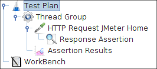](assets/images/example1a_21d3e16932af2f62.png)

Figure 14 - Test Plan

[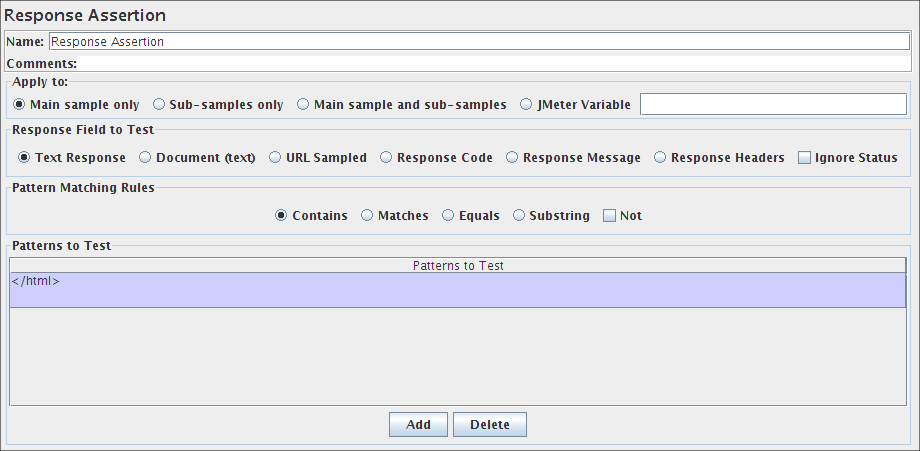](assets/images/example1b_bbce90e50d7121fd.png)

Figure 15 - Assertion Control Panel with Pattern

[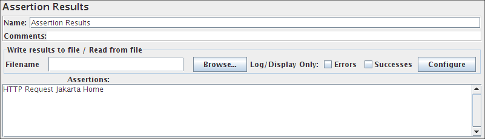](assets/images/example1c-pass_4cd824ba4043ea58.png)

Figure 16 - Assertion Listener Results (Pass)

[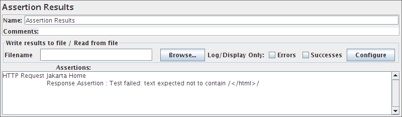](assets/images/example1c-fail_f67797c4f7a10275.png)

Figure 17 - Assertion Listener Results (Fail)

[^](#component_reference)

<a id="component_reference--duration_assertion"></a>
<a id="component_reference--duration-assertion"></a>

## Duration Assertion[¶](#component_reference--duration_assertion "Link to here")

The Duration Assertion tests that each response was received within a given amount
of time. Any response that takes longer than the given number of milliseconds (specified by the
user) is marked as a failed response.

[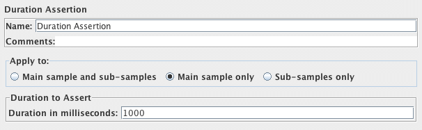](assets/images/duration-assertion_250a7d8a42d05e27.png)

Screenshot of Control-Panel of Duration Assertion

<a id="component_reference--duration_assertion_parms1"></a>
<a id="component_reference--parameters-80"></a>

### Parameters [¶](#component_reference--duration_assertion_parms1 "Link to here")

Attribute

Description

Required

Name

Descriptive name for this element that is shown in the tree.

Duration in Milliseconds

The maximum number of milliseconds
each response is allowed before being marked as failed.

Yes

[^](#component_reference)

<a id="component_reference--size_assertion"></a>
<a id="component_reference--size-assertion"></a>

## Size Assertion[¶](#component_reference--size_assertion "Link to here")

The Size Assertion tests that each response contains the right number of bytes in it. You can specify that
the size be equal to, greater than, less than, or not equal to a given number of bytes.

An empty response is treated as being 0 bytes rather than reported as an error.

[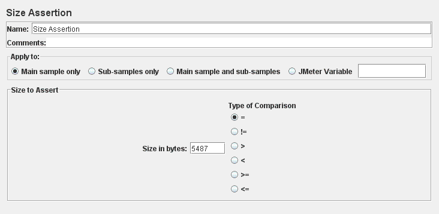](assets/images/size-assertion_2488061c57e4ed50.png)

Screenshot of Control-Panel of Size Assertion

<a id="component_reference--size_assertion_parms1"></a>
<a id="component_reference--parameters-81"></a>

### Parameters [¶](#component_reference--size_assertion_parms1 "Link to here")

Attribute

Description

Required

Name

Descriptive name for this element that is shown in the tree.

Apply to:

This is for use with samplers that can generate sub-samples, e.g. HTTP Sampler with embedded resources, Mail Reader or samples generated by the Transaction Controller.

- Main sample only - assertion only applies to the main sample
- Sub-samples only - assertion only applies to the sub-samples
- Main sample and sub-samples - assertion applies to both.
- JMeter Variable Name to use - assertion is to be applied to the contents of the named variable

Yes

Size in bytes

The number of bytes to use in testing the size of the response (or value of the JMeter variable).

Yes

Type of Comparison

Whether to test that the response is equal to, greater than, less than, or not equal to, the number of bytes specified.

Yes

[^](#component_reference)

<a id="component_reference--xml_assertion"></a>
<a id="component_reference--xml-assertion"></a>

## XML Assertion[¶](#component_reference--xml_assertion "Link to here")

The XML Assertion tests that the response data consists of a formally correct XML document. It does not
validate the XML based on a DTD or schema or do any further validation.

[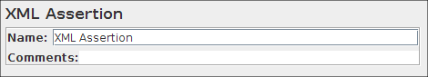](assets/images/xml-assertion_9c0060e97500e05c.png)

Screenshot of Control-Panel of XML Assertion

<a id="component_reference--xml_assertion_parms1"></a>
<a id="component_reference--parameters-82"></a>

### Parameters [¶](#component_reference--xml_assertion_parms1 "Link to here")

Attribute

Description

Required

Name

Descriptive name for this element that is shown in the tree.

[^](#component_reference)

<a id="component_reference--beanshell_assertion"></a>
<a id="component_reference--beanshell-assertion"></a>

## BeanShell Assertion[¶](#component_reference--beanshell_assertion "Link to here")

The BeanShell Assertion allows the user to perform assertion checking using a BeanShell script.

**For full details on using BeanShell, please see the [BeanShell website.](http://www.beanshell.org/)**

Migration to [JSR223 Assertion](#component_reference--jsr223_assertion)+Groovy is highly recommended for performance, support of new Java features and limited maintenance of the BeanShell library.

Note that a different Interpreter is used for each independent occurrence of the assertion
in each thread in a test script, but the same Interpreter is used for subsequent invocations.
This means that variables persist across calls to the assertion.

All Assertions are called from the same thread as the sampler.

If the property "beanshell.assertion.init" is defined, it is passed to the Interpreter
as the name of a sourced file. This can be used to define common methods and variables.
There is a sample init file in the bin directory: BeanShellAssertion.bshrc

The test element supports the ThreadListener and TestListener methods.
These should be defined in the initialisation file.
See the file BeanShellListeners.bshrc for example definitions.

[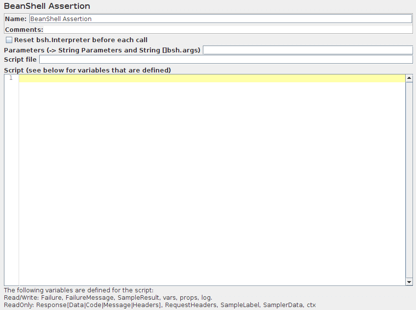](assets/images/beanshell-assertion_e56086acc08e5245.png)

Screenshot of Control-Panel of BeanShell Assertion

<a id="component_reference--beanshell_assertion_parms1"></a>
<a id="component_reference--parameters-83"></a>

### Parameters [¶](#component_reference--beanshell_assertion_parms1 "Link to here")

Attribute

Description

Required

Name

Descriptive name for this element that is shown in the tree.
The name is stored in the script variable Label

Reset bsh.Interpreter before each call

If this option is selected, then the interpreter will be recreated for each sample.
This may be necessary for some long running scripts.
For further information, see [Best Practices - BeanShell scripting](#best-practices--bsh_scripting).

Yes

Parameters

Parameters to pass to the BeanShell script.
The parameters are stored in the following variables:

- Parameters - string containing the parameters as a single variable
- bsh.args - String array containing parameters, split on white-space

No

Script file

A file containing the BeanShell script to run. This overrides the script.
The file name is stored in the script variable FileName

No

Script

The BeanShell script to run. The return value is ignored.

Yes (unless script file is provided)

There's a [sample script](https://jmeter.apache.org/demos/BeanShellAssertion.bsh) you can try.

Before invoking the script, some variables are set up in the BeanShell interpreter.
These are strings unless otherwise noted:

- log - the [Logger](https://www.slf4j.org/api/org/slf4j/Logger.html) Object. (e.g.) log.warn("Message"[,Throwable])
- SampleResult, prev - the [SampleResult](https://jmeter.apache.org/api/org/apache/jmeter/samplers/SampleResult.html) Object; read-write
- Response - the response Object; read-write
- Failure - boolean; read-write; used to set the Assertion status
- FailureMessage - String; read-write; used to set the Assertion message
- ResponseData - the response body (byte [])
- ResponseCode - e.g. 200
- ResponseMessage - e.g. OK
- ResponseHeaders - contains the HTTP headers
- RequestHeaders - contains the HTTP headers sent to the server
- SampleLabel
- SamplerData - data that was sent to the server
- ctx - [JMeterContext](https://jmeter.apache.org/api/org/apache/jmeter/threads/JMeterContext.html)
- vars - [JMeterVariables](https://jmeter.apache.org/api/org/apache/jmeter/threads/JMeterVariables.html) - e.g.

```
vars.get("VAR1");
vars.put("VAR2","value");
vars.putObject("OBJ1",new Object());
```

- props - JMeterProperties (class [java.util.Properties](https://docs.oracle.com/javase/8/docs/api/java/util/Properties.html)) - e.g.

```
props.get("START.HMS");
props.put("PROP1","1234");
```

The following methods of the Response object may be useful:

- setStopThread(boolean)
- setStopTest(boolean)
- String getSampleLabel()
- setSampleLabel(String)

[^](#component_reference)

<a id="component_reference--md5hex_assertion"></a>
<a id="component_reference--md5hex-assertion"></a>

## MD5Hex Assertion[¶](#component_reference--md5hex_assertion "Link to here")

The MD5Hex Assertion allows the user to check the MD5 hash of the response data.

[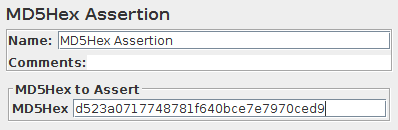](assets/images/md5hexassertion_d8ad0350177962e6.png)

Screenshot of Control-Panel of MD5Hex Assertion

<a id="component_reference--md5hex_assertion_parms1"></a>
<a id="component_reference--parameters-84"></a>

### Parameters [¶](#component_reference--md5hex_assertion_parms1 "Link to here")

Attribute

Description

Required

Name

Descriptive name for this element that is shown in the tree.

MD5 sum

32 hex digits representing the MD5 hash (case not significant)

Yes

[^](#component_reference)

<a id="component_reference--html_assertion"></a>
<a id="component_reference--html-assertion"></a>

## HTML Assertion[¶](#component_reference--html_assertion "Link to here")

The HTML Assertion allows the user to check the HTML syntax of the response data using JTidy.

[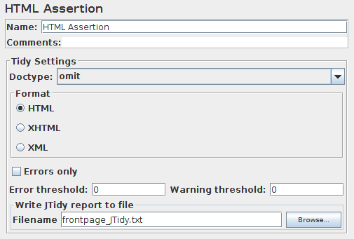](assets/images/htmlassertion_db4d04b013e7474e.png)

Screenshot of Control-Panel of HTML Assertion

<a id="component_reference--html_assertion_parms1"></a>
<a id="component_reference--parameters-85"></a>

### Parameters [¶](#component_reference--html_assertion_parms1 "Link to here")

Attribute

Description

Required

Name

Descriptive name for this element that is shown in the tree.

doctype

omit, auto, strict or loose

Yes

Format

HTML, XHTML or XML

Yes

Errors only

Only take note of errors?

Yes

Error threshold

Number of errors allowed before classing the response as failed

Yes

Warning threshold

Number of warnings allowed before classing the response as failed

Yes

Filename

Name of file to which report is written

No

[^](#component_reference)

<a id="component_reference--xpath_assertion"></a>
<a id="component_reference--xpath-assertion"></a>

## XPath Assertion[¶](#component_reference--xpath_assertion "Link to here")

The XPath Assertion tests a document for well formedness, has the option
of validating against a DTD, or putting the document through JTidy and testing for an
XPath. If that XPath exists, the Assertion is true. Using "/" will match any well-formed
document, and is the default XPath Expression.
The assertion also supports boolean expressions, such as "count(//\*error)=2".
See <http://www.w3.org/TR/xpath> for more information
on XPath.

Some sample expressions:

- //title[text()='Text to match'] - matches <title>Text to match</title> anywhere in the response
- /title[text()='Text to match'] - matches <title>Text to match</title> at root level in the response

[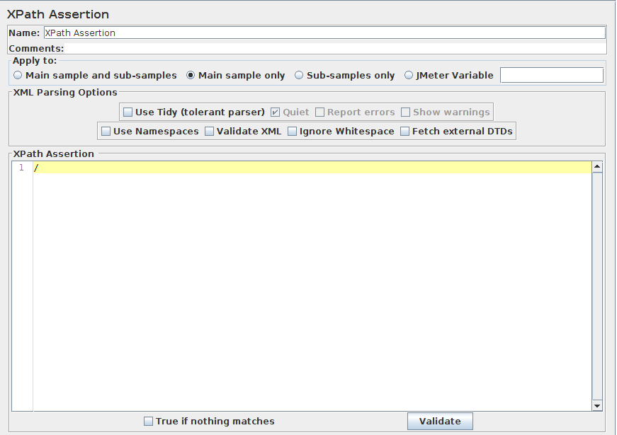](assets/images/xpath-assertion_9ef69419c9c21a84.png)

Screenshot of Control-Panel of XPath Assertion

<a id="component_reference--xpath_assertion_parms1"></a>
<a id="component_reference--parameters-86"></a>

### Parameters [¶](#component_reference--xpath_assertion_parms1 "Link to here")

Attribute

Description

Required

Name

Descriptive name for this element that is shown in the tree.

No

Use Tidy (tolerant parser)

Use Tidy, i.e. be tolerant of XML/HTML errors

Yes

Quiet

Sets the Tidy Quiet flag

If Tidy is selected

Report Errors

If a Tidy error occurs, then set the Assertion accordingly

If Tidy is selected

Show warnings

Sets the Tidy showWarnings option

If Tidy is selected

Use Namespaces

Should namespaces be honoured? (see note below on NAMESPACES)

If Tidy is not selected

Validate XML

Check the document against its schema.

If Tidy is not selected

Ignore Whitespace

Ignore Element Whitespace.

If Tidy is not selected

Fetch External DTDs

If selected, external DTDs are fetched.

If Tidy is not selected

XPath Assertion

XPath to match in the document.

Yes

Invert assertion(will fail if above conditions met)

True if a XPath expression is not matched or returns false

No

The non-tolerant parser can be quite slow, as it may need to download the DTD etc.

**NAMESPACES**
As a work-round for namespace limitations of the Xalan XPath parser (implementation on which JMeter is based) you need to:

- provide a Properties file (if for example your file is named namespaces.properties) which contains mappings for the namespace prefixes:

```

prefix1=http\://foo.apache.org
prefix2=http\://toto.apache.org
…
```

- reference this file in user.properties file using the property:

```
xpath.namespace.config=namespaces.properties
```

[^](#component_reference)

<a id="component_reference--xpath2_assertion"></a>
<a id="component_reference--xpath2-assertion"></a>

## XPath2 Assertion[¶](#component_reference--xpath2_assertion "Link to here")

The XPath2 Assertion tests a document for well formedness. Using "/" will match any well-formed
document, and is the default XPath2 Expression.
The assertion also supports boolean expressions, such as "count(//\*error)=2".

Some sample expressions:

- //title[text()='Text to match'] - matches <title>Text to match</title> anywhere in the response
- /title[text()='Text to match'] - matches <title>Text to match</title> at root level in the response

[](assets/images/xpath-assertion_9ef69419c9c21a84.png)

Screenshot of Control-Panel of XPath2 Assertion

<a id="component_reference--xpath2_assertion_parms1"></a>
<a id="component_reference--parameters-87"></a>

### Parameters [¶](#component_reference--xpath2_assertion_parms1 "Link to here")

Attribute

Description

Required

Namespaces aliases list

List of namespaces aliases you want to use to parse the document, one line per declaration.
You must specify them as follow: prefix=namespace. This implementation makes it easier to
use namespaces than with the old XPathExtractor version.

No

XPath2 Assertion

XPath to match in the document.

Yes

Invert assertion

Will fail if xpath expression returns true or matches, succeed otherwise

No

Namespace aliases list

List of namespace aliases prefix=full namespace (one per line)

No

[^](#component_reference)

<a id="component_reference--xml_schema_assertion"></a>
<a id="component_reference--xml-schema-assertion"></a>

## XML Schema Assertion[¶](#component_reference--xml_schema_assertion "Link to here")

The XML Schema Assertion allows the user to validate a response against an XML Schema.

[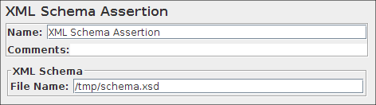](assets/images/xmlschemaassertion_af63e36b31a8132a.png)

Screenshot of Control-Panel of XML Schema Assertion

<a id="component_reference--xml_schema_assertion_parms1"></a>
<a id="component_reference--parameters-88"></a>

### Parameters [¶](#component_reference--xml_schema_assertion_parms1 "Link to here")

Attribute

Description

Required

Name

Descriptive name for this element that is shown in the tree.

File Name

Specify XML Schema File Name

Yes

[^](#component_reference)

<a id="component_reference--jsr223_assertion"></a>
<a id="component_reference--jsr223-assertion"></a>

## JSR223 Assertion[¶](#component_reference--jsr223_assertion "Link to here")

The JSR223 Assertion allows JSR223 script code to be used to check the status of the previous sample.

<a id="component_reference--jsr223_assertion_parms1"></a>
<a id="component_reference--parameters-89"></a>

### Parameters [¶](#component_reference--jsr223_assertion_parms1 "Link to here")

Attribute

Description

Required

Name

Descriptive name for this element that is shown in the tree.

No

Language

The JSR223 language to be used

Yes

Parameters

Parameters to pass to the script.
The parameters are stored in the following variables:

- Parameters - string containing the parameters as a single variable
- args - String array containing parameters, split on white-space

No

Script file

A file containing the script to run, if a relative file path is used, then it will be relative to directory referenced by "user.dir" System property

No

Script compilation caching

Unique String across Test Plan that JMeter will use to cache result of Script compilation if language used supports [Compilable](https://docs.oracle.com/javase/8/docs/api/javax/script/Compilable.html) interface (Groovy is one of these, java, BeanShell and JavaScript are not)

See note in JSR223 Sampler Java System property if you're using Groovy without checking this option

No

Script

The script to run.

Yes (unless script file is provided)

The following variables are set up for use by the script:

- log - ([Logger](https://www.slf4j.org/api/org/slf4j/Logger.html)) - can be used to write to the log file
- Label - the String Label
- Filename - the script file name (if any)
- Parameters - the parameters (as a String)
- args - the parameters as a String array (split on whitespace)
- ctx - ([JMeterContext](https://jmeter.apache.org/api/org/apache/jmeter/threads/JMeterContext.html)) - gives access to the context
- vars - ([JMeterVariables](https://jmeter.apache.org/api/org/apache/jmeter/threads/JMeterVariables.html)) - gives read/write access to variables:

```

vars.get(key);
vars.put(key,val);
vars.putObject("OBJ1",new Object());
vars.getObject("OBJ2");
```

- props - (JMeterProperties - class [java.util.Properties](https://docs.oracle.com/javase/8/docs/api/java/util/Properties.html)) - e.g.

```

props.get("START.HMS");
props.put("PROP1","1234");
```

- SampleResult, prev - ([SampleResult](https://jmeter.apache.org/api/org/apache/jmeter/samplers/SampleResult.html)) - gives access to the previous SampleResult (if any)
- sampler - ([Sampler](https://jmeter.apache.org/api/org/apache/jmeter/samplers/Sampler.html)) - gives access to the current sampler
- OUT - System.out - e.g. OUT.println("message")
- AssertionResult - ([AssertionResult](https://jmeter.apache.org/api/org/apache/jmeter/assertions/AssertionResult.html)) - the assertion result

The script can check various aspects of the [SampleResult](https://jmeter.apache.org/api/org/apache/jmeter/samplers/SampleResult.html).
If an error is detected, the script should use AssertionResult.setFailureMessage("message") and AssertionResult.setFailure(true).

For further details of all the methods available on each of the above variables, please check the Javadoc

[^](#component_reference)

<a id="component_reference--compare_assertion"></a>
<a id="component_reference--compare-assertion"></a>

## Compare Assertion[¶](#component_reference--compare_assertion "Link to here")

Compare Assertion **must not be used** during load test as it consumes a lot of resources (memory and CPU). Use it only for either functional testing or
during Test Plan debugging and Validation.

The Compare Assertion can be used to compare sample results within its scope.
Either the contents or the elapsed time can be compared, and the contents can be filtered before comparison.
The assertion comparisons can be seen in the [Comparison Assertion Visualizer](#component_reference--comparison_assertion_visualizer).

[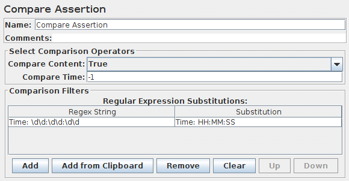](assets/images/compare_a78b85ccdf8d9d06.png)

Screenshot of Control-Panel of Compare Assertion

<a id="component_reference--compare_assertion_parms1"></a>
<a id="component_reference--parameters-90"></a>

### Parameters [¶](#component_reference--compare_assertion_parms1 "Link to here")

Attribute

Description

Required

Name

Descriptive name for this element that is shown in the tree.

No

Compare Content

Whether or not to compare the content (response data)

Yes

Compare Time

If the value is ≥0, then check if the response time difference is no greater than the value.
I.e. if the value is 0, then the response times must be exactly equal.

Yes

Comparison Filters

Filters can be used to remove strings from the content comparison.
For example, if the page has a time-stamp, it might be matched with: "Time: \d\d:\d\d:\d\d" and replaced with a dummy fixed time "Time: HH:MM:SS".

No

[^](#component_reference)

<a id="component_reference--smime_assertion"></a>
<a id="component_reference--smime-assertion"></a>

## SMIME Assertion[¶](#component_reference--smime_assertion "Link to here")

The SMIME Assertion can be used to evaluate the sample results from the Mail Reader Sampler.
This assertion verifies if the body of a mime message is signed or not. The signature can also be verified against a specific signer certificate.
As this is a functionality that is not necessarily needed by most users, additional jars need to be downloaded and added to JMETER\_HOME/lib:

- bcmail-xxx.jar (BouncyCastle SMIME/CMS)
- bcprov-xxx.jar (BouncyCastle Provider)

These need to be [downloaded from BouncyCastle.](http://www.bouncycastle.org/latest_releases.html)

If using the [Mail Reader Sampler](#component_reference--mail_reader_sampler), please ensure that you select "Store the message using MIME (raw)" otherwise the Assertion won't be able to process the message correctly.

[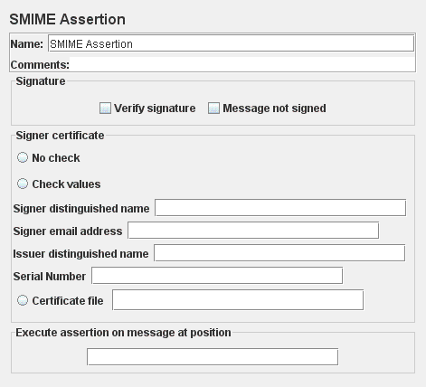](assets/images/smime_5a7add345e34868c.png)

Screenshot of Control-Panel of SMIME Assertion

<a id="component_reference--smime_assertion_parms1"></a>
<a id="component_reference--parameters-91"></a>

### Parameters [¶](#component_reference--smime_assertion_parms1 "Link to here")

Attribute

Description

Required

Name

Descriptive name for this element that is shown in the tree.

No

Verify Signature

If selected, the assertion will verify if it is a valid signature according to the parameters defined in the Signer Certificate box.

Yes

Message not signed

Whether or not to expect a signature in the message

Yes

Signer Certificate

"No Check" means that it will not perform signature verification. "Check values" is used to verify the signature against the inputs provided. And "Certificate file" will perform the verification against a specific certificate file.

Yes

Message Position

The Mail sampler can retrieve multiple messages in a single sample.
Use this field to specify which message will be checked.
Messages are numbered from 0, so 0 means the first message.
Negative numbers count from the LAST message; -1 means LAST, -2 means penultimate etc.

Yes

[^](#component_reference)

<a id="component_reference--json_assertion"></a>
<a id="component_reference--json-assertion"></a>

## JSON Assertion[¶](#component_reference--json_assertion "Link to here")

This component allows you to perform validations of JSON documents.
First, it will parse the JSON and fail if the data is not JSON.
Second, it will search for specified path, using syntax from [Jayway JsonPath 1.2.0](https://github.com/json-path/JsonPath). If the path is not found, it will fail.
Third, if JSON path was found in the document, and validation against expected value was requested, it will perform validation. For the null value there is special checkbox in the GUI.
Note that if the path will return array object, it will be iterated and if expected value is found, the assertion will succeed. To validate empty array use [] string. Also, if patch will return dictionary object, it will be converted to string before comparison.

When using [indefinite JSON Paths](https://github.com/json-path/JsonPath#what-is-returned-when)
you must assert the value due to the existing JSON library implementation, otherwise the assertion could always
return successful.
Since JMeter version 5.5 the assertion will fail, if an indefinite path is given, an empty list is extracted and
no assertion value is set.

[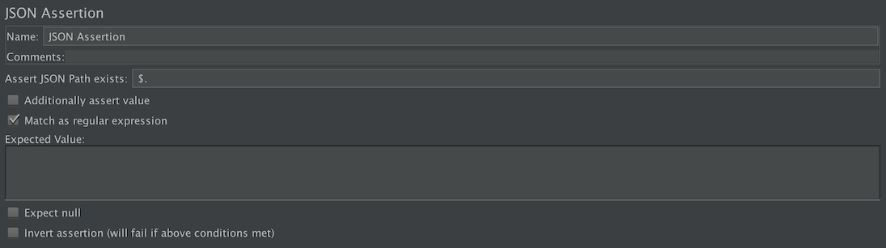](assets/images/json-assertion_b6e18aefbf47cbb4.png)

Screenshot of Control-Panel of JSON Assertion

<a id="component_reference--json_assertion_parms1"></a>
<a id="component_reference--parameters-92"></a>

### Parameters [¶](#component_reference--json_assertion_parms1 "Link to here")

Attribute

Description

Required

Assert JSON Path exists

Path to JSON element for assert.

Yes

Additionally assert value

Select checkbox if you want make assert with some value

No

Match as regular expression

Select checkbox if you want use regular expression

No

Expected Value

Value for assert or regular expression for match

No

Expect null

Select checkbox if you expect null

No

Invert assertion (will fail if above conditions met)

Invert assertion (will fail if above conditions met)

No

[^](#component_reference)

<a id="component_reference--json_jmespath_assertion"></a>
<a id="component_reference--json-jmespath-assertion"></a>

## JSON JMESPath Assertion[¶](#component_reference--json_jmespath_assertion "Link to here")

This component allows you to perform assertion on JSON documents content using [JMESPath](http://jmespath.org/).
First, it will parse the JSON and fail if the data is not JSON.
Second, it will search for specified path, using JMESPath syntax.
If the path is not found, it will fail.
Third, if JMES path was found in the document, and validation against expected value was requested, it will perform this additional check.
If you want to check for nullity, use the Expect null checkbox.
Note that the path cannot be null as the expression JMESPath will not be compiled and an error will occur.
Even if you expect an empty or null response, you must put a valid JMESPath expression.

[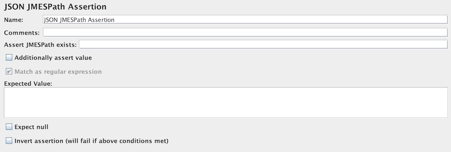](assets/images/jmespath-assertion_35adf88922484f56.png)

Screenshot of Control-Panel of JSON JMESPath Assertion

<a id="component_reference--json_jmespath_assertion_parms1"></a>
<a id="component_reference--parameters-93"></a>

### Parameters [¶](#component_reference--json_jmespath_assertion_parms1 "Link to here")

Attribute

Description

Required

Assert JMESPath exists

Check that JMESPath to JSON element exists

Yes

Additionally assert value

Select checkbox if you check the extracted JMESPath against an expected one

No

Match as regular expression

Select checkbox if you want to use a regular expression for matching

No

Expected Value

Value to use for exact matching or regular expression if Match as regular expression is checked

No

Expect null

Select checkbox if you expect the value to be null

No

Invert assertion (will fail if above conditions met)

Invert assertion (will fail if above conditions met)

No

[^](#component_reference)

[^](#component_reference)

<a id="component_reference--timers"></a>
<a id="component_reference--18.6-timers"></a>

# 18.6 Timers[¶](#component_reference--timers "Link to here")

Since version 3.1, a new feature (in Beta mode as of JMeter 3.1 and subject to changes) has been implemented which provides the following feature.
You can apply a multiplication factor on the sleep delays computed by Random timer by setting property timer.factor=float number where float number is a decimal positive number.
JMeter will multiply this factor by the computed sleep delay. This feature can be used by:

- [Gaussian Random Timer](#component_reference--gaussian_random_timer)
- [Poisson Random Timer](#component_reference--poisson_random_timer)
- [Uniform Random Timer](#component_reference--uniform_random_timer)

Note that timers are processed **before** each sampler in the scope in which they are found;
if there are several timers in the same scope, **all** the timers will be processed **before
each** sampler.
Timers are only processed in conjunction with a sampler.
A timer which is not in the same scope as a sampler will not be processed at all.
To apply a timer to a single sampler, add the timer as a child element of the sampler.
The timer will be applied before the sampler is executed.
To apply a timer after a sampler, either add it to the next sampler, or add it as the
child of a [Flow Control Action](#component_reference--flow_control_action) Sampler.

<a id="component_reference--constant_timer"></a>
<a id="component_reference--constant-timer"></a>

## Constant Timer[¶](#component_reference--constant_timer "Link to here")

If you want to have each thread pause for the same amount of time between
requests, use this timer.

[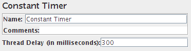](assets/images/constant-timer_b8000d2c74972cdb.png)

Screenshot of Control-Panel of Constant Timer

<a id="component_reference--constant_timer_parms1"></a>
<a id="component_reference--parameters-94"></a>

### Parameters [¶](#component_reference--constant_timer_parms1 "Link to here")

Attribute

Description

Required

Name

Descriptive name for this timer that is shown in the tree.

No

Thread Delay

Number of milliseconds to pause.

Yes

[^](#component_reference)

<a id="component_reference--gaussian_random_timer"></a>
<a id="component_reference--gaussian-random-timer"></a>

## Gaussian Random Timer[¶](#component_reference--gaussian_random_timer "Link to here")

This timer pauses each thread request for a random amount of time, with most
of the time intervals occurring near a particular value.
The total delay is the sum of the Gaussian distributed value (with mean 0.0 and standard deviation 1.0) times
the deviation value you specify, and the offset value.
Another way to explain it, in Gaussian Random Timer, the variation around constant offset has a Gaussian curve distribution.

[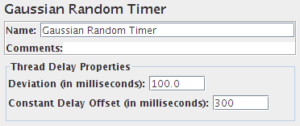](assets/images/gauss-random-timer_93d6e11350284e0d.png)

Screenshot of Control-Panel of Gaussian Random Timer

<a id="component_reference--gaussian_random_timer_parms1"></a>
<a id="component_reference--parameters-95"></a>

### Parameters [¶](#component_reference--gaussian_random_timer_parms1 "Link to here")

Attribute

Description

Required

Name

Descriptive name for this timer that is shown in the tree

No

Deviation

Deviation in milliseconds.

Yes

Constant Delay Offset

Number of milliseconds to pause in addition
to the random delay.

Yes

[^](#component_reference)

<a id="component_reference--uniform_random_timer"></a>
<a id="component_reference--uniform-random-timer"></a>

## Uniform Random Timer[¶](#component_reference--uniform_random_timer "Link to here")

This timer pauses each thread request for a random amount of time, with
each time interval having the same probability of occurring. The total delay
is the sum of the random value and the offset value.

[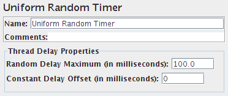](assets/images/uniform-random-timer_fd21492b0161ffea.png)

Screenshot of Control-Panel of Uniform Random Timer

<a id="component_reference--uniform_random_timer_parms1"></a>
<a id="component_reference--parameters-96"></a>

### Parameters [¶](#component_reference--uniform_random_timer_parms1 "Link to here")

Attribute

Description

Required

Name

Descriptive name for this timer that is shown in the tree.

No

Random Delay Maximum

Maximum random number of milliseconds to
pause.

Yes

Constant Delay Offset

Number of milliseconds to pause in addition
to the random delay.

Yes

[^](#component_reference)

<a id="component_reference--constant_throughput_timer"></a>
<a id="component_reference--constant-throughput-timer"></a>

## Constant Throughput Timer[¶](#component_reference--constant_throughput_timer "Link to here")

This timer introduces variable pauses, calculated to keep the total throughput (in terms of samples per minute) as close as possible to a given figure. Of course the throughput will be lower if the server is not capable of handling it, or if other timers or time-consuming test elements prevent it.

N.B. although the Timer is called the Constant Throughput timer, the throughput value does not need to be constant.
It can be defined in terms of a variable or function call, and the value can be changed during a test.
The value can be changed in various ways:

- using a counter variable
- using a \_\_jexl3, \_\_groovy function to provide a changing value
- using the remote BeanShell server to change a JMeter property

See [Best Practices](#best-practices) for further details.

Note that the throughput value should not be changed too often during a test
- it will take a while for the new value to take effect.

[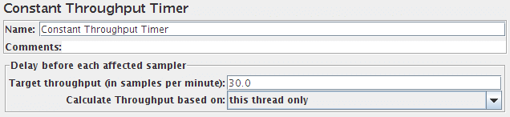](assets/images/constant-throughput-timer_273dedf5774f372b.png)

Screenshot of Control-Panel of Constant Throughput Timer

<a id="component_reference--constant_throughput_timer_parms1"></a>
<a id="component_reference--parameters-97"></a>

### Parameters [¶](#component_reference--constant_throughput_timer_parms1 "Link to here")

Attribute

Description

Required

Name

Descriptive name for this timer that is shown in the tree.

No

Target Throughput

Throughput we want the timer to try to generate.

Yes

Calculate Throughput based on

- this thread only - each thread will try to maintain the target throughput. The overall throughput will be proportional to the number of active threads.
- all active threads in current thread group - the target throughput is divided amongst all the active threads in the group.
  Each thread will delay as needed, based on when it last ran.
- all active threads - the target throughput is divided amongst all the active threads in all Thread Groups.
  Each thread will delay as needed, based on when it last ran.
  In this case, each other Thread Group will need a Constant Throughput timer with the same settings.
- all active threads in current thread group (shared) - as above, but each thread is delayed based on when any thread in the group last ran.
- all active threads (shared) - as above; each thread is delayed based on when any thread last ran.

Yes

The shared and non-shared algorithms both aim to generate the desired throughput, and will produce similar results.
The shared algorithm should generate a more accurate overall transaction rate.
The non-shared algorithm should generate a more even spread of transactions across threads.

[^](#component_reference)

<a id="component_reference--precise_throughput_timer"></a>
<a id="component_reference--precise-throughput-timer"></a>

## Precise Throughput Timer[¶](#component_reference--precise_throughput_timer "Link to here")

This timer introduces variable pauses, calculated to keep the total throughput (e.g. in terms of samples per minute) as close as possible to a given figure. The timer does not generate threads, so the resulting throughput will be lower if the server is not capable of handling it, or if other timers add too big delays, or if there's not enough threads, or time-consuming test elements prevent it.

Note: in many cases, Open Model Thread Group would be a better choice for generating the desired load profile

Note: if you alter timer configuration on the fly, then it might take time to adapt to the new settings.
For instance, if the timer was initially configured for 1 request per hour, then it assigns incoming
threads with 3600+sec pauses. Then, if the load configuration is altered to 1 per second, then
the threads are not interrupted from their delays, and the threads keep waiting.

Although the Timer is called Precise Throughput Timer, it does not aim to produce precisely the same number of samples over one-second intervals during the test.

The timer works best for rates under 36000 requests/hour, however your mileage might vary (see monitoring section below if your goals are
vastly different).

<a id="component_reference--best-location-of-a-precise-throughput-timer-in-a-test-plan"></a>

#### Best location of a Precise Throughput Timer in a Test Plan

As you might know, the timers are inherited by all the siblings and their child elements. That is why one of the best places for
Precise Throughput Timer is under the first element in a test loop. For instance, you might add a dummy sampler at the beginning, and place the timer under that dummy sampler

<a id="component_reference--produced-schedule"></a>

#### Produced schedule

Precise Throughput Timer models [Poisson arrivals](https://en.wikipedia.org/wiki/Poisson_point_process) schedule. That schedule often happens in a real-life, so it makes sense to use that for load testing.
For instance, it naturally might generate samples that are close together thus it might reveal concurrency issues. Even if you manage to generate Poisson arrivals
with [Poisson Random Timer](#component_reference--poisson_random_timer), it would be susceptible to the issues listed below. For instance, true Poisson arrivals might have indefinitely long
pause, and that is not practical for load testing. For instance, "regular" Poisson arrivals with 1 per second rate might end up with 50 samples over 60 second long test.

[Constant Throughput Timer](#component_reference--constant_throughput_timer) converges to the specified rate, however it tends to produce samples at even intervals.

<a id="component_reference--ramp-up-and-startup-spike"></a>

#### Ramp-up and startup spike

You might used "ramp-up" or similar approaches to avoid a spike at the test start. For instance, if you configure [Thread Group](#component_reference--thread_group) to have
100 threads, and set Ramp-up Period to 0 (or to a small number), then all the threads would start at the same time, and it would produce an unwanted spike of the load. On top of that, if you set Ramp-up Period too high, it might result in "*too few*" threads being available at the very beginning to achieve
the required load.

Precise Throughput Timer schedules executions in a random way, so it can be used to generate constant load, and it is recommended to set both
Ramp-up Period and Delay to 0.

<a id="component_reference--multiple-thread-groups-starting-at-the-same-time"></a>

#### Multiple thread groups starting at the same time

A variation of Ramp-up issue might appear when [Test Plan](#component_reference--test_plan) includes multiple [Thread Group](#component_reference--thread_group)s. To mitigate that issue
one typically adds "random" delay to each [Thread Group](#component_reference--thread_group) so threads start at different times.

Precise Throughput Timer avoids that issue since it schedules executions in a random way. You do not need to add extra random delays to mitigate startup spike

<a id="component_reference--number-of-iterations-per-hour"></a>

#### Number of iterations per hour

One of the basic requirements is to issue N samples per M minutes. Let it be 60 iterations per hour. Business customers would not understand if you report load test
results with 57 executions "just because the random was random". In order to generate 60 iterations per hour, you need to configure as follows (other parameters
could be left with their default values)

- Target throughput (samples): 60
- Throughput period (seconds): 3600
- Test duration (seconds): 3600

The first two options set the throughput. Even though 60/3600, 30/1800, and 120/7200 represent exactly the same load level, pick the one that represents
business requirements better. For instance, if the requirement is to test for "60 sample per hour", then set 60/3600. If the requirement is to test "1 sample per minute", then set 1/60.

Test duration (seconds) is there so the timer ensures exact number of samples for a given test duration. Precise Throughput Timer creates
a schedule for the samples at the test startup. For instance, if you
wish to perform 5 minutes test with 60 per hour throughput, you would set Test duration (seconds) to 300. This enables to configure throughput
in a business-friendly way. Note: Test duration (seconds) does **not** limit test duration. It is just a hint for the timer.

<a id="component_reference--number-of-threads-and-think-times"></a>

#### Number of threads and think times

One of the common pitfalls is to adjust number of threads and think times in order to end up with the desired throughput. Even though it might work, that approach
results in lots of time spent on the test runs. It might require to adjust threads and delays again when new application version arrives.

Precise Throughput Timer enables to set throughput goal and go for it no matter how well application performs. In order to do that, Precise Throughput Timer
creates a schedule at the test startup, then it uses that schedule to release threads. The main driver for the think times and number of threads should be business
requirements, not the desire to match throughput somehow.

For instance, if you application is used by support engineers in a call center. Suppose there are 2 engineers in the call center, and the target throughput is 1 per minute.
Suppose it takes 4 minutes for the engineer to read and review the web page. For that case you should set 2 threads in the group, use 4 minutes
for think time delays, and specify 1 per minute in Precise Throughput Timer. Of course it would result in something around 2samples/4minutes=0.5 per minute
and the result of such a test means "you need more support engineers in a call center" or "you need to reduce the time it takes an engineer to fulfill a task".

<a id="component_reference--testing-low-rates-and-repeatable-tests"></a>

#### Testing low rates and repeatable tests

Testing at low rates (e.g. 60 per hour) requires to know the desired test profile. For instance, if you need to inject load at even intervals (e.g. 60 seconds in between)
then you'd better use [Constant Throughput Timer](#component_reference--constant_throughput_timer). However, if you need to have randomized schedule (e.g. to model real users that execute reports), then Precise Throughput Timer is your friend.

When comparing outcomes of multiple load tests, it is useful to be able to repeat exactly the same test profile. For instance, if action X (e.g. "Profit Report")
is invoked after 5 minutes of the test start, then it would be nice to replicate that pattern for subsequent test executions. Replicating the same load pattern
simplifies analysis of the test results (e.g. CPU% chart).

Random seed (change from 0 to random) enables to control the seed value that is used by Precise Throughput Timer. By default it is
initialized with 0 and that means random seed is used for each test execution. If you need to have repeatable load pattern, then change
Random seed so some random value. The general advice is to use non-zero seed, and "0 by default" is an implementation limit.

Note: when using multiple thread groups with same throughput rates and same non-zero seed it might result in unwanted firing the samples at the same time.

<a id="component_reference--testing-high-rates-and-or-long-test-durations"></a>

#### Testing high rates and/or long test durations

Precise Throughput Timer generates the schedule and keeps it in memory. In most cases it should not be a problem, however, remember that you might want to keep the schedule shorter than 1'000'000 samples.
It takes ~200ms to generate a schedule for 1'000'000 samples, and the schedule consumes 8 megabytes in the heap.
Schedule for 10 million entries takes 1-2 second to build and it consumes 80 megabytes in the heap.

For instance, if you want to perform 2-week long test with 5'000 per hour rate, then you probably want to have exactly 5'000 samples
for each hour. You can set Test duration (seconds) property of the timer of the timer to 1 hour.
Then the timer would create a schedule of 5'000 samples for an hour, and when the schedule is exhausted, the timer would generate
a schedule for the next hour.

At the same time, you can set Test duration (seconds) to 2 weeks, and the timer would generate a schedule with
168'000 samples = 2 weeks \* 5'000 samples/hour = 2\*7\*24\*500. The schedule would take ~30ms to generate, and it would
consume a little more than 1 megabyte.

<a id="component_reference--bursty-load"></a>

#### Bursty load

There might be a case when all the samples should come in pairs, triples, etc. Certain cases might be solved via [Synchronizing Timer](#component_reference--synchronizing_timer), however
Precise Throughput Timer has native way to issue requests in packs. This behavior is disabled by default, and it is controlled with "Batched departures"
settings

- Number of threads in the batch (threads). Specifies the number of samples in a batch. Note the overall number of samples will still be in line with Target Throughput
- Delay between threads in the batch (ms). For instance, if set to 42, and the batch size is 3, then threads will depart at x, x+42ms, x+84ms

<a id="component_reference--variable-load-rate"></a>

#### Variable load rate

Even though property values (e.g. throughput) can be defined via expressions, it is recommended to keep the value more or less the same through the test, as it takes time to recompute the new schedule to adapt new values.

<a id="component_reference--monitoring"></a>

#### Monitoring

As next schedule is generated, Precise Throughput Timer logs a message to jmeter.log:
2018-01-04 17:34:03,635 INFO o.a.j.t.ConstantPoissonProcessGenerator: Generated 21 timings (... 20 required, rate 1.0, duration 20, exact lim 20000, i21) in 0 ms. First 15 events will be fired at: 1.1869653574244292 (+1.1869653574244292), 1.4691340403043207 (+0.2821686828798915), 3.638151706179226 (+2.169017665874905), 3.836357090410566 (+0.19820538423134026), 4.709330071408575 (+0.8729729809980085), 5.61330076999953 (+0.903970698590955),
...
This shows that schedule generation took 0ms, and it shows absolute timestamps in seconds. In the case above, the rate was set to be 1 per second, and the actual timestamps
became 1.2 sec, 1.5 sec, 3.6 sec, 3.8 sec, 4.7 sec, and so on.

[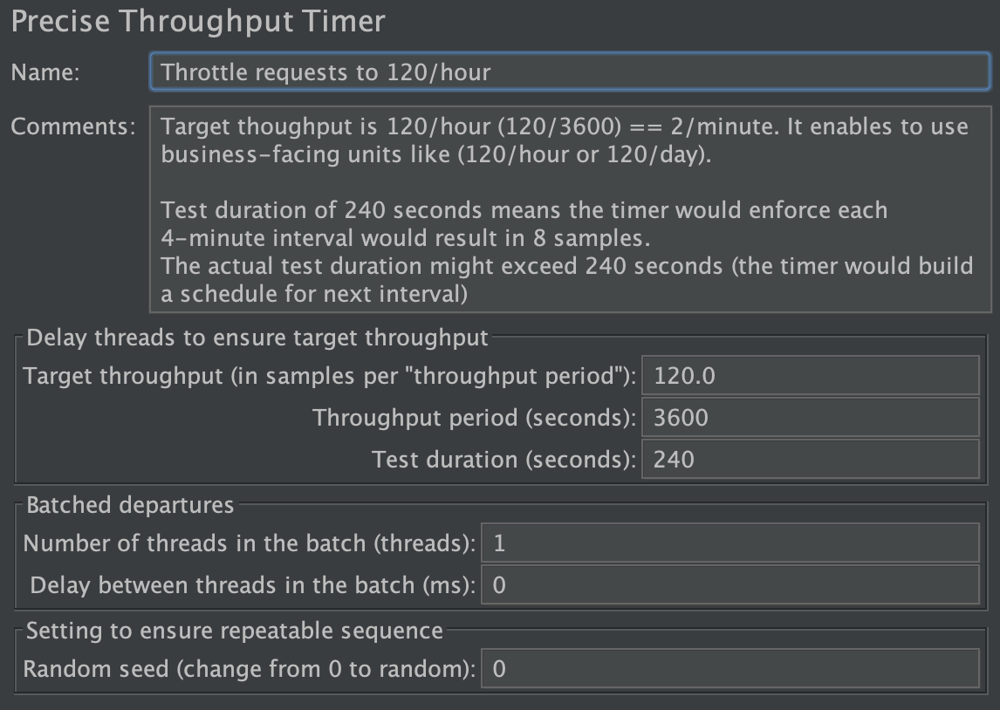](assets/images/precise-throughput-timer_ffb2cf5f24f87dca.png)

Screenshot of Control-Panel of Precise Throughput Timer

<a id="component_reference--precise_throughput_timer_parms1"></a>
<a id="component_reference--parameters-98"></a>

### Parameters [¶](#component_reference--precise_throughput_timer_parms1 "Link to here")

Attribute

Description

Required

Name

Descriptive name for this timer that is shown in the tree

No

Target throughput (in samples per 'throughput period')

Maximum number of samples you want to obtain per "throughput period", including all threads in group, from all affected samplers.

Yes

Throughput period (seconds)

Throughput period. For example, if "throughput" is set to 42 and "throughput period" to 21 sec, then you'll get 2 samples per second.

Yes

Test duration (seconds)

This is used to ensure you'll get throughput\*duration samples during "test duration" timeframe.

Yes

Number of threads in the batch (threads)

If the value exceeds 1, then multiple threads depart from the timer simultaneously. Average throughput still meets "throughput" value.

Yes

Delay between threads in the batch (ms)

For instance, if set to 42, and the batch size is 3, then threads will depart at x, x+42ms, x+84ms.

Yes

Random seed (change from 0 to random)

Note: different timers should better have different seed values. Constant seed ensures timer generates the same delays each test start. The value of "0" means the timer is truly random (non-repeatable from one execution to another)..

Yes

[^](#component_reference)

<a id="component_reference--synchronizing_timer"></a>
<a id="component_reference--synchronizing-timer"></a>

## Synchronizing Timer[¶](#component_reference--synchronizing_timer "Link to here")

The purpose of the SyncTimer is to block threads until X number of threads have been blocked, and
then they are all released at once. A SyncTimer can thus create large instant loads at various
points of the test plan.

[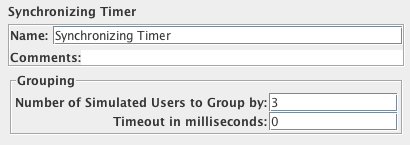](assets/images/sync-timer_b1d739a35df42403.png)

Screenshot of Control-Panel of Synchronizing Timer

<a id="component_reference--synchronizing_timer_parms1"></a>
<a id="component_reference--parameters-99"></a>

### Parameters [¶](#component_reference--synchronizing_timer_parms1 "Link to here")

Attribute

Description

Required

Name

Descriptive name for this timer that is shown in the tree.

No

Number of Simultaneous Users to Group by

Number of threads to release at once. Setting it to 0 is equivalent to setting it to Number of threads in Thread Group.

Yes

Timeout in milliseconds

If set to 0, Timer will wait for the number of threads to reach the value in "Number of Simultaneous Users to Group". If superior to 0, then timer will wait at max "Timeout in milliseconds" for the number of Threads. If after the timeout interval the number of users waiting is not reached, timer will stop waiting. Defaults to 0

No

If timeout in milliseconds is set to 0 and number of threads never reaches "Number of Simultaneous Users to Group by" then Test will pause infinitely.
Only a forced stop will stop it. Setting Timeout in milliseconds is an option to consider in this case.

Synchronizing timer blocks only within one JVM, so if using Distributed testing ensure you never set "Number of Simultaneous Users to Group by" to a value superior to the number of users
of its containing Thread group considering 1 injector only.

[^](#component_reference)

<a id="component_reference--beanshell_timer"></a>
<a id="component_reference--beanshell-timer"></a>

## BeanShell Timer[¶](#component_reference--beanshell_timer "Link to here")

The BeanShell Timer can be used to generate a delay.

**For full details on using BeanShell, please see the [BeanShell website.](http://www.beanshell.org/)**

Migration to [JSR223 Timer](#component_reference--jsr223_timer)+Groovy is highly recommended for performance, support of new Java features and limited maintenance of the BeanShell library.

The test element supports the ThreadListener and TestListener methods.
These should be defined in the initialisation file.
See the file BeanShellListeners.bshrc for example definitions.

[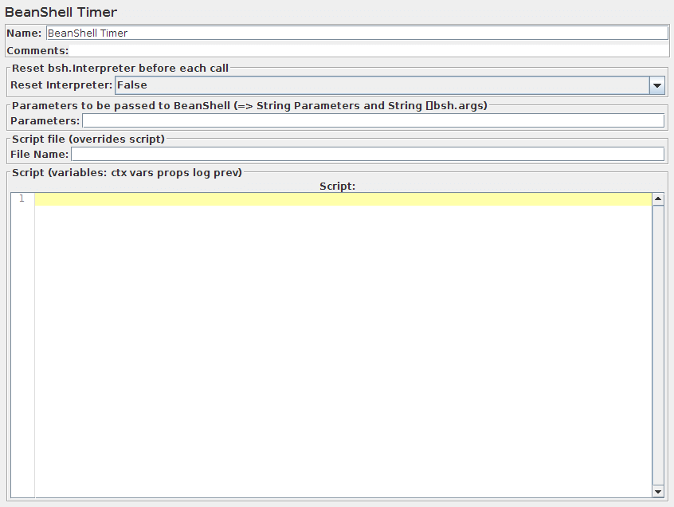](assets/images/beanshell-timer_a6e589ed12f223ba.png)

Screenshot of Control-Panel of BeanShell Timer

<a id="component_reference--beanshell_timer_parms1"></a>
<a id="component_reference--parameters-100"></a>

### Parameters [¶](#component_reference--beanshell_timer_parms1 "Link to here")

Attribute

Description

Required

Name

Descriptive name for this element that is shown in the tree.
The name is stored in the script variable Label

No

Reset bsh.Interpreter before each call

If this option is selected, then the interpreter will be recreated for each sample.
This may be necessary for some long running scripts.
For further information, see [Best Practices - BeanShell scripting](#best-practices--bsh_scripting).

Yes

Parameters

Parameters to pass to the BeanShell script.
The parameters are stored in the following variables:

- Parameters - string containing the parameters as a single variable
- bsh.args - String array containing parameters, split on white-space

No

Script file

A file containing the BeanShell script to run.
The file name is stored in the script variable FileName
The return value is used as the number of milliseconds to wait.

No

Script

The BeanShell script. The return value is used as the number of milliseconds to wait.

Yes (unless script file is provided)

Before invoking the script, some variables are set up in the BeanShell interpreter:

- log - ([Logger](https://www.slf4j.org/api/org/slf4j/Logger.html)) - can be used to write to the log file
- ctx - ([JMeterContext](https://jmeter.apache.org/api/org/apache/jmeter/threads/JMeterContext.html)) - gives access to the context
- vars - ([JMeterVariables](https://jmeter.apache.org/api/org/apache/jmeter/threads/JMeterVariables.html)) - gives read/write access to variables:

```

vars.get(key);
vars.put(key,val);
vars.putObject("OBJ1",new Object());
```

- props - (JMeterProperties - class java.util.Properties) - e.g. props.get("START.HMS"); props.put("PROP1","1234");
- prev - ([SampleResult](https://jmeter.apache.org/api/org/apache/jmeter/samplers/SampleResult.html)) - gives access to the previous SampleResult (if any)

For details of all the methods available on each of the above variables, please check the Javadoc

If the property beanshell.timer.init is defined, this is used to load an initialisation file, which can be used to define methods etc. for use in the BeanShell script.

[^](#component_reference)

<a id="component_reference--jsr223_timer"></a>
<a id="component_reference--jsr223-timer"></a>

## JSR223 Timer[¶](#component_reference--jsr223_timer "Link to here")

The JSR223 Timer can be used to generate a delay using a JSR223 scripting language,

<a id="component_reference--jsr223_timer_parms1"></a>
<a id="component_reference--parameters-101"></a>

### Parameters [¶](#component_reference--jsr223_timer_parms1 "Link to here")

Attribute

Description

Required

Name

Descriptive name for this element that is shown in the tree.

No

ScriptLanguage

The scripting language to be used.

Yes

Parameters

Parameters to pass to the script.
The parameters are stored in the following variables:

- Parameters - string containing the parameters as a single variable
- args - String array containing parameters, split on white-space

No

Script file

A file containing the script to run, if a relative file path is used, then it will be relative to directory referenced by "user.dir" System property
The return value is converted to a long integer and used as the number of milliseconds to wait.

No

Script compilation caching

Unique String across Test Plan that JMeter will use to cache result of Script compilation if language used supports [Compilable](https://docs.oracle.com/javase/8/docs/api/javax/script/Compilable.html) interface (Groovy is one of these, java, beanshell and javascript are not)

See note in JSR223 Sampler Java System property if you're using Groovy without checking this option

No

Script

The script. The return value is used as the number of milliseconds to wait.

Yes (unless script file is provided)

Before invoking the script, some variables are set up in the script interpreter:

- log - ([Logger](https://www.slf4j.org/api/org/slf4j/Logger.html)) - can be used to write to the log file
- ctx - ([JMeterContext](https://jmeter.apache.org/api/org/apache/jmeter/threads/JMeterContext.html)) - gives access to the context
- vars - ([JMeterVariables](https://jmeter.apache.org/api/org/apache/jmeter/threads/JMeterVariables.html)) - gives read/write access to variables:

```
vars.get(key);
vars.put(key,val);
vars.putObject("OBJ1",new Object());
```

- props - (JMeterProperties - class java.util.Properties) - e.g. props.get("START.HMS"); props.put("PROP1","1234");
- sampler - ([Sampler](https://jmeter.apache.org/api/org/apache/jmeter/samplers/Sampler.html)) - the current Sampler
- Label - the name of the Timer
- FileName - the file name (if any)
- OUT - System.out

For details of all the methods available on each of the above variables, please check the Javadoc

[^](#component_reference)

<a id="component_reference--poisson_random_timer"></a>
<a id="component_reference--poisson-random-timer"></a>

## Poisson Random Timer[¶](#component_reference--poisson_random_timer "Link to here")

This timer pauses each thread request for a random amount of time, with most
of the time intervals occurring near a particular value. The total delay is the
sum of the Poisson distributed value, and the offset value.

Note: if you want to model Poisson arrivals, consider using [Precise Throughput Timer](#component_reference--precise_throughput_timer) instead.

[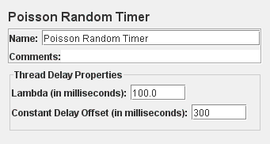](assets/images/poisson-random-timer_0458ed158d006b51.png)

Screenshot of Control-Panel of Poisson Random Timer

<a id="component_reference--poisson_random_timer_parms1"></a>
<a id="component_reference--parameters-102"></a>

### Parameters [¶](#component_reference--poisson_random_timer_parms1 "Link to here")

Attribute

Description

Required

Name

Descriptive name for this timer that is shown in the tree

No

Lambda

Lambda value in milliseconds.

Yes

Constant Delay Offset

Number of milliseconds to pause in addition
to the random delay.

Yes

[^](#component_reference)

[^](#component_reference)

<a id="component_reference--preprocessors"></a>
<a id="component_reference--18.7-pre-processors"></a>

# 18.7 Pre Processors[¶](#component_reference--preprocessors "Link to here")

Preprocessors are used to modify the Samplers in their scope.

<a id="component_reference--html_link_parser"></a>
<a id="component_reference--html-link-parser"></a>

## HTML Link Parser[¶](#component_reference--html_link_parser "Link to here")

This modifier parses HTML response from the server and extracts
links and forms. A URL test sample that passes through this modifier will be examined to
see if it "matches" any of the links or forms extracted
from the immediately previous response. It would then replace the values in the URL
test sample with appropriate values from the matching link or form. Perl-type regular
expressions are used to find matches.

[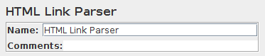](assets/images/html-link-parser_850dad4c69ef3f80.png)

Screenshot of Control-Panel of HTML Link Parser

Matches are performed using protocol, host, path and parameter names.
The target sampler cannot contain parameters that are not in the response links.

If using distributed testing, ensure you switch mode (see jmeter.properties) so that it's not a stripping one, see [Bug
56376](https://bz.apache.org/bugzilla/show_bug.cgi?id=56376)

Spidering Example[¶](#component_reference--spider_example "Link to here")

Consider a simple example: let's say you wanted JMeter to "spider" through your site, hitting link after link parsed from the HTML returned from your server (this is not
actually the most useful thing to do, but it serves as a good example). You would create
a [Simple Controller](#component_reference--simple_controller), and add the "HTML Link Parser" to it. Then, create an
HTTP Request, and set the domain to ".\*", and the path likewise. This will
cause your test sample to match with any link found on the returned pages. If you wanted to
restrict the spidering to a particular domain, then change the domain value
to the one you want. Then, only links to that domain will be followed.

Poll Example[¶](#component_reference--poll_example "Link to here")

A more useful example: given a web polling application, you might have a page with
several poll options as radio buttons for the user to select. Let's say the values
of the poll options are very dynamic - maybe user generated. If you wanted JMeter to
test the poll, you could either create test samples with hardcoded values chosen, or you
could let the HTML Link Parser parse the form, and insert a random poll option into
your URL test sample. To do this, follow the above example, except, when configuring
your Web Test controller's URL options, be sure to choose "POST" as the
method. Put in hard-coded values for the domain, path, and any additional form parameters.
Then, for the actual radio button parameter, put in the name (let's say it's called "poll\_choice"), and then ".\*" for the value of that parameter. When the modifier examines
this URL test sample, it will find that it "matches" the poll form (and
it shouldn't match any other form, given that you've specified all the other aspects of
the URL test sample), and it will replace your form parameters with the matching
parameters from the form. Since the regular expression ".\*" will match with
anything, the modifier will probably have a list of radio buttons to choose from. It
will choose at random, and replace the value in your URL test sample. Each time through
the test, a new random value will be chosen.

[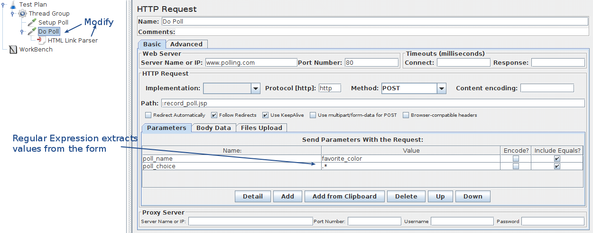](assets/images/modification_5c4a5a533d7ec80f.png)

Figure 18 - Online Poll Example

One important thing to remember is that you must create a test sample immediately
prior that will return an HTML page with the links and forms that are relevant to
your dynamic test sample.

[^](#component_reference)

<a id="component_reference--http_url_re-writing_modifier"></a>
<a id="component_reference--http-url-re-writing-modifier"></a>

## HTTP URL Re-writing Modifier[¶](#component_reference--http_url_re-writing_modifier "Link to here")

This modifier works similarly to the HTML Link Parser, except it has a specific purpose for which
it is easier to use than the HTML Link Parser, and more efficient. For web applications that
use URL Re-writing to store session ids instead of cookies, this element can be attached at the
ThreadGroup level, much like the [HTTP Cookie Manager](#component_reference--http_cookie_manager). Simply give it the name
of the session id parameter, and it will find it on the page and add the argument to every
request of that ThreadGroup.

Alternatively, this modifier can be attached to select requests and it will modify only them.
Clever users will even determine that this modifier can be used to grab values that elude the
[HTML Link Parser](#component_reference--html_link_parser).

[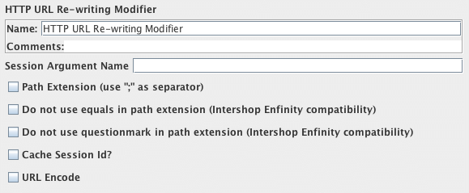](assets/images/url-rewriter_78d3ebe5eeec5e88.png)

Screenshot of Control-Panel of HTTP URL Re-writing Modifier

<a id="component_reference--http_url_re-writing_modifier_parms1"></a>
<a id="component_reference--parameters-103"></a>

### Parameters [¶](#component_reference--http_url_re-writing_modifier_parms1 "Link to here")

Attribute

Description

Required

Name

Descriptive name given to this element in the test tree.

No

Session Argument Name

The name of the parameter to grab from
previous response. This modifier will find the parameter anywhere it exists on the page, and
grab the value assigned to it, whether it's in an HREF or a form.

Yes

Path Extension

Some web apps rewrite URLs by appending
a semi-colon plus the session id parameter. Check this box if that is so.

No

Do not use equals in path extension

Some web apps rewrite URLs without using an "=" sign between the parameter name and value (such as Intershop Enfinity).

No

Do not use questionmark in path extension

Prevents the query string to end up in the path extension (such as Intershop Enfinity).

No

Cache Session Id?

Should the value of the session Id be saved for later use when the session Id is not present?

Yes

URL Encode

URL Encode value when writing parameter

No

If using distributed testing, ensure you switch mode (see jmeter.properties) so that it's not a stripping one, see [Bug
56376](https://bz.apache.org/bugzilla/show_bug.cgi?id=56376).

[^](#component_reference)

<a id="component_reference--user_parameters"></a>
<a id="component_reference--user-parameters"></a>

## User Parameters[¶](#component_reference--user_parameters "Link to here")

Allows the user to specify values for User Variables specific to individual threads.

User Variables can also be specified in the Test Plan but not specific to individual threads. This panel allows
you to specify a series of values for any User Variable. For each thread, the variable will be assigned one of the values from the series
in sequence. If there are more threads than values, the values get re-used. For example, this can be used to assign a distinct
user id to be used by each thread. User variables can be referenced in any field of any JMeter Component.

The variable is specified by clicking the Add Variable button in the bottom of the panel and filling in the Variable name in the 'Name:' column.
To add a new value to the series, click the 'Add User' button and fill in the desired value in the newly added column.

Values can be accessed in any test component in the same thread group, using the [function syntax](#functions): ${variable}.

See also the [CSV Data Set Config](#component_reference--csv_data_set_config) element, which is more suitable for large numbers of parameters

[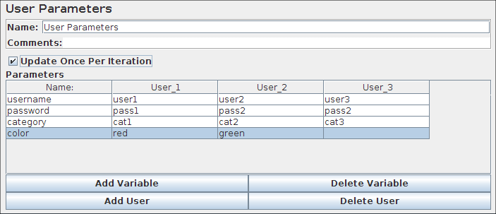](assets/images/user-params_5c12f75d4e641ea5.png)

Screenshot of Control-Panel of User Parameters

<a id="component_reference--user_parameters_parms1"></a>
<a id="component_reference--parameters-104"></a>

### Parameters [¶](#component_reference--user_parameters_parms1 "Link to here")

Attribute

Description

Required

Name

Descriptive name for this element that is shown in the tree.

Update Once Per Iteration

A flag to indicate whether the User Parameters element
should update its variables only once per iteration. if you embed functions into the UP, then you may need greater
control over how often the values of the variables are updated. Keep this box checked to ensure the values are
updated each time through the UP's parent controller. Uncheck the box, and the UP will update the parameters for
every sample request made within its [scope](#test_plan--scoping_rules).

Yes

[^](#component_reference)

<a id="component_reference--beanshell_preprocessor"></a>
<a id="component_reference--beanshell-preprocessor"></a>

## BeanShell PreProcessor[¶](#component_reference--beanshell_preprocessor "Link to here")

The BeanShell PreProcessor allows arbitrary code to be applied before taking a sample.

**For full details on using BeanShell, please see the [BeanShell website.](http://www.beanshell.org/)**

Migration to [JSR223 PreProcessor](#component_reference--jsr223_preprocessor)+Groovy is highly recommended for performance, support of new Java features and limited maintenance of the BeanShell library.

The test element supports the ThreadListener and TestListener methods.
These should be defined in the initialisation file.
See the file BeanShellListeners.bshrc for example definitions.

[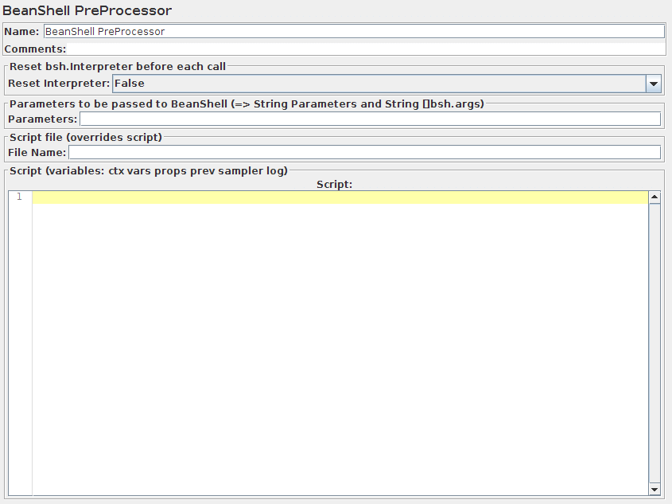](assets/images/beanshell-preprocessor_f4ac10ca8a1f73d0.png)

Screenshot of Control-Panel of BeanShell PreProcessor

<a id="component_reference--beanshell_preprocessor_parms1"></a>
<a id="component_reference--parameters-105"></a>

### Parameters [¶](#component_reference--beanshell_preprocessor_parms1 "Link to here")

Attribute

Description

Required

Name

Descriptive name for this element that is shown in the tree.
The name is stored in the script variable Label

No

Reset bsh.Interpreter before each call

If this option is selected, then the interpreter will be recreated for each sample.
This may be necessary for some long running scripts.
For further information, see [Best Practices - BeanShell scripting](#best-practices--bsh_scripting).

Yes

Parameters

Parameters to pass to the BeanShell script.
The parameters are stored in the following variables:

- Parameters - string containing the parameters as a single variable
- bsh.args - String array containing parameters, split on white-space

No

Script file

A file containing the BeanShell script to run.
The file name is stored in the script variable FileName

No

Script

The BeanShell script. The return value is ignored.

Yes (unless script file is provided)

Before invoking the script, some variables are set up in the BeanShell interpreter:

- log - ([Logger](https://www.slf4j.org/api/org/slf4j/Logger.html)) - can be used to write to the log file
- ctx - ([JMeterContext](https://jmeter.apache.org/api/org/apache/jmeter/threads/JMeterContext.html)) - gives access to the context
- vars - ([JMeterVariables](https://jmeter.apache.org/api/org/apache/jmeter/threads/JMeterVariables.html)) - gives read/write access to variables:

```
vars.get(key);
vars.put(key,val);
vars.putObject("OBJ1",new Object());
```

- props - (JMeterProperties - class java.util.Properties) - e.g. props.get("START.HMS"); props.put("PROP1","1234");
- prev - ([SampleResult](https://jmeter.apache.org/api/org/apache/jmeter/samplers/SampleResult.html)) - gives access to the previous SampleResult (if any)
- sampler - ([Sampler](https://jmeter.apache.org/api/org/apache/jmeter/samplers/Sampler.html))- gives access to the current sampler

For details of all the methods available on each of the above variables, please check the Javadoc

If the property beanshell.preprocessor.init is defined, this is used to load an initialisation file, which can be used to define methods etc. for use in the BeanShell script.

[^](#component_reference)

<a id="component_reference--jsr223_preprocessor"></a>
<a id="component_reference--jsr223-preprocessor"></a>

## JSR223 PreProcessor[¶](#component_reference--jsr223_preprocessor "Link to here")

The JSR223 PreProcessor allows JSR223 script code to be applied before taking a sample.

<a id="component_reference--jsr223_preprocessor_parms1"></a>
<a id="component_reference--parameters-106"></a>

### Parameters [¶](#component_reference--jsr223_preprocessor_parms1 "Link to here")

Attribute

Description

Required

Name

Descriptive name for this element that is shown in the tree.

No

Language

The JSR223 language to be used

Yes

Parameters

Parameters to pass to the script.
The parameters are stored in the following variables:

- Parameters - string containing the parameters as a single variable
- args - String array containing parameters, split on white-space

No

Script file

A file containing the script to run, if a relative file path is used, then it will be relative to directory referenced by "user.dir" System property

No

Script compilation caching

Unique String across Test Plan that JMeter will use to cache result of Script compilation if language used supports [Compilable](https://docs.oracle.com/javase/8/docs/api/javax/script/Compilable.html) interface (Groovy is one of these, java, beanshell and javascript are not)

See note in JSR223 Sampler Java System property if you're using Groovy without checking this option

No

Script

The script to run.

Yes (unless script file is provided)

The following JSR223 variables are set up for use by the script:

- log - ([Logger](https://www.slf4j.org/api/org/slf4j/Logger.html)) - can be used to write to the log file
- Label - the String Label
- FileName - the script file name (if any)
- Parameters - the parameters (as a String)
- args - the parameters as a String array (split on whitespace)
- ctx - ([JMeterContext](https://jmeter.apache.org/api/org/apache/jmeter/threads/JMeterContext.html)) - gives access to the context
- vars - ([JMeterVariables](https://jmeter.apache.org/api/org/apache/jmeter/threads/JMeterVariables.html)) - gives read/write access to variables:

```
vars.get(key);
vars.put(key,val);
vars.putObject("OBJ1",new Object());
vars.getObject("OBJ2");
```

- props - (JMeterProperties - class java.util.Properties) - e.g. props.get("START.HMS"); props.put("PROP1","1234");
- sampler - ([Sampler](https://jmeter.apache.org/api/org/apache/jmeter/samplers/Sampler.html))- gives access to the current sampler
- OUT - System.out - e.g. OUT.println("message")

For details of all the methods available on each of the above variables, please check the Javadoc

[^](#component_reference)

<a id="component_reference--jdbc_preprocessor"></a>
<a id="component_reference--jdbc-preprocessor"></a>

## JDBC PreProcessor[¶](#component_reference--jdbc_preprocessor "Link to here")

The JDBC PreProcessor enables you to run some SQL statement just before a sample runs.
This can be useful if your JDBC Sample requires some data to be in DataBase and you cannot compute this in a setup Thread group.
For details, see [JDBC Request](#component_reference--jdbc_request).

See the following Test plan:

See also:

- [Test Plan using JDBC Pre/Post Processor](https://jmeter.apache.org/demos/JDBC-Pre-Post-Processor.jmx)

In the linked test plan, "Create Price Cut-Off" JDBC PreProcessor calls a stored procedure to create a Price Cut-Off in Database, this one will be used by "Calculate Price cut off".

[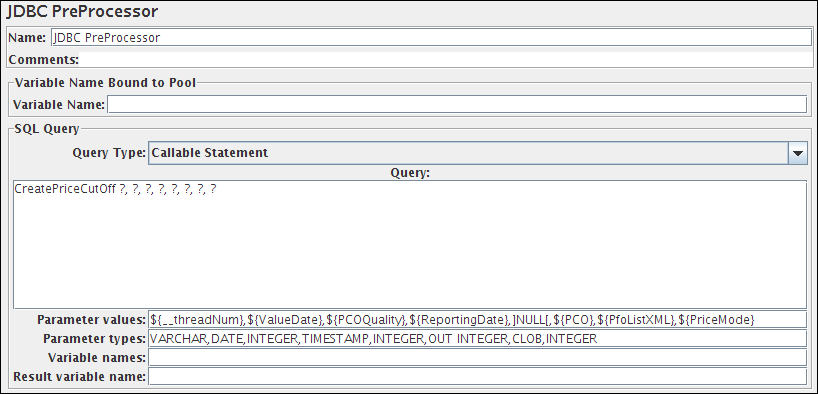](assets/images/jdbc-pre-processor_c5a24ddda61510ac.png)

Create Price Cut-Off Preprocessor

[^](#component_reference)

<a id="component_reference--regex_user_parameters"></a>
<a id="component_reference--regex-user-parameters"></a>

## RegEx User Parameters[¶](#component_reference--regex_user_parameters "Link to here")

Allows to specify dynamic values for HTTP parameters extracted from another HTTP Request using regular expressions.
RegEx User Parameters are specific to individual threads.

This component allows you to specify reference name of a regular expression that extracts names and values of HTTP request parameters.
Regular expression group numbers must be specified for parameter's name and also for parameter's value.
Replacement will only occur for parameters in the Sampler that uses this RegEx User Parameters which name matches

[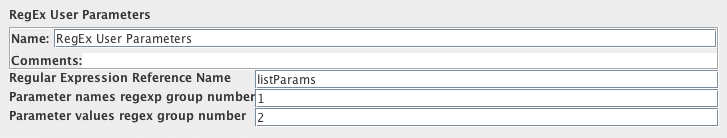](assets/images/regex-user-params_77348979d7c084ef.png)

Screenshot of Control-Panel of RegEx User Parameters

<a id="component_reference--regex_user_parameters_parms1"></a>
<a id="component_reference--parameters-107"></a>

### Parameters [¶](#component_reference--regex_user_parameters_parms1 "Link to here")

Attribute

Description

Required

Name

Descriptive name for this element that is shown in the tree.

Regular Expression Reference Name

Name of a reference to a regular expression

Yes

Parameter names regexp group number

Group number of regular expression used to extract parameter names

Yes

Parameter values regex group number

Group number of regular expression used to extract parameter values

Yes

Regexp Example[¶](#component_reference--regex_user_param_example "Link to here")

Suppose we have a request which returns a form with 3 input parameters and we want to extract the value of 2 of them to inject them in next request

1. Create Post Processor Regular Expression for first HTTP Request
   - refName - set name of a regular expression Expression (listParams)
   - regular expression - expression that will extract input names and input values attributes
     Ex: input name="([^"]+?)" value="([^"]+?)"
   - template - would be empty
   - match nr - -1 (in order to iterate through all the possible matches)
2. Create Pre Processor RegEx User Parameters for second HTTP Request
   - refName - set the same reference name of a regular expression, would be listParams in our example
   - parameter names group number - group number of regular expression for parameter names, would be 1 in our example
   - parameter values group number - group number of regular expression for parameter values, would be 2 in our example

See also the [Regular Expression Extractor](#component_reference--regular_expression_extractor) element, which is used to extract parameters names and values

[^](#component_reference)

See also:

- [Test Plan showing how to use RegEx User Parameters](https://jmeter.apache.org/demos/RegEx-User-Parameters.jmx)

<a id="component_reference--sample_timeout"></a>
<a id="component_reference--sample-timeout"></a>

## Sample Timeout[¶](#component_reference--sample_timeout "Link to here")

This Pre-Processor schedules a timer task to interrupt a sample if it takes too long to complete.
The timeout is ignored if it is zero or negative.
For this to work, the sampler must implement Interruptible.
The following samplers are known to do so:
AJP, BeanShell, FTP, HTTP, Soap, AccessLog, MailReader, JMS Subscriber, TCPSampler, TestAction, JavaSampler

The test element is intended for use where individual timeouts such as Connection Timeout or Response Timeout are insufficient, or where the Sampler does not support timeouts.
The timeout should be set sufficiently long so that it is not triggered in normal tests, but short enough that it interrupts samples
that are stuck.

[By default, JMeter uses a Callable to interrupt the sampler.
This executes in the same thread as the timer, so if the interrupt takes a long while, it may delay the processing of subsequent timeouts.
This is not expected to be a problem, but if necessary the property InterruptTimer.useRunnable
can be set to true to use a separate Runnable thread instead of the Callable.]

[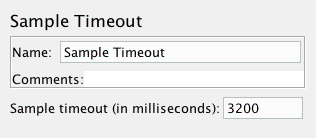](assets/images/sample-timeout_8ed08e22c6161b0c.png)

Screenshot of Control-Panel of Sample Timeout

<a id="component_reference--sample_timeout_parms1"></a>
<a id="component_reference--parameters-108"></a>

### Parameters [¶](#component_reference--sample_timeout_parms1 "Link to here")

Attribute

Description

Required

Name

Descriptive name for this timer that is shown in the tree.

No

Sample Timeout

If the sample takes longer to complete, it will be interrupted.

Yes

[^](#component_reference)

[^](#component_reference)

<a id="component_reference--postprocessors"></a>
<a id="component_reference--18.8-post-processors"></a>

# 18.8 Post-Processors[¶](#component_reference--postprocessors "Link to here")

As the name suggests, Post-Processors are applied after samplers. Note that they are
applied to **all** the samplers in the same scope, so to ensure that a post-processor
is applied only to a particular sampler, add it as a child of the sampler.

Note: Unless documented otherwise, Post-Processors are not applied to sub-samples (child samples) -
only to the parent sample.
In the case of JSR223 and BeanShell post-processors, the script can retrieve sub-samples using the method
prev.getSubResults() which returns an array of SampleResults.
The array will be empty if there are none.

Post-Processors are run before Assertions, so they do not have access to any Assertion Results, nor will
the sample status reflect the results of any Assertions. If you require access to Assertion Results, try
using a Listener instead. Also note that the variable JMeterThread.last\_sample\_ok is set to "true" or "false"
after all Assertions have been run.

<a id="component_reference--regular_expression_extractor"></a>
<a id="component_reference--regular-expression-extractor"></a>

## Regular Expression Extractor[¶](#component_reference--regular_expression_extractor "Link to here")

Allows the user to extract values from a server response using a Perl-type regular expression. As a post-processor, this element will execute after each Sample request in its scope, applying the regular expression, extracting the requested values, generate the template string, and store the result into the given variable name.

[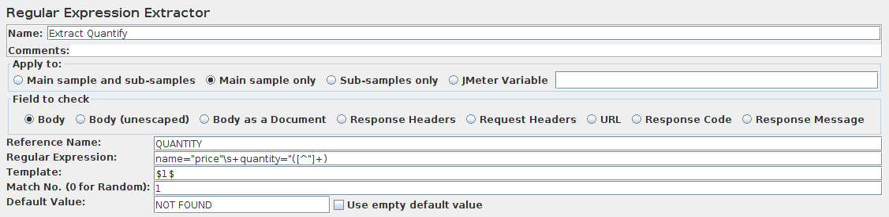](assets/images/regex-extractor_3c67c65a41869cc1.png)

Screenshot of Control-Panel of Regular Expression Extractor

<a id="component_reference--regular_expression_extractor_parms1"></a>
<a id="component_reference--parameters-109"></a>

### Parameters [¶](#component_reference--regular_expression_extractor_parms1 "Link to here")

Attribute

Description

Required

Name

Descriptive name for this element that is shown in the tree.

Apply to:

This is for use with samplers that can generate sub-samples, e.g. HTTP Sampler with embedded resources, Mail Reader or samples generated by the Transaction Controller.

- Main sample only - only applies to the main sample
- Sub-samples only - only applies to the sub-samples
- Main sample and sub-samples - applies to both.
- JMeter Variable Name to use - extraction is to be applied to the contents of the named variable

Matching is applied to all qualifying samples in turn.
For example if there is a main sample and 3 sub-samples, each of which contains a single match for the regex, (i.e. 4 matches in total).
For match number = 3, Sub-samples only, the extractor will match the 3rd sub-sample.
For match number = 3, Main sample and sub-samples, the extractor will match the 2nd sub-sample (1st match is main sample).
For match number = 0 or negative, all qualifying samples will be processed.
For match number > 0, matching will stop as soon as enough matches have been found.

Yes

Field to check

The following fields can be checked:

- Body - the body of the response, e.g. the content of a web-page (excluding headers)
- Body (unescaped) - the body of the response, with all Html escape codes replaced.
  Note that Html escapes are processed without regard to context, so some incorrect substitutions
  may be made.

  Note that this option highly impacts performances, so use it only when absolutely necessary and be aware of its impacts
- Body as a Document - the extract text from various type of documents via Apache Tika (see [View Results Tree](#component_reference--view_results_tree) Document view section).

  Note that the Body as a Document option can impact performances, so ensure it is OK for your test
- Request Headers - may not be present for non-HTTP samples
- Response Headers - may not be present for non-HTTP samples
- URL
- Response Code - e.g. 200
- Response Message - e.g. OK

Headers can be useful for HTTP samples; it may not be present for other sample types.

Yes

Name of created variable

The name of the JMeter variable in which to store the result. Also note that each group is stored as [refname]\_g#, where [refname] is the string you entered as the reference name, and # is the group number, where group 0 is the entire match, group 1 is the match from the first set of parentheses, etc.

Yes

Regular Expression

The regular expression used to parse the response data.
This must contain at least one set of parentheses "()" to capture a portion of the string, unless using the group $0$.
Do not enclose the expression in / / - unless of course you want to match these characters as well.

Yes

Template

The template used to create a string from the matches found. This is an arbitrary string
with special elements to refer to groups within the regular expression. The syntax to refer to a group is: '$1$' to refer to
group 1, '$2$' to refer to group 2, etc. $0$ refers to whatever the entire expression matches.

Yes

Match No. (0 for Random)

Indicates which match to use. The regular expression may match multiple times.

- Use a value of zero to indicate JMeter should choose a match at random.
- A positive number N means to select the nth match.
- Negative numbers are used in conjunction with the [ForEach Controller](#component_reference--foreach_controller) - see below.

Yes

Default Value

If the regular expression does not match, then the reference variable will be set to the default value.
This is particularly useful for debugging tests. If no default is provided, then it is difficult to tell
whether the regular expression did not match, or the RE element was not processed or maybe the wrong variable
is being used.

However, if you have several test elements that set the same variable, you may wish to leave the variable unchanged if the expression does not match.
In this case, remove the default value once debugging is complete.

No, but recommended

Use empty default value

If the checkbox is checked and Default Value is empty, then JMeter will set the variable to empty string instead of not setting it.
Thus when you will for example use ${var} (if Reference Name is var) in your Test Plan, if the extracted value is not found then
${var} will be equal to empty string instead of containing ${var} which may be useful if extracted value is optional.

No

If the match number is set to a non-negative number, and a match occurs, the variables are set as follows:

- refName - the value of the template
- refName\_g*n*, where n=0,1,2 - the groups for the match
- refName\_g - the number of groups in the Regex (excluding 0)

If no match occurs, then the refName variable is set to the default (unless this is absent).
Also, the following variables are removed:

- refName\_g0
- refName\_g1
- refName\_g

If the match number is set to a negative number, then all the possible matches in the sampler data are processed.
The variables are set as follows:

- refName\_matchNr - the number of matches found; could be 0
- refName\_*n*, where n = 1, 2, 3 etc. - the strings as generated by the template
- refName\_*n*\_g*m*, where m=0, 1, 2 - the groups for match n
- refName - always set to the default value
- refName\_g*n* - not set

Note that the refName variable is always set to the default value in this case, and the associated group variables are not set.

See also [Response Assertion](#component_reference--response_assertion) for some examples of how to specify modifiers, and  [for further information on JMeter regular expressions.](#regular_expressions)

[^](#component_reference)

<a id="component_reference--css_selector_extractor"></a>
<a id="component_reference--css-selector-extractor-was:-css-jquery-extractor"></a>

## CSS Selector Extractor(was: CSS/JQuery Extractor )[¶](#component_reference--css_selector_extractor "Link to here")

Allows the user to extract values from a server HTML response using a CSS Selector syntax. As a post-processor, this element will execute after each Sample request in its scope, applying the CSS/JQuery expression, extracting the requested nodes, extracting the node as text or attribute value and store the result into the given variable name.

[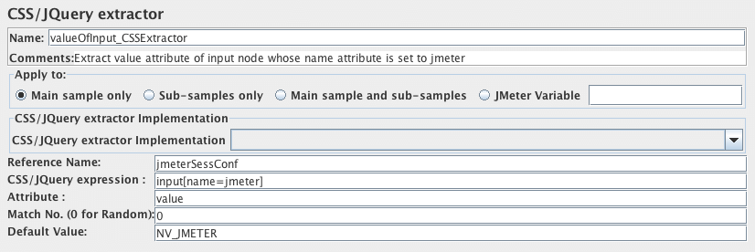](assets/images/css-extractor-attr_efd66be046b1814b.png)

Screenshot of Control-Panel of CSS Selector Extractor

<a id="component_reference--css_selector_extractor_parms1"></a>
<a id="component_reference--parameters-110"></a>

### Parameters [¶](#component_reference--css_selector_extractor_parms1 "Link to here")

Attribute

Description

Required

Name

Descriptive name for this element that is shown in the tree.

Apply to:

This is for use with samplers that can generate sub-samples, e.g. HTTP Sampler with embedded resources, Mail Reader or samples generated by the Transaction Controller.

- Main sample only - only applies to the main sample
- Sub-samples only - only applies to the sub-samples
- Main sample and sub-samples - applies to both.
- JMeter Variable Name to use - extraction is to be applied to the contents of the named variable

Matching is applied to all qualifying samples in turn.
For example if there is a main sample and 3 sub-samples, each of which contains a single match for the regex, (i.e. 4 matches in total).
For match number = 3, Sub-samples only, the extractor will match the 3rd sub-sample.
For match number = 3, Main sample and sub-samples, the extractor will match the 2nd sub-sample (1st match is main sample).
For match number = 0 or negative, all qualifying samples will be processed.
For match number > 0, matching will stop as soon as enough matches have been found.

Yes

CSS Selector Implementation

2 Implementations for CSS/JQuery based syntax are supported:

- [JSoup](http://jsoup.org/)
- [Jodd-Lagarto (CSSelly)](http://jodd.org/doc/lagarto/index.html)

If selector is set to empty, default implementation(JSoup) will be used.

False

Name of created variable

The name of the JMeter variable in which to store the result.

Yes

CSS/JQuery expression

The CSS/JQuery selector used to select nodes from the response data.
Selector, selectors combination and pseudo-selectors are supported, examples:

- E[foo] - an E element with a "foo" attribute
- ancestor child - child elements that descend from ancestor, e.g. .body p finds p elements anywhere under a block with class "body"
- :lt(n) - find elements whose sibling index (i.e. its position in the DOM tree relative to its parent) is less than n; e.g. td:lt(3)
- :contains(text) - find elements that contain the given text. The search is case-insensitive; e.g. p:contains(jsoup)
- …

For more details on syntax, see:

- [JSoup](http://jsoup.org/cookbook/extracting-data/selector-syntax)
- [Jodd-Lagarto (CSSelly)](http://jodd.org/doc/csselly/)

Yes

Attribute

Name of attribute (as per HTML syntax) to extract from nodes that matched the selector. If empty, then the combined text of this element and all its children will be returned.
This is the equivalent [Element#attr(name)](http://jsoup.org/apidocs/org/jsoup/nodes/Node.html#attr%28java.lang.String%29) function for JSoup if an attribute is set.
[](assets/images/css-extractor-attr_efd66be046b1814b.png)

CSS Extractor with attribute value set

If empty this is the equivalent of [Element#text()](http://jsoup.org/apidocs/org/jsoup/nodes/Element.html#text%28%29) function for JSoup if not value is set for attribute.
[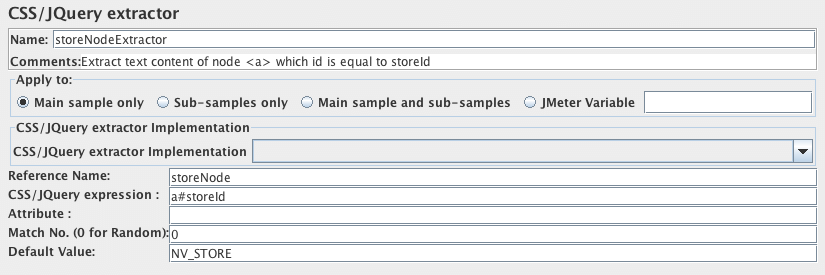](assets/images/css-extractor-noattr_ebdf0fa733ea0bb5.png)

CSS Extractor with no attribute set

false

Match No. (0 for Random)

Indicates which match to use. The CSS/JQuery selector may match multiple times.

- Use a value of zero to indicate JMeter should choose a match at random.
- A positive number N means to select the nth match.
- Negative numbers are used in conjunction with the [ForEach Controller](#component_reference--foreach_controller) - see below.

Yes

Default Value

If the expression does not match, then the reference variable will be set to the default value.
This is particularly useful for debugging tests. If no default is provided, then it is difficult to tell
whether the expression did not match, or the CSS/JQuery element was not processed or maybe the wrong variable
is being used.

However, if you have several test elements that set the same variable, you may wish to leave the variable unchanged if the expression does not match.
In this case, remove the default value once debugging is complete.

No, but recommended

Use empty default value

If the checkbox is checked and Default Value is empty, then JMeter will set the variable to empty string instead of not setting it.
Thus when you will for example use ${var} (if Reference Name is var) in your Test Plan, if the extracted value is not found then
${var} will be equal to empty string instead of containing ${var} which may be useful if extracted value is optional.

No

If the match number is set to a non-negative number, and a match occurs, the variables are set as follows:

- refName - the value of the template

If no match occurs, then the refName variable is set to the default (unless this is absent).

If the match number is set to a negative number, then all the possible matches in the sampler data are processed.
The variables are set as follows:

- refName\_matchNr - the number of matches found; could be 0
- refName\_n, where n = 1, 2, 3, etc. - the strings as generated by the template
- refName - always set to the default value

Note that the refName variable is always set to the default value in this case.

[^](#component_reference)

<a id="component_reference--xpath2_extractor"></a>
<a id="component_reference--xpath2-extractor"></a>

## XPath2 Extractor[¶](#component_reference--xpath2_extractor "Link to here")

This test element allows the user to extract value(s) from structured response - XML or (X)HTML -
using XPath2 query language.

[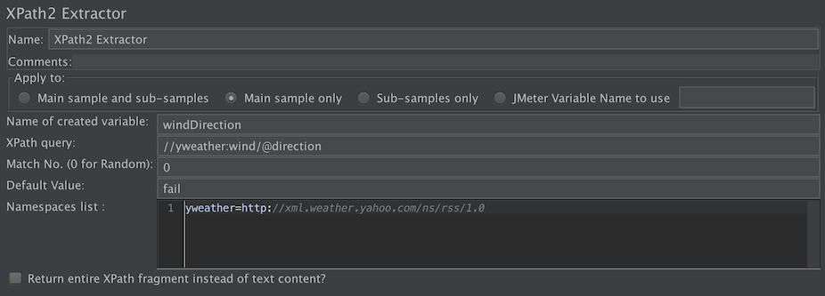](assets/images/xpath2-extractor_1ba63c4fc53fdec3.png)

Screenshot of Control-Panel of XPath2 Extractor

<a id="component_reference--xpath2_extractor_parms1"></a>
<a id="component_reference--parameters-111"></a>

### Parameters [¶](#component_reference--xpath2_extractor_parms1 "Link to here")

Attribute

Description

Required

Name

Descriptive name for this element that is shown in the tree.

No

Apply to:

This is for use with samplers that can generate sub-samples, e.g. HTTP Sampler with embedded resources, Mail Reader or samples generated by the Transaction Controller.

- Main sample only - only applies to the main sample
- Sub-samples only - only applies to the sub-samples
- Main sample and sub-samples - applies to both.
- JMeter Variable Name to use - extraction is to be applied to the contents of the named variable

XPath matching is applied to all qualifying samples in turn, and all the matching results will be returned.

Yes

Return entire XPath fragment instead of text content?

If selected, the fragment will be returned rather than the text content.
For example //title would return "<title>Apache JMeter</title>" rather than "Apache JMeter".
In this case, //title/text() would return "Apache JMeter".

Yes

Name of created variable

The name of the JMeter variable in which to store the result.

Yes

XPath Query

Element query in XPath 2.0 language. Can return more than one match.

Yes

Match No. (0 for Random)

If the XPath Path query leads to many results, you can choose which one(s) to extract as Variables:

- 0: means random (default value)
- -1 means extract all results, they will be named as *<variable name>*\_N (where N goes from 1 to Number of results)
- X: means extract the Xth result. If this Xth is greater than number of matches, then nothing is returned. Default value will be used

No

Default Value

Default value returned when no match found.
It is also returned if the node has no value and the fragment option is not selected.

yes

Namespaces aliases list

List of namespaces aliases you want to use to parse the document, one line per declaration.
You must specify them as follow: prefix=namespace. This implementation makes it easier to
use namespaces than with the old XPathExtractor version.

No

To allow for use in a [ForEach Controller](#component_reference--foreach_controller), it works exactly the same as the above XPath Extractor

XPath2 Extractor provides some interestings tools such as an improved syntax and much more functions than in its first version.

Here are some exemples:

abs(/book/page[2])
:   extracts 2nd absolute value of the page from a book

avg(/librarie/book/page)
:   extracts the average number of page from all the books in the libraries

compare(/book[1]/page[2],/book[2]/page[2])
:   return Integer value equal 0 to if the 2nd page of the first book is equal to the 2nd page of the 2nd book, else return -1.

To see more information about these functions, please check [xPath2 functions](http://saxon.sourceforge.net/saxon7.9.1/functions.html)

[^](#component_reference)

<a id="component_reference--xpath_extractor"></a>
<a id="component_reference--xpath-extractor"></a>

## XPath Extractor[¶](#component_reference--xpath_extractor "Link to here")

This test element allows the user to extract value(s) from
structured response - XML or (X)HTML - using XPath
query language.

Since JMeter 5.0, you should use [XPath2 Extractor](#component_reference--xpath2_extractor) as it provides better and easier namespace management, better performances and support for XPath 2.0

[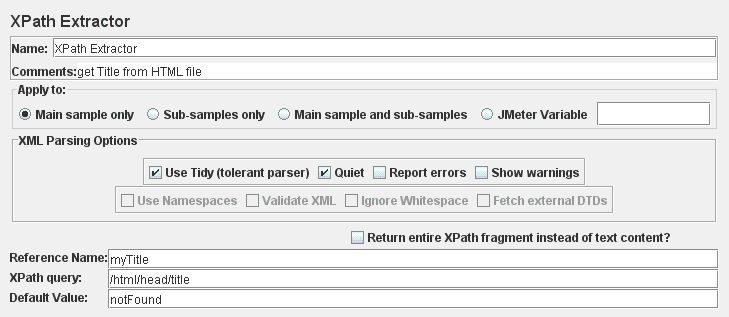](assets/images/xpath-extractor_89ecfa122a1127b4.png)

Screenshot of Control-Panel of XPath Extractor

<a id="component_reference--xpath_extractor_parms1"></a>
<a id="component_reference--parameters-112"></a>

### Parameters [¶](#component_reference--xpath_extractor_parms1 "Link to here")

Attribute

Description

Required

Name

Descriptive name for this element that is shown in the tree.

No

Apply to:

This is for use with samplers that can generate sub-samples, e.g. HTTP Sampler with embedded resources, Mail Reader or samples generated by the Transaction Controller.

- Main sample only - only applies to the main sample
- Sub-samples only - only applies to the sub-samples
- Main sample and sub-samples - applies to both.
- JMeter Variable Name to use - extraction is to be applied to the contents of the named variable

XPath matching is applied to all qualifying samples in turn, and all the matching results will be returned.

Yes

Use Tidy (tolerant parser)

If checked use Tidy to parse HTML response into XHTML.

- "Use Tidy" should be checked on for HTML response. Such response is converted to valid XHTML (XML compatible HTML) using Tidy
- "Use Tidy" should be unchecked for both XHTML or XML response (for example RSS)

For HTML, CSS Selector Extractor is the correct and performing solution. Don't use XPath for HTML extractions.

Yes

Quiet

Sets the Tidy Quiet flag

If Tidy is selected

Report Errors

If a Tidy error occurs, then set the Assertion accordingly

If Tidy is selected

Show warnings

Sets the Tidy showWarnings option

If Tidy is selected

Use Namespaces

If checked, then the XML parser will use namespace resolution.(see note below on NAMESPACES)
Note that currently only namespaces declared on the root element will be recognised.
See below for user-definition of additional workspace names.

If Tidy is not selected

Validate XML

Check the document against its schema.

If Tidy is not selected

Ignore Whitespace

Ignore Element Whitespace.

If Tidy is not selected

Fetch External DTDs

If selected, external DTDs are fetched.

If Tidy is not selected

Return entire XPath fragment instead of text content?

If selected, the fragment will be returned rather than the text content.
For example //title would return "<title>Apache JMeter</title>" rather than "Apache JMeter".
In this case, //title/text() would return "Apache JMeter".

Yes

Name of created variable

The name of the JMeter variable in which to store the result.

Yes

XPath Query

Element query in XPath language. Can return more than one match.

Yes

Match No. (0 for Random)

If the XPath Path query leads to many results, you can choose which one(s) to extract as Variables:

- 0: means random
- -1 means extract all results (default value), they will be named as *<variable name>*\_N (where N goes from 1 to Number of results)
- X: means extract the Xth result. If this Xth is greater than number of matches, then nothing is returned. Default value will be used

No

Default Value

Default value returned when no match found.
It is also returned if the node has no value and the fragment option is not selected.

To allow for use in a [ForEach Controller](#component_reference--foreach_controller), the following variables are set on return:

- refName - set to first (or only) match; if no match, then set to default
- refName\_matchNr - set to number of matches (may be 0)
- refName\_n - n=1, 2, 3, etc. Set to the 1st, 2nd 3rd match etc.

Note: The next refName\_n variable is set to null - e.g. if there are 2 matches, then refName\_3 is set to null, and if there are no matches, then refName\_1 is set to null.

XPath is query language targeted primarily for XSLT transformations. However it is useful as generic query language for structured data too. See
[XPath Reference](http://www.topxml.com/xsl/xpathref.asp) or [XPath specification](http://www.w3.org/TR/xpath) for more information. Here are few examples:

/html/head/title
:   extracts title element from HTML response

/book/page[2]
:   extracts 2nd page from a book

/book/page
:   extracts all pages from a book

//form[@name='countryForm']//select[@name='country']/option[text()='Czech Republic'])/@value
:   extracts value attribute of option element that match text 'Czech Republic'
    inside of select element with name attribute 'country' inside of
    form with name attribute 'countryForm'

When "Use Tidy" is checked on - resulting XML document may slightly differ from original HTML response:

- All elements and attribute names are converted to lowercase
- Tidy attempts to correct improperly nested elements. For example - original (incorrect) ul/font/li becomes correct ul/li/font

See [Tidy homepage](http://jtidy.sf.net) for more information.

**NAMESPACES**
As a work-round for namespace limitations of the Xalan XPath parser (implementation on which JMeter is based) you need to:

- provide a Properties file (if for example your file is named namespaces.properties) which contains mappings for the namespace prefixes:

```

prefix1=http\://foo.apache.org
prefix2=http\://toto.apache.org
…
```

- reference this file in user.properties file using the property:

```
xpath.namespace.config=namespaces.properties
```

```
//mynamespace:tagname
```

```
//*[local-name()='tagname' and namespace-uri()='uri-for-namespace']
```

uri-for-namespacemynamespace

[^](#component_reference)

<a id="component_reference--json_jmespath_extractor"></a>
<a id="component_reference--json-jmespath-extractor"></a>

## JSON JMESPath Extractor[¶](#component_reference--json_jmespath_extractor "Link to here")

This test element allows the user to extract value(s) from
JSON response using JMESPath query language.

[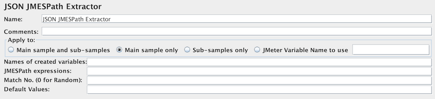](assets/images/jmespath-extractor_1458cc321f663b99.png)

Screenshot of Control-Panel of JSON JMESPath Extractor

In the XPATH Extractor we support to extract multiple xpaths at the same time, but in JMES Extractor only
one JMES Expression can be entered at a time.

<a id="component_reference--json_jmespath_extractor_parms1"></a>
<a id="component_reference--parameters-113"></a>

### Parameters [¶](#component_reference--json_jmespath_extractor_parms1 "Link to here")

Attribute

Description

Required

Name

Descriptive name for this element that is shown in the tree.

No

Apply to:

This is for use with samplers that can generate sub-samples, e.g. HTTP Sampler with embedded resources, Mail Reader or samples generated by the Transaction Controller.

- Main sample only - only applies to the main sample
- Sub-samples only - only applies to the sub-samples
- Main sample and sub-samples - applies to both.
- JMeter Variable Name to use - extraction is to be applied to the contents of the named variable

Yes

Name of created variable

The name of the JMeter variable in which to store the result.

Yes

JMESPath expressions

Element query in JMESPath query language. Can return the matched result.

Yes

Match No. (0 for Random)

If the JMESPath query leads to many results, you can choose which one(s) to extract as Variables:

- 0: means random
- -1 means extract all results (default value), they will be named as *<variable name>*\_N (where N goes from 1 to Number of results)
- X: means extract the Xth result. If this Xth is greater than number of matches, then nothing is returned. Default value will be used

No

Default Value

Default value returned when no match found.
It is also returned if the node has no value and the fragment option is not selected.

JMESPath is a query language for JSON. It is described in an ABNF grammar with a complete specification. This ensures that the language syntax is precisely defined.
See [JMESPath Reference](http://jmespath.org/) for more information. Here are also some examples [JMESPath Example](http://jmespath.org/tutorial.html).

[^](#component_reference)

<a id="component_reference--result_status_action_handler"></a>
<a id="component_reference--result-status-action-handler"></a>

## Result Status Action Handler[¶](#component_reference--result_status_action_handler "Link to here")

This test element allows the user to stop the thread or the whole test if the relevant sampler failed.

[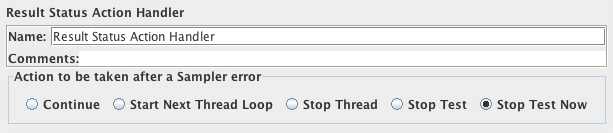](assets/images/resultstatusactionhandler_f319f2578f8d348e.png)

Screenshot of Control-Panel of Result Status Action Handler

<a id="component_reference--result_status_action_handler_parms1"></a>
<a id="component_reference--parameters-114"></a>

### Parameters [¶](#component_reference--result_status_action_handler_parms1 "Link to here")

Attribute

Description

Required

Name

Descriptive name for this element that is shown in the tree.

Action to be taken after a Sampler error

Determines what happens if a sampler error occurs, either because the sample itself failed or an assertion failed.
The possible choices are:

- Continue - ignore the error and continue with the test
- Start next thread loop - does not execute samplers following the sampler in error for the current iteration and restarts the loop on next iteration
- Stop Thread - current thread exits
- Stop Test - the entire test is stopped at the end of any current samples.
- Stop Test Now - the entire test is stopped abruptly. Any current samplers are interrupted if possible.

No

[^](#component_reference)

<a id="component_reference--beanshell_postprocessor"></a>
<a id="component_reference--beanshell-postprocessor"></a>

## BeanShell PostProcessor[¶](#component_reference--beanshell_postprocessor "Link to here")

The BeanShell PreProcessor allows arbitrary code to be applied after taking a sample.

BeanShell Post-Processor no longer ignores samples with zero-length result data

**For full details on using BeanShell, please see the [BeanShell website.](http://www.beanshell.org/)**

Migration to [JSR223 PostProcessor](#component_reference--jsr223_postprocessor)+Groovy is highly recommended for performance, support of new Java features and limited maintenance of the BeanShell library.

The test element supports the ThreadListener and TestListener methods.
These should be defined in the initialisation file.
See the file BeanShellListeners.bshrc for example definitions.

[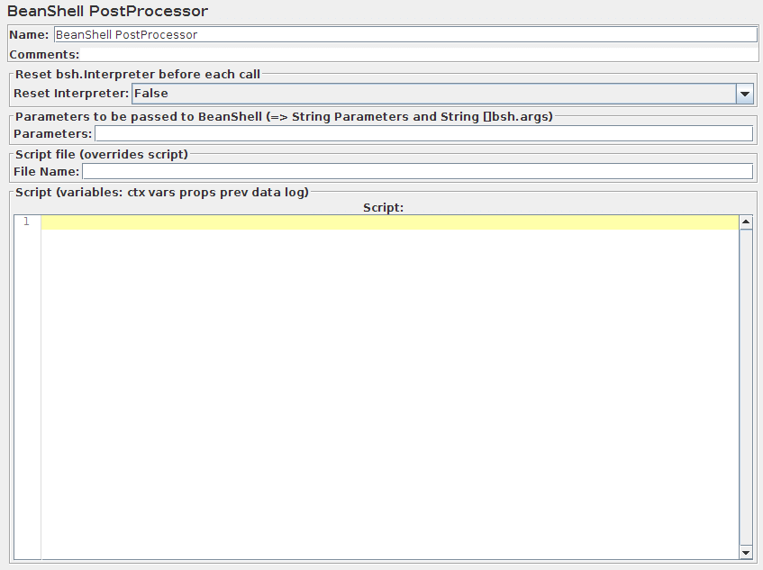](assets/images/beanshell-postprocessor_4712a5f9e31ba47c.png)

Screenshot of Control-Panel of BeanShell PostProcessor

<a id="component_reference--beanshell_postprocessor_parms1"></a>
<a id="component_reference--parameters-115"></a>

### Parameters [¶](#component_reference--beanshell_postprocessor_parms1 "Link to here")

Attribute

Description

Required

Name

Descriptive name for this element that is shown in the tree.
The name is stored in the script variable Label

No

Reset bsh.Interpreter before each call

If this option is selected, then the interpreter will be recreated for each sample.
This may be necessary for some long running scripts.
For further information, see [Best Practices - BeanShell scripting](#best-practices--bsh_scripting).

Yes

Parameters

Parameters to pass to the BeanShell script.
The parameters are stored in the following variables:

- Parameters - string containing the parameters as a single variable
- bsh.args - String array containing parameters, split on white-space

No

Script file

A file containing the BeanShell script to run.
The file name is stored in the script variable FileName

No

Script

The BeanShell script. The return value is ignored.

Yes (unless script file is provided)

The following BeanShell variables are set up for use by the script:

- log - ([Logger](https://www.slf4j.org/api/org/slf4j/Logger.html)) - can be used to write to the log file
- ctx - ([JMeterContext](https://jmeter.apache.org/api/org/apache/jmeter/threads/JMeterContext.html)) - gives access to the context
- vars - ([JMeterVariables](https://jmeter.apache.org/api/org/apache/jmeter/threads/JMeterVariables.html)) - gives read/write access to variables:

```
vars.get(key);
vars.put(key,val);
vars.putObject("OBJ1",new Object());
```

- props - (JMeterProperties - class java.util.Properties) - e.g. props.get("START.HMS"); props.put("PROP1","1234");
- prev - ([SampleResult](https://jmeter.apache.org/api/org/apache/jmeter/samplers/SampleResult.html)) - gives access to the previous SampleResult
- data - (byte [])- gives access to the current sample data

For details of all the methods available on each of the above variables, please check the Javadoc

If the property beanshell.postprocessor.init is defined, this is used to load an initialisation file, which can be used to define methods etc. for use in the BeanShell script.

[^](#component_reference)

<a id="component_reference--jsr223_postprocessor"></a>
<a id="component_reference--jsr223-postprocessor"></a>

## JSR223 PostProcessor[¶](#component_reference--jsr223_postprocessor "Link to here")

The JSR223 PostProcessor allows JSR223 script code to be applied after taking a sample.

<a id="component_reference--jsr223_postprocessor_parms1"></a>
<a id="component_reference--parameters-116"></a>

### Parameters [¶](#component_reference--jsr223_postprocessor_parms1 "Link to here")

Attribute

Description

Required

Name

Descriptive name for this element that is shown in the tree.

No

Language

The JSR223 language to be used

Yes

Parameters

Parameters to pass to the script.
The parameters are stored in the following variables:

- Parameters - string containing the parameters as a single variable
- args - String array containing parameters, split on white-space

No

Script file

A file containing the script to run, if a relative file path is used, then it will be relative to directory referenced by "user.dir" System property

No

Script compilation caching

Unique String across Test Plan that JMeter will use to cache result of Script compilation if language used supports [Compilable](https://docs.oracle.com/javase/8/docs/api/javax/script/Compilable.html) interface (Groovy is one of these, java, beanshell and javascript are not)

See note in JSR223 Sampler Java System property if you're using Groovy without checking this option

No

Script

The script to run.

Yes (unless script file is provided)

Before invoking the script, some variables are set up.
Note that these are JSR223 variables - i.e. they can be used directly in the script.

- log - ([Logger](https://www.slf4j.org/api/org/slf4j/Logger.html)) - can be used to write to the log file
- Label - the String Label
- FileName - the script file name (if any)
- Parameters - the parameters (as a String)
- args - the parameters as a String array (split on whitespace)
- ctx - ([JMeterContext](https://jmeter.apache.org/api/org/apache/jmeter/threads/JMeterContext.html)) - gives access to the context
- vars - ([JMeterVariables](https://jmeter.apache.org/api/org/apache/jmeter/threads/JMeterVariables.html)) - gives read/write access to variables:

```
vars.get(key);
vars.put(key,val);
vars.putObject("OBJ1",new Object());
vars.getObject("OBJ2");
```

- props - (JMeterProperties - class java.util.Properties) - e.g. props.get("START.HMS"); props.put("PROP1","1234");
- prev - ([SampleResult](https://jmeter.apache.org/api/org/apache/jmeter/samplers/SampleResult.html)) - gives access to the previous SampleResult (if any)
- sampler - ([Sampler](https://jmeter.apache.org/api/org/apache/jmeter/samplers/Sampler.html))- gives access to the current sampler
- OUT - System.out - e.g. OUT.println("message")

For details of all the methods available on each of the above variables, please check the Javadoc

[^](#component_reference)

<a id="component_reference--jdbc_postprocessor"></a>
<a id="component_reference--jdbc-postprocessor"></a>

## JDBC PostProcessor[¶](#component_reference--jdbc_postprocessor "Link to here")

The JDBC PostProcessor enables you to run some SQL statement just after a sample has run.
This can be useful if your JDBC Sample changes some data and you want to reset state to what it was before the JDBC sample run.

See also:

- [Test Plan using JDBC Pre/Post Processor](https://jmeter.apache.org/demos/JDBC-Pre-Post-Processor.jmx)

In the linked test plan, "JDBC PostProcessor" JDBC PostProcessor calls a stored procedure to delete from Database the Price Cut-Off that was created by PreProcessor.

[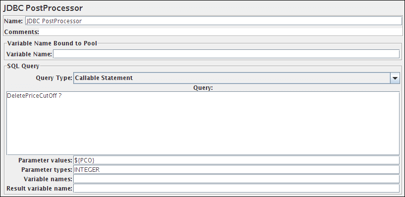](assets/images/jdbc-post-processor_71e7e6e2682f7a94.png)

JDBC PostProcessor

[^](#component_reference)

<a id="component_reference--json_extractor"></a>
<a id="component_reference--json-extractor"></a>

## JSON Extractor[¶](#component_reference--json_extractor "Link to here")

The JSON PostProcessor enables you extract data from JSON responses using JSON-PATH syntax. This post processor is very similar to Regular expression extractor.
It must be placed as a child of HTTP Sampler or any other sampler that has responses.
It will allow you to extract in a very easy way text content, see [JSON Path syntax](https://github.com/json-path/JsonPath).

<a id="component_reference--json_extractor_parms1"></a>
<a id="component_reference--parameters-117"></a>

### Parameters [¶](#component_reference--json_extractor_parms1 "Link to here")

Attribute

Description

Required

Name

Descriptive name for this element that is shown in the tree.

No

Apply to:

This is for use with samplers that can generate sub-samples, e.g. HTTP Sampler with embedded resources, Mail Reader or samples generated by the Transaction Controller.

Main sample only
:   only applies to the main sample

Sub-samples only
:   only applies to the sub-samples

Main sample and sub-samples
:   applies to both.

JMeter Variable Name to use
:   extraction is to be applied to the contents of the named variable

Yes

Names of created variables

Semicolon separated names of variables that will contain the results of JSON-PATH expressions (must match number of JSON-PATH expressions)

Yes

JSON Path Expressions

Semicolon separated JSON-PATH expressions (must match number of variables)

Yes

Default Values

Semicolon separated default values if JSON-PATH expressions do not return any result(must match number of variables)

No

Match Numbers

For each JSON Path Expression, if the JSON Path query leads to many results, you can choose which one(s) to extract as Variables:

- 0: means random (Default Value)
- -1 means extract all results, they will be named as *<variable name>*\_N (where N goes from 1 to Number of results)
- X: means extract the *X*th result. If this *X*th is greater than number of matches, then nothing is returned. Default value will be used

The numbers have to be given as a Semicolon separated list. The number of elements in that list have to match the number of given JSON Path Expressions. If left empty, the value 0 will be used as default for every expression.

No

Compute concatenation var

If many results are found, plugin will concatenate them using ‘,’ separator and store it in a var named *<variable name>*\_ALL

No

[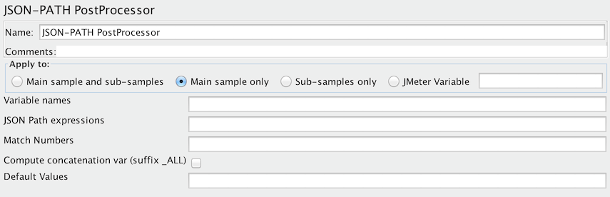](assets/images/json-post-processor_fb6362b0175454ef.png)

JSON PostProcessor

[^](#component_reference)

<a id="component_reference--boundary_extractor"></a>
<a id="component_reference--boundary-extractor"></a>

## Boundary Extractor[¶](#component_reference--boundary_extractor "Link to here")

Allows the user to extract values from a server response using left and right boundaries. As a post-processor, this element will execute after each Sample request in its scope, testing the boundaries, extracting the requested values, generate the template string, and store the result into the given variable name.

[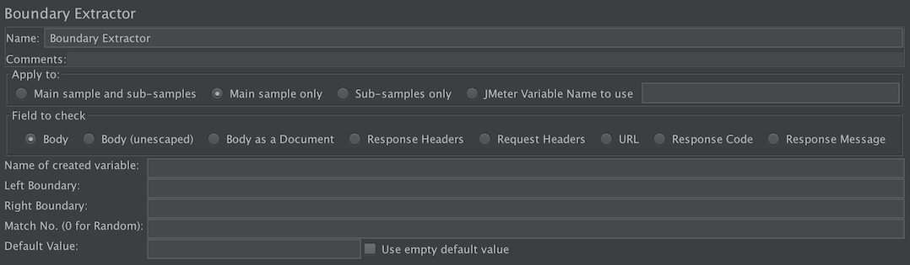](assets/images/boundary-extractor_54f435ccb8a0efdb.png)

Screenshot of Control-Panel of Boundary Extractor

<a id="component_reference--boundary_extractor_parms1"></a>
<a id="component_reference--parameters-118"></a>

### Parameters [¶](#component_reference--boundary_extractor_parms1 "Link to here")

Attribute

Description

Required

Name

Descriptive name for this element that is shown in the tree.

Apply to:

This is for use with samplers that can generate sub-samples, e.g. HTTP Sampler with embedded resources, Mail Reader or samples generated by the Transaction Controller.

- Main sample only - only applies to the main sample
- Sub-samples only - only applies to the sub-samples
- Main sample and sub-samples - applies to both.
- JMeter Variable Name to use - assertion is to be applied to the contents of the named variable

Matching is applied to all qualifying samples in turn.
For example if there is a main sample and 3 sub-samples, each of which contains a single match test, (i.e. 4 matches in total).
For match number = 3, Sub-samples only, the extractor will match the 3rd sub-sample.
For match number = 3, Main sample and sub-samples, the extractor will match the 2nd sub-sample (1st match is main sample).
For match number = 0 or negative, all qualifying samples will be processed.
For match number > 0, matching will stop as soon as enough matches have been found.

Yes

Field to check

The following fields can be checked:

- Body - the body of the response, e.g. the content of a web-page (excluding headers)
- Body (unescaped) - the body of the response, with all Html escape codes replaced.
  Note that Html escapes are processed without regard to context, so some incorrect substitutions
  may be made.

  Note that this option highly impacts performances, so use it only when absolutely necessary and be aware of its impacts
- Body as a Document - the extract text from various type of documents via Apache Tika (see [View Results Tree](#component_reference--view_results_tree) Document view section).

  Note that the Body as a Document option can impact performances, so ensure it is OK for your test
- Request Headers - may not be present for non-HTTP samples
- Response Headers - may not be present for non-HTTP samples
- URL
- Response Code - e.g. 200
- Response Message - e.g. OK

Headers can be useful for HTTP samples; it may not be present for other sample types.

Yes

Name of created variable

The name of the JMeter variable in which to store the result. Also note that each group is stored as [refname]\_g#, where [refname] is the string you entered as the reference name, and # is the group number, where group 0 is the entire match, group 1 is the match from the first set of parentheses, etc.

Yes

Left Boundary

Left boundary of value to find

No

Right Boundary

Right boundary of value to find

No

Match No. (0 for Random)

Indicates which match to use. The boundaries may match multiple times.

- Use a value of zero to indicate JMeter should choose a match at random.
- A positive number N means to select the nth match.
- Negative numbers are used in conjunction with the [ForEach Controller](#component_reference--foreach_controller) - see below.

Yes

Default Value

If the boundaries do not match, then the reference variable will be set to the default value.
This is particularly useful for debugging tests. If no default is provided, then it is difficult to tell
whether the boundaries did not match, or maybe the wrong variable
is being used.

However, if you have several test elements that set the same variable, you may wish to leave the variable unchanged if the expression does not match.
In this case, remove the default value once debugging is complete.

No, but recommended

If the match number is set to a non-negative number, and a match occurs, the variables are set as follows:

- refName - the value of the extraction

If no match occurs, then the refName variable is set to the default (unless this is absent).

If the match number is set to a negative number, then all the possible matches in the sampler data are processed.
The variables are set as follows:

- refName\_matchNr - the number of matches found; could be 0
- refName\_*n*, where n = 1, 2, 3 etc. - the strings as generated by the template
- refName\_*n*\_g*m*, where m=0, 1, 2 - the groups for match n
- refName - always set to the default value

Note that the refName variable is always set to the default value in this case, and the associated group variables are not set.

If both left and right boundary are null, the whole data selected in scope is returned

[^](#component_reference)

<a id="component_reference--miscellaneous_features"></a>
<a id="component_reference--18.9-miscellaneous-features"></a>

# 18.9 Miscellaneous Features[¶](#component_reference--miscellaneous_features "Link to here")

<a id="component_reference--test_plan"></a>
<a id="component_reference--test-plan"></a>

## Test Plan[¶](#component_reference--test_plan "Link to here")

The Test Plan is where the overall settings for a test are specified.

Static variables can be defined for values that are repeated throughout a test, such as server names.
For example the variable SERVER could be defined as www.example.com, and the rest of the test plan
could refer to it as ${SERVER}. This simplifies changing the name later.

If the same variable name is reused on one of more
[User Defined Variables](#component_reference--user_defined_variables) Configuration elements, the value is set to the last definition in the test plan (reading from top to bottom).
Such variables should be used for items that may change between test runs, but which remain the same during a test run.

Note that the Test Plan cannot refer to variables it defines.

If you need to construct other variables from the Test Plan variables, use a [User Defined Variables](#component_reference--user_defined_variables) test element.

Selecting Functional Testing instructs JMeter to save the additional sample information
- Response Data and Sampler Data - to all result files.
This increases the resources needed to run a test, and may adversely impact JMeter performance.
If more data is required for a particular sampler only, then add a Listener to it, and configure the fields as required.

The option does not affect CSV result files, which cannot currently store such information.

Also, an option exists here to instruct JMeter to run the [Thread Group](#component_reference--thread_group) serially rather than in parallel.

Run tearDown Thread Groups after shutdown of main threads:
if selected, the tearDown groups (if any) will be run after graceful shutdown of the main threads.
The tearDown threads won't be run if the test is forcibly stopped.

Test plan now provides an easy way to add classpath setting to a specific test plan.
The feature is additive, meaning that you can add jar files or directories, but removing an entry requires restarting JMeter.

Note that this cannot be used to add JMeter GUI plugins, because they are processed earlier.

However it can be useful for utility jars such as JDBC drivers. The jars are only added to
the search path for the JMeter loader, not for the system class loader.

JMeter properties also provides an entry for loading additional classpaths.
In jmeter.properties, edit "user.classpath" or "plugin\_dependency\_paths" to include additional libraries.
See [JMeter's Classpath](#get-started--classpath) and
[Configuring JMeter](#get-started--configuring_jmeter) for details.

[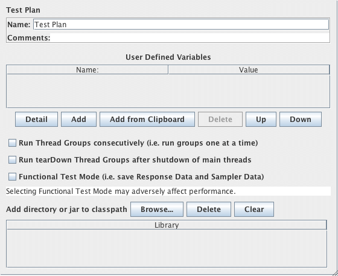](assets/images/testplan_ae5e37768d36168d.png)

Screenshot of Control-Panel of Test Plan

[^](#component_reference)

<a id="component_reference--open_model_thread_group"></a>
<a id="component_reference--open-model-thread-group"></a>

## Open Model Thread Group[¶](#component_reference--open_model_thread_group "Link to here")

This thread group is experimental, and it might change in the future releases. Please provide your feedback on what works and what could be improved.

Open Model Thread Group defines a pool of users that will execute a particular test case against the server.
The users are generated according to the schedule.

The load profile consists of a sequence of constant, increasing or decreasing load.
The basic configuration is rate(1/sec) random\_arrivals(2 min) rate(3/sec) which means the load will increase linearly
from one request per second to three requests per second during a period of two-minutes.
If you omit rate at the end, then it will be set to the same value as that from the start. For example, rate(1/sec) random\_arrivals(2 min) is exactly the same as rate(1/sec) random\_arrivals(2 min) rate(1/sec).
That is why rate(1/sec) random\_arrivals(2 min) random\_arrivals(3 min) rate(4/sec) is exactly the same as
rate(1/sec) random\_arrivals(2 min) rate(1/sec) random\_arrivals(3 min) rate(4/sec), so the load is one request per second during the first two minutes, after which it increases linearly from one request per second to four requests per second during three minutes.

Here are examples for using the schedule:

rate(10/sec) random\_arrivals(1 min) rate(10/sec)
:   constant load rate of ten requests per second during one minute

rate(0) random\_arrivals(1 min) rate(10/sec)
:   linearly increase the load from zero requests per second to ten requests per second during one minute

rate(0) random\_arrivals(1 min) rate(10/sec) random\_arrivals(1 min) rate(10/sec) random\_arrivals(1 min) rate(0)
:   linearly increase the load from zero requests per second to ten requests per second during one minute, then hold the load during one minute,
    then linearly decrease the load from ten requests per second to zero during one minute

rate(10) random\_arrivals(1 min) rate(10/sec) random\_arrivals(1 min) rate(10/sec) random\_arrivals(1 min) rate(0)
:   linearly increase the load from zero requests per second to ten requests per second during one minute, then hold the load during one minute,
    then linearly decrease the load from ten requests per second to zero requests per second during one minute

rate(10) random\_arrivals(1 min) pause(2 sec) random\_arrivals(1 min)
:   run with constant load of ten requests per second during one minute, then make two second pause, then resume the load of ten requests per second for one minute

The following commands are available:

rate(<number>/sec)
:   configures target load rate.
    The following time units are supported: ms, sec, min, hour, day.
    You can omit time unit in case the rate is 0: rate(0)

random\_arrivals(<number> sec)
:   configures random arrivals schedule with the given duration.
    The starting load rate is configured before random\_arrivals, and the finish load rate is configured after random\_arrivals.
    For example, 10 minute test from five requests per second at the beginning to fifteen request per second at the end could be configured as rate(5/sec) random\_arrivals(10 min) rate(15/sec).
    The implicit rate at the beginning of the test is 0. If the finish rate is not provided (or if several random\_arrivals steps go one after another),
    then the load is constant. For instance, rate(3/sec) random\_arrivals(1 min) random\_arrivals(2 min) rate(6/sec) configures
    constant rate of three requests per second for the first minute, and then the load increases from three requests per second to six requests per second during the next two minutes.
    The time units are the same as in rate.

even\_arrivals(<number> sec)
:   configures even arrivals (TODO: not implemented yet). For instance, if the desired load
    is one request per second, then random\_arrivals would lauch samples with exactly one second intervals.

pause(<number> sec)
:   configures a pause for the given duration.
    The rate is restored after the pause, so rate(2/sec) random\_arrivals(5 sec) pause(5 sec) random\_arrivals(5 sec)
    generates random arrivals with two requests per second rate, then a pause for five seconds (no new arrivals), then five more seconds with two requests per second rate.
    Note: pause duration is always honoured, even if all the scenarios are complete, and no new ones will be scheduled.
    For instance, if you use rate(1/sec) random\_arrivals(1 min) pause(1 hour), the thread group would
    always last for sixty-one minutes no matter how much time do individual scenarios take.

/\* Comments \*/
:   can be used to clarify the schedule or temporary disable some steps. Comments
    cannot be nested.

// line comments
:   can be used to clarify the schedule or temporary disable some steps.
    Line comment lasts till the end of the line.

The thread groups terminates threads as soon as the schedule ends. In other words, the threads are interrupted
after all arrivals and pause intervals.
If you want to let the threads complete safely, consider adding pause(5 min) at the end of the schedule.
That will add five minutes for the threads to continue.

There are no special functions for generating the load profile in a loop, however, the default JMeter templating functions
can be helpful for generating the schedule.

For example, the following pattern would generate a sequence of 10 steps where each step lasts 10 seconds: 10/sec, 20/sec, 30/sec, ...
${\_\_groovy((1..10).collect { "rate(" + it\*10 + "/sec) random\_arrivals(10 sec) pause(1 sec)" }.join(" "))}
You can get variables from properties as follows:
rate(${\_\_P(beginRate,40)}) random\_arrivals(${\_\_P(testDuration, 10)} sec) rate(${\_\_P(endRate,40)})

Currently, the load profile is evaluated at the beginning of the test only, so if you use dynamic functions, then only the first result will be used.

[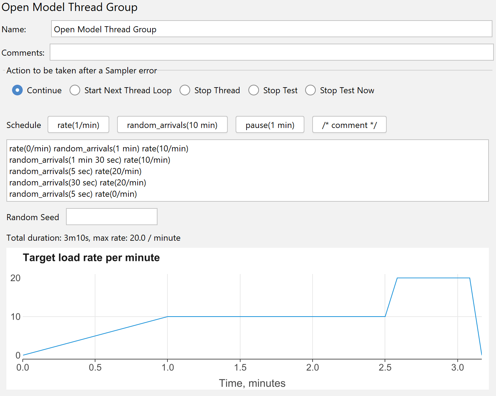](assets/images/open-model-thread-group_724de4295ec79d63.png)

Screenshot of Control-Panel of Open Model Thread Group

<a id="component_reference--open_model_thread_group_parms1"></a>
<a id="component_reference--parameters-119"></a>

### Parameters [¶](#component_reference--open_model_thread_group_parms1 "Link to here")

Attribute

Description

Required

Name

Descriptive name for this thread group that is shown in the tree

No

Schedule

The expression that configures schedule. For example: rate(5/sec) random\_arrivals(1 min) pause(5 sec)

Yes

Random Seed (change from 0 to random)

Note: different thread groups should better have different seed values. Constant seed ensures thread group generates the same delays each test start. The value of "0" means the schedule is truly random (non-repeatable from one execution to another)..

No

[^](#component_reference)

<a id="component_reference--thread_group"></a>
<a id="component_reference--thread-group"></a>

## Thread Group[¶](#component_reference--thread_group "Link to here")

A Thread Group defines a pool of users that will execute a particular test case against your server. In the Thread Group GUI, you can control the number of users simulated (number of threads), the ramp up time (how long it takes to start all the threads), the number of times to perform the test, and optionally, a start and stop time for the test.

See also [tearDown Thread Group](#component_reference--teardown_thread_group) and [setUp Thread Group](#component_reference--setup_thread_group).

When using the scheduler, JMeter runs the thread group until either the number of loops is reached or the duration/end-time is reached - whichever occurs first.
Note that the condition is only checked between samples; when the end condition is reached, that thread will stop.
JMeter does not interrupt samplers which are waiting for a response, so the end time may be delayed arbitrarily.

[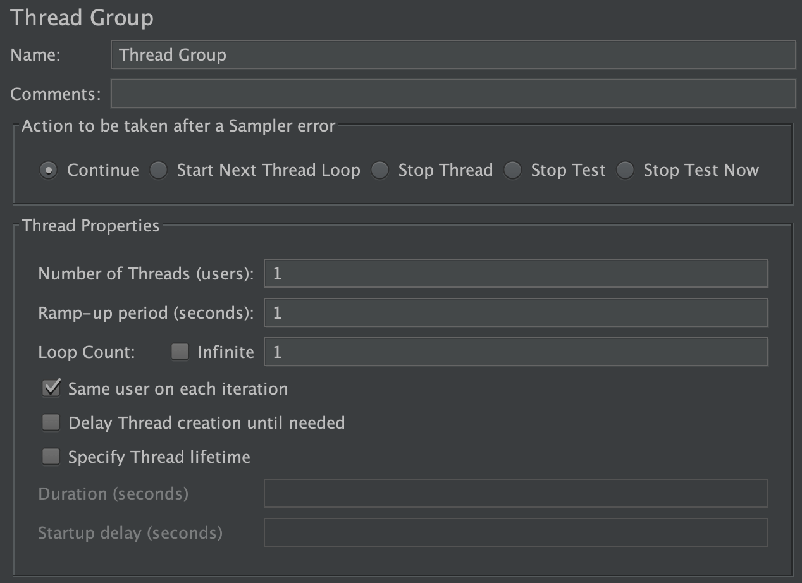](assets/images/threadgroup_5e14ee4632b04786.png)

Screenshot of Control-Panel of Thread Group

Since JMeter 3.0, you can run a selection of Thread Group by selecting them and right clicking. A popup menu will appear:
[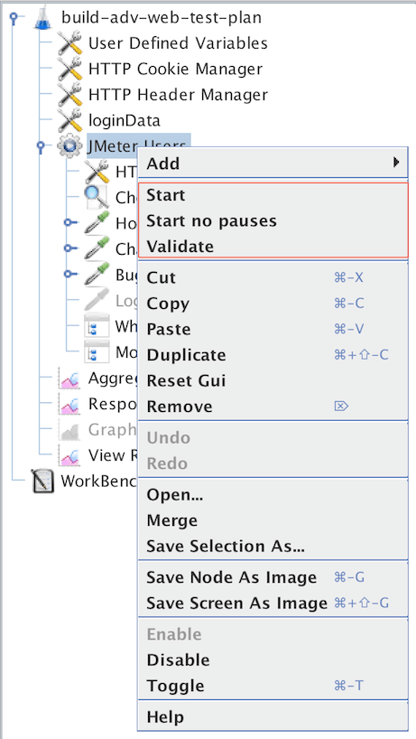](assets/images/threadgroup-popup-menu_43ed4e4f282184f1.png)

Popup menu to start a selection of Thread Groups

Notice you have three options to run the selection of Thread Groups:

Start
:   Start the selected thread groups only

Start no pauses
:   Start the selected thread groups only but without running the timers

Validate
:   Start the selected thread groups only using validation mode. Per default this runs the Thread Group in validation mode (see below)

**Validation Mode:**
This mode enables rapid validation of a Thread Group by running it with one thread, one iteration, no timers and no Startup delay set to 0.
Behaviour can be modified with some properties by setting in user.properties:

testplan\_validation.nb\_threads\_per\_thread\_group
:   Number of threads to use to validate a Thread Group, by default 1

testplan\_validation.ignore\_timers
:   Ignore timers when validating the thread group of plan, by default 1

testplan\_validation.number\_iterations
:   Number of iterations to use to validate a Thread Group

testplan\_validation.tpc\_force\_100\_pct
:   Whether to force Throughput Controller in percentage mode to run as if percentage was 100 %. Defaults to false

<a id="component_reference--thread_group_parms1"></a>
<a id="component_reference--parameters-120"></a>

### Parameters [¶](#component_reference--thread_group_parms1 "Link to here")

Attribute

Description

Required

Name

Descriptive name for this element that is shown in the tree.

Action to be taken after a Sampler error

Determines what happens if a sampler error occurs, either because the sample itself failed or an assertion failed.
The possible choices are:

- Continue - ignore the error and continue with the test
- Start Next Thread Loop - ignore the error, start next loop and continue with the test
- Stop Thread - current thread exits
- Stop Test - the entire test is stopped at the end of any current samples.
- Stop Test Now - the entire test is stopped abruptly. Any current samplers are interrupted if possible.

No

Number of Threads

Number of users to simulate.

Yes

Ramp-up Period

How long JMeter should take to get all the threads started.
If there are 10 threads and a ramp-up time of 100 seconds, then each thread will begin 10 seconds after
the previous thread started, for a total time of 100 seconds to get the test fully up to speed.

The first thread will always start directly, so if you configured **one** thread, the ramp-up time is effectively **zero**. For the same reason, the tenth thread in
the above example will actually be started after 90 seconds and not 100 seconds.

Yes

Same user on each iteration

If selected, cookie and cache data from the first sampler response are used in subsequent requests (requires a global Cookie and Cache Manager respectively).
If not selected, cookie and cache data from the first sampler response are not used in subsequent requests.

If not selected, a new connection will be opened between iterations which will result in increased response times and consume more resources (memory and cpu).

Yes

Loop Count

Number of times to perform the test case. Alternatively, "infinite" can be selected causing the test to run until manually stopped or end of the thread lifetime is reached.

Yes, unless Infinite is selected

Same user on each iteration

If selected, cookie and cache data from the first sampler response are used in subsequent requests (requires a global Cookie and Cache Manager respectively).
If not selected, cookie and cache data from the first sampler response are not used in subsequent requests.

If not selected, a new connection will be opened between iterations which will result in increased response times and consume more resources (memory and cpu).

Yes

Delay Thread creation until needed

If selected, threads are created only when the appropriate proportion of the ramp-up time has elapsed.
This is most appropriate for tests with a ramp-up time that is significantly longer than the time to execute a single thread.
I.e. where earlier threads finish before later ones start.
If not selected, all threads are created when the test starts (they then pause for the appropriate proportion of the ramp-up time).
This is the original default, and is appropriate for tests where threads are active throughout most of the test.

Yes

Specify Thread lifetime

If selected, confines Thread operation time to the given bounds

Yes

Duration (seconds)

If the scheduler checkbox is selected, one can choose a relative end time.
JMeter will use this to calculate the End Time.

No

Startup delay (seconds)

If the scheduler checkbox is selected, one can choose a relative startup delay.
JMeter will use this to calculate the Start Time.

No

[^](#component_reference)

<a id="component_reference--workbench"></a>

## WorkBench[¶](#component_reference--workbench "Link to here")

[^](#component_reference)

<a id="component_reference--ssl_manager"></a>
<a id="component_reference--ssl-manager"></a>

## SSL Manager[¶](#component_reference--ssl_manager "Link to here")

The SSL Manager is a way to select a client certificate so that you can test
applications that use Public Key Infrastructure (PKI).
It is only needed if you have not set up the appropriate System properties.

If you want to test client certificate authentication, see [Keystore Configuration](#component_reference--keystore_configuration)

**Choosing a Client Certificate**

You may either use a Java Key Store (JKS) format key store, or a Public Key
Certificate Standard #12 (PKCS12) file for your client certificates. There
is a feature of the JSSE libraries that require you to have at least a six character
password on your key (at least for the keytool utility that comes with your
JDK).

To select the client certificate, choose Options → SSL Manager from the menu bar.
You will be presented with a file finder that looks for PKCS12 files by default.
Your PKCS12 file must have the extension '.p12' for SSL Manager to recognize it
as a PKCS12 file. Any other file will be treated like an average JKS key store.
If JSSE is correctly installed, you will be prompted for the password. The text
box does not hide the characters you type at this point -- so make sure no one is
looking over your shoulder. The current implementation assumes that the password
for the keystore is also the password for the private key of the client you want
to authenticate as.

Or you can set the appropriate System properties - see the system.properties file.

The next time you run your test, the SSL Manager will examine your key store to
see if it has at least one key available to it. If there is only one key, SSL
Manager will select it for you. If there is more than one key, it currently selects the first key.
There is currently no way to select other entries in the keystore, so the desired key must be the first.

**Things to Look Out For**

You must have your Certificate Authority (CA) certificate installed properly
if it is not signed by one of the five CA certificates that ships with your
JDK. One method to install it is to import your CA certificate into a JKS
file, and name the JKS file "jssecacerts". Place the file in your JRE's
lib/security folder. This file will be read before the "cacerts" file in
the same directory. Keep in mind that as long as the "jssecacerts" file
exists, the certificates installed in "cacerts" will not be used. This may
cause problems for you. If you don't mind importing your CA certificate into
the "cacerts" file, then you can authenticate against all of the CA certificates
installed.

[^](#component_reference)

<a id="component_reference--http-s-_test_script_recorder"></a>
<a id="component_reference--http-s-test-script-recorder-was:-http-proxy-server"></a>

## HTTP(S) Test Script Recorder(was: HTTP Proxy Server )[¶](#component_reference--http-s-_test_script_recorder "Link to here")

The HTTP(S) Test Script Recorder allows JMeter to intercept and record your actions while you browse your web application
with your normal browser. JMeter will create test sample objects and store them
directly into your test plan as you go (so you can view samples interactively while you make them).
Ensure you read this [wiki page](https://cwiki.apache.org/confluence/display/JMETER/TestRecording210) to setup correctly JMeter.

To use the recorder, *add* the HTTP(S) Test Script Recorder element.
Right-click on the Test Plan element to get the Add menu:
(Add → Non-Test Elements → HTTP(S) Test Script Recorder
).

The recorder is implemented as an HTTP(S) proxy server.
You need to set up your browser use the proxy for all HTTP and HTTPS requests.

Do not use JMeter as the proxy for any other request types - FTP, etc. - as JMeter cannot handle them.

Ideally use private browsing mode when recording the session.
This should ensure that the browser starts with no stored cookies, and prevents certain changes from being saved.
For example, Firefox does not allow certificate overrides to be saved permanently.

<a id="component_reference--https-recording-and-certificates"></a>

#### HTTPS recording and certificates

HTTPS connections use certificates to authenticate the connection between the browser and the web server.
When connecting via HTTPS, the server presents the certificate to the browser.
To authenticate the certificate, the browser checks that the server certificate is signed
by a Certificate Authority (CA) that is linked to one of its in-built root CAs.

Browsers also check that the certificate is for the correct host or domain, and that it is valid and not expired.

If any of the browser checks fail, it will prompt the user who can then decide whether to allow the connection to proceed.

JMeter needs to use its own certificate to enable it to intercept the HTTPS connection from
the browser. Effectively JMeter has to pretend to be the target server.

JMeter will generate its own certificate(s).
These are generated with a validity period defined by the property proxy.cert.validity, default 7 days, and random passwords.
If JMeter detects that it is running under Java 8 or later, it will generate certificates for each target server as necessary (dynamic mode)
unless the following property is defined: proxy.cert.dynamic\_keys=false.
When using dynamic mode, the certificate will be for the correct host name, and will be signed by a JMeter-generated CA certificate.
By default, this CA certificate won't be trusted by the browser, however it can be installed as a trusted certificate.
Once this is done, the generated server certificates will be accepted by the browser.
This has the advantage that even embedded HTTPS resources can be intercepted, and there is no need to override the browser checks for each new server.

Browsers don't prompt for embedded resources. So with earlier versions, embedded resources would only be downloaded for servers that were already 'known' to the browser

Unless a keystore is provided (and you define the property proxy.cert.alias), JMeter needs to use the keytool application to create the keystore entries.
JMeter includes code to check that keytool is available by looking in various standard places.
If JMeter is unable to find the keytool application, it will report an error.
If necessary, the system property keytool.directory can be used to tell JMeter where to find keytool.
This should be defined in the file system.properties.

The JMeter certificates are generated (if necessary) when the Start button is pressed.

Certificate generation can take some while, during which time the GUI will be unresponsive.

The cursor is changed to an hour-glass whilst this is happening.
When certificate generation is complete, the GUI will display a pop-up dialogue containing the details of the certificate for the root CA.
This certificate needs to be installed by the browser in order for it to accept the host certificates generated by JMeter; see [below](#component_reference--install_cert) for details.

If necessary, you can force JMeter to regenerate the keystore (and the exported certificates - ApacheJMeterTemporaryRootCA[.usr|.crt]) by deleting the keystore file proxyserver.jks from the JMeter directory.

This certificate is not one of the certificates that browsers normally trust, and will not be for the
correct host.
As a consequence:

- The browser should display a dialogue asking if you want to accept the certificate or not. For example:

```

                                    1) The server's name "www.example.com" does not match the certificate's name
   "_ JMeter Root CA for recording (INSTALL ONLY IF IT S YOURS)". Somebody may be trying to eavesdrop on you.
2) The certificate for "_ JMeter Root CA for recording (INSTALL ONLY IF IT S YOURS)" is signed by the unknown Certificate Authority
   "_ JMeter Root CA for recording (INSTALL ONLY IF IT S YOURS)". It is not possible to verify that this is a valid certificate.

                                
```

  You will need to accept the certificate in order to allow the JMeter Proxy to intercept the SSL traffic in order to
  record it.
  However, do not accept this certificate permanently; it should only be accepted temporarily.
  Browsers only prompt this dialogue for the certificate of the main URL, not for the resources loaded in the page, such as images, CSS or JavaScript files hosted on a secured external CDN.
  If you have such resources (gmail has for example), you'll have to first browse manually to these other domains in order to accept JMeter's certificate for them.
  Check in jmeter.log for secure domains that you need to register certificate for.
- If the browser has already registered a validated certificate for this domain, the browser will detect JMeter as a security breach and will refuse to load the page. If so, you have to remove the trusted certificate from your browser's keystore.

Versions of JMeter from 2.10 onwards still support this method, and will continue to do so if you define the following property:
proxy.cert.alias
The following properties can be used to change the certificate that is used:

- proxy.cert.directory - the directory in which to find the certificate (default = JMeter bin/)
- proxy.cert.file - name of the keystore file (default "proxyserver.jks")
- proxy.cert.keystorepass - keystore password (default "password") [Ignored if using JMeter certificate]
- proxy.cert.keypassword - certificate key password (default "password") [Ignored if using JMeter certificate]
- proxy.cert.type - the certificate type (default "JKS") [Ignored if using JMeter certificate]
- proxy.cert.factory - the factory (default "SunX509") [Ignored if using JMeter certificate]
- proxy.cert.alias - the alias for the key to be used. If this is defined, JMeter does not attempt to generate its own certificate(s).
- proxy.ssl.protocol - the protocol to be used (default "SSLv3")

If your browser currently uses a proxy (e.g. a company intranet may route all external requests via a proxy), then you need to [tell JMeter to use that proxy](#get-started--proxy_server) before starting JMeter, using the [command-line options](#get-started--options) -H and -P.
This setting will also be needed when running the generated test plan.

<a id="component_reference--installing-the-jmeter-ca-certificate-for-https-recording"></a>

#### Installing the JMeter CA certificate for HTTPS recording

As mentioned above, when run under Java 8, JMeter can generate certificates for each server.
For this to work smoothly, the root CA signing certificate used by JMeter needs to be trusted by the browser.
The first time that the recorder is started, it will generate the certificates if necessary.
The root CA certificate is exported into a file with the name ApacheJMeterTemporaryRootCA in the current launch directory.
When the certificates have been set up, JMeter will show a dialog with the current certificate details.
At this point, the certificate can be imported into the browser, as per the instructions below.

Note that once the root CA certificate has been installed as a trusted CA, the browser will trust any certificates signed by it.
Until such time as the certificate expires or the certificate is removed from the browser, it will not warn the user that the certificate is being relied upon.
So anyone that can get hold of the keystore and password can use the certificate to generate certificates which will be accepted
by any browsers that trust the JMeter root CA certificate.
For this reason, the password for the keystore and private keys are randomly generated and a short validity period used.
The passwords are stored in the local preferences area.
Please ensure that only trusted users have access to the host with the keystore.

The popup that displays once you start the Recorder is an informational popup:
[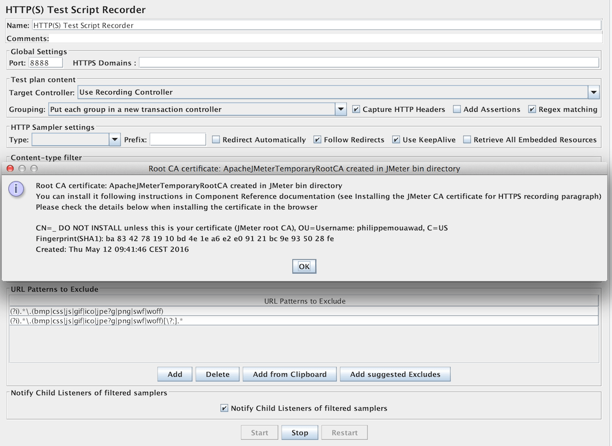](assets/images/recorder-popup-info_be90df7ccba556bc.png)

Recorder Install Certificate Popup

Just click ok and proceed further.

<a id="component_reference--installing-the-certificate-in-firefox"></a>

##### Installing the certificate in Firefox

Choose the following options:

- Tools / Options
- Advanced / Certificates
- View Certificates
- Authorities
- Import …
- Browse to the JMeter launch directory, and click on the file ApacheJMeterTemporaryRootCA.crt, press Open
- Click View and check that the certificate details agree with the ones displayed by the JMeter Test Script Recorder
- If OK, select "Trust this CA to identify web sites", and press OK
- Close dialogs by pressing OK as necessary

<a id="component_reference--installing-the-certificate-in-chrome-or-internet-explorer"></a>

##### Installing the certificate in Chrome or Internet Explorer

Both Chrome and Internet Explorer use the same trust store for certificates.

- Browse to the JMeter launch directory, and click on the file ApacheJMeterTemporaryRootCA.crt, and open it
- Click on the "Details" tab and check that the certificate details agree with the ones displayed by the JMeter Test Script Recorder
- If OK, go back to the "General" tab, and click on "Install Certificate …" and follow the Wizard prompts

<a id="component_reference--installing-the-certificate-in-opera"></a>

##### Installing the certificate in Opera

- Tools / Preferences / Advanced / Security
- Manage Certificates …
- Select "Intermediate" tab, click "Import …"
- Browse to the JMeter launch directory, and click on the file ApacheJMeterTemporaryRootCA.usr, and open it

[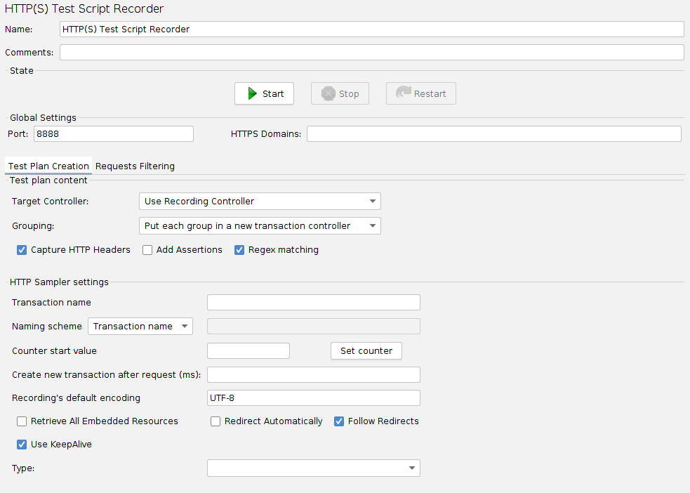](assets/images/proxy-control_4bc0ab774bc66b5b.png)

Screenshot of Control-Panel of HTTP(S) Test Script Recorder

<a id="component_reference--http-s-_test_script_recorder_parms1"></a>
<a id="component_reference--parameters-121"></a>

### Parameters [¶](#component_reference--http-s-_test_script_recorder_parms1 "Link to here")

Attribute

Description

Required

Name

Descriptive name for this element that is shown in the tree.

No

Port

The port that the HTTP(S) Test Script Recorder listens to. 8888 is the default, but you can change it.

Yes

HTTPS Domains

List of domain (or host) names for HTTPS. Use this to pre-generate certificates for all servers you wish to record.
For example, \*.example.com,\*.subdomain.example.com
Note that wildcard domains only apply to one level, i.e. abc.subdomain.example.com matches \*.subdomain.example.com but not \*.example.com

No

Target Controller

The controller where the proxy will store the generated samples. By default, it will look for a Recording Controller and store them there wherever it is.

Yes

Grouping

Whether to group samplers for requests from a single "click" (requests received without significant time separation), and how to represent that grouping in the recording:

- Do not group samplers - store all recorded samplers sequentially, without any grouping.
- Add separators between groups - add a controller named "--------------" to create a visual separation between the groups. Otherwise the samplers are all stored sequentially.
- Put each group in a new controller - create a new [Simple Controller](#component_reference--simple_controller) for each group, and store all samplers for that group in it.
- Store 1st sampler of each group only - only the first request in each group will be recorded. The "Follow Redirects" and "Retrieve All Embedded Resources …" flags will be turned on in those samplers.
- Put each group in a new transaction controller - create a new [Transaction Controller](#component_reference--transaction_controller) for each group, and store all samplers for that group in it.

The property proxy.pause determines the minimum gap that JMeter needs between requests
to treat them as separate "clicks". The default is 5000 (milliseconds) i.e. 5 seconds.
If you are using grouping, please ensure that you leave the required gap between clicks.

Yes

Capture HTTP Headers

Should headers be added to the plan?
If specified, a Header Manager will be added to each HTTP Sampler.
The Proxy server always removes Cookie and Authorization headers from the generated Header Managers.
By default it also removes If-Modified-Since and If-None-Match headers.
These are used to determine if the browser cache items are up to date;
when recording one normally wants to download all the content.
To change which additional headers are removed, define the JMeter property proxy.headers.remove
as a comma-separated list of headers.

Yes

Add Assertions

Add a blank assertion to each sampler?

Yes

Regex Matching

Use Regex Matching when replacing variables? If checked replacement will use word boundaries, i.e. it will only replace word matching values of variable, not part of a word. A word boundary follows Perl5 definition and is equivalent to \b. More information below in the paragraph about "User Defined Variable replacement".

Yes

Prefix/Transaction name

Add a prefix to sampler name during recording (Prefix mode). Or replace sampler name by user chosen name (Transaction name)

No

Naming scheme

Select the naming scheme for sampler names during recording. Default is Transaction name

No

Naming format

If Use format string is selected as naming scheme, a freestyle format can be given. Placeholders for the transaction name, scheme, host, port, path and counter can be given by #{name}, #{scheme}, #{host}, #{port}, #{path}, #{url} and #{counter}. A simple format could be "#{name}-#{counter}", which would be equivalent to the numbered default naming scheme. For more complex formatting Java formatting for MessageFormat can be used, as in "#{counter,number,000}: #{name}-#{path}", which would print the counter filled with up to three zeroes. Note that scheme is called protocol in the sampler GUI and host is called domain. Default is an empty string.

No

Counter start value

Can be used to reset the counter to a given value. Note, that the next sample will first increment and then use the value. If the first sampler should start with 1, reset the counter to 0.

No

Create new transaction after request (ms)

Inactivity time between two requests needed to consider them in two separate groups.

No

Type

Which type of sampler to generate (the HTTPClient default or Java)

Yes

Redirect Automatically

Set Redirect Automatically in the generated samplers?

Yes

Follow Redirects

Set Follow Redirects in the generated samplers?

Note: see "Recording and redirects" section below for important information.

Yes

Use Keep-Alive

Set Use Keep-Alive in the generated samplers?

Yes

Retrieve all Embedded Resources

Set Retrieve all Embedded Resources in the generated samplers?

Yes

Content Type filter

Filter the requests based on the content-type - e.g. "text/html [;charset=utf-8 ]".
The fields are regular expressions which are checked to see if they are contained in the content-type.
[Does not have to match the entire field].
The include filter is checked first, then the exclude filter.
Samples which are filtered out will not be stored.

Note: this filtering is applied to the content type of the response

No

Patterns to Include

Regular expressions that are matched against the full URL that is sampled. Allows filtering of requests that are recorded. All requests pass through, but only
those that meet the requirements of the Include/Exclude fields are *recorded*. If both Include and Exclude are
left empty, then everything is recorded (which can result in dozens of samples recorded for each page, as images, stylesheets, etc. are recorded).

If there is at least one entry in the Include field, then only requests that match one or more Include patterns are
recorded

.

No

Patterns to Exclude

Regular expressions that are matched against the URL that is sampled.

Any requests that match one or more Exclude pattern are *not* recorded

.

No

Notify Child Listeners of filtered samplers

Notify Child Listeners of filtered samplers

Any response that match one or more Exclude pattern is *not* delivered to Child Listeners (View Results Tree)

.

No

Start Button

Start the proxy server. JMeter writes the following message to the console once the proxy server has started up and is ready to take requests: "Proxy up and running!".

N/A

Stop Button

Stop the proxy server.

N/A

Restart Button

Stops and restarts the proxy server. This is
useful when you change/add/delete an include/exclude filter expression.

N/A

<a id="component_reference--recording-and-redirects"></a>

#### Recording and redirects

During recording, the browser will follow a redirect response and generate an additional request.
The Proxy will record both the original request and the redirected request
(subject to whatever exclusions are configured).
The generated samples have "Follow Redirects" selected by default, because that is generally better.

Redirects may depend on the original request, so repeating the originally recorded sample may not always work.

Now if JMeter is set to follow the redirect during replay, it will issue the original request, and then replay the redirect request that was recorded.
To avoid this duplicate replay, JMeter tries to detect when a sample is the result of a previous
redirect. If the current response is a redirect, JMeter will save the redirect URL.
When the next request is received, it is compared with the saved redirect URL and if there is a match, JMeter will disable the generated sample. It also adds comments to the redirect chain.
This assumes that all the requests in a redirect chain will follow each other without any intervening requests.
To disable the redirect detection, set the property proxy.redirect.disabling=false

<a id="component_reference--includes-and-excludes"></a>

#### Includes and Excludes

The **include and exclude patterns** are treated as regular expressions (using Jakarta ORO).
They will be matched against the host name, port (actual or implied), path and query (if any) of each browser request.
If the URL you are browsing is
"http://localhost/jmeter/index.html?username=xxxx", then the regular expression will be tested against the string:
"localhost:80/jmeter/index.html?username=xxxx".
Thus, if you want to include all .html files, your regular expression might look like:
".\*\.html(\?.\*)?" - or ".\*\.html
if you know that there is no query string or you only want html pages without query strings.

If there are any include patterns, then the URL **must match at least one** of the patterns
, otherwise it will not be recorded.
If there are any exclude patterns, then the URL **must not match any** of the patterns
, otherwise it will not be recorded.
Using a combination of includes and excludes, you should be able to record what you are interested in and skip what you are not.

N.B. the string that is matched by the regular expression must be the same as the **whole** host+path string.
Thus "\.html" will **not** match localhost:80/index.html

<a id="component_reference--capturing-binary-post-data"></a>

#### Capturing binary POST data

JMeter is able to capture binary POST data.
To configure which content-types are treated as binary, update the JMeter property proxy.binary.types.
The default settings are as follows:

```

# These content-types will be handled by saving the request in a file:
proxy.binary.types=application/x-amf,application/x-java-serialized-object
# The files will be saved in this directory:
proxy.binary.directory=user.dir
# The files will be created with this file filesuffix:
proxy.binary.filesuffix=.binary
```

<a id="component_reference--adding-timers"></a>

#### Adding timers

It is also possible to have the proxy add timers to the recorded script. To
do this, create a timer directly within the HTTP(S) Test Script Recorder component.
The proxy will place a copy of this timer into each sample it records, or into
the first sample of each group if you're using grouping. This copy will then be
scanned for occurrences of variable ${T} in its properties, and any such
occurrences will be replaced by the time gap from the previous sampler
recorded (in milliseconds).

When you are ready to begin, hit "start".

You will need to edit the proxy settings of your browser to point at the
appropriate server and port, where the server is the machine JMeter is running on, and
the port # is from the Proxy Control Panel shown above.

<a id="component_reference--where-do-samples-get-recorded"></a>

#### Where Do Samples Get Recorded?

JMeter places the recorded samples in the Target Controller you choose. If you choose the default option
"Use Recording Controller", they will be stored in the first Recording Controller found in the test object tree (so be
sure to add a Recording Controller before you start recording).

If the Proxy does not seem to record any samples, this could be because the browser is not actually using the proxy.
To check if this is the case, try stopping the proxy.
If the browser still downloads pages, then it was not sending requests via the proxy.
Double-check the browser options.
If you are trying to record from a server running on the same host, then check that the browser is not set to "Bypass proxy server for local addresses"
(this example is from IE7, but there will be similar options for other browsers).
If JMeter does not record browser URLs such as http://localhost/ or http://127.0.0.1/, try using the non-loopback hostname or IP address, e.g. http://myhost/ or http://192.168.0.2/.

<a id="component_reference--handling-of-http-request-defaults"></a>

#### Handling of HTTP Request Defaults

If the HTTP(S) Test Script Recorder finds enabled [HTTP Request Defaults](#component_reference--http_request_defaults) directly within the
controller where samples are being stored, or directly within any of its parent controllers, the recorded samples
will have empty fields for the default values you specified. You may further control this behaviour by placing an
HTTP Request Defaults element directly within the HTTP(S) Test Script Recorder, whose non-blank values will override
those in the other HTTP Request Defaults. See  [Best
Practices with the HTTP(S) Test Script Recorder](#best-practices--proxy_server) for more info.

<a id="component_reference--user-defined-variable-replacement"></a>

#### User Defined Variable replacement

Similarly, if the HTTP(S) Test Script Recorder finds [User Defined Variables](#component_reference--user_defined_variables) (UDV) directly within the
controller where samples are being stored, or directly within any of its parent controllers, the recorded samples
will have any occurrences of the values of those variables replaced by the corresponding variable. Again, you can
place User Defined Variables directly within the HTTP(S) Test Script Recorder to override the values to be replaced. See
 [Best Practices with the Test Script Recorder](#best-practices--proxy_server) for more info.

Please note that matching is case-sensitive.

Replacement by Variables: by default, the Proxy server looks for all occurrences of UDV values.
If you define the variable WEB with the value www, for example, the string www will be replaced by ${WEB} wherever it is found.
To avoid this happening everywhere, set the "Regex Matching" check-box.
This tells the proxy server to treat values as Regexes (using the perl5 compatible regex matchers provided by ORO).

If "Regex Matching" is selected every variable will be compiled into a perl compatible regex enclosed in
\b( and )\b. That way each match will start and end at a word boundary.

Note that the boundary characters are not part of the matching group, e.g. n.\* to match name out
of You can call me 'name'.

If you don't want your regex to be enclosed with those boundary matchers, you have to enclose your
regex within parens, e.g ('.\*?') to match 'name' out of You can call me 'name'.

The variables will be checked in random order. So ensure, that the potential matches don't overlap.
Overlapping matchers would be .\* (which matches anything) and www (which
matches www only). Non-overlapping matchers would be a+ (matches a sequence
of a's) and b+ (matches a sequence of b's).

If you want to match a whole string only, enclose it in (^ and $), e.g. (^thus$).
The parens are necessary, since the normally added boundary characters will prevent ^ and
$ to match.

If you want to match /images at the start of a string only, use the value (^/images).
Jakarta ORO also supports zero-width look-ahead, so one can match /images/…
but retain the trailing / in the output by using (^/images(?=/)).

Note that the current version of Jakarta ORO does not support look-behind - i.e. (?<=…) or (?<!…).

Look out for overlapping matchers. For example the value .\* as a regex in a variable named
regex will partly match a previous replaced variable, which will result in something like
${{regex}, which is most probably not the desired result.

If there are any problems interpreting any variables as patterns, these are reported in jmeter.log, so be sure to check this if UDVs are not working as expected.

When you are done recording your test samples, stop the proxy server (hit the "stop" button). Remember to reset
your browser's proxy settings. Now, you may want to sort and re-order the test script, add timers, listeners, a
cookie manager, etc.

<a id="component_reference--how-can-i-record-the-server-s-responses-too"></a>

#### How can I record the server's responses too?

Just place a [View Results Tree](#component_reference--view_results_tree) listener as a child of the HTTP(S) Test Script Recorder and the responses will be displayed.
You can also add a [Save Responses to a file](#component_reference--save_responses_to_a_file) Post-Processor which will save the responses to files.

<a id="component_reference--associating-requests-with-responses"></a>

#### Associating requests with responses

If you define the property proxy.number.requests=true
JMeter will add a number to each sampler and each response.
Note that there may be more responses than samplers if excludes or includes have been used.
Responses that have been excluded will have labels enclosed in [ and ], for example [23 /favicon.ico]

<a id="component_reference--cookie-manager"></a>

#### Cookie Manager

If the server you are testing against uses cookies, remember to add an [HTTP Cookie Manager](#component_reference--http_cookie_manager) to the test plan
when you have finished recording it.
During recording, the browser handles any cookies, but JMeter needs a Cookie Manager
to do the cookie handling during a test run.
The JMeter Proxy server passes on all cookies sent by the browser during recording, but does not save them to the test
plan because they are likely to change between runs.

<a id="component_reference--authorization-manager"></a>

#### Authorization Manager

The HTTP(S) Test Script Recorder grabs "Authentication" header, tries to compute the Auth Policy. If Authorization Manager was added to target
controller manually, HTTP(S) Test Script Recorder will find it and add authorization (matching ones will be removed). Otherwise
Authorization Manager will be added to target controller with authorization object.
You may have to fix automatically computed values after recording.

<a id="component_reference--uploading-files"></a>

#### Uploading files

Some browsers (e.g. Firefox and Opera) don't include the full name of a file when uploading files.
This can cause the JMeter proxy server to fail.
One solution is to ensure that any files to be uploaded are in the JMeter working directory, either by copying the files there or by starting JMeter in the directory containing the files.

<a id="component_reference--recording-http-based-non-textual-protocols-not-natively-available-in-jmeter"></a>

#### Recording HTTP Based Non Textual Protocols not natively available in JMeter

You may have to record an HTTP protocol that is not handled by default by JMeter (Custom Binary Protocol, Adobe Flex, Microsoft Silverlight, … ).
Although JMeter does not provide a native proxy implementation to record these protocols, you have the ability to
record these protocols by implementing a custom SamplerCreator. This Sampler Creator will translate the binary format into a HTTPSamplerBase subclass
that can be added to the JMeter Test Case.
For more details see "Extending JMeter".

[^](#component_reference)

<a id="component_reference--http_mirror_server"></a>
<a id="component_reference--http-mirror-server"></a>

## HTTP Mirror Server[¶](#component_reference--http_mirror_server "Link to here")

The HTTP Mirror Server is a very simple HTTP server - it simply mirrors the data sent to it.
This is useful for checking the content of HTTP requests.

It uses default port 8081.

[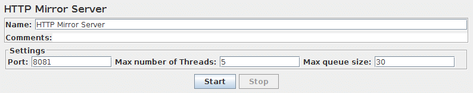](assets/images/mirrorserver_3072b17345f28846.png)

Screenshot of Control-Panel of HTTP Mirror Server

<a id="component_reference--http_mirror_server_parms1"></a>
<a id="component_reference--parameters-122"></a>

### Parameters [¶](#component_reference--http_mirror_server_parms1 "Link to here")

Attribute

Description

Required

Port

Port on which Mirror server listens, defaults to 8081.

Yes

Max Number of threads

If set to a value > 0, number of threads serving requests will be limited to the configured number, if set to a value ≤ 0
a new thread will be created to serve each incoming request. Defaults to 0

No

Max Queue size

Size of queue used for holding tasks before they are executed by Thread Pool, when Thread pool is exceeded, incoming requests will
be held in this queue and discarded when this queue is full. This parameter is only used if Max Number of Threads is greater than 0. Defaults to 25

No

Note that you can get more control over the responses by adding an HTTP Header Manager with the following name/value pairs:

<a id="component_reference--http_mirror_server_parms2"></a>
<a id="component_reference--parameters-123"></a>

### Parameters [¶](#component_reference--http_mirror_server_parms2 "Link to here")

Attribute

Description

Required

X-Sleep

Time to sleep in ms before sending response

No

X-SetCookie

Cookies to be set on response

No

X-ResponseStatus

Response status, see [HTTP Status responses](http://www.w3.org/Protocols/rfc2616/rfc2616-sec10.html), example 200 OK, 500 Internal Server Error, ….

No

X-ResponseLength

Size of response, this trims the response to the requested size if that is less than the total size

No

X-SetHeaders

Pipe separated list of headers, example:
headerA: valueA|headerB: valueB would set headerA to valueA and headerB to valueB.

No

You can also use the following query parameters:

<a id="component_reference--http_mirror_server_parms3"></a>
<a id="component_reference--parameters-124"></a>

### Parameters [¶](#component_reference--http_mirror_server_parms3 "Link to here")

Attribute

Description

Required

redirect

Generates a 302 (Temporary Redirect) with the provided location, e.g. ?redirect=/path

No

status

Overrides the default status return, e.g. ?status=404 Not Found

No

v

Verbose flag, writes some details to standard output, e.g. first line and redirect location if specified

No

[^](#component_reference)

<a id="component_reference--property_display"></a>
<a id="component_reference--property-display"></a>

## Property Display[¶](#component_reference--property_display "Link to here")

The Property Display shows the values of System or JMeter properties.
Values can be changed by entering new text in the Value column.

[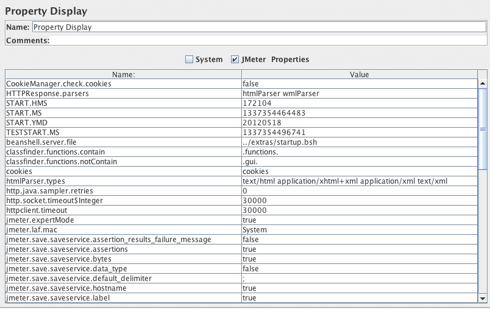](assets/images/property-display_a025d6a89cefcb97.png)

Screenshot of Control-Panel of Property Display

<a id="component_reference--property_display_parms1"></a>
<a id="component_reference--parameters-125"></a>

### Parameters [¶](#component_reference--property_display_parms1 "Link to here")

Attribute

Description

Required

Name

Descriptive name for this element that is shown in the tree.

No

[^](#component_reference)

<a id="component_reference--debug_sampler"></a>
<a id="component_reference--debug-sampler"></a>

## Debug Sampler[¶](#component_reference--debug_sampler "Link to here")

The Debug Sampler generates a sample containing the values of all JMeter variables and/or properties.

The values can be seen in the [View Results Tree](#component_reference--view_results_tree) Listener Response Data pane.

[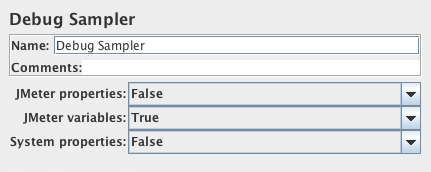](assets/images/debug-sampler_76e30410bb382240.png)

Screenshot of Control-Panel of Debug Sampler

<a id="component_reference--debug_sampler_parms1"></a>
<a id="component_reference--parameters-126"></a>

### Parameters [¶](#component_reference--debug_sampler_parms1 "Link to here")

Attribute

Description

Required

Name

Descriptive name for this element that is shown in the tree.

No

JMeter Properties

Include JMeter properties?

Yes

JMeter Variables

Include JMeter variables?

Yes

System Properties

Include System properties?

Yes

[^](#component_reference)

<a id="component_reference--debug_postprocessor"></a>
<a id="component_reference--debug-postprocessor"></a>

## Debug PostProcessor[¶](#component_reference--debug_postprocessor "Link to here")

The Debug PostProcessor creates a subSample with the details of the previous Sampler properties, JMeter variables, properties and/or System Properties.

The values can be seen in the [View Results Tree](#component_reference--view_results_tree) Listener Response Data pane.

[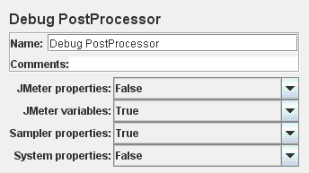](assets/images/debug-postprocessor_49f4e8133c0afcae.png)

Screenshot of Control-Panel of Debug PostProcessor

<a id="component_reference--debug_postprocessor_parms1"></a>
<a id="component_reference--parameters-127"></a>

### Parameters [¶](#component_reference--debug_postprocessor_parms1 "Link to here")

Attribute

Description

Required

Name

Descriptive name for this element that is shown in the tree.

No

JMeter Properties

Whether to show JMeter properties (default false).

Yes

JMeter Variables

Whether to show JMeter variables (default false).

Yes

Sampler Properties

Whether to show Sampler properties (default true).

Yes

System Properties

Whether to show System properties (default false).

Yes

[^](#component_reference)

<a id="component_reference--test_fragment"></a>
<a id="component_reference--test-fragment"></a>

## Test Fragment[¶](#component_reference--test_fragment "Link to here")

The Test Fragment is used in conjunction with the [Include Controller](#component_reference--include_controller) and [Module Controller](#component_reference--module_controller).

[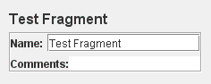](assets/images/test-fragment_d990bda0cc82542b.png)

Screenshot of Control-Panel of Test Fragment

<a id="component_reference--test_fragment_parms1"></a>
<a id="component_reference--parameters-128"></a>

### Parameters [¶](#component_reference--test_fragment_parms1 "Link to here")

Attribute

Description

Required

Name

Descriptive name for this element that is shown in the tree.

Yes

When using Test Fragment with [Module Controller](#component_reference--module_controller), ensure you disable the Test Fragment to avoid the execution of Test Fragment itself.
This is done by default since JMeter 2.13.

[^](#component_reference)

<a id="component_reference--setup_thread_group"></a>
<a id="component_reference--setup-thread-group"></a>

## setUp Thread Group[¶](#component_reference--setup_thread_group "Link to here")

A special type of ThreadGroup that can be utilized to perform Pre-Test Actions. The behavior of these threads
is exactly like a normal [Thread Group](#component_reference--thread_group) element. The difference is that these type of threads
execute before the test proceeds to the executing of regular Thread Groups.

[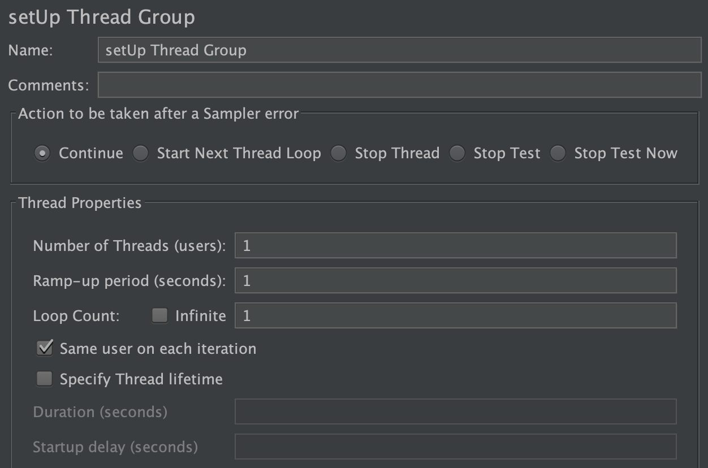](assets/images/setup-thread-group_56ef549d2c0dce58.png)

Screenshot of Control-Panel of setUp Thread Group

[^](#component_reference)

<a id="component_reference--teardown_thread_group"></a>
<a id="component_reference--teardown-thread-group"></a>

## tearDown Thread Group[¶](#component_reference--teardown_thread_group "Link to here")

A special type of ThreadGroup that can be utilized to perform Post-Test Actions. The behavior of these threads
is exactly like a normal [Thread Group](#component_reference--thread_group) element. The difference is that these type of threads
execute after the test has finished executing its regular Thread Groups.

[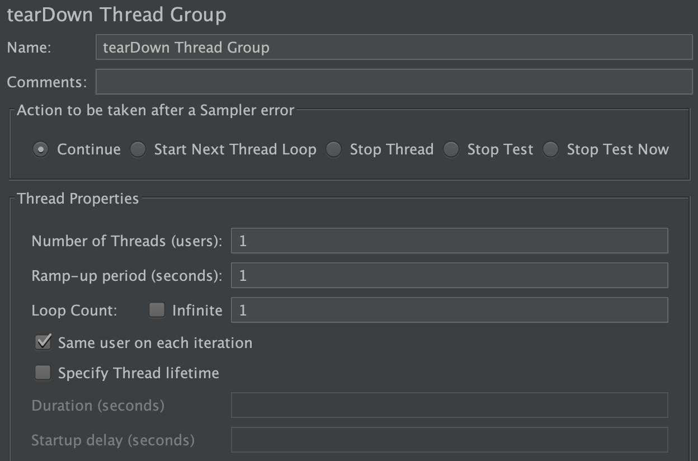](assets/images/teardown-thread-group_8a30b19a89b64d38.png)

Screenshot of Control-Panel of tearDown Thread Group

Note that by default it won't run if Test is gracefully shutdown, if you want to make it run in this case, ensure you check option "Run tearDown Thread Groups after shutdown of main threads" on Test Plan element.
If Test Plan is stopped, tearDown will not run even if option is checked.

[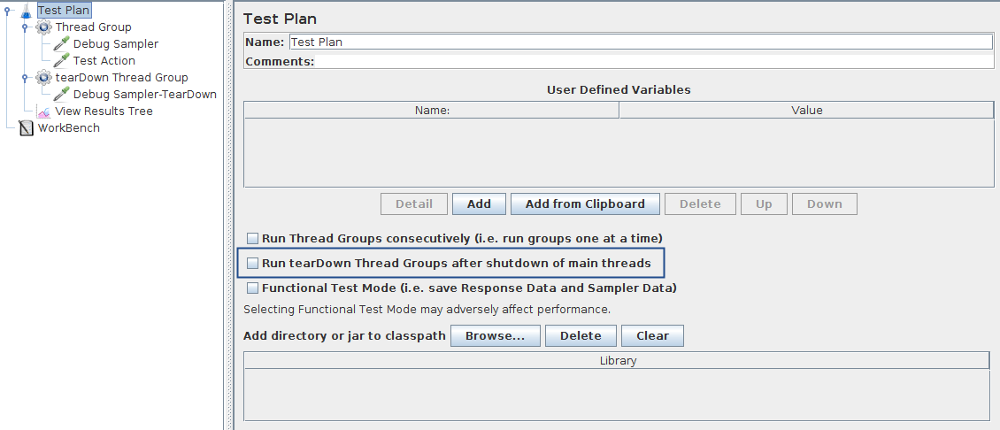](assets/images/tear-down-on-shutdown_bfd018a656d11dd4.png)

Figure 1 - Run tearDown Thread Groups after shutdown of main threads

[^](#component_reference)

[^](#component_reference)

- [< Prev](#boss)
- [Index](https://jmeter.apache.org/index.html)
- [Next >](#properties_reference)

Share this page:

- share
- tweet

[Go to top](#component_reference--top)

---

<a id="functions"></a>

<!-- source_url: https://jmeter.apache.org/usermanual/functions.html -->

<!-- page_index: 5 -->

<a id="functions--functions"></a>
<a id="functions--20.5-functions"></a>

## 20.5 Functions[¶](#functions--functions "Link to here")

<a id="functions--__regexfunction"></a>

## \_\_regexFunction[¶](#functions--__regexfunction "Link to here")

The Regex Function is used to parse the previous response (or the value of a variable) using any regular
expression (provided by user). The function returns the template string with variable values filled
in.

The \_\_regexFunction can also store values for future use. In the sixth parameter, you can specify
a reference name. After this function executes, the same values can be retrieved at later times
using the syntax for user-defined values. For instance, if you enter "refName" as the sixth
parameter you will be able to use:

- ${refName} to refer to the computed result of the second parameter ("Template for the
  replacement string") parsed by this function
- ${refName\_g0} to refer to the entire match parsed by this function.
- ${refName\_g1} to refer to the first group parsed by this function.
- ${refName\_g#} to refer to the nth group parsed by this function.
- ${refName\_matchNr} to refer to the number of groups found by this function.

If using distributed testing, ensure you switch mode (see jmeter.properties) so that it's not a stripping one, see [Bug
56376](https://bz.apache.org/bugzilla/show_bug.cgi?id=56376)

<a id="functions--__regexfunction_parms1"></a>
<a id="functions--parameters"></a>

### Parameters [¶](#functions--__regexfunction_parms1 "Link to here")

Attribute

Description

Required

First argument

The first argument is the regular expression
to be applied to the response data. It will grab all matches. Any parts of this expression
that you wish to use in your template string, be sure to surround in parentheses. Example:
<a href="(.\*)">. This will grab the value of the link and store it as the first group (there is
only 1 group). Another example: <input type="hidden" name="(.\*)" value="(.\*)">. This will
grab the name as the first group, and the value as the second group. These values can be used
in your template string

Yes

Second argument

This is the template string that will replace
the function at run-time. To refer to a group captured in the regular expression, use the syntax:
$[group\_number]$. I.e.: $1$, or $2$. Your template can be any string.

Yes

Third argument

The third argument tells JMeter which match
to use. Your regular expression might find numerous matches. You have four choices:

- An integer - Tells JMeter to use that match. '1' for the first found match, '2' for the
  second, and so on
- RAND - Tells JMeter to choose a match at random.
- ALL - Tells JMeter to use all matches, and create a template string for each one and then
  append them all together. This option is little used.
- A float number between 0 and 1 - tells JMeter to find the Xth match using the formula:
  (number\_of\_matches\_found \* float\_number) rounded to nearest integer.

No, default=1

Fourth argument

If 'ALL' was selected for the above argument
value, then this argument will be inserted between each appended copy of the template value.

No

Fifth argument

Default value returned if no match is found

No

Sixth argument

A reference name for reusing the values parsed by this function.
Stored values are ${refName} (the replacement template string) and ${refName\_g#} where "#" is the
group number from the regular expression ("0" can be used to refer to the entire match).

No

Seventh argument

Input variable name.
If specified, then the value of the variable is used as the input instead of using the previous sample result.

No

[^](#functions)

<a id="functions--__counter"></a>

## \_\_counter[¶](#functions--__counter "Link to here")

The counter generates a new number each time it is called, starting with 1
and incrementing by +1 each time. The counter can be configured to keep each simulated user's values
separate, or to use the same counter for all users. If each user's values is incremented separately, that is like counting the number of iterations through the test plan. A global counter is like
counting how many times that request was run.

The counter uses an integer variable to hold the count, which therefore has a maximum of 2,147,483,647.

The counter function instances are completely independent.
The global counter - "FALSE" - is separately maintained by each counter instance.

**Multiple \_\_counter function calls in the same iteration won't increment the value further.**
If you want to have a count that increments for each sample, use the function in a Pre-Processor such as [User Parameters](#component_reference--user_parameters).

<a id="functions--__counter_parms1"></a>
<a id="functions--parameters-2"></a>

### Parameters [¶](#functions--__counter_parms1 "Link to here")

Attribute

Description

Required

First argument

TRUE if you wish each simulated user's counter
to be kept independent and separate from the other users. FALSE for a global counter.

Yes

Second argument

A reference name for reusing the value created by this function.
Stored values are of the form ${refName}. This allows you to keep one counter and refer to its value in
multiple places.

No

[^](#functions)

<a id="functions--__threadnum"></a>

## \_\_threadNum[¶](#functions--__threadnum "Link to here")

The thread number function simply returns the number of the thread currently
being executed. These numbers are only locally unique with respect to their ThreadGroup, meaning thread #1 in one threadgroup
is indistinguishable from thread #1 in another threadgroup, from the point of view of this function.

The function returns a number between one and the max number of running threads. Note that if you're using
JSR223 code with [JMeterContext](https://jmeter.apache.org/api/org/apache/jmeter/threads/JMeterContext.html) object (ctx variable), the below code returns a number between zero and (max number of running threads minus one)

```
ctx.getThreadNum()
```

There are no arguments for this function.

Usage Example:

```
${__threadNum}
```

returns a number between 1 and the max number of running threads configured in the containing Thread Group

This function does not work in any Configuration elements (e.g. User Defined Variables) as these are run from a separate thread.
Nor does it make sense to use it on the Test Plan.

[^](#functions)

<a id="functions--__threadgroupname"></a>

## \_\_threadGroupName[¶](#functions--__threadgroupname "Link to here")

The thread group name function simply returns the name of the thread group
being executed.

There are no arguments for this function.

Usage Example:

```
${__threadGroupName}
```

This function does not work in any Configuration elements (e.g. User Defined Variables) as these are run from a separate thread.
Nor does it make sense to use it on the Test Plan.

[^](#functions)

<a id="functions--__intsum"></a>

## \_\_intSum[¶](#functions--__intsum "Link to here")

The intSum function can be used to compute the sum of two or more integer values.

The reference name is optional, but it must not be a valid integer.

<a id="functions--__intsum_parms1"></a>
<a id="functions--parameters-3"></a>

### Parameters [¶](#functions--__intsum_parms1 "Link to here")

Attribute

Description

Required

First argument

The first int value.

Yes

Second argument

The second int value.

Yes

nth argument

The nth int value.

No

last argument

A reference name for reusing the value computed by this function.
If specified, the reference name must contain at least one non-numeric character otherwise it will
be treated as another int value to be added.

No

Examples:

```
${__intSum(2,5,MYVAR)}
```

will return 7 (2+5) and store the result in MYVAR variable. So ${MYVAR} will be equal to 7.

```
${__intSum(2,5,7)}
```

will return 14 (2+5+7) and store the result in MYVAR variable.

```
${__intSum(1,2,5,${MYVAR})}
```

will return 16 if MYVAR value is equal to 8, 1+2+5+${MYVAR})

[^](#functions)

<a id="functions--__longsum"></a>

## \_\_longSum[¶](#functions--__longsum "Link to here")

The longSum function can be used to compute the sum of two or more long values, use this instead of \_\_intSum whenever you know your values will not
be in the interval -2147483648 to 2147483647.

<a id="functions--__longsum_parms1"></a>
<a id="functions--parameters-4"></a>

### Parameters [¶](#functions--__longsum_parms1 "Link to here")

Attribute

Description

Required

First argument

The first long value.

Yes

Second argument

The second long value.

Yes

nth argument

The nth long value.

No

last argument

A reference name for reusing the value computed by this function.
If specified, the reference name must contain at least one non-numeric character otherwise it will
be treated as another long value to be added.

No

Examples:

```
${__longSum(2,5,MYVAR)}
```

will return 7 (2+5) and store the result in MYVAR variable. So ${MYVAR} will be equal to 7.

```
${__longSum(2,5,7)}
```

will return 14 (2+5+7) and store the result in MYVAR variable.

```
${__longSum(1,2,5,${MYVAR})}
```

will return 16 if MYVAR value is equal to 8, 1+2+5+${MYVAR})

[^](#functions)

<a id="functions--__stringfromfile"></a>

## \_\_StringFromFile[¶](#functions--__stringfromfile "Link to here")

The StringFromFile function can be used to read strings from a text file.
This is useful for running tests that require lots of variable data.
For example when testing a banking application, 100s or 1000s of different account numbers might be required.

See also the
[CSV Data Set Config test element](#component_reference--csv_data_set_config)
which may be easier to use. However, that does not currently support multiple input files.

Each time it is called it reads the next line from the file.
All threads share the same instance, so different threads will get different lines.
When the end of the file is reached, it will start reading again from the beginning, unless the maximum loop count has been reached.
If there are multiple references to the function in a test script, each will open the file independently, even if the file names are the same.
[If the value is to be used again elsewhere, use different variable names for each function call.]

Function instances are shared between threads, and the file is (re-)opened by whatever thread
happens to need the next line of input, so using the threadNumber as part of the file name
will result in unpredictable behaviour.

If an error occurs opening or reading the file, then the function returns the string "\*\*ERR\*\*"

<a id="functions--__stringfromfile_parms1"></a>
<a id="functions--parameters-5"></a>

### Parameters [¶](#functions--__stringfromfile_parms1 "Link to here")

Attribute

Description

Required

File Name

Path to the file name.
(The path can be relative to the JMeter launch directory)
If using optional sequence numbers, the path name should be suitable for passing to DecimalFormat.
See below for examples.

Yes

Variable Name

A reference name - refName - for reusing the value created by this function. Stored values are of the form ${refName}.
Defaults to "StringFromFile\_".

No

Start sequence number

Initial Sequence number (if omitted, the End sequence number is treated as a loop count)

No

End sequence number

Final sequence number (if omitted, sequence numbers can increase without limit)

No

The file name parameter is resolved when the file is opened or re-opened.

The reference name parameter (if supplied) is resolved every time the function is executed.

**Using sequence numbers:**

When using the optional sequence numbers, the path name is used as the format string for java.text.DecimalFormat.
The current sequence number is passed in as the only parameter.
If the optional start number is not specified, the path name is used as is.
Useful formatting sequences are:

#
:   insert the number, with no leading zeros or spaces

000
:   insert the number packed out to three digits with leading zeros if necessary

Usage of format strings[¶](#functions--string-from-file-format-examples "Link to here")

Here are a few format strings and the corresponding sequences they will generate.

pin#'.'dat
:   Will generate the digits without leading zeros and treat the dot literally like
    pin1.dat, …, pin9.dat, pin10.dat, …, pin9999.dat

pin000'.'dat
:   Will generate leading zeros while keeping the dot. When the numbers start having more digits
    then those three digits that this format suggests, the sequence will use more digits as can be seen in
    pin001.dat, … pin099.dat, …, pin999.dat, …, pin9999.dat

pin'.'dat#
:   Will append digits without leading zeros while keeping the dot and generate
    pin.dat1, …, pin.dat9, …, pin.dat999

If more digits are required than there are formatting characters, the number will be
expanded as necessary.
**To prevent a formatting character from being interpreted, enclose it in single quotes. Note that "." is a formatting character, and must be enclosed in single quotes**
(though #. and 000. work as expected in locales where the decimal point is also ".")
In other locales (e.g. fr), the decimal point is "," - which means that "#."
becomes "nnn,".
See the documentation for DecimalFormat for full details.
If the path name does not contain any special formatting characters, the current sequence number will be appended to the name, otherwise
the number will be inserted according to the formatting instructions.
If the start sequence number is omitted, and the end sequence number is specified, the sequence number is interpreted as a loop count, and the file will be used at most "end" times.
In this case the filename is not formatted.
${\_\_StringFromFile(PIN#'.'DAT,,1,2)} - reads PIN1.DAT, PIN2.DAT
${\_\_StringFromFile(PIN.DAT,,,2)} - reads PIN.DAT twice
Note that the "." in PIN.DAT above should not be quoted.
In this case the start number is omitted, so the file name is used exactly as is.

[^](#functions)

<a id="functions--__machinename"></a>

## \_\_machineName[¶](#functions--__machinename "Link to here")

The machineName function returns the local host name. This uses the Java method InetAddress.getLocalHost() and passes it to getHostName()

<a id="functions--__machinename_parms1"></a>
<a id="functions--parameters-6"></a>

### Parameters [¶](#functions--__machinename_parms1 "Link to here")

Attribute

Description

Required

Variable Name

A reference name for reusing the value
computed by this function.

No

Examples:

```
${__machineName()}
```

will return the host name of the machine

```
${__machineName}
```

will return the host name of the machine

[^](#functions)

<a id="functions--__machineip"></a>

## \_\_machineIP[¶](#functions--__machineip "Link to here")

The machineIP function returns the local IP address. This uses the Java method InetAddress.getLocalHost() and passes it to getHostAddress()

<a id="functions--__machineip_parms1"></a>
<a id="functions--parameters-7"></a>

### Parameters [¶](#functions--__machineip_parms1 "Link to here")

Attribute

Description

Required

Variable Name

A reference name for reusing the value
computed by this function.

No

Examples:

```
${__machineIP()}
```

will return the IP address of the machine

```
${__machineIP}
```

will return the IP address of the machine

[^](#functions)

<a id="functions--__javascript"></a>

## \_\_javaScript[¶](#functions--__javascript "Link to here")

The javaScript function executes a piece of JavaScript (not Java!) code and returns its value

The JMeter Javascript function calls a standalone JavaScript interpreter.
Javascript is used as a scripting language, so you can do calculations etc.

javaScript is not the best scripting language for performances in JMeter. If your plan requires a high number of threads
it is advised to use \_\_jexl3 or \_\_groovy functions.

For Nashorn Engine, please see [Java Platform, Standard Edition Nashorn User's Guide](https://docs.oracle.com/javase/8/docs/technotes/guides/scripting/nashorn/).
For Rhino engine, please see [Mozilla Rhino Overview](http://www.mozilla.org/rhino/overview.html)

The following variables are made available to the script:

- log - the [Logger](https://www.slf4j.org/api/org/slf4j/Logger.html) for the function
- ctx - [JMeterContext](https://jmeter.apache.org/api/org/apache/jmeter/threads/JMeterContext.html) object
- vars - [JMeterVariables](https://jmeter.apache.org/api/org/apache/jmeter/threads/JMeterVariables.html) object
- threadName - String containing the current thread name
- sampler - current [Sampler](https://jmeter.apache.org/api/org/apache/jmeter/samplers/Sampler.html) object (if any)
- sampleResult - previous [SampleResult](https://jmeter.apache.org/api/org/apache/jmeter/samplers/SampleResult.html) object (if any)
- props - JMeterProperties (class [java.util.Properties](https://docs.oracle.com/javase/8/docs/api/java/util/Properties.html)) object

Rhinoscript allows access to static methods via its Packages object.
See the [Scripting Java](https://wiki.openjdk.java.net/display/Nashorn/Rhino+Migration+Guide) documentation.
For example one can access the JMeterContextService static methods thus:
Java.type("org.apache.jmeter.threads.JMeterContextService").getTotalThreads()

JMeter is not a browser, and does not interpret the JavaScript in downloaded pages.

<a id="functions--__javascript_parms1"></a>
<a id="functions--parameters-8"></a>

### Parameters [¶](#functions--__javascript_parms1 "Link to here")

Attribute

Description

Required

Expression

The JavaScript expression to be executed. For example:

- new Date() - return the current date and time
- Math.floor(Math.random()\*(${maxRandom}+1))
  - a random number between 0 and the variable maxRandom
- ${minRandom}+Math.floor(Math.random()\*(${maxRandom}-${minRandom}+1))
  - a random number between the variables minRandom and maxRandom
- "${VAR}"=="abcd"

Yes

Variable Name

A reference name for reusing the value
computed by this function.

No

Remember to include any necessary quotes for text strings and JMeter variables. Also, if
the expression has commas, please make sure to escape them. For example in:

```

${__javaScript('${sp}'.slice(7\,99999))}
```

the comma after 7 is escaped.

Examples:

```
${__javaScript(new Date())}
```

will return Sat Jan 09 2016 16:22:15 GMT+0100 (CET)

```
${__javaScript(new Date(),MYDATE)}
```

will return Sat Jan 09 2016 16:22:15 GMT+0100 (CET) and store it under variable MYDATE

```
${__javaScript(Math.floor(Math.random()*(${maxRandom}+1)),MYRESULT)}
```

will use maxRandom variable, return a random value between 0 and maxRandom and store it in MYRESULT

```
${__javaScript(${minRandom}+Math.floor(Math.random()*(${maxRandom}-${minRandom}+1)),MYRESULT)}
```

will use maxRandom and minRandom variables, return a random value between maxRandom and minRandom and store it under variable MYRESULT

```
${__javaScript("${VAR}"=="abcd",MYRESULT)}
```

will compare the value of VAR variable with abcd, return true or false and store the result in MYRESULT

[^](#functions)

<a id="functions--__random"></a>

## \_\_Random[¶](#functions--__random "Link to here")

The random function returns a random number that lies between the given min and max values.

<a id="functions--__random_parms1"></a>
<a id="functions--parameters-9"></a>

### Parameters [¶](#functions--__random_parms1 "Link to here")

Attribute

Description

Required

Minimum value

A number

Yes

Maximum value

A bigger number

Yes

Variable Name

A reference name for reusing the value
computed by this function.

No

Examples:

```
${__Random(0,10)}
```

will return a random number between 0 and 10

```
${__Random(0,10, MYVAR)}
```

will return a random number between 0 and 10 and store it in MYVAR. ${MYVAR} will contain the random number

[^](#functions)

<a id="functions--__randomdate"></a>

## \_\_RandomDate[¶](#functions--__randomdate "Link to here")

The RandomDate function returns a random date that lies between the given start date and end date values.

<a id="functions--__randomdate_parms1"></a>
<a id="functions--parameters-10"></a>

### Parameters [¶](#functions--__randomdate_parms1 "Link to here")

Attribute

Description

Required

Time format

Format string for DateTimeFormatter (default yyyy-MM-dd)

No

Start date

The start date, the default is *now*

No

End date

The end date

Yes

Locale to use for format

The string format of a locale. The language code must be lowercase. The country code must be uppercase. The separator must be an underscore, e.g. en\_EN.
See <http://www.oracle.com/technetwork/java/javase/javase7locales-334809.html>.
If omitted, by default the function uses the Apache JMeter locale one.

No

Name of variable

The name of the variable to set.

No

Examples:

```
${__RandomDate(,,2050-07-08,,)}
```

will return a random date between *now* and 2050-07-08. For example 2039-06-21

```
${__RandomDate(dd MM yyyy,,08 07 2050,,)}
```

will return a random date with a custom format like 04 03 2034

[^](#functions)

<a id="functions--__randomstring"></a>

## \_\_RandomString[¶](#functions--__randomstring "Link to here")

The RandomString function returns a random String of length using characters in chars to use.

<a id="functions--__randomstring_parms1"></a>
<a id="functions--parameters-11"></a>

### Parameters [¶](#functions--__randomstring_parms1 "Link to here")

Attribute

Description

Required

Length

A number length of generated String

Yes

Characters to use

Chars used to generate String

No

Variable Name

A reference name for reusing the value
computed by this function.

No

Examples:

```
${__RandomString(5)}
```

will return a random string of 5 characters which can be readable or not

```
${__RandomString(10,abcdefg)}
```

will return a random string of 10 characters picked from abcdefg set, like cdbgdbeebd or adbfeggfad, …

```
${__RandomString(6,a12zeczclk, MYVAR)}
```

will return a random string of 6 characters picked from a12zeczclk set and store the result in MYVAR, MYVAR will contain
string like 2z22ak or z11kce, …

[^](#functions)

<a id="functions--__randomfrommultiplevars"></a>

## \_\_RandomFromMultipleVars[¶](#functions--__randomfrommultiplevars "Link to here")

The RandomFromMultipleVars function returns a random value based on the variable values provided by Source Variables.

The variables can be simple or multi-valued as they can be generated by the following extractors:

- [Boundary Extractor](#component_reference--boundary_extractor)
- [Regular Expression Extractor](#component_reference--regular_expression_extractor)
- [CSS Selector Extractor](#component_reference--css_selector_extractor)
- [JSON Extractor](#component_reference--json_extractor)
- [XPath Extractor](#component_reference--xpath_extractor)
- [XPath2 Extractor](#component_reference--xpath2_extractor)

Multi-value vars are the ones that are extracted when you set -1 for Match Numbers.
This leads to creation of match number variable called varName\_matchNr and for each value to the creation of variable varName\_n where n = 1, 2, 3 etc.

<a id="functions--__randomfrommultiplevars_parms1"></a>
<a id="functions--parameters-12"></a>

### Parameters [¶](#functions--__randomfrommultiplevars_parms1 "Link to here")

Attribute

Description

Required

Source Variables

Variable names separated by | that contain the values that will be used as input for random computation

Yes

Variable Name

A reference name for reusing the value
computed by this function.

No

Examples:

```
${__RandomFromMultipleVars(val)}
```

will return a random string based on content of variable val taking into account whether they are multi-value or not

```
${__RandomFromMultipleVars(val1|val2)}
```

will return a random string based on content of variables val1 and val2 taking into account whether they are multi-value or not

```
${__RandomFromMultipleVars(val1|val2, MYVAR)}
```

will return a random string based on content of variables val1 and val2 taking into account whether they are multi-value or not and store the result in MYVAR

[^](#functions)

<a id="functions--__uuid"></a>

## \_\_UUID[¶](#functions--__uuid "Link to here")

The UUID function returns a pseudo random type 4 Universally Unique IDentifier (UUID).

<a id="functions--__uuid_parms1"></a>
<a id="functions--parameters-13"></a>

### Parameters [¶](#functions--__uuid_parms1 "Link to here")

Attribute

Description

Required

Examples:

```
${__UUID()}
```

will return UUIDs with this format : c69e0dd1-ac6b-4f2b-8d59-5d4e8743eecd

[^](#functions)

<a id="functions--__csvread"></a>

## \_\_CSVRead[¶](#functions--__csvread "Link to here")

The CSVRead function returns a string from a CSV file (c.f. [StringFromFile](#functions--__stringfromfile))

NOTE: JMeter supports multiple file names.

**In most cases, the newer
[CSV Data Set Config element](#component_reference--csv_data_set_config)
is easier to use.**

When a filename is first encountered, the file is opened and read into an internal
array. If a blank line is detected, this is treated as end of file - this allows
trailing comments to be used.

All subsequent references to the same file name use the same internal array.
N.B. the filename case is significant to the function, even if the OS doesn't care, so CSVRead(abc.txt,0) and CSVRead(aBc.txt,0) would refer to different internal arrays.

The \*ALIAS feature allows the same file to be opened more than once, and also allows for shorter file names.

Each thread has its own internal pointer to its current row in the file array.
When a thread first refers to the file it will be allocated the next free row in
the array, so each thread will access a different row from all other threads.
[Unless there are more threads than there are rows in the array.]

The function splits the line at every comma by default.
If you want to enter columns containing commas, then you will need
to change the delimiter to a character that does not appear in any
column data, by setting the property: csvread.delimiter

<a id="functions--__csvread_parms1"></a>
<a id="functions--parameters-14"></a>

### Parameters [¶](#functions--__csvread_parms1 "Link to here")

Attribute

Description

Required

File Name

The file (or \*ALIAS) to read from

Yes

Column number

The column number in the file.
0 = first column, 1 = second etc.
"next" - go to next line of file.
\*ALIAS - open a file and assign it to the alias

Yes

For example, you could set up some variables as follows:

- COL1a ${\_\_CSVRead(random.txt,0)}
- COL2a ${\_\_CSVRead(random.txt,1)}${\_\_CSVRead(random.txt,next)}
- COL1b ${\_\_CSVRead(random.txt,0)}
- COL2b ${\_\_CSVRead(random.txt,1)}${\_\_CSVRead(random.txt,next)}

This would read two columns from one line, and two columns from the next available line.
If all the variables are defined on the same User Parameters Pre-Processor, then the lines
will be consecutive. Otherwise, a different thread may grab the next line.

The function is not suitable for use with large files, as the entire file is stored in memory.
For larger files, use [CSV Data Set Config element](#component_reference--csv_data_set_config)
or [StringFromFile](#functions--__stringfromfile).

[^](#functions)

<a id="functions--__property"></a>

## \_\_property[¶](#functions--__property "Link to here")

The property function returns the value of a JMeter property.
If the property value cannot be found, and no default has been supplied, it returns the property name.
When supplying a default value, there is no need to provide a function name - the parameter can be set to null, and it will be ignored.

For example:

- ${\_\_property(user.dir)} - return value of user.dir
- ${\_\_property(user.dir,UDIR)} - return value of user.dir and save in UDIR
- ${\_\_property(abcd,ABCD,atod)} - return value of property abcd (or "atod" if not defined) and save in ABCD
- ${\_\_property(abcd,,atod)} - return value of property abcd (or "atod" if not defined) but don't save it

<a id="functions--__property_parms1"></a>
<a id="functions--parameters-15"></a>

### Parameters [¶](#functions--__property_parms1 "Link to here")

Attribute

Description

Required

Property Name

The property name to be retrieved.

Yes

Variable Name

A reference name for reusing the value
computed by this function.

No

Default Value

The default value for the property.

No

[^](#functions)

<a id="functions--__p"></a>

## \_\_P[¶](#functions--__p "Link to here")

This is a simplified property function which is
intended for use with properties defined on the command line.
Unlike the \_\_property function, there is no option to save the value in a variable, and if no default value is supplied, it is assumed to be 1.
The value of 1 was chosen because it is valid for common test variables such
as loops, thread count, ramp up etc.

For example:

Define the property value:

```

jmeter -Jgroup1.threads=7 -Jhostname1=www.realhost.edu
```

Fetch the values:
${\_\_P(group1.threads)} - return the value of group1.threads
${\_\_P(group1.loops)} - return the value of group1.loops
${\_\_P(hostname,www.dummy.org)} - return value of property hostname or www.dummy.org if not defined
In the examples above, the first function call would return 7, the second would return 1 and the last would return www.dummy.org
(unless those properties were defined elsewhere!)

<a id="functions--__p_parms1"></a>
<a id="functions--parameters-16"></a>

### Parameters [¶](#functions--__p_parms1 "Link to here")

Attribute

Description

Required

Property Name

The property name to be retrieved.

Yes

Default Value

The default value for the property.
If omitted, the default is set to "1".

No

[^](#functions)

<a id="functions--__log"></a>

## \_\_log[¶](#functions--__log "Link to here")

The log function logs a message, and returns its input string

<a id="functions--__log_parms1"></a>
<a id="functions--parameters-17"></a>

### Parameters [¶](#functions--__log_parms1 "Link to here")

Attribute

Description

Required

String to be logged

A string

Yes

Log Level

OUT, ERR, DEBUG, INFO (default), WARN or ERROR

No

Throwable text

If non-empty, creates a Throwable to pass to the logger

No

Comment

If present, it is displayed in the string.
Useful for identifying what is being logged.

No

The OUT and ERR log level names are used to direct the output to System.out and System.err respectively.
In this case, the output is always printed - it does not depend on the current log setting.

${\_\_log(Message)}
:   written to the log file as " … thread Name : Message"

${\_\_log(Message,OUT)}
:   written to console window

${\_\_log(${VAR},,,VAR=)}
:   written to log file as " … thread Name VAR=value"

[^](#functions)

<a id="functions--__logn"></a>

## \_\_logn[¶](#functions--__logn "Link to here")

The logn function logs a message, and returns the empty string

<a id="functions--__logn_parms1"></a>
<a id="functions--parameters-18"></a>

### Parameters [¶](#functions--__logn_parms1 "Link to here")

Attribute

Description

Required

String to be logged

A string

Yes

Log Level

OUT, ERR, DEBUG, INFO (default), WARN or ERROR

No

Throwable text

If non-empty, creates a Throwable to pass to the logger

No

The OUT and ERR log level names are used to direct the output to System.out and System.err respectively.
In this case, the output is always printed - it does not depend on the current log setting.

${\_\_logn(VAR1=${VAR1},OUT)}
:   write the value of the variable to the console window

[^](#functions)

<a id="functions--__beanshell"></a>

## \_\_BeanShell[¶](#functions--__beanshell "Link to here")

The BeanShell function evaluates the script passed to it, and returns the result.

For performance it is better to use [\_\_groovy](#functions--__groovy) function

**For full details on using BeanShell, please see the BeanShell web-site at <http://www.beanshell.org/>**

Note that a different Interpreter is used for each independent occurrence of the function
in a test script, but the same Interpreter is used for subsequent invocations.
This means that variables persist across calls to the function.

A single instance of a function may be called from multiple threads.
However the function execute() method is synchronised.

If the property "beanshell.function.init" is defined, it is passed to the Interpreter
as the name of a sourced file. This can be used to define common methods and variables. There is a
sample init file in the bin directory: BeanShellFunction.bshrc.

The following variables are set before the script is executed:

- log - the [Logger](https://www.slf4j.org/api/org/slf4j/Logger.html) for the BeanShell function (\*)
- ctx - [JMeterContext](https://jmeter.apache.org/api/org/apache/jmeter/threads/JMeterContext.html) object
- vars - [JMeterVariables](https://jmeter.apache.org/api/org/apache/jmeter/threads/JMeterVariables.html) object
- props - JMeterProperties (class [java.util.Properties](https://docs.oracle.com/javase/8/docs/api/java/util/Properties.html)) object
- threadName - the threadName (String)
- Sampler - the current [Sampler](https://jmeter.apache.org/api/org/apache/jmeter/samplers/Sampler.html), if any
- SampleResult - the current [SampleResult](https://jmeter.apache.org/api/org/apache/jmeter/samplers/SampleResult.html), if any

(\*) means that this is set before the init file, if any, is processed.
Other variables vary from invocation to invocation.

<a id="functions--__beanshell_parms1"></a>
<a id="functions--parameters-19"></a>

### Parameters [¶](#functions--__beanshell_parms1 "Link to here")

Attribute

Description

Required

BeanShell script

A beanshell script (not a file name)

Yes

Name of variable

A reference name for reusing the value
computed by this function.

No

Example:

${\_\_BeanShell(123\*456)}
:   returns 56088

${\_\_BeanShell(source("function.bsh"))}
:   processes the script in function.bsh

Remember to include any necessary quotes for text strings and JMeter variables that represent text strings.

[^](#functions)

<a id="functions--__groovy"></a>

## \_\_groovy[¶](#functions--__groovy "Link to here")

The \_\_groovy function evaluates [Apache Groovy](http://groovy-lang.org/) scripts passed to it, and returns the result.

If the property "groovy.utilities" is defined, it will be loaded by the ScriptEngine.
This can be used to define common methods and variables. There is a
sample init file in the bin directory: utility.groovy.

The following variables are set before the script is executed:

- log - the [Logger](https://www.slf4j.org/api/org/slf4j/Logger.html) for the groovy function (\*)
- ctx - [JMeterContext](https://jmeter.apache.org/api/org/apache/jmeter/threads/JMeterContext.html) object
- vars - [JMeterVariables](https://jmeter.apache.org/api/org/apache/jmeter/threads/JMeterVariables.html) object
- props - JMeterProperties (class [java.util.Properties](https://docs.oracle.com/javase/8/docs/api/java/util/Properties.html)) object
- threadName - the threadName (String)
- sampler - the current [Sampler](https://jmeter.apache.org/api/org/apache/jmeter/samplers/Sampler.html), if any
- prev - the previous [SampleResult](https://jmeter.apache.org/api/org/apache/jmeter/samplers/SampleResult.html), if any
- OUT - System.out

(\*) means that this is set before the init file, if any, is processed.
Other variables vary from invocation to invocation.

When using this function please use the variables defined above rather than using string replacement to access a variable in your script. Following this pattern will ensure that your tests are performant by ensuring that the Groovy can be cached.

For instance **don't** do the following:

```
${__groovy("${myVar}".substring(0\,2))}
```

Imagine that the variable myVar changes with each transaction, the Groovy above cannot be cached as the script changes each time.
Instead do the following, which can be cached:

```
${__groovy(vars.get("myVar").substring(0\,2))}
```

<a id="functions--__groovy_parms1"></a>
<a id="functions--parameters-20"></a>

### Parameters [¶](#functions--__groovy_parms1 "Link to here")

Attribute

Description

Required

Expression to evaluate

An Apache Groovy script (not a file name)

Argument values that themselves contain commas should be escaped as necessary.
If you need to include a comma in your parameter value, escape it like this: '\,'

Yes

Name of variable

A reference name for reusing the value
computed by this function.

No

Example:

```
${__groovy(123*456)}
```

:   returns 56088

```
${__groovy(vars.get("myVar").substring(0\,2))}
```

:   If var's value is JMeter, it will return JM as it runs String.substring(0,2). Note
    that , has been escaped to \,

Remember to include any necessary quotes for text strings and JMeter variables that represent text strings.

[^](#functions)

<a id="functions--__split"></a>

## \_\_split[¶](#functions--__split "Link to here")

The split function splits the string passed to it according to the delimiter, and returns the original string. If any delimiters are adjacent, "?" is returned as the value.
The split strings are returned in the variables ${VAR\_1}, ${VAR\_2} etc.
The count of variables is returned in ${VAR\_n}.
A trailing delimiter is treated as a missing variable, and "?" is returned.
Also, to allow it to work better with the ForEach controller,
\_\_split now deletes the first unused variable in case it was set by a previous split.

Example:
Define VAR="a||c|" in the test plan.

```
${__split(${VAR},VAR,|)}
```

This will return the contents of VAR, i.e. "a||c|" and set the following variables:
VAR\_n=4
VAR\_1=a
VAR\_2=?
VAR\_3=c
VAR\_4=?
VAR\_5=null

<a id="functions--__split_parms1"></a>
<a id="functions--parameters-21"></a>

### Parameters [¶](#functions--__split_parms1 "Link to here")

Attribute

Description

Required

String to split

A delimited string, e.g. "a|b|c"

Yes

Name of variable

A reference name for reusing the value
computed by this function.

Yes

Delimiter

The delimiter character, e.g. |.
If omitted, , is used. Note that , would need to be specified as \,.

No

[^](#functions)

<a id="functions--__xpath"></a>

## \_\_XPath[¶](#functions--__xpath "Link to here")

The XPath function reads an XML file and matches the XPath.
Each time the function is called, the next match will be returned.
At end of file, it will wrap around to the start.
If no nodes matched, then the function will return the empty string, and a warning message will be written to the JMeter log file.

Note that the entire NodeList is held in memory.

Example:

```
${__XPath(/path/to/build.xml, //target/@name)}
```

This will match all targets in build.xml and return the contents of the next name attribute

<a id="functions--__xpath_parms1"></a>
<a id="functions--parameters-22"></a>

### Parameters [¶](#functions--__xpath_parms1 "Link to here")

Attribute

Description

Required

XML file to parse

a XML file to parse

Yes

XPath

a XPath expression to match nodes in the XML file

Yes

[^](#functions)

<a id="functions--__setproperty"></a>

## \_\_setProperty[¶](#functions--__setproperty "Link to here")

The setProperty function sets the value of a JMeter property.
The default return value from the function is the empty string, so the function call can be used anywhere functions are valid.

The original value can be returned by setting the optional 3rd parameter to "true".

Properties are global to JMeter, so can be used to communicate between threads and thread groups

<a id="functions--__setproperty_parms1"></a>
<a id="functions--parameters-23"></a>

### Parameters [¶](#functions--__setproperty_parms1 "Link to here")

Attribute

Description

Required

Property Name

The property name to be set.

Yes

Property Value

The value for the property.

Yes

True/False

Should the original value be returned?

No

[^](#functions)

<a id="functions--__time"></a>

## \_\_time[¶](#functions--__time "Link to here")

The time function returns the current time in various formats.

<a id="functions--__time_parms1"></a>
<a id="functions--parameters-24"></a>

### Parameters [¶](#functions--__time_parms1 "Link to here")

Attribute

Description

Required

Format

The format to be passed to [DateTimeFormatter](https://docs.oracle.com/javase/8/docs/api/java/time/format/DateTimeFormatter.html).
The function supports various shorthand aliases, see below.
If omitted, the function returns the current time in milliseconds since the epoch.

No

Name of variable

The name of the variable to set.

No

If the format string is omitted, then the function returns the current time in milliseconds since the epoch.
If the format matches "/ddd" (where ddd are decimal digits), then the function returns the current time in milliseconds divided by the value of ddd.
For example, "/1000" returns the current time in seconds since the epoch.
Otherwise, the current time is passed to DateTimeFormatter.
The following shorthand aliases are provided:

- YMD = yyyyMMdd
- HMS = HHmmss
- YMDHMS = yyyyMMdd-HHmmss
- USER1 = whatever is in the JMeter property time.USER1
- USER2 = whatever is in the JMeter property time.USER2

The defaults can be changed by setting the appropriate JMeter property, e.g.
time.YMD=yyMMdd

```
${__time(dd/MM/yyyy,)}
```

will return 21/01/2018 if ran on 21 january 2018

```
${__time(YMD,)}
```

will return 20180121 if ran on 21 january 2018

```
${__time()}
```

will return time in millis 1516540541624

The format to be passed to used to be [SimpleDateFormat](https://docs.oracle.com/javase/8/docs/api/java/text/SimpleDateFormat.html), but that changed with JMeter 5.5 to [DateTimeFormatter](https://docs.oracle.com/javase/8/docs/api/java/time/format/DateTimeFormatter.html).
While they use mostly the same codes, they differ slightly. Most notable is probably the code u, that meant
*day number of week* and is now interpreted as *year*.

[^](#functions)

<a id="functions--__jexl2"></a>

## \_\_jexl2[¶](#functions--__jexl2 "Link to here")

The jexl function returns the result of evaluating a
[Commons JEXL expression](http://commons.apache.org/jexl).
See links below for more information on JEXL expressions.

The \_\_jexl2 function uses Commons JEXL 2

- [JEXL syntax description](http://commons.apache.org/proper/commons-jexl/reference/syntax.html)
- [JEXL examples](http://commons.apache.org/proper/commons-jexl/reference/examples.html#Example_Expressions)

<a id="functions--__jexl2_parms1"></a>
<a id="functions--parameters-25"></a>

### Parameters [¶](#functions--__jexl2_parms1 "Link to here")

Attribute

Description

Required

Expression

The expression to be evaluated. For example, 6\*(5+2)

Yes

Name of variable

The name of the variable to set.

No

The following variables are made available to the script:

- log - the [Logger](https://www.slf4j.org/api/org/slf4j/Logger.html) for the function
- ctx - [JMeterContext](https://jmeter.apache.org/api/org/apache/jmeter/threads/JMeterContext.html) object
- vars - [JMeterVariables](https://jmeter.apache.org/api/org/apache/jmeter/threads/JMeterVariables.html) object
- props - JMeterProperties (class [java.util.Properties](https://docs.oracle.com/javase/8/docs/api/java/util/Properties.html)) object
- threadName - String containing the current thread name
- sampler - current [Sampler](https://jmeter.apache.org/api/org/apache/jmeter/samplers/Sampler.html) object (if any)
- sampleResult - previous [SampleResult](https://jmeter.apache.org/api/org/apache/jmeter/samplers/SampleResult.html) object (if any)
- OUT - System.out - e.g. OUT.println("message")

Jexl can also create classes and call methods on them, for example:

```

Systemclass=log.class.forName("java.lang.System");
now=Systemclass.currentTimeMillis();
```

Note that the Jexl documentation on the web-site wrongly suggests that "div" does integer division.
In fact "div" and "/" both perform normal division. One can get the same effect
as follows:

```

i= 5 / 2;
i.intValue(); // or use i.longValue()
```

JMeter allows the expression to contain multiple statements.

[^](#functions)

<a id="functions--__jexl3"></a>

## \_\_jexl3[¶](#functions--__jexl3 "Link to here")

The jexl function returns the result of evaluating a
[Commons JEXL expression](http://commons.apache.org/proper/commons-jexl/).
See links below for more information on JEXL expressions.

The \_\_jexl3 function uses Commons JEXL 3

- [JEXL syntax description](http://commons.apache.org/proper/commons-jexl/reference/syntax.html)
- [JEXL examples](http://commons.apache.org/proper/commons-jexl/reference/examples.html#Example_Expressions)

<a id="functions--__jexl3_parms1"></a>
<a id="functions--parameters-26"></a>

### Parameters [¶](#functions--__jexl3_parms1 "Link to here")

Attribute

Description

Required

Expression

The expression to be evaluated. For example, 6\*(5+2)

Yes

Name of variable

The name of the variable to set.

No

The following variables are made available to the script:

- log - the [Logger](https://www.slf4j.org/api/org/slf4j/Logger.html) for the function
- ctx - [JMeterContext](https://jmeter.apache.org/api/org/apache/jmeter/threads/JMeterContext.html) object
- vars - [JMeterVariables](https://jmeter.apache.org/api/org/apache/jmeter/threads/JMeterVariables.html) object
- props - JMeterProperties (class [java.util.Properties](https://docs.oracle.com/javase/8/docs/api/java/util/Properties.html)) object
- threadName - String containing the current thread name
- sampler - current [Sampler](https://jmeter.apache.org/api/org/apache/jmeter/samplers/Sampler.html) object (if any)
- sampleResult - previous [SampleResult](https://jmeter.apache.org/api/org/apache/jmeter/samplers/SampleResult.html) object (if any)
- OUT - System.out - e.g. OUT.println("message")

Jexl can also create classes and call methods on them, for example:

```

Systemclass=log.class.forName("java.lang.System");
now=Systemclass.currentTimeMillis();
```

Note that the Jexl documentation on the web-site wrongly suggests that "div" does integer division.
In fact "div" and "/" both perform normal division. One can get the same effect
as follows:

```

i= 5 / 2;
i.intValue(); // or use i.longValue()
```

JMeter allows the expression to contain multiple statements.

[^](#functions)

<a id="functions--__v"></a>

## \_\_V[¶](#functions--__v "Link to here")

The V (variable) function returns the result of evaluating a variable name expression.
This can be used to evaluate nested variable references (which are not currently supported).

For example, if one has variables A1,A2 and N=1:

- ${A1} - works OK
- ${A${N}} - does not work (nested variable reference)
- ${\_\_V(A${N})} - works OK. A${N} becomes A1, and the \_\_V function returns the value of A1

<a id="functions--__v_parms1"></a>
<a id="functions--parameters-27"></a>

### Parameters [¶](#functions--__v_parms1 "Link to here")

Attribute

Description

Required

Variable name

The variable to be evaluated.

Yes

Default value

The default value in case no variable found, if it's empty and no variable found function returns the variable name

No

[^](#functions)

<a id="functions--__evalvar"></a>

## \_\_evalVar[¶](#functions--__evalvar "Link to here")

The evalVar function returns the result of evaluating an expression stored in a variable.

This allows one to read a string from a file, and process any variable references in it.
For example, if the variable "query" contains "select ${column} from ${table}"
and "column" and "table" contain "name" and "customers", then ${\_\_evalVar(query)}
will evaluate as "select name from customers".

<a id="functions--__evalvar_parms1"></a>
<a id="functions--parameters-28"></a>

### Parameters [¶](#functions--__evalvar_parms1 "Link to here")

Attribute

Description

Required

Variable name

The variable to be evaluated.

Yes

[^](#functions)

<a id="functions--__eval"></a>

## \_\_eval[¶](#functions--__eval "Link to here")

The eval function returns the result of evaluating a string expression.

This allows one to interpolate variable and function references in a string
which is stored in a variable. For example, given the following variables:

- name=Smith
- column=age
- table=birthdays
- SQL=select ${column} from ${table} where name='${name}'

then ${\_\_eval(${SQL})} will evaluate as "select age from birthdays where name='Smith'".

This can be used in conjunction with CSV Dataset, for example
where the both SQL statements and the values are defined in the data file.

<a id="functions--__eval_parms1"></a>
<a id="functions--parameters-29"></a>

### Parameters [¶](#functions--__eval_parms1 "Link to here")

Attribute

Description

Required

Variable name

The variable to be evaluated.

Yes

[^](#functions)

<a id="functions--__char"></a>

## \_\_char[¶](#functions--__char "Link to here")

The char function returns the result of evaluating a list of numbers as Unicode characters.
See also \_\_unescape(), below.

This allows one to add arbitrary character values into fields.

<a id="functions--__char_parms1"></a>
<a id="functions--parameters-30"></a>

### Parameters [¶](#functions--__char_parms1 "Link to here")

Attribute

Description

Required

Unicode character number (decimal or 0xhex)

The decimal number (or hex number, if prefixed by 0x, or octal, if prefixed by 0) to be converted to a Unicode character.

Yes

Examples:
${\_\_char(13,10)} = ${\_\_char(0xD,0xA)} = ${\_\_char(015,012)} = CRLF
${\_\_char(165)} = ¥ (yen)

[^](#functions)

<a id="functions--__unescape"></a>

## \_\_unescape[¶](#functions--__unescape "Link to here")

The unescape function returns the result of evaluating a Java-escaped string. See also \_\_char() above.

This allows one to add characters to fields which are otherwise tricky (or impossible) to define via the GUI.

<a id="functions--__unescape_parms1"></a>
<a id="functions--parameters-31"></a>

### Parameters [¶](#functions--__unescape_parms1 "Link to here")

Attribute

Description

Required

String to unescape

The string to be unescaped.

Yes

Examples:
${\_\_unescape(\r\n)} = CRLF
${\_\_unescape(1\t2)} = 1[tab]2

[^](#functions)

<a id="functions--__unescapehtml"></a>

## \_\_unescapeHtml[¶](#functions--__unescapehtml "Link to here")

Function to unescape a string containing HTML entity escapes
to a string containing the actual Unicode characters corresponding to the escapes.
Supports HTML 4.0 entities.

For example, the string

```
${__unescapeHtml(&lt;Fran&ccedil;ais&gt;)}
```

will return <Français>.

If an entity is unrecognized, it is left alone, and inserted verbatim into the result string.
e.g. ${\_\_unescapeHtml(&gt;&zzzz;x)} will return >&zzzz;x.

Uses StringEscapeUtils#unescapeHtml(String) from Commons Lang.

<a id="functions--__unescapehtml_parms1"></a>
<a id="functions--parameters-32"></a>

### Parameters [¶](#functions--__unescapehtml_parms1 "Link to here")

Attribute

Description

Required

String to unescape

The string to be unescaped.

Yes

[^](#functions)

<a id="functions--__escapehtml"></a>

## \_\_escapeHtml[¶](#functions--__escapehtml "Link to here")

Function which escapes the characters in a String using HTML entities.
Supports HTML 4.0 entities.

For example,

```
${__escapeHtml("bread" & "butter")}
```

return:
&quot;bread&quot; &amp; &quot;butter&quot;.

Uses StringEscapeUtils#escapeHtml(String) from Commons Lang.

<a id="functions--__escapehtml_parms1"></a>
<a id="functions--parameters-33"></a>

### Parameters [¶](#functions--__escapehtml_parms1 "Link to here")

Attribute

Description

Required

String to escape

The string to be escaped.

Yes

[^](#functions)

<a id="functions--__urldecode"></a>

## \_\_urldecode[¶](#functions--__urldecode "Link to here")

Function to decode a application/x-www-form-urlencoded string.
Note: use UTF-8 as the encoding scheme.

For example, the string

```
${__urldecode(Word+%22school%22+is+%22%C3%A9cole%22+in+french)}
```

returns
Word "school" is "école" in french.

Uses Java class [URLDecoder](http://docs.oracle.com/javase/7/docs/api/java/net/URLDecoder.html).

<a id="functions--__urldecode_parms1"></a>
<a id="functions--parameters-34"></a>

### Parameters [¶](#functions--__urldecode_parms1 "Link to here")

Attribute

Description

Required

String to decode

The string with URL encoded chars to decode.

Yes

[^](#functions)

<a id="functions--__urlencode"></a>

## \_\_urlencode[¶](#functions--__urlencode "Link to here")

Function to encode a string to a application/x-www-form-urlencoded string.

For example, the string

```
${__urlencode(Word "school" is "école" in french)}
```

returns
Word+%22school%22+is+%22%C3%A9cole%22+in+french.

Uses Java class [URLEncoder](http://docs.oracle.com/javase/7/docs/api/java/net/URLEncoder.html).

<a id="functions--__urlencode_parms1"></a>
<a id="functions--parameters-35"></a>

### Parameters [¶](#functions--__urlencode_parms1 "Link to here")

Attribute

Description

Required

String to encode

String to encode in URL encoded chars.

Yes

[^](#functions)

<a id="functions--__filetostring"></a>

## \_\_FileToString[¶](#functions--__filetostring "Link to here")

The FileToString function can be used to read an entire file.
Each time it is called it reads the entire file.

If an error occurs opening or reading the file, then the function returns the string "\*\*ERR\*\*"

<a id="functions--__filetostring_parms1"></a>
<a id="functions--parameters-36"></a>

### Parameters [¶](#functions--__filetostring_parms1 "Link to here")

Attribute

Description

Required

File Name

Path to the file name.
(The path can be relative to the JMeter launch directory)

Yes

File encoding if not the platform default

The encoding to be used to read the file. If not specified, the platform default is used.

No

Variable Name

A reference name - refName - for reusing the value created by this function. Stored values are of the form ${refName}.

No

The file name, encoding and reference name parameters are resolved every time the function is executed.

[^](#functions)

<a id="functions--__samplername"></a>

## \_\_samplerName[¶](#functions--__samplername "Link to here")

The samplerName function returns the name (i.e. label) of the current sampler.

The function does not work in Test elements that don't have an associated sampler.
For example the Test Plan.
Configuration elements also don't have an associated sampler.
However some Configuration elements are referenced directly by samplers, such as the HTTP Header Manager
and Http Cookie Manager, and in this case the functions are resolved in the context of the Http Sampler.
Pre-Processors, Post-Processors and Assertions always have an associated Sampler.

Example:

```
${__samplerName()}
```

<a id="functions--__samplername_parms1"></a>
<a id="functions--parameters-37"></a>

### Parameters [¶](#functions--__samplername_parms1 "Link to here")

Attribute

Description

Required

Variable Name

A reference name - refName - for reusing the value created by this function. Stored values are of the form ${refName}.

No

[^](#functions)

<a id="functions--__testplanname"></a>

## \_\_TestPlanName[¶](#functions--__testplanname "Link to here")

The TestPlanName function returns the name of the current test plan (can be used in Including Plans to know the name of the calling test plan).

Example:

```
${__TestPlanName}
```

will return the file name of your test plan, for example if plan is in a file named Demo.jmx, it will return "Demo.jmx

[^](#functions)

<a id="functions--__escapeororegexpchars"></a>

## \_\_escapeOroRegexpChars[¶](#functions--__escapeororegexpchars "Link to here")

Function which escapes the ORO Regexp meta characters, it is the equivalent of \Q \E in Java Regexp Engine.

For example,

```
${__escapeOroRegexpChars([^"].+?,)}
```

returns:
\[\^\"\]\.\+\?.

Uses Perl5Compiler#quotemeta(String) from ORO.

<a id="functions--__escapeororegexpchars_parms1"></a>
<a id="functions--parameters-38"></a>

### Parameters [¶](#functions--__escapeororegexpchars_parms1 "Link to here")

Attribute

Description

Required

String to escape

The string to be escaped.

Yes

Variable Name

A reference name - refName - for reusing the value created by this function. Stored values are of the form ${refName}.

No

[^](#functions)

<a id="functions--__escapexml"></a>

## \_\_escapeXml[¶](#functions--__escapexml "Link to here")

Function which escapes the characters in a String using XML 1.0 entities.

For example,

```
${__escapeXml("bread" & 'butter')}
```

returns:
&quot;bread&quot; &amp; &apos;butter&apos;.

Uses StringEscapeUtils#escapeXml10(String) from Commons Lang.

<a id="functions--__escapexml_parms1"></a>
<a id="functions--parameters-39"></a>

### Parameters [¶](#functions--__escapexml_parms1 "Link to here")

Attribute

Description

Required

String to escape

The string to be escaped.

Yes

[^](#functions)

<a id="functions--__timeshift"></a>

## \_\_timeShift[¶](#functions--__timeshift "Link to here")

The timeShift function returns a date in the given format with the specified amount of seconds, minutes, hours, days or months added

<a id="functions--__timeshift_parms1"></a>
<a id="functions--parameters-40"></a>

### Parameters [¶](#functions--__timeshift_parms1 "Link to here")

Attribute

Description

Required

Format

The format to be passed to DateTimeFormatter (for input data parsing and output formating).
See [DateTimeFormatter](https://docs.oracle.com/javase/8/docs/api/java/time/format/DateTimeFormatter.html)
If omitted, the function uses milliseconds since epoch format.

No

Date to shift

Indicate the date in the format set by the parameter Format to shift.
If omitted, the date is set to *ZonedDateTime.now* with system zone *ZoneId.systemDefault()*.

If Format is empty then this parameter must be long value (look at examples).

No

value to shift

Indicate the specified amount of seconds, minutes, hours or days to shift according to a textual
representation of a duration such as PnDTnHnMn.nS. See
[Duration#parse(CharSequence)](https://docs.oracle.com/javase/8/docs/api/java/time/Duration.html#parse-java.lang.CharSequence-).
If ommitted, no shifting will be done.

- PT20.345S parses as 20.345 seconds
- PT15M parses as 15 minutes
- PT10H parses as 10 hours
- P2D parses as 2 days
- -P6H3M parses as -6 hours and -3 minutes

No

Locale to use for format

The string format of a locale. The language code must be lowercase. The country code must be uppercase.
The separator must be an underscore (\_). For example en\_EN
See [supported locales on Java 7](http://www.oracle.com/technetwork/java/javase/javase7locales-334809.html).
If omitted, by default the function uses the current locale from the JVM.

No

Name of variable

The name of the variable to set.

No

Examples:

```
${__timeShift(dd/MM/yyyy,21/01/2018,P2D,,)}
```

returns 23/01/2018

```
${__timeShift(dd MMMM yyyy,21 février 2018,P2D,fr_FR,)}
```

returns 23 février 2018

```
${__timeShift(,10000,PT10S,,)}
```

returns 20000 = 10sec input + 10sec shift

```
${__timeShift(,,PT10S,,)}
```

returns 1632158276770 = 1632158266770 ms (now) + 10sec shift

[^](#functions)

<a id="functions--__digest"></a>

## \_\_digest[¶](#functions--__digest "Link to here")

The digest function returns an encrypted value in the
specific hash algorithm with the optional salt, upper case
and variable name.

<a id="functions--__digest_parms1"></a>
<a id="functions--parameters-41"></a>

### Parameters [¶](#functions--__digest_parms1 "Link to here")

Attribute

Description

Required

Algorithm

The algorithm to be used to encrypt
For possible algorithms See MessageDigest in
[StandardNames](https://docs.oracle.com/javase/8/docs/technotes/guides/security/StandardNames.html)

- MD2
- MD5
- SHA-1
- SHA-224
- SHA-256
- SHA-384
- SHA-512

Spaces are taken into account for Salt to add and String to encode

Yes

String to encode

The String
that will be encrypted

Yes

Salt to add

Salt to be added
to string (after it)

No

Upper Case value

Result will
be in lower case by default. Choose true to upper case
results.

No

Name of variable

The name of
the variable to set.

No

Examples:

```
${__digest(MD5,Errare humanum est,,,)}
```

returns c49f00b92667a35c63708933384dad52

```
${__digest(SHA-256,Felix qui potuit rerum cognoscere causas,mysalt,,)}
```

returns a3bc6900fe2b2fc5fa8a601a4a84e27a079bf2c581d485009bc5c00516729ac7

[^](#functions)

<a id="functions--__datetimeconvert"></a>

## \_\_dateTimeConvert[¶](#functions--__datetimeconvert "Link to here")

The \_\_dateTimeConvert function converts a date that is in source format
to a target format storing the result optionally in the variable name.

<a id="functions--__datetimeconvert_parms1"></a>
<a id="functions--parameters-42"></a>

### Parameters [¶](#functions--__datetimeconvert_parms1 "Link to here")

Attribute

Description

Required

Date String

The date string to convert from Source Date Format to Target Date Format. A date as a epoch time could be use here if Source Date Format is empty.

Yes

Source Date Format

The original date format. If empty, the Date String field must be a epoch time.

No

Target Date Format

The new date format

Yes

Name of variable

The name of the variable to set.

No

Example:

```
${__dateTimeConvert(01212018,MMddyyyy,dd/MM/yyyy,)}
```

returns 21/01/2018

With epoch time value: 1526574881000,

```
${__dateTimeConvert(1526574881000,,dd/MM/yyyy HH:mm,)}
```

returns 17/05/2018 16:34 in UTC time(-Duser.timezone=GMT)

[^](#functions)

<a id="functions--__ispropdefined"></a>

## \_\_isPropDefined[¶](#functions--__ispropdefined "Link to here")

The \_\_isPropDefined function returns true if property exists or false if not.

<a id="functions--__ispropdefined_parms1"></a>
<a id="functions--parameters-43"></a>

### Parameters [¶](#functions--__ispropdefined_parms1 "Link to here")

Attribute

Description

Required

Property Name

The Property Name to be used to check if defined

Yes

Example:

```
${__isPropDefined(START.HMS)}
```

will return true

[^](#functions)

<a id="functions--__isvardefined"></a>

## \_\_isVarDefined[¶](#functions--__isvardefined "Link to here")

The \_\_isVarDefined function returns true if variable exists or false if not.

<a id="functions--__isvardefined_parms1"></a>
<a id="functions--parameters-44"></a>

### Parameters [¶](#functions--__isvardefined_parms1 "Link to here")

Attribute

Description

Required

Variable Name

The Variable Name to be used to check if defined

Yes

Example:

```
${__isVarDefined(JMeterThread.last_sample_ok)}
```

will return true

[^](#functions)

<a id="functions--__changecase"></a>

## \_\_changeCase[¶](#functions--__changecase "Link to here")

The change case function returns a string value which
case has been changed following a specific mode.
Result can optionally be saved in a JMeter variable.

<a id="functions--__changecase_parms1"></a>
<a id="functions--parameters-45"></a>

### Parameters [¶](#functions--__changecase_parms1 "Link to here")

Attribute

Description

Required

String to change case

The String
which case will be changed

Yes

change case mode

The mode to be used to change case, for example for ab-CD eF:

- UPPER result as AB-CD EF
- LOWER result as ab-cd ed
- CAPITALIZE result as Ab-CD eF

change case mode is case insensitive

If no mode is given, UPPER is used as default.

No

Name of variable

The name of the variable to set.

No

Examples:

```
${__changeCase(Avaro omnia desunt\, inopi pauca\, sapienti nihil,UPPER,)}
```

will return AVARO OMNIA DESUNT, INOPI PAUCA, SAPIENTI NIHIL

```
${__changeCase(LABOR OMNIA VINCIT IMPROBUS,LOWER,)}
```

will return labor omnia vincit improbus

```
${__changeCase(omnibus viis romam pervenitur,CAPITALIZE,)}
```

will return Omnibus viis romam pervenitur

[^](#functions)

<a id="functions--__stringtofile"></a>

## \_\_StringToFile[¶](#functions--__stringtofile "Link to here")

The \_\_StringToFile function can be used to write a string to a file.
Each time it is called it writes a string to file appending or overwriting.

The default return value from the function is the empty string

<a id="functions--__stringtofile_parms1"></a>
<a id="functions--parameters-46"></a>

### Parameters [¶](#functions--__stringtofile_parms1 "Link to here")

Attribute

Description

Required

Path to file

Path to the file name.(The path is absolute)

Yes

String to write

The string to write to the file.
If you need to insert a line break in your content, use \n in your string.

Yes

Append to file?

The way to write the string, true means append, false
means overwrite. If not specified, the default append is true.

No

File encoding if not UTF-8

The encoding to be used to write to the file. If not specified, the default encoding is UTF-8.

No

[^](#functions)

---

<a id="properties_reference"></a>

<!-- source_url: https://jmeter.apache.org/usermanual/properties_reference.html -->

<!-- page_index: 6 -->

# 19 Introduction ¶

- [Twitter](https://twitter.com/ApacheJMeter "Follow us on Twitter")
- [github](https://github.com/apache/jmeter "Fork us on github")

- [< Prev](#component_reference)
- [Index](https://jmeter.apache.org/index.html)
- [Next >](#functions)

- [19 Introduction](#properties_reference--introduction)
- [19.1 Language](#properties_reference--language)
- [19.2 XML Parser](#properties_reference--xml_parser)
- [19.3 SSL configuration](#properties_reference--ssl_config)
- [19.4 Look and Feel configuration](#properties_reference--laf_config)
- [19.4.1 Darklaf configuration](#properties_reference--darklaf_config)
- [19.5 Toolbar display](#properties_reference--toolbar_display)
- [19.6 JMX Backup configuration](#properties_reference--backup)
- [19.7 Remote hosts and RMI configuration](#properties_reference--remote)
- [19.8 Include Controller](#properties_reference--include_controller)
- [19.9 HTTP Java configuration](#properties_reference--http_java_config)
- [19.10 Apache HttpClient common properties](#properties_reference--httpclient_common_properties)
- [19.11 Kerberos properties](#properties_reference--kerberos)
- [19.12 Apache HttpClient logging examples](#properties_reference--httpclient_logging_examples)
- [19.13 Apache HttpComponents HTTPClient configuration (HTTPClient4)](#properties_reference--httpclient4)
- [19.14 HTTP Cache Manager configuration](#properties_reference--cache_manager)
- [19.15 Results file configuration](#properties_reference--results_file_config)
- [19.16 Settings that affect SampleResults](#properties_reference--sample_results)
- [19.17 Upgrade](#properties_reference--upgrade)
- [19.18 JMeter Test Script recorder configuration](#properties_reference--test_script_recorder)
- [19.19 Test Script Recorder certificate configuration](#properties_reference--test_script_recorder_cert)
- [19.20 JMeter Proxy configuration](#properties_reference--proxy_config)
- [19.21 HTML Parser configuration](#properties_reference--parser_config)
- [19.22 Remote batching configuration](#properties_reference--remote_batching_config)
- [19.23 JDBC Request configuration](#properties_reference--jdbc_request)
- [19.24 OS Process Sampler configuration](#properties_reference--os_sampler)
- [19.25 TCP Sampler configuration](#properties_reference--tcp_sampler)
- [19.26 Summariser - Generate Summary Results - configuration (mainly applies to CLI mode)](#properties_reference--summariser)
- [19.27 Aggregate Report and Aggregate Graph - configuration](#properties_reference--aggregate_report_graph)
- [19.28 BackendListener - configuration](#properties_reference--backend)
- [19.29 BeanShell configuration](#properties_reference--beanshell)
- [19.30 MailerModel configuration](#properties_reference--mailer)
- [19.31 CSVRead configuration](#properties_reference--csv)
- [19.32 \_\_time() function configuration](#properties_reference--time)
- [19.33 CSV DataSet configuration](#properties_reference--csv_dataset)
- [19.34 LDAP Sampler configuration](#properties_reference--ldap)
- [19.35 Miscellaneous configuration](#properties_reference--miscellaneous)
- [19.36 Classpath configuration](#properties_reference--classpath)
- [19.37 Reporting configuration](#properties_reference--reporting)
- [19.38 Additional property files to load](#properties_reference--properties)
- [19.39 Thread Group Validation feature](#properties_reference--validation)
- [19.40 Timer related feature](#properties_reference--timer)
- [19.41 Naming Policy](#properties_reference--naming_policy)
- [19.42 Help](#properties_reference--help)
- [19.43 Advanced Groovy Scripting configuration](#properties_reference--groovy)
- [19.44 Advanced JSR-223 Scripting configuration](#properties_reference--jsr223)
- [19.45 Documentation generation](#properties_reference--docgeneration)
- [19.46 Security Provider](#properties_reference--securityprovider)

<a id="properties_reference--introduction"></a>
<a id="properties_reference--19-introduction"></a>

# 19 Introduction[¶](#properties_reference--introduction "Link to here")

This document describes JMeter properties. The properties present in jmeter.properties or reportgenerator.properties should be set in the user.properties file.
These properties are only taken into account after restarting JMeter as they are usually resolved when the class is loaded.

<a id="properties_reference--language"></a>
<a id="properties_reference--19.1-language"></a>

# 19.1 Language[¶](#properties_reference--language "Link to here")

<a id="properties_reference--parameters"></a>

### Parameters

Attribute

Description

Required

language

Preferred GUI language. Comment out to use the JVM default locale's language.
Example:

```
language=en
```

This property is the only one that must be set in jmeter.properties file

To fully configure language ensure you set locale, see [Internationalization: Understanding Locale in the Java Platform](http://www.oracle.com/us/technologies/java/locale-140624.html).
Example for English:

```
-Duser.language=en -Duser.region=EN
```

No

locales.add

Additional locale(s) to add to the displayed list.
The current default list is: en, fr, de, no, es, tr, ja, zh\_CN, zh\_TW, pl, pt\_BR.
See JMeterMenuBar#makeLanguageMenu()
The entries are a comma-separated list of language names.
Example:

```
locales.add=zu
```

No

<a id="properties_reference--xml_parser"></a>
<a id="properties_reference--19.2-xml-parser"></a>

# 19.2 XML Parser[¶](#properties_reference--xml_parser "Link to here")

<a id="properties_reference--parameters-2"></a>

### Parameters

Attribute

Description

Required

xpath.namespace.config

Path to a Properties file containing Namespace mapping in the form prefix=Namespace.
Example:

```
ns=http://biz.aol.com/schema/2006-12-18
```

No

xpath2query.parser.cache.size

XPath2 query cache for storing compiled XPath queries
Defaults to 400

No

<a id="properties_reference--ssl_config"></a>
<a id="properties_reference--19.3-ssl-configuration"></a>

# 19.3 SSL configuration[¶](#properties_reference--ssl_config "Link to here")

SSL (Java) System properties are now in system.properties
JMeter no longer converts javax.*xxx* property entries in
jmeter.properties into System properties. These must now be
defined in the system.properties file or on the command-line. The
system.properties file gives more flexibility.

<a id="properties_reference--parameters-3"></a>

### Parameters

Attribute

Description

Required

https.sessioncontext.shared

By default, SSL session contexts are now created per-thread, rather than being shared.
The old behaviour can be enabled by setting this property to true. Defaults to: false

No

https.default.protocol

Be aware that https default protocol may vary depending on the version of JVM.
See [Diagnosing TLS, SSL and HTTPS](https://blogs.oracle.com/java-platform-group/entry/diagnosing_tls_ssl_and_https)
and [Bug
58236](https://bz.apache.org/bugzilla/show_bug.cgi?id=58236).
Default HTTPS protocol level:

```
https.default.protocol=TLS
```

This may need to be changed to:

```
https.default.protocol=SSLv3
```

No

https.socket.protocols

List of protocols to enable. You may have to select only a subset if you find issues with target server.
This is needed when server does not support Socket version negotiation, this can lead to errors like:
javax.net.ssl.SSLPeerUnverifiedException: peer not authenticated
or java.net.SocketException: Connection reset.
See [Bug
54759](https://bz.apache.org/bugzilla/show_bug.cgi?id=54759), example:

```
https.socket.protocols=SSLv2Hello SSLv3 TLSv1
```

No

https.cipherSuites

Comma-separated list of SSL cipher suites that may be used in HTTPS
connections. It may be desirable to use a subset of cipher suites in order
to match expected client behavior or to reduce encryption overhead in
JMeter when running with large numbers of users. Errors may occur if the
JVM does not support the specified cipher suites, or if the cipher suites
supported by the HTTPS server do not overlap this list. See the
[JSSE
Reference Guide.](https://docs.oracle.com/javase/8/docs/technotes/guides/security/jsse/JSSERefGuide.html#Customization)
For example:

```
https.cipherSuites=TLS_ECDHE_ECDSA_WITH_AES_256_CBC_SHA384,TLS_RSA_WITH_AES_128_GCM_SHA256
```

If not specified, JMeter will use the default list of cipher suites
supported by the JVM.

No

httpclient.reset\_state\_on\_thread\_group\_iteration

Reset HTTP State when starting a new Thread Group iteration.
In summarytrue means next iteration is associated to a new user.
false means next iteration is associated to same user.
true involves:

- Closing opened connection
- resetting SSL State

Defaults to: true

No

https.use.cached.ssl.context

Control if we allow reuse of cached SSL context between iterations.
Set the value to false to reset the SSL context each iteration.
Defaults to: true

DEPRECATED, you should use httpclient.reset\_state\_on\_thread\_group\_iteration with correct value

No

https.keyStoreStartIndex

Start index to be used with keystores with many entries.
The default is to use entry 0, i.e. the first.
Defaults to: 0

No

https.keyStoreEndIndex

End index to be used with keystores with many entries.
Defaults to: 0

No

<a id="properties_reference--laf_config"></a>
<a id="properties_reference--19.4-look-and-feel-configuration"></a>

# 19.4 Look and Feel configuration[¶](#properties_reference--laf_config "Link to here")

<a id="properties_reference--parameters-4"></a>

### Parameters

Attribute

Description

Required

jmeter.laf.windows\_10

Classname of the Swing default UI
The LAF classnames that are available are now displayed as ToolTip text when hovering over
the Options/Look and Feel selection list.
You can either use a full class name, as shown below, or one of the strings "System"
or "CrossPlatform" which means JMeter will use the
corresponding string returned by UIManager.get<name>LookAndFeelClassName().
LAF can be overridden by os.name (lowercased, spaces replaced by '\_').

Order of LAF property lookup[¶](#properties_reference--order-laf-lookup "Link to here")

Take for example an os.name of Windows 10.
JMeter would look first for a property

```
jmeter.laf.windows_10=javax.swing.plaf.metal.MetalLookAndFeel
```

Failing that, the OS family os.name would be used shortened to the first space. In our example
JMeter would therefore look for a property

```
jmeter.laf.windows=com.sun.java.swing.plaf.windows.WindowsLookAndFeel
```

Mac apparently looks better with the System LAF set through

```
jmeter.laf.mac=System
```

Failing that, the JMeter default LAF can be defined through:

```
jmeter.laf=System
```

If none of the above jmeter.laf properties are defined, JMeter uses the CrossPlatform LAF.
This is because the CrossPlatform LAF generally looks better than the System LAF.
See [Bug
52026](https://bz.apache.org/bugzilla/show_bug.cgi?id=52026) for details.

When you change Look and Feel (LAF) from JMeter GUI through menu Options > Look and Feel, you should restart JMeter to ensure change is fully effective.

No

jmeter.loggerpanel.display

Display LoggerPanel.
Defaults to: false

No

jmeter.loggerpanel.enable\_when\_closed

Enable LogViewer Panel to receive log event even when closed.
Enabled since 2.12

Note this has some impact on performances, but as GUI mode must not be used for Load Test it is acceptable

Defaults to: true

No

jmeter.loggerpanel.maxlength

Max lines kept in LoggerPanel, 0 means no limit.
Defaults to: 1000

No

jmeter.gui.refresh\_period

Interval period in ms to process the events of the listeners.
Defaults to: 500

No

<a id="properties_reference--darklaf_config"></a>
<a id="properties_reference--19.4.1-darklaf-configuration"></a>

# 19.4.1 Darklaf configuration[¶](#properties_reference--darklaf_config "Link to here")

<a id="properties_reference--parameters-5"></a>

### Parameters

Attribute

Description

Required

darklaf.decorations

Enables custom window chrome when using a Darklaf Look And Feel.
Defaults to: false

No

darklaf.unifiedMenuBar

Enables the unified menubar on Windows when using a Darklaf Look and Feel.
This property only has an effect if darklaf.native is true.
Defaults to: true

No

<a id="properties_reference--toolbar_display"></a>
<a id="properties_reference--19.5-toolbar-display"></a>

# 19.5 Toolbar display[¶](#properties_reference--toolbar_display "Link to here")

<a id="properties_reference--parameters-6"></a>

### Parameters

Attribute

Description

Required

jmeter.toolbar.icons

Toolbar icon definitions.
Defaults to org/apache/jmeter/images/toolbar/icons-toolbar.properties

No

jmeter.toolbar

Toolbar list.
Defaults to:

```
new,open,close,save,save_as_testplan,|,cut,copy,paste,|,expand,collapse,toggle,|,test_start,test_stop,test_shutdown,|,test_start_remote_all,test_stop_remote_all,test_shutdown_remote_all,|,test_clear,test_clear_all,|,search,search_reset,|,function_helper,help
```

No

jmeter.toolbar.icons.size

Available sizes are: 22x22, 32x32, 48x48. Suggested value for HiDPI mode is

```
jmeter.toolbar.icons.size=48x48
```

Defaults to: 22x22

No

jmeter.icons

Icon definitions. Alternate set:

```
jmeter.icons=org/apache/jmeter/images/icon_1.properties
```

Historical icon set (deprecated):

```
jmeter.icons=org/apache/jmeter/images/icon_old.properties
```

Defaults to:org/apache/jmeter/images/icon.properties

No

jmeter.tree.icons.size

Available sizes are: 19x19, 24x24, 32x32, 48x48.
Useful for HiDPI display (see below).
Defaults to: 19x19
Suggested value for HiDPI screen like 3200x1800 is: 32x32

No

jmeter.hidpi.mode

HiDPI mode. Activate a '*pseudo*'-HiDPI mode. Allows to increase size of some UI
elements which are not correctly managed by JVM with high resolution screens in Linux or Windows.
Defaults to: false

No

jmeter.hidpi.scale.factor

HiDPI scale factor. Suggested value for HiDPI: 2.0.
Defaults to: 1.0

No

not\_in\_menu

Components to not display in JMeter GUI (GUI class name or static label).
These elements are deprecated and will be removed in next version:

```
MongoDB Script, MongoDB Source Config
```

Defaults to:

```
org.apache.jmeter.protocol.mongodb.sampler.MongoScriptSampler, org.apache.jmeter.protocol.mongodb.config.MongoSourceElement
```

No

undo.history.size

Number of items in undo history.
Feature is disabled by default (0) due to known and not fixed bugs
[Bug
57043](https://bz.apache.org/bugzilla/show_bug.cgi?id=57043), [Bug
57039](https://bz.apache.org/bugzilla/show_bug.cgi?id=57039) and [Bug
57040](https://bz.apache.org/bugzilla/show_bug.cgi?id=57040).
Set it to a number greater than zero (25 can be a good default).
The bigger it is, the more memory will be consumed.
Defaults to: 0

No

gui.quick\_X

Hotkeys to add JMeter components where *X* is the shortcut key, for example:

```

gui.quick_0=ThreadGroupGui
gui.quick_1=HttpTestSampleGui
gui.quick_2=RegexExtractorGui
gui.quick_3=AssertionGui
gui.quick_4=ConstantTimerGui
gui.quick_5=TestActionGui
gui.quick_6=JSR223PostProcessor
gui.quick_7=JSR223PreProcessor
gui.quick_8=DebugSampler
gui.quick_9=ViewResultsFullVisualizer
```

Above code will add the corresponding elements when you press
Ctrl + 0 …
Ctrl + 9
(⌘ + 0 …
⌘ + 9 on Mac)

No

<a id="properties_reference--backup"></a>
<a id="properties_reference--19.6-jmx-backup-configuration"></a>

# 19.6 JMX Backup configuration[¶](#properties_reference--backup "Link to here")

<a id="properties_reference--parameters-7"></a>

### Parameters

Attribute

Description

Required

jmeter.gui.action.save.backup\_on\_save

Enable auto backups of the .jmx file when a test plan is saved.
When enabled, before the .jmx is saved, it will be backed up to the directory
pointed to by the jmeter.gui.action.save.backup\_directory property (see below).
Backup file names are built after the jmx file being saved. For example, saving test-plan.jmx will create a test-plan-000012.jmx in the backup
directory provided that the last created backup file is test-plan-000011.jmx.
Default value is true indicating that auto backups are enabled.
Defaults to: true

No

jmeter.gui.action.save.backup\_directory

Set the backup directory path where JMX backups will be created upon save in the GUI.
If not set (what it defaults to) then backup files will be created in a sub-directory of
the JMeter base installation. If set and the directory does not exist, a corresponding directory will be created.
Defaults to: ${JMETER\_HOME}/backups

No

jmeter.gui.action.save.keep\_backup\_max\_hours

Set the maximum time (in hours) that backup files should be preserved since the save time.
By default no expiration time is set which means we keep backups for ever.
Defaults to: 0

No

jmeter.gui.action.save.keep\_backup\_max\_count

Set the maximum number of backup files that should be preserved.
By default ten backups will be preserved.
Setting this to zero will cause the backups to not being deleted (unless keep\_backup\_max\_hours
is set to a non zero value).
Defaults to: 10

No

save\_automatically\_before\_run

Enable auto saving of the .jmx file before start run a test plan
When enabled, before the run, the .jmx will be saved and also backed up to the directory pointed.
Defaults to: true

No

<a id="properties_reference--remote"></a>
<a id="properties_reference--19.7-remote-hosts-and-rmi-configuration"></a>

# 19.7 Remote hosts and RMI configuration[¶](#properties_reference--remote "Link to here")

<a id="properties_reference--parameters-8"></a>

### Parameters

Attribute

Description

Required

remote\_hosts

Remote Hosts - comma delimited, for example

```
remote_hosts=localhost:1099,localhost:2010
```

Defaults to: 127.0.0.1

No

server\_port

RMI port to be used by the server (must start rmiregistry with same port).
To change the port to (say) 1234:
On the server(s):

1. set server\_port=1234
2. start rmiregistry with port 1234

On Windows this can be done by:

```
SET SERVER_PORT=1234
JMETER-SERVER
```

On Unix:

```
SERVER_PORT=1234 jmeter-server
```

On the Windows client:

```

                                set remote_hosts=server:1234
                            
```

On the Unix client:

```

                                export remote_hosts=server:1234
                            
```

Defaults to: 1099

No

client.rmi.localport

Parameter that controls the RMI ports used by RemoteSampleListenerImpl and RemoteThreadsListenerImpl (The Controller)
Default value is 0, which means ports are randomly assigned.
If this is non-zero, it will be used as the base for local port numbers for the client engine.
At the moment JMeter will open up to three ports beginning with the port defined in this property.

You may need to open corresponding ports in the firewall on the Controller machine.

Defaults to: 0

No

client.tries

When distributed test is starting, there may be several attempts to initialize remote engines.
By default, only a single try is made. Increase this property to make it retry additional times.
Defaults to: 1

No

client.retries\_delay

If initialization is retried, this property sets the delay between those attempts in milliseconds.
Defaults to: 5000

No

client.continue\_on\_fail

When all initialization tries were made, the test will fail, if any remote engines are failed.
Set this property to true to ignore failed nodes and proceed with test.
Defaults to: false

No

server.rmi.port

To change the default port (1099) used to access the server.
Defaults to: 1099

No

server.rmi.localport

To use a specific port for the JMeter server engine, define this property before starting the server.
Defaults to: 4000

No

server.rmi.create

From JMeter version 2.3.1, the JMeter server creates the RMI registry as part of the server process.
Set this property to false, to stop the server creating the RMI registry.
Defaults to: true

No

server.exitaftertest

From JMeter version 2.3.1, define this property to cause JMeter to exit after the first test.
Defaults to: true

No

server.rmi.ssl.keystore.type

Type of keystore for RMI connection security. Possible values are dependent on the JVM in use, but commonly supported are JKS and PKCS12.
Defaults to: JKS

No

server.rmi.ssl.keystore.file

Keystore file that contains private key
Defaults to: rmi\_keystore.jks

No

server.rmi.ssl.keystore.password

Password of Keystore
Defaults to: changeit

No

server.rmi.ssl.keystore.alias

Key alias
Defaults to: rmi

No

server.rmi.ssl.truststore.type

Type of truststore for RMI connection security
Defaults to: the value of server.rmi.ssl.keystore.type, which is JKS

No

server.rmi.ssl.truststore.file

Keystore file that contains certificate
Defaults to: the value of server.rmi.ssl.keystore.file, which is rmi\_keystore.jks

No

server.rmi.ssl.truststore.password

Password of Trust store
Defaults to: the value of server.rmi.ssl.keystore.password, which is changeit

No

server.rmi.ssl.disable

Set this to true if you don't want to use SSL for RMI
Defaults to: false

No

<a id="properties_reference--include_controller"></a>
<a id="properties_reference--19.8-include-controller"></a>

# 19.8 Include Controller[¶](#properties_reference--include_controller "Link to here")

<a id="properties_reference--parameters-9"></a>

### Parameters

Attribute

Description

Required

includecontroller.prefix

Prefix used by IncludeController when building file names.
Defaults to empty value

No

<a id="properties_reference--http_java_config"></a>
<a id="properties_reference--19.9-http-java-configuration"></a>

# 19.9 HTTP Java configuration[¶](#properties_reference--http_java_config "Link to here")

<a id="properties_reference--parameters-10"></a>

### Parameters

Attribute

Description

Required

http.java.sampler.retries

Number of connection retries performed by HTTP Java sampler before giving up.
0 means no retry since version 3.0.
Defaults to: 0

No

<a id="properties_reference--httpclient_common_properties"></a>
<a id="properties_reference--19.10-apache-httpclient-common-properties"></a>

# 19.10 Apache HttpClient common properties[¶](#properties_reference--httpclient_common_properties "Link to here")

<a id="properties_reference--parameters-11"></a>

### Parameters

Attribute

Description

Required

http.post\_add\_content\_type\_if\_missing

Should JMeter add to POST request a Header Content-type: application/x-www-form-urlencoded if missing?
Was true before version 4.1.
Defaults to: false

No

httpclient.timeout

Set the socket timeout (or use the parameter http.socket.timeout) for
AJP Sampler.
Value is in milliseconds, 0 means no timeout.
Defaults to: 0

No

httpclient.version

Set the http version.
Defaults to: 1.1 (or use the parameter http.protocol.version)

No

httpclient.socket.http.cps

Set characters per second to a value greater then zero to emulate slow connections.
Defaults to: 0

No

httpclient.socket.https.cps

Same as before but for https.
Defaults to: 0

No

httpclient.loopback

Enable loopback protocol.
Defaults to: true

No

httpclient.localaddress

Define the local host address to be used for multi-homed hosts, example

```
httpclient.localaddress=1.2.3.4
```

No

http.proxyUser

Set the user name to use with a proxy.

No

http.proxyPass

Set the password to use with a proxy.

No

<a id="properties_reference--kerberos"></a>
<a id="properties_reference--19.11-kerberos-properties"></a>

# 19.11 Kerberos properties[¶](#properties_reference--kerberos "Link to here")

<a id="properties_reference--parameters-12"></a>

### Parameters

Attribute

Description

Required

kerberos\_jaas\_application

AuthManager Kerberos configuration
Name of application module used in jaas.conf.
Defaults to: JMeter

No

kerberos.spnego.strip\_port

Should port be stripped from urls before constructing SPNs for SPNEGO authentication.
Defaults to: true

No

kerberos.spnego.use\_canonical\_host\_name

Should the host name for constructing SPN be canonicalized for SPNEGO authentication.

No

kerberos.spnego.delegate\_cred

Should SPNEGO authentication should use delegation of credentials.
Defaults to: false

No

<a id="properties_reference--httpclient_logging_examples"></a>
<a id="properties_reference--19.12-apache-httpclient-logging-examples"></a>

# 19.12 Apache HttpClient logging examples[¶](#properties_reference--httpclient_logging_examples "Link to here")

Enable header wire and context logging - Best for Debugging
In log4j2.xml, set:

```

<Logger name="org.apache.http" level="debug" />
<Logger name="org.apache.http.wire" level="error" />
```

Enable full wire and context logging
In log4j2.xml, set:

```
<Logger name="org.apache.http" level="debug" />
```

Enable context logging for connection management

```
<Logger name="org.apache.http.impl.conn" level="debug" />
```

Enable context logging for connection management / request execution

```

<Logger name="org.apache.http.impl.conn" level="debug" />
<Logger name="org.apache.http.impl.client" level="debug" />
<Logger name="org.apache.http.client" level="debug" />
```

<a id="properties_reference--httpclient4"></a>
<a id="properties_reference--19.13-apache-httpcomponents-httpclient-configuration-httpclient4"></a>

# 19.13 Apache HttpComponents HTTPClient configuration (HTTPClient4)[¶](#properties_reference--httpclient4 "Link to here")

<a id="properties_reference--parameters-13"></a>

### Parameters

Attribute

Description

Required

hc.parameters.file

Define a properties file for overriding Apache HttpClient parameters.
Uncomment this line if you put anything in hc.parameters file.
Defaults to: hc.parameters

No

httpclient4.auth.preemptive

Preemptively send Authorization Header when BASIC auth is used
Defaults to: true

No

httpclient4.retrycount

Number of retries to attempt.
Retry will be done on Idempotent Http Methods by default.
If you want to retry for all methods, see property httpclient4.request\_sent\_retry\_enabled
Defaults to: 0

No

httpclient4.request\_sent\_retry\_enabled

Set this property to true if it's OK to retry requests that have been sent.
This mean that both Idempotent and non Idempotent requests will be retried.
This should usually be false, but it can be useful when testing against some Load Balancers like Amazon ELB.
Defaults to: false

No

httpclient4.idletimeout

Idle connection timeout (in milliseconds) to apply if the server does not send Keep-Alive timeout headers.
Defaults to: 0 (no suggested duration for Keep-Alived connections)

No

httpclient4.validate\_after\_inactivity

Check connection if the elapsed time (in milliseconds) since the last use of the connection
exceeds this value. Ensure this value is always lower by at least 150 ms than httpclient4.time\_to\_live
Defaults to: 4900

No

httpclient4.time\_to\_live

TTL (in milliseconds) represents an absolute value.
No matter what, the connection will not be re-used beyond its TTL.
Defaults to: 60000

No

httpclient4.deflate\_relax\_mode

Ignore EOFException that some edgy application may emit to signal end of Deflated stream.
Defaults to: false

No

httpclient4.gzip\_relax\_mode

Ignore EOFException that some edgy application may emit to signal end of GZipped stream.
Defaults to: false

No

httpclient4.default\_user\_agent\_disabled

If true, default HC4 User-Agent (Apache-HttpClient/X.Y.Z (Java/A.B.C\_D)) will not be added.
Defaults to: false

No

<a id="properties_reference--cache_manager"></a>
<a id="properties_reference--19.14-http-cache-manager-configuration"></a>

# 19.14 HTTP Cache Manager configuration[¶](#properties_reference--cache_manager "Link to here")

<a id="properties_reference--parameters-14"></a>

### Parameters

Attribute

Description

Required

cacheable\_methods

Space or comma separated list of methods that can be cached.
Defaults to: GET

No

cache\_manager.cached\_resource\_mode

N.B. This property is currently a temporary solution for [Bug
56162](https://bz.apache.org/bugzilla/show_bug.cgi?id=56162).

Since version 2.12, JMeter does not create anymore a Sample Result with a response
code of 204 for a resource found in cache. This is in line with what browser do.
You can choose between three modes:

RETURN\_NO\_SAMPLE (default)
:   this mode returns no Sample Result. It has no additional configuration.

RETURN\_200\_CACHE
:   this mode will return Sample Result with response code to 200 and
    response message to "(ex cache)".

RETURN\_CUSTOM\_STATUS
:   choosing this mode, response code and message have to be set by specifying
    RETURN\_CUSTOM\_STATUS.code and RETURN\_CUSTOM\_STATUS.message.

Defaults to: RETURN\_NO\_SAMPLE

No

RETURN\_CUSTOM\_STATUS.code

This lets you select what response code you want to return if mode RETURN\_CUSTOM\_STATUS
is selected.
Defaults to empty value.

No

RETURN\_CUSTOM\_STATUS.message

This lets you select what response message you want to return if mode RETURN\_CUSTOM\_STATUS
is selected.
Defaults to empty value

No

<a id="properties_reference--results_file_config"></a>
<a id="properties_reference--19.15-results-file-configuration"></a>

# 19.15 Results file configuration[¶](#properties_reference--results_file_config "Link to here")

<a id="properties_reference--parameters-15"></a>

### Parameters

Attribute

Description

Required

jmeter.save.saveservice.output\_format

This section helps determine how result data will be saved.
The commented out values are the defaults.
Legitimate values: xml, csv, db.
Only xml and csv are currently supported.
Defaults to: csv

No

jmeter.save.saveservice.assertion\_results\_failure\_message

true when field should be saved; false otherwise.
assertion\_results\_failure\_message only affects CSV output.
Defaults to: true

No

jmeter.save.saveservice.assertion\_results

Legitimate values: none, first, all.
Defaults to: none

No

jmeter.save.saveservice.data\_type

Defaults to: true

No

jmeter.save.saveservice.label

Defaults to: true

No

jmeter.save.saveservice.response\_code

Defaults to: true

No

jmeter.save.saveservice.response\_data

response\_data is currently not supported for CSV output

Defaults to: false

No

jmeter.save.saveservice.response\_data.on\_error

Save ResponseData for failed samples.
Defaults to: false

No

jmeter.save.saveservice.response\_message

Defaults to: true

No

jmeter.save.saveservice.successful

Defaults to: true

No

jmeter.save.saveservice.thread\_name

Defaults to: true

No

jmeter.save.saveservice.time

Defaults to: true

No

jmeter.save.saveservice.subresults

Defaults to: true

No

jmeter.save.saveservice.assertions

Defaults to: true

No

jmeter.save.saveservice.latency

Defaults to: true

No

jmeter.save.saveservice.connect\_time

Defaults to: false

No

jmeter.save.saveservice.samplerData

Defaults to: false

No

jmeter.save.saveservice.responseHeaders

Defaults to: false

No

jmeter.save.saveservice.requestHeaders

Defaults to: false

No

jmeter.save.saveservice.encoding

Defaults to: false

No

jmeter.save.saveservice.bytes

Defaults to: true

No

jmeter.save.saveservice.url

Defaults to: false

No

jmeter.save.saveservice.filename

Defaults to: false

No

jmeter.save.saveservice.hostname

Defaults to: false

No

jmeter.save.saveservice.thread\_counts

Defaults to: true

No

jmeter.save.saveservice.sample\_count

Defaults to: false

No

jmeter.save.saveservice.idle\_time

Defaults to: true

No

jmeter.save.saveservice.timestamp\_format

Timestamp format - this only affects CSV output files.
Legitimate values: none, ms, or a format suitable for SimpleDateFormat.
Defaults to: ms

No

jmeter.save.saveservice.timestamp\_format

Defaults to: yyyy/MM/dd HH:mm:ss.SSS

No

jmeter.save.saveservice.default\_delimiter

For use with Comma-separated value (CSV) files or other formats where the fields' values
are separated by specified delimiters.
Defaults to: ,

For TAB, one can use \t

No

jmeter.save.saveservice.print\_field\_names

Only applies to CSV format files:
Print field names as first line in CSV
Defaults to: true

No

sample\_variables

Optional list of JMeter variable names whose values are to be saved in the result data files.
Use commas to separate the names.
Defaults to: SESSION\_ID,REFERENCE

No

jmeter.save.saveservice.xml\_pi

N.B. The current implementation saves the values in XML as attributes, so the names must be valid XML names.

Versions of JMeter after 2.3.2 send the variable to all servers to ensure that the correct data is available at the client.
Optional XML processing instruction for line two of the file.
Defaults to empty value

No

jmeter.save.saveservice.base\_prefix

Prefix used to identify filenames that are relative to the current base.
Defaults to: ~/

No

jmeter.save.saveservice.autoflush

AutoFlush on each line written in XML or CSV output.
Setting this to true will result in less test results data loss in case of a crash, but
with impact on performances, particularly for intensive tests (low or no pauses).
Since JMeter version 2.10, this is false by default.
Defaults to: false

No

<a id="properties_reference--sample_results"></a>
<a id="properties_reference--19.16-settings-that-affect-sampleresults"></a>

# 19.16 Settings that affect SampleResults[¶](#properties_reference--sample_results "Link to here")

<a id="properties_reference--parameters-16"></a>

### Parameters

Attribute

Description

Required

sampleresult.timestamp.start

Save the start time stamp instead of the end.
This also affects the timestamp stored in result files.
Defaults to: false

No

sampleresult.useNanoTime

Whether to use System.nanoTime() - otherwise only use System.currentTimeMillis().
Defaults to: true

No

sampleresult.nanoThreadSleep

Use a background thread to calculate the nanoTime offset.
Set this to a value less than zero to disable the background thread.
Defaults to: 5000

No

subresults.disable\_renaming

Since version 5.0 JMeter has a new SubResult Naming Policy which numbers subresults by default
This property if set to true discards renaming policy. This can be required if you're using JMeter for functional testing.
Defaults to: false

No

<a id="properties_reference--upgrade"></a>
<a id="properties_reference--19.17-upgrade"></a>

# 19.17 Upgrade[¶](#properties_reference--upgrade "Link to here")

<a id="properties_reference--parameters-17"></a>

### Parameters

Attribute

Description

Required

upgrade\_properties

File that holds a record of name changes for backward compatibility issues.
Defaults to: /bin/upgrade.properties

No

<a id="properties_reference--test_script_recorder"></a>
<a id="properties_reference--19.18-jmeter-test-script-recorder-configuration"></a>

# 19.18 JMeter Test Script recorder configuration[¶](#properties_reference--test_script_recorder "Link to here")

<a id="properties_reference--parameters-18"></a>

### Parameters

Attribute

Description

Required

proxy.pause

N.B. The element was originally called the Proxy recorder, which is why the properties
have the prefix "proxy".

If the recorder detects a gap of at least 5s (default) between HTTP requests, it assumes
that the user has clicked a new URL. Specified in milliseconds.
Defaults to: 5000

No

proxy.number.requests

Add numeric suffix to Sampler names.
defaults to: true

No

proxy.sampler\_format

Default format string for new samplers when Use format string is selected
as naming scheme.
Defaults to: #{counter,number,000} - #{path} (#{name})

No

proxy.excludes.suggested

List of URL patterns that will be added to URL Patterns to exclude.
Separate multiple lines with ;
Defaults to: .\*\\.(bmp|css|js|gif|ico|jpe?g|png|swf|woff|woff2)

No

jmeter.httpsampler

Change the default HTTP Sampler.
Can be one of

HTTPSampler or Java
:   Use the Java Sampler

HTTPSampler2

HttpClient4
:   Use Apache HTTPClient version 4

Defaults to: HttpClient4

No

jmeter.httpclient.strict\_rfc2616

By default JMeter tries to be more lenient with [RFC 2616](http://tools.ietf.org/html/rfc2616)
redirects and allows relative paths.
If you want to test strict conformance, set this value to true.
When the property is true, JMeter follows
[RFC 3986 section 5.2](https://tools.ietf.org/html/3986#section-5.2).
Defaults to: false

No

proxy.content\_type\_include

Default content-type include filter to use. Specified as a regex.
Defaults to: text/html|text/plain|text/xml

No

proxy.content\_type\_exclude

Default content-type exclude filter to use. Specified as a regex.
Defaults to: image/.\*|text/css|application/.\*

No

proxy.headers.remove

Default headers to remove from Header Manager elements. Specified as comma separated list

The headers Cookie and Authorization are always removed.

Defaults to: If-Modified-Since,If-None-Match,Host

No

proxy.binary.types

Binary content-type handling.
These content-types will be handled by saving the request in a file.
Defaults to: application/x-amf,application/x-java-serialized-object,binary/octet-stream

No

proxy.binary.directory

The files will be saved in this directory.
Defaults to: user.dir

No

proxy.binary.filesuffix

The files will be created suffixed with this value.
Defaults to: .binary

No

proxy.redirect.disabling

Whether to attempt disabling of samples that resulted from redirects where the
generated samples use auto-redirection.
Defaults to: true

No

proxy.ssl.protocol

SSL configuration.
Defaults to: TLS

No

<a id="properties_reference--test_script_recorder_cert"></a>
<a id="properties_reference--19.19-test-script-recorder-certificate-configuration"></a>

# 19.19 Test Script Recorder certificate configuration[¶](#properties_reference--test_script_recorder_cert "Link to here")

<a id="properties_reference--parameters-19"></a>

### Parameters

Attribute

Description

Required

proxy.cert.directory

Defaults to: *JMeter bin directory*

No

proxy.cert.file

Defaults to: proxyserver.jks

No

proxy.cert.type

Defaults to: JKS

No

proxy.cert.keystorepass

Defaults to: password

No

proxy.cert.keypassword

Defaults to: password

No

proxy.cert.factory

Defaults to: SunX509

No

proxy.cert.alias

Define this property if you wish to use a special entry from the keystore.
Defaults to empty value

No

proxy.cert.validity

The default validity (in days) for certificates created by JMeter.
Defaults to: 7

No

proxy.cert.dynamic\_keys

Use dynamic key generation (if supported by JMeter/JVM).
If false, will revert to using a single key with no certificate.
Defaults to: true

No

<a id="properties_reference--proxy_config"></a>
<a id="properties_reference--19.20-jmeter-proxy-configuration"></a>

# 19.20 JMeter Proxy configuration[¶](#properties_reference--proxy_config "Link to here")

<a id="properties_reference--parameters-20"></a>

### Parameters

Attribute

Description

Required

http.proxyDomain

Use command-line flags for user-name and password.
Defaults to: NTLM domain, if required by HTTPClient sampler

No

<a id="properties_reference--parser_config"></a>
<a id="properties_reference--19.21-html-parser-configuration"></a>

# 19.21 HTML Parser configuration[¶](#properties_reference--parser_config "Link to here")

<a id="properties_reference--parameters-21"></a>

### Parameters

Attribute

Description

Required

HTTPResponse.parsers

Space-separated list of parser groups.

For each parser, there should be a *parser*.types and a *parser*.className property

Defaults to: htmlParser wmlParser cssParser

No

cssParser.className

CSS Parser based on ph-css.
Defaults to: org.apache.jmeter.protocol.http.parser.CssParser

No

cssParser.types

Content types handled by cssParser.
Defaults to: text/css

No

css.parser.cache.size

CSS parser LRU cache size. This cache stores the URLs found in a CSS to avoid continuously
parsing the CSS. By default the cache size is 400. It can be disabled by setting its value to 0.
Defaults to: 400

No

css.parser.ignore\_all\_css\_errors

Let the CSS Parser ignore all CSS errors.
Defaults to: true

No

htmlParser.className

Define the HTML parser to be used.
Do not comment this property.

org.apache.jmeter.protocol.http.parser.LagartoBasedHtmlParser
:   This new parser (since 2.10) should perform better than all others. See [Bug
    55632](https://bz.apache.org/bugzilla/show_bug.cgi?id=55632).

org.apache.jmeter.protocol.http.parser.JTidyHTMLParser
:   Default parser before JMeter version 2.10

org.apache.jmeter.protocol.http.parser.RegexpHTMLParser
:   Note that Regexp extractor may detect references that have been commented out.

    In many cases it will work OK, but you should be aware that it may generate additional references.

org.apache.jmeter.protocol.http.parser.JsoupBasedHtmlParser
:   This parser is based on JSoup. It should be the most accurate parser,
    but it is less performant than LagartoBasedHtmlParser

Defaults to: org.apache.jmeter.protocol.http.parser.LagartoBasedHtmlParser

Yes

htmlParser.types

Used by HTTPSamplerBase to associate htmlParser with content types below.
Defaults to: text/html application/xhtml+xml application/xml text/xml

No

wmlParser.className

Defaults to: org.apache.jmeter.protocol.http.parser.RegexpHTMLParser

No

wmlParser.types

Used by HTTPSamplerBase to associate wmlParser with content types below.
Defaults to: text/vnd.wap.wml

No

<a id="properties_reference--remote_batching_config"></a>
<a id="properties_reference--19.22-remote-batching-configuration"></a>

# 19.22 Remote batching configuration[¶](#properties_reference--remote_batching_config "Link to here")

Configure how SampleResults are sent from server to client when using distributed testing.

Note that the mode is currently resolved on the client, while other properties
(e.g. time\_threshold) are resolved on the server.

Since JMeter version 2.9, default is StrippedBatch, which returns samples in
batch mode (every 100 samples or every minute by default).
You can set mode by configuring:

```

                    mode=one of the possible modes below
                
```

StrippedBatch strips response data from SampleResult, so if you need the response data, change to another mode.

Possible modes are:

Standard
:   Sends SampleResult one by one

Batch
:   Accumulates SampleResults before sending them. Configured by
    properties num\_sample\_threshold and time\_threshold

Statistical
:   returns sample summary statistics. Configured by
    properties key\_on\_threadname and time\_threshold

Stripped
:   Similar to Standard mode but strips Response from SampleResult.
    Configured by property sample\_sender\_strip\_also\_on\_error

StrippedBatch
:   Same as Batch but strips Response from SampleResult.
    Configured by properties num\_sample\_threshold, time\_threshold
    and sample\_sender\_strip\_also\_on\_error

Asynch
:   Asynchronous sender; uses a queue and background worker process to return the samples.
    Configured by property asynch.batch.queue.size

StrippedAsynch
:   Same as Asynch but strips response data from SampleResult.
    Configured by properties asynch.batch.queue.size
    and sample\_sender\_strip\_also\_on\_error

StrippedDiskStore
:   Same as DiskStore but strips response data from SampleResult

Class extending [AbstractSampleSender](https://jmeter.apache.org/api/org/apache/jmeter/samplers/AbstractSampleSender.html) (org.example.load.MySampleSender for example)
:   A custom implementation of your choice

<a id="properties_reference--parameters-22"></a>

### Parameters

Attribute

Description

Required

sample\_sender\_client\_configured

How is Sample sender implementations configured:

true
:   (default) means client configuration will be used

false
:   means server configuration will be used

Defaults to: true

No

sample\_sender\_strip\_also\_on\_error

By default when Stripping modes are used JMeter since version 3.1 will strip
response even for SampleResults in error. If you want to revert to previous
behaviour (no stripping of Responses in error) set this property to false
Defaults to: true

No

mode

Remote batching support.
Since JMeter version 2.9, default is StrippedBatch, which returns samples in
batch mode (every 100 samples or every minute by default).

Note also that StrippedBatch strips response data from SampleResult, so if you need
the response data, change to another mode.

No

key\_on\_threadname

Set to true to key statistical samples on threadName rather than threadGroup.
Defaults to: false

No

num\_sample\_threshold

Number of SampleResults to accumulate before sending to client.
Defaults to: 100

No

time\_threshold

Time to retain SampleResults before sending them to client.
Value is in milliseconds.
Defaults to: 60000

No

asynch.batch.queue.size

Default queue size used by Async mode.
Defaults to: 100

No

<a id="properties_reference--jdbc_request"></a>
<a id="properties_reference--19.23-jdbc-request-configuration"></a>

# 19.23 JDBC Request configuration[¶](#properties_reference--jdbc_request "Link to here")

<a id="properties_reference--parameters-23"></a>

### Parameters

Attribute

Description

Required

jdbcsampler.nullmarker

String used to indicate a null value.
Defaults to: ]NULL[

No

jdbcsampler.max\_retain\_result\_size

Max bytes to store from a CLOB or BLOB in the sampler.
Defaults to: 65536 (bytes)

No

jdbc.config.check.query

List of queries used to determine if the database is still responding.
Defaults to:

```
select 1 from INFORMATION_SCHEMA.SYSTEM_USERS|select 1 from dual|select 1 from sysibm.sysdummy1|select 1|select 1 from rdb$database
```

No

jdbc.config.jdbc.driver.class

List of JDBC driver class name
Defaults to:

```
com.mysql.jdbc.Driver|org.postgresql.Driver|oracle.jdbc.OracleDriver|com.ingres.jdbc.IngresDriver|com.microsoft.sqlserver.jdbc.SQLServerDriver|com.microsoft.jdbc.sqlserver.SQLServerDriver|org.apache.derby.jdbc.ClientDriver|org.hsqldb.jdbc.JDBCDriver|com.ibm.db2.jcc.DB2Driver|org.apache.derby.jdbc.ClientDriver|org.h2.Driver|org.firebirdsql.jdbc.FBDriver|org.mariadb.jdbc.Driver|org.sqlite.JDBC|net.sourceforge.jtds.jdbc.Driver|com.exasol.jdbc.EXADriver
```

No

<a id="properties_reference--os_sampler"></a>
<a id="properties_reference--19.24-os-process-sampler-configuration"></a>

# 19.24 OS Process Sampler configuration[¶](#properties_reference--os_sampler "Link to here")

<a id="properties_reference--tcp_sampler"></a>
<a id="properties_reference--19.25-tcp-sampler-configuration"></a>

# 19.25 TCP Sampler configuration[¶](#properties_reference--tcp_sampler "Link to here")

<a id="properties_reference--parameters-24"></a>

### Parameters

Attribute

Description

Required

tcp.handler

The default handler class.
Defaults to: TCPClientImpl

No

tcp.eolByte

Set this to a value outside the range -128 to +127 to skip
eol checking.
Defaults to byte value for end of line: 1000

No

tcp.charset

TCP Charset, used by org.apache.jmeter.protocol.tcp.sampler.TCPClientImpl.
Defaults to platforms default charset as returned by Charset.defaultCharset().name()

No

tcp.status.prefix

String at the beginning of the status response code.
Defaults to: Status

No

tcp.status.suffix

String at the end of the status response code.
defaults to: .

No

tcp.status.properties

Property file to convert codes to messages.
Defaults to: mytestfiles/tcpstatus.properties

No

tcp.binarylength.prefix.length

The length prefix used by LengthPrefixedBinaryTCPClientImpl implementation (in bytes).
Defaults to: 2

No

<a id="properties_reference--summariser"></a>
<a id="properties_reference--19.26-summariser-generate-summary-results-configuration-mainly-applies-to-cli-mode"></a>

# 19.26 Summariser - Generate Summary Results - configuration (mainly applies to CLI mode)[¶](#properties_reference--summariser "Link to here")

<a id="properties_reference--parameters-25"></a>

### Parameters

Attribute

Description

Required

summariser.name

Comment the following property to disable the default CLI mode summariser.
[or change the value to rename it]

Applies to CLI mode only

Defaults to: summary

No

summariser.interval

Interval between summaries (in seconds).
Defaults to: 30

No

summariser.log

Write messages to log file.
Defaults to: true

No

summariser.out

Write messages to System.out.
Defaults to: true

No

summariser.ignore\_transaction\_controller\_sample\_result

Ignore SampleResults generated by TransactionControllers.
Defaults to: true

No

<a id="properties_reference--aggregate_report_graph"></a>
<a id="properties_reference--19.27-aggregate-report-and-aggregate-graph-configuration"></a>

# 19.27 Aggregate Report and Aggregate Graph - configuration[¶](#properties_reference--aggregate_report_graph "Link to here")

<a id="properties_reference--parameters-26"></a>

### Parameters

Attribute

Description

Required

aggregate\_rpt\_pct1

Percentiles to display in reports.
Given as a float value between 0 and 100 (means percent).
First percentile to display.
Defaults to: 90

No

aggregate\_rpt\_pct2

Second percentile to display.
Given as a float value between 0 and 100 (means percent).
Defaults to: 95

No

aggregate\_rpt\_pct3

Second percentile to display.
Given as a float value between 0 and 100 (means percent).
Defaults to: 99

No

<a id="properties_reference--backend"></a>
<a id="properties_reference--19.28-backendlistener-configuration"></a>

# 19.28 BackendListener - configuration[¶](#properties_reference--backend "Link to here")

<a id="properties_reference--parameters-27"></a>

### Parameters

Attribute

Description

Required

backend\_graphite.send\_interval

Send interval in seconds.
Defaults to: 1 second

No

backend\_influxdb.send\_interval

Send interval in seconds.
Defaults to: 5 seconds

No

backend\_influxdb.connection\_timeout

InfluxDB connection timeout.
Defaults to: 1000 millis

No

backend\_influxdb.socket\_timeout

InfluxDB socket read timeout.
Defaults to: 3000 millis

No

backend\_influxdb.connection\_request\_timeout

InfluxDB timeout to get a connection.
Defaults to: 100 millis

No

backend\_metrics\_window

Backend metrics sliding window size for Percentiles, Min
and Max.
Defaults to: 100

No

backend\_metrics\_large\_window

Backend metrics sliding window size for Percentiles, Min
and Max. when backend\_metrics\_window\_mode=timed
Setting this value too high can lead to OOM Backend metrics sliding window size
Defaults to: 5000

No

backend\_metrics\_percentile\_estimator

Specify the [Percentile Estimation Type](https://commons.apache.org/proper/commons-math/javadocs/api-3.6.1/org/apache/commons/math3/stat/descriptive/rank/Percentile.EstimationType.html) to use.
To make the values from the dashboard compatible with the Aggregate Report, use the value R\_3.
Defaults to: LEGACY

No

backend\_metrics\_window\_mode

Backend metrics window mode.
Possible values:

- fixed : fixed-size window
- timed : time boxed

Defaults to: fixed

No

<a id="properties_reference--beanshell"></a>
<a id="properties_reference--19.29-beanshell-configuration"></a>

# 19.29 BeanShell configuration[¶](#properties_reference--beanshell "Link to here")

<a id="properties_reference--parameters-28"></a>

### Parameters

Attribute

Description

Required

beanshell.server.port

BeanShell Server properties.
Define the port number as non-zero to start the http server on that port.
The telnet server will be started on the next port.
Defaults to: 0 (i.e. don't start the server)

There is no security. Anyone who can connect to the port can issue any BeanShell commands.
These can provide unrestricted access to the JMeter application and the host.
**Do not enable the server unless the ports are protected against access, e.g. by a firewall.**

No

beanshell.server.file

Define the server initialisation file.
Defaults to: ../extras/startup.bsh

No

beanshell.init.file

Define a file to be processed at startup.
This is processed using its own interpreter.
Defaults to empty value.

No

beanshell.sampler.init

Define the initialisation files for BeanShell Sampler, Function and
other BeanShell elements.

N.B. Beanshell test elements do not share interpreters.
Each element in each thread has its own interpreter.
This is retained between samples.

Defaults to empty value.

No

beanshell.function.init

Defaults to empty value.

No

beanshell.assertion.init

Defaults to empty value.

No

beanshell.listener.init

Defaults to empty value.

No

beanshell.postprocessor.init

Defaults to empty value.

No

beanshell.preprocessor.init

Defaults to empty value.

No

beanshell.timer.init

Defaults to empty value.

No

The file BeanShellListeners.bshrc contains sample definitions
of Test and Thread Listeners.

<a id="properties_reference--mailer"></a>
<a id="properties_reference--19.30-mailermodel-configuration"></a>

# 19.30 MailerModel configuration[¶](#properties_reference--mailer "Link to here")

<a id="properties_reference--parameters-29"></a>

### Parameters

Attribute

Description

Required

mailer.successlimit

Number of successful samples before a message is sent.
Defaults to: 2

No

mailer.failurelimit

Number of failed samples before a message is sent.
Defaults to: 2

No

<a id="properties_reference--csv"></a>
<a id="properties_reference--19.31-csvread-configuration"></a>

# 19.31 CSVRead configuration[¶](#properties_reference--csv "Link to here")

<a id="properties_reference--parameters-30"></a>

### Parameters

Attribute

Description

Required

csvread.delimiter

CSVRead delimiter setting (default ",").

Make sure that there are no trailing spaces or tabs after the delimiter
characters, or these will be included in the list of valid delimiters.

Defaults to: ,

No

<a id="properties_reference--time"></a>
<a id="properties_reference--19.32-__time-function-configuration"></a>

# 19.32 \_\_time() function configuration[¶](#properties_reference--time "Link to here")

<a id="properties_reference--parameters-31"></a>

### Parameters

Attribute

Description

Required

time.YMD

This and the following properties can be used to redefine the default time formats.
Defaults to: yyyyMMdd

No

time.HMS

Defaults to: HHmmss

No

time.YMDHMS

Defaults to: yyyyMMdd-HHmmss

No

time.USER1

Defaults to empty value

No

time.USER2

Defaults to empty value

No

<a id="properties_reference--csv_dataset"></a>
<a id="properties_reference--19.33-csv-dataset-configuration"></a>

# 19.33 CSV DataSet configuration[¶](#properties_reference--csv_dataset "Link to here")

<a id="properties_reference--parameters-32"></a>

### Parameters

Attribute

Description

Required

csvdataset.eofstring

String to return at EOF (if recycle not used).
Defaults to: <EOF>

No

csvdataset.file.encoding\_list

List of file encoding values
Defaults to: platform default

No

<a id="properties_reference--ldap"></a>
<a id="properties_reference--19.34-ldap-sampler-configuration"></a>

# 19.34 LDAP Sampler configuration[¶](#properties_reference--ldap "Link to here")

<a id="properties_reference--parameters-33"></a>

### Parameters

Attribute

Description

Required

ldapsampler.max\_sorted\_results

Maximum number of search results returned by a search that will be sorted
to guarantee a stable ordering (if more results then this limit are returned
then no sorting is done).
Set to zero to turn off all sorting, in which case "Equals" response assertions
will be very likely to fail against search results.
Defaults to: 1000

No

assertion.equals\_section\_diff\_len

Number of characters to log for each of three sections (starting matching section, diff section, ending matching section where not all sections will appear for all diffs)
diff display when an Equals assertion fails. So a value of 100 means a
maximum of 300 characters of diff text will be displayed (plus a number
of extra characters like "..." and "[[["/"]]]"
which are used to decorate it).
Defaults to: 100

No

assertion.equals\_diff\_delta\_start

Test written out to log to signify start/end of diff delta.
Defaults to: [[[

No

assertion.equals\_diff\_delta\_end

Defaults to: ]]]

No

<a id="properties_reference--miscellaneous"></a>
<a id="properties_reference--19.35-miscellaneous-configuration"></a>

# 19.35 Miscellaneous configuration[¶](#properties_reference--miscellaneous "Link to here")

<a id="properties_reference--parameters-34"></a>

### Parameters

Attribute

Description

Required

cssselector.parser.cache.size

Size of cache used by CSS Selector Extractor (for JODD implementation only) to store parsed CSS Selector expressions.
Defaults to: 400

No

resultcollector.action\_if\_file\_exists

Used to control what happens when you start a test and have listeners that could overwrite existing result files.
Possible values:

- ASK : Ask user
- APPEND : Append results to existing file
- DELETE : Delete existing file and start a new file

No

mirror.server.port

If defined and greater then zero, then start the mirror server on the port.
Defaults to: 0

No

oro.patterncache.size

ORO PatternCacheLRU size.
Defaults to: 1000

No

function.cache.per.iteration

Cache function execution during test execution.

By default, JMeter caches function properties during a test iteration, however, it might cause unexpected results when a component is shared across threads and the expression depends on
the thread variables.

The property will likely be removed in an upcoming version, so if you need it consider raising
an issue with your use-case.

Defaults to: false

No

propertyEditorSearchPath

TestBeanGui
Defaults to: null

No

jmeter.expertMode

Turn expert mode on/off: expert mode will show expert-mode beans and properties.
Defaults to: true

No

httpsampler.max\_bytes\_to\_store\_per\_request

Max size of bytes stored in memory per SampleResult. Ensure that you
don't exceed the maximum capacity of a Java Array and remember that the higher you
set this value, the more memory JMeter will consume.
Defaults to: 0 bytes which means no truncation will occur

No

httpsampler.max\_buffer\_size

Max size of buffer in bytes used when reading responses.
Defaults to: 66560 bytes

No

httpsampler.max\_redirects

Maximum redirects to follow in a single sequence.
Defaults to: 20

No

httpsampler.max\_frame\_depth

Maximum frame/iframe nesting depth.
defaults to: 5

No

httpsampler.separate.container

Revert to [Bug
51939](https://bz.apache.org/bugzilla/show_bug.cgi?id=51939) behaviour (no separate container for embedded resources)
by setting the following false.
defaults to: true

No

httpsampler.ignore\_failed\_embedded\_resources

If embedded resources download fails due to missing resources or other reasons, if this property is true, Parent sample will not be marked as failed.
Defaults to: false

No

httpsampler.parallel\_download\_thread\_keepalive\_inseconds

Keep-alive time for the parallel download threads (in seconds).
Defaults to: 60

No

httpsampler.embedded\_resources\_use\_md5

Don't keep the embedded resources response data; just keep the size and the MD5 sum.
Defaults to: false

No

httpsampler.user\_defined\_methods

List of extra HTTP methods that should be available in select box.
Defaults to:

```
VERSION-CONTROL,REPORT,CHECKOUT,CHECKIN,UNCHECKOUT,MKWORKSPACE,UPDATE,LABEL,MERGE,BASELINE-CONTROL,MKACTIVITY
```

No

sampleresult.default.encoding

The encoding to be used if none is provided.
Defaults to: UTF-8 (since 5.6.1)

No

CookieManager.delete\_null\_cookies

CookieManager behaviour - should cookies with null/empty values be deleted?
Use false to revert to original behaviour.
Defaults to: true

No

CookieManager.allow\_variable\_cookies

CookieManager behaviour - should variable cookies be allowed?
Use false to revert to original behaviour.
Defaults to: true

No

CookieManager.save.cookies

CookieManager behaviour - should Cookies be stored as variables?
Default to: false

No

CookieManager.name.prefix

CookieManager behaviour - prefix to add to cookie name before storing it as a variable.
Default is COOKIE\_; to remove the prefix, define it as one or more spaces.
Defaults to: COOKIE\_

No

CookieManager.check.cookies

CookieManager behaviour - check received cookies are valid before storing them?
Use false to revert to previous behaviour.
Defaults to: true

No

cookies

Netscape HTTP Cookie file.
Defaults to: cookies

No

javascript.use\_rhino

Ability to switch to Rhino as default Javascript Engine used by IfController
and [\_\_javaScript](#functions--__javascript) function.

JMeter uses Nashorn since 3.2 version.
If you want to use Rhino, set this value to true

Defaults to: false

No

jmeter.regex.engine

Ability to switch out the old Oro Regex implementation with the JDK built-in implementation.
Any value different to oro will disable the Oro implementation and enable the JDK based.

We intend to switch the default to the JDK based one in a later version of JMeter.

Defaults to: oro

No

jmeter.regex.patterncache.size

We assist the JDK based Regex implementation by caching Pattern objects. The size of the
cache can be set with this setting. It can be disabled by setting it to 0.
Defaults to: 1000

No

jmeterengine.threadstop.wait

Number of milliseconds to wait for a thread to stop.
Defaults to: 5000

No

jmeterengine.remote.system.exit

Whether to invoke System.exit(0) in server exit code after
stopping RMI.
Defaults to: false

No

jmeterengine.stopfail.system.exit

Whether to call System.exit(1) on failure to stop threads in CLI mode.
This only takes effect if the test was explicitly requested to stop.
If this is disabled, it may be necessary to kill the JVM externally.
Defaults to: true

No

jmeterengine.force.system.exit

Whether to force call System.exit(0) at end of test in CLI mode, even if there were no failures and the test was not explicitly asked to stop.
Without this, the JVM may never exit if there are other threads spawned by
the test which never exit.
Defaults to: false

No

jmeter.exit.check.pause

How long to pause (in ms) in the daemon thread before reporting that the JVM has
failed to exit.
If the value is less than zero, the JMeter does not start the daemon thread
Defaults to: 2000

No

jmeterengine.nongui.port

If running CLI mode, then JMeter listens on the following port for a shutdown message.
To disable, set the port to 1000 or less.
Defaults to: 4445

No

jmeterengine.nongui.maxport

If the initial port is busy, keep trying until this port is reached
(to disable searching, set the value less than or equal to the .port property).
Defaults to: 4455

No

jmeterthread.rampup.granularity

How often to check for shutdown during ramp-up (milliseconds).
Defaults to: 1000

No

onload.expandtree

Should JMeter expand the tree when loading a test plan?
Default value is false since JMeter 2.7
Defaults to: false

No

jsyntaxtextarea.wrapstyleword

JSyntaxTextArea configuration.
Defaults to: true

No

jsyntaxtextarea.linewrap

Defaults to: true

No

jsyntaxtextarea.codefolding

Defaults to: true

No

jsyntaxtextarea.maxundos

Set to zero to disable undo feature in JSyntaxTextArea.
Defaults to: 50

No

jsyntaxtextarea.font.family

Change the font on the (JSyntax) Text Areas. (Useful for HiDPI screens).
Defaults to empty value, which means platform default monospaced font

No

jsyntaxtextarea.font.size

Change the size of the (JSyntax) Text Areas. Will be used only, when jsyntaxtextarea.font.family is set.
Defaults to: -1

No

loggerpanel.usejsyntaxtext

Set this to false to disable the use of JSyntaxTextArea
for the Console Logger panel.
Defaults to: true

No

view.results.tree.max\_results

Maximum number of main samples, that should be stored and displayed.
A value of 0 will store all results. This might consume a lot of memory.
Defaults to: 500

No

view.results.tree.max\_size

Maximum size (in bytes) of HTML page that can be displayed.
Set to zero to disable the size check and display the whole response.
Defaults to: 10485760

No

view.results.tree.max\_line\_size

Maximum size (in characters) of the line in the displayed.
This property works around Bug 63620 since Swing hangs when displaying very long lines.
Set to zero to disable line wrapping.
Defaults to: 110000

No

view.results.tree.soft\_wrap\_line\_size

Line size (in characters) to consider wrapping to make UI faster.
This property works around Bug 63620 since Swing hangs when displaying very long lines.
Set to zero to disable line wrapping.
Defaults to: view.results.tree.max\_line\_size / 1.1f

No

view.results.tree.renderers\_order

Order of Renderers in View Results Tree.

Note full class names should be used for non JMeter core renderers

For JMeter core renderers, class names start with . and are automatically
prefixed with org.apache.jmeter.visualizers
Defaults to:

```
.RenderAsText,.RenderAsRegexp,.RenderAsCssJQuery,.RenderAsXPath,.RenderAsHTML,.RenderAsHTMLWithEmbedded,.RenderAsDocument,.RenderAsJSON,.RenderAsXML
```

No

view.results.tree.simple\_view\_limit

Configures maximum document length for text view before switching to a simpler view, that does not do line breaks.
Works probably best, when combined with a low setting of view.results.tree.max\_line\_size.
Can be switched off by setting the value to -1.
Defaults to: 10000

No

document.max\_size

Maximum size (in bytes) of Document that can be parsed by Tika engine
Set to zero to disable the size check.
Defaults to: 10485760

No

text.kerning.max\_document\_size

Configures the maximum document length for rendering with kerning enabled.
Defaults to: 10000

No

JMSSampler.useSecurity.properties

JMS options.
Enable the following property to stop JMS Point-to-Point Sampler from using
the properties java.naming.security.[principal|credentials] when
creating the queue connection.
Defaults to: false

No

confirm.delete.skip

Set the following value to true in order to skip the delete
confirmation dialogue.
Defaults to: false

No

<a id="properties_reference--classpath"></a>
<a id="properties_reference--19.36-classpath-configuration"></a>

# 19.36 Classpath configuration[¶](#properties_reference--classpath "Link to here")

<a id="properties_reference--parameters-35"></a>

### Parameters

Attribute

Description

Required

search\_paths

List of directories (separated by ;) to search for additional
JMeter plugin classes, for example new GUI elements and samplers.
Any jar file in such a directory will be automatically included; jar files in sub directories are ignored.
The given value is in addition to any jars found in the lib/ext directory.
Do not use this for utility or plugin dependency jars.
Defaults to empty value.

No

user.classpath

List of directories that JMeter will search for utility and plugin dependency classes.
Use your platform path separator (java.io.File.pathSeparatorChar in Java) to separate multiple paths.
Any jar file in such a directory will be automatically included; jar files in sub directories are ignored.
The given value is in addition to any jars found in the lib directory.
All entries will be added to the class path of the system class loader and also to the path
of the JMeter internal loader.
Paths with spaces may cause problems for the JVM.
Defaults to empty value.

No

plugin\_dependency\_paths

List of directories (separated by ;) that JMeter will search for utility
and plugin dependency classes.
Any jar file in such a directory will be automatically included; jar files in sub directories are ignored.
The given value is in addition to any jars found in the lib directory
or given by the user.classpath property.
All entries will be added to the path of the JMeter internal loader only.
For plugin dependencies this property should be used instead of user.classpath.
Defaults to empty value.

No

classfinder.functions.contain

The classpath finder currently needs to load every single JMeter class to find the classes it needs.
For CLI mode, it's only necessary to scan for Function classes, but all classes are still loaded.
All current Function classes include ".function." in their name, and none include
".gui." in the name, so the number of unwanted classes loaded can be reduced by
checking for these. However, if a valid function class name does not match these restrictions, it will not be loaded. If problems are encountered, then comment or change this or the following property.
Defaults to: .functions.

No

classfinder.functions.notContain

Defaults to: .gui.

No

<a id="properties_reference--reporting"></a>
<a id="properties_reference--19.37-reporting-configuration"></a>

# 19.37 Reporting configuration[¶](#properties_reference--reporting "Link to here")

<a id="properties_reference--parameters-36"></a>

### Parameters

Attribute

Description

Required

jmeter.reportgenerator.apdex\_satisfied\_threshold

Sets the satisfaction threshold for the APDEX calculation (in milliseconds).
Defaults to: 500

No

jmeter.reportgenerator.apdex\_tolerated\_threshold

Sets the tolerance threshold for the APDEX calculation (in milliseconds).
Defaults to: 1500

No

jmeter.reportgenerator.sample\_filter

Regular Expression which Indicates which samples to keep for graphs and statistics generation.
Empty value means no filtering
Defaults to empty value.

No

jmeter.reportgenerator.temp\_dir

Sets the temporary directory used by the generation process if it needs file I/O operations.
Defaults to: temp

No

jmeter.reportgenerator.statistic\_window

Sets the size of the sliding window used by percentile evaluation.

Caution: higher value provides a better accuracy but needs more memory.

Defaults to: 20000

No

jmeter.reportgenerator.report\_title

Configure this property to change the report title
Defaults to: Apache JMeter Dashboard

No

jmeter.reportgenerator.overall\_granularity

Defines the overall granularity for over time graphs
Defaults to: 60000

No

jmeter.reportgenerator.graph.responseTimePercentiles.classname

Response Time Percentiles graph definition
Defaults to:

```
org.apache.jmeter.report.processor.graph.impl.ResponseTimePercentilesGraphConsumer
```

No

jmeter.reportgenerator.graph.responseTimePercentiles.title

Defaults to: Response Time Percentiles

No

jmeter.reportgenerator.graph.responseTimeDistribution.classname

Response Time Distribution graph definition
Defaults to:

```
org.apache.jmeter.report.processor.graph.impl.ResponseTimeDistributionGraphConsumer
```

No

jmeter.reportgenerator.graph.responseTimeDistribution.title

Defaults to: Response Time Distribution

No

jmeter.reportgenerator.graph.responseTimeDistribution.property.set\_granularity

Defaults to: 100

No

jmeter.reportgenerator.graph.activeThreadsOverTime.classname

Active Threads Over Time graph definition
Defaults to:

```
org.apache.jmeter.report.processor.graph.impl.ActiveThreadsGraphConsumer
```

No

jmeter.reportgenerator.graph.activeThreadsOverTime.title

Defaults to: Active Threads Over Time

No

jmeter.reportgenerator.graph.activeThreadsOverTime.property.set\_granularity

Defaults to: ${jmeter.reportgenerator.overall\_granularity}

No

jmeter.reportgenerator.graph.timeVsThreads.classname

Time VS Threads graph definition
Defaults to:

```
org.apache.jmeter.report.processor.graph.impl.TimeVSThreadGraphConsumer
```

No

jmeter.reportgenerator.graph.timeVsThreads.title

Defaults to: Time VS Threads

No

jmeter.reportgenerator.graph.bytesThroughputOverTime.classname

Bytes Throughput Over Time graph definition
Defaults to:

```
org.apache.jmeter.report.processor.graph.impl.BytesThroughputGraphConsumer
```

No

jmeter.reportgenerator.graph.bytesThroughputOverTime.title

Defaults to: Bytes Throughput Over Time

No

jmeter.reportgenerator.graph.bytesThroughputOverTime.property.set\_granularity

Defaults to: ${jmeter.reportgenerator.overall\_granularity}

No

jmeter.reportgenerator.graph.responseTimesOverTime.classname

Response Time Over Time graph definition
Defaults to:

```
org.apache.jmeter.report.processor.graph.impl.ResponseTimeOverTimeGraphConsumer
```

No

jmeter.reportgenerator.graph.responseTimesOverTime.title

Defaults to: Response Time Over Time

No

jmeter.reportgenerator.graph.responseTimesOverTime.property.set\_granularity

Defaults to: ${jmeter.reportgenerator.overall\_granularity}

No

jmeter.reportgenerator.graph.latenciesOverTime.classname

Latencies Over Time graph definition
Defaults to:

```
org.apache.jmeter.report.processor.graph.impl.LatencyOverTimeGraphConsumer
```

No

jmeter.reportgenerator.graph.latenciesOverTime.title

Defaults to: Latencies Over Time

No

jmeter.reportgenerator.graph.latenciesOverTime.property.set\_granularity

Defaults to: ${jmeter.reportgenerator.overall\_granularity}

No

jmeter.reportgenerator.graph.responseTimeVsRequest.classname

Response Time Vs Request graph definition
Defaults to:

```
org.apache.jmeter.report.processor.graph.impl.ResponseTimeVSRequestGraphConsumer
```

No

jmeter.reportgenerator.graph.responseTimeVsRequest.title

Defaults to: Response Time Vs Request

No

jmeter.reportgenerator.graph.responseTimeVsRequest.exclude\_controllers

Defaults to: true

No

jmeter.reportgenerator.graph.responseTimeVsRequest.property.set\_granularity

Defaults to: ${jmeter.reportgenerator.overall\_granularity}

No

jmeter.reportgenerator.graph.latencyVsRequest.classname

Latencies Vs Request graph definition
Defaults to:

```
org.apache.jmeter.report.processor.graph.impl.LatencyVSRequestGraphConsumer
```

No

jmeter.reportgenerator.graph.latencyVsRequest.title

Defaults to: Latencies Vs Request

No

jmeter.reportgenerator.graph.latencyVsRequest.exclude\_controllers

Defaults to: true

No

jmeter.reportgenerator.graph.latencyVsRequest.property.set\_granularity

Defaults to: ${jmeter.reportgenerator.overall\_granularity}

No

jmeter.reportgenerator.graph.hitsPerSecond.classname

Hits Per Second graph definition
Defaults to:

```
org.apache.jmeter.report.processor.graph.impl.HitsPerSecondGraphConsumer
```

No

jmeter.reportgenerator.graph.hitsPerSecond.title

Defaults to: Hits Per Second

No

jmeter.reportgenerator.graph.hitsPerSecond.exclude\_controllers

Defaults to: true

No

jmeter.reportgenerator.graph.hitsPerSecond.property.set\_granularity

Defaults to: ${jmeter.reportgenerator.overall\_granularity}

No

jmeter.reportgenerator.graph.codesPerSecond.classname

Codes Per Second graph definition
Defaults to:

```
org.apache.jmeter.report.processor.graph.impl.CodesPerSecondGraphConsumer
```

No

jmeter.reportgenerator.graph.codesPerSecond.title

Defaults to: Codes Per Second

No

jmeter.reportgenerator.graph.codesPerSecond.exclude\_controllers

Defaults to: true

No

jmeter.reportgenerator.graph.codesPerSecond.property.set\_granularity

Defaults to: ${jmeter.reportgenerator.overall\_granularity}

No

jmeter.reportgenerator.graph.transactionsPerSecond.classname

Transactions Per Second graph definition
Defaults to:

```
org.apache.jmeter.report.processor.graph.impl.TransactionsPerSecondGraphConsumer
```

No

jmeter.reportgenerator.graph.transactionsPerSecond.title

Defaults to: Transactions Per Second

No

jmeter.reportgenerator.graph.transactionsPerSecond.property.set\_granularity

Defaults to: ${jmeter.reportgenerator.overall\_granularity}

No

jmeter.reportgenerator.exporter.html.classname

HTML Export
Defaults to:

```
org.apache.jmeter.report.dashboard.HtmlTemplateExporter
```

No

jmeter.reportgenerator.exporter.html.property.template\_dir

Sets the source directory of templated files from which the html pages are generated.
Defaults to: report-template

No

jmeter.reportgenerator.exporter.html.property.output\_dir

Sets the destination directory for generated html pages.
This will be overridden by the command line option -o.
Defaults to: report-output

No

jmeter.reportgenerator.exporter.html.series\_filter

Regular Expression which Indicates which graph series are filtered in display.
Empty value means no filtering.
Defaults to empty value.

No

jmeter.reportgenerator.exporter.html.filters\_only\_sample\_series

Indicates whether series filter apply only on sample series
Defaults to: true

No

jmeter.reportgenerator.exporter.html.show\_controllers\_only

Indicates whether only controller samples are displayed on graphs that support it.
Defaults to: false

No

jmeter.reportgenerator.date\_format

Date format of report using by start\_date and end\_date properties.
Defaults to: yyyyMMddHHmmss

No

jmeter.reportgenerator.start\_date

Start date of report using date\_format property.
Defaults to: nothing

No

jmeter.reportgenerator.end\_date

End date of report using date\_format property.
Defaults to: nothing

No

generate\_report\_ui.generation\_timeout

Timeout in milliseconds for Report generation when using Tools > Generate HTML report.
Defaults to: 300000

No

<a id="properties_reference--properties"></a>
<a id="properties_reference--19.38-additional-property-files-to-load"></a>

# 19.38 Additional property files to load[¶](#properties_reference--properties "Link to here")

<a id="properties_reference--parameters-37"></a>

### Parameters

Attribute

Description

Required

user.properties

Should JMeter automatically load additional JMeter properties?
File name to look for (comment to disable)
Defaults to: user.properties

No

system.properties

Should JMeter automatically load additional system properties?
File name to look for (comment to disable)
Defaults to: system.properties

No

template.files

Comma separated list of files that contain reference to templates and their description.
Path must be relative to JMeter root folder
Defaults to: /bin/templates/templates.xml

No

<a id="properties_reference--validation"></a>
<a id="properties_reference--19.39-thread-group-validation-feature"></a>

# 19.39 Thread Group Validation feature[¶](#properties_reference--validation "Link to here")

Validation is the name of the feature used to rapidly validate a Thread Group runs fine

<a id="properties_reference--parameters-38"></a>

### Parameters

Attribute

Description

Required

testplan\_validation.tree\_cloner\_class

Default implementation is

```
org.apache.jmeter.gui.action.validation.TreeClonerForValidation
```

It runs validation without timers, with one thread and one iteration.
You can implement your own policy that must extend org.apache.jmeter.engine.TreeCloner.
JMeter will instantiate it and use it to create the Tree used to run validation on Thread Group.
Defaults to:

```
org.apache.jmeter.gui.action.validation.TreeClonerForValidation
```

No

testplan\_validation.nb\_threads\_per\_thread\_group

Number of threads to use to validate a Thread Group.
Defaults to: 1

No

testplan\_validation.ignore\_timers

Ignore timers when validating the thread group of plan.
Defaults to: true

No

testplan\_validation.ignore\_backends

Ignore BackendListener when validating the thread group of plan.
Defaults to: true

No

testplan\_validation.number\_iterations

Number of iterations to use to validate a Thread Group.
Defaults to: 1

No

testplan\_validation.tpc\_force\_100\_pct

Force throughput controllers that work in percentage mode to be a 100%.
Defaults to: false

No

<a id="properties_reference--timer"></a>
<a id="properties_reference--19.40-timer-related-feature"></a>

# 19.40 Timer related feature[¶](#properties_reference--timer "Link to here")

Timer are used to introduce think time in your plan.

<a id="properties_reference--parameters-39"></a>

### Parameters

Attribute

Description

Required

timer.factor

Apply a factor on computed pauses by the following Timers:

- Gaussian Random Timer
- Uniform Random Timer
- Poisson Random Timer

Defaults to: 1.0f

No

think\_time\_creator.impl

Default implementation that create the Timer structure to add to Test Plan.
Implementation of interface [org.apache.jmeter.gui.action.thinktime.ThinkTimeCreator](https://jmeter.apache.org/api/org/apache/jmeter/gui/action/thinktime/ThinkTimeCreator.html)
Defaults to: [org.apache.jmeter.thinktime.DefaultThinkTimeCreator](https://jmeter.apache.org/api/org/apache/jmeter/thinktime/DefaultThinkTimeCreator.html)

No

think\_time\_creator.default\_timer\_implementation

Default Timer GUI class added to Test Plan by DefaultThinkTimeCreator
Defaults to: [org.apache.jmeter.timers.gui.UniformRandomTimerGui](https://jmeter.apache.org/api/org/apache/jmeter/timers/gui/UniformRandomTimerGui.html)

No

think\_time\_creator.default\_constant\_pause

Default constant pause of Timer
Defaults to: 1000

No

think\_time\_creator.default\_range

Default range pause of Timer
Defaults to: 100

No

[^](#properties_reference)

<a id="properties_reference--naming_policy"></a>
<a id="properties_reference--19.41-naming-policy"></a>

# 19.41 Naming Policy[¶](#properties_reference--naming_policy "Link to here")

Timer are used to introduce think time in your plan.

<a id="properties_reference--parameters-40"></a>

### Parameters

Attribute

Description

Required

naming\_policy.prefix

Prefix used when naming elements.
Defaults to empty prefix

No

naming\_policy.suffix

Prefix used when naming elements.
Defaults to empty suffix

No

naming\_policy.impl

Implementation of interface [org.apache.jmeter.gui.action.TreeNodeNamingPolicy](https://jmeter.apache.org/api/org/apache/jmeter/gui/action/TreeNodeNamingPolicy.html)
Default implementation that create the Timer structure to add to Test Plan.
Implementation of interface org.apache.jmeter.gui.action.thinktime.ThinkTimeCreator
Defaults to: [org.apache.jmeter.gui.action.impl.DefaultTreeNodeNamingPolicy](https://jmeter.apache.org/api/org/apache/jmeter/gui/action/impl/DefaultTreeNodeNamingPolicy.html)

No

[^](#properties_reference)

<a id="properties_reference--help"></a>
<a id="properties_reference--19.42-help"></a>

# 19.42 Help[¶](#properties_reference--help "Link to here")

Controls how documentation in JMeter is displayed

<a id="properties_reference--parameters-41"></a>

### Parameters

Attribute

Description

Required

help.local

Switch that allows using Local documentation opened in JMeter GUI.
By default we use Online documentation opened in Browser.
Defaults to false

No

<a id="properties_reference--groovy"></a>
<a id="properties_reference--19.43-advanced-groovy-scripting-configuration"></a>

# 19.43 Advanced Groovy Scripting configuration[¶](#properties_reference--groovy "Link to here")

Advanced properties for configuration of scripting in Groovy

<a id="properties_reference--parameters-42"></a>

### Parameters

Attribute

Description

Required

groovy.utilities

Path to Groovy file containing utility functions to make available to [\_\_groovy](#functions--__groovy) function.
Defaults to bin/utility.groovy

No

<a id="properties_reference--jsr223"></a>
<a id="properties_reference--19.44-advanced-jsr-223-scripting-configuration"></a>

# 19.44 Advanced JSR-223 Scripting configuration[¶](#properties_reference--jsr223 "Link to here")

Advanced properties for configuration of scripting in JSR-223

<a id="properties_reference--parameters-43"></a>

### Parameters

Attribute

Description

Required

jsr223.init.file

Path to JSR-223 file containing script to call on JMeter startup.

The actual scripting engine to use will be determined by the extension
of the init file name. If the file name has no extension, or no scripting
engine could be found for that extension, Groovy will be used.

This script can use pre-defined variables:

- log: Logger to log any message, uses SLF4J library
- props: JMeter Properties
- OUT: System.OUT, useful to write in the console

No script is defined by default.

No

jsr223.compiled\_scripts\_cache\_size

Used by JSR-223 elements.
Size of compiled scripts cache.
Defaults to: 100

No

<a id="properties_reference--docgeneration"></a>
<a id="properties_reference--19.45-documentation-generation"></a>

# 19.45 Documentation generation[¶](#properties_reference--docgeneration "Link to here")

Advanced properties for documentation generation

<a id="properties_reference--parameters-44"></a>

### Parameters

Attribute

Description

Required

docgeneration.schematic\_xsl

Path to XSL file used to generate Schematic View of Test Plan.
When empty, JMeter will use the embedded one in src/core/org/apache/jmeter/gui/action/schematic.xsl
No default value

No

<a id="properties_reference--securityprovider"></a>
<a id="properties_reference--19.46-security-provider"></a>

# 19.46 Security Provider[¶](#properties_reference--securityprovider "Link to here")

Advanced properties for documentation generation

<a id="properties_reference--parameters-45"></a>

### Parameters

Attribute

Description

Required

security.provider

The value must be in this format: <ClassName>[:<Postion>[:<ConfigString>]]

No

.
Examples:

org.bouncycastle.jce.provider.BouncyCastleProvider
:   Adds the BouncyCastleProvider to the next position available.

org.bouncycastle.jce.provider.BouncyCastleProvider:1
:   Adds the BouncyCastleProvider, at the first position.

org.bouncycastle.jsse.provider.BouncyCastleJsseProvider:2:BC
:   Adds the BouncyCastleJsseProvider, at the second position. And configure it to use the
    BC provider.

security.provider.<n>

Replace the <n> with any number. The SecurityProviders will be added in the alphabetical
order of the property names. (First: security.provider and then security.provider.2, security.provider.3,...)
See property security.provider

No

- [< Prev](#component_reference)
- [Index](https://jmeter.apache.org/index.html)
- [Next >](#functions)

Share this page:

- share
- tweet

[Go to top](#properties_reference--top)

---

<a id="jmeter_distributed_testing_step_by_step"></a>

<!-- source_url: https://jmeter.apache.org/usermanual/jmeter_distributed_testing_step_by_step.html -->

<!-- page_index: 7 -->

<a id="jmeter_distributed_testing_step_by_step--distributed-testing"></a>
<a id="jmeter_distributed_testing_step_by_step--25.-apache-jmeter-distributed-testing-step-by-step"></a>

# 25. Apache JMeter Distributed Testing Step-by-step[¶](#jmeter_distributed_testing_step_by_step--distributed-testing "Link to here")

This short tutorial explains how to use multiple systems to perform stress testing. Before we start, there are a couple of things to check.

- the firewalls on the systems are turned off or correct ports are opened.
- all the clients are on the same subnet.
- the server is in the same subnet, if 192.x.x.x or 10.x.x.x IP addresses are used.
  If the server doesn't use 192.xx or 10.xx IP address, there shouldn't be any problems.
- Make sure JMeter can access the server.
- Make sure you use the same version of JMeter and Java on all the systems. Mixing versions will not work correctly.
- You have [setup SSL for RMI](#remote-test--setup_ssl) or disabled it.

Once you've made sure the systems are ready, it's time to setup remote testing. The tutorial assumes you already
have JMeter installed on all the systems. The way JMeter works is one controller node initiates the test on multiple worker nodes.

In this tutorial we use GUI Mode just for demonstration. In real life you should use CLI mode (NON GUI) to start your load test

[](assets/images/distributed-jmeter_341075157b04cf5b.svg)

One controller node with multiple worker nodes

<a id="jmeter_distributed_testing_step_by_step--terminology"></a>
<a id="jmeter_distributed_testing_step_by_step--25.1-terminology"></a>

## 25.1 Terminology[¶](#jmeter_distributed_testing_step_by_step--terminology "Link to here")

Before we dive into the step-by-step instructions, it's a good idea to define the terms and make sure the definition is clear.

Controller Node
:   the system running JMeter GUI, which controls the test

Worker Node
:   the system running jmeter-server, which takes commands from
    the GUI and send requests to the target system(s)

Target
:   the webserver we plan to stress test

[](assets/images/distributed-names_91dd3b21162f28de.svg)

Categories of systems

<a id="jmeter_distributed_testing_step_by_step--step-by-step"></a>
<a id="jmeter_distributed_testing_step_by_step--25.2-step-by-step"></a>

## 25.2 Step-by-Step[¶](#jmeter_distributed_testing_step_by_step--step-by-step "Link to here")

1. On the worker nodes, go to jmeter/bin directory and execute
   jmeter-server.bat (jmeter-server on unix).
2. On controller node acting as the console, open windows explorer and go to
   jmeter/bin directory
3. Open jmeter.properties in a text editor
4. Edit the line remote\_hosts=127.0.0.1
5. Add the IP address. For example, if I have JMeter server running on 192.168.0.10,
   …, 192.168.0.15, the entry would look like this:

```
remote_hosts=192.168.0.10,192.168.0.11,192.168.0.12,192.168.0.13,192.168.0.14
```

6. Start JMeter.
7. Open the test plan you want to use

[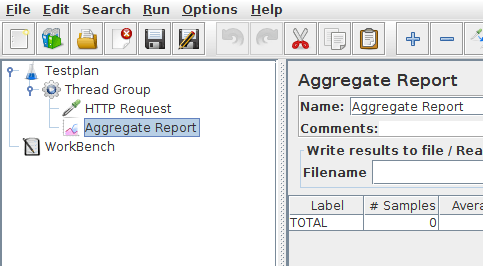](assets/images/example-simple-plan_5f0ac9b665de3a5a.png)

Simple test plan

<a id="jmeter_distributed_testing_step_by_step--starting"></a>
<a id="jmeter_distributed_testing_step_by_step--25.2-starting-the-test"></a>

## 25.2 Starting the Test[¶](#jmeter_distributed_testing_step_by_step--starting "Link to here")

At this point, you are ready to start load testing. If you want to double check
the worker nodes are working, open jmeter.log in your editor. You should see the following in the log.

```

Writing log file to: /XXXX/XXXXX/bin/jmeter-server.log
Created remote object: UnicastServerRef [liveRef: [endpoint:[192.X.X.X:XXXXX](local),objID:[-6a665beb:15a2c8b9419:-7fff, 3180474504933847586]]]
```

If you do not see this message, it means jmeter-server did not start correctly. For tips on
debugging the issue, [go to the tips section](#jmeter_distributed_testing_step_by_step--tips). There are two ways to
initiate the test: a single system and all systems.

<a id="jmeter_distributed_testing_step_by_step--start-single-client"></a>
<a id="jmeter_distributed_testing_step_by_step--25.3-start-a-single-clients"></a>

## 25.3 Start a single clients[¶](#jmeter_distributed_testing_step_by_step--start-single-client "Link to here")

1. Click Run at the top
2. Select Remote Start
3. Select the IP address

[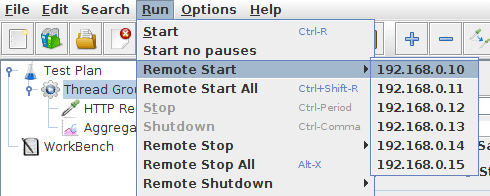](assets/images/example-remote-start_16e11ea9faae9c07.png)

Start a single worker node

<a id="jmeter_distributed_testing_step_by_step--start-all-clients"></a>
<a id="jmeter_distributed_testing_step_by_step--25.4-start-all-clients"></a>

## 25.4 Start all clients[¶](#jmeter_distributed_testing_step_by_step--start-all-clients "Link to here")

1. Click Run at the top
2. Select Remote Start all or use Ctrl + Shift + R

[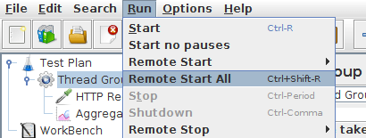](assets/images/example-remote-start-all_b89d651221536ff5.png)

Start all worker nodes

<a id="jmeter_distributed_testing_step_by_step--limitations"></a>
<a id="jmeter_distributed_testing_step_by_step--25.5-limitations"></a>

## 25.5 Limitations[¶](#jmeter_distributed_testing_step_by_step--limitations "Link to here")

There are some basic limitations for distributed testing. Here's the list of the known items in no specific order.

1. RMI cannot communicate across subnets without a proxy; therefore neither can JMeter without a proxy.
2. Since version 2.9, JMeter sends all the test results stripping Response data to the controlling console, this allows
   us to reduce impact on network IO. Ensure you monitor your network traffic so that this traffic does not incur contention
3. A single JMeter client running on a 2-3 GHz CPU (recent CPU) can handle 1000-2000 threads depending on the type of test.

<a id="jmeter_distributed_testing_step_by_step--additional-resources"></a>
<a id="jmeter_distributed_testing_step_by_step--25.6-additional-resources"></a>

## 25.6 Additional resources[¶](#jmeter_distributed_testing_step_by_step--additional-resources "Link to here")

[Wiki page on remote testing](https://cwiki.apache.org/confluence/display/JMETER/JMeterFAQ#JMeterFAQ-Howtodoremotetestingthe'properway'?)

[Remote Testing in the user manual](#remote-test)

<a id="jmeter_distributed_testing_step_by_step--tips"></a>
<a id="jmeter_distributed_testing_step_by_step--25.7-tips"></a>

## 25.7 Tips[¶](#jmeter_distributed_testing_step_by_step--tips "Link to here")

In some cases, the firewall may still be blocking RMI traffic.

<a id="jmeter_distributed_testing_step_by_step--anti-virus-and-firewall"></a>

### Anti Virus and Firewall

Antivirus should be stopped during a Load Test as it can drastically impact timings leading to wrong results.

Firewall needs to be stopped from windows services or at least some ports need to be opened.

1. Open control panel
2. Open administrative tools
3. Double click services
4. Go to down to Symantec anti virus, right click and select stop

<a id="jmeter_distributed_testing_step_by_step--windows-firewall"></a>

### Windows firewall

1. Open network connections
2. Select the network connection
3. Right click and select properties
4. Select advanced tab
5. Uncheck internet connection firewall

<a id="jmeter_distributed_testing_step_by_step--linux"></a>

### Linux

On Linux, iptables might be turned on by default. For instructions, please refer to the
[Remote Testing in the user manual](#remote-test)

On RedHat (or derivatives), iptables is turned on by default. Execute

```
service iptables stop
```

to stop the Linux firewall or ensure you open the correct ports.

---

<a id="jmeter_proxy_step_by_step"></a>

<!-- source_url: https://jmeter.apache.org/usermanual/jmeter_proxy_step_by_step.html -->

<!-- page_index: 8 -->

<a id="jmeter_proxy_step_by_step--script-recorder"></a>
<a id="jmeter_proxy_step_by_step--26.-apache-jmeter-http-s-test-script-recorder"></a>

# 26. Apache JMeter HTTP(S) Test Script Recorder[¶](#jmeter_proxy_step_by_step--script-recorder "Link to here")

This tutorial attempts to explain the exact steps for recording HTTP/HTTPS. For those new to JMeter, one easy way to create a test plan is to use the Recorder.

<a id="jmeter_proxy_step_by_step--configuration"></a>
<a id="jmeter_proxy_step_by_step--26.1-jmeter-configuration"></a>

## 26.1 JMeter configuration[¶](#jmeter_proxy_step_by_step--configuration "Link to here")

Since JMeter 2.10, recording has been improved to better handle embedded resources and creation of certificates on the fly.
To enable these features, JMeter uses keytool utility (available in JRE/JDK) so you need to ensure your
configuration is correct, read [this wiki page before starting.](https://cwiki.apache.org/confluence/display/JMETER/TestRecording210)

<a id="jmeter_proxy_step_by_step--basic-instructions"></a>
<a id="jmeter_proxy_step_by_step--26.2-basic-instructions"></a>

## 26.2 Basic Instructions[¶](#jmeter_proxy_step_by_step--basic-instructions "Link to here")

1. Go to JMETER\_HOME/bin and start JMeter with jmeterw.bat on Windows
   and jmeter.sh
    on Linux/Unix
2. Select Templates… on the menu bar
[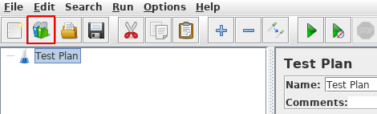](assets/images/select-templates-icon_9fcedfe25a11f1f6.png)

3. Select Recording template on the list
[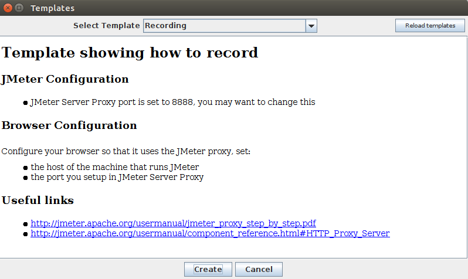](assets/images/select-recording-template_7724d6a510f958b8.png)

4. A complete Test Plan is generated
[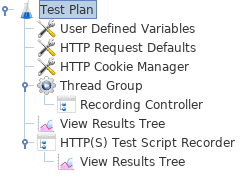](assets/images/test-generated_bc833a9e6fc85401.png)

5. In the HTTP Request Defaults element:

   Server name or IP
   :   enter example.com

   Path
   :   leave blank

   [](assets/images/http-request-defaults_43e25dec9e3e2321.png)
6. Return to HTTP(S) Test Script Recorder, and click the Start button at the top.
[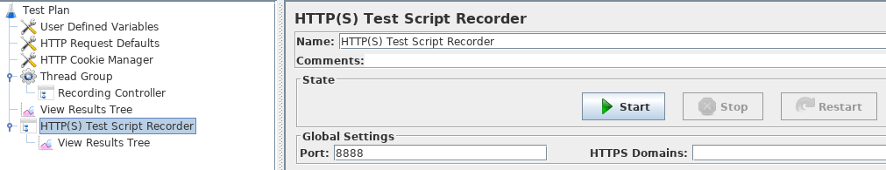](assets/images/proxy-run_a2de80d66e0b1e6f.png)

This will start the JMeter proxy server which is used to intercept the browser requests.
A file called ApacheJMeterTemporaryRootCA.crt will be generated in JMETER\_HOME/bin
folder. Install this certificate in your browser, if you don't know how to do it, read [Installing the JMeter CA certificate for HTTPS recording](#component_reference--http-s-_test_script_recorder)

<a id="jmeter_proxy_step_by_step--configure-browser"></a>
<a id="jmeter_proxy_step_by_step--26.3-configure-your-browser-to-use-the-jmeter-proxy"></a>

## 26.3 Configure your browser to use the JMeter Proxy[¶](#jmeter_proxy_step_by_step--configure-browser "Link to here")

At this point, JMeter's proxy is running. For this exercise, we will use Iceweasel/Firefox
to view some pages on the JMeter website.

1. Start Iceweasel/Firefox, but do not close JMeter.
2. From the tool bar, click
   Edit → Preferences (or
   Tools → Preferences or type about:preferences#advanced
   as URL). This should bring up the options.
   [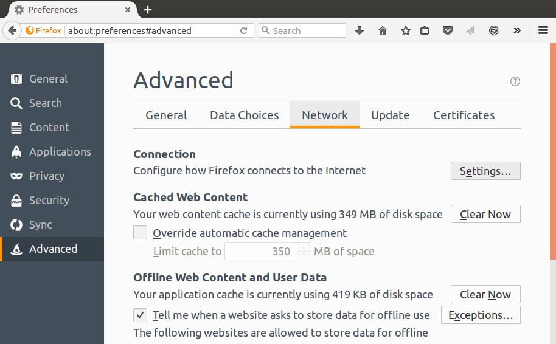](assets/images/firefox-network-settings_790d591dcc61e39a.png)
3. Select the Advanced tab, and Network tab
4. Click Settings button near the top.
5. On the new pop-up, check Manual proxy configuration. The address and
   port fields should be enabled now.

   Address
   :   enter localhost or the IP address of your system

   Port
   :   enter 8888.

   [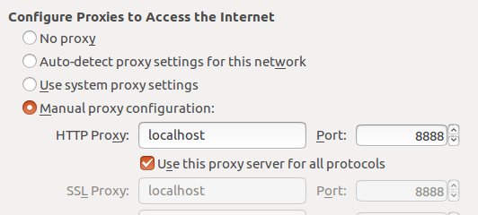](assets/images/firefox-configure-proxy_603af82ff91c2628.png)
6. Check Use this proxy server for all protocols
7. Click OK button. This should return you to the browser

<a id="jmeter_proxy_step_by_step--navigation-recording"></a>
<a id="jmeter_proxy_step_by_step--26.4-record-your-navigation"></a>

## 26.4 Record your navigation[¶](#jmeter_proxy_step_by_step--navigation-recording "Link to here")

1. With your browser, in the Address bar at the top, enter http://example.com/index.html (replace example.com with your websites address).
   and hit the enter key.
2. Click on a few links on your sites pages.
3. Close your browser and bring up the JMeter window.

Expand the Thread Group and there should be several samplers. At this point, the test plan can
be saved as is.

If you forget to add default HTTP Request settings, you will have to manually
delete the server name, and port.

[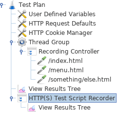](assets/images/example-recording_a6cdf0d98832e4a2.png)

In this sample, there aren't any default request parameters. If a particular request parameter
is required by all pages, the request defaults is where one would add the entries.

1. Select Thread Group and change a few defaults:

   Number of Threads (users)
   :   enter 5

   Ramp-Up Period (in seconds)
   :   do not change

   Loop Count
   :   enter 100

   [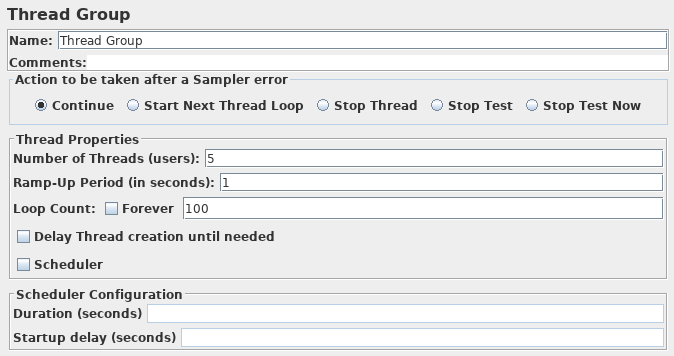](assets/images/example-thread-group_902a909bd6bfa12a.png)

<a id="jmeter_proxy_step_by_step--validate-script"></a>
<a id="jmeter_proxy_step_by_step--26.5-validate-the-script"></a>

## 26.5 Validate the script[¶](#jmeter_proxy_step_by_step--validate-script "Link to here")

Now we need to validate the script before to run our test plan. Save the test plan.

Right click on the Thread Group
Validate

[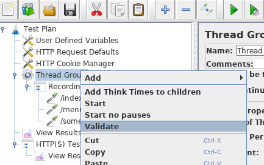](assets/images/validate-test-plan_7eb375f7d62db5bc.png)

Check with View Results Tree element if all is ok.

<a id="jmeter_proxy_step_by_step--correlate-start"></a>
<a id="jmeter_proxy_step_by_step--26.6-variabilize-and-correlate-the-script"></a>

## 26.6 Variabilize and Correlate the script[¶](#jmeter_proxy_step_by_step--correlate-start "Link to here")

In some scripts, we will need to:

- Variabilize some input (login, password, search words, …)
- Correlate some data (session variable, …) between two requests

To variabilize, we can use:

- CSV Data Set Config to get input data from csv file
- JMeter functions like \_\_counter, \_\_time, …
- etc.

To correlate, we can get data from a request with Post Processors like JSON Extractor, Regular Expression Extractor, … and inject it in another request.

To find data to correlate, the easiest way to do it is to use the Search function in View Results Tree.
[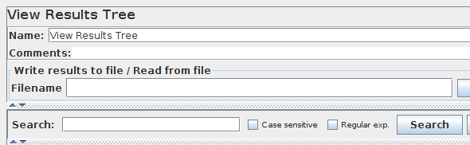](assets/images/search-correlation_4b8af54645d8a1f4.png)

<a id="jmeter_proxy_step_by_step--test-start"></a>
<a id="jmeter_proxy_step_by_step--26.7-start-the-test"></a>

## 26.7 Start the test[¶](#jmeter_proxy_step_by_step--test-start "Link to here")

At this point, we are ready to run our test plan and see what happens. When you're
ready to run the test, there are two ways:

1. With the gui, but it's not recommended to big load test.
2. With the command line.

Solution 1, with the gui, but just during debug phase, use CLI mode (Non GUI) for your load test.

Run → Start
or use the keyboard and press Ctrl + R

Before you start the test, add a Summary Report element and select it. As the test runs, the statistics will change
until the test is done. At the end of the test, the summary report should look like this.
[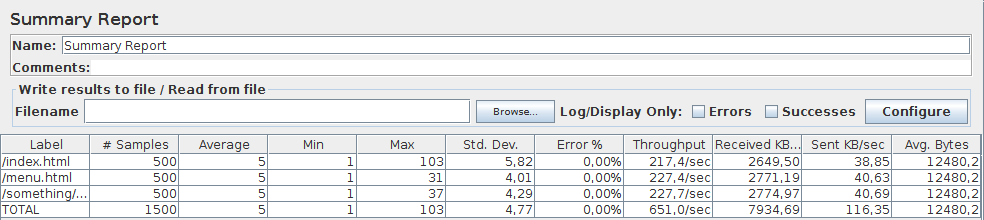](assets/images/example-summary-report_5f1589231a92d76a.png)

While the test is running, in the upper right-hand corner, there should be a green circle. When the test is done, the circle should be grey.
[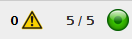](assets/images/example-running_c1a1b84e7f63ad94.png)

Solution 2, in command line, use jmeter -n -t [jmx file] -l [results file] -e -o [Path to output folder]

At the end of the test, an HTML report will be generated and available in [Path to output folder] used in command line.

---

<a id="junitsampler_tutorial"></a>

<!-- source_url: https://jmeter.apache.org/usermanual/junitsampler_tutorial.html -->

<!-- page_index: 9 -->

<a id="junitsampler_tutorial--junit"></a>
<a id="junitsampler_tutorial--27.-junit-sampler-tutorial"></a>

# 27. JUnit Sampler Tutorial[¶](#junitsampler_tutorial--junit "Link to here")

This tutorial attempts to explain the basic design, functionality and usage of the new JUnit Sampler for JMeter.
The sampler was introduced in version 2.1.2 release of JMeter. Earlier releases do not have the sampler.

<a id="junitsampler_tutorial--design"></a>
<a id="junitsampler_tutorial--27.1-design"></a>

## 27.1 Design[¶](#junitsampler_tutorial--design "Link to here")

The current implementation supports standard JUnit convention and extensions, like oneTimeSetUp
and oneTimeTearDown. Other features can be added on request. The sampler works like the JavaSampler
with some differences.

- Rather than use JMeter's test interface, it scans the jar files for classes extending JUnit's
  TestCase class. This means any class or subclass.
- JUnit test jar files are copied to jmeter/lib/junit instead of
  jmeter/lib
- JUnit sampler does not use name/value pairs for configuration. The sampler assumes
  setUp and tearDown will configure the test correctly.

  Note: setUp and tearDown methods must be declared public,
  so that JMeter can use it.
- The sampler measures the elapsed time only for the test method and does not include
  setUp and tearDown.
- Each time the test method is called, JMeter will pass the result to the listeners.
- Support for oneTimeSetUp and oneTimeTearDown is done as a method.
  Since JMeter is multi-threaded, we cannot call oneTimeSetUp/oneTimeTearDown
  the same way maven does it.
- The sampler reports unexpected exceptions as errors.

<a id="junitsampler_tutorial--functionality"></a>
<a id="junitsampler_tutorial--27.2-functionality"></a>

## 27.2 Functionality[¶](#junitsampler_tutorial--functionality "Link to here")

Here is a description of the functionality.

Name
:   name for the sample. This is the same as all JMeter samplers.

Package Filter
:   provides a way to filter the classes by package name.

Classname
:   the name of the class to test. The sampler will scan the jar files in
    jmeter/lib/ext and jmeter/lib/junit for classes extending
    JUnit's TestCase.

Constructor String
:   a string to pass to the string constructor of the test class.

Test Method
:   the name of the method to test in the sampler.

Success message
:   a descriptive message indicating what success means.

Success code
:   an unique code indicating the test was successful.

Failure message
:   a descriptive message indicating what failure means.

Failure code
:   an unique code indicating the test failed

Error message
:   a description for errors

Error code
:   some code for errors. Does not need to be unique

Do not call setUp and tearDown
:   set the sampler not
    to call setUp and tearDown. By default, setUp and
    tearDown should be called. Not calling those methods could affect the test and
    make it inaccurate. This option should be used with caution.

    If the selected method is oneTimeSetUp or oneTimeTearDown,
    this option should be checked.

Append assertion error
:   By default, the sampler will not append the assert failures
    to the failure message. To see the message in the result tree, check the option.

Append runtime exception
:   By default, the sampler will not append the exceptions
    to the failure message. To see the stacktrace, check the option

[](assets/images/junit-sampler_8c94f4daa8dcaed3.png)

JUnit Request

The current implementation of the sampler will try to create an instance using the string constructor
first. If the test class does not declare a string constructor, the sampler will look for an empty
constructor. Example below:

Constructor Examples[¶](#junitsampler_tutorial--constructor-examples "Link to here")

Empty Constructor:

```

public class myTestCase {
  public myTestCase() {}
}
```

String Constructor:

```

public class myTestCase {
  public myTestCase(String text) {
    super(text);
  }
}
```

By default, JMeter will provide some default values for the success/failure code and message.
Users should define a set of unique success and failure codes and use them uniformly across all tests.

<a id="junitsampler_tutorial--usage"></a>
<a id="junitsampler_tutorial--27.3-usage"></a>

## 27.3 Usage[¶](#junitsampler_tutorial--usage "Link to here")

Here is a short step-by-step.

1. Write your JUnit test and jar the classes
2. Copy and paste the jar files into jmeter/lib/junit directory
3. Start JMeter
4. Select Test Plan
5. Right click
   Add → Thread Group
6. Select Thread Group
7. Right click
   Add → Sampler → JUnit Request
8. Enter my unit test in the name
9. Enter the package of your JUnit test
10. Select the class you want to test
11. Select a method to test
12. Enter test successful in success message
13. Enter 1000 in success code
14. Enter test failed in failure message
15. Enter 0001 in failure code
16. Select the Thread Group
17. Right click
    Add → Listener → View Results Tree

One benefit of the JUnit sampler is it allows the user to select any method from a variety
of unit tests to create a test plan. This should reduce the amount of code an user needs to
write to create a variety of test scenarios. From a basic set of test methods, different
sequences and tests can be created using JMeter's GUI.

For example:

Test Plan1

```

TestCase1.testImportCustomer
TestCase2.testUpdateRandomCustomer
TestCase1.testSelect100
TestCase2.testUpdateOrder
TestCase1.testSelect1000
```

TestPlan2

```

TestCase1.testImportCustomer
TestCase1.testSelect100
TestCase1.testSelect1000
TestCase2.testAdd100Customers
```

<a id="junitsampler_tutorial--guidelines"></a>
<a id="junitsampler_tutorial--27.4-general-guidelines"></a>

## 27.4 General Guidelines[¶](#junitsampler_tutorial--guidelines "Link to here")

Here are some general guidelines for writing JUnit tests so they work well with JMeter. Since JMeter
runs multi-threaded, it is important to keep certain things in mind.

- Write the setUp and tearDown methods so they are thread safe. This
  generally means avoid using static members.
- Make the test methods discrete units of work and not long sequences of actions. By keeping
  the test method to a discrete operation, it makes it easier to combine test methods to create
  new test plans.
- Avoid making test methods depend on each other. Since JMeter allows arbitrary sequencing of
  test methods, the runtime behavior is different than the default JUnit behavior.
- If a test method is configurable, be careful about where the properties are stored. Reading
  the properties from the Jar file is recommended.
- Each sampler creates an instance of the test class, so write your test so the setup happens
  in oneTimeSetUp and oneTimeTearDown.
- If you select a class and no methods show up, it means the sampler had a problem creating an
  instance of the test class. The best way to debug this is to add some System.out
  to your class constructor and see what is happening.

---

<a id="jmeter_accesslog_sampler_step_by_step"></a>

<!-- source_url: https://jmeter.apache.org/usermanual/jmeter_accesslog_sampler_step_by_step.html -->

<!-- page_index: 10 -->

<a id="jmeter_accesslog_sampler_step_by_step--access-log-sampler"></a>
<a id="jmeter_accesslog_sampler_step_by_step--28.-access-log-sampler-step-by-step"></a>

# 28. Access log sampler Step-by-step[¶](#jmeter_accesslog_sampler_step_by_step--access-log-sampler "Link to here")

This is a short tutorial on JMeter's access log sampler. The purpose of the Access Log Sampler
is to provide an easy way to simulate production traffic. There are several benefits to using access logs.

- Rather than guess what users are doing, the test plan is using real traffic data
- As the traffic pattern changes, the access log provides a record of individual changes and general shifts in usage
- Access logs contain a lot of useful data, which may provide some insight
- Access logs can be minded to determine different types of users
- Access logs can capture detailed session information

The down side of using access logs for test plans is you have to configure the webserver to output the request
information. This may not be appropriate where security is an issue. For example, if the webserver dumps the post
data from each request to the access logs, users login and password would be stored in plain text. Here are some
general cases where access logs might be inappropriate.

- Security sensitive applications where the data is encrypted
- The application does not allow fine grain control of which request parameters are written to the access logs
- The application needs correlation between requests
- The webserver cannot be configured to append the post data to the access log
- The webserver is hosting multiple applications, but doesn't provide a way to log the requests of one application to a separate file

To take advantage of access logs, the first thing is the webserver needs to be configured to use extended
log format. Links for configuring the popular containers are provided below.

- [BEA Weblogic](http://e-docs.bea.com/wls/docs70/adminguide/web_server.html#113868)
- [Tomcat](http://tomcat.apache.org/tomcat-8.5-doc/config/valve.html#Access_Log_Valve)
- [Websphere](http://e-docs.bea.com/wls/docs61/adminguide/web_server.html#113868)
- [Resin](http://www.caucho.com/resin-3.0/config/log.xtp#access-log)

In some cases, it may be desirable to write custom logging, so that sensitive information is not written
to the access logs. This article does not cover the techniques for writing custom logging.

<a id="jmeter_accesslog_sampler_step_by_step--step-by-step"></a>
<a id="jmeter_accesslog_sampler_step_by_step--28.1-step-by-step"></a>

## 28.1 Step-by-Step[¶](#jmeter_accesslog_sampler_step_by_step--step-by-step "Link to here")

1. Start JMeter
2. Select Test Plan
3. Right click
   Add → Threads (Users) → Thread Group

   [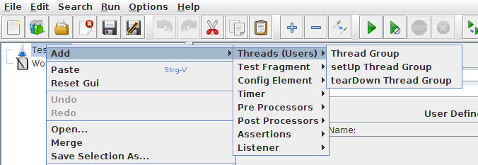](assets/images/add-threadgroup_3040f60349372eae.png)

   Add Thread Group
4. Select Thread Group
5. Right click
   Add → Sampler → Access Log Sampler

   [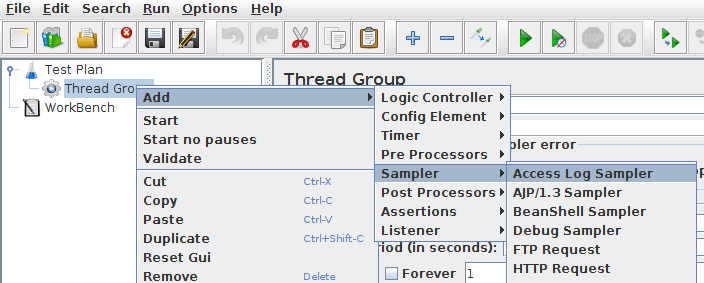](assets/images/add-access-log-sampler_103f6824268726ff.png)

   Add Access Log Sampler
6. Right click on Thread Group
   Add → Listener → Aggregate Report

   [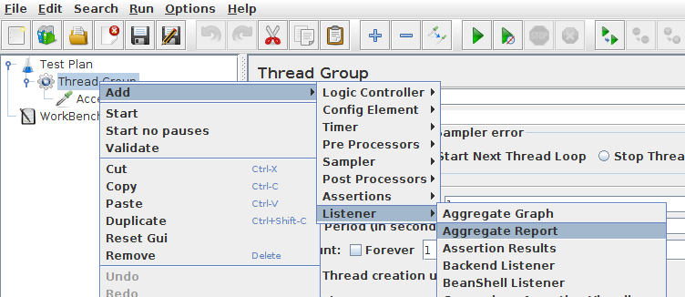](assets/images/add-aggregate-report_dd704c636849b0ab.png)

   Add Aggregate Report
7. Select the Access Log Sampler

   [](assets/images/accesslogsampler_43b10b2322ea171c.png)

   Access Log Sampler
8. Enter the IP address or hostname in Server
9. Enter the port in Port
10. If you want to download the images, set Parse images to true.
11. Select a file for Log File Location

    [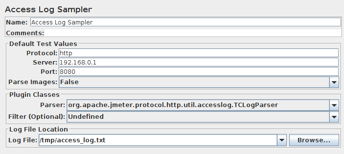](assets/images/example-access-log-sampler_e778b181c7e316f8.png)

    Filled in Access Log Sampler
12. Select Aggregate Report
13. Enter results.jtl for filename
    [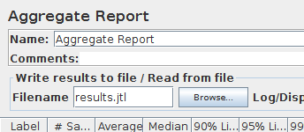](assets/images/example-aggregate-report_977b0bad34541e83.png)

    Aggregate Report with filename

At this point, the test plan is ready. Start the test with
Ctrl + R
or from the menu
Start → Run.

---

<a id="jmeter_tutorial"></a>

<!-- source_url: https://jmeter.apache.org/usermanual/jmeter_tutorial.html -->

<!-- page_index: 11 -->

<a id="jmeter_tutorial--howto"></a>
<a id="jmeter_tutorial--29.-how-to-write-a-plugin-for-jmeter"></a>

# 29. How to write a plugin for JMeter[¶](#jmeter_tutorial--howto "Link to here")

<a id="jmeter_tutorial--introduction-from-peter-lin"></a>

### Introduction from Peter Lin

On more than one occasion, users have complained JMeter's developer documentation is out of
date and not very useful. In an effort to make it easier for developers, I decided to write a simple
step-by-step tutorial. When I mentioned this to mike, he had some ideas about what the tutorial
should cover.

Before we dive into the tutorial, I'd like to say writing a plugin isn't necessarily easy, even for
someone with several years of java experience. The first extension I wrote for JMeter was a
simple utility to parse HTTP access logs and produce requests in XML format. It wasn't really a
plugin, since it was a stand alone command line utility. My first real plugin for JMeter was the
webservice sampler. I was working on a .NET project and needed to stress test a webservice.
Most of the commercial tools out there for testing .NET webservices suck and cost too much.
Rather than fork over several hundred dollars for a lame testing tool, or a couple thousand dollars
for a good one, I decided it was easier and cheaper to write a plugin for JMeter.

After a two weeks of coding on my free time, I had a working prototype using Apache Soap driver.
I submitted it back to JMeter and mike asked me if I want to be a committer. I had contributed
patches to Jakarta JSTL and tomcat in the past, so I considered it an honor. Since then, I've
written the access log sampler, Tomcat 5 monitor and distribution graph. Mike has since then
improved the access log sampler tremendously and made it much more useful.

<a id="jmeter_tutorial--introduction-from-mike-stover"></a>

### Introduction from Mike Stover

One of my primary goals in designing JMeter was to make it easy to write plugins to enhance as
many of JMeter's features as possible. Part of the benefit of being open-source is that a lot of
people could potentially lend their efforts to improve the application. I made a conscious decision
to sacrifice some simplicity in the code to make plugin writing a way of life for a JMeter developer.

While some folks have successfully dug straight into the code and made improvements to JMeter, a real tutorial on how to do this has been lacking. I tried a long time ago to write some
documentation about it, but most people did not find it useful. Hopefully, with Peter's help, this
attempt will be more successful.

<a id="jmeter_tutorial--basic-structure"></a>
<a id="jmeter_tutorial--29.1-basic-structure-of-jmeter"></a>

## 29.1 Basic structure of JMeter[¶](#jmeter_tutorial--basic-structure "Link to here")

JMeter is organized by protocols and functionality. This is done so that developers can build new
jars for a single protocol without having to build the entire application. We'll go into the details of
building JMeter later in the tutorial. Since most of the JMeter developers use eclipse, the article will
use eclipse directory as a reference point.

Root directory - /eclipse/workspace/apache-jmeter/

The folders inside of apache-jmeter

bin
:   contains the .bat and .sh files for starting JMeter.
    It also contains ApacheJMeter.jar and properties file

build/docs
:   directory contains the JMeter documentation files

extras
:   ant related extra files

lib
:   contains the required jar files for JMeter

lib/ext
:   contains the core jar files for JMeter and the protocols

src
:   contains subdirectory for each protocol and component

src/\*/test
:   unit test related directory

src/testFixtures
:   Directory that contains test-related code that might be reused in other modules

xdocs
:   XML files for documentation. JMeter generates its documentation from XML.

As the tutorial progresses, an explanation of the subdirectories will be provided. For now, lets
focus on src directory.

The folders inside of src

bshclient
:   code for the BeanShell based client

bolt
:   code for the Bolt protocol

components
:   contains non-protocol-specific components like visualizers, assertions, etc.

core
:   the core code of JMeter including all core interfaces and abstract classes.

dist
:   builds script that creates a distribution

dist-check
:   code related to testing the distribution. It is the place to look for
    when you want to update the contents of the resulting source/binary archive

examples
:   example sampler demonstrating how to use the new bean framework

functions
:   standard functions used by all components

generator
:   code to generate a test plan with all elements. Used for testing the distribution

jorphan
:   utility classes providing common utility functions

launcher
:   code to help start and stop JMeter through API

licenses
:   contains information about the licenses used in JMeters dependencies

protocol
:   contains the different protocols JMeter supports

release
:   code related to releasing JMeter distribution

testkit
:   utility code for testing

testkit-wiremock
:   utility code for testing with WireMock

Within protocol directory, are the protocol specific components.

The folders inside of protocol

ftp
:   components for load testing ftp servers

http
:   components for load testing web servers

java
:   components for load testing java components

jdbc
:   components for load testing database servers using JDBC

jms
:   components for load testing JMS servers

junit
:   components for load testing using JUnit tests

junit-sample
:   examples for JUnit based test implementations

ldap
:   components for load testing LDAP servers

mail
:   components for load testing mail servers

native
:   components for load testing OS native commands

tcp
:   components for load testing TCP services

As a general rule, all samplers related to HTTP will reside in http directory. The exception to the
rule is the Tomcat5 monitor. It is separate, because the functionality of the monitor is slightly
different than stress or functional testing. It may eventually be reorganized, but for now it is in its
own directory. In terms of difficulty, writing visualizers is probably one of the harder plugins to
write.

<a id="jmeter_tutorial--service-lookup"></a>
<a id="jmeter_tutorial--29.2-jmeter-gui-service-lookup"></a>

## 29.2 JMeter Gui – Service lookup[¶](#jmeter_tutorial--service-lookup "Link to here")

JMeter uses classpath scanning to detect plugins (e.g. functions, components, views). However, classpath scanning
is expensive, so JMeter also provides a service lookup mechanism to allow plugins to be found without scanning the classpath.
That is if a plugin registers a Java service with META-INF/services, then JMeter won't need to scan
the classpath to find it.

Some of the existing features already use the new service lookup mechanism, but it is not yet used for all
features.
The interfaces that are supported for service loading are marked with
org.apache.jorphan.reflect.JMeterService
annotation.

Implementing a service the same as regular interface implementation, except you need to register the service
in a META-INF/services/fully.qualified.interface.name.
For instance you could use @AutoService to generate the file automatically at the build time.
Here's how \_\_counter function is declared in JMeter itself:

```

import com.google.auto.service.AutoService;

@AutoService(Function.class)
public class IterationCounter extends AbstractFunction implements ThreadListener {
```

For backward compatibility reasons, JMeter would still try searching the implementations with classpath scanning, so you don't have to use META-INF/services for registering services. However, service lookup is much
faster, so exposing services would improve startup time, especially when there are many plugins.

As you add META-INF/services to your plugins, you can add JMeter-Skip-Class-Scanning: true
manifest attribute so JMeter knows there's no need to scan the jar as it provides all the plugins via services.

<a id="jmeter_tutorial--testelement-contract"></a>
<a id="jmeter_tutorial--29.3-jmeter-gui-testelement-contract"></a>

## 29.3 JMeter Gui – TestElement Contract[¶](#jmeter_tutorial--testelement-contract "Link to here")

When writing any JMeter component, there are certain contracts you must be aware of – ways a
JMeter component is expected to behave if it will run properly in the JMeter environment. This
section describes the contract that the GUI part of your component must fulfill.

GUI code in JMeter is strictly separated from Test Element code. Therefore, when you write a
component, there will be a class for the Test Element, and another for the GUI presentation. The
GUI presentation class is stateless in the sense that it should never hang onto a reference to the
Test Element (there are exceptions to this though).

A GUI element should extend the appropriate abstract class provided:

- AbstractSamplerGui
- AbstractAssertionGui
- AbstractConfigGui
- AbstractControllerGui
- AbstractPostProcessorGui
- AbstractPreProcessorGui
- AbstractVisualizer
- AbstractTimerGui

These abstract classes provide so much plumbing work for you that not extending them, and
instead implementing the interfaces directly is hardly an option. If you have some burning need to
not extend these classes, then you can join me in IRC where I can convince you otherwise :-).

So, you've extended the appropriate GUI class, what's left to do? Follow these steps:

1. Implement getLabelResource()
   1. This method should return the name of the resource that represents the title/name of the
      component. The resource will have to be entered into JMeters messages.properties file
      (and possibly translations as well).
2. Override org.apache.jmeter.gui.JMeterGUIComponent.makeTestElement method so it returns
   the appropriate TestElement. JMeter will use makeTestElement when user creates the element
   from the UI. In most cases it should be just creating the test element like
   return new SetupThreadGroup().
3. Create your GUI. Whatever style you like, layout your GUI. Your class ultimately extends
   JPanel, so your layout must be in your class's own ContentPane.
   Do not hook up GUI elements to your TestElement class via actions and events.
   Let swing's internal model hang onto all the data as much as you possibly can.
   1. Some standard GUI stuff should be added to all JMeter GUI components:
      1. Call setBorder(makeBorder()) for your class. This will give it the standard JMeter
         border
      2. Add the title pane via makeTitlePanel(). Usually this is the first thing added to your
         GUI, and should be done in a Box vertical layout scheme, or with JMeter's VerticalLayout
         class. Here is an example init() method:

```

private void init() {
    setLayout(new BorderLayout());
    setBorder(makeBorder());
    Box box = Box.createVerticalBox();
    box.add(makeTitlePanel());
    box.add(makeSourcePanel());
    add(box,BorderLayout.NORTH);
    add(makeParameterPanel(),BorderLayout.CENTER);
}
```

4. Then you need to wire UI elements with the properties of the new TestElement. If you create
   TestElementSchema for your test element (see ThreadGroupSchema), then you could use
   automatic wiring with PropertyEditorCollection
5. If you do not use schema for wiring properties to UI control, or if you have non-trivial controls,
   you might customize TestElement properties to UI control mapping by overriding public void configure(TestElement el)
   1. Be sure to call super.configure(e). This will populate some of the data for you, like
      the name of the element. Note: JMeter reuses UI elements when user changes the active element in test tree,
      so you need to set all the text fields in configure method to avoid displaying stale contents.
   2. Use this method to set data into your GUI elements. Example:

```

public void configure(TestElement el) {
    super.configure(el);
    useHeaders.setSelected(
            el.getPropertyAsBoolean(RegexExtractor.USEHEADERS));
    useBody.setSelected(
            !el.getPropertyAsBoolean(RegexExtractor.USEHEADERS));
    regexField.setText(
            el.getPropertyAsString(RegexExtractor.REGEX));
    templateField.setText(
            el.getPropertyAsString(RegexExtractor.TEMPLATE));
    defaultField.setText(
            el.getPropertyAsString(RegexExtractor.DEFAULT));
    matchNumberField.setText(
            el.getPropertyAsString(RegexExtractor.MATCH_NUM));
    refNameField.setText(
            el.getPropertyAsString(RegexExtractor.REFNAME));
}
```

   3. If you do not use schema for wiring UI controls to TestElement properties,
      or if you want customized behavior, you might override public void modifyTestElement(TestElement e).
      It is the logical reverse of configure method.
      1. Call super.modifyTestElement(e). This will take care of some default data for
         you.
      2. Note: in most cases, you want to treat "empty field" as "absent property", so make sure to
         remove the property if the input field is empty.
      3. Example:

```

public void modifyTestElement(TestElement e) {
    super.modifyTestElement(e);
    e.setProperty(new BooleanProperty(
            RegexExtractor.USEHEADERS,
            useHeaders.isSelected()));
    e.setProperty(RegexExtractor.MATCH_NUMBER,
            matchNumberField.getText());
    if (e instanceof RegexExtractor) {
        RegexExtractor regex = (RegexExtractor)e;
        regex.setRefName(refNameField.getText());
        regex.setRegex(regexField.getText());
        regex.setTemplate(templateField.getText());
        regex.setDefaultValue(defaultField.getText());
    }
}
```

   4. If your UI includes controls that do not map to TestElement properties (sliders, tabs),
      then you might want to reset them when user switches the controls. You can do that by overriding
      clearGui() method and resetting the controls there.

The reason you cannot hold onto a reference for your Test Element is because JMeter reuses
instance of GUI class objects for multiple Test Elements. This saves a lot of memory. It also
makes it incredibly easy to write the GUI part of your new component. You still have to struggle
with the layout in Swing, but you don't have to worry about creating the right events and actions for
getting the data from the GUI elements into the TestElement where it can do some good. JMeter
knows when to call your configure, and modifyTestElement methods where you can do it in a very
straightforward way.

Writing Visualizers is somewhat of a special case, however.

<a id="jmeter_tutorial--visualizer"></a>
<a id="jmeter_tutorial--29.4-writing-a-visualizer"></a>

## 29.4 Writing a Visualizer[¶](#jmeter_tutorial--visualizer "Link to here")

Load Testing in GUI mode being a bad practice, you should not develop such plugin. Have
a look at more up to date components like:

- [Web report](#generating-dashboard)
- [Real-Time results](#realtime-results) with [BackendListenerClient](https://jmeter.apache.org/api/org/apache/jmeter/visualizers/backend/BackendListenerClient.html)

Of the component types, visualizers require greater depth in Swing than something like controllers, functions or samplers. You can find the full source for the distribution graph in
components/org/apache/jmeter/visualizers/. The distribution graph visualizer is divided into two
classes.

DistributionGraphVisualizer
:   visualizer which JMeter instantiates

DistributionGraph
:   JComponent which draws the actual graph

The easiest way to write a visualizer is to do the following:

1. Extend org.apache.jmeter.visualizers.gui.AbstractVisualizer
2. Implement any additional interfaces need for call back and event notification.
   For example, the DistributionGraphVisualizer implements the following interfaces:
   - ImageVisualizer
   - ItemListener – according to the comments in the class,
     ItemListener is out of date and isn't used anymore.
   - GraphListener
   - Clearable

AbstractVisualizer provides some common functionality, which most visualizers like
Graph Results use. The common functionality provided by the abstract class includes:

- Configure test elements – This means it create a new ResultCollector, sets the file and sets the error log
- Create the stock menu
- Update the test element when changes are made
- Create a file panel for the log file
- Create the title panel

In some cases, you may not want to display the menu for the file textbox. In that case, you can
override the init() method. Here is the implementation for DistributionGraphVisualizer.

```

/**
 * Initialize the GUI.
 */
private void init() {
    this.setLayout(new BorderLayout());

    // MAIN PANEL
    Border margin = new EmptyBorder(10, 10, 5, 10);
    this.setBorder(margin);

    // Set up the graph with header, footer, Y axis and graph display
    JPanel graphPanel = new JPanel(new BorderLayout());
    graphPanel.add(createGraphPanel(), BorderLayout.CENTER);
    graphPanel.add(createGraphInfoPanel(), BorderLayout.SOUTH);

    // Add the main panel and the graph
    this.add(makeTitlePanel(), BorderLayout.NORTH);
    this.add(graphPanel, BorderLayout.CENTER);
}
```

The first thing the init method does is create a new BorderLayout. Depending on how you want to
layout the widgets, you may want to use a different layout manager. Keep mind using different
layout managers is for experts.

The second thing the init method does is create a border. If you want to increase or decrease
the border, change the four integer values. Each integer value represents pixels. If you want your
visualizer to have no border, skip lines 8 and 9. Line 13 calls createGraphPanel, which is
responsible for configuring and adding the DistributionGraph to the visualizer.

```

private Component createGraphPanel() {
    graphPanel = new JPanel();
    graphPanel.setBorder(BorderFactory.createBevelBorder(
    BevelBorder.LOWERED,Color.lightGray,Color.darkGray));
    graphPanel.add(graph);
    graphPanel.setBackground(Color.white);
    return graphPanel;
}
```

At line 5, the graph component is added to the graph panel. The constructor is where a new
instance of DistributionGraph is created.

```

public DistributionGraphVisualizer() {
    model = new SamplingStatCalculator("Distribution");
    graph = new DistributionGraph(model);
    graph.setBackground(Color.white);
    init();
}
```

The constructor of DistributionGraphVisualizer is responsible for creating the model and the
graph. Every time a new result is complete, the engine passes the result to all the listeners by
calling add(SampleResult res). The visualizer passes the new SampleResult to the model.

```

public synchronized void add(SampleResult res) {
    model.addSample(res);
    updateGui(model.getCurrentSample());
}
```

In the case of the DistributionGraphVisualizer, the add method doesn't actually update the
graph. Instead, it calls updateGui in line three.

```
public synchronized void updateGui(Sample s) {// We have received one more sample if (delay == counter) {updateGui(); counter = 0; } else {counter++;}}
```

Unlike GraphVisualizer, the distribution graph attempts to show how the results clump; therefore
the DistributionGraphVisualizer delays the update. The default delay is 10 sampleresults.

```
public synchronized void updateGui() {if (graph.getWidth() < 10) {graph.setPreferredSize(new Dimension(getWidth() - 40,getHeight() - 160));} graphPanel.updateUI(); graph.repaint();}
```

Lines 2 to 3 are suppose to resize the graph, if the user resizes the window or drags the divider.
Line 7 updates the panel containing the graph. Line 8 triggers the update of the DistributionGraph.
Before we cover writing graphs, there are a couple of important methods visualizer must
implement.

```

public String getLabelResource() {
    return "distribution_graph_title";
}
```

The label resource retrieves the name of the visualizer from the properties file. The file is located
in core/org/apache/jmeter/resources. It's best not to hardcode the name of the visualizer.
Message.properties file is organized alphabetically, so adding a new entry is easy.

```

public synchronized void clear() {
    this.graph.clear();
    model.clear();
    repaint();
}
```

Every component in JMeter should implement logic for clear() method. If this isn't done, the
component will not clear the UI or model when the user tries to clear the last results and run a
new test. If clear is not implemented, it can result in a memory leak.

```

public JComponent getPrintableComponent() {
    return this.graphPanel;
}
```

The last method visualizers should implement is getPrintableComponent(). The method is
responsible for returning the JComponent that can be saved or printed. This feature was recently
added so that users can save a screen capture of any given visualizer.

<a id="jmeter_tutorial--graphlistener"></a>
<a id="jmeter_tutorial--29.5-graphlistener"></a>

## 29.5 GraphListener[¶](#jmeter_tutorial--graphlistener "Link to here")

Load Testing in GUI mode being a bad practice, you should not develop such plugin. Have
a look at more up to date components like:

- [Web report](#generating-dashboard)
- [Real-Time results](#realtime-results) with [BackendListenerClient](https://jmeter.apache.org/api/org/apache/jmeter/visualizers/backend/BackendListenerClient.html)

Visualizers should implement GraphListener. This is done to make it simpler to add new Sample
instances to listeners. As a general rule, if the custom graph does not plot every single sample, it does not need to implement the interface.

```

public interface GraphListener {
    public void updateGui(Sample s);
    public void updateGui();
}
```

The important method in the interface is updateGui(Sample s). From
DistributionGraphVisualizer, we see it calls graph.repaint()
to refresh the graph. In most cases, the implementation of updateGui(Sample s) should do just that.
ItemListenerVisualizers generally do not need to implement this interface. The interface is used with combo
boxes, checkbox and lists. If your visualizer uses one of these and needs to know when it has
been updated, the visualizer will need to implement the interface. For an example of how to
implement the interface, please look at GraphVisualizer.

<a id="jmeter_tutorial--custom-graphs"></a>
<a id="jmeter_tutorial--29.6-writing-custom-graphs"></a>

## 29.6 Writing Custom Graphs[¶](#jmeter_tutorial--custom-graphs "Link to here")

Load Testing in GUI mode being a bad practice, you should not develop such plugin. Have
a look at more up to date components like:

- [Web report](#generating-dashboard)
- [Real-Time results](#realtime-results) with [BackendListenerClient](https://jmeter.apache.org/api/org/apache/jmeter/visualizers/backend/BackendListenerClient.html)

For those new to Swing and haven't written custom JComponents yet, I would suggest getting a
book on Swing and get a good feel for how Swing widgets work. This tutorial will not attempt to
explain basic Swing concepts and assumes the reader is already familiar with the Swing API and
MVC (Model View Controller) design pattern. From the constructor of DistributionGraphVisualizer, we see a new instance of DistributionGraph is created with an instance of the model.

```

public DistributionGraph(SamplingStatCalculator model) {
    this();
    setModel(model);
}
```

The implementation of setModel method is straight forward.

```

private void setModel(Object model) {
    this.model = (SamplingStatCalculator) model;
    repaint();
}
```

Notice the method calls repaint after it sets the model. If repaint isn't called, it can cause the
GUI to not draw the graph. Once the test starts, the graph would redraw, so calling repaint isn't
critical.

```
public void paintComponent(Graphics g) {super.paintComponent(g); final SamplingStatCalculator m = this.model; synchronized (m) {drawSample(m, g);}}
```

The other important aspect of updating the widget is placing the call to drawSample within a
synchronized block. If drawSample wasn't synchronized, JMeter would throw a
ConcurrentModificationException at runtime. Depending on the test plan, there may be a dozen or
more threads adding results to the model. The synchronized block does not affect the accuracy of
each individual request and time measurement, but it does affect JMeter's ability to generate large
loads. As the number of threads in a test plan increases, the likelihood a thread will have to wait
until the graph is done redrawing before starting a new request increases. Here is the
implementation of drawSample.

```

private void drawSample(SamplingStatCalculator model, Graphics g) {
    width = getWidth();
    double height = (double)getHeight() - 1.0;

    // first lets draw the grid
    for (int y=0; y < 4; y++){
        int q1 = (int)(height - (height * 0.25 * y));
        g.setColor(Color.lightGray);
        g.drawLine(xborder,q1,width,q1);
        g.setColor(Color.black);
        g.drawString(String.valueOf((25 * y) + "%"),0,q1);
    }
    g.setColor(Color.black);
    // draw the X axis
    g.drawLine(xborder,(int)height,width,(int)height);
    // draw the Y axis
    g.drawLine(xborder,0,xborder,(int)height);
    // the test plan has to have more than 200 samples
    // for it to generate half way decent distribution
    // graph. The larger the sample, the better the
    // results.
    if (model != null && model.getCount() > 50) {
        // now draw the bar chart
        Number ninety = model.getPercentPoint(0.90);
        Number fifty = model.getPercentPoint(0.50);
        total = model.getCount();
        Collection values = model.getDistribution().values();
        Object[] objval = new Object[values.size()];
        objval = values.toArray(objval);
        // we sort the objects
        Arrays.sort(objval,new NumberComparator());
        int len = objval.length;
        for (int count=0; count < len; count++) {
            // calculate the height
            Number[] num = (Number[])objval[count];
            double iper = (double)num[1].intValue() / (double)total;
            double iheight = height * iper;
            // if the height is less than one, we set it
            // to one pixel
            if (iheight < 1) {
                iheight = 1.0;
            }
            int ix = (count * 4) + xborder + 5;
            int dheight = (int)(height - iheight);
            g.setColor(Color.blue);
            g.drawLine(ix -1,(int)height,ix -1,dheight);
            g.drawLine(ix,(int)height,ix,dheight);
            g.setColor(Color.black);
            // draw a red line for 90% point
            if (num[0].longValue() == ninety.longValue()) {
                g.setColor(Color.red);
                g.drawLine(ix,(int)height,ix,55);
                g.drawLine(ix,(int)35,ix,0);
                g.drawString("90%",ix - 30,20);
                g.drawString(
                        String.valueOf(num[0].longValue()),
                        ix + 8, 20);
            }
            // draw an orange line for 50% point
            if (num[0].longValue() == fifty.longValue()) {
                g.setColor(Color.orange);
                g.drawLine(ix,(int)height,ix,30);
                g.drawString("50%",ix - 30,50);
                g.drawString(
                        String.valueOf(num[0].longValue()),
                        ix + 8, 50);
            }
        }
    }
}
```

In general, the rendering of the graph should be fairly quick and shouldn't be a bottleneck. As a
general rule, it is a good idea to profile custom plugins. The only way to make sure a visualizer
isn't a bottleneck is to run it with a tool like Borland OptimizeIt. A good way to test a plugin is to
create a simple test plan and run it. The heap and garbage collection behavior should be regular
and predictable.

<a id="jmeter_tutorial--testbean"></a>
<a id="jmeter_tutorial--29.7-making-a-testbean-plugin-for-jmeter"></a>

## 29.7 Making a TestBean Plugin For JMeter[¶](#jmeter_tutorial--testbean "Link to here")

In this part, we will go through the process of creating a simple component for JMeter that uses
the new TestBean framework.

This component will be a CSV file reading element that will let users easily vary their input data
using CSV files. To most effectively use this tutorial, open the three files specified below (found in
JMeter's src/components directory).

1. Pick a package and make three files:
   - [ComponentName].java (org.apache.jmeter.config.CSVDataSet.java)
   - [ComponentName]BeanInfo.java (org.apache.jmeter.config.CSVDataSetBeanInfo.java)
   - [ComponentName]Resources.properties (org.apache.jmeter.config.CSVDataSetResources.properties)
2. CSVDataSet.java must implement the TestBean interface. In addition, it will extend
   ConfigTestElement, and implement LoopIterationListener.
   - TestBean is a marker interface, so there are no methods to implement.
   - Extending ConfigTestElement will make our component a Config element in a test
     plan. By extending different abstract classes, you can control the type of element your
     component will be (i.e. AbstractSampler, AbstractVisualizer, GenericController, etc -
     though you can also make different types of elements just by instantiating the right
     interfaces, the abstract classes can make your life easier).
3. CSVDataSetBeanInfo.java should extend org.apache.jmeter.testbeans.BeanInfoSupport
   - create a zero-parameter constructor in which we call super(CSVDataSet.class);
   - we'll come back to this.
4. CSVDataSetResources.properties - blank for now
5. Implement your special logic for you plugin class.
   1. The CSVDataSet will read a single CSV file and will store the values it finds into
      JMeter's running context. The user will define the file, define the variable names for
      each "column". The CSVDataSet will open the file when the test starts, and close it
      when the test ends (thus we implement TestListener). The CSVDataSet will update
      the contents of the variables for every test thread, and for each iteration through its
      parent controller, by reading new lines in the file. When we reach the end of the file,
      we'll start again at the beginning.
      When implementing a TestBean, pay careful
      attention to your properties. These properties will become the basis of a GUI form by
      which users will configure the CSVDataSet element.
   2. Your element will be cloned by JMeter when the test starts. Each thread will get its
      own instance. However, you will have a chance to control how the cloning is done, if
      you need it.
   3. Properties: filename, variableNames. With public getters and setters.
      - filename is self-explanatory, it will hold the name of the CSV file we'll read
      - variableNames is a String which will allow a user to enter the names of the
        variables we'll assign values to. Why a String? Why not a Collection? Surely
        users will need to enter multiple (and unknown number of) variable names? True,
        but if we used a List or Collection, we'd have to write a GUI component to handle
        collections, and I just want to do this quickly. Instead, we'll let users input
        comma-delimited list of variable names.
   4. I then implemented the IterationStart method of the LoopIterationListener interface.
      The point of this "event" is that your component is notified of when the test has entered
      its parent controller. For our purposes, every time the CSVDataSet's parent controller
      is entered, we will read a new line of the data file and set the variables. Thus, for a
      regular controller, each loop through the test will result in a new set of values being
      read. For a loop controller, each iteration will do likewise. Every test thread will get
      different values as well.
6. Setting up your GUI elements in CSVDataSetBeanInfo:
   - You can create groupings for your component's properties. Each grouping you create
     needs a label and a list of property names to include in that grouping. I.e.:

```

createPropertyGroup("csv_data",
        new String[] { "filename", "variableNames" });
```

   - Creates a grouping called csv\_data that will include GUI input elements for the
     filename and variableNames properties of CSVDataSet.
     Then, we need to define what kind of properties we want these to be:

```

p = property("filename");
p.setValue(NOT_UNDEFINED, Boolean.TRUE);
p.setValue(DEFAULT, "");
p.setValue(NOT_EXPRESSION, Boolean.TRUE);

p = property("variableNames");
p.setValue(NOT_UNDEFINED, Boolean.TRUE);
p.setValue(DEFAULT, "");
p.setValue(NOT_EXPRESSION, Boolean.TRUE);
```

     This essentially creates two properties whose value is not allowed to be null, and
     whose default values are "". There are several such attributes that can be set for each
     property. Here is a rundown:

     NOT\_UNDEFINED
     :   The property will not be left null.

     DEFAULT
     :   A default values must be given if NOT\_UNDEFINED is true.

     NOT\_EXPRESSION
     :   The value will not be parsed for functions if this is true.

     NOT\_OTHER
     :   This is not a free form entry field – a list of values has to be provided.

     TAGS
     :   With a String[] as the value, this sets up a predefined
         list of acceptable values, and JMeter will create a dropdown select.

     Additionally, a custom property editor can be specified for a property:

```

p.setPropertyEditorClass(FileEditor.class);
```

     This will create a text input plus browse button that opens a dialog for finding a file.
     Usually, complex property settings are not needed, as now. For a more complex
     example, look at org.apache.jmeter.protocol.http.sampler.AccessLogSamplerBeanInfo
7. Defining your resource strings. In CSVDataSetResources.properties we have to define all our
   string resources. To provide translations, one would create additional files such as
   CSVDataSetResources\_ja.properties, and CSVDataSetResources\_de.properties. For our
   component, we must define the following resources:

   displayName
   :   This will provide a name for the element that will appear in menus.

   csv\_data.displayName
   :   we create a property grouping called csv\_data,
       so we have to provide a label for the grouping

   filename.displayName
   :   a label for the filename input element.

   filename.shortDescription
   :   a tool-tip-like help text blurb.

   variableNames.displayName
   :   a label for the variable name input element.

   variableNames.shortDescription
   :   tool tip for the variableNames input element.
8. Debug your component.

<a id="jmeter_tutorial--building"></a>
<a id="jmeter_tutorial--29.8-building-jmeter"></a>

## 29.8 Building JMeter[¶](#jmeter_tutorial--building "Link to here")

JMeter uses Gradle to compile and build the distribution. JMeter has
several tasks defined, which make it easier for developers to build the complete project.
For those unfamiliar with Gradle, it's a build tool similar to make on Unix.
A list of the Gradle tasks with a short description is provided
in [gradle.md](https://github.com/apache/jmeter/blob/master/gradle.md), which can be found
in the root source directory.

Here are some example commands.

./gradlew runGui
:   Build and start JMeter GUI

./gradlew createDist
:   Build project and copy relevant jar files to ./lib folder

./gradlew :src:dist:previewSite
:   Creates preview of a site to ./build/docs/site

---

<a id="boss"></a>

<!-- source_url: https://jmeter.apache.org/usermanual/boss.html -->

<!-- page_index: 12 -->

<a id="boss--boss"></a>
<a id="boss--17.-help-my-boss-wants-me-to-load-test-our-application"></a>

# 17. Help! My boss wants me to load test our application

This is a fairly open-ended proposition. There are a number of questions to
be asked first, and additionally a number of resources that will be needed. You
will need some hardware to run the benchmarks/load-tests from. A number of
tools will prove useful. There are a number of products to consider. And finally, why is Java a good choice to implement a load-testing/Benchmarking product.

<a id="boss--questions"></a>
<a id="boss--17.1-questions-to-ask"></a>

## 17.1 Questions to ask[¶](#boss--questions "Link to here")

What is our anticipated average number of users (normal load)?

What is our anticipated peak number of users?

When is a good time to load-test our application (i.e. off-hours or week-ends), bearing in mind that this may very well crash one or more of our servers?

Does our application have state? If so, how does our application manage it
(cookies, session-rewriting, or some other method)?

What is the testing intended to achieve?

<a id="boss--resources"></a>
<a id="boss--17.2-resources"></a>

## 17.2 Resources[¶](#boss--resources "Link to here")

The following resources will prove very helpful. Bear in mind that if you
cannot locate these resources, **you** will become these resources. As you
already have your work cut out for you, it is worth knowing who the following
people are, so that you can ask them for help if you need it.

<a id="boss--network"></a>
<a id="boss--17.2.1-network"></a>

## 17.2.1 Network[¶](#boss--network "Link to here")

Who knows our network topology? If you run into any firewall or
proxy issues, this will become very important. As well, a private
testing network (which will therefore have very low network latency)
would be a very nice thing. Knowing who can set one up for you
(if you feel that this is necessary) will be very useful. If the
application doesn't scale as expected, who can add additional
hardware?

<a id="boss--application"></a>
<a id="boss--17.2.2-application"></a>

## 17.2.2 Application[¶](#boss--application "Link to here")

Who knows how our application functions? The normal sequence is

- test (low-volume - can we benchmark our application?)
- benchmark (the average number of users)
- load-test (the maximum number of users)
- test destructively (what is our hard limit?)

The **test** process may progress from black-box testing to
white-box testing (the difference is that the first requires
no knowledge of the application [it is treated as a "black box"]
while the second requires some knowledge of the application).
It is not uncommon to discover problems with the application
during this process, so be prepared to defend your work.

<a id="boss--platform"></a>
<a id="boss--17.3-what-platform-should-i-use-to-run-the-benchmarks-load-tests"></a>

## 17.3 What platform should I use to run the benchmarks/load-tests?[¶](#boss--platform "Link to here")

This should be a widely-used piece of hardware, with a standard
(i.e. vanilla) software installation. Remember, if you publish your results, the first thing your clients will do is hire a graduate student to verify them.
You might as well make it as easy for this person as you possibly can.

For Windows, Windows XP Professional should be a minimum (the others
do not multi-thread past 50-60 connections, and you probably anticipate
more users than that).

Good free platforms include the linuxes, the BSDs, and Solaris Intel. If
you have a little more money, there are commercial linuxes.
This may be worth it if you need the support.

For non-Windows platforms, investigate "ulimit -n unlimited" with a view to
including it in your user account startup scripts (.bashrc or .cshrc scripts
for the testing account).

Also note that some Linux/Unix editions are intended for server use.
These generally have minimal or no GUI support.
Such OSes should be OK for running JMeter in CLI mode, but JMeter GUI mode probably won't work
unless you install a minimal GUI environment.

As you progress to larger-scale benchmarks/load-tests, this platform
will become the limiting factor. So it's worth using the best hardware and
software that you have available. Remember to include the hardware/software
configuration in your published benchmarks.

**When you need a lot of machines or want to test the network latency, Cloud can help you.**
JMeter can easily be installed on Cloud instances as it runs on nearly any architecture available in the Cloud.
JMeter is also supported within Commercial Cloud PAAS if you don't want to manage it yourself.

Don't forget JMeter batch (CLI) mode. This mode should be used during load testing for many reasons:

- If you have a powerful server that supports Java but perhaps does not have a fast graphics implementation, or where you need to login remotely.
- Batch (CLI) mode can reduce the network traffic compared with using a remote display or client-server mode.
- Java AWT Thread used for GUI mode can alter injection behaviour by blocking sometimes

The batch log file can then be loaded into JMeter on a workstation for analysis, or you can
use CSV output and import the data into a spreadsheet.

Remember GUI mode is for Script creation and debugging, not for load testing

<a id="boss--tools"></a>
<a id="boss--17.4-tools"></a>

## 17.4 Tools[¶](#boss--tools "Link to here")

The following tools will all prove useful. It is definitely worthwhile to
become familiar with them. This should include trying them out, and reading the
appropriate documentation (man-pages, info-files, application --help messages, and any supplied documentation).

<a id="boss--ping"></a>
<a id="boss--17.4.1-ping"></a>

## 17.4.1 ping[¶](#boss--ping "Link to here")

This can be used to establish whether or not you can reach your
target site. Options can be specified so that 'ping' provides the
same type of route reporting as 'traceroute'.

<a id="boss--dig"></a>
<a id="boss--17.4.2-nslookup-dig"></a>

## 17.4.2 nslookup/dig[¶](#boss--dig "Link to here")

While the **user** will normally use a human-readable internet
address, **you** may wish to avoid the overhead of DNS lookups when
performing benchmarking/load-testing. These can be used to determine
the unique address (dotted quad) of your target site.

<a id="boss--traceroute"></a>
<a id="boss--17.4.3-traceroute"></a>

## 17.4.3 traceroute[¶](#boss--traceroute "Link to here")

If you cannot "ping" your target site, this may be used to determine
the problem (possibly a firewall or a proxy). It can also be used
to estimate the overall network latency (running locally should give
the lowest possible network latency - remember that your users will
be running over a possibly busy internet). Generally, the fewer hops
the better.

<a id="boss--plugins"></a>
<a id="boss--17.5-how-can-i-enhance-jmeter"></a>

## 17.5 How can I enhance JMeter?[¶](#boss--plugins "Link to here")

There a lot of open-source and commercial providers who provide JMeter plugins or other resources for use with JMeter.
Some of these are listed on the JMeter Wiki.
They are listed under several categories:

- [JMeterPlugins](https://cwiki.apache.org/confluence/display/JMETER/JMeterPlugins) - plugins for extending JMeter
- [JMeterAddons](https://cwiki.apache.org/confluence/display/JMETER/JMeterAddons) - addons for use with JMeter, e.g. plugins for browsers, Maven and Jenkins.
- [JMeterServices](https://cwiki.apache.org/confluence/display/JMETER/JMeterServices) - 3rd party services, e.g. cloud-based JMeter

Note that appearance of these on the Wiki does not imply any endorsement by the Apache JMeter project.
Any requests for support should be directed to the relevant supplier.

<a id="boss--java"></a>
<a id="boss--17.6-why-java"></a>

## 17.6 Why Java?[¶](#boss--java "Link to here")

Why not Perl or C?

Well, Perl might be a very good choice except that the Benchmark package
seems to give fairly fuzzy results. Also, simulating multiple users with
Perl is a tricky proposition (multiple connections can be simulated by forking
many processes from a shell script, but these will not be threads, they will
be processes). However, the Perl community is very large. If you find that
someone has already written something that seems useful, this could be a very
good solution.

C, of course, is a very good choice (check out the Apache ab tool).
But be prepared to write all of the custom networking, threading, and state
management code that you will need to benchmark your application.

Java gives you (for free) the custom networking, threading, and state
management code that you will need to benchmark your application. Java is
aware of HTTP, FTP, and HTTPS - as well as RMI, IIOP, and JDBC (not to mention
cookies, URL-encoding, and URL-rewriting). In addition Java gives you automatic
garbage-collection, and byte-code level security.

---

<a id="build-adv-web-test-plan"></a>

<!-- source_url: https://jmeter.apache.org/usermanual/build-adv-web-test-plan.html -->

<!-- page_index: 13 -->

# 5. Building an Advanced Web Test Plan ¶

- [Twitter](https://twitter.com/ApacheJMeter "Follow us on Twitter")
- [github](https://github.com/apache/jmeter "Fork us on github")

- [< Prev](#build-web-test-plan)
- [Index](https://jmeter.apache.org/index.html)
- [Next >](#build-db-test-plan)

<a id="build-adv-web-test-plan--building"></a>
<a id="build-adv-web-test-plan--5.-building-an-advanced-web-test-plan"></a>

# 5. Building an Advanced Web Test Plan[¶](#build-adv-web-test-plan--building "Link to here")

In this section, you will learn how to create advanced
[Test Plans](#build-test-plan) to test a Web site.

For an example of a basic Test Plan, see
[Building a Web Test Plan](#build-web-test-plan).

<a id="build-adv-web-test-plan--session_url_rewriting"></a>
<a id="build-adv-web-test-plan--5.1-handling-user-sessions-with-url-rewriting"></a>

# 5.1 Handling User Sessions With URL Rewriting[¶](#build-adv-web-test-plan--session_url_rewriting "Link to here")

If your web application uses URL rewriting rather than cookies to save session information, then you'll need to do a bit of extra work to test your site.

To respond correctly to URL rewriting, JMeter needs to parse the HTML
received from the server and retrieve the unique session ID. Use the appropriate [HTTP URL Re-writing Modifier](#component_reference--http_url_re-writing_modifier)
to accomplish this. Simply enter the name of your session ID parameter into the modifier, and it
will find it and add it to each request. If the request already has a value, it will be replaced.
If "Cache Session Id?" is checked, then the last found session id will be saved, and will be used if the previous HTTP sample does not contain a session id.

URL Rewriting Example[¶](#build-adv-web-test-plan--url_rewriting_example "Link to here")

Download [this example](https://jmeter.apache.org/demos/URLRewritingExample.jmx). In Figure 1 is shown a
test plan using URL rewriting. Note that the URL Re-writing modifier is added to the SimpleController, thus assuring that it will only affect requests under that SimpleController.

[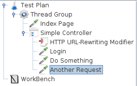](assets/images/url-rewrite-example-a_43fa190072e3e410.png)

Figure 1 - Test Tree

In Figure 2, we see the URL Re-writing modifier GUI, which just has a field for the user to specify
the name of the session ID parameter. There is also a checkbox for indicating that the session ID should
be part of the path (separated by a ";"), rather than a request parameter

[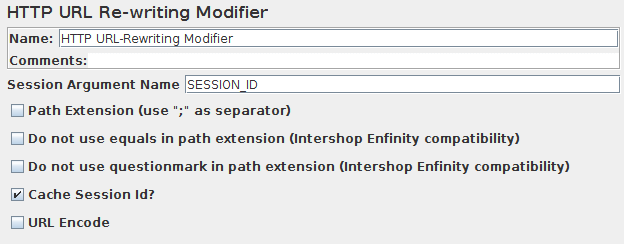](assets/images/url-rewrite-example-b_2c30b1958920b71b.png)

Figure 2 - Request parameters

<a id="build-adv-web-test-plan--header_manager"></a>
<a id="build-adv-web-test-plan--5.2-using-a-header-manager"></a>

# 5.2 Using a Header Manager[¶](#build-adv-web-test-plan--header_manager "Link to here")

The [HTTP Header Manager](#component_reference--http_header_manager) lets you customize what information
JMeter sends in the HTTP request header. This header includes properties like "User-Agent",
"Pragma", "Referer", etc.

The [HTTP Header Manager](#component_reference--http_header_manager), like the [HTTP Cookie Manager](#component_reference--http_cookie_manager), should probably be added at the Thread Group level, unless for some reason you wish to
specify different headers for the different [HTTP Request](#component_reference--http_request) objects in
your test.

- [< Prev](#build-web-test-plan)
- [Index](https://jmeter.apache.org/index.html)
- [Next >](#build-db-test-plan)

Share this page:

- share
- tweet

[Go to top](#build-adv-web-test-plan--top)

---

<a id="build-db-test-plan"></a>

<!-- source_url: https://jmeter.apache.org/usermanual/build-db-test-plan.html -->

<!-- page_index: 14 -->

# 6. Building a Database Test Plan ¶

- [Twitter](https://twitter.com/ApacheJMeter "Follow us on Twitter")
- [github](https://github.com/apache/jmeter "Fork us on github")

- [< Prev](#build-adv-web-test-plan)
- [Index](https://jmeter.apache.org/index.html)
- [Next >](#build-ftp-test-plan)

<a id="build-db-test-plan--building"></a>
<a id="build-db-test-plan--6.-building-a-database-test-plan"></a>

# 6. Building a Database Test Plan[¶](#build-db-test-plan--building "Link to here")

In this section, you will learn how to create a basic
[Test Plan](#build-test-plan) to test a database server.
You will create fifty users that send 2 SQL requests to the database server.
Also, you will tell the users to run their tests 100 times. So, the total number
of requests is (50 users) x (2 requests) x (repeat 100 times) = 10'000 JDBC requests.
To construct the Test Plan, you will use the following elements:
[Thread Group](#test_plan--thread_group), [JDBC Request](#component_reference--jdbc_request), [Summary Report](#component_reference--summary_report).

This example uses the MySQL database driver.
To use this driver, its containing .jar file (ex. mysql-connector-java-X.X.X-bin.jar) must be copied to the JMeter
./lib directory (see [JMeter's Classpath](#get-started--classpath)
for more details).

<a id="build-db-test-plan--adding_users"></a>
<a id="build-db-test-plan--6.1-adding-users"></a>

# 6.1 Adding Users[¶](#build-db-test-plan--adding_users "Link to here")

The first step you want to do with every JMeter Test Plan is to add a
[Thread Group](#test_plan--thread_group) element. The Thread Group
tells JMeter the number of users you want to simulate, how often the users should
send requests, and how many requests they should send.

Go ahead and add the ThreadGroup element by first selecting the Test Plan, clicking your right mouse button to get the Add menu, and then select
Add → ThreadGroup.

You should now see the Thread Group element under Test Plan. If you do not
see the element, then *expand* the Test Plan tree by clicking on the
Test Plan element.

Next, you need to modify the default properties. Select the Thread Group element
in the tree, if you have not already selected it. You should now see the Thread
Group Control Panel in the right section of the JMeter window (see Figure 6.1
below)

[](assets/images/threadgroup1_743a204ec5be8fa2.png)

Figure 6.1. Thread Group with Default Values

Start by providing a more descriptive name for our Thread Group. In the name
field, enter JDBC Users.

You will need a valid database, database table, and user-level access to that
table. In the example shown here, the database is 'cloud' and the table name is
'vm\_instance'.

Next, increase the number of users to 50.

In the next field, the Ramp-Up Period, leave the value of 10
seconds. This property tells JMeter how long to delay between starting each
user. For example, if you enter a Ramp-Up Period of 10 seconds, JMeter will
finish starting all of your users by the end of the 10 seconds. So, if we have
50 users and a 10 second Ramp-Up Period, then the delay between starting users
would be 200 milliseconds (10 seconds / 50 users = 0.2 second per user). If you set the
value to 0, then JMeter will immediately start all of your users.

Finally, enter a value of 100 in
the Loop Count field. This property tells JMeter how many times to repeat your
test. To have JMeter repeatedly run your Test Plan, select the Forever
checkbox.

In most applications, you have to manually accept
changes you make in a Control Panel. However, in JMeter, the Control Panel
automatically accepts your changes as you make them. If you change the
name of an element, the tree will be updated with the new text after you
leave the Control Panel (for example, when selecting another tree element).

See Figure 6.2 for the completed JDBC Users Thread Group.

[](assets/images/threadgroup2_b1367008a59b5da7.png)

Figure 6.2. JDBC Users Thread Group

<a id="build-db-test-plan--adding_requests"></a>
<a id="build-db-test-plan--6.2-adding-jdbc-requests"></a>

# 6.2 Adding JDBC Requests[¶](#build-db-test-plan--adding_requests "Link to here")

Now that we have defined our users, it is time to define the tasks that they
will be performing. In this section, you will specify the JDBC requests to
perform.

Begin by selecting the JDBC Users element. Click your right mouse button
to get the **Add** menu, and then select Add → Config Element → JDBC Connection Configuration.
Then, select this new element to view its Control Panel (see Figure 6.3).

Set up the following fields (these assume we will be using a MySQL database called 'cloud'):

- Variable name (here: myDatabase) bound to pool. This needs to uniquely identify the configuration. It is used by the JDBC Sampler to identify the configuration to be used.
- Database URL: jdbc:mysql://ipOfTheServer:3306/cloud
- JDBC Driver class: com.mysql.jdbc.Driver
- Username: *the username of database*
- Password: *password for the username*

The other fields on the screen can be left as the defaults.

JMeter creates a database connection pool with the configuration settings as specified in the Control Panel.
The pool is referred to in JDBC Requests in the 'Variable Name' field.
Several different JDBC Configuration elements can be used, but they must have unique names.
Every JDBC Request must refer to a JDBC Configuration pool.
More than one JDBC Request can refer to the same pool.

[](assets/images/jdbc-config_5f2c4be3a9409f70.png)

Figure 6.3. JDBC Configuration

Selecting the JDBC Users element again. Click your right mouse button
to get the **Add** menu, and then select Add → Sampler → JDBC Request.
Then, select this new element to view its Control Panel (see Figure 6.4).

[](assets/images/jdbcrequest_6344f1ea6e7a1703.png)

Figure 6.4. JDBC Request

In our Test Plan, we will make two JDBC requests. The first one is for
select all 'Running' VM instances, and the second is to select 'Expunging' VM instance (obviously you should
change these to examples appropriate for your particular database). These
are illustrated below.

JMeter sends requests in the order that you add them to the tree.

Start by editing the following properties (see Figure 6.5):

- Change the Name to 'VM Running'.
- Enter the Pool Name: 'myDatabase' (same as in the configuration element)
- Enter the SQL Query String field.
- Enter the Parameter values field with 'Running' value.
- Enter the Parameter types with 'VARCHAR'.

[](assets/images/jdbcrequest2_90ed767985adfed0.png)

Figure 6.5. JDBC Request for the first SQL request

Next, add the second JDBC Request and edit the following properties (see
Figure 6.6):

- Change the Name to 'VM Expunging'.
- Change the value of Parameter values to 'Expunging'.

[](assets/images/jdbcrequest3_633f7b22a0e9b7e4.png)

Figure 6.6. JDBC Request for the second request

<a id="build-db-test-plan--adding_listener"></a>
<a id="build-db-test-plan--6.3-adding-a-listener-to-view-store-the-test-results"></a>

# 6.3 Adding a Listener to View/Store the Test Results[¶](#build-db-test-plan--adding_listener "Link to here")

The final element you need to add to your Test Plan is a
[Listener](#component_reference--listeners). This element is
responsible for storing all of the results of your JDBC requests in a file
and presenting the results.

Select the *JDBC Users* element and add a [Summary Report](#component_reference--summary_report)
listener (Add → Listener → Summary Report).

Save the test plan, and run the test with the menu
Run → Start or
Ctrl + R

The listener shows the results.

[](assets/images/jdbc-results_b1842c3511eadb3a.png)

Figure 6.7. Graph results Listener

- [< Prev](#build-adv-web-test-plan)
- [Index](https://jmeter.apache.org/index.html)
- [Next >](#build-ftp-test-plan)

Share this page:

- share
- tweet

[Go to top](#build-db-test-plan--top)

---

<a id="build-ftp-test-plan"></a>

<!-- source_url: https://jmeter.apache.org/usermanual/build-ftp-test-plan.html -->

<!-- page_index: 15 -->

# 7. Building an FTP Test Plan ¶

- [Twitter](https://twitter.com/ApacheJMeter "Follow us on Twitter")
- [github](https://github.com/apache/jmeter "Fork us on github")

- [< Prev](#build-db-test-plan)
- [Index](https://jmeter.apache.org/index.html)
- [Next >](#build-ldap-test-plan)

<a id="build-ftp-test-plan--building"></a>
<a id="build-ftp-test-plan--7.-building-an-ftp-test-plan"></a>

# 7. Building an FTP Test Plan[¶](#build-ftp-test-plan--building "Link to here")

In this section, you will learn how to create a basic
[Test Plan](#build-test-plan) to test an FTP site. You will
create four users that send requests for two files on a FTP site.
Also, you will tell the users to run their tests twice. So, the total number of
requests is (4 users) x (2 requests) x (repeat 2 times) = 16 FTP requests.

To construct the Test Plan, you will use the following elements:
[Thread Group](#test_plan--thread_group), [FTP Request](#component_reference--ftp_request), [FTP Request Defaults](#component_reference--ftp_request_defaults), and
[View Results in Table](#component_reference--view_results_in_table).

<a id="build-ftp-test-plan--adding_users"></a>
<a id="build-ftp-test-plan--7.1-adding-users"></a>

# 7.1 Adding Users[¶](#build-ftp-test-plan--adding_users "Link to here")

The first step you want to do with every JMeter Test Plan is to add a
[Thread Group](#test_plan--thread_group) element. The Thread Group tells
JMeter the number of users you want to simulate, how often the users should send
requests, and the how many requests they should send.

Go ahead and add the Thread Group element by first selecting the Test Plan, clicking your right mouse button to get the Add menu, and then select
**Add** → **ThreadGroup.**

You should now see the **Thread Group** element under **Test Plan.** If you do not
see the element, then "expand" the Test Plan tree by clicking on the
**Test Plan** element.

Next, you need to modify the default properties. Select the **Thread Group** element
in the tree, if you have not already selected it. You should now see the Thread
Group Control Panel in the right section of the JMeter window (see Figure 7.1
below)

[](assets/images/threadgroup_8ae3142533bb239a.png)

Figure 7.1. Thread Group with Default Values

Start by providing a more descriptive name for our **Thread Group.** In the name
field, enter 'FTP Users'.

Next, increase the number of users to 4.

In the next field, the *Ramp-Up* Period, leave the default value of 0
seconds. This property tells JMeter how long to delay between starting each
user. For example, if you enter a *Ramp-Up* Period of 5 seconds, JMeter will
finish starting all of your users by the end of the 5 seconds. So, if we have
5 users and a 5 second *Ramp-Up* Period, then the delay between starting users
would be 1 second (5 users / 5 seconds = 1 user per second). If you set the
value to 0, then JMeter will immediately start all of your users.

Finally, enter a value of 2 in
the *Loop Count* field. This property tells JMeter how many times to repeat your
test. To have JMeter repeatedly run your **Test Plan,** select the *Forever*
checkbox.

In most applications, you have to manually accept
changes you make in a Control Panel. However, in JMeter, the Control Panel
automatically accepts your changes as you make them. If you change the
name of an element, the tree will be updated with the new text after you
leave the Control Panel (for example, when selecting another tree element).

See Figure 7.2 for the completed FTP Users Thread Group.

[](assets/images/threadgroup2_f959613fdb0f0eed.png)

Figure 7.2. FTP Users Thread Group

<a id="build-ftp-test-plan--adding_defaults"></a>
<a id="build-ftp-test-plan--7.2-adding-default-ftp-request-properties"></a>

# 7.2 Adding Default FTP Request Properties[¶](#build-ftp-test-plan--adding_defaults "Link to here")

Now that we have defined our users, it is time define the tasks that they
will be performing. In this section, you will specify the default settings
for your FTP requests. And then, in section 7.3, you will add **FTP Request**
elements which use some of the default settings you specified here.

Begin by selecting the FTP Users element. Click your right mouse button
to get the Add menu, and then select **Add** → **Config Element** → **FTP Request
Defaults.** Then, select this new element to view its Control Panel (see Figure 7.3).

[](assets/images/ftp-defaults_89419b50505ede9e.png)

Figure 7.3. FTP Request Defaults

Like most JMeter elements, the [FTP Request Defaults](#component_reference--ftp_request_defaults) Control
Panel has a name field that you can modify. In this example, leave this field with
the default value.

Skip to the next field, which is the FTP Server's Server Name/IP. For the
Test Plan that you are building, all FTP requests will be sent to the same
FTP server, ftp.domain.com in this case. Enter this domain name into the field.
This is the only field that we will specify a default, so leave the remaining
fields with their default values.

The FTP Request Defaults element does not tell JMeter
to send an FTP request. It simply defines the default values that the
FTP Request elements use.

See Figure 7.4 for the completed FTP Request Defaults element

[](assets/images/ftp-defaults2_d9fc4524a0e85958.png)

Figure 7.4. FTP Defaults for our Test Plan

<a id="build-ftp-test-plan--adding_requests"></a>
<a id="build-ftp-test-plan--7.3-adding-ftp-requests"></a>

# 7.3 Adding FTP Requests[¶](#build-ftp-test-plan--adding_requests "Link to here")

In our **Test Plan**, we need to make two **FTP requests**.

JMeter sends requests in the order that they appear in the tree.

Start by adding the first [FTP Request](#component_reference--ftp_request)
to the FTP Users element (**Add** → **Sampler** → **FTP Request**).
Then, select the **FTP Request** element in the tree and edit the following properties
(see Figure 7.5):

1. Change the *Name* to "File1".
2. Change the *Remote File* field to "/directory/file1.txt".
3. Change the *Username* field to "anonymous".
4. Change the *Password* field to "anonymous@test.com".

You do not have to set the *Server Name* field because you already specified
this value in the **FTP Request Defaults** element.

[](assets/images/ftp-request_fbad39b4914f65c2.png)

Figure 7.5. FTP Request for file1

Next, add the second **FTP Request** and edit the following properties (see
Figure 7.6:

1. Change the *Name* to "File2".
2. Change the *Remote File* field to "/directory/file2.txt".
3. Change the *Username* field to "anonymous".
4. Change the *Password* field to "anonymous@test.com".

[](assets/images/ftp-request2_af5eae6345839602.png)

Figure 7.6. FTP Request for file2

<a id="build-ftp-test-plan--adding_listener"></a>
<a id="build-ftp-test-plan--7.4-adding-a-listener-to-view-store-the-test-results"></a>

# 7.4 Adding a Listener to View/Store the Test Results[¶](#build-ftp-test-plan--adding_listener "Link to here")

The final element you need to add to your **Test Plan** is a
[Listener](#component_reference--listeners). This element is
responsible for storing all of the results of your **FTP requests** in a file and presenting
a visual model of the data.

Select the FTP Users element and add a [View Results in Table](#component_reference--view_results_in_table)
listener (**Add** → **Listener** → **View Results in Table**).

Run your test and view the results.

[](assets/images/ftp-results_97b555d5ef804e73.png)

Figure 7.7. View Results in Table Listener

- [< Prev](#build-db-test-plan)
- [Index](https://jmeter.apache.org/index.html)
- [Next >](#build-ldap-test-plan)

Share this page:

- share
- tweet

[Go to top](#build-ftp-test-plan--top)

---

<a id="build-jms-point-to-point-test-plan"></a>

<!-- source_url: https://jmeter.apache.org/usermanual/build-jms-point-to-point-test-plan.html -->

<!-- page_index: 16 -->

# 10. Building a JMS Point-to-Point Test Plan ¶

- [Twitter](https://twitter.com/ApacheJMeter "Follow us on Twitter")
- [github](https://github.com/apache/jmeter "Fork us on github")

- [< Prev](#build-ws-test-plan)
- [Index](https://jmeter.apache.org/index.html)
- [Next >](#build-jms-topic-test-plan)

<a id="build-jms-point-to-point-test-plan--building"></a>
<a id="build-jms-point-to-point-test-plan--10.-building-a-jms-point-to-point-test-plan"></a>

# 10. Building a JMS Point-to-Point Test Plan[¶](#build-jms-point-to-point-test-plan--building "Link to here")

Make sure the required jar files are in JMeter's lib directory. If they are not, shutdown JMeter, copy the jar files over and restart JMeter.
See [Getting Started](#get-started--libraries_activemq) for details.

In this section, you will learn how to create a
[Test Plan](#build-test-plan) to test a JMS Point-to-Point messaging solution.
The setup of the test is 1 threadgroup with 5 threads sending 4 messages each through a request queue.
A fixed reply queue will be used for monitoring the reply messages.
To construct the Test Plan, you will use the
following elements:
[Thread Group](#test_plan--thread_group), [JMS Point-to-Point](#component_reference--jms_point-to-point), and
[Graph Results](#component_reference--graph_results).

General notes on JMS: There are currently two JMS samplers. One uses JMS topics
and the other uses queues. Topic messages are commonly known as pub/sub messaging.
Topic messaging is generally used in cases where a message is published by a producer and
consumed by multiple subscribers. A JMS sampler needs the JMS implementation jar files;
for example, from Apache ActiveMQ. See [here](#get-started--libraries_activemq) for the list
of jars provided by ActiveMQ.

<a id="build-jms-point-to-point-test-plan--adding_threadgroup"></a>
<a id="build-jms-point-to-point-test-plan--10.1-adding-a-thread-group"></a>

# 10.1 Adding a Thread Group[¶](#build-jms-point-to-point-test-plan--adding_threadgroup "Link to here")

The first step you want to do with every JMeter Test Plan is to add a
[Thread Group](#test_plan--thread_group) element. The Thread Group tells
JMeter the number of users you want to simulate, how often the users should send
requests, and the how many requests they should send.

Go ahead and add the ThreadGroup element by first selecting the Test Plan, clicking your right mouse button to get the Add menu, and then select
Add → ThreadGroup.

You should now see the Thread Group element under Test Plan. If you do not
see the element, then "expand" the Test Plan tree by clicking on the
Test Plan element.

Next, you need to modify the default properties. Select the Thread Group element
in the tree, if you have not already selected it. You should now see the Thread
Group Control Panel in the right section of the JMeter window (see Figure 10.1
below)

[](assets/images/threadgroup_8ae3142533bb239a.png)

Figure 10.1. Thread Group with Default Values

Start by providing a more descriptive name for our Thread Group. In the name
field, enter Point-to-Point.

Next, increase the number of users (called threads) to 5.

In the next field, the Ramp-Up Period, leave set the value to 0
seconds. This property tells JMeter how long to delay between starting each
user. For example, if you enter a Ramp-Up Period of 5 seconds, JMeter will
finish starting all of your users by the end of the 5 seconds. So, if we have
5 users and a 5 second Ramp-Up Period, then the delay between starting users
would be 1 second (5 users / 5 seconds = 1 user per second). If you set the
value to 0, then JMeter will immediately start all of your users.

Clear the checkbox labeled "Forever", and enter a value of 4 in the Loop
Count field. This property tells JMeter how many times to repeat your test.
If you enter a loop count value of 0, then JMeter will run your test only
once. To have JMeter repeatedly run your Test Plan, select the Forever
checkbox.

In most applications, you have to manually accept
changes you make in a Control Panel. However, in JMeter, the Control Panel
automatically accepts your changes as you make them. If you change the
name of an element, the tree will be updated with the new text after you
leave the Control Panel (for example, when selecting another tree element).

<a id="build-jms-point-to-point-test-plan--adding_point_to_point_sampler"></a>
<a id="build-jms-point-to-point-test-plan--10.2-adding-jms-point-to-point-sampler"></a>

# 10.2 Adding JMS Point-to-Point Sampler[¶](#build-jms-point-to-point-test-plan--adding_point_to_point_sampler "Link to here")

Start by adding the sampler [JMS Point-to-Point](#component_reference--jms_point-to-point)
to the Point-to-Point element
(Add → Sampler → JMS Point-to-Point).
Then, select the JMS Point-to-Point sampler element in the tree.
In building the example a configuration will be provided that works with ActiveMQ 3.0.

<table>
<thead></thead>
<tr>
<th>Name</th>
<th>Value</th>
<th>Description</th>
</tr>
<tbody></tbody>
<tr>
<th colspan="3">JMS Resources</th>
</tr>
<tr>
<td colspan="1">QueueConnectionFactory</td>
<td><span>ConnectionFactory</span></td>
<td> This is the default JNDI entry for the connection factory within ActiveMQ.</td>
</tr>
<tr>
<td>JNDI Name Request Queue</td>
<td><span>Q.REQ</span></td>
<td>This is equal to the JNDI name defined in the JNDI properties.</td>
</tr>
<tr>
<td>JNDI Name Reply Queue</td>
<td><span>Q.RPL</span></td>
<td>This is equal to the JNDI name defined in the JNDI properties.</td>
</tr>
<tr>
<th colspan="3">Message Properties</th>
</tr>
<tr>
<td colspan="1">Communication Style</td>
<td><span>Request Response</span></td>
<td>This means that you need at least a service running outside of JMeter and that will respond to the requests.
                        This service must listen to the Request Queue and send messages to the queue referenced by the <span>message.getJMSReplyTo()</span></td>
</tr>
<tr>
<td>Content</td>
<td><span>test</span></td>
<td>This is just the content of the message.</td>
</tr>
<tr>
<td>JMS Properties</td>
<td></td>
<td>Nothing needed for ActiveMQ.</td>
</tr>
<tr>
<th colspan="3">JNDI Properties</th>
</tr>
<tr>
<td colspan="1">InitialContextFactory</td>
<td><span>org.apache.activemq.jndi.ActiveMQInitialContextFactory</span></td>
<td>The standard InitialContextFactory for ActiveMQ</td>
</tr>
<tr>
<th colspan="3"> Properties</th>
</tr>
<tr>
<td colspan="1"><span>queue.Q.REQ</span></td>
<td><span>example.A</span></td>
<td>This defines a JNDI name <span>Q.REQ</span> for the request queue that points to the queue <span>example.A</span></td>
</tr>
<tr>
<td colspan="1"><span>queue.Q.RPL</span></td>
<td><span>example.B</span></td>
<td>This defines a JNDI name <span>Q.RPL</span> for the reply queue that points to the queue <span>example.B</span></td>
</tr>
<tr>
<th colspan="3">Provider URL</th>
</tr>
<tr>
<td colspan="1">Provider URL</td>
<td><span>tcp://localhost:61616</span></td>
<td>This defines the URL of the ActiveMQ messaging system.</td>
</tr>
</table>

<a id="build-jms-point-to-point-test-plan--adding_listener"></a>
<a id="build-jms-point-to-point-test-plan--10.3-adding-a-listener-to-view-store-the-test-results"></a>

# 10.3 Adding a Listener to View Store the Test Results[¶](#build-jms-point-to-point-test-plan--adding_listener "Link to here")

The final element you need to add to your Test Plan is a
[Listener](#component_reference--listeners). This element is
responsible for storing all of the results of your JMS requests in a file and presenting
a visual model of the data.

Select the Thread Group element and add a
[Graph Results](#component_reference--graph_results) listener
(Add → Listener → Graph Results). Next, you need to specify a directory and filename of the
output file. You can either type it into the filename field, or select the
Browse button and browse to a directory and then enter a filename.

[](assets/images/graph-results_a7068abc061ac50c.png)

Figure 10.2. Graph Results Listener

- [< Prev](#build-ws-test-plan)
- [Index](https://jmeter.apache.org/index.html)
- [Next >](#build-jms-topic-test-plan)

Share this page:

- share
- tweet

[Go to top](#build-jms-point-to-point-test-plan--top)

---

<a id="build-jms-topic-test-plan"></a>

<!-- source_url: https://jmeter.apache.org/usermanual/build-jms-topic-test-plan.html -->

<!-- page_index: 17 -->

# 11. Building a JMS Topic Test Plan ¶

- [Twitter](https://twitter.com/ApacheJMeter "Follow us on Twitter")
- [github](https://github.com/apache/jmeter "Fork us on github")

- [< Prev](#build-jms-point-to-point-test-plan)
- [Index](https://jmeter.apache.org/index.html)
- [Next >](#build-programmatic-test-plan)

<a id="build-jms-topic-test-plan--building"></a>
<a id="build-jms-topic-test-plan--11.-building-a-jms-topic-test-plan"></a>

# 11. Building a JMS Topic Test Plan[¶](#build-jms-topic-test-plan--building "Link to here")

JMS requires some optional jars to be downloaded. Please refer to [Getting Started](#get-started) for full details.

In this section, you will learn how to create a
[Test Plan](#build-test-plan) to test JMS Providers. You will
create five subscribers and one publisher. You will create 2 thread groups and set
each one to 10 iterations. The total messages is (6 threads) x (1 message) x
(repeat 10 times) = 60 messages. To construct the Test Plan, you will use the
following elements:
[Thread Group](#test_plan--thread_group), [JMS Publisher](#component_reference--jms_publisher), [JMS Subscriber](#component_reference--jms_subscriber), and
[Graph Results](#component_reference--graph_results).

General notes on JMS: There are currently two JMS samplers. One uses JMS topics
and the other uses queues. Topic messages are commonly known as pub/sub messaging.
Topic messaging is generally used in cases where a message is published by a producer and
consumed by multiple subscribers. Queue messaging is generally used for transactions
where the sender expects a response. Messaging systems are quite different from
normal HTTP requests. In HTTP, a single user sends a request and gets a response.
Messaging system can work in synchronous and asynchronous mode. A JMS sampler needs
the JMS implementation jar files; for example, from Apache ActiveMQ.
See [here](#get-started--libraries_activemq) for the list of jars provided by ActiveMQ.

<a id="build-jms-topic-test-plan--adding_users"></a>
<a id="build-jms-topic-test-plan--11.1-adding-users"></a>

# 11.1 Adding Users[¶](#build-jms-topic-test-plan--adding_users "Link to here")

The first step is add a [Thread Group](#test_plan--thread_group)
element. The Thread Group tells JMeter the number of users you want to simulate, how often the users should send requests, and how many requests they should
send.

Go ahead and add the ThreadGroup element by first selecting the Test Plan, clicking your right mouse button to get the Add menu, and then select
Add → ThreadGroup.

You should now see the Thread Group element under Test Plan. If you do not
see the element, then "expand" the Test Plan tree by clicking on the
Test Plan element.

Next, you need to modify the default properties. Select the Thread Group element
in the tree, if you have not already selected it. You should now see the Thread
Group Control Panel in the right section of the JMeter window (see Figure 11.1
below)

[](assets/images/threadgroup_8ae3142533bb239a.png)

Figure 11.1. Thread Group with Default Values

Start by providing a more descriptive name for our Thread Group. In the name
field, enter Subscribers.

Next, increase the number of users (called threads) to 5.

In the next field, the Ramp-Up Period, set the value to 0
seconds. This property tells JMeter how long to delay between starting each
user. For example, if you enter a Ramp-Up Period of 5 seconds, JMeter will
finish starting all of your users by the end of the 5 seconds. So, if we have
5 users and a 5 second Ramp-Up Period, then the delay between starting users
would be 1 second (5 users / 5 seconds = 1 user per second). If you set the
value to 0, JMeter will immediately start all users.

Clear the checkbox labeled "Forever", and enter a value of 10 in the Loop
Count field. This property tells JMeter how many times to repeat your test.
If you enter a loop count value of 0, then JMeter will run your test only
once. To have JMeter repeatedly run your Test Plan, select the Forever
checkbox.

Repeat the process and add another thread group. For the second thread
group, enter "Publisher" in the name field, set the number of threads to 1, and set the iteration to 10.

In most applications, you have to manually accept
changes you make in a Control Panel. However, in JMeter, the Control Panel
automatically accepts your changes as you make them. If you change the
name of an element, the tree will be updated with the new text after you
leave the Control Panel (for example, when selecting another tree element).

<a id="build-jms-topic-test-plan--adding_subscriber_publisher"></a>
<a id="build-jms-topic-test-plan--11.2-adding-jms-subscriber-and-publisher"></a>

# 11.2 Adding JMS Subscriber and Publisher[¶](#build-jms-topic-test-plan--adding_subscriber_publisher "Link to here")

Make sure the required jar files are in JMeter's lib directory. If they are
not, shutdown JMeter, copy the jar files over and restart JMeter.

Start by adding the sampler [JMS Subscriber](#component_reference--jms_subscriber)
to the Subscribers element
(Add → Sampler → JMS Subscriber).
Then, select the JMS Subscriber element in the tree and edit the following properties:

1. Change the Name field to "Sample Subscriber"
2. If the JMS provider uses the jndi.properties file, check the box
3. Enter the name of the InitialContextFactory class. For example, with ActiveMQ 5.4, the value is "org.apache.activemq.jndi.ActiveMQInitialContextFactory"
4. Enter the provider URL. This is the URL for the JNDI server, if there is one. For example, with ActiveMQ 5.4 on local machine with default port, the value is "tcp://localhost:61616"
5. Enter the name of the connection factory. Please refer to the documentation
   of the JMS provider for the information. For ActiveMQ, the default is "ConnectionFactory"
6. Enter the name of the message topic. For ActiveMQ Dynamic Topics (create topics dynamically), example value is "dynamicTopics/MyStaticTopic1"

   Note: Setup at startup mean that JMeter starting to listen on the Destination at beginning of test without name change possibility.
   Setup on Each sample mean that JMeter (re)starting to listen before run each JMS Subscriber sample,
   this last option permit to have Destination name with some JMeter variables
7. If the JMS provider requires authentication, check "required" and enter the
   username and password. For example, Orion JMS requires authentication, while ActiveMQ
   and MQSeries does not
8. Enter 10 in "Number of samples to aggregate". For performance reasons, the sampler
   will aggregate messages, since small messages will arrive very quickly. If the sampler
   didn't aggregate the messages, JMeter wouldn't be able to keep up.
9. If you want to read the response, check the box
10. There are two client implementations for subscribers. If the JMS provider
    exhibits zombie threads with one client, try the other.

[](assets/images/jms-sub_fee980c8187d6544.png)

Figure 11.2. JMS Subscriber

Next add the sampler [JMS Publisher](#component_reference--jms_publisher)
to the Publisher element
(Add → Sampler → JMS Publisher).
Then, select the JMS Publisher element in the tree and edit the following properties:

1. Change the Name field to "Sample Publisher".
2. If the JMS provider uses the jndi.properties file, check the box
3. Enter the name of the InitialContextFactory class. For example, with ActiveMQ 5.4, the value is "org.apache.activemq.jndi.ActiveMQInitialContextFactory"
4. Enter the provider URL. This is the URL for the JNDI server, if there is one. For example, with ActiveMQ 5.4 on local machine with default port, the value is "tcp://localhost:61616"
5. Enter the name of the connection factory. Please refer to the documentation
   of the JMS provider for the information. For ActiveMQ, the default is "ConnectionFactory"
6. Enter the name of the message topic. For ActiveMQ Dynamic Topics (create topics dynamically), example value is "dynamicTopics/MyStaticTopic1".

   Note: Setup at startup mean that JMeter starting connection with the Destination at beginning of test without name change possibility.
   Setup on Each sample mean that JMeter (re)starting the connection before run each JMS Publisher sample,
   this last option permit to have Destination name with some JMeter variables
7. If the JMS provider requires authentication, check "required" and enter the
   username and password. For example, Orion JMS requires authentication, while ActiveMQ
   and MQSeries does not
8. Enter 10 in "Number of samples to aggregate". For performance reasons, the sampler
   will aggregate messages, since small messages will arrive very quickly. If the sampler
   didn't aggregate the messages, JMeter wouldn't be able to keep up.
9. Select the appropriate configuration for getting the message to publish. If you
   want the sampler to randomly select the message, place the messages in a directory
   and select the directory using browse.
10. Select the message type. If the message is in object format or map message, make sure the
    message is generated correctly.

[](assets/images/jms-pub_7767ad68fc941fe4.png)

Figure 11.3. JMS Publisher

<a id="build-jms-topic-test-plan--adding_listener"></a>
<a id="build-jms-topic-test-plan--11.3-adding-a-listener-to-view-store-the-test-results"></a>

# 11.3 Adding a Listener to View Store the Test Results[¶](#build-jms-topic-test-plan--adding_listener "Link to here")

The final element you need to add to your Test Plan is a
[Listener](#component_reference--listeners). This element is
responsible for storing all of the results of your HTTP requests in a file and presenting
a visual model of the data.

Select the Test Plan element and add a [Graph Results](#component_reference--graph_results) listener
(Add → Listener → Graph Results). Next, you need to specify a directory and filename of the
output file. You can either type it into the filename field, or select the
Browse button and browse to a directory and then enter a filename.

[](assets/images/graph-results_a7068abc061ac50c.png)

Figure 11.4. Graph Results Listener

- [< Prev](#build-jms-point-to-point-test-plan)
- [Index](https://jmeter.apache.org/index.html)
- [Next >](#build-programmatic-test-plan)

Share this page:

- share
- tweet

[Go to top](#build-jms-topic-test-plan--top)

---

<a id="build-ldap-test-plan"></a>

<!-- source_url: https://jmeter.apache.org/usermanual/build-ldap-test-plan.html -->

<!-- page_index: 18 -->

# 8a. Building an LDAP Test Plan ¶

- [Twitter](https://twitter.com/ApacheJMeter "Follow us on Twitter")
- [github](https://github.com/apache/jmeter "Fork us on github")

- [< Prev](#build-ftp-test-plan)
- [Index](https://jmeter.apache.org/index.html)
- [Next >](#build-ldapext-test-plan)

<a id="build-ldap-test-plan--building"></a>
<a id="build-ldap-test-plan--8a.-building-an-ldap-test-plan"></a>

# 8a. Building an LDAP Test Plan[¶](#build-ldap-test-plan--building "Link to here")

In this section, you will learn how to create a basic Test Plan to test an LDAP server.
You will create four users that send requests for four tests on the LDAP server. Also, you will tell
the users to run their tests 4 times. So, the total number of requests is (4 users) x (4 requests) x
(repeat 4 times) = 64 LDAP requests. To construct the Test Plan, you will use the following elements:
[Thread Group](#test_plan--thread_group), [LDAP Request](#component_reference--ldap_request), [LDAP Request Defaults](#component_reference--ldap_request_defaults), and
[View Results in Table](#component_reference--view_results_in_table)
.

This example assumes that the LDAP Server is available at ldap.test.com.

<a id="build-ldap-test-plan--adding_users"></a>
<a id="build-ldap-test-plan--8a.1-adding-users"></a>

# 8a.1 Adding Users[¶](#build-ldap-test-plan--adding_users "Link to here")

The first step you want to do with every JMeter Test Plan is to add a Thread Group element.
The Thread Group tells JMeter the number of users you want to simulate, how often the users should send
requests, and the how many requests they should send.

Go ahead and add the ThreadGroup element by first selecting the Test Plan, clicking your
right mouse button to get the Add menu, and then select
Add → ThreadGroup. You should now see the
Thread Group element under Test Plan. If you do not see the element, then "expand" the Test Plan tree by
clicking on the Test Plan element.
[](assets/images/threadgroup_3aa40dd5ce1bc38c.png)

Figure 8a.1. Thread Group and final test tree

<a id="build-ldap-test-plan--add_login"></a>
<a id="build-ldap-test-plan--8a.2-adding-login-config-element"></a>

# 8a.2 Adding Login Config Element[¶](#build-ldap-test-plan--add_login "Link to here")

Begin by selecting the LDAP Users element. Click your right mouse
button to get the Add menu, and then select
Add → Config Element → Login Config Element.
Then, select this new element to view its Control Panel.

Like most JMeter elements, the Login Config Element's Control Panel has a name
field that you can modify. In this example, leave this field with the default value.

[](assets/images/login-config-element_4e004fd0b0d9ea55.png)

Figure 8a.2 Login Config Element for our Test Plan

Enter Username field to "your LDAP Username", The password field to "your LDAP Password"

These values will be used by the LDAP Requests.

<a id="build-ldap-test-plan--add_defaults"></a>
<a id="build-ldap-test-plan--8a.3-adding-ldap-request-defaults"></a>

# 8a.3 Adding LDAP Request Defaults[¶](#build-ldap-test-plan--add_defaults "Link to here")

Begin by selecting the LDAP Users element. Click your right mouse button
to get the Add menu, and then select
Add → Config Element → LDAP Request Defaults. Then, select this new element to view its Control Panel.

Like most JMeter elements, the LDAP Request Defaults Control Panel has a name
field that you can modify. In this example, leave this field with the default value.

[](assets/images/requestdefaults_38ebfe577a67097b.png)

Figure 8a.3 LDAP Defaults for our Test Plan

Enter DN field to "your LDAP Root Distinguished Name".
Enter LDAP Server's Servername field to "ldap.test.com".
The port to 389.
These values are default for the LDAP Requests.

<a id="build-ldap-test-plan--add_requests"></a>
<a id="build-ldap-test-plan--8a.4-adding-ldap-requests"></a>

# 8a.4 Adding LDAP Requests[¶](#build-ldap-test-plan--add_requests "Link to here")

In our Test Plan, we need to make four LDAP requests.

1. Inbuilt Add Test
2. Inbuilt Search Test
3. Inbuilt Modify Test
4. Inbuilt Delete Test

JMeter sends requests in the order that you add them to the tree.
Start by adding the first LDAP Request to the LDAP Users element
(Add → Sampler → LDAP Request). Then, select the LDAP Request element in the tree
and edit the following properties

1. Rename to "Add" this element
2. Select the Add Test radio button in Test Configuration group

[](assets/images/add_cedb61fd3bc6ef16.png)

Figure 8a.4.1 LDAP Request for Inbuilt Add test

You do not have to set the Servername field, port field, Username, Password
and DN because you already specified this value in the Login Config Element and
LDAP Request Defaults.

Next, add the second LDAP Request and edit the following
properties

1. Rename to "Search" this element
2. Select the Search Test radio button in Test Configuration group

Next, add the Third LDAP Request and edit the following properties

[](assets/images/search_d7689dba680a430a.png)

Figure 8a.4.2 LDAP Request for Inbuilt Search test

1. Rename to "Modify" this element
2. Select the Modify Test radio button in Test Configuration group

Next, add the fourth LDAP Request and edit the following properties

[](assets/images/modify_925d9232fe7bcad4.png)

Figure 8a.4.3 LDAP Request for Inbuilt Modify test

1. Rename to "Delete" this element
2. Select the Delete Test radio button in Test Configuration group

[](assets/images/delete_296b9d91ba7a8b7d.png)

Figure 8a.4.4 LDAP Request for Inbuilt Delete test

<a id="build-ldap-test-plan--responseassertion"></a>
<a id="build-ldap-test-plan--8a.5-adding-a-response-assertion"></a>

# 8a.5 Adding a Response Assertion[¶](#build-ldap-test-plan--responseassertion "Link to here")

You can add a Response Assertion element.
This element will check the received response data by verifying if the response text is "successful".
(Add → Assertion → Response Assertion).

Note: A this position in the tree, the Response Assertion will be executed for each LDAP Request.

1. Select Text Response Radio button in Response Field to Test group
2. Select Substring Radio button in Pattern Matching Rules group
3. Click on Add button and add the string "successful" in Pattern to Test field

[](assets/images/responseassertion_04fe7f08dfece487.png)

Figure 8a.5 LDAP Response Assertion

<a id="build-ldap-test-plan--add_listener"></a>
<a id="build-ldap-test-plan--8a.6-adding-a-listener-to-view-store-the-test-results"></a>

# 8a.6 Adding a Listener to View/Store the Test Results[¶](#build-ldap-test-plan--add_listener "Link to here")

The final element you need to add to your Test Plan is a Listener.
This element is responsible for storing all of the results of your LDAP
requests in a file and presenting a visual model of the data. Select the LDAP
Users element and add a View Results in Table
(Add → Listener → View Results in Table)

[](assets/images/viewtable_ea95d7a6eea5f343.png)

Figure 8a.6 View Results in Table Listener

- [< Prev](#build-ftp-test-plan)
- [Index](https://jmeter.apache.org/index.html)
- [Next >](#build-ldapext-test-plan)

Share this page:

- share
- tweet

[Go to top](#build-ldap-test-plan--top)

---

<a id="build-ldapext-test-plan"></a>

<!-- source_url: https://jmeter.apache.org/usermanual/build-ldapext-test-plan.html -->

<!-- page_index: 19 -->

<a id="build-ldapext-test-plan--ldapexttest"></a>
<a id="build-ldapext-test-plan--8b.-building-an-extended-ldap-test-plan"></a>

# 8b. Building an Extended LDAP Test Plan[¶](#build-ldapext-test-plan--ldapexttest "Link to here")

In this section, you will learn how to create a basic Test Plan to test an LDAP
server.

As the Extended LDAP Sampler is highly configurable, this also means that it takes
some time to build a correct testplan. You can however tune it exactly up to your
needs.

You will create 1 user that send requests for nine tests on the LDAP server. Also, you will tell
the users to run their tests one time. So, the total number of requests is (1 user) x (9 requests) x
(repeat 1 time) = 9 LDAP requests. To construct the Test Plan, you will use the following elements:
[Thread Group](#test_plan--thread_group), [Adding LDAP Extended Request Defaults](#component_reference--adding_ldap_extended_request_defaults), [Adding LDAP Requests](#component_reference--adding_ldap_requests), and
[Adding a Listener to View/Store the Test Results](#component_reference--adding_a_listener_to_view-store_the_test_results)

This example assumes that the LDAP Server is available at ldap.test.com.

For the less experienced LDAP users, I build a [small
LDAP tutorial](#ldapops_tutor) which shortly explains
the several LDAP operations that can be used in building a complex testplan.

Take care when using LDAP special characters in the distinguished name, in that case (e.g. you want to use a + sign in a
distinguished name) you need to escape the character by adding an "\" sign before that character.
Extra exception: if you want to add a \ character in a distinguished name (in an add or rename operation), you need to use 4 backslashes.

Examples:

cn=dolf\+smits
:   to add/search an entry with the name like cn=dolf+smits

cn=dolf \\ smits
:   to search an entry with the name cn=dolf \ smits

cn=c:\\\\log.txt
:   to add an entry with a name like cn=c:\log.txt

<a id="build-ldapext-test-plan--ext_adding_users"></a>
<a id="build-ldapext-test-plan--8b.1-adding-users"></a>

## 8b.1 Adding Users[¶](#build-ldapext-test-plan--ext_adding_users "Link to here")

The first step you want to do with every JMeter Test Plan is to add a Thread Group element.
The Thread Group tells JMeter the number of users you want to simulate, how often the users should send
requests, and the how many requests they should send.

Go ahead and add the Thread Group element by first selecting the Test Plan, clicking your
right mouse button to get the Add menu, and then select Add→Threads (Users)→Thread Group.
You should now see the Thread Group element under Test Plan. If you do not see the element, then "expand" the Test Plan tree by
clicking on the Test Plan element.

[](assets/images/extthreadgroup_5f6a12019d63a835.png)

Figure 8b.1. Thread Group with Default Values

<a id="build-ldapext-test-plan--add_ldapext_defaults"></a>
<a id="build-ldapext-test-plan--8b.2-adding-ldap-extended-request-defaults"></a>

## 8b.2 Adding LDAP Extended Request Defaults[¶](#build-ldapext-test-plan--add_ldapext_defaults "Link to here")

Begin by selecting the LDAP Ext Users element. Click your right mouse button
to get the Add menu, and then select Add→Config Element→LDAP Extended Request Defaults. Then, select this new element to view its Control Panel.

Like most JMeter elements, the LDAP Extended Request Defaults Control Panel has a name
field that you can modify. In this example, leave this field with the default value.

[](assets/images/extrequestdefaults_e6c6043020497399.png)

Figure 8b.2 LDAP Defaults for our Test Plan

For each of the different operations, some default values can be filled in.
In All cases, when a default is filled in, this is used for the LDAP extended requests.
For each request, you can override the defaults by filling in the values in the LDAP extended request sampler.
When no value is entered which is necessary for a test, the test will fail in an unpredictable way!

We will not enter any default values here, as we will build a very small testplan, so we will explain all the different fields when we add the LDAP Extended samplers.

<a id="build-ldapext-test-plan--add_extrequests"></a>
<a id="build-ldapext-test-plan--8b.3-adding-ldap-requests"></a>

## 8b.3 Adding LDAP Requests[¶](#build-ldapext-test-plan--add_extrequests "Link to here")

In our Test Plan, we want to use all 9 LDAP requests.

1. Thread bind
2. Search Test
3. Compare Test
4. Single bind/unbind Test
5. Add Test
6. Modify Test
7. Rename entry (moddn)
8. Delete Test
9. Thread unbind

JMeter sends requests in the order that you add them to the tree.

Adding a requests always start by:
Adding the LDAP Extended Request to the LDAP Ext Users element (Add→
Sampler→LDAP Ext Request). Then, select the LDAP Ext Request element in the tree
and edit the following properties.

<a id="build-ldapext-test-plan--add_threadbind"></a>
<a id="build-ldapext-test-plan--8b.3.1-adding-a-thread-bind-request"></a>

## 8b.3.1 Adding a Thread bind Request[¶](#build-ldapext-test-plan--add_threadbind "Link to here")

1. Rename the element: "1. Thread bind"
2. Select the "Thread bind" button.
3. Enter the hostname value from the LDAP server in the Servername field
4. Enter the portnumber from the LDAP server (636 : ldap over SSL) in the port field
5. *(Optional)* Enter the baseDN in the DN field, this baseDN will be used as the starting point for searches, add, deletes, etc.
   take care that this must be the uppermost shared level for all your request, e.g. when all information is stored under ou=Users, dc=test, dc=com, you can use this value in the basedn.
6. *(Optional)* Enter the distinguished name from the user you want to use for authentication.
   When this field is kept empty, an anonymous bind will be established.
7. *(Optional)* Enter the password for the user you want to authenticate with, an empty password will also lead to an anonymous bind.
8. *(Optional)* Enter a value for the connection timeout with LDAP
9. *(Optional)* Check the box Use Secure LDAP Protocol if you access with LDAP over SSL (ldaps)
10. *(Optional)* Check the box TrustAll if you want the client to trust all certificates

[](assets/images/extthreadbind_bff9d84d1860c6f1.png)

Figure 8b.3.1. Thread Bind example

<a id="build-ldapext-test-plan--add_searchreq"></a>
<a id="build-ldapext-test-plan--8b.3.2-adding-a-search-request"></a>

## 8b.3.2 Adding a search Request[¶](#build-ldapext-test-plan--add_searchreq "Link to here")

1. Rename the element: "2. Search Test"
2. Select the "Search Test" button.
3. *(Optional)* enter the searchbase under which you want to perform the search, relative to the basedn, used in the thread bind request.
   When left empty, the basedn is used as a search base, this files is important if you want to use a "base-entry" or "one-level" search (see below)
4. Enter the searchfilter, any decent LDAP search filter will do, but for now, use something simple, like (sn=Doe) or (cn=\*)
5. *(Optional)* Enter the scope in the scope field, it has three options:
   1. baseobject search
      only the given searchbase is used, only for checking attributes or existence.
   2. onelevel search
      Only search in one level below given searchbase is used
   3. subtree search
      Searches for object at any point below the given basedn
6. *(Optional)* Size limit, specifies the maximum number of returned entries, 7. *(Optional)* Time limit, specifies the maximum number of milliseconds, the SERVER can use for performing the search. It is NOT the maximum time the application will wait.
   When a very large returnset is returned, from a very fast server, over a very slow line, you may have to wait for ages for the completion of the search request, but this parameter will not influence this.
8. *(Optional)* Attributes you want in the search answer. This can be used to limit the size of the answer, especially when an object has very large attributes (like jpegPhoto). There are three possibilities:
   1. Leave empty (the default setting must also be empty) This will return all attributes.
   2. Put in one empty value (""), it will request a non-existent attributes, so in reality it returns no attributes
   3. Put in the attributes, separated by a semi-colon. It will return only the requested attributes
9. *(Optional)* Return object. Checked will return all java-object attributes, it will add these to the requested attributes, as specified above.
   Unchecked will mean no java-object attributes will be returned.
10. *(Optional)* Dereference aliases. Checked will mean it will follow references, Unchecked says it will not.
11. *(Optional)* Parse the search results?. Checked will mean it gets all results in response data, Unchecked says it will not.

[](assets/images/extsearch_103618106be07d80.png)

Figure 8b.3.2. search request example

<a id="build-ldapext-test-plan--add_comparereq"></a>
<a id="build-ldapext-test-plan--8b.3.3-adding-a-compare-request"></a>

## 8b.3.3 Adding a Compare Request[¶](#build-ldapext-test-plan--add_comparereq "Link to here")

1. Rename the element: "3. Compare Test"
2. Select the "Compare" button.
3. enter the entryname form the object on which you want the compare operation to work, relative to the basedn, e.g. "cn=jdoe,ou=Users"
4. Enter the compare filter, this must be in the form "attribute=value", e.g. "mail=jdoe@test.com"

[](assets/images/extcompare_3cacb816493fb979.png)

Figure 8b.3.3. Compare example

<a id="build-ldapext-test-plan--add_sbind"></a>
<a id="build-ldapext-test-plan--8b.3.4-adding-a-single-bind-unbind"></a>

## 8b.3.4 Adding a Single bind/unbind[¶](#build-ldapext-test-plan--add_sbind "Link to here")

1. Rename the element: "4. Single bind/unbind Test"
2. Select the "Single bind/unbind" button.
3. Enter the FULL distinguished name from the user you want to use for authentication.
   E.g. cn=jdoe,ou=Users,dc=test,dc=com
   When this field is kept empty, an anonymous bind will be established.
4. Enter the password for the user you want to authenticate with, an empty password will also lead to an anonymous bind.

**Take care**: This single bind/unbind is in reality two separate operations but cannot easily be split!

[](assets/images/extsbind_acfa71caac04b152.png)

Figure 8b.3.4. Single bind/unbind example

<a id="build-ldapext-test-plan--add_addreq"></a>
<a id="build-ldapext-test-plan--8b.3.5-adding-an-add-request"></a>

## 8b.3.5 Adding an Add Request[¶](#build-ldapext-test-plan--add_addreq "Link to here")

1. Rename the element: "5. Add Test"
2. Select the "Add" button.
3. Enter the distinguished name for the object to add, relative to the basedn.
4. Add a line in the "add test" table, fill in the attribute and value.
   When you need the same attribute more than once, just add a new line, add the attribute again, and a different value.
   All necessary attributes and values must be specified to pass the test, see picture!
   (sometimes the server adds the attribute "objectClass=top", this might give a problem.

[](assets/images/extadd_3c53e49f70e5e956.png)

Figure 8b.3.5. Add request example

<a id="build-ldapext-test-plan--add_modreq"></a>
<a id="build-ldapext-test-plan--8b.3.6-adding-a-modify-request"></a>

## 8b.3.6 Adding a Modify Request[¶](#build-ldapext-test-plan--add_modreq "Link to here")

1. Rename the element: "6. Modify Test"
2. Select the "Modify test" button.
3. Enter the distinguished name for the object to modify, relative to the basedn.
4. Add a line in the "modify test" table, with the "add" button.
5. You need to enter the attribute you want to modify, (optional) a value, and the opcode. The meaning of this opcode:

   add
   :   this will mean that the attribute value (not optional in this case) will be added to the attribute.
       When the attribute is not existing, it will be created and the value added
       When it is existing, and defined multi-valued, the new value is added.
       when it is existing, but single valued, it will fail.

   replace
   :   This will overwrite the attribute with the given new value (not optional here)
       When the attribute is not existing, it will be created and the value added
       When it is existing, old values are removed, the new value is added.

   delete
   :   When no value is given, all values will be removed
       When a value is given, only that value will be removed
       when the given value is not existing, the test will fail
6. *(Optional)* Add more modifications in the "modify test" table.
   All modifications which are specified must succeed, to let the modification test pass. When one modification fails,
   NO modifications at all will be made and the entry will remain unchanged.

[](assets/images/extmod_09644d5f5e0ab80f.png)

Figure 8b.3.6. Modify example

<a id="build-ldapext-test-plan--add_moddn"></a>
<a id="build-ldapext-test-plan--8b.3.7-adding-a-rename-request-moddn"></a>

## 8b.3.7 Adding a Rename Request (moddn)[¶](#build-ldapext-test-plan--add_moddn "Link to here")

1. Rename the element: "7. Rename entry (moddn)"
2. Select the "Rename Entry" button.
3. Enter the name of the entry, relative to the baseDN, in the "old entry name"-Field.
   that is, if you want to rename "cn=Little John Doe,ou=Users", and you set the baseDN to "dc=test,dc=com",
   you need to enter "cn=John Junior Doe,ou=Users" in the old entry name-Field.
4. Enter the new name of the entry, relative to the baseDN, in the "new distinguished name"-Field.
   when you only change the RDN, it will simply rename the entry
   when you also add a different subtree, e.g. you change from cn=john doe,ou=Users to cn=john doe,ou=oldusers, it will move the entry.
   You can also move a complete subtree (If your LDAP server supports this!), e.g. ou=Users,ou=retired, to ou=oldusers,ou=users,
   this will move the complete subtree, plus all retired people in the subtree to the new place in the tree.

[](assets/images/extmoddn_eaca42bc3af7938a.png)

Figure 8b.3.7. Rename example

<a id="build-ldapext-test-plan--add_delreq"></a>
<a id="build-ldapext-test-plan--8b.3.8-adding-a-delete-request"></a>

## 8b.3.8 Adding a Delete Request[¶](#build-ldapext-test-plan--add_delreq "Link to here")

1. Rename the element: "8. Delete Test"
2. Select the "Delete" button.
3. Enter the name of the entry, relative to the baseDN, in the Delete-Field.
   that is, if you want to remove "cn=John Junior Doe,ou=Users,dc=test,dc=com", and you set the baseDN to "dc=test,dc=com",
   you need to enter "cn=John Junior Doe,ou=Users" in the Delete-field.

[](assets/images/extdel_1e16e3d00dc9991a.png)

Figure 8b.3.8. Delete example

<a id="build-ldapext-test-plan--add_unbind"></a>
<a id="build-ldapext-test-plan--8b.3.9-adding-an-unbind-request"></a>

## 8b.3.9 Adding an unbind Request[¶](#build-ldapext-test-plan--add_unbind "Link to here")

1. Rename the element: "9. Thread unbind"
2. Select the "Thread unbind" button.
   This will be enough as it just closes the current connection.
   The information which is needed is already known by the system

[](assets/images/extthreadunbind_1d41a89ae2b44311.png)

Figure 8b.3.9. Unbind example

<a id="build-ldapext-test-plan--add_ldapext_listener"></a>
<a id="build-ldapext-test-plan--8b.4-adding-a-listener-to-view-store-the-test-results"></a>

## 8b.4 Adding a Listener to View/Store the Test Results[¶](#build-ldapext-test-plan--add_ldapext_listener "Link to here")

The final element you need to add to your Test Plan is a Listener.
This element is responsible for storing all of the results of your LDAP
requests in a file and presenting a visual model of the data. Select the Thread group
element and add a View Results Tree (Add→Listener→View Results Tree)

[](assets/images/extviewtree_d7425a09eab42190.png)

Figure 8b.4. View Result Tree Listener

In this listener you have three tabs to view, the sampler result, the request and the response data.

1. The sampler result just contains the response time, the returncode and return message
2. The request gives a short description of the request that was made, in practice no relevant information
   is contained here.
3. The response data contains the full details of the sent request, as well the full details of the received answer,
   this is given in a (self defined) xml-style.
   [The full description can be found here.](#ldapanswer_xml)

---

<a id="build-programmatic-test-plan"></a>

<!-- source_url: https://jmeter.apache.org/usermanual/build-programmatic-test-plan.html -->

<!-- page_index: 20 -->

# Building a Test Plan Programmatically ¶

- [Twitter](https://twitter.com/ApacheJMeter "Follow us on Twitter")
- [github](https://github.com/apache/jmeter "Fork us on github")

- [< Prev](#build-jms-topic-test-plan)
- [Index](https://jmeter.apache.org/index.html)
- [Next >](#listeners)

<a id="build-programmatic-test-plan--building"></a>
<a id="build-programmatic-test-plan--building-a-test-plan-programmatically"></a>

# Building a Test Plan Programmatically[¶](#build-programmatic-test-plan--building "Link to here")

JMeter 5.6 brings experimental classes and methods to build test plans programmatically, so please feel free to provide your feedback.

In this section, you will learn how to create a [Test Plan](#build-test-plan) with JMeter APIs.

The Test Plan is a collection of elements arranged in a tree-like manner. However, in JMeter APIs, the elements do not form a tree.
Parent-child relationships are stored in a separate structure: ListedHashTree.

<a id="build-programmatic-test-plan--low_level_api"></a>
<a id="build-programmatic-test-plan--creating-a-plan-with-low-level-apis"></a>

# Creating a plan with low-level APIs[¶](#build-programmatic-test-plan--low_level_api "Link to here")

Let us create Test Plan => Thread Group => Debug Sampler plan

```

ListedHashTree root = new ListedHashTree(); // (1)
TestPlan testPlan = new TestPlan();
ListedHashTree testPlanSubtree = root.add(testPlan); // (2)
TestPlan threadGroup = new ThreadGroup();
threadGroup.setName("Search Order Thread Group");
ListedHashTree threadGroupSubtree = testPlanSubtree.add(threadGroup); // (3)
DebugSampler debugSampler = new DebugSampler();
threadGroupSubtree.add(debugSampler);
```

- Firstly, we create the tree at (1)
- Then we create elements, and add them to the tree in (2)
- Note how adding element returns the subtree, so we add threadGroup under testPlan in (2)

Don't confuse ListedHashTree with HashTree. HashTree does not honour element order, so the generated elements might shuffle unexpectedly.

<a id="build-programmatic-test-plan--generating_code"></a>
<a id="build-programmatic-test-plan--generating-code-from-ui"></a>

# Generating code from UI[¶](#build-programmatic-test-plan--generating_code "Link to here")

To aid with creating code, JMeter implements Copy Code context action, so you could
generate code for any element in the plan. It would generate code for the element and its children.

[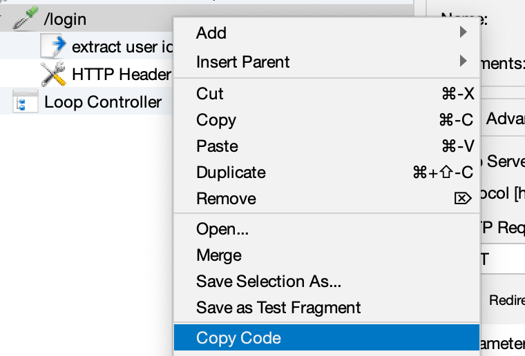](assets/images/http-sampler-copy-code_720b2349570ecc22.png)

Copy Code context action

Here's the generated code (Kotlin DSL):

```
org.apache.jmeter.protocol.http.sampler.HTTPSamplerProxy::class {props {it[arguments] = org.apache.jmeter.config.Arguments().apply {props {it[arguments] = listOf(org.apache.jmeter.protocol.http.util.HTTPArgument().apply {props {it[value] = "World" it[metadata] = "=" it[useEquals] = true it[argumentName] = "user"} },org.apache.jmeter.protocol.http.util.HTTPArgument().apply {props {it[alwaysEncode] = true it[value] = "test_value" it[metadata] = "=" it[useEquals] = true it[argumentName] = "test"} },) it[name] = "User Defined Variables" it[guiClass] = "org.apache.jmeter.protocol.http.gui.HTTPArgumentsPanel" it[testClass] = "org.apache.jmeter.config.Arguments"}} it[domain] = "example.com" it[path] = "/api/v1/login" it[method] = "GET" it[followRedirects] = true it[useKeepalive] = true it[proxy.scheme] = "https" it[proxy.host] = "localhost" it[proxy.port] = "8080" it[proxy.username] = "secret" it[proxy.password] = "password1" it[name] = "/login" it[guiClass] = "org.apache.jmeter.protocol.http.control.gui.HttpTestSampleGui"}
org.apache.jmeter.extractor.RegexExtractor::class {props {it[guiClass] = "org.apache.jmeter.extractor.gui.RegexExtractorGui" it[name] = "extract user id" it[referenceName] = "regexVar" it[regularExpression] = "hello\\s+?world" it[template] = "\$1\$"}}
org.apache.jmeter.protocol.http.control.HeaderManager::class {props {it[headers] = listOf(org.apache.jmeter.protocol.http.control.Header().apply {props {it[headerName] = "Accept" it[value] = "text/plain"} },org.apache.jmeter.protocol.http.control.Header().apply {props {it[headerName] = "User-Agent" it[value] = "JMeter"} },org.apache.jmeter.protocol.http.control.Header().apply {props {it[headerName] = "X-JMeter-Thread" it[value] = "Thread \${__threadNum}"} },) it[guiClass] = "org.apache.jmeter.protocol.http.gui.HeaderPanel" it[name] = "HTTP Header Manager"}}}
```

<a id="build-programmatic-test-plan--treebuilder_kotlin_dsl"></a>
<a id="build-programmatic-test-plan--creating-a-plan-with-kotlin-dsl"></a>

# Creating a plan with Kotlin DSL[¶](#build-programmatic-test-plan--treebuilder_kotlin_dsl "Link to here")

JMeter 5.6 introduces Kotlin DSL which might make it easier to create and maintain test plans as the structure of the code
would resemble the structure of the generated test plan tree

```
import org.apache.jmeter.sampler.DebugSampler import org.apache.jmeter.testelement.TestPlan import org.apache.jmeter.threads.ThreadGroup import org.apache.jmeter.treebuilder.dsl.testTree
val root = testTree { // (1) TestPlan::class { // (2) ThreadGroup::class {name = "Search Order Thread Group" +DebugSampler::class // (3) +DebugSampler() // (4)}}}
```

- Firstly, we create a TreeBuilder at (1)
- Then we add elements to the tree in (2), and populate its children
- Note how adding element returns the subtree, so we add threadGroup under testPlan in (2)
- If no children needed, the element can be appended to the tree with a unary plus operator as in (3)
- By default, JMeter uses no-argument constructors to create elements, however, you can add TestElement instances to the tree as well, see (4)

<a id="build-programmatic-test-plan--extending_treebuilder_kotlin_dsl"></a>
<a id="build-programmatic-test-plan--extending-kotlin-dsl"></a>

# Extending Kotlin DSL[¶](#build-programmatic-test-plan--extending_treebuilder_kotlin_dsl "Link to here")

As you use the DSL for test plan generation, you might want to factor out the common patterns.
For instance, imagine you want factor out Thread Group creation so it always has a Summariser element.

```

import kotlin.time.Duration.Companion.seconds
import org.apache.jmeter.sampler.DebugSampler
import org.apache.jmeter.testelement.TestPlan
import org.apache.jmeter.threads.ThreadGroup
import org.apache.jmeter.treebuilder.dsl.testTree

fun TreeBuilder.threadGroup( // (1)
    name: String,
    numThreads: Int = 10,
    rampUp: Duration = 3.seconds,
    body: Action<ThreadGroup>
) {
    ThreadGroup::class { // (2)
        this.name = name
        this.numThreads = numThreads
        this.rampUp = rampUp.inWholeSeconds.toInt()
        +Summariser::class
        body(this) // (3)
    }
}

fun buildTree() {
  val root = testTree {
    TestPlan::class {
      threadGroup(name = "Search Order Thread Group", rampUp = 1.seconds) { // (4)
         +DebugSampler::class
      }
    }
  }
```

- Firstly, you can factor test element creation logic as an extension function for TreeBuilder as in (1).
  It uses regular DSL to add an element (see (2)), and then it calls the lambda body in (3) to fill thread group children.
- You can use the extension by calling it when you need it in the test plan, see (4)
- Note how named parameters, and default values keep the code readable

<a id="build-programmatic-test-plan--treebuilder_java_dsl"></a>
<a id="build-programmatic-test-plan--creating-a-plan-with-java-dsl"></a>

# Creating a plan with Java DSL[¶](#build-programmatic-test-plan--treebuilder_java_dsl "Link to here")

JMeter 5.6 introduces Java DSL which might make it easier to create and maintain test plans as the structure of the code
would resemble the structure of the generated test plan tree

```
import org.apache.jmeter.sampler.DebugSampler import org.apache.jmeter.testelement.TestPlan import org.apache.jmeter.threads.ThreadGroup import static org.apache.jmeter.treebuilder.dsl.TreeBuilders.testTree
ListedHashTree root = testTree(b -> { // (1) b.add(TestPlan.class, tp -> { // (2) b.add(ThreadGroup.class, tg -> {tg.setName("Search Order Thread Group"); b.add(DebugSampler.class); // (3) b.add(new DebugSampler()); // (4) }); }); });
```

- Firstly, we create a TreeBuilder at (1).
  Note how this builder reference should be used to append all the elements
- Then we add elements to the tree in (2), and populate its children.
  The lambda parameters correspond to the added elements, so you can configure their properties
- Note how adding element returns the subtree, so we add threadGroup under testPlan in (2)
- If no children needed, you could omit the lambda parameter as in (3)
- By default, JMeter uses no-argument constructors to create elements, however, you can add TestElement instances to the tree as well, see (4)

- [< Prev](#build-jms-topic-test-plan)
- [Index](https://jmeter.apache.org/index.html)
- [Next >](#listeners)

Share this page:

- share
- tweet

[Go to top](#build-programmatic-test-plan--top)

---

<a id="build-test-plan"></a>

<!-- source_url: https://jmeter.apache.org/usermanual/build-test-plan.html -->

<!-- page_index: 21 -->

<a id="build-test-plan--2.-building-a-test-plan"></a>

# 2. Building a Test Plan

A test plan describes a series of steps JMeter will execute when run. A complete
test plan will consist of one or more Thread Groups, logic controllers, sample generating
controllers, listeners, timers, assertions, and configuration elements.

<a id="build-test-plan--add_remove"></a>
<a id="build-test-plan--2.1-adding-and-removing-elements"></a>

## 2.1 Adding and Removing Elements[¶](#build-test-plan--add_remove "Link to here")

Adding [elements to a test plan](#test_plan) can be done by right-clicking on an element in the
tree, and choosing a new element from the "add" list. Alternatively, elements can
be loaded from file and added by choosing the "merge" or "open" option.

To remove an element, make sure the element is selected, right-click on the element, and choose the "remove" option.

<a id="build-test-plan--load_save"></a>
<a id="build-test-plan--2.2-loading-and-saving-elements"></a>

## 2.2 Loading and Saving Elements[¶](#build-test-plan--load_save "Link to here")

To load an element from file, right click on the existing tree elements to which
you want to add the loaded element, and select the "merge" option. Choose the file where
your elements are saved. JMeter will merge the elements into the tree.

To save tree elements, right click on an element and choose the "Save Selection As …" option.
JMeter will save the element selected, plus all child elements beneath it. In this way, you can save test tree fragments and individual elements for later use.

<a id="build-test-plan--config_element"></a>
<a id="build-test-plan--2.3-configuring-tree-elements"></a>

## 2.3 Configuring Tree Elements[¶](#build-test-plan--config_element "Link to here")

Any element in the test tree will present controls in JMeter's right-hand frame. These
controls allow you to configure the behavior of that particular test element. What can be
configured for an element depends on what type of element it is.

The Test Tree itself can be manipulated by dragging and dropping components around the test tree.

<a id="build-test-plan--saving"></a>
<a id="build-test-plan--2.4-saving-the-test-plan"></a>

## 2.4 Saving the Test Plan[¶](#build-test-plan--saving "Link to here")

Although it is not required, we recommend that you save the Test Plan to a
file before running it. To save the Test Plan, select "Save" or "Save Test Plan As …" from the
File menu (with the latest release, it is no longer necessary to select the
Test Plan element first).

JMeter allows you to save the entire Test Plan tree or
only a portion of it. To save only the elements located in a particular "branch"
of the Test Plan tree, select the Test Plan element in the tree from which to start
the "branch", and then click your right mouse button to access the "Save Selection As …" menu item.
Alternatively, select the appropriate Test Plan element and then select "Save Selection As …" from
the Edit menu.

<a id="build-test-plan--run"></a>
<a id="build-test-plan--2.5-running-a-test-plan"></a>

## 2.5 Running a Test Plan[¶](#build-test-plan--run "Link to here")

To run your test plan, choose "Start" (Control + r)
from the "Run" menu item.
When JMeter is running, it shows a small green box at the right hand end of the section just under the menu bar.
You can also check the "Run" menu.
If "Start" is disabled, and "Stop" is enabled, then JMeter is running your test plan (or, at least, it thinks it is).

The numbers to the left of the green box are the number of active threads / total number of threads.
These only apply to a locally run test; they do not include any threads started on remote systems when using client-server mode.

Using GUI mode as described here should only be used when debugging your Test Plan. To run the real load test, use CLI mode.

<a id="build-test-plan--stop"></a>
<a id="build-test-plan--2.6-stopping-a-test"></a>

## 2.6 Stopping a Test[¶](#build-test-plan--stop "Link to here")

There are two types of stop command available from the menu:

- Stop (Control + .) - stops the threads immediately if possible.
  Many samplers are Interruptible which means that active samples can be terminated early.
  The stop command will check that all threads have stopped within the default timeout, which is 5000 ms = 5 seconds.
  [This can be changed using the JMeter property jmeterengine.threadstop.wait]
  If the threads have not stopped, then a message is displayed.
  The Stop command can be retried, but if it fails, then it is necessary to exit JMeter to clean up.
- Shutdown (Control + ,) - requests the
  threads to stop at the end of any current work.
  Will not interrupt any active samples.
  The modal shutdown dialog box will remain active until all threads have stopped.

If Shutdown is taking too long. Close the Shutdown dialog box and select Run/Stop, or just press Control + ..

When running JMeter in CLI mode, there is no Menu, and JMeter does not react to keystrokes such as Control + ..
So JMeter CLI mode will listen for commands on a specific port (default 4445, see the JMeter property jmeterengine.nongui.port).
JMeter supports automatic choice of an alternate port if the default port is being used
(for example by another JMeter instance). In this case, JMeter will try the next higher port, continuing until
it reaches the JMeter property jmeterengine.nongui.maxport) which defaults to 4455.
If maxport is less than or equal to port, port scanning will not take place.
The chosen port is displayed in the console window.
The commands currently supported are:

- Shutdown - graceful shutdown
- StopTestNow - immediate shutdown

These commands can be sent by using the shutdown[.cmd|.sh] or stoptest[.cmd|.sh] script
respectively. The scripts are to be found in the JMeter bin directory.
The commands will only be accepted if the script is run from the same host.

<a id="build-test-plan--error_reporting"></a>
<a id="build-test-plan--2.7-error-reporting"></a>

## 2.7 Error reporting[¶](#build-test-plan--error_reporting "Link to here")

JMeter reports warnings and errors to the jmeter.log file, as well as some information on the test run itself.
JMeter shows the number of warnings/errors found in jmeter.log file next to the warning icon (triangle) at the right hand end of its window.
Click on the warning icon to show the jmeter.log file at the bottom of JMeter's window.
Just occasionally there may be some errors that JMeter is unable to trap and log; these will appear on the command console.
If a test is not behaving as you expect, please check the log file in case any errors have been reported (e.g. perhaps a syntax error in a function call).

Sampling errors (e.g. HTTP 404 - file not found) are not normally reported in the log file.
Instead these are stored as attributes of the sample result.
The status of a sample result can be seen in the various different Listeners.

---

<a id="build-web-test-plan"></a>

<!-- source_url: https://jmeter.apache.org/usermanual/build-web-test-plan.html -->

<!-- page_index: 22 -->

# 4. Building a Web Test Plan ¶

- [Twitter](https://twitter.com/ApacheJMeter "Follow us on Twitter")
- [github](https://github.com/apache/jmeter "Fork us on github")

- [< Prev](#test_plan)
- [Index](https://jmeter.apache.org/index.html)
- [Next >](#build-adv-web-test-plan)

<a id="build-web-test-plan--building"></a>
<a id="build-web-test-plan--4.-building-a-web-test-plan"></a>

# 4. Building a Web Test Plan[¶](#build-web-test-plan--building "Link to here")

In this section, you will learn how to create a basic
[Test Plan](#build-test-plan) to test a Web site. You will
create five users that send requests to two pages on the JMeter Web site.
Also, you will tell the users to run their tests twice. So, the total number of
requests is (5 users) x (2 requests) x (repeat 2 times) = 20 HTTP requests. To
construct the Test Plan, you will use the following elements:
[Thread Group](#test_plan--thread_group), [HTTP Request](#component_reference--http_request), [HTTP Request Defaults](#component_reference--http_request_defaults), and
[Graph Results](#component_reference--graph_results).

For a more advanced Test Plan, see
[Building an Advanced Web Test Plan](#build-adv-web-test-plan).

<a id="build-web-test-plan--adding_users"></a>
<a id="build-web-test-plan--4.1-adding-users"></a>

# 4.1 Adding Users[¶](#build-web-test-plan--adding_users "Link to here")

The first step you want to do with every JMeter Test Plan is to add a
[Thread Group](#test_plan--thread_group) element. The Thread Group tells
JMeter the number of users you want to simulate, how often the users should send
requests, and how many requests they should send.

Go ahead and add the ThreadGroup element by first selecting the Test Plan, clicking your right mouse button to get the Add menu, and then select
Add → ThreadGroup.

You should now see the Thread Group element under Test Plan. If you do not
see the element, then "expand" the Test Plan tree by clicking on the
Test Plan element.

Next, you need to modify the default properties. Select the Thread Group element
in the tree, if you have not already selected it. You should now see the Thread
Group Control Panel in the right section of the JMeter window (see Figure 4.1
below)

[](assets/images/threadgroup_8ae3142533bb239a.png)

Figure 4.1. Thread Group with Default Values

Start by providing a more descriptive name for our Thread Group. In the name
field, enter JMeter Users.

Next, increase the number of users (called threads) to 5.

In the next field, the Ramp-Up Period, leave the default value of 1
seconds. This property tells JMeter how long to delay between starting each
user. For example, if you enter a Ramp-Up Period of 5 seconds, JMeter will
finish starting all of your users by the end of the 5 seconds. So, if we have
5 users and a 5 second Ramp-Up Period, then the delay between starting users
would be 1 second (5 users / 5 seconds = 1 user per second). If you set the
value to 0, then JMeter will immediately start all of your users.

Finally enter a value of 2 in
the Loop Count field. This property tells JMeter how many times to repeat your
test. If you enter a loop count value of 1, then JMeter will run your test only
once. To have JMeter repeatedly run your Test Plan, select the Forever
checkbox.

In most applications, you have to manually accept
changes you make in a Control Panel. However, in JMeter, the Control Panel
automatically accepts your changes as you make them. If you change the
name of an element, the tree will be updated with the new text after you
leave the Control Panel (for example, when selecting another tree element).

See Figure 4.2 for the completed JMeter Users Thread Group.

[](assets/images/threadgroup2_b839da774003f161.png)

Figure 4.2. JMeter Users Thread Group

<a id="build-web-test-plan--adding_defaults"></a>
<a id="build-web-test-plan--4.2-adding-default-http-request-properties"></a>

# 4.2 Adding Default HTTP Request Properties[¶](#build-web-test-plan--adding_defaults "Link to here")

Now that we have defined our users, it is time to define the tasks that they
will be performing. In this section, you will specify the default settings
for your HTTP requests. And then, in section 4.3, you will add HTTP Request
elements which use some of the default settings you specified here.

Begin by selecting the JMeter Users (Thread Group) element. Click your right mouse button
to get the Add menu, and then select Add → Config Element → HTTP Request
Defaults. Then select this new element to view its Control Panel (see Figure 4.3).

[](assets/images/http-defaults1_a9ad8c6f8ba5321a.png)

Figure 4.3. HTTP Request Defaults

Like most JMeter elements, the [HTTP Request Defaults](#component_reference--http_request_defaults) Control
Panel has a name field that you can modify. In this example, leave this field with
the default value.

Skip to the next field, which is the Web Server's Server Name/IP. For the
Test Plan that you are building, all HTTP requests will be sent to the same
Web server, jmeter.apache.org. Enter this domain name into the field.
This is the only field that we will specify a default, so leave the remaining
fields with their default values.

The HTTP Request Defaults element does not tell JMeter
to send an HTTP request. It simply defines the default values that the
HTTP Request elements use.

See Figure 4.4 for the completed HTTP Request Defaults element

[](assets/images/http-defaults2_83f2d1ed5b2a472d.png)

Figure 4.4. HTTP Defaults for our Test Plan

<a id="build-web-test-plan--adding_cookie_support"></a>
<a id="build-web-test-plan--4.3-adding-cookie-support"></a>

# 4.3 Adding Cookie Support[¶](#build-web-test-plan--adding_cookie_support "Link to here")

Nearly all web testing should use cookie support, unless your application
specifically doesn't use cookies. To add cookie support, simply add an
[HTTP Cookie Manager](#component_reference--http_cookie_manager) to each [Thread
Group](#test_plan--thread_group) in your test plan. This will ensure that each thread gets its own
cookies, but shared across all [HTTP Request](#component_reference--http_request) objects.

[](assets/images/http-cookie-manager_986fe161292a21ab.png)

Figure 4.5. HTTP Cookie Manager

To add the [HTTP Cookie Manager](#component_reference--http_cookie_manager), simply select the
[Thread Group](#test_plan--thread_group), and choose Add →
Config Element → HTTP
Cookie Manager, either from the Edit Menu, or from the right-click pop-up menu.

<a id="build-web-test-plan--adding_requests"></a>
<a id="build-web-test-plan--4.4-adding-http-requests"></a>

# 4.4 Adding HTTP Requests[¶](#build-web-test-plan--adding_requests "Link to here")

In our Test Plan, we need to make two HTTP requests. The first one is for the
JMeter home page (http://jmeter.apache.org/), and the second one is for the
Changes page (http://jmeter.apache.org/changes.html).

JMeter sends requests in the order that they appear in the tree.

Start by adding the first [HTTP Request](#component_reference--http_request)
to the JMeter Users element (Add → Sampler → HTTP Request).
Then, select the HTTP Request element in the tree and edit the following properties
(see Figure 4.6):

1. Change the Name field to "Home Page".
2. Set the Path field to "/". Remember that you do not have to set the Server
   Name field because you already specified this value in the HTTP Request Defaults
   element.

[](assets/images/http-request1_e306b9417d010f83.png)

Figure 4.6. HTTP Request for JMeter Home Page

Next, add the second HTTP Request and edit the following properties (see
Figure 4.7:

1. Change the Name field to "Changes".
2. Set the Path field to "/changes.html".

[](assets/images/http-request2_d8648ae99f915ccc.png)

Figure 4.7. HTTP Request for JMeter Changes Page

<a id="build-web-test-plan--adding_listener"></a>
<a id="build-web-test-plan--4.5-adding-a-listener-to-view-store-the-test-results"></a>

# 4.5 Adding a Listener to View Store the Test Results[¶](#build-web-test-plan--adding_listener "Link to here")

The final element you need to add to your Test Plan is a
[Listener](#component_reference--listeners). This element is
responsible for storing all of the results of your HTTP requests in a file and presenting
a visual model of the data.

Select the JMeter Users element and add a [Graph Results](#component_reference--graph_results) listener (Add → Listener
→ Backend Listener).

<a id="build-web-test-plan--logging_in"></a>
<a id="build-web-test-plan--4.6-logging-in-to-a-web-site"></a>

# 4.6 Logging in to a web-site[¶](#build-web-test-plan--logging_in "Link to here")

It's not the case here, but some web-sites require you to login before permitting you to perform certain actions.
In a web-browser, the login will be shown as a form for the user name and password, and a button to submit the form.
The button generates a POST request, passing the values of the form items as parameters.

To do this in JMeter, add an HTTP Request, and set the method to POST.
You'll need to know the names of the fields used by the form, and the target page.
These can be found out by inspecting the code of the login page.
[If this is difficult to do, you can use the [JMeter Proxy Recorder](#component_reference--http_proxy_server) to record the login sequence.]
Set the path to the target of the submit button.
Click the Add button twice and enter the username and password details.
Sometimes the login form contains additional hidden fields.
These will need to be added as well.

[](assets/images/http-login_98b3efb0a02f5e94.png)

Figure 4.8. Sample HTTP login request

<a id="build-web-test-plan--choose_users"></a>
<a id="build-web-test-plan--4.7-choose-the-same-user-or-different-users"></a>

# 4.7 choose the same user or different users[¶](#build-web-test-plan--choose_users "Link to here")

When creating a Test Plan, on each Thread Group iteration, we can choose to simulate the same user running multiple iterations, or different users running one iteration.
You can configure this behaviour on Thread Group element, and have HTTP Cache Manager, HTTP Cookie Manager, HTTP Authorization Manager
controlled by this setting.

[](assets/images/threadgroup3_b0c4179fcc911c23.png)

Figure 4.9. Choose the same user or different users

You can choose to clear the cookies/cache content/authorization in the CookieManager/CacheManager/Authorization Manager, or choose to be controlled by the Thread Group.

[](assets/images/threadgroup4_db87af13d1dd18a1.png)

Figure 4.10. Use Thread Group to control CookieManager

[](assets/images/threadgroup5_894e85ac79194625.png)

Figure 4.11. Use Thread Group to control CacheManager

[](assets/images/threadgroup6_9ac9abccc532297e.png)

Figure 4.12. Use Thread Group to control Authorization Manager

- [< Prev](#test_plan)
- [Index](https://jmeter.apache.org/index.html)
- [Next >](#build-adv-web-test-plan)

Share this page:

- share
- tweet

[Go to top](#build-web-test-plan--top)

---

<a id="build-ws-test-plan"></a>

<!-- source_url: https://jmeter.apache.org/usermanual/build-ws-test-plan.html -->

<!-- page_index: 23 -->

# 9. Building a WebService Test Plan ¶

- [Twitter](https://twitter.com/ApacheJMeter "Follow us on Twitter")
- [github](https://github.com/apache/jmeter "Fork us on github")

- [< Prev](#build-ldapext-test-plan)
- [Index](https://jmeter.apache.org/index.html)
- [Next >](#build-jms-point-to-point-test-plan)

<a id="build-ws-test-plan--building"></a>
<a id="build-ws-test-plan--9.-building-a-webservice-test-plan"></a>

# 9. Building a WebService Test Plan[¶](#build-ws-test-plan--building "Link to here")

In this section, you will learn how to create a
[Test Plan](#build-test-plan) to test a WebService. You will
create five users that send requests to One page.
Also, you will tell the users to run their tests twice. So, the total number of
requests is (5 users) x (1 requests) x (repeat 2 times) = 10 HTTP requests. To
construct the Test Plan, you will use the following elements:
[Thread Group](#test_plan--thread_group), [HTTP Request](#component_reference--http_request), and
[Aggregate Graph](#component_reference--aggregate_graph).

If the sampler appears to be getting an error from the webservice, double check the
SOAP message and make sure the format is correct. In particular, make sure the
xmlns attributes are exactly the same as the WSDL. If the xml namespace is
different, the webservice will likely return an error.

<a id="build-ws-test-plan--soap_webservice_template"></a>
<a id="build-ws-test-plan--9.1-creating-webservice-test-plan"></a>

# 9.1 Creating WebService Test Plan[¶](#build-ws-test-plan--soap_webservice_template "Link to here")

In our Test Plan, we will use a .NET webservice. We won't go into the details of writing a
webservice. If you don't know how to write a webservice, google for
webservice and familiarize yourself with writing webservices for
Java and .NET. It should be noted there is a significant difference
between how .NET and Java implement webservices. The topic is too
broad to cover in the user manual. Please refer to other sources to
get a better idea of the differences.

JMeter sends requests in the order that they appear in the tree.

Start by using menu
File → Templates…
and select template "Building a SOAP Webservice Test Plan".
Then, click "Create" button.
[](assets/images/ws-template_7baba732c636037c.png)

Figure 9.1.0. Webservice Template

Change the following:

1. In "HTTP Request Defaults" change "Server Name of IP"
2. In "Soap Request", change "Path:"
   [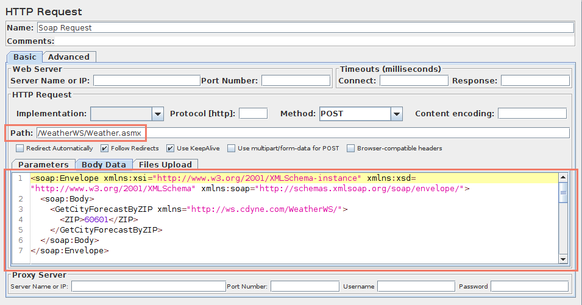](assets/images/ws-http-request_ac58272990444a0f.png)

   Figure 9.1.1 Webservice Path

Next, select "HTTP Header Manager" and update "SOAPAction" header to match your webservice.
Some webservices may not use SOAPAction in this case remove it.
Currently, only .NET uses SOAPAction, so it is normal to have a blank SOAPAction for all other webservices. The list includes JWSDP, Weblogic, Axis, The Mind Electric Glue, and gSoap.

[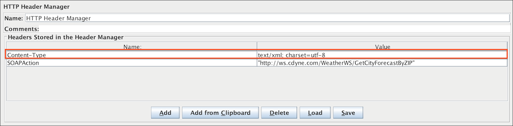](assets/images/ws-header_578f74271851ae03.png)

Figure 9.1.2 Webservice Headers

The last step is to paste the SOAP message in the "Body Data"
text area.

[](assets/images/ws-http-request_ac58272990444a0f.png)

Figure 9.1.3 Webservice Body

<a id="build-ws-test-plan--adding_users"></a>
<a id="build-ws-test-plan--9.2-adding-users"></a>

# 9.2 Adding Users[¶](#build-ws-test-plan--adding_users "Link to here")

The [Thread Group](#test_plan--thread_group) tells
JMeter the number of users you want to simulate, how often the users should send
requests, and the how many requests they should send.

Select the Thread Group element
in the tree, if you have not already selected it. You should now see the Thread
Group Control Panel in the right section of the JMeter window (see Figure 9.2
below)

[](assets/images/threadgroup_8ae3142533bb239a.png)

Figure 9.2. Thread Group with Default Values

Start by providing a more descriptive name for our Thread Group. In the name
field, enter JMeter Users.

Next, increase the number of users (called threads) to 10.

In the next field, the Ramp-Up Period, leave the default value of 0
seconds. This property tells JMeter how long to delay between starting each
user. For example, if you enter a Ramp-Up Period of 5 seconds, JMeter will
finish starting all of your users by the end of the 5 seconds. So, if we have
5 users and a 5 second Ramp-Up Period, then the delay between starting users
would be 1 second (5 users / 5 seconds = 1 user per second). If you set the
value to 0, then JMeter will immediately start all of your users.

Finally, clear the checkbox labeled "Forever", and enter a value of 2 in
the Loop Count field. This property tells JMeter how many times to repeat your
test. If you enter a loop count value of 0, then JMeter will run your test only
once. To have JMeter repeatedly run your Test Plan, select the Forever
checkbox.

In most applications, you have to manually accept
changes you make in a Control Panel. However, in JMeter, the Control Panel
automatically accepts your changes as you make them. If you change the
name of an element, the tree will be updated with the new text after you
leave the Control Panel (for example, when selecting another tree element).

See Figure 9.2 for the completed JMeter Users Thread Group.

[](assets/images/threadgroup2_b839da774003f161.png)

Figure 9.3. JMeter Users Thread Group

<a id="build-ws-test-plan--adding_listener"></a>
<a id="build-ws-test-plan--9.3-adding-a-listener-to-view-store-the-test-results"></a>

# 9.3 Adding a Listener to View Store the Test Results[¶](#build-ws-test-plan--adding_listener "Link to here")

The final element you need to add to your Test Plan is a
[Listener](#component_reference--listeners). This element is
responsible for storing all of the results of your HTTP requests in a file and presenting
a visual model of the data.

Select the JMeter Users element and add a [Aggregate Graph](#component_reference--aggregate_graph) listener
(Add → Listener → Aggregate Graph). Next, you need to specify a directory and filename of the
output file. You can either type it into the filename field, or select the
Browse button and browse to a directory and then enter a filename.

[](assets/images/ws-listener_b248612ff19b53a4.png)

Figure 9.4. Graph Results Listener

<a id="build-ws-test-plan--rest_webservice"></a>
<a id="build-ws-test-plan--9.4-rest-webservice"></a>

# 9.4 Rest Webservice[¶](#build-ws-test-plan--rest_webservice "Link to here")

Testing a REST Webservice is very similar as you only need to modify in HTTP Request

- Method: to select the one you want to test
- Body Data: which can be JSON, XML or any custom text

You may also need to modify "HTTP Header Manager" to select the correct "Content-Type"

- [< Prev](#build-ldapext-test-plan)
- [Index](https://jmeter.apache.org/index.html)
- [Next >](#build-jms-point-to-point-test-plan)

Share this page:

- share
- tweet

[Go to top](#build-ws-test-plan--top)

---

<a id="curl"></a>

<!-- source_url: https://jmeter.apache.org/usermanual/curl.html -->

<!-- page_index: 24 -->

# 24. Curl ¶

<a id="curl--hints"></a>
<a id="curl--24.-curl"></a>

> [!NOTE]
> # 24. Curl[¶](#curl--hints "Link to here")

This method is to create http requests from curl command. If you want to know more about curl, please click the [Curl document](https://curl.haxx.se/).

<a id="curl--enter_command"></a>
<a id="curl--24.1-how-to-enter-a-command-s"></a>

## 24.1 How to enter (a) command(s)[¶](#curl--enter_command "Link to here")

Create a Test Plan From a cURL Command

1. To create an import from a cURL, open the Tools menu and click Import from cURL.
   [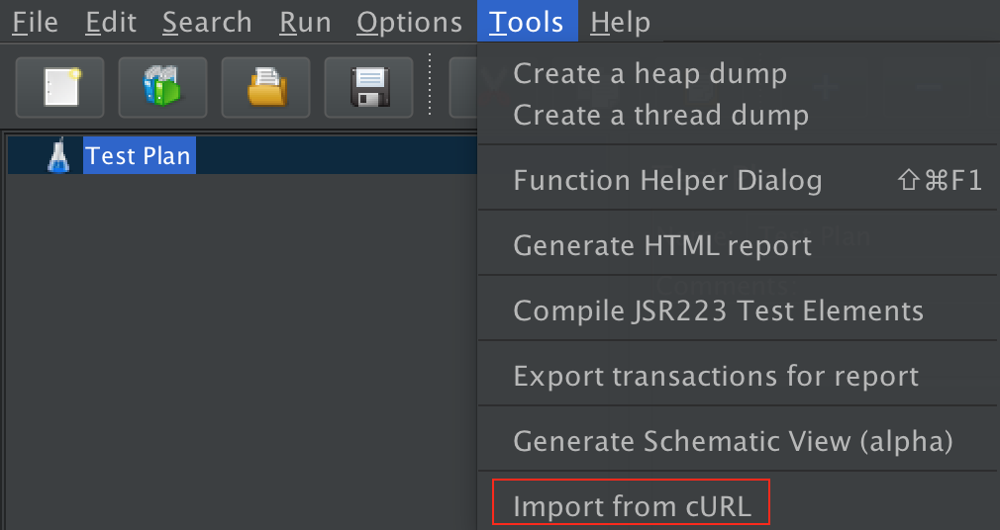](assets/images/choose-curl_c3b93ff5188a7256.png)

   Figure 1 - The menu where curl is located
2. There are two ways to enter the curl command line. Firstly, we can enter it manually. Secondly, we can import a file containing the curl command line.
   This tool supports input of multiple curl command lines at the same time.
   [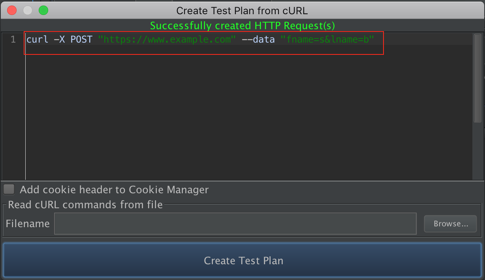](assets/images/enter-command_3ccf032ba66466aa.png)

   Figure 2.1 - Enter curl command in text panel

   [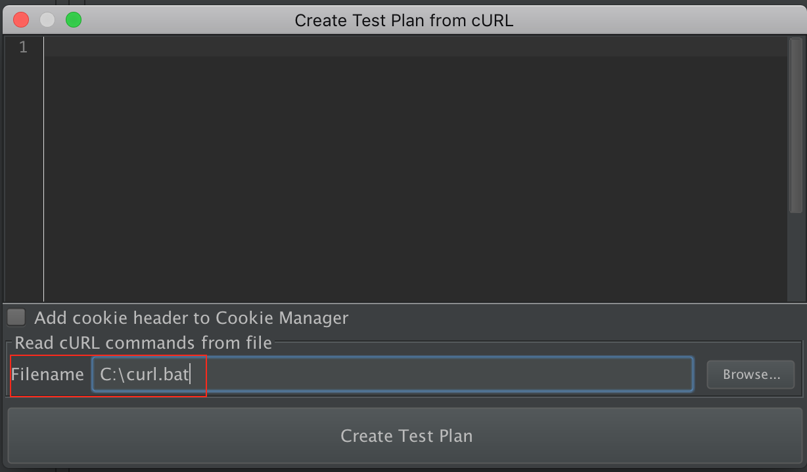](assets/images/enter-command-from-file_3611b43c16b64fa1.png)

   Figure 2.2 - Enter curl command from file
3. Then, click Create Test Plan button and a new HTTP Sample will be added to the Test Plan.
   [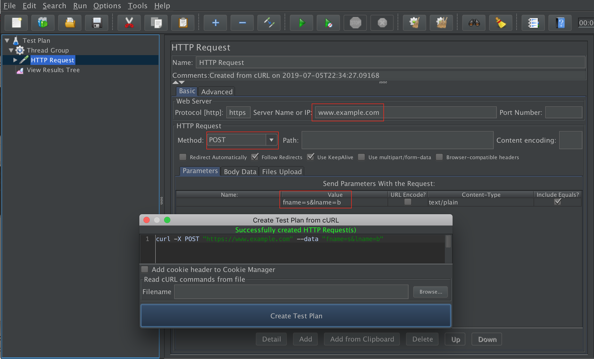](assets/images/result_9f39d38c38ff4c2c.png)

   Figure 3 - result of Test Plan

<a id="curl--curl_options"></a>
<a id="curl--24.2-curl-options-supported"></a>

## 24.2 Curl options supported[¶](#curl--curl_options "Link to here")

-H, --header <header>
:   Extra header to use when getting a web page.

-X, --request <command>
:   Specifies a custom request method to use when communicating with the HTTP server.

--compressed
:   Request a compressed response using one of the algorithms curl supports, and return the uncompressed document.

-A, --user-agent <agent string>
:   Specify the User-Agent string to send to the HTTP server.

-b, --cookie <name=data>
:   Pass the data to the HTTP server as a cookie.

-d and friends
:   Sending data via POST request

    Sends the specified data in a POST request to the HTTP server. If this option is used more than
    once on the same command line, the data pieces specified will be merged together with a
    separating '&' character. Thus, using '-d name=daniel -d skill=lousy' would generate a POST
    chunk that looks like 'name=daniel&skill=lousy'.

    -d, --data <data>, --data-ascii <data>
    :   use @ to upload a file

    --data-raw <data>gt;

    --data-raw <data>
    :   This posts data exactly as specified with no extra processing whatsoever.
        If you start the data with the character @, the rest should be a filename.

    --data-raw <data>ta>
    :   This posts data, similar to the other --data options with the exception that this performs
        URL-encoding.

    --data-raw <data>
    :   This posts data similarly to --data but without the special interpretation
        of the @ character.

-F and friends
:   This lets curl emulate a filled-in form in which a user has pressed the submit button.

    -F, --form <name=content>
    :   use @ to upload a file

    --form-string <name=content>

-u, --user <user:password >
:   Specify user and password to use for server authentication.

--basic, --digest
:   Tells curl to use HTTP authentication.

--cacert and friends
:   Tells curl to use the specified client certificate file when getting a file with HTTPS

    --cacert <CA certificate>

    --capath <CA certificate directory>

    --ciphers <list of ciphers>

    --cert-status

    --cert-type <type>

-G, --get
:   put the post data in the URL and use get to replace post.

--no-keepalive
:   Disables the use of keepalive messages on the TCP connection.

-e, --referer <URL>
:   Sends the *Referer Page* information to the HTTP server.

-L, --location
:   If the server reports that the requested page has moved to a different location
    this option will make curl redo the request on the new place.

-i, --include
:   Include the HTTP-header in the output.

--connect-timeout <seconds>
:   Maximum time in seconds that the connection to the server may take.

--keepalive-time <seconds>
:   This option sets the time a connection needs to remain idle before sending keepalive probes
    and the time between individual keepalive probes.

-m, --max-time <seconds>
:   Maximum time in seconds that you allow the whole operation to take.

-x, --proxy <[protocol://][user:password@]proxyhost[:port]>
:   Use the specified HTTP proxy. If the port number is not specified,
    it is assumed at port 1080.

-U, --proxy-user <user:password>
:   Specify user and password to use for proxy authentication.

-k, --insecure
:   This option explicitly allows curl to perform *insecure* SSL connections and transfers.

--raw
:   When used, it disables all internal HTTP decoding of content or transfer encodings and instead makes them passed on unaltered,raw.

-I, --head
:   Fetch the HTTP-header only. HTTP-servers feature the method HEAD which this uses to get nothing but the header of a document.

--interface <name>
:   Perform an operation using a specified interface. You can enter interface name, IP address or host name.

--proxy-ntlm/--proxy-negotiate
:   Tells curl to use HTTP BASIC/NTLM/Digest authentication when communicating with the given proxy.

--dns-servers <addresses>
:   Resolve host name over DOH.

--resolve <host:port:address>
:   Provide a custom address for a specific host and port pair.

--limit-rate <speed>
:   Specify the maximum transfer rate you want curl to use.

--max-redirs <num>
:   Set maximum number of redirections which may be followed.

--noproxy <no-proxy-list>
:   Comma-separated list of hosts which do not use a proxy, if one is specified.

<a id="curl--warning"></a>
<a id="curl--24.3-warning"></a>

## 24.3 Warning[¶](#curl--warning "Link to here")

When the command you entered is ignored or contains warning content, we will display warning in the comment section of HTTP Request.

[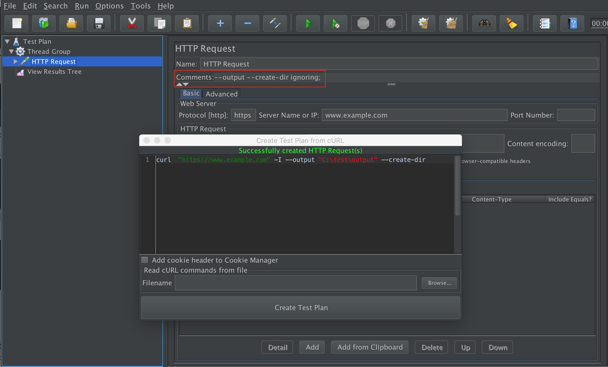](assets/images/http-request-warning_ceefe929dc3e4b8b.png)

Figure 1 -Warning

<a id="curl--example"></a>
<a id="curl--24.4-examples"></a>

## 24.4 Examples[¶](#curl--example "Link to here")

**Use cookie**

```
curl -X POST  "https://example.invalid" -b 'username=Tom;password=123456'
```

**Use data**

```
curl -X POST  "https://example.invalid" --data 'fname=a&lname=b'
```

**Use form**

```
curl -X POST  "https://example.invalid" -F 'lname=a'  -F 'fname=b' -F 'c=@C:\Test\test.txt'
```

**Use proxy**

```
curl 'https://example.invalid/' -x 'https://aa:bb@proxy.invalid:8042'
```

**Use authorization**

```
curl "https://example.invalid" -u 'user:passwd' --basic
```

**Use DNS**

```
curl "https://example.invalid" --dns-servers '0.0.0.0,1.1.1.1'
```

---

<a id="generating-dashboard"></a>

<!-- source_url: https://jmeter.apache.org/usermanual/generating-dashboard.html -->

<!-- page_index: 25 -->

<a id="generating-dashboard--generation"></a>
<a id="generating-dashboard--14.-generating-report-dashboard"></a>

# 14. Generating Report Dashboard[¶](#generating-dashboard--generation "Link to here")

JMeter supports dashboard report generation to get graphs and
statistics from a test plan.
This chapter describes how to configure and use the generator.

<a id="generating-dashboard--overview"></a>
<a id="generating-dashboard--14.1-overview"></a>

## 14.1 Overview[¶](#generating-dashboard--overview "Link to here")

The dashboard generator is a modular extension of JMeter.
Its default behavior is to read and process samples from
CSV files to generate HTML files containing graph views.
It can generate the report at end of a load test or on demand.

This report provides the following metrics:

- [APDEX](https://en.wikipedia.org/wiki/Apdex "Application Performance Index") (Application Performance Index) table that computes for every transaction the APDEX based on configurable values for tolerated and satisfied thresholds
- A request summary graph showing the Success and failed requests (Transaction Controller Sample Results are not taken into account) percentage:
  [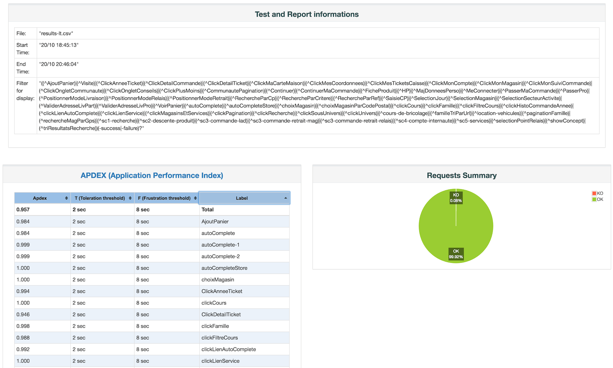](assets/images/report-apdex-and-summary_80001b350a22193c.png)
- A Statistics table providing in one table a summary of all metrics per transaction including 3 configurable percentiles:
  [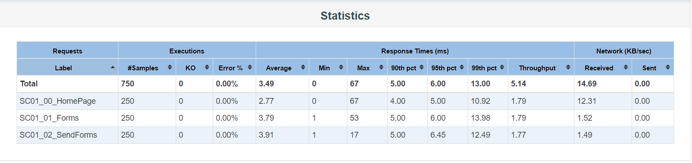](assets/images/report-statistics_c9c28efe0f1dcc9a.png)
- An error table providing a summary of all errors and their proportion in the total requests:
  [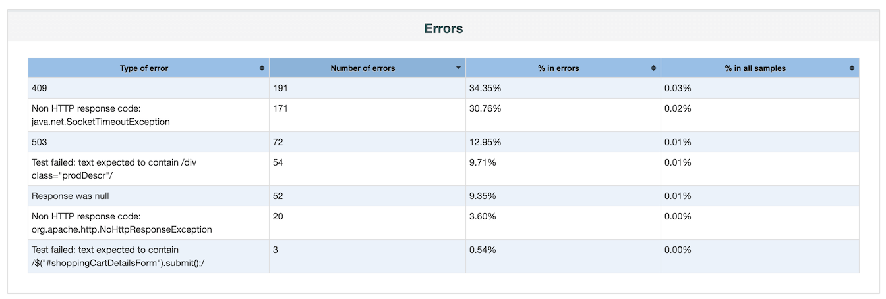](assets/images/report-errors_66693b7f90a2333c.png)
- A Top 5 Errors by Sampler table providing for every Sampler (excluding Transaction Controller by default) the top 5 Errors:
  [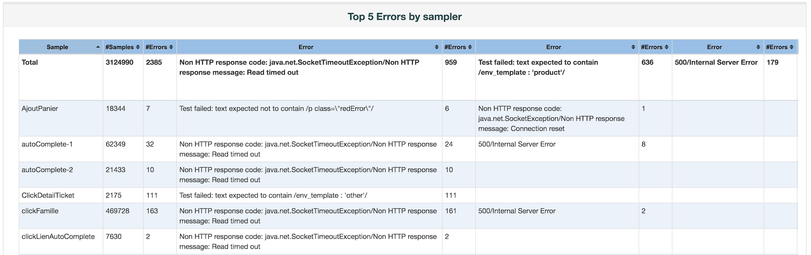](assets/images/top-5-errors-by-sampler_32dd187f15330eed.png)
- Zoomable chart where you can check/uncheck every transaction to show/hide it for:
  - Response times Over Time (Includes Transaction Controller Sample Results):
    [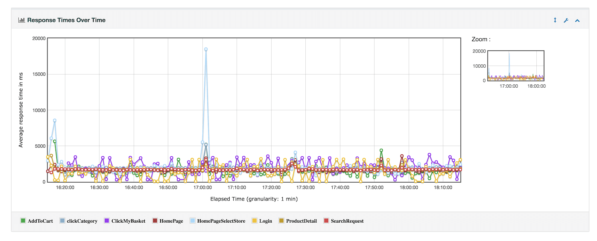](assets/images/report-response-times-over-time_a7b00dd8fa1bf0fc.png)
  - Response times Percentiles Over Time (successful responses only):
    [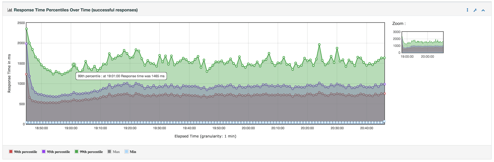](assets/images/response-time-percentiles-over-time_59908656e0945bf7.png)
  - Active Threads Over Time:
    [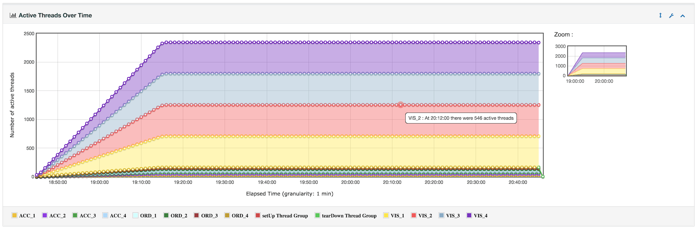](assets/images/report-active-threads-over-time_955a2ec54ab7f2df.png)
  - Bytes throughput Over Time (Ignores Transaction Controller Sample Results):
    [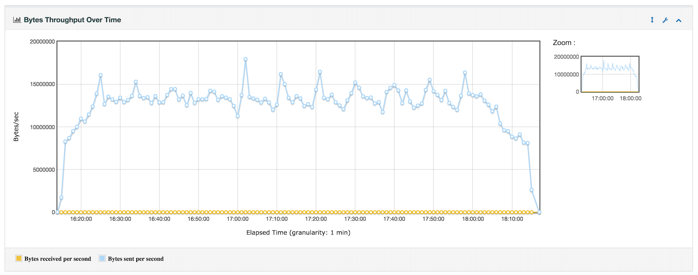](assets/images/report-bytes-throughput-over-time_09d21ce9285a9998.png)
  - Latencies Over Time (Includes Transaction Controller Sample Results):
    [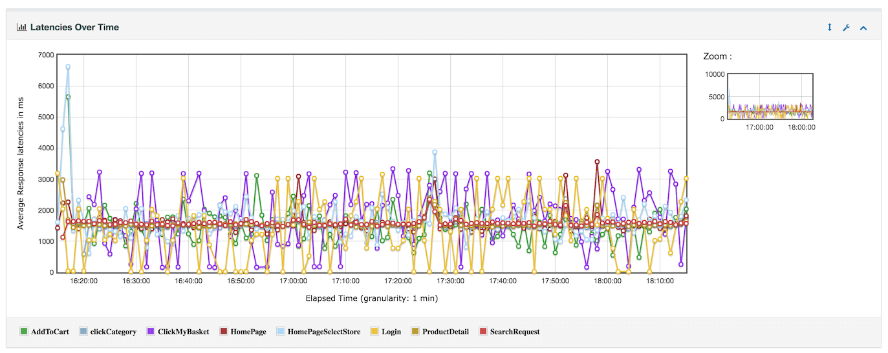](assets/images/report-latencies-over-time_a2a97ac65197fecf.png)
  - Connect Time Over Time (Includes Transaction Controller Sample Results):
    [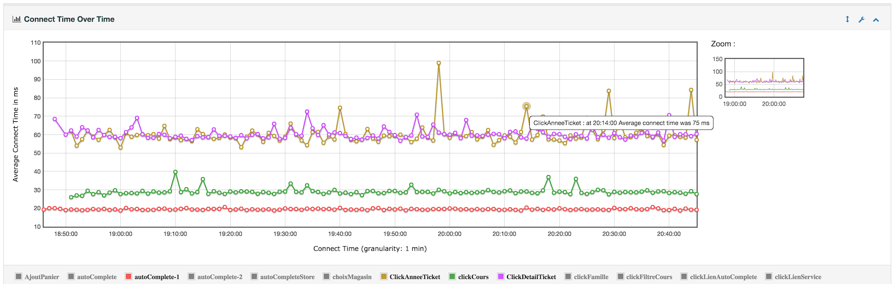](assets/images/report-connect-time-over-time_70f6c451b35cb308.png)
  - Hits per second (Ignores Transaction Controller Sample Results):
    [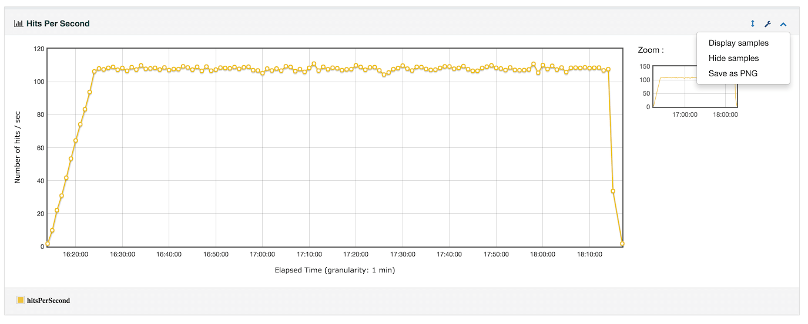](assets/images/report-hits-per-second_e2f27afdee0e8b85.png)
  - Response codes per second (Ignores Transaction Controller Sample Results):
    [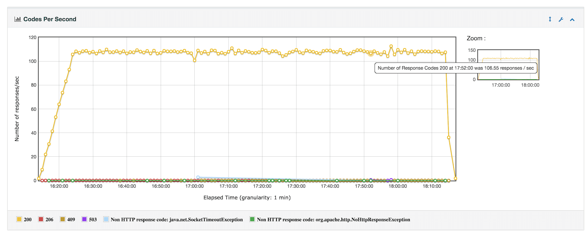](assets/images/report-codes-per-second_35bebb34c432a6c2.png)
  - Transactions per second (Includes Transaction Controller Sample Results):
    [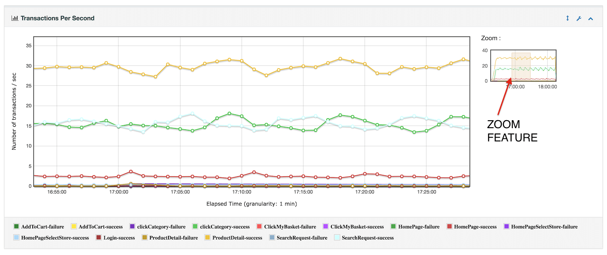](assets/images/report-transactions-per-second_7a292bdf6f422c3c.png)
  - Response Time vs Request per second (Ignores Transaction Controller Sample Results):
    [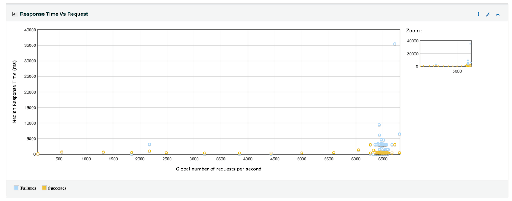](assets/images/report-response-time-vs-request_747b4cc8d25ed374.png)
  - Latency vs Request per second (Ignores Transaction Controller Sample Results):
    [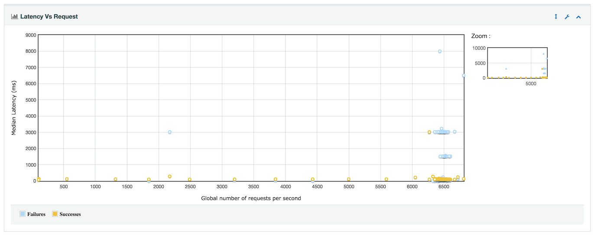](assets/images/report-latencies-vs-request_11b60280d37ca26a.png)
  - Response time Overview (Excludes Transaction Controller Sample Results):
    [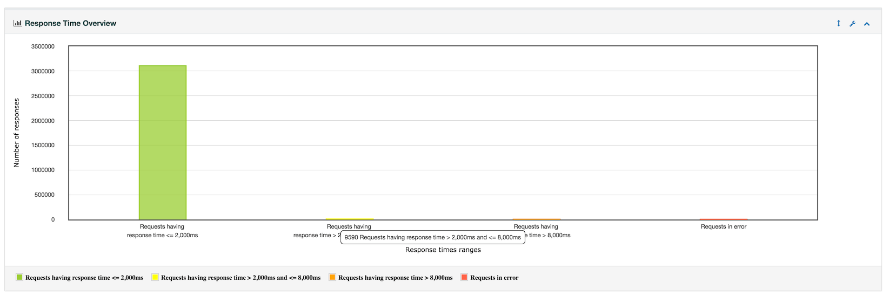](assets/images/response-time-overview_ca605601a818bb18.png)
  - Response times percentiles (Includes Transaction Controller Sample Results):
    [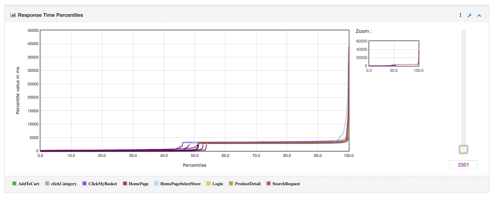](assets/images/report-response-time-percentiles_a10c72b16b731455.png)
  - Times vs Threads (Includes Transaction Controller Sample Results):
    [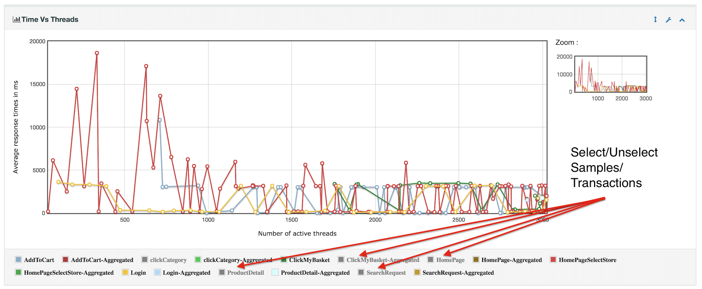](assets/images/report-time-vs-threads_d0a94343f48a911a.png)

    In distributed mode, this graph shows a horizontal axis the number of threads for 1 server. It's a current limitation
  - Response Time Distribution (Includes Transaction Controller Sample Results):
    [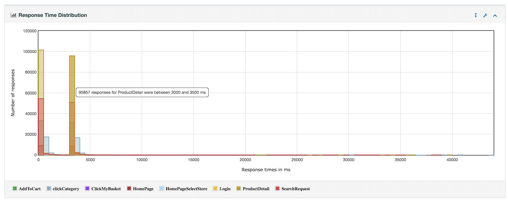](assets/images/report-response-time-distribution_7d8985dadfa9245a.png)

<a id="generating-dashboard--configuration"></a>
<a id="generating-dashboard--14.2-configuring-dashboard-generation"></a>

## 14.2 Configuring Dashboard Generation[¶](#generating-dashboard--configuration "Link to here")

Dashboard generation uses JMeter properties to customize the
report. Some properties are used for general settings and others are
used for a particular graph configuration or exporter configuration.

All report generator properties can be found in file reportgenerator.properties.
To customize these properties, you should copy them in user.properties file and modify them.

<a id="generating-dashboard--configuration_requirements"></a>
<a id="generating-dashboard--14.2.1-requirements"></a>

## 14.2.1 Requirements[¶](#generating-dashboard--configuration_requirements "Link to here")

<a id="generating-dashboard--saveservice_requirements"></a>
<a id="generating-dashboard--14.2.1.1-filtering-configuration"></a>

## 14.2.1.1 Filtering configuration[¶](#generating-dashboard--saveservice_requirements "Link to here")

Ensure you set property jmeter.reportgenerator.exporter.html.series\_filter to keep only the transactions
you want in the report if you don't want everything.
In the example below you must only modify Search|Order, keep the rest:

```
jmeter.reportgenerator.exporter.html.series_filter=^(Search|Order)(-success|-failure)?$
```

<a id="generating-dashboard--saveservice_requirements-2"></a>
<a id="generating-dashboard--14.2.1.2-save-service-configuration"></a>

## 14.2.1.2 Save Service configuration[¶](#generating-dashboard--saveservice_requirements "Link to here")

To enable the generator to operate, the CSV file generated by JMeter
must include certain required data which **are correct by default in the last live version** of JMeter.
If you modified those settings, check that your JMeter configuration follows these settings (these are the defaults):

```

jmeter.save.saveservice.bytes = true
# Only available with HttpClient4 #jmeter.save.saveservice.sent_bytes=true
jmeter.save.saveservice.label = true
jmeter.save.saveservice.latency = true
jmeter.save.saveservice.response_code = true
jmeter.save.saveservice.response_message = true
jmeter.save.saveservice.successful = true
jmeter.save.saveservice.thread_counts = true
jmeter.save.saveservice.thread_name = true
jmeter.save.saveservice.time = true
jmeter.save.saveservice.connect_time = true
jmeter.save.saveservice.assertion_results_failure_message = true
# the timestamp format must include the time and should include the date.
# For example the default, which is milliseconds since the epoch:
jmeter.save.saveservice.timestamp_format = ms
# Or the following would also be suitable
# jmeter.save.saveservice.timestamp_format = yyyy/MM/dd HH:mm:ss
                        
```

<a id="generating-dashboard--transaction_controller_requirements"></a>
<a id="generating-dashboard--14.2.1.3-transaction-controller-configuration"></a>

## 14.2.1.3 Transaction Controller configuration[¶](#generating-dashboard--transaction_controller_requirements "Link to here")

If you use Transaction Controllers, to ensure most accurate results:

- uncheck the box (**this is the default configuration**):
  Generate parent sample

  [](assets/images/transactioncontroller_f35e3ed7198b655e.png)
- If Transaction Controller is used as a Container to represent a request for an HTML Page that will trigger Ajax calls and you
  only want in your report the Transaction Controller, then Right click on the node and Apply Naming Policy
  [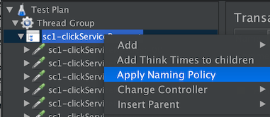](assets/images/apply-naming-policy1_dcca9eeda92bfeb2.png)

  You will obtain this:
  [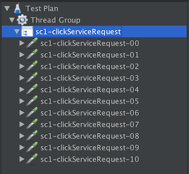](assets/images/apply-naming-policy2_7931555f985bc3eb.png)

<a id="generating-dashboard--configuration_general"></a>
<a id="generating-dashboard--14.2.2-general-settings"></a>

## 14.2.2 General settings[¶](#generating-dashboard--configuration_general "Link to here")

All properties must be prefixed with

```
jmeter.reportgenerator.
```

<a id="generating-dashboard--parameters"></a>

### Parameters

Attribute

Description

Required

report\_title

Title used in the generated report.
Default: "Apache JMeter Dashboard"

No

date\_format

Default date format from [SimpleDateFormat Java API](http://docs.oracle.com/javase/7/docs/api/java/text/SimpleDateFormat.html) with Locale.ENGLISH.
Default Date format is yyyyMMddHHmmss
Useful when you would like to generate a report after the load test, and the results file contains timestamp in
another time zone. In this case the date format must include the time zone (zzz).

If jmeter.save.saveservice.timestamp\_format does not contain year then use 1970 as year

Example: dd/MM/yyyy HH:mm:ss zzz

No

start\_date

Start date of the range of data to use for report.
Date format is defined by date\_format property.
Default: not filled which means data range will be used from the beginning

No

end\_date

End date of the range of data to use for report.
Date format is defined by date\_format property.
Default: not filled which means data range will be used until the end

No

overall\_granularity

Granularity of over time graphs. Data is aggregated to have 1 minute ticks.

Granularity must be higher than 1 second (1000) otherwise throughput graphs will be incorrect

Default: "60000" (1 minute)

No

apdex\_satisfied\_threshold

Sets the satisfaction threshold for the
[APDEX](https://en.wikipedia.org/wiki/Apdex)
calculation (in ms).
Default: 500

No

apdex\_tolerated\_threshold

Sets the tolerance threshold for the APDEX calculation
(in ms).
Default: 1500

No

jmeter.reportgenerator.apdex\_per\_transaction

Sets satisfaction and tolerance threshold to specific samples.
Use sample names or regular expression.
Format is sample\_name:satisfaction|tolerance[;]
Values are in milliseconds.

Notice the colon between sample name and values, the pipe between thresholds and the
semicolon at the end to separate different samples. Don't forget to escape after
semicolon to span multiple lines.

Example:

```
jmeter.reportgenerator.apdex_per_transaction=sample(\\d+):1000|2000;\
    samples12:3000|4000;\
    scenar01-12:5000|6000
```

No

sample\_filter

Sets the filter of samples to keep for generating
graphs and statistics. An empty value deactivates the
filtering.
Format: Regular expression.
Default: ""

No

temp\_dir

Sets the temporary directory used by the generation
process if it needs file I/O
operations.
Default: temp

No

statistic\_window

Sets the size of the sliding window used by percentile
evaluation. Caution: higher value provides a
better accuracy but needs more memory.
Default: 20000

No

Percentiles used by Summary table and Percentile graphs can be adjusted to different values by using the 3 properties:

- aggregate\_rpt\_pct1: Defaults to 90
- aggregate\_rpt\_pct2: Defaults to 95
- aggregate\_rpt\_pct3: Defaults to 99

Relative paths are built from the JMeter working directory
(default: bin).

You can define some overall properties which are used by the
generator configuration. These properties are freely named
but you should use the prefix

```
jmeter.reportgenerator.
```

in order to avoid property overlap.

E.g.:

Property definition:
: ```
jmeter.reportgenerator.overall_granularity=60000
```

Property reference:
: ```
${jmeter.reportgenerator.overall_granularity}
```

The calculated percentiles might differ from those from the Aggregate Report in the GUI.
This is because the dashboard uses a different formula to estimate the percentiles.
It will be most observable when the distribution of the timing values is spread
too wide. That can happen if too few samples were taken. If you want the numbers
to be more or less the same as those from the Aggregate Report, you will have to switch the used
[estimator](https://commons.apache.org/proper/commons-math/javadocs/api-3.6/org/apache/commons/math3/stat/descriptive/rank/Percentile.EstimationType.html)
from LEGACY to R\_3, by specifying the JMeter property
backend\_metrics\_percentile\_estimator=R\_3 (this time without any
prefix).

<a id="generating-dashboard--configure_graph"></a>
<a id="generating-dashboard--14.2.3-graph-settings"></a>

## 14.2.3 Graph settings[¶](#generating-dashboard--configure_graph "Link to here")

Each property describing a graph configuration must be prefixed
with

```
jmeter.reportgenerator.graph.
```

followed by the graph identifier.

<a id="generating-dashboard--general_graph_properties"></a>
<a id="generating-dashboard--14.2.3.1-general-properties"></a>

## 14.2.3.1 General properties[¶](#generating-dashboard--general_graph_properties "Link to here")

All graphs support these properties:

<a id="generating-dashboard--parameters-2"></a>

### Parameters

Attribute

Description

Required

classname

The fully qualified class name of the graph
The class of the graph must extend
org.apache.jmeter.report.processor.graph.AbstractGraphConsumer.
See
[Default graph section](#generating-dashboard--default_graphs)
for more details.

Yes

exclude\_controllers

Defines
whether the graph discards controller samples.
Default: false

No

title

Sets the title of the
graph.
Default: ""

No

<a id="generating-dashboard--specific_graph_properties"></a>
<a id="generating-dashboard--14.2.3.2-specific-properties"></a>

## 14.2.3.2 Specific properties[¶](#generating-dashboard--specific_graph_properties "Link to here")

Specific graph properties must use the prefix:

```
jmeter.reportgenerator.graph.<graph_id>.property
```

The name of the property will be mapped using camel case
transformation and the matching method of the class will be
called with the property value as argument.

E.g.:

```
jmeter.reportgenerator.graph.<graph_id>.property.set_granularity=150
```

induces the call of the method setGranularity(150) on the
instance of the graph.

<a id="generating-dashboard--configure_export"></a>
<a id="generating-dashboard--14.2.4-export-settings"></a>

## 14.2.4 Export settings[¶](#generating-dashboard--configure_export "Link to here")

Each property describing an exporter configuration must be
prefixed with

```
jmeter.reportgenerator.exporter
```

followed by the exporter identifier.

<a id="generating-dashboard--general_export_properties"></a>
<a id="generating-dashboard--14.2.4.1-general-properties"></a>

## 14.2.4.1 General properties[¶](#generating-dashboard--general_export_properties "Link to here")

All exporters support these properties:

<a id="generating-dashboard--parameters-3"></a>

### Parameters

Attribute

Description

Required

classname

The fully qualified class name of the exporter
The class of the exporter must implement
org.apache.jmeter.report.dashboard.DataExporter
.

Yes

filters\_only\_sample\_series

Defines whether series\_filter (see below)
apply only on sample series.
Default: true

No

series\_filter

Sets the filter
of series. An empty value deactivates the filtering.
If not empty, regex should end with (-success|-failure)?$
Format: regular expression.
Default: ""

No

show\_controllers\_only

Defines whether only controller series are shown.
Default: false

No

<a id="generating-dashboard--specific_export_properties"></a>
<a id="generating-dashboard--14.2.4.2-specific-properties"></a>

## 14.2.4.2 Specific properties[¶](#generating-dashboard--specific_export_properties "Link to here")

Specific exporter properties must use the prefix

```
jmeter.reportgenerator.exporter.<exporter_id>.property
```

<a id="generating-dashboard--parameters-4"></a>

### Parameters

Attribute

Description

Required

output\_dir

Sets the destination directory for generated html pages.
Default: report-output

No

template\_dir

Sets the source directory of template files from
which the html pages are generated.
Default: report-template

No

<a id="generating-dashboard--graph_export_properties"></a>
<a id="generating-dashboard--14.2.4.3-graph-properties"></a>

## 14.2.4.3 Graph properties[¶](#generating-dashboard--graph_export_properties "Link to here")

Graph properties allow exporters to overwrite some graph data.
They must use the prefix:

```
jmeter.reportgenerator.exporter.<exporter_id>.graph_options.<graph_id>
```

<a id="generating-dashboard--parameters-5"></a>

### Parameters

Attribute

Description

Required

minX

Sets the minimum
abscissa for the graph.

No

maxX

Sets the maximum
abscissa for the graph.

No

minY

Sets the minimum
ordinate for the graph.

No

maxY

Sets the maximum
ordinate for the graph.

No

<a id="generating-dashboard--export_filtering"></a>
<a id="generating-dashboard--14.2.4.4-filtering-mechanisms"></a>

## 14.2.4.4 Filtering mechanisms[¶](#generating-dashboard--export_filtering "Link to here")

Unlike the filtering in the section
[General properties](#generating-dashboard--configure_general)
which discards data before calculations, here the
filtering is performed after the calculations and serves
to simplify the final report.

The property series\_filter
allows to filter which series of a graph (resp. rows of
a summary table) using regular expression that matches
the name of the series (resp. of the row).
However, even if the name of the
series (resp. row) matches the filter, the setting
of the other filtering properties can lead to its
discarding. Conversely if there is no matching, the
other properties can allow to keep it.

The following tables show how the setting of filtering
properties works.

filter\_only\_sample\_series

Graph/Summary supports controllers discrimination

The current series is a controller series

show\_controllers\_only

Discarded

False

False

-

False

False

True

-

False

True

True

False

False

True

True

False

True

True

False

-

False

True

-

False

True

True

False

False

True

True

True

False

False

True

<table>
<div>
<caption>Cases of retention when there is no pattern matching</caption>
</div>
<thead>
<tr>
<th>filter_only_sample_series</th>
<th>Graph/Summary supports controllers discrimination</th>
<th>Kept</th>
</tr>
</thead>
<tbody>
<tr>
<td rowspan="2">False</td>
<td>False</td>
<td rowspan="2">False</td>
</tr>
<tr>
<td>True</td>
</tr>
<tr>
<td rowspan="2">True</td>
<td>False</td>
<td>True</td>
</tr>
<tr>
<td>True</td>
<td>False</td>
</tr>
</tbody>
</table>

Incorrect filter configuration can lead to generate empty
graphs/summary tables:

- If you set the property
  show\_controllers\_only
  and the graph is configured to exclude
  controllers.
- If the property
  series\_filter
  matches none series.

<a id="generating-dashboard--sample_configuration"></a>
<a id="generating-dashboard--14.2.5-sample-configuration"></a>

## 14.2.5 Sample configuration[¶](#generating-dashboard--sample_configuration "Link to here")

You can copy the following configuration to your user.properties
file in order to test the report generator.

```

# Configure this property to change the report title #jmeter.reportgenerator.report_title=Apache JMeter Dashboard

# Change this parameter if you want to change the granularity of over time graphs.
# Granularity must be higher than 1000 (1second) otherwise Throughput graphs will be incorrect
# see Bug 60149 #jmeter.reportgenerator.overall_granularity=60000

 Change this parameter if you want to change the granularity of Response time distribution
# Set to 100 ms by default #jmeter.reportgenerator.graph.responseTimeDistribution.property.set_granularity=100

# Change this parameter if you want to override the APDEX satisfaction threshold.
jmeter.reportgenerator.apdex_satisfied_threshold=1500

# Change this parameter if you want to override the APDEX tolerance threshold.
jmeter.reportgenerator.apdex_tolerated_threshold=3000

# Sets the destination directory for generated html pages, it is better to change it for every generation
# This will override the value set through -o command line option
# jmeter.reportgenerator.exporter.html.property.output_dir=/tmp/test-report

# Indicates which graph series are filtered (regular expression)
# In the below example we filter on Search and Order samples
# Note that the end of the pattern should always include (-success|-failure)?$
# Transactions per second suffixes Transactions with "-success" or "-failure" depending
# on the result #jmeter.reportgenerator.exporter.html.series_filter=^(Search|Order)(-success|-failure)?$

# Indicates whether series filter apply only on sample series
jmeter.reportgenerator.exporter.html.filters_only_sample_series=true
                    
```

Adapt the parameter
output\_dir
to your environment.

This configuration allows to generate a report where:

- Over time graphs have a time granularity equal to 1 minute.
- The satisfaction threshold for ADPEX calculation is 1 second and half.
- The tolerance threshold for ADPEX calculation is 3 seconds.
- The HTML files are generated in the directory /tmp/test-report.
- Only series which the name begins with "s0" or "s1" are shown.
- The previous filter only applies to graphs (resp. summary tables) where the series (resp. rows) match samples

<a id="generating-dashboard--report"></a>
<a id="generating-dashboard--14.3-generating-reports"></a>

## 14.3 Generating reports[¶](#generating-dashboard--report "Link to here")

The report generation can be done as a stand alone process from a
sample log file or automatically after running load test.

<a id="generating-dashboard--report_only"></a>
<a id="generating-dashboard--14.3.1-generation-from-an-existing-sample-csv-log-file"></a>

## 14.3.1 Generation from an existing sample CSV log file[¶](#generating-dashboard--report_only "Link to here")

Use the following command:

```
jmeter -g <log file> -o <Path to output folder>
```

<a id="generating-dashboard--report_after_load_test"></a>
<a id="generating-dashboard--14.3.2-generation-after-load-test"></a>

## 14.3.2 Generation after load test[¶](#generating-dashboard--report_after_load_test "Link to here")

Use the following command:

```
jmeter -n -t <test JMX file> -l <test log file> -e -o <Path to output folder>
```

<a id="generating-dashboard--report_gui"></a>
<a id="generating-dashboard--14.3.3-generation-using-gui-tools-menu"></a>

## 14.3.3 Generation using GUI Tools menu[¶](#generating-dashboard--report_gui "Link to here")

You can generate the HTML report using menu item Tools → Generate HTML report:
[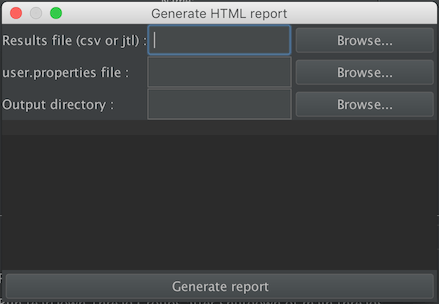](assets/images/html-report-menu_31f00be4af397991.png)

Figure 14.1. HTML Report Dialog Menu

For each parameters see the following table :

<a id="generating-dashboard--parameters-6"></a>

### Parameters

Attribute

Description

Required

Results file (csv or jtl)

The CSV output of a tes run

Yes

user.properties file

The user.properties file used to run the load test

Yes

Output directory

The directory where you want the report to be created(must be empty)

No

If no output directory is defined, the controller will use ${JMETER\_HOME}/bin/report-output.

You then only have to click on the Generate report button and wait for an information dialog to appear

If report generation takes more than two minutes, adjust the property generate\_report\_ui.generation\_timeout

<a id="generating-dashboard--default_graphs"></a>
<a id="generating-dashboard--14.4-default-graphs"></a>

## 14.4 Default graphs[¶](#generating-dashboard--default_graphs "Link to here")

Due to limitations of this early version, each default graph
must be declared in JMeter properties. Otherwise, the graph
views will be empty.

All graphs provided by this report engine are located in the
package
org.apache.jmeter.report.processor.graph.impl

The dashboard generator provides the following graph classes:

<table>
<thead>
<tr>
<th>Graph</th>
<th>Description</th>
<th>Supports controller discrimination</th>
</tr>
</thead>
<tbody>
<tr>
<td>ActiveThreadsGraphConsumer</td>
<td>This graph represents the number of active threads over time.</td>
<td>False</td>
</tr>
<tr>
<td>BytesThroughputGraphConsumer</td>
<td>This graph represents the throughput of received and sent data
                                over time.</td>
<td>False</td>
</tr>
<tr>
<td>CodesPerSecondGraphConsumer</td>
<td>This graph represents the rate of response codes over time.</td>
<td>False</td>
</tr>
<tr>
<td>HitsPerSecondGraphConsumer</td>
<td>This graph represents the rate of finished requests over
                                time.</td>
<td>False</td>
</tr>
<tr>
<td>LatencyOverTimeGraphConsumer</td>
<td>This graph represents the average latency time over time.</td>
<td>True</td>
</tr>
<tr>
<td>ConnectTimeOverTimeGraphConsumer</td>
<td>This graph represents the connection time over time.</td>
<td>True</td>
</tr>
<tr>
<td>LatencyVSRequestGraphConsumer</td>
<td>This graph represents the median and average latency time
                                depending on the number of current requests.</td>
<td>False</td>
</tr>
<tr>
<td>ResponseTimeDistributionGraphConsumer</td>
<td>This graph represents the distribution of the samples
                                depending on their elapsed time and name.</td>
<td>True</td>
</tr>
<tr>
<td>ResponseTimeOverTimeGraphConsumer</td>
<td>This graph represents the average response time over time.</td>
<td>True</td>
</tr>
<tr>
<td>ResponseTimePercentilesGraphConsumer</td>
<td>This graph represents the percentiles of the elapsed time
                                over time.</td>
<td>True</td>
</tr>
<tr>
<td>ResponseTimePercentilesOverTimeGraphConsumer</td>
<td>This graph shows Min/Max and 3 percentiles response time over time.</td>
<td>True</td>
</tr>
<tr>
<td>ResponseTimeVSRequestGraphConsumer</td>
<td>This graph represents the median and average response time
                                depending on the number of current requests.</td>
<td>False</td>
</tr>
<tr>
<td>TimeVSThreadGraphConsumer</td>
<td>
                                This graph represents the average response time
                                depending on the number of current active threads.

                                    <p>
                                                                            The *-aggregated series represent the average
                                    response time regardless of the number of
                                    current active threads. These series are
                                    represented by a sole point because the number of
                                    current active threads is aggregated
                                    to an average. So for these points:

                                        <ul>
<li>The abscissa is the average
                                            of the number of current active
                                            threads when samples of the
                                            series finish.</li>
<li>The ordinate is the average of the
                                            response time for the samples of the
                                            series regardless of the number of current
                                            active threads.</li>
</ul>
</p>
</td>
<td>True</td>
</tr>
<tr>
<td>TransactionsPerSecondGraphConsumer</td>
<td>This graph represents the rate of transaction by
                                sample name over time.</td>
<td>True</td>
</tr>
</tbody>
</table>

<a id="generating-dashboard--customs_graphs"></a>
<a id="generating-dashboard--14.5-generating-customs-graphs-over-time"></a>

## 14.5 Generating customs graphs over time[¶](#generating-dashboard--customs_graphs "Link to here")

You can graph any sample\_variable in CSV over time, you can customize your graphs
by settings their properties in the user.properties file.
They must use the id prefix custom\_:

```
jmeter.reportgenerator.graph.custom_<your_graph_name_id>.property.<your_option_name>
```

To specify that this graph is a customized one :

```
jmeter.reportgenerator.graph.custom_<your_graph_name_id>.classname=org.apache.jmeter.report.processor.graph.impl.CustomGraphConsumer
```

<a id="generating-dashboard--parameters-7"></a>

### Parameters

Attribute

Description

Required

set\_X\_Axis

Sets the X axis name of the graph.

Yes

set\_Y\_Axis

Sets the Y axis name of the graph.

Yes

set\_Content\_Message

Sets the displayed message when the cursor is on a point of the graph.

Yes

set\_Sample\_Variable\_Name

Name of the column you want to graph in the csv.

Yes

Here is an example of a custom graph configuration that graphs the variable ts-hit:

```

jmeter.reportgenerator.graph.custom_testGraph.classname=org.apache.jmeter.report.processor.graph.impl.CustomGraphConsumer
jmeter.reportgenerator.graph.custom_testGraph.title=Chunk Hit
jmeter.reportgenerator.graph.custom_testGraph.property.set_Y_Axis=Number of Hits
jmeter.reportgenerator.graph.custom_testGraph.set_X_Axis=Over Time
jmeter.reportgenerator.graph.custom_testGraph.property.set_granularity=60000
jmeter.reportgenerator.graph.custom_testGraph.property.set_Sample_Variable_Name=ts-hit
jmeter.reportgenerator.graph.custom_testGraph.property.set_Content_Message=Number of Hits :
                        
```

<a id="generating-dashboard--development"></a>
<a id="generating-dashboard--14.6-want-to-improve-report-dashboard"></a>

## 14.6 Want to improve Report Dashboard ?[¶](#generating-dashboard--development "Link to here")

If you want to contribute new graphs or improve current ones, you
can read this [developer documentation](https://jmeter.apache.org/devguide-dashboard.html).
Read this [documentation](https://jmeter.apache.org/building.html) on contributing.

---

<a id="glossary"></a>

<!-- source_url: https://jmeter.apache.org/usermanual/glossary.html -->

<!-- page_index: 26 -->

<a id="glossary--glossary"></a>
<a id="glossary--23.-glossary"></a>

# 23. Glossary[¶](#glossary--glossary "Link to here")

**Elapsed time**. JMeter measures the elapsed time from just before sending the request to
just after the last response has been received.
JMeter does not include the time needed to render the response, nor does JMeter process any client code, for example
Javascript.

**Latency**. JMeter measures the latency from just before sending the request to
just after the first response has been received. Thus the time
includes all the processing needed to assemble the request as well as
assembling the first part of the response, which in general will be longer than one
byte.
Protocol analysers (such as Wireshark) measure the time when bytes are actually sent/received over the interface.
The JMeter time should be closer to that which is experienced by a
browser or other application client.

**Connect Time**. JMeter measures the time it took to establish the connection, including SSL handshake. Note that connect time is not automatically subtracted from [latency](#glossary--latency).
In case of connection error, the metric will be equal to the time it took to face the error, for example in case of Timeout, it should be equal to connection timeout.

As of JMeter 3.1, this metric is only computed for TCP Sampler, HTTP Request and JDBC Request.

**Median** is a number which divides the samples into two equal halves.
Half of the samples are smaller than the median, and half are larger.
[Some samples may equal the median.]
This is a standard statistical measure.
See, for example: [Median](http://en.wikipedia.org/wiki/Median) entry at Wikipedia.
The Median is the same as the 50th Percentile

**90% Line (90th Percentile)** is the value below which 90% of the samples fall.
The remaining samples too at least as long as the value.
This is a standard statistical measure.
See, for example: [Percentile](http://en.wikipedia.org/wiki/Percentile) entry at Wikipedia.

**Standard Deviation** is a measure of the variability
of a data set. This is a standard statistical measure.
See, for example: [Standard Deviation](http://en.wikipedia.org/wiki/Standard_deviation) entry at Wikipedia.
JMeter calculates the population standard deviation (e.g. STDEVP function in spreadsheets), not the sample standard deviation (e.g. STDEV).

The **Thread Name** as it appears in Listeners and logfiles
is derived from the Thread Group name and the thread within the group.
The name has the format
groupName + " " + groupIndex + "-" + threadIndex
where:

- groupName - name of the Thread Group element
- groupIndex - number of the Thread Group in the Test Plan, starting from 1
- threadIndex - number of the thread within the Thread Group, starting from 1

A test plan with two Thread Groups each with two threads would use the names:

```

Thread Group 1-1
Thread Group 1-2
Thread Group 2-1
Thread Group 2-2
```

**Throughput** is calculated as requests/unit of time.
The time is calculated from the start of the first sample to the end of the last sample.
This includes any intervals between samples, as it is supposed to represent the load on the server.
The formula is: Throughput = (number of requests) / (total time).

---

<a id="hints_and_tips"></a>

<!-- source_url: https://jmeter.apache.org/usermanual/hints_and_tips.html -->

<!-- page_index: 27 -->

# 22. Hints and Tips ¶

<a id="hints_and_tips--hints"></a>
<a id="hints_and_tips--22.-hints-and-tips"></a>

> [!NOTE]
> # 22. Hints and Tips[¶](#hints_and_tips--hints "Link to here")

This section is a collection of various hints and tips that have been suggested by various questions on the JMeter User list.
If you don't find what you are looking for here, please check the [JMeter Wiki](https://cwiki.apache.org/confluence/display/JMETER/Home).
Also, try search the JMeter User list; someone may well have already provided a solution.

<a id="hints_and_tips--variable_and_threads"></a>
<a id="hints_and_tips--22.1-passing-variables-between-threads"></a>

## 22.1 Passing variables between threads[¶](#hints_and_tips--variable_and_threads "Link to here")

JMeter variables have thread scope. This is deliberate, so that threads can act independently.
However sometimes there is a need to pass variables between different threads, in the same or different Thread Groups.

One way to do this is to use a property instead.
Properties are shared between all JMeter threads, so if one thread [sets a property](#functions--__setproperty), another thread can [read](#functions--__p) the updated value.

If there is a lot of information that needs to be passed between threads, then consider using a file.
For example you could use the [Save Responses to a file](#component_reference--save_responses_to_a_file)
listener or perhaps a BeanShell PostProcessor in one thread, and read the file using the HTTP Sampler "file:" protocol, and extract the information using a PostProcessor or BeanShell element.

If you can derive the data before starting the test, then it may well be better to store it in a file, read it using CSV Dataset.

<a id="hints_and_tips--debug_logging"></a>
<a id="hints_and_tips--22.2-enabling-debug-logging"></a>

## 22.2 Enabling Debug logging[¶](#hints_and_tips--debug_logging "Link to here")

Most test elements include debug logging. If running a test plan from the GUI, select the test element and use the Help Menu to enable or disable logging.
The Help Menu also has an option to display the GUI and test element class names.
You can use these to determine the correct property setting to change the logging level.

It is sometimes very useful to see Log messages to debug dynamic scripting languages like BeanShell or
Apache Groovy used in JMeter.
You can view log messages directly in JMeter GUI, to do so:

- use menu Options → Log Viewer,
  a log console will appear at the bottom of the interface
- Or click on the Warning icon in the upper right corner of GUI

By default this log console is disabled, you can enable it by changing in jmeter.properties:

```
jmeter.loggerpanel.display=true
```

To avoid using too much memory, this components limits the number of characters used by this panel:

```
jmeter.loggerpanel.maxlength=80000
```

<a id="hints_and_tips--searching"></a>
<a id="hints_and_tips--22.3-searching"></a>

## 22.3 Searching[¶](#hints_and_tips--searching "Link to here")

It is sometimes hard to find in a Test Plan tree and elements using a variable or containing a certain URL or parameter.
A new feature is now available since 2.6, you can access it in Menu Search.
It provides search with following options:

Case sensitive
:   Makes search case sensitive

Regular exp.
:   Is text to search a regexp, if so Regexp will be searched in Tree of components, example "\btest\b"
    will match any component that contains test in searchable elements of the component

[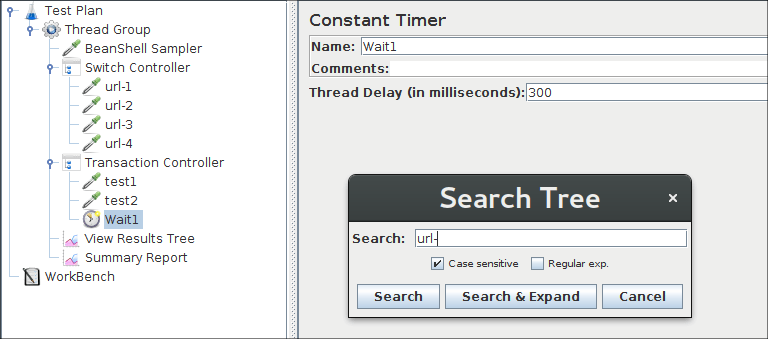](assets/images/raw-search_0f040b13ff7fb282.png)

Figure 1 - Search raw text in TreeView

[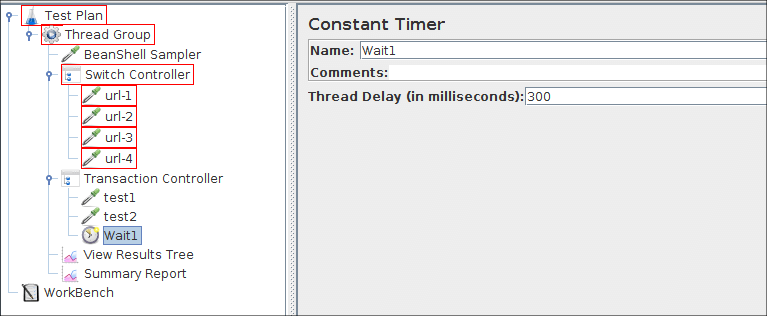](assets/images/raw-search-result_573ea1d10548f91f.png)

Figure 2 - Result in TreeView

[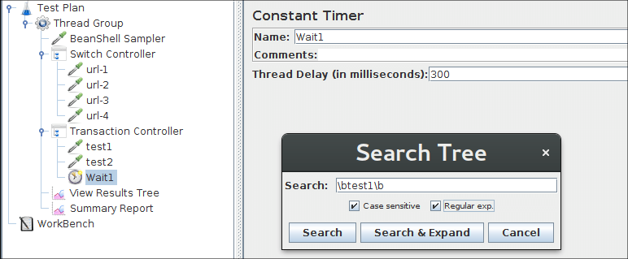](assets/images/regexp-search_c83d14f62a21892d.png)

Figure 3 - Search Regexp in TreeView (in this example we search whole word)

[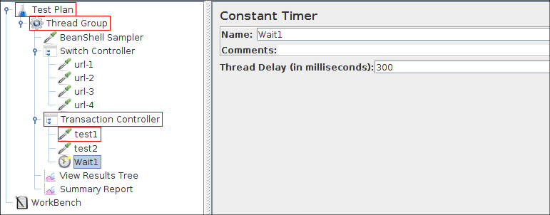](assets/images/regexp-search-result_9a59b775b821c655.png)

Figure 4 - Result in TreeView

<a id="hints_and_tips--hidpi"></a>
<a id="hints_and_tips--22.4-jmeter-and-a-hidpi-screen"></a>

## 22.4 JMeter and a HiDPI screen[¶](#hints_and_tips--hidpi "Link to here")

With **Java version 9 and up**, the HiDPI (High Dot Per Inch) screens are supported.

You can define the Java property **sun.java2d.uiScale** to change the scale of JMeter.
The value can be an integer or percentage value.

For example, on Linux, with x2 factor (200%):

```

    $ export JVM_ARGS="-Dsun.java2d.uiScale=200%"
    $ ./bin/jmeter
```

With **Java version 8**, the HiDPI (High Dot Per Inch) screens aren't supported in the Swing API.
You can improve the JMeter's display on HiDPI screen by changing some properties:

jmeter.hidpi.mode
:   set to true to activate a '*pseudo*'-hidpi mode allowing to increase size of some UI elements

jmeter.hidpi.scale.factor
:   set to 2.0 to scale the size of some UI elements

jmeter.toolbar.icons.size
:   with these values: 22x22 (default size), 32x32 or 48x48 (Suggested value for HiDPI)

jmeter.tree.icons.size
:   with these values: 19x19 (default size), 24x24, 32x32 (Suggested value for HiDPI) or 48x48

Additionally you can increase the font size of the text areas in some elements like JSR223 sampler by changing theses properties:

jsyntaxtextarea.font.family
:   set to Hack to activate and to change the font and their size

jsyntaxtextarea.font.size
:   set to a greater value, like 28 (Suggested value for HiDPI)

This is not a full HiDPI support and only affects

- JMeter tree nodes
- Icons in the toolbar
- Tables content
- Font size into text areas

<a id="hints_and_tips--autosave"></a>
<a id="hints_and_tips--22.5-autosave-process-configuration"></a>

## 22.5 Autosave process configuration[¶](#hints_and_tips--autosave "Link to here")

Since JMeter 3.0, JMeter automatically saves up to ten backups of every saved jmx files. When enabled, just before the jmx file is saved, it will be backed up to the ${JMETER\_HOME}/backups subfolder. Backup files are named after the saved jmx file and assigned a
version number that is automatically incremented, ex: test-plan-000001.jmx, test-plan-000002.jmx, test-plan-000003.jmx, etc.
To control auto-backup, add the following properties to user.properties.

backup\_on\_save
:   To enable/disable auto-backup, set the following property to true/false (default is true):

```
jmeter.gui.action.save.backup_on_save=false
```

backup\_directory
:   The backup directory can also be set to a different location. Setting the jmeter.gui.action.save.backup\_directory property
    to the path of the desired directory
    will cause backup files to be stored inside instead of the ${JMETER\_HOME}/backups folder. If the specified directory does not exist
    it will be created. Leaving this property unset will cause the ${JMETER\_HOME}/backups folder to be used.

```
jmeter.gui.action.save.backup_directory=/path/to/backups/dir
```

keep\_backup\_max\_hours
:   You can also configure the maximum time (in hours) that backup files should be preserved since the most recent save time.
    By default a zero expiration time is set which instructs JMeter to preserve backup files for ever.
    Use the following property to control max preservation time:

```
jmeter.gui.action.save.keep_backup_max_hours=0
```

keep\_backup\_max\_count
:   You can set the maximum number of backup files that should be preserved. By default 10 backups will be kept.
    Setting this to zero will cause the backups to never being deleted (unless keep\_backup\_max\_hours is set to a non null value)
    Maximum backup files selection is processed *after* time expiration selection, so even if you set one year as the expiry time,
    only the keep\_backup\_max\_count most recent backups files will be kept.

```
jmeter.gui.action.save.keep_backup_max_count=10
```

<a id="hints_and_tips--component_hotkeys"></a>
<a id="hints_and_tips--22.5-adding-elements-with-hotkeys"></a>

## 22.5 Adding Elements with Hotkeys[¶](#hints_and_tips--component_hotkeys "Link to here")

When you do intense scripting with JMeter, there is a way to add elements to test plan quickly
with keyboard shortcuts. Default bindings are:

Ctrl + 0
:   Thread Group

Ctrl + 1
:   HTTP Request

Ctrl + 2
:   Regular Expression Extractor

Ctrl + 3
:   Response Assertion

Ctrl + 4
:   Constant Timer

Ctrl + 5
:   Test Action

Ctrl + 6
:   JSR223 PostProcessor

Ctrl + 7
:   JSR223 PreProcessor

Ctrl + 8
:   Debug Sampler

Ctrl + 9
:   View Results Tree

The binding above are made for Windows QWERTY keyboards. For other platforms and keyboards ensure you adapt those values.

To change these binding, please find "gui.quick\_\*" properties within jmeter.properties file as example, it is recommended to put overrides for them into user.properties file.

<a id="hints_and_tips--browser_renderer_view_results_tree"></a>
<a id="hints_and_tips--22.6-browser-renderer-is-not-displaying-in-view-results-tree"></a>

## 22.6 Browser renderer is not displaying in View Results Tree[¶](#hints_and_tips--browser_renderer_view_results_tree "Link to here")

If you're using OpenJDK or Oracle Java version higher than 8, you'll notice that Browser Renderer is not displayed.
This is because JavaFX is not embedded.
In order to have this element you need to follow the below procedure.

- Follow this [documentation](https://openjfx.io/openjfx-docs/) to install Java FX for your OS and Java version.
  If you don't want to read it, here are the necessary steps:
  - Go to [Gluon website](https://gluonhq.com/products/javafx/) and download the runtime for your Java version and OS
  - Unzip it
  - Then configure a variable pointing to lib folder:
    Linux/MacOSX:

```
export PATH_TO_FX=path/to/javafx-sdk-XX/lib
```

    Windows:

```
set PATH_TO_FX=path/to/javafx-sdk-XX/lib
```

- Then open bin/jmeter file for Linux/MacOSX, bin/jmeter.bat for Windows, find JAVA9\_OPTS variable and add:
  Linux/MacOSX:

```
--module-path $PATH_TO_FX --add-modules javafx.web,javafx.swing
```

  Windows:

```
--module-path %PATH_TO_FX% --add-modules javafx.web,javafx.swing
```

---

<a id="history_future"></a>

<!-- source_url: https://jmeter.apache.org/usermanual/history_future.html -->

<!-- page_index: 28 -->

<a id="history_future--history_future"></a>
<a id="history_future--25.-history-and-future"></a>

# 25. History and Future[¶](#history_future--history_future "Link to here")

<a id="history_future--history"></a>
<a id="history_future--25.1-history"></a>

## 25.1 History[¶](#history_future--history "Link to here")

Stefano Mazzocchi of the Apache Software Foundation was the original developer of JMeter.
He wrote it primarily to test the performance of Apache JServ (a project that has
since been replaced by the Apache Tomcat project). We redesigned JMeter to enhance the GUI
and to add functional-testing capabilities.

JMeter became a Top Level Apache project in November 2011, which means it has a Project Management Committee and a dedicated website.

<a id="history_future--future"></a>
<a id="history_future--25.2-the-future"></a>

## 25.2 The Future[¶](#history_future--future "Link to here")

We hope to see JMeter's capabilities rapidly expand as developers take advantage of its
pluggable architecture.
The primary goal of further developments will be:

- Support of HTTP/2 protocol
- Possible rework of core architecture to introduce a pool of threads or switch to async model allowing us to take advantage of async io
- Enhancements to Webservices protocols (REST / SOAP)
- Enhancements to JMS protocol implementation
- …

You can help us by contributing to JMeter through any piece of work, read [this document](https://jmeter.apache.org/building.html)

---

<a id="ldapanswer_xml"></a>

<!-- source_url: https://jmeter.apache.org/usermanual/ldapanswer_xml.html -->

<!-- page_index: 29 -->

<a id="ldapanswer_xml--ldapans_xml"></a>
<a id="ldapanswer_xml--description-of-the-ldapanswer-xml-definition"></a>

# description of the ldapanswer XML definition[¶](#ldapanswer_xml--ldapans_xml "Link to here")

The extended LDAP sampler was built to support testing for very complex testpurposes.
It was aimed at supporting the LDAP operations as close as possible.
As the results are not passed back in a user-readable form, I invented my own xml definition to
construct an answer in xml encoding, so the results may be parsed with regextracter or alike functions.

<a id="ldapanswer_xml--overview"></a>
<a id="ldapanswer_xml--1-global-overview"></a>

## 1 Global overview[¶](#ldapanswer_xml--overview "Link to here")

The global structure is as follows:

<a id="ldapanswer_xml--operation"></a>
<a id="ldapanswer_xml--1.1-the-operation-section"></a>

## 1.1 The operation section[¶](#ldapanswer_xml--operation "Link to here")

The operation section defines the operation as it is sent to the LDAP Server. The
following tags (with a short explanation) are used

<a id="ldapanswer_xml--response_message"></a>
<a id="ldapanswer_xml--1.2-response-message-section"></a>

## 1.2 Response message section[¶](#ldapanswer_xml--response_message "Link to here")

As the response code, the official LDAP error definitions are used, so this section
contains the error message as returned from the server.
A successful request always returns "Success" as the response message.
The following tag is used:

<a id="ldapanswer_xml--response_code"></a>
<a id="ldapanswer_xml--1.3-response-code-section"></a>

## 1.3 Response code section[¶](#ldapanswer_xml--response_code "Link to here")

As the response code, the official LDAP error definitions are used, so this section
contains the error number as returned from the server.
A successful request always returns 0 (zero) as the response code.
The following tag is used:

<a id="ldapanswer_xml--search"></a>
<a id="ldapanswer_xml--1.4-search-result-section"></a>

## 1.4 Search Result section[¶](#ldapanswer_xml--search "Link to here")

The following tag is used:

---

<a id="ldapops_tutor"></a>

<!-- source_url: https://jmeter.apache.org/usermanual/ldapops_tutor.html -->

<!-- page_index: 30 -->

<a id="ldapops_tutor--ops"></a>
<a id="ldapops_tutor--a-short-ldap-operations-tutorial"></a>

# A short LDAP Operations tutorial[¶](#ldapops_tutor--ops "Link to here")

The extended LDAP sampler was built to support testing for very complex testpurposes.
It was aimed at supporting the LDAP operations as close as possible.
In this short tutorial, I will explain which LDAP operations exist and what they do.
Per operation, I will shortly explain how these operations are implemented.
LDAP servers are some kind of hierarchical database, they store objects (entries) in a tree. The uppermost part of a tree is called the ROOT of the tree.
eg. When a tree starts with dc=com, the root equals dc=com.
The next level can exist under the root, eg dc=test. The full name of this object (the "distinguished name") is "dc=test,dc=com.
Again, a following level can be made, by adding the user "cn=admin" under dc=test,dc=com. This object has a DN (distinguished name) of "cn=admin,dc=test,dc=com".
The relative distinguished name (RDN) is the last part of the DN, eg. cn=admin.
The characteristics of an object are determined by the objectClasses, which can be seen as a collection of attributes.
The type of an object is determined by the "structural objectClass" eg person, organizationalUnit or country.
The attributes contain the data of an object, eg mailaddress, name, streetaddress etc. Each attribute can have 0, 1 or more values.

<a id="ldapops_tutor--bind"></a>
<a id="ldapops_tutor--1-bind-operation"></a>

## 1 Bind operation[¶](#ldapops_tutor--bind "Link to here")

Any contact with an LDAP server MUST start with a bind request. LDAP is a state dependent protocol. Without opening a session to
a LDAP server, no additional request can be made.
Due to some peculiarities in the JAVA libraries, 2 different bind operations are implemented.

<a id="ldapops_tutor--thread_bind"></a>
<a id="ldapops_tutor--1.1-thread-bind"></a>

## 1.1 Thread Bind[¶](#ldapops_tutor--thread_bind "Link to here")

This bind is meant to open a session to a LDAP server. Any testplan should use this operation as the starting point from a session.
For each Thread (each virtual user) a separate connection with the LDAP server is build, and so a separate Thread bind is performed.

<a id="ldapops_tutor--single"></a>
<a id="ldapops_tutor--1.2-single-bind-unbind"></a>

## 1.2 Single bind/unbind[¶](#ldapops_tutor--single "Link to here")

This bind is used for user authentication verification.
A proper developed LDAP client, who needs an authenticated user, perform a bind with a given distinguished name and password.
This Single bind/unbind operation is for this purpose. It builds it own separate connection to the LDAP server, performs a
bind operation, and ends the connection again (by sending an unbind).

<a id="ldapops_tutor--unbind"></a>
<a id="ldapops_tutor--2-unbind"></a>

## 2 Unbind[¶](#ldapops_tutor--unbind "Link to here")

To close a connection to a LDAP server, an unbind operation is needed.
As the Single bind/unbind operation already (implicitly) performs an unbind, only a Thread unbind operation is needed.
This Thread unbind just closes the connection and cleans up any resources it has used.

<a id="ldapops_tutor--compare"></a>
<a id="ldapops_tutor--3-compare"></a>

## 3 Compare[¶](#ldapops_tutor--compare "Link to here")

The compare operation needs the full distinguished name from a LDAP object, as well as a attribute and a value for the attribute.
It will simply check: "Has this object really this attribute with this value?".
Typical use is checking the membership of a certain user with a given group.

<a id="ldapops_tutor--search"></a>
<a id="ldapops_tutor--4-search"></a>

## 4 Search[¶](#ldapops_tutor--search "Link to here")

The search test simply searches for all objects which comply with a given search filter, e.g.
all persons with a "employeeType=inactive" or "all persons with a userID equals user1"

<a id="ldapops_tutor--add"></a>
<a id="ldapops_tutor--5-add"></a>

## 5 Add[¶](#ldapops_tutor--add "Link to here")

This simply add an object to the LDAP directory.
Off course the combination of attributes and distinguishedName must be valid!

<a id="ldapops_tutor--modify"></a>
<a id="ldapops_tutor--6-modify"></a>

## 6 Modify[¶](#ldapops_tutor--modify "Link to here")

This operation modifies one or more attributes from a given object.
It needs the distinguished name from the object, as well as the attributes and the new values for this attribute.
Three versions are available, add, for adding an attribute value
replace, for overwriting the old attribute value with a new value
delete, to delete a value form an attribute, or to delete all the values of an attribute

<a id="ldapops_tutor--delete"></a>
<a id="ldapops_tutor--7-delete"></a>

## 7 Delete[¶](#ldapops_tutor--delete "Link to here")

This operation deletes an object from the LDAP server.
It needs the distinguished name from the object.

<a id="ldapops_tutor--moddn"></a>
<a id="ldapops_tutor--8-moddn"></a>

## 8 modDN[¶](#ldapops_tutor--moddn "Link to here")

This operation modifies the distinguished name from an object (it "moves" the object).
It comes in two flavours, just renaming an entry, then you specify a new RDN (relative distinguished name, this is the lowest part of the DN)
e.g. you can rename "cn=admin,dc=test,dc=com" to cn=administrator,dc=test,dc=com"
The second flavour is renaming (moving) a complete subtree by specifying a "new superior"
e.g. you can move a complete subtree "ou=retired,ou=people,dc=test,dc=com" to a new subtree "ou=retired people,dc=test,dc=com" by specifying
a new rdn "ou=retired people" and a new superior of "dc=test,dc=com"

---

<a id="listeners"></a>

<!-- source_url: https://jmeter.apache.org/usermanual/listeners.html -->

<!-- page_index: 31 -->

# 12. Introduction to listeners ¶

- [Twitter](https://twitter.com/ApacheJMeter "Follow us on Twitter")
- [github](https://github.com/apache/jmeter "Fork us on github")

- [< Prev](#build-programmatic-test-plan)
- [Index](https://jmeter.apache.org/index.html)
- [Next >](#remote-test)

<a id="listeners--intro"></a>
<a id="listeners--12.-introduction-to-listeners"></a>

# 12. Introduction to listeners[¶](#listeners--intro "Link to here")

A listener is a component that shows the results of the
samples. The results can be shown in a tree, tables, graphs or simply written to a log
file. To view the contents of a response from any given sampler, add either of the Listeners "View
Results Tree" or "View Results in table" to a test plan. To view the response time graphically, add
graph results.
The [listeners](#component_reference--listeners)
section of the components page has full descriptions of all the listeners.

Different listeners display the response information in different ways.
However, they all write the same raw data to the output file - if one is specified.

The "Configure" button can be used to specify which fields to write to the file, and whether to
write it as CSV or XML.
CSV files are much smaller than XML files, so use CSV if you are generating lots of samples.

The file name can be specified using either a relative or an absolute path name.
Relative paths are resolved relative to the current working directory (which defaults to the bin/ directory).
JMeter also supports paths relative to the directory containing the current test plan (JMX file).
If the path name begins with "~/" (or whatever is in the jmeter.save.saveservice.base\_prefix JMeter property), then the path is assumed to be relative to the JMX file location.

If you only wish to record certain samples, add the Listener as a child of the sampler.
Or you can use a Simple Controller to group a set of samplers, and add the Listener to that.
The same filename can be used by multiple samplers - but make sure they all use the same configuration!

<a id="listeners--defaults"></a>
<a id="listeners--12.1-default-configuration"></a>

# 12.1 Default Configuration[¶](#listeners--defaults "Link to here")

The default items to be saved can be defined in the jmeter.properties (or user.properties) file.
The properties are used as the initial settings for the Listener Config pop-up, and are also
used for the log file specified by the -l command-line flag (commonly used for CLI mode test runs).

To change the default format, find the following line in jmeter.properties:

```
jmeter.save.saveservice.output_format=
```

The information to be saved is configurable. For maximum information, choose "xml" as the format and specify "Functional Test Mode" on the Test Plan element. If this box is not checked, the default saved
data includes a time stamp (the number of milliseconds since midnight, January 1, 1970 UTC), the data type, the thread name, the label, the
response time, message, and code, and a success indicator. If checked, all information, including the full response data will be logged.

The following example indicates how to set
properties to get a vertical bar ("|") delimited format that will
output results like:.

```

timeStamp|time|label|responseCode|threadName|dataType|success|failureMessage
02/06/03 08:21:42|1187|Home|200|Thread Group-1|text|true|
02/06/03 08:21:42|47|Login|200|Thread Group-1|text|false|Test Failed:
    expected to contain: password etc.
```

The corresponding jmeter.properties that need to be set are shown below. One oddity
in this example is that the output\_format is set to csv, which
typically
indicates comma-separated values. However, the default\_delimiter was
set to be a vertical bar instead of a comma, so the csv tag is a
misnomer in this case. (Think of CSV as meaning character separated values)

```

jmeter.save.saveservice.output_format=csv
jmeter.save.saveservice.assertion_results_failure_message=true
jmeter.save.saveservice.default_delimiter=|
```

The full set of properties that affect result file output is shown below.

```

#---------------------------------------------------------------------------
# Results file configuration #---------------------------------------------------------------------------

# This section helps determine how result data will be saved.
# The commented out values are the defaults.

# legitimate values: xml, csv, db. Only xml and csv are currently supported. #jmeter.save.saveservice.output_format=csv


# true when field should be saved; false otherwise

# assertion_results_failure_message only affects CSV output #jmeter.save.saveservice.assertion_results_failure_message=true #
# legitimate values: none, first, all #jmeter.save.saveservice.assertion_results=none # #jmeter.save.saveservice.data_type=true #jmeter.save.saveservice.label=true #jmeter.save.saveservice.response_code=true
# response_data is not currently supported for CSV output #jmeter.save.saveservice.response_data=false
# Save ResponseData for failed samples #jmeter.save.saveservice.response_data.on_error=false #jmeter.save.saveservice.response_message=true #jmeter.save.saveservice.successful=true #jmeter.save.saveservice.thread_name=true #jmeter.save.saveservice.time=true #jmeter.save.saveservice.subresults=true #jmeter.save.saveservice.assertions=true #jmeter.save.saveservice.latency=true #jmeter.save.saveservice.connect_time=true #jmeter.save.saveservice.samplerData=false #jmeter.save.saveservice.responseHeaders=false #jmeter.save.saveservice.requestHeaders=false #jmeter.save.saveservice.encoding=false #jmeter.save.saveservice.bytes=true #jmeter.save.saveservice.sent_bytes=true #jmeter.save.saveservice.url=false #jmeter.save.saveservice.filename=false #jmeter.save.saveservice.hostname=false #jmeter.save.saveservice.thread_counts=true #jmeter.save.saveservice.sample_count=false #jmeter.save.saveservice.idle_time=true

# Timestamp format - this only affects CSV output files
# legitimate values: none, ms, or a format suitable for SimpleDateFormat #jmeter.save.saveservice.timestamp_format=ms #jmeter.save.saveservice.timestamp_format=yyyy/MM/dd HH:mm:ss.SSS

# For use with Comma-separated value (CSV) files or other formats
# where the fields' values are separated by specified delimiters.
# Default:#jmeter.save.saveservice.default_delimiter=,
# For TAB, since JMeter 2.3 one can use:#jmeter.save.saveservice.default_delimiter=\t

# Only applies to CSV format files:
# Print field names as first line in CSV #jmeter.save.saveservice.print_field_names=true

# Optional list of JMeter variable names whose values are to be saved in the result data files.
# Use commas to separate the names. For example:#sample_variables=SESSION_ID,REFERENCE
# N.B. The current implementation saves the values in XML as attributes,
# so the names must be valid XML names.
# JMeter sends the variable to all servers
# to ensure that the correct data is available at the client.

# Optional xml processing instruction for line 2 of the file:#jmeter.save.saveservice.xml_pi=<?xml-stylesheet type="text/xsl" href="sample.xsl"?>

# Prefix used to identify filenames that are relative to the current base #jmeter.save.saveservice.base_prefix=~/

# AutoFlush on each line written in XML or CSV output
# Setting this to true will result in less test results data loss in case of Crash
# but with impact on performances, particularly for intensive tests (low or no pauses)
# Since JMeter 2.10, this is false by default #jmeter.save.saveservice.autoflush=false

# Put the start time stamp in logs instead of the end
sampleresult.timestamp.start=true

# Whether to use System.nanoTime() - otherwise only use System.currentTimeMillis() #sampleresult.useNanoTime=true

# Use a background thread to calculate the nanoTime offset
# Set this to ≤ 0 to disable the background thread #sampleresult.nanoThreadSleep=5000
```

The date format to be used for the timestamp\_format is described in [**SimpleDateFormat**](http://docs.oracle.com/javase/7/docs/api/java/text/SimpleDateFormat.html).
The timestamp format is used for both writing and reading files.
If the format is set to "ms", and the column does not parse as a long integer, JMeter (2.9+) will try the following formats:

- yyyy/MM/dd HH:mm:ss.SSS
- yyyy/MM/dd HH:mm:ss
- yyyy-MM-dd HH:mm:ss.SSS
- yyyy-MM-dd HH:mm:ss
- MM/dd/yy HH:mm:ss (this is for compatibility with previous versions; it is not recommended as a format)

Matching is now also strict (non-lenient).
JMeter 2.8 and earlier used lenient mode which could result in timestamps with incorrect dates
(times were usually correct).

<a id="listeners--sample_variables"></a>
<a id="listeners--12.1.1-sample-variables"></a>

## 12.1.1 Sample Variables[¶](#listeners--sample_variables "Link to here")

JMeter supports the sample\_variables
property to define a list of additional JMeter variables which are to be saved with
each sample in the JTL files. The values are written to CSV files as additional columns, and as additional attributes in XML files. See above for an example.

<a id="listeners--sample_configuration"></a>
<a id="listeners--12.1.2-sample-result-save-configuration"></a>

## 12.1.2 Sample Result Save Configuration[¶](#listeners--sample_configuration "Link to here")

Listeners can be configured to save different items to the result log files (JTL) by using the Config popup as shown below.
The defaults are defined as described in the [Listener Default Configuration](#listeners--defaults) section above.
Items with (CSV) after the name only apply to the CSV format; items with (XML) only apply to XML format.
CSV format cannot currently be used to save any items that include line-breaks.

[](assets/images/sample-result-config_fc97857fc2b27144.png)

**Configuration dialogue**

Note that cookies, method and the query string are saved as part of the "Sampler Data" option.

<a id="listeners--batch"></a>
<a id="listeners--12.2-cli-mode-batch-test-runs"></a>

# 12.2 CLI mode (batch) test runs[¶](#listeners--batch "Link to here")

When running in CLI mode, the -l flag can be used to create a top-level listener for the test run.
This is in addition to any Listeners defined in the test plan.
The configuration of this listener is controlled by entries in the file jmeter.properties
as described in the previous section.

This feature can be used to specify different data and log files for each test run, for example:

```

jmeter -n -t testplan.jmx -l testplan_01.jtl -j testplan_01.log
jmeter -n -t testplan.jmx -l testplan_02.jtl -j testplan_02.log
```

Note that JMeter logging messages are written to the file jmeter.log by default.
This file is recreated each time, so if you want to keep the log files for each run, you will need to rename it using the -j option as above.

JMeter supports variables in the log file name.
If the filename contains paired single-quotes, then the name is processed
as a SimpleDateFormat format applied to the current date, for example:
log\_file='jmeter\_'yyyyMMddHHmmss'.tmp'.
This can be used to generate a unique name for each test run.

<a id="listeners--resources"></a>
<a id="listeners--12.3-resource-usage"></a>

# 12.3 Resource usage[¶](#listeners--resources "Link to here")

Listeners can use a lot of memory if there are a lot of samples.

Most of the listeners currently keep a copy of every sample they display, apart from:

- Simple Data Writer
- BeanShell/JSR223 Listener
- Mailer Visualizer
- Monitor Results
- Summary Report

The following Listeners no longer need to keep copies of every single sample.
Instead, samples with the same elapsed time are aggregated.
Less memory is now needed, especially if most samples only take a second or two at most.

- Aggregate Report
- Aggregate Graph

To minimize the amount of memory needed, use the Simple Data Writer, and use the CSV format.

<a id="listeners--csvlogformat"></a>
<a id="listeners--12.4-csv-log-format"></a>

# 12.4 CSV Log format[¶](#listeners--csvlogformat "Link to here")

The CSV log format depends on which data items are selected in the configuration.
Only the specified data items are recorded in the file.
The order of appearance of columns is fixed, and is as follows:

- timeStamp - in milliseconds since 1/1/1970
- elapsed - in milliseconds
- label - sampler label
- responseCode - e.g. 200, 404
- responseMessage - e.g. OK
- threadName
- dataType - e.g. text
- success - true or false
- failureMessage - if any
- bytes - number of bytes in the sample
- sentBytes - number of bytes sent for the sample
- grpThreads - number of active threads in this thread group
- allThreads - total number of active threads in all groups
- URL
- Filename - if Save Response to File was used
- latency - time to first response
- connect - time to establish connection
- encoding
- SampleCount - number of samples (1, unless multiple samples are aggregated)
- ErrorCount - number of errors (0 or 1, unless multiple samples are aggregated)
- Hostname - where the sample was generated
- IdleTime - number of milliseconds of 'Idle' time (normally 0)
- Variables, if specified

<a id="listeners--xmlformat2.1"></a>
<a id="listeners--12.5-xml-log-format-2.1"></a>

# 12.5 XML Log format 2.1[¶](#listeners--xmlformat2.1 "Link to here")

The format of the updated XML (2.1) is as follows (line breaks will be different):

```

<?xml version="1.0" encoding="UTF-8"?>
<testResults version="1.2">

-- HTTP Sample, with nested samples

<httpSample t="1392" lt="351" ts="1144371014619" s="true"
     lb="HTTP Request" rc="200" rm="OK"
     tn="Listen 1-1" dt="text" de="iso-8859-1" by="12407">
  <httpSample t="170" lt="170" ts="1144371015471" s="true"
        lb="http://www.apache.org/style/style.css" rc="200" rm="OK"
        tn="Listen 1-1" dt="text" de="ISO-8859-1" by="1002">
    <responseHeader class="java.lang.String">HTTP/1.1 200 OK
Date: Fri, 07 Apr 2006 00:50:14 GMT
⋮
Content-Type: text/css
</responseHeader>
    <requestHeader class="java.lang.String">MyHeader: MyValue</requestHeader>
    <responseData class="java.lang.String">body, td, th {
    font-size: 95%;
    font-family: Arial, Geneva, Helvetica, sans-serif;
    color: black;
    background-color: white;
}
⋮
</responseData>
    <cookies class="java.lang.String"></cookies>
    <method class="java.lang.String">GET</method>
    <queryString class="java.lang.String"></queryString>
    <url>http://www.apache.org/style/style.css</url>
  </httpSample>
  <httpSample t="200" lt="180" ts="1144371015641" s="true"
     lb="http://www.apache.org/images/asf_logo_wide.gif"
     rc="200" rm="OK" tn="Listen 1-1" dt="bin" de="ISO-8859-1" by="5866">
    <responseHeader class="java.lang.String">HTTP/1.1 200 OK
Date: Fri, 07 Apr 2006 00:50:14 GMT
⋮
Content-Type: image/gif
</responseHeader>
    <requestHeader class="java.lang.String">MyHeader: MyValue</requestHeader>
    <responseData class="java.lang.String">http://www.apache.org/asf.gif</responseData>
      <responseFile class="java.lang.String">Mixed1.html</responseFile>
    <cookies class="java.lang.String"></cookies>
    <method class="java.lang.String">GET</method>
    <queryString class="java.lang.String"></queryString>
    <url>http://www.apache.org/asf.gif</url>
  </httpSample>
  <responseHeader class="java.lang.String">HTTP/1.1 200 OK
Date: Fri, 07 Apr 2006 00:50:13 GMT
⋮
Content-Type: text/html; charset=ISO-8859-1
</responseHeader>
  <requestHeader class="java.lang.String">MyHeader: MyValue</requestHeader>
  <responseData class="java.lang.String"><!DOCTYPE html PUBLIC "-//W3C//DTD XHTML 1.0 Transitional//EN"
               "http://www.w3.org/TR/xhtml1/DTD/xhtml1-transitional.dtd">
⋮
<html>
 <head>
⋮
 </head>
 <body>
⋮
 </body>
</html>
</responseData>
  <cookies class="java.lang.String"></cookies>
  <method class="java.lang.String">GET</method>
  <queryString class="java.lang.String"></queryString>
  <url>http://www.apache.org/</url>
</httpSample>

-- non HTTP Sample

<sample t="0" lt="0" ts="1144372616082" s="true" lb="Example Sampler"
    rc="200" rm="OK" tn="Listen 1-1" dt="text" de="ISO-8859-1" by="10">
  <responseHeader class="java.lang.String"></responseHeader>
  <requestHeader class="java.lang.String"></requestHeader>
  <responseData class="java.lang.String">Listen 1-1</responseData>
  <responseFile class="java.lang.String">Mixed2.unknown</responseFile>
  <samplerData class="java.lang.String">ssssss</samplerData>
</sample>

</testResults>
```

Note that the sample node name may be either "sample" or "httpSample".

<a id="listeners--xmlformat2.2"></a>
<a id="listeners--12.6-xml-log-format-2.2"></a>

# 12.6 XML Log format 2.2[¶](#listeners--xmlformat2.2 "Link to here")

The format of the JTL files is identical for 2.2 and 2.1. Format 2.2 only affects JMX files.

<a id="listeners--attributes"></a>
<a id="listeners--12.7-sample-attributes"></a>

# 12.7 Sample Attributes[¶](#listeners--attributes "Link to here")

The sample attributes have the following meaning:

| Attribute | Content |
| --- | --- |
| by | Bytes |
| sby | Sent Bytes |
| de | Data encoding |
| dt | Data type |
| ec | Error count (0 or 1, unless multiple samples are aggregated) |
| hn | Hostname where the sample was generated |
| it | Idle Time = time not spent sampling (milliseconds) (generally 0) |
| lb | Label |
| lt | Latency = time to initial response (milliseconds) - not all samplers support this |
| ct | Connect Time = time to establish the connection (milliseconds) - not all samplers support this |
| na | Number of active threads for all thread groups |
| ng | Number of active threads in this group |
| rc | Response Code (e.g. 200) |
| rm | Response Message (e.g. OK) |
| s | Success flag (true/false) |
| sc | Sample count (1, unless multiple samples are aggregated) |
| t | Elapsed time (milliseconds) |
| tn | Thread Name |
| ts | timeStamp (milliseconds since midnight Jan 1, 1970 UTC) |
| varname | Value of the named variable |

JMeter allows additional variables to be saved with the test plan.
Currently, the variables are saved as additional attributes.
The testplan variable name is used as the attribute name.
See [Sample variables](#listeners--sample_variables) (above) for more information.

<a id="listeners--saving"></a>
<a id="listeners--12.8-saving-response-data"></a>

# 12.8 Saving response data[¶](#listeners--saving "Link to here")

As shown above, the response data can be saved in the XML log file if required.
However, this can make the file rather large, and the text has to be encoded so
that it is still valid XML. Also, images cannot be included.
Only sample responses with the type TEXT can be saved.
Another solution is to use the Post-Processor [Save\_Responses\_to\_a\_file](#component_reference--save_responses_to_a_file).
This generates a new file for each sample, and saves the file name with the sample.
The file name can then be included in the sample log output.
The data will be retrieved from the file if necessary when the sample log file is reloaded.

<a id="listeners--loading"></a>
<a id="listeners--12.9-loading-reading-response-data"></a>

# 12.9 Loading (reading) response data[¶](#listeners--loading "Link to here")

To view an existing results file, you can use the File "Browse…" button to select a file.
If necessary, just create a dummy testplan with the appropriate Listener in it.

Results can be read from XML or CSV format files.
When reading from CSV results files, the header (if present) is used to determine which fields were saved.
**In order to interpret a header-less CSV file correctly, the appropriate JMeter properties must be set.**

JMeter does not clear any current data before loading the new file thus allowing files to be merged.
If you want to clear the current data, use the menu item:
Run → Clear
(Ctrl + Shift + E)
or
Run → Clear All
(Ctrl + E)
before loading the file.

<a id="listeners--screencap"></a>
<a id="listeners--12.10-saving-listener-gui-data"></a>

# 12.10 Saving Listener GUI data[¶](#listeners--screencap "Link to here")

JMeter is capable of saving any listener as a PNG file. To do so, select the
listener in the left panel. Click
Edit → Save Node As Image.
A file dialog will
appear. Enter the desired name and save the listener.

The Listeners which generate output as tables can also be saved using Copy/Paste.
Select the desired cells in the table, and use the OS Copy short-cut (normally Ctrl + C).
The data will be saved to the clipboard, from where it can be pasted into another application, e.g. a spreadsheet or text editor.

[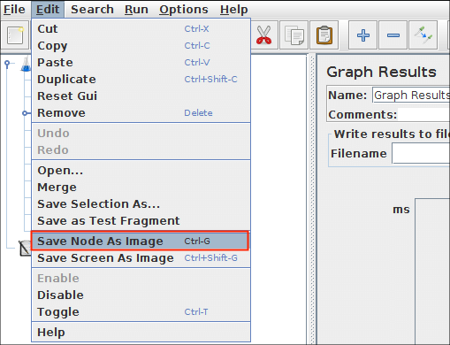](assets/images/save-image_1613b884b6d14143.png)

Figure 1 - Edit → Save Node As Image

- [< Prev](#build-programmatic-test-plan)
- [Index](https://jmeter.apache.org/index.html)
- [Next >](#remote-test)

Share this page:

- share
- tweet

[Go to top](#listeners--top)

---

<a id="realtime-results"></a>

<!-- source_url: https://jmeter.apache.org/usermanual/realtime-results.html -->

<!-- page_index: 32 -->

<a id="realtime-results--realtime-results"></a>
<a id="realtime-results--15.-real-time-results"></a>

# 15. Real-time results[¶](#realtime-results--realtime-results "Link to here")

Since JMeter 2.13 you can get real-time results sent to a backend through the
[Backend Listener](#component_reference--backend_listener) using potentially any backend (JDBC, JMS, Webservice, …)
by providing a class which implements [AbstractBackendListenerClient](https://jmeter.apache.org/api/org/apache/jmeter/visualizers/backend/AbstractBackendListenerClient.html).
JMeter ships with:

- a GraphiteBackendListenerClient which allows you to send metrics to a Graphite Backend.
  This feature provides:
  - Live results
  - Nice graphs for metrics
  - Ability to compare 2 or more load tests
  - Storing monitoring data as long as JMeter results in the same backend
  - …
- an InfluxDBBackendListenerClient introduced in JMeter 3.2 which allows you to send metrics to an InfluxDB Backend using UDP or HTTP protocols
  This feature provides:
  - Live results
  - Nice graphs for metrics
  - Ability to compare 2 or more load tests
  - Ability to add annotations to graphs
  - Storing monitoring data as long as JMeter results in the same backend
  - …

In this document we will present the configuration setup to graph and historize the data in different backends:

- InfluxDB setup for InfluxDBBackendListenerClient
- InfluxDB setup for GraphiteBackendListenerClient
- Grafana
- Graphite

<a id="realtime-results--metrics"></a>
<a id="realtime-results--15.1-metrics-exposed"></a>

## 15.1 Metrics exposed[¶](#realtime-results--metrics "Link to here")

<a id="realtime-results--metrics-threads"></a>
<a id="realtime-results--15.1.1-thread-virtual-users-metrics"></a>

## 15.1.1 Thread/Virtual Users metrics[¶](#realtime-results--metrics-threads "Link to here")

Thread metrics are the following:

<rootMetricsPrefix>test.minAT
:   Min active threads

<rootMetricsPrefix>test.maxAT
:   Max active threads

<rootMetricsPrefix>test.meanAT
:   Mean active threads

<rootMetricsPrefix>test.startedT
:   Started threads

<rootMetricsPrefix>test.endedT
:   Finished threads

<a id="realtime-results--metrics-response-times"></a>
<a id="realtime-results--15.1.2-response-times-metrics"></a>

## 15.1.2 Response times metrics[¶](#realtime-results--metrics-response-times "Link to here")

Response related metrics are the following:

<rootMetricsPrefix><samplerName>.ok.count
:   Number of successful responses for sampler name

<rootMetricsPrefix><samplerName>.h.count
:   Server hits per seconds, this metric cumulates Sample Result and Sub results (if using Transaction Controller, "Generate parent sampler" should be unchecked)

<rootMetricsPrefix><samplerName>.ok.min
:   Min response time for successful responses of sampler name

<rootMetricsPrefix><samplerName>.ok.max
:   Max response time for successful responses of sampler name

<rootMetricsPrefix><samplerName>.ok.avg
:   Average response time for successful responses of sampler name.

<rootMetricsPrefix><samplerName>.ok.pct<percentileValue>
:   Percentile computed for successful responses of sampler name. There will be one metric for each calculated value.

<rootMetricsPrefix><samplerName>.ko.count
:   Number of failed responses for sampler name

<rootMetricsPrefix><samplerName>.ko.min
:   Min response time for failed responses of sampler name

<rootMetricsPrefix><samplerName>.ko.max
:   Max response time for failed responses of sampler name

<rootMetricsPrefix><samplerName>.ko.avg
:   Average response time for failed responses of sampler name.

<rootMetricsPrefix><samplerName>.ko.pct<percentileValue>
:   Percentile computed for failed responses of sampler name. There will be one metric for each calculated value.

<rootMetricsPrefix><samplerName>.a.count
:   Number of responses for sampler name (sum of ok.count and ko.count)

<rootMetricsPrefix><samplerName>.sb.bytes
:   Sent Bytes

<rootMetricsPrefix><samplerName>.rb.bytes
:   Received Bytes

<rootMetricsPrefix><samplerName>.a.min
:   Min response time for responses of sampler name (min of ok.count and ko.count)

<rootMetricsPrefix><samplerName>.a.max
:   Max response time for responses of sampler name (max of ok.count and ko.count)

<rootMetricsPrefix><samplerName>.a.avg
:   Average response time for responses of sampler name (avg of ok.count and ko.count)

<rootMetricsPrefix><samplerName>.a.pct<percentileValue>
:   Percentile computed for responses of sampler name. There will be one metric for each calculated value. (calculated on the totals for OK and failed samples)

The default percentiles setting on the [Backend Listener](#component_reference--backend_listener) is "90;95;99", i.e. the 3 percentiles 90%, 95% and 99%.

The [Graphite naming hierarchy](https://graphite.readthedocs.io/en/latest/feeding-carbon.html#step-1-plan-a-naming-hierarchy)
uses dot (".") to separate elements. This could be confused with decimal percentile values.
JMeter converts any such values, replacing dot (".") with underscore ("-").
For example, "99.9" becomes "99\_9"

By default JMeter sends metrics for all samplers accumulated under the samplerName "all".
If the Backend Listener samplersList is configured, then JMeter also sends the metrics
for the matching sample names unless summaryOnly=true

<a id="realtime-results--jmeter-configuration"></a>
<a id="realtime-results--15.2-jmeter-configuration"></a>

## 15.2 JMeter configuration[¶](#realtime-results--jmeter-configuration "Link to here")

To make JMeter send metrics to backend add a [BackendListener](#component_reference--backend_listener) using the InfluxDBBackendListenerClient.

[](assets/images/backend-listener_133f4bea213fd928.png)

InfluxDB configuration

<a id="realtime-results--influxdb_db_configuration"></a>
<a id="realtime-results--15.3-influxdb-configuration"></a>

## 15.3 InfluxDB configuration[¶](#realtime-results--influxdb_db_configuration "Link to here")

Do one of the following to store data sent by the Backend Listener:

- For InfluxDB 2 setup, create a jmeter [bucket](https://v2.docs.influxdata.com/v2.0/organizations/buckets/create-bucket/)
- For InfluxDB 1.x setup, create a jmeter database using the [Influx CLI](https://docs.influxdata.com/influxdb/v1.8/introduction/get-started/)

You can also use the HTTP API i.e.
curl -i -XPOST http://localhost:8086/query --data-urlencode "q=CREATE DATABASE jmeter"

<a id="realtime-results--influxdb"></a>
<a id="realtime-results--15.3.1-influxdb-setup-for-influxdbbackendlistenerclient"></a>

## 15.3.1 InfluxDB setup for InfluxDBBackendListenerClient[¶](#realtime-results--influxdb "Link to here")

InfluxDB is an open-source, distributed, time-series database that allows to
easily store metrics.
Installation and configuration is very easy, read this for more details [InfluxDB documentation](https://docs.influxdata.com/influxdb/latest/introduction/installation/).
InfluxDB data can be easily viewed in a browser through [Grafana](http://grafana.org/).

<a id="realtime-results--influxdb_v2"></a>
<a id="realtime-results--15.3.2-influxdb-2-setup-for-influxdbbackendlistenerclient"></a>

## 15.3.2 InfluxDB 2 setup for InfluxDBBackendListenerClient[¶](#realtime-results--influxdb_v2 "Link to here")

The configuration should specify the influxdbToken parameter and also specify bucket and org as query parameters in the influxdbUrl. See the [InfluxDB v2 API](https://v2.docs.influxdata.com/v2.0/api/#operation/PostWrite) for more details.

How to retrieve the required information in the InfluxDB UI:

- [influxdbToken](https://v2.docs.influxdata.com/v2.0/security/tokens/view-tokens/)
- [bucket](https://v2.docs.influxdata.com/v2.0/organizations/buckets/view-buckets/)
- [org](https://v2.docs.influxdata.com/v2.0/organizations/view-orgs/)

[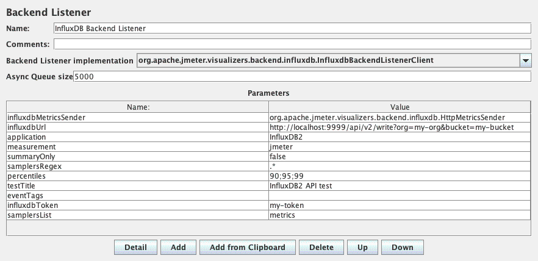](assets/images/backend-listener-influxdb-v2_63bca0c9a1bd10e8.png)

InfluxDB 2 configuration

<a id="realtime-results--grafana_configuration"></a>
<a id="realtime-results--15.4-grafana-configuration"></a>

## 15.4 Grafana configuration[¶](#realtime-results--grafana_configuration "Link to here")

Installing grafana
Read [documentation](https://docs.grafana.org/) for more details.
Add the [datasource](https://docs.grafana.org/features/datasources/influxdb/)

Here is the kind of dashboard that you could obtain:
[](assets/images/grafana-dashboard_14bb967a74a68f36.png)

Grafana dashboard

<a id="realtime-results--graphite_configuration"></a>
<a id="realtime-results--15.5-graphite-configuration"></a>

## 15.5 Graphite Configuration[¶](#realtime-results--graphite_configuration "Link to here")

To make JMeter send metrics to backend, add a BackendListener using the GraphiteBackendListenerClient.

[GraphiteBackendListenerClient](#component_reference--backend_listener) section will help you do the configuration.

[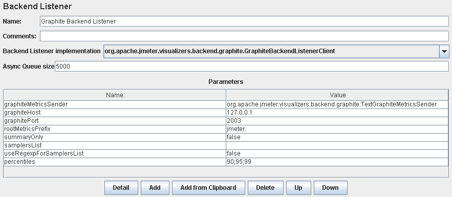](assets/images/backend-listener-graphite_d32835562668f1dc.png)

Graphite configuration

<a id="realtime-results--graphite_sendor"></a>
<a id="realtime-results--15.5.1-graphite-sender"></a>

## 15.5.1 Graphite Sender[¶](#realtime-results--graphite_sendor "Link to here")

Two types of Senders are available. TextGraphiteMetricsSender, PickleGraphiteMetricsSender

- For plaintext protocol, set graphiteMetricsSender parameter to org.apache.jmeter.visualizers.backend.graphite.TextGraphiteMetricsSender
- For pickle protocol, set graphiteMetricsSender parameter to org.apache.jmeter.visualizers.backend.graphite.PickleGraphiteMetricsSender

To send large amounts of data, use the Pickle sender. It is a more efficient transmission method compared to textplain.
Read [the Graphite documentation](https://graphite.readthedocs.io/en/latest/feeding-carbon.html) for more details.

[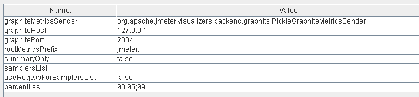](assets/images/backend-listener-graphite-pickle_ebcd4deec384a6f7.png)

Graphite pickle sender

---

<a id="regular_expressions"></a>

<!-- source_url: https://jmeter.apache.org/usermanual/regular_expressions.html -->

<!-- page_index: 33 -->

<a id="regular_expressions--regex"></a>
<a id="regular_expressions--21.-regular-expressions"></a>

# 21. Regular Expressions[¶](#regular_expressions--regex "Link to here")

<a id="regular_expressions--overview"></a>
<a id="regular_expressions--21.1-overview"></a>

## 21.1 Overview[¶](#regular_expressions--overview "Link to here")

JMeter includes the pattern matching software [Apache Jakarta ORO](http://attic.apache.org/projects/jakarta-oro.html)
There is some documentation for this on the Jakarta web-site, for example
[a summary of the pattern matching characters](http://archimedes.fas.harvard.edu/scrapbook/jakarta-oro-2.0.6/docs/api/org/apache/oro/text/regex/package-summary.html)

There is also documentation on an older incarnation of the product at
[OROMatcher User's guide](http://www.savarese.org/oro/docs/OROMatcher/index.html), which might prove useful.

With JMeter version 5.5 the Regex implementation can be switched from Oro to the JDK based one by setting
the JMeter property jmeter.regex.engine to some value different than oro.

The pattern matching is very similar to the pattern matching in Perl.
A full installation of Perl will include plenty of documentation on regular expressions - look for perlrequick, perlretut, perlre and perlreref.

It is worth stressing the difference between "*contains*" and "*matches*", as used on the Response Assertion test element:

"*contains*"
:   means that the regular expression matched at least some part of the target,
    so 'alphabet' "*contains*" 'ph.b.' because the regular expression matches the substring 'phabe'.

"*matches*"
:   means that the regular expression matched the whole target.
    So 'alphabet' is "*matched*" by 'al.\*t'.

In this case, it is equivalent to wrapping the regular expression in ^ and $, viz '^al.\*t$'.

However, this is not always the case.
For example, the regular expression 'alp|.lp.\*' is "*contained*" in 'alphabet', but does not "*match*" 'alphabet'.

Why? Because when the pattern matcher finds the sequence 'alp' in 'alphabet', it stops trying any other
combinations - and 'alp' is not the same as 'alphabet', as it does not include 'habet'.

Unlike Perl, there is no need to (i.e. do not) enclose the regular expression in //.

So how does one use the modifiers ismx etc. if there is no trailing /?
The solution is to use *extended regular expressions*, i.e. /abc/i becomes (?i)abc.
See also [Placement of modifiers](#regular_expressions--placement) below.

<a id="regular_expressions--examples"></a>
<a id="regular_expressions--21.2-examples"></a>

## 21.2 Examples[¶](#regular_expressions--examples "Link to here")

<a id="regular_expressions--extract-single-string"></a>

### Extract single string

Suppose you want to match the following portion of a web-page:
name="file" value="readme.txt">
and you want to extract readme.txt.
A suitable regular expression would be:
name="file" value="(.+?)">

The special characters above are:

( and )
:   these enclose the portion of the match string to be returned

.
:   match any character

+
:   one or more times

?
:   don't be greedy, i.e. stop when first match succeeds

Note: without the ?, the .+ would continue past the first ">
until it found the last possible "> - which is probably not what was intended.

Note: although the above expression works, it's more efficient to use the following expression:
name="file" value="([^"]+)">
where
[^"] - means match anything except "
In this case, the matching engine can stop looking as soon as it sees the first ", whereas in the previous case the engine has to check that it has found "> rather than say " >.

<a id="regular_expressions--extract-multiple-strings"></a>

### Extract multiple strings

Suppose you want to match the following portion of a web-page:
name="file.name" value="readme.txt"
and you want to extract both file.name and readme.txt.
A suitable regular expression would be:
name="([^"]+)" value="([^"]+)"
This would create 2 groups, which could be used in the JMeter Regular Expression Extractor template as $1$ and $2$.

The JMeter Regex Extractor saves the values of the groups in additional variables.

For example, assume:

- Reference Name: MYREF
- Regex: name="(.+?)" value="(.+?)"
- Template: $1$$2$

Do not enclose the regular expression in / /

The following variables would be set:

MYREF
:   file.namereadme.txt

MYREF\_g0
:   name="file.name" value="readme.txt"

MYREF\_g1
:   file.name

MYREF\_g2
:   readme.txt

These variables can be referred to later on in the JMeter test plan, as ${MYREF}, ${MYREF\_g1} etc.

<a id="regular_expressions--line_mode"></a>
<a id="regular_expressions--21.3-line-mode"></a>

## 21.3 Line mode[¶](#regular_expressions--line_mode "Link to here")

The pattern matching behaves in various slightly different ways, depending on the setting of the multi-line and single-line modifiers.
Note that the single-line and multi-line operators have nothing to do with each other;
they can be specified independently.

<a id="regular_expressions--single-line-mode"></a>

### Single-line mode

Single-line mode only affects how the '.' meta-character is interpreted.

Default behaviour is that '.' matches any character except newline.
In single-line mode, '.' also matches newline.

<a id="regular_expressions--multi-line-mode"></a>

### Multi-line mode

Multi-line mode only affects how the meta-characters '^' and '$' are interpreted.

Default behaviour is that '^' and '$' only match at the very beginning and end of the string.
When Multi-line mode is used, the '^' metacharacter matches at the beginning of every line, and the '$' metacharacter matches at the end of every line.

<a id="regular_expressions--meta_chars"></a>
<a id="regular_expressions--21.4-meta-characters"></a>

## 21.4 Meta characters[¶](#regular_expressions--meta_chars "Link to here")

Regular expressions use certain characters as meta characters - these characters have a special meaning to the RE engine.
Such characters must be escaped by preceding them with \ (backslash) in order to treat them as ordinary characters.
Here is a list of the meta characters and their meaning (please check the ORO documentation if in doubt).

( and )
:   grouping

[ and ]
:   character classes

{ and }
:   repetition

\*, + and ?
:   repetition

.
:   wild-card character

\
:   escape character

|
:   alternatives

^ and $
:   start and end of string or line

Please note that ORO does not support the \Q and \E meta-characters.
[In other RE engines, these can be used to quote a portion of an RE so that the meta-characters stand for themselves.]
You can use function to do the equivalent, see [${\_\_escapeOroRegexpChars(valueToEscape)}](#functions--__escapeororegexpchars).

The following Perl5 extended regular expressions are supported by ORO.

(?#text)
:   An embedded comment causing text to be ignored.

(?:regexp)
:   Groups things like "()" but doesn't cause the group match to be saved.

(?=regexp)
:   A zero-width positive lookahead assertion. For example, \w+(?=\s) matches a word followed by whitespace, without including whitespace in the MatchResult.

(?!regexp)
:   A zero-width negative lookahead assertion. For example foo(?!bar) matches any occurrence of "foo" that
    isn't followed by "bar". Remember that this is a zero-width assertion, which means that a(?!b)d will
    match ad because a is followed by a character that is not b (the d) and a d
    follows the zero-width assertion.

(?imsx)
:   One or more embedded pattern-match modifiers. i enables case insensitivity, m enables multiline treatment
    of the input, s enables single line treatment of the input, and x enables extended whitespace comments.

**Note that (?<=regexp) - lookbehind - is not supported.**

<a id="regular_expressions--placement"></a>
<a id="regular_expressions--21.5-placement-of-modifiers"></a>

## 21.5 Placement of modifiers[¶](#regular_expressions--placement "Link to here")

Modifiers can be placed anywhere in the regex, and apply from that point onwards.
[A bug in ORO means that they cannot be used at the very end of the regex.
However they would have no effect there anyway.]

The single-line (?s) and multi-line (?m) modifiers are normally placed at the start of the regex.

The ignore-case modifier (?i) may be usefully applied to just part of a regex, for example:

```

Match ExAct case or (?i)ArBiTrARY(?-i) case
```

would match Match ExAct case or arbitrary case as well as Match ExAct case or ARBitrary case, but not Match exact case or ArBiTrARY case.

---

<a id="remote-test"></a>

<!-- source_url: https://jmeter.apache.org/usermanual/remote-test.html -->

<!-- page_index: 34 -->

<a id="remote-test--13.-remote-testing"></a>

# 13. Remote Testing

In the event that your JMeter client machine is unable, performance-wise, to simulate
enough users to stress your server or is limited at network level, an option exists to control multiple, remote JMeter
engines from a single JMeter client. By running JMeter remotely, you can replicate
a test across many low-end computers and thus simulate a larger load on the server. One
instance of the JMeter client can control any number of remote JMeter instances, and collect
all the data from them. This offers the following features:

- Saving of test samples to the local machine
- Management of multiple JMeterEngines from a single machine
- No need to copy the test plan to each server - the client sends it to all the servers

Note: The same test plan is run by all the servers.
JMeter does not distribute the load between servers, each runs the full test plan.
So if you set 1000 Threads and have 6 JMeter server, you end up injecting 6000 Threads.

However, remote mode does use more resources than running the same number of CLI mode tests independently.
If many server instances are used, the client JMeter can become overloaded, as can the client network connection.
This has been improved by switching to Stripped modes (see below) but you should always check that your client is not overloaded.

Note that while you can execute the JMeterEngine on your application
server, you need to be mindful of the fact that this will be adding processing
overhead on the application server and thus your testing results will be
somewhat tainted. The recommended approach is to have one or more machines on
the same Ethernet segment as your application server that you configure to run
the JMeter Engine. This will minimize the impact of the network on the test
results without impacting the performance of the application server
itself.

**Step 0: Configure the nodes**

Make sure that all the nodes (client and servers) :

- are running exactly the same version of JMeter.
- are using the same version of Java on all systems. Using different versions of Java may work but is discouraged.
- have a [valid keystore for RMI over SSL](#remote-test--setup_ssl), or you have disabled the use of SSL.

If the test uses any data files, **note that these are not sent across by the client so
make sure that these are available in the appropriate directory on each server**.
If necessary you can define different values for properties by editing the user.properties or system.properties
files on each server. These properties will be picked up when the server is started and may be
used in the test plan to affect its behaviour (e.g. connecting to a different remote server).
Alternatively use different content in any datafiles used by the test
(e.g. if each server must use unique ids, divide these between the data files)

**Step 1: Start the servers**

To run JMeter in remote node, start the JMeter server component on all machines you wish to run on by running
the JMETER\_HOME/bin/jmeter-server (unix) or JMETER\_HOME/bin/jmeter-server.bat (windows) script.

Note that there can only be one JMeter server on each node unless different RMI ports are used.

The JMeter server application starts the RMI registry itself; there is no need to start RMI registry separately.

By default, RMI uses a dynamic port for the JMeter server engine. This can cause problems for firewalls, so you can define the JMeter property server.rmi.localport to control this port number.
it will be used as the local port number for the server engine.

**Step 2: Add the server IP to your client's Properties File**

Edit the properties file *on the controlling JMeter machine*. In JMETER\_HOME/bin/jmeter.properties, find the property named "remote\_hosts" and
add the value of your running JMeter server's IP address. Multiple such servers can be added, comma-delimited.

Note that you can use the -R [command line option](#get-started--override)
instead to specify the remote host(s) to use. This has the same effect as using -r and -Jremote\_hosts={serverlist}.
E.g.

```
jmeter -Rhost1,127.0.0.1,host2
```

If you define the JMeter property server.exitaftertest=true, then the server will exit after it runs a single test.
See also the -X flag (described below)

**Step 3a: Start the JMeter Client from a GUI client to check configuration**

Now you are ready to start the controlling JMeter client. For MS-Windows, start the client with the script "bin/jmeter.bat". For UNIX, use the script "bin/jmeter". You will notice that the Run menu contains two new sub-menus: "Remote Start" and "Remote Stop"
(see figure 1). These menus contain the client that you set in the properties file. Use the remote start and stop instead of the
normal JMeter start and stop menu items.

[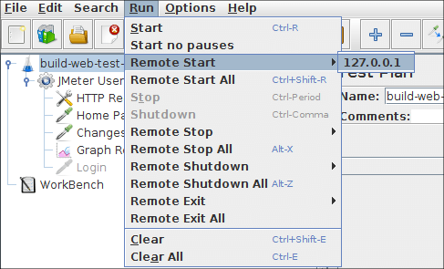](assets/images/run-menu00_972487863fc99f19.png)

Figure 1 - Run Menu

**Step 3b: Start the JMeter from a CLI mode Client**

GUI mode should only be used for debugging, as a better alternative, you should start the test on remote server(s) from a CLI mode (command-line) client.
The command to do this is:

```

jmeter -n -t script.jmx -r
```

or

```

jmeter -n -t script.jmx -R server1,server2,…
```

Other flags that may be useful:

-Gproperty=value
:   define a property in all the servers (may appear more than once)

-X
:   Exit remote servers at the end of the test.

The first example will start the test on whatever servers are defined in the JMeter property remote\_hosts;
The second example will define remote\_hosts from the list of servers and then start the test on the remote servers.
The command-line client will exit when all the remote servers have stopped.

<a id="remote-test--setup_ssl"></a>
<a id="remote-test--13.1-setting-up-ssl"></a>

## 13.1 Setting up SSL[¶](#remote-test--setup_ssl "Link to here")

Since JMeter 4.0 the default transport mechanism for RMI will use SSL. SSL needs keys and certificates to work. You will have to create those keys yourself.

The simplest setup is to use one key/cert pair for all JMeter servers and clients you want to connect. JMeter comes with a script to generate a keystore that
contains one key (and its corresponding certificate) named rmi. The script is located in the bin directory and is available for Windows systems (called bin/create-rmi-keystore.bat) and Unix like systems (called bin/create-rmi-keystore.sh). It will generate a key-pair, that is valid for seven days, with a default passphrase of value 'changeit'. It is advised to call it from inside the bin directory.

When you run the script, it will ask you some questions about some names it will embed in the certificate. You can type in whatever you want, as long the keystore tool accepts it. That value has to match the property server.rmi.ssl.keystore.alias, which defaults to rmi. A sample session to create the keystore is shown below.

```
$ cd jmeter/bin
$ ./create-rmi-keystore.sh What is your first and last name? [Unknown]: rmi What is the name of your organizational unit? [Unknown]: My unit name What is the name of your organization? [Unknown]: My organisation name What is the name of your City or Locality? [Unknown]: Your City What is the name of your State or Province? [Unknown]: Your State What is the two-letter country code for this unit? [Unknown]: XY Is CN=rmi, OU=My unit name, O=My organisation name, L=Your City, ST=Your State, C=XY correct? [no]: yes

Copy the generated rmi_keystore.jks to jmeter/bin folder or reference it in property 'server.rmi.ssl.keystore.file'
```

The [defaults settings for RMI](#properties_reference--remote) should work with this setup. Copy the file bin/rmi\_keystore.jks to every JMeter server and client you want to use for your distributed testing setup.

<a id="remote-test--detail_instructions"></a>
<a id="remote-test--13.2-doing-it-manually"></a>

## 13.2 Doing it Manually[¶](#remote-test--detail_instructions "Link to here")

In some cases, the jmeter-server script may not work for you (if you are using an OS platform not anticipated by the JMeter developers).
Here is how to start the JMeter servers (step 1 above) with a more manual process:

**Step 1a: Start the RMI Registry**

Since JMeter 2.3.1, the RMI registry is started by the JMeter server, so this section does not apply in the normal case.
To revert to the previous behaviour, define the JMeter property server.rmi.create=false on the server host systems
and follow the instructions below.

JMeter uses Remote Method Invocation (RMI) as the remote communication mechanism. Therefore, you need
to run the RMI Registry application (which is named "rmiregistry") that comes with the JDK and is located in the "bin"
directory. Before running rmiregistry, make sure that the following jars are in your system classpath:

- JMETER\_HOME/lib/ext/ApacheJMeter\_core.jar
- JMETER\_HOME/lib/jorphan.jar
- JMETER\_HOME/lib/logkit-2.0.jar

The
rmiregistry application needs access to certain JMeter classes. Run rmiregistry with no parameters. By default the
application listens to port 1099.

**Step 1b: Start the JMeter Server**

Once the RMI Registry application is running, start the JMeter Server.
Use the "-s" option with the jmeter startup script ("jmeter -s").

Steps 2 and 3 remain the same.

<a id="remote-test--tips"></a>
<a id="remote-test--13.3-tips"></a>

## 13.3 Tips[¶](#remote-test--tips "Link to here")

JMeter/RMI requires a connection from the client to the server. This will use the port you chose, default 1099.
JMeter/RMI also requires a reverse connection in order to return sample results from the server to the client.
These will use high-numbered ports.
These ports can be controlled by jmeter property called client.rmi.localport in jmeter.properties.
If this is non-zero, it will be used as the base for local port numbers for the client engine. At the moment JMeter will open
up to three ports beginning with the port defined in client.rmi.localport.
If there are any firewalls or other network filters between JMeter client and server, you will need to make sure that they are set up to allow the connections through.
If necessary, use monitoring software to show what traffic is being generated.

If you're running Suse Linux, these tips may help. The default installation may enable the firewall. In that case, remote testing will not work properly. The following tips were contributed by Sergey Ten.

If you see connections refused, turn on debugging by passing the following options.

```

rmiregistry -J-Dsun.rmi.log.debug=true \
     -J-Dsun.rmi.server.exceptionTrace=true \
     -J-Dsun.rmi.loader.logLevel=verbose \
     -J-Dsun.rmi.dgc.logLevel=verbose \
     -J-Dsun.rmi.transport.logLevel=verbose \
     -J-Dsun.rmi.transport.tcp.logLevel=verbose \
```

Since JMeter 2.3.1, the RMI registry is started by the server; however the options can still be passed in from the JMeter command line.
For example: "jmeter -s -Dsun.rmi.loader.logLevel=verbose" (i.e. omit the -J prefixes).
Alternatively the properties can be defined in the system.properties file.

The solution to the problem is to remove the loopbacks 127.0.0.1 and 127.0.0.2 from /etc/hosts.
What happens is jmeter-server can't connect to rmiregistry if 127.0.0.2 loopback is not available.
Use the following settings to fix the problem.

Replace

```
`dirname $0`/jmeter  -s "$@"
```

With

```

HOST="-Djava.rmi.server.hostname=[computer_name][computer_domain] \
      -Djava.security.policy=`dirname $0`/[policy_file]" \
`dirname $0`/jmeter $HOST -s "$@"
```

Also create a policy file and add [computer\_name][computer\_domain] line to /etc/hosts.

In order to better support SSH-tunneling of the RMI communication channels used
in remote testing, since JMeter 2.6:

- a new property "client.rmi.localport" can be set to control the RMI port used by the RemoteSampleListenerImpl
- To support tunneling RMI traffic over an SSH tunnel as the remote endpoint using a port on the local machine,
  loopback interface is now allowed to be used if it has been specified directly using the Java System Property
  "java.rmi.server.hostname" parameter.

<a id="remote-test--portchange"></a>
<a id="remote-test--13.4-using-a-different-port"></a>

## 13.4 Using a different port[¶](#remote-test--portchange "Link to here")

By default, JMeter uses the standard RMI port 1099. It is possible to change this. For this to work successfully, all the following need to agree:

- On the server, start rmiregistry using the new port number
- On the server, start JMeter with the property server\_port defined
- On the client, update the remote\_hosts property to include the new remote host:port settings

Since JMeter 2.1.1, the jmeter-server scripts provide support for changing the port.
For example, assume you want to use port 1664 (perhaps 1099 is already used).

On Windows (in a DOS box)

```

C:\JMETER> SET SERVER_PORT=1664
C:\JMETER> JMETER-SERVER [other options]
```

On Unix:

```

$ SERVER_PORT=1664 jmeter-server [other options]
```

[N.B. use upper case for the environment variable]

In both cases, the script starts rmiregistry on the specified port, and then starts JMeter in server mode, having defined the "server\_port" property.

The chosen port will be logged in the server jmeter.log file (rmiregistry does not create a log file).

<a id="remote-test--sendermode"></a>
<a id="remote-test--13.5-using-a-different-sample-sender"></a>

## 13.5 Using a different sample sender[¶](#remote-test--sendermode "Link to here")

Listeners in the test plan send their results back to the client JMeter which writes the results to the specified files
By default, samples are sent back synchronously as they are generated.
This can affect the maximum throughput of the server test; the sample result has to be sent back before the thread can
continue.
There are some JMeter properties that can be set to alter this behaviour.

mode
:   sample sending mode - default is StrippedBatch since 2.9. This should be set on the client node.

    Standard
    :   send samples synchronously as soon as they are generated

    Hold
    :   hold samples in an array until the end of a run. This may use a lot of memory on the server and is discouraged.

    DiskStore
    :   store samples in a disk file (under java.io.temp) until the end of a run.
        The serialised data file is deleted on JVM exit.

    StrippedDiskStore
    :   remove responseData from successful samples, and use DiskStore sender to send them.

    Batch
    :   send saved samples when either the count (num\_sample\_threshold) or time (time\_threshold) exceeds a threshold,
        at which point the samples are sent synchronously.
        The thresholds can be configured on the server using the following properties:

        num\_sample\_threshold
        :   number of samples to accumulate, default 100

        time\_threshold
        :   time threshold, default 60000 ms = 60 seconds

        See also the Asynch mode, described below.

    Statistical
    :   send a summary sample when either the count or time exceeds a threshold.
        The samples are summarised by thread group name and sample label.
        The following fields are accumulated:

        - elapsed time
        - latency
        - bytes
        - sample count
        - error count

        Other fields that vary between samples are lost.

    Stripped
    :   remove responseData from successful samples

    StrippedBatch
    :   remove responseData from successful samples, and use Batch sender to send them.

    Asynch
    :   samples are temporarily stored in a local queue. A separate worker thread sends the samples.
        This allows the test thread to continue without waiting for the result to be sent back to the client.
        However, if samples are being created faster than they can be sent, the queue will eventually fill up,
        and the sampler thread will block until some samples can be drained from the queue.
        This mode is useful for smoothing out peaks in sample generation.
        The queue size can be adjusted by setting the JMeter property
        asynch.batch.queue.size (default 100) on the server node.

    StrippedAsynch
    :   remove responseData from successful samples, and use Async sender to send them.

    Custom implementation
    :   set the mode parameter to your custom sample sender class name.
        This must implement the interface SampleSender and have a constructor which takes a single
        parameter of type RemoteSampleListener.

Stripped mode family strips responseData so this means that some Elements that rely
on the previous responseData being available will not work.
This is not really a problem as there is always a more efficient way to implement this feature.

The following properties apply to the Batch and Statistical modes:

num\_sample\_threshold
:   number of samples in a batch (default 100)

time\_threshold
:   number of milliseconds to wait (default 60 seconds)

<a id="remote-test--retries"></a>
<a id="remote-test--13.6-dealing-with-nodes-that-failed-starting"></a>

## 13.6 Dealing with nodes that failed starting[¶](#remote-test--retries "Link to here")

For large-scale tests there is a chance that some part of remote servers will be unavailable or down.
For example, when you use automation script to allocate many cloud machines and use them as generators, some of requested machines might fail booting because of cloud's issues.
Since JMeter 2.13 there are new properties to control this behaviour.

First what you might want is to retry initialization attempts in hope that failed nodes just slightly delayed their boot.
To enable retries, you should set client.tries property to total number of connection attempts.
By default it does only one attempt. To control retry delay, set the client.retries\_delay property
to number of milliseconds to sleep between attempts.

Finally, you might still want to run the test with those generators that succeeded initialization and skipping failed nodes.
To enable that, set the client.continue\_on\_fail=true property.

<a id="remote-test--security-manager"></a>
<a id="remote-test--13.7-using-a-security-manager"></a>

## 13.7 Using a security-manager[¶](#remote-test--security-manager "Link to here")

When running JMeter in a distributed environment you have to be aware, that JMeter is basically a remote execution agent on both the server and client side. This could be used by a malicious party to gain further access, once it has compromised one of the JMeter clients or servers. To mitigate this Java has the concept of a security manager that gets asked by the JVM before potential dangerous actions are executed. Those actions could be resolving host names, creating or reading files or executing commands in the OS.

The security manager can be enabled by setting the Java system properties java.security.manager and java.security.policy. Be sure to have a look at the [Quick Tour of Controlling Applications](https://docs.oracle.com/javase/tutorial/security/tour2/index.html).

Using the new mechansism of setenv.sh (or setenv.bat under Windows) you can enable the security manager by adding the following code snippet to ${JMETER\_HOME}/bin/setenv.sh:

```
JVM_ARGS=" \
   -Djava.security.manager \
   -Djava.security.policy=${JMETER_HOME}/bin/java.policy \
   -Djmeter.home=${JMETER_HOME} \
"
```

The JVM will now add the policies defined in the file ${JMETER\_HOME}/bin/java.policy to the possibly globally defined policies. If you want your definition to be the only source for policies, use two equal signs instead of one when setting the property java.security.policy.

The policies will be dependent upon your use case and it might take a while to find the correct restricted and allowed actions. Java can help you find the needed policies with the property java.security.debug. Set it to access and it will log all permissions, that it gets asked to allow. Simply add the following line to your setenv.sh:

```
JVM_ARGS="${JVM_ARGS} -Djava.security.debug=access"
```

It might look a bit strange, that we define a Java system property jmeter.home with the value of ${JMETER\_HOME}. This variable will be used in the example java.policy to limit the file system access and allow it only to read JMeters configuration and libraries and restrict write access to specific locations, only.

The following policy definition file has been used for a simple remote test. You will probably have to tweak the policies, when you run more complex scenarios. The test plans are somewhere placed inside the users home directory under a directory called jmeter-testplans. The sample java.policy looks like:

```
grant codeBase "file:${jmeter.home}/bin/*" {permission java.security.AllPermission; };
grant codeBase "file:${jmeter.home}/lib/jorphan.jar" {permission java.security.AllPermission; };
grant codeBase "file:${jmeter.home}/lib/log4j-api-2.11.1.jar" {permission java.security.AllPermission; };
grant codeBase "file:${jmeter.home}/lib/log4j-slf4j-impl-2.11.1.jar" {permission java.security.AllPermission; };
grant codeBase "file:${jmeter.home}/lib/slf4j-api-1.7.25.jar" {permission java.security.AllPermission; };
grant codeBase "file:${jmeter.home}/lib/log4j-core-2.11.1.jar" {permission java.security.AllPermission; };
grant codeBase "file:${jmeter.home}/lib/ext/*" {permission java.security.AllPermission; };
grant codeBase "file:${jmeter.home}/lib/httpclient-4.5.6.jar" {permission java.net.SocketPermission "*", "connect,resolve"; };
grant codeBase "file:${jmeter.home}/lib/darcula.jar" {permission java.lang.RuntimePermission "modifyThreadGroup"; };
grant codeBase "file:${jmeter.home}/lib/xercesImpl-2.12.0.jar" {permission java.io.FilePermission "${java.home}/lib/xerces.properties", "read"; };
grant codeBase "file:${jmeter.home}/lib/groovy-all-2.4.15.jar" {permission groovy.security.GroovyCodeSourcePermission "/groovy/script"; permission java.lang.RuntimePermission "accessClassInPackage.sun.reflect"; permission java.lang.RuntimePermission "getProtectionDomain"; };
grant {permission java.io.FilePermission "${jmeter.home}/backups", "read,write"; permission java.io.FilePermission "${jmeter.home}/backups/*", "read,write,delete"; permission java.io.FilePermission "${jmeter.home}/bin/upgrade.properties", "read"; permission java.io.FilePermission "${jmeter.home}/lib/ext/-", "read"; permission java.io.FilePermission "${jmeter.home}/lib/ext", "read"; permission java.io.FilePermission "${jmeter.home}/lib/-", "read"; permission java.io.FilePermission "${user.home}/jmeter-testplans/-", "read,write"; permission java.io.SerializablePermission "enableSubclassImplementation"; permission java.lang.reflect.ReflectPermission "suppressAccessChecks"; permission java.lang.RuntimePermission "accessClassInPackage.jdk.internal.dynalink.support"; permission java.lang.RuntimePermission "accessClassInPackage.sun.awt"; permission java.lang.RuntimePermission "accessClassInPackage.sun.misc"; permission java.lang.RuntimePermission "accessClassInPackage.sun.swing"; permission java.lang.RuntimePermission "accessDeclaredMembers"; permission java.lang.RuntimePermission "createClassLoader"; permission java.lang.RuntimePermission "createSecurityManager"; permission java.lang.RuntimePermission "getClassLoader"; permission java.lang.RuntimePermission "getenv.*"; permission java.lang.RuntimePermission "nashorn.createGlobal"; permission java.util.PropertyPermission "*", "read"; };
```

The usage of java.security.AllPermission is an easy way to make your test plans work, but it might be a dangerous shortcut on your path to security.

---

<a id="test_plan"></a>

<!-- source_url: https://jmeter.apache.org/usermanual/test_plan.html -->

<!-- page_index: 35 -->

<a id="test_plan--3.-elements-of-a-test-plan"></a>

# 3. Elements of a Test Plan

This section describes the different parts of a test plan.

A minimal test will consist of the Test Plan, a Thread Group and one or more Samplers.

<a id="test_plan--test_plan"></a>
<a id="test_plan--3.0-test-plan"></a>

## 3.0 Test Plan[¶](#test_plan--test_plan "Link to here")

The Test Plan object has a checkbox called "Functional Testing". If selected, it
will cause JMeter to record the data returned from the server for each sample. If you have
selected a file in your test listeners, this data will be written to file. This can be useful if
you are doing a small run to ensure that JMeter is configured correctly, and that your server
is returning the expected results. The consequence is that the file will grow huge quickly, and
JMeter's performance will suffer. This option should be off if you are doing stress-testing (it
is off by default).

If you are not recording the data to file, this option makes no difference.

You can also use the Configuration button on a listener to decide what fields to save.

<a id="test_plan--thread_group"></a>
<a id="test_plan--3.1-thread-group"></a>

## 3.1 Thread Group[¶](#test_plan--thread_group "Link to here")

Thread group elements are the beginning points of any test plan.
All controllers and samplers must be under a thread group.
Other elements, e.g. Listeners, may be placed directly under the test plan, in which case they will apply to all the thread groups.
As the name implies, the thread group
element controls the number of threads JMeter will use to execute your test. The
controls for a thread group allow you to:

- Set the number of threads
- Set the ramp-up period
- Set the number of times to execute the test

Each thread will execute the test plan in its entirety and completely independently
of other test threads. Multiple threads are used to simulate concurrent connections
to your server application.

The ramp-up period tells JMeter how long to take to "ramp-up" to the full number of
threads chosen. If 10 threads are used, and the ramp-up period is 100 seconds, then
JMeter will take 100 seconds to get all 10 threads up and running. Each thread will
start 10 (100/10) seconds after the previous thread was begun. If there are 30 threads
and a ramp-up period of 120 seconds, then each successive thread will be delayed by 4 seconds.

Ramp-up needs to be long enough to avoid too large a work-load at the start
of a test, and short enough that the last threads start running before
the first ones finish (unless one wants that to happen).

Start with Ramp-up = number of threads and adjust up or down as needed.

By default, the thread group is configured to loop once through its elements.

Thread Group also allows to specify **Thread lifetime**.
Click the checkbox at the bottom of the Thread Group panel to enable/disable extra fields
in which you can enter the duration of test and the startup delay
You can configure Duration (seconds) and Startup Delay (seconds) to control
the duration of each thread group and the after how much seconds it starts.
When the test is started, JMeter will wait Startup Delay (seconds) before starting the Threads
of the Thread Group and run for the configured Duration (seconds) time.

<a id="test_plan--controllers"></a>
<a id="test_plan--3.2-controllers"></a>

## 3.2 Controllers[¶](#test_plan--controllers "Link to here")

JMeter has two types of Controllers: Samplers and Logical Controllers.
These drive the processing of a test.

Samplers tell JMeter to send requests to a server. For
example, add an HTTP Request Sampler if you want JMeter
to send an HTTP request. You can also customize a request by adding one
or more Configuration Elements to a Sampler. For more
information, see
[Samplers](#test_plan--samplers).

Logical Controllers let you customize the logic that JMeter uses to
decide when to send requests. For example, you can add an Interleave
Logic Controller to alternate between two HTTP Request Samplers.
For more information, see [Logical Controllers](#test_plan--logic_controller).

<a id="test_plan--samplers"></a>
<a id="test_plan--3.2.1-samplers"></a>

## 3.2.1 Samplers[¶](#test_plan--samplers "Link to here")

Samplers tell JMeter to send requests to a server and wait for a response.
They are processed in the order they appear in the tree.
Controllers can be used to modify the number of repetitions of a sampler.

JMeter samplers include:

- FTP Request
- HTTP Request (can be used for SOAP or REST Webservice also)
- JDBC Request
- Java object request
- JMS request
- JUnit Test request
- LDAP Request
- Mail request
- OS Process request
- TCP request

Each sampler has several properties you can set.
You can further customize a sampler by adding one or more Configuration Elements to the Test Plan.

If you are going to send multiple requests of the same type (for example, HTTP Request) to the same server, consider using a Defaults Configuration
Element. Each controller has one or more Defaults elements (see below).

Remember to add a Listener to your test plan to view and/or store the
results of your requests to disk.

If you are interested in having JMeter perform basic validation on
the response of your request, add an [Assertion](#test_plan--assertions) to
the sampler. For example, in stress testing a web application, the server
may return a successful "HTTP Response" code, but the page may have errors on it or
may be missing sections. You could add assertions to check for certain HTML tags, common error strings, and so on. JMeter lets you create these assertions using regular
expressions.

[JMeter's built-in samplers](#component_reference--samplers)

<a id="test_plan--logic_controller"></a>
<a id="test_plan--3.2.2-logic-controllers"></a>

## 3.2.2 Logic Controllers[¶](#test_plan--logic_controller "Link to here")

Logic Controllers let you customize the logic that JMeter uses to
decide when to send requests.
Logic Controllers can change the order of requests coming from their
child elements. They can modify the requests themselves, cause JMeter to repeat
requests, etc.

To understand the effect of Logic Controllers on a test plan, consider the
following test tree:

- Test Plan

- Thread Group

- Once Only Controller

- Login Request (an [HTTP Request](#component_reference--http_request))

- Load Search Page (HTTP Sampler)
- Interleave Controller

- Search "A" (HTTP Sampler)
- Search "B" (HTTP Sampler)
- HTTP default request (Configuration Element)

- HTTP default request (Configuration Element)
- Cookie Manager (Configuration Element)

The first thing about this test is that the login request will be executed only
the first time through. Subsequent iterations will skip it. This is due to the
effects of the [Once Only Controller](#component_reference--once_only_controller).

After the login, the next Sampler loads the search page (imagine a
web application where the user logs in, and then goes to a search page to do a search). This
is just a simple request, not filtered through any Logic Controller.

After loading the search page, we want to do a search. Actually, we want to do
two different searches. However, we want to re-load the search page itself between
each search. We could do this by having 4 simple HTTP request elements (load search, search "A", load search, search "B"). Instead, we use the [Interleave Controller](#component_reference--interleave_controller) which passes on one child request each time through the test. It keeps the
ordering (i.e. it doesn't pass one on at random, but "remembers" its place) of its
child elements. Interleaving 2 child requests may be overkill, but there could easily have
been 8, or 20 child requests.

Note the [HTTP Request Defaults](#component_reference--http_request_defaults) that
belongs to the Interleave Controller. Imagine that "Search A" and "Search B" share
the same PATH info (an HTTP request specification includes domain, port, method, protocol, path, and arguments, plus other optional items). This makes sense - both are search requests, hitting the same back-end search engine (a servlet or cgi-script, let's say). Rather than
configure both HTTP Samplers with the same information in their PATH field, we
can abstract that information out to a single Configuration Element. When the Interleave
Controller "passes on" requests from "Search A" or "Search B", it will fill in the blanks with
values from the HTTP default request Configuration Element. So, we leave the PATH field
blank for those requests, and put that information into the Configuration Element. In this
case, this is a minor benefit at best, but it demonstrates the feature.

The next element in the tree is another HTTP default request, this time added to the
Thread Group itself. The Thread Group has a built-in Logic Controller, and thus, it uses
this Configuration Element exactly as described above. It fills in the blanks of any
Request that passes through. It is extremely useful in web testing to leave the DOMAIN
field blank in all your HTTP Sampler elements, and instead, put that information
into an HTTP default request element, added to the Thread Group. By doing so, you can
test your application on a different server simply by changing one field in your Test Plan.
Otherwise, you'd have to edit each and every Sampler.

The last element is a [HTTP Cookie Manager](#component_reference--http_cookie_manager). A Cookie Manager should be added to all web tests - otherwise JMeter will
ignore cookies. By adding it at the Thread Group level, we ensure that all HTTP requests
will share the same cookies.

Logic Controllers can be combined to achieve various results. See the list of [built-in
Logic Controllers](#component_reference--logic_controllers).

<a id="test_plan--test_fragments"></a>
<a id="test_plan--3.2.3-test-fragments"></a>

## 3.2.3 Test Fragments[¶](#test_plan--test_fragments "Link to here")

The Test Fragment element is a special type of [controller](#test_plan--controllers) that
exists on the Test Plan tree at the same level as the Thread Group element. It is distinguished
from a Thread Group in that it is not executed unless it is
referenced by either a [Module Controller](#component_reference--module_controller) or an [Include\_Controller](#component_reference--include_controller).

This element is purely for code re-use within Test Plans

<a id="test_plan--listeners"></a>
<a id="test_plan--3.3-listeners"></a>

## 3.3 Listeners[¶](#test_plan--listeners "Link to here")

Listeners provide access to the information JMeter gathers about the test cases while
JMeter runs. The [Graph Results](#component_reference--graph_results) listener plots the response times on a graph.
The "View Results Tree" Listener shows details of sampler requests and responses, and can display basic HTML and XML representations of the response.
Other listeners provide summary or aggregation information.

Additionally, listeners can direct the data to a file for later use.
Every listener in JMeter provides a field to indicate the file to store data to.
There is also a Configuration button which can be used to choose which fields to save, and whether to use CSV or XML format.

Note that all Listeners save the same data; the only difference is in the way the data is presented on the screen.

Listeners can be added anywhere in the test, including directly under the test plan.
They will collect data only from elements at or below their level.

There are several [listeners](#component_reference--listeners)
that come with JMeter.

<a id="test_plan--timers"></a>
<a id="test_plan--3.4-timers"></a>

## 3.4 Timers[¶](#test_plan--timers "Link to here")

By default, a JMeter thread executes samplers in sequence without pausing.
We recommend that you specify a delay by adding one of the available timers to
your Thread Group. If you do not add a delay, JMeter could overwhelm your server by
making too many requests in a very short amount of time.

A timer will cause JMeter to delay a certain amount of time **before** each
sampler which is in its [scope](#test_plan--scoping_rules).

If you choose to add more than one timer to a Thread Group, JMeter takes the sum of
the timers and pauses for that amount of time before executing the samplers to which the timers apply.
Timers can be added as children of samplers or controllers in order to restrict the samplers to which they are applied.

To provide a pause at a single place in a test plan, one can use the [Flow Control Action](#component_reference--flow_control_action) Sampler.

<a id="test_plan--assertions"></a>
<a id="test_plan--3.5-assertions"></a>

## 3.5 Assertions[¶](#test_plan--assertions "Link to here")

Assertions allow you to assert facts about responses received from the
server being tested. Using an assertion, you can essentially "test" that your
application is returning the results you expect it to.

For instance, you can assert that the response to a query will contain some
particular text. The text you specify can be a Perl-style regular expression, and
you can indicate that the response is to contain the text, or that it should match
the whole response.

You can add an assertion to any Sampler. For example, you can
add an assertion to a HTTP Request that checks for the text, "</HTML>". JMeter
will then check that the text is present in the HTTP response. If JMeter cannot find the
text, then it will mark this as a failed request.

Note that assertions apply to all samplers which are in their [scope](#test_plan--scoping_rules).
To restrict an assertion to a single sampler, add the assertion as a child of the sampler.

To view assertion results, add an Assertion Listener to the Thread Group.
Failed Assertions will also show up in the Tree View and Table Listeners, and will count towards the error %age for example in the Aggregate and Summary reports.

<a id="test_plan--config_elements"></a>
<a id="test_plan--3.6-configuration-elements"></a>

## 3.6 Configuration Elements[¶](#test_plan--config_elements "Link to here")

A configuration element works closely with a Sampler. Although it does not send requests
(except for [HTTP(S) Test Script Recorder](#component_reference--http-s-_test_script_recorder)), it can add to or modify requests.

A configuration element is accessible from only inside the tree branch where you place the element.
For example, if you place an HTTP Cookie Manager inside a Simple Logic Controller, the Cookie Manager will
only be accessible to HTTP Request Controllers you place inside the Simple Logic Controller (see figure 1).
The Cookie Manager is accessible to the HTTP requests "Web Page 1" and "Web Page 2", but not "Web Page 3".

Also, a configuration element inside a tree branch has higher precedence than the same element in a "parent"
branch. For example, we defined two HTTP Request Defaults elements, "Web Defaults 1" and "Web Defaults 2".
Since we placed "Web Defaults 1" inside a Loop Controller, only "Web Page 2" can access it. The other HTTP
requests will use "Web Defaults 2", since we placed it in the Thread Group (the "parent" of all other branches).

[](assets/images/http-config-example_97c4d9c1b4ee089e.png)

Figure 1 -
Test Plan Showing Accessibility of Configuration Elements

The [User Defined Variables](#component_reference--user_defined_variables) Configuration element is different.
It is processed at the start of a test, no matter where it is placed.
For simplicity, it is suggested that the element is placed only at the start of a Thread Group.

<a id="test_plan--preprocessors"></a>
<a id="test_plan--3.7-pre-processor-elements"></a>

## 3.7 Pre-Processor Elements[¶](#test_plan--preprocessors "Link to here")

A Pre-Processor executes some action prior to a Sampler Request being made.
If a Pre-Processor is attached to a Sampler element, then it will execute just prior to that sampler element running.
A Pre-Processor is most often used to modify the settings of a Sample Request just before it runs, or to update variables that aren't extracted from response text.
See the [**scoping rules**](#test_plan--scoping_rules) for more details on when Pre-Processors are executed.

<a id="test_plan--postprocessors"></a>
<a id="test_plan--3.8-post-processor-elements"></a>

## 3.8 Post-Processor Elements[¶](#test_plan--postprocessors "Link to here")

A Post-Processor executes some action after a Sampler Request has been made.
If a Post-Processor is attached to a Sampler element, then it will execute just after that sampler element runs.
A Post-Processor is most often used to process the response data, often to extract values from it.
See the [**scoping rules**](#test_plan--scoping_rules) for more details on when Post-Processors are executed.

<a id="test_plan--executionorder"></a>
<a id="test_plan--3.9-execution-order"></a>

## 3.9 Execution order[¶](#test_plan--executionorder "Link to here")

0. Configuration elements
1. Pre-Processors
2. Timers
3. Sampler
4. Post-Processors (unless SampleResult is null)
5. Assertions (unless SampleResult is null)
6. Listeners (unless SampleResult is null)

Please note that Timers, Assertions, Pre- and Post-Processors are only processed if there is a sampler to which they apply.
Logic Controllers and Samplers are processed in the order in which they appear in the tree.
Other test elements are processed according to the scope in which they are found, and the type of test element.
[Within a type, elements are processed in the order in which they appear in the tree].

For example, in the following test plan:

- Controller

- Post-Processor 1
- Sampler 1
- Sampler 2
- Timer 1
- Assertion 1
- Pre-Processor 1
- Timer 2
- Post-Processor 2

The order of execution would be:

```

Pre-Processor 1
Timer 1
Timer 2
Sampler 1
Post-Processor 1
Post-Processor 2
Assertion 1

Pre-Processor 1
Timer 1
Timer 2
Sampler 2
Post-Processor 1
Post-Processor 2
Assertion 1
```

<a id="test_plan--scoping_rules"></a>
<a id="test_plan--3.10-scoping-rules"></a>

## 3.10 Scoping Rules[¶](#test_plan--scoping_rules "Link to here")

The JMeter test tree contains elements that are both hierarchical and ordered. Some elements in the test trees are strictly hierarchical (Listeners, Config Elements, Post-Processors, Pre-Processors, Assertions, Timers), and some are primarily ordered (controllers, samplers). When you create your test plan, you will create an ordered list of sample request (via Samplers) that represent a set of steps to be executed. These requests are often organized within controllers that are also ordered. Given the following test tree:

[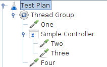](assets/images/scoping1_b9c55e9927616d3e.png)

Example test tree

The order of requests will be, One, Two, Three, Four.

Some controllers affect the order of their subelements, and you can read about these specific controllers in [the component reference](#component_reference).

Other elements are hierarchical. An Assertion, for instance, is hierarchical in the test tree.
If its parent is a request, then it is applied to that request. If its
parent is a Controller, then it affects all requests that are descendants of
that Controller. In the following test tree:

[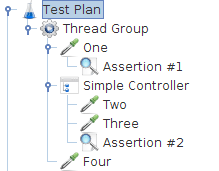](assets/images/scoping2_8bb8ed4571367024.png)

Hierarchy example

Assertion #1 is applied only to Request One, while Assertion #2 is applied to Requests Two and Three.

Another example, this time using Timers:

[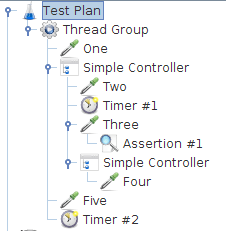](assets/images/scoping3_5078b8f7957e940f.png)

complex example

In this example, the requests are named to reflect the order in which they will be executed. Timer #1 will apply to Requests Two, Three, and Four (notice how order is irrelevant for hierarchical elements). Assertion #1 will apply only to Request Three. Timer #2 will affect all the requests.

Hopefully these examples make it clear how configuration (hierarchical) elements are applied. If you imagine each Request being passed up the tree branches, to its parent, then to its parent's parent, etc., and each time collecting all the configuration elements of that parent, then you will see how it works.

The Configuration elements Header Manager, Cookie Manager and Authorization manager are
treated differently from the Configuration Default elements.
The settings from the Configuration Default elements are merged into a set of values that the Sampler has access to.
However, the settings from the Managers are not merged.
If more than one Manager is in the scope of a Sampler, only one Manager is used, but there is currently no way to specify *which* is used.

<a id="test_plan--properties"></a>
<a id="test_plan--3.11-properties-and-variables"></a>

## 3.11 Properties and Variables[¶](#test_plan--properties "Link to here")

JMeter *properties* are defined in jmeter.properties (see [Getting Started - Configuring JMeter](#get-started--configuring_jmeter) for more details).
Properties are global to jmeter, and are mostly used to define some of the defaults JMeter uses.
For example the property remote\_hosts defines the servers that JMeter will try to run remotely.
Properties can be referenced in test plans
- see [Functions - read a property](#functions--__property) -
but cannot be used for thread-specific values.

JMeter *variables* are local to each thread. The values may be the same for each thread, or they may be different.
If a variable is updated by a thread, only the thread copy of the variable is changed.
For example the [Regular Expression Extractor](#component_reference--regular_expression_extractor) Post-Processor
will set its variables according to the sample that its thread has read, and these can be used later
by the same thread.
For details of how to reference variables and functions, see [Functions and Variables](#functions)

Note that the values defined by the [Test Plan](#component_reference--test_plan) and the [User Defined Variables](#component_reference--user_defined_variables) configuration element
are made available to the whole test plan at startup.
If the same variable is defined by multiple UDV elements, then the last one takes effect.
Once a thread has started, the initial set of variables is copied to each thread.
Other elements such as the
[User Parameters](#component_reference--user_parameters) Pre-Processor or [Regular Expression Extractor](#component_reference--regular_expression_extractor) Post-Processor
may be used to redefine the same variables (or create new ones). These redefinitions only apply to the current thread.

The [setProperty](#functions--__setproperty) function can be used to define a JMeter property.
These are global to the test plan, so can be used to pass information between threads - should that be needed.

Both variables and properties are case-sensitive.

<a id="test_plan--using_variables"></a>
<a id="test_plan--3.12-using-variables-to-parameterise-tests"></a>

## 3.12 Using Variables to parameterise tests[¶](#test_plan--using_variables "Link to here")

Variables don't have to vary - they can be defined once, and if left alone, will not change value.
So you can use them as short-hand for expressions that appear frequently in a test plan.
Or for items which are constant during a run, but which may vary between runs.
For example, the name of a host, or the number of threads in a thread group.

When deciding how to structure a Test Plan, make a note of which items are constant for the run, but which may change between runs.
Decide on some variable names for these -
perhaps use a naming convention such as prefixing them with C\_ or K\_ or using uppercase only
to distinguish them from variables that need to change during the test.
Also consider which items need to be local to a thread -
for example counters or values extracted with the Regular Expression Post-Processor.
You may wish to use a different naming convention for these.

For example, you might define the following on the Test Plan:

```

HOST             www.example.com
THREADS          10
LOOPS            20
```

You can refer to these in the test plan as ${HOST} ${THREADS} etc.
If you later want to change the host, just change the value of the HOST variable.
This works fine for small numbers of tests, but becomes tedious when testing lots of different combinations.
One solution is to use a property to define the value of the variables, for example:

```

HOST             ${__P(host,www.example.com)}
THREADS          ${__P(threads,10)}
LOOPS            ${__P(loops,20)}
```

You can then change some or all of the values on the command-line as follows:

```

jmeter … -Jhost=www3.example.org -Jloops=13
```

---
