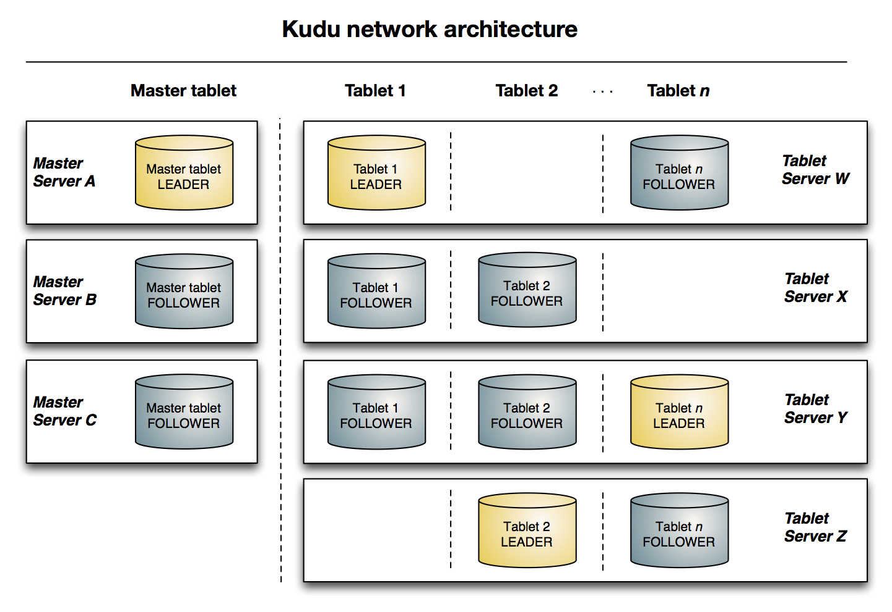
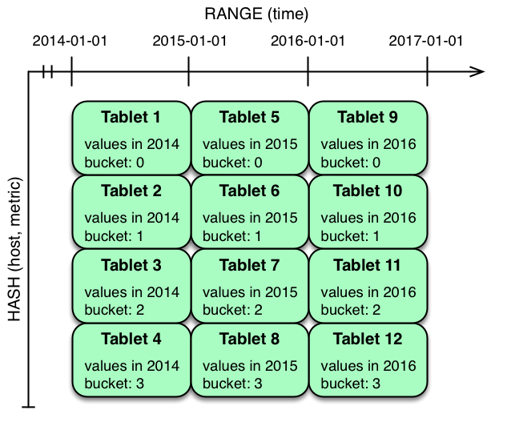
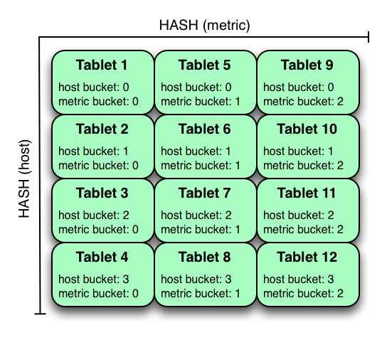

# Introducing Apache Kudu

## Navigation

- [Introducing Kudu](#index)
- [Kudu Release Notes](#release_notes)
- [Quickstart Guide](#quickstart)
- [Installation Guide](#installation)
- [Configuring Kudu](#configuration)
- [Using the Hive Metastore with Kudu](#hive_metastore)
- [Using Impala with Kudu](#kudu_impala_integration)
- [Administering Kudu](#administration)
- [Troubleshooting Kudu](#troubleshooting)
- [Developing Applications with Kudu](#developing)
- [Kudu Schema Design](#schema_design)
- [Kudu Scaling Guide](#scaling_guide)
- [Kudu Security](#security)
- [Kudu Transaction Semantics](#transaction_semantics)
- [Background Maintenance Tasks](#background_tasks)
- [Kudu Configuration Reference](#configuration_reference)
- [Kudu Command Line Tools Reference](#command_line_tools_reference)
- [Kudu Metrics Reference](#metrics_reference)
- [Known Issues and Limitations](#known_issues)
- [Contributing to Kudu](#contributing)
- [Export Control Notice](#export_control)

## Content

<a id="index"></a>

<!-- source_url: https://kudu.apache.org/docs/ -->

<!-- page_index: 1 -->

<a id="index--introducing-apache-kudu"></a>

# Introducing Apache Kudu

Kudu is a distributed columnar storage engine optimized for OLAP workloads.
Kudu runs on commodity hardware, is horizontally scalable, and supports highly
available operation.

Kudu’s design sets it apart. Some of Kudu’s benefits include:

- Fast processing of OLAP workloads.
- Strong but flexible consistency model, allowing you to choose consistency
  requirements on a per-request basis, including the option for
  strict-serializable consistency.
- Structured data model.
- Strong performance for running sequential and random workloads simultaneously.
- Tight integration with Apache Impala, making it a good, mutable alternative to
  using HDFS with Apache Parquet.
- Integration with Apache NiFi and Apache Spark.
- Integration with Hive Metastore (HMS) and Apache Ranger to provide
  fine-grain authorization and access control.
- Authenticated and encrypted RPC communication.
- High availability: Tablet Servers and Masters use the [Raft Consensus Algorithm](#index--raft), which ensures
  that as long as more than half the total number of tablet replicas is
  available, the tablet is available for reads and writes. For instance,
  if 2 out of 3 replicas (or 3 out of 5 replicas, etc.) are available,
  the tablet is available. Reads can be serviced by read-only follower tablet
  replicas, even in the event of a leader replica’s failure.
- Automatic fault detection and self-healing: to keep data highly available,
  the system detects failed tablet replicas and re-replicates data from
  available ones, so failed replicas are automatically replaced when enough
  Tablet Servers are available in the cluster.
- Location awareness (a.k.a. rack awareness) to keep the system available
  in case of correlated failures and allowing Kudu clusters to span over
  multiple availability zones.
- Logical backup (full and incremental) and restore.
- Multi-row transactions (only for INSERT/INSERT\_IGNORE operations as of
  Kudu 1.15 release).
- Easy to administer and manage.

By combining all of these properties, Kudu targets support for families of
applications that are difficult or impossible to implement using Hadoop storage
technologies, while it is compatible with most of the data processing
frameworks in the Hadoop ecosystem.

A few examples of applications for which Kudu is a great solution are:

- Reporting applications where newly-arrived data needs to be immediately available for end users
- Time-series applications that must simultaneously support:

  - queries across large amounts of historic data
  - granular queries about an individual entity that must return very quickly
- Applications that use predictive models to make real-time decisions with periodic
  refreshes of the predictive model based on all historic data

For more information about these and other scenarios, see [Example Use Cases](#index--kudu_use_cases).

<a id="index--_kudu_impala_integration_features"></a>
<a id="index--kudu-impala-integration-features"></a>

## [Kudu-Impala Integration Features](#index--_kudu_impala_integration_features)

`CREATE/ALTER/DROP TABLE`
:   Impala supports creating, altering, and dropping tables using Kudu as the persistence layer.
    The tables follow the same internal / external approach as other tables in Impala,
    allowing for flexible data ingestion and querying.

`INSERT`
:   Data can be inserted into Kudu tables in Impala using the same syntax as
    any other Impala table like those using HDFS or HBase for persistence.

`UPDATE` / `DELETE`
:   Impala supports the `UPDATE` and `DELETE` SQL commands to modify existing data in
    a Kudu table row-by-row or as a batch. The syntax of the SQL commands is chosen
    to be as compatible as possible with existing standards. In addition to simple `DELETE`
    or `UPDATE` commands, you can specify complex joins with a `FROM` clause in a subquery.

Flexible Partitioning
:   Similar to partitioning of tables in Hive, Kudu allows you to dynamically
    pre-split tables by hash or range into a predefined number of tablets, in order
    to distribute writes and queries evenly across your cluster. You can partition by
    any number of primary key columns, by any number of hashes, and an optional list of
    split rows. See [Schema Design](#schema_design--schema_design).

Parallel Scan
:   To achieve the highest possible performance on modern hardware, the Kudu client
    used by Impala parallelizes scans across multiple tablets.

High-efficiency queries
:   Where possible, Impala pushes down predicate evaluation to Kudu, so that predicates
    are evaluated as close as possible to the data. Query performance is comparable
    to Parquet in many workloads.

For more details regarding querying data stored in Kudu using Impala, please
refer to the Impala documentation.

<a id="index--_concepts_and_terms"></a>
<a id="index--concepts-and-terms"></a>

## [Concepts and Terms](#index--_concepts_and_terms)

Columnar Data Store

Kudu is a *columnar data store*. A columnar data store stores data in strongly-typed
columns. With a proper design, it is superior for analytical or data warehousing
workloads for several reasons.

Read Efficiency
:   For analytical queries, you can read a single column, or a portion
    of that column, while ignoring other columns. This means you can fulfill your query
    while reading a minimal number of blocks on disk. With a row-based store, you need
    to read the entire row, even if you only return values from a few columns.

Data Compression
:   Because a given column contains only one type of data,
    pattern-based compression can be orders of magnitude more efficient than
    compressing mixed data types, which are used in row-based solutions. Combined
    with the efficiencies of reading data from columns, compression allows you to
    fulfill your query while reading even fewer blocks from disk. See
    [Data Compression](#schema_design--encoding)

Table

A *table* is where your data is stored in Kudu. A table has a schema and
a totally ordered primary key. A table is split into segments called tablets.

Tablet

A *tablet* is a contiguous segment of a table, similar to a *partition* in
other data storage engines or relational databases. A given tablet is
replicated on multiple tablet servers, and at any given point in time, one of these replicas is considered the leader tablet. Any replica can service
reads, and writes require consensus among the set of tablet servers serving the tablet.

Tablet Server

A *tablet server* stores and serves tablets to clients. For a
given tablet, one tablet server acts as a leader, and the others act as
follower replicas of that tablet. Only leaders service write requests, while
leaders or followers each service read requests. Leaders are elected using
[Raft Consensus Algorithm](#index--raft). One tablet server can serve multiple tablets, and one tablet can be served
by multiple tablet servers.

Master

The *master* keeps track of all the tablets, tablet servers, the
[Catalog Table](#index--catalog_table), and other metadata related to the cluster. At a given point
in time, there can only be one acting master (the leader). If the current leader
disappears, a new master is elected using [Raft Consensus Algorithm](#index--raft).

The master also coordinates metadata operations for clients. For example, when
creating a new table, the client internally sends the request to the master. The
master writes the metadata for the new table into the catalog table, and
coordinates the process of creating tablets on the tablet servers.

All the master’s data is stored in a tablet, which can be replicated to all the
other candidate masters.

Tablet servers heartbeat to the master at a set interval (the default is once
per second).

Raft Consensus Algorithm

Kudu uses the [Raft consensus algorithm](https://raft.github.io/) as
a means to guarantee fault-tolerance and consistency, both for regular tablets and for master
data. Through Raft, multiple replicas of a tablet elect a *leader*, which is responsible
for accepting and replicating writes to *follower* replicas. Once a write is persisted
in a majority of replicas it is acknowledged to the client. A given group of `N` replicas
(usually 3 or 5) is able to accept writes with at most `(N - 1)/2` faulty replicas.

Catalog Table

The *catalog table* is the central location for
metadata of Kudu. It stores information about tables and tablets. The catalog
table may not be read or written directly. Instead, it is accessible
only via metadata operations exposed in the client API.

The catalog table stores two categories of metadata:

Tables
:   table schemas, locations, and states

Tablets
:   the list of existing tablets, which tablet servers have replicas of
    each tablet, the tablet’s current state, and start and end keys.

Logical Replication

Kudu replicates operations, not on-disk data. This is referred to as *logical replication*, as opposed to *physical replication*. This has several advantages:

- Although inserts and updates do transmit data over the network, deletes do not need
  to move any data. The delete operation is sent to each tablet server, which performs
  the delete locally.
- Physical operations, such as compaction, do not need to transmit the data over the
  network in Kudu. This is different from storage systems that use HDFS, where
  the blocks need to be transmitted over the network to fulfill the required number of
  replicas.
- Tablets do not need to perform compactions at the same time or on the same schedule,
  or otherwise remain in sync on the physical storage layer. This decreases the chances
  of all tablet servers experiencing high latency at the same time, due to compactions
  or heavy write loads.

<a id="index--_architectural_overview"></a>
<a id="index--architectural-overview"></a>

## [Architectural Overview](#index--_architectural_overview)

The following diagram shows a Kudu cluster with three masters and multiple tablet
servers, each serving multiple tablets. It illustrates how Raft consensus is used
to allow for both leaders and followers for both the masters and tablet servers. In
addition, a tablet server can be a leader for some tablets, and a follower for others.
Leaders are shown in gold, while followers are shown in blue.



<a id="index--kudu_use_cases"></a>
<a id="index--example-use-cases"></a>

## [Example Use Cases](#index--kudu_use_cases)

Streaming Input with Near Real Time Availability

A common challenge in data analysis is one where new data arrives rapidly and constantly, and the same data needs to be available in near real time for reads, scans, and
updates. Kudu offers the powerful combination of fast inserts and updates with
efficient columnar scans to enable real-time analytics use cases on a single storage layer.

Time-series application with widely varying access patterns

A time-series schema is one in which data points are organized and keyed according
to the time at which they occurred. This can be useful for investigating the
performance of metrics over time or attempting to predict future behavior based
on past data. For instance, time-series customer data might be used both to store
purchase click-stream history and to predict future purchases, or for use by a
customer support representative. While these different types of analysis are occurring, inserts and mutations may also be occurring individually and in bulk, and become available
immediately to read workloads. Kudu can handle all of these access patterns
simultaneously in a scalable and efficient manner.

Kudu is a good fit for time-series workloads for several reasons. With Kudu’s support for
hash-based partitioning, combined with its native support for compound row keys, it is
simple to set up a table spread across many servers without the risk of "hotspotting"
that is commonly observed when range partitioning is used. Kudu’s columnar storage engine
is also beneficial in this context, because many time-series workloads read only a few columns, as opposed to the whole row.

In the past, you might have needed to use multiple data stores to handle different
data access patterns. This practice adds complexity to your application and operations, and duplicates your data, doubling (or worse) the amount of storage
required. Kudu can handle all of these access patterns natively and efficiently, without the need to off-load work to other data stores.

Predictive Modeling

Data scientists often develop predictive learning models from large sets of data. The
model and the data may need to be updated or modified often as the learning takes
place or as the situation being modeled changes. In addition, the scientist may want
to change one or more factors in the model to see what happens over time. Updating
a large set of data stored in files in HDFS is resource-intensive, as each file needs
to be completely rewritten. In Kudu, updates happen in near real time. The scientist
can tweak the value, re-run the query, and refresh the graph in seconds or minutes, rather than hours or days. In addition, batch or incremental algorithms can be run
across the data at any time, with near-real-time results.

Combining Data In Kudu With Legacy Systems

Companies generate data from multiple sources and store it in a variety of systems
and formats. For instance, some of your data may be stored in Kudu, some in a traditional
RDBMS, and some in files in HDFS. You can access and query all of these sources and
formats using Impala, without the need to change your legacy systems.

---

<a id="release_notes"></a>

<!-- source_url: https://kudu.apache.org/docs/release_notes.html -->

<!-- page_index: 2 -->

<a id="release_notes--apache-kudu-1.18.1-release-notes"></a>

# Apache Kudu 1.18.1 Release Notes

Apache Kudu 1.18.1 is a bug-fix release that addresses one critical Java client
dependency issue introduced in Kudu 1.18.0 along with other fixes/improvements listed
below.

<a id="release_notes--rn_1.18.1_upgrade_notes"></a>
<a id="release_notes--upgrade-notes"></a>

## [Upgrade Notes](#release_notes--rn_1.18.1_upgrade_notes)

<a id="release_notes--rn_1.18.1_fixed_issues"></a>
<a id="release_notes--fixed-issues"></a>

## [Fixed Issues](#release_notes--rn_1.18.1_fixed_issues)

- The Kudu Java dependencies published in compileUnshaded dependency scope are no longer marked
  optional (see [KUDU-3677](https://issues.apache.org/jira/browse/KUDU-3677)).
- Kudu CLI tools no longer crash on exit, as the global state of the OpenSSL library is
  cleaned up explicitly (see [KUDU-3635](https://issues.apache.org/jira/browse/KUDU-3635)).
- Fixed NPE in Kudu Java client introduced in Kudu 1.17.0
  (see [KUDU-3698](https://issues.apache.org/jira/browse/KUDU-3698)).
- Fixed kudu-backup and kudu-spark-tools jars to include the dependent kudu-spark classes
  (see [KUDU-3697](https://issues.apache.org/jira/browse/KUDU-3697)).
- Patched Breakpad to fix minidump stack generation for 64KB page systems
- Fixed Kudu C++ client crash introduced by KUDU-3461
  (see [KUDU-3704](https://issues.apache.org/jira/browse/KUDU-3704)).
- Fixed Spark integration issues by restoring DefaultSource and required META-INF/services
  entries to prevent ClassNotFoundException and ensure proper data source discovery.
  [KUDU-3718](https://issues.apache.org/jira/browse/KUDU-3718) should help catch such issues in
  future.
- Fixed CSR signing failures on OpenSSL 3.4+ by setting the version field in certificate signing
  requests
  (see [KUDU-3716](https://issues.apache.org/jira/browse/KUDU-3716)).
- Fixed NoClassDefFoundError in kudu-backup when backing up tables with BINARY columns that have
  default values or are used in range partition bounds.
- Fixes a unit mismatch in memory-pressure checks that caused ProceedWithFlush() to always trigger
  flushes when under memory pressure
  (see [KUDU-3722](https://issues.apache.org/jira/browse/KUDU-3722)).

  == Optimizations and improvements
- Kudu’s embedded webserver now supports setting the minimum required TLS version up to TLSv1.3.
- It is now possible to control TLSv1.3-specific cipher suites used by Kudu’s embedded webserver
  via the newly introduced --webserver\_tls\_ciphersuites flag.
- Upgraded the Apache Spark dependency from 3.2.4 to 3.5.
- Updated in-line help for the 'kudu master add' CLI tool to reflect on its obsolescence since
  Kudu 1.16.0 release.

<a id="release_notes--rn_1.18.0_upgrade_notes"></a>
<a id="release_notes--upgrade-notes-2"></a>

## [Upgrade Notes](#release_notes--rn_1.18.0_upgrade_notes)

<a id="release_notes--rn_1.18.0_obsoletions"></a>
<a id="release_notes--obsoletions"></a>

## [Obsoletions](#release_notes--rn_1.18.0_obsoletions)

<a id="release_notes--rn_1.18.0_deprecations"></a>
<a id="release_notes--deprecations"></a>

## [Deprecations](#release_notes--rn_1.18.0_deprecations)

Support for Python versions 3.0 to 3.5 (inclusive) has been discontinued.

<a id="release_notes--rn_1.18.0_new_features"></a>
<a id="release_notes--new-features"></a>

## [New features](#release_notes--rn_1.18.0_new_features)

- Kudu now supports a new experimental cache eviction policy named Segmented LRU (SLRU). This
  eviction policy helps the block cache better resist large scans that would otherwise evict
  frequently accessed data.
  (see [KUDU-613](https://issues.apache.org/jira/browse/KUDU-613)).
- A new experimental feature has been introduced to store LBM metadata in embedded RocksDB (see
  [KUDU-3371](https://issues.apache.org/jira/browse/KUDU-3371)).

<a id="release_notes--rn_1.18.0_improvements"></a>
<a id="release_notes--optimizations-and-improvements"></a>

## [Optimizations and improvements](#release_notes--rn_1.18.0_improvements)

- Several minor improvements to the performance of Kudu masters and tablet servers.
- The internal server-side counter for the `Auto-Incrementing` column is now updated during the
  server’s bootstrap process (see [KUDU-1945](https://issues.apache.org/jira/browse/KUDU-1945)).
- Tables with `Auto-Incrementing` column can now be backed up and restored
  (see [KUDU-1945](https://issues.apache.org/jira/browse/KUDU-1945)).
- Added /ipki-ca-cert, /ipki-ca-cert-pem, and /ipki-ca-cert-der endpoints for the embedded
  webserver of Kudu master to fetch the IPKI CA certificate used by a Kudu cluster.
- Added client API to import JWT for client authentication (see
  [KUDU-3472](https://issues.apache.org/jira/browse/KUDU-3472)).
- Added logic to detect unexpected jumps in the local/wall clock. This is enabled by default when
  running at Azure VM instances which are known to be prone to such events. Otherwise, this
  logic is disabled. For details, refer to the online documentation for --wall\_clock\_jump\_detection
  and --wall\_clock\_jump\_threshold\_sec flags.
- Kudu can now be built with the default system gcc/g++-7 compiler on SLES15.
- Kudu can now be built on macOS 14.x (Sonoma) with XCode 15 and newer.
- Added validator for the --trusted\_certificate\_file flag to catch misconfigurations
  (such as pointing to a non-existing file) early (see
  [KUDU-3392](https://issues.apache.org/jira/browse/KUDU-3392)).
- Added a new metric to track per-RPC timeouts. This helps in identifying if requests to a
  particular RPC method timed out while being processed (see
  [KUDU-3514](https://issues.apache.org/jira/browse/KUDU-3514)).
- Added a new metric for AcceptorPool’s dispatch timing. See the online documentation for the
  acceptor\_dispatch\_times metric.
- Unified logging on write requests rejected by tablet servers. This helps in troubleshooting
  and post-mortem analysis.
- Increased the backlog of listened RPC sockets up to 512. This helps in a very busy Kudu cluster
  when many clients attempt to connect to the cluster concurrently.
- Added Cache-Control, X-Content-Type-Options, and HSTS HTTP headers into Kudu embedded webserver’s
  responses. For details, see the online documentation for --webserver\_hsts\_max\_age\_seconds and
  --webserver\_hsts\_include\_sub\_domains flags.
- Introduced rpc\_listened\_socket\_rx\_queue\_size and rpc\_pending\_connections metrics for Kudu master
  and tablet servers. For details, see the online documentation for the newly introduced metrics.
- Updated the severity level of a few tablet-level metrics to bring them on-par with the rest of
  metrics having similar semantics. See
  [changelist 35716499d](https://github.com/apache/kudu/commit/35716499d) for details.
- Removed unnecessary memory allocation for ancient UNDO mutations. See
  [changelist 3bdaf50b5](https://github.com/apache/kudu/commit/3bdaf50b5) for details.
- Apache Ranger client now accepts JVM arguments via --ranger\_java\_extra\_args and a colon-separated
  list of classpaths via --ranger\_jar\_path
  (see [KUDU-3503](https://issues.apache.org/jira/browse/KUDU-3503)
  and [KUDU-3359](https://issues.apache.org/jira/browse/KUDU-3359)).
- Key materials for over-the-wire encryption can now be encrypted on disk without data-at-rest
  encryption or file-system level encryption using --tsk\_private\_key\_password\_cmd and
  --ipki\_private\_key\_password\_cmd (see [KUDU-3448](https://issues.apache.org/jira/browse/KUDU-3448)).
- Maintenance operations other than DRS or MRS flush could be scheduled now even if the server is
  under memory pressure. Set run\_non\_memory\_ops\_prob to a value greater than 0 to enable it
  (see [KUDU-3407](https://issues.apache.org/jira/browse/KUDU-3407)).
- Introduced new metrics for slow scans in tablet servers.
- Buffer space limit in the Kudu Java client (KuduSession) is now configurable.
- Compaction for soft-deleted tables is now disabled by default.
- Several metrics have been introduced to track operations such as table creation, table deletion,
  alter table schema, tablet scans, tablet copy, tablet replica election, and tablet replication.
- Enhanced the robustness of key retrieval from Ranger.
- Kudu now runs on AArch64 Ubuntu and RedHat.
- Installation of the Kudu Python package has been simplified, removing the need for a manual Cython
  installation; compatible versions are now automatically handled. Dependencies have been updated to
  support Python 2.7 and 3.6-3.10, and test files are now excluded from the final package.
- Per-session write operation metrics have been added to the Kudu Python client.
- Support for UPSERT IGNORE has been added to the Kudu Python client
  (see [KUDU-3353](https://issues.apache.org/jira/browse/KUDU-3353)).
- The Kudu C++ and Python client examples have been added to demonstrate the utilization of the
  non-unique primary key feature.
- Support for soft table deletion has been added to the Kudu Python client
  (see [KUDU-3326](https://issues.apache.org/jira/browse/KUDU-3326)).
- Support for adding comments in ColumnSchema has been added to the Kudu Python client.
- Support for immutable columns has been added to the Kudu Python client.
- Kudu now supports dedicated SPNEGO keytab
  (see [KUDU-3496](https://issues.apache.org/jira/browse/KUDU-3496)).
- Kudu now supports creating under-replicated tables (when the number of requested replicas is
  greater than the number of tablet servers) as long as consensus can be achieved
  (see [KUDU-3452](https://issues.apache.org/jira/browse/KUDU-3452)).
- Tablet copying speed can now be limited
  (see [KUDU-3447](https://issues.apache.org/jira/browse/KUDU-3447)).
- The maximum size of RPC messages is now configurable via the Kudu C++ client
  (see [KUDU-3595](https://issues.apache.org/jira/browse/KUDU-3595)).
- Tablet-level metrics are now available in Prometheus format as well. Previously, only
  server-level Kudu metrics were available in Prometheus format
  (see [KUDU-3563](https://issues.apache.org/jira/browse/KUDU-3563)).
- Range aware cluster rebalancer can now be run for multiple tables and against the whole Kudu
  cluster.
- The example Kudu C++ client application now works with HMS-enabled Kudu clusters.
- Addressed several CVE’s from thirdparty dependencies by upgrading them
  (see [KUDU-3626](https://issues.apache.org/jira/browse/KUDU-3626),
  [KUDU-3629](https://issues.apache.org/jira/browse/KUDU-3629))
- Upgraded Gradle to version 7.6.4
  (see [KUDU-3551](https://issues.apache.org/jira/browse/KUDU-3551)).
- Kudu now uses x509\_get\_signature\_info() (OpenSSL 1.1.1+) to correctly detect hash algorithms
  for RSASSA-PSS certificate signatures, fixing a limitation in the previous approach.
  (see [KUDU-3663](https://issues.apache.org/jira/browse/KUDU-3663)).

<a id="release_notes--rn_1.18.0_fixed_issues"></a>
<a id="release_notes--fixed-issues-2"></a>

## [Fixed issues](#release_notes--rn_1.18.0_fixed_issues)

- Fixed issue where UPDATE privilege granted by Ranger is not honored by Kudu.
  (see [KUDU-3661](https://issues.apache.org/jira/browse/KUDU-3661)).
- Fixed scan issues where an unexpected predicate was introduced
  (see [KUDU-3518](https://issues.apache.org/jira/browse/KUDU-3518)).
- Fixed a bug in the range-aware replica placement code where the master would crash
  (see [KUDU-3532](https://issues.apache.org/jira/browse/KUDU-3532)).
- The ‘kudu table copy’ CLI tool now exits gracefully and prints information on errors instead
  of crashing when encountering errors while writing data to the destination table.
- Fixed handling of oversized messages exchanged between kudu-master process and Ranger client.
  This fixes fine-grained authorization issues when working with a cluster having thousands of
  tables (see [KUDU-3450](https://issues.apache.org/jira/browse/KUDU-3450) and
  [KUDU-3489](https://issues.apache.org/jira/browse/KUDU-3489)).
- Fixed at-rest encryption/decryption when using OpenSSL 3.
- Fixed incompatibility introduced with [KUDU-2671](https://issues.apache.org/jira/browse/KUDU-2671)
  (see [KUDU-3515](https://issues.apache.org/jira/browse/KUDU-3515)).
- Fixed master and tablet server crash when the system clock is synchronized by PTPd
  (see [KUDU-3521](https://issues.apache.org/jira/browse/KUDU-3521)).
- Fixed NPE that might be thrown during RPC connection negotiation by Kudu Java client. The
  thrown exception would make the connection to the corresponding tablet server unusable, where
  the only remedy for the issue was a restart of the Kudu Java client application
  (see [KUDU-3576](https://issues.apache.org/jira/browse/KUDU-3576)).
- Do not expose string gauges as Prometheus metrics
  (see [KUDU-3549](https://issues.apache.org/jira/browse/KUDU-3549)).
- Fixed integer overflow in available space metrics
  (see [KUDU-3562](https://issues.apache.org/jira/browse/KUDU-3562)).
- Don’t spam servers’ logs with “Entity is not relevant to Prometheus”
  (see [KUDU-3561](https://issues.apache.org/jira/browse/KUDU-3561)).
- Fixed summary metrics in Prometheus format
  (see [KUDU-3566](https://issues.apache.org/jira/browse/KUDU-3566)).
- Fixed a race condition that might lead to unexpected behavior when processing AlterTable or a scan
  request containing IN-list predicates with concurrently running major delta compaction
  (see [KUDU-3569](https://issues.apache.org/jira/browse/KUDU-3569)).
- Fixed a heap-use-after-free bug in MajorDeltaCompactionOp. The bug might lead to unexpected
  behavior when processing an AlterTable request along with concurrently running major delta
  compaction (see [KUDU-3570](https://issues.apache.org/jira/browse/KUDU-3570)).
- Fixed altering tables with custom per-range hash schemas
  (see [KUDU-3577](https://issues.apache.org/jira/browse/KUDU-3577)).
- Disable [KUDU-3367](https://issues.apache.org/jira/browse/KUDU-3367) behavior by default. This fixes
  major delta compaction failure that manifests itself in certain workloads with copious number of
  DELETE operations (see [KUDU-3619](https://issues.apache.org/jira/browse/KUDU-3619)).
- Fixed Impala daemon crash caused due to improper handling of a no-longer-existing tablet
  (see [KUDU-3461](https://issues.apache.org/jira/browse/KUDU-3461)).
- The Kudu CLI’s can now accommodate response payloads up to 2GByte in size with the increased
  maximum RPC message size limit.
- Fixed incorrect memory budgeting condition in compaction that could cause budgeting logic
  to not kick in when required.
- Fixed Ranger client issue to avoid spawning of Ranger subprocess if keytab file is not available
  (see [KUDU-3558](https://issues.apache.org/jira/browse/KUDU-3558)).
- Fixed a bug where the Ranger client could silently crash leaving the Kudu masters running, but not
  being able to serve requests (see [KUDU-3504](https://issues.apache.org/jira/browse/KUDU-3504)).
- Fixed a bug that the table could stay in ALTERING state forever if its replication factor changes
  when it does not have any tablets.
- Fixed a bug in Kudu Java client that might lead to a Scanner not found exception
  (see [KUDU-3526](https://issues.apache.org/jira/browse/KUDU-3526)).
- Fixed a bug where the result of UPSERT might not be correct when the client schema and server schema
  do not match (see [KUDU-3495](https://issues.apache.org/jira/browse/KUDU-3495)).
- Fixed a bug where the log cache of the tombstoned tablet might not be cleared
  (see [KUDU-3535](https://issues.apache.org/jira/browse/KUDU-3535)).
- Fixed a bug where the maintenance manager might schedule fewer operations even if there are idle
  threads and pending operations.
  (see [KUDU-3516](https://issues.apache.org/jira/browse/KUDU-3516)).
- Fixed a bug when a new master with empty local directories tries to connect to an existing cluster
  (see [KUDU-3437](https://issues.apache.org/jira/browse/KUDU-3437)).
- Fixed a bug in multi-master cluster with non-default Kerberos principal name.
- Fixed a bug in multi-master cluster when MiniDumps enabled
  (see [KUDU-3491](https://issues.apache.org/jira/browse/KUDU-3491)).
- Content-Type headers have been corrected for various HTTP/HTTPS endpoints, ensuring accurate
  response formats, including support for JSON and binary data where applicable
  (see [KUDU-3543](https://issues.apache.org/jira/browse/KUDU-3543)).
- SSE2 and AVX code now uses native NEON instructions on ARM64/AArch64
  (see [KUDU-3475](https://issues.apache.org/jira/browse/KUDU-3475)).
- Fixed IN list predicate pruning for tables with range specific hash schema
  (see [KUDU-3564](https://issues.apache.org/jira/browse/KUDU-3564)).
- Kudu Java client now properly handles concurrent table schema updates between consecutive write
  operations within the same KuduSession
  (see [KUDU-3483](https://issues.apache.org/jira/browse/KUDU-3483)).
- Fixed heap-use-after-free issue in OpDriver
  (see [KUDU-3620](https://issues.apache.org/jira/browse/KUDU-3620)).
- Fixed handling of unexpected input for --predicates flag in `kudu table scan` and other CLI tools,
  so the tools wouldn’t crash on incorrect user input, but report on problems with actionable error
  messages. For details, see [KUDU-3623](https://issues.apache.org/jira/browse/KUDU-3623).
- Fixed zlib-related errors when processing HMS notification events
  (see [KUDU-3648](https://issues.apache.org/jira/browse/KUDU-3648).
- Fixed the issue where DnsResolver threads were not shutdown causing retrying of RPCs that failed
  due to server shutdown process
  (see [KUDU-3633](https://issues.apache.org/jira/browse/KUDU-3633)).
- Fixed crash of Kudu CLI tool namely kudu table copy in cases of invalid inputs
  (see [KUDU-3623](https://issues.apache.org/jira/browse/KUDU-3623)).

  == Wire Protocol compatibility

Kudu 1.18.0 is wire-compatible with previous versions of Kudu:

- Kudu 1.18 clients may connect to servers running Kudu 1.0 or later. If the client uses
  features that are not available on the target server, an error will be returned.
- Rolling upgrade between Kudu 1.17 and Kudu 1.18 servers is believed to be possible
  though has not been sufficiently tested. Users are encouraged to shut down all nodes
  in the cluster, upgrade the software, and then restart the daemons on the new version.
- Kudu 1.0 clients may connect to servers running Kudu 1.18 with the exception of the
  below-mentioned restrictions regarding secure clusters.

The authentication features introduced in Kudu 1.3 place the following limitations
on wire compatibility between Kudu 1.18 and versions earlier than 1.3:

- If a Kudu 1.18 cluster is configured with authentication or encryption set to "required",
  clients older than Kudu 1.3 will be unable to connect.
- If a Kudu 1.18 cluster is configured with authentication and encryption set to "optional"
  or "disabled", older clients will still be able to connect.

<a id="release_notes--rn_1.18.0_incompatible_changes"></a>
<a id="release_notes--incompatible-changes-in-kudu-1.18.0"></a>

## [Incompatible Changes in Kudu 1.18.0](#release_notes--rn_1.18.0_incompatible_changes)

<a id="release_notes--rn_1.18.0_client_compatibility"></a>
<a id="release_notes--client-library-compatibility"></a>

### [Client Library Compatibility](#release_notes--rn_1.18.0_client_compatibility)

- The Kudu 1.18 Java client library is API- and ABI-compatible with Kudu 1.17. Applications
  written against Kudu 1.17 will compile and run against the Kudu 1.18 client library and
  vice-versa.
  NOTE: As part of the Gradle upgrade to version 7.6.4, additional runtime dependencies have
  been introduced in the published artifacts. These dependencies were optional in earlier versions
  and, therefore, were not included in the corresponding POM files of those artifacts.
- The Kudu 1.18 C++ client is API- and ABI-forward-compatible with Kudu 1.17.
  Applications written and compiled against the Kudu 1.17 client library will run without
  modification against the Kudu 1.18 client library. Applications written and compiled
  against the Kudu 1.18 client library will run without modification against the Kudu 1.17
  client library.
- The Kudu 1.18 Python client is API-compatible with Kudu 1.17, as no breaking changes have
  been introduced. However, support for Python versions 3.0 through 3.5 (inclusive) has been
  dropped. Users on these versions should upgrade to a supported Python version. Applications
  written against Kudu 1.17 will continue to work with the Kudu 1.18 client, and vice versa, as
  long as a supported Python version is used.

<a id="release_notes--rn_1.18.0_known_issues"></a>
<a id="release_notes--known-issues-and-limitations"></a>

## [Known Issues and Limitations](#release_notes--rn_1.18.0_known_issues)

- The Kudu CLI tool sometimes crashes on exit with SIGSEGV in OPENSSL\_cleanup
  (see [KUDU-3635](https://issues.apache.org/jira/browse/KUDU-3635)).

Please refer to the [Known Issues and Limitations](#known_issues) section of the
documentation.

<a id="release_notes--rn_1.18.0_contributors"></a>
<a id="release_notes--contributors"></a>

## [Contributors](#release_notes--rn_1.18.0_contributors)

Kudu 1.18.0 includes contributions from 26 people, including 3 first-time contributors:

- halim.kim
- qhsong
- Sebastian Pop
- Vladyslav Lyutenko
- 0xderek

<a id="release_notes--resources_and_next_steps"></a>
<a id="release_notes--resources"></a>

## [Resources](#release_notes--resources_and_next_steps)

- [Kudu Website](http://kudu.apache.org/)
- [Kudu GitHub Repository](http://github.com/apache/kudu)
- [Kudu Documentation](#index)
- [Release notes for older releases](https://kudu.apache.org/docs/prior_release_notes.html)

<a id="release_notes--_installation_options"></a>
<a id="release_notes--installation-options"></a>

## [Installation Options](#release_notes--_installation_options)

For full installation details, see [Kudu Installation](#installation).

---

<a id="quickstart"></a>

<!-- source_url: https://kudu.apache.org/docs/quickstart.html -->

<!-- page_index: 3 -->

<a id="quickstart--apache-kudu-quickstart"></a>

# Apache Kudu Quickstart

Follow these instructions to set up and run a local Kudu Cluster using Docker, and get started using Apache Kudu in minutes.

> [!NOTE]
> This is intended for demonstration purposes only and shouldn’t
> be used for production or performance/scale testing.

<a id="quickstart--quickstart_vm"></a>
<a id="quickstart--install-docker"></a>

## [Install Docker](#quickstart--quickstart_vm)

Follow the Docker [install documentation](https://docs.docker.com/install/)
to install docker in your Linux, Mac, or Windows environment.

Configure the Docker install to have enough resources to run the quickstart guides.

- [Docker for Mac Resource Configuration Guide](https://docs.docker.com/docker-for-mac/#resources)

A minimum configuration that can run all the quickstart examples comfortably is:

- 4 CPUs
- 6 GB Memory
- 50 GB Disk

> [!NOTE]
> You can likely get by with a lower resource configuration, but you may lose some performance and stability.

You may also want to read through the Docker getting started guide, but that isn’t a requirement.

<a id="quickstart--_clone_the_repository"></a>
<a id="quickstart--clone-the-repository"></a>

## [Clone the Repository](#quickstart--_clone_the_repository)

Clone the Apache Kudu repository using Git and change to the `kudu` directory:

```bash
git clone https://github.com/apache/kudu
cd kudu
```

<a id="quickstart--_start_the_quickstart_cluster"></a>
<a id="quickstart--start-the-quickstart-cluster"></a>

## [Start the Quickstart Cluster](#quickstart--_start_the_quickstart_cluster)

<a id="quickstart--_set_kudu_quickstart_ip"></a>
<a id="quickstart--set-kudu_quickstart_ip"></a>

### [Set KUDU\_QUICKSTART\_IP](#quickstart--_set_kudu_quickstart_ip)

Set the `KUDU_QUICKSTART_IP` environment variable to your ip address:

```bash
export KUDU_QUICKSTART_IP=$(ifconfig | grep "inet " | grep -Fv 127.0.0.1 |  awk '{print $2}' | tail -1)
```

<a id="quickstart--_bring_up_the_cluster"></a>
<a id="quickstart--bring-up-the-cluster"></a>

### [Bring up the Cluster](#quickstart--_bring_up_the_cluster)

Then use `docker-compose` to start a cluster with 3 master servers and 5 tablet servers.
When inside the docker network/containers the master addresses will be
`kudu-master-1:7051,kudu-master-2:7151,kudu-master-3:7251` and when on the host machine
you can specify the master addresses with `localhost:7051,localhost:7151,localhost:7251`.

```bash
docker-compose -f docker/quickstart.yml up -d
```

> [!NOTE]
> You can remove the `-d` flag to run the cluster in the foreground.

<a id="quickstart--_view_the_web_ui"></a>
<a id="quickstart--view-the-web-ui"></a>

### [View the Web-UI](#quickstart--_view_the_web_ui)

Once the cluster is started you can view the master web-ui by visiting <localhost:8050>.

<a id="quickstart--_check_the_cluster_health"></a>
<a id="quickstart--check-the-cluster-health"></a>

### [Check the cluster health](#quickstart--_check_the_cluster_health)

Use the command below to get a bash shell in the `kudu-master-1` container:

```bash
docker exec -it $(docker ps -aqf "name=kudu-master-1") /bin/bash
```

You can now run the Kudu `ksck` tool to verify the cluster is healthy:

```bash
kudu cluster ksck kudu-master-1:7051,kudu-master-2:7151,kudu-master-3:7251
```

Alternatively, if you have a kudu binary available on your host machine, you can run `ksck` there via:

```bash
export KUDU_USER_NAME=kudu
kudu cluster ksck localhost:7051,localhost:7151,localhost:7251
```

> [!NOTE]
> Setting `KUDU_USER_NAME=kudu` simplifies using Kudu from various user
> accounts in a non-secure environment.

> [!NOTE]
> Remembering master addresses each time when using the `kudu` command
> line tool can be unwieldy. As an alternative to this, [the command line tool
> can identify clusters by name.](#administration--using_cluster_names_in_kudu_tool)

> [!NOTE]
> Setting environment variables in the current shell session in order to Master
> addresses and substituting them later on can also simplify the calls to Kudu CLI
> greatly.

```bash
export KUDU_MASTER_ADDRESSES=localhost:7051,localhost:7151,localhost:7251
kudu table list $KUDU_MASTER_ADDRESSES
```

<a id="quickstart--_running_a_brief_example"></a>
<a id="quickstart--running-a-brief-example"></a>

## [Running a Brief Example](#quickstart--_running_a_brief_example)

Now that a Kudu cluster is up and running, examples and integrations can be
run against the cluster. The commands below run the `java-example` against
the quickstart cluster:

```bash
export KUDU_USER_NAME=kudu
cd examples/java/java-example
mvn package
java -DkuduMasters=localhost:7051,localhost:7151,localhost:7251 -jar target/kudu-java-example-1.0-SNAPSHOT.jar
```

<a id="quickstart--_more_examples"></a>
<a id="quickstart--more-examples"></a>

## [More Examples](#quickstart--_more_examples)

More complete walkthroughs using the quickstart Kudu cluster can be found in the
`examples/quickstart` directory. For convenience you can browse them on
[Github](https://github.com/apache/kudu/tree/master/examples/quickstart).

- [NiFi Quickstart Guide](https://github.com/apache/kudu/tree/master/examples/quickstart/nifi)
- [Spark Quickstart Guide](https://github.com/apache/kudu/tree/master/examples/quickstart/spark)
- [Impala Quickstart Guide](https://github.com/apache/kudu/tree/master/examples/quickstart/impala)

<a id="quickstart--_destroying_the_cluster"></a>
<a id="quickstart--destroying-the-cluster"></a>

## [Destroying the Cluster](#quickstart--_destroying_the_cluster)

Once you are done with the quickstart cluster you can shutdown in a couple of ways.
If you ran `docker-compose` without the `-d` flag, you can use `ctrl + c` to
stop the cluster.

If you ran `docker-compose` with the `-d` flag, you can use the following to
gracefully shutdown the cluster:

```bash
docker-compose -f docker/quickstart.yml down
```

Another alternative is to stop all of the Kudu containers via:

```bash
docker stop $(docker ps -aqf "name=kudu")
```

If you want to remove the cluster state you can also remove the docker
containers and volumes via:

```bash
docker rm $(docker ps -aqf "name=kudu")
docker volume rm $(docker volume ls --filter name=kudu -q)
```

<a id="quickstart--_troubleshooting"></a>
<a id="quickstart--troubleshooting"></a>

## [Troubleshooting](#quickstart--_troubleshooting)

<a id="quickstart--_viewing_the_logs"></a>
<a id="quickstart--viewing-the-logs"></a>

### [Viewing the logs](#quickstart--_viewing_the_logs)

To view the logs you can use the `docker logs` command. Below is an example
that will show the logs one of the tablet servers:

```bash
docker logs $(docker ps -aqf "name=kudu-tserver-1")
```

<a id="quickstart--_changing_the_kudu_version"></a>
<a id="quickstart--changing-the-kudu-version"></a>

### [Changing the Kudu version](#quickstart--_changing_the_kudu_version)

To change the version of Kudu Docker images used you can override the default value
of `latest` by setting the `KUDU_QUICKSTART_VERSION` environment variable.

```bash
export KUDU_QUICKSTART_VERSION="1.14.0"
```

<a id="quickstart--_changing_the_kudu_configuration"></a>
<a id="quickstart--changing-the-kudu-configuration"></a>

### [Changing the Kudu configuration](#quickstart--_changing_the_kudu_configuration)

To change the configuration flags passed to the master and tablet servers you
can edit the `docker/quickstart.yml` file before starting the cluster.

---

<a id="installation"></a>

<!-- source_url: https://kudu.apache.org/docs/installation.html -->

<!-- page_index: 4 -->

<a id="installation--installing-apache-kudu"></a>

# Installing Apache Kudu

> [!NOTE]
> This document applies to Apache Kudu version 1.18.1. Please consult the
> [documentation of the appropriate release](http://kudu.apache.org/releases/) that’s applicable
> to the version of the Kudu cluster.

The Apache Kudu project only publishes source code releases, to deploy Kudu on a
cluster follow the steps below to build Kudu from source.

<a id="installation--prerequisites_and_requirements"></a>
<a id="installation--prerequisites-and-requirements"></a>

## [Prerequisites and Requirements](#installation--prerequisites_and_requirements)

Hardware

- One or more hosts to run Kudu masters. It is recommended to have either one master (no fault
  tolerance), or three masters (can tolerate one failure). The number of masters must be odd.
- One or more hosts to run Kudu tablet servers. When using replication, a minimum of three tablet
  servers is necessary.

> [!WARNING]
> A deployment with an even number of masters provides the same level of fault tolerance as a
> deployment with one fewer master. For example, both four-master and three-master deployments can
> only tolerate a single failure; two-master deployments cannot tolerate any failures.

Operating System Requirements

Linux
:   - RHEL 7, RHEL 8, RHEL 9, CentOS 7, CentOS 8,
      Ubuntu 18.04 (bionic), Ubuntu 20.04 (focal),
      Ubuntu 22.04 (jammy), Ubuntu 24.04 (noble),
      SLES 15
    - A kernel and filesystem that support *hole punching*. Hole punching is the use of the
      `fallocate(2)` system call with the `FALLOC_FL_PUNCH_HOLE` option set. See
      [troubleshooting hole punching](#troubleshooting--req_hole_punching) for more
      information.
    - ntp or chrony.
    - xfs or ext4 formatted drives.
    - Although not a strict requirement, it’s highly recommended to use `nscd`
      to cache both DNS name resolution and static name resolution. See
      [troubleshooting slow DNS lookups](#troubleshooting--slow_dns_nscd)
      for more information.

macOS
:   - macOS 13 (Ventura), macOS 14 (Sonoma), macOS 15 (Sequoia)

Windows
:   - Microsoft Windows is unsupported.

Storage

- If solid state storage is available, storing Kudu WALs on such high-performance
  media may significantly improve latency when Kudu is configured for its highest
  durability levels.

Java

- JDK 8 is required to build Kudu, but a JRE is not required at runtime
  except for tests.

<a id="installation--build_from_source"></a>
<a id="installation--build-from-source"></a>

## [Build From Source](#installation--build_from_source)

Below are the steps for each supported operating system to build Kudu from source.

> [!WARNING]
> Known Build Issues
>
> - It is not possible to build Kudu on Microsoft Windows.
> - A C++-17 capable compiler (e.g., GCC 7.0 and newer) is required.

<a id="installation--rhel_from_source"></a>
<a id="installation--rhel-or-centos"></a>

### [RHEL or CentOS](#installation--rhel_from_source)

RHEL or CentOS 7.0 or later is required to build Kudu from source. To build
on a version older than 8.0, the Red Hat Developer Toolset must be installed
(in order to have access to a C++-17 capable compiler).

1. Install the prerequisite libraries, if they are not installed.


```
$ sudo yum install autoconf automake cyrus-sasl-devel cyrus-sasl-gssapi \ cyrus-sasl-plain flex gcc gcc-c++ gdb git java-1.8.0-openjdk-devel \ krb5-server krb5-workstation krb5-devel libtool make openssl-devel patch \ pkgconfig rsync unzip vim-common which
```

2. If building on RHEL or CentOS older than 8.0, install the Red Hat Developer Toolset.
   Below are the steps required for CentOS. If you are on RHEL, follow their documentation
   [here](https://developers.redhat.com/products/developertoolset/hello-world).


```
$ sudo yum install centos-release-scl-rh
$ sudo yum install devtoolset-8
```

3. If building on RHEL or CentOS older than 9.0, install the `redhat-lsb-core` package:


```
$ sudo yum install redhat-lsb-core
```

4. Optional: If support for Kudu’s NVM (non-volatile memory) block cache is
   desired, install the memkind library.


```
$ sudo yum install memkind
```

   If the memkind package provided with the Linux distribution is too old (1.8.0 or
   newer is required), build and install it from source.


```
$ sudo yum install numactl-libs numactl-devel
$ git clone https://github.com/memkind/memkind.git
$ cd memkind
$ ./build.sh --prefix=/usr
$ sudo yum remove memkind
$ sudo make install
$ sudo ldconfig
```

5. Optional: Install some additional packages, including ruby, if you plan to build documentation.


```
$ sudo yum install gem graphviz ruby-devel zlib-devel
```


> [!NOTE]
> If building on RHEL or CentOS older than 7.0, the gem package may need to be replaced with rubygems


> [!NOTE]
> Doxygen 1.8.19 or later is required to build the documentation, which has to be
> [built from source manually](https://www.doxygen.nl/manual/install.html#install_src_unix). Building
> this version of Doxygen on CentOS or RHEL older than 8.0 also requires
> [devtoolset](https://www.softwarecollections.org/en/scls/rhscl/devtoolset-8/).

6. Optional: Install `lsof` if you plan to run tests:


```
$ sudo yum install lsof
```

7. Clone the Git repository and change to the new `kudu` directory.


```bash
$ git clone https://github.com/apache/kudu
$ cd kudu
```

8. Build any missing third-party requirements using the `build-if-necessary.sh` script. Not using
   the devtoolset will result in `Host compiler appears to require libatomic, but cannot find it.`


```bash
$ build-support/enable_devtoolset.sh thirdparty/build-if-necessary.sh
```

9. Build Kudu, using the utilities installed in the previous step. Choose a build
   directory for the intermediate output, which can be anywhere in your filesystem
   except for the `kudu` directory itself. Notice that the devtoolset must still be specified,
   else you’ll get `cc1plus: error: unrecognized command line option "-std=c++17"`.


```bash
mkdir -p build/release
cd build/release
../../build-support/enable_devtoolset.sh \
  ../../thirdparty/installed/common/bin/cmake \
  -DCMAKE_BUILD_TYPE=release ../..
make -j4
```


> [!NOTE]
> If you need to install only a subset of Kudu executables, you can set the following `cmake` flags
> to OFF in order to skip any of the executables.
>
> - KUDU\_CLIENT\_INSTALL (set to OFF to skip installing `/usr/local/bin/kudu` executable)
> - KUDU\_TSERVER\_INSTALL (set to OFF to skip installing `/usr/local/sbin/kudu-tserver` executable)
> - KUDU\_MASTER\_INSTALL (set to OFF to skip installing `/usr/local/sbin/kudu-master` executable)
>
> E.g., use the following variation of `cmake` command if you need to install only Kudu client
> libraries and headers:
>
> ```bash
> ../../build-support/enable_devtoolset.sh \
>   ../../thirdparty/installed/common/bin/cmake \
>   -DKUDU_CLIENT_INSTALL=OFF \
>   -DKUDU_MASTER_INSTALL=OFF \
>   -DKUDU_TSERVER_INSTALL=OFF
>   -DCMAKE_BUILD_TYPE=release ../..
> ```

10. Optional: install Kudu executables, libraries and headers.


> [!NOTE]
> Running `sudo make install` installs the following:
>
> - kudu-tserver and kudu-master executables in `/usr/local/sbin`
> - Kudu command line tool in `/usr/local/bin`
> - Kudu client library in `/usr/local/lib64/`
> - Kudu client headers in `/usr/local/include/kudu`

    The default installation directory is `/usr/local`. You can customize it through the `DESTDIR`
    environment variable.


```bash
sudo make DESTDIR=/opt/kudu install
```

11. Optional: Build the documentation. NOTE: This command builds local documentation that
    is not appropriate for uploading to the Kudu website.


```
$ make docs
```

Example 1. RHEL / CentOS Build Script

This script provides an overview of the procedure to build Kudu on a
newly-installed RHEL or CentOS host, and can be used as the basis for an
automated deployment scenario. It skips the steps marked **Optional** above.

```bash
#!/bin/bash

sudo yum -y install autoconf automake curl cyrus-sasl-devel cyrus-sasl-gssapi \
  cyrus-sasl-plain flex gcc gcc-c++ gdb git java-1.8.0-openjdk-devel \
  krb5-server krb5-workstation krb5-devel libtool make openssl-devel patch \
  pkgconfig rsync unzip vim-common which
# Uncomment the next line if installing on RHEL/CentOS < 9 #sudo yum -y install redhat-lsb-core
# Uncomment the next two lines if installing on RHEL/CentOS < 8 #sudo yum -y install centos-release-scl-rh #sudo yum -y install devtoolset-8 git clone https://github.com/apache/kudu cd kudu build-support/enable_devtoolset.sh thirdparty/build-if-necessary.sh mkdir -p build/release cd build/release../../build-support/enable_devtoolset.sh \../../thirdparty/installed/common/bin/cmake \
  -DCMAKE_BUILD_TYPE=release \
  ../..
make -j4
```

<a id="installation--ubuntu_from_source"></a>
<a id="installation--ubuntu-or-debian"></a>

### [Ubuntu or Debian](#installation--ubuntu_from_source)

1. Install the prerequisite libraries, if they are not installed.


```
$ sudo apt-get install autoconf automake curl flex g++ gcc gdb git \ krb5-admin-server krb5-kdc krb5-user libkrb5-dev libsasl2-dev libsasl2-modules \ libsasl2-modules-gssapi-mit libssl-dev libtool lsb-release make ntp \ openjdk-8-jdk openssl patch pkg-config python rsync unzip vim-common
```

2. Optional: If support for Kudu’s NVM (non-volatile memory) block cache is
   desired, install the memkind library.


```
$ sudo apt-get install libmemkind0
```

   If the memkind package provided with the Linux distribution is too old (1.8.0 or
   newer is required), build and install it from source.


```
$ sudo apt-get install libnuma1 libnuma-dev
$ git clone https://github.com/memkind/memkind.git
$ cd memkind
$ ./build.sh --prefix=/usr
$ sudo apt-get remove memkind
$ sudo make install
$ sudo ldconfig
```

3. Optional: Install some additional packages, including ruby, if you plan to build documentation.


```
$ sudo apt-get install gem graphviz ruby-dev xsltproc zlib1g-dev
```


> [!NOTE]
> Doxygen 1.8.19 or later is required to build the documentation, which has to be
> [built from source manually](https://www.doxygen.nl/manual/install.html#install_src_unix).

4. Optional: Install `lsof` if you plan to run tests:


```
$ sudo apt-get install lsof
```

5. Clone the Git repository and change to the new `kudu` directory.


```bash
$ git clone https://github.com/apache/kudu
$ cd kudu
```

6. Build any missing third-party requirements using the `build-if-necessary.sh` script.


```bash
$ thirdparty/build-if-necessary.sh
```

7. Build Kudu, using the utilities installed in the previous step. Choose a build
   directory for the intermediate output, which can be anywhere in your filesystem
   except for the `kudu` directory itself.


```bash
mkdir -p build/release
cd build/release
../../thirdparty/installed/common/bin/cmake -DCMAKE_BUILD_TYPE=release ../..
make -j4
```


> [!NOTE]
> If you need to install only a subset of Kudu executables, you can set the following `cmake` flags
> to OFF in order to skip any of the executables.
>
> - KUDU\_CLIENT\_INSTALL (set to OFF to skip installing `/usr/local/bin/kudu` executable)
> - KUDU\_TSERVER\_INSTALL (set to OFF to skip installing `/usr/local/sbin/kudu-tserver` executable)
> - KUDU\_MASTER\_INSTALL (set to OFF to skip installing `/usr/local/sbin/kudu-master` executable)
>
> E.g., use the following variation of `cmake` command if you need to install only Kudu client
> libraries and headers:
>
> ```bash
>   ../../thirdparty/installed/common/bin/cmake \
>   -DKUDU_CLIENT_INSTALL=OFF \
>   -DKUDU_MASTER_INSTALL=OFF \
>   -DKUDU_TSERVER_INSTALL=OFF
>   -DCMAKE_BUILD_TYPE=release ../..
> ```

8. Optional: install Kudu executables, libraries and headers.


> [!NOTE]
> Running `sudo make install` installs the following:
>
> - kudu-tserver and kudu-master executables in `/usr/local/sbin`
> - Kudu command line tool in `/usr/local/bin`
> - Kudu client library in `/usr/local/lib64/`
> - Kudu client headers in `/usr/local/include/kudu`

   The default installation directory is `/usr/local`. You can customize it through the `DESTDIR`
   environment variable.


```bash
sudo make DESTDIR=/opt/kudu install
```

9. Optional: Build the documentation. NOTE: This command builds local documentation that
   is not appropriate for uploading to the Kudu website.


```
$ make docs
```

Example 2. Ubuntu / Debian Build Script

This script provides an overview of the procedure to build Kudu on Ubuntu, and
can be used as the basis for an automated deployment scenario. It skips
the steps marked **Optional** above.

```bash
#!/bin/bash

sudo apt-get -y install autoconf automake curl flex g++ gcc gdb git \
  krb5-admin-server krb5-kdc krb5-user libkrb5-dev libsasl2-dev libsasl2-modules \
  libsasl2-modules-gssapi-mit libssl-dev libtool lsb-release make ntp \
  openjdk-8-jdk openssl patch pkg-config python rsync unzip vim-common
git clone https://github.com/apache/kudu
cd kudu
thirdparty/build-if-necessary.sh
mkdir -p build/release
cd build/release
../../thirdparty/installed/common/bin/cmake \
  -DCMAKE_BUILD_TYPE=release ../..
make -j4
```

<a id="installation--sles_from_source"></a>
<a id="installation--suse-linux-enterprise-server-sles"></a>

### [SUSE Linux Enterprise Server (SLES)](#installation--sles_from_source)

1. Install the prerequisite libraries, if they are not installed.


```
$ sudo zypper install autoconf automake cmake curl cyrus-sasl-devel \ cyrus-sasl-plain cyrus-sasl-gssapi flex gdb git gzip \ java-1_8_0-openjdk-devel krb5-client krb5-server krb5-devel \ libtool lsb-release make ntp patch pkg-config python rsync unzip vim
$ sudo zypper install libopenssl-devel
```

2. If building on something older than SLES 15:


```
$ sudo zypper install openssl-devel
```

3. Install `gcc8` and `gcc8-c++` (might require activating Development Tools
   Module to add corresponding package repositories):


```
$ sudo zypper install gcc8 gcc8-c++
```

4. NOTE: If building on SLES 15, the system compiler (GCC7) may be used
   instead:


```
$ sudo zypper install gcc7 gcc7-c++
```

5. Optional: If support for Kudu’s NVM (non-volatile memory) block cache is
   desired, install the memkind library.


```
$ sudo zypper install memkind
```

   If the memkind package provided with the Linux distribution is too old (1.8.0 or
   newer is required), build and install it from source.


```
$ sudo zypper install numactl-libs numactl-devel
$ git clone https://github.com/memkind/memkind.git
$ cd memkind
$ ./build.sh --prefix=/usr
$ sudo zypper remove memkind
$ sudo make install
$ sudo ldconfig
```

6. Optional: Install `lsof` if you plan to run tests:


```
$ sudo zypper install lsof
```

7. Clone the Git repository and change to the new `kudu` directory.


```bash
$ git clone https://github.com/apache/kudu
$ cd kudu
```

8. Build any missing third-party requirements using the `build-if-necessary.sh` script.


```bash
$ build-support/enable_devtoolset.sh thirdparty/build-if-necessary.sh
```

9. Build Kudu, using the utilities installed in the previous step. Choose a build
   directory for the intermediate output, which can be anywhere in your filesystem
   except for the `kudu` directory itself.


```bash
mkdir -p build/release
cd build/release
../../build-support/enable_devtoolset.sh \
  ../../thirdparty/installed/common/bin/cmake \
  -DCMAKE_BUILD_TYPE=release ../..
make -j4
```


> [!NOTE]
> If you need to install only a subset of Kudu executables, you can set the following `cmake` flags
> to OFF in order to skip any of the executables.
>
> - KUDU\_CLIENT\_INSTALL (set to OFF to skip installing `/usr/local/bin/kudu` executable)
> - KUDU\_TSERVER\_INSTALL (set to OFF to skip installing `/usr/local/sbin/kudu-tserver` executable)
> - KUDU\_MASTER\_INSTALL (set to OFF to skip installing `/usr/local/sbin/kudu-master` executable)
>
> E.g., use the following variation of `cmake` command if you need to install only Kudu client
> libraries and headers:
>
> ```bash
> ../../build-support/enable_devtoolset.sh \
>   ../../thirdparty/installed/common/bin/cmake \
>   -DKUDU_CLIENT_INSTALL=OFF \
>   -DKUDU_TSERVER_INSTALL=OFF \
>   -DKUDU_MASTER_INSTALL=OFF
>   -DCMAKE_BUILD_TYPE=release ../..
> ```

10. Optional: install Kudu executables, libraries and headers.


> [!NOTE]
> Running `sudo make install` installs the following:
>
> - kudu-tserver and kudu-master executables in `/usr/local/sbin`
> - Kudu command line tool in `/usr/local/bin`
> - Kudu client library in `/usr/local/lib64/`
> - Kudu client headers in `/usr/local/include/kudu`

    The default installation directory is `/usr/local`. You can customize it through the `DESTDIR`
    environment variable.


```bash
sudo make DESTDIR=/opt/kudu install
```

Example 3. SLES Build Script

This script provides an overview of the procedure to build Kudu on SLES, and
can be used as the basis for an automated deployment scenario. It skips
the steps marked **Optional** above. If running this on something older than
SLES 15, replace `libopenssl-devel` with `openssl-devel`. If running this
on SLES 15, the system compiler GCC7 may be used instead of GCC8 (i.e.
replace `gcc8` with `gcc7`, and `` gcc8-c` with `gcc7-c `` correspondingly).

```bash
#!/bin/bash

sudo zypper install -y autoconf automake cmake curl cyrus-sasl-devel \
  cyrus-sasl-gssapi flex gdb git java-1_8_0-openjdk-devel \
  krb5-devel libtool lsb-release make ntp patch \
  pkg-config python rsync unzip vim
sudo zypper install gcc8 gcc8-c++
sudo zypper install libopenssl-devel
git clone https://github.com/apache/kudu
cd kudu
build-support/enable_devtoolset.sh thirdparty/build-if-necessary.sh
mkdir -p build/release
cd build/release
../../build-support/enable_devtoolset.sh \
  ../../thirdparty/installed/common/bin/cmake \
  -DCMAKE_BUILD_TYPE=release \
  ../..
make -j4
```

<a id="installation--osx_from_source"></a>
<a id="installation--macos"></a>

### [macOS](#installation--osx_from_source)

Kudu works on both Intel and ARM based Macs (Apple M chips).
Kudu support for macOS is experimental, and should only be used for development.

> [!WARNING]
> macOS Known Issues
>
> See [macOS Limitations & Known Issues](https://issues.apache.org/jira/browse/KUDU-1219)
> for more information. For any test related issues please first check whether it’s already tracked:
> [Get all tests passing on macOS](https://issues.apache.org/jira/browse/KUDU-2715).

The [Xcode](https://developer.apple.com/xcode/) package is necessary for
compiling Kudu. Some of the instructions below use [Homebrew](http://brew.sh/)
to install dependencies, but manual dependency installation is possible.

> [!NOTE]
> ARM Macs
>
> Apple introduced support for Apple silicon in Xcode version
> [12.2](https://developer.apple.com/documentation/xcode-release-notes/xcode-12_2-release-notes).
> To build Kudu on ARM-based Macs (Apple M chips), use Xcode of version 12.2 or above.

After installing Xcode, don’t forget to accept the license and install command-line
tools, if it’s not done yet:

```
$ sudo xcodebuild -license
$ sudo xcode-select --install
```

1. Install the prerequisite libraries, if they are not installed.


```
$ brew install autoconf automake cmake git krb5 libtool openssl@1.1 pkg-config pstree
```

2. Add OpenSSL to the pkg-config path. Kudu and thirdparty JWT fail to build without proper
   OPENSSL\_ROOT\_DIR. If one sets the following environment variable, it takes care of both cases.


```
$ export PKG_CONFIG_PATH="$(brew --prefix openssl@1.1)/lib/pkgconfig:$PKG_CONFIG_PATH"
```

3. Optional: Install some additional packages, including ruby, if you plan to build documentation.


```
$ brew install doxygen graphviz ruby
$ brew install gnu-sed --with-default-names #The macOS default sed handles the -i parameter differently
```

4. Optional: Install `lsof` if you plan to run tests:


```
$ brew install lsof
```

5. Clone the Git repository and change to the new `kudu` directory.


```bash
$ git clone https://github.com/apache/kudu
$ cd kudu
```

6. Build any missing third-party requirements using the `build-if-necessary.sh` script.


```bash
$ thirdparty/build-if-necessary.sh
```

   - If different versions of the dependencies are installed and used when calling
     `thirdparty/build-if-necessary.sh`, you may get stuck with output similar to the
     following:


```
./configure: line 16299: error near unexpected token `newline'
./configure: line 16299: `  PKG_CHECK_MODULES('
```

     The thirdparty builds may be cached and may reflect the incorrect versions of the
     dependencies. Ensure that you have the correct dependencies listed in Step 1, clean
     the workspace, and then try to re-build.


```bash
$ git clean -fdx
$ thirdparty/build-if-necessary.sh
```

   - Some combinations of Homebrew installations and system upgrades can result with a
     different kind of error:


```
libtool: Version mismatch error.  This is libtool 2.4.6, but the
libtool: definition of this LT_INIT comes from libtool 2.4.2.
libtool: You should recreate aclocal.m4 with macros from libtool 2.4.6
libtool: and run autoconf again.
```

     As described in this [thread](https://github.com/Homebrew/legacy-homebrew/issues/43874),
     a possible fix is to uninstall and reinstall libtool:


```bash
$ brew uninstall libtool && brew install libtool
```

7. Build Kudu. Choose a build directory for the intermediate output, which can be
   anywhere in your filesystem except for the `kudu` directory itself.


```bash
mkdir -p build/release
cd build/release
../../thirdparty/installed/common/bin/cmake \
  -DCMAKE_BUILD_TYPE=release \
  ../..
make -j4
```

Example 4. macOS Build Script

This script provides an overview of the procedure to build Kudu on macOS, and can
be used as the basis for an automated deployment scenario. It assumes Xcode and Homebrew
are installed.

```
#!/bin/bash

brew tap homebrew/dupes
brew install autoconf automake cmake git krb5 libtool openssl pkg-config pstree
export PKG_CONFIG_PATH="$(brew --prefix openssl@1.1)/lib/pkgconfig:$PKG_CONFIG_PATH"
git clone https://github.com/apache/kudu
cd kudu
thirdparty/build-if-necessary.sh
mkdir -p build/release
cd build/release
../../thirdparty/installed/common/bin/cmake \
  -DCMAKE_BUILD_TYPE=release \
  ../..
make -j4
```

<a id="installation--build_cpp_client"></a>
<a id="installation--installing-the-c-client-libraries"></a>

## [Installing the C++ Client Libraries](#installation--build_cpp_client)

See the Kudu client install section at the bottom of [Build From Source](#installation--build_from_source) above.

> [!WARNING]
> Only build against the client libraries and headers (`kudu_client.so` and `client.h`).
> Other libraries and headers are internal to Kudu and have no stability guarantees.

<a id="installation--build_java_client"></a>
<a id="installation--build-the-java-client"></a>

## [Build the Java Client](#installation--build_java_client)

Requirements

- JDK 8

To build the Java client, clone the Kudu Git repository, change to the `java`
directory, and issue the following command:

```bash
$ ./gradlew assemble
```

For more information on building the Java parts of the Kudu project, as well
as Eclipse integration, see `java/README.md`.

<a id="installation--upgrade"></a>
<a id="installation--upgrade-from-a-previous-version-of-kudu"></a>

## [Upgrade from a Previous Version of Kudu](#installation--upgrade)

Before upgrading, you should read the [Release Notes](#release_notes) for
the version of Kudu that you are about to install. Pay close attention to the
incompatibilities, upgrade, and downgrade notes that are documented there.

> [!WARNING]
> The following upgrade process is only relevant when you have binaries available.

1. Prepare the software.

   - Place the new `kudu-tserver`, `kudu-master`, and `kudu` binaries into the appropriate
     Kudu binary directory.
2. Upgrade the tablet servers.

   - Set the `follower_unavailable_considered_failed_sec` configuration to a high value
     (conservatively, twice the expected restart time) to prevent tablet replicas hosted
     on restarting tablet servers from being evicted and re-replicated.


```bash
$ ./kudu tserver set_flag <tserver> follower_unavailable_considered_failed_sec 7200
```

   - Restart one tablet server.
   - Wait for all tablet replicas on the tablet server to finish bootstrapping by viewing
     `/tablets` page in the tablet server web UI.
   - Restarting the tablet server will have reset the `follower_unavailable_considered_failed_sec`
     configuration. Raise it again as needed.
   - Repeat the previous 3 steps for the remaining tablet servers.
   - Restore the original gflag value of every tablet server (the default is 5 minutes)


```bash
$ ./kudu tserver set_flag <tserver> follower_unavailable_considered_failed_sec 300
```

     An example for a cluster with three tablet servers A, B, C:


```bash
# Step 1: Set the unavailable time for every tablet server to a large value
$ ./kudu tserver set_flag A follower_unavailable_considered_failed_sec 7200
$ ./kudu tserver set_flag B follower_unavailable_considered_failed_sec 7200
$ ./kudu tserver set_flag C follower_unavailable_considered_failed_sec 7200

# Step 2: Restart the tablet server and reset the gflag one by one <restart A and wait until A is online>
$ ./kudu tserver set_flag A follower_unavailable_considered_failed_sec 7200 <restart B and wait until B is online>
$ ./kudu tserver set_flag B follower_unavailable_considered_failed_sec 7200 <restart C and wait until C is online>
$ ./kudu tserver set_flag C follower_unavailable_considered_failed_sec 7200

# Step 3: Restore the default gflag value (5 minutes) for every tablet server
$ ./kudu tserver set_flag A follower_unavailable_considered_failed_sec 300
$ ./kudu tserver set_flag B follower_unavailable_considered_failed_sec 300
$ ./kudu tserver set_flag C follower_unavailable_considered_failed_sec 300
```

3. Upgrade the master servers.

   - Restart the master server one by one.

---

<a id="configuration"></a>

<!-- source_url: https://kudu.apache.org/docs/configuration.html -->

<!-- page_index: 5 -->

<a id="configuration--configuring-apache-kudu"></a>

# Configuring Apache Kudu

> [!NOTE]
> This document applies to Apache Kudu version 1.18.1. Please consult the
> [documentation of the appropriate release](http://kudu.apache.org/releases/) that’s applicable
> to the version of the Kudu cluster.

<a id="configuration--_configure_kudu"></a>
<a id="configuration--configure-kudu"></a>

## [Configure Kudu](#configuration--_configure_kudu)

<a id="configuration--_configuration_basics"></a>
<a id="configuration--configuration-basics"></a>

### [Configuration Basics](#configuration--_configuration_basics)

To configure the behavior of each Kudu process, you can pass command-line flags when
you start it, or read those options from configuration files by passing them using
one or more `--flagfile=<file>` options. You can even include the
`--flagfile` option within your configuration file to include other files. Learn more about gflags
by reading [its documentation](https://gflags.github.io/gflags/).

You can place options for masters and tablet servers into the same configuration
file, and each will ignore options that do not apply.

Flags can be prefixed with either one or two `-` characters. This
documentation standardizes on two: `--example_flag`.

<a id="configuration--_discovering_configuration_options"></a>
<a id="configuration--discovering-configuration-options"></a>

### [Discovering Configuration Options](#configuration--_discovering_configuration_options)

Only the most common configuration options are documented here. For a more exhaustive
list of configuration options, see the [Configuration Reference](#configuration_reference).

To see all configuration flags for a given executable, run it with the `--help` option.
Take care when configuring undocumented flags, as not every possible
configuration has been tested, and undocumented options are not guaranteed to be
maintained in future releases.

<a id="configuration--clock_and_time_source"></a>
<a id="configuration--configuring-clock-and-time-source"></a>

### [Configuring Clock and Time Source](#configuration--clock_and_time_source)

Kudu relies on timestamps generated by its clock implementation for the MVCC
and for providing consistency guarantees when processing write and read
requests. Aside from the test-only mock clock, Kudu has two different clock
implementations: one is based on logical time and the other is based on
so-called hybrid time. The former is a plain Lamport clock, the latter
is a combination of the node’s system clock and a Lamport clock. Below, the former is referred to as `LogicalClock` and the latter as `HybridClock`.

Using the `HybridClock` implementation is a must for any production-grade, POC, and other regular Kudu deployments: that’s why `--use_hybrid_clock` is set
`true` by default. Setting the flag to `false` makes Kudu servers use the
`LogicalClock` implementation: running with such a clock implementation is
acceptable only in the context of running specifically crafted test scenarios
in Kudu development environment.

> [!WARNING]
> Setting `--use_hybrid_clock=false` is strongly discouraged in any
> production-grade deployment since that could introduce out-of-control latency
> and not-quite-expected behavior, especially when working with multiple tables
> in a multi-node Kudu cluster.

To provide better accuracy for multi-node cluster deployments where each node
maintains its own system clock, the `HybridClock` implementation requires each
node’s system clock to be synchronized by NTP.

> [!NOTE]
> Setting `--time_source=system_unsync` removes the requirement for the
> node’s system clock to be synchronized by NTP — this allows users to run test
> clusters on a single node where there is only one clock used by all Kudu
> servers. Setting `--time_source=system_unsync` is strongly discouraged in any
> multi-node Kudu cluster, unless system clocks of all Kudu nodes are guaranteed
> to always be synchronized with each other.

For Kudu masters and tablet servers, there are two options to make the
`HybridClock` implementation use a clock synchronized by NTP:

- Ensure that the system clock of the Kudu node is synchronized with reference
  servers using an NTP daemon running on the node. Usually, the NTP daemon is
  a part of the node’s OS distribution. As of Kudu 1.12.0 and newer, both
  `ntpd` and `chronyd` are supported. Prior Kudu versions were tested only
  with `ntpd`, but might work just fine with `chronyd` as well if `chronyd` is
  configured as recommended by the
  [chronyd configuration tips for Kudu](#troubleshooting--chronyd).
- Make Kudu servers maintain their own local clock, synchronizing it with
  reference NTP servers. For that, Kudu servers use their built-in NTP client.
  This option is available in Kudu 1.11.0 and newer versions.

The latter option is provided as a last resort for deployments where properly
configuring NTP daemons at every node of a Kudu cluster is not feasible for
some reason and to simplify Kudu deployments in public cloud environments such
as EC2 and GCP. For on-prem deployments, it’s still recommended to use the
former option since the current implementation of the Kudu built-in NTP client
might not be as robust as the battle-tested `ntpd` and `chronyd` system
NTP daemons.

To switch between these two options above, use the `--time_source` flag:

- Setting `--time_source=system` makes the `HybridClock` rely on the node’s
  system clock.
- Setting `--time_source=builtin` turns on the built-in NTP client in
  Kudu masters and tablet servers. Use the `--builtin_ntp_servers` flag to
  customize the set of reference NTP servers for the built-in NTP client: the
  value is expected to be a comma-separated list.

> [!NOTE]
> The default setting for the `--builtin_ntp_servers` flag might require
> access to the NTP servers hosted by the
> [NTP Pool Project](https://www.ntppool.org/).

If deploying a Kudu cluster in AWS/EC2 or GCE/GCP public clouds, it might make
sense to set `--time_source=auto` for all Kudu masters and tablet servers in
the cluster. In this context, setting `--time_source=auto` leads to the
following:

- Upon every start, a Kudu server runs the auto-detection procedure to
  determine the type of the cloud environment it runs at.
- If the procedure of the cloud type auto-detection completes successfully,
  the Kudu server starts using its built-in NTP client to synchronize with the
  NTP server provided by the cloud environment (see the appropriate
  documentation for
  [EC2](https://docs.aws.amazon.com/AWSEC2/latest/UserGuide/set-time.html)
  and [GCP](https://cloud.google.com/compute/docs/instances/configure-ntp)
  correspondingly).

> [!NOTE]
> Running a Kudu server with `--time_source=auto` in cloud environments
> other than EC2 and GCP, or when the cloud type auto-detection fails, makes
> the Kudu server fall back to using the built-in NTP client with the list
> of NTP servers as specified by the `--builtin_ntp_servers` flag, unless it’s
> empty or otherwise unparsable. When `--builtin_ntp_servers` is set to an empty
> list and the cloud type auto-detection fails, the Kudu server runs as if it
> were configured with the `system` time source if the OS/platform supports the
> `get_ntptime()` API. Finally, the catch-all case is `system_unsync` for the
> time source. As already mentioned, the `system_unsync` time source is targeted
> for development-only platforms or single-node-runs-it-all proof-of-concept
> Kudu clusters.

The `kudu cluster ksck` CLI utility reports the configured and the effective
time source for every Kudu master and tablet server in a cluster. The list of
the NTP servers for the built-in client is reported as well when the effective
time source is `builtin`. The utility is also able to show the difference in
settings of the related time source flags and warn operators if a discrepancy
is detected. In addition, the information on the configured and effective time
source is reported by the embedded Web server in the `Time Source` panel at
the `/config` page.

> [!NOTE]
> Changing the value of the `--time_source` flag implies restarting a Kudu
> server. Keep the time source the same for all master and tablet servers in
> a Kudu cluster. If using the built-in NTP Kudu client, make sure to use
> the same list of reference NTP servers for every Kudu server in a cluster.

<a id="configuration--directory_configuration"></a>
<a id="configuration--directory-configurations"></a>

### [Directory Configurations](#configuration--directory_configuration)

Every Kudu node requires the specification of directory flags. The
`--fs_wal_dir` configuration indicates where Kudu will place its write-ahead
logs. The `--fs_metadata_dir` configuration indicates where Kudu will place
metadata for each tablet. It is recommended, although not necessary, that these
directories be placed on a high-performance drives with high bandwidth and low
latency, e.g. solid-state drives. If `--fs_metadata_dir` is not specified, metadata will be placed in the directory specified by `--fs_wal_dir`. Since
a Kudu node cannot tolerate the loss of its WAL or metadata directories, it
may be wise to mirror the drives containing these directories in order to
make recovering from a drive failure easier; however, mirroring may increase
the latency of Kudu writes.

The `--fs_data_dirs` configuration indicates where Kudu will write its data
blocks. This is a comma-separated list of directories; if multiple values are
specified, data will be striped across the directories. If not specified, data
blocks will be placed in the directory specified by `--fs_wal_dir`. Note that
while a single data directory backed by a RAID-0 array will outperform a single
data directory backed by a single storage device, it is better to let Kudu
manage its own striping over multiple devices rather than delegating the
striping to a RAID-0 array.

Additionally, `--fs_wal_dir` and `--fs_metadata_dir` may be the same as *one
of* the directories listed in `--fs_data_dirs`, but must not be sub-directories
of any of them.

> [!WARNING]
> Each directory specified by a configuration flag on a given machine
> should be used by at most one Kudu process. If multiple Kudu processes on the
> same machine are configured to use the same directory, Kudu may refuse to start
> up.

> [!WARNING]
> Once `--fs_data_dirs` is set, extra tooling is required to change it.
> For more details, see the [Kudu
> Administration docs](#administration--change_dir_config).

> [!NOTE]
> The `--fs_wal_dir` and `--fs_metadata_dir` configurations can be changed, provided the contents of the directories are also moved to match the flags.

<a id="configuration--_configuring_the_kudu_master"></a>
<a id="configuration--configuring-the-kudu-master"></a>

### [Configuring the Kudu Master](#configuration--_configuring_the_kudu_master)

To see all available configuration options for the `kudu-master` executable, run it
with the `--help` option:

```
$ kudu-master --help
```

| Flag | Valid Options | Default | Description |
| --- | --- | --- | --- |
| `--master_addresses` | string | `localhost` | Comma-separated list of all the RPC addresses for Master consensus-configuration. If not specified, assumes a standalone Master. |
| `--fs_data_dirs` | string |  | List of directories where the Master will place its data blocks. |
| `--fs_metadata_dir` | string |  | The directory where the Master will place its tablet metadata. |
| `--fs_wal_dir` | string |  | The directory where the Master will place its write-ahead logs. |
| `--log_dir` | string | `/tmp` | The directory to store Master log files. |

For the full list of flags for masters, see the
[Kudu Master Configuration Reference](#configuration_reference--kudu-master_supported).

<a id="configuration--_configuring_tablet_servers"></a>
<a id="configuration--configuring-tablet-servers"></a>

### [Configuring Tablet Servers](#configuration--_configuring_tablet_servers)

To see all available configuration options for the `kudu-tserver` executable, run it with the `--help` option:

```
$ kudu-tserver --help
```

| Flag | Valid Options | Default | Description |
| --- | --- | --- | --- |
| --fs\_data\_dirs | string |  | List of directories where the Tablet Server will place its data blocks. |
| --fs\_metadata\_dir | string |  | The directory where the Tablet Server will place its tablet metadata. |
| --fs\_wal\_dir | string |  | The directory where the Tablet Server will place its write-ahead logs. |
| --log\_dir | string | /tmp | The directory to store Tablet Server log files |
| --tserver\_master\_addrs | string | `127.0.0.1:7051` | Comma separated addresses of the masters which the tablet server should connect to. The masters do not read this flag. |
| --block\_cache\_capacity\_mb | integer | 512 | Maximum amount of memory allocated to the Kudu Tablet Server’s block cache. |
| --memory\_limit\_hard\_bytes | integer | 4294967296 | Maximum amount of memory a Tablet Server can consume before it starts rejecting all incoming writes. |

For the full list of flags for tablet servers, see the
[Kudu Tablet Server Configuration Reference](#configuration_reference--kudu-tserver_supported).

<a id="configuration--_configure_kudu_tables"></a>
<a id="configuration--configure-kudu-tables"></a>

## [Configure Kudu Tables](#configuration--_configure_kudu_tables)

Kudu allows certain configurations to be set per table. To configure the behavior of a Kudu table, you can set these configurations at table creation, or alter them via the Kudu API or Kudu command
line tool.

| Configuration | Valid Options | Default | Description |
| --- | --- | --- | --- |
| kudu.table.history\_max\_age\_sec | integer |  | Number of seconds to retain history for tablets in this table. |
| kudu.table.maintenance\_priority | integer | 0 | Priority level of a table for maintenance. |
| kudu.table.disable\_compaction | false, true | false | Whether to disable data compaction maintenance tasks for all tablets of this table. |

---

<a id="hive_metastore"></a>

<!-- source_url: https://kudu.apache.org/docs/hive_metastore.html -->

<!-- page_index: 6 -->

<a id="hive_metastore--using-the-hive-metastore-with-kudu"></a>

# Using the Hive Metastore with Kudu

> [!NOTE]
> This document applies to Apache Kudu version 1.18.1. Please consult the
> [documentation of the appropriate release](http://kudu.apache.org/releases/) that’s applicable
> to the version of the Kudu cluster.

<a id="hive_metastore--hive_metastore"></a>
<a id="hive_metastore--overview"></a>

## [Overview](#hive_metastore--hive_metastore)

Kudu has an optional feature which allows it to integrate its own catalog with
the Hive Metastore (HMS). The HMS is the de-facto standard catalog and metadata
provider in the Hadoop ecosystem. When the HMS integration is enabled, Kudu
tables can be discovered and used by external HMS-aware tools, even if they are
not otherwise aware of or integrated with Kudu. Additionally, these components
can use the HMS to discover necessary information to connect to the Kudu
cluster which owns the table, such as the Kudu master addresses.

<a id="hive_metastore--_databases_and_table_names"></a>
<a id="hive_metastore--databases-and-table-names"></a>

## [Databases and Table Names](#hive_metastore--_databases_and_table_names)

With the Hive Metastore integration disabled, Kudu presents tables as a single
flat namespace, with no hierarchy or concept of a database. Additionally, Kudu’s only restriction on table names is that they be a valid UTF-8 encoded
string. When the HMS integration is enabled in Kudu, both of these properties
change in order to match the HMS model: the table name must indicate the
table’s membership of a Hive database, and table name identifiers (i.e. the
table name and database name) are subject to the Hive table name identifier
constraints.

<a id="hive_metastore--_databases"></a>
<a id="hive_metastore--databases"></a>

### [Databases](#hive_metastore--_databases)

Hive has the concept of a database, which is a collection of individual tables.
Each database forms its own independent namespace of table names. In order to
fit into this model, Kudu tables must be assigned a database when the HMS
integration is enabled. No new APIs have been added to create or delete
databases, nor are there APIs to assign an existing Kudu table to a database.
Instead, a new convention has been introduced that Kudu table names must be in
the format `<hive-database-name>.<hive-table-name>`. Thus, databases are an
implicit part of the Kudu table name. By including databases as an implicit
part of the Kudu table name, existing applications that use Kudu tables can
operate on non-HMS-integrated and HMS-integrated table names with minimal or no
changes.

Kudu provides no additional tooling to create or drop Hive databases.
Administrators or users should use existing Hive tools such as the Beeline
Shell or Impala to do so.

<a id="hive_metastore--_naming_constraints"></a>
<a id="hive_metastore--naming-constraints"></a>

### [Naming Constraints](#hive_metastore--_naming_constraints)

When the Hive Metastore integration is enabled, the database and table names of
Kudu tables must follow the Hive Metastore naming constraints. Namely, the
database and table name must contain only alphanumeric ASCII characters and
underscores (`_`).

> [!NOTE]
> When the `hive.support.special.characters.tablename` Hive configuration
> is `true`, the forward-slash (`/`) character in table name identifiers (i.e. the
> table name and database name) is also supported.

Additionally, the Hive Metastore does not enforce case sensitivity for table
name identifiers. As such, when enabled, Kudu will follow suit and disallow
tables from being created when one already exists whose table name identifier
differs only by case. Operations that open, alter, or drop tables will also be
case-insensitive for the table name identifiers.

> [!WARNING]
> Given the case insensitivity upon enabling the integration, if
> multiple Kudu tables exist whose names only differ by case, the Kudu master(s)
> will fail to start up. Be sure to rename such conflicting tables before
> enabling the Hive Metastore integration.

<a id="hive_metastore--metadata_sync"></a>
<a id="hive_metastore--metadata-synchronization"></a>

### [Metadata Synchronization](#hive_metastore--metadata_sync)

When the Hive Metastore integration is enabled, Kudu will automatically
synchronize metadata changes to Kudu tables between Kudu and the HMS. As such, it is important to always ensure that the Kudu and HMS have a consistent view
of existing tables, using the administrative tools described in the below
section. Failure to do so may result in issues like Kudu tables not being
discoverable or usable by external, HMS-aware components (e.g. Apache Sentry, Apache Impala).

> [!NOTE]
> the Hive Metastore automatically creates directories for Kudu tables.
> These directories are benign and can safely be ignored.

Impala has notions of internal and external Kudu tables. When dropping an
internal table from Impala, the table’s data is dropped in Kudu; in contrast
when dropping an external table, the table’s data is not dropped in Kudu.
External tables may refer to tables by names that are different from the names
of the underlying Kudu tables, while internal tables must use the same names as
those stored in Kudu. Additionally, multiple external tables may refer to the
same underlying Kudu table. Thus, since external tables may not map one-to-one
with Kudu tables, the Hive Metastore integration and tooling will only
automatically synchronize metadata for internal tables. See the
[Kudu Impala integration documentation](#kudu_impala_integration--kudu_impala)
for more information about table types in Impala

<a id="hive_metastore--enabling-the-hive-metastore-integration"></a>

## [Enabling the Hive Metastore Integration](#hive_metastore--enabling-the-hive-metastore-integration)

> [!WARNING]
> Before enabling the Hive Metastore integration on an existing cluster, make sure to upgrade any tables that may exist in Kudu’s or in the HMS’s
> catalog. See [Upgrading Existing Tables](#hive_metastore--upgrading-tables) for more details.

- When the Hive Metastore is configured with fine-grained authorization, the
  Kudu admin needs to be able to access and modify directories that are created
  for Kudu by the HMS. This can be done by adding the Kudu admin user to the group
  of the Hive service users, e.g. by running `usermod -aG hive kudu` on the HMS
  nodes.
- Configure the Hive Metastore to include the notification event listener and
  the Kudu HMS plugin, to allow altering and dropping columns, and to add full
  Thrift objects in notifications. Add the following values to the HMS
  configuration in `hive-site.xml`:

```xml
<property>
  <name>hive.metastore.transactional.event.listeners</name>
  <value>
    org.apache.hive.hcatalog.listener.DbNotificationListener,
    org.apache.kudu.hive.metastore.KuduMetastorePlugin
  </value>
</property>

<property>
  <name>hive.metastore.disallow.incompatible.col.type.changes</name>
  <value>false</value>
</property>

<property>
  <name>hive.metastore.notifications.add.thrift.objects</name>
  <value>true</value>
</property>
```

- After building Kudu from source, add the `hms-plugin.jar` found under the build
  directory (e.g. `build/release/bin`) to the HMS classpath.
- Restart the HMS.
- Enable the Hive Metastore integration in Kudu with the following
  configuration properties for the Kudu master(s):

```
--hive_metastore_uris=<HMS Thrift URI(s)>
--hive_metastore_sasl_enabled=<value of the Hive Metastore's hive.metastore.sasl.enabled configuration>
```

> [!NOTE]
> In a secured cluster, in which `--hive_metastore_sasl_enabled` is set to
> true, `--hive_metastore_kerberos_principal` must match the primary portion of
> `hive.metastore.kerberos.principal` in the Hive Metastore configuration.

- Restart the Kudu master(s).

<a id="hive_metastore--_administrative_tools"></a>
<a id="hive_metastore--administrative-tools"></a>

## [Administrative Tools](#hive_metastore--_administrative_tools)

Kudu provides the command line tools `kudu hms list`, `kudu hms precheck`, `kudu hms check`, and `kudu hms fix` to allow administrators to find and fix
metadata inconsistencies between the internal Kudu catalog and the Hive
Metastore catalog, during the upgrade process described below or during the
normal operation of a Kudu cluster.

`kudu hms` tools should be run from the command line as the Kudu admin user.
They require the full list of master addresses to be specified:

```bash
$ sudo -u kudu kudu hms check master-name-1:7051,master-name-2:7051,master-name-3:7051
```

To see a full list of the options available with the `kudu hms` tool, use the
`--help` flag.

> [!NOTE]
> When fine-grained authorization is enabled, the Kudu admin user, commonly
> "kudu", needs to have access to all the Kudu tables to be
> able to run the `kudu hms` tools. This can be done by configuring the user as a
> trusted user via the `--trusted_user_acl` master configuration. See
> [here](#security--trusted-users) for more information about trusted users.

> [!NOTE]
> If the Hive Metastore is configured with fine-grained authorization, the
> Kudu admin user needs to have read and write privileges on HMS table entries.
> Configured this in the Hive Metastore. For Apache Sentry this can be configured
> using the `sentry.metastore.service.users` property.

<a id="hive_metastore--_kudu_hms_list"></a>
<a id="hive_metastore--kudu-hms-list"></a>

### [`kudu hms list`](#hive_metastore--_kudu_hms_list)

The `kudu hms list` tool scans the Hive Metastore catalog, and lists the HMS
entries (including table name and type) for Kudu tables, as indicated by their
HMS storage handler.

<a id="hive_metastore--_kudu_hms_precheck"></a>
<a id="hive_metastore--kudu-hms-precheck"></a>

### [`kudu hms precheck`](#hive_metastore--_kudu_hms_precheck)

The `kudu hms precheck` tool scans the Kudu catalog and validates that if there
are multiple Kudu tables whose names only differ by case and logs the conflicted
table names.

<a id="hive_metastore--_kudu_hms_check"></a>
<a id="hive_metastore--kudu-hms-check"></a>

### [`kudu hms check`](#hive_metastore--_kudu_hms_check)

The `kudu hms check` tool scans the Kudu and Hive Metastore catalogs, and
validates that the two catalogs agree on what Kudu tables exist. The tool will
make suggestions on how to fix any inconsistencies that are found. Typically, the suggestion will be to run the `kudu hms fix` tool, however some certain
inconsistencies require using Impala Shell for fixing.

<a id="hive_metastore--_kudu_hms_fix"></a>
<a id="hive_metastore--kudu-hms-fix"></a>

### [`kudu hms fix`](#hive_metastore--_kudu_hms_fix)

The `kudu hms fix` tool analyzes the Kudu and HMS catalogs and attempts to fix
any automatically-fixable issues, for instance, by creating a table entry in
the HMS for each Kudu table that doesn’t already have one. The `--dryrun` option
shows the proposed fix instead of actually executing it. When no automatic fix
is available, it will make suggestions on how a manual fix can help.

> [!NOTE]
> The `kudu hms fix` tool will not automatically fix Impala external tables
> for the reasons described above. It is instead recommended to fix issues with
> external tables by dropping and recreating them.

<a id="hive_metastore--_kudu_hms_downgrade"></a>
<a id="hive_metastore--kudu-hms-downgrade"></a>

### [`kudu hms downgrade`](#hive_metastore--_kudu_hms_downgrade)

The `kudu hms downgrade` downgrades the metadata to legacy format for Kudu and
the Hive Metastores. It is discouraged to use unless necessary, since the legacy
format can be deprecated in future releases.

<a id="hive_metastore--upgrading-tables"></a>
<a id="hive_metastore--upgrading-existing-tables"></a>

## [Upgrading Existing Tables](#hive_metastore--upgrading-tables)

Before enabling the Kudu-HMS integration, it is important to ensure that the
Kudu and HMS start with a consistent view of existing tables. This may entail
renaming Kudu tables to conform to the Hive naming constraints. This detailed
workflow describes how to upgrade existing tables before enabling the Hive
Metastore integration.

<a id="hive_metastore--_prepare_for_the_upgrade"></a>
<a id="hive_metastore--prepare-for-the-upgrade"></a>

### [Prepare for the Upgrade](#hive_metastore--_prepare_for_the_upgrade)

1. Establish a maintenance window. During this time the Kudu cluster will still be
   available, but tables in Kudu and the Hive Metastore may be altered or
   renamed as a part of the upgrade process.
2. Make note of all external tables using the following command and drop them. This reduces
   the chance of having naming conflicts with Kudu tables which can lead to errors during
   upgrading process. It also helps in cases where a catalog upgrade breaks
   external tables, due to the underlying Kudu tables being renamed. The
   external tables can be recreated after upgrade is complete.


```bash
$ sudo -u kudu kudu hms list master-name-1:7051,master-name-2:7051,master-name-3:7051
```

---

<a id="kudu_impala_integration"></a>

<!-- source_url: https://kudu.apache.org/docs/kudu_impala_integration.html -->

<!-- page_index: 7 -->

<a id="kudu_impala_integration--using-apache-kudu-with-apache-impala"></a>

# Using Apache Kudu with Apache Impala

<a id="kudu_impala_integration--kudu_impala"></a>
<a id="kudu_impala_integration--overview"></a>

## [Overview](#kudu_impala_integration--kudu_impala)

Kudu has tight integration with Apache Impala, allowing you to use Impala
to insert, query, update, and delete data from Kudu tablets using Impala’s SQL
syntax, as an alternative to using the [Kudu APIs](#developing--view_api)
to build a custom Kudu application. In addition, you can use JDBC or ODBC to connect
existing or new applications written in any language, framework, or business intelligence
tool to your Kudu data, using Impala as the broker.

<a id="kudu_impala_integration--_requirements"></a>
<a id="kudu_impala_integration--requirements"></a>

## [Requirements](#kudu_impala_integration--_requirements)

- This documentation is specific to the certain versions of Impala. The syntax
  described will work only in the following releases:

  - The version of Impala 2.7.0 that ships with CDH 5.10. `SELECT VERSION()` will
    report `impalad version 2.7.0-cdh5.10.0`.
  - Apache Impala 2.8.0 releases compiled from source. `SELECT VERSION()` will
    report `impalad version 2.8.0`.

Older versions of Impala 2.7 (including the special `IMPALA_KUDU` releases
previously available) have incompatible syntax. Future versions are likely to be
compatible with this syntax, but we recommend checking that this is the latest
available documentation corresponding to the appropriate version you have
installed.

- This documentation does not describe Impala installation procedures. Please
  refer to the Impala documentation and be sure that you are able to run simple
  queries against Impala tables on HDFS before proceeding.

<a id="kudu_impala_integration--_configuration"></a>
<a id="kudu_impala_integration--configuration"></a>

## [Configuration](#kudu_impala_integration--_configuration)

No configuration changes are required within Kudu to enable access from Impala.

Although not strictly necessary, it is recommended to configure Impala with the
locations of the Kudu Master servers:

- Set the `--kudu_master_hosts=<master1>[:port],<master2>[:port],<master3>[:port]`
  flag in the Impala service configuration.

If this flag is not set within the Impala service, it will be necessary to manually
provide this configuration each time you create a table by specifying the
`kudu.master_addresses` property inside a `TBLPROPERTIES` clause.

The rest of this guide assumes that the configuration has been set.

<a id="kudu_impala_integration--_using_the_impala_shell"></a>
<a id="kudu_impala_integration--using-the-impala-shell"></a>

## [Using the Impala Shell](#kudu_impala_integration--_using_the_impala_shell)

> [!NOTE]
> This is only a small sub-set of Impala Shell functionality. For more details, see the
> [Impala Shell](https://impala.apache.org/docs/build/html/topics/impala_impala_shell.html) documentation.

- Start Impala Shell using the `impala-shell` command. By default, `impala-shell`
  attempts to connect to the Impala daemon on `localhost` on port 21000. To connect
  to a different host,, use the `-i <host:port>` option. To automatically connect to
  a specific Impala database, use the `-d <database>` option. For instance, if all your
  Kudu tables are in Impala in the database `impala_kudu`, use `-d impala_kudu` to use
  this database.
- To quit the Impala Shell, use the following command: `quit;`

<a id="kudu_impala_integration--_internal_and_external_impala_tables"></a>
<a id="kudu_impala_integration--internal-and-external-impala-tables"></a>

### [Internal and External Impala Tables](#kudu_impala_integration--_internal_and_external_impala_tables)

When creating a new Kudu table using Impala, you can create the table as an internal
table or an external table.

Internal
:   An internal table is managed by Impala, and when you drop it from Impala,
    the data and the table truly are dropped. When you create a new table using Impala,
    it is generally a internal table.

External
:   An external table (created by `CREATE EXTERNAL TABLE`) is not managed by
    Impala, and dropping such a table does not drop the table from its source location
    (here, Kudu). Instead, it only removes the mapping between Impala and Kudu. This is
    the mode used in the syntax provided by Kudu for mapping an existing table to Impala.

See the
[Impala documentation](https://impala.apache.org/docs/build/html/topics/impala_tables.html)
for more information about internal and external tables.

<a id="kudu_impala_integration--_using_the_hive_metastore_integration"></a>
<a id="kudu_impala_integration--using-the-hive-metastore-integration"></a>

### [Using the Hive Metastore Integration](#kudu_impala_integration--_using_the_hive_metastore_integration)

Starting from Kudu 1.10.0 and Impala 3.3.0, the Impala integration
can take advantage of the automatic Kudu-HMS catalog synchronization enabled by
Kudu’s Hive Metastore integration. Since there may be no one-to-one mapping
between Kudu tables and external tables, only internal tables are automatically
synchronized. See [the HMS integration
documentation](#hive_metastore--hive_metastore) for more details on Kudu’s Hive Metastore integration.

> [!NOTE]
> When Kudu’s integration with the Hive Metastore is not enabled, Impala
> will create metadata entries in the HMS on behalf of Kudu.

> [!NOTE]
> When Kudu’s integration with the Hive Metastore is enabled, Impala should
> be configured to use the same Hive Metastore as Kudu.

<a id="kudu_impala_integration--_querying_an_existing_kudu_table_in_impala"></a>
<a id="kudu_impala_integration--querying-an-existing-kudu-table-in-impala"></a>

### [Querying an Existing Kudu Table In Impala](#kudu_impala_integration--_querying_an_existing_kudu_table_in_impala)

Without the HMS integration enabled, tables created through the Kudu API or
other integrations such as Apache Spark are not automatically visible in
Impala. To query them, you must first create an external table within Impala to
map the Kudu table into an Impala database:

```sql
CREATE EXTERNAL TABLE my_mapping_table
STORED AS KUDU
TBLPROPERTIES (
  'kudu.table_name' = 'my_kudu_table'
);
```

When the Kudu-HMS integration is enabled, internal table entries will be
created automatically in the HMS when tables are created in Kudu without
Impala. To access these tables through Impala, run `invalidate metadata` so
Impala picks up the latest metadata.

```sql
INVALIDATE METADATA;
```

<a id="kudu_impala_integration--kudu_impala_create_table"></a>
<a id="kudu_impala_integration--creating-a-new-kudu-table-from-impala"></a>

### [Creating a New Kudu Table From Impala](#kudu_impala_integration--kudu_impala_create_table)

Creating a new table in Kudu from Impala is similar to mapping an existing Kudu table
to an Impala table, except that you need to specify the schema and partitioning
information yourself.

Use the following example as a guideline. Impala first creates the table, then creates
the mapping.

```sql
CREATE TABLE my_first_table (id BIGINT,name STRING,PRIMARY KEY(id)) PARTITION BY HASH PARTITIONS 16 STORED AS KUDU;
```

In the `CREATE TABLE` statement, the columns that comprise the primary key must
be listed first. Additionally, primary key columns are implicitly marked `NOT NULL`.

When creating a new Kudu table, you are required to specify a distribution scheme.
See [Partitioning Tables](#kudu_impala_integration--partitioning_tables). The table creation example above is distributed into
16 partitions by hashing the `id` column, for simplicity. See
[Partitioning Rules of Thumb](#kudu_impala_integration--partitioning_rules_of_thumb) for guidelines on partitioning.

By default, Kudu tables created through Impala use a tablet replication factor of 3.
To specify the replication factor for a Kudu table, add a `TBLPROPERTIES` clause
to the `CREATE TABLE` statement as shown below where n is the replication factor
you want to use:

```sql
TBLPROPERTIES ('kudu.num_tablet_replicas' = 'n')
```

A replication factor must be an odd number.

Changing the `kudu.num_tablet_replicas` table property using ALTER TABLE currently
has no effect.

<a id="kudu_impala_integration--_create_table_as_select"></a>
<a id="kudu_impala_integration--create-table-as-select"></a>

#### [`CREATE TABLE AS SELECT`](#kudu_impala_integration--_create_table_as_select)

You can create a table by querying any other table or tables in Impala, using a `CREATE
TABLE … AS SELECT` statement. The following example imports all rows from an existing table
`old_table` into a Kudu table `new_table`. The names and types of columns in `new_table`
will determined from the columns in the result set of the `SELECT` statement. Note that you must
additionally specify the primary key and partitioning.

```sql
CREATE TABLE new_table
PRIMARY KEY (ts, name)
PARTITION BY HASH(name) PARTITIONS 8
STORED AS KUDU
AS SELECT ts, name, value FROM old_table;
```

<a id="kudu_impala_integration--_specifying_tablet_partitioning"></a>
<a id="kudu_impala_integration--specifying-tablet-partitioning"></a>

#### [Specifying Tablet Partitioning](#kudu_impala_integration--_specifying_tablet_partitioning)

Tables are divided into tablets which are each served by one or more tablet
servers. Ideally, tablets should split a table’s data relatively equally. Kudu currently
has no mechanism for automatically (or manually) splitting a pre-existing tablet.
Until this feature has been implemented, **you must specify your partitioning when
creating a table**. When designing your table schema, consider primary keys that will allow you to
split your table into partitions which grow at similar rates. You can designate
partitions using a `PARTITION BY` clause when creating a table using Impala:

> [!NOTE]
> Impala keywords, such as `group`, are enclosed by back-tick characters when
> they are not used in their keyword sense.

```sql
CREATE TABLE cust_behavior (
  _id BIGINT PRIMARY KEY,
  salary STRING,
  edu_level INT,
  usergender STRING,
  `group` STRING,
  city STRING,
  postcode STRING,
  last_purchase_price FLOAT,
  last_purchase_date BIGINT,
  category STRING,
  sku STRING,
  rating INT,
  fulfilled_date BIGINT
)
PARTITION BY RANGE (_id)
(
    PARTITION VALUES < 1439560049342,
    PARTITION 1439560049342 <= VALUES < 1439566253755,
    PARTITION 1439566253755 <= VALUES < 1439572458168,
    PARTITION 1439572458168 <= VALUES < 1439578662581,
    PARTITION 1439578662581 <= VALUES < 1439584866994,
    PARTITION 1439584866994 <= VALUES < 1439591071407,
    PARTITION 1439591071407 <= VALUES
)
STORED AS KUDU;
```

If you have multiple primary key columns, you can specify partition bounds
using tuple syntax: `('va',1), ('ab',2)`. The expression must be valid JSON.

<a id="kudu_impala_integration--managed_tables"></a>
<a id="kudu_impala_integration--impala-databases-and-kudu"></a>

#### [Impala Databases and Kudu](#kudu_impala_integration--managed_tables)

Every Impala table is contained within a namespace called a *database*. The default
database is called `default`, and users may create and drop additional databases
as desired.

When a managed Kudu table is created from within Impala, the corresponding
Kudu table will be named `impala::database_name.table_name`. The prefix is
always `impala::` and the database name and table name follow, separated by a
dot.

For example if a table called `foo` is created in database `bar` in Impala and
it’s storeed in Kudu, it will be called `impala::bar.foo` in Kudu and `bar.foo`
in Impala.

<a id="kudu_impala_integration--_impala_keywords_not_supported_for_kudu_tables"></a>
<a id="kudu_impala_integration--impala-keywords-not-supported-for-kudu-tables"></a>

#### [Impala Keywords Not Supported for Kudu Tables](#kudu_impala_integration--_impala_keywords_not_supported_for_kudu_tables)

The following Impala keywords are not supported when creating Kudu tables:
- `PARTITIONED`
- `LOCATION`
- `ROWFORMAT`

<a id="kudu_impala_integration--_optimizing_performance_for_evaluating_sql_predicates"></a>
<a id="kudu_impala_integration--optimizing-performance-for-evaluating-sql-predicates"></a>

### [Optimizing Performance for Evaluating SQL Predicates](#kudu_impala_integration--_optimizing_performance_for_evaluating_sql_predicates)

If the `WHERE` clause of your query includes comparisons with the operators
`=`, `<=`, '\<', '\>', `>=`, `BETWEEN`, or `IN`, Kudu evaluates the condition directly
and only returns the relevant results. This provides optimum performance, because Kudu
only returns the relevant results to Impala. For predicates `!=`, `LIKE`, or any other
predicate type supported by Impala, Kudu does not evaluate the predicates directly, but
returns all results to Impala and relies on Impala to evaluate the remaining predicates and
filter the results accordingly. This may cause differences in performance, depending
on the delta of the result set before and after evaluating the `WHERE` clause.

<a id="kudu_impala_integration--partitioning_tables"></a>
<a id="kudu_impala_integration--partitioning-tables"></a>

### [Partitioning Tables](#kudu_impala_integration--partitioning_tables)

Tables are partitioned into tablets according to a partition schema on the primary
key columns. Each tablet is served by at least one tablet server. Ideally, a table
should be split into tablets that are distributed across a number of tablet servers
to maximize parallel operations. The details of the partitioning schema you use
will depend entirely on the type of data you store and how you access it. For a full
discussion of schema design in Kudu, see [Schema Design](#schema_design--schema_design).

Kudu currently has no mechanism for splitting or merging tablets after the table has
been created. You must provide a partition schema for your table when you create it.
When designing your tables, consider using primary keys that will allow you to partition
your table into tablets which grow at similar rates.

You can partition your table using Impala’s `PARTITION BY` keyword, which
supports distribution by `RANGE` or `HASH`. The partition scheme can contain zero
or more `HASH` definitions, followed by an optional `RANGE` definition. The `RANGE`
definition can refer to one or more primary key columns.
Examples of [basic](#kudu_impala_integration--basic_partitioning) and [advanced](#kudu_impala_integration--advanced_partitioning)
partitioning are shown below.

<a id="kudu_impala_integration--basic_partitioning"></a>
<a id="kudu_impala_integration--basic-partitioning"></a>

#### [Basic Partitioning](#kudu_impala_integration--basic_partitioning)

`PARTITION BY RANGE`

You can specify range partitions for one or more primary key columns.
Range partitioning in Kudu allows splitting a table based based on
specific values or ranges of values of the chosen partition keys. This allows
you to balance parallelism in writes with scan efficiency.

Suppose you have a table that has columns `state`, `name`, and `purchase_count`. The
following example creates 50 tablets, one per US state.

> [!NOTE]
> Monotonically Increasing Values
>
> If you partition by range on a column whose values are monotonically increasing, the last tablet will grow much larger than the others. Additionally, all data
> being inserted will be written to a single tablet at a time, limiting the scalability
> of data ingest. In that case, consider distributing by `HASH` instead of, or in
> addition to, `RANGE`.

```sql
CREATE TABLE customers (
  state STRING,
  name STRING,
  purchase_count int,
  PRIMARY KEY (state, name)
)
PARTITION BY RANGE (state)
(
  PARTITION VALUE = 'al',
  PARTITION VALUE = 'ak',
  PARTITION VALUE = 'ar',
  -- ... etc ...
  PARTITION VALUE = 'wv',
  PARTITION VALUE = 'wy'
)
STORED AS KUDU;
```

`PARTITION BY HASH`

Instead of distributing by an explicit range, or in combination with range distribution, you can distribute into a specific number of 'buckets' by hash. You specify the primary
key columns you want to partition by, and the number of buckets you want to use. Rows are
distributed by hashing the specified key columns. Assuming that the values being
hashed do not themselves exhibit significant skew, this will serve to distribute
the data evenly across buckets.

You can specify multiple definitions, and you can specify definitions which
use compound primary keys. However, one column cannot be mentioned in multiple hash
definitions. Consider two columns, `a` and `b`:
\*  `HASH(a)`, `HASH(b)`
\*  `HASH(a,b)`
\*  `HASH(a), HASH(a,b)`

> [!NOTE]
> `PARTITION BY HASH` with no column specified is a shortcut to create the desired
> number of buckets by hashing all primary key columns.

Hash partitioning is a reasonable approach if primary key values are evenly
distributed in their domain and no data skew is apparent, such as timestamps or
serial IDs.

The following example creates 16 tablets by hashing the `id` and `sku` columns. This spreads
writes across all 16 tablets. In this example, a query for a range of `sku` values
is likely to need to read all 16 tablets, so this may not be the optimum schema for
this table. See [Advanced Partitioning](#kudu_impala_integration--advanced_partitioning) for an extended example.

```sql
CREATE TABLE cust_behavior (
  id BIGINT,
  sku STRING,
  salary STRING,
  edu_level INT,
  usergender STRING,
  `group` STRING,
  city STRING,
  postcode STRING,
  last_purchase_price FLOAT,
  last_purchase_date BIGINT,
  category STRING,
  rating INT,
  fulfilled_date BIGINT,
  PRIMARY KEY (id, sku)
)
PARTITION BY HASH PARTITIONS 16
STORED AS KUDU;
```

<a id="kudu_impala_integration--advanced_partitioning"></a>
<a id="kudu_impala_integration--advanced-partitioning"></a>

#### [Advanced Partitioning](#kudu_impala_integration--advanced_partitioning)

You can combine `HASH` and `RANGE` partitioning to create more complex partition schemas.
You can specify zero or more `HASH` definitions, followed by zero or one `RANGE` definitions.
Each definition can encompass one or more columns. While enumerating every possible distribution
schema is out of the scope of this document, a few examples illustrate some of the
possibilities.

<a id="kudu_impala_integration--_partition_by_hash_and_range"></a>
<a id="kudu_impala_integration--partition-by-hash-and-range"></a>

#### [`PARTITION BY HASH` and `RANGE`](#kudu_impala_integration--_partition_by_hash_and_range)

Consider the [simple hashing](#kudu_impala_integration--distribute_by_hash) example above, If you often query for a range of `sku`
values, you can optimize the example by combining hash partitioning with range partitioning.

The following example still creates 16 tablets, by first hashing the `id` column into 4
buckets, and then applying range partitioning to split each bucket into four tablets, based upon the value of the `sku` string. Writes are spread across at least four tablets
(and possibly up to 16). When you query for a contiguous range of `sku` values, you have a
good chance of only needing to read from a quarter of the tablets to fulfill the query.

> [!NOTE]
> By default, the entire primary key is hashed when you use `PARTITION BY HASH`.
> To hash on only part of the primary key, specify it by using syntax like `PARTITION
> BY HASH (id, sku)`.

```sql
CREATE TABLE cust_behavior (
  id BIGINT,
  sku STRING,
  salary STRING,
  edu_level INT,
  usergender STRING,
  `group` STRING,
  city STRING,
  postcode STRING,
  last_purchase_price FLOAT,
  last_purchase_date BIGINT,
  category STRING,
  rating INT,
  fulfilled_date BIGINT,
  PRIMARY KEY (id, sku)
)
PARTITION BY HASH (id) PARTITIONS 4,
RANGE (sku)
(
  PARTITION VALUES < 'g',
  PARTITION 'g' <= VALUES < 'o',
  PARTITION 'o' <= VALUES < 'u',
  PARTITION 'u' <= VALUES
)
STORED AS KUDU;
```

Multiple `PARTITION BY HASH` Definitions

Again expanding the example above, suppose that the query pattern will be unpredictable, but you want to ensure that writes are spread across a large number of tablets
You can achieve maximum distribution across the entire primary key by hashing on
both primary key columns.

```sql
CREATE TABLE cust_behavior (
  id BIGINT,
  sku STRING,
  salary STRING,
  edu_level INT,
  usergender STRING,
  `group` STRING,
  city STRING,
  postcode STRING,
  last_purchase_price FLOAT,
  last_purchase_date BIGINT,
  category STRING,
  rating INT,
  fulfilled_date BIGINT,
  PRIMARY KEY (id, sku)
)
PARTITION BY HASH (id) PARTITIONS 4,
             HASH (sku) PARTITIONS 4
STORED AS KUDU;
```

The example creates 16 partitions. You could also use `HASH (id, sku) PARTITIONS 16`.
However, a scan for `sku` values would almost always impact all 16 partitions, rather
than possibly being limited to 4.

Range-Specific Hash Schemas

As of 1.17, Kudu supports range-specific hash schemas for tables. It’s possible to
add ranges with a hash schema independent of the table-wide hash schema. This can be
done while creating or altering the table. The number of hash partition levels must
be the same across all ranges in a table.

```sql
CREATE TABLE cust_behavior (
  id BIGINT,
  sku STRING,
  salary STRING,
  edu_level INT,
  usergender STRING,
  `group` STRING,
  city STRING,
  postcode STRING,
  last_purchase_price FLOAT,
  last_purchase_date BIGINT,
  category STRING,
  rating INT,
  fulfilled_date BIGINT,
  PRIMARY KEY (id, sku)
)
PARTITION BY HASH (id) PARTITIONS 4
RANGE (sku)
(
  PARTITION VALUES < 'g'
  PARTITION 'g' <= VALUES < 'o'
      HASH (id) PARTITIONS 6
  PARTITION 'o' <= VALUES < 'u'
      HASH (id) PARTITIONS 8
  PARTITION 'u' <= VALUES
)
STORED AS KUDU;
```

This example uses the range-specific hash schema feature for the middle two
ranges. The table-wide hash schema has 4 buckets while the hash schemas
for the middle two ranges have 6 and 8 buckets respectively. This can be done
in cases where we expect a higher workload in such ranges.

Non-Covering Range Partitions

Kudu 1.0 and higher supports the use of non-covering range partitions, which address scenarios like the following:

- Without non-covering range partitions, in the case of time-series data or other
  schemas which need to account for constantly-increasing primary keys, tablets
  serving old data will be relatively fixed in size, while tablets receiving new
  data will grow without bounds.
- In cases where you want to partition data based on its category, such as sales
  region or product type, without non-covering range partitions you must know all
  of the partitions ahead of time or manually recreate your table if partitions
  need to be added or removed, such as the introduction or elimination of a product
  type.

See [Schema Design](#schema_design--schema_design) for the caveats of non-covering partitions.

This example creates a tablet per year (5 tablets total), for storing log data.
The table only accepts data from 2012 to 2016. Keys outside of these
ranges will be rejected.

```sql
CREATE TABLE sales_by_year (
  year INT, sale_id INT, amount INT,
  PRIMARY KEY (year, sale_id)
)
PARTITION BY RANGE (year) (
  PARTITION VALUE = 2012,
  PARTITION VALUE = 2013,
  PARTITION VALUE = 2014,
  PARTITION VALUE = 2015,
  PARTITION VALUE = 2016
)
STORED AS KUDU;
```

When records start coming in for 2017, they will be rejected. At that point, the `2017`
range should be added as follows:

```sql
ALTER TABLE sales_by_year ADD RANGE PARTITION VALUE = 2017;
```

In use cases where a rolling window of data retention is required, range partitions
may also be dropped. For example, if data from 2012 should no longer be retained, it may be deleted in bulk:

```sql
ALTER TABLE sales_by_year DROP RANGE PARTITION VALUE = 2012;
```

Note that, just like dropping a table, this irrecoverably deletes all data
stored in the dropped partition.

<a id="kudu_impala_integration--partitioning_rules_of_thumb"></a>
<a id="kudu_impala_integration--partitioning-rules-of-thumb"></a>

#### [Partitioning Rules of Thumb](#kudu_impala_integration--partitioning_rules_of_thumb)

- For large tables, such as fact tables, aim for as many tablets as you have
  cores in the cluster.
- For small tables, such as dimension tables, ensure that each tablet is at
  least 1 GB in size.

In general, be mindful the number of tablets limits the parallelism of reads, in the current implementation. Increasing the number of tablets significantly
beyond the number of cores is likely to have diminishing returns.

<a id="kudu_impala_integration--_inserting_data_into_kudu_tables"></a>
<a id="kudu_impala_integration--inserting-data-into-kudu-tables"></a>

### [Inserting Data Into Kudu Tables](#kudu_impala_integration--_inserting_data_into_kudu_tables)

Impala allows you to use standard SQL syntax to insert data into Kudu.

<a id="kudu_impala_integration--_inserting_single_values"></a>
<a id="kudu_impala_integration--inserting-single-values"></a>

#### [Inserting Single Values](#kudu_impala_integration--_inserting_single_values)

This example inserts a single row.

```sql
INSERT INTO my_first_table VALUES (99, "sarah");
```

This example inserts three rows using a single statement.

```sql
INSERT INTO my_first_table VALUES (1, "john"), (2, "jane"), (3, "jim");
```

<a id="kudu_impala_integration--kudu_impala_insert_bulk"></a>
<a id="kudu_impala_integration--inserting-in-bulk"></a>

#### [Inserting In Bulk](#kudu_impala_integration--kudu_impala_insert_bulk)

When inserting in bulk, there are at least three common choices. Each may have advantages
and disadvantages, depending on your data and circumstances.

Multiple single `INSERT` statements
:   This approach has the advantage of being easy to
    understand and implement. This approach is likely to be inefficient because Impala
    has a high query start-up cost compared to Kudu’s insertion performance. This will
    lead to relatively high latency and poor throughput.

Single `INSERT` statement with multiple `VALUES`
:   If you include more
    than 1024 `VALUES` statements, Impala batches them into groups of 1024 (or the value
    of `batch_size`) before sending the requests to Kudu. This approach may perform
    slightly better than multiple sequential `INSERT` statements by amortizing the query start-up
    penalties on the Impala side. To set the batch size for the current Impala
    Shell session, use the following syntax: `set batch_size=10000;`


> [!NOTE]
> Increasing the Impala batch size causes Impala to use more memory. You should
> verify the impact on your cluster and tune accordingly.

Batch Insert
:   The approach that usually performs best, from the standpoint of
    both Impala and Kudu, is usually to import the data using a `SELECT FROM` statement
    in Impala.

    1. If your data is not already in Impala, one strategy is to
       [import it from a text file](https://impala.apache.org/docs/build/html/topics/impala_txtfile.html),
       such as a TSV or CSV file.
    2. [Create the Kudu table](#kudu_impala_integration--kudu_impala_create_table), being mindful that the columns
       designated as primary keys cannot have null values.
    3. Insert values into the Kudu table by querying the table containing the original
       data, as in the following example:


```sql
INSERT INTO my_kudu_table
  SELECT * FROM legacy_data_import_table;
```

Ingest using the C++ or Java API
:   In many cases, the appropriate ingest path is to
    use the C++ or Java API to insert directly into Kudu tables. Unlike other Impala tables,
    data inserted into Kudu tables via the API becomes available for query in Impala without
    the need for any `INVALIDATE METADATA` statements or other statements needed for other
    Impala storage types.

<a id="kudu_impala_integration--insert_ignore"></a>
<a id="kudu_impala_integration--insert-and-primary-key-uniqueness-violations"></a>

#### [`INSERT` and Primary Key Uniqueness Violations](#kudu_impala_integration--insert_ignore)

In most relational databases, if you try to insert a row that has already been inserted, the insertion
will fail because the primary key would be duplicated. See [Failures During `INSERT`, `UPDATE`, and `DELETE` Operations](#kudu_impala_integration--impala_insertion_caveat).
Impala, however, will not fail the query. Instead, it will generate a warning, but continue
to execute the remainder of the insert statement.

If the inserted rows are meant to replace existing rows, `UPSERT` may be used instead of `INSERT`.

```sql
INSERT INTO my_first_table VALUES (99, "sarah");
UPSERT INTO my_first_table VALUES (99, "zoe");
-- the current value of the row is 'zoe'
```

<a id="kudu_impala_integration--_updating_a_row"></a>
<a id="kudu_impala_integration--updating-a-row"></a>

### [Updating a Row](#kudu_impala_integration--_updating_a_row)

```sql
UPDATE my_first_table SET name="bob" where id = 3;
```

> [!IMPORTANT]
> The `UPDATE` statement only works in Impala when the target table is in
> Kudu.

<a id="kudu_impala_integration--_updating_in_bulk"></a>
<a id="kudu_impala_integration--updating-in-bulk"></a>

#### [Updating In Bulk](#kudu_impala_integration--_updating_in_bulk)

You can update in bulk using the same approaches outlined in
[Inserting In Bulk](#kudu_impala_integration--kudu_impala_insert_bulk).

```sql
UPDATE my_first_table SET name="bob" where age > 10;
```

<a id="kudu_impala_integration--_deleting_a_row"></a>
<a id="kudu_impala_integration--deleting-a-row"></a>

### [Deleting a Row](#kudu_impala_integration--_deleting_a_row)

```sql
DELETE FROM my_first_table WHERE id < 3;
```

You can also delete using more complex syntax. A comma in the `FROM` sub-clause is
one way that Impala specifies a join query. For more information about Impala joins, see <https://impala.apache.org/docs/build/html/topics/impala_joins.html>.

```sql
DELETE c FROM my_second_table c, stock_symbols s WHERE c.name = s.symbol;
```

> [!IMPORTANT]
> The `DELETE` statement only works in Impala when the target table is in
> Kudu.

<a id="kudu_impala_integration--_deleting_in_bulk"></a>
<a id="kudu_impala_integration--deleting-in-bulk"></a>

#### [Deleting In Bulk](#kudu_impala_integration--_deleting_in_bulk)

You can delete in bulk using the same approaches outlined in
[Inserting In Bulk](#kudu_impala_integration--kudu_impala_insert_bulk).

```sql
DELETE FROM my_first_table WHERE id < 3;
```

<a id="kudu_impala_integration--impala_insertion_caveat"></a>
<a id="kudu_impala_integration--failures-during-insert-update-and-delete-operations"></a>

### [Failures During `INSERT`, `UPDATE`, and `DELETE` Operations](#kudu_impala_integration--impala_insertion_caveat)

`INSERT`, `UPDATE`, and `DELETE` statements cannot be considered transactional as
a whole. If one of these operations fails part of the way through, the keys may
have already been created (in the case of `INSERT`) or the records may have already
been modified or removed by another process (in the case of `UPDATE` or `DELETE`).
You should design your application with this in mind.

<a id="kudu_impala_integration--_altering_table_properties"></a>
<a id="kudu_impala_integration--altering-table-properties"></a>

### [Altering Table Properties](#kudu_impala_integration--_altering_table_properties)

You can change Impala’s metadata relating to a given Kudu table by altering the table’s
properties. These properties include the table name, the list of Kudu master addresses, and whether the table is managed by Impala (internal) or externally.

Rename an Impala Mapping Table

```sql
ALTER TABLE my_table RENAME TO my_new_table;
```

> [!NOTE]
> In Impala 3.2 and lower, renaming a table using the `ALTER TABLE … RENAME` statement
> only renames the Impala mapping table, regardless of whether the table is an internal
> or external table. Starting from Impala 3.3, renaming a table also renames the underlying
> Kudu table.

Rename the underlying Kudu table for an internal table

In Impala 2.11 and lower, the underlying Kudu table may be renamed by changing
the `kudu.table_name` property:

```sql
ALTER TABLE my_internal_table
SET TBLPROPERTIES('kudu.table_name' = 'new_name')
```

Remapping an external table to a different Kudu table

If another application has renamed a Kudu table under Impala, it is possible to
re-map an external table to point to a different Kudu table name.

```sql
ALTER TABLE my_external_table_
SET TBLPROPERTIES('kudu.table_name' = 'some_other_kudu_table')
```

Change the Kudu Master Address

```sql
ALTER TABLE my_table
SET TBLPROPERTIES('kudu.master_addresses' = 'kudu-new-master.example.com:7051');
```

Change an Internally-Managed Table to External

```sql
ALTER TABLE my_table SET TBLPROPERTIES('EXTERNAL' = 'TRUE');
```

> [!WARNING]
> When the Hive Metastore integration is enabled, changing the table
> type is disallowed to avoid potentially introducing inconsistency between the
> Kudu and HMS catalogs.

<a id="kudu_impala_integration--_dropping_a_kudu_table_using_impala"></a>
<a id="kudu_impala_integration--dropping-a-kudu-table-using-impala"></a>

### [Dropping a Kudu Table Using Impala](#kudu_impala_integration--_dropping_a_kudu_table_using_impala)

If the table was created as an internal table in Impala, using `CREATE TABLE`, the
standard `DROP TABLE` syntax drops the underlying Kudu table and all its data. If
the table was created as an external table, using `CREATE EXTERNAL TABLE`, the mapping
between Impala and Kudu is dropped, but the Kudu table is left intact, with all its
data.

```sql
DROP TABLE my_first_table;
```

<a id="kudu_impala_integration--_whats_next"></a>
<a id="kudu_impala_integration--what-s-next"></a>

## [What’s Next?](#kudu_impala_integration--_whats_next)

---

<a id="administration"></a>

<!-- source_url: https://kudu.apache.org/docs/administration.html -->

<!-- page_index: 8 -->

<a id="administration--apache-kudu-administration"></a>

# Apache Kudu Administration

> [!NOTE]
> This document applies to Apache Kudu version 1.18.1. Please consult the
> [documentation of the appropriate release](http://kudu.apache.org/releases/) that’s applicable
> to the version of the Kudu cluster.

<a id="administration--_starting_and_stopping_kudu_processes"></a>
<a id="administration--starting-and-stopping-kudu-processes"></a>

## [Starting and Stopping Kudu Processes](#administration--_starting_and_stopping_kudu_processes)

> [!NOTE]
> These instructions are relevant only when Kudu is installed using operating system packages
> (e.g. `rpm` or `deb`).

<a id="administration--_kudu_web_interfaces"></a>
<a id="administration--kudu-web-interfaces"></a>

## [Kudu Web Interfaces](#administration--_kudu_web_interfaces)

Kudu tablet servers and masters expose useful operational information on a built-in web interface,

<a id="administration--_kudu_master_web_interface"></a>
<a id="administration--kudu-master-web-interface"></a>

### [Kudu Master Web Interface](#administration--_kudu_master_web_interface)

Kudu master processes serve their web interface on port 8051. The interface exposes several pages
with information about the cluster state:

- A list of tablet servers, their host names, and the time of their last heartbeat.
- A list of tables, including schema and tablet location information for each.
- SQL code which you can paste into Impala Shell to add an existing table to Impala’s list of known data sources.

<a id="administration--_kudu_tablet_server_web_interface"></a>
<a id="administration--kudu-tablet-server-web-interface"></a>

### [Kudu Tablet Server Web Interface](#administration--_kudu_tablet_server_web_interface)

Each tablet server serves a web interface on port 8050. The interface exposes information
about each tablet hosted on the server, its current state, and debugging information
about maintenance background operations.

<a id="administration--_common_web_interface_pages"></a>
<a id="administration--common-web-interface-pages"></a>

### [Common Web Interface Pages](#administration--_common_web_interface_pages)

Both Kudu masters and tablet servers expose a common set of information via their web interfaces:

- HTTP access to server logs.
- an `/rpcz` endpoint which lists currently running RPCs via JSON.
- pages giving an overview and detailed information on the memory usage of different
  components of the process.
- information on the current set of configuration flags.
- information on the currently running threads and their resource consumption.
- a JSON endpoint exposing metrics about the server.
- information on the deployed version number of the daemon.

These interfaces are linked from the landing page of each daemon’s web UI.

<a id="administration--_kudu_metrics"></a>
<a id="administration--kudu-metrics"></a>

## [Kudu Metrics](#administration--_kudu_metrics)

Kudu daemons expose a large number of metrics. Some metrics are associated with an entire
server process, whereas others are associated with a particular tablet replica.

<a id="administration--_listing_available_metrics"></a>
<a id="administration--listing-available-metrics"></a>

### [Listing available metrics](#administration--_listing_available_metrics)

The full set of available metrics for a Kudu server can be dumped via a special command
line flag:

```bash
$ kudu-tserver --dump_metrics_json
$ kudu-master --dump_metrics_json
```

This will output a large JSON document. Each metric indicates its name, label, description, units, and type. Because the output is JSON-formatted, this information can easily be
parsed and fed into other tooling which collects metrics from Kudu servers.

<a id="administration--_collecting_metrics_via_http"></a>
<a id="administration--collecting-metrics-via-http"></a>

### [Collecting metrics via HTTP](#administration--_collecting_metrics_via_http)

Metrics can be collected from a server process via its HTTP interface by visiting
`/metrics`. The output of this page is JSON for easy parsing by monitoring services.
This endpoint accepts several `GET` parameters in its query string:

- `/metrics?metrics=<substring1>,<substring2>,…` - limits the returned metrics to those which contain
  at least one of the provided substrings. The substrings also match entity names, so this
  may be used to collect metrics for a specific tablet.
- `/metrics?include_schema=1` - includes metrics schema information such as unit, description,
  and label in the JSON output. This information is typically elided to save space.
- `/metrics?compact=1` - eliminates unnecessary whitespace from the resulting JSON, which can decrease
  bandwidth when fetching this page from a remote host.
- `/metrics?include_raw_histograms=1` - include the raw buckets and values for histogram metrics,
  enabling accurate aggregation of percentile metrics over time and across hosts.
- `/metrics?level=info` - limits the returned metrics based on their severity level.
  The levels are ordered and lower levels include the levels above them. If no level is specified,
  `debug` is used to include all metrics. The valid values are:

  - `debug` - Metrics that are diagnostically helpful but generally not monitored
    during normal operation.
  - `info` - Generally useful metrics that operators always want to have available
    but may not be monitored under normal circumstances.
  - `warn` - Metrics which can often indicate operational oddities that may need
    more investigation.
- `/metrics?types=type1,type2` - limits the returned metrics based on their types.
- `/metrics?ids=id1,id2` - limits the returned metrics based on their ids.
- `/metrics?attributes=table_name,table1,table_name,table2` - limits the returned metrics based on their attributes.

For example:

```bash
$ curl -s 'http://example-ts:8050/metrics?include_schema=1&metrics=connections_accepted'
```

> [!NOTE]
> See the `metrics reference`
> page for more information on the available metrics.

```json
[{"type": "server","id": "kudu.tabletserver","attributes": {},"metrics": [{"name": "rpc_connections_accepted","label": "RPC Connections Accepted","type": "counter","unit": "connections","description": "Number of incoming TCP connections made to the RPC server","value": 92}]}]
```

```bash
$ curl -s 'http://example-ts:8050/metrics?metrics=log_append_latency'
```

```json
[{"type": "tablet","id": "c0ebf9fef1b847e2a83c7bd35c2056b1","attributes": {"table_name": "lineitem","partition": "hash buckets: (55), range: [(<start>), (<end>))","table_id": "" },"metrics": [{"name": "log_append_latency","total_count": 7498,"min": 4,"mean": 69.3649,"percentile_75": 29,"percentile_95": 38,"percentile_99": 45,"percentile_99_9": 95,"percentile_99_99": 167,"max": 367244,"total_sum": 520098}]}]
```

> [!NOTE]
> All histograms and counters are measured since the server start time, and are not reset upon collection.

<a id="administration--_diagnostics_logging"></a>
<a id="administration--diagnostics-logging"></a>

### [Diagnostics Logging](#administration--_diagnostics_logging)

Kudu may be configured to dump various diagnostics information to a local log file.
The diagnostics log will be written to the same directory as the other Kudu log files, with a
similar naming format, substituting `diagnostics` instead of a log level like `INFO`.
After any diagnostics log file reaches 64MB uncompressed, the log will be rolled and
the previous file will be gzip-compressed.

Each line in the diagnostics log consists of the following components:

- A human-readable timestamp formatted in the same fashion as the other Kudu log files.
- The type of record. For example, a metrics record consists of the word `metrics`.
- A machine-readable timestamp, in microseconds since the Unix epoch.
- The record itself.

Currently, the only type of diagnostics record is a periodic dump of the server metrics.
Each record is encoded in compact JSON format, and the server attempts to elide any metrics
which have not changed since the previous record. In addition, counters which have never
been incremented are elided. Otherwise, the format of the JSON record is identical to the
format exposed by the HTTP endpoint above.

The frequency with which metrics are dumped to the diagnostics log is configured using the
`--metrics_log_interval_ms` flag. By default, Kudu logs metrics every 60 seconds.

<a id="administration--rack_awareness"></a>
<a id="administration--rack-awareness"></a>

## [Rack Awareness](#administration--rack_awareness)

As of version 1.9, Kudu supports a rack awareness feature. Kudu’s ordinary
re-replication methods ensure the availability of the cluster in the event of a
single node failure. However, clusters can be vulnerable to correlated failures
of multiple nodes. For example, all of the physical hosts on the same rack in
a datacenter may become unavailable simultaneously if the top-of-rack switch
fails. Kudu’s rack awareness feature provides protection from some kinds of
correlated failures, like the failure of a whole rack in a datacenter. Rack
awareness increases the availability of a Kudu cluster if there are at least
three different *locations* defined in the cluster.

The first element of Kudu’s rack awareness feature is *location assignment*.
When a tablet server or client registers with a master, the master assigns it a
*location*. A location is a `/`-separated string that begins with a `/` and
where each `/`-separated component consists of characters from the set
`[a-zA-Z0-9_-.]`. For example, `/dc-0/rack-09` is a valid location, while
`rack-04` and `/rack=1` are not valid locations. Thus location strings resemble
absolute UNIX file paths where characters in directory and file names are
restricted to the set `[a-zA-Z0-9_-.]`. Presently, Kudu does not use the
hierarchical structure of locations, but it may in the future. Location
assignment is done by a user-provided command, whose path should be specified
using the `--location_mapping_cmd` master flag. The command should take a single
argument, the IP address or hostname of a tablet server or client, and return
the location for the tablet server or client. Make sure that all Kudu masters
are using the same location mapping command.

The second element of Kudu’s rack awareness feature is the *placement policy*, which is

```
Do not place a majority of replicas of a tablet on tablet servers in the same location.
```

The leader master, when placing newly created replicas on tablet servers and
when re-replicating existing tablets, will attempt to place the replicas in a
way that complies with the placement policy. For example, in a cluster with five
tablet servers `A`, `B`, `C`, `D`, and `E`, with respective locations `/L0`, `/L0`, `/L1`, `/L1`, `/L2`, to comply with the placement policy a new 3x
replicated tablet could have its replicas placed on `A`, `C`, and `E`, but not
on `A`, `B`, and `C`, because then the tablet would have 2/3 replicas in
location `/L0`. As another example, if a tablet has replicas on tablet servers
`A`, `C`, and `E`, and then `C` fails, the replacement replica must be placed on
`D` in order to comply with the placement policy.

It’s necessary to have at least three locations defined in a Kudu cluster to
improve its high availability with the location awareness feature. If there are
only two or just one location defined in a Kudu cluster, any tablet will
inevitably have a majority of its replicas placed in a single location.

In the case where it is impossible to place replicas in a way that complies with
the placement policy, Kudu will violate the policy and place a replica anyway.
For example, using the setup described in the previous paragraph, if a tablet
has replicas on tablet servers `A`, `C`, and `E`, and then `E` fails, Kudu will
re-replicate the tablet onto one of `B` or `D`, violating the placement policy, rather than leaving the tablet under-replicated indefinitely. The
`kudu cluster rebalance` tool can reestablish the placement policy if it is
possible to do so. The `kudu cluster rebalance` tool can also be used to
establish the placement policy on a cluster if the cluster has just been
configured to use the rack awareness feature and existing replicas need to be
moved to comply with the placement policy. See
[running the tablet rebalancing tool on a rack-aware cluster](#administration--rebalancer_tool_with_rack_awareness)
for more information.

The third and final element of Kudu’s rack awareness feature is the *use of
client locations to find "nearby" servers*. As mentioned, the masters also
assign a location to clients when they connect to the cluster. The client
(whether Java, C++, or Python) uses its own location and the locations of
tablet servers in the cluster to prefer "nearby" replicas when scanning in
`CLOSEST_REPLICA` mode. Clients choose replicas to scan in the following order:

1. Scan a replica on a tablet server on the same host, if there is one.
2. Scan a replica on a tablet server in the same location, if there is one.
3. Scan some replica.

For example, using the cluster setup described above, if a client on the same
host as tablet server `A` scans a tablet with replicas on tablet servers
`A`, `C`, and `E` in `CLOSEST_REPLICA` mode, it will choose to scan from the
replica on `A`, since the client and the replica on `A` are on the same host.
If the client scans a tablet with replicas on tablet servers `B`, `C`, and `E`, it will choose to scan from the replica on `B`, since it is in the same
location as the client, `/L0`. If there are multiple replicas meeting a
criterion, one is chosen arbitrarily.

<a id="administration--backup"></a>
<a id="administration--backup-and-restore"></a>

## [Backup and Restore](#administration--backup)

<a id="administration--logical_backup"></a>
<a id="administration--logical-backup-and-restore"></a>

### [Logical backup and restore](#administration--logical_backup)

As of Kudu 1.10.0, Kudu supports both full and incremental table backups via a
job implemented using Apache Spark. Additionally it supports restoring tables
from full and incremental backups via a restore job implemented using Apache Spark.

Given the Kudu backup and restore jobs use Apache Spark, ensure Apache Spark
is installed in your environment following the
[Spark documentation](https://spark.apache.org/docs/latest/#downloading).
Additionally review the Apache Spark documentation for
[Submitting Applications](https://spark.apache.org/docs/latest/submitting-applications.html).

> [!NOTE]
> Restoring tables with non-unique primary keys/auto-incrementing columns is
> not supported currently.

<a id="administration--_backing_up_tables"></a>
<a id="administration--backing-up-tables"></a>

#### [Backing up tables](#administration--_backing_up_tables)

To backup one or more Kudu tables the `KuduBackup` Spark job can be used.
The first time the job is run for a table, a full backup will be run.
Additional runs will perform incremental backups which will only contain the
rows that have changed since the initial full backup. A new set of full
backups can be forced at anytime by passing the `--forceFull` flag to the
backup job.

The common flags that will be used when taking a backup are:

- `--rootPath`: The root path to output backup data. Accepts any Spark-compatible path.

  - See [Backup Directory Structure](#administration--backup_directory) for the directory structure used in the `rootPath`.
- `--kuduMasterAddresses`: Comma-separated addresses of Kudu masters. Default: localhost
- `<table>…`: A list of tables to be backed up.

Note: You can see the full list of Job options at anytime by passing the `--help` flag.

Below is a full example of a `KuduBackup` job execution which will backup the tables
`foo` and `bar` to the HDFS directory `kudu-backups`:

```bash
spark-submit --class org.apache.kudu.backup.KuduBackup kudu-backup2_2.11-1.14.0.jar \
  --kuduMasterAddresses master1-host,master-2-host,master-3-host \
  --rootPath hdfs:///kudu-backups \
  foo bar
```

<a id="administration--_restoring_tables_from_backups"></a>
<a id="administration--restoring-tables-from-backups"></a>

#### [Restoring tables from Backups](#administration--_restoring_tables_from_backups)

To restore one or more Kudu tables, the `KuduRestore` Spark job can be used.
For each backed up table, the `KuduRestore` job will restore the full backup
and each associated incremental backup until the full table state is restored.
Restoring the full series of full and incremental backups is possible because
the backups are linked via the `from_ms` and `to_ms` fields in the backup metadata.
By default the restore job will create tables with the same name as the table
that was backed up. If you want to side-load the tables without affecting the
existing tables, you can pass `--tableSuffix` to append a suffix to each
restored table.

The common flags that will be used when restoring are:

- `--rootPath`: The root path to the backup data. Accepts any Spark-compatible path.

  - See [Backup Directory Structure](#administration--backup_directory) for the directory structure used in the `rootPath`.
- `--kuduMasterAddresses`: Comma-separated addresses of Kudu masters. Default: `localhost`
- `--createTables`: If set to `true`, the restore process creates the tables.
  Set to `false` if the target tables already exist. Default: `true`.
- `--tableSuffix`: If set, the suffix to add to the restored table names.
  Only used when `createTables` is `true`.
- `--timestampMs`: A UNIX timestamp in milliseconds that defines the latest time
  to use when selecting restore candidates. Default: `System.currentTimeMillis()`
- `<table>…`: A list of tables to restore.

Note: You can see the full list of job options at anytime by passing the `--help` flag.

Below is a full example of a `KuduRestore` job execution which will restore the tables
`foo` and `bar` from the HDFS directory `kudu-backups`:

```bash
spark-submit --class org.apache.kudu.backup.KuduRestore kudu-backup2_2.11-1.14.0.jar \
  --kuduMasterAddresses master1-host,master-2-host,master-3-host \
  --rootPath hdfs:///kudu-backups \
  foo bar
```

<a id="administration--_backup_tools"></a>
<a id="administration--backup-tools"></a>

#### [Backup tools](#administration--_backup_tools)

An additional `backup-tools` jar is available to provide some backup exploration and
garbage collection capabilities. This jar does not use Spark directly, but instead
only requires the Hadoop classpath to run.

Commands:

- `list`: Lists the backups in the rootPath.
- `clean`: Cleans up old backup data in the rootPath.

Note: You can see the full list of command options at anytime by passing the `--help` flag.

Below is an example execution which will print the command options:

```bash
java -cp $(hadoop classpath):kudu-backup-tools-1.14.0.jar org.apache.kudu.backup.KuduBackupCLI --help
```

<a id="administration--backup_directory"></a>
<a id="administration--backup-directory-structure"></a>

#### [Backup Directory Structure](#administration--backup_directory)

The backup directory structure in the `rootPath` is considered an internal detail
and could change in future versions of Kudu. Additionally the format and content
of the data and metadata files is meant for the backup and restore process only
and could change in future versions of Kudu. That said, understanding the structure
of the backup `rootPath` and how it is used can be useful when working with Kudu backups.

The backup directory structure in the `rootPath` is as follows:

```bash
/<rootPath>/<tableId>-<tableName>/<backup-id>/
   .kudu-metadata.json
   part-*.<format>
```

- `rootPath`: Can be used to distinguish separate backup groups, jobs, or concerns.
- `tableId`: The unique internal ID of the table being backed up.
- `tableName`: The name of the table being backed up.

  - Note: Table names are URL encoded to prevent pathing issues.
- `backup-id`: A way to uniquely identify/group the data for a single backup run.
- `.kudu-metadata.json`: Contains all of the metadata to support recreating the table,
  linking backups by time, and handling data format changes.

  - Written last so that failed backups will not have a metadata file and will not be
    considered at restore time or backup linking time.
- `part-*.<format>`: The data files containing the tables data.

  - Currently 1 part file per Kudu partition.
  - Incremental backups contain an additional “RowAction” byte column at the end.
  - Currently the only supported format/suffix is `parquet`

<a id="administration--_troubleshooting"></a>
<a id="administration--troubleshooting"></a>

#### [Troubleshooting](#administration--_troubleshooting)

<a id="administration--_generating_a_table_list"></a>
<a id="administration--generating-a-table-list"></a>

##### [Generating a table list](#administration--_generating_a_table_list)

To generate a list of tables to backup using the `kudu table list` tool along
with `grep` can be useful. Below is an example that will generate a list
of all tables that start with `my_db.`:

```bash
kudu table list <master_addresses> | grep "^my_db\.*" | tr '\n' ' '
```

> [!NOTE]
> : This list could be saved as a part of you backup process to be used
> at restore time as well.

<a id="administration--_spark_tuning"></a>
<a id="administration--spark-tuning"></a>

##### [Spark Tuning](#administration--_spark_tuning)

In general the Spark jobs were designed to run with minimal tuning and configuration.
You can adjust the number of executors and resources to increase parallelism and performance
using Spark’s
[configuration options](https://spark.apache.org/docs/latest/configuration.html).

If your tables are super wide and your default memory allocation is fairly low, you
may see jobs fail. To resolve this increase the Spark executor memory. A conservative
rule of thumb is 1 GiB per 50 columns.

If your Spark resources drastically outscale the Kudu cluster you may want to limit the
number of concurrent tasks allowed to run on restore.

<a id="administration--_backups_on_kudu_1_9_and_earlier"></a>
<a id="administration--backups-on-kudu-1.9-and-earlier"></a>

##### [Backups on Kudu 1.9 and earlier](#administration--_backups_on_kudu_1_9_and_earlier)

If your Kudu cluster is version 1.9 or earlier you can still use the backup tool
introduced in Kudu 1.10 to backup your tables. However, because the incremental
backup feature requires server side changes, you are limited to full backups only.
The process to backup tables is the same as documented above, but you will need to
download and use the kudu-backup jar from a Kudu 1.10+ release. Before running
the backup job you should adjust the configuration of your servers by setting
`--tablet_history_max_age_sec=604800`. This is the new default value in Kudu 1.10+
to ensure long running backup jobs can complete successfully and consistently.
Additionally, when running the backup you need to pass `--forceFull` to disable
the incremental backup feature. Now each time the job is run a full backup will be taken.

> [!NOTE]
> Taking full backups on a regular basis is far more resource and time intensive
> than incremental backups. It is recommended to upgrade to Kudu 1.10+ soon as possible.

<a id="administration--physical_backup"></a>
<a id="administration--physical-backups-of-an-entire-node"></a>

### [Physical backups of an entire node](#administration--physical_backup)

Kudu does not yet provide built-in physical backup and restore functionality.
However, it is possible to create a physical backup of a Kudu node (either
tablet server or master) and restore it later.

> [!WARNING]
> The node to be backed up must be offline during the procedure, or else
> the backed up (or restored) data will be inconsistent.

> [!WARNING]
> Certain aspects of the Kudu node (such as its hostname) are embedded in
> the on-disk data. As such, it’s not yet possible to restore a physical backup of
> a node onto another machine.

1. Stop all Kudu processes in the cluster. This prevents the tablets on the
   backed up node from being rereplicated elsewhere unnecessarily.
2. If creating a backup, make a copy of the WAL, metadata, and data directories
   on each node to be backed up. It is important that this copy preserve all file
   attributes as well as sparseness.
3. If restoring from a backup, delete the existing WAL, metadata, and data
   directories, then restore the backup via move or copy. As with creating a
   backup, it is important that the restore preserve all file attributes and
   sparseness.
4. Start all Kudu processes in the cluster.

<a id="administration--_common_kudu_workflows"></a>
<a id="administration--common-kudu-workflows"></a>

## [Common Kudu workflows](#administration--_common_kudu_workflows)

<a id="administration--migrate_to_multi_master"></a>
<a id="administration--migrating-to-multiple-kudu-masters"></a>

### [Migrating to Multiple Kudu Masters](#administration--migrate_to_multi_master)

For high availability and to avoid a single point of failure, Kudu clusters should be created with
multiple masters. Many Kudu clusters were created with just a single master, either for simplicity
or because Kudu multi-master support was still experimental at the time. This workflow demonstrates
how to migrate to a multi-master configuration. It can also be used to migrate from two masters to
three, with straightforward modifications. Note that the number of masters must be odd.

> [!NOTE]
> From Kudu version 1.16.0 onwards, new Kudu Masters automatically attempt to contact other
> masters, determine whether a quorum has already been established, and if so, attempt to join the
> quorum. The below steps do not need to be performed in these versions, making
> the `kudu master add` CLI utility de facto obsolete.

> [!NOTE]
> From Kudu version 1.15.0 onwards, the `kudu master add` command has been added that simplifies
> the orchestration to migrate an existing Kudu cluster to multiple masters.

> [!WARNING]
> An even number of masters doesn’t provide any benefit over having one fewer masters. This
> guide should always be used for migrating to three masters.

> [!WARNING]
> All of the command line steps below should be executed as the Kudu OS user. The example
> commands assume the Kudu OS user is `kudu`, which is typical.

> [!WARNING]
> The workflow presupposes at least basic familiarity with Kudu configuration management. If
> using vendor-specific tools the workflow also presupposes familiarity with
> it and the vendor’s instructions should be used instead as details may differ.

<a id="administration--_prepare_for_the_migration"></a>
<a id="administration--prepare-for-the-migration"></a>

#### [Prepare for the migration](#administration--_prepare_for_the_migration)

1. Establish a maintenance window (one hour should be sufficient). During this time the Kudu cluster
   will be unavailable.
2. Decide how many masters to add. The total number of masters in a Kudu cluster
   should be odd. Three or five node master configurations are recommended;
   they can tolerate one or two failures respectively.
3. Perform the following preparatory steps for the existing masters:

   - If migrating from a single master to multiple masters, ensure `--master_addresses` is specified
     for a single master configuration as it’s required to migrate to multiple masters. This can be
     checked using the `kudu master get_flags` command.
     If not specified, supply `--master_addresses=<hostname>:<port>` to master’s configuration
     and restart the single master.
   - Optional: configure a DNS alias for the master. The alias is a DNS CNAME
     record.


> [!WARNING]
> Without DNS aliases it is not possible to recover from permanent
> master failures without restarting the tablet servers in the cluster
> to pick up the replacement master node at different hostname (unless changing
> the corresponding DNS A record, which isn’t a recommended practice). It is highly
> recommended to use DNS aliases for Kudu master nodes to avoid that.

4. Perform the following preparatory steps for each new master:

   - Choose an unused machine in the cluster. The master generates very little load
     so it can be collocated with other data services or load-generating processes,
     though not with another Kudu master from the same configuration.
   - Ensure Kudu is installed on the machine, either via system packages (in which case the `kudu` and
     `kudu-master` packages should be installed), or via some other means.
   - Choose and record the directory where the master’s data will live, making
     sure the directory is accessible under the OS user the new `kudu-master`
     process will be running. If re-running the utility again, clean up the
     directory structure that’s left from a prior run, making sure the utility
     is always run against an empty directory structure under the paths pointed to
     by `--fs_wal_dir` and `--fs_data_dirs`.
   - Define and record all the rest of the customized flags the new master should
     run with once added into the cluster. One of the multiple ways of doing that
     is taking a snapshot of the flags that an existing master is running with
     and adapting it for the new master node, paying attention to `--fs_wal_dir`,
     `--fs_data_dirs`, and other flags that are node-specific.

<a id="administration--perform-the-migration"></a>

#### [Perform the migration](#administration--perform-the-migration)

From version 1.15.0, a new `kudu master add` CLI command has been added that orchestrates migration
to multiple masters in an existing Kudu cluster.

The procedure doesn’t require stopping all the Kudu processes in the entire cluster but once the
migration procedure is complete, all the Kudu processes must be restarted to
incorporate the newly added master which can be done without incurring downtime as mentioned in
the steps below.

The procedure supports adding only one master at a time. In order to add multiple masters follow
the same procedure again for the next new master.

1. On the new master host (not on any of the existing masters), run the
   `kudu master add` command to add the master. Look for any success or error
   messages on the console or the new master’s log file. The command is designed
   to be idempotent: in case of an error, after the issue mentioned in the
   error messages is fixed, run the same command again to make forward progress.
   The procedure involves starting the new master with all the provided flags
   temporarily. After the completion of the procedure, irrespective of whether
   the procedure is successful or not, the new master is shutdown.
   The example below adds `master-2` to existing Kudu cluster with `master-1`,
   where the ellipsis stands for all the rest of the flags a new Kudu master
   will run with after the procedure is complete:


> [!NOTE]
> In the examples below, in addition to the `--fs_wal_dir` and the
> `--fs_data_dirs` flags it’s necessary to specify all the relevant flags
> needed to run the new Kudu master at this `master-2` node. For the sake of
> simplicity, it’s recommended to provide all the flags that the new master
> will run with after the procedure is complete.


> [!NOTE]
> If your Kudu cluster is secure, in addition to running as the Kudu OS user, you must
> authenticate as the Kudu service user prior to running this command.


```bash
$ sudo -u kudu kudu master add master-1 master-2 --fs_wal_dir=/data/kudu/master/wal \
--fs_data_dirs=/data/kudu/master/data ...
```

2. Modify the value of the `master_addresses` configuration parameter for existing masters only
   as the new master is already configured with the updated `master_addresses`.
   The new value must be a comma-separated list of all of the masters.
   Each entry is a string of the form `<hostname>:<port>`

   hostname
   :   master’s previously recorded hostname or alias

   port
   :   master’s previously recorded RPC port number
3. Restart the existing masters one by one.
4. Start the new master.
5. Repeat the steps above to add the desired number of masters into the cluster
   (for example, in case of adding two extra masters `master-2` and `master-3`,
   the sequence of those steps should be run for `master-2` and then for
   `master-3`).
6. **After adding all the desired masters into the cluster**, modify the
   value of the `tserver_master_addrs` configuration parameter for each tablet
   server. The new value must be a comma-separated list of master RPC addresses
   where each entry is a string of the form `<hostname>:<port>`

   hostname
   :   master’s hostname

   port
   :   master’s RPC port number
7. Restart all the tablet servers to pick up the new masters' configuration.
8. If you have Kudu tables that are accessed from Impala, update the master
   addresses in the Apache Hive Metastore (HMS) database.

   - The following is an example SQL statement you should run manually in the
     underlying database that provides the storage for HMS (e.g., PostgreSQL)
     after migrating from one to three masters in a Kudu cluster:


```sql
UPDATE TABLE_PARAMS
SET PARAM_VALUE =
  'master-1.example.com,master-2.example.com,master-3.example.com'
WHERE PARAM_KEY = 'kudu.master_addresses' AND PARAM_VALUE = 'master-1.example.com';
```

   - Alternatively, instead of running a single query in the HMS database,
     you can run the following query for every Kudu table in `impala-shell`:


```sql
ALTER TABLE <table_name>
SET TBLPROPERTIES
('kudu.master_addresses' = 'master-1.example.com,master-2.example.com,master-3.example.com');
```

9. In `impala-shell`, run:


```bash
INVALIDATE METADATA;
```

<a id="administration--_verify_the_migration_was_successful"></a>
<a id="administration--verify-the-migration-was-successful"></a>

#### [Verify the migration was successful](#administration--_verify_the_migration_was_successful)

To verify that all masters are working properly, perform the following sanity checks:

- Using a browser, visit each master’s web UI. Look at the `/masters` page. All the masters should
  be listed there with one master in the LEADER role and the others in the FOLLOWER role. The
  contents of `/masters` on each master should be the same.
- Run a Kudu system check (ksck) on the cluster using the `kudu` command line
  tool. See [Checking Cluster Health with `ksck`](#administration--ksck) for more details.

<a id="administration--_recovering_from_a_dead_kudu_master_in_a_multi_master_deployment"></a>
<a id="administration--recovering-from-a-dead-kudu-master-in-a-multi-master-deployment"></a>

### [Recovering from a dead Kudu Master in a Multi-Master Deployment](#administration--_recovering_from_a_dead_kudu_master_in_a_multi_master_deployment)

Kudu multi-master deployments function normally in the event of a master loss. However, it is
important to replace the dead master; otherwise a second failure may lead to a loss of availability, depending on the number of available masters. This workflow describes how to replace the dead
master.

> [!WARNING]
> Replacing a master created without DNS aliases requires an unavailability window
> when tablet servers are restarted to pick up the replacement master at different hostname.
> See the [multi-master migration workflow](#administration--migrate_to_multi_master) for more details on deploying
> with DNS aliases.

> [!WARNING]
> The workflow presupposes at least basic familiarity with Kudu configuration management. If
> using vendor-specific tools the workflow also presupposes familiarity with
> it and the vendor’s instructions should be used instead as details may differ.

> [!WARNING]
> All of the command line steps below should be executed as the Kudu UNIX user, typically
> `kudu`.

<a id="administration--_prepare_for_the_recovery"></a>
<a id="administration--prepare-for-the-recovery"></a>

#### [Prepare for the recovery](#administration--_prepare_for_the_recovery)

1. If the deployment was configured without DNS aliases perform the following steps:

   - Establish a maintenance window (one hour should be sufficient). During this time the Kudu cluster
     will be unavailable.
   - Shut down all Kudu tablet server processes in the cluster.
2. Ensure that the dead master is well and truly dead. Take whatever steps needed to prevent it from
   accidentally restarting; this can be quite dangerous for the cluster post-recovery.
3. Choose an unused machine in the cluster where the new master will live. The master generates very
   little load, so it can be collocated with other data services or load-generating processes, though
   not with another Kudu master from the same configuration.
   The rest of this workflow will refer to this master as the "replacement" master.
4. Perform the following preparatory steps for the replacement master:

   - If using the same dead master as the replacement master then delete the master’s directories.
   - Ensure Kudu is installed on the machine, either via system packages (in which case the `kudu` and
     `kudu-master` packages should be installed), or via some other means.
   - Choose and record the directory where the master’s data will live.

<a id="administration--_perform_the_recovery"></a>
<a id="administration--perform-the-recovery"></a>

#### [Perform the recovery](#administration--_perform_the_recovery)

1. Remove the dead master from the Raft configuration of the master using the `kudu master remove`
   command. In the example below, dead master `master-2` is being recovered.


```bash
$ sudo -u kudu kudu master remove master-1,master-2 master-2
```

2. On the replacement master host, add the replacement master to the cluster using
   `kudu master add` command. Look for any success or error messages on the console or the replacement
   master log file. The command is designed to be idempotent so in case of an error after the issue
   mentioned in the error messages is fixed, run the same command again to make forward progress.
   After the completion of the procedure irrespective of whether the procedure is successful,
   the replacement master is shutdown. In the example below, replacement master `master-2` is used.
   In case DNS alias is not being used, use the hostname of the replacement master.


```bash
$ sudo -u kudu kudu master add master-1 master-2 --fs_wal_dir=/data/kudu/master/wal \
--fs_data_dirs=/data/kudu/master/data
```

3. If the cluster was set up with DNS aliases, reconfigure the DNS alias for the dead master to point
   at the replacement master.
4. If the cluster was set up without DNS aliases, perform the following steps:

   1. Modify the value of the `master_addresses` configuration parameter for each live master
      removing the dead master and substituting it with the replacement master.
      The new value must be a comma-separated list of masters where each entry is a string of the form
      `<hostname>:<port>`

      hostname
      :   master’s previously recorded hostname or alias

      port
      :   master’s previously recorded RPC port number
   2. Restart the remaining live masters.
5. Start the replacement master.
6. If the cluster was set up without DNS aliases, follow the steps below for tablet servers:

   1. Modify the value of the `tserver_master_addrs` configuration parameter for each tablet server
      removing the dead master and substituting it with the replacement master.
      The new value must be a comma-separated list of masters where each entry is a string of the form
      `<hostname>:<port>`

      hostname
      :   master’s previously recorded hostname or alias

      port
      :   master’s previously recorded RPC port number
   2. Restart all the tablet servers.

Congratulations, the dead master has been replaced! To verify that all masters are working properly, consider performing the following sanity checks:

- Using a browser, visit each master’s web UI. Look at the /masters page. All of the masters should
  be listed there with one master in the LEADER role and the others in the FOLLOWER role. The
  contents of /masters on each master should be the same.
- Run a Kudu system check (ksck) on the cluster using the `kudu` command line
  tool. See [Checking Cluster Health with `ksck`](#administration--ksck) for more details.

<a id="administration--_removing_kudu_masters_from_a_multi_master_deployment"></a>
<a id="administration--removing-kudu-masters-from-a-multi-master-deployment"></a>

### [Removing Kudu Masters from a Multi-Master Deployment](#administration--_removing_kudu_masters_from_a_multi_master_deployment)

In the event that a multi-master deployment has been overallocated nodes, the following steps should
be taken to remove the unwanted masters.

> [!WARNING]
> In planning the new multi-master configuration, keep in mind that the number of masters
> should be odd and that three or five node master configurations are recommended.

> [!WARNING]
> Dropping the number of masters below the number of masters currently needed for a Raft
> majority can incur data loss. To mitigate this, ensure that the leader master is not removed during
> this process.

<a id="administration--_prepare_for_the_removal"></a>
<a id="administration--prepare-for-the-removal"></a>

#### [Prepare for the removal](#administration--_prepare_for_the_removal)

1. Establish a maintenance window (one hour should be sufficient). During this time the Kudu cluster
   will be unavailable.
2. Identify the UUID and RPC address current leader of the multi-master deployment by visiting the
   `/masters` page of any master’s web UI. This master must not be removed during this process; its
   removal may result in severe data loss.
3. Stop the unwanted Kudu master processes.

<a id="administration--_perform_the_removal"></a>
<a id="administration--perform-the-removal"></a>

#### [Perform the removal](#administration--_perform_the_removal)

1. Perform the Raft configuration change. Run the `kudu master remove` tool.
   Only a single master can be removed at a time. If multiple masters need to be removed, run the
   tool multiple times. In the example below, `master-2` is being removed from a Kudu cluster with two
   masters `master-1,master-2`.


```bash
$ sudo -u kudu kudu master remove master-1,master-2 master-2
```

2. Remove the data directories and WAL directory on the unwanted masters. This is a precaution to
   ensure that they cannot start up again and interfere with the new multi-master deployment.
3. Modify the value of the `master_addresses` configuration parameter for the masters of the new
   multi-master deployment.
4. Restart all the masters that were not removed.
5. Modify the value of the `tserver_master_addrs` configuration parameter for the tablet servers to
   remove any unwanted masters.
6. Restart all the tablet servers.

<a id="administration--_verify_the_migration_was_successful_2"></a>
<a id="administration--verify-the-migration-was-successful-2"></a>

#### [Verify the migration was successful](#administration--_verify_the_migration_was_successful_2)

To verify that all masters are working properly, perform the following sanity checks:

- Using a browser, visit each master’s web UI. Look at the /masters page. All of the masters should
  be listed there with one master in the LEADER role and the others in the FOLLOWER role. The
  contents of /masters on each master should be the same.
- Run a Kudu system check (ksck) on the cluster using the `kudu` command line
  tool. See [Checking Cluster Health with `ksck`](#administration--ksck) for more details.

<a id="administration--_changing_the_master_hostnames"></a>
<a id="administration--changing-the-master-hostnames"></a>

### [Changing the master hostnames](#administration--_changing_the_master_hostnames)

To prevent long maintenance windows when replacing dead masters, DNS aliases should be used. If the
cluster was set up without aliases, changing the host names can be done by following the below
steps.

<a id="administration--_prepare_for_the_hostname_change"></a>
<a id="administration--prepare-for-the-hostname-change"></a>

#### [Prepare for the hostname change](#administration--_prepare_for_the_hostname_change)

1. Establish a maintenance window (one hour should be sufficient). During this time the Kudu cluster
   will be unavailable.
2. Note the UUID and RPC address of every master by visiting the `/masters` page of any master’s web
   UI.
3. Stop all the Kudu processes in the entire cluster.
4. Set up the new hostnames to point to the masters and verify all servers and clients properly
   resolve them.

<a id="administration--_perform_the_hostname_change"></a>
<a id="administration--perform-the-hostname-change"></a>

#### [Perform the hostname change](#administration--_perform_the_hostname_change)

1. Rewrite each master’s Raft configuration with the following command, executed on all master hosts:

```
$ sudo -u kudu kudu local_replica cmeta rewrite_raft_config --fs_wal_dir=<master_wal_dir> [--fs_data_dirs=<master_data_dir>] 00000000000000000000000000000000 <all_masters>
```

For example:

```
$ sudo -u kudu kudu local_replica cmeta rewrite_raft_config --fs_wal_dir=/data/kudu/master/wal --fs_data_dirs=/data/kudu/master/data 00000000000000000000000000000000 4aab798a69e94fab8d77069edff28ce0:new-master-name-1:7051 f5624e05f40649b79a757629a69d061e:new-master-name-2:7051 988d8ac6530f426cbe180be5ba52033d:new-master-name-3:7051
```

1. Change the masters' gflagfile so the `master_addresses` parameter reflects the new hostnames.
2. Change the `tserver_master_addrs` parameter in the tablet servers' gflagfiles to the new
   hostnames.
3. Start up the masters.
4. To verify that all masters are working properly, perform the following sanity checks:

   1. Using a browser, visit each master’s web UI. Look at the /masters page. All of the masters should
      be listed there with one master in the LEADER role and the others in the FOLLOWER role. The
      contents of /masters on each master should be the same.
   2. Run the below command to verify all masters are up and listening. The UUIDs
      should be the same and belong to the same master as before the hostname change:


```
$ sudo -u kudu kudu master list new-master-name-1:7051,new-master-name-2:7051,new-master-name-3:7051
```

5. Start all of the tablet servers.
6. Run a Kudu system check (ksck) on the cluster using the `kudu` command line
   tool. See [Checking Cluster Health with `ksck`](#administration--ksck) for more details. After startup, some tablets may be
   unavailable as it takes some time to initialize all of them.
7. If you have Kudu tables that are accessed from Impala, update the HMS
   database manually in the underlying database that provides the storage for HMS.

   1. The following is an example SQL statement you should run in the HMS database:


```sql
UPDATE TABLE_PARAMS
SET PARAM_VALUE =
  'new-master-name-1:7051,new-master-name-2:7051,new-master-name-3:7051'
WHERE PARAM_KEY = 'kudu.master_addresses'
AND PARAM_VALUE = 'master-1:7051,master-2:7051,master-3:7051';
```

   2. In `impala-shell`, run:


```bash
INVALIDATE METADATA;
```

   3. Verify updating the metadata worked by running a simple `SELECT` query on a
      Kudu-backed Impala table.

<a id="administration--ksck"></a>
<a id="administration--checking-cluster-health-with-ksck"></a>

### [Checking Cluster Health with `ksck`](#administration--ksck)

The `kudu` CLI includes a tool named `ksck` that can be used for gathering
information about the state of a Kudu cluster, including checking its health.
`ksck` will identify issues such as under-replicated tablets, unreachable
tablet servers, or tablets without a leader.

`ksck` should be run from the command line as the Kudu admin user, and requires
the full list of master addresses to be specified:

```bash
$ sudo -u kudu kudu cluster ksck master-01.example.com,master-02.example.com,master-03.example.com
```

To see a full list of the options available with `ksck`, use the `--help` flag.
If the cluster is healthy, `ksck` will print information about the cluster, a
success message, and return a zero (success) exit status.

```
Master Summary
               UUID               |       Address         | Status
----------------------------------+-----------------------+---------
 a811c07b99394df799e6650e7310f282 | master-01.example.com | HEALTHY
 b579355eeeea446e998606bcb7e87844 | master-02.example.com | HEALTHY
 cfdcc8592711485fad32ec4eea4fbfcd | master-02.example.com | HEALTHY

Tablet Server Summary
               UUID               |        Address         | Status
----------------------------------+------------------------+---------
 a598f75345834133a39c6e51163245db | tserver-01.example.com | HEALTHY
 e05ca6b6573b4e1f9a518157c0c0c637 | tserver-02.example.com | HEALTHY
 e7e53a91fe704296b3a59ad304e7444a | tserver-03.example.com | HEALTHY

Version Summary
 Version |      Servers
---------+-------------------------
  1.7.1  | all 6 server(s) checked

Summary by table
   Name   | RF | Status  | Total Tablets | Healthy | Recovering | Under-replicated | Unavailable
----------+----+---------+---------------+---------+------------+------------------+-------------
 my_table | 3  | HEALTHY | 8             | 8       | 0          | 0                | 0

                | Total Count
----------------+-------------
 Masters        | 3
 Tablet Servers | 3
 Tables         | 1
 Tablets        | 8
 Replicas       | 24
OK
```

If the cluster is unhealthy, for instance if a tablet server process has
stopped, `ksck` will report the issue(s) and return a non-zero exit status, as
shown in the abbreviated snippet of `ksck` output below:

```
Tablet Server Summary
               UUID               |        Address         |   Status
----------------------------------+------------------------+-------------
 a598f75345834133a39c6e51163245db | tserver-01.example.com | HEALTHY
 e05ca6b6573b4e1f9a518157c0c0c637 | tserver-02.example.com | HEALTHY
 e7e53a91fe704296b3a59ad304e7444a | tserver-03.example.com | UNAVAILABLE
Error from 127.0.0.1:7150: Network error: could not get status from server: Client connection negotiation failed: client connection to 127.0.0.1:7150: connect: Connection refused (error 61) (UNAVAILABLE)

... (full output elided)

==================
Errors:
==================
Network error: error fetching info from tablet servers: failed to gather info for all tablet servers: 1 of 3 had errors
Corruption: table consistency check error: 1 out of 1 table(s) are not healthy

FAILED
Runtime error: ksck discovered errors
```

To verify data integrity, the optional `--checksum_scan` flag can be set, which
will ensure the cluster has consistent data by scanning each tablet replica and
comparing results. The `--tables` or `--tablets` flags can be used to limit the
scope of the checksum scan to specific tables or tablets, respectively. For
example, checking data integrity on the `my_table` table can be done with the
following command:

```bash
$ sudo -u kudu kudu cluster ksck --checksum_scan --tables my_table master-01.example.com,master-02.example.com,master-03.example.com
```

By default, `ksck` will attempt to use a snapshot scan of the table, so the
checksum scan can be done while writes continue.

Finally, `ksck` also supports output in JSON format using the `--ksck_format`
flag. JSON output contains the same information as the plain text output, but
in a format that can be used by other tools. See `kudu cluster ksck --help` for
more information.

<a id="administration--change_dir_config"></a>
<a id="administration--changing-directory-configurations"></a>

### [Changing Directory Configurations](#administration--change_dir_config)

For higher read parallelism and larger volumes of storage per server, users may
want to configure servers to store data in multiple directories on different
devices. Users can add or remove data directories to an existing master or
tablet server by updating the `--fs_data_dirs` gflag configuration and
restarting the server. Data is striped across data directories, and when a new
data directory is added, new data will be striped across the union of the old
and new directories.

> [!WARNING]
> Removing a data directory from `--fs_data_dirs` may result in failed tablet
> replicas in cases where there were data blocks in the directory that was
> removed. Use `ksck` to ensure the cluster can fully recover from the directory
> removal before moving onto another server.

> [!WARNING]
> In versions of Kudu below 1.12, Kudu requires that the `kudu fs
> update_dirs` tool be run before restarting with a different set of data
> directories. Such versions will fail to start if not run.

If on a Kudu version below 1.12, once a server is started, users must go
through the below steps to change the directory configuration:

> [!NOTE]
> Unless the `--force` flag is specified, Kudu will not allow for the
> removal of a directory across which tablets are configured to spread data. If
> `--force` is specified, all tablets configured to use that directory will fail
> upon starting up and be replicated elsewhere.

> [!NOTE]
> If the [metadata
> directory](#configuration--directory_configuration) overlaps with a data directory, as was the default prior to Kudu
> 1.7, or if a non-default metadata directory is configured, the
> `--fs_metadata_dir` configuration must be specified when running the `kudu fs
> update_dirs` tool.

> [!NOTE]
> Only new tablet replicas (i.e. brand new tablets' replicas and replicas
> that are copied to the server for high availability) will use the new
> directory. Existing tablet replicas on the server will not be rebalanced across
> the new directory.

> [!WARNING]
> All of the command line steps below should be executed as the Kudu
> UNIX user, typically `kudu`.

1. Use `ksck` to ensure the cluster is healthy, and establish a
   [maintenance
   window](#administration--minimizing_cluster_disruption_during_temporary_single_ts_downtime) to bring the tablet server offline.
2. Run the tool with the desired directory configuration flags. For example, if a
   cluster was set up with `--fs_wal_dir=/wals`, `--fs_metadata_dir=/meta`, and
   `--fs_data_dirs=/data/1,/data/2,/data/3`, and `/data/3` is to be removed (e.g.
   due to a disk error), run the command:


```bash
$ sudo -u kudu kudu fs update_dirs --force --fs_wal_dir=/wals --fs_metadata_dir=/meta --fs_data_dirs=/data/1,/data/2
```

3. Modify the value of the `--fs_data_dirs` flag for the updated server. If using
   CM, make sure to only update the configurations of the updated server, rather
   than of the entire Kudu service.
4. Once complete, the server process can be started. When Kudu is installed using
   system packages, `service` is typically used:


```bash
$ sudo service kudu-tserver start
```

5. Use `ksck` to ensure Kudu returns to a healthy state before resuming normal
   operation.

<a id="administration--disk_failure_recovery"></a>
<a id="administration--recovering-from-disk-failure"></a>

### [Recovering from Disk Failure](#administration--disk_failure_recovery)

Kudu nodes can only survive failures of disks on which certain Kudu directories
are mounted. For more information about the different Kudu directory types, see
the section on [Kudu Directory
Configurations](#configuration--directory_configuration). Below describes this behavior across different Apache Kudu
releases.

| Node Type | Kudu Directory Type | Kudu Releases that Crash on Disk Failure |
| --- | --- | --- |
| Master | All | All |
| Tablet Server | Directory containing WALs | All |
| Tablet Server | Directory containing tablet metadata | All |
| Tablet Server | Directory containing data blocks only | Pre-1.6.0 |

When a disk failure occurs that does not lead to a crash, Kudu will stop using
the affected directory, shut down tablets with blocks on the affected
directories, and automatically re-replicate the affected tablets to other
tablet servers. The affected server will remain alive and print messages to the
log indicating the disk failure, for example:

```
E1205 19:06:24.163748 27115 data_dirs.cc:1011] Directory /data/8/kudu/data marked as failed
E1205 19:06:30.324795 27064 log_block_manager.cc:1822] Not using report from /data/8/kudu/data: IO error: Could not open container 0a6283cab82d4e75848f49772d2638fe: /data/8/kudu/data/0a6283cab82d4e75848f49772d2638fe.metadata: Read-only file system (error 30)
E1205 19:06:33.564638 27220 ts_tablet_manager.cc:946] T 4957808439314e0d97795c1394348d80 P 70f7ee61ead54b1885d819f354eb3405: aborting tablet bootstrap: tablet has data in a failed directory
```

While in this state, the affected node will avoid using the failed disk, leading to lower storage volume and reduced read parallelism. The administrator
can remove the failed directory from the `--fs_data_dirs` gflag to avoid seeing
these errors.

> [!WARNING]
> In versions of Kudu below 1.12, in order to start Kudu with a
> different set of directories, the administrator should schedule a brief window
> to [update the node’s directory configuration](#administration--change_dir_config). Kudu will
> fail to start otherwise.

When the disk is repaired, remounted, and ready to be reused by Kudu, take the
following steps:

1. Make sure that the Kudu portion of the disk is completely empty.
2. Stop the tablet server.
3. Update the `--fs_data_dirs` gflag to add `/data/3`, potentially using the
   `update_dirs` tool if on a version of Kudu that is below 1.12:


```bash
$ sudo -u kudu kudu fs update_dirs --force --fs_wal_dir=/wals --fs_data_dirs=/data/1,/data/2,/data/3
```

4. Start the tablet server.
5. Run `ksck` to verify cluster health.


```bash
sudo -u kudu kudu cluster ksck master-01.example.com
```

Note that existing tablets will not stripe to the restored disk, but any new tablets
will stripe to the restored disk.

<a id="administration--disk_full_recovery"></a>
<a id="administration--recovering-from-full-disks"></a>

### [Recovering from Full Disks](#administration--disk_full_recovery)

By default, Kudu reserves a small amount of space (1% by capacity) in its
directories; Kudu considers a disk full if there is less free space available
than the reservation. Kudu nodes can only tolerate running out of space on disks
on which certain Kudu directories are mounted. For more information about the
different Kudu directory types, see
[Kudu Directory Configurations](#configuration--directory_configuration).
The table below describes this behavior for each type of directory. The behavior
is uniform across masters and tablet servers.

| Kudu Directory Type | Crash on a Full Disk? |
| --- | --- |
| Directory containing WALs | Yes |
| Directory containing tablet metadata | Yes |
| Directory containing data blocks only | No (see below) |

Prior to Kudu 1.7.0, Kudu stripes tablet data across all directories, and will
avoid writing data to full directories. Kudu will crash if all data directories
are full.

In 1.7.0 and later, new tablets are assigned a disk group consisting of
`--fs_target_data_dirs_per_tablet` data dirs (default 3). If Kudu is not
configured with enough data directories for a full disk group, all data
directories are used. When a data directory is full, Kudu will stop writing new
data to it and each tablet that uses that data directory will write new data to
other data directories within its group. If all data directories for a tablet
are full, Kudu will crash. Periodically, Kudu will check if full data
directories are still full, and will resume writing to those data directories
if space has become available.

If Kudu does crash because its data directories are full, freeing space on the
full directories will allow the affected daemon to restart and resume writing.
Note that it may be possible for Kudu to free some space by running

```bash
$ sudo -u kudu kudu fs check --repair
```

but this command may also fail if there is too little space left.

It’s also possible to allocate additional data directories to Kudu in order to
increase the overall amount of storage available. See the documentation on
[updating a node’s directory configuration](#administration--change_dir_config) for more
information. Note that existing tablets will not use new data directories, so
adding a new data directory does not resolve issues with full disks.

<a id="administration--tablet_majority_down_recovery"></a>
<a id="administration--bringing-a-tablet-that-has-lost-a-majority-of-replicas-back-online"></a>

### [Bringing a tablet that has lost a majority of replicas back online](#administration--tablet_majority_down_recovery)

If a tablet has permanently lost a majority of its replicas, it cannot recover
automatically and operator intervention is required. If the tablet servers
hosting a majority of the replicas are down (i.e. ones reported as "TS
unavailable" by ksck), they should be recovered instead if possible.

> [!WARNING]
> The steps below may cause recent edits to the tablet to be lost, potentially resulting in permanent data loss. Only attempt the procedure below
> if it is impossible to bring a majority back online.

Suppose a tablet has lost a majority of its replicas. The first step in
diagnosing and fixing the problem is to examine the tablet’s state using ksck:

```bash
$ sudo -u kudu kudu cluster ksck --tablets=e822cab6c0584bc0858219d1539a17e6 master-00,master-01,master-02 Connected to the Master Fetched info from all 5 Tablet Servers Tablet e822cab6c0584bc0858219d1539a17e6 of table 'my_table' is unavailable: 2 replica(s) not RUNNING 638a20403e3e4ae3b55d4d07d920e6de (tserver-00:7150): RUNNING 9a56fa85a38a4edc99c6229cba68aeaa (tserver-01:7150): bad state State: FAILED Data state: TABLET_DATA_READY Last status: <failure message> c311fef7708a4cf9bb11a3e4cbcaab8c (tserver-02:7150): bad state State: FAILED Data state: TABLET_DATA_READY Last status: <failure message>
```

This output shows that, for tablet `e822cab6c0584bc0858219d1539a17e6`, the two
tablet replicas on `tserver-01` and `tserver-02` failed. The remaining replica
is not the leader, so the leader replica failed as well. This means the chance
of data loss is higher since the remaining replica on `tserver-00` may have
been lagging. In general, to accept the potential data loss and restore the
tablet from the remaining replicas, divide the tablet replicas into two groups:

1. Healthy replicas: Those in `RUNNING` state as reported by ksck
2. Unhealthy replicas

For example, in the above ksck output, the replica on tablet server `tserver-00`
is healthy, while the replicas on `tserver-01` and `tserver-02` are unhealthy.
On each tablet server with a healthy replica, alter the consensus configuration
to remove unhealthy replicas. In the typical case of 1 out of 3 surviving
replicas, there will be only one healthy replica, so the consensus configuration
will be rewritten to include only the healthy replica.

```bash
$ sudo -u kudu kudu remote_replica unsafe_change_config tserver-00:7150 <tablet-id> <tserver-00-uuid>
```

where `<tablet-id>` is `e822cab6c0584bc0858219d1539a17e6` and
`<tserver-00-uuid>` is the uuid of `tserver-00`, `638a20403e3e4ae3b55d4d07d920e6de`.

Once the healthy replicas' consensus configurations have been forced to exclude
the unhealthy replicas, the healthy replicas will be able to elect a leader.
The tablet will become available for writes, though it will still be
under-replicated. Shortly after the tablet becomes available, the leader master
will notice that it is under-replicated, and will cause the tablet to
re-replicate until the proper replication factor is restored. The unhealthy
replicas will be tombstoned by the master, causing their remaining data to be
deleted.

<a id="administration--rebuilding_kudu"></a>
<a id="administration--rebuilding-a-kudu-filesystem-layout"></a>

### [Rebuilding a Kudu Filesystem Layout](#administration--rebuilding_kudu)

In the event that critical files are lost, i.e. WALs or tablet-specific
metadata, all Kudu directories on the server must be deleted and rebuilt to
ensure correctness. Doing so will destroy the copy of the data for each tablet
replica hosted on the local server. Kudu will automatically re-replicate tablet
replicas removed in this way, provided the replication factor is at least three
and all other servers are online and healthy.

> [!NOTE]
> These steps use a tablet server as an example, but the steps are the same
> for Kudu master servers.

> [!WARNING]
> If multiple nodes need their FS layouts rebuilt, wait until all
> replicas previously hosted on each node have finished automatically
> re-replicating elsewhere before continuing. Failure to do so can result in
> permanent data loss.

> [!WARNING]
> Before proceeding, ensure the contents of the directories are backed
> up, either as a copy or in the form of other tablet replicas.

1. The first step to rebuilding a server with a new directory configuration is
   emptying all of the server’s existing directories. For example, if a tablet
   server is configured with `--fs_wal_dir=/data/0/kudu-tserver-wal`,
   `--fs_metadata_dir=/data/0/kudu-tserver-meta`, and
   `--fs_data_dirs=/data/1/kudu-tserver,/data/2/kudu-tserver`, the following
   commands will remove the WAL directory’s and data directories' contents:


```bash
# Note: this will delete all of the data from the local tablet server.
$ rm -rf /data/0/kudu-tserver-wal/* /data/0/kudu-tserver-meta/* /data/1/kudu-tserver/* /data/2/kudu-tserver/*
```

2. If using CM, update the configurations for the rebuilt server to include only
   the desired directories. Make sure to only update the configurations of servers
   to which changes were applied, rather than of the entire Kudu service.
3. After directories are deleted, the server process can be started with the new
   directory configuration. The appropriate sub-directories will be created by
   Kudu upon starting up.

<a id="administration--minimizing_cluster_disruption_during_temporary_single_ts_downtime"></a>
<a id="administration--minimizing-cluster-disruption-during-temporary-planned-downtime-of-a-single-tablet-server"></a>

### [Minimizing cluster disruption during temporary planned downtime of a single tablet server](#administration--minimizing_cluster_disruption_during_temporary_single_ts_downtime)

If a single tablet server is brought down temporarily in a healthy cluster, all
tablets will remain available and clients will function as normal, after
potential short delays due to leader elections. However, if the downtime lasts
for more than `--follower_unavailable_considered_failed_sec` (default 300)
seconds, the tablet replicas on the down tablet server will be replaced by new
replicas on available tablet servers. This will cause stress on the cluster
as tablets re-replicate and, if the downtime lasts long enough, significant
reduction in the number of replicas on the down tablet server, which would
require the rebalancer to fix.

To work around this, in Kudu versions from 1.11 onwards, the `kudu` CLI
contains a tool to put tablet servers into maintenance mode. While in this
state, the tablet server’s replicas are not re-replicated due to its downtime
alone, though re-replication may still occur in the event that the server in
maintenance suffers from a disk failure or if a follower replica on the tablet
server falls too far behind its leader replica. Upon exiting maintenance, re-replication is triggered for any remaining under-replicated tablets.

The `kudu tserver state enter_maintenance` and `kudu tserver state
exit_maintenance` tools are added to orchestrate tablet server maintenance.
The following can be run from a tablet server to put it into maintenance:

```bash
$ TS_UUID=$(sudo -u kudu kudu fs dump uuid --fs_wal_dir=<wal_dir> --fs_data_dirs=<data_dirs>)
$ sudo -u kudu kudu tserver state enter_maintenance <master_addresses> "$TS_UUID"
```

The tablet server maintenance mode is shown in the "Tablet Servers" page of the
Kudu leader master’s web UI, and in the output of `kudu cluster ksck`. To exit
maintenance mode, run the following:

```bash
$ sudo -u kudu kudu tserver state exit_maintenance <master_addresses> "$TS_UUID"
```

In versions prior to 1.11, a different approach must be used to prevent
unwanted re-replication. Increase
`--follower_unavailable_considered_failed_sec` on all tablet servers so the
amount of time before re-replication starts is longer than the expected
downtime of the tablet server, including the time it takes the tablet server to
restart and bootstrap its tablet replicas. To do this, run the following
command for each tablet server:

```bash
$ sudo -u kudu kudu tserver set_flag <tserver_address> follower_unavailable_considered_failed_sec <num_seconds>
```

where `<num_seconds>` is the number of seconds that will encompass the downtime.
Once the downtime is finished, reset the flag to its original value.

```
$ sudo -u kudu kudu tserver set_flag <tserver_address> follower_unavailable_considered_failed_sec <original_value>
```

> [!WARNING]
> Be sure to reset the value of `--follower_unavailable_considered_failed_sec`
> to its original value.

> [!NOTE]
> On Kudu versions prior to 1.8, the `--force` flag must be provided in the above
> `set_flag` commands.

<a id="administration--rolling_restart"></a>
<a id="administration--orchestrating-a-rolling-restart-with-no-downtime"></a>

### [Orchestrating a rolling restart with no downtime](#administration--rolling_restart)

As of Kudu 1.12, tooling is available to restart a cluster with no downtime. To
perform such a "rolling restart", perform the following sequence:

1. Restart the master(s) one-by-one. If there is only a single master, this may
   cause brief interference with on-going workloads.
2. Starting with a single tablet server, put the tablet server into
   [maintenance
   mode](#administration--minimizing_cluster_disruption_during_temporary_single_ts_downtime) by using the `kudu tserver state enter_maintenance` tool.
3. Start quiescing the tablet server using the `kudu tserver quiesce start`
   tool. This will signal to Kudu to stop hosting leaders on the specified
   tablet server and to redirect new scan requests to other tablet servers.
4. Periodically run `kudu tserver quiesce start` with the
   `--error_if_not_fully_quiesced` option, until it returns success, indicating
   that all leaders have been moved away from the tablet server and all on-going
   scans have completed.
5. Restart the tablet server.
6. Periodically run `ksck` until the cluster is reported to be healthy.
7. Exit maintenance mode on the tablet server by running `kudu tserver state
   exit_maintenance`. This will allow new tablet replicas to be placed on the
   tablet server.
8. Repeat these steps for all tablet servers in the cluster.

> [!WARNING]
> If any tables in the cluster have a replication factor of 1, some
> quiescing tablet servers will never become fully quiesced, as single-replica
> tablets will not naturally relinquish leadership. If such tables exist, use the
> `kudu cluster rebalance` tool to move replicas of these tables away from the
> quiescing tablet server by specifying the `--ignored_tservers`, `--move_replicas_from_ignored_tservers`, and `--tables` options.

> [!NOTE]
> If running with [rack awareness](#administration--rack_awareness), the above steps can be
> performed restarting multiple tablet servers within a single rack at the same
> time. Users should use `ksck` to ensure the location assignment policy is
> enforced while going through these steps, and that no more than a single
> location is restarted at the same time. At least three locations should be
> defined in the cluster to safely restart multiple tablet service within one
> location.

<a id="administration--rebalancer_tool"></a>
<a id="administration--running-the-tablet-rebalancing-tool"></a>

### [Running the tablet rebalancing tool](#administration--rebalancer_tool)

The `kudu` CLI contains a rebalancing tool that can be used to rebalance
tablet replicas among tablet servers. For each table, the tool attempts to
balance the number of replicas per tablet server. It will also, without
unbalancing any table, attempt to even out the number of replicas per tablet
server across the cluster as a whole. The rebalancing tool should be run as the
Kudu admin user, specifying all master addresses:

```bash
sudo -u kudu kudu cluster rebalance master-01.example.com,master-02.example.com,master-03.example.com
```

When run, the rebalancer will report on the initial tablet replica distribution
in the cluster, log the replicas it moves, and print a final summary of the
distribution when it terminates:

```
Per-server replica distribution summary:
       Statistic       |   Value
-----------------------+-----------
 Minimum Replica Count | 0
 Maximum Replica Count | 24
 Average Replica Count | 14.400000

Per-table replica distribution summary:
 Replica Skew |  Value
--------------+----------
 Minimum      | 8
 Maximum      | 8
 Average      | 8.000000

I0613 14:18:49.905897 3002065792 rebalancer.cc:779] tablet e7ee9ade95b342a7a94649b7862b345d: 206a51de1486402bbb214b5ce97a633c -> 3b4d9266ac8c45ff9a5d4d7c3e1cb326 move scheduled
I0613 14:18:49.917578 3002065792 rebalancer.cc:779] tablet 5f03944529f44626a0d6ec8b1edc566e: 6e64c4165b864cbab0e67ccd82091d60 -> ba8c22ab030346b4baa289d6d11d0809 move scheduled
I0613 14:18:49.928683 3002065792 rebalancer.cc:779] tablet 9373fee3bfe74cec9054737371a3b15d: fab382adf72c480984c6cc868fdd5f0e -> 3b4d9266ac8c45ff9a5d4d7c3e1cb326 move scheduled

... (full output elided)

I0613 14:19:01.162802 3002065792 rebalancer.cc:842] tablet f4c046f18b174cc2974c65ac0bf52767: 206a51de1486402bbb214b5ce97a633c -> 3b4d9266ac8c45ff9a5d4d7c3e1cb326 move completed: OK

rebalancing is complete: cluster is balanced (moved 28 replicas)
Per-server replica distribution summary:
       Statistic       |   Value
-----------------------+-----------
 Minimum Replica Count | 14
 Maximum Replica Count | 15
 Average Replica Count | 14.400000

Per-table replica distribution summary:
 Replica Skew |  Value
--------------+----------
 Minimum      | 1
 Maximum      | 1
 Average      | 1.000000
```

If more details are needed in addition to the replica distribution summary, use the `--output_replica_distribution_details` flag. If added, the flag makes
the tool print per-table and per-tablet server replica distribution statistics
as well.

Use the `--report_only` flag to get a report on table- and cluster-wide
replica distribution statistics without starting any rebalancing activity.

The rebalancer can also be restricted to run on a subset of the tables by
supplying the `--tables` flag. Note that, when running on a subset of tables, the tool will not attempt to balance the cluster as a whole.

The length of time rebalancing is run for can be controlled with the flag
`--max_run_time_sec`. By default, the rebalancer will run until the cluster is
balanced. To control the amount of resources devoted to rebalancing, modify
the flag `--max_moves_per_server`. See `kudu cluster rebalance --help` for more.

It’s safe to stop the rebalancer tool at any time. When restarted, the
rebalancer will continue rebalancing the cluster.

The rebalancer requires all registered tablet servers to be up and running
to proceed with the rebalancing process. That’s to avoid possible conflicts
and races with the automatic re-replication and keep replica placement optimal
for current configuration of the cluster. If a tablet server becomes
unavailable during the rebalancing session, the rebalancer will exit. As noted
above, it’s safe to restart the rebalancer after resolving the issue with
unavailable tablet servers.

The rebalancing tool can rebalance Kudu clusters running older versions as well, with some restrictions. Consult the following table for more information. In the
table, "RF" stands for "replication factor".

| Version Range | Rebalances RF = 1 Tables? | Rebalances RF > 1 Tables? |
| --- | --- | --- |
| v < 1.4.0 | No | No |
| 1.4.0 <= v < 1.7.1 | No | Yes |
| v >= 1.7.1 | Yes | Yes |

If the rebalancer is running against a cluster where rebalancing replication
factor one tables is not supported, it will rebalance all the other tables
and the cluster as if those singly-replicated tables did not exist.

<a id="administration--rebalancer_tool_with_rack_awareness"></a>
<a id="administration--running-the-tablet-rebalancing-tool-on-a-rack-aware-cluster"></a>

### [Running the tablet rebalancing tool on a rack-aware cluster](#administration--rebalancer_tool_with_rack_awareness)

As detailed in the [rack awareness](#administration--rack_awareness) section, it’s possible
to use the `kudu cluster rebalance` tool to establish the placement policy on a
cluster. This might be necessary when the rack awareness feature is first
configured or when re-replication violated the placement policy. The rebalancing
tool breaks its work into three phases:

1. The rack-aware rebalancer tries to establish the placement policy. Use the
   `--disable_policy_fixer` flag to skip this phase.
2. The rebalancer tries to balance load by location, moving tablet replicas
   between locations in an attempt to spread tablet replicas among locations
   evenly. The load of a location is measured as the total number of replicas in
   the location divided by the number of tablet servers in the location. Use the
   `--disable_cross_location_rebalancing` flag to skip this phase.
3. The rebalancer tries to balance the tablet replica distribution within each
   location, as if the location were a cluster on its own. Use the
   `--disable_intra_location_rebalancing` flag to skip this phase.

Note: Each of the above rebalancing phases can be independently skipped using the
corresponding flags.

By using the `--report_only` flag, it’s also possible to check if all tablets in
the cluster conform to the placement policy without attempting any replica
movement.

<a id="administration--rebalancer_with_rack_awareness_example"></a>
<a id="administration--examples"></a>

#### [Examples](#administration--rebalancer_with_rack_awareness_example)

The behavior of each of the these flags can be better explained with examples.
Consider a case where there are 3 locations and 3 tablets (9 replicas
total) and running the tool with the below flags (effectively running only the placement policy
fixer):

```
--disable_cross_location_rebalancing --disable_intra_location_rebalancing
```

| Location A | Location B | Location C |
| --- | --- | --- |
| Replica X | Replica Y | Replica Z |
| Replica X | Replica Y | Replica Z |
| Replica X | Replica Y | Replica Z |

| Location A | Location B | Location C |
| --- | --- | --- |
| Replica X | Replica X | Replica X |
| Replica Y | Replica Y | Replica Y |
| Replica Z | Replica Z | Replica Z |

Notice the replicas of every tablet are now spread across all the 3 locations.

Next, let’s consider the below tablet distribution and running the tool with the below flags
(effectively running only the cross-location rebalancing):

```
--disable_policy_fixer --disable_intra_location_rebalancing
```

| Location | Number of replicas across all tables in the location |
| --- | --- |
| A (5 tablet servers) | 15 |
| B (5 tablet servers) | 18 |
| C (5 tablet servers) | 21 |

| Location | Number of replicas across all tables in the location |
| --- | --- |
| A (5 tablet servers) | 21 replicas |
| B (5 tablet servers) | 21 replicas |
| C (5 tablet servers) | 21 replicas |

Notice the number of replicas in each of the locations is now equal.

Continuing the above example, let’s examine location A before and after running the
tool with the flags (effectively running only the intra-location rebalancing):

```
--disable_policy_fixer --disable_cross_location_rebalancing
```

| Tablet server | Number of replicas across all tables in the server |
| --- | --- |
| TS\_1 | 3 |
| TS\_2 | 5 |
| TS\_3 | 8 |
| TS\_4 | 4 |
| TS\_5 | 1 |

| Tablet server | Number of replicas across all tables in the server |
| --- | --- |
| TS\_1 | 4 |
| TS\_2 | 5 |
| TS\_3 | 4 |
| TS\_4 | 4 |
| TS\_5 | 4 |

Notice the number of replicas in each tablet server is now balanced.

Note: In the above example all the three flags can be enabled together. We individually enabled
them in separate runs to aid understanding.

<a id="administration--tablet_server_decommissioning"></a>
<a id="administration--decommissioning-or-permanently-removing-a-tablet-server-from-a-cluster"></a>

### [Decommissioning or Permanently Removing a Tablet Server From a Cluster](#administration--tablet_server_decommissioning)

Starting with Kudu 1.12, the Kudu rebalancer tool can be used to decommission a
tablet server by supplying the `--ignored_tservers` and
`--move_replicas_from_ignored_tservers` arguments.

> [!WARNING]
> Do not decommission multiple tablet servers at once. To remove
> multiple tablet servers from the cluster, follow the below instructions for
> each tablet server, ensuring that the previous tablet server is removed from
> the cluster and `ksck` is healthy before shutting down the next.

1. Ensure the cluster is in good health by using `ksck`. See [Checking Cluster Health with `ksck`](#administration--ksck).
2. Put the tablet server into
   [maintenance
   mode](#administration--minimizing_cluster_disruption_during_temporary_single_ts_downtime) by using the `kudu tserver state enter_maintenance` tool.
3. Run `kudu cluster rebalance` tool, supplying the `--ignored_tservers`
   argument with the UUIDs of the tablet servers to be decommissioned, and the
   `--move_replicas_from_ignored_tservers` flag.
4. Wait for the moves to complete and for `ksck` to show the cluster in a
   healthy state.
5. The decommissioned tablet server can be brought offline.
6. To completely remove it from the cluster so `ksck` shows the cluster as
   completely healthy, run the `kudu tserver unregister` tool.


> [!NOTE]
> From Kudu version 1.16.0 onwards, the `kudu tserver unregister` tool has been
> added that unregisters a dead tablet server from the cluster. In Kudu versions that
> do not support this tool, all the Kudu masters must be restarted to completely remove
> the dead tablet server from the cluster so `ksck` shows the cluster as completely healthy.
> In the case of a single master, this will cause cluster downtime. With multi-master, restart the masters in sequence to avoid cluster downtime.

   In Kudu versions that do not support the above tooling, different steps must be
   followed to decommission a tablet server:
7. Ensure the cluster is in good health using `ksck`. See [Checking Cluster Health with `ksck`](#administration--ksck).
8. If the tablet server contains any replicas of tables with replication factor
   1, these replicas must be manually moved off the tablet server prior to
   shutting it down. The `kudu tablet change_config move_replica` tool can be
   used for this.
9. Shut down the tablet server. After
   `-follower_unavailable_considered_failed_sec`, which defaults to 5 minutes,
   Kudu will begin to re-replicate the tablet server’s replicas to other servers.
   Wait until the process is finished. Progress can be monitored using `ksck`.
10. Once all the copies are complete, `ksck` will continue to report the tablet
    server as unavailable. The cluster will otherwise operate fine without the
    tablet server. To completely remove it from the cluster so `ksck` shows the
    cluster as completely healthy, restart the masters. In the case of a single
    master, this will cause cluster downtime. With multi-master, restart the
    masters in sequence to avoid cluster downtime.

<a id="administration--using_cluster_names_in_kudu_tool"></a>
<a id="administration--using-cluster-names-in-the-kudu-command-line-tool"></a>

### [Using cluster names in the `kudu` command line tool](#administration--using_cluster_names_in_kudu_tool)

When using the `kudu` command line tool, it can be difficult to remember the
precise list of Kudu master RPC addresses needed to communicate with a cluster, especially when managing multiple clusters. As an alternative, the command line
tool can identify clusters by name. To use this functionality:

1. Create a new directory to store the Kudu configuration file.
2. Export the path to this directory in the `KUDU_CONFIG` environment variable.
3. Create a file called `kudurc` in the new directory.
4. Populate `kudurc` as follows, substituting your own cluster names and RPC
   addresses:


```
clusters_info:
  cluster_name1:
    master_addresses: ip1:port1,ip2:port2,ip3:port3
  cluster_name2:
    master_addresses: ip4:port4
```

5. When using the `kudu` command line tool, replace the list of Kudu master RPC
   addresses with the cluster name, prepended with the character `@`.

   Example
   : ```
$ sudo -u kudu kudu cluster ksck @cluster_name1
```

> [!NOTE]
> Cluster names may be used as input in any invocation of the `kudu` command
> line tool that expects a list of Kudu master RPC addresses.

---

<a id="troubleshooting"></a>

<!-- source_url: https://kudu.apache.org/docs/troubleshooting.html -->

<!-- page_index: 9 -->

<a id="troubleshooting--apache-kudu-troubleshooting"></a>

# Apache Kudu Troubleshooting

> [!NOTE]
> This document applies to Apache Kudu version 1.18.1. Please consult the
> [documentation of the appropriate release](http://kudu.apache.org/releases/) that’s applicable
> to the version of the Kudu cluster.

<a id="troubleshooting--_startup_errors"></a>
<a id="troubleshooting--startup-errors"></a>

## [Startup Errors](#troubleshooting--_startup_errors)

<a id="troubleshooting--req_hole_punching"></a>
<a id="troubleshooting--errors-during-hole-punching-test"></a>

### [Errors During Hole Punching Test](#troubleshooting--req_hole_punching)

Kudu requires hole punching capabilities in order to be efficient. Hole punching support
depends upon your operation system kernel version and local filesystem implementation.

- RHEL or CentOS 6.4 or later, patched to kernel version of 2.6.32-358 or later.
  Unpatched RHEL or CentOS 6.4 does not include a kernel with support for hole punching.
- Ubuntu 14.04 includes version 3.13 of the Linux kernel, which supports hole punching.
- Newer versions of the ext4 and xfs filesystems support hole punching. Older versions
  that do not support hole punching will cause Kudu to emit an error message such as the
  following and to fail to start:


```
Error during hole punch test. The log block manager requires a
filesystem with hole punching support such as ext4 or xfs. On el6,
kernel version 2.6.32-358 or newer is required. To run without hole
punching (at the cost of some efficiency and scalability), reconfigure
Kudu to use the file block manager. Refer to the Kudu documentation for
more details. WARNING: the file block manager is not suitable for
production use and should be used only for small-scale evaluation and
development on systems where hole-punching is not available. It's
impossible to switch between block managers after data is written to the
server. Raw error message follows
```

> [!NOTE]
> ext4 mountpoints may actually be backed by ext2 or ext3 formatted devices, which do not
> support hole punching. The hole punching test will fail when run on such filesystems. There
> are several different ways to determine whether an ext4 mountpoint is backed by an ext2, ext3, or ext4 formatted device; see [this Stack
> Exchange post](https://unix.stackexchange.com/q/60723) for details.

Without hole punching support, the log block manager is unsafe to use. It won’t
ever delete blocks, and will consume ever more space on disk.

You can run the following sequence of commands on a mounted file system to
check whether it supports hole punching (the originally allocated 10MiB
turns into 5MiB after punching a 5MiB hole in the file at 1MiB offset):

```
$ dd if=/dev/zero of=hole_punch bs=1M count=10 2>/dev/null
$ du -h hole_punch 10M hole_punch
$ fallocate -p -o 1M -l 5M hole_punch
$ du -h hole_punch 5.0M hole_punch
```

If you can’t use hole punching in your environment, you can still
try Kudu. Enable the file block manager instead of the log block manager by
adding the `--block_manager=file` flag to the commands you use to start the master
and tablet servers. The file block manager does not scale as well as the log block
manager.

> [!WARNING]
> The file block manager is known to scale and perform poorly, and should
> only be used for small-scale evaluation and development, and only on systems
> where hole punching is unavailable.
>
> The file block manager uses one file per block. As multiple blocks are written
> for each rowset, the number of blocks can be very high, especially for actively
> written tablets. This can cause performance issues compared to the log block
> manager even with a small amount of data and it’s **impossible to switch between
> block managers** without wiping and reinitializing the tablet servers.

<a id="troubleshooting--disk_issues"></a>
<a id="troubleshooting--already-present:-fs-layout-already-exists"></a>

### [Already present: FS layout already exists](#troubleshooting--disk_issues)

When Kudu starts, it checks each configured data directory, expecting either for all to be
initialized or for all to be empty. If a server fails to start with a log message like

```
Check failed: _s.ok() Bad status: Already present: FS layout already exists; not overwriting existing layout: FSManager roots already exist: /data0/kudu/data
```

then this precondition has failed. This could be because Kudu was configured with non-empty data
directories on first startup, or because a previously-running, healthy Kudu process was restarted
and at least one data directory was deleted or is somehow corrupted, perhaps because of a disk
error. If in the latter situation, consult the
[Changing Directory Configurations](#administration--change_dir_config) documentation.

<a id="troubleshooting--ntp"></a>
<a id="troubleshooting--ntp-clock-synchronization"></a>

### [NTP Clock Synchronization](#troubleshooting--ntp)

The local clock of the machine where Kudu master or tablet server is running
must be synchronized using the Network Time Protocol (NTP) if using the `system`
time source. The time source is controlled by the `--time_source` flag and
by default is set to `system`.

Kudu requires the **maximum clock error** (not to be mistaken with the estimated
error) of the NTP-synchronized clock be below a configurable threshold.
The default threshold value is 10 seconds and it can be customized using the
`--max_clock_sync_error_usec` flag.

When running with the `system` time source, Kudu will not start and will emit
a message such as below if the local clock is reported unsynchronized:

```
F0924 20:24:36.336809 14550 hybrid_clock.cc:191 Couldn't get the current time: Clock unsynchronized. Status: Service unavailable: Error reading clock. Clock considered unsynchronized.
```

If the machine’s clock is synchronized, but the maximum clock error is too high, the user will see a message such as:

```
Sep 17, 8:13:09.873 PM FATAL hybrid_clock.cc:196 Couldn't get the current time: Clock synchronized, but error: 11130000, is past the maximum allowable error: 10000000
```

or

```
Sep 17, 8:32:31.135 PM FATAL tablet_server_main.cc:38 Check failed: _s.ok() Bad status: Service unavailable: Cannot initialize clock: Cannot initialize HybridClock. Clock synchronized but error was too high (11711000 us).
```

In this and following NTP-related paragraphs, when talking about the
'synchronization' with true time using NTP, we are referring to a couple of
things:
- the synchronization status of the NTP server which drives the local clock
of the machine
- the synchronization status of the local machine’s clock itself as reported
by the kernel’s NTP discipline

The former can be retrieved using the `ntpstat`, `ntpq`, and `ntpdc` utilities
if using `ntpd` (they are included in the `ntp` package) or the `chronyc`
utility if using `chronyd` (that’s a part of the `chrony` package). The latter
can be retrieved using either the `ntptime` utility (the `ntptime` utility is
also a part of the `ntp` package) or the `chronyc` utility if using `chronyd`.
For more information, see the manual pages of the mentioned utilities and the
paragraphs below.

<a id="troubleshooting--_ntp_related_packages"></a>
<a id="troubleshooting--ntp-related-packages"></a>

#### [NTP-related Packages](#troubleshooting--_ntp_related_packages)

For a long time, `ntpd` has been the recommended NTP server to use on Kudu
nodes to synchronize local machines' clocks. Newer releases of Linux OS offer
`chronyd` as an alternative to `ntpd` for network time synchronization. Both
have been tested and proven to provide necessary functionality for clock
synchronisation in a Kudu cluster.

<a id="troubleshooting--_installing_and_running_ntpd"></a>
<a id="troubleshooting--installing-and-running-ntpd"></a>

##### [Installing And Running `ntpd`](#troubleshooting--_installing_and_running_ntpd)

`ntpd` is the NTP server from the ubiquitous `ntp` suite.

To install `ntpd` and other NTP-related utilities, use the appropriate command
for your operating system:

| OS | Command |
| --- | --- |
| Debian/Ubuntu | `sudo apt-get install ntp` |
| RHEL/CentOS | `sudo yum install ntp` |

If `ntpd` is installed but not running, start it using one of these commands
(don’t forget to run `ntpdate` first):

| OS | Command |
| --- | --- |
| Debian/Ubuntu | `sudo service ntp restart` |
| RHEL/CentOS | `sudo service ntpd restart` |

Make sure `ntpdate` is in the list of services running when the machine starts:
`ntpdate` should be run prior starting `ntpd` to avoid long synchronization
delay of the machine’s local clock with the true time. The smaller the offset
between local machine’s clock and the true time, the faster the NTP server can
synchronize the clock.

When running `ntpdate`, make sure the tool reports success: check its exit
status and output. In case of issues connecting to the NTP servers, make sure
NTP traffic is not being blocked by a firewall (NTP generates UDP traffic on
port 123 by default) or other network connectivity issue.

Below are a few examples of configuration files for `ntpd`. By default, `ntpd`
uses `/etc/ntp.conf` configuration file.

```
# Use my organization's internal NTP server (server in a local network). server ntp1.myorg.internal iburst maxpoll 7
# Add servers from the NTP public pool for redundancy and robustness. server 0.pool.ntp.org iburst maxpoll 8 server 1.pool.ntp.org iburst maxpoll 8 server 2.pool.ntp.org iburst maxpoll 8 server 3.pool.ntp.org iburst maxpoll 8
```

```
# AWS case: use dedicated NTP server available via link-local IP address. server 169.254.169.123 iburst
```

```
# GCE case: use dedicated NTP server available from within cloud instance. server metadata.google.internal iburst
```

Sometimes it takes too long to synchronize the machine’s local clock with the
true time even if the `ntpstat` utility reports that the NTP daemon is
synchronized with one of the reference NTP servers. This manifests as the
following: the utilities which report on the synchronization status of the NTP
daemon claim that all is well, but `ntptime` claims that the status of the
local clock is unsynchronized and Kudu tablet servers and masters refuse to
start, outputting an error like the one mentioned above. This situation often
happens if the `ntpd` is run with the `-x` option. According to the manual
page of `ntpd`, the `-x` flag configures the NTP server to only slew the clock.
Without `-x`, the NTP server would do a step adjustment instead:

```
  -x     Normally, the time is slewed if the offset is less than the
         step threshold, which is 128 ms by default, and stepped if
         above the threshold. This option sets the threshold to 600 s,
         which is well within the accuracy window to set the clock manually.
         Note: Since the slew rate of typical Unix kernels is limited to
         0.5 ms/s, each second of	adjustment requires an amortization
         interval of 2000 s. Thus, an adjustment as much as 600 s
         will take almost 14 days to complete.
```

In such cases, removing the `-x` option will help synchronize the local clock
faster.

More information on best practices and examples of practical resolution of
various NTP synchronization issues can be found found at
[clock-drift](https://www.redhat.com/en/blog/avoiding-clock-drift-vms)

<a id="troubleshooting--_monitoring_clock_synchronization_status_with_the_ntp_suite"></a>
<a id="troubleshooting--monitoring-clock-synchronization-status-with-the-ntp-suite"></a>

##### [Monitoring Clock Synchronization Status With The `ntp` Suite](#troubleshooting--_monitoring_clock_synchronization_status_with_the_ntp_suite)

When the `ntp` package is installed, you can monitor the synchronization status
of the machine’s clock by running `ntptime`. For example, a system
with a local clock that is synchronized may report:

```
ntp_gettime() returns code 0 (OK)
  time de24c0cf.8d5da274  Tue, Feb  6 2018 16:03:27.552, (.552210980),
  maximum error 224455 us, estimated error 383 us, TAI offset 0
ntp_adjtime() returns code 0 (OK)
  modes 0x0 (),
  offset 1279.543 us, frequency 2.500 ppm, interval 1 s,
  maximum error 224455 us, estimated error 383 us,
  status 0x2001 (PLL,NANO),
  time constant 10, precision 0.001 us, tolerance 500 ppm,
```

Note the following most important pieces of output:

- `maximum error 22455 us`: this value is well under the 10-second maximum
  error required by Kudu.
- `status 0x2001 (PLL,NANO)`: this indicates the local clock is synchronized
  with the true time up to the maximum error above

In contrast, a system with unsynchronized local clock would report something
like the following:

```
ntp_gettime() returns code 5 (ERROR)
  time de24c240.0c006000  Tue, Feb  6 2018 16:09:36.046, (.046881),
  maximum error 16000000 us, estimated error 16000000 us, TAI offset 0
ntp_adjtime() returns code 5 (ERROR)
  modes 0x0 (),
  offset 0.000 us, frequency 2.500 ppm, interval 1 s,
  maximum error 16000000 us, estimated error 16000000 us,
  status 0x40 (UNSYNC),
  time constant 10, precision 1.000 us, tolerance 500 ppm,
```

The `UNSYNC` status means the local clock is not synchronized with the
true time. Because of that, the maximum reported error doesn’t convey any
meaningful estimation of the actual error.

The `ntpstat` utility reports a summary on the synchronization status of
the NTP daemon itself. For example, a system which have `ntpd` running and
synchronized with one of its reference servers may report:

```
$ ntpstat synchronised to NTP server (172.18.7.3) at stratum 4 time correct to within 160 ms polling server every 1024 s
```

Keep in mind that the synchronization status of the NTP daemon itself doesn’t
reflect the synchronization status of the local clock. The way NTP daemon
drives the local clock is subject to many constraints, and it may take the NTP
daemon some time to synchronize the local clock after it itself has latched
to one of the reference servers.

If more detailed information is needed on the synchronization status of the
NTP server (but not the synchronization status of the local clock), the `ntpq`
or `ntpdc` tools can be used to get detailed information about what NTP server
is currently acting as the source of the true time and which are considered
as candidates (either viable or not):

```
$ ntpq -nc lpeers remote refid st t when poll reach delay offset jitter==============================================================================-108.59.2.24 130.133.1.10 2 u 13 64 1 71.743 0.373 0.016 +192.96.202.120 129.6.15.28 2 u 12 64 1 72.583 -0.426 0.028 -69.10.161.7 204.26.59.157 3 u 11 64 1 15.741 2.641 0.021 -173.255.206.154 45.56.123.24 3 u 10 64 1 43.502 0.199 0.029 -69.195.159.158 128.138.140.44 2 u 9 64 1 53.885 -0.016 0.013 *216.218.254.202 .CDMA. 1 u 6 64 1 1.475 -0.400 0.012 +129.250.35.250 249.224.99.213 2 u 7 64 1 1.342 -0.640 0.018

$ ntpq -nc opeers remote local st t when poll reach delay offset disp==============================================================================-108.59.2.24 10.17.100.238 2 u 17 64 1 71.743 0.373 187.573 +192.96.202.120 10.17.100.238 2 u 16 64 1 72.583 -0.426 187.594 -69.10.161.7 10.17.100.238 3 u 15 64 1 15.741 2.641 187.569 -173.255.206.154 10.17.100.238 3 u 14 64 1 43.502 0.199 187.580 -69.195.159.158 10.17.100.238 2 u 13 64 1 53.885 -0.016 187.561 *216.218.254.202 10.17.100.238 1 u 10 64 1 1.475 -0.400 187.543 +129.250.35.250 10.17.100.238 2 u 11 64 1 1.342 -0.640 187.588
```

> [!TIP]
> Both `lpeers` and `opeers` may be helpful as `lpeers` lists refid and
> jitter, while `opeers` lists clock dispersion.

<a id="troubleshooting--chronyd"></a>
<a id="troubleshooting--installing-and-running-chronyd"></a>

##### [Installing And Running `chronyd`](#troubleshooting--chronyd)

Kudu has been tested and is supported on machines whose local clock is
synchronized with NTP using `chronyd` version 3.2 and newer.

The OS package is called `chrony` and contains both the NTP server `chronyd`
and the `chronyc` command line utility. To install the `chronyd` NTP server
and other utilities, use the appropriate command for your operating system:

| OS | Command |
| --- | --- |
| Debian/Ubuntu | `sudo apt-get install chrony` |
| RHEL/CentOS | `sudo yum install chrony` |

If `chronyd` is installed but not yet running, start it using one of these
commands (don’t forget to run `chronyd -q` first):

| OS | Command |
| --- | --- |
| Debian/Ubuntu | `sudo service chrony restart` |
| RHEL/CentOS | `sudo service chronyd restart` |

By default, `chronyd` uses `/etc/chrony.conf` configuration file. The `rtcsync`
option must be enabled in `chrony.conf`. Without `rtcsync`, the local machine’s
clock will always be reported as unsynchronized and Kudu masters and tablet
servers will not be able to start. The following
[code](https://github.com/mlichvar/chrony/blob/994409a03697b8df68115342dc8d1e7ceeeb40bd/sys_timex.c#L162-L166)
explains the observed behavior of `chronyd` when setting the synchronization
status of the local clock on Linux.

As verified at RHEL7.5/CentOS7.5 with `chronyd` 3.2 and newer, the default
configuration file is good enough to satisfy Kudu requirements for the system
clock if running on a machine that has Internet access.

An [example of a minimum viable configuration](https://chrony-project.org/faq.html#_what_is_the_minimum_recommended_configuration_for_an_ntp_client) for `chronyd` is:

```
pool pool.ntp.org iburst
driftfile /var/lib/chrony/drift
makestep 1 3
rtcsync
```

<a id="troubleshooting--_monitoring_clock_synchronization_status_with_the_chrony_suite"></a>
<a id="troubleshooting--monitoring-clock-synchronization-status-with-the-chrony-suite"></a>

##### [Monitoring Clock Synchronization Status With The `chrony` Suite](#troubleshooting--_monitoring_clock_synchronization_status_with_the_chrony_suite)

When the `chrony` package is installed, you can monitor the synchronization
status of the machine’s clock by running `chronyc tracking` (add `-n` option
if no resolution of IP addresses back to FQDNs is desired:
`chronyc -n tracking`).

For example, a system where `chronyd` hasn’t synchronized the local clock yet
may report something like the following:

```
Reference ID    : 00000000 ()
Stratum         : 0
Ref time (UTC)  : Thu Jan 01 00:00:00 1970
System time     : 0.000000000 seconds fast of NTP time
Last offset     : +0.000000000 seconds
RMS offset      : 0.000000000 seconds
Frequency       : 69.422 ppm slow
Residual freq   : +0.000 ppm
Skew            : 0.000 ppm
Root delay      : 1.000000000 seconds
Root dispersion : 1.000000000 seconds
Update interval : 0.0 seconds
Leap status     : Not synchronised
```

A system with its local clock already synchronized may report:

```
Reference ID    : A9FEA9FE (169.254.169.254)
Stratum         : 3
Ref time (UTC)  : Tue Mar 03 06:33:23 2020
System time     : 0.000011798 seconds fast of NTP time
Last offset     : +0.000014285 seconds
RMS offset      : 0.001493311 seconds
Frequency       : 69.417 ppm slow
Residual freq   : +0.000 ppm
Skew            : 0.006 ppm
Root delay      : 0.000786347 seconds
Root dispersion : 0.000138749 seconds
Update interval : 1036.7 seconds
Leap status     : Normal
```

Note the following important pieces of output:

- `Root delay`: the total of the network path delays (round trips)
  to the Stratum 1 server with which this `chronyd` instance is synchronized.
- `Root dispersion`: the total dispersion accumulated through all the paths up
  to the Stratum 1 server with which this `chronyd` instance is synchronized.
- `Leap status`: whether the local clock is synchronized with the true time
  up to the maximum error (see below). The `Normal` status means the clock is
  synchronized, and `Not synchronised` naturally means otherwise.

An absolute bound on the error of the clock maintained internally by `chronyd`
at the time of the last NTP update can be expressed as:

```
clock_error <= abs(last_offset) + (root_delay / 2) + root_dispersion
```

`chronyc sources` reports on the list of reference NTP servers:

```
210 Number of sources = 4
MS Name/IP address         Stratum Poll Reach LastRx Last sample
===============================================================================
^* 169.254.169.254               2  10   377   371   +240us[ +254us] +/-  501us
^- 64.62.190.177                 3  11   377   102  +1033us[+1033us] +/-   81ms
^- 64.246.132.14                 1  11   377   129   +323us[ +323us] +/-   16ms
^- 184.105.182.16                2  10   377   130  -4719us[-4719us] +/-   55ms
```

To get more details on the measurement stats for reference NTP servers use
`chronyc sourcestats`:

```
210 Number of sources = 4
Name/IP Address            NP  NR  Span  Frequency  Freq Skew  Offset  Std Dev
==============================================================================
169.254.169.254            46  27  323m     +0.000      0.006    +72ns    68us
64.62.190.177              12  10  224m     +0.071      0.050  +1240us   154us
64.246.132.14              21  13  326m     +0.012      0.030   +434us   230us
184.105.182.16              6   3   86m     +0.252      0.559  -5097us   306us
```

Use `chronyc ntpdata [server]` to get information on a particular reference
server (or all servers if the `server` parameter is omitted):

```
Remote address  : 169.254.169.254 (A9FEA9FE)
Remote port     : 123
Local address   : 172.31.113.1 (AC1F7101)
Leap status     : Normal
Version         : 4
Mode            : Server
Stratum         : 2
Poll interval   : 10 (1024 seconds)
Precision       : -20 (0.000000954 seconds)
Root delay      : 0.000229 seconds
Root dispersion : 0.000107 seconds
Reference ID    : 474F4F47 ()
Reference time  : Tue Mar 03 06:33:24 2020
Offset          : -0.000253832 seconds
Peer delay      : 0.000557465 seconds
Peer dispersion : 0.000000987 seconds
Response time   : 0.000000001 seconds
Jitter asymmetry: +0.50
NTP tests       : 111 111 1111
Interleaved     : No
Authenticated   : No
TX timestamping : Daemon
RX timestamping : Kernel
Total TX        : 50
Total RX        : 50
Total valid RX  : 50
```

For troubleshooting tips on clock synchronisation with chronyd see
[this
useful guide](https://chrony-project.org/faq.html#_computer_is_not_synchronising).

<a id="troubleshooting--_notes_on_running_chronyd_in_local_reference_mode"></a>
<a id="troubleshooting--notes-on-running-chronyd-in-local-reference-mode"></a>

##### [Notes on running `chronyd` in local reference mode](#troubleshooting--_notes_on_running_chronyd_in_local_reference_mode)

When running Kudu cluster in an isolated network, it’s possible to synchronize
the clocks on all nodes with one another, but not necessarily to true time.
The local clock of one dedicated server can be kept vaguely in line with true
time by manual input, and other nodes will synchronize with that one. The
`chronyd` at the dedicated server runs in
[local reference mode](https://chrony-project.org/doc/3.4/chrony.conf.html#local), and `chronyd` at other nodes synchronize with it as with a regular true time
reference.

If using such a setup, it’s not recommended to run any Kudu servers at the
node where `chronyd` is running with local reference mode (at least for
`chronyd` of version 3.4 and below). Otherwise, the following might happen:

- `chronyc tracking` reports that all is well, `Leap Status` is `Normal`
- `ntptime` reports that the local clock is out of sync
- `ntp_gettime() returns code 5 (ERROR)`
- `ntp_adjtime() returns code 5 (ERROR)` with `status 0x40 (UNSYNC)`

With that, `kudu-master` and `kudu-tserver` fail to start, reporting an
errors like below:

```
E0321 09:47:04.076095  2558 master_main.cc:40] Service unavailable: RunMasterServer() failed: Cannot initialize clock: timed out waiting for clock synchronisation: Error reading clock. Clock considered unsynchronized
```

```
E0321 09:50:03.023491  2853 tablet_server_main.cc:40] Service unavailable: RunTabletServer() failed: Cannot initialize clock: timed out waiting for clock synchronisation: Error reading clock. Clock considered unsynchronized
```

<a id="troubleshooting--_ntp_configuration_best_practices"></a>
<a id="troubleshooting--ntp-configuration-best-practices"></a>

#### [NTP Configuration Best Practices](#troubleshooting--_ntp_configuration_best_practices)

In order to provide stable time synchronization with low maximum error, follow
these best NTP configuration best practices.

**Run `ntpdate` (or its alternatives `ntpd -q` or `chronyd -q` in case of chrony)
prior to running the NTP server.** If the offset of the local clock is too far
from the true time, it can take a long time before the NTP server synchronizes
the local clock, even if it’s allowed to perform step adjustments. So, after
configuring `ntpd` or `chronyd`, first run the `ntpdate` tool with the same set
of NTP servers or run `ntpd -q/chronyd -q`. It’s assumed that the NTP server
is not running when `ntpdate/ntpd -q/chronyd -q` is run. On RHEL/CentOS, if
using the `ntp` suite, enable the `ntpdate` service; if using the `chrony`
suite, enable the `chrony-wait` service.

**In certain public cloud environments, use the highly-available NTP server
accessible via link-local IP address or other dedicated NTP server provided
as a service.** If your cluster is running in a public cloud environment, consult the cloud provider’s documentation for the recommended NTP setup.
Both AWS and GCE clouds offer dedicated highly available NTP servers accessible
from within a cloud instance via link-local IP address.

**Unless using highly-available NTP reference server accessible via link-local
address, always configure at least four time sources for NTP server at the
local machine.** In addition to providing redundancy in case one of time sources
becomes unavailable, this might make the configuration more robust since the
NTP is designed to increase its accuracy with a diversity of sources in networks
with higher round-trip times and jitter.

**Use the `iburst` option for faster synchronization at startup**. The `iburst`
option instructs the NTP server (both `ntpd` and `chronyd`) to send an initial
"burst" of time queries at startup. This results in a faster synchronization
of the `ntpd/chronyd` with their reference servers upon startup.

**If the maximum clock error goes beyond the default threshold set by Kudu
(10 seconds), consider setting lower value for the `maxpoll` option for every
NTP server in `ntp.conf/chrony.conf`**. For example, consider setting the
`maxpoll` to 7 which will cause the NTP daemon to make requests to the
corresponding NTP server at least every 128 seconds. The default maximum poll
interval is 10 (1024 seconds) for both `ntpd` and `chronyd`.

> [!NOTE]
> If using custom `maxpoll` interval, don’t set `maxpoll` too low (e.g., lower
> than 6) to avoid flooding NTP servers, especially the public ones. Otherwise
> they may blacklist the client (i.e. the NTP daemon at your machine) and cease
> providing NTP service at all. If in doubt, consult the `ntp.conf` or
> `chrony.conf` manual page correspondingly.

<a id="troubleshooting--_troubleshooting_ntp_stability_problems"></a>
<a id="troubleshooting--troubleshooting-ntp-stability-problems"></a>

#### [Troubleshooting NTP Stability Problems](#troubleshooting--_troubleshooting_ntp_stability_problems)

As of Kudu 1.6.0, both `kudu-master` and `kudu-tserver` are able to continue to
operate during a brief loss of clock synchronization. If clock synchronization
is lost for several hours, they may crash. If `kudu-master` or `kudu-tserver`
process crashes due to clock synchronization issues, consult the `ERROR` log
for a dump of related information which may help to diagnose the issue.

> [!TIP]
> Kudu 1.5.0 and earlier versions were less resilient to brief NTP outages. In
> addition, they contained a [bug](https://issues.apache.org/jira/browse/KUDU-2209)
> which could cause Kudu to incorrectly measure the maximum error, resulting in
> crashes. If you experience crashes related to clock synchronization on these
> earlier versions of Kudu and it appears that the system’s NTP configuration
> is correct, consider upgrading to Kudu 1.6.0 or later.

> [!TIP]
> If using other than link-local NTP servers, it may take some time for the
> NTP server running on a local machine to synchronize with one of its reference
> servers in case of network connectivity issues. In case of a spotty network
> between the machine and the reference NTP servers, `ntpd/chronyd` may become
> unsynchronized with its reference NTP servers. If that happens, consider finding
> other set of reference NTP servers: the best bet is to use NTP servers in the
> local network or \*.pool.ntp.org servers.

<a id="troubleshooting--disk_space_usage"></a>
<a id="troubleshooting--disk-space-usage"></a>

## [Disk Space Usage](#troubleshooting--disk_space_usage)

When using the log block manager (the default on Linux), Kudu uses
[sparse files](https://en.wikipedia.org/wiki/Sparse_file) to store data. A
sparse file has a different apparent size than the actual amount of disk space
it uses. This means that some tools may inaccurately report the disk space
used by Kudu. For example, the size listed by `ls -l` does not accurately
reflect the disk space used by Kudu data files:

```
$ ls -lh /data/kudu/tserver/data total 117M -rw------- 1 kudu kudu 160M Mar 26 19:37 0b9807b8b17d48a6a7d5b16bf4ac4e6d.data -rw------- 1 kudu kudu 4.4K Mar 26 19:37 0b9807b8b17d48a6a7d5b16bf4ac4e6d.metadata -rw------- 1 kudu kudu 32M Mar 26 19:37 2f26eeacc7e04b65a009e2c9a2a8bd20.data -rw------- 1 kudu kudu 4.3K Mar 26 19:37 2f26eeacc7e04b65a009e2c9a2a8bd20.metadata -rw------- 1 kudu kudu 672M Mar 26 19:37 30a2dd2cd3554d8a9613f588a8d136ff.data -rw------- 1 kudu kudu 4.4K Mar 26 19:37 30a2dd2cd3554d8a9613f588a8d136ff.metadata -rw------- 1 kudu kudu 32M Mar 26 19:37 7434c83c5ec74ae6af5974e4909cbf82.data -rw------- 1 kudu kudu 4.3K Mar 26 19:37 7434c83c5ec74ae6af5974e4909cbf82.metadata -rw------- 1 kudu kudu 672M Mar 26 19:37 772d070347a04f9f8ad2ad3241440090.data -rw------- 1 kudu kudu 4.4K Mar 26 19:37 772d070347a04f9f8ad2ad3241440090.metadata -rw------- 1 kudu kudu 160M Mar 26 19:37 86e50a95531f46b6a79e671e6f5f4151.data -rw------- 1 kudu kudu 4.4K Mar 26 19:37 86e50a95531f46b6a79e671e6f5f4151.metadata -rw------- 1 kudu kudu 687 Mar 26 19:26 block_manager_instance
```

Notice that the total size reported is 117MiB, while the first file’s size is
listed as 160MiB. Adding the `-s` option to `ls` will cause `ls` to output the
file’s disk space usage.

The `du` and `df` utilities report the actual disk space usage by default.

```
$ du -h /data/kudu/tserver/data 118M /data/kudu/tserver/data
```

The apparent size can be shown with the `--apparent-size` flag to `du`.

```
$ du -h --apparent-size /data/kudu/tserver/data 1.7G /data/kudu/tserver/data
```

<a id="troubleshooting--crash_reporting"></a>
<a id="troubleshooting--reporting-kudu-crashes"></a>

## [Reporting Kudu Crashes](#troubleshooting--crash_reporting)

Kudu uses the
[Google Breakpad](https://chromium.googlesource.com/breakpad/breakpad/)
library to generate a minidump whenever Kudu experiences a crash. These
minidumps are typically only a few MB in size and are generated even if core
dump generation is disabled. At this time, generating minidumps is only
possible in Kudu on Linux builds.

A minidump file contains important debugging information about the process that
crashed, including shared libraries loaded and their versions, a list of
threads running at the time of the crash, the state of the processor registers
and a copy of the stack memory for each thread, and CPU and operating system
version information.

It is also possible to force Kudu to create a minidump without killing the
process by sending a `USR1` signal to the `kudu-tserver` or `kudu-master`
process. For example:

```
sudo pkill -USR1 kudu-tserver
```

By default, Kudu stores its minidumps in a subdirectory of its configured glog
directory called `minidumps`. This location can be customized by setting the
`--minidump_path` flag. Kudu will retain only a certain number of minidumps
before deleting the oldest ones, in an effort to avoid filling up the disk with
minidump files. The maximum number of minidumps that will be retained can be
controlled by setting the `--max_minidumps` gflag.

Minidumps contain information specific to the binary that created them and so
are not usable without access to the exact binary that crashed, or a very
similar binary. For more information on processing and using minidump files, see scripts/dump\_breakpad\_symbols.py.

> [!NOTE]
> A minidump can be emailed to a Kudu developer or attached to a JIRA in
> order to help a Kudu developer debug a crash. In order for it to be useful, the
> developer will need to know the exact version of Kudu and the operating system
> where the crash was observed. Note that while a minidump does not contain a
> heap memory dump, it does contain stack memory and therefore it is possible for
> application data to appear in a minidump. If confidential or personal
> information is stored on the cluster, do not share minidump files.

<a id="troubleshooting--_performance_troubleshooting"></a>
<a id="troubleshooting--performance-troubleshooting"></a>

## [Performance Troubleshooting](#troubleshooting--_performance_troubleshooting)

<a id="troubleshooting--kudu_tracing"></a>
<a id="troubleshooting--kudu-tracing"></a>

### [Kudu Tracing](#troubleshooting--kudu_tracing)

The `kudu-master` and `kudu-tserver` daemons include built-in tracing support
based on the open source
[Chromium Tracing](https://www.chromium.org/developers/how-tos/trace-event-profiling-tool)
framework. You can use tracing to help diagnose latency issues or other problems
on Kudu servers.

<a id="troubleshooting--_accessing_the_tracing_interface"></a>
<a id="troubleshooting--accessing-the-tracing-interface"></a>

#### [Accessing the tracing interface](#troubleshooting--_accessing_the_tracing_interface)

The tracing interface is accessed via a web browser as part of the
embedded web server in each of the Kudu daemons.

| Daemon | URL |
| --- | --- |
| Tablet Server | <http://tablet-server-1.example.com:8050/tracing.html> |
| Master | <http://master-1.example.com:8051/tracing.html> |

> [!WARNING]
> The tracing interface is known to work in recent versions of Google Chrome.
> Other browsers may not work as expected.

<a id="troubleshooting--_collecting_a_trace"></a>
<a id="troubleshooting--collecting-a-trace"></a>

#### [Collecting a trace](#troubleshooting--_collecting_a_trace)

After navigating to the tracing interface, click the **Record** button on the top left corner
of the screen. When beginning to diagnose a problem, start by selecting all categories.
Click **Record** to begin recording a trace.

During the trace collection, events are collected into an in-memory ring buffer.
This ring buffer is fixed in size, so it will eventually fill up to 100%. However, new events
are still being collected while older events are being removed. While recording the trace, trigger the behavior or workload you are interested in exploring.

After collecting for several seconds, click **Stop**. The collected trace will be
downloaded and displayed. Use the **?** key to display help text about using the tracing
interface to explore the trace.

<a id="troubleshooting--_saving_a_trace"></a>
<a id="troubleshooting--saving-a-trace"></a>

#### [Saving a trace](#troubleshooting--_saving_a_trace)

You can save collected traces as JSON files for later analysis by clicking **Save**
after collecting the trace. To load and analyze a saved JSON file, click **Load**
and choose the file.

<a id="troubleshooting--_rpc_timeout_traces"></a>
<a id="troubleshooting--rpc-timeout-traces"></a>

### [RPC Timeout Traces](#troubleshooting--_rpc_timeout_traces)

If client applications are experiencing RPC timeouts, the Kudu tablet server
`WARNING` level logs should contain a log entry which includes an RPC-level trace. For example:

```
W0922 00:56:52.313848 10858 inbound_call.cc:193] Call kudu.consensus.ConsensusService.UpdateConsensus
from 192.168.1.102:43499 (request call id 3555909) took 1464ms (client timeout 1000).
W0922 00:56:52.314888 10858 inbound_call.cc:197] Trace:
0922 00:56:50.849505 (+     0us) service_pool.cc:97] Inserting onto call queue
0922 00:56:50.849527 (+    22us) service_pool.cc:158] Handling call
0922 00:56:50.849574 (+    47us) raft_consensus.cc:1008] Updating replica for 2 ops
0922 00:56:50.849628 (+    54us) raft_consensus.cc:1050] Early marking committed up to term: 8 index: 880241
0922 00:56:50.849968 (+   340us) raft_consensus.cc:1056] Triggering prepare for 2 ops
0922 00:56:50.850119 (+   151us) log.cc:420] Serialized 1555 byte log entry
0922 00:56:50.850213 (+    94us) raft_consensus.cc:1131] Marking committed up to term: 8 index: 880241
0922 00:56:50.850218 (+     5us) raft_consensus.cc:1148] Updating last received op as term: 8 index: 880243
0922 00:56:50.850219 (+     1us) raft_consensus.cc:1195] Filling consensus response to leader.
0922 00:56:50.850221 (+     2us) raft_consensus.cc:1169] Waiting on the replicates to finish logging
0922 00:56:52.313763 (+1463542us) raft_consensus.cc:1182] finished
0922 00:56:52.313764 (+     1us) raft_consensus.cc:1190] UpdateReplicas() finished
0922 00:56:52.313788 (+    24us) inbound_call.cc:114] Queueing success response
```

These traces can give an indication of which part of the request was slow. Please
include them in bug reports related to RPC latency outliers.

<a id="troubleshooting--_kernel_stack_watchdog_traces"></a>
<a id="troubleshooting--kernel-stack-watchdog-traces"></a>

### [Kernel Stack Watchdog Traces](#troubleshooting--_kernel_stack_watchdog_traces)

Each Kudu server process has a background thread called the Stack Watchdog, which
monitors the other threads in the server in case they have blocked for
longer-than-expected periods of time. These traces can indicate operating system issues
or bottlenecked storage.

When the watchdog thread identifies a case of thread blockage, it logs an entry
in the `WARNING` log like the following:

```
W0921 23:51:54.306350 10912 kernel_stack_watchdog.cc:111] Thread 10937 stuck at /data/kudu/consensus/log.cc:505 for 537ms:
Kernel stack:
[<ffffffffa00b209d>] do_get_write_access+0x29d/0x520 [jbd2]
[<ffffffffa00b2471>] jbd2_journal_get_write_access+0x31/0x50 [jbd2]
[<ffffffffa00fe6d8>] __ext4_journal_get_write_access+0x38/0x80 [ext4]
[<ffffffffa00d9b23>] ext4_reserve_inode_write+0x73/0xa0 [ext4]
[<ffffffffa00d9b9c>] ext4_mark_inode_dirty+0x4c/0x1d0 [ext4]
[<ffffffffa00d9e90>] ext4_dirty_inode+0x40/0x60 [ext4]
[<ffffffff811ac48b>] __mark_inode_dirty+0x3b/0x160
[<ffffffff8119c742>] file_update_time+0xf2/0x170
[<ffffffff8111c1e0>] __generic_file_aio_write+0x230/0x490
[<ffffffff8111c4c8>] generic_file_aio_write+0x88/0x100
[<ffffffffa00d3fb1>] ext4_file_write+0x61/0x1e0 [ext4]
[<ffffffff81180f5b>] do_sync_readv_writev+0xfb/0x140
[<ffffffff81181ee6>] do_readv_writev+0xd6/0x1f0
[<ffffffff81182046>] vfs_writev+0x46/0x60
[<ffffffff81182102>] sys_pwritev+0xa2/0xc0
[<ffffffff8100b072>] system_call_fastpath+0x16/0x1b
[<ffffffffffffffff>] 0xffffffffffffffff

User stack:
    @       0x3a1ace10c4  (unknown)
    @          0x1262103  (unknown)
    @          0x12622d4  (unknown)
    @          0x12603df  (unknown)
    @           0x8e7bfb  (unknown)
    @           0x8f478b  (unknown)
    @           0x8f55db  (unknown)
    @          0x12a7b6f  (unknown)
    @       0x3a1b007851  (unknown)
    @       0x3a1ace894d  (unknown)
    @              (nil)  (unknown)
```

These traces can be useful for diagnosing root-cause latency issues when they are caused by systems
below Kudu, such as disk controllers or filesystems.

<a id="troubleshooting--memory_limits"></a>
<a id="troubleshooting--memory-limits"></a>

### [Memory Limits](#troubleshooting--memory_limits)

Kudu has a hard and soft memory limit. The hard memory limit is the maximum amount a Kudu process
is allowed to use, and is controlled by the `--memory_limit_hard_bytes` flag. The soft memory limit
is a percentage of the hard memory limit, controlled by the flag `memory_limit_soft_percentage` and
with a default value of 80%, that determines the amount of memory a process may use before it will
start rejecting some write operations.

If the logs or RPC traces contain messages like

```
Service unavailable: Soft memory limit exceeded (at 96.35% of capacity)
```

then Kudu is rejecting writes due to memory backpressure. This may result in write timeouts. There
are several ways to relieve the memory pressure on Kudu:

- If the host has more memory available for Kudu, increase `--memory_limit_hard_bytes`.
- Increase the rate at which Kudu can flush writes from memory to disk by increasing the number of
  disks or increasing the number of maintenance manager threads `--maintenance_manager_num_threads`.
  Generally, the recommended ratio of maintenance manager threads to data directories is 1:3.
- Reduce the volume of writes flowing to Kudu on the application side.

Finally, on versions of Kudu prior to 1.8, check the value of
`--block_cache_capacity_mb`. This setting determines the maximum size of Kudu’s
block cache. While a higher value can help with read and write performance, do not raise `--block_cache_capacity_mb` above the memory pressure threshold, which is `--memory_pressure_percentage` (default 60%) of
`--memory_limit_hard_bytes`, as this will cause Kudu to flush aggressively even
if write throughput is low. Keeping `--block_cache_capacity_mb` below 50% of the
memory pressure threshold is recommended. With the defaults, this means
`--block_cache_capacity_mb` should not exceed 30% of
`--memory_limit_hard_bytes`. On Kudu 1.8 and higher, servers will refuse to
start if the block cache capacity exceeds the memory pressure threshold.

<a id="troubleshooting--block_cache_size"></a>
<a id="troubleshooting--block-cache-size"></a>

### [Block Cache Size](#troubleshooting--block_cache_size)

Kudu uses an LRU cache for recently read data. On workloads that scan a subset
of the data repeatedly, raising the size of this cache can offer significant
performance benefits. To increase the amount of memory dedicated to the block
cache, increase the value of the flag `--block_cache_capacity_mb`. The default
is 512MiB.

Kudu provides a set of useful metrics for evaluating the performance of the
block cache, which can be found on the `/metrics` endpoint of the web UI. An
example set:

```
{"name": "block_cache_inserts","value": 64 },{"name": "block_cache_lookups","value": 512 },{"name": "block_cache_evictions","value": 0 },{"name": "block_cache_misses","value": 96 },{"name": "block_cache_misses_caching","value": 64 },{"name": "block_cache_hits","value": 0 },{"name": "block_cache_hits_caching","value": 352 },{"name": "block_cache_usage","value": 6976}
```

To judge the efficiency of the block cache on a tablet server, first wait until
the server has been running and serving normal requests for some time, so the
cache is not cold. Unless the server stores very little data or is idle, `block_cache_usage` should be equal or nearly equal to `block_cache_capacity_mb`.
Once the cache has reached steady state, compare `block_cache_lookups` to
`block_cache_misses_caching`. The latter metric counts the number of blocks that
Kudu expected to read from cache but which weren’t found in the cache. If a
significant amount of lookups result in misses on expected cache hits, and the
`block_cache_evictions` metric is significant compared to `block_cache_inserts`, then raising the size of the block cache may provide a performance boost.
However, the utility of the block cache is highly dependent on workload, so it’s
necessary to test the benefits of a larger block cache.

> [!WARNING]
> Do not raise the block cache size `--block_cache_capacity_mb` higher
> than the memory pressure threshold (defaults to 60% of `--memory_limit_hard_bytes`).
> As this would cause poor flushing behavior, Kudu servers version 1.8 and higher
> will refuse to start when misconfigured in this way.

<a id="troubleshooting--heap_sampling"></a>
<a id="troubleshooting--heap-sampling"></a>

### [Heap Sampling](#troubleshooting--heap_sampling)

For advanced debugging of memory usage, released builds of Kudu enable Heap Sampling by default.
This allows Kudu developers to associate memory usage with the specific lines of code and data
structures responsible. When reporting a bug related to memory usage or an apparent memory leak, heap profiling can give quantitative data to pinpoint the issue.

If heap sampling is enabled, the current sampled heap occupancy can be retrieved over HTTP
by visiting `http://tablet-server.example.com:8050/pprof/heap` or
`http://master.example.com:8051/pprof/heap`. The output is a machine-readable dump of the
stack traces with their associated heap usage.

Rather than visiting the heap profile page directly in a web browser, it is typically
more useful to use the `pprof` tool that is distributed as part of the `gperftools`
open source project. For example, a developer with a local build tree can use the
following command to collect the sampled heap usage and output an SVG diagram:

```
thirdparty/installed/uninstrumented/bin/pprof -svg  'http://localhost:8051/pprof/heap' > /tmp/heap.svg
```

The resulting SVG may be visualized in a web browser or sent to the Kudu community to help
troubleshoot memory occupancy issues.

> [!TIP]
> Heap samples contain only summary information about allocations and do not contain any
> *data* from the heap. It is safe to share heap samples in public without fear of exposing
> confidential or sensitive data.

<a id="troubleshooting--slow_dns_nscd"></a>
<a id="troubleshooting--slow-dns-lookups-and-nscd"></a>

### [Slow DNS Lookups and `nscd`](#troubleshooting--slow_dns_nscd)

For better scalability on nodes hosting many replicas, we recommend that you use
`nscd` (name service cache daemon) to cache both DNS name resolution and static name resolution (via `/etc/hosts`).

When DNS lookups are slow, you will see a log message similar to the following:

```
W0926 11:19:01.339553 27231 net_util.cc:193] Time spent resolve address for kudu-tserver.example.com: real 4.647s    user 0.000s     sys 0.000s
```

`nscd` (name service cache daemon) can alleviate slow name resolution by providing
a cache for the most common name service requests, such as for passwords, groups, and hosts.

Refer to your operating system documentation for how to install and enable `nscd`.

<a id="troubleshooting--_issues_using_kudu"></a>
<a id="troubleshooting--issues-using-kudu"></a>

## [Issues using Kudu](#troubleshooting--_issues_using_kudu)

<a id="troubleshooting--hive_handler"></a>
<a id="troubleshooting--classnotfoundexception:-com.cloudera.kudu.hive.kudustoragehandler"></a>

### [ClassNotFoundException: com.cloudera.kudu.hive.KuduStorageHandler](#troubleshooting--hive_handler)

Users will encounter this exception when trying to use a Kudu table via Hive. This
is not a case of a missing jar, but simply that Impala stores Kudu metadata in
Hive in a format that’s unreadable to other tools, including Hive itself and Spark.
There is no workaround for Hive users. Spark users need to create temporary tables.

<a id="troubleshooting--too_many_threads"></a>
<a id="troubleshooting--runtime-error:-could-not-create-thread:-resource-temporarily-unavailable-error-11"></a>

### [Runtime error: Could not create thread: Resource temporarily unavailable (error 11)](#troubleshooting--too_many_threads)

Users will encounter this error when Kudu is unable to create more threads, usually on versions of Kudu older than 1.7. It happens on tablet servers, and
is a sign that the tablet server hosts too many tablet replicas. To fix the
issue, users can raise the `nproc` ulimit as detailed in the documentation for
their operating system or distribution. However, the better solution is to
reduce the number of replicas on the tablet server. This may involve rethinking
the table’s partitioning schema. For the recommended limits on number of
replicas per tablet server, see the known issues and scaling limitations
documentation for the appropriate Kudu release. The
[releases page](http://kudu.apache.org/releases/) has links to documentation
for previous versions of Kudu; for the latest release, see the
[known issues page](#known_issues).

<a id="troubleshooting--tombstoned_or_stopped_tablets"></a>
<a id="troubleshooting--tombstoned-or-stopped-tablet-replicas"></a>

### [Tombstoned or STOPPED tablet replicas](#troubleshooting--tombstoned_or_stopped_tablets)

Users may notice some replicas on a tablet server are in a STOPPED state, and
remain on the server indefinitely. These replicas are tombstones. A tombstone
indicates that the tablet server once held a bona fide replica of its tablet.
For example, if a tablet server goes down and its replicas are re-replicated
elsewhere, if the tablet server rejoins the cluster its replicas will become
tombstones. A tombstone will remain until the table it belongs to is deleted, or
a new replica of the same tablet is placed on the tablet server. A count of
tombstoned replicas and details of each one are available on the /tablets page
of the tablet server web UI.

The Raft consensus algorithm that Kudu uses for replication requires tombstones
for correctness in certain rare situations. They consume minimal resources and
hold no data. They must not be deleted.

<a id="troubleshooting--cfile_corruption"></a>
<a id="troubleshooting--corruption:-checksum-error-on-cfile-block"></a>

### [Corruption: checksum error on CFile block](#troubleshooting--cfile_corruption)

In versions prior to Kudu 1.8.0, if the data on disk becomes corrupt, users
will encounter warnings containing "Corruption: checksum error on CFile block"
in the tablet server logs and client side errors when trying to scan tablets
with corrupt CFile blocks. Fixing this corruption is a manual process.

To fix the issue, users can first identify all the affected tablets by
running a checksum scan on the affected tables or tablets using the
`ksck` tool.

```
sudo -u kudu kudu cluster ksck <master_addresses> -checksum_scan -tables=<tables>
sudo -u kudu kudu cluster ksck <master_addresses> -checksum_scan -tablets=<tablets>
```

If there is at least one replica for each tablet that does not return a corruption
error, you can repair the bad copies by deleting them and forcing them to be
re-replicated from the leader using the
`remote_replica delete tool`.

```
sudo -u kudu kudu remote_replica delete <tserver_address> <tablet_id> "Cfile Corruption"
```

If all of the replica are corrupt, then some data loss has occurred.
Until [KUDU-2526](https://issues.apache.org/jira/browse/KUDU-2526) is
completed this can happen if the corrupt replica became the leader and the
existing follower replicas are replaced.

If data has been lost, you can repair the table by replacing the corrupt tablet
with an empty one using the
`unsafe_replace_tablet` tool.

```
sudo -u kudu kudu tablet unsafe_replace_tablet <master_addresses> <tablet_id>
```

From versions 1.8.0 onwards, Kudu will mark the affected replicas as failed, leading to their automatic re-replication elsewhere.

<a id="troubleshooting--symbolizing_stack_traces"></a>
<a id="troubleshooting--symbolizing-stack-traces"></a>

### [Symbolizing stack traces](#troubleshooting--symbolizing_stack_traces)

Sometimes you might see the following in the logs:

```
0323 03:59:31.091198 (+607857us) spinlock_profiling.cc:243] Waited 492 ms on lock 0x4cb0960. stack: 0000000002398852 0000000000ad8c69 0000000000aa62ba 000000000221aaa8 000000000221b1a8 00000000023a8f83 00007fa8b818be24 00007fa8b646a34c
```

That’s usually a sign of high contention among threads to acquire a lock, and
in this case the reported time shows how long a thread spent on a CPU before
acquiring the lock. The call stack addresses listed helps to restore the stack
trace of the waiting thread and pinpoint the problem in the code.

It’s possible to translate the addresses into the name of functions and lines
in the code having the binary that produced the output (in this example, it’s
`kudu-master`). If the binary is stripped of symbols and debug information, it’s possible do so as well if separate debug information for the binary is
available.

Assuming both the stripped release binary and the debug information are
available as RPMs, unpack them into a directory (e.g., `sysroot`):

```
$ mkdir sysroot && cd sysroot
$ rpm2cpio ../kudu-1.10.0.el7.x86_64.rpm | cpio -idmv
$ rpm2cpio ../kudu-debuginfo-1.10.0.el7.x86_64.rpm | cpio -idmv
```

Use `addr2line` to find the line in the code for the stack address (in case if
the binary is not stripped of debug information, supply the actual binary with
`-e` option instead of the debug info file):

```
addr2line -C -f -e usr/lib/debug/usr/lib/kudu/sbin-release/kudu-master.debug 0x0000000000aa62ba
kudu::master::MasterServiceImpl::ConnectToMaster(kudu::master::ConnectToMasterRequestPB const*, kudu::master::ConnectToMasterResponsePB*, kudu::rpc::RpcContext*)
/usr/src/debug/kudu-1.10.0/src/kudu/master/master_service.cc:504
```

To achieve the same with `gdb`, first find the address of the `.text` section
in the symbol file (in the example, `0000000000a2cdb0`):

```
$ readelf -S usr/lib/debug/usr/lib/kudu/sbin-release/kudu-master.debug | grep .text [13] .text NOBITS 0000000000a2cdb0 000002c0
```

Then start up `gdb`, pointing it to the `kudu-master` executable (that’s the
executable that produced the output in the log file):

```
gdb usr/lib/kudu/sbin-release/kudu-master
```

Now load the `.debug` symbols into `gdb` using the address found above, tell
`gdb` where to find source files, and set the sysroot:

```
(gdb) add-symbol-file usr/lib/debug/usr/lib/kudu/sbin-release/kudu-master.debug 0x0000000000a2cdb0
(gdb) set substitute-path /usr/src/debug/kudu-1.10.0 usr/src/debug/kudu-1.10.0
(gdb) set sysroot .
```

To translate the address into line number and function information, use
`info line * <address>`:

```
(gdb) info line * 0x0000000000aa62ba
Line 504 of "/usr/src/debug/kudu-1.10.0/src/kudu/master/master_service.cc"
   starts at address 0xaa62af <kudu::master::MasterServiceImpl::ConnectToMaster(kudu::master::ConnectToMasterRequestPB const*, kudu::master::ConnectToMasterResponsePB*, kudu::rpc::RpcContext*)+47>
   and ends at 0xaa62bb <kudu::master::MasterServiceImpl::ConnectToMaster(kudu::master::ConnectToMasterRequestPB const*, kudu::master::ConnectToMasterResponsePB*, kudu::rpc::RpcContext*)+59>.
```

---

<a id="developing"></a>

<!-- source_url: https://kudu.apache.org/docs/developing.html -->

<!-- page_index: 10 -->

<a id="developing--developing-applications-with-apache-kudu"></a>

# Developing Applications With Apache Kudu

Kudu provides C++, Java and Python client APIs, as well as reference examples to illustrate
their use.

> [!WARNING]
> Use of server-side or private interfaces is not supported, and interfaces
> which are not part of public APIs have no stability guarantees.

<a id="developing--view_api"></a>
<a id="developing--viewing-the-api-documentation"></a>

## [Viewing the API Documentation](#developing--view_api)

C++ API Documentation

You can view the [C++ client API documentation](https://kudu.apache.org/cpp-client-api/index.html)
online. Alternatively, after
[building Kudu from source](#installation--build_from_source), you can
additionally build the `doxygen` target (e.g., run `make doxygen` if using
make) and use the locally generated API documentation by opening
`docs/doxygen/client_api/html/index.html` file in your favorite Web browser.

> [!NOTE]
> In order to build the `doxygen` target, it’s necessary to have
> doxygen of version 1.8.11 or newer with Dot (graphviz) support installed at
> your build machine. If you installed doxygen after building Kudu from source, you will need to run `cmake` again to pick up the doxygen location and generate
> appropriate targets.

Java API Documentation

You can view the [Java API documentation](https://kudu.apache.org/apidocs/index.html) online.
Alternatively, after [building
the Java client](#installation--build_java_client), Java API documentation is available in
`java/kudu-client/target/apidocs/index.html`.

<a id="developing--_working_examples"></a>
<a id="developing--working-examples"></a>

## [Working Examples](#developing--_working_examples)

Several example applications are provided in the
[examples directory](https://github.com/apache/kudu/tree/master/examples)
of the Apache Kudu git repository. Each example includes a `README` that shows
how to compile and run it. The following list includes some of the
examples that are available today. Check the repository itself in case this list goes
out of date.

`cpp/example.cc`
:   A simple C++ application which connects to a Kudu instance, creates a table, writes data to it, then drops the table.

`java/java-example`
:   A simple Java application which connects to a Kudu instance, creates a table, writes data to it, then drops the table.

`java/collectl`
:   A small Java application which listens on a TCP socket for time series data corresponding to the Collectl wire protocol.
    The commonly-available collectl tool can be used to send example data to the server.

`java/insert-loadgen`
:   A Java application that generates random insert load.

`python/dstat-kudu`
:   An example program that shows how to use the Kudu Python API to load data into a new / existing Kudu table
    generated by an external program, `dstat` in this case.

`python/graphite-kudu`
:   An example plugin for using graphite-web with Kudu as a backend.

These examples should serve as helpful starting points for your own Kudu applications and integrations.

<a id="developing--_maven_artifacts"></a>
<a id="developing--maven-artifacts"></a>

## [Maven Artifacts](#developing--_maven_artifacts)

The following Maven `<dependency>` element is valid for the Apache Kudu public release
(since 1.0.0):

```xml
<dependency>
  <groupId>org.apache.kudu</groupId>
  <artifactId>kudu-client</artifactId>
  <version>1.14.0</version>
</dependency>
```

Convenience binary artifacts for the Java client and various Java integrations (e.g. Spark, Flume)
are also available via the [ASF Maven repository](http://repository.apache.org) and
[Maven Central repository](https://mvnrepository.com/artifact/org.apache.kudu).

<a id="developing--_example_impala_commands_with_kudu"></a>
<a id="developing--example-impala-commands-with-kudu"></a>

## [Example Impala Commands With Kudu](#developing--_example_impala_commands_with_kudu)

See [Using Impala With Kudu](#kudu_impala_integration) for guidance on installing
and using Impala with Kudu, including several `impala-shell` examples.

<a id="developing--_kudu_integration_with_spark"></a>
<a id="developing--kudu-integration-with-spark"></a>

## [Kudu Integration with Spark](#developing--_kudu_integration_with_spark)

Kudu integrates with Spark through the Data Source API as of version 1.0.0.
Include the kudu-spark dependency using the --packages option:

Use the kudu-spark\_2.10 artifact if using Spark with Scala 2.10. Note that Spark 1 is no
longer supported in Kudu starting from version 1.6.0. So in order to use Spark 1 integrated
with Kudu, version 1.5.0 is the latest to go to.

```
spark-shell --packages org.apache.kudu:kudu-spark_2.10:1.5.0
```

Use kudu-spark2\_2.11 artifact if using Spark 2 with Scala 2.11.

> [!NOTE]
> kudu-spark versions 1.8.0 and below have slightly different syntax.
> See the documentation of your version for a valid example. Versioned documentation can be found
> on the [releases page](http://kudu.apache.org/releases/).

```
spark-shell --packages org.apache.kudu:kudu-spark2_2.11:1.14.0
```

Below is a minimal Spark SQL "select" example. We first import the kudu spark package, then create a DataFrame, and then create a view from the DataFrame. After those
steps, the table is accessible from Spark SQL.

> [!NOTE]
> There is also a Spark [quickstart](https://github.com/apache/kudu/tree/master/examples/quickstart/spark)
> guide and another [example](https://github.com/apache/kudu/tree/master/examples/scala/spark-example)
> available.

> [!NOTE]
> You can use the Kudu CLI tool to create table and generate data by
> `kudu perf loadgen kudu.master:7051 -keep_auto_table` for the following two examples.

```scala
import org.apache.kudu.spark.kudu._

// Create a DataFrame that points to the Kudu table we want to query.
val df = spark.read.options(Map("kudu.master" -> "kudu.master:7051",
                                "kudu.table" -> "default.my_table")).format("kudu").load
// Create a view from the DataFrame to make it accessible from Spark SQL.
df.createOrReplaceTempView("my_table")
// Now we can run Spark SQL queries against our view of the Kudu table.
spark.sql("select * from my_table").show()
```

Below is a more sophisticated example that includes both reads and writes:

```scala
import org.apache.kudu.client._
import org.apache.kudu.spark.kudu.KuduContext
import collection.JavaConverters._

// Read a table from Kudu
val df = spark.read
  .options(Map("kudu.master" -> "kudu.master:7051", "kudu.table" -> "kudu_table"))
  .format("kudu").load

// Query using the Spark API...
df.select("key").filter("key >= 5").show()

// ...or register a temporary table and use SQL
df.createOrReplaceTempView("kudu_table")
val filteredDF = spark.sql("select key from kudu_table where key >= 5").show()

// Use KuduContext to create, delete, or write to Kudu tables
val kuduContext = new KuduContext("kudu.master:7051", spark.sparkContext)

// Create a new Kudu table from a DataFrame schema
// NB: No rows from the DataFrame are inserted into the table
kuduContext.createTable(
    "test_table", df.schema, Seq("key"),
    new CreateTableOptions()
        .setNumReplicas(1)
        .addHashPartitions(List("key").asJava, 3))

// Check for the existence of a Kudu table
kuduContext.tableExists("test_table")

// Insert data
kuduContext.insertRows(df, "test_table")

// Delete data
kuduContext.deleteRows(df, "test_table")

// Upsert data
kuduContext.upsertRows(df, "test_table")

// Update data
val updateDF = df.select($"key", ($"int_val" + 1).as("int_val"))
kuduContext.updateRows(updateDF, "test_table")

// Data can also be inserted into the Kudu table using the data source, though the methods on
// KuduContext are preferred
// NB: The default is to upsert rows; to perform standard inserts instead, set operation = insert
// in the options map
// NB: Only mode Append is supported
df.write
  .options(Map("kudu.master"-> "kudu.master:7051", "kudu.table"-> "test_table"))
  .mode("append")
  .format("kudu").save

// Delete a Kudu table
kuduContext.deleteTable("test_table")
```

<a id="developing--_upsert_option_in_kudu_spark"></a>
<a id="developing--upsert-option-in-kudu-spark"></a>

### [Upsert option in Kudu Spark](#developing--_upsert_option_in_kudu_spark)

The upsert operation in kudu-spark supports an extra write option of `ignoreNull`. If set to true, it will avoid setting existing column values in Kudu table to Null if the corresponding DataFrame
column values are Null. If unspecified, `ignoreNull` is false by default.

```scala
val dataFrame = spark.read .options(Map("kudu.master" -> "kudu.master:7051", "kudu.table" -> simpleTableName)) .format("kudu").load dataFrame.createOrReplaceTempView(simpleTableName) dataFrame.show() // Below is the original data in the table 'simpleTableName' +---+---+ |key|val| +---+---+ |  0|foo| +---+---+
// Upsert a row with existing key 0 and val Null with ignoreNull set to true val nullDF = spark.createDataFrame(Seq((0, null.asInstanceOf[String]))).toDF("key", "val") val wo = new KuduWriteOptions wo.ignoreNull = true kuduContext.upsertRows(nullDF, simpleTableName, wo) dataFrame.show() // The val field stays unchanged +---+---+ |key|val| +---+---+ |  0|foo| +---+---+
// Upsert a row with existing key 0 and val Null with ignoreNull default/set to false kuduContext.upsertRows(nullDF, simpleTableName) // Equivalent to:// val wo = new KuduWriteOptions // wo.ignoreNull = false // kuduContext.upsertRows(nullDF, simpleTableName, wo) df.show() // The val field is set to Null this time +---+----+ |key| val| +---+----+ |  0|null| +---+----+
```

<a id="developing--_using_spark_with_a_secure_kudu_cluster"></a>
<a id="developing--using-spark-with-a-secure-kudu-cluster"></a>

### [Using Spark with a Secure Kudu Cluster](#developing--_using_spark_with_a_secure_kudu_cluster)

The Kudu Spark integration is able to operate on secure Kudu clusters which have
authentication and encryption enabled, but the submitter of the Spark job must
provide the proper credentials. For Spark jobs using the default 'client' deploy
mode, the submitting user must have an active Kerberos ticket granted through
`kinit`. For Spark jobs using the 'cluster' deploy mode, a Kerberos principal
name and keytab location must be provided through the `--principal` and
`--keytab` arguments to `spark2-submit`.

<a id="developing--_spark_integration_best_practices"></a>
<a id="developing--spark-integration-best-practices"></a>

### [Spark Integration Best Practices](#developing--_spark_integration_best_practices)

<a id="developing--_avoid_multiple_kudu_clients_per_cluster"></a>
<a id="developing--avoid-multiple-kudu-clients-per-cluster."></a>

#### [Avoid multiple Kudu clients per cluster.](#developing--_avoid_multiple_kudu_clients_per_cluster)

One common Kudu-Spark coding error is instantiating extra `KuduClient` objects.
In kudu-spark, a `KuduClient` is owned by the `KuduContext`. Spark application code
should not create another `KuduClient` connecting to the same cluster. Instead, application code should use the `KuduContext` to access a `KuduClient` using
`KuduContext#syncClient`.

To diagnose multiple `KuduClient` instances in a Spark job, look for signs in
the logs of the master being overloaded by many `GetTableLocations` or
`GetTabletLocations` requests coming from different clients, usually around the
same time. This symptom is especially likely in Spark Streaming code, where creating a `KuduClient` per task will result in periodic waves of master
requests from new clients.

<a id="developing--_spark_integration_known_issues_and_limitations"></a>
<a id="developing--spark-integration-known-issues-and-limitations"></a>

### [Spark Integration Known Issues and Limitations](#developing--_spark_integration_known_issues_and_limitations)

- Spark 2.2+ requires Java 8 at runtime even though Kudu Spark 2.x integration
  is Java 7 compatible. Spark 2.2 is the default dependency version as of
  Kudu 1.5.0.
- Kudu tables with a name containing upper case or non-ascii characters must be
  assigned an alternate name when registered as a temporary table.
- Kudu tables with a column name containing upper case or non-ascii characters
  may not be used with SparkSQL. Columns may be renamed in Kudu to work around
  this issue.
- `<>` and `OR` predicates are not pushed to Kudu, and instead will be evaluated
  by the Spark task. Only `LIKE` predicates with a suffix wildcard are pushed to
  Kudu, meaning that `LIKE "FOO%"` is pushed down but `LIKE "FOO%BAR"` isn’t.
- Kudu does not support every type supported by Spark SQL. For example,
  `Date` and complex types are not supported.
- Kudu tables may only be registered as temporary tables in SparkSQL.
  Kudu tables may not be queried using HiveContext.

<a id="developing--_jvm_based_integration_testing"></a>
<a id="developing--jvm-based-integration-testing"></a>

## [JVM-Based Integration Testing](#developing--_jvm_based_integration_testing)

As of version 1.9.0, Kudu ships with an experimental feature called the binary
test JAR. This feature gives people who want to test against Kudu the
capability to start a Kudu "mini cluster" from Java or another JVM-based
language without having to first build Kudu locally. This is possible because
the Kudu binary JAR contains relocatable Kudu binaries that are used by the
`KuduTestHarness` in the `kudu-test-utils` module. The `KuduTestHarness`
contains logic to search the classpath for the Kudu binaries and to start a
mini cluster using them.

*Important: The `kudu-binary` module should only be used to run Kudu for
integration testing purposes. It should never be used to run an actual Kudu
service, in production or development, because the `kudu-binary` module
includes native security-related dependencies that have been copied from the
build system and will not be patched when the operating system on the runtime
host is patched.*

<a id="developing--_system_requirements"></a>
<a id="developing--system-requirements"></a>

### [System Requirements](#developing--_system_requirements)

The binary test JAR must be run on one of the
[supported Kudu platforms](#installation--prerequisites_and_requirements), which includes:

- macOS 13 (Ventura) or later;
- CentOS 7+, Ubuntu 18.04+, or another recent distribution of Linux

The related Maven integration using `os-maven-plugin` requires Maven 3.1 or later.

<a id="developing--_using_the_kudu_binary_test_jar"></a>
<a id="developing--using-the-kudu-binary-test-jar"></a>

### [Using the Kudu Binary Test Jar](#developing--_using_the_kudu_binary_test_jar)

Take the following steps to start a Kudu mini cluster from a Java project.

**1. Add build-time dependencies.** The `kudu-binary` artifact contains the
native Kudu (server and command-line tool) binaries for specific operating
systems. In order to download the right artifact for the running operating
system, use the `os-maven-plugin` to detect the current runtime environment.
Finally, the `kudu-test-utils` module provides the `KuduTestHarness` class, which runs a Kudu mini cluster.

Maven example for Kudu 1.14.0:

```xml
<build>
  <extensions>
    <!-- Used to find the right kudu-binary artifact with the Maven
         property ${os.detected.classifier} -->
    <extension>
      <groupId>kr.motd.maven</groupId>
      <artifactId>os-maven-plugin</artifactId>
      <version>1.6.2</version>
    </extension>
  </extensions>
</build>

<dependencies>
  <dependency>
    <groupId>org.apache.kudu</groupId>
    <artifactId>kudu-test-utils</artifactId>
    <version>1.14.0</version>
    <scope>test</scope>
  </dependency>
  <dependency>
    <groupId>org.apache.kudu</groupId>
    <artifactId>kudu-binary</artifactId>
    <version>1.14.0</version>
    <classifier>${os.detected.classifier}</classifier>
    <scope>test</scope>
  </dependency>
</dependencies>
```

**2. Write a test that starts a Kudu mini cluster using the KuduTestHarness.**
It will automatically find the binary test JAR if Maven is configured correctly.

The recommended way to start a Kudu mini cluster is by using the
`KuduTestHarness` class from the `kudu-test-utils` module, which also acts as a
JUnit `Rule`. Here is an example of a Java-based integration test that starts a
Kudu cluster, creates a Kudu table on the cluster, and then exits:

```java
import org.apache.kudu.ColumnSchema;
import org.apache.kudu.Schema;
import org.apache.kudu.Type;
import org.apache.kudu.test.KuduTestHarness;
import org.junit.Rule;
import org.junit.Test;

import java.util.ArrayList;
import java.util.Collections;
import java.util.List;

public class MyKuduTest {
  // The KuduTestHarness automatically starts and stops a real Kudu cluster
  // when each test is run. Kudu persists its on-disk state in a temporary
  // directory under a location defined by the environment variable TEST_TMPDIR
  // if set, or under /tmp otherwise. That cluster data is deleted on
  // successful exit of the test. The cluster output is logged through slf4j.
  @Rule
  public KuduTestHarness harness = new KuduTestHarness();

  @Test
  public void test() throws Exception {
    // Get a KuduClient configured to talk to the running mini cluster.
    KuduClient client = harness.getClient();

    // Create a new Kudu table.
    List<ColumnSchema> columns = new ArrayList<>();
    columns.add(
        new ColumnSchema.ColumnSchemaBuilder(
            "key", Type.INT32).key(true).build());
    Schema schema = new Schema(columns);
    CreateTableOptions opts =
        new CreateTableOptions().setRangePartitionColumns(
            Collections.singletonList("key"));
    client.createTable("table-1", schema, opts);

    // Now we may insert rows into the newly-created Kudu table using 'client',
    // scan the table, etc.
  }
}
```

For more examples of using the `KuduTestHarness`, including how to pass
configuration options to the Kudu cluster being managed by the harness, see the
[java-example](https://github.com/apache/kudu/tree/master/examples/java/java-example)
project in the Kudu source code repository, or look at the various Kudu
integration tests under
[java](https://github.com/apache/kudu/tree/master/java) in the Kudu source
code repository.

<a id="developing--_kudu_python_client"></a>
<a id="developing--kudu-python-client"></a>

## [Kudu Python Client](#developing--_kudu_python_client)

The Kudu Python client provides a Python friendly interface to the C++ client API.
The sample below demonstrates the use of part of the Python client.

```python
import kudu
from kudu.client import Partitioning
from datetime import datetime

# Connect to Kudu master server
client = kudu.connect(host='kudu.master', port=7051)

# Define a schema for a new table
builder = kudu.schema_builder()
builder.add_column('key').type(kudu.int64).nullable(False).primary_key()
builder.add_column('ts_val', type_=kudu.unixtime_micros, nullable=False, compression='lz4')
schema = builder.build()

# Define partitioning schema
partitioning = Partitioning().add_hash_partitions(column_names=['key'], num_buckets=3)

# Create new table
client.create_table('python-example', schema, partitioning)

# Open a table
table = client.table('python-example')

# Create a new session so that we can apply write operations
session = client.new_session()

# Insert a row
op = table.new_insert({'key': 1, 'ts_val': datetime.utcnow()})
session.apply(op)

# Upsert a row
op = table.new_upsert({'key': 2, 'ts_val': "2016-01-01T00:00:00.000000"})
session.apply(op)

# Updating a row
op = table.new_update({'key': 1, 'ts_val': ("2017-01-01", "%Y-%m-%d")})
session.apply(op)

# Delete a row
op = table.new_delete({'key': 2})
session.apply(op)

# Flush write operations, if failures occur, capture print them.
try:
    session.flush()
except kudu.KuduBadStatus as e:
    print(session.get_pending_errors())

# Create a scanner and add a predicate
scanner = table.scanner()
scanner.add_predicate(table['ts_val'] == datetime(2017, 1, 1))

# Open Scanner and read all tuples
# Note: This doesn't scale for large scans
result = scanner.open().read_all_tuples()
```

<a id="developing--_integration_with_mapreduce_yarn_and_other_frameworks"></a>
<a id="developing--integration-with-mapreduce-yarn-and-other-frameworks"></a>

## [Integration with MapReduce, YARN, and Other Frameworks](#developing--_integration_with_mapreduce_yarn_and_other_frameworks)

Kudu was designed to integrate with MapReduce, YARN, Spark, and other frameworks in
the Hadoop ecosystem. See
[RowCounter.java](https://github.com/apache/kudu/blob/master/java/kudu-client-tools/src/main/java/org/apache/kudu/mapreduce/tools/RowCounter.java)
and
[ImportCsv.java](https://github.com/apache/kudu/blob/master/java/kudu-client-tools/src/main/java/org/apache/kudu/mapreduce/tools/ImportCsv.java)
for examples which you can model your own integrations on. Stay tuned for more examples
using YARN and Spark in the future.

---

<a id="schema_design"></a>

<!-- source_url: https://kudu.apache.org/docs/schema_design.html -->

<!-- page_index: 11 -->

<a id="schema_design--apache-kudu-schema-design"></a>

# Apache Kudu Schema Design

> [!NOTE]
> This document applies to Apache Kudu version 1.18.1. Please consult the
> [documentation of the appropriate release](http://kudu.apache.org/releases/) that’s applicable
> to the version of the Kudu cluster.

<a id="schema_design--schema_design"></a>
<a id="schema_design--overview"></a>

## [Overview](#schema_design--schema_design)

Kudu tables have a structured data model similar to tables in a traditional
RDBMS. Schema design is critical for achieving the best performance and
operational stability from Kudu. Every workload is unique, and there is no
single schema design that is best for every table. This document outlines
effective schema design philosophies for Kudu, paying particular attention to
where they differ from approaches used for traditional RDBMS schemas.

At a high level, there are three concerns when creating Kudu tables:
[column design](#schema_design--column-design), [primary key design](#schema_design--primary-keys), and
[partitioning design](#schema_design--partitioning). Of these, only partitioning will be a new
concept for those familiar with traditional non-distributed relational
databases. The final sections discuss [altering the schema](#schema_design--alter-schema) of an
existing table, and [known limitations](#schema_design--known-limitations) with regard to
schema design.

<a id="schema_design--_the_perfect_schema"></a>
<a id="schema_design--the-perfect-schema"></a>

## [The Perfect Schema](#schema_design--_the_perfect_schema)

The perfect schema would accomplish the following:

- Data would be distributed in such a way that reads and writes are spread
  evenly across tablet servers. This is impacted by partitioning.
- Tablets would grow at an even, predictable rate and load across tablets would
  remain steady over time. This is most impacted by partitioning.
- Scans would read the minimum amount of data necessary to fulfill a query. This
  is impacted mostly by primary key design, but partitioning also plays a role
  via partition pruning.

The perfect schema depends on the characteristics of your data, what you need to do
with it, and the topology of your cluster. Schema design is the single most important
thing within your control to maximize the performance of your Kudu cluster.

<a id="schema_design--column-design"></a>

## [Column Design](#schema_design--column-design)

A Kudu Table consists of one or more columns, each with a defined type. Columns
that are not part of the primary key may be nullable. Supported
column types include:

Kudu takes advantage of strongly-typed columns and a columnar on-disk storage
format to provide efficient encoding and serialization. To make the most of
these features, columns should be specified as the appropriate type, rather than
simulating a 'schemaless' table using string or binary columns for data which
may otherwise be structured. In addition to encoding, Kudu allows compression to
be specified on a per-column basis.

> [!IMPORTANT]
> No Version or Timestamp Column
>
> Kudu does not provide a version or timestamp column to track changes to a row.
> If version or timestamp information is needed, the schema should include an
> explicit version or timestamp column.

<a id="schema_design--decimal"></a>
<a id="schema_design--decimal-type"></a>

### [Decimal Type](#schema_design--decimal)

The `decimal` type is a numeric data type with fixed scale and precision suitable for
financial and other arithmetic calculations where the imprecise representation and
rounding behavior of `float` and `double` make those types impractical. The `decimal`
type is also useful for integers larger than int64 and cases with fractional values
in a primary key.

The `decimal` type is a parameterized type that takes precision and scale type
attributes.

**Precision** represents the total number of digits that can be represented by the
column, regardless of the location of the decimal point. This value must be between
1 and 38 and has no default. For example, a precision of 4 is required to represent
integer values up to 9999, or to represent values up to 99.99 with two fractional
digits. You can also represent corresponding negative values, without any
change in the precision. For example, the range -9999 to 9999 still only requires
a precision of 4.

**Scale** represents the number of fractional digits. This value must be between 0
and the precision. A scale of 0 produces integral values, with no fractional part.
If precision and scale are equal, all of the digits come after the decimal point.
For example, a decimal with precision and scale equal to 3 can represent values
between -0.999 and 0.999.

**Performance considerations:**

Kudu stores each value in as few bytes as possible depending on the precision
specified for the decimal column. For that reason it is not advised to just use
the highest precision possible for convenience. Doing so could negatively impact
performance, memory and storage.

Before encoding and compression:

- Decimal values with precision of 9 or less are stored in 4 bytes.
- Decimal values with precision of 10 through 18 are stored in 8 bytes.
- Decimal values with precision greater than 18 are stored in 16 bytes.

> [!NOTE]
> The precision and scale of `decimal` columns cannot be changed by altering
> the table.

<a id="schema_design--varchar"></a>
<a id="schema_design--varchar-type"></a>

### [Varchar Type](#schema_design--varchar)

The `varchar` type is a UTF-8 encoded string (up to 64KB uncompressed) with a
fixed maximum character length. This type is especially useful when migrating
from or integrating with legacy systems that support the `varchar` type.
If a maximum character length is not required the `string` type should be
used instead.

The `varchar` type is a parameterized type that takes a length attribute.

**Length** represents the maximum number of UTF-8 characters allowed. Values
with characters greater than the limit will be truncated. This value must
be between 1 and 65535 and has no default. Note that some other systems
may represent the length limit in bytes instead of characters. That means
that Kudu may be able to represent longer values in the case of multi-byte
UTF-8 characters.

<a id="schema_design--encoding"></a>
<a id="schema_design--column-encoding"></a>

### [Column Encoding](#schema_design--encoding)

Each column in a Kudu table can be created with an encoding, based on the type
of the column.

| Column Type | Encoding | Default |
| --- | --- | --- |
| int8, int16, int32, int64 | plain, bitshuffle, run length | bitshuffle |
| date, unixtime\_micros | plain, bitshuffle, run length | bitshuffle |
| float, double, decimal | plain, bitshuffle | bitshuffle |
| bool | plain, run length | run length |
| string, varchar, binary | plain, prefix, dictionary | dictionary |

Plain Encoding
:   Data is stored in its natural format. For example, `int32`
    values are stored as fixed-size 32-bit little-endian integers.

Bitshuffle Encoding
:   A block of values is rearranged to store the most
    significant bit of every value, followed by the second most significant bit of
    every value, and so on. Finally, the result is LZ4 compressed. Bitshuffle
    encoding is a good choice for columns that have many repeated values, or values
    that change by small amounts when sorted by primary key. The
    [bitshuffle](https://github.com/kiyo-masui/bitshuffle) project has a good overview
    of performance and use cases.

Run Length Encoding
:   *Runs* (consecutive repeated values) are compressed in a
    column by storing only the value and the count. Run length encoding is effective
    for columns with many consecutive repeated values when sorted by primary key.

Dictionary Encoding
:   A dictionary of unique values is built, and each column
    value is encoded as its corresponding index in the dictionary. Dictionary
    encoding is effective for columns with low cardinality. If the column values of
    a given row set are unable to be compressed because the number of unique values
    is too high, Kudu will transparently fall back to plain encoding for that row
    set. This is evaluated during flush.

Prefix Encoding
:   Common prefixes are compressed in consecutive column values.
    Prefix encoding can be effective for values that share common prefixes, or the
    first column of the primary key, since rows are sorted by primary key within
    tablets.

<a id="schema_design--compression"></a>
<a id="schema_design--column-compression"></a>

### [Column Compression](#schema_design--compression)

Kudu allows per-column compression using the `LZ4`, `Snappy`, or `zlib`
compression codecs. By default, columns that are Bitshuffle-encoded are
inherently compressed with LZ4 compression. Otherwise, columns are stored
uncompressed. Consider using compression if reducing storage space is more
important than raw scan performance.

Every data set will compress differently, but in general LZ4 is the most
performant codec, while `zlib` will compress to the smallest data sizes.
Bitshuffle-encoded columns are automatically compressed using LZ4, so it is not
recommended to apply additional compression on top of this encoding.

<a id="schema_design--primary-keys"></a>
<a id="schema_design--primary-key-design"></a>

## [Primary Key Design](#schema_design--primary-keys)

Every Kudu table must declare a primary key comprised of one or more columns.
Like an RDBMS primary key, the Kudu primary key enforces a uniqueness constraint.
Attempting to insert a row with the same primary key values as an existing row
will result in a duplicate key error.

Primary key columns must be non-nullable, and may not be a boolean, float
or double type.

Once set during table creation, the set of columns in the primary key may not
be altered.

Unlike an RDBMS, Kudu does not provide an explicit auto-incrementing column feature, so the application must always provide the full primary key during insert.

Columns which do not satisfy the uniqueness constraint can still be used as primary keys, by
specifying them as non-unique primary keys.

Row delete and update operations must also specify the full primary key of the
row to be changed. Kudu does not natively support range deletes or updates.

The primary key values of a column may not be updated after the row is inserted.
However, the row may be deleted and re-inserted with the updated value.

<a id="schema_design--indexing"></a>
<a id="schema_design--primary-key-index"></a>

### [Primary Key Index](#schema_design--indexing)

As with many traditional relational databases, Kudu’s primary key is in a
clustered index. All rows within a tablet are sorted by its primary key.

When scanning Kudu rows, use equality or range predicates on primary key
columns to efficiently find the rows.

> [!NOTE]
> Primary key indexing optimizations apply to scans on individual tablets.
> See the [Partition Pruning](#schema_design--partition-pruning) section for details on how scans can use
> predicates to skip entire tablets.

<a id="schema_design--non-unique_primary_keys"></a>
<a id="schema_design--non-unique-primary-key-index"></a>

### [Non-unique Primary Key Index](#schema_design--non-unique_primary_keys)

While specifying columns as non-unique primary key, Kudu internally creates an auto-incrementing
column. The specified columns and the auto-incrementing column form the effective primary key.

> [!NOTE]
> The auto-incrementing counter which is used to assign value for auto-incrementing column is
> managed by Kudu, the counter values are monotonically increasing per tablet.

Non-unique primary key columns must be non-nullable, and may not be a boolean, float
or double type.

Once set during table creation, the set of columns in the non-unique primary key and the
auto-incrementing column can not be altered.

For inserts, one has to provide values for the non-unique primary key columns without specifying
the values for auto-incrementing column. The auto-incrementing column is populated on the server
side automatically.

For updates/deletes the full set of key columns is necessary. One has to perform a scan before
update/delete operation to get the auto-incrementing value.

Upsert operation is not supported on tables with non-unique primary key.

The non-unique primary key values of a column may not be updated after the row is inserted.
However, the row may be deleted and re-inserted with the updated value, moreover a new
auto-incrementing counter value is assigned during insertion for auto-incrementing column.

Restoring tables with non-unique primary keys is not supported currently.

For more details on how to use non-unique primary key, please check the
[examples](https://github.com/apache/kudu/tree/master/examples) folder.

<a id="schema_design--backfilling"></a>
<a id="schema_design--considerations-for-backfill-inserts"></a>

### [Considerations for Backfill Inserts](#schema_design--backfilling)

This section discuss a primary key design consideration for timeseries use
cases where the primary key is a timestamp, or the first column of the primary
key is a timestamp.

Each time a row is inserted into a Kudu table, Kudu looks up the primary key in
the primary key index storage to check whether that primary key is already
present in the table. If the primary key exists in the table, a "duplicate key"
error is returned. In the typical case where data is being inserted at
the current time as it arrives from the data source, only a small range of
primary keys are "hot". So, each of these "check for presence" operations is
very fast. It hits the cached primary key storage in memory and doesn’t require
going to disk.

In the case when you load historical data, which is called "backfilling", from
an offline data source, each row that is inserted is likely to hit a cold area
of the primary key index which is not resident in memory and will cause one or
more HDD disk seeks. For example, in a normal ingestion case where Kudu sustains
a few million inserts per second, the "backfill" use case might sustain only
a few thousand inserts per second.

To alleviate the performance issue during backfilling, consider the following
options:

- Make the primary keys more compressible.

  For example, with the first column of a primary key being a random ID of 32-bytes,
  caching one billion primary keys would require at least 32 GB of RAM to stay in
  cache. If caching backfill primary keys from several days ago, you need to have
  several times 32 GB of memory. By changing the primary key to be more compressible,
  you increase the likelihood that the primary keys can fit in cache and thus
  reducing the amount of random disk I/Os.
- Use SSDs for storage as random seeks are orders of magnitude faster than spinning disks.
- Change the primary key structure such that the backfill writes hit a continuous range of primary keys.

<a id="schema_design--partitioning"></a>

## [Partitioning](#schema_design--partitioning)

In order to provide scalability, Kudu tables are partitioned into units called
tablets, and distributed across many tablet servers. A row always belongs to a
single tablet. The method of assigning rows to tablets is determined by the
partitioning of the table, which is set during table creation.

Choosing a partitioning strategy requires understanding the data model and the
expected workload of a table. For write-heavy workloads, it is important to
design the partitioning such that writes are spread across tablets in order to
avoid overloading a single tablet. For workloads involving many short scans, where the overhead of contacting remote servers dominates, performance can be
improved if all of the data for the scan is located in the same tablet.
Understanding these fundamental trade-offs is central to designing an effective
partition schema.

> [!IMPORTANT]
> No Default Partitioning
>
> Kudu does not provide a default partitioning strategy when creating tables. It
> is recommended that new tables which are expected to have heavy read and write
> workloads have at least as many tablets as tablet servers.

Kudu provides two types of partitioning: [range
partitioning](#schema_design--range-partitioning) and [hash partitioning](#schema_design--hash-partitioning). Tables may also have
[multilevel partitioning](#schema_design--multilevel-partitioning), which combines range and hash
partitioning, or multiple instances of hash partitioning.

<a id="schema_design--range-partitioning"></a>

### [Range Partitioning](#schema_design--range-partitioning)

Range partitioning distributes rows using a totally-ordered range partition key.
Each partition is assigned a contiguous segment of the range partition keyspace.
The key must be comprised of a subset of the primary key columns. If the range
partition columns match the primary key columns, then the range partition key of
a row will equal its primary key. In range partitioned tables without hash
partitioning, each range partition will correspond to exactly one tablet.

The initial set of range partitions is specified during table creation as a set
of partition bounds and split rows. For each bound, a range partition will be
created in the table. Each split will divide a range partition in two. If no
partition bounds are specified, then the table will default to a single
partition covering the entire key space (unbounded below and above). Range
partitions must always be non-overlapping, and split rows must fall within a
range partition.

> [!NOTE]
> see the [Range Partitioning Example](#schema_design--range-partitioning-example) for further discussion of range
> partitioning.

<a id="schema_design--range-partition-management"></a>

#### [Range Partition Management](#schema_design--range-partition-management)

Kudu allows range partitions to be dynamically added and removed from a table at
runtime, without affecting the availability of other partitions. Removing a
partition will delete the tablets belonging to the partition, as well as the
data contained in them. Subsequent inserts into the dropped partition will fail.
New partitions can be added, but they must not overlap with any existing range
partitions. Kudu allows dropping and adding any number of range partitions in a
single transactional alter table operation.

Dynamically adding and dropping range partitions is particularly useful for time
series use cases. As time goes on, range partitions can be added to cover
upcoming time ranges. For example, a table storing an event log could add a
month-wide partition just before the start of each month in order to hold the
upcoming events. Old range partitions can be dropped in order to efficiently
remove historical data, as necessary.

<a id="schema_design--hash-partitioning"></a>

### [Hash Partitioning](#schema_design--hash-partitioning)

Hash partitioning distributes rows by hash value into one of many buckets. In
single-level hash partitioned tables, each bucket will correspond to exactly
one tablet. The number of buckets is set during table creation. Typically the
primary key columns are used as the columns to hash, but as with range
partitioning, any subset of the primary key columns can be used.

Hash partitioning is an effective strategy when ordered access to the table is
not needed. Hash partitioning is effective for spreading writes randomly among
tablets, which helps mitigate hot-spotting and uneven tablet sizes.

> [!NOTE]
> see the [Hash Partitioning Example](#schema_design--hash-partitioning-example) for further discussion of hash
> partitioning.

<a id="schema_design--multilevel-partitioning"></a>

### [Multilevel Partitioning](#schema_design--multilevel-partitioning)

Kudu allows a table to combine multiple levels of partitioning on a single
table. Zero or more hash partition levels can be combined with an optional range
partition level. The only additional constraint on multilevel partitioning
beyond the constraints of the individual partition types, is that multiple levels
of hash partitions must not hash the same columns.

When used correctly, multilevel partitioning can retain the benefits of the
individual partitioning types, while reducing the downsides of each. The total
number of tablets in a multilevel partitioned table is the product of the
number of partitions in each level.

> [!NOTE]
> see the [Hash and Range Partitioning Example](#schema_design--hash-range-partitioning-example) and the
> [Hash and Hash Partitioning Example](#schema_design--hash-hash-partitioning-example) for further discussion of multilevel
> partitioning.

<a id="schema_design--flexible-partitioning"></a>

### [Flexible Partitioning](#schema_design--flexible-partitioning)

As of 1.17, Kudu supports range-specific hash schema for tables. It’s now
possible to add ranges with their own unique hash schema independent of the
table-wide hash schema. This can be done while creating or altering the table.
This feature helps mitigate potential hotspotting as more buckets can be
added for a hash schema of a range that expects more workload.

> [!IMPORTANT]
> Same Number of Hash Levels
>
> The number of hash partition levels must be the same across for all the ranges
> in a table. See [Multilevel Partitioning](#schema_design--multilevel-partitioning) for more details on hash partition
> levels.

<a id="schema_design--partition-pruning"></a>

### [Partition Pruning](#schema_design--partition-pruning)

Kudu scans will automatically skip scanning entire partitions when it can be
determined that the partition can be entirely filtered by the scan predicates.
To prune hash partitions, the scan must include equality predicates on every
hashed column. To prune range partitions, the scan must include equality or
range predicates on the range partitioned columns. Scans on multilevel
partitioned tables can take advantage of partition pruning on any of the levels
independently.

<a id="schema_design--partitioning-examples"></a>

### [Partitioning Examples](#schema_design--partitioning-examples)

To illustrate the factors and trade-offs associated with designing a partitioning
strategy for a table, we will walk through some different partitioning
scenarios. Consider the following table schema for storing machine metrics data
(using SQL syntax and date-formatted timestamps for clarity):

```sql
CREATE TABLE metrics (
    host STRING NOT NULL,
    metric STRING NOT NULL,
    time INT64 NOT NULL,
    value DOUBLE NOT NULL,
    PRIMARY KEY (host, metric, time)
);
```

<a id="schema_design--range-partitioning-example"></a>

#### [Range Partitioning Example](#schema_design--range-partitioning-example)

A natural way to partition the `metrics` table is to range partition on the
`time` column. Let’s assume that we want to have a partition per year, and the
table will hold data for 2014, 2015, and 2016. There are at least two ways that
the table could be partitioned: with unbounded range partitions, or with bounded
range partitions.


The image above shows the two ways the `metrics` table can be range partitioned
on the `time` column. In the first example (in blue), the default range
partition bounds are used, with splits at `2015-01-01` and `2016-01-01`. This
results in three tablets: the first containing values before 2015, the second
containing values in the year 2015, and the third containing values after 2016.
The second example (in green) uses a range partition bound of `[(2014-01-01), (2017-01-01)]`, and splits at `2015-01-01` and `2016-01-01`. The second example
could have equivalently been expressed through range partition bounds of
`[(2014-01-01), (2015-01-01)]`, `[(2015-01-01), (2016-01-01)]`, and
`[(2016-01-01), (2017-01-01)]`, with no splits. The first example has unbounded
lower and upper range partitions, while the second example includes bounds.

Each of the range partition examples above allows time-bounded scans to prune
partitions falling outside of the scan’s time bound. This can greatly improve
performance when there are many partitions. When writing, both examples suffer
from potential hot-spotting issues. Because metrics tend to always be written
at the current time, most writes will go into a single range partition.

The second example is more flexible than the first, because it allows range
partitions for future years to be added to the table. In the first example, all
writes for times after `2016-01-01` will fall into the last partition, so the
partition may eventually become too large for a single tablet server to handle.

<a id="schema_design--hash-partitioning-example"></a>

#### [Hash Partitioning Example](#schema_design--hash-partitioning-example)

Another way of partitioning the `metrics` table is to hash partition on the
`host` and `metric` columns.


In the example above, the `metrics` table is hash partitioned on the `host` and
`metric` columns into four buckets. Unlike the range partitioning example
earlier, this partitioning strategy will spread writes over all tablets in the
table evenly, which helps overall write throughput. Scans over a specific host
and metric can take advantage of partition pruning by specifying equality
predicates, reducing the number of scanned tablets to one. One issue to be
careful of with a pure hash partitioning strategy, is that tablets could grow
indefinitely as more and more data is inserted into the table. Eventually
tablets will become too big for an individual tablet server to hold.

> [!NOTE]
> Although these examples number the tablets, in reality tablets are only
> given UUID identifiers. There is no natural ordering among the tablets in a hash
> partitioned table.

<a id="schema_design--hash-range-partitioning-example"></a>
<a id="schema_design--hash-and-range-partitioning-example"></a>

#### [Hash and Range Partitioning Example](#schema_design--hash-range-partitioning-example)

The previous examples showed how the `metrics` table could be range partitioned
on the `time` column, or hash partitioned on the `host` and `metric` columns.
These strategies have associated strength and weaknesses:

| Strategy | Writes | Reads | Tablet Growth |
| --- | --- | --- | --- |
| `range(time)` | ✗ - all writes go to latest partition | ✓ - time-bounded scans can be pruned | ✓ - new tablets can be added for future time periods |
| `hash(host, metric)` | ✓ - writes are spread evenly among tablets | ✓ - scans on specific hosts and metrics can be pruned | ✗ - tablets could grow too large |

Hash partitioning is good at maximizing write throughput, while range
partitioning avoids issues of unbounded tablet growth. Both strategies can take
advantage of partition pruning to optimize scans in different scenarios. Using
multilevel partitioning, it is possible to combine the two strategies in order
to gain the benefits of both, while minimizing the drawbacks of each.



In the example above, range partitioning on the `time` column is combined with
hash partitioning on the `host` and `metric` columns. This strategy can be
thought of as having two dimensions of partitioning: one for the hash level and
one for the range level. Writes into this table at the current time will be
parallelized up to the number of hash buckets, in this case 4. Reads can take
advantage of time bound **and** specific host and metric predicates to prune
partitions. New range partitions can be added, which results in creating 4
additional tablets (as if a new column were added to the diagram).

<a id="schema_design--hash-hash-partitioning-example"></a>
<a id="schema_design--hash-and-hash-partitioning-example"></a>

#### [Hash and Hash Partitioning Example](#schema_design--hash-hash-partitioning-example)

Kudu can support any number of hash partitioning levels in the same table, as
long as the levels have no hashed columns in common.



In the example above, the table is hash partitioned on `host` into 4 buckets, and hash partitioned on `metric` into 3 buckets, resulting in 12 tablets.
Although writes will tend to be spread among all tablets when using this
strategy, it is slightly more prone to hot-spotting than when hash partitioning
over multiple independent columns, since all values for an individual host or
metric will always belong to a single tablet. Scans can take advantage of
equality predicates on the `host` and `metric` columns separately to prune
partitions.

Multiple levels of hash partitioning can also be combined with range
partitioning, which logically adds another dimension of partitioning.

<a id="schema_design--alter-schema"></a>
<a id="schema_design--schema-alterations"></a>

## [Schema Alterations](#schema_design--alter-schema)

You can alter a table’s schema in the following ways:

- Rename the table
- Rename primary key columns
- Rename, add, or drop non-primary key columns
- Add and drop range partitions

Multiple alteration steps can be combined in a single transactional operation.

<a id="schema_design--known-limitations"></a>

## [Known Limitations](#schema_design--known-limitations)

Kudu currently has some known limitations that may factor into schema design.

Number of Columns
:   By default, Kudu will not permit the creation of tables with
    more than 300 columns. We recommend schema designs that use fewer columns for best
    performance.

Size of Cells
:   No individual cell may be larger than 64KB before encoding or
    compression. The cells making up a composite key are limited to a total of 16KB
    after the internal composite-key encoding done by Kudu. Inserting rows not
    conforming to these limitations will result in errors being returned to the
    client.

Size of Rows
:   Although individual cells may be up to 64KB, and Kudu supports up to
    300 columns, it is recommended that no single row be larger than a few hundred KB.

Valid Identifiers
:   Identifiers such as table and column names must be valid UTF-8
    sequences and no longer than 256 bytes.

Immutable Primary Keys
:   Kudu does not allow you to update the primary key
    columns of a row.

Non-alterable Primary Key
:   Kudu does not allow you to alter the primary key
    columns after table creation.

Non-alterable Partitioning
:   Kudu does not allow you to change how a table is
    partitioned after creation, with the exception of adding or dropping range
    partitions.

Non-alterable Column Types
:   Kudu does not allow the type of a column to be
    altered.

Partition Splitting
:   Partitions cannot be split or merged after table creation.

Deleted row disk space is not reclaimed
:   The disk space occupied by a deleted
    row is only reclaimable via compaction, and only when the deletion’s age
    exceeds the "tablet history maximum age" (controlled by the
    `--tablet_history_max_age_sec` flag). Furthermore, Kudu currently only schedules
    compactions in order to improve read/write performance; a tablet will never be
    compacted purely to reclaim disk space. As such, range partitioning should be
    used when it is expected that large swaths of rows will be discarded. With range
    partitioning, individual partitions may be dropped to discard data and reclaim
    disk space. See [KUDU-1625](https://issues.apache.org/jira/browse/KUDU-1625)
    for details.

---

<a id="scaling_guide"></a>

<!-- source_url: https://kudu.apache.org/docs/scaling_guide.html -->

<!-- page_index: 12 -->

<a id="scaling_guide--apache-kudu-scaling-guide"></a>

# Apache Kudu Scaling Guide

This document describes in detail how Kudu scales with respect to various system resources, including memory, file descriptors, and threads. See the
[scaling limits](#known_issues--_scale) for the maximum recommended parameters of a Kudu
cluster. They can be used to estimate roughly the number of servers required for a given quantity
of data.

> [!WARNING]
> The recommendations and conclusions here are only approximations. Appropriate numbers
> depend on use case. There is no substitute for measurement and monitoring of resources used during a
> representative workload.

<a id="scaling_guide--_terms"></a>
<a id="scaling_guide--terms"></a>

## [Terms](#scaling_guide--_terms)

We will use the following terms:

- **hot replica**: A tablet replica that is continuously receiving writes. For example, in a time
  series use case, tablet replicas for the most recent range partition on a time column would be
  continuously receiving the latest data, and would be hot replicas.
- **cold replica**: A tablet replica that is not hot, i.e. a replica that is not frequently receiving
  writes, for example, once every few minutes. A cold replica may be read from. For example, in a time
  series use case, tablet replicas for previous range partitions on a time column would not receive
  writes at all, or only occasionally receive late updates or additions, but may be constantly read.
- **data on disk**: The total amount of data stored on a tablet server across all disks,
  post-replication, post-compression, and post-encoding.

<a id="scaling_guide--_example_workload"></a>
<a id="scaling_guide--example-workload"></a>

## [Example Workload](#scaling_guide--_example_workload)

The sections below perform sample calculations using the following parameters:

- 200 hot replicas per tablet server
- 1600 cold replicas per tablet server
- 8TB of data on disk per tablet server (about 4.5GB/replica)
- 512MB block cache
- 40 cores per server
- limit of 32000 file descriptors per server
- a read workload with 1 frequently-scanned table with 40 columns

This workload resembles a time series use case, where the hot replicas correspond to the most recent
range partition on time.

<a id="scaling_guide--memory"></a>

## [Memory](#scaling_guide--memory)

The flag `--memory_limit_hard_bytes` determines the maximum amount of memory that a Kudu tablet
server may use. The amount of memory used by a tablet server scales with data size, write workload, and read concurrency. The following table provides numbers that can be used to compute a rough
estimate of memory usage.

| Type | Multiplier | Description |
| --- | --- | --- |
| Memory required per TB of data on disk | 1.5GB per 1TB data on disk | Amount of memory per unit of data on disk required for basic operation of the tablet server. |
| Hot Replicas' MemRowSets and DeltaMemStores | minimum 128MB per hot replica | Minimum amount of data to flush per MemRowSet flush. For most use cases, updates should be rare compared to inserts, so the DeltaMemStores should be very small. |
| Scans | 256KB per column per core for read-heavy tables | Amount of memory used by scanners, and which will be constantly needed for tables which are constantly read. |
| Block Cache | Fixed by `--block_cache_capacity_mb` (default 512MB) | Amount of memory reserved for use by the block cache. |

Using this information for the example load gives the following breakdown of memory usage:

| Type | Amount |
| --- | --- |
| 8TB data on disk | 8TB \* 1.5GB / 1TB = 12GB |
| 200 hot replicas | 200 \* 128MB = 25.6GB |
| 1 40-column, frequently-scanned table | 40 \* 40 \* 256KB = 409.6MB |
| Block Cache | `--block_cache_capacity_mb=512` = 512MB |
| Expected memory usage | 38.5GB |
| Recommended hard limit | 52GB |

Using this as a rough estimate of Kudu’s memory usage, select a memory limit so that the expected
memory usage of Kudu is around 50-75% of the hard limit.

<a id="scaling_guide--_verifying_if_a_memory_limit_is_sufficient"></a>
<a id="scaling_guide--verifying-if-a-memory-limit-is-sufficient"></a>

### [Verifying if a Memory Limit is sufficient](#scaling_guide--_verifying_if_a_memory_limit_is_sufficient)

After configuring an appropriate memory limit with `--memory_limit_hard_bytes`, run a workload and
monitor the Kudu tablet server process’s RAM usage. The memory usage should stay around 50-75% of
the hard limit, with occasional spikes above 75% but below 100%. If the tablet server runs above 75%
consistently, the memory limit should be increased.

Additionally, it’s also useful to monitor the logs for memory rejections, which look like:

```
Service unavailable: Soft memory limit exceeded (at 96.35% of capacity)
```

and watch the memory rejections metrics:

- `leader_memory_pressure_rejections`
- `follower_memory_pressure_rejections`
- `transaction_memory_pressure_rejections`

Occasional rejections due to memory pressure are fine and act as backpressure to clients. Clients
will transparently retry operations. However, no operations should time out.

<a id="scaling_guide--file_descriptors"></a>
<a id="scaling_guide--file-descriptors"></a>

## [File Descriptors](#scaling_guide--file_descriptors)

Processes are allotted a maximum number of open file descriptors (also referred to as fds). If a
tablet server attempts to open too many fds, it will typically crash with a message saying something
like "too many open files". The following table summarizes the sources of file descriptor usage in a
Kudu tablet server process:

| Type | Multiplier | Description |
| --- | --- | --- |
| File cache | Fixed by `--block_manager_max_open_files` (default 40% of process maximum) | Maximum allowed open fds reserved for use by the file cache. |
| Hot replicas | 2 per WAL segment, 1 per WAL index | Number of fds used by hot replicas. See below for more explanation. |
| Cold replicas | 3 per cold replica | Number of fds used per cold replica: 2 for the single WAL segment and 1 for the single WAL index. |

Every replica has at least one WAL segment and at least one WAL index, and should have the same
number of segments and indices; however, the number of segments and indices can be greater for a
replica if one of its peer replicas is falling behind. WAL segment and index fds are closed as WALs
are garbage collected.

Using this information for the example load gives the following breakdown of file descriptor usage, under the assumption that some replicas are lagging and using 10 WAL segments:

| Type | Amount |
| --- | --- |
| file cache | 40% \* 32000 fds = 12800 fds |
| 1600 cold replicas | 1600 cold replicas \* 3 fds / cold replica = 4800 fds |
| 200 hot replicas | (2 / segment \* 10 segments/hot replica \* 200 hot replicas) + (1 / index \* 10 indices / hot replica \* 200 hot replicas) = 6000 fds |
| Total | 23600 fds |

So for this example, the tablet server process has about 32000 - 23600 = 8400 fds to spare.

There is typically no downside to configuring a higher file descriptor limit if approaching the
currently configured limit.

<a id="scaling_guide--threads"></a>

## [Threads](#scaling_guide--threads)

Processes are allotted a maximum number of threads by the operating system, and this limit is
typically difficult or impossible to change. Therefore, this section is more informational than
advisory.

If a Kudu tablet server’s thread count exceeds the OS limit, it will crash, usually with a message
in the logs like "pthread\_create failed: Resource temporarily unavailable". If the system thread
count limit is exceeded, other processes on the same node may also crash.

Threads and threadpools are used all over Kudu for various purposes, but the number of threads found
in nearly all of these does not scale with load or data/tablet size; instead, the number of threads
is either a hardcoded constant, a constant defined by a configuration parameter, or based on a
static dimension (such as the number of CPU cores).

The only exception to this is the WAL append thread, one of which exists for every "hot" replica.
Note that all replicas may be considered hot at startup, so tablet servers' thread usage will
generally peak when started and settle down thereafter.

---

<a id="security"></a>

<!-- source_url: https://kudu.apache.org/docs/security.html -->

<!-- page_index: 13 -->

<a id="security--apache-kudu-security"></a>

# Apache Kudu Security

> [!NOTE]
> This document applies to Apache Kudu version 1.18.1. Please consult the
> [documentation of the appropriate release](http://kudu.apache.org/releases/) that’s applicable
> to the version of the Kudu cluster.

Kudu includes security features which allow Kudu clusters to be hardened against
access from unauthorized users. This guide describes the security features
provided by Kudu. [Configuring a Secure Kudu Cluster](#security--configuration) lists essential configuration options when
deploying a secure Kudu cluster. [Known Limitations](#security--known-limitations) contains a list of
known deficiencies in Kudu’s security capabilities.

<a id="security--_authentication"></a>
<a id="security--authentication"></a>

## [Authentication](#security--_authentication)

Kudu can be configured to enforce secure authentication among servers, and
between clients and servers. Authentication prevents untrusted actors from
gaining access to Kudu, and securely identifies the connecting user or services
for authorization checks. Authentication in Kudu is designed to interoperate
with other secure Hadoop components by utilizing Kerberos.

Authentication can be configured on Kudu servers using the
`--rpc_authentication` flag, which can be set to `required`, `optional`, or
`disabled`. By default, the flag is set to `optional`. When `required`, Kudu
will reject connections from clients and servers who lack authentication
credentials. When `optional`, Kudu will attempt to use strong authentication.
When `disabled` or strong authentication fails for 'optional', by default Kudu
will only allow unauthenticated connections from trusted subnets, which are
private networks (127.0.0.0/8,10.0.0.0/8,172.16.0.0/12,192.168.0.0/16, 169.254.0.0/16) and local subnets of all local network interfaces. Unauthenticated
connections from publicly routable IPs will be rejected.

The trusted subnets can be configured using the `--trusted_subnets` flag, which can be set to IP blocks in CIDR notation separated by comma. Set it to
'0.0.0.0/0' to allow unauthenticated connections from all remote IP addresses.
However, if network access is not otherwise restricted by a firewall, malicious users may be able to gain unauthorized access. This can be mitigated
if authentication is configured to be required.

> [!WARNING]
> When the `--rpc_authentication` flag is set to `optional`, the cluster does not prevent access from unauthenticated users. To secure a
> cluster, use `--rpc_authentication=required`.

<a id="security--_internal_pki"></a>
<a id="security--internal-pki"></a>

### [Internal PKI](#security--_internal_pki)

Kudu uses an internal PKI system to issue X.509 certificates to servers in
the cluster. Connections between peers who have both obtained certificates will
use TLS for authentication, which doesn’t require contacting the Kerberos KDC.
These certificates are *only* used for internal communication among Kudu
servers, and between Kudu clients and servers. The certificates are never
presented in a public facing protocol.

By using internally-issued certificates, Kudu offers strong authentication which
scales to huge clusters, and allows TLS encryption to be used without requiring
you to manually deploy certificates on every node.

<a id="security--_authentication_tokens"></a>
<a id="security--authentication-tokens"></a>

### [Authentication Tokens](#security--_authentication_tokens)

After authenticating to a secure cluster, the Kudu client will automatically
request an authentication token from the Kudu master. An authentication token
encapsulates the identity of the authenticated user and carries the master’s
RSA signature so that its authenticity can be verified.

This token will be used to authenticate subsequent connections. By default, authentication tokens are only valid for seven days, so that even if a token
were compromised, it could not be used indefinitely. For the most part, authentication tokens should be completely transparent to users. By using
authentication tokens, Kudu takes advantage of strong authentication without
paying the scalability cost of communicating with a central authority for every
connection.

When used with distributed compute frameworks such as Spark, authentication
tokens can simplify configuration and improve security. For example, the Kudu
Spark connector will automatically retrieve an authentication token during the
planning stage, and distribute the token to tasks. This allows Spark to work
against a secured Kudu cluster where only the planner node has Kerberos
credentials.

<a id="security--_client_authentication_to_secure_kudu_clusters"></a>
<a id="security--client-authentication-to-secure-kudu-clusters"></a>

### [Client Authentication to Secure Kudu Clusters](#security--_client_authentication_to_secure_kudu_clusters)

Users running client Kudu applications must first run the `kinit` command to
obtain a Kerberos ticket-granting ticket. For example:

```bash
$ kinit admin@EXAMPLE-REALM.COM
```

Once authenticated, you use the same client code to read from and write to Kudu
servers with and without Kerberos configuration.

<a id="security--_scalability"></a>
<a id="security--scalability"></a>

### [Scalability](#security--_scalability)

Kudu authentication is designed to scale to thousands of nodes, which requires
avoiding unnecessary coordination with a central authentication authority (such
as the Kerberos KDC). Instead, Kudu servers and clients will use Kerberos to
establish initial trust with the Kudu master, and then use alternate credentials
for subsequent connections. In particular, the master will issue internal
X.509 certificates to servers, and temporary authentication tokens to clients.

<a id="security--_coarse_grained_authorization"></a>
<a id="security--coarse-grained-authorization"></a>

## [Coarse-Grained Authorization](#security--_coarse_grained_authorization)

Kudu supports coarse-grained authorization of client requests based on the
authenticated client Kerberos principal (i.e. user or service). The two levels
of access which can be configured are:

- **Superuser** - principals authorized as a superuser are able to perform
  certain administrative functionality such as using the `kudu` command line tool
  to diagnose or repair cluster issues.
- **User** - principals authorized as a user are able to access and modify all
  data in the Kudu cluster. This includes the ability to create, drop, and alter
  tables as well as read, insert, update, and delete data.

> [!NOTE]
> Internally, Kudu has a third access level for the daemons themselves.
> This ensures that users cannot connect to the cluster and pose as tablet
> servers.

Access levels are granted using whitelist-style Access Control Lists (ACLs), one
for each of the two levels. Each access control list either specifies a
comma-separated list of users, or may be set to `*` to indicate that all
authenticated users are able to gain access at the specified level. See
[Configuring a Secure Kudu Cluster](#security--configuration) below for examples.

> [!NOTE]
> The default value for the User ACL is `*`, which allows all users access
> to the cluster. However, if authentication is enabled, this still restricts access
> to only those users who are able to successfully authenticate via Kerberos.
> Unauthenticated users on the same network as the Kudu servers will be unable
> to access the cluster.

<a id="security--fine_grained_authz"></a>
<a id="security--fine-grained-authorization"></a>

## [Fine-Grained Authorization](#security--fine_grained_authz)

As of Kudu 1.12.0, Kudu can be configured to enforce fine-grained authorization
across servers. This ensures that users can see only the data they are
explicitly authorized to see. Kudu supports this by leveraging policies defined
in Apache Ranger 2.1 and later.

> [!WARNING]
> Fine-grained authorization policies are not enforced when accessing
> the web UI. User data may appear on various pages of the web UI (e.g. in logs, metrics, scans, etc.). As such, it is recommended to either limit access to the
> web UI ports, or redact or disable the web UI entirely, as desired. See the
> [instructions for securing the web UI](#security--web-ui) for more details.

<a id="security--_authorization_tokens"></a>
<a id="security--authorization-tokens"></a>

### [Authorization Tokens](#security--_authorization_tokens)

Rather than having every tablet server communicate directly with the underlying
authorization service (Ranger), privileges are propagated and checked via
**authorization tokens**. These tokens encapsulate what privileges a user has on a
given table. Tokens are generated by the master and returned to Kudu clients
upon opening a Kudu table. Kudu clients automatically attach authorization
tokens when sending requests to tablet servers.

> [!NOTE]
> Authorization tokens are a means to limiting the number of nodes directly
> accessing the authorization service to retrieve privileges. As such, since the
> expected number of tablet servers in a cluster is much higher than the number of
> Kudu masters, they are only used to authorize requests sent to tablet servers.
> Kudu masters fetch privileges directly from the authorization service or cache.
> See [Ranger Client Caching](#security--privilege-caching) for more details of Kudu’s privilege cache.

Similar to the validity interval for authentication tokens, to limit the
window of potential unwanted access if a token becomes compromised, authorization tokens are valid for five minutes by default. The acquisition and
renewal of a token is hidden from the user, as Kudu clients automatically
retrieve new tokens when existing tokens expire.

When a tablet server that has been configured to enforce fine-grained access
control receives a request, it checks the privileges in the attached token, rejecting it if the privileges are not sufficient to perform the requested
operation, or if it is invalid (e.g. expired).

<a id="security--trusted-users"></a>

### [Trusted Users](#security--trusted-users)

It may be desirable to allow certain users to view and modify any data stored
in Kudu. Such users can be specified via the `--trusted_user_acl` master
configuration. Trusted users can perform any operation that would otherwise
require fine-grained privileges, without Kudu consulting the authorization service.

Additionally, some services that interact with Kudu may authorize requests on
behalf of their end users. For example, Apache Impala authorizes queries on
behalf of its users, and sends requests to Kudu as the Impala service user, commonly "impala". Since Impala authorizes requests on its own, to avoid
extraneous communication between the authorization service and Kudu, the
Impala service user should be listed as a trusted user.

> [!NOTE]
> When accessing Kudu through Impala, Impala enforces its own fine-grained
> authorization policy. This policy is similar to Kudu’s and can be found in
> Impala’s
> [authorization
> documentation](https://impala.apache.org/docs/build/html/topics/impala_authorization.html#authorization).

<a id="security--ranger-configuration"></a>
<a id="security--configuring-the-integration-with-apache-ranger"></a>

### [Configuring the Integration with Apache Ranger](#security--ranger-configuration)

> [!NOTE]
> Ranger is often configured with Kerberos authentication. See
> [Configuring a Secure Kudu Cluster](#security--configuration) for how to configure Kudu to authenticate via Kerberos.

- After building Kudu from source, find the `kudu-subprocess.jar` under the build
  directory (e.g. `build/release/bin`). Note its path, as it is the one to the
  JAR file containing the Ranger subprocess, which houses the Ranger client that
  Kudu will use to communicate with the Ranger server.
- Use the `kudu table list` tool to find any table names in the cluster that are
  not Ranger-compatible, which are names that begin or end with a period. Also check
  that there are no two table names that only differ by case, since authorization
  is case-insensitive. For those tables that don’t comply with the requirements,
  use the `kudu table rename_table` tool to rename the tables.
- Create Ranger client `ranger-kudu-security.xml` configuration file, and note down
  the directory containing this file.

```xml
<property>
  <name>ranger.plugin.kudu.policy.cache.dir</name>
  <value>policycache</value>
  <description>Directory where Ranger policies are cached after successful retrieval from the Ranger service</description>
</property>
<property>
  <name>ranger.plugin.kudu.service.name</name>
  <value>kudu</value>
  <description>Name of the Ranger service repository storing policies for this Kudu cluster</description>
</property>
<property>
  <name>ranger.plugin.kudu.policy.rest.url</name>
  <value>http://host:port</value>
  <description>Ranger Admin URL</description>
</property>
<property>
  <name>ranger.plugin.kudu.policy.source.impl</name>
  <value>org.apache.ranger.admin.client.RangerAdminRESTClient</value>
  <description>Ranger client implementation to retrieve policies from the Ranger service</description>
</property>
<property>
  <name>ranger.plugin.kudu.policy.rest.ssl.config.file</name>
  <value>ranger-kudu-policymgr-ssl.xml</value>
  <description>Path to the file containing SSL details to connect Ranger Admin</description>
</property>
<property>
  <name>ranger.plugin.kudu.policy.pollIntervalMs</name>
  <value>30000</value>
  <description>Ranger client policy polling interval</description>
</property>
```

- When Secure Socket Layer (SSL) is enabled for Ranger Admin, add `ranger-kudu-policymgr-ssl.xml`
  file to the Ranger client configuration directory with the following configurations:

```xml
<property>
  <name>xasecure.policymgr.clientssl.keystore</name>
  <value>[/path/to/keystore].jks</value>
  <description>Java keystore files</description>
</property>
<property>
  <name>xasecure.policymgr.clientssl.keystore.credential.file</name>
  <value>jceks://file/[path/to/credentials].jceks</value>
  <description>Java keystore credential file</description>
</property>
<property>
  <name>xasecure.policymgr.clientssl.truststore</name>
  <value>[/path/to/truststore].jks</value>
  <description>Java truststore file</description>
</property>
<property>
  <name>xasecure.policymgr.clientssl.truststore.credential.file</name>
  <value>jceks://file/[path/to/credentials].jceks</value>
  <description>Java truststore credential file</description>
</property>
```

- Set the following configurations on the Kudu master:

```
# The path to directory containing Ranger client configuration. This example
# assumes the path is '/kudu/ranger-config'.
--ranger_config_path=/kudu/ranger-config

# The path where the Java binary was installed. This example assumes
# '$JAVA_HOME=/usr/local'
--ranger_java_path=/usr/local/bin/java

# The path to the JAR file containing the Ranger subprocess. This example
# assumes '$KUDU_HOME=/kudu'
--ranger_jar_path=/kudu/build/release/bin/kudu-subprocess.jar

# This example ACL setup allows the 'impala' user to access all data stored in
# Kudu, assuming Impala will authorize requests on its own. The 'kudu' user is
# also granted access to all Kudu data, which may facilitate testing and
# debugging (such as running the 'kudu cluster ksck' tool).
--trusted_user_acl=impala,kudu
```

- Set the following configurations on the tablet servers:

```
--tserver_enforce_access_control=true
```

- Add a Kudu service repository with the following configurations via the Ranger
  Admin web UI:

```xml
# This example setup configures the Kudu service user as a privileged user to be
# able to retrieve authorization policies stored in Ranger.

<property>
  <name>policy.download.auth.users</name>
  <value>kudu</value>
</property>
```

<a id="security--privilege-caching"></a>
<a id="security--ranger-client-caching"></a>

### [Ranger Client Caching](#security--privilege-caching)

On the other hand, privilege cache in Kudu master is disabled with Ranger integration, since Ranger provides client side cache the use privileges and can periodically poll
the privilege store for any changes. When a change is detected, the cache will be
automatically updated.

> [!NOTE]
> Update the `ranger.plugin.kudu.policy.pollIntervalMs` property specified in
> `ranger-kudu-security.xml` to set how often the Ranger client cache refreshes
> the privileges from the Ranger service.

<a id="security--policy-for-kudu-masters"></a>

### [Policy for Kudu Masters](#security--policy-for-kudu-masters)

The following authorization policy is enforced by Kudu masters.

| Operation | Required Privilege |
| --- | --- |
| `CreateTable` | `CREATE ON DATABASE` |
| `CreateTable` with an owner different than the logged in user | `ALL ON DATABASE` and `delegate admin` |
| `DeleteTable` | `DROP ON TABLE` |
| `AlterTable` (with no rename) | `ALTER ON TABLE` |
| `AlterTable` (with rename) | `ALL ON TABLE <old-table>` and `CREATE ON DATABASE <new-database>` |
| `AlterTable` (with owner change) | `ALL ON TABLE` and `delegate admin` |
| `IsCreateTableDone` | `METADATA ON TABLE` |
| `IsAlterTableDone` | `METADATA ON TABLE` |
| `ListTables` | `METADATA ON TABLE` |
| `GetTableLocations` | `METADATA ON TABLE` |
| `GetTableSchema` | `METADATA ON TABLE` |
| `GetTabletLocations` | `METADATA ON TABLE` |

<a id="security--_policy_for_kudu_tablet_servers"></a>
<a id="security--policy-for-kudu-tablet-servers"></a>

### [Policy for Kudu Tablet Servers](#security--_policy_for_kudu_tablet_servers)

The following authorization policy is enforced by Kudu tablet servers.

| Operation | Required Privilege |
| --- | --- |
| `Scan` | `SELECT ON TABLE`, or `METADATA ON TABLE` and `SELECT ON COLUMN` for each projected column and each predicate column |
| `Scan` (no projected columns, equivalent to `COUNT(*)`) | `SELECT ON TABLE`, or `SELECT ON COLUMN` for each column in the table |
| `Scan` (with virtual columns) | `SELECT ON TABLE`, or `SELECT ON COLUMN` for each column in the table |
| `Scan` (in `ORDERED` mode) | `<privileges required for a Scan>` and `SELECT ON COLUMN` for each primary key column |
| `Insert` | `INSERT ON TABLE` |
| `Update` | `UPDATE ON TABLE` |
| `Upsert` | `INSERT ON TABLE` and `UPDATE ON TABLE` |
| `Delete` | `DELETE ON TABLE` |
| `SplitKeyRange` | `SELECT ON COLUMN` for each primary key column and `SELECT ON COLUMN` for each projected column |
| `Checksum` | User must be configured in `--superuser_acl` |
| `ListTablets` | User must be configured in `--superuser_acl` |

> [!NOTE]
> Unlike Impala, Kudu only supports all-or-nothing access to a table’s
> schema, rather than showing only authorized columns.

<a id="security--_encryption"></a>
<a id="security--encryption"></a>

## [Encryption](#security--_encryption)

Kudu allows all communications among servers and between clients and servers
to be encrypted with TLS, and the data to be encrypted at rest with AES.

<a id="security--_data_in_transit"></a>
<a id="security--data-in-transit"></a>

### [Data in Transit](#security--_data_in_transit)

Encryption in transit can be configured on Kudu servers using the
`--rpc_encryption` flag, which can be set to `required`, `optional`, or
`disabled`. By default, the flag is set to `optional`. When `required`, Kudu
will reject unencrypted connections. When `optional`, Kudu will attempt to use
encryption. Same as authentication, when `disabled` or encryption fails for
`optional`, Kudu will only allow unencrypted connections from trusted subnets
and reject any unencrypted connections from publicly routable IPs. To secure a
cluster, use `--rpc_encryption=required`.

> [!NOTE]
> Kudu automatically turns off encryption on local RPC connections that
> are established over a loopback network interface because traffic from such
> connections is never exposed externally. This allows locality-aware compute
> frameworks like Spark and Impala to avoid encryption overhead, while still
> ensuring data confidentiality. If necessary, one can customize the setting of
> the `--rpc_encrypt_loopback_connections` flag for Kudu masters and tablet
> servers to encrypt RPC traffic going through loopback network interfaces.

<a id="security--_data_at_rest"></a>
<a id="security--data-at-rest"></a>

### [Data at Rest](#security--_data_at_rest)

It’s also possible to encrypt data at rest. Kudu supports **AES-128-CTR**,
**AES-192-CTR**, and **AES-256-CTR** ciphers to encrypt data. Each physical file is
encrypted with a unique key (*File Key*), which in turn is encrypted with the
server’s own key (*Server Key*), which is encrypted by the *Cluster Key* stored
in a third-party *Key Management Service (KMS)*. Kudu supports *Apache Ranger
KMS* and *Apache Hadoop KMS* (they are API-compatible).

Encryption at rest can be enabled with the `--encrypt_data_at_rest=true` flag.
As the default key provider is **NOT** secure (it stores the Server Keys in
cleartext and a Cluster Key is not used), the key provider should be set to
`ranger-kms` using the `encryption_key_provider` flag and its URL set with
`ranger_kms_url`. Before starting the server, a key must exist in the key
provider with the same name as passed to Kudu with the
`--encryption_cluster_key_name` flag.

When data is encrypted, CLI tools accessing the file system directly need to be
provided with the same flags and the instance file from a data, WAL, or metadata
directory must also be set with the `--instance_file` flag, for example:

```bash
$ kudu wal dump --encrypt_data_at_rest=true --encryption_key_provider=ranger-kms \
  --ranger_kms_url=https://ranger-kms.example.com:9292/kms \
  --instance_file=/path/to/wal/instance \
  /path/to/wal/wals/ffffffffffffffffffffffffffffffff/wal-000000001
```

> [!WARNING]
> Enabling data at rest encryption is supported only on fresh
> installations. When encryption is enabled and there are pre-existing Kudu
> directories, Kudu will fail to start. Disabling it on an existing cluster is
> also unsupported. Existing Kudu clusters can be migrated in-place by re-adding
> the existing servers as encrypted one by one, and waiting for the data to be
> fully replicated after each step to make sure there is no data loss.

<a id="security--web-ui"></a>
<a id="security--web-ui-encryption"></a>

### [Web UI Encryption](#security--web-ui)

The Kudu web UI can be configured to use secure HTTPS encryption by providing
each server with TLS certificates. See [Configuring a Secure Kudu Cluster](#security--configuration) for more information on
web UI HTTPS configuration.

<a id="security--_web_ui_redaction"></a>
<a id="security--web-ui-redaction"></a>

### [Web UI Redaction](#security--_web_ui_redaction)

To prevent sensitive data from being exposed in the web UI, all row data is
redacted. Table metadata, such as table names, column names, and partitioning
information is not redacted. The web UI can be completely disabled by setting
the `--webserver_enabled=false` flag on Kudu servers.

> [!WARNING]
> Disabling the web UI will also disable REST endpoints such as
> `/metrics`. Monitoring systems rely on these endpoints to gather metrics data.

<a id="security--logs"></a>
<a id="security--log-security"></a>

## [Log Security](#security--logs)

To prevent sensitive data from being included in Kudu server logs, all row data
is redacted by default. By setting the `--redact=log` flag, redaction will be
disabled in the web UI but retained for server logs. Alternatively, `--redact=none`
can be used to disable redaction completely.

<a id="security--configuration"></a>
<a id="security--configuring-a-secure-kudu-cluster"></a>

## [Configuring a Secure Kudu Cluster](#security--configuration)

The following configuration parameters should be set on all servers (master and
tablet server) in order to ensure that a Kudu cluster is secure:

```
# Connection Security
# -------------------
--rpc_authentication=required
--rpc_encryption=required
--keytab_file=<path-to-kerberos-keytab>

# Web UI Security
# ---------------
--webserver_certificate_file=<path-to-cert-pem>
--webserver_private_key_file=<path-to-key-pem>
# optional
--webserver_private_key_password_cmd=<password-cmd>

# If you prefer to disable the web UI entirely:
--webserver_enabled=false

# Coarse-grained authorization
# ----------------------------

# This example ACL setup allows the 'impala' user as well as the
# 'nightly_etl_service_account' principal access to all data in the
# Kudu cluster. The 'hadoopadmin' user is allowed to use administrative
# tooling. Note that, by granting access to 'impala', other users
# may access data in Kudu via the Impala service subject to its own
# authorization rules.
--user_acl=impala,nightly_etl_service_account
--superuser_acl=hadoopadmin

# Data at rest encryption
# -----------------------

# This example data at rest encryption setup enables data at rest encryption for
# Kudu using Ranger KMS as the Cluster Key provider. The
# encryption_cluster_key_name is the default one, and if a key is created with
# this name in Ranger KMS, it can be omitted.
--encrypt_data_at_rest=true
--encryption_key_provider=ranger-kms
--encryption_cluster_key_name=kudu_cluster_key # optional
--ranger_kms_url=https://ranger-kms.example.com:9292/kms
```

See [Configuring the Integration with Apache Ranger](#security--ranger-configuration) to see an example of how to enable fine-grained
authorization via Apache Ranger.

Further information about these flags can be found in the configuration
flag reference.

<a id="security--known-limitations"></a>

## [Known Limitations](#security--known-limitations)

Kudu has a few known security limitations:

External PKI
:   Kudu does not support externally-issued certificates for internal
    wire encryption (server to server and client to server).

---

<a id="transaction_semantics"></a>

<!-- source_url: https://kudu.apache.org/docs/transaction_semantics.html -->

<!-- page_index: 14 -->

<a id="transaction_semantics--transaction-semantics-in-apache-kudu"></a>

# Transaction Semantics in Apache Kudu

> [!NOTE]
> This document applies to Apache Kudu version 1.18.1. Please consult the
> [documentation of the appropriate release](http://kudu.apache.org/releases/) that’s applicable
> to the version of the Kudu cluster.

Kudu’s transactional semantics and architecture are inspired by state-of-the-art
systems such as Spanner [[2]](#transaction_semantics--spanner) and Calvin [[3]](#transaction_semantics--fdt). Kudu builds upon decades of database
research. The core philosophy is to make the lives of developers easier by providing transactions
with simple, strong semantics, without sacrificing performance or the ability to tune to different
requirements.

Kudu currently allows the following operations:

- **Write operations** are sets of rows to be inserted, updated, or deleted in the storage
  engine, in a single tablet with multiple replicas. Write operations do not have separate
  "read sets" i.e. they do not scan existing data before performing the write. Each write
  is only concerned with previous state of the rows that are about to change.
  Writes are not "committed" explicitly by the user. Instead, they are committed automatically
  by the system, after completion.
- **Write transactions** are groups of write operations across potentially multiple tablets
  that are committed atomically upon the user’s request. Once each write operation within a
  transaction is complete, the user sends an explicit "commit" request to make the contents of the
  transaction visible to readers at a single timestamp.
- **Scans** are read operations that can traverse multiple tablets and read information
  with different levels of consistency or correctness guarantees. Scans can perform
  time-travel reads, i.e. the user is able to set a scan timestamp in the past and
  get back results that reflect the state of the storage engine at that point in time.

> [!NOTE]
> Before We Begin
>
> - The term *timestamp* is mentioned several times to illustrate the
>   functionality, but *timestamp* is an internal concept mostly invisible to users,
>   except when setting timestamp on a `KuduScanner`.
> - We generally refer to methods and classes of the C++ client. While the Java
>   client mostly has analogous methods and classes, the exact names of the APIs
>   may differ.

<a id="transaction_semantics--_single_tablet_write_operations"></a>
<a id="transaction_semantics--single-tablet-write-operations"></a>

## [Single tablet write operations](#transaction_semantics--_single_tablet_write_operations)

Kudu employs *Multiversion Concurrency Control (MVCC)* and the *Raft consensus*
algorithm [[4]](#transaction_semantics--consensus). Each write operation in Kudu must go through the
tablet’s leader.

1. The leader acquires all locks for the rows that it will change.
2. The leader assigns the write a timestamp before the write is submitted for
   replication. This timestamp will be the write’s "tag" in MVCC.
3. After a majority of replicas acknowledges the change, the actual rows are changed.
4. After the changes are complete, they are made visible to concurrent writes
   and reads, atomically.

All replicas of a tablet observe the same order of operations, and if a write
operation is assigned timestamp *n* and changes row *x*, a second write operation
at timestamp *m > n* is guaranteed to see the new value of *x*.

This strict ordering of lock acquisition and timestamp assignment is enforced to be
consistent across all replicas of a tablet through consensus. Therefore, write operations
are totally ordered with regard to clock-assigned timestamps, relative to other writes
in the same tablet. In other words, writes have strict-serializable semantics, though in an admittedly limited context. See this
[blog post](http://www.bailis.org/blog/linearizability-versus-serializability)
for a little more context regarding what these semantics mean.

While Isolated and Durable in an ACID sense, multi-row write operations, even within a single
tablet, are not fully Atomic unless they are a part of a multi-tablet write transaction. The failure
of a single write in a batch operation does not roll back the operation, but produces per-row
errors.

<a id="transaction_semantics--_multi_tablet_write_operations"></a>
<a id="transaction_semantics--multi-tablet-write-operations"></a>

## [Multi-tablet write operations](#transaction_semantics--_multi_tablet_write_operations)

Regardless of whether they are a part of a transaction, writes from a Kudu client are optionally
buffered in memory until they are flushed and sent the server. When a client’s session flushes, the
rows for each tablet are batched together, and sent to the tablet server that hosts the leader
replica of the tablet. Outside of a transaction, each of these batches represents a single, independent write operation with its own timestamp. However, the client API provides the option to
impose some constraints on the assigned timestamps and on how writes to different tablets are
observed by clients.

Kudu, like Spanner, was designed to be externally consistent [[5]](#transaction_semantics--consistency), preserving consistency
when operations span multiple tablets and even multiple data centers. In practice this
means that, if a write operation changes item *x* at tablet *A*, and a following write
operation changes item *y* at tablet *B*, you might want to enforce that if
the change to *y* is observed, the change to *x* must also be observed. There
are many examples where this can be important. For example, if Kudu is
storing clickstreams for further analysis, and two clicks follow each other but
are stored in different tablets, subsequent clicks should be assigned subsequent
timestamps so that the causal relationship between them is captured.

`CLIENT_PROPAGATED` Consistency

Kudu’s default external consistency mode is called `CLIENT_PROPAGATED`.
See [[1]](#transaction_semantics--ht) for an extensive explanation on how it works. In brief, this mode causes writes
from *a single client* to be automatically externally consistent. In the clickstream scenario
above, if the two clicks are submitted by different client instances, the application must
manually propagate timestamps from one client to the other for the causal relationship
to be captured.

Timestamps between clients *a* and *b* can be propagated as follows:

Java Client
:   Call `AsyncKuduClient#getLastPropagatedTimestamp()` on client *a*,
    propagate the timestamp to client *b*, and call
    `AsyncKuduClient#setLastPropagatedTimestamp()` on client *b*.

C++ Client
:   Call `KuduClient::GetLatestObservedTimestamp()` on client *a*,
    propagate the timestamp to client *b*, and call
    `KuduClient::SetLatestObservedTimestamp()` on client *b*.

`COMMIT_WAIT` Consistency

Kudu also has an experimental implementation of an external consistency
model used in Google’s Spanner , called `COMMIT_WAIT`. `COMMIT_WAIT` works
by tightly synchronizing the clocks on all machines in the cluster. Then, when a
write occurs, timestamps are assigned and the results of the write are not made
visible until enough time has passed so that no other machine in the cluster could
possibly assign a lower timestamp to a following write.

When using this mode, the latency of writes is tightly tied to the accuracy of clocks on
all the cluster hosts, and using this mode with loose clock synchronization causes writes
to take a long time to complete or even time out. See [Known Issues and Limitations](#transaction_semantics--known_issues).

The `COMMIT_WAIT` consistency mode may be selected as follows:

Java Client
:   Call `KuduSession#setExternalConsistencyMode(ExternalConsistencyMode.COMMIT_WAIT)`

C++ Client
:   Call `KuduSession::SetExternalConsistencyMode(COMMIT_WAIT)`

> [!WARNING]
> `COMMIT_WAIT` consistency is considered an experimental feature. It may return
> incorrect results, exhibit performance issues, or negatively impact cluster stability.
> Use in production environments is discouraged.

<a id="transaction_semantics--multi-tablet-write-transactions"></a>

## [Multi-tablet write transactions](#transaction_semantics--multi-tablet-write-transactions)

Kudu provides transactionality on top of the write operations, meaning all operations that occur
within a transaction abide by the same consistency behavior described above.

When a client begins a transaction, Kudu automatically assigns the transaction a unique identifier
(called a "transaction ID"). The identifier can be used to create sessions to which write operations
are applied, potentially across multiple clients per transaction. Write operations applied in the
context of a transaction are not visible until a client commits the transaction.

Kudu exposes the following APIs to pass a transaction identifier between potentially multiple
processes:

Java Client
:   Call `KuduTransaction#serialize(…)` to get a bytes representation of the transaction
    ID, and call `KuduTransaction#deserialize(…)` to get a `KuduTransaction` object.

C++ Client
:   Call `KuduTransaction::Serialize(…)` to get a bytes representation of the
    transaction ID, and call `KuduTransaction::Deserialize(…)` to get a `KuduTransaction` object.

As writes are applied in the context of the transaction, each tablet that participates in the
transaction automatically registers itself as a participant, and is locked for further transactions
until the transaction is complete. Per-row locks are taken as per the normal flow of a write
operation, but per row locks are released upon replicating the write operation, in favor of relying
on the tablet-wide lock.

If multiple transactions lock the same tablet, Kudu uses the wait-die scheme to avoid deadlocks when
locking the participant: if a transaction *b* attempts to lock a tablet that is already locked by
transaction *a*, if *a* > *b* (*a* is newer than *b*), transaction *b* continues trying to lock
until it is successful (it "waits"). Otherwise, transaction *b* is automatically aborted, and it is
up to the application to retry the transaction.

When the client commits a transaction, Kudu orchestrates a two-phase commit that assigns a "commit
timestamp" to all write operations that is higher than each of their individually assigned
timestamps. The mutations of the transaction are all visible to clients as of this commit timestamp.
Additionally, subsequent write operations on all participants are guaranteed to be assigned
timestamps higher than this timestamp. It is up to applications to ensure that all desired write
operations have succeeded (i.e. did not return row errors) before committing.

As long as a transaction is expected to remain active, applications are expected to maintain at
least one reference to the given transaction’s handle, each of which can be configured to
automatically heartbeat to the Kudu cluster, indicating liveness of the transacting application. By
default, only the first created transaction handle for a transaction will heartbeat, with the
expectation that it is kept alive for the entire duration of the transaction. If only a single
transaction handle is expected to be kept alive at once across multiple clients, the heartbeating
can be enabled with the following calls when serializing the handle for use in other processes.

Java Client
:   Call `KuduTransaction.SerializationOptions#setEnableKeepalive(true)`

C++ Client
:   Call `KuduTransaction::SerializationOptions::enable_keepalive(true)`

<a id="transaction_semantics--_read_operations_scans"></a>
<a id="transaction_semantics--read-operations-scans"></a>

## [Read Operations (Scans)](#transaction_semantics--_read_operations_scans)

Scans are read operations performed by clients that may span one or more rows across
one or more tablets. When a server receives a scan request, it takes a snapshot of the MVCC
state and then proceeds in one of two ways depending on the read mode selected by
the user. The mode may be selected as follows:

Java Client
:   Call `KuduScannerBuilder#readMode(…)`

C++ Client
:   Call `KuduScanner::SetReadMode()`

The following modes are available in both clients:

`READ_LATEST`
:   This is the default read mode. The server takes a snapshot of
    the MVCC state and proceeds with the read immediately. Reads in this mode only yield
    'Read Committed' isolation.

`READ_AT_SNAPSHOT`
:   In this read mode, scans are consistent and repeatable. A
    timestamp for the snapshot is selected either by the server, or set
    explicitly by the user through `KuduScanner::SetSnapshotMicros()`. Explicitly setting
    the timestamp is recommended; see [Recommendations](#transaction_semantics--recommendations). The server waits until this
    timestamp is 'safe' (until all write operations that have a lower timestamp have
    completed and are visible). This delay, coupled with an external consistency method,
    will eventually allow Kudu to have full `strict-serializable` semantics for reads
    and writes. This is still a work in progress and some anomalies are still possible
    (see [Known Issues and Limitations](#transaction_semantics--known_issues)). Only scans in this mode can be fault-tolerant.

`READ_YOUR_WRITES`
:   This read mode relies on the state of a Kudu client to
    issue subsequent scan requests. When issuing a scan request in this read mode,
    a Kudu client provides the latest timestamp it observed so far. The server
    selects a timestamp higher than the timestamp provided by the client, that is
    also guaranteed to have all prior write operations committed and applied to
    the data. That translates into read-your-writes and read-your-reads behavior
    which is useful in scenarios where subsequent scan requests should contain the
    data the client has seen so far while reading and writing during its current
    session. [KUDU-1704](https://issues.apache.org/jira/browse/KUDU-1704) could
    provide more details and references, if necessary. To summarize, this read mode

    - ensures read-your-writes and read-your-reads session guarantees
    - minimizes the latency caused by waiting for outstanding write operations
      at the server side to complete
    - doesn’t guarantee linearizability

Selecting between read modes requires balancing the trade-offs and making a choice
that fits your workload. For instance, a reporting application that needs to
scan the entire database might need to perform careful accounting operations, so that
scan may need to be fault-tolerant, but probably doesn’t require a to-the-microsecond
up-to-date view of the database. In that case, you might choose `READ_AT_SNAPSHOT`
and select a timestamp that is a few seconds in the past when the scan starts. On
the other hand, a machine learning workload that is not ingesting the whole data
set and is already statistical in nature might not require the scan to be repeatable, so you might choose `READ_LATEST` instead for better scan performance.

> [!NOTE]
> Kudu also provides replica selection API for users to choose at which replica the
> scan should be performed:
>
> Java Client
> :   Call `KuduScannerBuilder#replicaSelection(…)`
>
> C++ Client
> :   Call `KuduScanner::SetSelection(…)`
>
> This API is a means to control locality and, in some cases, latency. The replica
> selection API has no effect on the consistency guarantees, which will hold no matter
> which replica is selected.

<a id="transaction_semantics--known_issues"></a>
<a id="transaction_semantics--known-issues-and-limitations"></a>

## [Known Issues and Limitations](#transaction_semantics--known_issues)

There are several gaps and corner cases that prevent Kudu from being fully strictly-serializable
in some situations, at the moment. Below are the details and next, some recommendations.

<a id="transaction_semantics--known_issues_scans"></a>
<a id="transaction_semantics--writes"></a>

### [Writes](#transaction_semantics--known_issues_scans)

- Support for `COMMIT_WAIT` is experimental and requires careful tuning of the
  time-synchronization protocol, such as NTP (Network Time Protocol). Its use
  is discouraged in production environments.
- Multi-tablet transaction support currently only allows a tablet to participate in a single
  transaction at a time.
- Multi-tablet transaction support currently only guarantees
  ["read committed"](https://jepsen.io/consistency/models/read-committed) semantics.

<a id="transaction_semantics--_reads_scans"></a>
<a id="transaction_semantics--reads-scans"></a>

### [Reads (Scans)](#transaction_semantics--_reads_scans)

- On a leader change, `READ_AT_SNAPSHOT` scans at a snapshot whose timestamp is beyond the last
  write may also yield non-repeatable reads (see
  [KUDU-1188](https://issues.apache.org/jira/browse/KUDU-1188)).
  See [Recommendations](#transaction_semantics--recommendations) for a workaround.
- Impala scans are currently performed as `READ_LATEST` and have no consistency
  guarantees.
- In `AUTO_BACKGROUND_FLUSH` mode, or when using "async" flushing mechanisms, writes applied to a
  single client session may become reordered due to the concurrency of flushing the data to the
  server. This may be particularly noticeable if a single row is quickly updated with different
  values in succession. This phenomenon affects all client API implementations, including
  transactional APIs. Workarounds are described in the API documentation for the respective
  implementations in the docs for `FlushMode` or `AsyncKuduSession`. See
  [KUDU-1767](https://issues.apache.org/jira/browse/KUDU-1767).
- Dirty reads (i.e. reads within an uncommitted transaction) are not currently supported.

<a id="transaction_semantics--_references"></a>
<a id="transaction_semantics--references"></a>

## [References](#transaction_semantics--_references)

- [1] David Alves, Todd Lipcon and Vijay Garg. Technical Report: HybridTime - Accessible Global Consistency with High Clock Uncertainty. April, 2014. <http://users.ece.utexas.edu/~garg/pdslab/david/hybrid-time-tech-report-01.pdf>
- [2] James C. Corbett, Jeffrey Dean, Michael Epstein, Andrew Fikes, Christopher Frost, J. J. Furman, Sanjay Ghemawat, Andrey Gubarev, Christopher Heiser, Peter Hochschild, Wilson Hsieh, Sebastian Kanthak, Eugene Kogan, Hongyi Li, Alexander Lloyd, Sergey Melnik, David Mwaura, David Nagle, Sean Quinlan, Rajesh Rao, Lindsay Rolig, Yasushi Saito, Michal Szymaniak, Christopher Taylor, Ruth Wang, and Dale Woodford. 2012. Spanner: Google’s globally-distributed database. In Proceedings of the 10th USENIX conference on Operating Systems Design and Implementation (OSDI'12). USENIX Association, Berkeley, CA, USA, 251-264.
- [3] Alexander Thomson, Thaddeus Diamond, Shu-Chun Weng, Kun Ren, Philip Shao, and Daniel J. Abadi. 2012. Calvin: fast distributed transactions for partitioned database systems. In Proceedings of the 2012 ACM SIGMOD International Conference on Management of Data (SIGMOD '12). ACM, New York, NY, USA, 1-12. DOI=10.1145/2213836.2213838 <http://doi.acm.org/10.1145/2213836.2213838>
- [4] Diego Ongaro and John Ousterhout. 2014. In search of an understandable consensus algorithm. In Proceedings of the 2014 USENIX conference on USENIX Annual Technical Conference (USENIX ATC'14), Garth Gibson and Nickolai Zeldovich (Eds.). USENIX Association, Berkeley, CA, USA, 305-320.
- [5] Kwei-Jay Lin, "Consistency issues in real-time database systems," in System Sciences, 1989. Vol.II: Software Track, Proceedings of the Twenty-Second Annual Hawaii International Conference on , vol.2, no., pp.654-661 vol.2, 3-6 Jan 1989 doi: 10.1109/HICSS.1989.48069

---

<a id="background_tasks"></a>

<!-- source_url: https://kudu.apache.org/docs/background_tasks.html -->

<!-- page_index: 15 -->

<a id="background_tasks--apache-kudu-background-maintenance-tasks"></a>

# Apache Kudu Background Maintenance Tasks

> [!NOTE]
> This document applies to Apache Kudu version 1.18.1. Please consult the
> [documentation of the appropriate release](http://kudu.apache.org/releases/) that’s applicable
> to the version of the Kudu cluster.

Kudu relies on running background tasks for many important automatic
maintenance activities. These tasks include flushing data from memory to disk, compacting data to improve performance, freeing up disk space, and more.

<a id="background_tasks--_maintenance_manager"></a>
<a id="background_tasks--maintenance-manager"></a>

## [Maintenance manager](#background_tasks--_maintenance_manager)

The maintenance manager schedules and runs background tasks. At any given point
in time, the maintenance manager is prioritizing the next task based on the
improvement needed at that moment, such as relieving memory pressure, improving
read performance, or freeing up disk space. The number of worker threads
dedicated to running background tasks can be controlled by setting
`--maintenance_manager_num_threads`.

<a id="background_tasks--_flushing_data_to_disk"></a>
<a id="background_tasks--flushing-data-to-disk"></a>

## [Flushing data to disk](#background_tasks--_flushing_data_to_disk)

Flushing data from memory to disk relieves memory pressure and can improve read
performance by switching from a write-optimized, row-oriented in-memory format
in the `MemRowSet` to a read-optimized, column-oriented format on disk.
Background tasks that flush data include `FlushMRSOp` and
`FlushDeltaMemStoresOp`.

The metrics associated with these ops have the prefix `flush_mrs` and
`flush_dms`, respectively.

<a id="background_tasks--_compacting_on_disk_data"></a>
<a id="background_tasks--compacting-on-disk-data"></a>

## [Compacting on-disk data](#background_tasks--_compacting_on_disk_data)

Kudu constantly performs several types of compaction tasks in order to maintain
consistent read and write performance over time. A merging compaction, which combines
multiple `DiskRowSets` together into a single `DiskRowSet`, is run by
`CompactRowSetsOp`. There are two types of delta store compaction operations
that may be run as well: `MinorDeltaCompactionOp` and `MajorDeltaCompactionOp`.

For more information on what these different types of compaction operations do, please see the
[Kudu Tablet
design document](https://github.com/apache/kudu/blob/master/docs/design-docs/tablet.md).

The metrics associated with these tasks have the prefix `compact_rs`, `delta_minor_compact_rs`, and `delta_major_compact_rs`, respectively.

<a id="background_tasks--_write_ahead_log_gc"></a>
<a id="background_tasks--write-ahead-log-gc"></a>

## [Write-ahead log GC](#background_tasks--_write_ahead_log_gc)

Kudu maintains a write-ahead log (WAL) per tablet that is split into discrete
fixed-size segments. A tablet periodically rolls the WAL to a new log segment
when the active segment reaches a configured size (controlled by
`--log_segment_size_mb`). In order to save disk space and decrease startup
time, a background task called `LogGCOp` attempts to garbage-collect (GC) old
WAL segments by deleting them from disk once it is determined that they are no
longer needed by the local node for durability.

The metrics associated with this background task have the prefix `log_gc`.

<a id="background_tasks--_tablet_history_gc_and_the_ancient_history_mark"></a>
<a id="background_tasks--tablet-history-gc-and-the-ancient-history-mark"></a>

## [Tablet history GC and the ancient history mark](#background_tasks--_tablet_history_gc_and_the_ancient_history_mark)

Because Kudu uses a multiversion concurrency control (MVCC) mechanism to
ensure that snapshot scans can proceeed isolated from new changes to a table, periodically old historical data should be garbage-collected (removed) to free
up disk space. While Kudu never removes rows or data that are visible in the
latest version of the data, Kudu does remove records of old changes that are no
longer visible.

The point in time in the past beyond which historical MVCC data becomes
inaccessible and is free to be deleted is called the *ancient history mark*
(AHM). The AHM can be configured by setting `--tablet_history_max_age_sec`.

There are two background tasks that GC historical MVCC data older than the AHM:
the one that runs the merging compaction, called `CompactRowSetsOp` (see
above), and a separate background task that deletes old undo delta blocks, called `UndoDeltaBlockGCOp`. Running `UndoDeltaBlockGCOp` reduces disk space
usage in all workloads, but particularly in those with a higher volume of
updates or upserts.

The metrics associated with this background task have the prefix
`undo_delta_block`.

---

<a id="configuration_reference"></a>

<!-- source_url: https://kudu.apache.org/docs/configuration_reference.html -->

<!-- page_index: 16 -->

<a id="configuration_reference--apache-kudu-configuration-reference"></a>

# Apache Kudu Configuration Reference

> [!NOTE]
> This document applies to Apache Kudu version 1.18.1. Please consult the
> [documentation of the appropriate release](http://kudu.apache.org/releases/) that’s applicable
> to the version of the Kudu cluster.

<a id="configuration_reference--kudu-master_supported"></a>
<a id="configuration_reference--kudu-master-flags"></a>

## [`kudu-master` Flags](#configuration_reference--kudu-master_supported)

<a id="configuration_reference--kudu-master_stable"></a>
<a id="configuration_reference--stable-flags"></a>

### [Stable Flags](#configuration_reference--kudu-master_stable)

Flags tagged `stable` and not `advanced` are safe to use for common
configuration tasks.

<a id="configuration_reference--kudu-master_block_cache_capacity_mb"></a>
<a id="configuration_reference--block_cache_capacity_mb"></a>

#### [`--block_cache_capacity_mb`](#configuration_reference--kudu-master_block_cache_capacity_mb)

block cache capacity in MB

| Type | int64 |
| --- | --- |
| Default | `512` |
| Tags | stable |

<a id="configuration_reference--kudu-master_builtin_ntp_servers"></a>
<a id="configuration_reference--builtin_ntp_servers"></a>

#### [`--builtin_ntp_servers`](#configuration_reference--kudu-master_builtin_ntp_servers)

Comma-separated list of NTP servers for the built-in NTP client, each in format <FQDN|IP>[:PORT]. This list will be used in one of the following cases: (A) the built-in NTP client is explicitly set as the time source (i.e. --time\_source=builtin) (B) the 'auto' pseudo-source for time is used and the cloud instance detector isn’t aware about any preferred NTP servers provided by the environment.

| Type | string |
| --- | --- |
| Default | `0.pool.ntp.org,1.pool.ntp.org,2.pool.ntp.org,3.pool.ntp.org` |
| Tags | stable |

<a id="configuration_reference--kudu-master_time_source"></a>
<a id="configuration_reference--time_source"></a>

#### [`--time_source`](#configuration_reference--kudu-master_time_source)

The time source that HybridClock should use. Must be one of auto, builtin, system, system\_unsync (toy clusters/testing only), mock (testing only). When set to auto, the system automatically picks one of the following depending on the environment: builtin, system, system\_unsync, where in case of picking builtin the built-in NTP client is configured with dedicated NTP server(s) provided by the environment.

| Type | string |
| --- | --- |
| Default | `system` |
| Tags | stable |

<a id="configuration_reference--kudu-master_log_force_fsync_all"></a>
<a id="configuration_reference--log_force_fsync_all"></a>

#### [`--log_force_fsync_all`](#configuration_reference--kudu-master_log_force_fsync_all)

Whether the Log/WAL should explicitly call fsync() after each write.

| Type | bool |
| --- | --- |
| Default | `false` |
| Tags | stable |

<a id="configuration_reference--kudu-master_fs_data_dirs"></a>
<a id="configuration_reference--fs_data_dirs"></a>

#### [`--fs_data_dirs`](#configuration_reference--kudu-master_fs_data_dirs)

Comma-separated list of directories with data blocks. If this is not specified, fs\_wal\_dir will be used as the sole data block directory.

| Type | string |
| --- | --- |
| Default | none |
| Tags | stable |

<a id="configuration_reference--kudu-master_fs_metadata_dir"></a>
<a id="configuration_reference--fs_metadata_dir"></a>

#### [`--fs_metadata_dir`](#configuration_reference--kudu-master_fs_metadata_dir)

Directory with metadata. If this is not specified, for compatibility with Kudu 1.6 and below, Kudu will check the first entry of fs\_data\_dirs for metadata and use it as the metadata directory if any exists. If none exists, fs\_wal\_dir will be used as the metadata directory.

| Type | string |
| --- | --- |
| Default | none |
| Tags | stable |

<a id="configuration_reference--kudu-master_fs_wal_dir"></a>
<a id="configuration_reference--fs_wal_dir"></a>

#### [`--fs_wal_dir`](#configuration_reference--kudu-master_fs_wal_dir)

Directory with write-ahead logs. If this is not specified, the program will not start. May be the same as fs\_data\_dirs

| Type | string |
| --- | --- |
| Default | none |
| Tags | stable |

<a id="configuration_reference--kudu-master_master_addresses"></a>
<a id="configuration_reference--master_addresses"></a>

#### [`--master_addresses`](#configuration_reference--kudu-master_master_addresses)

Comma-separated list of the RPC addresses belonging to all Masters in this cluster. NOTE: if not specified or a single address is specified, configures a non-replicated Master.

| Type | string |
| --- | --- |
| Default | none |
| Tags | stable |

<a id="configuration_reference--kudu-master_keytab_file"></a>
<a id="configuration_reference--keytab_file"></a>

#### [`--keytab_file`](#configuration_reference--kudu-master_keytab_file)

Path to the Kerberos Keytab file for this server. Specifying a keytab file will cause the server to kinit, and enable Kerberos to be used to authenticate RPC connections.

| Type | string |
| --- | --- |
| Default | none |
| Tags | stable |

<a id="configuration_reference--kudu-master_rpc_bind_addresses"></a>
<a id="configuration_reference--rpc_bind_addresses"></a>

#### [`--rpc_bind_addresses`](#configuration_reference--kudu-master_rpc_bind_addresses)

Comma-separated list of addresses to bind to for RPC connections. Currently, ephemeral ports (i.e. port 0) are not allowed.

| Type | string |
| --- | --- |
| Default | `0.0.0.0:7051` |
| Tags | stable |

<a id="configuration_reference--kudu-master_superuser_acl"></a>
<a id="configuration_reference--superuser_acl"></a>

#### [`--superuser_acl`](#configuration_reference--kudu-master_superuser_acl)

The list of usernames to allow as super users, comma-separated. A '\*' entry indicates that all authenticated users are allowed. If this is left unset or blank, the default behavior is that the identity of the daemon itself determines the superuser. If the daemon is logged in from a Keytab, then the local username from the Kerberos principal is used; otherwise, the local Unix username is used.

| Type | string |
| --- | --- |
| Default | none |
| Tags | sensitive,stable |

<a id="configuration_reference--kudu-master_user_acl"></a>
<a id="configuration_reference--user_acl"></a>

#### [`--user_acl`](#configuration_reference--kudu-master_user_acl)

The list of usernames who may access the cluster, comma-separated. A '\*' entry indicates that all authenticated users are allowed.

| Type | string |
| --- | --- |
| Default | `*` |
| Tags | sensitive,stable |

<a id="configuration_reference--kudu-master_webserver_certificate_file"></a>
<a id="configuration_reference--webserver_certificate_file"></a>

#### [`--webserver_certificate_file`](#configuration_reference--kudu-master_webserver_certificate_file)

The location of the embedded webserver’s TLS/SSL certificate file, in PEM format. If empty, webserver TLS/SSL support is not enabled. If --webserver\_private\_key\_file is set, this option must be set as well.

| Type | string |
| --- | --- |
| Default | none |
| Tags | stable |

<a id="configuration_reference--kudu-master_webserver_port"></a>
<a id="configuration_reference--webserver_port"></a>

#### [`--webserver_port`](#configuration_reference--kudu-master_webserver_port)

Port to bind to for the webserver

| Type | int32 |
| --- | --- |
| Default | `8051` |
| Tags | stable |

<a id="configuration_reference--kudu-master_webserver_private_key_file"></a>
<a id="configuration_reference--webserver_private_key_file"></a>

#### [`--webserver_private_key_file`](#configuration_reference--kudu-master_webserver_private_key_file)

The full path to the private key used as a counterpart to the public key contained in --webserver\_certificate\_file. This flag must be set if the --webserver\_certificate\_file flag is set.

| Type | string |
| --- | --- |
| Default | none |
| Tags | stable,sensitive |

<a id="configuration_reference--kudu-master_webserver_private_key_password_cmd"></a>
<a id="configuration_reference--webserver_private_key_password_cmd"></a>

#### [`--webserver_private_key_password_cmd`](#configuration_reference--kudu-master_webserver_private_key_password_cmd)

A Unix command whose output returns the password to decrypt the private key of the webserver’s certificate pointed to by the --webserver\_private\_key\_file flag. If the PEM key file is not password-protected, this flag does not need to be set. Trailing whitespace will be trimmed before it is used to decrypt the private key

| Type | string |
| --- | --- |
| Default | none |
| Tags | stable,sensitive |

<a id="configuration_reference--kudu-master_webserver_require_spnego"></a>
<a id="configuration_reference--webserver_require_spnego"></a>

#### [`--webserver_require_spnego`](#configuration_reference--kudu-master_webserver_require_spnego)

Require connections to the webserver to authenticate via Kerberos using SPNEGO.

| Type | bool |
| --- | --- |
| Default | `false` |
| Tags | stable |

<a id="configuration_reference--kudu-master_log_filename"></a>
<a id="configuration_reference--log_filename"></a>

#### [`--log_filename`](#configuration_reference--kudu-master_log_filename)

Prefix of log filename - full path is <log\_dir>/<log\_filename>.[INFO|WARN|ERROR|FATAL]

| Type | string |
| --- | --- |
| Default | none |
| Tags | stable |

<a id="configuration_reference--kudu-master_max_log_files"></a>
<a id="configuration_reference--max_log_files"></a>

#### [`--max_log_files`](#configuration_reference--kudu-master_max_log_files)

Maximum number of log files to retain per severity level. The most recent log files are retained. If set to 0, all log files are retained.

| Type | int32 |
| --- | --- |
| Default | `10` |
| Tags | stable,runtime |

<a id="configuration_reference--kudu-master_maintenance_manager_num_threads"></a>
<a id="configuration_reference--maintenance_manager_num_threads"></a>

#### [`--maintenance_manager_num_threads`](#configuration_reference--kudu-master_maintenance_manager_num_threads)

Size of the maintenance manager thread pool. For spinning disks, the number of threads should not be above the number of devices.

| Type | int32 |
| --- | --- |
| Default | `1` |
| Tags | stable |

<a id="configuration_reference--kudu-master_memory_limit_hard_bytes"></a>
<a id="configuration_reference--memory_limit_hard_bytes"></a>

#### [`--memory_limit_hard_bytes`](#configuration_reference--kudu-master_memory_limit_hard_bytes)

Maximum amount of memory this daemon should use, in bytes. A value of 0 autosizes based on the total system memory. A value of -1 disables all memory limiting.

| Type | int64 |
| --- | --- |
| Default | `0` |
| Tags | stable |

<a id="configuration_reference--kudu-master_flagfile"></a>
<a id="configuration_reference--flagfile"></a>

#### [`--flagfile`](#configuration_reference--kudu-master_flagfile)

load flags from file

| Type | string |
| --- | --- |
| Default | none |
| Tags | stable |

<a id="configuration_reference--kudu-master_help"></a>
<a id="configuration_reference--help"></a>

#### [`--help`](#configuration_reference--kudu-master_help)

show help on all flags [tip: all flags can have two dashes]

| Type | bool |
| --- | --- |
| Default | `false` |
| Tags | stable |

<a id="configuration_reference--kudu-master_version"></a>
<a id="configuration_reference--version"></a>

#### [`--version`](#configuration_reference--kudu-master_version)

show version and build info and exit

| Type | bool |
| --- | --- |
| Default | `false` |
| Tags | stable |

<a id="configuration_reference--kudu-master_colorlogtostderr"></a>
<a id="configuration_reference--colorlogtostderr"></a>

#### [`--colorlogtostderr`](#configuration_reference--kudu-master_colorlogtostderr)

color messages logged to stderr (if supported by terminal)

| Type | bool |
| --- | --- |
| Default | `false` |
| Tags | runtime,stable |

<a id="configuration_reference--kudu-master_log_dir"></a>
<a id="configuration_reference--log_dir"></a>

#### [`--log_dir`](#configuration_reference--kudu-master_log_dir)

If specified, logfiles are written into this directory instead of the default logging directory.

| Type | string |
| --- | --- |
| Default | none |
| Tags | stable |

<a id="configuration_reference--kudu-master_logtostderr"></a>
<a id="configuration_reference--logtostderr"></a>

#### [`--logtostderr`](#configuration_reference--kudu-master_logtostderr)

log messages go to stderr instead of logfiles

| Type | bool |
| --- | --- |
| Default | `false` |
| Tags | runtime,stable |

<a id="configuration_reference--kudu-master_max_log_size"></a>
<a id="configuration_reference--max_log_size"></a>

#### [`--max_log_size`](#configuration_reference--kudu-master_max_log_size)

approx. maximum log file size (in MB). A value of 0 will be silently overridden to 1.

| Type | uint32 |
| --- | --- |
| Default | `1800` |
| Tags | runtime,stable |

<a id="configuration_reference--kudu-master_stable_advanced"></a>
<a id="configuration_reference--stable-advanced-flags"></a>

### [Stable, Advanced Flags](#configuration_reference--kudu-master_stable_advanced)

Flags tagged `stable` and `advanced` are supported, but should be considered
"expert" options and should be used carefully and after thorough testing.

<a id="configuration_reference--kudu-master_principal"></a>
<a id="configuration_reference--principal"></a>

#### [`--principal`](#configuration_reference--kudu-master_principal)

Kerberos principal that this daemon will log in as. The special token \_HOST will be replaced with the FQDN of the local host.

| Type | string |
| --- | --- |
| Default | `kudu/_HOST` |
| Tags | stable,advanced |

<a id="configuration_reference--kudu-master_tablet_history_max_age_sec"></a>
<a id="configuration_reference--tablet_history_max_age_sec"></a>

#### [`--tablet_history_max_age_sec`](#configuration_reference--kudu-master_tablet_history_max_age_sec)

Number of seconds to retain tablet history, including history required to perform diff scans and incremental backups. Reads initiated at a snapshot that is older than this age will be rejected. To disable history removal, set to -1.

| Type | int32 |
| --- | --- |
| Default | `300` |
| Tags | stable,advanced,runtime |

<a id="configuration_reference--kudu-master_enable_process_lifetime_heap_profiling"></a>
<a id="configuration_reference--enable_process_lifetime_heap_profiling"></a>

#### [`--enable_process_lifetime_heap_profiling`](#configuration_reference--kudu-master_enable_process_lifetime_heap_profiling)

Enables heap profiling for the lifetime of the process. Profile output will be stored in the directory specified by -heap\_profile\_path.

| Type | bool |
| --- | --- |
| Default | `false` |
| Tags | advanced,stable |

<a id="configuration_reference--kudu-master_heap_profile_path"></a>
<a id="configuration_reference--heap_profile_path"></a>

#### [`--heap_profile_path`](#configuration_reference--kudu-master_heap_profile_path)

Output path to store heap profiles. If not set profiles are stored in /tmp/<process-name>.<pid>.<n>.heap.

| Type | string |
| --- | --- |
| Default | none |
| Tags | advanced,stable |

<a id="configuration_reference--kudu-master_unlock_experimental_flags"></a>
<a id="configuration_reference--unlock_experimental_flags"></a>

#### [`--unlock_experimental_flags`](#configuration_reference--kudu-master_unlock_experimental_flags)

Unlock flags marked as 'experimental'. These flags are not guaranteed to be maintained across releases of Kudu, and may enable features or behavior known to be unstable. Use at your own risk.

| Type | bool |
| --- | --- |
| Default | `false` |
| Tags | stable,advanced |

<a id="configuration_reference--kudu-master_unlock_unsafe_flags"></a>
<a id="configuration_reference--unlock_unsafe_flags"></a>

#### [`--unlock_unsafe_flags`](#configuration_reference--kudu-master_unlock_unsafe_flags)

Unlock flags marked as 'unsafe'. These flags are not guaranteed to be maintained across releases of Kudu, and enable features or behavior known to be unsafe. Use at your own risk.

| Type | bool |
| --- | --- |
| Default | `false` |
| Tags | stable,advanced |

<a id="configuration_reference--kudu-master_fromenv"></a>
<a id="configuration_reference--fromenv"></a>

#### [`--fromenv`](#configuration_reference--kudu-master_fromenv)

set flags from the environment [use 'export FLAGS\_flag1=value']

| Type | string |
| --- | --- |
| Default | none |
| Tags | advanced,stable |

<a id="configuration_reference--kudu-master_tryfromenv"></a>
<a id="configuration_reference--tryfromenv"></a>

#### [`--tryfromenv`](#configuration_reference--kudu-master_tryfromenv)

set flags from the environment if present

| Type | string |
| --- | --- |
| Default | none |
| Tags | advanced,stable |

<a id="configuration_reference--kudu-master_undefok"></a>
<a id="configuration_reference--undefok"></a>

#### [`--undefok`](#configuration_reference--kudu-master_undefok)

comma-separated list of flag names that it is okay to specify on the command line even if the program does not define a flag with that name. IMPORTANT: flags in this list that have arguments MUST use the flag=value format

| Type | string |
| --- | --- |
| Default | none |
| Tags | advanced,stable |

<a id="configuration_reference--kudu-master_helpmatch"></a>
<a id="configuration_reference--helpmatch"></a>

#### [`--helpmatch`](#configuration_reference--kudu-master_helpmatch)

show help on modules whose name contains the specified substr

| Type | string |
| --- | --- |
| Default | none |
| Tags | advanced,stable |

<a id="configuration_reference--kudu-master_helpon"></a>
<a id="configuration_reference--helpon"></a>

#### [`--helpon`](#configuration_reference--kudu-master_helpon)

show help on the modules named by this flag value

| Type | string |
| --- | --- |
| Default | none |
| Tags | advanced,stable |

<a id="configuration_reference--kudu-master_helppackage"></a>
<a id="configuration_reference--helppackage"></a>

#### [`--helppackage`](#configuration_reference--kudu-master_helppackage)

show help on all modules in the main package

| Type | bool |
| --- | --- |
| Default | `false` |
| Tags | advanced,stable |

<a id="configuration_reference--kudu-master_helpshort"></a>
<a id="configuration_reference--helpshort"></a>

#### [`--helpshort`](#configuration_reference--kudu-master_helpshort)

show help on only the main module for this program

| Type | bool |
| --- | --- |
| Default | `false` |
| Tags | advanced,stable |

<a id="configuration_reference--kudu-master_helpxml"></a>
<a id="configuration_reference--helpxml"></a>

#### [`--helpxml`](#configuration_reference--kudu-master_helpxml)

produce an xml version of help

| Type | bool |
| --- | --- |
| Default | `false` |
| Tags | advanced,stable |

<a id="configuration_reference--kudu-master_log_link"></a>
<a id="configuration_reference--log_link"></a>

#### [`--log_link`](#configuration_reference--kudu-master_log_link)

Put additional links to the log files in this directory

| Type | string |
| --- | --- |
| Default | none |
| Tags | advanced,stable |

<a id="configuration_reference--kudu-master_log_prefix"></a>
<a id="configuration_reference--log_prefix"></a>

#### [`--log_prefix`](#configuration_reference--kudu-master_log_prefix)

Prepend the log prefix to the start of each log line

| Type | bool |
| --- | --- |
| Default | `true` |
| Tags | runtime,stable,advanced |

<a id="configuration_reference--kudu-master_minloglevel"></a>
<a id="configuration_reference--minloglevel"></a>

#### [`--minloglevel`](#configuration_reference--kudu-master_minloglevel)

Messages logged at a lower level than this don’t actually get logged anywhere

| Type | int32 |
| --- | --- |
| Default | `0` |
| Tags | runtime,stable,advanced |

<a id="configuration_reference--kudu-master_stderrthreshold"></a>
<a id="configuration_reference--stderrthreshold"></a>

#### [`--stderrthreshold`](#configuration_reference--kudu-master_stderrthreshold)

log messages at or above this level are copied to stderr in addition to logfiles. This flag obsoletes --alsologtostderr.

| Type | int32 |
| --- | --- |
| Default | `2` |
| Tags | runtime,stable,advanced |

<a id="configuration_reference--kudu-master_stop_logging_if_full_disk"></a>
<a id="configuration_reference--stop_logging_if_full_disk"></a>

#### [`--stop_logging_if_full_disk`](#configuration_reference--kudu-master_stop_logging_if_full_disk)

Stop attempting to log to disk if the disk is full.

| Type | bool |
| --- | --- |
| Default | `false` |
| Tags | runtime,stable,advanced |

<a id="configuration_reference--kudu-master_symbolize_stacktrace"></a>
<a id="configuration_reference--symbolize_stacktrace"></a>

#### [`--symbolize_stacktrace`](#configuration_reference--kudu-master_symbolize_stacktrace)

Symbolize the stack trace in the tombstone

| Type | bool |
| --- | --- |
| Default | `true` |
| Tags | advanced,stable,runtime |

<a id="configuration_reference--kudu-master_v"></a>
<a id="configuration_reference--v"></a>

#### [`--v`](#configuration_reference--kudu-master_v)

Show all VLOG(m) messages for m ⇐ this. Overridable by --vmodule.

| Type | int32 |
| --- | --- |
| Default | `0` |
| Tags | runtime,stable,advanced |

<a id="configuration_reference--kudu-master_vmodule"></a>
<a id="configuration_reference--vmodule"></a>

#### [`--vmodule`](#configuration_reference--kudu-master_vmodule)

per-module verbose level. Argument is a comma-separated list of <module name>=<log level>. <module name> is a glob pattern, matched against the filename base (that is, name ignoring .cc/.h./-inl.h). <log level> overrides any value given by --v.

| Type | string |
| --- | --- |
| Default | none |
| Tags | advanced,stable |

<a id="configuration_reference--kudu-master_evolving"></a>
<a id="configuration_reference--evolving-flags"></a>

### [Evolving Flags](#configuration_reference--kudu-master_evolving)

Flags tagged `evolving` (or not tagged with a stability tag) are not yet
considered final, and while they may be useful for tuning, they are subject to
being changed or removed without notice.

<a id="configuration_reference--kudu-master_block_cache_type"></a>
<a id="configuration_reference--block_cache_type"></a>

#### [`--block_cache_type`](#configuration_reference--kudu-master_block_cache_type)

Which type of block cache to use for caching data. Valid choices are 'DRAM' or 'NVM'. DRAM, the default, caches data in regular memory. 'NVM' caches data in a memory-mapped file using the memkind library. To use 'NVM', libmemkind 1.8.0 or newer must be available on the system; otherwise Kudu will crash.

| Type | string |
| --- | --- |
| Default | `DRAM` |
| Tags |  |

<a id="configuration_reference--kudu-master_cfile_verify_checksums"></a>
<a id="configuration_reference--cfile_verify_checksums"></a>

#### [`--cfile_verify_checksums`](#configuration_reference--kudu-master_cfile_verify_checksums)

Verify the checksum for each block on read if one exists

| Type | bool |
| --- | --- |
| Default | `true` |
| Tags | runtime,evolving |

<a id="configuration_reference--kudu-master_cfile_default_block_size"></a>
<a id="configuration_reference--cfile_default_block_size"></a>

#### [`--cfile_default_block_size`](#configuration_reference--kudu-master_cfile_default_block_size)

The default block size to use in cfiles

| Type | int32 |
| --- | --- |
| Default | `262144` |
| Tags | advanced |

<a id="configuration_reference--kudu-master_cfile_default_compression_codec"></a>
<a id="configuration_reference--cfile_default_compression_codec"></a>

#### [`--cfile_default_compression_codec`](#configuration_reference--kudu-master_cfile_default_compression_codec)

Default cfile block compression codec.

| Type | string |
| --- | --- |
| Default | `no_compression` |
| Tags | advanced |

<a id="configuration_reference--kudu-master_cfile_write_checksums"></a>
<a id="configuration_reference--cfile_write_checksums"></a>

#### [`--cfile_write_checksums`](#configuration_reference--kudu-master_cfile_write_checksums)

Write CRC32 checksums for each block

| Type | bool |
| --- | --- |
| Default | `true` |
| Tags | evolving |

<a id="configuration_reference--kudu-master_client_tablet_locations_by_id_ttl_ms"></a>
<a id="configuration_reference--client_tablet_locations_by_id_ttl_ms"></a>

#### [`--client_tablet_locations_by_id_ttl_ms`](#configuration_reference--kudu-master_client_tablet_locations_by_id_ttl_ms)

Maximum time in milliseconds that clients will cache tablet locations keyed by tablet ID.

| Type | int32 |
| --- | --- |
| Default | `3600000` |
| Tags | runtime,advanced |

<a id="configuration_reference--kudu-master_show_attributes"></a>
<a id="configuration_reference--show_attributes"></a>

#### [`--show_attributes`](#configuration_reference--kudu-master_show_attributes)

Whether to show column attributes, including column encoding type, compression type, and default read/write value.

| Type | bool |
| --- | --- |
| Default | `false` |
| Tags |  |

<a id="configuration_reference--kudu-master_show_column_comment"></a>
<a id="configuration_reference--show_column_comment"></a>

#### [`--show_column_comment`](#configuration_reference--kudu-master_show_column_comment)

Whether to show column comment.

| Type | bool |
| --- | --- |
| Default | `false` |
| Tags |  |

<a id="configuration_reference--kudu-master_show_column_id"></a>
<a id="configuration_reference--show_column_id"></a>

#### [`--show_column_id`](#configuration_reference--kudu-master_show_column_id)

Whether to show column id.

| Type | bool |
| --- | --- |
| Default | `false` |
| Tags |  |

<a id="configuration_reference--kudu-master_builtin_ntp_client_bind_address"></a>
<a id="configuration_reference--builtin_ntp_client_bind_address"></a>

#### [`--builtin_ntp_client_bind_address`](#configuration_reference--kudu-master_builtin_ntp_client_bind_address)

Local address to bind client UDP socket used to send and receive NTP packets. The default value '0.0.0.0' is equivalent to '0.0.0.0:0' meaning 'bind to all available IPv4 interfaces using ephemeral ports (i.e. port 0)'. It might be useful to customize this flag if getting through a firewall to reach public NTP servers specified by --builtin\_ntp\_servers.

| Type | string |
| --- | --- |
| Default | `0.0.0.0` |
| Tags | advanced |

<a id="configuration_reference--kudu-master_builtin_ntp_poll_interval_ms"></a>
<a id="configuration_reference--builtin_ntp_poll_interval_ms"></a>

#### [`--builtin_ntp_poll_interval_ms`](#configuration_reference--kudu-master_builtin_ntp_poll_interval_ms)

The time between successive polls of a single NTP server (in milliseconds)

| Type | uint32 |
| --- | --- |
| Default | `16000` |
| Tags | runtime,advanced |

<a id="configuration_reference--kudu-master_max_clock_sync_error_usec"></a>
<a id="configuration_reference--max_clock_sync_error_usec"></a>

#### [`--max_clock_sync_error_usec`](#configuration_reference--kudu-master_max_clock_sync_error_usec)

Maximum allowed clock synchronization error as reported by NTP before the server will abort.

| Type | int32 |
| --- | --- |
| Default | `10000000` |
| Tags | runtime,advanced |

<a id="configuration_reference--kudu-master_ntp_initial_sync_wait_secs"></a>
<a id="configuration_reference--ntp_initial_sync_wait_secs"></a>

#### [`--ntp_initial_sync_wait_secs`](#configuration_reference--kudu-master_ntp_initial_sync_wait_secs)

Amount of time in seconds to wait for clock synchronisation at startup. A value of zero means Kudu will fail to start if the clock is unsynchronized. This flag can prevent Kudu from crashing if it starts before NTP can synchronize the clock.

| Type | int32 |
| --- | --- |
| Default | `60` |
| Tags | evolving,advanced |

<a id="configuration_reference--kudu-master_predicate_effectivess_enabled"></a>
<a id="configuration_reference--predicate_effectivess_enabled"></a>

#### [`--predicate_effectivess_enabled`](#configuration_reference--kudu-master_predicate_effectivess_enabled)

Should ineffective predicate filtering be disabled

| Type | bool |
| --- | --- |
| Default | `true` |
| Tags | runtime,advanced |

<a id="configuration_reference--kudu-master_predicate_effectivess_num_skip_blocks"></a>
<a id="configuration_reference--predicate_effectivess_num_skip_blocks"></a>

#### [`--predicate_effectivess_num_skip_blocks`](#configuration_reference--kudu-master_predicate_effectivess_num_skip_blocks)

Number of blocks to skip for every predicate effectiveness check

| Type | int32 |
| --- | --- |
| Default | `128` |
| Tags | runtime,advanced |

<a id="configuration_reference--kudu-master_predicate_effectivess_reject_ratio"></a>
<a id="configuration_reference--predicate_effectivess_reject_ratio"></a>

#### [`--predicate_effectivess_reject_ratio`](#configuration_reference--kudu-master_predicate_effectivess_reject_ratio)

Rejection ratio below which predicate filter is considered ineffective

| Type | double |
| --- | --- |
| Default | `0.10000000000000001` |
| Tags | runtime,advanced |

<a id="configuration_reference--kudu-master_ranger_default_database"></a>
<a id="configuration_reference--ranger_default_database"></a>

#### [`--ranger_default_database`](#configuration_reference--kudu-master_ranger_default_database)

Name of the default database which is used in the Ranger authorization context when the database name is not specified in the table name. Ranger makes no difference between <ranger\_default\_database>.<table> and <table>, so privileges granted on <table> in <ranger\_default\_database> are applied to both <ranger\_default\_database>.<table> and <table> in Kudu.

| Type | string |
| --- | --- |
| Default | `default` |
| Tags |  |

<a id="configuration_reference--kudu-master_cmeta_force_fsync"></a>
<a id="configuration_reference--cmeta_force_fsync"></a>

#### [`--cmeta_force_fsync`](#configuration_reference--kudu-master_cmeta_force_fsync)

Whether fsync() should be called when consensus metadata files are updated

| Type | bool |
| --- | --- |
| Default | `false` |
| Tags | advanced |

<a id="configuration_reference--kudu-master_consensus_rpc_timeout_ms"></a>
<a id="configuration_reference--consensus_rpc_timeout_ms"></a>

#### [`--consensus_rpc_timeout_ms`](#configuration_reference--kudu-master_consensus_rpc_timeout_ms)

Timeout used for all consensus internal RPC communications.

| Type | int32 |
| --- | --- |
| Default | `30000` |
| Tags | advanced |

<a id="configuration_reference--kudu-master_consensus_max_batch_size_bytes"></a>
<a id="configuration_reference--consensus_max_batch_size_bytes"></a>

#### [`--consensus_max_batch_size_bytes`](#configuration_reference--kudu-master_consensus_max_batch_size_bytes)

The maximum per-tablet RPC batch size when updating peers.

| Type | int32 |
| --- | --- |
| Default | `1048576` |
| Tags | advanced |

<a id="configuration_reference--kudu-master_follower_unavailable_considered_failed_sec"></a>
<a id="configuration_reference--follower_unavailable_considered_failed_sec"></a>

#### [`--follower_unavailable_considered_failed_sec`](#configuration_reference--kudu-master_follower_unavailable_considered_failed_sec)

Seconds that a leader is unable to successfully heartbeat to a follower after which the follower is considered to be failed and evicted from the config.

| Type | int32 |
| --- | --- |
| Default | `300` |
| Tags | runtime,advanced |

<a id="configuration_reference--kudu-master_fs_wal_use_file_cache"></a>
<a id="configuration_reference--fs_wal_use_file_cache"></a>

#### [`--fs_wal_use_file_cache`](#configuration_reference--kudu-master_fs_wal_use_file_cache)

Whether to use the server-wide file cache for WAL segments and WAL index chunks.

| Type | bool |
| --- | --- |
| Default | `true` |
| Tags | advanced,runtime |

<a id="configuration_reference--kudu-master_group_commit_queue_size_bytes"></a>
<a id="configuration_reference--group_commit_queue_size_bytes"></a>

#### [`--group_commit_queue_size_bytes`](#configuration_reference--kudu-master_group_commit_queue_size_bytes)

Maximum size of the group commit queue in bytes

| Type | int32 |
| --- | --- |
| Default | `4194304` |
| Tags | advanced |

<a id="configuration_reference--kudu-master_log_min_segments_to_retain"></a>
<a id="configuration_reference--log_min_segments_to_retain"></a>

#### [`--log_min_segments_to_retain`](#configuration_reference--kudu-master_log_min_segments_to_retain)

The minimum number of past log segments to keep at all times, regardless of what is required for durability. Must be at least 1.

| Type | int32 |
| --- | --- |
| Default | `1` |
| Tags | advanced,runtime |

<a id="configuration_reference--kudu-master_global_log_cache_size_limit_mb"></a>
<a id="configuration_reference--global_log_cache_size_limit_mb"></a>

#### [`--global_log_cache_size_limit_mb`](#configuration_reference--kudu-master_global_log_cache_size_limit_mb)

Server-wide version of 'log\_cache\_size\_limit\_mb'. The total memory used for caching log entries across all tablets is kept under this threshold.

| Type | int32 |
| --- | --- |
| Default | `1024` |
| Tags | advanced |

<a id="configuration_reference--kudu-master_log_cache_size_limit_mb"></a>
<a id="configuration_reference--log_cache_size_limit_mb"></a>

#### [`--log_cache_size_limit_mb`](#configuration_reference--kudu-master_log_cache_size_limit_mb)

The total per-tablet size of consensus entries which may be kept in memory. The log cache attempts to keep all entries which have not yet been replicated to all followers in memory, but if the total size of those entries exceeds this limit within an individual tablet, the oldest will be evicted.

| Type | int32 |
| --- | --- |
| Default | `128` |
| Tags | advanced |

<a id="configuration_reference--kudu-master_log_async_preallocate_segments"></a>
<a id="configuration_reference--log_async_preallocate_segments"></a>

#### [`--log_async_preallocate_segments`](#configuration_reference--kudu-master_log_async_preallocate_segments)

Whether the WAL segments preallocation should happen asynchronously

| Type | bool |
| --- | --- |
| Default | `true` |
| Tags | advanced |

<a id="configuration_reference--kudu-master_log_preallocate_segments"></a>
<a id="configuration_reference--log_preallocate_segments"></a>

#### [`--log_preallocate_segments`](#configuration_reference--kudu-master_log_preallocate_segments)

Whether the WAL should preallocate the entire segment before writing to it

| Type | bool |
| --- | --- |
| Default | `true` |
| Tags | advanced |

<a id="configuration_reference--kudu-master_log_segment_size_mb"></a>
<a id="configuration_reference--log_segment_size_mb"></a>

#### [`--log_segment_size_mb`](#configuration_reference--kudu-master_log_segment_size_mb)

The default size for log segments, in MB

| Type | int32 |
| --- | --- |
| Default | `8` |
| Tags | advanced |

<a id="configuration_reference--kudu-master_evict_failed_followers"></a>
<a id="configuration_reference--evict_failed_followers"></a>

#### [`--evict_failed_followers`](#configuration_reference--kudu-master_evict_failed_followers)

Whether to evict followers from the Raft config that have fallen too far behind the leader’s log to catch up normally or have been unreachable by the leader for longer than follower\_unavailable\_considered\_failed\_sec

| Type | bool |
| --- | --- |
| Default | `false` |
| Tags | runtime,advanced |

<a id="configuration_reference--kudu-master_leader_failure_max_missed_heartbeat_periods"></a>
<a id="configuration_reference--leader_failure_max_missed_heartbeat_periods"></a>

#### [`--leader_failure_max_missed_heartbeat_periods`](#configuration_reference--kudu-master_leader_failure_max_missed_heartbeat_periods)

Maximum heartbeat periods that the leader can fail to heartbeat in before we consider the leader to be failed. The total failure timeout in milliseconds is raft\_heartbeat\_interval\_ms times leader\_failure\_max\_missed\_heartbeat\_periods. The value passed to this flag may be fractional.

| Type | double |
| --- | --- |
| Default | `3` |
| Tags | advanced |

<a id="configuration_reference--kudu-master_raft_heartbeat_interval_ms"></a>
<a id="configuration_reference--raft_heartbeat_interval_ms"></a>

#### [`--raft_heartbeat_interval_ms`](#configuration_reference--kudu-master_raft_heartbeat_interval_ms)

The heartbeat interval for Raft replication. The leader produces heartbeats to followers at this interval. The followers expect a heartbeat at this interval and consider a leader to have failed if it misses several in a row.

| Type | int32 |
| --- | --- |
| Default | `500` |
| Tags | advanced |

<a id="configuration_reference--kudu-master_safe_time_advancement_without_writes"></a>
<a id="configuration_reference--safe_time_advancement_without_writes"></a>

#### [`--safe_time_advancement_without_writes`](#configuration_reference--kudu-master_safe_time_advancement_without_writes)

Whether to enable the advancement of "safe" time in the absense of write operations

| Type | bool |
| --- | --- |
| Default | `true` |
| Tags | advanced |

<a id="configuration_reference--kudu-master_fs_data_dirs_available_space_cache_seconds"></a>
<a id="configuration_reference--fs_data_dirs_available_space_cache_seconds"></a>

#### [`--fs_data_dirs_available_space_cache_seconds`](#configuration_reference--kudu-master_fs_data_dirs_available_space_cache_seconds)

TTL for the cached metric of the available disk space in the data directories, in seconds

| Type | int32 |
| --- | --- |
| Default | `10` |
| Tags | runtime,advanced,evolving |

<a id="configuration_reference--kudu-master_fs_data_dirs_consider_available_space"></a>
<a id="configuration_reference--fs_data_dirs_consider_available_space"></a>

#### [`--fs_data_dirs_consider_available_space`](#configuration_reference--kudu-master_fs_data_dirs_consider_available_space)

Whether to consider available space when selecting a data directory during tablet or data block creation.

| Type | bool |
| --- | --- |
| Default | `true` |
| Tags | evolving,runtime |

<a id="configuration_reference--kudu-master_fs_data_dirs_reserved_bytes"></a>
<a id="configuration_reference--fs_data_dirs_reserved_bytes"></a>

#### [`--fs_data_dirs_reserved_bytes`](#configuration_reference--kudu-master_fs_data_dirs_reserved_bytes)

Number of bytes to reserve on each data directory filesystem for non-Kudu usage. The default, which is represented by -1, is that 1% of the disk space on each disk will be reserved. Any other value specified represents the number of bytes reserved and must be greater than or equal to 0. Explicit percentages to reserve are not currently supported

| Type | int64 |
| --- | --- |
| Default | `-1` |
| Tags | evolving,runtime |

<a id="configuration_reference--kudu-master_fs_max_thread_count_per_data_dir"></a>
<a id="configuration_reference--fs_max_thread_count_per_data_dir"></a>

#### [`--fs_max_thread_count_per_data_dir`](#configuration_reference--kudu-master_fs_max_thread_count_per_data_dir)

Maximum work thread per data directory.

| Type | uint64 |
| --- | --- |
| Default | `8` |
| Tags | advanced |

<a id="configuration_reference--kudu-master_fs_target_data_dirs_per_tablet"></a>
<a id="configuration_reference--fs_target_data_dirs_per_tablet"></a>

#### [`--fs_target_data_dirs_per_tablet`](#configuration_reference--kudu-master_fs_target_data_dirs_per_tablet)

Indicates the target number of data dirs to spread each tablet’s data across. If greater than the number of data dirs available, data will be striped across those available. A value of 0 indicates striping should occur across all healthy data dirs. Using fewer data dirs per tablet means a single drive failure will be less likely to affect a given tablet.

| Type | int32 |
| --- | --- |
| Default | `3` |
| Tags | evolving,advanced |

<a id="configuration_reference--kudu-master_fs_wal_dir_available_space_cache_seconds"></a>
<a id="configuration_reference--fs_wal_dir_available_space_cache_seconds"></a>

#### [`--fs_wal_dir_available_space_cache_seconds`](#configuration_reference--kudu-master_fs_wal_dir_available_space_cache_seconds)

TTL for the cached metric of the available disk space in the WAL directories, in seconds

| Type | int32 |
| --- | --- |
| Default | `10` |
| Tags | runtime,advanced,evolving |

<a id="configuration_reference--kudu-master_block_manager"></a>
<a id="configuration_reference--block_manager"></a>

#### [`--block_manager`](#configuration_reference--kudu-master_block_manager)

Which block manager to use for storage. Valid options are 'file', 'log' and 'logr'. The 'file' block manager is not suitable for production use due to scaling limitations.

| Type | string |
| --- | --- |
| Default | `log` |
| Tags | advanced |

<a id="configuration_reference--kudu-master_encryption_cluster_key_name"></a>
<a id="configuration_reference--encryption_cluster_key_name"></a>

#### [`--encryption_cluster_key_name`](#configuration_reference--kudu-master_encryption_cluster_key_name)

Name of the cluster key that is used to encrypt server encryption keys as stored in Ranger KMS.

| Type | string |
| --- | --- |
| Default | `kudu_cluster_key` |
| Tags |  |

<a id="configuration_reference--kudu-master_encryption_key_provider"></a>
<a id="configuration_reference--encryption_key_provider"></a>

#### [`--encryption_key_provider`](#configuration_reference--kudu-master_encryption_key_provider)

Key provider implementation to generate and decrypt server keys. Valid values are: 'default' (not for production usage), and 'ranger-kms'.

| Type | string |
| --- | --- |
| Default | `default` |
| Tags |  |

<a id="configuration_reference--kudu-master_fs_wal_dir_reserved_bytes"></a>
<a id="configuration_reference--fs_wal_dir_reserved_bytes"></a>

#### [`--fs_wal_dir_reserved_bytes`](#configuration_reference--kudu-master_fs_wal_dir_reserved_bytes)

Number of bytes to reserve on the log directory filesystem for non-Kudu usage. The default, which is represented by -1, is that 1% of the disk space on each disk will be reserved. Any other value specified represents the number of bytes reserved and must be greater than or equal to 0. Explicit percentages to reserve are not currently supported

| Type | int64 |
| --- | --- |
| Default | `-1` |
| Tags | runtime |

<a id="configuration_reference--kudu-master_ranger_kms_url"></a>
<a id="configuration_reference--ranger_kms_url"></a>

#### [`--ranger_kms_url`](#configuration_reference--kudu-master_ranger_kms_url)

Comma-separated list of Ranger KMS server URLs. Must be set when 'encryption\_key\_provider' is set to 'ranger-kms'.

| Type | string |
| --- | --- |
| Default | none |
| Tags |  |

<a id="configuration_reference--kudu-master_log_container_excess_space_before_cleanup_fraction"></a>
<a id="configuration_reference--log_container_excess_space_before_cleanup_fraction"></a>

#### [`--log_container_excess_space_before_cleanup_fraction`](#configuration_reference--kudu-master_log_container_excess_space_before_cleanup_fraction)

Additional fraction of a log container’s calculated size that must be consumed on disk before the container is considered to be inconsistent and subject to excess space cleanup at block manager startup.

| Type | double |
| --- | --- |
| Default | `0.10000000000000001` |
| Tags | advanced |

<a id="configuration_reference--kudu-master_log_container_max_blocks"></a>
<a id="configuration_reference--log_container_max_blocks"></a>

#### [`--log_container_max_blocks`](#configuration_reference--kudu-master_log_container_max_blocks)

Maximum number of blocks (soft) of a log container. Use 0 for no limit. Use -1 for no limit except in the case of a kernel bug with hole punching on ext4 (see KUDU-1508 for details).

| Type | int64 |
| --- | --- |
| Default | `-1` |
| Tags | advanced |

<a id="configuration_reference--kudu-master_log_container_max_size"></a>
<a id="configuration_reference--log_container_max_size"></a>

#### [`--log_container_max_size`](#configuration_reference--kudu-master_log_container_max_size)

Maximum size (soft) of a log container

| Type | uint64 |
| --- | --- |
| Default | `10737418240` |
| Tags | advanced |

<a id="configuration_reference--kudu-master_log_container_preallocate_bytes"></a>
<a id="configuration_reference--log_container_preallocate_bytes"></a>

#### [`--log_container_preallocate_bytes`](#configuration_reference--kudu-master_log_container_preallocate_bytes)

Number of bytes to preallocate in a log container when creating new blocks. Set to 0 to disable preallocation

| Type | uint64 |
| --- | --- |
| Default | `33554432` |
| Tags | advanced |

<a id="configuration_reference--kudu-master_hive_metastore_conn_timeout_seconds"></a>
<a id="configuration_reference--hive_metastore_conn_timeout_seconds"></a>

#### [`--hive_metastore_conn_timeout_seconds`](#configuration_reference--kudu-master_hive_metastore_conn_timeout_seconds)

Configures the socket connect timeout, in seconds, for Thrift connections to the Hive Metastore.

| Type | int32 |
| --- | --- |
| Default | `60` |
| Tags | advanced |

<a id="configuration_reference--kudu-master_hive_metastore_kerberos_principal"></a>
<a id="configuration_reference--hive_metastore_kerberos_principal"></a>

#### [`--hive_metastore_kerberos_principal`](#configuration_reference--kudu-master_hive_metastore_kerberos_principal)

The service principal of the Hive Metastore server. Must match the primary (user) portion of hive.metastore.kerberos.principal option in the Hive Metastore configuration.

| Type | string |
| --- | --- |
| Default | `hive` |
| Tags |  |

<a id="configuration_reference--kudu-master_hive_metastore_max_message_size_bytes"></a>
<a id="configuration_reference--hive_metastore_max_message_size_bytes"></a>

#### [`--hive_metastore_max_message_size_bytes`](#configuration_reference--kudu-master_hive_metastore_max_message_size_bytes)

Maximum size of Hive Metastore objects that can be received by the HMS client in bytes. Should match the metastore.server.max.message.size configuration.

| Type | int32 |
| --- | --- |
| Default | `104857600` |
| Tags | advanced |

<a id="configuration_reference--kudu-master_hive_metastore_recv_timeout_seconds"></a>
<a id="configuration_reference--hive_metastore_recv_timeout_seconds"></a>

#### [`--hive_metastore_recv_timeout_seconds`](#configuration_reference--kudu-master_hive_metastore_recv_timeout_seconds)

Configures the socket receive timeout, in seconds, for Thrift connections to the Hive Metastore.

| Type | int32 |
| --- | --- |
| Default | `60` |
| Tags | advanced |

<a id="configuration_reference--kudu-master_hive_metastore_retry_count"></a>
<a id="configuration_reference--hive_metastore_retry_count"></a>

#### [`--hive_metastore_retry_count`](#configuration_reference--kudu-master_hive_metastore_retry_count)

The number of times that HMS operations will retry after encountering retriable failures, such as network errors.

| Type | int32 |
| --- | --- |
| Default | `1` |
| Tags | advanced |

<a id="configuration_reference--kudu-master_hive_metastore_sasl_enabled"></a>
<a id="configuration_reference--hive_metastore_sasl_enabled"></a>

#### [`--hive_metastore_sasl_enabled`](#configuration_reference--kudu-master_hive_metastore_sasl_enabled)

Configures whether Thrift connections to the Hive Metastore use SASL (Kerberos) security. Must match the value of the hive.metastore.sasl.enabled option in the Hive Metastore configuration. When enabled, the --keytab\_file flag must be provided.

| Type | bool |
| --- | --- |
| Default | `false` |
| Tags |  |

<a id="configuration_reference--kudu-master_hive_metastore_send_timeout_seconds"></a>
<a id="configuration_reference--hive_metastore_send_timeout_seconds"></a>

#### [`--hive_metastore_send_timeout_seconds`](#configuration_reference--kudu-master_hive_metastore_send_timeout_seconds)

Configures the socket send timeout, in seconds, for Thrift connections to the Hive Metastore.

| Type | int32 |
| --- | --- |
| Default | `60` |
| Tags | advanced |

<a id="configuration_reference--kudu-master_hive_metastore_uris"></a>
<a id="configuration_reference--hive_metastore_uris"></a>

#### [`--hive_metastore_uris`](#configuration_reference--kudu-master_hive_metastore_uris)

Address of the Hive Metastore instance(s). The provided port must be for the HMS Thrift service. If a port is not provided, defaults to 9083. If the HMS is deployed in an HA configuration, multiple comma-separated addresses should be supplied. If not set, the Kudu master will not send Kudu table catalog updates to Hive. The configured value must match the Hive hive.metastore.uris configuration.

| Type | string |
| --- | --- |
| Default | none |
| Tags |  |

<a id="configuration_reference--kudu-master_server_thread_pool_max_thread_count"></a>
<a id="configuration_reference--server_thread_pool_max_thread_count"></a>

#### [`--server_thread_pool_max_thread_count`](#configuration_reference--kudu-master_server_thread_pool_max_thread_count)

Maximum number of threads to allow in each server-wide thread pool. If -1, Kudu will automatically calculate this value. It is an error to use a value of 0.

| Type | int32 |
| --- | --- |
| Default | `-1` |
| Tags | evolving,advanced |

<a id="configuration_reference--kudu-master_trusted_user_acl"></a>
<a id="configuration_reference--trusted_user_acl"></a>

#### [`--trusted_user_acl`](#configuration_reference--kudu-master_trusted_user_acl)

Comma-separated list of trusted users who may access the cluster without being authorized against fine-grained permissions.

| Type | string |
| --- | --- |
| Default | none |
| Tags | sensitive |

<a id="configuration_reference--kudu-master_auto_leader_rebalancing_interval_seconds"></a>
<a id="configuration_reference--auto_leader_rebalancing_interval_seconds"></a>

#### [`--auto_leader_rebalancing_interval_seconds`](#configuration_reference--kudu-master_auto_leader_rebalancing_interval_seconds)

How long to sleep in between auto leader rebalancing cycles, before checking the cluster again to see if there is leader skew and if run task again.

| Type | uint32 |
| --- | --- |
| Default | `3600` |
| Tags | runtime,advanced |

<a id="configuration_reference--kudu-master_auto_leader_rebalancing_rpc_timeout_seconds"></a>
<a id="configuration_reference--auto_leader_rebalancing_rpc_timeout_seconds"></a>

#### [`--auto_leader_rebalancing_rpc_timeout_seconds`](#configuration_reference--kudu-master_auto_leader_rebalancing_rpc_timeout_seconds)

auto leader rebalancing send leader step down rpc timeout seconds

| Type | uint32 |
| --- | --- |
| Default | `10` |
| Tags | runtime,advanced |

<a id="configuration_reference--kudu-master_leader_rebalancing_ignore_soft_deleted_tables"></a>
<a id="configuration_reference--leader_rebalancing_ignore_soft_deleted_tables"></a>

#### [`--leader_rebalancing_ignore_soft_deleted_tables`](#configuration_reference--kudu-master_leader_rebalancing_ignore_soft_deleted_tables)

Whether to ignore rebalancing the soft deleted tables

| Type | bool |
| --- | --- |
| Default | `false` |
| Tags | runtime,advanced |

<a id="configuration_reference--kudu-master_leader_rebalancing_max_moves_per_round"></a>
<a id="configuration_reference--leader_rebalancing_max_moves_per_round"></a>

#### [`--leader_rebalancing_max_moves_per_round`](#configuration_reference--kudu-master_leader_rebalancing_max_moves_per_round)

Max count of leader transfer when every leader rebalance runs

| Type | uint32 |
| --- | --- |
| Default | `10` |
| Tags | runtime,advanced |

<a id="configuration_reference--kudu-master_auto_rebalancing_interval_seconds"></a>
<a id="configuration_reference--auto_rebalancing_interval_seconds"></a>

#### [`--auto_rebalancing_interval_seconds`](#configuration_reference--kudu-master_auto_rebalancing_interval_seconds)

How long to sleep in between rebalancing cycles, before checking the cluster again to see if there is skew and rebalancing to be done.

| Type | uint32 |
| --- | --- |
| Default | `30` |
| Tags |  |

<a id="configuration_reference--kudu-master_auto_rebalancing_load_imbalance_threshold"></a>
<a id="configuration_reference--auto_rebalancing_load_imbalance_threshold"></a>

#### [`--auto_rebalancing_load_imbalance_threshold`](#configuration_reference--kudu-master_auto_rebalancing_load_imbalance_threshold)

The threshold for the per-table location load imbalance. The threshold is used during the cross-location rebalancing phase. If the measured cross-location load imbalance for a table is greater than the specified threshold, the rebalancer tries to move table’s replicas to reduce the imbalance. The recommended range for the threshold is [0.5, …) with the default value of 1.0. The threshold represents a policy wrt what to prefer: either ideal balance of the cross-location load on per-table basis (lower threshold value) or minimum number of replica movements between locations (greater threshold value). The default value is empirically proven to be a good choice between 'ideal' and 'good enough' replica distributions.

| Type | double |
| --- | --- |
| Default | `1` |
| Tags |  |

<a id="configuration_reference--kudu-master_auto_rebalancing_max_moves_per_server"></a>
<a id="configuration_reference--auto_rebalancing_max_moves_per_server"></a>

#### [`--auto_rebalancing_max_moves_per_server`](#configuration_reference--kudu-master_auto_rebalancing_max_moves_per_server)

Maximum number of replica moves to perform concurrently on one tablet server: 'move from' and 'move to' are counted as separate move operations.

| Type | uint32 |
| --- | --- |
| Default | `1` |
| Tags |  |

<a id="configuration_reference--kudu-master_auto_rebalancing_rpc_timeout_seconds"></a>
<a id="configuration_reference--auto_rebalancing_rpc_timeout_seconds"></a>

#### [`--auto_rebalancing_rpc_timeout_seconds`](#configuration_reference--kudu-master_auto_rebalancing_rpc_timeout_seconds)

RPC timeout in seconds when making RPCs to request moving tablet replicas or to check if the replica movement has completed.

| Type | uint32 |
| --- | --- |
| Default | `60` |
| Tags |  |

<a id="configuration_reference--kudu-master_auto_rebalancing_wait_for_replica_moves_seconds"></a>
<a id="configuration_reference--auto_rebalancing_wait_for_replica_moves_seconds"></a>

#### [`--auto_rebalancing_wait_for_replica_moves_seconds`](#configuration_reference--kudu-master_auto_rebalancing_wait_for_replica_moves_seconds)

How long to wait before checking to see if the scheduled replica movement in this iteration of auto-rebalancing has completed.

| Type | uint32 |
| --- | --- |
| Default | `1` |
| Tags |  |

<a id="configuration_reference--kudu-master_catalog_manager_enable_chunked_tablet_reports"></a>
<a id="configuration_reference--catalog_manager_enable_chunked_tablet_reports"></a>

#### [`--catalog_manager_enable_chunked_tablet_reports`](#configuration_reference--kudu-master_catalog_manager_enable_chunked_tablet_reports)

Whether to split the tablet report data received from one tablet server into chunks when persisting it in the system catalog. The chunking starts at around the maximum allowed RPC size controlled by the --rpc\_max\_message\_size flag. When the chunking is disabled, a tablet report sent by a tablet server is rejected if it would result in an oversized update on the system catalog tablet. With the default settings for --rpc\_max\_message\_size, the latter can happen only in case of extremely high number of tablet replicas per tablet server.

| Type | bool |
| --- | --- |
| Default | `true` |
| Tags | runtime,advanced |

<a id="configuration_reference--kudu-master_default_deleted_table_reserve_seconds"></a>
<a id="configuration_reference--default_deleted_table_reserve_seconds"></a>

#### [`--default_deleted_table_reserve_seconds`](#configuration_reference--kudu-master_default_deleted_table_reserve_seconds)

Time in seconds to be reserved before purging a deleted table for the table from DeleteTable request. Value 0 means DeleteTable() works the regular way, i.e. dropping the table and purging its data immediately. If it’s set to anything greater than 0, then all DeleteTable() RPCs are turned into SoftDeleteTable(…, FLAGS\_default\_deleted\_table\_reserve\_seconds). NOTE : this flag make no sense for soft-delete function because the reserve\_seconds has been specified by user while calling SoftDeleteTable.

| Type | uint32 |
| --- | --- |
| Default | `0` |
| Tags | runtime,advanced |

<a id="configuration_reference--kudu-master_default_num_replicas"></a>
<a id="configuration_reference--default_num_replicas"></a>

#### [`--default_num_replicas`](#configuration_reference--kudu-master_default_num_replicas)

Default number of replicas for tables that do not have the num\_replicas set.

| Type | int32 |
| --- | --- |
| Default | `3` |
| Tags | runtime,advanced |

<a id="configuration_reference--kudu-master_enable_per_range_hash_schemas"></a>
<a id="configuration_reference--enable_per_range_hash_schemas"></a>

#### [`--enable_per_range_hash_schemas`](#configuration_reference--kudu-master_enable_per_range_hash_schemas)

Whether to support range-specific hash schemas for tables.

| Type | bool |
| --- | --- |
| Default | `true` |
| Tags | runtime,advanced |

<a id="configuration_reference--kudu-master_enable_range_replica_placement"></a>
<a id="configuration_reference--enable_range_replica_placement"></a>

#### [`--enable_range_replica_placement`](#configuration_reference--kudu-master_enable_range_replica_placement)

Whether to use range aware replica placement for newly created tablets.

| Type | bool |
| --- | --- |
| Default | `true` |
| Tags | runtime |

<a id="configuration_reference--kudu-master_master_ts_rpc_timeout_ms"></a>
<a id="configuration_reference--master_ts_rpc_timeout_ms"></a>

#### [`--master_ts_rpc_timeout_ms`](#configuration_reference--kudu-master_master_ts_rpc_timeout_ms)

Timeout used for the master→TS async rpc calls.

| Type | int32 |
| --- | --- |
| Default | `30000` |
| Tags | runtime,advanced |

<a id="configuration_reference--kudu-master_max_column_comment_length"></a>
<a id="configuration_reference--max_column_comment_length"></a>

#### [`--max_column_comment_length`](#configuration_reference--kudu-master_max_column_comment_length)

Maximum length of the comment of a column.

| Type | int32 |
| --- | --- |
| Default | `256` |
| Tags |  |

<a id="configuration_reference--kudu-master_max_create_tablets_per_ts"></a>
<a id="configuration_reference--max_create_tablets_per_ts"></a>

#### [`--max_create_tablets_per_ts`](#configuration_reference--kudu-master_max_create_tablets_per_ts)

The number of tablet replicas per TS that can be requested for a new table. If 0, no limit is enforced.

| Type | int32 |
| --- | --- |
| Default | `60` |
| Tags | runtime,advanced |

<a id="configuration_reference--kudu-master_max_owner_length"></a>
<a id="configuration_reference--max_owner_length"></a>

#### [`--max_owner_length`](#configuration_reference--kudu-master_max_owner_length)

Maximum length of the name of a table owner.

| Type | int32 |
| --- | --- |
| Default | `128` |
| Tags |  |

<a id="configuration_reference--kudu-master_max_table_comment_length"></a>
<a id="configuration_reference--max_table_comment_length"></a>

#### [`--max_table_comment_length`](#configuration_reference--kudu-master_max_table_comment_length)

Maximum length of the comment of a table.

| Type | int32 |
| --- | --- |
| Default | `256` |
| Tags |  |

<a id="configuration_reference--kudu-master_min_num_replicas"></a>
<a id="configuration_reference--min_num_replicas"></a>

#### [`--min_num_replicas`](#configuration_reference--kudu-master_min_num_replicas)

Minimum number of replicas that may be specified when creating a table: this is to enforce the minimum replication factor for tables created in a Kudu cluster. For example, setting this flag to 3 enforces every new table to have at least 3 replicas for each of its tablets, so there cannot be a data loss when a single tablet server fails irrecoverably.

| Type | int32 |
| --- | --- |
| Default | `1` |
| Tags | runtime,advanced |

<a id="configuration_reference--kudu-master_table_locations_cache_capacity_mb"></a>
<a id="configuration_reference--table_locations_cache_capacity_mb"></a>

#### [`--table_locations_cache_capacity_mb`](#configuration_reference--kudu-master_table_locations_cache_capacity_mb)

Capacity for the table locations cache (in MiB); a value of 0 means table locations are not be cached.

| Type | uint32 |
| --- | --- |
| Default | `0` |
| Tags | advanced |

<a id="configuration_reference--kudu-master_table_locations_ttl_ms"></a>
<a id="configuration_reference--table_locations_ttl_ms"></a>

#### [`--table_locations_ttl_ms`](#configuration_reference--kudu-master_table_locations_ttl_ms)

Maximum time in milliseconds which clients may cache table locations. New range partitions may not be visible to existing client instances until after waiting for the ttl period.

| Type | int32 |
| --- | --- |
| Default | `300000` |
| Tags | runtime,advanced |

<a id="configuration_reference--kudu-master_tablet_creation_timeout_ms"></a>
<a id="configuration_reference--tablet_creation_timeout_ms"></a>

#### [`--tablet_creation_timeout_ms`](#configuration_reference--kudu-master_tablet_creation_timeout_ms)

Timeout used by the master when attempting to create tablet replicas during table creation.

| Type | int32 |
| --- | --- |
| Default | `30000` |
| Tags | advanced |

<a id="configuration_reference--kudu-master_unresponsive_ts_rpc_timeout_ms"></a>
<a id="configuration_reference--unresponsive_ts_rpc_timeout_ms"></a>

#### [`--unresponsive_ts_rpc_timeout_ms`](#configuration_reference--kudu-master_unresponsive_ts_rpc_timeout_ms)

After this amount of time, the master will stop attempting to contact a tablet server in order to perform operations such as deleting a tablet.

| Type | int32 |
| --- | --- |
| Default | `3600000` |
| Tags | advanced |

<a id="configuration_reference--kudu-master_hive_metastore_notification_log_batch_size"></a>
<a id="configuration_reference--hive_metastore_notification_log_batch_size"></a>

#### [`--hive_metastore_notification_log_batch_size`](#configuration_reference--kudu-master_hive_metastore_notification_log_batch_size)

Number of notification log entries which are retrieved from the Hive Metastore per batch when polling.

| Type | int32 |
| --- | --- |
| Default | `100` |
| Tags | runtime,advanced |

<a id="configuration_reference--kudu-master_hive_metastore_notification_log_poll_period_seconds"></a>
<a id="configuration_reference--hive_metastore_notification_log_poll_period_seconds"></a>

#### [`--hive_metastore_notification_log_poll_period_seconds`](#configuration_reference--kudu-master_hive_metastore_notification_log_poll_period_seconds)

Amount of time the notification log listener waits between attempts to poll the Hive Metastore for catalog updates.

| Type | uint32 |
| --- | --- |
| Default | `15` |
| Tags | runtime,advanced |

<a id="configuration_reference--kudu-master_check_expired_table_interval_seconds"></a>
<a id="configuration_reference--check_expired_table_interval_seconds"></a>

#### [`--check_expired_table_interval_seconds`](#configuration_reference--kudu-master_check_expired_table_interval_seconds)

Interval (in seconds) to check whether there is any soft\_deleted table with expired reservation period. Such tables will be purged and cannot be recalled after that.

| Type | int32 |
| --- | --- |
| Default | `60` |
| Tags |  |

<a id="configuration_reference--kudu-master_ipki_private_key_password_cmd"></a>
<a id="configuration_reference--ipki_private_key_password_cmd"></a>

#### [`--ipki_private_key_password_cmd`](#configuration_reference--kudu-master_ipki_private_key_password_cmd)

A Unix command whose output returns the password to encrypt and decrypt the IPKI root CA private key.

| Type | string |
| --- | --- |
| Default | none |
| Tags |  |

<a id="configuration_reference--kudu-master_location_mapping_cmd"></a>
<a id="configuration_reference--location_mapping_cmd"></a>

#### [`--location_mapping_cmd`](#configuration_reference--kudu-master_location_mapping_cmd)

A Unix command which takes a single argument, the IP address or hostname of a tablet server or client, and returns the location string for the tablet server. A location string begins with a / and consists of /-separated tokens each of which contains only characters from the set [a-zA-Z0-9\_-.]. If the cluster is not using location awareness features this flag should not be set.

| Type | string |
| --- | --- |
| Default | none |
| Tags |  |

<a id="configuration_reference--kudu-master_tsk_private_key_password_cmd"></a>
<a id="configuration_reference--tsk_private_key_password_cmd"></a>

#### [`--tsk_private_key_password_cmd`](#configuration_reference--kudu-master_tsk_private_key_password_cmd)

A Unix command whose output returns the password to encrypt and decrypt the token signing key

| Type | string |
| --- | --- |
| Default | none |
| Tags |  |

<a id="configuration_reference--kudu-master_master_auto_join_cluster"></a>
<a id="configuration_reference--master_auto_join_cluster"></a>

#### [`--master_auto_join_cluster`](#configuration_reference--kudu-master_master_auto_join_cluster)

Whether Kudu Masters should automatically attempt to join existing an existing cluster, specified by the master addresses

| Type | bool |
| --- | --- |
| Default | `true` |
| Tags | runtime |

<a id="configuration_reference--kudu-master_master_auto_join_retry_interval_secs"></a>
<a id="configuration_reference--master_auto_join_retry_interval_secs"></a>

#### [`--master_auto_join_retry_interval_secs`](#configuration_reference--kudu-master_master_auto_join_retry_interval_secs)

The interval, in seconds, with which to retry checks to determine whether this Master should be added to a cluster.

| Type | int64 |
| --- | --- |
| Default | `5` |
| Tags | runtime |

<a id="configuration_reference--kudu-master_master_auto_join_rpc_timeout_secs"></a>
<a id="configuration_reference--master_auto_join_rpc_timeout_secs"></a>

#### [`--master_auto_join_rpc_timeout_secs`](#configuration_reference--kudu-master_master_auto_join_rpc_timeout_secs)

The amount of time, in seconds, to use as a timeout when sending RPCs to add this Master to a cluster.

| Type | int64 |
| --- | --- |
| Default | `30` |
| Tags | runtime |

<a id="configuration_reference--kudu-master_master_client_location_assignment_enabled"></a>
<a id="configuration_reference--master_client_location_assignment_enabled"></a>

#### [`--master_client_location_assignment_enabled`](#configuration_reference--kudu-master_master_client_location_assignment_enabled)

Whether masters assign locations to connecting clients. Setting this flag to 'false' makes masters assign locations only to tablet servers, not clients.

| Type | bool |
| --- | --- |
| Default | `false` |
| Tags | runtime,advanced |

<a id="configuration_reference--kudu-master_master_support_change_config"></a>
<a id="configuration_reference--master_support_change_config"></a>

#### [`--master_support_change_config`](#configuration_reference--kudu-master_master_support_change_config)

Whether the master supports adding/removing master servers dynamically.

| Type | bool |
| --- | --- |
| Default | `true` |
| Tags | runtime,advanced |

<a id="configuration_reference--kudu-master_tserver_unresponsive_timeout_ms"></a>
<a id="configuration_reference--tserver_unresponsive_timeout_ms"></a>

#### [`--tserver_unresponsive_timeout_ms`](#configuration_reference--kudu-master_tserver_unresponsive_timeout_ms)

The period of time that a Master can go without receiving a heartbeat from a tablet server before considering it unresponsive. Unresponsive servers are not selected when assigning replicas during table creation or re-replication.

| Type | int32 |
| --- | --- |
| Default | `60000` |
| Tags | advanced |

<a id="configuration_reference--kudu-master_ranger_kms_client_generate_key_max_retry_time_s"></a>
<a id="configuration_reference--ranger_kms_client_generate_key_max_retry_time_s"></a>

#### [`--ranger_kms_client_generate_key_max_retry_time_s`](#configuration_reference--kudu-master_ranger_kms_client_generate_key_max_retry_time_s)

The maximum retry time for generating encryption keys using the Ranger KMS client. The maximum effective time for adding a new account to Apache Ranger is about 30 seconds, and the retry time for using the client to generate the key should be greater than this value.

| Type | int32 |
| --- | --- |
| Default | `40` |
| Tags |  |

<a id="configuration_reference--kudu-master_ranger_config_path"></a>
<a id="configuration_reference--ranger_config_path"></a>

#### [`--ranger_config_path`](#configuration_reference--kudu-master_ranger_config_path)

Path to directory containing Ranger client configuration. When set, Ranger integration is enabled, fine-grained access control is enforced, and clients are issued authorization tokens. In addition, both --ranger\_java\_path and --ranger\_jar\_path flags need to be set properly for Ranger integration to work.

| Type | string |
| --- | --- |
| Default | none |
| Tags |  |

<a id="configuration_reference--kudu-master_ranger_crash_master_on_subprocess_failure"></a>
<a id="configuration_reference--ranger_crash_master_on_subprocess_failure"></a>

#### [`--ranger_crash_master_on_subprocess_failure`](#configuration_reference--kudu-master_ranger_crash_master_on_subprocess_failure)

Whether to crash the Master if the Ranger subprocess crashes.

| Type | bool |
| --- | --- |
| Default | `true` |
| Tags | advanced |

<a id="configuration_reference--kudu-master_ranger_jar_path"></a>
<a id="configuration_reference--ranger_jar_path"></a>

#### [`--ranger_jar_path`](#configuration_reference--kudu-master_ranger_jar_path)

Path to the JAR file containing the Ranger subprocess. If not specified, the default JAR file path is expected to be next to the master binary. It can be a colon-separated list of JARs. If it is, the paths are not verified and passed straight to Java.

| Type | string |
| --- | --- |
| Default | none |
| Tags |  |

<a id="configuration_reference--kudu-master_ranger_java_extra_args"></a>
<a id="configuration_reference--ranger_java_extra_args"></a>

#### [`--ranger_java_extra_args`](#configuration_reference--kudu-master_ranger_java_extra_args)

Extra JVM arguments to be passed to the Ranger subprocess.

| Type | string |
| --- | --- |
| Default | none |
| Tags |  |

<a id="configuration_reference--kudu-master_ranger_java_path"></a>
<a id="configuration_reference--ranger_java_path"></a>

#### [`--ranger_java_path`](#configuration_reference--kudu-master_ranger_java_path)

Path where the Java binary was installed. If the value isn’t an absolute path (e.g. 'java'), it will be evaluated using the Kudu user’s PATH. If not specified, $JAVA\_HOME/bin/java is used. If $JAVA\_HOME is not found, Kudu will attempt to find 'java' in the Kudu user’s PATH.

| Type | string |
| --- | --- |
| Default | none |
| Tags |  |

<a id="configuration_reference--kudu-master_ranger_log_config_dir"></a>
<a id="configuration_reference--ranger_log_config_dir"></a>

#### [`--ranger_log_config_dir`](#configuration_reference--kudu-master_ranger_log_config_dir)

Directory in which to look for a kudu-ranger-subprocess-log4j2.properties file. If empty, will use the value of --log\_dir. If such a file does not exist, a properties file will be created to honor Kudu’s logging configurations.

| Type | string |
| --- | --- |
| Default | none |
| Tags | evolving,advanced |

<a id="configuration_reference--kudu-master_ranger_log_level"></a>
<a id="configuration_reference--ranger_log_level"></a>

#### [`--ranger_log_level`](#configuration_reference--kudu-master_ranger_log_level)

Log level to use in the Ranger Java subprocess. Supports "all", "trace", "debug", "info", "warn", "error", "fatal", and "off"

| Type | string |
| --- | --- |
| Default | `info` |
| Tags | evolving,advanced |

<a id="configuration_reference--kudu-master_ranger_logtostdout"></a>
<a id="configuration_reference--ranger_logtostdout"></a>

#### [`--ranger_logtostdout`](#configuration_reference--kudu-master_ranger_logtostdout)

Whether to have the Ranger subprocess log to stdout.

| Type | bool |
| --- | --- |
| Default | `false` |
| Tags | evolving,advanced |

<a id="configuration_reference--kudu-master_ranger_overwrite_log_config"></a>
<a id="configuration_reference--ranger_overwrite_log_config"></a>

#### [`--ranger_overwrite_log_config`](#configuration_reference--kudu-master_ranger_overwrite_log_config)

Whether to overwrite any existing logging configuration file, if found.

| Type | bool |
| --- | --- |
| Default | `true` |
| Tags | evolving,advanced |

<a id="configuration_reference--kudu-master_ranger_receiver_fifo_dir"></a>
<a id="configuration_reference--ranger_receiver_fifo_dir"></a>

#### [`--ranger_receiver_fifo_dir`](#configuration_reference--kudu-master_ranger_receiver_fifo_dir)

Directory in which to create a fifo used to receive messages from the Ranger subprocess. Existing fifos at this path will be overwritten. If not specified, a fifo will be created in the --ranger\_config\_path directory.

| Type | string |
| --- | --- |
| Default | none |
| Tags | advanced |

<a id="configuration_reference--kudu-master_rpc_acceptor_listen_backlog"></a>
<a id="configuration_reference--rpc_acceptor_listen_backlog"></a>

#### [`--rpc_acceptor_listen_backlog`](#configuration_reference--kudu-master_rpc_acceptor_listen_backlog)

Socket backlog parameter used when listening for RPC connections. This defines the maximum length to which the queue of pending TCP connections inbound to the RPC server may grow. The value might be silently capped by the system-level limit on the listened socket’s backlog. The value of -1 has the semantics of the longest possible queue with the length up to the system-level limit. If a connection request arrives when the queue is full, the client may receive an error. Higher values may help the server ride over bursts of new inbound connection requests.

| Type | int32 |
| --- | --- |
| Default | `512` |
| Tags | advanced |

<a id="configuration_reference--kudu-master_rpc_listen_socket_stats_every_log2"></a>
<a id="configuration_reference--rpc_listen_socket_stats_every_log2"></a>

#### [`--rpc_listen_socket_stats_every_log2`](#configuration_reference--kudu-master_rpc_listen_socket_stats_every_log2)

Listening RPC socket’s statistics sampling frequency. With --rpc\_listen\_socket\_stats\_every\_log2=N, the statistics are sampled every 2^N connection request by each acceptor thread. Set this flag to -1 to disable statistics collection on the listening RPC socket.

| Type | int32 |
| --- | --- |
| Default | `3` |
| Tags | advanced |

<a id="configuration_reference--kudu-master_rpc_encrypt_loopback_connections"></a>
<a id="configuration_reference--rpc_encrypt_loopback_connections"></a>

#### [`--rpc_encrypt_loopback_connections`](#configuration_reference--kudu-master_rpc_encrypt_loopback_connections)

Whether to encrypt data transfer on RPC connections that stay within a single host. Encryption here is likely to offer no additional security benefit since only a local 'root' user could intercept the traffic, and wire encryption does not suitably protect against such an attacker.

| Type | bool |
| --- | --- |
| Default | `false` |
| Tags | advanced |

<a id="configuration_reference--kudu-master_rpc_callback_max_cycles"></a>
<a id="configuration_reference--rpc_callback_max_cycles"></a>

#### [`--rpc_callback_max_cycles`](#configuration_reference--kudu-master_rpc_callback_max_cycles)

The maximum number of cycles for which an RPC callback should be allowed to run without emitting a warning. (Advanced debugging option)

| Type | int64 |
| --- | --- |
| Default | `100000000` |
| Tags | runtime,advanced |

<a id="configuration_reference--kudu-master_tcp_keepalive_probe_period_s"></a>
<a id="configuration_reference--tcp_keepalive_probe_period_s"></a>

#### [`--tcp_keepalive_probe_period_s`](#configuration_reference--kudu-master_tcp_keepalive_probe_period_s)

The duration in seconds after an outbound connection has gone idle before a TCP keepalive probe is sent to the peer. Set to 0 to disable TCP keepalive probes from being sent.

| Type | int32 |
| --- | --- |
| Default | `60` |
| Tags | advanced |

<a id="configuration_reference--kudu-master_tcp_keepalive_retry_count"></a>
<a id="configuration_reference--tcp_keepalive_retry_count"></a>

#### [`--tcp_keepalive_retry_count`](#configuration_reference--kudu-master_tcp_keepalive_retry_count)

The maximum number of keepalive probes sent before declaring the remote end as dead. Effective only if --tcp\_keepalive\_probe\_period\_s is not 0.

| Type | int32 |
| --- | --- |
| Default | `10` |
| Tags | advanced |

<a id="configuration_reference--kudu-master_tcp_keepalive_retry_period_s"></a>
<a id="configuration_reference--tcp_keepalive_retry_period_s"></a>

#### [`--tcp_keepalive_retry_period_s`](#configuration_reference--kudu-master_tcp_keepalive_retry_period_s)

The duration in seconds between successive keepalive probes from an outbound connection if the previous probes are not acknowledged. Effective only if --tcp\_keepalive\_probe\_period\_s is not 0.

| Type | int32 |
| --- | --- |
| Default | `3` |
| Tags | advanced |

<a id="configuration_reference--kudu-master_remember_clients_ttl_ms"></a>
<a id="configuration_reference--remember_clients_ttl_ms"></a>

#### [`--remember_clients_ttl_ms`](#configuration_reference--kudu-master_remember_clients_ttl_ms)

Maximum amount of time, in milliseconds, the server "remembers" a client for the purpose of caching its responses. After this period without hearing from it, the client is no longer remembered and the memory occupied by its responses is reclaimed. Retries of requests older than 'remember\_clients\_ttl\_ms' are treated as new ones.

| Type | int64 |
| --- | --- |
| Default | `3600000` |
| Tags | advanced |

<a id="configuration_reference--kudu-master_remember_responses_ttl_ms"></a>
<a id="configuration_reference--remember_responses_ttl_ms"></a>

#### [`--remember_responses_ttl_ms`](#configuration_reference--kudu-master_remember_responses_ttl_ms)

Maximum amount of time, in milliseconds, the server "remembers" a response to a specific request for a client. After this period has elapsed, the response may have been garbage collected and the client might get a response indicating the request is STALE.

| Type | int64 |
| --- | --- |
| Default | `600000` |
| Tags | advanced |

<a id="configuration_reference--kudu-master_rpc_dump_all_traces"></a>
<a id="configuration_reference--rpc_dump_all_traces"></a>

#### [`--rpc_dump_all_traces`](#configuration_reference--kudu-master_rpc_dump_all_traces)

If true, dump all RPC traces at INFO level

| Type | bool |
| --- | --- |
| Default | `false` |
| Tags | runtime,advanced |

<a id="configuration_reference--kudu-master_rpc_duration_too_long_ms"></a>
<a id="configuration_reference--rpc_duration_too_long_ms"></a>

#### [`--rpc_duration_too_long_ms`](#configuration_reference--kudu-master_rpc_duration_too_long_ms)

Threshold (in milliseconds) above which a RPC is considered too long and its duration and method name are logged at INFO level. The time measured is between when a RPC is accepted and when its call handler completes.

| Type | int32 |
| --- | --- |
| Default | `1000` |
| Tags | runtime,advanced |

<a id="configuration_reference--kudu-master_trusted_subnets"></a>
<a id="configuration_reference--trusted_subnets"></a>

#### [`--trusted_subnets`](#configuration_reference--kudu-master_trusted_subnets)

A trusted subnet whitelist. If set explicitly, all unauthenticated or unencrypted connections are prohibited except the ones from the specified address blocks. Otherwise, private network (127.0.0.0/8, etc.) and local subnets of all local network interfaces will be used. Set it to '0.0.0.0/0' to allow unauthenticated/unencrypted connections from all remote IP addresses. However, if network access is not otherwise restricted by a firewall, malicious users may be able to gain unauthorized access.

| Type | string |
| --- | --- |
| Default | `127.0.0.0/8,10.0.0.0/8,172.16.0.0/12,192.168.0.0/16,169.254.0.0/16` |
| Tags | evolving,advanced |

<a id="configuration_reference--kudu-master_rpc_max_message_size"></a>
<a id="configuration_reference--rpc_max_message_size"></a>

#### [`--rpc_max_message_size`](#configuration_reference--kudu-master_rpc_max_message_size)

The maximum size of a message that any RPC that the server will accept. Must be at least 1MB.

| Type | int64 |
| --- | --- |
| Default | `52428800` |
| Tags | runtime,advanced |

<a id="configuration_reference--kudu-master_spnego_keytab_file"></a>
<a id="configuration_reference--spnego_keytab_file"></a>

#### [`--spnego_keytab_file`](#configuration_reference--kudu-master_spnego_keytab_file)

Absolute path to Kerberos keytab file for HTTP SPNEGO. If it is empty, --keytab\_file flag will be used.

| Type | string |
| --- | --- |
| Default | none |
| Tags | advanced |

<a id="configuration_reference--kudu-master_use_system_auth_to_local"></a>
<a id="configuration_reference--use_system_auth_to_local"></a>

#### [`--use_system_auth_to_local`](#configuration_reference--kudu-master_use_system_auth_to_local)

When enabled, use the system krb5 library to map Kerberos principal names to local (short) usernames. If not enabled, the first component of the principal will be used as the short name. For example, 'kudu/foo.example.com@EXAMPLE' will map to 'kudu'.

| Type | bool |
| --- | --- |
| Default | `true` |
| Tags | advanced |

<a id="configuration_reference--kudu-master_metrics_default_level"></a>
<a id="configuration_reference--metrics_default_level"></a>

#### [`--metrics_default_level`](#configuration_reference--kudu-master_metrics_default_level)

The default severity level to use when filtering the metrics, both in JSON and Prometheus formats. Valid choices are 'debug', 'info', and 'warn'. The levels are ordered and lower levels include the levels above them. This value can be overridden by passing the level query parameter to the '/metrics' endpoint when fetching metrics in JSON format.

| Type | string |
| --- | --- |
| Default | `debug` |
| Tags | evolving,advanced,runtime |

<a id="configuration_reference--kudu-master_web_log_bytes"></a>
<a id="configuration_reference--web_log_bytes"></a>

#### [`--web_log_bytes`](#configuration_reference--kudu-master_web_log_bytes)

The maximum number of bytes to display on the debug webserver’s log page

| Type | int64 |
| --- | --- |
| Default | `1048576` |
| Tags | runtime,advanced |

<a id="configuration_reference--kudu-master_disable_gflag_filter_logic_for_testing"></a>
<a id="configuration_reference--disable_gflag_filter_logic_for_testing"></a>

#### [`--disable_gflag_filter_logic_for_testing`](#configuration_reference--kudu-master_disable_gflag_filter_logic_for_testing)

Whether to disable filter logic on the server side for test purpose.

| Type | bool |
| --- | --- |
| Default | `false` |
| Tags |  |

<a id="configuration_reference--kudu-master_rpc_advertised_addresses"></a>
<a id="configuration_reference--rpc_advertised_addresses"></a>

#### [`--rpc_advertised_addresses`](#configuration_reference--kudu-master_rpc_advertised_addresses)

Comma-separated list of addresses to advertise externally for RPC connections. Ephemeral ports (i.e. port 0) are not allowed. This should be configured when the locally bound RPC addresses specified in --rpc\_bind\_addresses are not externally resolvable, for example, if Kudu is deployed in a container.

| Type | string |
| --- | --- |
| Default | none |
| Tags | advanced |

<a id="configuration_reference--kudu-master_rpc_num_acceptors_per_address"></a>
<a id="configuration_reference--rpc_num_acceptors_per_address"></a>

#### [`--rpc_num_acceptors_per_address`](#configuration_reference--kudu-master_rpc_num_acceptors_per_address)

Number of RPC acceptor threads for each bound address

| Type | int32 |
| --- | --- |
| Default | `1` |
| Tags | advanced |

<a id="configuration_reference--kudu-master_rpc_num_service_threads"></a>
<a id="configuration_reference--rpc_num_service_threads"></a>

#### [`--rpc_num_service_threads`](#configuration_reference--kudu-master_rpc_num_service_threads)

Number of RPC worker threads to run

| Type | int32 |
| --- | --- |
| Default | `10` |
| Tags | advanced |

<a id="configuration_reference--kudu-master_rpc_service_queue_length"></a>
<a id="configuration_reference--rpc_service_queue_length"></a>

#### [`--rpc_service_queue_length`](#configuration_reference--kudu-master_rpc_service_queue_length)

Default length of queue for incoming RPC requests

| Type | int32 |
| --- | --- |
| Default | `100` |
| Tags | advanced |

<a id="configuration_reference--kudu-master_gc_tcmalloc_memory_interval_seconds"></a>
<a id="configuration_reference--gc_tcmalloc_memory_interval_seconds"></a>

#### [`--gc_tcmalloc_memory_interval_seconds`](#configuration_reference--kudu-master_gc_tcmalloc_memory_interval_seconds)

Interval seconds to GC tcmalloc memory, 0 means disabled.

| Type | uint64 |
| --- | --- |
| Default | `30` |
| Tags | runtime,advanced |

<a id="configuration_reference--kudu-master_max_negotiation_threads"></a>
<a id="configuration_reference--max_negotiation_threads"></a>

#### [`--max_negotiation_threads`](#configuration_reference--kudu-master_max_negotiation_threads)

Maximum number of connection negotiation threads.

| Type | int32 |
| --- | --- |
| Default | `50` |
| Tags | advanced |

<a id="configuration_reference--kudu-master_min_negotiation_threads"></a>
<a id="configuration_reference--min_negotiation_threads"></a>

#### [`--min_negotiation_threads`](#configuration_reference--kudu-master_min_negotiation_threads)

Minimum number of connection negotiation threads.

| Type | int32 |
| --- | --- |
| Default | `0` |
| Tags | advanced |

<a id="configuration_reference--kudu-master_num_reactor_threads"></a>
<a id="configuration_reference--num_reactor_threads"></a>

#### [`--num_reactor_threads`](#configuration_reference--kudu-master_num_reactor_threads)

Number of libev reactor threads to start.

| Type | int32 |
| --- | --- |
| Default | `4` |
| Tags | advanced |

<a id="configuration_reference--kudu-master_rpc_authentication"></a>
<a id="configuration_reference--rpc_authentication"></a>

#### [`--rpc_authentication`](#configuration_reference--kudu-master_rpc_authentication)

Whether to require RPC connections to authenticate. Must be one of 'disabled', 'optional', or 'required'. If 'optional', authentication will be used when the remote end supports it. If 'required', connections which are not able to authenticate (because the remote end lacks support) are rejected. Secure clusters should use 'required'.

| Type | string |
| --- | --- |
| Default | `optional` |
| Tags | evolving |

<a id="configuration_reference--kudu-master_rpc_default_keepalive_time_ms"></a>
<a id="configuration_reference--rpc_default_keepalive_time_ms"></a>

#### [`--rpc_default_keepalive_time_ms`](#configuration_reference--kudu-master_rpc_default_keepalive_time_ms)

If an RPC connection from a client is idle for this amount of time, the server will disconnect the client. Setting this to any negative value keeps connections always alive.

| Type | int32 |
| --- | --- |
| Default | `65000` |
| Tags | advanced |

<a id="configuration_reference--kudu-master_rpc_encryption"></a>
<a id="configuration_reference--rpc_encryption"></a>

#### [`--rpc_encryption`](#configuration_reference--kudu-master_rpc_encryption)

Whether to require RPC connections to be encrypted. Must be one of 'disabled', 'optional', or 'required'. If 'optional', encryption will be used when the remote end supports it. If 'required', connections which are not able to use encryption (because the remote end lacks support) are rejected. If 'disabled', encryption will not be used, and RPC authentication (--rpc\_authentication) must also be disabled as well. Secure clusters should use 'required'.

| Type | string |
| --- | --- |
| Default | `optional` |
| Tags | evolving |

<a id="configuration_reference--kudu-master_rpc_negotiation_timeout_ms"></a>
<a id="configuration_reference--rpc_negotiation_timeout_ms"></a>

#### [`--rpc_negotiation_timeout_ms`](#configuration_reference--kudu-master_rpc_negotiation_timeout_ms)

Timeout for negotiating an RPC connection, in milliseconds

| Type | int64 |
| --- | --- |
| Default | `3000` |
| Tags | advanced |

<a id="configuration_reference--kudu-master_rpc_private_key_password_cmd"></a>
<a id="configuration_reference--rpc_private_key_password_cmd"></a>

#### [`--rpc_private_key_password_cmd`](#configuration_reference--kudu-master_rpc_private_key_password_cmd)

A Unix command whose output returns the password used to decrypt the RPC server’s private key file specified in --rpc\_private\_key\_file. If the .PEM key file is not password-protected, this flag does not need to be set. Trailing whitespace will be trimmed before it is used to decrypt the private key.

| Type | string |
| --- | --- |
| Default | none |
| Tags |  |

<a id="configuration_reference--kudu-master_rpc_tls_ciphers"></a>
<a id="configuration_reference--rpc_tls_ciphers"></a>

#### [`--rpc_tls_ciphers`](#configuration_reference--kudu-master_rpc_tls_ciphers)

TLSv1.2 (and prior) cipher suite preferences to use for TLS-secured RPC connections. Uses the OpenSSL cipher preference list format for TLSv1.2 and prior TLS protocol versions, for customizing TLSv1.3 cipher suites see --rpc\_tls\_ciphersuites flag. See 'man (1) ciphers' for more information.

| Type | string |
| --- | --- |
| Default | `ECDHE-ECDSA-AES128-GCM-SHA256:ECDHE-RSA-AES128-GCM-SHA256:ECDHE-ECDSA-AES256-GCM-SHA384:ECDHE-RSA-AES256-GCM-SHA384:ECDHE-ECDSA-CHACHA20-POLY1305:ECDHE-RSA-CHACHA20-POLY1305:ECDHE-ECDSA-AES128-CCM:ECDHE-ECDSA-AES256-CCM:ECDHE-ECDSA-AES128-SHA256:ECDHE-RSA-AES128-SHA256:ECDHE-ECDSA-AES256-SHA384:ECDHE-RSA-AES256-SHA384` |
| Tags | advanced |

<a id="configuration_reference--kudu-master_rpc_tls_ciphersuites"></a>
<a id="configuration_reference--rpc_tls_ciphersuites"></a>

#### [`--rpc_tls_ciphersuites`](#configuration_reference--kudu-master_rpc_tls_ciphersuites)

TLSv1.3 cipher suite preferences to use for TLS-secured RPC connections. Uses the OpenSSL TLSv1.3 ciphersuite format. See 'man (1) ciphers' for more information. This flag is effective only if Kudu is built with OpenSSL v1.1.1 or newer.

| Type | string |
| --- | --- |
| Default | `TLS_AES_128_GCM_SHA256:TLS_AES_256_GCM_SHA384:TLS_CHACHA20_POLY1305_SHA256` |
| Tags | advanced |

<a id="configuration_reference--kudu-master_rpc_tls_min_protocol"></a>
<a id="configuration_reference--rpc_tls_min_protocol"></a>

#### [`--rpc_tls_min_protocol`](#configuration_reference--kudu-master_rpc_tls_min_protocol)

The minimum protocol version to allow when for securing RPC connections with TLS. May be one of 'TLSv1', 'TLSv1.1', 'TLSv1.2', 'TLSv1.3'.

| Type | string |
| --- | --- |
| Default | `TLSv1.2` |
| Tags | advanced |

<a id="configuration_reference--kudu-master_server_max_open_files"></a>
<a id="configuration_reference--server_max_open_files"></a>

#### [`--server_max_open_files`](#configuration_reference--kudu-master_server_max_open_files)

Maximum number of open file descriptors. If 0, Kudu will automatically calculate this value. This is a soft limit

| Type | uint64 |
| --- | --- |
| Default | `0` |
| Tags | advanced |

<a id="configuration_reference--kudu-master_webserver_enabled"></a>
<a id="configuration_reference--webserver_enabled"></a>

#### [`--webserver_enabled`](#configuration_reference--kudu-master_webserver_enabled)

Whether to enable the web server on this daemon. NOTE: disabling the web server is also likely to prevent monitoring systems from properly capturing metrics.

| Type | bool |
| --- | --- |
| Default | `true` |
| Tags | advanced |

<a id="configuration_reference--kudu-master_metrics_log_interval_ms"></a>
<a id="configuration_reference--metrics_log_interval_ms"></a>

#### [`--metrics_log_interval_ms`](#configuration_reference--kudu-master_metrics_log_interval_ms)

Interval (in milliseconds) at which the server will dump its metrics to a local log file. The log files are located in the same directory as specified by the -log\_dir flag. If this is not a positive value, then metrics logging will be disabled.

| Type | int32 |
| --- | --- |
| Default | `60000` |
| Tags | advanced |

<a id="configuration_reference--kudu-master_webserver_cache_control_options"></a>
<a id="configuration_reference--webserver_cache_control_options"></a>

#### [`--webserver_cache_control_options`](#configuration_reference--kudu-master_webserver_cache_control_options)

The webserver adds 'Cache-Control' HTTP header with this value to all responses.

| Type | string |
| --- | --- |
| Default | `no-store` |
| Tags | runtime,advanced |

<a id="configuration_reference--kudu-master_webserver_enable_csp"></a>
<a id="configuration_reference--webserver_enable_csp"></a>

#### [`--webserver_enable_csp`](#configuration_reference--kudu-master_webserver_enable_csp)

The webserver adds the Content-Security-Policy header to response when enabled.

| Type | bool |
| --- | --- |
| Default | `true` |
| Tags | runtime,advanced |

<a id="configuration_reference--kudu-master_webserver_hsts_include_sub_domains"></a>
<a id="configuration_reference--webserver_hsts_include_sub_domains"></a>

#### [`--webserver_hsts_include_sub_domains`](#configuration_reference--kudu-master_webserver_hsts_include_sub_domains)

Whether to add 'includeSubDomains' directive into the 'Strict-Transport-Security' header when the latter is enabled. See --webserver\_hsts\_max\_age\_seconds’s description for details.

| Type | bool |
| --- | --- |
| Default | `false` |
| Tags | runtime,advanced |

<a id="configuration_reference--kudu-master_webserver_hsts_max_age_seconds"></a>
<a id="configuration_reference--webserver_hsts_max_age_seconds"></a>

#### [`--webserver_hsts_max_age_seconds`](#configuration_reference--kudu-master_webserver_hsts_max_age_seconds)

The time, in seconds, that a browser should remember that the webserver must only be accessed using HTTPS. The HTTP Strict Transport Security (HSTS) policy is implemented by adding a 'Strict-Transport-Security' header. If greater or equal to zero, a TLS-enabled webserver adds the HSTS header with corresponding 'max-age' setting to the response. If the setting is negative, the HSTS header is not present in the response. As an option, it is possible to add 'includeSubDomains' directive as specified by the --webserver\_hsts\_include\_sub\_domains flag. WARNING: once enabled, the HSTS policy affects **everything** at the node/domain, so any HTTP endpoint at the node/domain effectively becomes unreachable to the browser which has reached the embedded webserver at this node via HTTPS

| Type | int32 |
| --- | --- |
| Default | `-1` |
| Tags | runtime,advanced |

<a id="configuration_reference--kudu-master_webserver_max_post_length_bytes"></a>
<a id="configuration_reference--webserver_max_post_length_bytes"></a>

#### [`--webserver_max_post_length_bytes`](#configuration_reference--kudu-master_webserver_max_post_length_bytes)

The maximum length of a POST request that will be accepted by the embedded web server.

| Type | int32 |
| --- | --- |
| Default | `1048576` |
| Tags | runtime,advanced |

<a id="configuration_reference--kudu-master_webserver_x_content_type_options"></a>
<a id="configuration_reference--webserver_x_content_type_options"></a>

#### [`--webserver_x_content_type_options`](#configuration_reference--kudu-master_webserver_x_content_type_options)

The webserver adds 'X-Content-Type-Options' HTTP header with this value to all responses.

| Type | string |
| --- | --- |
| Default | `nosniff` |
| Tags | runtime,advanced |

<a id="configuration_reference--kudu-master_webserver_x_frame_options"></a>
<a id="configuration_reference--webserver_x_frame_options"></a>

#### [`--webserver_x_frame_options`](#configuration_reference--kudu-master_webserver_x_frame_options)

The webserver will add an 'X-Frame-Options' HTTP header with this value to all responses. This can help prevent clickjacking attacks.

| Type | string |
| --- | --- |
| Default | `DENY` |
| Tags | runtime,advanced |

<a id="configuration_reference--kudu-master_webserver_advertised_addresses"></a>
<a id="configuration_reference--webserver_advertised_addresses"></a>

#### [`--webserver_advertised_addresses`](#configuration_reference--kudu-master_webserver_advertised_addresses)

Comma-separated list of addresses to advertise externally for HTTP(S) connections. Ephemeral ports (i.e. port 0) are not allowed. This should be configured when the locally bound webserver address specified in --webserver\_interface and --webserver\_port are not externally resolvable, for example, if Kudu is deployed in a container.

| Type | string |
| --- | --- |
| Default | none |
| Tags | advanced |

<a id="configuration_reference--kudu-master_webserver_authentication_domain"></a>
<a id="configuration_reference--webserver_authentication_domain"></a>

#### [`--webserver_authentication_domain`](#configuration_reference--kudu-master_webserver_authentication_domain)

Domain used for the authentication by the embedded webserver

| Type | string |
| --- | --- |
| Default | none |
| Tags |  |

<a id="configuration_reference--kudu-master_webserver_doc_root"></a>
<a id="configuration_reference--webserver_doc_root"></a>

#### [`--webserver_doc_root`](#configuration_reference--kudu-master_webserver_doc_root)

Files under <webserver\_doc\_root> are accessible via the embedded webserver. Defaults to $KUDU\_HOME/www, or if $KUDU\_HOME is not set, disables the document root

| Type | string |
| --- | --- |
| Default | none |
| Tags | advanced |

<a id="configuration_reference--kudu-master_webserver_enable_doc_root"></a>
<a id="configuration_reference--webserver_enable_doc_root"></a>

#### [`--webserver_enable_doc_root`](#configuration_reference--kudu-master_webserver_enable_doc_root)

If true, webserver may serve static files from the webserver\_doc\_root

| Type | bool |
| --- | --- |
| Default | `true` |
| Tags | advanced |

<a id="configuration_reference--kudu-master_webserver_interface"></a>
<a id="configuration_reference--webserver_interface"></a>

#### [`--webserver_interface`](#configuration_reference--kudu-master_webserver_interface)

Interface to start the embedded webserver on. If blank, the webserver binds to 0.0.0.0

| Type | string |
| --- | --- |
| Default | none |
| Tags | advanced |

<a id="configuration_reference--kudu-master_webserver_num_worker_threads"></a>
<a id="configuration_reference--webserver_num_worker_threads"></a>

#### [`--webserver_num_worker_threads`](#configuration_reference--kudu-master_webserver_num_worker_threads)

Maximum number of threads to start for handling webserver requests

| Type | int32 |
| --- | --- |
| Default | `50` |
| Tags | advanced |

<a id="configuration_reference--kudu-master_webserver_password_file"></a>
<a id="configuration_reference--webserver_password_file"></a>

#### [`--webserver_password_file`](#configuration_reference--kudu-master_webserver_password_file)

Location of .htpasswd file containing user names and hashed passwords for the authentication performed by the embedded webserver (NOTE: for better protection, consider configuring SPNEGO using the --webserver\_require\_spnego flag)

| Type | string |
| --- | --- |
| Default | none |
| Tags | sensitive |

<a id="configuration_reference--kudu-master_webserver_tls_ciphers"></a>
<a id="configuration_reference--webserver_tls_ciphers"></a>

#### [`--webserver_tls_ciphers`](#configuration_reference--kudu-master_webserver_tls_ciphers)

The cipher suite preferences to use for webserver HTTPS connections. Uses the OpenSSL cipher preference list format. See man (1) ciphers for more information.

| Type | string |
| --- | --- |
| Default | `ECDHE-ECDSA-AES128-GCM-SHA256:ECDHE-RSA-AES128-GCM-SHA256:ECDHE-ECDSA-AES256-GCM-SHA384:ECDHE-RSA-AES256-GCM-SHA384:ECDHE-ECDSA-CHACHA20-POLY1305:ECDHE-RSA-CHACHA20-POLY1305:ECDHE-ECDSA-AES128-CCM:ECDHE-ECDSA-AES256-CCM:ECDHE-ECDSA-AES128-SHA256:ECDHE-RSA-AES128-SHA256:ECDHE-ECDSA-AES256-SHA384:ECDHE-RSA-AES256-SHA384` |
| Tags | advanced |

<a id="configuration_reference--kudu-master_webserver_tls_ciphersuites"></a>
<a id="configuration_reference--webserver_tls_ciphersuites"></a>

#### [`--webserver_tls_ciphersuites`](#configuration_reference--kudu-master_webserver_tls_ciphersuites)

The cipher suite preferences to use for TLSv1.3 webserver HTTPS connections. Uses the OpenSSL cipher preference list format. See man (1) ciphers for more information.

| Type | string |
| --- | --- |
| Default | `TLS_AES_128_GCM_SHA256:TLS_AES_256_GCM_SHA384:TLS_CHACHA20_POLY1305_SHA256` |
| Tags | advanced |

<a id="configuration_reference--kudu-master_webserver_tls_min_protocol"></a>
<a id="configuration_reference--webserver_tls_min_protocol"></a>

#### [`--webserver_tls_min_protocol`](#configuration_reference--kudu-master_webserver_tls_min_protocol)

The minimum protocol version to allow when for webserver HTTPS connections. May be one of 'TLSv1', 'TLSv1.1', 'TLSv1.2', or 'TLSv1.3' (TLSv1.3 is only available when compiled with OpenSSL 1.1.1 or later).

| Type | string |
| --- | --- |
| Default | `TLSv1.2` |
| Tags | advanced |

<a id="configuration_reference--kudu-master_subprocess_deadline_checking_interval_ms"></a>
<a id="configuration_reference--subprocess_deadline_checking_interval_ms"></a>

#### [`--subprocess_deadline_checking_interval_ms`](#configuration_reference--kudu-master_subprocess_deadline_checking_interval_ms)

Interval in milliseconds at which Kudu will check the deadlines of in-flight calls to the subprocess

| Type | int32 |
| --- | --- |
| Default | `50` |
| Tags | advanced,runtime |

<a id="configuration_reference--kudu-master_subprocess_max_message_size_bytes"></a>
<a id="configuration_reference--subprocess_max_message_size_bytes"></a>

#### [`--subprocess_max_message_size_bytes`](#configuration_reference--kudu-master_subprocess_max_message_size_bytes)

Maximum payload size for a message in protobuf format the subprocess server accepts from a subprocess (i.e. its child), in bytes, 0 means unlimited. If a subprocess sends a message with bigger payload than the specified limit, the server rejects the message and responds with AppStatusPB::IO\_ERROR error code. This setting is not effective for messages in JSON format.

| Type | uint32 |
| --- | --- |
| Default | `8388608` |
| Tags | advanced |

<a id="configuration_reference--kudu-master_subprocess_num_responder_threads"></a>
<a id="configuration_reference--subprocess_num_responder_threads"></a>

#### [`--subprocess_num_responder_threads`](#configuration_reference--kudu-master_subprocess_num_responder_threads)

Number of threads that will be dedicated to reading responses from the inbound queue and returning to callers

| Type | int32 |
| --- | --- |
| Default | `3` |
| Tags | advanced |

<a id="configuration_reference--kudu-master_subprocess_queue_full_retry_ms"></a>
<a id="configuration_reference--subprocess_queue_full_retry_ms"></a>

#### [`--subprocess_queue_full_retry_ms`](#configuration_reference--kudu-master_subprocess_queue_full_retry_ms)

Number of milliseconds between attempts to enqueue the request to the subprocess

| Type | int32 |
| --- | --- |
| Default | `50` |
| Tags | advanced,runtime |

<a id="configuration_reference--kudu-master_subprocess_request_queue_size_bytes"></a>
<a id="configuration_reference--subprocess_request_queue_size_bytes"></a>

#### [`--subprocess_request_queue_size_bytes`](#configuration_reference--kudu-master_subprocess_request_queue_size_bytes)

Maximum size in bytes of the outbound request queue. This is best effort: if a single request is larger than this, it is still added to the queue

| Type | int32 |
| --- | --- |
| Default | `16777216` |
| Tags | advanced |

<a id="configuration_reference--kudu-master_subprocess_response_queue_size_bytes"></a>
<a id="configuration_reference--subprocess_response_queue_size_bytes"></a>

#### [`--subprocess_response_queue_size_bytes`](#configuration_reference--kudu-master_subprocess_response_queue_size_bytes)

Maximum size in bytes of the inbound response queue. This is best effort: if a single request is larger than this, it is still added to the queue

| Type | int32 |
| --- | --- |
| Default | `16777216` |
| Tags | advanced |

<a id="configuration_reference--kudu-master_subprocess_timeout_secs"></a>
<a id="configuration_reference--subprocess_timeout_secs"></a>

#### [`--subprocess_timeout_secs`](#configuration_reference--kudu-master_subprocess_timeout_secs)

Number of seconds a call to the subprocess is allowed to take before a timeout error is returned to the calling process

| Type | int32 |
| --- | --- |
| Default | `15` |
| Tags | advanced |

<a id="configuration_reference--kudu-master_compaction_minimum_improvement"></a>
<a id="configuration_reference--compaction_minimum_improvement"></a>

#### [`--compaction_minimum_improvement`](#configuration_reference--kudu-master_compaction_minimum_improvement)

The minimum quality for a compaction to run. If a compaction does not improve the average height of DiskRowSets by at least this amount, the compaction will be considered ineligible.

| Type | double |
| --- | --- |
| Default | `0.0099999997764825821` |
| Tags | advanced |

<a id="configuration_reference--kudu-master_all_delete_op_delta_file_cnt_for_compaction"></a>
<a id="configuration_reference--all_delete_op_delta_file_cnt_for_compaction"></a>

#### [`--all_delete_op_delta_file_cnt_for_compaction`](#configuration_reference--kudu-master_all_delete_op_delta_file_cnt_for_compaction)

The minimum number of REDO delta files containing only ancient DELETE operations to schedule a major delta compaction on them. A DELETE operation is considered ancient if it was applied more than --tablet\_history\_max\_age\_sec seconds ago. With the default setting, this behavior is effectively disabled; see KUDU-3619 for details.

| Type | uint64 |
| --- | --- |
| Default | `18446744073709551615` |
| Tags |  |

<a id="configuration_reference--kudu-master_tablet_transaction_memory_limit_mb"></a>
<a id="configuration_reference--tablet_transaction_memory_limit_mb"></a>

#### [`--tablet_transaction_memory_limit_mb`](#configuration_reference--kudu-master_tablet_transaction_memory_limit_mb)

Maximum amount of memory that may be consumed by all in-flight ops belonging to a particular tablet. When this limit is reached, new ops will be rejected and clients will be forced to retry them. If -1, op memory tracking is disabled.

| Type | int64 |
| --- | --- |
| Default | `64` |
| Tags | advanced |

<a id="configuration_reference--kudu-master_enable_gc_deleted_rowsets_without_live_row_count"></a>
<a id="configuration_reference--enable_gc_deleted_rowsets_without_live_row_count"></a>

#### [`--enable_gc_deleted_rowsets_without_live_row_count`](#configuration_reference--kudu-master_enable_gc_deleted_rowsets_without_live_row_count)

Whether to enable 'DeletedRowsetGCOp' for ancient, fully deleted rowsets without live row count stats. This is used to release the storage space of ancient, fully deleted rowsets generated by Kudu clusters that do not have live row count stats. If live row count feature is already supported in your kudu cluster, just ignore this flag.

| Type | bool |
| --- | --- |
| Default | `false` |
| Tags | advanced |

<a id="configuration_reference--kudu-master_rowset_compaction_ancient_delta_max_ratio"></a>
<a id="configuration_reference--rowset_compaction_ancient_delta_max_ratio"></a>

#### [`--rowset_compaction_ancient_delta_max_ratio`](#configuration_reference--kudu-master_rowset_compaction_ancient_delta_max_ratio)

The ratio of data in ancient UNDO deltas to the total amount of data in all deltas across rowsets picked for rowset merge compaction used as a threshold to determine whether to run the operation when --rowset\_compaction\_ancient\_delta\_max\_ratio is set to 'true'. If the ratio is greater than the threshold defined by this flag, CompactRowSetsOp operations are postponed until UndoDeltaBlockGCOp purges enough of ancient UNDO deltas.

| Type | double |
| --- | --- |
| Default | `0.20000000000000001` |
| Tags | runtime,advanced |

<a id="configuration_reference--kudu-master_rowset_compaction_ancient_delta_threshold_enabled"></a>
<a id="configuration_reference--rowset_compaction_ancient_delta_threshold_enabled"></a>

#### [`--rowset_compaction_ancient_delta_threshold_enabled`](#configuration_reference--kudu-master_rowset_compaction_ancient_delta_threshold_enabled)

Whether to check the ratio of data in ancient UNDO deltas against the threshold set by --rowset\_compaction\_ancient\_delta\_max\_ratio before running rowset merge compaction. If the ratio of ancient data in UNDO deltas is greater than the threshold, postpone running CompactRowSetsOp until UndoDeltaBlockGCOp purges ancient data and the ratio drops below the threshold (NOTE: regardless of the setting, the effective value of this flag becomes 'false' if --enable\_undo\_delta\_block\_gc is set to 'false')

| Type | bool |
| --- | --- |
| Default | `true` |
| Tags | runtime,advanced |

<a id="configuration_reference--kudu-master_tablet_bloom_block_size"></a>
<a id="configuration_reference--tablet_bloom_block_size"></a>

#### [`--tablet_bloom_block_size`](#configuration_reference--kudu-master_tablet_bloom_block_size)

Block size of the bloom filters used for tablet keys.

| Type | int32 |
| --- | --- |
| Default | `4096` |
| Tags | advanced |

<a id="configuration_reference--kudu-master_tablet_bloom_target_fp_rate"></a>
<a id="configuration_reference--tablet_bloom_target_fp_rate"></a>

#### [`--tablet_bloom_target_fp_rate`](#configuration_reference--kudu-master_tablet_bloom_target_fp_rate)

Target false-positive rate (between 0 and 1) to size tablet key bloom filters. A lower false positive rate may reduce the number of disk seeks required in heavy insert workloads, at the expense of more space and RAM required for bloom filters.

| Type | double |
| --- | --- |
| Default | `9.9999997473787516e-05` |
| Tags | advanced |

<a id="configuration_reference--kudu-master_enable_deleted_rowset_gc"></a>
<a id="configuration_reference--enable_deleted_rowset_gc"></a>

#### [`--enable_deleted_rowset_gc`](#configuration_reference--kudu-master_enable_deleted_rowset_gc)

Whether to enable garbage collection of fully deleted rowsets. Disabling deleted rowset garbage collection may increase disk space usage for workloads that involve a high number of deletes. Only deleted rowsets that are entirely considered ancient history (see --tablet\_history\_max\_age\_sec) are deleted.

| Type | bool |
| --- | --- |
| Default | `true` |
| Tags | runtime |

<a id="configuration_reference--kudu-master_undo_delta_block_gc_init_budget_millis"></a>
<a id="configuration_reference--undo_delta_block_gc_init_budget_millis"></a>

#### [`--undo_delta_block_gc_init_budget_millis`](#configuration_reference--kudu-master_undo_delta_block_gc_init_budget_millis)

The maximum number of milliseconds we will spend initializing UNDO delta blocks per invocation of UndoDeltaBlockGCOp. Existing delta blocks must be initialized once per process startup to determine when they can be deleted.

| Type | int32 |
| --- | --- |
| Default | `1000` |
| Tags | advanced,evolving |

<a id="configuration_reference--kudu-master_txn_client_initialization_timeout_ms"></a>
<a id="configuration_reference--txn_client_initialization_timeout_ms"></a>

#### [`--txn_client_initialization_timeout_ms`](#configuration_reference--kudu-master_txn_client_initialization_timeout_ms)

Amount of time Kudu will try to initialize a client with which to perform transaction commit tasks.

| Type | uint32 |
| --- | --- |
| Default | `10000` |
| Tags | runtime |

<a id="configuration_reference--kudu-master_txn_system_client_op_timeout_ms"></a>
<a id="configuration_reference--txn_system_client_op_timeout_ms"></a>

#### [`--txn_system_client_op_timeout_ms`](#configuration_reference--kudu-master_txn_system_client_op_timeout_ms)

Op timeout used by the TxnSystemClient when making transactions-related RPCs to the TxnStatusManager.

| Type | int64 |
| --- | --- |
| Default | `10000` |
| Tags | runtime,advanced |

<a id="configuration_reference--kudu-master_heartbeat_incompatible_replica_management_is_fatal"></a>
<a id="configuration_reference--heartbeat_incompatible_replica_management_is_fatal"></a>

#### [`--heartbeat_incompatible_replica_management_is_fatal`](#configuration_reference--kudu-master_heartbeat_incompatible_replica_management_is_fatal)

Whether incompatible replica management schemes or unsupported PREPARE\_REPLACEMENT\_BEFORE\_EVICTION feature flag by master are fatal

| Type | bool |
| --- | --- |
| Default | `true` |
| Tags | runtime,advanced |

<a id="configuration_reference--kudu-master_heartbeat_interval_ms"></a>
<a id="configuration_reference--heartbeat_interval_ms"></a>

#### [`--heartbeat_interval_ms`](#configuration_reference--kudu-master_heartbeat_interval_ms)

Interval at which the TS heartbeats to the master.

| Type | int32 |
| --- | --- |
| Default | `1000` |
| Tags | advanced |

<a id="configuration_reference--kudu-master_heartbeat_max_failures_before_backoff"></a>
<a id="configuration_reference--heartbeat_max_failures_before_backoff"></a>

#### [`--heartbeat_max_failures_before_backoff`](#configuration_reference--kudu-master_heartbeat_max_failures_before_backoff)

Maximum number of consecutive heartbeat failures until the Tablet Server backs off to the normal heartbeat interval, rather than retrying.

| Type | int32 |
| --- | --- |
| Default | `3` |
| Tags | advanced |

<a id="configuration_reference--kudu-master_heartbeat_rpc_timeout_ms"></a>
<a id="configuration_reference--heartbeat_rpc_timeout_ms"></a>

#### [`--heartbeat_rpc_timeout_ms`](#configuration_reference--kudu-master_heartbeat_rpc_timeout_ms)

Timeout used for the TS→Master heartbeat RPCs.

| Type | int32 |
| --- | --- |
| Default | `15000` |
| Tags | advanced |

<a id="configuration_reference--kudu-master_tserver_send_tombstoned_tablets_report_inteval_secs"></a>
<a id="configuration_reference--tserver_send_tombstoned_tablets_report_inteval_secs"></a>

#### [`--tserver_send_tombstoned_tablets_report_inteval_secs`](#configuration_reference--kudu-master_tserver_send_tombstoned_tablets_report_inteval_secs)

Time interval in seconds of sending a incremental tablets report to delete the tombstoned replicas whose tablets had already been deleted. Turn off this by setting it to a value less than 0. If this interval is set to less than the heartbeat interval, the tablets report will only be sent at the heartbeat interval. And also, please set this interval less than the flag metadata\_for\_deleted\_table\_and\_tablet\_reserved\_secs of master if enable\_metadata\_cleanup\_for\_deleted\_tables\_and\_tablets is set true. Otherwise, the tombstoned tablets probably could not be deleted.

| Type | int32 |
| --- | --- |
| Default | `-1` |
| Tags | runtime |

<a id="configuration_reference--kudu-master_scanner_ttl_ms"></a>
<a id="configuration_reference--scanner_ttl_ms"></a>

#### [`--scanner_ttl_ms`](#configuration_reference--kudu-master_scanner_ttl_ms)

Number of milliseconds of inactivity allowed for a scanner before it may be expired

| Type | int32 |
| --- | --- |
| Default | `60000` |
| Tags | runtime,advanced |

<a id="configuration_reference--kudu-master_show_slow_scans"></a>
<a id="configuration_reference--show_slow_scans"></a>

#### [`--show_slow_scans`](#configuration_reference--kudu-master_show_slow_scans)

Whether to report on 'slow' scans at the /scans WebUI page and in the INFO log. If enabled, well performing full table scans and scans run by lazily-fetching clients may be reported as 'slow' depending on the --slow\_scanner\_threshold\_ms setting.

| Type | bool |
| --- | --- |
| Default | `false` |
| Tags | runtime,advanced |

<a id="configuration_reference--kudu-master_slow_scanner_threshold_ms"></a>
<a id="configuration_reference--slow_scanner_threshold_ms"></a>

#### [`--slow_scanner_threshold_ms`](#configuration_reference--kudu-master_slow_scanner_threshold_ms)

Number of milliseconds for the threshold of slow scan.

| Type | int32 |
| --- | --- |
| Default | `60000` |
| Tags | runtime,advanced |

<a id="configuration_reference--kudu-master_tablet_copy_begin_session_timeout_ms"></a>
<a id="configuration_reference--tablet_copy_begin_session_timeout_ms"></a>

#### [`--tablet_copy_begin_session_timeout_ms`](#configuration_reference--kudu-master_tablet_copy_begin_session_timeout_ms)

Tablet server RPC client timeout for BeginTabletCopySession calls. Also used for EndTabletCopySession calls.

| Type | int32 |
| --- | --- |
| Default | `30000` |
| Tags | advanced |

<a id="configuration_reference--kudu-master_tablet_copy_download_threads_nums_per_session"></a>
<a id="configuration_reference--tablet_copy_download_threads_nums_per_session"></a>

#### [`--tablet_copy_download_threads_nums_per_session`](#configuration_reference--kudu-master_tablet_copy_download_threads_nums_per_session)

Number of threads per tablet copy session for downloading tablet data blocks.

| Type | int32 |
| --- | --- |
| Default | `4` |
| Tags |  |

<a id="configuration_reference--kudu-master_tablet_copy_support_download_superblock_in_batch"></a>
<a id="configuration_reference--tablet_copy_support_download_superblock_in_batch"></a>

#### [`--tablet_copy_support_download_superblock_in_batch`](#configuration_reference--kudu-master_tablet_copy_support_download_superblock_in_batch)

Whether to support download superblock in batch automatically when it is very large.When superblock is small, it can be downloaded once a time.

| Type | bool |
| --- | --- |
| Default | `true` |
| Tags |  |

<a id="configuration_reference--kudu-master_tablet_copy_throttler_burst_factor"></a>
<a id="configuration_reference--tablet_copy_throttler_burst_factor"></a>

#### [`--tablet_copy_throttler_burst_factor`](#configuration_reference--kudu-master_tablet_copy_throttler_burst_factor)

Burst factor for tablet copy throttling. The maximum rate the throttler allows within a token refill period (100ms) equals burst factor multiply base rate. The default value is 1.0, which means the maximun rate is equals to --tablet\_copy\_throttler\_bytes\_per\_sec.

| Type | double |
| --- | --- |
| Default | `1` |
| Tags |  |

<a id="configuration_reference--kudu-master_tablet_copy_throttler_bytes_per_sec"></a>
<a id="configuration_reference--tablet_copy_throttler_bytes_per_sec"></a>

#### [`--tablet_copy_throttler_bytes_per_sec`](#configuration_reference--kudu-master_tablet_copy_throttler_bytes_per_sec)

Limit tablet copying speed. It limits the copying speed of all the tablets in one server for one session. The default value is 0, which means not limiting the speed. The unit is bytes/seconds

| Type | int64 |
| --- | --- |
| Default | `0` |
| Tags |  |

<a id="configuration_reference--kudu-master_tablet_copy_idle_timeout_sec"></a>
<a id="configuration_reference--tablet_copy_idle_timeout_sec"></a>

#### [`--tablet_copy_idle_timeout_sec`](#configuration_reference--kudu-master_tablet_copy_idle_timeout_sec)

Amount of time without activity before a tablet copy session will expire, in seconds

| Type | uint64 |
| --- | --- |
| Default | `600` |
| Tags | evolving,advanced |

<a id="configuration_reference--kudu-master_scanner_batch_size_rows"></a>
<a id="configuration_reference--scanner_batch_size_rows"></a>

#### [`--scanner_batch_size_rows`](#configuration_reference--kudu-master_scanner_batch_size_rows)

The number of rows to batch for servicing scan requests.

| Type | int32 |
| --- | --- |
| Default | `128` |
| Tags | runtime,advanced |

<a id="configuration_reference--kudu-master_scanner_default_batch_size_bytes"></a>
<a id="configuration_reference--scanner_default_batch_size_bytes"></a>

#### [`--scanner_default_batch_size_bytes`](#configuration_reference--kudu-master_scanner_default_batch_size_bytes)

The default size for batches of scan results

| Type | int32 |
| --- | --- |
| Default | `1048576` |
| Tags | runtime,advanced |

<a id="configuration_reference--kudu-master_scanner_max_batch_size_bytes"></a>
<a id="configuration_reference--scanner_max_batch_size_bytes"></a>

#### [`--scanner_max_batch_size_bytes`](#configuration_reference--kudu-master_scanner_max_batch_size_bytes)

The maximum batch size that a client may request for scan results.

| Type | int32 |
| --- | --- |
| Default | `8388608` |
| Tags | runtime,advanced |

<a id="configuration_reference--kudu-master_scanner_max_wait_ms"></a>
<a id="configuration_reference--scanner_max_wait_ms"></a>

#### [`--scanner_max_wait_ms`](#configuration_reference--kudu-master_scanner_max_wait_ms)

The maximum amount of time (in milliseconds) a scan at a snapshot is allowed to wait for safe time to advance or pending write operations to apply, even if the deadline of the scan request itself allows for waiting longer.

| Type | int32 |
| --- | --- |
| Default | `1000` |
| Tags | runtime,advanced |

<a id="configuration_reference--kudu-master_tserver_enforce_access_control"></a>
<a id="configuration_reference--tserver_enforce_access_control"></a>

#### [`--tserver_enforce_access_control`](#configuration_reference--kudu-master_tserver_enforce_access_control)

If set, the server will apply fine-grained access control rules to client RPCs.

| Type | bool |
| --- | --- |
| Default | `false` |
| Tags | runtime |

<a id="configuration_reference--kudu-master_num_tablets_to_copy_simultaneously"></a>
<a id="configuration_reference--num_tablets_to_copy_simultaneously"></a>

#### [`--num_tablets_to_copy_simultaneously`](#configuration_reference--kudu-master_num_tablets_to_copy_simultaneously)

Number of threads available to copy tablets from remote servers.

| Type | int32 |
| --- | --- |
| Default | `10` |
| Tags | advanced |

<a id="configuration_reference--kudu-master_num_tablets_to_delete_simultaneously"></a>
<a id="configuration_reference--num_tablets_to_delete_simultaneously"></a>

#### [`--num_tablets_to_delete_simultaneously`](#configuration_reference--kudu-master_num_tablets_to_delete_simultaneously)

Number of threads available to delete tablets. If this is set to 0 (the default), then the number of delete threads will be set based on the number of data directories. If the data directories are on some very fast storage device such as SSD or a RAID array, it may make sense to manually tune this.

| Type | int32 |
| --- | --- |
| Default | `0` |
| Tags | advanced |

<a id="configuration_reference--kudu-master_num_tablets_to_open_simultaneously"></a>
<a id="configuration_reference--num_tablets_to_open_simultaneously"></a>

#### [`--num_tablets_to_open_simultaneously`](#configuration_reference--kudu-master_num_tablets_to_open_simultaneously)

Number of threads available to open tablets during startup. If this is set to 0 (the default), then the number of bootstrap threads will be set based on the number of data directories. If the data directories are on some very fast storage device such as SSD or a RAID array, it may make sense to manually tune this.

| Type | int32 |
| --- | --- |
| Default | `0` |
| Tags | advanced |

<a id="configuration_reference--kudu-master_num_txn_status_tablets_to_reload_simultaneously"></a>
<a id="configuration_reference--num_txn_status_tablets_to_reload_simultaneously"></a>

#### [`--num_txn_status_tablets_to_reload_simultaneously`](#configuration_reference--kudu-master_num_txn_status_tablets_to_reload_simultaneously)

Number of threads available to reload transaction status tablets in memory metadata. If this is set to 0 (the default), then the number of reload threads will be set based on the number of data directories. If the data directories are on some very fast storage device such as SSD or a RAID array, it may make sense to manually tune this.

| Type | int32 |
| --- | --- |
| Default | `0` |
| Tags | advanced |

<a id="configuration_reference--kudu-master_tablet_state_walk_min_period_ms"></a>
<a id="configuration_reference--tablet_state_walk_min_period_ms"></a>

#### [`--tablet_state_walk_min_period_ms`](#configuration_reference--kudu-master_tablet_state_walk_min_period_ms)

Minimum amount of time in milliseconds between walks of the tablet map to update tablet state counts.

| Type | int32 |
| --- | --- |
| Default | `1000` |
| Tags | advanced |

<a id="configuration_reference--kudu-master_txn_commit_pool_num_threads"></a>
<a id="configuration_reference--txn_commit_pool_num_threads"></a>

#### [`--txn_commit_pool_num_threads`](#configuration_reference--kudu-master_txn_commit_pool_num_threads)

Number of threads available for transaction commit tasks.

| Type | int32 |
| --- | --- |
| Default | `10` |
| Tags | advanced |

<a id="configuration_reference--kudu-master_update_tablet_stats_interval_ms"></a>
<a id="configuration_reference--update_tablet_stats_interval_ms"></a>

#### [`--update_tablet_stats_interval_ms`](#configuration_reference--kudu-master_update_tablet_stats_interval_ms)

Interval at which the tablet statistics should be updated. Should be greater than 'heartbeat\_interval\_ms'

| Type | int32 |
| --- | --- |
| Default | `5000` |
| Tags | advanced |

<a id="configuration_reference--kudu-master_cloud_aws_instance_id_url"></a>
<a id="configuration_reference--cloud_aws_instance_id_url"></a>

#### [`--cloud_aws_instance_id_url`](#configuration_reference--kudu-master_cloud_aws_instance_id_url)

The URL to fetch the identifier of an AWS instance

| Type | string |
| --- | --- |
| Default | `http://169.254.169.254/latest/meta-data/instance-id` |
| Tags | runtime,advanced |

<a id="configuration_reference--kudu-master_cloud_aws_ntp_server"></a>
<a id="configuration_reference--cloud_aws_ntp_server"></a>

#### [`--cloud_aws_ntp_server`](#configuration_reference--kudu-master_cloud_aws_ntp_server)

IP address/FQDN of the internal NTP server to use from within an AWS instance

| Type | string |
| --- | --- |
| Default | `169.254.169.123` |
| Tags | runtime,advanced |

<a id="configuration_reference--kudu-master_cloud_azure_instance_id_url"></a>
<a id="configuration_reference--cloud_azure_instance_id_url"></a>

#### [`--cloud_azure_instance_id_url`](#configuration_reference--kudu-master_cloud_azure_instance_id_url)

The URL to fetch the identifier of an Azure instance

| Type | string |
| --- | --- |
| Default | `http://169.254.169.254/metadata/instance/compute/vmId?api-version=2018-10-01&format=text` |
| Tags | runtime,advanced |

<a id="configuration_reference--kudu-master_cloud_gce_instance_id_url"></a>
<a id="configuration_reference--cloud_gce_instance_id_url"></a>

#### [`--cloud_gce_instance_id_url`](#configuration_reference--kudu-master_cloud_gce_instance_id_url)

The URL to fetch the identifier of a GCE instance

| Type | string |
| --- | --- |
| Default | `http://metadata.google.internal/computeMetadata/v1/instance/id` |
| Tags | runtime,advanced |

<a id="configuration_reference--kudu-master_cloud_gce_ntp_server"></a>
<a id="configuration_reference--cloud_gce_ntp_server"></a>

#### [`--cloud_gce_ntp_server`](#configuration_reference--kudu-master_cloud_gce_ntp_server)

IP address/FQDN of the internal NTP server to use from within a GCE instance

| Type | string |
| --- | --- |
| Default | `metadata.google.internal` |
| Tags | runtime,advanced |

<a id="configuration_reference--kudu-master_cloud_metadata_server_request_timeout_ms"></a>
<a id="configuration_reference--cloud_metadata_server_request_timeout_ms"></a>

#### [`--cloud_metadata_server_request_timeout_ms`](#configuration_reference--kudu-master_cloud_metadata_server_request_timeout_ms)

Timeout for HTTP/HTTPS requests to the instance metadata server (in milliseconds)

| Type | uint32 |
| --- | --- |
| Default | `1000` |
| Tags | runtime,advanced |

<a id="configuration_reference--kudu-master_cloud_openstack_metadata_url"></a>
<a id="configuration_reference--cloud_openstack_metadata_url"></a>

#### [`--cloud_openstack_metadata_url`](#configuration_reference--kudu-master_cloud_openstack_metadata_url)

The URL to fetch metadata of an OpenStack instance via Nova metadata service. OpenStack Nova metadata server does not provide a separate URL to fetch instance UUID, at least with 12.0.0 (Liberty) release.

| Type | string |
| --- | --- |
| Default | `http://169.254.169.254/openstack/latest/meta_data.json` |
| Tags | runtime,advanced |

<a id="configuration_reference--kudu-master_trusted_certificate_file"></a>
<a id="configuration_reference--trusted_certificate_file"></a>

#### [`--trusted_certificate_file`](#configuration_reference--kudu-master_trusted_certificate_file)

Path to a file that contains certificate(s) (in PEM format) to trust when Kudu establishes a TLS-protected connection to HTTP/HTTPS server (e.g., KMS service, JWKS server, etc.)

| Type | string |
| --- | --- |
| Default | none |
| Tags |  |

<a id="configuration_reference--kudu-master_encrypt_data_at_rest"></a>
<a id="configuration_reference--encrypt_data_at_rest"></a>

#### [`--encrypt_data_at_rest`](#configuration_reference--kudu-master_encrypt_data_at_rest)

Whether sensitive files should be encrypted on the file system.

| Type | bool |
| --- | --- |
| Default | `false` |
| Tags |  |

<a id="configuration_reference--kudu-master_encryption_key_length"></a>
<a id="configuration_reference--encryption_key_length"></a>

#### [`--encryption_key_length`](#configuration_reference--kudu-master_encryption_key_length)

Encryption key length.

| Type | int32 |
| --- | --- |
| Default | `128` |
| Tags | advanced |

<a id="configuration_reference--kudu-master_env_use_fsync"></a>
<a id="configuration_reference--env_use_fsync"></a>

#### [`--env_use_fsync`](#configuration_reference--kudu-master_env_use_fsync)

Use fsync(2) instead of fdatasync(2) for synchronizing dirty data to disk.

| Type | bool |
| --- | --- |
| Default | `false` |
| Tags | evolving,advanced |

<a id="configuration_reference--kudu-master_file_cache_expiry_period_ms"></a>
<a id="configuration_reference--file_cache_expiry_period_ms"></a>

#### [`--file_cache_expiry_period_ms`](#configuration_reference--kudu-master_file_cache_expiry_period_ms)

Period of time (in ms) between removing expired file cache descriptors

| Type | int32 |
| --- | --- |
| Default | `60000` |
| Tags | advanced |

<a id="configuration_reference--kudu-master_disable_core_dumps"></a>
<a id="configuration_reference--disable_core_dumps"></a>

#### [`--disable_core_dumps`](#configuration_reference--kudu-master_disable_core_dumps)

Disable core dumps when this process crashes.

| Type | bool |
| --- | --- |
| Default | `false` |
| Tags | evolving,advanced |

<a id="configuration_reference--kudu-master_redact"></a>
<a id="configuration_reference--redact"></a>

#### [`--redact`](#configuration_reference--kudu-master_redact)

Comma-separated list that controls redaction context. Supported options are 'all','log', and 'none'. If 'all' is specified, sensitive data (sensitive configuration flags and row data) will be redacted from the web UI as well as glog and error messages. If 'log' is specified, sensitive data will only be redacted from glog and error messages. If 'none' is specified, no redaction will occur.

| Type | string |
| --- | --- |
| Default | `all` |
| Tags | evolving,advanced |

<a id="configuration_reference--kudu-master_umask"></a>
<a id="configuration_reference--umask"></a>

#### [`--umask`](#configuration_reference--kudu-master_umask)

The umask that will be used when creating files and directories. Permissions of top-level data directories will also be modified at start-up to conform to the given umask. Changing this value may enable unauthorized local users to read or modify data stored by Kudu.

| Type | string |
| --- | --- |
| Default | `077` |
| Tags | advanced |

<a id="configuration_reference--kudu-master_jwks_pulling_timeout_s"></a>
<a id="configuration_reference--jwks_pulling_timeout_s"></a>

#### [`--jwks_pulling_timeout_s`](#configuration_reference--kudu-master_jwks_pulling_timeout_s)

The time in seconds for connection timed out when pulling JWKS from the specified URL.

| Type | int32 |
| --- | --- |
| Default | `10` |
| Tags |  |

<a id="configuration_reference--kudu-master_jwks_update_frequency_s"></a>
<a id="configuration_reference--jwks_update_frequency_s"></a>

#### [`--jwks_update_frequency_s`](#configuration_reference--kudu-master_jwks_update_frequency_s)

The time in seconds to wait between downloading JWKS from the specified URL.

| Type | int32 |
| --- | --- |
| Default | `60` |
| Tags |  |

<a id="configuration_reference--kudu-master_metrics_retirement_age_ms"></a>
<a id="configuration_reference--metrics_retirement_age_ms"></a>

#### [`--metrics_retirement_age_ms`](#configuration_reference--kudu-master_metrics_retirement_age_ms)

The minimum number of milliseconds a metric will be kept for after it is no longer active. (Advanced option)

| Type | int32 |
| --- | --- |
| Default | `120000` |
| Tags | advanced,runtime |

<a id="configuration_reference--kudu-master_enable_minidumps"></a>
<a id="configuration_reference--enable_minidumps"></a>

#### [`--enable_minidumps`](#configuration_reference--kudu-master_enable_minidumps)

Whether to enable minidump generation upon process crash or SIGUSR1. Currently only supported on Linux systems.

| Type | bool |
| --- | --- |
| Default | `true` |
| Tags | evolving,advanced |

<a id="configuration_reference--kudu-master_max_minidumps"></a>
<a id="configuration_reference--max_minidumps"></a>

#### [`--max_minidumps`](#configuration_reference--kudu-master_max_minidumps)

Maximum number of minidump files to keep per daemon. Older files are removed first. Set to 0 to keep all minidump files.

| Type | int32 |
| --- | --- |
| Default | `9` |
| Tags | evolving |

<a id="configuration_reference--kudu-master_minidump_path"></a>
<a id="configuration_reference--minidump_path"></a>

#### [`--minidump_path`](#configuration_reference--kudu-master_minidump_path)

Directory to write minidump files to. This can be either an absolute path or a path relative to --log\_dir. Each daemon will create an additional sub-directory to prevent naming conflicts and to make it easier to identify a crashing daemon. Minidump files contain crash-related information in a compressed format. Minidumps will be written when a daemon exits unexpectedly, for example on an unhandled exception or signal, or when a SIGUSR1 signal is sent to the process. Cannot be set to an empty value.

| Type | string |
| --- | --- |
| Default | `minidumps` |
| Tags | evolving |

<a id="configuration_reference--kudu-master_minidump_size_limit_hint_kb"></a>
<a id="configuration_reference--minidump_size_limit_hint_kb"></a>

> [!NOTE]
> #### [`--minidump_size_limit_hint_kb`](#configuration_reference--kudu-master_minidump_size_limit_hint_kb)

Size limit hint for minidump files in KB. If a minidump exceeds this value, then breakpad will reduce the stack memory it collects for each thread from 8KB to 2KB. However it will always include the full stack memory for the first 20 threads, including the thread that crashed.

| Type | int32 |
| --- | --- |
| Default | `20480` |
| Tags | evolving,advanced |

<a id="configuration_reference--kudu-master_dns_resolver_cache_capacity_mb"></a>
<a id="configuration_reference--dns_resolver_cache_capacity_mb"></a>

#### [`--dns_resolver_cache_capacity_mb`](#configuration_reference--kudu-master_dns_resolver_cache_capacity_mb)

Capacity of DNS resolver cache, in MiBytes. For each key, the cache stores records returned by getaddrinfo(). A value of 0 means the results of DNS name resolution are not cached.

| Type | uint32 |
| --- | --- |
| Default | `1` |
| Tags | advanced |

<a id="configuration_reference--kudu-master_dns_resolver_cache_ttl_sec"></a>
<a id="configuration_reference--dns_resolver_cache_ttl_sec"></a>

#### [`--dns_resolver_cache_ttl_sec`](#configuration_reference--kudu-master_dns_resolver_cache_ttl_sec)

TTL of records in the DNS resolver cache, in seconds.

| Type | uint32 |
| --- | --- |
| Default | `15` |
| Tags | advanced |

<a id="configuration_reference--kudu-master_dns_resolver_max_threads_num"></a>
<a id="configuration_reference--dns_resolver_max_threads_num"></a>

#### [`--dns_resolver_max_threads_num`](#configuration_reference--kudu-master_dns_resolver_max_threads_num)

The maximum number of threads to use for async DNS resolution

| Type | int32 |
| --- | --- |
| Default | `1` |
| Tags | advanced |

<a id="configuration_reference--kudu-master_host_for_tests"></a>
<a id="configuration_reference--host_for_tests"></a>

#### [`--host_for_tests`](#configuration_reference--kudu-master_host_for_tests)

Host to use when resolving a given server’s locally bound or advertised addresses.

| Type | string |
| --- | --- |
| Default | none |
| Tags |  |

<a id="configuration_reference--kudu-master_nvm_cache_path"></a>
<a id="configuration_reference--nvm_cache_path"></a>

#### [`--nvm_cache_path`](#configuration_reference--kudu-master_nvm_cache_path)

The path at which the NVM cache will try to allocate its memory. This can be a tmpfs or ramfs for testing purposes.

| Type | string |
| --- | --- |
| Default | `/pmem` |
| Tags |  |

<a id="configuration_reference--kudu-master_nvm_cache_usage_ratio"></a>
<a id="configuration_reference--nvm_cache_usage_ratio"></a>

#### [`--nvm_cache_usage_ratio`](#configuration_reference--kudu-master_nvm_cache_usage_ratio)

A ratio to set the usage of nvm cache. The charge of an item in the nvm cache is equal to the results of memkind\_malloc\_usable\_size multiplied by the ratio.

| Type | double |
| --- | --- |
| Default | `1.25` |
| Tags | advanced |

<a id="configuration_reference--kudu-master_memory_limit_soft_percentage"></a>
<a id="configuration_reference--memory_limit_soft_percentage"></a>

#### [`--memory_limit_soft_percentage`](#configuration_reference--kudu-master_memory_limit_soft_percentage)

Percentage of the hard memory limit that this daemon may consume before memory throttling of writes begins. The greater the excess, the higher the chance of throttling. In general, a lower soft limit leads to smoother write latencies but decreased throughput, and vice versa for a higher soft limit.

| Type | int32 |
| --- | --- |
| Default | `80` |
| Tags | advanced |

<a id="configuration_reference--kudu-master_memory_limit_warn_threshold_percentage"></a>
<a id="configuration_reference--memory_limit_warn_threshold_percentage"></a>

#### [`--memory_limit_warn_threshold_percentage`](#configuration_reference--kudu-master_memory_limit_warn_threshold_percentage)

Percentage of the hard memory limit that this daemon may consume before WARNING level messages are periodically logged.

| Type | int32 |
| --- | --- |
| Default | `98` |
| Tags | advanced |

<a id="configuration_reference--kudu-master_memory_pressure_percentage"></a>
<a id="configuration_reference--memory_pressure_percentage"></a>

#### [`--memory_pressure_percentage`](#configuration_reference--kudu-master_memory_pressure_percentage)

Percentage of the hard memory limit that this daemon may consume before flushing of in-memory data becomes prioritized.

| Type | int32 |
| --- | --- |
| Default | `60` |
| Tags | advanced |

<a id="configuration_reference--kudu-master_tcmalloc_max_free_bytes_percentage"></a>
<a id="configuration_reference--tcmalloc_max_free_bytes_percentage"></a>

#### [`--tcmalloc_max_free_bytes_percentage`](#configuration_reference--kudu-master_tcmalloc_max_free_bytes_percentage)

Maximum percentage of the RSS that tcmalloc is allowed to use for reserved but unallocated memory.

| Type | int32 |
| --- | --- |
| Default | `10` |
| Tags | advanced |

<a id="configuration_reference--kudu-master_colorlogtostdout"></a>
<a id="configuration_reference--colorlogtostdout"></a>

#### [`--colorlogtostdout`](#configuration_reference--kudu-master_colorlogtostdout)

color messages logged to stdout (if supported by terminal)

| Type | bool |
| --- | --- |
| Default | `false` |
| Tags |  |

<a id="configuration_reference--kudu-master_drop_log_memory"></a>
<a id="configuration_reference--drop_log_memory"></a>

#### [`--drop_log_memory`](#configuration_reference--kudu-master_drop_log_memory)

Drop in-memory buffers of log contents. Logs can grow very quickly and they are rarely read before they need to be evicted from memory. Instead, drop them from memory as soon as they are flushed to disk.

| Type | bool |
| --- | --- |
| Default | `true` |
| Tags | runtime,advanced |

<a id="configuration_reference--kudu-master_log_backtrace_at"></a>
<a id="configuration_reference--log_backtrace_at"></a>

#### [`--log_backtrace_at`](#configuration_reference--kudu-master_log_backtrace_at)

Emit a backtrace when logging at file:linenum.

| Type | string |
| --- | --- |
| Default | none |
| Tags | advanced |

<a id="configuration_reference--kudu-master_log_utc_time"></a>
<a id="configuration_reference--log_utc_time"></a>

#### [`--log_utc_time`](#configuration_reference--kudu-master_log_utc_time)

Use UTC time for logging.

| Type | bool |
| --- | --- |
| Default | `false` |
| Tags |  |

<a id="configuration_reference--kudu-master_log_year_in_prefix"></a>
<a id="configuration_reference--log_year_in_prefix"></a>

#### [`--log_year_in_prefix`](#configuration_reference--kudu-master_log_year_in_prefix)

Include the year in the log prefix

| Type | bool |
| --- | --- |
| Default | `true` |
| Tags |  |

<a id="configuration_reference--kudu-master_logbuflevel"></a>
<a id="configuration_reference--logbuflevel"></a>

#### [`--logbuflevel`](#configuration_reference--kudu-master_logbuflevel)

Buffer log messages logged at this level or lower (-1 means don’t buffer; 0 means buffer INFO only; …)

| Type | int32 |
| --- | --- |
| Default | `0` |
| Tags | runtime,advanced |

<a id="configuration_reference--kudu-master_logbufsecs"></a>
<a id="configuration_reference--logbufsecs"></a>

#### [`--logbufsecs`](#configuration_reference--kudu-master_logbufsecs)

Buffer log messages for at most this many seconds

| Type | int32 |
| --- | --- |
| Default | `5` |
| Tags | runtime,advanced |

<a id="configuration_reference--kudu-master_logcleansecs"></a>
<a id="configuration_reference--logcleansecs"></a>

#### [`--logcleansecs`](#configuration_reference--kudu-master_logcleansecs)

Clean overdue logs every this many seconds

| Type | int32 |
| --- | --- |
| Default | `300` |
| Tags |  |

<a id="configuration_reference--kudu-master_logfile_mode"></a>
<a id="configuration_reference--logfile_mode"></a>

#### [`--logfile_mode`](#configuration_reference--kudu-master_logfile_mode)

Log file mode/permissions.

| Type | int32 |
| --- | --- |
| Default | `436` |
| Tags |  |

<a id="configuration_reference--kudu-master_logtostdout"></a>
<a id="configuration_reference--logtostdout"></a>

#### [`--logtostdout`](#configuration_reference--kudu-master_logtostdout)

log messages go to stdout instead of logfiles

| Type | bool |
| --- | --- |
| Default | `false` |
| Tags |  |

<a id="configuration_reference--kudu-master_timestamp_in_logfile_name"></a>
<a id="configuration_reference--timestamp_in_logfile_name"></a>

#### [`--timestamp_in_logfile_name`](#configuration_reference--kudu-master_timestamp_in_logfile_name)

put a timestamp at the end of the log file name

| Type | bool |
| --- | --- |
| Default | `true` |
| Tags |  |

---

<a id="configuration_reference--kudu-tserver_supported"></a>
<a id="configuration_reference--kudu-tserver-flags"></a>

## [`kudu-tserver` Flags](#configuration_reference--kudu-tserver_supported)

<a id="configuration_reference--kudu-tserver_stable"></a>
<a id="configuration_reference--stable-flags-2"></a>

### [Stable Flags](#configuration_reference--kudu-tserver_stable)

Flags tagged `stable` and not `advanced` are safe to use for common
configuration tasks.

<a id="configuration_reference--kudu-tserver_block_cache_capacity_mb"></a>
<a id="configuration_reference--block_cache_capacity_mb-2"></a>

#### [`--block_cache_capacity_mb`](#configuration_reference--kudu-tserver_block_cache_capacity_mb)

block cache capacity in MB

| Type | int64 |
| --- | --- |
| Default | `512` |
| Tags | stable |

<a id="configuration_reference--kudu-tserver_builtin_ntp_servers"></a>
<a id="configuration_reference--builtin_ntp_servers-2"></a>

#### [`--builtin_ntp_servers`](#configuration_reference--kudu-tserver_builtin_ntp_servers)

Comma-separated list of NTP servers for the built-in NTP client, each in format <FQDN|IP>[:PORT]. This list will be used in one of the following cases: (A) the built-in NTP client is explicitly set as the time source (i.e. --time\_source=builtin) (B) the 'auto' pseudo-source for time is used and the cloud instance detector isn’t aware about any preferred NTP servers provided by the environment.

| Type | string |
| --- | --- |
| Default | `0.pool.ntp.org,1.pool.ntp.org,2.pool.ntp.org,3.pool.ntp.org` |
| Tags | stable |

<a id="configuration_reference--kudu-tserver_time_source"></a>
<a id="configuration_reference--time_source-2"></a>

#### [`--time_source`](#configuration_reference--kudu-tserver_time_source)

The time source that HybridClock should use. Must be one of auto, builtin, system, system\_unsync (toy clusters/testing only), mock (testing only). When set to auto, the system automatically picks one of the following depending on the environment: builtin, system, system\_unsync, where in case of picking builtin the built-in NTP client is configured with dedicated NTP server(s) provided by the environment.

| Type | string |
| --- | --- |
| Default | `system` |
| Tags | stable |

<a id="configuration_reference--kudu-tserver_log_force_fsync_all"></a>
<a id="configuration_reference--log_force_fsync_all-2"></a>

#### [`--log_force_fsync_all`](#configuration_reference--kudu-tserver_log_force_fsync_all)

Whether the Log/WAL should explicitly call fsync() after each write.

| Type | bool |
| --- | --- |
| Default | `false` |
| Tags | stable |

<a id="configuration_reference--kudu-tserver_fs_data_dirs"></a>
<a id="configuration_reference--fs_data_dirs-2"></a>

#### [`--fs_data_dirs`](#configuration_reference--kudu-tserver_fs_data_dirs)

Comma-separated list of directories with data blocks. If this is not specified, fs\_wal\_dir will be used as the sole data block directory.

| Type | string |
| --- | --- |
| Default | none |
| Tags | stable |

<a id="configuration_reference--kudu-tserver_fs_metadata_dir"></a>
<a id="configuration_reference--fs_metadata_dir-2"></a>

#### [`--fs_metadata_dir`](#configuration_reference--kudu-tserver_fs_metadata_dir)

Directory with metadata. If this is not specified, for compatibility with Kudu 1.6 and below, Kudu will check the first entry of fs\_data\_dirs for metadata and use it as the metadata directory if any exists. If none exists, fs\_wal\_dir will be used as the metadata directory.

| Type | string |
| --- | --- |
| Default | none |
| Tags | stable |

<a id="configuration_reference--kudu-tserver_fs_wal_dir"></a>
<a id="configuration_reference--fs_wal_dir-2"></a>

#### [`--fs_wal_dir`](#configuration_reference--kudu-tserver_fs_wal_dir)

Directory with write-ahead logs. If this is not specified, the program will not start. May be the same as fs\_data\_dirs

| Type | string |
| --- | --- |
| Default | none |
| Tags | stable |

<a id="configuration_reference--kudu-tserver_keytab_file"></a>
<a id="configuration_reference--keytab_file-2"></a>

#### [`--keytab_file`](#configuration_reference--kudu-tserver_keytab_file)

Path to the Kerberos Keytab file for this server. Specifying a keytab file will cause the server to kinit, and enable Kerberos to be used to authenticate RPC connections.

| Type | string |
| --- | --- |
| Default | none |
| Tags | stable |

<a id="configuration_reference--kudu-tserver_rpc_bind_addresses"></a>
<a id="configuration_reference--rpc_bind_addresses-2"></a>

#### [`--rpc_bind_addresses`](#configuration_reference--kudu-tserver_rpc_bind_addresses)

Comma-separated list of addresses to bind to for RPC connections. Currently, ephemeral ports (i.e. port 0) are not allowed.

| Type | string |
| --- | --- |
| Default | `0.0.0.0:7050` |
| Tags | stable |

<a id="configuration_reference--kudu-tserver_superuser_acl"></a>
<a id="configuration_reference--superuser_acl-2"></a>

#### [`--superuser_acl`](#configuration_reference--kudu-tserver_superuser_acl)

The list of usernames to allow as super users, comma-separated. A '\*' entry indicates that all authenticated users are allowed. If this is left unset or blank, the default behavior is that the identity of the daemon itself determines the superuser. If the daemon is logged in from a Keytab, then the local username from the Kerberos principal is used; otherwise, the local Unix username is used.

| Type | string |
| --- | --- |
| Default | none |
| Tags | sensitive,stable |

<a id="configuration_reference--kudu-tserver_user_acl"></a>
<a id="configuration_reference--user_acl-2"></a>

#### [`--user_acl`](#configuration_reference--kudu-tserver_user_acl)

The list of usernames who may access the cluster, comma-separated. A '\*' entry indicates that all authenticated users are allowed.

| Type | string |
| --- | --- |
| Default | `*` |
| Tags | sensitive,stable |

<a id="configuration_reference--kudu-tserver_webserver_certificate_file"></a>
<a id="configuration_reference--webserver_certificate_file-2"></a>

#### [`--webserver_certificate_file`](#configuration_reference--kudu-tserver_webserver_certificate_file)

The location of the embedded webserver’s TLS/SSL certificate file, in PEM format. If empty, webserver TLS/SSL support is not enabled. If --webserver\_private\_key\_file is set, this option must be set as well.

| Type | string |
| --- | --- |
| Default | none |
| Tags | stable |

<a id="configuration_reference--kudu-tserver_webserver_port"></a>
<a id="configuration_reference--webserver_port-2"></a>

#### [`--webserver_port`](#configuration_reference--kudu-tserver_webserver_port)

Port to bind to for the webserver

| Type | int32 |
| --- | --- |
| Default | `8050` |
| Tags | stable |

<a id="configuration_reference--kudu-tserver_webserver_private_key_file"></a>
<a id="configuration_reference--webserver_private_key_file-2"></a>

#### [`--webserver_private_key_file`](#configuration_reference--kudu-tserver_webserver_private_key_file)

The full path to the private key used as a counterpart to the public key contained in --webserver\_certificate\_file. This flag must be set if the --webserver\_certificate\_file flag is set.

| Type | string |
| --- | --- |
| Default | none |
| Tags | stable,sensitive |

<a id="configuration_reference--kudu-tserver_webserver_private_key_password_cmd"></a>
<a id="configuration_reference--webserver_private_key_password_cmd-2"></a>

#### [`--webserver_private_key_password_cmd`](#configuration_reference--kudu-tserver_webserver_private_key_password_cmd)

A Unix command whose output returns the password to decrypt the private key of the webserver’s certificate pointed to by the --webserver\_private\_key\_file flag. If the PEM key file is not password-protected, this flag does not need to be set. Trailing whitespace will be trimmed before it is used to decrypt the private key

| Type | string |
| --- | --- |
| Default | none |
| Tags | stable,sensitive |

<a id="configuration_reference--kudu-tserver_webserver_require_spnego"></a>
<a id="configuration_reference--webserver_require_spnego-2"></a>

#### [`--webserver_require_spnego`](#configuration_reference--kudu-tserver_webserver_require_spnego)

Require connections to the webserver to authenticate via Kerberos using SPNEGO.

| Type | bool |
| --- | --- |
| Default | `false` |
| Tags | stable |

<a id="configuration_reference--kudu-tserver_tserver_master_addrs"></a>
<a id="configuration_reference--tserver_master_addrs"></a>

#### [`--tserver_master_addrs`](#configuration_reference--kudu-tserver_tserver_master_addrs)

Comma separated addresses of the masters which the tablet server should connect to. The masters do not read this flag — configure the masters separately using 'rpc\_bind\_addresses'.

| Type | string |
| --- | --- |
| Default | `127.0.0.1:7051` |
| Tags | stable |

<a id="configuration_reference--kudu-tserver_log_filename"></a>
<a id="configuration_reference--log_filename-2"></a>

#### [`--log_filename`](#configuration_reference--kudu-tserver_log_filename)

Prefix of log filename - full path is <log\_dir>/<log\_filename>.[INFO|WARN|ERROR|FATAL]

| Type | string |
| --- | --- |
| Default | none |
| Tags | stable |

<a id="configuration_reference--kudu-tserver_max_log_files"></a>
<a id="configuration_reference--max_log_files-2"></a>

#### [`--max_log_files`](#configuration_reference--kudu-tserver_max_log_files)

Maximum number of log files to retain per severity level. The most recent log files are retained. If set to 0, all log files are retained.

| Type | int32 |
| --- | --- |
| Default | `10` |
| Tags | stable,runtime |

<a id="configuration_reference--kudu-tserver_maintenance_manager_num_threads"></a>
<a id="configuration_reference--maintenance_manager_num_threads-2"></a>

#### [`--maintenance_manager_num_threads`](#configuration_reference--kudu-tserver_maintenance_manager_num_threads)

Size of the maintenance manager thread pool. For spinning disks, the number of threads should not be above the number of devices.

| Type | int32 |
| --- | --- |
| Default | `1` |
| Tags | stable |

<a id="configuration_reference--kudu-tserver_memory_limit_hard_bytes"></a>
<a id="configuration_reference--memory_limit_hard_bytes-2"></a>

#### [`--memory_limit_hard_bytes`](#configuration_reference--kudu-tserver_memory_limit_hard_bytes)

Maximum amount of memory this daemon should use, in bytes. A value of 0 autosizes based on the total system memory. A value of -1 disables all memory limiting.

| Type | int64 |
| --- | --- |
| Default | `0` |
| Tags | stable |

<a id="configuration_reference--kudu-tserver_flagfile"></a>
<a id="configuration_reference--flagfile-2"></a>

#### [`--flagfile`](#configuration_reference--kudu-tserver_flagfile)

load flags from file

| Type | string |
| --- | --- |
| Default | none |
| Tags | stable |

<a id="configuration_reference--kudu-tserver_help"></a>
<a id="configuration_reference--help-2"></a>

#### [`--help`](#configuration_reference--kudu-tserver_help)

show help on all flags [tip: all flags can have two dashes]

| Type | bool |
| --- | --- |
| Default | `false` |
| Tags | stable |

<a id="configuration_reference--kudu-tserver_version"></a>
<a id="configuration_reference--version-2"></a>

#### [`--version`](#configuration_reference--kudu-tserver_version)

show version and build info and exit

| Type | bool |
| --- | --- |
| Default | `false` |
| Tags | stable |

<a id="configuration_reference--kudu-tserver_colorlogtostderr"></a>
<a id="configuration_reference--colorlogtostderr-2"></a>

#### [`--colorlogtostderr`](#configuration_reference--kudu-tserver_colorlogtostderr)

color messages logged to stderr (if supported by terminal)

| Type | bool |
| --- | --- |
| Default | `false` |
| Tags | runtime,stable |

<a id="configuration_reference--kudu-tserver_log_dir"></a>
<a id="configuration_reference--log_dir-2"></a>

#### [`--log_dir`](#configuration_reference--kudu-tserver_log_dir)

If specified, logfiles are written into this directory instead of the default logging directory.

| Type | string |
| --- | --- |
| Default | none |
| Tags | stable |

<a id="configuration_reference--kudu-tserver_logtostderr"></a>
<a id="configuration_reference--logtostderr-2"></a>

#### [`--logtostderr`](#configuration_reference--kudu-tserver_logtostderr)

log messages go to stderr instead of logfiles

| Type | bool |
| --- | --- |
| Default | `false` |
| Tags | runtime,stable |

<a id="configuration_reference--kudu-tserver_max_log_size"></a>
<a id="configuration_reference--max_log_size-2"></a>

#### [`--max_log_size`](#configuration_reference--kudu-tserver_max_log_size)

approx. maximum log file size (in MB). A value of 0 will be silently overridden to 1.

| Type | uint32 |
| --- | --- |
| Default | `1800` |
| Tags | runtime,stable |

<a id="configuration_reference--kudu-tserver_stable_advanced"></a>
<a id="configuration_reference--stable-advanced-flags-2"></a>

### [Stable, Advanced Flags](#configuration_reference--kudu-tserver_stable_advanced)

Flags tagged `stable` and `advanced` are supported, but should be considered
"expert" options and should be used carefully and after thorough testing.

<a id="configuration_reference--kudu-tserver_principal"></a>
<a id="configuration_reference--principal-2"></a>

#### [`--principal`](#configuration_reference--kudu-tserver_principal)

Kerberos principal that this daemon will log in as. The special token \_HOST will be replaced with the FQDN of the local host.

| Type | string |
| --- | --- |
| Default | `kudu/_HOST` |
| Tags | stable,advanced |

<a id="configuration_reference--kudu-tserver_tablet_history_max_age_sec"></a>
<a id="configuration_reference--tablet_history_max_age_sec-2"></a>

#### [`--tablet_history_max_age_sec`](#configuration_reference--kudu-tserver_tablet_history_max_age_sec)

Number of seconds to retain tablet history, including history required to perform diff scans and incremental backups. Reads initiated at a snapshot that is older than this age will be rejected. To disable history removal, set to -1.

| Type | int32 |
| --- | --- |
| Default | `604800` |
| Tags | stable,advanced,runtime |

<a id="configuration_reference--kudu-tserver_enable_process_lifetime_heap_profiling"></a>
<a id="configuration_reference--enable_process_lifetime_heap_profiling-2"></a>

#### [`--enable_process_lifetime_heap_profiling`](#configuration_reference--kudu-tserver_enable_process_lifetime_heap_profiling)

Enables heap profiling for the lifetime of the process. Profile output will be stored in the directory specified by -heap\_profile\_path.

| Type | bool |
| --- | --- |
| Default | `false` |
| Tags | advanced,stable |

<a id="configuration_reference--kudu-tserver_heap_profile_path"></a>
<a id="configuration_reference--heap_profile_path-2"></a>

#### [`--heap_profile_path`](#configuration_reference--kudu-tserver_heap_profile_path)

Output path to store heap profiles. If not set profiles are stored in /tmp/<process-name>.<pid>.<n>.heap.

| Type | string |
| --- | --- |
| Default | none |
| Tags | advanced,stable |

<a id="configuration_reference--kudu-tserver_unlock_experimental_flags"></a>
<a id="configuration_reference--unlock_experimental_flags-2"></a>

#### [`--unlock_experimental_flags`](#configuration_reference--kudu-tserver_unlock_experimental_flags)

Unlock flags marked as 'experimental'. These flags are not guaranteed to be maintained across releases of Kudu, and may enable features or behavior known to be unstable. Use at your own risk.

| Type | bool |
| --- | --- |
| Default | `false` |
| Tags | stable,advanced |

<a id="configuration_reference--kudu-tserver_unlock_unsafe_flags"></a>
<a id="configuration_reference--unlock_unsafe_flags-2"></a>

#### [`--unlock_unsafe_flags`](#configuration_reference--kudu-tserver_unlock_unsafe_flags)

Unlock flags marked as 'unsafe'. These flags are not guaranteed to be maintained across releases of Kudu, and enable features or behavior known to be unsafe. Use at your own risk.

| Type | bool |
| --- | --- |
| Default | `false` |
| Tags | stable,advanced |

<a id="configuration_reference--kudu-tserver_fromenv"></a>
<a id="configuration_reference--fromenv-2"></a>

#### [`--fromenv`](#configuration_reference--kudu-tserver_fromenv)

set flags from the environment [use 'export FLAGS\_flag1=value']

| Type | string |
| --- | --- |
| Default | none |
| Tags | advanced,stable |

<a id="configuration_reference--kudu-tserver_tryfromenv"></a>
<a id="configuration_reference--tryfromenv-2"></a>

#### [`--tryfromenv`](#configuration_reference--kudu-tserver_tryfromenv)

set flags from the environment if present

| Type | string |
| --- | --- |
| Default | none |
| Tags | advanced,stable |

<a id="configuration_reference--kudu-tserver_undefok"></a>
<a id="configuration_reference--undefok-2"></a>

#### [`--undefok`](#configuration_reference--kudu-tserver_undefok)

comma-separated list of flag names that it is okay to specify on the command line even if the program does not define a flag with that name. IMPORTANT: flags in this list that have arguments MUST use the flag=value format

| Type | string |
| --- | --- |
| Default | none |
| Tags | advanced,stable |

<a id="configuration_reference--kudu-tserver_helpmatch"></a>
<a id="configuration_reference--helpmatch-2"></a>

#### [`--helpmatch`](#configuration_reference--kudu-tserver_helpmatch)

show help on modules whose name contains the specified substr

| Type | string |
| --- | --- |
| Default | none |
| Tags | advanced,stable |

<a id="configuration_reference--kudu-tserver_helpon"></a>
<a id="configuration_reference--helpon-2"></a>

#### [`--helpon`](#configuration_reference--kudu-tserver_helpon)

show help on the modules named by this flag value

| Type | string |
| --- | --- |
| Default | none |
| Tags | advanced,stable |

<a id="configuration_reference--kudu-tserver_helppackage"></a>
<a id="configuration_reference--helppackage-2"></a>

#### [`--helppackage`](#configuration_reference--kudu-tserver_helppackage)

show help on all modules in the main package

| Type | bool |
| --- | --- |
| Default | `false` |
| Tags | advanced,stable |

<a id="configuration_reference--kudu-tserver_helpshort"></a>
<a id="configuration_reference--helpshort-2"></a>

#### [`--helpshort`](#configuration_reference--kudu-tserver_helpshort)

show help on only the main module for this program

| Type | bool |
| --- | --- |
| Default | `false` |
| Tags | advanced,stable |

<a id="configuration_reference--kudu-tserver_helpxml"></a>
<a id="configuration_reference--helpxml-2"></a>

#### [`--helpxml`](#configuration_reference--kudu-tserver_helpxml)

produce an xml version of help

| Type | bool |
| --- | --- |
| Default | `false` |
| Tags | advanced,stable |

<a id="configuration_reference--kudu-tserver_log_link"></a>
<a id="configuration_reference--log_link-2"></a>

#### [`--log_link`](#configuration_reference--kudu-tserver_log_link)

Put additional links to the log files in this directory

| Type | string |
| --- | --- |
| Default | none |
| Tags | advanced,stable |

<a id="configuration_reference--kudu-tserver_log_prefix"></a>
<a id="configuration_reference--log_prefix-2"></a>

#### [`--log_prefix`](#configuration_reference--kudu-tserver_log_prefix)

Prepend the log prefix to the start of each log line

| Type | bool |
| --- | --- |
| Default | `true` |
| Tags | runtime,stable,advanced |

<a id="configuration_reference--kudu-tserver_minloglevel"></a>
<a id="configuration_reference--minloglevel-2"></a>

#### [`--minloglevel`](#configuration_reference--kudu-tserver_minloglevel)

Messages logged at a lower level than this don’t actually get logged anywhere

| Type | int32 |
| --- | --- |
| Default | `0` |
| Tags | runtime,stable,advanced |

<a id="configuration_reference--kudu-tserver_stderrthreshold"></a>
<a id="configuration_reference--stderrthreshold-2"></a>

#### [`--stderrthreshold`](#configuration_reference--kudu-tserver_stderrthreshold)

log messages at or above this level are copied to stderr in addition to logfiles. This flag obsoletes --alsologtostderr.

| Type | int32 |
| --- | --- |
| Default | `2` |
| Tags | runtime,stable,advanced |

<a id="configuration_reference--kudu-tserver_stop_logging_if_full_disk"></a>
<a id="configuration_reference--stop_logging_if_full_disk-2"></a>

#### [`--stop_logging_if_full_disk`](#configuration_reference--kudu-tserver_stop_logging_if_full_disk)

Stop attempting to log to disk if the disk is full.

| Type | bool |
| --- | --- |
| Default | `false` |
| Tags | runtime,stable,advanced |

<a id="configuration_reference--kudu-tserver_symbolize_stacktrace"></a>
<a id="configuration_reference--symbolize_stacktrace-2"></a>

#### [`--symbolize_stacktrace`](#configuration_reference--kudu-tserver_symbolize_stacktrace)

Symbolize the stack trace in the tombstone

| Type | bool |
| --- | --- |
| Default | `true` |
| Tags | advanced,stable,runtime |

<a id="configuration_reference--kudu-tserver_v"></a>
<a id="configuration_reference--v-2"></a>

#### [`--v`](#configuration_reference--kudu-tserver_v)

Show all VLOG(m) messages for m ⇐ this. Overridable by --vmodule.

| Type | int32 |
| --- | --- |
| Default | `0` |
| Tags | runtime,stable,advanced |

<a id="configuration_reference--kudu-tserver_vmodule"></a>
<a id="configuration_reference--vmodule-2"></a>

#### [`--vmodule`](#configuration_reference--kudu-tserver_vmodule)

per-module verbose level. Argument is a comma-separated list of <module name>=<log level>. <module name> is a glob pattern, matched against the filename base (that is, name ignoring .cc/.h./-inl.h). <log level> overrides any value given by --v.

| Type | string |
| --- | --- |
| Default | none |
| Tags | advanced,stable |

<a id="configuration_reference--kudu-tserver_evolving"></a>
<a id="configuration_reference--evolving-flags-2"></a>

### [Evolving Flags](#configuration_reference--kudu-tserver_evolving)

Flags tagged `evolving` (or not tagged with a stability tag) are not yet
considered final, and while they may be useful for tuning, they are subject to
being changed or removed without notice.

<a id="configuration_reference--kudu-tserver_block_cache_type"></a>
<a id="configuration_reference--block_cache_type-2"></a>

#### [`--block_cache_type`](#configuration_reference--kudu-tserver_block_cache_type)

Which type of block cache to use for caching data. Valid choices are 'DRAM' or 'NVM'. DRAM, the default, caches data in regular memory. 'NVM' caches data in a memory-mapped file using the memkind library. To use 'NVM', libmemkind 1.8.0 or newer must be available on the system; otherwise Kudu will crash.

| Type | string |
| --- | --- |
| Default | `DRAM` |
| Tags |  |

<a id="configuration_reference--kudu-tserver_cfile_verify_checksums"></a>
<a id="configuration_reference--cfile_verify_checksums-2"></a>

#### [`--cfile_verify_checksums`](#configuration_reference--kudu-tserver_cfile_verify_checksums)

Verify the checksum for each block on read if one exists

| Type | bool |
| --- | --- |
| Default | `true` |
| Tags | runtime,evolving |

<a id="configuration_reference--kudu-tserver_cfile_default_block_size"></a>
<a id="configuration_reference--cfile_default_block_size-2"></a>

#### [`--cfile_default_block_size`](#configuration_reference--kudu-tserver_cfile_default_block_size)

The default block size to use in cfiles

| Type | int32 |
| --- | --- |
| Default | `262144` |
| Tags | advanced |

<a id="configuration_reference--kudu-tserver_cfile_default_compression_codec"></a>
<a id="configuration_reference--cfile_default_compression_codec-2"></a>

#### [`--cfile_default_compression_codec`](#configuration_reference--kudu-tserver_cfile_default_compression_codec)

Default cfile block compression codec.

| Type | string |
| --- | --- |
| Default | `no_compression` |
| Tags | advanced |

<a id="configuration_reference--kudu-tserver_cfile_write_checksums"></a>
<a id="configuration_reference--cfile_write_checksums-2"></a>

#### [`--cfile_write_checksums`](#configuration_reference--kudu-tserver_cfile_write_checksums)

Write CRC32 checksums for each block

| Type | bool |
| --- | --- |
| Default | `true` |
| Tags | evolving |

<a id="configuration_reference--kudu-tserver_client_tablet_locations_by_id_ttl_ms"></a>
<a id="configuration_reference--client_tablet_locations_by_id_ttl_ms-2"></a>

#### [`--client_tablet_locations_by_id_ttl_ms`](#configuration_reference--kudu-tserver_client_tablet_locations_by_id_ttl_ms)

Maximum time in milliseconds that clients will cache tablet locations keyed by tablet ID.

| Type | int32 |
| --- | --- |
| Default | `3600000` |
| Tags | runtime,advanced |

<a id="configuration_reference--kudu-tserver_show_attributes"></a>
<a id="configuration_reference--show_attributes-2"></a>

#### [`--show_attributes`](#configuration_reference--kudu-tserver_show_attributes)

Whether to show column attributes, including column encoding type, compression type, and default read/write value.

| Type | bool |
| --- | --- |
| Default | `false` |
| Tags |  |

<a id="configuration_reference--kudu-tserver_show_column_comment"></a>
<a id="configuration_reference--show_column_comment-2"></a>

#### [`--show_column_comment`](#configuration_reference--kudu-tserver_show_column_comment)

Whether to show column comment.

| Type | bool |
| --- | --- |
| Default | `false` |
| Tags |  |

<a id="configuration_reference--kudu-tserver_show_column_id"></a>
<a id="configuration_reference--show_column_id-2"></a>

#### [`--show_column_id`](#configuration_reference--kudu-tserver_show_column_id)

Whether to show column id.

| Type | bool |
| --- | --- |
| Default | `false` |
| Tags |  |

<a id="configuration_reference--kudu-tserver_builtin_ntp_client_bind_address"></a>
<a id="configuration_reference--builtin_ntp_client_bind_address-2"></a>

#### [`--builtin_ntp_client_bind_address`](#configuration_reference--kudu-tserver_builtin_ntp_client_bind_address)

Local address to bind client UDP socket used to send and receive NTP packets. The default value '0.0.0.0' is equivalent to '0.0.0.0:0' meaning 'bind to all available IPv4 interfaces using ephemeral ports (i.e. port 0)'. It might be useful to customize this flag if getting through a firewall to reach public NTP servers specified by --builtin\_ntp\_servers.

| Type | string |
| --- | --- |
| Default | `0.0.0.0` |
| Tags | advanced |

<a id="configuration_reference--kudu-tserver_builtin_ntp_poll_interval_ms"></a>
<a id="configuration_reference--builtin_ntp_poll_interval_ms-2"></a>

#### [`--builtin_ntp_poll_interval_ms`](#configuration_reference--kudu-tserver_builtin_ntp_poll_interval_ms)

The time between successive polls of a single NTP server (in milliseconds)

| Type | uint32 |
| --- | --- |
| Default | `16000` |
| Tags | runtime,advanced |

<a id="configuration_reference--kudu-tserver_max_clock_sync_error_usec"></a>
<a id="configuration_reference--max_clock_sync_error_usec-2"></a>

#### [`--max_clock_sync_error_usec`](#configuration_reference--kudu-tserver_max_clock_sync_error_usec)

Maximum allowed clock synchronization error as reported by NTP before the server will abort.

| Type | int32 |
| --- | --- |
| Default | `10000000` |
| Tags | runtime,advanced |

<a id="configuration_reference--kudu-tserver_ntp_initial_sync_wait_secs"></a>
<a id="configuration_reference--ntp_initial_sync_wait_secs-2"></a>

#### [`--ntp_initial_sync_wait_secs`](#configuration_reference--kudu-tserver_ntp_initial_sync_wait_secs)

Amount of time in seconds to wait for clock synchronisation at startup. A value of zero means Kudu will fail to start if the clock is unsynchronized. This flag can prevent Kudu from crashing if it starts before NTP can synchronize the clock.

| Type | int32 |
| --- | --- |
| Default | `60` |
| Tags | evolving,advanced |

<a id="configuration_reference--kudu-tserver_predicate_effectivess_enabled"></a>
<a id="configuration_reference--predicate_effectivess_enabled-2"></a>

#### [`--predicate_effectivess_enabled`](#configuration_reference--kudu-tserver_predicate_effectivess_enabled)

Should ineffective predicate filtering be disabled

| Type | bool |
| --- | --- |
| Default | `true` |
| Tags | runtime,advanced |

<a id="configuration_reference--kudu-tserver_predicate_effectivess_num_skip_blocks"></a>
<a id="configuration_reference--predicate_effectivess_num_skip_blocks-2"></a>

#### [`--predicate_effectivess_num_skip_blocks`](#configuration_reference--kudu-tserver_predicate_effectivess_num_skip_blocks)

Number of blocks to skip for every predicate effectiveness check

| Type | int32 |
| --- | --- |
| Default | `128` |
| Tags | runtime,advanced |

<a id="configuration_reference--kudu-tserver_predicate_effectivess_reject_ratio"></a>
<a id="configuration_reference--predicate_effectivess_reject_ratio-2"></a>

#### [`--predicate_effectivess_reject_ratio`](#configuration_reference--kudu-tserver_predicate_effectivess_reject_ratio)

Rejection ratio below which predicate filter is considered ineffective

| Type | double |
| --- | --- |
| Default | `0.10000000000000001` |
| Tags | runtime,advanced |

<a id="configuration_reference--kudu-tserver_cmeta_force_fsync"></a>
<a id="configuration_reference--cmeta_force_fsync-2"></a>

#### [`--cmeta_force_fsync`](#configuration_reference--kudu-tserver_cmeta_force_fsync)

Whether fsync() should be called when consensus metadata files are updated

| Type | bool |
| --- | --- |
| Default | `false` |
| Tags | advanced |

<a id="configuration_reference--kudu-tserver_consensus_rpc_timeout_ms"></a>
<a id="configuration_reference--consensus_rpc_timeout_ms-2"></a>

#### [`--consensus_rpc_timeout_ms`](#configuration_reference--kudu-tserver_consensus_rpc_timeout_ms)

Timeout used for all consensus internal RPC communications.

| Type | int32 |
| --- | --- |
| Default | `30000` |
| Tags | advanced |

<a id="configuration_reference--kudu-tserver_consensus_max_batch_size_bytes"></a>
<a id="configuration_reference--consensus_max_batch_size_bytes-2"></a>

#### [`--consensus_max_batch_size_bytes`](#configuration_reference--kudu-tserver_consensus_max_batch_size_bytes)

The maximum per-tablet RPC batch size when updating peers.

| Type | int32 |
| --- | --- |
| Default | `1048576` |
| Tags | advanced |

<a id="configuration_reference--kudu-tserver_follower_unavailable_considered_failed_sec"></a>
<a id="configuration_reference--follower_unavailable_considered_failed_sec-2"></a>

#### [`--follower_unavailable_considered_failed_sec`](#configuration_reference--kudu-tserver_follower_unavailable_considered_failed_sec)

Seconds that a leader is unable to successfully heartbeat to a follower after which the follower is considered to be failed and evicted from the config.

| Type | int32 |
| --- | --- |
| Default | `300` |
| Tags | runtime,advanced |

<a id="configuration_reference--kudu-tserver_fs_wal_use_file_cache"></a>
<a id="configuration_reference--fs_wal_use_file_cache-2"></a>

#### [`--fs_wal_use_file_cache`](#configuration_reference--kudu-tserver_fs_wal_use_file_cache)

Whether to use the server-wide file cache for WAL segments and WAL index chunks.

| Type | bool |
| --- | --- |
| Default | `true` |
| Tags | advanced,runtime |

<a id="configuration_reference--kudu-tserver_group_commit_queue_size_bytes"></a>
<a id="configuration_reference--group_commit_queue_size_bytes-2"></a>

#### [`--group_commit_queue_size_bytes`](#configuration_reference--kudu-tserver_group_commit_queue_size_bytes)

Maximum size of the group commit queue in bytes

| Type | int32 |
| --- | --- |
| Default | `4194304` |
| Tags | advanced |

<a id="configuration_reference--kudu-tserver_log_min_segments_to_retain"></a>
<a id="configuration_reference--log_min_segments_to_retain-2"></a>

#### [`--log_min_segments_to_retain`](#configuration_reference--kudu-tserver_log_min_segments_to_retain)

The minimum number of past log segments to keep at all times, regardless of what is required for durability. Must be at least 1.

| Type | int32 |
| --- | --- |
| Default | `1` |
| Tags | advanced,runtime |

<a id="configuration_reference--kudu-tserver_global_log_cache_size_limit_mb"></a>
<a id="configuration_reference--global_log_cache_size_limit_mb-2"></a>

#### [`--global_log_cache_size_limit_mb`](#configuration_reference--kudu-tserver_global_log_cache_size_limit_mb)

Server-wide version of 'log\_cache\_size\_limit\_mb'. The total memory used for caching log entries across all tablets is kept under this threshold.

| Type | int32 |
| --- | --- |
| Default | `1024` |
| Tags | advanced |

<a id="configuration_reference--kudu-tserver_log_cache_size_limit_mb"></a>
<a id="configuration_reference--log_cache_size_limit_mb-2"></a>

#### [`--log_cache_size_limit_mb`](#configuration_reference--kudu-tserver_log_cache_size_limit_mb)

The total per-tablet size of consensus entries which may be kept in memory. The log cache attempts to keep all entries which have not yet been replicated to all followers in memory, but if the total size of those entries exceeds this limit within an individual tablet, the oldest will be evicted.

| Type | int32 |
| --- | --- |
| Default | `128` |
| Tags | advanced |

<a id="configuration_reference--kudu-tserver_log_async_preallocate_segments"></a>
<a id="configuration_reference--log_async_preallocate_segments-2"></a>

#### [`--log_async_preallocate_segments`](#configuration_reference--kudu-tserver_log_async_preallocate_segments)

Whether the WAL segments preallocation should happen asynchronously

| Type | bool |
| --- | --- |
| Default | `true` |
| Tags | advanced |

<a id="configuration_reference--kudu-tserver_log_preallocate_segments"></a>
<a id="configuration_reference--log_preallocate_segments-2"></a>

#### [`--log_preallocate_segments`](#configuration_reference--kudu-tserver_log_preallocate_segments)

Whether the WAL should preallocate the entire segment before writing to it

| Type | bool |
| --- | --- |
| Default | `true` |
| Tags | advanced |

<a id="configuration_reference--kudu-tserver_log_segment_size_mb"></a>
<a id="configuration_reference--log_segment_size_mb-2"></a>

#### [`--log_segment_size_mb`](#configuration_reference--kudu-tserver_log_segment_size_mb)

The default size for log segments, in MB

| Type | int32 |
| --- | --- |
| Default | `8` |
| Tags | advanced |

<a id="configuration_reference--kudu-tserver_evict_failed_followers"></a>
<a id="configuration_reference--evict_failed_followers-2"></a>

#### [`--evict_failed_followers`](#configuration_reference--kudu-tserver_evict_failed_followers)

Whether to evict followers from the Raft config that have fallen too far behind the leader’s log to catch up normally or have been unreachable by the leader for longer than follower\_unavailable\_considered\_failed\_sec

| Type | bool |
| --- | --- |
| Default | `true` |
| Tags | runtime,advanced |

<a id="configuration_reference--kudu-tserver_leader_failure_max_missed_heartbeat_periods"></a>
<a id="configuration_reference--leader_failure_max_missed_heartbeat_periods-2"></a>

#### [`--leader_failure_max_missed_heartbeat_periods`](#configuration_reference--kudu-tserver_leader_failure_max_missed_heartbeat_periods)

Maximum heartbeat periods that the leader can fail to heartbeat in before we consider the leader to be failed. The total failure timeout in milliseconds is raft\_heartbeat\_interval\_ms times leader\_failure\_max\_missed\_heartbeat\_periods. The value passed to this flag may be fractional.

| Type | double |
| --- | --- |
| Default | `3` |
| Tags | advanced |

<a id="configuration_reference--kudu-tserver_raft_heartbeat_interval_ms"></a>
<a id="configuration_reference--raft_heartbeat_interval_ms-2"></a>

#### [`--raft_heartbeat_interval_ms`](#configuration_reference--kudu-tserver_raft_heartbeat_interval_ms)

The heartbeat interval for Raft replication. The leader produces heartbeats to followers at this interval. The followers expect a heartbeat at this interval and consider a leader to have failed if it misses several in a row.

| Type | int32 |
| --- | --- |
| Default | `500` |
| Tags | advanced |

<a id="configuration_reference--kudu-tserver_safe_time_advancement_without_writes"></a>
<a id="configuration_reference--safe_time_advancement_without_writes-2"></a>

#### [`--safe_time_advancement_without_writes`](#configuration_reference--kudu-tserver_safe_time_advancement_without_writes)

Whether to enable the advancement of "safe" time in the absense of write operations

| Type | bool |
| --- | --- |
| Default | `true` |
| Tags | advanced |

<a id="configuration_reference--kudu-tserver_fs_data_dirs_available_space_cache_seconds"></a>
<a id="configuration_reference--fs_data_dirs_available_space_cache_seconds-2"></a>

#### [`--fs_data_dirs_available_space_cache_seconds`](#configuration_reference--kudu-tserver_fs_data_dirs_available_space_cache_seconds)

TTL for the cached metric of the available disk space in the data directories, in seconds

| Type | int32 |
| --- | --- |
| Default | `10` |
| Tags | runtime,advanced,evolving |

<a id="configuration_reference--kudu-tserver_fs_data_dirs_consider_available_space"></a>
<a id="configuration_reference--fs_data_dirs_consider_available_space-2"></a>

#### [`--fs_data_dirs_consider_available_space`](#configuration_reference--kudu-tserver_fs_data_dirs_consider_available_space)

Whether to consider available space when selecting a data directory during tablet or data block creation.

| Type | bool |
| --- | --- |
| Default | `true` |
| Tags | evolving,runtime |

<a id="configuration_reference--kudu-tserver_fs_data_dirs_reserved_bytes"></a>
<a id="configuration_reference--fs_data_dirs_reserved_bytes-2"></a>

#### [`--fs_data_dirs_reserved_bytes`](#configuration_reference--kudu-tserver_fs_data_dirs_reserved_bytes)

Number of bytes to reserve on each data directory filesystem for non-Kudu usage. The default, which is represented by -1, is that 1% of the disk space on each disk will be reserved. Any other value specified represents the number of bytes reserved and must be greater than or equal to 0. Explicit percentages to reserve are not currently supported

| Type | int64 |
| --- | --- |
| Default | `-1` |
| Tags | evolving,runtime |

<a id="configuration_reference--kudu-tserver_fs_max_thread_count_per_data_dir"></a>
<a id="configuration_reference--fs_max_thread_count_per_data_dir-2"></a>

#### [`--fs_max_thread_count_per_data_dir`](#configuration_reference--kudu-tserver_fs_max_thread_count_per_data_dir)

Maximum work thread per data directory.

| Type | uint64 |
| --- | --- |
| Default | `8` |
| Tags | advanced |

<a id="configuration_reference--kudu-tserver_fs_target_data_dirs_per_tablet"></a>
<a id="configuration_reference--fs_target_data_dirs_per_tablet-2"></a>

#### [`--fs_target_data_dirs_per_tablet`](#configuration_reference--kudu-tserver_fs_target_data_dirs_per_tablet)

Indicates the target number of data dirs to spread each tablet’s data across. If greater than the number of data dirs available, data will be striped across those available. A value of 0 indicates striping should occur across all healthy data dirs. Using fewer data dirs per tablet means a single drive failure will be less likely to affect a given tablet.

| Type | int32 |
| --- | --- |
| Default | `3` |
| Tags | evolving,advanced |

<a id="configuration_reference--kudu-tserver_fs_wal_dir_available_space_cache_seconds"></a>
<a id="configuration_reference--fs_wal_dir_available_space_cache_seconds-2"></a>

#### [`--fs_wal_dir_available_space_cache_seconds`](#configuration_reference--kudu-tserver_fs_wal_dir_available_space_cache_seconds)

TTL for the cached metric of the available disk space in the WAL directories, in seconds

| Type | int32 |
| --- | --- |
| Default | `10` |
| Tags | runtime,advanced,evolving |

<a id="configuration_reference--kudu-tserver_block_manager"></a>
<a id="configuration_reference--block_manager-2"></a>

#### [`--block_manager`](#configuration_reference--kudu-tserver_block_manager)

Which block manager to use for storage. Valid options are 'file', 'log' and 'logr'. The 'file' block manager is not suitable for production use due to scaling limitations.

| Type | string |
| --- | --- |
| Default | `log` |
| Tags | advanced |

<a id="configuration_reference--kudu-tserver_encryption_cluster_key_name"></a>
<a id="configuration_reference--encryption_cluster_key_name-2"></a>

#### [`--encryption_cluster_key_name`](#configuration_reference--kudu-tserver_encryption_cluster_key_name)

Name of the cluster key that is used to encrypt server encryption keys as stored in Ranger KMS.

| Type | string |
| --- | --- |
| Default | `kudu_cluster_key` |
| Tags |  |

<a id="configuration_reference--kudu-tserver_encryption_key_provider"></a>
<a id="configuration_reference--encryption_key_provider-2"></a>

#### [`--encryption_key_provider`](#configuration_reference--kudu-tserver_encryption_key_provider)

Key provider implementation to generate and decrypt server keys. Valid values are: 'default' (not for production usage), and 'ranger-kms'.

| Type | string |
| --- | --- |
| Default | `default` |
| Tags |  |

<a id="configuration_reference--kudu-tserver_fs_wal_dir_reserved_bytes"></a>
<a id="configuration_reference--fs_wal_dir_reserved_bytes-2"></a>

#### [`--fs_wal_dir_reserved_bytes`](#configuration_reference--kudu-tserver_fs_wal_dir_reserved_bytes)

Number of bytes to reserve on the log directory filesystem for non-Kudu usage. The default, which is represented by -1, is that 1% of the disk space on each disk will be reserved. Any other value specified represents the number of bytes reserved and must be greater than or equal to 0. Explicit percentages to reserve are not currently supported

| Type | int64 |
| --- | --- |
| Default | `-1` |
| Tags | runtime |

<a id="configuration_reference--kudu-tserver_ranger_kms_url"></a>
<a id="configuration_reference--ranger_kms_url-2"></a>

#### [`--ranger_kms_url`](#configuration_reference--kudu-tserver_ranger_kms_url)

Comma-separated list of Ranger KMS server URLs. Must be set when 'encryption\_key\_provider' is set to 'ranger-kms'.

| Type | string |
| --- | --- |
| Default | none |
| Tags |  |

<a id="configuration_reference--kudu-tserver_log_container_excess_space_before_cleanup_fraction"></a>
<a id="configuration_reference--log_container_excess_space_before_cleanup_fraction-2"></a>

#### [`--log_container_excess_space_before_cleanup_fraction`](#configuration_reference--kudu-tserver_log_container_excess_space_before_cleanup_fraction)

Additional fraction of a log container’s calculated size that must be consumed on disk before the container is considered to be inconsistent and subject to excess space cleanup at block manager startup.

| Type | double |
| --- | --- |
| Default | `0.10000000000000001` |
| Tags | advanced |

<a id="configuration_reference--kudu-tserver_log_container_max_blocks"></a>
<a id="configuration_reference--log_container_max_blocks-2"></a>

#### [`--log_container_max_blocks`](#configuration_reference--kudu-tserver_log_container_max_blocks)

Maximum number of blocks (soft) of a log container. Use 0 for no limit. Use -1 for no limit except in the case of a kernel bug with hole punching on ext4 (see KUDU-1508 for details).

| Type | int64 |
| --- | --- |
| Default | `-1` |
| Tags | advanced |

<a id="configuration_reference--kudu-tserver_log_container_max_size"></a>
<a id="configuration_reference--log_container_max_size-2"></a>

#### [`--log_container_max_size`](#configuration_reference--kudu-tserver_log_container_max_size)

Maximum size (soft) of a log container

| Type | uint64 |
| --- | --- |
| Default | `10737418240` |
| Tags | advanced |

<a id="configuration_reference--kudu-tserver_log_container_preallocate_bytes"></a>
<a id="configuration_reference--log_container_preallocate_bytes-2"></a>

#### [`--log_container_preallocate_bytes`](#configuration_reference--kudu-tserver_log_container_preallocate_bytes)

Number of bytes to preallocate in a log container when creating new blocks. Set to 0 to disable preallocation

| Type | uint64 |
| --- | --- |
| Default | `33554432` |
| Tags | advanced |

<a id="configuration_reference--kudu-tserver_server_thread_pool_max_thread_count"></a>
<a id="configuration_reference--server_thread_pool_max_thread_count-2"></a>

#### [`--server_thread_pool_max_thread_count`](#configuration_reference--kudu-tserver_server_thread_pool_max_thread_count)

Maximum number of threads to allow in each server-wide thread pool. If -1, Kudu will automatically calculate this value. It is an error to use a value of 0.

| Type | int32 |
| --- | --- |
| Default | `-1` |
| Tags | evolving,advanced |

<a id="configuration_reference--kudu-tserver_ranger_kms_client_generate_key_max_retry_time_s"></a>
<a id="configuration_reference--ranger_kms_client_generate_key_max_retry_time_s-2"></a>

#### [`--ranger_kms_client_generate_key_max_retry_time_s`](#configuration_reference--kudu-tserver_ranger_kms_client_generate_key_max_retry_time_s)

The maximum retry time for generating encryption keys using the Ranger KMS client. The maximum effective time for adding a new account to Apache Ranger is about 30 seconds, and the retry time for using the client to generate the key should be greater than this value.

| Type | int32 |
| --- | --- |
| Default | `40` |
| Tags |  |

<a id="configuration_reference--kudu-tserver_rpc_acceptor_listen_backlog"></a>
<a id="configuration_reference--rpc_acceptor_listen_backlog-2"></a>

#### [`--rpc_acceptor_listen_backlog`](#configuration_reference--kudu-tserver_rpc_acceptor_listen_backlog)

Socket backlog parameter used when listening for RPC connections. This defines the maximum length to which the queue of pending TCP connections inbound to the RPC server may grow. The value might be silently capped by the system-level limit on the listened socket’s backlog. The value of -1 has the semantics of the longest possible queue with the length up to the system-level limit. If a connection request arrives when the queue is full, the client may receive an error. Higher values may help the server ride over bursts of new inbound connection requests.

| Type | int32 |
| --- | --- |
| Default | `512` |
| Tags | advanced |

<a id="configuration_reference--kudu-tserver_rpc_listen_socket_stats_every_log2"></a>
<a id="configuration_reference--rpc_listen_socket_stats_every_log2-2"></a>

#### [`--rpc_listen_socket_stats_every_log2`](#configuration_reference--kudu-tserver_rpc_listen_socket_stats_every_log2)

Listening RPC socket’s statistics sampling frequency. With --rpc\_listen\_socket\_stats\_every\_log2=N, the statistics are sampled every 2^N connection request by each acceptor thread. Set this flag to -1 to disable statistics collection on the listening RPC socket.

| Type | int32 |
| --- | --- |
| Default | `3` |
| Tags | advanced |

<a id="configuration_reference--kudu-tserver_rpc_encrypt_loopback_connections"></a>
<a id="configuration_reference--rpc_encrypt_loopback_connections-2"></a>

#### [`--rpc_encrypt_loopback_connections`](#configuration_reference--kudu-tserver_rpc_encrypt_loopback_connections)

Whether to encrypt data transfer on RPC connections that stay within a single host. Encryption here is likely to offer no additional security benefit since only a local 'root' user could intercept the traffic, and wire encryption does not suitably protect against such an attacker.

| Type | bool |
| --- | --- |
| Default | `false` |
| Tags | advanced |

<a id="configuration_reference--kudu-tserver_rpc_callback_max_cycles"></a>
<a id="configuration_reference--rpc_callback_max_cycles-2"></a>

#### [`--rpc_callback_max_cycles`](#configuration_reference--kudu-tserver_rpc_callback_max_cycles)

The maximum number of cycles for which an RPC callback should be allowed to run without emitting a warning. (Advanced debugging option)

| Type | int64 |
| --- | --- |
| Default | `100000000` |
| Tags | runtime,advanced |

<a id="configuration_reference--kudu-tserver_tcp_keepalive_probe_period_s"></a>
<a id="configuration_reference--tcp_keepalive_probe_period_s-2"></a>

#### [`--tcp_keepalive_probe_period_s`](#configuration_reference--kudu-tserver_tcp_keepalive_probe_period_s)

The duration in seconds after an outbound connection has gone idle before a TCP keepalive probe is sent to the peer. Set to 0 to disable TCP keepalive probes from being sent.

| Type | int32 |
| --- | --- |
| Default | `60` |
| Tags | advanced |

<a id="configuration_reference--kudu-tserver_tcp_keepalive_retry_count"></a>
<a id="configuration_reference--tcp_keepalive_retry_count-2"></a>

#### [`--tcp_keepalive_retry_count`](#configuration_reference--kudu-tserver_tcp_keepalive_retry_count)

The maximum number of keepalive probes sent before declaring the remote end as dead. Effective only if --tcp\_keepalive\_probe\_period\_s is not 0.

| Type | int32 |
| --- | --- |
| Default | `10` |
| Tags | advanced |

<a id="configuration_reference--kudu-tserver_tcp_keepalive_retry_period_s"></a>
<a id="configuration_reference--tcp_keepalive_retry_period_s-2"></a>

#### [`--tcp_keepalive_retry_period_s`](#configuration_reference--kudu-tserver_tcp_keepalive_retry_period_s)

The duration in seconds between successive keepalive probes from an outbound connection if the previous probes are not acknowledged. Effective only if --tcp\_keepalive\_probe\_period\_s is not 0.

| Type | int32 |
| --- | --- |
| Default | `3` |
| Tags | advanced |

<a id="configuration_reference--kudu-tserver_remember_clients_ttl_ms"></a>
<a id="configuration_reference--remember_clients_ttl_ms-2"></a>

#### [`--remember_clients_ttl_ms`](#configuration_reference--kudu-tserver_remember_clients_ttl_ms)

Maximum amount of time, in milliseconds, the server "remembers" a client for the purpose of caching its responses. After this period without hearing from it, the client is no longer remembered and the memory occupied by its responses is reclaimed. Retries of requests older than 'remember\_clients\_ttl\_ms' are treated as new ones.

| Type | int64 |
| --- | --- |
| Default | `3600000` |
| Tags | advanced |

<a id="configuration_reference--kudu-tserver_remember_responses_ttl_ms"></a>
<a id="configuration_reference--remember_responses_ttl_ms-2"></a>

#### [`--remember_responses_ttl_ms`](#configuration_reference--kudu-tserver_remember_responses_ttl_ms)

Maximum amount of time, in milliseconds, the server "remembers" a response to a specific request for a client. After this period has elapsed, the response may have been garbage collected and the client might get a response indicating the request is STALE.

| Type | int64 |
| --- | --- |
| Default | `600000` |
| Tags | advanced |

<a id="configuration_reference--kudu-tserver_rpc_dump_all_traces"></a>
<a id="configuration_reference--rpc_dump_all_traces-2"></a>

#### [`--rpc_dump_all_traces`](#configuration_reference--kudu-tserver_rpc_dump_all_traces)

If true, dump all RPC traces at INFO level

| Type | bool |
| --- | --- |
| Default | `false` |
| Tags | runtime,advanced |

<a id="configuration_reference--kudu-tserver_rpc_duration_too_long_ms"></a>
<a id="configuration_reference--rpc_duration_too_long_ms-2"></a>

#### [`--rpc_duration_too_long_ms`](#configuration_reference--kudu-tserver_rpc_duration_too_long_ms)

Threshold (in milliseconds) above which a RPC is considered too long and its duration and method name are logged at INFO level. The time measured is between when a RPC is accepted and when its call handler completes.

| Type | int32 |
| --- | --- |
| Default | `1000` |
| Tags | runtime,advanced |

<a id="configuration_reference--kudu-tserver_trusted_subnets"></a>
<a id="configuration_reference--trusted_subnets-2"></a>

#### [`--trusted_subnets`](#configuration_reference--kudu-tserver_trusted_subnets)

A trusted subnet whitelist. If set explicitly, all unauthenticated or unencrypted connections are prohibited except the ones from the specified address blocks. Otherwise, private network (127.0.0.0/8, etc.) and local subnets of all local network interfaces will be used. Set it to '0.0.0.0/0' to allow unauthenticated/unencrypted connections from all remote IP addresses. However, if network access is not otherwise restricted by a firewall, malicious users may be able to gain unauthorized access.

| Type | string |
| --- | --- |
| Default | `127.0.0.0/8,10.0.0.0/8,172.16.0.0/12,192.168.0.0/16,169.254.0.0/16` |
| Tags | evolving,advanced |

<a id="configuration_reference--kudu-tserver_rpc_max_message_size"></a>
<a id="configuration_reference--rpc_max_message_size-2"></a>

#### [`--rpc_max_message_size`](#configuration_reference--kudu-tserver_rpc_max_message_size)

The maximum size of a message that any RPC that the server will accept. Must be at least 1MB.

| Type | int64 |
| --- | --- |
| Default | `52428800` |
| Tags | runtime,advanced |

<a id="configuration_reference--kudu-tserver_spnego_keytab_file"></a>
<a id="configuration_reference--spnego_keytab_file-2"></a>

#### [`--spnego_keytab_file`](#configuration_reference--kudu-tserver_spnego_keytab_file)

Absolute path to Kerberos keytab file for HTTP SPNEGO. If it is empty, --keytab\_file flag will be used.

| Type | string |
| --- | --- |
| Default | none |
| Tags | advanced |

<a id="configuration_reference--kudu-tserver_use_system_auth_to_local"></a>
<a id="configuration_reference--use_system_auth_to_local-2"></a>

#### [`--use_system_auth_to_local`](#configuration_reference--kudu-tserver_use_system_auth_to_local)

When enabled, use the system krb5 library to map Kerberos principal names to local (short) usernames. If not enabled, the first component of the principal will be used as the short name. For example, 'kudu/foo.example.com@EXAMPLE' will map to 'kudu'.

| Type | bool |
| --- | --- |
| Default | `true` |
| Tags | advanced |

<a id="configuration_reference--kudu-tserver_metrics_default_level"></a>
<a id="configuration_reference--metrics_default_level-2"></a>

#### [`--metrics_default_level`](#configuration_reference--kudu-tserver_metrics_default_level)

The default severity level to use when filtering the metrics, both in JSON and Prometheus formats. Valid choices are 'debug', 'info', and 'warn'. The levels are ordered and lower levels include the levels above them. This value can be overridden by passing the level query parameter to the '/metrics' endpoint when fetching metrics in JSON format.

| Type | string |
| --- | --- |
| Default | `debug` |
| Tags | evolving,advanced,runtime |

<a id="configuration_reference--kudu-tserver_web_log_bytes"></a>
<a id="configuration_reference--web_log_bytes-2"></a>

#### [`--web_log_bytes`](#configuration_reference--kudu-tserver_web_log_bytes)

The maximum number of bytes to display on the debug webserver’s log page

| Type | int64 |
| --- | --- |
| Default | `1048576` |
| Tags | runtime,advanced |

<a id="configuration_reference--kudu-tserver_disable_gflag_filter_logic_for_testing"></a>
<a id="configuration_reference--disable_gflag_filter_logic_for_testing-2"></a>

#### [`--disable_gflag_filter_logic_for_testing`](#configuration_reference--kudu-tserver_disable_gflag_filter_logic_for_testing)

Whether to disable filter logic on the server side for test purpose.

| Type | bool |
| --- | --- |
| Default | `false` |
| Tags |  |

<a id="configuration_reference--kudu-tserver_rpc_advertised_addresses"></a>
<a id="configuration_reference--rpc_advertised_addresses-2"></a>

#### [`--rpc_advertised_addresses`](#configuration_reference--kudu-tserver_rpc_advertised_addresses)

Comma-separated list of addresses to advertise externally for RPC connections. Ephemeral ports (i.e. port 0) are not allowed. This should be configured when the locally bound RPC addresses specified in --rpc\_bind\_addresses are not externally resolvable, for example, if Kudu is deployed in a container.

| Type | string |
| --- | --- |
| Default | none |
| Tags | advanced |

<a id="configuration_reference--kudu-tserver_rpc_num_acceptors_per_address"></a>
<a id="configuration_reference--rpc_num_acceptors_per_address-2"></a>

#### [`--rpc_num_acceptors_per_address`](#configuration_reference--kudu-tserver_rpc_num_acceptors_per_address)

Number of RPC acceptor threads for each bound address

| Type | int32 |
| --- | --- |
| Default | `1` |
| Tags | advanced |

<a id="configuration_reference--kudu-tserver_rpc_num_service_threads"></a>
<a id="configuration_reference--rpc_num_service_threads-2"></a>

#### [`--rpc_num_service_threads`](#configuration_reference--kudu-tserver_rpc_num_service_threads)

Number of RPC worker threads to run

| Type | int32 |
| --- | --- |
| Default | `20` |
| Tags | advanced |

<a id="configuration_reference--kudu-tserver_rpc_service_queue_length"></a>
<a id="configuration_reference--rpc_service_queue_length-2"></a>

#### [`--rpc_service_queue_length`](#configuration_reference--kudu-tserver_rpc_service_queue_length)

Default length of queue for incoming RPC requests

| Type | int32 |
| --- | --- |
| Default | `50` |
| Tags | advanced |

<a id="configuration_reference--kudu-tserver_gc_tcmalloc_memory_interval_seconds"></a>
<a id="configuration_reference--gc_tcmalloc_memory_interval_seconds-2"></a>

#### [`--gc_tcmalloc_memory_interval_seconds`](#configuration_reference--kudu-tserver_gc_tcmalloc_memory_interval_seconds)

Interval seconds to GC tcmalloc memory, 0 means disabled.

| Type | uint64 |
| --- | --- |
| Default | `30` |
| Tags | runtime,advanced |

<a id="configuration_reference--kudu-tserver_max_negotiation_threads"></a>
<a id="configuration_reference--max_negotiation_threads-2"></a>

#### [`--max_negotiation_threads`](#configuration_reference--kudu-tserver_max_negotiation_threads)

Maximum number of connection negotiation threads.

| Type | int32 |
| --- | --- |
| Default | `50` |
| Tags | advanced |

<a id="configuration_reference--kudu-tserver_min_negotiation_threads"></a>
<a id="configuration_reference--min_negotiation_threads-2"></a>

#### [`--min_negotiation_threads`](#configuration_reference--kudu-tserver_min_negotiation_threads)

Minimum number of connection negotiation threads.

| Type | int32 |
| --- | --- |
| Default | `0` |
| Tags | advanced |

<a id="configuration_reference--kudu-tserver_num_reactor_threads"></a>
<a id="configuration_reference--num_reactor_threads-2"></a>

#### [`--num_reactor_threads`](#configuration_reference--kudu-tserver_num_reactor_threads)

Number of libev reactor threads to start.

| Type | int32 |
| --- | --- |
| Default | `4` |
| Tags | advanced |

<a id="configuration_reference--kudu-tserver_rpc_authentication"></a>
<a id="configuration_reference--rpc_authentication-2"></a>

#### [`--rpc_authentication`](#configuration_reference--kudu-tserver_rpc_authentication)

Whether to require RPC connections to authenticate. Must be one of 'disabled', 'optional', or 'required'. If 'optional', authentication will be used when the remote end supports it. If 'required', connections which are not able to authenticate (because the remote end lacks support) are rejected. Secure clusters should use 'required'.

| Type | string |
| --- | --- |
| Default | `optional` |
| Tags | evolving |

<a id="configuration_reference--kudu-tserver_rpc_default_keepalive_time_ms"></a>
<a id="configuration_reference--rpc_default_keepalive_time_ms-2"></a>

#### [`--rpc_default_keepalive_time_ms`](#configuration_reference--kudu-tserver_rpc_default_keepalive_time_ms)

If an RPC connection from a client is idle for this amount of time, the server will disconnect the client. Setting this to any negative value keeps connections always alive.

| Type | int32 |
| --- | --- |
| Default | `65000` |
| Tags | advanced |

<a id="configuration_reference--kudu-tserver_rpc_encryption"></a>
<a id="configuration_reference--rpc_encryption-2"></a>

#### [`--rpc_encryption`](#configuration_reference--kudu-tserver_rpc_encryption)

Whether to require RPC connections to be encrypted. Must be one of 'disabled', 'optional', or 'required'. If 'optional', encryption will be used when the remote end supports it. If 'required', connections which are not able to use encryption (because the remote end lacks support) are rejected. If 'disabled', encryption will not be used, and RPC authentication (--rpc\_authentication) must also be disabled as well. Secure clusters should use 'required'.

| Type | string |
| --- | --- |
| Default | `optional` |
| Tags | evolving |

<a id="configuration_reference--kudu-tserver_rpc_negotiation_timeout_ms"></a>
<a id="configuration_reference--rpc_negotiation_timeout_ms-2"></a>

#### [`--rpc_negotiation_timeout_ms`](#configuration_reference--kudu-tserver_rpc_negotiation_timeout_ms)

Timeout for negotiating an RPC connection, in milliseconds

| Type | int64 |
| --- | --- |
| Default | `3000` |
| Tags | advanced |

<a id="configuration_reference--kudu-tserver_rpc_private_key_password_cmd"></a>
<a id="configuration_reference--rpc_private_key_password_cmd-2"></a>

#### [`--rpc_private_key_password_cmd`](#configuration_reference--kudu-tserver_rpc_private_key_password_cmd)

A Unix command whose output returns the password used to decrypt the RPC server’s private key file specified in --rpc\_private\_key\_file. If the .PEM key file is not password-protected, this flag does not need to be set. Trailing whitespace will be trimmed before it is used to decrypt the private key.

| Type | string |
| --- | --- |
| Default | none |
| Tags |  |

<a id="configuration_reference--kudu-tserver_rpc_tls_ciphers"></a>
<a id="configuration_reference--rpc_tls_ciphers-2"></a>

#### [`--rpc_tls_ciphers`](#configuration_reference--kudu-tserver_rpc_tls_ciphers)

TLSv1.2 (and prior) cipher suite preferences to use for TLS-secured RPC connections. Uses the OpenSSL cipher preference list format for TLSv1.2 and prior TLS protocol versions, for customizing TLSv1.3 cipher suites see --rpc\_tls\_ciphersuites flag. See 'man (1) ciphers' for more information.

| Type | string |
| --- | --- |
| Default | `ECDHE-ECDSA-AES128-GCM-SHA256:ECDHE-RSA-AES128-GCM-SHA256:ECDHE-ECDSA-AES256-GCM-SHA384:ECDHE-RSA-AES256-GCM-SHA384:ECDHE-ECDSA-CHACHA20-POLY1305:ECDHE-RSA-CHACHA20-POLY1305:ECDHE-ECDSA-AES128-CCM:ECDHE-ECDSA-AES256-CCM:ECDHE-ECDSA-AES128-SHA256:ECDHE-RSA-AES128-SHA256:ECDHE-ECDSA-AES256-SHA384:ECDHE-RSA-AES256-SHA384` |
| Tags | advanced |

<a id="configuration_reference--kudu-tserver_rpc_tls_ciphersuites"></a>
<a id="configuration_reference--rpc_tls_ciphersuites-2"></a>

#### [`--rpc_tls_ciphersuites`](#configuration_reference--kudu-tserver_rpc_tls_ciphersuites)

TLSv1.3 cipher suite preferences to use for TLS-secured RPC connections. Uses the OpenSSL TLSv1.3 ciphersuite format. See 'man (1) ciphers' for more information. This flag is effective only if Kudu is built with OpenSSL v1.1.1 or newer.

| Type | string |
| --- | --- |
| Default | `TLS_AES_128_GCM_SHA256:TLS_AES_256_GCM_SHA384:TLS_CHACHA20_POLY1305_SHA256` |
| Tags | advanced |

<a id="configuration_reference--kudu-tserver_rpc_tls_min_protocol"></a>
<a id="configuration_reference--rpc_tls_min_protocol-2"></a>

#### [`--rpc_tls_min_protocol`](#configuration_reference--kudu-tserver_rpc_tls_min_protocol)

The minimum protocol version to allow when for securing RPC connections with TLS. May be one of 'TLSv1', 'TLSv1.1', 'TLSv1.2', 'TLSv1.3'.

| Type | string |
| --- | --- |
| Default | `TLSv1.2` |
| Tags | advanced |

<a id="configuration_reference--kudu-tserver_server_max_open_files"></a>
<a id="configuration_reference--server_max_open_files-2"></a>

#### [`--server_max_open_files`](#configuration_reference--kudu-tserver_server_max_open_files)

Maximum number of open file descriptors. If 0, Kudu will automatically calculate this value. This is a soft limit

| Type | uint64 |
| --- | --- |
| Default | `0` |
| Tags | advanced |

<a id="configuration_reference--kudu-tserver_webserver_enabled"></a>
<a id="configuration_reference--webserver_enabled-2"></a>

#### [`--webserver_enabled`](#configuration_reference--kudu-tserver_webserver_enabled)

Whether to enable the web server on this daemon. NOTE: disabling the web server is also likely to prevent monitoring systems from properly capturing metrics.

| Type | bool |
| --- | --- |
| Default | `true` |
| Tags | advanced |

<a id="configuration_reference--kudu-tserver_metrics_log_interval_ms"></a>
<a id="configuration_reference--metrics_log_interval_ms-2"></a>

#### [`--metrics_log_interval_ms`](#configuration_reference--kudu-tserver_metrics_log_interval_ms)

Interval (in milliseconds) at which the server will dump its metrics to a local log file. The log files are located in the same directory as specified by the -log\_dir flag. If this is not a positive value, then metrics logging will be disabled.

| Type | int32 |
| --- | --- |
| Default | `60000` |
| Tags | advanced |

<a id="configuration_reference--kudu-tserver_webserver_cache_control_options"></a>
<a id="configuration_reference--webserver_cache_control_options-2"></a>

#### [`--webserver_cache_control_options`](#configuration_reference--kudu-tserver_webserver_cache_control_options)

The webserver adds 'Cache-Control' HTTP header with this value to all responses.

| Type | string |
| --- | --- |
| Default | `no-store` |
| Tags | runtime,advanced |

<a id="configuration_reference--kudu-tserver_webserver_enable_csp"></a>
<a id="configuration_reference--webserver_enable_csp-2"></a>

#### [`--webserver_enable_csp`](#configuration_reference--kudu-tserver_webserver_enable_csp)

The webserver adds the Content-Security-Policy header to response when enabled.

| Type | bool |
| --- | --- |
| Default | `true` |
| Tags | runtime,advanced |

<a id="configuration_reference--kudu-tserver_webserver_hsts_include_sub_domains"></a>
<a id="configuration_reference--webserver_hsts_include_sub_domains-2"></a>

#### [`--webserver_hsts_include_sub_domains`](#configuration_reference--kudu-tserver_webserver_hsts_include_sub_domains)

Whether to add 'includeSubDomains' directive into the 'Strict-Transport-Security' header when the latter is enabled. See --webserver\_hsts\_max\_age\_seconds’s description for details.

| Type | bool |
| --- | --- |
| Default | `false` |
| Tags | runtime,advanced |

<a id="configuration_reference--kudu-tserver_webserver_hsts_max_age_seconds"></a>
<a id="configuration_reference--webserver_hsts_max_age_seconds-2"></a>

#### [`--webserver_hsts_max_age_seconds`](#configuration_reference--kudu-tserver_webserver_hsts_max_age_seconds)

The time, in seconds, that a browser should remember that the webserver must only be accessed using HTTPS. The HTTP Strict Transport Security (HSTS) policy is implemented by adding a 'Strict-Transport-Security' header. If greater or equal to zero, a TLS-enabled webserver adds the HSTS header with corresponding 'max-age' setting to the response. If the setting is negative, the HSTS header is not present in the response. As an option, it is possible to add 'includeSubDomains' directive as specified by the --webserver\_hsts\_include\_sub\_domains flag. WARNING: once enabled, the HSTS policy affects **everything** at the node/domain, so any HTTP endpoint at the node/domain effectively becomes unreachable to the browser which has reached the embedded webserver at this node via HTTPS

| Type | int32 |
| --- | --- |
| Default | `-1` |
| Tags | runtime,advanced |

<a id="configuration_reference--kudu-tserver_webserver_max_post_length_bytes"></a>
<a id="configuration_reference--webserver_max_post_length_bytes-2"></a>

#### [`--webserver_max_post_length_bytes`](#configuration_reference--kudu-tserver_webserver_max_post_length_bytes)

The maximum length of a POST request that will be accepted by the embedded web server.

| Type | int32 |
| --- | --- |
| Default | `1048576` |
| Tags | runtime,advanced |

<a id="configuration_reference--kudu-tserver_webserver_x_content_type_options"></a>
<a id="configuration_reference--webserver_x_content_type_options-2"></a>

#### [`--webserver_x_content_type_options`](#configuration_reference--kudu-tserver_webserver_x_content_type_options)

The webserver adds 'X-Content-Type-Options' HTTP header with this value to all responses.

| Type | string |
| --- | --- |
| Default | `nosniff` |
| Tags | runtime,advanced |

<a id="configuration_reference--kudu-tserver_webserver_x_frame_options"></a>
<a id="configuration_reference--webserver_x_frame_options-2"></a>

#### [`--webserver_x_frame_options`](#configuration_reference--kudu-tserver_webserver_x_frame_options)

The webserver will add an 'X-Frame-Options' HTTP header with this value to all responses. This can help prevent clickjacking attacks.

| Type | string |
| --- | --- |
| Default | `DENY` |
| Tags | runtime,advanced |

<a id="configuration_reference--kudu-tserver_webserver_advertised_addresses"></a>
<a id="configuration_reference--webserver_advertised_addresses-2"></a>

#### [`--webserver_advertised_addresses`](#configuration_reference--kudu-tserver_webserver_advertised_addresses)

Comma-separated list of addresses to advertise externally for HTTP(S) connections. Ephemeral ports (i.e. port 0) are not allowed. This should be configured when the locally bound webserver address specified in --webserver\_interface and --webserver\_port are not externally resolvable, for example, if Kudu is deployed in a container.

| Type | string |
| --- | --- |
| Default | none |
| Tags | advanced |

<a id="configuration_reference--kudu-tserver_webserver_authentication_domain"></a>
<a id="configuration_reference--webserver_authentication_domain-2"></a>

#### [`--webserver_authentication_domain`](#configuration_reference--kudu-tserver_webserver_authentication_domain)

Domain used for the authentication by the embedded webserver

| Type | string |
| --- | --- |
| Default | none |
| Tags |  |

<a id="configuration_reference--kudu-tserver_webserver_doc_root"></a>
<a id="configuration_reference--webserver_doc_root-2"></a>

#### [`--webserver_doc_root`](#configuration_reference--kudu-tserver_webserver_doc_root)

Files under <webserver\_doc\_root> are accessible via the embedded webserver. Defaults to $KUDU\_HOME/www, or if $KUDU\_HOME is not set, disables the document root

| Type | string |
| --- | --- |
| Default | none |
| Tags | advanced |

<a id="configuration_reference--kudu-tserver_webserver_enable_doc_root"></a>
<a id="configuration_reference--webserver_enable_doc_root-2"></a>

#### [`--webserver_enable_doc_root`](#configuration_reference--kudu-tserver_webserver_enable_doc_root)

If true, webserver may serve static files from the webserver\_doc\_root

| Type | bool |
| --- | --- |
| Default | `true` |
| Tags | advanced |

<a id="configuration_reference--kudu-tserver_webserver_interface"></a>
<a id="configuration_reference--webserver_interface-2"></a>

#### [`--webserver_interface`](#configuration_reference--kudu-tserver_webserver_interface)

Interface to start the embedded webserver on. If blank, the webserver binds to 0.0.0.0

| Type | string |
| --- | --- |
| Default | none |
| Tags | advanced |

<a id="configuration_reference--kudu-tserver_webserver_num_worker_threads"></a>
<a id="configuration_reference--webserver_num_worker_threads-2"></a>

#### [`--webserver_num_worker_threads`](#configuration_reference--kudu-tserver_webserver_num_worker_threads)

Maximum number of threads to start for handling webserver requests

| Type | int32 |
| --- | --- |
| Default | `50` |
| Tags | advanced |

<a id="configuration_reference--kudu-tserver_webserver_password_file"></a>
<a id="configuration_reference--webserver_password_file-2"></a>

#### [`--webserver_password_file`](#configuration_reference--kudu-tserver_webserver_password_file)

Location of .htpasswd file containing user names and hashed passwords for the authentication performed by the embedded webserver (NOTE: for better protection, consider configuring SPNEGO using the --webserver\_require\_spnego flag)

| Type | string |
| --- | --- |
| Default | none |
| Tags | sensitive |

<a id="configuration_reference--kudu-tserver_webserver_tls_ciphers"></a>
<a id="configuration_reference--webserver_tls_ciphers-2"></a>

#### [`--webserver_tls_ciphers`](#configuration_reference--kudu-tserver_webserver_tls_ciphers)

The cipher suite preferences to use for webserver HTTPS connections. Uses the OpenSSL cipher preference list format. See man (1) ciphers for more information.

| Type | string |
| --- | --- |
| Default | `ECDHE-ECDSA-AES128-GCM-SHA256:ECDHE-RSA-AES128-GCM-SHA256:ECDHE-ECDSA-AES256-GCM-SHA384:ECDHE-RSA-AES256-GCM-SHA384:ECDHE-ECDSA-CHACHA20-POLY1305:ECDHE-RSA-CHACHA20-POLY1305:ECDHE-ECDSA-AES128-CCM:ECDHE-ECDSA-AES256-CCM:ECDHE-ECDSA-AES128-SHA256:ECDHE-RSA-AES128-SHA256:ECDHE-ECDSA-AES256-SHA384:ECDHE-RSA-AES256-SHA384` |
| Tags | advanced |

<a id="configuration_reference--kudu-tserver_webserver_tls_ciphersuites"></a>
<a id="configuration_reference--webserver_tls_ciphersuites-2"></a>

#### [`--webserver_tls_ciphersuites`](#configuration_reference--kudu-tserver_webserver_tls_ciphersuites)

The cipher suite preferences to use for TLSv1.3 webserver HTTPS connections. Uses the OpenSSL cipher preference list format. See man (1) ciphers for more information.

| Type | string |
| --- | --- |
| Default | `TLS_AES_128_GCM_SHA256:TLS_AES_256_GCM_SHA384:TLS_CHACHA20_POLY1305_SHA256` |
| Tags | advanced |

<a id="configuration_reference--kudu-tserver_webserver_tls_min_protocol"></a>
<a id="configuration_reference--webserver_tls_min_protocol-2"></a>

#### [`--webserver_tls_min_protocol`](#configuration_reference--kudu-tserver_webserver_tls_min_protocol)

The minimum protocol version to allow when for webserver HTTPS connections. May be one of 'TLSv1', 'TLSv1.1', 'TLSv1.2', or 'TLSv1.3' (TLSv1.3 is only available when compiled with OpenSSL 1.1.1 or later).

| Type | string |
| --- | --- |
| Default | `TLSv1.2` |
| Tags | advanced |

<a id="configuration_reference--kudu-tserver_compaction_minimum_improvement"></a>
<a id="configuration_reference--compaction_minimum_improvement-2"></a>

#### [`--compaction_minimum_improvement`](#configuration_reference--kudu-tserver_compaction_minimum_improvement)

The minimum quality for a compaction to run. If a compaction does not improve the average height of DiskRowSets by at least this amount, the compaction will be considered ineligible.

| Type | double |
| --- | --- |
| Default | `0.0099999997764825821` |
| Tags | advanced |

<a id="configuration_reference--kudu-tserver_all_delete_op_delta_file_cnt_for_compaction"></a>
<a id="configuration_reference--all_delete_op_delta_file_cnt_for_compaction-2"></a>

#### [`--all_delete_op_delta_file_cnt_for_compaction`](#configuration_reference--kudu-tserver_all_delete_op_delta_file_cnt_for_compaction)

The minimum number of REDO delta files containing only ancient DELETE operations to schedule a major delta compaction on them. A DELETE operation is considered ancient if it was applied more than --tablet\_history\_max\_age\_sec seconds ago. With the default setting, this behavior is effectively disabled; see KUDU-3619 for details.

| Type | uint64 |
| --- | --- |
| Default | `18446744073709551615` |
| Tags |  |

<a id="configuration_reference--kudu-tserver_tablet_transaction_memory_limit_mb"></a>
<a id="configuration_reference--tablet_transaction_memory_limit_mb-2"></a>

#### [`--tablet_transaction_memory_limit_mb`](#configuration_reference--kudu-tserver_tablet_transaction_memory_limit_mb)

Maximum amount of memory that may be consumed by all in-flight ops belonging to a particular tablet. When this limit is reached, new ops will be rejected and clients will be forced to retry them. If -1, op memory tracking is disabled.

| Type | int64 |
| --- | --- |
| Default | `64` |
| Tags | advanced |

<a id="configuration_reference--kudu-tserver_enable_gc_deleted_rowsets_without_live_row_count"></a>
<a id="configuration_reference--enable_gc_deleted_rowsets_without_live_row_count-2"></a>

#### [`--enable_gc_deleted_rowsets_without_live_row_count`](#configuration_reference--kudu-tserver_enable_gc_deleted_rowsets_without_live_row_count)

Whether to enable 'DeletedRowsetGCOp' for ancient, fully deleted rowsets without live row count stats. This is used to release the storage space of ancient, fully deleted rowsets generated by Kudu clusters that do not have live row count stats. If live row count feature is already supported in your kudu cluster, just ignore this flag.

| Type | bool |
| --- | --- |
| Default | `false` |
| Tags | advanced |

<a id="configuration_reference--kudu-tserver_rowset_compaction_ancient_delta_max_ratio"></a>
<a id="configuration_reference--rowset_compaction_ancient_delta_max_ratio-2"></a>

#### [`--rowset_compaction_ancient_delta_max_ratio`](#configuration_reference--kudu-tserver_rowset_compaction_ancient_delta_max_ratio)

The ratio of data in ancient UNDO deltas to the total amount of data in all deltas across rowsets picked for rowset merge compaction used as a threshold to determine whether to run the operation when --rowset\_compaction\_ancient\_delta\_max\_ratio is set to 'true'. If the ratio is greater than the threshold defined by this flag, CompactRowSetsOp operations are postponed until UndoDeltaBlockGCOp purges enough of ancient UNDO deltas.

| Type | double |
| --- | --- |
| Default | `0.20000000000000001` |
| Tags | runtime,advanced |

<a id="configuration_reference--kudu-tserver_rowset_compaction_ancient_delta_threshold_enabled"></a>
<a id="configuration_reference--rowset_compaction_ancient_delta_threshold_enabled-2"></a>

#### [`--rowset_compaction_ancient_delta_threshold_enabled`](#configuration_reference--kudu-tserver_rowset_compaction_ancient_delta_threshold_enabled)

Whether to check the ratio of data in ancient UNDO deltas against the threshold set by --rowset\_compaction\_ancient\_delta\_max\_ratio before running rowset merge compaction. If the ratio of ancient data in UNDO deltas is greater than the threshold, postpone running CompactRowSetsOp until UndoDeltaBlockGCOp purges ancient data and the ratio drops below the threshold (NOTE: regardless of the setting, the effective value of this flag becomes 'false' if --enable\_undo\_delta\_block\_gc is set to 'false')

| Type | bool |
| --- | --- |
| Default | `true` |
| Tags | runtime,advanced |

<a id="configuration_reference--kudu-tserver_tablet_bloom_block_size"></a>
<a id="configuration_reference--tablet_bloom_block_size-2"></a>

#### [`--tablet_bloom_block_size`](#configuration_reference--kudu-tserver_tablet_bloom_block_size)

Block size of the bloom filters used for tablet keys.

| Type | int32 |
| --- | --- |
| Default | `4096` |
| Tags | advanced |

<a id="configuration_reference--kudu-tserver_tablet_bloom_target_fp_rate"></a>
<a id="configuration_reference--tablet_bloom_target_fp_rate-2"></a>

#### [`--tablet_bloom_target_fp_rate`](#configuration_reference--kudu-tserver_tablet_bloom_target_fp_rate)

Target false-positive rate (between 0 and 1) to size tablet key bloom filters. A lower false positive rate may reduce the number of disk seeks required in heavy insert workloads, at the expense of more space and RAM required for bloom filters.

| Type | double |
| --- | --- |
| Default | `9.9999997473787516e-05` |
| Tags | advanced |

<a id="configuration_reference--kudu-tserver_enable_deleted_rowset_gc"></a>
<a id="configuration_reference--enable_deleted_rowset_gc-2"></a>

#### [`--enable_deleted_rowset_gc`](#configuration_reference--kudu-tserver_enable_deleted_rowset_gc)

Whether to enable garbage collection of fully deleted rowsets. Disabling deleted rowset garbage collection may increase disk space usage for workloads that involve a high number of deletes. Only deleted rowsets that are entirely considered ancient history (see --tablet\_history\_max\_age\_sec) are deleted.

| Type | bool |
| --- | --- |
| Default | `true` |
| Tags | runtime |

<a id="configuration_reference--kudu-tserver_undo_delta_block_gc_init_budget_millis"></a>
<a id="configuration_reference--undo_delta_block_gc_init_budget_millis-2"></a>

#### [`--undo_delta_block_gc_init_budget_millis`](#configuration_reference--kudu-tserver_undo_delta_block_gc_init_budget_millis)

The maximum number of milliseconds we will spend initializing UNDO delta blocks per invocation of UndoDeltaBlockGCOp. Existing delta blocks must be initialized once per process startup to determine when they can be deleted.

| Type | int32 |
| --- | --- |
| Default | `1000` |
| Tags | advanced,evolving |

<a id="configuration_reference--kudu-tserver_txn_client_initialization_timeout_ms"></a>
<a id="configuration_reference--txn_client_initialization_timeout_ms-2"></a>

#### [`--txn_client_initialization_timeout_ms`](#configuration_reference--kudu-tserver_txn_client_initialization_timeout_ms)

Amount of time Kudu will try to initialize a client with which to perform transaction commit tasks.

| Type | uint32 |
| --- | --- |
| Default | `10000` |
| Tags | runtime |

<a id="configuration_reference--kudu-tserver_txn_system_client_op_timeout_ms"></a>
<a id="configuration_reference--txn_system_client_op_timeout_ms-2"></a>

#### [`--txn_system_client_op_timeout_ms`](#configuration_reference--kudu-tserver_txn_system_client_op_timeout_ms)

Op timeout used by the TxnSystemClient when making transactions-related RPCs to the TxnStatusManager.

| Type | int64 |
| --- | --- |
| Default | `10000` |
| Tags | runtime,advanced |

<a id="configuration_reference--kudu-tserver_heartbeat_incompatible_replica_management_is_fatal"></a>
<a id="configuration_reference--heartbeat_incompatible_replica_management_is_fatal-2"></a>

#### [`--heartbeat_incompatible_replica_management_is_fatal`](#configuration_reference--kudu-tserver_heartbeat_incompatible_replica_management_is_fatal)

Whether incompatible replica management schemes or unsupported PREPARE\_REPLACEMENT\_BEFORE\_EVICTION feature flag by master are fatal

| Type | bool |
| --- | --- |
| Default | `true` |
| Tags | runtime,advanced |

<a id="configuration_reference--kudu-tserver_heartbeat_interval_ms"></a>
<a id="configuration_reference--heartbeat_interval_ms-2"></a>

#### [`--heartbeat_interval_ms`](#configuration_reference--kudu-tserver_heartbeat_interval_ms)

Interval at which the TS heartbeats to the master.

| Type | int32 |
| --- | --- |
| Default | `1000` |
| Tags | advanced |

<a id="configuration_reference--kudu-tserver_heartbeat_max_failures_before_backoff"></a>
<a id="configuration_reference--heartbeat_max_failures_before_backoff-2"></a>

#### [`--heartbeat_max_failures_before_backoff`](#configuration_reference--kudu-tserver_heartbeat_max_failures_before_backoff)

Maximum number of consecutive heartbeat failures until the Tablet Server backs off to the normal heartbeat interval, rather than retrying.

| Type | int32 |
| --- | --- |
| Default | `3` |
| Tags | advanced |

<a id="configuration_reference--kudu-tserver_heartbeat_rpc_timeout_ms"></a>
<a id="configuration_reference--heartbeat_rpc_timeout_ms-2"></a>

#### [`--heartbeat_rpc_timeout_ms`](#configuration_reference--kudu-tserver_heartbeat_rpc_timeout_ms)

Timeout used for the TS→Master heartbeat RPCs.

| Type | int32 |
| --- | --- |
| Default | `15000` |
| Tags | advanced |

<a id="configuration_reference--kudu-tserver_tserver_send_tombstoned_tablets_report_inteval_secs"></a>
<a id="configuration_reference--tserver_send_tombstoned_tablets_report_inteval_secs-2"></a>

#### [`--tserver_send_tombstoned_tablets_report_inteval_secs`](#configuration_reference--kudu-tserver_tserver_send_tombstoned_tablets_report_inteval_secs)

Time interval in seconds of sending a incremental tablets report to delete the tombstoned replicas whose tablets had already been deleted. Turn off this by setting it to a value less than 0. If this interval is set to less than the heartbeat interval, the tablets report will only be sent at the heartbeat interval. And also, please set this interval less than the flag metadata\_for\_deleted\_table\_and\_tablet\_reserved\_secs of master if enable\_metadata\_cleanup\_for\_deleted\_tables\_and\_tablets is set true. Otherwise, the tombstoned tablets probably could not be deleted.

| Type | int32 |
| --- | --- |
| Default | `-1` |
| Tags | runtime |

<a id="configuration_reference--kudu-tserver_scanner_ttl_ms"></a>
<a id="configuration_reference--scanner_ttl_ms-2"></a>

#### [`--scanner_ttl_ms`](#configuration_reference--kudu-tserver_scanner_ttl_ms)

Number of milliseconds of inactivity allowed for a scanner before it may be expired

| Type | int32 |
| --- | --- |
| Default | `60000` |
| Tags | runtime,advanced |

<a id="configuration_reference--kudu-tserver_show_slow_scans"></a>
<a id="configuration_reference--show_slow_scans-2"></a>

#### [`--show_slow_scans`](#configuration_reference--kudu-tserver_show_slow_scans)

Whether to report on 'slow' scans at the /scans WebUI page and in the INFO log. If enabled, well performing full table scans and scans run by lazily-fetching clients may be reported as 'slow' depending on the --slow\_scanner\_threshold\_ms setting.

| Type | bool |
| --- | --- |
| Default | `false` |
| Tags | runtime,advanced |

<a id="configuration_reference--kudu-tserver_slow_scanner_threshold_ms"></a>
<a id="configuration_reference--slow_scanner_threshold_ms-2"></a>

#### [`--slow_scanner_threshold_ms`](#configuration_reference--kudu-tserver_slow_scanner_threshold_ms)

Number of milliseconds for the threshold of slow scan.

| Type | int32 |
| --- | --- |
| Default | `60000` |
| Tags | runtime,advanced |

<a id="configuration_reference--kudu-tserver_tablet_copy_begin_session_timeout_ms"></a>
<a id="configuration_reference--tablet_copy_begin_session_timeout_ms-2"></a>

#### [`--tablet_copy_begin_session_timeout_ms`](#configuration_reference--kudu-tserver_tablet_copy_begin_session_timeout_ms)

Tablet server RPC client timeout for BeginTabletCopySession calls. Also used for EndTabletCopySession calls.

| Type | int32 |
| --- | --- |
| Default | `30000` |
| Tags | advanced |

<a id="configuration_reference--kudu-tserver_tablet_copy_download_threads_nums_per_session"></a>
<a id="configuration_reference--tablet_copy_download_threads_nums_per_session-2"></a>

#### [`--tablet_copy_download_threads_nums_per_session`](#configuration_reference--kudu-tserver_tablet_copy_download_threads_nums_per_session)

Number of threads per tablet copy session for downloading tablet data blocks.

| Type | int32 |
| --- | --- |
| Default | `4` |
| Tags |  |

<a id="configuration_reference--kudu-tserver_tablet_copy_support_download_superblock_in_batch"></a>
<a id="configuration_reference--tablet_copy_support_download_superblock_in_batch-2"></a>

#### [`--tablet_copy_support_download_superblock_in_batch`](#configuration_reference--kudu-tserver_tablet_copy_support_download_superblock_in_batch)

Whether to support download superblock in batch automatically when it is very large.When superblock is small, it can be downloaded once a time.

| Type | bool |
| --- | --- |
| Default | `true` |
| Tags |  |

<a id="configuration_reference--kudu-tserver_tablet_copy_throttler_burst_factor"></a>
<a id="configuration_reference--tablet_copy_throttler_burst_factor-2"></a>

#### [`--tablet_copy_throttler_burst_factor`](#configuration_reference--kudu-tserver_tablet_copy_throttler_burst_factor)

Burst factor for tablet copy throttling. The maximum rate the throttler allows within a token refill period (100ms) equals burst factor multiply base rate. The default value is 1.0, which means the maximun rate is equals to --tablet\_copy\_throttler\_bytes\_per\_sec.

| Type | double |
| --- | --- |
| Default | `1` |
| Tags |  |

<a id="configuration_reference--kudu-tserver_tablet_copy_throttler_bytes_per_sec"></a>
<a id="configuration_reference--tablet_copy_throttler_bytes_per_sec-2"></a>

#### [`--tablet_copy_throttler_bytes_per_sec`](#configuration_reference--kudu-tserver_tablet_copy_throttler_bytes_per_sec)

Limit tablet copying speed. It limits the copying speed of all the tablets in one server for one session. The default value is 0, which means not limiting the speed. The unit is bytes/seconds

| Type | int64 |
| --- | --- |
| Default | `0` |
| Tags |  |

<a id="configuration_reference--kudu-tserver_tablet_copy_idle_timeout_sec"></a>
<a id="configuration_reference--tablet_copy_idle_timeout_sec-2"></a>

#### [`--tablet_copy_idle_timeout_sec`](#configuration_reference--kudu-tserver_tablet_copy_idle_timeout_sec)

Amount of time without activity before a tablet copy session will expire, in seconds

| Type | uint64 |
| --- | --- |
| Default | `600` |
| Tags | evolving,advanced |

<a id="configuration_reference--kudu-tserver_tablet_apply_pool_overload_threshold_ms"></a>
<a id="configuration_reference--tablet_apply_pool_overload_threshold_ms"></a>

#### [`--tablet_apply_pool_overload_threshold_ms`](#configuration_reference--kudu-tserver_tablet_apply_pool_overload_threshold_ms)

The threshold for the queue time of the 'apply' thread pool to enter and exit overloaded state. Once the queue stalls and its queue times become longer than the specified threshold, it enters the overloaded state. Tablet server rejects incoming write requests with some probability when its apply queue is overloaded. The longer the apply queue stays overloaded, the greater the probability of the rejection. In addition, the more row operations a write request has, the greater the probablity of the rejection. The apply queue exits the overloaded state when queue times drop below the specified threshold. Set this flag to 0 to disable the behavior described above.

| Type | uint32 |
| --- | --- |
| Default | `0` |
| Tags | advanced |

<a id="configuration_reference--kudu-tserver_scanner_batch_size_rows"></a>
<a id="configuration_reference--scanner_batch_size_rows-2"></a>

#### [`--scanner_batch_size_rows`](#configuration_reference--kudu-tserver_scanner_batch_size_rows)

The number of rows to batch for servicing scan requests.

| Type | int32 |
| --- | --- |
| Default | `128` |
| Tags | runtime,advanced |

<a id="configuration_reference--kudu-tserver_scanner_default_batch_size_bytes"></a>
<a id="configuration_reference--scanner_default_batch_size_bytes-2"></a>

#### [`--scanner_default_batch_size_bytes`](#configuration_reference--kudu-tserver_scanner_default_batch_size_bytes)

The default size for batches of scan results

| Type | int32 |
| --- | --- |
| Default | `1048576` |
| Tags | runtime,advanced |

<a id="configuration_reference--kudu-tserver_scanner_max_batch_size_bytes"></a>
<a id="configuration_reference--scanner_max_batch_size_bytes-2"></a>

#### [`--scanner_max_batch_size_bytes`](#configuration_reference--kudu-tserver_scanner_max_batch_size_bytes)

The maximum batch size that a client may request for scan results.

| Type | int32 |
| --- | --- |
| Default | `8388608` |
| Tags | runtime,advanced |

<a id="configuration_reference--kudu-tserver_scanner_max_wait_ms"></a>
<a id="configuration_reference--scanner_max_wait_ms-2"></a>

#### [`--scanner_max_wait_ms`](#configuration_reference--kudu-tserver_scanner_max_wait_ms)

The maximum amount of time (in milliseconds) a scan at a snapshot is allowed to wait for safe time to advance or pending write operations to apply, even if the deadline of the scan request itself allows for waiting longer.

| Type | int32 |
| --- | --- |
| Default | `1000` |
| Tags | runtime,advanced |

<a id="configuration_reference--kudu-tserver_tserver_enforce_access_control"></a>
<a id="configuration_reference--tserver_enforce_access_control-2"></a>

#### [`--tserver_enforce_access_control`](#configuration_reference--kudu-tserver_tserver_enforce_access_control)

If set, the server will apply fine-grained access control rules to client RPCs.

| Type | bool |
| --- | --- |
| Default | `false` |
| Tags | runtime |

<a id="configuration_reference--kudu-tserver_num_tablets_to_copy_simultaneously"></a>
<a id="configuration_reference--num_tablets_to_copy_simultaneously-2"></a>

#### [`--num_tablets_to_copy_simultaneously`](#configuration_reference--kudu-tserver_num_tablets_to_copy_simultaneously)

Number of threads available to copy tablets from remote servers.

| Type | int32 |
| --- | --- |
| Default | `10` |
| Tags | advanced |

<a id="configuration_reference--kudu-tserver_num_tablets_to_delete_simultaneously"></a>
<a id="configuration_reference--num_tablets_to_delete_simultaneously-2"></a>

#### [`--num_tablets_to_delete_simultaneously`](#configuration_reference--kudu-tserver_num_tablets_to_delete_simultaneously)

Number of threads available to delete tablets. If this is set to 0 (the default), then the number of delete threads will be set based on the number of data directories. If the data directories are on some very fast storage device such as SSD or a RAID array, it may make sense to manually tune this.

| Type | int32 |
| --- | --- |
| Default | `0` |
| Tags | advanced |

<a id="configuration_reference--kudu-tserver_num_tablets_to_open_simultaneously"></a>
<a id="configuration_reference--num_tablets_to_open_simultaneously-2"></a>

#### [`--num_tablets_to_open_simultaneously`](#configuration_reference--kudu-tserver_num_tablets_to_open_simultaneously)

Number of threads available to open tablets during startup. If this is set to 0 (the default), then the number of bootstrap threads will be set based on the number of data directories. If the data directories are on some very fast storage device such as SSD or a RAID array, it may make sense to manually tune this.

| Type | int32 |
| --- | --- |
| Default | `0` |
| Tags | advanced |

<a id="configuration_reference--kudu-tserver_num_txn_status_tablets_to_reload_simultaneously"></a>
<a id="configuration_reference--num_txn_status_tablets_to_reload_simultaneously-2"></a>

#### [`--num_txn_status_tablets_to_reload_simultaneously`](#configuration_reference--kudu-tserver_num_txn_status_tablets_to_reload_simultaneously)

Number of threads available to reload transaction status tablets in memory metadata. If this is set to 0 (the default), then the number of reload threads will be set based on the number of data directories. If the data directories are on some very fast storage device such as SSD or a RAID array, it may make sense to manually tune this.

| Type | int32 |
| --- | --- |
| Default | `0` |
| Tags | advanced |

<a id="configuration_reference--kudu-tserver_tablet_state_walk_min_period_ms"></a>
<a id="configuration_reference--tablet_state_walk_min_period_ms-2"></a>

#### [`--tablet_state_walk_min_period_ms`](#configuration_reference--kudu-tserver_tablet_state_walk_min_period_ms)

Minimum amount of time in milliseconds between walks of the tablet map to update tablet state counts.

| Type | int32 |
| --- | --- |
| Default | `1000` |
| Tags | advanced |

<a id="configuration_reference--kudu-tserver_txn_commit_pool_num_threads"></a>
<a id="configuration_reference--txn_commit_pool_num_threads-2"></a>

#### [`--txn_commit_pool_num_threads`](#configuration_reference--kudu-tserver_txn_commit_pool_num_threads)

Number of threads available for transaction commit tasks.

| Type | int32 |
| --- | --- |
| Default | `10` |
| Tags | advanced |

<a id="configuration_reference--kudu-tserver_update_tablet_stats_interval_ms"></a>
<a id="configuration_reference--update_tablet_stats_interval_ms-2"></a>

#### [`--update_tablet_stats_interval_ms`](#configuration_reference--kudu-tserver_update_tablet_stats_interval_ms)

Interval at which the tablet statistics should be updated. Should be greater than 'heartbeat\_interval\_ms'

| Type | int32 |
| --- | --- |
| Default | `5000` |
| Tags | advanced |

<a id="configuration_reference--kudu-tserver_cloud_aws_instance_id_url"></a>
<a id="configuration_reference--cloud_aws_instance_id_url-2"></a>

#### [`--cloud_aws_instance_id_url`](#configuration_reference--kudu-tserver_cloud_aws_instance_id_url)

The URL to fetch the identifier of an AWS instance

| Type | string |
| --- | --- |
| Default | `http://169.254.169.254/latest/meta-data/instance-id` |
| Tags | runtime,advanced |

<a id="configuration_reference--kudu-tserver_cloud_aws_ntp_server"></a>
<a id="configuration_reference--cloud_aws_ntp_server-2"></a>

#### [`--cloud_aws_ntp_server`](#configuration_reference--kudu-tserver_cloud_aws_ntp_server)

IP address/FQDN of the internal NTP server to use from within an AWS instance

| Type | string |
| --- | --- |
| Default | `169.254.169.123` |
| Tags | runtime,advanced |

<a id="configuration_reference--kudu-tserver_cloud_azure_instance_id_url"></a>
<a id="configuration_reference--cloud_azure_instance_id_url-2"></a>

#### [`--cloud_azure_instance_id_url`](#configuration_reference--kudu-tserver_cloud_azure_instance_id_url)

The URL to fetch the identifier of an Azure instance

| Type | string |
| --- | --- |
| Default | `http://169.254.169.254/metadata/instance/compute/vmId?api-version=2018-10-01&format=text` |
| Tags | runtime,advanced |

<a id="configuration_reference--kudu-tserver_cloud_gce_instance_id_url"></a>
<a id="configuration_reference--cloud_gce_instance_id_url-2"></a>

#### [`--cloud_gce_instance_id_url`](#configuration_reference--kudu-tserver_cloud_gce_instance_id_url)

The URL to fetch the identifier of a GCE instance

| Type | string |
| --- | --- |
| Default | `http://metadata.google.internal/computeMetadata/v1/instance/id` |
| Tags | runtime,advanced |

<a id="configuration_reference--kudu-tserver_cloud_gce_ntp_server"></a>
<a id="configuration_reference--cloud_gce_ntp_server-2"></a>

#### [`--cloud_gce_ntp_server`](#configuration_reference--kudu-tserver_cloud_gce_ntp_server)

IP address/FQDN of the internal NTP server to use from within a GCE instance

| Type | string |
| --- | --- |
| Default | `metadata.google.internal` |
| Tags | runtime,advanced |

<a id="configuration_reference--kudu-tserver_cloud_metadata_server_request_timeout_ms"></a>
<a id="configuration_reference--cloud_metadata_server_request_timeout_ms-2"></a>

#### [`--cloud_metadata_server_request_timeout_ms`](#configuration_reference--kudu-tserver_cloud_metadata_server_request_timeout_ms)

Timeout for HTTP/HTTPS requests to the instance metadata server (in milliseconds)

| Type | uint32 |
| --- | --- |
| Default | `1000` |
| Tags | runtime,advanced |

<a id="configuration_reference--kudu-tserver_cloud_openstack_metadata_url"></a>
<a id="configuration_reference--cloud_openstack_metadata_url-2"></a>

#### [`--cloud_openstack_metadata_url`](#configuration_reference--kudu-tserver_cloud_openstack_metadata_url)

The URL to fetch metadata of an OpenStack instance via Nova metadata service. OpenStack Nova metadata server does not provide a separate URL to fetch instance UUID, at least with 12.0.0 (Liberty) release.

| Type | string |
| --- | --- |
| Default | `http://169.254.169.254/openstack/latest/meta_data.json` |
| Tags | runtime,advanced |

<a id="configuration_reference--kudu-tserver_trusted_certificate_file"></a>
<a id="configuration_reference--trusted_certificate_file-2"></a>

#### [`--trusted_certificate_file`](#configuration_reference--kudu-tserver_trusted_certificate_file)

Path to a file that contains certificate(s) (in PEM format) to trust when Kudu establishes a TLS-protected connection to HTTP/HTTPS server (e.g., KMS service, JWKS server, etc.)

| Type | string |
| --- | --- |
| Default | none |
| Tags |  |

<a id="configuration_reference--kudu-tserver_encrypt_data_at_rest"></a>
<a id="configuration_reference--encrypt_data_at_rest-2"></a>

#### [`--encrypt_data_at_rest`](#configuration_reference--kudu-tserver_encrypt_data_at_rest)

Whether sensitive files should be encrypted on the file system.

| Type | bool |
| --- | --- |
| Default | `false` |
| Tags |  |

<a id="configuration_reference--kudu-tserver_encryption_key_length"></a>
<a id="configuration_reference--encryption_key_length-2"></a>

#### [`--encryption_key_length`](#configuration_reference--kudu-tserver_encryption_key_length)

Encryption key length.

| Type | int32 |
| --- | --- |
| Default | `128` |
| Tags | advanced |

<a id="configuration_reference--kudu-tserver_env_use_fsync"></a>
<a id="configuration_reference--env_use_fsync-2"></a>

#### [`--env_use_fsync`](#configuration_reference--kudu-tserver_env_use_fsync)

Use fsync(2) instead of fdatasync(2) for synchronizing dirty data to disk.

| Type | bool |
| --- | --- |
| Default | `false` |
| Tags | evolving,advanced |

<a id="configuration_reference--kudu-tserver_file_cache_expiry_period_ms"></a>
<a id="configuration_reference--file_cache_expiry_period_ms-2"></a>

#### [`--file_cache_expiry_period_ms`](#configuration_reference--kudu-tserver_file_cache_expiry_period_ms)

Period of time (in ms) between removing expired file cache descriptors

| Type | int32 |
| --- | --- |
| Default | `60000` |
| Tags | advanced |

<a id="configuration_reference--kudu-tserver_disable_core_dumps"></a>
<a id="configuration_reference--disable_core_dumps-2"></a>

#### [`--disable_core_dumps`](#configuration_reference--kudu-tserver_disable_core_dumps)

Disable core dumps when this process crashes.

| Type | bool |
| --- | --- |
| Default | `false` |
| Tags | evolving,advanced |

<a id="configuration_reference--kudu-tserver_redact"></a>
<a id="configuration_reference--redact-2"></a>

#### [`--redact`](#configuration_reference--kudu-tserver_redact)

Comma-separated list that controls redaction context. Supported options are 'all','log', and 'none'. If 'all' is specified, sensitive data (sensitive configuration flags and row data) will be redacted from the web UI as well as glog and error messages. If 'log' is specified, sensitive data will only be redacted from glog and error messages. If 'none' is specified, no redaction will occur.

| Type | string |
| --- | --- |
| Default | `all` |
| Tags | evolving,advanced |

<a id="configuration_reference--kudu-tserver_umask"></a>
<a id="configuration_reference--umask-2"></a>

#### [`--umask`](#configuration_reference--kudu-tserver_umask)

The umask that will be used when creating files and directories. Permissions of top-level data directories will also be modified at start-up to conform to the given umask. Changing this value may enable unauthorized local users to read or modify data stored by Kudu.

| Type | string |
| --- | --- |
| Default | `077` |
| Tags | advanced |

<a id="configuration_reference--kudu-tserver_jwks_pulling_timeout_s"></a>
<a id="configuration_reference--jwks_pulling_timeout_s-2"></a>

#### [`--jwks_pulling_timeout_s`](#configuration_reference--kudu-tserver_jwks_pulling_timeout_s)

The time in seconds for connection timed out when pulling JWKS from the specified URL.

| Type | int32 |
| --- | --- |
| Default | `10` |
| Tags |  |

<a id="configuration_reference--kudu-tserver_jwks_update_frequency_s"></a>
<a id="configuration_reference--jwks_update_frequency_s-2"></a>

#### [`--jwks_update_frequency_s`](#configuration_reference--kudu-tserver_jwks_update_frequency_s)

The time in seconds to wait between downloading JWKS from the specified URL.

| Type | int32 |
| --- | --- |
| Default | `60` |
| Tags |  |

<a id="configuration_reference--kudu-tserver_metrics_retirement_age_ms"></a>
<a id="configuration_reference--metrics_retirement_age_ms-2"></a>

#### [`--metrics_retirement_age_ms`](#configuration_reference--kudu-tserver_metrics_retirement_age_ms)

The minimum number of milliseconds a metric will be kept for after it is no longer active. (Advanced option)

| Type | int32 |
| --- | --- |
| Default | `120000` |
| Tags | advanced,runtime |

<a id="configuration_reference--kudu-tserver_enable_minidumps"></a>
<a id="configuration_reference--enable_minidumps-2"></a>

#### [`--enable_minidumps`](#configuration_reference--kudu-tserver_enable_minidumps)

Whether to enable minidump generation upon process crash or SIGUSR1. Currently only supported on Linux systems.

| Type | bool |
| --- | --- |
| Default | `true` |
| Tags | evolving,advanced |

<a id="configuration_reference--kudu-tserver_max_minidumps"></a>
<a id="configuration_reference--max_minidumps-2"></a>

#### [`--max_minidumps`](#configuration_reference--kudu-tserver_max_minidumps)

Maximum number of minidump files to keep per daemon. Older files are removed first. Set to 0 to keep all minidump files.

| Type | int32 |
| --- | --- |
| Default | `9` |
| Tags | evolving |

<a id="configuration_reference--kudu-tserver_minidump_path"></a>
<a id="configuration_reference--minidump_path-2"></a>

#### [`--minidump_path`](#configuration_reference--kudu-tserver_minidump_path)

Directory to write minidump files to. This can be either an absolute path or a path relative to --log\_dir. Each daemon will create an additional sub-directory to prevent naming conflicts and to make it easier to identify a crashing daemon. Minidump files contain crash-related information in a compressed format. Minidumps will be written when a daemon exits unexpectedly, for example on an unhandled exception or signal, or when a SIGUSR1 signal is sent to the process. Cannot be set to an empty value.

| Type | string |
| --- | --- |
| Default | `minidumps` |
| Tags | evolving |

<a id="configuration_reference--kudu-tserver_minidump_size_limit_hint_kb"></a>
<a id="configuration_reference--minidump_size_limit_hint_kb-2"></a>

> [!NOTE]
> #### [`--minidump_size_limit_hint_kb`](#configuration_reference--kudu-tserver_minidump_size_limit_hint_kb)

Size limit hint for minidump files in KB. If a minidump exceeds this value, then breakpad will reduce the stack memory it collects for each thread from 8KB to 2KB. However it will always include the full stack memory for the first 20 threads, including the thread that crashed.

| Type | int32 |
| --- | --- |
| Default | `20480` |
| Tags | evolving,advanced |

<a id="configuration_reference--kudu-tserver_dns_resolver_cache_capacity_mb"></a>
<a id="configuration_reference--dns_resolver_cache_capacity_mb-2"></a>

#### [`--dns_resolver_cache_capacity_mb`](#configuration_reference--kudu-tserver_dns_resolver_cache_capacity_mb)

Capacity of DNS resolver cache, in MiBytes. For each key, the cache stores records returned by getaddrinfo(). A value of 0 means the results of DNS name resolution are not cached.

| Type | uint32 |
| --- | --- |
| Default | `1` |
| Tags | advanced |

<a id="configuration_reference--kudu-tserver_dns_resolver_cache_ttl_sec"></a>
<a id="configuration_reference--dns_resolver_cache_ttl_sec-2"></a>

#### [`--dns_resolver_cache_ttl_sec`](#configuration_reference--kudu-tserver_dns_resolver_cache_ttl_sec)

TTL of records in the DNS resolver cache, in seconds.

| Type | uint32 |
| --- | --- |
| Default | `15` |
| Tags | advanced |

<a id="configuration_reference--kudu-tserver_dns_resolver_max_threads_num"></a>
<a id="configuration_reference--dns_resolver_max_threads_num-2"></a>

#### [`--dns_resolver_max_threads_num`](#configuration_reference--kudu-tserver_dns_resolver_max_threads_num)

The maximum number of threads to use for async DNS resolution

| Type | int32 |
| --- | --- |
| Default | `1` |
| Tags | advanced |

<a id="configuration_reference--kudu-tserver_host_for_tests"></a>
<a id="configuration_reference--host_for_tests-2"></a>

#### [`--host_for_tests`](#configuration_reference--kudu-tserver_host_for_tests)

Host to use when resolving a given server’s locally bound or advertised addresses.

| Type | string |
| --- | --- |
| Default | none |
| Tags |  |

<a id="configuration_reference--kudu-tserver_nvm_cache_path"></a>
<a id="configuration_reference--nvm_cache_path-2"></a>

#### [`--nvm_cache_path`](#configuration_reference--kudu-tserver_nvm_cache_path)

The path at which the NVM cache will try to allocate its memory. This can be a tmpfs or ramfs for testing purposes.

| Type | string |
| --- | --- |
| Default | `/pmem` |
| Tags |  |

<a id="configuration_reference--kudu-tserver_nvm_cache_usage_ratio"></a>
<a id="configuration_reference--nvm_cache_usage_ratio-2"></a>

#### [`--nvm_cache_usage_ratio`](#configuration_reference--kudu-tserver_nvm_cache_usage_ratio)

A ratio to set the usage of nvm cache. The charge of an item in the nvm cache is equal to the results of memkind\_malloc\_usable\_size multiplied by the ratio.

| Type | double |
| --- | --- |
| Default | `1.25` |
| Tags | advanced |

<a id="configuration_reference--kudu-tserver_memory_limit_soft_percentage"></a>
<a id="configuration_reference--memory_limit_soft_percentage-2"></a>

#### [`--memory_limit_soft_percentage`](#configuration_reference--kudu-tserver_memory_limit_soft_percentage)

Percentage of the hard memory limit that this daemon may consume before memory throttling of writes begins. The greater the excess, the higher the chance of throttling. In general, a lower soft limit leads to smoother write latencies but decreased throughput, and vice versa for a higher soft limit.

| Type | int32 |
| --- | --- |
| Default | `80` |
| Tags | advanced |

<a id="configuration_reference--kudu-tserver_memory_limit_warn_threshold_percentage"></a>
<a id="configuration_reference--memory_limit_warn_threshold_percentage-2"></a>

#### [`--memory_limit_warn_threshold_percentage`](#configuration_reference--kudu-tserver_memory_limit_warn_threshold_percentage)

Percentage of the hard memory limit that this daemon may consume before WARNING level messages are periodically logged.

| Type | int32 |
| --- | --- |
| Default | `98` |
| Tags | advanced |

<a id="configuration_reference--kudu-tserver_memory_pressure_percentage"></a>
<a id="configuration_reference--memory_pressure_percentage-2"></a>

#### [`--memory_pressure_percentage`](#configuration_reference--kudu-tserver_memory_pressure_percentage)

Percentage of the hard memory limit that this daemon may consume before flushing of in-memory data becomes prioritized.

| Type | int32 |
| --- | --- |
| Default | `60` |
| Tags | advanced |

<a id="configuration_reference--kudu-tserver_tcmalloc_max_free_bytes_percentage"></a>
<a id="configuration_reference--tcmalloc_max_free_bytes_percentage-2"></a>

#### [`--tcmalloc_max_free_bytes_percentage`](#configuration_reference--kudu-tserver_tcmalloc_max_free_bytes_percentage)

Maximum percentage of the RSS that tcmalloc is allowed to use for reserved but unallocated memory.

| Type | int32 |
| --- | --- |
| Default | `10` |
| Tags | advanced |

<a id="configuration_reference--kudu-tserver_colorlogtostdout"></a>
<a id="configuration_reference--colorlogtostdout-2"></a>

#### [`--colorlogtostdout`](#configuration_reference--kudu-tserver_colorlogtostdout)

color messages logged to stdout (if supported by terminal)

| Type | bool |
| --- | --- |
| Default | `false` |
| Tags |  |

<a id="configuration_reference--kudu-tserver_drop_log_memory"></a>
<a id="configuration_reference--drop_log_memory-2"></a>

#### [`--drop_log_memory`](#configuration_reference--kudu-tserver_drop_log_memory)

Drop in-memory buffers of log contents. Logs can grow very quickly and they are rarely read before they need to be evicted from memory. Instead, drop them from memory as soon as they are flushed to disk.

| Type | bool |
| --- | --- |
| Default | `true` |
| Tags | runtime,advanced |

<a id="configuration_reference--kudu-tserver_log_backtrace_at"></a>
<a id="configuration_reference--log_backtrace_at-2"></a>

#### [`--log_backtrace_at`](#configuration_reference--kudu-tserver_log_backtrace_at)

Emit a backtrace when logging at file:linenum.

| Type | string |
| --- | --- |
| Default | none |
| Tags | advanced |

<a id="configuration_reference--kudu-tserver_log_utc_time"></a>
<a id="configuration_reference--log_utc_time-2"></a>

#### [`--log_utc_time`](#configuration_reference--kudu-tserver_log_utc_time)

Use UTC time for logging.

| Type | bool |
| --- | --- |
| Default | `false` |
| Tags |  |

<a id="configuration_reference--kudu-tserver_log_year_in_prefix"></a>
<a id="configuration_reference--log_year_in_prefix-2"></a>

#### [`--log_year_in_prefix`](#configuration_reference--kudu-tserver_log_year_in_prefix)

Include the year in the log prefix

| Type | bool |
| --- | --- |
| Default | `true` |
| Tags |  |

<a id="configuration_reference--kudu-tserver_logbuflevel"></a>
<a id="configuration_reference--logbuflevel-2"></a>

#### [`--logbuflevel`](#configuration_reference--kudu-tserver_logbuflevel)

Buffer log messages logged at this level or lower (-1 means don’t buffer; 0 means buffer INFO only; …)

| Type | int32 |
| --- | --- |
| Default | `0` |
| Tags | runtime,advanced |

<a id="configuration_reference--kudu-tserver_logbufsecs"></a>
<a id="configuration_reference--logbufsecs-2"></a>

#### [`--logbufsecs`](#configuration_reference--kudu-tserver_logbufsecs)

Buffer log messages for at most this many seconds

| Type | int32 |
| --- | --- |
| Default | `5` |
| Tags | runtime,advanced |

<a id="configuration_reference--kudu-tserver_logcleansecs"></a>
<a id="configuration_reference--logcleansecs-2"></a>

#### [`--logcleansecs`](#configuration_reference--kudu-tserver_logcleansecs)

Clean overdue logs every this many seconds

| Type | int32 |
| --- | --- |
| Default | `300` |
| Tags |  |

<a id="configuration_reference--kudu-tserver_logfile_mode"></a>
<a id="configuration_reference--logfile_mode-2"></a>

#### [`--logfile_mode`](#configuration_reference--kudu-tserver_logfile_mode)

Log file mode/permissions.

| Type | int32 |
| --- | --- |
| Default | `436` |
| Tags |  |

<a id="configuration_reference--kudu-tserver_logtostdout"></a>
<a id="configuration_reference--logtostdout-2"></a>

#### [`--logtostdout`](#configuration_reference--kudu-tserver_logtostdout)

log messages go to stdout instead of logfiles

| Type | bool |
| --- | --- |
| Default | `false` |
| Tags |  |

<a id="configuration_reference--kudu-tserver_timestamp_in_logfile_name"></a>
<a id="configuration_reference--timestamp_in_logfile_name-2"></a>

#### [`--timestamp_in_logfile_name`](#configuration_reference--kudu-tserver_timestamp_in_logfile_name)

put a timestamp at the end of the log file name

| Type | bool |
| --- | --- |
| Default | `true` |
| Tags |  |

---

<a id="configuration_reference--configuration_reference_unsupported"></a>
<a id="configuration_reference--apache-kudu-unsupported-configuration-flags"></a>

## [Apache Kudu Unsupported Configuration Flags](#configuration_reference--configuration_reference_unsupported)

> [!WARNING]
> These flags are unsupported and are included for informational purposes only.
> They are subject to being changed or removed at any time.

<a id="configuration_reference--kudu-master_unsupported"></a>
<a id="configuration_reference--kudu-master-unsupported-flags"></a>

### [`kudu-master` Unsupported Flags](#configuration_reference--kudu-master_unsupported)

Flags not marked `stable` or `evolving` are considered experimental and are
**unsupported**. They are included here for informational purposes only and are
subject to being changed or removed without notice.

<a id="configuration_reference--kudu-master_block_cache_eviction_policy"></a>
<a id="configuration_reference--block_cache_eviction_policy"></a>

#### [`--block_cache_eviction_policy`](#configuration_reference--kudu-master_block_cache_eviction_policy)

Eviction policy used for block cache. Either 'LRU' (default) or 'SLRU' (experimental).

| Type | string |
| --- | --- |
| Default | `LRU` |
| Tags | experimental,advanced |

<a id="configuration_reference--kudu-master_block_cache_lookups_before_upgrade"></a>
<a id="configuration_reference--block_cache_lookups_before_upgrade"></a>

#### [`--block_cache_lookups_before_upgrade`](#configuration_reference--kudu-master_block_cache_lookups_before_upgrade)

Number of lookups before entry is upgraded from probationary to protected segment. Must be > 0.

| Type | uint32 |
| --- | --- |
| Default | `2` |
| Tags | experimental |

<a id="configuration_reference--kudu-master_block_cache_protected_segment_percentage"></a>
<a id="configuration_reference--block_cache_protected_segment_percentage"></a>

#### [`--block_cache_protected_segment_percentage`](#configuration_reference--kudu-master_block_cache_protected_segment_percentage)

Percentage of 'block\_cache\_capacity\_mb' that’s the protected segment’s capacity. Ex. For the default parameters of 0.8 for this flag and 512 MB for 'block\_cache\_capacity\_mb', the protected segment will be 0.8 \* 512 = 410 MB.Must be >= 0 and ⇐ 1.

| Type | double |
| --- | --- |
| Default | `0.80000000000000004` |
| Tags | experimental |

<a id="configuration_reference--kudu-master_block_cache_type-2"></a>
<a id="configuration_reference--block_cache_type-3"></a>

#### [`--block_cache_type`](#configuration_reference--kudu-master_block_cache_type)

Which type of block cache to use for caching data. Valid choices are 'DRAM' or 'NVM'. DRAM, the default, caches data in regular memory. 'NVM' caches data in a memory-mapped file using the memkind library. To use 'NVM', libmemkind 1.8.0 or newer must be available on the system; otherwise Kudu will crash.

| Type | string |
| --- | --- |
| Default | `DRAM` |
| Tags |  |

<a id="configuration_reference--kudu-master_min_compression_ratio"></a>
<a id="configuration_reference--min_compression_ratio"></a>

#### [`--min_compression_ratio`](#configuration_reference--kudu-master_min_compression_ratio)

If a column compression codec is configured, but the codec is unable to achieve a compression ratio at least as good as the configured value, then the data will be written uncompressed. This will reduce CPU overhead on the read side at the expense of a small amount of extra space if the codec encounters portions of data that are not easily compressible.

| Type | double |
| --- | --- |
| Default | `0.90000000000000002` |
| Tags | experimental |

<a id="configuration_reference--kudu-master_cfile_default_block_size-2"></a>
<a id="configuration_reference--cfile_default_block_size-3"></a>

#### [`--cfile_default_block_size`](#configuration_reference--kudu-master_cfile_default_block_size)

The default block size to use in cfiles

| Type | int32 |
| --- | --- |
| Default | `262144` |
| Tags | advanced |

<a id="configuration_reference--kudu-master_cfile_default_compression_codec-2"></a>
<a id="configuration_reference--cfile_default_compression_codec-3"></a>

#### [`--cfile_default_compression_codec`](#configuration_reference--kudu-master_cfile_default_compression_codec)

Default cfile block compression codec.

| Type | string |
| --- | --- |
| Default | `no_compression` |
| Tags | advanced |

<a id="configuration_reference--kudu-master_client_tablet_locations_by_id_ttl_ms-2"></a>
<a id="configuration_reference--client_tablet_locations_by_id_ttl_ms-3"></a>

#### [`--client_tablet_locations_by_id_ttl_ms`](#configuration_reference--kudu-master_client_tablet_locations_by_id_ttl_ms)

Maximum time in milliseconds that clients will cache tablet locations keyed by tablet ID.

| Type | int32 |
| --- | --- |
| Default | `3600000` |
| Tags | runtime,advanced |

<a id="configuration_reference--kudu-master_client_use_unix_domain_sockets"></a>
<a id="configuration_reference--client_use_unix_domain_sockets"></a>

#### [`--client_use_unix_domain_sockets`](#configuration_reference--kudu-master_client_use_unix_domain_sockets)

Whether to try to connect to tablet servers using unix domain sockets. This will only be attempted if the server has indicated that it is listening on such a socket and the client is running on the same host.

| Type | bool |
| --- | --- |
| Default | `false` |
| Tags | experimental |

<a id="configuration_reference--kudu-master_show_attributes-2"></a>
<a id="configuration_reference--show_attributes-3"></a>

#### [`--show_attributes`](#configuration_reference--kudu-master_show_attributes)

Whether to show column attributes, including column encoding type, compression type, and default read/write value.

| Type | bool |
| --- | --- |
| Default | `false` |
| Tags |  |

<a id="configuration_reference--kudu-master_show_column_comment-2"></a>
<a id="configuration_reference--show_column_comment-3"></a>

#### [`--show_column_comment`](#configuration_reference--kudu-master_show_column_comment)

Whether to show column comment.

| Type | bool |
| --- | --- |
| Default | `false` |
| Tags |  |

<a id="configuration_reference--kudu-master_show_column_id-2"></a>
<a id="configuration_reference--show_column_id-3"></a>

#### [`--show_column_id`](#configuration_reference--kudu-master_show_column_id)

Whether to show column id.

| Type | bool |
| --- | --- |
| Default | `false` |
| Tags |  |

<a id="configuration_reference--kudu-master_builtin_ntp_client_bind_address-2"></a>
<a id="configuration_reference--builtin_ntp_client_bind_address-3"></a>

#### [`--builtin_ntp_client_bind_address`](#configuration_reference--kudu-master_builtin_ntp_client_bind_address)

Local address to bind client UDP socket used to send and receive NTP packets. The default value '0.0.0.0' is equivalent to '0.0.0.0:0' meaning 'bind to all available IPv4 interfaces using ephemeral ports (i.e. port 0)'. It might be useful to customize this flag if getting through a firewall to reach public NTP servers specified by --builtin\_ntp\_servers.

| Type | string |
| --- | --- |
| Default | `0.0.0.0` |
| Tags | advanced |

<a id="configuration_reference--kudu-master_builtin_ntp_poll_interval_ms-2"></a>
<a id="configuration_reference--builtin_ntp_poll_interval_ms-3"></a>

#### [`--builtin_ntp_poll_interval_ms`](#configuration_reference--kudu-master_builtin_ntp_poll_interval_ms)

The time between successive polls of a single NTP server (in milliseconds)

| Type | uint32 |
| --- | --- |
| Default | `16000` |
| Tags | runtime,advanced |

<a id="configuration_reference--kudu-master_builtin_ntp_request_timeout_ms"></a>
<a id="configuration_reference--builtin_ntp_request_timeout_ms"></a>

#### [`--builtin_ntp_request_timeout_ms`](#configuration_reference--kudu-master_builtin_ntp_request_timeout_ms)

Timeout for requests sent to NTP servers (in milliseconds)

| Type | uint32 |
| --- | --- |
| Default | `3000` |
| Tags | runtime,experimental |

<a id="configuration_reference--kudu-master_builtin_ntp_true_time_refresh_max_interval_s"></a>
<a id="configuration_reference--builtin_ntp_true_time_refresh_max_interval_s"></a>

#### [`--builtin_ntp_true_time_refresh_max_interval_s`](#configuration_reference--kudu-master_builtin_ntp_true_time_refresh_max_interval_s)

Maximum allowed time interval without refreshing computed true time estimation (in seconds)

| Type | uint32 |
| --- | --- |
| Default | `3600` |
| Tags | runtime,experimental |

<a id="configuration_reference--kudu-master_max_clock_sync_error_usec-2"></a>
<a id="configuration_reference--max_clock_sync_error_usec-3"></a>

#### [`--max_clock_sync_error_usec`](#configuration_reference--kudu-master_max_clock_sync_error_usec)

Maximum allowed clock synchronization error as reported by NTP before the server will abort.

| Type | int32 |
| --- | --- |
| Default | `10000000` |
| Tags | runtime,advanced |

<a id="configuration_reference--kudu-master_codegen_dump_functions"></a>
<a id="configuration_reference--codegen_dump_functions"></a>

#### [`--codegen_dump_functions`](#configuration_reference--kudu-master_codegen_dump_functions)

Whether to print the LLVM IR for generated functions

| Type | bool |
| --- | --- |
| Default | `false` |
| Tags | runtime,experimental |

<a id="configuration_reference--kudu-master_codegen_dump_mc"></a>
<a id="configuration_reference--codegen_dump_mc"></a>

#### [`--codegen_dump_mc`](#configuration_reference--kudu-master_codegen_dump_mc)

Whether to dump the disassembly of the machine code for generated functions.

| Type | bool |
| --- | --- |
| Default | `false` |
| Tags | runtime,experimental |

<a id="configuration_reference--kudu-master_codegen_cache_capacity"></a>
<a id="configuration_reference--codegen_cache_capacity"></a>

#### [`--codegen_cache_capacity`](#configuration_reference--kudu-master_codegen_cache_capacity)

Number of entries which may be stored in the code generation cache.

| Type | int32 |
| --- | --- |
| Default | `100` |
| Tags | experimental |

<a id="configuration_reference--kudu-master_codegen_queue_capacity"></a>
<a id="configuration_reference--codegen_queue_capacity"></a>

#### [`--codegen_queue_capacity`](#configuration_reference--kudu-master_codegen_queue_capacity)

Number of tasks which may be put in the code generation task queue.

| Type | int32 |
| --- | --- |
| Default | `100` |
| Tags | experimental |

<a id="configuration_reference--kudu-master_codegen_time_compilation"></a>
<a id="configuration_reference--codegen_time_compilation"></a>

#### [`--codegen_time_compilation`](#configuration_reference--kudu-master_codegen_time_compilation)

Whether to print time that each code generation request took.

| Type | bool |
| --- | --- |
| Default | `false` |
| Tags | runtime,experimental |

<a id="configuration_reference--kudu-master_predicate_effectivess_enabled-2"></a>
<a id="configuration_reference--predicate_effectivess_enabled-3"></a>

#### [`--predicate_effectivess_enabled`](#configuration_reference--kudu-master_predicate_effectivess_enabled)

Should ineffective predicate filtering be disabled

| Type | bool |
| --- | --- |
| Default | `true` |
| Tags | runtime,advanced |

<a id="configuration_reference--kudu-master_predicate_effectivess_num_skip_blocks-2"></a>
<a id="configuration_reference--predicate_effectivess_num_skip_blocks-3"></a>

#### [`--predicate_effectivess_num_skip_blocks`](#configuration_reference--kudu-master_predicate_effectivess_num_skip_blocks)

Number of blocks to skip for every predicate effectiveness check

| Type | int32 |
| --- | --- |
| Default | `128` |
| Tags | runtime,advanced |

<a id="configuration_reference--kudu-master_predicate_effectivess_reject_ratio-2"></a>
<a id="configuration_reference--predicate_effectivess_reject_ratio-3"></a>

#### [`--predicate_effectivess_reject_ratio`](#configuration_reference--kudu-master_predicate_effectivess_reject_ratio)

Rejection ratio below which predicate filter is considered ineffective

| Type | double |
| --- | --- |
| Default | `0.10000000000000001` |
| Tags | runtime,advanced |

<a id="configuration_reference--kudu-master_ranger_default_database-2"></a>
<a id="configuration_reference--ranger_default_database-2"></a>

#### [`--ranger_default_database`](#configuration_reference--kudu-master_ranger_default_database)

Name of the default database which is used in the Ranger authorization context when the database name is not specified in the table name. Ranger makes no difference between <ranger\_default\_database>.<table> and <table>, so privileges granted on <table> in <ranger\_default\_database> are applied to both <ranger\_default\_database>.<table> and <table> in Kudu.

| Type | string |
| --- | --- |
| Default | `default` |
| Tags |  |

<a id="configuration_reference--kudu-master_cmeta_force_fsync-2"></a>
<a id="configuration_reference--cmeta_force_fsync-3"></a>

#### [`--cmeta_force_fsync`](#configuration_reference--kudu-master_cmeta_force_fsync)

Whether fsync() should be called when consensus metadata files are updated

| Type | bool |
| --- | --- |
| Default | `false` |
| Tags | advanced |

<a id="configuration_reference--kudu-master_consensus_rpc_timeout_ms-2"></a>
<a id="configuration_reference--consensus_rpc_timeout_ms-3"></a>

#### [`--consensus_rpc_timeout_ms`](#configuration_reference--kudu-master_consensus_rpc_timeout_ms)

Timeout used for all consensus internal RPC communications.

| Type | int32 |
| --- | --- |
| Default | `30000` |
| Tags | advanced |

<a id="configuration_reference--kudu-master_consensus_max_batch_size_bytes-2"></a>
<a id="configuration_reference--consensus_max_batch_size_bytes-3"></a>

#### [`--consensus_max_batch_size_bytes`](#configuration_reference--kudu-master_consensus_max_batch_size_bytes)

The maximum per-tablet RPC batch size when updating peers.

| Type | int32 |
| --- | --- |
| Default | `1048576` |
| Tags | advanced |

<a id="configuration_reference--kudu-master_follower_unavailable_considered_failed_sec-2"></a>
<a id="configuration_reference--follower_unavailable_considered_failed_sec-3"></a>

#### [`--follower_unavailable_considered_failed_sec`](#configuration_reference--kudu-master_follower_unavailable_considered_failed_sec)

Seconds that a leader is unable to successfully heartbeat to a follower after which the follower is considered to be failed and evicted from the config.

| Type | int32 |
| --- | --- |
| Default | `300` |
| Tags | runtime,advanced |

<a id="configuration_reference--kudu-master_fs_wal_use_file_cache-2"></a>
<a id="configuration_reference--fs_wal_use_file_cache-3"></a>

#### [`--fs_wal_use_file_cache`](#configuration_reference--kudu-master_fs_wal_use_file_cache)

Whether to use the server-wide file cache for WAL segments and WAL index chunks.

| Type | bool |
| --- | --- |
| Default | `true` |
| Tags | advanced,runtime |

<a id="configuration_reference--kudu-master_group_commit_queue_size_bytes-2"></a>
<a id="configuration_reference--group_commit_queue_size_bytes-3"></a>

#### [`--group_commit_queue_size_bytes`](#configuration_reference--kudu-master_group_commit_queue_size_bytes)

Maximum size of the group commit queue in bytes

| Type | int32 |
| --- | --- |
| Default | `4194304` |
| Tags | advanced |

<a id="configuration_reference--kudu-master_log_compression_codec"></a>
<a id="configuration_reference--log_compression_codec"></a>

#### [`--log_compression_codec`](#configuration_reference--kudu-master_log_compression_codec)

Codec to use for compressing WAL segments.

| Type | string |
| --- | --- |
| Default | `LZ4` |
| Tags | experimental |

<a id="configuration_reference--kudu-master_log_max_segments_to_retain"></a>
<a id="configuration_reference--log_max_segments_to_retain"></a>

#### [`--log_max_segments_to_retain`](#configuration_reference--kudu-master_log_max_segments_to_retain)

The maximum number of past log segments to keep at all times for the purposes of catching up other peers.

| Type | int32 |
| --- | --- |
| Default | `80` |
| Tags | experimental,runtime,advanced |

<a id="configuration_reference--kudu-master_log_min_segments_to_retain-2"></a>
<a id="configuration_reference--log_min_segments_to_retain-3"></a>

#### [`--log_min_segments_to_retain`](#configuration_reference--kudu-master_log_min_segments_to_retain)

The minimum number of past log segments to keep at all times, regardless of what is required for durability. Must be at least 1.

| Type | int32 |
| --- | --- |
| Default | `1` |
| Tags | advanced,runtime |

<a id="configuration_reference--kudu-master_global_log_cache_size_limit_mb-2"></a>
<a id="configuration_reference--global_log_cache_size_limit_mb-3"></a>

#### [`--global_log_cache_size_limit_mb`](#configuration_reference--kudu-master_global_log_cache_size_limit_mb)

Server-wide version of 'log\_cache\_size\_limit\_mb'. The total memory used for caching log entries across all tablets is kept under this threshold.

| Type | int32 |
| --- | --- |
| Default | `1024` |
| Tags | advanced |

<a id="configuration_reference--kudu-master_log_cache_size_limit_mb-2"></a>
<a id="configuration_reference--log_cache_size_limit_mb-3"></a>

#### [`--log_cache_size_limit_mb`](#configuration_reference--kudu-master_log_cache_size_limit_mb)

The total per-tablet size of consensus entries which may be kept in memory. The log cache attempts to keep all entries which have not yet been replicated to all followers in memory, but if the total size of those entries exceeds this limit within an individual tablet, the oldest will be evicted.

| Type | int32 |
| --- | --- |
| Default | `128` |
| Tags | advanced |

<a id="configuration_reference--kudu-master_log_async_preallocate_segments-2"></a>
<a id="configuration_reference--log_async_preallocate_segments-3"></a>

#### [`--log_async_preallocate_segments`](#configuration_reference--kudu-master_log_async_preallocate_segments)

Whether the WAL segments preallocation should happen asynchronously

| Type | bool |
| --- | --- |
| Default | `true` |
| Tags | advanced |

<a id="configuration_reference--kudu-master_log_preallocate_segments-2"></a>
<a id="configuration_reference--log_preallocate_segments-3"></a>

#### [`--log_preallocate_segments`](#configuration_reference--kudu-master_log_preallocate_segments)

Whether the WAL should preallocate the entire segment before writing to it

| Type | bool |
| --- | --- |
| Default | `true` |
| Tags | advanced |

<a id="configuration_reference--kudu-master_log_segment_size_mb-2"></a>
<a id="configuration_reference--log_segment_size_mb-3"></a>

#### [`--log_segment_size_mb`](#configuration_reference--kudu-master_log_segment_size_mb)

The default size for log segments, in MB

| Type | int32 |
| --- | --- |
| Default | `8` |
| Tags | advanced |

<a id="configuration_reference--kudu-master_evict_failed_followers-2"></a>
<a id="configuration_reference--evict_failed_followers-3"></a>

#### [`--evict_failed_followers`](#configuration_reference--kudu-master_evict_failed_followers)

Whether to evict followers from the Raft config that have fallen too far behind the leader’s log to catch up normally or have been unreachable by the leader for longer than follower\_unavailable\_considered\_failed\_sec

| Type | bool |
| --- | --- |
| Default | `false` |
| Tags | runtime,advanced |

<a id="configuration_reference--kudu-master_leader_failure_exp_backoff_max_delta_ms"></a>
<a id="configuration_reference--leader_failure_exp_backoff_max_delta_ms"></a>

#### [`--leader_failure_exp_backoff_max_delta_ms`](#configuration_reference--kudu-master_leader_failure_exp_backoff_max_delta_ms)

Maximum time to sleep in between leader election retries, in addition to the regular timeout. When leader election fails the interval in between retries increases exponentially, up to this value.

| Type | int32 |
| --- | --- |
| Default | `20000` |
| Tags | experimental |

<a id="configuration_reference--kudu-master_leader_failure_max_missed_heartbeat_periods-2"></a>
<a id="configuration_reference--leader_failure_max_missed_heartbeat_periods-3"></a>

#### [`--leader_failure_max_missed_heartbeat_periods`](#configuration_reference--kudu-master_leader_failure_max_missed_heartbeat_periods)

Maximum heartbeat periods that the leader can fail to heartbeat in before we consider the leader to be failed. The total failure timeout in milliseconds is raft\_heartbeat\_interval\_ms times leader\_failure\_max\_missed\_heartbeat\_periods. The value passed to this flag may be fractional.

| Type | double |
| --- | --- |
| Default | `3` |
| Tags | advanced |

<a id="configuration_reference--kudu-master_raft_enable_pre_election"></a>
<a id="configuration_reference--raft_enable_pre_election"></a>

#### [`--raft_enable_pre_election`](#configuration_reference--kudu-master_raft_enable_pre_election)

When enabled, candidates will call a pre-election before running a real leader election.

| Type | bool |
| --- | --- |
| Default | `true` |
| Tags | runtime,experimental |

<a id="configuration_reference--kudu-master_raft_enable_tombstoned_voting"></a>
<a id="configuration_reference--raft_enable_tombstoned_voting"></a>

#### [`--raft_enable_tombstoned_voting`](#configuration_reference--kudu-master_raft_enable_tombstoned_voting)

When enabled, tombstoned tablets may vote in elections.

| Type | bool |
| --- | --- |
| Default | `true` |
| Tags | runtime,experimental |

<a id="configuration_reference--kudu-master_raft_heartbeat_interval_ms-2"></a>
<a id="configuration_reference--raft_heartbeat_interval_ms-3"></a>

#### [`--raft_heartbeat_interval_ms`](#configuration_reference--kudu-master_raft_heartbeat_interval_ms)

The heartbeat interval for Raft replication. The leader produces heartbeats to followers at this interval. The followers expect a heartbeat at this interval and consider a leader to have failed if it misses several in a row.

| Type | int32 |
| --- | --- |
| Default | `500` |
| Tags | advanced |

<a id="configuration_reference--kudu-master_raft_prepare_replacement_before_eviction"></a>
<a id="configuration_reference--raft_prepare_replacement_before_eviction"></a>

#### [`--raft_prepare_replacement_before_eviction`](#configuration_reference--kudu-master_raft_prepare_replacement_before_eviction)

When enabled, failed replicas will only be evicted after a replacement has been prepared for them.

| Type | bool |
| --- | --- |
| Default | `true` |
| Tags | experimental,advanced |

<a id="configuration_reference--kudu-master_missed_heartbeats_before_rejecting_snapshot_scans"></a>
<a id="configuration_reference--missed_heartbeats_before_rejecting_snapshot_scans"></a>

#### [`--missed_heartbeats_before_rejecting_snapshot_scans`](#configuration_reference--kudu-master_missed_heartbeats_before_rejecting_snapshot_scans)

The maximum raft heartbeat periods since the tablet has seen safe time advanced before refusing scans at snapshots that aren’t yet safe and forcing clients to try again.

| Type | double |
| --- | --- |
| Default | `1.5` |
| Tags | experimental |

<a id="configuration_reference--kudu-master_safe_time_advancement_without_writes-2"></a>
<a id="configuration_reference--safe_time_advancement_without_writes-3"></a>

#### [`--safe_time_advancement_without_writes`](#configuration_reference--kudu-master_safe_time_advancement_without_writes)

Whether to enable the advancement of "safe" time in the absense of write operations

| Type | bool |
| --- | --- |
| Default | `true` |
| Tags | advanced |

<a id="configuration_reference--kudu-master_safe_time_max_lag_ms"></a>
<a id="configuration_reference--safe_time_max_lag_ms"></a>

#### [`--safe_time_max_lag_ms`](#configuration_reference--kudu-master_safe_time_max_lag_ms)

The maximum amount of time we allow safe time to lag behind the requested timestampbefore forcing the client to retry, in milliseconds.

| Type | int32 |
| --- | --- |
| Default | `30000` |
| Tags | experimental |

<a id="configuration_reference--kudu-master_block_manager_preflush_control"></a>
<a id="configuration_reference--block_manager_preflush_control"></a>

#### [`--block_manager_preflush_control`](#configuration_reference--kudu-master_block_manager_preflush_control)

Controls when to pre-flush a block. Valid values are 'finalize', 'close', or 'never'. If 'finalize', blocks will be pre-flushed when writing is finished. If 'close', blocks will be pre-flushed when their transaction is committed. If 'never', blocks will never be pre-flushed but still be flushed when closed.

| Type | string |
| --- | --- |
| Default | `finalize` |
| Tags | experimental |

<a id="configuration_reference--kudu-master_fs_max_thread_count_per_data_dir-2"></a>
<a id="configuration_reference--fs_max_thread_count_per_data_dir-3"></a>

#### [`--fs_max_thread_count_per_data_dir`](#configuration_reference--kudu-master_fs_max_thread_count_per_data_dir)

Maximum work thread per data directory.

| Type | uint64 |
| --- | --- |
| Default | `8` |
| Tags | advanced |

<a id="configuration_reference--kudu-master_log_container_rdb_bits_per_key"></a>
<a id="configuration_reference--log_container_rdb_bits_per_key"></a>

#### [`--log_container_rdb_bits_per_key`](#configuration_reference--kudu-master_log_container_rdb_bits_per_key)

Average number of bits allocated per key in RocksDB bloom filter, for details see <https://github.com/facebook/rocksdb/wiki/RocksDB-Bloom-Filter>. It is only effective when --block\_manager='logr'

| Type | double |
| --- | --- |
| Default | `9.9000000000000004` |
| Tags | experimental,advanced |

<a id="configuration_reference--kudu-master_log_container_rdb_block_cache_capacity_mb"></a>
<a id="configuration_reference--log_container_rdb_block_cache_capacity_mb"></a>

#### [`--log_container_rdb_block_cache_capacity_mb`](#configuration_reference--kudu-master_log_container_rdb_block_cache_capacity_mb)

The block cache capacity of RocksDB in MiB, it is shared by all RocksDB instances in the process. It is only effective when --block\_manager='logr'

| Type | uint32 |
| --- | --- |
| Default | `10` |
| Tags | experimental,advanced |

<a id="configuration_reference--kudu-master_log_container_rdb_db_log_dir"></a>
<a id="configuration_reference--log_container_rdb_db_log_dir"></a>

#### [`--log_container_rdb_db_log_dir`](#configuration_reference--kudu-master_log_container_rdb_db_log_dir)

This specifies the info log dir of RocksDB. If it is empty, the log files are in the same dir as data (i.e. each dir in --fs\_data\_dirs). If it is not empty, the log files will be in the specified dir, and the --fs\_data\_dirs absolute path will be used as the log file name’s prefixes. It is only effective when --block\_manager='logr'

| Type | string |
| --- | --- |
| Default | none |
| Tags | experimental,advanced |

<a id="configuration_reference--kudu-master_log_container_rdb_keep_log_file_num"></a>
<a id="configuration_reference--log_container_rdb_keep_log_file_num"></a>

#### [`--log_container_rdb_keep_log_file_num`](#configuration_reference--kudu-master_log_container_rdb_keep_log_file_num)

Maximum number of RocksDB info log files to keep. It is only effective when --block\_manager='logr'

| Type | uint64 |
| --- | --- |
| Default | `10` |
| Tags | experimental,advanced |

<a id="configuration_reference--kudu-master_log_container_rdb_level0_file_num_compaction_trigger"></a>
<a id="configuration_reference--log_container_rdb_level0_file_num_compaction_trigger"></a>

#### [`--log_container_rdb_level0_file_num_compaction_trigger`](#configuration_reference--kudu-master_log_container_rdb_level0_file_num_compaction_trigger)

Number of files to trigger level-0 compaction in RocksDB. A value <0 means that level-0 compaction will not be triggered by the number of files at all. It is only effective when --block\_manager='logr'

| Type | int32 |
| --- | --- |
| Default | `4` |
| Tags | experimental,advanced |

<a id="configuration_reference--kudu-master_log_container_rdb_max_background_jobs"></a>
<a id="configuration_reference--log_container_rdb_max_background_jobs"></a>

#### [`--log_container_rdb_max_background_jobs`](#configuration_reference--kudu-master_log_container_rdb_max_background_jobs)

The maximum number of concurrent background jobs (compactions and flushes) shared between RocksDB instances. It is only effective when --block\_manager='logr'

| Type | uint32 |
| --- | --- |
| Default | `8` |
| Tags | experimental,advanced |

<a id="configuration_reference--kudu-master_log_container_rdb_max_log_file_size"></a>
<a id="configuration_reference--log_container_rdb_max_log_file_size"></a>

#### [`--log_container_rdb_max_log_file_size`](#configuration_reference--kudu-master_log_container_rdb_max_log_file_size)

Maximum byte size of the RocksDB info log file. If the log file is larger than specified, a new info log file will be created. If it is 0, all logs will be written to one log file. It is only effective when --block\_manager='logr'

| Type | uint64 |
| --- | --- |
| Default | `8388608` |
| Tags | experimental,advanced |

<a id="configuration_reference--kudu-master_log_container_rdb_max_manifest_file_size"></a>
<a id="configuration_reference--log_container_rdb_max_manifest_file_size"></a>

#### [`--log_container_rdb_max_manifest_file_size`](#configuration_reference--kudu-master_log_container_rdb_max_manifest_file_size)

The RocksDB manifest file is rolled over on reaching this byte limit. It is only effective when --block\_manager='logr'

| Type | uint64 |
| --- | --- |
| Default | `67108864` |
| Tags | experimental,advanced |

<a id="configuration_reference--kudu-master_log_container_rdb_max_write_buffer_number"></a>
<a id="configuration_reference--log_container_rdb_max_write_buffer_number"></a>

#### [`--log_container_rdb_max_write_buffer_number`](#configuration_reference--kudu-master_log_container_rdb_max_write_buffer_number)

The maximum number of write buffers that are built up in memory of each RocksDB instance. It is only effective when --block\_manager='logr'

| Type | uint32 |
| --- | --- |
| Default | `2` |
| Tags | experimental,advanced |

<a id="configuration_reference--kudu-master_log_container_rdb_memtable_prefix_bloom_size_ratio"></a>
<a id="configuration_reference--log_container_rdb_memtable_prefix_bloom_size_ratio"></a>

#### [`--log_container_rdb_memtable_prefix_bloom_size_ratio`](#configuration_reference--kudu-master_log_container_rdb_memtable_prefix_bloom_size_ratio)

Enables a dynamic bloom filter of RocksDB memtable to optimize many queries that must go beyond the memtable if it is larger than 0. The size in bytes of the filter is --log\_container\_rdb\_write\_buffer\_size \* --log\_container\_rdb\_memtable\_prefix\_bloom\_size\_ratio. It is only effective when --block\_manager='logr'

| Type | double |
| --- | --- |
| Default | `0.10000000000000001` |
| Tags | experimental,advanced |

<a id="configuration_reference--kudu-master_log_container_rdb_write_buffer_size"></a>
<a id="configuration_reference--log_container_rdb_write_buffer_size"></a>

#### [`--log_container_rdb_write_buffer_size`](#configuration_reference--kudu-master_log_container_rdb_write_buffer_size)

The amount of data in RocksDB to build up in memory (backed by an unsorted log on disk) before converting to a sorted on-disk file. It is only effective when --block\_manager='logr'

| Type | uint64 |
| --- | --- |
| Default | `67108864` |
| Tags | experimental,advanced |

<a id="configuration_reference--kudu-master_block_manager-2"></a>
<a id="configuration_reference--block_manager-3"></a>

#### [`--block_manager`](#configuration_reference--kudu-master_block_manager)

Which block manager to use for storage. Valid options are 'file', 'log' and 'logr'. The 'file' block manager is not suitable for production use due to scaling limitations.

| Type | string |
| --- | --- |
| Default | `log` |
| Tags | advanced |

<a id="configuration_reference--kudu-master_cmeta_fsync_override_on_xfs"></a>
<a id="configuration_reference--cmeta_fsync_override_on_xfs"></a>

#### [`--cmeta_fsync_override_on_xfs`](#configuration_reference--kudu-master_cmeta_fsync_override_on_xfs)

Whether to ignore --cmeta\_force\_fsync and instead always flush if Kudu detects the server is on XFS. This can prevent consensus metadata corruption in the event of sudden server failure. Disabling this flag may cause data loss in the event of a system crash. See KUDU-2195 for more details.

| Type | bool |
| --- | --- |
| Default | `true` |
| Tags | advanced,experimental |

<a id="configuration_reference--kudu-master_encryption_cluster_key_name-2"></a>
<a id="configuration_reference--encryption_cluster_key_name-3"></a>

#### [`--encryption_cluster_key_name`](#configuration_reference--kudu-master_encryption_cluster_key_name)

Name of the cluster key that is used to encrypt server encryption keys as stored in Ranger KMS.

| Type | string |
| --- | --- |
| Default | `kudu_cluster_key` |
| Tags |  |

<a id="configuration_reference--kudu-master_encryption_key_provider-2"></a>
<a id="configuration_reference--encryption_key_provider-3"></a>

#### [`--encryption_key_provider`](#configuration_reference--kudu-master_encryption_key_provider)

Key provider implementation to generate and decrypt server keys. Valid values are: 'default' (not for production usage), and 'ranger-kms'.

| Type | string |
| --- | --- |
| Default | `default` |
| Tags |  |

<a id="configuration_reference--kudu-master_fs_wal_dir_reserved_bytes-2"></a>
<a id="configuration_reference--fs_wal_dir_reserved_bytes-3"></a>

#### [`--fs_wal_dir_reserved_bytes`](#configuration_reference--kudu-master_fs_wal_dir_reserved_bytes)

Number of bytes to reserve on the log directory filesystem for non-Kudu usage. The default, which is represented by -1, is that 1% of the disk space on each disk will be reserved. Any other value specified represents the number of bytes reserved and must be greater than or equal to 0. Explicit percentages to reserve are not currently supported

| Type | int64 |
| --- | --- |
| Default | `-1` |
| Tags | runtime |

<a id="configuration_reference--kudu-master_ranger_kms_url-2"></a>
<a id="configuration_reference--ranger_kms_url-3"></a>

#### [`--ranger_kms_url`](#configuration_reference--kudu-master_ranger_kms_url)

Comma-separated list of Ranger KMS server URLs. Must be set when 'encryption\_key\_provider' is set to 'ranger-kms'.

| Type | string |
| --- | --- |
| Default | none |
| Tags |  |

<a id="configuration_reference--kudu-master_log_block_manager_delete_dead_container"></a>
<a id="configuration_reference--log_block_manager_delete_dead_container"></a>

#### [`--log_block_manager_delete_dead_container`](#configuration_reference--kudu-master_log_block_manager_delete_dead_container)

When enabled, full and dead log block containers will be deleted at runtime, which can potentially help improving log block manager startup time

| Type | bool |
| --- | --- |
| Default | `true` |
| Tags | experimental,advanced |

<a id="configuration_reference--kudu-master_log_container_excess_space_before_cleanup_fraction-2"></a>
<a id="configuration_reference--log_container_excess_space_before_cleanup_fraction-3"></a>

#### [`--log_container_excess_space_before_cleanup_fraction`](#configuration_reference--kudu-master_log_container_excess_space_before_cleanup_fraction)

Additional fraction of a log container’s calculated size that must be consumed on disk before the container is considered to be inconsistent and subject to excess space cleanup at block manager startup.

| Type | double |
| --- | --- |
| Default | `0.10000000000000001` |
| Tags | advanced |

<a id="configuration_reference--kudu-master_log_container_live_metadata_before_compact_ratio"></a>
<a id="configuration_reference--log_container_live_metadata_before_compact_ratio"></a>

#### [`--log_container_live_metadata_before_compact_ratio`](#configuration_reference--kudu-master_log_container_live_metadata_before_compact_ratio)

Desired ratio of live block metadata in log containers. If a container’s live to total block ratio dips below this value, the container’s metadata file will be compacted at startup, or at runtime, based on the configuration of --log\_container\_metadata\_size\_before\_compact\_ratio.

| Type | double |
| --- | --- |
| Default | `0.5` |
| Tags | experimental |

<a id="configuration_reference--kudu-master_log_container_max_blocks-2"></a>
<a id="configuration_reference--log_container_max_blocks-3"></a>

#### [`--log_container_max_blocks`](#configuration_reference--kudu-master_log_container_max_blocks)

Maximum number of blocks (soft) of a log container. Use 0 for no limit. Use -1 for no limit except in the case of a kernel bug with hole punching on ext4 (see KUDU-1508 for details).

| Type | int64 |
| --- | --- |
| Default | `-1` |
| Tags | advanced |

<a id="configuration_reference--kudu-master_log_container_max_size-2"></a>
<a id="configuration_reference--log_container_max_size-3"></a>

#### [`--log_container_max_size`](#configuration_reference--kudu-master_log_container_max_size)

Maximum size (soft) of a log container

| Type | uint64 |
| --- | --- |
| Default | `10737418240` |
| Tags | advanced |

<a id="configuration_reference--kudu-master_log_container_metadata_max_size"></a>
<a id="configuration_reference--log_container_metadata_max_size"></a>

#### [`--log_container_metadata_max_size`](#configuration_reference--kudu-master_log_container_metadata_max_size)

Maximum size (soft) of a log container’s metadata. Use 0 for no limit.

| Type | uint64 |
| --- | --- |
| Default | `0` |
| Tags | runtime,advanced,experimental |

<a id="configuration_reference--kudu-master_log_container_metadata_runtime_compact"></a>
<a id="configuration_reference--log_container_metadata_runtime_compact"></a>

#### [`--log_container_metadata_runtime_compact`](#configuration_reference--kudu-master_log_container_metadata_runtime_compact)

Whether to enable metadata file compaction at runtime.

| Type | bool |
| --- | --- |
| Default | `false` |
| Tags | runtime,advanced,experimental |

<a id="configuration_reference--kudu-master_log_container_metadata_size_before_compact_ratio"></a>
<a id="configuration_reference--log_container_metadata_size_before_compact_ratio"></a>

#### [`--log_container_metadata_size_before_compact_ratio`](#configuration_reference--kudu-master_log_container_metadata_size_before_compact_ratio)

Desired portion of --log\_container\_metadata\_max\_size container metadata must consume before metadata is considered for compaction. If a container’s metadata file exceeds --log\_container\_metadata\_max\_size \* --log\_container\_metadata\_size\_before\_compact\_ratio, and the number of live blocks falls below --log\_container\_live\_metadata\_before\_compact\_ratio, the container’s metadata will be compacted.

| Type | double |
| --- | --- |
| Default | `0.80000000000000004` |
| Tags | experimental,advanced |

<a id="configuration_reference--kudu-master_log_container_preallocate_bytes-2"></a>
<a id="configuration_reference--log_container_preallocate_bytes-3"></a>

#### [`--log_container_preallocate_bytes`](#configuration_reference--kudu-master_log_container_preallocate_bytes)

Number of bytes to preallocate in a log container when creating new blocks. Set to 0 to disable preallocation

| Type | uint64 |
| --- | --- |
| Default | `33554432` |
| Tags | advanced |

<a id="configuration_reference--kudu-master_log_container_rdb_delete_batch_count"></a>
<a id="configuration_reference--log_container_rdb_delete_batch_count"></a>

#### [`--log_container_rdb_delete_batch_count`](#configuration_reference--kudu-master_log_container_rdb_delete_batch_count)

The batch count for deleting blocks in one operation against RocksDB. It is only effective when --block\_manager='logr'

| Type | uint64 |
| --- | --- |
| Default | `256` |
| Tags | advanced,experimental |

<a id="configuration_reference--kudu-master_hive_metastore_conn_timeout_seconds-2"></a>
<a id="configuration_reference--hive_metastore_conn_timeout_seconds-2"></a>

#### [`--hive_metastore_conn_timeout_seconds`](#configuration_reference--kudu-master_hive_metastore_conn_timeout_seconds)

Configures the socket connect timeout, in seconds, for Thrift connections to the Hive Metastore.

| Type | int32 |
| --- | --- |
| Default | `60` |
| Tags | advanced |

<a id="configuration_reference--kudu-master_hive_metastore_kerberos_principal-2"></a>
<a id="configuration_reference--hive_metastore_kerberos_principal-2"></a>

#### [`--hive_metastore_kerberos_principal`](#configuration_reference--kudu-master_hive_metastore_kerberos_principal)

The service principal of the Hive Metastore server. Must match the primary (user) portion of hive.metastore.kerberos.principal option in the Hive Metastore configuration.

| Type | string |
| --- | --- |
| Default | `hive` |
| Tags |  |

<a id="configuration_reference--kudu-master_hive_metastore_max_message_size_bytes-2"></a>
<a id="configuration_reference--hive_metastore_max_message_size_bytes-2"></a>

#### [`--hive_metastore_max_message_size_bytes`](#configuration_reference--kudu-master_hive_metastore_max_message_size_bytes)

Maximum size of Hive Metastore objects that can be received by the HMS client in bytes. Should match the metastore.server.max.message.size configuration.

| Type | int32 |
| --- | --- |
| Default | `104857600` |
| Tags | advanced |

<a id="configuration_reference--kudu-master_hive_metastore_recv_timeout_seconds-2"></a>
<a id="configuration_reference--hive_metastore_recv_timeout_seconds-2"></a>

#### [`--hive_metastore_recv_timeout_seconds`](#configuration_reference--kudu-master_hive_metastore_recv_timeout_seconds)

Configures the socket receive timeout, in seconds, for Thrift connections to the Hive Metastore.

| Type | int32 |
| --- | --- |
| Default | `60` |
| Tags | advanced |

<a id="configuration_reference--kudu-master_hive_metastore_retry_count-2"></a>
<a id="configuration_reference--hive_metastore_retry_count-2"></a>

#### [`--hive_metastore_retry_count`](#configuration_reference--kudu-master_hive_metastore_retry_count)

The number of times that HMS operations will retry after encountering retriable failures, such as network errors.

| Type | int32 |
| --- | --- |
| Default | `1` |
| Tags | advanced |

<a id="configuration_reference--kudu-master_hive_metastore_sasl_enabled-2"></a>
<a id="configuration_reference--hive_metastore_sasl_enabled-2"></a>

#### [`--hive_metastore_sasl_enabled`](#configuration_reference--kudu-master_hive_metastore_sasl_enabled)

Configures whether Thrift connections to the Hive Metastore use SASL (Kerberos) security. Must match the value of the hive.metastore.sasl.enabled option in the Hive Metastore configuration. When enabled, the --keytab\_file flag must be provided.

| Type | bool |
| --- | --- |
| Default | `false` |
| Tags |  |

<a id="configuration_reference--kudu-master_hive_metastore_send_timeout_seconds-2"></a>
<a id="configuration_reference--hive_metastore_send_timeout_seconds-2"></a>

#### [`--hive_metastore_send_timeout_seconds`](#configuration_reference--kudu-master_hive_metastore_send_timeout_seconds)

Configures the socket send timeout, in seconds, for Thrift connections to the Hive Metastore.

| Type | int32 |
| --- | --- |
| Default | `60` |
| Tags | advanced |

<a id="configuration_reference--kudu-master_hive_metastore_uris-2"></a>
<a id="configuration_reference--hive_metastore_uris-2"></a>

#### [`--hive_metastore_uris`](#configuration_reference--kudu-master_hive_metastore_uris)

Address of the Hive Metastore instance(s). The provided port must be for the HMS Thrift service. If a port is not provided, defaults to 9083. If the HMS is deployed in an HA configuration, multiple comma-separated addresses should be supplied. If not set, the Kudu master will not send Kudu table catalog updates to Hive. The configured value must match the Hive hive.metastore.uris configuration.

| Type | string |
| --- | --- |
| Default | none |
| Tags |  |

<a id="configuration_reference--kudu-master_trusted_user_acl-2"></a>
<a id="configuration_reference--trusted_user_acl-2"></a>

#### [`--trusted_user_acl`](#configuration_reference--kudu-master_trusted_user_acl)

Comma-separated list of trusted users who may access the cluster without being authorized against fine-grained permissions.

| Type | string |
| --- | --- |
| Default | none |
| Tags | sensitive |

<a id="configuration_reference--kudu-master_auto_leader_rebalancing_interval_seconds-2"></a>
<a id="configuration_reference--auto_leader_rebalancing_interval_seconds-2"></a>

#### [`--auto_leader_rebalancing_interval_seconds`](#configuration_reference--kudu-master_auto_leader_rebalancing_interval_seconds)

How long to sleep in between auto leader rebalancing cycles, before checking the cluster again to see if there is leader skew and if run task again.

| Type | uint32 |
| --- | --- |
| Default | `3600` |
| Tags | runtime,advanced |

<a id="configuration_reference--kudu-master_auto_leader_rebalancing_rpc_timeout_seconds-2"></a>
<a id="configuration_reference--auto_leader_rebalancing_rpc_timeout_seconds-2"></a>

#### [`--auto_leader_rebalancing_rpc_timeout_seconds`](#configuration_reference--kudu-master_auto_leader_rebalancing_rpc_timeout_seconds)

auto leader rebalancing send leader step down rpc timeout seconds

| Type | uint32 |
| --- | --- |
| Default | `10` |
| Tags | runtime,advanced |

<a id="configuration_reference--kudu-master_leader_rebalancing_ignore_soft_deleted_tables-2"></a>
<a id="configuration_reference--leader_rebalancing_ignore_soft_deleted_tables-2"></a>

#### [`--leader_rebalancing_ignore_soft_deleted_tables`](#configuration_reference--kudu-master_leader_rebalancing_ignore_soft_deleted_tables)

Whether to ignore rebalancing the soft deleted tables

| Type | bool |
| --- | --- |
| Default | `false` |
| Tags | runtime,advanced |

<a id="configuration_reference--kudu-master_leader_rebalancing_max_moves_per_round-2"></a>
<a id="configuration_reference--leader_rebalancing_max_moves_per_round-2"></a>

#### [`--leader_rebalancing_max_moves_per_round`](#configuration_reference--kudu-master_leader_rebalancing_max_moves_per_round)

Max count of leader transfer when every leader rebalance runs

| Type | uint32 |
| --- | --- |
| Default | `10` |
| Tags | runtime,advanced |

<a id="configuration_reference--kudu-master_auto_rebalancing_interval_seconds-2"></a>
<a id="configuration_reference--auto_rebalancing_interval_seconds-2"></a>

#### [`--auto_rebalancing_interval_seconds`](#configuration_reference--kudu-master_auto_rebalancing_interval_seconds)

How long to sleep in between rebalancing cycles, before checking the cluster again to see if there is skew and rebalancing to be done.

| Type | uint32 |
| --- | --- |
| Default | `30` |
| Tags |  |

<a id="configuration_reference--kudu-master_auto_rebalancing_load_imbalance_threshold-2"></a>
<a id="configuration_reference--auto_rebalancing_load_imbalance_threshold-2"></a>

#### [`--auto_rebalancing_load_imbalance_threshold`](#configuration_reference--kudu-master_auto_rebalancing_load_imbalance_threshold)

The threshold for the per-table location load imbalance. The threshold is used during the cross-location rebalancing phase. If the measured cross-location load imbalance for a table is greater than the specified threshold, the rebalancer tries to move table’s replicas to reduce the imbalance. The recommended range for the threshold is [0.5, …) with the default value of 1.0. The threshold represents a policy wrt what to prefer: either ideal balance of the cross-location load on per-table basis (lower threshold value) or minimum number of replica movements between locations (greater threshold value). The default value is empirically proven to be a good choice between 'ideal' and 'good enough' replica distributions.

| Type | double |
| --- | --- |
| Default | `1` |
| Tags |  |

<a id="configuration_reference--kudu-master_auto_rebalancing_max_moves_per_server-2"></a>
<a id="configuration_reference--auto_rebalancing_max_moves_per_server-2"></a>

#### [`--auto_rebalancing_max_moves_per_server`](#configuration_reference--kudu-master_auto_rebalancing_max_moves_per_server)

Maximum number of replica moves to perform concurrently on one tablet server: 'move from' and 'move to' are counted as separate move operations.

| Type | uint32 |
| --- | --- |
| Default | `1` |
| Tags |  |

<a id="configuration_reference--kudu-master_auto_rebalancing_rpc_timeout_seconds-2"></a>
<a id="configuration_reference--auto_rebalancing_rpc_timeout_seconds-2"></a>

#### [`--auto_rebalancing_rpc_timeout_seconds`](#configuration_reference--kudu-master_auto_rebalancing_rpc_timeout_seconds)

RPC timeout in seconds when making RPCs to request moving tablet replicas or to check if the replica movement has completed.

| Type | uint32 |
| --- | --- |
| Default | `60` |
| Tags |  |

<a id="configuration_reference--kudu-master_auto_rebalancing_wait_for_replica_moves_seconds-2"></a>
<a id="configuration_reference--auto_rebalancing_wait_for_replica_moves_seconds-2"></a>

#### [`--auto_rebalancing_wait_for_replica_moves_seconds`](#configuration_reference--kudu-master_auto_rebalancing_wait_for_replica_moves_seconds)

How long to wait before checking to see if the scheduled replica movement in this iteration of auto-rebalancing has completed.

| Type | uint32 |
| --- | --- |
| Default | `1` |
| Tags |  |

<a id="configuration_reference--kudu-master_auto_leader_rebalancing_enabled"></a>
<a id="configuration_reference--auto_leader_rebalancing_enabled"></a>

#### [`--auto_leader_rebalancing_enabled`](#configuration_reference--kudu-master_auto_leader_rebalancing_enabled)

Whether automatic leader rebalancing is enabled.

| Type | bool |
| --- | --- |
| Default | `false` |
| Tags | runtime,advanced,experimental |

<a id="configuration_reference--kudu-master_auto_rebalancing_enabled"></a>
<a id="configuration_reference--auto_rebalancing_enabled"></a>

#### [`--auto_rebalancing_enabled`](#configuration_reference--kudu-master_auto_rebalancing_enabled)

Whether auto-rebalancing is enabled.

| Type | bool |
| --- | --- |
| Default | `false` |
| Tags | runtime,advanced,experimental |

<a id="configuration_reference--kudu-master_catalog_manager_enable_chunked_tablet_reports-2"></a>
<a id="configuration_reference--catalog_manager_enable_chunked_tablet_reports-2"></a>

#### [`--catalog_manager_enable_chunked_tablet_reports`](#configuration_reference--kudu-master_catalog_manager_enable_chunked_tablet_reports)

Whether to split the tablet report data received from one tablet server into chunks when persisting it in the system catalog. The chunking starts at around the maximum allowed RPC size controlled by the --rpc\_max\_message\_size flag. When the chunking is disabled, a tablet report sent by a tablet server is rejected if it would result in an oversized update on the system catalog tablet. With the default settings for --rpc\_max\_message\_size, the latter can happen only in case of extremely high number of tablet replicas per tablet server.

| Type | bool |
| --- | --- |
| Default | `true` |
| Tags | runtime,advanced |

<a id="configuration_reference--kudu-master_default_deleted_table_reserve_seconds-2"></a>
<a id="configuration_reference--default_deleted_table_reserve_seconds-2"></a>

#### [`--default_deleted_table_reserve_seconds`](#configuration_reference--kudu-master_default_deleted_table_reserve_seconds)

Time in seconds to be reserved before purging a deleted table for the table from DeleteTable request. Value 0 means DeleteTable() works the regular way, i.e. dropping the table and purging its data immediately. If it’s set to anything greater than 0, then all DeleteTable() RPCs are turned into SoftDeleteTable(…, FLAGS\_default\_deleted\_table\_reserve\_seconds). NOTE : this flag make no sense for soft-delete function because the reserve\_seconds has been specified by user while calling SoftDeleteTable.

| Type | uint32 |
| --- | --- |
| Default | `0` |
| Tags | runtime,advanced |

<a id="configuration_reference--kudu-master_default_num_replicas-2"></a>
<a id="configuration_reference--default_num_replicas-2"></a>

#### [`--default_num_replicas`](#configuration_reference--kudu-master_default_num_replicas)

Default number of replicas for tables that do not have the num\_replicas set.

| Type | int32 |
| --- | --- |
| Default | `3` |
| Tags | runtime,advanced |

<a id="configuration_reference--kudu-master_enable_chunked_tablet_writes"></a>
<a id="configuration_reference--enable_chunked_tablet_writes"></a>

#### [`--enable_chunked_tablet_writes`](#configuration_reference--kudu-master_enable_chunked_tablet_writes)

Whether to split tablet actions into chunks when persisting them in sys.catalog table. If disabled, any update of the sys.catalog table will be rejected if exceeds --rpc\_max\_message\_size.

| Type | bool |
| --- | --- |
| Default | `true` |
| Tags | runtime,experimental |

<a id="configuration_reference--kudu-master_enable_metadata_cleanup_for_deleted_tables_and_tablets"></a>
<a id="configuration_reference--enable_metadata_cleanup_for_deleted_tables_and_tablets"></a>

#### [`--enable_metadata_cleanup_for_deleted_tables_and_tablets`](#configuration_reference--kudu-master_enable_metadata_cleanup_for_deleted_tables_and_tablets)

Whether to clean up metadata for deleted tables and tablets from master’s in-memory map and the 'sys.catalog' table.

| Type | bool |
| --- | --- |
| Default | `false` |
| Tags | runtime,experimental |

<a id="configuration_reference--kudu-master_enable_per_range_hash_schemas-2"></a>
<a id="configuration_reference--enable_per_range_hash_schemas-2"></a>

#### [`--enable_per_range_hash_schemas`](#configuration_reference--kudu-master_enable_per_range_hash_schemas)

Whether to support range-specific hash schemas for tables.

| Type | bool |
| --- | --- |
| Default | `true` |
| Tags | runtime,advanced |

<a id="configuration_reference--kudu-master_enable_range_replica_placement-2"></a>
<a id="configuration_reference--enable_range_replica_placement-2"></a>

#### [`--enable_range_replica_placement`](#configuration_reference--kudu-master_enable_range_replica_placement)

Whether to use range aware replica placement for newly created tablets.

| Type | bool |
| --- | --- |
| Default | `true` |
| Tags | runtime |

<a id="configuration_reference--kudu-master_enable_table_write_limit"></a>
<a id="configuration_reference--enable_table_write_limit"></a>

#### [`--enable_table_write_limit`](#configuration_reference--kudu-master_enable_table_write_limit)

Enable the table write limit. When the table’s size or row count is approaching the limit, the write may be forbidden.

| Type | bool |
| --- | --- |
| Default | `false` |
| Tags | runtime,experimental |

<a id="configuration_reference--kudu-master_master_failover_catchup_timeout_ms"></a>
<a id="configuration_reference--master_failover_catchup_timeout_ms"></a>

#### [`--master_failover_catchup_timeout_ms`](#configuration_reference--kudu-master_master_failover_catchup_timeout_ms)

Amount of time to give a newly-elected leader master to load the previous master’s metadata and become active. If this time is exceeded, the node crashes.

| Type | int32 |
| --- | --- |
| Default | `30000` |
| Tags | experimental,advanced |

<a id="configuration_reference--kudu-master_master_ts_rpc_timeout_ms-2"></a>
<a id="configuration_reference--master_ts_rpc_timeout_ms-2"></a>

#### [`--master_ts_rpc_timeout_ms`](#configuration_reference--kudu-master_master_ts_rpc_timeout_ms)

Timeout used for the master→TS async rpc calls.

| Type | int32 |
| --- | --- |
| Default | `30000` |
| Tags | runtime,advanced |

<a id="configuration_reference--kudu-master_max_column_comment_length-2"></a>
<a id="configuration_reference--max_column_comment_length-2"></a>

#### [`--max_column_comment_length`](#configuration_reference--kudu-master_max_column_comment_length)

Maximum length of the comment of a column.

| Type | int32 |
| --- | --- |
| Default | `256` |
| Tags |  |

<a id="configuration_reference--kudu-master_max_create_tablets_per_ts-2"></a>
<a id="configuration_reference--max_create_tablets_per_ts-2"></a>

#### [`--max_create_tablets_per_ts`](#configuration_reference--kudu-master_max_create_tablets_per_ts)

The number of tablet replicas per TS that can be requested for a new table. If 0, no limit is enforced.

| Type | int32 |
| --- | --- |
| Default | `60` |
| Tags | runtime,advanced |

<a id="configuration_reference--kudu-master_max_owner_length-2"></a>
<a id="configuration_reference--max_owner_length-2"></a>

#### [`--max_owner_length`](#configuration_reference--kudu-master_max_owner_length)

Maximum length of the name of a table owner.

| Type | int32 |
| --- | --- |
| Default | `128` |
| Tags |  |

<a id="configuration_reference--kudu-master_max_table_comment_length-2"></a>
<a id="configuration_reference--max_table_comment_length-2"></a>

#### [`--max_table_comment_length`](#configuration_reference--kudu-master_max_table_comment_length)

Maximum length of the comment of a table.

| Type | int32 |
| --- | --- |
| Default | `256` |
| Tags |  |

<a id="configuration_reference--kudu-master_metadata_for_deleted_table_and_tablet_reserved_secs"></a>
<a id="configuration_reference--metadata_for_deleted_table_and_tablet_reserved_secs"></a>

#### [`--metadata_for_deleted_table_and_tablet_reserved_secs`](#configuration_reference--kudu-master_metadata_for_deleted_table_and_tablet_reserved_secs)

After this amount of time, the metadata of a deleted table/tablet will be cleaned up if --enable\_metadata\_cleanup\_for\_deleted\_tables\_and\_tablets=true.

| Type | int32 |
| --- | --- |
| Default | `3600` |
| Tags | runtime,experimental |

<a id="configuration_reference--kudu-master_min_num_replicas-2"></a>
<a id="configuration_reference--min_num_replicas-2"></a>

#### [`--min_num_replicas`](#configuration_reference--kudu-master_min_num_replicas)

Minimum number of replicas that may be specified when creating a table: this is to enforce the minimum replication factor for tables created in a Kudu cluster. For example, setting this flag to 3 enforces every new table to have at least 3 replicas for each of its tablets, so there cannot be a data loss when a single tablet server fails irrecoverably.

| Type | int32 |
| --- | --- |
| Default | `1` |
| Tags | runtime,advanced |

<a id="configuration_reference--kudu-master_require_new_spec_for_custom_hash_schema_range_bound"></a>
<a id="configuration_reference--require_new_spec_for_custom_hash_schema_range_bound"></a>

#### [`--require_new_spec_for_custom_hash_schema_range_bound`](#configuration_reference--kudu-master_require_new_spec_for_custom_hash_schema_range_bound)

Whether to require the client to use newer signature to specify range bounds when working with a table having custom hash schema per range.

| Type | bool |
| --- | --- |
| Default | `false` |
| Tags | runtime,experimental |

<a id="configuration_reference--kudu-master_table_disk_size_limit"></a>
<a id="configuration_reference--table_disk_size_limit"></a>

#### [`--table_disk_size_limit`](#configuration_reference--kudu-master_table_disk_size_limit)

Set the target size in bytes of a table to write. This is a system wide configuration for every newly created table.

| Type | int64 |
| --- | --- |
| Default | `-1` |
| Tags | experimental |

<a id="configuration_reference--kudu-master_table_locations_cache_capacity_mb-2"></a>
<a id="configuration_reference--table_locations_cache_capacity_mb-2"></a>

#### [`--table_locations_cache_capacity_mb`](#configuration_reference--kudu-master_table_locations_cache_capacity_mb)

Capacity for the table locations cache (in MiB); a value of 0 means table locations are not be cached.

| Type | uint32 |
| --- | --- |
| Default | `0` |
| Tags | advanced |

<a id="configuration_reference--kudu-master_table_locations_ttl_ms-2"></a>
<a id="configuration_reference--table_locations_ttl_ms-2"></a>

#### [`--table_locations_ttl_ms`](#configuration_reference--kudu-master_table_locations_ttl_ms)

Maximum time in milliseconds which clients may cache table locations. New range partitions may not be visible to existing client instances until after waiting for the ttl period.

| Type | int32 |
| --- | --- |
| Default | `300000` |
| Tags | runtime,advanced |

<a id="configuration_reference--kudu-master_table_row_count_limit"></a>
<a id="configuration_reference--table_row_count_limit"></a>

#### [`--table_row_count_limit`](#configuration_reference--kudu-master_table_row_count_limit)

Set the target row count of a table to write. This is a system wide configuration for every newly created table.

| Type | int64 |
| --- | --- |
| Default | `-1` |
| Tags | experimental |

<a id="configuration_reference--kudu-master_table_write_limit_ratio"></a>
<a id="configuration_reference--table_write_limit_ratio"></a>

#### [`--table_write_limit_ratio`](#configuration_reference--kudu-master_table_write_limit_ratio)

Set the ratio of how much write limit can be reached.

| Type | double |
| --- | --- |
| Default | `0.94999999999999996` |
| Tags | experimental |

<a id="configuration_reference--kudu-master_tablet_creation_timeout_ms-2"></a>
<a id="configuration_reference--tablet_creation_timeout_ms-2"></a>

#### [`--tablet_creation_timeout_ms`](#configuration_reference--kudu-master_tablet_creation_timeout_ms)

Timeout used by the master when attempting to create tablet replicas during table creation.

| Type | int32 |
| --- | --- |
| Default | `30000` |
| Tags | advanced |

<a id="configuration_reference--kudu-master_unresponsive_ts_rpc_timeout_ms-2"></a>
<a id="configuration_reference--unresponsive_ts_rpc_timeout_ms-2"></a>

#### [`--unresponsive_ts_rpc_timeout_ms`](#configuration_reference--kudu-master_unresponsive_ts_rpc_timeout_ms)

After this amount of time, the master will stop attempting to contact a tablet server in order to perform operations such as deleting a tablet.

| Type | int32 |
| --- | --- |
| Default | `3600000` |
| Tags | advanced |

<a id="configuration_reference--kudu-master_hive_metastore_notification_log_batch_size-2"></a>
<a id="configuration_reference--hive_metastore_notification_log_batch_size-2"></a>

#### [`--hive_metastore_notification_log_batch_size`](#configuration_reference--kudu-master_hive_metastore_notification_log_batch_size)

Number of notification log entries which are retrieved from the Hive Metastore per batch when polling.

| Type | int32 |
| --- | --- |
| Default | `100` |
| Tags | runtime,advanced |

<a id="configuration_reference--kudu-master_hive_metastore_notification_log_poll_period_seconds-2"></a>
<a id="configuration_reference--hive_metastore_notification_log_poll_period_seconds-2"></a>

#### [`--hive_metastore_notification_log_poll_period_seconds`](#configuration_reference--kudu-master_hive_metastore_notification_log_poll_period_seconds)

Amount of time the notification log listener waits between attempts to poll the Hive Metastore for catalog updates.

| Type | uint32 |
| --- | --- |
| Default | `15` |
| Tags | runtime,advanced |

<a id="configuration_reference--kudu-master_authn_token_validity_seconds"></a>
<a id="configuration_reference--authn_token_validity_seconds"></a>

#### [`--authn_token_validity_seconds`](#configuration_reference--kudu-master_authn_token_validity_seconds)

Period of time for which an issued authentication token is valid. Clients will automatically attempt to reacquire a token after the validity period expires.

| Type | int64 |
| --- | --- |
| Default | `604800` |
| Tags | experimental |

<a id="configuration_reference--kudu-master_authz_token_validity_seconds"></a>
<a id="configuration_reference--authz_token_validity_seconds"></a>

#### [`--authz_token_validity_seconds`](#configuration_reference--kudu-master_authz_token_validity_seconds)

Period of time for which an issued authorization token is valid. Clients will automatically attempt to reacquire a token after the validity period expires.

| Type | int64 |
| --- | --- |
| Default | `300` |
| Tags | experimental |

<a id="configuration_reference--kudu-master_check_expired_table_interval_seconds-2"></a>
<a id="configuration_reference--check_expired_table_interval_seconds-2"></a>

#### [`--check_expired_table_interval_seconds`](#configuration_reference--kudu-master_check_expired_table_interval_seconds)

Interval (in seconds) to check whether there is any soft\_deleted table with expired reservation period. Such tables will be purged and cannot be recalled after that.

| Type | int32 |
| --- | --- |
| Default | `60` |
| Tags |  |

<a id="configuration_reference--kudu-master_ipki_private_key_password_cmd-2"></a>
<a id="configuration_reference--ipki_private_key_password_cmd-2"></a>

#### [`--ipki_private_key_password_cmd`](#configuration_reference--kudu-master_ipki_private_key_password_cmd)

A Unix command whose output returns the password to encrypt and decrypt the IPKI root CA private key.

| Type | string |
| --- | --- |
| Default | none |
| Tags |  |

<a id="configuration_reference--kudu-master_location_mapping_cmd-2"></a>
<a id="configuration_reference--location_mapping_cmd-2"></a>

#### [`--location_mapping_cmd`](#configuration_reference--kudu-master_location_mapping_cmd)

A Unix command which takes a single argument, the IP address or hostname of a tablet server or client, and returns the location string for the tablet server. A location string begins with a / and consists of /-separated tokens each of which contains only characters from the set [a-zA-Z0-9\_-.]. If the cluster is not using location awareness features this flag should not be set.

| Type | string |
| --- | --- |
| Default | none |
| Tags |  |

<a id="configuration_reference--kudu-master_master_registration_rpc_timeout_ms"></a>
<a id="configuration_reference--master_registration_rpc_timeout_ms"></a>

#### [`--master_registration_rpc_timeout_ms`](#configuration_reference--kudu-master_master_registration_rpc_timeout_ms)

Timeout for retrieving master registration over RPC.

| Type | int32 |
| --- | --- |
| Default | `1500` |
| Tags | experimental |

<a id="configuration_reference--kudu-master_master_rpc_proxy_advertised_addresses"></a>
<a id="configuration_reference--master_rpc_proxy_advertised_addresses"></a>

#### [`--master_rpc_proxy_advertised_addresses`](#configuration_reference--kudu-master_master_rpc_proxy_advertised_addresses)

RPC endpoints of all masters in this cluster exposed to the external network via a TCP proxy. This is a comma-separated list of the masters' proxy-advertised RPC addresses, each specified via the --rpc\_proxy\_advertised\_addresses flag for a single master.

| Type | string |
| --- | --- |
| Default | none |
| Tags | experimental |

<a id="configuration_reference--kudu-master_tsk_private_key_password_cmd-2"></a>
<a id="configuration_reference--tsk_private_key_password_cmd-2"></a>

#### [`--tsk_private_key_password_cmd`](#configuration_reference--kudu-master_tsk_private_key_password_cmd)

A Unix command whose output returns the password to encrypt and decrypt the token signing key

| Type | string |
| --- | --- |
| Default | none |
| Tags |  |

<a id="configuration_reference--kudu-master_tsk_rotation_seconds"></a>
<a id="configuration_reference--tsk_rotation_seconds"></a>

#### [`--tsk_rotation_seconds`](#configuration_reference--kudu-master_tsk_rotation_seconds)

Number of seconds between consecutive activations of newly generated TSKs (Token Signing Keys).

| Type | int64 |
| --- | --- |
| Default | `86400` |
| Tags | experimental,advanced |

<a id="configuration_reference--kudu-master_ipki_ca_cert_expiration_seconds"></a>
<a id="configuration_reference--ipki_ca_cert_expiration_seconds"></a>

#### [`--ipki_ca_cert_expiration_seconds`](#configuration_reference--kudu-master_ipki_ca_cert_expiration_seconds)

validity interval for self-signed root CA certifcate issued by Kudu IPKI (Internal Private Key Infrastructure, a.k.a. Internal Kudu CA)

| Type | int64 |
| --- | --- |
| Default | `315360000` |
| Tags | experimental |

<a id="configuration_reference--kudu-master_ipki_ca_key_size"></a>
<a id="configuration_reference--ipki_ca_key_size"></a>

#### [`--ipki_ca_key_size`](#configuration_reference--kudu-master_ipki_ca_key_size)

the number of bits for self-signed root CA cert used by Kudu IPKI (Internal Private Key Infrastructure, a.k.a. Internal Kudu CA)

| Type | int32 |
| --- | --- |
| Default | `2048` |
| Tags | experimental |

<a id="configuration_reference--kudu-master_ipki_server_cert_expiration_seconds"></a>
<a id="configuration_reference--ipki_server_cert_expiration_seconds"></a>

#### [`--ipki_server_cert_expiration_seconds`](#configuration_reference--kudu-master_ipki_server_cert_expiration_seconds)

validity interval for server certificates issued by Kudu IPKI (Internal Private Key Infrastructure, a.k.a. Internal Kudu CA)

| Type | int64 |
| --- | --- |
| Default | `315360000` |
| Tags | experimental |

<a id="configuration_reference--kudu-master_master_auto_join_cluster-2"></a>
<a id="configuration_reference--master_auto_join_cluster-2"></a>

#### [`--master_auto_join_cluster`](#configuration_reference--kudu-master_master_auto_join_cluster)

Whether Kudu Masters should automatically attempt to join existing an existing cluster, specified by the master addresses

| Type | bool |
| --- | --- |
| Default | `true` |
| Tags | runtime |

<a id="configuration_reference--kudu-master_master_auto_join_retry_interval_secs-2"></a>
<a id="configuration_reference--master_auto_join_retry_interval_secs-2"></a>

#### [`--master_auto_join_retry_interval_secs`](#configuration_reference--kudu-master_master_auto_join_retry_interval_secs)

The interval, in seconds, with which to retry checks to determine whether this Master should be added to a cluster.

| Type | int64 |
| --- | --- |
| Default | `5` |
| Tags | runtime |

<a id="configuration_reference--kudu-master_master_auto_join_rpc_timeout_secs-2"></a>
<a id="configuration_reference--master_auto_join_rpc_timeout_secs-2"></a>

#### [`--master_auto_join_rpc_timeout_secs`](#configuration_reference--kudu-master_master_auto_join_rpc_timeout_secs)

The amount of time, in seconds, to use as a timeout when sending RPCs to add this Master to a cluster.

| Type | int64 |
| --- | --- |
| Default | `30` |
| Tags | runtime |

<a id="configuration_reference--kudu-master_master_client_location_assignment_enabled-2"></a>
<a id="configuration_reference--master_client_location_assignment_enabled-2"></a>

#### [`--master_client_location_assignment_enabled`](#configuration_reference--kudu-master_master_client_location_assignment_enabled)

Whether masters assign locations to connecting clients. Setting this flag to 'false' makes masters assign locations only to tablet servers, not clients.

| Type | bool |
| --- | --- |
| Default | `false` |
| Tags | runtime,advanced |

<a id="configuration_reference--kudu-master_master_support_change_config-2"></a>
<a id="configuration_reference--master_support_change_config-2"></a>

#### [`--master_support_change_config`](#configuration_reference--kudu-master_master_support_change_config)

Whether the master supports adding/removing master servers dynamically.

| Type | bool |
| --- | --- |
| Default | `true` |
| Tags | runtime,advanced |

<a id="configuration_reference--kudu-master_tserver_unresponsive_timeout_ms-2"></a>
<a id="configuration_reference--tserver_unresponsive_timeout_ms-2"></a>

#### [`--tserver_unresponsive_timeout_ms`](#configuration_reference--kudu-master_tserver_unresponsive_timeout_ms)

The period of time that a Master can go without receiving a heartbeat from a tablet server before considering it unresponsive. Unresponsive servers are not selected when assigning replicas during table creation or re-replication.

| Type | int32 |
| --- | --- |
| Default | `60000` |
| Tags | advanced |

<a id="configuration_reference--kudu-master_txn_manager_lazily_initialized"></a>
<a id="configuration_reference--txn_manager_lazily_initialized"></a>

#### [`--txn_manager_lazily_initialized`](#configuration_reference--kudu-master_txn_manager_lazily_initialized)

Whether to initialize TxnManager upon arrival of first request. Otherwise, TxnManager is initialized upon master’s startup.

| Type | bool |
| --- | --- |
| Default | `true` |
| Tags | experimental,advanced |

<a id="configuration_reference--kudu-master_txn_manager_status_table_num_replicas"></a>
<a id="configuration_reference--txn_manager_status_table_num_replicas"></a>

#### [`--txn_manager_status_table_num_replicas`](#configuration_reference--kudu-master_txn_manager_status_table_num_replicas)

Number of replicas for transaction status table

| Type | uint32 |
| --- | --- |
| Default | `3` |
| Tags | experimental,advanced |

<a id="configuration_reference--kudu-master_txn_manager_status_table_range_partition_span"></a>
<a id="configuration_reference--txn_manager_status_table_range_partition_span"></a>

#### [`--txn_manager_status_table_range_partition_span`](#configuration_reference--kudu-master_txn_manager_status_table_range_partition_span)

A span for a status table’s range partition. Once TxnManager detects there isn’t a backing tablet for a transaction identifier, it adds a new range partition in the transaction status table with the lower bound equal to the upper bound of the previous range and (lower bound + span) as the upper bound.

| Type | int64 |
| --- | --- |
| Default | `1000000` |
| Tags | experimental,advanced |

<a id="configuration_reference--kudu-master_ranger_kms_client_generate_key_max_retry_time_s-2"></a>
<a id="configuration_reference--ranger_kms_client_generate_key_max_retry_time_s-3"></a>

#### [`--ranger_kms_client_generate_key_max_retry_time_s`](#configuration_reference--kudu-master_ranger_kms_client_generate_key_max_retry_time_s)

The maximum retry time for generating encryption keys using the Ranger KMS client. The maximum effective time for adding a new account to Apache Ranger is about 30 seconds, and the retry time for using the client to generate the key should be greater than this value.

| Type | int32 |
| --- | --- |
| Default | `40` |
| Tags |  |

<a id="configuration_reference--kudu-master_ranger_config_path-2"></a>
<a id="configuration_reference--ranger_config_path-2"></a>

#### [`--ranger_config_path`](#configuration_reference--kudu-master_ranger_config_path)

Path to directory containing Ranger client configuration. When set, Ranger integration is enabled, fine-grained access control is enforced, and clients are issued authorization tokens. In addition, both --ranger\_java\_path and --ranger\_jar\_path flags need to be set properly for Ranger integration to work.

| Type | string |
| --- | --- |
| Default | none |
| Tags |  |

<a id="configuration_reference--kudu-master_ranger_crash_master_on_subprocess_failure-2"></a>
<a id="configuration_reference--ranger_crash_master_on_subprocess_failure-2"></a>

#### [`--ranger_crash_master_on_subprocess_failure`](#configuration_reference--kudu-master_ranger_crash_master_on_subprocess_failure)

Whether to crash the Master if the Ranger subprocess crashes.

| Type | bool |
| --- | --- |
| Default | `true` |
| Tags | advanced |

<a id="configuration_reference--kudu-master_ranger_jar_path-2"></a>
<a id="configuration_reference--ranger_jar_path-2"></a>

#### [`--ranger_jar_path`](#configuration_reference--kudu-master_ranger_jar_path)

Path to the JAR file containing the Ranger subprocess. If not specified, the default JAR file path is expected to be next to the master binary. It can be a colon-separated list of JARs. If it is, the paths are not verified and passed straight to Java.

| Type | string |
| --- | --- |
| Default | none |
| Tags |  |

<a id="configuration_reference--kudu-master_ranger_java_extra_args-2"></a>
<a id="configuration_reference--ranger_java_extra_args-2"></a>

#### [`--ranger_java_extra_args`](#configuration_reference--kudu-master_ranger_java_extra_args)

Extra JVM arguments to be passed to the Ranger subprocess.

| Type | string |
| --- | --- |
| Default | none |
| Tags |  |

<a id="configuration_reference--kudu-master_ranger_java_path-2"></a>
<a id="configuration_reference--ranger_java_path-2"></a>

#### [`--ranger_java_path`](#configuration_reference--kudu-master_ranger_java_path)

Path where the Java binary was installed. If the value isn’t an absolute path (e.g. 'java'), it will be evaluated using the Kudu user’s PATH. If not specified, $JAVA\_HOME/bin/java is used. If $JAVA\_HOME is not found, Kudu will attempt to find 'java' in the Kudu user’s PATH.

| Type | string |
| --- | --- |
| Default | none |
| Tags |  |

<a id="configuration_reference--kudu-master_ranger_receiver_fifo_dir-2"></a>
<a id="configuration_reference--ranger_receiver_fifo_dir-2"></a>

#### [`--ranger_receiver_fifo_dir`](#configuration_reference--kudu-master_ranger_receiver_fifo_dir)

Directory in which to create a fifo used to receive messages from the Ranger subprocess. Existing fifos at this path will be overwritten. If not specified, a fifo will be created in the --ranger\_config\_path directory.

| Type | string |
| --- | --- |
| Default | none |
| Tags | advanced |

<a id="configuration_reference--kudu-master_rpc_acceptor_listen_backlog-2"></a>
<a id="configuration_reference--rpc_acceptor_listen_backlog-3"></a>

#### [`--rpc_acceptor_listen_backlog`](#configuration_reference--kudu-master_rpc_acceptor_listen_backlog)

Socket backlog parameter used when listening for RPC connections. This defines the maximum length to which the queue of pending TCP connections inbound to the RPC server may grow. The value might be silently capped by the system-level limit on the listened socket’s backlog. The value of -1 has the semantics of the longest possible queue with the length up to the system-level limit. If a connection request arrives when the queue is full, the client may receive an error. Higher values may help the server ride over bursts of new inbound connection requests.

| Type | int32 |
| --- | --- |
| Default | `512` |
| Tags | advanced |

<a id="configuration_reference--kudu-master_rpc_listen_socket_stats_every_log2-2"></a>
<a id="configuration_reference--rpc_listen_socket_stats_every_log2-3"></a>

#### [`--rpc_listen_socket_stats_every_log2`](#configuration_reference--kudu-master_rpc_listen_socket_stats_every_log2)

Listening RPC socket’s statistics sampling frequency. With --rpc\_listen\_socket\_stats\_every\_log2=N, the statistics are sampled every 2^N connection request by each acceptor thread. Set this flag to -1 to disable statistics collection on the listening RPC socket.

| Type | int32 |
| --- | --- |
| Default | `3` |
| Tags | advanced |

<a id="configuration_reference--kudu-master_rpc_encrypt_loopback_connections-2"></a>
<a id="configuration_reference--rpc_encrypt_loopback_connections-3"></a>

#### [`--rpc_encrypt_loopback_connections`](#configuration_reference--kudu-master_rpc_encrypt_loopback_connections)

Whether to encrypt data transfer on RPC connections that stay within a single host. Encryption here is likely to offer no additional security benefit since only a local 'root' user could intercept the traffic, and wire encryption does not suitably protect against such an attacker.

| Type | bool |
| --- | --- |
| Default | `false` |
| Tags | advanced |

<a id="configuration_reference--kudu-master_rpc_trace_negotiation"></a>
<a id="configuration_reference--rpc_trace_negotiation"></a>

#### [`--rpc_trace_negotiation`](#configuration_reference--kudu-master_rpc_trace_negotiation)

If enabled, dump traces of all RPC negotiations to the log

| Type | bool |
| --- | --- |
| Default | `false` |
| Tags | experimental,runtime,advanced |

<a id="configuration_reference--kudu-master_rpc_callback_max_cycles-2"></a>
<a id="configuration_reference--rpc_callback_max_cycles-3"></a>

#### [`--rpc_callback_max_cycles`](#configuration_reference--kudu-master_rpc_callback_max_cycles)

The maximum number of cycles for which an RPC callback should be allowed to run without emitting a warning. (Advanced debugging option)

| Type | int64 |
| --- | --- |
| Default | `100000000` |
| Tags | runtime,advanced |

<a id="configuration_reference--kudu-master_tcp_keepalive_probe_period_s-2"></a>
<a id="configuration_reference--tcp_keepalive_probe_period_s-3"></a>

#### [`--tcp_keepalive_probe_period_s`](#configuration_reference--kudu-master_tcp_keepalive_probe_period_s)

The duration in seconds after an outbound connection has gone idle before a TCP keepalive probe is sent to the peer. Set to 0 to disable TCP keepalive probes from being sent.

| Type | int32 |
| --- | --- |
| Default | `60` |
| Tags | advanced |

<a id="configuration_reference--kudu-master_tcp_keepalive_retry_count-2"></a>
<a id="configuration_reference--tcp_keepalive_retry_count-3"></a>

#### [`--tcp_keepalive_retry_count`](#configuration_reference--kudu-master_tcp_keepalive_retry_count)

The maximum number of keepalive probes sent before declaring the remote end as dead. Effective only if --tcp\_keepalive\_probe\_period\_s is not 0.

| Type | int32 |
| --- | --- |
| Default | `10` |
| Tags | advanced |

<a id="configuration_reference--kudu-master_tcp_keepalive_retry_period_s-2"></a>
<a id="configuration_reference--tcp_keepalive_retry_period_s-3"></a>

#### [`--tcp_keepalive_retry_period_s`](#configuration_reference--kudu-master_tcp_keepalive_retry_period_s)

The duration in seconds between successive keepalive probes from an outbound connection if the previous probes are not acknowledged. Effective only if --tcp\_keepalive\_probe\_period\_s is not 0.

| Type | int32 |
| --- | --- |
| Default | `3` |
| Tags | advanced |

<a id="configuration_reference--kudu-master_remember_clients_ttl_ms-2"></a>
<a id="configuration_reference--remember_clients_ttl_ms-3"></a>

#### [`--remember_clients_ttl_ms`](#configuration_reference--kudu-master_remember_clients_ttl_ms)

Maximum amount of time, in milliseconds, the server "remembers" a client for the purpose of caching its responses. After this period without hearing from it, the client is no longer remembered and the memory occupied by its responses is reclaimed. Retries of requests older than 'remember\_clients\_ttl\_ms' are treated as new ones.

| Type | int64 |
| --- | --- |
| Default | `3600000` |
| Tags | advanced |

<a id="configuration_reference--kudu-master_remember_responses_ttl_ms-2"></a>
<a id="configuration_reference--remember_responses_ttl_ms-3"></a>

#### [`--remember_responses_ttl_ms`](#configuration_reference--kudu-master_remember_responses_ttl_ms)

Maximum amount of time, in milliseconds, the server "remembers" a response to a specific request for a client. After this period has elapsed, the response may have been garbage collected and the client might get a response indicating the request is STALE.

| Type | int64 |
| --- | --- |
| Default | `600000` |
| Tags | advanced |

<a id="configuration_reference--kudu-master_rpc_dump_all_traces-2"></a>
<a id="configuration_reference--rpc_dump_all_traces-3"></a>

#### [`--rpc_dump_all_traces`](#configuration_reference--kudu-master_rpc_dump_all_traces)

If true, dump all RPC traces at INFO level

| Type | bool |
| --- | --- |
| Default | `false` |
| Tags | runtime,advanced |

<a id="configuration_reference--kudu-master_rpc_duration_too_long_ms-2"></a>
<a id="configuration_reference--rpc_duration_too_long_ms-3"></a>

#### [`--rpc_duration_too_long_ms`](#configuration_reference--kudu-master_rpc_duration_too_long_ms)

Threshold (in milliseconds) above which a RPC is considered too long and its duration and method name are logged at INFO level. The time measured is between when a RPC is accepted and when its call handler completes.

| Type | int32 |
| --- | --- |
| Default | `1000` |
| Tags | runtime,advanced |

<a id="configuration_reference--kudu-master_rpc_max_message_size-2"></a>
<a id="configuration_reference--rpc_max_message_size-3"></a>

#### [`--rpc_max_message_size`](#configuration_reference--kudu-master_rpc_max_message_size)

The maximum size of a message that any RPC that the server will accept. Must be at least 1MB.

| Type | int64 |
| --- | --- |
| Default | `52428800` |
| Tags | runtime,advanced |

<a id="configuration_reference--kudu-master_spnego_keytab_file-2"></a>
<a id="configuration_reference--spnego_keytab_file-3"></a>

#### [`--spnego_keytab_file`](#configuration_reference--kudu-master_spnego_keytab_file)

Absolute path to Kerberos keytab file for HTTP SPNEGO. If it is empty, --keytab\_file flag will be used.

| Type | string |
| --- | --- |
| Default | none |
| Tags | advanced |

<a id="configuration_reference--kudu-master_use_system_auth_to_local-2"></a>
<a id="configuration_reference--use_system_auth_to_local-3"></a>

#### [`--use_system_auth_to_local`](#configuration_reference--kudu-master_use_system_auth_to_local)

When enabled, use the system krb5 library to map Kerberos principal names to local (short) usernames. If not enabled, the first component of the principal will be used as the short name. For example, 'kudu/foo.example.com@EXAMPLE' will map to 'kudu'.

| Type | bool |
| --- | --- |
| Default | `true` |
| Tags | advanced |

<a id="configuration_reference--kudu-master_ipki_server_key_size"></a>
<a id="configuration_reference--ipki_server_key_size"></a>

#### [`--ipki_server_key_size`](#configuration_reference--kudu-master_ipki_server_key_size)

the number of bits for server cert’s private key. The server cert is used for TLS connections to and from clients and other servers.

| Type | int32 |
| --- | --- |
| Default | `2048` |
| Tags | experimental |

<a id="configuration_reference--kudu-master_tsk_num_rsa_bits"></a>
<a id="configuration_reference--tsk_num_rsa_bits"></a>

#### [`--tsk_num_rsa_bits`](#configuration_reference--kudu-master_tsk_num_rsa_bits)

Number of bits in RSA keys used for token signing.

| Type | int32 |
| --- | --- |
| Default | `2048` |
| Tags | experimental |

<a id="configuration_reference--kudu-master_web_log_bytes-2"></a>
<a id="configuration_reference--web_log_bytes-3"></a>

#### [`--web_log_bytes`](#configuration_reference--kudu-master_web_log_bytes)

The maximum number of bytes to display on the debug webserver’s log page

| Type | int64 |
| --- | --- |
| Default | `1048576` |
| Tags | runtime,advanced |

<a id="configuration_reference--kudu-master_diagnostics_log_stack_traces_interval_ms"></a>
<a id="configuration_reference--diagnostics_log_stack_traces_interval_ms"></a>

#### [`--diagnostics_log_stack_traces_interval_ms`](#configuration_reference--kudu-master_diagnostics_log_stack_traces_interval_ms)

The interval at which the server will a snapshot of its thread stacks to the diagnostics log. In fact, the server will log at a random interval betweeen zero and twice the configured value to avoid biasing samples towards periodic processes which happen exactly on some particular schedule. If this is set to 0, stack traces will be not be periodically logged, but will still be logged on events such as queue overflows. Setting this to a negative value disables stack trace logging entirely.

| Type | int32 |
| --- | --- |
| Default | `60000` |
| Tags | experimental,runtime |

<a id="configuration_reference--kudu-master_disable_gflag_filter_logic_for_testing-2"></a>
<a id="configuration_reference--disable_gflag_filter_logic_for_testing-3"></a>

#### [`--disable_gflag_filter_logic_for_testing`](#configuration_reference--kudu-master_disable_gflag_filter_logic_for_testing)

Whether to disable filter logic on the server side for test purpose.

| Type | bool |
| --- | --- |
| Default | `false` |
| Tags |  |

<a id="configuration_reference--kudu-master_rpc_advertised_addresses-2"></a>
<a id="configuration_reference--rpc_advertised_addresses-3"></a>

#### [`--rpc_advertised_addresses`](#configuration_reference--kudu-master_rpc_advertised_addresses)

Comma-separated list of addresses to advertise externally for RPC connections. Ephemeral ports (i.e. port 0) are not allowed. This should be configured when the locally bound RPC addresses specified in --rpc\_bind\_addresses are not externally resolvable, for example, if Kudu is deployed in a container.

| Type | string |
| --- | --- |
| Default | none |
| Tags | advanced |

<a id="configuration_reference--kudu-master_rpc_num_acceptors_per_address-2"></a>
<a id="configuration_reference--rpc_num_acceptors_per_address-3"></a>

#### [`--rpc_num_acceptors_per_address`](#configuration_reference--kudu-master_rpc_num_acceptors_per_address)

Number of RPC acceptor threads for each bound address

| Type | int32 |
| --- | --- |
| Default | `1` |
| Tags | advanced |

<a id="configuration_reference--kudu-master_rpc_num_service_threads-2"></a>
<a id="configuration_reference--rpc_num_service_threads-3"></a>

#### [`--rpc_num_service_threads`](#configuration_reference--kudu-master_rpc_num_service_threads)

Number of RPC worker threads to run

| Type | int32 |
| --- | --- |
| Default | `10` |
| Tags | advanced |

<a id="configuration_reference--kudu-master_rpc_proxied_addresses"></a>
<a id="configuration_reference--rpc_proxied_addresses"></a>

#### [`--rpc_proxied_addresses`](#configuration_reference--kudu-master_rpc_proxied_addresses)

Comma-separated list of addresses to accept RPC requests forwarded from external networks (possibly, via a TCP proxy). These are RPC endpoints in the inner network to handle RPC requests forwarded/proxied from outside networks; they are orthogonal to --rpc\_advertised\_addresses, so these can be used in containerized environments behind a firewall.

| Type | string |
| --- | --- |
| Default | none |
| Tags | experimental,advanced |

<a id="configuration_reference--kudu-master_rpc_proxy_advertised_addresses"></a>
<a id="configuration_reference--rpc_proxy_advertised_addresses"></a>

#### [`--rpc_proxy_advertised_addresses`](#configuration_reference--kudu-master_rpc_proxy_advertised_addresses)

This server’s RPC endpoints exposed to the external network via a TCP proxy. It’s assumed that RPCs sent by a Kudu client from the external network are forwarded/proxied to the RPC endpoint in the inner cluster’s network, where the latter is specified by the --rpc\_proxied\_addresses flag.

| Type | string |
| --- | --- |
| Default | none |
| Tags | experimental,advanced |

<a id="configuration_reference--kudu-master_rpc_reuseport"></a>
<a id="configuration_reference--rpc_reuseport"></a>

#### [`--rpc_reuseport`](#configuration_reference--kudu-master_rpc_reuseport)

Whether to set the SO\_REUSEPORT option on listening RPC sockets.

| Type | bool |
| --- | --- |
| Default | `false` |
| Tags | experimental |

<a id="configuration_reference--kudu-master_rpc_service_queue_length-2"></a>
<a id="configuration_reference--rpc_service_queue_length-3"></a>

#### [`--rpc_service_queue_length`](#configuration_reference--kudu-master_rpc_service_queue_length)

Default length of queue for incoming RPC requests

| Type | int32 |
| --- | --- |
| Default | `100` |
| Tags | advanced |

<a id="configuration_reference--kudu-master_enable_jwt_token_auth"></a>
<a id="configuration_reference--enable_jwt_token_auth"></a>

#### [`--enable_jwt_token_auth`](#configuration_reference--kudu-master_enable_jwt_token_auth)

This enables JWT authentication, meaning that the server expects a valid JWT to be sent by the client which will be verified when the connection is being established. When true, read the JWT token out of the RPC and extract user name from the token payload.

| Type | bool |
| --- | --- |
| Default | `false` |
| Tags | experimental |

<a id="configuration_reference--kudu-master_gc_tcmalloc_memory_interval_seconds-2"></a>
<a id="configuration_reference--gc_tcmalloc_memory_interval_seconds-3"></a>

#### [`--gc_tcmalloc_memory_interval_seconds`](#configuration_reference--kudu-master_gc_tcmalloc_memory_interval_seconds)

Interval seconds to GC tcmalloc memory, 0 means disabled.

| Type | uint64 |
| --- | --- |
| Default | `30` |
| Tags | runtime,advanced |

<a id="configuration_reference--kudu-master_jwks_file_path"></a>
<a id="configuration_reference--jwks_file_path"></a>

#### [`--jwks_file_path`](#configuration_reference--kudu-master_jwks_file_path)

File path of the pre-installed JSON Web Key Set (JWKS) for JWT verification.

| Type | string |
| --- | --- |
| Default | none |
| Tags | experimental |

<a id="configuration_reference--kudu-master_jwks_url"></a>
<a id="configuration_reference--jwks_url"></a>

#### [`--jwks_url`](#configuration_reference--kudu-master_jwks_url)

URL of the JSON Web Key Set (JWKS) for JWT verification.

| Type | string |
| --- | --- |
| Default | none |
| Tags | experimental |

<a id="configuration_reference--kudu-master_max_negotiation_threads-2"></a>
<a id="configuration_reference--max_negotiation_threads-3"></a>

#### [`--max_negotiation_threads`](#configuration_reference--kudu-master_max_negotiation_threads)

Maximum number of connection negotiation threads.

| Type | int32 |
| --- | --- |
| Default | `50` |
| Tags | advanced |

<a id="configuration_reference--kudu-master_min_negotiation_threads-2"></a>
<a id="configuration_reference--min_negotiation_threads-3"></a>

#### [`--min_negotiation_threads`](#configuration_reference--kudu-master_min_negotiation_threads)

Minimum number of connection negotiation threads.

| Type | int32 |
| --- | --- |
| Default | `0` |
| Tags | advanced |

<a id="configuration_reference--kudu-master_num_reactor_threads-2"></a>
<a id="configuration_reference--num_reactor_threads-3"></a>

#### [`--num_reactor_threads`](#configuration_reference--kudu-master_num_reactor_threads)

Number of libev reactor threads to start.

| Type | int32 |
| --- | --- |
| Default | `4` |
| Tags | advanced |

<a id="configuration_reference--kudu-master_rpc_ca_certificate_file"></a>
<a id="configuration_reference--rpc_ca_certificate_file"></a>

#### [`--rpc_ca_certificate_file`](#configuration_reference--kudu-master_rpc_ca_certificate_file)

Path to the PEM encoded X509 certificate of the trusted external certificate authority. The provided certificate should be the root issuer of the certificate passed in '--rpc\_certificate\_file'.

| Type | string |
| --- | --- |
| Default | none |
| Tags | experimental |

<a id="configuration_reference--kudu-master_rpc_certificate_file"></a>
<a id="configuration_reference--rpc_certificate_file"></a>

#### [`--rpc_certificate_file`](#configuration_reference--kudu-master_rpc_certificate_file)

Path to a PEM encoded X509 certificate to use for securing RPC connections with SSL/TLS. If set, '--rpc\_private\_key\_file' and '--rpc\_ca\_certificate\_file' must be set as well.

| Type | string |
| --- | --- |
| Default | none |
| Tags | experimental |

<a id="configuration_reference--kudu-master_rpc_default_keepalive_time_ms-2"></a>
<a id="configuration_reference--rpc_default_keepalive_time_ms-3"></a>

#### [`--rpc_default_keepalive_time_ms`](#configuration_reference--kudu-master_rpc_default_keepalive_time_ms)

If an RPC connection from a client is idle for this amount of time, the server will disconnect the client. Setting this to any negative value keeps connections always alive.

| Type | int32 |
| --- | --- |
| Default | `65000` |
| Tags | advanced |

<a id="configuration_reference--kudu-master_rpc_listen_on_unix_domain_socket"></a>
<a id="configuration_reference--rpc_listen_on_unix_domain_socket"></a>

#### [`--rpc_listen_on_unix_domain_socket`](#configuration_reference--kudu-master_rpc_listen_on_unix_domain_socket)

Whether the RPC server should listen on a Unix domain socket. If enabled, the RPC server will bind to a socket in the "abstract namespace" using a name which uniquely identifies the server instance.

| Type | bool |
| --- | --- |
| Default | `false` |
| Tags | experimental |

<a id="configuration_reference--kudu-master_rpc_negotiation_timeout_ms-2"></a>
<a id="configuration_reference--rpc_negotiation_timeout_ms-3"></a>

#### [`--rpc_negotiation_timeout_ms`](#configuration_reference--kudu-master_rpc_negotiation_timeout_ms)

Timeout for negotiating an RPC connection, in milliseconds

| Type | int64 |
| --- | --- |
| Default | `3000` |
| Tags | advanced |

<a id="configuration_reference--kudu-master_rpc_private_key_file"></a>
<a id="configuration_reference--rpc_private_key_file"></a>

#### [`--rpc_private_key_file`](#configuration_reference--kudu-master_rpc_private_key_file)

Path to a PEM encoded private key paired with the certificate from '--rpc\_certificate\_file'

| Type | string |
| --- | --- |
| Default | none |
| Tags | experimental |

<a id="configuration_reference--kudu-master_rpc_private_key_password_cmd-2"></a>
<a id="configuration_reference--rpc_private_key_password_cmd-3"></a>

#### [`--rpc_private_key_password_cmd`](#configuration_reference--kudu-master_rpc_private_key_password_cmd)

A Unix command whose output returns the password used to decrypt the RPC server’s private key file specified in --rpc\_private\_key\_file. If the .PEM key file is not password-protected, this flag does not need to be set. Trailing whitespace will be trimmed before it is used to decrypt the private key.

| Type | string |
| --- | --- |
| Default | none |
| Tags |  |

<a id="configuration_reference--kudu-master_rpc_tls_ciphers-2"></a>
<a id="configuration_reference--rpc_tls_ciphers-3"></a>

#### [`--rpc_tls_ciphers`](#configuration_reference--kudu-master_rpc_tls_ciphers)

TLSv1.2 (and prior) cipher suite preferences to use for TLS-secured RPC connections. Uses the OpenSSL cipher preference list format for TLSv1.2 and prior TLS protocol versions, for customizing TLSv1.3 cipher suites see --rpc\_tls\_ciphersuites flag. See 'man (1) ciphers' for more information.

| Type | string |
| --- | --- |
| Default | `ECDHE-ECDSA-AES128-GCM-SHA256:ECDHE-RSA-AES128-GCM-SHA256:ECDHE-ECDSA-AES256-GCM-SHA384:ECDHE-RSA-AES256-GCM-SHA384:ECDHE-ECDSA-CHACHA20-POLY1305:ECDHE-RSA-CHACHA20-POLY1305:ECDHE-ECDSA-AES128-CCM:ECDHE-ECDSA-AES256-CCM:ECDHE-ECDSA-AES128-SHA256:ECDHE-RSA-AES128-SHA256:ECDHE-ECDSA-AES256-SHA384:ECDHE-RSA-AES256-SHA384` |
| Tags | advanced |

<a id="configuration_reference--kudu-master_rpc_tls_ciphersuites-2"></a>
<a id="configuration_reference--rpc_tls_ciphersuites-3"></a>

#### [`--rpc_tls_ciphersuites`](#configuration_reference--kudu-master_rpc_tls_ciphersuites)

TLSv1.3 cipher suite preferences to use for TLS-secured RPC connections. Uses the OpenSSL TLSv1.3 ciphersuite format. See 'man (1) ciphers' for more information. This flag is effective only if Kudu is built with OpenSSL v1.1.1 or newer.

| Type | string |
| --- | --- |
| Default | `TLS_AES_128_GCM_SHA256:TLS_AES_256_GCM_SHA384:TLS_CHACHA20_POLY1305_SHA256` |
| Tags | advanced |

<a id="configuration_reference--kudu-master_rpc_tls_excluded_protocols"></a>
<a id="configuration_reference--rpc_tls_excluded_protocols"></a>

#### [`--rpc_tls_excluded_protocols`](#configuration_reference--kudu-master_rpc_tls_excluded_protocols)

A comma-separated list of TLS protocol versions to exclude from the set of advertised by the server when securing RPC connections with TLS. An empty string means the set of available TLS protocol versions is defined by the OpenSSL library and --rpc\_tls\_min\_protocol flag.

| Type | string |
| --- | --- |
| Default | none |
| Tags | experimental,advanced |

<a id="configuration_reference--kudu-master_rpc_tls_min_protocol-2"></a>
<a id="configuration_reference--rpc_tls_min_protocol-3"></a>

#### [`--rpc_tls_min_protocol`](#configuration_reference--kudu-master_rpc_tls_min_protocol)

The minimum protocol version to allow when for securing RPC connections with TLS. May be one of 'TLSv1', 'TLSv1.1', 'TLSv1.2', 'TLSv1.3'.

| Type | string |
| --- | --- |
| Default | `TLSv1.2` |
| Tags | advanced |

<a id="configuration_reference--kudu-master_server_max_open_files-2"></a>
<a id="configuration_reference--server_max_open_files-3"></a>

#### [`--server_max_open_files`](#configuration_reference--kudu-master_server_max_open_files)

Maximum number of open file descriptors. If 0, Kudu will automatically calculate this value. This is a soft limit

| Type | uint64 |
| --- | --- |
| Default | `0` |
| Tags | advanced |

<a id="configuration_reference--kudu-master_tcmalloc_max_total_thread_cache_bytes"></a>
<a id="configuration_reference--tcmalloc_max_total_thread_cache_bytes"></a>

#### [`--tcmalloc_max_total_thread_cache_bytes`](#configuration_reference--kudu-master_tcmalloc_max_total_thread_cache_bytes)

Upper limit on total number of bytes stored across all thread cache in tcmalloc. Increasing this value helps in reducing lock contention in tcmalloc for memory-intensive workloads. WARNING: This flag will cover the TCMALLOC\_MAX\_TOTAL\_THREAD\_CACHE\_BYTES environment variable. Please change the max size of all thread caches via this flag. Note that This bound is not strict, so it is possible for the cache to go over this bound in certain circumstances. And the maximum value of this flag is capped to 1 GB

| Type | uint64 |
| --- | --- |
| Default | `134217728` |
| Tags | experimental,advanced |

<a id="configuration_reference--kudu-master_wall_clock_jump_detection"></a>
<a id="configuration_reference--wall_clock_jump_detection"></a>

#### [`--wall_clock_jump_detection`](#configuration_reference--kudu-master_wall_clock_jump_detection)

Whether to run a sanity check on wall clock timestamps using the readings of the CLOCK\_MONOTONIC\_RAW clock as the reference. Acceptable values for this flag are "auto", "enabled", and "disabled". "auto" enables the sanity check in environments known to be susceptible to such clock jumps (e.g., Azure VMs); "enabled" unconditionally enables the check; "disabled" unconditionally disables the check. The threshold for the difference between deltas of consecutive timestamps read from wall and CLOCK\_MONOTONIC\_RAW clocks is controlled by the --wall\_clock\_jump\_threshold\_sec flag.

| Type | string |
| --- | --- |
| Default | `auto` |
| Tags | experimental |

<a id="configuration_reference--kudu-master_wall_clock_jump_threshold_sec"></a>
<a id="configuration_reference--wall_clock_jump_threshold_sec"></a>

#### [`--wall_clock_jump_threshold_sec`](#configuration_reference--kudu-master_wall_clock_jump_threshold_sec)

Maximum allowed divergence between the wall and monotonic clocks; effective only when the clock jump protection is enabled

| Type | uint32 |
| --- | --- |
| Default | `900` |
| Tags | experimental |

<a id="configuration_reference--kudu-master_webserver_enabled-2"></a>
<a id="configuration_reference--webserver_enabled-3"></a>

#### [`--webserver_enabled`](#configuration_reference--kudu-master_webserver_enabled)

Whether to enable the web server on this daemon. NOTE: disabling the web server is also likely to prevent monitoring systems from properly capturing metrics.

| Type | bool |
| --- | --- |
| Default | `true` |
| Tags | advanced |

<a id="configuration_reference--kudu-master_metrics_log_interval_ms-2"></a>
<a id="configuration_reference--metrics_log_interval_ms-3"></a>

#### [`--metrics_log_interval_ms`](#configuration_reference--kudu-master_metrics_log_interval_ms)

Interval (in milliseconds) at which the server will dump its metrics to a local log file. The log files are located in the same directory as specified by the -log\_dir flag. If this is not a positive value, then metrics logging will be disabled.

| Type | int32 |
| --- | --- |
| Default | `60000` |
| Tags | advanced |

<a id="configuration_reference--kudu-master_webserver_cache_control_options-2"></a>
<a id="configuration_reference--webserver_cache_control_options-3"></a>

#### [`--webserver_cache_control_options`](#configuration_reference--kudu-master_webserver_cache_control_options)

The webserver adds 'Cache-Control' HTTP header with this value to all responses.

| Type | string |
| --- | --- |
| Default | `no-store` |
| Tags | runtime,advanced |

<a id="configuration_reference--kudu-master_webserver_enable_csp-2"></a>
<a id="configuration_reference--webserver_enable_csp-3"></a>

#### [`--webserver_enable_csp`](#configuration_reference--kudu-master_webserver_enable_csp)

The webserver adds the Content-Security-Policy header to response when enabled.

| Type | bool |
| --- | --- |
| Default | `true` |
| Tags | runtime,advanced |

<a id="configuration_reference--kudu-master_webserver_hsts_include_sub_domains-2"></a>
<a id="configuration_reference--webserver_hsts_include_sub_domains-3"></a>

#### [`--webserver_hsts_include_sub_domains`](#configuration_reference--kudu-master_webserver_hsts_include_sub_domains)

Whether to add 'includeSubDomains' directive into the 'Strict-Transport-Security' header when the latter is enabled. See --webserver\_hsts\_max\_age\_seconds’s description for details.

| Type | bool |
| --- | --- |
| Default | `false` |
| Tags | runtime,advanced |

<a id="configuration_reference--kudu-master_webserver_hsts_max_age_seconds-2"></a>
<a id="configuration_reference--webserver_hsts_max_age_seconds-3"></a>

#### [`--webserver_hsts_max_age_seconds`](#configuration_reference--kudu-master_webserver_hsts_max_age_seconds)

The time, in seconds, that a browser should remember that the webserver must only be accessed using HTTPS. The HTTP Strict Transport Security (HSTS) policy is implemented by adding a 'Strict-Transport-Security' header. If greater or equal to zero, a TLS-enabled webserver adds the HSTS header with corresponding 'max-age' setting to the response. If the setting is negative, the HSTS header is not present in the response. As an option, it is possible to add 'includeSubDomains' directive as specified by the --webserver\_hsts\_include\_sub\_domains flag. WARNING: once enabled, the HSTS policy affects **everything** at the node/domain, so any HTTP endpoint at the node/domain effectively becomes unreachable to the browser which has reached the embedded webserver at this node via HTTPS

| Type | int32 |
| --- | --- |
| Default | `-1` |
| Tags | runtime,advanced |

<a id="configuration_reference--kudu-master_webserver_max_post_length_bytes-2"></a>
<a id="configuration_reference--webserver_max_post_length_bytes-3"></a>

#### [`--webserver_max_post_length_bytes`](#configuration_reference--kudu-master_webserver_max_post_length_bytes)

The maximum length of a POST request that will be accepted by the embedded web server.

| Type | int32 |
| --- | --- |
| Default | `1048576` |
| Tags | runtime,advanced |

<a id="configuration_reference--kudu-master_webserver_x_content_type_options-2"></a>
<a id="configuration_reference--webserver_x_content_type_options-3"></a>

#### [`--webserver_x_content_type_options`](#configuration_reference--kudu-master_webserver_x_content_type_options)

The webserver adds 'X-Content-Type-Options' HTTP header with this value to all responses.

| Type | string |
| --- | --- |
| Default | `nosniff` |
| Tags | runtime,advanced |

<a id="configuration_reference--kudu-master_webserver_x_frame_options-2"></a>
<a id="configuration_reference--webserver_x_frame_options-3"></a>

#### [`--webserver_x_frame_options`](#configuration_reference--kudu-master_webserver_x_frame_options)

The webserver will add an 'X-Frame-Options' HTTP header with this value to all responses. This can help prevent clickjacking attacks.

| Type | string |
| --- | --- |
| Default | `DENY` |
| Tags | runtime,advanced |

<a id="configuration_reference--kudu-master_webserver_advertised_addresses-2"></a>
<a id="configuration_reference--webserver_advertised_addresses-3"></a>

#### [`--webserver_advertised_addresses`](#configuration_reference--kudu-master_webserver_advertised_addresses)

Comma-separated list of addresses to advertise externally for HTTP(S) connections. Ephemeral ports (i.e. port 0) are not allowed. This should be configured when the locally bound webserver address specified in --webserver\_interface and --webserver\_port are not externally resolvable, for example, if Kudu is deployed in a container.

| Type | string |
| --- | --- |
| Default | none |
| Tags | advanced |

<a id="configuration_reference--kudu-master_webserver_authentication_domain-2"></a>
<a id="configuration_reference--webserver_authentication_domain-3"></a>

#### [`--webserver_authentication_domain`](#configuration_reference--kudu-master_webserver_authentication_domain)

Domain used for the authentication by the embedded webserver

| Type | string |
| --- | --- |
| Default | none |
| Tags |  |

<a id="configuration_reference--kudu-master_webserver_doc_root-2"></a>
<a id="configuration_reference--webserver_doc_root-3"></a>

#### [`--webserver_doc_root`](#configuration_reference--kudu-master_webserver_doc_root)

Files under <webserver\_doc\_root> are accessible via the embedded webserver. Defaults to $KUDU\_HOME/www, or if $KUDU\_HOME is not set, disables the document root

| Type | string |
| --- | --- |
| Default | none |
| Tags | advanced |

<a id="configuration_reference--kudu-master_webserver_enable_doc_root-2"></a>
<a id="configuration_reference--webserver_enable_doc_root-3"></a>

#### [`--webserver_enable_doc_root`](#configuration_reference--kudu-master_webserver_enable_doc_root)

If true, webserver may serve static files from the webserver\_doc\_root

| Type | bool |
| --- | --- |
| Default | `true` |
| Tags | advanced |

<a id="configuration_reference--kudu-master_webserver_interface-2"></a>
<a id="configuration_reference--webserver_interface-3"></a>

#### [`--webserver_interface`](#configuration_reference--kudu-master_webserver_interface)

Interface to start the embedded webserver on. If blank, the webserver binds to 0.0.0.0

| Type | string |
| --- | --- |
| Default | none |
| Tags | advanced |

<a id="configuration_reference--kudu-master_webserver_num_worker_threads-2"></a>
<a id="configuration_reference--webserver_num_worker_threads-3"></a>

#### [`--webserver_num_worker_threads`](#configuration_reference--kudu-master_webserver_num_worker_threads)

Maximum number of threads to start for handling webserver requests

| Type | int32 |
| --- | --- |
| Default | `50` |
| Tags | advanced |

<a id="configuration_reference--kudu-master_webserver_password_file-2"></a>
<a id="configuration_reference--webserver_password_file-3"></a>

#### [`--webserver_password_file`](#configuration_reference--kudu-master_webserver_password_file)

Location of .htpasswd file containing user names and hashed passwords for the authentication performed by the embedded webserver (NOTE: for better protection, consider configuring SPNEGO using the --webserver\_require\_spnego flag)

| Type | string |
| --- | --- |
| Default | none |
| Tags | sensitive |

<a id="configuration_reference--kudu-master_webserver_tls_ciphers-2"></a>
<a id="configuration_reference--webserver_tls_ciphers-3"></a>

#### [`--webserver_tls_ciphers`](#configuration_reference--kudu-master_webserver_tls_ciphers)

The cipher suite preferences to use for webserver HTTPS connections. Uses the OpenSSL cipher preference list format. See man (1) ciphers for more information.

| Type | string |
| --- | --- |
| Default | `ECDHE-ECDSA-AES128-GCM-SHA256:ECDHE-RSA-AES128-GCM-SHA256:ECDHE-ECDSA-AES256-GCM-SHA384:ECDHE-RSA-AES256-GCM-SHA384:ECDHE-ECDSA-CHACHA20-POLY1305:ECDHE-RSA-CHACHA20-POLY1305:ECDHE-ECDSA-AES128-CCM:ECDHE-ECDSA-AES256-CCM:ECDHE-ECDSA-AES128-SHA256:ECDHE-RSA-AES128-SHA256:ECDHE-ECDSA-AES256-SHA384:ECDHE-RSA-AES256-SHA384` |
| Tags | advanced |

<a id="configuration_reference--kudu-master_webserver_tls_ciphersuites-2"></a>
<a id="configuration_reference--webserver_tls_ciphersuites-3"></a>

#### [`--webserver_tls_ciphersuites`](#configuration_reference--kudu-master_webserver_tls_ciphersuites)

The cipher suite preferences to use for TLSv1.3 webserver HTTPS connections. Uses the OpenSSL cipher preference list format. See man (1) ciphers for more information.

| Type | string |
| --- | --- |
| Default | `TLS_AES_128_GCM_SHA256:TLS_AES_256_GCM_SHA384:TLS_CHACHA20_POLY1305_SHA256` |
| Tags | advanced |

<a id="configuration_reference--kudu-master_webserver_tls_min_protocol-2"></a>
<a id="configuration_reference--webserver_tls_min_protocol-3"></a>

#### [`--webserver_tls_min_protocol`](#configuration_reference--kudu-master_webserver_tls_min_protocol)

The minimum protocol version to allow when for webserver HTTPS connections. May be one of 'TLSv1', 'TLSv1.1', 'TLSv1.2', or 'TLSv1.3' (TLSv1.3 is only available when compiled with OpenSSL 1.1.1 or later).

| Type | string |
| --- | --- |
| Default | `TLSv1.2` |
| Tags | advanced |

<a id="configuration_reference--kudu-master_subprocess_deadline_checking_interval_ms-2"></a>
<a id="configuration_reference--subprocess_deadline_checking_interval_ms-2"></a>

#### [`--subprocess_deadline_checking_interval_ms`](#configuration_reference--kudu-master_subprocess_deadline_checking_interval_ms)

Interval in milliseconds at which Kudu will check the deadlines of in-flight calls to the subprocess

| Type | int32 |
| --- | --- |
| Default | `50` |
| Tags | advanced,runtime |

<a id="configuration_reference--kudu-master_subprocess_max_message_size_bytes-2"></a>
<a id="configuration_reference--subprocess_max_message_size_bytes-2"></a>

#### [`--subprocess_max_message_size_bytes`](#configuration_reference--kudu-master_subprocess_max_message_size_bytes)

Maximum payload size for a message in protobuf format the subprocess server accepts from a subprocess (i.e. its child), in bytes, 0 means unlimited. If a subprocess sends a message with bigger payload than the specified limit, the server rejects the message and responds with AppStatusPB::IO\_ERROR error code. This setting is not effective for messages in JSON format.

| Type | uint32 |
| --- | --- |
| Default | `8388608` |
| Tags | advanced |

<a id="configuration_reference--kudu-master_subprocess_num_responder_threads-2"></a>
<a id="configuration_reference--subprocess_num_responder_threads-2"></a>

#### [`--subprocess_num_responder_threads`](#configuration_reference--kudu-master_subprocess_num_responder_threads)

Number of threads that will be dedicated to reading responses from the inbound queue and returning to callers

| Type | int32 |
| --- | --- |
| Default | `3` |
| Tags | advanced |

<a id="configuration_reference--kudu-master_subprocess_queue_full_retry_ms-2"></a>
<a id="configuration_reference--subprocess_queue_full_retry_ms-2"></a>

#### [`--subprocess_queue_full_retry_ms`](#configuration_reference--kudu-master_subprocess_queue_full_retry_ms)

Number of milliseconds between attempts to enqueue the request to the subprocess

| Type | int32 |
| --- | --- |
| Default | `50` |
| Tags | advanced,runtime |

<a id="configuration_reference--kudu-master_subprocess_request_queue_size_bytes-2"></a>
<a id="configuration_reference--subprocess_request_queue_size_bytes-2"></a>

#### [`--subprocess_request_queue_size_bytes`](#configuration_reference--kudu-master_subprocess_request_queue_size_bytes)

Maximum size in bytes of the outbound request queue. This is best effort: if a single request is larger than this, it is still added to the queue

| Type | int32 |
| --- | --- |
| Default | `16777216` |
| Tags | advanced |

<a id="configuration_reference--kudu-master_subprocess_response_queue_size_bytes-2"></a>
<a id="configuration_reference--subprocess_response_queue_size_bytes-2"></a>

#### [`--subprocess_response_queue_size_bytes`](#configuration_reference--kudu-master_subprocess_response_queue_size_bytes)

Maximum size in bytes of the inbound response queue. This is best effort: if a single request is larger than this, it is still added to the queue

| Type | int32 |
| --- | --- |
| Default | `16777216` |
| Tags | advanced |

<a id="configuration_reference--kudu-master_subprocess_timeout_secs-2"></a>
<a id="configuration_reference--subprocess_timeout_secs-2"></a>

#### [`--subprocess_timeout_secs`](#configuration_reference--kudu-master_subprocess_timeout_secs)

Number of seconds a call to the subprocess is allowed to take before a timeout error is returned to the calling process

| Type | int32 |
| --- | --- |
| Default | `15` |
| Tags | advanced |

<a id="configuration_reference--kudu-master_budgeted_compaction_target_rowset_size"></a>
<a id="configuration_reference--budgeted_compaction_target_rowset_size"></a>

#### [`--budgeted_compaction_target_rowset_size`](#configuration_reference--kudu-master_budgeted_compaction_target_rowset_size)

The target size in bytes for DiskRowSets produced by flushes or compactions when the budgeted compaction policy is used.

| Type | int64 |
| --- | --- |
| Default | `33554432` |
| Tags | experimental,advanced |

<a id="configuration_reference--kudu-master_compaction_approximation_ratio"></a>
<a id="configuration_reference--compaction_approximation_ratio"></a>

#### [`--compaction_approximation_ratio`](#configuration_reference--kudu-master_compaction_approximation_ratio)

Approximation ratio allowed for optimal compaction calculation. A value of 1.05 indicates that the policy may use an approximate result if it is known to be within 5% of the optimal solution.

| Type | double |
| --- | --- |
| Default | `1.0499999523162842` |
| Tags | experimental,advanced |

<a id="configuration_reference--kudu-master_compaction_minimum_improvement-2"></a>
<a id="configuration_reference--compaction_minimum_improvement-3"></a>

#### [`--compaction_minimum_improvement`](#configuration_reference--kudu-master_compaction_minimum_improvement)

The minimum quality for a compaction to run. If a compaction does not improve the average height of DiskRowSets by at least this amount, the compaction will be considered ineligible.

| Type | double |
| --- | --- |
| Default | `0.0099999997764825821` |
| Tags | advanced |

<a id="configuration_reference--kudu-master_rowset_compaction_delta_memory_factor"></a>
<a id="configuration_reference--rowset_compaction_delta_memory_factor"></a>

#### [`--rowset_compaction_delta_memory_factor`](#configuration_reference--kudu-master_rowset_compaction_delta_memory_factor)

The initial memory-to-disk size factor to estimate the amount of memory necessary to load a rowset’s deltas into memory to perform CompactRowSetsOp. The estimate is obtained by multiplying this factor by the total size of deltas across all rowsets selected for rowset merge compaction. This flag is used when there isn’t enough statistics accumulated for the tablet during the runtime of a tablet server (e.g., upon the very first run of CompactRowSetsOp for a tablet after starting the tablet server) or --rowset\_compaction\_enforce\_preset\_factor is set. The factor depends on tablet’s column types, encoding, compression, workload pattern, etc.

| Type | double |
| --- | --- |
| Default | `5` |
| Tags | runtime,experimental |

<a id="configuration_reference--kudu-master_rowset_compaction_enforce_preset_factor"></a>
<a id="configuration_reference--rowset_compaction_enforce_preset_factor"></a>

#### [`--rowset_compaction_enforce_preset_factor`](#configuration_reference--kudu-master_rowset_compaction_enforce_preset_factor)

Whether to use the preset factor defined by the --rowset\_compaction\_delta\_memory\_factor flag even when enough runtime stats have accumulated by the compact\_rs\_mem\_usage\_to\_deltas\_size\_ratio metric

| Type | bool |
| --- | --- |
| Default | `false` |
| Tags | runtime,experimental |

<a id="configuration_reference--kudu-master_rowset_compaction_estimate_min_deltas_size_mb"></a>
<a id="configuration_reference--rowset_compaction_estimate_min_deltas_size_mb"></a>

#### [`--rowset_compaction_estimate_min_deltas_size_mb`](#configuration_reference--kudu-master_rowset_compaction_estimate_min_deltas_size_mb)

Minimum size (in MBytes) of on-disk delta sizes to apply memory budgeting constraints for rowset merge compaction if --rowset\_compaction\_memory\_estimate\_enabled set to 'true'. This threshold is also used to decide whether to collect the stats for the compact\_rs\_mem\_usage\_to\_deltas\_size\_ratio tablet metric.

| Type | uint32 |
| --- | --- |
| Default | `64` |
| Tags | runtime,experimental |

<a id="configuration_reference--kudu-master_rowset_compaction_memory_estimate_enabled"></a>
<a id="configuration_reference--rowset_compaction_memory_estimate_enabled"></a>

#### [`--rowset_compaction_memory_estimate_enabled`](#configuration_reference--kudu-master_rowset_compaction_memory_estimate_enabled)

Whether to check for available memory necessary to run CompactRowSetsOp maintenance operations. If the difference between the hard memory limit and current usage is less than the estimated amount necessary to perform the operation, postpone running the operation until there is enough memory available. Use the --rowset\_compaction\_delta\_memory\_factor flag to tune the initial factor to estimate the amount of required memory based on the on-disk size of deltas when relevant statistics have not yet accumulated or the --rowset\_compaction\_enforce\_preset\_factor flag is set to 'true'.

| Type | bool |
| --- | --- |
| Default | `false` |
| Tags | runtime,experimental |

<a id="configuration_reference--kudu-master_all_delete_op_delta_file_cnt_for_compaction-2"></a>
<a id="configuration_reference--all_delete_op_delta_file_cnt_for_compaction-3"></a>

#### [`--all_delete_op_delta_file_cnt_for_compaction`](#configuration_reference--kudu-master_all_delete_op_delta_file_cnt_for_compaction)

The minimum number of REDO delta files containing only ancient DELETE operations to schedule a major delta compaction on them. A DELETE operation is considered ancient if it was applied more than --tablet\_history\_max\_age\_sec seconds ago. With the default setting, this behavior is effectively disabled; see KUDU-3619 for details.

| Type | uint64 |
| --- | --- |
| Default | `18446744073709551615` |
| Tags |  |

<a id="configuration_reference--kudu-master_deltafile_default_block_size"></a>
<a id="configuration_reference--deltafile_default_block_size"></a>

#### [`--deltafile_default_block_size`](#configuration_reference--kudu-master_deltafile_default_block_size)

Block size for delta files. In the future, this may become configurable on a per-table basis.

| Type | int32 |
| --- | --- |
| Default | `32768` |
| Tags | experimental |

<a id="configuration_reference--kudu-master_deltafile_default_compression_codec"></a>
<a id="configuration_reference--deltafile_default_compression_codec"></a>

#### [`--deltafile_default_compression_codec`](#configuration_reference--kudu-master_deltafile_default_compression_codec)

The compression codec used when writing deltafiles.

| Type | string |
| --- | --- |
| Default | `lz4` |
| Tags | experimental |

<a id="configuration_reference--kudu-master_default_composite_key_index_block_size_bytes"></a>
<a id="configuration_reference--default_composite_key_index_block_size_bytes"></a>

#### [`--default_composite_key_index_block_size_bytes`](#configuration_reference--kudu-master_default_composite_key_index_block_size_bytes)

Block size used for composite key indexes.

| Type | int32 |
| --- | --- |
| Default | `4096` |
| Tags | experimental |

<a id="configuration_reference--kudu-master_rowset_metadata_store_keys"></a>
<a id="configuration_reference--rowset_metadata_store_keys"></a>

#### [`--rowset_metadata_store_keys`](#configuration_reference--kudu-master_rowset_metadata_store_keys)

Whether to store the min/max encoded keys in the rowset metadata. If false, keys will be read from the data blocks.

| Type | bool |
| --- | --- |
| Default | `false` |
| Tags | experimental |

<a id="configuration_reference--kudu-master_tablet_delta_store_major_compact_min_ratio"></a>
<a id="configuration_reference--tablet_delta_store_major_compact_min_ratio"></a>

#### [`--tablet_delta_store_major_compact_min_ratio`](#configuration_reference--kudu-master_tablet_delta_store_major_compact_min_ratio)

Minimum ratio of sizeof(deltas) to sizeof(base data) before a major compaction can run (Advanced option)

| Type | double |
| --- | --- |
| Default | `0.10000000149011612` |
| Tags | experimental |

<a id="configuration_reference--kudu-master_tablet_delta_store_minor_compact_max"></a>
<a id="configuration_reference--tablet_delta_store_minor_compact_max"></a>

#### [`--tablet_delta_store_minor_compact_max`](#configuration_reference--kudu-master_tablet_delta_store_minor_compact_max)

How many delta stores are required before forcing a minor delta compaction (Advanced option)

| Type | int32 |
| --- | --- |
| Default | `1000` |
| Tags | experimental |

<a id="configuration_reference--kudu-master_tablet_transaction_memory_limit_mb-2"></a>
<a id="configuration_reference--tablet_transaction_memory_limit_mb-3"></a>

#### [`--tablet_transaction_memory_limit_mb`](#configuration_reference--kudu-master_tablet_transaction_memory_limit_mb)

Maximum amount of memory that may be consumed by all in-flight ops belonging to a particular tablet. When this limit is reached, new ops will be rejected and clients will be forced to retry them. If -1, op memory tracking is disabled.

| Type | int64 |
| --- | --- |
| Default | `64` |
| Tags | advanced |

<a id="configuration_reference--kudu-master_compaction_small_rowset_tradeoff"></a>
<a id="configuration_reference--compaction_small_rowset_tradeoff"></a>

#### [`--compaction_small_rowset_tradeoff`](#configuration_reference--kudu-master_compaction_small_rowset_tradeoff)

The weight of small rowset compaction compared to height-based compaction. This value must be less than -compaction\_minimum\_improvement to prevent compaction loops. Only change this if you know what you are doing.

| Type | double |
| --- | --- |
| Default | `0.0089999999999999993` |
| Tags | runtime,advanced,experimental |

<a id="configuration_reference--kudu-master_enable_gc_deleted_rowsets_without_live_row_count-2"></a>
<a id="configuration_reference--enable_gc_deleted_rowsets_without_live_row_count-3"></a>

#### [`--enable_gc_deleted_rowsets_without_live_row_count`](#configuration_reference--kudu-master_enable_gc_deleted_rowsets_without_live_row_count)

Whether to enable 'DeletedRowsetGCOp' for ancient, fully deleted rowsets without live row count stats. This is used to release the storage space of ancient, fully deleted rowsets generated by Kudu clusters that do not have live row count stats. If live row count feature is already supported in your kudu cluster, just ignore this flag.

| Type | bool |
| --- | --- |
| Default | `false` |
| Tags | advanced |

<a id="configuration_reference--kudu-master_rows_writed_per_sec_for_hot_tablets"></a>
<a id="configuration_reference--rows_writed_per_sec_for_hot_tablets"></a>

#### [`--rows_writed_per_sec_for_hot_tablets`](#configuration_reference--kudu-master_rows_writed_per_sec_for_hot_tablets)

Minimum write rate for tablets to be considered 'hot' (rows/sec). If a tablet’s write rate exceeds this value, compaction ops for it will be assigned the highest possible workload score, which is defined by --workload\_score\_upper\_bound.

| Type | int32 |
| --- | --- |
| Default | `1000` |
| Tags | runtime,experimental |

<a id="configuration_reference--kudu-master_rowset_compaction_ancient_delta_max_ratio-2"></a>
<a id="configuration_reference--rowset_compaction_ancient_delta_max_ratio-3"></a>

#### [`--rowset_compaction_ancient_delta_max_ratio`](#configuration_reference--kudu-master_rowset_compaction_ancient_delta_max_ratio)

The ratio of data in ancient UNDO deltas to the total amount of data in all deltas across rowsets picked for rowset merge compaction used as a threshold to determine whether to run the operation when --rowset\_compaction\_ancient\_delta\_max\_ratio is set to 'true'. If the ratio is greater than the threshold defined by this flag, CompactRowSetsOp operations are postponed until UndoDeltaBlockGCOp purges enough of ancient UNDO deltas.

| Type | double |
| --- | --- |
| Default | `0.20000000000000001` |
| Tags | runtime,advanced |

<a id="configuration_reference--kudu-master_rowset_compaction_ancient_delta_threshold_enabled-2"></a>
<a id="configuration_reference--rowset_compaction_ancient_delta_threshold_enabled-3"></a>

#### [`--rowset_compaction_ancient_delta_threshold_enabled`](#configuration_reference--kudu-master_rowset_compaction_ancient_delta_threshold_enabled)

Whether to check the ratio of data in ancient UNDO deltas against the threshold set by --rowset\_compaction\_ancient\_delta\_max\_ratio before running rowset merge compaction. If the ratio of ancient data in UNDO deltas is greater than the threshold, postpone running CompactRowSetsOp until UndoDeltaBlockGCOp purges ancient data and the ratio drops below the threshold (NOTE: regardless of the setting, the effective value of this flag becomes 'false' if --enable\_undo\_delta\_block\_gc is set to 'false')

| Type | bool |
| --- | --- |
| Default | `true` |
| Tags | runtime,advanced |

<a id="configuration_reference--kudu-master_scans_started_per_sec_for_hot_tablets"></a>
<a id="configuration_reference--scans_started_per_sec_for_hot_tablets"></a>

#### [`--scans_started_per_sec_for_hot_tablets`](#configuration_reference--kudu-master_scans_started_per_sec_for_hot_tablets)

Minimum read rate for tablets to be considered 'hot' (scans/sec). If a tablet’s read rate exceeds this value, flush/compaction ops for it will be assigned the highest possible workload score, which is defined by --workload\_score\_upper\_bound.

| Type | int32 |
| --- | --- |
| Default | `1` |
| Tags | runtime,experimental |

<a id="configuration_reference--kudu-master_tablet_bloom_block_size-2"></a>
<a id="configuration_reference--tablet_bloom_block_size-3"></a>

#### [`--tablet_bloom_block_size`](#configuration_reference--kudu-master_tablet_bloom_block_size)

Block size of the bloom filters used for tablet keys.

| Type | int32 |
| --- | --- |
| Default | `4096` |
| Tags | advanced |

<a id="configuration_reference--kudu-master_tablet_bloom_target_fp_rate-2"></a>
<a id="configuration_reference--tablet_bloom_target_fp_rate-3"></a>

#### [`--tablet_bloom_target_fp_rate`](#configuration_reference--kudu-master_tablet_bloom_target_fp_rate)

Target false-positive rate (between 0 and 1) to size tablet key bloom filters. A lower false positive rate may reduce the number of disk seeks required in heavy insert workloads, at the expense of more space and RAM required for bloom filters.

| Type | double |
| --- | --- |
| Default | `9.9999997473787516e-05` |
| Tags | advanced |

<a id="configuration_reference--kudu-master_tablet_compaction_budget_mb"></a>
<a id="configuration_reference--tablet_compaction_budget_mb"></a>

#### [`--tablet_compaction_budget_mb`](#configuration_reference--kudu-master_tablet_compaction_budget_mb)

Budget for a single compaction

| Type | int32 |
| --- | --- |
| Default | `128` |
| Tags | experimental |

<a id="configuration_reference--kudu-master_tablet_throttler_burst_factor"></a>
<a id="configuration_reference--tablet_throttler_burst_factor"></a>

#### [`--tablet_throttler_burst_factor`](#configuration_reference--kudu-master_tablet_throttler_burst_factor)

Burst factor for write RPC throttling. The maximum rate the throttler allows within a token refill period (100ms) equals burst factor multiply base rate.

| Type | double |
| --- | --- |
| Default | `1` |
| Tags | experimental |

<a id="configuration_reference--kudu-master_tablet_throttler_bytes_per_sec"></a>
<a id="configuration_reference--tablet_throttler_bytes_per_sec"></a>

#### [`--tablet_throttler_bytes_per_sec`](#configuration_reference--kudu-master_tablet_throttler_bytes_per_sec)

Maximum write RPC IO rate (byte/s) allowed for a tablet, write RPC exceeding this limit will be throttled. 0 means no limit.

| Type | int64 |
| --- | --- |
| Default | `0` |
| Tags | experimental |

<a id="configuration_reference--kudu-master_tablet_throttler_rpc_per_sec"></a>
<a id="configuration_reference--tablet_throttler_rpc_per_sec"></a>

#### [`--tablet_throttler_rpc_per_sec`](#configuration_reference--kudu-master_tablet_throttler_rpc_per_sec)

Maximum write RPC rate (op/s) allowed for a tablet, write RPC exceeding this limit will be throttled. 0 means no limit.

| Type | int64 |
| --- | --- |
| Default | `0` |
| Tags | experimental |

<a id="configuration_reference--kudu-master_workload_score_upper_bound"></a>
<a id="configuration_reference--workload_score_upper_bound"></a>

#### [`--workload_score_upper_bound`](#configuration_reference--kudu-master_workload_score_upper_bound)

Upper bound for workload score.

| Type | double |
| --- | --- |
| Default | `1` |
| Tags | runtime,experimental |

<a id="configuration_reference--kudu-master_workload_stats_metric_collection_interval_ms"></a>
<a id="configuration_reference--workload_stats_metric_collection_interval_ms"></a>

#### [`--workload_stats_metric_collection_interval_ms`](#configuration_reference--kudu-master_workload_stats_metric_collection_interval_ms)

The interval in milliseconds at which we collect workload metrics.

| Type | int32 |
| --- | --- |
| Default | `300000` |
| Tags | runtime,experimental |

<a id="configuration_reference--kudu-master_workload_stats_rate_collection_min_interval_ms"></a>
<a id="configuration_reference--workload_stats_rate_collection_min_interval_ms"></a>

#### [`--workload_stats_rate_collection_min_interval_ms`](#configuration_reference--kudu-master_workload_stats_rate_collection_min_interval_ms)

The minimal interval in milliseconds at which we collect read/write rates.

| Type | int32 |
| --- | --- |
| Default | `60000` |
| Tags | runtime,experimental |

<a id="configuration_reference--kudu-master_enable_deleted_rowset_gc-2"></a>
<a id="configuration_reference--enable_deleted_rowset_gc-3"></a>

#### [`--enable_deleted_rowset_gc`](#configuration_reference--kudu-master_enable_deleted_rowset_gc)

Whether to enable garbage collection of fully deleted rowsets. Disabling deleted rowset garbage collection may increase disk space usage for workloads that involve a high number of deletes. Only deleted rowsets that are entirely considered ancient history (see --tablet\_history\_max\_age\_sec) are deleted.

| Type | bool |
| --- | --- |
| Default | `true` |
| Tags | runtime |

<a id="configuration_reference--kudu-master_enable_workload_score_for_perf_improvement_ops"></a>
<a id="configuration_reference--enable_workload_score_for_perf_improvement_ops"></a>

#### [`--enable_workload_score_for_perf_improvement_ops`](#configuration_reference--kudu-master_enable_workload_score_for_perf_improvement_ops)

Whether to enable prioritization of maintenance operations based on whether there are on-going workloads, favoring ops of 'hot' tablets.

| Type | bool |
| --- | --- |
| Default | `false` |
| Tags | runtime,experimental |

<a id="configuration_reference--kudu-master_update_stats_log_throttling_interval_sec"></a>
<a id="configuration_reference--update_stats_log_throttling_interval_sec"></a>

#### [`--update_stats_log_throttling_interval_sec`](#configuration_reference--kudu-master_update_stats_log_throttling_interval_sec)

Log throttling interval for messages on disabled compaction emitted by UpdateStats method.

| Type | int32 |
| --- | --- |
| Default | `600` |
| Tags | experimental,runtime |

<a id="configuration_reference--kudu-master_tablet_max_pending_txn_write_ops"></a>
<a id="configuration_reference--tablet_max_pending_txn_write_ops"></a>

#### [`--tablet_max_pending_txn_write_ops`](#configuration_reference--kudu-master_tablet_max_pending_txn_write_ops)

Maximum number of write operations to be pending at leader tablet replica per transaction prior to registering the tablet as a participant in the corresponding transaction

| Type | uint32 |
| --- | --- |
| Default | `2` |
| Tags | runtime,experimental |

<a id="configuration_reference--kudu-master_flush_threshold_mb"></a>
<a id="configuration_reference--flush_threshold_mb"></a>

#### [`--flush_threshold_mb`](#configuration_reference--kudu-master_flush_threshold_mb)

Size at which MRS/DMS flushes are triggered. A MRS can still flush below this threshold if it hasn’t flushed in a while, or if the server-wide memory limit has been reached.

| Type | int32 |
| --- | --- |
| Default | `1024` |
| Tags | runtime,experimental |

<a id="configuration_reference--kudu-master_flush_threshold_secs"></a>
<a id="configuration_reference--flush_threshold_secs"></a>

#### [`--flush_threshold_secs`](#configuration_reference--kudu-master_flush_threshold_secs)

Number of seconds after which a non-empty MRS/DMS will become flushable even if it is not large.

| Type | int32 |
| --- | --- |
| Default | `120` |
| Tags | runtime,experimental |

<a id="configuration_reference--kudu-master_flush_upper_bound_ms"></a>
<a id="configuration_reference--flush_upper_bound_ms"></a>

#### [`--flush_upper_bound_ms`](#configuration_reference--kudu-master_flush_upper_bound_ms)

Number of milliseconds after which the time-based performance improvement score of a non-empty MRS/DMS flush op will reach its maximum value. The score may further increase as the MRS/DMS grows in size.

| Type | int32 |
| --- | --- |
| Default | `3600000` |
| Tags | runtime,experimental |

<a id="configuration_reference--kudu-master_txn_background_rpc_timeout_ms"></a>
<a id="configuration_reference--txn_background_rpc_timeout_ms"></a>

#### [`--txn_background_rpc_timeout_ms`](#configuration_reference--kudu-master_txn_background_rpc_timeout_ms)

Period (in milliseconds) with which transaction-related background requests are made

| Type | uint32 |
| --- | --- |
| Default | `5000` |
| Tags | runtime,experimental |

<a id="configuration_reference--kudu-master_txn_client_initialization_timeout_ms-2"></a>
<a id="configuration_reference--txn_client_initialization_timeout_ms-3"></a>

#### [`--txn_client_initialization_timeout_ms`](#configuration_reference--kudu-master_txn_client_initialization_timeout_ms)

Amount of time Kudu will try to initialize a client with which to perform transaction commit tasks.

| Type | uint32 |
| --- | --- |
| Default | `10000` |
| Tags | runtime |

<a id="configuration_reference--kudu-master_txn_keepalive_interval_ms"></a>
<a id="configuration_reference--txn_keepalive_interval_ms"></a>

#### [`--txn_keepalive_interval_ms`](#configuration_reference--kudu-master_txn_keepalive_interval_ms)

Maximum interval (in milliseconds) between subsequent keep-alive heartbeats to let the transaction status manager know that a transaction is not abandoned. If the transaction status manager does not receive a keepalive message for a time interval longer than the specified, the transaction is deemed abandoned and automatically aborted. See the description of the --txn\_staleness\_tracker\_interval\_ms flag for more information on abandoned transactions tracking.

| Type | uint32 |
| --- | --- |
| Default | `30000` |
| Tags | runtime,experimental |

<a id="configuration_reference--kudu-master_txn_staleness_tracker_interval_ms"></a>
<a id="configuration_reference--txn_staleness_tracker_interval_ms"></a>

#### [`--txn_staleness_tracker_interval_ms`](#configuration_reference--kudu-master_txn_staleness_tracker_interval_ms)

Period (in milliseconds) of the task that tracks and aborts stale/abandoned transactions. If this flag is set to 0, TxnStatusManager doesn’t automatically abort stale/abandoned transactions even if no keepalive messages are received for longer than defined by the --txn\_keepalive\_interval\_ms flag.

| Type | uint32 |
| --- | --- |
| Default | `10000` |
| Tags | runtime,experimental |

<a id="configuration_reference--kudu-master_txn_status_tablet_failover_catchup_timeout_ms"></a>
<a id="configuration_reference--txn_status_tablet_failover_catchup_timeout_ms"></a>

#### [`--txn_status_tablet_failover_catchup_timeout_ms`](#configuration_reference--kudu-master_txn_status_tablet_failover_catchup_timeout_ms)

Amount of time to give a newly-elected leader tserver of transaction status tablet to load the metadata containing all operations replicated by the previous leader and become active.

| Type | int32 |
| --- | --- |
| Default | `30000` |
| Tags | experimental,advanced |

<a id="configuration_reference--kudu-master_enable_txn_system_client_init"></a>
<a id="configuration_reference--enable_txn_system_client_init"></a>

#### [`--enable_txn_system_client_init`](#configuration_reference--kudu-master_enable_txn_system_client_init)

Whether or not background TxnSystemClient initialization should be enabled. Setting this to 'true' allows the server’s TxnSystemClient to participate in orchestrating transactions.

| Type | bool |
| --- | --- |
| Default | `false` |
| Tags | experimental |

<a id="configuration_reference--kudu-master_txn_system_client_op_timeout_ms-2"></a>
<a id="configuration_reference--txn_system_client_op_timeout_ms-3"></a>

#### [`--txn_system_client_op_timeout_ms`](#configuration_reference--kudu-master_txn_system_client_op_timeout_ms)

Op timeout used by the TxnSystemClient when making transactions-related RPCs to the TxnStatusManager.

| Type | int64 |
| --- | --- |
| Default | `10000` |
| Tags | runtime,advanced |

<a id="configuration_reference--kudu-master_heartbeat_incompatible_replica_management_is_fatal-2"></a>
<a id="configuration_reference--heartbeat_incompatible_replica_management_is_fatal-3"></a>

#### [`--heartbeat_incompatible_replica_management_is_fatal`](#configuration_reference--kudu-master_heartbeat_incompatible_replica_management_is_fatal)

Whether incompatible replica management schemes or unsupported PREPARE\_REPLACEMENT\_BEFORE\_EVICTION feature flag by master are fatal

| Type | bool |
| --- | --- |
| Default | `true` |
| Tags | runtime,advanced |

<a id="configuration_reference--kudu-master_heartbeat_interval_ms-2"></a>
<a id="configuration_reference--heartbeat_interval_ms-3"></a>

#### [`--heartbeat_interval_ms`](#configuration_reference--kudu-master_heartbeat_interval_ms)

Interval at which the TS heartbeats to the master.

| Type | int32 |
| --- | --- |
| Default | `1000` |
| Tags | advanced |

<a id="configuration_reference--kudu-master_heartbeat_max_failures_before_backoff-2"></a>
<a id="configuration_reference--heartbeat_max_failures_before_backoff-3"></a>

#### [`--heartbeat_max_failures_before_backoff`](#configuration_reference--kudu-master_heartbeat_max_failures_before_backoff)

Maximum number of consecutive heartbeat failures until the Tablet Server backs off to the normal heartbeat interval, rather than retrying.

| Type | int32 |
| --- | --- |
| Default | `3` |
| Tags | advanced |

<a id="configuration_reference--kudu-master_heartbeat_rpc_timeout_ms-2"></a>
<a id="configuration_reference--heartbeat_rpc_timeout_ms-3"></a>

#### [`--heartbeat_rpc_timeout_ms`](#configuration_reference--kudu-master_heartbeat_rpc_timeout_ms)

Timeout used for the TS→Master heartbeat RPCs.

| Type | int32 |
| --- | --- |
| Default | `15000` |
| Tags | advanced |

<a id="configuration_reference--kudu-master_tserver_send_tombstoned_tablets_report_inteval_secs-2"></a>
<a id="configuration_reference--tserver_send_tombstoned_tablets_report_inteval_secs-3"></a>

#### [`--tserver_send_tombstoned_tablets_report_inteval_secs`](#configuration_reference--kudu-master_tserver_send_tombstoned_tablets_report_inteval_secs)

Time interval in seconds of sending a incremental tablets report to delete the tombstoned replicas whose tablets had already been deleted. Turn off this by setting it to a value less than 0. If this interval is set to less than the heartbeat interval, the tablets report will only be sent at the heartbeat interval. And also, please set this interval less than the flag metadata\_for\_deleted\_table\_and\_tablet\_reserved\_secs of master if enable\_metadata\_cleanup\_for\_deleted\_tables\_and\_tablets is set true. Otherwise, the tombstoned tablets probably could not be deleted.

| Type | int32 |
| --- | --- |
| Default | `-1` |
| Tags | runtime |

<a id="configuration_reference--kudu-master_completed_scan_history_count"></a>
<a id="configuration_reference--completed_scan_history_count"></a>

#### [`--completed_scan_history_count`](#configuration_reference--kudu-master_completed_scan_history_count)

Number of latest scans to keep history for. Determines how many historical latest scans will be shown on the tablet server’s scans dashboard.

| Type | int32 |
| --- | --- |
| Default | `10` |
| Tags | experimental |

<a id="configuration_reference--kudu-master_scanner_ttl_ms-2"></a>
<a id="configuration_reference--scanner_ttl_ms-3"></a>

#### [`--scanner_ttl_ms`](#configuration_reference--kudu-master_scanner_ttl_ms)

Number of milliseconds of inactivity allowed for a scanner before it may be expired

| Type | int32 |
| --- | --- |
| Default | `60000` |
| Tags | runtime,advanced |

<a id="configuration_reference--kudu-master_show_slow_scans-2"></a>
<a id="configuration_reference--show_slow_scans-3"></a>

#### [`--show_slow_scans`](#configuration_reference--kudu-master_show_slow_scans)

Whether to report on 'slow' scans at the /scans WebUI page and in the INFO log. If enabled, well performing full table scans and scans run by lazily-fetching clients may be reported as 'slow' depending on the --slow\_scanner\_threshold\_ms setting.

| Type | bool |
| --- | --- |
| Default | `false` |
| Tags | runtime,advanced |

<a id="configuration_reference--kudu-master_slow_scan_history_count"></a>
<a id="configuration_reference--slow_scan_history_count"></a>

#### [`--slow_scan_history_count`](#configuration_reference--kudu-master_slow_scan_history_count)

Number of slow scans to keep history for. Determines how many historical slow scans will be shown on the tablet server’s scans dashboard. The threshold for a slow scan is defined with --slow\_scanner\_threshold\_ms.

| Type | int32 |
| --- | --- |
| Default | `10` |
| Tags | experimental |

<a id="configuration_reference--kudu-master_slow_scanner_threshold_ms-2"></a>
<a id="configuration_reference--slow_scanner_threshold_ms-3"></a>

#### [`--slow_scanner_threshold_ms`](#configuration_reference--kudu-master_slow_scanner_threshold_ms)

Number of milliseconds for the threshold of slow scan.

| Type | int32 |
| --- | --- |
| Default | `60000` |
| Tags | runtime,advanced |

<a id="configuration_reference--kudu-master_tablet_copy_begin_session_timeout_ms-2"></a>
<a id="configuration_reference--tablet_copy_begin_session_timeout_ms-3"></a>

#### [`--tablet_copy_begin_session_timeout_ms`](#configuration_reference--kudu-master_tablet_copy_begin_session_timeout_ms)

Tablet server RPC client timeout for BeginTabletCopySession calls. Also used for EndTabletCopySession calls.

| Type | int32 |
| --- | --- |
| Default | `30000` |
| Tags | advanced |

<a id="configuration_reference--kudu-master_tablet_copy_download_threads_nums_per_session-2"></a>
<a id="configuration_reference--tablet_copy_download_threads_nums_per_session-3"></a>

#### [`--tablet_copy_download_threads_nums_per_session`](#configuration_reference--kudu-master_tablet_copy_download_threads_nums_per_session)

Number of threads per tablet copy session for downloading tablet data blocks.

| Type | int32 |
| --- | --- |
| Default | `4` |
| Tags |  |

<a id="configuration_reference--kudu-master_tablet_copy_support_download_superblock_in_batch-2"></a>
<a id="configuration_reference--tablet_copy_support_download_superblock_in_batch-3"></a>

#### [`--tablet_copy_support_download_superblock_in_batch`](#configuration_reference--kudu-master_tablet_copy_support_download_superblock_in_batch)

Whether to support download superblock in batch automatically when it is very large.When superblock is small, it can be downloaded once a time.

| Type | bool |
| --- | --- |
| Default | `true` |
| Tags |  |

<a id="configuration_reference--kudu-master_tablet_copy_throttler_burst_factor-2"></a>
<a id="configuration_reference--tablet_copy_throttler_burst_factor-3"></a>

#### [`--tablet_copy_throttler_burst_factor`](#configuration_reference--kudu-master_tablet_copy_throttler_burst_factor)

Burst factor for tablet copy throttling. The maximum rate the throttler allows within a token refill period (100ms) equals burst factor multiply base rate. The default value is 1.0, which means the maximun rate is equals to --tablet\_copy\_throttler\_bytes\_per\_sec.

| Type | double |
| --- | --- |
| Default | `1` |
| Tags |  |

<a id="configuration_reference--kudu-master_tablet_copy_throttler_bytes_per_sec-2"></a>
<a id="configuration_reference--tablet_copy_throttler_bytes_per_sec-3"></a>

#### [`--tablet_copy_throttler_bytes_per_sec`](#configuration_reference--kudu-master_tablet_copy_throttler_bytes_per_sec)

Limit tablet copying speed. It limits the copying speed of all the tablets in one server for one session. The default value is 0, which means not limiting the speed. The unit is bytes/seconds

| Type | int64 |
| --- | --- |
| Default | `0` |
| Tags |  |

<a id="configuration_reference--kudu-master_scanner_batch_size_rows-2"></a>
<a id="configuration_reference--scanner_batch_size_rows-3"></a>

#### [`--scanner_batch_size_rows`](#configuration_reference--kudu-master_scanner_batch_size_rows)

The number of rows to batch for servicing scan requests.

| Type | int32 |
| --- | --- |
| Default | `128` |
| Tags | runtime,advanced |

<a id="configuration_reference--kudu-master_scanner_default_batch_size_bytes-2"></a>
<a id="configuration_reference--scanner_default_batch_size_bytes-3"></a>

#### [`--scanner_default_batch_size_bytes`](#configuration_reference--kudu-master_scanner_default_batch_size_bytes)

The default size for batches of scan results

| Type | int32 |
| --- | --- |
| Default | `1048576` |
| Tags | runtime,advanced |

<a id="configuration_reference--kudu-master_scanner_max_batch_size_bytes-2"></a>
<a id="configuration_reference--scanner_max_batch_size_bytes-3"></a>

#### [`--scanner_max_batch_size_bytes`](#configuration_reference--kudu-master_scanner_max_batch_size_bytes)

The maximum batch size that a client may request for scan results.

| Type | int32 |
| --- | --- |
| Default | `8388608` |
| Tags | runtime,advanced |

<a id="configuration_reference--kudu-master_scanner_max_wait_ms-2"></a>
<a id="configuration_reference--scanner_max_wait_ms-3"></a>

#### [`--scanner_max_wait_ms`](#configuration_reference--kudu-master_scanner_max_wait_ms)

The maximum amount of time (in milliseconds) a scan at a snapshot is allowed to wait for safe time to advance or pending write operations to apply, even if the deadline of the scan request itself allows for waiting longer.

| Type | int32 |
| --- | --- |
| Default | `1000` |
| Tags | runtime,advanced |

<a id="configuration_reference--kudu-master_tserver_enforce_access_control-2"></a>
<a id="configuration_reference--tserver_enforce_access_control-3"></a>

#### [`--tserver_enforce_access_control`](#configuration_reference--kudu-master_tserver_enforce_access_control)

If set, the server will apply fine-grained access control rules to client RPCs.

| Type | bool |
| --- | --- |
| Default | `false` |
| Tags | runtime |

<a id="configuration_reference--kudu-master_num_tablets_to_copy_simultaneously-2"></a>
<a id="configuration_reference--num_tablets_to_copy_simultaneously-3"></a>

#### [`--num_tablets_to_copy_simultaneously`](#configuration_reference--kudu-master_num_tablets_to_copy_simultaneously)

Number of threads available to copy tablets from remote servers.

| Type | int32 |
| --- | --- |
| Default | `10` |
| Tags | advanced |

<a id="configuration_reference--kudu-master_num_tablets_to_delete_simultaneously-2"></a>
<a id="configuration_reference--num_tablets_to_delete_simultaneously-3"></a>

#### [`--num_tablets_to_delete_simultaneously`](#configuration_reference--kudu-master_num_tablets_to_delete_simultaneously)

Number of threads available to delete tablets. If this is set to 0 (the default), then the number of delete threads will be set based on the number of data directories. If the data directories are on some very fast storage device such as SSD or a RAID array, it may make sense to manually tune this.

| Type | int32 |
| --- | --- |
| Default | `0` |
| Tags | advanced |

<a id="configuration_reference--kudu-master_num_tablets_to_open_simultaneously-2"></a>
<a id="configuration_reference--num_tablets_to_open_simultaneously-3"></a>

#### [`--num_tablets_to_open_simultaneously`](#configuration_reference--kudu-master_num_tablets_to_open_simultaneously)

Number of threads available to open tablets during startup. If this is set to 0 (the default), then the number of bootstrap threads will be set based on the number of data directories. If the data directories are on some very fast storage device such as SSD or a RAID array, it may make sense to manually tune this.

| Type | int32 |
| --- | --- |
| Default | `0` |
| Tags | advanced |

<a id="configuration_reference--kudu-master_num_txn_status_tablets_to_reload_simultaneously-2"></a>
<a id="configuration_reference--num_txn_status_tablets_to_reload_simultaneously-3"></a>

#### [`--num_txn_status_tablets_to_reload_simultaneously`](#configuration_reference--kudu-master_num_txn_status_tablets_to_reload_simultaneously)

Number of threads available to reload transaction status tablets in memory metadata. If this is set to 0 (the default), then the number of reload threads will be set based on the number of data directories. If the data directories are on some very fast storage device such as SSD or a RAID array, it may make sense to manually tune this.

| Type | int32 |
| --- | --- |
| Default | `0` |
| Tags | advanced |

<a id="configuration_reference--kudu-master_tablet_state_walk_min_period_ms-2"></a>
<a id="configuration_reference--tablet_state_walk_min_period_ms-3"></a>

#### [`--tablet_state_walk_min_period_ms`](#configuration_reference--kudu-master_tablet_state_walk_min_period_ms)

Minimum amount of time in milliseconds between walks of the tablet map to update tablet state counts.

| Type | int32 |
| --- | --- |
| Default | `1000` |
| Tags | advanced |

<a id="configuration_reference--kudu-master_txn_commit_pool_num_threads-2"></a>
<a id="configuration_reference--txn_commit_pool_num_threads-3"></a>

#### [`--txn_commit_pool_num_threads`](#configuration_reference--kudu-master_txn_commit_pool_num_threads)

Number of threads available for transaction commit tasks.

| Type | int32 |
| --- | --- |
| Default | `10` |
| Tags | advanced |

<a id="configuration_reference--kudu-master_txn_participant_registration_pool_num_threads"></a>
<a id="configuration_reference--txn_participant_registration_pool_num_threads"></a>

#### [`--txn_participant_registration_pool_num_threads`](#configuration_reference--kudu-master_txn_participant_registration_pool_num_threads)

Number of threads available for tasks to register tablets as transaction participants upon receiving write operations in the context of multi-row transactions

| Type | int32 |
| --- | --- |
| Default | `10` |
| Tags | experimental,advanced |

<a id="configuration_reference--kudu-master_update_tablet_stats_interval_ms-2"></a>
<a id="configuration_reference--update_tablet_stats_interval_ms-3"></a>

#### [`--update_tablet_stats_interval_ms`](#configuration_reference--kudu-master_update_tablet_stats_interval_ms)

Interval at which the tablet statistics should be updated. Should be greater than 'heartbeat\_interval\_ms'

| Type | int32 |
| --- | --- |
| Default | `5000` |
| Tags | advanced |

<a id="configuration_reference--kudu-master_cloud_aws_instance_id_url-2"></a>
<a id="configuration_reference--cloud_aws_instance_id_url-3"></a>

#### [`--cloud_aws_instance_id_url`](#configuration_reference--kudu-master_cloud_aws_instance_id_url)

The URL to fetch the identifier of an AWS instance

| Type | string |
| --- | --- |
| Default | `http://169.254.169.254/latest/meta-data/instance-id` |
| Tags | runtime,advanced |

<a id="configuration_reference--kudu-master_cloud_aws_ntp_server-2"></a>
<a id="configuration_reference--cloud_aws_ntp_server-3"></a>

#### [`--cloud_aws_ntp_server`](#configuration_reference--kudu-master_cloud_aws_ntp_server)

IP address/FQDN of the internal NTP server to use from within an AWS instance

| Type | string |
| --- | --- |
| Default | `169.254.169.123` |
| Tags | runtime,advanced |

<a id="configuration_reference--kudu-master_cloud_azure_instance_id_url-2"></a>
<a id="configuration_reference--cloud_azure_instance_id_url-3"></a>

#### [`--cloud_azure_instance_id_url`](#configuration_reference--kudu-master_cloud_azure_instance_id_url)

The URL to fetch the identifier of an Azure instance

| Type | string |
| --- | --- |
| Default | `http://169.254.169.254/metadata/instance/compute/vmId?api-version=2018-10-01&format=text` |
| Tags | runtime,advanced |

<a id="configuration_reference--kudu-master_cloud_gce_instance_id_url-2"></a>
<a id="configuration_reference--cloud_gce_instance_id_url-3"></a>

#### [`--cloud_gce_instance_id_url`](#configuration_reference--kudu-master_cloud_gce_instance_id_url)

The URL to fetch the identifier of a GCE instance

| Type | string |
| --- | --- |
| Default | `http://metadata.google.internal/computeMetadata/v1/instance/id` |
| Tags | runtime,advanced |

<a id="configuration_reference--kudu-master_cloud_gce_ntp_server-2"></a>
<a id="configuration_reference--cloud_gce_ntp_server-3"></a>

#### [`--cloud_gce_ntp_server`](#configuration_reference--kudu-master_cloud_gce_ntp_server)

IP address/FQDN of the internal NTP server to use from within a GCE instance

| Type | string |
| --- | --- |
| Default | `metadata.google.internal` |
| Tags | runtime,advanced |

<a id="configuration_reference--kudu-master_cloud_metadata_server_request_timeout_ms-2"></a>
<a id="configuration_reference--cloud_metadata_server_request_timeout_ms-3"></a>

#### [`--cloud_metadata_server_request_timeout_ms`](#configuration_reference--kudu-master_cloud_metadata_server_request_timeout_ms)

Timeout for HTTP/HTTPS requests to the instance metadata server (in milliseconds)

| Type | uint32 |
| --- | --- |
| Default | `1000` |
| Tags | runtime,advanced |

<a id="configuration_reference--kudu-master_cloud_openstack_metadata_url-2"></a>
<a id="configuration_reference--cloud_openstack_metadata_url-3"></a>

#### [`--cloud_openstack_metadata_url`](#configuration_reference--kudu-master_cloud_openstack_metadata_url)

The URL to fetch metadata of an OpenStack instance via Nova metadata service. OpenStack Nova metadata server does not provide a separate URL to fetch instance UUID, at least with 12.0.0 (Liberty) release.

| Type | string |
| --- | --- |
| Default | `http://169.254.169.254/openstack/latest/meta_data.json` |
| Tags | runtime,advanced |

<a id="configuration_reference--kudu-master_trusted_certificate_file-2"></a>
<a id="configuration_reference--trusted_certificate_file-3"></a>

#### [`--trusted_certificate_file`](#configuration_reference--kudu-master_trusted_certificate_file)

Path to a file that contains certificate(s) (in PEM format) to trust when Kudu establishes a TLS-protected connection to HTTP/HTTPS server (e.g., KMS service, JWKS server, etc.)

| Type | string |
| --- | --- |
| Default | none |
| Tags |  |

<a id="configuration_reference--kudu-master_trace_to_console"></a>
<a id="configuration_reference--trace_to_console"></a>

#### [`--trace_to_console`](#configuration_reference--kudu-master_trace_to_console)

Trace pattern specifying which trace events should be dumped directly to the console

| Type | string |
| --- | --- |
| Default | none |
| Tags | experimental |

<a id="configuration_reference--kudu-master_crash_on_eio"></a>
<a id="configuration_reference--crash_on_eio"></a>

#### [`--crash_on_eio`](#configuration_reference--kudu-master_crash_on_eio)

Kill the process if an I/O operation results in EIO. If false, I/O resulting in EIOs will return the status IOError and leave error-handling up to the caller.

| Type | bool |
| --- | --- |
| Default | `false` |
| Tags | experimental,advanced |

<a id="configuration_reference--kudu-master_enable_multi_tenancy"></a>
<a id="configuration_reference--enable_multi_tenancy"></a>

#### [`--enable_multi_tenancy`](#configuration_reference--kudu-master_enable_multi_tenancy)

Whether enable the multi tenancy feature.Should set together with --encrypt\_data\_at\_rest

| Type | bool |
| --- | --- |
| Default | `false` |
| Tags | experimental,advanced |

<a id="configuration_reference--kudu-master_encrypt_data_at_rest-2"></a>
<a id="configuration_reference--encrypt_data_at_rest-3"></a>

#### [`--encrypt_data_at_rest`](#configuration_reference--kudu-master_encrypt_data_at_rest)

Whether sensitive files should be encrypted on the file system.

| Type | bool |
| --- | --- |
| Default | `false` |
| Tags |  |

<a id="configuration_reference--kudu-master_encryption_key_length-2"></a>
<a id="configuration_reference--encryption_key_length-3"></a>

#### [`--encryption_key_length`](#configuration_reference--kudu-master_encryption_key_length)

Encryption key length.

| Type | int32 |
| --- | --- |
| Default | `128` |
| Tags | advanced |

<a id="configuration_reference--kudu-master_env_use_ioctl_hole_punch_on_xfs"></a>
<a id="configuration_reference--env_use_ioctl_hole_punch_on_xfs"></a>

#### [`--env_use_ioctl_hole_punch_on_xfs`](#configuration_reference--kudu-master_env_use_ioctl_hole_punch_on_xfs)

Use the XFS\_IOC\_UNRESVSP64 ioctl instead of fallocate(2) to punch holes on XFS filesystems.

| Type | bool |
| --- | --- |
| Default | `true` |
| Tags | experimental,advanced |

<a id="configuration_reference--kudu-master_file_cache_expiry_period_ms-2"></a>
<a id="configuration_reference--file_cache_expiry_period_ms-3"></a>

#### [`--file_cache_expiry_period_ms`](#configuration_reference--kudu-master_file_cache_expiry_period_ms)

Period of time (in ms) between removing expired file cache descriptors

| Type | int32 |
| --- | --- |
| Default | `60000` |
| Tags | advanced |

<a id="configuration_reference--kudu-master_umask-2"></a>
<a id="configuration_reference--umask-3"></a>

#### [`--umask`](#configuration_reference--kudu-master_umask)

The umask that will be used when creating files and directories. Permissions of top-level data directories will also be modified at start-up to conform to the given umask. Changing this value may enable unauthorized local users to read or modify data stored by Kudu.

| Type | string |
| --- | --- |
| Default | `077` |
| Tags | advanced |

<a id="configuration_reference--kudu-master_jwks_pulling_timeout_s-2"></a>
<a id="configuration_reference--jwks_pulling_timeout_s-3"></a>

#### [`--jwks_pulling_timeout_s`](#configuration_reference--kudu-master_jwks_pulling_timeout_s)

The time in seconds for connection timed out when pulling JWKS from the specified URL.

| Type | int32 |
| --- | --- |
| Default | `10` |
| Tags |  |

<a id="configuration_reference--kudu-master_jwks_update_frequency_s-2"></a>
<a id="configuration_reference--jwks_update_frequency_s-3"></a>

#### [`--jwks_update_frequency_s`](#configuration_reference--kudu-master_jwks_update_frequency_s)

The time in seconds to wait between downloading JWKS from the specified URL.

| Type | int32 |
| --- | --- |
| Default | `60` |
| Tags |  |

<a id="configuration_reference--kudu-master_data_gc_min_size_mb"></a>
<a id="configuration_reference--data_gc_min_size_mb"></a>

#### [`--data_gc_min_size_mb`](#configuration_reference--kudu-master_data_gc_min_size_mb)

The (exclusive) minimum number of mebibytes of ancient data on disk, per tablet, needed to prioritize deletion of that data.

| Type | int64 |
| --- | --- |
| Default | `0` |
| Tags | experimental |

<a id="configuration_reference--kudu-master_data_gc_prioritization_prob"></a>
<a id="configuration_reference--data_gc_prioritization_prob"></a>

#### [`--data_gc_prioritization_prob`](#configuration_reference--kudu-master_data_gc_prioritization_prob)

The probability that we will prioritize data GC over performance improvement operations. If set to 1.0, we will always prefer to delete old data before running performance improvement operations such as delta compaction.

| Type | double |
| --- | --- |
| Default | `0.5` |
| Tags | experimental |

<a id="configuration_reference--kudu-master_log_target_replay_size_mb"></a>
<a id="configuration_reference--log_target_replay_size_mb"></a>

#### [`--log_target_replay_size_mb`](#configuration_reference--kudu-master_log_target_replay_size_mb)

The target maximum size of logs to be replayed at startup. If a tablet has in-memory operations that are causing more than this size of logs to be retained, then the maintenance manager will prioritize flushing these operations to disk.

| Type | int64 |
| --- | --- |
| Default | `1024` |
| Tags | experimental |

<a id="configuration_reference--kudu-master_maintenance_op_multiplier"></a>
<a id="configuration_reference--maintenance_op_multiplier"></a>

#### [`--maintenance_op_multiplier`](#configuration_reference--kudu-master_maintenance_op_multiplier)

Multiplier applied on different priority levels, table maintenance OPs on level N has multiplier of FLAGS\_maintenance\_op\_multiplier^N, the last score will be multiplied by this multiplier. Note: this multiplier is only take effect on compaction OPs

| Type | double |
| --- | --- |
| Default | `1.1000000000000001` |
| Tags | runtime,advanced,experimental |

<a id="configuration_reference--kudu-master_max_priority_range"></a>
<a id="configuration_reference--max_priority_range"></a>

#### [`--max_priority_range`](#configuration_reference--kudu-master_max_priority_range)

Maximal priority range of OPs.

| Type | int32 |
| --- | --- |
| Default | `5` |
| Tags | runtime,advanced,experimental |

<a id="configuration_reference--kudu-master_run_non_memory_ops_prob"></a>
<a id="configuration_reference--run_non_memory_ops_prob"></a>

#### [`--run_non_memory_ops_prob`](#configuration_reference--kudu-master_run_non_memory_ops_prob)

The probability that the tablet server will not flush DRS or MRS while under memory pressure. This is useful when the server is under memory pressure for a long time and there are non-memory operations waiting to be run. The higher value means higher probability to do other ops instead of flushing ops. This might be needed to turn on if system admin found that the tablet server is under memory pressure for a long time and there is a significant degradation in performance.

| Type | double |
| --- | --- |
| Default | `0` |
| Tags | runtime,experimental |

<a id="configuration_reference--kudu-master_metrics_retirement_age_ms-2"></a>
<a id="configuration_reference--metrics_retirement_age_ms-3"></a>

#### [`--metrics_retirement_age_ms`](#configuration_reference--kudu-master_metrics_retirement_age_ms)

The minimum number of milliseconds a metric will be kept for after it is no longer active. (Advanced option)

| Type | int32 |
| --- | --- |
| Default | `120000` |
| Tags | advanced,runtime |

<a id="configuration_reference--kudu-master_dns_resolver_cache_capacity_mb-2"></a>
<a id="configuration_reference--dns_resolver_cache_capacity_mb-3"></a>

#### [`--dns_resolver_cache_capacity_mb`](#configuration_reference--kudu-master_dns_resolver_cache_capacity_mb)

Capacity of DNS resolver cache, in MiBytes. For each key, the cache stores records returned by getaddrinfo(). A value of 0 means the results of DNS name resolution are not cached.

| Type | uint32 |
| --- | --- |
| Default | `1` |
| Tags | advanced |

<a id="configuration_reference--kudu-master_dns_resolver_cache_ttl_sec-2"></a>
<a id="configuration_reference--dns_resolver_cache_ttl_sec-3"></a>

#### [`--dns_resolver_cache_ttl_sec`](#configuration_reference--kudu-master_dns_resolver_cache_ttl_sec)

TTL of records in the DNS resolver cache, in seconds.

| Type | uint32 |
| --- | --- |
| Default | `15` |
| Tags | advanced |

<a id="configuration_reference--kudu-master_dns_resolver_max_threads_num-2"></a>
<a id="configuration_reference--dns_resolver_max_threads_num-3"></a>

#### [`--dns_resolver_max_threads_num`](#configuration_reference--kudu-master_dns_resolver_max_threads_num)

The maximum number of threads to use for async DNS resolution

| Type | int32 |
| --- | --- |
| Default | `1` |
| Tags | advanced |

<a id="configuration_reference--kudu-master_host_for_tests-2"></a>
<a id="configuration_reference--host_for_tests-3"></a>

#### [`--host_for_tests`](#configuration_reference--kudu-master_host_for_tests)

Host to use when resolving a given server’s locally bound or advertised addresses.

| Type | string |
| --- | --- |
| Default | none |
| Tags |  |

<a id="configuration_reference--kudu-master_local_ip_for_outbound_sockets"></a>
<a id="configuration_reference--local_ip_for_outbound_sockets"></a>

#### [`--local_ip_for_outbound_sockets`](#configuration_reference--kudu-master_local_ip_for_outbound_sockets)

IP to bind to when making outgoing socket connections. This must be an IP address of the form A.B.C.D, not a hostname. Advanced parameter, subject to change.

| Type | string |
| --- | --- |
| Default | none |
| Tags | experimental |

<a id="configuration_reference--kudu-master_nvm_cache_path-2"></a>
<a id="configuration_reference--nvm_cache_path-3"></a>

#### [`--nvm_cache_path`](#configuration_reference--kudu-master_nvm_cache_path)

The path at which the NVM cache will try to allocate its memory. This can be a tmpfs or ramfs for testing purposes.

| Type | string |
| --- | --- |
| Default | `/pmem` |
| Tags |  |

<a id="configuration_reference--kudu-master_nvm_cache_usage_ratio-2"></a>
<a id="configuration_reference--nvm_cache_usage_ratio-3"></a>

#### [`--nvm_cache_usage_ratio`](#configuration_reference--kudu-master_nvm_cache_usage_ratio)

A ratio to set the usage of nvm cache. The charge of an item in the nvm cache is equal to the results of memkind\_malloc\_usable\_size multiplied by the ratio.

| Type | double |
| --- | --- |
| Default | `1.25` |
| Tags | advanced |

<a id="configuration_reference--kudu-master_memory_limit_compact_usage_warn_threshold_percentage"></a>
<a id="configuration_reference--memory_limit_compact_usage_warn_threshold_percentage"></a>

#### [`--memory_limit_compact_usage_warn_threshold_percentage`](#configuration_reference--kudu-master_memory_limit_compact_usage_warn_threshold_percentage)

Percentage of the hard memory limit that this daemon may consume before WARNING level messages are periodically logged during an ongoing compaction op.

| Type | double |
| --- | --- |
| Default | `105` |
| Tags | experimental |

<a id="configuration_reference--kudu-master_memory_limit_soft_percentage-2"></a>
<a id="configuration_reference--memory_limit_soft_percentage-3"></a>

#### [`--memory_limit_soft_percentage`](#configuration_reference--kudu-master_memory_limit_soft_percentage)

Percentage of the hard memory limit that this daemon may consume before memory throttling of writes begins. The greater the excess, the higher the chance of throttling. In general, a lower soft limit leads to smoother write latencies but decreased throughput, and vice versa for a higher soft limit.

| Type | int32 |
| --- | --- |
| Default | `80` |
| Tags | advanced |

<a id="configuration_reference--kudu-master_memory_limit_warn_threshold_percentage-2"></a>
<a id="configuration_reference--memory_limit_warn_threshold_percentage-3"></a>

#### [`--memory_limit_warn_threshold_percentage`](#configuration_reference--kudu-master_memory_limit_warn_threshold_percentage)

Percentage of the hard memory limit that this daemon may consume before WARNING level messages are periodically logged.

| Type | int32 |
| --- | --- |
| Default | `98` |
| Tags | advanced |

<a id="configuration_reference--kudu-master_memory_pressure_percentage-2"></a>
<a id="configuration_reference--memory_pressure_percentage-3"></a>

#### [`--memory_pressure_percentage`](#configuration_reference--kudu-master_memory_pressure_percentage)

Percentage of the hard memory limit that this daemon may consume before flushing of in-memory data becomes prioritized.

| Type | int32 |
| --- | --- |
| Default | `60` |
| Tags | advanced |

<a id="configuration_reference--kudu-master_tcmalloc_max_free_bytes_percentage-2"></a>
<a id="configuration_reference--tcmalloc_max_free_bytes_percentage-3"></a>

#### [`--tcmalloc_max_free_bytes_percentage`](#configuration_reference--kudu-master_tcmalloc_max_free_bytes_percentage)

Maximum percentage of the RSS that tcmalloc is allowed to use for reserved but unallocated memory.

| Type | int32 |
| --- | --- |
| Default | `10` |
| Tags | advanced |

<a id="configuration_reference--kudu-master_colorlogtostdout-2"></a>
<a id="configuration_reference--colorlogtostdout-3"></a>

#### [`--colorlogtostdout`](#configuration_reference--kudu-master_colorlogtostdout)

color messages logged to stdout (if supported by terminal)

| Type | bool |
| --- | --- |
| Default | `false` |
| Tags |  |

<a id="configuration_reference--kudu-master_drop_log_memory-2"></a>
<a id="configuration_reference--drop_log_memory-3"></a>

#### [`--drop_log_memory`](#configuration_reference--kudu-master_drop_log_memory)

Drop in-memory buffers of log contents. Logs can grow very quickly and they are rarely read before they need to be evicted from memory. Instead, drop them from memory as soon as they are flushed to disk.

| Type | bool |
| --- | --- |
| Default | `true` |
| Tags | runtime,advanced |

<a id="configuration_reference--kudu-master_log_backtrace_at-2"></a>
<a id="configuration_reference--log_backtrace_at-3"></a>

#### [`--log_backtrace_at`](#configuration_reference--kudu-master_log_backtrace_at)

Emit a backtrace when logging at file:linenum.

| Type | string |
| --- | --- |
| Default | none |
| Tags | advanced |

<a id="configuration_reference--kudu-master_log_utc_time-2"></a>
<a id="configuration_reference--log_utc_time-3"></a>

#### [`--log_utc_time`](#configuration_reference--kudu-master_log_utc_time)

Use UTC time for logging.

| Type | bool |
| --- | --- |
| Default | `false` |
| Tags |  |

<a id="configuration_reference--kudu-master_log_year_in_prefix-2"></a>
<a id="configuration_reference--log_year_in_prefix-3"></a>

#### [`--log_year_in_prefix`](#configuration_reference--kudu-master_log_year_in_prefix)

Include the year in the log prefix

| Type | bool |
| --- | --- |
| Default | `true` |
| Tags |  |

<a id="configuration_reference--kudu-master_logbuflevel-2"></a>
<a id="configuration_reference--logbuflevel-3"></a>

#### [`--logbuflevel`](#configuration_reference--kudu-master_logbuflevel)

Buffer log messages logged at this level or lower (-1 means don’t buffer; 0 means buffer INFO only; …)

| Type | int32 |
| --- | --- |
| Default | `0` |
| Tags | runtime,advanced |

<a id="configuration_reference--kudu-master_logbufsecs-2"></a>
<a id="configuration_reference--logbufsecs-3"></a>

#### [`--logbufsecs`](#configuration_reference--kudu-master_logbufsecs)

Buffer log messages for at most this many seconds

| Type | int32 |
| --- | --- |
| Default | `5` |
| Tags | runtime,advanced |

<a id="configuration_reference--kudu-master_logcleansecs-2"></a>
<a id="configuration_reference--logcleansecs-3"></a>

#### [`--logcleansecs`](#configuration_reference--kudu-master_logcleansecs)

Clean overdue logs every this many seconds

| Type | int32 |
| --- | --- |
| Default | `300` |
| Tags |  |

<a id="configuration_reference--kudu-master_logfile_mode-2"></a>
<a id="configuration_reference--logfile_mode-3"></a>

#### [`--logfile_mode`](#configuration_reference--kudu-master_logfile_mode)

Log file mode/permissions.

| Type | int32 |
| --- | --- |
| Default | `436` |
| Tags |  |

<a id="configuration_reference--kudu-master_logtostdout-2"></a>
<a id="configuration_reference--logtostdout-3"></a>

#### [`--logtostdout`](#configuration_reference--kudu-master_logtostdout)

log messages go to stdout instead of logfiles

| Type | bool |
| --- | --- |
| Default | `false` |
| Tags |  |

<a id="configuration_reference--kudu-master_timestamp_in_logfile_name-2"></a>
<a id="configuration_reference--timestamp_in_logfile_name-3"></a>

#### [`--timestamp_in_logfile_name`](#configuration_reference--kudu-master_timestamp_in_logfile_name)

put a timestamp at the end of the log file name

| Type | bool |
| --- | --- |
| Default | `true` |
| Tags |  |

---

<a id="configuration_reference--kudu-tserver_unsupported"></a>
<a id="configuration_reference--kudu-tserver-unsupported-flags"></a>

### [`kudu-tserver` Unsupported Flags](#configuration_reference--kudu-tserver_unsupported)

Flags not marked `stable` or `evolving` are considered experimental and are
**unsupported**. They are included here for informational purposes only and are
subject to being changed or removed without notice.

<a id="configuration_reference--kudu-tserver_block_cache_eviction_policy"></a>
<a id="configuration_reference--block_cache_eviction_policy-2"></a>

#### [`--block_cache_eviction_policy`](#configuration_reference--kudu-tserver_block_cache_eviction_policy)

Eviction policy used for block cache. Either 'LRU' (default) or 'SLRU' (experimental).

| Type | string |
| --- | --- |
| Default | `LRU` |
| Tags | experimental,advanced |

<a id="configuration_reference--kudu-tserver_block_cache_lookups_before_upgrade"></a>
<a id="configuration_reference--block_cache_lookups_before_upgrade-2"></a>

#### [`--block_cache_lookups_before_upgrade`](#configuration_reference--kudu-tserver_block_cache_lookups_before_upgrade)

Number of lookups before entry is upgraded from probationary to protected segment. Must be > 0.

| Type | uint32 |
| --- | --- |
| Default | `2` |
| Tags | experimental |

<a id="configuration_reference--kudu-tserver_block_cache_protected_segment_percentage"></a>
<a id="configuration_reference--block_cache_protected_segment_percentage-2"></a>

#### [`--block_cache_protected_segment_percentage`](#configuration_reference--kudu-tserver_block_cache_protected_segment_percentage)

Percentage of 'block\_cache\_capacity\_mb' that’s the protected segment’s capacity. Ex. For the default parameters of 0.8 for this flag and 512 MB for 'block\_cache\_capacity\_mb', the protected segment will be 0.8 \* 512 = 410 MB.Must be >= 0 and ⇐ 1.

| Type | double |
| --- | --- |
| Default | `0.80000000000000004` |
| Tags | experimental |

<a id="configuration_reference--kudu-tserver_block_cache_type-2"></a>
<a id="configuration_reference--block_cache_type-4"></a>

#### [`--block_cache_type`](#configuration_reference--kudu-tserver_block_cache_type)

Which type of block cache to use for caching data. Valid choices are 'DRAM' or 'NVM'. DRAM, the default, caches data in regular memory. 'NVM' caches data in a memory-mapped file using the memkind library. To use 'NVM', libmemkind 1.8.0 or newer must be available on the system; otherwise Kudu will crash.

| Type | string |
| --- | --- |
| Default | `DRAM` |
| Tags |  |

<a id="configuration_reference--kudu-tserver_min_compression_ratio"></a>
<a id="configuration_reference--min_compression_ratio-2"></a>

#### [`--min_compression_ratio`](#configuration_reference--kudu-tserver_min_compression_ratio)

If a column compression codec is configured, but the codec is unable to achieve a compression ratio at least as good as the configured value, then the data will be written uncompressed. This will reduce CPU overhead on the read side at the expense of a small amount of extra space if the codec encounters portions of data that are not easily compressible.

| Type | double |
| --- | --- |
| Default | `0.90000000000000002` |
| Tags | experimental |

<a id="configuration_reference--kudu-tserver_cfile_default_block_size-2"></a>
<a id="configuration_reference--cfile_default_block_size-4"></a>

#### [`--cfile_default_block_size`](#configuration_reference--kudu-tserver_cfile_default_block_size)

The default block size to use in cfiles

| Type | int32 |
| --- | --- |
| Default | `262144` |
| Tags | advanced |

<a id="configuration_reference--kudu-tserver_cfile_default_compression_codec-2"></a>
<a id="configuration_reference--cfile_default_compression_codec-4"></a>

#### [`--cfile_default_compression_codec`](#configuration_reference--kudu-tserver_cfile_default_compression_codec)

Default cfile block compression codec.

| Type | string |
| --- | --- |
| Default | `no_compression` |
| Tags | advanced |

<a id="configuration_reference--kudu-tserver_client_tablet_locations_by_id_ttl_ms-2"></a>
<a id="configuration_reference--client_tablet_locations_by_id_ttl_ms-4"></a>

#### [`--client_tablet_locations_by_id_ttl_ms`](#configuration_reference--kudu-tserver_client_tablet_locations_by_id_ttl_ms)

Maximum time in milliseconds that clients will cache tablet locations keyed by tablet ID.

| Type | int32 |
| --- | --- |
| Default | `3600000` |
| Tags | runtime,advanced |

<a id="configuration_reference--kudu-tserver_client_use_unix_domain_sockets"></a>
<a id="configuration_reference--client_use_unix_domain_sockets-2"></a>

#### [`--client_use_unix_domain_sockets`](#configuration_reference--kudu-tserver_client_use_unix_domain_sockets)

Whether to try to connect to tablet servers using unix domain sockets. This will only be attempted if the server has indicated that it is listening on such a socket and the client is running on the same host.

| Type | bool |
| --- | --- |
| Default | `false` |
| Tags | experimental |

<a id="configuration_reference--kudu-tserver_show_attributes-2"></a>
<a id="configuration_reference--show_attributes-4"></a>

#### [`--show_attributes`](#configuration_reference--kudu-tserver_show_attributes)

Whether to show column attributes, including column encoding type, compression type, and default read/write value.

| Type | bool |
| --- | --- |
| Default | `false` |
| Tags |  |

<a id="configuration_reference--kudu-tserver_show_column_comment-2"></a>
<a id="configuration_reference--show_column_comment-4"></a>

#### [`--show_column_comment`](#configuration_reference--kudu-tserver_show_column_comment)

Whether to show column comment.

| Type | bool |
| --- | --- |
| Default | `false` |
| Tags |  |

<a id="configuration_reference--kudu-tserver_show_column_id-2"></a>
<a id="configuration_reference--show_column_id-4"></a>

#### [`--show_column_id`](#configuration_reference--kudu-tserver_show_column_id)

Whether to show column id.

| Type | bool |
| --- | --- |
| Default | `false` |
| Tags |  |

<a id="configuration_reference--kudu-tserver_builtin_ntp_client_bind_address-2"></a>
<a id="configuration_reference--builtin_ntp_client_bind_address-4"></a>

#### [`--builtin_ntp_client_bind_address`](#configuration_reference--kudu-tserver_builtin_ntp_client_bind_address)

Local address to bind client UDP socket used to send and receive NTP packets. The default value '0.0.0.0' is equivalent to '0.0.0.0:0' meaning 'bind to all available IPv4 interfaces using ephemeral ports (i.e. port 0)'. It might be useful to customize this flag if getting through a firewall to reach public NTP servers specified by --builtin\_ntp\_servers.

| Type | string |
| --- | --- |
| Default | `0.0.0.0` |
| Tags | advanced |

<a id="configuration_reference--kudu-tserver_builtin_ntp_poll_interval_ms-2"></a>
<a id="configuration_reference--builtin_ntp_poll_interval_ms-4"></a>

#### [`--builtin_ntp_poll_interval_ms`](#configuration_reference--kudu-tserver_builtin_ntp_poll_interval_ms)

The time between successive polls of a single NTP server (in milliseconds)

| Type | uint32 |
| --- | --- |
| Default | `16000` |
| Tags | runtime,advanced |

<a id="configuration_reference--kudu-tserver_builtin_ntp_request_timeout_ms"></a>
<a id="configuration_reference--builtin_ntp_request_timeout_ms-2"></a>

#### [`--builtin_ntp_request_timeout_ms`](#configuration_reference--kudu-tserver_builtin_ntp_request_timeout_ms)

Timeout for requests sent to NTP servers (in milliseconds)

| Type | uint32 |
| --- | --- |
| Default | `3000` |
| Tags | runtime,experimental |

<a id="configuration_reference--kudu-tserver_builtin_ntp_true_time_refresh_max_interval_s"></a>
<a id="configuration_reference--builtin_ntp_true_time_refresh_max_interval_s-2"></a>

#### [`--builtin_ntp_true_time_refresh_max_interval_s`](#configuration_reference--kudu-tserver_builtin_ntp_true_time_refresh_max_interval_s)

Maximum allowed time interval without refreshing computed true time estimation (in seconds)

| Type | uint32 |
| --- | --- |
| Default | `3600` |
| Tags | runtime,experimental |

<a id="configuration_reference--kudu-tserver_max_clock_sync_error_usec-2"></a>
<a id="configuration_reference--max_clock_sync_error_usec-4"></a>

#### [`--max_clock_sync_error_usec`](#configuration_reference--kudu-tserver_max_clock_sync_error_usec)

Maximum allowed clock synchronization error as reported by NTP before the server will abort.

| Type | int32 |
| --- | --- |
| Default | `10000000` |
| Tags | runtime,advanced |

<a id="configuration_reference--kudu-tserver_codegen_dump_functions"></a>
<a id="configuration_reference--codegen_dump_functions-2"></a>

#### [`--codegen_dump_functions`](#configuration_reference--kudu-tserver_codegen_dump_functions)

Whether to print the LLVM IR for generated functions

| Type | bool |
| --- | --- |
| Default | `false` |
| Tags | runtime,experimental |

<a id="configuration_reference--kudu-tserver_codegen_dump_mc"></a>
<a id="configuration_reference--codegen_dump_mc-2"></a>

#### [`--codegen_dump_mc`](#configuration_reference--kudu-tserver_codegen_dump_mc)

Whether to dump the disassembly of the machine code for generated functions.

| Type | bool |
| --- | --- |
| Default | `false` |
| Tags | runtime,experimental |

<a id="configuration_reference--kudu-tserver_codegen_cache_capacity"></a>
<a id="configuration_reference--codegen_cache_capacity-2"></a>

#### [`--codegen_cache_capacity`](#configuration_reference--kudu-tserver_codegen_cache_capacity)

Number of entries which may be stored in the code generation cache.

| Type | int32 |
| --- | --- |
| Default | `100` |
| Tags | experimental |

<a id="configuration_reference--kudu-tserver_codegen_queue_capacity"></a>
<a id="configuration_reference--codegen_queue_capacity-2"></a>

#### [`--codegen_queue_capacity`](#configuration_reference--kudu-tserver_codegen_queue_capacity)

Number of tasks which may be put in the code generation task queue.

| Type | int32 |
| --- | --- |
| Default | `100` |
| Tags | experimental |

<a id="configuration_reference--kudu-tserver_codegen_time_compilation"></a>
<a id="configuration_reference--codegen_time_compilation-2"></a>

#### [`--codegen_time_compilation`](#configuration_reference--kudu-tserver_codegen_time_compilation)

Whether to print time that each code generation request took.

| Type | bool |
| --- | --- |
| Default | `false` |
| Tags | runtime,experimental |

<a id="configuration_reference--kudu-tserver_predicate_effectivess_enabled-2"></a>
<a id="configuration_reference--predicate_effectivess_enabled-4"></a>

#### [`--predicate_effectivess_enabled`](#configuration_reference--kudu-tserver_predicate_effectivess_enabled)

Should ineffective predicate filtering be disabled

| Type | bool |
| --- | --- |
| Default | `true` |
| Tags | runtime,advanced |

<a id="configuration_reference--kudu-tserver_predicate_effectivess_num_skip_blocks-2"></a>
<a id="configuration_reference--predicate_effectivess_num_skip_blocks-4"></a>

#### [`--predicate_effectivess_num_skip_blocks`](#configuration_reference--kudu-tserver_predicate_effectivess_num_skip_blocks)

Number of blocks to skip for every predicate effectiveness check

| Type | int32 |
| --- | --- |
| Default | `128` |
| Tags | runtime,advanced |

<a id="configuration_reference--kudu-tserver_predicate_effectivess_reject_ratio-2"></a>
<a id="configuration_reference--predicate_effectivess_reject_ratio-4"></a>

#### [`--predicate_effectivess_reject_ratio`](#configuration_reference--kudu-tserver_predicate_effectivess_reject_ratio)

Rejection ratio below which predicate filter is considered ineffective

| Type | double |
| --- | --- |
| Default | `0.10000000000000001` |
| Tags | runtime,advanced |

<a id="configuration_reference--kudu-tserver_cmeta_force_fsync-2"></a>
<a id="configuration_reference--cmeta_force_fsync-4"></a>

#### [`--cmeta_force_fsync`](#configuration_reference--kudu-tserver_cmeta_force_fsync)

Whether fsync() should be called when consensus metadata files are updated

| Type | bool |
| --- | --- |
| Default | `false` |
| Tags | advanced |

<a id="configuration_reference--kudu-tserver_consensus_rpc_timeout_ms-2"></a>
<a id="configuration_reference--consensus_rpc_timeout_ms-4"></a>

#### [`--consensus_rpc_timeout_ms`](#configuration_reference--kudu-tserver_consensus_rpc_timeout_ms)

Timeout used for all consensus internal RPC communications.

| Type | int32 |
| --- | --- |
| Default | `30000` |
| Tags | advanced |

<a id="configuration_reference--kudu-tserver_consensus_max_batch_size_bytes-2"></a>
<a id="configuration_reference--consensus_max_batch_size_bytes-4"></a>

#### [`--consensus_max_batch_size_bytes`](#configuration_reference--kudu-tserver_consensus_max_batch_size_bytes)

The maximum per-tablet RPC batch size when updating peers.

| Type | int32 |
| --- | --- |
| Default | `1048576` |
| Tags | advanced |

<a id="configuration_reference--kudu-tserver_follower_unavailable_considered_failed_sec-2"></a>
<a id="configuration_reference--follower_unavailable_considered_failed_sec-4"></a>

#### [`--follower_unavailable_considered_failed_sec`](#configuration_reference--kudu-tserver_follower_unavailable_considered_failed_sec)

Seconds that a leader is unable to successfully heartbeat to a follower after which the follower is considered to be failed and evicted from the config.

| Type | int32 |
| --- | --- |
| Default | `300` |
| Tags | runtime,advanced |

<a id="configuration_reference--kudu-tserver_fs_wal_use_file_cache-2"></a>
<a id="configuration_reference--fs_wal_use_file_cache-4"></a>

#### [`--fs_wal_use_file_cache`](#configuration_reference--kudu-tserver_fs_wal_use_file_cache)

Whether to use the server-wide file cache for WAL segments and WAL index chunks.

| Type | bool |
| --- | --- |
| Default | `true` |
| Tags | advanced,runtime |

<a id="configuration_reference--kudu-tserver_group_commit_queue_size_bytes-2"></a>
<a id="configuration_reference--group_commit_queue_size_bytes-4"></a>

#### [`--group_commit_queue_size_bytes`](#configuration_reference--kudu-tserver_group_commit_queue_size_bytes)

Maximum size of the group commit queue in bytes

| Type | int32 |
| --- | --- |
| Default | `4194304` |
| Tags | advanced |

<a id="configuration_reference--kudu-tserver_log_compression_codec"></a>
<a id="configuration_reference--log_compression_codec-2"></a>

#### [`--log_compression_codec`](#configuration_reference--kudu-tserver_log_compression_codec)

Codec to use for compressing WAL segments.

| Type | string |
| --- | --- |
| Default | `LZ4` |
| Tags | experimental |

<a id="configuration_reference--kudu-tserver_log_max_segments_to_retain"></a>
<a id="configuration_reference--log_max_segments_to_retain-2"></a>

#### [`--log_max_segments_to_retain`](#configuration_reference--kudu-tserver_log_max_segments_to_retain)

The maximum number of past log segments to keep at all times for the purposes of catching up other peers.

| Type | int32 |
| --- | --- |
| Default | `80` |
| Tags | experimental,runtime,advanced |

<a id="configuration_reference--kudu-tserver_log_min_segments_to_retain-2"></a>
<a id="configuration_reference--log_min_segments_to_retain-4"></a>

#### [`--log_min_segments_to_retain`](#configuration_reference--kudu-tserver_log_min_segments_to_retain)

The minimum number of past log segments to keep at all times, regardless of what is required for durability. Must be at least 1.

| Type | int32 |
| --- | --- |
| Default | `1` |
| Tags | advanced,runtime |

<a id="configuration_reference--kudu-tserver_global_log_cache_size_limit_mb-2"></a>
<a id="configuration_reference--global_log_cache_size_limit_mb-4"></a>

#### [`--global_log_cache_size_limit_mb`](#configuration_reference--kudu-tserver_global_log_cache_size_limit_mb)

Server-wide version of 'log\_cache\_size\_limit\_mb'. The total memory used for caching log entries across all tablets is kept under this threshold.

| Type | int32 |
| --- | --- |
| Default | `1024` |
| Tags | advanced |

<a id="configuration_reference--kudu-tserver_log_cache_size_limit_mb-2"></a>
<a id="configuration_reference--log_cache_size_limit_mb-4"></a>

#### [`--log_cache_size_limit_mb`](#configuration_reference--kudu-tserver_log_cache_size_limit_mb)

The total per-tablet size of consensus entries which may be kept in memory. The log cache attempts to keep all entries which have not yet been replicated to all followers in memory, but if the total size of those entries exceeds this limit within an individual tablet, the oldest will be evicted.

| Type | int32 |
| --- | --- |
| Default | `128` |
| Tags | advanced |

<a id="configuration_reference--kudu-tserver_log_async_preallocate_segments-2"></a>
<a id="configuration_reference--log_async_preallocate_segments-4"></a>

#### [`--log_async_preallocate_segments`](#configuration_reference--kudu-tserver_log_async_preallocate_segments)

Whether the WAL segments preallocation should happen asynchronously

| Type | bool |
| --- | --- |
| Default | `true` |
| Tags | advanced |

<a id="configuration_reference--kudu-tserver_log_preallocate_segments-2"></a>
<a id="configuration_reference--log_preallocate_segments-4"></a>

#### [`--log_preallocate_segments`](#configuration_reference--kudu-tserver_log_preallocate_segments)

Whether the WAL should preallocate the entire segment before writing to it

| Type | bool |
| --- | --- |
| Default | `true` |
| Tags | advanced |

<a id="configuration_reference--kudu-tserver_log_segment_size_mb-2"></a>
<a id="configuration_reference--log_segment_size_mb-4"></a>

#### [`--log_segment_size_mb`](#configuration_reference--kudu-tserver_log_segment_size_mb)

The default size for log segments, in MB

| Type | int32 |
| --- | --- |
| Default | `8` |
| Tags | advanced |

<a id="configuration_reference--kudu-tserver_evict_failed_followers-2"></a>
<a id="configuration_reference--evict_failed_followers-4"></a>

#### [`--evict_failed_followers`](#configuration_reference--kudu-tserver_evict_failed_followers)

Whether to evict followers from the Raft config that have fallen too far behind the leader’s log to catch up normally or have been unreachable by the leader for longer than follower\_unavailable\_considered\_failed\_sec

| Type | bool |
| --- | --- |
| Default | `true` |
| Tags | runtime,advanced |

<a id="configuration_reference--kudu-tserver_leader_failure_exp_backoff_max_delta_ms"></a>
<a id="configuration_reference--leader_failure_exp_backoff_max_delta_ms-2"></a>

#### [`--leader_failure_exp_backoff_max_delta_ms`](#configuration_reference--kudu-tserver_leader_failure_exp_backoff_max_delta_ms)

Maximum time to sleep in between leader election retries, in addition to the regular timeout. When leader election fails the interval in between retries increases exponentially, up to this value.

| Type | int32 |
| --- | --- |
| Default | `20000` |
| Tags | experimental |

<a id="configuration_reference--kudu-tserver_leader_failure_max_missed_heartbeat_periods-2"></a>
<a id="configuration_reference--leader_failure_max_missed_heartbeat_periods-4"></a>

#### [`--leader_failure_max_missed_heartbeat_periods`](#configuration_reference--kudu-tserver_leader_failure_max_missed_heartbeat_periods)

Maximum heartbeat periods that the leader can fail to heartbeat in before we consider the leader to be failed. The total failure timeout in milliseconds is raft\_heartbeat\_interval\_ms times leader\_failure\_max\_missed\_heartbeat\_periods. The value passed to this flag may be fractional.

| Type | double |
| --- | --- |
| Default | `3` |
| Tags | advanced |

<a id="configuration_reference--kudu-tserver_raft_enable_pre_election"></a>
<a id="configuration_reference--raft_enable_pre_election-2"></a>

#### [`--raft_enable_pre_election`](#configuration_reference--kudu-tserver_raft_enable_pre_election)

When enabled, candidates will call a pre-election before running a real leader election.

| Type | bool |
| --- | --- |
| Default | `true` |
| Tags | runtime,experimental |

<a id="configuration_reference--kudu-tserver_raft_enable_tombstoned_voting"></a>
<a id="configuration_reference--raft_enable_tombstoned_voting-2"></a>

#### [`--raft_enable_tombstoned_voting`](#configuration_reference--kudu-tserver_raft_enable_tombstoned_voting)

When enabled, tombstoned tablets may vote in elections.

| Type | bool |
| --- | --- |
| Default | `true` |
| Tags | runtime,experimental |

<a id="configuration_reference--kudu-tserver_raft_heartbeat_interval_ms-2"></a>
<a id="configuration_reference--raft_heartbeat_interval_ms-4"></a>

#### [`--raft_heartbeat_interval_ms`](#configuration_reference--kudu-tserver_raft_heartbeat_interval_ms)

The heartbeat interval for Raft replication. The leader produces heartbeats to followers at this interval. The followers expect a heartbeat at this interval and consider a leader to have failed if it misses several in a row.

| Type | int32 |
| --- | --- |
| Default | `500` |
| Tags | advanced |

<a id="configuration_reference--kudu-tserver_raft_prepare_replacement_before_eviction"></a>
<a id="configuration_reference--raft_prepare_replacement_before_eviction-2"></a>

#### [`--raft_prepare_replacement_before_eviction`](#configuration_reference--kudu-tserver_raft_prepare_replacement_before_eviction)

When enabled, failed replicas will only be evicted after a replacement has been prepared for them.

| Type | bool |
| --- | --- |
| Default | `true` |
| Tags | experimental,advanced |

<a id="configuration_reference--kudu-tserver_missed_heartbeats_before_rejecting_snapshot_scans"></a>
<a id="configuration_reference--missed_heartbeats_before_rejecting_snapshot_scans-2"></a>

#### [`--missed_heartbeats_before_rejecting_snapshot_scans`](#configuration_reference--kudu-tserver_missed_heartbeats_before_rejecting_snapshot_scans)

The maximum raft heartbeat periods since the tablet has seen safe time advanced before refusing scans at snapshots that aren’t yet safe and forcing clients to try again.

| Type | double |
| --- | --- |
| Default | `1.5` |
| Tags | experimental |

<a id="configuration_reference--kudu-tserver_safe_time_advancement_without_writes-2"></a>
<a id="configuration_reference--safe_time_advancement_without_writes-4"></a>

#### [`--safe_time_advancement_without_writes`](#configuration_reference--kudu-tserver_safe_time_advancement_without_writes)

Whether to enable the advancement of "safe" time in the absense of write operations

| Type | bool |
| --- | --- |
| Default | `true` |
| Tags | advanced |

<a id="configuration_reference--kudu-tserver_safe_time_max_lag_ms"></a>
<a id="configuration_reference--safe_time_max_lag_ms-2"></a>

#### [`--safe_time_max_lag_ms`](#configuration_reference--kudu-tserver_safe_time_max_lag_ms)

The maximum amount of time we allow safe time to lag behind the requested timestampbefore forcing the client to retry, in milliseconds.

| Type | int32 |
| --- | --- |
| Default | `30000` |
| Tags | experimental |

<a id="configuration_reference--kudu-tserver_block_manager_preflush_control"></a>
<a id="configuration_reference--block_manager_preflush_control-2"></a>

#### [`--block_manager_preflush_control`](#configuration_reference--kudu-tserver_block_manager_preflush_control)

Controls when to pre-flush a block. Valid values are 'finalize', 'close', or 'never'. If 'finalize', blocks will be pre-flushed when writing is finished. If 'close', blocks will be pre-flushed when their transaction is committed. If 'never', blocks will never be pre-flushed but still be flushed when closed.

| Type | string |
| --- | --- |
| Default | `finalize` |
| Tags | experimental |

<a id="configuration_reference--kudu-tserver_fs_max_thread_count_per_data_dir-2"></a>
<a id="configuration_reference--fs_max_thread_count_per_data_dir-4"></a>

#### [`--fs_max_thread_count_per_data_dir`](#configuration_reference--kudu-tserver_fs_max_thread_count_per_data_dir)

Maximum work thread per data directory.

| Type | uint64 |
| --- | --- |
| Default | `8` |
| Tags | advanced |

<a id="configuration_reference--kudu-tserver_log_container_rdb_bits_per_key"></a>
<a id="configuration_reference--log_container_rdb_bits_per_key-2"></a>

#### [`--log_container_rdb_bits_per_key`](#configuration_reference--kudu-tserver_log_container_rdb_bits_per_key)

Average number of bits allocated per key in RocksDB bloom filter, for details see <https://github.com/facebook/rocksdb/wiki/RocksDB-Bloom-Filter>. It is only effective when --block\_manager='logr'

| Type | double |
| --- | --- |
| Default | `9.9000000000000004` |
| Tags | experimental,advanced |

<a id="configuration_reference--kudu-tserver_log_container_rdb_block_cache_capacity_mb"></a>
<a id="configuration_reference--log_container_rdb_block_cache_capacity_mb-2"></a>

#### [`--log_container_rdb_block_cache_capacity_mb`](#configuration_reference--kudu-tserver_log_container_rdb_block_cache_capacity_mb)

The block cache capacity of RocksDB in MiB, it is shared by all RocksDB instances in the process. It is only effective when --block\_manager='logr'

| Type | uint32 |
| --- | --- |
| Default | `10` |
| Tags | experimental,advanced |

<a id="configuration_reference--kudu-tserver_log_container_rdb_db_log_dir"></a>
<a id="configuration_reference--log_container_rdb_db_log_dir-2"></a>

#### [`--log_container_rdb_db_log_dir`](#configuration_reference--kudu-tserver_log_container_rdb_db_log_dir)

This specifies the info log dir of RocksDB. If it is empty, the log files are in the same dir as data (i.e. each dir in --fs\_data\_dirs). If it is not empty, the log files will be in the specified dir, and the --fs\_data\_dirs absolute path will be used as the log file name’s prefixes. It is only effective when --block\_manager='logr'

| Type | string |
| --- | --- |
| Default | none |
| Tags | experimental,advanced |

<a id="configuration_reference--kudu-tserver_log_container_rdb_keep_log_file_num"></a>
<a id="configuration_reference--log_container_rdb_keep_log_file_num-2"></a>

#### [`--log_container_rdb_keep_log_file_num`](#configuration_reference--kudu-tserver_log_container_rdb_keep_log_file_num)

Maximum number of RocksDB info log files to keep. It is only effective when --block\_manager='logr'

| Type | uint64 |
| --- | --- |
| Default | `10` |
| Tags | experimental,advanced |

<a id="configuration_reference--kudu-tserver_log_container_rdb_level0_file_num_compaction_trigger"></a>
<a id="configuration_reference--log_container_rdb_level0_file_num_compaction_trigger-2"></a>

#### [`--log_container_rdb_level0_file_num_compaction_trigger`](#configuration_reference--kudu-tserver_log_container_rdb_level0_file_num_compaction_trigger)

Number of files to trigger level-0 compaction in RocksDB. A value <0 means that level-0 compaction will not be triggered by the number of files at all. It is only effective when --block\_manager='logr'

| Type | int32 |
| --- | --- |
| Default | `4` |
| Tags | experimental,advanced |

<a id="configuration_reference--kudu-tserver_log_container_rdb_max_background_jobs"></a>
<a id="configuration_reference--log_container_rdb_max_background_jobs-2"></a>

#### [`--log_container_rdb_max_background_jobs`](#configuration_reference--kudu-tserver_log_container_rdb_max_background_jobs)

The maximum number of concurrent background jobs (compactions and flushes) shared between RocksDB instances. It is only effective when --block\_manager='logr'

| Type | uint32 |
| --- | --- |
| Default | `8` |
| Tags | experimental,advanced |

<a id="configuration_reference--kudu-tserver_log_container_rdb_max_log_file_size"></a>
<a id="configuration_reference--log_container_rdb_max_log_file_size-2"></a>

#### [`--log_container_rdb_max_log_file_size`](#configuration_reference--kudu-tserver_log_container_rdb_max_log_file_size)

Maximum byte size of the RocksDB info log file. If the log file is larger than specified, a new info log file will be created. If it is 0, all logs will be written to one log file. It is only effective when --block\_manager='logr'

| Type | uint64 |
| --- | --- |
| Default | `8388608` |
| Tags | experimental,advanced |

<a id="configuration_reference--kudu-tserver_log_container_rdb_max_manifest_file_size"></a>
<a id="configuration_reference--log_container_rdb_max_manifest_file_size-2"></a>

#### [`--log_container_rdb_max_manifest_file_size`](#configuration_reference--kudu-tserver_log_container_rdb_max_manifest_file_size)

The RocksDB manifest file is rolled over on reaching this byte limit. It is only effective when --block\_manager='logr'

| Type | uint64 |
| --- | --- |
| Default | `67108864` |
| Tags | experimental,advanced |

<a id="configuration_reference--kudu-tserver_log_container_rdb_max_write_buffer_number"></a>
<a id="configuration_reference--log_container_rdb_max_write_buffer_number-2"></a>

#### [`--log_container_rdb_max_write_buffer_number`](#configuration_reference--kudu-tserver_log_container_rdb_max_write_buffer_number)

The maximum number of write buffers that are built up in memory of each RocksDB instance. It is only effective when --block\_manager='logr'

| Type | uint32 |
| --- | --- |
| Default | `2` |
| Tags | experimental,advanced |

<a id="configuration_reference--kudu-tserver_log_container_rdb_memtable_prefix_bloom_size_ratio"></a>
<a id="configuration_reference--log_container_rdb_memtable_prefix_bloom_size_ratio-2"></a>

#### [`--log_container_rdb_memtable_prefix_bloom_size_ratio`](#configuration_reference--kudu-tserver_log_container_rdb_memtable_prefix_bloom_size_ratio)

Enables a dynamic bloom filter of RocksDB memtable to optimize many queries that must go beyond the memtable if it is larger than 0. The size in bytes of the filter is --log\_container\_rdb\_write\_buffer\_size \* --log\_container\_rdb\_memtable\_prefix\_bloom\_size\_ratio. It is only effective when --block\_manager='logr'

| Type | double |
| --- | --- |
| Default | `0.10000000000000001` |
| Tags | experimental,advanced |

<a id="configuration_reference--kudu-tserver_log_container_rdb_write_buffer_size"></a>
<a id="configuration_reference--log_container_rdb_write_buffer_size-2"></a>

#### [`--log_container_rdb_write_buffer_size`](#configuration_reference--kudu-tserver_log_container_rdb_write_buffer_size)

The amount of data in RocksDB to build up in memory (backed by an unsorted log on disk) before converting to a sorted on-disk file. It is only effective when --block\_manager='logr'

| Type | uint64 |
| --- | --- |
| Default | `67108864` |
| Tags | experimental,advanced |

<a id="configuration_reference--kudu-tserver_block_manager-2"></a>
<a id="configuration_reference--block_manager-4"></a>

#### [`--block_manager`](#configuration_reference--kudu-tserver_block_manager)

Which block manager to use for storage. Valid options are 'file', 'log' and 'logr'. The 'file' block manager is not suitable for production use due to scaling limitations.

| Type | string |
| --- | --- |
| Default | `log` |
| Tags | advanced |

<a id="configuration_reference--kudu-tserver_cmeta_fsync_override_on_xfs"></a>
<a id="configuration_reference--cmeta_fsync_override_on_xfs-2"></a>

#### [`--cmeta_fsync_override_on_xfs`](#configuration_reference--kudu-tserver_cmeta_fsync_override_on_xfs)

Whether to ignore --cmeta\_force\_fsync and instead always flush if Kudu detects the server is on XFS. This can prevent consensus metadata corruption in the event of sudden server failure. Disabling this flag may cause data loss in the event of a system crash. See KUDU-2195 for more details.

| Type | bool |
| --- | --- |
| Default | `true` |
| Tags | advanced,experimental |

<a id="configuration_reference--kudu-tserver_encryption_cluster_key_name-2"></a>
<a id="configuration_reference--encryption_cluster_key_name-4"></a>

#### [`--encryption_cluster_key_name`](#configuration_reference--kudu-tserver_encryption_cluster_key_name)

Name of the cluster key that is used to encrypt server encryption keys as stored in Ranger KMS.

| Type | string |
| --- | --- |
| Default | `kudu_cluster_key` |
| Tags |  |

<a id="configuration_reference--kudu-tserver_encryption_key_provider-2"></a>
<a id="configuration_reference--encryption_key_provider-4"></a>

#### [`--encryption_key_provider`](#configuration_reference--kudu-tserver_encryption_key_provider)

Key provider implementation to generate and decrypt server keys. Valid values are: 'default' (not for production usage), and 'ranger-kms'.

| Type | string |
| --- | --- |
| Default | `default` |
| Tags |  |

<a id="configuration_reference--kudu-tserver_fs_wal_dir_reserved_bytes-2"></a>
<a id="configuration_reference--fs_wal_dir_reserved_bytes-4"></a>

#### [`--fs_wal_dir_reserved_bytes`](#configuration_reference--kudu-tserver_fs_wal_dir_reserved_bytes)

Number of bytes to reserve on the log directory filesystem for non-Kudu usage. The default, which is represented by -1, is that 1% of the disk space on each disk will be reserved. Any other value specified represents the number of bytes reserved and must be greater than or equal to 0. Explicit percentages to reserve are not currently supported

| Type | int64 |
| --- | --- |
| Default | `-1` |
| Tags | runtime |

<a id="configuration_reference--kudu-tserver_ranger_kms_url-2"></a>
<a id="configuration_reference--ranger_kms_url-4"></a>

#### [`--ranger_kms_url`](#configuration_reference--kudu-tserver_ranger_kms_url)

Comma-separated list of Ranger KMS server URLs. Must be set when 'encryption\_key\_provider' is set to 'ranger-kms'.

| Type | string |
| --- | --- |
| Default | none |
| Tags |  |

<a id="configuration_reference--kudu-tserver_log_block_manager_delete_dead_container"></a>
<a id="configuration_reference--log_block_manager_delete_dead_container-2"></a>

#### [`--log_block_manager_delete_dead_container`](#configuration_reference--kudu-tserver_log_block_manager_delete_dead_container)

When enabled, full and dead log block containers will be deleted at runtime, which can potentially help improving log block manager startup time

| Type | bool |
| --- | --- |
| Default | `true` |
| Tags | experimental,advanced |

<a id="configuration_reference--kudu-tserver_log_container_excess_space_before_cleanup_fraction-2"></a>
<a id="configuration_reference--log_container_excess_space_before_cleanup_fraction-4"></a>

#### [`--log_container_excess_space_before_cleanup_fraction`](#configuration_reference--kudu-tserver_log_container_excess_space_before_cleanup_fraction)

Additional fraction of a log container’s calculated size that must be consumed on disk before the container is considered to be inconsistent and subject to excess space cleanup at block manager startup.

| Type | double |
| --- | --- |
| Default | `0.10000000000000001` |
| Tags | advanced |

<a id="configuration_reference--kudu-tserver_log_container_live_metadata_before_compact_ratio"></a>
<a id="configuration_reference--log_container_live_metadata_before_compact_ratio-2"></a>

#### [`--log_container_live_metadata_before_compact_ratio`](#configuration_reference--kudu-tserver_log_container_live_metadata_before_compact_ratio)

Desired ratio of live block metadata in log containers. If a container’s live to total block ratio dips below this value, the container’s metadata file will be compacted at startup, or at runtime, based on the configuration of --log\_container\_metadata\_size\_before\_compact\_ratio.

| Type | double |
| --- | --- |
| Default | `0.5` |
| Tags | experimental |

<a id="configuration_reference--kudu-tserver_log_container_max_blocks-2"></a>
<a id="configuration_reference--log_container_max_blocks-4"></a>

#### [`--log_container_max_blocks`](#configuration_reference--kudu-tserver_log_container_max_blocks)

Maximum number of blocks (soft) of a log container. Use 0 for no limit. Use -1 for no limit except in the case of a kernel bug with hole punching on ext4 (see KUDU-1508 for details).

| Type | int64 |
| --- | --- |
| Default | `-1` |
| Tags | advanced |

<a id="configuration_reference--kudu-tserver_log_container_max_size-2"></a>
<a id="configuration_reference--log_container_max_size-4"></a>

#### [`--log_container_max_size`](#configuration_reference--kudu-tserver_log_container_max_size)

Maximum size (soft) of a log container

| Type | uint64 |
| --- | --- |
| Default | `10737418240` |
| Tags | advanced |

<a id="configuration_reference--kudu-tserver_log_container_metadata_max_size"></a>
<a id="configuration_reference--log_container_metadata_max_size-2"></a>

#### [`--log_container_metadata_max_size`](#configuration_reference--kudu-tserver_log_container_metadata_max_size)

Maximum size (soft) of a log container’s metadata. Use 0 for no limit.

| Type | uint64 |
| --- | --- |
| Default | `0` |
| Tags | runtime,advanced,experimental |

<a id="configuration_reference--kudu-tserver_log_container_metadata_runtime_compact"></a>
<a id="configuration_reference--log_container_metadata_runtime_compact-2"></a>

#### [`--log_container_metadata_runtime_compact`](#configuration_reference--kudu-tserver_log_container_metadata_runtime_compact)

Whether to enable metadata file compaction at runtime.

| Type | bool |
| --- | --- |
| Default | `false` |
| Tags | runtime,advanced,experimental |

<a id="configuration_reference--kudu-tserver_log_container_metadata_size_before_compact_ratio"></a>
<a id="configuration_reference--log_container_metadata_size_before_compact_ratio-2"></a>

#### [`--log_container_metadata_size_before_compact_ratio`](#configuration_reference--kudu-tserver_log_container_metadata_size_before_compact_ratio)

Desired portion of --log\_container\_metadata\_max\_size container metadata must consume before metadata is considered for compaction. If a container’s metadata file exceeds --log\_container\_metadata\_max\_size \* --log\_container\_metadata\_size\_before\_compact\_ratio, and the number of live blocks falls below --log\_container\_live\_metadata\_before\_compact\_ratio, the container’s metadata will be compacted.

| Type | double |
| --- | --- |
| Default | `0.80000000000000004` |
| Tags | experimental,advanced |

<a id="configuration_reference--kudu-tserver_log_container_preallocate_bytes-2"></a>
<a id="configuration_reference--log_container_preallocate_bytes-4"></a>

#### [`--log_container_preallocate_bytes`](#configuration_reference--kudu-tserver_log_container_preallocate_bytes)

Number of bytes to preallocate in a log container when creating new blocks. Set to 0 to disable preallocation

| Type | uint64 |
| --- | --- |
| Default | `33554432` |
| Tags | advanced |

<a id="configuration_reference--kudu-tserver_log_container_rdb_delete_batch_count"></a>
<a id="configuration_reference--log_container_rdb_delete_batch_count-2"></a>

#### [`--log_container_rdb_delete_batch_count`](#configuration_reference--kudu-tserver_log_container_rdb_delete_batch_count)

The batch count for deleting blocks in one operation against RocksDB. It is only effective when --block\_manager='logr'

| Type | uint64 |
| --- | --- |
| Default | `256` |
| Tags | advanced,experimental |

<a id="configuration_reference--kudu-tserver_ranger_kms_client_generate_key_max_retry_time_s-2"></a>
<a id="configuration_reference--ranger_kms_client_generate_key_max_retry_time_s-4"></a>

#### [`--ranger_kms_client_generate_key_max_retry_time_s`](#configuration_reference--kudu-tserver_ranger_kms_client_generate_key_max_retry_time_s)

The maximum retry time for generating encryption keys using the Ranger KMS client. The maximum effective time for adding a new account to Apache Ranger is about 30 seconds, and the retry time for using the client to generate the key should be greater than this value.

| Type | int32 |
| --- | --- |
| Default | `40` |
| Tags |  |

<a id="configuration_reference--kudu-tserver_rpc_acceptor_listen_backlog-2"></a>
<a id="configuration_reference--rpc_acceptor_listen_backlog-4"></a>

#### [`--rpc_acceptor_listen_backlog`](#configuration_reference--kudu-tserver_rpc_acceptor_listen_backlog)

Socket backlog parameter used when listening for RPC connections. This defines the maximum length to which the queue of pending TCP connections inbound to the RPC server may grow. The value might be silently capped by the system-level limit on the listened socket’s backlog. The value of -1 has the semantics of the longest possible queue with the length up to the system-level limit. If a connection request arrives when the queue is full, the client may receive an error. Higher values may help the server ride over bursts of new inbound connection requests.

| Type | int32 |
| --- | --- |
| Default | `512` |
| Tags | advanced |

<a id="configuration_reference--kudu-tserver_rpc_listen_socket_stats_every_log2-2"></a>
<a id="configuration_reference--rpc_listen_socket_stats_every_log2-4"></a>

#### [`--rpc_listen_socket_stats_every_log2`](#configuration_reference--kudu-tserver_rpc_listen_socket_stats_every_log2)

Listening RPC socket’s statistics sampling frequency. With --rpc\_listen\_socket\_stats\_every\_log2=N, the statistics are sampled every 2^N connection request by each acceptor thread. Set this flag to -1 to disable statistics collection on the listening RPC socket.

| Type | int32 |
| --- | --- |
| Default | `3` |
| Tags | advanced |

<a id="configuration_reference--kudu-tserver_rpc_encrypt_loopback_connections-2"></a>
<a id="configuration_reference--rpc_encrypt_loopback_connections-4"></a>

#### [`--rpc_encrypt_loopback_connections`](#configuration_reference--kudu-tserver_rpc_encrypt_loopback_connections)

Whether to encrypt data transfer on RPC connections that stay within a single host. Encryption here is likely to offer no additional security benefit since only a local 'root' user could intercept the traffic, and wire encryption does not suitably protect against such an attacker.

| Type | bool |
| --- | --- |
| Default | `false` |
| Tags | advanced |

<a id="configuration_reference--kudu-tserver_rpc_trace_negotiation"></a>
<a id="configuration_reference--rpc_trace_negotiation-2"></a>

#### [`--rpc_trace_negotiation`](#configuration_reference--kudu-tserver_rpc_trace_negotiation)

If enabled, dump traces of all RPC negotiations to the log

| Type | bool |
| --- | --- |
| Default | `false` |
| Tags | experimental,runtime,advanced |

<a id="configuration_reference--kudu-tserver_rpc_callback_max_cycles-2"></a>
<a id="configuration_reference--rpc_callback_max_cycles-4"></a>

#### [`--rpc_callback_max_cycles`](#configuration_reference--kudu-tserver_rpc_callback_max_cycles)

The maximum number of cycles for which an RPC callback should be allowed to run without emitting a warning. (Advanced debugging option)

| Type | int64 |
| --- | --- |
| Default | `100000000` |
| Tags | runtime,advanced |

<a id="configuration_reference--kudu-tserver_tcp_keepalive_probe_period_s-2"></a>
<a id="configuration_reference--tcp_keepalive_probe_period_s-4"></a>

#### [`--tcp_keepalive_probe_period_s`](#configuration_reference--kudu-tserver_tcp_keepalive_probe_period_s)

The duration in seconds after an outbound connection has gone idle before a TCP keepalive probe is sent to the peer. Set to 0 to disable TCP keepalive probes from being sent.

| Type | int32 |
| --- | --- |
| Default | `60` |
| Tags | advanced |

<a id="configuration_reference--kudu-tserver_tcp_keepalive_retry_count-2"></a>
<a id="configuration_reference--tcp_keepalive_retry_count-4"></a>

#### [`--tcp_keepalive_retry_count`](#configuration_reference--kudu-tserver_tcp_keepalive_retry_count)

The maximum number of keepalive probes sent before declaring the remote end as dead. Effective only if --tcp\_keepalive\_probe\_period\_s is not 0.

| Type | int32 |
| --- | --- |
| Default | `10` |
| Tags | advanced |

<a id="configuration_reference--kudu-tserver_tcp_keepalive_retry_period_s-2"></a>
<a id="configuration_reference--tcp_keepalive_retry_period_s-4"></a>

#### [`--tcp_keepalive_retry_period_s`](#configuration_reference--kudu-tserver_tcp_keepalive_retry_period_s)

The duration in seconds between successive keepalive probes from an outbound connection if the previous probes are not acknowledged. Effective only if --tcp\_keepalive\_probe\_period\_s is not 0.

| Type | int32 |
| --- | --- |
| Default | `3` |
| Tags | advanced |

<a id="configuration_reference--kudu-tserver_remember_clients_ttl_ms-2"></a>
<a id="configuration_reference--remember_clients_ttl_ms-4"></a>

#### [`--remember_clients_ttl_ms`](#configuration_reference--kudu-tserver_remember_clients_ttl_ms)

Maximum amount of time, in milliseconds, the server "remembers" a client for the purpose of caching its responses. After this period without hearing from it, the client is no longer remembered and the memory occupied by its responses is reclaimed. Retries of requests older than 'remember\_clients\_ttl\_ms' are treated as new ones.

| Type | int64 |
| --- | --- |
| Default | `3600000` |
| Tags | advanced |

<a id="configuration_reference--kudu-tserver_remember_responses_ttl_ms-2"></a>
<a id="configuration_reference--remember_responses_ttl_ms-4"></a>

#### [`--remember_responses_ttl_ms`](#configuration_reference--kudu-tserver_remember_responses_ttl_ms)

Maximum amount of time, in milliseconds, the server "remembers" a response to a specific request for a client. After this period has elapsed, the response may have been garbage collected and the client might get a response indicating the request is STALE.

| Type | int64 |
| --- | --- |
| Default | `600000` |
| Tags | advanced |

<a id="configuration_reference--kudu-tserver_rpc_dump_all_traces-2"></a>
<a id="configuration_reference--rpc_dump_all_traces-4"></a>

#### [`--rpc_dump_all_traces`](#configuration_reference--kudu-tserver_rpc_dump_all_traces)

If true, dump all RPC traces at INFO level

| Type | bool |
| --- | --- |
| Default | `false` |
| Tags | runtime,advanced |

<a id="configuration_reference--kudu-tserver_rpc_duration_too_long_ms-2"></a>
<a id="configuration_reference--rpc_duration_too_long_ms-4"></a>

#### [`--rpc_duration_too_long_ms`](#configuration_reference--kudu-tserver_rpc_duration_too_long_ms)

Threshold (in milliseconds) above which a RPC is considered too long and its duration and method name are logged at INFO level. The time measured is between when a RPC is accepted and when its call handler completes.

| Type | int32 |
| --- | --- |
| Default | `1000` |
| Tags | runtime,advanced |

<a id="configuration_reference--kudu-tserver_rpc_max_message_size-2"></a>
<a id="configuration_reference--rpc_max_message_size-4"></a>

#### [`--rpc_max_message_size`](#configuration_reference--kudu-tserver_rpc_max_message_size)

The maximum size of a message that any RPC that the server will accept. Must be at least 1MB.

| Type | int64 |
| --- | --- |
| Default | `52428800` |
| Tags | runtime,advanced |

<a id="configuration_reference--kudu-tserver_spnego_keytab_file-2"></a>
<a id="configuration_reference--spnego_keytab_file-4"></a>

#### [`--spnego_keytab_file`](#configuration_reference--kudu-tserver_spnego_keytab_file)

Absolute path to Kerberos keytab file for HTTP SPNEGO. If it is empty, --keytab\_file flag will be used.

| Type | string |
| --- | --- |
| Default | none |
| Tags | advanced |

<a id="configuration_reference--kudu-tserver_use_system_auth_to_local-2"></a>
<a id="configuration_reference--use_system_auth_to_local-4"></a>

#### [`--use_system_auth_to_local`](#configuration_reference--kudu-tserver_use_system_auth_to_local)

When enabled, use the system krb5 library to map Kerberos principal names to local (short) usernames. If not enabled, the first component of the principal will be used as the short name. For example, 'kudu/foo.example.com@EXAMPLE' will map to 'kudu'.

| Type | bool |
| --- | --- |
| Default | `true` |
| Tags | advanced |

<a id="configuration_reference--kudu-tserver_ipki_server_key_size"></a>
<a id="configuration_reference--ipki_server_key_size-2"></a>

#### [`--ipki_server_key_size`](#configuration_reference--kudu-tserver_ipki_server_key_size)

the number of bits for server cert’s private key. The server cert is used for TLS connections to and from clients and other servers.

| Type | int32 |
| --- | --- |
| Default | `2048` |
| Tags | experimental |

<a id="configuration_reference--kudu-tserver_web_log_bytes-2"></a>
<a id="configuration_reference--web_log_bytes-4"></a>

#### [`--web_log_bytes`](#configuration_reference--kudu-tserver_web_log_bytes)

The maximum number of bytes to display on the debug webserver’s log page

| Type | int64 |
| --- | --- |
| Default | `1048576` |
| Tags | runtime,advanced |

<a id="configuration_reference--kudu-tserver_diagnostics_log_stack_traces_interval_ms"></a>
<a id="configuration_reference--diagnostics_log_stack_traces_interval_ms-2"></a>

#### [`--diagnostics_log_stack_traces_interval_ms`](#configuration_reference--kudu-tserver_diagnostics_log_stack_traces_interval_ms)

The interval at which the server will a snapshot of its thread stacks to the diagnostics log. In fact, the server will log at a random interval betweeen zero and twice the configured value to avoid biasing samples towards periodic processes which happen exactly on some particular schedule. If this is set to 0, stack traces will be not be periodically logged, but will still be logged on events such as queue overflows. Setting this to a negative value disables stack trace logging entirely.

| Type | int32 |
| --- | --- |
| Default | `60000` |
| Tags | experimental,runtime |

<a id="configuration_reference--kudu-tserver_disable_gflag_filter_logic_for_testing-2"></a>
<a id="configuration_reference--disable_gflag_filter_logic_for_testing-4"></a>

#### [`--disable_gflag_filter_logic_for_testing`](#configuration_reference--kudu-tserver_disable_gflag_filter_logic_for_testing)

Whether to disable filter logic on the server side for test purpose.

| Type | bool |
| --- | --- |
| Default | `false` |
| Tags |  |

<a id="configuration_reference--kudu-tserver_rpc_advertised_addresses-2"></a>
<a id="configuration_reference--rpc_advertised_addresses-4"></a>

#### [`--rpc_advertised_addresses`](#configuration_reference--kudu-tserver_rpc_advertised_addresses)

Comma-separated list of addresses to advertise externally for RPC connections. Ephemeral ports (i.e. port 0) are not allowed. This should be configured when the locally bound RPC addresses specified in --rpc\_bind\_addresses are not externally resolvable, for example, if Kudu is deployed in a container.

| Type | string |
| --- | --- |
| Default | none |
| Tags | advanced |

<a id="configuration_reference--kudu-tserver_rpc_num_acceptors_per_address-2"></a>
<a id="configuration_reference--rpc_num_acceptors_per_address-4"></a>

#### [`--rpc_num_acceptors_per_address`](#configuration_reference--kudu-tserver_rpc_num_acceptors_per_address)

Number of RPC acceptor threads for each bound address

| Type | int32 |
| --- | --- |
| Default | `1` |
| Tags | advanced |

<a id="configuration_reference--kudu-tserver_rpc_num_service_threads-2"></a>
<a id="configuration_reference--rpc_num_service_threads-4"></a>

#### [`--rpc_num_service_threads`](#configuration_reference--kudu-tserver_rpc_num_service_threads)

Number of RPC worker threads to run

| Type | int32 |
| --- | --- |
| Default | `20` |
| Tags | advanced |

<a id="configuration_reference--kudu-tserver_rpc_proxied_addresses"></a>
<a id="configuration_reference--rpc_proxied_addresses-2"></a>

#### [`--rpc_proxied_addresses`](#configuration_reference--kudu-tserver_rpc_proxied_addresses)

Comma-separated list of addresses to accept RPC requests forwarded from external networks (possibly, via a TCP proxy). These are RPC endpoints in the inner network to handle RPC requests forwarded/proxied from outside networks; they are orthogonal to --rpc\_advertised\_addresses, so these can be used in containerized environments behind a firewall.

| Type | string |
| --- | --- |
| Default | none |
| Tags | experimental,advanced |

<a id="configuration_reference--kudu-tserver_rpc_proxy_advertised_addresses"></a>
<a id="configuration_reference--rpc_proxy_advertised_addresses-2"></a>

#### [`--rpc_proxy_advertised_addresses`](#configuration_reference--kudu-tserver_rpc_proxy_advertised_addresses)

This server’s RPC endpoints exposed to the external network via a TCP proxy. It’s assumed that RPCs sent by a Kudu client from the external network are forwarded/proxied to the RPC endpoint in the inner cluster’s network, where the latter is specified by the --rpc\_proxied\_addresses flag.

| Type | string |
| --- | --- |
| Default | none |
| Tags | experimental,advanced |

<a id="configuration_reference--kudu-tserver_rpc_reuseport"></a>
<a id="configuration_reference--rpc_reuseport-2"></a>

#### [`--rpc_reuseport`](#configuration_reference--kudu-tserver_rpc_reuseport)

Whether to set the SO\_REUSEPORT option on listening RPC sockets.

| Type | bool |
| --- | --- |
| Default | `false` |
| Tags | experimental |

<a id="configuration_reference--kudu-tserver_rpc_service_queue_length-2"></a>
<a id="configuration_reference--rpc_service_queue_length-4"></a>

#### [`--rpc_service_queue_length`](#configuration_reference--kudu-tserver_rpc_service_queue_length)

Default length of queue for incoming RPC requests

| Type | int32 |
| --- | --- |
| Default | `50` |
| Tags | advanced |

<a id="configuration_reference--kudu-tserver_enable_jwt_token_auth"></a>
<a id="configuration_reference--enable_jwt_token_auth-2"></a>

#### [`--enable_jwt_token_auth`](#configuration_reference--kudu-tserver_enable_jwt_token_auth)

This enables JWT authentication, meaning that the server expects a valid JWT to be sent by the client which will be verified when the connection is being established. When true, read the JWT token out of the RPC and extract user name from the token payload.

| Type | bool |
| --- | --- |
| Default | `false` |
| Tags | experimental |

<a id="configuration_reference--kudu-tserver_gc_tcmalloc_memory_interval_seconds-2"></a>
<a id="configuration_reference--gc_tcmalloc_memory_interval_seconds-4"></a>

#### [`--gc_tcmalloc_memory_interval_seconds`](#configuration_reference--kudu-tserver_gc_tcmalloc_memory_interval_seconds)

Interval seconds to GC tcmalloc memory, 0 means disabled.

| Type | uint64 |
| --- | --- |
| Default | `30` |
| Tags | runtime,advanced |

<a id="configuration_reference--kudu-tserver_jwks_file_path"></a>
<a id="configuration_reference--jwks_file_path-2"></a>

#### [`--jwks_file_path`](#configuration_reference--kudu-tserver_jwks_file_path)

File path of the pre-installed JSON Web Key Set (JWKS) for JWT verification.

| Type | string |
| --- | --- |
| Default | none |
| Tags | experimental |

<a id="configuration_reference--kudu-tserver_jwks_url"></a>
<a id="configuration_reference--jwks_url-2"></a>

#### [`--jwks_url`](#configuration_reference--kudu-tserver_jwks_url)

URL of the JSON Web Key Set (JWKS) for JWT verification.

| Type | string |
| --- | --- |
| Default | none |
| Tags | experimental |

<a id="configuration_reference--kudu-tserver_max_negotiation_threads-2"></a>
<a id="configuration_reference--max_negotiation_threads-4"></a>

#### [`--max_negotiation_threads`](#configuration_reference--kudu-tserver_max_negotiation_threads)

Maximum number of connection negotiation threads.

| Type | int32 |
| --- | --- |
| Default | `50` |
| Tags | advanced |

<a id="configuration_reference--kudu-tserver_min_negotiation_threads-2"></a>
<a id="configuration_reference--min_negotiation_threads-4"></a>

#### [`--min_negotiation_threads`](#configuration_reference--kudu-tserver_min_negotiation_threads)

Minimum number of connection negotiation threads.

| Type | int32 |
| --- | --- |
| Default | `0` |
| Tags | advanced |

<a id="configuration_reference--kudu-tserver_num_reactor_threads-2"></a>
<a id="configuration_reference--num_reactor_threads-4"></a>

#### [`--num_reactor_threads`](#configuration_reference--kudu-tserver_num_reactor_threads)

Number of libev reactor threads to start.

| Type | int32 |
| --- | --- |
| Default | `4` |
| Tags | advanced |

<a id="configuration_reference--kudu-tserver_rpc_ca_certificate_file"></a>
<a id="configuration_reference--rpc_ca_certificate_file-2"></a>

#### [`--rpc_ca_certificate_file`](#configuration_reference--kudu-tserver_rpc_ca_certificate_file)

Path to the PEM encoded X509 certificate of the trusted external certificate authority. The provided certificate should be the root issuer of the certificate passed in '--rpc\_certificate\_file'.

| Type | string |
| --- | --- |
| Default | none |
| Tags | experimental |

<a id="configuration_reference--kudu-tserver_rpc_certificate_file"></a>
<a id="configuration_reference--rpc_certificate_file-2"></a>

#### [`--rpc_certificate_file`](#configuration_reference--kudu-tserver_rpc_certificate_file)

Path to a PEM encoded X509 certificate to use for securing RPC connections with SSL/TLS. If set, '--rpc\_private\_key\_file' and '--rpc\_ca\_certificate\_file' must be set as well.

| Type | string |
| --- | --- |
| Default | none |
| Tags | experimental |

<a id="configuration_reference--kudu-tserver_rpc_default_keepalive_time_ms-2"></a>
<a id="configuration_reference--rpc_default_keepalive_time_ms-4"></a>

#### [`--rpc_default_keepalive_time_ms`](#configuration_reference--kudu-tserver_rpc_default_keepalive_time_ms)

If an RPC connection from a client is idle for this amount of time, the server will disconnect the client. Setting this to any negative value keeps connections always alive.

| Type | int32 |
| --- | --- |
| Default | `65000` |
| Tags | advanced |

<a id="configuration_reference--kudu-tserver_rpc_listen_on_unix_domain_socket"></a>
<a id="configuration_reference--rpc_listen_on_unix_domain_socket-2"></a>

#### [`--rpc_listen_on_unix_domain_socket`](#configuration_reference--kudu-tserver_rpc_listen_on_unix_domain_socket)

Whether the RPC server should listen on a Unix domain socket. If enabled, the RPC server will bind to a socket in the "abstract namespace" using a name which uniquely identifies the server instance.

| Type | bool |
| --- | --- |
| Default | `false` |
| Tags | experimental |

<a id="configuration_reference--kudu-tserver_rpc_negotiation_timeout_ms-2"></a>
<a id="configuration_reference--rpc_negotiation_timeout_ms-4"></a>

#### [`--rpc_negotiation_timeout_ms`](#configuration_reference--kudu-tserver_rpc_negotiation_timeout_ms)

Timeout for negotiating an RPC connection, in milliseconds

| Type | int64 |
| --- | --- |
| Default | `3000` |
| Tags | advanced |

<a id="configuration_reference--kudu-tserver_rpc_private_key_file"></a>
<a id="configuration_reference--rpc_private_key_file-2"></a>

#### [`--rpc_private_key_file`](#configuration_reference--kudu-tserver_rpc_private_key_file)

Path to a PEM encoded private key paired with the certificate from '--rpc\_certificate\_file'

| Type | string |
| --- | --- |
| Default | none |
| Tags | experimental |

<a id="configuration_reference--kudu-tserver_rpc_private_key_password_cmd-2"></a>
<a id="configuration_reference--rpc_private_key_password_cmd-4"></a>

#### [`--rpc_private_key_password_cmd`](#configuration_reference--kudu-tserver_rpc_private_key_password_cmd)

A Unix command whose output returns the password used to decrypt the RPC server’s private key file specified in --rpc\_private\_key\_file. If the .PEM key file is not password-protected, this flag does not need to be set. Trailing whitespace will be trimmed before it is used to decrypt the private key.

| Type | string |
| --- | --- |
| Default | none |
| Tags |  |

<a id="configuration_reference--kudu-tserver_rpc_tls_ciphers-2"></a>
<a id="configuration_reference--rpc_tls_ciphers-4"></a>

#### [`--rpc_tls_ciphers`](#configuration_reference--kudu-tserver_rpc_tls_ciphers)

TLSv1.2 (and prior) cipher suite preferences to use for TLS-secured RPC connections. Uses the OpenSSL cipher preference list format for TLSv1.2 and prior TLS protocol versions, for customizing TLSv1.3 cipher suites see --rpc\_tls\_ciphersuites flag. See 'man (1) ciphers' for more information.

| Type | string |
| --- | --- |
| Default | `ECDHE-ECDSA-AES128-GCM-SHA256:ECDHE-RSA-AES128-GCM-SHA256:ECDHE-ECDSA-AES256-GCM-SHA384:ECDHE-RSA-AES256-GCM-SHA384:ECDHE-ECDSA-CHACHA20-POLY1305:ECDHE-RSA-CHACHA20-POLY1305:ECDHE-ECDSA-AES128-CCM:ECDHE-ECDSA-AES256-CCM:ECDHE-ECDSA-AES128-SHA256:ECDHE-RSA-AES128-SHA256:ECDHE-ECDSA-AES256-SHA384:ECDHE-RSA-AES256-SHA384` |
| Tags | advanced |

<a id="configuration_reference--kudu-tserver_rpc_tls_ciphersuites-2"></a>
<a id="configuration_reference--rpc_tls_ciphersuites-4"></a>

#### [`--rpc_tls_ciphersuites`](#configuration_reference--kudu-tserver_rpc_tls_ciphersuites)

TLSv1.3 cipher suite preferences to use for TLS-secured RPC connections. Uses the OpenSSL TLSv1.3 ciphersuite format. See 'man (1) ciphers' for more information. This flag is effective only if Kudu is built with OpenSSL v1.1.1 or newer.

| Type | string |
| --- | --- |
| Default | `TLS_AES_128_GCM_SHA256:TLS_AES_256_GCM_SHA384:TLS_CHACHA20_POLY1305_SHA256` |
| Tags | advanced |

<a id="configuration_reference--kudu-tserver_rpc_tls_excluded_protocols"></a>
<a id="configuration_reference--rpc_tls_excluded_protocols-2"></a>

#### [`--rpc_tls_excluded_protocols`](#configuration_reference--kudu-tserver_rpc_tls_excluded_protocols)

A comma-separated list of TLS protocol versions to exclude from the set of advertised by the server when securing RPC connections with TLS. An empty string means the set of available TLS protocol versions is defined by the OpenSSL library and --rpc\_tls\_min\_protocol flag.

| Type | string |
| --- | --- |
| Default | none |
| Tags | experimental,advanced |

<a id="configuration_reference--kudu-tserver_rpc_tls_min_protocol-2"></a>
<a id="configuration_reference--rpc_tls_min_protocol-4"></a>

#### [`--rpc_tls_min_protocol`](#configuration_reference--kudu-tserver_rpc_tls_min_protocol)

The minimum protocol version to allow when for securing RPC connections with TLS. May be one of 'TLSv1', 'TLSv1.1', 'TLSv1.2', 'TLSv1.3'.

| Type | string |
| --- | --- |
| Default | `TLSv1.2` |
| Tags | advanced |

<a id="configuration_reference--kudu-tserver_server_max_open_files-2"></a>
<a id="configuration_reference--server_max_open_files-4"></a>

#### [`--server_max_open_files`](#configuration_reference--kudu-tserver_server_max_open_files)

Maximum number of open file descriptors. If 0, Kudu will automatically calculate this value. This is a soft limit

| Type | uint64 |
| --- | --- |
| Default | `0` |
| Tags | advanced |

<a id="configuration_reference--kudu-tserver_tcmalloc_max_total_thread_cache_bytes"></a>
<a id="configuration_reference--tcmalloc_max_total_thread_cache_bytes-2"></a>

#### [`--tcmalloc_max_total_thread_cache_bytes`](#configuration_reference--kudu-tserver_tcmalloc_max_total_thread_cache_bytes)

Upper limit on total number of bytes stored across all thread cache in tcmalloc. Increasing this value helps in reducing lock contention in tcmalloc for memory-intensive workloads. WARNING: This flag will cover the TCMALLOC\_MAX\_TOTAL\_THREAD\_CACHE\_BYTES environment variable. Please change the max size of all thread caches via this flag. Note that This bound is not strict, so it is possible for the cache to go over this bound in certain circumstances. And the maximum value of this flag is capped to 1 GB

| Type | uint64 |
| --- | --- |
| Default | `134217728` |
| Tags | experimental,advanced |

<a id="configuration_reference--kudu-tserver_wall_clock_jump_detection"></a>
<a id="configuration_reference--wall_clock_jump_detection-2"></a>

#### [`--wall_clock_jump_detection`](#configuration_reference--kudu-tserver_wall_clock_jump_detection)

Whether to run a sanity check on wall clock timestamps using the readings of the CLOCK\_MONOTONIC\_RAW clock as the reference. Acceptable values for this flag are "auto", "enabled", and "disabled". "auto" enables the sanity check in environments known to be susceptible to such clock jumps (e.g., Azure VMs); "enabled" unconditionally enables the check; "disabled" unconditionally disables the check. The threshold for the difference between deltas of consecutive timestamps read from wall and CLOCK\_MONOTONIC\_RAW clocks is controlled by the --wall\_clock\_jump\_threshold\_sec flag.

| Type | string |
| --- | --- |
| Default | `auto` |
| Tags | experimental |

<a id="configuration_reference--kudu-tserver_wall_clock_jump_threshold_sec"></a>
<a id="configuration_reference--wall_clock_jump_threshold_sec-2"></a>

#### [`--wall_clock_jump_threshold_sec`](#configuration_reference--kudu-tserver_wall_clock_jump_threshold_sec)

Maximum allowed divergence between the wall and monotonic clocks; effective only when the clock jump protection is enabled

| Type | uint32 |
| --- | --- |
| Default | `900` |
| Tags | experimental |

<a id="configuration_reference--kudu-tserver_webserver_enabled-2"></a>
<a id="configuration_reference--webserver_enabled-4"></a>

#### [`--webserver_enabled`](#configuration_reference--kudu-tserver_webserver_enabled)

Whether to enable the web server on this daemon. NOTE: disabling the web server is also likely to prevent monitoring systems from properly capturing metrics.

| Type | bool |
| --- | --- |
| Default | `true` |
| Tags | advanced |

<a id="configuration_reference--kudu-tserver_metrics_log_interval_ms-2"></a>
<a id="configuration_reference--metrics_log_interval_ms-4"></a>

#### [`--metrics_log_interval_ms`](#configuration_reference--kudu-tserver_metrics_log_interval_ms)

Interval (in milliseconds) at which the server will dump its metrics to a local log file. The log files are located in the same directory as specified by the -log\_dir flag. If this is not a positive value, then metrics logging will be disabled.

| Type | int32 |
| --- | --- |
| Default | `60000` |
| Tags | advanced |

<a id="configuration_reference--kudu-tserver_webserver_cache_control_options-2"></a>
<a id="configuration_reference--webserver_cache_control_options-4"></a>

#### [`--webserver_cache_control_options`](#configuration_reference--kudu-tserver_webserver_cache_control_options)

The webserver adds 'Cache-Control' HTTP header with this value to all responses.

| Type | string |
| --- | --- |
| Default | `no-store` |
| Tags | runtime,advanced |

<a id="configuration_reference--kudu-tserver_webserver_enable_csp-2"></a>
<a id="configuration_reference--webserver_enable_csp-4"></a>

#### [`--webserver_enable_csp`](#configuration_reference--kudu-tserver_webserver_enable_csp)

The webserver adds the Content-Security-Policy header to response when enabled.

| Type | bool |
| --- | --- |
| Default | `true` |
| Tags | runtime,advanced |

<a id="configuration_reference--kudu-tserver_webserver_hsts_include_sub_domains-2"></a>
<a id="configuration_reference--webserver_hsts_include_sub_domains-4"></a>

#### [`--webserver_hsts_include_sub_domains`](#configuration_reference--kudu-tserver_webserver_hsts_include_sub_domains)

Whether to add 'includeSubDomains' directive into the 'Strict-Transport-Security' header when the latter is enabled. See --webserver\_hsts\_max\_age\_seconds’s description for details.

| Type | bool |
| --- | --- |
| Default | `false` |
| Tags | runtime,advanced |

<a id="configuration_reference--kudu-tserver_webserver_hsts_max_age_seconds-2"></a>
<a id="configuration_reference--webserver_hsts_max_age_seconds-4"></a>

#### [`--webserver_hsts_max_age_seconds`](#configuration_reference--kudu-tserver_webserver_hsts_max_age_seconds)

The time, in seconds, that a browser should remember that the webserver must only be accessed using HTTPS. The HTTP Strict Transport Security (HSTS) policy is implemented by adding a 'Strict-Transport-Security' header. If greater or equal to zero, a TLS-enabled webserver adds the HSTS header with corresponding 'max-age' setting to the response. If the setting is negative, the HSTS header is not present in the response. As an option, it is possible to add 'includeSubDomains' directive as specified by the --webserver\_hsts\_include\_sub\_domains flag. WARNING: once enabled, the HSTS policy affects **everything** at the node/domain, so any HTTP endpoint at the node/domain effectively becomes unreachable to the browser which has reached the embedded webserver at this node via HTTPS

| Type | int32 |
| --- | --- |
| Default | `-1` |
| Tags | runtime,advanced |

<a id="configuration_reference--kudu-tserver_webserver_max_post_length_bytes-2"></a>
<a id="configuration_reference--webserver_max_post_length_bytes-4"></a>

#### [`--webserver_max_post_length_bytes`](#configuration_reference--kudu-tserver_webserver_max_post_length_bytes)

The maximum length of a POST request that will be accepted by the embedded web server.

| Type | int32 |
| --- | --- |
| Default | `1048576` |
| Tags | runtime,advanced |

<a id="configuration_reference--kudu-tserver_webserver_x_content_type_options-2"></a>
<a id="configuration_reference--webserver_x_content_type_options-4"></a>

#### [`--webserver_x_content_type_options`](#configuration_reference--kudu-tserver_webserver_x_content_type_options)

The webserver adds 'X-Content-Type-Options' HTTP header with this value to all responses.

| Type | string |
| --- | --- |
| Default | `nosniff` |
| Tags | runtime,advanced |

<a id="configuration_reference--kudu-tserver_webserver_x_frame_options-2"></a>
<a id="configuration_reference--webserver_x_frame_options-4"></a>

#### [`--webserver_x_frame_options`](#configuration_reference--kudu-tserver_webserver_x_frame_options)

The webserver will add an 'X-Frame-Options' HTTP header with this value to all responses. This can help prevent clickjacking attacks.

| Type | string |
| --- | --- |
| Default | `DENY` |
| Tags | runtime,advanced |

<a id="configuration_reference--kudu-tserver_webserver_advertised_addresses-2"></a>
<a id="configuration_reference--webserver_advertised_addresses-4"></a>

#### [`--webserver_advertised_addresses`](#configuration_reference--kudu-tserver_webserver_advertised_addresses)

Comma-separated list of addresses to advertise externally for HTTP(S) connections. Ephemeral ports (i.e. port 0) are not allowed. This should be configured when the locally bound webserver address specified in --webserver\_interface and --webserver\_port are not externally resolvable, for example, if Kudu is deployed in a container.

| Type | string |
| --- | --- |
| Default | none |
| Tags | advanced |

<a id="configuration_reference--kudu-tserver_webserver_authentication_domain-2"></a>
<a id="configuration_reference--webserver_authentication_domain-4"></a>

#### [`--webserver_authentication_domain`](#configuration_reference--kudu-tserver_webserver_authentication_domain)

Domain used for the authentication by the embedded webserver

| Type | string |
| --- | --- |
| Default | none |
| Tags |  |

<a id="configuration_reference--kudu-tserver_webserver_doc_root-2"></a>
<a id="configuration_reference--webserver_doc_root-4"></a>

#### [`--webserver_doc_root`](#configuration_reference--kudu-tserver_webserver_doc_root)

Files under <webserver\_doc\_root> are accessible via the embedded webserver. Defaults to $KUDU\_HOME/www, or if $KUDU\_HOME is not set, disables the document root

| Type | string |
| --- | --- |
| Default | none |
| Tags | advanced |

<a id="configuration_reference--kudu-tserver_webserver_enable_doc_root-2"></a>
<a id="configuration_reference--webserver_enable_doc_root-4"></a>

#### [`--webserver_enable_doc_root`](#configuration_reference--kudu-tserver_webserver_enable_doc_root)

If true, webserver may serve static files from the webserver\_doc\_root

| Type | bool |
| --- | --- |
| Default | `true` |
| Tags | advanced |

<a id="configuration_reference--kudu-tserver_webserver_interface-2"></a>
<a id="configuration_reference--webserver_interface-4"></a>

#### [`--webserver_interface`](#configuration_reference--kudu-tserver_webserver_interface)

Interface to start the embedded webserver on. If blank, the webserver binds to 0.0.0.0

| Type | string |
| --- | --- |
| Default | none |
| Tags | advanced |

<a id="configuration_reference--kudu-tserver_webserver_num_worker_threads-2"></a>
<a id="configuration_reference--webserver_num_worker_threads-4"></a>

#### [`--webserver_num_worker_threads`](#configuration_reference--kudu-tserver_webserver_num_worker_threads)

Maximum number of threads to start for handling webserver requests

| Type | int32 |
| --- | --- |
| Default | `50` |
| Tags | advanced |

<a id="configuration_reference--kudu-tserver_webserver_password_file-2"></a>
<a id="configuration_reference--webserver_password_file-4"></a>

#### [`--webserver_password_file`](#configuration_reference--kudu-tserver_webserver_password_file)

Location of .htpasswd file containing user names and hashed passwords for the authentication performed by the embedded webserver (NOTE: for better protection, consider configuring SPNEGO using the --webserver\_require\_spnego flag)

| Type | string |
| --- | --- |
| Default | none |
| Tags | sensitive |

<a id="configuration_reference--kudu-tserver_webserver_tls_ciphers-2"></a>
<a id="configuration_reference--webserver_tls_ciphers-4"></a>

#### [`--webserver_tls_ciphers`](#configuration_reference--kudu-tserver_webserver_tls_ciphers)

The cipher suite preferences to use for webserver HTTPS connections. Uses the OpenSSL cipher preference list format. See man (1) ciphers for more information.

| Type | string |
| --- | --- |
| Default | `ECDHE-ECDSA-AES128-GCM-SHA256:ECDHE-RSA-AES128-GCM-SHA256:ECDHE-ECDSA-AES256-GCM-SHA384:ECDHE-RSA-AES256-GCM-SHA384:ECDHE-ECDSA-CHACHA20-POLY1305:ECDHE-RSA-CHACHA20-POLY1305:ECDHE-ECDSA-AES128-CCM:ECDHE-ECDSA-AES256-CCM:ECDHE-ECDSA-AES128-SHA256:ECDHE-RSA-AES128-SHA256:ECDHE-ECDSA-AES256-SHA384:ECDHE-RSA-AES256-SHA384` |
| Tags | advanced |

<a id="configuration_reference--kudu-tserver_webserver_tls_ciphersuites-2"></a>
<a id="configuration_reference--webserver_tls_ciphersuites-4"></a>

#### [`--webserver_tls_ciphersuites`](#configuration_reference--kudu-tserver_webserver_tls_ciphersuites)

The cipher suite preferences to use for TLSv1.3 webserver HTTPS connections. Uses the OpenSSL cipher preference list format. See man (1) ciphers for more information.

| Type | string |
| --- | --- |
| Default | `TLS_AES_128_GCM_SHA256:TLS_AES_256_GCM_SHA384:TLS_CHACHA20_POLY1305_SHA256` |
| Tags | advanced |

<a id="configuration_reference--kudu-tserver_webserver_tls_min_protocol-2"></a>
<a id="configuration_reference--webserver_tls_min_protocol-4"></a>

#### [`--webserver_tls_min_protocol`](#configuration_reference--kudu-tserver_webserver_tls_min_protocol)

The minimum protocol version to allow when for webserver HTTPS connections. May be one of 'TLSv1', 'TLSv1.1', 'TLSv1.2', or 'TLSv1.3' (TLSv1.3 is only available when compiled with OpenSSL 1.1.1 or later).

| Type | string |
| --- | --- |
| Default | `TLSv1.2` |
| Tags | advanced |

<a id="configuration_reference--kudu-tserver_budgeted_compaction_target_rowset_size"></a>
<a id="configuration_reference--budgeted_compaction_target_rowset_size-2"></a>

#### [`--budgeted_compaction_target_rowset_size`](#configuration_reference--kudu-tserver_budgeted_compaction_target_rowset_size)

The target size in bytes for DiskRowSets produced by flushes or compactions when the budgeted compaction policy is used.

| Type | int64 |
| --- | --- |
| Default | `33554432` |
| Tags | experimental,advanced |

<a id="configuration_reference--kudu-tserver_compaction_approximation_ratio"></a>
<a id="configuration_reference--compaction_approximation_ratio-2"></a>

#### [`--compaction_approximation_ratio`](#configuration_reference--kudu-tserver_compaction_approximation_ratio)

Approximation ratio allowed for optimal compaction calculation. A value of 1.05 indicates that the policy may use an approximate result if it is known to be within 5% of the optimal solution.

| Type | double |
| --- | --- |
| Default | `1.0499999523162842` |
| Tags | experimental,advanced |

<a id="configuration_reference--kudu-tserver_compaction_minimum_improvement-2"></a>
<a id="configuration_reference--compaction_minimum_improvement-4"></a>

#### [`--compaction_minimum_improvement`](#configuration_reference--kudu-tserver_compaction_minimum_improvement)

The minimum quality for a compaction to run. If a compaction does not improve the average height of DiskRowSets by at least this amount, the compaction will be considered ineligible.

| Type | double |
| --- | --- |
| Default | `0.0099999997764825821` |
| Tags | advanced |

<a id="configuration_reference--kudu-tserver_rowset_compaction_delta_memory_factor"></a>
<a id="configuration_reference--rowset_compaction_delta_memory_factor-2"></a>

#### [`--rowset_compaction_delta_memory_factor`](#configuration_reference--kudu-tserver_rowset_compaction_delta_memory_factor)

The initial memory-to-disk size factor to estimate the amount of memory necessary to load a rowset’s deltas into memory to perform CompactRowSetsOp. The estimate is obtained by multiplying this factor by the total size of deltas across all rowsets selected for rowset merge compaction. This flag is used when there isn’t enough statistics accumulated for the tablet during the runtime of a tablet server (e.g., upon the very first run of CompactRowSetsOp for a tablet after starting the tablet server) or --rowset\_compaction\_enforce\_preset\_factor is set. The factor depends on tablet’s column types, encoding, compression, workload pattern, etc.

| Type | double |
| --- | --- |
| Default | `5` |
| Tags | runtime,experimental |

<a id="configuration_reference--kudu-tserver_rowset_compaction_enforce_preset_factor"></a>
<a id="configuration_reference--rowset_compaction_enforce_preset_factor-2"></a>

#### [`--rowset_compaction_enforce_preset_factor`](#configuration_reference--kudu-tserver_rowset_compaction_enforce_preset_factor)

Whether to use the preset factor defined by the --rowset\_compaction\_delta\_memory\_factor flag even when enough runtime stats have accumulated by the compact\_rs\_mem\_usage\_to\_deltas\_size\_ratio metric

| Type | bool |
| --- | --- |
| Default | `false` |
| Tags | runtime,experimental |

<a id="configuration_reference--kudu-tserver_rowset_compaction_estimate_min_deltas_size_mb"></a>
<a id="configuration_reference--rowset_compaction_estimate_min_deltas_size_mb-2"></a>

#### [`--rowset_compaction_estimate_min_deltas_size_mb`](#configuration_reference--kudu-tserver_rowset_compaction_estimate_min_deltas_size_mb)

Minimum size (in MBytes) of on-disk delta sizes to apply memory budgeting constraints for rowset merge compaction if --rowset\_compaction\_memory\_estimate\_enabled set to 'true'. This threshold is also used to decide whether to collect the stats for the compact\_rs\_mem\_usage\_to\_deltas\_size\_ratio tablet metric.

| Type | uint32 |
| --- | --- |
| Default | `64` |
| Tags | runtime,experimental |

<a id="configuration_reference--kudu-tserver_rowset_compaction_memory_estimate_enabled"></a>
<a id="configuration_reference--rowset_compaction_memory_estimate_enabled-2"></a>

#### [`--rowset_compaction_memory_estimate_enabled`](#configuration_reference--kudu-tserver_rowset_compaction_memory_estimate_enabled)

Whether to check for available memory necessary to run CompactRowSetsOp maintenance operations. If the difference between the hard memory limit and current usage is less than the estimated amount necessary to perform the operation, postpone running the operation until there is enough memory available. Use the --rowset\_compaction\_delta\_memory\_factor flag to tune the initial factor to estimate the amount of required memory based on the on-disk size of deltas when relevant statistics have not yet accumulated or the --rowset\_compaction\_enforce\_preset\_factor flag is set to 'true'.

| Type | bool |
| --- | --- |
| Default | `false` |
| Tags | runtime,experimental |

<a id="configuration_reference--kudu-tserver_all_delete_op_delta_file_cnt_for_compaction-2"></a>
<a id="configuration_reference--all_delete_op_delta_file_cnt_for_compaction-4"></a>

#### [`--all_delete_op_delta_file_cnt_for_compaction`](#configuration_reference--kudu-tserver_all_delete_op_delta_file_cnt_for_compaction)

The minimum number of REDO delta files containing only ancient DELETE operations to schedule a major delta compaction on them. A DELETE operation is considered ancient if it was applied more than --tablet\_history\_max\_age\_sec seconds ago. With the default setting, this behavior is effectively disabled; see KUDU-3619 for details.

| Type | uint64 |
| --- | --- |
| Default | `18446744073709551615` |
| Tags |  |

<a id="configuration_reference--kudu-tserver_deltafile_default_block_size"></a>
<a id="configuration_reference--deltafile_default_block_size-2"></a>

#### [`--deltafile_default_block_size`](#configuration_reference--kudu-tserver_deltafile_default_block_size)

Block size for delta files. In the future, this may become configurable on a per-table basis.

| Type | int32 |
| --- | --- |
| Default | `32768` |
| Tags | experimental |

<a id="configuration_reference--kudu-tserver_deltafile_default_compression_codec"></a>
<a id="configuration_reference--deltafile_default_compression_codec-2"></a>

#### [`--deltafile_default_compression_codec`](#configuration_reference--kudu-tserver_deltafile_default_compression_codec)

The compression codec used when writing deltafiles.

| Type | string |
| --- | --- |
| Default | `lz4` |
| Tags | experimental |

<a id="configuration_reference--kudu-tserver_default_composite_key_index_block_size_bytes"></a>
<a id="configuration_reference--default_composite_key_index_block_size_bytes-2"></a>

#### [`--default_composite_key_index_block_size_bytes`](#configuration_reference--kudu-tserver_default_composite_key_index_block_size_bytes)

Block size used for composite key indexes.

| Type | int32 |
| --- | --- |
| Default | `4096` |
| Tags | experimental |

<a id="configuration_reference--kudu-tserver_rowset_metadata_store_keys"></a>
<a id="configuration_reference--rowset_metadata_store_keys-2"></a>

#### [`--rowset_metadata_store_keys`](#configuration_reference--kudu-tserver_rowset_metadata_store_keys)

Whether to store the min/max encoded keys in the rowset metadata. If false, keys will be read from the data blocks.

| Type | bool |
| --- | --- |
| Default | `false` |
| Tags | experimental |

<a id="configuration_reference--kudu-tserver_tablet_delta_store_major_compact_min_ratio"></a>
<a id="configuration_reference--tablet_delta_store_major_compact_min_ratio-2"></a>

#### [`--tablet_delta_store_major_compact_min_ratio`](#configuration_reference--kudu-tserver_tablet_delta_store_major_compact_min_ratio)

Minimum ratio of sizeof(deltas) to sizeof(base data) before a major compaction can run (Advanced option)

| Type | double |
| --- | --- |
| Default | `0.10000000149011612` |
| Tags | experimental |

<a id="configuration_reference--kudu-tserver_tablet_delta_store_minor_compact_max"></a>
<a id="configuration_reference--tablet_delta_store_minor_compact_max-2"></a>

#### [`--tablet_delta_store_minor_compact_max`](#configuration_reference--kudu-tserver_tablet_delta_store_minor_compact_max)

How many delta stores are required before forcing a minor delta compaction (Advanced option)

| Type | int32 |
| --- | --- |
| Default | `1000` |
| Tags | experimental |

<a id="configuration_reference--kudu-tserver_tablet_transaction_memory_limit_mb-2"></a>
<a id="configuration_reference--tablet_transaction_memory_limit_mb-4"></a>

#### [`--tablet_transaction_memory_limit_mb`](#configuration_reference--kudu-tserver_tablet_transaction_memory_limit_mb)

Maximum amount of memory that may be consumed by all in-flight ops belonging to a particular tablet. When this limit is reached, new ops will be rejected and clients will be forced to retry them. If -1, op memory tracking is disabled.

| Type | int64 |
| --- | --- |
| Default | `64` |
| Tags | advanced |

<a id="configuration_reference--kudu-tserver_compaction_small_rowset_tradeoff"></a>
<a id="configuration_reference--compaction_small_rowset_tradeoff-2"></a>

#### [`--compaction_small_rowset_tradeoff`](#configuration_reference--kudu-tserver_compaction_small_rowset_tradeoff)

The weight of small rowset compaction compared to height-based compaction. This value must be less than -compaction\_minimum\_improvement to prevent compaction loops. Only change this if you know what you are doing.

| Type | double |
| --- | --- |
| Default | `0.0089999999999999993` |
| Tags | runtime,advanced,experimental |

<a id="configuration_reference--kudu-tserver_enable_gc_deleted_rowsets_without_live_row_count-2"></a>
<a id="configuration_reference--enable_gc_deleted_rowsets_without_live_row_count-4"></a>

#### [`--enable_gc_deleted_rowsets_without_live_row_count`](#configuration_reference--kudu-tserver_enable_gc_deleted_rowsets_without_live_row_count)

Whether to enable 'DeletedRowsetGCOp' for ancient, fully deleted rowsets without live row count stats. This is used to release the storage space of ancient, fully deleted rowsets generated by Kudu clusters that do not have live row count stats. If live row count feature is already supported in your kudu cluster, just ignore this flag.

| Type | bool |
| --- | --- |
| Default | `false` |
| Tags | advanced |

<a id="configuration_reference--kudu-tserver_rows_writed_per_sec_for_hot_tablets"></a>
<a id="configuration_reference--rows_writed_per_sec_for_hot_tablets-2"></a>

#### [`--rows_writed_per_sec_for_hot_tablets`](#configuration_reference--kudu-tserver_rows_writed_per_sec_for_hot_tablets)

Minimum write rate for tablets to be considered 'hot' (rows/sec). If a tablet’s write rate exceeds this value, compaction ops for it will be assigned the highest possible workload score, which is defined by --workload\_score\_upper\_bound.

| Type | int32 |
| --- | --- |
| Default | `1000` |
| Tags | runtime,experimental |

<a id="configuration_reference--kudu-tserver_rowset_compaction_ancient_delta_max_ratio-2"></a>
<a id="configuration_reference--rowset_compaction_ancient_delta_max_ratio-4"></a>

#### [`--rowset_compaction_ancient_delta_max_ratio`](#configuration_reference--kudu-tserver_rowset_compaction_ancient_delta_max_ratio)

The ratio of data in ancient UNDO deltas to the total amount of data in all deltas across rowsets picked for rowset merge compaction used as a threshold to determine whether to run the operation when --rowset\_compaction\_ancient\_delta\_max\_ratio is set to 'true'. If the ratio is greater than the threshold defined by this flag, CompactRowSetsOp operations are postponed until UndoDeltaBlockGCOp purges enough of ancient UNDO deltas.

| Type | double |
| --- | --- |
| Default | `0.20000000000000001` |
| Tags | runtime,advanced |

<a id="configuration_reference--kudu-tserver_rowset_compaction_ancient_delta_threshold_enabled-2"></a>
<a id="configuration_reference--rowset_compaction_ancient_delta_threshold_enabled-4"></a>

#### [`--rowset_compaction_ancient_delta_threshold_enabled`](#configuration_reference--kudu-tserver_rowset_compaction_ancient_delta_threshold_enabled)

Whether to check the ratio of data in ancient UNDO deltas against the threshold set by --rowset\_compaction\_ancient\_delta\_max\_ratio before running rowset merge compaction. If the ratio of ancient data in UNDO deltas is greater than the threshold, postpone running CompactRowSetsOp until UndoDeltaBlockGCOp purges ancient data and the ratio drops below the threshold (NOTE: regardless of the setting, the effective value of this flag becomes 'false' if --enable\_undo\_delta\_block\_gc is set to 'false')

| Type | bool |
| --- | --- |
| Default | `true` |
| Tags | runtime,advanced |

<a id="configuration_reference--kudu-tserver_scans_started_per_sec_for_hot_tablets"></a>
<a id="configuration_reference--scans_started_per_sec_for_hot_tablets-2"></a>

#### [`--scans_started_per_sec_for_hot_tablets`](#configuration_reference--kudu-tserver_scans_started_per_sec_for_hot_tablets)

Minimum read rate for tablets to be considered 'hot' (scans/sec). If a tablet’s read rate exceeds this value, flush/compaction ops for it will be assigned the highest possible workload score, which is defined by --workload\_score\_upper\_bound.

| Type | int32 |
| --- | --- |
| Default | `1` |
| Tags | runtime,experimental |

<a id="configuration_reference--kudu-tserver_tablet_bloom_block_size-2"></a>
<a id="configuration_reference--tablet_bloom_block_size-4"></a>

#### [`--tablet_bloom_block_size`](#configuration_reference--kudu-tserver_tablet_bloom_block_size)

Block size of the bloom filters used for tablet keys.

| Type | int32 |
| --- | --- |
| Default | `4096` |
| Tags | advanced |

<a id="configuration_reference--kudu-tserver_tablet_bloom_target_fp_rate-2"></a>
<a id="configuration_reference--tablet_bloom_target_fp_rate-4"></a>

#### [`--tablet_bloom_target_fp_rate`](#configuration_reference--kudu-tserver_tablet_bloom_target_fp_rate)

Target false-positive rate (between 0 and 1) to size tablet key bloom filters. A lower false positive rate may reduce the number of disk seeks required in heavy insert workloads, at the expense of more space and RAM required for bloom filters.

| Type | double |
| --- | --- |
| Default | `9.9999997473787516e-05` |
| Tags | advanced |

<a id="configuration_reference--kudu-tserver_tablet_compaction_budget_mb"></a>
<a id="configuration_reference--tablet_compaction_budget_mb-2"></a>

#### [`--tablet_compaction_budget_mb`](#configuration_reference--kudu-tserver_tablet_compaction_budget_mb)

Budget for a single compaction

| Type | int32 |
| --- | --- |
| Default | `128` |
| Tags | experimental |

<a id="configuration_reference--kudu-tserver_tablet_throttler_burst_factor"></a>
<a id="configuration_reference--tablet_throttler_burst_factor-2"></a>

#### [`--tablet_throttler_burst_factor`](#configuration_reference--kudu-tserver_tablet_throttler_burst_factor)

Burst factor for write RPC throttling. The maximum rate the throttler allows within a token refill period (100ms) equals burst factor multiply base rate.

| Type | double |
| --- | --- |
| Default | `1` |
| Tags | experimental |

<a id="configuration_reference--kudu-tserver_tablet_throttler_bytes_per_sec"></a>
<a id="configuration_reference--tablet_throttler_bytes_per_sec-2"></a>

#### [`--tablet_throttler_bytes_per_sec`](#configuration_reference--kudu-tserver_tablet_throttler_bytes_per_sec)

Maximum write RPC IO rate (byte/s) allowed for a tablet, write RPC exceeding this limit will be throttled. 0 means no limit.

| Type | int64 |
| --- | --- |
| Default | `0` |
| Tags | experimental |

<a id="configuration_reference--kudu-tserver_tablet_throttler_rpc_per_sec"></a>
<a id="configuration_reference--tablet_throttler_rpc_per_sec-2"></a>

#### [`--tablet_throttler_rpc_per_sec`](#configuration_reference--kudu-tserver_tablet_throttler_rpc_per_sec)

Maximum write RPC rate (op/s) allowed for a tablet, write RPC exceeding this limit will be throttled. 0 means no limit.

| Type | int64 |
| --- | --- |
| Default | `0` |
| Tags | experimental |

<a id="configuration_reference--kudu-tserver_workload_score_upper_bound"></a>
<a id="configuration_reference--workload_score_upper_bound-2"></a>

#### [`--workload_score_upper_bound`](#configuration_reference--kudu-tserver_workload_score_upper_bound)

Upper bound for workload score.

| Type | double |
| --- | --- |
| Default | `1` |
| Tags | runtime,experimental |

<a id="configuration_reference--kudu-tserver_workload_stats_metric_collection_interval_ms"></a>
<a id="configuration_reference--workload_stats_metric_collection_interval_ms-2"></a>

#### [`--workload_stats_metric_collection_interval_ms`](#configuration_reference--kudu-tserver_workload_stats_metric_collection_interval_ms)

The interval in milliseconds at which we collect workload metrics.

| Type | int32 |
| --- | --- |
| Default | `300000` |
| Tags | runtime,experimental |

<a id="configuration_reference--kudu-tserver_workload_stats_rate_collection_min_interval_ms"></a>
<a id="configuration_reference--workload_stats_rate_collection_min_interval_ms-2"></a>

#### [`--workload_stats_rate_collection_min_interval_ms`](#configuration_reference--kudu-tserver_workload_stats_rate_collection_min_interval_ms)

The minimal interval in milliseconds at which we collect read/write rates.

| Type | int32 |
| --- | --- |
| Default | `60000` |
| Tags | runtime,experimental |

<a id="configuration_reference--kudu-tserver_enable_deleted_rowset_gc-2"></a>
<a id="configuration_reference--enable_deleted_rowset_gc-4"></a>

#### [`--enable_deleted_rowset_gc`](#configuration_reference--kudu-tserver_enable_deleted_rowset_gc)

Whether to enable garbage collection of fully deleted rowsets. Disabling deleted rowset garbage collection may increase disk space usage for workloads that involve a high number of deletes. Only deleted rowsets that are entirely considered ancient history (see --tablet\_history\_max\_age\_sec) are deleted.

| Type | bool |
| --- | --- |
| Default | `true` |
| Tags | runtime |

<a id="configuration_reference--kudu-tserver_enable_workload_score_for_perf_improvement_ops"></a>
<a id="configuration_reference--enable_workload_score_for_perf_improvement_ops-2"></a>

#### [`--enable_workload_score_for_perf_improvement_ops`](#configuration_reference--kudu-tserver_enable_workload_score_for_perf_improvement_ops)

Whether to enable prioritization of maintenance operations based on whether there are on-going workloads, favoring ops of 'hot' tablets.

| Type | bool |
| --- | --- |
| Default | `false` |
| Tags | runtime,experimental |

<a id="configuration_reference--kudu-tserver_update_stats_log_throttling_interval_sec"></a>
<a id="configuration_reference--update_stats_log_throttling_interval_sec-2"></a>

#### [`--update_stats_log_throttling_interval_sec`](#configuration_reference--kudu-tserver_update_stats_log_throttling_interval_sec)

Log throttling interval for messages on disabled compaction emitted by UpdateStats method.

| Type | int32 |
| --- | --- |
| Default | `600` |
| Tags | experimental,runtime |

<a id="configuration_reference--kudu-tserver_tablet_max_pending_txn_write_ops"></a>
<a id="configuration_reference--tablet_max_pending_txn_write_ops-2"></a>

#### [`--tablet_max_pending_txn_write_ops`](#configuration_reference--kudu-tserver_tablet_max_pending_txn_write_ops)

Maximum number of write operations to be pending at leader tablet replica per transaction prior to registering the tablet as a participant in the corresponding transaction

| Type | uint32 |
| --- | --- |
| Default | `2` |
| Tags | runtime,experimental |

<a id="configuration_reference--kudu-tserver_flush_threshold_mb"></a>
<a id="configuration_reference--flush_threshold_mb-2"></a>

#### [`--flush_threshold_mb`](#configuration_reference--kudu-tserver_flush_threshold_mb)

Size at which MRS/DMS flushes are triggered. A MRS can still flush below this threshold if it hasn’t flushed in a while, or if the server-wide memory limit has been reached.

| Type | int32 |
| --- | --- |
| Default | `1024` |
| Tags | runtime,experimental |

<a id="configuration_reference--kudu-tserver_flush_threshold_secs"></a>
<a id="configuration_reference--flush_threshold_secs-2"></a>

#### [`--flush_threshold_secs`](#configuration_reference--kudu-tserver_flush_threshold_secs)

Number of seconds after which a non-empty MRS/DMS will become flushable even if it is not large.

| Type | int32 |
| --- | --- |
| Default | `120` |
| Tags | runtime,experimental |

<a id="configuration_reference--kudu-tserver_flush_upper_bound_ms"></a>
<a id="configuration_reference--flush_upper_bound_ms-2"></a>

#### [`--flush_upper_bound_ms`](#configuration_reference--kudu-tserver_flush_upper_bound_ms)

Number of milliseconds after which the time-based performance improvement score of a non-empty MRS/DMS flush op will reach its maximum value. The score may further increase as the MRS/DMS grows in size.

| Type | int32 |
| --- | --- |
| Default | `3600000` |
| Tags | runtime,experimental |

<a id="configuration_reference--kudu-tserver_txn_background_rpc_timeout_ms"></a>
<a id="configuration_reference--txn_background_rpc_timeout_ms-2"></a>

#### [`--txn_background_rpc_timeout_ms`](#configuration_reference--kudu-tserver_txn_background_rpc_timeout_ms)

Period (in milliseconds) with which transaction-related background requests are made

| Type | uint32 |
| --- | --- |
| Default | `5000` |
| Tags | runtime,experimental |

<a id="configuration_reference--kudu-tserver_txn_client_initialization_timeout_ms-2"></a>
<a id="configuration_reference--txn_client_initialization_timeout_ms-4"></a>

#### [`--txn_client_initialization_timeout_ms`](#configuration_reference--kudu-tserver_txn_client_initialization_timeout_ms)

Amount of time Kudu will try to initialize a client with which to perform transaction commit tasks.

| Type | uint32 |
| --- | --- |
| Default | `10000` |
| Tags | runtime |

<a id="configuration_reference--kudu-tserver_txn_keepalive_interval_ms"></a>
<a id="configuration_reference--txn_keepalive_interval_ms-2"></a>

#### [`--txn_keepalive_interval_ms`](#configuration_reference--kudu-tserver_txn_keepalive_interval_ms)

Maximum interval (in milliseconds) between subsequent keep-alive heartbeats to let the transaction status manager know that a transaction is not abandoned. If the transaction status manager does not receive a keepalive message for a time interval longer than the specified, the transaction is deemed abandoned and automatically aborted. See the description of the --txn\_staleness\_tracker\_interval\_ms flag for more information on abandoned transactions tracking.

| Type | uint32 |
| --- | --- |
| Default | `30000` |
| Tags | runtime,experimental |

<a id="configuration_reference--kudu-tserver_txn_staleness_tracker_interval_ms"></a>
<a id="configuration_reference--txn_staleness_tracker_interval_ms-2"></a>

#### [`--txn_staleness_tracker_interval_ms`](#configuration_reference--kudu-tserver_txn_staleness_tracker_interval_ms)

Period (in milliseconds) of the task that tracks and aborts stale/abandoned transactions. If this flag is set to 0, TxnStatusManager doesn’t automatically abort stale/abandoned transactions even if no keepalive messages are received for longer than defined by the --txn\_keepalive\_interval\_ms flag.

| Type | uint32 |
| --- | --- |
| Default | `10000` |
| Tags | runtime,experimental |

<a id="configuration_reference--kudu-tserver_txn_status_tablet_failover_catchup_timeout_ms"></a>
<a id="configuration_reference--txn_status_tablet_failover_catchup_timeout_ms-2"></a>

#### [`--txn_status_tablet_failover_catchup_timeout_ms`](#configuration_reference--kudu-tserver_txn_status_tablet_failover_catchup_timeout_ms)

Amount of time to give a newly-elected leader tserver of transaction status tablet to load the metadata containing all operations replicated by the previous leader and become active.

| Type | int32 |
| --- | --- |
| Default | `30000` |
| Tags | experimental,advanced |

<a id="configuration_reference--kudu-tserver_enable_txn_system_client_init"></a>
<a id="configuration_reference--enable_txn_system_client_init-2"></a>

#### [`--enable_txn_system_client_init`](#configuration_reference--kudu-tserver_enable_txn_system_client_init)

Whether or not background TxnSystemClient initialization should be enabled. Setting this to 'true' allows the server’s TxnSystemClient to participate in orchestrating transactions.

| Type | bool |
| --- | --- |
| Default | `false` |
| Tags | experimental |

<a id="configuration_reference--kudu-tserver_txn_system_client_op_timeout_ms-2"></a>
<a id="configuration_reference--txn_system_client_op_timeout_ms-4"></a>

#### [`--txn_system_client_op_timeout_ms`](#configuration_reference--kudu-tserver_txn_system_client_op_timeout_ms)

Op timeout used by the TxnSystemClient when making transactions-related RPCs to the TxnStatusManager.

| Type | int64 |
| --- | --- |
| Default | `10000` |
| Tags | runtime,advanced |

<a id="configuration_reference--kudu-tserver_heartbeat_incompatible_replica_management_is_fatal-2"></a>
<a id="configuration_reference--heartbeat_incompatible_replica_management_is_fatal-4"></a>

#### [`--heartbeat_incompatible_replica_management_is_fatal`](#configuration_reference--kudu-tserver_heartbeat_incompatible_replica_management_is_fatal)

Whether incompatible replica management schemes or unsupported PREPARE\_REPLACEMENT\_BEFORE\_EVICTION feature flag by master are fatal

| Type | bool |
| --- | --- |
| Default | `true` |
| Tags | runtime,advanced |

<a id="configuration_reference--kudu-tserver_heartbeat_interval_ms-2"></a>
<a id="configuration_reference--heartbeat_interval_ms-4"></a>

#### [`--heartbeat_interval_ms`](#configuration_reference--kudu-tserver_heartbeat_interval_ms)

Interval at which the TS heartbeats to the master.

| Type | int32 |
| --- | --- |
| Default | `1000` |
| Tags | advanced |

<a id="configuration_reference--kudu-tserver_heartbeat_max_failures_before_backoff-2"></a>
<a id="configuration_reference--heartbeat_max_failures_before_backoff-4"></a>

#### [`--heartbeat_max_failures_before_backoff`](#configuration_reference--kudu-tserver_heartbeat_max_failures_before_backoff)

Maximum number of consecutive heartbeat failures until the Tablet Server backs off to the normal heartbeat interval, rather than retrying.

| Type | int32 |
| --- | --- |
| Default | `3` |
| Tags | advanced |

<a id="configuration_reference--kudu-tserver_heartbeat_rpc_timeout_ms-2"></a>
<a id="configuration_reference--heartbeat_rpc_timeout_ms-4"></a>

#### [`--heartbeat_rpc_timeout_ms`](#configuration_reference--kudu-tserver_heartbeat_rpc_timeout_ms)

Timeout used for the TS→Master heartbeat RPCs.

| Type | int32 |
| --- | --- |
| Default | `15000` |
| Tags | advanced |

<a id="configuration_reference--kudu-tserver_tserver_send_tombstoned_tablets_report_inteval_secs-2"></a>
<a id="configuration_reference--tserver_send_tombstoned_tablets_report_inteval_secs-4"></a>

#### [`--tserver_send_tombstoned_tablets_report_inteval_secs`](#configuration_reference--kudu-tserver_tserver_send_tombstoned_tablets_report_inteval_secs)

Time interval in seconds of sending a incremental tablets report to delete the tombstoned replicas whose tablets had already been deleted. Turn off this by setting it to a value less than 0. If this interval is set to less than the heartbeat interval, the tablets report will only be sent at the heartbeat interval. And also, please set this interval less than the flag metadata\_for\_deleted\_table\_and\_tablet\_reserved\_secs of master if enable\_metadata\_cleanup\_for\_deleted\_tables\_and\_tablets is set true. Otherwise, the tombstoned tablets probably could not be deleted.

| Type | int32 |
| --- | --- |
| Default | `-1` |
| Tags | runtime |

<a id="configuration_reference--kudu-tserver_completed_scan_history_count"></a>
<a id="configuration_reference--completed_scan_history_count-2"></a>

#### [`--completed_scan_history_count`](#configuration_reference--kudu-tserver_completed_scan_history_count)

Number of latest scans to keep history for. Determines how many historical latest scans will be shown on the tablet server’s scans dashboard.

| Type | int32 |
| --- | --- |
| Default | `10` |
| Tags | experimental |

<a id="configuration_reference--kudu-tserver_scanner_ttl_ms-2"></a>
<a id="configuration_reference--scanner_ttl_ms-4"></a>

#### [`--scanner_ttl_ms`](#configuration_reference--kudu-tserver_scanner_ttl_ms)

Number of milliseconds of inactivity allowed for a scanner before it may be expired

| Type | int32 |
| --- | --- |
| Default | `60000` |
| Tags | runtime,advanced |

<a id="configuration_reference--kudu-tserver_show_slow_scans-2"></a>
<a id="configuration_reference--show_slow_scans-4"></a>

#### [`--show_slow_scans`](#configuration_reference--kudu-tserver_show_slow_scans)

Whether to report on 'slow' scans at the /scans WebUI page and in the INFO log. If enabled, well performing full table scans and scans run by lazily-fetching clients may be reported as 'slow' depending on the --slow\_scanner\_threshold\_ms setting.

| Type | bool |
| --- | --- |
| Default | `false` |
| Tags | runtime,advanced |

<a id="configuration_reference--kudu-tserver_slow_scan_history_count"></a>
<a id="configuration_reference--slow_scan_history_count-2"></a>

#### [`--slow_scan_history_count`](#configuration_reference--kudu-tserver_slow_scan_history_count)

Number of slow scans to keep history for. Determines how many historical slow scans will be shown on the tablet server’s scans dashboard. The threshold for a slow scan is defined with --slow\_scanner\_threshold\_ms.

| Type | int32 |
| --- | --- |
| Default | `10` |
| Tags | experimental |

<a id="configuration_reference--kudu-tserver_slow_scanner_threshold_ms-2"></a>
<a id="configuration_reference--slow_scanner_threshold_ms-4"></a>

#### [`--slow_scanner_threshold_ms`](#configuration_reference--kudu-tserver_slow_scanner_threshold_ms)

Number of milliseconds for the threshold of slow scan.

| Type | int32 |
| --- | --- |
| Default | `60000` |
| Tags | runtime,advanced |

<a id="configuration_reference--kudu-tserver_tablet_copy_begin_session_timeout_ms-2"></a>
<a id="configuration_reference--tablet_copy_begin_session_timeout_ms-4"></a>

#### [`--tablet_copy_begin_session_timeout_ms`](#configuration_reference--kudu-tserver_tablet_copy_begin_session_timeout_ms)

Tablet server RPC client timeout for BeginTabletCopySession calls. Also used for EndTabletCopySession calls.

| Type | int32 |
| --- | --- |
| Default | `30000` |
| Tags | advanced |

<a id="configuration_reference--kudu-tserver_tablet_copy_download_threads_nums_per_session-2"></a>
<a id="configuration_reference--tablet_copy_download_threads_nums_per_session-4"></a>

#### [`--tablet_copy_download_threads_nums_per_session`](#configuration_reference--kudu-tserver_tablet_copy_download_threads_nums_per_session)

Number of threads per tablet copy session for downloading tablet data blocks.

| Type | int32 |
| --- | --- |
| Default | `4` |
| Tags |  |

<a id="configuration_reference--kudu-tserver_tablet_copy_support_download_superblock_in_batch-2"></a>
<a id="configuration_reference--tablet_copy_support_download_superblock_in_batch-4"></a>

#### [`--tablet_copy_support_download_superblock_in_batch`](#configuration_reference--kudu-tserver_tablet_copy_support_download_superblock_in_batch)

Whether to support download superblock in batch automatically when it is very large.When superblock is small, it can be downloaded once a time.

| Type | bool |
| --- | --- |
| Default | `true` |
| Tags |  |

<a id="configuration_reference--kudu-tserver_tablet_copy_throttler_burst_factor-2"></a>
<a id="configuration_reference--tablet_copy_throttler_burst_factor-4"></a>

#### [`--tablet_copy_throttler_burst_factor`](#configuration_reference--kudu-tserver_tablet_copy_throttler_burst_factor)

Burst factor for tablet copy throttling. The maximum rate the throttler allows within a token refill period (100ms) equals burst factor multiply base rate. The default value is 1.0, which means the maximun rate is equals to --tablet\_copy\_throttler\_bytes\_per\_sec.

| Type | double |
| --- | --- |
| Default | `1` |
| Tags |  |

<a id="configuration_reference--kudu-tserver_tablet_copy_throttler_bytes_per_sec-2"></a>
<a id="configuration_reference--tablet_copy_throttler_bytes_per_sec-4"></a>

#### [`--tablet_copy_throttler_bytes_per_sec`](#configuration_reference--kudu-tserver_tablet_copy_throttler_bytes_per_sec)

Limit tablet copying speed. It limits the copying speed of all the tablets in one server for one session. The default value is 0, which means not limiting the speed. The unit is bytes/seconds

| Type | int64 |
| --- | --- |
| Default | `0` |
| Tags |  |

<a id="configuration_reference--kudu-tserver_tablet_apply_pool_overload_threshold_ms-2"></a>
<a id="configuration_reference--tablet_apply_pool_overload_threshold_ms-2"></a>

#### [`--tablet_apply_pool_overload_threshold_ms`](#configuration_reference--kudu-tserver_tablet_apply_pool_overload_threshold_ms)

The threshold for the queue time of the 'apply' thread pool to enter and exit overloaded state. Once the queue stalls and its queue times become longer than the specified threshold, it enters the overloaded state. Tablet server rejects incoming write requests with some probability when its apply queue is overloaded. The longer the apply queue stays overloaded, the greater the probability of the rejection. In addition, the more row operations a write request has, the greater the probablity of the rejection. The apply queue exits the overloaded state when queue times drop below the specified threshold. Set this flag to 0 to disable the behavior described above.

| Type | uint32 |
| --- | --- |
| Default | `0` |
| Tags | advanced |

<a id="configuration_reference--kudu-tserver_scanner_batch_size_rows-2"></a>
<a id="configuration_reference--scanner_batch_size_rows-4"></a>

#### [`--scanner_batch_size_rows`](#configuration_reference--kudu-tserver_scanner_batch_size_rows)

The number of rows to batch for servicing scan requests.

| Type | int32 |
| --- | --- |
| Default | `128` |
| Tags | runtime,advanced |

<a id="configuration_reference--kudu-tserver_scanner_default_batch_size_bytes-2"></a>
<a id="configuration_reference--scanner_default_batch_size_bytes-4"></a>

#### [`--scanner_default_batch_size_bytes`](#configuration_reference--kudu-tserver_scanner_default_batch_size_bytes)

The default size for batches of scan results

| Type | int32 |
| --- | --- |
| Default | `1048576` |
| Tags | runtime,advanced |

<a id="configuration_reference--kudu-tserver_scanner_max_batch_size_bytes-2"></a>
<a id="configuration_reference--scanner_max_batch_size_bytes-4"></a>

#### [`--scanner_max_batch_size_bytes`](#configuration_reference--kudu-tserver_scanner_max_batch_size_bytes)

The maximum batch size that a client may request for scan results.

| Type | int32 |
| --- | --- |
| Default | `8388608` |
| Tags | runtime,advanced |

<a id="configuration_reference--kudu-tserver_scanner_max_wait_ms-2"></a>
<a id="configuration_reference--scanner_max_wait_ms-4"></a>

#### [`--scanner_max_wait_ms`](#configuration_reference--kudu-tserver_scanner_max_wait_ms)

The maximum amount of time (in milliseconds) a scan at a snapshot is allowed to wait for safe time to advance or pending write operations to apply, even if the deadline of the scan request itself allows for waiting longer.

| Type | int32 |
| --- | --- |
| Default | `1000` |
| Tags | runtime,advanced |

<a id="configuration_reference--kudu-tserver_tserver_enforce_access_control-2"></a>
<a id="configuration_reference--tserver_enforce_access_control-4"></a>

#### [`--tserver_enforce_access_control`](#configuration_reference--kudu-tserver_tserver_enforce_access_control)

If set, the server will apply fine-grained access control rules to client RPCs.

| Type | bool |
| --- | --- |
| Default | `false` |
| Tags | runtime |

<a id="configuration_reference--kudu-tserver_num_tablets_to_copy_simultaneously-2"></a>
<a id="configuration_reference--num_tablets_to_copy_simultaneously-4"></a>

#### [`--num_tablets_to_copy_simultaneously`](#configuration_reference--kudu-tserver_num_tablets_to_copy_simultaneously)

Number of threads available to copy tablets from remote servers.

| Type | int32 |
| --- | --- |
| Default | `10` |
| Tags | advanced |

<a id="configuration_reference--kudu-tserver_num_tablets_to_delete_simultaneously-2"></a>
<a id="configuration_reference--num_tablets_to_delete_simultaneously-4"></a>

#### [`--num_tablets_to_delete_simultaneously`](#configuration_reference--kudu-tserver_num_tablets_to_delete_simultaneously)

Number of threads available to delete tablets. If this is set to 0 (the default), then the number of delete threads will be set based on the number of data directories. If the data directories are on some very fast storage device such as SSD or a RAID array, it may make sense to manually tune this.

| Type | int32 |
| --- | --- |
| Default | `0` |
| Tags | advanced |

<a id="configuration_reference--kudu-tserver_num_tablets_to_open_simultaneously-2"></a>
<a id="configuration_reference--num_tablets_to_open_simultaneously-4"></a>

#### [`--num_tablets_to_open_simultaneously`](#configuration_reference--kudu-tserver_num_tablets_to_open_simultaneously)

Number of threads available to open tablets during startup. If this is set to 0 (the default), then the number of bootstrap threads will be set based on the number of data directories. If the data directories are on some very fast storage device such as SSD or a RAID array, it may make sense to manually tune this.

| Type | int32 |
| --- | --- |
| Default | `0` |
| Tags | advanced |

<a id="configuration_reference--kudu-tserver_num_txn_status_tablets_to_reload_simultaneously-2"></a>
<a id="configuration_reference--num_txn_status_tablets_to_reload_simultaneously-4"></a>

#### [`--num_txn_status_tablets_to_reload_simultaneously`](#configuration_reference--kudu-tserver_num_txn_status_tablets_to_reload_simultaneously)

Number of threads available to reload transaction status tablets in memory metadata. If this is set to 0 (the default), then the number of reload threads will be set based on the number of data directories. If the data directories are on some very fast storage device such as SSD or a RAID array, it may make sense to manually tune this.

| Type | int32 |
| --- | --- |
| Default | `0` |
| Tags | advanced |

<a id="configuration_reference--kudu-tserver_tablet_state_walk_min_period_ms-2"></a>
<a id="configuration_reference--tablet_state_walk_min_period_ms-4"></a>

#### [`--tablet_state_walk_min_period_ms`](#configuration_reference--kudu-tserver_tablet_state_walk_min_period_ms)

Minimum amount of time in milliseconds between walks of the tablet map to update tablet state counts.

| Type | int32 |
| --- | --- |
| Default | `1000` |
| Tags | advanced |

<a id="configuration_reference--kudu-tserver_txn_commit_pool_num_threads-2"></a>
<a id="configuration_reference--txn_commit_pool_num_threads-4"></a>

#### [`--txn_commit_pool_num_threads`](#configuration_reference--kudu-tserver_txn_commit_pool_num_threads)

Number of threads available for transaction commit tasks.

| Type | int32 |
| --- | --- |
| Default | `10` |
| Tags | advanced |

<a id="configuration_reference--kudu-tserver_txn_participant_registration_pool_num_threads"></a>
<a id="configuration_reference--txn_participant_registration_pool_num_threads-2"></a>

#### [`--txn_participant_registration_pool_num_threads`](#configuration_reference--kudu-tserver_txn_participant_registration_pool_num_threads)

Number of threads available for tasks to register tablets as transaction participants upon receiving write operations in the context of multi-row transactions

| Type | int32 |
| --- | --- |
| Default | `10` |
| Tags | experimental,advanced |

<a id="configuration_reference--kudu-tserver_update_tablet_stats_interval_ms-2"></a>
<a id="configuration_reference--update_tablet_stats_interval_ms-4"></a>

#### [`--update_tablet_stats_interval_ms`](#configuration_reference--kudu-tserver_update_tablet_stats_interval_ms)

Interval at which the tablet statistics should be updated. Should be greater than 'heartbeat\_interval\_ms'

| Type | int32 |
| --- | --- |
| Default | `5000` |
| Tags | advanced |

<a id="configuration_reference--kudu-tserver_cloud_aws_instance_id_url-2"></a>
<a id="configuration_reference--cloud_aws_instance_id_url-4"></a>

#### [`--cloud_aws_instance_id_url`](#configuration_reference--kudu-tserver_cloud_aws_instance_id_url)

The URL to fetch the identifier of an AWS instance

| Type | string |
| --- | --- |
| Default | `http://169.254.169.254/latest/meta-data/instance-id` |
| Tags | runtime,advanced |

<a id="configuration_reference--kudu-tserver_cloud_aws_ntp_server-2"></a>
<a id="configuration_reference--cloud_aws_ntp_server-4"></a>

#### [`--cloud_aws_ntp_server`](#configuration_reference--kudu-tserver_cloud_aws_ntp_server)

IP address/FQDN of the internal NTP server to use from within an AWS instance

| Type | string |
| --- | --- |
| Default | `169.254.169.123` |
| Tags | runtime,advanced |

<a id="configuration_reference--kudu-tserver_cloud_azure_instance_id_url-2"></a>
<a id="configuration_reference--cloud_azure_instance_id_url-4"></a>

#### [`--cloud_azure_instance_id_url`](#configuration_reference--kudu-tserver_cloud_azure_instance_id_url)

The URL to fetch the identifier of an Azure instance

| Type | string |
| --- | --- |
| Default | `http://169.254.169.254/metadata/instance/compute/vmId?api-version=2018-10-01&format=text` |
| Tags | runtime,advanced |

<a id="configuration_reference--kudu-tserver_cloud_gce_instance_id_url-2"></a>
<a id="configuration_reference--cloud_gce_instance_id_url-4"></a>

#### [`--cloud_gce_instance_id_url`](#configuration_reference--kudu-tserver_cloud_gce_instance_id_url)

The URL to fetch the identifier of a GCE instance

| Type | string |
| --- | --- |
| Default | `http://metadata.google.internal/computeMetadata/v1/instance/id` |
| Tags | runtime,advanced |

<a id="configuration_reference--kudu-tserver_cloud_gce_ntp_server-2"></a>
<a id="configuration_reference--cloud_gce_ntp_server-4"></a>

#### [`--cloud_gce_ntp_server`](#configuration_reference--kudu-tserver_cloud_gce_ntp_server)

IP address/FQDN of the internal NTP server to use from within a GCE instance

| Type | string |
| --- | --- |
| Default | `metadata.google.internal` |
| Tags | runtime,advanced |

<a id="configuration_reference--kudu-tserver_cloud_metadata_server_request_timeout_ms-2"></a>
<a id="configuration_reference--cloud_metadata_server_request_timeout_ms-4"></a>

#### [`--cloud_metadata_server_request_timeout_ms`](#configuration_reference--kudu-tserver_cloud_metadata_server_request_timeout_ms)

Timeout for HTTP/HTTPS requests to the instance metadata server (in milliseconds)

| Type | uint32 |
| --- | --- |
| Default | `1000` |
| Tags | runtime,advanced |

<a id="configuration_reference--kudu-tserver_cloud_openstack_metadata_url-2"></a>
<a id="configuration_reference--cloud_openstack_metadata_url-4"></a>

#### [`--cloud_openstack_metadata_url`](#configuration_reference--kudu-tserver_cloud_openstack_metadata_url)

The URL to fetch metadata of an OpenStack instance via Nova metadata service. OpenStack Nova metadata server does not provide a separate URL to fetch instance UUID, at least with 12.0.0 (Liberty) release.

| Type | string |
| --- | --- |
| Default | `http://169.254.169.254/openstack/latest/meta_data.json` |
| Tags | runtime,advanced |

<a id="configuration_reference--kudu-tserver_trusted_certificate_file-2"></a>
<a id="configuration_reference--trusted_certificate_file-4"></a>

#### [`--trusted_certificate_file`](#configuration_reference--kudu-tserver_trusted_certificate_file)

Path to a file that contains certificate(s) (in PEM format) to trust when Kudu establishes a TLS-protected connection to HTTP/HTTPS server (e.g., KMS service, JWKS server, etc.)

| Type | string |
| --- | --- |
| Default | none |
| Tags |  |

<a id="configuration_reference--kudu-tserver_trace_to_console"></a>
<a id="configuration_reference--trace_to_console-2"></a>

#### [`--trace_to_console`](#configuration_reference--kudu-tserver_trace_to_console)

Trace pattern specifying which trace events should be dumped directly to the console

| Type | string |
| --- | --- |
| Default | none |
| Tags | experimental |

<a id="configuration_reference--kudu-tserver_crash_on_eio"></a>
<a id="configuration_reference--crash_on_eio-2"></a>

#### [`--crash_on_eio`](#configuration_reference--kudu-tserver_crash_on_eio)

Kill the process if an I/O operation results in EIO. If false, I/O resulting in EIOs will return the status IOError and leave error-handling up to the caller.

| Type | bool |
| --- | --- |
| Default | `false` |
| Tags | experimental,advanced |

<a id="configuration_reference--kudu-tserver_enable_multi_tenancy"></a>
<a id="configuration_reference--enable_multi_tenancy-2"></a>

#### [`--enable_multi_tenancy`](#configuration_reference--kudu-tserver_enable_multi_tenancy)

Whether enable the multi tenancy feature.Should set together with --encrypt\_data\_at\_rest

| Type | bool |
| --- | --- |
| Default | `false` |
| Tags | experimental,advanced |

<a id="configuration_reference--kudu-tserver_encrypt_data_at_rest-2"></a>
<a id="configuration_reference--encrypt_data_at_rest-4"></a>

#### [`--encrypt_data_at_rest`](#configuration_reference--kudu-tserver_encrypt_data_at_rest)

Whether sensitive files should be encrypted on the file system.

| Type | bool |
| --- | --- |
| Default | `false` |
| Tags |  |

<a id="configuration_reference--kudu-tserver_encryption_key_length-2"></a>
<a id="configuration_reference--encryption_key_length-4"></a>

#### [`--encryption_key_length`](#configuration_reference--kudu-tserver_encryption_key_length)

Encryption key length.

| Type | int32 |
| --- | --- |
| Default | `128` |
| Tags | advanced |

<a id="configuration_reference--kudu-tserver_env_use_ioctl_hole_punch_on_xfs"></a>
<a id="configuration_reference--env_use_ioctl_hole_punch_on_xfs-2"></a>

#### [`--env_use_ioctl_hole_punch_on_xfs`](#configuration_reference--kudu-tserver_env_use_ioctl_hole_punch_on_xfs)

Use the XFS\_IOC\_UNRESVSP64 ioctl instead of fallocate(2) to punch holes on XFS filesystems.

| Type | bool |
| --- | --- |
| Default | `true` |
| Tags | experimental,advanced |

<a id="configuration_reference--kudu-tserver_file_cache_expiry_period_ms-2"></a>
<a id="configuration_reference--file_cache_expiry_period_ms-4"></a>

#### [`--file_cache_expiry_period_ms`](#configuration_reference--kudu-tserver_file_cache_expiry_period_ms)

Period of time (in ms) between removing expired file cache descriptors

| Type | int32 |
| --- | --- |
| Default | `60000` |
| Tags | advanced |

<a id="configuration_reference--kudu-tserver_umask-2"></a>
<a id="configuration_reference--umask-4"></a>

#### [`--umask`](#configuration_reference--kudu-tserver_umask)

The umask that will be used when creating files and directories. Permissions of top-level data directories will also be modified at start-up to conform to the given umask. Changing this value may enable unauthorized local users to read or modify data stored by Kudu.

| Type | string |
| --- | --- |
| Default | `077` |
| Tags | advanced |

<a id="configuration_reference--kudu-tserver_jwks_pulling_timeout_s-2"></a>
<a id="configuration_reference--jwks_pulling_timeout_s-4"></a>

#### [`--jwks_pulling_timeout_s`](#configuration_reference--kudu-tserver_jwks_pulling_timeout_s)

The time in seconds for connection timed out when pulling JWKS from the specified URL.

| Type | int32 |
| --- | --- |
| Default | `10` |
| Tags |  |

<a id="configuration_reference--kudu-tserver_jwks_update_frequency_s-2"></a>
<a id="configuration_reference--jwks_update_frequency_s-4"></a>

#### [`--jwks_update_frequency_s`](#configuration_reference--kudu-tserver_jwks_update_frequency_s)

The time in seconds to wait between downloading JWKS from the specified URL.

| Type | int32 |
| --- | --- |
| Default | `60` |
| Tags |  |

<a id="configuration_reference--kudu-tserver_data_gc_min_size_mb"></a>
<a id="configuration_reference--data_gc_min_size_mb-2"></a>

#### [`--data_gc_min_size_mb`](#configuration_reference--kudu-tserver_data_gc_min_size_mb)

The (exclusive) minimum number of mebibytes of ancient data on disk, per tablet, needed to prioritize deletion of that data.

| Type | int64 |
| --- | --- |
| Default | `0` |
| Tags | experimental |

<a id="configuration_reference--kudu-tserver_data_gc_prioritization_prob"></a>
<a id="configuration_reference--data_gc_prioritization_prob-2"></a>

#### [`--data_gc_prioritization_prob`](#configuration_reference--kudu-tserver_data_gc_prioritization_prob)

The probability that we will prioritize data GC over performance improvement operations. If set to 1.0, we will always prefer to delete old data before running performance improvement operations such as delta compaction.

| Type | double |
| --- | --- |
| Default | `0.5` |
| Tags | experimental |

<a id="configuration_reference--kudu-tserver_log_target_replay_size_mb"></a>
<a id="configuration_reference--log_target_replay_size_mb-2"></a>

#### [`--log_target_replay_size_mb`](#configuration_reference--kudu-tserver_log_target_replay_size_mb)

The target maximum size of logs to be replayed at startup. If a tablet has in-memory operations that are causing more than this size of logs to be retained, then the maintenance manager will prioritize flushing these operations to disk.

| Type | int64 |
| --- | --- |
| Default | `1024` |
| Tags | experimental |

<a id="configuration_reference--kudu-tserver_maintenance_op_multiplier"></a>
<a id="configuration_reference--maintenance_op_multiplier-2"></a>

#### [`--maintenance_op_multiplier`](#configuration_reference--kudu-tserver_maintenance_op_multiplier)

Multiplier applied on different priority levels, table maintenance OPs on level N has multiplier of FLAGS\_maintenance\_op\_multiplier^N, the last score will be multiplied by this multiplier. Note: this multiplier is only take effect on compaction OPs

| Type | double |
| --- | --- |
| Default | `1.1000000000000001` |
| Tags | runtime,advanced,experimental |

<a id="configuration_reference--kudu-tserver_max_priority_range"></a>
<a id="configuration_reference--max_priority_range-2"></a>

#### [`--max_priority_range`](#configuration_reference--kudu-tserver_max_priority_range)

Maximal priority range of OPs.

| Type | int32 |
| --- | --- |
| Default | `5` |
| Tags | runtime,advanced,experimental |

<a id="configuration_reference--kudu-tserver_run_non_memory_ops_prob"></a>
<a id="configuration_reference--run_non_memory_ops_prob-2"></a>

#### [`--run_non_memory_ops_prob`](#configuration_reference--kudu-tserver_run_non_memory_ops_prob)

The probability that the tablet server will not flush DRS or MRS while under memory pressure. This is useful when the server is under memory pressure for a long time and there are non-memory operations waiting to be run. The higher value means higher probability to do other ops instead of flushing ops. This might be needed to turn on if system admin found that the tablet server is under memory pressure for a long time and there is a significant degradation in performance.

| Type | double |
| --- | --- |
| Default | `0` |
| Tags | runtime,experimental |

<a id="configuration_reference--kudu-tserver_metrics_retirement_age_ms-2"></a>
<a id="configuration_reference--metrics_retirement_age_ms-4"></a>

#### [`--metrics_retirement_age_ms`](#configuration_reference--kudu-tserver_metrics_retirement_age_ms)

The minimum number of milliseconds a metric will be kept for after it is no longer active. (Advanced option)

| Type | int32 |
| --- | --- |
| Default | `120000` |
| Tags | advanced,runtime |

<a id="configuration_reference--kudu-tserver_dns_resolver_cache_capacity_mb-2"></a>
<a id="configuration_reference--dns_resolver_cache_capacity_mb-4"></a>

#### [`--dns_resolver_cache_capacity_mb`](#configuration_reference--kudu-tserver_dns_resolver_cache_capacity_mb)

Capacity of DNS resolver cache, in MiBytes. For each key, the cache stores records returned by getaddrinfo(). A value of 0 means the results of DNS name resolution are not cached.

| Type | uint32 |
| --- | --- |
| Default | `1` |
| Tags | advanced |

<a id="configuration_reference--kudu-tserver_dns_resolver_cache_ttl_sec-2"></a>
<a id="configuration_reference--dns_resolver_cache_ttl_sec-4"></a>

#### [`--dns_resolver_cache_ttl_sec`](#configuration_reference--kudu-tserver_dns_resolver_cache_ttl_sec)

TTL of records in the DNS resolver cache, in seconds.

| Type | uint32 |
| --- | --- |
| Default | `15` |
| Tags | advanced |

<a id="configuration_reference--kudu-tserver_dns_resolver_max_threads_num-2"></a>
<a id="configuration_reference--dns_resolver_max_threads_num-4"></a>

#### [`--dns_resolver_max_threads_num`](#configuration_reference--kudu-tserver_dns_resolver_max_threads_num)

The maximum number of threads to use for async DNS resolution

| Type | int32 |
| --- | --- |
| Default | `1` |
| Tags | advanced |

<a id="configuration_reference--kudu-tserver_host_for_tests-2"></a>
<a id="configuration_reference--host_for_tests-4"></a>

#### [`--host_for_tests`](#configuration_reference--kudu-tserver_host_for_tests)

Host to use when resolving a given server’s locally bound or advertised addresses.

| Type | string |
| --- | --- |
| Default | none |
| Tags |  |

<a id="configuration_reference--kudu-tserver_local_ip_for_outbound_sockets"></a>
<a id="configuration_reference--local_ip_for_outbound_sockets-2"></a>

#### [`--local_ip_for_outbound_sockets`](#configuration_reference--kudu-tserver_local_ip_for_outbound_sockets)

IP to bind to when making outgoing socket connections. This must be an IP address of the form A.B.C.D, not a hostname. Advanced parameter, subject to change.

| Type | string |
| --- | --- |
| Default | none |
| Tags | experimental |

<a id="configuration_reference--kudu-tserver_nvm_cache_path-2"></a>
<a id="configuration_reference--nvm_cache_path-4"></a>

#### [`--nvm_cache_path`](#configuration_reference--kudu-tserver_nvm_cache_path)

The path at which the NVM cache will try to allocate its memory. This can be a tmpfs or ramfs for testing purposes.

| Type | string |
| --- | --- |
| Default | `/pmem` |
| Tags |  |

<a id="configuration_reference--kudu-tserver_nvm_cache_usage_ratio-2"></a>
<a id="configuration_reference--nvm_cache_usage_ratio-4"></a>

#### [`--nvm_cache_usage_ratio`](#configuration_reference--kudu-tserver_nvm_cache_usage_ratio)

A ratio to set the usage of nvm cache. The charge of an item in the nvm cache is equal to the results of memkind\_malloc\_usable\_size multiplied by the ratio.

| Type | double |
| --- | --- |
| Default | `1.25` |
| Tags | advanced |

<a id="configuration_reference--kudu-tserver_memory_limit_compact_usage_warn_threshold_percentage"></a>
<a id="configuration_reference--memory_limit_compact_usage_warn_threshold_percentage-2"></a>

#### [`--memory_limit_compact_usage_warn_threshold_percentage`](#configuration_reference--kudu-tserver_memory_limit_compact_usage_warn_threshold_percentage)

Percentage of the hard memory limit that this daemon may consume before WARNING level messages are periodically logged during an ongoing compaction op.

| Type | double |
| --- | --- |
| Default | `105` |
| Tags | experimental |

<a id="configuration_reference--kudu-tserver_memory_limit_soft_percentage-2"></a>
<a id="configuration_reference--memory_limit_soft_percentage-4"></a>

#### [`--memory_limit_soft_percentage`](#configuration_reference--kudu-tserver_memory_limit_soft_percentage)

Percentage of the hard memory limit that this daemon may consume before memory throttling of writes begins. The greater the excess, the higher the chance of throttling. In general, a lower soft limit leads to smoother write latencies but decreased throughput, and vice versa for a higher soft limit.

| Type | int32 |
| --- | --- |
| Default | `80` |
| Tags | advanced |

<a id="configuration_reference--kudu-tserver_memory_limit_warn_threshold_percentage-2"></a>
<a id="configuration_reference--memory_limit_warn_threshold_percentage-4"></a>

#### [`--memory_limit_warn_threshold_percentage`](#configuration_reference--kudu-tserver_memory_limit_warn_threshold_percentage)

Percentage of the hard memory limit that this daemon may consume before WARNING level messages are periodically logged.

| Type | int32 |
| --- | --- |
| Default | `98` |
| Tags | advanced |

<a id="configuration_reference--kudu-tserver_memory_pressure_percentage-2"></a>
<a id="configuration_reference--memory_pressure_percentage-4"></a>

#### [`--memory_pressure_percentage`](#configuration_reference--kudu-tserver_memory_pressure_percentage)

Percentage of the hard memory limit that this daemon may consume before flushing of in-memory data becomes prioritized.

| Type | int32 |
| --- | --- |
| Default | `60` |
| Tags | advanced |

<a id="configuration_reference--kudu-tserver_tcmalloc_max_free_bytes_percentage-2"></a>
<a id="configuration_reference--tcmalloc_max_free_bytes_percentage-4"></a>

#### [`--tcmalloc_max_free_bytes_percentage`](#configuration_reference--kudu-tserver_tcmalloc_max_free_bytes_percentage)

Maximum percentage of the RSS that tcmalloc is allowed to use for reserved but unallocated memory.

| Type | int32 |
| --- | --- |
| Default | `10` |
| Tags | advanced |

<a id="configuration_reference--kudu-tserver_colorlogtostdout-2"></a>
<a id="configuration_reference--colorlogtostdout-4"></a>

#### [`--colorlogtostdout`](#configuration_reference--kudu-tserver_colorlogtostdout)

color messages logged to stdout (if supported by terminal)

| Type | bool |
| --- | --- |
| Default | `false` |
| Tags |  |

<a id="configuration_reference--kudu-tserver_drop_log_memory-2"></a>
<a id="configuration_reference--drop_log_memory-4"></a>

#### [`--drop_log_memory`](#configuration_reference--kudu-tserver_drop_log_memory)

Drop in-memory buffers of log contents. Logs can grow very quickly and they are rarely read before they need to be evicted from memory. Instead, drop them from memory as soon as they are flushed to disk.

| Type | bool |
| --- | --- |
| Default | `true` |
| Tags | runtime,advanced |

<a id="configuration_reference--kudu-tserver_log_backtrace_at-2"></a>
<a id="configuration_reference--log_backtrace_at-4"></a>

#### [`--log_backtrace_at`](#configuration_reference--kudu-tserver_log_backtrace_at)

Emit a backtrace when logging at file:linenum.

| Type | string |
| --- | --- |
| Default | none |
| Tags | advanced |

<a id="configuration_reference--kudu-tserver_log_utc_time-2"></a>
<a id="configuration_reference--log_utc_time-4"></a>

#### [`--log_utc_time`](#configuration_reference--kudu-tserver_log_utc_time)

Use UTC time for logging.

| Type | bool |
| --- | --- |
| Default | `false` |
| Tags |  |

<a id="configuration_reference--kudu-tserver_log_year_in_prefix-2"></a>
<a id="configuration_reference--log_year_in_prefix-4"></a>

#### [`--log_year_in_prefix`](#configuration_reference--kudu-tserver_log_year_in_prefix)

Include the year in the log prefix

| Type | bool |
| --- | --- |
| Default | `true` |
| Tags |  |

<a id="configuration_reference--kudu-tserver_logbuflevel-2"></a>
<a id="configuration_reference--logbuflevel-4"></a>

#### [`--logbuflevel`](#configuration_reference--kudu-tserver_logbuflevel)

Buffer log messages logged at this level or lower (-1 means don’t buffer; 0 means buffer INFO only; …)

| Type | int32 |
| --- | --- |
| Default | `0` |
| Tags | runtime,advanced |

<a id="configuration_reference--kudu-tserver_logbufsecs-2"></a>
<a id="configuration_reference--logbufsecs-4"></a>

#### [`--logbufsecs`](#configuration_reference--kudu-tserver_logbufsecs)

Buffer log messages for at most this many seconds

| Type | int32 |
| --- | --- |
| Default | `5` |
| Tags | runtime,advanced |

<a id="configuration_reference--kudu-tserver_logcleansecs-2"></a>
<a id="configuration_reference--logcleansecs-4"></a>

#### [`--logcleansecs`](#configuration_reference--kudu-tserver_logcleansecs)

Clean overdue logs every this many seconds

| Type | int32 |
| --- | --- |
| Default | `300` |
| Tags |  |

<a id="configuration_reference--kudu-tserver_logfile_mode-2"></a>
<a id="configuration_reference--logfile_mode-4"></a>

#### [`--logfile_mode`](#configuration_reference--kudu-tserver_logfile_mode)

Log file mode/permissions.

| Type | int32 |
| --- | --- |
| Default | `436` |
| Tags |  |

<a id="configuration_reference--kudu-tserver_logtostdout-2"></a>
<a id="configuration_reference--logtostdout-4"></a>

#### [`--logtostdout`](#configuration_reference--kudu-tserver_logtostdout)

log messages go to stdout instead of logfiles

| Type | bool |
| --- | --- |
| Default | `false` |
| Tags |  |

<a id="configuration_reference--kudu-tserver_timestamp_in_logfile_name-2"></a>
<a id="configuration_reference--timestamp_in_logfile_name-4"></a>

#### [`--timestamp_in_logfile_name`](#configuration_reference--kudu-tserver_timestamp_in_logfile_name)

put a timestamp at the end of the log file name

| Type | bool |
| --- | --- |
| Default | `true` |
| Tags |  |

---

---

<a id="command_line_tools_reference"></a>

<!-- source_url: https://kudu.apache.org/docs/command_line_tools_reference.html -->

<!-- page_index: 17 -->

# Apache Kudu Command Line Tools Reference

---

<a id="metrics_reference"></a>

<!-- source_url: https://kudu.apache.org/docs/metrics_reference.html -->

<!-- page_index: 18 -->

<a id="metrics_reference--apache-kudu-metrics-reference"></a>

# Apache Kudu Metrics Reference

> [!NOTE]
> This document applies to Apache Kudu version 1.18.1. Please consult the
> [documentation of the appropriate release](http://kudu.apache.org/releases/) that’s applicable
> to the version of the Kudu cluster.

<a id="metrics_reference--kudu-master_metrics"></a>
<a id="metrics_reference--kudu-master-metrics"></a>

## [`kudu-master` Metrics](#metrics_reference--kudu-master_metrics)

<a id="metrics_reference--kudu-master_warn"></a>
<a id="metrics_reference--warning-metrics"></a>

### [Warning Metrics](#metrics_reference--kudu-master_warn)

Metrics tagged as 'warn' are metrics which can often indicate operational oddities
that may need more investigation.

<a id="metrics_reference--kudu-master_cluster_replica_skew"></a>
<a id="metrics_reference--cluster_replica_skew"></a>

#### [`cluster_replica_skew`](#metrics_reference--kudu-master_cluster_replica_skew)

Cluster Replica Skew
The difference between the number of replicas on the tablet server hosting the most replicas and the number of replicas on the tablet server hosting the least replicas.

| Entity Type | server |
| --- | --- |
| Unit | tablets |
| Type | gauge |
| Level | warn |

<a id="metrics_reference--kudu-master_data_dirs_failed"></a>
<a id="metrics_reference--data_dirs_failed"></a>

#### [`data_dirs_failed`](#metrics_reference--kudu-master_data_dirs_failed)

Data Directories Failed
Number of data directories whose disks are currently in a failed state

| Entity Type | server |
| --- | --- |
| Unit | data directories |
| Type | gauge |
| Level | warn |

<a id="metrics_reference--kudu-master_data_dirs_full"></a>
<a id="metrics_reference--data_dirs_full"></a>

#### [`data_dirs_full`](#metrics_reference--kudu-master_data_dirs_full)

Data Directories Full
Number of data directories whose disks are currently full

| Entity Type | server |
| --- | --- |
| Unit | data directories |
| Type | gauge |
| Level | warn |

<a id="metrics_reference--kudu-master_failed_elections_since_stable_leader"></a>
<a id="metrics_reference--failed_elections_since_stable_leader"></a>

#### [`failed_elections_since_stable_leader`](#metrics_reference--kudu-master_failed_elections_since_stable_leader)

Failed Elections Since Stable Leader
Number of failed elections on this node since there was a stable leader. This number increments on each failed election and resets on each successful one.

| Entity Type | tablet |
| --- | --- |
| Unit | units |
| Type | gauge |
| Level | warn |

<a id="metrics_reference--kudu-master_follower_memory_pressure_rejections"></a>
<a id="metrics_reference--follower_memory_pressure_rejections"></a>

#### [`follower_memory_pressure_rejections`](#metrics_reference--kudu-master_follower_memory_pressure_rejections)

Follower Memory Pressure Rejections
Number of RPC requests rejected due to memory pressure while FOLLOWER.

| Entity Type | tablet |
| --- | --- |
| Unit | requests |
| Type | counter |
| Level | warn |

<a id="metrics_reference--kudu-master_glog_error_messages"></a>
<a id="metrics_reference--glog_error_messages"></a>

#### [`glog_error_messages`](#metrics_reference--kudu-master_glog_error_messages)

ERROR-level Log Messages
Number of ERROR-level log messages emitted by the application.

| Entity Type | server |
| --- | --- |
| Unit | messages |
| Type | counter |
| Level | warn |

<a id="metrics_reference--kudu-master_glog_warning_messages"></a>
<a id="metrics_reference--glog_warning_messages"></a>

#### [`glog_warning_messages`](#metrics_reference--kudu-master_glog_warning_messages)

WARNING-level Log Messages
Number of WARNING-level log messages emitted by the application.

| Entity Type | server |
| --- | --- |
| Unit | messages |
| Type | counter |
| Level | warn |

<a id="metrics_reference--kudu-master_hybrid_clock_extrapolating"></a>
<a id="metrics_reference--hybrid_clock_extrapolating"></a>

#### [`hybrid_clock_extrapolating`](#metrics_reference--kudu-master_hybrid_clock_extrapolating)

Hybrid Clock Is Being Extrapolated
Whether HybridClock timestamps are extrapolated because of inability to read the underlying clock

| Entity Type | server |
| --- | --- |
| Unit | state |
| Type | gauge |
| Level | warn |

<a id="metrics_reference--kudu-master_hybrid_clock_extrapolation_intervals"></a>
<a id="metrics_reference--hybrid_clock_extrapolation_intervals"></a>

#### [`hybrid_clock_extrapolation_intervals`](#metrics_reference--kudu-master_hybrid_clock_extrapolation_intervals)

Intervals of Hybrid Clock Extrapolation
The statistics on the duration of intervals when the underlying clock was extrapolated instead of using the direct readings

| Entity Type | server |
| --- | --- |
| Unit | seconds |
| Type | histogram |
| Level | warn |

<a id="metrics_reference--kudu-master_leader_memory_pressure_rejections"></a>
<a id="metrics_reference--leader_memory_pressure_rejections"></a>

#### [`leader_memory_pressure_rejections`](#metrics_reference--kudu-master_leader_memory_pressure_rejections)

Leader Memory Pressure Rejections
Number of RPC requests rejected due to memory pressure while LEADER.

| Entity Type | tablet |
| --- | --- |
| Unit | requests |
| Type | counter |
| Level | warn |

<a id="metrics_reference--kudu-master_maintenance_op_prepare_failed"></a>
<a id="metrics_reference--maintenance_op_prepare_failed"></a>

#### [`maintenance_op_prepare_failed`](#metrics_reference--kudu-master_maintenance_op_prepare_failed)

Number Of Operations With Failed Prepare()
Number of times when calling Prepare() on a maintenance operation failed

| Entity Type | server |
| --- | --- |
| Unit | operations |
| Type | counter |
| Level | warn |

<a id="metrics_reference--kudu-master_op_apply_queue_length"></a>
<a id="metrics_reference--op_apply_queue_length"></a>

#### [`op_apply_queue_length`](#metrics_reference--kudu-master_op_apply_queue_length)

Operation Apply Queue Length
Number of operations waiting to be applied to the tablet. High queue lengths indicate that the server is unable to process operations as fast as they are being written to the WAL.

| Entity Type | server |
| --- | --- |
| Unit | tasks |
| Type | histogram |
| Level | warn |

<a id="metrics_reference--kudu-master_op_apply_queue_overload_rejections"></a>
<a id="metrics_reference--op_apply_queue_overload_rejections"></a>

#### [`op_apply_queue_overload_rejections`](#metrics_reference--kudu-master_op_apply_queue_overload_rejections)

Number of Rejected Write Requests Due to Queue Overloaded Error
Number of rejected write requests due to overloaded op apply queue

| Entity Type | server |
| --- | --- |
| Unit | requests |
| Type | counter |
| Level | warn |

<a id="metrics_reference--kudu-master_op_apply_queue_time"></a>
<a id="metrics_reference--op_apply_queue_time"></a>

#### [`op_apply_queue_time`](#metrics_reference--kudu-master_op_apply_queue_time)

Operation Apply Queue Time
Time that operations spent waiting in the apply queue before being processed. High queue times indicate that the server is unable to process operations as fast as they are being written to the WAL.

| Entity Type | server |
| --- | --- |
| Unit | microseconds |
| Type | histogram |
| Level | warn |

<a id="metrics_reference--kudu-master_op_apply_run_time"></a>
<a id="metrics_reference--op_apply_run_time"></a>

#### [`op_apply_run_time`](#metrics_reference--kudu-master_op_apply_run_time)

Operation Apply Run Time
Time that operations spent being applied to the tablet. High values may indicate that the server is under-provisioned or that operations consist of very large batches.

| Entity Type | server |
| --- | --- |
| Unit | microseconds |
| Type | histogram |
| Level | warn |

<a id="metrics_reference--kudu-master_ops_behind_leader"></a>
<a id="metrics_reference--ops_behind_leader"></a>

#### [`ops_behind_leader`](#metrics_reference--kudu-master_ops_behind_leader)

Operations Behind Leader
Number of operations this server believes it is behind the leader.

| Entity Type | tablet |
| --- | --- |
| Unit | operations |
| Type | gauge |
| Level | warn |

<a id="metrics_reference--kudu-master_ops_timed_out_in_prepare_queue"></a>
<a id="metrics_reference--ops_timed_out_in_prepare_queue"></a>

#### [`ops_timed_out_in_prepare_queue`](#metrics_reference--kudu-master_ops_timed_out_in_prepare_queue)

Number of Requests Timed Out In Prepare Queue
Number of WriteRequest RPCs that timed out while their corresponding operations were waiting in the tablet’s prepare queue, and thus were not started but acknowledged with TimedOut error status.

| Entity Type | tablet |
| --- | --- |
| Unit | requests |
| Type | counter |
| Level | warn |

<a id="metrics_reference--kudu-master_ranger_server_dropped_messages"></a>
<a id="metrics_reference--ranger_server_dropped_messages"></a>

#### [`ranger_server_dropped_messages`](#metrics_reference--kudu-master_ranger_server_dropped_messages)

Number of messages dropped by the subprocess server
Number of responses that the Ranger client had sent, but the subprocess server failed to receive because they were oversized, corrupted, etc.

| Entity Type | server |
| --- | --- |
| Unit | messages |
| Type | counter |
| Level | warn |

<a id="metrics_reference--kudu-master_rpcs_queue_overflow"></a>
<a id="metrics_reference--rpcs_queue_overflow"></a>

#### [`rpcs_queue_overflow`](#metrics_reference--kudu-master_rpcs_queue_overflow)

RPC Queue Overflows
Number of RPCs dropped because the service queue was full.

| Entity Type | server |
| --- | --- |
| Unit | requests |
| Type | counter |
| Level | warn |

<a id="metrics_reference--kudu-master_rpcs_timed_out_in_queue"></a>
<a id="metrics_reference--rpcs_timed_out_in_queue"></a>

#### [`rpcs_timed_out_in_queue`](#metrics_reference--kudu-master_rpcs_timed_out_in_queue)

RPC Queue Timeouts
Number of RPCs whose timeout elapsed while waiting in the service queue, and thus were not processed.

| Entity Type | server |
| --- | --- |
| Unit | requests |
| Type | counter |
| Level | warn |

<a id="metrics_reference--kudu-master_scanners_expired"></a>
<a id="metrics_reference--scanners_expired"></a>

#### [`scanners_expired`](#metrics_reference--kudu-master_scanners_expired)

Scanners Expired
Number of scanners that have expired due to inactivity since service start

| Entity Type | server |
| --- | --- |
| Unit | scanners |
| Type | counter |
| Level | warn |

<a id="metrics_reference--kudu-master_slow_scans"></a>
<a id="metrics_reference--slow_scans"></a>

#### [`slow_scans`](#metrics_reference--kudu-master_slow_scans)

Slow Scans
Number of slow scanners that are defined by --slow\_scanner\_threshold\_ms if --show\_slow\_scans set to 'true'.

| Entity Type | server |
| --- | --- |
| Unit | scanners |
| Type | gauge |
| Level | warn |

<a id="metrics_reference--kudu-master_spinlock_contention_time"></a>
<a id="metrics_reference--spinlock_contention_time"></a>

#### [`spinlock_contention_time`](#metrics_reference--kudu-master_spinlock_contention_time)

Spinlock Contention Time
Amount of time consumed by contention on internal spinlocks since the server started. If this increases rapidly, it may indicate a performance issue in Kudu internals triggered by a particular workload and warrant investigation.

| Entity Type | server |
| --- | --- |
| Unit | microseconds |
| Type | counter |
| Level | warn |

<a id="metrics_reference--kudu-master_startup_progress_steps_remaining"></a>
<a id="metrics_reference--startup_progress_steps_remaining"></a>

#### [`startup_progress_steps_remaining`](#metrics_reference--kudu-master_startup_progress_steps_remaining)

Server Startup Steps Remaining
Server startup progress steps remaining

| Entity Type | server |
| --- | --- |
| Unit | units |
| Type | gauge |
| Level | warn |

<a id="metrics_reference--kudu-master_sys_catalog_oversized_write_requests"></a>
<a id="metrics_reference--sys_catalog_oversized_write_requests"></a>

#### [`sys_catalog_oversized_write_requests`](#metrics_reference--kudu-master_sys_catalog_oversized_write_requests)

System Catalog Oversized Write Requests
Number of oversized write requests to the system catalog tablet rejected since start

| Entity Type | server |
| --- | --- |
| Unit | requests |
| Type | counter |
| Level | warn |

<a id="metrics_reference--kudu-master_tablets_num_failed"></a>
<a id="metrics_reference--tablets_num_failed"></a>

#### [`tablets_num_failed`](#metrics_reference--kudu-master_tablets_num_failed)

Number of Failed Tablets
Number of failed tablets

| Entity Type | server |
| --- | --- |
| Unit | tablets |
| Type | gauge |
| Level | warn |

<a id="metrics_reference--kudu-master_transaction_memory_limit_rejections"></a>
<a id="metrics_reference--transaction_memory_limit_rejections"></a>

#### [`transaction_memory_limit_rejections`](#metrics_reference--kudu-master_transaction_memory_limit_rejections)

Tablet Op Memory Limit Rejections
Number of ops rejected because the tablet’s op memory limit was reached.

| Entity Type | tablet |
| --- | --- |
| Unit | transactions |
| Type | counter |
| Level | warn |

<a id="metrics_reference--kudu-master_transaction_memory_pressure_rejections"></a>
<a id="metrics_reference--transaction_memory_pressure_rejections"></a>

#### [`transaction_memory_pressure_rejections`](#metrics_reference--kudu-master_transaction_memory_pressure_rejections)

Op Memory Pressure Rejections
Number of ops rejected because the tablet’s opmemory usage exceeds the op memory limit or the limitof an ancestral tracker.

| Entity Type | tablet |
| --- | --- |
| Unit | transactions |
| Type | counter |
| Level | warn |

<a id="metrics_reference--kudu-master_info"></a>
<a id="metrics_reference--info-metrics"></a>

### [Info Metrics](#metrics_reference--kudu-master_info)

Metrics tagged as 'info' are generally useful metrics that operators always want
to have available but may not be monitored under normal circumstances.

<a id="metrics_reference--kudu-master_acceptor_dispatch_times"></a>
<a id="metrics_reference--acceptor_dispatch_times"></a>

#### [`acceptor_dispatch_times`](#metrics_reference--kudu-master_acceptor_dispatch_times)

Acceptor Dispatch Times
A histogram of dispatching timings for accepted connections. Outliers in this histogram contribute to the latency of handling incoming connection requests and growing the backlog of pending TCP connections to the server.

| Entity Type | server |
| --- | --- |
| Unit | microseconds |
| Type | histogram |
| Level | info |

<a id="metrics_reference--kudu-master_active_scanners"></a>
<a id="metrics_reference--active_scanners"></a>

#### [`active_scanners`](#metrics_reference--kudu-master_active_scanners)

Active Scanners
Number of scanners that are currently active

| Entity Type | server |
| --- | --- |
| Unit | scanners |
| Type | gauge |
| Level | info |

<a id="metrics_reference--kudu-master_average_diskrowset_height"></a>
<a id="metrics_reference--average_diskrowset_height"></a>

#### [`average_diskrowset_height`](#metrics_reference--kudu-master_average_diskrowset_height)

Average DiskRowSet Height
Average height of the diskrowsets in this tablet replica. The larger the average height, the more uncompacted the tablet replica is.

| Entity Type | tablet |
| --- | --- |
| Unit | units |
| Type | gauge |
| Level | info |

<a id="metrics_reference--kudu-master_block_cache_probationary_segment_usage"></a>
<a id="metrics_reference--block_cache_probationary_segment_usage"></a>

#### [`block_cache_probationary_segment_usage`](#metrics_reference--kudu-master_block_cache_probationary_segment_usage)

Block Cache Probationary Segment Memory Usage
Memory consumed by the probationary segment of the block cache

| Entity Type | server |
| --- | --- |
| Unit | bytes |
| Type | gauge |
| Level | info |

<a id="metrics_reference--kudu-master_block_cache_protected_segment_usage"></a>
<a id="metrics_reference--block_cache_protected_segment_usage"></a>

#### [`block_cache_protected_segment_usage`](#metrics_reference--kudu-master_block_cache_protected_segment_usage)

Block Cache Protected Segment Memory Usage
Memory consumed by the protected segment of the block cache

| Entity Type | server |
| --- | --- |
| Unit | bytes |
| Type | gauge |
| Level | info |

<a id="metrics_reference--kudu-master_block_cache_usage"></a>
<a id="metrics_reference--block_cache_usage"></a>

#### [`block_cache_usage`](#metrics_reference--kudu-master_block_cache_usage)

Block Cache Memory Usage
Memory consumed by the block cache

| Entity Type | server |
| --- | --- |
| Unit | bytes |
| Type | gauge |
| Level | info |

<a id="metrics_reference--kudu-master_block_manager_blocks_open_reading"></a>
<a id="metrics_reference--block_manager_blocks_open_reading"></a>

#### [`block_manager_blocks_open_reading`](#metrics_reference--kudu-master_block_manager_blocks_open_reading)

Data Blocks Open For Read
Number of data blocks currently open for reading

| Entity Type | server |
| --- | --- |
| Unit | blocks |
| Type | gauge |
| Level | info |

<a id="metrics_reference--kudu-master_block_manager_blocks_open_writing"></a>
<a id="metrics_reference--block_manager_blocks_open_writing"></a>

#### [`block_manager_blocks_open_writing`](#metrics_reference--kudu-master_block_manager_blocks_open_writing)

Data Blocks Open For Write
Number of data blocks currently open for writing

| Entity Type | server |
| --- | --- |
| Unit | blocks |
| Type | gauge |
| Level | info |

<a id="metrics_reference--kudu-master_builtin_ntp_error"></a>
<a id="metrics_reference--builtin_ntp_error"></a>

#### [`builtin_ntp_error`](#metrics_reference--kudu-master_builtin_ntp_error)

Built-in NTP Latest Maximum Time Error
Latest maximum time error as tracked by built-in NTP client

| Entity Type | server |
| --- | --- |
| Unit | microseconds |
| Type | gauge |
| Level | info |

<a id="metrics_reference--kudu-master_builtin_ntp_local_clock_delta"></a>
<a id="metrics_reference--builtin_ntp_local_clock_delta"></a>

#### [`builtin_ntp_local_clock_delta`](#metrics_reference--kudu-master_builtin_ntp_local_clock_delta)

Local Clock vs Built-In NTP True Time Delta
Delta between local clock and true time tracked by built-in NTP client; set to 2^63-1 when true time is not tracked

| Entity Type | server |
| --- | --- |
| Unit | milliseconds |
| Type | gauge |
| Level | info |

<a id="metrics_reference--kudu-master_column_count"></a>
<a id="metrics_reference--column_count"></a>

#### [`column_count`](#metrics_reference--kudu-master_column_count)

Table Column count
The column count in the table’s latest schema.

| Entity Type | table |
| --- | --- |
| Unit | units |
| Type | gauge |
| Level | info |

<a id="metrics_reference--kudu-master_cpu_stime"></a>
<a id="metrics_reference--cpu_stime"></a>

#### [`cpu_stime`](#metrics_reference--kudu-master_cpu_stime)

System CPU Time
Total system CPU time of the process

| Entity Type | server |
| --- | --- |
| Unit | milliseconds |
| Type | counter |
| Level | info |

<a id="metrics_reference--kudu-master_cpu_utime"></a>
<a id="metrics_reference--cpu_utime"></a>

#### [`cpu_utime`](#metrics_reference--kudu-master_cpu_utime)

User CPU Time
Total user CPU time of the process

| Entity Type | server |
| --- | --- |
| Unit | milliseconds |
| Type | counter |
| Level | info |

<a id="metrics_reference--kudu-master_data_dirs_space_available_bytes"></a>
<a id="metrics_reference--data_dirs_space_available_bytes"></a>

#### [`data_dirs_space_available_bytes`](#metrics_reference--kudu-master_data_dirs_space_available_bytes)

Data Directories Space Free
Total space available in all the data directories. Set to -1 if reading any of the disks fails

| Entity Type | server |
| --- | --- |
| Unit | bytes |
| Type | gauge |
| Level | info |

<a id="metrics_reference--kudu-master_file_cache_usage"></a>
<a id="metrics_reference--file_cache_usage"></a>

#### [`file_cache_usage`](#metrics_reference--kudu-master_file_cache_usage)

File Cache Usage
Number of entries in the file cache

| Entity Type | server |
| --- | --- |
| Unit | entries |
| Type | gauge |
| Level | info |

<a id="metrics_reference--kudu-master_generic_current_allocated_bytes"></a>
<a id="metrics_reference--generic_current_allocated_bytes"></a>

#### [`generic_current_allocated_bytes`](#metrics_reference--kudu-master_generic_current_allocated_bytes)

Heap Memory Usage
Number of bytes used by the application. This will not typically match the memory use reported by the OS, because it does not include TCMalloc overhead or memory fragmentation.

| Entity Type | server |
| --- | --- |
| Unit | bytes |
| Type | gauge |
| Level | info |

<a id="metrics_reference--kudu-master_generic_heap_size"></a>
<a id="metrics_reference--generic_heap_size"></a>

#### [`generic_heap_size`](#metrics_reference--kudu-master_generic_heap_size)

Reserved Heap Memory
Bytes of system memory reserved by TCMalloc.

| Entity Type | server |
| --- | --- |
| Unit | bytes |
| Type | gauge |
| Level | info |

<a id="metrics_reference--kudu-master_handler_latency_kudu_consensus_consensusservice_bulkchangeconfig"></a>
<a id="metrics_reference--handler_latency_kudu_consensus_consensusservice_bulkchangeconfig"></a>

#### [`handler_latency_kudu_consensus_ConsensusService_BulkChangeConfig`](#metrics_reference--kudu-master_handler_latency_kudu_consensus_consensusservice_bulkchangeconfig)

kudu.consensus.ConsensusService.BulkChangeConfig RPC Time
Microseconds spent handling kudu.consensus.ConsensusService.BulkChangeConfig RPC requests

| Entity Type | server |
| --- | --- |
| Unit | microseconds |
| Type | histogram |
| Level | info |

<a id="metrics_reference--kudu-master_handler_latency_kudu_consensus_consensusservice_changeconfig"></a>
<a id="metrics_reference--handler_latency_kudu_consensus_consensusservice_changeconfig"></a>

#### [`handler_latency_kudu_consensus_ConsensusService_ChangeConfig`](#metrics_reference--kudu-master_handler_latency_kudu_consensus_consensusservice_changeconfig)

kudu.consensus.ConsensusService.ChangeConfig RPC Time
Microseconds spent handling kudu.consensus.ConsensusService.ChangeConfig RPC requests

| Entity Type | server |
| --- | --- |
| Unit | microseconds |
| Type | histogram |
| Level | info |

<a id="metrics_reference--kudu-master_handler_latency_kudu_consensus_consensusservice_getconsensusstate"></a>
<a id="metrics_reference--handler_latency_kudu_consensus_consensusservice_getconsensusstate"></a>

#### [`handler_latency_kudu_consensus_ConsensusService_GetConsensusState`](#metrics_reference--kudu-master_handler_latency_kudu_consensus_consensusservice_getconsensusstate)

kudu.consensus.ConsensusService.GetConsensusState RPC Time
Microseconds spent handling kudu.consensus.ConsensusService.GetConsensusState RPC requests

| Entity Type | server |
| --- | --- |
| Unit | microseconds |
| Type | histogram |
| Level | info |

<a id="metrics_reference--kudu-master_handler_latency_kudu_consensus_consensusservice_getlastopid"></a>
<a id="metrics_reference--handler_latency_kudu_consensus_consensusservice_getlastopid"></a>

#### [`handler_latency_kudu_consensus_ConsensusService_GetLastOpId`](#metrics_reference--kudu-master_handler_latency_kudu_consensus_consensusservice_getlastopid)

kudu.consensus.ConsensusService.GetLastOpId RPC Time
Microseconds spent handling kudu.consensus.ConsensusService.GetLastOpId RPC requests

| Entity Type | server |
| --- | --- |
| Unit | microseconds |
| Type | histogram |
| Level | info |

<a id="metrics_reference--kudu-master_handler_latency_kudu_consensus_consensusservice_getnodeinstance"></a>
<a id="metrics_reference--handler_latency_kudu_consensus_consensusservice_getnodeinstance"></a>

#### [`handler_latency_kudu_consensus_ConsensusService_GetNodeInstance`](#metrics_reference--kudu-master_handler_latency_kudu_consensus_consensusservice_getnodeinstance)

kudu.consensus.ConsensusService.GetNodeInstance RPC Time
Microseconds spent handling kudu.consensus.ConsensusService.GetNodeInstance RPC requests

| Entity Type | server |
| --- | --- |
| Unit | microseconds |
| Type | histogram |
| Level | info |

<a id="metrics_reference--kudu-master_handler_latency_kudu_consensus_consensusservice_leaderstepdown"></a>
<a id="metrics_reference--handler_latency_kudu_consensus_consensusservice_leaderstepdown"></a>

#### [`handler_latency_kudu_consensus_ConsensusService_LeaderStepDown`](#metrics_reference--kudu-master_handler_latency_kudu_consensus_consensusservice_leaderstepdown)

kudu.consensus.ConsensusService.LeaderStepDown RPC Time
Microseconds spent handling kudu.consensus.ConsensusService.LeaderStepDown RPC requests

| Entity Type | server |
| --- | --- |
| Unit | microseconds |
| Type | histogram |
| Level | info |

<a id="metrics_reference--kudu-master_handler_latency_kudu_consensus_consensusservice_requestconsensusvote"></a>
<a id="metrics_reference--handler_latency_kudu_consensus_consensusservice_requestconsensusvote"></a>

#### [`handler_latency_kudu_consensus_ConsensusService_RequestConsensusVote`](#metrics_reference--kudu-master_handler_latency_kudu_consensus_consensusservice_requestconsensusvote)

kudu.consensus.ConsensusService.RequestConsensusVote RPC Time
Microseconds spent handling kudu.consensus.ConsensusService.RequestConsensusVote RPC requests

| Entity Type | server |
| --- | --- |
| Unit | microseconds |
| Type | histogram |
| Level | info |

<a id="metrics_reference--kudu-master_handler_latency_kudu_consensus_consensusservice_runleaderelection"></a>
<a id="metrics_reference--handler_latency_kudu_consensus_consensusservice_runleaderelection"></a>

#### [`handler_latency_kudu_consensus_ConsensusService_RunLeaderElection`](#metrics_reference--kudu-master_handler_latency_kudu_consensus_consensusservice_runleaderelection)

kudu.consensus.ConsensusService.RunLeaderElection RPC Time
Microseconds spent handling kudu.consensus.ConsensusService.RunLeaderElection RPC requests

| Entity Type | server |
| --- | --- |
| Unit | microseconds |
| Type | histogram |
| Level | info |

<a id="metrics_reference--kudu-master_handler_latency_kudu_consensus_consensusservice_starttabletcopy"></a>
<a id="metrics_reference--handler_latency_kudu_consensus_consensusservice_starttabletcopy"></a>

#### [`handler_latency_kudu_consensus_ConsensusService_StartTabletCopy`](#metrics_reference--kudu-master_handler_latency_kudu_consensus_consensusservice_starttabletcopy)

kudu.consensus.ConsensusService.StartTabletCopy RPC Time
Microseconds spent handling kudu.consensus.ConsensusService.StartTabletCopy RPC requests

| Entity Type | server |
| --- | --- |
| Unit | microseconds |
| Type | histogram |
| Level | info |

<a id="metrics_reference--kudu-master_handler_latency_kudu_consensus_consensusservice_unsafechangeconfig"></a>
<a id="metrics_reference--handler_latency_kudu_consensus_consensusservice_unsafechangeconfig"></a>

#### [`handler_latency_kudu_consensus_ConsensusService_UnsafeChangeConfig`](#metrics_reference--kudu-master_handler_latency_kudu_consensus_consensusservice_unsafechangeconfig)

kudu.consensus.ConsensusService.UnsafeChangeConfig RPC Time
Microseconds spent handling kudu.consensus.ConsensusService.UnsafeChangeConfig RPC requests

| Entity Type | server |
| --- | --- |
| Unit | microseconds |
| Type | histogram |
| Level | info |

<a id="metrics_reference--kudu-master_handler_latency_kudu_consensus_consensusservice_updateconsensus"></a>
<a id="metrics_reference--handler_latency_kudu_consensus_consensusservice_updateconsensus"></a>

#### [`handler_latency_kudu_consensus_ConsensusService_UpdateConsensus`](#metrics_reference--kudu-master_handler_latency_kudu_consensus_consensusservice_updateconsensus)

kudu.consensus.ConsensusService.UpdateConsensus RPC Time
Microseconds spent handling kudu.consensus.ConsensusService.UpdateConsensus RPC requests

| Entity Type | server |
| --- | --- |
| Unit | microseconds |
| Type | histogram |
| Level | info |

<a id="metrics_reference--kudu-master_handler_latency_kudu_master_masterservice_addmaster"></a>
<a id="metrics_reference--handler_latency_kudu_master_masterservice_addmaster"></a>

#### [`handler_latency_kudu_master_MasterService_AddMaster`](#metrics_reference--kudu-master_handler_latency_kudu_master_masterservice_addmaster)

kudu.master.MasterService.AddMaster RPC Time
Microseconds spent handling kudu.master.MasterService.AddMaster RPC requests

| Entity Type | server |
| --- | --- |
| Unit | microseconds |
| Type | histogram |
| Level | info |

<a id="metrics_reference--kudu-master_handler_latency_kudu_master_masterservice_altertable"></a>
<a id="metrics_reference--handler_latency_kudu_master_masterservice_altertable"></a>

#### [`handler_latency_kudu_master_MasterService_AlterTable`](#metrics_reference--kudu-master_handler_latency_kudu_master_masterservice_altertable)

kudu.master.MasterService.AlterTable RPC Time
Microseconds spent handling kudu.master.MasterService.AlterTable RPC requests

| Entity Type | server |
| --- | --- |
| Unit | microseconds |
| Type | histogram |
| Level | info |

<a id="metrics_reference--kudu-master_handler_latency_kudu_master_masterservice_changetserverstate"></a>
<a id="metrics_reference--handler_latency_kudu_master_masterservice_changetserverstate"></a>

#### [`handler_latency_kudu_master_MasterService_ChangeTServerState`](#metrics_reference--kudu-master_handler_latency_kudu_master_masterservice_changetserverstate)

kudu.master.MasterService.ChangeTServerState RPC Time
Microseconds spent handling kudu.master.MasterService.ChangeTServerState RPC requests

| Entity Type | server |
| --- | --- |
| Unit | microseconds |
| Type | histogram |
| Level | info |

<a id="metrics_reference--kudu-master_handler_latency_kudu_master_masterservice_connecttomaster"></a>
<a id="metrics_reference--handler_latency_kudu_master_masterservice_connecttomaster"></a>

#### [`handler_latency_kudu_master_MasterService_ConnectToMaster`](#metrics_reference--kudu-master_handler_latency_kudu_master_masterservice_connecttomaster)

kudu.master.MasterService.ConnectToMaster RPC Time
Microseconds spent handling kudu.master.MasterService.ConnectToMaster RPC requests

| Entity Type | server |
| --- | --- |
| Unit | microseconds |
| Type | histogram |
| Level | info |

<a id="metrics_reference--kudu-master_handler_latency_kudu_master_masterservice_createtable"></a>
<a id="metrics_reference--handler_latency_kudu_master_masterservice_createtable"></a>

#### [`handler_latency_kudu_master_MasterService_CreateTable`](#metrics_reference--kudu-master_handler_latency_kudu_master_masterservice_createtable)

kudu.master.MasterService.CreateTable RPC Time
Microseconds spent handling kudu.master.MasterService.CreateTable RPC requests

| Entity Type | server |
| --- | --- |
| Unit | microseconds |
| Type | histogram |
| Level | info |

<a id="metrics_reference--kudu-master_handler_latency_kudu_master_masterservice_deletetable"></a>
<a id="metrics_reference--handler_latency_kudu_master_masterservice_deletetable"></a>

#### [`handler_latency_kudu_master_MasterService_DeleteTable`](#metrics_reference--kudu-master_handler_latency_kudu_master_masterservice_deletetable)

kudu.master.MasterService.DeleteTable RPC Time
Microseconds spent handling kudu.master.MasterService.DeleteTable RPC requests

| Entity Type | server |
| --- | --- |
| Unit | microseconds |
| Type | histogram |
| Level | info |

<a id="metrics_reference--kudu-master_handler_latency_kudu_master_masterservice_getmasterregistration"></a>
<a id="metrics_reference--handler_latency_kudu_master_masterservice_getmasterregistration"></a>

#### [`handler_latency_kudu_master_MasterService_GetMasterRegistration`](#metrics_reference--kudu-master_handler_latency_kudu_master_masterservice_getmasterregistration)

kudu.master.MasterService.GetMasterRegistration RPC Time
Microseconds spent handling kudu.master.MasterService.GetMasterRegistration RPC requests

| Entity Type | server |
| --- | --- |
| Unit | microseconds |
| Type | histogram |
| Level | info |

<a id="metrics_reference--kudu-master_handler_latency_kudu_master_masterservice_gettablelocations"></a>
<a id="metrics_reference--handler_latency_kudu_master_masterservice_gettablelocations"></a>

#### [`handler_latency_kudu_master_MasterService_GetTableLocations`](#metrics_reference--kudu-master_handler_latency_kudu_master_masterservice_gettablelocations)

kudu.master.MasterService.GetTableLocations RPC Time
Microseconds spent handling kudu.master.MasterService.GetTableLocations RPC requests

| Entity Type | server |
| --- | --- |
| Unit | microseconds |
| Type | histogram |
| Level | info |

<a id="metrics_reference--kudu-master_handler_latency_kudu_master_masterservice_gettableschema"></a>
<a id="metrics_reference--handler_latency_kudu_master_masterservice_gettableschema"></a>

#### [`handler_latency_kudu_master_MasterService_GetTableSchema`](#metrics_reference--kudu-master_handler_latency_kudu_master_masterservice_gettableschema)

kudu.master.MasterService.GetTableSchema RPC Time
Microseconds spent handling kudu.master.MasterService.GetTableSchema RPC requests

| Entity Type | server |
| --- | --- |
| Unit | microseconds |
| Type | histogram |
| Level | info |

<a id="metrics_reference--kudu-master_handler_latency_kudu_master_masterservice_gettablestatistics"></a>
<a id="metrics_reference--handler_latency_kudu_master_masterservice_gettablestatistics"></a>

#### [`handler_latency_kudu_master_MasterService_GetTableStatistics`](#metrics_reference--kudu-master_handler_latency_kudu_master_masterservice_gettablestatistics)

kudu.master.MasterService.GetTableStatistics RPC Time
Microseconds spent handling kudu.master.MasterService.GetTableStatistics RPC requests

| Entity Type | server |
| --- | --- |
| Unit | microseconds |
| Type | histogram |
| Level | info |

<a id="metrics_reference--kudu-master_handler_latency_kudu_master_masterservice_gettabletlocations"></a>
<a id="metrics_reference--handler_latency_kudu_master_masterservice_gettabletlocations"></a>

#### [`handler_latency_kudu_master_MasterService_GetTabletLocations`](#metrics_reference--kudu-master_handler_latency_kudu_master_masterservice_gettabletlocations)

kudu.master.MasterService.GetTabletLocations RPC Time
Microseconds spent handling kudu.master.MasterService.GetTabletLocations RPC requests

| Entity Type | server |
| --- | --- |
| Unit | microseconds |
| Type | histogram |
| Level | info |

<a id="metrics_reference--kudu-master_handler_latency_kudu_master_masterservice_isaltertabledone"></a>
<a id="metrics_reference--handler_latency_kudu_master_masterservice_isaltertabledone"></a>

#### [`handler_latency_kudu_master_MasterService_IsAlterTableDone`](#metrics_reference--kudu-master_handler_latency_kudu_master_masterservice_isaltertabledone)

kudu.master.MasterService.IsAlterTableDone RPC Time
Microseconds spent handling kudu.master.MasterService.IsAlterTableDone RPC requests

| Entity Type | server |
| --- | --- |
| Unit | microseconds |
| Type | histogram |
| Level | info |

<a id="metrics_reference--kudu-master_handler_latency_kudu_master_masterservice_iscreatetabledone"></a>
<a id="metrics_reference--handler_latency_kudu_master_masterservice_iscreatetabledone"></a>

#### [`handler_latency_kudu_master_MasterService_IsCreateTableDone`](#metrics_reference--kudu-master_handler_latency_kudu_master_masterservice_iscreatetabledone)

kudu.master.MasterService.IsCreateTableDone RPC Time
Microseconds spent handling kudu.master.MasterService.IsCreateTableDone RPC requests

| Entity Type | server |
| --- | --- |
| Unit | microseconds |
| Type | histogram |
| Level | info |

<a id="metrics_reference--kudu-master_handler_latency_kudu_master_masterservice_listinflighttables"></a>
<a id="metrics_reference--handler_latency_kudu_master_masterservice_listinflighttables"></a>

#### [`handler_latency_kudu_master_MasterService_ListInFlightTables`](#metrics_reference--kudu-master_handler_latency_kudu_master_masterservice_listinflighttables)

kudu.master.MasterService.ListInFlightTables RPC Time
Microseconds spent handling kudu.master.MasterService.ListInFlightTables RPC requests

| Entity Type | server |
| --- | --- |
| Unit | microseconds |
| Type | histogram |
| Level | info |

<a id="metrics_reference--kudu-master_handler_latency_kudu_master_masterservice_listmasters"></a>
<a id="metrics_reference--handler_latency_kudu_master_masterservice_listmasters"></a>

#### [`handler_latency_kudu_master_MasterService_ListMasters`](#metrics_reference--kudu-master_handler_latency_kudu_master_masterservice_listmasters)

kudu.master.MasterService.ListMasters RPC Time
Microseconds spent handling kudu.master.MasterService.ListMasters RPC requests

| Entity Type | server |
| --- | --- |
| Unit | microseconds |
| Type | histogram |
| Level | info |

<a id="metrics_reference--kudu-master_handler_latency_kudu_master_masterservice_listtables"></a>
<a id="metrics_reference--handler_latency_kudu_master_masterservice_listtables"></a>

#### [`handler_latency_kudu_master_MasterService_ListTables`](#metrics_reference--kudu-master_handler_latency_kudu_master_masterservice_listtables)

kudu.master.MasterService.ListTables RPC Time
Microseconds spent handling kudu.master.MasterService.ListTables RPC requests

| Entity Type | server |
| --- | --- |
| Unit | microseconds |
| Type | histogram |
| Level | info |

<a id="metrics_reference--kudu-master_handler_latency_kudu_master_masterservice_listtabletservers"></a>
<a id="metrics_reference--handler_latency_kudu_master_masterservice_listtabletservers"></a>

#### [`handler_latency_kudu_master_MasterService_ListTabletServers`](#metrics_reference--kudu-master_handler_latency_kudu_master_masterservice_listtabletservers)

kudu.master.MasterService.ListTabletServers RPC Time
Microseconds spent handling kudu.master.MasterService.ListTabletServers RPC requests

| Entity Type | server |
| --- | --- |
| Unit | microseconds |
| Type | histogram |
| Level | info |

<a id="metrics_reference--kudu-master_handler_latency_kudu_master_masterservice_ping"></a>
<a id="metrics_reference--handler_latency_kudu_master_masterservice_ping"></a>

#### [`handler_latency_kudu_master_MasterService_Ping`](#metrics_reference--kudu-master_handler_latency_kudu_master_masterservice_ping)

kudu.master.MasterService.Ping RPC Time
Microseconds spent handling kudu.master.MasterService.Ping RPC requests

| Entity Type | server |
| --- | --- |
| Unit | microseconds |
| Type | histogram |
| Level | info |

<a id="metrics_reference--kudu-master_handler_latency_kudu_master_masterservice_recalldeletedtable"></a>
<a id="metrics_reference--handler_latency_kudu_master_masterservice_recalldeletedtable"></a>

#### [`handler_latency_kudu_master_MasterService_RecallDeletedTable`](#metrics_reference--kudu-master_handler_latency_kudu_master_masterservice_recalldeletedtable)

kudu.master.MasterService.RecallDeletedTable RPC Time
Microseconds spent handling kudu.master.MasterService.RecallDeletedTable RPC requests

| Entity Type | server |
| --- | --- |
| Unit | microseconds |
| Type | histogram |
| Level | info |

<a id="metrics_reference--kudu-master_handler_latency_kudu_master_masterservice_refreshauthzcache"></a>
<a id="metrics_reference--handler_latency_kudu_master_masterservice_refreshauthzcache"></a>

#### [`handler_latency_kudu_master_MasterService_RefreshAuthzCache`](#metrics_reference--kudu-master_handler_latency_kudu_master_masterservice_refreshauthzcache)

kudu.master.MasterService.RefreshAuthzCache RPC Time
Microseconds spent handling kudu.master.MasterService.RefreshAuthzCache RPC requests

| Entity Type | server |
| --- | --- |
| Unit | microseconds |
| Type | histogram |
| Level | info |

<a id="metrics_reference--kudu-master_handler_latency_kudu_master_masterservice_removemaster"></a>
<a id="metrics_reference--handler_latency_kudu_master_masterservice_removemaster"></a>

#### [`handler_latency_kudu_master_MasterService_RemoveMaster`](#metrics_reference--kudu-master_handler_latency_kudu_master_masterservice_removemaster)

kudu.master.MasterService.RemoveMaster RPC Time
Microseconds spent handling kudu.master.MasterService.RemoveMaster RPC requests

| Entity Type | server |
| --- | --- |
| Unit | microseconds |
| Type | histogram |
| Level | info |

<a id="metrics_reference--kudu-master_handler_latency_kudu_master_masterservice_replacetablet"></a>
<a id="metrics_reference--handler_latency_kudu_master_masterservice_replacetablet"></a>

#### [`handler_latency_kudu_master_MasterService_ReplaceTablet`](#metrics_reference--kudu-master_handler_latency_kudu_master_masterservice_replacetablet)

kudu.master.MasterService.ReplaceTablet RPC Time
Microseconds spent handling kudu.master.MasterService.ReplaceTablet RPC requests

| Entity Type | server |
| --- | --- |
| Unit | microseconds |
| Type | histogram |
| Level | info |

<a id="metrics_reference--kudu-master_handler_latency_kudu_master_masterservice_tsheartbeat"></a>
<a id="metrics_reference--handler_latency_kudu_master_masterservice_tsheartbeat"></a>

#### [`handler_latency_kudu_master_MasterService_TSHeartbeat`](#metrics_reference--kudu-master_handler_latency_kudu_master_masterservice_tsheartbeat)

kudu.master.MasterService.TSHeartbeat RPC Time
Microseconds spent handling kudu.master.MasterService.TSHeartbeat RPC requests

| Entity Type | server |
| --- | --- |
| Unit | microseconds |
| Type | histogram |
| Level | info |

<a id="metrics_reference--kudu-master_handler_latency_kudu_master_masterservice_unregistertserver"></a>
<a id="metrics_reference--handler_latency_kudu_master_masterservice_unregistertserver"></a>

#### [`handler_latency_kudu_master_MasterService_UnregisterTServer`](#metrics_reference--kudu-master_handler_latency_kudu_master_masterservice_unregistertserver)

kudu.master.MasterService.UnregisterTServer RPC Time
Microseconds spent handling kudu.master.MasterService.UnregisterTServer RPC requests

| Entity Type | server |
| --- | --- |
| Unit | microseconds |
| Type | histogram |
| Level | info |

<a id="metrics_reference--kudu-master_handler_latency_kudu_server_genericservice_checkleaks"></a>
<a id="metrics_reference--handler_latency_kudu_server_genericservice_checkleaks"></a>

#### [`handler_latency_kudu_server_GenericService_CheckLeaks`](#metrics_reference--kudu-master_handler_latency_kudu_server_genericservice_checkleaks)

kudu.server.GenericService.CheckLeaks RPC Time
Microseconds spent handling kudu.server.GenericService.CheckLeaks RPC requests

| Entity Type | server |
| --- | --- |
| Unit | microseconds |
| Type | histogram |
| Level | info |

<a id="metrics_reference--kudu-master_handler_latency_kudu_server_genericservice_dumpmemtrackers"></a>
<a id="metrics_reference--handler_latency_kudu_server_genericservice_dumpmemtrackers"></a>

#### [`handler_latency_kudu_server_GenericService_DumpMemTrackers`](#metrics_reference--kudu-master_handler_latency_kudu_server_genericservice_dumpmemtrackers)

kudu.server.GenericService.DumpMemTrackers RPC Time
Microseconds spent handling kudu.server.GenericService.DumpMemTrackers RPC requests

| Entity Type | server |
| --- | --- |
| Unit | microseconds |
| Type | histogram |
| Level | info |

<a id="metrics_reference--kudu-master_handler_latency_kudu_server_genericservice_flushcoverage"></a>
<a id="metrics_reference--handler_latency_kudu_server_genericservice_flushcoverage"></a>

#### [`handler_latency_kudu_server_GenericService_FlushCoverage`](#metrics_reference--kudu-master_handler_latency_kudu_server_genericservice_flushcoverage)

kudu.server.GenericService.FlushCoverage RPC Time
Microseconds spent handling kudu.server.GenericService.FlushCoverage RPC requests

| Entity Type | server |
| --- | --- |
| Unit | microseconds |
| Type | histogram |
| Level | info |

<a id="metrics_reference--kudu-master_handler_latency_kudu_server_genericservice_getflags"></a>
<a id="metrics_reference--handler_latency_kudu_server_genericservice_getflags"></a>

#### [`handler_latency_kudu_server_GenericService_GetFlags`](#metrics_reference--kudu-master_handler_latency_kudu_server_genericservice_getflags)

kudu.server.GenericService.GetFlags RPC Time
Microseconds spent handling kudu.server.GenericService.GetFlags RPC requests

| Entity Type | server |
| --- | --- |
| Unit | microseconds |
| Type | histogram |
| Level | info |

<a id="metrics_reference--kudu-master_handler_latency_kudu_server_genericservice_getstatus"></a>
<a id="metrics_reference--handler_latency_kudu_server_genericservice_getstatus"></a>

#### [`handler_latency_kudu_server_GenericService_GetStatus`](#metrics_reference--kudu-master_handler_latency_kudu_server_genericservice_getstatus)

kudu.server.GenericService.GetStatus RPC Time
Microseconds spent handling kudu.server.GenericService.GetStatus RPC requests

| Entity Type | server |
| --- | --- |
| Unit | microseconds |
| Type | histogram |
| Level | info |

<a id="metrics_reference--kudu-master_handler_latency_kudu_server_genericservice_serverclock"></a>
<a id="metrics_reference--handler_latency_kudu_server_genericservice_serverclock"></a>

#### [`handler_latency_kudu_server_GenericService_ServerClock`](#metrics_reference--kudu-master_handler_latency_kudu_server_genericservice_serverclock)

kudu.server.GenericService.ServerClock RPC Time
Microseconds spent handling kudu.server.GenericService.ServerClock RPC requests

| Entity Type | server |
| --- | --- |
| Unit | microseconds |
| Type | histogram |
| Level | info |

<a id="metrics_reference--kudu-master_handler_latency_kudu_server_genericservice_setflag"></a>
<a id="metrics_reference--handler_latency_kudu_server_genericservice_setflag"></a>

#### [`handler_latency_kudu_server_GenericService_SetFlag`](#metrics_reference--kudu-master_handler_latency_kudu_server_genericservice_setflag)

kudu.server.GenericService.SetFlag RPC Time
Microseconds spent handling kudu.server.GenericService.SetFlag RPC requests

| Entity Type | server |
| --- | --- |
| Unit | microseconds |
| Type | histogram |
| Level | info |

<a id="metrics_reference--kudu-master_handler_latency_kudu_server_genericservice_setserverwallclockfortests"></a>
<a id="metrics_reference--handler_latency_kudu_server_genericservice_setserverwallclockfortests"></a>

#### [`handler_latency_kudu_server_GenericService_SetServerWallClockForTests`](#metrics_reference--kudu-master_handler_latency_kudu_server_genericservice_setserverwallclockfortests)

kudu.server.GenericService.SetServerWallClockForTests RPC Time
Microseconds spent handling kudu.server.GenericService.SetServerWallClockForTests RPC requests

| Entity Type | server |
| --- | --- |
| Unit | microseconds |
| Type | histogram |
| Level | info |

<a id="metrics_reference--kudu-master_handler_latency_kudu_transactions_txnmanagerservice_aborttransaction"></a>
<a id="metrics_reference--handler_latency_kudu_transactions_txnmanagerservice_aborttransaction"></a>

#### [`handler_latency_kudu_transactions_TxnManagerService_AbortTransaction`](#metrics_reference--kudu-master_handler_latency_kudu_transactions_txnmanagerservice_aborttransaction)

kudu.transactions.TxnManagerService.AbortTransaction RPC Time
Microseconds spent handling kudu.transactions.TxnManagerService.AbortTransaction RPC requests

| Entity Type | server |
| --- | --- |
| Unit | microseconds |
| Type | histogram |
| Level | info |

<a id="metrics_reference--kudu-master_handler_latency_kudu_transactions_txnmanagerservice_begintransaction"></a>
<a id="metrics_reference--handler_latency_kudu_transactions_txnmanagerservice_begintransaction"></a>

#### [`handler_latency_kudu_transactions_TxnManagerService_BeginTransaction`](#metrics_reference--kudu-master_handler_latency_kudu_transactions_txnmanagerservice_begintransaction)

kudu.transactions.TxnManagerService.BeginTransaction RPC Time
Microseconds spent handling kudu.transactions.TxnManagerService.BeginTransaction RPC requests

| Entity Type | server |
| --- | --- |
| Unit | microseconds |
| Type | histogram |
| Level | info |

<a id="metrics_reference--kudu-master_handler_latency_kudu_transactions_txnmanagerservice_committransaction"></a>
<a id="metrics_reference--handler_latency_kudu_transactions_txnmanagerservice_committransaction"></a>

#### [`handler_latency_kudu_transactions_TxnManagerService_CommitTransaction`](#metrics_reference--kudu-master_handler_latency_kudu_transactions_txnmanagerservice_committransaction)

kudu.transactions.TxnManagerService.CommitTransaction RPC Time
Microseconds spent handling kudu.transactions.TxnManagerService.CommitTransaction RPC requests

| Entity Type | server |
| --- | --- |
| Unit | microseconds |
| Type | histogram |
| Level | info |

<a id="metrics_reference--kudu-master_handler_latency_kudu_transactions_txnmanagerservice_gettransactionstate"></a>
<a id="metrics_reference--handler_latency_kudu_transactions_txnmanagerservice_gettransactionstate"></a>

#### [`handler_latency_kudu_transactions_TxnManagerService_GetTransactionState`](#metrics_reference--kudu-master_handler_latency_kudu_transactions_txnmanagerservice_gettransactionstate)

kudu.transactions.TxnManagerService.GetTransactionState RPC Time
Microseconds spent handling kudu.transactions.TxnManagerService.GetTransactionState RPC requests

| Entity Type | server |
| --- | --- |
| Unit | microseconds |
| Type | histogram |
| Level | info |

<a id="metrics_reference--kudu-master_handler_latency_kudu_transactions_txnmanagerservice_keeptransactionalive"></a>
<a id="metrics_reference--handler_latency_kudu_transactions_txnmanagerservice_keeptransactionalive"></a>

#### [`handler_latency_kudu_transactions_TxnManagerService_KeepTransactionAlive`](#metrics_reference--kudu-master_handler_latency_kudu_transactions_txnmanagerservice_keeptransactionalive)

kudu.transactions.TxnManagerService.KeepTransactionAlive RPC Time
Microseconds spent handling kudu.transactions.TxnManagerService.KeepTransactionAlive RPC requests

| Entity Type | server |
| --- | --- |
| Unit | microseconds |
| Type | histogram |
| Level | info |

<a id="metrics_reference--kudu-master_handler_latency_kudu_tserver_tabletcopyservice_begintabletcopysession"></a>
<a id="metrics_reference--handler_latency_kudu_tserver_tabletcopyservice_begintabletcopysession"></a>

#### [`handler_latency_kudu_tserver_TabletCopyService_BeginTabletCopySession`](#metrics_reference--kudu-master_handler_latency_kudu_tserver_tabletcopyservice_begintabletcopysession)

kudu.tserver.TabletCopyService.BeginTabletCopySession RPC Time
Microseconds spent handling kudu.tserver.TabletCopyService.BeginTabletCopySession RPC requests

| Entity Type | server |
| --- | --- |
| Unit | microseconds |
| Type | histogram |
| Level | info |

<a id="metrics_reference--kudu-master_handler_latency_kudu_tserver_tabletcopyservice_checksessionactive"></a>
<a id="metrics_reference--handler_latency_kudu_tserver_tabletcopyservice_checksessionactive"></a>

#### [`handler_latency_kudu_tserver_TabletCopyService_CheckSessionActive`](#metrics_reference--kudu-master_handler_latency_kudu_tserver_tabletcopyservice_checksessionactive)

kudu.tserver.TabletCopyService.CheckSessionActive RPC Time
Microseconds spent handling kudu.tserver.TabletCopyService.CheckSessionActive RPC requests

| Entity Type | server |
| --- | --- |
| Unit | microseconds |
| Type | histogram |
| Level | info |

<a id="metrics_reference--kudu-master_handler_latency_kudu_tserver_tabletcopyservice_endtabletcopysession"></a>
<a id="metrics_reference--handler_latency_kudu_tserver_tabletcopyservice_endtabletcopysession"></a>

#### [`handler_latency_kudu_tserver_TabletCopyService_EndTabletCopySession`](#metrics_reference--kudu-master_handler_latency_kudu_tserver_tabletcopyservice_endtabletcopysession)

kudu.tserver.TabletCopyService.EndTabletCopySession RPC Time
Microseconds spent handling kudu.tserver.TabletCopyService.EndTabletCopySession RPC requests

| Entity Type | server |
| --- | --- |
| Unit | microseconds |
| Type | histogram |
| Level | info |

<a id="metrics_reference--kudu-master_handler_latency_kudu_tserver_tabletcopyservice_fetchdata"></a>
<a id="metrics_reference--handler_latency_kudu_tserver_tabletcopyservice_fetchdata"></a>

#### [`handler_latency_kudu_tserver_TabletCopyService_FetchData`](#metrics_reference--kudu-master_handler_latency_kudu_tserver_tabletcopyservice_fetchdata)

kudu.tserver.TabletCopyService.FetchData RPC Time
Microseconds spent handling kudu.tserver.TabletCopyService.FetchData RPC requests

| Entity Type | server |
| --- | --- |
| Unit | microseconds |
| Type | histogram |
| Level | info |

<a id="metrics_reference--kudu-master_handler_latency_kudu_tserver_tabletserveradminservice_alterschema"></a>
<a id="metrics_reference--handler_latency_kudu_tserver_tabletserveradminservice_alterschema"></a>

#### [`handler_latency_kudu_tserver_TabletServerAdminService_AlterSchema`](#metrics_reference--kudu-master_handler_latency_kudu_tserver_tabletserveradminservice_alterschema)

kudu.tserver.TabletServerAdminService.AlterSchema RPC Time
Microseconds spent handling kudu.tserver.TabletServerAdminService.AlterSchema RPC requests

| Entity Type | server |
| --- | --- |
| Unit | microseconds |
| Type | histogram |
| Level | info |

<a id="metrics_reference--kudu-master_handler_latency_kudu_tserver_tabletserveradminservice_coordinatetransaction"></a>
<a id="metrics_reference--handler_latency_kudu_tserver_tabletserveradminservice_coordinatetransaction"></a>

#### [`handler_latency_kudu_tserver_TabletServerAdminService_CoordinateTransaction`](#metrics_reference--kudu-master_handler_latency_kudu_tserver_tabletserveradminservice_coordinatetransaction)

kudu.tserver.TabletServerAdminService.CoordinateTransaction RPC Time
Microseconds spent handling kudu.tserver.TabletServerAdminService.CoordinateTransaction RPC requests

| Entity Type | server |
| --- | --- |
| Unit | microseconds |
| Type | histogram |
| Level | info |

<a id="metrics_reference--kudu-master_handler_latency_kudu_tserver_tabletserveradminservice_createtablet"></a>
<a id="metrics_reference--handler_latency_kudu_tserver_tabletserveradminservice_createtablet"></a>

#### [`handler_latency_kudu_tserver_TabletServerAdminService_CreateTablet`](#metrics_reference--kudu-master_handler_latency_kudu_tserver_tabletserveradminservice_createtablet)

kudu.tserver.TabletServerAdminService.CreateTablet RPC Time
Microseconds spent handling kudu.tserver.TabletServerAdminService.CreateTablet RPC requests

| Entity Type | server |
| --- | --- |
| Unit | microseconds |
| Type | histogram |
| Level | info |

<a id="metrics_reference--kudu-master_handler_latency_kudu_tserver_tabletserveradminservice_deletetablet"></a>
<a id="metrics_reference--handler_latency_kudu_tserver_tabletserveradminservice_deletetablet"></a>

#### [`handler_latency_kudu_tserver_TabletServerAdminService_DeleteTablet`](#metrics_reference--kudu-master_handler_latency_kudu_tserver_tabletserveradminservice_deletetablet)

kudu.tserver.TabletServerAdminService.DeleteTablet RPC Time
Microseconds spent handling kudu.tserver.TabletServerAdminService.DeleteTablet RPC requests

| Entity Type | server |
| --- | --- |
| Unit | microseconds |
| Type | histogram |
| Level | info |

<a id="metrics_reference--kudu-master_handler_latency_kudu_tserver_tabletserveradminservice_participateintransaction"></a>
<a id="metrics_reference--handler_latency_kudu_tserver_tabletserveradminservice_participateintransaction"></a>

#### [`handler_latency_kudu_tserver_TabletServerAdminService_ParticipateInTransaction`](#metrics_reference--kudu-master_handler_latency_kudu_tserver_tabletserveradminservice_participateintransaction)

kudu.tserver.TabletServerAdminService.ParticipateInTransaction RPC Time
Microseconds spent handling kudu.tserver.TabletServerAdminService.ParticipateInTransaction RPC requests

| Entity Type | server |
| --- | --- |
| Unit | microseconds |
| Type | histogram |
| Level | info |

<a id="metrics_reference--kudu-master_handler_latency_kudu_tserver_tabletserveradminservice_quiesce"></a>
<a id="metrics_reference--handler_latency_kudu_tserver_tabletserveradminservice_quiesce"></a>

#### [`handler_latency_kudu_tserver_TabletServerAdminService_Quiesce`](#metrics_reference--kudu-master_handler_latency_kudu_tserver_tabletserveradminservice_quiesce)

kudu.tserver.TabletServerAdminService.Quiesce RPC Time
Microseconds spent handling kudu.tserver.TabletServerAdminService.Quiesce RPC requests

| Entity Type | server |
| --- | --- |
| Unit | microseconds |
| Type | histogram |
| Level | info |

<a id="metrics_reference--kudu-master_handler_latency_kudu_tserver_tabletserverservice_checksum"></a>
<a id="metrics_reference--handler_latency_kudu_tserver_tabletserverservice_checksum"></a>

#### [`handler_latency_kudu_tserver_TabletServerService_Checksum`](#metrics_reference--kudu-master_handler_latency_kudu_tserver_tabletserverservice_checksum)

kudu.tserver.TabletServerService.Checksum RPC Time
Microseconds spent handling kudu.tserver.TabletServerService.Checksum RPC requests

| Entity Type | server |
| --- | --- |
| Unit | microseconds |
| Type | histogram |
| Level | info |

<a id="metrics_reference--kudu-master_handler_latency_kudu_tserver_tabletserverservice_listtablets"></a>
<a id="metrics_reference--handler_latency_kudu_tserver_tabletserverservice_listtablets"></a>

#### [`handler_latency_kudu_tserver_TabletServerService_ListTablets`](#metrics_reference--kudu-master_handler_latency_kudu_tserver_tabletserverservice_listtablets)

kudu.tserver.TabletServerService.ListTablets RPC Time
Microseconds spent handling kudu.tserver.TabletServerService.ListTablets RPC requests

| Entity Type | server |
| --- | --- |
| Unit | microseconds |
| Type | histogram |
| Level | info |

<a id="metrics_reference--kudu-master_handler_latency_kudu_tserver_tabletserverservice_ping"></a>
<a id="metrics_reference--handler_latency_kudu_tserver_tabletserverservice_ping"></a>

#### [`handler_latency_kudu_tserver_TabletServerService_Ping`](#metrics_reference--kudu-master_handler_latency_kudu_tserver_tabletserverservice_ping)

kudu.tserver.TabletServerService.Ping RPC Time
Microseconds spent handling kudu.tserver.TabletServerService.Ping RPC requests

| Entity Type | server |
| --- | --- |
| Unit | microseconds |
| Type | histogram |
| Level | info |

<a id="metrics_reference--kudu-master_handler_latency_kudu_tserver_tabletserverservice_scan"></a>
<a id="metrics_reference--handler_latency_kudu_tserver_tabletserverservice_scan"></a>

#### [`handler_latency_kudu_tserver_TabletServerService_Scan`](#metrics_reference--kudu-master_handler_latency_kudu_tserver_tabletserverservice_scan)

kudu.tserver.TabletServerService.Scan RPC Time
Microseconds spent handling kudu.tserver.TabletServerService.Scan RPC requests

| Entity Type | server |
| --- | --- |
| Unit | microseconds |
| Type | histogram |
| Level | info |

<a id="metrics_reference--kudu-master_handler_latency_kudu_tserver_tabletserverservice_scannerkeepalive"></a>
<a id="metrics_reference--handler_latency_kudu_tserver_tabletserverservice_scannerkeepalive"></a>

#### [`handler_latency_kudu_tserver_TabletServerService_ScannerKeepAlive`](#metrics_reference--kudu-master_handler_latency_kudu_tserver_tabletserverservice_scannerkeepalive)

kudu.tserver.TabletServerService.ScannerKeepAlive RPC Time
Microseconds spent handling kudu.tserver.TabletServerService.ScannerKeepAlive RPC requests

| Entity Type | server |
| --- | --- |
| Unit | microseconds |
| Type | histogram |
| Level | info |

<a id="metrics_reference--kudu-master_handler_latency_kudu_tserver_tabletserverservice_splitkeyrange"></a>
<a id="metrics_reference--handler_latency_kudu_tserver_tabletserverservice_splitkeyrange"></a>

#### [`handler_latency_kudu_tserver_TabletServerService_SplitKeyRange`](#metrics_reference--kudu-master_handler_latency_kudu_tserver_tabletserverservice_splitkeyrange)

kudu.tserver.TabletServerService.SplitKeyRange RPC Time
Microseconds spent handling kudu.tserver.TabletServerService.SplitKeyRange RPC requests

| Entity Type | server |
| --- | --- |
| Unit | microseconds |
| Type | histogram |
| Level | info |

<a id="metrics_reference--kudu-master_handler_latency_kudu_tserver_tabletserverservice_write"></a>
<a id="metrics_reference--handler_latency_kudu_tserver_tabletserverservice_write"></a>

#### [`handler_latency_kudu_tserver_TabletServerService_Write`](#metrics_reference--kudu-master_handler_latency_kudu_tserver_tabletserverservice_write)

kudu.tserver.TabletServerService.Write RPC Time
Microseconds spent handling kudu.tserver.TabletServerService.Write RPC requests

| Entity Type | server |
| --- | --- |
| Unit | microseconds |
| Type | histogram |
| Level | info |

<a id="metrics_reference--kudu-master_hybrid_clock_error"></a>
<a id="metrics_reference--hybrid_clock_error"></a>

#### [`hybrid_clock_error`](#metrics_reference--kudu-master_hybrid_clock_error)

Hybrid Clock Error
Server clock maximum error; returns 2^64-1 when unable to read the underlying clock

| Entity Type | server |
| --- | --- |
| Unit | microseconds |
| Type | gauge |
| Level | info |

<a id="metrics_reference--kudu-master_hybrid_clock_timestamp"></a>
<a id="metrics_reference--hybrid_clock_timestamp"></a>

#### [`hybrid_clock_timestamp`](#metrics_reference--kudu-master_hybrid_clock_timestamp)

Hybrid Clock Timestamp
Hybrid clock timestamp; returns 2^64-1 when unable to read the underlying clock

| Entity Type | server |
| --- | --- |
| Unit | microseconds |
| Type | gauge |
| Level | info |

<a id="metrics_reference--kudu-master_involuntary_context_switches"></a>
<a id="metrics_reference--involuntary_context_switches"></a>

#### [`involuntary_context_switches`](#metrics_reference--kudu-master_involuntary_context_switches)

Involuntary Context Switches
Total involuntary context switches

| Entity Type | server |
| --- | --- |
| Unit | context switches |
| Type | counter |
| Level | info |

<a id="metrics_reference--kudu-master_live_row_count"></a>
<a id="metrics_reference--live_row_count"></a>

#### [`live_row_count`](#metrics_reference--kudu-master_live_row_count)

Table Live Row count
Pre-replication aggregated number of live rows in this table. Only accurate if all tablets in the table support live row counting.

| Entity Type | table |
| --- | --- |
| Unit | rows |
| Type | gauge |
| Level | info |

<a id="metrics_reference--kudu-master_live_row_count-2"></a>
<a id="metrics_reference--live_row_count-2"></a>

#### [`live_row_count`](#metrics_reference--kudu-master_live_row_count)

Tablet Live Row Count
Number of live rows in this tablet, excludes deleted rows.

| Entity Type | tablet |
| --- | --- |
| Unit | rows |
| Type | gauge |
| Level | info |

<a id="metrics_reference--kudu-master_log_append_latency"></a>
<a id="metrics_reference--log_append_latency"></a>

#### [`log_append_latency`](#metrics_reference--kudu-master_log_append_latency)

Log Append Latency
Microseconds spent on appending to the log segment file

| Entity Type | tablet |
| --- | --- |
| Unit | microseconds |
| Type | histogram |
| Level | info |

<a id="metrics_reference--kudu-master_log_block_manager_blocks_under_management"></a>
<a id="metrics_reference--log_block_manager_blocks_under_management"></a>

#### [`log_block_manager_blocks_under_management`](#metrics_reference--kudu-master_log_block_manager_blocks_under_management)

Blocks Under Management
Number of data blocks currently under management

| Entity Type | server |
| --- | --- |
| Unit | blocks |
| Type | gauge |
| Level | info |

<a id="metrics_reference--kudu-master_log_block_manager_bytes_under_management"></a>
<a id="metrics_reference--log_block_manager_bytes_under_management"></a>

#### [`log_block_manager_bytes_under_management`](#metrics_reference--kudu-master_log_block_manager_bytes_under_management)

Bytes Under Management
Number of bytes of data blocks currently under management

| Entity Type | server |
| --- | --- |
| Unit | bytes |
| Type | gauge |
| Level | info |

<a id="metrics_reference--kudu-master_log_block_manager_containers"></a>
<a id="metrics_reference--log_block_manager_containers"></a>

#### [`log_block_manager_containers`](#metrics_reference--kudu-master_log_block_manager_containers)

Number of Block Containers
Number of log block containers

| Entity Type | server |
| --- | --- |
| Unit | log block containers |
| Type | gauge |
| Level | info |

<a id="metrics_reference--kudu-master_log_block_manager_full_containers"></a>
<a id="metrics_reference--log_block_manager_full_containers"></a>

#### [`log_block_manager_full_containers`](#metrics_reference--kudu-master_log_block_manager_full_containers)

Number of Full Block Containers
Number of full log block containers

| Entity Type | server |
| --- | --- |
| Unit | log block containers |
| Type | gauge |
| Level | info |

<a id="metrics_reference--kudu-master_log_block_manager_processed_containers_startup"></a>
<a id="metrics_reference--log_block_manager_processed_containers_startup"></a>

#### [`log_block_manager_processed_containers_startup`](#metrics_reference--kudu-master_log_block_manager_processed_containers_startup)

Number of Log Block Containers opened during startup
Number of log block containers which were opened/processed during the server startup

| Entity Type | server |
| --- | --- |
| Unit | log block containers |
| Type | gauge |
| Level | info |

<a id="metrics_reference--kudu-master_log_block_manager_total_containers_startup"></a>
<a id="metrics_reference--log_block_manager_total_containers_startup"></a>

#### [`log_block_manager_total_containers_startup`](#metrics_reference--kudu-master_log_block_manager_total_containers_startup)

Total number of Log Block Containers during startup
Number of log block containers which were present during the server startup

| Entity Type | server |
| --- | --- |
| Unit | log block containers |
| Type | gauge |
| Level | info |

<a id="metrics_reference--kudu-master_log_gc_duration"></a>
<a id="metrics_reference--log_gc_duration"></a>

#### [`log_gc_duration`](#metrics_reference--kudu-master_log_gc_duration)

Log GC Duration
Time spent garbage collecting the logs.

| Entity Type | tablet |
| --- | --- |
| Unit | milliseconds |
| Type | histogram |
| Level | info |

<a id="metrics_reference--kudu-master_log_gc_running"></a>
<a id="metrics_reference--log_gc_running"></a>

#### [`log_gc_running`](#metrics_reference--kudu-master_log_gc_running)

Log GCs Running
Number of log GC operations currently running.

| Entity Type | tablet |
| --- | --- |
| Unit | operations |
| Type | gauge |
| Level | info |

<a id="metrics_reference--kudu-master_log_reader_read_batch_latency"></a>
<a id="metrics_reference--log_reader_read_batch_latency"></a>

#### [`log_reader_read_batch_latency`](#metrics_reference--kudu-master_log_reader_read_batch_latency)

Log Read Latency
Microseconds spent reading log entry batches

| Entity Type | tablet |
| --- | --- |
| Unit | microseconds |
| Type | histogram |
| Level | info |

<a id="metrics_reference--kudu-master_log_sync_latency"></a>
<a id="metrics_reference--log_sync_latency"></a>

#### [`log_sync_latency`](#metrics_reference--kudu-master_log_sync_latency)

Log Sync Latency
Microseconds spent on synchronizing the log segment file

| Entity Type | tablet |
| --- | --- |
| Unit | microseconds |
| Type | histogram |
| Level | info |

<a id="metrics_reference--kudu-master_logical_clock_timestamp"></a>
<a id="metrics_reference--logical_clock_timestamp"></a>

#### [`logical_clock_timestamp`](#metrics_reference--kudu-master_logical_clock_timestamp)

Logical Clock Timestamp
Logical clock timestamp.

| Entity Type | server |
| --- | --- |
| Unit | units |
| Type | gauge |
| Level | info |

<a id="metrics_reference--kudu-master_maintenance_op_find_best_candidate_duration"></a>
<a id="metrics_reference--maintenance_op_find_best_candidate_duration"></a>

#### [`maintenance_op_find_best_candidate_duration`](#metrics_reference--kudu-master_maintenance_op_find_best_candidate_duration)

Time Taken To Find Best Maintenance Operation
Time spent choosing a maintenance operation with highest scores among available candidates

| Entity Type | server |
| --- | --- |
| Unit | microseconds |
| Type | histogram |
| Level | info |

<a id="metrics_reference--kudu-master_memory_usage"></a>
<a id="metrics_reference--memory_usage"></a>

#### [`memory_usage`](#metrics_reference--kudu-master_memory_usage)

Current Memory Usage
Current memory usage of the server process

| Entity Type | server |
| --- | --- |
| Unit | bytes |
| Type | gauge |
| Level | info |

<a id="metrics_reference--kudu-master_memrowset_size"></a>
<a id="metrics_reference--memrowset_size"></a>

#### [`memrowset_size`](#metrics_reference--kudu-master_memrowset_size)

MemRowSet Memory Usage
Size of this tablet’s memrowset

| Entity Type | tablet |
| --- | --- |
| Unit | bytes |
| Type | gauge |
| Level | info |

<a id="metrics_reference--kudu-master_merged_entities_count_of_server"></a>
<a id="metrics_reference--merged_entities_count_of_server"></a>

#### [`merged_entities_count_of_server`](#metrics_reference--kudu-master_merged_entities_count_of_server)

Entities Count Merged From
Count of entities merged together when entities are merged by common attribute value.

| Entity Type | server |
| --- | --- |
| Unit | entries |
| Type | gauge |
| Level | info |

<a id="metrics_reference--kudu-master_merged_entities_count_of_table"></a>
<a id="metrics_reference--merged_entities_count_of_table"></a>

#### [`merged_entities_count_of_table`](#metrics_reference--kudu-master_merged_entities_count_of_table)

Entities Count Merged From
Count of entities merged together when entities are merged by common attribute value.

| Entity Type | table |
| --- | --- |
| Unit | entries |
| Type | gauge |
| Level | info |

<a id="metrics_reference--kudu-master_merged_entities_count_of_tablet"></a>
<a id="metrics_reference--merged_entities_count_of_tablet"></a>

#### [`merged_entities_count_of_tablet`](#metrics_reference--kudu-master_merged_entities_count_of_tablet)

Entities Count Merged From
Count of entities merged together when entities are merged by common attribute value.

| Entity Type | tablet |
| --- | --- |
| Unit | entries |
| Type | gauge |
| Level | info |

<a id="metrics_reference--kudu-master_num_raft_leaders"></a>
<a id="metrics_reference--num_raft_leaders"></a>

#### [`num_raft_leaders`](#metrics_reference--kudu-master_num_raft_leaders)

Number of Raft Leaders
Number of tablet replicas that are Raft leaders

| Entity Type | server |
| --- | --- |
| Unit | tablets |
| Type | gauge |
| Level | info |

<a id="metrics_reference--kudu-master_num_rowsets_on_disk"></a>
<a id="metrics_reference--num_rowsets_on_disk"></a>

#### [`num_rowsets_on_disk`](#metrics_reference--kudu-master_num_rowsets_on_disk)

Tablet Number of Rowsets on Disk
Number of diskrowsets in this tablet

| Entity Type | tablet |
| --- | --- |
| Unit | units |
| Type | gauge |
| Level | info |

<a id="metrics_reference--kudu-master_on_disk_data_size"></a>
<a id="metrics_reference--on_disk_data_size"></a>

#### [`on_disk_data_size`](#metrics_reference--kudu-master_on_disk_data_size)

Tablet Data Size On Disk
Space used by this tablet’s data blocks.

| Entity Type | tablet |
| --- | --- |
| Unit | bytes |
| Type | gauge |
| Level | info |

<a id="metrics_reference--kudu-master_on_disk_size"></a>
<a id="metrics_reference--on_disk_size"></a>

#### [`on_disk_size`](#metrics_reference--kudu-master_on_disk_size)

Table Size On Disk
Pre-replication aggregated disk space used by all tablets in this table, including metadata.

| Entity Type | table |
| --- | --- |
| Unit | bytes |
| Type | gauge |
| Level | info |

<a id="metrics_reference--kudu-master_on_disk_size-2"></a>
<a id="metrics_reference--on_disk_size-2"></a>

#### [`on_disk_size`](#metrics_reference--kudu-master_on_disk_size)

Tablet Size On Disk
Space used by this tablet on disk, including metadata.

| Entity Type | tablet |
| --- | --- |
| Unit | bytes |
| Type | gauge |
| Level | info |

<a id="metrics_reference--kudu-master_op_prepare_queue_length"></a>
<a id="metrics_reference--op_prepare_queue_length"></a>

#### [`op_prepare_queue_length`](#metrics_reference--kudu-master_op_prepare_queue_length)

Operation Prepare Queue Length
Number of operations waiting to be prepared within this tablet. High queue lengths indicate that the server is unable to process operations as fast as they are being written to the WAL.

| Entity Type | tablet |
| --- | --- |
| Unit | tasks |
| Type | histogram |
| Level | info |

<a id="metrics_reference--kudu-master_op_prepare_queue_time"></a>
<a id="metrics_reference--op_prepare_queue_time"></a>

#### [`op_prepare_queue_time`](#metrics_reference--kudu-master_op_prepare_queue_time)

Operation Prepare Queue Time
Time that operations spent waiting in the prepare queue before being processed. High queue times indicate that the server is unable to process operations as fast as they are being written to the WAL.

| Entity Type | tablet |
| --- | --- |
| Unit | microseconds |
| Type | histogram |
| Level | info |

<a id="metrics_reference--kudu-master_op_prepare_run_time"></a>
<a id="metrics_reference--op_prepare_run_time"></a>

#### [`op_prepare_run_time`](#metrics_reference--kudu-master_op_prepare_run_time)

Operation Prepare Run Time
Time that operations spent being prepared in the tablet. High values may indicate that the server is under-provisioned or that operations are experiencing high contention with one another for locks.

| Entity Type | tablet |
| --- | --- |
| Unit | microseconds |
| Type | histogram |
| Level | info |

<a id="metrics_reference--kudu-master_queue_overflow_rejections_kudu_consensus_consensusservice_bulkchangeconfig"></a>
<a id="metrics_reference--queue_overflow_rejections_kudu_consensus_consensusservice_bulkchangeconfig"></a>

#### [`queue_overflow_rejections_kudu_consensus_ConsensusService_BulkChangeConfig`](#metrics_reference--kudu-master_queue_overflow_rejections_kudu_consensus_consensusservice_bulkchangeconfig)

kudu.consensus.ConsensusService.BulkChangeConfig RPC Rejections
Number of rejected kudu.consensus.ConsensusService.BulkChangeConfig requests due to RPC queue overflow

| Entity Type | server |
| --- | --- |
| Unit | requests |
| Type | counter |
| Level | info |

<a id="metrics_reference--kudu-master_queue_overflow_rejections_kudu_consensus_consensusservice_changeconfig"></a>
<a id="metrics_reference--queue_overflow_rejections_kudu_consensus_consensusservice_changeconfig"></a>

#### [`queue_overflow_rejections_kudu_consensus_ConsensusService_ChangeConfig`](#metrics_reference--kudu-master_queue_overflow_rejections_kudu_consensus_consensusservice_changeconfig)

kudu.consensus.ConsensusService.ChangeConfig RPC Rejections
Number of rejected kudu.consensus.ConsensusService.ChangeConfig requests due to RPC queue overflow

| Entity Type | server |
| --- | --- |
| Unit | requests |
| Type | counter |
| Level | info |

<a id="metrics_reference--kudu-master_queue_overflow_rejections_kudu_consensus_consensusservice_getconsensusstate"></a>
<a id="metrics_reference--queue_overflow_rejections_kudu_consensus_consensusservice_getconsensusstate"></a>

#### [`queue_overflow_rejections_kudu_consensus_ConsensusService_GetConsensusState`](#metrics_reference--kudu-master_queue_overflow_rejections_kudu_consensus_consensusservice_getconsensusstate)

kudu.consensus.ConsensusService.GetConsensusState RPC Rejections
Number of rejected kudu.consensus.ConsensusService.GetConsensusState requests due to RPC queue overflow

| Entity Type | server |
| --- | --- |
| Unit | requests |
| Type | counter |
| Level | info |

<a id="metrics_reference--kudu-master_queue_overflow_rejections_kudu_consensus_consensusservice_getlastopid"></a>
<a id="metrics_reference--queue_overflow_rejections_kudu_consensus_consensusservice_getlastopid"></a>

#### [`queue_overflow_rejections_kudu_consensus_ConsensusService_GetLastOpId`](#metrics_reference--kudu-master_queue_overflow_rejections_kudu_consensus_consensusservice_getlastopid)

kudu.consensus.ConsensusService.GetLastOpId RPC Rejections
Number of rejected kudu.consensus.ConsensusService.GetLastOpId requests due to RPC queue overflow

| Entity Type | server |
| --- | --- |
| Unit | requests |
| Type | counter |
| Level | info |

<a id="metrics_reference--kudu-master_queue_overflow_rejections_kudu_consensus_consensusservice_getnodeinstance"></a>
<a id="metrics_reference--queue_overflow_rejections_kudu_consensus_consensusservice_getnodeinstance"></a>

#### [`queue_overflow_rejections_kudu_consensus_ConsensusService_GetNodeInstance`](#metrics_reference--kudu-master_queue_overflow_rejections_kudu_consensus_consensusservice_getnodeinstance)

kudu.consensus.ConsensusService.GetNodeInstance RPC Rejections
Number of rejected kudu.consensus.ConsensusService.GetNodeInstance requests due to RPC queue overflow

| Entity Type | server |
| --- | --- |
| Unit | requests |
| Type | counter |
| Level | info |

<a id="metrics_reference--kudu-master_queue_overflow_rejections_kudu_consensus_consensusservice_leaderstepdown"></a>
<a id="metrics_reference--queue_overflow_rejections_kudu_consensus_consensusservice_leaderstepdown"></a>

#### [`queue_overflow_rejections_kudu_consensus_ConsensusService_LeaderStepDown`](#metrics_reference--kudu-master_queue_overflow_rejections_kudu_consensus_consensusservice_leaderstepdown)

kudu.consensus.ConsensusService.LeaderStepDown RPC Rejections
Number of rejected kudu.consensus.ConsensusService.LeaderStepDown requests due to RPC queue overflow

| Entity Type | server |
| --- | --- |
| Unit | requests |
| Type | counter |
| Level | info |

<a id="metrics_reference--kudu-master_queue_overflow_rejections_kudu_consensus_consensusservice_requestconsensusvote"></a>
<a id="metrics_reference--queue_overflow_rejections_kudu_consensus_consensusservice_requestconsensusvote"></a>

#### [`queue_overflow_rejections_kudu_consensus_ConsensusService_RequestConsensusVote`](#metrics_reference--kudu-master_queue_overflow_rejections_kudu_consensus_consensusservice_requestconsensusvote)

kudu.consensus.ConsensusService.RequestConsensusVote RPC Rejections
Number of rejected kudu.consensus.ConsensusService.RequestConsensusVote requests due to RPC queue overflow

| Entity Type | server |
| --- | --- |
| Unit | requests |
| Type | counter |
| Level | info |

<a id="metrics_reference--kudu-master_queue_overflow_rejections_kudu_consensus_consensusservice_runleaderelection"></a>
<a id="metrics_reference--queue_overflow_rejections_kudu_consensus_consensusservice_runleaderelection"></a>

#### [`queue_overflow_rejections_kudu_consensus_ConsensusService_RunLeaderElection`](#metrics_reference--kudu-master_queue_overflow_rejections_kudu_consensus_consensusservice_runleaderelection)

kudu.consensus.ConsensusService.RunLeaderElection RPC Rejections
Number of rejected kudu.consensus.ConsensusService.RunLeaderElection requests due to RPC queue overflow

| Entity Type | server |
| --- | --- |
| Unit | requests |
| Type | counter |
| Level | info |

<a id="metrics_reference--kudu-master_queue_overflow_rejections_kudu_consensus_consensusservice_starttabletcopy"></a>
<a id="metrics_reference--queue_overflow_rejections_kudu_consensus_consensusservice_starttabletcopy"></a>

#### [`queue_overflow_rejections_kudu_consensus_ConsensusService_StartTabletCopy`](#metrics_reference--kudu-master_queue_overflow_rejections_kudu_consensus_consensusservice_starttabletcopy)

kudu.consensus.ConsensusService.StartTabletCopy RPC Rejections
Number of rejected kudu.consensus.ConsensusService.StartTabletCopy requests due to RPC queue overflow

| Entity Type | server |
| --- | --- |
| Unit | requests |
| Type | counter |
| Level | info |

<a id="metrics_reference--kudu-master_queue_overflow_rejections_kudu_consensus_consensusservice_unsafechangeconfig"></a>
<a id="metrics_reference--queue_overflow_rejections_kudu_consensus_consensusservice_unsafechangeconfig"></a>

#### [`queue_overflow_rejections_kudu_consensus_ConsensusService_UnsafeChangeConfig`](#metrics_reference--kudu-master_queue_overflow_rejections_kudu_consensus_consensusservice_unsafechangeconfig)

kudu.consensus.ConsensusService.UnsafeChangeConfig RPC Rejections
Number of rejected kudu.consensus.ConsensusService.UnsafeChangeConfig requests due to RPC queue overflow

| Entity Type | server |
| --- | --- |
| Unit | requests |
| Type | counter |
| Level | info |

<a id="metrics_reference--kudu-master_queue_overflow_rejections_kudu_consensus_consensusservice_updateconsensus"></a>
<a id="metrics_reference--queue_overflow_rejections_kudu_consensus_consensusservice_updateconsensus"></a>

#### [`queue_overflow_rejections_kudu_consensus_ConsensusService_UpdateConsensus`](#metrics_reference--kudu-master_queue_overflow_rejections_kudu_consensus_consensusservice_updateconsensus)

kudu.consensus.ConsensusService.UpdateConsensus RPC Rejections
Number of rejected kudu.consensus.ConsensusService.UpdateConsensus requests due to RPC queue overflow

| Entity Type | server |
| --- | --- |
| Unit | requests |
| Type | counter |
| Level | info |

<a id="metrics_reference--kudu-master_queue_overflow_rejections_kudu_master_masterservice_addmaster"></a>
<a id="metrics_reference--queue_overflow_rejections_kudu_master_masterservice_addmaster"></a>

#### [`queue_overflow_rejections_kudu_master_MasterService_AddMaster`](#metrics_reference--kudu-master_queue_overflow_rejections_kudu_master_masterservice_addmaster)

kudu.master.MasterService.AddMaster RPC Rejections
Number of rejected kudu.master.MasterService.AddMaster requests due to RPC queue overflow

| Entity Type | server |
| --- | --- |
| Unit | requests |
| Type | counter |
| Level | info |

<a id="metrics_reference--kudu-master_queue_overflow_rejections_kudu_master_masterservice_altertable"></a>
<a id="metrics_reference--queue_overflow_rejections_kudu_master_masterservice_altertable"></a>

#### [`queue_overflow_rejections_kudu_master_MasterService_AlterTable`](#metrics_reference--kudu-master_queue_overflow_rejections_kudu_master_masterservice_altertable)

kudu.master.MasterService.AlterTable RPC Rejections
Number of rejected kudu.master.MasterService.AlterTable requests due to RPC queue overflow

| Entity Type | server |
| --- | --- |
| Unit | requests |
| Type | counter |
| Level | info |

<a id="metrics_reference--kudu-master_queue_overflow_rejections_kudu_master_masterservice_changetserverstate"></a>
<a id="metrics_reference--queue_overflow_rejections_kudu_master_masterservice_changetserverstate"></a>

#### [`queue_overflow_rejections_kudu_master_MasterService_ChangeTServerState`](#metrics_reference--kudu-master_queue_overflow_rejections_kudu_master_masterservice_changetserverstate)

kudu.master.MasterService.ChangeTServerState RPC Rejections
Number of rejected kudu.master.MasterService.ChangeTServerState requests due to RPC queue overflow

| Entity Type | server |
| --- | --- |
| Unit | requests |
| Type | counter |
| Level | info |

<a id="metrics_reference--kudu-master_queue_overflow_rejections_kudu_master_masterservice_connecttomaster"></a>
<a id="metrics_reference--queue_overflow_rejections_kudu_master_masterservice_connecttomaster"></a>

#### [`queue_overflow_rejections_kudu_master_MasterService_ConnectToMaster`](#metrics_reference--kudu-master_queue_overflow_rejections_kudu_master_masterservice_connecttomaster)

kudu.master.MasterService.ConnectToMaster RPC Rejections
Number of rejected kudu.master.MasterService.ConnectToMaster requests due to RPC queue overflow

| Entity Type | server |
| --- | --- |
| Unit | requests |
| Type | counter |
| Level | info |

<a id="metrics_reference--kudu-master_queue_overflow_rejections_kudu_master_masterservice_createtable"></a>
<a id="metrics_reference--queue_overflow_rejections_kudu_master_masterservice_createtable"></a>

#### [`queue_overflow_rejections_kudu_master_MasterService_CreateTable`](#metrics_reference--kudu-master_queue_overflow_rejections_kudu_master_masterservice_createtable)

kudu.master.MasterService.CreateTable RPC Rejections
Number of rejected kudu.master.MasterService.CreateTable requests due to RPC queue overflow

| Entity Type | server |
| --- | --- |
| Unit | requests |
| Type | counter |
| Level | info |

<a id="metrics_reference--kudu-master_queue_overflow_rejections_kudu_master_masterservice_deletetable"></a>
<a id="metrics_reference--queue_overflow_rejections_kudu_master_masterservice_deletetable"></a>

#### [`queue_overflow_rejections_kudu_master_MasterService_DeleteTable`](#metrics_reference--kudu-master_queue_overflow_rejections_kudu_master_masterservice_deletetable)

kudu.master.MasterService.DeleteTable RPC Rejections
Number of rejected kudu.master.MasterService.DeleteTable requests due to RPC queue overflow

| Entity Type | server |
| --- | --- |
| Unit | requests |
| Type | counter |
| Level | info |

<a id="metrics_reference--kudu-master_queue_overflow_rejections_kudu_master_masterservice_getmasterregistration"></a>
<a id="metrics_reference--queue_overflow_rejections_kudu_master_masterservice_getmasterregistration"></a>

#### [`queue_overflow_rejections_kudu_master_MasterService_GetMasterRegistration`](#metrics_reference--kudu-master_queue_overflow_rejections_kudu_master_masterservice_getmasterregistration)

kudu.master.MasterService.GetMasterRegistration RPC Rejections
Number of rejected kudu.master.MasterService.GetMasterRegistration requests due to RPC queue overflow

| Entity Type | server |
| --- | --- |
| Unit | requests |
| Type | counter |
| Level | info |

<a id="metrics_reference--kudu-master_queue_overflow_rejections_kudu_master_masterservice_gettablelocations"></a>
<a id="metrics_reference--queue_overflow_rejections_kudu_master_masterservice_gettablelocations"></a>

#### [`queue_overflow_rejections_kudu_master_MasterService_GetTableLocations`](#metrics_reference--kudu-master_queue_overflow_rejections_kudu_master_masterservice_gettablelocations)

kudu.master.MasterService.GetTableLocations RPC Rejections
Number of rejected kudu.master.MasterService.GetTableLocations requests due to RPC queue overflow

| Entity Type | server |
| --- | --- |
| Unit | requests |
| Type | counter |
| Level | info |

<a id="metrics_reference--kudu-master_queue_overflow_rejections_kudu_master_masterservice_gettableschema"></a>
<a id="metrics_reference--queue_overflow_rejections_kudu_master_masterservice_gettableschema"></a>

#### [`queue_overflow_rejections_kudu_master_MasterService_GetTableSchema`](#metrics_reference--kudu-master_queue_overflow_rejections_kudu_master_masterservice_gettableschema)

kudu.master.MasterService.GetTableSchema RPC Rejections
Number of rejected kudu.master.MasterService.GetTableSchema requests due to RPC queue overflow

| Entity Type | server |
| --- | --- |
| Unit | requests |
| Type | counter |
| Level | info |

<a id="metrics_reference--kudu-master_queue_overflow_rejections_kudu_master_masterservice_gettablestatistics"></a>
<a id="metrics_reference--queue_overflow_rejections_kudu_master_masterservice_gettablestatistics"></a>

#### [`queue_overflow_rejections_kudu_master_MasterService_GetTableStatistics`](#metrics_reference--kudu-master_queue_overflow_rejections_kudu_master_masterservice_gettablestatistics)

kudu.master.MasterService.GetTableStatistics RPC Rejections
Number of rejected kudu.master.MasterService.GetTableStatistics requests due to RPC queue overflow

| Entity Type | server |
| --- | --- |
| Unit | requests |
| Type | counter |
| Level | info |

<a id="metrics_reference--kudu-master_queue_overflow_rejections_kudu_master_masterservice_gettabletlocations"></a>
<a id="metrics_reference--queue_overflow_rejections_kudu_master_masterservice_gettabletlocations"></a>

#### [`queue_overflow_rejections_kudu_master_MasterService_GetTabletLocations`](#metrics_reference--kudu-master_queue_overflow_rejections_kudu_master_masterservice_gettabletlocations)

kudu.master.MasterService.GetTabletLocations RPC Rejections
Number of rejected kudu.master.MasterService.GetTabletLocations requests due to RPC queue overflow

| Entity Type | server |
| --- | --- |
| Unit | requests |
| Type | counter |
| Level | info |

<a id="metrics_reference--kudu-master_queue_overflow_rejections_kudu_master_masterservice_isaltertabledone"></a>
<a id="metrics_reference--queue_overflow_rejections_kudu_master_masterservice_isaltertabledone"></a>

#### [`queue_overflow_rejections_kudu_master_MasterService_IsAlterTableDone`](#metrics_reference--kudu-master_queue_overflow_rejections_kudu_master_masterservice_isaltertabledone)

kudu.master.MasterService.IsAlterTableDone RPC Rejections
Number of rejected kudu.master.MasterService.IsAlterTableDone requests due to RPC queue overflow

| Entity Type | server |
| --- | --- |
| Unit | requests |
| Type | counter |
| Level | info |

<a id="metrics_reference--kudu-master_queue_overflow_rejections_kudu_master_masterservice_iscreatetabledone"></a>
<a id="metrics_reference--queue_overflow_rejections_kudu_master_masterservice_iscreatetabledone"></a>

#### [`queue_overflow_rejections_kudu_master_MasterService_IsCreateTableDone`](#metrics_reference--kudu-master_queue_overflow_rejections_kudu_master_masterservice_iscreatetabledone)

kudu.master.MasterService.IsCreateTableDone RPC Rejections
Number of rejected kudu.master.MasterService.IsCreateTableDone requests due to RPC queue overflow

| Entity Type | server |
| --- | --- |
| Unit | requests |
| Type | counter |
| Level | info |

<a id="metrics_reference--kudu-master_queue_overflow_rejections_kudu_master_masterservice_listinflighttables"></a>
<a id="metrics_reference--queue_overflow_rejections_kudu_master_masterservice_listinflighttables"></a>

#### [`queue_overflow_rejections_kudu_master_MasterService_ListInFlightTables`](#metrics_reference--kudu-master_queue_overflow_rejections_kudu_master_masterservice_listinflighttables)

kudu.master.MasterService.ListInFlightTables RPC Rejections
Number of rejected kudu.master.MasterService.ListInFlightTables requests due to RPC queue overflow

| Entity Type | server |
| --- | --- |
| Unit | requests |
| Type | counter |
| Level | info |

<a id="metrics_reference--kudu-master_queue_overflow_rejections_kudu_master_masterservice_listmasters"></a>
<a id="metrics_reference--queue_overflow_rejections_kudu_master_masterservice_listmasters"></a>

#### [`queue_overflow_rejections_kudu_master_MasterService_ListMasters`](#metrics_reference--kudu-master_queue_overflow_rejections_kudu_master_masterservice_listmasters)

kudu.master.MasterService.ListMasters RPC Rejections
Number of rejected kudu.master.MasterService.ListMasters requests due to RPC queue overflow

| Entity Type | server |
| --- | --- |
| Unit | requests |
| Type | counter |
| Level | info |

<a id="metrics_reference--kudu-master_queue_overflow_rejections_kudu_master_masterservice_listtables"></a>
<a id="metrics_reference--queue_overflow_rejections_kudu_master_masterservice_listtables"></a>

#### [`queue_overflow_rejections_kudu_master_MasterService_ListTables`](#metrics_reference--kudu-master_queue_overflow_rejections_kudu_master_masterservice_listtables)

kudu.master.MasterService.ListTables RPC Rejections
Number of rejected kudu.master.MasterService.ListTables requests due to RPC queue overflow

| Entity Type | server |
| --- | --- |
| Unit | requests |
| Type | counter |
| Level | info |

<a id="metrics_reference--kudu-master_queue_overflow_rejections_kudu_master_masterservice_listtabletservers"></a>
<a id="metrics_reference--queue_overflow_rejections_kudu_master_masterservice_listtabletservers"></a>

#### [`queue_overflow_rejections_kudu_master_MasterService_ListTabletServers`](#metrics_reference--kudu-master_queue_overflow_rejections_kudu_master_masterservice_listtabletservers)

kudu.master.MasterService.ListTabletServers RPC Rejections
Number of rejected kudu.master.MasterService.ListTabletServers requests due to RPC queue overflow

| Entity Type | server |
| --- | --- |
| Unit | requests |
| Type | counter |
| Level | info |

<a id="metrics_reference--kudu-master_queue_overflow_rejections_kudu_master_masterservice_ping"></a>
<a id="metrics_reference--queue_overflow_rejections_kudu_master_masterservice_ping"></a>

#### [`queue_overflow_rejections_kudu_master_MasterService_Ping`](#metrics_reference--kudu-master_queue_overflow_rejections_kudu_master_masterservice_ping)

kudu.master.MasterService.Ping RPC Rejections
Number of rejected kudu.master.MasterService.Ping requests due to RPC queue overflow

| Entity Type | server |
| --- | --- |
| Unit | requests |
| Type | counter |
| Level | info |

<a id="metrics_reference--kudu-master_queue_overflow_rejections_kudu_master_masterservice_recalldeletedtable"></a>
<a id="metrics_reference--queue_overflow_rejections_kudu_master_masterservice_recalldeletedtable"></a>

#### [`queue_overflow_rejections_kudu_master_MasterService_RecallDeletedTable`](#metrics_reference--kudu-master_queue_overflow_rejections_kudu_master_masterservice_recalldeletedtable)

kudu.master.MasterService.RecallDeletedTable RPC Rejections
Number of rejected kudu.master.MasterService.RecallDeletedTable requests due to RPC queue overflow

| Entity Type | server |
| --- | --- |
| Unit | requests |
| Type | counter |
| Level | info |

<a id="metrics_reference--kudu-master_queue_overflow_rejections_kudu_master_masterservice_refreshauthzcache"></a>
<a id="metrics_reference--queue_overflow_rejections_kudu_master_masterservice_refreshauthzcache"></a>

#### [`queue_overflow_rejections_kudu_master_MasterService_RefreshAuthzCache`](#metrics_reference--kudu-master_queue_overflow_rejections_kudu_master_masterservice_refreshauthzcache)

kudu.master.MasterService.RefreshAuthzCache RPC Rejections
Number of rejected kudu.master.MasterService.RefreshAuthzCache requests due to RPC queue overflow

| Entity Type | server |
| --- | --- |
| Unit | requests |
| Type | counter |
| Level | info |

<a id="metrics_reference--kudu-master_queue_overflow_rejections_kudu_master_masterservice_removemaster"></a>
<a id="metrics_reference--queue_overflow_rejections_kudu_master_masterservice_removemaster"></a>

#### [`queue_overflow_rejections_kudu_master_MasterService_RemoveMaster`](#metrics_reference--kudu-master_queue_overflow_rejections_kudu_master_masterservice_removemaster)

kudu.master.MasterService.RemoveMaster RPC Rejections
Number of rejected kudu.master.MasterService.RemoveMaster requests due to RPC queue overflow

| Entity Type | server |
| --- | --- |
| Unit | requests |
| Type | counter |
| Level | info |

<a id="metrics_reference--kudu-master_queue_overflow_rejections_kudu_master_masterservice_replacetablet"></a>
<a id="metrics_reference--queue_overflow_rejections_kudu_master_masterservice_replacetablet"></a>

#### [`queue_overflow_rejections_kudu_master_MasterService_ReplaceTablet`](#metrics_reference--kudu-master_queue_overflow_rejections_kudu_master_masterservice_replacetablet)

kudu.master.MasterService.ReplaceTablet RPC Rejections
Number of rejected kudu.master.MasterService.ReplaceTablet requests due to RPC queue overflow

| Entity Type | server |
| --- | --- |
| Unit | requests |
| Type | counter |
| Level | info |

<a id="metrics_reference--kudu-master_queue_overflow_rejections_kudu_master_masterservice_tsheartbeat"></a>
<a id="metrics_reference--queue_overflow_rejections_kudu_master_masterservice_tsheartbeat"></a>

#### [`queue_overflow_rejections_kudu_master_MasterService_TSHeartbeat`](#metrics_reference--kudu-master_queue_overflow_rejections_kudu_master_masterservice_tsheartbeat)

kudu.master.MasterService.TSHeartbeat RPC Rejections
Number of rejected kudu.master.MasterService.TSHeartbeat requests due to RPC queue overflow

| Entity Type | server |
| --- | --- |
| Unit | requests |
| Type | counter |
| Level | info |

<a id="metrics_reference--kudu-master_queue_overflow_rejections_kudu_master_masterservice_unregistertserver"></a>
<a id="metrics_reference--queue_overflow_rejections_kudu_master_masterservice_unregistertserver"></a>

#### [`queue_overflow_rejections_kudu_master_MasterService_UnregisterTServer`](#metrics_reference--kudu-master_queue_overflow_rejections_kudu_master_masterservice_unregistertserver)

kudu.master.MasterService.UnregisterTServer RPC Rejections
Number of rejected kudu.master.MasterService.UnregisterTServer requests due to RPC queue overflow

| Entity Type | server |
| --- | --- |
| Unit | requests |
| Type | counter |
| Level | info |

<a id="metrics_reference--kudu-master_queue_overflow_rejections_kudu_server_genericservice_checkleaks"></a>
<a id="metrics_reference--queue_overflow_rejections_kudu_server_genericservice_checkleaks"></a>

#### [`queue_overflow_rejections_kudu_server_GenericService_CheckLeaks`](#metrics_reference--kudu-master_queue_overflow_rejections_kudu_server_genericservice_checkleaks)

kudu.server.GenericService.CheckLeaks RPC Rejections
Number of rejected kudu.server.GenericService.CheckLeaks requests due to RPC queue overflow

| Entity Type | server |
| --- | --- |
| Unit | requests |
| Type | counter |
| Level | info |

<a id="metrics_reference--kudu-master_queue_overflow_rejections_kudu_server_genericservice_dumpmemtrackers"></a>
<a id="metrics_reference--queue_overflow_rejections_kudu_server_genericservice_dumpmemtrackers"></a>

#### [`queue_overflow_rejections_kudu_server_GenericService_DumpMemTrackers`](#metrics_reference--kudu-master_queue_overflow_rejections_kudu_server_genericservice_dumpmemtrackers)

kudu.server.GenericService.DumpMemTrackers RPC Rejections
Number of rejected kudu.server.GenericService.DumpMemTrackers requests due to RPC queue overflow

| Entity Type | server |
| --- | --- |
| Unit | requests |
| Type | counter |
| Level | info |

<a id="metrics_reference--kudu-master_queue_overflow_rejections_kudu_server_genericservice_flushcoverage"></a>
<a id="metrics_reference--queue_overflow_rejections_kudu_server_genericservice_flushcoverage"></a>

#### [`queue_overflow_rejections_kudu_server_GenericService_FlushCoverage`](#metrics_reference--kudu-master_queue_overflow_rejections_kudu_server_genericservice_flushcoverage)

kudu.server.GenericService.FlushCoverage RPC Rejections
Number of rejected kudu.server.GenericService.FlushCoverage requests due to RPC queue overflow

| Entity Type | server |
| --- | --- |
| Unit | requests |
| Type | counter |
| Level | info |

<a id="metrics_reference--kudu-master_queue_overflow_rejections_kudu_server_genericservice_getflags"></a>
<a id="metrics_reference--queue_overflow_rejections_kudu_server_genericservice_getflags"></a>

#### [`queue_overflow_rejections_kudu_server_GenericService_GetFlags`](#metrics_reference--kudu-master_queue_overflow_rejections_kudu_server_genericservice_getflags)

kudu.server.GenericService.GetFlags RPC Rejections
Number of rejected kudu.server.GenericService.GetFlags requests due to RPC queue overflow

| Entity Type | server |
| --- | --- |
| Unit | requests |
| Type | counter |
| Level | info |

<a id="metrics_reference--kudu-master_queue_overflow_rejections_kudu_server_genericservice_getstatus"></a>
<a id="metrics_reference--queue_overflow_rejections_kudu_server_genericservice_getstatus"></a>

#### [`queue_overflow_rejections_kudu_server_GenericService_GetStatus`](#metrics_reference--kudu-master_queue_overflow_rejections_kudu_server_genericservice_getstatus)

kudu.server.GenericService.GetStatus RPC Rejections
Number of rejected kudu.server.GenericService.GetStatus requests due to RPC queue overflow

| Entity Type | server |
| --- | --- |
| Unit | requests |
| Type | counter |
| Level | info |

<a id="metrics_reference--kudu-master_queue_overflow_rejections_kudu_server_genericservice_serverclock"></a>
<a id="metrics_reference--queue_overflow_rejections_kudu_server_genericservice_serverclock"></a>

#### [`queue_overflow_rejections_kudu_server_GenericService_ServerClock`](#metrics_reference--kudu-master_queue_overflow_rejections_kudu_server_genericservice_serverclock)

kudu.server.GenericService.ServerClock RPC Rejections
Number of rejected kudu.server.GenericService.ServerClock requests due to RPC queue overflow

| Entity Type | server |
| --- | --- |
| Unit | requests |
| Type | counter |
| Level | info |

<a id="metrics_reference--kudu-master_queue_overflow_rejections_kudu_server_genericservice_setflag"></a>
<a id="metrics_reference--queue_overflow_rejections_kudu_server_genericservice_setflag"></a>

#### [`queue_overflow_rejections_kudu_server_GenericService_SetFlag`](#metrics_reference--kudu-master_queue_overflow_rejections_kudu_server_genericservice_setflag)

kudu.server.GenericService.SetFlag RPC Rejections
Number of rejected kudu.server.GenericService.SetFlag requests due to RPC queue overflow

| Entity Type | server |
| --- | --- |
| Unit | requests |
| Type | counter |
| Level | info |

<a id="metrics_reference--kudu-master_queue_overflow_rejections_kudu_server_genericservice_setserverwallclockfortests"></a>
<a id="metrics_reference--queue_overflow_rejections_kudu_server_genericservice_setserverwallclockfortests"></a>

#### [`queue_overflow_rejections_kudu_server_GenericService_SetServerWallClockForTests`](#metrics_reference--kudu-master_queue_overflow_rejections_kudu_server_genericservice_setserverwallclockfortests)

kudu.server.GenericService.SetServerWallClockForTests RPC Rejections
Number of rejected kudu.server.GenericService.SetServerWallClockForTests requests due to RPC queue overflow

| Entity Type | server |
| --- | --- |
| Unit | requests |
| Type | counter |
| Level | info |

<a id="metrics_reference--kudu-master_queue_overflow_rejections_kudu_transactions_txnmanagerservice_aborttransaction"></a>
<a id="metrics_reference--queue_overflow_rejections_kudu_transactions_txnmanagerservice_aborttransaction"></a>

#### [`queue_overflow_rejections_kudu_transactions_TxnManagerService_AbortTransaction`](#metrics_reference--kudu-master_queue_overflow_rejections_kudu_transactions_txnmanagerservice_aborttransaction)

kudu.transactions.TxnManagerService.AbortTransaction RPC Rejections
Number of rejected kudu.transactions.TxnManagerService.AbortTransaction requests due to RPC queue overflow

| Entity Type | server |
| --- | --- |
| Unit | requests |
| Type | counter |
| Level | info |

<a id="metrics_reference--kudu-master_queue_overflow_rejections_kudu_transactions_txnmanagerservice_begintransaction"></a>
<a id="metrics_reference--queue_overflow_rejections_kudu_transactions_txnmanagerservice_begintransaction"></a>

#### [`queue_overflow_rejections_kudu_transactions_TxnManagerService_BeginTransaction`](#metrics_reference--kudu-master_queue_overflow_rejections_kudu_transactions_txnmanagerservice_begintransaction)

kudu.transactions.TxnManagerService.BeginTransaction RPC Rejections
Number of rejected kudu.transactions.TxnManagerService.BeginTransaction requests due to RPC queue overflow

| Entity Type | server |
| --- | --- |
| Unit | requests |
| Type | counter |
| Level | info |

<a id="metrics_reference--kudu-master_queue_overflow_rejections_kudu_transactions_txnmanagerservice_committransaction"></a>
<a id="metrics_reference--queue_overflow_rejections_kudu_transactions_txnmanagerservice_committransaction"></a>

#### [`queue_overflow_rejections_kudu_transactions_TxnManagerService_CommitTransaction`](#metrics_reference--kudu-master_queue_overflow_rejections_kudu_transactions_txnmanagerservice_committransaction)

kudu.transactions.TxnManagerService.CommitTransaction RPC Rejections
Number of rejected kudu.transactions.TxnManagerService.CommitTransaction requests due to RPC queue overflow

| Entity Type | server |
| --- | --- |
| Unit | requests |
| Type | counter |
| Level | info |

<a id="metrics_reference--kudu-master_queue_overflow_rejections_kudu_transactions_txnmanagerservice_gettransactionstate"></a>
<a id="metrics_reference--queue_overflow_rejections_kudu_transactions_txnmanagerservice_gettransactionstate"></a>

#### [`queue_overflow_rejections_kudu_transactions_TxnManagerService_GetTransactionState`](#metrics_reference--kudu-master_queue_overflow_rejections_kudu_transactions_txnmanagerservice_gettransactionstate)

kudu.transactions.TxnManagerService.GetTransactionState RPC Rejections
Number of rejected kudu.transactions.TxnManagerService.GetTransactionState requests due to RPC queue overflow

| Entity Type | server |
| --- | --- |
| Unit | requests |
| Type | counter |
| Level | info |

<a id="metrics_reference--kudu-master_queue_overflow_rejections_kudu_transactions_txnmanagerservice_keeptransactionalive"></a>
<a id="metrics_reference--queue_overflow_rejections_kudu_transactions_txnmanagerservice_keeptransactionalive"></a>

#### [`queue_overflow_rejections_kudu_transactions_TxnManagerService_KeepTransactionAlive`](#metrics_reference--kudu-master_queue_overflow_rejections_kudu_transactions_txnmanagerservice_keeptransactionalive)

kudu.transactions.TxnManagerService.KeepTransactionAlive RPC Rejections
Number of rejected kudu.transactions.TxnManagerService.KeepTransactionAlive requests due to RPC queue overflow

| Entity Type | server |
| --- | --- |
| Unit | requests |
| Type | counter |
| Level | info |

<a id="metrics_reference--kudu-master_queue_overflow_rejections_kudu_tserver_tabletcopyservice_begintabletcopysession"></a>
<a id="metrics_reference--queue_overflow_rejections_kudu_tserver_tabletcopyservice_begintabletcopysession"></a>

#### [`queue_overflow_rejections_kudu_tserver_TabletCopyService_BeginTabletCopySession`](#metrics_reference--kudu-master_queue_overflow_rejections_kudu_tserver_tabletcopyservice_begintabletcopysession)

kudu.tserver.TabletCopyService.BeginTabletCopySession RPC Rejections
Number of rejected kudu.tserver.TabletCopyService.BeginTabletCopySession requests due to RPC queue overflow

| Entity Type | server |
| --- | --- |
| Unit | requests |
| Type | counter |
| Level | info |

<a id="metrics_reference--kudu-master_queue_overflow_rejections_kudu_tserver_tabletcopyservice_checksessionactive"></a>
<a id="metrics_reference--queue_overflow_rejections_kudu_tserver_tabletcopyservice_checksessionactive"></a>

#### [`queue_overflow_rejections_kudu_tserver_TabletCopyService_CheckSessionActive`](#metrics_reference--kudu-master_queue_overflow_rejections_kudu_tserver_tabletcopyservice_checksessionactive)

kudu.tserver.TabletCopyService.CheckSessionActive RPC Rejections
Number of rejected kudu.tserver.TabletCopyService.CheckSessionActive requests due to RPC queue overflow

| Entity Type | server |
| --- | --- |
| Unit | requests |
| Type | counter |
| Level | info |

<a id="metrics_reference--kudu-master_queue_overflow_rejections_kudu_tserver_tabletcopyservice_endtabletcopysession"></a>
<a id="metrics_reference--queue_overflow_rejections_kudu_tserver_tabletcopyservice_endtabletcopysession"></a>

#### [`queue_overflow_rejections_kudu_tserver_TabletCopyService_EndTabletCopySession`](#metrics_reference--kudu-master_queue_overflow_rejections_kudu_tserver_tabletcopyservice_endtabletcopysession)

kudu.tserver.TabletCopyService.EndTabletCopySession RPC Rejections
Number of rejected kudu.tserver.TabletCopyService.EndTabletCopySession requests due to RPC queue overflow

| Entity Type | server |
| --- | --- |
| Unit | requests |
| Type | counter |
| Level | info |

<a id="metrics_reference--kudu-master_queue_overflow_rejections_kudu_tserver_tabletcopyservice_fetchdata"></a>
<a id="metrics_reference--queue_overflow_rejections_kudu_tserver_tabletcopyservice_fetchdata"></a>

#### [`queue_overflow_rejections_kudu_tserver_TabletCopyService_FetchData`](#metrics_reference--kudu-master_queue_overflow_rejections_kudu_tserver_tabletcopyservice_fetchdata)

kudu.tserver.TabletCopyService.FetchData RPC Rejections
Number of rejected kudu.tserver.TabletCopyService.FetchData requests due to RPC queue overflow

| Entity Type | server |
| --- | --- |
| Unit | requests |
| Type | counter |
| Level | info |

<a id="metrics_reference--kudu-master_queue_overflow_rejections_kudu_tserver_tabletserveradminservice_alterschema"></a>
<a id="metrics_reference--queue_overflow_rejections_kudu_tserver_tabletserveradminservice_alterschema"></a>

#### [`queue_overflow_rejections_kudu_tserver_TabletServerAdminService_AlterSchema`](#metrics_reference--kudu-master_queue_overflow_rejections_kudu_tserver_tabletserveradminservice_alterschema)

kudu.tserver.TabletServerAdminService.AlterSchema RPC Rejections
Number of rejected kudu.tserver.TabletServerAdminService.AlterSchema requests due to RPC queue overflow

| Entity Type | server |
| --- | --- |
| Unit | requests |
| Type | counter |
| Level | info |

<a id="metrics_reference--kudu-master_queue_overflow_rejections_kudu_tserver_tabletserveradminservice_coordinatetransaction"></a>
<a id="metrics_reference--queue_overflow_rejections_kudu_tserver_tabletserveradminservice_coordinatetransaction"></a>

#### [`queue_overflow_rejections_kudu_tserver_TabletServerAdminService_CoordinateTransaction`](#metrics_reference--kudu-master_queue_overflow_rejections_kudu_tserver_tabletserveradminservice_coordinatetransaction)

kudu.tserver.TabletServerAdminService.CoordinateTransaction RPC Rejections
Number of rejected kudu.tserver.TabletServerAdminService.CoordinateTransaction requests due to RPC queue overflow

| Entity Type | server |
| --- | --- |
| Unit | requests |
| Type | counter |
| Level | info |

<a id="metrics_reference--kudu-master_queue_overflow_rejections_kudu_tserver_tabletserveradminservice_createtablet"></a>
<a id="metrics_reference--queue_overflow_rejections_kudu_tserver_tabletserveradminservice_createtablet"></a>

#### [`queue_overflow_rejections_kudu_tserver_TabletServerAdminService_CreateTablet`](#metrics_reference--kudu-master_queue_overflow_rejections_kudu_tserver_tabletserveradminservice_createtablet)

kudu.tserver.TabletServerAdminService.CreateTablet RPC Rejections
Number of rejected kudu.tserver.TabletServerAdminService.CreateTablet requests due to RPC queue overflow

| Entity Type | server |
| --- | --- |
| Unit | requests |
| Type | counter |
| Level | info |

<a id="metrics_reference--kudu-master_queue_overflow_rejections_kudu_tserver_tabletserveradminservice_deletetablet"></a>
<a id="metrics_reference--queue_overflow_rejections_kudu_tserver_tabletserveradminservice_deletetablet"></a>

#### [`queue_overflow_rejections_kudu_tserver_TabletServerAdminService_DeleteTablet`](#metrics_reference--kudu-master_queue_overflow_rejections_kudu_tserver_tabletserveradminservice_deletetablet)

kudu.tserver.TabletServerAdminService.DeleteTablet RPC Rejections
Number of rejected kudu.tserver.TabletServerAdminService.DeleteTablet requests due to RPC queue overflow

| Entity Type | server |
| --- | --- |
| Unit | requests |
| Type | counter |
| Level | info |

<a id="metrics_reference--kudu-master_queue_overflow_rejections_kudu_tserver_tabletserveradminservice_participateintransaction"></a>
<a id="metrics_reference--queue_overflow_rejections_kudu_tserver_tabletserveradminservice_participateintransaction"></a>

#### [`queue_overflow_rejections_kudu_tserver_TabletServerAdminService_ParticipateInTransaction`](#metrics_reference--kudu-master_queue_overflow_rejections_kudu_tserver_tabletserveradminservice_participateintransaction)

kudu.tserver.TabletServerAdminService.ParticipateInTransaction RPC Rejections
Number of rejected kudu.tserver.TabletServerAdminService.ParticipateInTransaction requests due to RPC queue overflow

| Entity Type | server |
| --- | --- |
| Unit | requests |
| Type | counter |
| Level | info |

<a id="metrics_reference--kudu-master_queue_overflow_rejections_kudu_tserver_tabletserveradminservice_quiesce"></a>
<a id="metrics_reference--queue_overflow_rejections_kudu_tserver_tabletserveradminservice_quiesce"></a>

#### [`queue_overflow_rejections_kudu_tserver_TabletServerAdminService_Quiesce`](#metrics_reference--kudu-master_queue_overflow_rejections_kudu_tserver_tabletserveradminservice_quiesce)

kudu.tserver.TabletServerAdminService.Quiesce RPC Rejections
Number of rejected kudu.tserver.TabletServerAdminService.Quiesce requests due to RPC queue overflow

| Entity Type | server |
| --- | --- |
| Unit | requests |
| Type | counter |
| Level | info |

<a id="metrics_reference--kudu-master_queue_overflow_rejections_kudu_tserver_tabletserverservice_checksum"></a>
<a id="metrics_reference--queue_overflow_rejections_kudu_tserver_tabletserverservice_checksum"></a>

#### [`queue_overflow_rejections_kudu_tserver_TabletServerService_Checksum`](#metrics_reference--kudu-master_queue_overflow_rejections_kudu_tserver_tabletserverservice_checksum)

kudu.tserver.TabletServerService.Checksum RPC Rejections
Number of rejected kudu.tserver.TabletServerService.Checksum requests due to RPC queue overflow

| Entity Type | server |
| --- | --- |
| Unit | requests |
| Type | counter |
| Level | info |

<a id="metrics_reference--kudu-master_queue_overflow_rejections_kudu_tserver_tabletserverservice_listtablets"></a>
<a id="metrics_reference--queue_overflow_rejections_kudu_tserver_tabletserverservice_listtablets"></a>

#### [`queue_overflow_rejections_kudu_tserver_TabletServerService_ListTablets`](#metrics_reference--kudu-master_queue_overflow_rejections_kudu_tserver_tabletserverservice_listtablets)

kudu.tserver.TabletServerService.ListTablets RPC Rejections
Number of rejected kudu.tserver.TabletServerService.ListTablets requests due to RPC queue overflow

| Entity Type | server |
| --- | --- |
| Unit | requests |
| Type | counter |
| Level | info |

<a id="metrics_reference--kudu-master_queue_overflow_rejections_kudu_tserver_tabletserverservice_ping"></a>
<a id="metrics_reference--queue_overflow_rejections_kudu_tserver_tabletserverservice_ping"></a>

#### [`queue_overflow_rejections_kudu_tserver_TabletServerService_Ping`](#metrics_reference--kudu-master_queue_overflow_rejections_kudu_tserver_tabletserverservice_ping)

kudu.tserver.TabletServerService.Ping RPC Rejections
Number of rejected kudu.tserver.TabletServerService.Ping requests due to RPC queue overflow

| Entity Type | server |
| --- | --- |
| Unit | requests |
| Type | counter |
| Level | info |

<a id="metrics_reference--kudu-master_queue_overflow_rejections_kudu_tserver_tabletserverservice_scan"></a>
<a id="metrics_reference--queue_overflow_rejections_kudu_tserver_tabletserverservice_scan"></a>

#### [`queue_overflow_rejections_kudu_tserver_TabletServerService_Scan`](#metrics_reference--kudu-master_queue_overflow_rejections_kudu_tserver_tabletserverservice_scan)

kudu.tserver.TabletServerService.Scan RPC Rejections
Number of rejected kudu.tserver.TabletServerService.Scan requests due to RPC queue overflow

| Entity Type | server |
| --- | --- |
| Unit | requests |
| Type | counter |
| Level | info |

<a id="metrics_reference--kudu-master_queue_overflow_rejections_kudu_tserver_tabletserverservice_scannerkeepalive"></a>
<a id="metrics_reference--queue_overflow_rejections_kudu_tserver_tabletserverservice_scannerkeepalive"></a>

#### [`queue_overflow_rejections_kudu_tserver_TabletServerService_ScannerKeepAlive`](#metrics_reference--kudu-master_queue_overflow_rejections_kudu_tserver_tabletserverservice_scannerkeepalive)

kudu.tserver.TabletServerService.ScannerKeepAlive RPC Rejections
Number of rejected kudu.tserver.TabletServerService.ScannerKeepAlive requests due to RPC queue overflow

| Entity Type | server |
| --- | --- |
| Unit | requests |
| Type | counter |
| Level | info |

<a id="metrics_reference--kudu-master_queue_overflow_rejections_kudu_tserver_tabletserverservice_splitkeyrange"></a>
<a id="metrics_reference--queue_overflow_rejections_kudu_tserver_tabletserverservice_splitkeyrange"></a>

#### [`queue_overflow_rejections_kudu_tserver_TabletServerService_SplitKeyRange`](#metrics_reference--kudu-master_queue_overflow_rejections_kudu_tserver_tabletserverservice_splitkeyrange)

kudu.tserver.TabletServerService.SplitKeyRange RPC Rejections
Number of rejected kudu.tserver.TabletServerService.SplitKeyRange requests due to RPC queue overflow

| Entity Type | server |
| --- | --- |
| Unit | requests |
| Type | counter |
| Level | info |

<a id="metrics_reference--kudu-master_queue_overflow_rejections_kudu_tserver_tabletserverservice_write"></a>
<a id="metrics_reference--queue_overflow_rejections_kudu_tserver_tabletserverservice_write"></a>

#### [`queue_overflow_rejections_kudu_tserver_TabletServerService_Write`](#metrics_reference--kudu-master_queue_overflow_rejections_kudu_tserver_tabletserverservice_write)

kudu.tserver.TabletServerService.Write RPC Rejections
Number of rejected kudu.tserver.TabletServerService.Write requests due to RPC queue overflow

| Entity Type | server |
| --- | --- |
| Unit | requests |
| Type | counter |
| Level | info |

<a id="metrics_reference--kudu-master_ranger_server_inbound_queue_size_bytes"></a>
<a id="metrics_reference--ranger_server_inbound_queue_size_bytes"></a>

#### [`ranger_server_inbound_queue_size_bytes`](#metrics_reference--kudu-master_ranger_server_inbound_queue_size_bytes)

Ranger server inbound queue size (bytes)
Number of bytes in the inbound response queue of the Ranger server, recorded at the time a new response is read from the pipe and added to the inbound queue

| Entity Type | server |
| --- | --- |
| Unit | bytes |
| Type | histogram |
| Level | info |

<a id="metrics_reference--kudu-master_ranger_server_inbound_queue_time_ms"></a>
<a id="metrics_reference--ranger_server_inbound_queue_time_ms"></a>

#### [`ranger_server_inbound_queue_time_ms`](#metrics_reference--kudu-master_ranger_server_inbound_queue_time_ms)

Ranger server inbound queue time (ms)
Duration of time in ms spent in the Ranger server’s inbound response queue

| Entity Type | server |
| --- | --- |
| Unit | milliseconds |
| Type | histogram |
| Level | info |

<a id="metrics_reference--kudu-master_ranger_server_outbound_queue_size_bytes"></a>
<a id="metrics_reference--ranger_server_outbound_queue_size_bytes"></a>

#### [`ranger_server_outbound_queue_size_bytes`](#metrics_reference--kudu-master_ranger_server_outbound_queue_size_bytes)

Ranger server outbound queue size (bytes)
Number of bytes in the outbound request queue of the Ranger server, recorded at the time a new request is added to the outbound request queue

| Entity Type | server |
| --- | --- |
| Unit | bytes |
| Type | histogram |
| Level | info |

<a id="metrics_reference--kudu-master_ranger_server_outbound_queue_time_ms"></a>
<a id="metrics_reference--ranger_server_outbound_queue_time_ms"></a>

#### [`ranger_server_outbound_queue_time_ms`](#metrics_reference--kudu-master_ranger_server_outbound_queue_time_ms)

Ranger server outbound queue time (ms)
Duration of time in ms spent in the Ranger server’s outbound request queue

| Entity Type | server |
| --- | --- |
| Unit | milliseconds |
| Type | histogram |
| Level | info |

<a id="metrics_reference--kudu-master_ranger_subprocess_execution_time_ms"></a>
<a id="metrics_reference--ranger_subprocess_execution_time_ms"></a>

#### [`ranger_subprocess_execution_time_ms`](#metrics_reference--kudu-master_ranger_subprocess_execution_time_ms)

Ranger subprocess execution time (ms)
Duration of time in ms spent executing the Ranger subprocess request, excluding time spent spent in the subprocess queues

| Entity Type | server |
| --- | --- |
| Unit | milliseconds |
| Type | histogram |
| Level | info |

<a id="metrics_reference--kudu-master_ranger_subprocess_inbound_queue_length"></a>
<a id="metrics_reference--ranger_subprocess_inbound_queue_length"></a>

#### [`ranger_subprocess_inbound_queue_length`](#metrics_reference--kudu-master_ranger_subprocess_inbound_queue_length)

Ranger subprocess inbound queue length
Number of request messages in the Ranger subprocess' inbound request queue

| Entity Type | server |
| --- | --- |
| Unit | messages |
| Type | histogram |
| Level | info |

<a id="metrics_reference--kudu-master_ranger_subprocess_inbound_queue_time_ms"></a>
<a id="metrics_reference--ranger_subprocess_inbound_queue_time_ms"></a>

#### [`ranger_subprocess_inbound_queue_time_ms`](#metrics_reference--kudu-master_ranger_subprocess_inbound_queue_time_ms)

Ranger subprocess inbound queue time (ms)
Duration of time in ms spent in the Ranger subprocess' inbound request queue

| Entity Type | server |
| --- | --- |
| Unit | milliseconds |
| Type | histogram |
| Level | info |

<a id="metrics_reference--kudu-master_ranger_subprocess_outbound_queue_length"></a>
<a id="metrics_reference--ranger_subprocess_outbound_queue_length"></a>

#### [`ranger_subprocess_outbound_queue_length`](#metrics_reference--kudu-master_ranger_subprocess_outbound_queue_length)

Ranger subprocess outbound queue length
Number of request messages in the Ranger subprocess' outbound response queue

| Entity Type | server |
| --- | --- |
| Unit | messages |
| Type | histogram |
| Level | info |

<a id="metrics_reference--kudu-master_ranger_subprocess_outbound_queue_time_ms"></a>
<a id="metrics_reference--ranger_subprocess_outbound_queue_time_ms"></a>

#### [`ranger_subprocess_outbound_queue_time_ms`](#metrics_reference--kudu-master_ranger_subprocess_outbound_queue_time_ms)

Ranger subprocess outbound queue time (ms)
Duration of time in ms spent in the Ranger subprocess' outbound response queue

| Entity Type | server |
| --- | --- |
| Unit | milliseconds |
| Type | histogram |
| Level | info |

<a id="metrics_reference--kudu-master_reactor_active_latency_us"></a>
<a id="metrics_reference--reactor_active_latency_us"></a>

#### [`reactor_active_latency_us`](#metrics_reference--kudu-master_reactor_active_latency_us)

Reactor Thread Active Latency
Histogram of the wall clock time for reactor thread wake-ups. The reactor thread is responsible for all network I/O and therefore outliers in this latency histogram directly contribute to the latency of both inbound and outbound RPCs.

| Entity Type | server |
| --- | --- |
| Unit | microseconds |
| Type | histogram |
| Level | info |

<a id="metrics_reference--kudu-master_reactor_load_percent"></a>
<a id="metrics_reference--reactor_load_percent"></a>

#### [`reactor_load_percent`](#metrics_reference--kudu-master_reactor_load_percent)

Reactor Thread Load Percentage
The percentage of time that the reactor is busy (not blocked awaiting network activity). If this metric shows significant samples nears 100%, increasing the number of reactors may be beneficial.

| Entity Type | server |
| --- | --- |
| Unit | units |
| Type | histogram |
| Level | info |

<a id="metrics_reference--kudu-master_rows_deleted"></a>
<a id="metrics_reference--rows_deleted"></a>

#### [`rows_deleted`](#metrics_reference--kudu-master_rows_deleted)

Rows Deleted
Number of row delete operations performed on this tablet since service start

| Entity Type | tablet |
| --- | --- |
| Unit | rows |
| Type | counter |
| Level | info |

<a id="metrics_reference--kudu-master_rows_inserted"></a>
<a id="metrics_reference--rows_inserted"></a>

#### [`rows_inserted`](#metrics_reference--kudu-master_rows_inserted)

Rows Inserted
Number of rows inserted into this tablet since service start

| Entity Type | tablet |
| --- | --- |
| Unit | rows |
| Type | counter |
| Level | info |

<a id="metrics_reference--kudu-master_rows_updated"></a>
<a id="metrics_reference--rows_updated"></a>

#### [`rows_updated`](#metrics_reference--kudu-master_rows_updated)

Rows Updated
Number of row update operations performed on this tablet since service start

| Entity Type | tablet |
| --- | --- |
| Unit | rows |
| Type | counter |
| Level | info |

<a id="metrics_reference--kudu-master_rows_upserted"></a>
<a id="metrics_reference--rows_upserted"></a>

#### [`rows_upserted`](#metrics_reference--kudu-master_rows_upserted)

Rows Upserted
Number of rows upserted into this tablet since service start

| Entity Type | tablet |
| --- | --- |
| Unit | rows |
| Type | counter |
| Level | info |

<a id="metrics_reference--kudu-master_rpc_connections_accepted"></a>
<a id="metrics_reference--rpc_connections_accepted"></a>

#### [`rpc_connections_accepted`](#metrics_reference--kudu-master_rpc_connections_accepted)

RPC Connections Accepted
Number of incoming TCP connections made to the RPC server

| Entity Type | server |
| --- | --- |
| Unit | connections |
| Type | counter |
| Level | info |

<a id="metrics_reference--kudu-master_rpc_connections_accepted_unix_domain_socket"></a>
<a id="metrics_reference--rpc_connections_accepted_unix_domain_socket"></a>

#### [`rpc_connections_accepted_unix_domain_socket`](#metrics_reference--kudu-master_rpc_connections_accepted_unix_domain_socket)

RPC Connections Accepted via UNIX Domain Socket
Number of incoming UNIX Domain Socket connections made to the RPC server

| Entity Type | server |
| --- | --- |
| Unit | connections |
| Type | counter |
| Level | info |

<a id="metrics_reference--kudu-master_rpc_incoming_queue_time"></a>
<a id="metrics_reference--rpc_incoming_queue_time"></a>

#### [`rpc_incoming_queue_time`](#metrics_reference--kudu-master_rpc_incoming_queue_time)

RPC Queue Time
Number of microseconds incoming RPC requests spend in the worker queue

| Entity Type | server |
| --- | --- |
| Unit | microseconds |
| Type | histogram |
| Level | info |

<a id="metrics_reference--kudu-master_rpc_listen_socket_rx_queue_size"></a>
<a id="metrics_reference--rpc_listen_socket_rx_queue_size"></a>

#### [`rpc_listen_socket_rx_queue_size`](#metrics_reference--kudu-master_rpc_listen_socket_rx_queue_size)

Listening RPC Socket Backlog
A histogram of the pending connections queue size for the listening RPC socket that this acceptor pool serves.

| Entity Type | server |
| --- | --- |
| Unit | entries |
| Type | histogram |
| Level | info |

<a id="metrics_reference--kudu-master_rpc_pending_connections"></a>
<a id="metrics_reference--rpc_pending_connections"></a>

#### [`rpc_pending_connections`](#metrics_reference--kudu-master_rpc_pending_connections)

Pending RPC Connections
The current size of the longest backlog of pending connections among all the listening sockets of this RPC server

| Entity Type | server |
| --- | --- |
| Unit | units |
| Type | gauge |
| Level | info |

<a id="metrics_reference--kudu-master_scanner_duration"></a>
<a id="metrics_reference--scanner_duration"></a>

#### [`scanner_duration`](#metrics_reference--kudu-master_scanner_duration)

Scanner Duration
Histogram of the duration of active scanners on this server

| Entity Type | server |
| --- | --- |
| Unit | microseconds |
| Type | histogram |
| Level | info |

<a id="metrics_reference--kudu-master_scanner_rows_returned"></a>
<a id="metrics_reference--scanner_rows_returned"></a>

#### [`scanner_rows_returned`](#metrics_reference--kudu-master_scanner_rows_returned)

Scanner Rows Returned
Number of rows returned by scanners to clients. This count is measured after predicates are applied, and thus is not a reflection of the amount of work being done by scanners.

| Entity Type | tablet |
| --- | --- |
| Unit | rows |
| Type | counter |
| Level | info |

<a id="metrics_reference--kudu-master_scanner_rows_scanned"></a>
<a id="metrics_reference--scanner_rows_scanned"></a>

#### [`scanner_rows_scanned`](#metrics_reference--kudu-master_scanner_rows_scanned)

Scanner Rows Scanned
Number of rows processed by scan requests. This is measured as a raw count prior to application of predicates, deleted data,or MVCC-based filtering. Thus, this is a better measure of actual table rows that have been processed by scan operations compared to the Scanner Rows Returned metric.

| Entity Type | tablet |
| --- | --- |
| Unit | rows |
| Type | counter |
| Level | info |

<a id="metrics_reference--kudu-master_scans_started"></a>
<a id="metrics_reference--scans_started"></a>

#### [`scans_started`](#metrics_reference--kudu-master_scans_started)

Scans Started
Number of scanners which have been started on this tablet

| Entity Type | tablet |
| --- | --- |
| Unit | scanners |
| Type | counter |
| Level | info |

<a id="metrics_reference--kudu-master_schema_version"></a>
<a id="metrics_reference--schema_version"></a>

#### [`schema_version`](#metrics_reference--kudu-master_schema_version)

Table Schema Version
The table’s schema version.

| Entity Type | table |
| --- | --- |
| Unit | units |
| Type | gauge |
| Level | info |

<a id="metrics_reference--kudu-master_startup_progress_time_elapsed"></a>
<a id="metrics_reference--startup_progress_time_elapsed"></a>

#### [`startup_progress_time_elapsed`](#metrics_reference--kudu-master_startup_progress_time_elapsed)

Server Startup Progress Time Elapsed
Time taken by the server to complete the startup ortime elapsed so far for the server to startup

| Entity Type | server |
| --- | --- |
| Unit | milliseconds |
| Type | gauge |
| Level | info |

<a id="metrics_reference--kudu-master_state"></a>
<a id="metrics_reference--state"></a>

#### [`state`](#metrics_reference--kudu-master_state)

Tablet State
State of this tablet.

| Entity Type | tablet |
| --- | --- |
| Unit | state |
| Type | gauge |
| Level | info |

<a id="metrics_reference--kudu-master_tablet_active_scanners"></a>
<a id="metrics_reference--tablet_active_scanners"></a>

#### [`tablet_active_scanners`](#metrics_reference--kudu-master_tablet_active_scanners)

Active Scanners
Number of scanners that are currently active on this tablet

| Entity Type | tablet |
| --- | --- |
| Unit | scanners |
| Type | gauge |
| Level | info |

<a id="metrics_reference--kudu-master_tablet_copy_open_client_sessions"></a>
<a id="metrics_reference--tablet_copy_open_client_sessions"></a>

#### [`tablet_copy_open_client_sessions`](#metrics_reference--kudu-master_tablet_copy_open_client_sessions)

Open Table Copy Client Sessions
Number of currently open tablet copy client sessions on this server

| Entity Type | server |
| --- | --- |
| Unit | sessions |
| Type | gauge |
| Level | info |

<a id="metrics_reference--kudu-master_tablet_copy_open_source_sessions"></a>
<a id="metrics_reference--tablet_copy_open_source_sessions"></a>

#### [`tablet_copy_open_source_sessions`](#metrics_reference--kudu-master_tablet_copy_open_source_sessions)

Open Table Copy Source Sessions
Number of currently open tablet copy source sessions on this server

| Entity Type | server |
| --- | --- |
| Unit | sessions |
| Type | gauge |
| Level | info |

<a id="metrics_reference--kudu-master_tablets_num_bootstrapping"></a>
<a id="metrics_reference--tablets_num_bootstrapping"></a>

#### [`tablets_num_bootstrapping`](#metrics_reference--kudu-master_tablets_num_bootstrapping)

Number of Bootstrapping Tablets
Number of tablets currently bootstrapping

| Entity Type | server |
| --- | --- |
| Unit | tablets |
| Type | gauge |
| Level | info |

<a id="metrics_reference--kudu-master_tablets_num_initialized"></a>
<a id="metrics_reference--tablets_num_initialized"></a>

#### [`tablets_num_initialized`](#metrics_reference--kudu-master_tablets_num_initialized)

Number of Initialized Tablets
Number of tablets currently initialized

| Entity Type | server |
| --- | --- |
| Unit | tablets |
| Type | gauge |
| Level | info |

<a id="metrics_reference--kudu-master_tablets_num_not_initialized"></a>
<a id="metrics_reference--tablets_num_not_initialized"></a>

#### [`tablets_num_not_initialized`](#metrics_reference--kudu-master_tablets_num_not_initialized)

Number of Not Initialized Tablets
Number of tablets currently not initialized

| Entity Type | server |
| --- | --- |
| Unit | tablets |
| Type | gauge |
| Level | info |

<a id="metrics_reference--kudu-master_tablets_num_opened_startup"></a>
<a id="metrics_reference--tablets_num_opened_startup"></a>

#### [`tablets_num_opened_startup`](#metrics_reference--kudu-master_tablets_num_opened_startup)

Number of Tablets Opened During Startup
Number of tablets opened during server startup

| Entity Type | server |
| --- | --- |
| Unit | tablets |
| Type | gauge |
| Level | info |

<a id="metrics_reference--kudu-master_tablets_num_running"></a>
<a id="metrics_reference--tablets_num_running"></a>

#### [`tablets_num_running`](#metrics_reference--kudu-master_tablets_num_running)

Number of Running Tablets
Number of tablets currently running

| Entity Type | server |
| --- | --- |
| Unit | tablets |
| Type | gauge |
| Level | info |

<a id="metrics_reference--kudu-master_tablets_num_shutdown"></a>
<a id="metrics_reference--tablets_num_shutdown"></a>

#### [`tablets_num_shutdown`](#metrics_reference--kudu-master_tablets_num_shutdown)

Number of Shut Down Tablets
Number of tablets currently shut down

| Entity Type | server |
| --- | --- |
| Unit | tablets |
| Type | gauge |
| Level | info |

<a id="metrics_reference--kudu-master_tablets_num_stopped"></a>
<a id="metrics_reference--tablets_num_stopped"></a>

#### [`tablets_num_stopped`](#metrics_reference--kudu-master_tablets_num_stopped)

Number of Stopped Tablets
Number of tablets currently stopped

| Entity Type | server |
| --- | --- |
| Unit | tablets |
| Type | gauge |
| Level | info |

<a id="metrics_reference--kudu-master_tablets_num_stopping"></a>
<a id="metrics_reference--tablets_num_stopping"></a>

#### [`tablets_num_stopping`](#metrics_reference--kudu-master_tablets_num_stopping)

Number of Stopping Tablets
Number of tablets currently stopping

| Entity Type | server |
| --- | --- |
| Unit | tablets |
| Type | gauge |
| Level | info |

<a id="metrics_reference--kudu-master_tablets_num_total_startup"></a>
<a id="metrics_reference--tablets_num_total_startup"></a>

#### [`tablets_num_total_startup`](#metrics_reference--kudu-master_tablets_num_total_startup)

Number of Tablets Present During Startup
Number of tablets present during server startup

| Entity Type | server |
| --- | --- |
| Unit | tablets |
| Type | gauge |
| Level | info |

<a id="metrics_reference--kudu-master_tcmalloc_current_total_thread_cache_bytes"></a>
<a id="metrics_reference--tcmalloc_current_total_thread_cache_bytes"></a>

#### [`tcmalloc_current_total_thread_cache_bytes`](#metrics_reference--kudu-master_tcmalloc_current_total_thread_cache_bytes)

Thread Cache Memory Usage
A measure of some of the memory TCMalloc is using (for small objects).

| Entity Type | server |
| --- | --- |
| Unit | bytes |
| Type | gauge |
| Level | info |

<a id="metrics_reference--kudu-master_tcmalloc_max_total_thread_cache_bytes"></a>
<a id="metrics_reference--tcmalloc_max_total_thread_cache_bytes"></a>

#### [`tcmalloc_max_total_thread_cache_bytes`](#metrics_reference--kudu-master_tcmalloc_max_total_thread_cache_bytes)

Thread Cache Memory Limit
A limit to how much memory TCMalloc dedicates for small objects. Higher numbers trade off more memory use for — in some situations — improved efficiency.

| Entity Type | server |
| --- | --- |
| Unit | bytes |
| Type | gauge |
| Level | info |

<a id="metrics_reference--kudu-master_tcmalloc_pageheap_free_bytes"></a>
<a id="metrics_reference--tcmalloc_pageheap_free_bytes"></a>

#### [`tcmalloc_pageheap_free_bytes`](#metrics_reference--kudu-master_tcmalloc_pageheap_free_bytes)

Free Heap Memory
Number of bytes in free, mapped pages in page heap. These bytes can be used to fulfill allocation requests. They always count towards virtual memory usage, and unless the underlying memory is swapped out by the OS, they also count towards physical memory usage.

| Entity Type | server |
| --- | --- |
| Unit | bytes |
| Type | gauge |
| Level | info |

<a id="metrics_reference--kudu-master_tcmalloc_pageheap_unmapped_bytes"></a>
<a id="metrics_reference--tcmalloc_pageheap_unmapped_bytes"></a>

#### [`tcmalloc_pageheap_unmapped_bytes`](#metrics_reference--kudu-master_tcmalloc_pageheap_unmapped_bytes)

Unmapped Heap Memory
Number of bytes in free, unmapped pages in page heap. These are bytes that have been released back to the OS, possibly by one of the MallocExtension "Release" calls. They can be used to fulfill allocation requests, but typically incur a page fault. They always count towards virtual memory usage, and depending on the OS, typically do not count towards physical memory usage.

| Entity Type | server |
| --- | --- |
| Unit | bytes |
| Type | gauge |
| Level | info |

<a id="metrics_reference--kudu-master_threads_running"></a>
<a id="metrics_reference--threads_running"></a>

#### [`threads_running`](#metrics_reference--kudu-master_threads_running)

Threads Running
Current number of running threads

| Entity Type | server |
| --- | --- |
| Unit | threads |
| Type | gauge |
| Level | info |

<a id="metrics_reference--kudu-master_timed_out_on_response_kudu_consensus_consensusservice_bulkchangeconfig"></a>
<a id="metrics_reference--timed_out_on_response_kudu_consensus_consensusservice_bulkchangeconfig"></a>

#### [`timed_out_on_response_kudu_consensus_ConsensusService_BulkChangeConfig`](#metrics_reference--kudu-master_timed_out_on_response_kudu_consensus_consensusservice_bulkchangeconfig)

Late kudu.consensus.ConsensusService.BulkChangeConfig RPC Responses
Number of times kudu.consensus.ConsensusService.BulkChangeConfig responses were sent past the RPC’s deadline

| Entity Type | server |
| --- | --- |
| Unit | requests |
| Type | counter |
| Level | info |

<a id="metrics_reference--kudu-master_timed_out_on_response_kudu_consensus_consensusservice_changeconfig"></a>
<a id="metrics_reference--timed_out_on_response_kudu_consensus_consensusservice_changeconfig"></a>

#### [`timed_out_on_response_kudu_consensus_ConsensusService_ChangeConfig`](#metrics_reference--kudu-master_timed_out_on_response_kudu_consensus_consensusservice_changeconfig)

Late kudu.consensus.ConsensusService.ChangeConfig RPC Responses
Number of times kudu.consensus.ConsensusService.ChangeConfig responses were sent past the RPC’s deadline

| Entity Type | server |
| --- | --- |
| Unit | requests |
| Type | counter |
| Level | info |

<a id="metrics_reference--kudu-master_timed_out_on_response_kudu_consensus_consensusservice_getconsensusstate"></a>
<a id="metrics_reference--timed_out_on_response_kudu_consensus_consensusservice_getconsensusstate"></a>

#### [`timed_out_on_response_kudu_consensus_ConsensusService_GetConsensusState`](#metrics_reference--kudu-master_timed_out_on_response_kudu_consensus_consensusservice_getconsensusstate)

Late kudu.consensus.ConsensusService.GetConsensusState RPC Responses
Number of times kudu.consensus.ConsensusService.GetConsensusState responses were sent past the RPC’s deadline

| Entity Type | server |
| --- | --- |
| Unit | requests |
| Type | counter |
| Level | info |

<a id="metrics_reference--kudu-master_timed_out_on_response_kudu_consensus_consensusservice_getlastopid"></a>
<a id="metrics_reference--timed_out_on_response_kudu_consensus_consensusservice_getlastopid"></a>

#### [`timed_out_on_response_kudu_consensus_ConsensusService_GetLastOpId`](#metrics_reference--kudu-master_timed_out_on_response_kudu_consensus_consensusservice_getlastopid)

Late kudu.consensus.ConsensusService.GetLastOpId RPC Responses
Number of times kudu.consensus.ConsensusService.GetLastOpId responses were sent past the RPC’s deadline

| Entity Type | server |
| --- | --- |
| Unit | requests |
| Type | counter |
| Level | info |

<a id="metrics_reference--kudu-master_timed_out_on_response_kudu_consensus_consensusservice_getnodeinstance"></a>
<a id="metrics_reference--timed_out_on_response_kudu_consensus_consensusservice_getnodeinstance"></a>

#### [`timed_out_on_response_kudu_consensus_ConsensusService_GetNodeInstance`](#metrics_reference--kudu-master_timed_out_on_response_kudu_consensus_consensusservice_getnodeinstance)

Late kudu.consensus.ConsensusService.GetNodeInstance RPC Responses
Number of times kudu.consensus.ConsensusService.GetNodeInstance responses were sent past the RPC’s deadline

| Entity Type | server |
| --- | --- |
| Unit | requests |
| Type | counter |
| Level | info |

<a id="metrics_reference--kudu-master_timed_out_on_response_kudu_consensus_consensusservice_leaderstepdown"></a>
<a id="metrics_reference--timed_out_on_response_kudu_consensus_consensusservice_leaderstepdown"></a>

#### [`timed_out_on_response_kudu_consensus_ConsensusService_LeaderStepDown`](#metrics_reference--kudu-master_timed_out_on_response_kudu_consensus_consensusservice_leaderstepdown)

Late kudu.consensus.ConsensusService.LeaderStepDown RPC Responses
Number of times kudu.consensus.ConsensusService.LeaderStepDown responses were sent past the RPC’s deadline

| Entity Type | server |
| --- | --- |
| Unit | requests |
| Type | counter |
| Level | info |

<a id="metrics_reference--kudu-master_timed_out_on_response_kudu_consensus_consensusservice_requestconsensusvote"></a>
<a id="metrics_reference--timed_out_on_response_kudu_consensus_consensusservice_requestconsensusvote"></a>

#### [`timed_out_on_response_kudu_consensus_ConsensusService_RequestConsensusVote`](#metrics_reference--kudu-master_timed_out_on_response_kudu_consensus_consensusservice_requestconsensusvote)

Late kudu.consensus.ConsensusService.RequestConsensusVote RPC Responses
Number of times kudu.consensus.ConsensusService.RequestConsensusVote responses were sent past the RPC’s deadline

| Entity Type | server |
| --- | --- |
| Unit | requests |
| Type | counter |
| Level | info |

<a id="metrics_reference--kudu-master_timed_out_on_response_kudu_consensus_consensusservice_runleaderelection"></a>
<a id="metrics_reference--timed_out_on_response_kudu_consensus_consensusservice_runleaderelection"></a>

#### [`timed_out_on_response_kudu_consensus_ConsensusService_RunLeaderElection`](#metrics_reference--kudu-master_timed_out_on_response_kudu_consensus_consensusservice_runleaderelection)

Late kudu.consensus.ConsensusService.RunLeaderElection RPC Responses
Number of times kudu.consensus.ConsensusService.RunLeaderElection responses were sent past the RPC’s deadline

| Entity Type | server |
| --- | --- |
| Unit | requests |
| Type | counter |
| Level | info |

<a id="metrics_reference--kudu-master_timed_out_on_response_kudu_consensus_consensusservice_starttabletcopy"></a>
<a id="metrics_reference--timed_out_on_response_kudu_consensus_consensusservice_starttabletcopy"></a>

#### [`timed_out_on_response_kudu_consensus_ConsensusService_StartTabletCopy`](#metrics_reference--kudu-master_timed_out_on_response_kudu_consensus_consensusservice_starttabletcopy)

Late kudu.consensus.ConsensusService.StartTabletCopy RPC Responses
Number of times kudu.consensus.ConsensusService.StartTabletCopy responses were sent past the RPC’s deadline

| Entity Type | server |
| --- | --- |
| Unit | requests |
| Type | counter |
| Level | info |

<a id="metrics_reference--kudu-master_timed_out_on_response_kudu_consensus_consensusservice_unsafechangeconfig"></a>
<a id="metrics_reference--timed_out_on_response_kudu_consensus_consensusservice_unsafechangeconfig"></a>

#### [`timed_out_on_response_kudu_consensus_ConsensusService_UnsafeChangeConfig`](#metrics_reference--kudu-master_timed_out_on_response_kudu_consensus_consensusservice_unsafechangeconfig)

Late kudu.consensus.ConsensusService.UnsafeChangeConfig RPC Responses
Number of times kudu.consensus.ConsensusService.UnsafeChangeConfig responses were sent past the RPC’s deadline

| Entity Type | server |
| --- | --- |
| Unit | requests |
| Type | counter |
| Level | info |

<a id="metrics_reference--kudu-master_timed_out_on_response_kudu_consensus_consensusservice_updateconsensus"></a>
<a id="metrics_reference--timed_out_on_response_kudu_consensus_consensusservice_updateconsensus"></a>

#### [`timed_out_on_response_kudu_consensus_ConsensusService_UpdateConsensus`](#metrics_reference--kudu-master_timed_out_on_response_kudu_consensus_consensusservice_updateconsensus)

Late kudu.consensus.ConsensusService.UpdateConsensus RPC Responses
Number of times kudu.consensus.ConsensusService.UpdateConsensus responses were sent past the RPC’s deadline

| Entity Type | server |
| --- | --- |
| Unit | requests |
| Type | counter |
| Level | info |

<a id="metrics_reference--kudu-master_timed_out_on_response_kudu_master_masterservice_addmaster"></a>
<a id="metrics_reference--timed_out_on_response_kudu_master_masterservice_addmaster"></a>

#### [`timed_out_on_response_kudu_master_MasterService_AddMaster`](#metrics_reference--kudu-master_timed_out_on_response_kudu_master_masterservice_addmaster)

Late kudu.master.MasterService.AddMaster RPC Responses
Number of times kudu.master.MasterService.AddMaster responses were sent past the RPC’s deadline

| Entity Type | server |
| --- | --- |
| Unit | requests |
| Type | counter |
| Level | info |

<a id="metrics_reference--kudu-master_timed_out_on_response_kudu_master_masterservice_altertable"></a>
<a id="metrics_reference--timed_out_on_response_kudu_master_masterservice_altertable"></a>

#### [`timed_out_on_response_kudu_master_MasterService_AlterTable`](#metrics_reference--kudu-master_timed_out_on_response_kudu_master_masterservice_altertable)

Late kudu.master.MasterService.AlterTable RPC Responses
Number of times kudu.master.MasterService.AlterTable responses were sent past the RPC’s deadline

| Entity Type | server |
| --- | --- |
| Unit | requests |
| Type | counter |
| Level | info |

<a id="metrics_reference--kudu-master_timed_out_on_response_kudu_master_masterservice_changetserverstate"></a>
<a id="metrics_reference--timed_out_on_response_kudu_master_masterservice_changetserverstate"></a>

#### [`timed_out_on_response_kudu_master_MasterService_ChangeTServerState`](#metrics_reference--kudu-master_timed_out_on_response_kudu_master_masterservice_changetserverstate)

Late kudu.master.MasterService.ChangeTServerState RPC Responses
Number of times kudu.master.MasterService.ChangeTServerState responses were sent past the RPC’s deadline

| Entity Type | server |
| --- | --- |
| Unit | requests |
| Type | counter |
| Level | info |

<a id="metrics_reference--kudu-master_timed_out_on_response_kudu_master_masterservice_connecttomaster"></a>
<a id="metrics_reference--timed_out_on_response_kudu_master_masterservice_connecttomaster"></a>

#### [`timed_out_on_response_kudu_master_MasterService_ConnectToMaster`](#metrics_reference--kudu-master_timed_out_on_response_kudu_master_masterservice_connecttomaster)

Late kudu.master.MasterService.ConnectToMaster RPC Responses
Number of times kudu.master.MasterService.ConnectToMaster responses were sent past the RPC’s deadline

| Entity Type | server |
| --- | --- |
| Unit | requests |
| Type | counter |
| Level | info |

<a id="metrics_reference--kudu-master_timed_out_on_response_kudu_master_masterservice_createtable"></a>
<a id="metrics_reference--timed_out_on_response_kudu_master_masterservice_createtable"></a>

#### [`timed_out_on_response_kudu_master_MasterService_CreateTable`](#metrics_reference--kudu-master_timed_out_on_response_kudu_master_masterservice_createtable)

Late kudu.master.MasterService.CreateTable RPC Responses
Number of times kudu.master.MasterService.CreateTable responses were sent past the RPC’s deadline

| Entity Type | server |
| --- | --- |
| Unit | requests |
| Type | counter |
| Level | info |

<a id="metrics_reference--kudu-master_timed_out_on_response_kudu_master_masterservice_deletetable"></a>
<a id="metrics_reference--timed_out_on_response_kudu_master_masterservice_deletetable"></a>

#### [`timed_out_on_response_kudu_master_MasterService_DeleteTable`](#metrics_reference--kudu-master_timed_out_on_response_kudu_master_masterservice_deletetable)

Late kudu.master.MasterService.DeleteTable RPC Responses
Number of times kudu.master.MasterService.DeleteTable responses were sent past the RPC’s deadline

| Entity Type | server |
| --- | --- |
| Unit | requests |
| Type | counter |
| Level | info |

<a id="metrics_reference--kudu-master_timed_out_on_response_kudu_master_masterservice_getmasterregistration"></a>
<a id="metrics_reference--timed_out_on_response_kudu_master_masterservice_getmasterregistration"></a>

#### [`timed_out_on_response_kudu_master_MasterService_GetMasterRegistration`](#metrics_reference--kudu-master_timed_out_on_response_kudu_master_masterservice_getmasterregistration)

Late kudu.master.MasterService.GetMasterRegistration RPC Responses
Number of times kudu.master.MasterService.GetMasterRegistration responses were sent past the RPC’s deadline

| Entity Type | server |
| --- | --- |
| Unit | requests |
| Type | counter |
| Level | info |

<a id="metrics_reference--kudu-master_timed_out_on_response_kudu_master_masterservice_gettablelocations"></a>
<a id="metrics_reference--timed_out_on_response_kudu_master_masterservice_gettablelocations"></a>

#### [`timed_out_on_response_kudu_master_MasterService_GetTableLocations`](#metrics_reference--kudu-master_timed_out_on_response_kudu_master_masterservice_gettablelocations)

Late kudu.master.MasterService.GetTableLocations RPC Responses
Number of times kudu.master.MasterService.GetTableLocations responses were sent past the RPC’s deadline

| Entity Type | server |
| --- | --- |
| Unit | requests |
| Type | counter |
| Level | info |

<a id="metrics_reference--kudu-master_timed_out_on_response_kudu_master_masterservice_gettableschema"></a>
<a id="metrics_reference--timed_out_on_response_kudu_master_masterservice_gettableschema"></a>

#### [`timed_out_on_response_kudu_master_MasterService_GetTableSchema`](#metrics_reference--kudu-master_timed_out_on_response_kudu_master_masterservice_gettableschema)

Late kudu.master.MasterService.GetTableSchema RPC Responses
Number of times kudu.master.MasterService.GetTableSchema responses were sent past the RPC’s deadline

| Entity Type | server |
| --- | --- |
| Unit | requests |
| Type | counter |
| Level | info |

<a id="metrics_reference--kudu-master_timed_out_on_response_kudu_master_masterservice_gettablestatistics"></a>
<a id="metrics_reference--timed_out_on_response_kudu_master_masterservice_gettablestatistics"></a>

#### [`timed_out_on_response_kudu_master_MasterService_GetTableStatistics`](#metrics_reference--kudu-master_timed_out_on_response_kudu_master_masterservice_gettablestatistics)

Late kudu.master.MasterService.GetTableStatistics RPC Responses
Number of times kudu.master.MasterService.GetTableStatistics responses were sent past the RPC’s deadline

| Entity Type | server |
| --- | --- |
| Unit | requests |
| Type | counter |
| Level | info |

<a id="metrics_reference--kudu-master_timed_out_on_response_kudu_master_masterservice_gettabletlocations"></a>
<a id="metrics_reference--timed_out_on_response_kudu_master_masterservice_gettabletlocations"></a>

#### [`timed_out_on_response_kudu_master_MasterService_GetTabletLocations`](#metrics_reference--kudu-master_timed_out_on_response_kudu_master_masterservice_gettabletlocations)

Late kudu.master.MasterService.GetTabletLocations RPC Responses
Number of times kudu.master.MasterService.GetTabletLocations responses were sent past the RPC’s deadline

| Entity Type | server |
| --- | --- |
| Unit | requests |
| Type | counter |
| Level | info |

<a id="metrics_reference--kudu-master_timed_out_on_response_kudu_master_masterservice_isaltertabledone"></a>
<a id="metrics_reference--timed_out_on_response_kudu_master_masterservice_isaltertabledone"></a>

#### [`timed_out_on_response_kudu_master_MasterService_IsAlterTableDone`](#metrics_reference--kudu-master_timed_out_on_response_kudu_master_masterservice_isaltertabledone)

Late kudu.master.MasterService.IsAlterTableDone RPC Responses
Number of times kudu.master.MasterService.IsAlterTableDone responses were sent past the RPC’s deadline

| Entity Type | server |
| --- | --- |
| Unit | requests |
| Type | counter |
| Level | info |

<a id="metrics_reference--kudu-master_timed_out_on_response_kudu_master_masterservice_iscreatetabledone"></a>
<a id="metrics_reference--timed_out_on_response_kudu_master_masterservice_iscreatetabledone"></a>

#### [`timed_out_on_response_kudu_master_MasterService_IsCreateTableDone`](#metrics_reference--kudu-master_timed_out_on_response_kudu_master_masterservice_iscreatetabledone)

Late kudu.master.MasterService.IsCreateTableDone RPC Responses
Number of times kudu.master.MasterService.IsCreateTableDone responses were sent past the RPC’s deadline

| Entity Type | server |
| --- | --- |
| Unit | requests |
| Type | counter |
| Level | info |

<a id="metrics_reference--kudu-master_timed_out_on_response_kudu_master_masterservice_listinflighttables"></a>
<a id="metrics_reference--timed_out_on_response_kudu_master_masterservice_listinflighttables"></a>

#### [`timed_out_on_response_kudu_master_MasterService_ListInFlightTables`](#metrics_reference--kudu-master_timed_out_on_response_kudu_master_masterservice_listinflighttables)

Late kudu.master.MasterService.ListInFlightTables RPC Responses
Number of times kudu.master.MasterService.ListInFlightTables responses were sent past the RPC’s deadline

| Entity Type | server |
| --- | --- |
| Unit | requests |
| Type | counter |
| Level | info |

<a id="metrics_reference--kudu-master_timed_out_on_response_kudu_master_masterservice_listmasters"></a>
<a id="metrics_reference--timed_out_on_response_kudu_master_masterservice_listmasters"></a>

#### [`timed_out_on_response_kudu_master_MasterService_ListMasters`](#metrics_reference--kudu-master_timed_out_on_response_kudu_master_masterservice_listmasters)

Late kudu.master.MasterService.ListMasters RPC Responses
Number of times kudu.master.MasterService.ListMasters responses were sent past the RPC’s deadline

| Entity Type | server |
| --- | --- |
| Unit | requests |
| Type | counter |
| Level | info |

<a id="metrics_reference--kudu-master_timed_out_on_response_kudu_master_masterservice_listtables"></a>
<a id="metrics_reference--timed_out_on_response_kudu_master_masterservice_listtables"></a>

#### [`timed_out_on_response_kudu_master_MasterService_ListTables`](#metrics_reference--kudu-master_timed_out_on_response_kudu_master_masterservice_listtables)

Late kudu.master.MasterService.ListTables RPC Responses
Number of times kudu.master.MasterService.ListTables responses were sent past the RPC’s deadline

| Entity Type | server |
| --- | --- |
| Unit | requests |
| Type | counter |
| Level | info |

<a id="metrics_reference--kudu-master_timed_out_on_response_kudu_master_masterservice_listtabletservers"></a>
<a id="metrics_reference--timed_out_on_response_kudu_master_masterservice_listtabletservers"></a>

#### [`timed_out_on_response_kudu_master_MasterService_ListTabletServers`](#metrics_reference--kudu-master_timed_out_on_response_kudu_master_masterservice_listtabletservers)

Late kudu.master.MasterService.ListTabletServers RPC Responses
Number of times kudu.master.MasterService.ListTabletServers responses were sent past the RPC’s deadline

| Entity Type | server |
| --- | --- |
| Unit | requests |
| Type | counter |
| Level | info |

<a id="metrics_reference--kudu-master_timed_out_on_response_kudu_master_masterservice_ping"></a>
<a id="metrics_reference--timed_out_on_response_kudu_master_masterservice_ping"></a>

#### [`timed_out_on_response_kudu_master_MasterService_Ping`](#metrics_reference--kudu-master_timed_out_on_response_kudu_master_masterservice_ping)

Late kudu.master.MasterService.Ping RPC Responses
Number of times kudu.master.MasterService.Ping responses were sent past the RPC’s deadline

| Entity Type | server |
| --- | --- |
| Unit | requests |
| Type | counter |
| Level | info |

<a id="metrics_reference--kudu-master_timed_out_on_response_kudu_master_masterservice_recalldeletedtable"></a>
<a id="metrics_reference--timed_out_on_response_kudu_master_masterservice_recalldeletedtable"></a>

#### [`timed_out_on_response_kudu_master_MasterService_RecallDeletedTable`](#metrics_reference--kudu-master_timed_out_on_response_kudu_master_masterservice_recalldeletedtable)

Late kudu.master.MasterService.RecallDeletedTable RPC Responses
Number of times kudu.master.MasterService.RecallDeletedTable responses were sent past the RPC’s deadline

| Entity Type | server |
| --- | --- |
| Unit | requests |
| Type | counter |
| Level | info |

<a id="metrics_reference--kudu-master_timed_out_on_response_kudu_master_masterservice_refreshauthzcache"></a>
<a id="metrics_reference--timed_out_on_response_kudu_master_masterservice_refreshauthzcache"></a>

#### [`timed_out_on_response_kudu_master_MasterService_RefreshAuthzCache`](#metrics_reference--kudu-master_timed_out_on_response_kudu_master_masterservice_refreshauthzcache)

Late kudu.master.MasterService.RefreshAuthzCache RPC Responses
Number of times kudu.master.MasterService.RefreshAuthzCache responses were sent past the RPC’s deadline

| Entity Type | server |
| --- | --- |
| Unit | requests |
| Type | counter |
| Level | info |

<a id="metrics_reference--kudu-master_timed_out_on_response_kudu_master_masterservice_removemaster"></a>
<a id="metrics_reference--timed_out_on_response_kudu_master_masterservice_removemaster"></a>

#### [`timed_out_on_response_kudu_master_MasterService_RemoveMaster`](#metrics_reference--kudu-master_timed_out_on_response_kudu_master_masterservice_removemaster)

Late kudu.master.MasterService.RemoveMaster RPC Responses
Number of times kudu.master.MasterService.RemoveMaster responses were sent past the RPC’s deadline

| Entity Type | server |
| --- | --- |
| Unit | requests |
| Type | counter |
| Level | info |

<a id="metrics_reference--kudu-master_timed_out_on_response_kudu_master_masterservice_replacetablet"></a>
<a id="metrics_reference--timed_out_on_response_kudu_master_masterservice_replacetablet"></a>

#### [`timed_out_on_response_kudu_master_MasterService_ReplaceTablet`](#metrics_reference--kudu-master_timed_out_on_response_kudu_master_masterservice_replacetablet)

Late kudu.master.MasterService.ReplaceTablet RPC Responses
Number of times kudu.master.MasterService.ReplaceTablet responses were sent past the RPC’s deadline

| Entity Type | server |
| --- | --- |
| Unit | requests |
| Type | counter |
| Level | info |

<a id="metrics_reference--kudu-master_timed_out_on_response_kudu_master_masterservice_tsheartbeat"></a>
<a id="metrics_reference--timed_out_on_response_kudu_master_masterservice_tsheartbeat"></a>

#### [`timed_out_on_response_kudu_master_MasterService_TSHeartbeat`](#metrics_reference--kudu-master_timed_out_on_response_kudu_master_masterservice_tsheartbeat)

Late kudu.master.MasterService.TSHeartbeat RPC Responses
Number of times kudu.master.MasterService.TSHeartbeat responses were sent past the RPC’s deadline

| Entity Type | server |
| --- | --- |
| Unit | requests |
| Type | counter |
| Level | info |

<a id="metrics_reference--kudu-master_timed_out_on_response_kudu_master_masterservice_unregistertserver"></a>
<a id="metrics_reference--timed_out_on_response_kudu_master_masterservice_unregistertserver"></a>

#### [`timed_out_on_response_kudu_master_MasterService_UnregisterTServer`](#metrics_reference--kudu-master_timed_out_on_response_kudu_master_masterservice_unregistertserver)

Late kudu.master.MasterService.UnregisterTServer RPC Responses
Number of times kudu.master.MasterService.UnregisterTServer responses were sent past the RPC’s deadline

| Entity Type | server |
| --- | --- |
| Unit | requests |
| Type | counter |
| Level | info |

<a id="metrics_reference--kudu-master_timed_out_on_response_kudu_server_genericservice_checkleaks"></a>
<a id="metrics_reference--timed_out_on_response_kudu_server_genericservice_checkleaks"></a>

#### [`timed_out_on_response_kudu_server_GenericService_CheckLeaks`](#metrics_reference--kudu-master_timed_out_on_response_kudu_server_genericservice_checkleaks)

Late kudu.server.GenericService.CheckLeaks RPC Responses
Number of times kudu.server.GenericService.CheckLeaks responses were sent past the RPC’s deadline

| Entity Type | server |
| --- | --- |
| Unit | requests |
| Type | counter |
| Level | info |

<a id="metrics_reference--kudu-master_timed_out_on_response_kudu_server_genericservice_dumpmemtrackers"></a>
<a id="metrics_reference--timed_out_on_response_kudu_server_genericservice_dumpmemtrackers"></a>

#### [`timed_out_on_response_kudu_server_GenericService_DumpMemTrackers`](#metrics_reference--kudu-master_timed_out_on_response_kudu_server_genericservice_dumpmemtrackers)

Late kudu.server.GenericService.DumpMemTrackers RPC Responses
Number of times kudu.server.GenericService.DumpMemTrackers responses were sent past the RPC’s deadline

| Entity Type | server |
| --- | --- |
| Unit | requests |
| Type | counter |
| Level | info |

<a id="metrics_reference--kudu-master_timed_out_on_response_kudu_server_genericservice_flushcoverage"></a>
<a id="metrics_reference--timed_out_on_response_kudu_server_genericservice_flushcoverage"></a>

#### [`timed_out_on_response_kudu_server_GenericService_FlushCoverage`](#metrics_reference--kudu-master_timed_out_on_response_kudu_server_genericservice_flushcoverage)

Late kudu.server.GenericService.FlushCoverage RPC Responses
Number of times kudu.server.GenericService.FlushCoverage responses were sent past the RPC’s deadline

| Entity Type | server |
| --- | --- |
| Unit | requests |
| Type | counter |
| Level | info |

<a id="metrics_reference--kudu-master_timed_out_on_response_kudu_server_genericservice_getflags"></a>
<a id="metrics_reference--timed_out_on_response_kudu_server_genericservice_getflags"></a>

#### [`timed_out_on_response_kudu_server_GenericService_GetFlags`](#metrics_reference--kudu-master_timed_out_on_response_kudu_server_genericservice_getflags)

Late kudu.server.GenericService.GetFlags RPC Responses
Number of times kudu.server.GenericService.GetFlags responses were sent past the RPC’s deadline

| Entity Type | server |
| --- | --- |
| Unit | requests |
| Type | counter |
| Level | info |

<a id="metrics_reference--kudu-master_timed_out_on_response_kudu_server_genericservice_getstatus"></a>
<a id="metrics_reference--timed_out_on_response_kudu_server_genericservice_getstatus"></a>

#### [`timed_out_on_response_kudu_server_GenericService_GetStatus`](#metrics_reference--kudu-master_timed_out_on_response_kudu_server_genericservice_getstatus)

Late kudu.server.GenericService.GetStatus RPC Responses
Number of times kudu.server.GenericService.GetStatus responses were sent past the RPC’s deadline

| Entity Type | server |
| --- | --- |
| Unit | requests |
| Type | counter |
| Level | info |

<a id="metrics_reference--kudu-master_timed_out_on_response_kudu_server_genericservice_serverclock"></a>
<a id="metrics_reference--timed_out_on_response_kudu_server_genericservice_serverclock"></a>

#### [`timed_out_on_response_kudu_server_GenericService_ServerClock`](#metrics_reference--kudu-master_timed_out_on_response_kudu_server_genericservice_serverclock)

Late kudu.server.GenericService.ServerClock RPC Responses
Number of times kudu.server.GenericService.ServerClock responses were sent past the RPC’s deadline

| Entity Type | server |
| --- | --- |
| Unit | requests |
| Type | counter |
| Level | info |

<a id="metrics_reference--kudu-master_timed_out_on_response_kudu_server_genericservice_setflag"></a>
<a id="metrics_reference--timed_out_on_response_kudu_server_genericservice_setflag"></a>

#### [`timed_out_on_response_kudu_server_GenericService_SetFlag`](#metrics_reference--kudu-master_timed_out_on_response_kudu_server_genericservice_setflag)

Late kudu.server.GenericService.SetFlag RPC Responses
Number of times kudu.server.GenericService.SetFlag responses were sent past the RPC’s deadline

| Entity Type | server |
| --- | --- |
| Unit | requests |
| Type | counter |
| Level | info |

<a id="metrics_reference--kudu-master_timed_out_on_response_kudu_server_genericservice_setserverwallclockfortests"></a>
<a id="metrics_reference--timed_out_on_response_kudu_server_genericservice_setserverwallclockfortests"></a>

#### [`timed_out_on_response_kudu_server_GenericService_SetServerWallClockForTests`](#metrics_reference--kudu-master_timed_out_on_response_kudu_server_genericservice_setserverwallclockfortests)

Late kudu.server.GenericService.SetServerWallClockForTests RPC Responses
Number of times kudu.server.GenericService.SetServerWallClockForTests responses were sent past the RPC’s deadline

| Entity Type | server |
| --- | --- |
| Unit | requests |
| Type | counter |
| Level | info |

<a id="metrics_reference--kudu-master_timed_out_on_response_kudu_transactions_txnmanagerservice_aborttransaction"></a>
<a id="metrics_reference--timed_out_on_response_kudu_transactions_txnmanagerservice_aborttransaction"></a>

#### [`timed_out_on_response_kudu_transactions_TxnManagerService_AbortTransaction`](#metrics_reference--kudu-master_timed_out_on_response_kudu_transactions_txnmanagerservice_aborttransaction)

Late kudu.transactions.TxnManagerService.AbortTransaction RPC Responses
Number of times kudu.transactions.TxnManagerService.AbortTransaction responses were sent past the RPC’s deadline

| Entity Type | server |
| --- | --- |
| Unit | requests |
| Type | counter |
| Level | info |

<a id="metrics_reference--kudu-master_timed_out_on_response_kudu_transactions_txnmanagerservice_begintransaction"></a>
<a id="metrics_reference--timed_out_on_response_kudu_transactions_txnmanagerservice_begintransaction"></a>

#### [`timed_out_on_response_kudu_transactions_TxnManagerService_BeginTransaction`](#metrics_reference--kudu-master_timed_out_on_response_kudu_transactions_txnmanagerservice_begintransaction)

Late kudu.transactions.TxnManagerService.BeginTransaction RPC Responses
Number of times kudu.transactions.TxnManagerService.BeginTransaction responses were sent past the RPC’s deadline

| Entity Type | server |
| --- | --- |
| Unit | requests |
| Type | counter |
| Level | info |

<a id="metrics_reference--kudu-master_timed_out_on_response_kudu_transactions_txnmanagerservice_committransaction"></a>
<a id="metrics_reference--timed_out_on_response_kudu_transactions_txnmanagerservice_committransaction"></a>

#### [`timed_out_on_response_kudu_transactions_TxnManagerService_CommitTransaction`](#metrics_reference--kudu-master_timed_out_on_response_kudu_transactions_txnmanagerservice_committransaction)

Late kudu.transactions.TxnManagerService.CommitTransaction RPC Responses
Number of times kudu.transactions.TxnManagerService.CommitTransaction responses were sent past the RPC’s deadline

| Entity Type | server |
| --- | --- |
| Unit | requests |
| Type | counter |
| Level | info |

<a id="metrics_reference--kudu-master_timed_out_on_response_kudu_transactions_txnmanagerservice_gettransactionstate"></a>
<a id="metrics_reference--timed_out_on_response_kudu_transactions_txnmanagerservice_gettransactionstate"></a>

#### [`timed_out_on_response_kudu_transactions_TxnManagerService_GetTransactionState`](#metrics_reference--kudu-master_timed_out_on_response_kudu_transactions_txnmanagerservice_gettransactionstate)

Late kudu.transactions.TxnManagerService.GetTransactionState RPC Responses
Number of times kudu.transactions.TxnManagerService.GetTransactionState responses were sent past the RPC’s deadline

| Entity Type | server |
| --- | --- |
| Unit | requests |
| Type | counter |
| Level | info |

<a id="metrics_reference--kudu-master_timed_out_on_response_kudu_transactions_txnmanagerservice_keeptransactionalive"></a>
<a id="metrics_reference--timed_out_on_response_kudu_transactions_txnmanagerservice_keeptransactionalive"></a>

#### [`timed_out_on_response_kudu_transactions_TxnManagerService_KeepTransactionAlive`](#metrics_reference--kudu-master_timed_out_on_response_kudu_transactions_txnmanagerservice_keeptransactionalive)

Late kudu.transactions.TxnManagerService.KeepTransactionAlive RPC Responses
Number of times kudu.transactions.TxnManagerService.KeepTransactionAlive responses were sent past the RPC’s deadline

| Entity Type | server |
| --- | --- |
| Unit | requests |
| Type | counter |
| Level | info |

<a id="metrics_reference--kudu-master_timed_out_on_response_kudu_tserver_tabletcopyservice_begintabletcopysession"></a>
<a id="metrics_reference--timed_out_on_response_kudu_tserver_tabletcopyservice_begintabletcopysession"></a>

#### [`timed_out_on_response_kudu_tserver_TabletCopyService_BeginTabletCopySession`](#metrics_reference--kudu-master_timed_out_on_response_kudu_tserver_tabletcopyservice_begintabletcopysession)

Late kudu.tserver.TabletCopyService.BeginTabletCopySession RPC Responses
Number of times kudu.tserver.TabletCopyService.BeginTabletCopySession responses were sent past the RPC’s deadline

| Entity Type | server |
| --- | --- |
| Unit | requests |
| Type | counter |
| Level | info |

<a id="metrics_reference--kudu-master_timed_out_on_response_kudu_tserver_tabletcopyservice_checksessionactive"></a>
<a id="metrics_reference--timed_out_on_response_kudu_tserver_tabletcopyservice_checksessionactive"></a>

#### [`timed_out_on_response_kudu_tserver_TabletCopyService_CheckSessionActive`](#metrics_reference--kudu-master_timed_out_on_response_kudu_tserver_tabletcopyservice_checksessionactive)

Late kudu.tserver.TabletCopyService.CheckSessionActive RPC Responses
Number of times kudu.tserver.TabletCopyService.CheckSessionActive responses were sent past the RPC’s deadline

| Entity Type | server |
| --- | --- |
| Unit | requests |
| Type | counter |
| Level | info |

<a id="metrics_reference--kudu-master_timed_out_on_response_kudu_tserver_tabletcopyservice_endtabletcopysession"></a>
<a id="metrics_reference--timed_out_on_response_kudu_tserver_tabletcopyservice_endtabletcopysession"></a>

#### [`timed_out_on_response_kudu_tserver_TabletCopyService_EndTabletCopySession`](#metrics_reference--kudu-master_timed_out_on_response_kudu_tserver_tabletcopyservice_endtabletcopysession)

Late kudu.tserver.TabletCopyService.EndTabletCopySession RPC Responses
Number of times kudu.tserver.TabletCopyService.EndTabletCopySession responses were sent past the RPC’s deadline

| Entity Type | server |
| --- | --- |
| Unit | requests |
| Type | counter |
| Level | info |

<a id="metrics_reference--kudu-master_timed_out_on_response_kudu_tserver_tabletcopyservice_fetchdata"></a>
<a id="metrics_reference--timed_out_on_response_kudu_tserver_tabletcopyservice_fetchdata"></a>

#### [`timed_out_on_response_kudu_tserver_TabletCopyService_FetchData`](#metrics_reference--kudu-master_timed_out_on_response_kudu_tserver_tabletcopyservice_fetchdata)

Late kudu.tserver.TabletCopyService.FetchData RPC Responses
Number of times kudu.tserver.TabletCopyService.FetchData responses were sent past the RPC’s deadline

| Entity Type | server |
| --- | --- |
| Unit | requests |
| Type | counter |
| Level | info |

<a id="metrics_reference--kudu-master_timed_out_on_response_kudu_tserver_tabletserveradminservice_alterschema"></a>
<a id="metrics_reference--timed_out_on_response_kudu_tserver_tabletserveradminservice_alterschema"></a>

#### [`timed_out_on_response_kudu_tserver_TabletServerAdminService_AlterSchema`](#metrics_reference--kudu-master_timed_out_on_response_kudu_tserver_tabletserveradminservice_alterschema)

Late kudu.tserver.TabletServerAdminService.AlterSchema RPC Responses
Number of times kudu.tserver.TabletServerAdminService.AlterSchema responses were sent past the RPC’s deadline

| Entity Type | server |
| --- | --- |
| Unit | requests |
| Type | counter |
| Level | info |

<a id="metrics_reference--kudu-master_timed_out_on_response_kudu_tserver_tabletserveradminservice_coordinatetransaction"></a>
<a id="metrics_reference--timed_out_on_response_kudu_tserver_tabletserveradminservice_coordinatetransaction"></a>

#### [`timed_out_on_response_kudu_tserver_TabletServerAdminService_CoordinateTransaction`](#metrics_reference--kudu-master_timed_out_on_response_kudu_tserver_tabletserveradminservice_coordinatetransaction)

Late kudu.tserver.TabletServerAdminService.CoordinateTransaction RPC Responses
Number of times kudu.tserver.TabletServerAdminService.CoordinateTransaction responses were sent past the RPC’s deadline

| Entity Type | server |
| --- | --- |
| Unit | requests |
| Type | counter |
| Level | info |

<a id="metrics_reference--kudu-master_timed_out_on_response_kudu_tserver_tabletserveradminservice_createtablet"></a>
<a id="metrics_reference--timed_out_on_response_kudu_tserver_tabletserveradminservice_createtablet"></a>

#### [`timed_out_on_response_kudu_tserver_TabletServerAdminService_CreateTablet`](#metrics_reference--kudu-master_timed_out_on_response_kudu_tserver_tabletserveradminservice_createtablet)

Late kudu.tserver.TabletServerAdminService.CreateTablet RPC Responses
Number of times kudu.tserver.TabletServerAdminService.CreateTablet responses were sent past the RPC’s deadline

| Entity Type | server |
| --- | --- |
| Unit | requests |
| Type | counter |
| Level | info |

<a id="metrics_reference--kudu-master_timed_out_on_response_kudu_tserver_tabletserveradminservice_deletetablet"></a>
<a id="metrics_reference--timed_out_on_response_kudu_tserver_tabletserveradminservice_deletetablet"></a>

#### [`timed_out_on_response_kudu_tserver_TabletServerAdminService_DeleteTablet`](#metrics_reference--kudu-master_timed_out_on_response_kudu_tserver_tabletserveradminservice_deletetablet)

Late kudu.tserver.TabletServerAdminService.DeleteTablet RPC Responses
Number of times kudu.tserver.TabletServerAdminService.DeleteTablet responses were sent past the RPC’s deadline

| Entity Type | server |
| --- | --- |
| Unit | requests |
| Type | counter |
| Level | info |

<a id="metrics_reference--kudu-master_timed_out_on_response_kudu_tserver_tabletserveradminservice_participateintransaction"></a>
<a id="metrics_reference--timed_out_on_response_kudu_tserver_tabletserveradminservice_participateintransaction"></a>

#### [`timed_out_on_response_kudu_tserver_TabletServerAdminService_ParticipateInTransaction`](#metrics_reference--kudu-master_timed_out_on_response_kudu_tserver_tabletserveradminservice_participateintransaction)

Late kudu.tserver.TabletServerAdminService.ParticipateInTransaction RPC Responses
Number of times kudu.tserver.TabletServerAdminService.ParticipateInTransaction responses were sent past the RPC’s deadline

| Entity Type | server |
| --- | --- |
| Unit | requests |
| Type | counter |
| Level | info |

<a id="metrics_reference--kudu-master_timed_out_on_response_kudu_tserver_tabletserveradminservice_quiesce"></a>
<a id="metrics_reference--timed_out_on_response_kudu_tserver_tabletserveradminservice_quiesce"></a>

#### [`timed_out_on_response_kudu_tserver_TabletServerAdminService_Quiesce`](#metrics_reference--kudu-master_timed_out_on_response_kudu_tserver_tabletserveradminservice_quiesce)

Late kudu.tserver.TabletServerAdminService.Quiesce RPC Responses
Number of times kudu.tserver.TabletServerAdminService.Quiesce responses were sent past the RPC’s deadline

| Entity Type | server |
| --- | --- |
| Unit | requests |
| Type | counter |
| Level | info |

<a id="metrics_reference--kudu-master_timed_out_on_response_kudu_tserver_tabletserverservice_checksum"></a>
<a id="metrics_reference--timed_out_on_response_kudu_tserver_tabletserverservice_checksum"></a>

#### [`timed_out_on_response_kudu_tserver_TabletServerService_Checksum`](#metrics_reference--kudu-master_timed_out_on_response_kudu_tserver_tabletserverservice_checksum)

Late kudu.tserver.TabletServerService.Checksum RPC Responses
Number of times kudu.tserver.TabletServerService.Checksum responses were sent past the RPC’s deadline

| Entity Type | server |
| --- | --- |
| Unit | requests |
| Type | counter |
| Level | info |

<a id="metrics_reference--kudu-master_timed_out_on_response_kudu_tserver_tabletserverservice_listtablets"></a>
<a id="metrics_reference--timed_out_on_response_kudu_tserver_tabletserverservice_listtablets"></a>

#### [`timed_out_on_response_kudu_tserver_TabletServerService_ListTablets`](#metrics_reference--kudu-master_timed_out_on_response_kudu_tserver_tabletserverservice_listtablets)

Late kudu.tserver.TabletServerService.ListTablets RPC Responses
Number of times kudu.tserver.TabletServerService.ListTablets responses were sent past the RPC’s deadline

| Entity Type | server |
| --- | --- |
| Unit | requests |
| Type | counter |
| Level | info |

<a id="metrics_reference--kudu-master_timed_out_on_response_kudu_tserver_tabletserverservice_ping"></a>
<a id="metrics_reference--timed_out_on_response_kudu_tserver_tabletserverservice_ping"></a>

#### [`timed_out_on_response_kudu_tserver_TabletServerService_Ping`](#metrics_reference--kudu-master_timed_out_on_response_kudu_tserver_tabletserverservice_ping)

Late kudu.tserver.TabletServerService.Ping RPC Responses
Number of times kudu.tserver.TabletServerService.Ping responses were sent past the RPC’s deadline

| Entity Type | server |
| --- | --- |
| Unit | requests |
| Type | counter |
| Level | info |

<a id="metrics_reference--kudu-master_timed_out_on_response_kudu_tserver_tabletserverservice_scan"></a>
<a id="metrics_reference--timed_out_on_response_kudu_tserver_tabletserverservice_scan"></a>

#### [`timed_out_on_response_kudu_tserver_TabletServerService_Scan`](#metrics_reference--kudu-master_timed_out_on_response_kudu_tserver_tabletserverservice_scan)

Late kudu.tserver.TabletServerService.Scan RPC Responses
Number of times kudu.tserver.TabletServerService.Scan responses were sent past the RPC’s deadline

| Entity Type | server |
| --- | --- |
| Unit | requests |
| Type | counter |
| Level | info |

<a id="metrics_reference--kudu-master_timed_out_on_response_kudu_tserver_tabletserverservice_scannerkeepalive"></a>
<a id="metrics_reference--timed_out_on_response_kudu_tserver_tabletserverservice_scannerkeepalive"></a>

#### [`timed_out_on_response_kudu_tserver_TabletServerService_ScannerKeepAlive`](#metrics_reference--kudu-master_timed_out_on_response_kudu_tserver_tabletserverservice_scannerkeepalive)

Late kudu.tserver.TabletServerService.ScannerKeepAlive RPC Responses
Number of times kudu.tserver.TabletServerService.ScannerKeepAlive responses were sent past the RPC’s deadline

| Entity Type | server |
| --- | --- |
| Unit | requests |
| Type | counter |
| Level | info |

<a id="metrics_reference--kudu-master_timed_out_on_response_kudu_tserver_tabletserverservice_splitkeyrange"></a>
<a id="metrics_reference--timed_out_on_response_kudu_tserver_tabletserverservice_splitkeyrange"></a>

#### [`timed_out_on_response_kudu_tserver_TabletServerService_SplitKeyRange`](#metrics_reference--kudu-master_timed_out_on_response_kudu_tserver_tabletserverservice_splitkeyrange)

Late kudu.tserver.TabletServerService.SplitKeyRange RPC Responses
Number of times kudu.tserver.TabletServerService.SplitKeyRange responses were sent past the RPC’s deadline

| Entity Type | server |
| --- | --- |
| Unit | requests |
| Type | counter |
| Level | info |

<a id="metrics_reference--kudu-master_timed_out_on_response_kudu_tserver_tabletserverservice_write"></a>
<a id="metrics_reference--timed_out_on_response_kudu_tserver_tabletserverservice_write"></a>

#### [`timed_out_on_response_kudu_tserver_TabletServerService_Write`](#metrics_reference--kudu-master_timed_out_on_response_kudu_tserver_tabletserverservice_write)

Late kudu.tserver.TabletServerService.Write RPC Responses
Number of times kudu.tserver.TabletServerService.Write responses were sent past the RPC’s deadline

| Entity Type | server |
| --- | --- |
| Unit | requests |
| Type | counter |
| Level | info |

<a id="metrics_reference--kudu-master_upserts_as_updates"></a>
<a id="metrics_reference--upserts_as_updates"></a>

#### [`upserts_as_updates`](#metrics_reference--kudu-master_upserts_as_updates)

Upserts converted into updates
Number of upserts which were applied as updates because the key already existed.

| Entity Type | tablet |
| --- | --- |
| Unit | rows |
| Type | counter |
| Level | info |

<a id="metrics_reference--kudu-master_uptime"></a>
<a id="metrics_reference--uptime"></a>

#### [`uptime`](#metrics_reference--kudu-master_uptime)

Server Uptime
Time interval since the server has started

| Entity Type | server |
| --- | --- |
| Unit | microseconds |
| Type | gauge |
| Level | info |

<a id="metrics_reference--kudu-master_voluntary_context_switches"></a>
<a id="metrics_reference--voluntary_context_switches"></a>

#### [`voluntary_context_switches`](#metrics_reference--kudu-master_voluntary_context_switches)

Voluntary Context Switches
Total voluntary context switches

| Entity Type | server |
| --- | --- |
| Unit | context switches |
| Type | counter |
| Level | info |

<a id="metrics_reference--kudu-master_wal_dir_space_available_bytes"></a>
<a id="metrics_reference--wal_dir_space_available_bytes"></a>

#### [`wal_dir_space_available_bytes`](#metrics_reference--kudu-master_wal_dir_space_available_bytes)

WAL Directory Space Free
Total WAL directory space available. Set to -1 if reading the disk fails

| Entity Type | server |
| --- | --- |
| Unit | bytes |
| Type | gauge |
| Level | info |

<a id="metrics_reference--kudu-master_debug"></a>
<a id="metrics_reference--debug-metrics"></a>

### [Debug Metrics](#metrics_reference--kudu-master_debug)

Metrics tagged as 'debug' are diagnostically helpful but generally not monitored
during normal operation.

<a id="metrics_reference--kudu-master_all_transactions_inflight"></a>
<a id="metrics_reference--all_transactions_inflight"></a>

#### [`all_transactions_inflight`](#metrics_reference--kudu-master_all_transactions_inflight)

Ops In Flight
Number of ops currently in-flight, including any type.

| Entity Type | tablet |
| --- | --- |
| Unit | transactions |
| Type | gauge |
| Level | debug |

<a id="metrics_reference--kudu-master_alter_schema_duration"></a>
<a id="metrics_reference--alter_schema_duration"></a>

#### [`alter_schema_duration`](#metrics_reference--kudu-master_alter_schema_duration)

Alter Schema Op Duration
Duration of alter schema ops to this tablet.

| Entity Type | tablet |
| --- | --- |
| Unit | microseconds |
| Type | histogram |
| Level | debug |

<a id="metrics_reference--kudu-master_alter_schema_transactions_inflight"></a>
<a id="metrics_reference--alter_schema_transactions_inflight"></a>

#### [`alter_schema_transactions_inflight`](#metrics_reference--kudu-master_alter_schema_transactions_inflight)

Alter Schema Ops In Flight
Number of alter schema ops currently in-flight

| Entity Type | tablet |
| --- | --- |
| Unit | transactions |
| Type | gauge |
| Level | debug |

<a id="metrics_reference--kudu-master_block_cache_downgrades_stats"></a>
<a id="metrics_reference--block_cache_downgrades_stats"></a>

#### [`block_cache_downgrades_stats`](#metrics_reference--kudu-master_block_cache_downgrades_stats)

Block Cache Downgrades Stats
Histogram of the number of times an entry has been downgraded

| Entity Type | server |
| --- | --- |
| Unit | blocks |
| Type | histogram |
| Level | debug |

<a id="metrics_reference--kudu-master_block_cache_evictions"></a>
<a id="metrics_reference--block_cache_evictions"></a>

#### [`block_cache_evictions`](#metrics_reference--kudu-master_block_cache_evictions)

Block Cache Evictions
Number of blocks evicted from the cache

| Entity Type | server |
| --- | --- |
| Unit | blocks |
| Type | counter |
| Level | debug |

<a id="metrics_reference--kudu-master_block_cache_hits"></a>
<a id="metrics_reference--block_cache_hits"></a>

#### [`block_cache_hits`](#metrics_reference--kudu-master_block_cache_hits)

Block Cache Hits
Number of lookups that found a block

| Entity Type | server |
| --- | --- |
| Unit | blocks |
| Type | counter |
| Level | debug |

<a id="metrics_reference--kudu-master_block_cache_hits_caching"></a>
<a id="metrics_reference--block_cache_hits_caching"></a>

#### [`block_cache_hits_caching`](#metrics_reference--kudu-master_block_cache_hits_caching)

Block Cache Hits (Caching)
Number of lookups that were expecting a block that found one. Use this number instead of cache\_hits when trying to determine how efficient the cache is

| Entity Type | server |
| --- | --- |
| Unit | blocks |
| Type | counter |
| Level | debug |

<a id="metrics_reference--kudu-master_block_cache_inserts"></a>
<a id="metrics_reference--block_cache_inserts"></a>

#### [`block_cache_inserts`](#metrics_reference--kudu-master_block_cache_inserts)

Block Cache Inserts
Number of blocks inserted in the cache

| Entity Type | server |
| --- | --- |
| Unit | blocks |
| Type | counter |
| Level | debug |

<a id="metrics_reference--kudu-master_block_cache_lookups"></a>
<a id="metrics_reference--block_cache_lookups"></a>

#### [`block_cache_lookups`](#metrics_reference--kudu-master_block_cache_lookups)

Block Cache Lookups
Number of blocks looked up from the cache

| Entity Type | server |
| --- | --- |
| Unit | blocks |
| Type | counter |
| Level | debug |

<a id="metrics_reference--kudu-master_block_cache_misses"></a>
<a id="metrics_reference--block_cache_misses"></a>

#### [`block_cache_misses`](#metrics_reference--kudu-master_block_cache_misses)

Block Cache Misses
Number of lookups that didn’t yield a block

| Entity Type | server |
| --- | --- |
| Unit | blocks |
| Type | counter |
| Level | debug |

<a id="metrics_reference--kudu-master_block_cache_misses_caching"></a>
<a id="metrics_reference--block_cache_misses_caching"></a>

#### [`block_cache_misses_caching`](#metrics_reference--kudu-master_block_cache_misses_caching)

Block Cache Misses (Caching)
Number of lookups that were expecting a block that didn’t yield one. Use this number instead of cache\_misses when trying to determine how efficient the cache is

| Entity Type | server |
| --- | --- |
| Unit | blocks |
| Type | counter |
| Level | debug |

<a id="metrics_reference--kudu-master_block_cache_probationary_segment_evictions"></a>
<a id="metrics_reference--block_cache_probationary_segment_evictions"></a>

#### [`block_cache_probationary_segment_evictions`](#metrics_reference--kudu-master_block_cache_probationary_segment_evictions)

Block Cache Probationary Segment Evictions
Number of blocks evicted from the probationary segment of the cache

| Entity Type | server |
| --- | --- |
| Unit | blocks |
| Type | counter |
| Level | debug |

<a id="metrics_reference--kudu-master_block_cache_probationary_segment_inserts"></a>
<a id="metrics_reference--block_cache_probationary_segment_inserts"></a>

#### [`block_cache_probationary_segment_inserts`](#metrics_reference--kudu-master_block_cache_probationary_segment_inserts)

Block Cache Probationary Segment Inserts
Number of blocks inserted in the probationary segment of the cache

| Entity Type | server |
| --- | --- |
| Unit | blocks |
| Type | counter |
| Level | debug |

<a id="metrics_reference--kudu-master_block_cache_protected_segment_evictions"></a>
<a id="metrics_reference--block_cache_protected_segment_evictions"></a>

#### [`block_cache_protected_segment_evictions`](#metrics_reference--kudu-master_block_cache_protected_segment_evictions)

Block Cache Protected Segment Evictions
Number of blocks evicted from the protected segment of the cache

| Entity Type | server |
| --- | --- |
| Unit | blocks |
| Type | counter |
| Level | debug |

<a id="metrics_reference--kudu-master_block_cache_protected_segment_inserts"></a>
<a id="metrics_reference--block_cache_protected_segment_inserts"></a>

#### [`block_cache_protected_segment_inserts`](#metrics_reference--kudu-master_block_cache_protected_segment_inserts)

Block Cache Protected Segment Inserts
Number of blocks inserted in the protected segment of the cache

| Entity Type | server |
| --- | --- |
| Unit | blocks |
| Type | counter |
| Level | debug |

<a id="metrics_reference--kudu-master_block_cache_upgrades_stats"></a>
<a id="metrics_reference--block_cache_upgrades_stats"></a>

#### [`block_cache_upgrades_stats`](#metrics_reference--kudu-master_block_cache_upgrades_stats)

Block Cache Upgrades Stats
Histogram of the number of times an entry has been upgraded

| Entity Type | server |
| --- | --- |
| Unit | blocks |
| Type | histogram |
| Level | debug |

<a id="metrics_reference--kudu-master_block_manager_total_blocks_created"></a>
<a id="metrics_reference--block_manager_total_blocks_created"></a>

#### [`block_manager_total_blocks_created`](#metrics_reference--kudu-master_block_manager_total_blocks_created)

Data Blocks Created
Number of data blocks that were created since service start

| Entity Type | server |
| --- | --- |
| Unit | blocks |
| Type | counter |
| Level | debug |

<a id="metrics_reference--kudu-master_block_manager_total_blocks_deleted"></a>
<a id="metrics_reference--block_manager_total_blocks_deleted"></a>

#### [`block_manager_total_blocks_deleted`](#metrics_reference--kudu-master_block_manager_total_blocks_deleted)

Data Blocks Deleted
Number of data blocks that were deleted since service start

| Entity Type | server |
| --- | --- |
| Unit | blocks |
| Type | counter |
| Level | debug |

<a id="metrics_reference--kudu-master_block_manager_total_bytes_read"></a>
<a id="metrics_reference--block_manager_total_bytes_read"></a>

#### [`block_manager_total_bytes_read`](#metrics_reference--kudu-master_block_manager_total_bytes_read)

Block Data Bytes Read
Number of bytes of block data read since service start

| Entity Type | server |
| --- | --- |
| Unit | bytes |
| Type | counter |
| Level | debug |

<a id="metrics_reference--kudu-master_block_manager_total_bytes_written"></a>
<a id="metrics_reference--block_manager_total_bytes_written"></a>

#### [`block_manager_total_bytes_written`](#metrics_reference--kudu-master_block_manager_total_bytes_written)

Block Data Bytes Written
Number of bytes of block data written since service start

| Entity Type | server |
| --- | --- |
| Unit | bytes |
| Type | counter |
| Level | debug |

<a id="metrics_reference--kudu-master_block_manager_total_disk_sync"></a>
<a id="metrics_reference--block_manager_total_disk_sync"></a>

#### [`block_manager_total_disk_sync`](#metrics_reference--kudu-master_block_manager_total_disk_sync)

Block Data Disk Synchronization Count
Number of disk synchronizations of block data since service start

| Entity Type | server |
| --- | --- |
| Unit | blocks |
| Type | counter |
| Level | debug |

<a id="metrics_reference--kudu-master_block_manager_total_readable_blocks"></a>
<a id="metrics_reference--block_manager_total_readable_blocks"></a>

#### [`block_manager_total_readable_blocks`](#metrics_reference--kudu-master_block_manager_total_readable_blocks)

Data Blocks Opened For Read
Number of data blocks opened for reading since service start

| Entity Type | server |
| --- | --- |
| Unit | blocks |
| Type | counter |
| Level | debug |

<a id="metrics_reference--kudu-master_block_manager_total_writable_blocks"></a>
<a id="metrics_reference--block_manager_total_writable_blocks"></a>

#### [`block_manager_total_writable_blocks`](#metrics_reference--kudu-master_block_manager_total_writable_blocks)

Data Blocks Opened For Write
Number of data blocks opened for writing since service start

| Entity Type | server |
| --- | --- |
| Unit | blocks |
| Type | counter |
| Level | debug |

<a id="metrics_reference--kudu-master_bloom_lookups"></a>
<a id="metrics_reference--bloom_lookups"></a>

#### [`bloom_lookups`](#metrics_reference--kudu-master_bloom_lookups)

Bloom Filter Lookups
Number of times a bloom filter was consulted

| Entity Type | tablet |
| --- | --- |
| Unit | probes |
| Type | counter |
| Level | debug |

<a id="metrics_reference--kudu-master_bloom_lookups_per_op"></a>
<a id="metrics_reference--bloom_lookups_per_op"></a>

#### [`bloom_lookups_per_op`](#metrics_reference--kudu-master_bloom_lookups_per_op)

Bloom Lookups per Operation
Tracks the number of bloom filter lookups performed by each operation. A single operation may perform several bloom filter lookups if the tablet is not fully compacted. High frequency of high values may indicate that compaction is falling behind.

| Entity Type | tablet |
| --- | --- |
| Unit | probes |
| Type | histogram |
| Level | debug |

<a id="metrics_reference--kudu-master_builtin_ntp_max_errors"></a>
<a id="metrics_reference--builtin_ntp_max_errors"></a>

#### [`builtin_ntp_max_errors`](#metrics_reference--kudu-master_builtin_ntp_max_errors)

Built-In NTP Maximum Time Errors
Statistics on the maximum true time error computed by built-in NTP client

| Entity Type | server |
| --- | --- |
| Unit | microseconds |
| Type | histogram |
| Level | debug |

<a id="metrics_reference--kudu-master_builtin_ntp_time"></a>
<a id="metrics_reference--builtin_ntp_time"></a>

#### [`builtin_ntp_time`](#metrics_reference--kudu-master_builtin_ntp_time)

Built-in NTP Time
Latest true time as tracked by built-in NTP client

| Entity Type | server |
| --- | --- |
| Unit | microseconds |
| Type | gauge |
| Level | debug |

<a id="metrics_reference--kudu-master_bytes_flushed"></a>
<a id="metrics_reference--bytes_flushed"></a>

#### [`bytes_flushed`](#metrics_reference--kudu-master_bytes_flushed)

Bytes Flushed
Amount of data that has been flushed to disk by this tablet.

| Entity Type | tablet |
| --- | --- |
| Unit | bytes |
| Type | counter |
| Level | debug |

<a id="metrics_reference--kudu-master_clock_ntp_status"></a>
<a id="metrics_reference--clock_ntp_status"></a>

#### [`clock_ntp_status`](#metrics_reference--kudu-master_clock_ntp_status)

Clock NTP Status String
Output of ntp\_adjtime()/ntp\_gettime() kernel API call

| Entity Type | server |
| --- | --- |
| Unit | state |
| Type | gauge |
| Level | debug |

<a id="metrics_reference--kudu-master_code_cache_hits"></a>
<a id="metrics_reference--code_cache_hits"></a>

#### [`code_cache_hits`](#metrics_reference--kudu-master_code_cache_hits)

Codegen Cache Hits
Number of codegen cache hits since start

| Entity Type | server |
| --- | --- |
| Unit | hits |
| Type | counter |
| Level | debug |

<a id="metrics_reference--kudu-master_code_cache_queries"></a>
<a id="metrics_reference--code_cache_queries"></a>

#### [`code_cache_queries`](#metrics_reference--kudu-master_code_cache_queries)

Codegen Cache Queries
Number of codegen cache queries (hits + misses) since start

| Entity Type | server |
| --- | --- |
| Unit | queries |
| Type | counter |
| Level | debug |

<a id="metrics_reference--kudu-master_commit_wait_duration"></a>
<a id="metrics_reference--commit_wait_duration"></a>

#### [`commit_wait_duration`](#metrics_reference--kudu-master_commit_wait_duration)

Commit-Wait Duration
Time spent waiting for COMMIT\_WAIT external consistency writes for this tablet.

| Entity Type | tablet |
| --- | --- |
| Unit | microseconds |
| Type | histogram |
| Level | debug |

<a id="metrics_reference--kudu-master_compact_rs_duration"></a>
<a id="metrics_reference--compact_rs_duration"></a>

#### [`compact_rs_duration`](#metrics_reference--kudu-master_compact_rs_duration)

RowSet Compaction Duration
Time spent compacting RowSets.

| Entity Type | tablet |
| --- | --- |
| Unit | milliseconds |
| Type | histogram |
| Level | debug |

<a id="metrics_reference--kudu-master_compact_rs_mem_usage"></a>
<a id="metrics_reference--compact_rs_mem_usage"></a>

#### [`compact_rs_mem_usage`](#metrics_reference--kudu-master_compact_rs_mem_usage)

Peak Memory Usage for CompactRowSetsOp
Peak memory usage of rowset merge compaction operations (CompactRowSetsOp)

| Entity Type | tablet |
| --- | --- |
| Unit | bytes |
| Type | histogram |
| Level | debug |

<a id="metrics_reference--kudu-master_compact_rs_mem_usage_to_deltas_size_ratio"></a>
<a id="metrics_reference--compact_rs_mem_usage_to_deltas_size_ratio"></a>

#### [`compact_rs_mem_usage_to_deltas_size_ratio`](#metrics_reference--kudu-master_compact_rs_mem_usage_to_deltas_size_ratio)

Peak Memory Usage to On-Disk Delta Size Ratio for CompactRowSetsOp
Ratio of the peak memory usage to the estimated on-disk size of all deltas for rowsets involved in rowset merge compaction (CompactRowSetsOp)

| Entity Type | tablet |
| --- | --- |
| Unit | units |
| Type | histogram |
| Level | debug |

<a id="metrics_reference--kudu-master_compact_rs_running"></a>
<a id="metrics_reference--compact_rs_running"></a>

#### [`compact_rs_running`](#metrics_reference--kudu-master_compact_rs_running)

RowSet Compactions Running
Number of RowSet compactions currently running.

| Entity Type | tablet |
| --- | --- |
| Unit | operations |
| Type | gauge |
| Level | debug |

<a id="metrics_reference--kudu-master_create_tablet_run_time"></a>
<a id="metrics_reference--create_tablet_run_time"></a>

#### [`create_tablet_run_time`](#metrics_reference--kudu-master_create_tablet_run_time)

Create Tablet Operation Run Time
The runtime of the create tablet operation.

| Entity Type | server |
| --- | --- |
| Unit | microseconds |
| Type | histogram |
| Level | debug |

<a id="metrics_reference--kudu-master_delete_ignore_errors"></a>
<a id="metrics_reference--delete_ignore_errors"></a>

#### [`delete_ignore_errors`](#metrics_reference--kudu-master_delete_ignore_errors)

Delete Ignore Errors
Number of delete ignore operations for this tablet which were ignored due to an error since service start

| Entity Type | tablet |
| --- | --- |
| Unit | rows |
| Type | counter |
| Level | debug |

<a id="metrics_reference--kudu-master_delete_tablet_run_time"></a>
<a id="metrics_reference--delete_tablet_run_time"></a>

#### [`delete_tablet_run_time`](#metrics_reference--kudu-master_delete_tablet_run_time)

Delete Tablet Operation Run Time
The runtime of the delete tablet operation.

| Entity Type | server |
| --- | --- |
| Unit | microseconds |
| Type | histogram |
| Level | debug |

<a id="metrics_reference--kudu-master_deleted_rowset_estimated_retained_bytes"></a>
<a id="metrics_reference--deleted_rowset_estimated_retained_bytes"></a>

#### [`deleted_rowset_estimated_retained_bytes`](#metrics_reference--kudu-master_deleted_rowset_estimated_retained_bytes)

Estimated Deletable Bytes Retained in Deleted Rowsets
Estimated bytes of deletable data in deleted rowsets for this tablet.

| Entity Type | tablet |
| --- | --- |
| Unit | bytes |
| Type | gauge |
| Level | debug |

<a id="metrics_reference--kudu-master_deleted_rowset_gc_bytes_deleted"></a>
<a id="metrics_reference--deleted_rowset_gc_bytes_deleted"></a>

#### [`deleted_rowset_gc_bytes_deleted`](#metrics_reference--kudu-master_deleted_rowset_gc_bytes_deleted)

Deleted Rowsets GC Bytes Deleted
Number of bytes deleted by garbage-collecting deleted rowsets.

| Entity Type | tablet |
| --- | --- |
| Unit | bytes |
| Type | counter |
| Level | debug |

<a id="metrics_reference--kudu-master_deleted_rowset_gc_duration"></a>
<a id="metrics_reference--deleted_rowset_gc_duration"></a>

#### [`deleted_rowset_gc_duration`](#metrics_reference--kudu-master_deleted_rowset_gc_duration)

Deleted Rowset GC Duration
Time spent running the maintenance operation to GC deleted rowsets.

| Entity Type | tablet |
| --- | --- |
| Unit | milliseconds |
| Type | histogram |
| Level | debug |

<a id="metrics_reference--kudu-master_deleted_rowset_gc_running"></a>
<a id="metrics_reference--deleted_rowset_gc_running"></a>

#### [`deleted_rowset_gc_running`](#metrics_reference--kudu-master_deleted_rowset_gc_running)

Deleted Rowset GC Running
Number of deleted rowset GC operations currently running.

| Entity Type | tablet |
| --- | --- |
| Unit | operations |
| Type | gauge |
| Level | debug |

<a id="metrics_reference--kudu-master_delta_file_lookups"></a>
<a id="metrics_reference--delta_file_lookups"></a>

#### [`delta_file_lookups`](#metrics_reference--kudu-master_delta_file_lookups)

Delta File Lookups
Number of times a delta file was consulted

| Entity Type | tablet |
| --- | --- |
| Unit | probes |
| Type | counter |
| Level | debug |

<a id="metrics_reference--kudu-master_delta_file_lookups_per_op"></a>
<a id="metrics_reference--delta_file_lookups_per_op"></a>

#### [`delta_file_lookups_per_op`](#metrics_reference--kudu-master_delta_file_lookups_per_op)

Delta File Lookups per Operation
Tracks the number of delta file lookups performed by each operation. A single operation may perform several delta file lookups if the tablet is not fully compacted. High frequency of high values may indicate that compaction is falling behind.

| Entity Type | tablet |
| --- | --- |
| Unit | probes |
| Type | histogram |
| Level | debug |

<a id="metrics_reference--kudu-master_delta_major_compact_rs_duration"></a>
<a id="metrics_reference--delta_major_compact_rs_duration"></a>

#### [`delta_major_compact_rs_duration`](#metrics_reference--kudu-master_delta_major_compact_rs_duration)

Major Delta Compaction Duration
Seconds spent major delta compacting.

| Entity Type | tablet |
| --- | --- |
| Unit | seconds |
| Type | histogram |
| Level | debug |

<a id="metrics_reference--kudu-master_delta_major_compact_rs_running"></a>
<a id="metrics_reference--delta_major_compact_rs_running"></a>

#### [`delta_major_compact_rs_running`](#metrics_reference--kudu-master_delta_major_compact_rs_running)

Major Delta Compactions Running
Number of delta major compactions currently running.

| Entity Type | tablet |
| --- | --- |
| Unit | operations |
| Type | gauge |
| Level | debug |

<a id="metrics_reference--kudu-master_delta_minor_compact_rs_duration"></a>
<a id="metrics_reference--delta_minor_compact_rs_duration"></a>

#### [`delta_minor_compact_rs_duration`](#metrics_reference--kudu-master_delta_minor_compact_rs_duration)

Minor Delta Compaction Duration
Time spent minor delta compacting.

| Entity Type | tablet |
| --- | --- |
| Unit | milliseconds |
| Type | histogram |
| Level | debug |

<a id="metrics_reference--kudu-master_delta_minor_compact_rs_running"></a>
<a id="metrics_reference--delta_minor_compact_rs_running"></a>

#### [`delta_minor_compact_rs_running`](#metrics_reference--kudu-master_delta_minor_compact_rs_running)

Minor Delta Compactions Running
Number of delta minor compactions currently running.

| Entity Type | tablet |
| --- | --- |
| Unit | operations |
| Type | gauge |
| Level | debug |

<a id="metrics_reference--kudu-master_election_duration"></a>
<a id="metrics_reference--election_duration"></a>

#### [`election_duration`](#metrics_reference--kudu-master_election_duration)

Tablet Election Duration
Duration of tablet leader election as initiator. From the start of the leader election to its completion, regardless of the outcome.

| Entity Type | tablet |
| --- | --- |
| Unit | milliseconds |
| Type | histogram |
| Level | debug |

<a id="metrics_reference--kudu-master_file_cache_evictions"></a>
<a id="metrics_reference--file_cache_evictions"></a>

#### [`file_cache_evictions`](#metrics_reference--kudu-master_file_cache_evictions)

File Cache Evictions
Number of file descriptors evicted from the cache

| Entity Type | server |
| --- | --- |
| Unit | entries |
| Type | counter |
| Level | debug |

<a id="metrics_reference--kudu-master_file_cache_hits"></a>
<a id="metrics_reference--file_cache_hits"></a>

#### [`file_cache_hits`](#metrics_reference--kudu-master_file_cache_hits)

File Cache Hits
Number of lookups that found a file descriptor

| Entity Type | server |
| --- | --- |
| Unit | entries |
| Type | counter |
| Level | debug |

<a id="metrics_reference--kudu-master_file_cache_hits_caching"></a>
<a id="metrics_reference--file_cache_hits_caching"></a>

#### [`file_cache_hits_caching`](#metrics_reference--kudu-master_file_cache_hits_caching)

File Cache Hits (Caching)
Number of lookups that were expecting a file descriptor that found one. Use this number instead of cache\_hits when trying to determine how efficient the cache is

| Entity Type | server |
| --- | --- |
| Unit | entries |
| Type | counter |
| Level | debug |

<a id="metrics_reference--kudu-master_file_cache_inserts"></a>
<a id="metrics_reference--file_cache_inserts"></a>

#### [`file_cache_inserts`](#metrics_reference--kudu-master_file_cache_inserts)

File Cache Inserts
Number of file descriptors inserted in the cache

| Entity Type | server |
| --- | --- |
| Unit | entries |
| Type | counter |
| Level | debug |

<a id="metrics_reference--kudu-master_file_cache_lookups"></a>
<a id="metrics_reference--file_cache_lookups"></a>

#### [`file_cache_lookups`](#metrics_reference--kudu-master_file_cache_lookups)

File Cache Lookups
Number of file descriptors looked up from the cache

| Entity Type | server |
| --- | --- |
| Unit | entries |
| Type | counter |
| Level | debug |

<a id="metrics_reference--kudu-master_file_cache_misses"></a>
<a id="metrics_reference--file_cache_misses"></a>

#### [`file_cache_misses`](#metrics_reference--kudu-master_file_cache_misses)

File Cache Misses
Number of lookups that didn’t yield a file descriptor

| Entity Type | server |
| --- | --- |
| Unit | entries |
| Type | counter |
| Level | debug |

<a id="metrics_reference--kudu-master_file_cache_misses_caching"></a>
<a id="metrics_reference--file_cache_misses_caching"></a>

#### [`file_cache_misses_caching`](#metrics_reference--kudu-master_file_cache_misses_caching)

File Cache Misses (Caching)
Number of lookups that were expecting a file descriptor that didn’t yield one. Use this number instead of cache\_misses when trying to determine how efficient the cache is

| Entity Type | server |
| --- | --- |
| Unit | entries |
| Type | counter |
| Level | debug |

<a id="metrics_reference--kudu-master_flush_dms_duration"></a>
<a id="metrics_reference--flush_dms_duration"></a>

#### [`flush_dms_duration`](#metrics_reference--kudu-master_flush_dms_duration)

DeltaMemStore Flush Duration
Time spent flushing DeltaMemStores.

| Entity Type | tablet |
| --- | --- |
| Unit | milliseconds |
| Type | histogram |
| Level | debug |

<a id="metrics_reference--kudu-master_flush_dms_running"></a>
<a id="metrics_reference--flush_dms_running"></a>

#### [`flush_dms_running`](#metrics_reference--kudu-master_flush_dms_running)

DeltaMemStore Flushes Running
Number of delta memstore flushes currently running.

| Entity Type | tablet |
| --- | --- |
| Unit | operations |
| Type | gauge |
| Level | debug |

<a id="metrics_reference--kudu-master_flush_mrs_duration"></a>
<a id="metrics_reference--flush_mrs_duration"></a>

#### [`flush_mrs_duration`](#metrics_reference--kudu-master_flush_mrs_duration)

MemRowSet Flush Duration
Time spent flushing MemRowSets.

| Entity Type | tablet |
| --- | --- |
| Unit | milliseconds |
| Type | histogram |
| Level | debug |

<a id="metrics_reference--kudu-master_flush_mrs_running"></a>
<a id="metrics_reference--flush_mrs_running"></a>

#### [`flush_mrs_running`](#metrics_reference--kudu-master_flush_mrs_running)

MemRowSet Flushes Running
Number of MemRowSet flushes currently running.

| Entity Type | tablet |
| --- | --- |
| Unit | operations |
| Type | gauge |
| Level | debug |

<a id="metrics_reference--kudu-master_glog_info_messages"></a>
<a id="metrics_reference--glog_info_messages"></a>

#### [`glog_info_messages`](#metrics_reference--kudu-master_glog_info_messages)

INFO-level Log Messages
Number of INFO-level log messages emitted by the application.

| Entity Type | server |
| --- | --- |
| Unit | messages |
| Type | counter |
| Level | debug |

<a id="metrics_reference--kudu-master_hybrid_clock_max_errors"></a>
<a id="metrics_reference--hybrid_clock_max_errors"></a>

#### [`hybrid_clock_max_errors`](#metrics_reference--kudu-master_hybrid_clock_max_errors)

Hybrid Clock Maximum Errors
The statistics on the maximum error of the underlying clock

| Entity Type | server |
| --- | --- |
| Unit | microseconds |
| Type | histogram |
| Level | debug |

<a id="metrics_reference--kudu-master_in_progress_ops"></a>
<a id="metrics_reference--in_progress_ops"></a>

#### [`in_progress_ops`](#metrics_reference--kudu-master_in_progress_ops)

Operations in Progress
Number of operations in the peer’s queue ack’d by a minority of peers.

| Entity Type | tablet |
| --- | --- |
| Unit | operations |
| Type | gauge |
| Level | debug |

<a id="metrics_reference--kudu-master_insert_ignore_errors"></a>
<a id="metrics_reference--insert_ignore_errors"></a>

#### [`insert_ignore_errors`](#metrics_reference--kudu-master_insert_ignore_errors)

Insert Ignore Errors
Number of insert ignore operations for this tablet which were ignored due to an error since service start

| Entity Type | tablet |
| --- | --- |
| Unit | rows |
| Type | counter |
| Level | debug |

<a id="metrics_reference--kudu-master_insertions_failed_dup_key"></a>
<a id="metrics_reference--insertions_failed_dup_key"></a>

#### [`insertions_failed_dup_key`](#metrics_reference--kudu-master_insertions_failed_dup_key)

Duplicate Key Inserts
Number of inserts which failed because the key already existed

| Entity Type | tablet |
| --- | --- |
| Unit | rows |
| Type | counter |
| Level | debug |

<a id="metrics_reference--kudu-master_key_file_lookups"></a>
<a id="metrics_reference--key_file_lookups"></a>

#### [`key_file_lookups`](#metrics_reference--kudu-master_key_file_lookups)

Key File Lookups
Number of times a key cfile was consulted

| Entity Type | tablet |
| --- | --- |
| Unit | probes |
| Type | counter |
| Level | debug |

<a id="metrics_reference--kudu-master_key_file_lookups_per_op"></a>
<a id="metrics_reference--key_file_lookups_per_op"></a>

#### [`key_file_lookups_per_op`](#metrics_reference--kudu-master_key_file_lookups_per_op)

Key Lookups per Operation
Tracks the number of key file lookups performed by each operation. A single operation may perform several key file lookups if the tablet is not fully compacted and if bloom filters are not effectively culling lookups.

| Entity Type | tablet |
| --- | --- |
| Unit | probes |
| Type | histogram |
| Level | debug |

<a id="metrics_reference--kudu-master_last_read_elapsed_time"></a>
<a id="metrics_reference--last_read_elapsed_time"></a>

#### [`last_read_elapsed_time`](#metrics_reference--kudu-master_last_read_elapsed_time)

Seconds Since Last Read
The elapsed time, in seconds, since the last read operation on this tablet, or since this Tablet object was created on current tserver if it hasn’t been read since then.

| Entity Type | tablet |
| --- | --- |
| Unit | seconds |
| Type | gauge |
| Level | debug |

<a id="metrics_reference--kudu-master_last_write_elapsed_time"></a>
<a id="metrics_reference--last_write_elapsed_time"></a>

#### [`last_write_elapsed_time`](#metrics_reference--kudu-master_last_write_elapsed_time)

Seconds Since Last Write
The elapsed time, in seconds, since the last write operation on this tablet, or since this Tablet object was created on current tserver if it hasn’t been written to since then.

| Entity Type | tablet |
| --- | --- |
| Unit | seconds |
| Type | gauge |
| Level | debug |

<a id="metrics_reference--kudu-master_location_mapping_cache_hits"></a>
<a id="metrics_reference--location_mapping_cache_hits"></a>

#### [`location_mapping_cache_hits`](#metrics_reference--kudu-master_location_mapping_cache_hits)

Location Mapping Cache Hits
Number of times location mapping assignment used cached data

| Entity Type | server |
| --- | --- |
| Unit | hits |
| Type | counter |
| Level | debug |

<a id="metrics_reference--kudu-master_location_mapping_cache_queries"></a>
<a id="metrics_reference--location_mapping_cache_queries"></a>

#### [`location_mapping_cache_queries`](#metrics_reference--kudu-master_location_mapping_cache_queries)

Location Mapping Cache Queries
Number of queries to the location mapping cache

| Entity Type | server |
| --- | --- |
| Unit | queries |
| Type | counter |
| Level | debug |

<a id="metrics_reference--kudu-master_log_block_manager_containers_processing_time_startup"></a>
<a id="metrics_reference--log_block_manager_containers_processing_time_startup"></a>

#### [`log_block_manager_containers_processing_time_startup`](#metrics_reference--kudu-master_log_block_manager_containers_processing_time_startup)

Time taken to open all log block containers during server startup
The total time taken by the server to open all the containerfiles during the startup

| Entity Type | server |
| --- | --- |
| Unit | milliseconds |
| Type | gauge |
| Level | debug |

<a id="metrics_reference--kudu-master_log_block_manager_dead_containers_deleted"></a>
<a id="metrics_reference--log_block_manager_dead_containers_deleted"></a>

#### [`log_block_manager_dead_containers_deleted`](#metrics_reference--kudu-master_log_block_manager_dead_containers_deleted)

Number of Dead Block Containers Deleted
Number of full (but dead) block containers that were deleted

| Entity Type | server |
| --- | --- |
| Unit | log block containers |
| Type | counter |
| Level | debug |

<a id="metrics_reference--kudu-master_log_block_manager_holes_punched"></a>
<a id="metrics_reference--log_block_manager_holes_punched"></a>

#### [`log_block_manager_holes_punched`](#metrics_reference--kudu-master_log_block_manager_holes_punched)

Number of Holes Punched
Number of holes punched since service start

| Entity Type | server |
| --- | --- |
| Unit | holes |
| Type | counter |
| Level | debug |

<a id="metrics_reference--kudu-master_log_bytes_logged"></a>
<a id="metrics_reference--log_bytes_logged"></a>

#### [`log_bytes_logged`](#metrics_reference--kudu-master_log_bytes_logged)

Bytes Written to WAL
Number of bytes logged since service start

| Entity Type | tablet |
| --- | --- |
| Unit | bytes |
| Type | counter |
| Level | debug |

<a id="metrics_reference--kudu-master_log_cache_num_ops"></a>
<a id="metrics_reference--log_cache_num_ops"></a>

#### [`log_cache_num_ops`](#metrics_reference--kudu-master_log_cache_num_ops)

Log Cache Operation Count
Number of operations in the log cache.

| Entity Type | tablet |
| --- | --- |
| Unit | operations |
| Type | gauge |
| Level | debug |

<a id="metrics_reference--kudu-master_log_cache_size"></a>
<a id="metrics_reference--log_cache_size"></a>

#### [`log_cache_size`](#metrics_reference--kudu-master_log_cache_size)

Log Cache Memory Usage
Amount of memory in use for caching the local log.

| Entity Type | tablet |
| --- | --- |
| Unit | bytes |
| Type | gauge |
| Level | debug |

<a id="metrics_reference--kudu-master_log_entry_batches_per_group"></a>
<a id="metrics_reference--log_entry_batches_per_group"></a>

#### [`log_entry_batches_per_group`](#metrics_reference--kudu-master_log_entry_batches_per_group)

Log Group Commit Batch Size
Number of log entry batches in a group commit group

| Entity Type | tablet |
| --- | --- |
| Unit | requests |
| Type | histogram |
| Level | debug |

<a id="metrics_reference--kudu-master_log_group_commit_latency"></a>
<a id="metrics_reference--log_group_commit_latency"></a>

#### [`log_group_commit_latency`](#metrics_reference--kudu-master_log_group_commit_latency)

Log Group Commit Latency
Microseconds spent on committing an entire group

| Entity Type | tablet |
| --- | --- |
| Unit | microseconds |
| Type | histogram |
| Level | debug |

<a id="metrics_reference--kudu-master_log_reader_bytes_read"></a>
<a id="metrics_reference--log_reader_bytes_read"></a>

#### [`log_reader_bytes_read`](#metrics_reference--kudu-master_log_reader_bytes_read)

Bytes Read From Log
Data read from the WAL since tablet start

| Entity Type | tablet |
| --- | --- |
| Unit | bytes |
| Type | counter |
| Level | debug |

<a id="metrics_reference--kudu-master_log_reader_entries_read"></a>
<a id="metrics_reference--log_reader_entries_read"></a>

#### [`log_reader_entries_read`](#metrics_reference--kudu-master_log_reader_entries_read)

Entries Read From Log
Number of entries read from the WAL since tablet start

| Entity Type | tablet |
| --- | --- |
| Unit | entries |
| Type | counter |
| Level | debug |

<a id="metrics_reference--kudu-master_log_roll_latency"></a>
<a id="metrics_reference--log_roll_latency"></a>

#### [`log_roll_latency`](#metrics_reference--kudu-master_log_roll_latency)

Log Roll Latency
Microseconds spent on rolling over to a new log segment file

| Entity Type | tablet |
| --- | --- |
| Unit | microseconds |
| Type | histogram |
| Level | debug |

<a id="metrics_reference--kudu-master_majority_done_ops"></a>
<a id="metrics_reference--majority_done_ops"></a>

#### [`majority_done_ops`](#metrics_reference--kudu-master_majority_done_ops)

Leader Operations Acked by Majority
Number of operations in the leader queue ack’d by a majority but not all peers. This metric is always zero for followers.

| Entity Type | tablet |
| --- | --- |
| Unit | operations |
| Type | gauge |
| Level | debug |

<a id="metrics_reference--kudu-master_mrs_lookups"></a>
<a id="metrics_reference--mrs_lookups"></a>

#### [`mrs_lookups`](#metrics_reference--kudu-master_mrs_lookups)

MemRowSet Lookups
Number of times a MemRowSet was consulted.

| Entity Type | tablet |
| --- | --- |
| Unit | probes |
| Type | counter |
| Level | debug |

<a id="metrics_reference--kudu-master_raft_term"></a>
<a id="metrics_reference--raft_term"></a>

#### [`raft_term`](#metrics_reference--kudu-master_raft_term)

Current Raft Consensus Term
Current Term of the Raft Consensus algorithm. This number increments each time a leader election is started.

| Entity Type | tablet |
| --- | --- |
| Unit | units |
| Type | gauge |
| Level | debug |

<a id="metrics_reference--kudu-master_replication_duration"></a>
<a id="metrics_reference--replication_duration"></a>

#### [`replication_duration`](#metrics_reference--kudu-master_replication_duration)

Replica Replication Duration
Duration of replication between replicas on the leader.

| Entity Type | tablet |
| --- | --- |
| Unit | microseconds |
| Type | histogram |
| Level | debug |

<a id="metrics_reference--kudu-master_scan_duration_system_time"></a>
<a id="metrics_reference--scan_duration_system_time"></a>

#### [`scan_duration_system_time`](#metrics_reference--kudu-master_scan_duration_system_time)

Scan Requests System Time
Duration of scan requests, system time.

| Entity Type | tablet |
| --- | --- |
| Unit | milliseconds |
| Type | histogram |
| Level | debug |

<a id="metrics_reference--kudu-master_scan_duration_user_time"></a>
<a id="metrics_reference--scan_duration_user_time"></a>

#### [`scan_duration_user_time`](#metrics_reference--kudu-master_scan_duration_user_time)

Scan Requests User Time
Duration of scan requests, user time.

| Entity Type | tablet |
| --- | --- |
| Unit | milliseconds |
| Type | histogram |
| Level | debug |

<a id="metrics_reference--kudu-master_scan_duration_wall_time"></a>
<a id="metrics_reference--scan_duration_wall_time"></a>

#### [`scan_duration_wall_time`](#metrics_reference--kudu-master_scan_duration_wall_time)

Scan Requests Wall Time
Duration of scan requests, wall time.

| Entity Type | tablet |
| --- | --- |
| Unit | milliseconds |
| Type | histogram |
| Level | debug |

<a id="metrics_reference--kudu-master_scanner_bytes_returned"></a>
<a id="metrics_reference--scanner_bytes_returned"></a>

#### [`scanner_bytes_returned`](#metrics_reference--kudu-master_scanner_bytes_returned)

Scanner Bytes Returned
Number of bytes returned by scanners to clients. This count is measured after predicates are applied and the data is decoded for consumption by clients, and thus is not a reflection of the amount of work being done by scanners.

| Entity Type | tablet |
| --- | --- |
| Unit | bytes |
| Type | counter |
| Level | debug |

<a id="metrics_reference--kudu-master_scanner_bytes_scanned_from_disk"></a>
<a id="metrics_reference--scanner_bytes_scanned_from_disk"></a>

#### [`scanner_bytes_scanned_from_disk`](#metrics_reference--kudu-master_scanner_bytes_scanned_from_disk)

Scanner Bytes Scanned From Disk
Number of bytes read by scan requests. This is measured as a raw count prior to application of predicates, deleted data,or MVCC-based filtering. Thus, this is a better measure of actual IO that has been caused by scan operations compared to the Scanner Bytes Returned metric. Note that this only counts data that has been flushed to disk, and does not include data read from in-memory stores. However, it includes both cache misses and cache hits.

| Entity Type | tablet |
| --- | --- |
| Unit | bytes |
| Type | counter |
| Level | debug |

<a id="metrics_reference--kudu-master_scanner_cells_returned"></a>
<a id="metrics_reference--scanner_cells_returned"></a>

#### [`scanner_cells_returned`](#metrics_reference--kudu-master_scanner_cells_returned)

Scanner Cells Returned
Number of table cells returned by scanners to clients. This count is measured after predicates are applied, and thus is not a reflection of the amount of work being done by scanners.

| Entity Type | tablet |
| --- | --- |
| Unit | cells |
| Type | counter |
| Level | debug |

<a id="metrics_reference--kudu-master_scanner_cells_scanned_from_disk"></a>
<a id="metrics_reference--scanner_cells_scanned_from_disk"></a>

#### [`scanner_cells_scanned_from_disk`](#metrics_reference--kudu-master_scanner_cells_scanned_from_disk)

Scanner Cells Scanned From Disk
Number of table cells processed by scan requests. This is measured as a raw count prior to application of predicates, deleted data,or MVCC-based filtering. Thus, this is a better measure of actual table cells that have been processed by scan operations compared to the Scanner Cells Returned metric. Note that this only counts data that has been flushed to disk, and does not include data read from in-memory stores. However, it includes both cache misses and cache hits.

| Entity Type | tablet |
| --- | --- |
| Unit | cells |
| Type | counter |
| Level | debug |

<a id="metrics_reference--kudu-master_scanner_predicates_disabled"></a>
<a id="metrics_reference--scanner_predicates_disabled"></a>

#### [`scanner_predicates_disabled`](#metrics_reference--kudu-master_scanner_predicates_disabled)

Scanner Column Predicates Disabled
Number of column predicates disabled during scan requests. This count measures the number of disableable column predicates like Bloom filter predicate that are automatically disabled if determined to be ineffective.

| Entity Type | tablet |
| --- | --- |
| Unit | units |
| Type | counter |
| Level | debug |

<a id="metrics_reference--kudu-master_scheduling_priority"></a>
<a id="metrics_reference--scheduling_priority"></a>

#### [`scheduling_priority`](#metrics_reference--kudu-master_scheduling_priority)

Scheduling Priority
The scheduling priority of the process

| Entity Type | server |
| --- | --- |
| Unit | state |
| Type | gauge |
| Level | debug |

<a id="metrics_reference--kudu-master_snapshot_read_inflight_wait_duration"></a>
<a id="metrics_reference--snapshot_read_inflight_wait_duration"></a>

#### [`snapshot_read_inflight_wait_duration`](#metrics_reference--kudu-master_snapshot_read_inflight_wait_duration)

Time Waiting For Snapshot Reads
Time spent waiting for in-flight writes to complete for READ\_AT\_SNAPSHOT scans.

| Entity Type | tablet |
| --- | --- |
| Unit | microseconds |
| Type | histogram |
| Level | debug |

<a id="metrics_reference--kudu-master_table_locations_cache_evictions"></a>
<a id="metrics_reference--table_locations_cache_evictions"></a>

#### [`table_locations_cache_evictions`](#metrics_reference--kudu-master_table_locations_cache_evictions)

Table Locations Cache Evictions
Number of entries evicted from the cache

| Entity Type | server |
| --- | --- |
| Unit | entries |
| Type | counter |
| Level | debug |

<a id="metrics_reference--kudu-master_table_locations_cache_hits"></a>
<a id="metrics_reference--table_locations_cache_hits"></a>

#### [`table_locations_cache_hits`](#metrics_reference--kudu-master_table_locations_cache_hits)

Table Locations Cache Hits
Number of lookups that found a cached entry

| Entity Type | server |
| --- | --- |
| Unit | entries |
| Type | counter |
| Level | debug |

<a id="metrics_reference--kudu-master_table_locations_cache_inserts"></a>
<a id="metrics_reference--table_locations_cache_inserts"></a>

#### [`table_locations_cache_inserts`](#metrics_reference--kudu-master_table_locations_cache_inserts)

Table Locations Cache Inserts
Number of entries inserted in the cache

| Entity Type | server |
| --- | --- |
| Unit | entries |
| Type | counter |
| Level | debug |

<a id="metrics_reference--kudu-master_table_locations_cache_lookups"></a>
<a id="metrics_reference--table_locations_cache_lookups"></a>

#### [`table_locations_cache_lookups`](#metrics_reference--kudu-master_table_locations_cache_lookups)

Table Locations Cache Lookups
Number of entries looked up from the cache

| Entity Type | server |
| --- | --- |
| Unit | entries |
| Type | counter |
| Level | debug |

<a id="metrics_reference--kudu-master_table_locations_cache_memory_usage"></a>
<a id="metrics_reference--table_locations_cache_memory_usage"></a>

#### [`table_locations_cache_memory_usage`](#metrics_reference--kudu-master_table_locations_cache_memory_usage)

Table Locations Cache Memory Usage
Memory consumed by the cache

| Entity Type | server |
| --- | --- |
| Unit | bytes |
| Type | gauge |
| Level | debug |

<a id="metrics_reference--kudu-master_table_locations_cache_misses"></a>
<a id="metrics_reference--table_locations_cache_misses"></a>

#### [`table_locations_cache_misses`](#metrics_reference--kudu-master_table_locations_cache_misses)

Table Locations Cache Misses
Number of lookups that didn’t find a cached entry

| Entity Type | server |
| --- | --- |
| Unit | entries |
| Type | counter |
| Level | debug |

<a id="metrics_reference--kudu-master_tablet_copy_bytes_fetched"></a>
<a id="metrics_reference--tablet_copy_bytes_fetched"></a>

#### [`tablet_copy_bytes_fetched`](#metrics_reference--kudu-master_tablet_copy_bytes_fetched)

Bytes Fetched By Tablet Copy
Number of bytes fetched during tablet copy operations since server start

| Entity Type | server |
| --- | --- |
| Unit | bytes |
| Type | counter |
| Level | debug |

<a id="metrics_reference--kudu-master_tablet_copy_bytes_sent"></a>
<a id="metrics_reference--tablet_copy_bytes_sent"></a>

#### [`tablet_copy_bytes_sent`](#metrics_reference--kudu-master_tablet_copy_bytes_sent)

Bytes Sent For Tablet Copy
Number of bytes sent during tablet copy operations since server start

| Entity Type | server |
| --- | --- |
| Unit | bytes |
| Type | counter |
| Level | debug |

<a id="metrics_reference--kudu-master_tablet_copy_duration"></a>
<a id="metrics_reference--tablet_copy_duration"></a>

#### [`tablet_copy_duration`](#metrics_reference--kudu-master_tablet_copy_duration)

Tablet Copy Duration
Duration of tablet copying as destination.

| Entity Type | server |
| --- | --- |
| Unit | milliseconds |
| Type | histogram |
| Level | debug |

<a id="metrics_reference--kudu-master_tablet_copy_source_duration"></a>
<a id="metrics_reference--tablet_copy_source_duration"></a>

#### [`tablet_copy_source_duration`](#metrics_reference--kudu-master_tablet_copy_source_duration)

Source Tablet Copy Duration
Duration of tablet copying as source.

| Entity Type | server |
| --- | --- |
| Unit | milliseconds |
| Type | histogram |
| Level | debug |

<a id="metrics_reference--kudu-master_tablets_opening_time_startup"></a>
<a id="metrics_reference--tablets_opening_time_startup"></a>

#### [`tablets_opening_time_startup`](#metrics_reference--kudu-master_tablets_opening_time_startup)

Time Taken to Start the Tablets During Startup
Time taken to start the tablets during server startup

| Entity Type | server |
| --- | --- |
| Unit | milliseconds |
| Type | gauge |
| Level | debug |

<a id="metrics_reference--kudu-master_threads_started"></a>
<a id="metrics_reference--threads_started"></a>

#### [`threads_started`](#metrics_reference--kudu-master_threads_started)

Threads Started
Total number of threads started on this server

| Entity Type | server |
| --- | --- |
| Unit | threads |
| Type | counter |
| Level | debug |

<a id="metrics_reference--kudu-master_time_since_last_leader_heartbeat"></a>
<a id="metrics_reference--time_since_last_leader_heartbeat"></a>

#### [`time_since_last_leader_heartbeat`](#metrics_reference--kudu-master_time_since_last_leader_heartbeat)

Time Since Last Leader Heartbeat
The time elapsed since the last heartbeat from the leader in milliseconds. This metric is identically zero on a leader replica.

| Entity Type | tablet |
| --- | --- |
| Unit | milliseconds |
| Type | gauge |
| Level | debug |

<a id="metrics_reference--kudu-master_undo_delta_block_estimated_retained_bytes"></a>
<a id="metrics_reference--undo_delta_block_estimated_retained_bytes"></a>

#### [`undo_delta_block_estimated_retained_bytes`](#metrics_reference--kudu-master_undo_delta_block_estimated_retained_bytes)

Estimated Deletable Bytes Retained in Undo Delta Blocks
Estimated bytes of deletable data in undo delta blocks for this tablet. May be an overestimate.

| Entity Type | tablet |
| --- | --- |
| Unit | bytes |
| Type | gauge |
| Level | debug |

<a id="metrics_reference--kudu-master_undo_delta_block_gc_bytes_deleted"></a>
<a id="metrics_reference--undo_delta_block_gc_bytes_deleted"></a>

#### [`undo_delta_block_gc_bytes_deleted`](#metrics_reference--kudu-master_undo_delta_block_gc_bytes_deleted)

Undo Delta Block GC Bytes Deleted
Number of bytes deleted by garbage-collecting old UNDO delta blocks on this tablet since this server was restarted. Does not include bytes garbage collected during compactions.

| Entity Type | tablet |
| --- | --- |
| Unit | bytes |
| Type | counter |
| Level | debug |

<a id="metrics_reference--kudu-master_undo_delta_block_gc_delete_duration"></a>
<a id="metrics_reference--undo_delta_block_gc_delete_duration"></a>

#### [`undo_delta_block_gc_delete_duration`](#metrics_reference--kudu-master_undo_delta_block_gc_delete_duration)

Undo Delta Block GC Delete Duration
Time spent deleting ancient UNDO delta blocks.

| Entity Type | tablet |
| --- | --- |
| Unit | milliseconds |
| Type | histogram |
| Level | debug |

<a id="metrics_reference--kudu-master_undo_delta_block_gc_init_duration"></a>
<a id="metrics_reference--undo_delta_block_gc_init_duration"></a>

#### [`undo_delta_block_gc_init_duration`](#metrics_reference--kudu-master_undo_delta_block_gc_init_duration)

Undo Delta Block GC Init Duration
Time spent initializing ancient UNDO delta blocks.

| Entity Type | tablet |
| --- | --- |
| Unit | milliseconds |
| Type | histogram |
| Level | debug |

<a id="metrics_reference--kudu-master_undo_delta_block_gc_perform_duration"></a>
<a id="metrics_reference--undo_delta_block_gc_perform_duration"></a>

#### [`undo_delta_block_gc_perform_duration`](#metrics_reference--kudu-master_undo_delta_block_gc_perform_duration)

Undo Delta Block GC Perform Duration
Time spent running the maintenance operation to GC ancient UNDO delta blocks.

| Entity Type | tablet |
| --- | --- |
| Unit | milliseconds |
| Type | histogram |
| Level | debug |

<a id="metrics_reference--kudu-master_undo_delta_block_gc_running"></a>
<a id="metrics_reference--undo_delta_block_gc_running"></a>

#### [`undo_delta_block_gc_running`](#metrics_reference--kudu-master_undo_delta_block_gc_running)

Undo Delta Block GC Running
Number of UNDO delta block GC operations currently running.

| Entity Type | tablet |
| --- | --- |
| Unit | operations |
| Type | gauge |
| Level | debug |

<a id="metrics_reference--kudu-master_update_ignore_errors"></a>
<a id="metrics_reference--update_ignore_errors"></a>

#### [`update_ignore_errors`](#metrics_reference--kudu-master_update_ignore_errors)

Update Ignore Errors
Number of update ignore operations for this tablet which were ignored due to an error since service start. Note that when ignoring to update the immutable cells, the rest of the cells (i.e. the mutable ones) in such case are updated accordingly to the operation’s data，and rows\_updated will be counted too if update successfully.

| Entity Type | tablet |
| --- | --- |
| Unit | rows |
| Type | counter |
| Level | debug |

<a id="metrics_reference--kudu-master_upsert_ignore_errors"></a>
<a id="metrics_reference--upsert_ignore_errors"></a>

#### [`upsert_ignore_errors`](#metrics_reference--kudu-master_upsert_ignore_errors)

Upsert Ignore Errors
Number of upsert ignore operations for this tablet which were ignored due to an error since service start. This metric counts the number of attempts to update a present row by changing the value of any of its immutable cells. Note that the rest of the cells (i.e. the mutable ones) in such case are updated accordingly to the operation’s data，and rows\_upserted will be counted too if upsert successfully.

| Entity Type | tablet |
| --- | --- |
| Unit | rows |
| Type | counter |
| Level | debug |

<a id="metrics_reference--kudu-master_write_op_duration_client_propagated_consistency"></a>
<a id="metrics_reference--write_op_duration_client_propagated_consistency"></a>

#### [`write_op_duration_client_propagated_consistency`](#metrics_reference--kudu-master_write_op_duration_client_propagated_consistency)

Write Op Duration with Propagated Consistency
Duration of writes to this tablet with external consistency set to CLIENT\_PROPAGATED.

| Entity Type | tablet |
| --- | --- |
| Unit | microseconds |
| Type | histogram |
| Level | debug |

<a id="metrics_reference--kudu-master_write_op_duration_commit_wait_consistency"></a>
<a id="metrics_reference--write_op_duration_commit_wait_consistency"></a>

#### [`write_op_duration_commit_wait_consistency`](#metrics_reference--kudu-master_write_op_duration_commit_wait_consistency)

Write Op Duration with Commit-Wait Consistency
Duration of writes to this tablet with external consistency set to COMMIT\_WAIT.

| Entity Type | tablet |
| --- | --- |
| Unit | microseconds |
| Type | histogram |
| Level | debug |

<a id="metrics_reference--kudu-master_write_transactions_inflight"></a>
<a id="metrics_reference--write_transactions_inflight"></a>

#### [`write_transactions_inflight`](#metrics_reference--kudu-master_write_transactions_inflight)

Write Ops In Flight
Number of write ops currently in-flight

| Entity Type | tablet |
| --- | --- |
| Unit | transactions |
| Type | gauge |
| Level | debug |

---

<a id="metrics_reference--kudu-tserver_metrics"></a>
<a id="metrics_reference--kudu-tserver-metrics"></a>

## [`kudu-tserver` Metrics](#metrics_reference--kudu-tserver_metrics)

<a id="metrics_reference--kudu-tserver_warn"></a>
<a id="metrics_reference--warning-metrics-2"></a>

### [Warning Metrics](#metrics_reference--kudu-tserver_warn)

Metrics tagged as 'warn' are metrics which can often indicate operational oddities
that may need more investigation.

<a id="metrics_reference--kudu-tserver_data_dirs_failed"></a>
<a id="metrics_reference--data_dirs_failed-2"></a>

#### [`data_dirs_failed`](#metrics_reference--kudu-tserver_data_dirs_failed)

Data Directories Failed
Number of data directories whose disks are currently in a failed state

| Entity Type | server |
| --- | --- |
| Unit | data directories |
| Type | gauge |
| Level | warn |

<a id="metrics_reference--kudu-tserver_data_dirs_full"></a>
<a id="metrics_reference--data_dirs_full-2"></a>

#### [`data_dirs_full`](#metrics_reference--kudu-tserver_data_dirs_full)

Data Directories Full
Number of data directories whose disks are currently full

| Entity Type | server |
| --- | --- |
| Unit | data directories |
| Type | gauge |
| Level | warn |

<a id="metrics_reference--kudu-tserver_failed_elections_since_stable_leader"></a>
<a id="metrics_reference--failed_elections_since_stable_leader-2"></a>

#### [`failed_elections_since_stable_leader`](#metrics_reference--kudu-tserver_failed_elections_since_stable_leader)

Failed Elections Since Stable Leader
Number of failed elections on this node since there was a stable leader. This number increments on each failed election and resets on each successful one.

| Entity Type | tablet |
| --- | --- |
| Unit | units |
| Type | gauge |
| Level | warn |

<a id="metrics_reference--kudu-tserver_follower_memory_pressure_rejections"></a>
<a id="metrics_reference--follower_memory_pressure_rejections-2"></a>

#### [`follower_memory_pressure_rejections`](#metrics_reference--kudu-tserver_follower_memory_pressure_rejections)

Follower Memory Pressure Rejections
Number of RPC requests rejected due to memory pressure while FOLLOWER.

| Entity Type | tablet |
| --- | --- |
| Unit | requests |
| Type | counter |
| Level | warn |

<a id="metrics_reference--kudu-tserver_glog_error_messages"></a>
<a id="metrics_reference--glog_error_messages-2"></a>

#### [`glog_error_messages`](#metrics_reference--kudu-tserver_glog_error_messages)

ERROR-level Log Messages
Number of ERROR-level log messages emitted by the application.

| Entity Type | server |
| --- | --- |
| Unit | messages |
| Type | counter |
| Level | warn |

<a id="metrics_reference--kudu-tserver_glog_warning_messages"></a>
<a id="metrics_reference--glog_warning_messages-2"></a>

#### [`glog_warning_messages`](#metrics_reference--kudu-tserver_glog_warning_messages)

WARNING-level Log Messages
Number of WARNING-level log messages emitted by the application.

| Entity Type | server |
| --- | --- |
| Unit | messages |
| Type | counter |
| Level | warn |

<a id="metrics_reference--kudu-tserver_hybrid_clock_extrapolating"></a>
<a id="metrics_reference--hybrid_clock_extrapolating-2"></a>

#### [`hybrid_clock_extrapolating`](#metrics_reference--kudu-tserver_hybrid_clock_extrapolating)

Hybrid Clock Is Being Extrapolated
Whether HybridClock timestamps are extrapolated because of inability to read the underlying clock

| Entity Type | server |
| --- | --- |
| Unit | state |
| Type | gauge |
| Level | warn |

<a id="metrics_reference--kudu-tserver_hybrid_clock_extrapolation_intervals"></a>
<a id="metrics_reference--hybrid_clock_extrapolation_intervals-2"></a>

#### [`hybrid_clock_extrapolation_intervals`](#metrics_reference--kudu-tserver_hybrid_clock_extrapolation_intervals)

Intervals of Hybrid Clock Extrapolation
The statistics on the duration of intervals when the underlying clock was extrapolated instead of using the direct readings

| Entity Type | server |
| --- | --- |
| Unit | seconds |
| Type | histogram |
| Level | warn |

<a id="metrics_reference--kudu-tserver_leader_memory_pressure_rejections"></a>
<a id="metrics_reference--leader_memory_pressure_rejections-2"></a>

#### [`leader_memory_pressure_rejections`](#metrics_reference--kudu-tserver_leader_memory_pressure_rejections)

Leader Memory Pressure Rejections
Number of RPC requests rejected due to memory pressure while LEADER.

| Entity Type | tablet |
| --- | --- |
| Unit | requests |
| Type | counter |
| Level | warn |

<a id="metrics_reference--kudu-tserver_maintenance_op_prepare_failed"></a>
<a id="metrics_reference--maintenance_op_prepare_failed-2"></a>

#### [`maintenance_op_prepare_failed`](#metrics_reference--kudu-tserver_maintenance_op_prepare_failed)

Number Of Operations With Failed Prepare()
Number of times when calling Prepare() on a maintenance operation failed

| Entity Type | server |
| --- | --- |
| Unit | operations |
| Type | counter |
| Level | warn |

<a id="metrics_reference--kudu-tserver_op_apply_queue_length"></a>
<a id="metrics_reference--op_apply_queue_length-2"></a>

#### [`op_apply_queue_length`](#metrics_reference--kudu-tserver_op_apply_queue_length)

Operation Apply Queue Length
Number of operations waiting to be applied to the tablet. High queue lengths indicate that the server is unable to process operations as fast as they are being written to the WAL.

| Entity Type | server |
| --- | --- |
| Unit | tasks |
| Type | histogram |
| Level | warn |

<a id="metrics_reference--kudu-tserver_op_apply_queue_overload_rejections"></a>
<a id="metrics_reference--op_apply_queue_overload_rejections-2"></a>

#### [`op_apply_queue_overload_rejections`](#metrics_reference--kudu-tserver_op_apply_queue_overload_rejections)

Number of Rejected Write Requests Due to Queue Overloaded Error
Number of rejected write requests due to overloaded op apply queue

| Entity Type | server |
| --- | --- |
| Unit | requests |
| Type | counter |
| Level | warn |

<a id="metrics_reference--kudu-tserver_op_apply_queue_time"></a>
<a id="metrics_reference--op_apply_queue_time-2"></a>

#### [`op_apply_queue_time`](#metrics_reference--kudu-tserver_op_apply_queue_time)

Operation Apply Queue Time
Time that operations spent waiting in the apply queue before being processed. High queue times indicate that the server is unable to process operations as fast as they are being written to the WAL.

| Entity Type | server |
| --- | --- |
| Unit | microseconds |
| Type | histogram |
| Level | warn |

<a id="metrics_reference--kudu-tserver_op_apply_run_time"></a>
<a id="metrics_reference--op_apply_run_time-2"></a>

#### [`op_apply_run_time`](#metrics_reference--kudu-tserver_op_apply_run_time)

Operation Apply Run Time
Time that operations spent being applied to the tablet. High values may indicate that the server is under-provisioned or that operations consist of very large batches.

| Entity Type | server |
| --- | --- |
| Unit | microseconds |
| Type | histogram |
| Level | warn |

<a id="metrics_reference--kudu-tserver_ops_behind_leader"></a>
<a id="metrics_reference--ops_behind_leader-2"></a>

#### [`ops_behind_leader`](#metrics_reference--kudu-tserver_ops_behind_leader)

Operations Behind Leader
Number of operations this server believes it is behind the leader.

| Entity Type | tablet |
| --- | --- |
| Unit | operations |
| Type | gauge |
| Level | warn |

<a id="metrics_reference--kudu-tserver_ops_timed_out_in_prepare_queue"></a>
<a id="metrics_reference--ops_timed_out_in_prepare_queue-2"></a>

#### [`ops_timed_out_in_prepare_queue`](#metrics_reference--kudu-tserver_ops_timed_out_in_prepare_queue)

Number of Requests Timed Out In Prepare Queue
Number of WriteRequest RPCs that timed out while their corresponding operations were waiting in the tablet’s prepare queue, and thus were not started but acknowledged with TimedOut error status.

| Entity Type | tablet |
| --- | --- |
| Unit | requests |
| Type | counter |
| Level | warn |

<a id="metrics_reference--kudu-tserver_rpcs_queue_overflow"></a>
<a id="metrics_reference--rpcs_queue_overflow-2"></a>

#### [`rpcs_queue_overflow`](#metrics_reference--kudu-tserver_rpcs_queue_overflow)

RPC Queue Overflows
Number of RPCs dropped because the service queue was full.

| Entity Type | server |
| --- | --- |
| Unit | requests |
| Type | counter |
| Level | warn |

<a id="metrics_reference--kudu-tserver_rpcs_timed_out_in_queue"></a>
<a id="metrics_reference--rpcs_timed_out_in_queue-2"></a>

#### [`rpcs_timed_out_in_queue`](#metrics_reference--kudu-tserver_rpcs_timed_out_in_queue)

RPC Queue Timeouts
Number of RPCs whose timeout elapsed while waiting in the service queue, and thus were not processed.

| Entity Type | server |
| --- | --- |
| Unit | requests |
| Type | counter |
| Level | warn |

<a id="metrics_reference--kudu-tserver_scanners_expired"></a>
<a id="metrics_reference--scanners_expired-2"></a>

#### [`scanners_expired`](#metrics_reference--kudu-tserver_scanners_expired)

Scanners Expired
Number of scanners that have expired due to inactivity since service start

| Entity Type | server |
| --- | --- |
| Unit | scanners |
| Type | counter |
| Level | warn |

<a id="metrics_reference--kudu-tserver_slow_scans"></a>
<a id="metrics_reference--slow_scans-2"></a>

#### [`slow_scans`](#metrics_reference--kudu-tserver_slow_scans)

Slow Scans
Number of slow scanners that are defined by --slow\_scanner\_threshold\_ms if --show\_slow\_scans set to 'true'.

| Entity Type | server |
| --- | --- |
| Unit | scanners |
| Type | gauge |
| Level | warn |

<a id="metrics_reference--kudu-tserver_spinlock_contention_time"></a>
<a id="metrics_reference--spinlock_contention_time-2"></a>

#### [`spinlock_contention_time`](#metrics_reference--kudu-tserver_spinlock_contention_time)

Spinlock Contention Time
Amount of time consumed by contention on internal spinlocks since the server started. If this increases rapidly, it may indicate a performance issue in Kudu internals triggered by a particular workload and warrant investigation.

| Entity Type | server |
| --- | --- |
| Unit | microseconds |
| Type | counter |
| Level | warn |

<a id="metrics_reference--kudu-tserver_startup_progress_steps_remaining"></a>
<a id="metrics_reference--startup_progress_steps_remaining-2"></a>

#### [`startup_progress_steps_remaining`](#metrics_reference--kudu-tserver_startup_progress_steps_remaining)

Server Startup Steps Remaining
Server startup progress steps remaining

| Entity Type | server |
| --- | --- |
| Unit | units |
| Type | gauge |
| Level | warn |

<a id="metrics_reference--kudu-tserver_tablets_num_failed"></a>
<a id="metrics_reference--tablets_num_failed-2"></a>

#### [`tablets_num_failed`](#metrics_reference--kudu-tserver_tablets_num_failed)

Number of Failed Tablets
Number of failed tablets

| Entity Type | server |
| --- | --- |
| Unit | tablets |
| Type | gauge |
| Level | warn |

<a id="metrics_reference--kudu-tserver_transaction_memory_limit_rejections"></a>
<a id="metrics_reference--transaction_memory_limit_rejections-2"></a>

#### [`transaction_memory_limit_rejections`](#metrics_reference--kudu-tserver_transaction_memory_limit_rejections)

Tablet Op Memory Limit Rejections
Number of ops rejected because the tablet’s op memory limit was reached.

| Entity Type | tablet |
| --- | --- |
| Unit | transactions |
| Type | counter |
| Level | warn |

<a id="metrics_reference--kudu-tserver_transaction_memory_pressure_rejections"></a>
<a id="metrics_reference--transaction_memory_pressure_rejections-2"></a>

#### [`transaction_memory_pressure_rejections`](#metrics_reference--kudu-tserver_transaction_memory_pressure_rejections)

Op Memory Pressure Rejections
Number of ops rejected because the tablet’s opmemory usage exceeds the op memory limit or the limitof an ancestral tracker.

| Entity Type | tablet |
| --- | --- |
| Unit | transactions |
| Type | counter |
| Level | warn |

<a id="metrics_reference--kudu-tserver_info"></a>
<a id="metrics_reference--info-metrics-2"></a>

### [Info Metrics](#metrics_reference--kudu-tserver_info)

Metrics tagged as 'info' are generally useful metrics that operators always want
to have available but may not be monitored under normal circumstances.

<a id="metrics_reference--kudu-tserver_acceptor_dispatch_times"></a>
<a id="metrics_reference--acceptor_dispatch_times-2"></a>

#### [`acceptor_dispatch_times`](#metrics_reference--kudu-tserver_acceptor_dispatch_times)

Acceptor Dispatch Times
A histogram of dispatching timings for accepted connections. Outliers in this histogram contribute to the latency of handling incoming connection requests and growing the backlog of pending TCP connections to the server.

| Entity Type | server |
| --- | --- |
| Unit | microseconds |
| Type | histogram |
| Level | info |

<a id="metrics_reference--kudu-tserver_active_scanners"></a>
<a id="metrics_reference--active_scanners-2"></a>

#### [`active_scanners`](#metrics_reference--kudu-tserver_active_scanners)

Active Scanners
Number of scanners that are currently active

| Entity Type | server |
| --- | --- |
| Unit | scanners |
| Type | gauge |
| Level | info |

<a id="metrics_reference--kudu-tserver_average_diskrowset_height"></a>
<a id="metrics_reference--average_diskrowset_height-2"></a>

#### [`average_diskrowset_height`](#metrics_reference--kudu-tserver_average_diskrowset_height)

Average DiskRowSet Height
Average height of the diskrowsets in this tablet replica. The larger the average height, the more uncompacted the tablet replica is.

| Entity Type | tablet |
| --- | --- |
| Unit | units |
| Type | gauge |
| Level | info |

<a id="metrics_reference--kudu-tserver_block_cache_probationary_segment_usage"></a>
<a id="metrics_reference--block_cache_probationary_segment_usage-2"></a>

#### [`block_cache_probationary_segment_usage`](#metrics_reference--kudu-tserver_block_cache_probationary_segment_usage)

Block Cache Probationary Segment Memory Usage
Memory consumed by the probationary segment of the block cache

| Entity Type | server |
| --- | --- |
| Unit | bytes |
| Type | gauge |
| Level | info |

<a id="metrics_reference--kudu-tserver_block_cache_protected_segment_usage"></a>
<a id="metrics_reference--block_cache_protected_segment_usage-2"></a>

#### [`block_cache_protected_segment_usage`](#metrics_reference--kudu-tserver_block_cache_protected_segment_usage)

Block Cache Protected Segment Memory Usage
Memory consumed by the protected segment of the block cache

| Entity Type | server |
| --- | --- |
| Unit | bytes |
| Type | gauge |
| Level | info |

<a id="metrics_reference--kudu-tserver_block_cache_usage"></a>
<a id="metrics_reference--block_cache_usage-2"></a>

#### [`block_cache_usage`](#metrics_reference--kudu-tserver_block_cache_usage)

Block Cache Memory Usage
Memory consumed by the block cache

| Entity Type | server |
| --- | --- |
| Unit | bytes |
| Type | gauge |
| Level | info |

<a id="metrics_reference--kudu-tserver_block_manager_blocks_open_reading"></a>
<a id="metrics_reference--block_manager_blocks_open_reading-2"></a>

#### [`block_manager_blocks_open_reading`](#metrics_reference--kudu-tserver_block_manager_blocks_open_reading)

Data Blocks Open For Read
Number of data blocks currently open for reading

| Entity Type | server |
| --- | --- |
| Unit | blocks |
| Type | gauge |
| Level | info |

<a id="metrics_reference--kudu-tserver_block_manager_blocks_open_writing"></a>
<a id="metrics_reference--block_manager_blocks_open_writing-2"></a>

#### [`block_manager_blocks_open_writing`](#metrics_reference--kudu-tserver_block_manager_blocks_open_writing)

Data Blocks Open For Write
Number of data blocks currently open for writing

| Entity Type | server |
| --- | --- |
| Unit | blocks |
| Type | gauge |
| Level | info |

<a id="metrics_reference--kudu-tserver_builtin_ntp_error"></a>
<a id="metrics_reference--builtin_ntp_error-2"></a>

#### [`builtin_ntp_error`](#metrics_reference--kudu-tserver_builtin_ntp_error)

Built-in NTP Latest Maximum Time Error
Latest maximum time error as tracked by built-in NTP client

| Entity Type | server |
| --- | --- |
| Unit | microseconds |
| Type | gauge |
| Level | info |

<a id="metrics_reference--kudu-tserver_builtin_ntp_local_clock_delta"></a>
<a id="metrics_reference--builtin_ntp_local_clock_delta-2"></a>

#### [`builtin_ntp_local_clock_delta`](#metrics_reference--kudu-tserver_builtin_ntp_local_clock_delta)

Local Clock vs Built-In NTP True Time Delta
Delta between local clock and true time tracked by built-in NTP client; set to 2^63-1 when true time is not tracked

| Entity Type | server |
| --- | --- |
| Unit | milliseconds |
| Type | gauge |
| Level | info |

<a id="metrics_reference--kudu-tserver_cpu_stime"></a>
<a id="metrics_reference--cpu_stime-2"></a>

#### [`cpu_stime`](#metrics_reference--kudu-tserver_cpu_stime)

System CPU Time
Total system CPU time of the process

| Entity Type | server |
| --- | --- |
| Unit | milliseconds |
| Type | counter |
| Level | info |

<a id="metrics_reference--kudu-tserver_cpu_utime"></a>
<a id="metrics_reference--cpu_utime-2"></a>

#### [`cpu_utime`](#metrics_reference--kudu-tserver_cpu_utime)

User CPU Time
Total user CPU time of the process

| Entity Type | server |
| --- | --- |
| Unit | milliseconds |
| Type | counter |
| Level | info |

<a id="metrics_reference--kudu-tserver_data_dirs_space_available_bytes"></a>
<a id="metrics_reference--data_dirs_space_available_bytes-2"></a>

#### [`data_dirs_space_available_bytes`](#metrics_reference--kudu-tserver_data_dirs_space_available_bytes)

Data Directories Space Free
Total space available in all the data directories. Set to -1 if reading any of the disks fails

| Entity Type | server |
| --- | --- |
| Unit | bytes |
| Type | gauge |
| Level | info |

<a id="metrics_reference--kudu-tserver_file_cache_usage"></a>
<a id="metrics_reference--file_cache_usage-2"></a>

#### [`file_cache_usage`](#metrics_reference--kudu-tserver_file_cache_usage)

File Cache Usage
Number of entries in the file cache

| Entity Type | server |
| --- | --- |
| Unit | entries |
| Type | gauge |
| Level | info |

<a id="metrics_reference--kudu-tserver_generic_current_allocated_bytes"></a>
<a id="metrics_reference--generic_current_allocated_bytes-2"></a>

#### [`generic_current_allocated_bytes`](#metrics_reference--kudu-tserver_generic_current_allocated_bytes)

Heap Memory Usage
Number of bytes used by the application. This will not typically match the memory use reported by the OS, because it does not include TCMalloc overhead or memory fragmentation.

| Entity Type | server |
| --- | --- |
| Unit | bytes |
| Type | gauge |
| Level | info |

<a id="metrics_reference--kudu-tserver_generic_heap_size"></a>
<a id="metrics_reference--generic_heap_size-2"></a>

#### [`generic_heap_size`](#metrics_reference--kudu-tserver_generic_heap_size)

Reserved Heap Memory
Bytes of system memory reserved by TCMalloc.

| Entity Type | server |
| --- | --- |
| Unit | bytes |
| Type | gauge |
| Level | info |

<a id="metrics_reference--kudu-tserver_handler_latency_kudu_consensus_consensusservice_bulkchangeconfig"></a>
<a id="metrics_reference--handler_latency_kudu_consensus_consensusservice_bulkchangeconfig-2"></a>

#### [`handler_latency_kudu_consensus_ConsensusService_BulkChangeConfig`](#metrics_reference--kudu-tserver_handler_latency_kudu_consensus_consensusservice_bulkchangeconfig)

kudu.consensus.ConsensusService.BulkChangeConfig RPC Time
Microseconds spent handling kudu.consensus.ConsensusService.BulkChangeConfig RPC requests

| Entity Type | server |
| --- | --- |
| Unit | microseconds |
| Type | histogram |
| Level | info |

<a id="metrics_reference--kudu-tserver_handler_latency_kudu_consensus_consensusservice_changeconfig"></a>
<a id="metrics_reference--handler_latency_kudu_consensus_consensusservice_changeconfig-2"></a>

#### [`handler_latency_kudu_consensus_ConsensusService_ChangeConfig`](#metrics_reference--kudu-tserver_handler_latency_kudu_consensus_consensusservice_changeconfig)

kudu.consensus.ConsensusService.ChangeConfig RPC Time
Microseconds spent handling kudu.consensus.ConsensusService.ChangeConfig RPC requests

| Entity Type | server |
| --- | --- |
| Unit | microseconds |
| Type | histogram |
| Level | info |

<a id="metrics_reference--kudu-tserver_handler_latency_kudu_consensus_consensusservice_getconsensusstate"></a>
<a id="metrics_reference--handler_latency_kudu_consensus_consensusservice_getconsensusstate-2"></a>

#### [`handler_latency_kudu_consensus_ConsensusService_GetConsensusState`](#metrics_reference--kudu-tserver_handler_latency_kudu_consensus_consensusservice_getconsensusstate)

kudu.consensus.ConsensusService.GetConsensusState RPC Time
Microseconds spent handling kudu.consensus.ConsensusService.GetConsensusState RPC requests

| Entity Type | server |
| --- | --- |
| Unit | microseconds |
| Type | histogram |
| Level | info |

<a id="metrics_reference--kudu-tserver_handler_latency_kudu_consensus_consensusservice_getlastopid"></a>
<a id="metrics_reference--handler_latency_kudu_consensus_consensusservice_getlastopid-2"></a>

#### [`handler_latency_kudu_consensus_ConsensusService_GetLastOpId`](#metrics_reference--kudu-tserver_handler_latency_kudu_consensus_consensusservice_getlastopid)

kudu.consensus.ConsensusService.GetLastOpId RPC Time
Microseconds spent handling kudu.consensus.ConsensusService.GetLastOpId RPC requests

| Entity Type | server |
| --- | --- |
| Unit | microseconds |
| Type | histogram |
| Level | info |

<a id="metrics_reference--kudu-tserver_handler_latency_kudu_consensus_consensusservice_getnodeinstance"></a>
<a id="metrics_reference--handler_latency_kudu_consensus_consensusservice_getnodeinstance-2"></a>

#### [`handler_latency_kudu_consensus_ConsensusService_GetNodeInstance`](#metrics_reference--kudu-tserver_handler_latency_kudu_consensus_consensusservice_getnodeinstance)

kudu.consensus.ConsensusService.GetNodeInstance RPC Time
Microseconds spent handling kudu.consensus.ConsensusService.GetNodeInstance RPC requests

| Entity Type | server |
| --- | --- |
| Unit | microseconds |
| Type | histogram |
| Level | info |

<a id="metrics_reference--kudu-tserver_handler_latency_kudu_consensus_consensusservice_leaderstepdown"></a>
<a id="metrics_reference--handler_latency_kudu_consensus_consensusservice_leaderstepdown-2"></a>

#### [`handler_latency_kudu_consensus_ConsensusService_LeaderStepDown`](#metrics_reference--kudu-tserver_handler_latency_kudu_consensus_consensusservice_leaderstepdown)

kudu.consensus.ConsensusService.LeaderStepDown RPC Time
Microseconds spent handling kudu.consensus.ConsensusService.LeaderStepDown RPC requests

| Entity Type | server |
| --- | --- |
| Unit | microseconds |
| Type | histogram |
| Level | info |

<a id="metrics_reference--kudu-tserver_handler_latency_kudu_consensus_consensusservice_requestconsensusvote"></a>
<a id="metrics_reference--handler_latency_kudu_consensus_consensusservice_requestconsensusvote-2"></a>

#### [`handler_latency_kudu_consensus_ConsensusService_RequestConsensusVote`](#metrics_reference--kudu-tserver_handler_latency_kudu_consensus_consensusservice_requestconsensusvote)

kudu.consensus.ConsensusService.RequestConsensusVote RPC Time
Microseconds spent handling kudu.consensus.ConsensusService.RequestConsensusVote RPC requests

| Entity Type | server |
| --- | --- |
| Unit | microseconds |
| Type | histogram |
| Level | info |

<a id="metrics_reference--kudu-tserver_handler_latency_kudu_consensus_consensusservice_runleaderelection"></a>
<a id="metrics_reference--handler_latency_kudu_consensus_consensusservice_runleaderelection-2"></a>

#### [`handler_latency_kudu_consensus_ConsensusService_RunLeaderElection`](#metrics_reference--kudu-tserver_handler_latency_kudu_consensus_consensusservice_runleaderelection)

kudu.consensus.ConsensusService.RunLeaderElection RPC Time
Microseconds spent handling kudu.consensus.ConsensusService.RunLeaderElection RPC requests

| Entity Type | server |
| --- | --- |
| Unit | microseconds |
| Type | histogram |
| Level | info |

<a id="metrics_reference--kudu-tserver_handler_latency_kudu_consensus_consensusservice_starttabletcopy"></a>
<a id="metrics_reference--handler_latency_kudu_consensus_consensusservice_starttabletcopy-2"></a>

#### [`handler_latency_kudu_consensus_ConsensusService_StartTabletCopy`](#metrics_reference--kudu-tserver_handler_latency_kudu_consensus_consensusservice_starttabletcopy)

kudu.consensus.ConsensusService.StartTabletCopy RPC Time
Microseconds spent handling kudu.consensus.ConsensusService.StartTabletCopy RPC requests

| Entity Type | server |
| --- | --- |
| Unit | microseconds |
| Type | histogram |
| Level | info |

<a id="metrics_reference--kudu-tserver_handler_latency_kudu_consensus_consensusservice_unsafechangeconfig"></a>
<a id="metrics_reference--handler_latency_kudu_consensus_consensusservice_unsafechangeconfig-2"></a>

#### [`handler_latency_kudu_consensus_ConsensusService_UnsafeChangeConfig`](#metrics_reference--kudu-tserver_handler_latency_kudu_consensus_consensusservice_unsafechangeconfig)

kudu.consensus.ConsensusService.UnsafeChangeConfig RPC Time
Microseconds spent handling kudu.consensus.ConsensusService.UnsafeChangeConfig RPC requests

| Entity Type | server |
| --- | --- |
| Unit | microseconds |
| Type | histogram |
| Level | info |

<a id="metrics_reference--kudu-tserver_handler_latency_kudu_consensus_consensusservice_updateconsensus"></a>
<a id="metrics_reference--handler_latency_kudu_consensus_consensusservice_updateconsensus-2"></a>

#### [`handler_latency_kudu_consensus_ConsensusService_UpdateConsensus`](#metrics_reference--kudu-tserver_handler_latency_kudu_consensus_consensusservice_updateconsensus)

kudu.consensus.ConsensusService.UpdateConsensus RPC Time
Microseconds spent handling kudu.consensus.ConsensusService.UpdateConsensus RPC requests

| Entity Type | server |
| --- | --- |
| Unit | microseconds |
| Type | histogram |
| Level | info |

<a id="metrics_reference--kudu-tserver_handler_latency_kudu_server_genericservice_checkleaks"></a>
<a id="metrics_reference--handler_latency_kudu_server_genericservice_checkleaks-2"></a>

#### [`handler_latency_kudu_server_GenericService_CheckLeaks`](#metrics_reference--kudu-tserver_handler_latency_kudu_server_genericservice_checkleaks)

kudu.server.GenericService.CheckLeaks RPC Time
Microseconds spent handling kudu.server.GenericService.CheckLeaks RPC requests

| Entity Type | server |
| --- | --- |
| Unit | microseconds |
| Type | histogram |
| Level | info |

<a id="metrics_reference--kudu-tserver_handler_latency_kudu_server_genericservice_dumpmemtrackers"></a>
<a id="metrics_reference--handler_latency_kudu_server_genericservice_dumpmemtrackers-2"></a>

#### [`handler_latency_kudu_server_GenericService_DumpMemTrackers`](#metrics_reference--kudu-tserver_handler_latency_kudu_server_genericservice_dumpmemtrackers)

kudu.server.GenericService.DumpMemTrackers RPC Time
Microseconds spent handling kudu.server.GenericService.DumpMemTrackers RPC requests

| Entity Type | server |
| --- | --- |
| Unit | microseconds |
| Type | histogram |
| Level | info |

<a id="metrics_reference--kudu-tserver_handler_latency_kudu_server_genericservice_flushcoverage"></a>
<a id="metrics_reference--handler_latency_kudu_server_genericservice_flushcoverage-2"></a>

#### [`handler_latency_kudu_server_GenericService_FlushCoverage`](#metrics_reference--kudu-tserver_handler_latency_kudu_server_genericservice_flushcoverage)

kudu.server.GenericService.FlushCoverage RPC Time
Microseconds spent handling kudu.server.GenericService.FlushCoverage RPC requests

| Entity Type | server |
| --- | --- |
| Unit | microseconds |
| Type | histogram |
| Level | info |

<a id="metrics_reference--kudu-tserver_handler_latency_kudu_server_genericservice_getflags"></a>
<a id="metrics_reference--handler_latency_kudu_server_genericservice_getflags-2"></a>

#### [`handler_latency_kudu_server_GenericService_GetFlags`](#metrics_reference--kudu-tserver_handler_latency_kudu_server_genericservice_getflags)

kudu.server.GenericService.GetFlags RPC Time
Microseconds spent handling kudu.server.GenericService.GetFlags RPC requests

| Entity Type | server |
| --- | --- |
| Unit | microseconds |
| Type | histogram |
| Level | info |

<a id="metrics_reference--kudu-tserver_handler_latency_kudu_server_genericservice_getstatus"></a>
<a id="metrics_reference--handler_latency_kudu_server_genericservice_getstatus-2"></a>

#### [`handler_latency_kudu_server_GenericService_GetStatus`](#metrics_reference--kudu-tserver_handler_latency_kudu_server_genericservice_getstatus)

kudu.server.GenericService.GetStatus RPC Time
Microseconds spent handling kudu.server.GenericService.GetStatus RPC requests

| Entity Type | server |
| --- | --- |
| Unit | microseconds |
| Type | histogram |
| Level | info |

<a id="metrics_reference--kudu-tserver_handler_latency_kudu_server_genericservice_serverclock"></a>
<a id="metrics_reference--handler_latency_kudu_server_genericservice_serverclock-2"></a>

#### [`handler_latency_kudu_server_GenericService_ServerClock`](#metrics_reference--kudu-tserver_handler_latency_kudu_server_genericservice_serverclock)

kudu.server.GenericService.ServerClock RPC Time
Microseconds spent handling kudu.server.GenericService.ServerClock RPC requests

| Entity Type | server |
| --- | --- |
| Unit | microseconds |
| Type | histogram |
| Level | info |

<a id="metrics_reference--kudu-tserver_handler_latency_kudu_server_genericservice_setflag"></a>
<a id="metrics_reference--handler_latency_kudu_server_genericservice_setflag-2"></a>

#### [`handler_latency_kudu_server_GenericService_SetFlag`](#metrics_reference--kudu-tserver_handler_latency_kudu_server_genericservice_setflag)

kudu.server.GenericService.SetFlag RPC Time
Microseconds spent handling kudu.server.GenericService.SetFlag RPC requests

| Entity Type | server |
| --- | --- |
| Unit | microseconds |
| Type | histogram |
| Level | info |

<a id="metrics_reference--kudu-tserver_handler_latency_kudu_server_genericservice_setserverwallclockfortests"></a>
<a id="metrics_reference--handler_latency_kudu_server_genericservice_setserverwallclockfortests-2"></a>

#### [`handler_latency_kudu_server_GenericService_SetServerWallClockForTests`](#metrics_reference--kudu-tserver_handler_latency_kudu_server_genericservice_setserverwallclockfortests)

kudu.server.GenericService.SetServerWallClockForTests RPC Time
Microseconds spent handling kudu.server.GenericService.SetServerWallClockForTests RPC requests

| Entity Type | server |
| --- | --- |
| Unit | microseconds |
| Type | histogram |
| Level | info |

<a id="metrics_reference--kudu-tserver_handler_latency_kudu_tserver_tabletcopyservice_begintabletcopysession"></a>
<a id="metrics_reference--handler_latency_kudu_tserver_tabletcopyservice_begintabletcopysession-2"></a>

#### [`handler_latency_kudu_tserver_TabletCopyService_BeginTabletCopySession`](#metrics_reference--kudu-tserver_handler_latency_kudu_tserver_tabletcopyservice_begintabletcopysession)

kudu.tserver.TabletCopyService.BeginTabletCopySession RPC Time
Microseconds spent handling kudu.tserver.TabletCopyService.BeginTabletCopySession RPC requests

| Entity Type | server |
| --- | --- |
| Unit | microseconds |
| Type | histogram |
| Level | info |

<a id="metrics_reference--kudu-tserver_handler_latency_kudu_tserver_tabletcopyservice_checksessionactive"></a>
<a id="metrics_reference--handler_latency_kudu_tserver_tabletcopyservice_checksessionactive-2"></a>

#### [`handler_latency_kudu_tserver_TabletCopyService_CheckSessionActive`](#metrics_reference--kudu-tserver_handler_latency_kudu_tserver_tabletcopyservice_checksessionactive)

kudu.tserver.TabletCopyService.CheckSessionActive RPC Time
Microseconds spent handling kudu.tserver.TabletCopyService.CheckSessionActive RPC requests

| Entity Type | server |
| --- | --- |
| Unit | microseconds |
| Type | histogram |
| Level | info |

<a id="metrics_reference--kudu-tserver_handler_latency_kudu_tserver_tabletcopyservice_endtabletcopysession"></a>
<a id="metrics_reference--handler_latency_kudu_tserver_tabletcopyservice_endtabletcopysession-2"></a>

#### [`handler_latency_kudu_tserver_TabletCopyService_EndTabletCopySession`](#metrics_reference--kudu-tserver_handler_latency_kudu_tserver_tabletcopyservice_endtabletcopysession)

kudu.tserver.TabletCopyService.EndTabletCopySession RPC Time
Microseconds spent handling kudu.tserver.TabletCopyService.EndTabletCopySession RPC requests

| Entity Type | server |
| --- | --- |
| Unit | microseconds |
| Type | histogram |
| Level | info |

<a id="metrics_reference--kudu-tserver_handler_latency_kudu_tserver_tabletcopyservice_fetchdata"></a>
<a id="metrics_reference--handler_latency_kudu_tserver_tabletcopyservice_fetchdata-2"></a>

#### [`handler_latency_kudu_tserver_TabletCopyService_FetchData`](#metrics_reference--kudu-tserver_handler_latency_kudu_tserver_tabletcopyservice_fetchdata)

kudu.tserver.TabletCopyService.FetchData RPC Time
Microseconds spent handling kudu.tserver.TabletCopyService.FetchData RPC requests

| Entity Type | server |
| --- | --- |
| Unit | microseconds |
| Type | histogram |
| Level | info |

<a id="metrics_reference--kudu-tserver_handler_latency_kudu_tserver_tabletserveradminservice_alterschema"></a>
<a id="metrics_reference--handler_latency_kudu_tserver_tabletserveradminservice_alterschema-2"></a>

#### [`handler_latency_kudu_tserver_TabletServerAdminService_AlterSchema`](#metrics_reference--kudu-tserver_handler_latency_kudu_tserver_tabletserveradminservice_alterschema)

kudu.tserver.TabletServerAdminService.AlterSchema RPC Time
Microseconds spent handling kudu.tserver.TabletServerAdminService.AlterSchema RPC requests

| Entity Type | server |
| --- | --- |
| Unit | microseconds |
| Type | histogram |
| Level | info |

<a id="metrics_reference--kudu-tserver_handler_latency_kudu_tserver_tabletserveradminservice_coordinatetransaction"></a>
<a id="metrics_reference--handler_latency_kudu_tserver_tabletserveradminservice_coordinatetransaction-2"></a>

#### [`handler_latency_kudu_tserver_TabletServerAdminService_CoordinateTransaction`](#metrics_reference--kudu-tserver_handler_latency_kudu_tserver_tabletserveradminservice_coordinatetransaction)

kudu.tserver.TabletServerAdminService.CoordinateTransaction RPC Time
Microseconds spent handling kudu.tserver.TabletServerAdminService.CoordinateTransaction RPC requests

| Entity Type | server |
| --- | --- |
| Unit | microseconds |
| Type | histogram |
| Level | info |

<a id="metrics_reference--kudu-tserver_handler_latency_kudu_tserver_tabletserveradminservice_createtablet"></a>
<a id="metrics_reference--handler_latency_kudu_tserver_tabletserveradminservice_createtablet-2"></a>

#### [`handler_latency_kudu_tserver_TabletServerAdminService_CreateTablet`](#metrics_reference--kudu-tserver_handler_latency_kudu_tserver_tabletserveradminservice_createtablet)

kudu.tserver.TabletServerAdminService.CreateTablet RPC Time
Microseconds spent handling kudu.tserver.TabletServerAdminService.CreateTablet RPC requests

| Entity Type | server |
| --- | --- |
| Unit | microseconds |
| Type | histogram |
| Level | info |

<a id="metrics_reference--kudu-tserver_handler_latency_kudu_tserver_tabletserveradminservice_deletetablet"></a>
<a id="metrics_reference--handler_latency_kudu_tserver_tabletserveradminservice_deletetablet-2"></a>

#### [`handler_latency_kudu_tserver_TabletServerAdminService_DeleteTablet`](#metrics_reference--kudu-tserver_handler_latency_kudu_tserver_tabletserveradminservice_deletetablet)

kudu.tserver.TabletServerAdminService.DeleteTablet RPC Time
Microseconds spent handling kudu.tserver.TabletServerAdminService.DeleteTablet RPC requests

| Entity Type | server |
| --- | --- |
| Unit | microseconds |
| Type | histogram |
| Level | info |

<a id="metrics_reference--kudu-tserver_handler_latency_kudu_tserver_tabletserveradminservice_participateintransaction"></a>
<a id="metrics_reference--handler_latency_kudu_tserver_tabletserveradminservice_participateintransaction-2"></a>

#### [`handler_latency_kudu_tserver_TabletServerAdminService_ParticipateInTransaction`](#metrics_reference--kudu-tserver_handler_latency_kudu_tserver_tabletserveradminservice_participateintransaction)

kudu.tserver.TabletServerAdminService.ParticipateInTransaction RPC Time
Microseconds spent handling kudu.tserver.TabletServerAdminService.ParticipateInTransaction RPC requests

| Entity Type | server |
| --- | --- |
| Unit | microseconds |
| Type | histogram |
| Level | info |

<a id="metrics_reference--kudu-tserver_handler_latency_kudu_tserver_tabletserveradminservice_quiesce"></a>
<a id="metrics_reference--handler_latency_kudu_tserver_tabletserveradminservice_quiesce-2"></a>

#### [`handler_latency_kudu_tserver_TabletServerAdminService_Quiesce`](#metrics_reference--kudu-tserver_handler_latency_kudu_tserver_tabletserveradminservice_quiesce)

kudu.tserver.TabletServerAdminService.Quiesce RPC Time
Microseconds spent handling kudu.tserver.TabletServerAdminService.Quiesce RPC requests

| Entity Type | server |
| --- | --- |
| Unit | microseconds |
| Type | histogram |
| Level | info |

<a id="metrics_reference--kudu-tserver_handler_latency_kudu_tserver_tabletserverservice_checksum"></a>
<a id="metrics_reference--handler_latency_kudu_tserver_tabletserverservice_checksum-2"></a>

#### [`handler_latency_kudu_tserver_TabletServerService_Checksum`](#metrics_reference--kudu-tserver_handler_latency_kudu_tserver_tabletserverservice_checksum)

kudu.tserver.TabletServerService.Checksum RPC Time
Microseconds spent handling kudu.tserver.TabletServerService.Checksum RPC requests

| Entity Type | server |
| --- | --- |
| Unit | microseconds |
| Type | histogram |
| Level | info |

<a id="metrics_reference--kudu-tserver_handler_latency_kudu_tserver_tabletserverservice_listtablets"></a>
<a id="metrics_reference--handler_latency_kudu_tserver_tabletserverservice_listtablets-2"></a>

#### [`handler_latency_kudu_tserver_TabletServerService_ListTablets`](#metrics_reference--kudu-tserver_handler_latency_kudu_tserver_tabletserverservice_listtablets)

kudu.tserver.TabletServerService.ListTablets RPC Time
Microseconds spent handling kudu.tserver.TabletServerService.ListTablets RPC requests

| Entity Type | server |
| --- | --- |
| Unit | microseconds |
| Type | histogram |
| Level | info |

<a id="metrics_reference--kudu-tserver_handler_latency_kudu_tserver_tabletserverservice_ping"></a>
<a id="metrics_reference--handler_latency_kudu_tserver_tabletserverservice_ping-2"></a>

#### [`handler_latency_kudu_tserver_TabletServerService_Ping`](#metrics_reference--kudu-tserver_handler_latency_kudu_tserver_tabletserverservice_ping)

kudu.tserver.TabletServerService.Ping RPC Time
Microseconds spent handling kudu.tserver.TabletServerService.Ping RPC requests

| Entity Type | server |
| --- | --- |
| Unit | microseconds |
| Type | histogram |
| Level | info |

<a id="metrics_reference--kudu-tserver_handler_latency_kudu_tserver_tabletserverservice_scan"></a>
<a id="metrics_reference--handler_latency_kudu_tserver_tabletserverservice_scan-2"></a>

#### [`handler_latency_kudu_tserver_TabletServerService_Scan`](#metrics_reference--kudu-tserver_handler_latency_kudu_tserver_tabletserverservice_scan)

kudu.tserver.TabletServerService.Scan RPC Time
Microseconds spent handling kudu.tserver.TabletServerService.Scan RPC requests

| Entity Type | server |
| --- | --- |
| Unit | microseconds |
| Type | histogram |
| Level | info |

<a id="metrics_reference--kudu-tserver_handler_latency_kudu_tserver_tabletserverservice_scannerkeepalive"></a>
<a id="metrics_reference--handler_latency_kudu_tserver_tabletserverservice_scannerkeepalive-2"></a>

#### [`handler_latency_kudu_tserver_TabletServerService_ScannerKeepAlive`](#metrics_reference--kudu-tserver_handler_latency_kudu_tserver_tabletserverservice_scannerkeepalive)

kudu.tserver.TabletServerService.ScannerKeepAlive RPC Time
Microseconds spent handling kudu.tserver.TabletServerService.ScannerKeepAlive RPC requests

| Entity Type | server |
| --- | --- |
| Unit | microseconds |
| Type | histogram |
| Level | info |

<a id="metrics_reference--kudu-tserver_handler_latency_kudu_tserver_tabletserverservice_splitkeyrange"></a>
<a id="metrics_reference--handler_latency_kudu_tserver_tabletserverservice_splitkeyrange-2"></a>

#### [`handler_latency_kudu_tserver_TabletServerService_SplitKeyRange`](#metrics_reference--kudu-tserver_handler_latency_kudu_tserver_tabletserverservice_splitkeyrange)

kudu.tserver.TabletServerService.SplitKeyRange RPC Time
Microseconds spent handling kudu.tserver.TabletServerService.SplitKeyRange RPC requests

| Entity Type | server |
| --- | --- |
| Unit | microseconds |
| Type | histogram |
| Level | info |

<a id="metrics_reference--kudu-tserver_handler_latency_kudu_tserver_tabletserverservice_write"></a>
<a id="metrics_reference--handler_latency_kudu_tserver_tabletserverservice_write-2"></a>

#### [`handler_latency_kudu_tserver_TabletServerService_Write`](#metrics_reference--kudu-tserver_handler_latency_kudu_tserver_tabletserverservice_write)

kudu.tserver.TabletServerService.Write RPC Time
Microseconds spent handling kudu.tserver.TabletServerService.Write RPC requests

| Entity Type | server |
| --- | --- |
| Unit | microseconds |
| Type | histogram |
| Level | info |

<a id="metrics_reference--kudu-tserver_hybrid_clock_error"></a>
<a id="metrics_reference--hybrid_clock_error-2"></a>

#### [`hybrid_clock_error`](#metrics_reference--kudu-tserver_hybrid_clock_error)

Hybrid Clock Error
Server clock maximum error; returns 2^64-1 when unable to read the underlying clock

| Entity Type | server |
| --- | --- |
| Unit | microseconds |
| Type | gauge |
| Level | info |

<a id="metrics_reference--kudu-tserver_hybrid_clock_timestamp"></a>
<a id="metrics_reference--hybrid_clock_timestamp-2"></a>

#### [`hybrid_clock_timestamp`](#metrics_reference--kudu-tserver_hybrid_clock_timestamp)

Hybrid Clock Timestamp
Hybrid clock timestamp; returns 2^64-1 when unable to read the underlying clock

| Entity Type | server |
| --- | --- |
| Unit | microseconds |
| Type | gauge |
| Level | info |

<a id="metrics_reference--kudu-tserver_involuntary_context_switches"></a>
<a id="metrics_reference--involuntary_context_switches-2"></a>

#### [`involuntary_context_switches`](#metrics_reference--kudu-tserver_involuntary_context_switches)

Involuntary Context Switches
Total involuntary context switches

| Entity Type | server |
| --- | --- |
| Unit | context switches |
| Type | counter |
| Level | info |

<a id="metrics_reference--kudu-tserver_live_row_count"></a>
<a id="metrics_reference--live_row_count-3"></a>

#### [`live_row_count`](#metrics_reference--kudu-tserver_live_row_count)

Tablet Live Row Count
Number of live rows in this tablet, excludes deleted rows.

| Entity Type | tablet |
| --- | --- |
| Unit | rows |
| Type | gauge |
| Level | info |

<a id="metrics_reference--kudu-tserver_log_append_latency"></a>
<a id="metrics_reference--log_append_latency-2"></a>

#### [`log_append_latency`](#metrics_reference--kudu-tserver_log_append_latency)

Log Append Latency
Microseconds spent on appending to the log segment file

| Entity Type | tablet |
| --- | --- |
| Unit | microseconds |
| Type | histogram |
| Level | info |

<a id="metrics_reference--kudu-tserver_log_block_manager_blocks_under_management"></a>
<a id="metrics_reference--log_block_manager_blocks_under_management-2"></a>

#### [`log_block_manager_blocks_under_management`](#metrics_reference--kudu-tserver_log_block_manager_blocks_under_management)

Blocks Under Management
Number of data blocks currently under management

| Entity Type | server |
| --- | --- |
| Unit | blocks |
| Type | gauge |
| Level | info |

<a id="metrics_reference--kudu-tserver_log_block_manager_bytes_under_management"></a>
<a id="metrics_reference--log_block_manager_bytes_under_management-2"></a>

#### [`log_block_manager_bytes_under_management`](#metrics_reference--kudu-tserver_log_block_manager_bytes_under_management)

Bytes Under Management
Number of bytes of data blocks currently under management

| Entity Type | server |
| --- | --- |
| Unit | bytes |
| Type | gauge |
| Level | info |

<a id="metrics_reference--kudu-tserver_log_block_manager_containers"></a>
<a id="metrics_reference--log_block_manager_containers-2"></a>

#### [`log_block_manager_containers`](#metrics_reference--kudu-tserver_log_block_manager_containers)

Number of Block Containers
Number of log block containers

| Entity Type | server |
| --- | --- |
| Unit | log block containers |
| Type | gauge |
| Level | info |

<a id="metrics_reference--kudu-tserver_log_block_manager_full_containers"></a>
<a id="metrics_reference--log_block_manager_full_containers-2"></a>

#### [`log_block_manager_full_containers`](#metrics_reference--kudu-tserver_log_block_manager_full_containers)

Number of Full Block Containers
Number of full log block containers

| Entity Type | server |
| --- | --- |
| Unit | log block containers |
| Type | gauge |
| Level | info |

<a id="metrics_reference--kudu-tserver_log_block_manager_processed_containers_startup"></a>
<a id="metrics_reference--log_block_manager_processed_containers_startup-2"></a>

#### [`log_block_manager_processed_containers_startup`](#metrics_reference--kudu-tserver_log_block_manager_processed_containers_startup)

Number of Log Block Containers opened during startup
Number of log block containers which were opened/processed during the server startup

| Entity Type | server |
| --- | --- |
| Unit | log block containers |
| Type | gauge |
| Level | info |

<a id="metrics_reference--kudu-tserver_log_block_manager_total_containers_startup"></a>
<a id="metrics_reference--log_block_manager_total_containers_startup-2"></a>

#### [`log_block_manager_total_containers_startup`](#metrics_reference--kudu-tserver_log_block_manager_total_containers_startup)

Total number of Log Block Containers during startup
Number of log block containers which were present during the server startup

| Entity Type | server |
| --- | --- |
| Unit | log block containers |
| Type | gauge |
| Level | info |

<a id="metrics_reference--kudu-tserver_log_gc_duration"></a>
<a id="metrics_reference--log_gc_duration-2"></a>

#### [`log_gc_duration`](#metrics_reference--kudu-tserver_log_gc_duration)

Log GC Duration
Time spent garbage collecting the logs.

| Entity Type | tablet |
| --- | --- |
| Unit | milliseconds |
| Type | histogram |
| Level | info |

<a id="metrics_reference--kudu-tserver_log_gc_running"></a>
<a id="metrics_reference--log_gc_running-2"></a>

#### [`log_gc_running`](#metrics_reference--kudu-tserver_log_gc_running)

Log GCs Running
Number of log GC operations currently running.

| Entity Type | tablet |
| --- | --- |
| Unit | operations |
| Type | gauge |
| Level | info |

<a id="metrics_reference--kudu-tserver_log_reader_read_batch_latency"></a>
<a id="metrics_reference--log_reader_read_batch_latency-2"></a>

#### [`log_reader_read_batch_latency`](#metrics_reference--kudu-tserver_log_reader_read_batch_latency)

Log Read Latency
Microseconds spent reading log entry batches

| Entity Type | tablet |
| --- | --- |
| Unit | microseconds |
| Type | histogram |
| Level | info |

<a id="metrics_reference--kudu-tserver_log_sync_latency"></a>
<a id="metrics_reference--log_sync_latency-2"></a>

#### [`log_sync_latency`](#metrics_reference--kudu-tserver_log_sync_latency)

Log Sync Latency
Microseconds spent on synchronizing the log segment file

| Entity Type | tablet |
| --- | --- |
| Unit | microseconds |
| Type | histogram |
| Level | info |

<a id="metrics_reference--kudu-tserver_logical_clock_timestamp"></a>
<a id="metrics_reference--logical_clock_timestamp-2"></a>

#### [`logical_clock_timestamp`](#metrics_reference--kudu-tserver_logical_clock_timestamp)

Logical Clock Timestamp
Logical clock timestamp.

| Entity Type | server |
| --- | --- |
| Unit | units |
| Type | gauge |
| Level | info |

<a id="metrics_reference--kudu-tserver_maintenance_op_find_best_candidate_duration"></a>
<a id="metrics_reference--maintenance_op_find_best_candidate_duration-2"></a>

#### [`maintenance_op_find_best_candidate_duration`](#metrics_reference--kudu-tserver_maintenance_op_find_best_candidate_duration)

Time Taken To Find Best Maintenance Operation
Time spent choosing a maintenance operation with highest scores among available candidates

| Entity Type | server |
| --- | --- |
| Unit | microseconds |
| Type | histogram |
| Level | info |

<a id="metrics_reference--kudu-tserver_memory_usage"></a>
<a id="metrics_reference--memory_usage-2"></a>

#### [`memory_usage`](#metrics_reference--kudu-tserver_memory_usage)

Current Memory Usage
Current memory usage of the server process

| Entity Type | server |
| --- | --- |
| Unit | bytes |
| Type | gauge |
| Level | info |

<a id="metrics_reference--kudu-tserver_memrowset_size"></a>
<a id="metrics_reference--memrowset_size-2"></a>

#### [`memrowset_size`](#metrics_reference--kudu-tserver_memrowset_size)

MemRowSet Memory Usage
Size of this tablet’s memrowset

| Entity Type | tablet |
| --- | --- |
| Unit | bytes |
| Type | gauge |
| Level | info |

<a id="metrics_reference--kudu-tserver_merged_entities_count_of_server"></a>
<a id="metrics_reference--merged_entities_count_of_server-2"></a>

#### [`merged_entities_count_of_server`](#metrics_reference--kudu-tserver_merged_entities_count_of_server)

Entities Count Merged From
Count of entities merged together when entities are merged by common attribute value.

| Entity Type | server |
| --- | --- |
| Unit | entries |
| Type | gauge |
| Level | info |

<a id="metrics_reference--kudu-tserver_merged_entities_count_of_tablet"></a>
<a id="metrics_reference--merged_entities_count_of_tablet-2"></a>

#### [`merged_entities_count_of_tablet`](#metrics_reference--kudu-tserver_merged_entities_count_of_tablet)

Entities Count Merged From
Count of entities merged together when entities are merged by common attribute value.

| Entity Type | tablet |
| --- | --- |
| Unit | entries |
| Type | gauge |
| Level | info |

<a id="metrics_reference--kudu-tserver_num_raft_leaders"></a>
<a id="metrics_reference--num_raft_leaders-2"></a>

#### [`num_raft_leaders`](#metrics_reference--kudu-tserver_num_raft_leaders)

Number of Raft Leaders
Number of tablet replicas that are Raft leaders

| Entity Type | server |
| --- | --- |
| Unit | tablets |
| Type | gauge |
| Level | info |

<a id="metrics_reference--kudu-tserver_num_rowsets_on_disk"></a>
<a id="metrics_reference--num_rowsets_on_disk-2"></a>

#### [`num_rowsets_on_disk`](#metrics_reference--kudu-tserver_num_rowsets_on_disk)

Tablet Number of Rowsets on Disk
Number of diskrowsets in this tablet

| Entity Type | tablet |
| --- | --- |
| Unit | units |
| Type | gauge |
| Level | info |

<a id="metrics_reference--kudu-tserver_on_disk_data_size"></a>
<a id="metrics_reference--on_disk_data_size-2"></a>

#### [`on_disk_data_size`](#metrics_reference--kudu-tserver_on_disk_data_size)

Tablet Data Size On Disk
Space used by this tablet’s data blocks.

| Entity Type | tablet |
| --- | --- |
| Unit | bytes |
| Type | gauge |
| Level | info |

<a id="metrics_reference--kudu-tserver_on_disk_size"></a>
<a id="metrics_reference--on_disk_size-3"></a>

#### [`on_disk_size`](#metrics_reference--kudu-tserver_on_disk_size)

Tablet Size On Disk
Space used by this tablet on disk, including metadata.

| Entity Type | tablet |
| --- | --- |
| Unit | bytes |
| Type | gauge |
| Level | info |

<a id="metrics_reference--kudu-tserver_op_prepare_queue_length"></a>
<a id="metrics_reference--op_prepare_queue_length-2"></a>

#### [`op_prepare_queue_length`](#metrics_reference--kudu-tserver_op_prepare_queue_length)

Operation Prepare Queue Length
Number of operations waiting to be prepared within this tablet. High queue lengths indicate that the server is unable to process operations as fast as they are being written to the WAL.

| Entity Type | tablet |
| --- | --- |
| Unit | tasks |
| Type | histogram |
| Level | info |

<a id="metrics_reference--kudu-tserver_op_prepare_queue_time"></a>
<a id="metrics_reference--op_prepare_queue_time-2"></a>

#### [`op_prepare_queue_time`](#metrics_reference--kudu-tserver_op_prepare_queue_time)

Operation Prepare Queue Time
Time that operations spent waiting in the prepare queue before being processed. High queue times indicate that the server is unable to process operations as fast as they are being written to the WAL.

| Entity Type | tablet |
| --- | --- |
| Unit | microseconds |
| Type | histogram |
| Level | info |

<a id="metrics_reference--kudu-tserver_op_prepare_run_time"></a>
<a id="metrics_reference--op_prepare_run_time-2"></a>

#### [`op_prepare_run_time`](#metrics_reference--kudu-tserver_op_prepare_run_time)

Operation Prepare Run Time
Time that operations spent being prepared in the tablet. High values may indicate that the server is under-provisioned or that operations are experiencing high contention with one another for locks.

| Entity Type | tablet |
| --- | --- |
| Unit | microseconds |
| Type | histogram |
| Level | info |

<a id="metrics_reference--kudu-tserver_queue_overflow_rejections_kudu_consensus_consensusservice_bulkchangeconfig"></a>
<a id="metrics_reference--queue_overflow_rejections_kudu_consensus_consensusservice_bulkchangeconfig-2"></a>

#### [`queue_overflow_rejections_kudu_consensus_ConsensusService_BulkChangeConfig`](#metrics_reference--kudu-tserver_queue_overflow_rejections_kudu_consensus_consensusservice_bulkchangeconfig)

kudu.consensus.ConsensusService.BulkChangeConfig RPC Rejections
Number of rejected kudu.consensus.ConsensusService.BulkChangeConfig requests due to RPC queue overflow

| Entity Type | server |
| --- | --- |
| Unit | requests |
| Type | counter |
| Level | info |

<a id="metrics_reference--kudu-tserver_queue_overflow_rejections_kudu_consensus_consensusservice_changeconfig"></a>
<a id="metrics_reference--queue_overflow_rejections_kudu_consensus_consensusservice_changeconfig-2"></a>

#### [`queue_overflow_rejections_kudu_consensus_ConsensusService_ChangeConfig`](#metrics_reference--kudu-tserver_queue_overflow_rejections_kudu_consensus_consensusservice_changeconfig)

kudu.consensus.ConsensusService.ChangeConfig RPC Rejections
Number of rejected kudu.consensus.ConsensusService.ChangeConfig requests due to RPC queue overflow

| Entity Type | server |
| --- | --- |
| Unit | requests |
| Type | counter |
| Level | info |

<a id="metrics_reference--kudu-tserver_queue_overflow_rejections_kudu_consensus_consensusservice_getconsensusstate"></a>
<a id="metrics_reference--queue_overflow_rejections_kudu_consensus_consensusservice_getconsensusstate-2"></a>

#### [`queue_overflow_rejections_kudu_consensus_ConsensusService_GetConsensusState`](#metrics_reference--kudu-tserver_queue_overflow_rejections_kudu_consensus_consensusservice_getconsensusstate)

kudu.consensus.ConsensusService.GetConsensusState RPC Rejections
Number of rejected kudu.consensus.ConsensusService.GetConsensusState requests due to RPC queue overflow

| Entity Type | server |
| --- | --- |
| Unit | requests |
| Type | counter |
| Level | info |

<a id="metrics_reference--kudu-tserver_queue_overflow_rejections_kudu_consensus_consensusservice_getlastopid"></a>
<a id="metrics_reference--queue_overflow_rejections_kudu_consensus_consensusservice_getlastopid-2"></a>

#### [`queue_overflow_rejections_kudu_consensus_ConsensusService_GetLastOpId`](#metrics_reference--kudu-tserver_queue_overflow_rejections_kudu_consensus_consensusservice_getlastopid)

kudu.consensus.ConsensusService.GetLastOpId RPC Rejections
Number of rejected kudu.consensus.ConsensusService.GetLastOpId requests due to RPC queue overflow

| Entity Type | server |
| --- | --- |
| Unit | requests |
| Type | counter |
| Level | info |

<a id="metrics_reference--kudu-tserver_queue_overflow_rejections_kudu_consensus_consensusservice_getnodeinstance"></a>
<a id="metrics_reference--queue_overflow_rejections_kudu_consensus_consensusservice_getnodeinstance-2"></a>

#### [`queue_overflow_rejections_kudu_consensus_ConsensusService_GetNodeInstance`](#metrics_reference--kudu-tserver_queue_overflow_rejections_kudu_consensus_consensusservice_getnodeinstance)

kudu.consensus.ConsensusService.GetNodeInstance RPC Rejections
Number of rejected kudu.consensus.ConsensusService.GetNodeInstance requests due to RPC queue overflow

| Entity Type | server |
| --- | --- |
| Unit | requests |
| Type | counter |
| Level | info |

<a id="metrics_reference--kudu-tserver_queue_overflow_rejections_kudu_consensus_consensusservice_leaderstepdown"></a>
<a id="metrics_reference--queue_overflow_rejections_kudu_consensus_consensusservice_leaderstepdown-2"></a>

#### [`queue_overflow_rejections_kudu_consensus_ConsensusService_LeaderStepDown`](#metrics_reference--kudu-tserver_queue_overflow_rejections_kudu_consensus_consensusservice_leaderstepdown)

kudu.consensus.ConsensusService.LeaderStepDown RPC Rejections
Number of rejected kudu.consensus.ConsensusService.LeaderStepDown requests due to RPC queue overflow

| Entity Type | server |
| --- | --- |
| Unit | requests |
| Type | counter |
| Level | info |

<a id="metrics_reference--kudu-tserver_queue_overflow_rejections_kudu_consensus_consensusservice_requestconsensusvote"></a>
<a id="metrics_reference--queue_overflow_rejections_kudu_consensus_consensusservice_requestconsensusvote-2"></a>

#### [`queue_overflow_rejections_kudu_consensus_ConsensusService_RequestConsensusVote`](#metrics_reference--kudu-tserver_queue_overflow_rejections_kudu_consensus_consensusservice_requestconsensusvote)

kudu.consensus.ConsensusService.RequestConsensusVote RPC Rejections
Number of rejected kudu.consensus.ConsensusService.RequestConsensusVote requests due to RPC queue overflow

| Entity Type | server |
| --- | --- |
| Unit | requests |
| Type | counter |
| Level | info |

<a id="metrics_reference--kudu-tserver_queue_overflow_rejections_kudu_consensus_consensusservice_runleaderelection"></a>
<a id="metrics_reference--queue_overflow_rejections_kudu_consensus_consensusservice_runleaderelection-2"></a>

#### [`queue_overflow_rejections_kudu_consensus_ConsensusService_RunLeaderElection`](#metrics_reference--kudu-tserver_queue_overflow_rejections_kudu_consensus_consensusservice_runleaderelection)

kudu.consensus.ConsensusService.RunLeaderElection RPC Rejections
Number of rejected kudu.consensus.ConsensusService.RunLeaderElection requests due to RPC queue overflow

| Entity Type | server |
| --- | --- |
| Unit | requests |
| Type | counter |
| Level | info |

<a id="metrics_reference--kudu-tserver_queue_overflow_rejections_kudu_consensus_consensusservice_starttabletcopy"></a>
<a id="metrics_reference--queue_overflow_rejections_kudu_consensus_consensusservice_starttabletcopy-2"></a>

#### [`queue_overflow_rejections_kudu_consensus_ConsensusService_StartTabletCopy`](#metrics_reference--kudu-tserver_queue_overflow_rejections_kudu_consensus_consensusservice_starttabletcopy)

kudu.consensus.ConsensusService.StartTabletCopy RPC Rejections
Number of rejected kudu.consensus.ConsensusService.StartTabletCopy requests due to RPC queue overflow

| Entity Type | server |
| --- | --- |
| Unit | requests |
| Type | counter |
| Level | info |

<a id="metrics_reference--kudu-tserver_queue_overflow_rejections_kudu_consensus_consensusservice_unsafechangeconfig"></a>
<a id="metrics_reference--queue_overflow_rejections_kudu_consensus_consensusservice_unsafechangeconfig-2"></a>

#### [`queue_overflow_rejections_kudu_consensus_ConsensusService_UnsafeChangeConfig`](#metrics_reference--kudu-tserver_queue_overflow_rejections_kudu_consensus_consensusservice_unsafechangeconfig)

kudu.consensus.ConsensusService.UnsafeChangeConfig RPC Rejections
Number of rejected kudu.consensus.ConsensusService.UnsafeChangeConfig requests due to RPC queue overflow

| Entity Type | server |
| --- | --- |
| Unit | requests |
| Type | counter |
| Level | info |

<a id="metrics_reference--kudu-tserver_queue_overflow_rejections_kudu_consensus_consensusservice_updateconsensus"></a>
<a id="metrics_reference--queue_overflow_rejections_kudu_consensus_consensusservice_updateconsensus-2"></a>

#### [`queue_overflow_rejections_kudu_consensus_ConsensusService_UpdateConsensus`](#metrics_reference--kudu-tserver_queue_overflow_rejections_kudu_consensus_consensusservice_updateconsensus)

kudu.consensus.ConsensusService.UpdateConsensus RPC Rejections
Number of rejected kudu.consensus.ConsensusService.UpdateConsensus requests due to RPC queue overflow

| Entity Type | server |
| --- | --- |
| Unit | requests |
| Type | counter |
| Level | info |

<a id="metrics_reference--kudu-tserver_queue_overflow_rejections_kudu_server_genericservice_checkleaks"></a>
<a id="metrics_reference--queue_overflow_rejections_kudu_server_genericservice_checkleaks-2"></a>

#### [`queue_overflow_rejections_kudu_server_GenericService_CheckLeaks`](#metrics_reference--kudu-tserver_queue_overflow_rejections_kudu_server_genericservice_checkleaks)

kudu.server.GenericService.CheckLeaks RPC Rejections
Number of rejected kudu.server.GenericService.CheckLeaks requests due to RPC queue overflow

| Entity Type | server |
| --- | --- |
| Unit | requests |
| Type | counter |
| Level | info |

<a id="metrics_reference--kudu-tserver_queue_overflow_rejections_kudu_server_genericservice_dumpmemtrackers"></a>
<a id="metrics_reference--queue_overflow_rejections_kudu_server_genericservice_dumpmemtrackers-2"></a>

#### [`queue_overflow_rejections_kudu_server_GenericService_DumpMemTrackers`](#metrics_reference--kudu-tserver_queue_overflow_rejections_kudu_server_genericservice_dumpmemtrackers)

kudu.server.GenericService.DumpMemTrackers RPC Rejections
Number of rejected kudu.server.GenericService.DumpMemTrackers requests due to RPC queue overflow

| Entity Type | server |
| --- | --- |
| Unit | requests |
| Type | counter |
| Level | info |

<a id="metrics_reference--kudu-tserver_queue_overflow_rejections_kudu_server_genericservice_flushcoverage"></a>
<a id="metrics_reference--queue_overflow_rejections_kudu_server_genericservice_flushcoverage-2"></a>

#### [`queue_overflow_rejections_kudu_server_GenericService_FlushCoverage`](#metrics_reference--kudu-tserver_queue_overflow_rejections_kudu_server_genericservice_flushcoverage)

kudu.server.GenericService.FlushCoverage RPC Rejections
Number of rejected kudu.server.GenericService.FlushCoverage requests due to RPC queue overflow

| Entity Type | server |
| --- | --- |
| Unit | requests |
| Type | counter |
| Level | info |

<a id="metrics_reference--kudu-tserver_queue_overflow_rejections_kudu_server_genericservice_getflags"></a>
<a id="metrics_reference--queue_overflow_rejections_kudu_server_genericservice_getflags-2"></a>

#### [`queue_overflow_rejections_kudu_server_GenericService_GetFlags`](#metrics_reference--kudu-tserver_queue_overflow_rejections_kudu_server_genericservice_getflags)

kudu.server.GenericService.GetFlags RPC Rejections
Number of rejected kudu.server.GenericService.GetFlags requests due to RPC queue overflow

| Entity Type | server |
| --- | --- |
| Unit | requests |
| Type | counter |
| Level | info |

<a id="metrics_reference--kudu-tserver_queue_overflow_rejections_kudu_server_genericservice_getstatus"></a>
<a id="metrics_reference--queue_overflow_rejections_kudu_server_genericservice_getstatus-2"></a>

#### [`queue_overflow_rejections_kudu_server_GenericService_GetStatus`](#metrics_reference--kudu-tserver_queue_overflow_rejections_kudu_server_genericservice_getstatus)

kudu.server.GenericService.GetStatus RPC Rejections
Number of rejected kudu.server.GenericService.GetStatus requests due to RPC queue overflow

| Entity Type | server |
| --- | --- |
| Unit | requests |
| Type | counter |
| Level | info |

<a id="metrics_reference--kudu-tserver_queue_overflow_rejections_kudu_server_genericservice_serverclock"></a>
<a id="metrics_reference--queue_overflow_rejections_kudu_server_genericservice_serverclock-2"></a>

#### [`queue_overflow_rejections_kudu_server_GenericService_ServerClock`](#metrics_reference--kudu-tserver_queue_overflow_rejections_kudu_server_genericservice_serverclock)

kudu.server.GenericService.ServerClock RPC Rejections
Number of rejected kudu.server.GenericService.ServerClock requests due to RPC queue overflow

| Entity Type | server |
| --- | --- |
| Unit | requests |
| Type | counter |
| Level | info |

<a id="metrics_reference--kudu-tserver_queue_overflow_rejections_kudu_server_genericservice_setflag"></a>
<a id="metrics_reference--queue_overflow_rejections_kudu_server_genericservice_setflag-2"></a>

#### [`queue_overflow_rejections_kudu_server_GenericService_SetFlag`](#metrics_reference--kudu-tserver_queue_overflow_rejections_kudu_server_genericservice_setflag)

kudu.server.GenericService.SetFlag RPC Rejections
Number of rejected kudu.server.GenericService.SetFlag requests due to RPC queue overflow

| Entity Type | server |
| --- | --- |
| Unit | requests |
| Type | counter |
| Level | info |

<a id="metrics_reference--kudu-tserver_queue_overflow_rejections_kudu_server_genericservice_setserverwallclockfortests"></a>
<a id="metrics_reference--queue_overflow_rejections_kudu_server_genericservice_setserverwallclockfortests-2"></a>

#### [`queue_overflow_rejections_kudu_server_GenericService_SetServerWallClockForTests`](#metrics_reference--kudu-tserver_queue_overflow_rejections_kudu_server_genericservice_setserverwallclockfortests)

kudu.server.GenericService.SetServerWallClockForTests RPC Rejections
Number of rejected kudu.server.GenericService.SetServerWallClockForTests requests due to RPC queue overflow

| Entity Type | server |
| --- | --- |
| Unit | requests |
| Type | counter |
| Level | info |

<a id="metrics_reference--kudu-tserver_queue_overflow_rejections_kudu_tserver_tabletcopyservice_begintabletcopysession"></a>
<a id="metrics_reference--queue_overflow_rejections_kudu_tserver_tabletcopyservice_begintabletcopysession-2"></a>

#### [`queue_overflow_rejections_kudu_tserver_TabletCopyService_BeginTabletCopySession`](#metrics_reference--kudu-tserver_queue_overflow_rejections_kudu_tserver_tabletcopyservice_begintabletcopysession)

kudu.tserver.TabletCopyService.BeginTabletCopySession RPC Rejections
Number of rejected kudu.tserver.TabletCopyService.BeginTabletCopySession requests due to RPC queue overflow

| Entity Type | server |
| --- | --- |
| Unit | requests |
| Type | counter |
| Level | info |

<a id="metrics_reference--kudu-tserver_queue_overflow_rejections_kudu_tserver_tabletcopyservice_checksessionactive"></a>
<a id="metrics_reference--queue_overflow_rejections_kudu_tserver_tabletcopyservice_checksessionactive-2"></a>

#### [`queue_overflow_rejections_kudu_tserver_TabletCopyService_CheckSessionActive`](#metrics_reference--kudu-tserver_queue_overflow_rejections_kudu_tserver_tabletcopyservice_checksessionactive)

kudu.tserver.TabletCopyService.CheckSessionActive RPC Rejections
Number of rejected kudu.tserver.TabletCopyService.CheckSessionActive requests due to RPC queue overflow

| Entity Type | server |
| --- | --- |
| Unit | requests |
| Type | counter |
| Level | info |

<a id="metrics_reference--kudu-tserver_queue_overflow_rejections_kudu_tserver_tabletcopyservice_endtabletcopysession"></a>
<a id="metrics_reference--queue_overflow_rejections_kudu_tserver_tabletcopyservice_endtabletcopysession-2"></a>

#### [`queue_overflow_rejections_kudu_tserver_TabletCopyService_EndTabletCopySession`](#metrics_reference--kudu-tserver_queue_overflow_rejections_kudu_tserver_tabletcopyservice_endtabletcopysession)

kudu.tserver.TabletCopyService.EndTabletCopySession RPC Rejections
Number of rejected kudu.tserver.TabletCopyService.EndTabletCopySession requests due to RPC queue overflow

| Entity Type | server |
| --- | --- |
| Unit | requests |
| Type | counter |
| Level | info |

<a id="metrics_reference--kudu-tserver_queue_overflow_rejections_kudu_tserver_tabletcopyservice_fetchdata"></a>
<a id="metrics_reference--queue_overflow_rejections_kudu_tserver_tabletcopyservice_fetchdata-2"></a>

#### [`queue_overflow_rejections_kudu_tserver_TabletCopyService_FetchData`](#metrics_reference--kudu-tserver_queue_overflow_rejections_kudu_tserver_tabletcopyservice_fetchdata)

kudu.tserver.TabletCopyService.FetchData RPC Rejections
Number of rejected kudu.tserver.TabletCopyService.FetchData requests due to RPC queue overflow

| Entity Type | server |
| --- | --- |
| Unit | requests |
| Type | counter |
| Level | info |

<a id="metrics_reference--kudu-tserver_queue_overflow_rejections_kudu_tserver_tabletserveradminservice_alterschema"></a>
<a id="metrics_reference--queue_overflow_rejections_kudu_tserver_tabletserveradminservice_alterschema-2"></a>

#### [`queue_overflow_rejections_kudu_tserver_TabletServerAdminService_AlterSchema`](#metrics_reference--kudu-tserver_queue_overflow_rejections_kudu_tserver_tabletserveradminservice_alterschema)

kudu.tserver.TabletServerAdminService.AlterSchema RPC Rejections
Number of rejected kudu.tserver.TabletServerAdminService.AlterSchema requests due to RPC queue overflow

| Entity Type | server |
| --- | --- |
| Unit | requests |
| Type | counter |
| Level | info |

<a id="metrics_reference--kudu-tserver_queue_overflow_rejections_kudu_tserver_tabletserveradminservice_coordinatetransaction"></a>
<a id="metrics_reference--queue_overflow_rejections_kudu_tserver_tabletserveradminservice_coordinatetransaction-2"></a>

#### [`queue_overflow_rejections_kudu_tserver_TabletServerAdminService_CoordinateTransaction`](#metrics_reference--kudu-tserver_queue_overflow_rejections_kudu_tserver_tabletserveradminservice_coordinatetransaction)

kudu.tserver.TabletServerAdminService.CoordinateTransaction RPC Rejections
Number of rejected kudu.tserver.TabletServerAdminService.CoordinateTransaction requests due to RPC queue overflow

| Entity Type | server |
| --- | --- |
| Unit | requests |
| Type | counter |
| Level | info |

<a id="metrics_reference--kudu-tserver_queue_overflow_rejections_kudu_tserver_tabletserveradminservice_createtablet"></a>
<a id="metrics_reference--queue_overflow_rejections_kudu_tserver_tabletserveradminservice_createtablet-2"></a>

#### [`queue_overflow_rejections_kudu_tserver_TabletServerAdminService_CreateTablet`](#metrics_reference--kudu-tserver_queue_overflow_rejections_kudu_tserver_tabletserveradminservice_createtablet)

kudu.tserver.TabletServerAdminService.CreateTablet RPC Rejections
Number of rejected kudu.tserver.TabletServerAdminService.CreateTablet requests due to RPC queue overflow

| Entity Type | server |
| --- | --- |
| Unit | requests |
| Type | counter |
| Level | info |

<a id="metrics_reference--kudu-tserver_queue_overflow_rejections_kudu_tserver_tabletserveradminservice_deletetablet"></a>
<a id="metrics_reference--queue_overflow_rejections_kudu_tserver_tabletserveradminservice_deletetablet-2"></a>

#### [`queue_overflow_rejections_kudu_tserver_TabletServerAdminService_DeleteTablet`](#metrics_reference--kudu-tserver_queue_overflow_rejections_kudu_tserver_tabletserveradminservice_deletetablet)

kudu.tserver.TabletServerAdminService.DeleteTablet RPC Rejections
Number of rejected kudu.tserver.TabletServerAdminService.DeleteTablet requests due to RPC queue overflow

| Entity Type | server |
| --- | --- |
| Unit | requests |
| Type | counter |
| Level | info |

<a id="metrics_reference--kudu-tserver_queue_overflow_rejections_kudu_tserver_tabletserveradminservice_participateintransaction"></a>
<a id="metrics_reference--queue_overflow_rejections_kudu_tserver_tabletserveradminservice_participateintransaction-2"></a>

#### [`queue_overflow_rejections_kudu_tserver_TabletServerAdminService_ParticipateInTransaction`](#metrics_reference--kudu-tserver_queue_overflow_rejections_kudu_tserver_tabletserveradminservice_participateintransaction)

kudu.tserver.TabletServerAdminService.ParticipateInTransaction RPC Rejections
Number of rejected kudu.tserver.TabletServerAdminService.ParticipateInTransaction requests due to RPC queue overflow

| Entity Type | server |
| --- | --- |
| Unit | requests |
| Type | counter |
| Level | info |

<a id="metrics_reference--kudu-tserver_queue_overflow_rejections_kudu_tserver_tabletserveradminservice_quiesce"></a>
<a id="metrics_reference--queue_overflow_rejections_kudu_tserver_tabletserveradminservice_quiesce-2"></a>

#### [`queue_overflow_rejections_kudu_tserver_TabletServerAdminService_Quiesce`](#metrics_reference--kudu-tserver_queue_overflow_rejections_kudu_tserver_tabletserveradminservice_quiesce)

kudu.tserver.TabletServerAdminService.Quiesce RPC Rejections
Number of rejected kudu.tserver.TabletServerAdminService.Quiesce requests due to RPC queue overflow

| Entity Type | server |
| --- | --- |
| Unit | requests |
| Type | counter |
| Level | info |

<a id="metrics_reference--kudu-tserver_queue_overflow_rejections_kudu_tserver_tabletserverservice_checksum"></a>
<a id="metrics_reference--queue_overflow_rejections_kudu_tserver_tabletserverservice_checksum-2"></a>

#### [`queue_overflow_rejections_kudu_tserver_TabletServerService_Checksum`](#metrics_reference--kudu-tserver_queue_overflow_rejections_kudu_tserver_tabletserverservice_checksum)

kudu.tserver.TabletServerService.Checksum RPC Rejections
Number of rejected kudu.tserver.TabletServerService.Checksum requests due to RPC queue overflow

| Entity Type | server |
| --- | --- |
| Unit | requests |
| Type | counter |
| Level | info |

<a id="metrics_reference--kudu-tserver_queue_overflow_rejections_kudu_tserver_tabletserverservice_listtablets"></a>
<a id="metrics_reference--queue_overflow_rejections_kudu_tserver_tabletserverservice_listtablets-2"></a>

#### [`queue_overflow_rejections_kudu_tserver_TabletServerService_ListTablets`](#metrics_reference--kudu-tserver_queue_overflow_rejections_kudu_tserver_tabletserverservice_listtablets)

kudu.tserver.TabletServerService.ListTablets RPC Rejections
Number of rejected kudu.tserver.TabletServerService.ListTablets requests due to RPC queue overflow

| Entity Type | server |
| --- | --- |
| Unit | requests |
| Type | counter |
| Level | info |

<a id="metrics_reference--kudu-tserver_queue_overflow_rejections_kudu_tserver_tabletserverservice_ping"></a>
<a id="metrics_reference--queue_overflow_rejections_kudu_tserver_tabletserverservice_ping-2"></a>

#### [`queue_overflow_rejections_kudu_tserver_TabletServerService_Ping`](#metrics_reference--kudu-tserver_queue_overflow_rejections_kudu_tserver_tabletserverservice_ping)

kudu.tserver.TabletServerService.Ping RPC Rejections
Number of rejected kudu.tserver.TabletServerService.Ping requests due to RPC queue overflow

| Entity Type | server |
| --- | --- |
| Unit | requests |
| Type | counter |
| Level | info |

<a id="metrics_reference--kudu-tserver_queue_overflow_rejections_kudu_tserver_tabletserverservice_scan"></a>
<a id="metrics_reference--queue_overflow_rejections_kudu_tserver_tabletserverservice_scan-2"></a>

#### [`queue_overflow_rejections_kudu_tserver_TabletServerService_Scan`](#metrics_reference--kudu-tserver_queue_overflow_rejections_kudu_tserver_tabletserverservice_scan)

kudu.tserver.TabletServerService.Scan RPC Rejections
Number of rejected kudu.tserver.TabletServerService.Scan requests due to RPC queue overflow

| Entity Type | server |
| --- | --- |
| Unit | requests |
| Type | counter |
| Level | info |

<a id="metrics_reference--kudu-tserver_queue_overflow_rejections_kudu_tserver_tabletserverservice_scannerkeepalive"></a>
<a id="metrics_reference--queue_overflow_rejections_kudu_tserver_tabletserverservice_scannerkeepalive-2"></a>

#### [`queue_overflow_rejections_kudu_tserver_TabletServerService_ScannerKeepAlive`](#metrics_reference--kudu-tserver_queue_overflow_rejections_kudu_tserver_tabletserverservice_scannerkeepalive)

kudu.tserver.TabletServerService.ScannerKeepAlive RPC Rejections
Number of rejected kudu.tserver.TabletServerService.ScannerKeepAlive requests due to RPC queue overflow

| Entity Type | server |
| --- | --- |
| Unit | requests |
| Type | counter |
| Level | info |

<a id="metrics_reference--kudu-tserver_queue_overflow_rejections_kudu_tserver_tabletserverservice_splitkeyrange"></a>
<a id="metrics_reference--queue_overflow_rejections_kudu_tserver_tabletserverservice_splitkeyrange-2"></a>

#### [`queue_overflow_rejections_kudu_tserver_TabletServerService_SplitKeyRange`](#metrics_reference--kudu-tserver_queue_overflow_rejections_kudu_tserver_tabletserverservice_splitkeyrange)

kudu.tserver.TabletServerService.SplitKeyRange RPC Rejections
Number of rejected kudu.tserver.TabletServerService.SplitKeyRange requests due to RPC queue overflow

| Entity Type | server |
| --- | --- |
| Unit | requests |
| Type | counter |
| Level | info |

<a id="metrics_reference--kudu-tserver_queue_overflow_rejections_kudu_tserver_tabletserverservice_write"></a>
<a id="metrics_reference--queue_overflow_rejections_kudu_tserver_tabletserverservice_write-2"></a>

#### [`queue_overflow_rejections_kudu_tserver_TabletServerService_Write`](#metrics_reference--kudu-tserver_queue_overflow_rejections_kudu_tserver_tabletserverservice_write)

kudu.tserver.TabletServerService.Write RPC Rejections
Number of rejected kudu.tserver.TabletServerService.Write requests due to RPC queue overflow

| Entity Type | server |
| --- | --- |
| Unit | requests |
| Type | counter |
| Level | info |

<a id="metrics_reference--kudu-tserver_reactor_active_latency_us"></a>
<a id="metrics_reference--reactor_active_latency_us-2"></a>

#### [`reactor_active_latency_us`](#metrics_reference--kudu-tserver_reactor_active_latency_us)

Reactor Thread Active Latency
Histogram of the wall clock time for reactor thread wake-ups. The reactor thread is responsible for all network I/O and therefore outliers in this latency histogram directly contribute to the latency of both inbound and outbound RPCs.

| Entity Type | server |
| --- | --- |
| Unit | microseconds |
| Type | histogram |
| Level | info |

<a id="metrics_reference--kudu-tserver_reactor_load_percent"></a>
<a id="metrics_reference--reactor_load_percent-2"></a>

#### [`reactor_load_percent`](#metrics_reference--kudu-tserver_reactor_load_percent)

Reactor Thread Load Percentage
The percentage of time that the reactor is busy (not blocked awaiting network activity). If this metric shows significant samples nears 100%, increasing the number of reactors may be beneficial.

| Entity Type | server |
| --- | --- |
| Unit | units |
| Type | histogram |
| Level | info |

<a id="metrics_reference--kudu-tserver_rows_deleted"></a>
<a id="metrics_reference--rows_deleted-2"></a>

#### [`rows_deleted`](#metrics_reference--kudu-tserver_rows_deleted)

Rows Deleted
Number of row delete operations performed on this tablet since service start

| Entity Type | tablet |
| --- | --- |
| Unit | rows |
| Type | counter |
| Level | info |

<a id="metrics_reference--kudu-tserver_rows_inserted"></a>
<a id="metrics_reference--rows_inserted-2"></a>

#### [`rows_inserted`](#metrics_reference--kudu-tserver_rows_inserted)

Rows Inserted
Number of rows inserted into this tablet since service start

| Entity Type | tablet |
| --- | --- |
| Unit | rows |
| Type | counter |
| Level | info |

<a id="metrics_reference--kudu-tserver_rows_updated"></a>
<a id="metrics_reference--rows_updated-2"></a>

#### [`rows_updated`](#metrics_reference--kudu-tserver_rows_updated)

Rows Updated
Number of row update operations performed on this tablet since service start

| Entity Type | tablet |
| --- | --- |
| Unit | rows |
| Type | counter |
| Level | info |

<a id="metrics_reference--kudu-tserver_rows_upserted"></a>
<a id="metrics_reference--rows_upserted-2"></a>

#### [`rows_upserted`](#metrics_reference--kudu-tserver_rows_upserted)

Rows Upserted
Number of rows upserted into this tablet since service start

| Entity Type | tablet |
| --- | --- |
| Unit | rows |
| Type | counter |
| Level | info |

<a id="metrics_reference--kudu-tserver_rpc_connections_accepted"></a>
<a id="metrics_reference--rpc_connections_accepted-2"></a>

#### [`rpc_connections_accepted`](#metrics_reference--kudu-tserver_rpc_connections_accepted)

RPC Connections Accepted
Number of incoming TCP connections made to the RPC server

| Entity Type | server |
| --- | --- |
| Unit | connections |
| Type | counter |
| Level | info |

<a id="metrics_reference--kudu-tserver_rpc_connections_accepted_unix_domain_socket"></a>
<a id="metrics_reference--rpc_connections_accepted_unix_domain_socket-2"></a>

#### [`rpc_connections_accepted_unix_domain_socket`](#metrics_reference--kudu-tserver_rpc_connections_accepted_unix_domain_socket)

RPC Connections Accepted via UNIX Domain Socket
Number of incoming UNIX Domain Socket connections made to the RPC server

| Entity Type | server |
| --- | --- |
| Unit | connections |
| Type | counter |
| Level | info |

<a id="metrics_reference--kudu-tserver_rpc_incoming_queue_time"></a>
<a id="metrics_reference--rpc_incoming_queue_time-2"></a>

#### [`rpc_incoming_queue_time`](#metrics_reference--kudu-tserver_rpc_incoming_queue_time)

RPC Queue Time
Number of microseconds incoming RPC requests spend in the worker queue

| Entity Type | server |
| --- | --- |
| Unit | microseconds |
| Type | histogram |
| Level | info |

<a id="metrics_reference--kudu-tserver_rpc_listen_socket_rx_queue_size"></a>
<a id="metrics_reference--rpc_listen_socket_rx_queue_size-2"></a>

#### [`rpc_listen_socket_rx_queue_size`](#metrics_reference--kudu-tserver_rpc_listen_socket_rx_queue_size)

Listening RPC Socket Backlog
A histogram of the pending connections queue size for the listening RPC socket that this acceptor pool serves.

| Entity Type | server |
| --- | --- |
| Unit | entries |
| Type | histogram |
| Level | info |

<a id="metrics_reference--kudu-tserver_rpc_pending_connections"></a>
<a id="metrics_reference--rpc_pending_connections-2"></a>

#### [`rpc_pending_connections`](#metrics_reference--kudu-tserver_rpc_pending_connections)

Pending RPC Connections
The current size of the longest backlog of pending connections among all the listening sockets of this RPC server

| Entity Type | server |
| --- | --- |
| Unit | units |
| Type | gauge |
| Level | info |

<a id="metrics_reference--kudu-tserver_scanner_duration"></a>
<a id="metrics_reference--scanner_duration-2"></a>

#### [`scanner_duration`](#metrics_reference--kudu-tserver_scanner_duration)

Scanner Duration
Histogram of the duration of active scanners on this server

| Entity Type | server |
| --- | --- |
| Unit | microseconds |
| Type | histogram |
| Level | info |

<a id="metrics_reference--kudu-tserver_scanner_rows_returned"></a>
<a id="metrics_reference--scanner_rows_returned-2"></a>

#### [`scanner_rows_returned`](#metrics_reference--kudu-tserver_scanner_rows_returned)

Scanner Rows Returned
Number of rows returned by scanners to clients. This count is measured after predicates are applied, and thus is not a reflection of the amount of work being done by scanners.

| Entity Type | tablet |
| --- | --- |
| Unit | rows |
| Type | counter |
| Level | info |

<a id="metrics_reference--kudu-tserver_scanner_rows_scanned"></a>
<a id="metrics_reference--scanner_rows_scanned-2"></a>

#### [`scanner_rows_scanned`](#metrics_reference--kudu-tserver_scanner_rows_scanned)

Scanner Rows Scanned
Number of rows processed by scan requests. This is measured as a raw count prior to application of predicates, deleted data,or MVCC-based filtering. Thus, this is a better measure of actual table rows that have been processed by scan operations compared to the Scanner Rows Returned metric.

| Entity Type | tablet |
| --- | --- |
| Unit | rows |
| Type | counter |
| Level | info |

<a id="metrics_reference--kudu-tserver_scans_started"></a>
<a id="metrics_reference--scans_started-2"></a>

#### [`scans_started`](#metrics_reference--kudu-tserver_scans_started)

Scans Started
Number of scanners which have been started on this tablet

| Entity Type | tablet |
| --- | --- |
| Unit | scanners |
| Type | counter |
| Level | info |

<a id="metrics_reference--kudu-tserver_startup_progress_time_elapsed"></a>
<a id="metrics_reference--startup_progress_time_elapsed-2"></a>

#### [`startup_progress_time_elapsed`](#metrics_reference--kudu-tserver_startup_progress_time_elapsed)

Server Startup Progress Time Elapsed
Time taken by the server to complete the startup ortime elapsed so far for the server to startup

| Entity Type | server |
| --- | --- |
| Unit | milliseconds |
| Type | gauge |
| Level | info |

<a id="metrics_reference--kudu-tserver_state"></a>
<a id="metrics_reference--state-2"></a>

#### [`state`](#metrics_reference--kudu-tserver_state)

Tablet State
State of this tablet.

| Entity Type | tablet |
| --- | --- |
| Unit | state |
| Type | gauge |
| Level | info |

<a id="metrics_reference--kudu-tserver_tablet_active_scanners"></a>
<a id="metrics_reference--tablet_active_scanners-2"></a>

#### [`tablet_active_scanners`](#metrics_reference--kudu-tserver_tablet_active_scanners)

Active Scanners
Number of scanners that are currently active on this tablet

| Entity Type | tablet |
| --- | --- |
| Unit | scanners |
| Type | gauge |
| Level | info |

<a id="metrics_reference--kudu-tserver_tablet_copy_open_client_sessions"></a>
<a id="metrics_reference--tablet_copy_open_client_sessions-2"></a>

#### [`tablet_copy_open_client_sessions`](#metrics_reference--kudu-tserver_tablet_copy_open_client_sessions)

Open Table Copy Client Sessions
Number of currently open tablet copy client sessions on this server

| Entity Type | server |
| --- | --- |
| Unit | sessions |
| Type | gauge |
| Level | info |

<a id="metrics_reference--kudu-tserver_tablet_copy_open_source_sessions"></a>
<a id="metrics_reference--tablet_copy_open_source_sessions-2"></a>

#### [`tablet_copy_open_source_sessions`](#metrics_reference--kudu-tserver_tablet_copy_open_source_sessions)

Open Table Copy Source Sessions
Number of currently open tablet copy source sessions on this server

| Entity Type | server |
| --- | --- |
| Unit | sessions |
| Type | gauge |
| Level | info |

<a id="metrics_reference--kudu-tserver_tablets_num_bootstrapping"></a>
<a id="metrics_reference--tablets_num_bootstrapping-2"></a>

#### [`tablets_num_bootstrapping`](#metrics_reference--kudu-tserver_tablets_num_bootstrapping)

Number of Bootstrapping Tablets
Number of tablets currently bootstrapping

| Entity Type | server |
| --- | --- |
| Unit | tablets |
| Type | gauge |
| Level | info |

<a id="metrics_reference--kudu-tserver_tablets_num_initialized"></a>
<a id="metrics_reference--tablets_num_initialized-2"></a>

#### [`tablets_num_initialized`](#metrics_reference--kudu-tserver_tablets_num_initialized)

Number of Initialized Tablets
Number of tablets currently initialized

| Entity Type | server |
| --- | --- |
| Unit | tablets |
| Type | gauge |
| Level | info |

<a id="metrics_reference--kudu-tserver_tablets_num_not_initialized"></a>
<a id="metrics_reference--tablets_num_not_initialized-2"></a>

#### [`tablets_num_not_initialized`](#metrics_reference--kudu-tserver_tablets_num_not_initialized)

Number of Not Initialized Tablets
Number of tablets currently not initialized

| Entity Type | server |
| --- | --- |
| Unit | tablets |
| Type | gauge |
| Level | info |

<a id="metrics_reference--kudu-tserver_tablets_num_opened_startup"></a>
<a id="metrics_reference--tablets_num_opened_startup-2"></a>

#### [`tablets_num_opened_startup`](#metrics_reference--kudu-tserver_tablets_num_opened_startup)

Number of Tablets Opened During Startup
Number of tablets opened during server startup

| Entity Type | server |
| --- | --- |
| Unit | tablets |
| Type | gauge |
| Level | info |

<a id="metrics_reference--kudu-tserver_tablets_num_running"></a>
<a id="metrics_reference--tablets_num_running-2"></a>

#### [`tablets_num_running`](#metrics_reference--kudu-tserver_tablets_num_running)

Number of Running Tablets
Number of tablets currently running

| Entity Type | server |
| --- | --- |
| Unit | tablets |
| Type | gauge |
| Level | info |

<a id="metrics_reference--kudu-tserver_tablets_num_shutdown"></a>
<a id="metrics_reference--tablets_num_shutdown-2"></a>

#### [`tablets_num_shutdown`](#metrics_reference--kudu-tserver_tablets_num_shutdown)

Number of Shut Down Tablets
Number of tablets currently shut down

| Entity Type | server |
| --- | --- |
| Unit | tablets |
| Type | gauge |
| Level | info |

<a id="metrics_reference--kudu-tserver_tablets_num_stopped"></a>
<a id="metrics_reference--tablets_num_stopped-2"></a>

#### [`tablets_num_stopped`](#metrics_reference--kudu-tserver_tablets_num_stopped)

Number of Stopped Tablets
Number of tablets currently stopped

| Entity Type | server |
| --- | --- |
| Unit | tablets |
| Type | gauge |
| Level | info |

<a id="metrics_reference--kudu-tserver_tablets_num_stopping"></a>
<a id="metrics_reference--tablets_num_stopping-2"></a>

#### [`tablets_num_stopping`](#metrics_reference--kudu-tserver_tablets_num_stopping)

Number of Stopping Tablets
Number of tablets currently stopping

| Entity Type | server |
| --- | --- |
| Unit | tablets |
| Type | gauge |
| Level | info |

<a id="metrics_reference--kudu-tserver_tablets_num_total_startup"></a>
<a id="metrics_reference--tablets_num_total_startup-2"></a>

#### [`tablets_num_total_startup`](#metrics_reference--kudu-tserver_tablets_num_total_startup)

Number of Tablets Present During Startup
Number of tablets present during server startup

| Entity Type | server |
| --- | --- |
| Unit | tablets |
| Type | gauge |
| Level | info |

<a id="metrics_reference--kudu-tserver_tcmalloc_current_total_thread_cache_bytes"></a>
<a id="metrics_reference--tcmalloc_current_total_thread_cache_bytes-2"></a>

#### [`tcmalloc_current_total_thread_cache_bytes`](#metrics_reference--kudu-tserver_tcmalloc_current_total_thread_cache_bytes)

Thread Cache Memory Usage
A measure of some of the memory TCMalloc is using (for small objects).

| Entity Type | server |
| --- | --- |
| Unit | bytes |
| Type | gauge |
| Level | info |

<a id="metrics_reference--kudu-tserver_tcmalloc_max_total_thread_cache_bytes"></a>
<a id="metrics_reference--tcmalloc_max_total_thread_cache_bytes-2"></a>

#### [`tcmalloc_max_total_thread_cache_bytes`](#metrics_reference--kudu-tserver_tcmalloc_max_total_thread_cache_bytes)

Thread Cache Memory Limit
A limit to how much memory TCMalloc dedicates for small objects. Higher numbers trade off more memory use for — in some situations — improved efficiency.

| Entity Type | server |
| --- | --- |
| Unit | bytes |
| Type | gauge |
| Level | info |

<a id="metrics_reference--kudu-tserver_tcmalloc_pageheap_free_bytes"></a>
<a id="metrics_reference--tcmalloc_pageheap_free_bytes-2"></a>

#### [`tcmalloc_pageheap_free_bytes`](#metrics_reference--kudu-tserver_tcmalloc_pageheap_free_bytes)

Free Heap Memory
Number of bytes in free, mapped pages in page heap. These bytes can be used to fulfill allocation requests. They always count towards virtual memory usage, and unless the underlying memory is swapped out by the OS, they also count towards physical memory usage.

| Entity Type | server |
| --- | --- |
| Unit | bytes |
| Type | gauge |
| Level | info |

<a id="metrics_reference--kudu-tserver_tcmalloc_pageheap_unmapped_bytes"></a>
<a id="metrics_reference--tcmalloc_pageheap_unmapped_bytes-2"></a>

#### [`tcmalloc_pageheap_unmapped_bytes`](#metrics_reference--kudu-tserver_tcmalloc_pageheap_unmapped_bytes)

Unmapped Heap Memory
Number of bytes in free, unmapped pages in page heap. These are bytes that have been released back to the OS, possibly by one of the MallocExtension "Release" calls. They can be used to fulfill allocation requests, but typically incur a page fault. They always count towards virtual memory usage, and depending on the OS, typically do not count towards physical memory usage.

| Entity Type | server |
| --- | --- |
| Unit | bytes |
| Type | gauge |
| Level | info |

<a id="metrics_reference--kudu-tserver_threads_running"></a>
<a id="metrics_reference--threads_running-2"></a>

#### [`threads_running`](#metrics_reference--kudu-tserver_threads_running)

Threads Running
Current number of running threads

| Entity Type | server |
| --- | --- |
| Unit | threads |
| Type | gauge |
| Level | info |

<a id="metrics_reference--kudu-tserver_timed_out_on_response_kudu_consensus_consensusservice_bulkchangeconfig"></a>
<a id="metrics_reference--timed_out_on_response_kudu_consensus_consensusservice_bulkchangeconfig-2"></a>

#### [`timed_out_on_response_kudu_consensus_ConsensusService_BulkChangeConfig`](#metrics_reference--kudu-tserver_timed_out_on_response_kudu_consensus_consensusservice_bulkchangeconfig)

Late kudu.consensus.ConsensusService.BulkChangeConfig RPC Responses
Number of times kudu.consensus.ConsensusService.BulkChangeConfig responses were sent past the RPC’s deadline

| Entity Type | server |
| --- | --- |
| Unit | requests |
| Type | counter |
| Level | info |

<a id="metrics_reference--kudu-tserver_timed_out_on_response_kudu_consensus_consensusservice_changeconfig"></a>
<a id="metrics_reference--timed_out_on_response_kudu_consensus_consensusservice_changeconfig-2"></a>

#### [`timed_out_on_response_kudu_consensus_ConsensusService_ChangeConfig`](#metrics_reference--kudu-tserver_timed_out_on_response_kudu_consensus_consensusservice_changeconfig)

Late kudu.consensus.ConsensusService.ChangeConfig RPC Responses
Number of times kudu.consensus.ConsensusService.ChangeConfig responses were sent past the RPC’s deadline

| Entity Type | server |
| --- | --- |
| Unit | requests |
| Type | counter |
| Level | info |

<a id="metrics_reference--kudu-tserver_timed_out_on_response_kudu_consensus_consensusservice_getconsensusstate"></a>
<a id="metrics_reference--timed_out_on_response_kudu_consensus_consensusservice_getconsensusstate-2"></a>

#### [`timed_out_on_response_kudu_consensus_ConsensusService_GetConsensusState`](#metrics_reference--kudu-tserver_timed_out_on_response_kudu_consensus_consensusservice_getconsensusstate)

Late kudu.consensus.ConsensusService.GetConsensusState RPC Responses
Number of times kudu.consensus.ConsensusService.GetConsensusState responses were sent past the RPC’s deadline

| Entity Type | server |
| --- | --- |
| Unit | requests |
| Type | counter |
| Level | info |

<a id="metrics_reference--kudu-tserver_timed_out_on_response_kudu_consensus_consensusservice_getlastopid"></a>
<a id="metrics_reference--timed_out_on_response_kudu_consensus_consensusservice_getlastopid-2"></a>

#### [`timed_out_on_response_kudu_consensus_ConsensusService_GetLastOpId`](#metrics_reference--kudu-tserver_timed_out_on_response_kudu_consensus_consensusservice_getlastopid)

Late kudu.consensus.ConsensusService.GetLastOpId RPC Responses
Number of times kudu.consensus.ConsensusService.GetLastOpId responses were sent past the RPC’s deadline

| Entity Type | server |
| --- | --- |
| Unit | requests |
| Type | counter |
| Level | info |

<a id="metrics_reference--kudu-tserver_timed_out_on_response_kudu_consensus_consensusservice_getnodeinstance"></a>
<a id="metrics_reference--timed_out_on_response_kudu_consensus_consensusservice_getnodeinstance-2"></a>

#### [`timed_out_on_response_kudu_consensus_ConsensusService_GetNodeInstance`](#metrics_reference--kudu-tserver_timed_out_on_response_kudu_consensus_consensusservice_getnodeinstance)

Late kudu.consensus.ConsensusService.GetNodeInstance RPC Responses
Number of times kudu.consensus.ConsensusService.GetNodeInstance responses were sent past the RPC’s deadline

| Entity Type | server |
| --- | --- |
| Unit | requests |
| Type | counter |
| Level | info |

<a id="metrics_reference--kudu-tserver_timed_out_on_response_kudu_consensus_consensusservice_leaderstepdown"></a>
<a id="metrics_reference--timed_out_on_response_kudu_consensus_consensusservice_leaderstepdown-2"></a>

#### [`timed_out_on_response_kudu_consensus_ConsensusService_LeaderStepDown`](#metrics_reference--kudu-tserver_timed_out_on_response_kudu_consensus_consensusservice_leaderstepdown)

Late kudu.consensus.ConsensusService.LeaderStepDown RPC Responses
Number of times kudu.consensus.ConsensusService.LeaderStepDown responses were sent past the RPC’s deadline

| Entity Type | server |
| --- | --- |
| Unit | requests |
| Type | counter |
| Level | info |

<a id="metrics_reference--kudu-tserver_timed_out_on_response_kudu_consensus_consensusservice_requestconsensusvote"></a>
<a id="metrics_reference--timed_out_on_response_kudu_consensus_consensusservice_requestconsensusvote-2"></a>

#### [`timed_out_on_response_kudu_consensus_ConsensusService_RequestConsensusVote`](#metrics_reference--kudu-tserver_timed_out_on_response_kudu_consensus_consensusservice_requestconsensusvote)

Late kudu.consensus.ConsensusService.RequestConsensusVote RPC Responses
Number of times kudu.consensus.ConsensusService.RequestConsensusVote responses were sent past the RPC’s deadline

| Entity Type | server |
| --- | --- |
| Unit | requests |
| Type | counter |
| Level | info |

<a id="metrics_reference--kudu-tserver_timed_out_on_response_kudu_consensus_consensusservice_runleaderelection"></a>
<a id="metrics_reference--timed_out_on_response_kudu_consensus_consensusservice_runleaderelection-2"></a>

#### [`timed_out_on_response_kudu_consensus_ConsensusService_RunLeaderElection`](#metrics_reference--kudu-tserver_timed_out_on_response_kudu_consensus_consensusservice_runleaderelection)

Late kudu.consensus.ConsensusService.RunLeaderElection RPC Responses
Number of times kudu.consensus.ConsensusService.RunLeaderElection responses were sent past the RPC’s deadline

| Entity Type | server |
| --- | --- |
| Unit | requests |
| Type | counter |
| Level | info |

<a id="metrics_reference--kudu-tserver_timed_out_on_response_kudu_consensus_consensusservice_starttabletcopy"></a>
<a id="metrics_reference--timed_out_on_response_kudu_consensus_consensusservice_starttabletcopy-2"></a>

#### [`timed_out_on_response_kudu_consensus_ConsensusService_StartTabletCopy`](#metrics_reference--kudu-tserver_timed_out_on_response_kudu_consensus_consensusservice_starttabletcopy)

Late kudu.consensus.ConsensusService.StartTabletCopy RPC Responses
Number of times kudu.consensus.ConsensusService.StartTabletCopy responses were sent past the RPC’s deadline

| Entity Type | server |
| --- | --- |
| Unit | requests |
| Type | counter |
| Level | info |

<a id="metrics_reference--kudu-tserver_timed_out_on_response_kudu_consensus_consensusservice_unsafechangeconfig"></a>
<a id="metrics_reference--timed_out_on_response_kudu_consensus_consensusservice_unsafechangeconfig-2"></a>

#### [`timed_out_on_response_kudu_consensus_ConsensusService_UnsafeChangeConfig`](#metrics_reference--kudu-tserver_timed_out_on_response_kudu_consensus_consensusservice_unsafechangeconfig)

Late kudu.consensus.ConsensusService.UnsafeChangeConfig RPC Responses
Number of times kudu.consensus.ConsensusService.UnsafeChangeConfig responses were sent past the RPC’s deadline

| Entity Type | server |
| --- | --- |
| Unit | requests |
| Type | counter |
| Level | info |

<a id="metrics_reference--kudu-tserver_timed_out_on_response_kudu_consensus_consensusservice_updateconsensus"></a>
<a id="metrics_reference--timed_out_on_response_kudu_consensus_consensusservice_updateconsensus-2"></a>

#### [`timed_out_on_response_kudu_consensus_ConsensusService_UpdateConsensus`](#metrics_reference--kudu-tserver_timed_out_on_response_kudu_consensus_consensusservice_updateconsensus)

Late kudu.consensus.ConsensusService.UpdateConsensus RPC Responses
Number of times kudu.consensus.ConsensusService.UpdateConsensus responses were sent past the RPC’s deadline

| Entity Type | server |
| --- | --- |
| Unit | requests |
| Type | counter |
| Level | info |

<a id="metrics_reference--kudu-tserver_timed_out_on_response_kudu_server_genericservice_checkleaks"></a>
<a id="metrics_reference--timed_out_on_response_kudu_server_genericservice_checkleaks-2"></a>

#### [`timed_out_on_response_kudu_server_GenericService_CheckLeaks`](#metrics_reference--kudu-tserver_timed_out_on_response_kudu_server_genericservice_checkleaks)

Late kudu.server.GenericService.CheckLeaks RPC Responses
Number of times kudu.server.GenericService.CheckLeaks responses were sent past the RPC’s deadline

| Entity Type | server |
| --- | --- |
| Unit | requests |
| Type | counter |
| Level | info |

<a id="metrics_reference--kudu-tserver_timed_out_on_response_kudu_server_genericservice_dumpmemtrackers"></a>
<a id="metrics_reference--timed_out_on_response_kudu_server_genericservice_dumpmemtrackers-2"></a>

#### [`timed_out_on_response_kudu_server_GenericService_DumpMemTrackers`](#metrics_reference--kudu-tserver_timed_out_on_response_kudu_server_genericservice_dumpmemtrackers)

Late kudu.server.GenericService.DumpMemTrackers RPC Responses
Number of times kudu.server.GenericService.DumpMemTrackers responses were sent past the RPC’s deadline

| Entity Type | server |
| --- | --- |
| Unit | requests |
| Type | counter |
| Level | info |

<a id="metrics_reference--kudu-tserver_timed_out_on_response_kudu_server_genericservice_flushcoverage"></a>
<a id="metrics_reference--timed_out_on_response_kudu_server_genericservice_flushcoverage-2"></a>

#### [`timed_out_on_response_kudu_server_GenericService_FlushCoverage`](#metrics_reference--kudu-tserver_timed_out_on_response_kudu_server_genericservice_flushcoverage)

Late kudu.server.GenericService.FlushCoverage RPC Responses
Number of times kudu.server.GenericService.FlushCoverage responses were sent past the RPC’s deadline

| Entity Type | server |
| --- | --- |
| Unit | requests |
| Type | counter |
| Level | info |

<a id="metrics_reference--kudu-tserver_timed_out_on_response_kudu_server_genericservice_getflags"></a>
<a id="metrics_reference--timed_out_on_response_kudu_server_genericservice_getflags-2"></a>

#### [`timed_out_on_response_kudu_server_GenericService_GetFlags`](#metrics_reference--kudu-tserver_timed_out_on_response_kudu_server_genericservice_getflags)

Late kudu.server.GenericService.GetFlags RPC Responses
Number of times kudu.server.GenericService.GetFlags responses were sent past the RPC’s deadline

| Entity Type | server |
| --- | --- |
| Unit | requests |
| Type | counter |
| Level | info |

<a id="metrics_reference--kudu-tserver_timed_out_on_response_kudu_server_genericservice_getstatus"></a>
<a id="metrics_reference--timed_out_on_response_kudu_server_genericservice_getstatus-2"></a>

#### [`timed_out_on_response_kudu_server_GenericService_GetStatus`](#metrics_reference--kudu-tserver_timed_out_on_response_kudu_server_genericservice_getstatus)

Late kudu.server.GenericService.GetStatus RPC Responses
Number of times kudu.server.GenericService.GetStatus responses were sent past the RPC’s deadline

| Entity Type | server |
| --- | --- |
| Unit | requests |
| Type | counter |
| Level | info |

<a id="metrics_reference--kudu-tserver_timed_out_on_response_kudu_server_genericservice_serverclock"></a>
<a id="metrics_reference--timed_out_on_response_kudu_server_genericservice_serverclock-2"></a>

#### [`timed_out_on_response_kudu_server_GenericService_ServerClock`](#metrics_reference--kudu-tserver_timed_out_on_response_kudu_server_genericservice_serverclock)

Late kudu.server.GenericService.ServerClock RPC Responses
Number of times kudu.server.GenericService.ServerClock responses were sent past the RPC’s deadline

| Entity Type | server |
| --- | --- |
| Unit | requests |
| Type | counter |
| Level | info |

<a id="metrics_reference--kudu-tserver_timed_out_on_response_kudu_server_genericservice_setflag"></a>
<a id="metrics_reference--timed_out_on_response_kudu_server_genericservice_setflag-2"></a>

#### [`timed_out_on_response_kudu_server_GenericService_SetFlag`](#metrics_reference--kudu-tserver_timed_out_on_response_kudu_server_genericservice_setflag)

Late kudu.server.GenericService.SetFlag RPC Responses
Number of times kudu.server.GenericService.SetFlag responses were sent past the RPC’s deadline

| Entity Type | server |
| --- | --- |
| Unit | requests |
| Type | counter |
| Level | info |

<a id="metrics_reference--kudu-tserver_timed_out_on_response_kudu_server_genericservice_setserverwallclockfortests"></a>
<a id="metrics_reference--timed_out_on_response_kudu_server_genericservice_setserverwallclockfortests-2"></a>

#### [`timed_out_on_response_kudu_server_GenericService_SetServerWallClockForTests`](#metrics_reference--kudu-tserver_timed_out_on_response_kudu_server_genericservice_setserverwallclockfortests)

Late kudu.server.GenericService.SetServerWallClockForTests RPC Responses
Number of times kudu.server.GenericService.SetServerWallClockForTests responses were sent past the RPC’s deadline

| Entity Type | server |
| --- | --- |
| Unit | requests |
| Type | counter |
| Level | info |

<a id="metrics_reference--kudu-tserver_timed_out_on_response_kudu_tserver_tabletcopyservice_begintabletcopysession"></a>
<a id="metrics_reference--timed_out_on_response_kudu_tserver_tabletcopyservice_begintabletcopysession-2"></a>

#### [`timed_out_on_response_kudu_tserver_TabletCopyService_BeginTabletCopySession`](#metrics_reference--kudu-tserver_timed_out_on_response_kudu_tserver_tabletcopyservice_begintabletcopysession)

Late kudu.tserver.TabletCopyService.BeginTabletCopySession RPC Responses
Number of times kudu.tserver.TabletCopyService.BeginTabletCopySession responses were sent past the RPC’s deadline

| Entity Type | server |
| --- | --- |
| Unit | requests |
| Type | counter |
| Level | info |

<a id="metrics_reference--kudu-tserver_timed_out_on_response_kudu_tserver_tabletcopyservice_checksessionactive"></a>
<a id="metrics_reference--timed_out_on_response_kudu_tserver_tabletcopyservice_checksessionactive-2"></a>

#### [`timed_out_on_response_kudu_tserver_TabletCopyService_CheckSessionActive`](#metrics_reference--kudu-tserver_timed_out_on_response_kudu_tserver_tabletcopyservice_checksessionactive)

Late kudu.tserver.TabletCopyService.CheckSessionActive RPC Responses
Number of times kudu.tserver.TabletCopyService.CheckSessionActive responses were sent past the RPC’s deadline

| Entity Type | server |
| --- | --- |
| Unit | requests |
| Type | counter |
| Level | info |

<a id="metrics_reference--kudu-tserver_timed_out_on_response_kudu_tserver_tabletcopyservice_endtabletcopysession"></a>
<a id="metrics_reference--timed_out_on_response_kudu_tserver_tabletcopyservice_endtabletcopysession-2"></a>

#### [`timed_out_on_response_kudu_tserver_TabletCopyService_EndTabletCopySession`](#metrics_reference--kudu-tserver_timed_out_on_response_kudu_tserver_tabletcopyservice_endtabletcopysession)

Late kudu.tserver.TabletCopyService.EndTabletCopySession RPC Responses
Number of times kudu.tserver.TabletCopyService.EndTabletCopySession responses were sent past the RPC’s deadline

| Entity Type | server |
| --- | --- |
| Unit | requests |
| Type | counter |
| Level | info |

<a id="metrics_reference--kudu-tserver_timed_out_on_response_kudu_tserver_tabletcopyservice_fetchdata"></a>
<a id="metrics_reference--timed_out_on_response_kudu_tserver_tabletcopyservice_fetchdata-2"></a>

#### [`timed_out_on_response_kudu_tserver_TabletCopyService_FetchData`](#metrics_reference--kudu-tserver_timed_out_on_response_kudu_tserver_tabletcopyservice_fetchdata)

Late kudu.tserver.TabletCopyService.FetchData RPC Responses
Number of times kudu.tserver.TabletCopyService.FetchData responses were sent past the RPC’s deadline

| Entity Type | server |
| --- | --- |
| Unit | requests |
| Type | counter |
| Level | info |

<a id="metrics_reference--kudu-tserver_timed_out_on_response_kudu_tserver_tabletserveradminservice_alterschema"></a>
<a id="metrics_reference--timed_out_on_response_kudu_tserver_tabletserveradminservice_alterschema-2"></a>

#### [`timed_out_on_response_kudu_tserver_TabletServerAdminService_AlterSchema`](#metrics_reference--kudu-tserver_timed_out_on_response_kudu_tserver_tabletserveradminservice_alterschema)

Late kudu.tserver.TabletServerAdminService.AlterSchema RPC Responses
Number of times kudu.tserver.TabletServerAdminService.AlterSchema responses were sent past the RPC’s deadline

| Entity Type | server |
| --- | --- |
| Unit | requests |
| Type | counter |
| Level | info |

<a id="metrics_reference--kudu-tserver_timed_out_on_response_kudu_tserver_tabletserveradminservice_coordinatetransaction"></a>
<a id="metrics_reference--timed_out_on_response_kudu_tserver_tabletserveradminservice_coordinatetransaction-2"></a>

#### [`timed_out_on_response_kudu_tserver_TabletServerAdminService_CoordinateTransaction`](#metrics_reference--kudu-tserver_timed_out_on_response_kudu_tserver_tabletserveradminservice_coordinatetransaction)

Late kudu.tserver.TabletServerAdminService.CoordinateTransaction RPC Responses
Number of times kudu.tserver.TabletServerAdminService.CoordinateTransaction responses were sent past the RPC’s deadline

| Entity Type | server |
| --- | --- |
| Unit | requests |
| Type | counter |
| Level | info |

<a id="metrics_reference--kudu-tserver_timed_out_on_response_kudu_tserver_tabletserveradminservice_createtablet"></a>
<a id="metrics_reference--timed_out_on_response_kudu_tserver_tabletserveradminservice_createtablet-2"></a>

#### [`timed_out_on_response_kudu_tserver_TabletServerAdminService_CreateTablet`](#metrics_reference--kudu-tserver_timed_out_on_response_kudu_tserver_tabletserveradminservice_createtablet)

Late kudu.tserver.TabletServerAdminService.CreateTablet RPC Responses
Number of times kudu.tserver.TabletServerAdminService.CreateTablet responses were sent past the RPC’s deadline

| Entity Type | server |
| --- | --- |
| Unit | requests |
| Type | counter |
| Level | info |

<a id="metrics_reference--kudu-tserver_timed_out_on_response_kudu_tserver_tabletserveradminservice_deletetablet"></a>
<a id="metrics_reference--timed_out_on_response_kudu_tserver_tabletserveradminservice_deletetablet-2"></a>

#### [`timed_out_on_response_kudu_tserver_TabletServerAdminService_DeleteTablet`](#metrics_reference--kudu-tserver_timed_out_on_response_kudu_tserver_tabletserveradminservice_deletetablet)

Late kudu.tserver.TabletServerAdminService.DeleteTablet RPC Responses
Number of times kudu.tserver.TabletServerAdminService.DeleteTablet responses were sent past the RPC’s deadline

| Entity Type | server |
| --- | --- |
| Unit | requests |
| Type | counter |
| Level | info |

<a id="metrics_reference--kudu-tserver_timed_out_on_response_kudu_tserver_tabletserveradminservice_participateintransaction"></a>
<a id="metrics_reference--timed_out_on_response_kudu_tserver_tabletserveradminservice_participateintransaction-2"></a>

#### [`timed_out_on_response_kudu_tserver_TabletServerAdminService_ParticipateInTransaction`](#metrics_reference--kudu-tserver_timed_out_on_response_kudu_tserver_tabletserveradminservice_participateintransaction)

Late kudu.tserver.TabletServerAdminService.ParticipateInTransaction RPC Responses
Number of times kudu.tserver.TabletServerAdminService.ParticipateInTransaction responses were sent past the RPC’s deadline

| Entity Type | server |
| --- | --- |
| Unit | requests |
| Type | counter |
| Level | info |

<a id="metrics_reference--kudu-tserver_timed_out_on_response_kudu_tserver_tabletserveradminservice_quiesce"></a>
<a id="metrics_reference--timed_out_on_response_kudu_tserver_tabletserveradminservice_quiesce-2"></a>

#### [`timed_out_on_response_kudu_tserver_TabletServerAdminService_Quiesce`](#metrics_reference--kudu-tserver_timed_out_on_response_kudu_tserver_tabletserveradminservice_quiesce)

Late kudu.tserver.TabletServerAdminService.Quiesce RPC Responses
Number of times kudu.tserver.TabletServerAdminService.Quiesce responses were sent past the RPC’s deadline

| Entity Type | server |
| --- | --- |
| Unit | requests |
| Type | counter |
| Level | info |

<a id="metrics_reference--kudu-tserver_timed_out_on_response_kudu_tserver_tabletserverservice_checksum"></a>
<a id="metrics_reference--timed_out_on_response_kudu_tserver_tabletserverservice_checksum-2"></a>

#### [`timed_out_on_response_kudu_tserver_TabletServerService_Checksum`](#metrics_reference--kudu-tserver_timed_out_on_response_kudu_tserver_tabletserverservice_checksum)

Late kudu.tserver.TabletServerService.Checksum RPC Responses
Number of times kudu.tserver.TabletServerService.Checksum responses were sent past the RPC’s deadline

| Entity Type | server |
| --- | --- |
| Unit | requests |
| Type | counter |
| Level | info |

<a id="metrics_reference--kudu-tserver_timed_out_on_response_kudu_tserver_tabletserverservice_listtablets"></a>
<a id="metrics_reference--timed_out_on_response_kudu_tserver_tabletserverservice_listtablets-2"></a>

#### [`timed_out_on_response_kudu_tserver_TabletServerService_ListTablets`](#metrics_reference--kudu-tserver_timed_out_on_response_kudu_tserver_tabletserverservice_listtablets)

Late kudu.tserver.TabletServerService.ListTablets RPC Responses
Number of times kudu.tserver.TabletServerService.ListTablets responses were sent past the RPC’s deadline

| Entity Type | server |
| --- | --- |
| Unit | requests |
| Type | counter |
| Level | info |

<a id="metrics_reference--kudu-tserver_timed_out_on_response_kudu_tserver_tabletserverservice_ping"></a>
<a id="metrics_reference--timed_out_on_response_kudu_tserver_tabletserverservice_ping-2"></a>

#### [`timed_out_on_response_kudu_tserver_TabletServerService_Ping`](#metrics_reference--kudu-tserver_timed_out_on_response_kudu_tserver_tabletserverservice_ping)

Late kudu.tserver.TabletServerService.Ping RPC Responses
Number of times kudu.tserver.TabletServerService.Ping responses were sent past the RPC’s deadline

| Entity Type | server |
| --- | --- |
| Unit | requests |
| Type | counter |
| Level | info |

<a id="metrics_reference--kudu-tserver_timed_out_on_response_kudu_tserver_tabletserverservice_scan"></a>
<a id="metrics_reference--timed_out_on_response_kudu_tserver_tabletserverservice_scan-2"></a>

#### [`timed_out_on_response_kudu_tserver_TabletServerService_Scan`](#metrics_reference--kudu-tserver_timed_out_on_response_kudu_tserver_tabletserverservice_scan)

Late kudu.tserver.TabletServerService.Scan RPC Responses
Number of times kudu.tserver.TabletServerService.Scan responses were sent past the RPC’s deadline

| Entity Type | server |
| --- | --- |
| Unit | requests |
| Type | counter |
| Level | info |

<a id="metrics_reference--kudu-tserver_timed_out_on_response_kudu_tserver_tabletserverservice_scannerkeepalive"></a>
<a id="metrics_reference--timed_out_on_response_kudu_tserver_tabletserverservice_scannerkeepalive-2"></a>

#### [`timed_out_on_response_kudu_tserver_TabletServerService_ScannerKeepAlive`](#metrics_reference--kudu-tserver_timed_out_on_response_kudu_tserver_tabletserverservice_scannerkeepalive)

Late kudu.tserver.TabletServerService.ScannerKeepAlive RPC Responses
Number of times kudu.tserver.TabletServerService.ScannerKeepAlive responses were sent past the RPC’s deadline

| Entity Type | server |
| --- | --- |
| Unit | requests |
| Type | counter |
| Level | info |

<a id="metrics_reference--kudu-tserver_timed_out_on_response_kudu_tserver_tabletserverservice_splitkeyrange"></a>
<a id="metrics_reference--timed_out_on_response_kudu_tserver_tabletserverservice_splitkeyrange-2"></a>

#### [`timed_out_on_response_kudu_tserver_TabletServerService_SplitKeyRange`](#metrics_reference--kudu-tserver_timed_out_on_response_kudu_tserver_tabletserverservice_splitkeyrange)

Late kudu.tserver.TabletServerService.SplitKeyRange RPC Responses
Number of times kudu.tserver.TabletServerService.SplitKeyRange responses were sent past the RPC’s deadline

| Entity Type | server |
| --- | --- |
| Unit | requests |
| Type | counter |
| Level | info |

<a id="metrics_reference--kudu-tserver_timed_out_on_response_kudu_tserver_tabletserverservice_write"></a>
<a id="metrics_reference--timed_out_on_response_kudu_tserver_tabletserverservice_write-2"></a>

#### [`timed_out_on_response_kudu_tserver_TabletServerService_Write`](#metrics_reference--kudu-tserver_timed_out_on_response_kudu_tserver_tabletserverservice_write)

Late kudu.tserver.TabletServerService.Write RPC Responses
Number of times kudu.tserver.TabletServerService.Write responses were sent past the RPC’s deadline

| Entity Type | server |
| --- | --- |
| Unit | requests |
| Type | counter |
| Level | info |

<a id="metrics_reference--kudu-tserver_upserts_as_updates"></a>
<a id="metrics_reference--upserts_as_updates-2"></a>

#### [`upserts_as_updates`](#metrics_reference--kudu-tserver_upserts_as_updates)

Upserts converted into updates
Number of upserts which were applied as updates because the key already existed.

| Entity Type | tablet |
| --- | --- |
| Unit | rows |
| Type | counter |
| Level | info |

<a id="metrics_reference--kudu-tserver_uptime"></a>
<a id="metrics_reference--uptime-2"></a>

#### [`uptime`](#metrics_reference--kudu-tserver_uptime)

Server Uptime
Time interval since the server has started

| Entity Type | server |
| --- | --- |
| Unit | microseconds |
| Type | gauge |
| Level | info |

<a id="metrics_reference--kudu-tserver_voluntary_context_switches"></a>
<a id="metrics_reference--voluntary_context_switches-2"></a>

#### [`voluntary_context_switches`](#metrics_reference--kudu-tserver_voluntary_context_switches)

Voluntary Context Switches
Total voluntary context switches

| Entity Type | server |
| --- | --- |
| Unit | context switches |
| Type | counter |
| Level | info |

<a id="metrics_reference--kudu-tserver_wal_dir_space_available_bytes"></a>
<a id="metrics_reference--wal_dir_space_available_bytes-2"></a>

#### [`wal_dir_space_available_bytes`](#metrics_reference--kudu-tserver_wal_dir_space_available_bytes)

WAL Directory Space Free
Total WAL directory space available. Set to -1 if reading the disk fails

| Entity Type | server |
| --- | --- |
| Unit | bytes |
| Type | gauge |
| Level | info |

<a id="metrics_reference--kudu-tserver_debug"></a>
<a id="metrics_reference--debug-metrics-2"></a>

### [Debug Metrics](#metrics_reference--kudu-tserver_debug)

Metrics tagged as 'debug' are diagnostically helpful but generally not monitored
during normal operation.

<a id="metrics_reference--kudu-tserver_all_transactions_inflight"></a>
<a id="metrics_reference--all_transactions_inflight-2"></a>

#### [`all_transactions_inflight`](#metrics_reference--kudu-tserver_all_transactions_inflight)

Ops In Flight
Number of ops currently in-flight, including any type.

| Entity Type | tablet |
| --- | --- |
| Unit | transactions |
| Type | gauge |
| Level | debug |

<a id="metrics_reference--kudu-tserver_alter_schema_duration"></a>
<a id="metrics_reference--alter_schema_duration-2"></a>

#### [`alter_schema_duration`](#metrics_reference--kudu-tserver_alter_schema_duration)

Alter Schema Op Duration
Duration of alter schema ops to this tablet.

| Entity Type | tablet |
| --- | --- |
| Unit | microseconds |
| Type | histogram |
| Level | debug |

<a id="metrics_reference--kudu-tserver_alter_schema_transactions_inflight"></a>
<a id="metrics_reference--alter_schema_transactions_inflight-2"></a>

#### [`alter_schema_transactions_inflight`](#metrics_reference--kudu-tserver_alter_schema_transactions_inflight)

Alter Schema Ops In Flight
Number of alter schema ops currently in-flight

| Entity Type | tablet |
| --- | --- |
| Unit | transactions |
| Type | gauge |
| Level | debug |

<a id="metrics_reference--kudu-tserver_block_cache_downgrades_stats"></a>
<a id="metrics_reference--block_cache_downgrades_stats-2"></a>

#### [`block_cache_downgrades_stats`](#metrics_reference--kudu-tserver_block_cache_downgrades_stats)

Block Cache Downgrades Stats
Histogram of the number of times an entry has been downgraded

| Entity Type | server |
| --- | --- |
| Unit | blocks |
| Type | histogram |
| Level | debug |

<a id="metrics_reference--kudu-tserver_block_cache_evictions"></a>
<a id="metrics_reference--block_cache_evictions-2"></a>

#### [`block_cache_evictions`](#metrics_reference--kudu-tserver_block_cache_evictions)

Block Cache Evictions
Number of blocks evicted from the cache

| Entity Type | server |
| --- | --- |
| Unit | blocks |
| Type | counter |
| Level | debug |

<a id="metrics_reference--kudu-tserver_block_cache_hits"></a>
<a id="metrics_reference--block_cache_hits-2"></a>

#### [`block_cache_hits`](#metrics_reference--kudu-tserver_block_cache_hits)

Block Cache Hits
Number of lookups that found a block

| Entity Type | server |
| --- | --- |
| Unit | blocks |
| Type | counter |
| Level | debug |

<a id="metrics_reference--kudu-tserver_block_cache_hits_caching"></a>
<a id="metrics_reference--block_cache_hits_caching-2"></a>

#### [`block_cache_hits_caching`](#metrics_reference--kudu-tserver_block_cache_hits_caching)

Block Cache Hits (Caching)
Number of lookups that were expecting a block that found one. Use this number instead of cache\_hits when trying to determine how efficient the cache is

| Entity Type | server |
| --- | --- |
| Unit | blocks |
| Type | counter |
| Level | debug |

<a id="metrics_reference--kudu-tserver_block_cache_inserts"></a>
<a id="metrics_reference--block_cache_inserts-2"></a>

#### [`block_cache_inserts`](#metrics_reference--kudu-tserver_block_cache_inserts)

Block Cache Inserts
Number of blocks inserted in the cache

| Entity Type | server |
| --- | --- |
| Unit | blocks |
| Type | counter |
| Level | debug |

<a id="metrics_reference--kudu-tserver_block_cache_lookups"></a>
<a id="metrics_reference--block_cache_lookups-2"></a>

#### [`block_cache_lookups`](#metrics_reference--kudu-tserver_block_cache_lookups)

Block Cache Lookups
Number of blocks looked up from the cache

| Entity Type | server |
| --- | --- |
| Unit | blocks |
| Type | counter |
| Level | debug |

<a id="metrics_reference--kudu-tserver_block_cache_misses"></a>
<a id="metrics_reference--block_cache_misses-2"></a>

#### [`block_cache_misses`](#metrics_reference--kudu-tserver_block_cache_misses)

Block Cache Misses
Number of lookups that didn’t yield a block

| Entity Type | server |
| --- | --- |
| Unit | blocks |
| Type | counter |
| Level | debug |

<a id="metrics_reference--kudu-tserver_block_cache_misses_caching"></a>
<a id="metrics_reference--block_cache_misses_caching-2"></a>

#### [`block_cache_misses_caching`](#metrics_reference--kudu-tserver_block_cache_misses_caching)

Block Cache Misses (Caching)
Number of lookups that were expecting a block that didn’t yield one. Use this number instead of cache\_misses when trying to determine how efficient the cache is

| Entity Type | server |
| --- | --- |
| Unit | blocks |
| Type | counter |
| Level | debug |

<a id="metrics_reference--kudu-tserver_block_cache_probationary_segment_evictions"></a>
<a id="metrics_reference--block_cache_probationary_segment_evictions-2"></a>

#### [`block_cache_probationary_segment_evictions`](#metrics_reference--kudu-tserver_block_cache_probationary_segment_evictions)

Block Cache Probationary Segment Evictions
Number of blocks evicted from the probationary segment of the cache

| Entity Type | server |
| --- | --- |
| Unit | blocks |
| Type | counter |
| Level | debug |

<a id="metrics_reference--kudu-tserver_block_cache_probationary_segment_inserts"></a>
<a id="metrics_reference--block_cache_probationary_segment_inserts-2"></a>

#### [`block_cache_probationary_segment_inserts`](#metrics_reference--kudu-tserver_block_cache_probationary_segment_inserts)

Block Cache Probationary Segment Inserts
Number of blocks inserted in the probationary segment of the cache

| Entity Type | server |
| --- | --- |
| Unit | blocks |
| Type | counter |
| Level | debug |

<a id="metrics_reference--kudu-tserver_block_cache_protected_segment_evictions"></a>
<a id="metrics_reference--block_cache_protected_segment_evictions-2"></a>

#### [`block_cache_protected_segment_evictions`](#metrics_reference--kudu-tserver_block_cache_protected_segment_evictions)

Block Cache Protected Segment Evictions
Number of blocks evicted from the protected segment of the cache

| Entity Type | server |
| --- | --- |
| Unit | blocks |
| Type | counter |
| Level | debug |

<a id="metrics_reference--kudu-tserver_block_cache_protected_segment_inserts"></a>
<a id="metrics_reference--block_cache_protected_segment_inserts-2"></a>

#### [`block_cache_protected_segment_inserts`](#metrics_reference--kudu-tserver_block_cache_protected_segment_inserts)

Block Cache Protected Segment Inserts
Number of blocks inserted in the protected segment of the cache

| Entity Type | server |
| --- | --- |
| Unit | blocks |
| Type | counter |
| Level | debug |

<a id="metrics_reference--kudu-tserver_block_cache_upgrades_stats"></a>
<a id="metrics_reference--block_cache_upgrades_stats-2"></a>

#### [`block_cache_upgrades_stats`](#metrics_reference--kudu-tserver_block_cache_upgrades_stats)

Block Cache Upgrades Stats
Histogram of the number of times an entry has been upgraded

| Entity Type | server |
| --- | --- |
| Unit | blocks |
| Type | histogram |
| Level | debug |

<a id="metrics_reference--kudu-tserver_block_manager_total_blocks_created"></a>
<a id="metrics_reference--block_manager_total_blocks_created-2"></a>

#### [`block_manager_total_blocks_created`](#metrics_reference--kudu-tserver_block_manager_total_blocks_created)

Data Blocks Created
Number of data blocks that were created since service start

| Entity Type | server |
| --- | --- |
| Unit | blocks |
| Type | counter |
| Level | debug |

<a id="metrics_reference--kudu-tserver_block_manager_total_blocks_deleted"></a>
<a id="metrics_reference--block_manager_total_blocks_deleted-2"></a>

#### [`block_manager_total_blocks_deleted`](#metrics_reference--kudu-tserver_block_manager_total_blocks_deleted)

Data Blocks Deleted
Number of data blocks that were deleted since service start

| Entity Type | server |
| --- | --- |
| Unit | blocks |
| Type | counter |
| Level | debug |

<a id="metrics_reference--kudu-tserver_block_manager_total_bytes_read"></a>
<a id="metrics_reference--block_manager_total_bytes_read-2"></a>

#### [`block_manager_total_bytes_read`](#metrics_reference--kudu-tserver_block_manager_total_bytes_read)

Block Data Bytes Read
Number of bytes of block data read since service start

| Entity Type | server |
| --- | --- |
| Unit | bytes |
| Type | counter |
| Level | debug |

<a id="metrics_reference--kudu-tserver_block_manager_total_bytes_written"></a>
<a id="metrics_reference--block_manager_total_bytes_written-2"></a>

#### [`block_manager_total_bytes_written`](#metrics_reference--kudu-tserver_block_manager_total_bytes_written)

Block Data Bytes Written
Number of bytes of block data written since service start

| Entity Type | server |
| --- | --- |
| Unit | bytes |
| Type | counter |
| Level | debug |

<a id="metrics_reference--kudu-tserver_block_manager_total_disk_sync"></a>
<a id="metrics_reference--block_manager_total_disk_sync-2"></a>

#### [`block_manager_total_disk_sync`](#metrics_reference--kudu-tserver_block_manager_total_disk_sync)

Block Data Disk Synchronization Count
Number of disk synchronizations of block data since service start

| Entity Type | server |
| --- | --- |
| Unit | blocks |
| Type | counter |
| Level | debug |

<a id="metrics_reference--kudu-tserver_block_manager_total_readable_blocks"></a>
<a id="metrics_reference--block_manager_total_readable_blocks-2"></a>

#### [`block_manager_total_readable_blocks`](#metrics_reference--kudu-tserver_block_manager_total_readable_blocks)

Data Blocks Opened For Read
Number of data blocks opened for reading since service start

| Entity Type | server |
| --- | --- |
| Unit | blocks |
| Type | counter |
| Level | debug |

<a id="metrics_reference--kudu-tserver_block_manager_total_writable_blocks"></a>
<a id="metrics_reference--block_manager_total_writable_blocks-2"></a>

#### [`block_manager_total_writable_blocks`](#metrics_reference--kudu-tserver_block_manager_total_writable_blocks)

Data Blocks Opened For Write
Number of data blocks opened for writing since service start

| Entity Type | server |
| --- | --- |
| Unit | blocks |
| Type | counter |
| Level | debug |

<a id="metrics_reference--kudu-tserver_bloom_lookups"></a>
<a id="metrics_reference--bloom_lookups-2"></a>

#### [`bloom_lookups`](#metrics_reference--kudu-tserver_bloom_lookups)

Bloom Filter Lookups
Number of times a bloom filter was consulted

| Entity Type | tablet |
| --- | --- |
| Unit | probes |
| Type | counter |
| Level | debug |

<a id="metrics_reference--kudu-tserver_bloom_lookups_per_op"></a>
<a id="metrics_reference--bloom_lookups_per_op-2"></a>

#### [`bloom_lookups_per_op`](#metrics_reference--kudu-tserver_bloom_lookups_per_op)

Bloom Lookups per Operation
Tracks the number of bloom filter lookups performed by each operation. A single operation may perform several bloom filter lookups if the tablet is not fully compacted. High frequency of high values may indicate that compaction is falling behind.

| Entity Type | tablet |
| --- | --- |
| Unit | probes |
| Type | histogram |
| Level | debug |

<a id="metrics_reference--kudu-tserver_builtin_ntp_max_errors"></a>
<a id="metrics_reference--builtin_ntp_max_errors-2"></a>

#### [`builtin_ntp_max_errors`](#metrics_reference--kudu-tserver_builtin_ntp_max_errors)

Built-In NTP Maximum Time Errors
Statistics on the maximum true time error computed by built-in NTP client

| Entity Type | server |
| --- | --- |
| Unit | microseconds |
| Type | histogram |
| Level | debug |

<a id="metrics_reference--kudu-tserver_builtin_ntp_time"></a>
<a id="metrics_reference--builtin_ntp_time-2"></a>

#### [`builtin_ntp_time`](#metrics_reference--kudu-tserver_builtin_ntp_time)

Built-in NTP Time
Latest true time as tracked by built-in NTP client

| Entity Type | server |
| --- | --- |
| Unit | microseconds |
| Type | gauge |
| Level | debug |

<a id="metrics_reference--kudu-tserver_bytes_flushed"></a>
<a id="metrics_reference--bytes_flushed-2"></a>

#### [`bytes_flushed`](#metrics_reference--kudu-tserver_bytes_flushed)

Bytes Flushed
Amount of data that has been flushed to disk by this tablet.

| Entity Type | tablet |
| --- | --- |
| Unit | bytes |
| Type | counter |
| Level | debug |

<a id="metrics_reference--kudu-tserver_clock_ntp_status"></a>
<a id="metrics_reference--clock_ntp_status-2"></a>

#### [`clock_ntp_status`](#metrics_reference--kudu-tserver_clock_ntp_status)

Clock NTP Status String
Output of ntp\_adjtime()/ntp\_gettime() kernel API call

| Entity Type | server |
| --- | --- |
| Unit | state |
| Type | gauge |
| Level | debug |

<a id="metrics_reference--kudu-tserver_code_cache_hits"></a>
<a id="metrics_reference--code_cache_hits-2"></a>

#### [`code_cache_hits`](#metrics_reference--kudu-tserver_code_cache_hits)

Codegen Cache Hits
Number of codegen cache hits since start

| Entity Type | server |
| --- | --- |
| Unit | hits |
| Type | counter |
| Level | debug |

<a id="metrics_reference--kudu-tserver_code_cache_queries"></a>
<a id="metrics_reference--code_cache_queries-2"></a>

#### [`code_cache_queries`](#metrics_reference--kudu-tserver_code_cache_queries)

Codegen Cache Queries
Number of codegen cache queries (hits + misses) since start

| Entity Type | server |
| --- | --- |
| Unit | queries |
| Type | counter |
| Level | debug |

<a id="metrics_reference--kudu-tserver_commit_wait_duration"></a>
<a id="metrics_reference--commit_wait_duration-2"></a>

#### [`commit_wait_duration`](#metrics_reference--kudu-tserver_commit_wait_duration)

Commit-Wait Duration
Time spent waiting for COMMIT\_WAIT external consistency writes for this tablet.

| Entity Type | tablet |
| --- | --- |
| Unit | microseconds |
| Type | histogram |
| Level | debug |

<a id="metrics_reference--kudu-tserver_compact_rs_duration"></a>
<a id="metrics_reference--compact_rs_duration-2"></a>

#### [`compact_rs_duration`](#metrics_reference--kudu-tserver_compact_rs_duration)

RowSet Compaction Duration
Time spent compacting RowSets.

| Entity Type | tablet |
| --- | --- |
| Unit | milliseconds |
| Type | histogram |
| Level | debug |

<a id="metrics_reference--kudu-tserver_compact_rs_mem_usage"></a>
<a id="metrics_reference--compact_rs_mem_usage-2"></a>

#### [`compact_rs_mem_usage`](#metrics_reference--kudu-tserver_compact_rs_mem_usage)

Peak Memory Usage for CompactRowSetsOp
Peak memory usage of rowset merge compaction operations (CompactRowSetsOp)

| Entity Type | tablet |
| --- | --- |
| Unit | bytes |
| Type | histogram |
| Level | debug |

<a id="metrics_reference--kudu-tserver_compact_rs_mem_usage_to_deltas_size_ratio"></a>
<a id="metrics_reference--compact_rs_mem_usage_to_deltas_size_ratio-2"></a>

#### [`compact_rs_mem_usage_to_deltas_size_ratio`](#metrics_reference--kudu-tserver_compact_rs_mem_usage_to_deltas_size_ratio)

Peak Memory Usage to On-Disk Delta Size Ratio for CompactRowSetsOp
Ratio of the peak memory usage to the estimated on-disk size of all deltas for rowsets involved in rowset merge compaction (CompactRowSetsOp)

| Entity Type | tablet |
| --- | --- |
| Unit | units |
| Type | histogram |
| Level | debug |

<a id="metrics_reference--kudu-tserver_compact_rs_running"></a>
<a id="metrics_reference--compact_rs_running-2"></a>

#### [`compact_rs_running`](#metrics_reference--kudu-tserver_compact_rs_running)

RowSet Compactions Running
Number of RowSet compactions currently running.

| Entity Type | tablet |
| --- | --- |
| Unit | operations |
| Type | gauge |
| Level | debug |

<a id="metrics_reference--kudu-tserver_create_tablet_run_time"></a>
<a id="metrics_reference--create_tablet_run_time-2"></a>

#### [`create_tablet_run_time`](#metrics_reference--kudu-tserver_create_tablet_run_time)

Create Tablet Operation Run Time
The runtime of the create tablet operation.

| Entity Type | server |
| --- | --- |
| Unit | microseconds |
| Type | histogram |
| Level | debug |

<a id="metrics_reference--kudu-tserver_delete_ignore_errors"></a>
<a id="metrics_reference--delete_ignore_errors-2"></a>

#### [`delete_ignore_errors`](#metrics_reference--kudu-tserver_delete_ignore_errors)

Delete Ignore Errors
Number of delete ignore operations for this tablet which were ignored due to an error since service start

| Entity Type | tablet |
| --- | --- |
| Unit | rows |
| Type | counter |
| Level | debug |

<a id="metrics_reference--kudu-tserver_delete_tablet_run_time"></a>
<a id="metrics_reference--delete_tablet_run_time-2"></a>

#### [`delete_tablet_run_time`](#metrics_reference--kudu-tserver_delete_tablet_run_time)

Delete Tablet Operation Run Time
The runtime of the delete tablet operation.

| Entity Type | server |
| --- | --- |
| Unit | microseconds |
| Type | histogram |
| Level | debug |

<a id="metrics_reference--kudu-tserver_deleted_rowset_estimated_retained_bytes"></a>
<a id="metrics_reference--deleted_rowset_estimated_retained_bytes-2"></a>

#### [`deleted_rowset_estimated_retained_bytes`](#metrics_reference--kudu-tserver_deleted_rowset_estimated_retained_bytes)

Estimated Deletable Bytes Retained in Deleted Rowsets
Estimated bytes of deletable data in deleted rowsets for this tablet.

| Entity Type | tablet |
| --- | --- |
| Unit | bytes |
| Type | gauge |
| Level | debug |

<a id="metrics_reference--kudu-tserver_deleted_rowset_gc_bytes_deleted"></a>
<a id="metrics_reference--deleted_rowset_gc_bytes_deleted-2"></a>

#### [`deleted_rowset_gc_bytes_deleted`](#metrics_reference--kudu-tserver_deleted_rowset_gc_bytes_deleted)

Deleted Rowsets GC Bytes Deleted
Number of bytes deleted by garbage-collecting deleted rowsets.

| Entity Type | tablet |
| --- | --- |
| Unit | bytes |
| Type | counter |
| Level | debug |

<a id="metrics_reference--kudu-tserver_deleted_rowset_gc_duration"></a>
<a id="metrics_reference--deleted_rowset_gc_duration-2"></a>

#### [`deleted_rowset_gc_duration`](#metrics_reference--kudu-tserver_deleted_rowset_gc_duration)

Deleted Rowset GC Duration
Time spent running the maintenance operation to GC deleted rowsets.

| Entity Type | tablet |
| --- | --- |
| Unit | milliseconds |
| Type | histogram |
| Level | debug |

<a id="metrics_reference--kudu-tserver_deleted_rowset_gc_running"></a>
<a id="metrics_reference--deleted_rowset_gc_running-2"></a>

#### [`deleted_rowset_gc_running`](#metrics_reference--kudu-tserver_deleted_rowset_gc_running)

Deleted Rowset GC Running
Number of deleted rowset GC operations currently running.

| Entity Type | tablet |
| --- | --- |
| Unit | operations |
| Type | gauge |
| Level | debug |

<a id="metrics_reference--kudu-tserver_delta_file_lookups"></a>
<a id="metrics_reference--delta_file_lookups-2"></a>

#### [`delta_file_lookups`](#metrics_reference--kudu-tserver_delta_file_lookups)

Delta File Lookups
Number of times a delta file was consulted

| Entity Type | tablet |
| --- | --- |
| Unit | probes |
| Type | counter |
| Level | debug |

<a id="metrics_reference--kudu-tserver_delta_file_lookups_per_op"></a>
<a id="metrics_reference--delta_file_lookups_per_op-2"></a>

#### [`delta_file_lookups_per_op`](#metrics_reference--kudu-tserver_delta_file_lookups_per_op)

Delta File Lookups per Operation
Tracks the number of delta file lookups performed by each operation. A single operation may perform several delta file lookups if the tablet is not fully compacted. High frequency of high values may indicate that compaction is falling behind.

| Entity Type | tablet |
| --- | --- |
| Unit | probes |
| Type | histogram |
| Level | debug |

<a id="metrics_reference--kudu-tserver_delta_major_compact_rs_duration"></a>
<a id="metrics_reference--delta_major_compact_rs_duration-2"></a>

#### [`delta_major_compact_rs_duration`](#metrics_reference--kudu-tserver_delta_major_compact_rs_duration)

Major Delta Compaction Duration
Seconds spent major delta compacting.

| Entity Type | tablet |
| --- | --- |
| Unit | seconds |
| Type | histogram |
| Level | debug |

<a id="metrics_reference--kudu-tserver_delta_major_compact_rs_running"></a>
<a id="metrics_reference--delta_major_compact_rs_running-2"></a>

#### [`delta_major_compact_rs_running`](#metrics_reference--kudu-tserver_delta_major_compact_rs_running)

Major Delta Compactions Running
Number of delta major compactions currently running.

| Entity Type | tablet |
| --- | --- |
| Unit | operations |
| Type | gauge |
| Level | debug |

<a id="metrics_reference--kudu-tserver_delta_minor_compact_rs_duration"></a>
<a id="metrics_reference--delta_minor_compact_rs_duration-2"></a>

#### [`delta_minor_compact_rs_duration`](#metrics_reference--kudu-tserver_delta_minor_compact_rs_duration)

Minor Delta Compaction Duration
Time spent minor delta compacting.

| Entity Type | tablet |
| --- | --- |
| Unit | milliseconds |
| Type | histogram |
| Level | debug |

<a id="metrics_reference--kudu-tserver_delta_minor_compact_rs_running"></a>
<a id="metrics_reference--delta_minor_compact_rs_running-2"></a>

#### [`delta_minor_compact_rs_running`](#metrics_reference--kudu-tserver_delta_minor_compact_rs_running)

Minor Delta Compactions Running
Number of delta minor compactions currently running.

| Entity Type | tablet |
| --- | --- |
| Unit | operations |
| Type | gauge |
| Level | debug |

<a id="metrics_reference--kudu-tserver_election_duration"></a>
<a id="metrics_reference--election_duration-2"></a>

#### [`election_duration`](#metrics_reference--kudu-tserver_election_duration)

Tablet Election Duration
Duration of tablet leader election as initiator. From the start of the leader election to its completion, regardless of the outcome.

| Entity Type | tablet |
| --- | --- |
| Unit | milliseconds |
| Type | histogram |
| Level | debug |

<a id="metrics_reference--kudu-tserver_file_cache_evictions"></a>
<a id="metrics_reference--file_cache_evictions-2"></a>

#### [`file_cache_evictions`](#metrics_reference--kudu-tserver_file_cache_evictions)

File Cache Evictions
Number of file descriptors evicted from the cache

| Entity Type | server |
| --- | --- |
| Unit | entries |
| Type | counter |
| Level | debug |

<a id="metrics_reference--kudu-tserver_file_cache_hits"></a>
<a id="metrics_reference--file_cache_hits-2"></a>

#### [`file_cache_hits`](#metrics_reference--kudu-tserver_file_cache_hits)

File Cache Hits
Number of lookups that found a file descriptor

| Entity Type | server |
| --- | --- |
| Unit | entries |
| Type | counter |
| Level | debug |

<a id="metrics_reference--kudu-tserver_file_cache_hits_caching"></a>
<a id="metrics_reference--file_cache_hits_caching-2"></a>

#### [`file_cache_hits_caching`](#metrics_reference--kudu-tserver_file_cache_hits_caching)

File Cache Hits (Caching)
Number of lookups that were expecting a file descriptor that found one. Use this number instead of cache\_hits when trying to determine how efficient the cache is

| Entity Type | server |
| --- | --- |
| Unit | entries |
| Type | counter |
| Level | debug |

<a id="metrics_reference--kudu-tserver_file_cache_inserts"></a>
<a id="metrics_reference--file_cache_inserts-2"></a>

#### [`file_cache_inserts`](#metrics_reference--kudu-tserver_file_cache_inserts)

File Cache Inserts
Number of file descriptors inserted in the cache

| Entity Type | server |
| --- | --- |
| Unit | entries |
| Type | counter |
| Level | debug |

<a id="metrics_reference--kudu-tserver_file_cache_lookups"></a>
<a id="metrics_reference--file_cache_lookups-2"></a>

#### [`file_cache_lookups`](#metrics_reference--kudu-tserver_file_cache_lookups)

File Cache Lookups
Number of file descriptors looked up from the cache

| Entity Type | server |
| --- | --- |
| Unit | entries |
| Type | counter |
| Level | debug |

<a id="metrics_reference--kudu-tserver_file_cache_misses"></a>
<a id="metrics_reference--file_cache_misses-2"></a>

#### [`file_cache_misses`](#metrics_reference--kudu-tserver_file_cache_misses)

File Cache Misses
Number of lookups that didn’t yield a file descriptor

| Entity Type | server |
| --- | --- |
| Unit | entries |
| Type | counter |
| Level | debug |

<a id="metrics_reference--kudu-tserver_file_cache_misses_caching"></a>
<a id="metrics_reference--file_cache_misses_caching-2"></a>

#### [`file_cache_misses_caching`](#metrics_reference--kudu-tserver_file_cache_misses_caching)

File Cache Misses (Caching)
Number of lookups that were expecting a file descriptor that didn’t yield one. Use this number instead of cache\_misses when trying to determine how efficient the cache is

| Entity Type | server |
| --- | --- |
| Unit | entries |
| Type | counter |
| Level | debug |

<a id="metrics_reference--kudu-tserver_flush_dms_duration"></a>
<a id="metrics_reference--flush_dms_duration-2"></a>

#### [`flush_dms_duration`](#metrics_reference--kudu-tserver_flush_dms_duration)

DeltaMemStore Flush Duration
Time spent flushing DeltaMemStores.

| Entity Type | tablet |
| --- | --- |
| Unit | milliseconds |
| Type | histogram |
| Level | debug |

<a id="metrics_reference--kudu-tserver_flush_dms_running"></a>
<a id="metrics_reference--flush_dms_running-2"></a>

#### [`flush_dms_running`](#metrics_reference--kudu-tserver_flush_dms_running)

DeltaMemStore Flushes Running
Number of delta memstore flushes currently running.

| Entity Type | tablet |
| --- | --- |
| Unit | operations |
| Type | gauge |
| Level | debug |

<a id="metrics_reference--kudu-tserver_flush_mrs_duration"></a>
<a id="metrics_reference--flush_mrs_duration-2"></a>

#### [`flush_mrs_duration`](#metrics_reference--kudu-tserver_flush_mrs_duration)

MemRowSet Flush Duration
Time spent flushing MemRowSets.

| Entity Type | tablet |
| --- | --- |
| Unit | milliseconds |
| Type | histogram |
| Level | debug |

<a id="metrics_reference--kudu-tserver_flush_mrs_running"></a>
<a id="metrics_reference--flush_mrs_running-2"></a>

#### [`flush_mrs_running`](#metrics_reference--kudu-tserver_flush_mrs_running)

MemRowSet Flushes Running
Number of MemRowSet flushes currently running.

| Entity Type | tablet |
| --- | --- |
| Unit | operations |
| Type | gauge |
| Level | debug |

<a id="metrics_reference--kudu-tserver_glog_info_messages"></a>
<a id="metrics_reference--glog_info_messages-2"></a>

#### [`glog_info_messages`](#metrics_reference--kudu-tserver_glog_info_messages)

INFO-level Log Messages
Number of INFO-level log messages emitted by the application.

| Entity Type | server |
| --- | --- |
| Unit | messages |
| Type | counter |
| Level | debug |

<a id="metrics_reference--kudu-tserver_hybrid_clock_max_errors"></a>
<a id="metrics_reference--hybrid_clock_max_errors-2"></a>

#### [`hybrid_clock_max_errors`](#metrics_reference--kudu-tserver_hybrid_clock_max_errors)

Hybrid Clock Maximum Errors
The statistics on the maximum error of the underlying clock

| Entity Type | server |
| --- | --- |
| Unit | microseconds |
| Type | histogram |
| Level | debug |

<a id="metrics_reference--kudu-tserver_in_progress_ops"></a>
<a id="metrics_reference--in_progress_ops-2"></a>

#### [`in_progress_ops`](#metrics_reference--kudu-tserver_in_progress_ops)

Operations in Progress
Number of operations in the peer’s queue ack’d by a minority of peers.

| Entity Type | tablet |
| --- | --- |
| Unit | operations |
| Type | gauge |
| Level | debug |

<a id="metrics_reference--kudu-tserver_insert_ignore_errors"></a>
<a id="metrics_reference--insert_ignore_errors-2"></a>

#### [`insert_ignore_errors`](#metrics_reference--kudu-tserver_insert_ignore_errors)

Insert Ignore Errors
Number of insert ignore operations for this tablet which were ignored due to an error since service start

| Entity Type | tablet |
| --- | --- |
| Unit | rows |
| Type | counter |
| Level | debug |

<a id="metrics_reference--kudu-tserver_insertions_failed_dup_key"></a>
<a id="metrics_reference--insertions_failed_dup_key-2"></a>

#### [`insertions_failed_dup_key`](#metrics_reference--kudu-tserver_insertions_failed_dup_key)

Duplicate Key Inserts
Number of inserts which failed because the key already existed

| Entity Type | tablet |
| --- | --- |
| Unit | rows |
| Type | counter |
| Level | debug |

<a id="metrics_reference--kudu-tserver_key_file_lookups"></a>
<a id="metrics_reference--key_file_lookups-2"></a>

#### [`key_file_lookups`](#metrics_reference--kudu-tserver_key_file_lookups)

Key File Lookups
Number of times a key cfile was consulted

| Entity Type | tablet |
| --- | --- |
| Unit | probes |
| Type | counter |
| Level | debug |

<a id="metrics_reference--kudu-tserver_key_file_lookups_per_op"></a>
<a id="metrics_reference--key_file_lookups_per_op-2"></a>

#### [`key_file_lookups_per_op`](#metrics_reference--kudu-tserver_key_file_lookups_per_op)

Key Lookups per Operation
Tracks the number of key file lookups performed by each operation. A single operation may perform several key file lookups if the tablet is not fully compacted and if bloom filters are not effectively culling lookups.

| Entity Type | tablet |
| --- | --- |
| Unit | probes |
| Type | histogram |
| Level | debug |

<a id="metrics_reference--kudu-tserver_last_read_elapsed_time"></a>
<a id="metrics_reference--last_read_elapsed_time-2"></a>

#### [`last_read_elapsed_time`](#metrics_reference--kudu-tserver_last_read_elapsed_time)

Seconds Since Last Read
The elapsed time, in seconds, since the last read operation on this tablet, or since this Tablet object was created on current tserver if it hasn’t been read since then.

| Entity Type | tablet |
| --- | --- |
| Unit | seconds |
| Type | gauge |
| Level | debug |

<a id="metrics_reference--kudu-tserver_last_write_elapsed_time"></a>
<a id="metrics_reference--last_write_elapsed_time-2"></a>

#### [`last_write_elapsed_time`](#metrics_reference--kudu-tserver_last_write_elapsed_time)

Seconds Since Last Write
The elapsed time, in seconds, since the last write operation on this tablet, or since this Tablet object was created on current tserver if it hasn’t been written to since then.

| Entity Type | tablet |
| --- | --- |
| Unit | seconds |
| Type | gauge |
| Level | debug |

<a id="metrics_reference--kudu-tserver_log_block_manager_containers_processing_time_startup"></a>
<a id="metrics_reference--log_block_manager_containers_processing_time_startup-2"></a>

#### [`log_block_manager_containers_processing_time_startup`](#metrics_reference--kudu-tserver_log_block_manager_containers_processing_time_startup)

Time taken to open all log block containers during server startup
The total time taken by the server to open all the containerfiles during the startup

| Entity Type | server |
| --- | --- |
| Unit | milliseconds |
| Type | gauge |
| Level | debug |

<a id="metrics_reference--kudu-tserver_log_block_manager_dead_containers_deleted"></a>
<a id="metrics_reference--log_block_manager_dead_containers_deleted-2"></a>

#### [`log_block_manager_dead_containers_deleted`](#metrics_reference--kudu-tserver_log_block_manager_dead_containers_deleted)

Number of Dead Block Containers Deleted
Number of full (but dead) block containers that were deleted

| Entity Type | server |
| --- | --- |
| Unit | log block containers |
| Type | counter |
| Level | debug |

<a id="metrics_reference--kudu-tserver_log_block_manager_holes_punched"></a>
<a id="metrics_reference--log_block_manager_holes_punched-2"></a>

#### [`log_block_manager_holes_punched`](#metrics_reference--kudu-tserver_log_block_manager_holes_punched)

Number of Holes Punched
Number of holes punched since service start

| Entity Type | server |
| --- | --- |
| Unit | holes |
| Type | counter |
| Level | debug |

<a id="metrics_reference--kudu-tserver_log_bytes_logged"></a>
<a id="metrics_reference--log_bytes_logged-2"></a>

#### [`log_bytes_logged`](#metrics_reference--kudu-tserver_log_bytes_logged)

Bytes Written to WAL
Number of bytes logged since service start

| Entity Type | tablet |
| --- | --- |
| Unit | bytes |
| Type | counter |
| Level | debug |

<a id="metrics_reference--kudu-tserver_log_cache_num_ops"></a>
<a id="metrics_reference--log_cache_num_ops-2"></a>

#### [`log_cache_num_ops`](#metrics_reference--kudu-tserver_log_cache_num_ops)

Log Cache Operation Count
Number of operations in the log cache.

| Entity Type | tablet |
| --- | --- |
| Unit | operations |
| Type | gauge |
| Level | debug |

<a id="metrics_reference--kudu-tserver_log_cache_size"></a>
<a id="metrics_reference--log_cache_size-2"></a>

#### [`log_cache_size`](#metrics_reference--kudu-tserver_log_cache_size)

Log Cache Memory Usage
Amount of memory in use for caching the local log.

| Entity Type | tablet |
| --- | --- |
| Unit | bytes |
| Type | gauge |
| Level | debug |

<a id="metrics_reference--kudu-tserver_log_entry_batches_per_group"></a>
<a id="metrics_reference--log_entry_batches_per_group-2"></a>

#### [`log_entry_batches_per_group`](#metrics_reference--kudu-tserver_log_entry_batches_per_group)

Log Group Commit Batch Size
Number of log entry batches in a group commit group

| Entity Type | tablet |
| --- | --- |
| Unit | requests |
| Type | histogram |
| Level | debug |

<a id="metrics_reference--kudu-tserver_log_group_commit_latency"></a>
<a id="metrics_reference--log_group_commit_latency-2"></a>

#### [`log_group_commit_latency`](#metrics_reference--kudu-tserver_log_group_commit_latency)

Log Group Commit Latency
Microseconds spent on committing an entire group

| Entity Type | tablet |
| --- | --- |
| Unit | microseconds |
| Type | histogram |
| Level | debug |

<a id="metrics_reference--kudu-tserver_log_reader_bytes_read"></a>
<a id="metrics_reference--log_reader_bytes_read-2"></a>

#### [`log_reader_bytes_read`](#metrics_reference--kudu-tserver_log_reader_bytes_read)

Bytes Read From Log
Data read from the WAL since tablet start

| Entity Type | tablet |
| --- | --- |
| Unit | bytes |
| Type | counter |
| Level | debug |

<a id="metrics_reference--kudu-tserver_log_reader_entries_read"></a>
<a id="metrics_reference--log_reader_entries_read-2"></a>

#### [`log_reader_entries_read`](#metrics_reference--kudu-tserver_log_reader_entries_read)

Entries Read From Log
Number of entries read from the WAL since tablet start

| Entity Type | tablet |
| --- | --- |
| Unit | entries |
| Type | counter |
| Level | debug |

<a id="metrics_reference--kudu-tserver_log_roll_latency"></a>
<a id="metrics_reference--log_roll_latency-2"></a>

#### [`log_roll_latency`](#metrics_reference--kudu-tserver_log_roll_latency)

Log Roll Latency
Microseconds spent on rolling over to a new log segment file

| Entity Type | tablet |
| --- | --- |
| Unit | microseconds |
| Type | histogram |
| Level | debug |

<a id="metrics_reference--kudu-tserver_majority_done_ops"></a>
<a id="metrics_reference--majority_done_ops-2"></a>

#### [`majority_done_ops`](#metrics_reference--kudu-tserver_majority_done_ops)

Leader Operations Acked by Majority
Number of operations in the leader queue ack’d by a majority but not all peers. This metric is always zero for followers.

| Entity Type | tablet |
| --- | --- |
| Unit | operations |
| Type | gauge |
| Level | debug |

<a id="metrics_reference--kudu-tserver_mrs_lookups"></a>
<a id="metrics_reference--mrs_lookups-2"></a>

#### [`mrs_lookups`](#metrics_reference--kudu-tserver_mrs_lookups)

MemRowSet Lookups
Number of times a MemRowSet was consulted.

| Entity Type | tablet |
| --- | --- |
| Unit | probes |
| Type | counter |
| Level | debug |

<a id="metrics_reference--kudu-tserver_raft_term"></a>
<a id="metrics_reference--raft_term-2"></a>

#### [`raft_term`](#metrics_reference--kudu-tserver_raft_term)

Current Raft Consensus Term
Current Term of the Raft Consensus algorithm. This number increments each time a leader election is started.

| Entity Type | tablet |
| --- | --- |
| Unit | units |
| Type | gauge |
| Level | debug |

<a id="metrics_reference--kudu-tserver_replication_duration"></a>
<a id="metrics_reference--replication_duration-2"></a>

#### [`replication_duration`](#metrics_reference--kudu-tserver_replication_duration)

Replica Replication Duration
Duration of replication between replicas on the leader.

| Entity Type | tablet |
| --- | --- |
| Unit | microseconds |
| Type | histogram |
| Level | debug |

<a id="metrics_reference--kudu-tserver_scan_duration_system_time"></a>
<a id="metrics_reference--scan_duration_system_time-2"></a>

#### [`scan_duration_system_time`](#metrics_reference--kudu-tserver_scan_duration_system_time)

Scan Requests System Time
Duration of scan requests, system time.

| Entity Type | tablet |
| --- | --- |
| Unit | milliseconds |
| Type | histogram |
| Level | debug |

<a id="metrics_reference--kudu-tserver_scan_duration_user_time"></a>
<a id="metrics_reference--scan_duration_user_time-2"></a>

#### [`scan_duration_user_time`](#metrics_reference--kudu-tserver_scan_duration_user_time)

Scan Requests User Time
Duration of scan requests, user time.

| Entity Type | tablet |
| --- | --- |
| Unit | milliseconds |
| Type | histogram |
| Level | debug |

<a id="metrics_reference--kudu-tserver_scan_duration_wall_time"></a>
<a id="metrics_reference--scan_duration_wall_time-2"></a>

#### [`scan_duration_wall_time`](#metrics_reference--kudu-tserver_scan_duration_wall_time)

Scan Requests Wall Time
Duration of scan requests, wall time.

| Entity Type | tablet |
| --- | --- |
| Unit | milliseconds |
| Type | histogram |
| Level | debug |

<a id="metrics_reference--kudu-tserver_scanner_bytes_returned"></a>
<a id="metrics_reference--scanner_bytes_returned-2"></a>

#### [`scanner_bytes_returned`](#metrics_reference--kudu-tserver_scanner_bytes_returned)

Scanner Bytes Returned
Number of bytes returned by scanners to clients. This count is measured after predicates are applied and the data is decoded for consumption by clients, and thus is not a reflection of the amount of work being done by scanners.

| Entity Type | tablet |
| --- | --- |
| Unit | bytes |
| Type | counter |
| Level | debug |

<a id="metrics_reference--kudu-tserver_scanner_bytes_scanned_from_disk"></a>
<a id="metrics_reference--scanner_bytes_scanned_from_disk-2"></a>

#### [`scanner_bytes_scanned_from_disk`](#metrics_reference--kudu-tserver_scanner_bytes_scanned_from_disk)

Scanner Bytes Scanned From Disk
Number of bytes read by scan requests. This is measured as a raw count prior to application of predicates, deleted data,or MVCC-based filtering. Thus, this is a better measure of actual IO that has been caused by scan operations compared to the Scanner Bytes Returned metric. Note that this only counts data that has been flushed to disk, and does not include data read from in-memory stores. However, it includes both cache misses and cache hits.

| Entity Type | tablet |
| --- | --- |
| Unit | bytes |
| Type | counter |
| Level | debug |

<a id="metrics_reference--kudu-tserver_scanner_cells_returned"></a>
<a id="metrics_reference--scanner_cells_returned-2"></a>

#### [`scanner_cells_returned`](#metrics_reference--kudu-tserver_scanner_cells_returned)

Scanner Cells Returned
Number of table cells returned by scanners to clients. This count is measured after predicates are applied, and thus is not a reflection of the amount of work being done by scanners.

| Entity Type | tablet |
| --- | --- |
| Unit | cells |
| Type | counter |
| Level | debug |

<a id="metrics_reference--kudu-tserver_scanner_cells_scanned_from_disk"></a>
<a id="metrics_reference--scanner_cells_scanned_from_disk-2"></a>

#### [`scanner_cells_scanned_from_disk`](#metrics_reference--kudu-tserver_scanner_cells_scanned_from_disk)

Scanner Cells Scanned From Disk
Number of table cells processed by scan requests. This is measured as a raw count prior to application of predicates, deleted data,or MVCC-based filtering. Thus, this is a better measure of actual table cells that have been processed by scan operations compared to the Scanner Cells Returned metric. Note that this only counts data that has been flushed to disk, and does not include data read from in-memory stores. However, it includes both cache misses and cache hits.

| Entity Type | tablet |
| --- | --- |
| Unit | cells |
| Type | counter |
| Level | debug |

<a id="metrics_reference--kudu-tserver_scanner_predicates_disabled"></a>
<a id="metrics_reference--scanner_predicates_disabled-2"></a>

#### [`scanner_predicates_disabled`](#metrics_reference--kudu-tserver_scanner_predicates_disabled)

Scanner Column Predicates Disabled
Number of column predicates disabled during scan requests. This count measures the number of disableable column predicates like Bloom filter predicate that are automatically disabled if determined to be ineffective.

| Entity Type | tablet |
| --- | --- |
| Unit | units |
| Type | counter |
| Level | debug |

<a id="metrics_reference--kudu-tserver_scheduling_priority"></a>
<a id="metrics_reference--scheduling_priority-2"></a>

#### [`scheduling_priority`](#metrics_reference--kudu-tserver_scheduling_priority)

Scheduling Priority
The scheduling priority of the process

| Entity Type | server |
| --- | --- |
| Unit | state |
| Type | gauge |
| Level | debug |

<a id="metrics_reference--kudu-tserver_snapshot_read_inflight_wait_duration"></a>
<a id="metrics_reference--snapshot_read_inflight_wait_duration-2"></a>

#### [`snapshot_read_inflight_wait_duration`](#metrics_reference--kudu-tserver_snapshot_read_inflight_wait_duration)

Time Waiting For Snapshot Reads
Time spent waiting for in-flight writes to complete for READ\_AT\_SNAPSHOT scans.

| Entity Type | tablet |
| --- | --- |
| Unit | microseconds |
| Type | histogram |
| Level | debug |

<a id="metrics_reference--kudu-tserver_tablet_copy_bytes_fetched"></a>
<a id="metrics_reference--tablet_copy_bytes_fetched-2"></a>

#### [`tablet_copy_bytes_fetched`](#metrics_reference--kudu-tserver_tablet_copy_bytes_fetched)

Bytes Fetched By Tablet Copy
Number of bytes fetched during tablet copy operations since server start

| Entity Type | server |
| --- | --- |
| Unit | bytes |
| Type | counter |
| Level | debug |

<a id="metrics_reference--kudu-tserver_tablet_copy_bytes_sent"></a>
<a id="metrics_reference--tablet_copy_bytes_sent-2"></a>

#### [`tablet_copy_bytes_sent`](#metrics_reference--kudu-tserver_tablet_copy_bytes_sent)

Bytes Sent For Tablet Copy
Number of bytes sent during tablet copy operations since server start

| Entity Type | server |
| --- | --- |
| Unit | bytes |
| Type | counter |
| Level | debug |

<a id="metrics_reference--kudu-tserver_tablet_copy_duration"></a>
<a id="metrics_reference--tablet_copy_duration-2"></a>

#### [`tablet_copy_duration`](#metrics_reference--kudu-tserver_tablet_copy_duration)

Tablet Copy Duration
Duration of tablet copying as destination.

| Entity Type | server |
| --- | --- |
| Unit | milliseconds |
| Type | histogram |
| Level | debug |

<a id="metrics_reference--kudu-tserver_tablet_copy_source_duration"></a>
<a id="metrics_reference--tablet_copy_source_duration-2"></a>

#### [`tablet_copy_source_duration`](#metrics_reference--kudu-tserver_tablet_copy_source_duration)

Source Tablet Copy Duration
Duration of tablet copying as source.

| Entity Type | server |
| --- | --- |
| Unit | milliseconds |
| Type | histogram |
| Level | debug |

<a id="metrics_reference--kudu-tserver_tablets_opening_time_startup"></a>
<a id="metrics_reference--tablets_opening_time_startup-2"></a>

#### [`tablets_opening_time_startup`](#metrics_reference--kudu-tserver_tablets_opening_time_startup)

Time Taken to Start the Tablets During Startup
Time taken to start the tablets during server startup

| Entity Type | server |
| --- | --- |
| Unit | milliseconds |
| Type | gauge |
| Level | debug |

<a id="metrics_reference--kudu-tserver_threads_started"></a>
<a id="metrics_reference--threads_started-2"></a>

#### [`threads_started`](#metrics_reference--kudu-tserver_threads_started)

Threads Started
Total number of threads started on this server

| Entity Type | server |
| --- | --- |
| Unit | threads |
| Type | counter |
| Level | debug |

<a id="metrics_reference--kudu-tserver_time_since_last_leader_heartbeat"></a>
<a id="metrics_reference--time_since_last_leader_heartbeat-2"></a>

#### [`time_since_last_leader_heartbeat`](#metrics_reference--kudu-tserver_time_since_last_leader_heartbeat)

Time Since Last Leader Heartbeat
The time elapsed since the last heartbeat from the leader in milliseconds. This metric is identically zero on a leader replica.

| Entity Type | tablet |
| --- | --- |
| Unit | milliseconds |
| Type | gauge |
| Level | debug |

<a id="metrics_reference--kudu-tserver_undo_delta_block_estimated_retained_bytes"></a>
<a id="metrics_reference--undo_delta_block_estimated_retained_bytes-2"></a>

#### [`undo_delta_block_estimated_retained_bytes`](#metrics_reference--kudu-tserver_undo_delta_block_estimated_retained_bytes)

Estimated Deletable Bytes Retained in Undo Delta Blocks
Estimated bytes of deletable data in undo delta blocks for this tablet. May be an overestimate.

| Entity Type | tablet |
| --- | --- |
| Unit | bytes |
| Type | gauge |
| Level | debug |

<a id="metrics_reference--kudu-tserver_undo_delta_block_gc_bytes_deleted"></a>
<a id="metrics_reference--undo_delta_block_gc_bytes_deleted-2"></a>

#### [`undo_delta_block_gc_bytes_deleted`](#metrics_reference--kudu-tserver_undo_delta_block_gc_bytes_deleted)

Undo Delta Block GC Bytes Deleted
Number of bytes deleted by garbage-collecting old UNDO delta blocks on this tablet since this server was restarted. Does not include bytes garbage collected during compactions.

| Entity Type | tablet |
| --- | --- |
| Unit | bytes |
| Type | counter |
| Level | debug |

<a id="metrics_reference--kudu-tserver_undo_delta_block_gc_delete_duration"></a>
<a id="metrics_reference--undo_delta_block_gc_delete_duration-2"></a>

#### [`undo_delta_block_gc_delete_duration`](#metrics_reference--kudu-tserver_undo_delta_block_gc_delete_duration)

Undo Delta Block GC Delete Duration
Time spent deleting ancient UNDO delta blocks.

| Entity Type | tablet |
| --- | --- |
| Unit | milliseconds |
| Type | histogram |
| Level | debug |

<a id="metrics_reference--kudu-tserver_undo_delta_block_gc_init_duration"></a>
<a id="metrics_reference--undo_delta_block_gc_init_duration-2"></a>

#### [`undo_delta_block_gc_init_duration`](#metrics_reference--kudu-tserver_undo_delta_block_gc_init_duration)

Undo Delta Block GC Init Duration
Time spent initializing ancient UNDO delta blocks.

| Entity Type | tablet |
| --- | --- |
| Unit | milliseconds |
| Type | histogram |
| Level | debug |

<a id="metrics_reference--kudu-tserver_undo_delta_block_gc_perform_duration"></a>
<a id="metrics_reference--undo_delta_block_gc_perform_duration-2"></a>

#### [`undo_delta_block_gc_perform_duration`](#metrics_reference--kudu-tserver_undo_delta_block_gc_perform_duration)

Undo Delta Block GC Perform Duration
Time spent running the maintenance operation to GC ancient UNDO delta blocks.

| Entity Type | tablet |
| --- | --- |
| Unit | milliseconds |
| Type | histogram |
| Level | debug |

<a id="metrics_reference--kudu-tserver_undo_delta_block_gc_running"></a>
<a id="metrics_reference--undo_delta_block_gc_running-2"></a>

#### [`undo_delta_block_gc_running`](#metrics_reference--kudu-tserver_undo_delta_block_gc_running)

Undo Delta Block GC Running
Number of UNDO delta block GC operations currently running.

| Entity Type | tablet |
| --- | --- |
| Unit | operations |
| Type | gauge |
| Level | debug |

<a id="metrics_reference--kudu-tserver_update_ignore_errors"></a>
<a id="metrics_reference--update_ignore_errors-2"></a>

#### [`update_ignore_errors`](#metrics_reference--kudu-tserver_update_ignore_errors)

Update Ignore Errors
Number of update ignore operations for this tablet which were ignored due to an error since service start. Note that when ignoring to update the immutable cells, the rest of the cells (i.e. the mutable ones) in such case are updated accordingly to the operation’s data，and rows\_updated will be counted too if update successfully.

| Entity Type | tablet |
| --- | --- |
| Unit | rows |
| Type | counter |
| Level | debug |

<a id="metrics_reference--kudu-tserver_upsert_ignore_errors"></a>
<a id="metrics_reference--upsert_ignore_errors-2"></a>

#### [`upsert_ignore_errors`](#metrics_reference--kudu-tserver_upsert_ignore_errors)

Upsert Ignore Errors
Number of upsert ignore operations for this tablet which were ignored due to an error since service start. This metric counts the number of attempts to update a present row by changing the value of any of its immutable cells. Note that the rest of the cells (i.e. the mutable ones) in such case are updated accordingly to the operation’s data，and rows\_upserted will be counted too if upsert successfully.

| Entity Type | tablet |
| --- | --- |
| Unit | rows |
| Type | counter |
| Level | debug |

<a id="metrics_reference--kudu-tserver_write_op_duration_client_propagated_consistency"></a>
<a id="metrics_reference--write_op_duration_client_propagated_consistency-2"></a>

#### [`write_op_duration_client_propagated_consistency`](#metrics_reference--kudu-tserver_write_op_duration_client_propagated_consistency)

Write Op Duration with Propagated Consistency
Duration of writes to this tablet with external consistency set to CLIENT\_PROPAGATED.

| Entity Type | tablet |
| --- | --- |
| Unit | microseconds |
| Type | histogram |
| Level | debug |

<a id="metrics_reference--kudu-tserver_write_op_duration_commit_wait_consistency"></a>
<a id="metrics_reference--write_op_duration_commit_wait_consistency-2"></a>

#### [`write_op_duration_commit_wait_consistency`](#metrics_reference--kudu-tserver_write_op_duration_commit_wait_consistency)

Write Op Duration with Commit-Wait Consistency
Duration of writes to this tablet with external consistency set to COMMIT\_WAIT.

| Entity Type | tablet |
| --- | --- |
| Unit | microseconds |
| Type | histogram |
| Level | debug |

<a id="metrics_reference--kudu-tserver_write_transactions_inflight"></a>
<a id="metrics_reference--write_transactions_inflight-2"></a>

#### [`write_transactions_inflight`](#metrics_reference--kudu-tserver_write_transactions_inflight)

Write Ops In Flight
Number of write ops currently in-flight

| Entity Type | tablet |
| --- | --- |
| Unit | transactions |
| Type | gauge |
| Level | debug |

---

---

<a id="known_issues"></a>

<!-- source_url: https://kudu.apache.org/docs/known_issues.html -->

<!-- page_index: 19 -->

<a id="known_issues--known-issues-and-limitations"></a>

# Known Issues and Limitations

> [!NOTE]
> This document applies to Apache Kudu version 1.18.1. Please consult the
> [documentation of the appropriate release](http://kudu.apache.org/releases/) that’s applicable
> to the version of the Kudu cluster.

<a id="known_issues--_schema"></a>
<a id="known_issues--schema"></a>

## [Schema](#known_issues--_schema)

<a id="known_issues--_primary_keys"></a>
<a id="known_issues--primary-keys"></a>

### [Primary keys](#known_issues--_primary_keys)

- The primary key may not be changed after the table is created.
  You must drop and recreate a table to select a new primary key.
- The columns which make up the primary key must be listed first in the schema.
- The primary key of a row may not be modified using the `UPDATE` functionality.
  To modify a row’s primary key, the row must be deleted and re-inserted with
  the modified key. Such a modification is non-atomic.
- Columns with `DOUBLE`, `FLOAT`, or `BOOL` types are not allowed as part of a
  primary key definition. Additionally, all columns that are part of a primary
  key definition must be `NOT NULL`.
- Auto-generated primary keys are not supported.
- Cells making up a composite primary key are limited to a total of 16KiB after the internal
  composite-key encoding done by Kudu.

<a id="known_issues--_columns"></a>
<a id="known_issues--columns"></a>

### [Columns](#known_issues--_columns)

- `CHAR` and complex types like `ARRAY`, `MAP`, and `STRUCT` are not yet
  supported.
- Type, nullability and type attributes (i.e. precision and scale of `DECIMAL`,
  length of `VARCHAR`) of existing columns cannot be changed by altering the
  table.
- Tables can have a maximum of 300 columns by default.

<a id="known_issues--_tables"></a>
<a id="known_issues--tables"></a>

### [Tables](#known_issues--_tables)

- Tables must have an odd number of replicas, with a maximum of 7.
- The replication factor is set at table creation time and cannot be changed
  later. As a workaround, create a new table with the same schema and
  the desired replication factor and insert the contents of the old table
  into the new one.

<a id="known_issues--_cells_individual_values"></a>
<a id="known_issues--cells-individual-values"></a>

### [Cells (individual values)](#known_issues--_cells_individual_values)

- By default, cells cannot be larger than 64KiB before encoding or compression.

<a id="known_issues--_other_usage_limitations"></a>
<a id="known_issues--other-usage-limitations"></a>

### [Other usage limitations](#known_issues--_other_usage_limitations)

- Secondary indexes are not supported.
- Multi-row transactions across multiple tables are supported for INSERT and
  INSERT\_IGNORE operations, providing atomicity in data ingestion scenarios.
  However, the rest of DML operations (UPDATE, DELETE, etc.) in the context of
  multi-row transactions are not yet supported. For details, see
  [this section](#transaction_semantics--multi-tablet-write-transactions)
  on multi-tablet write transaction semantics.
- Relational features, like foreign keys, are not supported.
- Identifiers such as column and table names are restricted to be valid UTF-8 strings.
  Additionally, a maximum length of 256 characters is enforced.
- Dropping a column does not immediately reclaim space. Compaction must run first.
- There is no way to run compaction manually, but dropping the table will reclaim the
  space immediately.

<a id="known_issues--_cluster_management"></a>
<a id="known_issues--cluster-management"></a>

## [Cluster management](#known_issues--_cluster_management)

- Recommended maximum point-to-point latency within a Kudu cluster is 20 milliseconds.
- Recommended minimum point-to-point bandwidth within a Kudu cluster is 10 Gbps.
- If you intend to use the location awareness feature to place tablet servers in
  different locations, it is recommended to measure the bandwidth and latency between servers
  to ensure they fit within the above guidelines.
- All masters must be started at the same time when the cluster is started for the very first time.

<a id="known_issues--_server_management"></a>
<a id="known_issues--server-management"></a>

## [Server management](#known_issues--_server_management)

- Production deployments should configure a least 4 GiB of memory for tablet servers,
  and ideally more than 16 GiB when approaching the data and tablet [Scale](#known_issues--_scale) limits.
- Write ahead logs (WAL) can only be stored on one disk.
- Tablet servers can’t change address/port.
- Kudu has a requirement on having the server-side clock synchronized with NTP.
  Kudu masters and tablet servers crash if detecting that the clock is out of
  sync. For the clock synchronization, either synchronize the local clock
  using an NTP server such as `ntpd` or `chronyd`, or use the built-in NTP
  client for Kudu masters and tablet servers.

<a id="known_issues--_scale"></a>
<a id="known_issues--scale"></a>

## [Scale](#known_issues--_scale)

Kudu is known to run seamlessly across a wide array of environments and workloads
with minimal expertise and configuration at the following scale:

- 3 master servers
- 100 tablet servers
- 8 TiB of stored data per tablet server, post-replication and post-compression.
- 1000 tablets per tablet server, post-replication.
- 60 tablets per table, per tablet server, at table-creation time.
- 10 GiB of stored data per tablet.

Staying within these limits will provide the most predictable and straightforward
Kudu experience.

However, experienced users who run on modern hardware, use the latest
versions of Kudu, test and tune Kudu for their use case, and work closely with
the community, can achieve much higher scales comfortably. Below are some
anecdotal values that have been seen in real world production clusters:

- 3 master servers
- 300+ tablet servers
- 10+ TiB of stored data per tablet server, post-replication and post-compression.
- 4000+ tablets per tablet server, post-replication.
- 50 GiB of stored data per tablet. Going beyond this can cause issues such a
  reduced performance, compaction issues, and slow tablet startup times.

<a id="known_issues--_security_limitations"></a>
<a id="known_issues--security-limitations"></a>

## [Security Limitations](#known_issues--_security_limitations)

- Row-level authorization is not available.
- Server certificates generated by Kudu IPKI are incompatible with
  [bouncycastle](https://www.bouncycastle.org/) version 1.52 and earlier. See
  [KUDU-2145](https://issues.apache.org/jira/browse/KUDU-2145) for details.

<a id="known_issues--_other_known_issues"></a>
<a id="known_issues--other-known-issues"></a>

## [Other Known Issues](#known_issues--_other_known_issues)

The following are known bugs and issues with the current release of Kudu. They will
be addressed in later releases. Note that this list is not exhaustive, and is meant
to communicate only the most important known issues.

- If a tablet server has a very large number of tablets, it may take several minutes
  to start up. It is recommended to limit the number of tablets per server to 1000
  or fewer. Consider this limitation when pre-splitting your tables. If you notice slow
  start-up times, you can monitor the number of tablets per server in the web UI.
- NVM-based cache doesn’t work reliably on RH6/CentOS6
  (see [KUDU-2978](https://issues.apache.org/jira/browse/KUDU-2978)).
- When upgrading a Kudu cluster to 1.11.0 version with existing pre-1.11.0
  tables, the `live_row_count` and `on_disk_size` metrics might produce
  inconsistent readings in some scenarios
  (see [KUDU-2986](https://issues.apache.org/jira/browse/KUDU-2986)).
- In Kudu 1.10.0 and Kudu 1.11.0, the kudu-binary JAR (targeted for
  containerized Kudu deployments using mini-cluster) contains libnuma dynamic
  library. Also, if building Kudu binaries in release mode with default cmake
  settings, the libnuma library is linked statically with the Kudu binaries
  (add `-DKUDU_LINK=dynamic` when running cmake to avoid that). The library is
  licensed under LGPL v.2.1, however the ASF thirdparty license policy
  explicitly prohibits including such contents into releases: see
  [Category X](https://www.apache.org/legal/resolved.html#category-x). This
  issue has been addressed in 1.10.1 and 1.11.1 patch releases correspondingly
  (see [KUDU-2990](https://issues.apache.org/jira/browse/KUDU-2990)).
- Due to a bug in SSSD PAC plugin of version prior to 1.16, a KRPC connection
  negotiation may stuck and the whole process wouldn’t be able to negotiate
  any new connection for about 5 minutes in a secure Kudu cluster using SSSD.
  If using SSSD in secure Kudu cluster deployments, make sure SSSD packages are
  of version 1.16 or newer
  (see [KUDU-3217](https://issues.apache.org/jira/browse/KUDU-3217)).
- The default value of --tablet\_history\_max\_age\_sec was increased from 15 minutes
  to 1 week in Kudu 1.10. While maintaining a longer history window can be useful
  for features such as incremental Kudu backups and time-travel queries, it also
  comes with significant resource costs such as higher memory usage, increased CPU load,
  higher rate of filesystem read/write operations and more open file descriptors due to
  storing all table data changes in delta files. Scanning rows that are updated frequently
  imposes additional overhead, since all the accumulated deltas must be processed, negatively
  affecting performance. Decreasing the value of this flag can improve performance, and if
  the workload does not rely on long history retention, it is safe to reduce the value
  (see [KUDU-3583](http://issues.apache.org/jira/browse/KUDU-3583)).

---

<a id="contributing"></a>

<!-- source_url: https://kudu.apache.org/docs/contributing.html -->

<!-- page_index: 20 -->

<a id="contributing--contributing-to-apache-kudu"></a>

# Contributing to Apache Kudu

<a id="contributing--_contributing_patches_using_gerrit"></a>
<a id="contributing--contributing-patches-using-gerrit"></a>

## [Contributing Patches Using Gerrit](#contributing--_contributing_patches_using_gerrit)

The Kudu team uses Gerrit for code review, rather than Github pull requests. Typically, you pull from Github but push to Gerrit, and Gerrit is used to review code and merge
it into Github.

See the [Gerrit Tutorial](https://www.mediawiki.org/wiki/Gerrit/Tutorial)
for an overview of using Gerrit for code review.

<a id="contributing--_initial_setup_for_gerrit"></a>
<a id="contributing--initial-setup-for-gerrit"></a>

### [Initial Setup for Gerrit](#contributing--_initial_setup_for_gerrit)

1. Sign in to [Gerrit](https://gerrit.cloudera.org/) using your Github username.
2. Go to [Settings](https://gerrit.cloudera.org/settings/). Update your name
   and email address on the **Contact Information** page, and upload a SSH public
   key under **SSH Public Keys** if you would like to use SSH to connect to Gerrit.
   Generate an HTTP password under **HTTP Password** if you would like to use HTTP
   or HTTPS to connect to Gerrit. (Most Kudu developers use the SSH option.)


> [!NOTE]
> If you do not update your name, it will appear as "Anonymous Coward" in
> Gerrit reviews.

3. If you have not done so, clone the main Kudu repository. By default, the main remote
   is called `origin`. When you fetch or pull, you will do so from `origin`.


```bash
git clone https://github.com/apache/kudu
```

4. Change to the new `kudu` directory.
5. Add a `gerrit` remote.

   If using SSH to connect to Gerrit, use the following command to add the Gerrit
   remote (substitute <username> with your Github username):


```bash
git remote add gerrit ssh://<username>@gerrit.cloudera.org:29418/kudu
```

   If using HTTP or HTTPS to connect to Gerrit, use the following command to add
   the Gerrit remote (http:// also works):


```bash
git remote add gerrit https://gerrit.cloudera.org/a/kudu
```


> [!TIP]
> If you are using Gerrit’s HTTP or HTTPS endpoints and prefer not to type a
> username and password each time you submit a patch, you can put your login and
> password into a `.netrc` file located at `$HOME/.netrc` and Git will use it.
> The password is stored as plaintext and the file format is as follows:
>
> ```
> machine <hostname>
>   login <username>
>   password <password>
> ```

6. Run the following command to install the Gerrit `commit-msg` hook:


```
cd kudu
gitdir=$(git rev-parse --git-dir)
curl -LSsf https://gerrit.cloudera.org/tools/hooks/commit-msg -o ${gitdir}/hooks/commit-msg
chmod +x ${gitdir}/hooks/commit-msg
```

7. Be sure you have set the Kudu repository to use `pull --rebase` by default. You
   can use the following two commands, assuming you have only ever checked out `master`
   so far:


```
git config branch.autosetuprebase always
git config branch.master.rebase true
```

   If for some reason you had already checked out branches other than `master`, substitute
   `master` for the other branch names in the second command above.

<a id="contributing--_submitting_patches"></a>
<a id="contributing--submitting-patches"></a>

### [Submitting Patches](#contributing--_submitting_patches)

To submit a patch, first commit your change (using a descriptive multi-line
commit message if possible), then push the request to the `gerrit` remote. For instance, to push a change
to the `master` branch:

```
git push gerrit HEAD:refs/for/master --no-thin
```

or to push a change to the `gh-pages` branch (to update the website):

```
git push gerrit HEAD:refs/for/gh-pages --no-thin
```

> [!TIP]
> While preparing a patch for review, it’s a good idea to follow
> [generic git commit guidelines and good practices](https://git-scm.com/book/en/v2/Distributed-Git-Contributing-to-a-Project#_commit_guidelines).

> [!NOTE]
> The `--no-thin` argument is a workaround to prevent an error in Gerrit. See
> <https://code.google.com/p/gerrit/issues/detail?id=1582>.

> [!TIP]
> Consider creating Git aliases for the above commands. Gerrit also includes
> a command-line tool called
> [git-review](https://www.mediawiki.org/wiki/Gerrit/Tutorial#Installing_git-review), which you may find helpful.

> [!TIP]
> You can add reviewers automatically for a patch by adding their GitHub
> username or associated email address to the remote branch name following with
> the "r" flag:

```
git push gerrit HEAD:refs/for/master%r=githubuser,r=example@apache.org
```

> [!TIP]
> To find possible reviewer candidates for your commit, use git blame or git
> log to find out who are involved with the area you’re touching. It’s also a
> good idea to add as reviewer whoever is involved with the JIRA you’re working
> on.

Gerrit will add a change ID to your commit message and will create a Gerrit review, whose URL will be emitted as part of the push reply. If desired, you can send a message
to the `kudu-dev` mailing list, explaining your patch and requesting review.

After getting feedback, you can update or amend your commit, (for instance, using
a command like `git commit --amend`) while leaving the Change
ID intact. Push your change to Gerrit again, and this will create a new patch set
in Gerrit and notify all reviewers about the change.

When your code has been reviewed and is ready to be merged into the Kudu code base, a Kudu committer will merge it using Gerrit. You can discard your local branch.

<a id="contributing--_abandoning_a_review"></a>
<a id="contributing--abandoning-a-review"></a>

### [Abandoning a Review](#contributing--_abandoning_a_review)

If your patch is not accepted or you decide to pull it from consideration, you can
use the Gerrit UI to **Abandon** the patch. It will still show in Gerrit’s history, but will not be listed as a pending review.

<a id="contributing--_reviewing_patches_in_gerrit"></a>
<a id="contributing--reviewing-patches-in-gerrit"></a>

### [Reviewing Patches In Gerrit](#contributing--_reviewing_patches_in_gerrit)

You can view a unified or side-by-side diff of changes in Gerrit using the web UI.
To leave a comment, click the relevant line number or highlight the relevant part
of the line, and type 'c' to bring up a comment box. To submit your comments and/or
your review status, go up to the top level of the review and click **Reply**. You can
add additional top-level comments here, and submit them.

To check out code from a Gerrit review, click **Download** and paste the relevant Git
commands into your Git client. You can then update the commit and push to Gerrit to
submit a patch to the review, even if you were not the original reviewer.

Gerrit allows you to vote on a review. A vote of `+2` from at least one committer
(besides the submitter) is required before the patch can be merged.

<a id="contributing--_code_style"></a>
<a id="contributing--code-style"></a>

## [Code Style](#contributing--_code_style)

<a id="contributing--_c_code_style"></a>
<a id="contributing--c-code-style"></a>

### [C++ Code Style](#contributing--_c_code_style)

Get familiar with these guidelines so that your contributions can be reviewed and
integrated quickly and easily.

In general, Kudu follows the
[Google C++ Style Guide](https://google.github.io/styleguide/cppguide.html).

A `clang-format` file is provided in `src/kudu/.clang-format` which allows
automatic formatting of source code whitespacing, indentation, etc. Not all
existing code conforms to this automatic formatting, so prefer using
`clang-format-diff` to format only the lines changed by your patch. For example, after making a commit, run the following from the root of your checked out
source:

+

```bash
git show -U0 | build-support/clang_format_diff.sh -i -p1
git commit -a --amend
```

<a id="contributing--_exceptions_from_google_style_guide"></a>
<a id="contributing--exceptions-from-google-style-guide"></a>

### [Exceptions from Google Style Guide](#contributing--_exceptions_from_google_style_guide)

Kudu’s code base makes the following notable exceptions from the Google Style Guide
referenced above:

<a id="contributing--_notes_on_c_17"></a>
<a id="contributing--notes-on-c-17"></a>

#### [Notes on C++-17](#contributing--_notes_on_c_17)

Kudu code uses the C++-17 standard internally, but Kudu C++ client API
is still kept compatible with C++-98.

Usage of the moving semantics (introduced in C++-11) is encouraged. Check out
this handy guide to move semantics and rvalue
references: <https://www.chromium.org/rvalue-references>

<a id="contributing--_limitations_on_boost_library_usage"></a>
<a id="contributing--limitations-on-boost-library-usage"></a>

#### [Limitations on `boost` library usage](#contributing--_limitations_on_boost_library_usage)

`boost` classes from header-only libraries can be used in cases where a suitable
replacement does not exist in the Kudu code base. However:

- Do not introduce dependencies on `boost` classes where equivalent functionality
  exists in the standard C++ library or in `src/kudu/gutil/`. For example, prefer
  `strings::Split()` from `gutil` rather than `boost::split`.
- Prefer using functionality from `boost` rather than re-implementing the same
  functionality, *unless* using the `boost` functionality requires excessive use of
  C++ features which are disallowed by our style guidelines. For example,
  `boost::spirit` is heavily based on template metaprogramming and should not be used.
- Do not use `boost` in any public headers for the Kudu C++ client, because
  `boost` commonly breaks backward compatibility, and passing data between two
  `boost` versions (one by the user, one by Kudu) causes serious issues.

When in doubt about introducing a new dependency on any `boost` functionality, it is best to email `dev@kudu.apache.org` to start a discussion.

<a id="contributing--_line_length"></a>
<a id="contributing--line-length"></a>

#### [Line length](#contributing--_line_length)

The Kudu team allows line lengths of 100 characters per line, rather than Google’s standard of 80. Try to
keep under 80 where possible, but you can spill over to 100 or so if necessary.

<a id="contributing--_pointers"></a>
<a id="contributing--pointers"></a>

#### [Pointers](#contributing--_pointers)

Smart Pointers and Singly-Owned Pointers

Generally, most objects should have clear "single-owner" semantics.
Most of the time, singly-owned objects can be wrapped in a `unique_ptr<>`
which ensures deletion on scope exit and prevents accidental copying.

If an object is singly owned, but referenced from multiple places, such as when
the pointed-to object is known to be valid at least as long as the pointer itself, associate a comment with the constructor which takes and stores the raw pointer, as in the following example.

```c++
  // 'blah' must remain valid for the lifetime of this class
  MyClass(const Blah* blah) :
    blah_(blah) {
  }
```

> [!WARNING]
> Using `std::auto_ptr` is strictly disallowed because of its difficult and
> bug-prone semantics. Besides, `std::auto_ptr` is declared deprecated
> since C++11.

Smart Pointers for Multiply-Owned Pointers:

Although single ownership is ideal, sometimes it is not possible, particularly
when multiple threads are in play and the lifetimes of the pointers are not
clearly defined. In these cases, you can use either `std::shared_ptr` or
Kudu’s own `scoped_refptr` from *gutil/ref\_counted.hpp*. Each of these mechanisms
relies on reference counting to automatically delete the referent once no more
pointers remain. The key difference between these two types of pointers is that
`scoped_refptr` requires that the object extend a `RefCounted` base class, and
stores its reference count inside the object storage itself, while `shared_ptr`
maintains a separate reference count on the heap.

The pros and cons are:

`shared_ptr`

- can be used with any type of object, without the
  object deriving from a special base class
- part of the standard library and familiar to most
  C++ developers
- supports the `weak_ptr` use cases:

  - a temporary ownership when an object needs to be accessed only if it exists
  - break circular references of `shared_ptr`, if any exists due to aggregation
- you can convert from the
  `shared_ptr` into the `weak_ptr` and back
- if creating an instance with
  `std::make_shared<>()` only one allocation is made (since C++11;
  a non-binding requirement in the Standard, though)
- if creating a new object with
  `shared_ptr<T> p(new T)` requires two allocations (one to create the ref count,
  and one to create the object)
- the ref count may not be near the object on the heap,
  so extra cache misses may be incurred on access
- the `shared_ptr` instance itself requires 16 bytes
  (pointer to the ref count and pointer to the object)

`scoped_refptr`

- only requires a single allocation, and ref count
  is on the same cache line as the object
- the pointer only requires 8 bytes (since
  the ref count is within the object)
- you can manually increase or decrease
  reference counts when more control is required
- you can convert from a raw pointer back
  to a `scoped_refptr` safely without worrying about double freeing
- since we control the implementation, we
  can implement features, such as debug builds that capture the stack trace of every
  referent to help debug leaks.
- the referred-to object must inherit
  from `RefCounted`
- does not support the `weak_ptr` use cases

Since `scoped_refptr` is generally faster and smaller, try to use it
rather than `shared_ptr` in new code. Existing code uses `shared_ptr`
in many places. When interfacing with that code, you can continue to use `shared_ptr`.

<a id="contributing--_function_binding_and_callbacks"></a>
<a id="contributing--function-binding-and-callbacks"></a>

#### [Function Binding and Callbacks](#contributing--_function_binding_and_callbacks)

All code should use C++11 lambdas to capture and manage functors. Functions that
take a lambda as an argument should use `std::function` as the argument’s
type. Do not use `boost::bind` or `std::bind` to create functors. Lambdas offer
the compiler greater opportunity to inline, and `std::bind` in particular is
[error-prone](https://abseil.io/tips/108) and has a proclivity towards heap
allocation for storing bound parameters.

Until Kudu is upgraded to C++14, lambda support will be
[somewhat incomplete](https://stackoverflow.com/a/17545183). For example, it
is not possible in C++11 to capture an argument by move. Nor is it possible
to define new variables in the context of a lambda capture. Workarounds for
these deficiencies exist, and they must be used in the interim.

<a id="contributing--_gflags"></a>
<a id="contributing--gflags"></a>

#### [GFlags](#contributing--_gflags)

Kudu uses gflags for both command-line and file-based configuration. Use these guidelines
to add a new gflag. All new gflags must conform to these
guidelines. Existing non-conformant ones will be made conformant in time.

Name

The gflag’s name conveys a lot of information, so choose a good name. The name
will propagate into other systems, such as the
[Configuration Reference](#configuration_reference).

- The different parts of a multi-word name should be separated by underscores.
  For example, `fs_data_dirs`.
- The name should be prefixed with the context that it affects. For example,
  `webserver_num_worker_threads` and `cfile_default_block_size`. Context can be
  difficult to define, so bear in mind that this prefix will be
  used to group similar gflags together. If the gflag affects the entire
  process, it should not be prefixed.
- If the gflag is for a quantity, the name should be suffixed with the units.
  For example, `tablet_copy_idle_timeout_ms`.
- Where possible, use short names. This will save time for those entering
  command line options by hand.
- The name is part of Kudu’s compatibility contract, and should not change
  without very good reason.

Default value

Choosing a default value is generally simple, but like the name, it propagates
into other systems.

- The default value is part of Kudu’s compatibility contract, and should not
  change without very good reason.

Description

The gflag’s description should supplement the name and provide additional
context and information. Like the name, the description propagates into other
systems.

- The description may include multiple sentences. Each should begin with a
  capital letter, end with a period, and begin one space after the previous.
- The description should NOT include the gflag’s type or default value; they are
  provided out-of-band.
- The description should be in the third person. Do not use words like `you`.
- A gflag description can be changed freely; it is not expected to remain the
  same across Kudu releases.

Tags

Kudu’s gflag tagging mechanism adds machine-readable context to each gflag, for
use in consuming systems such as documentation or management tools. See the large block
comment in *flag\_tags.h* for guidelines.

Miscellaneous

- Avoid creating multiple gflags for the same logical parameter. For
  example, many Kudu binaries need to configure a WAL directory. Rather than
  creating `foo_wal_dir` and `bar_wal_dir` gflags, better to have a single
  `kudu_wal_dir` gflag for use universally.

<a id="contributing--_java_code_style"></a>
<a id="contributing--java-code-style"></a>

### [Java Code Style](#contributing--_java_code_style)

<a id="contributing--_preconditions_vs_assert_in_the_kudu_java_client"></a>
<a id="contributing--preconditions-vs-assert-in-the-kudu-java-client"></a>

#### [Preconditions vs assert in the Kudu Java client](#contributing--_preconditions_vs_assert_in_the_kudu_java_client)

Use `assert` for verification of the static (i.e. non-runtime) internal
invariants. Internal means the pre- and post-conditions which are
completely under control of the code of a class or a function itself and cannot
be influenced by input parameters and other runtime/dynamic conditions.

Use `Preconditions` for verification of the input parameters and the other
conditions which are outside of the control of the local code, or conditions
which are dependent on the state of other objects/components in runtime.

```java
Object pop() {
  // Use Preconditions here because the external user of the class should not
  // call pop() on an empty stack, but the stack itself is internally consistent
  Preconditions.checkState(curSize > 0, "queue must not be empty");
  Object toReturn = data[--curSize];
  // Use an assert here because if we ended up with a negative size counter,
  // that's an indication of a broken implementation of the stack; i.e. it's
  // an invariant, not a state check.
  assert curSize >= 0;
  return toReturn;
}
```

However, keep in mind that `assert` checks are enabled only when the JVM is
run with `-ea` option. So, if some dynamic condition is crucial for the
overall consistency (e.g. a data loss can occur if some dynamic condition is not
satisfied and the code continues its execution), consider throwing an
`AssertionError`:

```java
if (!isCriticalConditionSatisfied) {
  throw new AssertionError("cannot continue: data loss is possible otherwise");
}
```

<a id="contributing--_checking_code_style_with_gradle_checkstyle"></a>
<a id="contributing--checking-code-style-with-gradle-checkstyle"></a>

##### [Checking code style with Gradle checkStyle](#contributing--_checking_code_style_with_gradle_checkstyle)

Before posting a Java patch to Gerrit for review, make sure to check Java code
style with Gradle `checkstyle` plugin. See
[Gradle Checkstyle Plugin documentation](https://docs.gradle.org/current/userguide/checkstyle_plugin.html)
for more information.

```bash
./gradlew checkstyle
```

<a id="contributing--_references"></a>
<a id="contributing--references"></a>

##### [References](#contributing--_references)

- [Programming With Assertions](https://docs.oracle.com/javase/8/docs/technotes/guides/language/assert.html)
- [Guava Preconditions Explained](https://github.com/google/guava/wiki/PreconditionsExplained)

<a id="contributing--_cmake_style_guide"></a>
<a id="contributing--cmake-style-guide"></a>

### [`CMake` Style Guide](#contributing--_cmake_style_guide)

`CMake` allows commands in lower, upper, or mixed case. To keep
the CMake files consistent, please use the following guidelines:

- **built-in commands** in lowercase

```
add_subdirectory(some/path)
```

- **built-in arguments** in uppercase

```
message(STATUS "message goes here")
```

- **custom commands or macros** in uppercase

```
ADD_KUDU_TEST(some-test)
```

<a id="contributing--_third_party_dependencies"></a>
<a id="contributing--third-party-dependencies"></a>

## [Third-party dependencies](#contributing--_third_party_dependencies)

Like many complex applications, Kudu depends on a number of third-party
dependencies. Some (such as OpenSSL) are expected to be found on the build
system itself. However, the vast majority are "vendored" in the `thirdparty/`
tree. These dependencies are all versioned and pinned. They are also
source-based; the dependencies are built before the rest of Kudu is built using
the `build-if-necessary.sh` script.

Third-party dependencies and their versions are defined in `vars.sh`. The source
code for each dependency is located in a tarball, typically named
`<dependency>-<version>.tar.gz`. The tarballs are stored in an Amazon S3 bucket
operated by Cloudera. The bucket is cached in Amazon CloudFront to maximize
download performance and reliability.

If as part of your contribution you need to add a new third-party dependency, here’s what you need to do:

1. Begin by preparing a source tarball for the new dependency. Ideally it should
   be a vanilla tarball obtained directly from an upstream project, but sometimes
   either its name or the contents need to be massaged to meet Kudu’s expectations.
2. Add the new dependency to the third-party build. You’ll need to modify
   `vars.sh`, `download-thirdparty.sh`, `build-definitions.sh`, and
   `build-thirdparty.sh`.
3. On your local machine, extract the source tarball into `thirdparty/src`.
4. Test the dependency’s build by running `build-thirdparty.sh <dependency>`.
   This should build and install the dependency into `thirdparty/installed`, making
   it available for the Kudu build.
5. Test the Kudu build using the new dependency. You will need to pass
   `NO_REBUILD_THIRDPARTY=1` in the environment to prevent the Kudu build from
   rebuilding the `thirdparty/` tree (whereupon it’ll fail to download the new
   dependency).
6. When everything checks out, contact a Kudu committer who is also a Cloudera
   employee and ask them to upload your source tarball to S3.
7. After the tarball has been uploaded, test the entire third-party build
   end-to-end by running `build-if-necessary.sh`.
8. Publish your patch to gerrit. With the tarball uploaded, the precommit builds
   should download and build the new dependency successfully.

<a id="contributing--_testing"></a>
<a id="contributing--testing"></a>

## [Testing](#contributing--_testing)

All new code should have tests.
:   Add new tests either in existing files, or create new test files as necessary.

All bug fixes should have tests.
:   It’s OK to fix a bug without adding a
    new test if it’s triggered by an existing test case. For example, if a
    race shows up when running a multi-threaded system test after 20
    minutes or so, it’s worth trying to make a more targeted test case to
    trigger the bug. But if that’s hard to do, the existing system test
    should be enough.

Tests should run quickly (< 1s).
:   If you want to write a time-intensive
    test, make the runtime dependent on `KuduTest#AllowSlowTests`, which is
    enabled via the `KUDU_ALLOW_SLOW_TESTS` environment variable and is
    used by Jenkins test execution.

Tests which run a number of iterations of some task should use a `gflags` command-line argument for the number of iterations.
:   This is handy for writing quick stress tests or performance tests.

Commits which may affect performance should include before/after `perf-stat(1)` output.
:   This will show performance improvement or non-regression.
    Performance-sensitive code should include some test case which can be used as a
    targeted benchmark.

<a id="contributing--_documentation"></a>
<a id="contributing--documentation"></a>

## [Documentation](#contributing--_documentation)

See the
[Documentation Style Guide](https://github.com/apache/kudu/blob/master/docs/design-docs/doc-style-guide.adoc)
for guidelines about contributing to the official Kudu documentation.

<a id="contributing--_blog_posts"></a>
<a id="contributing--blog-posts"></a>

## [Blog posts](#contributing--_blog_posts)

<a id="contributing--_writing_a_post_on_the_kudu_blog"></a>
<a id="contributing--writing-a-post-on-the-kudu-blog"></a>

### [Writing a post on the Kudu blog](#contributing--_writing_a_post_on_the_kudu_blog)

If you are using or integrating with Kudu, consider doing a write-up about your
use case and your integration with Kudu and submitting it to be posted as an
article on the Kudu blog. People in the community love to read about how Kudu
is being used around the world.

Consider checking with the project developers on the Kudu Slack instance or on
[dev@kudu.apache.org](mailto:dev@kudu.apache.org) if you have any questions about
the content or the topic of a potential Kudu blog post.

<a id="contributing--_submitting_a_blog_post_in_google_doc_format"></a>
<a id="contributing--submitting-a-blog-post-in-google-doc-format"></a>

### [Submitting a blog post in Google Doc format](#contributing--_submitting_a_blog_post_in_google_doc_format)

If you don’t have the time to learn Markdown or to submit a Gerrit change
request, but you would still like to submit a post for the Kudu blog, feel free
to write your post in Google Docs format and share the draft with us publicly
on [dev@kudu.apache.org](mailto:dev@kudu.apache.org) — we’ll be happy to review
it and post it to the blog for you once it’s ready to go.

If you would like to submit the post directly to Gerrit for review in Markdown
format (the developers will appreciate it if you do), please read below.

<a id="contributing--_how_to_format_a_kudu_blog_post"></a>
<a id="contributing--how-to-format-a-kudu-blog-post"></a>

### [How to format a Kudu blog post](#contributing--_how_to_format_a_kudu_blog_post)

Blog posts live in the `gh-pages` branch under the `_posts` directory in
Markdown format. They’re automatically rendered by Jekyll so for those familiar
with Markdown or Jekyll, submitting a blog post should be fairly
straightforward.

Each post is a separate file named in the following format:

```
YYYY-MM-DD-title-of-the-post.md
```

The `YYYY-MM-DD` part is the date which will be included in the link as
`/YYYY-MM-DD`, then `title-of-the-post` is used verbatim. The words should be
separated by dashes and should contain only lowercase letters of the English
alphabet and numbers. Finally, the `.md` extension will be replaced with
`.html`.

The header contains the layout information (which is always "post"), the
title and the author’s name.

```
---
layout: post
title: Example Post
author: John Doe
---
```

The actual text of the blog post goes below this header, beginning with the
"lead" which is a short excerpt that shows up in the index. This is separated
by the `<!--more-->` string from the rest of the post.

<a id="contributing--_how_to_check_the_rendering_of_a_blog_post"></a>
<a id="contributing--how-to-check-the-rendering-of-a-blog-post"></a>

### [How to check the rendering of a blog post](#contributing--_how_to_check_the_rendering_of_a_blog_post)

Once you’ve finished the post, there is a command you can run to make sure it
looks good called `site_tool` in the root of the `gh-pages` branch that can
start up Jekyll and serve the rendered site locally. To run this, you need Ruby
and Python to be installed on your machine, and you can start it with the below
command.

```
$ ./site_tool jekyll serve
```

When starting, it will print the URL where you can reach the site, but it should
be <http://localhost:4000>, or to reach the blog directly,
<http://localhost:4000/blog>

You should be able to see the title and lead of your post along with your name
at the top of this page, and after clicking on the title or the "Read full
post…", the whole post.

<a id="contributing--_how_to_submit_a_blog_post"></a>
<a id="contributing--how-to-submit-a-blog-post"></a>

### [How to submit a blog post](#contributing--_how_to_submit_a_blog_post)

To submit the post, you’ll need to commit your change and push it to
[Gerrit](#contributing--_contributing_patches_using_gerrit) for review. If the post is deemed
useful for the community and all comments are addressed, a committer can merge
and publish your post.

> [!TIP]
> If you have a GitHub account, you can fork Kudu from
> <https://github.com/apache/kudu> and push the change to your fork too. GitHub will
> automatically render it on <https://<yourname>.github.io/blog> and you can link it
> directly on Gerrit.
>
> This way the reviewers can see that the post renders well without having to
> download it, which can speed up the review process.

---

<a id="export_control"></a>

<!-- source_url: https://kudu.apache.org/docs/export_control.html -->

<!-- page_index: 21 -->

<a id="export_control--export-control-notice"></a>

# Export Control Notice

This distribution includes cryptographic software. The country in
which you currently reside may have restrictions on the import, possession, use, and/or re-export to another country, of
encryption software. BEFORE using any encryption software, please
check your country’s laws, regulations and policies concerning the
import, possession, or use, and re-export of encryption software, to
see if this is permitted. See <http://www.wassenaar.org/> for more
information.

The U.S. Government Department of Commerce, Bureau of Industry and
Security (BIS), has classified this software as Export Commodity
Control Number (ECCN) 5D002.C.1, which includes information security
software using or performing cryptographic functions with asymmetric
algorithms. The form and manner of this Apache Software Foundation
distribution makes it eligible for export under the License Exception
ENC Technology Software Unrestricted (TSU) exception (see the BIS
Export Administration Regulations, Section 740.13) for both object
code and source code.

The following provides more details on the included cryptographic
software:

- This software uses OpenSSL to enable TLS-encrypted connections,
  generate keys for asymmetric cryptography, and generate and
  verify signatures using those keys.
- This software uses Java SE Security libraries including the
  Java Secure Socket Extension (JSSE), Java Generic Security Service
  (JGSS), and Java Authentication and Authorization APIs (JAAS)
  to provide secure authentication and TLS-protected transport.

---
