# Manual

## Navigation

- Home
  - [Manual](#index)
    - [Getting started](#getting-started)
    - [Installation](#installation)
    - [API](#api)
      - [Loggers](#api--loggers)
        - [Event Logger](#eventlogging)
        - [Simple Logger](#simple-logger)
        - [Status Logger](#status-logger)
      - [Fluent API](#logbuilder)
      - [Fish tagging](#api--fish-tagging)
        - [Levels](#customloglevels)
        - [Markers](#markers)
        - [Thread Context](#thread-context)
      - [Messages](#messages)
      - [Flow Tracing](#flowtracing)
    - [Implementation](#implementation)
      - [Architecture](#architecture)
      - [Configuration](#config-intro)
        - [Configuration file](#configuration)
        - [Configuration properties](#systemproperties)
        - [Programmatic configuration](#customconfig)
        - [Appenders](#appenders)
          - [File appenders](#appenders-file)
          - [Rolling file appenders](#appenders-rolling-file)
          - [Database appenders](#appenders-database)
          - [Network Appenders](#appenders-network)
          - [Message queue appenders](#appenders-message-queue)
          - [Delegating Appenders](#appenders-delegating)
        - [Layouts](#layouts)
          - [JSON Template Layout](#json-template-layout)
          - [Pattern Layout](#pattern-layout)
        - [Lookups](#lookups)
        - [Filters](#filters)
        - [Scripts](#scripts)
        - [JMX](#jmx)
      - [Extending](#extending)
      - [Performance](#performance)
        - [Asynchronous loggers](#async)
        - [Garbage-free logging](#garbagefree)

## Content

<a id="index"></a>

<!-- source_url: https://logging.apache.org/log4j/2.x/manual/index.html -->

<!-- page_index: 1 -->

# Manual

[Edit this Page](https://github.com/apache/logging-log4j2/edit/2.x/src/site/antora/modules/ROOT/pages/manual/index.adoc)

<a id="index--manual"></a>

# Manual

Apache Log4j is a versatile, industrial-grade Java logging framework composed of an API, its implementation, and components to assist the deployment for various use cases.
The project is actively maintained by a [team](https://logging.apache.org/team-list.html) of volunteers and [support](https://logging.apache.org/support)ed by a big community.

Logging is an essential part of the software development process.
It provides a way to track the flow of execution in a program, allowing developers
to understand the application’s behavior without needing a debugger.
This is particularly useful when tracking bugs or understanding why a particular code runs slowly.

The original concept for Log4j was conceived in early 1996 when the
E.U. SEMPER project decided to develop its own tracing API.
In 2003, the project was donated to the Apache Software Foundation, which became Apache Log4j.

Since then, Log4j has seen numerous releases and has become a widely adopted solution.

<a id="index--_when_should_you_use_log4j"></a>
<a id="index--when-should-you-use-log4j"></a>

## When should you use Log4j?

Log4j is an excellent choice for any Java application that needs logging capabilities.
It is user-friendly, fast, and flexible. You can use it to log messages at
different levels of severity, from debug to fatal, and you can configure it to
log messages to various destinations, such as files, databases, or the console.
See [Getting started](#getting-started) for an introduction.

<a id="index--_when_not_to_use_log4j"></a>
<a id="index--when-not-to-use-log4j"></a>

## When not to use Log4j?

While Log4j is a highly suitable choice for many applications, it may be challenging to locate the information you require when
logging a high volume of messages.
Additionally, logging can impact your application’s performance.

Log4j offers solutions to address these concerns. However, if you are in
a unique situation where you are concerned about logging overhead or volume, you may wish
to consider not using logging at all.

<a id="index--_what_does_log4j_offer"></a>
<a id="index--what-does-log4j-offer"></a>

## What does Log4j offer?

Log4j offers numerous features, including:

Batteries included
:   Log4j bundles a rich set of components to assist various use cases.

    - [Appenders](#appenders) targeting files, network sockets, databases, SMTP servers, etc.
    - [Layouts](#layouts) that can render CSV, HTML, JSON, Syslog, etc. formatted outputs
    - [Filters](#filters) based on log event rates, regular expressions, scripts, time, etc.
    - [Lookups](#lookups) for accessing system properties, environment variables, log event fields, etc.

Reliability
:   Log4j is built with solid reliability in mind.
    It can automatically reload its configuration upon modification and will do so without losing log events while reconfiguration occurs.

Performance
:   When configured correctly, Log4j can deliver excelling performance without almost any burden on the Java garbage collector, and it will do so without sacrificing reliability.
    Check out the [Performance](#performance) page for details.

Extensibility
:   Log4j contains a fully-fledged [plugin support](https://logging.apache.org/log4j/2.x/manual/plugins.html) that users can leverage to extend functionality.
    You can easily add your components (layouts, appenders, filters, etc.) or customize existing ones (e.g., adding new directives to [Pattern Layout](#pattern-layout--extending) or [JSON Template Layout](#json-template-layout--extending)).
    Check out the [Extending Log4j](#extending) page.

Powerful API
:   Log4j is a logging system where the API (called Log4j API) and its implementation (called Log4j Core) is distinctly separate from each other.
    [Log4j API](#api) provides the most feature-rich logging facade in the market; support for various `Message` types (such as `Object` or `Map`) besides plain `String`, lambda expressions, parameterized logging, markers, levels, diagnostic contexts (aka. MDC/NDC), etc.
    Log4j team takes backward compatibility very seriously and makes sure people relying on Log4j API gets a logging facade that is straightforward to use in a correct and future-proof way.
    Check out the [Java API](#api) and [Kotlin API](https://logging.apache.org/log4j/kotlin/index.html) pages for further information.

No vendor lock-in
:   Log4j API is a generic logging facade for various logging frameworks.
    While Log4j Core implements it at its fullest, you can easily switch to other implementations such as Logback or JUL (`java.util.logging`).

---

<a id="getting-started"></a>

<!-- source_url: https://logging.apache.org/log4j/2.x/manual/getting-started.html -->

<!-- page_index: 2 -->

<a id="getting-started--getting-started"></a>

# Getting started

This document aims to guide you through the most important aspects of logging with Log4j.
It is not a comprehensive guide, but it should give you a good starting point.

<a id="getting-started--what"></a>
<a id="getting-started--what-is-logging"></a>

## What is logging?

Logging is the act of publishing diagnostics information at certain points of a program execution.
It means you can write messages to a log file or console to help you understand what your application is doing.

The simplest way to log in Java is to use `System.out.println()`, like this:

```java
private void truncateTable(String tableName) {
  System.out.println("truncating table"); (1)
  db.truncate(tableName);
}
```

**1**

The information that a table is being truncated is written to the console.

This is already useful, but the reader of this message does not know what table is being truncated.
Usually, we would like to include the table name in the message, which quickly leads developers to use `System.out.format()` or similar methods.
Log4j helps with formatting strings as we will see later, but for now, let’s see how to work without it.

The following code shows how this method can be improved to provide more context about its action.

```java
private void truncateTable(String tableName) {
    System.out.format("[WARN] truncating table `%s`%n", tableName); (1)
    db.truncate(tableName);
}
```

**1**

`format()` writes the message to the console, replacing `%s` with the value of `tableName`, and `%n` with a new line.

If the developer decides the truncate the table `fruits`, the output of this code will look like this:

```text
[WARN] Truncating table `fruits`
```

This provides observability into an application’s runtime, and we can follow the execution flow.

However, there are several drawbacks with the above approach and this is where Log4j comes in.
Log4j will help you to write logs in a more structured way, with more information, and with more flexibility.

<a id="getting-started--why"></a>
<a id="getting-started--why-should-i-use-log4j"></a>

## Why should I use Log4j?

Log4j is a versatile, industrial-grade Java logging framework, maintained by many contributors.
It can help us with common logging tasks and lets us focus on the application logic.

It helps with:

- Enhancing the message with additional information (timestamp, file, class, and method name, line number, host, severity, etc.)
- Formatting the message according to a given **layout** (CSV, JSON, etc.)
- Writing the message to various targets using an **appender** (console, file, socket, database, queue, etc.)
- **Filter**ing messages to be written (e.g. filter by severity, content, etc.)

<a id="getting-started--architecture"></a>
<a id="getting-started--what-is-log4j-composed-of"></a>

## What is Log4j composed of?

Log4j is essentially composed of a logging API called **Log4j API**, and its reference implementation called **Log4j Core**.
Log4j also bundles several logging bridges to enable Log4j Core consume from foreign logging APIs.
Let’s briefly explain these concepts:

Logging API
:   A logging API is an interface your code or your dependencies directly logs against.
    It is required at compile-time.
    It is implementation agnostic to ensure that your application can write logs, but is not tied to a specific logging implementation.
    Log4j API, [SLF4J](https://www.slf4j.org), [JUL (Java Logging)](https://docs.oracle.com/javase/8/docs/technotes/guides/logging/overview.html), [JCL (Apache Commons Logging)](https://commons.apache.org/proper/commons-logging/), [JPL (Java Platform Logging)](https://openjdk.org/jeps/264) and [JBoss Logging](https://github.com/jboss-logging/jboss-logging) are major logging APIs.

Logging implementation
:   A logging implementation is only required at runtime and can be changed without the need to recompile your software.
    Log4j Core, [JUL (Java Logging)](https://docs.oracle.com/javase/8/docs/technotes/guides/logging/overview.html), [Logback](https://logback.qos.ch) are the most well-known logging implementations.

Logging bridge
:   Logging implementations accept input from a single logging API of their preference; Log4j Core from Log4j API, Logback from SLF4J, etc.
    A logging bridge is a simple logging implementation of a logging API that forwards all messages to a foreign logging API.
    Logging bridges allow a logging implementation to accept input from other logging APIs that are not their primary logging API.
    For instance, `log4j-slf4j2-impl` *bridges* SLF4J calls to Log4 API and effectively enables Log4j Core to accept input from SLF4J.

<a id="getting-started--prerequisites"></a>
<a id="getting-started--what-are-the-installation-prerequisites"></a>

## What are the installation prerequisites?

We will need a BOM (Bill of Materials) to manage the versions of the dependencies.
This way we won’t need to provide the version for each Log4j module explicitly.

- Maven
- Gradle

```xml
<dependencyManagement>
  <dependencies>
    <dependency>
      <groupId>org.apache.logging.log4j</groupId>
      <artifactId>log4j-bom</artifactId>
      <version>2.26.0</version>
      <scope>import</scope>
      <type>pom</type>
    </dependency>
  </dependencies>
</dependencyManagement>
```

```groovy
dependencies {
  implementation platform('org.apache.logging.log4j:log4j-bom:2.26.0')
}
```

<a id="getting-started--using-api"></a>
<a id="getting-started--how-do-i-log-using-log4j-api"></a>

## How do I log using Log4j API?

To log, you need a [`Logger`](https://logging.apache.org/log4j/2.x/javadoc/log4j-api/org/apache/logging/log4j/Logger.html) instance which you will retrieve from the [`LogManager`](https://logging.apache.org/log4j/2.x/javadoc/log4j-api/org/apache/logging/log4j/LogManager.html).
These are all part of the `log4j-api` module, which you can install as follows:

- Maven
- Gradle

```xml
<dependency>
  <groupId>org.apache.logging.log4j</groupId>
  <artifactId>log4j-api</artifactId>
  <version>${log4j-api.version}</version>
</dependency>
```

```groovy
implementation 'org.apache.logging.log4j:log4j-api:${log4j-api.version}'
```

You can use the `Logger` instance to log by using methods like `info()`, `warn()`, `error()`, etc.
These methods are named after the *log levels* they represent, a way to categorize log events by severity.
The log message can also contain placeholders written as `{}` that will be replaced by the arguments passed to the method.

```java
import org.apache.logging.log4j.Logger; import org.apache.logging.log4j.LogManager;
public class DbTableService {
private static final Logger LOGGER = LogManager.getLogger(); (1)
public void truncateTable(String tableName) throws IOException {LOGGER.warn("truncating table `{}`", tableName); (2) db.truncate(tableName);}
}
```

**1**

The returned `Logger` instance is thread-safe and reusable.
Unless explicitly provided as an argument, `getLogger()` associates the returned `Logger` with the enclosing class, that is, `DbTableService` in this example.

**2**

The placeholder `{}` in the message will be replaced with the value of `tableName`

The *generated* **log event**, which contain the *user-provided* **log message** and **log level** (i.e., `WARN`), will be enriched with several other implicitly derived contextual information: timestamp, class & method name, line number, etc.

**What happens to the generated log event will vary significantly depending on the configuration used.**
It can be pretty-printed to the console, written to a file, or get totally ignored due to insufficient severity or some other filtering.

Log levels are used to categorize log events by severity and control the verbosity of the logs.
Log4j contains various predefined levels, but the most common are `DEBUG`, `INFO`, `WARN`, and `ERROR`.
With them, you can filter out less important logs and focus on the most critical ones.
Previously we used `Logger#warn()` to log a warning message, which could mean that something is not right, but the application can continue.
Log levels have a priority, and `WARN` is less severe than `ERROR`.

Exceptions are often also errors.
In this case, we might use the `ERROR` log level.
Make sure to log exceptions that have diagnostics value.
This is simply done by passing the exception as the last argument to the log method:

```java
LOGGER.warn("truncating table `{}`", tableName);
try {
    db.truncate(tableName);
} catch (IOException exception) {
    LOGGER.error("failed truncating table `{}`", tableName, exception); (1)
    throw new IOException("failed truncating table: " + tableName, exception);
}
```

**1**

By using `error()` instead of `warn()`, we signal that the operation failed.

While there is only one placeholder in the message, we pass two arguments: `tableName` and `exception`.
Log4j will attach the last extra argument of type `Throwable` in a separate field to the generated log event.

<a id="getting-started--best-practice"></a>
<a id="getting-started--best-practices"></a>

### Best practices

There are several widespread bad practices while using Log4j API.
Below we will walk through the most common ones and see how to fix them.
For a complete list, refer to [the Log4j API best practices page](#api--best-practice).

<a id="getting-started--best-practice-tostring"></a>
<a id="getting-started--don-t-use-tostring"></a>

#### Don’t use `toString()`

- Don’t use `Object#toString()` in arguments, it is redundant!


```java
/* BAD! */ LOGGER.info("userId: {}", userId.toString());
```

- Underlying message type and layout will deal with arguments:


```java
/* GOOD */ LOGGER.info("userId: {}", userId);
```

<a id="getting-started--best-practice-exception"></a>
<a id="getting-started--pass-exception-as-the-last-extra-argument"></a>

#### Pass exception as the last extra argument

- Don’t call `Throwable#printStackTrace()`!
  This not only circumvents the logging but can also leak sensitive information!


```java
/* BAD! */ exception.printStackTrace();
```

- Don’t use `Throwable#getMessage()`!
  This prevents the log event from getting enriched with the exception.


```java
/* BAD! */ LOGGER.info("failed", exception.getMessage());
/* BAD! */ LOGGER.info("failed for user ID `{}`: {}", userId, exception.getMessage());
```

- Don’t provide both `Throwable#getMessage()` and `Throwable` itself!
  This bloats the log message with a duplicate exception message.


```java
/* BAD! */ LOGGER.info("failed for user ID `{}`: {}", userId, exception.getMessage(), exception);
```

- Pass exception as the last extra argument:


```java
/* GOOD */ LOGGER.error("failed", exception);
/* GOOD */ LOGGER.error("failed for user ID `{}`", userId, exception);
```

<a id="getting-started--best-practice-concat"></a>
<a id="getting-started--don-t-use-string-concatenation"></a>

#### Don’t use string concatenation

If you are using `String` concatenation while logging, you are doing something very wrong and dangerous!

- Don’t use `String` concatenation to format arguments!
  This circumvents the handling of arguments by message type and layout.
  More importantly, **this approach is prone to attacks!**
  Imagine `userId` being provided by the user with the following content:
  `placeholders for non-existing args to trigger failure: {} {} {dangerousLookup}`


```java
/* BAD! */ LOGGER.info("failed for user ID: " + userId);
```

- Use message parameters


```java
/* GOOD */ LOGGER.info("failed for user ID `{}`", userId);
```

<a id="getting-started--install-app"></a>
<a id="getting-started--how-do-i-install-log4j-core-to-run-my-application"></a>

## How do I install Log4j Core to run my **application**?

This section explains how to install Log4j Core to run an application.

> [!IMPORTANT]
> Are you implementing not an **application**, but a **library**?
> Please refer to the [How do I install Log4j Core for my **library**?](#getting-started--install-lib) instead.

First, add the `log4j-core` **runtime** dependency to your application.
Second, it is highly recommended to add the `log4j-layout-template-json` **runtime** dependency to encode log events in JSON.
This is the most secure way to format log events and should be preferred over the default `PatternLayout`, at least for production deployments.

- Maven
- Gradle

```xml
<project>

  <!-- Assuming `log4j-bom` is added -->

  <dependency>

    <!-- Logging implementation (Log4j Core) -->
    <dependency>
      <groupId>org.apache.logging.log4j</groupId>
      <artifactId>log4j-core</artifactId>
      <scope>runtime</scope>(1)
    </dependency>

    <!-- Log4j JSON-encoding support -->
    <dependency>
      <groupId>org.apache.logging.log4j</groupId>
      <artifactId>log4j-layout-template-json</artifactId>
      <scope>runtime</scope>(1)
    </dependency>

  </dependency>

</project>
```

```groovy
dependencies {

  // Assuming `log4j-bom` is added

  // The logging implementation (i.e., Log4j Core)
  runtimeOnly 'org.apache.logging.log4j:log4j-core' (1)

  // Log4j JSON-encoding support
  runtimeOnly 'org.apache.logging.log4j:log4j-layout-template-json' (1)
}
```

**1**

For applications, the logging implementation need to be runtime dependencies.

If your application has (direct or transitive!) dependencies that use another logging API, you need to [bridge](#getting-started--logging-bridge) that to Log4j.
This way the foreign logging API calls will effectively be consumed by Log4j too.
[SLF4J](https://www.slf4j.org) is another logging API used pretty common in the wild.
([Installation](#installation) covers all supported foreign APIs.)
Let’s see how you can use the `log4j-slf4j2-impl` bridge to support SLF4J:

- Maven
- Gradle

```xml
<project>

  <!-- Assuming `log4j-bom` is added -->

  <dependency>

    <!-- Assuming `log4j-core` and `log4j-layout-template-json` is added -->

    <!-- SLF4J-to-Log4j bridge -->(2)
    <dependency>
        <groupId>org.apache.logging.log4j</groupId>
        <artifactId>log4j-slf4j2-impl</artifactId>
        <scope>runtime</scope>(1)
    </dependency>

  </dependency>

</project>
```

```groovy
dependencies {

  // Assuming `log4j-bom`, `log4j-core`, and `log4j-layout-template-json` is added

  // SLF4J-to-Log4j bridge (2)
  runtimeOnly 'org.apache.logging.log4j:log4j-slf4j2-impl' (1)

}
```

**1**

For applications, bridges need to be runtime dependencies.

**2**

Log4j module bridging SLF4J to Log4j

To complete the installation, Log4j needs to be configured.
Please continue with [How do I configure Log4j Core to run my **application**?](#getting-started--config-app)

<a id="getting-started--config-app"></a>
<a id="getting-started--how-do-i-configure-log4j-core-to-run-my-application"></a>

## How do I configure Log4j Core to run my **application**?

This section explains configuring Log4j on how log events should be processed.

[Log4j supports several configuration inputs and file formats.](#configuration)
Let’s start with a basic and robust configuration where the logs are encoded in JSON and written to the console.
Save the following XML-formatted Log4j **configuration file** to `src/main/resources/log4j2.xml` in your application.

An example `src/main/resources/log4j2.xml`

```xml
<?xml version="1.0" encoding="UTF-8"?>
<Configuration xmlns:xsi="http://www.w3.org/2001/XMLSchema-instance"
               xmlns="https://logging.apache.org/xml/ns"
               xsi:schemaLocation="
                       https://logging.apache.org/xml/ns
                       https://logging.apache.org/xml/ns/log4j-config-2.xsd">

  <Appenders>(1)
    <Console name="CONSOLE">(2)
      <JsonTemplateLayout/>(3)
    </Console>
  </Appenders>

  <Loggers>
    <Logger name="com.mycompany" level="INFO"/>(4)
    <Root level="WARN">(5)
      <AppenderRef ref="CONSOLE"/>(6)
    </Root>
  </Loggers>

</Configuration>
```

**1**

[Appenders](#appenders) are responsible for writing log events to a particular target; console, file, socket, database, queue, etc.

**2**

[Console Appender](#appenders--consoleappender) writes logs to the console.

**3**

[Layouts](#layouts) are responsible for encoding log events before appenders writing them.
[JSON Template Layout](#json-template-layout) encodes log events in JSON.

**4**

Log events generated by classes in the `com.mycompany` package (incl. its sub-packages) and that are of level `INFO` or higher (i.e., `WARN`, `ERROR`, `FATAL`) will be accepted.

**5**

Unless specified otherwise, log events of level `WARN` and higher will be accepted.
It serves as the default `<logger>` configuration.

**6**

Unless specified otherwise, accepted log events will be forwarded to the `console` appender defined earlier.

Next, you need to configure Log4j for the tests of your application.
Please proceed to [How do I configure Log4j Core for tests?](#getting-started--config-test)

<a id="getting-started--install-lib"></a>
<a id="getting-started--how-do-i-install-log4j-core-for-my-library"></a>

## How do I install Log4j Core for my **library**?

This section explains how to install Log4j Core for libraries.

> [!IMPORTANT]
> Are you implementing not a **library**, but an **application**?
> Please refer to [How do I install Log4j Core to run my **application**?](#getting-started--install-app) instead.

Unlike applications, libraries should be logging implementation agnostic.
That is, **libraries should log through a logging API, but leave the decision of the logging implementation to the application**.
That said, libraries need a logging implementation while running their tests.

Let’s see how you can install Log4j Core for your tests.
Start with adding the `log4j-core` dependency in **test** scope to your library:

- Maven
- Gradle

```xml
<project>

  <!-- Assuming `log4j-bom` is added  -->

  <dependency>

    <!-- Logging implementation (Log4j Core) -->
    <dependency>
      <groupId>org.apache.logging.log4j</groupId>
      <artifactId>log4j-core</artifactId>
      <scope>test</scope>(1)
    </dependency>

  </dependency>

</project>
```

```groovy
dependencies {

  // Assuming `log4j-bom` is already added

  // The logging implementation (i.e., Log4j Core)
  testRuntimeOnly 'org.apache.logging.log4j:log4j-core' (1)

}
```

**1**

For tests of libraries, the logging implementation is only needed in test scope.

If your library has (direct or transitive!) dependencies that use another logging API, you need to [bridge](#getting-started--logging-bridge) that to Log4j.
This way the foreign logging API calls will effectively be consumed by Log4j too.
[SLF4J](https://www.slf4j.org) is another logging API used pretty common in the wild.
([Installation](#installation) covers all supported foreign APIs.)
Let’s see how you can use the `log4j-slf4j2-impl` bridge to support SLF4J:

- Maven
- Gradle

```xml
<project>

  <!-- Assuming `log4j-bom` is added -->

  <dependency>

    <!-- Assuming `log4j-core` and `log4j-layout-template-json` is added -->

    <!-- SLF4J-to-Log4j bridge -->(2)
    <dependency>
        <groupId>org.apache.logging.log4j</groupId>
        <artifactId>log4j-slf4j2-impl</artifactId>
        <scope>test</scope>(1)
    </dependency>

  </dependency>

</project>
```

```groovy
dependencies {

  // Assuming `log4j-bom`, `log4j-core`, and `log4j-layout-template-json` is added

  // SLF4J-to-Log4j bridge (2)
  runtimeOnly 'org.apache.logging.log4j:log4j-slf4j2-impl' (1)

}
```

**1**

For tests of libraries, logging bridges are only needed in test scope.

**2**

Log4j module bridging SLF4J to Log4j

Next, you need to you need to configure Log4j.
Please proceed to [How do I configure Log4j Core for tests?](#getting-started--config-test)

<a id="getting-started--config-test"></a>
<a id="getting-started--how-do-i-configure-log4j-core-for-tests"></a>

## How do I configure Log4j Core for tests?

This section explains configuring Log4j on how log events should be processed for tests.

[Log4j supports several configuration inputs and file formats.](#configuration)
Let’s start with a basic and developer-friendly configuration where the logs are pretty-printed in a human-readable way and written to the console.

Contrast to [an application’s more conservative Log4j setup](#getting-started--config-app), for tests, we will go with a more developer-friendly Log4j configuration where

1. the logs are pretty-printed to the console, and
2. logging verbosity is increased.

While it is not recommended to use [Pattern Layout](#pattern-layout) in production for security reasons, it is a good choice for tests to encode log events.
We will use it to pretty-print the log event to the console with extra fields: timestamp, thread name, log level, class name, etc.
The rest of the configuration should look familiar from earlier sections.

Save the following XML-formatted Log4j configuration file to `src/test/resources/log4j2-test.xml`.

An example `src/test/resources/log4j2-test.xml`

```xml
<?xml version="1.0" encoding="UTF-8"?>
<Configuration xmlns:xsi="http://www.w3.org/2001/XMLSchema-instance"
               xmlns="https://logging.apache.org/xml/ns"
               xsi:schemaLocation="
                       https://logging.apache.org/xml/ns
                       https://logging.apache.org/xml/ns/log4j-config-2.xsd">

  <Appenders>
    <Console name="CONSOLE">
      <PatternLayout pattern="%d [%t] %5p %c{1.} - %m%n"/>(1)
    </Console>
  </Appenders>

  <Loggers>
    <Logger name="com.mycompany" level="DEBUG"/>(2)
    <Root level="WARN">
      <AppenderRef ref="CONSOLE"/>
    </Root>
  </Loggers>

</Configuration>
```

**1**

[Pattern Layout](#pattern-layout) is used for encoding the log event in a human-readable way.

**2**

Increased logging verbosity for the `com.mycompany` package.

<a id="getting-started--next"></a>
<a id="getting-started--what-is-next"></a>

## What is next?

At this stage, you know

1. How to install Log4j API and log using it
2. How to install and configure Log4j Core in your application/library

You can use following pointers to further customize your Log4j setup.

Installation
:   While shared dependency management snippets should get you going, your case might necessitate a more intricate setup.
    Are you dealing with a Spring Boot application?
    Is it running in a Java EE container?
    Do you need to take into account other logging APIs such as JUL, JPL, JCL, etc.?
    See [Installation](#installation) for the complete installation guide.

Configuration
:   Log4j can be configured in several ways in various file formats (XML, JSON, Properties, and YAML).
    See the [Configuration file](#configuration) page for details.

Appenders & Layouts
:   Log4j contains several [appenders](#appenders) and [layouts](#layouts) to compose a configuration that best suit your needs.

Performance
:   Do you want to get the best performance out of your logging system?
    Make sure to check out the [Performance](#performance) page.

Architecture
:   Want to learn more about loggers, contexts, and how these are all wired together?
    See the [Architecture](#architecture) page.

Support
:   Confused?
    Having a problem while setting up Log4j?
    See the [Support](https://logging.apache.org/support.html) page.

---

<a id="installation"></a>

<!-- source_url: https://logging.apache.org/log4j/2.x/manual/installation.html -->

<!-- page_index: 3 -->

<a id="installation--installation"></a>

# Installation

In this page we will elaborate on various ways to install Log4j in your library or application.

<a id="installation--shortcuts"></a>

## Shortcuts

Below we share some shortcuts for the impatient.

> [!WARNING]
> We strongly advise you to skim through this page to get a grip on fundamental logging concepts and understand which recipe fits your bill best.

Are you a library developer?
:   You just need to log against [a logging API](#installation--logging-api).
    See [Installing Log4j API](#installation--api).

Are you an application developer?
:   Your code and libraries it depends on are most probably already logging against a logging API, you just need to install [a logging implementation](#installation--logging-impl).
    See [Installing Log4j Core](#installation--impl-core).

Are you a Spring Boot application developer?
:   See [Installing Log4j Core for Spring Boot applications](#installation--impl-core-spring-boot).

Are you migrating from…
:   [Log4j 1](https://logging.apache.org/log4j/2.x/migrate-from-log4j1.html), [Logback](https://logging.apache.org/log4j/2.x/migrate-from-logback.html), or [SLF4J](https://logging.apache.org/log4j/2.x/migrate-from-slf4j.html)?

<a id="installation--concepts"></a>
<a id="installation--concepts-apis-implementations-and-bridges"></a>

## Concepts (APIs, Implementations, and Bridges)

It is crucial to understand certain concepts in logging to be able to talk about the installation of them.

Logging API
:   A logging API is an interface your code or your dependencies directly logs against.
    It is required at compile-time.
    It is implementation agnostic to ensure that your application can write logs, but is not tied to a specific logging implementation.
    Log4j API, [SLF4J](https://www.slf4j.org), [JUL (Java Logging)](https://docs.oracle.com/javase/8/docs/technotes/guides/logging/overview.html), [JCL (Apache Commons Logging)](https://commons.apache.org/proper/commons-logging/), [JPL (Java Platform Logging)](https://openjdk.org/jeps/264) and [JBoss Logging](https://github.com/jboss-logging/jboss-logging) are major logging APIs.

Logging implementation
:   A logging implementation is only required at runtime and can be changed without the need to recompile your software.
    Log4j Core, [JUL (Java Logging)](https://docs.oracle.com/javase/8/docs/technotes/guides/logging/overview.html), [Logback](https://logback.qos.ch) are the most well-known logging implementations.

Logging bridge
:   Logging implementations accept input from a single logging API of their preference; Log4j Core from Log4j API, Logback from SLF4J, etc.
    A logging bridge is a simple logging implementation of a logging API that forwards all messages to a foreign logging API.
    Logging bridges allow a logging implementation to accept input from other logging APIs that are not their primary logging API.
    For instance, `log4j-slf4j2-impl` *bridges* SLF4J calls to Log4 API and effectively enables Log4j Core to accept input from SLF4J.

With this in mind, the type of software you are writing determines whether you should be installing a logging API, implementation, or bridge:

Libraries
:   They only require a logging API and delegate the choice of the implementation to applications.
    If a logging implementation is required by tests of the library, it should be in the appropriate test scope.

Applications
:   They need a logging implementation, but also bridges of each of the major logging APIs to support log statements from the libraries they use.
    For example, your application might be logging against Log4j API and one of its dependencies against SLF4J.
    In this case, you need to install `log4j-core` and `log4j-slf4j2-impl`.

To make things a little bit more tangible, consider the following visualization of a typical Log4j Core installation with bridges for an application:

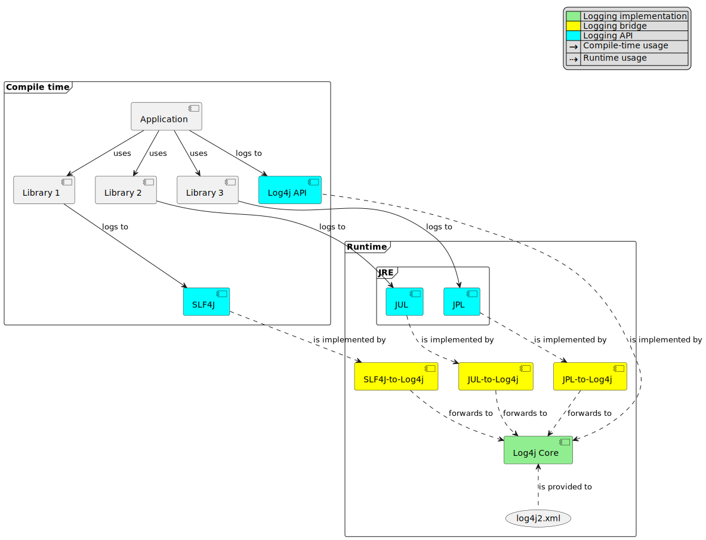

Figure 1. Visualization of a typical Log4j Core installation with SLF4J, JUL, and JPL bridges

<a id="installation--requirements"></a>

## Requirements

The Log4j 2 runtime requires a minimum of Java 8.
See [the Download page](https://logging.apache.org/log4j/2.x/download.html#older) for older releases supporting Java 6 and 7.

<a id="installation--build-tool"></a>
<a id="installation--configuring-the-build-tool"></a>

## Configuring the build tool

The easiest way to install Log4j is through a build tool such as Maven or Gradle.
The rest of the instructions in this page assume you use one of these.

<a id="installation--bom"></a>
<a id="installation--importing-the-bill-of-materials-aka.-bom"></a>

### Importing the Bill-of-Materials (aka. BOM)

To keep your Log4j module versions in sync with each other, a BOM (Bill of Material) file is provided for your convenience.
You can import the BOM in your build tool of preference:

- Maven
- Gradle

```xml
<dependencyManagement>
  <dependencies>
    <dependency>
      <groupId>org.apache.logging.log4j</groupId>
      <artifactId>log4j-bom</artifactId>
      <version>2.26.0</version>
      <scope>import</scope>
      <type>pom</type>
    </dependency>
  </dependencies>
</dependencyManagement>
```

```groovy
dependencies {
  implementation platform('org.apache.logging.log4j:log4j-bom:2.26.0')
}
```

Once you import the BOM, you don’t need to explicitly provide the versions of the Log4j artifacts managed by it.

In the rest of the explanations, we will assume that the Log4j BOM is imported.

<a id="installation--snapshots"></a>
<a id="installation--using-snapshots"></a>

### Using snapshots

<details>
<summary>Do you want to test the latest (<strong>unstable!</strong>) development version? Click here details.</summary>
<div>
<div>
<p>You can access the latest development snapshots by using the <code><a href="https://repository.apache.org/content/groups/snapshots/">https://repository.apache.org/content/groups/snapshots/</a></code> repository.</p>
</div>
<div>
<table>
<tr>
<td>
<i title="Warning"></i>
</td>
<td>
<div>
<p>Snapshots are published for development and testing purposes; <strong>they should not be used at production!</strong></p>
</div>
</td>
</tr>
</table>
</div>
<div id="_tabs_2">
<div>
<div>
<ul>
<li id="_tabs_2_maven">
<p>Maven</p>
</li>
<li id="_tabs_2_gradle">
<p>Gradle</p>
</li>
</ul>
</div>
<div id="_tabs_2_maven--panel">
<div>
<div>
<pre><code>&lt;repositories&gt;
  &lt;repository&gt;
    &lt;id&gt;apache.snapshots&lt;/id&gt;
    &lt;name&gt;Apache Snapshot Repository&lt;/name&gt;
    &lt;url&gt;https://repository.apache.org/snapshots&lt;/url&gt;
    &lt;releases&gt;
      &lt;enabled&gt;false&lt;/enabled&gt;
    &lt;/releases&gt;
  &lt;/repository&gt;
&lt;/repositories&gt;</code></pre>
</div>
</div>
</div>
<div id="_tabs_2_gradle--panel">
<div>
<div>
<pre><code>repositories {
  mavenCentral()
  maven { url 'https://repository.apache.org/snapshots' }
}</code></pre>
</div>
</div>
</div>
</div>
</div>
</div>
</details>

<a id="installation--api"></a>
<a id="installation--installing-log4j-api"></a>

## Installing Log4j API

The easiest way to install Log4j API is through a dependency management tool such as Maven or Gradle, by adding the following dependency:

- Maven
- Gradle

```xml
<dependency>
  <groupId>org.apache.logging.log4j</groupId>
  <artifactId>log4j-api</artifactId>
  <version>${log4j-api.version}</version>
</dependency>
```

```groovy
implementation 'org.apache.logging.log4j:log4j-api:${log4j-api.version}'
```

<a id="installation--impl"></a>
<a id="installation--installing-a-logging-implementation"></a>

## Installing a logging implementation

Log4j provides several modules to facilitate the deployment of different logging implementations:

[Simple Logger](#simple-logger)
:   This is a fallback implementation embedded into the Log4j API artifact.
    The usage of this implementation generates an error message unless you enable it explicitly.
    See [Installing Simple Logger](#installation--impl-simple) for more details.

`log4j-core`
:   The reference implementation.
    Log4 Core primarily accepts input from Log4j API.
    Refer to [Installing Log4j Core](#installation--impl-core) for the installation instructions.

`log4j-to-jul`
:   The bridge that translates Log4j API calls to [JUL (Java Logging)](https://docs.oracle.com/javase/8/docs/technotes/guides/logging/overview.html).
    See [Installing JUL](#installation--impl-jul) for the installation instructions.

`log4j-to-slf4j`
:   The bridge that translates Log4j API calls to [SLF4J](https://www.slf4j.org).
    Since currently only
    [Logback](https://logback.qos.ch) implements SLF4J natively, refer to [Installing Logback](#installation--impl-logback) for the installation instructions.

> [!IMPORTANT]
> To ensure that your code does not directly depend on a particular logging implementation, the logging backend should be put in the appropriate scope of your dependency manager:
>
> Software type
>
> Build tool
>
> Maven
>
> Gradle
>
> Application
>
> `runtime`
>
> `runtimeOnly`
>
> Library
>
> `test`
>
> `testRuntimeOnly`

<a id="installation--impl-simple"></a>
<a id="installation--installing-simple-logger"></a>

### Installing Simple Logger

The
[Simple Logger](#simple-logger)
implementation is embedded in the Log4j API and does not need any external dependency.
It is intended as a convenience for environments where either a fully-fledged logging implementation is missing, or cannot be included for other reasons.
The Log4j API will log an error to the
[Status Logger](#status-logger) to avoid its unintentional usages:

```
2024-10-03T11:53:34.281462230Z main ERROR Log4j API could not find a logging provider.
```

To remove the warning and confirm that you want to use Simple Logger, add a
[`log4j2.component.properties` file](#systemproperties--property-sources)
at the root of your class path with content:

```properties
# Activate Simple Logger implementation
log4j.provider = org.apache.logging.log4j.simple.internal.SimpleProvider
```

<a id="installation--impl-core"></a>
<a id="installation--installing-log4j-core"></a>

### Installing Log4j Core

Log4j Core is the reference logging implementation of the Log4j project.
It primarily accepts input from Log4j API.

> [!TIP]
> Do you have a Spring Boot application?
> You can directly skip to [Installing Log4j Core for Spring Boot applications](#installation--impl-core-spring-boot).

To install Log4j Core as your logging implementation, you need to add the following dependency to your application:

- Maven
- Gradle

```xml
<dependencies>

  <!-- Logging implementation (Log4j Core) -->
  <dependency>
      <groupId>org.apache.logging.log4j</groupId>
      <artifactId>log4j-core</artifactId>
      <scope>runtime</scope>
  </dependency>

  <!-- Logging bridges will follow... -->

</dependencies>
```

```groovy
runtimeOnly 'org.apache.logging.log4j:log4j-core'
// Logging bridges will follow...
```

<a id="installation--impl-core-bridges"></a>
<a id="installation--installing-bridges"></a>

#### Installing bridges

If either your application or one of its dependencies logs against a logging API that is different from Log4j API, you need to [bridge](#installation--logging-bridge) that API to Log4j API.

> [!TIP]
> **Do you need bridges?
> And if so, which ones?**
>
> - If you have any direct or transitive dependency on `org.slf4j:slf4j-api`, you need [the SLF4J-to-Log4j bridge](#installation--impl-core-bridge-slf4j).
> - If you have any direct or transitive dependency on `commons-logging:commons-logging`, you need [the JCL-to-Log4j bridge](#installation--impl-core-bridge-jcl).
> - If it is a standalone application (i.e., not running in a Java EE container), you will probably need [JUL-to-Log4j](#installation--impl-core-bridge-jul) and [JPL-to-Log4j](#installation--impl-core-bridge-jpl) bridges.

The following sections explain the installation of Log4j-provided bridges.

<a id="installation--impl-core-bridge-slf4j"></a>
<a id="installation--installing-slf4j-to-log4j-bridge"></a>

##### Installing SLF4J-to-Log4j bridge

You can translate [SLF4J](https://www.slf4j.org) calls to Log4j API using the `log4j-slf4j2-impl` artifact:

- Maven
- Gradle

We assume you use [`log4j-bom`](https://logging.apache.org/log4j/2.x/components.html#log4j-bom) for dependency management.

```xml
<dependency>
  <groupId>org.apache.logging.log4j</groupId>
  <artifactId>log4j-slf4j2-impl</artifactId>
  <scope>runtime</scope>
</dependency>
```

We assume you use [`log4j-bom`](https://logging.apache.org/log4j/2.x/components.html#log4j-bom) for dependency management.

```groovy
runtimeOnly 'org.apache.logging.log4j:log4j-slf4j2-impl'
```

<details>
<summary>Are you still using SLF4J 1.x?</summary>
<div>
<div>
<p>Add this example instead:</p>
</div>
<div id="_tabs_6">
<div>
<div>
<ul>
<li id="_tabs_6_maven">
<p>Maven</p>
</li>
<li id="_tabs_6_gradle">
<p>Gradle</p>
</li>
</ul>
</div>
<div id="_tabs_6_maven--panel">
<div>
<p>We assume you use <a href="https://logging.apache.org/log4j/2.x/components.html#log4j-bom"><code>log4j-bom</code></a> for dependency management.</p>
</div>
<div>
<div>
<pre><code>&lt;dependency&gt;
  &lt;groupId&gt;org.apache.logging.log4j&lt;/groupId&gt;
  &lt;artifactId&gt;log4j-slf4j-impl&lt;/artifactId&gt;
  &lt;scope&gt;runtime&lt;/scope&gt;
&lt;/dependency&gt;</code></pre>
</div>
</div>
</div>
<div id="_tabs_6_gradle--panel">
<div>
<p>We assume you use <a href="https://logging.apache.org/log4j/2.x/components.html#log4j-bom"><code>log4j-bom</code></a> for dependency management.</p>
</div>
<div>
<div>
<pre><code>runtimeOnly 'org.apache.logging.log4j:log4j-slf4j-impl'</code></pre>
</div>
</div>
</div>
</div>
</div>
</div>
</details>

<a id="installation--impl-core-bridge-jul"></a>
<a id="installation--installing-jul-to-log4j-bridge"></a>

##### Installing JUL-to-Log4j bridge

You can translate [JUL (Java Logging)](https://docs.oracle.com/javase/8/docs/technotes/guides/logging/overview.html) calls to Log4j API using the `log4j-jul` artifact:

- Maven
- Gradle

We assume you use [`log4j-bom`](https://logging.apache.org/log4j/2.x/components.html#log4j-bom) for dependency management.

```xml
<dependency>
  <groupId>org.apache.logging.log4j</groupId>
  <artifactId>log4j-jul</artifactId>
  <scope>runtime</scope>
</dependency>
```

We assume you use [`log4j-bom`](https://logging.apache.org/log4j/2.x/components.html#log4j-bom) for dependency management.

```groovy
runtimeOnly 'org.apache.logging.log4j:log4j-jul'
```

In order to activate the bridge from JUL to Log4j API, you also need to add:

```none
-Djava.util.logging.manager=org.apache.logging.log4j.jul.LogManager
```

to the JVM parameters in your application launcher.

The JUL-to-Log4j bridge supports additional configuration and installation methods.
See [JUL-to-Log4j bridge](https://logging.apache.org/log4j/2.x/log4j-jul.html) for more information.

<a id="installation--impl-core-bridge-jpl"></a>
<a id="installation--installing-jpl-to-log4j-bridge"></a>

##### Installing JPL-to-Log4j bridge

You can translate [JPL (Java Platform Logging)](https://openjdk.org/jeps/264) calls to Log4j API using the `log4j-jpl` artifact:

- Maven
- Gradle

We assume you use [`log4j-bom`](https://logging.apache.org/log4j/2.x/components.html#log4j-bom) for dependency management.

```xml
<dependency>
  <groupId>org.apache.logging.log4j</groupId>
  <artifactId>log4j-jpl</artifactId>
  <scope>runtime</scope>
</dependency>
```

We assume you use [`log4j-bom`](https://logging.apache.org/log4j/2.x/components.html#log4j-bom) for dependency management.

```groovy
runtimeOnly 'org.apache.logging.log4j:log4j-jpl'
```

<a id="installation--impl-core-bridge-jcl"></a>
<a id="installation--installing-jcl-to-log4j-bridge"></a>

##### Installing JCL-to-Log4j bridge

Since version `1.3.0` [Apache Commons Logging](https://commons.apache.org/proper/commons-logging/) natively supports Log4j API.

You can enforce the version of a transitive dependency using the dependency management mechanism appropriate to your build tool:

- Maven
- Gradle

Maven users should add an entry to the `<dependencyManagement>` section of their POM file:

```xml
<dependencyManagement>
  <dependency>
    <groupId>commons-logging</groupId>
    <artifactId>commons-logging</artifactId>
    <version>1.3.5</version>
  </dependency>
</dependencyManagement>
```

Gradle users should refer to the [Using a platform to control transitive versions](https://docs.gradle.org/current/userguide/platforms.html#sub:using-platform-to-control-transitive-deps) of the Gradle documentation.

<details>
<summary>Are you using Commons Logging 1.2.0 or earlier?</summary>
<div>
<div>
<p>You need to install the following dependency instead:</p>
</div>
<div id="_tabs_10">
<div>
<div>
<ul>
<li id="_tabs_10_maven">
<p>Maven</p>
</li>
<li id="_tabs_10_gradle">
<p>Gradle</p>
</li>
</ul>
</div>
<div id="_tabs_10_maven--panel">
<div>
<p>We assume you use <a href="https://logging.apache.org/log4j/2.x/components.html#log4j-bom"><code>log4j-bom</code></a> for dependency management.</p>
</div>
<div>
<div>
<pre><code>&lt;dependency&gt;
  &lt;groupId&gt;org.apache.logging.log4j&lt;/groupId&gt;
  &lt;artifactId&gt;log4j-jcl&lt;/artifactId&gt;
  &lt;scope&gt;runtime&lt;/scope&gt;
&lt;/dependency&gt;</code></pre>
</div>
</div>
</div>
<div id="_tabs_10_gradle--panel">
<div>
<p>We assume you use <a href="https://logging.apache.org/log4j/2.x/components.html#log4j-bom"><code>log4j-bom</code></a> for dependency management.</p>
</div>
<div>
<div>
<pre><code>runtimeOnly 'org.apache.logging.log4j:log4j-jcl'</code></pre>
</div>
</div>
</div>
</div>
</div>
</div>
</details>

<a id="installation--impl-core-bridge-jboss-logging"></a>
<a id="installation--installing-jboss-logging-to-log4j-bridge"></a>

##### Installing JBoss Logging-to-Log4j bridge

JBoss Logging is shipped with an integrated bridge to Log4j API and requires no steps on your part.
See [Supported Log Managers](https://github.com/jboss-logging/jboss-logging/blob/main/README.adoc#supported-log-managers) for more information.

<a id="installation--impl-core-spring-boot"></a>
<a id="installation--installing-log4j-core-for-spring-boot-applications"></a>

#### Installing Log4j Core for Spring Boot applications

Spring Boot users should replace the `spring-boot-starter-logging` dependency with `spring-boot-starter-log4j2`:

- Maven
- Gradle

```xml
<dependencies>

  <dependency>
    <groupId>org.springframework.boot</groupId>
    <artifactId>spring-boot-starter</artifactId>
    <exclusions>
      <exclusion>
        <groupId>org.springframework.boot</groupId>
        <artifactId>spring-boot-starter-logging</artifactId>
      </exclusion>
    </exclusions>
  </dependency>

  <dependency>
    <groupId>org.springframework.boot</groupId>
    <artifactId>spring-boot-starter-log4j2</artifactId>
    <scope>runtime</scope>
  </dependency>

</dependencies>
```

```groovy
configurations {
  all.exclude group: 'org.springframework.boot', module: 'spring-boot-starter-logging'
}

dependencies {
  runtimeOnly group: 'org.springframework.boot', module: 'spring-boot-starter-log4j2'
}
```

The `spring-boot-starter-log4j2` artifact will automatically install Log4j Core, [JUL-to-Log4j bridge](#installation--impl-core-bridge-jul), and configure them.
You don’t need to add any other dependency or configure JUL anymore.
See [Spring Boot Logging documentation](https://docs.spring.io/spring-boot/reference/features/logging.html) for further information.

<a id="installation--impl-core-graalvm"></a>
<a id="installation--installing-log4j-core-for-graalvm-applications"></a>

#### Installing Log4j Core for GraalVM applications

See
[Using Log4j Core](https://logging.apache.org/log4j/2.x/graalvm.html#impl-core)
in our GraalVM guide for more details on how to create GraalVM native applications that use Log4j Core.

<a id="installation--impl-core-config"></a>
<a id="installation--configuring-log4j-core"></a>

#### Configuring Log4j Core

As with any other logging implementation, Log4j Core needs to be properly configured.
Log4j Core supports many different configuration formats: JSON, XML, YAML, and Java properties.
To configure Log4j Core, see [Configuration file](#configuration).
A basic configuration can be obtained by adding one of these files to your application’s classpath:

- log4j2.xml
- log4j2.json
- log4j2.yaml
- log4j2.properties

```xml
<?xml version="1.0" encoding="UTF-8"?>
<Configuration xmlns="https://logging.apache.org/xml/ns"
               xmlns:xsi="http://www.w3.org/2001/XMLSchema-instance"
               xsi:schemaLocation="https://logging.apache.org/xml/ns
                                   https://logging.apache.org/xml/ns/log4j-config-2.xsd">
  <Appenders>
    <Console name="CONSOLE">
      <PatternLayout pattern="%d [%t] %5p %c{1.} - %m%n"/>(1)
    </Console>
  </Appenders>
  <Loggers>
    <Root level="INFO">
      <AppenderRef ref="CONSOLE"/>
    </Root>
  </Loggers>
</Configuration>
```

```json
{"Configuration": {"Appenders": {"Console": {"name": "CONSOLE","PatternLayout": {"pattern": "%d [%t] %5p %c{1.} - %m%n" (1)}} },"Loggers": {"Root": {"level": "INFO","AppenderRef": {"ref": "CONSOLE"}}}}}
```

```yaml
Configuration:
  Appenders:
    Console:
      name: CONSOLE
      PatternLayout:
        pattern: "%d [%t] %5p %c{1.} - %m%n" (1)
  Loggers:
    Root:
      level: INFO
      AppenderRef:
        ref: CONSOLE
```

```properties
appender.0.type = Console
appender.0.name = CONSOLE
appender.0.layout.type = PatternLayout (1)
appender.0.layout.pattern = %d [%t] %5p %c{1.} - %m%n
rootLogger.level = INFO
rootLogger.appenderRef.0.ref = CONSOLE
```

**1**

While [Pattern Layout](#pattern-layout) is a good first choice and preferable for tests, we recommend using a structured format such as [JSON Template Layout](#json-template-layout) for production deployments.

To use these formats, the following additional dependencies are required:

- log4j2.xml
- log4j2.json
- log4j2.yaml
- log4j2.properties

JPMS users need to add:

```java
module foo.bar {
    requires java.xml;
}
```

to their `module-info.java` descriptor.

- Maven
- Gradle

```xml
<dependency>
    <groupId>com.fasterxml.jackson.core</groupId>
    <artifactId>jackson-databind</artifactId>
    <version>2.19.2</version>
    <scope>runtime</scope>
</dependency>
```

```groovy
runtimeOnly 'com.fasterxml.jackson.core:jackson-databind:2.19.2'
```

- Maven
- Gradle

```xml
<dependency>
    <groupId>com.fasterxml.jackson.dataformat</groupId>
    <artifactId>jackson-dataformat-yaml</artifactId>
    <version>2.19.2</version>
    <scope>runtime</scope>
</dependency>
```

```groovy
runtimeOnly 'com.fasterxml.jackson.dataformat:jackson-dataformat-yaml:2.19.2'
```

No dependency required.

<a id="installation--impl-jul"></a>
<a id="installation--installing-jul"></a>

### Installing JUL

> [!TIP]
> Are you using [JBoss Log Manager](https://github.com/jboss-logging/jboss-logmanager) as your JUL implementation?
> You can skip this section and use the [`log4j2-jboss-logmanager`](https://github.com/jboss-logging/log4j2-jboss-logmanager) and [`slf4j-jboss-logmanager`](https://github.com/jboss-logging/slf4j-jboss-logmanager) bridges from the JBoss Logging project instead.

Java Platform contains a very simple logging API and its implementation called [JUL (Java Logging)](https://docs.oracle.com/javase/8/docs/technotes/guides/logging/overview.html).
Since it is embedded in the platform, it only requires the addition of bridges from Log4j API and SLF4J:

- Maven
- Gradle

```xml
<dependencies>

    <!-- Log4j-to-JUL bridge -->
  <dependency>
    <groupId>org.apache.logging.log4j</groupId>
    <artifactId>log4j-to-jul</artifactId>
    <scope>runtime</scope>
  </dependency>

  <!-- SLF4J-to-JUL bridge -->
  <dependency>
    <groupId>org.slf4j</groupId>
    <artifactId>slf4j-jdk14</artifactId>
    <version>2.0.17</version>
    <scope>runtime</scope>
  </dependency>

  <!-- ... -->

</dependencies>
```

```groovy
runtimeOnly 'org.apache.logging.log4j:log4j-to-jul' // Log4j-to-JUL bridge
runtimeOnly 'org.slf4j:slf4j-jdk14:2.0.17' // SLF4J-to-JUL bridge
```

See also:

- [`java.util.logging.LogManager`](https://docs.oracle.com/javase/8/docs/api/java/util/logging/LogManager.html), to learn more about JUL configuration,
- [Log4j-to-JUL bridge](https://logging.apache.org/log4j/2.x/log4j-to-jul.html) to learn more about the `log4j-to-jul` artifact.

<a id="installation--impl-jul-graalvm"></a>
<a id="installation--installing-jul-for-graalvm-applications"></a>

#### Installing JUL for GraalVM applications

See
[Using JUL](https://logging.apache.org/log4j/2.x/graalvm.html#impl-jul)
in our GraalVM guide for more details on how to create GraalVM native applications that use JUL.

<a id="installation--impl-logback"></a>
<a id="installation--installing-logback"></a>

### Installing Logback

To install [Logback](https://logback.qos.ch) as the logging implementation, you only need to add a Log4j-to-SLF4J bridge:

- Maven
- Gradle

```xml
<dependencies>

  <!-- Logging implementation (Logback) -->
  <dependency>
    <groupId>ch.qos.logback</groupId>
    <artifactId>logback-classic</artifactId>
    <version>{logback-version}</version>
    <scope>runtime</scope>
  </dependency>

  <!-- Log4j-to-SLF4J bridge -->
  <dependency>
    <groupId>org.apache.logging.log4j</groupId>
    <artifactId>log4j-to-slf4j</artifactId>
    <scope>runtime</scope>
  </dependency>

</dependencies>
```

```groovy
runtimeOnly 'ch.qos.logback:logback-classic:1.3.15'
runtimeOnly 'org.apache.logging.log4j:log4j-to-slf4j' // Log4j-to-SLF4J bridge
```

To configure Logback, see [Logback’s configuration documentation](https://logback.qos.ch/manual/configuration.html).

<a id="installation--impl-jul-logback"></a>
<a id="installation--installing-logback-for-graalvm-applications"></a>

#### Installing Logback for GraalVM applications

See
[Using Logback](https://logging.apache.org/log4j/2.x/graalvm.html#impl-logback)
in our GraalVM guide for more details on how to create GraalVM native applications that use Logback.

---

<a id="api"></a>

<!-- source_url: https://logging.apache.org/log4j/2.x/manual/api.html -->

<!-- page_index: 4 -->

<a id="api--log4j-api"></a>

# Log4j API

Log4j is essentially composed of a logging API called **Log4j API**, and its reference implementation called **Log4j Core**.

<details>
<summary>What is a logging API and a logging implementation?</summary>
<div>
<div id="logging-api">
<dl>
<dt>Logging API</dt>
<dd>
<p>A logging API is an interface your code or your dependencies directly logs against.
It is required at compile-time.
It is implementation agnostic to ensure that your application can write logs, but is not tied to a specific logging implementation.
Log4j API, <a href="https://www.slf4j.org">SLF4J</a>, <a href="https://docs.oracle.com/javase/8/docs/technotes/guides/logging/overview.html">JUL (Java Logging)</a>, <a href="https://commons.apache.org/proper/commons-logging/">JCL (Apache Commons Logging)</a>, <a href="https://openjdk.org/jeps/264">JPL (Java Platform Logging)</a> and <a href="https://github.com/jboss-logging/jboss-logging">JBoss Logging</a> are major logging APIs.</p>
</dd>
</dl>
</div>
<div id="logging-impl">
<dl>
<dt>Logging implementation</dt>
<dd>
<p>A logging implementation is only required at runtime and can be changed without the need to recompile your software.
Log4j Core, <a href="https://docs.oracle.com/javase/8/docs/technotes/guides/logging/overview.html">JUL (Java Logging)</a>, <a href="https://logback.qos.ch">Logback</a> are the most well-known logging implementations.</p>
</dd>
</dl>
</div>
</div>
</details>

> [!TIP]
> Are you looking for a crash course on how to use Log4j in your application or library?
> See [Getting started](#getting-started).
> You can also check out [Installation](#installation) for the complete installation instructions.

Log4j API provides

- A logging API that libraries and applications can code to
- [A minimal logging implementation (aka. Simple logger)](#api--simple-logger)
- Adapter components to create a logging implementation

This page tries to cover the most prominent Log4j API features.

> [!TIP]
> Did you know that Log4j provides a specialized API for Kotlin?
> Check out the [Log4j Kotlin](https://logging.apache.org/log4j/kotlin/index.html) project for details.

<a id="api--intro"></a>
<a id="api--introduction"></a>

## Introduction

To log, you need a [`Logger`](https://logging.apache.org/log4j/2.x/javadoc/log4j-api/org/apache/logging/log4j/Logger.html) instance which you will retrieve from the [`LogManager`](https://logging.apache.org/log4j/2.x/javadoc/log4j-api/org/apache/logging/log4j/LogManager.html).
These are all part of the `log4j-api` module, which you can install as follows:

- Maven
- Gradle

```xml
<dependency>
  <groupId>org.apache.logging.log4j</groupId>
  <artifactId>log4j-api</artifactId>
  <version>${log4j-api.version}</version>
</dependency>
```

```groovy
implementation 'org.apache.logging.log4j:log4j-api:${log4j-api.version}'
```

You can use the `Logger` instance to log by using methods like `info()`, `warn()`, `error()`, etc.
These methods are named after the *log levels* they represent, a way to categorize log events by severity.
The log message can also contain placeholders written as `{}` that will be replaced by the arguments passed to the method.

```java
import org.apache.logging.log4j.Logger; import org.apache.logging.log4j.LogManager;
public class DbTableService {
private static final Logger LOGGER = LogManager.getLogger(); (1)
public void truncateTable(String tableName) throws IOException {LOGGER.warn("truncating table `{}`", tableName); (2) db.truncate(tableName);}
}
```

**1**

The returned `Logger` instance is thread-safe and reusable.
Unless explicitly provided as an argument, `getLogger()` associates the returned `Logger` with the enclosing class, that is, `DbTableService` in this example.

**2**

The placeholder `{}` in the message will be replaced with the value of `tableName`

The *generated* **log event**, which contain the *user-provided* **log message** and **log level** (i.e., `WARN`), will be enriched with several other implicitly derived contextual information: timestamp, class & method name, line number, etc.

**What happens to the generated log event will vary significantly depending on the configuration used.**
It can be pretty-printed to the console, written to a file, or get totally ignored due to insufficient severity or some other filtering.

Log levels are used to categorize log events by severity and control the verbosity of the logs.
Log4j contains various predefined levels, but the most common are `DEBUG`, `INFO`, `WARN`, and `ERROR`.
With them, you can filter out less important logs and focus on the most critical ones.
Previously we used `Logger#warn()` to log a warning message, which could mean that something is not right, but the application can continue.
Log levels have a priority, and `WARN` is less severe than `ERROR`.

Exceptions are often also errors.
In this case, we might use the `ERROR` log level.
Make sure to log exceptions that have diagnostics value.
This is simply done by passing the exception as the last argument to the log method:

```java
LOGGER.warn("truncating table `{}`", tableName);
try {
    db.truncate(tableName);
} catch (IOException exception) {
    LOGGER.error("failed truncating table `{}`", tableName, exception); (1)
    throw new IOException("failed truncating table: " + tableName, exception);
}
```

**1**

By using `error()` instead of `warn()`, we signal that the operation failed.

While there is only one placeholder in the message, we pass two arguments: `tableName` and `exception`.
Log4j will attach the last extra argument of type `Throwable` in a separate field to the generated log event.

> [!IMPORTANT]
> **Click for an introduction to log event fields**
> **Log messages** are often used interchangeably with **log events**.
> While this simplification holds for several cases, it is not technically correct.
> A log event, capturing the logging context (level, logger name, instant, etc.) along with the log message, is generated by the logging implementation (e.g., Log4j Core) when a user issues a log using a [logger](#api--loggers), e.g., `LOGGER.info("Hello, world!")`.
> Hence, **log events are compound objects containing log messages**.
>
> <details>
> <div>
> <div>
> <p>Log events contain fields that can be classified into three categories:</p>
> </div>
> <div>
> <ol>
> <li>
> <p>Some fields are provided explicitly, in a <a href="https://logging.apache.org/log4j/2.x/javadoc/log4j-api/org/apache/logging/log4j/Logger.html"><code>Logger</code></a> method call.
> The most important are the log level and the log message, which is a description of what happened, and it is addressed to humans.</p>
> </li>
> <li>
> <p>Some fields are contextual (e.g., <a href="#thread-context">Thread Context</a>) and are either provided explicitly by developers of other parts of the application, or is injected by Java instrumentation.</p>
> </li>
> <li>
> <p>The last category of fields is those that are computed automatically by the logging implementation employed.</p>
> </li>
> </ol>
> </div>
> <div>
> <p>For clarity’s sake let us look at a log event formatted as JSON:</p>
> </div>
> <div>
> <div>
> <pre><code>{
>   <i></i><b>(1)</b>
>   "log.level": "INFO",
>   "message": "Unable to insert data into my_table.",
>   "error.type": "java.lang.RuntimeException",
>   "error.message": null,
>   "error.stack_trace": [
>     {
>       "class": "com.example.Main",
>       "method": "doQuery",
>       "file.name": "Main.java",
>       "file.line": 36
>     },
>     {
>       "class": "com.example.Main",
>       "method": "main",
>       "file.name": "Main.java",
>       "file.line": 25
>     }
>   ],
>   "marker": "SQL",
>   "log.logger": "com.example.Main",
>   <i></i><b>(2)</b>
>   "tags": [
>     "SQL query"
>   ],
>   "labels": {
>     "span_id": "3df85580-f001-4fb2-9e6e-3066ed6ddbb1",
>     "trace_id": "1b1f8fc9-1a0c-47b0-a06f-af3c1dd1edf9"
>   },
>   <i></i><b>(3)</b>
>   "@timestamp": "2024-05-23T09:32:24.163Z",
>   "log.origin.class": "com.example.Main",
>   "log.origin.method": "doQuery",
>   "log.origin.file.name": "Main.java",
>   "log.origin.file.line": 36,
>   "process.thread.id": 1,
>   "process.thread.name": "main",
>   "process.thread.priority": 5
> }</code></pre>
> </div>
> </div>
> <div>
> <table>
> <tr>
> <td><i></i><b>1</b></td>
> <td>Explicitly supplied fields:
> <div>
> <dl>
> <dt><code>log.level</code></dt>
> <dd>
> <p>The <a href="#customloglevels">level</a> of the event, either explicitly provided as an argument to the logger call, or implied by the name of the logger method</p>
> </dd>
> <dt><code>message</code></dt>
> <dd>
> <p>The <strong>log message</strong> that describes what happened</p>
> </dd>
> <dt><code>error.*</code></dt>
> <dd>
> <p>An <em>optional</em> <code>Throwable</code> explicitly passed as an argument to the logger call</p>
> </dd>
> <dt><code>marker</code></dt>
> <dd>
> <p>An <em>optional</em> <a href="#markers">marker</a> explicitly passed as an argument to the logger call</p>
> </dd>
> <dt><code>log.logger</code></dt>
> <dd>
> <p>The <a href="#api--logger-names">logger name</a> provided explicitly to <code>LogManager.getLogger()</code> or inferred by Log4j API</p>
> </dd>
> </dl>
> </div></td>
> </tr>
> <tr>
> <td><i></i><b>2</b></td>
> <td>Contextual fields:
> <div>
> <dl>
> <dt><code>tags</code></dt>
> <dd>
> <p>The <a href="#thread-context">Thread Context</a> stack</p>
> </dd>
> <dt><code>labels</code></dt>
> <dd>
> <p>The <a href="#thread-context">Thread Context</a> map</p>
> </dd>
> </dl>
> </div></td>
> </tr>
> <tr>
> <td><i></i><b>3</b></td>
> <td>Logging backend specific fields.
> In case you are using Log4j Core, the following fields can be automatically generated:
> <div>
> <dl>
> <dt><code>@timestamp</code></dt>
> <dd>
> <p>The instant of the logger call</p>
> </dd>
> <dt><code>log.origin.*</code></dt>
> <dd>
> <p>The <a href="#layouts--locationinformation">location</a> of the logger call in the source code</p>
> </dd>
> <dt><code>process.thread.*</code></dt>
> <dd>
> <p>The name of the Java thread, where the logger is called</p>
> </dd>
> </dl>
> </div></td>
> </tr>
> </table>
> </div>
> </div>
> </details>

<a id="api--best-practice"></a>
<a id="api--best-practices"></a>

## Best practices

There are several widespread bad practices while using Log4j API.
Let’s try to walk through the most common ones and see how to fix them.

<a id="api--best-practice-tostring"></a>
<a id="api--don-t-use-tostring"></a>

### Don’t use `toString()`

- Don’t use `Object#toString()` in arguments, it is redundant!


```java
/* BAD! */ LOGGER.info("userId: {}", userId.toString());
```

- Underlying message type and layout will deal with arguments:


```java
/* GOOD */ LOGGER.info("userId: {}", userId);
```

<a id="api--best-practice-exception"></a>
<a id="api--pass-exception-as-the-last-extra-argument"></a>

### Pass exception as the last extra argument

- Don’t call `Throwable#printStackTrace()`!
  This not only circumvents the logging but can also leak sensitive information!


```java
/* BAD! */ exception.printStackTrace();
```

- Don’t use `Throwable#getMessage()`!
  This prevents the log event from getting enriched with the exception.


```java
/* BAD! */ LOGGER.info("failed", exception.getMessage());
/* BAD! */ LOGGER.info("failed for user ID `{}`: {}", userId, exception.getMessage());
```

- Don’t provide both `Throwable#getMessage()` and `Throwable` itself!
  This bloats the log message with a duplicate exception message.


```java
/* BAD! */ LOGGER.info("failed for user ID `{}`: {}", userId, exception.getMessage(), exception);
```

- Pass exception as the last extra argument:


```java
/* GOOD */ LOGGER.error("failed", exception);
/* GOOD */ LOGGER.error("failed for user ID `{}`", userId, exception);
```

<a id="api--best-practice-concat"></a>
<a id="api--don-t-use-string-concatenation"></a>

### Don’t use string concatenation

If you are using `String` concatenation while logging, you are doing something very wrong and dangerous!

- Don’t use `String` concatenation to format arguments!
  This circumvents the handling of arguments by message type and layout.
  More importantly, **this approach is prone to attacks!**
  Imagine `userId` being provided by the user with the following content:
  `placeholders for non-existing args to trigger failure: {} {} {dangerousLookup}`


```java
/* BAD! */ LOGGER.info("failed for user ID: " + userId);
```

- Use message parameters


```java
/* GOOD */ LOGGER.info("failed for user ID `{}`", userId);
```

<a id="api--best-practice-supplier"></a>
<a id="api--use-supplier-s-to-pass-computationally-expensive-arguments"></a>

### Use `Supplier`s to pass computationally expensive arguments

If one or more arguments of the log statement are computationally expensive, it is not wise to evaluate them knowing that their results can be discarded.
Consider the following example:

```java
/* BAD! */ LOGGER.info("failed for user ID `{}` and role `{}`", userId, db.findUserRoleById(userId));
```

The database query (i.e., `db.findUserNameById(userId)`) can be a significant bottleneck if the created the log event will be discarded anyway – maybe the `INFO` level is not accepted for this logger, or due to some other filtering.

- The old-school way of solving this problem is to level-guard the log statement:


```java
/* OKAY */ if (LOGGER.isInfoEnabled()) { LOGGER.info(...); }
```

  While this would work for cases where the message can be dropped due to insufficient level, this approach is still prone to other filtering cases; e.g., maybe the associated [marker](#markers) is not accepted.
- Use `Supplier`s to pass arguments containing computationally expensive items:


```java
/* GOOD */ LOGGER.info("failed for user ID `{}` and role `{}`", () -> userId, () -> db.findUserRoleById(userId));
```

- Use a `Supplier` to pass the message and its arguments containing computationally expensive items:


```java
/* GOOD */ LOGGER.info(() -> new ParameterizedMessage("failed for user ID `{}` and role `{}`", userId, db.findUserRoleById(userId)));
```

<a id="api--loggers"></a>

## Loggers

[`Logger`](https://logging.apache.org/log4j/2.x/javadoc/log4j-api/org/apache/logging/log4j/Logger.html)s are the primary entry point for logging.
In this section we will introduce you to further details about `Logger`s.

> [!TIP]
> Refer to [Architecture](#architecture) to see where `Logger`s stand in the big picture.

<a id="api--logger-names"></a>

### Logger names

Most logging implementations use a hierarchical scheme for matching logger names with logging configuration.
In this scheme, the logger name hierarchy is represented by `.` (dot) characters in the logger name, in a fashion very similar to the hierarchy used for Java package names.
For example, `org.apache.logging.appender` and `org.apache.logging.filter` both have `org.apache.logging` as their parent.

In most cases, applications name their loggers by passing the current class’s name to `LogManager.getLogger(…)`.
Because this usage is so common, Log4j provides that as the default when the logger name parameter is either omitted or is null.
For example, all `Logger`-typed variables below will have a name of `com.example.LoggerNameTest`:

```java
public class LoggerNameTest {

    Logger logger1 = LogManager.getLogger(LoggerNameTest.class);

    Logger logger2 = LogManager.getLogger(LoggerNameTest.class.getName());

    Logger logger3 = LogManager.getLogger();
}
```

> [!TIP]
> **We suggest you to use `LogManager.getLogger()` without any arguments** since it delivers the same functionality with less characters and is not prone to copy-paste errors.

<a id="api--logger-message-factories"></a>

### Logger message factories

Loggers translate

```java
LOGGER.info("Hello, {}!", name);
```

calls to the appropriate canonical logging method:

```java
LOGGER.log(Level.INFO, messageFactory.createMessage("Hello, {}!", new Object[] {name}));
```

Note that how `Hello, {}!` should be encoded given the `{name}` array as argument completely depends on the [`MessageFactory`](https://logging.apache.org/log4j/2.x/javadoc/log4j-api/org/apache/logging/log4j/message/MessageFactory.html) employed.
Log4j allows users to customize this behaviour in several `getLogger()` methods of [`LogManager`](https://logging.apache.org/log4j/2.x/javadoc/log4j-api/org/apache/logging/log4j/LogManager.html):

```java
LogManager.getLogger() (1)
        .info("Hello, {}!", name); (2)

LogManager.getLogger(StringFormatterMessageFactory.INSTANCE) (3)
        .info("Hello, %s!", name); (4)
```

| **1** | Create a logger using the default message factory |
| --- | --- |
| **2** | Use default parameter placeholders, that is, `{}` style |
| **3** | Explicitly provide the message factory, that is, [`StringFormatterMessageFactory`](https://logging.apache.org/log4j/2.x/javadoc/log4j-api/org/apache/logging/log4j/message/StringFormatterMessageFactory.html). Note that there are several other `getLogger()` methods accepting a `MessageFactory`. |
| **4** | Note the placeholder change from `{}` to `%s`! Passed `Hello, %s!` and `name` arguments will be implicitly translated to a `String.format("Hello, %s!", name)` call due to the employed `StringFormatterMessageFactory`. |

Log4j bundles several [predefined message factories](#messages).
Some common ones are accessible through convenient factory methods, which we will cover below.

<a id="api--formatter-logger"></a>

### Formatter logger

The `Logger` instance returned by default replaces the occurrences of `{}` placeholders with the `toString()` output of the associated parameter.
If you need more control over how the parameters are formatted, you can also use the [`java.util.Formatter`](https://docs.oracle.com/javase/8/docs/api/java/util/Formatter.html#syntax) format strings by obtaining your `Logger` using [`LogManager#getFormatterLogger()`](https://logging.apache.org/log4j/2.x/javadoc/log4j-api/org/apache/logging/log4j/LogManager.html#getFormatterLogger(java.lang.Class)):

```java
Logger logger = LogManager.getFormatterLogger();
logger.debug("Logging in user %s with birthday %s", user.getName(), user.getBirthdayCalendar());
logger.debug(
        "Logging in user %1$s with birthday %2$tm %2$te,%2$tY", user.getName(), user.getBirthdayCalendar());
logger.debug("Integer.MAX_VALUE = %,d", Integer.MAX_VALUE);
logger.debug("Long.MAX_VALUE = %,d", Long.MAX_VALUE);
```

Loggers returned by `getFormatterLogger()` are referred as **formatter loggers**.

<a id="api--printf"></a>
<a id="api--printf-method"></a>

#### `printf()` method

Formatter loggers give fine-grained control over the output format, but have the drawback that the correct type must be specified.
For example, passing anything other than a decimal integer for a `%d` format parameter gives an exception.
If your main usage is to use `{}`-style parameters, but occasionally you need fine-grained control over the output format, you can use the `Logger#printf()` method:

```java
Logger logger = LogManager.getLogger("Foo");
logger.debug("Opening connection to {}...", someDataSource);
logger.printf(Level.INFO, "Hello, %s!", userName);
```

<a id="api--formatter-perf"></a>
<a id="api--formatter-performance"></a>

#### Formatter performance

Keep in mind that, contrary to the formatter logger, the default Log4j logger (i.e., `{}`-style parameters) is heavily optimized for several use cases and can operate [garbage-free](#garbagefree) when configured correctly.
You might reconsider your formatter logger usages for latency sensitive applications.

<a id="api--event-logger"></a>

### Event logger

[`EventLogger`](https://logging.apache.org/log4j/2.x/javadoc/log4j-api/org/apache/logging/log4j/EventLogger.html) is a convenience to log [`StructuredDataMessage`](#messages--structureddatamessage)s, which format their content in a way compliant with [the Syslog message format described in RFC 5424](https://datatracker.ietf.org/doc/html/rfc5424#section-6).

> [!WARNING]
> **Event Logger is deprecated for removal!**
> We advise users to switch to plain `Logger` instead.

[Read more on event loggers…](#eventlogging)

<a id="api--simple-logger"></a>

### Simple logger

Even though Log4j Core is the reference implementation of Log4j API, Log4j API itself also provides a very minimalist implementation: *Simple Logger*.
This is a convenience for environments where either a fully-fledged logging implementation is missing, or cannot be included for other reasons.
`SimpleLogger` is the fallback Log4j API implementation if no other is available in the classpath.

[Read more on the simple logger…](#simple-logger)

<a id="api--status-logger"></a>

### Status logger

*Status Logger* is a standalone, self-sufficient `Logger` implementation to record events that occur in the logging system (i.e., Log4j) itself.
It is the logging system used by Log4j for reporting status of its internals.
Users can use the status logger to either emit logs in their custom Log4j components, or troubleshoot a Log4j configuration.

[Read more on the status logger…](#status-logger)

<a id="api--fluent-api"></a>

## Fluent API

The fluent API allows you to log using a fluent interface:

```java
LOGGER.atInfo()
        .withMarker(marker)
        .withLocation()
        .withThrowable(exception)
        .log("Login for user `{}` failed", userId);
```

[Read more on the Fluent API…](#logbuilder)

<a id="api--fish-tagging"></a>

## Fish tagging

Just as a fish can be tagged and have its movement tracked (aka. *fish tagging* [[1](#api--_footnotedef_1 "View footnote.")]), stamping log events with a common tag or set of data elements allows the complete flow of a transaction or a request to be tracked.
You can use them for several purposes, such as:

- Provide extra information while serializing the log event
- Allow filtering of information so that it does not overwhelm the system or the individuals who need to make use of it

Log4j provides fish tagging in several flavors:

<a id="api--levels"></a>

### Levels

Log levels are used to categorize log events by severity.
Log4j contains predefined levels, of which the most common are `DEBUG`, `INFO`, `WARN`, and `ERROR`.
Log4j also allows you to introduce your own custom levels too.

[Read more on custom levels…](#customloglevels)

<a id="api--markers"></a>

### Markers

Markers are programmatic labels developers can associate to log statements:

```java
public class MyApp {
private static final Logger LOGGER = LogManager.getLogger();
private static final Marker ACCOUNT_MARKER = MarkerManager.getMarker("ACCOUNT");
public void removeUser(String userId) {logger.debug(ACCOUNT_MARKER, "Removing user with ID `{}`", userId); // ...}}
```

[Read more on markers…](#markers)

<a id="api--thread-context"></a>

### Thread Context

Just like [Java’s `ThreadLocal`](https://docs.oracle.com/javase/8/docs/api/java/lang/ThreadLocal.html), *Thread Context* facilitates associating information with the executing thread and making this information accessible to the rest of the logging system.
Thread Context offers both

- map-structured – referred to as *Thread Context Map* or *Mapped Diagnostic Context (MDC)*
- stack-structured – referred to as *Thread Context Stack* or *Nested Diagnostic Context (NDC)*

storage:

```java
ThreadContext.put("ipAddress", request.getRemoteAddr()); (1)
ThreadContext.put("hostName", request.getServerName()); (1)
ThreadContext.put("loginId", session.getAttribute("loginId")); (1)

void performWork() {
    ThreadContext.push("performWork()"); (2)

    LOGGER.debug("Performing work"); (3)
    // Perform the work

    ThreadContext.pop(); (4)
}

ThreadContext.clear(); (5)
```

| **1** | Adding properties to the thread context map |
| --- | --- |
| **2** | Pushing properties to the thread context stack |
| **3** | Added properties can later on be used to, for instance, filter the log event, provide extra information in the layout, etc. |
| **4** | Popping the last pushed property from the thread context stack |
| **5** | Clearing the thread context (for both stack and map!) |

[Read more on Thread Context](#thread-context)…

<a id="api--messages"></a>

## Messages

Whereas almost every other logging API and implementation accepts only `String`-typed input as message, Log4j generalizes this concept with a `Message` contract.
Customizability of the message type enables users to **have complete control over how a message is encoded** by Log4j.
This liberal approach allows applications to choose the message type best fitting to their logging needs; they can log plain `String`s, or custom `PurchaseOrder` objects.

Log4j provides several predefined message types to cater for common use cases:

- Simple `String`-typed messages:


```java
LOGGER.info("foo");
LOGGER.info(new SimpleMessage("foo"));
```

- `String`-typed parameterized messages:


```java
LOGGER.info("foo {} {}", "bar", "baz");
LOGGER.info(new ParameterizedMessage("foo {} {}", new Object[] {"bar", "baz"}));
```

- `Map`-typed messages:


```java
LOGGER.info(new StringMapMessage().with("key1", "val1").with("key2", "val2"));
```

[Read more on messages…](#messages)

<a id="api--flow-tracing"></a>

## Flow tracing

The `Logger` class provides `traceEntry()`, `traceExit()`, `catching()`, `throwing()` methods that are quite useful for following the execution path of applications.
These methods generate log events that can be filtered separately from other debug logging.

[Read more on flow tracing…](#flowtracing)

---

[1](#api--_footnoteref_1). Fish tagging is first described by Neil Harrison in the *"Patterns for Logging Diagnostic Messages"* chapter of [*"Pattern Languages of Program Design 3"* edited by R. Martin, D. Riehle, and F. Buschmann in 1997](https://dl.acm.org/doi/10.5555/273448).

---

<a id="eventlogging"></a>

<!-- source_url: https://logging.apache.org/log4j/2.x/manual/eventlogging.html -->

<!-- page_index: 5 -->

# Event Logger

[Edit this Page](https://github.com/apache/logging-log4j2/edit/2.x/src/site/antora/modules/ROOT/pages/manual/eventlogging.adoc)

<a id="eventlogging--event-logger"></a>

# Event Logger

[`EventLogger`](https://logging.apache.org/log4j/2.x/javadoc/log4j-api/org/apache/logging/log4j/EventLogger.html) is a convenience to log [`StructuredDataMessage`](#messages--structureddatamessage)s, which format their content in a way compliant with [the Syslog message format described in RFC 5424](https://datatracker.ietf.org/doc/html/rfc5424#section-6).
Historically, `EventLogger` was added to help users migrate from SLF4J `EventLogger`, which was removed in [SLF4J version `1.7.26`](https://www.slf4j.org/news.html#1.7.26).

> [!WARNING]
> **Event Logger is deprecated for removal!**
> We advise users to switch to plain `Logger` instead.
> Refer to [Log4j API](#api) on how to use `Logger`.

Compared to using [a plain `Logger`](https://logging.apache.org/log4j/2.x/javadoc/log4j-api/org/apache/logging/log4j/Logger.html), `EventLogger`

- attaches an `EVENT` [marker](#markers), and
- sets the [level](#customloglevels) to `OFF`, unless one is explicitly provided.

That is, following `EventLogger` usages:

```java
EventLogger.logEvent(new StructuredDataMessage(...));
EventLogger.logEvent(new StructuredDataMessage(...), Level.INFO);
```

are equivalent to the following plain `Logger` usages:

```java
private static final Marker EVENT_MARKER = MarkerManager.getMarker("EVENT");
private static final Logger LOGGER = LogManager.getLogger();

LOGGER.log(Level.OFF, EVENT_MARKER, new StructuredDataMessage(...));
LOGGER.info(EVENT_MARKER, new StructuredDataMessage(...));
```

---

<a id="simple-logger"></a>

<!-- source_url: https://logging.apache.org/log4j/2.x/manual/simple-logger.html -->

<!-- page_index: 6 -->

# Simple Logger

[Edit this Page](https://github.com/apache/logging-log4j2/edit/2.x/src/site/antora/modules/ROOT/pages/manual/simple-logger.adoc)

<a id="simple-logger--simple-logger"></a>

# Simple Logger

Even though Log4j Core is the reference implementation of [Log4j API](#api), Log4j API itself also provides a very minimalist implementation: [`SimpleLogger`](https://logging.apache.org/log4j/2.x/javadoc/log4j-api/org/apache/logging/log4j/simple/SimpleLogger.html).
This is a convenience for environments where either a fully-fledged logging implementation is missing, or cannot be included for other reasons.
`SimpleLogger` is the default Log4j API implementation if no other is available in the classpath.

<a id="simple-logger--config"></a>
<a id="simple-logger--configuration"></a>

## Configuration

<a id="simple-logger--logger"></a>

### Logger

`SimpleLogger` can be configured using the following system properties:

<a id="simple-logger--log4j2.simpleloglevel"></a>

#### `log4j2.simplelogLevel`

| Env. variable | `LOG4J_SIMPLELOG_LEVEL` |
| --- | --- |
| Type | [`Level`](https://logging.apache.org/log4j/2.x/javadoc/log4j-api/org/apache/logging/log4j/Level.html) |
| Default value | `ERROR` |

Default level for new logger instances.

<a id="simple-logger--log4j2.simplelog.loggername.level"></a>
<a id="simple-logger--log4j2.simplelog.-loggername-.level"></a>

#### `log4j2.simplelog.<loggerName>.level`

| Env. variable | `LOG4J_SIMPLELOG_<loggerName>_LEVEL` |
| --- | --- |
| Type | [`Level`](https://logging.apache.org/log4j/2.x/javadoc/log4j-api/org/apache/logging/log4j/Level.html) |
| Default value | value of [`log4j2.simplelogLevel`](#simple-logger--log4j2.simpleloglevel) |

Log level for a logger instance named `<loggerName>`.

<a id="simple-logger--log4j2.simplelogshowcontextmap"></a>

#### `log4j2.simplelogShowContextMap`

| Env. variable | `LOG4J_SIMPLELOG_SHOW_CONTEXT_MAP` |
| --- | --- |
| Type | `boolean` |
| Default value | `false` |

If `true`, the full thread context map is included in each log message.

<a id="simple-logger--log4j2.simplelogshowlogname"></a>

#### `log4j2.simplelogShowlogname`

| Env. variable | `LOG4J_SIMPLELOG_SHOWLOGNAME` |
| --- | --- |
| Type | `boolean` |
| Default value | `false` |

If `true`, the logger name is included in each log message.

<a id="simple-logger--log4j2.simplelogshowshortlogname"></a>

#### `log4j2.simplelogShowShortLogname`

| Env. variable | `LOG4J_SIMPLELOG_SHOW_SHORT_LOGNAME` |
| --- | --- |
| Type | `boolean` |
| Default value | `true` |

If `true`, only the last component of a logger name is included in each log message.

<a id="simple-logger--log4j2.simplelogshowdatetime"></a>

#### `log4j2.simplelogShowdatetime`

| Env. variable | `LOG4J_SIMPLELOG_SHOWDATETIME` |
| --- | --- |
| Type | `boolean` |
| Default value | `false` |

If `true`, a timestamp is included in each log message.

<a id="simple-logger--log4j2.simplelogdatetimeformat"></a>

#### `log4j2.simplelogDateTimeFormat`

| Env. variable | `LOG4J_SIMPLELOG_DATE_TIME_FORMAT` |
| --- | --- |
| Type | [`SimpleDateFormat`](https://docs.oracle.com/javase/8/docs/api/java/text/SimpleDateFormat.html) pattern |
| Default value | `yyyy/MM/dd HH:mm:ss:SSS zzz` |

Date-time format to use.
Ignored if [`log4j2.simplelogShowdatetime`](#simple-logger--log4j2.simplelogshowdatetime) is `false`.

<a id="simple-logger--log4j2.simpleloglogfile"></a>

#### `log4j2.simplelogLogFile`

| Env. variable | `LOG4J_SIMPLELOG_LOG_FILE` |
| --- | --- |
| Type | [`Path`](https://docs.oracle.com/javase/8/docs/api/java/nio/file/Path.html) or predefined constant |
| Default value | `System.err` |

Specifies the output stream used by all loggers.

Its value can be the path to a log file or one of these constants:

System.err
:   logs to the standard error output stream,

System.out
:   logs to the standard output stream,

<a id="simple-logger--thread-context"></a>

### Thread context

For the configuration of the thread context, Simple Logger supports a subset of the properties supported by Log4j Core:

<a id="simple-logger--log4j2.disablethreadcontext"></a>

#### `log4j2.disableThreadContext`

| Env. variable | `LOG4J_DISABLE_THREAD_CONTEXT` |
| --- | --- |
| Type | `boolean` |
| Default value | `false` |

If `true`, the `ThreadContext` stack and map are disabled.

<a id="simple-logger--log4j2.disablethreadcontextstack"></a>

#### `log4j2.disableThreadContextStack`

| Env. variable | `LOG4J_DISABLE_THREAD_CONTEXT_STACK` |
| --- | --- |
| Type | `boolean` |
| Default value | `false` |

If `true`, the `ThreadContext` stack is disabled.

<a id="simple-logger--log4j2.disablethreadcontextmap"></a>

#### `log4j2.disableThreadContextMap`

| Env. variable | `LOG4J_DISABLE_THREAD_CONTEXT_MAP` |
| --- | --- |
| Type | `boolean` |
| Default value | `false` |

If `true`, the `ThreadContext` map is disabled.

<a id="simple-logger--log4j2.threadcontextmap"></a>

#### `log4j2.threadContextMap`

| Env. variable | `LOG4J_THREAD_CONTEXT_MAP` |
| --- | --- |
| Type | [`Class<? extends ThreadContextMap>`](https://logging.apache.org/log4j/2.x/javadoc/log4j-api/org/apache/logging/log4j/spi/ThreadContextMap.html) |
| Default value | [`DefaultThreadContextMap`](https://logging.apache.org/log4j/2.x/javadoc/log4j-api/org/apache/logging/log4j/spi/DefaultThreadContextMap.html) |

Fully specified class name of a custom
[`ThreadContextMap`](https://logging.apache.org/log4j/2.x/javadoc/log4j-api/org/apache/logging/log4j/spi/ThreadContextMap.html)
implementation class.

<a id="simple-logger--isthreadcontextmapinheritable"></a>
<a id="simple-logger--log4j2.isthreadcontextmapinheritable"></a>

#### `log4j2.isThreadContextMapInheritable`

| Env. variable | `LOG4J_IS_THREAD_CONTEXT_MAP_INHERITABLE` |
| --- | --- |
| Type | `boolean` |
| Default value | `false` |

If `true` uses an `InheritableThreadLocal` to copy the thread context map to newly created threads.

Note that, as explained in
[Java’s `Executors#privilegedThreadFactory()`](https://docs.oracle.com/javase/8/docs/api/java/util/concurrent/Executors.html#privilegedThreadFactory()), when you are dealing with *privileged threads*, thread context might not get propagated completely.

---

<a id="status-logger"></a>

<!-- source_url: https://logging.apache.org/log4j/2.x/manual/status-logger.html -->

<!-- page_index: 7 -->

# Status Logger

[Edit this Page](https://github.com/apache/logging-log4j2/edit/2.x/src/site/antora/modules/ROOT/pages/manual/status-logger.adoc)

<a id="status-logger--status-logger"></a>

# Status Logger

[`StatusLogger`](https://logging.apache.org/log4j/2.x/javadoc/log4j-api/org/apache/logging/log4j/status/StatusLogger.html) is a standalone, self-sufficient `Logger` implementation to record events that occur in the logging system (i.e., Log4j) itself.
It is the logging system used by Log4j for reporting status of its internals.

<a id="status-logger--usage"></a>

## Usage

You can use the status logger for several purposes:

Troubleshooting
:   When Log4j is not behaving in the way you expect it to, you can increase the verbosity of status logger messages emitted using [the `log4j2.debug` system property](#status-logger--log4j2.debug) for troubleshooting.
    See [Configuration](#status-logger--config) for details.

Reporting internal status
:   If you have custom Log4j components (layouts, appenders, etc.), you cannot use Log4j API itself for logging, since this will result in a chicken and egg problem.
    This is where `StatusLogger` comes into play:


```java
private class CustomLog4jComponent {
private static final Logger LOGGER = StatusLogger.getInstance();
void doSomething(String input) {LOGGER.trace("doing something with input: `{}`", input);}
}
```

Listening internal status
:   You can configure where the status logger messages are delivered to.
    See [Listeners](#status-logger--listeners).

<a id="status-logger--config"></a>
<a id="status-logger--configuration"></a>

## Configuration

`StatusLogger` can be configured in following ways:

1. Passing system properties to the Java process (e.g., [`-Dlog4j2.statusLoggerLevel=INFO`](#status-logger--log4j2.statusloggerlevel)}


> [!WARNING]
> Due to several complexities involved, **you are strongly advised to [configure the status logger only using system properties](#status-logger--properties)!**

2. Providing properties in a `"log4j2.StatusLogger.properties"` file in the classpath
3. Using Log4j configuration (i.e., `<Configuration status="WARN" dest="out">` in a `log4j2.xml` in the classpath)


> [!WARNING]
> Since version `2.24.0`, `status` attribute in the `Configuration` element is deprecated and should be
> replaced with the [`log4j2.statusLoggerLevel`](#status-logger--log4j2.statusloggerlevel) configuration property.

4. Programmatically (e.g., `StatusLogger.getLogger().setLevel(Level.WARN)`)

It is crucial to understand that there is a time between the first `StatusLogger` access and a configuration file (e.g., `log4j2.xml`) read.
Consider the following example:

1. The default level (of fallback listener) is `ERROR`
2. You have `<Configuration status="WARN">` in your `log4j2.xml`
3. Until your `log4j2.xml` configuration is read, the effective level will be `ERROR`
4. Once your `log4j2.xml` configuration is read, the effective level will be `WARN` as you configured

Hence, unless you use either system properties or `"log4j2.StatusLogger.properties"` file in the classpath, there is a time window that only the defaults will be effective.

`StatusLogger` is designed as a singleton class accessed statically.
If you are running an application containing multiple Log4j configurations (e.g., in a servlet environment with multiple containers), and you happen to have differing `StatusLogger` configurations (e.g, one `log4j2.xml` containing `<Configuration status="ERROR">` while the other `<Configuration status="INFO">`), the last loaded configuration will be the effective one.

<a id="status-logger--properties"></a>

### Properties

`StatusLogger` can be configured using the following system properties:

<a id="status-logger--log4j2.debug"></a>

#### `log4j2.debug`

| Env. variable | `LOG4J_DEBUG` |
| --- | --- |
| Type | `boolean` |
| Default value | `false` |

If set to a value different from `false`, sets the level of the status logger to `TRACE` overriding any other system property.

<a id="status-logger--log4j2.statusentries"></a>

#### `log4j2.statusEntries`

| Env. variable | `LOG4J_STATUS_ENTRIES` |
| --- | --- |
| Type | `int` |
| Default value | `0` |

Specifies the number of status logger entries to cache.
Once the limit is reached newer entries will overwrite the oldest ones.

<a id="status-logger--log4j2.statusloggerlevel"></a>

#### `log4j2.statusLoggerLevel`

| Env. variable | `LOG4J_STATUS_LOGGER_LEVEL` |
| --- | --- |
| Type | [`Level`](https://logging.apache.org/log4j/2.x/javadoc/log4j-api/org/apache/logging/log4j/Level.html) |
| Default value | `ERROR` |

Specifies the level of the status logger.
Can be overridden by [`log4j2.debug`](#status-logger--log4j2.debug).

<a id="status-logger--log4j2.statusloggerdateformat"></a>

#### `log4j2.statusLoggerDateFormat`

| Env. variable | `LOG4J_STATUS_LOGGER_DATE_FORMAT` |
| --- | --- |
| Type | [`DateTimeFormatter`](https://docs.oracle.com/javase/8/docs/api/java/time/format/DateTimeFormatter.html) pattern |
| Default value | [`DateTimeFormatter.ISO_INSTANT`](https://docs.oracle.com/javase/8/docs/api/java/time/format/DateTimeFormatter.html#ISO_INSTANT) |

Sets the [`DateTimeFormatter`](https://docs.oracle.com/javase/8/docs/api/java/time/format/DateTimeFormatter.html) pattern used by status logger to format dates.

<a id="status-logger--log4j2.statusloggerdateformatzone"></a>

#### `log4j2.statusLoggerDateFormatZone`

| Env. variable | `LOG4J_STATUS_LOGGER_DATE_FORMAT_ZONE` |
| --- | --- |
| Type | [`ZoneId`](https://docs.oracle.com/javase/8/docs/api/java/time/ZoneId.html) |
| Default value | [`ZoneId.systemDefault()`](https://docs.oracle.com/javase/8/docs/api/java/time/ZoneId.html#systemDefault()) |

Sets the timezone id used by status logger.
See [`ZoneId`](https://docs.oracle.com/javase/8/docs/api/java/time/ZoneId.html) for the accepted formats.

<a id="status-logger--debug"></a>
<a id="status-logger--debug-mode"></a>

## Debug mode

When the `log4j2.debug` system property is present, any level-related filtering will be skipped and all events will be notified to listeners.
If no listeners are available, the fallback listener of type `StatusConsoleListener` will be used.

<a id="status-logger--listeners"></a>

## Listeners

Each recorded log event by `StatusLogger` will first get buffered and then used to notify the registered [`StatusListener`](https://logging.apache.org/log4j/2.x/javadoc/log4j-api/org/apache/logging/log4j/status/StatusListener.html)s.
If none are available, **the fallback listener** of type [`StatusConsoleListener`](https://logging.apache.org/log4j/2.x/javadoc/log4j-api/org/apache/logging/log4j/status/StatusConsoleListener.html) will be used.

You can programmatically register listeners using [the `StatusLogger#registerListener(StatusListener)` method](https://logging.apache.org/log4j/2.x/javadoc/log4j-api/org/apache/logging/log4j/status/StatusLogger.html#registerListener(org.apache.logging.log4j.status.StatusListener)).

---

<a id="logbuilder"></a>

<!-- source_url: https://logging.apache.org/log4j/2.x/manual/logbuilder.html -->

<!-- page_index: 8 -->

# Fluent API

[Edit this Page](https://github.com/apache/logging-log4j2/edit/2.x/src/site/antora/modules/ROOT/pages/manual/logbuilder.adoc)

<a id="logbuilder--fluent-api"></a>

# Fluent API

Next to the traditional `info()`, `error()`, etc. `Logger` methods, Log4j API also provides a [fluent interface](https://en.wikipedia.org/wiki/Fluent_interface) for logging.

<a id="logbuilder--rationale"></a>

## Rationale

Developers use Log4j traditionally with logging statements like:

```java
LOGGER.error("Unable to process request due to {}", errorCode, exception);
```

This style has certain drawbacks:

- It is confusing whether the last argument, `exception`, is a parameter of the message to be formatted, or is separately attached to the log event.
- One must know in which order `error()` arguments should be passed to specify, say, a [marker](#markers).

The fluent interface (also referred to as *the fluent API*) has been added to Log4j API to increase code legibility and avoid ambiguities.
For instance, the above `error()` call can be expressed using the fluent API as follows:

```java
LOGGER
    .atError() (1)
    .withThrowable(exception) (2)
    .log("Unable to process request due to {}", errorCode); (3)
```

| **1** | The log level is set to `ERROR` |
| --- | --- |
| **2** | The associated exception is attached |
| **3** | The log message is formatted with the `errorCode` parameter |

With this syntax, it is clear that the `exception` is part of the log event and `errorCode` is a parameter of the message.

<a id="logbuilder--usage"></a>

## Usage

The fluent API entry point is
[`LogBuilder`](https://logging.apache.org/log4j/2.x/javadoc/log4j-api/org/apache/logging/log4j/LogBuilder.html), which can be obtained by using one of the following `Logger` methods:

- `atTrace()`
- `atDebug()`
- `atInfo()`
- `atWarn()`
- `atError()`
- `atFatal()`
- `always()`
- `atLevel(Level)`

`LogBuilder` allows attaching a [marker](#markers), a `Throwable`, and a location to the log event by means of following methods:

- `withMarker()`
- `withThrowable()`
- `withLocation()`

After that, developers can call the `log()` method to finalize and send the log event.

In the following example, we log a parameterized message at `INFO` level, and attach a marker and an exception to the log event:

```java
LOGGER
    .atInfo() (1)
    .withMarker(marker) (2)
    .withThrowable(exception) (3)
    .log("Unable to process request due to {}", errorCode); (4)
```

| **1** | The log level is set to `INFO` |
| --- | --- |
| **2** | `marker` is attached to the log event |
| **3** | `exception` is attached to the log event |
| **4** | A message with `errorCode` parameter is provided and the statement is finalized |

<a id="logbuilder--location-information"></a>

## Location information

The fluent API allows users to instruct the location information to be **eagerly** populated in the log event using the `withLocation()` method:

```java
LOGGER
    .atInfo()
    .withLocation() (1)
    .log("Login for user with ID `{}` failed", userId);
```

**1**

Instructing to eagerly populate the location information

Capturing location information using `withLocation()` is orders of magnitude more efficient compared to letting the `Logger` to figure it out indirectly.

> [!WARNING]
> You are strongly advised to use `withLocation()` if you are certain that the populated location information will be used.
> Otherwise – that is, if the log event might either get dropped due to some filtering or its location information not get used – it will only slow things down.

---

<a id="customloglevels"></a>

<!-- source_url: https://logging.apache.org/log4j/2.x/manual/customloglevels.html -->

<!-- page_index: 9 -->

# Levels

[Edit this Page](https://github.com/apache/logging-log4j2/edit/2.x/src/site/antora/modules/ROOT/pages/manual/customloglevels.adoc)

<a id="customloglevels--levels"></a>

# Levels

Log levels are used to categorize log events by severity and control the verbosity of the logs.
They are one of many [*fish tagging* capabilities provided by Log4j API](#api--fish-tagging).
Using levels, you can filter out less important logs and focus on the most critical ones.

Log4j contains following predefined levels:

| Name | Priority |
| --- | --- |
| [`OFF`](https://logging.apache.org/log4j/2.x/javadoc/log4j-api/org/apache/logging/log4j/Level.html#OFF) [[see note]](#customloglevels--dont-use-in-code) | `0` |
| [`FATAL`](https://logging.apache.org/log4j/2.x/javadoc/log4j-api/org/apache/logging/log4j/Level.html#FATAL) | `100` |
| [`ERROR`](https://logging.apache.org/log4j/2.x/javadoc/log4j-api/org/apache/logging/log4j/Level.html#ERROR) | `200` |
| [`WARN`](https://logging.apache.org/log4j/2.x/javadoc/log4j-api/org/apache/logging/log4j/Level.html#WARN) | `300` |
| [`INFO`](https://logging.apache.org/log4j/2.x/javadoc/log4j-api/org/apache/logging/log4j/Level.html#INFO) | `400` |
| [`DEBUG`](https://logging.apache.org/log4j/2.x/javadoc/log4j-api/org/apache/logging/log4j/Level.html#DEBUG) | `500` |
| [`TRACE`](https://logging.apache.org/log4j/2.x/javadoc/log4j-api/org/apache/logging/log4j/Level.html#TRACE) | `600` |
| [`ALL`](https://logging.apache.org/log4j/2.x/javadoc/log4j-api/org/apache/logging/log4j/Level.html#ALL) [[see note]](#customloglevels--dont-use-in-code) | `Integer.MAX_VALUE` |

> [!IMPORTANT]
> The `OFF` and `ALL` levels are special: they should not be used to fish-tag log events.
>
> Log4j API implementations, such as Log4j Core, can use `OFF` in their configuration files to disable all log statements and `ALL` to enabled them all.

A level is composed of a case-sensitive name and a **priority** (of type `int`), which is used to define an order while comparing two.
Priority can be used in several contexts to express a filtering capability, for instance:

- `WARN` is *less severe* than `ERROR`
- `WARN` is *less specific* than `ERROR`

The entry point to log levels are through [`Level`](https://logging.apache.org/log4j/2.x/javadoc/log4j-api/org/apache/logging/log4j/Level.html).
Predefined levels are available for Log4j API integrators through [`StandardLevel`](https://logging.apache.org/log4j/2.x/javadoc/log4j-api/org/apache/logging/log4j/spi/StandardLevel.html).

<a id="customloglevels--usage"></a>

## Usage

To assign a level to a log event you can use one of the variants of the
[`Logger.log(..)`](https://logging.apache.org/log4j/2.x/javadoc/log4j-api/org/apache/logging/log4j/Logger.html#log(org.apache.logging.log4j.Level,org.apache.logging.log4j.Marker,org.apache.logging.log4j.message.Message))
and
[`Logger.atLevel(Level)`](https://logging.apache.org/log4j/2.x/javadoc/log4j-api/org/apache/logging/log4j/Logger.html#atLevel(org.apache.logging.log4j.Level))
methods:

```java
LOGGER.log(Level.INFO, "Hello {}!", username);
LOGGER.atLevel(Level.INFO).log("Hello {}!", username);
```

The `Logger` interface also contains shorthand methods that always log at a specified log level:

| Effective level | Shorthand methods |
| --- | --- |
| `FATAL` | `Logger.fatal(..), Logger.atFatal()` |
| `ERROR` | `Logger.error(..), Logger.atError()` |
| `WARN` | `Logger.warn(..), Logger.atWarn()` |
| `INFO` | `Logger.info(..), Logger.atInfo()` |
| `DEBUG` | `Logger.debug(..), Logger.atDebug()` |
| `TRACE` | `Logger.trace(..), Logger.atTrace()` |

By using shorthand methods, you can rewrite the example above as:

```java
LOGGER.info("Hello {}!", username);
LOGGER.atInfo().log("Hello {}!", username);
```

<a id="customloglevels--level-selection"></a>
<a id="customloglevels--which-level-to-use"></a>

### Which level to use?

> [!WARNING]
> While Log4j API defines a set of standard levels, it does not define the purpose of these levels.
> Many different conventions on which log levels to use coexist in the industry.
> When in doubt, you should ask your teammates about the convention used at your company.

Most log level usage conventions divide log levels into two categories:

- the most severe log levels (e.g. `FATAL`, `ERROR` and `WARN`) are used to inform the system administrator about a problem in the Java application that needs to be fixed.
  The more severe the problem, the more severe the log level.

  Log events with these levels should be used sparingly and should allow the system administrator to fix the problem.
- the less severe log levels (e.g. `INFO`, `DEBUG`, `TRACE`) provide context that allow a system administrator or developer to diagnose the reason of an application failure.
  The most severe of them describe events that concern the whole application, while the less severe describe events that are interesting for a single sub-system.

<a id="customloglevels--defininglevelsincode"></a>
<a id="customloglevels--custom-log-levels"></a>

### Custom log levels

While most Java logging APIs adopt the same set of standard logging levels, some logging APIs, such as [JUL](https://logging.apache.org/log4j/2.x/log4j-jul.html#default-level-conversions)
and external logging systems, such as
[Syslog](https://datatracker.ietf.org/doc/html/rfc5424#section-6.2.1)
and
[OpenTelemetry](https://opentelemetry.io/docs/specs/otel/logs/data-model/#displaying-severity)
support additional logging levels that can not be mapped to the standard ones.

To improve interoperability between logging systems, Log4j API supports custom log levels that can be defined using the
[`Level.forName()`](https://logging.apache.org/log4j/2.x/javadoc/log4j-api/org/apache/logging/log4j/Level.html#forName(java.lang.String,int))
method:

```java
// OpenTelemetry additional INFO levels
private static final Level INFO2 = Level.forName("INFO2", 375);
private static final Level INFO3 = Level.forName("INFO3", 350);
private static final Level INFO4 = Level.forName("INFO4", 325);
```

Custom log levels can be used in your code with the usual `Logger.log(..)` and `Logger.atLevel(Level)` methods:

```java
LOGGER.log(INFO2, "Hello {}!", username);
LOGGER.atLevel(INFO3).log("Hello {}!", username);
```

<a id="customloglevels--implementation-support"></a>

## Implementation support

All logging implementations support filtering of log events, based on their log level, but the number of available log levels varies between implementations.

> [!WARNING]
> While most logging implementations support [standard log levels](#customloglevels--standard-log-levels), custom log levels are only supported by Log4j Core (and the EOL Log4j 1).
> To ensure independence from a specific logging implementation you should restrict your log statements to **standard** log levels.
>
> If you use custom log levels as a fish-tagging technique, you can use alternative
> [fish-tagging features](#api--fish-tagging)
> such as
> [Markers](#markers), which are supported by multiple logging implementations.

<a id="customloglevels--defininglevelsinconfiguration"></a>
<a id="customloglevels--log4j-core"></a>

### Log4j Core

The Log4j Core implementation fully supports both standard and custom levels.
Similarly to the [Log4j API usage](#customloglevels--defininglevelsincode), custom levels must be defined in a configuration file before they can be used.
You can do it using
[`CustomLevel`](https://logging.apache.org/log4j/2.x/plugin-reference.html#org-apache-logging-log4j_log4j-core_org-apache-logging-log4j-core-config-CustomLevelConfig)
configuration elements:

- XML
- JSON
- YAML
- Properties

Snippet from an example [`log4j2.xml`](https://github.com/apache/logging-log4j2/tree/rel/2.25.3/src/site/antora/modules/ROOT/examples/manual/customloglevels/log4j2.xml)

```xml
<Appenders>
  <Console name="CONSOLE">
    <PatternLayout pattern="%d [%t] %p %c - %m%n"/>(1)
  </Console>
</Appenders>
<CustomLevels>(4)
  <CustomLevel name="INFO2" intLevel="375"/>
  <CustomLevel name="INFO3" intLevel="350"/>
  <CustomLevel name="INFO4" intLevel="325"/>
</CustomLevels>
<Loggers>
  <Logger name="com.example" level="DEBUG"/>(2)
  <Root level="INFO2">(5)
    <AppenderRef ref="CONSOLE" level="WARN"/>(3)
  </Root>
</Loggers>
```

Snippet from an example [`log4j2.json`](https://github.com/apache/logging-log4j2/tree/rel/2.25.3/src/site/antora/modules/ROOT/examples/manual/customloglevels/log4j2.json)

```xml
"Appenders": {"Console": {"name": "CONSOLE","PatternLayout": {"pattern": "%d [%t] %p %c - %m%n" (1)}} },"CustomLevels": { (4) "CustomLevel": [{"name": "INFO2","intLevel": 375 },{"name": "INFO3","intLevel": 350 },{"name": "INFO4","intLevel": 325}] },"Loggers": {"Logger": {"name": "com.example","level": "DEBUG" (2) },"Root": {"level": "INFO2", (5) "AppenderRef": {"ref": "CONSOLE","level": "WARN" (3)}}}
```

Snippet from an example [`log4j2.yaml`](https://github.com/apache/logging-log4j2/tree/rel/2.25.3/src/site/antora/modules/ROOT/examples/manual/customloglevels/log4j2.yaml)

```yaml
Appenders:
  Console:
    name: "CONSOLE"
    PatternLayout:
      pattern: "%d [%t] %p %c - %m%n" (1)
CustomLevels: (4)
  CustomLevel:
    - name: "INFO2"
      intLevel: 375
    - name: "INFO3"
      intlevel: 350
    - name: "INFO4"
      intLevel: 325
Loggers:
  Logger:
    name: "com.example"
    level: "DEBUG" (2)
  Root:
    level: "INFO2" (5)
    AppenderRef:
      ref: "CONSOLE"
      level: "WARN" (3)
```

Snippet from an example [`log4j2.properties`](https://github.com/apache/logging-log4j2/tree/rel/2.25.3/src/site/antora/modules/ROOT/examples/manual/customloglevels/log4j2.properties)

```properties
appender.0.type = Console
appender.0.name = CONSOLE
appender.0.layout.type = PatternLayout
(1)
appender.0.layout.pattern = %d [%t] %p %c - %m%n

(4)
customLevel.INFO2 = 375
customLevel.INFO3 = 350
customLevel.INFO4 = 325

logger.0.name = com.example
(2)
logger.0.level = DEBUG
(5)
rootLogger.level = INFO2
rootLogger.appenderRef.0.ref = CONSOLE
(3)
rootLogger.appenderRef.0.level = WARN
```

**1**

All the available [Layouts](#layouts) support printing levels.
In the case of
[Pattern Layout](#pattern-layout)
you can use a [`%p` or `%level`](#pattern-layout--converter-level) pattern.

**2**

Loggers support a [`level`](#configuration--logger-attributes-level) configuration attribute to filter log events.

**3**

A [`level`](#configuration--appenderref-attributes-level) attribute is also available in appender references.

**4**

Custom levels must be defined before they can be used.

**5**

Custom levels can be used anywhere a standard level can be used.

<a id="customloglevels--slf4j-implementations"></a>
<a id="customloglevels--slf4j-implementations-logback"></a>

### SLF4J implementations (Logback)

Since SLF4J only supports five log levels (`ERROR`, `WARN`, `INFO`, `DEBUG` and `TRACE`) and does not support custom log levels, Log4j API levels are converted according to the following table:

| Log4j level priority | Log4j standard levels | SLF4J Level |
| --- | --- | --- |
| `0 < priority < 300` | `FATAL, ERROR` | `ERROR` |
| `300 ≤ priority < 400` | `WARN` | `WARN` |
| `400 ≤ priority < 500` | `INFO` | `INFO` |
| `500 ≤ priority < 600` | `DEBUG` | `DEBUG` |
| `600 ≤ priority` | `TRACE` | `TRACE` |

<a id="customloglevels--jul"></a>
<a id="customloglevels--jul-java.util.logging"></a>

### JUL (`java.util.logging`)

Similarly to Log4j API, `java.util.logging` also supports custom log levels, but the current
[Log4j-to-JUL bridge](https://logging.apache.org/log4j/2.x/log4j-to-jul.html) implementation does not take advantage of them.
The conversion of between Log4j log levels and JUL levels is performed accordingly to the following table:

| Log4j level priority | Log4j standard levels | Java Level |
| --- | --- | --- |
| `0 ≤ priority < 300` | `FATAL, ERROR` | `SEVERE` |
| `300 ≤ priority < 400` | `WARN` | `WARNING` |
| `400 ≤ priority < 500` | `INFO` | `INFO` |
| `500 ≤ priority < 600` | `DEBUG` | `FINE` |
| `600 ≤ priority` | `TRACE` | `FINER` |

---

<a id="markers"></a>

<!-- source_url: https://logging.apache.org/log4j/2.x/manual/markers.html -->

<!-- page_index: 10 -->

# Markers

[Edit this Page](https://github.com/apache/logging-log4j2/edit/2.x/src/site/antora/modules/ROOT/pages/manual/markers.adoc)

<a id="markers--markers"></a>

# Markers

Markers allow to *tag* log statements with a
[`Marker`](https://logging.apache.org/log4j/2.x/javadoc/log4j-api/org/apache/logging/log4j/Marker.html)
object, labeling them as belonging to a specific type.
For example, developers can use markers to tag log statements related to a particular subsystem or functionality.

By using markers, it is possible to filter log statements based on the `Marker`
and display only those log statements that are of interest, such as those
related to XML processing or SQL queries.

Markers offer more fine-grained control over log filtering beyond log levels or package names.

<a id="markers--create"></a>
<a id="markers--creating-markers"></a>

## Creating Markers

<a id="markers--simple-markers"></a>

### Simple markers

To create a `Marker`, create a field in your class using the `MarkerManager.getMarker()` method:

```java
private static final Marker SQL_MARKER = MarkerManager.getMarker("SQL");
```

Since a `Marker` is reusable across multiple log statements, storing it in a `static final` field makes it a constant.
Once created, use it as the first argument in the log statement:

```java
LOGGER.debug(SQL_MARKER, "SELECT * FROM {}", table);
```

If you use the [configuration example below](#markers--example-configuration), one can see the following log statement on your console:

```text
10:42:30.982 (SQL) SELECT * FROM my_table
```

<a id="markers--hierarchy"></a>
<a id="markers--parent-and-child-markers"></a>

### Parent and child markers

A marker can have zero or more parent markers, allowing for a hierarchy of markers.
To create such a hierarchy, you must use the `addParents()` method on the `Marker` object after you make the child marker.

```java
private static final Marker QUERY_MARKER =
        MarkerManager.getMarker("SQL_QUERY").addParents(SQL_MARKER);
private static final Marker UPDATE_MARKER =
        MarkerManager.getMarker("UPDATE").addParents(SQL_MARKER);
```

Child markers do not differ from simple markers; one must pass them on as the first argument of a logging call.

```java
LOGGER.debug(QUERY_MARKER, "SELECT * FROM {}", table);
LOGGER.debug(UPDATE_MARKER, "UPDATE {} SET {} = {}", table, column, value);
```

Messages marked with children’s markers behave as if they were both marked with the children’s marker and all its parents.
If you use the [configuration example below](#markers--example-configuration), you’ll see the following log statement on your console:

```text
10:42:30.982 (SQL_QUERY[ SQL ]) SELECT * FROM my_table
10:42:30.982 (SQL_UPDATE[ SQL ]) UPDATE my_table SET column = value
```

<a id="markers--pitfalls"></a>

## Pitfalls

It is important to note that marker names must be unique, as Log4j registers them permanently by name.
Developers are advised to avoid generic marker names, as they may conflict with those provided by third parties.

For technical reasons the
[`Marker.setParents(Marker…)`](https://logging.apache.org/log4j/2.x/javadoc/log4j-api/org/apache/logging/log4j/Marker.html#setParents(org.apache.logging.log4j.Marker…))
method can be called at runtime to modify the list of parents of the current marker.
However, we discourage such a practice and advise you to only use the method at initialization time.

It is also worth noting that markers without parents are more efficient to evaluate
than markers with multiple parents. It is generally a good idea to avoid
complex hierarchies of markers where possible.

<a id="markers--configuring-log4j"></a>
<a id="markers--configuring-filtering"></a>

## Configuring filtering

Developers can use markers to filter the log statements delivered to log files.
Marker processing is supported at least by [Logback](https://logback.qos.ch/manual/filters.html) and the Log4j Core logging implementations.
We will provide a sample configuration for both these backends.

<a id="markers--log4j-core"></a>

### Log4j Core

To filter messages by marker, you need to add
[`MarkerFilter`](#filters--markerfilter)
to your configuration file.
For example, you can use the configuration below to redirect all SQL-related logs to the `SQL_LOG` appender, regardless of the level of the events:

- XML
- JSON
- YAML
- Properties

Snippet from an example [`log4j2.xml`](https://github.com/apache/logging-log4j2/tree/rel/2.25.3/src/site/antora/modules/ROOT/examples/manual/markers/log4j2.xml)

```xml
<Appenders>
  <Console name="SQL_LOG">
    <PatternLayout pattern="%d{HH:mm:ss.SSS} (%marker) %m%n"/>
  </Console>
</Appenders>
<MarkerFilter marker="SQL"
              onMatch="ACCEPT"
              onMismatch="NEUTRAL"/>(1)
<Loggers>
  <Root level="INFO">
    <AppenderRef ref="SQL_LOG">
      <MarkerFilter marker="SQL"/>(2)
    </AppenderRef>
  </Root>
</Loggers>
```

Snippet from an example [`log4j2.json`](https://github.com/apache/logging-log4j2/tree/rel/2.25.3/src/site/antora/modules/ROOT/examples/manual/markers/log4j2.json)

```json
"Appenders": {"Console": {"name": "SQL_LOG","PatternLayout": {"pattern": "%d{HH:mm:ss.SSS} (%marker) %m%n"}} },"MarkerFilter": { (1) "marker": "SQL","onMatch": "ACCEPT","onMismatch": "NEUTRAL" },"Loggers": {"Root": {"level": "INFO","AppenderRef": {"ref": "SQL_LOG","MarkerFilter": { (2) "marker": "SQL"}}}}
```

Snippet from an example [`log4j2.yaml`](https://github.com/apache/logging-log4j2/tree/rel/2.25.3/src/site/antora/modules/ROOT/examples/manual/markers/log4j2.yaml)

```yaml
Appenders:
  Console:
    name: "SQL_LOG"
    PatternLayout:
      pattern: "%d{HH:mm:ss.SSS} (%marker) %m%n"
MarkerFilter: (1)
  marker: "SQL"
  onMatch: "ACCEPT"
  onMismatch: "NEUTRAL"
Loggers:
  Root:
    level: "INFO"
    AppenderRef:
      ref: "SQL_LOG"
      MarkerFilter: (2)
        marker: "SQL"
```

Snippet from an example [`log4j2.properties`](https://github.com/apache/logging-log4j2/tree/rel/2.25.3/src/site/antora/modules/ROOT/examples/manual/markers/log4j2.properties)

```properties
appender.0.type = Console
appender.0.name = SQL_LOG
appender.0.layout.type = PatternLayout
appender.0.layout.pattern = %d{HH:mm:ss.SSS} (%marker) %m%n

(1)
filter.0.type = MarkerFilter
filter.0.marker = SQL
filter.0.onMatch = ACCEPT
filter.0.onMismatch = NEUTRAL

rootLogger.level = INFO
rootLogger.appenderRef.0.ref = SQL_LOG
(2)
rootLogger.appenderRef.0.filter.type = MarkerFilter
rootLogger.appenderRef.0.filter.marker = SQL
```

**1**

Accepts all events marked with `SQL` regardless of their level,

**2**

Only allow events marked with `SQL` or one of its children to be sent to the `SQL_LOG` appender.

<a id="markers--logback"></a>

### Logback

Logback differentiates two kinds of filters: `TurboFilter`s, which are applied before a log event is created, and
`Filter`s, which are applied only when a log event reaches an appender.
See [Logback filters](https://logback.qos.ch/manual/filters.html) for more information.

You can use a combination of `MarkerFilter`, `EvaluatorFilter` and `OnMarkerEvaluator` to redirect all messages marked with `SQL` to a specific appender, regardless of their level.
In order to do that, you can use a configuration as below:

Snippet from an example [`logback.xml`](https://github.com/apache/logging-log4j2/tree/rel/2.25.3/src/site/antora/modules/ROOT/examples/manual/markers/logback.xml)

```xml
<turboFilter class="ch.qos.logback.classic.turbo.MarkerFilter"> (1)
  <Marker>SQL</Marker>
  <OnMatch>ACCEPT</OnMatch>
</turboFilter>
<appender name="SQL_LOG" class="ch.qos.logback.core.ConsoleAppender">
  <encoder>
    <pattern>%d{HH:mm:ss.SSS} (%marker) %m%n</pattern>
  </encoder>
  <filter class="ch.qos.logback.core.filter.EvaluatorFilter"> (2)
    <evaluator class="ch.qos.logback.classic.boolex.OnMarkerEvaluator">
      <marker>SQL</marker>
    </evaluator>
    <onMismatch>DENY</onMismatch>
  </filter>
</appender>
<root level="INFO">
  <appender-ref ref="SQL_LOG"/>
</root>
```

**1**

Accepts all events marked with `SQL` regardless of their level,

**2**

Only allow events marked with `SQL` or one of its children to be sent to the `SQL_LOG` appender.git

<a id="markers--complete-example"></a>

## Complete example

To try the examples on this page:

- add
  [MarkerExample.java](https://github.com/apache/logging-log4j2/tree/rel/2.25.3/src/site/antora/modules/ROOT/examples/manual/markers/MarkerExample.java)
  to the `src/main/java/example` folder of your project,
- if your project uses Log4j Core add
  [log4j2.xml](https://github.com/apache/logging-log4j2/tree/rel/2.25.3/src/site/antora/modules/ROOT/examples/manual/markers/log4j2.xml)
  to the `src/main/resources` folder of your project.
- if your project uses Logback add
  [logback.xml](https://github.com/apache/logging-log4j2/tree/rel/2.25.3/src/site/antora/modules/ROOT/examples/manual/markers/logback.xml)
  to the `src/main/resources` folder of your project.

---

<a id="thread-context"></a>

<!-- source_url: https://logging.apache.org/log4j/2.x/manual/thread-context.html -->

<!-- page_index: 11 -->

# Thread Context

[Edit this Page](https://github.com/apache/logging-log4j2/edit/2.x/src/site/antora/modules/ROOT/pages/manual/thread-context.adoc)

<a id="thread-context--thread-context"></a>

# Thread Context

Just like
[Java’s `ThreadLocal`](https://docs.oracle.com/javase/8/docs/api/java/lang/ThreadLocal.html),
*Thread Context* facilitates associating information with the executing thread and making this information accessible to the rest of the logging system.
Thread Context is one of many [*fish tagging* capabilities provided by Log4j API](#api--fish-tagging).

<a id="thread-context--usage"></a>

## Usage

The entry point for associating logging-related information with the executing thread is
[`ThreadContext`](https://logging.apache.org/log4j/2.x/javadoc/log4j-api/org/apache/logging/log4j/ThreadContext.html).
It offers both

- map-structured – referred to as *Thread Context Map* or *Mapped Diagnostic Context (MDC)*
- stack-structured – referred to as *Thread Context Stack* or *Nested Diagnostic Context (NDC)*

storage:

```java
ThreadContext.put("ipAddress", request.getRemoteAddr()); (1)
ThreadContext.put("hostName", request.getServerName()); (1)
ThreadContext.put("loginId", session.getAttribute("loginId")); (1)

void performWork() {
    ThreadContext.push("performWork()"); (2)

    LOGGER.debug("Performing work"); (3)
    // Perform the work

    ThreadContext.pop(); (4)
}

ThreadContext.clear(); (5)
```

| **1** | Adding properties to the thread context map |
| --- | --- |
| **2** | Pushing properties to the thread context stack |
| **3** | Added properties can later on be used to, for instance, filter the log event, provide extra information in the layout, etc. |
| **4** | Popping the last pushed property from the thread context stack |
| **5** | Clearing the thread context (for both stack and map!) |

<a id="thread-context--closeablethreadcontext"></a>
<a id="thread-context--auto-clearing-thread-context"></a>

### Auto-clearing thread context

When placing items on the thread context stack or map, it’s necessary to remove them again when appropriate.
To assist with this, you can use
[`CloseableThreadContext`](https://logging.apache.org/log4j/2.x/javadoc/log4j-api/org/apache/logging/log4j/CloseableThreadContext.html)
(implementing
[`AutoCloseable`](https://docs.oracle.com/javase/8/docs/api/java/lang/AutoCloseable.html))
in a try-with-resources block:

```java
try (CloseableThreadContext.Instance ignored = CloseableThreadContext
        .put("ipAddress", request.getRemoteAddr()) (1)
        .push("performWork()")) { (1)

    LOGGER.debug("Performing work"); (2)
    // Perform the work

}

// ... (3)
```

**1**

Making thread context changes that will only be visible **within the scope of the try-with-resources block**

**2**

Added properties can later on be used to, for instance, filter the log event, provide extra information in the layout, etc.

**3**

Outside the scope of the try-with-resources block made thread context changes will not be visible

<a id="thread-context--init"></a>
<a id="thread-context--initializing-thread-context"></a>

### Initializing thread context

It is a common use case that a single threaded execution fans out to multiple threads by means of a thread pool.
In such a case, you need to clone the context of the current thread to the ones in the pool.
For that purpose, you can use `putAll()` and `pushAll()` methods that are provided by both `ThreadContext` and `CloseableThreadContext`:

```java
LOGGER.debug("Starting background thread for user");

Map<String, String> mdc = ThreadContext.getImmutableContext(); (1)
List<String> ndc = ThreadContext.getImmutableStack().asList(); (1)

executor.submit(() -> {
    try (CloseableThreadContext.Instance ignored = CloseableThreadContext
            .putAll(mdc) (2)
            .pushAll(ndc)) { (2)

        LOGGER.debug("Processing for user started");
        // ...

    }
});
```

**1**

Taking a snapshot of the thread context

**2**

Initializing the thread context for the background task

<a id="thread-context--config"></a>
<a id="thread-context--configuration"></a>

## Configuration

Since the thread context is inherently linked to the logging implementation, its configuration options depend on the logging implementation used:

Simple Logger
:   See [Thread context configuration of Simple Logger](#simple-logger--thread-context).

Log4j Core
:   See [Thread context configuration of Log4j Core](#systemproperties--properties-thread-context).

Log4j API to SLF4J bridge
:   All `ThreadContext` method calls are translated into equivalent
    [`org.slf4j.MDC`](https://www.slf4j.org/api/org/slf4j/MDC.html)
    method calls.

JUL
:   All `ThreadContext` method calls are a no-op.

<a id="thread-context--extending"></a>

## Extending

Certain thread context implementation details can be customized to fit your use case.

<a id="thread-context--custom-contextdataprovider"></a>
<a id="thread-context--custom-thread-context-data-provider"></a>

### Custom thread context data provider

The [`ContextDataProvider`](https://logging.apache.org/log4j/2.x/javadoc/log4j-core/org/apache/logging/log4j/core/util/ContextDataProvider.html) is an interface applications and libraries can use to inject additional properties into a log events' context data.
Log4j uses `java.util.ServiceLoader` to locate and load `ContextDataProvider` instances.
[`ThreadContextDataProvider`](https://logging.apache.org/log4j/2.x/javadoc/log4j-core/org/apache/logging/log4j/core/impl/ThreadContextDataProvider.html) is the default implementation provided.
You can provide a custom `ContextDataProvider` implementation as follows:

1. Create the following file in your class path:


```text
META-INF/services/org.apache.logging.log4j.core.util.ContextDataProvider
```

2. Write the fully-qualified class name of your custom implementation (e.g., `com.mycompany.CustomContextDataProvider`) to the file created in the previous step.

<a id="thread-context--_third_party_custom_thread_context_data_providers"></a>
<a id="thread-context--third-party-custom-thread-context-data-providers"></a>

#### Third-party custom thread context data providers

> [!IMPORTANT]
> These context data providers are supplied by **third-party** vendors and are not maintained by the
> [Apache Logging Services](https://logging.apache.org/)
> (Log4j, Log4cxx, Log4net) project.

[OpenTelemetry Context Data Provider](https://github.com/open-telemetry/opentelemetry-java-instrumentation/tree/main/instrumentation/log4j/log4j-context-data/log4j-context-data-2.17/library-autoconfigure)
:   Injects trace context data into log events.

[Copernik.eu Tomcat Context Data Provider](https://oss.copernik.eu/tomcat/3.x/components/log4j-tomcat#TomcatContextDataProvider)
:   Injects the name of the currently active Tomcat engine, host and web application into log events.

<a id="thread-context--custom-threadcontextmap"></a>
<a id="thread-context--custom-thread-context-map"></a>

### Custom thread context map

Custom thread context map implementations can be provided by setting [the `log4j2.threadContextMap` system property](#thread-context--log4j2.threadcontextmap) to the fully-qualified class name of the custom implementation class extending from
[`ThreadContextMap`](https://logging.apache.org/log4j/2.x/javadoc/log4j-api/org/apache/logging/log4j/spi/ThreadContextMap.html).

While providing a custom thread context map implementation, you are advised to also extend from
[`ReadOnlyThreadContextMap`](https://logging.apache.org/log4j/2.x/javadoc/log4j-api/org/apache/logging/log4j/spi/ReadOnlyThreadContextMap.html)
too.
By this way, your custom thread context map implementation will be accessible to applications via
[`ThreadContext.getThreadContextMap()`](https://logging.apache.org/log4j/2.x/javadoc/log4j-api/org/apache/logging/log4j/ThreadContext.html#getThreadContextMap()).

---

<a id="messages"></a>

<!-- source_url: https://logging.apache.org/log4j/2.x/manual/messages.html -->

<!-- page_index: 12 -->

<a id="messages--messages"></a>

# Messages

Unlike other logging APIs, which either restrict the description of log events to (possibly interpolated) Java `String`s or allow generic Java `Object`s, the Log4j API encapsulates every log message into the logging-specific [`Message`](https://logging.apache.org/log4j/2.x/javadoc/log4j-api/org/apache/logging/log4j/message/Message.html) interface, before passing it to the logging implementation.
Such an approach opens to developers a wide range of customization possibilities.

> [!IMPORTANT]
> **Click for an introduction to log event fields**
> **Log messages** are often used interchangeably with **log events**.
> While this simplification holds for several cases, it is not technically correct.
> A log event, capturing the logging context (level, logger name, instant, etc.) along with the log message, is generated by the logging implementation (e.g., Log4j Core) when a user issues a log using a [logger](#api--loggers), e.g., `LOGGER.info("Hello, world!")`.
> Hence, **log events are compound objects containing log messages**.
>
> <details>
> <div>
> <div>
> <p>Log events contain fields that can be classified into three categories:</p>
> </div>
> <div>
> <ol>
> <li>
> <p>Some fields are provided explicitly, in a <a href="https://logging.apache.org/log4j/2.x/javadoc/log4j-api/org/apache/logging/log4j/Logger.html"><code>Logger</code></a> method call.
> The most important are the log level and the log message, which is a description of what happened, and it is addressed to humans.</p>
> </li>
> <li>
> <p>Some fields are contextual (e.g., <a href="#thread-context">Thread Context</a>) and are either provided explicitly by developers of other parts of the application, or is injected by Java instrumentation.</p>
> </li>
> <li>
> <p>The last category of fields is those that are computed automatically by the logging implementation employed.</p>
> </li>
> </ol>
> </div>
> <div>
> <p>For clarity’s sake let us look at a log event formatted as JSON:</p>
> </div>
> <div>
> <div>
> <pre><code>{
>   <i></i><b>(1)</b>
>   "log.level": "INFO",
>   "message": "Unable to insert data into my_table.",
>   "error.type": "java.lang.RuntimeException",
>   "error.message": null,
>   "error.stack_trace": [
>     {
>       "class": "com.example.Main",
>       "method": "doQuery",
>       "file.name": "Main.java",
>       "file.line": 36
>     },
>     {
>       "class": "com.example.Main",
>       "method": "main",
>       "file.name": "Main.java",
>       "file.line": 25
>     }
>   ],
>   "marker": "SQL",
>   "log.logger": "com.example.Main",
>   <i></i><b>(2)</b>
>   "tags": [
>     "SQL query"
>   ],
>   "labels": {
>     "span_id": "3df85580-f001-4fb2-9e6e-3066ed6ddbb1",
>     "trace_id": "1b1f8fc9-1a0c-47b0-a06f-af3c1dd1edf9"
>   },
>   <i></i><b>(3)</b>
>   "@timestamp": "2024-05-23T09:32:24.163Z",
>   "log.origin.class": "com.example.Main",
>   "log.origin.method": "doQuery",
>   "log.origin.file.name": "Main.java",
>   "log.origin.file.line": 36,
>   "process.thread.id": 1,
>   "process.thread.name": "main",
>   "process.thread.priority": 5
> }</code></pre>
> </div>
> </div>
> <div>
> <table>
> <tr>
> <td><i></i><b>1</b></td>
> <td>Explicitly supplied fields:
> <div>
> <dl>
> <dt><code>log.level</code></dt>
> <dd>
> <p>The <a href="#customloglevels">level</a> of the event, either explicitly provided as an argument to the logger call, or implied by the name of the logger method</p>
> </dd>
> <dt><code>message</code></dt>
> <dd>
> <p>The <strong>log message</strong> that describes what happened</p>
> </dd>
> <dt><code>error.*</code></dt>
> <dd>
> <p>An <em>optional</em> <code>Throwable</code> explicitly passed as an argument to the logger call</p>
> </dd>
> <dt><code>marker</code></dt>
> <dd>
> <p>An <em>optional</em> <a href="#markers">marker</a> explicitly passed as an argument to the logger call</p>
> </dd>
> <dt><code>log.logger</code></dt>
> <dd>
> <p>The <a href="#api--logger-names">logger name</a> provided explicitly to <code>LogManager.getLogger()</code> or inferred by Log4j API</p>
> </dd>
> </dl>
> </div></td>
> </tr>
> <tr>
> <td><i></i><b>2</b></td>
> <td>Contextual fields:
> <div>
> <dl>
> <dt><code>tags</code></dt>
> <dd>
> <p>The <a href="#thread-context">Thread Context</a> stack</p>
> </dd>
> <dt><code>labels</code></dt>
> <dd>
> <p>The <a href="#thread-context">Thread Context</a> map</p>
> </dd>
> </dl>
> </div></td>
> </tr>
> <tr>
> <td><i></i><b>3</b></td>
> <td>Logging backend specific fields.
> In case you are using Log4j Core, the following fields can be automatically generated:
> <div>
> <dl>
> <dt><code>@timestamp</code></dt>
> <dd>
> <p>The instant of the logger call</p>
> </dd>
> <dt><code>log.origin.*</code></dt>
> <dd>
> <p>The <a href="#layouts--locationinformation">location</a> of the logger call in the source code</p>
> </dd>
> <dt><code>process.thread.*</code></dt>
> <dd>
> <p>The name of the Java thread, where the logger is called</p>
> </dd>
> </dl>
> </div></td>
> </tr>
> </table>
> </div>
> </div>
> </details>

<a id="messages--usage"></a>

## Usage

While internally Log4j uses `Message` objects, the `Logger` interface provides various shortcut methods to create the most commonly used messages:

- To create a [`SimpleMessage`](#messages--simplemessage) from a `String` argument, the following logger calls are equivalent:


```java
LOGGER.error("Houston, we have a problem.", exception);
LOGGER.error(new SimpleMessage("Houston, we have a problem."), exception);
```

- To create a [`ParameterizedMessage`](#messages--parameterizedmessage) from a format `String` and an array of object parameters, the following logger calls are equivalent:


```java
LOGGER.error("Unable process user with ID `{}`", userId, exception);
LOGGER.error(new ParameterizedMessage("Unable process user with ID `{}`", userId), exception);
```

**In most cases, this is sufficient.**

Nex to use cases sufficed with `String`-based messages, the [`Message`](https://logging.apache.org/log4j/2.x/javadoc/log4j-api/org/apache/logging/log4j/message/Message.html) interface abstraction also allows users to log custom objects.
This effectively provides logging convenience in certain use cases.
For instance, imagine a scenario that uses a domain event to signal authentication failures:

```java
record LoginFailureEvent(String userName, InetSocketAddress remoteAddress) {}
```

When the developer wants to log a message reporting the event, we can see that the string construction becomes more challenging to read:

```java
LOGGER.info(
        "Connection closed by authenticating user {} {} port {} [preauth]",
        event.userName(),
        event.remoteAddress().getHostName(),
        event.remoteAddress().getPort());
```

By extending the `Message` interface, developers can simplify the reporting of a login failure:

```java
record LoginFailureEvent(String userName, InetSocketAddress remoteAddress) implements Message { (1) @Override public String getFormattedMessage() { (2) return "Connection closed by authenticating user " + userName() + " " + remoteAddress().getHostName() + " port " + remoteAddress().getPort() + " [preauth]";} // Other methods}
```

**1**

Domain model needs to implement the `Message` interface

**2**

`getFormattedMessage()` provides the `String` to be logged

As a result, logging of `LoginFailureEvent` instances can be simplified as follows:

```java
LOGGER.info(event);
```

<a id="messages--collection"></a>

## Collection

This section explains predefined Log4j `Message` implementations addressing certain use cases.
We will group this collection into following titles:

- [Types intended for plain `String`-based messages](#messages--collection-string)
- [Types intended for structured logging](#messages--collection-structured)

<a id="messages--collection-string"></a>
<a id="messages--string-based-types"></a>

### String-based types

This section explains message types intended for human-readable `String`-typed output.

<a id="messages--formattedmessage"></a>

#### `FormattedMessage`

[`FormattedMessage`](https://logging.apache.org/log4j/2.x/javadoc/log4j-api/org/apache/logging/log4j/message/FormattedMessage.html) is intended as a generic entry point to actual message implementations that use pattern-based formatting.
It works as follows:

1. If the input is a valid [`MessageFormat`](https://docs.oracle.com/javase/8/docs/api/java/text/MessageFormat.html) pattern, use [`MessageFormatMessage`](#messages--messageformatmessage)
2. If the input is a valid [`String.format()` pattern](https://docs.oracle.com/javase/8/docs/api/java/util/Formatter.html#syntax), use [`StringFormattedMessage`](#messages--stringformattedmessage)
3. Otherwise, use [`ParameterizedMessage`](#messages--parameterizedmessage)

> [!WARNING]
> Due to checks involved, `FormattedMessage` has an extra performance overhead compared to directly using a concrete `Message` implementation.

<a id="messages--localizedmessage"></a>

#### `LocalizedMessage`

[`LocalizedMessage`](https://logging.apache.org/log4j/2.x/javadoc/log4j-api/org/apache/logging/log4j/message/LocalizedMessage.html) incorporates a `ResourceBundle`, and allows the message pattern parameter to be the key to the message pattern in the bundle.
If no bundle is specified, `LocalizedMessage` will attempt to locate a bundle with the name of the `Logger` used to log the event.
The message retrieved from the bundle will be formatted using a [`FormattedMessage`](#messages--formattedmessage).

> [!WARNING]
> `LocalizedMessage` is primarily provided for compatibility with [Log4j 1](https://logging.apache.org/log4j/1.x/index.html).
> We advise you to perform log message localization at the representation layer of your application, e.g., the client UI.

<a id="messages--messageformatmessage"></a>

#### `MessageFormatMessage`

[`MessageFormatMessage`](https://logging.apache.org/log4j/2.x/javadoc/log4j-api/org/apache/logging/log4j/message/MessageFormatMessage.html) formats its input using [Java’s `MessageFormat`](https://docs.oracle.com/javase/8/docs/api/java/text/MessageFormat.html).

> [!WARNING]
> While `MessageFormatMessage` offers more flexibility compared to [`ParameterizedMessage`](#messages--parameterizedmessage), the latter is engineered for performance, e.g., it is [garbage-free](#garbagefree).
> You are recommended to use `ParameterizedMessage` for performance-sensitive setups.

<a id="messages--objectmessage"></a>

#### `ObjectMessage`

[`ObjectMessage`](https://logging.apache.org/log4j/2.x/javadoc/log4j-api/org/apache/logging/log4j/message/ObjectMessage.html) is a wrapper `Message` implementation to log custom domain model instances.
It formats an input `Object` by calling its `toString()` method.
If the object is found to be extending from [`StringBuilderFormattable`](#messages--stringbuilderformattable), it uses `formatTo(StringBuilder)` instead.

`ObjectMessage` can be thought as a convenience for [`ParameterizedMessage`](#messages--parameterizedmessage) such that the following message instances are analogous:

- `new ObjectMessage(obj)`
- `new ParameterizedMessage("{}", obj)`

That is,

- They will both be formatted in the same way
- `Message#getParameters()` will return an `Object[]` containing only `obj`

Hence, `ObjectMessage` is intended more as a marker interface to indicate the single value it encapsulates.

> [!NOTE]
> [`ReusableObjectMessage`](https://logging.apache.org/log4j/2.x/javadoc/log4j-api/org/apache/logging/log4j/message/ReusableObjectMessage.html) provides functionally equivalent to [`ObjectMessage`](#messages--objectmessage), plus methods to replace its content to enable [Garbage-free logging](#garbagefree).
> When garbage-free logging is enabled, [loggers](#api--loggers) will use this instead of [`ObjectMessage`](#messages--objectmessage).

<a id="messages--parameterizedmessage"></a>

#### `ParameterizedMessage`

[`ParameterizedMessage`](https://logging.apache.org/log4j/2.x/javadoc/log4j-api/org/apache/logging/log4j/message/ParameterizedMessage.html) accepts a formatting pattern containing `{}` placeholders and a list of arguments.
It formats the message such that each `{}` placeholder in the pattern is replaced with the corresponding argument.

> [!NOTE]
> [`ReusableParameterizedMessage`](https://logging.apache.org/log4j/2.x/javadoc/log4j-api/org/apache/logging/log4j/message/ReusableParameterizedMessage.html) provides functionally equivalent to [`ParameterizedMessage`](#messages--parameterizedmessage), plus methods to replace its content to enable [Garbage-free logging](#garbagefree).
> When garbage-free logging is enabled, [loggers](#api--loggers) will use this instead of [`ParameterizedMessage`](#messages--parameterizedmessage).

<a id="messages--simplemessage"></a>

#### `SimpleMessage`

[`SimpleMessage`](https://logging.apache.org/log4j/2.x/javadoc/log4j-api/org/apache/logging/log4j/message/SimpleMessage.html) encapsulates a `String` or `CharSequence` that requires no formatting.

> [!NOTE]
> [`ReusableSimpleMessage`](https://logging.apache.org/log4j/2.x/javadoc/log4j-api/org/apache/logging/log4j/message/ReusableSimpleMessage.html) provides functionally equivalent to [`SimpleMessage`](#messages--simplemessage), plus methods to replace its content to enable [Garbage-free logging](#garbagefree).
> When garbage-free logging is enabled, [loggers](#api--loggers) will use this instead of [`SimpleMessage`](#messages--simplemessage).

<a id="messages--stringformattedmessage"></a>

#### `StringFormattedMessage`

[`StringFormattedMessage`](https://logging.apache.org/log4j/2.x/javadoc/log4j-api/org/apache/logging/log4j/message/StringFormattedMessage.html) accepts a [format string](https://docs.oracle.com/javase/8/docs/api/java/util/Formatter.html#syntax) and a list of arguments.
It formats the message using [`java.lang.String#format()`](https://docs.oracle.com/javase/8/docs/api/java/lang/String.html#format(java.lang.String,%20java.lang.Object…)).

> [!WARNING]
> While `StringFormattedMessage` offers more flexibility compared to [`ParameterizedMessage`](#messages--parameterizedmessage), the latter is engineered for performance, e.g., it is [garbage-free](#garbagefree).
> You are recommended to use `ParameterizedMessage` for performance-sensitive setups.

<a id="messages--threaddumpmessage"></a>

#### `ThreadDumpMessage`

If a [`ThreadDumpMessage`](https://logging.apache.org/log4j/2.x/javadoc/log4j-api/org/apache/logging/log4j/message/ThreadDumpMessage.html) is logged, Log4j generates stack traces for all threads.
These stack traces will include any held locks.

<a id="messages--collection-structured"></a>
<a id="messages--structured-types"></a>

### Structured types

Log4j strives to provide top of the class support for **structured logging**.
It complements [structured layouts](#layouts--structured-logging) with message types allowing users to create structured messages effectively resulting in an end-to-end structured logging experience.
This section will introduce the predefined structured message types.

<details>
<summary>What is <strong>structured logging</strong>?</summary>
<div>
<div>
<p>In almost any modern production deployment, logs are no more written to files read by engineers while troubleshooting, but forwarded to log ingestion systems (Elasticsearch, Google Cloud Logging, etc.) for several observability use cases ranging from logging to metrics.
This necessitates the applications to <em>structure</em> their logs in a machine-readable way ready to be delivered to an external system.
This act of encoding logs following a certain structure is called <strong>structured logging</strong>.</p>
</div>
</div>
</details>

<a id="messages--mapmessage"></a>

#### `MapMessage`

[`MapMessage`](https://logging.apache.org/log4j/2.x/javadoc/log4j-api/org/apache/logging/log4j/message/MapMessage.html) is a `Message` implementation that models a Java `Map` with `String`-typed keys and values.
**It is an ideal generic message type for passing structured data.**

`MapMessage` implements [`MultiformatMessage`](https://logging.apache.org/log4j/2.x/javadoc/log4j-api/org/apache/logging/log4j/message/MultiformatMessage.html) to facilitate encoding of its content in multiple formats.
It supports following formats:

| Format | Description |
| --- | --- |
| `XML` | format as XML |
| `JSON` | format as JSON |
| `JAVA` | format as `Map#toString()` (the default) |
| `JAVA_UNQUOTED` | format as `Map#toString()`, but without quotes |

Some appenders handle `MapMessage`s differently when there is no layout:

- JMS Appender converts to a JMS `javax.jms.MapMessage` or `jakarta.jms.MapMessage`
- [JDBC Appender](#appenders-database--jdbcappender) converts to values in an `SQL INSERT` statement
- [MongoDB NoSQL provider](#appenders-database--mongodbprovider) converts to fields in a MongoDB object

<a id="messages--mapmessage-jsontemplatelayout"></a>
<a id="messages--json-template-layout"></a>

##### JSON Template Layout

[JSON Template Layout](#json-template-layout) has a specialized handling for `MapMessage`s to properly encode them as JSON objects.

<a id="messages--structureddatamessage"></a>

#### `StructuredDataMessage`

[`StructuredDataMessage`](https://logging.apache.org/log4j/2.x/javadoc/log4j-api/org/apache/logging/log4j/message/StructuredDataMessage.html) formats its content in a way compliant with [the Syslog message format described in RFC 5424](https://datatracker.ietf.org/doc/html/rfc5424#section-6).

<a id="messages--structureddatamessage-rfc5424layout"></a>
<a id="messages--rfc-5424-layout"></a>

##### RFC 5424 Layout

`StructuredDataMessage` is mostly intended to be used in combination with [RFC 5424 Layout](#layouts--rfc5424layout), which has specialized handling for `StructuredDataMessage`s.
By combining two, users can have complete control on how their message is encoded in a way compliant with RFC 5424, while RFC 5424 Layout will make sure the rest of the information attached to the log event is properly injected.

<a id="messages--structureddatamessage-jsontemplatelayout"></a>
<a id="messages--json-template-layout-2"></a>

##### JSON Template Layout

Since `StructuredDataMessage` extends from [`MapMessage`](#messages--mapmessage), which [JSON Template Layout](#json-template-layout) has a specialized handling for, `StructuredDataMessage`s will be properly encoded by JSON Template Layout too.

<a id="messages--performance"></a>

## Performance

As explained in [Usage](#messages--usage), `SimpleMessage` and `ParameterizedMessage` instances are created indirectly while interacting with `Logger` methods; `info()`, `error()`, etc.
In a modern JVM, the allocation cost difference between these `Message` instances and plain `String` objects is marginal.
If you observe this cost to be significant enough for your use case, you can enable [Garbage-free logging](#garbagefree).
This will effectively cause `Message` instances to be recycled and avoid creating pressure on the garbage collector.
In such a scenario, if you also have custom message types, consider implementing [`StringBuilderFormattable`](#messages--stringbuilderformattable) and introducing a message recycling mechanism.

<a id="messages--extending"></a>

## Extending

If [predefined message types](#messages--collection) fall short of addressing your needs, you can extend from the [`Message`](https://logging.apache.org/log4j/2.x/javadoc/log4j-api/org/apache/logging/log4j/message/Message.html) interface to either create your own message types or make your domain models take control of the message formatting.

<details>
<summary>Example custom message class</summary>
<div>
<div>
<div>Snippet from <a href="https://github.com/apache/logging-log4j2/tree/rel/2.25.3/src/site/antora/modules/ROOT/examples/manual/messages/CustomMessageExample.java"><code>CustomMessageExample.java</code></a></div>
<div>
<pre><code>record LoginFailureEvent(String userName, InetSocketAddress remoteAddress)
        implements Message, StringBuilderFormattable { <i></i><b>(1)</b>

    @Override
    public void formatTo(StringBuilder buffer) { <i></i><b>(2)</b>
        buffer.append("Connection closed by authenticating user ")
                .append(userName())
                .append(" ")
                .append(remoteAddress().getHostName())
                .append(" port ")
                .append(remoteAddress().getPort())
                .append(" [preauth]");
    }

    @Override
    public String getFormattedMessage() { <i></i><b>(3)</b>
        StringBuilder buffer = new StringBuilder();
        formatTo(buffer);
        return buffer.toString();
    }

}</code></pre>
</div>
</div>
<div>
<table>
<tr>
<td><i></i><b>1</b></td>
<td>Extending from both <code>Message</code> and <a href="#messages--stringbuilderformattable"><code>StringBuilderFormattable</code></a> interfaces</td>
</tr>
<tr>
<td><i></i><b>2</b></td>
<td>Formats the message directly into a <code>StringBuilder</code></td>
</tr>
<tr>
<td><i></i><b>3</b></td>
<td><code>getFormattedMessage()</code> reuses <code>formatTo()</code></td>
</tr>
</table>
</div>
</div>
</details>

<a id="messages--format-type"></a>

### Format type

You can extend from [`MultiformatMessage`](#messages--multiformatmessage) (and optionally from [`MultiFormatStringBuilderFormattable`](#messages--multiformatstringbuilderformattable)) to implement messages that can format themselves in one or more encodings; JSON, XML, etc.
Layouts leverage this mechanism to encode a message in a particular format.
For instance, when [JSON Template Layout](#json-template-layout) figures out that the array returned by `getFormats()` of a `MultiformatMessage` contains `JSON`, it injects the `MultiformatMessage#getFormattedMessage({"JSON"})` output as is without quoting it.

<a id="messages--marker-interfaces"></a>

### Marker interfaces

There are certain Log4j API interfaces that you can *optionally* extend from in your `Message` implementations to enable associated features:

<a id="messages--loggernameawaremessage"></a>

#### `LoggerNameAwareMessage`

[`LoggerNameAwareMessage`](https://logging.apache.org/log4j/2.x/javadoc/log4j-api/org/apache/logging/log4j/message/LoggerNameAwareMessage.html) is a marker interface with a `setLoggerName(String)` method.
This method will be called during event construction to pass the associated `Logger` to the `Message`.

<a id="messages--multiformatmessage"></a>

#### `MultiformatMessage`

[`MultiformatMessage`](https://logging.apache.org/log4j/2.x/javadoc/log4j-api/org/apache/logging/log4j/message/MultiformatMessage.html) extends from `Message` to support multiple [format types](#messages--format-type).
For example, see [`MapMessage.java`](https://github.com/apache/logging-log4j2/tree/rel/2.25.3/log4j-api/src/main/java/org/apache/logging/log4j/message/MapMessage.java) extending from `MultiformatMessage` to support multiple formats; XML, JSON, etc.

<a id="messages--multiformatstringbuilderformattable"></a>

#### `MultiFormatStringBuilderFormattable`

[`MultiFormatStringBuilderFormattable`](https://logging.apache.org/log4j/2.x/javadoc/log4j-api/org/apache/logging/log4j/util/MultiFormatStringBuilderFormattable.html) extends [`StringBuilderFormattable`](#messages--stringbuilderformattable) to support multiple [format types](#messages--format-type).

<a id="messages--stringbuilderformattable"></a>

#### `StringBuilderFormattable`

Many [layouts](#layouts) recycle `StringBuilder`s to encode log events [without generating garbage](#garbagefree), and this effectively results in significant [performance](#performance) benefits.
[`StringBuilderFormattable`](https://logging.apache.org/log4j/2.x/javadoc/log4j-api/org/apache/logging/log4j/util/StringBuilderFormattable.html) is the primary interface facilitating the formatting of objects to a `StringBuilder`.

<a id="messages--timestampmessage"></a>

#### `TimestampMessage`

[`TimestampMessage`](https://logging.apache.org/log4j/2.x/javadoc/log4j-api/org/apache/logging/log4j/message/TimestampMessage.html) provides a `getTimestamp()` method that will be called during log event construction to determine the instant instead of using the current timestamp.
`Message` implementations that want to control the timestamp of the log event they are encapsulated in, they can extend from `TimestampMessage`.

---

<a id="flowtracing"></a>

<!-- source_url: https://logging.apache.org/log4j/2.x/manual/flowtracing.html -->

<!-- page_index: 13 -->

# Flow Tracing

[Edit this Page](https://github.com/apache/logging-log4j2/edit/2.x/src/site/antora/modules/ROOT/pages/manual/flowtracing.adoc)

<a id="flowtracing--flow-tracing"></a>

# Flow Tracing

[Log4j API](#api) provides convenience logging methods to aid the tracking of the data flow through an application, which is referred to as **flow tracing**.
[Logging implementations](#flowtracing--impl) can choose to [generate specialized log events](#flowtracing--impl-log4j-log-events) allowing users to handle these messages different from the rest – see [Example configuration](#flowtracing--example).

Flow tracing is known to help with the following use cases:

- Troubleshooting without requiring a debugging session
- Helping educate new developers in learning the application

<a id="flowtracing--usage"></a>

## Usage

[`Logger`](https://logging.apache.org/log4j/2.x/javadoc/log4j-api/org/apache/logging/log4j/Logger.html) provides following methods for flow tracing purposes:

`traceEntry()`
:   Marks the entry to a block

`traceExit()`
:   Marks the exit from a block

`catching()`
:   Reports caught exceptions

`throwing()`
:   Reports exceptions that are either discarded or unlikely to be handled

The most used `traceEntry()` and `traceExit()` methods are intended to mark the *entry* and *exit* points of a particular block of code:

Example `traceEntry()` and `traceExit()` usage

```java
public void someMethod() {
    LOGGER.traceEntry(); (1)
    // method body
    LOGGER.traceExit(); (2)
}
```

**1**

`traceEntry()` marks the entry to the block

**2**

`traceExit()` marks the exit from the block

Both `traceEntry()` and `traceExit()` also accept parameters.
You can use them to track the input and output of the associated block:

Example `traceEntry()` and `traceExit()` usage with arguments

```java
public String someMethod(String input) {
    logger.traceEntry(null, input); (1)
    // method body
    String output = ...;
    return logger.traceExit(output); (2)
}
```

**1**

`traceEntry()` marks the entry to the block along with the input

**2**

`traceExit()` marks the exit from the block along with the output

The `catching()` method can be used by an application when it catches an exception that it will not rethrow, either explicitly or attached to another exception:

Example `catching()` usage

```java
public void someMethod() {
    try {
        // Business logic
    } catch (Exception error) {
        logger.catching(error); (1)
    }
}
```

**1**

`catching()` reports the caught exception

The `throwing()` method can be used by an application when it is throwing an exception that is unlikely to be handled, such as a `RuntimeException`.
This will ensure that proper diagnostics are available if needed.

Example `throwing()` usage

```java
public void someMethod() {
    try {
        // Business logic
    } catch (RuntimeException error) {
        throw logger.throwing(error); (1)
    }
}
```

**1**

`thrown()` reports the caught exception that is about to be rethrown.
Plus, rethrowing the exception, contrary to [the `catching()` example](#flowtracing--example-catching) suppressing the exception.

```java
public void someMethod() {try {// Let's assume an exception is thrown here String msg = messages[messages.length]; } catch (Exception ex) {logger.throwing(ex); (1)}}
```

**1**

The `throwing()` method logs exceptions that are thrown and not caught.

<a id="flowtracing--aop"></a>
<a id="flowtracing--aspect-oriented-programming"></a>

### Aspect-oriented programming

Logging has been a notorious example for demonstrating [aspect-oriented programming](https://en.wikipedia.org/wiki/Aspect-oriented_programming) (AOP).
For instance, using AOP, you can inject logging statements to methods that match a particular footprint, e.g., all public methods in `com.mycompany` package.
With a couple of lines of AOP instructions, you can log input and output of all matching functions.
Flow tracing methods fits like a glove to this AOP use case.
You can see a demonstration of this in [the `log4j-samples-aspectj` project](https://github.com/apache/logging-log4j-samples/tree/main/log4j-samples-aspectj) demonstrating how you can implement this use case using Log4j API flow methods and Spring Boot AspectJ support.

<a id="flowtracing--impl"></a>
<a id="flowtracing--implementation"></a>

## Implementation

<a id="flowtracing--example"></a>
<a id="flowtracing--example-configuration"></a>

## Example configuration

In this section, we will share logging implementation configuration examples to filter on flow tracing log events.

<a id="flowtracing--example-log4j"></a>
<a id="flowtracing--log4j-core"></a>

### Log4j Core

Log4j Core is the reference implementation of Log4j API.
In the example configurations below, we will employ a [Pattern Layout](#pattern-layout) depending on the associated markers of the log event:

- XML
- JSON
- YAML
- Properties

[log4j2.xml](https://github.com/apache/logging-log4j2/tree/rel/2.25.3/src/site/antora/modules/ROOT/examplesmanual/flowtracing/log4j2.xml) snippet

```xml
<MarkerFilter marker="FLOW" onMatch="ACCEPT" onMismatch="NEUTRAL"/>(1)

<Appenders>
  <Console name="CONSOLE">
    <PatternLayout>
      <MarkerPatternSelector defaultPattern="%d %5p [%t] %c{1} -- %m%n">(2)
        <PatternMatch key="ENTER" pattern="%d %5p [%t] %c{1} => %m%n"/>(3)
        <PatternMatch key="EXIT" pattern="%d %5p [%t] %c{1} <= %m%n"/>(4)
      </MarkerPatternSelector>
    </PatternLayout>
  </Console>
</Appenders>
```

[log4j2.json](https://github.com/apache/logging-log4j2/tree/rel/2.25.3/src/site/antora/modules/ROOT/examplesmanual/flowtracing/log4j2.json) snippet

```json
"MarkerFilter": { (1) "marker": "FLOW","onMatch": "ACCEPT","onMismatch": "NEUTRAL" },
"Appenders": {"Console": {"name": "CONSOLE","PatternLayout": {"MarkerPatternSelector": {"defaultPattern": "%d %5p [%t] %c{1} -- %m%n",(2) "PatternMatch": [{(3) "key": "ENTER","pattern": "%d %5p [%t] %c{1} => %m%n" },{(4) "key": "EXIT","pattern": "%d %5p [%t] %c{1} <= %m%n"}]}}} },
```

[log4j2.yaml](https://github.com/apache/logging-log4j2/tree/rel/2.25.3/src/site/antora/modules/ROOT/examplesmanual/flowtracing/log4j2.yaml) snippet

```yaml
MarkerFilter: (1)
  marker: "FLOW"
  onMatch: "ACCEPT"
  onMismatch: "NEUTRAL"

Appenders:
  Console:
    name: "CONSOLE"
    PatternLayout:
      MarkerPatternSelector:
      defaultPattern: "%d %5p [%t] %c{1} -- %m%n" (2)
      PatternMatch:
        - key: "ENTER" (3)
          pattern: "%d %5p [%t] %c{1} => %m%n"
        - key: "EXIT" (4)
          pattern: "%d %5p [%t] %c{1} <= %m%n"
```

[log4j2.properties](https://github.com/apache/logging-log4j2/tree/rel/2.25.3/src/site/antora/modules/ROOT/examplesmanual/flowtracing/log4j2.properties) snippet

```properties
filter.0.type = MarkerFilter (1)
filter.0.marker = FLOW
filter.0.onMatch = ACCEPT
filter.0.onMismatch = NEUTRAL

appender.0.type = Console
appender.0.name = CONSOLE
appender.0.layout.type = PatternLayout
appender.0.layout.patternSelector.type = MarkerPatternSelector
appender.0.layout.patternSelector.defaultPattern = "%d %5p [%t] %c{1} -- %m%n (2)
appender.0.layout.patternSelector.properties.0.type = PatternMatch
appender.0.layout.patternSelector.properties.0.key = ENTER
appender.0.layout.patternSelector.properties.0.pattern = %d %5p [%t] %c{1} => %m%n (3)
appender.0.layout.patternSelector.properties.1.type = PatternMatch
appender.0.layout.patternSelector.properties.1.key = EXIT
appender.0.layout.patternSelector.properties.1.pattern = %d %5p [%t] %c{1} <= %m%n (4)
```

| **1** | Accepting log events marked with `FLOW` regardless of their level |
| --- | --- |
| **2** | By default, log event messages will be formatted with a `--` prefix |
| **3** | Log events marked with `ENTER` (that is, generated by `traceEntry()`) will have their message formatted with a `⇒` prefix |
| **4** | Log events marked with `EXIT` (that is, generated by `traceExit()`) will have their message formatted with a `⇐` prefix |

<a id="flowtracing--example-logback"></a>
<a id="flowtracing--logback"></a>

### Logback

[Logback](https://logback.qos.ch) is another logging implementation for the [SLF4J](https://www.slf4j.org) logging API, just like Log4j Core is a logging implementation for the [Log4j API](#api).
Using Log4j-to-SLF4J bridge, Logback can be [configured to consume Log4j API](#installation--impl-logback).

Below we will use a combination of `EvaluatorFilter`, `MarkerFilter`, and `OnMarkerEvaluator` in Logback to adapt the formatting pattern of messages written to console based on flow tracing specific markers:

[logback.xml](https://github.com/apache/logging-log4j2/tree/rel/2.25.3/src/site/antora/modules/ROOT/examplesmanual/flowtracing/logback.xml) snippet

```xml
<turboFilter class="MarkerFilter">(1)
  <Marker>FLOW</Marker>
  <OnMatch>ACCEPT</OnMatch>
</turboFilter>

<appender name="CONSOLE_DEFAULT" class="ConsoleAppender">
  <filter class="EvaluatorFilter">(2)
    <evaluator class="OnMarkerEvaluator">
      <marker>ENTER</marker>
      <marker>EXIT</marker>
    </evaluator>
    <onMismatch>ACCEPT</onMismatch>
    <onMatch>DENY</onMatch>
  </filter>
  <encoder class="PatternLayoutEncoder">(3)
    <pattern><![CDATA[%d %5p [%t] %c{1} -- %m%n]]></pattern>
  </encoder>
</appender>

<appender name="CONSOLE_FLOW_ENTER" class="ConsoleAppender">
  <filter class="EvaluatorFilter">(4)
    <evaluator class="OnMarkerEvaluator">
      <marker>ENTER</marker>
    </evaluator>
    <onMismatch>DENY</onMismatch>
    <onMatch>ACCEPT</onMatch>
  </filter>
  <encoder class="PatternLayoutEncoder">(5)
    <pattern><![CDATA[%d %5p [%t] %c{1} => %m%n]]></pattern>
  </encoder>
</appender>

<appender name="CONSOLE_FLOW_EXIT" class="ConsoleAppender">
  <filter class="EvaluatorFilter">(6)
    <evaluator class="OnMarkerEvaluator">
      <marker>EXIT</marker>
    </evaluator>
    <onMismatch>DENY</onMismatch>
    <onMatch>ACCEPT</onMatch>
  </filter>
  <encoder class="PatternLayoutEncoder">(7)
    <pattern><![CDATA[%d %5p [%t] %c{1} <= %m%n]]></pattern>
  </encoder>
</appender>

<root level="WARN">
  <appender-ref ref="CONSOLE_DEFAULT"/>
  <appender-ref ref="CONSOLE_FLOW_ENTER"/>
  <appender-ref ref="CONSOLE_FLOW_EXIT"/>
</root>
```

| **1** | Accepting log events marked with `FLOW` regardless of their level |
| --- | --- |
| **2** | In `CONSOLE_DEFAULT` appender, excluding all log events marked with `ENTER` and `EXIT` |
| **3** | In `CONSOLE_DEFAULT` appender, log event messages will be formatted with a `-` prefix |
| **4** | In `CONSOLE_FLOW_ENTER` appender, accepting only log events marked with `ENTER` |
| **5** | In `CONSOLE_FLOW_ENTER` appender, log event messages will be formatted with a `→` prefix |
| **6** | In `CONSOLE_FLOW_EXIT` appender, accepting only log events marked with `EXIT` |
| **7** | In `CONSOLE_FLOW_EXIT` appender, log event messages will be formatted with a `←` prefix |

---

<a id="implementation"></a>

<!-- source_url: https://logging.apache.org/log4j/2.x/manual/implementation.html -->

<!-- page_index: 14 -->

<a id="implementation--reference-implementation"></a>

# Reference implementation

The reference implementation of the [Log4j API](#api) is called Log4j Core.
It is a versatile, reliable, feature-rich and production-ready implementation.
The remaining chapters of the manual describe the ins and outs of this logging implementation:

Do you want to learn about its architecture?
:   Go to [Architecture](#architecture).

Do you want to install Log4j Core?
:   Go to [Installing Log4j Core](#installation--impl-core).

Do you want to configure Log4j Core?
:   Go to [Configuration](#config-intro).

Do you want to write custom components for Log4j Core?
:   Go to [Extending](#extending).

Do you want to tune your installation for a better performance?
:   Go to [Performance](#performance).

---

<a id="architecture"></a>

<!-- source_url: https://logging.apache.org/log4j/2.x/manual/architecture.html -->

<!-- page_index: 15 -->

# Architecture

[Edit this Page](https://github.com/apache/logging-log4j2/edit/2.x/src/site/antora/modules/ROOT/pages/manual/architecture.adoc)

<a id="architecture--architecture"></a>

# Architecture

Log4j Core is the reference implementation of [Log4j API](#api) and composed of several components.
In this section we will try to explain major pillars its architecture stands on.
An overview these major classes can be depicted as follows:

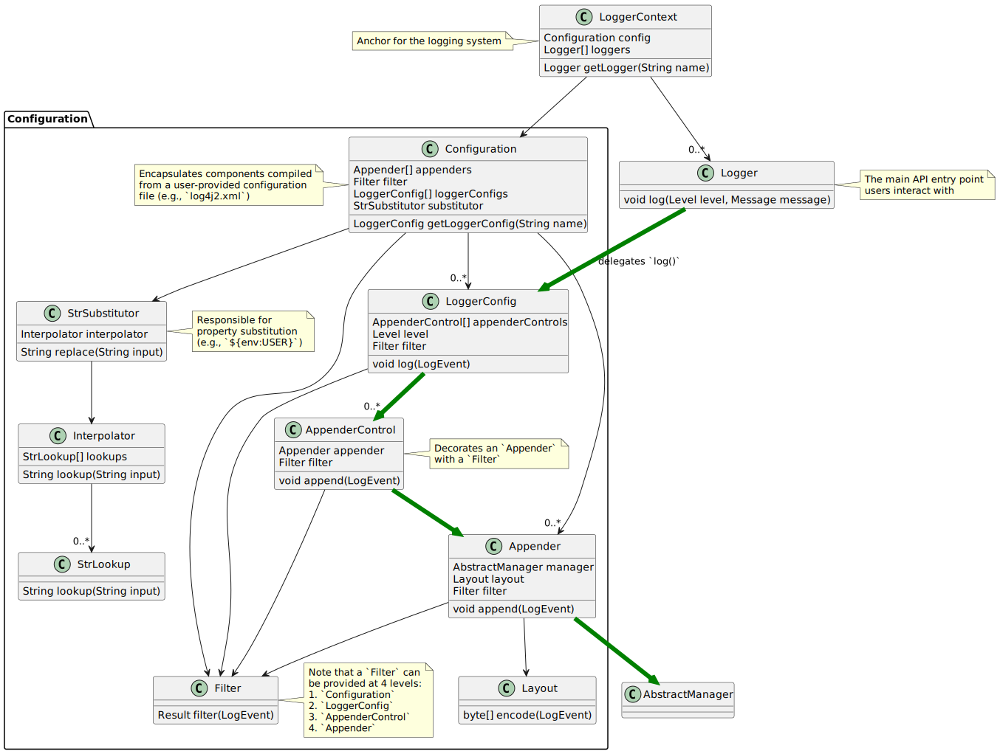

Figure 1. An overview of major classes and their relation

At a high level,

- A [`LoggerContext`](#architecture--loggercontext), the composition anchor, gets created in combination with a [`Configuration`](#architecture--configuration).
  Both can be created directly (i.e., programmatically) or indirectly at first interaction with Log4j.
- `LoggerContext` creates [`Logger`](#architecture--logger)s that users interact with for logging purposes.
- [`Appender`](#architecture--appender) delivers a [`LogEvent`](https://logging.apache.org/log4j/2.x/javadoc/log4j-core/org/apache/logging/log4j/core/LogEvent.html) to a target (file, socket, database, etc.) and typically uses a [`Layout`](#architecture--layout) to encode log events and an [`AbstractManager`](#architecture--abstractmanager) to handle the lifecycle of the target resource.
- [`LoggerConfig`](#architecture--loggerconfig) encapsulates configuration for a `Logger,` as `AppenderControl` and `AppenderRef` for `Appender`s.
- [`Configuration`](#architecture--configuration) is equipped with [`StrSubstitutor` et al.](#architecture--strsubstitutor) to allow property substitution in `String`-typed values.
- A typical `log()` call triggers a chain of invocations through classes `Logger`, `LoggerConfig`, `AppenderControl`, `Appender`, and `AbstractManager` in order – this is depicted using green arrows in [Figure 1](#architecture--architecture-diagram).

The following sections examine this interplay in detail.

<a id="architecture--loggercontext"></a>

## `LoggerContext`

The [`LoggerContext`](https://logging.apache.org/log4j/2.x/javadoc/log4j-api/org/apache/logging/log4j/spi/LoggerContext.html) acts as the anchor point for the logging system.
It is associated with an active [`Configuration`](#architecture--configuration) and is primarily responsible for instantiating [`Logger`](#architecture--logger)s.


Figure 2. `LoggerContext` and other directly related classes

In most cases, applications have a single global `LoggerContext`.
Though in certain cases (e.g., Java EE applications), Log4j can be configured to accommodate multiple `LoggerContext`s.
Refer to [Log Separation](https://logging.apache.org/log4j/2.x/jakarta.html#log-separation) for details.

<a id="architecture--configuration"></a>

## `Configuration`

Every [`LoggerContext`](#architecture--loggercontext) is associated with an active [`Configuration`](https://logging.apache.org/log4j/2.x/javadoc/log4j-core/org/apache/logging/log4j/core/config/Configuration.html).
It models the configuration of all appenders, layouts, filters, loggers, and contains the reference to [`StrSubstitutor` et al.](#architecture--strsubstitutor).


Figure 3. `Configuration` and other directly related classes

Configuration of Log4j Core is typically done at application initialization.
The preferred way is by reading a [configuration file](#configuration), but it can also be done [programmatically](#customconfig).
This is further discussed in [Configuration](#config-intro).

<a id="architecture--reconfiguration"></a>
<a id="architecture--reconfiguration-reliability"></a>

### Reconfiguration reliability

The main motivation for the existing architecture is the reliability to configuration changes.
When a reconfiguration event occurs, two `Configuration` instances are active at the same time.
Threads that already started processing a log event will either:

- continue logging to the old configuration, if execution already reached the `LoggerConfig` class,
- or switch to the new configuration.

The service that manages the reconfiguration process is called [`ReliabilityStrategy`](https://logging.apache.org/log4j/2.x/javadoc/log4j-core/org/apache/logging/log4j/core/config/ReliabilityStrategy.html) and it decides:

- when should `Logger`s switch to the new configuration,
- when should the old configuration be stopped.

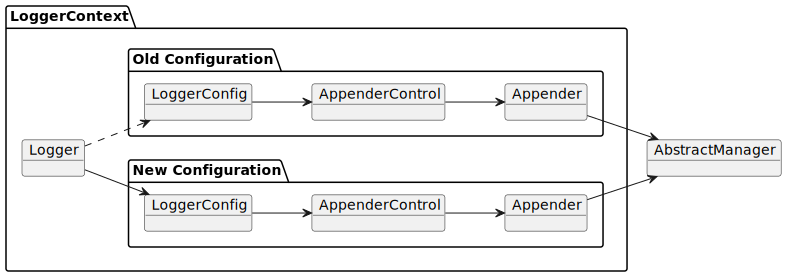

Figure 4. Overview of the reconfiguration process

<a id="architecture--logger"></a>

## `Logger`

[`Logger`](https://logging.apache.org/log4j/2.x/javadoc/log4j-api/org/apache/logging/log4j/Logger.html)s are the primary user entry point for logging.
They are created by calling one of the `getLogger()` methods of [`LogManager`](https://logging.apache.org/log4j/2.x/javadoc/log4j-api/org/apache/logging/log4j/LogManager.html) – this is further documented in [Log4j API](#api).
The `Logger` itself performs no direct actions.
It simply has a name and is associated with a [`LoggerConfig`](#architecture--loggerconfig).


Figure 5. `Logger` and other directly related classes

The hierarchy between [`LoggerConfig`](#architecture--loggerconfig)s, implies the very same hierarchy between `Logger`s too.
You can use `LogManager.getRootLogger()` to get the root logger.
Note that Log4j API has no assumptions on a `Logger` hierarchy – this is a feature implemented by Log4j Core.

When the [`Configuration`](#architecture--configuration) is modified, `Logger`s may become associated with a different `LoggerConfig`, thus causing their behavior to be modified.
Refer to [configuring `Logger`s](#configuration--configuring-loggers) for further information.

<a id="architecture--loggerconfig"></a>

## `LoggerConfig`

[`LoggerConfig`](https://logging.apache.org/log4j/2.x/javadoc/log4j-core/org/apache/logging/log4j/core/config/LoggerConfig.html) binds [`Logger`](#architecture--logger) definitions to their associated components (appenders, filters, etc.) as declared in the active [`Configuration`](#architecture--configuration).
The details of mapping a `Configuration` to `LoggerConfig`s is explained [here](#configuration--configuring-loggers).
`Logger`s effectively interact with appenders, filters, etc. through corresponding `LoggerConfig`s.
A `LoggerConfig` essentially contains

- A reference to its parent (except if it is the root logger)
- A [level](#customloglevels) denoting the severity of messages that are accepted (defaults to `ERROR`)
- [`Filter`](#architecture--filter)s that must allow the `LogEvent` to pass before it will be passed to any [`Appender`](#architecture--appender)s
- References to [`Appender`](#architecture--appender)s that should be used to process the event


Figure 6. `LoggerConfig` and other directly related classes

<a id="architecture--logger-hierarchy"></a>

### Logger hierarchy

Log4j Core has a **hierarchical** model of `LoggerConfig`s, and hence `Logger`s.
A `LoggerConfig` called `child` is said to be parented by `parent`, if `parent` has the *longest prefix match* on name.
This match is case-sensitive and performed after tokenizing the name by splitting it from `.` (dot) characters.
For a positive name match, tokens must match exhaustively.
See [Figure 7](#architecture--logger-hiearchy-diagram) for an example.


Figure 7. Example hierarchy of loggers named `X`, `X.Y`, `X.Y.Z`, and `X.YZ`

If a `LoggerConfig` is not provided an explicit level, it will be inherited from its parent.
Similarly, if a user programmatically requests a `Logger` with a name that doesn’t have a directly corresponding `LoggerConfig` configuration entry with its name, the `LoggerConfig` of the parent will be used.

<details>
<summary>Click for examples on <code>LoggerConfig</code> hierarchy</summary>
<div>
<div>
<p>Below we demonstrate the <code>LoggerConfig</code> hierarchy by means of <em>level inheritance</em>.
That is, we will examine the effective level of a <code>Logger</code> in various <code>LoggerConfig</code> settings.</p>
</div>
<table>
<caption>Table 1. Only the root logger is configured with a level, and it is <code>DEBUG</code></caption>
<colgroup>
<col/>
<col/>
<col/>
<col/>
</colgroup>
<thead>
<tr>
<th>Logger name</th>
<th>Assigned <code>LoggerConfig</code> name</th>
<th>Configured level</th>
<th>Effective level</th>
</tr>
</thead>
<tbody>
<tr>
<td><p><code>root</code></p></td>
<td><p><code>root</code></p></td>
<td><p><code>DEBUG</code></p></td>
<td><p><code>DEBUG</code></p></td>
</tr>
<tr>
<td><p><code>X</code></p></td>
<td><p><code>root</code></p></td>
<td></td>
<td><p><code>DEBUG</code></p></td>
</tr>
<tr>
<td><p><code>X.Y</code></p></td>
<td><p><code>root</code></p></td>
<td></td>
<td><p><code>DEBUG</code></p></td>
</tr>
<tr>
<td><p><code>X.Y.Z</code></p></td>
<td><p><code>root</code></p></td>
<td></td>
<td><p><code>DEBUG</code></p></td>
</tr>
</tbody>
</table>
<table>
<caption>Table 2. All loggers are configured with a level</caption>
<colgroup>
<col/>
<col/>
<col/>
<col/>
</colgroup>
<thead>
<tr>
<th>Logger name</th>
<th>Assigned <code>LoggerConfig</code></th>
<th>Configured level</th>
<th>Effective level</th>
</tr>
</thead>
<tbody>
<tr>
<td><p><code>root</code></p></td>
<td><p><code>root</code></p></td>
<td><p><code>DEBUG</code></p></td>
<td><p><code>DEBUG</code></p></td>
</tr>
<tr>
<td><p><code>X</code></p></td>
<td><p><code>X</code></p></td>
<td><p><code>ERROR</code></p></td>
<td><p><code>ERROR</code></p></td>
</tr>
<tr>
<td><p><code>X.Y</code></p></td>
<td><p><code>X.Y</code></p></td>
<td><p><code>INFO</code></p></td>
<td><p><code>INFO</code></p></td>
</tr>
<tr>
<td><p><code>X.Y.Z</code></p></td>
<td><p><code>X.Y.Z</code></p></td>
<td><p><code>WARN</code></p></td>
<td><p><code>WARN</code></p></td>
</tr>
</tbody>
</table>
<table>
<caption>Table 3. All loggers are configured with a level, except the logger <code>X.Y</code></caption>
<colgroup>
<col/>
<col/>
<col/>
<col/>
</colgroup>
<thead>
<tr>
<th>Logger name</th>
<th>Assigned <code>LoggerConfig</code></th>
<th>Configured level</th>
<th>Effective level</th>
</tr>
</thead>
<tbody>
<tr>
<td><p><code>root</code></p></td>
<td><p><code>root</code></p></td>
<td><p><code>DEBUG</code></p></td>
<td><p><code>DEBUG</code></p></td>
</tr>
<tr>
<td><p><code>X</code></p></td>
<td><p><code>X</code></p></td>
<td><p><code>ERROR</code></p></td>
<td><p><code>ERROR</code></p></td>
</tr>
<tr>
<td><p><code>X.Y</code></p></td>
<td><p><code>X</code></p></td>
<td></td>
<td><p><code>ERROR</code></p></td>
</tr>
<tr>
<td><p><code>X.Y.Z</code></p></td>
<td><p><code>X.Y.Z</code></p></td>
<td><p><code>WARN</code></p></td>
<td><p><code>WARN</code></p></td>
</tr>
</tbody>
</table>
<table>
<caption>Table 4. All loggers are configured with a level, except loggers <code>X.Y</code> and <code>X.Y.Z</code></caption>
<colgroup>
<col/>
<col/>
<col/>
<col/>
</colgroup>
<thead>
<tr>
<th>Logger name</th>
<th>Assigned <code>LoggerConfig</code></th>
<th>Configured level</th>
<th>Effective level</th>
</tr>
</thead>
<tbody>
<tr>
<td><p><code>root</code></p></td>
<td><p><code>root</code></p></td>
<td><p><code>DEBUG</code></p></td>
<td><p><code>DEBUG</code></p></td>
</tr>
<tr>
<td><p><code>X</code></p></td>
<td><p><code>X</code></p></td>
<td><p><code>ERROR</code></p></td>
<td><p><code>ERROR</code></p></td>
</tr>
<tr>
<td><p><code>X.Y</code></p></td>
<td><p><code>X</code></p></td>
<td></td>
<td><p><code>ERROR</code></p></td>
</tr>
<tr>
<td><p><code>X.Y.Z</code></p></td>
<td><p><code>X</code></p></td>
<td></td>
<td><p><code>ERROR</code></p></td>
</tr>
</tbody>
</table>
<table>
<caption>Table 5. All loggers are configured with a level, except the logger <code>X.YZ</code></caption>
<colgroup>
<col/>
<col/>
<col/>
<col/>
</colgroup>
<thead>
<tr>
<th>Logger name</th>
<th>Assigned <code>LoggerConfig</code></th>
<th>Configured level</th>
<th>Effective level</th>
</tr>
</thead>
<tbody>
<tr>
<td><p><code>root</code></p></td>
<td><p><code>root</code></p></td>
<td><p><code>DEBUG</code></p></td>
<td><p><code>DEBUG</code></p></td>
</tr>
<tr>
<td><p><code>X</code></p></td>
<td><p><code>X</code></p></td>
<td><p><code>ERROR</code></p></td>
<td><p><code>ERROR</code></p></td>
</tr>
<tr>
<td><p><code>X.Y</code></p></td>
<td><p><code>X.Y</code></p></td>
<td><p><code>INFO</code></p></td>
<td><p><code>INFO</code></p></td>
</tr>
<tr>
<td><p><code>X.YZ</code></p></td>
<td><p><code>X</code></p></td>
<td></td>
<td><p><code>ERROR</code></p></td>
</tr>
</tbody>
</table>
</div>
</details>

For further information on log levels and using them for filtering purposes in a configuration, see [Levels](#customloglevels).

<a id="architecture--filter"></a>

## `Filter`

In addition to [the level-based filtering facilitated by `LoggerConfig`](#architecture--loggerconfig), Log4j provides [`Filter`](https://logging.apache.org/log4j/2.x/javadoc/log4j-core/org/apache/logging/log4j/core/Filter.html)s to evaluate the parameters of a logging call (i.e., context-wide filter) or a log event, and decide if it should be processed further in the pipeline.


Figure 8. `Filter` and other directly related classes

Refer to [Filters](#filters) for further information.

<a id="architecture--appender"></a>

## `Appender`

[`Appender`](https://logging.apache.org/log4j/2.x/javadoc/log4j-core/org/apache/logging/log4j/core/Appender.html)s are responsible for delivering a [`LogEvent`](https://logging.apache.org/log4j/2.x/javadoc/log4j-core/org/apache/logging/log4j/core/LogEvent.html) to a certain target; console, file, database, etc.
While doing so, they typically use [`Layout`](#architecture--layout)s to encode the log event.
See [Appenders](#appenders) for the complete guide.


Figure 9. `Appender` and other directly related classes

An `Appender` can be added to a [`Logger`](#architecture--logger) by calling the [`addLoggerAppender()`](https://logging.apache.org/log4j/2.x/javadoc/log4j-core/org/apache/logging/log4j/core/config/Configuration.html#addLoggerAppender(org.apache.logging.log4j.core.Logger, org.apache.logging.log4j.core.Appender)) method of the current [`Configuration`](#architecture--configuration).
If a [`LoggerConfig`](#architecture--loggerconfig) matching the name of the `Logger` does not exist, one will be created, and the `Appender` will be attached to it, and then all `Logger`s will be notified to update their `LoggerConfig` references.

<a id="architecture--appender-additivity"></a>

### Appender additivity

Each enabled logging request for a given logger will be forwarded to all the appenders in the corresponding `Logger`'s `LoggerConfig`, as well as to the `Appender`s of the `LoggerConfig`'s parents.
In other words, `Appender`s are inherited **additively** from the `LoggerConfig` hierarchy.
For example, if a console appender is added to the root logger, then all enabled logging requests will at least print on the console.
If in addition a file appender is added to a `LoggerConfig`, say `LC`, then enabled logging requests for `LC` and `LC`'s children will print in a file *and* on the console.
It is possible to override this default behavior so that appender accumulation is no longer additive by setting `additivity` attribute to `false` on [the `Logger` declaration in the configuration file](#configuration--configuring-loggers).

The output of a log statement of `Logger` `L` will go to all the appenders in the `LoggerConfig` associated with `L` and the ancestors of that `LoggerConfig`.
However, if an ancestor of the `LoggerConfig` associated with `Logger`
`L`, say `P`, has the additivity flag set to `false`, then `L`'s output will be directed to all the appenders in `L`'s `LoggerConfig` and it’s ancestors up to and including `P` but not the appenders in any of the ancestors of `P`.

<details>
<summary>Click for an example on appender additivity</summary>
<div>
<div id="appender-additivity-diagram">
<div>
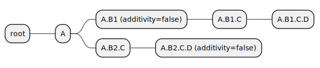
</div>
<div>Figure 10. Example hierarchy of logger configurations to demonstrate appender additivity</div>
</div>
<div>
<p>In <a href="#architecture--appender-additivity-diagram">Figure 10</a>, the effective appenders for each logger configuration are as follows:</p>
</div>
<table>
<caption>Table 6. Effective appenders of logger configurations in <a href="#architecture--appender-additivity-diagram">Figure 10</a></caption>
<colgroup>
<col/>
<col/>
<col/>
<col/>
<col/>
<col/>
<col/>
</colgroup>
<tbody>
<tr>
<th rowspan="2"><p>Appender</p></th>
<th colspan="6"><p>Logger configuration</p></th>
</tr>
<tr>
<td><p><code>A</code></p></td>
<td><p><code>A.B1</code></p></td>
<td><p><code>A.B1.C</code></p></td>
<td><p><code>A.B1.C.D</code></p></td>
<td><p><code>A.B2.C</code></p></td>
<td><p><code>A.B2.C.D</code></p></td>
</tr>
<tr>
<td><p><code>root</code></p></td>
<td><p>✅</p></td>
<td><p>❌</p></td>
<td><p>❌</p></td>
<td><p>❌</p></td>
<td><p>✅</p></td>
<td><p>❌</p></td>
</tr>
<tr>
<td><p><code>A</code></p></td>
<td><p>✅</p></td>
<td><p>❌</p></td>
<td><p>❌</p></td>
<td><p>❌</p></td>
<td><p>✅</p></td>
<td><p>❌</p></td>
</tr>
<tr>
<td><p><code>A.B1</code></p></td>
<td><p>-</p></td>
<td><p>✅</p></td>
<td><p>✅</p></td>
<td><p>✅</p></td>
<td><p>-</p></td>
<td><p>-</p></td>
</tr>
<tr>
<td><p><code>A.B1.C</code></p></td>
<td><p>-</p></td>
<td><p>-</p></td>
<td><p>✅</p></td>
<td><p>✅</p></td>
<td><p>-</p></td>
<td><p>-</p></td>
</tr>
<tr>
<td><p><code>A.B1.C.D</code></p></td>
<td><p>-</p></td>
<td><p>-</p></td>
<td><p>-</p></td>
<td><p>✅</p></td>
<td><p>-</p></td>
<td><p>-</p></td>
</tr>
<tr>
<td><p><code>A.B2.C</code></p></td>
<td><p>-</p></td>
<td><p>-</p></td>
<td><p>-</p></td>
<td><p>-</p></td>
<td><p>✅</p></td>
<td><p>❌</p></td>
</tr>
<tr>
<td><p><code>A.B2.C.D</code></p></td>
<td><p>-</p></td>
<td><p>-</p></td>
<td><p>-</p></td>
<td><p>-</p></td>
<td><p>-</p></td>
<td><p>✅</p></td>
</tr>
</tbody>
</table>
</div>
</details>

<a id="architecture--abstractmanager"></a>

### `AbstractManager`

To multiplex the access to external resources (files, network connections, etc.), most appenders are split into an
[`AbstractManager`](https://logging.apache.org/log4j/2.x/javadoc/log4j-core/org/apache/logging/log4j/core/appender/AbstractManager.html)
that handles the low-level access to the external resource and an `Appender` that transforms log events into a format that the manager can handle.

Managers that share the same resource are shared between appenders regardless of the `Configuration` or `LoggerContext` of the appenders.
For example
[file appenders](#appenders-file)s
with the same `fileName` attribute all share the same
[`FileManager`](https://logging.apache.org/log4j/2.x/javadoc/log4j-core/org/apache/logging/log4j/core/appender/FileManager.html).

> [!IMPORTANT]
> Due to the manager-sharing feature of many Log4j appenders, it is not possible to configure multiple appenders for the same resource that only differ in the way the underlying resource is configured.
>
> For example, it is not possible to have two file appenders (even in different logger contexts) that use the same file, but a different value of the `append` option.
> Since during a [reconfiguration event](#architecture--reconfiguration) multiple instances of the same appender exists, it is also not possible to toggle the value of the `append` option through reconfiguration.

<a id="architecture--layout"></a>

## `Layout`

An [`Appender`](#architecture--appender) uses a **layout** to encode a [`LogEvent`](https://logging.apache.org/log4j/2.x/javadoc/log4j-core/org/apache/logging/log4j/core/LogEvent.html) into a form that meets the needs of whatever will be consuming the log event.


Figure 11. `Layout` and other directly related classes

Refer to [Layouts](#layouts) for details.

<a id="architecture--strsubstitutor"></a>
<a id="architecture--strsubstitutor-et-al."></a>

## `StrSubstitutor` et al.

[`StrSubstitutor`](https://logging.apache.org/log4j/2.x/javadoc/log4j-core/org/apache/logging/log4j/core/lookup/StrSubstitutor.html) is a `String` interpolation tool that can be used in both configurations and components (e.g., appenders, layouts).
It accepts an [`Interpolator`](https://logging.apache.org/log4j/2.x/javadoc/log4j-core/org/apache/logging/log4j/core/lookup/Interpolator.html) to determine if a key maps to a certain value.
`Interpolator` is essentially a facade delegating to multiple [`StrLookup`](https://logging.apache.org/log4j/2.x/javadoc/log4j-core/org/apache/logging/log4j/core/lookup/StrLookup.html) (aka. *lookup*) implementations.


Figure 12. `StrSubstitutor` et al. and other directly related classes

See [how property substitution works](#configuration--property-substitution) and [the predefined lookups](#lookups) for further information.

---

<a id="config-intro"></a>

<!-- source_url: https://logging.apache.org/log4j/2.x/manual/config-intro.html -->

<!-- page_index: 16 -->

<a id="config-intro--configuration"></a>

# Configuration

Even moderately sized applications can contain thousands of logging statements.
To decide which of these statements will be logged and where, users need to configure Log4j Core in one of following ways:

- Through a [configuration file](#configuration)
- Through [programmatic configuration](#customconfig)

Some meta-configuration options (e.g., the configuration file location) are only available through [system properties](#systemproperties).

---

<a id="configuration"></a>

<!-- source_url: https://logging.apache.org/log4j/2.x/manual/configuration.html -->

<!-- page_index: 17 -->

<a id="configuration--configuration-file"></a>

# Configuration file

Using a configuration file is the most popular and recommended approach for configuring Log4j Core.
In this page we will examine the composition of a configuration file and how Log4j Core uses it.

> [!TIP]
> If you are looking for a quick start on using Log4j in your application or library, please refer to [Getting started](#getting-started) instead.

<a id="configuration--automatic-configuration"></a>
<a id="configuration--configuration-file-location"></a>

## Configuration file location

Upon initialization of a new [logger context, the anchor of the logging implementation](#architecture--loggercontext), Log4j Core assigns it a context name and scans the following **classpath** locations for a configuration file in following order:

1. Files named `log4j2-test<contextName>.<extension>`
2. Files named `log4j2-test.<extension>`
3. Files named `log4j2<contextName>.<extension>`
4. Files named `log4j2.<extension>`

The `<contextName>` and `<extension>` placeholders above have the following meaning

<contextName>
:   A name derived from the runtime environment:

    - For standalone Java SE applications, it is a random identifier.
    - For web applications, it is an identifier derived from the application descriptor.
      See [Log4j Web application configuration](https://logging.apache.org/log4j/2.x/jakarta.html#configuration) for details.

<extension>
:   A file extension supported by a `ConfigurationFactory`.
    The order in which an extension will be searched for first depends on the order of the associated `ConfigurationFactory`.
    See [Predefined `ConfigurationFactory` plugins](#configuration--configuration-factories) for details.

If no configuration file is found, Log4j Core uses the [`DefaultConfiguration`](https://logging.apache.org/log4j/2.x/javadoc/log4j-core/org/apache/logging/log4j/core/config/DefaultConfiguration.html) and the [status logger](#status-logger) prints a warning.
The default configuration prints all messages less severe than [`log4j2.level`](#systemproperties--log4j2.level) to the console.

You can override the location of the configuration file
using the [`log4j2.configurationFile`
system property](#systemproperties--log4j2.configurationfile).
In such a case, Log4j Core will guess the configuration file format from the provided file name, or use the default configuration factory if the extension is unknown.

There are certain **best-practices** we strongly recommend you to adapt in your Log4j configuration:

- Files prefixed by `log4j2-test` should only be used on the test classpath.
- If you are developing an application, don’t use multiple Log4j configuration files with same name, but different extensions.
  That is, don’t provide both `log4j2.xml` and `log4j2.json` files.
- If you are developing a library, only add configuration files to your test classpath.

<a id="configuration--configuration-factories"></a>
<a id="configuration--predefined-configurationfactory-plugins"></a>

### Predefined `ConfigurationFactory` plugins

Log4j Core uses plugins extending from [`ConfigurationFactory`](https://logging.apache.org/log4j/2.x/javadoc/log4j-core/org/apache/logging/log4j/core/config/ConfigurationFactory.html) to determine which configuration file extensions are supported, in which order, and how to read them.
How this works under the hood and how you can introduce your custom implementations is explained in [Extending `ConfigurationFactory` plugins](#configuration--configurationfactory).

| File format | Extension | Order |
| --- | --- | --- |
| XML | `xml` | 5 |
| JSON | `json, jsn` | 6 |
| YAML | `yaml, yml` | 7 |
| Properties | `properties` | 8 |

Note that `ConfigurationFactory` plugins will be employed in descending order.
That is, for instance, XML file format will be checked last, as a fallback.

Some `ConfigurationFactory` plugins require additional dependencies on the classpath:

- log4j2.xml
- log4j2.json
- log4j2.yaml
- log4j2.properties

JPMS users need to add:

```java
module foo.bar {
    requires java.xml;
}
```

to their `module-info.java` descriptor.

- Maven
- Gradle

```xml
<dependency>
    <groupId>com.fasterxml.jackson.core</groupId>
    <artifactId>jackson-databind</artifactId>
    <version>2.19.2</version>
    <scope>runtime</scope>
</dependency>
```

```groovy
runtimeOnly 'com.fasterxml.jackson.core:jackson-databind:2.19.2'
```

- Maven
- Gradle

```xml
<dependency>
    <groupId>com.fasterxml.jackson.dataformat</groupId>
    <artifactId>jackson-dataformat-yaml</artifactId>
    <version>2.19.2</version>
    <scope>runtime</scope>
</dependency>
```

```groovy
runtimeOnly 'com.fasterxml.jackson.dataformat:jackson-dataformat-yaml:2.19.2'
```

No dependency required.

<a id="configuration--configuration-syntax"></a>
<a id="configuration--syntax"></a>

## Syntax

> [!NOTE]
> Starting with Log4j 2, the configuration file syntax has been considered part of the public API and has remained stable across significant version upgrades.

> [!WARNING]
> The syntax of the configuration file changed between Log4j 1 and Log4j 2.
> Files in the Log4j 1 syntax are ignored by default.
> To enable partial support for old configuration syntax, see [configuration compatibility](https://logging.apache.org/log4j/2.x/migrate-from-log4j1.html#ConfigurationCompatibility).

The Log4j runtime is composed of [plugins](https://logging.apache.org/log4j/2.x/manual/plugins.html), which are like beans in the Spring Framework and Java EE.
Appenders, layouts, filters, configuration loaders, and similar components are all accessed as plugins.

All configuration files are represented internally as a tree of [`Node`](https://logging.apache.org/log4j/2.x/javadoc/log4j-core/org/apache/logging/log4j/core/config/Node.html)s, which is translated into a tree of Log4j plugins.
The tree’s root creates a [`Configuration`](https://logging.apache.org/log4j/2.x/javadoc/log4j-core/org/apache/logging/log4j/core/config/Configuration.html) object.

A node is a relatively simple structure representing a single Log4j plugin (see [Plugin reference](https://logging.apache.org/log4j/2.x/plugin-reference.html) for a complete list), such as an appender, layout, or logger configuration.

Each node has:

- a set of simple string key-value pairs called **attributes**.
  Attributes are **matched by name** against the list of available configuration options of a Log4j plugin.
- The **plugin type** attribute specifies the kind of Log4j plugin we want to instantiate.
- A set of child nodes called **nested elements**.
  They are **matched by type** against the list of nested components a plugin accepts.

Log4j maps the concepts above to the specifics of the configuration format as follows:

- XML
- JSON
- YAML
- Properties

Since XML was the original configuration format developed, the mapping from configuration nodes and XML elements is trivial:

- Each configuration node is represented by an XML element.
- Each configuration attribute is represented by an XML attribute.
- The **plugin type** of a node is equal to the name of the XML tag.
- Each configuration nested element is represented by a nested XML element.


> [!NOTE]
> There is an alternative XML configuration format called "XML strict format" that is activated
> by setting the `strict` attribute of the main `<Configuration>` element to `true`.
> It allows users to use any tag names as long as they provide the plugin type using a `type` property.
>
> The *XML strict format* was conceived as a simplified XML format that can be validated by an XML schema but has fallen into disuse: nowadays, the automatically generated schemas published at <https://logging.apache.org/xml/ns/>
> offer a better alternative and allow users to use a more concise syntax.

In the JSON configuration format:

- Each configuration node is represented by a JSON object,
- JSON properties of type string, number, or boolean are mapped to node attributes.
- JSON properties of type object or array represent nested configuration elements.
- The **plugin type** of a JSON object is given by:

  - the value of the `type` key, if present,
  - or the key associated with the JSON object otherwise.
  - If the JSON object representing the node is part of an array, the key associated with the JSON array is used.

> [!TIP]
> If you need to specify multiple plugins of the same type, you can use JSON arrays.
> The snippet below represents two plugins of type `File`.
>
> ```json
> {"File": [{"name": "file1" },{"name": "file2"}]}
> ```

In the YAML configuration format:

- A YAML mapping represents each configuration node,
- YAML properties of scalar type are mapped to node attributes.
- YAML properties of collection type are used to represent nested configuration elements.
- The **plugin type** of a YAML mapping is given by:

  - the value of the `type` key, if present,
  - or the key associated with the YAML mapping otherwise.
  - If the YAML mapping representing the node is part of a YAML block sequence, the key associated with the YAML sequence is used.

> [!TIP]
> If you need to specify multiple plugins of the same type, you can use YAML block sequences.
> The snippet below represents two plugins of type `File`.
>
> ```yaml
> File:
>   - name: file1
>   - name: file2
> ```

In the Java properties configuration format:

- Properties that share a common prefix (e.g., `appender.foo`) are mapped to a subtree of the configuration node tree.
- Configuration attributes are specified by appending the property’s name (e.g., `name`) to the prefix of the node, separated by a dot (e.g., `appender.foo.name`).
- The **plugin type** must be specified as an attribute named `type`.
- Nested elements are created by:

  - Choosing an arbitrary id for the nested component (e.g., `<0>`)
  - Appending the id to the prefix of the parent component (e.g., `appender.foo.<0>`)
  - Specifying the type of the nested plugin by assigning a `type` attribute (e.g., `appender.foo.<0>.type`)

> [!NOTE]
> Nested components use the assigned ID for sorting purposes only.

See also [Format specific notes](#configuration--format-specific-notes) for exceptions to the rules above.

<a id="configuration--main-configuration-elements"></a>

## Main configuration elements

Log4j Core’s logging pipeline is quite complex (see [Architecture](#architecture)), but most users only require these elements:

Loggers
:   [Loggers](#api--loggers) are the entry point of the logging pipeline, which is directly used in the code.
    Their configuration must specify which level of messages they log and to which appenders they send the messages.
    We will cover them while [configuring loggers](#configuration--configuring-loggers).

Appenders
:   [Appenders](#appenders) are the exit point of the logging pipeline.
    They decide which resource (console, file, database, or similar) the log event is sent to.
    In the examples of this chapter, we will only use the [console appender](#appenders--consoleappender) and the [file appender](#appenders-file).

Layouts
:   [Layouts](#layouts) tell appenders how to format the log event: text, JSON, XML, or similar.
    In the examples of this chapter, we will only use [Pattern Layout](#pattern-layout) and [JSON Template Layout](#json-template-layout).

A moderately complex configuration might look like this:

- XML
- JSON
- YAML
- Properties

Snippet from an example [`log4j2.xml`](https://github.com/apache/logging-log4j2/tree/rel/2.25.3/src/site/antora/modules/ROOT/examples/manual/configuration/main-elements.xml)

```xml
<?xml version="1.0" encoding="UTF-8"?>
<Configuration xmlns="https://logging.apache.org/xml/ns"
               xmlns:xsi="http://www.w3.org/2001/XMLSchema-instance"
               xsi:schemaLocation="
                   https://logging.apache.org/xml/ns
                   https://logging.apache.org/xml/ns/log4j-config-2.xsd">
  <Appenders>
    <Console name="CONSOLE"> (1)
      <PatternLayout pattern="%p - %m%n"/>
    </Console>
    <File name="MAIN" fileName="logs/main.log"> (2)
      <JsonTemplateLayout/>
    </File>
    <File name="DEBUG_LOG" fileName="logs/debug.log"> (3)
      <PatternLayout pattern="%d [%t] %p %c - %m%n"/>
    </File>
  </Appenders>
  <Loggers>
    <Root level="INFO"> (4)
      <AppenderRef ref="CONSOLE" level="WARN"/>
      <AppenderRef ref="MAIN"/>
    </Root>
    <Logger name="org.example" level="DEBUG"> (5)
      <AppenderRef ref="DEBUG_LOG"/>
    </Logger>
  </Loggers>
</Configuration>
```

Snippet from an example [`log4j2.json`](https://github.com/apache/logging-log4j2/tree/rel/2.25.3/src/site/antora/modules/ROOT/examples/manual/configuration/main-elements.json)

```json
{"Configuration": {"Appenders": {"Console": { (1) "name": "CONSOLE","PatternLayout": {"pattern": "%p - %m%n"} },"File": [{ (2) "name": "MAIN","fileName": "logs/main.log","JsonTemplateLayout": {} },{ (3) "name": "DEBUG_LOG","fileName": "logs/debug.log","PatternLayout": {"pattern": "%d [%t] %p %c - %m%n"}}] },"Loggers": {"Root": { (4) "level": "INFO","AppenderRef": [{"ref": "CONSOLE","level": "WARN" },{"ref": "MAIN"}] },"Logger": { (5) "name": "org.example","level": "DEBUG","AppenderRef": {"ref": "DEBUG_LOG"}}}}}
```

Snippet from an example [`log4j2.yaml`](https://github.com/apache/logging-log4j2/tree/rel/2.25.3/src/site/antora/modules/ROOT/examples/manual/configuration/main-elements.yaml)

```yaml
Configuration:
  Appenders:
    Console: (1)
      name: "CONSOLE"
      PatternLayout:
        pattern: "%p - %m%n"
    File:
      - name: "MAIN" (2)
        fileName: "logs/main.log"
        JsonTemplateLayout: {}
      - name: "DEBUG_LOG" (3)
        fileName: "logs/debug.log"
        PatternLayout:
          pattern: "%d [%t] %p %c - %m%n"
  Loggers:
    Root: (4)
      level: "INFO"
      AppenderRef:
        - ref: "CONSOLE"
          level: "WARN"
        - ref: "MAIN"
    Logger: (5)
      name: "org.example"
      level: "DEBUG"
      AppenderRef:
        ref: "DEBUG_LOG"
```

Snippet from an example [`log4j2.properties`](https://github.com/apache/logging-log4j2/tree/rel/2.25.3/src/site/antora/modules/ROOT/examples/manual/configuration/main-elements.properties)

```properties
appender.0.type = Console (1)
appender.0.name = CONSOLE
appender.0.layout.type = PatternLayout
appender.0.layout.pattern = %p - %m%n

appender.1.type = File (2)
appender.1.name = MAIN
appender.1.fileName = logs/main.log
appender.1.layout.type = JsonTemplateLayout

appender.2.type = File (3)
appender.2.name = DEBUG_LOG
appender.2.fileName = logs/debug.log
appender.2.layout.type = PatternLayout
appender.2.layout.pattern = %d [%t] %p %c - %m%n

rootLogger.level = INFO (4)
rootLogger.appenderRef.0.ref = CONSOLE
rootLogger.appenderRef.0.level = WARN
rootLogger.appenderRef.1.ref = MAIN

logger.0.name = org.example (5)
logger.0.level = DEBUG
logger.0.appenderRef.0.ref = DEBUG_LOG
```

| **1** | Configures a console appender named `CONSOLE` with a pattern layout. |
| --- | --- |
| **2** | Configures a file appender named `MAIN` with a JSON template layout. |
| **3** | Configures a file appender named `DEBUG_LOG` with a pattern layout. |
| **4** | Configures the root logger at level `INFO` and connects it to the `CONSOLE` and `MAIN` appenders. The `CONSOLE` appender will only log messages at least as severe as `WARN`. |
| **5** | Configures a logger named `"org.example"` at level `DEBUG` and connects it to the `DEBUG_LOG` appender. The logger is configured to forward messages to its parent (the root appender). |

Using the above configuration, the list of appenders that will be used for each log event depends only on the level of the event and the name of the logger, as in the table below:

| Logger name | Log event level | Appenders |
| --- | --- | --- |
| `org.example.foo` | `WARN` | `CONSOLE`, `MAIN`, `DEBUG_LOG` |
| `org.example.foo` | `DEBUG` | `MAIN`, `DEBUG_LOG` |
| `org.example.foo` | `TRACE` | *none* |
| `com.example` | `WARN` | `CONSOLE`, `MAIN` |
| `com.example` | `INFO` | `MAIN` |
| `com.example` | `DEBUG` | *none* |

<a id="configuration--additional-configuration-elements"></a>

## Additional configuration elements

A Log4j Core configuration file can also contain these configuration elements:

CustomLevels
:   Log4j allows the configuration of custom log-level names.

    See [Custom log level configuration](#customloglevels) for details.

Filters
:   Users can add Components to loggers, appender references, appenders, or the global configuration object to provide additional filtering of log events.

    See [Filter configuration](#filters) for details.

Properties
:   Represent a set of reusable configuration values for property substitution.

    See [Property substitution](#configuration--property-substitution) for details.

Scripts
:   Scripts are a container for JSR 223 scripts that users can use in other Log4j components.

    For details, see [Scripts configuration](#scripts).

<a id="configuration--global-configuration-attributes"></a>

## Global configuration attributes

The main `Configuration` element has a set of attributes that can be used to tune how the configuration file is used.
The principal attributes are listed below.
See [Plugin reference](https://logging.apache.org/log4j/2.x/plugin-reference.html#org-apache-logging-log4j_log4j-core_org-apache-logging-log4j-core-config-Configuration) for a complete list.

<a id="configuration--configuration-attribute-monitorinterval"></a>
<a id="configuration--monitorinterval"></a>

### `monitorInterval`

| Type | `int` (seconds) |
| --- | --- |
| Default value | `0` |

Determines the polling interval, in seconds, used by Log4j to check for changes to the configuration file.
If a change in the configuration file is detected, Log4j automatically reconfigures the logger context.
If set to `0`, polling is disabled.

> [!WARNING]
> Log4j Core is designed with reliability in mind, which implies that the reconfiguration process can not lose any log event.
> In order to achieve this Log4j does **not** stop any appender until the new `Configuration` is active and **reuses** resources that are present in both the old and the new `Configuration`.
>
> In order to guarantee reliability, Log4j *may* ignore the changes to some appender options, if they would cause log event loss.
> For example, changing the `append` option of a file appender, without changing the `fileName` option is not possible, since
> it would require closing the underlying file and reopening it with different options.
> Between the two operations log events might be lost.

<a id="configuration--configuration-attribute-status"></a>
<a id="configuration--status"></a>

### `status`

| Type | [`LEVEL`](https://logging.apache.org/log4j/2.x/javadoc/log4j-api/org/apache/logging/log4j/Level.html) |
| --- | --- |
| Status | **DEPRECATED** |
| Default value (since 2.24.0) | [`log4j2.statusLoggerLevel`](#status-logger--log4j2.statusloggerlevel) |
| Default value (before 2.24.0) | value of `log4j2.defaultStatusLevel` |

Overrides the logging level of [Status Logger](#status-logger).

> [!WARNING]
> Since version `2.24.0`, this attribute is deprecated and should be replaced with the [log4j2.statusLoggerLevel](#status-logger--log4j2.statusloggerlevel) configuration property instead.

<a id="configuration--configuring-loggers"></a>
<a id="configuration--loggers"></a>

## Loggers

Log4j 2 contains multiple types of logger configurations that can be added to the `Loggers` element of the configuration:

`Root`
:   is the logger that receives all events that do not have a more specific logger defined.

    See also [Plugin reference](https://logging.apache.org/log4j/2.x/plugin-reference.html#org-apache-logging-log4j_log4j-core_org-apache-logging-log4j-core-config-LoggerConfig-RootLogger).

`AsyncRoot`
:   is an alternative implementation of the root logger used in the [mixed synchronous and asynchronous mode](#async--mixedsync-async).

    See also [Plugin reference](https://logging.apache.org/log4j/2.x/plugin-reference.html#org-apache-logging-log4j_log4j-core_org-apache-logging-log4j-core-async-AsyncLoggerConfig-RootLogger).

`Logger`
:   the most common logger kind, which collects log events from itself and all the children loggers, which do not have an explicit configuration (see [logger hierarchy](#architecture--logger-hierarchy)).

    See also [Plugin Reference](https://logging.apache.org/log4j/2.x/plugin-reference.html#org-apache-logging-log4j_log4j-core_org-apache-logging-log4j-core-config-LoggerConfig).

`AsyncLogger`
:   the equivalent of `Logger`, used in the [mixed synchronous and asynchronous mode](#async--mixedsync-async).

    See also [Plugin Reference](https://logging.apache.org/log4j/2.x/plugin-reference.html#org-apache-logging-log4j_log4j-core_org-apache-logging-log4j-core-async-AsyncLoggerConfig).

There **must** be at least a `Root` or `AsyncRoot` element in every configuration file.
Other logger configurations are optional.

Every
[`Logger`](https://logging.apache.org/log4j/2.x/javadoc/log4j-api/org/apache/logging/log4j/Logger.html)
in your application is assigned to one of these logger configurations (see
[architecture](#architecture--loggerconfig)), which determines the events that will be logged and those that won’t.

Let’s start with an example of logger configuration:

- XML
- JSON
- YAML
- Properties

Snippet from an example [`log4j2.xml`](https://github.com/apache/logging-log4j2/tree/rel/2.25.3/src/site/antora/modules/ROOT/examples/manual/configuration/loggers.xml)

```xml
<Loggers>
  <Root level="INFO"> (1)
    <AppenderRef ref="APPENDER1"/>
  </Root>
  <Logger name="org.example.no_additivity" additivity="false"> (2)
    <AppenderRef ref="APPENDER2"/>
  </Logger>
  <Logger name="org.example.no_location" includeLocation="false"> (3)
    <AppenderRef ref="APPENDER3"/>
  </Logger>
  <Logger name="org.example.level" level="DEBUG"> (4)
    <AppenderRef ref="APPENDER4"/>
  </Logger>
</Loggers>
```

Snippet from an example [`log4j2.json`](https://github.com/apache/logging-log4j2/tree/rel/2.25.3/src/site/antora/modules/ROOT/examples/manual/configuration/loggers.json)

```json
"Loggers": {"Root": { (1) "level": "INFO","AppenderRef": {"ref": "APPENDER1"} },"Logger": [{ (2) "name": "org.example.no_additivity","additivity": false,"AppenderRef": {"ref": "APPENDER2"} },{ (3) "name": "org.example.no_location","includeLocation": false,"AppenderRef": {"ref": "APPENDER3"} },{ (4) "name": "org.example.level","level": "DEBUG","AppenderRef": {"ref": "APPENDER4"}}]}
```

Snippet from an example [`log4j2.yaml`](https://github.com/apache/logging-log4j2/tree/rel/2.25.3/src/site/antora/modules/ROOT/examples/manual/configuration/loggers.yaml)

```yaml
Loggers:
  Root: (1)
    level: "INFO"
    AppenderRef:
      ref: "APPENDER1"
  Logger:
    - name: "org.example.no_additivity" (2)
      additivity: false
      AppenderRef:
        ref: "APPENDER2"
    - name: "org.example.no_location" (3)
      includeLocation: false
      AppenderRef:
        ref: "APPENDER3"
    - name: "org.example.level" (4)
      level: "DEBUG"
      AppenderRef:
        ref: "APPENDER4"
```

Snippet from an example [`log4j2.properties`](https://github.com/apache/logging-log4j2/tree/rel/2.25.3/src/site/antora/modules/ROOT/examples/manual/configuration/loggers.properties)

```properties
rootLogger.level = INFO (1)
rootLogger.appenderRef.0.ref = APPENDER1

logger.0.name = org.example.no_additivity (2)
logger.0.additivity = false
logger.0.appenderRef.0.ref = APPENDER2

logger.1.name = org.example.no_location (3)
logger.1.includeLocation = false
logger.1.appenderRef.0.ref = APPENDER3

logger.2.name = org.example.level (4)
logger.2.level = DEBUG
logger.2.appenderRef.0.ref = APPENDER4
```

In the example above, we have four logger configurations.
They differ from each other regarding the level of log messages that they allow, whether
[location information](#layouts--locationinformation)
will be printed, and which appenders will be used.
The table below summarizes the effects of each logger configuration:

|  | [Logger name](#configuration--logger-attributes-name) | [Level](#configuration--logger-attributes-level) | [Additivity](#configuration--logger-attributes-additivity) | [Includes location](#configuration--logger-attributes-includelocation) | Appenders used |
| --- | --- | --- | --- | --- | --- |
| 1 | *empty* | `INFO` | N/A | *default* | `APPENDER1` |
| 2 | `org.example.no_additivity` | `INFO` (inherited) | `false` | *default* | `APPENDER2` |
| 3 | `org.example.no_location` | `INFO` (inherited) | `true` | `false` | `APPENDER1` and `APPENDER3` |
| 4 | `org.example.level` | `DEBUG` | `true` | *default* | `APPENDER1` and `APPENDER4` |

In the following part of this section, we explain in detail all the available options for logger configurations:

<a id="configuration--logger-attributes-name"></a>
<a id="configuration--name"></a>

### `name`

| Type | `String` |
| --- | --- |
| Applies to | `Logger` and `AsyncLogger` |

Specifies the name of the logger configuration.

Since loggers are usually named using fully qualified class names, this value usually contains the fully qualified name of a class or a package.

<a id="configuration--logger-attributes-additivity"></a>
<a id="configuration--additivity"></a>

### `additivity`

| Type | `boolean` |
| --- | --- |
| Default value | `true` |
| Applies to | `Logger` and `AsyncLogger` |

If `true` (default), all the messages this logger receives will also be transmitted to its
[parent logger](#architecture--logger-hierarchy)).

<a id="configuration--logger-attributes-level"></a>
<a id="configuration--level"></a>

### `level`

<table class="tableblock frame-all grid-all stretch">
<colgroup>
<col/>
<col/>
</colgroup>
<tbody>
<tr>
<th><p>Type</p></th>
<td><p><a href="https://logging.apache.org/log4j/2.x/javadoc/log4j-api/org/apache/logging/log4j/Level.html"><code>Level</code></a></p></td>
</tr>
<tr>
<th><p>Default value</p></th>
<td><div><div>
<ul>
<li>
<p><a href="#systemproperties--log4j2.level"><code>log4j2.level</code></a>, for <code>Root</code> and <code>AsyncRoot</code>,</p>
</li>
<li>
<p>inherited from the
<a href="#architecture--logger-hierarchy">parent logger</a>, for <code>Logger</code> and <code>AsyncLogger</code>.</p>
</li>
</ul>
</div></div></td>
</tr>
</tbody>
</table>

It specifies the level threshold that a log event must have to be logged.
Log events that are less severe than this setting will be filtered out.

See also [Filters](#filters--filters) if you require additional filtering.

<a id="configuration--logger-attributes-includelocation"></a>
<a id="configuration--includelocation"></a>

### `includeLocation`

<table class="tableblock frame-all grid-all stretch">
<colgroup>
<col/>
<col/>
</colgroup>
<tbody>
<tr>
<th><p>Type</p></th>
<td><p><code>boolean</code></p></td>
</tr>
<tr>
<th><p>Default value</p></th>
<td><div><div>
<ul>
<li>
<p><code>false</code>, if an asynchronous <code>ContextSelector</code> is used.</p>
</li>
<li>
<p>Otherwise,</p>
<div>
<ul>
<li>
<p><code>true</code> for <code>Root</code> and <code>Logger</code>,</p>
</li>
<li>
<p><code>false</code> for <code>AsyncRoot</code> and <code>AsyncLogger</code>.</p>
</li>
</ul>
</div>
</li>
</ul>
</div>
<div>
<p>See
<a href="#systemproperties--log4j2.contextselector"><code>log4j2.contextSelector</code></a>
for more details.</p>
</div></div></td>
</tr>
</tbody>
</table>

Specifies whether Log4j is allowed to compute location information.
If set to `false`, Log4j will not attempt to infer the location of the logging call unless said location was provided explicitly using one of the available
[`LogBuilder#withLocation()`](https://logging.apache.org/log4j/2.x/javadoc/log4j-api/org/apache/logging/log4j/LogBuilder.html)
methods.

See [Location information](#layouts--locationinformation) for more details.

<a id="configuration--logger-elements-appenderrefs"></a>
<a id="configuration--appender-references"></a>

### Appender references

Loggers use appender references to list the appenders to deliver log events.

See [Appender references](#configuration--configuring-appenderrefs) below for more details.

<a id="configuration--logger-elements-properties"></a>
<a id="configuration--additional-context-properties"></a>

### Additional context properties

Loggers can emit additional context data that will be integrated with other context data sources such as [ThreadContext](#thread-context).

> [!WARNING]
> The `value` of each property is subject to [property substitution](#configuration--property-substitution) twice:
>
> - when the configuration is loaded, it is evaluated in the [global context](#lookups--global-context).
> - each time a log event is generated, it is evaluated in the [context of the event](#lookups--event-context).
>
> Therefore, if you wish to insert a value that changes in time, you must double the `$` sign, as shown in the example below.

- XML
- JSON
- YAML
- Properties

Snippet from an example [`log4j2.xml`](https://github.com/apache/logging-log4j2/tree/rel/2.25.3/src/site/antora/modules/ROOT/examples/manual/configuration/logger-properties.xml)

```xml
<Root>
  <Property name="client.address" value="$${web:request.remoteAddress}"/>
</Root>
<Logger name="org.hibernate">
  <Property name="subsystem" value="Database"/>
</Logger>
<Logger name="io.netty">
  <Property name="subsystem" value="Networking"/>
</Logger>
```

Snippet from an example [`log4j2.json`](https://github.com/apache/logging-log4j2/tree/rel/2.25.3/src/site/antora/modules/ROOT/examples/manual/configuration/logger-properties.json)

```json
"Root": {"Property": {"name": "client.address","value": "$${web:request.remoteAddress}"} },"Logger": [{"name": "org.hibernate","Property": {"subsystem": "Database"} },{"name": "io.netty","Property": {"subsystem": "Networking"}}]
```

Snippet from an example [`log4j2.yaml`](https://github.com/apache/logging-log4j2/tree/rel/2.25.3/src/site/antora/modules/ROOT/examples/manual/configuration/logger-properties.yaml)

```yaml
Root:
  Property:
    name: "client.address"
    value: "$${web:request.remoteAddress}"
Logger:
  - name: "org.hibernate"
    Property:
      name: "subsystem"
      value: "Database"
  - name: "io.netty"
    Property:
      name: "subsystem"
      value: "Networking"
```

Snippet from an example [`log4j2.properties`](https://github.com/apache/logging-log4j2/tree/rel/2.25.3/src/site/antora/modules/ROOT/examples/manual/configuration/logger-properties.properties)

```properties
rootLogger.property.type = Property
rootLogger.property.name = client.address
rootLogger.property.value = $${web:request.remoteAddress}

logger.0.name = org.hibernate
logger.0.property.type = Property
logger.0.property.name = subsystem
logger.0.property.value = Database

logger.1.name = io.netty
logger.1.property.type = Property
logger.1.property.name = subsystem
logger.1.property.value = Networking
```

<a id="configuration--logger-elements-filters"></a>
<a id="configuration--filters"></a>

### Filters

See [Filters](#filters--filters) for additional filtering capabilities that can be applied to a logger configuration.

<a id="configuration--configuring-appenderrefs"></a>
<a id="configuration--appender-references-2"></a>

## Appender references

Many Log4j components, such as loggers, use appender references to designate which appenders will be used to deliver their events.

Unlike in Log4j 1, where appender references were simple pointers, in Log4j 2, they have additional filtering capabilities.

Appender references can have the following configuration attributes and elements:

<a id="configuration--appenderref-attributes-name"></a>
<a id="configuration--ref"></a>

### `ref`

Type

`String`

Specifies the name of the appender to use.

<a id="configuration--appenderref-attributes-level"></a>
<a id="configuration--level-2"></a>

### `level`

Type

[`Level`](https://logging.apache.org/log4j/2.x/javadoc/log4j-api/org/apache/logging/log4j/Level.html)

It specifies the level threshold that a log event must have to be logged.
Log events that are less severe than this setting will be filtered out.

<a id="configuration--appenderrefs-elements-filters"></a>
<a id="configuration--filters-2"></a>

### Filters

See [Filters](#filters--filters) for additional filtering capabilities that can be applied to a logger configuration.

<a id="configuration--property-substitution"></a>

## Property substitution

Log4j provides a simple and extensible mechanism to reuse values in the configuration file using `${name}` expressions, such as those used in Bash, Ant or Maven.

Reusable configuration values can be added directly to a configuration file by using a [Properties](https://logging.apache.org/log4j/2.x/plugin-reference.html#org-apache-logging-log4j_log4j-core_org-apache-logging-log4j-core-config-PropertiesPlugin) component.

- XML
- JSON
- YAML
- Properties

Snippet from an example [`log4j2.xml`](https://github.com/apache/logging-log4j2/tree/rel/2.25.3/src/site/antora/modules/ROOT/examples/manual/configuration/properties.xml)

```xml
<?xml version="1.0" encoding="UTF-8"?>
<Configuration xmlns="https://logging.apache.org/xml/ns"
               xmlns:xsi="http://www.w3.org/2001/XMLSchema-instance"
               xsi:schemaLocation="
                   https://logging.apache.org/xml/ns
                   https://logging.apache.org/xml/ns/log4j-config-2.xsd">
  <Properties>
    <Property name="log.dir" value="/var/log"/>
  </Properties>
```

Snippet from an example [`log4j2.json`](https://github.com/apache/logging-log4j2/tree/rel/2.25.3/src/site/antora/modules/ROOT/examples/manual/configuration/properties.json)

```json
{"Configuration": {"Properties": {"Property": [{"name": "log.dir","value": "/var/log" },{"name": "log.file","value": "${log.dir}/app.log"}]}
```

Snippet from an example [`log4j2.yaml`](https://github.com/apache/logging-log4j2/tree/rel/2.25.3/src/site/antora/modules/ROOT/examples/manual/configuration/properties.yaml)

```yaml
Configuration:
  Properties:
    Property:
      - name: "log.dir"
        value: "/var/log"
      - name: "log.file"
        value: "${log.dir}/app.log"
```

Snippet from an example [`log4j2.properties`](https://github.com/apache/logging-log4j2/tree/rel/2.25.3/src/site/antora/modules/ROOT/examples/manual/configuration/properties.properties)

```properties
property.log.dir = /var/log
property.log.file = ${log.dir}/app.log
```

An extensible lookup mechanism can also provide reusable configuration values.
See [Lookup](#lookups)s for more information.

Configuration values defined this way can be used in **any** configuration attribute by using the following expansion rules:

`${name}`
:   If the `Properties` element of the configuration file has a property named `name`, its value is substituted.
    Otherwise, the placeholder is not expanded.


> [!WARNING]
> If `name` contains a `:` character, it is expanded as in the rule below.

`${lookup:name}`
:   If both these conditions hold:

    - `lookup` is a prefix assigned to a [Lookup](#lookups),
    - the lookup has a value assigned to `name`,

    the value for the lookup is substituted.
    Otherwise, the expansion of `${name}` is substituted.

    If `name` starts with a hyphen `-` (e.g. `-variable`), it must be escaped with a backslash `\` (e.g. `\-variable`).

    The most common lookup prefixes are:

    - `sys` for Java system properties (see [System Properties lookup](#lookups--systempropertieslookup)),
    - `env` for environment variables (see [Environment lookup](#lookups--environmentlookup)).

The above expansions have a version with an additional `default` value that is **expanded** if the lookup fails:

`${name:-default}`
:   If the `Properties` element of the configuration file has a property named `name,` its value is substituted.
    Otherwise, the **expansion** of `default` is substituted.


> [!WARNING]
> If `name` contains a `:` character, it is expanded as in the rule below.

`${lookup:name:-default}`
:   If both these conditions hold:

    - `lookup` is a prefix assigned to a [Lookup](#lookups),
    - the lookup has a value assigned to `name,`

    the value for the lookup is substituted.
    Otherwise, the expansion of `${name:-default}` is substituted.

> [!NOTE]
> To prevent the expansion of one of the expressions above, the initial `$` must be doubled as `$$`.
>
> The same rule applies to the `name` parameter: if it contains a `${` sequence, it must be escaped as `$${`.

Example 1. Property substitution example

If your configuration file contains the following definitions:

- XML
- JSON
- YAML
- Properties

```xml
<Properties>
  <Property name="FOO" value="foo"/>
  <Property name="BAR" value="bar"/>
</Properties>
```

```json
{"Properties": {"Property": [{"name": "FOO","value": "foo" },{"name": "BAR","value": "bar"}]}}
```

```yaml
Properties:
  Property:
    - name: "FOO"
      value: "foo"
    - name: "BAR"
      value: "bar"
```

```properties
property.FOO = foo
property.BAR = bar
```

and the OS environment variable `FOO` has a value of `environment`, Log4j will evaluate the expression as follows

| Expression | Value |
| --- | --- |
| `${FOO}` | `foo` |
| `${BAZ}` | `${BAZ}` |
| `${BAR:-${FOO}}` | `bar` |
| `${BAZ:-${FOO}}` | `foo` |
| `${env:FOO}` | `environment` |
| `${env:BAR}` | `bar` |
| `${env:BAZ}` | `${BAZ}` |
| `${env:BAR:-${FOO}}` | `bar` |
| `${env:BAZ:-${FOO}}` | `foo` |

> [!WARNING]
> For security reasons, if the **expansion** of a `${…}` expression contains other expressions, these will **not** be expanded.
>
> Properties defined in the `Properties` container, however, can depend on each other.
> If your configuration contains, for example:
>
> - XML
> - JSON
> - YAML
> - Properties
>
> ```xml
> <Properties>
>   <Property name="logging.file" value="${logging.dir}/app.log"/>
>   <Property name="logging.dir" value="${env:APP_BASE}/logs"/>
>   <Property name="APP_BASE" value="."/>
> </Properties>
> ```
>
> ```json
> {"Properties": {"Property": [{"name": "logging.file","value": "${logging.path}/app.log" },{"name": "logging.dir","value": "${env:APP_BASE}/logs" },{"name": "APP_BASE","value": "."}]}}
> ```
>
> ```yaml
> Properties:
>   Property:
>     - name: "logging.file"
>       value: "${logging.dir}/app.log"
>     - name: "logging.dir"
>       value: "${env:APP_BASE}/logs"
>     - name: "APP_BASE"
>       value: "."
> ```
>
> ```properties
> property.logging.file = ${logging.dir}/app.log
> property.logging.dir = ${env:APP_BASE}/logs
> property.APP_BASE = .
> ```
>
> the `logging.dir` property will be expanded **before** the `logging.file` property, and the expanded value will be substituted in `${logging.dir}/app.log`.
> Therefore, the value of the `logging.file` property will be:
>
> - `./logs/app.log` if the environment variable `APP_BASE` is not defined,
> - `/var/lib/app/logs/app.log` if the environment variable `APP_BASE` has a value of `/var/lib/app`.

<a id="configuration--lazy-property-substitution"></a>
<a id="configuration--runtime-property-substitution"></a>

### Runtime property substitution

For most attributes, property substitution is performed only once at **configuration time**, but there are exceptions to this rule: some attributes are **also** evaluated when a component-specific event occurs.

In this case:

- If you want property substitution to happen at configuration time, use one dollar sign, e.g., `${date:HH:mm:ss}`.
- If you want property substitution to happen at runtime, you use two dollar signs, e.g., `$${date:HH:mm:ss}`

The list of attributes that support runtime property substitution is:

- The `value` attribute of [nested `Property` elements](#configuration--logger-elements-properties) of a logger configuration.
- The
  [`pattern`](#pattern-layout--plugin-attr-pattern) attribute of the [Pattern Layout](#pattern-layout).
  This attribute evaluates lookups in the [context of the current log event](#lookups--event-context).
- Event template attributes of [JSON Template Layout](#json-template-layout).
  See [property substitution in JSON Template Layout](#json-template-layout--property-substitution-in-template)
  for more details.
- The appender attributes listed in [runtime property substitution in appenders](#appenders--runtime-evaluation).

> [!WARNING]
> Certain lookups might behave differently when they are expanded at runtime.
> See [lookup evaluation contexts](#lookups--evaluation-contexts) for details.

> [!NOTE]
> The
> [`Route`](#appenders-delegating--routes) component of the
> [Routing Appender](#appenders-delegating--routingappender)
> is a different case altogether.
> The attributes of its children are expanded at runtime, but are not expanded at configuration time.
>
> Inside the `Route` component you **should not** use escaped `$${...}` expressions, but only unescaped `${...}` expressions.

The complete spectrum of behaviors concerning runtime property substitution is given by the routing appender example below:

- XML
- JSON
- YAML
- Properties

Snippet from an example [`log4j2.xml`](https://github.com/apache/logging-log4j2/tree/rel/2.25.3/src/site/antora/modules/ROOT/examples/manual/configuration/routing.xml)

```xml
<Routing name="ROUTING">
  <Routes pattern="$${sd:type}"> (1)
    <Route>
      <File name="ROUTING-${sd:type}"
            fileName="logs/${sd:type}.log"> (2)
        <JsonTemplateLayout>
          <EventTemplateAdditionalField name="type"
                                        value="${sd:type}"/> (2)
        </JsonTemplateLayout>
      </File>
    </Route>
  </Routes>
</Routing>
```

Snippet from an example [`log4j2.json`](https://github.com/apache/logging-log4j2/tree/rel/2.25.3/src/site/antora/modules/ROOT/examples/manual/configuration/routing.json)

```json
"Routing": {"name": "ROUTING","Routes": {"pattern": "$${sd:type}", (1) "Route": {"File": {"name": "ROUTING-${sd:type}", (2) "fileName": "logs/${sd:type}.log", (2) "JsonTemplateLayout": {"EventTemplateAdditionalField": {"name": "type","value": "${sd:type}" (2)}}}}}}
```

Snippet from an example [`log4j2.yaml`](https://github.com/apache/logging-log4j2/tree/rel/2.25.3/src/site/antora/modules/ROOT/examples/manual/configuration/routing.yaml)

```yaml
Routing:
  name: "ROUTING"
  Routes:
    pattern: "$${sd:type}" (1)
    Route:
      File:
        name: "ROUTING-${sd:type}" (2)
        fileName: "logs/${sd:type}.log" (2)
        JsonTemplateLayout:
          EventTemplateAdditionalField:
            name: "type"
            value: "${sd:type}" (2)
```

Snippet from an example [`log4j2.properties`](https://github.com/apache/logging-log4j2/tree/rel/2.25.3/src/site/antora/modules/ROOT/examples/manual/configuration/routing.properties)

```properties
appender.0.type = Routing
appender.0.name = ROUTING

appender.0.routes.type = Routes
appender.0.routes.pattern = $${sd:type} (1)

appender.0.routes.route.type = Route

appender.0.routes.route.file.type = File
appender.0.routes.route.file.name = ROUTING-${sd:type} (2)
appender.0.routes.route.file.fileName = logs/${sd:type}.log (2)
appender.0.routes.route.file.layout.type = JsonTemplateLayout
appender.0.routes.route.file.layout.field.type = EventTemplateAdditionalField
appender.0.routes.route.file.layout.field.name = type
appender.0.routes.route.file.layout.field.value = ${sd:type} (2)
```

**1**

The `pattern` attribute is evaluated at configuration time, and also each time a log event is routed.
Therefore, the dollar `$` sign needs to be escaped.

**2**

All the attributes of children of the `Route` element have a **deferred** evaluation. Therefore, they need only one `$` sign.

<a id="configuration--monitorresources"></a>
<a id="configuration--monitor-resources"></a>

## Monitor Resources

Log4j can be configured to poll for changes to resources (in addition to the configuration file) using the `MonitorResources` element of the configuration.
If a change is detected in any of the specified resources, Log4j automatically reconfigures the logger context.
This feature helps with monitoring external resources (e.g., TLS certificates) that the configuration is dependent on.

The polling interval is determined by the value of the  [`monitorInterval`](#configuration--configuration-attribute-monitorinterval) attribute.
If set to 0, polling is disabled.
See  [`monitorInterval`](#configuration--configuration-attribute-monitorinterval) for further details.

A configuration can have either zero or one `MonitorResources` element at its root.
`MonitorResources` can have zero or more `MonitorResource` elements, which can be configured following attributes:

| Attribute | Type | Description |
| --- | --- | --- |
| `uri` | URI | A [`java.net.URI`](https://docs.oracle.com/javase/8/docs/api/java/net/URI.html) reference to the external resource. Note that only URIs of scheme `file` are accepted. |

See example below:

`MonitorResources` configuration example

- XML
- JSON
- YAML
- Properties

```xml
<Configuration xmlns="https://logging.apache.org/xml/ns"
               xmlns:xsi="http://www.w3.org/2001/XMLSchema-instance"
               xsi:schemaLocation="
                   https://logging.apache.org/xml/ns
                   https://logging.apache.org/xml/ns/log4j-config-2.xsd"
               monitorInterval="30">
  <MonitorResources>
    <MonitorResource uri="file://path/to/external-file-1.txt"/>
    <MonitorResource uri="file://path/to/external-file-2.txt"/>
  </MonitorResources>
</Configuration>
```

```json
{"Configuration": {"monitorInterval": "30","MonitorResources": {"MonitorResource": [{"uri": "file://path/to/external-file-1.txt" },{"uri": "file://path/to/external-file-2.txt"}]}}}
```

```yaml
Configuration:
  monitorInterval: '30'
  MonitorResources:
    MonitorResource:
      - uri: "file://path/to/external-file-1.txt"
      - uri: "file://path/to/external-file-2.txt"
```

```properties
monitorResources.type = MonitorResources
monitorResources.0.type = MonitorResource
monitorResources.0.uri = file://path/to/external-file-1.txt
monitorResources.1.type = MonitorResource
monitorResources.1.uri = file://path/to/external-file-2.txt
```

<a id="configuration--arbiters"></a>

## Arbiters

While property substitution allows using the same configuration file in multiple deployment environments, sometimes changing the values of configuration attributes is not enough.

Arbiters are to configuration elements what property substitution is for configuration attributes: they allow to conditionally add a subtree of configuration elements to a configuration file.

Arbiters may occur anywhere an element is allowed in the configuration and can be nested.
So, an Arbiter could encapsulate something as simple as a single property declaration or a whole set of appenders, loggers, or other arbiters.
The child elements of an arbiter must be valid elements for whatever element is the parent of the arbiter.

For a complete list of available arbiters, see
[plugin reference](https://logging.apache.org/log4j/2.x/plugin-reference.html#org-apache-logging-log4j_log4j-core_org-apache-logging-log4j-core-config-arbiters-Arbiter).
In the examples below, we’ll use the
[DefaultArbiter](https://logging.apache.org/log4j/2.x/plugin-reference.html#org-apache-logging-log4j_log4j-core_org-apache-logging-log4j-core-config-arbiters-DefaultArbiter), [Select](https://logging.apache.org/log4j/2.x/plugin-reference.html#org-apache-logging-log4j_log4j-core_org-apache-logging-log4j-core-config-arbiters-SelectArbiter)
and
[SystemPropertyArbiter](https://logging.apache.org/log4j/2.x/plugin-reference.html#org-apache-logging-log4j_log4j-core_org-apache-logging-log4j-core-config-arbiters-SystemPropertyArbiter).

For example, you might want to use a different layout in a production and development environment:

- XML
- JSON
- YAML
- Properties

Snippet from an example [`log4j2.xml`](https://github.com/apache/logging-log4j2/tree/rel/2.25.3/src/site/antora/modules/ROOT/examples/manual/configuration/arbiters.xml)

```xml
<Appenders>
  <File name="MAIN" fileName="logs/app.log">
    <SystemPropertyArbiter propertyName="env" propertyValue="dev"> (1)
      <PatternLayout pattern="%d [%t] %p %c - %m%n"/>
    </SystemPropertyArbiter>
    <SystemPropertyArbiter propertyName="env" propertyValue="prod"> (2)
      <JsonTemplateLayout/>
    </SystemPropertyArbiter>
  </File>
</Appenders>
```

Snippet from an example [`log4j2.json`](https://github.com/apache/logging-log4j2/tree/rel/2.25.3/src/site/antora/modules/ROOT/examples/manual/configuration/arbiters.json)

```json
"Appenders": {"File": {"name": "MAIN","fileName": "logs/app.log","SystemPropertyArbiter": [(1) {"propertyName": "env","propertyValue": "dev","PatternLayout": {"pattern": "%d [%t] %p %c - %m%n"} },(2) {"propertyName": "env","propertyValue": "prod","JsonTemplateLayout": {}}]} },
```

Snippet from an example [`log4j2.yaml`](https://github.com/apache/logging-log4j2/tree/rel/2.25.3/src/site/antora/modules/ROOT/examples/manual/configuration/arbiters.yaml)

```yaml
Appenders:
  File:
    name: "MAIN"
    fileName: "logs/app.log"
    SystemPropertyArbiter:
      - propertyName: "env" (1)
        propertyValue: "dev"
        PatternLayout:
          pattern: "%d [%t] %p %c - %m%n"
      - propertyName: "env" (2)
        propertyValue: "prod"
        JsonTemplateLayout: {}
```

```properties
appender.0.type = File
appender.0.name = MAIN
appender.0.fileName = logs/app.log

appender.0.arbiter[0].type = SystemPropertyArbiter (1)
appender.0.arbiter[0].propertyName = env
appender.0.arbiter[0].propertyValue = dev
appender.0.arbiter[0].layout.type = PatternLayout
appender.0.arbiter[0].layout.pattern = %d [%t] %p %c - %m%n

appender.0.arbiter[1].type = SystemPropertyArbiter (2)
appender.0.arbiter[1].propertyName = env
appender.0.arbiter[1].propertyValue = prod
appender.0.arbiter[1].layout.type = JsonTemplateLayout

rootLogger.level = INFO
rootLogger.appenderRef.0.ref = MAIN
```

**1**

If the Java system property `env` has a value of `dev`, a pattern layout will be used.

**2**

If the Java system property `env` has a value of `prod`, a JSON template layout will be used.

The above example has a problem: if the Java system property `env` has a value different from `dev` or `prod`, the appender will have no layout.

This is a case when the `Select` plugin is useful: this configuration element contains a list of arbiters and a
`DefaultArbiter` element.
If none of the arbiters match, the configuration from the `DefaultArbiter` element will be used:

- XML
- JSON
- YAML
- Properties

Snippet from an example [`log4j2.xml`](https://github.com/apache/logging-log4j2/tree/rel/2.25.3/src/site/antora/modules/ROOT/examples/manual/configuration/arbiters-select.xml)

```xml
<Select>
  <SystemPropertyArbiter propertyName="env" propertyValue="dev"> (1)
    <PatternLayout/>
  </SystemPropertyArbiter>
  <DefaultArbiter> (2)
    <JsonTemplateLayout/>
  </DefaultArbiter>
</Select>
```

Snippet from an example [`log4j2.json`](https://github.com/apache/logging-log4j2/tree/rel/2.25.3/src/site/antora/modules/ROOT/examples/manual/configuration/arbiters-select.json)

```json
"Select": {"SystemPropertyArbiter": { (1) "propertyName": "env","propertyValue": "dev","PatternLayout": {} },"DefaultArbiter": { (2) "JsonTemplateLayout": {}}}
```

Snippet from an example [`log4j2.yaml`](https://github.com/apache/logging-log4j2/tree/rel/2.25.3/src/site/antora/modules/ROOT/examples/manual/configuration/arbiters-select.yaml)

```yaml
Select:
  SystemPropertyArbiter: (1)
    propertyName: "env"
    propertyValue: "dev"
    PatternLayout: {}
  DefaultArbiter: (2)
    JsonTemplateLayout: {}
```

Snippet from an example [`log4j2.properties`](https://github.com/apache/logging-log4j2/tree/rel/2.25.3/src/site/antora/modules/ROOT/examples/manual/configuration/arbiters-select.properties)

```properties
appender.0.select.type = Select

appender.0.select.0.type = SystemPropertyArbiter (1)
appender.0.select.0.propertyName = env
appender.0.select.0.propertyValue = dev
appender.0.select.0.layout.type = PatternLayout

appender.0.select.1.type = DefaultArbiter (2)
appender.0.select.1.layout.type = JsonTemplateLayout
```

**1**

If the Java system property `env` has a value of `dev`, a Pattern Layout will be used.

**2**

Otherwise, a JSON Template Layout will be used.

<a id="configuration--compositeconfiguration"></a>
<a id="configuration--composite-configuration"></a>

## Composite configuration

There are occasions where multiple configurations might need to be combined.
For instance,

- You have a common Log4j Core configuration that should always be present, and an environment-specific one that extends the common one depending on the environment (test, production, etc.) the application is running on.
- You develop a framework, and it contains a predefined Log4j Core configuration.
  Yet you want to allow users to extend it whenever necessary.
- You collect Log4j Core configurations from multiple sources.

You can provide a list of comma-separated file paths or URLs in [the `log4j2.configurationFile` configuration property](#systemproperties--log4j2.configurationfile), where each resource will get read into a `Configuration`, and then eventually combined into a single one using [`CompositeConfiguration`](https://logging.apache.org/log4j/2.x/javadoc/log4j-core/org/apache/logging/log4j/core/config/composite/CompositeConfiguration.html).

<details>
<summary>How does <code>CompositeConfiguration</code> work?</summary>
<div>
<div>
<p><code>CompositeConfiguration</code> merges multiple configurations into a single one using a <a href="https://logging.apache.org/log4j/2.x/javadoc/log4j-core/org/apache/logging/log4j/core/config/composite/MergeStrategy.html"><code>MergeStrategy</code></a>, which can be customized using <a href="#systemproperties--log4j2.mergestrategy">the <code>log4j2.mergeStrategy</code> configuration property</a>.
The default merge strategy works as follows:</p>
</div>
<div>
<ul>
<li>
<p><a href="#configuration--global-configuration-attributes">Global configuration attributes</a> in later configurations replace those in previous configurations.
The only exception is the <code>monitorInterval</code> attribute: the lowest positive value from all the configuration files will be used.</p>
</li>
<li>
<p><a href="#configuration--property-substitution">Properties</a> are aggregated.
Duplicate properties override those in previous configurations.</p>
</li>
<li>
<p><a href="#filters">Filters</a> are aggregated under <a href="#filters--compositefilter"><code>CompositeFilter</code></a>, if more than one filter is defined.</p>
</li>
<li>
<p><a href="#scripts">Scripts</a> are aggregated.
Duplicate definitions override those in previous configurations.</p>
</li>
<li>
<p><a href="#appenders">Appenders</a> are aggregated.
Appenders with the same name are <strong>overridden</strong> by those in later configurations, including all their elements.</p>
</li>
<li>
<p><a href="#configuration--configuring-loggers">Loggers</a> are aggregated.
Logger attributes are individually merged, and those in later configurations replace duplicates.
Appender references on a logger are aggregated, and those in later configurations replace duplicates.
The strategy merges filters on loggers using the rule above.</p>
</li>
</ul>
</div>
</div>
</details>

<a id="configuration--format-specific-notes"></a>

## Format specific notes

<a id="configuration--xml-features"></a>
<a id="configuration--xml-format"></a>

### XML format

<a id="configuration--xml-global-configuration-attributes"></a>
<a id="configuration--global-configuration-attributes-2"></a>

#### Global configuration attributes

The XML format supports the following additional attributes on the `Configuration` element.

<a id="configuration--configuration-attribute-schema"></a>
<a id="configuration--schema"></a>

##### `schema`

| Type | classpath resource |
| --- | --- |
| Default value | `null` |

Specifies the path to a classpath resource containing an XML schema.

<a id="configuration--configuration-attribute-strict"></a>
<a id="configuration--strict"></a>

##### `strict`

| Type | `boolean` |
| --- | --- |
| Default value | `false` |

If set to `true,` all configuration files will be checked against the XML schema provided by the
[`schema`](#configuration--configuration-attribute-schema).

This setting also enables "XML strict mode" and allows one to specify an element’s **plugin type** through a `type` attribute instead of the tag name.

<a id="configuration--xinclude"></a>

#### XInclude

XML configuration files can include other files with
[XInclude](https://www.w3.org/TR/xinclude/).

> [!NOTE]
> The list of `XInclude` and `XPath` features supported depends upon your
> [JAXP implementation](https://docs.oracle.com/javase/8/docs/technotes/guides/xml/jaxp/index.html).

Here is an example `log4j2.xml` file that includes two other files:

Snippet from an example [`log4j2.xml`](https://github.com/apache/logging-log4j2/tree/rel/2.25.3/src/site/antora/modules/ROOT/examples/manual/configuration/xinclude-main.xml)

```xml
<?xml version="1.0" encoding="UTF-8"?>
<Configuration xmlns="https://logging.apache.org/xml/ns"
               xmlns:xi="http://www.w3.org/2001/XInclude"
               xmlns:xsi="http://www.w3.org/2001/XMLSchema-instance"
               xsi:schemaLocation="
                   https://logging.apache.org/xml/ns
                   https://logging.apache.org/xml/ns/log4j-config-2.xsd">
  <Properties>
    <Property name="filename" value="app.log"/>
  </Properties>
  <xi:include href="xinclude-appenders.xml"/>
  <xi:include href="xinclude-loggers.xml"/>
</Configuration>
```

Snippet from an example [`xinclude-appenders.xml`](https://github.com/apache/logging-log4j2/tree/rel/2.25.3/src/site/antora/modules/ROOT/examples/manual/configuration/xinclude-appenders.xml)

```xml
<?xml version="1.0" encoding="UTF-8"?>
<Appenders>
  <Console name="CONSOLE">
    <PatternLayout pattern="%d %m%n"/>
  </Console>
  <File name="FILE" fileName="${filename}">
    <PatternLayout pattern="%d %p %C{1.} [%t] %m%n"/>
  </File>
</Appenders>
```

Snippet from an example [`xinclude-loggers.xml`](https://github.com/apache/logging-log4j2/tree/rel/2.25.3/src/site/antora/modules/ROOT/examples/manual/configuration/xinclude-loggers.xml)

```xml
<?xml version="1.0" encoding="UTF-8"?>
<Loggers>
  <Logger name="org.example" level="DEBUG" additivity="false">
    <AppenderRef ref="FILE" />
  </Logger>
  <Root level="ERROR">
    <AppenderRef ref="CONSOLE" />
  </Root>
</Loggers>
```

<a id="configuration--java-properties-features"></a>
<a id="configuration--java-properties-format"></a>

### Java properties format

> [!TIP]
> The Java properties format is not well suited to represent hierarchical structures.
>
> Switch to XML to avoid additional dependencies, or choose YAML for a format similar to Java properties but less verbose.

The Java properties configuration format is the most verbose of the available formats.
To make it more usable, a series of exceptions to the rules in [Java properties syntax](#configuration--configuration-with-properties) have been introduced over time:

1. The following direct children of `Configuration` have predefined prefixes and do not require to specify a `type` attribute:

   - The [Appender container](https://logging.apache.org/log4j/2.x/plugin-reference.html#org-apache-logging-log4j_log4j-core_org-apache-logging-log4j-core-config-AppendersPlugin) has a predefined `appender` prefix.
   - The [Custom levels container](https://logging.apache.org/log4j/2.x/plugin-reference.html#org-apache-logging-log4j_log4j-core_org-apache-logging-log4j-core-config-CustomLevels) has a predefined `customLevel` prefix.
   - The [Loggers container](https://logging.apache.org/log4j/2.x/plugin-reference.html#org-apache-logging-log4j_log4j-core_org-apache-logging-log4j-core-config-LoggersPlugin) has a predefined `logger` prefix.
   - The [Properties container](https://logging.apache.org/log4j/2.x/plugin-reference.html#org-apache-logging-log4j_log4j-core_org-apache-logging-log4j-core-config-PropertiesPlugin) has a predefined `property` prefix.
   - The [Scripts container](https://logging.apache.org/log4j/2.x/plugin-reference.html#org-apache-logging-log4j_log4j-core_org-apache-logging-log4j-core-config-ScriptsPlugin) has a predefined `script` prefix.
2. Properties that start with `property` are used for [Property substitution](#configuration--property-substitution).
   Their syntax is:


```properties
property.<key> = <value>
```

3. Properties that start with `customLevel` are used to define custom levels. Their syntax is:


```properties
customLevel.<name> = <intValue>
```

   where `<name>` is the name of the level and `<intValue>` its numerical value.
4. The root logger can be configured using properties that start with `rootLogger`.
5. A shorthand notation is available that allows users to write:


```properties
rootLogger = INFO, APPENDER
```

   instead of:


```properties
rootLogger.level = INFO
rootLogger.appenderRef.0.ref = APPENDER
```

6. All the keys of the form `logger.<name>.appenderRef.<id>`, where `<name>` and `<id>` are arbitrary, are considered appender references.
7. To add a filter to a component use a `filter.<id>` prefix instead of just `<id>`.

<a id="configuration--extending"></a>

## Extending

Log4j Core uses [plugins](https://logging.apache.org/log4j/2.x/manual/plugins.html) to inject necessary components while reading a configuration file.
In this section, we will explore extension points users can hook into to customize the way Log4j Core reads configuration files.

<a id="configuration--extending-plugins"></a>
<a id="configuration--plugin-preliminaries"></a>

### Plugin preliminaries

Log4j plugin system is the de facto extension mechanism embraced by various Log4j components.
Plugins provide extension points to components, that can be used to implement new features, without modifying the original component.
It is analogous to a [dependency injection](https://en.wikipedia.org/wiki/Dependency_injection) framework, but curated for Log4j-specific needs.

In a nutshell, you annotate your classes with [`@Plugin`](https://logging.apache.org/log4j/2.x/javadoc/log4j-core/org/apache/logging/log4j/core/config/plugins/Plugin.html) and their (`static`) factory methods with [`@PluginFactory`](https://logging.apache.org/log4j/2.x/javadoc/log4j-core/org/apache/logging/log4j/core/config/plugins/PluginFactory.html).
Last, you inform the Log4j plugin system to discover these custom classes.
This is done using running the [`PluginProcessor`](https://logging.apache.org/log4j/2.x/javadoc/log4j-core/org/apache/logging/log4j/core/config/plugins/processor/PluginProcessor.html) annotation processor while building your project.
Refer to [Plugins](https://logging.apache.org/log4j/2.x/manual/plugins.html) for details.

<a id="configuration--configurationfactory"></a>
<a id="configuration--extending-configurationfactory-plugins"></a>

### Extending `ConfigurationFactory` plugins

Under the hood, Log4j Core uses plugins extending from [`ConfigurationFactory`](https://logging.apache.org/log4j/2.x/javadoc/log4j-core/org/apache/logging/log4j/core/config/ConfigurationFactory.html) to load configuration files.
This procedure can be summarized as follows:

1. Load plugins which extend from [`ConfigurationFactory`](https://logging.apache.org/log4j/2.x/javadoc/log4j-core/org/apache/logging/log4j/core/config/ConfigurationFactory.html) and whose plugin `category` is set to [`ConfigurationFactory.CATEGORY`](https://logging.apache.org/log4j/2.x/javadoc/log4j-core/org/apache/logging/log4j/core/config/ConfigurationFactory.html#CATEGORY)
2. Sort them by [`@Order`](https://logging.apache.org/log4j/2.x/javadoc/log4j-core/org/apache/logging/log4j/core/config/Order.html) annotation (in decreasing value order), if present
3. Feed [found configuration files](#configuration--automatic-configuration) to `ConfigurationFactory` instances in order, if the file extension is contained by `String[]` returned from [`ConfigurationFactory#getSupportedTypes()`](https://logging.apache.org/log4j/2.x/javadoc/log4j-core/org/apache/logging/log4j/core/config/ConfigurationFactory.html#getSupportedTypes())

If [the `log4j2.configurationFactory` system property](#systemproperties--log4j2.configurationfactory) is defined, it will be used before any other factory implementations.

For an example, see [`JsonConfigurationFactory.java`](https://github.com/apache/logging-log4j2/tree/rel/2.25.3/log4j-core/src/main/java/org/apache/logging/log4j/core/config/json/JsonConfigurationFactory.java) on how Log4j Core implements JSON-formatted configuration file read.

> [!TIP]
> Next to introducing new configuration file formats, `ConfigurationFactory` can be used for [programmatic configuration](#customconfig) too.

<a id="configuration--extending-config-file-plugins"></a>
<a id="configuration--plugins-represented-in-a-configuration-file"></a>

### Plugins represented in a configuration file

As explained in  [Syntax](#configuration--configuration-syntax), a configuration file gets parsed into a tree of plugins.
If your plugin needs to be represented in a configuration file element, some [extra plugin configuration](https://logging.apache.org/log4j/2.x/manual/plugins.html#core) needs to be administered.

---

<a id="systemproperties"></a>

<!-- source_url: https://logging.apache.org/log4j/2.x/manual/systemproperties.html -->

<!-- page_index: 18 -->

<a id="systemproperties--properties-log4j-core"></a>
<a id="systemproperties--log4j-core-properties"></a>

## Log4j Core properties

While the only required configuration of the `log4j-core` library is provided by the [configuration file](#configuration), the library offers many configuration properties that can be used to finely tune the way it works.

<a id="systemproperties--properties-async"></a>
<a id="systemproperties--async-components"></a>

### Async components

The behavior of all three async components (`AsyncLogger`, `AsyncLoggerConfig` and `AsyncAppender`) can be tuned using these properties:

<a id="systemproperties--log4j2.formatmsgasync"></a>

#### `log4j2.formatMsgAsync`

| Env. variable | `LOG4J_FORMAT_MSG_ASYNC` |
| --- | --- |
| Type | `boolean` |
| Default value | `false` |

If `false`, Log4j will make sure the message is formatted in the caller thread, otherwise the formatting will occur on the asynchronous thread.

**Remark**: messages annotated with
[`AsynchronouslyFormattable`](https://logging.apache.org/log4j/2.x/javadoc/log4j-api/org/apache/logging/log4j/message/AsynchronouslyFormattable.html)
will be formatted on the async thread regardless of this setting.

<a id="systemproperties--log4j2.asyncqueuefullpolicy"></a>

#### `log4j2.asyncQueueFullPolicy`

| Env. variable | `LOG4J_ASYNC_QUEUE_FULL_POLICY` |
| --- | --- |
| Type | [`Class<? extends AsyncQueueFullPolicy>`](https://logging.apache.org/log4j/2.x/javadoc/log4j-core/org/apache/logging/log4j/core/async/AsyncQueueFullPolicy.html) or predefined constant |
| Default value | `Default` |

Determines the
[`AsyncQueueFullPolicy`](https://logging.apache.org/log4j/2.x/javadoc/log4j-core/org/apache/logging/log4j/core/async/AsyncQueueFullPolicy.html)
to use when the underlying async component cannot keep up with the logging rate and the queue is filling up.

Its value should be the fully qualified class name of an `AsyncQueueFullPolicy` implementation or one of these predefined constants:

Default
:   blocks the calling thread until the event can be added to the queue.

Discard
:   when the queue is full, it drops the events whose level is equal or less than the threshold level (see
    [`log4j2.discardThreshold`](#systemproperties--log4j2.discardthreshold)).

<a id="systemproperties--log4j2.discardthreshold"></a>

#### `log4j2.discardThreshold`

| Env. variable | `LOG4J_DISCARD_THRESHOLD` |
| --- | --- |
| Type | [`Level`](https://logging.apache.org/log4j/2.x/javadoc/log4j-api/org/apache/logging/log4j/Level.html) |
| Default value | `INFO` |

Determines the threshold level used by a `Discard` queue full policy.
Log events whose level is not more severe than the threshold level will be discarded during a queue full event.
See also [`log4j2.asyncQueueFullPolicy`](#systemproperties--log4j2.asyncqueuefullpolicy).

<a id="systemproperties--properties-async-logger"></a>
<a id="systemproperties--full-asynchronous-logger"></a>

### Full asynchronous logger

The `AsyncLogger` component supports the following additional properties:

<a id="systemproperties--log4j2.asyncloggerexceptionhandler"></a>

#### `log4j2.asyncLoggerExceptionHandler`

| Env. variable | `LOG4J_ASYNC_LOGGER_EXCEPTION_HANDLER` |
| --- | --- |
| Type | [`Class<? extends ExceptionHandler<? super RingBufferLogEvent>>`](https://lmax-exchange.github.io/disruptor/javadoc/com.lmax.disruptor/com/lmax/disruptor/ExceptionHandler.html) |
| Default value | [`AsyncLoggerDefaultExceptionHandler`](https://logging.apache.org/log4j/2.x/javadoc/log4j-core/org/apache/logging/log4j/core/async/AsyncLoggerDefaultExceptionHandler.html) |

Fully qualified name of a class that implements the [`ExceptionHandler`](https://lmax-exchange.github.io/disruptor/javadoc/com.lmax.disruptor/com/lmax/disruptor/ExceptionHandler.html) interface, which will be notified when an exception occurs while logging messages.
The class needs to have a public zero-argument constructor.

The default exception handler will print a message and stack trace to the standard error output stream.

<a id="systemproperties--log4j2.asyncloggerringbuffersize"></a>

#### `log4j2.asyncLoggerRingBufferSize`

| Env. variable | `LOG4J_ASYNC_LOGGER_RING_BUFFER_SIZE` |
| --- | --- |
| Type | `int` |
| Default value | `256 × 1024` (GC-free mode: `4 × 1024`) |

Size (number of slots) in the RingBuffer used by the asynchronous logging subsystem.
Make this value large enough to deal with bursts of activity.
The minimum size is 128.
The RingBuffer will be pre-allocated at first use and will never grow or shrink during the life of the system.

When the application is logging faster than the underlying appender can keep up with for a long enough time to fill up the queue, the behaviour is determined by the [`AsyncQueueFullPolicy`](https://logging.apache.org/log4j/2.x/javadoc/log4j-core/org/apache/logging/log4j/core/async/AsyncQueueFullPolicy.html).

<a id="systemproperties--log4j2.asyncloggerwaitstrategy"></a>

#### `log4j2.asyncLoggerWaitStrategy`

| Env. variable | `LOG4J_ASYNC_LOGGER_WAIT_STRATEGY` |
| --- | --- |
| Type | predefined constant |
| Default value | `Timeout` |

Specifies the [`WaitStrategy`](https://lmax-exchange.github.io/disruptor/javadoc/com.lmax.disruptor/com/lmax/disruptor/WaitStrategy.html) used by the LMAX Disruptor.

The value needs to be one of the predefined constants:

Block
:   a strategy that uses a lock and condition variable for the I/O thread waiting for log events.
    Block can be used when throughput and low-latency are not as important as CPU resource.
    Recommended for resource constrained/virtualized environments.
    This wait strategy is not [garbage free](#garbagefree).

Timeout
:   a variation of the `Block` strategy that will periodically wake up from the lock condition `await()` call.
    This ensures that if a notification is missed somehow the consumer thread is not stuck but will recover with a small latency delay, see [`log4j2.asyncLoggerTimeout`](#systemproperties--log4j2.asyncloggertimeout).
    This wait strategy is [garbage free](#garbagefree).

Sleep
:   a strategy that initially spins, then uses a `Thread.yield()`, and eventually parks for the minimum number of nanos the OS and JVM will allow while the I/O thread is waiting for log events (see [`log4j2.asyncLoggerRetries`](#systemproperties--log4j2.asyncloggerretries) and [`log4j2.asyncLoggerSleepTimeNs`](#systemproperties--log4j2.asyncloggersleeptimens)).
    Sleep is a good compromise between performance and CPU resource.
    This strategy has very low impact on the application thread, in exchange for some additional latency for actually getting the message logged.
    This wait strategy is [garbage free](#garbagefree).

Yield
:   is a strategy that will use `100%` CPU, but will give up the CPU if other threads require CPU resources.
    This wait strategy is [garbage free](#garbagefree).

<a id="systemproperties--log4j2.asyncloggertimeout"></a>

#### `log4j2.asyncLoggerTimeout`

| Env. variable | `LOG4J_ASYNC_LOGGER_TIMEOUT` |
| --- | --- |
| Type | `int` |
| Default value | `10` |

Timeout in milliseconds of `Timeout` wait strategy (see [`log4j2.asyncLoggerWaitStrategy`](#systemproperties--log4j2.asyncloggerwaitstrategy)).

<a id="systemproperties--log4j2.asyncloggersleeptimens"></a>

#### `log4j2.asyncLoggerSleepTimeNs`

| Env. variable | `LOG4J_ASYNC_LOGGER_SLEEP_TIME_NS` |
| --- | --- |
| Type | `long` |
| Default value | `100` |

Sleep time in nanoseconds of `Sleep` wait strategy (see [`log4j2.asyncLoggerWaitStrategy`](#systemproperties--log4j2.asyncloggerwaitstrategy)).

<a id="systemproperties--log4j2.asyncloggerretries"></a>

#### `log4j2.asyncLoggerRetries`

| Env. variable | `LOG4J_ASYNC_LOGGER_RETRIES` |
| --- | --- |
| Type | `int` |
| Default value | `200` |

Total number of spin cycles and `Thread.yield()` cycles of `Sleep` (see [`log4j2.asyncLoggerWaitStrategy`](#systemproperties--log4j2.asyncloggerwaitstrategy)).

<a id="systemproperties--log4j2.asyncloggersynchronizeenqueuewhenqueuefull"></a>

#### `log4j2.asyncLoggerSynchronizeEnqueueWhenQueueFull`

| Env. variable | `LOG4J_ASYNC_LOGGER_SYNCHRONIZE_ENQUEUE_WHEN_QUEUE_FULL` |
| --- | --- |
| Type | `boolean` |
| Default value | `true` |

Synchronizes access to the Disruptor ring buffer for blocking enqueue operations when the queue is full.
Users encountered excessive CPU utilization with Disruptor v3.4.2 when the application was logging more than the underlying appender could keep up with and the ring buffer became full, especially when the number of application threads vastly outnumbered the number of cores.
CPU utilization is significantly reduced by restricting access to the enqueue operation.
Setting this value to `false` may lead to very high CPU utilization when the async logging queue is full.

<a id="systemproperties--log4j2.asyncloggerthreadnamestrategy"></a>

#### `log4j2.asyncLoggerThreadNameStrategy`

| Env. variable | `LOG4J_ASYNC_LOGGER_HREAD_NAME_STRATEGY` |
| --- | --- |
| Type | [`ThreadNameCachingStrategy`](https://logging.apache.org/log4j/2.x/javadoc/log4j-core/org/apache/logging/log4j/core/async/ThreadNameCachingStrategy.html) (enumeration) |
| Default value | `UNCACHED` for JRE 8u102 or later, `CACHED` otherwise |

Specifies the
[`ThreadNameCachingStrategy`](https://logging.apache.org/log4j/2.x/javadoc/log4j-core/org/apache/logging/log4j/core/async/ThreadNameCachingStrategy.html)
to use to cache the result of
[`Thread#getName()`](https://docs.oracle.com/javase/8/docs/api/java/lang/Thread.html#getName--).

This setting allows to cache the result of `Thread.getName()` calls and has two values:

CACHED
:   stores the name of the current thread in a `ThreadLocal` field,

UNCACHED
:   disables caching.

> [!NOTE]
> Since JRE 8u102 the `Thread.getName()` method does **not** allocate a new object.

<a id="systemproperties--properties-async-logger-config"></a>
<a id="systemproperties--mixed-asynchronous-logger"></a>

### Mixed asynchronous logger

The `AsyncLoggerConfig` component supports the following additional properties:

<a id="systemproperties--log4j2.asyncloggerconfigexceptionhandler"></a>

#### `log4j2.asyncLoggerConfigExceptionHandler`

| Env. variable | `LOG4J_ASYNC_LOGGER_CONFIG_EXCEPTION_HANDLER` |
| --- | --- |
| Type | [`Class<? extends ExceptionHandler<? super Log4jEventWrapper>>`](https://lmax-exchange.github.io/disruptor/javadoc/com.lmax.disruptor/com/lmax/disruptor/ExceptionHandler.html) |
| Default value | [`AsyncLoggerConfigDefaultExceptionHandler`](https://logging.apache.org/log4j/2.x/javadoc/log4j-core/org/apache/logging/log4j/core/async/AsyncLoggerConfigDefaultExceptionHandler.html) |

Fully qualified name of a class that implements the [`ExceptionHandler`](https://lmax-exchange.github.io/disruptor/javadoc/com.lmax.disruptor/com/lmax/disruptor/ExceptionHandler.html) interface, which will be notified when an exception occurs while logging messages.
The class needs to have a public zero-argument constructor.

The default exception handler will print a message and stack trace to the standard error output stream.

<a id="systemproperties--log4j2.asyncloggerconfigringbuffersize"></a>

#### `log4j2.asyncLoggerConfigRingBufferSize`

| Env. variable | `LOG4J_ASYNC_LOGGER_CONFIG_RING_BUFFER_SIZE` |
| --- | --- |
| Type | `int` |
| Default value | `256 × 1024` (GC-free mode: `4 × 1024`) |

Size (number of slots) in the RingBuffer used by the asynchronous logging subsystem.
Make this value large enough to deal with bursts of activity.
The minimum size is 128.
The RingBuffer will be pre-allocated at first use and will never grow or shrink during the life of the system.

When the application is logging faster than the underlying appender can keep up with for a long enough time to fill up the queue, the behaviour is determined by the [`AsyncQueueFullPolicy`](https://logging.apache.org/log4j/2.x/javadoc/log4j-core/org/apache/logging/log4j/core/async/AsyncQueueFullPolicy.html).

<a id="systemproperties--log4j2.asyncloggerconfigwaitstrategy"></a>

#### `log4j2.asyncLoggerConfigWaitStrategy`

| Env. variable | `LOG4J_ASYNC_LOGGER_CONFIG_WAIT_STRATEGY` |
| --- | --- |
| Type | predefined constant |
| Default value | `Timeout` |

Specifies the [`WaitStrategy`](https://lmax-exchange.github.io/disruptor/javadoc/com.lmax.disruptor/com/lmax/disruptor/WaitStrategy.html) used by the LMAX Disruptor.

The value needs to be one of the predefined constants:

Block
:   a strategy that uses a lock and condition variable for the I/O thread waiting for log events.
    Block can be used when throughput and low-latency are not as important as CPU resource.
    Recommended for resource constrained/virtualised environments.

Timeout
:   a variation of the `Block` strategy that will periodically wake up from the lock condition `await()` call.
    This ensures that if a notification is missed somehow the consumer thread is not stuck but will recover with a small latency delay (see [`log4j2.asyncLoggerTimeout`](#systemproperties--log4j2.asyncloggertimeout))

Sleep
:   a strategy that initially spins, then uses a `Thread.yield()`, and eventually parks for the minimum number of nanos the OS and JVM will allow while the I/O thread is waiting for log events (see [`log4j2.asyncLoggerRetries`](#systemproperties--log4j2.asyncloggerretries) and [`log4j2.asyncLoggerSleepTimeNs`](#systemproperties--log4j2.asyncloggersleeptimens)).
    Sleep is a good compromise between performance and CPU resource.
    This strategy has very low impact on the application thread, in exchange for some additional latency for actually getting the message logged.

Yield
:   is a strategy that will use `100%` CPU, but will give up the CPU if other threads require CPU resources.

See also [Custom `WaitStrategy`](#async--custom-waitstrategy) for an alternative way to configure the wait strategy.

<a id="systemproperties--log4j2.asyncloggerconfigtimeout"></a>

#### `log4j2.asyncLoggerConfigTimeout`

| Env. variable | `LOG4J_ASYNC_LOGGER_CONFIG_TIMEOUT` |
| --- | --- |
| Type | `int` |
| Default value | `10` |

Timeout in milliseconds of `Timeout` wait strategy (see [`log4j2.asyncLoggerConfigWaitStrategy`](#systemproperties--log4j2.asyncloggerconfigwaitstrategy)).

<a id="systemproperties--log4j2.asyncloggerconfigsleeptimens"></a>

#### `log4j2.asyncLoggerConfigSleepTimeNs`

| Env. variable | `LOG4J_ASYNC_LOGGER_CONFIG_SLEEP_TIME_NS` |
| --- | --- |
| Type | `long` |
| Default value | `100` |

Sleep time in nanoseconds of `Sleep` wait strategy (see [`log4j2.asyncLoggerConfigWaitStrategy`](#systemproperties--log4j2.asyncloggerconfigwaitstrategy))).

<a id="systemproperties--log4j2.asyncloggerconfigretries"></a>

#### `log4j2.asyncLoggerConfigRetries`

| Env. variable | `LOG4J_ASYNC_LOGGER_CONFIG_RETRIES` |
| --- | --- |
| Type | `int` |
| Default value | `200` |

Total number of spin cycles and `Thread.yield()` cycles of `Sleep` (see [`log4j2.asyncLoggerConfigWaitStrategy`](#systemproperties--log4j2.asyncloggerconfigwaitstrategy))).

<a id="systemproperties--log4j2.asyncloggerconfigsynchronizeenqueuewhenqueuefull"></a>

#### `log4j2.asyncLoggerConfigSynchronizeEnqueueWhenQueueFull`

| Env. variable | `LOG4J_ASYNC_LOGGER_CONFIG_SYNCHRONIZE_ENQUEUE_WHEN_QUEUE_FULL` |
| --- | --- |
| Type | `boolean` |
| Default value | `true` |

Synchronizes access to the Disruptor ring buffer for blocking enqueue operations when the queue is full.
Users encountered excessive CPU utilization with Disruptor v3.4.2 when the application was logging more than the underlying appender could keep up with and the ring buffer became full, especially when the number of application threads vastly outnumbered the number of cores.
CPU utilization is significantly reduced by restricting access to the enqueue operation.
Setting this value to `false` may lead to very high CPU utilization when the async logging queue is full.

<a id="systemproperties--properties-properties-context-selector"></a>
<a id="systemproperties--context-selector"></a>

### Context selector

The
[`ContextSelector`](https://logging.apache.org/log4j/2.x/javadoc/log4j-core/org/apache/logging/log4j/core/selector/ContextSelector.html)
component specifies the strategy used by Log4j to create new logger contexts.
The choice of `ContextSelector` determines in particular:

- how loggers are divided among logger contexts.
  See [Log Separation](https://logging.apache.org/log4j/2.x/jakarta.html#log-separation) for details.
- the `Logger` implementation used by Log4j Core.
  See [Async Logging](#async) as an example of this usage.

<a id="systemproperties--log4j2.contextselector"></a>

#### `log4j2.contextSelector`

| Env. variable | `LOG4J_CONTEXT_SELECTOR` |
| --- | --- |
| Type | [`Class<? extends ContextSelector>`](https://logging.apache.org/log4j/2.x/javadoc/log4j-core/org/apache/logging/log4j/core/selector/ContextSelector.html) |
| Default value | [`ClassLoaderContextSelector`](https://logging.apache.org/log4j/2.x/javadoc/log4j-core/org/apache/logging/log4j/core/selector/ClassLoaderContextSelector.html) (on Android) [`BasicContextSelector`](https://logging.apache.org/log4j/2.x/javadoc/log4j-core/org/apache/logging/log4j/core/selector/BasicContextSelector.html) |

Specifies the fully qualified class name of the
[`ContextSelector`](https://logging.apache.org/log4j/2.x/javadoc/log4j-core/org/apache/logging/log4j/core/selector/ContextSelector.html)
implementation to use.

The implementations available by default are:

[`org.apache.logging.log4j.core.selector.BasicContextSelector`](https://logging.apache.org/log4j/2.x/javadoc/log4j-core/org/apache/logging/log4j/core/selector/BasicContextSelector.html)
:   Creates a single logger context and synchronous loggers

[`org.apache.logging.log4j.core.async.BasicAsyncLoggerContextSelector`](https://logging.apache.org/log4j/2.x/javadoc/log4j-core/org/apache/logging/log4j/core/async/BasicAsyncLoggerContextSelector.html)
:   Creates a single logger context and [asynchronous loggers](#async)

[`org.apache.logging.log4j.core.selector.ClassLoaderContextSelector`](https://logging.apache.org/log4j/2.x/javadoc/log4j-core/org/apache/logging/log4j/core/selector/ClassLoaderContextSelector.html)
:   Creates a separate logger context per classloader and synchronous loggers

[`org.apache.logging.log4j.core.async.AsyncLoggerContextSelector`](https://logging.apache.org/log4j/2.x/javadoc/log4j-core/org/apache/logging/log4j/core/async/AsyncLoggerContextSelector.html)
:   Creates a separate logger context per classloader and [asynchronous loggers](#async)

[`org.apache.logging.log4j.core.osgi.BundleContextSelector`](https://logging.apache.org/log4j/2.x/javadoc/log4j-core/org/apache/logging/log4j/core/osgi/BundleContextSelector.html)
:   Creates a separate logger context per OSGi bundle and synchronous loggers

[`org.apache.logging.log4j.core.selector.JndiContextSelector`](https://logging.apache.org/log4j/2.x/javadoc/log4j-core/org/apache/logging/log4j/core/selector/JndiContextSelector.html)
:   Creates loggers contexts based on a JNDI lookup and synchronous loggers See [Web application](https://logging.apache.org/log4j/2.x/jakarta.html#jndi-configuration) for details.

There are also third-party context selector implementations:

> [!IMPORTANT]
> These context selectors are provided by **third-party** vendors and are not maintained by the
> [Apache Logging Services](https://logging.apache.org/)
> (Log4j, Log4cxx, Log4net) project.

[`eu.copernik.log4j.tomcat.TomcatContextSelector`](https://oss.copernik.eu/tomcat/3.x/components/log4j-tomcat#TomcatContextSelector)
:   Selects the currently active Tomcat web application and creates synchronous loggers.

[`eu.copernik.log4j.tomcat.TomcatAsyncContextSelector`](https://oss.copernik.eu/tomcat/3.x/components/log4j-tomcat#TomcatContextSelector)
:   Selects the currently active Tomcat web application and creates [asynchronous loggers](#async).

<a id="systemproperties--properties-configuration-factory"></a>
<a id="systemproperties--configuration-factory"></a>

### Configuration factory

Since configuration factories are used to parse the configuration file, they can **only** be configured through global configuration properties.

> [!WARNING]
> Log4j Core supports both local and remote configuration files.
> If a remote configuration file is used, its transport must be secured.
> See [Transport security](#systemproperties--properties-transport-security) for details.

<a id="systemproperties--log4j2.configurationfactory"></a>

#### `log4j2.configurationFactory`

| Env. variable | `LOG4J_CONFIGURATION_FACTORY` |
| --- | --- |
| Type | [`Class<? extends ConfigurationFactory>`](https://logging.apache.org/log4j/2.x/javadoc/log4j-core/org/apache/logging/log4j/core/config/ConfigurationFactory.html) |
| Default value | `null` |

Specifies the fully qualified class name of the **preferred**
[`ConfigurationFactory`](https://logging.apache.org/log4j/2.x/javadoc/log4j-core/org/apache/logging/log4j/core/config/ConfigurationFactory.html)
to use.

Log4j will attempt to use the provided configuration factory before any other factory implementation.

<a id="systemproperties--log4j2.configurationfile"></a>

#### `log4j2.configurationFile`

| Env. variable | `LOG4J_CONFIGURATION_FILE` |
| --- | --- |
| Type | Comma-separated list of [`Path`](https://docs.oracle.com/javase/8/docs/api/java/nio/file/Path.html)s or [`URI`](https://docs.oracle.com/javase/8/docs/api/java/net/URI.html)s |
| Default value | [automatically detected](#configuration--automaticconfiguration) |

Specifies a comma-separated list of URIs or file paths to Log4j 2 configuration files.

If a relative URL is provided, it is interpreted as:

- path to a file, if the file exists,
- a classpath resource otherwise.

Usage of absolute URLs is restricted by the [Transport Security](#configuration--properties-transport-security) configuration options.

See also [Automatic Configuration](#configuration--automaticconfiguration).

<a id="systemproperties--log4j2.level"></a>

#### `log4j2.level`

| Env. variable | `LOG4J_LEVEL` |
| --- | --- |
| Type | [`Level`](https://logging.apache.org/log4j/2.x/javadoc/log4j-api/org/apache/logging/log4j/Level.html) |
| Default value | `ERROR` |

Specifies the level of the root logger if:

- the default configuration is used,
- or the configuration file does not specify a level for the root logger.

<a id="systemproperties--log4j2.mergestrategy"></a>

#### `log4j2.mergeStrategy`

| Env. variable | `LOG4J_MERGE_STRATEGY` |
| --- | --- |
| Type | [`Class<? extends MergeStrategy>`](https://logging.apache.org/log4j/2.x/javadoc/log4j-core/org/apache/logging/log4j/core/config/composite/MergeStrategy.html) |
| Default value | [`DefaultMergeStrategy`](https://logging.apache.org/log4j/2.x/javadoc/log4j-core/org/apache/logging/log4j/core/config/composite/DefaultMergeStrategy.html) |

Specifies the fully qualified class name of the [`MergeStrategy`](https://logging.apache.org/log4j/2.x/javadoc/log4j-core/org/apache/logging/log4j/core/config/composite/MergeStrategy.html) implementation used to merge multiple configuration files into one.

<a id="systemproperties--properties-garbage-collection"></a>
<a id="systemproperties--garbage-collection"></a>

### Garbage Collection

<a id="systemproperties--log4j2.enabledirectencoders"></a>

#### `log4j2.enableDirectEncoders`

| Env. variable | `LOG4J_ENABLE_DIRECT_ENCODERS` |
| --- | --- |
| Type | `boolean` |
| Default value | `true` |

If `true`, garbage-aware layouts will directly encode log events into [`ByteBuffer`](https://docs.oracle.com/javase/8/docs/api/java/nio/ByteBuffer.html)s provided by appenders.

This prevents allocating temporary `String` and `char[]` instances.

<a id="systemproperties--log4j2.encoderbytebuffersize"></a>

#### `log4j2.encoderByteBufferSize`

| Env. variable | `LOG4J_ENCODER_BYTE_BUFFER_SIZE` |
| --- | --- |
| Type | `int` |
| Default value | `8192` |

The size in bytes of the
[`ByteBuffer`](https://docs.oracle.com/javase/8/docs/api/java/nio/ByteBuffer.html)s
stored in `ThreadLocal` fields by layouts and
[`StringBuilderEncoder`](https://logging.apache.org/log4j/2.x/javadoc/log4j-core/org/apache/logging/log4j/core/layout/StringBuilderEncoder.html)s.

This setting is only used if [`log4j2.enableDirectEncoders`](#systemproperties--log4j2.enabledirectencoders) is set to `true`.

<a id="systemproperties--log4j2.encodercharbuffersize"></a>

#### `log4j2.encoderCharBufferSize`

| Env. variable | `LOG4J_ENCODER_CHAR_BUFFER_SIZE` |
| --- | --- |
| Type | `int` |
| Default value | `4096` |

The size in `char`s of the
[`ByteBuffer`](https://docs.oracle.com/javase/8/docs/api/java/nio/ByteBuffer.html)s
stored in `ThreadLocal` fields
[`StringBuilderEncoder`](https://logging.apache.org/log4j/2.x/javadoc/log4j-core/org/apache/logging/log4j/core/layout/StringBuilderEncoder.html)s.

This setting is only used if [`log4j2.enableDirectEncoders`](#systemproperties--log4j2.enabledirectencoders) is set to `true`.

<a id="systemproperties--log4j2.initialreusablemsgsize"></a>

#### `log4j2.initialReusableMsgSize`

| Env. variable | `LOG4J_INITIAL_REUSABLE_MSG_SIZE` |
| --- | --- |
| Type | `int` |
| Default value | `128` |

In GC-free mode, this property determines the initial size of the reusable `StringBuilder`s used by
[`ReusableMessages`](https://logging.apache.org/log4j/2.x/javadoc/log4j-api/org/apache/logging/log4j/message/ReusableMessage.html)
for formatting purposes.

<a id="systemproperties--log4j2.maxreusablemsgsize"></a>

#### `log4j2.maxReusableMsgSize`

| Env. variable | `LOG4J_MAX_REUSABLE_MSG_SIZE` |
| --- | --- |
| Type | `int` |
| Default value | `518` |

In GC-free mode, this property determines the maximum size of the reusable `StringBuilder`s used by
[`ReusableMessages`](https://logging.apache.org/log4j/2.x/javadoc/log4j-api/org/apache/logging/log4j/message/ReusableMessage.html)
for formatting purposes.

The default value allows is equal to `2 × (2 × log4j.initialReusableMsgSize + 2) + 2` and allows the
`StringBuilder` to be resized twice by the current JVM resize algorithm.

<a id="systemproperties--log4j2.layoutstringbuildermaxsize"></a>

#### `log4j2.layoutStringBuilderMaxSize`

| Env. variable | `LOG4J_LAYOUT_STRING_BUILDER_MAX_SIZE` |
| --- | --- |
| Type | `int` |
| Default value | `2048` |

This property determines the maximum size of the reusable `StringBuilder`s used to format
[`LogEvent`](https://logging.apache.org/log4j/2.x/javadoc/log4j-core/org/apache/logging/log4j/core/LogEvent.html)s.

<a id="systemproperties--log4j2.unboxringbuffersize"></a>

#### `log4j2.unboxRingbufferSize`

| Env. variable | `LOG4J_UNBOX_RINGBUFFER_SIZE` |
| --- | --- |
| Type | `int` |
| Default value | `32` |

The
[`Unbox`](https://logging.apache.org/log4j/2.x/javadoc/log4j-api/org/apache/logging/log4j/util/Unbox.html)
utility class can be used by users to format primitive values without incurring in the boxing allocation cost.

This property specifies the maximum number of primitive arguments to a log message that will be cached and usually does not need to be changed.

<a id="systemproperties--properties-jmx"></a>
<a id="systemproperties--jmx"></a>

### JMX

<a id="systemproperties--log4j2.disablejmx"></a>

#### `log4j2.disableJmx`

| Env. variable | `LOG4J_DISABLE_JMX` |
| --- | --- |
| Type | `boolean` |
| Default value | `true` |

If `false`, Log4j configuration objects like `LoggerContext`s, `Appender`s, `Logger`s, etc.
will be instrumented with `MBean`s and can be remotely monitored and managed.

<a id="systemproperties--log4j2.jmxnotifyasync"></a>

#### `log4j2.jmxNotifyAsync`

| Env. variable | `LOG4J_JMX_NOTIFY_ASYNC` |
| --- | --- |
| Type | `int` |
| Default value | `true` (Web-app mode: `false`) |

If `true`, Log4j’s JMX notifications are sent from a separate background thread, otherwise they are sent from the caller thread.

<a id="systemproperties--properties-jndi"></a>
<a id="systemproperties--jndi"></a>

### JNDI

Due to the inherent security problems of [JNDI](https://docs.oracle.com/javase/tutorial/jndi/overview/), its usage in Log4j is restricted to the `java:` protocol.

Moreover, each JNDI usage must be **explicitly** enabled by the user through the following configuration properties.

<a id="systemproperties--log4j2.enablejndicontextselector"></a>

#### `log4j2.enableJndiContextSelector`

| Env. variable | `LOG4J_ENABLE_JNDI_CONTEXT_SELECTOR` |
| --- | --- |
| Type | `boolean` |
| Default value | `false` |

When `true` the `JndiContextSelector` is enabled for the `java:` protocol.
See [Web application](https://logging.apache.org/log4j/2.x/jakarta.html#jndi-configuration) for more details.

<a id="systemproperties--log4j2.enablejndijdbc"></a>

#### `log4j2.enableJndiJdbc`

| Env. variable | `LOG4J_ENABLE_JNDI_JDBC` |
| --- | --- |
| Type | `boolean` |
| Default value | `false` |

When `true`, a Log4j JDBC Appender can use JNDI to retrieve a [`DataSource`](https://docs.oracle.com/javase/8/docs/api/javax/sql/DataSource.html) using the `java:` protocol.

<a id="systemproperties--log4j2.enablejndijms"></a>

#### `log4j2.enableJndiJms`

| Env. variable | `LOG4J_ENABLE_JNDI_JMS` |
| --- | --- |
| Type | `boolean` |
| Default value | `false` |

When `true`, a Log4j JMS Appender can use JNDI to retrieve the necessary components using the `java:` protocol.

<a id="systemproperties--log4j2.enablejndilookup"></a>

#### `log4j2.enableJndiLookup`

| Env. variable | `LOG4J_ENABLE_JNDI_LOOKUP` |
| --- | --- |
| Type | `boolean` |
| Default value | `false` |

When `true`, the Log4j JNDI Lookup can use the `java:` protocol.

<a id="systemproperties--properties-thread-context"></a>
<a id="systemproperties--thread-context"></a>

### Thread context

The behavior of the `ThreadContext` class can be fine-tuned using the following properties.

> [!WARNING]
> These configuration properties are only used by the Log4j Core and [Simple Logger](#simple-logger) implementations of Log4j API.
>
> The `log4j-to-slf4j` logging bridge delegates `ThreadContext` calls to [the SLF4J `MDC` class](https://www.slf4j.org/api/org/slf4j/MDC.html).
>
> The `log4j-to-jul` logging bridge ignores all `ThreadContext` method calls.

<a id="systemproperties--log4j2.disablethreadcontext"></a>

#### `log4j2.disableThreadContext`

| Env. variable | `LOG4J_DISABLE_THREAD_CONTEXT` |
| --- | --- |
| Type | `boolean` |
| Default value | `false` |

If `true`, the `ThreadContext` stack and map are disabled.

<a id="systemproperties--log4j2.disablethreadcontextstack"></a>

#### `log4j2.disableThreadContextStack`

| Env. variable | `LOG4J_DISABLE_THREAD_CONTEXT_STACK` |
| --- | --- |
| Type | `boolean` |
| Default value | `false` |

If `true`, the `ThreadContext` stack is disabled.

<a id="systemproperties--log4j2.disablethreadcontextmap"></a>

#### `log4j2.disableThreadContextMap`

| Env. variable | `LOG4J_DISABLE_THREAD_CONTEXT_MAP` |
| --- | --- |
| Type | `boolean` |
| Default value | `false` |

If `true`, the `ThreadContext` map is disabled.

<a id="systemproperties--log4j2.threadcontextmap"></a>

#### `log4j2.threadContextMap`

| Env. variable | `LOG4J_THREAD_CONTEXT_MAP` |
| --- | --- |
| Type | [`Class<? extends ThreadContextMap>`](https://logging.apache.org/log4j/2.x/javadoc/log4j-api/org/apache/logging/log4j/spi/ThreadContextMap.html) or predefined constant |
| Default value | `WebApp` |

Fully specified class name of a custom
[`ThreadContextMap`](https://logging.apache.org/log4j/2.x/javadoc/log4j-api/org/apache/logging/log4j/spi/ThreadContextMap.html)
implementation class or (since version `2.24.0`) one of the predefined constants:

NoOp
:   to disable the thread context,

WebApp
:   a web application-safe implementation, that only binds JRE classes to `ThreadLocal` to prevent memory leaks,

GarbageFree
:   a garbage-free implementation.

<a id="systemproperties--isthreadcontextmapinheritable"></a>
<a id="systemproperties--log4j2.isthreadcontextmapinheritable"></a>

#### `log4j2.isThreadContextMapInheritable`

| Env. variable | `LOG4J_IS_THREAD_CONTEXT_MAP_INHERITABLE` |
| --- | --- |
| Type | `boolean` |
| Default value | `false` |

If `true` uses an `InheritableThreadLocal` to copy the thread context map to newly created threads.

Note that, as explained in
[Java’s `Executors#privilegedThreadFactory()`](https://docs.oracle.com/javase/8/docs/api/java/util/concurrent/Executors.html#privilegedThreadFactory()), when you are dealing with *privileged threads*, thread context might not get propagated completely.

<a id="systemproperties--log4j2.garbagefreethreadcontextmap"></a>

#### `log4j2.garbagefreeThreadContextMap`

| Env. variable | `LOG4J_GARBAGEFREE_THREAD_CONTEXT_MAP` |
| --- | --- |
| Default value | `false` |

If set to `true` selects a garbage-free thread context map implementation.

<a id="systemproperties--properties-transport-security"></a>
<a id="systemproperties--transport-security"></a>

### Transport security

Since configuration files can be used to load arbitrary classes into a Log4j Core `Configuration`, users need to ensure that all the configuration elements come from trusted sources (cf. [Thread model](https://logging.apache.org/security#threat-common-config-sources) for more information).

In order to protect the user Log4j disables the `http` URI scheme by default and provides several configuration options to ensure secure transport of configuration files:

<a id="systemproperties--log4j2.configurationallowedprotocols"></a>

#### `log4j2.configurationAllowedProtocols`

| Env. variable | `LOG4J_CONFIGURATION_ALLOWED_PROTOCOLS` |
| --- | --- |
| Type | Comma-separated list of [`URL`](https://docs.oracle.com/javase/8/docs/api/java/net/URL.html) protocols |
| Default value | `file, https, jar` (JVM) `file, https, jar, resource` (GraalVM) |

A comma separated list of [`URL`](https://docs.oracle.com/javase/8/docs/api/java/net/URL.html) protocols that may be used to load any kind of configuration source.

To completely prevent accessing the configuration via the Java `URL` class specify a value of `_none`.

NOTE
:   Since Log4j does not use `URL` to access `file:` resources, this protocol can not be effectively disabled.

<a id="systemproperties--log4j2.configurationauthorizationprovider"></a>

#### `log4j2.configurationAuthorizationProvider`

| Env. variable | `LOG4J_CONFIGURATION_AUTHORIZATION_PROVIDER` |
| --- | --- |
| Type | [`Class<? extends AuthorizationProvider>`](https://logging.apache.org/log4j/2.x/javadoc/log4j-core/org/apache/logging/log4j/core/util/AuthorizationProvider.html) |
| Default value | [`BasicAuthorizationProvider`](https://logging.apache.org/log4j/2.x/javadoc/log4j-core/org/apache/logging/log4j/core/util/BasicAuthorizationProvider.html) |

The fully qualified class name of the
[`AuthorizationProvider`](https://logging.apache.org/log4j/2.x/javadoc/log4j-core/org/apache/logging/log4j/core/util/AuthorizationProvider.html)
implementation to use with `http` and `https` URL protocols.

<a id="systemproperties--log4j2.configurationauthorizationencoding"></a>

#### `log4j2.configurationAuthorizationEncoding`

| Env. variable | `LOG4J_CONFIGURATION_AUTHORIZATION_ENCODING` |
| --- | --- |
| Type | [`Charset`](https://docs.oracle.com/javase/8/docs/api/java/nio/charset/Charset.html) |
| Default value | `UTF-8` |

The encoding used in Basic Authentication (cf. [RFC 7617](https://datatracker.ietf.org/doc/html/rfc7617)).

<a id="systemproperties--log4j2.configurationpassword"></a>

#### `log4j2.configurationPassword`

| Env. variable | `LOG4J_CONFIGURATION_PASSWORD` |
| --- | --- |
| Type | `String` |
| Default value | `null` |

The password to use in HTTP Basic authentication.

If used in conjunction with [`log4j2.configurationPasswordDecryptor`](#systemproperties--log4j2.configurationpassworddecryptor) the contents of this variable are interpreted by the decryptor.

<a id="systemproperties--log4j2.configurationpassworddecryptor"></a>

#### `log4j2.configurationPasswordDecryptor`

| Env. variable | `LOG4J_CONFIGURATION_PASSWORD_DECRYPTOR` |
| --- | --- |
| Type | [`Class<? extends PasswordDecryptor>`](https://logging.apache.org/log4j/2.x/javadoc/log4j-core/org/apache/logging/log4j/core/util/PasswordDecryptor.html) |
| Default value | `null` |

Fully qualified class name of an implementation of
[`PasswordDecryptor`](https://logging.apache.org/log4j/2.x/javadoc/log4j-core/org/apache/logging/log4j/core/util/PasswordDecryptor.html)
to use for the value of the [`log4j2.configurationPassword`](#systemproperties--log4j2.configurationpassword) property.

If `null`, the literal value of the password is used.

<a id="systemproperties--log4j2.configurationusername"></a>

#### `log4j2.configurationUsername`

| Env. variable | `LOG4J_CONFIGURATION_USERNAME` |
| --- | --- |
| Type | `String` |
| Default value | `null` |

The username used in HTTP Basic authentication.

<a id="systemproperties--log4j2.truststorelocation"></a>

#### `log4j2.trustStoreLocation`

| Env. variable | `LOG4J_TRUST_STORE_LOCATION` |
| --- | --- |
| Type | [`Path`](https://docs.oracle.com/javase/8/docs/api/java/nio/file/Path.html) or [`URI`](https://docs.oracle.com/javase/8/docs/api/java/net/URI.html) |
| Default value | see [Default Java trust store](https://docs.oracle.com/en/java/javase/21/security/java-secure-socket-extension-jsse-reference-guide.html#GUID-7D9F43B8-AABF-4C5B-93E6-3AFB18B66150) |

The location of the trust store.

> [!IMPORTANT]
> Log4j Core typically does not communicate with external organizations; therefore, the default trust store provided by the Java Runtime Environment is often not appropriate.
>
> When configuring a trust store for Log4j Core, follow established best practices. For example, [NIST SP 800-52 Rev. 2](https://csrc.nist.gov/pubs/sp/800/52/r2/final) (§4.5.2) recommends using a trust store that contains only the CA certificates required for the intended communication scope, such as a private or enterprise CA. This reduces exposure to unintended or compromised CA certificates included in the default trust store.

<a id="systemproperties--log4j2.truststorepassword"></a>

#### `log4j2.trustStorePassword`

| Env. variable | `LOG4J_TRUST_STORE_PASSWORD` |
| --- | --- |
| Type | `String` |
| Default value | `null` |

The password for the trust store.

<a id="systemproperties--log4j2.truststorepasswordfile"></a>

#### `log4j2.trustStorePasswordFile`

| Env. variable | `LOG4J_TRUST_STORE_PASSWORD_FILE` |
| --- | --- |
| Type | [`Path`](https://docs.oracle.com/javase/8/docs/api/java/nio/file/Path.html) |
| Default value | `null` |

The name of a file that contains the password for the trust store.

<a id="systemproperties--log4j2.truststorepasswordenvironmentvariable"></a>

#### `log4j2.trustStorePasswordEnvironmentVariable`

| Env. variable | `LOG4J_TRUST_STORE_PASSWORD_ENVIRONMENT_VARIABLE` |
| --- | --- |
| Type | `String` |
| Default value | `null` |

The name of the environment variable that contains password for the trust store.

<a id="systemproperties--log4j2.truststoretype"></a>

#### `log4j2.trustStoreType`

| Env. variable | `LOG4J_TRUST_STORE_TYPE` |
| --- | --- |
| Type | [`KeyStore` type](https://docs.oracle.com/javase/8/docs/technotes/guides/security/StandardNames.html#KeyStore) |
| Default value | [Default Java `KeyStore` type](https://docs.oracle.com/javase/8/docs/api/java/security/KeyStore.html#getDefaultType--) |

The type of trust store.

<a id="systemproperties--log4j2.truststorekeymanagerfactoryalgorithm"></a>

#### `log4j2.trustStoreKeyManagerFactoryAlgorithm`

| Env. variable | `LOG4J_TRUST_STORE_KEY_MANAGER_FACTORY_ALGORITHM` |
| --- | --- |
| Type | [`KeyManagerFactory`](https://docs.oracle.com/javase/8/docs/technotes/guides/security/StandardNames.html#KeyManagerFactory) |
| Default value | [Default Java `KeyManagerFactory` algorithm](https://docs.oracle.com/javase/8/docs/api/javax/net/ssl/KeyManagerFactory.html#getDefaultAlgorithm--) |

Name of the [`KeyManagerFactory`](https://docs.oracle.com/javase/8/docs/api/javax/net/ssl/KeyManagerFactory.html) implementation to use for the trust store.

<a id="systemproperties--log4j2.sslverifyhostname"></a>

#### `log4j2.sslVerifyHostName`

| Env. variable | `LOG4J_SSL_VERIFY_HOST_NAME` |
| --- | --- |
| Type | `boolean` |
| Default value | `false` |

If `true` enables verification of the name of the TLS server.

<a id="systemproperties--log4j2.keystorelocation"></a>

#### `log4j2.keyStoreLocation`

| Env. variable | `LOG4J_KEY_STORE_LOCATION` |
| --- | --- |
| Type | [`Path`](https://docs.oracle.com/javase/8/docs/api/java/nio/file/Path.html) or [`URI`](https://docs.oracle.com/javase/8/docs/api/java/net/URI.html) |
| Default value | see [Default Java key store](https://docs.oracle.com/en/java/javase/21/security/java-secure-socket-extension-jsse-reference-guide.html#GUID-7D9F43B8-AABF-4C5B-93E6-3AFB18B66150) |

The location of the private key store.

<a id="systemproperties--log4j2.keystorepassword"></a>

#### `log4j2.keyStorePassword`

| Env. variable | `LOG4J_KEY_STORE_PASSWORD` |
| --- | --- |
| Type | `String` |
| Default value | `null` |

The password for the private key store.

<a id="systemproperties--log4j2.keystorepasswordfile"></a>

#### `log4j2.keyStorePasswordFile`

| Env. variable | `LOG4J_KEY_STORE_PASSWORD_FILE` |
| --- | --- |
| Type | [`Path`](https://docs.oracle.com/javase/8/docs/api/java/nio/file/Path.html) |
| Default value | `null` |

The name of a file that contains the password for the private key store.

<a id="systemproperties--log4j2.keystorepasswordenvironmentvariable"></a>

#### `log4j2.keyStorePasswordEnvironmentVariable`

| Env. variable | `LOG4J_KEY_STORE_PASSWORD_ENVIRONMENT_VARIABLE` |
| --- | --- |
| Type | `String` |
| Default value | `null` |

The name of the environment variable that contains the password for the private key store.

<a id="systemproperties--log4j2.keystoretype"></a>

#### `log4j2.keyStoreType`

| Env. variable | `LOG4J_KEY_STORE_TYPE` |
| --- | --- |
| Type | [`KeyStore`](https://docs.oracle.com/javase/8/docs/technotes/guides/security/StandardNames.html#KeyStore) |
| Default value | [Default Java `KeyStore` type](https://docs.oracle.com/javase/8/docs/api/java/security/KeyStore.html#getDefaultType--) |

The type of private key store.
See [`KeyStore`](https://docs.oracle.com/javase/8/docs/technotes/guides/security/StandardNames.html#KeyStore).

<a id="systemproperties--log4j2.keystorekeymanagerfactoryalgorithm"></a>

#### `log4j2.keyStoreKeyManagerFactoryAlgorithm`

| Env. variable | `LOG4J_KEY_STORE_KEY_MANAGER_FACTORY_ALGORITHM` |
| --- | --- |
| Type | [`KeyManagerFactory`](https://docs.oracle.com/javase/8/docs/technotes/guides/security/StandardNames.html#KeyManagerFactory) |
| Default value | [Default Java `KeyManagerFactory` algorithm](https://docs.oracle.com/javase/8/docs/api/javax/net/ssl/KeyManagerFactory.html#getDefaultAlgorithm--) |

Name of the [`KeyManagerFactory`](https://docs.oracle.com/javase/8/docs/api/javax/net/ssl/KeyManagerFactory.html) implementation to use for the private key store.
See [`KeyManagerFactory`](https://docs.oracle.com/javase/8/docs/technotes/guides/security/StandardNames.html#KeyManagerFactory).

<a id="systemproperties--properties-log4j-core-misc"></a>
<a id="systemproperties--miscellaneous-properties"></a>

### Miscellaneous properties

<a id="systemproperties--log4j2.clock"></a>

#### `log4j2.clock`

| Env. variable | `LOG4J_CLOCK` |
| --- | --- |
| Type | [`Class<? extends Clock>`](https://logging.apache.org/log4j/2.x/javadoc/log4j-core/org/apache/logging/log4j/core/util/Clock.html) or predefined constant |
| Default value | `SystemClock` |

It specifies the
[`Clock`](https://logging.apache.org/log4j/2.x/javadoc/log4j-core/org/apache/logging/log4j/core/util/Clock.html)
implementation used to timestamp log events.

This must be the fully qualified class name of the implementation or one of these predefined constants:

SystemClock
:   It uses the best available system time source.
    See [`Clock#systemDefaultZone()`](https://docs.oracle.com/javase/8/docs/api/java/time/Clock.html#systemDefaultZone--) for details.


> [!NOTE]
> Depending on the version of the JRE, this implementation might not be garbage-free or might only become garbage-free when the code is hot enough.
>
> If you don’t require a nanosecond precision, and you need a garbage-free implementation, use [`SystemMillisClock`](#systemproperties--log4j2.clock.systemmillisclock).

SystemMillisClock
:   It is similar to `SystemClock`, but truncates the result to a millisecond.
    This implementation is garbage-free.

CachedClock
:   It uses a separate thread to update the timestamp value.
    See
    [`CachedClock`](https://logging.apache.org/log4j/2.x/javadoc/log4j-core/org/apache/logging/log4j/core/util/CachedClock.html)
    for details.

CoarseCachedClock
:   This is an alternative implementation of `CachedClock` with a slightly lower precision.
    See
    [`CoarseCachedClock`](https://logging.apache.org/log4j/2.x/javadoc/log4j-core/org/apache/logging/log4j/core/util/CoarseCachedClock.html)
    for details.

<a id="systemproperties--log4j2.contextdata"></a>

#### `log4j2.contextData`

| Env. variable | `LOG4J_CONTEXT_DATA` |
| --- | --- |
| Type | [`Class<? extends StringMap>`](https://logging.apache.org/log4j/2.x/javadoc/log4j-api/org/apache/logging/log4j/util/StringMap.html) |
| Default value | [`SortedArrayStringMap`](https://logging.apache.org/log4j/2.x/javadoc/log4j-api/org/apache/logging/log4j/util/SortedArrayStringMap.html) |

Fully qualified class name of a
[`StringMap`](https://logging.apache.org/log4j/2.x/javadoc/log4j-api/org/apache/logging/log4j/util/StringMap.html)
implementation to use to store context data in log events.
The implementation must have:

- a no-arg contructor,
- a constructor accepting a single `int` parameter that specifies the capacity of the string map.

<a id="systemproperties--log4j2.contextdatainjector"></a>

#### `log4j2.contextDataInjector`

| Env. variable | `LOG4J_CONTEXT_DATA_INJECTOR` |
| --- | --- |
| Type | [`Class<? extends ContextDataInjector>`](https://logging.apache.org/log4j/2.x/javadoc/log4j-core/org/apache/logging/log4j/core/ContextDataInjector.html) |
| Default value | depends on the `ThreadContextMap` implementation |

Fully qualified class name of a
[`ContextDataInjector`](https://logging.apache.org/log4j/2.x/javadoc/log4j-core/org/apache/logging/log4j/core/ContextDataInjector.html)
implementation.

The default implementation uses all implementations of
[`ContextDataProvider`](https://logging.apache.org/log4j/2.x/javadoc/log4j-core/org/apache/logging/log4j/core/util/ContextDataProvider.html)
registered with `ServiceLoader`.

<a id="systemproperties--log4j2.logeventfactory"></a>

#### `log4j2.logEventFactory`

| Env. variable | `LOG4J_LOG_EVENT_FACTORY` |
| --- | --- |
| Type | [`Class<? extends LogEventFactory>`](https://logging.apache.org/log4j/2.x/javadoc/log4j-core/org/apache/logging/log4j/core/impl/LogEventFactory.html) |
| Default value | [`DefaultLogEventFactory`](https://logging.apache.org/log4j/2.x/javadoc/log4j-core/org/apache/logging/log4j/core/impl/DefaultLogEventFactory.html) (GC-free mode: [`ReusableLogEventFactory`](https://logging.apache.org/log4j/2.x/javadoc/log4j-core/org/apache/logging/log4j/core/impl/ReusableLogEventFactory.html)) |

Specifies the
[`LogEventFactory`](https://logging.apache.org/log4j/2.x/javadoc/log4j-core/org/apache/logging/log4j/core/impl/LogEventFactory.html)
implementation to use to create log events.

<a id="systemproperties--log4j2.reliabilitystrategy"></a>

#### `log4j2.reliabilityStrategy`

| Env. variable | `LOG4J_RELIABILITY_STRATEGY` |
| --- | --- |
| Type | [`Class<? extends ReliabilityStrategy>`](https://logging.apache.org/log4j/2.x/javadoc/log4j-core/org/apache/logging/log4j/core/config/ReliabilityStrategy.html) or predefined constant |
| Default value | `AwaitCompletion` |

Specifies the
[`ReliabilityStrategy`](https://logging.apache.org/log4j/2.x/javadoc/log4j-core/org/apache/logging/log4j/core/config/ReliabilityStrategy.html)
to adopt in order to prevent loss of log events during a reconfiguration.

The value must be the fully qualified class name of a `ReliabilityStrategy` implementation or one of these predefined constants:

AwaitCompletion
:   Counts the number of threads that have started to log an event but have not completed yet and waits for these threads to finish before stopping the appenders.

AwaitUnconditionally
:   Waits for a configured amount of time before stopping the appenders.
    See [`log4j2.waitMillisBeforeStopOldConfig`](#systemproperties--log4j2.waitmillisbeforestopoldconfig).

Locking
:   Uses read/write locks to prevent appenders from stopping while some threads are still logging events.

<a id="systemproperties--log4j2.waitmillisbeforestopoldconfig"></a>

#### `log4j2.waitMillisBeforeStopOldConfig`

| Env. variable | `LOG4J_WAIT_MILLIS_BEFORE_STOP_OLD_CONFIG` |
| --- | --- |
| Type | `long` |
| Default value | `5000` |

Number of milliseconds to wait before stopping the old configuration if the `AwaitUnconditionally` reliability strategy is used.
See [`log4j2.reliabilityStrategy`](#systemproperties--log4j2.reliabilitystrategy).

<a id="systemproperties--log4j2.shutdownhookenabled"></a>

#### `log4j2.shutdownHookEnabled`

| Env. variable | `LOG4J_SHUTDOWN_HOOK_ENABLED` |
| --- | --- |
| Type | `boolean` |
| Default value | `true` (Web-app mode: `false`) |

If `true` a shutdown hook will be installed to stop all logger contexts when the system stops.

<a id="systemproperties--log4j2.shutdowncallbackregistry"></a>

#### `log4j2.shutdownCallbackRegistry`

| Env. variable | `LOG4J_SHUTDOWN_CALLBACK_REGISTRY` |
| --- | --- |
| Type | [`Class<? extends ShutdownCallbackRegistry>`](https://logging.apache.org/log4j/2.x/javadoc/log4j-core/org/apache/logging/log4j/core/util/ShutdownCallbackRegistry.html) |
| Default value | [`DefaultShutdownCallbackRegistry`](https://logging.apache.org/log4j/2.x/javadoc/log4j-core/org/apache/logging/log4j/core/util/DefaultShutdownCallbackRegistry.html) |

The fully qualified class name of a
[`ShutdownCallbackRegistry`](https://logging.apache.org/log4j/2.x/javadoc/log4j-core/org/apache/logging/log4j/core/util/ShutdownCallbackRegistry.html)
implementation.
Integrators can use this to customize the shutdown order of the JVM.

The default implementation executes all shutdown actions in a separate `Thread` registered through [`Runtime#addShutdownHook()`](https://docs.oracle.com/javase/8/docs/api/java/lang/Runtime.html#addShutdownHook-java.lang.Thread-).

<a id="systemproperties--log4j2.uuidsequence"></a>

#### `log4j2.uuidSequence`

| Env. variable | `LOG4J_UUID_SEQUENCE` |
| --- | --- |
| Type | `long` |
| Default value | `0` |

Provides a `long` see to the UUID generator used by the `%uuid` pattern converter.

Can be used to assure uniqueness of UUIDs generated by multiple JVMs on the same machine.

<a id="systemproperties--log4j2.messagefactory"></a>

#### `log4j2.messageFactory`

| Env. variable | `LOG4J_MESSAGE_FACTORY` |
| --- | --- |
| Type | [`Class<? extends MessageFactory>`](https://logging.apache.org/log4j/2.x/javadoc/log4j-api/org/apache/logging/log4j/message/MessageFactory.html) |
| Default value | [`ParameterizeMessageFactory`](https://logging.apache.org/log4j/2.x/javadoc/log4j-api/org/apache/logging/log4j/message/ParameterizedMessageFactory.html) (GC-free mode: [`ReusableMessageFactory`](https://logging.apache.org/log4j/2.x/javadoc/log4j-api/org/apache/logging/log4j/message/ReusableMessageFactory.html)) |

Fully qualified class name of a
[`MessageFactory`](https://logging.apache.org/log4j/2.x/javadoc/log4j-api/org/apache/logging/log4j/message/MessageFactory.html)
implementation that will be used by loggers if no explicit factory was specified.

<a id="systemproperties--log4j2.flowmessagefactory"></a>

#### `log4j2.flowMessageFactory`

| Env. variable | `LOG4J_FLOW_MESSAGE_FACTORY` |
| --- | --- |
| Type | [`Class<? extends FlowMessageFactory>`](https://logging.apache.org/log4j/2.x/javadoc/log4j-api/org/apache/logging/log4j/message/FlowMessageFactory.html) |
| Default value | [`DefaultFlowMessageFactory`](https://logging.apache.org/log4j/2.x/javadoc/log4j-api/org/apache/logging/log4j/message/DefaultFlowMessageFactory.html) |

Fully qualified class name of a
[`FlowMessageFactory`](https://logging.apache.org/log4j/2.x/javadoc/log4j-api/org/apache/logging/log4j/message/FlowMessageFactory.html)
implementation to be used by all loggers.

<a id="systemproperties--log4j2.instantformatter"></a>

#### `log4j2.instantFormatter`

| Env. variable | `LOG4J_INSTANT_FORMATTER` |
| --- | --- |
| Type | `String` |

Configures the date & time formatter used for log event instants.
The following values are accepted:

`legacy`
:   Enables the usage of legacy formatters (i.e., [`FixedDateFormat`](https://logging.apache.org/log4j/2.x/manual/javadoc/log4j-core/org/apache/logging/log4j/core/util/datetime/FixedDateFormat.html) and [`FastDateFormat`](https://logging.apache.org/log4j/2.x/manual/javadoc/log4j-core/org/apache/logging/log4j/core/util/datetime/FastDateFormat.html))

<a id="systemproperties--log4j2.loggercontextstacktraceonstart"></a>

#### `log4j2.loggerContextStacktraceOnStart`

| Env. variable | `LOG4J_LOGGER_CONTEXT_STACKTRACE_ON_START` |
| --- | --- |
| Type | `boolean` |
| Default value | `false` |

Prints a stacktrace to the [Status Logger](#status-logger) at `DEBUG` level when the `LoggerContext` is started.

For debug purposes only.

<a id="systemproperties--log4j2.scriptenablelanguages"></a>

#### `log4j2.scriptEnableLanguages`

| Env. variable | `LOG4J_SCRIPT_ENABLE_LANGUAGES` |
| --- | --- |
| Type | Comma-separated list of [`ScriptEngine`](https://docs.oracle.com/javase/8/docs/api/javax/script/ScriptEngine.html) names |
| Default value | *empty* |

The list of script languages that are allowed to execute.

The names specified must correspond to those returned by [`ScriptEngineFactory.getNames()`](https://docs.oracle.com/javase/8/docs/api/javax/script/ScriptEngineFactory.html#getNames--).

---

<a id="customconfig"></a>

<!-- source_url: https://logging.apache.org/log4j/2.x/manual/customconfig.html -->

<!-- page_index: 19 -->

<a id="customconfig--programmatic-configuration"></a>

# Programmatic configuration

Next to [configuration files](#configuration), Log4j Core can be configured programmatically too.
In this page, we will explore utilities helping with programmatic configuration and demonstrate how they can be leveraged for certain use cases.

<a id="customconfig--prelim"></a>
<a id="customconfig--preliminaries"></a>

## Preliminaries

To begin with, we strongly encourage you to check out the [Architecture](#architecture) page first.
Let’s repeat some basic definitions of particular interest:

[`LoggerContext`](#architecture--loggercontext)
:   It is the anchor of the logging system.
    Generally there is one, statically-accessible, global `LoggerContext` for most applications.
    But there can be multiple `LoggerContext`s, for instance, to use in tests, in Java EE web applications, etc.

[`Configuration`](#architecture--configuration)
:   It encapsulates a Log4j Core configuration (properties, appenders, loggers, etc.) and is associated with a `LoggerContext`.

<a id="customconfig--tooling"></a>

## Tooling

For programmatic configuration, Log4j Core essentially provides the following tooling:

[`ConfigurationBuilder`](#customconfig--configurationbuilder)
:   for declaratively creating a `Configuration`

[`Configurator`](#customconfig--configurator)
:   for associating a `Configuration` with a `LoggerContext`

[`ConfigurationFactory`](#customconfig--configurationfactory)
:   for registering a `Configuration` factory to [the configuration file mechanism](#configuration)

In short, we will create `Configuration`s using `ConfigurationBuilder`, and activate them using `Configurator`.

<a id="customconfig--configurationbuilder"></a>

### `ConfigurationBuilder`

[`ConfigurationBuilder`](https://logging.apache.org/log4j/2.x/javadoc/log4j-core/org/apache/logging/log4j/core/config/builder/api/ConfigurationBuilder.html) interface models a fluent API to programmatically create [`Configuration`](https://logging.apache.org/log4j/2.x/javadoc/log4j-core/org/apache/logging/log4j/core/config/Configuration.html)s.
If you have ever created a [Log4j Core configuration file](#configuration), consider `ConfigurationBuilder` as a convenience utility to model the very same declarative configuration structure programmatically.

Let’s show `ConfigurationBuilder` usage with an example.
Consider the following Log4j Core configuration file:

- XML
- JSON
- YAML
- Properties

Snippet from an example [`log4j2.xml`](https://github.com/apache/logging-log4j2/tree/rel/2.25.3/src/site/antora/modules/ROOT/examples/manual/customconfig/ConfigurationBuilder/log4j2.xml)

```xml
<Appenders>
  <Console name="CONSOLE">
    <JsonTemplateLayout/>
  </Console>
</Appenders>

<Loggers>
  <Root level="WARN">
    <AppenderRef ref="CONSOLE"/>
  </Root>
</Loggers>
```

Snippet from an example [`log4j2.json`](https://github.com/apache/logging-log4j2/tree/rel/2.25.3/src/site/antora/modules/ROOT/examples/manual/customconfig/ConfigurationBuilder/log4j2.json)

```json
"Appenders": {"Console": {"name": "CONSOLE","JsonTemplateLayout": {}} },"Loggers": {"Root": {"level": "WARN","AppenderRef": {"ref": "CONSOLE"}}}
```

Snippet from an example [`log4j2.yaml`](https://github.com/apache/logging-log4j2/tree/rel/2.25.3/src/site/antora/modules/ROOT/examples/manual/customconfig/ConfigurationBuilder/log4j2.yaml)

```yaml
Appenders:
  Console:
    name: "CONSOLE"
    JsonTemplateLayout: {}

Loggers:
  Root:
    level: "WARN"
    AppenderRef:
      ref: "CONSOLE"
```

Snippet from an example [`log4j2.properties`](https://github.com/apache/logging-log4j2/tree/rel/2.25.3/src/site/antora/modules/ROOT/examples/manual/customconfig/ConfigurationBuilder/log4j2.properties)

```properties
appender.0.type = Console
appender.0.name = CONSOLE
appender.0.layout.type = JsonTemplateLayout

rootLogger.level = WARN
rootLogger.appenderRef.0.ref = CONSOLE
```

Above Log4j Core configuration can be programmatically built using `ConfigurationBuilder` as follows:

Snippet from an example [`Usage.java`](https://github.com/apache/logging-log4j2/tree/rel/2.25.3/src/site/antora/modules/ROOT/examples/manual/customconfig/Usage.java)

```java
ConfigurationBuilder<BuiltConfiguration> configBuilder =
        ConfigurationBuilderFactory.newConfigurationBuilder(); (1)
Configuration configuration = configBuilder
        .add(
                configBuilder (2)
                        .newAppender("CONSOLE", "List")
                        .add(configBuilder.newLayout("JsonTemplateLayout")))
        .add(
                configBuilder (3)
                        .newRootLogger(Level.WARN)
                        .add(configBuilder.newAppenderRef("CONSOLE")))
        .build(false); (4)
```

**1**

The default `ConfigurationBuilder` instance is obtained using [`ConfigurationBuilderFactory.newConfigurationBuilder()`](https://logging.apache.org/log4j/2.x/javadoc/log4j-core/org/apache/logging/log4j/core/config/builder/api/ConfigurationBuilderFactory.html#newConfigurationBuilder()) static method

**2**

Add the appender along with the layout

**3**

Add the root logger along with a level and appender reference

**4**

Create the configuration, but **don’t initialize** it

> [!TIP]
> It is a good practice to not initialize `Configuration`s when they are constructed.
> This task should ideally be delegated to [`Configurator`](#customconfig--configurator).

`ConfigurationBuilder` has convenience methods for the base components that can be configured such as loggers, appenders, filters, properties, etc.
Though there are cases where the provided convenience methods fall short of:

- Custom [plugins that are declared to be represented in a configuration](https://logging.apache.org/log4j/2.x/manual/plugins.html#core)
- Custom subcomponents (e.g., a [triggering policy](#appenders-rolling-file--triggeringpolicy) for [rolling file appenders](#appenders-rolling-file--rollingfileappender))

For those, you can use the generic [`ConfigurationBuilder#newComponent()`](https://logging.apache.org/log4j/2.x/javadoc/log4j-core/org/apache/logging/log4j/core/config/builder/api/ConfigurationBuilder.html#newComponent()) method.

See [`Configurator1Test.java`](https://github.com/apache/logging-log4j2/tree/rel/2.25.3/log4j-core-test/src/test/java/org/apache/logging/log4j/core/config/Configurator1Test.java) for examples on `ConfigurationBuilder`, `newComponent()`, etc. usage.

<a id="customconfig--configurator"></a>

### `Configurator`

[`Configurator`](https://logging.apache.org/log4j/2.x/javadoc/log4j-core/org/apache/logging/log4j/core/config/Configurator.html) is a programmatic interface to associate a `Configuration` with either new, or an existing `LoggerContext`.

<a id="customconfig--configurator-initialize"></a>
<a id="customconfig--obtaining-a-loggercontext"></a>

#### Obtaining a `LoggerContext`

You can use `Configurator` to obtain a `LoggerContext`:

Snippet from an example [`Usage.java`](https://github.com/apache/logging-log4j2/tree/rel/2.25.3/src/site/antora/modules/ROOT/examples/manual/customconfig/Usage.java)

```java
Configuration configuration = createConfiguration();
try (LoggerContext loggerContext = Configurator.initialize(configuration)) {
    // Use `LoggerContext`...
}
```

`initialize()` will either return the `LoggerContext` currently associated with the caller, or create a new one.
This is a convenient way to create isolated `LoggerContext`s for tests, etc.

<a id="customconfig--configurator-reconfigure"></a>
<a id="customconfig--reconfiguring-the-active-loggercontext"></a>

#### Reconfiguring the active `LoggerContext`

You can use `Configurator` to reconfigure the active `LoggerContext` as follows:

Snippet from an example [`Usage.java`](https://github.com/apache/logging-log4j2/tree/rel/2.25.3/src/site/antora/modules/ROOT/examples/manual/customconfig/Usage.java)

```java
Configuration configuration = createConfiguration();
Configurator.reconfigure(configuration);
```

Using the `Configurator` in this manner allows the application control over when Log4j is initialized.
However, should any logging be attempted before `Configurator.initialize()` is called then the default configuration will be used for those log events.

<a id="customconfig--configurationfactory"></a>

### `ConfigurationFactory`

[`ConfigurationFactory`](https://logging.apache.org/log4j/2.x/javadoc/log4j-core/org/apache/logging/log4j/core/config/ConfigurationFactory.html) interface, which is mainly used by [the configuration file mechanism](#configuration--automatic-configuration) to load a [`Configuration`](https://logging.apache.org/log4j/2.x/javadoc/log4j-core/org/apache/logging/log4j/core/config/Configuration.html), can be leveraged to inject a custom `Configuration`.
You need to

- [Create a custom `ConfigurationFactory` plugin](#configuration--configurationfactory)
- Assign it a higher priority (i.e., higher `@Order` value)
- Support all configuration file types (i.e. return `*` from `getSupportedTypes()`)

Consider the example below:

Snippet from an example [`ExampleConfigurationFactory.java`](https://github.com/apache/logging-log4j2/tree/rel/2.25.3/src/site/antora/modules/ROOT/examples/manual/customconfig/ExampleConfigurationFactory.java)

```java
@Order(100) @Plugin(name = "ExampleConfigurationFactory", category = ConfigurationFactory.CATEGORY) public class ExampleConfigurationFactory extends ConfigurationFactory {
@Override public Configuration getConfiguration(LoggerContext loggerContext, ConfigurationSource source) { (1) // Return a `Configuration`...}
@Override public Configuration getConfiguration(LoggerContext loggerContext, String name, URI configLocation) {// Return a `Configuration`...}
@Override public String[] getSupportedTypes() {return new String[] {"*"};}}
```

**1**

`getConfiguration(LoggerContext, ConfigurationSource)` is only called if `ConfigurationSource` is not null.
This is possible if the `Configuration` is provided programmatically.
Hence, you are encouraged to implement `getConfiguration(LoggerContext, String, URI)` overload too.

<a id="customconfig--guides"></a>
<a id="customconfig--how-to-guides"></a>

## How-to guides

In this section we will share guides on programmatically configuring Log4j Core for certain use cases.

<a id="customconfig--load-config-file"></a>
<a id="customconfig--loading-a-configuration-file"></a>

### Loading a configuration file

[`ConfigurationFactory`](#customconfig--configurationfactory) provides the [`getInstance()`](https://logging.apache.org/log4j/2.x/javadoc/log4j-core/org/apache/logging/log4j/core/config/ConfigurationFactory.html#getInstance()) method returning a meta-`ConfigurationFactory` that combines the behaviour of all available `ConfigurationFactory` implementations, including [the predefined ones](#configuration--configuration-factories); `XmlConfigurationFactory`, `JsonConfigurationFactory`, etc.
You can use this `getInstance()` method to load a configuration file programmatically, granted that the input file format is supported by at least one of the available `ConfigurationFactory` plugins:

Snippet from an example [`Usage.java`](https://github.com/apache/logging-log4j2/tree/rel/2.25.3/src/site/antora/modules/ROOT/examples/manual/customconfig/Usage.java)

```java
ConfigurationFactory.getInstance()
        .getConfiguration(
                null, (1)
                null, (2)
                URI.create("uri://to/my/log4j2.xml")); (3)
```

**1**

Passing the `LoggerContext` argument as null, since this is the first time we are instantiating this `Configuration`, and it is not associated with a `LoggerContext` yet

**2**

Passing the configuration name argument as null, since it is not used when the configuration source location is provided

**3**

URI pointing to the configuration file; `file://path/to/log4j2.xml`, `classpath:log4j2.xml`, etc.

<a id="customconfig--compositeconfiguration"></a>
<a id="customconfig--combining-multiple-configurations"></a>

### Combining multiple configurations

There are occasions where multiple configurations might need to be combined.
For instance,

- You have a common Log4j Core configuration that should always be present, and an environment-specific one that extends the common one depending on the environment (test, production, etc.) the application is running on.
- You develop a framework, and it contains a predefined Log4j Core configuration.
  Yet you want to allow users to extend it whenever necessary.
- You collect Log4j Core configurations from multiple sources.

You can programmatically combine multiple configurations into a single one using [`CompositeConfiguration`](https://logging.apache.org/log4j/2.x/javadoc/log4j-core/org/apache/logging/log4j/core/config/composite/CompositeConfiguration.html):

Snippet from an example [`Usage.java`](https://github.com/apache/logging-log4j2/tree/rel/2.25.3/src/site/antora/modules/ROOT/examples/manual/customconfig/Usage.java)

```java
ConfigurationFactory configFactory = ConfigurationFactory.getInstance();
AbstractConfiguration commonConfig = (AbstractConfiguration) (2)
        configFactory.getConfiguration(null, null, URI.create("classpath:log4j2-common.xml")); (1)
AbstractConfiguration appConfig = (AbstractConfiguration) (2)
        configFactory.getConfiguration(null, null, URI.create("classpath:log4j2-app.xml")); (1)
AbstractConfiguration runtimeConfig = ConfigurationBuilderFactory.newConfigurationBuilder()
        // ...
        .build(false); (3)
return new CompositeConfiguration(Arrays.asList(commonConfig, appConfig, runtimeConfig)); (4)
```

| **1** | Loading a common, and an application-specific configuration from file |
| --- | --- |
| **2** | Casting them to `AbstractConfiguration`, the type required by `CompositeConfiguration` |
| **3** | Programmatically creating an uninitialized configuration. Note that no casting is needed. |
| **4** | Creating a `CompositeConfiguration` using all three configurations created. Note that passed configuration order matters! |

<details>
<summary>How does <code>CompositeConfiguration</code> work?</summary>
<div>
<div>
<p><code>CompositeConfiguration</code> merges multiple configurations into a single one using a <a href="https://logging.apache.org/log4j/2.x/javadoc/log4j-core/org/apache/logging/log4j/core/config/composite/MergeStrategy.html"><code>MergeStrategy</code></a>, which can be customized using <a href="#systemproperties--log4j2.mergestrategy">the <code>log4j2.mergeStrategy</code> configuration property</a>.
The default merge strategy works as follows:</p>
</div>
<div>
<ul>
<li>
<p><a href="#configuration--global-configuration-attributes">Global configuration attributes</a> in later configurations replace those in previous configurations.
The only exception is the <code>monitorInterval</code> attribute: the lowest positive value from all the configuration files will be used.</p>
</li>
<li>
<p><a href="#configuration--property-substitution">Properties</a> are aggregated.
Duplicate properties override those in previous configurations.</p>
</li>
<li>
<p><a href="#filters">Filters</a> are aggregated under <a href="#filters--compositefilter"><code>CompositeFilter</code></a>, if more than one filter is defined.</p>
</li>
<li>
<p><a href="#scripts">Scripts</a> are aggregated.
Duplicate definitions override those in previous configurations.</p>
</li>
<li>
<p><a href="#appenders">Appenders</a> are aggregated.
Appenders with the same name are <strong>overridden</strong> by those in later configurations, including all their elements.</p>
</li>
<li>
<p><a href="#configuration--configuring-loggers">Loggers</a> are aggregated.
Logger attributes are individually merged, and those in later configurations replace duplicates.
Appender references on a logger are aggregated, and those in later configurations replace duplicates.
The strategy merges filters on loggers using the rule above.</p>
</li>
</ul>
</div>
</div>
</details>

<a id="customconfig--hybrid"></a>
<a id="customconfig--modifying-configuration-components"></a>

### Modifying configuration components

> [!WARNING]
> **We strongly advise against programmatically modifying components of a configuration!**
> This section will explain what it is, and why you should avoid it.

It is unfortunately common that users modify components (appenders, filters, etc.) of a configuration programmatically as follows:

```java
LoggerContext context = LoggerContext.getContext(false);
Configuration config = context.getConfiguration();
PatternLayout layout = PatternLayout.createDefaultLayout(config);
Appender appender = createCustomAppender();
appender.start();
config.addAppender(appender);
updateLoggers(appender, config);
```

This approach is prone several problems:

- Your code relies on Log4j Core internals which don’t have any backward compatibility guarantees.
  You not only risk breaking your build at a minor Log4j Core version upgrade, but also make the life of Log4j maintainers trying to evolve the project extremely difficult.
- You move out from the safety zone, where Log4j Core takes care of components' life cycle (initialization, reconfiguration, etc.), and step into a minefield seriously undermining the reliability of your logging setup.

If you happen to have code programmatically modifying components of a configuration, we advise you to migrate to other declarative approaches shared in this page.
In case of need, feel free to ask for help in [user support channels](https://logging.apache.org/support.html#discussions-user).

---

<a id="appenders"></a>

<!-- source_url: https://logging.apache.org/log4j/2.x/manual/appenders.html -->

<!-- page_index: 20 -->

<a id="appenders--appenders"></a>

# Appenders

Appenders are responsible for delivering log events to their destination.
Every Appender must implement the
[`Appender`](https://logging.apache.org/log4j/2.x/javadoc/log4j-core/org/apache/logging/log4j/core/Appender.html)
interface.

While not strictly required by the Log4j Core architecture, most appenders inherit from
[`AbstractAppender`](https://logging.apache.org/log4j/2.x/javadoc/log4j-core/org/apache/logging/log4j/core/appender/AbstractAppender.html)
and:

- delegate the filtering of log events to an implementation of
  [`Filter`](https://logging.apache.org/log4j/2.x/javadoc/log4j-core/org/apache/logging/log4j/core/Filter.html).
  See [Filters](#filters) for more information.
- delegate the formatting of log events to an implementation of
  [`Layout`](https://logging.apache.org/log4j/2.x/javadoc/log4j-core/org/apache/logging/log4j/core/Layout.html).
  See [Layouts](#layouts) for more information.
- only directly handle the writing of log event data to the target destination.

Appenders always have a name so that they can be referenced from a
[logger configuration](#configuration--configuring-loggers).

<a id="appenders--commons-concerns"></a>
<a id="appenders--common-concerns"></a>

## Common concerns

<a id="appenders--buffering"></a>

### Buffering

Appenders that use stream-like resources (such as files, TCP connections) have an internal
[`ByteBuffer`](https://docs.oracle.com/javase/8/docs/api/java/nio/ByteBuffer.html)
that can be used to format each log event, before sending it to the underlying resource.
The buffer is used if:

- the
  [`log4j2.enableDirectEncoders`](#systemproperties--log4j2.enabledirectencoders)
  configuration property is enabled,
- or the [`bufferedIo`](#appenders--bufferedio) configuration attribute is enabled.

The buffer is flushed to the underlying resource on three occasions:

- if the buffer is full.
- at the end of each log event batch, if
  [asynchronous loggers](#async)
  or
  [appenders](#appenders-delegating--asyncappender)
  are used.
- at the end of each log event, if the
  [`immediateFlush`](#appenders--immediateflush)
  configuration attribute is `true`.

These configuration attributes are shared by multiple appenders:

<a id="appenders--buffersize"></a>

#### `bufferSize`

| Type | `int` |
| --- | --- |
| Default value | [`log4j2.encoderByteBufferSize`](#systemproperties--log4j2.encoderbytebuffersize) |

This configuration attribute specifies the size of the `ByteBuffer` used by the appender.

<a id="appenders--bufferedio"></a>

#### `bufferedIo`

| Type | `boolean` |
| --- | --- |
| Default value | `true` |

If set to `true`, Log4j Core will use an internal `ByteBuffer` to store log events before sending them.

If the [`log4j2.enableDirectEncoders`](#systemproperties--log4j2.enabledirectencoders) configuration property is set to `true`, the internal `ByteBuffer` will always be used.

<a id="appenders--immediateflush"></a>

#### `immediateFlush`

| Type | `boolean` |
| --- | --- |
| Default value | `true` |

If set to `true`, Log4j will flush Log4j Core and Java buffers at the end of each event:

- the internal `ByteBuffer` of the appender will be flushed.
- for appenders based on Java’s
  [`OutputStream`](https://docs.oracle.com/javase/8/docs/api/java/io/OutputStream.html)
  a call to the `OutputStream.flush()` method will be performed.

> [!IMPORTANT]
> This setting only guarantees that a byte representation of the log event is passed to the operating system.
> It does not ensure that the operating system writes the event to the underlying storage.

> [!TIP]
> If you are using
> [asynchronous loggers](#async)
> or
> [appenders](#appenders-delegating--asyncappender), you can set this attribute to `false`.
> Log4j Core will still flush the internal buffer whenever the log event queue becomes empty.

<a id="appenders--exception-handling"></a>

### Exception handling

By default, Log4j Core uses [Status Logger](#status-logger) to report exceptions that occur in appenders.
This behavior can be changed using the following configuration property:

<a id="appenders--ignoreexceptions"></a>

#### `ignoreExceptions`

| Type | `boolean` |
| --- | --- |
| Default value | `true` |

If `false` logging exceptions will be forwarded to the caller.
Otherwise, they will be logged using [Status Logger](#status-logger).

> [!TIP]
> If logging is important for your business, consider using a
> [`Failover` Appender](#appenders-delegating--failoverappender)
> to redirect log events to a different appender in case of exceptions.

<a id="appenders--runtime-evaluation"></a>
<a id="appenders--runtime-evaluation-of-attributes"></a>

### Runtime evaluation of attributes

The following configuration attributes are also evaluated at runtime, so can contain escaped `$${...}` property substitution expressions.

| Component | Parameter | Event type | Evaluation context |
| --- | --- | --- | --- |
| [HTTP Appender](#appenders-network--httpappender) | [`Property/value`](#appenders-network--httpappender-element-property) | Log event | [*global*](#lookups--global-context) |
| [Kafka Appender](#appenders-message-queue--kafkaappender) | [`key`](#appenders-message-queue--kafkaappender-attr-key) | Log event | [*global*](#lookups--global-context) |
| [NoSQL Appender](#appenders-database--nosqlappender) | [`KeyValuePair/value`](#appenders-database--nosqlappender-element-keyvaluepair) | Log event | [*global*](#lookups--global-context) |
| [PropertiesRewrite Policy](#appenders-delegating--propertiesrewritepolicy) | [`Property/value`](#appenders-delegating--propertiesrewritepolicy-element-property) | Log event | [*global*](#lookups--global-context) |
| [Routes Container](#appenders-delegating--routes) | [`pattern`](#appenders-delegating--routes-attr-pattern) | Log event | [*log event*](#lookups--event-context) |
| [Rolling File Appenders](#appenders-rolling-file) | [`filePattern`](#appenders-rolling-file--attr-filepattern) | Rollover | [*global*](#lookups--global-context) |
| [Optional Rollover Actions](#appenders-rolling-file--abstractpathaction) | [`basePath`](#appenders-rolling-file--abstractpathaction-attr-basepath) | Rollover | [*global*](#lookups--global-context) |

The
[`Route`](#appenders-delegating--route)
component of the
[Routing Appender](#appenders-delegating--routingappender)
is special: its children are evaluated at runtime, but they are **not** evaluated at configuration time.
Inside the `Route` component you **should not** use escaped `$${...}` property substitution expressions, but only unescaped `${...}` property substitution expressions.

See [runtime property substitution](#configuration--lazy-property-substitution) for more details.

<a id="appenders--collection"></a>

## Collection

Log4j bundles several predefined appenders to assist in several common deployment use cases.
They are documented in separate pages based on their target resource:

<a id="appenders--consoleappender"></a>
<a id="appenders--console-appender"></a>

### Console Appender

As one might expect, the Console Appender writes its output to either the standard output or standard error output.
The appender supports three different ways to access the output streams:

`direct`
:   This mode gives the best performance.
    It can be enabled by setting the [`direct`](#appenders--consoleappender-attr-direct) attribute to `true`.

`default`
:   By default, the Console appender uses the values of `System.out` or `System.err` present at **configuration time**.
    Any changes to those streams at runtime will be ignored.

`follow`
:   This mode always uses the **current** value of the `System.out` and `System.err` streams.
    It can be enabled by setting the [`follow`](#appenders--consoleappender-attr-follow) attribute to `true`.


> [!TIP]
> This setting might be useful in multi-application environments.
> Some application servers modify `System.out` and `System.err` to always point to the currently running application.

Attribute

Type

Default value

Description

Required

`name`

`String`

The name of the appender.

Optional

`bufferSize`

`int`

[`8192`](#systemproperties--log4j2.encoderbytebuffersize)

The size of the
[`ByteBuffer`](https://docs.oracle.com/javase/8/docs/api/java/nio/ByteBuffer.html)
internally used by the appender.

See [Buffering](#appenders--buffering) for more details.

`direct`

`boolean`

`false`

If set to `true`, log events will be written directly to either
[`FileDescriptor.out`](https://docs.oracle.com/javase/8/docs/api/java/io/FileDescriptor.html#out)
or
[`FileDescriptor.err`](https://docs.oracle.com/javase/8/docs/api/java/io/FileDescriptor.html#err).

This setting bypasses the buffering of `System.out` and `System.err` and might provide a performance comparable to a [file appender](#appenders-file).

> [!WARNING]
> If other logging backends or the application itself uses `System.out/System.err`, setting this to `true` might cause interleaved output.

This setting is incompatible with the
[`follow` attribute](#appenders--consoleappender-attr-follow).

`follow`

`boolean`

`false`

If set to `true`, the appender will honor reassignments of `System.out` (resp. `System.err`) via
[`System.setOut`](https://docs.oracle.com/javase/8/docs/api/java/lang/System.html#setOut-java.io.PrintStream-)
(resp.
[`System.setErr`](https://docs.oracle.com/javase/8/docs/api/java/lang/System.html#setOut-java.io.PrintStream-)).

Otherwise, the value of `System.out` (resp. `System.err`) at configuration time will be used.

This setting is incompatible with the
[`direct` attribute](#appenders--consoleappender-attr-direct).

`ignoreExceptions`

`boolean`

`true`

If `false`, logging exception will be forwarded to the caller of the logging statement.
Otherwise, they will be ignored.

Logging exceptions are always also logged to [Status Logger](#status-logger)

`immediateFlush`

`boolean`

`true`

If set to `true`, the appender will flush its internal buffer and the buffer of the `System.out/System.err` stream after each log event.

See [Buffering](#appenders--buffering) for more details.

`target`

[`Target`](https://logging.apache.org/log4j/2.x/javadoc/log4j-core/org/apache/logging/log4j/core/appender/ConsoleAppender.Target.html)

[`SYSTEM_OUT`](https://logging.apache.org/log4j/2.x/javadoc/log4j-core/org/apache/logging/log4j/core/appender/ConsoleAppender.Target.html#SYSTEM_OUT)

It specifies which standard output stream to use:

`SYSTEM_OUT`
:   It uses the standard output.

`SYSTEM_ERR`
:   It uses the standard error output.

| `Type` | Multiplicity | Description |
| --- | --- | --- |
| `Filter` | zero or one | Allows filtering log events just before they are formatted and sent. See also [appender filtering stage](#filters--appender-stage). |
| `Layout` | zero or one | Formats log events. See [Layouts](#layouts) for more information. |

[📖 Plugin reference for `Console`](https://logging.apache.org/log4j/2.x/plugin-reference.html#org-apache-logging-log4j_log4j-core_org-apache-logging-log4j-core-appender-ConsoleAppender)

<a id="appenders--consoleappender-examples"></a>
<a id="appenders--configuration-examples"></a>

#### Configuration examples

A typical configuration in a **development** environment might look like:

- XML
- JSON
- YAML
- Properties

Snippet from an example [`log4j2.xml`](https://github.com/apache/logging-log4j2/tree/rel/2.25.3/src/site/antora/modules/ROOT/examples/manual/appenders/console-dev.xml)

```xml
<Console name="CONSOLE">
  <PatternLayout pattern="%d [%t] %p %c - %m%n"/>
</Console>
```

Snippet from an example [`log4j2.json`](https://github.com/apache/logging-log4j2/tree/rel/2.25.3/src/site/antora/modules/ROOT/examples/manual/appenders/console-dev.json)

```json
"Console": {
  "name": "CONSOLE",
  "PatternLayout": {
    "pattern": "%d [%t] %p %c - %m%n"
  }
}
```

Snippet from an example [`log4j2.yaml`](https://github.com/apache/logging-log4j2/tree/rel/2.25.3/src/site/antora/modules/ROOT/examples/manual/appenders/console-dev.yaml)

```yaml
Console:
  name: "CONSOLE"
  PatternLayout:
    pattern: "%d [%t] %p %c - %m%n"
```

Snippet from an example [`log4j2.properties`](https://github.com/apache/logging-log4j2/tree/rel/2.25.3/src/site/antora/modules/ROOT/examples/manual/appenders/console-dev.properties)

```properties
appender.0.type = Console
appender.0.name = CONSOLE

appender.0.layout.type = PatternLayout
appender.0.layout.pattern = %d [%t] %p %c - %m%n
```

A typical configuration for a **production** environment might look like

- XML
- JSON
- YAML
- Properties

Snippet from an example [`log4j2.xml`](https://github.com/apache/logging-log4j2/tree/rel/2.25.3/src/site/antora/modules/ROOT/examples/manual/appenders/console-prod.xml)

```xml
<Console name="CONSOLE"
         direct="true"> (1)
  <JsonTemplateLayout/> (2)
</Console>
```

Snippet from an example [`log4j2.json`](https://github.com/apache/logging-log4j2/tree/rel/2.25.3/src/site/antora/modules/ROOT/examples/manual/appenders/console-prod.json)

```json
"Console": {
  "name": "CONSOLE",
  "direct": true, (1)
  "JsonTemplateLayout": {} (2)
}
```

Snippet from an example [`log4j2.yaml`](https://github.com/apache/logging-log4j2/tree/rel/2.25.3/src/site/antora/modules/ROOT/examples/manual/appenders/console-prod.yaml)

```yaml
Console:
  name: "CONSOLE"
  direct: true (1)
  JsonTemplateLayout: {} (2)
```

Snippet from an example [`log4j2.properties`](https://github.com/apache/logging-log4j2/tree/rel/2.25.3/src/site/antora/modules/ROOT/examples/manual/appenders/console-prod.properties)

```properties
appender.0.type = Console
appender.0.name = CONSOLE
(1)
appender.0.direct = true

(2)
appender.0.layout.type = JsonTemplateLayout
```

**1**

Improve performance by setting [`direct`](#appenders--consoleappender-attr-direct) to `true`.

**2**

Use a structured layout.
Additional dependencies are required, see [JSON Template Layout](#json-template-layout).

<a id="appenders--file-appenders"></a>

### File appenders

File appenders write logs to the filesystem.
They can be further split into:

Single file appenders
:   See [File appenders](#appenders-file) for details.

Rolling file appenders
:   See [Rolling file appenders](#appenders-rolling-file) for details.

<a id="appenders--database-appenders"></a>

### Database appenders

The appenders write log events directly to a database.

[Cassandra appender](#appenders-database--cassandraappender)
:   Sends log events to
    [Apache Cassandra](https://cassandra.apache.org/_/index.html)

[JDBC appender](#appenders-database--jdbcappender)
:   Sends log events to a JDBC driver

[JPA appender](#appenders-database--jpaappender)
:   Uses Jakarta Persistence API to deliver log events to a database

[NoSQL appender](#appenders-database--nosqlappender)
:   Store log events to a document-oriented database

See [Database appenders](#appenders-database) for details.

<a id="appenders--network-appenders"></a>

### Network appenders

These appenders use simple network protocols to transmit log events to a remote host.
The supported network protocols are:

`UDP`

`TCP`
:   These are handled by the [Socket Appender](#appenders-network--socketappender).

`HTTP`
:   This is handled by the [HTTP Appender](#appenders-network--httpappender).

`SMTP`
:   This is handled by the [SMTP Appender](#appenders-network--smtpappender).

See [Network Appenders](#appenders-network) for details.

<a id="appenders--message-queue-appenders"></a>

### Message queue appenders

Message queue appenders forward log events to a message broker.
The following systems are supported:

[Flume appender](#appenders-message-queue--flumeappender)
:   Forwards log events to an
    [Apache Flume](https://flume.apache.org/) server.

[JMS appender](#appenders-message-queue--jmsappender)
:   Forwards log events to a
    [Jakarta Message 2.0](https://jakarta.ee/specifications/messaging/2.0/) broker.

[Kafka appender](#appenders-message-queue--kafkaappender)
:   Forwards log events to an
    [Apache Kafka](https://kafka.apache.org/) server.

[ZeroMQ/JeroMQ appender](#appenders-message-queue--jeromqappender)
:   Forwards log events to a
    [ZeroMQ](https://zeromq.org/) broker.

See [Message queue appenders](#appenders-message-queue) for details.

<a id="appenders--servletappender"></a>
<a id="appenders--servlet-appender"></a>

### Servlet Appender

The Servlet appender allows users to forward all logging calls to the
[`ServletContext.log()`](https://jakarta.ee/specifications/servlet/5.0/apidocs/jakarta/servlet/servletcontext#log(java.lang.String,java.lang.Throwable))
methods.

> [!WARNING]
> The `ServletContext.log(String, Throwable)` method predates modern logging APIs.
> By using Servlet appender, you typically will not be able to differentiate log events by log level or logger name.

The Servlet Appender has no configuration attributes.

[📖 Plugin reference for `Servlet`](https://logging.apache.org/log4j/2.x/plugin-reference.html#org-apache-logging-log4j_log4j-jakarta-web_org-apache-logging-log4j-web-appender-ServletAppender)

You can use it by declaring an appender of type `Servlet` in your configuration file:

- XML
- JSON
- YAML
- Properties

```xml
<Servlet name="SERVLET">
  <PatternLayout pattern="%m%n" alwaysWriteExceptions="false"/> (1)
</Servlet>
```

```xml
"Servlet": {
  "name": "SERVLET",
  "PatternLayout": {
    "pattern": "%m%n",
    "alwaysWriteExceptions": false (1)
  }
}
```

```xml
Servlet:
  name: "SERVLET"
  PatternLayout:
    pattern: "%m%n"
    alwaysWriteExceptions: false (1)
```

```xml
appender.0.type = Servlet
appender.0.name = SERVLET
appender.0.layout.type = PatternLayout
appender.0.layout.pattern = %m%n
(1)
appender.0.layout.alwaysWriteExceptions = false
```

**1**

Encodes events using [Pattern Layout](#pattern-layout) and forwards the call to
`ServletContext.log()`.
Setting `alwaysWriteExceptions` to `false` prevents the stacktrace from appearing as both part of the `message` argument and as `throwable` argument:
this usually results in the stacktrace being printed to the log file twice.

Additional runtime dependencies are required for using the servlet appender:

- Maven
- Gradle

We assume you use [`log4j-bom`](https://logging.apache.org/log4j/2.x/components.html#log4j-bom) for dependency management.

```xml
<dependency>
  <groupId>org.apache.logging.log4j</groupId>
  <artifactId>log4j-jakarta-web</artifactId>
  <scope>runtime</scope>
</dependency>
```

We assume you use [`log4j-bom`](https://logging.apache.org/log4j/2.x/components.html#log4j-bom) for dependency management.

```groovy
runtimeOnly 'org.apache.logging.log4j:log4j-jakarta-web'
```

<details>
<summary>Click here if you are you using Jakarta EE 8 or any version of Java EE?</summary>
<div>
<div>
<p>Jakarta EE 8 and all Java EE applications servers use the legacy <code>javax</code> package prefix instead of <code>jakarta</code>.
If you are using those application servers, you should replace the dependencies above with:</p>
</div>
<div id="_tabs_5">
<div>
<div>
<ul>
<li id="_tabs_5_maven">
<p>Maven</p>
</li>
<li id="_tabs_5_gradle">
<p>Gradle</p>
</li>
</ul>
</div>
<div id="_tabs_5_maven--panel">
<div>
<p>We assume you use <a href="https://logging.apache.org/log4j/2.x/components.html#log4j-bom"><code>log4j-bom</code></a> for dependency management.</p>
</div>
<div>
<div>
<pre><code>&lt;dependency&gt;
  &lt;groupId&gt;org.apache.logging.log4j&lt;/groupId&gt;
  &lt;artifactId&gt;log4j-web&lt;/artifactId&gt;
  &lt;scope&gt;runtime&lt;/scope&gt;
&lt;/dependency&gt;</code></pre>
</div>
</div>
</div>
<div id="_tabs_5_gradle--panel">
<div>
<p>We assume you use <a href="https://logging.apache.org/log4j/2.x/components.html#log4j-bom"><code>log4j-bom</code></a> for dependency management.</p>
</div>
<div>
<div>
<pre><code>runtimeOnly 'org.apache.logging.log4j:log4j-web'</code></pre>
</div>
</div>
</div>
</div>
</div>
</div>
</details>

See [Integrating with Jakarta EE](https://logging.apache.org/log4j/2.x/jakarta.html) for more information.

<a id="appenders--delegating-appenders"></a>

### Delegating appenders

Delegating appenders are intended to decorate other appenders:

[Asynchronous appender](#appenders-delegating--asyncappender)
:   Perform all I/O on a dedicated thread

[Failover appender](#appenders-delegating--failoverappender)
:   Provide a backup appender in case an appender fails

[Rewrite appender](#appenders-delegating--rewriteappender)
:   Modify log events prior to delivering them to the target

[Routing appender](#appenders-delegating--routingappender)
:   Dynamically choose a different appender for each log event

See [Delegating Appenders](#appenders-delegating) for details.

<a id="appenders--third-party"></a>
<a id="appenders--third-party-appenders"></a>

## Third-party appenders

> [!WARNING]
> These appenders are provided by **third-party** vendors and are not maintained by the [Apache Logging Services](https://logging.apache.org/) project.

<a id="appenders--more-log4j2-asynchttpappender"></a>
<a id="appenders--async-http-appender-more-log4j2"></a>

### Async HTTP appender (`more-log4j2`)

`AsyncHttpAppender` by [more-log4j2](https://github.com/mlangc/more-log4j2) batches and optionally compresses log events, before sending them to backends.
This way it is able to deliver high log volumes with little overhead.

<a id="appenders--extending"></a>

## Extending

Appenders are [plugins](https://logging.apache.org/log4j/2.x/manual/plugins.html) implementing [the `Appender` interface](https://logging.apache.org/log4j/2.x/javadoc/log4j-core/org/apache/logging/log4j/core/Appender.html).
This section will guide you on how to create custom ones.

> [!WARNING]
> **Implementing a reliable and efficient appender is a challenging task!**
> We strongly advise you to
>
> 1. Use existing appenders and/or managers whenever appropriate
> 2. Share your use case and ask for feedback in a [user support channel](https://logging.apache.org/support.html)

<a id="appenders--extending-plugins"></a>
<a id="appenders--plugin-preliminaries"></a>

### Plugin preliminaries

Log4j plugin system is the de facto extension mechanism embraced by various Log4j components.
Plugins provide extension points to components, that can be used to implement new features, without modifying the original component.
It is analogous to a [dependency injection](https://en.wikipedia.org/wiki/Dependency_injection) framework, but curated for Log4j-specific needs.

In a nutshell, you annotate your classes with [`@Plugin`](https://logging.apache.org/log4j/2.x/javadoc/log4j-core/org/apache/logging/log4j/core/config/plugins/Plugin.html) and their (`static`) factory methods with [`@PluginFactory`](https://logging.apache.org/log4j/2.x/javadoc/log4j-core/org/apache/logging/log4j/core/config/plugins/PluginFactory.html).
Last, you inform the Log4j plugin system to discover these custom classes.
This is done using running the [`PluginProcessor`](https://logging.apache.org/log4j/2.x/javadoc/log4j-core/org/apache/logging/log4j/core/config/plugins/processor/PluginProcessor.html) annotation processor while building your project.
Refer to [Plugins](https://logging.apache.org/log4j/2.x/manual/plugins.html) for details.

<a id="appenders--extending-appenders"></a>

### Extending appenders

Appenders are [plugins](https://logging.apache.org/log4j/2.x/manual/plugins.html) implementing [the `Appender` interface](https://logging.apache.org/log4j/2.x/javadoc/log4j-core/org/apache/logging/log4j/core/Appender.html).
We recommend users to extend from [`AbstractAppender`](https://logging.apache.org/log4j/2.x/javadoc/log4j-core/org/apache/logging/log4j/core/appender/AbstractAppender.html), which provides implementation convenience.
While annotating your appender with `@Plugin`, you need to make sure that

- It has a unique `name` attribute across all available `Appender` plugins
- The `category` attribute is set to [`Node.CATEGORY`](https://logging.apache.org/log4j/2.x/javadoc/log4j-core/org/apache/logging/log4j/core/config/Node.html#CATEGORY)

Most appender implementation use **managers**, which model an abstraction owning the resources, such as an `OutputStream` or a socket.
When a reconfiguration occurs, a new appender will be created.
However, if nothing significant in the previous manager has changed, the new appender will simply reference it instead of creating a new one.
This ensures that events are not lost while a reconfiguration is taking place without requiring that logging pause while the reconfiguration takes place.
You are strongly advised to study the manager concept in [the predefined appenders](#appenders--collection), and either use an existing manager, or create your own.

You can check out the following files for examples:

- [`HttpAppender.java`](https://github.com/apache/logging-log4j2/tree/rel/2.25.3/log4j-core/src/main/java/org/apache/logging/log4j/core/appender/HttpAppender.java) – [HttpAppender](#appenders-network--httpappender) sends log events over HTTP using `HttpURLConnectionManager`
- [`ConsoleAppender.java`](https://github.com/apache/logging-log4j2/tree/rel/2.25.3/log4j-core/src/main/java/org/apache/logging/log4j/core/appender/ConsoleAppender.java) – [Console Appender](#appenders--consoleappender) writes log events to either `System.out` or `System.err` using `OutputStreamManager`

---

<a id="appenders-file"></a>

<!-- source_url: https://logging.apache.org/log4j/2.x/manual/appenders/file.html -->

<!-- page_index: 21 -->

# File appenders

[Edit this Page](https://github.com/apache/logging-log4j2/edit/2.x/src/site/antora/modules/ROOT/pages/manual/appenders/file.adoc)

<a id="appenders-file--file-appenders"></a>

# File appenders

Log4j Core provides multiple appenders that store log messages in a file.
These appenders differ in the way they access the file system and might provide different performance characteristics.

> [!NOTE]
> File appenders do not offer a mechanism for external applications to force it to reopen the log file.
> External log archiving tools such as
> [`logrotate`](https://github.com/logrotate/logrotate)
> will therefore need to copy the current log file and **then** truncate it.
> Log events emitted during this operation will be lost.
>
> If you want to rotate your log files, use [a rolling file appender](#appenders-rolling-file) instead.

<a id="appenders-file--appenders"></a>

## Appenders

Log4j Core provides three file appender implementations:

`File`
:   The `File` Appender uses
    [`FileOutputStream`](https://docs.oracle.com/javase/8/docs/api/java/io/FileOutputStream.html)
    to access log files.

`RandomAccessFile`
:   The `RandomAccessFile` Appender uses
    [`RandomAccessFile`](https://docs.oracle.com/javase/8/docs/api/java/io/RandomAccessFile.html)
    to access log files.

`MemoryMappedFile`
:   The `MemoryMappedFile` Appender maps log files into a
    [`MappedByteBuffer`](https://docs.oracle.com/javase/8/docs/api/java/nio/MappedByteBuffer.html).

    Instead of making system calls to write to disk, this appender can simply change the program’s local memory, which is orders of magnitude faster.

> [!NOTE]
> Two appenders, even from different logger contexts, share a common
> [`FileManager`](#architecture--abstractmanager)
> if they use the same value [`fileName` attribute](#appenders-file--attr-filename).
>
> Sharing a `FileManager` guarantees that multiple appenders will access the log file sequentially, but requires most of the remaining configuration parameters to be the same.

<a id="appenders-file--common-configuration"></a>

### Common configuration

<table class="tableblock frame-all grid-all stretch" id="attributes">
<caption>Table 1. Common configuration attributes</caption>
<colgroup>
<col/>
<col/>
<col/>
<col/>
</colgroup>
<thead>
<tr>
<th>Attribute</th>
<th>Type</th>
<th>Default value</th>
<th>Description</th>
</tr>
</thead>
<tbody>
<tr>
<th colspan="4"><p>Required</p></th>
</tr>
<tr>
<td><p><code><a id="attr-fileName"></a>fileName</code></p></td>
<td><p><a href="https://docs.oracle.com/javase/8/docs/api/java/nio/file/Path.html"><code>Path</code></a></p></td>
<td></td>
<td><p>The path to the current log file
If the folder containing the file does not exist, it will be created.</p></td>
</tr>
<tr>
<td><p><code><a id="attr-name"></a>name</code></p></td>
<td><p><code>String</code></p></td>
<td></td>
<td><p>The name of the appender.</p></td>
</tr>
<tr>
<th colspan="4"><p>Optional</p></th>
</tr>
<tr>
<td><p><code><a id="attr-bufferSize"></a>bufferSize</code></p></td>
<td><p><code>int</code></p></td>
<td><p><a href="#systemproperties--log4j2.encoderbytebuffersize"><code>8192</code></a></p></td>
<td><div><div>
<p>The size of the
<a href="https://docs.oracle.com/javase/8/docs/api/java/nio/ByteBuffer.html"><code>ByteBuffer</code></a>
internally used by the appender.</p>
</div>
<div>
<p>See <a href="#appenders--buffering">Buffering</a> for more details.</p>
</div></div></td>
</tr>
<tr>
<td><p><code><a id="attr-ignoreExceptions"></a>ignoreExceptions</code></p></td>
<td><p><code>boolean</code></p></td>
<td><p><code>true</code></p></td>
<td><p>If <code>false</code>, logging exception will be forwarded to the caller of the logging statement.
Otherwise, they will be ignored.</p>
<p>Logging exceptions are always also logged to <a href="#status-logger">Status Logger</a></p></td>
</tr>
<tr>
<td><p><code><a id="attr-immediateFlush"></a>immediateFlush</code></p></td>
<td><p><code>boolean</code></p></td>
<td><p><code>true</code></p></td>
<td><p>If set to <code>true</code>, the appender will flush its internal buffer after each event.</p>
<p>See <a href="#appenders--buffering">Buffering</a> for more details.</p></td>
</tr>
</tbody>
</table>

| Type | Multiplicity | Description |
| --- | --- | --- |
| `Filter` | zero or one | Allows filtering log events just before they are formatted and sent. See also [appender filtering stage](#filters--appender-stage). |
| `Layout` | zero or one | Formats log events. See [Layouts](#layouts) for more information. |

<a id="appenders-file--fileappender"></a>
<a id="appenders-file--file-configuration"></a>

### `File` configuration

The `File` Appender provides the following configuration options, beyond the [common ones](#appenders-file--common-configuration):

| Attribute | Type | Default value | Description |
| --- | --- | --- | --- |
| `append` | `boolean` | `true` | If `true`, the log file will be opened in [`APPEND` mode](https://docs.oracle.com/javase/8/docs/api/java/nio/file/StandardOpenOption.html#APPEND). On most systems this guarantees atomic writes to the end of the file, even if the file is opened by multiple applications. |
| `bufferedIo` | `boolean` | `true` | If set to `true`, Log4j Core will format each log event in an internal buffer, before sending it to the underlying resource. See [Buffering](#appenders--buffering) for more details. |
| `createOnDemand` | boolean | `false` | The appender creates the file on-demand. The appender only creates the file when a log event passes all filters and is routed to this appender. Defaults to false. |
| `filePermissions` | [`PosixFilePermissions`](https://docs.oracle.com/javase/8/docs/api/java/nio/file/attribute/PosixFilePermissions.html) | `null` | If not `null`, it specifies the POSIX file permissions to apply to each created file. The permissions must be provided in the format used by [`PosixFilePermissions.fromString()`](https://docs.oracle.com/javase/8/docs/api/java/nio/file/attribute/PosixFilePermissions.html#fromString-java.lang.String-), e.g. `rw-rw----`. The underlying files system shall support [POSIX](https://docs.oracle.com/javase/8/docs/api/java/nio/file/attribute/PosixFileAttributeView.html) file attribute view. |
| `fileOwner` | `String` | `null` | If not `null`, it specifies the file owner to apply to each created file. The underlying files system shall support file [owner](https://docs.oracle.com/javase/8/docs/api/java/nio/file/attribute/FileOwnerAttributeView.html) attribute view. |
| `fileGroup` | `String` | `null` | If not `null`, it specifies the file group owner to apply to each created file. The underlying files system shall support [POSIX](https://docs.oracle.com/javase/8/docs/api/java/nio/file/attribute/PosixFileAttributeView.html) file attribute view. |
| `locking` | `boolean` | `false` | If `true`, Log4j will lock the log file at **each** log event. Note that the effects of this setting depend on the Operating System: some systems like most POSIX OSes do not offer mandatory locking, but only advisory file locking. This setting can also reduce the performance of the appender. |

[📖 Plugin reference for `File`](https://logging.apache.org/log4j/2.x/plugin-reference.html#org-apache-logging-log4j_log4j-core_org-apache-logging-log4j-core-appender-FileAppender)

<a id="appenders-file--randomaccessfileappender"></a>
<a id="appenders-file--randomaccessfile-configuration"></a>

### `RandomAccessFile` configuration

The `RandomAccessFile` Appender provides the following configuration options, beyond the [common ones](#appenders-file--common-configuration):

| Attribute | Type | Default value | Description |
| --- | --- | --- | --- |
| `append` | `boolean` | `true` | If `true`, the appender starts writing at the end of the file. This setting does not give the same atomicity guarantees as for the [`RollingFile` Appender](#appenders-file--fileappender-attr-append). The log file cannot be opened by multiple applications at the same time. |

Unlike the [`File` appender](#appenders-file--fileappender), this appender always uses an internal buffer of size [`bufferSize`](#appenders-file--attr-buffersize).

[📖 Plugin reference for `RandomAccessFile`](https://logging.apache.org/log4j/2.x/plugin-reference.html#org-apache-logging-log4j_log4j-core_org-apache-logging-log4j-core-appender-RandomAccessFileAppender)

<a id="appenders-file--memorymappedfileappender"></a>
<a id="appenders-file--memorymappedfile-configuration"></a>

### `MemoryMappedFile` configuration

The `MemoryMappedFile` Appender provides the following configuration options, beyond the [common ones](#appenders-file--common-configuration):

| Attribute | Type | Default value | Description |
| --- | --- | --- | --- |
| `append` | `boolean` | `true` | If `true`, the appender starts writing at the end of the file. This setting does not give the same atomicity guarantees as for the [`RollingFile` Appender](#appenders-file--fileappender-attr-append). The log file cannot be opened by multiple applications at the same time. |
| `regionLength` | `int` | `32 × 1024 × 1024` | It specifies the size measured in bytes of the memory mapped log file buffer. |

Unlike other file appenders, this appender always uses a memory mapped buffer of size [`regionLength`](#appenders-file--memorymappedfileappender-attr-regionlength) as its internal buffer.

[📖 Plugin reference for `MemoryMappedFile`](https://logging.apache.org/log4j/2.x/plugin-reference.html#org-apache-logging-log4j_log4j-core_org-apache-logging-log4j-core-appender-MemoryMappedFileAppender)

---

<a id="appenders-rolling-file"></a>

<!-- source_url: https://logging.apache.org/log4j/2.x/manual/appenders/rolling-file.html -->

<!-- page_index: 22 -->

<a id="appenders-rolling-file--rolling-file-appenders"></a>

# Rolling file appenders

Log4j Core provides multiple appenders that allow to archive the current log file and truncate it.

> [!TIP]
> The rolling file appenders support many configuration options.
>
> If you are just interested in some configuration examples, see the [Configuration recipes](#appenders-rolling-file--recipes) section.

<a id="appenders-rolling-file--appenders"></a>

## Appenders

Log4j Core provides two rolling file appenders:

`RollingFile`
:   The `RollingFile` Appender uses
    [`FileOutputStream`](https://docs.oracle.com/javase/8/docs/api/java/io/FileOutputStream.html)
    to access log files.

`RollingRandomAccessFile`
:   The `RollingRandomAccessFile` Appender uses
    [`RandomAccessFile`](https://docs.oracle.com/javase/8/docs/api/java/io/RandomAccessFile.html)
    to access log files.

> [!NOTE]
> Two appenders, even from different logger contexts, share a common
> [`RollingFileManager`](#architecture--abstractmanager) if:
>
> - they have the same non-null value of the [`fileName` attribute](#appenders-rolling-file--attr-filename).
> - they have no `fileName` attribute, but have the same value of the [`filePattern` attribute](#appenders-rolling-file--attr-filepattern).
>
> Sharing a `RollingFileManager` guarantees that rollovers will occur only once, but requires most of the remaining configuration parameters to be the same.

<a id="appenders-rolling-file--common-configuration"></a>

### Common configuration

Attribute

Type

Default value

Description

Required

`filePattern`

[`Path`](https://docs.oracle.com/javase/8/docs/api/java/nio/file/Path.html)

The pattern for the archived log files.
See [Conversion patterns](#appenders-rolling-file--conversion-patterns) for details

If [`fileName`](#appenders-rolling-file--attr-filename) is `null`, the file pattern will also be used for the current file.

`name`

`String`

The name of the appender.

Optional

`bufferSize`

`int`

[`8192`](#systemproperties--log4j2.encoderbytebuffersize)

The size of the
[`ByteBuffer`](https://docs.oracle.com/javase/8/docs/api/java/nio/ByteBuffer.html)
internally used by the appender.

See [Buffering](#appenders--buffering) for more details.

`bufferedIo`

`boolean`

`true`

If set to `true`, Log4j Core will format each log event in an internal buffer, before sending it to the underlying resource.

The `RandomAccessRollingFile` Appender always enables the internal buffer.

See [Buffering](#appenders--buffering) for more details.

`createOnDemand`

boolean

`false`

The appender creates the file on-demand. The
appender only creates the file when a log event passes all filters and
is routed to this appender. Defaults to false.

`fileName`

[`Path`](https://docs.oracle.com/javase/8/docs/api/java/nio/file/Path.html)

`null`

The path to the current log file, can be `null`.
If the folder containing the file does not exist, it will be created.

> [!WARNING]
> This attribute should not contain any
> [runtime lookups](#configuration--lazy-property-substitution)
> nor pattern converters.
>
> To use pattern converters, see [`filePattern`](#appenders-rolling-file--attr-filepattern).

`filePermissions`

[`PosixFilePermissions`](https://docs.oracle.com/javase/8/docs/api/java/nio/file/attribute/PosixFilePermissions.html)

`null`

If not `null`, it specifies the POSIX file permissions to apply to each created file.
The permissions must be provided in the format used by
[`PosixFilePermissions.fromString()`](https://docs.oracle.com/javase/8/docs/api/java/nio/file/attribute/PosixFilePermissions.html#fromString-java.lang.String-), e.g. `rw-rw----`.

The underlying files system shall support
[POSIX](https://docs.oracle.com/javase/8/docs/api/java/nio/file/attribute/PosixFileAttributeView.html)
file attribute view.

`fileOwner`

`String`

`null`

If not `null`, it specifies the file owner to apply to each created file.

The underlying files system shall support file
[owner](https://docs.oracle.com/javase/8/docs/api/java/nio/file/attribute/FileOwnerAttributeView.html)
attribute view.

`fileGroup`

`String`

`null`

If not `null`, it specifies the file group owner to apply to each created file.

The underlying files system shall support
[POSIX](https://docs.oracle.com/javase/8/docs/api/java/nio/file/attribute/PosixFileAttributeView.html)
file attribute view.

`ignoreExceptions`

`boolean`

`true`

If `false`, logging exception will be forwarded to the caller of the logging statement.
Otherwise, they will be ignored.

Logging exceptions are always also logged to [Status Logger](#status-logger)

`immediateFlush`

`boolean`

`true`

If set to `true`, the appender will flush its internal buffer after each event.

See [Buffering](#appenders--buffering) for more details.

| Type | Multiplicity | Description |
| --- | --- | --- |
| `Filter` | zero or one | Allows filtering log events just before they are formatted and sent. See also [appender filtering stage](#filters--appender-stage). |
| `Layout` | zero or one | Formats log events. See [Layouts](#layouts) for more information. |
| `TriggeringPolicy` | **one** | Determines when to archive the current log file. See [Triggering Policies](#appenders-rolling-file--triggeringpolicy) for more information. |
| `RolloverStrategy` | zero or one | Determines the actions performed during a rollover. See [Rollover strategies](#appenders-rolling-file--rolloverstrategy) for more information. |

<a id="appenders-rolling-file--conversion-patterns"></a>

### Conversion patterns

The `filePattern` attribute accepts the following pattern specifiers:

- [runtime lookups](#configuration--lazy-property-substitution), which are evaluated in
  [a global context](#lookups--global-context).
- a `%d{...}` pattern, functionally identical to the
  [homonymous `PatternLayout` pattern](#pattern-layout--converter-date)
  except it uses the actual or inferred timestamp of the **previous** rollover.
- a `%i` pattern that expands to the computed index for the archived file.

All patterns accept also format specifiers, e.g. `%03i` prints the index as zero-padded number with 3 digits.

> [!TIP]
> The `$${date:...}` runtime lookup and `%d{...}` conversion pattern are not equivalent:
>
> - `$${date:...}` formats the **current** date.
> - `%d{...}` formats the date of the **previous** rollover.
>
> Setting the `filePattern` property to
>
> ```none
> $${date:yyyy-MM}/%d{yyyy-MM-dd}.log
> ```
>
> will write the `2024-06-30.log` log file into the `2024-07` directory.
> Consider using
>
> ```none
> %d{yyyy-MM}/%d{yyyy-MM-dd}.log
> ```
>
> instead.

<a id="appenders-rolling-file--rollingfileappender"></a>
<a id="appenders-rolling-file--rollingfile-configuration"></a>

### `RollingFile` configuration

The `RollingFile` Appender provides the following configuration options, beyond the [common ones](#appenders-rolling-file--common-configuration):

| Attribute | Type | Default value | Description |
| --- | --- | --- | --- |
| `append` | `boolean` | `true` | If `true`, the log file will be opened in [`APPEND` mode](https://docs.oracle.com/javase/8/docs/api/java/nio/file/StandardOpenOption.html#APPEND). On most systems this guarantees atomic writes to the end of the file, even if the file is opened by multiple applications. |
| `locking` | `boolean` | `false` | If `true`, Log4j will lock the log file at **each** log event. Note that the effects of this setting depend on the Operating System: some systems like most POSIX OSes do not offer mandatory locking, but only advisory file locking. This setting can also reduce the performance of the appender. |

[📖 Plugin reference for `RollingFile`](https://logging.apache.org/log4j/2.x/plugin-reference.html#org-apache-logging-log4j_log4j-core_org-apache-logging-log4j-core-appender-RollingFileAppender)

<a id="appenders-rolling-file--rollingrandomaccessfileappender"></a>
<a id="appenders-rolling-file--rollingrandomaccessfile-configuration"></a>

### `RollingRandomAccessFile` configuration

The `RollingRandomAccessFile` Appender provides the following configuration options, beyond the [common ones](#appenders-rolling-file--common-configuration):

| Attribute | Type | Default value | Description |
| --- | --- | --- | --- |
| `append` | `boolean` | `true` | If `true`, the appender starts writing at the end of the file. This setting does not give the same atomicity guarantees as for the [`RollingFile` Appender](#appenders-rolling-file--rollingfileappender-attr-append). The log file cannot be opened by multiple applications at the same time. |

[📖 Plugin reference for `RollingRandomAccessFile`](https://logging.apache.org/log4j/2.x/plugin-reference.html#org-apache-logging-log4j_log4j-core_org-apache-logging-log4j-core-appender-RollingRandomAccessFileAppender)

<a id="appenders-rolling-file--triggeringpolicy"></a>
<a id="appenders-rolling-file--triggering-policies"></a>

## Triggering Policies

Triggering policies are Log4j plugins that implement the
[`TriggeringPolicy`](https://logging.apache.org/log4j/2.x/javadoc/log4j-core/org/apache/logging/log4j/core/appender/rolling/TriggeringPolicy.html)
interface and are used to decide when is it time to rollover the current log file.

[📖 Plugin reference for `TriggeringPolicy`](https://logging.apache.org/log4j/2.x/plugin-reference.html#org-apache-logging-log4j_log4j-core_org-apache-logging-log4j-core-appender-rolling-TriggeringPolicy)

<a id="appenders-rolling-file--triggeringpolicy-common"></a>
<a id="appenders-rolling-file--common-concerns"></a>

### Common concerns

Triggering policies usually decide to rollover a file based on two parameters:

- the size of the current file.


> [!NOTE]
> While all JVMs can reliably check the size of a file, Log4j only checks it at startup and at each rollover and infers all file size changes, based on the size of logs delivered.
> If multiple managers are writing to the same file, the size computation will be off.

- the creation timestamp of the current file.


> [!IMPORTANT]
> Not all file systems support a creation timestamp.
> Most notably, POSIX does not specify such a timestamp, so the value used by Log4j might depend on the type of filesystem used and the JVM.
> If the creation timestamp is not available, the last modification timestamp is used, which might differ by up to a whole rollover period.
>
> See
> [`BasicFileAttributes.creationTime()`](https://docs.oracle.com/javase/8/docs/api/java/nio/file/attribute/BasicFileAttributes.html#creationTime--)
> for more details.
>
> After the first rollover Log4j uses the timestamp of the rollover as creation timestamp.

<a id="appenders-rolling-file--onstartuptriggeringpolicy"></a>

### `OnStartupTriggeringPolicy`

The `OnStartupTriggeringPolicy` policy causes a rollover only once during the lifetime of a JVM.
A rollover will occur if the log file was created before the start time of the current JVM and the minimum file size is met or exceeded.

| Attribute | Type | Default value | Description |
| --- | --- | --- | --- |
| `minSize` | `long` | `1` | The minimum size the file must have to roll over. |

> [!NOTE]
> The `OnStartupTriggeringPolicy` uses JMX to retrieve the start time of the JVM.
>
> On platforms where JMX is absent or disabled, like Android or
> [Google App Engine](https://cloud.google.com/appengine), the `OnStartupTriggeringPolicy` will use the timestamp, when its class was loaded instead.

[📖 Plugin reference for `OnStartupTriggeringPolicy`](https://logging.apache.org/log4j/2.x/plugin-reference.html#org-apache-logging-log4j_log4j-core_org-apache-logging-log4j-core-appender-rolling-OnStartupTriggeringPolicy)

<a id="appenders-rolling-file--crontriggeringpolicy"></a>

### `CronTriggeringPolicy`

The `CronTriggeringPolicy` triggers rollover based on a CRON expression.

> [!NOTE]
> The
> [`filePattern`](#appenders-rolling-file--attr-filepattern)
> attribute of the Appender should contain a
> [`%d{...}` timestamp](#appenders-rolling-file--conversion-pattern-date), otherwise the target file will be overwritten on each rollover.

> [!WARNING]
> This policy is controlled by a timer and is asynchronous in processing log events, so it is possible that log events from the previous or next period may appear at the beginning or end of the log file.

<table class="tableblock frame-all grid-all stretch" id="CronTriggeringPolicy-attributes">
<caption>Table 6. <code>CronTriggeringPolicy</code> configuration attributes</caption>
<colgroup>
<col/>
<col/>
<col/>
<col/>
</colgroup>
<thead>
<tr>
<th>Attribute</th>
<th>Type</th>
<th>Default value</th>
<th>Description</th>
</tr>
</thead>
<tbody>
<tr>
<td><p><code><a id="CronTriggeringPolicy-attr-evaluateOnStartup"></a>evaluateOnStartup</code></p></td>
<td><p>boolean</p></td>
<td><p><code>false</code></p></td>
<td><p>On startup the cron expression will be evaluated against the current file’s creation timestamp.
If a rollover should have occurred between that time and the current time the file will be immediately rolled over.</p></td>
</tr>
<tr>
<td><p><code><a id="CronTriggeringPolicy-attr-schedule"></a>schedule</code></p></td>
<td><p><a href="https://logging.apache.org/log4j/2.x/javadoc/log4j-core/org/apache/logging/log4j/core/util/CronExpression.html"><code>CronExpression</code></a></p></td>
<td><p><code>0 0 0 * * ?</code></p></td>
<td><div><div>
<p>The cron expression, using the same syntax as the
<a href="https://www.quartz-scheduler.org/">Quartz scheduler</a>.</p>
</div>
<div>
<p>The supported fields are in order:</p>
</div>
<div>
<ul>
<li>
<p>second</p>
</li>
<li>
<p>minute</p>
</li>
<li>
<p>hour</p>
</li>
<li>
<p>day of month</p>
</li>
<li>
<p>month</p>
</li>
<li>
<p>day of week</p>
</li>
</ul>
</div>
<div>
<p>See
<a href="https://logging.apache.org/log4j/2.x/javadoc/log4j-core/org/apache/logging/log4j/core/util/CronExpression.html"><code>CronExpression</code></a>
for a full specification of the format.</p>
</div></div></td>
</tr>
</tbody>
</table>

[📖 Plugin reference for `CronTriggeringPolicy`](https://logging.apache.org/log4j/2.x/plugin-reference.html#org-apache-logging-log4j_log4j-core_org-apache-logging-log4j-core-appender-rolling-CronTriggeringPolicy)

<a id="appenders-rolling-file--sizebasedtriggeringpolicy"></a>

### `SizeBasedTriggeringPolicy`

The `SizeBasedTriggeringPolicy` causes a rollover once the file has reached the specified size.

The size can be specified in bytes, with the suffix KB, MB, GB, or TB for example `20MB`.
size.
The size may also contain a fractional value such as `1.5 MB`.
The size is evaluated using the Java root Locale so a period must always be used for the fractional unit.

> [!NOTE]
> When combined with a time-based triggering policy, the
> [`filePattern`](#appenders-rolling-file--attr-filepattern)
> attribute of the Appender should contain an
> [`%i` conversion pattern](#appenders-rolling-file--conversion-pattern-integer).
> Otherwise, the target file will be overwritten on each rollover.

<table class="tableblock frame-all grid-all stretch" id="SizeBasedTriggeringPolicy-attributes">
<caption>Table 7. <code>SizeBasedTriggeringPolicy</code> configuration attributes</caption>
<colgroup>
<col/>
<col/>
<col/>
<col/>
</colgroup>
<thead>
<tr>
<th>Attribute</th>
<th>Type</th>
<th>Default value</th>
<th>Description</th>
</tr>
</thead>
<tbody>
<tr>
<td><p><code><a id="SizeBasedTriggeringPolicy-attr-size"></a>size</code></p></td>
<td><p><a href="https://logging.apache.org/log4j/2.x/javadoc/log4j-core/org/apache/logging/log4j/core/appender/rolling/FileSize.html"><code>FileSize</code></a></p></td>
<td><p><code>10 MB</code></p></td>
<td><div><div>
<p>The maximum file size of the current log file.
Once this size is reached, a rollover will occur.</p>
</div>
<div>
<p>The syntax of this attribute is:</p>
</div>
<div>
<div>
<pre>&lt;number&gt; [ " " ] [ &lt;unit&gt; ]</pre>
</div>
</div>
<div>
<p>i.e.:</p>
</div>
<div>
<ul>
<li>
<p>a number recognized by
<a href="https://docs.oracle.com/javase/8/docs/api/java/text/NumberFormat.html#getInstance--"><code>NumberFormat</code></a></p>
</li>
<li>
<p>followed by optional whitespace</p>
</li>
<li>
<p>followed by an optional unit: <code>k</code>, <code>kB</code>, <code>M</code>, <code>MB</code>, <code>G</code>, <code>GB</code>, <code>T</code>, <code>TB</code>.</p>
</li>
</ul>
</div></div></td>
</tr>
</tbody>
</table>

[📖 Plugin reference for `SizeBasedTriggeringPolicy`](https://logging.apache.org/log4j/2.x/plugin-reference.html#org-apache-logging-log4j_log4j-core_org-apache-logging-log4j-core-appender-rolling-SizeBasedTriggeringPolicy)

<a id="appenders-rolling-file--timebasedtriggeringpolicy"></a>

### `TimeBasedTriggeringPolicy`

The `TimeBasedTriggeringPolicy` causes a rollover, when the smallest time unit in `filePattern` changes value.
So the rollover can occur at the end of a month, week, at midnight, end of the hour, etc.

> [!NOTE]
> The
> [`filePattern`](#appenders-rolling-file--attr-filepattern)
> attribute of the Appender should contain a
> [`%d{...}` timestamp](#appenders-rolling-file--conversion-pattern-date), otherwise the target file will be overwritten on each rollover.
>
> Multiple `%d` patterns can be used.
> The rollover frequency time unit will be determined by the last `%d` pattern.

<table class="tableblock frame-all grid-all stretch" id="TimeBasedTriggeringPolicy-attributes">
<caption>Table 8. <code>TimeBasedTriggeringPolicy</code> configuration attributes</caption>
<colgroup>
<col/>
<col/>
<col/>
<col/>
</colgroup>
<thead>
<tr>
<th>Attribute</th>
<th>Type</th>
<th>Default value</th>
<th>Description</th>
</tr>
</thead>
<tbody>
<tr>
<td><p><code><a id="TimeBasedTriggeringPolicy-attr-interval"></a>interval</code></p></td>
<td><p><code>int</code></p></td>
<td><p><code>1</code></p></td>
<td><p>How often a rollover should occur based on the most
specific time unit in the last <code>%d{...}</code> pattern.</p></td>
</tr>
<tr>
<td><p><code><a id="TimeBasedTriggeringPolicy-attr-modulate"></a>modulate</code></p></td>
<td><p><code>boolean</code></p></td>
<td><p><code>false</code></p></td>
<td><div><div>
<p>If <code>true</code>, the rollover will be aligned to a boundary of <code>interval</code> time units.</p>
</div>
<div>
<p>For example, if the rotation frequency is hourly with an interval of <code>4</code> and the application starts at <code>3:14</code>:</p>
</div>
<div>

<code>false</code>

<p>Will roll over at <code>3:00</code>, <code>7:00</code>, <code>11:00</code>, <code>15:00</code>, <code>19:00</code> and <code>23:00</code> each day.</p>

<code>true</code>

<p>Will roll over at <code>0:00</code>, <code>4:00</code>, <code>8:00</code>, <code>12:00</code>, <code>16:00</code> and <code>20:00</code> each day.</p>

</div>
<div>
<p>Only applies if <a href="#appenders-rolling-file--timebasedtriggeringpolicy-attr-interval"><code>interval</code></a> is greater than <code>1</code>.</p>
</div></div></td>
</tr>
<tr>
<td><p><code><a id="TimeBasedTriggeringPolicy-attr-maxRandomDelay"></a>maxRandomDelay</code></p></td>
<td><p><code>int</code></p></td>
<td><p><code>0</code></p></td>
<td><p>Indicates the maximum number of seconds to randomly delay a rollover.</p>
<p>This setting is useful on servers where multiple applications are configured to roll over log files at the same time and can spread the load of doing so across time.</p></td>
</tr>
</tbody>
</table>

> [!TIP]
> When the rollover frequency is daily or lower, the rolling file appender will rotate files at midnight of the server’s default timezone.
>
> You can modify the time of the rollover by specifying a different timezone in the `%d` pattern.
> See [`date` converter syntax](#pattern-layout--converter-date) for more details.

[📖 Plugin reference for `TimeBasedTriggeringPolicy`](https://logging.apache.org/log4j/2.x/plugin-reference.html#org-apache-logging-log4j_log4j-core_org-apache-logging-log4j-core-appender-rolling-TimeBasedTriggeringPolicy)

<a id="appenders-rolling-file--policies"></a>
<a id="appenders-rolling-file--multiple-policies"></a>

### Multiple policies

A rolling file appender allows only **one** [nested triggering policy element](#appenders-rolling-file--element-triggeringpolicy).
If you wish to use multiple policies, you need to wrap them in a `Policies` element.
The element itself has no configuration attributes.

> [!WARNING]
> The effects of using **both** time-based triggering policies ([`CronTriggeringPolicy`](#appenders-rolling-file--crontriggeringpolicy) and [`TimeBasedTriggeringPolicy`](#appenders-rolling-file--timebasedtriggeringpolicy)) at the same time are undefined.

For example, the following XML fragment defines policies that rollover the log:

- when the JVM starts.
- when the log size reaches 10 MB.
- at midnight local time.

- XML
- JSON
- YAML
- Properties

Snippet from an example [`log4j2.xml`](https://github.com/apache/logging-log4j2/tree/rel/2.25.3/src/site/antora/modules/ROOT/examples/manual/appenders/rolling-file/policies.xml)

```xml
<RollingFile name="FILE"
             fileName="app.log"
             filePattern="app.%d{yyyy-MM-dd}.%i.log">
  <JsonTemplateLayout/>
  <Policies>
    <OnStartupTriggeringPolicy/>
    <SizeBasedTriggeringPolicy/>
    <TimeBasedTriggeringPolicy/>
  </Policies>
</RollingFile>
```

Snippet from an example [`log4j2.json`](https://github.com/apache/logging-log4j2/tree/rel/2.25.3/src/site/antora/modules/ROOT/examples/manual/appenders/rolling-file/policies.json)

```json
"RollingFile": {
  "name": "FILE",
  "fileName": "app.log",
  "filePattern": "app.%d{yyyy-MM-dd}.%i.log",
  "JsonTemplateLayout": {},
  "Policies": {
    "OnStartupTriggeringPolicy": {},
    "SizeBasedTriggeringPolicy": {},
    "TimeBasedTriggeringPolicy": {}
  }
}
```

Snippet from an example [`log4j2.yaml`](https://github.com/apache/logging-log4j2/tree/rel/2.25.3/src/site/antora/modules/ROOT/examples/manual/appenders/rolling-file/policies.yaml)

```yaml
RollingFile:
  name: "FILE"
  fileName: "app.log"
  filePattern: "app.%d{yyyy-MM-dd}.%i.log"
  JsonTemplateLayout: {}
  Policies:
    OnStartupTriggeringPolicy: {}
    SizeBasedTriggeringPolicy: {}
    TimeBasedTriggeringPolicy: {}
```

Snippet from an example [`log4j2.properties`](https://github.com/apache/logging-log4j2/tree/rel/2.25.3/src/site/antora/modules/ROOT/examples/manual/appenders/rolling-file/policies.properties)

```properties
appender.0.type = RollingFile
appender.0.name = FILE
appender.0.fileName = app.log
appender.0.filePattern = app.%d{yyyy-MM-dd}.%i.log

appender.0.layout.type = JsonTemplateLayout

appender.0.policy.type = Policies
appender.0.policy.0.type = OnStartupTriggeringPolicy
appender.0.policy.1.type = SizeBasedTriggeringPolicy
appender.0.policy.2.type = TimeBasedTriggeringPolicy
```

[📖 Plugin reference for `Policies`](https://logging.apache.org/log4j/2.x/plugin-reference.html#org-apache-logging-log4j_log4j-core_org-apache-logging-log4j-core-appender-rolling-CompositeTriggeringPolicy)

<a id="appenders-rolling-file--rolloverstrategy"></a>
<a id="appenders-rolling-file--rollover-strategies"></a>

## Rollover strategies

A rollover strategy determines how old archive files are rotated or deleted to make place for newer ones.
The actions performed during a rollover include:

- Renaming files in a cyclic way.
  See [Incrementing file indexes](#appenders-rolling-file--rolloverstrategy-index) for more details.
- Compression of archived log files.
  See [Compressing archived files](#appenders-rolling-file--rolloverstrategy-compress) for more details.
- Deletion of old archived log files.
  See [`Delete` action](#appenders-rolling-file--deleteaction) for more details.
- Changing the POSIX permissions of archived log files.
  See [`PosixViewAttribute` action](#appenders-rolling-file--posixviewattributeaction) for more details.

There are two different rollover strategies available out of the box:

`DefaultRolloverStrategy`
:   This is the default strategy used if the
    [`fileName` configuration attribute](#appenders-rolling-file--attr-filename)
    is specified.
    It stores the current log file in the location specified by `fileName` and the archived log files in the location specified by
    [`filePattern`](#appenders-rolling-file--attr-filepattern).

`DirectWriteRolloverStrategy`
:   This is the default strategy used if the
    [`fileName` configuration attribute](#appenders-rolling-file--attr-filename)
    is `null`.
    It stores the current log file directly in its rolled over location specified by [`filePattern`](#appenders-rolling-file--attr-filepattern).

> [!TIP]
> Using runtime lookups in the `fileName` configuration attribute is discouraged, since it will break the logic of the `DefaultRolloverStrategy`.
> Use the `DirectWriteRolloverStrategy` instead by omitting the `fileName` attribute in your configuration.

<a id="appenders-rolling-file--rolloverstrategy-configuration"></a>
<a id="appenders-rolling-file--common-configuration-2"></a>

### Common configuration

Both rollover strategies support the following configuration parameters:

| Attribute | Type | Default value | Description |
| --- | --- | --- | --- |
| `compressionLevel` | `int` | `7` | Determine the compression level of archived log files. See [Compressing archived files](#appenders-rolling-file--rolloverstrategy-compress) for more details. |
| `tempCompressedFilePattern` | [`Path`](https://docs.oracle.com/javase/8/docs/api/java/nio/file/Path.html) |  | Temporary location to store compressed files. See [Compressing archived files](#appenders-rolling-file--rolloverstrategy-compress) for more details. |
| `stopCustomActionsOnError` | `boolean` | `true` | If `true`, [custom actions](#appenders-rolling-file--abstractpathaction) will be stopped if one of them fails. |

| Type | Multiplicity | Description |
| --- | --- | --- |
| `Action` | zero or more | Additional actions to perform on a rollover beyond file rotation and compression. See [Optional actions](#appenders-rolling-file--abstractpathaction) for more details. |

<a id="appenders-rolling-file--defaultrolloverstrategy"></a>
<a id="appenders-rolling-file--defaultrolloverstrategy-configuration"></a>

### `DefaultRolloverStrategy` configuration

The `DefaultRolloverStrategy` supports additional attributes that control the [incrementation of file indexes](#appenders-rolling-file--rolloverstrategy-index).

<table class="tableblock frame-all grid-all stretch" id="DefaultRolloverStrategy-attributes">
<caption>Table 11. <code>DefaultRolloverStrategy</code> configuration attributes</caption>
<colgroup>
<col/>
<col/>
<col/>
<col/>
</colgroup>
<thead>
<tr>
<th>Attribute</th>
<th>Type</th>
<th>Default value</th>
<th>Description</th>
</tr>
</thead>
<tbody>
<tr>
<td><p><code><a id="DefaultRolloverStrategy-attr-fileIndex"></a>fileIndex</code></p></td>
<td><p><em>enumeration</em></p></td>
<td><p><code>max</code></p></td>
<td><div><div>
<p>Determines the strategy for determining the value of the <a href="#appenders-rolling-file--conversion-pattern-integer"><code>%i</code></a> conversion pattern for the current log file.</p>
</div>
<div>
<p>The supported values are:</p>
</div>
<div>

<a href="#appenders-rolling-file--rolloverstrategy-index-min"><code>min</code></a>

<p>uses the value of the <a href="#appenders-rolling-file--defaultrolloverstrategy-attr-min"><code>min</code></a> attribute.</p>

<a href="#appenders-rolling-file--rolloverstrategy-index-max"><code>max</code></a>

<p>uses the first unused integer between the <a href="#appenders-rolling-file--defaultrolloverstrategy-attr-min"><code>min</code></a> and <a href="#appenders-rolling-file--defaultrolloverstrategy-attr-max"><code>max</code></a> attributes.</p>

<a href="#appenders-rolling-file--rolloverstrategy-index-nomax"><code>nomax</code></a>

<p>uses the first unused integer not lower than the value of the <a href="#appenders-rolling-file--defaultrolloverstrategy-attr-min"><code>min</code></a> attribute.</p>

</div></div></td>
</tr>
<tr>
<td><p><code><a id="DefaultRolloverStrategy-attr-min"></a>min</code></p></td>
<td><p><code>int</code></p></td>
<td><p><code>1</code></p></td>
<td><p>Minimum value for the <a href="#appenders-rolling-file--conversion-pattern-integer"><code>%i</code></a> conversion pattern.</p></td>
</tr>
<tr>
<td><p><code><a id="DefaultRolloverStrategy-attr-max"></a>max</code></p></td>
<td><p><code>int</code></p></td>
<td><p><code>7</code></p></td>
<td><p>Maximum value for the <a href="#appenders-rolling-file--conversion-pattern-integer"><code>%i</code></a> conversion pattern.</p>
<p>This attribute is <strong>ignored</strong> if <a href="#appenders-rolling-file--defaultrolloverstrategy-attr-fileindex"><code>fileIndex</code></a> is set to <code>nomax</code>.</p></td>
</tr>
</tbody>
</table>

[📖 Plugin reference for `DefaultRolloverStrategy`](https://logging.apache.org/log4j/2.x/plugin-reference.html#org-apache-logging-log4j_log4j-core_org-apache-logging-log4j-core-appender-rolling-DefaultRolloverStrategy)

<a id="appenders-rolling-file--directwriterolloverstrategy"></a>
<a id="appenders-rolling-file--directwriterolloverstrategy-configuration"></a>

### `DirectWriteRolloverStrategy` configuration

The `DirectWriteRolloverStrategy` has a reduced set of configuration options for [incrementing the file index](#appenders-rolling-file--rolloverstrategy-index):

- the minimum file index is always `1`.
- the incrementing strategy is always [`max`](#appenders-rolling-file--rolloverstrategy-index-max).
- the maximum file index can be configured using the following configuration attribute:


| Attribute | Type | Default value | Description |
| --- | --- | --- | --- |
| `maxFiles` | `int` | `7` | Maximum value for the `%i` conversion pattern. |

[📖 Plugin reference for `DirectWriteRolloverStrategy`](https://logging.apache.org/log4j/2.x/plugin-reference.html#org-apache-logging-log4j_log4j-core_org-apache-logging-log4j-core-appender-rolling-DirectWriteRolloverStrategy)

<a id="appenders-rolling-file--rolloverstrategy-index"></a>
<a id="appenders-rolling-file--incrementing-file-indexes"></a>

### Incrementing file indexes

During a rollover event, the current log file is moved to the location determined by evaluating
[`filePattern`](#appenders-rolling-file--attr-filepattern), using [`min`](#appenders-rolling-file--defaultrolloverstrategy-attr-min) as value for the [`%i` conversion pattern](#appenders-rolling-file--conversion-pattern-integer).
If an old log file is already present in that location, the rolling file appender:

1. Tries to increment the value of `%i` using the strategy specified by the [`fileIndex` configuration attribute](#appenders-rolling-file--defaultrolloverstrategy-attr-fileindex).
2. If that fails, it removes the oldest log file and rotates the remaining ones to make place for a new log archive.

There are three strategies available:

`min`
:   Using the `min` strategy, the **newest** log file will have index `min` and the oldest one will have index `max`.


> [!NOTE]
> This is the log rotation strategy used by traditional UNIX tools and by Log4j 1.
> It is **not** the default strategy of Log4j 2.

    Assuming `min="1"` and `max="3"` the rotation of the log files is represented in the graph below:

    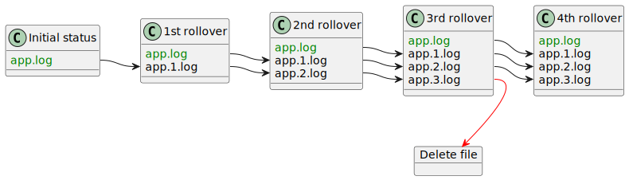

`max`
:   Using the `max` strategy, the **oldest** log file will have index `min` and the newest one will have index `max`.


> [!NOTE]
> This is the default strategy since Log4j 2.

    Assuming `min="1"` and `max="3"` the rotation of the log files is represented in the graph below:

    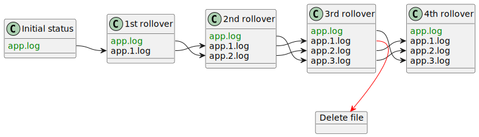

`nomax`
:   Using the `nomax` strategy no files will ever be deleted and newer archive files will be assigned increasing index numbers, starting from `min`.

    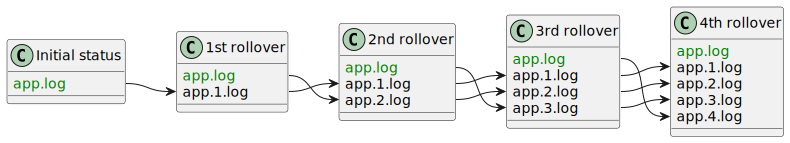

<a id="appenders-rolling-file--rolloverstrategy-compress"></a>
<a id="appenders-rolling-file--compressing-archived-files"></a>

### Compressing archived files

When the current log file is archived, the rolling file appender can compress it.
Compression is activated, based on the extension of the archived file name.
The following extensions are recognized:

| Extension | Supports `compressionLevel` | Description |
| --- | --- | --- |
| `.zip` | ✓ | ZIP archive using the [DEFLATE](https://docs.oracle.com/javase/8/docs/api/java/util/zip/DeflaterOutputStream.html) algorithm |
| `.gz` | ✓ | [GZIP](https://docs.oracle.com/javase/8/docs/api/java/util/zip/GZIPOutputStream.html) archive using the DEFLATE algorithm |
| `.bz2`[dep](#appenders-rolling-file--commons-compress-dep) | ✗ | [BZip2](https://commons.apache.org/proper/commons-compress/apidocs/org/apache/commons/compress/compressors/bzip2/BZip2CompressorOutputStream.html) algorithm |
| `.deflate`[dep](#appenders-rolling-file--commons-compress-dep) | ✗ | [DEFLATE](https://commons.apache.org/proper/commons-compress/apidocs/org/apache/commons/compress/compressors/deflate/DeflateCompressorOutputStream.html) algorithm |
| `.pack200`[dep](#appenders-rolling-file--commons-compress-dep) | ✗ | [Pack200](https://commons.apache.org/proper/commons-compress/apidocs/org/apache/commons/compress/compressors/pack200/package-summary.html) algorithm |
| `.xz` [dep](#appenders-rolling-file--commons-compress-dep) | ✗ | [XZ](https://commons.apache.org/proper/commons-compress/apidocs/org/apache/commons/compress/compressors/xz/package-summary.html) algorithm |
| `.zst` [dep](#appenders-rolling-file--commons-compress-dep) | ✗ | [ZStandard](https://commons.apache.org/proper/commons-compress/apidocs/org/apache/commons/compress/compressors/zstandard/package-summary.html) algorithm |

If the [`tempCompressedFilePattern`](#appenders-rolling-file--rolloverstrategy-attr-tempcompressedfilepattern) attribute is set, the current log file:

- will be compressed and stored in the location given by `tempCompressedFilePattern`
- and then it will be moved to the location given by [`filePattern`](#appenders-rolling-file--attr-filepattern).

dep
:   Additional dependencies are required to use these compression algorithms:

    - Maven
    - Gradle


```xml
<dependency>
  <groupId>org.apache.commons</groupId>
  <artifactId>commons-compress</artifactId>
  <version>1.27.1</version>
  <scope>runtime</scope>
</dependency>
```


```groovy
runtimeOnly 'org.apache.commons:commons-compress:1.27.1'
```

    The `.xz` and `.zst` extensions require **additional** dependencies.
    See
    [Commons Compress documentation](https://commons.apache.org/proper/commons-compress/index.html)
    for more details.

<a id="appenders-rolling-file--abstractpathaction"></a>
<a id="appenders-rolling-file--optional-actions"></a>

## Optional actions

The rotation of files and compression is **always** handled automatically by the rolling file appenders.
Since Log4j 2.6, additional actions can be configured manually.

Log4j Core provides out-of-the-box two actions:

- the [`Delete` action](#appenders-rolling-file--deleteaction) to delete old log files after a rollover,
- the [`PosixViewAttribute` action](#appenders-rolling-file--posixviewattributeaction) to change the POSIX permissions of old log files.

[📖 Plugin reference for `AbstractPathAction`](https://logging.apache.org/log4j/2.x/plugin-reference.html#org-apache-logging-log4j_log4j-core_org-apache-logging-log4j-core-appender-rolling-action-AbstractPathAction)

<a id="appenders-rolling-file--abstractpathaction-config"></a>
<a id="appenders-rolling-file--common-action-configuration"></a>

### Common action configuration

Both actions support the following configuration attributes:

Attribute

Type

Default value

Description

`basePath`

[`Path`](https://docs.oracle.com/javase/8/docs/api/java/nio/file/Path.html)

It sets the base directory for the action.
The action will be limited to files in this directory, and all paths will be relative to this directory.

**Required**

`followLinks`

`boolean`

`false`

If set to `true`, the action will follow symbolic links.

> [!WARNING]
> Setting this value to `true` will allow the action to access files outside [`basePath`](#appenders-rolling-file--abstractpathaction-attr-basepath), which might introduce a security risk.

`maxDepth`

`int`

`1`

The maximum number of directory levels to visit.
By default, the action does not recurse into subdirectories of [`basePath`](#appenders-rolling-file--abstractpathaction-attr-basepath).

| Type | Multiplicity | Description |
| --- | --- | --- |
| `PathCondition` | zero or more | A set of path conditions. The action will only be performed on files for which the condition returns `true`. |

<a id="appenders-rolling-file--deleteaction"></a>
<a id="appenders-rolling-file--delete-action"></a>

### `Delete` action

The `Delete` Action deletes old log files that match the configured condition.

> [!TIP]
> A limited version of this action is performed automatically to [increment file indexes](#appenders-rolling-file--rolloverstrategy-index).
>
> You only need an explicit `Delete` Action if you use a [`%d` pattern](#appenders-rolling-file--conversion-pattern-date).

Besides the [common configuration options](#appenders-rolling-file--abstractpathaction-config) the `Delete` Action also supports the following options:

| Attribute | Type | Default value | Description |
| --- | --- | --- | --- |
| `testMode` | `boolean` | `false` | If `true`, no files will be deleted, but a [Status Logger](#status-logger) message of level `INFO` will be issued instead. |

| Type | Multiplicity | Description |
| --- | --- | --- |
| `PathCondition` | zero or more | If present, the action will only be performed on files for which the condition returns `true`. **Required**, unless a [`ScriptCondition`](#appenders-rolling-file--deleteaction-element-scriptcondition) is provided, in which case these elements are ignored. |
| `PathSorter` | zero or one | Provides a sorting order for files contained in [`basePath`](#appenders-rolling-file--abstractpathaction-attr-basepath). The default implementation is [`PathSortByModificationTime`](https://logging.apache.org/log4j/2.x/javadoc/log4j-core/org/apache/logging/log4j/core/appender/rolling/action/PathSortByModificationTime.html), which sorts files by ascending modification timestamp. |
| `ScriptCondition` | zero or one | If present, all the [nested `PathCondition`s](#appenders-rolling-file--deleteaction-element-pathcondition) are ignored and the provided script is executed to select the file to delete. |

[📖 Plugin reference for `Delete`](https://logging.apache.org/log4j/2.x/plugin-reference.html#org-apache-logging-log4j_log4j-core_org-apache-logging-log4j-core-appender-rolling-action-DeleteAction)

<a id="appenders-rolling-file--posixviewattributeaction"></a>
<a id="appenders-rolling-file--posixviewattribute-action"></a>

### `PosixViewAttribute` action

This action allows modifying the POSIX attributes (owner, group and permissions) of archive log files.

> [!NOTE]
> By default, the POSIX attributes are inherited from the current log file.
>
> This action is only necessary if archived log files must have different attributes.

Besides the [common configuration options](#appenders-rolling-file--abstractpathaction-config) the `PosixViewAttribute` Action also supports the following options.

| Attribute | Type | Default value | Description |
| --- | --- | --- | --- |
| `filePermissions` | [`PosixFilePermissions`](https://docs.oracle.com/javase/8/docs/api/java/nio/file/attribute/PosixFilePermissions.html) | `null` | If not `null`, it specifies the POSIX file permissions to apply to each created file. The permissions must be provided in the format used by [`PosixFilePermissions.fromString()`](https://docs.oracle.com/javase/8/docs/api/java/nio/file/attribute/PosixFilePermissions.html#fromString-java.lang.String-), e.g. `rw-rw----`. The underlying files system shall support [POSIX](https://docs.oracle.com/javase/8/docs/api/java/nio/file/attribute/PosixFileAttributeView.html) file attribute view. |
| `fileOwner` | `String` | `null` | If not `null`, it specifies the file owner to apply to each created file. The underlying files system shall support file [owner](https://docs.oracle.com/javase/8/docs/api/java/nio/file/attribute/FileOwnerAttributeView.html) attribute view. |
| `fileGroup` | `String` | `null` | If not `null`, it specifies the file group owner to apply to each created file. The underlying files system shall support [POSIX](https://docs.oracle.com/javase/8/docs/api/java/nio/file/attribute/PosixFileAttributeView.html) file attribute view. |

| Type | Multiplicity | Description |
| --- | --- | --- |
| `PathCondition` | one or more | A set of conditions to select the files to modify. |

[📖 Plugin reference for `PosixViewAttribute`](https://logging.apache.org/log4j/2.x/plugin-reference.html#org-apache-logging-log4j_log4j-core_org-apache-logging-log4j-core-appender-rolling-action-PosixViewAttributeAction)

<a id="appenders-rolling-file--pathcondition"></a>
<a id="appenders-rolling-file--path-conditions"></a>

### Path conditions

To select the files for additional actions, Log4j provides the following path conditions:

<a id="appenders-rolling-file--ifaccumulatedfilesize"></a>

#### `IfAccumulatedFileSize`

When evaluated on a list of files, this condition sums the size of each file with the size of the preceding files.
It returns `true` for files that exceed a configurable threshold.

> [!IMPORTANT]
> The result of this condition depends on the sorting order on files.
> See [`PathSorter`](#appenders-rolling-file--deleteaction-element-pathsorter) for more information.

| Attribute | Type | Default value | Description |
| --- | --- | --- | --- |
| `exceeds` | [`FileSize`](https://logging.apache.org/log4j/2.x/javadoc/log4j-core/org/apache/logging/log4j/core/appender/rolling/FileSize.html) |  | The threshold size for the condition to match. Admits the same syntax as the [`size` attribute of `SizeBasedTriggeringPolicy`](#appenders-rolling-file--sizebasedtriggeringpolicy-attr-size). **Required** |

| Type | Multiplicity | Description |
| --- | --- | --- |
| `PathCondition` | zero or more | A set of optional nested conditions. This condition matches only if **all** the nested conditions also match. |

[📖 Plugin reference for `IfAccumulatedFileSize`](https://logging.apache.org/log4j/2.x/plugin-reference.html#org-apache-logging-log4j_log4j-core_org-apache-logging-log4j-core-appender-rolling-action-IfAccumulatedFileSize)

<a id="appenders-rolling-file--ifaccumulatedfilecount"></a>

#### `IfAccumulatedFileCount`

When evaluated on a list of files, this condition returns `true` if the 1-based index of a file exceeds a configurable threshold.

> [!IMPORTANT]
> The result of this condition depends on the sorting order on files.
> See [`PathSorter`](#appenders-rolling-file--deleteaction-element-pathsorter) for more information.

| Attribute | Type | Default value | Description |
| --- | --- | --- | --- |
| `exceeds` | `int` |  | The threshold for the condition to match. **Required** |

| Type | Multiplicity | Description |
| --- | --- | --- |
| `PathCondition` | zero or more | A set of optional nested conditions. This condition matches only if **all** the nested conditions also match. |

[📖 Plugin reference for `IfAccumulatedFileCount`](https://logging.apache.org/log4j/2.x/plugin-reference.html#org-apache-logging-log4j_log4j-core_org-apache-logging-log4j-core-appender-rolling-action-IfAccumulatedFileCount)

<a id="appenders-rolling-file--iffilename"></a>

#### `IfFileName`

Matches files based on their path **relative** to the base directory.

| Attribute | Type | Default value | Description |
| --- | --- | --- | --- |
| `glob` | String |  | Matches the path relative to the base directory using a `glob` pattern. See [`FileSystem.getPathMatcher()`](https://docs.oracle.com/javase/8/docs/api/java/nio/file/FileSystem.html#getPathMatcher(java.lang.String)) for the supported `glob` syntax. **Required**, unless [`regex`](#appenders-rolling-file--iffilename-attr-regex) is specified. |
| `regex` | [`Pattern`](https://docs.oracle.com/javase/8/docs/api/java/util/regex/Pattern.html) |  | Matches the path relative to the directory using a regular expression. See [`Pattern`](https://docs.oracle.com/javase/8/docs/api/java/util/regex/Pattern.html) for the supported regular expression syntax. **Required**, unless [`glob`](#appenders-rolling-file--iffilename-attr-glob) is specified. |

| Type | Multiplicity | Description |
| --- | --- | --- |
| `PathCondition` | zero or more | A set of optional nested conditions. This condition matches only if **all** the nested conditions also match. |

[📖 Plugin reference for `IfFileName`](https://logging.apache.org/log4j/2.x/plugin-reference.html#org-apache-logging-log4j_log4j-core_org-apache-logging-log4j-core-appender-rolling-action-IfFileName)

<a id="appenders-rolling-file--iflastmodified"></a>

#### `IfLastModified`

Accepts files based on their last modification timestamp.

| Attribute | Type | Default value | Description |
| --- | --- | --- | --- |
| `age` | [`Duration`](https://logging.apache.org/log4j/2.x/javadoc/log4j-core/org/apache/logging/log4j/core/appender/rolling/action/Duration.html) |  | The condition accepts files that are as old or older than the specified duration. **Required** |

| Type | Multiplicity | Description |
| --- | --- | --- |
| `PathCondition` | zero or more | A set of optional nested conditions. This condition matches only if **all** the nested conditions also match. |

[📖 Plugin reference for `IfLastModified`](https://logging.apache.org/log4j/2.x/plugin-reference.html#org-apache-logging-log4j_log4j-core_org-apache-logging-log4j-core-appender-rolling-action-IfLastModified)

<a id="appenders-rolling-file--ifnot"></a>

#### `IfNot`

Negates the result of the nested condition.

| Type | Multiplicity | Description |
| --- | --- | --- |
| `PathCondition` | **one** | The path condition to negate. |

[📖 Plugin reference for `IfNot`](https://logging.apache.org/log4j/2.x/plugin-reference.html#org-apache-logging-log4j_log4j-core_org-apache-logging-log4j-core-appender-rolling-action-IfNot)

<a id="appenders-rolling-file--ifall"></a>

#### `IfAll`

Accepts a file if all the nested conditions are true.

| Type | Multiplicity | Description |
| --- | --- | --- |
| `PathCondition` | one or more | The nested conditions to check. |

[📖 Plugin reference for `IfAll`](https://logging.apache.org/log4j/2.x/plugin-reference.html#org-apache-logging-log4j_log4j-core_org-apache-logging-log4j-core-appender-rolling-action-IfAll)

<a id="appenders-rolling-file--ifany"></a>

#### `IfAny`

| Type | Multiplicity | Description |
| --- | --- | --- |
| `PathCondition` | one or more | The nested conditions to check. |

[📖 Plugin reference for `IfAny`](https://logging.apache.org/log4j/2.x/plugin-reference.html#org-apache-logging-log4j_log4j-core_org-apache-logging-log4j-core-appender-rolling-action-IfAny)

<a id="appenders-rolling-file--scriptcondition"></a>

### `ScriptCondition`

The `ScriptCondition` uses a JSR 223 script to determine a list of matching files.

Its configuration consists of a single nested script element:

| Type | Multiplicity | Description |
| --- | --- | --- |
| [`Script`](#scripts--script), [`ScriptFile`](#scripts--scriptfile) or [`ScriptRef`](#scripts--scriptref) | **one** | A reference to the script to execute. See [Scripts](#scripts) for more details about scripting. |

The script must return a list of
[`PathWithAttributes`](https://logging.apache.org/log4j/2.x/javadoc/log4j-core/org/apache/logging/log4j/core/appender/rolling/action/PathWithAttributes.html)
objects and supports the following bindings:

| Binding name | Type | Description |
| --- | --- | --- |
| `basePath` | [`Path`](https://docs.oracle.com/javase/8/docs/api/java/nio/file/Path.html) | The path of the base directory. |
| `configuration` | [`Configuration`](#configuration) | The `Configuration` object. |
| `pathList` | [`List<PathWithAttributes>`](https://logging.apache.org/log4j/2.x/javadoc/log4j-core/org/apache/logging/log4j/core/appender/rolling/action/PathWithAttributes.html) | The list of files contained in the base directory. The paths are obtained by [resolving](https://docs.oracle.com/javase/8/docs/api/java/nio/file/Path.html#resolve-java.nio.file.Path-) the relative file names against [`basePath`](#appenders-rolling-file--scriptfilter-binding-basepath). |
| `substitutor` | [`StrSubstitutor`](https://logging.apache.org/log4j/2.x/javadoc/log4j-core/org/apache/logging/log4j/core/lookup/StrSubstitutor.html) | The `StrSubstitutor` used to replace lookup variables. |
| `statusLogger` | [`Logger`](https://logging.apache.org/log4j/2.x/javadoc/log4j-core/org/apache/logging/log4j/core/Logger.html) | The [Status Logger](#status-logger) to used by diagnostic messages in the script. |
| `<key>` | `String` | If `<key>` is not one of the above, it will be bound to the value given by [the global `Properties` configuration element.](#configuration--property-substitution) |

For an example of `ScriptCondition` usage, see the [Using `ScriptCondition`](#appenders-rolling-file--using-script-condition) example below.

[📖 Plugin reference for `ScriptCondition`](https://logging.apache.org/log4j/2.x/plugin-reference.html#org-apache-logging-log4j_log4j-core_org-apache-logging-log4j-core-appender-rolling-action-ScriptCondition)

<a id="appenders-rolling-file--recipes"></a>
<a id="appenders-rolling-file--configuration-recipes"></a>

## Configuration recipes

<a id="appenders-rolling-file--logrotate-daily"></a>
<a id="appenders-rolling-file--logrotate-equivalent-configuration"></a>

### `logrotate` equivalent configuration

[`Logrotate`](https://github.com/logrotate/logrotate) is a common UNIX utility that rotates log files.

Since a Java application cannot be notified that the log files need to be reloaded `logrotate` can be used with Java application through its `copytruncate` option (see
[`logrotate(8)` man page](https://man7.org/linux/man-pages/man8/logrotate.8.html)).
A sample `logrotate` configuration file might therefore look like:

```none
/var/log/app.log {
  copytruncate
  compress
  rotate 15
  daily
  maxsize 100k
}
```

This configuration has a problem, which is explained in the documentation of the `copytruncate` option:

> Note that there is a very small time slice between copying the file and truncating it, so some logging data might be lost.

Fortunately you can replace the usage of `logrotate` with a rolling file appender.
An equivalent configuration will look like this:

- XML
- JSON
- YAML
- Properties

Snippet from an example [`log4j2.xml`](https://github.com/apache/logging-log4j2/tree/rel/2.25.3/src/site/antora/modules/ROOT/examples/manual/appenders/rolling-file/logrotate.xml)

```xml
<RollingFile name="FILE"
             fileName="/var/log/app.log"
             filePattern="/var/log/app.log.%i.gz"> (1)
  <JsonTemplateLayout/>
  <DefaultRolloverStrategy max="15"/> (2)
  <Policies>
    <CronTriggeringPolicy schedule="0 0 0 * * ?"/> (3)
    <SizeBasedTriggeringPolicy size="100k"/> (4)
  </Policies>
</RollingFile>
```

Snippet from an example [`log4j2.json`](https://github.com/apache/logging-log4j2/tree/rel/2.25.3/src/site/antora/modules/ROOT/examples/manual/appenders/rolling-file/logrotate.json)

```json
"RollingFile": {"name": "FILE","fileName": "/var/log/app.log","filePattern": "/var/log/app.log.%i.gz", (1) "JsonTemplateLayout": {},"DefaultRolloverStrategy": {"max": 15 (2) },"Policies": {"CronTriggeringPolicy": {"schedule": "0 0 0 * * ?" (3) },"SizeBasedTriggeringPolicy": {"size": "100k" (4)}}}
```

Snippet from an example [`log4j2.yaml`](https://github.com/apache/logging-log4j2/tree/rel/2.25.3/src/site/antora/modules/ROOT/examples/manual/appenders/rolling-file/logrotate.yaml)

```yaml
RollingFile:
  name: "FILE"
  fileName: "/var/log/app.log"
  filePattern: "/var/log/app.log.%i.gz" (1)
  JsonTemplateLayout: {}
  DefaultRolloverStrategy:
    max: 15 (2)
  Policies:
    CronTriggeringPolicy:
      schedule: "0 0 0 * * ?" (3)
    SizeBasedTriggeringPolicy:
      size: "100k" (4)
```

Snippet from an example [`log4j2.properties`](https://github.com/apache/logging-log4j2/tree/rel/2.25.3/src/site/antora/modules/ROOT/examples/manual/appenders/rolling-file/logrotate.properties)

```properties
appender.0.type = RollingFile
appender.0.name = FILE
appender.0.fileName = /var/log/app.log
(1)
appender.0.filePattern = /var/log/app.log.%i.gz

appender.0.layout.type = JsonTemplateLayout

appender.0.strategy.type = DefaultRolloveStrategy
(2)
appender.0.strategy.max = 15

appender.0.policy.type = Policies
appender.0.policy.0.type = CronTriggeringPolicy
(3)
appender.0.policy.0.schedule = 0 0 0 * * ?
appender.0.policy.1.type = SizeBasedTriggeringPolicy
(4)
appender.0.policy.1.size = 100k
```

| **1** | Equivalent to `compress`: archived files are compressed. |
| --- | --- |
| **2** | Equivalent to `rotate 15`: only the `15` latest log files are kept. |
| **3** | Equivalent to `daily`: logs will be rotated at midnight of each day. |
| **4** | Equivalent to `maxsize 100k`: logs will be rotated if they exceed 100 kB of size. |

<a id="appenders-rolling-file--timestamped"></a>
<a id="appenders-rolling-file--timestamped-log-file-names"></a>

### Timestamped log file names

The following configuration creates one log file every day and deletes those more than 15 days old.

> [!NOTE]
> Since we have a `%d` pattern in the configuration file, we need to use an explicit [`Delete` action](#appenders-rolling-file--deleteaction).

- XML
- JSON
- YAML
- Properties

Snippet from an example [`log4j2.xml`](https://github.com/apache/logging-log4j2/tree/rel/2.25.3/src/site/antora/modules/ROOT/examples/manual/appenders/rolling-file/timestamped.xml)

```xml
<RollingFile name="FILE"
             filePattern="/var/log/app.%d{yyyy-MM-dd}.log.gz"> (1)
  <JsonTemplateLayout/>
  <DirectWriteRolloverStrategy>
    <Delete basePath="/var/log"> (2)
      <IfFileName regex="app\.\d{4}-\d{2}-\d{2}\.log\.gz"/> (3)
      <IfLastModified age="P15D"/>
    </Delete>
  </DirectWriteRolloverStrategy>
  <TimeBasedTriggeringPolicy/>
</RollingFile>
```

Snippet from an example [`log4j2.json`](https://github.com/apache/logging-log4j2/tree/rel/2.25.3/src/site/antora/modules/ROOT/examples/manual/appenders/rolling-file/timestamped.json)

```json
"RollingFile": {"name": "FILE","filePattern": "/var/log/app.%d{yyyy-MM-dd}.log.gz", (1) "JsonTemplateLayout": {},"DirectWriteRolloverStrategy": {"Delete": { (2) "basePath": "/var/log","IfFileName": {"regex": "app\\.\\d{4}-\\d{2}-\\d{2}\\.log\\.gz" (3) },"IfLastModified": {"age": "P15D"}} },"TimeBasedTriggeringPolicy": {}}
```

Snippet from an example [`log4j2.yaml`](https://github.com/apache/logging-log4j2/tree/rel/2.25.3/src/site/antora/modules/ROOT/examples/manual/appenders/rolling-file/timestamped.yaml)

```yaml
RollingFile:
  name: "FILE"
  filePattern: "/var/log/app.%d{yyyy-MM-dd}.log.gz" (1)
  JsonTemplateLayout: {}
  DirectWriteRolloverStrategy:
    Delete: (2)
      basePath: "/var/log"
      IfFileName:
        regex: "app\\.\\d{4}-\\d{2}-\\d{2}\\.log\\.gz" (3)
      IfLastModified:
        age: "P15D"
  TimeBasedTriggeringPolicy: {}
```

Snippet from an example [`log4j2.properties`](https://github.com/apache/logging-log4j2/tree/rel/2.25.3/src/site/antora/modules/ROOT/examples/manual/appenders/rolling-file/timestamped.properties)

```properties
appender.0.type = RollingFile
appender.0.name = FILE
(1)
appender.0.filePattern = /var/log/app.%d{yyyy-MM-dd}.log.gz

appender.0.layout.type = JsonTemplateLayout

appender.0.strategy.type = DirectWriteRolloverStrategy
(2)
appender.0.strategy.delete.type = Delete
appender.0.strategy.delete.basePath = /var/log
appender.0.strategy.delete.0.type = IfFileName
(3)
appender.0.strategy.delete.0.regex = app\\.\\d{4}-\\d{2}-\\d{2}\\.log\\.gz
appender.0.strategy.delete.1.type = IfLastModified
appender.0.strategy.delete.1.age = P15D

appender.0.policy.type = TimeBaseTriggeringPolicy
```

**1**

Only the `filePattern` attribute is used, since we use the [`DirectWriteRolloverStrategy`](#appenders-rolling-file--directwriterolloverstrategy).

**2**

An explicit `Delete` action is provided.

**3**

You can select the files to delete using a regular expression or a simpler `app.*.log.gz` glob pattern.

<a id="appenders-rolling-file--using-script-condition"></a>
<a id="appenders-rolling-file--using-scriptcondition"></a>

### Using `ScriptCondition`

If the supplied [path conditions](#appenders-rolling-file--pathcondition) are not sufficient, you can use a [`ScriptCondition`](#appenders-rolling-file--scriptcondition) with an arbitrary script.

The [example above](#appenders-rolling-file--timestamped) can be rewritten into the following Groovy script:

Snippet from an example [`script-condition.groovy`](https://github.com/apache/logging-log4j2/tree/rel/2.25.3/src/site/antora/modules/ROOT/examples/manual/appenders/rolling-file/script-condition.groovy)

```groovy
def limit = FileTime.from(ZonedDateTime.now().minusDays(15).toInstant())
def matcher = FileSystems.getDefault().getPathMatcher('glob:app.*.log.gz')
statusLogger.info("Deleting files older than {}.", limit) (1)
return pathList.stream()
        .filter({
            def relPath = basePath.relativize(it.path) (2)
            def lastModified = it.attributes.lastModifiedTime()
            Files.isRegularFile(it.path)
                    && lastModified <= limit (3)
                    && matcher.matches(relPath) (4)
        })
        .collect(Collectors.toList())
```

<table>
<tr>
<td>1</td>
<td>Adding <a href="#status-logger">Status Logger</a> calls in your script might help in debugging it.</td>
</tr>
<tr>
<td>2</td>
<td><a href="https://logging.apache.org/log4j/2.x/javadoc/log4j-core/org/apache/logging/log4j/core/appender/rolling/action/PathWithAttributes.html#getPath()"><code>PathWithAttributes.getPath()</code></a>
always starts with <code>basePath</code>, so we need to relativize it.</td>
</tr>
<tr>
<td>3</td>
<td>Equivalent to the <a href="#appenders-rolling-file--iflastmodified"><code>IfLastModified</code></a> condition.</td>
</tr>
<tr>
<td>4</td>
<td>Equivalent to the <a href="#appenders-rolling-file--iffilename"><code>IfFileName</code></a> condition.</td>
</tr>
</table>

You can use the script in your configuration file as follows:

- XML
- JSON
- YAML
- Properties

Snippet from an example [`log4j2.xml`](https://github.com/apache/logging-log4j2/tree/rel/2.25.3/src/site/antora/modules/ROOT/examples/manual/appenders/rolling-file/script-condition.xml)

```xml
<RollingFile name="FILE"
             filePattern="/var/log/app.%d{yyyy-MM-dd}.log.gz">
  <JsonTemplateLayout/>
  <DirectWriteRolloverStrategy>
    <Delete basePath="/var/log">
      <ScriptCondition>
        <ScriptFile path="script-condition.groovy"
                    language="groovy"/>
      </ScriptCondition>
    </Delete>
  </DirectWriteRolloverStrategy>
  <TimeBasedTriggeringPolicy/>
</RollingFile>
```

Snippet from an example [`log4j2.json`](https://github.com/apache/logging-log4j2/tree/rel/2.25.3/src/site/antora/modules/ROOT/examples/manual/appenders/rolling-file/script-condition.json)

```json
"RollingFile": {"name": "FILE","filePattern": "/var/log/app.%d{yyyy-MM-dd}.log.gz","JsonTemplateLayout": {},"DirectWriteRolloverStrategy": {"Delete": {"basePath": "/var/log","ScriptCondition": {"ScriptFile": {"path": "script-condition.groovy","language": "groovy"}}} },"TimeBasedTriggeringPolicy": {}}
```

Snippet from an example [`log4j2.yaml`](https://github.com/apache/logging-log4j2/tree/rel/2.25.3/src/site/antora/modules/ROOT/examples/manual/appenders/rolling-file/script-condition.yaml)

```yaml
RollingFile:
  name: "FILE"
  filePattern: "/var/log/app.%d{yyyy-MM-dd}.log.gz"
  JsonTemplateLayout: {}
  DirectWriteRolloverStrategy:
    Delete:
      basePath: "/var/log"
      ScriptCondition:
        path: "script-condition.groovy"
        language: "groovy"
  TimeBasedTriggeringPolicy: {}
```

Snippet from an example [`log4j2.properties`](https://github.com/apache/logging-log4j2/tree/rel/2.25.3/src/site/antora/modules/ROOT/examples/manual/appenders/rolling-file/script-condition.properties)

```properties
appender.0.type = RollingFile
appender.0.name = FILE
appender.0.filePattern = /var/log/app.%d{yyyy-MM-dd}.log.gz

appender.0.layout.type = JsonTemplateLayout

appender.0.strategy.type = DirectWriteRolloverStrategy
appender.0.strategy.delete.type = Delete
appender.0.strategy.delete.basePath = /var/log
appender.0.strategy.delete.condition.type = ScriptCondition
appender.0.strategy.delete.condition.script.type = ScriptFile
appender.0.strategy.delete.condition.script.path = script-condition.groovy
appender.0.strategy.delete.condition.script.language = groovy

appender.0.policy.type = TimeBaseTriggeringPolicy
```

<a id="appenders-rolling-file--per-month"></a>
<a id="appenders-rolling-file--separate-folder-per-month"></a>

### Separate folder per month

We can also create separate folders for temporarily related files.
In the example below, we create a different folder for each month:

- XML
- JSON
- YAML
- Properties

Snippet from an example [`log4j2.xml`](https://github.com/apache/logging-log4j2/tree/rel/2.25.3/src/site/antora/modules/ROOT/examples/manual/appenders/rolling-file/per-month.xml)

```xml
<RollingFile name="FILE"
             filePattern="/var/log/app/%d{yyyy-MM}/%d{yyyy-MM-dd}.log.gz"> (1)
  <JsonTemplateLayout/>
  <DirectWriteRolloverStrategy>
    <Delete basePath="/var/log/app"
            maxDepth="2"> (2)
      <IfLastModified age="P90D"/>
    </Delete>
  </DirectWriteRolloverStrategy>
  <TimeBasedTriggeringPolicy/>
</RollingFile>
```

Snippet from an example [`log4j2.json`](https://github.com/apache/logging-log4j2/tree/rel/2.25.3/src/site/antora/modules/ROOT/examples/manual/appenders/rolling-file/per-month.json)

```json
"RollingFile": {"name": "FILE","filePattern": "/var/log/app/%{yyyy-MM}/%d{yyyy-MM-dd}.log.gz", (1) "JsonTemplateLayout": {},"DirectWriteRolloverStrategy": {"Delete": {"basePath": "/var/log/app","maxDepth": 2, (2) "IfLastModified": {"age": "P90D"}} },"TimeBasedTriggeringPolicy": {}}
```

Snippet from an example [`log4j2.yaml`](https://github.com/apache/logging-log4j2/tree/rel/2.25.3/src/site/antora/modules/ROOT/examples/manual/appenders/rolling-file/per-month.yaml)

```yaml
RollingFile:
  name: "FILE"
  filePattern: "/var/log/app/%d{yyyy-MM}/%d{yyyy-MM-dd}.log.gz" (1)
  JsonTemplateLayout: {}
  DirectWriteRolloverStrategy:
    Delete:
      basePath: "/var/log/app"
      maxDepth: 2 (2)
      IfLastModified:
        age: "P90D"
  TimeBasedTriggeringPolicy: {}
```

Snippet from an example [`log4j2.properties`](https://github.com/apache/logging-log4j2/tree/rel/2.25.3/src/site/antora/modules/ROOT/examples/manual/appenders/rolling-file/per-month.properties)

```properties
appender.0.type = RollingFile
appender.0.name = FILE
(1)
appender.0.filePattern = /var/log/app/%d{yyyy-MM]/%d{yyyy-MM-dd}.log.gz

appender.0.layout.type = JsonTemplateLayout

appender.0.strategy.type = DirectWriteRolloverStrategy
appender.0.strategy.delete.type = Delete
appender.0.strategy.delete.basePath = /var/log/app
(2)
appender.0.strategy.delete.maxDepth = 2
appender.0.strategy.delete.0.type = IfLastModified
appender.0.strategy.delete.0.age = P90D

appender.0.policy.type = TimeBaseTriggeringPolicy
```

**1**

We use two `%d` patterns to specify the folder and file name.

**2**

We increase the recursion depth of the `Delete` action to extend to subfolders of the base directory.

---

<a id="appenders-database"></a>

<!-- source_url: https://logging.apache.org/log4j/2.x/manual/appenders/database.html -->

<!-- page_index: 23 -->

<a id="appenders-database--database-appenders"></a>

# Database appenders

Log4j Core provides multiple appenders to send log events directly to your database.

<a id="appenders-database--common-concerns"></a>

## Common concerns

<a id="appenders-database--columnmapping"></a>
<a id="appenders-database--column-mapping"></a>

### Column mapping

Since relational databases and some NoSQL databases split data into columns, Log4j Core provides a reusable
[`ColumnMapping`](https://logging.apache.org/log4j/2.x/javadoc/log4j-core/org/apache/logging/log4j/core/appender/db/ColumnMapping.html)
configuration element to allow specifying the content of each column.

The Column Mapping element supports the following configuration properties:

Attribute

Type

Default value

Description

Required

`name`

`String`

The name of the column.

Optional

`columnType`

`Class<?>`

`String`

It specifies the Java type that will be stored in the column.

If set to:

`org.apache.logging.log4j.util.ReadOnlyStringMap`

`org.apache.logging.log4j.spi.ThreadContextMap`
:   The column will be filled with the contents of the log event’s [context map](#thread-context--mdc).

`org.apache.logging.log4j.spi.ThreadContextStack`
:   The column will be filled with the contents of the log event’s [context stack](#thread-context--ndc).

`java.util.Date`
:   The column will be filled with the log event’s timestamp.

For any other value:

1. The log event will be formatted using the [nested `Layout`](#appenders-database--columnmapping-element-layout).
2. The resulting `String` will be converted to the specified type using a
   [`TypeConverter`](https://logging.apache.org/log4j/2.x/javadoc/log4j-core/org/apache/logging/log4j/core/config/plugins/convert/TypeConverter.html).
   See the
   [plugin reference](https://logging.apache.org/log4j/2.x/plugin-reference.html#org-apache-logging-log4j_log4j-core_org-apache-logging-log4j-core-config-plugins-convert-TypeConverter)
   for a list of available type converters.

`type`

`Class<?>`

`String`

**Deprecated**: since `2.21.0` use [`columnType`](#appenders-database--columnmapping-attr-columntype) instead.

`literal`

`String`

If set, the value will be added **directly** in the insert statement of the database-specific query language.

> [!WARNING]
> This value is added as-is, without any validation.
> Never use user-provided data to determine its value.

`parameter`

`String`

It specifies the database-specific parameter marker to use.
Otherwise, the default parameter marker for the database language will be used.

> [!WARNING]
> This value is added as-is, without any validation.
> Never use user-provided data to determine its value.

`pattern`

`String`

This is a shortcut configuration attribute to set the
[nested `Layout` element](#appenders-database--columnmapping-element-layout)
to a [`PatternLayout`](#pattern-layout)
instance with the specified `pattern` property.

`source`

`String`

[`name`](#appenders-database--columnmapping-attr-name)

It specifies which key of a [`MapMessage`](#messages--mapmessage) will be stored in the column.
This attribute is used only if:

- The [nested `Layout` element](#appenders-database--columnmapping-element-layout)
  is a
  [`MessageLayout`](https://logging.apache.org/log4j/2.x/javadoc/log4j-core/org/apache/logging/log4j/core/layout/MessageLayout.html).
- The message being logged is a `MapMessage`

| Type | Multiplicity | Description |
| --- | --- | --- |
| `Layout` | zero or one | Formats the value to store in the column. See [Layouts](#layouts) for more information. |

[Plugin reference for `ColumnMapping`](https://logging.apache.org/log4j/2.x/plugin-reference.html#org-apache-logging-log4j_log4j-core_org-apache-logging-log4j-core-appender-db-ColumnMapping)

An example column mapping might look like this:

- XML
- JSON
- YAML
- Properties

Snippet from an example [`log4j2.xml`](https://github.com/apache/logging-log4j2/tree/rel/2.25.3/src/site/antora/modules/ROOT/examples/manual/appenders/database/column-mapping.xml)

```xml
(1)
<ColumnMapping name="id" literal="currval('logging_seq')"/>
(2)
<ColumnMapping name="uuid"
               pattern="%uuid{TIME}"
               columnType="java.util.UUID"/>
<ColumnMapping name="message" pattern="%m"/>
(3)
<ColumnMapping name="timestamp" columnType="java.util.Date"/>
<ColumnMapping name="mdc"
               columnType="org.apache.logging.log4j.spi.ThreadContextMap"/>
<ColumnMapping name="ndc"
               columnType="org.apache.logging.log4j.spi.ThreadContextStack"/>
(4)
<ColumnMapping name="asJson">
  <JsonTemplateLayout/>
</ColumnMapping>
(5)
<ColumnMapping name="resource" source="resourceId"/>
```

Snippet from an example [`log4j2.json`](https://github.com/apache/logging-log4j2/tree/rel/2.25.3/src/site/antora/modules/ROOT/examples/manual/appenders/database/column-mapping.json)

```json
"ColumnMapping": [(1) {"name": "id","literal": "currval('logging_seq')" },(2) {"name": "uuid","pattern": "%uuid{TIME}","columnType": "java.util.UUID" },{"name": "message","pattern": "%m" },(3) {"name": "timestamp","columnType": "java.util.Date" },{"name": "mdc","columnType": "org.apache.logging.log4j.spi.ThreadContextMap" },{"name": "ndc","columnType": "org.apache.logging.log4j.spi.ThreadContextStack" },(4) {"name": "asJson","JsonTemplateLayout": {} },(5) {"name": "resource","source": "resourceId"}]
```

Snippet from an example [`log4j2.yaml`](https://github.com/apache/logging-log4j2/tree/rel/2.25.3/src/site/antora/modules/ROOT/examples/manual/appenders/database/column-mapping.yaml)

```yaml
ColumnMapping:
  (1)
  - name: "id"
    literal: "currval('logging_seq')"
  (2)
  - name: "uuid"
    pattern: "%uuid{TIME}"
    columnType: "java.util.UUID"
  - name: "message"
    pattern: "%m"
  (3)
  - name: "timestamp"
    columnType: "java.util.Date"
  - name: "mdc"
    columnType: "org.apache.logging.log4j.spi.ThreadContextMap"
  - name: "ndc"
    columnType: "org.apache.logging.log4j.spi.ThreadContextStack"
  (4)
  - name: "asJson"
    JsonTemplateLayout: {}
  (5)
  - name: "resource"
    source: "resourceId"
```

Snippet from an example [`log4j2.properties`](https://github.com/apache/logging-log4j2/tree/rel/2.25.3/src/site/antora/modules/ROOT/examples/manual/appenders/database/column-mapping.properties)

```properties
(1)
appender.0.col[0].type = ColumnMapping
appender.0.col[0].name = id
appender.0.col[0].literal = currval('logging_seq')

(2)
appender.0.col[1].type = ColumnMapping
appender.0.col[1].name = uuid
appender.0.col[1].pattern = %uuid{TIME}
appender.0.col[1].columnType = java.util.UUID

appender.0.col[2].type = ColumnMapping
appender.0.col[2].name = message
appender.0.col[2].pattern = %m

(3)
appender.0.col[3].type = ColumnMapping
appender.0.col[3].name = timestamp
appender.0.col[3].timestamp = java.util.Date

appender.0.col[4].type = ColumnMapping
appender.0.col[4].name = mdc
appender.0.col[4].columnType = org.apache.logging.log4j.spi.ThreadContextMap

appender.0.col[5].type = ColumnMapping
appender.0.col[5].name = ndc
appender.0.col[5].columnType = org.apache.logging.log4j.spi.ThreadContextStack

(4)
appender.0.col[6].type = ColumnMapping
appender.0.col[6].name = asJson
appender.0.col[6].layout.type = JsonTemplateLayout

(5)
appender.0.col[7].type = ColumnMapping
appender.0.col[7].name = resource
appender.0.col[7].source = resourceId
```

| **1** | A database-specific expression is added literally to the `INSERT` statement. |
| --- | --- |
| **2** | A [Pattern Layout](#pattern-layout) with the specified pattern is used for these columns. The `uuid` column is additionally converted into a `java.util.UUID` before being sent to the JDBC driver. |
| **3** | Three special column types are replaced with the log event timestamp, context map, and context stack. |
| **4** | A [JSON Template Layout](#json-template-layout) is used to format this column. |
| **5** | If the global layout of the appender returns a `MapMessage`, the value for key `resourceId` will be put into the `resource` column. |

<a id="appenders-database--cassandraappender"></a>
<a id="appenders-database--cassandra-appender"></a>

## Cassandra Appender

> [!WARNING]
> **This appender is planned to be removed in the next major release!**
> If you are using this library, please get in touch with the Log4j maintainers using [the official support channels](https://logging.apache.org/support.html).

The Cassandra Appender writes its output to an
[Apache Cassandra](https://cassandra.apache.org/_/index.html)
database.
The appender supports the following configuration properties:

<table class="tableblock frame-all grid-all stretch" id="CassandraAppender-attributes">
<caption>Table 3. Cassandra Appender configuration attributes</caption>
<colgroup>
<col/>
<col/>
<col/>
<col/>
</colgroup>
<thead>
<tr>
<th>Attribute</th>
<th>Type</th>
<th>Default value</th>
<th>Description</th>
</tr>
</thead>
<tbody>
<tr>
<th colspan="4"><p>Required</p></th>
</tr>
<tr>
<td><p><code><a id="CassandraAppender-attr-name"></a>name</code></p></td>
<td><p><code>String</code></p></td>
<td></td>
<td><p>The name of the Appender.</p></td>
</tr>
<tr>
<th colspan="4"><p>Optional</p></th>
</tr>
<tr>
<td><p><code><a id="CassandraAppender-attr-batched"></a>batched</code></p></td>
<td><p><code>boolean</code></p></td>
<td><p><code>false</code></p></td>
<td><p>Whether to use batch statements to write log messages to Cassandra.</p></td>
</tr>
<tr>
<td><p><code><a id="CassandraAppender-attr-batchType"></a>batchType</code></p></td>
<td><p><a href="https://docs.datastax.com/en/drivers/java/3.0/com/datastax/driver/core/BatchStatement.Type.html">BatchStatement.Type</a></p></td>
<td><p><a href="https://docs.datastax.com/en/drivers/java/3.0/com/datastax/driver/core/BatchStatement.Type.html#LOGGED"><code>LOGGED</code></a></p></td>
<td><p>The batch type to use when using batched writes.</p></td>
</tr>
<tr>
<td><p><code><a id="CassandraAppender-attr-bufferSize"></a>bufferSize</code></p></td>
<td><p><code>int</code></p></td>
<td><p><code>0</code></p></td>
<td><p>The number of log messages to buffer or batch before writing.
If <code>0</code>, buffering is disabled.</p></td>
</tr>
<tr>
<td><p><code><a id="CassandraAppender-attr-clusterName"></a>clusterName</code></p></td>
<td><p><code>String</code></p></td>
<td></td>
<td><p>The name of the Cassandra cluster to connect to.</p></td>
</tr>
<tr>
<td><p><code><a id="CassandraAppender-attr-ignoreExceptions"></a>ignoreExceptions</code></p></td>
<td><p><code>boolean</code></p></td>
<td><p><code>true</code></p></td>
<td><p>If <code>false</code>, logging exception will be forwarded to the caller of the logging statement.
Otherwise, they will be ignored.</p></td>
</tr>
<tr>
<td><p><code><a id="CassandraAppender-attr-keyspace"></a>keyspace</code></p></td>
<td><p>String</p></td>
<td></td>
<td><p>The name of the keyspace containing the table that log messages will be written to.</p></td>
</tr>
<tr>
<td><p><code>password</code></p></td>
<td><p><code>String</code></p></td>
<td></td>
<td><p>The password to use (along with the username) to connect to Cassandra.</p></td>
</tr>
<tr>
<td><p><code>table</code></p></td>
<td><p><code>String</code></p></td>
<td></td>
<td><p>The name of the table to write log messages to.</p></td>
</tr>
<tr>
<td><p><code>useClockForTimestampGenerator</code></p></td>
<td><p><code>boolean</code></p></td>
<td><p><code>false</code></p></td>
<td><p>Whether to use the configured <code>org.apache.logging.log4j.core.util.Clock</code> as a timestamp generator.</p></td>
</tr>
<tr>
<td><p><code><code>username</code></code></p></td>
<td><p><code>String</code></p></td>
<td></td>
<td><p>The username to use to connect to Cassandra. By default, no username or password is used.</p></td>
</tr>
<tr>
<td><p><code>useTls</code></p></td>
<td><p><code>boolean</code></p></td>
<td><p><code>true</code></p></td>
<td><p>Whether to use TLS/SSL to connect to Cassandra. This is <code>false</code> by default.</p></td>
</tr>
</tbody>
</table>

<table class="tableblock frame-all grid-all stretch" id="CassandraAppender-elements">
<caption>Table 4. Cassandra Appender nested elements</caption>
<colgroup>
<col/>
<col/>
<col/>
</colgroup>
<thead>
<tr>
<th>Type</th>
<th>Multiplicity</th>
<th>Description</th>
</tr>
</thead>
<tbody>
<tr>
<td><p><code><a id="CassandraAppender-element-Filter"></a><a href="#filters"><code>Filter</code></a></code></p></td>
<td><p>zero or one</p></td>
<td><p>Allows filtering log events just before they are formatted and sent.</p>
<p>See also <a href="#filters--appender-stage">appender filtering stage</a>.</p></td>
</tr>
<tr>
<td><p><code><a id="CassandraAppender-element-ColumnMapping"></a><a href="#appenders-database--columnmapping"><code>ColumnMapping</code></a></code></p></td>
<td><p>one or more</p></td>
<td><div><div>
<p>A list of <a href="#appenders-database--columnmapping">column mapping</a> configurations.
The following database-specific restrictions apply:</p>
</div>
<div>
<ul>
<li>
<p>the <a href="#appenders-database--columnmapping-attr-name"><code>name</code> attribute</a> must be a valid
<a href="https://cassandra.apache.org/doc/stable/cassandra/cql/definitions.html#identifiers">CQL identifier</a>.</p>
</li>
<li>
<p>the <a href="#appenders-database--columnmapping-attr-literal"><code>literal</code> attribute</a> must be a valid
<a href="https://cassandra.apache.org/doc/stable/cassandra/cql/definitions.html#terms">CQL term</a>.</p>
</li>
<li>
<p>the <a href="#appenders-database--columnmapping-attr-parameter"><code>parameter</code> attribute</a> has a fixed value of <code>?</code>.</p>
</li>
</ul>
</div></div></td>
</tr>
<tr>
<td><p><code><a id="CassandraAppender-element-SocketAddress"></a><a href="#appenders-database--socketaddress"><code>SocketAddress</code></a></code></p></td>
<td><p>one or more</p></td>
<td><p>A list of Cassandra node addresses to connect to.
If absent, <code>localhost:9042</code> will be used.</p>
<p>See <a href="#appenders-database--socketaddress">Socket Addresses</a> for the configuration syntax.</p></td>
</tr>
</tbody>
</table>

Additional runtime dependencies are required for using the Cassandra Appender:

- Maven
- Gradle

We assume you use [`log4j-bom`](https://logging.apache.org/log4j/2.x/components.html#log4j-bom) for dependency management.

```xml
<dependency>
  <groupId>org.apache.logging.log4j</groupId>
  <artifactId>log4j-cassandra</artifactId>
  <scope>runtime</scope>
</dependency>
```

We assume you use [`log4j-bom`](https://logging.apache.org/log4j/2.x/components.html#log4j-bom) for dependency management.

```groovy
runtimeOnly 'org.apache.logging.log4j:log4j-cassandra'
```

[📖 Plugin reference for `Cassandra`](https://logging.apache.org/log4j/2.x/plugin-reference.html#org-apache-logging-log4j_log4j-cassandra_org-apache-logging-log4j-cassandra-CassandraAppender)

<a id="appenders-database--socketaddress"></a>
<a id="appenders-database--socket-addresses"></a>

### Socket Addresses

The address of the Cassandra server is specified using the `SocketAddress` element, which supports the following configuration options:

| Attribute | Type | Default value | Description |
| --- | --- | --- | --- |
| `host` | [`InetAddress`](https://docs.oracle.com/javase/8/docs/api/java/net/InetAddress.html) | `localhost` | The host to connect to. |
| `port` | `int` | `0` | The port to connect to. |

[📖 Plugin reference for `SocketAddress`](https://logging.apache.org/log4j/2.x/plugin-reference.html#org-apache-logging-log4j_log4j-core_org-apache-logging-log4j-core-net-SocketAddress)

<a id="appenders-database--cassandraappender-examples"></a>
<a id="appenders-database--configuration-examples"></a>

### Configuration examples

Here is an example Cassandra Appender configuration:

- XML
- JSON
- YAML
- Properties

Snippet from an example [`log4j2.xml`](https://github.com/apache/logging-log4j2/tree/rel/2.25.3/src/site/antora/modules/ROOT/examples/manual/appenders/database/cassandra.xml)

```xml
<Cassandra name="CASSANDRA"
           clusterName="test-cluster"
           keyspace="test"
           table="logs"
           bufferSize="10"
           batched="true"> (1)
  (2)
  <SocketAddress host="server1" port="9042"/>
  <SocketAddress host="server2" port="9042"/>
  (3)
  <ColumnMapping name="id"
                 pattern="%uuid{TIME}"
                 columnType="java.util.UUID"/>
  <ColumnMapping name="timestamp" columnType="java.util.Date"/>
  <ColumnMapping name="level" pattern="%level"/>
  <ColumnMapping name="marker" pattern="%marker"/>
  <ColumnMapping name="logger" pattern="%logger"/>
  <ColumnMapping name="message" pattern="%message"/>
  <ColumnMapping name="mdc"
                 columnType="org.apache.logging.log4j.spi.ThreadContextMap"/>
  <ColumnMapping name="ndc"
                 columnType="org.apache.logging.log4j.spi.ThreadContextStack"/>
</Cassandra>
```

Snippet from an example [`log4j2.json`](https://github.com/apache/logging-log4j2/tree/rel/2.25.3/src/site/antora/modules/ROOT/examples/manual/appenders/database/cassandra.json)

```json
"Cassandra": {"name": "CASSANDRA","clusterName": "test-cluster","keyspace": "test","table": "logs",(1) "bufferSize": 10,"batched": true,(2) "SocketAddress": [{"host": "server1","port": "9042" },{"host": "server2","port": "9042"} ],(3) "ColumnMapping": [{"name": "id","pattern": "%uuid{TIME}","columnType": "java.util.UUID" },{"name": "timestamp","columnType": "java.util.Date" },{"name": "level","pattern": "%level" },{"name": "marker","pattern": "%marker" },{"name": "logger","pattern": "%logger" },{"name": "message","pattern": "%m" },{"name": "mdc","columnType": "org.apache.logging.log4j.spi.ThreadContextMap" },{"name": "ndc","columnType": "org.apache.logging.log4j.spi.ThreadContextStack"}]}
```

Snippet from an example [`log4j2.yaml`](https://github.com/apache/logging-log4j2/tree/rel/2.25.3/src/site/antora/modules/ROOT/examples/manual/appenders/database/cassandra.yaml)

```yaml
Cassandra:
  name: "CASSANDRA"
  clusterName: "test-cluster"
  keyspace: "test"
  table: "logs"
  (1)
  bufferSize: 10
  batched: true
  (2)
  SocketAddress:
    - host: "server1"
      port: "9042"
    - host: "server2"
      port: "9042"
  (3)
  ColumnMapping:
    - name: "id"
      pattern: "%uuid{TIME}"
      columnType: "java.util.UUID"
    - name: "timestamp"
      columnType: "java.util.Date"
    - name: "level"
      pattern: "%level"
    - name: "marker"
      pattern: "%marker"
    - name: "logger"
      pattern: "%logger"
    - name: "message"
      pattern: "%message"
    - name: "mdc"
      columnType: "org.apache.logging.log4j.spi.ThreadContextMap"
    - name: "ndc"
      columnType: "org.apache.logging.log4j.spi.ThreadContextStack"
```

Snippet from an example [`log4j2.properties`](https://github.com/apache/logging-log4j2/tree/rel/2.25.3/src/site/antora/modules/ROOT/examples/manual/appenders/database/cassandra.properties)

```properties
appender.0.type = Cassandra
appender.0.name = CASSANDRA
appender.0.clusterName = test-cluster
appender.0.keyspace = test
appender.0.table = logs
(1)
appender.0.bufferSize = 10
appender.0.batched = true

(2)
appender.0.addr[0].type = SocketAddress
appender.0.addr[0].host = server1
appender.0.addr[0].port = 9042

appender.0.addr[1].type = SocketAddress
appender.0.addr[1].host = server2
appender.0.addr[1].port = 9042

(3)
appender.0.col[0].type = ColumnMapping
appender.0.col[0].name = uuid
appender.0.col[0].pattern = %uuid{TIME}
appender.0.col[0].columnType = java.util.UUID

appender.0.col[1].type = ColumnMapping
appender.0.col[1].name = timestamp
appender.0.col[1].timestamp = java.util.Date

appender.0.col[2].type = ColumnMapping
appender.0.col[2].name = level
appender.0.col[2].pattern = %level

appender.0.col[3].type = ColumnMapping
appender.0.col[3].name = marker
appender.0.col[3].pattern = %marker

appender.0.col[4].type = ColumnMapping
appender.0.col[4].name = logger
appender.0.col[4].pattern = %logger

appender.0.col[5].type = ColumnMapping
appender.0.col[5].name = message
appender.0.col[5].pattern = %message

appender.0.col[6].type = ColumnMapping
appender.0.col[6].name = mdc
appender.0.col[6].columnType = org.apache.logging.log4j.spi.ThreadContextMap

appender.0.col[7].type = ColumnMapping
appender.0.col[7].name = ndc
appender.0.col[7].columnType = org.apache.logging.log4j.spi.ThreadContextStack
```

| **1** | Enables buffering. Messages are sent in batches of 10. |
| --- | --- |
| **2** | Multiple server addresses can be used. |
| **3** | An example of column mapping. See [Column mapping](#appenders-database--columnmapping) for more details. |

The example above uses the following table schema:

```sql
CREATE TABLE logs
(
    id        timeuuid PRIMARY KEY,
    level     text,
    marker    text,
    logger    text,
    message   text,
    timestamp timestamp,
    mdc       map<text,text>,
    ndc       list<text>
);
```

<a id="appenders-database--jdbcappender"></a>
<a id="appenders-database--jdbc-appender"></a>

## JDBC Appender

The JDBCAppender writes log events to a relational database table using standard JDBC.
It can be configured to get JDBC connections from different [connection sources](#appenders-database--connectionsource).

If batch statements are supported by the configured JDBC driver and
[`bufferSize`](#appenders-database--jdbcappender-attr-buffersize)
is configured to be a positive number, then log events will be batched.

> [!NOTE]
> The appender gets a new connection for each batch of log events.
> The connection source **must** be backed by a connection pool, otherwise the performance will suffer greatly.

<table class="tableblock frame-all grid-all stretch" id="JdbcAppender-attributes">
<caption>Table 6. JDBC Appender configuration attributes</caption>
<colgroup>
<col/>
<col/>
<col/>
<col/>
</colgroup>
<thead>
<tr>
<th>Attribute</th>
<th>Type</th>
<th>Default value</th>
<th>Description</th>
</tr>
</thead>
<tbody>
<tr>
<th colspan="4"><p>Required</p></th>
</tr>
<tr>
<td><p><code><a id="JdbcAppender-attr-name"></a>name</code></p></td>
<td><p><code>String</code></p></td>
<td></td>
<td><p>The name of the Appender.</p></td>
</tr>
<tr>
<td><p><code><a id="JdbcAppender-attr-tableName"></a>tableName</code></p></td>
<td><p><code>String</code></p></td>
<td></td>
<td><p>The name of the table to use.</p></td>
</tr>
<tr>
<th colspan="4"><p>Optional</p></th>
</tr>
<tr>
<td><p><code><a id="JdbcAppender-attr-bufferSize"></a>bufferSize</code></p></td>
<td><p><code>int</code></p></td>
<td><p><code>0</code></p></td>
<td><p>The number of log messages to batch before writing.
If <code>0</code>, batching is disabled.</p></td>
</tr>
<tr>
<td><p><code><a id="JdbcAppender-attr-ignoreExceptions"></a>ignoreExceptions</code></p></td>
<td><p><code>boolean</code></p></td>
<td><p><code>true</code></p></td>
<td><p>If <code>false</code>, logging exception will be forwarded to the caller of the logging statement.
Otherwise, they will be ignored.</p></td>
</tr>
<tr>
<td><p><code><a id="JdbcAppender-attr-immediateFail"></a>immediateFail</code></p></td>
<td><p><code>boolean</code></p></td>
<td><p><code>false</code></p></td>
<td><p>When set to <code>true</code>, log events will not wait to try to reconnect and will fail immediately if the JDBC resources are not available.</p></td>
</tr>
<tr>
<td><p><code><a id="JdbcAppender-attr-reconnectIntervalMillis"></a>reconnectIntervalMillis</code></p></td>
<td><p><code>long</code></p></td>
<td><p><code>5000</code></p></td>
<td><p>If set to a value greater than 0, after an error, the <code>JdbcDatabaseManager</code> will attempt to reconnect to the database after waiting the specified number of milliseconds.</p>
<p>If the reconnecting fails then an exception will be thrown and can be caught by the application if
<a href="#appenders-database--jdbcappender-attr-ignoreexceptions"><code>ignoreExceptions</code></a>
is set to <code>false</code>.</p></td>
</tr>
</tbody>
</table>

<table class="tableblock frame-all grid-all stretch" id="JdbcAppender-elements">
<caption>Table 7. JDBC Appender nested elements</caption>
<colgroup>
<col/>
<col/>
<col/>
</colgroup>
<thead>
<tr>
<th>Type</th>
<th>Multiplicity</th>
<th>Description</th>
</tr>
</thead>
<tbody>
<tr>
<td><p><code><a id="JdbcAppender-element-Filter"></a><a href="#filters"><code>Filter</code></a></code></p></td>
<td><p>zero or one</p></td>
<td><p>Allows filtering log events just before they are formatted and sent.</p>
<p>See also <a href="#filters--appender-stage">appender filtering stage</a>.</p></td>
</tr>
<tr>
<td><p><code><a id="JdbcAppender-element-ColumnMapping"></a><a href="#appenders-database--columnmapping"><code>ColumnMapping</code></a></code></p></td>
<td><p>zero or more</p></td>
<td><div><div>
<p>A list of <a href="#appenders-database--columnmapping">column mapping</a> configurations.
The following database-specific restrictions apply:</p>
</div>
<div>
<ul>
<li>
<p>the <a href="#appenders-database--columnmapping-attr-name"><code>name</code> attribute</a> must be a valid SQL identifier.</p>
</li>
<li>
<p>the <a href="#appenders-database--columnmapping-attr-literal"><code>literal</code> attribute</a> must be a valid SQL term.</p>
</li>
<li>
<p>the <a href="#appenders-database--columnmapping-attr-parameter"><code>parameter</code> attribute</a> must be a valid SQL term containing a <code>?</code> placeholder.</p>
</li>
</ul>
</div>
<div>
<p><strong>Required</strong>, unless <a href="#appenders-database--jdbcappender-element-columnconfig"><code>ColumnConfig</code></a> is used.</p>
</div></div></td>
</tr>
<tr>
<td><p><code><a id="JdbcAppender-element-ColumnConfig"></a><a href="https://logging.apache.org/log4j/2.x/plugin-reference.html#org-apache-logging-log4j_log4j-core_org-apache-logging-log4j-core-appender-db-jdbc-ColumnConfig"><code>ColumnConfig</code></a></code></p></td>
<td><p>zero or more</p></td>
<td><p><strong>Deprecated</strong>: an older mechanism to define <a href="#appenders-database--jdbcappender-element-columnmapping">column mappings</a>.</p>
<p><a href="https://logging.apache.org/log4j/2.x/plugin-reference.html#org-apache-logging-log4j_log4j-core_org-apache-logging-log4j-core-appender-db-jdbc-ColumnConfig">📖 Plugin reference for <code>ColumnConfig</code></a></p></td>
</tr>
<tr>
<td><p><code><a id="JdbcAppender-element-ConnectionSource"></a><a href="#appenders-database--connectionsource"><code>ConnectionSource</code></a></code></p></td>
<td><p><strong>one</strong></p></td>
<td><p>It specifies how to retrieve JDBC
<a href="https://docs.oracle.com/javase/8/docs/api/java/sql/Connection.html"><code>Connection</code></a>
objects.</p>
<p>See <a href="#appenders-database--connectionsource">Connection Sources</a> for more details.</p></td>
</tr>
<tr>
<td><p><code><a id="JdbcAppender-element-Layout"></a><a href="#appenders-database--jdbcappender-mapmessage"><code>Layout</code></a></code></p></td>
<td><p>zero or one</p></td>
<td><p>An optional
<a href="https://logging.apache.org/log4j/2.x/javadoc/log4j-core/org/apache/logging/log4j/core/Layout.html"><code>Layout&lt;? extends Message&gt;</code></a>
implementation that formats a log event as
<a href="#messages">log <code>Message</code></a>.</p>
<p>If supplied <code>MapMessage</code>s will be treated in a special way.</p>
<p>See <a href="#appenders-database--jdbcappender-mapmessage">Map Message handling</a> for more details.</p></td>
</tr>
</tbody>
</table>

[📖 Plugin reference for `JDBC`](https://logging.apache.org/log4j/2.x/plugin-reference.html#org-apache-logging-log4j_log4j-core_org-apache-logging-log4j-core-appender-db-jdbc-JdbcAppender)

<a id="appenders-database--connectionsource"></a>
<a id="appenders-database--connection-sources"></a>

### Connection Sources

When configuring the JDBC Appender, you must specify an implementation of
[`ConnectionSource`](https://logging.apache.org/log4j/2.x/javadoc/log4j-core/org/apache/logging/log4j/core/appender/db/jdbc/ConnectionSource.html)
that the appender will use to get
[`Connection`](https://docs.oracle.com/javase/8/docs/api/java/sql/Connection.html) objects.

[📖 Plugin reference for `ConnectionSource`](https://logging.apache.org/log4j/2.x/plugin-reference.html#org-apache-logging-log4j_log4j-core_org-apache-logging-log4j-core-appender-db-jdbc-ConnectionSource)

The following connection sources are available out-of-the-box:

<a id="appenders-database--datasourceconnectionsource"></a>
<a id="appenders-database--datasource"></a>

#### `DataSource`

This connection source uses JNDI to locate a JDBC
[`DataSource`](https://docs.oracle.com/javase/8/docs/api/javax/sql/DataSource.html).

> [!IMPORTANT]
> As of Log4j `2.17.0` you need to enable the `DataSource` connection source **explicitly** by setting the
> [`log4j2.enableJndiJdbc`](#systemproperties--log4j2.enablejndijdbc)
> configuration property to `true`.

| Attribute | Type | Default value | Description |
| --- | --- | --- | --- |
| `jndiName` | [`Name`](https://docs.oracle.com/javase/8/docs/api/javax/naming/Name.html) |  | It specifies the JNDI name of a JDBC [`DataSource`](https://docs.oracle.com/javase/8/docs/api/javax/sql/DataSource.html). Only the `java:` JNDI protocol is supported. **Required** |

[📖 Plugin reference for `DataSource`](https://logging.apache.org/log4j/2.x/plugin-reference.html#org-apache-logging-log4j_log4j-core_org-apache-logging-log4j-core-appender-db-jdbc-DataSourceConnectionSource)

<a id="appenders-database--factorymethodconnectionsource"></a>
<a id="appenders-database--connectionfactory"></a>

#### `ConnectionFactory`

This connection source can use any factory method.
The method must:

- Be `public` and `static`.
- Have an empty parameter list.
- Return either
  [`Connection`](https://docs.oracle.com/javase/8/docs/api/java/sql/Connection.html)
  or
  [`DataSource`](https://docs.oracle.com/javase/8/docs/api/javax/sql/DataSource.html).

| Attribute | Type | Default value | Description |
| --- | --- | --- | --- |
| `class` | `Class<?>` |  | The fully qualified class name of the class containing the factory method. **Required** |
| `method` | `String` |  | The name of the factory method. **Required** |

[📖 Plugin reference for `ConnectionFactory`](https://logging.apache.org/log4j/2.x/plugin-reference.html#org-apache-logging-log4j_log4j-core_org-apache-logging-log4j-core-appender-db-jdbc-FactoryMethodConnectionSource)

<a id="appenders-database--drivermanagerconnectionsource"></a>
<a id="appenders-database--drivermanager"></a>

#### `DriverManager`

This connection source uses
[`DriverManager`](https://docs.oracle.com/javase/8/docs/api/java/sql/DriverManager.html)
to directly create connections using a JDBC
[`Driver`](https://docs.oracle.com/javase/8/docs/api/java/sql/Driver.html).

> [!TIP]
> This configuration source is useful during development, but we don’t recommend it in production.
> Unless the JDBC driver provides connection pooling, the performance of the appender will suffer.
>
> See [`PoolingDriver`](#appenders-database--poolingdriverconnectionsource) for a variant of this connection source that uses a connection pool.

| Attribute | Type | Default value | Description |
| --- | --- | --- | --- |
| `connectionString` | `String` |  | The driver-specific JDBC connection string. **Required** |
| `driverClassName` | `String` | *autodetected* | The fully qualified class name of the JDBC driver to use. JDBC 4.0 drivers can be automatically detected by `DriverManager`. See [`DriverManager`](https://docs.oracle.com/javase/8/docs/api/java/sql/DriverManager.html) for more details. |
| `userName` | `String` |  | The username to use to connect to the database. |
| `password` | `String` |  | The password to use to connect to the database. |

| Type | Multiplicity | Description |
| --- | --- | --- |
| `Property` | zero or more | A list of key/value pairs to pass to `DriverManager`. If supplied, the [`userName`](#appenders-database--drivermanagerconnectionsource-attr-username) and [`password`](#appenders-database--drivermanagerconnectionsource-attr-password) attributes will be ignored. |

[📖 Plugin reference for `DriverManager`](https://logging.apache.org/log4j/2.x/plugin-reference.html#org-apache-logging-log4j_log4j-core_org-apache-logging-log4j-core-appender-db-jdbc-DriverManagerConnectionSource)

<a id="appenders-database--poolingdriverconnectionsource"></a>
<a id="appenders-database--poolingdriver"></a>

#### `PoolingDriver`

The `PoolingDriver` uses
[Apache Commons DBCP 2](https://commons.apache.org/proper/commons-dbcp/)
to configure a JDBC connection pool.

| Attribute | Type | Default value | Description |
| --- | --- | --- | --- |
| `connectionString` | `String` |  | The driver-specific JDBC connection string. **Required** |
| `driverClassName` | `String` | *autodetected* | The fully qualified class name of the JDBC driver to use. JDBC 4.0 drivers can be automatically detected by `DriverManager`. See [`DriverManager`](https://docs.oracle.com/javase/8/docs/api/java/sql/DriverManager.html) for more details. |
| `userName` | `String` |  | The username to use to connect to the database. |
| `password` | `String` |  | The password to use to connect to the database. |
| `poolName` | `String` | `example` |  |

| Type | Multiplicity | Description |
| --- | --- | --- |
| `Property` | zero or more | A list of key/value pairs to pass to `DriverManager`. If supplied, the [`userName`](#appenders-database--drivermanagerconnectionsource-attr-username) and [`password`](#appenders-database--drivermanagerconnectionsource-attr-password) attributes will be ignored. |
| `PoolableConnectionFactory` | zero or one | Allows finely tuning the configuration of the DBCP 2 connection pool. The available parameters are the same as those provided by DBCP 2. See [DBCP 2 configuration](https://commons.apache.org/proper/commons-dbcp/configuration.html) for more details. [📖 Plugin reference for `PoolableConnectionFactory`](https://logging.apache.org/log4j/2.x/plugin-reference.html#org-apache-logging-log4j_log4j-jdbc-dbcp2_org-apache-logging-log4j-core-appender-db-jdbc-PoolableConnectionFactoryConfig) |

Additional runtime dependencies are required for using `PoolingDriver`:

- Maven
- Gradle

We assume you use [`log4j-bom`](https://logging.apache.org/log4j/2.x/components.html#log4j-bom) for dependency management.

```xml
<dependency>
  <groupId>org.apache.logging.log4j</groupId>
  <artifactId>log4j-jdbc-dbcp2</artifactId>
  <scope>runtime</scope>
</dependency>
```

We assume you use [`log4j-bom`](https://logging.apache.org/log4j/2.x/components.html#log4j-bom) for dependency management.

```groovy
runtimeOnly 'org.apache.logging.log4j:log4j-jdbc-dbcp2'
```

[📖 Plugin reference for `PoolingDriver`](https://logging.apache.org/log4j/2.x/plugin-reference.html#org-apache-logging-log4j_log4j-jdbc-dbcp2_org-apache-logging-log4j-core-appender-db-jdbc-PoolingDriverConnectionSource)

<a id="appenders-database--jdbcappender-mapmessage"></a>
<a id="appenders-database--map-message-handling"></a>

### Map Message handling

If the optional [nested element of type `Layout<? Extends Message>`](#appenders-database--jdbcappender-element-layout) is provided, log events containing messages of type
[`MapMessage`](#messages--mapmessage)
will be treated specially.
For each [column mapping](#appenders-database--columnmapping) (except those containing literals) the [`source`](#appenders-database--columnmapping-attr-source) attribute will be used as key to the value in `MapMessage` that will be stored in column [`name`](#appenders-database--columnmapping-attr-name).

<a id="appenders-database--jdbcappender-examples"></a>
<a id="appenders-database--configuration-examples-2"></a>

### Configuration examples

Here is an example JDBC Appender configuration:

- XML
- JSON
- YAML
- Properties

Snippet from an example [`log4j2.xml`](https://github.com/apache/logging-log4j2/tree/rel/2.25.3/src/site/antora/modules/ROOT/examples/manual/appenders/database/jdbc.xml)

```xml
<JDBC name="JDBC"
      tableName="logs"
      bufferSize="10"> (1)
  (2)
  <DataSource jndiName="java:comp/env/jdbc/logging"/>
  (3)
  <ColumnMapping name="id"
                 pattern="%uuid{TIME}"
                 columnType="java.util.UUID"/>
  <ColumnMapping name="timestamp" columnType="java.util.Date"/>
  <ColumnMapping name="level" pattern="%level"/>
  <ColumnMapping name="marker" pattern="%marker"/>
  <ColumnMapping name="logger" pattern="%logger"/>
  <ColumnMapping name="message" pattern="%message"/>
  <ColumnMapping name="mdc"
                 columnType="org.apache.logging.log4j.spi.ThreadContextMap"/>
  <ColumnMapping name="ndc"
                 columnType="org.apache.logging.log4j.spi.ThreadContextStack"/>
</JDBC>
```

Snippet from an example [`log4j2.json`](https://github.com/apache/logging-log4j2/tree/rel/2.25.3/src/site/antora/modules/ROOT/examples/manual/appenders/database/jdbc.json)

```json
"JDBC": {"name": "JDBC","tableName": "logs",(1) "bufferSize": 10,(2) "DataSource": {"jndiName": "java:comp/env/jdbc/logging" },(3) "ColumnMapping": [{"name": "id","pattern": "%uuid{TIME}","columnType": "java.util.UUID" },{"name": "timestamp","columnType": "java.util.Date" },{"name": "level","pattern": "%level" },{"name": "marker","pattern": "%marker" },{"name": "logger","pattern": "%logger" },{"name": "message","pattern": "%m" },{"name": "mdc","columnType": "org.apache.logging.log4j.spi.ThreadContextMap" },{"name": "ndc","columnType": "org.apache.logging.log4j.spi.ThreadContextStack"}]}
```

Snippet from an example [`log4j2.yaml`](https://github.com/apache/logging-log4j2/tree/rel/2.25.3/src/site/antora/modules/ROOT/examples/manual/appenders/database/jdbc.yaml)

```yaml
JDBC:
  name: "JDBC"
  tableName: "logs"
  (1)
  bufferSize: 10
  (2)
  DataSource:
    jndiName: "java:comp/env/jdbc/logging"
  (3)
  ColumnMapping:
    - name: "id"
      pattern: "%uuid{TIME}"
      columnType: "java.util.UUID"
    - name: "timestamp"
      columnType: "java.util.Date"
    - name: "level"
      pattern: "%level"
    - name: "marker"
      pattern: "%marker"
    - name: "logger"
      pattern: "%logger"
    - name: "message"
      pattern: "%message"
    - name: "mdc"
      columnType: "org.apache.logging.log4j.spi.ThreadContextMap"
    - name: "ndc"
      columnType: "org.apache.logging.log4j.spi.ThreadContextStack"
```

Snippet from an example [`log4j2.properties`](https://github.com/apache/logging-log4j2/tree/rel/2.25.3/src/site/antora/modules/ROOT/examples/manual/appenders/database/jdbc.properties)

```properties
appender.0.type = JDBC
appender.0.name = JDBC
appender.0.tableName = logs
(1)
appender.0.bufferSize = 10

(2)
appender.0.ds.type = DataSource
appender.0.ds.jndiName = java:comp/env/jdbc/logging

(3)
appender.0.col[0].type = ColumnMapping
appender.0.col[0].name = uuid
appender.0.col[0].pattern = %uuid{TIME}
appender.0.col[0].columnType = java.util.UUID

appender.0.col[1].type = ColumnMapping
appender.0.col[1].name = timestamp
appender.0.col[1].timestamp = java.util.Date

appender.0.col[2].type = ColumnMapping
appender.0.col[2].name = level
appender.0.col[2].pattern = %level

appender.0.col[3].type = ColumnMapping
appender.0.col[3].name = marker
appender.0.col[3].pattern = %marker

appender.0.col[4].type = ColumnMapping
appender.0.col[4].name = logger
appender.0.col[4].pattern = %logger

appender.0.col[5].type = ColumnMapping
appender.0.col[5].name = message
appender.0.col[5].pattern = %message

appender.0.col[6].type = ColumnMapping
appender.0.col[6].name = mdc
appender.0.col[6].columnType = org.apache.logging.log4j.spi.ThreadContextMap

appender.0.col[7].type = ColumnMapping
appender.0.col[7].name = ndc
appender.0.col[7].columnType = org.apache.logging.log4j.spi.ThreadContextStack
```

| **1** | Enables buffering. Messages are sent in batches of 10. |
| --- | --- |
| **2** | A [`JNDI` data source](#appenders-database--datasourceconnectionsource) is used. |
| **3** | An example of column mapping. See [Column mapping](#appenders-database--columnmapping) for more details. |

The example above uses the following table schema:

```sql
CREATE TABLE logs
(
    id        BIGINT PRIMARY KEY,
    level     VARCHAR,
    marker    VARCHAR,
    logger    VARCHAR,
    message   VARCHAR,
    timestamp TIMESTAMP,
    mdc       VARCHAR,
    ndc       VARCHAR
);
```

<a id="appenders-database--jpaappender"></a>
<a id="appenders-database--jpa-appender"></a>

## JPA Appender

> [!WARNING]
> **This appender is planned to be removed in the next major release!**
> If you are using this library, please get in touch with the Log4j maintainers using [the official support channels](https://logging.apache.org/support.html).

The JPA Appender writes log events to a relational database table using the
[Jakarta Persistence API 2.2](https://jakarta.ee/specifications/persistence/2.2/).
To use the appender, you need to:

- configure your JPA persistence unit.
  See [Persistence configuration](#appenders-database--jpaappender-persistence) below.
- configure the JPA Appender.
  See [Appender configuration](#appenders-database--jpaappender-configuration) below.

> [!IMPORTANT]
> Due to breaking changes in the underlying API, the JPA Appender cannot be used with Jakarta Persistence API 3.0 or later.

<a id="appenders-database--jpaappender-persistence"></a>
<a id="appenders-database--persistence-configuration"></a>

### Persistence configuration

To store log events using JPA, you need to implement a JPA Entity that extends the
[`AbstractLogEventWrapperEntity`](https://logging.apache.org/log4j/2.x/javadoc/log4j-jpa/org/apache/logging/log4j/core/appender/db/jpa/AbstractLogEventWrapperEntity.html)
class.
To help you with the implementation, Log4j provides a
[`BasicLogEventEntity`](https://logging.apache.org/log4j/2.x/javadoc/log4j-jpa/org/apache/logging/log4j/core/appender/db/jpa/BasicLogEventEntity.html)
class that only lacks an identity field.

A simple `AbstractLogEventWrapperEntity` implementation might look like:

Snippet from a [`LogEventEntity.java`](https://github.com/apache/logging-log4j2/tree/rel/2.25.3/src/site/antora/modules/ROOT/examples/manual/appenders/database/LogEventEntity.java)

```java
@Entity
@Table(name = "log")
public class LogEventEntity extends BasicLogEventEntity {
    private static final long serialVersionUID = 1L;
    private long id;
    (1)
    public LogEventEntity() {}
    (2)
    public LogEventEntity(final LogEvent wrapped) {
        super(wrapped);
    }
    (3)
    @Id
    @GeneratedValue(strategy = GenerationType.IDENTITY)
    @Column(name = "id")
    public long getId() {
        return id;
    }
}
```

For performance reasons, we recommend creating a **separate** persistence unit for logging.
This allows you to optimize the unit for logging purposes.
The definition of the persistence unit should look like the example below:

```xml
<?xml version="1.0" encoding="UTF-8"?>
<persistence xmlns="http://xmlns.jcp.org/xml/ns/persistence"
             xmlns:xsi="http://www.w3.org/2001/XMLSchema-instance"
             xsi:schemaLocation="http://xmlns.jcp.org/xml/ns/persistence
                                 http://xmlns.jcp.org/xml/ns/persistence/persistence_2_1.xsd"
             version="2.1">
  <persistence-unit name="logging" transaction-type="RESOURCE_LOCAL">
    (1)
    <provider>org.eclipse.persistence.jpa.PersistenceProvider</provider>
    (2)
    <non-jta-data-source>jdbc/logging</non-jta-data-source>
    (3)
    <class>
      org.apache.logging.log4j.core.appender.db.jpa.converter.ContextMapAttributeConverter
    </class>
    <class>
      org.apache.logging.log4j.core.appender.db.jpa.converter.ContextStackAttributeConverter
    </class>
    <class>
      org.apache.logging.log4j.core.appender.db.jpa.converter.InstantAttributeConverter
    </class>
    <class>
      org.apache.logging.log4j.core.appender.db.jpa.converter.LevelAttributeConverter
    </class>
    <class>
      org.apache.logging.log4j.core.appender.db.jpa.converter.MarkerAttributeConverter
    </class>
    <class>
      org.apache.logging.log4j.core.appender.db.jpa.converter.MessageAttributeConverter
    </class>
    <class>
      org.apache.logging.log4j.core.appender.db.jpa.converter.StackTraceElementAttributeConverter
    </class>
    <class>
      org.apache.logging.log4j.core.appender.db.jpa.converter.ThrowableAttributeConverter
    </class>
    (4)
    <class>
      com.example.logging.LogEventEntity
    </class>
    (5)
    <shared-cache-mode>NONE</shared-cache-mode>
  </persistence-unit>
</persistence>
```

| **1** | Specify you JPA provider. |
| --- | --- |
| **2** | A non-JTA source should be used for performance. |
| **3** | If your log event entity extends `BasicLogEventEntity`, you need to declare these converters. |
| **4** | Declare your log event entity. |
| **5** | Cache sharing should be set to `NONE`. |

<a id="appenders-database--jpaappender-configuration"></a>
<a id="appenders-database--appender-configuration"></a>

### Appender configuration

The JPA appender supports these configuration options:

<table class="tableblock frame-all grid-all stretch" id="JpaAppender-attributes">
<caption>Table 14. JPA Appender configuration attributes</caption>
<colgroup>
<col/>
<col/>
<col/>
<col/>
</colgroup>
<thead>
<tr>
<th>Attribute</th>
<th>Type</th>
<th>Default value</th>
<th>Description</th>
</tr>
</thead>
<tbody>
<tr>
<th colspan="4"><p>Required</p></th>
</tr>
<tr>
<td><p><code><a id="JpaAppender-attr-name"></a>name</code></p></td>
<td><p><code>String</code></p></td>
<td></td>
<td><p>The name of the Appender.</p></td>
</tr>
<tr>
<td><p><code><a id="JpaAppender-attr-tableName"></a>tableName</code></p></td>
<td><p><code>String</code></p></td>
<td></td>
<td><p>The name of the table to use.</p></td>
</tr>
<tr>
<td><p><code><a id="JpaAppender-attr-persistenceUnit"></a>persistenceUnitName</code></p></td>
<td><p><code>String</code></p></td>
<td></td>
<td><p>The name of the persistence unit to use.</p></td>
</tr>
<tr>
<td><p><code><a id="JpaAppender-attr-entityClassName"></a>entityClassName</code></p></td>
<td><p><code>Class&lt;?&gt;</code></p></td>
<td></td>
<td><p>The fully qualified name of the entity class to use.</p>
<p>The type must extend
<a href="https://logging.apache.org/log4j/2.x/javadoc/log4j-jpa/org/apache/logging/log4j/core/appender/db/jpa/AbstractLogEventWrapperEntity.html"><code>AbstractLogEventWrapperEntity</code></a>.</p></td>
</tr>
<tr>
<th colspan="4"><p>Optional</p></th>
</tr>
<tr>
<td><p><code><a id="JpaAppender-attr-bufferSize"></a>bufferSize</code></p></td>
<td><p><code>int</code></p></td>
<td><p><code>0</code></p></td>
<td><p>The number of log messages to batch before writing.
If <code>0</code>, batching is disabled.</p></td>
</tr>
<tr>
<td><p><code><a id="JpaAppender-attr-ignoreExceptions"></a>ignoreExceptions</code></p></td>
<td><p><code>boolean</code></p></td>
<td><p><code>true</code></p></td>
<td><p>If <code>false</code>, logging exception will be forwarded to the caller of the logging statement.
Otherwise, they will be ignored.</p></td>
</tr>
</tbody>
</table>

| Type | Multiplicity | Description |
| --- | --- | --- |
| `Filter` | zero or one | Allows filtering log events just before they are formatted and sent. See also [appender filtering stage](#filters--appender-stage). |

Additional runtime dependencies are required for using the JPA Appender:

- Maven
- Gradle

We assume you use [`log4j-bom`](https://logging.apache.org/log4j/2.x/components.html#log4j-bom) for dependency management.

```xml
<dependency>
  <groupId>org.apache.logging.log4j</groupId>
  <artifactId>log4j-jpa</artifactId>
  <scope>runtime</scope>
</dependency>
```

We assume you use [`log4j-bom`](https://logging.apache.org/log4j/2.x/components.html#log4j-bom) for dependency management.

```groovy
runtimeOnly 'org.apache.logging.log4j:log4j-jpa'
```

[📖 Plugin reference for `JPA`](https://logging.apache.org/log4j/2.x/plugin-reference.html#org-apache-logging-log4j_log4j-jpa_org-apache-logging-log4j-core-appender-db-jpa-JpaAppender)

<a id="appenders-database--jpaappender-examples"></a>
<a id="appenders-database--configuration-examples-3"></a>

### Configuration examples

Using the persistence unit from section [Persistence configuration](#appenders-database--jpaappender-persistence), the JPA appender can be easily configured as:

- XML
- JSON
- YAML
- Properties

Snippet from an example [`log4j2.xml`](https://github.com/apache/logging-log4j2/tree/rel/2.25.3/src/site/antora/modules/ROOT/examples/manual/appenders/database/jpa.xml)

```xml
<JPA name="JPA"
     persistenceUnitName="logging"
     entityClassName="com.example.logging.LogEventEntity"/>
```

Snippet from an example [`log4j2.json`](https://github.com/apache/logging-log4j2/tree/rel/2.25.3/src/site/antora/modules/ROOT/examples/manual/appenders/database/jpa.json)

```json
"JPA": {
  "name": "JPA",
  "persistenceUnitName": "logging",
  "entityClassName": "com.example.logging.LogEventEntity"
}
```

Snippet from an example [`log4j2.yaml`](https://github.com/apache/logging-log4j2/tree/rel/2.25.3/src/site/antora/modules/ROOT/examples/manual/appenders/database/jpa.yaml)

```yaml
JPA:
  name: "JPA"
  persistenceUnitName: "logging"
  entityClassName: "com.example.logging.LogEventEntity"
```

Snippet from an example [`log4j2.properties`](https://github.com/apache/logging-log4j2/tree/rel/2.25.3/src/site/antora/modules/ROOT/examples/manual/appenders/database/jpa.properties)

```properties
appender.0.type = JPA
appender.0.name = JPA
appender.0.persistenceUnitName = logging
appender.0.entityClassName = com.example.logging.LogEventEntity
```

<a id="appenders-database--nosqlappender"></a>
<a id="appenders-database--nosql-appender"></a>

## NoSQL Appender

The NoSQL Appender writes log events to a
[document-oriented NoSQL database](https://en.wikipedia.org/wiki/Document-oriented_database#Implementations)
using an internal lightweight provider interface.
It supports the following configuration options:

<table class="tableblock frame-all grid-all stretch" id="NoSqlAppender-attributes">
<caption>Table 16. NoSQL Appender configuration attributes</caption>
<colgroup>
<col/>
<col/>
<col/>
<col/>
</colgroup>
<thead>
<tr>
<th>Attribute</th>
<th>Type</th>
<th>Default value</th>
<th>Description</th>
</tr>
</thead>
<tbody>
<tr>
<th colspan="4"><p>Required</p></th>
</tr>
<tr>
<td><p><code><a id="NoSqlAppender-attr-name"></a>name</code></p></td>
<td><p><code>String</code></p></td>
<td></td>
<td><p>The name of the Appender.</p></td>
</tr>
<tr>
<th colspan="4"><p>Optional</p></th>
</tr>
<tr>
<td><p><code><a id="NoSqlAppender-attr-bufferSize"></a>bufferSize</code></p></td>
<td><p><code>int</code></p></td>
<td><p><code>0</code></p></td>
<td><p>The number of log messages to batch before writing to the database.
If <code>0</code>, batching is disabled.</p></td>
</tr>
<tr>
<td><p><code><a id="NoSqlAppender-attr-ignoreExceptions"></a>ignoreExceptions</code></p></td>
<td><p><code>boolean</code></p></td>
<td><p><code>true</code></p></td>
<td><p>If <code>false</code>, logging exception will be forwarded to the caller of the logging statement.
Otherwise, they will be ignored.</p></td>
</tr>
</tbody>
</table>

| Type | Multiplicity | Description |
| --- | --- | --- |
| `Filter` | zero or one | Allows filtering log events just before they are formatted and sent. See also [appender filtering stage](#filters--appender-stage). |
| `KeyValuePair` | Zero or more | Adds a simple key/value field to the NoSQL object. The `value` attribute of the pair supports [runtime property substitution](#configuration--lazy-property-substitution) using the [current event as context](#lookups--event-context). |
| `Layout` | zero or one | An optional [`Layout<? extends MapMessage>`](https://logging.apache.org/log4j/2.x/javadoc/log4j-core/org/apache/logging/log4j/core/Layout.html) implementation that formats a log event as [`MapMessage`](#messages--mapmessage). See [Formatting](#appenders-database--nosqlappender-formatting) for more details. |

[📖 Plugin reference for `NoSQL`](https://logging.apache.org/log4j/2.x/plugin-reference.html#org-apache-logging-log4j_log4j-core_org-apache-logging-log4j-core-appender-nosql-NoSqlAppender)

<a id="appenders-database--nosqlappender-formatting"></a>
<a id="appenders-database--formatting"></a>

### Formatting

This appender transforms log events into NoSQL documents in two ways:

- If the optional [`Layout`](#appenders-database--nosqlappender-element-layout) configuration element is provided, the
  [`MapMessage`](#messages--mapmessage) returned by the layout will be converted into its NoSQL document.
- Otherwise, a default conversion will be applied.
  You enhance the format with additional top level key/value pairs using nested
  [`KeyValuePair`](#appenders-database--nosqlappender-element-keyvaluepair) configuration elements.


<details>
<summary>Click to see an example of default log event formatting</summary>
<div>
<div>
<div>
<pre><code>{
  "level": "WARN",
  "loggerName": "com.example.application.MyClass",
  "message": "Something happened that you might want to know about.",
  "source": {
    "className": "com.example.application.MyClass",
    "methodName": "exampleMethod",
    "fileName": "MyClass.java",
    "lineNumber": 81
  },
  "marker": {
    "name": "SomeMarker",
    "parent": {
      "name": "SomeParentMarker"
    }
  },
  "threadName": "Thread-1",
  "millis": 1368844166761,
  "date": "2013-05-18T02:29:26.761Z",
  "thrown": {
    "type": "java.sql.SQLException",
    "message": "Could not insert record. Connection lost.",
    "stackTrace": [
      {
        "className": "org.example.sql.driver.PreparedStatement$1",
        "methodName": "responder",
        "fileName": "PreparedStatement.java",
        "lineNumber": 1049
      },
      {
        "className": "org.example.sql.driver.PreparedStatement",
        "methodName": "executeUpdate",
        "fileName": "PreparedStatement.java",
        "lineNumber": 738
      },
      {
        "className": "com.example.application.MyClass",
        "methodName": "exampleMethod",
        "fileName": "MyClass.java",
        "lineNumber": 81
      },
      {
        "className": "com.example.application.MainClass",
        "methodName": "main",
        "fileName": "MainClass.java",
        "lineNumber": 52
      }
    ],
    "cause": {
      "type": "java.io.IOException",
      "message": "Connection lost.",
      "stackTrace": [
        {
          "className": "java.nio.channels.SocketChannel",
          "methodName": "write",
          "fileName": null,
          "lineNumber": -1
        },
        {
          "className": "org.example.sql.driver.PreparedStatement$1",
          "methodName": "responder",
          "fileName": "PreparedStatement.java",
          "lineNumber": 1032
        },
        {
          "className": "org.example.sql.driver.PreparedStatement",
          "methodName": "executeUpdate",
          "fileName": "PreparedStatement.java",
          "lineNumber": 738
        },
        {
          "className": "com.example.application.MyClass",
          "methodName": "exampleMethod",
          "fileName": "MyClass.java",
          "lineNumber": 81
        },
        {
          "className": "com.example.application.MainClass",
          "methodName": "main",
          "fileName": "MainClass.java",
          "lineNumber": 52
        }
      ]
    }
  },
  "contextMap": {
    "ID": "86c3a497-4e67-4eed-9d6a-2e5797324d7b",
    "username": "JohnDoe"
  },
  "contextStack": [
    "topItem",
    "anotherItem",
    "bottomItem"
  ]
}</code></pre>
</div>
</div>
</div>
</details>

<a id="appenders-database--nosqlprovider"></a>
<a id="appenders-database--providers"></a>

### Providers

The NoSQL Appender only handles the conversion of log events into NoSQL documents, and it delegates database-specific tasks to a NoSQL provider.
NoSQL providers are Log4j plugins that implement the
[`NoSqlProvider`](https://logging.apache.org/log4j/2.x/javadoc/log4j-core/org/apache/logging/log4j/core/appender/nosql/NoSqlProvider.html)
interface.
Log4j Core currently provides the following providers:

- Multiple providers for different versions of the
  [MongoDB database](https://www.mongodb.com/).
  See [MongoDB Providers](#appenders-database--nosqlprovider-mongodb) below for more details.
- A provider for the
  [Apache CouchDB database](https://couchdb.apache.org/).
  See [Apache CouchDB provider](#appenders-database--couchdbprovider) below for more details.

<a id="appenders-database--nosqlprovider-mongodb"></a>
<a id="appenders-database--mongodb-providers"></a>

### MongoDB Providers

Starting with version 2.11.0, Log4j supplies providers for the
[MongoDB](https://www.mongodb.com/)
NoSQL database engine, based on the
[MongoDB synchronous Java driver](https://www.mongodb.com/docs/drivers/java/sync/current/).
The choice of the provider to use depends on:

- the major version of the MongoDB Java driver your application uses: Log4j supports all major versions starting from version 2.
- the type of driver API used: either the *Legacy API* or the *Modern API*.
  See [MongoDB documentation](https://www.mongodb.com/docs/drivers/java/sync/current/legacy/)
  for the difference between APIs.

> [!NOTE]
> The list of dependencies of your application provides a hint as to which driver API your application is using.
> If your application contains any one of these dependencies, it might use the **Legacy API**:
>
> - `org.mongodb:mongo-java-driver`
> - `org.mongodb:mongodb-driver-legacy`
>
> If you application only uses `org.mongodb:mongodb-driver-sync`, it uses the **Modern API**.

> [!WARNING]
> The version of the MongoDB Java driver is not the same as the version of the MongoDB server.
> See
> [MongoDB compatibility matrix](https://www.mongodb.com/docs/drivers/java/sync/current/compatibility/)
> for more information.

In order to use a Log4j MongoDB appender you need to add the following dependencies to your application:

| Driver version | Driver API | Log4j artifact | Notes |
| --- | --- | --- | --- |
| `2.x` | Legacy | [`log4j-mongodb2`](https://central.sonatype.com/artifact/org.apache.logging.log4j/log4j-mongodb2) | Reached end-of-support. Last released version: `2.12.4` |
| `3.x` | Legacy | [`log4j-mongodb3`](https://central.sonatype.com/artifact/org.apache.logging.log4j/log4j-mongodb3) | Reached end-of-support. Last released version: `2.23.1` |
| `4.x` | Modern | [`log4j-mongodb4`](https://central.sonatype.com/artifact/org.apache.logging.log4j/log4j-mongodb4) |  |
| `5.x` or later | Modern | [`log4j-mongodb`](https://central.sonatype.com/artifact/org.apache.logging.log4j/log4j-mongodb) |  |

> [!TIP]
> If you are note sure, which implementation to choose, `log4j-mongodb` is the recommended choice.

<a id="appenders-database--mongodbprovider"></a>
<a id="appenders-database--mongodb-provider-current"></a>

#### MongoDb Provider (current)

The `MongoDb` provider is based on the
[current version of the MongoDB Java driver](https://www.mongodb.com/docs/drivers/java/sync/current/).
It supports the following configuration options:

| Attribute | Type | Default value | Description |
| --- | --- | --- | --- |
| `connection` | [Connection String](https://www.mongodb.com/docs/manual/reference/connection-string/#standard-connection-string-format) |  | It specifies the connection URI used to reach the server. **Required** |
| `databaseName` | `string` |  | It specifies the name of the database for the appender to use. The database name can also be specified in [the connection URI](#appenders-database--mongodbprovider-attr-connection). If both are provided, this `databaseName` attribute will be used. **Required** |
| `collectionName` | `string` |  | It specifies the name of the collection for the appender to use. For backward compatibility, the collection name can also be specified in [the connection URI](#appenders-database--mongodbprovider-attr-connection) per [`ConnectionString` of the MongoDB Java Driver](https://mongodb.github.io/mongo-java-driver/5.3/apidocs/mongodb-driver-core/com/mongodb/ConnectionString.html). If both are provided, this `collectionName` attribute will be used. **Required** |
| `capped` | `boolean` | `false` | If `true`, a [capped collection](https://www.mongodb.com/docs/manual/core/capped-collections/) will be used. |
| `collectionSize` | `long` | `512 MiB` | It specifies the capped collection size of bytes. |

Additional runtime dependencies are required to use the `MongoDb` provider:

- Maven
- Gradle

We assume you use [`log4j-bom`](https://logging.apache.org/log4j/2.x/components.html#log4j-bom) for dependency management.

```xml
<dependency>
  <groupId>org.apache.logging.log4j</groupId>
  <artifactId>log4j-mongodb</artifactId>
  <scope>runtime</scope>
</dependency>
```

We assume you use [`log4j-bom`](https://logging.apache.org/log4j/2.x/components.html#log4j-bom) for dependency management.

```groovy
runtimeOnly 'org.apache.logging.log4j:log4j-mongodb4'
```

[📖 Plugin reference for `MongoDb`](https://logging.apache.org/log4j/2.x/plugin-reference.html#org-apache-logging-log4j_log4j-mongodb_org-apache-logging-log4j-mongodb-MongoDbProvider)

<a id="appenders-database--mongodb4provider"></a>
<a id="appenders-database--mongodb4-provider-deprecated"></a>

#### MongoDb4 Provider (deprecated)

The `log4j-mongodb4` module is deprecated in favor of the [current `MongoDB` provider](#appenders-database--mongodbprovider).
It supports the following configuration attributes:

| Attribute | Type | Default value | Description |
| --- | --- | --- | --- |
| `connection` | [`ConnectionString`](https://mongodb.github.io/mongo-java-driver/5.3/apidocs/mongodb-driver-core/com/mongodb/ConnectionString.html) |  | It specifies the connection URI used to reach the server. **Required** |
| `capped` | `boolean` | `false` | If `true`, a [capped collection](https://www.mongodb.com/docs/manual/core/capped-collections/) will be used. |
| `collectionSize` | `long` | `512 MiB` | It specifies the capped collection size of bytes. |

Additional runtime dependencies are required to use the `MongoDb4` provider:

- Maven
- Gradle

We assume you use [`log4j-bom`](https://logging.apache.org/log4j/2.x/components.html#log4j-bom) for dependency management.

```xml
<dependency>
  <groupId>org.apache.logging.log4j</groupId>
  <artifactId>log4j-mongodb4</artifactId>
  <scope>runtime</scope>
</dependency>
```

We assume you use [`log4j-bom`](https://logging.apache.org/log4j/2.x/components.html#log4j-bom) for dependency management.

```groovy
runtimeOnly 'org.apache.logging.log4j:log4j-mongodb4'
```

[📖 Plugin reference for `MongoDb4`](https://logging.apache.org/log4j/2.x/plugin-reference.html#org-apache-logging-log4j_log4j-mongodb4_org-apache-logging-log4j-mongodb4-MongoDb4Provider)

<a id="appenders-database--couchdbprovider"></a>
<a id="appenders-database--apache-couchdb-provider"></a>

### Apache CouchDB provider

> [!WARNING]
> **This provider is planned to be removed in the next major release!**
> If you are using this library, please get in touch with the Log4j maintainers using [the official support channels](https://logging.apache.org/support.html).

The `CouchDb` Provider allows using the [NoSQL Appender](#appenders-database--nosqlappender) with an
[Apache CouchDB database](https://couchdb.apache.org/).
The provider can be configured by:

- either providing some [standard configuration attributes](#appenders-database--couchdbprovider-attr-standard),
- or providing a [factory method](#appenders-database--couchdbprovider-attr-factory).

<table class="tableblock frame-all grid-all stretch" id="CouchDbProvider-attributes">
<caption>Table 21. CouchDb provider configuration attributes</caption>
<colgroup>
<col/>
<col/>
<col/>
<col/>
</colgroup>
<thead>
<tr>
<th>Attribute</th>
<th>Type</th>
<th>Default value</th>
<th>Description</th>
</tr>
</thead>
<tbody>
<tr>
<th colspan="4"><p><a id="CouchDbProvider-attr-standard"></a>Standard configuration attributes</p></th>
</tr>
<tr>
<td><p><code><a id="CouchDbProvider-attr-protocol"></a>protocol</code></p></td>
<td><p><em>enumeration</em></p></td>
<td><p><code>http</code></p></td>
<td><div><div>
<p>It specifies the protocol to use to connect to the server.
Can be one of:</p>
</div>
<div>
<ul>
<li>
<p><code>http</code></p>
</li>
<li>
<p><code>https</code></p>
</li>
</ul>
</div></div></td>
</tr>
<tr>
<td><p><code><a id="CouchDbProvider-attr-server"></a>server</code></p></td>
<td><p><code>String</code></p></td>
<td><p><code>localhost</code></p></td>
<td><p>The host name of the CouchDB server.</p></td>
</tr>
<tr>
<td><p><code><a id="CouchDbProvider-attr-port"></a>port</code></p></td>
<td><p><code>int</code></p></td>
<td><div><div>
<p><code>80</code> (<code>http</code>)
<code>443</code> (<code>https</code>)</p>
</div></div></td>
<td><p>It specifies the TCP port to use.</p></td>
</tr>
<tr>
<td><p><code><a id="CouchDbProvider-attr-databaseName"></a>databaseName</code></p></td>
<td><p><code>String</code></p></td>
<td></td>
<td><p>The name of the database to connect to.</p></td>
</tr>
<tr>
<td><p><code><a id="CouchDbProvider-attr-username"></a>username</code></p></td>
<td><p><code>String</code></p></td>
<td></td>
<td><p>The username for authentication.</p></td>
</tr>
<tr>
<td><p><code><a id="CouchDbProvider-attr-password"></a>password</code></p></td>
<td><p><code>String</code></p></td>
<td></td>
<td><p>The password for authentication.</p></td>
</tr>
<tr>
<th colspan="4"><p><a id="CouchDbProvider-attr-factory"></a>Factory method configuration attributes</p></th>
</tr>
<tr>
<td><p><code><a id="CouchDbProvider-attr-factoryClassName"></a>factoryClassName</code></p></td>
<td><p><code>Class&lt;?&gt;</code></p></td>
<td></td>
<td><div><div>
<p>The fully qualified class name that contains a factory method that returns either a
<a href="https://javadoc.io/static/org.lightcouch/lightcouch/0.2.0/org/lightcouch/CouchDbClient.html"><code>CouchDbClient</code></a>
or
<a href="https://javadoc.io/static/org.lightcouch/lightcouch/0.2.0/org/lightcouch/CouchDbProperties.html"><code>CouchDbProperties</code></a>
object.</p>
</div>
<div>
<p>The class must be public.</p>
</div></div></td>
</tr>
<tr>
<td><p><code><a id="CouchDbProvider-attr-factoryMethodName"></a>factoryMethodName</code></p></td>
<td><p><code>String</code></p></td>
<td></td>
<td><div><div>
<p>The name of the factory method.
The method:</p>
</div>
<div>
<ul>
<li>
<p>Must be <code>public</code> and <code>static</code>.</p>
</li>
<li>
<p>Have an empty parameter list.</p>
</li>
<li>
<p>Returns either a
<a href="https://javadoc.io/static/org.lightcouch/lightcouch/0.2.0/org/lightcouch/CouchDbClient.html"><code>CouchDbClient</code></a>
or
<a href="https://javadoc.io/static/org.lightcouch/lightcouch/0.2.0/org/lightcouch/CouchDbProperties.html"><code>CouchDbProperties</code></a>
object.</p>
</li>
</ul>
</div></div></td>
</tr>
</tbody>
</table>

Additional runtime dependencies are required to use the `CouchDb` provider:

- Maven
- Gradle

We assume you use [`log4j-bom`](https://logging.apache.org/log4j/2.x/components.html#log4j-bom) for dependency management.

```xml
<dependency>
  <groupId>org.apache.logging.log4j</groupId>
  <artifactId>log4j-couchdb</artifactId>
  <scope>runtime</scope>
</dependency>
```

We assume you use [`log4j-bom`](https://logging.apache.org/log4j/2.x/components.html#log4j-bom) for dependency management.

```groovy
runtimeOnly 'org.apache.logging.log4j:log4j-couchdb'
```

[📖 Plugin reference for `CouchDb`](https://logging.apache.org/log4j/2.x/plugin-reference.html#org-apache-logging-log4j_log4j-couchdb_org-apache-logging-log4j-couchdb-CouchDbProvider)

<a id="appenders-database--nosqlappender-examples"></a>
<a id="appenders-database--configuration-examples-4"></a>

### Configuration examples

To connect the NoSQL Appender to a MongoDB database, you only need to provide a connection string:

- XML
- JSON
- YAML
- Properties

Snippet from an example [`log4j2.xml`](https://github.com/apache/logging-log4j2/tree/rel/2.25.3/src/site/antora/modules/ROOT/examples/manual/appenders/database/nosql-mongo.xml)

```xml
<NoSql name="MONGO">
  <MongoDb connection="mongodb://${env:DB_USER}:${env:DB_PASS}@localhost:27017/"
           databaseName="logging"
           collectionName="logs"/>
</NoSql>
```

Snippet from an example [`log4j2.json`](https://github.com/apache/logging-log4j2/tree/rel/2.25.3/src/site/antora/modules/ROOT/examples/manual/appenders/database/nosql-mongo.json)

```json
"NoSql": {"name": "MONGO","MongoDb": {"connection": "mongodb://${env:DB_USER}:${env:DB_PASS}@localhost:27017/","databaseName": "logging","collectionName": "logs"}}
```

Snippet from an example [`log4j2.yaml`](https://github.com/apache/logging-log4j2/tree/rel/2.25.3/src/site/antora/modules/ROOT/examples/manual/appenders/database/nosql-mongo.yaml)

```yaml
NoSql:
  name: "MONGO"
  MongoDb:
    connection: "mongodb://${env:DB_USER}:${env:DB_PASS}@localhost:27017/"
    databaseName: "logging"
    collectionName: "logs"
```

Snippet from an example [`log4j2.properties`](https://github.com/apache/logging-log4j2/tree/rel/2.25.3/src/site/antora/modules/ROOT/examples/manual/appenders/database/nosql-mongo.properties)

```properties
appender.1.type = NoSql
appender.1.name = MONGO
appender.1.provider.type = MongoDB
appender.1.provider.connection = mongodb://${env:DB_USER}:${env:DB_PASS}@localhost:27017/
appender.1.provider.databaseName = logging
appender.1.provider.collectionName = logs
```

> [!NOTE]
> Make sure to not let `org.bson`, `com.mongodb` log to a MongoDB database on a `DEBUG` level, since that will cause recursive logging:
>
> - XML
> - JSON
> - YAML
> - Properties
>
> Snippet from an example [`log4j2.xml`](https://github.com/apache/logging-log4j2/tree/rel/2.25.3/src/site/antora/modules/ROOT/examples/manual/appenders/database/nosql-mongo.xml)
>
> ```xml
> <Root level="INFO">
>   <AppenderRef ref="MONGO"/>
> </Root>
> <Logger name="org.bson"
>         level="WARN"
>         additivity="false"> (1)
>   <AppenderRef ref="FILE"/>
> </Logger>
> <Logger name="com.mongodb"
>         level="WARN"
>         additivity="false"> (1)
>   <AppenderRef ref="FILE"/>
> </Logger>
> ```
>
> Snippet from an example [`log4j2.json`](https://github.com/apache/logging-log4j2/tree/rel/2.25.3/src/site/antora/modules/ROOT/examples/manual/appenders/database/nosql-mongo.json)
>
> ```json
> "Root": {"level": "INFO","AppenderRef": {"ref": "MONGO"} },"Logger": [{"name": "org.bson","level": "WARN","additivity": false, (1) "AppenderRef": {"ref": "FILE"} },{"name": "com.mongodb","level": "WARN","additivity": false, (1) "AppenderRef": {"ref": "FILE"}}]
> ```
>
> Snippet from an example [`log4j2.yaml`](https://github.com/apache/logging-log4j2/tree/rel/2.25.3/src/site/antora/modules/ROOT/examples/manual/appenders/database/nosql-mongo.yaml)
>
> ```yaml
> Root:
>   level: "INFO"
>   AppenderRef:
>     ref: "MONGO"
> Logger:
>   - name: "org.bson"
>     level: "WARN"
>     additivity: false (1)
>     AppenderRef:
>       ref: "FILE"
>   - name: "com.mongodb"
>     level: "WARN"
>     additivity: false (1)
>     AppenderRef:
>       ref: "FILE"
> ```
>
> Snippet from an example [`log4j2.properties`](https://github.com/apache/logging-log4j2/tree/rel/2.25.3/src/site/antora/modules/ROOT/examples/manual/appenders/database/nosql-mongo.properties)
>
> ```properties
> rootLogger.level = INFO
> rootLogger.appenderRef.0.ref = MONGO
>
> logger.0.name = org.bson
> logger.0.level = WARN
> (1)
> logger.0.additivity = false
> logger.0.appenderRef.0.ref = FILE
>
> logger.1.name = com.mongodb
> logger.1.level = WARN
> (1)
> logger.1.additivity = false
> logger.1.appenderRef.0.ref = FILE
> ```
>
> **1**
>
> Remember to set the [`additivity`](#configuration--logger-attributes-additivity) configuration attribute to `false`.

A similar configuration for an Apache CouchDB database looks like:

- XML
- JSON
- YAML
- Properties

Snippet from an example [`log4j2.xml`](https://github.com/apache/logging-log4j2/tree/rel/2.25.3/src/site/antora/modules/ROOT/examples/manual/appenders/database/nosql-couch.xml)

```xml
<NoSql name="COUCH">
  <CouchDB protocol="https"
           username="${env:DB_USER}"
           password="${env:DB_PASS}"
           server="localhost"
           port="5984"
           databaseName="logging"/>
</NoSql>
```

Snippet from an example [`log4j2.json`](https://github.com/apache/logging-log4j2/tree/rel/2.25.3/src/site/antora/modules/ROOT/examples/manual/appenders/database/nosql-couch.json)

```json
"CouchDb": {
  "name": "COUCH",
  "CouchDB": {
    "protocol": "https",
    "username": "${env:DB_USER}",
    "password": "${env:DB_PASS"},
    "server": "localhost",
    "port": 5984,
    "databaseName": "logging"
  }
```

Snippet from an example [`log4j2.yaml`](https://github.com/apache/logging-log4j2/tree/rel/2.25.3/src/site/antora/modules/ROOT/examples/manual/appenders/database/nosql-couch.yaml)

```yaml
NoSql:
  name: "COUCH"
  CouchDB:
    protocol: "https"
    username: "${env:DB_USER}"
    password: "${env:DB_PASS}"
    server: "localhost"
    port: 5984
    databaseName: "logging"
```

Snippet from an example [`log4j2.properties`](https://github.com/apache/logging-log4j2/tree/rel/2.25.3/src/site/antora/modules/ROOT/examples/manual/appenders/database/nosql-couch.properties)

```properties
appender.0.type = NoSql
appender.0.name = COUCH
appender.0.provider.type = CouchDB
appender.0.provider.protocol = https
appender.0.provider.username = ${env:DB_USER}
appender.0.provider.password = ${env:DB_PASS}
appender.0.provider.server = localhost
appender.0.provider.port = 5984
appender.0.provider.databaseName = logging
```

You can define additional fields to the NoSQL document using [`KeyValuePair` elements](#appenders-database--nosqlappender-element-keyvaluepair), for example:

- XML
- JSON
- YAML
- Properties

Snippet from an example [`log4j2.xml`](https://github.com/apache/logging-log4j2/tree/rel/2.25.3/src/site/antora/modules/ROOT/examples/manual/appenders/database/nosql-mongo-keys.xml)

```xml
<NoSql name="MONGO">
  <MongoDb connection="mongodb://${env:DB_USER}:${env:DB_PASS}@localhost:27017/"
           databaseName="logging"
           collectionName="logs"/>
  <KeyValuePair key="startTime" value="${date:yyyy-MM-dd hh:mm:ss.SSS}"/> (1)
  <KeyValuePair key="currentTime" value="$${date:yyyy-MM-dd hh:mm:ss.SSS}"/> (2)
</NoSql>
```

Snippet from an example [`log4j2.json`](https://github.com/apache/logging-log4j2/tree/rel/2.25.3/src/site/antora/modules/ROOT/examples/manual/appenders/database/nosql-mongo-keys.json)

```json
"NoSql": {"name": "MONGO","MongoDb": {"connection": "mongodb://${env:DB_USER}:${env:DB_PASS}@localhost:27017/","databaseName": "logging","collectionName": "logs" },"KeyValuePair": [{"key": "startTime","value": "${date:yyyy-MM-dd hh:mm:ss.SSS}" (1) },{"key": "currentTime","value": "$${date:yyyy-MM-dd hh:mm:ss.SSS}" (2)}]}
```

Snippet from an example [`log4j2.yaml`](https://github.com/apache/logging-log4j2/tree/rel/2.25.3/src/site/antora/modules/ROOT/examples/manual/appenders/database/nosql-mongo-keys.yaml)

```yaml
NoSql:
  name: "MONGO"
  MongoDb:
    connection: "mongodb://${env:DB_USER}:${env:DB_PASS}@localhost:27017/"
    databaseName: "logging"
    collectionName: "logs"
  KeyValuePair:
    - key: "startTime"
      value: "${date:yyyy-MM-dd hh:mm:ss.SSS}" (1)
    - key: "currentTime"
      value: "$${date:yyyy-MM-dd hh:mm:ss.SSS}" (2)
```

Snippet from an example [`log4j2.properties`](https://github.com/apache/logging-log4j2/tree/rel/2.25.3/src/site/antora/modules/ROOT/examples/manual/appenders/database/nosql-mongo-keys.properties)

```properties
appender.0.type = NoSql
appender.0.name = MONGO
appender.0.provider.type = MongoDB
appender.0.provider.connection = mongodb://${env:DB_USER}:${env:DB_PASS}@localhost:27017
appender.0.provider.databaseName = logging
appender.0.provider.collectionName = logs

appender.0.kv[0].type = KeyValuePair
appender.0.kv[0].key = startTime
(1)
appender.0.kv[0].value = ${date:yyyy-MM-dd hh:mm:ss.SSS}

appender.0.kv[1].type = KeyValuePair
appender.0.kv[1].key = currentTime
(1)
appender.0.kv[1].value = $${date:yyyy-MM-dd hh:mm:ss.SSS}
```

**1**

This lookup is evaluated at configuration time and gives the time when Log4j was most recently reconfigured.

**2**

This lookup is evaluated at runtime and gives the current date.
See [runtime lookup evaluation](#configuration--lazy-property-substitution) for more details.

---

<a id="appenders-network"></a>

<!-- source_url: https://logging.apache.org/log4j/2.x/manual/appenders/network.html -->

<!-- page_index: 24 -->

<a id="appenders-network--network-appenders"></a>

# Network Appenders

This section guides you through [appenders](#appenders) that use simple network protocols to transmit log events to a remote host.

<a id="appenders-network--common-configuration"></a>
<a id="appenders-network--common-concerns"></a>

## Common concerns

<a id="appenders-network--tls-configuration"></a>

### TLS Configuration

All network appenders support TLS (formerly known as SSL) connections.
The TLS layer can be configured:

- Either globally using configuration properties.
  See [Transport Security](#systemproperties--properties-transport-security)
  for more details.
- Or by providing a nested [`SSL`](#appenders-network--sslconfiguration) Log4j component.

<a id="appenders-network--sslconfiguration"></a>
<a id="appenders-network--ssl"></a>

#### `Ssl`

The `Ssl` component supports the following configuration options:

Attribute

Type

Default value

Description

`protocol`

`String`

`TLS`

It specifies the
[`SSLContext` algorithm](https://docs.oracle.com/javase/8/docs/technotes/guides/security/StandardNames.html#SSLContext)
that [JSSE](https://docs.oracle.com/javase/8/docs/technotes/guides/security/jsse/JSSERefGuide.html) will use.

> [!NOTE]
> This setting can only be used to reduce the highest version of TLS to be used.
>
> To disable older TLS versions, see
> [JSSE documentation](https://docs.oracle.com/javase/8/docs/technotes/guides/security/jsse/JSSERefGuide.html#InstallationAndCustomization).

`verifyHostName`

`boolean`

`false`

If `true`, the host name in X509 certificate will be compared to the requested host name.
In the case of a mismatch, the connection will fail.

Note that SSL/TLS does not allow IP literals for host name verification – see [RFC 6066](https://www.rfc-editor.org/rfc/rfc6066.html#section-3).
Host name verification will only be effective if the provided host name is not an IP literal and a valid host name per [RFC 1035](https://www.rfc-editor.org/rfc/rfc1035.html).

See also
[`log4j2.sslVerifyHostName`](#systemproperties--log4j2.sslverifyhostname).

| Type | Multiplicity | Description |
| --- | --- | --- |
| `KeyStore` | zero or one | It specifies the [`KeyStore`](https://docs.oracle.com/javase/8/docs/api/java/security/KeyStore.html) to use for TLS client authentication. |
| `TrustStore` | zero or one | It specifies the trust roots to use for TLS server authentication. |

[📖 Plugin reference for `SSL`](https://logging.apache.org/log4j/2.x/plugin-reference.html#org-apache-logging-log4j_log4j-core_org-apache-logging-log4j-core-net-ssl-SslConfiguration)

<a id="appenders-network--keystoreconfiguration"></a>
<a id="appenders-network--keystore"></a>

#### KeyStore

The `KeyStore` is meant to contain your private keys and certificates, and determines which authentication credentials to send to the remote host.

| Attribute | Type | Default value | Description |
| --- | --- | --- | --- |
| `location` | [`Path`](https://docs.oracle.com/javase/8/docs/api/java/nio/file/Path.html) or [`URI`](https://docs.oracle.com/javase/8/docs/api/java/net/URI.html) |  | The location of the private key store. See also [`log4j2.keyStoreLocation`](#systemproperties--log4j2.keystorelocation). |
| `password` | `String` | `null` | The password for the private key store. See also [`log4j2.keyStorePassword`](#systemproperties--log4j2.keystorepassword). |
| `passwordEnvironmentVariable` | `String` | `null` | The name of the environment variable that contains the password for the private key store. See also [`log4j2.keyStorePasswordEnvironmentVariable`](#systemproperties--log4j2.keystorepasswordenvironmentvariable). |
| `passwordFile` | [`Path`](https://docs.oracle.com/javase/8/docs/api/java/nio/file/Path.html) | `null` | The name of a file that contains the password for the private key store. See also [`log4j2.keyStorePasswordFile`](#systemproperties--log4j2.keystorepasswordfile). |
| `type` | [`KeyStore`](https://docs.oracle.com/javase/8/docs/technotes/guides/security/StandardNames.html#KeyStore) | [*JVM dependent*](https://docs.oracle.com/javase/8/docs/api/java/security/KeyStore.html#getDefaultType--) | The type of private key store. See [`KeyStore` standard types](https://docs.oracle.com/javase/8/docs/technotes/guides/security/StandardNames.html#KeyStore). See also [`log4j2.keyStoreType`](#systemproperties--log4j2.keystoretype). |
| `keyManagerFactoryAlgorithm` | [`KeyManagerFactory`](https://docs.oracle.com/javase/8/docs/technotes/guides/security/StandardNames.html#KeyManagerFactory) | [*JVM dependent*](https://docs.oracle.com/javase/8/docs/api/javax/net/ssl/KeyManagerFactory.html#getDefaultAlgorithm--) | Name of the [`KeyManagerFactory`](https://docs.oracle.com/javase/8/docs/api/javax/net/ssl/KeyManagerFactory.html) implementation to use for the private key store. See [`KeyManagerFactory` standard names](https://docs.oracle.com/javase/8/docs/technotes/guides/security/StandardNames.html#KeyManagerFactory). See also [`log4j2.keyStoreKeyManagerFactoryAlgorithm`](#systemproperties--log4j2.keystorekeymanagerfactoryalgorithm). |

[📖 Plugin reference for `KeyStore`](https://logging.apache.org/log4j/2.x/plugin-reference.html#org-apache-logging-log4j_log4j-core_org-apache-logging-log4j-core-net-ssl-KeyStoreConfiguration)

<a id="appenders-network--truststoreconfiguration"></a>
<a id="appenders-network--truststore"></a>

#### TrustStore

The trust store is meant to contain the CA certificates you are willing to trust when a remote party presents its certificate.
It determines whether the remote authentication credentials (and thus the connection) should be trusted.

> [!IMPORTANT]
> Log4j Core typically does not communicate with external organizations; therefore, the default trust store provided by the Java Runtime Environment is often not appropriate.
>
> When configuring a trust store for Log4j Core, follow established best practices. For example, [NIST SP 800-52 Rev. 2](https://csrc.nist.gov/pubs/sp/800/52/r2/final) (§4.5.2) recommends using a trust store that contains only the CA certificates required for the intended communication scope, such as a private or enterprise CA. This reduces exposure to unintended or compromised CA certificates included in the default trust store.

| Attribute | Type | Default value | Description |
| --- | --- | --- | --- |
| `location` | [`Path`](https://docs.oracle.com/javase/8/docs/api/java/nio/file/Path.html) or [`URI`](https://docs.oracle.com/javase/8/docs/api/java/net/URI.html) |  | The location of the trust store. See also [`log4j2.trustStoreLocation`](#systemproperties--log4j2.truststorelocation). |
| `password` | `String` | `null` | The password for the trust store. See also [`log4j2.trustStorePassword`](#systemproperties--log4j2.truststorepassword). |
| `passwordEnvironmentVariable` | `String` | `null` | The name of the environment variable that contains the password for the trust store. See also [`log4j2.trustStorePasswordEnvironmentVariable`](#systemproperties--log4j2.truststorepasswordenvironmentvariable). |
| `passwordFile` | [`Path`](https://docs.oracle.com/javase/8/docs/api/java/nio/file/Path.html) | `null` | The name of a file that contains the password for the trust store. See also [`log4j2.trustStorePasswordFile`](#systemproperties--log4j2.truststorepasswordfile). |
| `type` | [`KeyStore`](https://docs.oracle.com/javase/8/docs/technotes/guides/security/StandardNames.html#KeyStore) | [*JVM dependent*](https://docs.oracle.com/javase/8/docs/api/java/security/KeyStore.html#getDefaultType--) | The type of trust store. See [`KeyStore` standard types](https://docs.oracle.com/javase/8/docs/technotes/guides/security/StandardNames.html#KeyStore). See also [`log4j2.trustStoreType`](#systemproperties--log4j2.truststoretype). |
| `keyManagerFactoryAlgorithm` | [`KeyManagerFactory`](https://docs.oracle.com/javase/8/docs/technotes/guides/security/StandardNames.html#KeyManagerFactory) | [*JVM dependent*](https://docs.oracle.com/javase/8/docs/api/javax/net/ssl/KeyManagerFactory.html#getDefaultAlgorithm--) | Name of the [`KeyManagerFactory`](https://docs.oracle.com/javase/8/docs/api/javax/net/ssl/KeyManagerFactory.html) implementation to use for the trust store. See [`KeyManagerFactory` standard names](https://docs.oracle.com/javase/8/docs/technotes/guides/security/StandardNames.html#KeyManagerFactory). See also [`log4j2.trustStoreKeyManagerFactoryAlgorithm`](#systemproperties--log4j2.truststorekeymanagerfactoryalgorithm). |

[📖 Plugin reference for `TrustStore`](https://logging.apache.org/log4j/2.x/plugin-reference.html#org-apache-logging-log4j_log4j-core_org-apache-logging-log4j-core-net-ssl-TrustStoreConfiguration)

<a id="appenders-network--sslconfiguration-examples"></a>
<a id="appenders-network--tls-configuration-example"></a>

#### TLS configuration example

This is an example of TLS configuration:

- XML
- JSON
- YAML
- Properties

Snippet from an example [`log4j2.xml`](https://github.com/apache/logging-log4j2/tree/rel/2.25.3/src/site/antora/modules/ROOT/examples/manual/appenders/network/ssl.xml)

```xml
<Ssl>
  <KeyStore location="keystore.p12"
            type="PKCS12"
            password="${env:KEYSTORE_PASSWORD}"/>
  <TrustStore location="truststore.p12"
              type="PKCS12"
              passwordEnvironmentVariable="TRUSTSTORE_PASSWORD"/>
</Ssl>
```

Snippet from an example [`log4j2.json`](https://github.com/apache/logging-log4j2/tree/rel/2.25.3/src/site/antora/modules/ROOT/examples/manual/appenders/network/ssl.json)

```json
"Ssl": {"KeyStore": {"location": "keystore.p12","type": "PKCS12","password": "${env:KEYSTORE_PASSWORD}" },"TrustStore": {"location": "truststore.p12","type": "PKCS12","passwordEnvironmentVariable": "TRUSTSTORE_PASSWORD"}}
```

Snippet from an example [`log4j2.yaml`](https://github.com/apache/logging-log4j2/tree/rel/2.25.3/src/site/antora/modules/ROOT/examples/manual/appenders/network/ssl.yaml)

```yaml
Ssl:
  KeyStore:
    location: "keystore.p12"
    type: "PKCS12"
    password: "${env:KEYSTORE_PASSWORD}"
  TrustStore:
    location: "truststore.p12"
    type: "PKCS12"
    passwordEnvironmentVariable: "TRUSTSTORE_PASSWORD"
```

Snippet from an example [`log4j2.properties`](https://github.com/apache/logging-log4j2/tree/rel/2.25.3/src/site/antora/modules/ROOT/examples/manual/appenders/network/ssl.properties)

```properties
appender.0.ssl.type = Ssl
appender.0.ssl.ks.type = KeyStore
appender.0.ssl.ks.password = ${env:KEYSTORE_PASSWORD}

appender.0.ssl.ts.type = TrustStore
appender.0.ssl.ts.passwordEnvironmentVariable = TRUSTSTORE_PASSWORD
```

<a id="appenders-network--httpappender"></a>
<a id="appenders-network--http-appender"></a>

## HTTP Appender

The HTTP Appender sends log events over HTTP, by wrapping them in an HTTP request.
The `Content-Type` HTTP header is set based on the
[`getContentType()`](https://logging.apache.org/log4j/2.x/javadoc/log4j-core/org/apache/logging/log4j/core/Layout.html#getContentType())
method of the
[nested layout](#appenders-network--httpappender-element-layout).
Additional headers can be configured using the nested
[`Property` elements](#appenders-network--httpappender-element-property).

If the appender receives a response with status code different from `2xx`, an exception is thrown.
See also [`ignoreExceptions`](#appenders-network--httpappender-attr-ignoreexceptions) configuration attribute.

> [!WARNING]
> Sending logs synchronously, one by one to an HTTP backend is rarely a good idea.
> In such a setup, every network or backend-related issue will immediately impact all loggers delegating to the HTTP Appender.
> Even when everything is working fine, log statements will block for tens or hundreds of milliseconds in a typical setup.
> This is orders of magnitude more than what you get with the [console appender](#appenders--consoleappender) and the [file appender](#appenders-file).
> Also consider the number of HTTP requests and the associated network traffic that can result from such a setup.
>
> Consider at least [asynchronous loggers](#async) if you want to use this appender.
> Otherwise, please have a look at [third-party appenders](#appenders--third-party).

> [!NOTE]
> The implementation uses
> [`HttpURLConnection`](https://docs.oracle.com/javase/8/docs/api/java/net/HttpURLConnection.html)
> The implementation uses [`HttpURLConnection`](https://docs.oracle.com/javase/8/docs/api/java/net/HttpURLConnection.html) under the hood.

<table class="tableblock frame-all grid-all stretch" id="HttpAppender-attributes">
<caption>Table 5. HTTP Appender configuration attributes</caption>
<colgroup>
<col/>
<col/>
<col/>
<col/>
</colgroup>
<thead>
<tr>
<th>Attribute</th>
<th>Type</th>
<th>Default value</th>
<th>Description</th>
</tr>
</thead>
<tbody>
<tr>
<th colspan="4"><p>Required</p></th>
</tr>
<tr>
<td><p><code><a id="HttpAppender-attr-name"></a>name</code></p></td>
<td><p><code>String</code></p></td>
<td></td>
<td><p>The name of the appender.</p></td>
</tr>
<tr>
<td><p><code><a id="HttpAppender-attr-url"></a>url</code></p></td>
<td><p><a href="https://docs.oracle.com/javase/8/docs/api/java/net/URL.html"><code>URL</code></a></p></td>
<td></td>
<td><p>The URL of the HTTP server.
Only the <code>http</code> and <code>https</code> schemas are supported.</p></td>
</tr>
<tr>
<th colspan="4"><p>Optional</p></th>
</tr>
<tr>
<td><p><code><a id="HttpAppender-attr-connectTimeoutMillis"></a>connectTimeoutMillis</code></p></td>
<td><p><code>int</code></p></td>
<td><p><code>0</code></p></td>
<td><p>The connect timeout in milliseconds.
If <code>0</code> the timeout is infinite.</p></td>
</tr>
<tr>
<td><p><code><a id="HttpAppender-attr-readTimeoutMillis"></a>readTimeoutMillis</code></p></td>
<td><p><code>int</code></p></td>
<td><p><code>0</code></p></td>
<td><p>The socket read timeout in milliseconds.
If <code>0</code> the timeout is infinite.</p></td>
</tr>
<tr>
<td><p><code><a id="HttpAppender-attr-ignoreExceptions"></a>ignoreExceptions</code></p></td>
<td><p><code>boolean</code></p></td>
<td><p><code>true</code></p></td>
<td><p>If <code>false</code>, logging exception will be forwarded to the caller of the logging statement.
Otherwise, they will be ignored.</p>
<p>Logging exceptions are always also logged to <a href="#status-logger">Status Logger</a></p></td>
</tr>
<tr>
<td><p><code><a id="HttpAppender-attr-method"></a>method</code></p></td>
<td><p><code>String</code></p></td>
<td><p><code>POST</code></p></td>
<td><p>The HTTP method to use.</p></td>
</tr>
<tr>
<td><p><code><a id="HttpAppender-attr-verifyHostName"></a>verifyHostName</code></p></td>
<td><p><code>boolean</code></p></td>
<td><p><code>true</code></p></td>
<td><p>If <code>true</code>, the host name in X509 certificate will be compared to the requested host name.
In the case of a mismatch, the connection will fail.</p></td>
</tr>
</tbody>
</table>

| Type | Multiplicity | Description |
| --- | --- | --- |
| `Filter` | zero or one | Allows filtering log events just before they are formatted and sent. See also [appender filtering stage](#filters--appender-stage). |
| `Layout` | **one** | Formats log events. The choice of the layout is also responsible for the `Content-Type` header of HTTP requests. See [Layouts](#layouts) for more information. |
| `Property` | zero or more | Additional HTTP headers to use. The values support [runtime property substitution](#configuration--lazy-property-substitution) and are evaluated in a [*global context*](#lookups--global-context). |
| `SSL` | zero or one | It specifies the TLS parameters to use. See [TLS Configuration](#appenders-network--tls-configuration) for more details. |

[📖 Plugin reference for `HTTP`](https://logging.apache.org/log4j/2.x/plugin-reference.html#org-apache-logging-log4j_log4j-core_org-apache-logging-log4j-core-appender-HttpAppender)

<a id="appenders-network--httpappender-examples"></a>
<a id="appenders-network--configuration-examples"></a>

### Configuration examples

Here is a sample Http Appender configuration snippet:

- XML
- JSON
- YAML
- Properties

Snippet from an example [`log4j2.xml`](https://github.com/apache/logging-log4j2/tree/rel/2.25.3/src/site/antora/modules/ROOT/examples/manual/appenders/network/http.xml)

```xml
<Http name="HTTP" url="https://localhost/logs">
  <Property name="X-Java-Version" value="${java:version}"/> (1)
  <Property name="X-Context-Path" value="$${web:contextPath}"/> (2)
  <JsonTemplateLayout/>
  <Ssl>
    <KeyStore location="keystore.p12"
              password="${env:KEYSTORE_PASSWORD}"/>
    <TrustStore location="truststore.p12"
                password="${env:TRUSTSTORE_PASSWORD}"/>
  </Ssl>
</Http>
```

Snippet from an example [`log4j2.json`](https://github.com/apache/logging-log4j2/tree/rel/2.25.3/src/site/antora/modules/ROOT/examples/manual/appenders/network/http.json)

```json
"Http": {"name": "HTTP","url": "https://localhost/logs","JsonTemplateLayout": {},"Property": [{ (1) "name": "X-Java-Version","value": "${java:version}" },{ (2) "name": "X-Context-Path","value": "$${web:contextPath}"} ],"Ssl": {"KeyStore": {"location": "keystore.p12","password": "${env:KEYSTORE_PASSWORD}" },"TrustStore": {"location": "truststore.p12","password": "${env:TRUSTSTORE_PASSWORD}"}}}
```

Snippet from an example [`log4j2.yaml`](https://github.com/apache/logging-log4j2/tree/rel/2.25.3/src/site/antora/modules/ROOT/examples/manual/appenders/network/http.yaml)

```yaml
Http:
  name: "HTTP"
  host: "localhost"
  url: "https://localhost/logs"
  Property:
    (1)
    - name: "X-Java-Version"
      value: "${java:version}"
    (2)
    - name: "X-Context-Path"
      value: "$${web:contextPath}"
  JsonTemplateLayout: {}
  Ssl:
    KeyStore:
      location: "keystore.p12"
      password: "${env:KEYSTORE_PASSWORD}"
    TrustStore:
      location: "truststore.p12"
      password: "${env:TRUSTSTORE_PASSWORD}"
```

Snippet from an example [`log4j2.properties`](https://github.com/apache/logging-log4j2/tree/rel/2.25.3/src/site/antora/modules/ROOT/examples/manual/appenders/network/http.properties)

```properties
appender.0.type = Http
appender.0.name = HTTP
appender.0.url = https://localhost/logs

(1)
appender.0.p0.type = Property
appender.0.p0.name = X-Java-Version
appender.0.p0.value = ${java:version}
(2)
appender.0.p1.type = Property
appender.0.p1.name = X-Context-Path
appender.0.p1.value = $${web:contextPath}

appender.0.layout.type = JsonTemplateLayout

appender.0.ssl.type = Ssl
appender.0.ssl.ks.type = KeyStore
appender.0.ssl.ks.password = ${env:KEYSTORE_PASSWORD}

appender.0.ssl.ts.type = TrustStore
appender.0.ssl.ts.password = ${env:TRUSTSTORE_PASSWORD}
```

**1**

This HTTP header is evaluated once at configuration time.

**2**

This HTTP header is evaluated at each log event.

<a id="appenders-network--smtpappender"></a>
<a id="appenders-network--smtp-appender"></a>

## SMTP Appender

The SMTP writes log events to an e-mail service using
[Jakarta Mail 1.6 or higher](https://jakarta.ee/specifications/mail/1.6/).

> [!IMPORTANT]
> Unlike what happens with
> [most appenders](#filters--appender-stage), the SMTP does **not** discard log events that are denied by the
> [`Filter`](#appenders-network--smtpappender-element-filter) element.
>
> All the log events received by the appender are added to a cyclic log event buffer as context.
> If the filter accepts a message, an e-mail is sent.

<table class="tableblock frame-all grid-all stretch" id="SmtpAppender-attributes">
<caption>Table 7. SMTP Appender configuration attributes</caption>
<colgroup>
<col/>
<col/>
<col/>
<col/>
</colgroup>
<thead>
<tr>
<th>Attribute</th>
<th>Type</th>
<th>Default value</th>
<th>Description</th>
</tr>
</thead>
<tbody>
<tr>
<th colspan="4"><p>Required</p></th>
</tr>
<tr>
<td><p><code><a id="SmtpAppender-attr-name"></a>name</code></p></td>
<td><p><code>String</code></p></td>
<td></td>
<td><p>The name of the appender.</p></td>
</tr>
<tr>
<th colspan="4"><p>Optional</p></th>
</tr>
<tr>
<td><p><code><a id="SmtpAppender-attr-bufferSize"></a>bufferSize</code></p></td>
<td><p><code>int</code></p></td>
<td><p><code>512</code></p></td>
<td><p>The maximum number of log events to be buffered for inclusion in a single message.</p></td>
</tr>
<tr>
<td><p><code><a id="SmtpAppender-attr-ignoreExceptions"></a>ignoreExceptions</code></p></td>
<td><p><code>boolean</code></p></td>
<td><p><code>true</code></p></td>
<td><p>If <code>false</code>, logging exception will be forwarded to the caller of the logging statement.
Otherwise, they will be ignored.</p>
<p>Logging exceptions are always also logged to <a href="#status-logger">Status Logger</a></p></td>
</tr>
<tr>
<td><p><code><a id="SmtpAppender-attr-smtpDebug"></a>smtpDebug</code></p></td>
<td><p><code>boolean</code></p></td>
<td><p><code>false</code></p></td>
<td><p>When set to <code>true</code> turns on the session debugging.
In the reference implementation of Jakarta Mail
(<a href="https://projects.eclipse.org/projects/ee4j.angus">Eclipse Angus</a>)
this will cause log messages to be printed on <code>System.out</code>.</p>
<p>See the javadoc of
<a href="https://jakarta.ee/specifications/mail/2.1/apidocs/jakarta.mail/jakarta/mail/session#setDebug(boolean)"><code>Session.setDebug()</code></a>
for more details.</p></td>
</tr>
<tr>
<td><p><code><a id="SmtpAppender-attr-"></a>smtpProtocol</code></p></td>
<td><p><code>String</code></p></td>
<td><p><code>smtp</code></p></td>
<td><div><div>
<p>The Jakarta Mail transport protocol.
Most implementations provide:</p>
</div>
<div>

<code>smtp</code>

<p>SMTP</p>

<code>smtps</code>

<p>SMTP over TLS</p>

</div></div></td>
</tr>
<tr>
<td><p><code><a id="SmtpAppender-attr-smtpHost"></a>smtpHost</code></p></td>
<td><p><code>String</code></p></td>
<td><p><code>localhost</code></p></td>
<td><p>The SMTP hostname to send to.</p></td>
</tr>
<tr>
<td><p><code><a id="SmtpAppender-attr-Port"></a>smtpPort</code></p></td>
<td><p><code>int</code></p></td>
<td><div><div>

<code>25</code>

<p>for <code>smtp</code></p>

<code>465</code>

<p>for <code>smtps</code></p>

</div></div></td>
<td><p>The SMTP port to send to.</p></td>
</tr>
<tr>
<td><p><code><a id="SmtpAppender-attr-smtpUsername"></a>smtpUsername</code></p></td>
<td><p><code>String</code></p></td>
<td></td>
<td><p>The username used to authenticate against the SMTP server.</p></td>
</tr>
<tr>
<td><p><code><a id="SmtpAppender-attr-smtpPassword"></a>smtpPassword</code></p></td>
<td><p><code>String</code></p></td>
<td></td>
<td><p>The password used to authenticate against the SMTP server.</p></td>
</tr>
<tr>
<th colspan="4"><p><a href="https://datatracker.ietf.org/doc/html/rfc5322">RFC 822 message</a> fields</p></th>
</tr>
<tr>
<td><p><code><a id="SmtpAppender-attr-from"></a>from</code></p></td>
<td><p><a href="https://jakarta.ee/specifications/mail/2.1/apidocs/jakarta.mail/jakarta/mail/internet/internetaddress"><code>InternetAddress[]</code></a></p></td>
<td></td>
<td><p>A list of
<a href="https://datatracker.ietf.org/doc/html/rfc2822#section-3.6.2">sender e-mail addresses</a>.</p>
<p>See
<a href="https://datatracker.ietf.org/doc/html/rfc2822#section-3.4">RFC2822 Address Specification</a>
for the format.</p></td>
</tr>
<tr>
<td><p><code><a id="SmtpAppender-attr-replyTo"></a>replyTo</code></p></td>
<td><p><a href="https://jakarta.ee/specifications/mail/2.1/apidocs/jakarta.mail/jakarta/mail/internet/internetaddress"><code>InternetAddress[]</code></a></p></td>
<td></td>
<td><p>A list of
<a href="https://datatracker.ietf.org/doc/html/rfc2822#section-3.6.2">reply-to e-mail addresses</a>.</p>
<p>See
<a href="https://datatracker.ietf.org/doc/html/rfc2822#section-3.4">RFC2822 Address Specification</a>
for the format.</p></td>
</tr>
<tr>
<td><p><code><a id="SmtpAppender-attr-to"></a>to</code></p></td>
<td><p><a href="https://jakarta.ee/specifications/mail/2.1/apidocs/jakarta.mail/jakarta/mail/internet/internetaddress"><code>InternetAddress[]</code></a></p></td>
<td></td>
<td><p>A list of
<a href="https://datatracker.ietf.org/doc/html/rfc2822#section-3.6.3">recipient e-mail addresses</a>.</p>
<p>See
<a href="https://datatracker.ietf.org/doc/html/rfc2822#section-3.4">RFC2822 Address Specification</a>
for the format.</p>
<p><strong>Required</strong>, if <a href="#appenders-network--smtpappender-attr-cc"><code>cc</code></a> and <a href="#appenders-network--smtpappender-attr-bcc"><code>bcc</code></a> are empty.</p></td>
</tr>
<tr>
<td><p><code><a id="SmtpAppender-attr-cc"></a>cc</code></p></td>
<td><p><a href="https://jakarta.ee/specifications/mail/2.1/apidocs/jakarta.mail/jakarta/mail/internet/internetaddress"><code>InternetAddress[]</code></a></p></td>
<td></td>
<td><p>A list of
<a href="https://datatracker.ietf.org/doc/html/rfc2822#section-3.6.3">CC e-mail addresses</a>.</p>
<p>See
<a href="https://datatracker.ietf.org/doc/html/rfc2822#section-3.4">RFC2822 Address Specification</a>
for the format.</p>
<p><strong>Required</strong>, if <a href="#appenders-network--smtpappender-attr-to"><code>to</code></a> and <a href="#appenders-network--smtpappender-attr-bcc"><code>bcc</code></a> are empty.</p></td>
</tr>
<tr>
<td><p><code><a id="SmtpAppender-attr-bcc"></a>bcc</code></p></td>
<td><p><a href="https://jakarta.ee/specifications/mail/2.1/apidocs/jakarta.mail/jakarta/mail/internet/internetaddress"><code>InternetAddress[]</code></a></p></td>
<td></td>
<td><p>A list of
<a href="https://datatracker.ietf.org/doc/html/rfc2822#section-3.6.3">BCC e-mail addresses</a>.</p>
<p>See
<a href="https://datatracker.ietf.org/doc/html/rfc2822#section-3.4">RFC2822 Address Specification</a>
for the format.</p>
<p><strong>Required</strong>, if <a href="#appenders-network--smtpappender-attr-to"><code>to</code></a> and <a href="#appenders-network--smtpappender-attr-cc"><code>cc</code></a> are empty.</p></td>
</tr>
<tr>
<td><p><code><a id="SmtpAppender-attr-subject"></a>subject</code></p></td>
<td><p><code>String</code></p></td>
<td></td>
<td><p>It specifies the subject field of the RFC 822 message.</p>
<p>This field can contain
<a href="#pattern-layout--converters">pattern converters</a>.</p></td>
</tr>
</tbody>
</table>

| Type | Multiplicity | Description |
| --- | --- | --- |
| `Filter` | zero or one | A filter that decides which events trigger an e-mail and which events are buffered for context. If absent, a [`ThresholdFilter`](#filters--thresholdfilter) with default parameters will be used. |
| `Layout` | **one** | Formats log events. The choice of the layout is also responsible for the `Content-Type` header of e-mail message. See [Layouts](#layouts) for more information. |
| `SSL` | zero or one | It specifies the TLS parameters to use. See [TLS Configuration](#appenders-network--tls-configuration) for more details. |

[📖 Plugin reference for `SMTP`](https://logging.apache.org/log4j/2.x/plugin-reference.html#org-apache-logging-log4j_log4j-core_org-apache-logging-log4j-core-appender-SmtpAppender)

Additional runtime dependencies are required to use the SMTP appender:

- Maven
- Gradle

We assume you use [`log4j-bom`](https://logging.apache.org/log4j/2.x/components.html#log4j-bom) for dependency management.

```xml
<dependency>
  <groupId>org.apache.logging.log4j</groupId>
  <artifactId>log4j-jakarta-smtp</artifactId>
  <scope>runtime</scope>
</dependency>
```

We assume you use [`log4j-bom`](https://logging.apache.org/log4j/2.x/components.html#log4j-bom) for dependency management.

```groovy
runtimeOnly 'org.apache.logging.log4j:log4j-jakarta-smtp'
```

<details>
<summary>Click here if you are you using Jakarta EE 8 or any version of Java EE?</summary>
<div>
<div>
<p>Jakarta EE 8 and all Java EE applications servers use the legacy <code>javax</code> package prefix instead of <code>jakarta</code>.
If you are using those application servers, you should replace the dependencies above with:</p>
</div>
<div id="_tabs_4">
<div>
<div>
<ul>
<li id="_tabs_4_maven">
<p>Maven</p>
</li>
<li id="_tabs_4_gradle">
<p>Gradle</p>
</li>
</ul>
</div>
<div id="_tabs_4_maven--panel">
<div>
<div>
<pre><code>&lt;dependency&gt;
  &lt;groupId&gt;com.sun.mail&lt;/groupId&gt;
  &lt;artifactId&gt;javax.mail&lt;/artifactId&gt;
  &lt;version&gt;1.6.2&lt;/version&gt;
&lt;/dependency&gt;</code></pre>
</div>
</div>
</div>
<div id="_tabs_4_gradle--panel">
<div>
<div>
<pre><code>runtimeOnly 'com.sun.mail:javax.mail:1.6.2'</code></pre>
</div>
</div>
</div>
</div>
</div>
</div>
</details>

<a id="appenders-network--smtpappender-examples"></a>
<a id="appenders-network--configuration-examples-2"></a>

### Configuration examples

Here is an example of SMTP Appender configuration:

- XML
- JSON
- YAML
- Properties

Snippet from an example [`log4j2.xml`](https://github.com/apache/logging-log4j2/tree/rel/2.25.3/src/site/antora/modules/ROOT/examples/manual/appenders/network/smtp.xml)

```xml
<SMTP name="SMTP"
      smtpProtocol="smtps"
      smtpHost="mx.example.org"
      from="app@example.org"
      to="root@example.org"
      subject="[%markerSimpleName] Security incident on ${hostName}"> (1)
  <MarkerFilter marker="AUDIT"/> (2)
  <HtmlLayout/>
  <Ssl>
    <KeyStore location="keystore.p12"
              password="${env:KEYSTORE_PASSWORD}"/>
    <TrustStore location="truststore.p12"
                password="${env:TRUSTSTORE_PASSWORD}"/>
  </Ssl>
</SMTP>
```

Snippet from an example [`log4j2.json`](https://github.com/apache/logging-log4j2/tree/rel/2.25.3/src/site/antora/modules/ROOT/examples/manual/appenders/network/smtp.json)

```json
"SMTP": {"name": "SMTP","smtpProtocol": "smtps","smtpHost": "mx.example.org","from": "app@example.org","to": "root@example.org","subject": "[%markerSimpleName] Security incident on ${hostName}", (1) "MarkerFilter": { (2) "marker": "AUDIT" },"HtmlLayout": {},"Ssl": {"KeyStore": {"location": "keystore.p12","password": "${env:KEYSTORE_PASSWORD}" },"TrustStore": {"location": "truststore.p12","password": "${env:TRUSTSTORE_PASSWORD}"}}}
```

Snippet from an example [`log4j2.yaml`](https://github.com/apache/logging-log4j2/tree/rel/2.25.3/src/site/antora/modules/ROOT/examples/manual/appenders/network/smtp.yaml)

```yaml
SMTP:
  name: "SMTP"
  smtpProtocol: "smtps"
  smtpHost: "mx.example.org"
  from: "app@example.org"
  to: "root@example.org"
  subject: "[%markerSimpleName] Security incident on ${hostName}" (1)
  MarkerFilter: (2)
    marker: "AUDIT"
  HtmlLayout: {}
  Ssl:
    KeyStore:
      location: "keystore.p12"
      password: "${env:KEYSTORE_PASSWORD}"
    TrustStore:
      location: "truststore.p12"
      password: "${env:TRUSTSTORE_PASSWORD}"
```

Snippet from an example [`log4j2.properties`](https://github.com/apache/logging-log4j2/tree/rel/2.25.3/src/site/antora/modules/ROOT/examples/manual/appenders/network/smtp.properties)

```properties
appender.0.type = SMTP
appender.0.name = SMTP
appender.0.url = https://localhost/logs

appender.0.smtpProtocol = smtps
appender.0.smtpHost = mx.example.org
appender.0.from = app@example.org
appender.0.to = root@example.org
(1)
appender.0.subject = [%markerSimpleName] Security incident on ${hostName}

(2)
appender.0.filter.0.type = MarkerFilter
appender.0.filter.0.marker = AUDIT

appender.0.layout.type = HtmlLayout

appender.0.ssl.type = Ssl
appender.0.ssl.ks.type = KeyStore
appender.0.ssl.ks.password = ${env:KEYSTORE_PASSWORD}

appender.0.ssl.ts.type = TrustStore
appender.0.ssl.ts.password = ${env:TRUSTSTORE_PASSWORD}
```

**1**

The `subject` attribute can use [pattern converters](#pattern-layout--converters).

**2**

An e-mail will be sent for each `AUDIT` log event.
Additional log events will be kept for context.

<a id="appenders-network--socketappender"></a>
<a id="appenders-network--socket-appender"></a>

## Socket Appender

The Socket Appender that writes its output to a remote destination using TCP or UDP sockets.
You can optionally secure communication with [TLS](#appenders-network--tls-configuration).

> [!NOTE]
> The TCP and TLS variants write to the socket as a stream and do not expect a response from the target destination.
> When the target server closes its connection, some log events may continue to appear as delivered until a
> [`SocketException`](https://docs.oracle.com/javase/8/docs/api/java/net/SocketException.html)
> is raised, causing those events to be lost.
>
> If guaranteed delivery is required, a protocol that requires acknowledgments must be used.

<table class="tableblock frame-all grid-all stretch" id="SocketAppender-attributes">
<caption>Table 9. Socket Appender configuration attributes</caption>
<colgroup>
<col/>
<col/>
<col/>
<col/>
</colgroup>
<thead>
<tr>
<th>Attribute</th>
<th>Type</th>
<th>Default value</th>
<th>Description</th>
</tr>
</thead>
<tbody>
<tr>
<th colspan="4"><p>Required</p></th>
</tr>
<tr>
<td><p><code><a id="SocketAppender-attr-host"></a>host</code></p></td>
<td><p><code>String</code></p></td>
<td></td>
<td><p>The name or address of the system that is listening for log events.</p></td>
</tr>
<tr>
<td><p><code><a id="SocketAppender-attr-name"></a>name</code></p></td>
<td><p><code>String</code></p></td>
<td></td>
<td><p>The name of the appender.</p></td>
</tr>
<tr>
<th colspan="4"><p>Optional</p></th>
</tr>
<tr>
<td><p><code><a id="SocketAppender-attr-bufferedIo"></a>bufferedIo</code></p></td>
<td><p><code>boolean</code></p></td>
<td><p><code>true</code></p></td>
<td><p>If set to <code>true</code>, Log4j Core will format each log event in an internal buffer, before sending it to the underlying resource.</p>
<p>See <a href="#appenders--buffering">Buffering</a> for more details.</p></td>
</tr>
<tr>
<td><p><code><a id="SocketAppender-attr-bufferSize"></a>bufferSize</code></p></td>
<td><p><code>int</code></p></td>
<td><p><a href="#systemproperties--log4j2.encoderbytebuffersize"><code>8192</code></a></p></td>
<td><div><div>
<p>The size of the
<a href="https://docs.oracle.com/javase/8/docs/api/java/nio/ByteBuffer.html"><code>ByteBuffer</code></a>
internally used by the appender.</p>
</div>
<div>
<p>See <a href="#appenders--buffering">Buffering</a> for more details.</p>
</div></div></td>
</tr>
<tr>
<td><p><code><a id="SocketAppender-attr-ignoreExceptions"></a>ignoreExceptions</code></p></td>
<td><p><code>boolean</code></p></td>
<td><p><code>true</code></p></td>
<td><p>If <code>false</code>, logging exception will be forwarded to the caller of the logging statement.
Otherwise, they will be ignored.</p>
<p>Logging exceptions are always also logged to <a href="#status-logger">Status Logger</a></p></td>
</tr>
<tr>
<td><p><code>immediateFail</code></p></td>
<td><p>boolean</p></td>
<td><p><code>true</code></p></td>
<td><p>When set to <code>true</code>, log events will not wait to try to reconnect and will fail immediately if the socket is not
available.</p></td>
</tr>
<tr>
<td><p><code><a id="SocketAppender-attr-immediateFlush"></a>immediateFlush</code></p></td>
<td><p><code>boolean</code></p></td>
<td><p><code>true</code></p></td>
<td><p>If set to <code>true</code>, the appender will flush its internal buffer after each event.</p>
<p>See <a href="#appenders--buffering">Buffering</a> for more details.</p></td>
</tr>
<tr>
<td><p><code><a id="SocketAppender-attr-port"></a>port</code></p></td>
<td><p><code>int</code></p></td>
<td><div><div>

<code>4560</code>

<p>for <code>TCP</code></p>

<code>6514</code>

<p>for <code>SSL</code></p>

<em>no default</em>

<p>for <code>UDP</code></p>

</div></div></td>
<td><p>The port on the host that is listening for log events.</p>
<p><strong>Required</strong></p></td>
</tr>
<tr>
<td><p><code><a id="SocketAppender-attr-protocol"></a>protocol</code></p></td>
<td><p><em>enumeration</em></p></td>
<td><p><code>TCP</code></p></td>
<td><p>The network protocol to use: <code>UDP</code>, <code>TCP</code> or <code>SSL</code>.</p></td>
</tr>
<tr>
<td><p><code><a id="SocketAppender-attr-connectTimeoutMillis"></a>connectTimeoutMillis</code></p></td>
<td><p><code>int</code></p></td>
<td><p><code>0</code></p></td>
<td><p>The connect timeout in milliseconds.
If <code>0</code> the timeout is infinite.</p></td>
</tr>
<tr>
<td><p><code><a id="SocketAppender-attr-readTimeoutMillis"></a>readTimeoutMillis</code></p></td>
<td><p><code>int</code></p></td>
<td><p><code>0</code></p></td>
<td><p>The socket read timeout in milliseconds.
If <code>0</code> the timeout is infinite.</p></td>
</tr>
</tbody>
</table>

| Type | Multiplicity | Description |
| --- | --- | --- |
| `Filter` | zero or one | Allows filtering log events just before they are formatted and sent. See also [appender filtering stage](#filters--appender-stage). |
| `Layout` | zero or one | Formats log events. See [Layouts](#layouts) for more information. |
| `SSL` | zero or one | It specifies the TLS parameters to use. See [TLS Configuration](#appenders-network--tls-configuration) for more details. |

<a id="appenders-network--socketappender-examples"></a>
<a id="appenders-network--configuration-examples-3"></a>

### Configuration examples

The following example appends log events to a Syslog server using a TLS connection and the RFC5424 log event format:

- XML
- JSON
- YAML
- Properties

Snippet from an example [`log4j2.xml`](https://github.com/apache/logging-log4j2/tree/rel/2.25.3/src/site/antora/modules/ROOT/examples/manual/appenders/network/socket.xml)

```xml
<Socket name="SYSLOG"
        host="syslog.local"
        port="6514">
  <Rfc5424Layout appName="myApp"
                 facility="DAEMON"
                 id="Log4j"
                 newLineEscape="\n"/>
  <Ssl>
    <KeyStore location="keystore.p12"
              password="${env:KEYSTORE_PASSWORD}"/>
    <TrustStore location="truststore.p12"
                password="${env:TRUSTSTORE_PASSWORD}"/>
  </Ssl>
</Socket>
```

Snippet from an example [`log4j2.json`](https://github.com/apache/logging-log4j2/tree/rel/2.25.3/src/site/antora/modules/ROOT/examples/manual/appenders/network/socket.json)

```json
"Socket": {"name": "SYSLOG","host": "syslog.local","port": 6514,"Rfc5424Layout": {"appName": "myApp","facility": "DAEMON","id": "Log4j","newLineEscape": "\\n" },"Ssl": {"KeyStore": {"location": "keystore.p12","password": "${env:KEYSTORE_PASSWORD}" },"TrustStore": {"location": "truststore.p12","password": "${env:TRUSTSTORE_PASSWORD}"}}}
```

Snippet from an example [`log4j2.yaml`](https://github.com/apache/logging-log4j2/tree/rel/2.25.3/src/site/antora/modules/ROOT/examples/manual/appenders/network/socket.yaml)

```yaml
Socket:
  name: "SYSLOG"
  host: "syslog.local"
  port: 6514
  Rfc5424Layout:
    appName: "myApp"
    facility: "DAEMON"
    id: "Log4j"
    newLineEscape: "\\n"
  Ssl:
    KeyStore:
      location: "keystore.p12"
      password: "${env:KEYSTORE_PASSWORD}"
    TrustStore:
      location: "truststore.p12"
      password: "${env:TRUSTSTORE_PASSWORD}"
```

Snippet from an example [`log4j2.properties`](https://github.com/apache/logging-log4j2/tree/rel/2.25.3/src/site/antora/modules/ROOT/examples/manual/appenders/network/socket.properties)

```properties
appender.0.type = Socket
appender.0.name = SYSLOG
appender.0.host = syslog.local
appender.0.port = 6514

appender.0.layout.type = Rfc5424Layout
appender.0.layout.appName = myApp
appender.0.layout.facility = DAEMON
appender.0.layout.id = Log4j
appender.0.layout.newLineEscape = \\n

appender.0.ssl.type = Ssl
appender.0.ssl.ks.type = KeyStore
appender.0.ssl.ks.password = ${env:KEYSTORE_PASSWORD}

appender.0.ssl.ts.type = TrustStore
appender.0.ssl.ts.password = ${env:TRUSTSTORE_PASSWORD}
```

<a id="appenders-network--syslogappender"></a>
<a id="appenders-network--syslog-appender"></a>

## Syslog Appender

The Syslog Appender is a utility Log4j plugin to combine a [Socket Appender](#appenders-network--socketappender) with either a
[Syslog Layout](#layouts--sysloglayout)
or
[Rfc5424 Layout](#layouts--rfc5424layout)
to provide a functionality similar to the
[UNIX `syslog` function](https://man7.org/linux/man-pages/man3/syslog.3.html).

It has a single configuration property to select the layout to use:

<table class="tableblock frame-all grid-all stretch" id="SyslogAppender-attributes">
<caption>Table 11. Configuration attributes specific to Syslog Appender</caption>
<colgroup>
<col/>
<col/>
<col/>
<col/>
</colgroup>
<thead>
<tr>
<th>Attribute</th>
<th>Type</th>
<th>Default value</th>
<th>Description</th>
</tr>
</thead>
<tbody>
<tr>
<td><p><code><a id="SyslogAppender-attr-format"></a>format</code></p></td>
<td><p><em>enumeration</em></p></td>
<td><p><code>BSD</code></p></td>
<td><div><div>
<p>It determines the layout to use:</p>
</div>
<div>

<code>BSD</code>

<p>Uses the legacy <a href="#layouts--sysloglayout">Syslog Layout</a>.</p>

<code>RFC5242</code>

<p>Uses the <a href="#layouts--rfc5424layout">Rfc5424 Layout</a>.</p>

</div></div></td>
</tr>
</tbody>
</table>

All the remaining configuration attributes and nested elements are inherited from
[Socket Appender](#appenders-network--socketappender) and the chosen layout.

[📖 Plugin reference for `Syslog`](https://logging.apache.org/log4j/2.x/plugin-reference.html#org-apache-logging-log4j_log4j-core_org-apache-logging-log4j-core-appender-SyslogAppender)

<a id="appenders-network--syslogappender-examples"></a>
<a id="appenders-network--configuration-examples-4"></a>

### Configuration examples

The following configuration snippet creates the same appender as the [Socket Appender example above](#appenders-network--socketappender-examples):

- XML
- JSON
- YAML
- Properties

Snippet from an example [`log4j2.xml`](https://github.com/apache/logging-log4j2/tree/rel/2.25.3/src/site/antora/modules/ROOT/examples/manual/appenders/network/syslog.xml)

```xml
<Syslog name="SYSLOG"
        host="syslog.local"
        port="6514"
        format="RFC5424"
        appName="myApp"
        facility="DAEMON"
        id="Log4j"
        newLineEscape="\n"> (1)
  <Ssl>
    <KeyStore location="keystore.p12"
              password="${env:KEYSTORE_PASSWORD}"/>
    <TrustStore location="truststore.p12"
                password="${env:TRUSTSTORE_PASSWORD}"/>
  </Ssl>
</Syslog>
```

Snippet from an example [`log4j2.json`](https://github.com/apache/logging-log4j2/tree/rel/2.25.3/src/site/antora/modules/ROOT/examples/manual/appenders/network/syslog.json)

```json
"Syslog": {
  "name": "SYSLOG",
  "host": "syslog.local",
  "port": 6514,
  "format": "RFC5424", (1)
  "appName": "myApp",
  "facility": "DAEMON",
  "id": "Log4j",
  "newLineEscape": "\\n",
  "Ssl": {
    "KeyStore": {
      "location": "keystore.p12",
      "password": "${env:KEYSTORE_PASSWORD}"
    },
    "TrustStore": {
      "location": "truststore.p12",
      "password": "${env:TRUSTSTORE_PASSWORD}"
    }
  }
}
```

Snippet from an example [`log4j2.yaml`](https://github.com/apache/logging-log4j2/tree/rel/2.25.3/src/site/antora/modules/ROOT/examples/manual/appenders/network/syslog.yaml)

```yaml
Socket:
  name: "SYSLOG"
  host: "syslog.local"
  port: 6514
  format: "RFC5424" (1)
  appName: "myApp"
  facility: "DAEMON"
  id: "Log4j"
  newLineEscape: "\\n"
  Ssl:
    KeyStore:
      location: "keystore.p12"
      password: "${env:KEYSTORE_PASSWORD}"
    TrustStore:
      location: "truststore.p12"
      password: "${env:TRUSTSTORE_PASSWORD}"
```

Snippet from an example [`log4j2.properties`](https://github.com/apache/logging-log4j2/tree/rel/2.25.3/src/site/antora/modules/ROOT/examples/manual/appenders/network/syslog.properties)

```properties
appender.0.type = Syslog
appender.0.name = SYSLOG
appender.0.host = syslog.local
appender.0.port = 6514
(1)
appender.0.format = RFC5424
appender.0.appName = myApp
appender.0.facility = DAEMON
appender.0.id = Log4j
appender.0.newLineEscape = \\n

appender.0.ssl.type = Ssl
appender.0.ssl.ks.type = KeyStore
appender.0.ssl.ks.password = ${env:KEYSTORE_PASSWORD}

appender.0.ssl.ts.type = TrustStore
appender.0.ssl.ts.password = ${env:TRUSTSTORE_PASSWORD}
```

**1**

By setting the `format` attribute to `RFC5424`, the [`Rfc5424Layout`](#layouts--rfc5424layout) will be used.
The remaining attributes are either attributes of [Socket Appender](#appenders-network--socketappender) or the `Rfc5424Layout`.

---

<a id="appenders-message-queue"></a>

<!-- source_url: https://logging.apache.org/log4j/2.x/manual/appenders/message-queue.html -->

<!-- page_index: 25 -->

<a id="appenders-message-queue--message-queue-appenders"></a>

# Message queue appenders

This page guides you through message queue [appenders](#appenders) that forward log events to a message broker.

<a id="appenders-message-queue--flumeappender"></a>
<a id="appenders-message-queue--flume-appender"></a>

## Flume Appender

[Apache Flume](https://flume.apache.org/index.html) is a distributed, reliable, and available system for efficiently collecting, aggregating, and moving large amounts of log data from many different sources to a centralized data store.
The Flume Appender takes log events and sends them to a Flume agent as serialized Avro events for consumption.

The Flume Appender supports three modes of operation.

`AVRO`
:   It can act as a remote Flume client which sends Flume events via Avro to a Flume Agent configured with an Avro Source.

`EMBEDDED`
:   It can act as an embedded Flume Agent where Flume events pass directly into Flume for processing.

`PERSISTENT`
:   It can persist events to a local BerkeleyDB data store and then asynchronously send the events to Flume, similar to the embedded Flume Agent but without most of the Flume dependencies.

Usage as an embedded agent will cause the messages to be directly passed to the Flume Channel, and then control will be immediately returned to the application.
All interaction with remote agents will occur asynchronously.
Setting the [`type` attribute](#appenders-message-queue--flumeappender-attr-type) to `EMBEDDED` will force the use of the embedded agent.
In addition, configuring agent properties in the appender configuration will also cause the embedded agent to be used.

<table class="tableblock frame-all grid-all stretch" id="FlumeAppender-attributes">
<caption>Table 1. Flume Appender configuration attributes</caption>
<colgroup>
<col/>
<col/>
<col/>
<col/>
</colgroup>
<thead>
<tr>
<th>Attribute</th>
<th>Type</th>
<th>Default value</th>
<th>Description</th>
</tr>
</thead>
<tbody>
<tr>
<th colspan="4"><p>Required</p></th>
</tr>
<tr>
<td><p><code><a id="FlumeAppender-attr-name"></a>name</code></p></td>
<td><p><code>String</code></p></td>
<td></td>
<td><p>The name of the appender.</p></td>
</tr>
<tr>
<th colspan="4"><p>Optional</p></th>
</tr>
<tr>
<td><p><code><a id="FlumeAppender-attr-type"></a>type</code></p></td>
<td><p><em>enumeration</em></p></td>
<td><p><code>AVRO</code></p></td>
<td><p>One of
<a href="#appenders-message-queue--flumeappender-mode-avro">AVRO</a>, <a href="#appenders-message-queue--flumeappender-mode-embedded">EMBEDDED</a>
or
<a href="#appenders-message-queue--flumeappender-mode-persistent">PERSISTENT</a>
to indicate which variation of the Appender is desired.</p></td>
</tr>
<tr>
<td><p><code><a id="FlumeAppender-attr-ignoreExceptions"></a>ignoreExceptions</code></p></td>
<td><p><code>boolean</code></p></td>
<td><p><code>true</code></p></td>
<td><p>If <code>false</code>, logging exception will be forwarded to the caller of the logging statement.
Otherwise, they will be ignored.</p>
<p>Logging exceptions are always also logged to <a href="#status-logger">Status Logger</a></p></td>
</tr>
<tr>
<td><p><code><a id="FlumeAppender-attr-connectTimeoutMillis"></a>connectTimeoutMillis</code></p></td>
<td><p><code>int</code></p></td>
<td><p><code>0</code></p></td>
<td><p>The connect timeout in milliseconds.
If <code>0</code> the timeout is infinite.</p></td>
</tr>
<tr>
<td><p><code><a id="FlumeAppender-attr-requestTimeoutMillis"></a>requestTimeoutMillis</code></p></td>
<td><p><code>int</code></p></td>
<td><p><code>0</code></p></td>
<td><p>The request timeout in milliseconds.
If <code>0</code> the timeout is infinite.</p></td>
</tr>
<tr>
<td><p><code><a id="FlumeAppender-attr-agentRetries"></a>agentRetries</code></p></td>
<td><p><code>int</code></p></td>
<td><p><code>0</code></p></td>
<td><p>The number of times the agent should be retried before failing to a secondary.
This parameter is ignored when <code>type="persistent"</code> is specified (agents are tried once before failing to
the next).</p></td>
</tr>
<tr>
<td><p><code><a id="FlumeAppender-attr-batchSize"></a>batchSize</code></p></td>
<td><p><code>int</code></p></td>
<td><p><code>1</code></p></td>
<td><p>It specifies the number of events that should be sent as a batch.</p></td>
</tr>
<tr>
<td><p><code><a id="FlumeAppender-attr-compress"></a>compress</code></p></td>
<td><p><code>boolean</code></p></td>
<td><p><code>false</code></p></td>
<td><p>When set to <code>true</code> the message body will be compressed using gzip.</p></td>
</tr>
<tr>
<td><p><code><a id="FlumeAppender-attr-dataDir"></a>dataDir</code></p></td>
<td><p><a href="https://docs.oracle.com/javase/8/docs/api/java/nio/file/Path.html"><code>Path</code></a></p></td>
<td></td>
<td><p>Directory where the Flume write-ahead log should be written.
Valid only when embedded is set to true and Agent elements are used instead of Property elements.</p></td>
</tr>
<tr>
<td><p><code><a id="FlumeAppender-attr-eventPrefix"></a>eventPrefix</code></p></td>
<td><p><code>String</code></p></td>
<td><p><code>""</code></p></td>
<td><p>The character string to prepend to each event attribute to distinguish it from MDC attributes.</p></td>
</tr>
<tr>
<td><p><code><a id="FlumeAppender-attr-lockTimeoutRetries"></a>lockTimeoutRetries</code></p></td>
<td><p><code>int</code></p></td>
<td><p><code>5</code></p></td>
<td><p>The number of times to retry if a LockConflictException occurs while writing to Berkeley DB.</p></td>
</tr>
<tr>
<td><p><code><a id="FlumeAppender-attr-maxDelayMillis"></a>maxDelayMillis</code></p></td>
<td><p><code>int</code></p></td>
<td><p><code>60000</code></p></td>
<td><p>The maximum number of milliseconds to wait for <a href="#appenders-message-queue--flumeappender-attr-batchsize">batchSize</a> events before publishing the batch.</p></td>
</tr>
<tr>
<td><p><code><a id="FlumeAppender-attr-mdcExcludes"></a>mdcExcludes</code></p></td>
<td><p><code>String[]</code></p></td>
<td></td>
<td><p>A comma-separated list of mdc keys that should be excluded from the FlumeEvent.</p>
<p>This is mutually exclusive with the <a href="#appenders-message-queue--flumeappender-attr-mdcincludes">mdcIncludes</a> attribute.</p></td>
</tr>
<tr>
<td><p><code><a id="FlumeAppender-attr-mdcIncludes"></a>mdcIncludes</code></p></td>
<td><p><code>String[]</code></p></td>
<td></td>
<td><p>A comma-separated list of mdc keys that should be included in the <code>FlumeEvent</code>.
Any keys in the MDC not found in the list will be excluded.</p>
<p>This option is mutually exclusive with the <a href="#appenders-message-queue--flumeappender-attr-mdcexcludes">mdcExcludes</a> attribute.</p></td>
</tr>
<tr>
<td><p><code><a id="FlumeAppender-attr-mdcRequired"></a>mdcRequired</code></p></td>
<td><p><code>String[]</code></p></td>
<td></td>
<td><p>A comma-separated list of <code>mdc</code> keys that must be present in the MDC.
If a key is not present, a LoggingException will be thrown.</p></td>
</tr>
<tr>
<td><p><code><a id="FlumeAppender-attr-mdcPrefix"></a>mdcPrefix</code></p></td>
<td><p><code>String</code></p></td>
<td><p><code>mdc:</code></p></td>
<td><p>A string that should be prepended to each MDC key to distinguish it from event attributes.</p></td>
</tr>
</tbody>
</table>

| Type | Multiplicity | Description |
| --- | --- | --- |
| `Agent` | zero or more | An array of Agents to which the logging events should be sent. If more than one agent is specified, the first Agent will be the primary and subsequent Agents will be used in the order specified as secondaries should the primary Agent fail. Each Agent definition supplies the Agent’s host and port. The specification of agents and [properties](#appenders-message-queue--flumeappender-element-property) are mutually exclusive. |
| `Filter` | zero or one | Allows filtering log events just before they are formatted and sent. See also [appender filtering stage](#filters--appender-stage). |
| `FlumeEventFactory` | zero or one | Factory that generates the Flume events from Log4j events. The default factory is the appender itself. |
| `Layout` | zero or one | Formats log events. If not provided, [Rfc5424 Layout](#layouts--rfc5424layout) is used. See [Layouts](#layouts) for more information. |
| `Property` | zero or more | One or more Property elements that are used to configure the Flume Agent. The properties must be configured without the agent name, the appender name is used for this, and no sources can be configured. Interceptors can be specified for the source using "sources.log4j-source.interceptors". All other Flume configuration properties are allowed. Specifying both Agent and Property elements will result in an error. When used to configure in Persistent mode, the valid properties are: 1. `keyProvider` to specify the name of the plugin to provide the secret key for encryption. The specification of [agents](#appenders-message-queue--flumeappender-element-agent) and properties are mutually exclusive. |

[📖 Plugin reference for `Flume`](https://logging.apache.org/log4j/2.x/plugin-reference.html#org-apache-logging-log4j_log4j-flume-ng_org-apache-logging-log4j-flume-appender-FlumeAppender)

Additional runtime dependencies are required to use the Flume Appender:

- Maven
- Gradle

We assume you use [`log4j-bom`](https://logging.apache.org/log4j/2.x/components.html#log4j-bom) for dependency management.

```xml
<dependency>
  <groupId>org.apache.logging.log4j</groupId>
  <artifactId>log4j-flume-ng</artifactId>
  <scope>runtime</scope>
</dependency>
```

We assume you use [`log4j-bom`](https://logging.apache.org/log4j/2.x/components.html#log4j-bom) for dependency management.

```groovy
runtimeOnly 'org.apache.logging.log4j:log4j-flume-ng'
```

To use the Flume Appender [PERSISTENT mode](#appenders-message-queue--flumeappender-mode-persistent), you need the following additional dependency:

- Maven
- Gradle

```xml
<dependency>
  <groupId>com.sleepycat</groupId>
  <artifactId>je</artifactId>
  <version>18.3.12</version>
  <scope>runtime</scope>
</dependency>
```

```groovy
runtimeOnly 'com.sleepycat:je:{je-version}'
```

If you use the Flume Appender in [EMBEDDED mode](#appenders-message-queue--flumeappender-mode-embedded), you need to add the `flume-ng-embedded-agent` dependency below and all the channel and sink implementation you plan to use.

See [Flume Embedded Agent](https://flume.apache.org/releases/content/1.11.0/FlumeDeveloperGuide.html#embedded-agent) documentation for more details.

- Maven
- Gradle

```xml
<dependency>
  <groupId>org.apache.flume</groupId>
  <artifactId>flume-ng-embedded-agent</artifactId>
  <version>1.11.0</version>
  <scope>runtime</scope>
</dependency>
```

```groovy
runtimeOnly 'org.apache.flume:flume-ng-embedded-agent:{flume-version}'
```

<a id="appenders-message-queue--agent"></a>
<a id="appenders-message-queue--agent-addresses"></a>

### Agent Addresses

The address of the Flume server is specified using the `Agent` element, which supports the following configuration options:

| Attribute | Type | Default value | Description |
| --- | --- | --- | --- |
| `host` | [`InetAddress`](https://docs.oracle.com/javase/8/docs/api/java/net/InetAddress.html) | `localhost` | The host to connect to. |
| `port` | `int` | `35853` | The port to connect to. |

[📖 Plugin reference for `Agent`](https://logging.apache.org/log4j/2.x/plugin-reference.html#org-apache-logging-log4j_log4j-flume-ng_org-apache-logging-log4j-flume-appender-Agent)

<a id="appenders-message-queue--flumeeventfactory"></a>
<a id="appenders-message-queue--flume-event-factories"></a>

### Flume event factories

Flume event factories are Log4j plugins that implement the
`org.apache.logging.log4j.flume.appender.FlumeEventFactory`
and allow to customize the way log events are transformed into `org.apache.logging.log4j.flume.appender.FlumeEvent`s.

[📖 Plugin reference for `FlumeEventFactory`](https://logging.apache.org/log4j/2.x/plugin-reference.html#org-apache-logging-log4j_log4j-flume-ng_org-apache-logging-log4j-flume-appender-FlumeEventFactory)

<a id="appenders-message-queue--flumeappender-examples"></a>
<a id="appenders-message-queue--configuration-examples"></a>

### Configuration examples

A sample Flume Appender which is configured with a primary and a secondary agent, compresses the body and formats the body using the RFC5424 Layout:

- XML
- JSON
- YAML
- Properties

Snippet from an example [`log4j2.xml`](https://github.com/apache/logging-log4j2/tree/rel/2.25.3/src/site/antora/modules/ROOT/examples/manual/appenders/message-queue/flume-avro.xml)

```xml
<Flume name="FLUME">
  <Rfc5424Layout enterpriseNumber="18060"
                 includeMDC="true"
                 appName="MyApp"/>
  <Agent host="192.168.10.101" port="8800"/> (1)
  <Agent host="192.168.10.102" port="8800"/> (2)
</Flume>
```

Snippet from an example [`log4j2.json`](https://github.com/apache/logging-log4j2/tree/rel/2.25.3/src/site/antora/modules/ROOT/examples/manual/appenders/message-queue/flume-avro.json)

```json
"Flume": {"name": "FLUME","Rfc5424Layout": {"enterpriseNumber": 18060,"includeMDC": true,"appName": "MyAPP" },"Agent": [{ (1) "host": "192.168.10.101","port": "8800" },{ (2) "host": "192.168.10.102","port": "8800"}]}
```

Snippet from an example [`log4j2.yaml`](https://github.com/apache/logging-log4j2/tree/rel/2.25.3/src/site/antora/modules/ROOT/examples/manual/appenders/message-queue/flume-avro.yaml)

```yaml
Flume:
  name: "FLUME"
  Rfc5424Layout:
    enterpriseNumber: 18060
    includeMDC: true
    appName: MyApp
  Agent:
    (1)
    - host: "192.168.10.101"
      port: 8800
    (2)
    - host: "192.168.10.102"
      port: 8800
```

Snippet from an example [`log4j2.properties`](https://github.com/apache/logging-log4j2/tree/rel/2.25.3/src/site/antora/modules/ROOT/examples/manual/appenders/message-queue/flume-avro.properties)

```properties
appender.0.type = Flume
appender.0.name = FLUME

appender.0.layout.type = Rfc5424Layout
appender.0.layout.enterpriseNumber = 18060
appender.0.layout.includeMDC = true
appender.0.layout.appName = MyApp

(1)
appender.0.primary.type = Agent
appender.0.primary.host = 192.168.10.101
appender.0.primary.port = 8800
(2)
appender.0.secondary.type = Agent
appender.0.secondary.host = 192.168.10.102
appender.0.secondary.port = 8800
```

**1**

Primary agent

**2**

Secondary agent

A sample Flume Appender, which is configured with a primary and a secondary agent, compresses the body, formats the body using the RFC5424 Layout, and persists encrypted events to disk:

- XML
- JSON
- YAML
- Properties

Snippet from an example [`log4j2.xml`](https://github.com/apache/logging-log4j2/tree/rel/2.25.3/src/site/antora/modules/ROOT/examples/manual/appenders/message-queue/flume-persistent.xml)

```xml
<Flume name="FLUME"
       type="PERSISTENT"
       compress="true"
       dataDir="./logData">
  <Rfc5424Layout enterpriseNumber="18060"
                 includeMDC="true"
                 appName="MyApp"/>
  <Property name="keyProvider" value="org.example.MySecretProvider"/>
  <Agent host="192.168.10.101" port="8800"/>
  <Agent host="192.168.10.102" port="8800"/>
</Flume>
```

Snippet from an example [`log4j2.json`](https://github.com/apache/logging-log4j2/tree/rel/2.25.3/src/site/antora/modules/ROOT/examples/manual/appenders/message-queue/flume-persistent.json)

```json
"Flume": {"name": "FLUME","type": "PERSISTENT","compress": true,"dataDir": "./logData","Rfc5424Layout": {"enterpriseNumber": 18060,"includeMDC": true,"appName": "MyAPP" },"Property": {"name": "keyProvider","value": "org.example.MySecretProvider" },"Agent": [{"host": "192.168.10.101","port": "8800" },{"host": "192.168.10.102","port": "8800"}]}
```

Snippet from an example [`log4j2.yaml`](https://github.com/apache/logging-log4j2/tree/rel/2.25.3/src/site/antora/modules/ROOT/examples/manual/appenders/message-queue/flume-persistent.yaml)

```yaml
Flume:
  name: "FLUME"
  type: "PERSISTENT"
  compress: true
  dataDir: "./logData"
  Rfc5424Layout:
    enterpriseNumber: 18060
    includeMDC: true
    appName: MyApp
  Property:
    name: "keyProvider"
    value: "org.example.MySecretProvider"
  Agent:
    - host: "192.168.10.101"
      port: 8800
    - host: "192.168.10.102"
      port: 8800
```

This example cannot be configured using Java properties.

A sample Flume Appender, which is configured with a primary and a secondary agent compresses the body, formats the body using RFC5424 Layout, and passes the events to an embedded Flume Agent.

- XML
- JSON
- YAML
- Properties

Snippet from an example [`log4j2.xml`](https://github.com/apache/logging-log4j2/tree/rel/2.25.3/src/site/antora/modules/ROOT/examples/manual/appenders/message-queue/flume-embedded.xml)

```xml
<Flume name="FLUME"
       type="EMBEDDED"
       compress="true">
  <Rfc5424Layout enterpriseNumber="18060"
                 includeMDC="true"
                 appName="MyApp"/>
  <Agent host="192.168.10.101" port="8800"/>
  <Agent host="192.168.10.102" port="8800"/>
</Flume>
```

Snippet from an example [`log4j2.json`](https://github.com/apache/logging-log4j2/tree/rel/2.25.3/src/site/antora/modules/ROOT/examples/manual/appenders/message-queue/flume-embedded.json)

```json
"Flume": {"name": "FLUME","type": "EMBEDDED","compress": true,"Rfc5424Layout": {"enterpriseNumber": 18060,"includeMDC": true,"appName": "MyAPP" },"Agent": [{"host": "192.168.10.101","port": "8800" },{"host": "192.168.10.102","port": "8800"}]}
```

Snippet from an example [`log4j2.yaml`](https://github.com/apache/logging-log4j2/tree/rel/2.25.3/src/site/antora/modules/ROOT/examples/manual/appenders/message-queue/flume-embedded.yaml)

```yaml
Flume:
  name: "FLUME"
  type: "EMBEDDED"
  compress: true
  Rfc5424Layout:
    enterpriseNumber: 18060
    includeMDC: true
    appName: MyApp
  Agent:
    - host: "192.168.10.101"
      port: 8800
    - host: "192.168.10.102"
      port: 8800
```

This example cannot be configured using Java properties.

<a id="appenders-message-queue--jmsappender"></a>
<a id="appenders-message-queue--jms-appender"></a>

## JMS Appender

The JMS Appender sends a formatted log event to a
[Jakarta](https://jakarta.ee/specifications/messaging/3.0/) or [Java](https://jakarta.ee/specifications/messaging/2.0/) EE Messaging API
destination.

> [!IMPORTANT]
> As of Log4j `2.17.0` you need to enable the JMS Appender **explicitly** by setting the
> [`log4j2.enableJndiJms`](#systemproperties--log4j2.enablejndijms)
> configuration property to `true`.

> [!WARNING]
> Starting with Log4j `2.25.0`, the correct Appender element name depends on the version of Jakarta Messaging you are using:
>
> - **For Jakarta Messaging 3.0 or later**, use the `JMS-Jakarta` element name.
>   This requires additional runtime dependencies:
>
>   - Maven
>   - Gradle
>
> ```xml
> <dependency>
>   <groupId>org.apache.logging.log4j</groupId>
>   <artifactId>log4j-jakarta-jms</artifactId>
>   <version>2.26.0</version>
> </dependency>
> ```
>
> ```groovy
> runtimeOnly 'org.apache.logging.log4j:log4j-jakarta-jms:2.26.0'
> ```
>
> - **For Java Messaging or Jakarta Messaging 2.0**, use the `JMS-Javax` element name instead.
>
> The legacy element names `JMS`, `JMSQueue`, and `JMSTopic` are still supported for backward compatibility.

<table class="tableblock frame-all grid-all stretch" id="JmsAppender-attributes">
<caption>Table 4. JMS Appender configuration attributes</caption>
<colgroup>
<col/>
<col/>
<col/>
<col/>
</colgroup>
<thead>
<tr>
<th>Attribute</th>
<th>Type</th>
<th>Default value</th>
<th>Description</th>
</tr>
</thead>
<tbody>
<tr>
<th colspan="4"><p>Required</p></th>
</tr>
<tr>
<td><p><code><a id="JmsAppender-attr-name"></a>name</code></p></td>
<td><p><code>String</code></p></td>
<td></td>
<td><p>The name of the appender.</p></td>
</tr>
<tr>
<td><p><code><a id="JmsAppender-attr-factoryBindingName"></a>factoryBindingName</code></p></td>
<td><p><a href="https://docs.oracle.com/javase/8/docs/api/javax/naming/Name.html"><code>Name</code></a></p></td>
<td></td>
<td><p>The JNDI name of the
<a href="https://jakarta.ee/specifications/platform/8/apidocs/javax/jms/connectionfactory"><code>ConnectionFactory</code></a>.</p>
<p>Only the <code>java:</code> protocol is supported.</p></td>
</tr>
<tr>
<td><p><code><a id="JmsAppender-attr-destinationBindingName"></a>destinationBindingName</code></p></td>
<td><p><a href="https://docs.oracle.com/javase/8/docs/api/javax/naming/Name.html"><code>Name</code></a></p></td>
<td></td>
<td><p>The JNDI name of the
<a href="https://jakarta.ee/specifications/platform/8/apidocs/javax/jms/destination"><code>Destination</code></a>, which can be either a
<a href="https://jakarta.ee/specifications/platform/8/apidocs/javax/jms/queue"><code>Queue</code></a>
or a
<a href="https://jakarta.ee/specifications/platform/8/apidocs/javax/jms/topic"><code>Topic</code></a>.</p>
<p>Only the <code>java:</code> protocol is supported.</p></td>
</tr>
<tr>
<th colspan="4"><p>JNDI configuration (overrides system properties)</p></th>
</tr>
<tr>
<td><p><code><a id="JmsAppender-attr-factoryName"></a>factoryName</code></p></td>
<td><p>String</p></td>
<td></td>
<td><p>It specifies the
<a href="https://docs.oracle.com/javase/8/docs/api/javax/naming/spi/InitialContextFactory.html"><code>InitialContextFactory</code></a>.</p>
<p>See
<a href="https://docs.oracle.com/javase/8/docs/api/javax/naming/Context.html#INITIAL_CONTEXT_FACTORY">INITIAL_CONTEXT_FACTORY</a>
for details.</p></td>
</tr>
<tr>
<td><p><code><a id="JmsAppender-attr-urlPkgPrefixes"></a>urlPkgPrefixes</code></p></td>
<td><p>String[]</p></td>
<td></td>
<td><p>A colon-separated list of package prefixes that contain URL context factories.</p>
<p>See <a href="https://docs.oracle.com/javase/8/docs/api/javax/naming/Context.html#URL_PKG_PREFIXES">URL_PKG_PREFIXES</a> for details.</p></td>
</tr>
<tr>
<td><p><code><a id="JmsAppender-attr-providerURL"></a>providerURL</code></p></td>
<td><p>String</p></td>
<td></td>
<td><p>A configuration parameter for the <a href="#appenders-message-queue--jmsappender-attr-factoryname"><code>InitialContextFactory</code></a>.</p>
<p>See <a href="https://docs.oracle.com/javase/8/docs/api/javax/naming/Context.html#PROVIDER_URL">PROVIDER_URL</a>
for details.</p></td>
</tr>
<tr>
<td><p><code><a id="JmsAppender-attr-securityPrincipalName"></a>securityPrincipalName</code></p></td>
<td><p>String</p></td>
<td></td>
<td><p>The name of the principal to use for the <a href="#appenders-message-queue--jmsappender-attr-factoryname"><code>InitialContextFactory</code></a>.</p>
<p>See
<a href="https://docs.oracle.com/javase/8/docs/api/javax/naming/Context.html#SECURITY_PRINCIPAL">SECURITY_PRINCIPAL</a>
for details.</p></td>
</tr>
<tr>
<td><p><code>securityCredentials</code></p></td>
<td><p>String</p></td>
<td><p>null</p></td>
<td><p>The security credentials for the <a href="#appenders-message-queue--jmsappender-attr-securityprincipalname">principal</a>.</p>
<p>See
<a href="https://docs.oracle.com/javase/8/docs/api/javax/naming/Context.html#SECURITY_CREDENTIALS">SECURITY_CREDENTIALS</a>
for details.</p></td>
</tr>
<tr>
<th colspan="4"><p>Optional</p></th>
</tr>
<tr>
<td><p><code><a id="JmsAppender-attr-userName"></a>userName</code></p></td>
<td><p><code>String</code></p></td>
<td></td>
<td><p>The username for the
<a href="https://jakarta.ee/specifications/platform/8/apidocs/javax/jms/connectionfactory"><code>ConnectionFactory</code></a>.</p></td>
</tr>
<tr>
<td><p><code><a id="JmsAppender-attr-password"></a>password</code></p></td>
<td><p><code>String</code></p></td>
<td></td>
<td><p>The password for the
<a href="https://jakarta.ee/specifications/platform/8/apidocs/javax/jms/connectionfactory"><code>ConnectionFactory</code></a>.</p></td>
</tr>
<tr>
<td><p><code><a id="JmsAppender-attr-ignoreExceptions"></a>ignoreExceptions</code></p></td>
<td><p><code>boolean</code></p></td>
<td><p><code>true</code></p></td>
<td><p>If <code>false</code>, logging exception will be forwarded to the caller of the logging statement.
Otherwise, they will be ignored.</p>
<p>Logging exceptions are always also logged to <a href="#status-logger">Status Logger</a></p></td>
</tr>
<tr>
<td><p><code><a id="JmsAppender-attr-reconnectIntervalMillis"></a>reconnectIntervalMillis</code></p></td>
<td><p><code>long</code></p></td>
<td><p><code>5000</code></p></td>
<td><p>The request timeout in milliseconds.
If <code>0</code> the timeout is infinite.</p></td>
</tr>
</tbody>
</table>

| Type | Multiplicity | Description |
| --- | --- | --- |
| `Filter` | zero or one | Allows filtering log events just before they are formatted and sent. See also [appender filtering stage](#filters--appender-stage). |
| `Layout` | **one** | Used in the mapping process to get a JMS [`Message`](https://jakarta.ee/specifications/platform/8/apidocs/javax/jms/message). See [Mapping events to JMS messages](#appenders-message-queue--jmsappender-mapping) below for more information. |

[📖 Plugin reference for `JMS`](https://logging.apache.org/log4j/2.x/plugin-reference.html#org-apache-logging-log4j_log4j-core_org-apache-logging-log4j-core-appender-mom-JmsAppender)

<a id="appenders-message-queue--jmsappender-mapping"></a>
<a id="appenders-message-queue--mapping-events-to-jms-messages"></a>

### Mapping events to JMS messages

The mapping between log events and JMS messages has two steps:

1. First, the [layout](#layouts) is used to transform a log event into an intermediary format.
2. Then, a [`Message`](https://jakarta.ee/specifications/platform/8/apidocs/javax/jms/message) is created based on the type of object returned by the layout:

   `String`
   :   Strings are converted into
       [`TextMessage`](https://jakarta.ee/specifications/platform/8/apidocs/javax/jms/textmessage)s.

   [`MapMessage`](#messages--mapmessage)
   :   The Log4j `MapMessage` type is mapped to the JMS
       [`MapMessage`](https://jakarta.ee/specifications/platform/8/apidocs/javax/jms/mapmessage)
       type.

   `Serializable`
   :   Anything else is converted into an
       [`ObjectMessage`](https://jakarta.ee/specifications/platform/8/apidocs/javax/jms/objectmessage).

<a id="appenders-message-queue--jmsappender-examples"></a>
<a id="appenders-message-queue--configuration-examples-2"></a>

### Configuration examples

In the examples below, to use Jakarta, replace `JMS` with `JMS-Jakarta`.

Here is a sample JMS Appender configuration:

- XML
- JSON
- YAML
- Properties

Snippet from an example [`log4j2.xml`](https://github.com/apache/logging-log4j2/tree/rel/2.25.3/src/site/antora/modules/ROOT/examples/manual/appenders/message-queue/jms-simple.xml)

```xml
<JMS name="JMS"
     factoryBindingName="jms/ConnectionFactory"
     destinationBindingName="jms/Queue">
  <JsonTemplateLayout/>
</JMS>
```

Snippet from an example [`log4j2.json`](https://github.com/apache/logging-log4j2/tree/rel/2.25.3/src/site/antora/modules/ROOT/examples/manual/appenders/message-queue/jms-simple.json)

```json
"JMS": {
  "name": "JMS",
  "factoryBindingName": "jms/ConnectionFactory",
  "destinationBindingName": "jms/Queue",
  "JsonTemplateLayout": {}
}
```

Snippet from an example [`log4j2.yaml`](https://github.com/apache/logging-log4j2/tree/rel/2.25.3/src/site/antora/modules/ROOT/examples/manual/appenders/message-queue/jms-simple.yaml)

```yaml
JMS:
  name: "JMS"
  factoryBindingName: "jms/ConnectionFactory"
  destinationBindingName: "jms/Queue"
  JsonTemplateLayout: {}
```

Snippet from an example [`log4j2.properties`](https://github.com/apache/logging-log4j2/tree/rel/2.25.3/src/site/antora/modules/ROOT/examples/manual/appenders/message-queue/jms-simple.properties)

```properties
appender.0.type = JMS
appender.0.name = JMS
appender.0.factoryBindingName = jms/ConnectionFactory
appender.0.destinationBindingName = jms/Queue

appender.0.layout.type = JsonTemplateLayout
```

To map your Log4j `MapMessage` to JMS `javax.jms.MapMessage`, set the layout of the appender to [`MessageLayout`](#layouts--messagelayout):

- XML
- JSON
- YAML
- Properties

Snippet from an example [`log4j2.xml`](https://github.com/apache/logging-log4j2/tree/rel/2.25.3/src/site/antora/modules/ROOT/examples/manual/appenders/message-queue/jms-message.xml)

```xml
<JMS name="JMS"
     factoryBindingName="jms/ConnectionFactory"
     destinationBindingName="jms/Queue">
  <MessageLayout/>
</JMS>
```

Snippet from an example [`log4j2.json`](https://github.com/apache/logging-log4j2/tree/rel/2.25.3/src/site/antora/modules/ROOT/examples/manual/appenders/message-queue/jms-message.json)

```json
"JMS": {
  "name": "JMS",
  "factoryBindingName": "jms/ConnectionFactory",
  "destinationBindingName": "jms/Queue",
  "MessageLayout": {}
}
```

Snippet from an example [`log4j2.yaml`](https://github.com/apache/logging-log4j2/tree/rel/2.25.3/src/site/antora/modules/ROOT/examples/manual/appenders/message-queue/jms-message.yaml)

```yaml
JMS:
  name: "JMS"
  factoryBindingName: "jms/ConnectionFactory"
  destinationBindingName: "jms/Queue"
  MessageLayout: {}
```

Snippet from an example [`log4j2.properties`](https://github.com/apache/logging-log4j2/tree/rel/2.25.3/src/site/antora/modules/ROOT/examples/manual/appenders/message-queue/jms-message.properties)

```properties
appender.0.type = JMS
appender.0.name = JMS
appender.0.factoryBindingName = jms/ConnectionFactory
appender.0.destinationBindingName = jms/Queue

appender.0.layout.type = MessageLayout
```

<a id="appenders-message-queue--kafkaappender"></a>
<a id="appenders-message-queue--kafka-appender"></a>

## Kafka Appender

> [!WARNING]
> **This appender is planned to be removed in the next major release!**
> If you are using this library, please get in touch with the Log4j maintainers using [the official support channels](https://logging.apache.org/support.html).

The KafkaAppender logs events to an [Apache Kafka](https://kafka.apache.org/) topic.
Each log event is sent as a
[`ProducerRecord<byte[], byte[]>`](https://kafka.apache.org/30/javadoc/org/apache/kafka/clients/producer/ProducerRecord.html), where:

- the key is provided by the byte representation of the [`key`](#appenders-message-queue--kafkaappender-attr-key) attribute.
- the value is provided by the byte representation produced by the [layout](#appenders-message-queue--kafkaappender-element-layout).

This appender is synchronous by default and will block until the record has been acknowledged by the Kafka server.
The maximum delivery time can be configured using the
[Kafka `delivery.timeout.ms` property](https://kafka.apache.org/documentation.html#producerconfigs_delivery.timeout.ms).
Wrap the appender with an
[Async Appender](#appenders-delegating)
or set
[`syncSend`](#appenders-message-queue--kafkaappender-attr-syncsend)
to `false` to log asynchronously.

Attribute

Type

Default value

Description

Required

`name`

`String`

The name of the appender.

`topic`

`String`

The Kafka topic to use.

Optional

`key`

`String`

The key of the Kafka
[`ProducerRecord`](https://kafka.apache.org/30/javadoc/org/apache/kafka/clients/producer/ProducerRecord.html).

Supports
[runtime property substitution](#configuration--lazy-property-substitution)
and is evaluated in the
[*global context*](#lookups--global-context).

`ignoreExceptions`

`boolean`

`true`

If `false`, logging exception will be forwarded to the caller of the logging statement.
Otherwise, they will be ignored.

Logging exceptions are always also logged to [Status Logger](#status-logger)

`syncSend`

`boolean`

`true`

If `true`, the appender blocks until the record has been acknowledged by the Kafka server.
Otherwise, the appender returns immediately, allowing for lower latency and significantly higher throughput.

> [!NOTE]
> If set to `false` any failure sending to Kafka will be reported as an error to [Status Logger](#status-logger) and the log event will be dropped.
> The [`ignoreExceptions`](#appenders-message-queue--kafkaappender-attr-ignoreexceptions) setting will not be effective.
>
> Log events may arrive out of order on the Kafka server.

<table class="tableblock frame-all grid-all stretch" id="KafkaAppender-elements">
<caption>Table 7. Kafka Appender nested elements</caption>
<colgroup>
<col/>
<col/>
<col/>
</colgroup>
<thead>
<tr>
<th>Type</th>
<th>Multiplicity</th>
<th>Description</th>
</tr>
</thead>
<tbody>
<tr>
<td><p><code><a id="KafkaAppender-element-Filter"></a><a href="#filters"><code>Filter</code></a></code></p></td>
<td><p>zero or one</p></td>
<td><p>Allows filtering log events just before they are formatted and sent.</p>
<p>See also <a href="#filters--appender-stage">appender filtering stage</a>.</p></td>
</tr>
<tr>
<td><p><code><a id="KafkaAppender-element-Layout"></a><a href="#layouts"><code>Layout</code></a></code></p></td>
<td><p><strong>one</strong></p></td>
<td><p>Formats the log event as a byte array using
<a href="https://logging.apache.org/log4j/2.x/javadoc/log4j-core/org/apache/logging/log4j/core/Layout.html#toByteArray(org.apache.logging.log4j.core.LogEvent)"><code>Layout.toByteArray()</code></a>.</p>
<p>See <a href="#layouts">Layouts</a> for more information.</p></td>
</tr>
<tr>
<td><p><code><a id="KafkaAppender-element-Property"></a><a href="https://logging.apache.org/log4j/2.x/plugin-reference.html#org-apache-logging-log4j_log4j-core_org-apache-logging-log4j-core-config-Property"><code>Property</code></a></code></p></td>
<td><p>one or more</p></td>
<td><div><div>
<p>These properties are forwarded directly to the Kafka producer.
See
<a href="https://kafka.apache.org/documentation.html#producerconfigs">Kafka producer properties</a>
for more details.</p>
</div>
<div>

<code>bootstrap.servers</code>

<p>This property is <strong>required</strong>.</p>

<code>key.serializer</code>
<code>value.serializer</code>

<p>These properties should not be used.</p>

</div></div></td>
</tr>
</tbody>
</table>

[📖 Plugin reference for `Kafka`](https://logging.apache.org/log4j/2.x/plugin-reference.html#org-apache-logging-log4j_log4j-core_org-apache-logging-log4j-core-appender-mom-kafka-KafkaAppender)

Additional runtime dependencies are required to use the Kafka Appender:

- Maven
- Gradle

```xml
<dependency>
  <groupId>org.apache.kafka</groupId>
  <artifactId>kafka-clients</artifactId>
  <version>3.9.1</version>
</dependency>
```

```groovy
runtimeOnly 'org.apache.kafka:kafka-clients:3.9.1'
```

<a id="appenders-message-queue--kafkaappender-examples"></a>
<a id="appenders-message-queue--configuration-examples-3"></a>

### Configuration examples

Here is a sample Kafka Appender configuration snippet:

- XML
- JSON
- YAML
- Properties

Snippet from an example [`log4j2.xml`](https://github.com/apache/logging-log4j2/tree/rel/2.25.3/src/site/antora/modules/ROOT/examples/manual/appenders/message-queue/kafka.xml)

```xml
<Kafka name="KAFKA"
       topic="logs"
       key="$${web:contextName}"> (1)
  <JsonTemplateLayout/>
</Kafka>
```

Snippet from an example [`log4j2.json`](https://github.com/apache/logging-log4j2/tree/rel/2.25.3/src/site/antora/modules/ROOT/examples/manual/appenders/message-queue/kafka.json)

```json
"Kafka": {
  "name": "KAFKA",
  "topic": "logs",
  "key": "$${web:contextName}", (1)
  "JsonTemplateLayout": {}
}
```

Snippet from an example [`log4j2.yaml`](https://github.com/apache/logging-log4j2/tree/rel/2.25.3/src/site/antora/modules/ROOT/examples/manual/appenders/message-queue/kafka.yaml)

```yaml
Kafka:
  name: "KAFKA"
  topic: "logs"
  key: "$${web:contextName}" (1)
  JsonTemplateLayout: {}
```

Snippet from an example [`log4j2.properties`](https://github.com/apache/logging-log4j2/tree/rel/2.25.3/src/site/antora/modules/ROOT/examples/manual/appenders/message-queue/kafka.properties)

```properties
appender.1.type = Kafka
appender.1.name = KAFKA
appender.1.topic = logs
(1)
appender.1.key = $${web:contextName}

appender.1.layout.type = JsonTemplateLayout
```

**1**

The [`key`](#appenders-message-queue--kafkaappender-attr-key) attribute supports runtime lookups.

> [!NOTE]
> Make sure to not let `org.apache.kafka` log to a Kafka appender on `DEBUG` level, since that will cause recursive logging:
>
> - XML
> - JSON
> - YAML
> - Properties
>
> Snippet from an example [`log4j2.xml`](https://github.com/apache/logging-log4j2/tree/rel/2.25.3/src/site/antora/modules/ROOT/examples/manual/appenders/message-queue/kafka.xml)
>
> ```xml
> <Root level="INFO">
>   <AppenderRef ref="KAFKA"/>
> </Root>
> <Logger name="org.apache.kafka"
>         level="WARN"
>         additivity="false"> (1)
>   <AppenderRef ref="FILE"/>
> </Logger>
> ```
>
> Snippet from an example [`log4j2.json`](https://github.com/apache/logging-log4j2/tree/rel/2.25.3/src/site/antora/modules/ROOT/examples/manual/appenders/message-queue/kafka.json)
>
> ```json
> "Root": {"level": "INFO","AppenderRef": {"ref": "KAFKA"} },"Logger": {"name": "org.apache.kafka","level": "WARN","additivity": false, (1) "AppenderRef": {"ref": "FILE"}}
> ```
>
> Snippet from an example [`log4j2.yaml`](https://github.com/apache/logging-log4j2/tree/rel/2.25.3/src/site/antora/modules/ROOT/examples/manual/appenders/message-queue/kafka.yaml)
>
> ```yaml
> Root:
>   level: "INFO"
>   AppenderRef:
>     ref: "KAFKA"
> Logger:
>   name: "org.apache.kafka"
>   level: "WARN"
>   additivity: false (1)
>   AppenderRef:
>     ref: "FILE"
> ```
>
> Snippet from an example [`log4j2.properties`](https://github.com/apache/logging-log4j2/tree/rel/2.25.3/src/site/antora/modules/ROOT/examples/manual/appenders/message-queue/kafka.properties)
>
> ```properties
> rootLogger.level = INFO
> rootLogger.appenderRef.0.ref = KAFKA
>
> logger.0.name = org.apache.kafka
> logger.0.level = WARN
> (1)
> logger.0.additivity = false
> logger.0.appenderRef.0.ref = FILE
> ```
>
> **1**
>
> Remember to set the [`additivity`](#configuration--logger-attributes-additivity) configuration attribute to `false`.

<a id="appenders-message-queue--jeromqappender"></a>
<a id="appenders-message-queue--zeromq-jeromq-appender"></a>

## ZeroMQ/JeroMQ Appender

> [!WARNING]
> **This appender is planned to be removed in the next major release!**
> Users should consider switching to
> [a third-party `ZMQ` appender](https://github.com/fbacchella/loghublog4j2#zmqappender).

The ZeroMQ appender uses the [JeroMQ](https://github.com/zeromq/jeromq) library to send log events to one or more ZeroMQ endpoints.

<table class="tableblock frame-all grid-all stretch" id="JeroMqAppender-attributes">
<caption>Table 8. JeroMQ Appender configuration attributes</caption>
<colgroup>
<col/>
<col/>
<col/>
<col/>
</colgroup>
<thead>
<tr>
<th>Attribute</th>
<th>Type</th>
<th>Default value</th>
<th>Description</th>
</tr>
</thead>
<tbody>
<tr>
<th colspan="4"><p>Required</p></th>
</tr>
<tr>
<td><p><code><a id="JeroMqAppender-attr-name"></a>name</code></p></td>
<td><p><code>String</code></p></td>
<td></td>
<td><p>The name of the appender.</p></td>
</tr>
<tr>
<th colspan="4"><p>Optional</p></th>
</tr>
<tr>
<td><p><code><a id="JeroMqAppender-attr-ignoreExceptions"></a>ignoreExceptions</code></p></td>
<td><p><code>boolean</code></p></td>
<td><p><code>true</code></p></td>
<td><p>If <code>false</code>, logging exception will be forwarded to the caller of the logging statement.
Otherwise, they will be ignored.</p>
<p>Logging exceptions are always also logged to <a href="#status-logger">Status Logger</a></p></td>
</tr>
<tr>
<td><p><code><a id="JeroMqAppender-attr-affinity"></a>affinity</code></p></td>
<td><p><code>long</code></p></td>
<td><p><code>0</code></p></td>
<td><p>The I/O affinity of the sending thread.</p>
<p>See
<a href="https://www.javadoc.io/static/org.zeromq/jeromq/0.6.0/org/zeromq/ZMQ.Socket.html#setAffinity(long)"><code>Socket.setAffinity()</code></a>
for more details.</p></td>
</tr>
<tr>
<td><p><code><a id="JeroMqAppender-attr-backlog"></a>backlog</code></p></td>
<td><p><code>int</code></p></td>
<td><p><code>100</code></p></td>
<td><p>The maximum size of the backlog.</p>
<p>See
<a href="https://www.javadoc.io/static/org.zeromq/jeromq/0.6.0/org/zeromq/ZMQ.Socket.html#setBacklog(long)"><code>Socket.setBacklog()</code></a>
for more details.</p></td>
</tr>
<tr>
<td><p><code><a id="JeroMqAppender-attr-delayAttachOnConnect"></a>delayAttachOnConnect</code></p></td>
<td><p><code>boolean</code></p></td>
<td><p><code>false</code></p></td>
<td><p>Delays the attachment of a pipe on connection.</p>
<p>See
<a href="https://www.javadoc.io/static/org.zeromq/jeromq/0.6.0/org/zeromq/ZMQ.Socket.html#setDelayAttachOnConnect(long)"><code>Socket.setDelayAttachOnConnect()</code></a>
for more details.</p></td>
</tr>
<tr>
<td><p><code><a id="JeroMqAppender-attr-identity"></a>identity</code></p></td>
<td><p><code>byte[]</code></p></td>
<td></td>
<td><p>It sets the identity of the socket.</p>
<p>See
<a href="https://www.javadoc.io/static/org.zeromq/jeromq/0.6.0/org/zeromq/ZMQ.Socket.html#setIdentity(byte[])"><code>Socket.setIdentity()</code></a>
for more details.</p></td>
</tr>
<tr>
<td><p><code><a id="JeroMqAppender-attr-ipv4Only"></a>ipv4Only</code></p></td>
<td><p><code>boolean</code></p></td>
<td><p><code>true</code></p></td>
<td><p>If set, only IPv4 will be used.</p>
<p>See
<a href="https://www.javadoc.io/static/org.zeromq/jeromq/0.6.0/org/zeromq/ZMQ.Socket.html#setIPv4Only(long)"><code>Socket.setIPv4Only()</code></a>
for more details.</p></td>
</tr>
<tr>
<td><p><code><a id="JeroMqAppender-attr-linger"></a>linger</code></p></td>
<td><p><code>long</code></p></td>
<td><p><code>-1</code></p></td>
<td><p>It sets the linger-period for the socket.
The value <code>-1</code> mean infinite.</p>
<p>See
<a href="https://www.javadoc.io/static/org.zeromq/jeromq/0.6.0/org/zeromq/ZMQ.Socket.html#setLinger(long)"><code>Socket.setLinger()</code></a>
for more details.</p></td>
</tr>
<tr>
<td><p><code><a id="JeroMqAppender-attr-maxMsgSize"></a>maxMsgSize</code></p></td>
<td><p><code>long</code></p></td>
<td><p><code>-1</code></p></td>
<td><p>Size limit in bytes for inbound messages.</p>
<p>See
<a href="https://www.javadoc.io/static/org.zeromq/jeromq/0.6.0/org/zeromq/ZMQ.Socket.html#setMaxMsgSize(long)"><code>Socket.setMaxMsgSize()</code></a>
for more details.</p></td>
</tr>
<tr>
<td><p><code><a id="JeroMqAppender-attr-rcvHwm"></a>rcvHwm</code></p></td>
<td><p><code>int</code></p></td>
<td><p><code>1000</code></p></td>
<td><p>It sets the high-water mark for inbound messages.</p>
<p>See
<a href="https://www.javadoc.io/static/org.zeromq/jeromq/0.6.0/org/zeromq/ZMQ.Socket.html#setRcvHWM(long)"><code>Socket.setRcvHWM()</code></a>
for more details.</p></td>
</tr>
<tr>
<td><p><code><a id="JeroMqAppender-attr-receiveBufferSize"></a>receiveBufferSize</code></p></td>
<td><p><code>long</code></p></td>
<td><p><code>0</code></p></td>
<td><p>It sets the OS buffer size for inbound messages.
A value of <code>0</code> uses the OS default value.</p>
<p>See
<a href="https://www.javadoc.io/static/org.zeromq/jeromq/0.6.0/org/zeromq/ZMQ.Socket.html#setReceiveBufferSize(long)"><code>Socket.setReceiveBufferSize()</code></a>
for more details.</p></td>
</tr>
<tr>
<td><p><code><a id="JeroMqAppender-attr-receiveTimeOut"></a>receiveTimeOut</code></p></td>
<td><p><code>int</code></p></td>
<td><p><code>-1</code></p></td>
<td><p>It sets the timeout in milliseconds for receive operations.</p>
<p>See
<a href="https://www.javadoc.io/static/org.zeromq/jeromq/0.6.0/org/zeromq/ZMQ.Socket.html#setReceiveTimeOut(long)"><code>Socket.setReceiveTimeOut()</code></a>
for more details.</p></td>
</tr>
<tr>
<td><p><code><a id="JeroMqAppender-attr-reconnectIVL"></a>reconnectIVL</code></p></td>
<td><p><code>int</code></p></td>
<td><p><code>100</code></p></td>
<td><p>It sets the reconnection interval.</p>
<p>See
<a href="https://www.javadoc.io/static/org.zeromq/jeromq/0.6.0/org/zeromq/ZMQ.Socket.html#setReconnectIVL(long)"><code>Socket.setReconnectIVL()</code></a>
for more details.</p></td>
</tr>
<tr>
<td><p><code><a id="JeroMqAppender-attr-reconnectIVLMax"></a>reconnectIVLMax</code></p></td>
<td><p><code>long</code></p></td>
<td><p><code>0</code></p></td>
<td><p>It sets the maximum reconnection interval.</p>
<p>See
<a href="https://www.javadoc.io/static/org.zeromq/jeromq/0.6.0/org/zeromq/ZMQ.Socket.html#setReconnectIVLMax(long)"><code>Socket.setReconnectIVLMax()</code></a>
for more details.</p></td>
</tr>
<tr>
<td><p><code><a id="JeroMqAppender-attr-sendBufferSize"></a>sendBufferSize</code></p></td>
<td><p><code>int</code></p></td>
<td><p><code>0</code></p></td>
<td><p>It sets the OS buffer size for outbound messages.
A value of <code>0</code> uses the OS default value.</p>
<p>See
<a href="https://www.javadoc.io/static/org.zeromq/jeromq/0.6.0/org/zeromq/ZMQ.Socket.html#setSendBufferSize(long)"><code>Socket.setSendBufferSize()</code></a>
for more details.</p></td>
</tr>
<tr>
<td><p><code><a id="JeroMqAppender-attr-sendTimeOut"></a>sendTimeOut</code></p></td>
<td><p><code>int</code></p></td>
<td><p><code>-1</code></p></td>
<td><p>It sets the timeout in milliseconds for send operations.</p>
<p>See
<a href="https://www.javadoc.io/static/org.zeromq/jeromq/0.6.0/org/zeromq/ZMQ.Socket.html#setSendTimeOut(long)"><code>Socket.setSendTimeOut()</code></a>
for more details.</p></td>
</tr>
<tr>
<td><p><code><a id="JeroMqAppender-attr-sndHwm"></a>sndHwm</code></p></td>
<td><p><code>int</code></p></td>
<td><p><code>1000</code></p></td>
<td><p>It sets the OS buffer size for outbound messages.
A value of <code>0</code> uses the OS default value.</p>
<p>See
<a href="https://www.javadoc.io/static/org.zeromq/jeromq/0.6.0/org/zeromq/ZMQ.Socket.html#setSendBufferSize(long)"><code>Socket.setSendBufferSize()</code></a>
for more details.</p></td>
</tr>
<tr>
<td><p><code><a id="JeroMqAppender-attr-tcpKeepAlive"></a>tcpKeepAlive</code></p></td>
<td><p><code>int</code></p></td>
<td><p><code>-1</code></p></td>
<td><div><div>
<p>A value of:</p>
</div>
<div>

<code>0</code>

<p>disables TCP keep-alive packets.</p>

<code>1</code>

<p>enables TCP keep-alive packets.</p>

<code>-1</code>

<p>uses the OS default value.</p>

</div>
<div>
<p>See
<a href="https://www.javadoc.io/doc/org.zeromq/jeromq/latest/org/zeromq/ZMQ.Socket.html#setTCPKeepAlive(long)"><code>Socket.setTCPKeepAlive()</code></a>
for more details.</p>
</div></div></td>
</tr>
<tr>
<td><p><code><a id="JeroMqAppender-attr-tcpKeepAliveCount"></a>tcpKeepAliveCount</code></p></td>
<td><p><code>long</code></p></td>
<td><p><code>-1</code></p></td>
<td><p>It sets the maximum number of keep-alive probes before dropping the connection.
A value of <code>-1</code> uses the OS default.</p>
<p>See
<a href="https://www.javadoc.io/doc/org.zeromq/jeromq/latest/org/zeromq/ZMQ.Socket.html#setTCPKeepAliveCount(long)"><code>Socket.setTCPKeepAliveCount()</code></a>
for more details.</p></td>
</tr>
<tr>
<td><p><code><a id="JeroMqAppender-attr-tcpKeepAliveIdle"></a>tcpKeepAliveIdle</code></p></td>
<td><p><code>long</code></p></td>
<td><p><code>-1</code></p></td>
<td><p>It sets the time a connection needs to remain idle before keep-alive probes are sent.
The unit depends on the OS and a value of <code>-1</code> uses the OS default.</p>
<p>See
<a href="https://www.javadoc.io/static/org.zeromq/jeromq/0.6.0/org/zeromq/ZMQ.Socket.html#setTCPKeepAliveIdle(long)"><code>Socket.setTCPKeepAliveIdle()</code></a>
for more details.</p></td>
</tr>
<tr>
<td><p><code><a id="JeroMqAppender-attr-tcpKeepAliveInterval"></a>tcpKeepAliveInterval</code></p></td>
<td><p><code>long</code></p></td>
<td><p><code>-1</code></p></td>
<td><p>It sets the time between two keep-alive probes.
The unit depends on the OS and a value of <code>-1</code> uses the OS default.</p>
<p>See
<a href="https://www.javadoc.io/static/org.zeromq/jeromq/0.6.0/org/zeromq/ZMQ.Socket.html#setTCPKeepAliveInterval(long)"><code>Socket.setTCPKeepAliveInterval()</code></a>
for more details.</p></td>
</tr>
<tr>
<td><p><code><a id="JeroMqAppender-attr-xpubVerbose"></a>xpubVerbose</code></p></td>
<td><p><code>boolean</code></p></td>
<td><p><code>false</code></p></td>
<td><p>If <code>true</code>, all subscriptions are passed upstream.</p>
<p>See
<a href="https://www.javadoc.io/doc/org.zeromq/jeromq/latest/org/zeromq/ZMQ.Socket.html#setXpubVerbose(long)"><code>Socket.setXpubVerbose()</code></a>
for more details.</p></td>
</tr>
</tbody>
</table>

| Type | Multiplicity | Description |
| --- | --- | --- |
| `Filter` | zero or one | Allows filtering log events just before they are formatted and sent. See also [appender filtering stage](#filters--appender-stage). |
| `Layout` | **one** | Formats the log event as a byte array using [`Layout.toByteArray()`](https://logging.apache.org/log4j/2.x/javadoc/log4j-core/org/apache/logging/log4j/core/Layout.html#toByteArray(org.apache.logging.log4j.core.LogEvent)). See [Layouts](#layouts) for more information. |
| `Property` | one or more | Only properties with an `endpoint` name are supported. At least one is required to provide the address of the endpoint to connect to. See [`Socket.connect` JavaDoc](https://www.javadoc.io/doc/org.zeromq/jeromq/latest/org/zeromq/ZMQ.Socket.html#connect(java.lang.String)) for more details. |

[📖 Plugin reference for `JeroMQ`](https://logging.apache.org/log4j/2.x/plugin-reference.html#org-apache-logging-log4j_log4j-core_org-apache-logging-log4j-core-appender-mom-jeromq-JeroMqAppender)

Additional runtime dependencies are required to use the JeroMQ Appender:

- Maven
- Gradle

```xml
<dependency>
  <groupId>org.zeromq</groupId>
  <artifactId>jeromq</artifactId>
  <version>0.6.0</version>
</dependency>
```

```groovy
runtimeOnly 'org.zeromq:jeromq:0.6.0'
```

<a id="appenders-message-queue--jeromqappender-examples"></a>
<a id="appenders-message-queue--configuration-examples-4"></a>

### Configuration examples

This is a simple JeroMQ configuration:

- XML
- JSON
- YAML
- Properties

Snippet from an example [`log4j2.xml`](https://github.com/apache/logging-log4j2/tree/rel/2.25.3/src/site/antora/modules/ROOT/examples/manual/appenders/message-queue/jeromq.xml)

```xml
<JeroMQ name="JEROMQ">
  <JsonTemplateLayout/>
  <Property name="endpoint" value="tcp://*:5556"/>
  <Property name="endpoint" value="ipc://info-topic"/>
</JeroMQ>
```

Snippet from an example [`log4j2.json`](https://github.com/apache/logging-log4j2/tree/rel/2.25.3/src/site/antora/modules/ROOT/examples/manual/appenders/message-queue/jeromq.json)

```json
"JeroMQ": {"name": "JEROMQ","JsonTemplateLayout": {},"Property": [{"name": "endpoint","value": "tcp://*:5556" },{"name": "endpoint","value": "ipc://info-topic"}]}
```

Snippet from an example [`log4j2.yaml`](https://github.com/apache/logging-log4j2/tree/rel/2.25.3/src/site/antora/modules/ROOT/examples/manual/appenders/message-queue/jeromq.yaml)

```yaml
JeroMQ:
  name: "JEROMQ"
  JsonTemplateLayout: {}
  Property:
    - name: "endpoint"
      value: "tcp://*:5556"
    - name: "endpoint"
      value: "ipc://info-topic"
```

Snippet from an example [`log4j2.properties`](https://github.com/apache/logging-log4j2/tree/rel/2.25.3/src/site/antora/modules/ROOT/examples/manual/appenders/message-queue/jeromq.properties)

```properties
appender.0.type = JeroMQ
appender.0.name = JEROMQ

appender.0.layout.type = JsonTemplateLayout

appender.0.endpoint[0].type = Property
appender.0.endpoint[0].name = endpoint
appender.0.endpoint[0].value = tcp://*:5556

appender.0.endpoint[1].type = Property
appender.0.endpoint[1].name = endpoint
appender.0.endpoint[1].value = ipc://info-topic
```

---

<a id="appenders-delegating"></a>

<!-- source_url: https://logging.apache.org/log4j/2.x/manual/appenders/delegating.html -->

<!-- page_index: 26 -->

<a id="appenders-delegating--delegating-appenders"></a>

# Delegating Appenders

Log4j Core supplies multiple appenders that do not perform any work themselves, but modify the way other appenders work.
The following behaviors can be modified:

- If you want to perform all I/O from a dedicated thread, see [`Async` Appender](#appenders-delegating--asyncappender).
- If you want to provide a backup appender in case an appender fails, see [`Failover` Appender](#appenders-delegating--failoverappender).
- If you want to modify the log event, before it is sent to the target destination, see [`Rewrite` Appender](#appenders-delegating--rewriteappender).
- If you want to create appenders dynamically or choose a different appender for each log event, see [`Routing` Appender](#appenders-delegating--routingappender).

<a id="appenders-delegating--asyncappender"></a>
<a id="appenders-delegating--async-appender"></a>

## `Async` Appender

The `Async` Appender stores log events in a blocking queue and forwards them to other appenders on a separate thread.
Due to the asynchronous barrier, exceptions occurring in those appenders will not be forwarded to the caller of the log statement.

The `Async` should be configured after the appenders it references to allow it to shut down properly.

> [!TIP]
> The blocking queue is susceptible to lock contention, and performance may become worse when more threads are logging concurrently.
> Consider using
> [lock-free asynchronous loggers](#async) instead, for optimal performance.

> [!NOTE]
> Log4j 2 brought the following enhancements to the Log4j 1 async appender:
>
> - all appenders referenced by `AsyncAppender` flush their buffers to the OS at the end of a batch, when the queue becomes empty.
>   This guarantees that the batch of log events is passed to the OS and is a more performant version of the [`immediateFlush`](#appenders--immediateflush) attribute.
>
> > [!WARNING]
> > Similarly to what happens with the `immediateFlush` attribute, this does not guarantee that the OS stores the data on the underlying device.
>
> - the type of queue is configurable to allow users to use faster and more performant queues, such as those from the
>   [JCTools](https://github.com/JCTools/JCTools?tab=readme-ov-file#jctools)
>   or
>   [Conversant Disruptor](https://github.com/conversant/disruptor) projects.

<a id="appenders-delegating--asyncappender-configuration"></a>
<a id="appenders-delegating--async-configuration"></a>

### `Async` configuration

The `Async` Appender supports the following configuration options:

Attribute

Type

Default value

Description

Required

`name`

`String`

The name of the appender.

Optional

`blocking`

`boolean`

`true`

If `true`, the Appender will wait until there are free slots in the queue.

If false, the event will be written to the error
appender if the queue is full. The default is true.

`bufferSize`

`int`

1024

Specifies the maximum number of events that can be queued.

When using a disruptor-style `BlockingQueue`, this
buffer size must be a power of 2.

When the application is logging faster than the underlying appender can
keep up with for a long enough time to fill up the queue, the behavior
is determined by the [Queue full policy](#appenders-delegating--asyncqueuefullpolicy).

`errorRef`

String

The name of the appender to invoke if none of the appenders can be called, either due to exceptions in the appenders or because the queue is full.

If not specified then errors will be ignored.

`includeLocation`

boolean

`false`

If set to `false`, location information will not be available to layouts of the downstream appenders.

See [location information](#layouts--locationinformation) for more information.

`ignoreExceptions`

`boolean`

`true`

If `false`, logging exceptions will be forwarded to the caller of the log statement.
Otherwise, they will be ignored.

Logging exceptions are always also logged to [Status Logger](#status-logger)

> [!NOTE]
> This setting only applies to logging exceptions that occur on the caller thread.
> Exceptions that occur on the asynchronous thread will always be logged.

`shutdownTimeout`

`int`

`0`

Timeout in milliseconds to wait before stopping the asynchronous thread.

A value of `0` will wait until the queue is empty.

| Type | Multiplicity | Description |
| --- | --- | --- |
| `Filter` | zero or one | Allows filtering log events just before they are appended to the blocking queue. See also [appender filtering stage](#filters--appender-stage). |
| `AppenderRef` | one or more | A list of appenders to invoke asynchronously. See [appender references](#configuration--configuring-appenderrefs) for more information. |
| `BlockingQueueFactory` | zero or one | The blocking queue factory implementation to use. If not provided, [`ArrayBlockingQueueFactory`](#appenders-delegating--arrayblockingqueuefactory) will be used. See [Blocking Queue Factories](#appenders-delegating--blockingqueuefactory) below. |

[📖 Plugin reference for `Async`](https://logging.apache.org/log4j/2.x/plugin-reference.html#org-apache-logging-log4j_log4j-core_org-apache-logging-log4j-core-appender-AsyncAppender)

As an example, you can instrument a [`File` appender](#appenders-file--fileappender) to perform asynchronous I/O, by using the following appender configurations:

- XML
- JSON
- YAML
- Properties

Snippet from an example [`log4j2.xml`](https://github.com/apache/logging-log4j2/tree/rel/2.25.3/src/site/antora/modules/ROOT/examples/manual/appenders/delegating/async.xml)

```xml
<File name="FILE"
      fileName="app.log">
  <JsonTemplateLayout/>
</File>
<Async name="ASYNC">
  <AppenderRef ref="FILE"/>
</Async>
```

Snippet from an example [`log4j2.json`](https://github.com/apache/logging-log4j2/tree/rel/2.25.3/src/site/antora/modules/ROOT/examples/manual/appenders/delegating/async.json)

```json
"File": {
  "name": "FILE",
  "fileName": "app.log"
},
"Async": {
  "name": "ASYNC"
}
```

Snippet from an example [`log4j2.yaml`](https://github.com/apache/logging-log4j2/tree/rel/2.25.3/src/site/antora/modules/ROOT/examples/manual/appenders/delegating/async.yaml)

```yaml
File:
  name: "FILE"
  fileName: "app.log"
Async:
  name: "ASYNC"
  AppenderRef:
    ref: "FILE"
```

Snippet from an example [`log4j2.properties`](https://github.com/apache/logging-log4j2/tree/rel/2.25.3/src/site/antora/modules/ROOT/examples/manual/appenders/delegating/async.properties)

```properties
appender.0.type = File
appender.0.name = FILE
appender.0.fileName = app.log

appender.1.type = Async
appender.1.name = ASYNC
appender.1.appenderRef.type = AppenderRef
appender.1.appenderRef.ref = FILE
```

<a id="appenders-delegating--asyncqueuefullpolicy"></a>
<a id="appenders-delegating--queue-full-policy"></a>

### Queue full policy

When the queue is full the `Async` Appender uses an
[`AsyncQueueFullPolicy`](https://logging.apache.org/log4j/2.x/javadoc/log4j-core/org/apache/logging/log4j/core/async/AsyncQueueFullPolicy.html)
to decide whether to:

- drop the log event.
- busy wait until the log event can be added to the queue.
- log the event on the current thread.

The queue full policy can only be configured through
[configuration properties](#systemproperties).
See [Async components](#systemproperties--properties-async) for more details.

<a id="appenders-delegating--blockingqueuefactory"></a>
<a id="appenders-delegating--blocking-queue-factories"></a>

### Blocking Queue Factories

The `Async` appender allows you to customize the blocking queue used by specifying a nested
[`BlockingQueueFactory`](https://logging.apache.org/log4j/2.x/javadoc/log4j-core/org/apache/logging/log4j/core/async/BlockingQueueFactory.html)
element.

You can specify the size of the queue using the [`bufferSize`](#appenders-delegating--asyncappender-attr-buffersize) configuration attribute.

[📖 Plugin reference for `BlockingQueueFactory`](https://logging.apache.org/log4j/2.x/plugin-reference.html#org-apache-logging-log4j_log4j-core_org-apache-logging-log4j-core-async-BlockingQueueFactory)

`ArrayBlockingQueue`
:   This is the default implementation that produces
    [`ArrayBlockingQueue`](https://docs.oracle.com/javase/8/docs/api/java/util/concurrent/ArrayBlockingQueue.html)s.

    [📖 Plugin reference for `ArrayBlockingQueue`](https://logging.apache.org/log4j/2.x/plugin-reference.html#org-apache-logging-log4j_log4j-core_org-apache-logging-log4j-core-async-ArrayBlockingQueueFactory)

`DisruptorBlockingQueue`
:   This queue factory uses the
    [Conversant Disruptor](https://github.com/conversant/disruptor)
    implementation of `BlockingQueue`.


| Attribute | Type | Default value | Description |
| --- | --- | --- | --- |
| `spinPolicy` | [`SpinPolicy`](https://javadoc.io/doc/com.conversantmedia/disruptor/latest/com.conversantmedia.disruptor/com/conversantmedia/util/concurrent/SpinPolicy.html) | [`WAITING`](https://javadoc.io/doc/com.conversantmedia/disruptor/latest/com.conversantmedia.disruptor/com/conversantmedia/util/concurrent/SpinPolicy.html#WAITING) | The `SpinPolicy` to apply, when adding elements to the queue. |


<details>
<summary>Additional dependencies are required to use <code>DisruptorBlockingQueue</code></summary>
<div>
<div id="_tabs_2">
<div>
<div>
<ul>
<li id="_tabs_2_maven">
<p>Maven</p>
</li>
<li id="_tabs_2_gradle">
<p>Gradle</p>
</li>
</ul>
</div>
<div id="_tabs_2_maven--panel">
<div>
<div>
<pre><code>&lt;dependency&gt;
  &lt;groupId&gt;com.conversantmedia&lt;/groupId&gt;
  &lt;artifactId&gt;disruptor&lt;/artifactId&gt;
  &lt;version&gt;1.2.21&lt;/version&gt;
  &lt;scope&gt;runtime&lt;/scope&gt;
&lt;/dependency&gt;</code></pre>
</div>
</div>
</div>
<div id="_tabs_2_gradle--panel">
<div>
<div>
<pre><code>runtimeOnly 'com.conversantmedia:disruptor:1.2.21'</code></pre>
</div>
</div>
</div>
</div>
</div>
</div>
</details>

    [📖 Plugin reference for `DisruptorBlockingQueue`](https://logging.apache.org/log4j/2.x/plugin-reference.html#org-apache-logging-log4j_log4j-core_org-apache-logging-log4j-core-async-DisruptorBlockingQueueFactory)

`JCToolsBlockingQueue`
:   This queue factory uses
    [JCTools](https://jctools.github.io/JCTools/), specifically the MPSC bounded lock-free queue.


<details>
<summary>Additional dependencies are required to use <code>JCToolsBlockingQueue</code></summary>
<div>
<div id="_tabs_3">
<div>
<div>
<ul>
<li id="_tabs_3_maven">
<p>Maven</p>
</li>
<li id="_tabs_3_gradle">
<p>Gradle</p>
</li>
</ul>
</div>
<div id="_tabs_3_maven--panel">
<div>
<div>
<pre><code>&lt;dependency&gt;
  &lt;groupId&gt;org.jctools&lt;/groupId&gt;
  &lt;artifactId&gt;jctools-core&lt;/artifactId&gt;
  &lt;version&gt;4.0.5&lt;/version&gt;
  &lt;scope&gt;runtime&lt;/scope&gt;
&lt;/dependency&gt;</code></pre>
</div>
</div>
</div>
<div id="_tabs_3_gradle--panel">
<div>
<div>
<pre><code>runtimeOnly 'org.jctools:jctools-core:4.0.5'</code></pre>
</div>
</div>
</div>
</div>
</div>
</div>
</details>

[📖 Plugin reference for `JCToolsBlockingQueue`](https://logging.apache.org/log4j/2.x/plugin-reference.html#org-apache-logging-log4j_log4j-core_org-apache-logging-log4j-core-async-JCToolsBlockingQueueFactory)

`LinkedTransferQueue`
:   This queue factory produces
    [`LinkedTransferQueue`](https://docs.oracle.com/javase/8/docs/api/java/util/concurrent/LinkedTransferQueue.html)s.
    Note that this queue does not have a maximum capacity and ignores the [`bufferSize`](#appenders-delegating--asyncappender-attr-buffersize) attribute.

    [📖 Plugin reference for `LinkedTransferQueue`](https://logging.apache.org/log4j/2.x/plugin-reference.html#org-apache-logging-log4j_log4j-core_org-apache-logging-log4j-core-async-LinkedTransferQueueFactory)

<a id="appenders-delegating--failoverappender"></a>
<a id="appenders-delegating--failover-appender"></a>

## `Failover` Appender

The `Failover` Appender can protect your logging pipeline against I/O exceptions in other appenders.

During normal operations the `Failover` Appender forwards all log events to a primary appender.
However, if the primary appender fails, a set of secondary appenders will be checked until one succeeds.

<a id="appenders-delegating--failoverappender-configuration"></a>
<a id="appenders-delegating--failover-configuration"></a>

### `Failover` configuration

The `Failover` Appender supports the following configuration options:

<table class="tableblock frame-all grid-all stretch" id="FailoverAppender-attributes">
<caption>Table 4. <code>Failover</code> Appender configuration attributes</caption>
<colgroup>
<col/>
<col/>
<col/>
<col/>
</colgroup>
<thead>
<tr>
<th>Attribute</th>
<th>Type</th>
<th>Default value</th>
<th>Description</th>
</tr>
</thead>
<tbody>
<tr>
<th colspan="4"><p>Required</p></th>
</tr>
<tr>
<td><p><code><a id="FailoverAppender-attr-name"></a>name</code></p></td>
<td><p><code>String</code></p></td>
<td></td>
<td><p>The name of this appender.</p></td>
</tr>
<tr>
<td><p><code><a id="FailoverAppender-attr-primary"></a>primary</code></p></td>
<td><p><code>String</code></p></td>
<td></td>
<td><p>The name of the primary appender to use.</p></td>
</tr>
<tr>
<th colspan="4"><p>Optional</p></th>
</tr>
<tr>
<td><p><code><a id="FailoverAppender-attr-retryIntervalSeconds"></a>retryIntervalSeconds</code></p></td>
<td><p><code>int</code></p></td>
<td><p><code>60</code></p></td>
<td><p>It specifies how many seconds to wait after a failure of the primary appender before the primary appender can be used again.</p></td>
</tr>
<tr>
<td><p><code><a id="FailoverAppender-attr-ignoreExceptions"></a>ignoreExceptions</code></p></td>
<td><p><code>boolean</code></p></td>
<td><p><code>true</code></p></td>
<td><p>If <code>false</code> and <strong>all</strong> the fallback appenders fail to handle the log event, the logging exception will be forwarded to the caller.
Otherwise, it will be ignored.</p>
<p>Logging exceptions are always also logged to <a href="#status-logger">Status Logger</a></p></td>
</tr>
</tbody>
</table>

| Type | Multiplicity | Description |
| --- | --- | --- |
| `Filter` | zero or one | Allows filtering log events just before they are appended to the blocking queue. See also [appender filtering stage](#filters--appender-stage). |
| `Failovers` | **one** | A container element for a list of [`AppenderRef`](#configuration--configuring-appenderrefs)s that specifies the names of the secondary appenders |

> [!IMPORTANT]
> The primary appender must be configured to forward exceptions to the caller, by setting the
> [`ignoreExceptions`](#appenders--ignoreexceptions)
> configuration attribute to `false`.

The following example shows how to configure `Failover` to use an appender named `FILE` as primary and fall back to `CONSOLE` if an error occurs:

- XML
- JSON
- YAML
- Properties

Snippet from an example [`log4j2.xml`](https://github.com/apache/logging-log4j2/tree/rel/2.25.3/src/site/antora/modules/ROOT/examples/manual/appenders/delegating/failover.xml)

```xml
<File name="FILE"
      fileName="app.log"
      ignoreExceptions="false"/> (1)
<Console name="CONSOLE"/>
<Failover name="FAILOVER"
          primary="FILE">
  <Failovers>
    <AppenderRef ref="CONSOLE"/>
  </Failovers>
</Failover>
```

Snippet from an example [`log4j2.json`](https://github.com/apache/logging-log4j2/tree/rel/2.25.3/src/site/antora/modules/ROOT/examples/manual/appenders/delegating/failover.json)

```json
"File": {"name": "FILE","fileName": "app.log","ignoreExceptions": false (1) },"Console": {"name": "CONSOLE" },"Failover": {"name": "FAILOVER","primary": "FILE","Failovers": {"AppenderRef": {"ref": "CONSOLE"}}}
```

Snippet from an example [`log4j2.yaml`](https://github.com/apache/logging-log4j2/tree/rel/2.25.3/src/site/antora/modules/ROOT/examples/manual/appenders/delegating/failover.yaml)

```yaml
File:
  name: "FILE"
  fileName: "app.log"
  ignoreExceptions: false
Console:
  name: "CONSOLE"
Failover:
  name: "FAILOVER"
  primary: "FILE"
  Failovers:
    AppenderRef:
      ref: "CONSOLE"
```

Snippet from an example [`log4j2.properties`](https://github.com/apache/logging-log4j2/tree/rel/2.25.3/src/site/antora/modules/ROOT/examples/manual/appenders/delegating/failover.properties)

```properties
appender.0.type = File
appender.0.name = FILE
appender.0.fileName = app.log
appender.0.ignoreExceptions = false

appender.1.type = Console
appender.1.name = CONSOLE

appender.2.type = Failover
appender.2.name = FAILOVER
appender.2.primary = FILE
appender.2.fail.type = Failovers
appender.2.fail.0.type = AppenderRef
appender.2.fail.0.ref = CONSOLE
```

**1**

The primary appender must set `ignoreExceptions` to `false`.

[📖 Plugin reference for `Failover`](https://logging.apache.org/log4j/2.x/plugin-reference.html#org-apache-logging-log4j_log4j-core_org-apache-logging-log4j-core-appender-FailoverAppender)

<a id="appenders-delegating--rewriteappender"></a>
<a id="appenders-delegating--rewrite-appender"></a>

## `Rewrite` Appender

The `Rewrite` allows the log events to be manipulated before they are processed by another Appender.
This can be used to inject additional information into each event.

> [!NOTE]
> Although this appender can be used to mask sensitive information contained in log events, we strongly discourage such practice.
> Sensitive data like passwords and credit card numbers can appear in log files in many formats, and it is challenging to detect them all.
>
> A better approach to sensitive data is not to log them at all.
> Third-party frameworks like
> [Palantir `safe-logging`](https://github.com/palantir/safe-logging)
> can ensure that objects marked as sensitive are not passed as parameters to log statements.

<a id="appenders-delegating--rewriteappender-configuration"></a>
<a id="appenders-delegating--rewrite-configuration"></a>

### `Rewrite` Configuration

<table class="tableblock frame-all grid-all stretch" id="RewriteAppender-attributes">
<caption>Table 6. <code>Rewrite</code> Appender configuration attributes</caption>
<colgroup>
<col/>
<col/>
<col/>
<col/>
</colgroup>
<thead>
<tr>
<th>Attribute</th>
<th>Type</th>
<th>Default value</th>
<th>Description</th>
</tr>
</thead>
<tbody>
<tr>
<th colspan="4"><p>Required</p></th>
</tr>
<tr>
<td><p><code><a id="RewriteAppender-attr-name"></a>name</code></p></td>
<td><p><code>String</code></p></td>
<td></td>
<td><p>The name of this appender.</p></td>
</tr>
<tr>
<th colspan="4"><p>Optional</p></th>
</tr>
<tr>
<td><p><code><a id="RewriteAppender-attr-ignoreExceptions"></a>ignoreExceptions</code></p></td>
<td><p><code>boolean</code></p></td>
<td><p><code>true</code></p></td>
<td><p>If <code>false</code> and the downstream appender fails with an exception, the exception will be propagated to the caller.
Otherwise, it will be ignored.</p>
<p>Logging exceptions are always also logged to <a href="#status-logger">Status Logger</a></p></td>
</tr>
</tbody>
</table>

| Type | Multiplicity | Description |
| --- | --- | --- |
| `AppenderRef` | **one** | The [reference to an appender](#configuration--configuring-appenderrefs) that will perform the actual logging. |
| `Filter` | zero or one | Allows filtering log events just before they are appended to the blocking queue. See also [appender filtering stage](#filters--appender-stage). |
| `RewritePolicy` | **one** | The [rewrite policy](#appenders-delegating--rewritepolicy) to apply to all logged events. |

[📖 Plugin reference for `Rewrite`](https://logging.apache.org/log4j/2.x/plugin-reference.html#org-apache-logging-log4j_log4j-core_org-apache-logging-log4j-core-appender-rewrite-RewriteAppender)

<a id="appenders-delegating--rewritepolicy"></a>
<a id="appenders-delegating--rewrite-policies"></a>

### Rewrite Policies

A rewrite policy is a Log4j plugin that implements the
[`RewritePolicy`](https://logging.apache.org/log4j/2.x/javadoc/log4j-core/org/apache/logging/log4j/core/appender/rewrite/RewritePolicy.html)
interface.
Rewrite policies allow to apply arbitrary modifications to log events.

[📖 Plugin reference for `RewritePolicy`](https://logging.apache.org/log4j/2.x/plugin-reference.html#org-apache-logging-log4j_log4j-core_org-apache-logging-log4j-core-appender-rewrite-RewritePolicy)

Log4j Core provides three rewrite policies out-of-the-box:

<a id="appenders-delegating--maprewritepolicy"></a>

#### `MapRewritePolicy`

The `MapRewritePolicy` only modifies events that contain a
[`MapMessage`](#messages--mapmessage).
It allows adding or updating the keys of the `MapMessage`.

<table class="tableblock frame-all grid-all stretch" id="MapRewritePolicy-attributes">
<caption>Table 8. <code>MapRewritePolicy</code> configuration attributes</caption>
<colgroup>
<col/>
<col/>
<col/>
<col/>
</colgroup>
<thead>
<tr>
<th>Attribute</th>
<th>Type</th>
<th>Default value</th>
<th>Description</th>
</tr>
</thead>
<tbody>
<tr>
<td><p><code><a id="MapRewritePolicy-attr-mode"></a>mode</code></p></td>
<td><p><a href="https://logging.apache.org/log4j/2.x/javadoc/log4j-core/org/apache/logging/log4j/core/appender/rewrite/MapRewritePolicy.Mode.html"><code>MapRewritePolicy.Mode</code></a></p></td>
<td><p><a href="https://logging.apache.org/log4j/2.x/javadoc/log4j-core/org/apache/logging/log4j/core/appender/rewrite/MapRewritePolicy.Mode.html#Add"><code>Add</code></a></p></td>
<td><div><div>
<p>It determines which map entries to modify:</p>
</div>
<div>

Add

<p>All the configured map entries will be added to the <code>MapMessage</code>, modifying the existing ones.</p>

Update

<p>The rewrite policy will add to the <code>MapMessage</code> only entries corresponding to existing keys.</p>

</div></div></td>
</tr>
</tbody>
</table>

`Type`

Multiplicity

Description

`KeyValuePair`

one or more

A list of map entries to add to the `MapMessage`.

[📖 Plugin reference for `MapRewritePolicy`](https://logging.apache.org/log4j/2.x/plugin-reference.html#org-apache-logging-log4j_log4j-core_org-apache-logging-log4j-core-appender-rewrite-MapRewritePolicy)

<a id="appenders-delegating--propertiesrewritepolicy"></a>

#### `PropertiesRewritePolicy`

The `PropertiesRewritePolicy` will add properties to the context data of the log event.

> [!NOTE]
> Only the context data of the log event will be modified.
> The contents of the [Thread Context](#thread-context) will remain unchanged.

| Type | Multiplicity | Description |
| --- | --- | --- |
| `Property` | one or more | A list of map entries to add to the context data of the log event. The `value` attribute of each `Property` element supports [runtime property substitution](#configuration--lazy-property-substitution) in the [*global context*](#lookups--global-context). |

[📖 Plugin reference for `PropertiesRewritePolicy`](https://logging.apache.org/log4j/2.x/plugin-reference.html#org-apache-logging-log4j_log4j-core_org-apache-logging-log4j-core-appender-rewrite-PropertiesRewritePolicy)

<a id="appenders-delegating--loggernamelevelrewritepolicy"></a>

#### LoggerNameLevelRewritePolicy

You can use this policy to change the log level of loggers from third-party libraries.
The `LoggerNameLevelRewritePolicy` will rewrite the level of log event for a given logger name prefix.

> [!WARNING]
> The new log levels will only be used by the filter attached to the `Rewrite` appender and those downstream of the appender.
> Filters configured on loggers will use the previous levels.
> See [Filters](#filters) for more details on filtering

| Attribute | Type | Default value | Description |
| --- | --- | --- | --- |
| `logger` | `String` |  | The rewrite policy will only be applied to loggers with this logger name and their children. |

| Type | Multiplicity | Description |
| --- | --- | --- |
| `KeyValuePair` | one or more | Provides a mapping between old level names and new level names. |

[📖 Plugin reference for `LoggerNameLevelRewritePolicy`](https://logging.apache.org/log4j/2.x/plugin-reference.html#org-apache-logging-log4j_log4j-core_org-apache-logging-log4j-core-appender-rewrite-LoggerNameLevelRewritePolicy)

<a id="appenders-delegating--thirdpartyrewritepolicies"></a>
<a id="appenders-delegating--third-party-rewrite-policies"></a>

### Third Party Rewrite Policies

> [!WARNING]
> These `Rewrite Policies` are provided by **third-party** vendors and are not maintained by the [Apache Logging Services](https://logging.apache.org/) project.

<a id="appenders-delegating--messagerewritepolicy"></a>

#### `MessageRewritePolicy`

The `MessageRewritePolicy` provided by [log4j-utils](https://github.com/Neel1210/log4j-utils) allows you to manipulate the text of a log message before it is processed by a downstream appender.
This is particularly useful for defining multiple regex-based replacement rules to mask sensitive information (PII) within the log message as a defensive-in-depth strategy.

<a id="appenders-delegating--rewriteappender-examples"></a>
<a id="appenders-delegating--configuration-example"></a>

### Configuration example

If a library `org.example` over-evaluates the severity of its log events, you decrease their severity with the following configuration:

- XML
- JSON
- YAML
- Properties

Snippet from an example [`log4j2.xml`](https://github.com/apache/logging-log4j2/tree/rel/2.25.3/src/site/antora/modules/ROOT/examples/manual/appenders/delegating/rewrite.xml)

```xml
<Rewrite name="REWRITE">
  <LoggerNameLevelRewritePolicy logger="org.example"> (1)
    <KeyValuePair key="WARN" value="INFO"/>
    <KeyValuePair key="INFO" value="DEBUG"/>
  </LoggerNameLevelRewritePolicy>
  <AppenderRef level="INFO" ref="CONSOLE"/> (2)
</Rewrite>
```

Snippet from an example [`log4j2.json`](https://github.com/apache/logging-log4j2/tree/rel/2.25.3/src/site/antora/modules/ROOT/examples/manual/appenders/delegating/rewrite.json)

```json
"Rewrite": {"name": "REWRITE","LoggerNameLevelRewritePolicy": { (1) "logger": "org.example","KeyValuePair": [{"key": "WARN","value": "INFO" },{"key": "INFO","value": "DEBUG"}] },"AppenderRef": {"level": "INFO", (2) "ref": "CONSOLE"}}
```

Snippet from an example [`log4j2.yaml`](https://github.com/apache/logging-log4j2/tree/rel/2.25.3/src/site/antora/modules/ROOT/examples/manual/appenders/delegating/rewrite.yaml)

```yaml
Rewrite:
  name: "REWRITE"
  LoggerNameLevelRewritePolicy: (1)
    logger: "org.example"
    KeyValuePair:
      - key: "WARN"
        value: "INFO"
      - key: "INFO"
        value: "DEBUG"
  AppenderRef:
    level: "INFO" (2)
    ref: "CONSOLE"
```

Snippet from an example [`log4j2.properties`](https://github.com/apache/logging-log4j2/tree/rel/2.25.3/src/site/antora/modules/ROOT/examples/manual/appenders/delegating/rewrite.properties)

```properties
appender.1.type = Rewrite
appender.1.name = REWRITE

(1)
appender.1.policy.type = LoggerNameLevelRewritePolicy
appender.1.policy.logger = org.example
appender.1.policy.kv0.type = KeyValuePair
appender.1.policy.kv0.key = WARN
appender.1.policy.kv0.value = INFO
appender.1.policy.kv1.type = KeyValuePair
appender.1.policy.kv1.key = INFO
appender.1.policy.kv1.value = DEBUG

appender.1.appenderRef.type = AppenderRef
(2)
appender.1.appenderRef.level = INFO
appender.1.appenderRef.ref = CONSOLE
```

**1**

Decreases the severity of `WARN` and `INFO` messages, so they appear with the new severity in your log viewer.

**2**

If additionally you don’t want to log `DEBUG` log events, you must apply a filter.

<a id="appenders-delegating--routingappender"></a>
<a id="appenders-delegating--routing-appender"></a>

## `Routing` Appender

The `Routing` Appender evaluates log events and then routes them to one of its subordinate appenders.
The target appender may be:

- an existing appender referenced by its name.
- a new appender obtained by evaluating a configuration snippet.

The `Routing` Appender should be configured after any appenders it references to allow it to shut down properly.

<a id="appenders-delegating--routingappender-configuration"></a>
<a id="appenders-delegating--routing-configuration"></a>

### `Routing` Configuration

<table class="tableblock frame-all grid-all stretch" id="RoutingAppender-attributes">
<caption>Table 13. <code>Routing</code> Appender configuration attributes</caption>
<colgroup>
<col/>
<col/>
<col/>
<col/>
</colgroup>
<thead>
<tr>
<th>Attribute</th>
<th>Type</th>
<th>Default value</th>
<th>Description</th>
</tr>
</thead>
<tbody>
<tr>
<th colspan="4"><p>Required</p></th>
</tr>
<tr>
<td><p><code><a id="RoutingAppender-attr-name"></a>name</code></p></td>
<td><p><code>String</code></p></td>
<td></td>
<td><p>The name of this appender.</p></td>
</tr>
<tr>
<th colspan="4"><p>Optional</p></th>
</tr>
<tr>
<td><p><code><a id="RoutingAppender-attr-ignoreExceptions"></a>ignoreExceptions</code></p></td>
<td><p><code>boolean</code></p></td>
<td><p><code>true</code></p></td>
<td><p>If <code>false</code> and the downstream appender fails with an exception, the exception will be propagated to the caller.
Otherwise, it will be ignored.</p>
<p>Logging exceptions are always also logged to <a href="#status-logger">Status Logger</a></p></td>
</tr>
</tbody>
</table>

<table class="tableblock frame-all grid-all stretch" id="RoutingAppender-elements">
<caption>Table 14. <code>Routing</code> Appender nested elements</caption>
<colgroup>
<col/>
<col/>
<col/>
</colgroup>
<thead>
<tr>
<th>Type</th>
<th>Multiplicity</th>
<th>Description</th>
</tr>
</thead>
<tbody>
<tr>
<td><p><code><a id="RoutingAppender-element-AbstractScript"></a><a href="#scripts"><code>AbstractScript</code></a></code></p></td>
<td><p>zero or one</p></td>
<td><div><div>
<p>This script has two purposes:</p>
</div>
<div>
<ol>
<li>
<p>It initializes a shared <code>Map&lt;String, Object&gt;</code> bound to the <code>staticVariables</code> identifier.
The values of this map can be used later by the <a href="#appenders-delegating--routes-element-abstractscript"><code>Routes</code> script</a>.</p>
</li>
<li>
<p>It returns the name of the default route.</p>
</li>
</ol>
</div>
<div>
<p>The script has the following bindings:</p>
</div>
<div>

<code>staticVariables</code>

<p>A <code>Map&lt;String, Object&gt;</code> that is reused between script calls.
This is the same map, which is passed to the <a href="#appenders-delegating--routingappender-element-abstractscript"><code>AbstractScript</code> of <code>Routing</code></a>.</p>

<code>configuration</code>

<p>The current <a href="#configuration"><code>Configuration</code> object</a>.</p>

<code>statusLogger</code>

<p>The <a href="#status-logger">Status Logger</a> to use to print diagnostic messages in the script.</p>

</div>
<div>
<p>See also <a href="#scripts">Scripts</a> for more details on scripting in Log4j Core.</p>
</div></div></td>
</tr>
<tr>
<td><p><code><a id="RoutingAppender-element-Filter"></a><a href="#filters"><code>Filter</code></a></code></p></td>
<td><p>zero or one</p></td>
<td><p>Allows filtering log events before routing them to a subordinate appender.</p>
<p>See also <a href="#filters--appender-stage">appender filtering stage</a>.</p></td>
</tr>
<tr>
<td><p><code><a id="RoutingAppender-element-PurgePolicy"></a><a href="#appenders-delegating--purgepolicy"><code>PurgePolicy</code></a></code></p></td>
<td><p>zero or one</p></td>
<td><p>The <a href="#appenders-delegating--purgepolicy">purge policy</a> to apply to handle the lifecycle of automatically instantiated appenders.</p>
<p>See <a href="#appenders-delegating--purgepolicy">Purge Policy</a> for more details.</p></td>
</tr>
<tr>
<td><p><code><a id="RoutingAppender-element-RewritePolicy"></a><a href="#appenders-delegating--rewritepolicy"><code>RewritePolicy</code></a></code></p></td>
<td><p>zero or one</p></td>
<td><p>The <a href="#appenders-delegating--rewritepolicy">rewrite policy</a> to apply to all logged events.</p>
<p>If set, the <code>Routing</code> appender will rewrite a log event before routing it.
See also <a href="#appenders-delegating--rewriteappender"><code>Rewrite</code> Appender</a>.</p></td>
</tr>
<tr>
<td><p><code><a id="RoutingApender-element-Routes"></a><a href="#appenders-delegating--routes"><code>Routes</code></a></code></p></td>
<td><p><strong>one</strong></p></td>
<td><p>Determines the routing configuration of the appender.</p>
<p>See <a href="#appenders-delegating--routes"><code>Routes</code></a> for more details.</p></td>
</tr>
</tbody>
</table>

[📖 Plugin reference for `Routing`](https://logging.apache.org/log4j/2.x/plugin-reference.html#org-apache-logging-log4j_log4j-core_org-apache-logging-log4j-core-appender-routing-RoutingAppender)

<a id="appenders-delegating--route-selection"></a>

### Route selection

At the base of route selection there are two configuration elements:

`Routes`
:   The `Routes` element is a container for [`Route`](#appenders-delegating--route) definitions.
    It provides two additional properties, which are used to determine the appropriate route for each log event:


| Attribute | Type | Default value | Description |
| --- | --- | --- | --- |
| `pattern` | `String` |  | If present, this pattern is evaluated at each log event to determine the key of the route to use. This attribute supports [runtime property substitution](#configuration--lazy-property-substitution) using the [current event as context](#lookups--event-context). **Required**, unless a nested [`AbstractScript`](#appenders-delegating--routes-element-abstractscript) is provided. |


<table class="tableblock frame-all grid-all stretch" id="Routes-elements">
<caption>Table 16. <code>Routes</code> nested elements</caption>
<colgroup>
<col/>
<col/>
<col/>
</colgroup>
<thead>
<tr>
<th>Type</th>
<th>Multiplicity</th>
<th>Description</th>
</tr>
</thead>
<tbody>
<tr>
<td><p><code><a id="Routes-element-AbstractScript"></a><a href="#scripts"><code>AbstractScript</code></a></code></p></td>
<td><p>zero or one</p></td>
<td><div><div>
<p>If present, this script is evaluated at each log event to determine the key of the route to use.
The script has the following bindings:</p>
</div>
<div>

<code>staticVariables</code>

<p>A <code>Map&lt;String, Object&gt;</code> that is reused between script calls.
This is the same map, which is passed to the <a href="#appenders-delegating--routingappender-element-abstractscript"><code>AbstractScript</code> of <code>Routing</code></a>.</p>

<code>logEvent</code>

<p>The
<a href="https://logging.apache.org/log4j/2.x/javadoc/log4j-core/org/apache/logging/log4j/core/LogEvent.html"><code>LogEvent</code></a>
being processed.</p>

<code>configuration</code>

<p>The current <a href="#configuration"><code>Configuration</code> object</a>.</p>

<code>statusLogger</code>

<p>The <a href="#status-logger">Status Logger</a> to use to print diagnostic messages in the script.</p>

</div>
<div>
<p>See also <a href="#scripts">Scripts</a> for more details on scripting in Log4j Core.</p>
</div>
<div>
<p><strong>Required</strong>, unless the <a href="#appenders-delegating--routes-attr-pattern"><code>pattern</code></a> attribute is provided.</p>
</div></div></td>
</tr>
<tr>
<td><p><code><a href="#appenders-delegating--route"><code>Route</code></a></code></p></td>
<td><p>one or more</p></td>
<td></td>
</tr>
</tbody>
</table>

    [📖 Plugin reference for `Routes`](https://logging.apache.org/log4j/2.x/plugin-reference.html#org-apache-logging-log4j_log4j-core_org-apache-logging-log4j-core-appender-routing-Routes)

`Route`
:   The `Route` element determines the appender to use if the route is selected.
    The appender can be:

    - A previously declared appender, from the [`Appenders` section](#configuration--main-configuration-elements) of the configuration file.
    - A new appender that is instantiated based on a nested appender definition, when the route becomes active.
      See also [Purge Policy](#appenders-delegating--purgepolicy) to learn more about the lifecycle of such an appender.


| `Attribute` | Type | Default value | Description |
| --- | --- | --- | --- |
| `key` | `String` | `null` | A key that is compared with the evaluation of either the [`pattern`](#appenders-delegating--routes-attr-pattern) attribute or [nested script](#appenders-delegating--routes-element-abstractscript) of the `Routes element. |
| `ref` | `String` |  | The reference to an existing appender to use. You cannot specify both this attribute and a [nested `Appender definition](#appenders-delegating--route-element-appender). |


`Type`

Multiplicity

Description

`Appender`

zero or one

The definition of an `Appender` to create, when this route is used for the first time.

You cannot specify both this nested element and the [`ref` configuration attribute](#appenders-delegating--route-attr-ref).


> [!WARNING]
> Lookups in the **children** of the `Route` component are **not** evaluated at configuration time.
> The substitution is delayed until the `Route` element is evaluated.
> This means that `${...}` expression **should not** be escaped as `$${...}`.
>
> The appender definition is evaluated in the [context of the current event](#lookups--event-context), instead of the global context.
>
> See [lazy property substitution](#configuration--lazy-property-substitution) for more details.

    [📖 Plugin reference for `Route`](https://logging.apache.org/log4j/2.x/plugin-reference.html#org-apache-logging-log4j_log4j-core_org-apache-logging-log4j-core-appender-routing-Route)

For each log event, the appropriate route is selected as follows:

1. First the [`pattern` attribute](#appenders-delegating--routes-attr-pattern) or [`Routes` script](#appenders-delegating--routes-element-abstractscript) are evaluated to obtain a **key**.
2. The key is compared with the [`key` attribute](#appenders-delegating--route-attr-key) of each `Route` element.
3. If there is a `Route` for that key, it is selected.
4. Otherwise, the **default** `Route` is selected. The key of the default `Route` is determined by the [`Routing` script](#appenders-delegating--routingappender-element-abstractscript) or is `null` (lack of [`key` attribute](#appenders-delegating--route-attr-key)) if the script is absent.

> [!NOTE]
> If the `Route` element contains an appender definition, the appender will be instantiated:
>
> - once if the `Route` has a non-default key.
> - once for each value of the key, if the `Route` has the default key.

<a id="appenders-delegating--purgepolicy"></a>
<a id="appenders-delegating--purge-policy"></a>

### Purge Policy

If your default [`Route` element](#appenders-delegating--route) contains an [appender definition](#appenders-delegating--route-element-appender), the `Routing` Appender can instantiate a large number of appenders, one for each value of the routing key.
These appenders might be useful only for a short period of time, but will consume system resources unless they are stopped.

The purge policy is a Log4j plugin that implements the
[`PurgePolicy`](https://logging.apache.org/log4j/2.x/javadoc/log4j-core/org/apache/logging/log4j/core/appender/routing/PurgePolicy.html)
interface and handles the lifecycle of automatically instantiated appenders.

[📖 Plugin reference for `PurgePolicy`](https://logging.apache.org/log4j/2.x/plugin-reference.html#org-apache-logging-log4j_log4j-core_org-apache-logging-log4j-core-appender-routing-PurgePolicy)

> [!NOTE]
> If an appender has been destroyed, it can be created again when the `Route` is selected again.

Log4j Core provides one implementation of `PurgePolicy`:

`IdlePurgePolicy`
:   This policy destroys appenders if they have not been used for a certain amount of time.
    It supports the following configuration attributes:


| Attribute | Type | Default value | Description |
| --- | --- | --- | --- |
| `timeToLive` | `long` |  | It specifies the number of [time units](#appenders-delegating--idlepurgepolicy-attr-timeunit) that an appender can be idle, before it is destroyed. **Required** |
| `checkInterval` | `long` | [`timeToLive`](#appenders-delegating--idlepurgepolicy-attr-timetolive) | It specifies the number of [time units](#appenders-delegating--idlepurgepolicy-attr-timeunit) between two runs of this purge policy. |
| `timeUnit` | [`TimeUnit`](https://docs.oracle.com/javase/8/docs/api/java/util/concurrent/TimeUnit.html) | [`MINUTES`](https://docs.oracle.com/javase/8/docs/api/java/util/concurrent/TimeUnit.html#MINUTES) | It specifies the time unit to use for the other attributes. |

    [📖 Plugin reference for `IdlePurgePolicy`](https://logging.apache.org/log4j/2.x/plugin-reference.html#org-apache-logging-log4j_log4j-core_org-apache-logging-log4j-core-appender-routing-IdlePurgePolicy)

<a id="appenders-delegating--routingappender-examples"></a>
<a id="appenders-delegating--configuration-examples"></a>

### Configuration examples

<a id="appenders-delegating--routingappender-example-ref"></a>
<a id="appenders-delegating--using-appender-references"></a>

#### Using appender references

You can deliver log events for different [Markers](#markers) into separate log files, using the following configuration:

- XML
- JSON
- YAML
- Properties

Snippet from an example [`log4j2.xml`](https://github.com/apache/logging-log4j2/tree/rel/2.25.3/src/site/antora/modules/ROOT/examples/manual/appenders/delegating/routing-ref.xml)

```xml
<Routing name="ROUTING">
  <Routes pattern="$${event:Marker}">
    <Route key="AUDIT" ref="AUDIT_LOG"/> (1)
    <Route key="$${event:Marker}" ref="MAIN_LOG"/> (2)
    <Route ref="MARKED_LOG"/> (3)
  </Routes>
</Routing>
```

Snippet from an example [`log4j2.json`](https://github.com/apache/logging-log4j2/tree/rel/2.25.3/src/site/antora/modules/ROOT/examples/manual/appenders/delegating/routing-ref.json)

```json
"Routing": {"name": "ROUTING","Routes": {"pattern": "$${event:Marker}}","Route": [{ (1) "key": "AUDIT","ref": "AUDIT_LOG" },{ (2) "key": "$${event:Marker}","ref": "MAIN_LOG" },{ (3) "ref": "MARKED_LOG"}]}}
```

Snippet from an example [`log4j2.yaml`](https://github.com/apache/logging-log4j2/tree/rel/2.25.3/src/site/antora/modules/ROOT/examples/manual/appenders/delegating/routing-ref.yaml)

```yaml
Routing:
  Routes:
    pattern: "$${event:Marker}"
    Route:
      - key: "AUDIT" (1)
        ref: "AUDIT_LOG"
      - key: "$${event:Marker}" (2)
        ref: "MAIN_LOG"
      - ref: "MARKED_LOG" (3)
```

Snippet from an example [`log4j2.properties`](https://github.com/apache/logging-log4j2/tree/rel/2.25.3/src/site/antora/modules/ROOT/examples/manual/appenders/delegating/routing-ref.properties)

```properties
appender.3.type = Routing
appender.3.name = ROUTING
appender.3.route.type = Routes
appender.3.route.pattern = $${event:Marker}
(1)
appender.3.route.0.type = Route
appender.3.route.0.key = AUDIT
appender.3.route.0.ref = AUDIT_LOG
(2)
appender.3.route.1.type = Route
appender.3.route.1.key = $${event:Marker}
appender.3.route.1.ref = MAIN_LOG
(3)
appender.3.route.2.type = Route
appender.3.route.2.ref = MARKED_LOG
```

| **1** | This route is selected if the log event is marked with an `AUDIT` marker. |
| --- | --- |
| **2** | This route is selected if the log event has no marker. In this case the expression `${event:Marker}` evaluates to itself. See [Property evaluation](#configuration--property-substitution) for more details. |
| **3** | This is the **default** route. It is selected if the log event has a marker, but it is not the `AUDIT` marker. |

<a id="appenders-delegating--routingappender-example-definition"></a>
<a id="appenders-delegating--using-appender-definitions"></a>

#### Using appender definitions

If the number of appenders is high or unknown, you might want to use appender definitions instead of appender references.
In the example below, a different log file is created for each [marker](#markers).

- XML
- JSON
- YAML
- Properties

Snippet from an example [`log4j2.xml`](https://github.com/apache/logging-log4j2/tree/rel/2.25.3/src/site/antora/modules/ROOT/examples/manual/appenders/delegating/routing-definition.xml)

```xml
<Routing name="ROUTING">
  <Routes pattern="$${event:Marker}"> (1)
    <Route>
      <File name="${event:Marker}"
            fileName="${event:Marker:-main}.log"> (2)
        <JsonTemplateLayout/>
      </File>
    </Route>
  </Routes>
  <IdlePurgePolicy timeToLive="15"/> (3)
</Routing>
```

Snippet from an example [`log4j2.json`](https://github.com/apache/logging-log4j2/tree/rel/2.25.3/src/site/antora/modules/ROOT/examples/manual/appenders/delegating/routing-definition.json)

```json
"Routing": {"name": "ROUTING","Routes": {"pattern": "$${event:Marker}}", (1) "Route": {"File": { (2) "name": "${event:Marker}","fileName": "${event:Marker:-main}.log","JsonTemplateLayout": {}}} },"IdlePurgePolicy": { (3) "timeToLive": 15}}
```

Snippet from an example [`log4j2.yaml`](https://github.com/apache/logging-log4j2/tree/rel/2.25.3/src/site/antora/modules/ROOT/examples/manual/appenders/delegating/routing-definition.yaml)

```yaml
Routing:
  Routes:
    pattern: "$${event:Marker}" (1)
    Route:
      File: (2)
        name: "${event:Marker}"
        fileName: "${event:Marker:-main}.log"
IdlePurgePolicy: (3)
  timeToLive: 15
```

Snippet from an example [`log4j2.properties`](https://github.com/apache/logging-log4j2/tree/rel/2.25.3/src/site/antora/modules/ROOT/examples/manual/appenders/delegating/routing-definition.properties)

```properties
appender.0.type = Routing
appender.0.name = ROUTING
appender.0.route.type = Routes
(1)
appender.0.route.pattern = $${event:Marker}

appender.0.route.0.type = Route
(2)
appender.0.route.0.appender.type = File
appender.0.route.0.appender.name = ${event:Marker}
appender.0.route.0.appender.fileName = ${event:Marker:-main}.log
appender.0.route.0.appender.layout.type = JsonTemplateLayout

(3)
appender.0.purge.type = IdlePurgePolicy
appender.0.purge.timeToLive = 15
```

**1**

The `pattern` attribute is evaluated at configuration time, so the `${event:Marker}` lookup needs to be escaped.

**2**

The appender definition is **not** evaluated at configuration time, so no escaping is necessary.

**3**

To prevent resource leaks, consider using a [Purge Policy](#appenders-delegating--purgepolicy).

<a id="appenders-delegating--routingappender-example-script"></a>
<a id="appenders-delegating--using-scripts"></a>

#### Using scripts

If the flexibility of [Lookups](#lookups) is not enough to express your routing logic, you can also resort to scripts.
In the example below, we route messages in a round-robin fashion to three different Syslog servers:

- XML
- JSON
- YAML
- Properties

Snippet from an example [`log4j2.xml`](https://github.com/apache/logging-log4j2/tree/rel/2.25.3/src/site/antora/modules/ROOT/examples/manual/appenders/delegating/routing-script.xml)

```xml
<Routing name="ROUTING">
  <Script language="groovy"> (1)
    staticVariables.servers = ['server1', 'server2', 'server3'];
    staticVariables.count = 0;
  </Script>
  <Routes>
    <Script language="groovy"> (2)
      int count = staticVariables.count++;
      String server = staticVariables.servers[count % 3];
      return configuration.properties['server'] = server;
    </Script>
    <Route>
      <Socket name="${server}"
              protocol="TCP"
              host="${server}"
              port="500"> (3)
        <Rfc5424Layout/>
      </Socket>
    </Route>
  </Routes>
</Routing>
```

Snippet from an example [`log4j2.json`](https://github.com/apache/logging-log4j2/tree/rel/2.25.3/src/site/antora/modules/ROOT/examples/manual/appenders/delegating/routing-script.json)

```json
"Routing": {"name": "ROUTING","Script": {"language": "groovy",(1) "scriptText": "staticVariables.servers = ['server1', 'server2', 'server3']; staticVariables.count = 0;" },"Routes": {"Script": {"language": "groovy",(2) "scriptText": "int count = staticVariables.count++; String server = staticVariables.servers[count % 3]; return configuration.properties['server'] = server;" },"Route": {"Socket": { (3) "name": "${server}","protocol": "TCP","host": "${server}","port": "500","Rfc5425Layout": {}}}}}
```

Snippet from an example [`log4j2.yaml`](https://github.com/apache/logging-log4j2/tree/rel/2.25.3/src/site/antora/modules/ROOT/examples/manual/appenders/delegating/routing-script.yaml)

```yaml
Routing:
  Script:
    language: "groovy"
    (1)
    scriptText: |
      staticVariables.servers = ['server1', 'server2', 'server3'];
      staticVariables.count = 0;
  Routes:
    Script:
      language: "groovy"
      (2)
      scriptText: |
        int count = staticVariables.count++;
        String server = staticVariables.servers[count % 3];
        return configuration.properties['server'] = server;
    Route:
      (3)
      Socket:
        name: "${server}"
        protocol: "TCP"
        host: "${server}"
        port: 500
        Rfc5424Layout: {}
```

Snippet from an example [`log4j2.properties`](https://github.com/apache/logging-log4j2/tree/rel/2.25.3/src/site/antora/modules/ROOT/examples/manual/appenders/delegating/routing-script.properties)

```properties
appender.0.type = Routing
appender.0.name = ROUTING

appender.0.script.type = Script
appender.0.script.language = groovy
(1)
appender.0.script.scriptText = \
  staticVariables.servers = ['server1', 'server2', 'server3']; \
  staticVariables.count = 0;

appender.0.route.type = Routes
appender.0.route.script.type = Script
appender.0.route.script.language = groovy
(2)
appender.0.route.script.scriptText = \
  int count = staticVariables.count++; \
  String server = staticVariables.servers[count % 3]; \
  return configuration.properties['server'] = server;

appender.0.route.0.type = Route
(3)
appender.0.route.0.appender.type = Socket
appender.0.route.0.appender.name = ${server}
appender.0.route.0.appender.protocol = TCP
appender.0.route.0.appender.host = ${server}
appender.0.route.0.appender.port = 500
appender.0.route.0.appender.layout = Rfc5424Layout
```

<table>
<tr>
<td>1</td>
<td>The <a href="#appenders-delegating--routingappender-element-abstractscript"><code>Routing</code> script</a> performs the initialization of state variables.</td>
</tr>
<tr>
<td>2</td>
<td>The <a href="#appenders-delegating--routes-element-abstractscript"><code>Routes</code> script</a> returns the name of the server to use.
It also exports the value as <code>server</code> entry in
<a href="https://logging.apache.org/log4j/2.x/javadoc/log4j-core/org/apache/logging/log4j/core/config/Configuration.html#getProperties()"><code>Configuration.getProperties()</code></a>.</td>
</tr>
<tr>
<td>3</td>
<td>The exported value can be used as <code>${server}</code> in the appender definition.</td>
</tr>
</table>

<a id="appenders-delegating--scriptappenderselector"></a>

## `ScriptAppenderSelector`

The `ScriptAppenderSelector` plugin allows using different appender definitions based on the output of a script.
At **configuration time**:

1. The nested script element is evaluated to obtain the name of an appender.
2. The plugin looks for the appropriate appender definition inside the `<AppenderSet>` container.

> [!IMPORTANT]
> The functionality of `ScriptAppenderSelector` has been replaced by the more general
> [`Arbiter` mechanism](#configuration--arbiters).

`Attribute`

Type

Default value

Description

`name`

`String`

The name of this appender.

**Required**

| Type | Multiplicity | Description |
| --- | --- | --- |
| `AbstractScript` | **one** | The script to determine the appender name. |
| `AppenderSet` | **one** | A lazy container for appender definitions. |

[📖 Plugin reference for `ScriptAppenderSelector`](https://logging.apache.org/log4j/2.x/plugin-reference.html#org-apache-logging-log4j_log4j-core_org-apache-logging-log4j-core-appender-ScriptAppenderSelector)

---

<a id="layouts"></a>

<!-- source_url: https://logging.apache.org/log4j/2.x/manual/layouts.html -->

<!-- page_index: 27 -->

<a id="layouts--collection"></a>

## Collection

Log4j bundles predefined layouts to assist in several common deployment use cases.
Let’s start with shortcuts to most used ones:

- Are you looking for a production-grade **JSON layout ready to be deployed to a log ingestion system** such as Elasticsearch or Google Cloud?
  Refer to [JSON Template Layout](#json-template-layout).
- Are you looking for a layout that encodes log events in a **human-readable format suitable for tests and local development**?
  Refer to [Pattern Layout](#pattern-layout).

Following sections explain all predefined layouts in detail.

[📖 Plugin reference for all `Layout` implementations](https://logging.apache.org/log4j/2.x/plugin-reference.html#org-apache-logging-log4j_log4j-core_org-apache-logging-log4j-core-Layout)

<a id="layouts--csv-layouts"></a>

### CSV Layouts

There are two layouts performing [Comma Separated Value (CSV)](https://en.wikipedia.org/wiki/Comma-separated_values) encoding:

<a id="layouts--csv-layout-parameter"></a>
<a id="layouts--csv-parameter-layout"></a>

#### CSV Parameter Layout

`CsvParameterLayout` encodes **only** the parameters of the message of a log event.
Generated CSV records will be composed of fields denoting the message parameters.

[📖 Plugin reference for `CsvParameterLayout`](https://logging.apache.org/log4j/2.x/plugin-reference.html#org-apache-logging-log4j_log4j-core_org-apache-logging-log4j-core-layout-CsvParameterLayout)

<details>
<summary>Click here for examples</summary>
<div>
<div>
<p>Given the following statement</p>
</div>
<div>
<div>
<pre><code>LOGGER.info("Record1 {} {}", "arg1", "arg2");
LOGGER.error("Record2 {} {} {}", "arg3", "arg4", "arg5", throwable);</code></pre>
</div>
</div>
<div>
<p><code>CsvParameterLayout</code> will output</p>
</div>
<div>
<div>
<pre><code>arg1,arg2
arg3,arg4,arg5</code></pre>
</div>
</div>
<div>
<p>The same can be achieved using <a href="https://logging.apache.org/log4j/2.x/javadoc/log4j-api/org/apache/logging/log4j/message/ObjectArrayMessage.html"><code>ObjectArrayMessage</code></a> as follows:</p>
</div>
<div>
<div>
<pre><code>LOGGER.info(new ObjectArrayMessage("arg1", "arg2"));
LOGGER.info(new ObjectArrayMessage("arg3", "arg4", "arg5"));</code></pre>
</div>
</div>
</div>
</details>

<a id="layouts--csv-layout-log-event"></a>
<a id="layouts--csv-log-event-layout"></a>

#### CSV Log Event Layout

`CsvLogEventLayout` encodes the complete log event, including the formatted message.
Generated CSV records will be composed of following fields in the given order:

1. Time (in nanoseconds)
2. Time (in milliseconds)
3. Level
4. Thread ID
5. Thread name
6. Thread priority
7. Message (formatted, hence including parameters)
8. Logger FQCN
9. Logger name
10. Marker
11. Throwable
12. Source
13. Thread context map
14. Thread context stack

[📖 Plugin reference for `CsvLogEventLayout`](https://logging.apache.org/log4j/2.x/plugin-reference.html#org-apache-logging-log4j_log4j-core_org-apache-logging-log4j-core-layout-CsvLogEventLayout)

<details>
<summary>Click here for examples</summary>
<div>
<div>
<p>Given the following statement</p>
</div>
<div>
<div>
<pre><code>LOGGER.debug("one={}, two={}, three={}", 1, 2, 3);</code></pre>
</div>
</div>
<div>
<p><code>CsvLogEventLayout</code> will output</p>
</div>
<div>
<div>
<pre><code>0,1441617184044,DEBUG,main,"one=1, two=2, three=3",org.apache.logging.log4j.spi.AbstractLogger,,,,org.apache.logging.log4j.core.layout.CsvLogEventLayoutTest.testLayout(CsvLogEventLayoutTest.java:98),{},[]</code></pre>
</div>
</div>
</div>
</details>

<a id="layouts--csv-layout-config"></a>
<a id="layouts--configuration"></a>

#### Configuration

Both `CsvParameterLayout` and `CsvLogEventLayout` are configured with the following parameters:

| Parameter | Type | Description |
| --- | --- | --- |
| `format` | `String` | A predefined format name (`Default`, `Excel`, `MySQL`, `RFC4180`, `TDF`, etc.) accepted by [`CSVFormat`](https://commons.apache.org/proper/commons-csv/apidocs/org/apache/commons/csv/CSVFormat.html) |
| `delimiter` | `Character` | The field delimiter character |
| `escape` | `Character` | The escape character |
| `quote` | `Character` | The quote character |
| `quoteMode` | `String` | A quote mode name (`ALL`, `ALL_NONE_NULL`, `MINIMAL`, `NON_NUMERIC`, `NONE`, etc.) accepted by [`QuoteMode`](https://commons.apache.org/proper/commons-csv/apidocs/org/apache/commons/csv/QuoteMode.html) |
| `nullString` | `String` | The string to denote `null` values |
| `recordSeparator` | `String` | The record separator string |
| `charset` | `Charset` | The character encoding |
| `header` | `String` | The header to include when the stream is opened |
| `footer` | `String` | The footer to include when the stream is closed |

Additional runtime dependencies are required for using CSV layouts:

- Maven
- Gradle

```xml
<dependency>
  <groupId>org.apache.commons</groupId>
  <artifactId>commons-csv</artifactId>
  <version>1.14.0</version>
  <scope>runtime</scope>
</dependency>
```

```groovy
runtimeOnly 'org.apache.commons:commons-csv:1.14.0'
```

<a id="layouts--gelflayout"></a>
<a id="layouts--gelf-layout"></a>

### GELF Layout

`GelfLayout` encodes log events in [the GELF specification](https://go2docs.graylog.org/current/getting_in_log_data/gelf.html#GELFPayloadSpecification) version `1.1`.
It can compress the output when it exceeds a certain threshold.
This layout does not implement chunking.

> [!WARNING]
> **This layout is planned to be removed in the next major release!**
> Unless compression is needed, we advise you to use [JSON Template Layout](#json-template-layout) instead, which provides GELF Layout support out of the box and offers more capabilities and performance.

[📖 Plugin reference for `GelfLayout`](https://logging.apache.org/log4j/2.x/plugin-reference.html#org-apache-logging-log4j_log4j-core_org-apache-logging-log4j-core-layout-GelfLayout)

GELF Layout is configured with the following parameters:

| Parameter | Type | Description |
| --- | --- | --- |
| `additionalFields` | `KeyValuePair[]` | [`KeyValuePair`](https://logging.apache.org/log4j/2.x/javadoc/log4j-core/org/apache/logging/log4j/core/util/KeyValuePair.html) elements denoting additional entries. Entry values can contain [Lookups](#lookups) using `${` syntax. |
| `compressionThreshold` | `int` | Triggers compression if the output is larger than this number of bytes (optional, defaults to 1024) |
| `compressionType` | `String` | The compression to use. It is optional, and defaults to `GZIP`. Accepted values are `GZIP`, `ZLIB`, or `OFF`. |
| `host` | `String` | The value of the `host` property (optional, defaults to the local host name) |
| `includeMapMessage` | `boolean` | Whether to include fields from [`MapMessage`](#messages--mapmessage)s as additional fields (optional, defaults to `true`) |
| `includeNullDelimiter` | `boolean` | Whether to include `NULL` byte as delimiter after each event. Optional and defaults to `false`. Useful for Graylog GELF TCP input. Cannot be used with compression. |
| `includeStacktrace` | `boolean` | Whether to include full stacktrace of logged `Throwable`s. Optional and defaults to `true`. If set to `false`, only the class name and message of the `Throwable` will be included. |
| `includeThreadContext` | `boolean` | Whether to include thread context as additional fields (optional, defaults to `true`) |
| `mapMessageExcludes` | `String` | A comma separated list of attributes from the [`MapMessage`](#messages--mapmessage) to exclude when formatting the event. This attribute only applies when `includeMapMessage` is `true`. If `mapMessageIncludes` are also specified, this attribute will be ignored. |
| `mapMessageIncludes` | `String` | A comma separated list of attributes from the [`MapMessage`](#messages--mapmessage) to include when formatting the event. This attribute only applies when `includeMapMessage` is `true`. If `mapMessageExcludes` are also specified, this attribute will override them. `MapMessage` fields specified here that have no value will be omitted. |
| `mapPrefix` | `String` | A string to prepend to all elements of the [`MapMessage`](#messages--mapmessage) when rendered as a field (optional, defaults to an empty string) |
| `messagePattern` | `String` | The pattern to use to format the `String`. A `messagePattern` and [`patternSelector`](#layouts--gelflayout-patternselector) cannot both be specified. If both are present, the message pattern will be ignored and an error will be logged. If not supplied, only the text derived from the log message will be used. See [Pattern Layout](#pattern-layout) for information on the pattern strings. |
| `omitEmptyFields` | `boolean` | If `true`, fields which are null or are zero-length strings will not be included as a field in the produced JSON. This setting will not affect if those fields appear in the message fields. The default value is `false`. |
| `patternSelector` | `PatternSelector` | The `PatternSelector` to use to format the `String`. A [`messagePattern`](#layouts--gelflayout-messagepattern) and `patternSelector` cannot both be specified. If both are present, the message pattern will be ignored and an error will be logged. If not supplied, only the text derived from the logging message will be used. See [`PatternSelector`](#pattern-layout--plugin-element-patternselector) for information on how to specify a `PatternSelector`. See [Pattern Layout](#pattern-layout) for information on the pattern strings. |
| `threadContextExcludes` | `String` | A comma separated list of [Thread Context](#thread-context) map keys to exclude when formatting the event. This attribute only applies when `includeThreadContext` is `true`. If `threadContextIncludes` are also specified, this attribute will be ignored. |
| `threadContextIncludes` | `String` | A comma separated list of [Thread Context](#thread-context) map keys to include when formatting the event. This attribute only applies when `includeThreadContext` is `true`. If `threadContextExcludes` are also, specified this attribute will override them. Thread context fields specified here that have no value will be omitted. |
| `threadContextPrefix` | `String` | A string to prepend to all elements of the [Thread Context](#thread-context) map when rendered as a field (defaults to an empty string) |

GELF Layout is garbage-free if `compressionType` is `OFF` and there are no additional fields containing `${`.

<details>
<summary>Example configurations</summary>
<div>
<div id="_tabs_2">
<div>
<div>
<ul>
<li id="_tabs_2_xml">
<p>XML</p>
</li>
<li id="_tabs_2_json">
<p>JSON</p>
</li>
<li id="_tabs_2_yaml">
<p>YAML</p>
</li>
<li id="_tabs_2_properties">
<p>Properties</p>
</li>
</ul>
</div>
<div id="_tabs_2_xml--panel">
<div>
<div>Snippet from an example <a href="https://github.com/apache/logging-log4j2/tree/rel/2.25.3/src/site/antora/modules/ROOT/examples/manual/gelf-layout/log4j2.xml"><code>log4j2.xml</code></a></div>
<div>
<pre><code>&lt;Console name="CONSOLE"&gt;<i></i><b>(1)</b>
  &lt;GelfLayout messagePattern="%d %5p [%t] %c{1} %X{loginId, requestId} - %m%n"
              includeThreadContext="true"
              threadContextIncludes="loginId,requestId"&gt;
    &lt;KeyValuePair key="additionalField1" value="constant value"/&gt;
    &lt;KeyValuePair key="additionalField2" value="$${ctx:key}"/&gt;
  &lt;/GelfLayout&gt;
&lt;/Console&gt;

&lt;Socket name="GRAYLOG_TCP" protocol="TCP" host="graylog.domain.com" port="12201"&gt;<i></i><b>(2)</b>
  &lt;GelfLayout host="someserver" compressionType="OFF" includeNullDelimiter="true"/&gt;
&lt;/Socket&gt;

&lt;Socket name="GRAYLOG_UDP" protocol="UDP" host="graylog.domain.com" port="12201"&gt;<i></i><b>(3)</b>
  &lt;GelfLayout host="someserver" compressionType="ZLIB" compressionThreshold="1024"/&gt;
&lt;/Socket&gt;</code></pre>
</div>
</div>
</div>
<div id="_tabs_2_json--panel">
<div>
<div>Snippet from an example <a href="https://github.com/apache/logging-log4j2/tree/rel/2.25.3/src/site/antora/modules/ROOT/examples/manual/gelf-layout/log4j2.json"><code>log4j2.json</code></a></div>
<div>
<pre><code>"Console": {
  "name": "CONSOLE",
  "GelfLayout": { <i></i><b>(1)</b>
    "messagePattern": "%d %5p [%t] %c{1} %X{loginId, requestId} - %m%n",
    "includeThreadContext": "true",
    "threadContextIncludes": "loginId,requestId",
    "KeyValuePair": [
      {
        "key": "additionalField1",
        "value": "constant value"
      },
      {
        "key": "additionalField2",
        "value": "$${ctx:key}"
      }
    ]
  }
},

"SocketTcp": { <i></i><b>(2)</b>
  "type": "Socket",
  "name": "GRAYLOG_TCP",
  "protocol": "TCP",
  "host": "graylog.domain.com",
  "port": 12201,
  "GelfLayout": {
    "host": "someserver",
    "compressionType": "OFF",
    "includeNullDelimiter": "true"
  }
},

"SocketUdp": { <i></i><b>(3)</b>
  "type": "Socket",
  "name": "GRAYLOG_UDP",
  "protocol": "UDP",
  "host": "graylog.domain.com",
  "port": 12201,
  "GelfLayout": {
    "host": "someserver",
    "compressionType": "ZLIB",
    "compressionThreshold": 1024
  }
}</code></pre>
</div>
</div>
</div>
<div id="_tabs_2_yaml--panel">
<div>
<div>Snippet from an example <a href="https://github.com/apache/logging-log4j2/tree/rel/2.25.3/src/site/antora/modules/ROOT/examples/manual/gelf-layout/log4j2.yaml"><code>log4j2.yaml</code></a></div>
<div>
<pre><code>Console:
  name: "CONSOLE"
  GelfLayout: <i></i><b>(1)</b>
    messagePattern: "%d %5p [%t] %c{1} %X{loginId, requestId} - %m%n"
    includeThreadContext: "true"
    threadContextIncludes: "loginId,requestId"
    KeyValuePair:
      - key: "additionalField1"
        value: "constant value"
      - key: "additionalField2"
        value: "$${ctx:key}"

SocketTcp: <i></i><b>(2)</b>
  type: "Socket"
  name: "GRAYLOG_TCP"
  protocol: "TCP"
  host: "graylog.domain.com"
  port: 12201
  GelfLayout:
    host: "someserver"
    compressionType: "OFF"
    includeNullDelimiter: "true"

SocketUdp: <i></i><b>(3)</b>
  type: "Socket"
  name: "GRAYLOG_UDP"
  protocol: "UDP"
  host: "graylog.domain.com"
  port: 12201
  GelfLayout:
    host: "someserver"
    compressionType: "ZLIB"
    compressionThreshold: 1024</code></pre>
</div>
</div>
</div>
<div id="_tabs_2_properties--panel">
<div>
<div>Snippet from an example <a href="https://github.com/apache/logging-log4j2/tree/rel/2.25.3/src/site/antora/modules/ROOT/examples/manual/gelf-layout/log4j2.properties"><code>log4j2.properties</code></a></div>
<div>
<pre><code>appender.0.type = Console <i></i><b>(1)</b>
appender.0.name = CONSOLE
appender.0.layout.type = GelfLayout
appender.0.layout.messagePattern = %d %5p [%t] %c{1} %X{loginId, requestId} - %m%n
appender.0.layout.includeThreadContext = true
appender.0.layout.threadContextIncludes = true
appender.0.layout.KeyValuePair.0.type = KeyValuePair
appender.0.layout.KeyValuePair.0.key = additionalField1
appender.0.layout.KeyValuePair.0.value = constant value
appender.0.layout.KeyValuePair.1.type = KeyValuePair
appender.0.layout.KeyValuePair.1.key = additionalField2
appender.0.layout.KeyValuePair.1.value = $${ctx:key}

appender.1.type = Socket <i></i><b>(2)</b>
appender.1.name = GRAYLOG_TCP
appender.1.protocol = TCP
appender.1.host = graylog.domain.com
appender.1.port = 12201
appender.1.layout.type = GelfLayout
appender.1.layout.host = someserver
appender.1.layout.compressionType = OFF
appender.1.layout.includeNullDelimiter = true

appender.2.type = Socket <i></i><b>(3)</b>
appender.2.name = GRAYLOG_UDP
appender.2.protocol = UDP
appender.2.host = graylog.domain.com
appender.2.port = 12201
appender.2.layout.type = GelfLayout
appender.2.layout.host = someserver
appender.2.layout.compressionType = ZLIB
appender.2.layout.compressionThreshold = 1024</code></pre>
</div>
</div>
</div>
</div>
</div>
<div>
<table>
<tr>
<td><i></i><b>1</b></td>
<td>Configuration with additional key value pairs</td>
</tr>
<tr>
<td><i></i><b>2</b></td>
<td>Configuration for appending to a Graylog server using TCP</td>
</tr>
<tr>
<td><i></i><b>3</b></td>
<td>Configuration for appending to a Graylog server using UDP</td>
</tr>
</table>
</div>
</div>
</details>

<a id="layouts--htmllayout"></a>
<a id="layouts--html-layout"></a>

### HTML Layout

`HtmlLayout` generates an HTML page, and adds each log event to a row in a table.

[📖 Plugin reference for `HtmlLayout`](https://logging.apache.org/log4j/2.x/plugin-reference.html#org-apache-logging-log4j_log4j-core_org-apache-logging-log4j-core-layout-HtmlLayout)

It is configured with the following parameters:

| Parameter | Type | Description |
| --- | --- | --- |
| `charset` | `String` | The character encoding |
| `contentType` | `String` | The `Content-Type` header value (defaults to `text/html`) |
| `datePattern` | `String` | The date format of the log event. The default is `JVM_ELAPSE_TIME`, which outputs the milliseconds since JVM started. For other valid values, refer to [the `date` conversion specifier of Pattern Layout](#pattern-layout--converter-date). |
| `fontName` | `String` | The `font-family` (defaults to `arial,sans-serif`) |
| `fontSize` | `String` | The `font size` (defaults to `small`) |
| `locationInfo` | `boolean` | If `true`, the [source location information](#layouts--locationinformation) be included (defaults to `false`) |
| `timezone` | `String` | The time zone ID of the log event. If not specified, this layout uses the [`TimeZone.getDefault()`](https://docs.oracle.com/javase/8/docs/api/java/util/TimeZone.html#getDefault()) as the default. You can use time zone IDs supported by [`TimeZone.getTimeZone(String)`](https://docs.oracle.com/javase/8/docs/api/java/util/TimeZone.html#getTimeZone(java.lang.String)). |
| `title` | `String` | The HTML page title |

<a id="layouts--jsonlayout"></a>
<a id="layouts--json-layout"></a>

### JSON Layout

`JsonLayout` encodes a log event into JSON.

> [!WARNING]
> JSON Layout is considered deprecated.
> It is succeeded by [JSON Template Layout](#layouts--jsontemplatelayout) providing more capabilities and efficiency.

[📖 Plugin reference for `JsonLayout`](https://logging.apache.org/log4j/2.x/plugin-reference.html#org-apache-logging-log4j_log4j-core_org-apache-logging-log4j-core-layout-JsonLayout)

<details>
<summary>Click for an example output</summary>
<div>
<div>
<div>
<pre><code>{
  "instant": {
    "epochSecond": 1493121664,
    "nanoOfSecond": 118000000
  },
  "thread": "main",
  "level": "INFO",
  "loggerName": "HelloWorld",
  "marker": {
    "name": "child",
    "parents": [
      {
        "name": "parent",
        "parents": [
          {
            "name": "grandparent"
          }
        ]
      }
    ]
  },
  "message": "Hello, world!",
  "thrown": {
    "commonElementCount": 0,
    "message": "error message",
    "name": "java.lang.RuntimeException",
    "extendedStackTrace": [
      {
        "class": "logtest.Main",
        "method": "main",
        "file": "Main.java",
        "line": 29,
        "exact": true,
        "location": "classes/",
        "version": "?"
      }
    ]
  },
  "contextStack": ["one", "two"],
  "endOfBatch": false,
  "loggerFqcn": "org.apache.logging.log4j.spi.AbstractLogger",
  "contextMap": {
    "bar": "BAR",
    "foo": "FOO"
  },
  "threadId": 1,
  "threadPriority": 5,
  "source": {
    "class": "logtest.Main",
    "method": "main",
    "file": "Main.java",
    "line": 29
  }
}</code></pre>
</div>
</div>
</div>
</details>

JSON Layout is configured with the following parameters:

| Parameter Name | Type | Description |
| --- | --- | --- |
| `additionalFields` | `KeyValuePair[]` | [`KeyValuePair`](https://logging.apache.org/log4j/2.x/javadoc/log4j-core/org/apache/logging/log4j/core/util/KeyValuePair.html) elements denoting additional entries. Entry values can contain [Lookups](#lookups) using `${` syntax. |
| `charset` | `String` | The character encoding (defaults to `UTF-8`) |
| `compact` | `boolean` | If `true`, does not use `endOfLine` and indentation. This feature is also referred to as *pretty-printing* too. It defaults to `false`. |
| `complete` | `boolean` | If `true`, uses `header` and `footer`, and places comma between records – this leads to a well-formed JSON document given `header` and `footer` defaults to `[` and `]`, respectively. It defaults to `false`. |
| `endOfLine` | `String` | If set, overrides the default end-of-line string. For instance, set it to `\n` and use with `eventEol=true` and `compact=true` to have one record per line separated by `\n` instead of `\r\n`. It is not set by default. |
| `eventEol` | `boolean` | If `true`, appends an `endOfLine` after each log event, even if `compact=true`. It defaults to `false`. Use with `eventEol=true` and `compact=true` to get one record per line. |
| `footer` | `String` | The footer to include when the stream is closed and `complete=true` (defaults to `]`) |
| `header` | `String` | The header to include when the stream is opened and `complete=true` (defaults to `[`) |
| `includeNullDelimiter` | `boolean` | If `true`, a NULL byte will suffix each encoded log event (defaults to `false`) |
| `includeStacktrace` | `boolean` | If `true`, include full stacktrace of any logged `Throwable` (defaults to `true`) |
| `includeTimeMillis` | `boolean` | If `true`, a `timeMillis` attribute is included in the JSON payload instead of the `instant`. `timeMillis` will contain the number of milliseconds since 1970-01-01T00:00:00Z. |
| `locationInfo` | `boolean` | If `true`, the appender includes the [source location information](#layouts--locationinformation) in the generated JSON (defaults to `false`) |
| `objectMessageAsJsonObject` | `boolean` | If `true`, [`ObjectMessage`](#messages--objectmessage) is serialized as JSON object to the `message` field of the output log (defaults to `false`) |
| `properties` | `boolean` | If `true`, the appender includes the [Thread Context](#thread-context) map in the generated JSON (defaults to `false`) |
| `propertiesAsList` | `boolean` | If `true`, the [Thread Context](#thread-context) map is included as a list of map entry objects, where each entry is denoted as a JSON object containg `key` and `value` fields. It defaults to `false`, in which case the thread context map is included as a simple map of key-value pairs. |
| `stacktraceAsString` | `boolean` | If `true`, the stacktrace will be formatted as `String`, and not a nested object (optional, defaults to `false`) |

Additional runtime dependencies are required for using JSON Layout:

- Maven
- Gradle

```xml
<dependency>
  <groupId>com.fasterxml.jackson.core</groupId>
  <artifactId>jackson-databind</artifactId>
  <version>2.19.2</version>
  <scope>runtime</scope>
</dependency>
```

```groovy
runtimeOnly 'com.fasterxml.jackson.core:jackson-databind:2.19.2'
```

<a id="layouts--jsontemplatelayout"></a>
<a id="layouts--json-template-layout"></a>

### JSON Template Layout

`JsonTemplateLayout` is a customizable, efficient, and garbage-free JSON generating layout.
It encodes `LogEvent`s according to the structure described by the JSON template provided.

For instance, given the following event template stored in `MyLayout.json` in your classpath:

```json
{"instant": { (1) "$resolver": "timestamp","pattern": {"format": "yyyy-MM-dd'T'HH:mm:ss.SSS'Z'","timeZone": "UTC"} },"someConstant": 1, (2) "message": { (3) "$resolver": "message","stringified": true}}
```

| **1** | Using the `timestamp` event template resolver to populate the `instant` field |
| --- | --- |
| **2** | Passing a constant that will be rendered as is |
| **3** | Using the `message` event template resolver to populate the `message` field |

in combination with the below layout configuration:

- XML
- JSON
- YAML
- Properties

Snippet from an example [`log4j2.xml`](https://github.com/apache/logging-log4j2/tree/rel/2.25.3/src/site/antora/modules/ROOT/examples/manual/json-template-layout/usage/log4j2.xml)

```xml
<JsonTemplateLayout eventTemplateUri="classpath:MyLayout.json"/>
```

Snippet from an example [`log4j2.json`](https://github.com/apache/logging-log4j2/tree/rel/2.25.3/src/site/antora/modules/ROOT/examples/manual/json-template-layout/usage/log4j2.json)

```json
"JsonTemplateLayout": {
  "eventTemplateUri": "classpath:MyLayout.json"
}
```

Snippet from an example [`log4j2.yaml`](https://github.com/apache/logging-log4j2/tree/rel/2.25.3/src/site/antora/modules/ROOT/examples/manual/json-template-layout/usage/log4j2.yaml)

```xml
JsonTemplateLayout:
  eventTemplateUri: "classpath:MyLayout.json"
```

Snippet from an example [`log4j2.properties`](https://github.com/apache/logging-log4j2/tree/rel/2.25.3/src/site/antora/modules/ROOT/examples/manual/json-template-layout/usage/log4j2.properties)

```xml
appender.0.layout.type = JsonTemplateLayout
appender.0.layout.eventTemplateUri = classpath:MyLayout.json
```

JSON Template Layout generates JSON as follows:

```json
{"instant":"2017-05-25T19:56:23.370Z","someConstant":1,"message":"Hello, error!"} (1)
```

**1**

JSON pretty-printing is not supported for performance reasons.

Good news is JSON Template Layout is perfectly production-ready without any configuration!
It bundles several predefined event templates modeling popular JSON-based log formats.

Read more on [JSON Template Layout](#json-template-layout)…

<a id="layouts--messagelayout"></a>
<a id="layouts--message-layout"></a>

### Message Layout

`MessageLayout` is a special layout that extracts the
[`Message`](#messages)
contained in a log event.
It is currently only useful with the
[JDBC Appender](#appenders-database--jdbcappender).

[📖 Plugin reference for `MessageLayout`](https://logging.apache.org/log4j/2.x/plugin-reference.html#org-apache-logging-log4j_log4j-core_org-apache-logging-log4j-core-layout-MessageLayout)

<a id="layouts--pattern-layout"></a>

### Pattern Layout

`PatternLayout` is a customizable, efficient, garbage-free, and human-readable string generating layout using a user-provided pattern.
It is analogous to `String#format()` with specialized directives on injecting certain properties of a `LogEvent`.

> [!IMPORTANT]
> Pattern Layout is not intended for *structural logging* purposes.
> For production environments, you are strongly advised to use [JSON Template Layout](#json-template-layout) producing JSON output ready to be delivered to log ingestion systems such as Elasticsearch or Google Cloud Logging.

A conversion pattern is composed of literal text and format control expressions.
For instance, given the `%-5p [%t]: %m%n` pattern, following statements

```java
LOGGER.debug("Message 1");
LOGGER.warn("Message 2");
```

will yield the output

```text
DEBUG [main]: Message 1
WARN  [main]: Message 2
```

Read more on [Pattern Layout](#pattern-layout)…

<a id="layouts--rfc5424layout"></a>
<a id="layouts--rfc-5424-layout"></a>

### RFC 5424 Layout

`Rfc5424` Layout encodes log events according to [the Syslog message format described in RFC 5424](https://datatracker.ietf.org/doc/html/rfc5424#section-6).

> [!NOTE]
> RFC 5424 obsoletes RFC 3164, implemented by [Syslog Layout](#layouts--sysloglayout).

[📖 Plugin reference for `Rfc5424Layout`](https://logging.apache.org/log4j/2.x/plugin-reference.html#org-apache-logging-log4j_log4j-core_org-apache-logging-log4j-core-layout-Rfc5424Layout)

RFC 5424 Layout is configured with the following parameters:

| Parameter | Type | Description |
| --- | --- | --- |
| `appName` | `String` | The `APP-NAME` field as described in RFC 5424 |
| `charset` | `String` | The character encoding (defaults to `UTF-8`) |
| `enterpriseNumber` | `integer` | The `enterpriseId` parameter as described in RFC 5424. If missing, `32473` will be used, which is [reserved for documentation use](https://www.rfc-editor.org/rfc/rfc5612.html#section-2). |
| `exceptionPattern` | `String` | An [`exception` conversion specifier of Pattern Layout](#pattern-layout--converter-exception). The default is to not include the `Throwable` from the event, if any, in the output. |
| `facility` | `String` | The name of [`Facility`](https://logging.apache.org/log4j/2.x/javadoc/log4j-core/org/apache/logging/log4j/core/net/Facility.html) as described in RFC 5424. The matching is case-insensitive. It defaults to `LOCAL0`. |
| `id` | `String` | The default *Structured Data ID* to use when formatting according to RFC 5424. If the log event contains a [`StructuredDataMessage`](#messages--structureddatamessage), the ID from that message will be used instead. |
| `includeMDC` | `boolean` | Indicates whether data from the [Thread Context](#thread-context) map will be included in the RFC 5424 Syslog record (defaults to `true`) |
| `loggerFields` | `KeyValuePair[]` | Allows arbitrary [Thread Context](#thread-context) map entries. To use, include a `LoggerFields` nested element, containing one or more `KeyValuePair` elements. Each `KeyValuePair` must have `key` and `value` attributes associating them with a thread context map entry. The `value` attribute can be an arbitrary [Pattern Layout](#pattern-layout) pattern. |
| `mdcExcludes` | `String` | A comma-separated list of [Thread Context](#thread-context) map (aka, MDC) keys that should be excluded. This is mutually exclusive with `mdcIncludes`. This attribute only applies to RFC 5424 Syslog records. |
| `mdcIncludes` | `String` | A comma-separated list of [Thread Context](#thread-context) map (aka, MDC) keys that should be included. Any keys in the thread context map not found in the list will be excluded. This option is mutually exclusive with `mdcExcludes`. This attribute only applies to RFC 5424 Syslog records. |
| `mdcId` | `String` | The ID to use for the [Thread Context](#thread-context) map (aka, MDC) Structured Data Element. It defaults to `mdc`. This attribute only applies to RFC 5424 Syslog records. |
| `mdcPrefix` | `String` | A string to be prepended to each [Thread Context](#thread-context) map (aka, MDC) key to distinguish it from event attributes. It defaults to `mdc:`. This attribute only applies to RFC 5424 Syslog records. |
| `mdcRequired` | `String` | A comma-separated list of [Thread Context](#thread-context) map (aka, MDC) keys that must be present. If a key is not present, a [`LoggingException`](https://logging.apache.org/log4j/2.x/javadoc/log4j-api/org/apache/logging/log4j/LoggingException.html) will be thrown. This attribute only applies to RFC 5424 Syslog records. |
| `messageId` | `String` | The default value to be used in the `MSGID` field of RFC 5424 Syslog records |
| `newLine` | `boolean` | If `true`, a `\n` character will be appended to the end of the Syslog record (defaults to `false`) |
| `newLineEscape` | `String` | The string that should be used to replace newlines within the message text |

RFC 5424 Layout has specialized handling for [`StructuredDataMessage`](#messages--structureddatamessage)s.
By combining two, users can have complete control on how their message is encoded in a way compliant with RFC 5424, while RFC 5424 Layout will make sure the rest of the information attached to the log event is properly injected.

<a id="layouts--serializedlayout"></a>
<a id="layouts--serialized-layout"></a>

### Serialized Layout

`SerializedLayout` encodes a log event using [Java Serialization](https://docs.oracle.com/javase/8/docs/platform/serialization/spec/protocol.html).
It accepts no configuration parameters.

> [!WARNING]
> This layout has been deprecated since version `2.9`.
> Java Serialization has inherent security weaknesses.
> **Serialized Layout users are strongly advised to migrate to another layout!**

```
xref:plugin-reference.adoc#org-apache-logging-log4j_log4j-core_org-apache-logging-log4j-core-layout-SerializedLayout[{plugin-reference-marker} Plugin reference for `SerializedLayout`]
```

<a id="layouts--sysloglayout"></a>
<a id="layouts--syslog-layout"></a>

### Syslog Layout

`SyslogLayout` encodes log events according to [the syslog message format described in RFC 3164](https://datatracker.ietf.org/doc/html/rfc3164#section-4.1).
This matches the same format used by [Log4j 1](https://logging.apache.org/log4j/1.x/index.html).

> [!IMPORTANT]
> RFC 3164, implemented by Syslog Layout, is obsoleted by RFC 5424, implemented by [RFC 5424 Layout](#layouts--rfc5424layout).

[📖 Plugin reference for `SyslogLayout`](https://logging.apache.org/log4j/2.x/plugin-reference.html#org-apache-logging-log4j_log4j-core_org-apache-logging-log4j-core-layout-SyslogLayout)

Syslog Layout is configured with the following parameters:

| Parameter | Type | Description |
| --- | --- | --- |
| `charset` | `String` | The character encoding (defaults to `UTF-8`) |
| `facility` | `String` | The name of [`Facility`](https://logging.apache.org/log4j/2.x/javadoc/log4j-core/org/apache/logging/log4j/core/net/Facility.html) as described in RFC 5424. The matching is case-insensitive. It defaults to `LOCAL0`. |
| `newLine` | `boolean` | If `true`, a `\n` character will be appended to the end of the Syslog record (defaults to `false`) |
| `newLineEscape` | `String` | The string that should be used to replace newlines within the message text |

<a id="layouts--xmllayout"></a>
<a id="layouts--xml-layout"></a>

### XML Layout

`XmlLayout` encodes a log event into XML.

> [!WARNING]
> **This layout is planned to be removed in the next major release!**
> XML Layout users are strongly advised to migrate to another layout!

[📖 Plugin reference for `XmlLayout`](https://logging.apache.org/log4j/2.x/plugin-reference.html#org-apache-logging-log4j_log4j-core_org-apache-logging-log4j-core-layout-XmlLayout)

<details>
<summary>Click for an example output</summary>
<div>
<div>
<div>
<pre><code>&lt;Event xmlns="https://logging.apache.org/log4j/2.0/events"
       level="INFO"
       loggerName="HelloWorld"
       endOfBatch="false"
       thread="main"
       loggerFqcn="org.apache.logging.log4j.spi.AbstractLogger"
       threadId="1"
       threadPriority="5"&gt;
  &lt;Instant epochSecond="1493121664" nanoOfSecond="118000000"/&gt;
  &lt;Marker name="child"&gt;
    &lt;Parents&gt;
      &lt;Marker name="parent"&gt;
        &lt;Parents&gt;
          &lt;Marker name="grandparent"/&gt;
        &lt;/Parents&gt;
      &lt;/Marker&gt;
    &lt;/Parents&gt;
  &lt;/Marker&gt;
  &lt;Message&gt;Hello, world!&lt;/Message&gt;
  &lt;ContextMap&gt;
    &lt;item key="bar" value="BAR"/&gt;
    &lt;item key="foo" value="FOO"/&gt;
  &lt;/ContextMap&gt;
  &lt;ContextStack&gt;
    &lt;ContextStackItem&gt;one&lt;/ContextStackItem&gt;
    &lt;ContextStackItem&gt;two&lt;/ContextStackItem&gt;
  &lt;/ContextStack&gt;
  &lt;Source
      class="logtest.Main"
      method="main"
      file="Main.java"
      line="29"/&gt;
  &lt;Thrown commonElementCount="0" message="error message" name="java.lang.RuntimeException"&gt;
    &lt;ExtendedStackTrace&gt;
      &lt;ExtendedStackTraceItem
          class="logtest.Main"
          method="main"
          file="Main.java"
          line="29"
          exact="true"
          location="classes/"
          version="?"/&gt;
    &lt;/ExtendedStackTrace&gt;
  &lt;/Thrown&gt;
&lt;/Event&gt;</code></pre>
</div>
</div>
</div>
</details>

XML Layout configuration is identical to the one of [JSON Layout](#layouts--jsonlayout), with following exceptions:

- The `header` and `footer` parameters are discarded
- If `complete=true`, each log event will be encoded into a well-formed XML document, such that:

  - `<?xml version…` preamble will be added
  - The root `<event` element will be enriched with `namespace="http://logging.apache.org/log4j/2.0/events"` attribute

Additional runtime dependencies are required for using XML Layout:

- Maven
- Gradle

```xml
<dependency>
  <groupId>com.fasterxml.jackson.dataformat</groupId>
  <artifactId>jackson-dataformat-xml</artifactId>
  <version>2.19.2</version>
  <scope>runtime</scope>
</dependency>
```

```groovy
runtimeOnly 'com.fasterxml.jackson.dataformat:jackson-dataformat-xml:2.19.2'
```

<a id="layouts--yamllayout"></a>
<a id="layouts--yaml-layout"></a>

### YAML Layout

`YamlLayout` encodes a log event into YAML.

> [!WARNING]
> This layout is planned to be removed in the next major release!
>
> YAML is a superset of JSON.
> **We strongly advise existing YAML Layout users to migrate to [JSON Template Layout](#layouts--jsontemplatelayout)** providing more capabilities and efficiency.

[📖 Plugin reference for `YamlLayout`](https://logging.apache.org/log4j/2.x/plugin-reference.html#org-apache-logging-log4j_log4j-core_org-apache-logging-log4j-core-layout-YamlLayout)

<details>
<summary>Click for an example output</summary>
<div>
<div>
<div>
<pre><code>instant:
  epochSecond: 1493121664
  nanoOfSecond: 118000000
thread: "main"
level: "INFO"
loggerName: "HelloWorld"
marker:
  name: "child"
  parents:
  - name: "parent"
    parents:
    - name: "grandparent"
message: "Hello, world!"
thrown:
  commonElementCount: 0
  message: "error message"
  name: "java.lang.RuntimeException"
  extendedStackTrace:
  - class: "logtest.Main"
    method: "main"
    file: "Main.java"
    line: 29
    exact: true
    location: "classes/"
    version: "?"
contextStack:
- "one"
- "two"
endOfBatch: false
loggerFqcn: "org.apache.logging.log4j.spi.AbstractLogger"
contextMap:
  bar: "BAR"
  foo: "FOO"
threadId: 1
threadPriority: 5
source:
  class: "logtest.Main"
  method: "main"
  file: "Main.java"
  line: 29</code></pre>
</div>
</div>
</div>
</details>

YAML Layout configuration is identical to the one of [JSON Layout](#layouts--jsonlayout), with following exceptions:

- The `header` defaults to an empty string
- The `footer` defaults to an empty string

Additional runtime dependencies are required for using XML Layout:

- Maven
- Gradle

```xml
<dependency>
  <groupId>com.fasterxml.jackson.dataformat</groupId>
  <artifactId>jackson-dataformat-yaml</artifactId>
  <version>2.19.2</version>
  <scope>runtime</scope>
</dependency>
```

```groovy
runtimeOnly 'com.fasterxml.jackson.dataformat:jackson-dataformat-yaml:2.19.2'
```

---

<a id="json-template-layout"></a>

<!-- source_url: https://logging.apache.org/log4j/2.x/manual/json-template-layout.html -->

<!-- page_index: 28 -->

<a id="json-template-layout--json-template-layout"></a>

# JSON Template Layout

`JsonTemplateLayout` is a customizable, [efficient](#json-template-layout--performance), and [garbage-free](#json-template-layout--faq-garbage-free) JSON generating layout.
It encodes `LogEvent`s according to the structure described by the JSON template provided.
In a nutshell, it shines with its

- Customizable JSON structure (see `eventTemplate[Uri]` and `stackTraceElementTemplate[Uri]` [layout configuration parameters](#json-template-layout--plugin-attrs))
- Customizable timestamp formatting (see [`timestamp`](#json-template-layout--event-template-resolver-timestamp) event template resolver)
- Feature rich exception formatting (see [`exception`](#json-template-layout--event-template-resolver-exception) and [`exceptionRootCause`](#json-template-layout--event-template-resolver-exceptionrootcause) event template resolvers)
- [Extensible plugin support](#extending)
- Customizable object [recycling strategy](#json-template-layout--recycling-strategy)

> [!TIP]
> JSON Template Layout is intended for production deployments where the generated logs are expected to be delivered to an external log ingestion system such as Elasticsearch or Google Cloud Logging.
> While running tests or developing locally, you can use [Pattern Layout](#pattern-layout) for human-readable log output.

<a id="json-template-layout--usage"></a>

## Usage

Adding `log4j-layout-template-json` artifact to your list of dependencies is enough to enable access to JSON Template Layout in your Log4j configuration:

- Maven
- Gradle

We assume you use [`log4j-bom`](https://logging.apache.org/log4j/2.x/components.html#log4j-bom) for dependency management.

```xml
<dependency>
  <groupId>org.apache.logging.log4j</groupId>
  <artifactId>log4j-layout-template-json</artifactId>
  <scope>runtime</scope>
</dependency>
```

We assume you use [`log4j-bom`](https://logging.apache.org/log4j/2.x/components.html#log4j-bom) for dependency management.

```groovy
runtimeOnly 'org.apache.logging.log4j:log4j-layout-template-json'
```

JSON Template Layout is primarily configured through an **event template** describing the structure log events should be JSON-encoded in.
Event templates themselves are also JSON documents, where objects containing `$resolver` members, such as,

```json
{
  "$resolver": "message", (1)
  "stringified": true (2)
}
```

**1**

Indicating that this object should be replaced with the output from the [`message` **event template resolver**](#json-template-layout--event-template-resolver-message)

**2**

Passing a configuration to the `message` event template resolver

are interpreted by the JSON Template Layout compiler, and replaced with the referenced event or stack trace **template resolver** rendering that particular item.

For instance, given the following event template stored in `MyLayout.json` in your classpath:

```json
{"instant": { (1) "$resolver": "timestamp","pattern": {"format": "yyyy-MM-dd'T'HH:mm:ss.SSS'Z'","timeZone": "UTC"} },"someConstant": 1, (2) "message": { (3) "$resolver": "message","stringified": true}}
```

<table>
<tr>
<td>1</td>
<td>Using <a href="#json-template-layout--event-template-resolver-timestamp">the <code>timestamp</code> event template resolver</a> to populate the <code>instant</code> field</td>
</tr>
<tr>
<td>2</td>
<td>Passing a constant that will be rendered as is</td>
</tr>
<tr>
<td>3</td>
<td>Using <a href="#json-template-layout--event-template-resolver-message">the <code>message</code> event template resolver</a> to populate the <code>message</code> field</td>
</tr>
</table>

in combination with the below layout configuration:

- XML
- JSON
- YAML
- Properties

Snippet from an example [`log4j2.xml`](https://github.com/apache/logging-log4j2/tree/rel/2.25.3/src/site/antora/modules/ROOT/examples/manual/json-template-layout/usage/log4j2.xml)

```xml
<JsonTemplateLayout eventTemplateUri="classpath:MyLayout.json"/>
```

Snippet from an example [`log4j2.json`](https://github.com/apache/logging-log4j2/tree/rel/2.25.3/src/site/antora/modules/ROOT/examples/manual/json-template-layout/usage/log4j2.json)

```json
"JsonTemplateLayout": {
  "eventTemplateUri": "classpath:MyLayout.json"
}
```

Snippet from an example [`log4j2.yaml`](https://github.com/apache/logging-log4j2/tree/rel/2.25.3/src/site/antora/modules/ROOT/examples/manual/json-template-layout/usage/log4j2.yaml)

```xml
JsonTemplateLayout:
  eventTemplateUri: "classpath:MyLayout.json"
```

Snippet from an example [`log4j2.properties`](https://github.com/apache/logging-log4j2/tree/rel/2.25.3/src/site/antora/modules/ROOT/examples/manual/json-template-layout/usage/log4j2.properties)

```xml
appender.0.layout.type = JsonTemplateLayout
appender.0.layout.eventTemplateUri = classpath:MyLayout.json
```

JSON Template Layout generates JSON as follows:

```json
{"instant":"2017-05-25T19:56:23.370Z","someConstant":1,"message":"Hello, error!"} (1)
```

**1**

JSON pretty-printing is not supported for performance reasons.

Good news is **JSON Template Layout is perfectly production-ready without any configuration!**
The event template defaults to `EcsLayout.json`, bundled in the classpath, modelling
[the Elastic Common Schema (ECS) specification](https://www.elastic.co/guide/en/ecs/current/ecs-reference.html).
JSON Template Layout bundles several more [predefined event templates](#json-template-layout--event-templates) modeling popular JSON-based log formats.

<a id="json-template-layout--config"></a>
<a id="json-template-layout--configuration"></a>

## Configuration

This section explains how to configure JSON Template Layout plugin element in a Log4j configuration file.

> [!TIP]
> Are you trying to implement your own event (or stack trace) template and looking for help on available resolvers?
> Please refer to [Template configuration](#json-template-layout--template-config) instead.

[📖 Plugin reference for `JsonTemplateLayout`](https://logging.apache.org/log4j/2.x/plugin-reference.html#org-apache-logging-log4j_log4j-layout-template-json_org-apache-logging-log4j-layout-template-json-JsonTemplateLayout)

<a id="json-template-layout--plugin-attrs"></a>
<a id="json-template-layout--plugin-attributes"></a>

### Plugin attributes

JSON Template Layout plugin configuration accepts the following attributes:

<a id="json-template-layout--plugin-attr-charset"></a>
<a id="json-template-layout--charset"></a>

#### `charset`

| Type | `Charset` |
| --- | --- |
| Default value | `UTF-8` |
| Configuration property | `log4j.layout.jsonTemplate.charset` |

`Charset` used for encoding the produced JSON into bytes

> [!WARNING]
> While [RFC 4627, the JSON specification, supports multiple Unicode encodings](https://datatracker.ietf.org/doc/html/rfc4627#section-3), we strongly advise you to stick to the layout default, and use UTF-8 for
> [several practical reasons](https://stackoverflow.com/questions/583562/json-character-encoding-is-utf-8-well-supported-by-browsers-or-should-i-use-nu/594881#594881).

<a id="json-template-layout--plugin-attr-locationinfoenabled"></a>
<a id="json-template-layout--locationinfoenabled"></a>

#### `locationInfoEnabled`

| Type | `boolean` |
| --- | --- |
| Default value | `false` |
| Configuration property | `log4j.layout.jsonTemplate.locationInfoEnabled` |

Toggles access to the `LogEvent` source; file name, line number, etc.
See also [location information](#layouts--locationinformation).

<a id="json-template-layout--plugin-attr-stacktraceenabled"></a>
<a id="json-template-layout--stacktraceenabled"></a>

#### `stackTraceEnabled`

| Type | `boolean` |
| --- | --- |
| Default value | `true` |
| Configuration property | `log4j.layout.jsonTemplate.stackTraceEnabled` |

Toggles access to the stack traces

<a id="json-template-layout--plugin-attr-eventtemplate"></a>
<a id="json-template-layout--eventtemplate"></a>

#### `eventTemplate`

| Type | `String` |
| --- | --- |
| Default value | `null` |
| Configuration property | `log4j.layout.jsonTemplate.eventTemplate` |

Inline [event template](#json-template-layout--event-templates) JSON for rendering `LogEvent`s.
If present, this configuration overrides [`eventTemplateUri`](#json-template-layout--plugin-attr-eventtemplateuri).

<a id="json-template-layout--plugin-attr-eventtemplateuri"></a>
<a id="json-template-layout--eventtemplateuri"></a>

#### `eventTemplateUri`

| Type | `String` |
| --- | --- |
| Default value | `classpath:EcsLayout.json` |
| Configuration property | `log4j.layout.jsonTemplate.eventTemplateUri` |

URI pointing to the [event template](#json-template-layout--event-templates) JSON for rendering `LogEvent`s.
This configuration is overriden by [`eventTemplate`](#json-template-layout--plugin-attr-eventtemplate), if present.

<a id="json-template-layout--plugin-attr-eventtemplaterootobjectkey"></a>
<a id="json-template-layout--eventtemplaterootobjectkey"></a>

#### `eventTemplateRootObjectKey`

| Type | `String` |
| --- | --- |
| Default value | `null` |
| Configuration property | `log4j.layout.jsonTemplate.eventTemplateRootObjectKey` |

If present, the event template is put into a JSON object composed of a single member with the provided key.

<a id="json-template-layout--plugin-attr-stacktraceelementtemplate"></a>
<a id="json-template-layout--stacktraceelementtemplate"></a>

#### `stackTraceElementTemplate`

| Type | `String` |
| --- | --- |
| Default value | `null` |
| Configuration property | `log4j.layout.jsonTemplate.stackTraceElementTemplate` |

Inline [stack trace element template](#json-template-layout--stack-trace-element-templates) JSON for rendering `StackTraceElement`s
If present, this configuration overrides [`stackTraceElementTemplateUri`](#json-template-layout--plugin-attr-stacktraceelementtemplateuri).

<a id="json-template-layout--plugin-attr-stacktraceelementtemplateuri"></a>
<a id="json-template-layout--stacktraceelementtemplateuri"></a>

#### `stackTraceElementTemplateUri`

| Type | `String` |
| --- | --- |
| Default value | `classpath:StackTraceElementLayout.json` |
| Configuration property | `log4j.layout.jsonTemplate.stackTraceElementTemplateUri` |

URI pointing to the [stack trace element template](#json-template-layout--stack-trace-element-templates) JSON for rendering `StackTraceElement`s.
This configuration is overriden by [`stackTraceElementTemplate`](#json-template-layout--plugin-attr-stacktraceelementtemplate), if present.

<a id="json-template-layout--plugin-attr-eventdelimiter"></a>
<a id="json-template-layout--eventdelimiter"></a>

#### `eventDelimiter`

| Type | `String` |
| --- | --- |
| Default value | `System.lineSeparator()` |
| Configuration property | `log4j.layout.jsonTemplate.eventDelimiter` |

Delimiter used for separating rendered `LogEvent`s.
if [`nullEventDelimiterEnabled`](#json-template-layout--plugin-attr-nulleventdelimiterenabled) is `true`, this value will be suffixed with `\0` (null) character.

<a id="json-template-layout--plugin-attr-nulleventdelimiterenabled"></a>
<a id="json-template-layout--nulleventdelimiterenabled"></a>

#### `nullEventDelimiterEnabled`

| Type | `String` |
| --- | --- |
| Default value | `false` |
| Configuration property | `log4j.layout.jsonTemplate.nullEventDelimiterEnabled` |

If `true`, [`eventDelimiter`](#json-template-layout--plugin-attr-eventdelimiter) will be suffixed with `\0` (null) character.

<a id="json-template-layout--plugin-attr-maxstringlength"></a>
<a id="json-template-layout--maxstringlength"></a>

#### `maxStringLength`

| Type | `int` |
| --- | --- |
| Default value | `16384` (16 KiB) |
| Configuration property | `log4j.layout.jsonTemplate.maxStringLength` |

Causes *truncation* of string values longer than the specified limit.
When a string value is truncated, its length will be shortened to the `maxStringLength` provided and [`truncatedStringSuffix`](#json-template-layout--plugin-attr-truncatedstringsuffix) will be appended to indicate the truncation.

> [!WARNING]
> Note that this doesn’t cap the maximum length of the JSON document produced!
> Consider a JSON document rendered using a `LogEvent` containing 20,000 thread context map (aka. MDC) entries such that each key/value is less than 16,384 characters.
> This document will certainly exceed 16,384 characters, yet it will not be subject to any truncation, since every string value in the JSON document is less than 16,384 characters.
> That is,
>
> An example JSON document exceeding 16,384 characters in length, yet subject to no truncation
>
> ```json
> {"mdc": {"key00001": "value00001","key00002": "value00002","key00003": "value00003",// ..."key16384": "value16384"}}
> ```

<a id="json-template-layout--plugin-attr-truncatedstringsuffix"></a>
<a id="json-template-layout--truncatedstringsuffix"></a>

#### `truncatedStringSuffix`

| Type | `String` |
| --- | --- |
| Default value | `…` |
| Configuration property | `log4j.layout.jsonTemplate.truncatedStringSuffix` |

Suffix to append to strings truncated due to exceeding [`maxStringLength`](#json-template-layout--plugin-attr-maxstringlength)

<a id="json-template-layout--plugin-attr-recyclerfactory"></a>
<a id="json-template-layout--recyclerfactory"></a>

#### `recyclerFactory`

| Type | `String` |
| --- | --- |
| Default value | Refer to [Recycling strategy](#json-template-layout--recycling-strategy) |
| Configuration property | `log4j.layout.jsonTemplate.recyclerFactory` |

Name of the [Recycling strategy](#json-template-layout--recycling-strategy) employed

<a id="json-template-layout--plugin-elements"></a>

### Plugin elements

JSON Template Layout plugin configuration accepts the following elements:

<a id="json-template-layout--plugin-element-eventtemplateadditionalfield"></a>
<a id="json-template-layout--eventtemplateadditionalfield"></a>

#### `EventTemplateAdditionalField`

Additional event template fields are convenient shortcuts to add custom fields to a template or override existing ones.
You can specify an additional event template field using an `EventTemplateAdditionalField` element composed of following attributes:

`key`
:   Entry key

`value`
:   Entry value

`format`
:   Format of the value.
    Accepted values are:

    `STRING` (default)
    :   Indicates that the entry value will be string-encoded

    `JSON`
    :   Indicates the the entry value is already formatted in JSON and will be appended to the event template verbatim

Below we share an example configuration overriding the `GelfLayout.json` event template with certain custom fields:

- XML
- JSON
- YAML
- Properties

Snippet from an example [`log4j2.xml`](https://github.com/apache/logging-log4j2/tree/rel/2.25.3/src/site/antora/modules/ROOT/examples/manual/json-template-layout/event-template-additional-field/log4j2.xml)

```xml
<JsonTemplateLayout eventTemplateUri="classpath:GelfLayout.json">
  <EventTemplateAdditionalField
      key="aString"
      value="foo"/>(1)
  <EventTemplateAdditionalField
      key="marker"
      format="JSON"
      value='{"$resolver": "marker", "field": "name"}'/>
  <EventTemplateAdditionalField
      key="aNumber"
      format="JSON"
      value="1"/>
  <EventTemplateAdditionalField
      key="aList"
      format="JSON"
      value='[1, 2, "three"]'/>
</JsonTemplateLayout>
```

Snippet from an example [`log4j2.json`](https://github.com/apache/logging-log4j2/tree/rel/2.25.3/src/site/antora/modules/ROOT/examples/manual/json-template-layout/event-template-additional-field/log4j2.json)

```json
"JsonTemplateLayout": {"eventTemplateUri": "classpath:GelfLayout.json","eventTemplateAdditionalField": [{"key": "aString","value": "foo" (1) },{"key": "marker","value": "{\"$resolver\": \"marker\", \"field\": \"name\"}","format": "JSON" },{"key": "aNumber","value": "1","format": "JSON" },{"key": "aList","value": "[1, 2, \"three\"]","format": "JSON"}]}
```

Snippet from an example [`log4j2.yaml`](https://github.com/apache/logging-log4j2/tree/rel/2.25.3/src/site/antora/modules/ROOT/examples/manual/json-template-layout/event-template-additional-field/log4j2.yaml)

```xml
JsonTemplateLayout:
  eventTemplateUri: "classpath:GelfLayout.json"
  eventTemplateAdditionalField:
    - key: "aString"
      value: "foo" (1)
    - key: "marker"
      value: '{"$resolver": "marker", "field": "name"}'
      format: "JSON"
    - key: "aNumber"
      value: "1"
      format: "JSON"
    - key: "aList"
      value: '[1, 2, "three"]'
      format: "JSON"
```

Snippet from an example [`log4j2.properties`](https://github.com/apache/logging-log4j2/tree/rel/2.25.3/src/site/antora/modules/ROOT/examples/manual/json-template-layout/event-template-additional-field/log4j2.properties)

```xml
appender.0.layout.type = JsonTemplateLayout
appender.0.layout.eventTemplateUri = classpath:GelfLayout.json
appender.0.layout.eventTemplateAdditionalField[0].type = EventTemplateAdditionalField
appender.0.layout.eventTemplateAdditionalField[0].key = aString
appender.0.layout.eventTemplateAdditionalField[0].value = foo (1)
appender.0.layout.eventTemplateAdditionalField[1].type = EventTemplateAdditionalField
appender.0.layout.eventTemplateAdditionalField[1].key = marker
appender.0.layout.eventTemplateAdditionalField[1].value = {"$resolver": "marker", "field": "name"}
appender.0.layout.eventTemplateAdditionalField[1].format = JSON
appender.0.layout.eventTemplateAdditionalField[2].type = EventTemplateAdditionalField
appender.0.layout.eventTemplateAdditionalField[2].key = aNumber
appender.0.layout.eventTemplateAdditionalField[2].value = 1
appender.0.layout.eventTemplateAdditionalField[2].format = JSON
appender.0.layout.eventTemplateAdditionalField[3].type = EventTemplateAdditionalField
appender.0.layout.eventTemplateAdditionalField[3].key = aList
appender.0.layout.eventTemplateAdditionalField[3].value = [1, 2, "three"]
appender.0.layout.eventTemplateAdditionalField[3].format = JSON
```

**1**

Since the `format` attribute is not explicitly set, the default (i.e., `STRING`) will be used

<a id="json-template-layout--template-config"></a>
<a id="json-template-layout--template-configuration"></a>

## Template configuration

Templates are JSON documents, where objects containing `$resolver` members, such as,

```json
{
  "$resolver": "message", (1)
  "stringified": true (2)
}
```

**1**

Indicating that this object should be replaced with the output from the [`message` **event template resolver**](#json-template-layout--event-template-resolver-message)

**2**

Passing a configuration to the `message` event template resolver

are interpreted by the JSON Template Layout compiler, and replaced with the referenced event or stack trace **template resolver** rendering that particular item.

Templates are configured by means of the following JSON Template Layout plugin attributes:

- [`eventTemplate`](#json-template-layout--plugin-attr-eventtemplate) and [`eventTemplateUri`](#json-template-layout--plugin-attr-eventtemplateuri) (for encoding `LogEvent`s)
- [`stackTraceElementTemplate`](#json-template-layout--plugin-attr-stacktraceelementtemplate) and [`stackTraceElementTemplateUri`](#json-template-layout--plugin-attr-stacktraceelementtemplateuri) (for encoding `StackStraceElement`s)
- [`EventTemplateAdditionalField`](#json-template-layout--plugin-element-eventtemplateadditionalfield) (for extending the event template)

<a id="json-template-layout--event-templates"></a>

### Event templates

[`eventTemplate`](#json-template-layout--plugin-attr-eventtemplate) and [`eventTemplateUri`](#json-template-layout--plugin-attr-eventtemplateuri) describe the JSON structure JSON Template Layout uses to encode `LogEvent`s.
JSON Template Layout contains the following predefined event templates:

[`EcsLayout.json`](https://github.com/apache/logging-log4j2/tree/rel/2.25.3/log4j-layout-template-json/src/main/resources/EcsLayout.json)
:   The **default event template** modelling
    [the Elastic Common Schema (ECS) specification](https://www.elastic.co/guide/en/ecs/current/ecs-reference.html)

[`LogstashJsonEventLayoutV1.json`](https://github.com/apache/logging-log4j2/tree/rel/2.25.3/log4j-layout-template-json/src/main/resources/LogstashJsonEventLayoutV1.json)
:   Models [Logstash `json_event` pattern for Log4j](https://github.com/logstash/log4j-jsonevent-layout)

[`GelfLayout.json`](https://github.com/apache/logging-log4j2/tree/rel/2.25.3/log4j-layout-template-json/src/main/resources/GelfLayout.json)
:   Models [the Graylog Extended Log Format (GELF) payload specification](https://go2docs.graylog.org/current/getting_in_log_data/gelf.html#GELFPayloadSpecification) with additional `_thread` and `_logger` fields.


> [!TIP]
> If used, it is advised to override the obligatory `host` field with a user provided constant via [additional event template fields](#json-template-layout--additional-event-template-fields) to avoid `hostName` property lookup at runtime, which incurs an extra cost.

[`GcpLayout.json`](https://github.com/apache/logging-log4j2/tree/rel/2.25.3/log4j-layout-template-json/src/main/resources/GcpLayout.json)
:   Models the structure described by [Google Cloud Platform structured logging](https://cloud.google.com/logging/docs/structured-logging) with additional `_thread`, `_logger` and `_exception` fields.
    The exception trace, if any, is written to the `_exception` field as well as the `message` field – the former is useful for explicitly searching/analyzing structured exception information, while the latter is Google’s expected place for the exception, and integrates with [Google Error Reporting](https://cloud.google.com/error-reporting).

[`JsonLayout.json`](https://github.com/apache/logging-log4j2/tree/rel/2.25.3/log4j-layout-template-json/src/main/resources/JsonLayout.json)
:   Models the exact structure generated by the deprecated [`JsonLayout`](#layouts--jsonlayout) with the exception of `thrown` field.
    `JsonLayout` serializes the `Throwable` as is via Jackson `ObjectMapper`, whereas `JsonLayout.json` event template employs the `StackTraceElementLayout.json` stack trace template for stack traces to generate a document-store-friendly flat structure.


> [!WARNING]
> This event template is only meant for existing users of the deprecated `JsonLayout` to migrate to JSON Template Layout without much trouble, and other than that purpose, is not recommended to be used!

<a id="json-template-layout--event-template-resolvers"></a>

#### Event template resolvers

Event template resolvers consume a `LogEvent` and render a certain property of it at the point of the JSON where they are declared.
For instance, `marker` resolver renders the marker of the event, `level` resolver renders the level, and so on.
An event template resolver is denoted with a special object containing a `$resolver` key:

Example event template demonstrating the usage of `level` resolver

```json
{
  "version": "1.0",
  "level": {
    "$resolver": "level",
    "field": "name"
  }
}
```

Here `version` field will be rendered as is, while `level` field will be populated by [the `level` resolver](#json-template-layout--event-template-resolver-level).
That is, this template will generate JSON similar to the following:

Example JSON generated from the demonstrated event template

```json
{
  "version": "1.0",
  "level": "INFO"
}
```

The complete list of available event template resolvers are provided below in detail.

<a id="json-template-layout--event-template-resolver-counter"></a>
<a id="json-template-layout--counter"></a>

##### `counter`

Resolves a number from an internal counter

`counter` event template resolver grammar

```none
config      = [ start ] , [ overflowing ] , [ stringified ]
start       = "start" -> number
overflowing = "overflowing" -> boolean
stringified = "stringified" -> boolean
```

Unless provided, `start` and `overflowing` are respectively set to `0` (zero) and `true` by default.

When `overflowing` is set to `true`, the internal counter is created using a `long`, which is subject to overflow while incrementing, though faster and garbage-free.
Otherwise, a `BigInteger` is used, which does not overflow, but incurs allocation costs.

When `stringified` is enabled, which is set to `false` by default, the resolved number will be converted to a string.

<details>
<summary>See examples</summary>
<div>
<div>
<p>Resolves a sequence of numbers starting from 0. Once <code>Long.MAX_VALUE</code> is reached, counter overflows to <code>Long.MIN_VALUE</code>.</p>
</div>
<div>
<div>
<pre><code>{
  "$resolver": "counter"
}</code></pre>
</div>
</div>
<div>
<p>Resolves a sequence of numbers starting from 1000. Once <code>Long.MAX_VALUE</code> is reached, counter overflows to <code>Long.MIN_VALUE</code>.</p>
</div>
<div>
<div>
<pre><code>{
  "$resolver": "counter",
  "start": 1000
}</code></pre>
</div>
</div>
<div>
<p>Resolves a sequence of numbers starting from 0 and keeps on doing as long as JVM heap allows.</p>
</div>
<div>
<div>
<pre><code>{
  "$resolver": "counter",
  "overflowing": false
}</code></pre>
</div>
</div>
</div>
</details>

<a id="json-template-layout--event-template-resolver-caseconverter"></a>
<a id="json-template-layout--caseconverter"></a>

##### `caseConverter`

Converts the case of string values

`caseConverter` event template resolver grammar

```none
config                = case , input , [ locale ] , [ errorHandlingStrategy ]
input                 = JSON
case                  = "case" -> ( "upper" | "lower" )
locale                = "locale" -> (
                            language                                   |
                          ( language , "_" , country )                 |
                          ( language , "_" , country , "_" , variant )
                        )
errorHandlingStrategy = "errorHandlingStrategy" -> (
                          "fail"    |
                          "pass"    |
                          "replace"
                        )
replacement           = "replacement" -> JSON
```

`input` can be any available template value; e.g., a JSON literal, a lookup string, an object pointing to another resolver.

Unless provided, `locale` points to the one returned by `JsonTemplateLayoutDefaults.getLocale()`, which is configured by the `log4j.layout.jsonTemplate.locale` system property and by default set to the default system locale.

`errorHandlingStrategy` determines the behavior when either the input doesn’t resolve to a string value or case conversion throws an exception:

`fail`
:   Propagates the failure

`pass`
:   Causes the resolved value to be passed as is

`replace`
:   Suppresses the failure and replaces it with the `replacement`, which is set to `null` by default

`errorHandlingStrategy` is set to `replace` by default.

Most of the time JSON logs are persisted to a storage solution (e.g., Elasticsearch) that keeps a statically-typed index on fields.
Hence, if a field is always expected to be of type string, using non-string `replacement`s or `pass` in `errorHandlingStrategy` might result in type incompatibility issues at the storage level.

> [!WARNING]
> Unless the input value is `pass`ed intact or `replace`d, case conversion is not garbage-free.

<details>
<summary>See examples</summary>
<div>
<div>
<p>Convert the resolved log level strings to upper-case:</p>
</div>
<div>
<div>
<pre><code>{
  "$resolver": "caseConverter",
  "case": "upper",
  "input": {
    "$resolver": "level",
    "field": "name"
  }
}</code></pre>
</div>
</div>
<div>
<p>Convert the resolved <code>USER</code> environment variable to lower-case using <code>nl_NL</code> locale:</p>
</div>
<div>
<div>
<pre><code>{
  "$resolver": "caseConverter",
  "case": "lower",
  "locale": "nl_NL",
  "input": "${env:USER}"
}</code></pre>
</div>
</div>
<div>
<p>Convert the resolved <code>sessionId</code> thread context data (MDC) to lower-case:</p>
</div>
<div>
<div>
<pre><code>{
  "$resolver": "caseConverter",
  "case": "lower",
  "input": {
    "$resolver": "mdc",
    "key": "sessionId"
  }
}</code></pre>
</div>
</div>
<div>
<p>Above, if <code>sessionId</code> MDC resolves to a, say, number, case conversion will fail.
Since <code>errorHandlingStrategy</code> is set to <code>replace</code> and replacement is set to <code>null</code> by default, the resolved value will be <code>null</code>.
One can suppress this behavior  and let the resolved <code>sessionId</code> number be left as is:</p>
</div>
<div>
<div>
<pre><code>{
  "$resolver": "caseConverter",
  "case": "lower",
  "input": {
    "$resolver": "mdc",
    "key": "sessionId"
  },
  "errorHandlingStrategy": "pass"
}</code></pre>
</div>
</div>
<div>
<p>or replace it with a custom string:</p>
</div>
<div>
<div>
<pre><code>{
  "$resolver": "caseConverter",
  "case": "lower",
  "input": {
    "$resolver": "mdc",
    "key": "sessionId"
  },
  "errorHandlingStrategy": "replace",
  "replacement": "unknown"
}</code></pre>
</div>
</div>
</div>
</details>

<a id="json-template-layout--event-template-resolver-endofbatch"></a>
<a id="json-template-layout--endofbatch"></a>

##### `endOfBatch`

Resolves `LogEvent#isEndOfBatch()` boolean flag

<a id="json-template-layout--event-template-resolver-exception"></a>
<a id="json-template-layout--exception"></a>

##### `exception`

Resolves fields of the `Throwable` returned by `LogEvent#getThrown()`

`exception` event template resolver grammar

```none
config              = field , [ stringified ] , [ stackTrace ]
field               = "field" -> ( "className" | "message" | "stackTrace" )

stackTrace          = "stackTrace" -> (
                        [ stringified ]
                      , [ elementTemplate ]
                      )

stringified         = "stringified" -> ( boolean | truncation )
truncation          = "truncation" -> (
                        [ suffix ]
                      , [ pointMatcherStrings ]
                      , [ pointMatcherRegexes ]
                      )
suffix              = "suffix" -> string
pointMatcherStrings = "pointMatcherStrings" -> string[]
pointMatcherRegexes = "pointMatcherRegexes" -> string[]

elementTemplate     = "elementTemplate" -> object
```

`stringified` is set to `false` by default.
`stringified` at the root level is **deprecated** in favor of `stackTrace.stringified`, which has precedence if both are provided.

`pointMatcherStrings` and `pointMatcherRegexes` enable the truncation of stringified stack traces after the given matching point. If both parameters are provided, `pointMatcherStrings` will be checked first.

If a stringified stack trace truncation takes place, it will be indicated with a`suffix`, which by default is set to the configure `truncatedStringSuffix` in the layout, unless explicitly provided.
Every truncation suffix is prefixed with a newline.

Stringified stack trace truncation operates in `Caused by:` and `Suppressed:` label blocks.
That is, matchers are executed against each label in isolation.

`elementTemplate` is an object describing the template to be used while resolving the `StackTraceElement` array.
If `stringified` is set to `true`, `elementTemplate` will be discarded.
By default, `elementTemplate` is set to `null` and rather populated from the layout configuration.
That is, the stack trace element template can also be provided using [`stackTraceElementTemplate`](#json-template-layout--plugin-attr-stacktraceelementtemplate) and [`stackTraceElementTemplateUri`](#json-template-layout--plugin-attr-stacktraceelementtemplateuri) layout configuration attributes.
The template to be employed is determined in the following order:

1. `elementTemplate` provided in the resolver configuration
2. [`stackTraceElementTemplate`](#json-template-layout--plugin-attr-stacktraceelementtemplate) layout configuration attribute
   (The default is populated from the `log4j.layout.jsonTemplate.stackTraceElementTemplate` system property.)
3. [`stackTraceElementTemplateUri`](#json-template-layout--plugin-attr-stacktraceelementtemplateuri) layout configuration attribute
   (The default is populated from the `log4j.layout.jsonTemplate.stackTraceElementTemplateUri` system property.)

See [Stack trace element templates](#json-template-layout--stack-trace-element-templates) for the list of available resolvers in a stack trace element template.

Note that this resolver is toggled by the [`stackTraceEnabled`](#json-template-layout--plugin-attr-stacktraceenabled) layout configuration attribute.

> [!WARNING]
> Since `Throwable#getStackTrace()` clones the original `StackTraceElement[]`, access to (and hence rendering of) stack traces are not garbage-free.
>
> Each `pointMatcherRegexes` item triggers a `Pattern#matcher()` call, which is not garbage-free either.

<details>
<summary>See examples</summary>
<div>
<div>
<p>Resolve <code>LogEvent#getThrown().getClass().getCanonicalName()</code>:</p>
</div>
<div>
<div>
<pre><code>{
  "$resolver": "exception",
  "field": "className"
}</code></pre>
</div>
</div>
<div>
<p>Resolve the stack trace into a list of <code>StackTraceElement</code> objects:</p>
</div>
<div>
<div>
<pre><code>{
  "$resolver": "exception",
  "field": "stackTrace"
}</code></pre>
</div>
</div>
<div>
<p>Resolve the stack trace into a string field:</p>
</div>
<div>
<div>
<pre><code>{
  "$resolver": "exception",
  "field": "stackTrace",
  "stackTrace": {
    "stringified": true
  }
}</code></pre>
</div>
</div>
<div>
<p>Resolve the stack trace into a string field such that the content will be truncated after the given point matcher:</p>
</div>
<div>
<div>
<pre><code>{
  "$resolver": "exception",
  "field": "stackTrace",
  "stackTrace": {
    "stringified": {
      "truncation": {
        "suffix": "... [truncated]",
        "pointMatcherStrings": ["at javax.servlet.http.HttpServlet.service"]
      }
    }
  }
}</code></pre>
</div>
</div>
<div>
<p>Resolve the stack trace into an object described by the provided stack trace element template:</p>
</div>
<div>
<div>
<pre><code>{
  "$resolver": "exception",
  "field": "stackTrace",
  "stackTrace": {
    "elementTemplate": {
      "class": {
       "$resolver": "stackTraceElement",
       "field": "className"
      },
      "method": {
       "$resolver": "stackTraceElement",
       "field": "methodName"
      },
      "file": {
       "$resolver": "stackTraceElement",
       "field": "fileName"
      },
      "line": {
       "$resolver": "stackTraceElement",
       "field": "lineNumber"
      }
    }
  }
}</code></pre>
</div>
</div>
<div>
<p>See <a href="#json-template-layout--stack-trace-element-templates">Stack trace element templates</a> for further details on resolvers available for <code>StackTraceElement</code> templates.</p>
</div>
</div>
</details>

<a id="json-template-layout--event-template-resolver-exceptionrootcause"></a>
<a id="json-template-layout--exceptionrootcause"></a>

##### `exceptionRootCause`

Resolves the fields of the innermost `Throwable` returned by `LogEvent#getThrown()`.
Its syntax and garbage-footprint are identical to the [`exception`](#json-template-layout--event-template-resolver-exception) resolver.

<a id="json-template-layout--event-template-resolver-level"></a>
<a id="json-template-layout--level"></a>

##### `level`

Resolves the fields of the `LogEvent#getLevel()`

`level` event template resolver grammar

```none
config         = field , [ severity ]
field          = "field" -> ( "name" | "severity" )
severity       = severity-field
severity-field = "field" -> ( "keyword" | "code" )
```

<details>
<summary>See examples</summary>
<div>
<div>
<p>Resolve the level name:</p>
</div>
<div>
<div>
<pre><code>{
  "$resolver": "level",
  "field": "name"
}</code></pre>
</div>
</div>
<div>
<p>Resolve the <a href="https://en.wikipedia.org/wiki/Syslog#Severity_levels">Syslog severity</a> keyword:</p>
</div>
<div>
<div>
<pre><code>{
  "$resolver": "level",
  "field": "severity",
  "severity": {
    "field": "keyword"
  }
}</code></pre>
</div>
</div>
<div>
<p>Resolve the <a href="https://en.wikipedia.org/wiki/Syslog#Severity_levels">Syslog severity</a> code:</p>
</div>
<div>
<div>
<pre><code>{
  "$resolver": "level",
  "field": "severity",
  "severity": {
    "field": "code"
  }
}</code></pre>
</div>
</div>
</div>
</details>

<a id="json-template-layout--event-template-resolver-logger"></a>
<a id="json-template-layout--logger"></a>

##### `logger`

Resolves `LogEvent#getLoggerFqcn()` and `LogEvent#getLoggerName()`.

`logger` event template grammar

```none
config = "field" -> ( "name" | "fqcn" )
```

<details>
<summary>See examples</summary>
<div>
<div>
<p>Resolve the logger name:</p>
</div>
<div>
<div>
<pre><code>{
  "$resolver": "logger",
  "field": "name"
}</code></pre>
</div>
</div>
<div>
<p>Resolve the logger’s fully qualified class name:</p>
</div>
<div>
<div>
<pre><code>{
  "$resolver": "logger",
  "field": "fqcn"
}</code></pre>
</div>
</div>
</div>
</details>

<a id="json-template-layout--event-template-resolver-main"></a>
<a id="json-template-layout--main"></a>

##### `main`

Performs [Main Argument Lookup](#lookups--mainmaplookup) for the given `index` or `key`

`main` event template resolver grammar

```none
config = ( index | key )
index  = "index" -> number
key    = "key" -> string
```

<details>
<summary>See examples</summary>
<div>
<div>
<p>Resolve the 1st <code>main()</code> method argument:</p>
</div>
<div>
<div>
<pre><code>{
  "$resolver": "main",
  "index": 0
}</code></pre>
</div>
</div>
<div>
<p>Resolve the argument coming right after <code>--userId</code>:</p>
</div>
<div>
<div>
<pre><code>{
  "$resolver": "main",
  "key": "--userId"
}</code></pre>
</div>
</div>
</div>
</details>

<a id="json-template-layout--event-template-resolver-map"></a>
<a id="json-template-layout--map"></a>

##### `map`

Resolves `MapMessage`s.
See [Map resolver](#json-template-layout--map-resolver-template) for details.

<a id="json-template-layout--event-template-resolver-marker"></a>
<a id="json-template-layout--marker"></a>

##### `marker`

Resolves the [marker](#markers) of the event

`marker` event template resolver grammar

```none
config = "field" -> ( "name" | "parents" )
```

<details>
<summary>See examples</summary>
<div>
<div>
<p>Resolve the marker name:</p>
</div>
<div>
<div>
<pre><code>{
  "$resolver": "marker",
  "field": "name"
}</code></pre>
</div>
</div>
<div>
<p>Resolve the names of the marker’s parents:</p>
</div>
<div>
<div>
<pre><code>{
  "$resolver": "marker",
  "field": "parents"
}</code></pre>
</div>
</div>
</div>
</details>

<a id="json-template-layout--event-template-resolver-mdc"></a>
<a id="json-template-layout--mdc"></a>

##### `mdc`

Resolves the [thread context](#thread-context) map, aka. Mapped Diagnostic Context (MDC).
See [Map resolver](#json-template-layout--map-resolver-template) for details.

> [!WARNING]
> `log4j2.garbagefreeThreadContextMap` flag needs to be turned on to iterate the map without allocations.

<a id="json-template-layout--event-template-resolver-message"></a>
<a id="json-template-layout--message"></a>

##### `message`

Resolves the [message](#messages) of the event

`message` event template resolver grammar

```none
config      = [ stringified ] , [ fallbackKey ]
stringified = "stringified" -> boolean
fallbackKey = "fallbackKey" -> string
```

> [!WARNING]
> For simple string messages, the resolution is performed without allocations.
> For `ObjectMessage`s and `MultiformatMessage`s, it depends.

<details>
<summary>See examples</summary>
<div>
<div>
<p>Resolve the message into a string:</p>
</div>
<div>
<div>
<pre><code>{
  "$resolver": "message",
  "stringified": true
}</code></pre>
</div>
</div>
<div>
<p>Resolve the message such that if it is an <code>ObjectMessage</code> or a <code>MultiformatMessage</code> with JSON support, its type (string, list, object, etc.) will be retained:</p>
</div>
<div>
<div>
<pre><code>{
  "$resolver": "message"
}</code></pre>
</div>
</div>
<div>
<p>Given the above configuration, a <code>SimpleMessage</code> will generate a <code>"sample log message"</code>, whereas a <code>MapMessage</code> will generate a <code>{"action": "login", "sessionId": "87asd97a"}</code>.
Certain indexed log storage systems (e.g., <a href="https://www.elastic.co/elasticsearch">Elasticsearch</a>)
will not allow both values to coexist due to type mismatch: one is a <code>string</code> while the other is an <code>object</code>.
Here one can use a <code>fallbackKey</code> to work around this problem:</p>
</div>
<div>
<div>
<pre><code>{
  "$resolver": "message",
  "fallbackKey": "formattedMessage"
}</code></pre>
</div>
</div>
<div>
<p>Using this configuration, a <code>SimpleMessage</code> will generate a <code>{"formattedMessage": "sample log message"}</code>, and a <code>MapMessage</code> will generate a <code>{"action": "login", "sessionId": "87asd97a"}</code>.
Note that both emitted JSONs are of type <code>object</code> and have no type-conflicting fields.</p>
</div>
</div>
</details>

<a id="json-template-layout--event-template-resolver-messageparameter"></a>
<a id="json-template-layout--messageparameter"></a>

##### `messageParameter`

Resolves `LogEvent#getMessage().getParameters()`

`messageParameter` event template resolver grammar

```none
config      = [ stringified ] , [ index ]
stringified = "stringified" -> boolean
index       = "index" -> number
```

> [!WARNING]
> Regarding garbage footprint, `stringified` flag translates to `String.valueOf(value)`, hence mind values that are not `String`-typed.
> Further, `LogEvent#getMessage()` is expected to implement `ParameterVisitable` interface, which is the case if `log4j2.enableThreadlocals` property set to `true`.

<details>
<summary>See examples</summary>
<div>
<div>
<p>Resolve the message parameters into an array:</p>
</div>
<div>
<div>
<pre><code>{
  "$resolver": "messageParameter"
}</code></pre>
</div>
</div>
<div>
<p>Resolve the string representation of all message parameters into an array:</p>
</div>
<div>
<div>
<pre><code>{
  "$resolver": "messageParameter",
  "stringified": true
}</code></pre>
</div>
</div>
<div>
<p>Resolve the first message parameter:</p>
</div>
<div>
<div>
<pre><code>{
  "$resolver": "messageParameter",
  "index": 0
}</code></pre>
</div>
</div>
<div>
<p>Resolve the string representation of the first message parameter:</p>
</div>
<div>
<div>
<pre><code>{
  "$resolver": "messageParameter",
  "index": 0,
  "stringified": true
}</code></pre>
</div>
</div>
</div>
</details>

<a id="json-template-layout--event-template-resolver-ndc"></a>
<a id="json-template-layout--ndc"></a>

##### `ndc`

Resolves the [thread context](#thread-context) stack – aka. Nested Diagnostic Context (NDC), aka – `String[]` returned by `LogEvent#getContextStack()`

`ndc` event template resolver grammar

```none
config  = [ pattern ]
pattern = "pattern" -> string
```

<details>
<summary>See examples</summary>
<div>
<div>
<p>Resolve all NDC values into a list:</p>
</div>
<div>
<div>
<pre><code>{
  "$resolver": "ndc"
}</code></pre>
</div>
</div>
<div>
<p>Resolve all NDC values matching with the <code>pattern</code> regex:</p>
</div>
<div>
<div>
<pre><code>{
  "$resolver": "ndc",
  "pattern": "user(Role|Rank):\\w+"
}</code></pre>
</div>
</div>
</div>
</details>

<a id="json-template-layout--event-template-resolver-pattern"></a>
<a id="json-template-layout--pattern"></a>

##### `pattern`

Resolver delegating to [Pattern Layout](#pattern-layout)

`pattern` event template resolver grammar

```none
config            = pattern , [ stackTraceEnabled ]
pattern           = "pattern" -> string
stackTraceEnabled = "stackTraceEnabled" -> boolean
```

Unlike providing the `pattern` attribute to Pattern Layout in a configuration file, [property substitutions](#json-template-layout--faq-lookups) found in the `pattern` will *not* be resolved.

The default value of `stackTraceEnabled` is inherited from the parent JSON Template Layout.

> [!NOTE]
> This resolver is mostly intended as an emergency lever when all other JSON Template Layout resolvers fall short of addressing your need.
> If you find yourself using this, it is highly likely you are either doing something wrong, or JSON Template Layout needs some improvement.
> In either case, you are advised to share your use case with maintainers in one of [our support channels](https://logging.apache.org/support.html).

<details>
<summary>See examples</summary>
<div>
<div>
<p>Resolve the string produced by <code>%p %c{1.} [%t] %X{userId} %X %m%ex</code> pattern:</p>
</div>
<div>
<div>
<pre><code>{
  "$resolver": "pattern",
  "pattern": "%p %c{1.} [%t] %X{userId} %X %m%ex"
}</code></pre>
</div>
</div>
</div>
</details>

<a id="json-template-layout--event-template-resolver-source"></a>
<a id="json-template-layout--source"></a>

##### `source`

Resolves the fields of the `StackTraceElement` returned by `LogEvent#getSource()`

`source` event template resolver grammar

```none
config = "field" -> (
           "className"  |
           "fileName"   |
           "methodName" |
           "lineNumber" )
```

Note that this resolver is toggled by the [`locationInfoEnabled`](#json-template-layout--plugin-attr-locationinfoenabled) layout configuration attribute.

> [!WARNING]
> Capturing the source location information is an expensive operation, and is not garbage-free.
> [The `logger` resolver](#json-template-layout--event-template-resolver-logger) can generally be used as a zero-cost substitute for `className`.
> See [this section of the layouts page](#layouts--locationinformation) for details.

<details>
<summary>See examples</summary>
<div>
<div>
<p>Resolve the line number:</p>
</div>
<div>
<div>
<pre><code>{
  "$resolver": "source",
  "field": "lineNumber"
}</code></pre>
</div>
</div>
</div>
</details>

<a id="json-template-layout--event-template-resolver-thread"></a>
<a id="json-template-layout--thread"></a>

##### `thread`

Resolves `LogEvent#getThreadId()`, `LogEvent#getThreadName()`, `LogEvent#getThreadPriority()`

`thread` event template resolver grammar

```none
config = "field" -> ( "name" | "id" | "priority" )
```

<details>
<summary>See examples</summary>
<div>
<div>
<p>Resolve the thread name:</p>
</div>
<div>
<div>
<pre><code>{
  "$resolver": "thread",
  "field": "name"
}</code></pre>
</div>
</div>
</div>
</details>

<a id="json-template-layout--event-template-resolver-timestamp"></a>
<a id="json-template-layout--timestamp"></a>

##### `timestamp`

Resolves `LogEvent#getInstant()`

`timestamp` event template resolver grammar

```none
config        = [ patternConfig | epochConfig ]

patternConfig = "pattern" -> ( [ format ] , [ timeZone ] , [ locale ] )
format        = "format" -> string
timeZone      = "timeZone" -> string
locale        = "locale" -> (
                   language                                   |
                 ( language , "_" , country )                 |
                 ( language , "_" , country , "_" , variant )
                )

epochConfig   = "epoch" -> ( unit , [ rounded ] )
unit          = "unit" -> (
                   "nanos"         |
                   "millis"        |
                   "secs"          |
                   "millis.nanos"  |
                   "secs.nanos"    |
                )
rounded       = "rounded" -> boolean
```

> [!NOTE]
> The resolvers based on the `epochConfig` expression are garbage-free.
>
> The resolvers based on the `patternConfig` expression are low-garbage and generate temporary objects only once a minute.

<details>
<summary>See examples</summary>
<div>
<table>
<caption>Table 1. <code>timestamp</code> template resolver examples</caption>
<colgroup>
<col/>
<col/>
</colgroup>
<tbody>
<tr>
<td><p>Configuration</p></td>
<td><p><code>Output</code></p></td>
</tr>
<tr>
<td><div><div>
<div>
<pre><code>{
  "$resolver": "timestamp"
}</code></pre>
</div>
</div></div></td>
<td><p><code>2020-02-07T13:38:47.098+02:00</code></p></td>
</tr>
<tr>
<td><div><div>
<div>
<pre><code>{
  "$resolver": "timestamp",
  "pattern": {
    "format": "yyyy-MM-dd'T'HH:mm:ss.SSS'Z'",
    "timeZone": "UTC",
    "locale": "en_US"
  }
}</code></pre>
</div>
</div></div></td>
<td><p><code>2020-02-07T13:38:47.098Z</code></p></td>
</tr>
<tr>
<td><div><div>
<div>
<pre><code>{
  "$resolver": "timestamp",
  "epoch": {
    "unit": "secs"
  }
}</code></pre>
</div>
</div></div></td>
<td><p><code>1581082727.982123456</code></p></td>
</tr>
<tr>
<td><div><div>
<div>
<pre><code>{
  "$resolver": "timestamp",
  "epoch": {
    "unit": "secs",
    "rounded": true
  }
}</code></pre>
</div>
</div></div></td>
<td><p><code>1581082727</code></p></td>
</tr>
<tr>
<td><div><div>
<div>
<pre><code>{
  "$resolver": "timestamp",
  "epoch": {
    "unit": "secs.nanos"
  }
}</code></pre>
</div>
</div></div></td>
<td><p><code>982123456</code></p></td>
</tr>
<tr>
<td><div><div>
<div>
<pre><code>{
  "$resolver": "timestamp",
  "epoch": {
    "unit": "millis"
  }
}</code></pre>
</div>
</div></div></td>
<td><p><code>1581082727982.123456</code></p></td>
</tr>
<tr>
<td><div><div>
<div>
<pre><code>{
  "$resolver": "timestamp",
  "epoch": {
    "unit": "millis",
    "rounded": true
  }
}</code></pre>
</div>
</div></div></td>
<td><p><code>1581082727982</code></p></td>
</tr>
<tr>
<td><div><div>
<div>
<pre><code>{
  "$resolver": "timestamp",
  "epoch": {
    "unit": "millis.nanos"
  }
}</code></pre>
</div>
</div></div></td>
<td><p><code>123456</code></p></td>
</tr>
<tr>
<td><div><div>
<div>
<pre><code>{
  "$resolver": "timestamp",
  "epoch": {
    "unit": "nanos"
  }
}</code></pre>
</div>
</div></div></td>
<td><p><code>1581082727982123456</code></p></td>
</tr>
</tbody>
</table>
</div>
</details>

<a id="json-template-layout--map-resolver-template"></a>
<a id="json-template-layout--map-resolver"></a>

#### Map resolver

[`ReadOnlyStringMap`](https://logging.apache.org/log4j/2.x/javadoc/log4j-api/org/apache/logging/log4j/util/ReadOnlyStringMap.html) is Log4j’s `Map<String, Object>` equivalent with garbage-free accessors, and is heavily employed throughout the code base.
It is the data structure backing both [thread context](#thread-context) map (aka., Mapped Diagnostic Context (MDC)) and [`MapMessage`](https://logging.apache.org/log4j/2.x/javadoc/log4j-api/org/apache/logging/log4j/message/MapMessage.html) implementations.
Hence template resolvers for both of these are provided by a single backend: `ReadOnlyStringMapResolver`.
Put another way, both [`mdc`](#json-template-layout--event-template-resolver-mdc) and [`map`](#json-template-layout--event-template-resolver-map) resolvers support identical configuration, behaviour, and garbage footprint, which are detailed below.

Map resolver grammar

```none
config        = singleAccess | multiAccess

singleAccess  = key , [ stringified ]
key           = "key" -> string
stringified   = "stringified" -> boolean

multiAccess   = [ pattern ] , [ replacement ] , [ flatten ] , [ stringified ]
pattern       = "pattern" -> string
replacement   = "replacement" -> string
flatten       = "flatten" -> ( boolean | flattenConfig )
flattenConfig = [ flattenPrefix ]
flattenPrefix = "prefix" -> string
```

`singleAccess` resolves a single field, whilst `multiAccess` resolves a multitude of fields.
If `flatten` is provided, `multiAccess` merges the fields with the parent, otherwise creates a new JSON object containing the values.

Enabling `stringified` flag converts each value to its string representation.

Regex provided in the `pattern` is used to match against the keys.
If provided, `replacement` will be used to replace the matched keys.
These two are analogous to `Pattern.compile(pattern).matcher(key).matches()` and `Pattern.compile(pattern).matcher(key).replaceAll(replacement)` calls.

> [!WARNING]
> Regarding garbage footprint, `stringified` flag translates to `String.valueOf(value)`, hence mind values that are not `String`-typed.
>
> `pattern` and `replacement` incur pattern matcher allocation costs.
>
> Writing certain non-primitive values (e.g., `BigDecimal`, `Set`, etc.) to JSON generates garbage, though most (e.g., `int`, `long`, `String`, `List`, `boolean[]`, etc.) don’t.

<details>
<summary>See examples</summary>
<div>
<div>
<p><code>"$resolver"</code> is left out in the following examples, since it is to be defined by the actual resolver, e.g., <code>map</code>, <code>mdc</code>.</p>
</div>
<div>
<p>Resolve the value of the field keyed with <code>user:role</code>:</p>
</div>
<div>
<div>
<pre><code>{
  "$resolver": "…",
  "key": "user:role"
}</code></pre>
</div>
</div>
<div>
<p>Resolve the string representation of the <code>user:rank</code> field value:</p>
</div>
<div>
<div>
<pre><code>{
  "$resolver": "…",
  "key": "user:rank",
  "stringified": true
}</code></pre>
</div>
</div>
<div>
<p>Resolve all fields into an object:</p>
</div>
<div>
<div>
<pre><code>{
  "$resolver": "…"
}</code></pre>
</div>
</div>
<div>
<p>Resolve all fields into an object such that values are converted to string:</p>
</div>
<div>
<div>
<pre><code>{
  "$resolver": "…",
  "stringified": true
}</code></pre>
</div>
</div>
<div>
<p>Resolve all fields whose keys match with the <code>user:(role|rank)</code> regex into an object:</p>
</div>
<div>
<div>
<pre><code>{
  "$resolver": "…",
  "pattern": "user:(role|rank)"
}</code></pre>
</div>
</div>
<div>
<p>Resolve all fields whose keys match with the <code>user:(role|rank)</code> regex into an object after removing the <code>user:</code> prefix in the key:</p>
</div>
<div>
<div>
<pre><code>{
  "$resolver": "…",
  "pattern": "user:(role|rank)",
  "replacement": "$1"
}</code></pre>
</div>
</div>
<div>
<p>Merge all fields whose keys are matching with the <code>user:(role|rank)</code> regex into the parent:</p>
</div>
<div>
<div>
<pre><code>{
  "$resolver": "…",
  "flatten": true,
  "pattern": "user:(role|rank)"
}</code></pre>
</div>
</div>
<div>
<p>After converting the corresponding field values to string, merge all fields to parent such that keys are prefixed with <code>_</code>:</p>
</div>
<div>
<div>
<pre><code>{
  "$resolver": "…",
  "stringified": true,
  "flatten": {
    "prefix": "_"
  }
}</code></pre>
</div>
</div>
</div>
</details>

<a id="json-template-layout--stack-trace-element-templates"></a>

### Stack trace element templates

[`exception`](#json-template-layout--event-template-resolver-exception) and [`exceptionRootCause`](#json-template-layout--event-template-resolver-exceptionrootcause) event template resolvers can encode an exception stack trace (i.e., `StackTraceElement` returned by `Throwable#getStackTrace()`) into a JSON array.
While doing so, they employ the underlying JSON templating infrastructure again.
The stack trace template used by these event template resolvers to encode `StackTraceElement`s can be configured in following ways:

1. `elementTemplate` provided in the resolver configuration
2. [`stackTraceElementTemplate`](#json-template-layout--plugin-attr-stacktraceelementtemplate) layout configuration attribute
   (The default is populated from the `log4j.layout.jsonTemplate.stackTraceElementTemplate` system property.)
3. [`stackTraceElementTemplateUri`](#json-template-layout--plugin-attr-stacktraceelementtemplateuri) layout configuration attribute
   (The default is populated from the `log4j.layout.jsonTemplate.stackTraceElementTemplateUri` system property.)

By default, [`stackTraceElementTemplateUri`](#json-template-layout--plugin-attr-stacktraceelementtemplateuri) is set to `classpath:StackTraceElementLayout.json`, which references to a classpath resource bundled with JSON Template Layout:

`StackTraceElementLayout.json` bundled as a classpath resource

```json
{"class": {"$resolver": "stackTraceElement","field": "className" },"method": {"$resolver": "stackTraceElement","field": "methodName" },"file": {"$resolver": "stackTraceElement","field": "fileName" },"line": {"$resolver": "stackTraceElement","field": "lineNumber"}}
```

<a id="json-template-layout--stack-trace-element-template-resolvers"></a>

#### Stack trace element template resolvers

Similar to [Event template resolvers](#json-template-layout--event-template-resolvers) consuming a `LogEvent` and rendering a certain property of it at the point of the JSON where they are declared, stack trace element template resolvers consume a `StackTraceElement`.

The complete list of available event template resolvers are provided below in detail.

<a id="json-template-layout--stack-trace-element-template-resolver-stacktraceelement"></a>
<a id="json-template-layout--stacktraceelement"></a>

##### `stackTraceElement`

Resolves certain fields of a `StackTraceElement`

Stack trace template resolver grammar

```none
config = "field" -> (
           "className"  |
           "fileName"   |
           "methodName" |
           "lineNumber" )
```

All above accesses to `StackTraceElement` is garbage-free.

<a id="json-template-layout--faq-lookups"></a>
<a id="json-template-layout--property-substitution"></a>

## Property substitution

Property substitutions (e.g., `${myProperty}`), including [lookups](#lookups) (e.g., `${java:version}`, `${env:USER}`, `${date:MM-dd-yyyy}`), are supported, but extra care needs to be taken.
**We strongly advise you to carefully read [the configuration manual](#configuration--property-substitution)** before using them.

> [!IMPORTANT]
> **Which resolvers can I use to replace lookups?**
> [Lookups](#lookups) are intended as a very generic, convenience utility to perform string interpolation for, in particular, configuration files and components (e.g., layouts) lacking this mechanism.
> **JSON Template Layout has a rich template resolver collection, and you should always prefer it whenever possible over lookups.**
>
> <details>
> <div>
> <table>
> <colgroup>
> <col/>
> <col/>
> </colgroup>
> <thead>
> <tr>
> <th>Instead of this lookup</th>
> <th>Use this resolver</th>
> </tr>
> </thead>
> <tbody>
> <tr>
> <td><p><a href="#lookups--contextmaplookup">Context Map Lookup</a></p></td>
> <td><p><a href="#json-template-layout--event-template-resolver-mdc"><code>mdc</code></a></p></td>
> </tr>
> <tr>
> <td><p><a href="#lookups--datelookup">Date Lookup</a></p></td>
> <td><p><a href="#json-template-layout--event-template-resolver-timestamp"><code>timestamp</code></a></p></td>
> </tr>
> <tr>
> <td><p><a href="#lookups--eventlookup">Event Lookup</a></p></td>
> <td><p><a href="#json-template-layout--event-template-resolver-exception"><code>exception</code></a>
> <a href="#json-template-layout--event-template-resolver-level"><code>level</code></a>
> <a href="#json-template-layout--event-template-resolver-logger"><code>logger</code></a>
> <a href="#json-template-layout--event-template-resolver-marker"><code>marker</code></a>
> <a href="#json-template-layout--event-template-resolver-message"><code>message</code></a>
> <a href="#json-template-layout--event-template-resolver-thread"><code>thread</code></a>
> <a href="#json-template-layout--event-template-resolver-timestamp"><code>timestamp</code></a></p></td>
> </tr>
> <tr>
> <td><p><a href="#lookups--lowerlookup">Lower Lookup</a></p></td>
> <td><p><a href="#json-template-layout--event-template-resolver-caseconverter"><code>caseConverter</code></a></p></td>
> </tr>
> <tr>
> <td><p><a href="#lookups--mainmaplookup">Main Arguments Lookup</a></p></td>
> <td><p><a href="#json-template-layout--event-template-resolver-main"><code>main</code></a></p></td>
> </tr>
> <tr>
> <td><p><a href="#lookups--maplookup">Map Lookup</a></p></td>
> <td><p><a href="#json-template-layout--event-template-resolver-map"><code>map</code></a></p></td>
> </tr>
> <tr>
> <td><p><a href="#lookups--markerlookup">Marker Lookup</a></p></td>
> <td><p><a href="#json-template-layout--event-template-resolver-marker"><code>marker</code></a></p></td>
> </tr>
> <tr>
> <td><p><a href="#lookups--upperlookup">Upper Lookup</a></p></td>
> <td><p><a href="#json-template-layout--event-template-resolver-caseconverter"><code>caseConverter</code></a></p></td>
> </tr>
> </tbody>
> </table>
> </div>
> </details>

<a id="json-template-layout--property-substitution-in-template"></a>
<a id="json-template-layout--property-substitution-in-event-templates"></a>

### Property substitution in event templates

JSON Template Layout performs property substitution in string literals in templates, except if they are located in *configuration object of resolvers*.
Consider the following event template file provided using [the `eventTemplateUri` attribute](#json-template-layout--plugin-attr-eventtemplateuri):

```json
{
    "java-version": "${java:version}", (1)
    "pid": {
      "$resolver": "pattern",
      "pattern": "${env:NO_SUCH_KEY:-%pid}" (2)
    }
}
```

**1**

This works. `${java:version}` will be replaced with the corresponding value.

**2**

This won’t work! That is, `${env:NO_SUCH_KEY:-%pid}` literal will not get substituted, since it is located in a *configuration object of a resolver*.

<a id="json-template-layout--property-substitution-in-config"></a>
<a id="json-template-layout--property-substitution-in-configuration-files"></a>

### Property substitution in configuration files

If the very same event template [shared above](#json-template-layout--property-substitution-in-template) is inlined in a configuration file using [the `eventTemplate` attribute](#json-template-layout--plugin-attr-eventtemplate) or [additional event template fields](#json-template-layout--plugin-element-eventtemplateadditionalfield), then all substitutions will be replaced, once, at configuration-time.
This has nothing to do with the JSON Template Layout, but the substitution performed by the configuration mechanism when the configuration is read.
Consider the following example:

- XML
- JSON
- YAML
- Properties

Snippet from an example [`log4j2.xml`](https://github.com/apache/logging-log4j2/tree/rel/2.25.3/src/site/antora/modules/ROOT/examples/manual/json-template-layout/property-substitution/log4j2.xml)

```xml
<JsonTemplateLayout eventTemplate='{"instant": {"$resolver": "pattern", "pattern": "${env:LOG4J_DATE_PATTERN:-%d}"}}'> (1)
  <EventTemplateAdditionalField
      key="message"
      format="JSON"
      value='{"$resolver": "pattern", "pattern": "${env:LOG4J_MESSAGE_PATTERN:-%m}"}'/> (2)
</JsonTemplateLayout>
```

Snippet from an example [`log4j2.json`](https://github.com/apache/logging-log4j2/tree/rel/2.25.3/src/site/antora/modules/ROOT/examples/manual/json-template-layout/property-substitution/log4j2.json)

```json
"JsonTemplateLayout": {"eventTemplate": "{\"instant\": {\"$resolver\": \"pattern\", \"pattern\": \"${env:LOG4J_DATE_PATTERN:-%d}\"}}", (1) "eventTemplateAdditionalField": [{"key": "message","format": "JSON","value": "{\"$resolver\": \"pattern\", \"pattern\": \"${env:LOG4J_MESSAGE_PATTERN:-%m}\"}" (2)}]}
```

Snippet from an example [`log4j2.yaml`](https://github.com/apache/logging-log4j2/tree/rel/2.25.3/src/site/antora/modules/ROOT/examples/manual/json-template-layout/property-substitution/log4j2.yaml)

```xml
JsonTemplateLayout:
  eventTemplate: '{"instant": {"$resolver": "pattern", "pattern": "${env:LOG4J_DATE_PATTERN:-%d}"}}' (1)
  eventTemplateAdditionalField:
    - key: "message"
      format: "JSON"
      value: '{"$resolver": "pattern", "pattern": "${env:LOG4J_MESSAGE_PATTERN:-%m}"}' (2)
```

Snippet from an example [`log4j2.properties`](https://github.com/apache/logging-log4j2/tree/rel/2.25.3/src/site/antora/modules/ROOT/examples/manual/json-template-layout/property-substitution/log4j2.properties)

```xml
appender.0.layout.type = JsonTemplateLayout
appender.0.layout.eventTemplate = {"instant": {"$resolver": "pattern", "pattern": "${env:LOG4J_DATE_PATTERN:-%d}"}} (1)
appender.0.layout.eventTemplateAdditionalField[0].type = EventTemplateAdditionalField
appender.0.layout.eventTemplateAdditionalField[0].key = message
appender.0.layout.eventTemplateAdditionalField[0].format = JSON
appender.0.layout.eventTemplateAdditionalField[0].value = {"$resolver": "pattern", "pattern": "${env:LOG4J_MESSAGE_PATTERN:-%m}"} (2)
```

**1**

`eventTemplate` will be passed to the layout with `${env:…}` substituted

**2**

`value` will be passed to the layout with `${env:…}` substituted

> [!WARNING]
> External values injected this way can corrupt your JSON schema.
> It is your responsibility to ensure the sanitization and safety of the substitution source.

<a id="json-template-layout--recycling-strategy"></a>

## Recycling strategy

Encoding a `LogEvent` without a load on the garbage-collector can yield significant performance benefits.
JSON Template Layout contains the `Recycler` interface to implement [Garbage-free logging](#garbagefree).
A `Recycler` is created using a `RecyclerFactory`, which implements a particular recycling strategy.
JSON Template Layout contains the following predefined recycler factories:

`dummy`
:   It performs no recycling, hence each recycling attempt will result in a new instance.
    This will obviously create a load on the garbage-collector.
    It is a good choice for applications with low and medium log rate.

`threadLocal`
:   It performs the best, since every instance is stored in `ThreadLocal`s and accessed without any synchronization cost.
    Though this might not be a desirable option for applications running with a considerable number of threads, e.g., a web servlet.

`queue`
:   It is the best of both worlds.
    It allows recycling of objects up to a certain number (`capacity`).
    When this limit is exceeded due to excessive concurrent load (e.g., `capacity` is 50 but there are 51 threads concurrently trying to encode), it starts allocating.
    `queue` is a good strategy where `threadLocal` is not desirable.

    `queue` accepts following optional parameters:

    `supplier`
    :   of type `java.util.Queue`, defaults to `org.jctools.queues.MpmcArrayQueue.new` if JCTools is in the classpath; otherwise `java.util.concurrent.ArrayBlockingQueue.new`

    `capacity`
    :   of type `int`, defaults to `max(8,2*cpuCount+1)`

    Some example configurations of `queue` recycling strategy are as follows:

    - `queue:supplier=org.jctools.queues.MpmcArrayQueue.new` (use `MpmcArrayQueue` from JCTools)
    - `queue:capacity=10` (set the queue capacity to 10)
    - `queue:supplier=java.util.concurrent.ArrayBlockingQueue.new,capacity=50` (use `ArrayBlockingQueue` with a capacity of 50)

The default `RecyclerFactory` is `threadLocal`, if `log4j2.enable.threadlocals=true`; otherwise, `queue`.
The effective recycler factory can be configured using the [`recyclerFactory`](#json-template-layout--plugin-attr-recyclerfactory) plugin attribute.

Next to predefined ones, you can introduce custom `RecyclerFactory` implementations too.
See [Extending recycler factories](#json-template-layout--extending-recycler) for details.

<a id="json-template-layout--extending"></a>

## Extending

JSON Template Layout relies on [the Log4j plugin system](https://logging.apache.org/log4j/2.x/manual/plugins.html) to compose the features it provides.
This makes it possible for users to extend the plugin-based feature set as they see fit.
As of this moment, following features are implemented by means of plugins:

- Event template resolvers (e.g., `exception`, `message`, `level` event template resolvers)
- Event template interceptors (e.g., injection of `eventTemplateAdditionalField`)
- Recycler factories

Following sections cover how to extend these in detail.

> [!NOTE]
> While existing features should address most common use cases, you might find yourself needing to implement a custom one.
> If this is the case, we really appreciate it if you can **share your use case in a [user support channel](https://logging.apache.org/support.html)**.

<a id="json-template-layout--extending-plugins"></a>
<a id="json-template-layout--plugin-preliminaries"></a>

### Plugin preliminaries

Log4j plugin system is the de facto extension mechanism embraced by various Log4j components.
Plugins provide extension points to components, that can be used to implement new features, without modifying the original component.
It is analogous to a [dependency injection](https://en.wikipedia.org/wiki/Dependency_injection) framework, but curated for Log4j-specific needs.

In a nutshell, you annotate your classes with [`@Plugin`](https://logging.apache.org/log4j/2.x/javadoc/log4j-core/org/apache/logging/log4j/core/config/plugins/Plugin.html) and their (`static`) factory methods with [`@PluginFactory`](https://logging.apache.org/log4j/2.x/javadoc/log4j-core/org/apache/logging/log4j/core/config/plugins/PluginFactory.html).
Last, you inform the Log4j plugin system to discover these custom classes.
This is done using running the [`PluginProcessor`](https://logging.apache.org/log4j/2.x/javadoc/log4j-core/org/apache/logging/log4j/core/config/plugins/processor/PluginProcessor.html) annotation processor while building your project.
Refer to [Plugins](https://logging.apache.org/log4j/2.x/manual/plugins.html) for details.

<a id="json-template-layout--extending-event-resolvers"></a>
<a id="json-template-layout--extending-event-template-resolvers"></a>

### Extending event template resolvers

All available [event template resolvers](#json-template-layout--event-template-resolvers) are simple plugins employed by JSON Template Layout.
To add new ones, one just needs to create their own `EventResolver` and instruct its injection via a `@Plugin`-annotated `EventResolverFactory` class.

For demonstration purposes, below we will create a `randomNumber` event template resolver.
Let’s start with the actual resolver:

Custom random number event template resolver

```java
package com.acme.logging.log4j.layout.template.json;
import org.apache.logging.log4j.core.LogEvent; import org.apache.logging.log4j.layout.template.json.resolver.EventResolver; import org.apache.logging.log4j.layout.template.json.util.JsonWriter;
/** * Resolves a random floating point number.* * <h3>Configuration</h3> * * <pre> * config = ( [ range ] ) * range  = number[] * </pre> * * {@code range} is a number array with two elements, where the first number * denotes the start (inclusive) and the second denotes the end (exclusive).* {@code range} is optional and by default set to {@code [0, 1]}.* * <h3>Examples</h3> * * Resolve a random number between 0 and 1:* * <pre> * {*   "$resolver": "randomNumber" * } * </pre> * * Resolve a random number between -0.123 and 0.123:* * <pre> * {*   "$resolver": "randomNumber",*   "range": [-0.123, 0.123] * } * </pre> */ public final class RandomNumberResolver implements EventResolver {
private final double loIncLimit;
private final double hiExcLimit;
RandomNumberResolver(TemplateResolverConfig config) {List<Number> rangeArray = config.getList("range", Number.class); if (rangeArray == null) {this.loIncLimit = 0D; this.hiExcLimit = 1D; } else if (rangeArray.size() != 2) {throw new IllegalArgumentException("range array must be of size two: " + config); } else {this.loIncLimit = rangeArray.get(0).doubleValue(); this.hiExcLimit = rangeArray.get(1).doubleValue(); if (loIncLimit > hiExcLimit) {throw new IllegalArgumentException("invalid range: " + config);}}}
static String getName() {return "randomNumber";}
@Override public void resolve(LogEvent value, JsonWriter jsonWriter) {double randomNumber = loIncLimit + (hiExcLimit - loIncLimit) * Math.random(); jsonWriter.writeNumber(randomNumber);}
}
```

Next, create an `EventResolverFactory` class to admit `RandomNumberResolver` into the event resolver factory plugin registry.

Resolver factory class to admit `RandomNumberResolver` into the event resolver factory plugin registry

```java
package com.acme.logging.log4j.layout.template.json;
import org.apache.logging.log4j.core.config.plugins.Plugin; import org.apache.logging.log4j.core.config.plugins.PluginFactory; import org.apache.logging.log4j.layout.template.json.resolver.EventResolverContext; import org.apache.logging.log4j.layout.template.json.resolver.EventResolverFactory; import org.apache.logging.log4j.layout.template.json.resolver.TemplateResolver; import org.apache.logging.log4j.layout.template.json.resolver.TemplateResolverConfig; import org.apache.logging.log4j.layout.template.json.resolver.TemplateResolverFactory;
/** * {@link RandomNumberResolver} factory.*/ @Plugin(name = "RandomNumberResolverFactory", category = TemplateResolverFactory.CATEGORY) public final class RandomNumberResolverFactory implements EventResolverFactory {
private static final RandomNumberResolverFactory INSTANCE = new RandomNumberResolverFactory();
private RandomNumberResolverFactory() {}
@PluginFactory public static RandomNumberResolverFactory getInstance() {return INSTANCE;}
@Override public String getName() {return RandomNumberResolver.getName();}
@Override public RandomNumberResolver create(EventResolverContext context, TemplateResolverConfig config) {return new RandomNumberResolver(config);}
}
```

Done!
Let’s use our custom event resolver:

Log4j configuration employing the custom `randomNumber` event resolver

```xml
<?xml version="1.0" encoding="UTF-8"?>
<Configuration xmlns:xsi="http://www.w3.org/2001/XMLSchema-instance"
               xmlns="https://logging.apache.org/xml/ns"
               xsi:schemaLocation="
                       https://logging.apache.org/xml/ns
                       https://logging.apache.org/xml/ns/log4j-config-2.xsd">
  <!-- ... -->
  <JsonTemplateLayout>
    <EventTemplateAdditionalField
        key="id"
        format="JSON"
        value='{"$resolver": "randomNumber", "range": [0, 1000000]}'/>
  </JsonTemplateLayout>
  <!-- ... -->
</Configuration>
```

All available event template resolvers are located in `org.apache.logging.log4j.layout.template.json.resolver` package.
It is a fairly rich resource for inspiration while implementing new resolvers.

<a id="json-template-layout--extending-template-resolver"></a>
<a id="json-template-layout--intercepting-the-template-resolver-compiler"></a>

### Intercepting the template resolver compiler

JSON Template Layout allows interception of the template resolver compilation, which is the process converting a template into a Java function performing the JSON encoding.
This interception mechanism is internally used to implement [`eventTemplateRootObjectKey`](#json-template-layout--plugin-attr-eventtemplaterootobjectkey) and  [`EventTemplateAdditionalField`](#json-template-layout--plugin-element-eventtemplateadditionalfield) features.
In a nutshell, one needs to create a `@Plugin`-annotated class extending from the `EventResolverInterceptor` interface.

To see the interception in action, check out the `EventRootObjectKeyInterceptor` class which is responsible for implementing the `eventTemplateRootObjectKey` feature:

Event interceptor to add `eventTemplateRootObjectKey`, if present

```java
import org.apache.logging.log4j.layout.template.json.resolver.EventResolverContext; import org.apache.logging.log4j.layout.template.json.resolver.EventResolverInterceptor; import org.apache.logging.log4j.layout.template.json.resolver.TemplateResolverInterceptor;
/** * Interceptor to add a root object key to the event template.*/ @Plugin(name = "EventRootObjectKeyInterceptor", category = TemplateResolverInterceptor.CATEGORY) public class EventRootObjectKeyInterceptor implements EventResolverInterceptor {
private static final EventRootObjectKeyInterceptor INSTANCE =new EventRootObjectKeyInterceptor();
private EventRootObjectKeyInterceptor() {}
@PluginFactory public static EventRootObjectKeyInterceptor getInstance() {return INSTANCE;}
@Override public Object processTemplateBeforeResolverInjection(EventResolverContext context, Object node) {String eventTemplateRootObjectKey = context.getEventTemplateRootObjectKey(); return eventTemplateRootObjectKey != null ? Collections.singletonMap(eventTemplateRootObjectKey, node) : node;}
}
```

Here, `processTemplateBeforeResolverInjection()` method checks if the user has provided an `eventTemplateRootObjectKey`.
If so, it wraps the root `node` with a new object; otherwise, returns the `node` as is.
Note that `node` refers to the root Java object of the event template read by `JsonReader`.

<a id="json-template-layout--extending-recycler"></a>
<a id="json-template-layout--extending-recycler-factories"></a>

### Extending recycler factories

[`recyclerFactory`](#json-template-layout--plugin-attr-recyclerfactory) layout configuration attribute is converted from `String` to a `RecyclerFactory` using the default `RecyclerFactoryConverter` extending from `TypeConverter<RecyclerFactory>`.
If one wants to change this behavior, they simply need to add their own `TypeConverter<RecyclerFactory>` implementing
`Comparable<TypeConverter<?>>` to prioritize their custom converter.

Custom `TypeConverter` for `RecyclerFactory`

```java
package com.acme.logging.log4j.layout.template.json;

import org.apache.logging.log4j.core.config.plugins.Plugin;
import org.apache.logging.log4j.core.config.plugins.convert.TypeConverter;
import org.apache.logging.log4j.core.config.plugins.convert.TypeConverters;

@Plugin(name = "ExampleRecyclerFactoryConverter", category = TypeConverters.CATEGORY)
public final class ExampleRecyclerFactoryConverter implements TypeConverter<RecyclerFactory>, Comparable<TypeConverter<?>> {

    @Override
    public RecyclerFactory convert(String recyclerFactorySpec) {
        return ExampleRecyclerFactory.ofSpec(recyclerFactorySpec);
    }

    @Override
    public int compareTo(final TypeConverter<?> ignored) {
        return -1;
    }

}
```

Here note that `compareTo()` always returns -1 to rank it higher compared to other matching converters.

<a id="json-template-layout--features"></a>

## Features

Below is a feature comparison matrix between JSON Template Layout and alternatives.

<table class="tableblock frame-all grid-all stretch">
<caption>Table 2. Feature comparison matrix</caption>
<colgroup>
<col/>
<col/>
<col/>
<col/>
<col/>
</colgroup>
<tbody>
<tr>
<td><p>Feature</p></td>
<td><p><code>JsonTemplateLayout</code></p></td>
<td><p><a href="#layouts--jsonlayout"><code>JsonLayout</code></a></p></td>
<td><p><a href="#layouts--gelflayout"><code>GelfLayout</code></a></p></td>
<td><p><a href="https://github.com/elastic/java-ecs-logging/tree/master/log4j2-ecs-layout"><code>EcsLayout</code></a></p></td>
</tr>
<tr>
<td><p>Java version</p></td>
<td><p>8</p></td>
<td><p>8</p></td>
<td><p>8</p></td>
<td><p>6</p></td>
</tr>
<tr>
<td><p>Dependencies</p></td>
<td><p>None</p></td>
<td><p>Jackson</p></td>
<td><p>None</p></td>
<td><p>None</p></td>
</tr>
<tr>
<td><p>Schema customization?</p></td>
<td><p>✓</p></td>
<td><p>✕</p></td>
<td><p>✕</p></td>
<td><p>✕</p></td>
</tr>
<tr>
<td><p>Timestamp customization?</p></td>
<td><p>✓</p></td>
<td><p>✕</p></td>
<td><p>✕</p></td>
<td><p>✕</p></td>
</tr>
<tr>
<td><p>(Almost) garbage-free?</p></td>
<td><p>✓</p></td>
<td><p>✕</p></td>
<td><p>✓</p></td>
<td><p>✓</p></td>
</tr>
<tr>
<td><p>Custom typed <code>Message</code> serialization?</p></td>
<td><p>✓</p></td>
<td><p>✕</p></td>
<td><p>✕</p></td>
<td><p>?[<a href="#json-template-layout--_footnotedef_1" id="_footnoteref_1" title="View footnote.">1</a>]</p></td>
</tr>
<tr>
<td><p>Custom typed <code>MDC</code> value serialization?</p></td>
<td><p>✓</p></td>
<td><p>✕</p></td>
<td><p>✕</p></td>
<td><p>✕</p></td>
</tr>
<tr>
<td><p>Rendering stack traces as array?</p></td>
<td><p>✓</p></td>
<td><p>✓</p></td>
<td><p>✕</p></td>
<td><p>✓</p></td>
</tr>
<tr>
<td><p>Stack trace truncation?</p></td>
<td><p>✓</p></td>
<td><p>✕</p></td>
<td><p>✕</p></td>
<td><p>✕</p></td>
</tr>
<tr>
<td><p>JSON pretty print?</p></td>
<td><p>✕</p></td>
<td><p>✓</p></td>
<td><p>✕</p></td>
<td><p>✕</p></td>
</tr>
<tr>
<td><p>Additional string fields?</p></td>
<td><p>✓</p></td>
<td><p>✓</p></td>
<td><p>✓</p></td>
<td><p>✓</p></td>
</tr>
<tr>
<td><p>Additional JSON fields?</p></td>
<td><p>✓</p></td>
<td><p>✕</p></td>
<td><p>✕</p></td>
<td><p>✕</p></td>
</tr>
<tr>
<td><p>Custom resolvers?</p></td>
<td><p>✓</p></td>
<td><p>✕</p></td>
<td><p>✕</p></td>
<td><p>✕</p></td>
</tr>
</tbody>
</table>

<a id="json-template-layout--performance"></a>

## Performance

JSON Template Layout is a heavily optimized piece of software to encode a log event as fast as possible.
To get the most out of it, mind the following checklist:

- Enable [garbage-free logging](#garbagefree)
- Mind [the garbage footprint of features you use](#json-template-layout--faq-garbage-free)
- Choose a [recycling strategy](#json-template-layout--recycling-strategy) that suits best to your deployment environment
- Don’t give too much slack to [`maxStringLength`](#json-template-layout--plugin-attr-maxstringlength) and try to keep it relatively tight

<a id="json-template-layout--faq"></a>
<a id="json-template-layout--f.a.q."></a>

## F.A.Q.

<a id="json-template-layout--faq-recursive-collection"></a>
<a id="json-template-layout--are-recursive-collections-supported"></a>

### Are recursive collections supported?

No. Consider a `Message` containing a recursive value as follows:

```java
Object[] recursiveCollection = new Object[1];
recursiveCollection[0] = recursiveCollection;
```

While the exact exception might vary, you will most like get a `StackOverflowError` for trying to render `recursiveCollection` into a `String`.
Note that this is also the default behaviour for other Java standard library methods, e.g., `Arrays.toString()`.
Hence mind self references while logging.

<a id="json-template-layout--faq-garbage-free"></a>
<a id="json-template-layout--is-json-template-layout-garbage-free"></a>

### Is JSON Template Layout garbage-free?

Yes, if [garbage-free logging](#garbagefree) is enabled.
Take into account the following caveats:

- The configured [Recycling strategy](#json-template-layout--recycling-strategy) might not be garbage-free.
- Since `Throwable#getStackTrace()` clones the original `StackTraceElement[]`, access to (and hence rendering of) stack traces are not garbage-free.
- Serialization of `MapMessage`s and `ObjectMessage`s are mostly garbage-free except for certain types (e.g., `BigDecimal`, `BigInteger`, `Collection`s, except `List`).
- [Property substitutions](#json-template-layout--faq-lookups) (that is, `${…}` variables) *might* not be garbage-free.

[Event template resolvers](#json-template-layout--event-template-resolvers) contain notes on their garbage footprint.
Make sure to check those notes of resolvers you employ in templates.

---

[1](#json-template-layout--_footnoteref_1). Only for `ObjectMessage`s and if Jackson is in the classpath.

---

<a id="pattern-layout"></a>

<!-- source_url: https://logging.apache.org/log4j/2.x/manual/pattern-layout.html -->

<!-- page_index: 29 -->

<a id="pattern-layout--config"></a>
<a id="pattern-layout--configuration"></a>

## Configuration

This section explains how to configure Pattern Layout plugin element in a Log4j configuration file.

[📖 Plugin reference for `PatternLayout`](https://logging.apache.org/log4j/2.x/plugin-reference.html#org-apache-logging-log4j_log4j-core_org-apache-logging-log4j-core-layout-PatternLayout)

<a id="pattern-layout--plugin-attrs"></a>
<a id="pattern-layout--plugin-attributes"></a>

### Plugin attributes

Pattern Layout plugin configuration accepts the following attributes:

<a id="pattern-layout--plugin-attr-charset"></a>
<a id="pattern-layout--charset"></a>

#### `charset`

| Type | `Charset` |
| --- | --- |
| Default value | The platform default |

`Charset` used for encoding the produced JSON into bytes

<a id="pattern-layout--plugin-attr-pattern"></a>
<a id="pattern-layout--pattern"></a>

#### `pattern`

| Type | `String` |
| --- | --- |
| Default value | `%m%n` |

A composite pattern string of one or more [Pattern converters](#pattern-layout--converters).
`pattern` and [`patternSelector`](#pattern-layout--plugin-attr-patternselector) are mutually exclusive, that is, only one can be specified.

This attribute supports
[runtime property substitution](#configuration--lazy-property-substitution)
using an
[event evaluation context](#lookups--event-context).

> [!WARNING]
> If the provided pattern does not contain an exception converter and [`alwaysWriteExceptions`](#pattern-layout--plugin-attr-alwayswriteexceptions) is not disabled, an implicit [`%xEx`](#pattern-layout--converter-exception-extended) is appended to the pattern.

<a id="pattern-layout--plugin-attr-patternselector"></a>
<a id="pattern-layout--patternselector"></a>

#### `patternSelector`

Type

[`PatternSelector`](#pattern-layout--plugin-element-patternselector)

A component that analyzes information in the `LogEvent` and determines which pattern should be used to format the event.
`patternSelector` and [`pattern`](#pattern-layout--plugin-attr-pattern) are mutually exclusive, that is, only one can be specified.

<a id="pattern-layout--plugin-attr-replace"></a>
<a id="pattern-layout--replace"></a>

#### `replace`

Type

[`RegexReplacement`](#pattern-layout--plugin-element-regexreplacement)

Allows portions of the resulting `String` to be replaced.
If configured, the `replace` element must specify the regular expression to match and the substitution.

<a id="pattern-layout--plugin-attr-alwayswriteexceptions"></a>
<a id="pattern-layout--alwayswriteexceptions"></a>

#### `alwaysWriteExceptions`

| Type | `boolean` |
| --- | --- |
| Default value | `true` |

If `true` and the user-provided pattern does not contain an exception converter, an implicit [`%n%ex`](#pattern-layout--converter-exception-extended) pattern is appended.
This means that if you do not include a way to output exceptions in your pattern, the default exception formatter will be added to the end of the pattern.
Setting this to `false` disables this behavior and allows you to exclude exceptions from your pattern output.

<a id="pattern-layout--plugin-attr-header"></a>
<a id="pattern-layout--header"></a>

#### `header`

Type

`String`

The optional header to include at the top of each log file

<a id="pattern-layout--plugin-attr-footer"></a>
<a id="pattern-layout--footer"></a>

#### `footer`

Type

`String`

The optional footer to include at the bottom of each log file

<a id="pattern-layout--plugin-attr-disableansi"></a>
<a id="pattern-layout--disableansi"></a>

#### `disableAnsi`

| Type | `boolean` |
| --- | --- |
| Default value | `false` |

If `true`, do not output ANSI escape codes.

<a id="pattern-layout--plugin-attr-noconsolenoansi"></a>
<a id="pattern-layout--noconsolenoansi"></a>

#### `noConsoleNoAnsi`

| Type | `boolean` |
| --- | --- |
| Default value | `false` |

If `true` and `System.console()` is `null`, do not output ANSI escape codes

<a id="pattern-layout--plugin-elements"></a>

### Plugin elements

Pattern Layout plugin configuration accepts the following elements:

<a id="pattern-layout--plugin-element-regexreplacement"></a>
<a id="pattern-layout--regexreplacement"></a>

#### `RegexReplacement`

Allows portions of the resulting `String` to be replaced.
This performs a function similar to [the `replace` converter](#pattern-layout--converter-replace) but applies to the whole message while the converter only applies to the `String` its pattern generates.

It supports following attributes:

`regex`
:   A [Java-compliant regular expression](https://docs.oracle.com/javase/8/docs/api/java/util/regex/Pattern.html) to match the resulting string

`replacement`
:   The string to replace any matched substrings with

<a id="pattern-layout--plugin-element-patternselector"></a>
<a id="pattern-layout--patternselector-2"></a>

#### `PatternSelector`

Pattern Layout can be configured with a [`PatternSelector`](https://logging.apache.org/log4j/2.x/javadoc/log4j-core/org/apache/logging/log4j/core/layout/PatternSelector.html) to allow it to choose a pattern to use based on attributes of the log event or other factors.
A `PatternSelector` will normally be configured with a `defaultPattern` attribute, which is used when other criteria don’t match, and a set of [`PatternMatch`](https://logging.apache.org/log4j/2.x/javadoc/log4j-core/org/apache/logging/log4j/core/layout/PatternMatch.html) elements that identify the various patterns that can be selected.

Predefined `PatternSelector`s are as follows:

<a id="pattern-layout--plugin-element-levelpatternselector"></a>
<a id="pattern-layout--levelpatternselector"></a>

##### `LevelPatternSelector`

The [`LevelPatternSelector`](https://logging.apache.org/log4j/2.x/javadoc/log4j-core/org/apache/logging/log4j/core/layout/LevelPatternSelector.html) selects patterns based on the level of the log event.
Its configuration is similar to [`MarkerPatternSelector`](#pattern-layout--plugin-element-markerpatternselector), with the difference that the `key` attribute of the [`PatternMatch`](https://logging.apache.org/log4j/2.x/javadoc/log4j-core/org/apache/logging/log4j/core/layout/PatternMatch.html) element is matched against the log level associated with the log event.

<a id="pattern-layout--plugin-element-markerpatternselector"></a>
<a id="pattern-layout--markerpatternselector"></a>

##### `MarkerPatternSelector`

The [`MarkerPatternSelector`](https://logging.apache.org/log4j/2.x/javadoc/log4j-core/org/apache/logging/log4j/core/layout/MarkerPatternSelector.html) selects patterns based on the [marker](#markers) included in the log event.
If the marker in the log event is equal to or is an ancestor of the name specified on the `key` attribute of the [`PatternMatch`](https://logging.apache.org/log4j/2.x/javadoc/log4j-core/org/apache/logging/log4j/core/layout/PatternMatch.html) element, then the `pattern` specified on that `PatternMatch` element will be used.

Below is a `MarkerPatternSelector` example switching from the `[%-5level] %c{1.} %msg%n` default pattern to `[%-5level] %c{1.} ====== %C{1.}.%M:%L %msg ======%n`, if the marker matches to `FLOW`:

- XML
- JSON
- YAML
- Properties

Snippet from an example [`log4j2.xml`](https://github.com/apache/logging-log4j2/tree/rel/2.25.3/src/site/antora/modules/ROOT/examples/manual/pattern-layout/marker-pattern-selector/log4j2.xml)

```xml
<PatternLayout>
  <MarkerPatternSelector defaultPattern="[%-5level] %c{1.} %msg%n">
    <PatternMatch key="FLOW" pattern="[%-5level] %c{1.} ====== %C{1.}.%M:%L %msg ======%n"/>
  </MarkerPatternSelector>
</PatternLayout>
```

Snippet from an example [`log4j2.json`](https://github.com/apache/logging-log4j2/tree/rel/2.25.3/src/site/antora/modules/ROOT/examples/manual/pattern-layout/marker-pattern-selector/log4j2.json)

```json
"PatternLayout": {"MarkerPatternSelector": {"defaultPattern": "[%-5level] %c{1.} %msg%n","PatternMatch": [{"key": "FLOW","pattern": "[%-5level] %c{1.} ====== %C{1.}.%M:%L %msg ======%n"}]}}
```

Snippet from an example [`log4j2.yaml`](https://github.com/apache/logging-log4j2/tree/rel/2.25.3/src/site/antora/modules/ROOT/examples/manual/pattern-layout/marker-pattern-selector/log4j2.yaml)

```xml
PatternLayout:
  MarkerPatternSelector:
    defaultPattern: "%-5p [%t]: %m%n"
    PatternMatch:
      - key: "FLOW"
        pattern: "[%-5level] %c{1.} ====== %C{1.}.%M:%L %msg ======%n"
```

Snippet from an example [`log4j2.properties`](https://github.com/apache/logging-log4j2/tree/rel/2.25.3/src/site/antora/modules/ROOT/examples/manual/pattern-layout/marker-pattern-selector/log4j2.properties)

```xml
appender.0.layout.type = PatternLayout
appender.0.layout.patternSelector.type = MarkerPatternSelector
appender.0.layout.patternSelector.defaultPattern = %-5p [%t]: %m%n
appender.0.layout.patternSelector.patternMatch.0.type = PatternMatch
appender.0.layout.patternSelector.patternMatch.0.key = FLOW
appender.0.layout.patternSelector.patternMatch.0.pattern = [%-5level] %c{1.} ====== %C{1.}.%M:%L %msg ======%n
```

<a id="pattern-layout--plugin-element-scriptpatternselector"></a>
<a id="pattern-layout--scriptpatternselector"></a>

##### `ScriptPatternSelector`

The [`ScriptPatternSelector`](https://logging.apache.org/log4j/2.x/javadoc/log4j-core/org/apache/logging/log4j/core/layout/ScriptPatternSelector.html) selects patterns by matching the output of a [script](#scripts) execution against given [`PatternMatch`](https://logging.apache.org/log4j/2.x/javadoc/log4j-core/org/apache/logging/log4j/core/layout/PatternMatch.html) elements.

Below is an example using a script determining `NoLocation` or `Flow` keywords from a log event and matching it against two `PatternMatch`es to configure the effective pattern:

- XML
- JSON
- YAML
- Properties

Snippet from an example [`log4j2.xml`](https://github.com/apache/logging-log4j2/tree/rel/2.25.3/src/site/antora/modules/ROOT/examples/manual/pattern-layout/script-pattern-selector/log4j2.xml)

```xml
<PatternLayout>
  <ScriptPatternSelector defaultPattern="[%-5level] %c{1.} %C{1.}.%M.%L %msg%n">
    <Script name="BeanShellSelector" language="bsh"><![CDATA[
      if (logEvent.getLoggerName().equals("NoLocation")) {
        return "NoLocation";
      } else if (logEvent.getMarker() != null && logEvent.getMarker().isInstanceOf("FLOW")) {
        return "Flow";
      } else {
        return null;
      }]]>
    </Script>
    <PatternMatch key="NoLocation" pattern="[%-5level] %c{1.} %msg%n"/>
    <PatternMatch key="Flow" pattern="[%-5level] %c{1.} ====== %C{1.}.%M:%L %msg ======%n"/>
  </ScriptPatternSelector>
</PatternLayout>
```

Snippet from an example [`log4j2.json`](https://github.com/apache/logging-log4j2/tree/rel/2.25.3/src/site/antora/modules/ROOT/examples/manual/pattern-layout/script-pattern-selector/log4j2.json)

```json
"PatternLayout": {"ScriptPatternSelector": {"defaultPattern": "[%-5level] %c{1.} %msg%n","Script": {"name": "BeanShellSelector","language": "bsh","scriptText": "if (logEvent.getLoggerName().equals(\"NoLocation\")) { return \"NoLocation\"; } else if (logEvent.getMarker() != null && logEvent.getMarker().isInstanceOf(\"FLOW\")) { return \"Flow\"; } else { return null; }" },"PatternMatch": [{"key": "NoLocation","pattern": "[%-5level] %c{1.} %msg%n" },{"key": "Flow","pattern": "[%-5level] %c{1.} ====== %C{1.}.%M:%L %msg ======%n"}]}}
```

Snippet from an example [`log4j2.yaml`](https://github.com/apache/logging-log4j2/tree/rel/2.25.3/src/site/antora/modules/ROOT/examples/manual/pattern-layout/script-pattern-selector/log4j2.yaml)

```xml
PatternLayout:
  ScriptPatternSelector:
    defaultPattern: "%-5p [%t]: %m%n"
    Script:
      name: "BeanShellSelector"
      language: "bsh"
      scriptText: |
        if (logEvent.getLoggerName().equals("NoLocation")) {
          return "NoLocation";
        } else if (logEvent.getMarker() != null && logEvent.getMarker().isInstanceOf("FLOW")) {
          return "Flow";
        } else {
          return null;
        }
    PatternMatch:
      - key: "NoLocation"
        pattern: "[%-5level] %c{1.} %msg%n"
      - key: "Flow"
        pattern: "[%-5level] %c{1.} ====== %C{1.}.%M:%L %msg ======%n"
```

Snippet from an example [`log4j2.properties`](https://github.com/apache/logging-log4j2/tree/rel/2.25.3/src/site/antora/modules/ROOT/examples/manual/pattern-layout/script-pattern-selector/log4j2.properties)

```xml
appender.0.layout.type = PatternLayout
appender.0.layout.patternSelector.type = ScriptPatternSelector
appender.0.layout.patternSelector.defaultPattern = [%-5level] %c{1.} %C{1.}.%M.%L %msg%n
appender.0.layout.patternSelector.script.type = Script
appender.0.layout.patternSelector.script.name = BeanShellSelector
appender.0.layout.patternSelector.script.language = bsh
appender.0.layout.patternSelector.script.scriptText =\
if (logEvent.getLoggerName().equals("NoLocation")) {\
  return "NoLocation";\
} else if (logEvent.getMarker() != null && logEvent.getMarker().isInstanceOf("FLOW")) {\
  return "Flow";\
} else {\
  return null;\
}
appender.0.layout.patternSelector.0.type = PatternMatch
appender.0.layout.patternSelector.0.key = NoLocation
appender.0.layout.patternSelector.0.pattern = [%-5level] %c{1.} %msg%n
appender.0.layout.patternSelector.1.type = PatternMatch
appender.0.layout.patternSelector.1.key = Flow
appender.0.layout.patternSelector.1.pattern = [%-5level] %c{1.} ====== %C{1.}.%M:%L %msg ======%n
```

<a id="pattern-layout--converters"></a>
<a id="pattern-layout--pattern-converters"></a>

### Pattern converters

The Pattern Layout *conversion pattern* is composed of literal text and format control expressions called *conversion specifiers* – refer to [Usage](#pattern-layout--usage) for details.
[Plugins](https://logging.apache.org/log4j/2.x/manual/plugins.html) implementing [`PatternConverter`](https://logging.apache.org/log4j/2.x/javadoc/log4j-core/org/apache/logging/log4j/core/pattern/PatternConverter.html) are admitted to the **pattern converter** registry of Pattern Layout, and used to resolve the conversion specifiers.

The predefined set of pattern converters will be shared in the following sections.
While doing so, their syntax will be documented in a certain notation.
Consider the following example for the syntax of [Date](#pattern-layout--converter-date) pattern converter:

```text
%d{dateSpecifier}[{timezone}]
```

This means that

- `%d` identifies the associated pattern converter
- `{dateSpecifier}` indicates that the converter accepts a **required** `dateSpecifier` parameter
- `[{timezone}]` indicates that the converter accepts an **optional** `timezone` parameter

If you want to have `%d{something}` literal in your pattern without matching for the actual `%d` pattern converter, you can escape the `%` as follows: `%%d{something}`.

<a id="pattern-layout--converter-class"></a>
<a id="pattern-layout--class"></a>

#### Class

Outputs the fully qualified class name of the caller issuing the logging request

[`ClassNamePatternConverter`](https://logging.apache.org/log4j/2.x/javadoc/log4j-core/org/apache/logging/log4j/core/pattern/ClassNamePatternConverter.html) specifier grammar

```text
C{precision}
class{precision}
```

This conversion specifier can be optionally followed by a *precision specifier* that follows the same rules as [the logger name converter](#pattern-layout--converter-logger).

> [!WARNING]
> Capturing the source location information to generate the class name of the caller is an expensive operation, and is not garbage-free.
> [The logger name converter](#pattern-layout--converter-logger) can generally be used as a zero-cost substitute.
> See [this section of the layouts page](#layouts--locationinformation) for details.

<a id="pattern-layout--converter-date"></a>
<a id="pattern-layout--date"></a>

#### Date

Outputs the instant of the log event

[`DatePatternConverter`](https://logging.apache.org/log4j/2.x/javadoc/log4j-core/org/apache/logging/log4j/core/pattern/DatePatternConverter.html) specifier grammar

```text
d{pattern}[{timezone}]
date{pattern}[{timezone}]
```

The date conversion specifier may be followed by a set of braces containing a date and time formatting pattern per [`DateTimeFormatter`](https://docs.oracle.com/javase/8/docs/api/java/time/format/DateTimeFormatter.html).
The predefined *named* formats are:

| Pattern | Example output |
| --- | --- |
| `%d{DEFAULT}` | `2012-11-02 14:34:02,123` |
| `%d{DEFAULT_MICROS}` | `2012-11-02 14:34:02,123456` |
| `%d{DEFAULT_NANOS}` | `2012-11-02 14:34:02,123456789` |
| `%d{ISO8601}` | `2012-11-02T14:34:02,781` |
| `%d{ISO8601_BASIC}` | `20121102T143402,781` |
| `%d{ISO8601_OFFSET_DATE_TIME_HH}` | `2012-11-02’T'14:34:02,781-07` |
| `%d{ISO8601_OFFSET_DATE_TIME_HHMM}` | `2012-11-02’T'14:34:02,781-0700` |
| `%d{ISO8601_OFFSET_DATE_TIME_HHCMM}` | `2012-11-02’T'14:34:02,781-07:00` |
| `%d{ABSOLUTE}` | `14:34:02,781` |
| `%d{ABSOLUTE_MICROS}` | `14:34:02,123456` |
| `%d{ABSOLUTE_NANOS}` | `14:34:02,123456789` |
| `%d{DATE}` | `02 Nov 2012 14:34:02,781` |
| `%d{COMPACT}` | `20121102143402781` |
| `%d{UNIX}` | `1351866842` |
| `%d{UNIX_MILLIS}` | `1351866842781` |

You can also use a set of braces containing a time zone id per [`TimeZone#getTimeZone(String)`](https://docs.oracle.com/javase/8/docs/api/java/util/TimeZone.html#getTimeZone(java.lang.String)).
If no date format specifier is given, then the `DEFAULT` format is used.

You can also define custom date formats, see following examples:

| Pattern | Example output |
| --- | --- |
| `%d{HH:mm:ss,SSS}` | `14:34:02,123` |
| `%d{yyyy-mm-dd’T’HH:mm:ss.SSS’Z'}{UTC}` | `2012-11-02T14:34:02.123Z` |

`%d{UNIX}` outputs the epoch time in seconds, i.e., the difference in seconds between the current time and 1970-01-01 00:00:00 (UTC).
`%d{UNIX_MILLIS}` outputs the epoch time in milliseconds.

Note that the granularity of the sub-second formatters depends on the platform.
Users may revert to a millisecond-precision clock when running on Java 9 by setting [the `log4j2.clock` system property](#systemproperties--log4j2.clock) to `SystemMillisClock`.

> [!WARNING]
> Except `UNIX` and `UNIX_MILLIS` named patterns, the rest of the date & time formatters are not garbage-free.

<a id="pattern-layout--converter-encode"></a>
<a id="pattern-layout--encode"></a>

#### Encode

Encodes and escapes special characters suitable for output in specific markup languages

[`EncodingPatternConverter`](https://logging.apache.org/log4j/2.x/javadoc/log4j-core/org/apache/logging/log4j/core/pattern/EncodingPatternConverter.html) specifier grammar

```text
enc{pattern}{[HTML|XML|JSON|CRLF]}
encode{pattern}{[HTML|XML|JSON|CRLF]}
```

By default, this encodes for HTML if only one option is specified.
The second option is used to specify which encoding format should be used.

A typical usage would encode the message (i.e., `%enc{%m}`), but the input could come from other locations as well (e.g., from a [Thread Context](#thread-context) entry: `%enc{%mdc{key}}`).

Using the HTML encoding format, the following characters are replaced:

| Characters | Replacement |
| --- | --- |
| `\r` and `\n` | Converted into string literals `\r` and `\n`, respectively |
| `&<>"'/` | Replaced with the corresponding HTML entity |

Using the XML encoding format, this follows the escaping rules specified by [the XML specification](https://www.w3.org/TR/xml/):

| Characters | Replacement |
| --- | --- |
| `&<>"'` | The corresponding XML entity |

Using the JSON encoding format, this follows the escaping rules specified by [RFC 4627 section 2.5](https://www.ietf.org/rfc/rfc4627.txt):

| Characters | Replacement |
| --- | --- |
| `U+0000` - `U+001F` | `\u0000` - `\u001F` |
| Any other control characters | Encoded into its `\uABCD` equivalent escaped code point |
| `"` | `\"` |
| `\` | `\\` |

> [!WARNING]
> If you are using JSON encoder in your conversion pattern, it is a strong indicator that you are trying to implement *structured logging* using Pattern Layout – please, don’t!
> **Use [JSON Template Layout](#json-template-layout) instead.**

Using the CRLF encoding format, the following characters are replaced:

| Characters | Replacement |
| --- | --- |
| `\r` and `\n` | Converted into literal strings `\r` and `\n`, respectively |

<a id="pattern-layout--converter-end-of-batch"></a>
<a id="pattern-layout--end-of-batch"></a>

#### End-of-batch

Outputs the `EndOfBatch` status of the log event as `true` or `false`

[`EndOfBatchPatternConverter`](https://logging.apache.org/log4j/2.x/javadoc/log4j-core/org/apache/logging/log4j/core/pattern/EndOfBatchPatternConverter.html) specifier grammar

```text
endOfBatch
```

<a id="pattern-layout--converter-equals"></a>
<a id="pattern-layout--equals"></a>

#### Equals

Replaces occurrences of a string (`test`) with its replacement (`substitution`) in the string resulting from the evaluation of the pattern:

[`EqualsReplacementConverter`](https://logging.apache.org/log4j/2.x/javadoc/log4j-core/org/apache/logging/log4j/core/pattern/EqualsReplacementConverter.html) and [`EqualsReplacementConverter`](https://logging.apache.org/log4j/2.x/javadoc/log4j-core/org/apache/logging/log4j/core/pattern/EqualsIgnoreCaseReplacementConverter.html) specifiers' grammar

```text
equals{pattern}{test}{substitution}
equalsIgnoreCase{pattern}{test}{substitution}
```

For example, `%equals{[%marker]}{[]}{}` will replace `[]` strings produced by events without markers with an empty string.

The pattern can be arbitrarily complex and in particular can contain multiple conversion keywords.

<a id="pattern-layout--converter-exception"></a>
<a id="pattern-layout--exception"></a>

#### Exception

Outputs information extracted from the `Throwable` attached to the log event.
It features two modes:

1. [Rendering the exception stack trace](#pattern-layout--converter-exception-stack-trace) (the default mode)
2. [Extracting an exception property](#pattern-layout--converter-exception-property) (message, class name, line number, etc.)

> [!WARNING]
> Exception converter is not garbage-free.

<a id="pattern-layout--converter-exception-stack-trace"></a>
<a id="pattern-layout--exception-stack-trace"></a>

##### Exception stack trace

In this mode, the exception stack trace will be rendered according to the configuration provided.

> [!IMPORTANT]
> Earlier versions of Log4j Core always inserted a space between the **output** of the previous conversion specifier and the stack trace.
> Starting with version `2.25.0`, this was changed to a line separator instead of a space.
> Since version `2.25.2`, automatic separation occurs **only** for converters implicitly added via the [`alwaysWriteExceptions`](#pattern-layout--plugin-attr-alwayswriteexceptions) option.
>
> When you add a throwable converter explicitly in your pattern, Log4j Core no longer inserts any separator on its own: you have full control over whether and how to separate the stack trace from the preceding message.
> Thus, if you explicitly provide an exception stack trace converter (e.g., `%ex`), and want to prefix it with a newline, you need it add the newline prefix yourself too (e.g., `%n%ex`).

[`ThrowablePatternConverter`](https://logging.apache.org/log4j/2.x/javadoc/log4j-core/org/apache/logging/log4j/core/pattern/ThrowablePatternConverter.html) specifier grammar **for rendering stack traces**:

```text
ex|exception|throwable
  { "none"
  | "short"
  | depth
  | "full"
  }
  {filters(package,package,...)}
  {separator(text)}
  {suffix(pattern)}
```

If this mode is employed without any configuration, the output will be identical to the one obtained from `Throwable#printStackTrace()`.

`none`
:   Suppress the output of the converter

`short`
:   Outputs the first two lines of the stack trace (analogous to `%ex{2}`)

`depth`
:   Outputs the first `depth` lines of the stack trace (`%ex{0}` is analogous to `%ex{none}`)

`full`
:   Outputs the complete stack trace (analogous to no configuration)

`filters(package,package,…)`
:   Suppresses stack trace elements of classes located in packages whose names start with the package names provided.
    Suppressed stack trace elements will be denoted in the output.
    For instance, `%ex{filters(org.junit)}` can be used to suppress JUnit classes in the rendered stack trace.

`separator(text)`

`suffix(pattern)`
:   You can change the used line separator in multiple ways:

    - Use `separator(text)` to set the separator string literal.
      It defaults to `System.lineSeparator()`.
      The contents of `text` will be rendered verbatim without being subject to any processing.
    - `suffix(pattern)` is identical to `{separator(text)}` with the exception that the provided `pattern` will be processed as a [Pattern Layout](#pattern-layout) conversion pattern before being rendered.
      Exception-rendering directives in the `pattern` (`%ex`, `%rEx`, etc.) will be discarded.

    `{separator(text)}` and `{suffix(pattern)}` get concatenated to produce *the effective line separator* as follows:


```java
String effectiveLineSeparator(String separator, String suffix, LogEvent event) {
    String formattedSuffix = format(suffix, event);
    return isNotBlank(formattedSuffix)
           ? (' ' + formattedSuffix + lineSeparator)
           : lineSeparator;
}
```


> [!TIP]
> You are strongly advised to avoid using both `separator(text)` and `suffix(pattern)` at the same time; simply use one instead.

<a id="pattern-layout--converter-exception-property"></a>
<a id="pattern-layout--exception-property"></a>

##### Exception property

In this mode, extracted attributes of the `Throwable` are injected *verbatim*.
That is, no newlines, suffixes, prefixes, etc. will be added.

[`ThrowablePatternConverter`](https://logging.apache.org/log4j/2.x/javadoc/log4j-core/org/apache/logging/log4j/core/pattern/ThrowablePatternConverter.html) specifier grammar **for extracting properties**:

```text
ex|exception|throwable
  { "short.className"
  | "short.fileName"
  | "short.lineNumber"
  | "short.methodName"
  | "short.message"
  | "short.localizedMessage"
  }
```

`short.className`
:   Class name of the first stack trace element in the causal chain

`short.fileName`
:   File name of the first stack trace element in the causal chain

`short.lineNumber`
:   Line number of the first stack trace element in the causal chain

`short.methodName`
:   Method name of the first stack trace element in the causal chain

`short.message`
:   Exception message

`short.message`
:   Localized exception message

<a id="pattern-layout--converter-exception-extended"></a>
<a id="pattern-layout--exception-extended"></a>

#### Exception (Extended)

The same as [the `exception` converter](#pattern-layout--converter-exception), but additionally includes class packaging information in the rendered stack traces.

[`ExtendedThrowablePatternConverter`](https://logging.apache.org/log4j/2.x/javadoc/log4j-core/org/apache/logging/log4j/core/pattern/ExtendedThrowablePatternConverter.html) specifier grammar

```text
xEx|xException|xThrowable
  [... same as the exception converter grammar ...]
```

Each stack trace element is suffixed with a string containing the name of the JAR file that contains the class (or the directory the class is located in) and the `Implementation-Version` as found in that JAR’s manifest.
If the information is uncertain, then the class packaging information will be preceded by a `~` (tilde) character.

<a id="pattern-layout--converter-file"></a>
<a id="pattern-layout--file"></a>

#### File

Outputs the file name where the logging request was issued

[`FileLocationPatternConverter`](https://logging.apache.org/log4j/2.x/javadoc/log4j-core/org/apache/logging/log4j/core/pattern/FileLocationPatternConverter.html) specifier grammar

```text
F
file
```

> [!WARNING]
> Capturing the source location information to generate the file name of the caller is an expensive operation, and is not garbage-free.
> See [this section of the layouts page](#layouts--locationinformation) for details.

<a id="pattern-layout--converter-fqcn"></a>
<a id="pattern-layout--fqcn"></a>

#### FQCN

Outputs the fully qualified class name of the logger

[`LoggerFqcnPatternConverter`](https://logging.apache.org/log4j/2.x/javadoc/log4j-core/org/apache/logging/log4j/core/pattern/LoggerFqcnPatternConverter.html) specifier grammar

```text
fqcn
```

<a id="pattern-layout--converter-highlight"></a>
<a id="pattern-layout--highlight"></a>

#### Highlight

Adds ANSI colors to the result of the enclosed pattern based on the current event’s [logging level](#customloglevels).
Windows users should refer to [ANSI styling on Windows](#pattern-layout--jansi).

[`HighlightConverter`](https://logging.apache.org/log4j/2.x/javadoc/log4j-core/org/apache/logging/log4j/core/pattern/HighlightConverter.html) specifier grammar

```text
highlight{pattern}{style}
```

The `style` parameter is a comma-separated list of the following directives:

| Directive | Description |
| --- | --- |
| `<level>=<style_expression>` | Formats all messages matching level `<level>` using the style provided by `<style_expression>`. See [Style modifiers](#pattern-layout--ansi-modifiers) for the syntax of `<style_expression>`. |
| `STYLE=default` | Sets the default style, which is equivalent to the following sequence of directives: `FATAL=bold red, ERROR=bold red, WARN=yellow, INFO=green, DEBUG=cyan, TRACE=black`. |
| `STYLE=logback` | Applies the style used by [Logback’s `%highlight` converter](https://logback.qos.ch/manual/layouts.html#coloring), which is equivalent to the following sequence of directives: `FATAL=blink bold red, ERROR=bold red, WARN=red, INFO=blue, DEBUG=normal, TRACE=normal`. |

You can use the default colors with:

```text
%highlight{%d [%t] %-5level: %msg%n%throwable}
```

You can override the default colors in the optional `{style}` option.
For example:

```text
%highlight{%d [%t] %-5level: %msg%n%throwable}{FATAL=white, ERROR=red, WARN=blue, INFO=black, DEBUG=green, TRACE=magenta}
```

You can highlight only a portion of the log event:

```text
%d [%t] %highlight{%-5level: %msg%n%throwable}
```

You can style one part of the message and highlight the rest of the log event:

```text
%style{%d [%t]}{black} %highlight{%-5level: %msg%n%throwable}
```

You can also use the `STYLE` key to use a predefined group of colors:

```text
%highlight{%d [%t] %-5level: %msg%n%throwable}{STYLE=logback}
```

<a id="pattern-layout--converter-level"></a>
<a id="pattern-layout--level"></a>

#### Level

Outputs the [level](#customloglevels) of the log event

[`LevelPatternConverter`](https://logging.apache.org/log4j/2.x/javadoc/log4j-core/org/apache/logging/log4j/core/pattern/LevelPatternConverter.html) specifier grammar

```text
p|level{level=label, level=label, ...}
p|level{length=n}
p|level{lowerCase=true|false}
```

You provide a level name map in the form `level=value, level=value`, where the level is the name of the `` Level and value is the value that should be displayed instead of the name of the `Level ``.
For example:

```text
%level{WARN=Warning, DEBUG=Debug, ERROR=Error, TRACE=Trace, INFO=Info}
```

Alternatively, for the compact-minded:

```text
%level{WARN=W, DEBUG=D, ERROR=E, TRACE=T, INFO=I}
```

More succinctly, for the same result as above, you can define the length of the level label:

```text
%level{length=1}
```

If the length is greater than a level name length, the layout uses the normal level name.

You can combine the two kinds of options:

```text
%level{ERROR=Error, length=2}
```

This gives you the `Error` level name and all other level names of length 2.

Finally, you can output lower-case level names (the default is upper-case):

```text
%level{lowerCase=true}
```

<a id="pattern-layout--converter-line"></a>
<a id="pattern-layout--line"></a>

#### Line

Outputs the line number from where the log request was issued

[`LineLocationPatternConverter`](https://logging.apache.org/log4j/2.x/javadoc/log4j-core/org/apache/logging/log4j/core/pattern/LineLocationPatternConverter.html) specifier grammar

```text
L
line
```

> [!WARNING]
> Capturing the source location information to generate the line number of the caller is an expensive operation, and is not garbage-free.
> See [this section of the layouts page](#layouts--locationinformation) for details.

<a id="pattern-layout--converter-location"></a>
<a id="pattern-layout--location"></a>

#### Location

Outputs location information of the caller which generates the logging event

`LocationPatternConverter` specifier grammar

```text
l
location
```

The location information depends on the JVM implementation, but it usually consists of the fully qualified name of the calling method followed by the callers' file name and line number.

> [!WARNING]
> Capturing the source location information of the caller is an expensive operation, and is not garbage-free.
> See [this section of the layouts page](#layouts--locationinformation) for details.

<a id="pattern-layout--converter-logger"></a>
<a id="pattern-layout--logger"></a>

#### Logger

Outputs the name of the logger that published the log event

[`LoggerPatternConverter`](https://logging.apache.org/log4j/2.x/javadoc/log4j-core/org/apache/logging/log4j/core/pattern/LoggerPatternConverter.html) specifier grammar

```text
c{precision}
logger{precision}
```

By default, the layout prints the logger name in full.

A logger conversion specifier can be optionally followed by a *precision specifier*, which consists of a decimal integer, or a pattern starting with a decimal integer.

- When the precision specifier is an integer value, it reduces the size of the logger name.
  If the number is positive, the layout prints the corresponding number of the rightmost logger name components.
  If negative, the layout removes the corresponding number of leftmost logger name components.
- If the precision contains periods then the number before the first period identifies the length to be printed from items that precede tokens in the rest of the pattern.
  If the number after the first period is followed by an asterisk it indicates how many of the rightmost tokens will be printed in full.
- If the precision contains any non-integer characters, then the layout abbreviates the name based on the pattern.
  If the precision integer is less than one, the layout still prints the right-most token in full.

See the table below for abbreviation examples:

| Pattern | Logger name | Output |
| --- | --- | --- |
| `%c{1}` | `org.apache.commons.Foo` | `Foo` |
| `%c{2}` | `org.apache.commons.Foo` | `commons.Foo` |
| `%c{10}` | `org.apache.commons.Foo` | `org.apache.commons.Foo` |
| `%c{-1}` | `org.apache.commons.Foo` | `apache.commons.Foo` |
| `%c{-2}` | `org.apache.commons.Foo` | `commons.Foo` |
| `%c{-10}` | `org.apache.commons.Foo` | `org.apache.commons.Foo` |
| `%c{1.}` | `org.apache.commons.Foo` | `o.a.c.Foo` |
| `%c{1.1.~.~}` | `org.apache.commons.test.Foo` | `o.a...Foo` |
| `%c{.}` | `org.apache.commons.test.Foo` | `….Foo` |
| `%c{1.1.1.*}` | `org.apache.commons.test.Foo` | `o.a.c.test.Foo` |
| `%c{1.2.*}` | `org.apache.commons.test.Foo` | `o.a.c.test.Foo` |
| `%c{1.3.*}` | `org.apache.commons.test.Foo` | `o.a.commons.test.Foo` |
| `%c{1.8.*}` | `org.apache.commons.test.Foo` | `org.apache.commons.test.Foo` |

<a id="pattern-layout--converter-marker"></a>
<a id="pattern-layout--marker"></a>

#### Marker

Outputs the marker, if one is present

[`MarkerPatternConverter`](https://logging.apache.org/log4j/2.x/javadoc/log4j-core/org/apache/logging/log4j/core/pattern/MarkerPatternConverter.html) and .[`MarkerSimpleNamePatternConverter`](https://logging.apache.org/log4j/2.x/javadoc/log4j-core/org/apache/logging/log4j/core/pattern/MarkerSimpleNamePatternConverter.html) specifiers' grammar

```text
marker
markerSimpleName
```

`marker` outputs the full name of the marker, including its parents.
Whereas, `markerSimpleName` outputs the simple name of the marker without its parents.

<a id="pattern-layout--converter-map"></a>
<a id="pattern-layout--map"></a>

#### Map

Outputs the entries in a [`MapMessage`](#messages--mapmessage), if one is present in the event

[`MapPatternConverter`](https://logging.apache.org/log4j/2.x/javadoc/log4j-core/org/apache/logging/log4j/core/pattern/MapPatternConverter.html) specifier grammar

```text
K{key}
map{key}
MAP{key}
```

The `K` conversion character can be followed by the key for the map placed between braces, as in `%K{clientNumber}`, where `clientNumber` is the key.
The value of the map corresponding to the key will be output.
If no additional sub-option is specified, then all map entries are output using a `{{key1,val1},{key2,val2}}` format.

<a id="pattern-layout--converter-max-len"></a>
<a id="pattern-layout--max.-length"></a>

#### Max. length

Outputs the result of evaluating the given pattern and truncating the result

[`MaxLengthConverter`](https://logging.apache.org/log4j/2.x/javadoc/log4j-core/org/apache/logging/log4j/core/pattern/MaxLengthConverter.html) specifier grammar

```text
maxLen{pattern}{length}
maxLength{pattern}{length}
```

If the length is greater than 20, then the output will contain a trailing ellipsis.
If the provided length is invalid, a default value of 100 is used.

For instance, `%maxLen{%p: %c{1} - %m%notEmpty{ ⇒%ex{short}}}{160}` will be limited to 160 characters with a trailing ellipsis.
`%maxLen{%m}{20}` will be limited to 20 characters and no trailing ellipsis.

<a id="pattern-layout--converter-message"></a>
<a id="pattern-layout--message"></a>

#### Message

Outputs the message associated with the log event

[`MessagePatternConverter`](https://logging.apache.org/log4j/2.x/javadoc/log4j-core/org/apache/logging/log4j/core/pattern/MessagePatternConverter.html) specifier grammar

```text
m{lookups}{ansi}
msg{lookups}{ansi}
message{lookups}{ansi}
```

Add `{ansi}` to render messages with ANSI escape codes.
Windows users should refer to [ANSI styling on Windows](#pattern-layout--jansi).

The default syntax for embedded ANSI codes is:

```text
@\|code(,code)* text\|@
```

For example, to render the message `Hello` in green, use:

```text
@\|green Hello\|@
```

To render the message `Hello` in bold and red, use:

```text
@\|bold,red Warning!\|@
```

You can also define custom style names in the configuration with the syntax:

```text
%message{ansi}{StyleName=value(,value)*( StyleName=value(,value)*)*}%n
```

For example:

```text
%message{ansi}{WarningStyle=red,bold KeyStyle=white ValueStyle=blue}%n
```

The call site can look like this:

```text
logger.info("@\|KeyStyle {}\|@ = @\|ValueStyle {}\|@", entry.getKey(), entry.getValue());
```

<a id="pattern-layout--converter-method"></a>
<a id="pattern-layout--method"></a>

#### Method

Outputs the method name where the logging request was issued

[`MethodLocationPatternConverter`](https://logging.apache.org/log4j/2.x/javadoc/log4j-core/org/apache/logging/log4j/core/pattern/MethodLocationPatternConverter.html) specifier grammar

```text
M
method
```

> [!WARNING]
> Capturing the source location information to generate the method name of the caller is an expensive operation, and is not garbage-free.
> See [this section of the layouts page](#layouts--locationinformation) for details.

<a id="pattern-layout--converter-nano"></a>
<a id="pattern-layout--nanoseconds"></a>

#### Nanoseconds

Outputs the result of `System.nanoTime()` at the time the log event was created

[`NanoTimePatternConverter`](https://logging.apache.org/log4j/2.x/javadoc/log4j-core/org/apache/logging/log4j/core/pattern/NanoTimePatternConverter.html) specifier grammar

```text
N
nano
```

<a id="pattern-layout--converter-not-empty"></a>
<a id="pattern-layout--not-empty"></a>

#### Not empty

Outputs the result of evaluating the pattern, if and only if all variables in the pattern are not empty

[`VariablesNotEmptyReplacementConverter`](https://logging.apache.org/log4j/2.x/javadoc/log4j-core/org/apache/logging/log4j/core/pattern/VariablesNotEmptyReplacementConverter.html) specifier grammar

```text
variablesNotEmpty{pattern}
varsNotEmpty{pattern}
notEmpty{pattern}
```

For example:

```text
%notEmpty{[%marker]}
```

<a id="pattern-layout--converter-pid"></a>
<a id="pattern-layout--process-id"></a>

#### Process ID

Outputs the process ID, if supported by the underlying platform

[`ProcessIdPatternConverter`](https://logging.apache.org/log4j/2.x/javadoc/log4j-core/org/apache/logging/log4j/core/pattern/ProcessIdPatternConverter.html) specifier grammar

```text
pid{defaultValue}
processId{defaultValue}
```

An optional `defaultValue` may be specified to be shown, if the platform does not support process IDs.

<a id="pattern-layout--converter-relative"></a>
<a id="pattern-layout--relative"></a>

#### Relative

Outputs the number of milliseconds elapsed since the JVM was started until the creation of the log event

[`RelativeTimePatternConverter`](https://logging.apache.org/log4j/2.x/javadoc/log4j-core/org/apache/logging/log4j/core/pattern/RelativeTimePatternConverter.html) specifier grammar

```text
r
relative
```

<a id="pattern-layout--converter-repeat"></a>
<a id="pattern-layout--repeat"></a>

#### Repeat

Produces a string containing the requested number of instances of the specified string

[`RepeatPatternConverter`](https://logging.apache.org/log4j/2.x/javadoc/log4j-core/org/apache/logging/log4j/core/pattern/RepeatPatternConverter.html) specifier grammar

```text
R{string}{count}
repeat{string}{count}
```

For example, `%repeat{*}{2}` will result in the string `**`.

<a id="pattern-layout--converter-replace"></a>
<a id="pattern-layout--replace-2"></a>

#### Replace

Replaces occurrences of a regular expression (`regex`) with its replacement (`substitution`) in the string resulting from the evaluation of the pattern

[`RegexReplacementConverter`](https://logging.apache.org/log4j/2.x/javadoc/log4j-core/org/apache/logging/log4j/core/pattern/RegexReplacementConverter.html) specifier grammar

```text
replace{pattern}{regex}{substitution}
```

For example, `%replace{%msg}{\s}{}` will remove all spaces contained in the event message.

The pattern can be arbitrarily complex and in particular, can contain multiple conversion keywords.
For instance, `%replace{%logger %msg}{\.}{/}` will replace all dots in the logger or the message of the event with a forward slash.

<a id="pattern-layout--converter-rootexception"></a>
<a id="pattern-layout--root-exception"></a>

#### Root exception

Same as [the `exception` converter](#pattern-layout--converter-exception), but the stack trace causal chain is processed in reverse order.

[`RootThrowablePatternConverter`](https://logging.apache.org/log4j/2.x/javadoc/log4j-core/org/apache/logging/log4j/core/pattern/RootThrowablePatternConverter.html) specifier grammar

```text
rEx|rException|rThrowable
  [... same as the exception converter grammar ...]
```

> [!IMPORTANT]
> Note that the inverted causal chain will not only affect the stack trace, but also extracted properties.
> That is, for instance, `%rEx{short.className}` and `%ex{short.className}` might yield different results.

<a id="pattern-layout--converter-seq"></a>
<a id="pattern-layout--sequence-number"></a>

#### Sequence number

Includes a sequence number that will be incremented in every event

[`SequenceNumberPatternConverter`](https://logging.apache.org/log4j/2.x/javadoc/log4j-core/org/apache/logging/log4j/core/pattern/SequenceNumberPatternConverter.html) specifier grammar

```text
sn
sequenceNumber
```

The counter is a static variable, so will only be unique within applications that share the same converter class object.

<a id="pattern-layout--converter-style"></a>
<a id="pattern-layout--style"></a>

#### Style

Use ANSI escape sequences to style the result of the enclosed pattern.
The syntax of the `style_expression` parameter is described in [Style modifiers](#pattern-layout--ansi-modifiers).
Windows users should also refer to [ANSI styling on Windows](#pattern-layout--jansi).

[`StyleConverter`](https://logging.apache.org/log4j/2.x/javadoc/log4j-core/org/apache/logging/log4j/core/pattern/StyleConverter.html) specifier grammar

```text
style{pattern}{style_expression}
```

For example:

```text
%style{%d{ISO8601}}{black} %style{[%t]}{blue} %style{%-5level:}{yellow} %style{%msg%n%throwable}{green}
```

You can also combine styles:

```text
%d %highlight{%p} %style{%logger}{bold cyan} %C{1.} %msg%n
```

You can also use `%` with a color like `%black`, `%blue`, `%cyan`, and so on.
For example:

```text
%black{%d{ISO8601}} %blue{[%t]} %yellow{%-5level:} %green{%msg%n%throwable}
```

<a id="pattern-layout--converter-thread-context-stack"></a>
<a id="pattern-layout--thread-context-stack"></a>

#### Thread context stack

Outputs the [Thread Context](#thread-context) stack (aka. Nested Diagnostic Context or NDC) associated with the thread that generated the log event

[`NdcPatternConverter`](https://logging.apache.org/log4j/2.x/javadoc/log4j-core/org/apache/logging/log4j/core/pattern/NdcPatternConverter.html) specifiers grammar

```text
x
NDC
```

<a id="pattern-layout--converter-thread-context-map"></a>
<a id="pattern-layout--thread-context-map"></a>

#### Thread context map

Outputs the [Thread Context](#thread-context) map (aka. Mapped Diagnostic Context or MDC) associated with the thread that generated the log event

[`MdcPatternConverter`](https://logging.apache.org/log4j/2.x/javadoc/log4j-core/org/apache/logging/log4j/core/pattern/MdcPatternConverter.html) specifiers grammar

```text
X{key[,key2...]}
mdc{key[,key2...]}
MDC{key[,key2...]}
```

The **X** conversion character can be followed by one or more keys for the map placed between braces, as in `%X{clientNumber}`, where `clientNumber` is the key.
The value in the MDC corresponding to the key will be output.

If a list of keys is provided, such as `%X{name, number}`, then each key that is present in the thread context will be output using the format `{name=val1, number=val2}`.
The key/value pairs will be printed in the order they appear in the list.

If no sub-options are specified then the entire contents of the MDC key-value pair set is output using a format `{key1=val1, key2=val2}`.
The key/value pairs will be printed in sorted order.

<a id="pattern-layout--converter-thread-id"></a>
<a id="pattern-layout--thread-id"></a>

#### Thread ID

Outputs the ID of the thread that generated the log event

[`ThreadIdPatternConverter`](https://logging.apache.org/log4j/2.x/javadoc/log4j-core/org/apache/logging/log4j/core/pattern/ThreadIdPatternConverter.html) specifiers grammar

```text
T
tid
threadId
```

<a id="pattern-layout--converter-thread-name"></a>
<a id="pattern-layout--thread-name"></a>

#### Thread name

Outputs the name of the thread that generated the log event

[`ThreadNamePatternConverter`](https://logging.apache.org/log4j/2.x/javadoc/log4j-core/org/apache/logging/log4j/core/pattern/ThreadNamePatternConverter.html) specifier grammar

```text
t
tn
thread
threadName
```

<a id="pattern-layout--converter-thread-priority"></a>
<a id="pattern-layout--thread-priority"></a>

#### Thread priority

Outputs the priority of the thread that generated the log event

[`ThreadPriorityPatternConverter`](https://logging.apache.org/log4j/2.x/javadoc/log4j-core/org/apache/logging/log4j/core/pattern/ThreadPriorityPatternConverter.html) specifier grammar

```text
tp
threadPriority
```

<a id="pattern-layout--converter-uuid"></a>
<a id="pattern-layout--uuid"></a>

#### UUID

Includes either a random or a time-based UUID

[`UuidPatternConverter`](https://logging.apache.org/log4j/2.x/javadoc/log4j-core/org/apache/logging/log4j/core/pattern/UuidPatternConverter.html) specifier grammar

```text
u[{RANDOM|TIME}]
uuid[{RANDOM|TIME}]
```

The random UUID is a type 4 UUID. The UUID is generated using a cryptographically strong pseudo-random number generator.

The time-based UUID is a Type 1 (date and time based) UUID generated using the MAC address of each host.
To ensure uniqueness across multiple JVMs and/or class loaders on the same host, a random number between 0 and 16,384 will be associated with each instance of the UUID generator class, and included in each time-based UUID generated.
See also [`log4j2.uuidSequence`](#systemproperties--log4j2.uuidsequence).
Because time-based UUIDs contain the MAC address and timestamp, they should be used with care.

TIME is the default.

<a id="pattern-layout--format-modifiers"></a>

### Format modifiers

By default, the relevant information is output as is.
However, with the aid of format modifiers it is possible to change the minimum field width, the maximum field width, and justification.

The optional format modifier is placed between the percent sign and the conversion character.

The first optional format modifier is the *left justification flag* which is just the `-` (minus) character.
Then comes the optional *minimum field width* modifier.
This is a decimal constant that represents the minimum number of characters to output.
If the data item requires fewer characters, it is padded on either the left or the right until the minimum width is reached.
The default is to pad on the left (right justify), but you can specify right padding with the left justification flag.
The padding character is space.
If the data item is larger than the minimum field width, the field is expanded to accommodate the data.
The value is never truncated.
To use zeros as the padding character prepend the *minimum field width* with a zero.

This behavior can be changed using the *maximum field width* modifier which is designated by a period followed by a decimal constant.
If the data item is longer than the maximum field, then the extra characters are removed from the *beginning* of the data item and not from the end.
For example, if the maximum field width is eight and the data item is ten characters long, then the first two characters of the data item are dropped.
This behavior deviates from the `String#format()`, where truncation is done from the end.

Truncation from the end is possible by appending a minus character right after the period.
In that case, if the maximum field width is eight and the data item is ten characters long, then the last two characters of the data item are dropped.

Below are various format modifier examples for the category conversion specifier.

| Pattern | Left justify | Min. width | Max. width | Comment |
| --- | --- | --- | --- | --- |
| `%20c` | `false` | `20` | `none` | Left pad with spaces if the category name is less than 20 characters long. |
| `%-20c` | `true` | `20` | `none` | Right pad with spaces if the category name is less than 20 characters long. |
| `%.30c` | `N/A` | `none` | `30` | Truncate from the beginning if the category name is longer than 30 characters. |
| `%20.30c` | `false` | `20` | `30` | Left pad with spaces if the category name is shorter than 20 characters. However, if the category name is longer than 30 characters, then truncate from the beginning. |
| `%-20.30c` | `true` | `20` | `30` | Right pad with spaces if the category name is shorter than 20 characters. However, if the category name is longer than 30 characters, then truncate from the beginning. |
| `%-20.-30c` | `true` | `20` | `30` | Right pad with spaces if the category name is shorter than 20 characters. However, if the category name is longer than 30 characters, then truncate from the end. |

<a id="pattern-layout--ansi-modifiers"></a>
<a id="pattern-layout--style-modifiers"></a>

### Style modifiers

Pattern Layout supports styling your text using a variety of ANSI escape sequence, which can be used through the [`%highlight`](#pattern-layout--converter-highlight) and [`%style`](#pattern-layout--converter-style) pattern converters.

The generic syntax of a style expression is a space-separated list of:

- constants from the
  [`AnsiEscape`](https://logging.apache.org/log4j/2.x/javadoc/log4j-core/org/apache/logging/log4j/core/pattern/AnsiEscape.html) class
- or expressions of the form `#rrggbb` or `BG_#rrggbb`, were `r`, `g` and `b` are hexadecimal digits

In EBNF form the syntax of a style expression is:

```bnf
<style_expression> ::= <style_expression> ( " " <style_expression> )*
<style_modifier> ::= "#" <hex> <hex> <hex> <hex> <hex> <hex>
                   | "bg_#" <hex> <hex> <hex> <hex> <hex> <hex>
                   | <keyword>
<hex> ::= "0" | "1" | "2" | "3" | "4" | "5" | "6" | "7"
        | "8" | "9" | "a" | "b" | "c" | "d" | "e" | "f"
<keyword> ::= "normal" | "bold" | "dim" | "underline"
            | "blink" | "reverse" | "hidden"
            | "black" | "bg_black" | "bright_black" | "bg_bright_black"
            | "red" | "bg_red" | "bright_red" | "bg_bright_red"
            | "green" | "bg_green" | "bright_green" | "bg_bright_green"
            | "yellow" | "bg_yellow" | "bright_yellow" | "bg_bright_yellow"
            | "blue" | "bg_blue" | "bright_blue" | "bg_bright_blue"
            | "magenta" | "bg_magenta" | "bright_magenta" | "bg_bright_magenta"
            | "cyan" | "bg_cyan" | "bright_cyan" | "bg_bright_cyan"
            | "white" | "bg_white" | "bright_white" | "bg_bright_white"
```

For example, you can use `underline blue bg_bright_yellow` to specify a blue underlined text on a bright yellow background.

The style specifiers have the following effects (see [Select Graphic Rendition](https://en.wikipedia.org/wiki/ANSI_escape_code#SGR_(Select_Graphic_Rendition)_parameters) for details):

`normal`
:   Reverts all parameters to their default value

`bold`
:   Increases the font weight or the color intensity

`dim`
:   Decreases the fond weight or the color intensity

`underline`
:   Underlines the text on some terminals

`blink`
:   Causes the text to blink

`reverse`
:   Swaps foreground and background colors

`hidden`
:   Hides the text

<a id="pattern-layout--text-colors"></a>
<a id="pattern-layout--colors"></a>

#### Colors

The color of the text or the background can be specified with the following style modifiers:

<table class="tableblock frame-all grid-all stretch">
<caption>Table 2. Color table (8 or 16 color terminals)</caption>
<colgroup>
<col/>
<col/>
<col/>
</colgroup>
<thead>
<tr>
<th>Text color</th>
<th>Background color</th>
<th>Visual</th>
</tr>
</thead>
<tbody>
<tr>
<th colspan="3"><p>8 color terminals</p></th>
</tr>
<tr>
<td><p><code>black</code></p></td>
<td><p><code>bg_black</code></p></td>
<td></td>
</tr>
<tr>
<td><p><code>red</code></p></td>
<td><p><code>bg_red</code></p></td>
<td></td>
</tr>
<tr>
<td><p><code>green</code></p></td>
<td><p><code>bg_green</code></p></td>
<td></td>
</tr>
<tr>
<td><p><code>yellow</code></p></td>
<td><p><code>bg_yellow</code></p></td>
<td></td>
</tr>
<tr>
<td><p><code>blue</code></p></td>
<td><p><code>bg_blue</code></p></td>
<td></td>
</tr>
<tr>
<td><p><code>magenta</code></p></td>
<td><p><code>bg_magenta</code></p></td>
<td></td>
</tr>
<tr>
<td><p><code>cyan</code></p></td>
<td><p><code>bg_cyan</code></p></td>
<td></td>
</tr>
<tr>
<td><p><code>white</code></p></td>
<td><p><code>bg_white</code></p></td>
<td></td>
</tr>
<tr>
<th colspan="3"><p>16 color terminals</p></th>
</tr>
<tr>
<td><p><code>bright_black</code></p></td>
<td><p><code>bg_bright_black</code></p></td>
<td></td>
</tr>
<tr>
<td><p><code>bright_red</code></p></td>
<td><p><code>bg_bright_red</code></p></td>
<td></td>
</tr>
<tr>
<td><p><code>bright_green</code></p></td>
<td><p><code>bg_bright_green</code></p></td>
<td></td>
</tr>
<tr>
<td><p><code>bright_yellow</code></p></td>
<td><p><code>bg_bright_yellow</code></p></td>
<td></td>
</tr>
<tr>
<td><p><code>bright_blue</code></p></td>
<td><p><code>bg_bright_blue</code></p></td>
<td></td>
</tr>
<tr>
<td><p><code>bright_magenta</code></p></td>
<td><p><code>bg_bright_magenta</code></p></td>
<td></td>
</tr>
<tr>
<td><p><code>bright_cyan</code></p></td>
<td><p><code>bg_bright_cyan</code></p></td>
<td></td>
</tr>
<tr>
<td><p><code>bright_white</code></p></td>
<td><p><code>bg_bright_white</code></p></td>
<td></td>
</tr>
</tbody>
</table>

If your terminal supports 24-bit colors, you can specify:

- the text color using the `#rrggbb` syntax, e.g. `#dc143c` will color your text crimson,
- the background color using the `bg_#rrggbb` syntax, e.g. `bg_#87ceeb` will use a sky blue background.

<a id="pattern-layout--jansi"></a>
<a id="pattern-layout--ansi-styling-on-windows"></a>

#### ANSI styling on Windows

ANSI escape sequences are supported natively on many platforms, but are disabled by default in `cmd.exe` on Windows.
To enable ANSI escape sequences, create a registry key named `HKEY_CURRENT_USER\Console\VirtualTerminalLevel` of type `DWORD` and set its value to `0x1`.

See
[Understanding Windows Console Host Settings](https://devblogs.microsoft.com/commandline/understanding-windows-console-host-settings/)
and
[Console Virtual Terminal Sequences](https://learn.microsoft.com/en-us/windows/console/console-virtual-terminal-sequences)
Microsoft documentation for more details.

<a id="pattern-layout--garbage-free"></a>
<a id="pattern-layout--garbage-free-configuration"></a>

### Garbage-free configuration

Pattern Layout with the following limited set of conversion patterns is garbage-free.
Format modifiers to control such things as field width, padding, left, and right justification will not generate garbage.

| Pattern | Comment |
| --- | --- |
| `%c{precision} %logger{precision}` |  |
| `%d %date` | The numeric formats (`UNIX` and `UNIX_MILLIS`) are garbage-free. The remaining formats are low-garbage and only generate temporary objects once per minute. |
| `%enc{pattern} %encode{pattern}` |  |
| `%equals{pattern}{test}{substitution} %equalsIgnoreCase{pattern}{test}{substitution}` |  |
| `%highlight{pattern}{style}` | Granted nested pattern is garbage-free |
| `%K{key} %map{key} %MAP{key}` |  |
| `%m %msg %message` |  |
| `%marker` |  |
| `%markerSimpleName` |  |
| `%maxLen %maxLength` |  |
| `%n` |  |
| `%N %nano` |  |
| `%notEmpty{pattern} %varsNotEmpty{pattern} %variablesNotEmpty{pattern}` |  |
| `%p %level` |  |
| `%r %relative` |  |
| `%sn %sequenceNumber` |  |
| `%style{pattern}{ANSI style}` |  |
| `%T %tid %threadId` |  |
| `%t %tn %thread %threadName` |  |
| `%tp` |  |
| `,key2…\} %mdc{key[,key2…\]} %MDC{key[,key2…\]}` |  |
| `literal text` | Garbage-free, but care is needed for [Property substitution](#pattern-layout--property-substitution), including [Lookups](#lookups) |

Patterns containing regular expressions and [location information](#layouts--locationinformation) are not garbage-free.

---

<a id="lookups"></a>

<!-- source_url: https://logging.apache.org/log4j/2.x/manual/lookups.html -->

<!-- page_index: 30 -->

<a id="lookups--collection"></a>

## Collection

Log4j Core provides many lookups out-of-the-box:

Lookups operating on the global context
:   A large group of lookups supports evaluation in a global context.
    These lookups can be safely used in eagerly evaluated properties of a
    [configuration file](#configuration)
    using the `${prefix:key}` syntax:


| Prefix | Dependency | Data source |
| --- | --- | --- |
| [`bundle`](#lookups--resourcebundlelookup) |  | A Java [resource bundle](https://docs.oracle.com/javase/8/docs/api/java/util/ResourceBundle.html) |
| [`ctx`](#lookups--contextmaplookup) |  | [Thread Context](#thread-context) |
| [`date`](#lookups--datelookup) |  | Current timestamp |
| [`docker`](#lookups--dockerlookup) | `log4j-docker` | Docker container |
| [`env`](#lookups--environmentlookup) |  | Environment variables |
| [`java`](#lookups--javalookup) |  | JVM characteristics |
| [`jndi`](#lookups--jndilookup) |  | JNDI |
| [`log4j`](#lookups--log4jlookup) |  | Location of Log4j configuration file |
| [`lower`](#lookups--lowerlookup) |  | It converts the supplied key to lowercase |
| [`main`](#lookups--mainmaplookup) |  | JVM application arguments |
| [`marker`](#lookups--markerlookup) |  | Returns `key` if a marker named `key` exists |
| [`spring`](#lookups--springbootlookup) | `log4j-spring-boot` | Spring Boot 2.x environment. |
| [`sys`](#lookups--systempropertieslookup) |  | Java system properties |
| [`upper`](#lookups--upperlookup) |  | It converts the supplied key to uppercase |
| [`web`](#lookups--weblookup) | `log4j-jakarta-web` | Jakarta [`ServletContext`](https://jakarta.ee/specifications/servlet/6.0/apidocs/jakarta.servlet/jakarta/servlet/servletcontext). |

Lookups operating on the log event context
:   The following lookups only support evaluation in the context of a log event or behave differently, when evaluated in such a context:


| Prefix | Dependency | Data source |
| --- | --- | --- |
| [`ctx`](#lookups--contextmaplookup) |  | Log event [context data](https://logging.apache.org/log4j/2.x/javadoc/log4j-core/org/apache/logging/log4j/core/LogEvent.html#getContextData()) |
| [`date`](#lookups--datelookup) |  | Log event [timestamp](https://logging.apache.org/log4j/2.x/javadoc/log4j-core/org/apache/logging/log4j/core/LogEvent.html#getTimeMillis()) |
| [`event`](#lookups--eventlookup) |  | [Log event](https://logging.apache.org/log4j/2.x/javadoc/log4j-core/org/apache/logging/log4j/core/LogEvent.html) |
| [`map`](#lookups--maplookup) |  | [`MapMessage`](#messages--mapmessage) |
| [`marker`](#lookups--markerlookup) |  | Log event [marker](https://logging.apache.org/log4j/2.x/javadoc/log4j-core/org/apache/logging/log4j/core/LogEvent.html#getMarker()) |
| [`sd`](#lookups--structureddatalookup) |  | [`StructuredDataMessage`](#messages--structureddatamessage) |

<a id="lookups--resourcebundlelookup"></a>
<a id="lookups--resource-bundle-lookup"></a>

### Resource Bundle Lookup

<table class="tableblock frame-all grid-all stretch">
<colgroup>
<col/>
<col/>
</colgroup>
<thead>
<tr>
<th>Context</th>
<th><em>global</em></th>
</tr>
</thead>
<tbody>
<tr>
<th><p>Syntax</p></th>
<td><div><div>
<p><code>bundle:&lt;baseName&gt;:&lt;key&gt;</code></p>
</div>
<div>
<p>where:</p>
</div>
<div>

<code>baseName</code>

<p>the base name of a resource bundle (see
<a href="https://docs.oracle.com/javase/8/docs/api/java/util/ResourceBundle.html"><code>ResourceBundle</code></a>).</p>

<code>key</code>

<p>the key for the resource string.</p>

</div></div></td>
</tr>
</tbody>
</table>

The Resource Bundle Lookup retrieves strings from Java Resource bundles, e.g.:

```
${bundle:org.example.Main:errorMessage}
```

> [!TIP]
> Do you want to use the values in Spring Boot’s `application.properties` file?
> Use [Spring Boot 2 Lookup](#lookups--springbootlookup) or [Spring Boot 3 Lookup](#lookups--springbootlookup3) instead.

<a id="lookups--contextmaplookup"></a>
<a id="lookups--context-map-lookup"></a>

### Context Map Lookup

| Context | *global* and *log event* |
| --- | --- |
| Syntax | `ctx:<key>` where `<key>` is any `String`. |

The Context Map Lookup can be used in two different contexts:

Global context
:   If used in the global context, it uses the
    [Thread Context](#thread-context)
    to retrieve data.


> [!WARNING]
> When used in this context
> [custom context data providers](#thread-context--custom-contextdataprovider)
> are not supported.

Log event context
:   In the context of an event, the Context Map lookup uses the Log event
    [context map data](https://logging.apache.org/log4j/2.x/javadoc/log4j-core/org/apache/logging/log4j/core/LogEvent.html#getContextData())
    of a log event to resolve the key.
    [Custom context data providers](#thread-context--custom-contextdataprovider) are therefore supported.


> [!TIP]
> Don’t use `$${ctx:key}` in the [Pattern Layout](#pattern-layout) conversion patterns!
> Use [the `%X{key}` pattern converter](#pattern-layout--converter-thread-context-map) instead.
>
> See [Lazy lookups and pattern converters](#lookups--lookups-patterns) for more information.

<a id="lookups--datelookup"></a>
<a id="lookups--date-lookup"></a>

### Date Lookup

| Context | *global* and *log event* |
| --- | --- |
| Syntax | `date:<format>` where `<format>` is a [`SimpleDateFormat`](https://docs.oracle.com/javase/8/docs/api/java/text/SimpleDateFormat.html) pattern |

The Date Lookup formats a timestamp, using the supplied key as format.
The timestamp used depends on the context:

Global context
:   When used in a global context, the timestamp used is the current system timestamp as returned by
    [`System.currentTimeMillis()`](https://docs.oracle.com/javase/8/docs/api/java/lang/System.html#currentTimeMillis--).

Log event context
:   When used in the context of a log event, the timestamp of the log event is used.


> [!TIP]
> Don’t use `$${date:format}` in the [Pattern Layout](#pattern-layout) conversion patterns!
> Use [the `%d{key}` pattern converter](#pattern-layout--converter-date) instead.
>
> See [Lazy lookups and pattern converters](#lookups--lookups-patterns) for more information.

<a id="lookups--dockerlookup"></a>
<a id="lookups--docker-lookup"></a>

### Docker Lookup

| Context | *global* |
| --- | --- |
| Syntax | `docker:<key>` where `<key>` is one of the [Docker Lookup supported keys](#lookups--dockerlookup-keys). |
| Dependency | [`log4j-docker`](https://logging.apache.org/log4j/2.x/components.html#log4j-docker) |

Docker Lookup queries [the API of the Docker Engine](https://docs.docker.com/engine/api/) running your container.
It supports the retrieval of following container attributes:

| Key | Description |
| --- | --- |
| `containerId` | Container ID |
| `containerName` | Container name |
| `imageId` | Container image ID |
| `imageName` | Container image name |
| `shortContainerId` | The first 12 characters of the container ID |
| `shortImageId` | The first 12 characters of the container image ID |

<details>
<summary>Additional runtime dependencies are required for using Docker Lookup:</summary>
<div>
<div id="_tabs_1">
<div>
<div>
<ul>
<li id="_tabs_1_maven">
<p>Maven</p>
</li>
<li id="_tabs_1_gradle">
<p>Gradle</p>
</li>
</ul>
</div>
<div id="_tabs_1_maven--panel">
<div>
<p>We assume you use <a href="https://logging.apache.org/log4j/2.x/components.html#log4j-bom"><code>log4j-bom</code></a> for dependency management.</p>
</div>
<div>
<div>
<pre><code>&lt;dependency&gt;
  &lt;groupId&gt;org.apache.logging.log4j&lt;/groupId&gt;
  &lt;artifactId&gt;log4j-docker&lt;/artifactId&gt;
  &lt;version&gt;2.26.0&lt;/version&gt;
  &lt;scope&gt;runtime&lt;/scope&gt;
&lt;/dependency&gt;</code></pre>
</div>
</div>
</div>
<div id="_tabs_1_gradle--panel">
<div>
<p>We assume you use <a href="https://logging.apache.org/log4j/2.x/components.html#log4j-bom"><code>log4j-bom</code></a> for dependency management.</p>
</div>
<div>
<div>
<pre><code>runtimeOnly 'org.apache.logging.log4j:log4j-docker:2.26.0'</code></pre>
</div>
</div>
</div>
</div>
</div>
</div>
</details>

<a id="lookups--environmentlookup"></a>
<a id="lookups--environment-lookup"></a>

### Environment Lookup

| Context | *global* |
| --- | --- |
| Syntax | `env:<key>` where `<key>` is any `String` |

The Environment Lookup retrieves the value of the
[OS environment variable](https://docs.oracle.com/javase/8/docs/api/java/lang/System.html#getenv-java.lang.String-)
associated with the key.

<a id="lookups--eventlookup"></a>
<a id="lookups--event-lookup"></a>

### Event Lookup

| Context | *log event* |
| --- | --- |
| Syntax | `event:<key>` where `<key>` is one of the [Event Lookup supported keys](#lookups--eventlookup-keys). |

The Event Lookup provides access to fields of the current log event.
It supports the retrieval of the following event attributes:

| Key | Description |
| --- | --- |
| `Exception` | Simple class name of the exception, if one is present. |
| `Level` | [Logging level](#customloglevels) of the event |
| `Logger` | Name of the logger |
| `Marker` | [Marker](#markers) associated with the log event, if one is present. |
| `Message` | Formatted [`Message`](#messages) |
| `ThreadId` | Thread id associated with the log event |
| `ThreadName` | Name of the thread associated with the log event |
| `Timestamp` | UNIX timestamp in milliseconds of the log event |

> [!TIP]
> Don’t use `$${event:key}` in the [Pattern Layout](#pattern-layout) conversion patterns!
> There is a [specialized pattern converter replacement](#pattern-layout--converters) for each of these lookups.
>
> See [Lazy lookups and pattern converters](#lookups--lookups-patterns) for more information.

<a id="lookups--javalookup"></a>
<a id="lookups--java-lookup"></a>

### Java Lookup

| Context | *global* |
| --- | --- |
| Syntax | `java:<key>` where `<key>` is one of the [Java Lookup supported keys](#lookups--javalookup-keys). |

The Java Lookup allows retrieving information about the Java environment the application is using.
The following keys are supported

| Key | Description | Example |
| --- | --- | --- |
| `version` | Short Java version | `Java version 21.0.3` |
| `runtime` | Java runtime version | `OpenJDK Runtime Environment (build 21.0.3+9-LTS) from Eclipse Adoptium` |
| `vm` | Java VM version | `OpenJDK 64-Bit Server VM (build 21.0.3+9-LTS, mixed mode, sharing)` |
| `os` | OS version | `Linux 6.1.0-18-amd64, architecture: amd64-64` |
| `locale` | System locale and file encoding | `default locale: en_US, platform encoding: UTF-8` |
| `hw` | Hardware information | `` processors: 32, architecture: amd64-64, instruction sets: amd64` `` |

<a id="lookups--jndilookup"></a>
<a id="lookups--jndi-lookup"></a>

### JNDI Lookup

| Context | *global* |
| --- | --- |
| Syntax | `jndi:<name>` where `<name>` is a JNDI [`Name`](https://docs.oracle.com/javase/8/docs/api/javax/naming/Name.html). |

> [!IMPORTANT]
> As of Log4j `2.17.0` you need to enable the JNDI lookup **explicitly** by setting the
> [`log4j2.enableJndiLookup`](#systemproperties--log4j2.enablejndilookup)
> configuration property to `true`.

The JNDI Lookup retrieves the value of an environment entry from JNDI.
Only the `java:` protocol is supported.
If the key does not have a protocol, `java:comp/env` is prepended.

As an example, to retrieve the value of `java:comp/env/app_name` you can use:

```none
$${jndi:app_name}
```

> [!NOTE]
> Android does not support JNDI.

<a id="lookups--log4jlookup"></a>
<a id="lookups--configuration-location-lookup"></a>

### Configuration Location Lookup

| Context | *global* |
| --- | --- |
| Syntax | `log4j:<key>` where `<key>` is one of the [Configuration Location Lookup supported keys](#lookups--log4jlookup-keys). |

The Configuration Location Lookup supports two keys:

| Key | Description |
| --- | --- |
| `configLocation` | Returns the location of the configuration file as an absolute file path or URI. |
| `configParentLocation` | Returns the location of the folder containing the configuration file as an absolute file path or URI. |

<a id="lookups--lowerlookup"></a>
<a id="lookups--lower-lookup"></a>

### Lower Lookup

| Context | *global* |
| --- | --- |
| Syntax | `lower:<key>` where `<key>` is any `String`. |

The Lower Lookup converts the passed in argument to lowercase.

Presumably, the value will be the result of a nested lookup as in the example:

```none
${lower:${sys:appname}}
```

<a id="lookups--mainmaplookup"></a>
<a id="lookups--main-arguments-lookup"></a>

### Main Arguments Lookup

| Context | *global* |
| --- | --- |
| Syntax | `main:<key>` wherre `<key>` either a non-negative `int` or a `String`. |

> [!IMPORTANT]
> This lookup requires a setup step:
> your application needs to call
> [`MainMapLookup#setMainArguments()`](https://logging.apache.org/log4j/2.x/javadoc/log4j-core/org/apache/logging/log4j/core/lookup/MainMapLookup.html#setMainArguments(java.lang.String…))
> and pass as argument the arguments received by the application.

The Main Arguments Lookup provides a way to query the arguments received by your application.
It supports two kinds of keys:

- if the key is an integer, e.g. `${main:0}`, it is interpreted as 0-based index in the argument array.
- if the key is a `String`, e.g. `${main:foo}`, the argument that follows `foo` in the argument array is returned.

| `Lookup` | `Expansion` |
| --- | --- |
| `${main:0}` | `foo` |
| `${main:1}` | `bar` |
| `${main:2}` | `baz` |
| `${main:foo}` | `bar` |
| `${main:bar}` | `baz` |

You can use this lookup to provide a primitive argument parsing mechanism to your application:

- First, you need to pass your application’s arguments to the `MainMapLookup#setMainArguments` method:


```java
private final Logger logger = LogManager.getLogger(); (1)

public static void main(final String[] args) {
    try { (2)
        Class.forName("org.apache.logging.log4j.core.lookup.MainMapLookup")
                .getDeclaredMethod("setMainArguments", String[].class)
                .invoke(null, (Object) args);
    } catch (final ReflectiveOperationException e) {
        // Log4j Core is not used.
    }
    new MainArgsExample().run();
}
```


**1**

Use an **instance** logger field instead of a static one, to prevent Log4j Core initialization before `main()` is called.

**2**

Call `MainMapLookup#setMainArguments` by reflection to allow your application to run with a different Log4j API implementation.

- Now you can use `${main:...}` lookups in your configuration file to support the usage of a `--logfile <file>` CLI argument to specify the log file and `--loglevel <level>` CLI argument to specify the log level.

  - XML
  - JSON
  - YAML
  - Properties


```xml
<?xml version="1.0" encoding="UTF-8"?>
<Configuration xmlns="https://logging.apache.org/xml/ns"
               xmlns:xsi="http://www.w3.org/2001/XMLSchema-instance"
               xsi:schemaLocation="
                   https://logging.apache.org/xml/ns
                   https://logging.apache.org/xml/ns/log4j-config-2.xsd">
  <Properties> (1)
    <Property name="--logfile" value="logs/app.log"/>
    <Property name="--loglevel" value="INFO"/>
  </Properties>
  <Appenders>
    <File fileName="${main:\--logfile}"
          name="FILE"/> (2)
  </Appenders>
  <Loggers>
    <Root level="${main:\--loglevel}"> (2)
      <AppenderRef ref="FILE"/>
    </Root>
  </Loggers>
</Configuration>
```


```json
{"Configuration": {"Properties": {"Property": [ (1) {"name": "--logfile","value": "logs/app.log" },{"name": "--loglevel","value": "INFO"}] },"Appenders": {"File": {"fileName": "${main:\\--logfile}", (2) "name": "FILE","JsonTemplateLayout": {}} },"Loggers": {"Root": {"level": "${main:\\--loglevel", (2) "AppenderRef": {"ref": "FILE"}}}}}
```


```yaml
Configuration:
  Properties: (1)
    Property:
      - name: "--logfile"
        value: "logs/app.log"
      - name: "--loglevel"
        value: "INFO"
  Appenders:
    File:
      fileName: "${main:\\--logfile}" (2)
      name: "FILE"
      JsonTemplateLayout: {}
  Loggers:
    Root:
      level: "${main:\\--loglevel}" (2)
      AppenderRef:
        ref: "FILE"
```


```properties
(1)
property.--logfile = logs/app.log
property.--loglevel = INFO

appender.0.type = File
(2)
appender.0.fileName = ${main:\\--logfile}
appender.0.name = FILE

(2)
rootLogger.level = ${main:\\--loglevel}
rootLogger.appenderRef.0.ref = FILE
```


**1**

Provide default values for the CLI arguments if they are not specified.

**2**

Escape the special `:-` sequence using `:\-`.

<a id="lookups--maplookup"></a>
<a id="lookups--map-lookup"></a>

### Map Lookup

| Context | *log event* |
| --- | --- |
| Syntax | `map:<key>` where `<key>` is any `String`. |

The Map Lookup retrieves the value assigned to the given key in a
[`MapMessage`](#messages--mapmessage).

> [!TIP]
> Don’t use `$${map:key}` in the [Pattern Layout](#pattern-layout) conversion patterns!
> Use [the `%K{key}` pattern converter](#pattern-layout--converter-map) instead.
>
> See [Lazy lookups and pattern converters](#lookups--lookups-patterns) for more information.

<a id="lookups--markerlookup"></a>
<a id="lookups--marker-lookup"></a>

### Marker Lookup

| Context | *global* or *log event* |
| --- | --- |
| Syntax | `marker:<key>` where `<key>` is any `String` |

The Marker Lookup can be used in two different ways:

Global context
:   When used in a global context, it returns `key` if there is a marker named `key` or `null` otherwise.
    For example:


```
${marker:AUDIT:-NO_AUDIT}
```

    will expand to `AUDIT` if a marker with that name exists or `NO_AUDIT` otherwise.

Log event context
:   When used in the context of a log event, it returns the
    [log event marker](https://logging.apache.org/log4j/2.x/javadoc/log4j-core/org/apache/logging/log4j/core/LogEvent.html) if it exists.


> [!TIP]
> Don’t use `$${marker:}` in the [Pattern Layout](#pattern-layout) conversion patterns!
> Use [the `%markerSimpleName` pattern converter](#pattern-layout--converter-marker) instead.
>
> See [Lazy lookups and pattern converters](#lookups--lookups-patterns) for more information.

<a id="lookups--springbootlookup"></a>
<a id="lookups--spring-boot-2-lookup"></a>

### Spring Boot 2 Lookup

| Context | *global* |
| --- | --- |
| Syntax | `spring:<key>` where `<key>` is one of the [Spring Boot 2 Lookup supported keys](#lookups--springbootlookup-keys). |
| Dependency | [Log4j Spring Boot Support](https://logging.apache.org/log4j/2.x/log4j-spring-boot.html) |

> [!IMPORTANT]
> If you are using Spring Boot 3, you should use the third party [Spring Boot 3 Lookup](#lookups--springbootlookup3) instead.

The Spring Boot 2 Lookup allows user to query Spring Boot’s
[externalized configuration files](https://docs.spring.io/spring-boot/reference/features/external-config.html).
It supports the following keys:

| Key | Description |
| --- | --- |
| `profiles.active` | Comma-separated list of active profiles. |
| `profiles.active[<n>]` | The active profile with 0-based index `<n>`. |
| `profiles.default` | Comma-separated list of default profiles. |
| `profiles.default[<n>]` | The default profile with 0-based index `<n>`. |
| `<key>` | The value associated with `<key>` in Spring’s [`Environment`](https://docs.spring.io/spring-framework/docs/current/javadoc-api/org/springframework/core/env/Environment.html). |

> [!WARNING]
> Spring Boot 2 initializes Log4j Core at least **twice**:
>
> - Log4j Core is initialized the first time using
>   [its own automatic configuration procedure](#configuration--automatic-configuration).
>   At this point, the lookup will always return `null`.
>   Configuration files that use the standard `log4j2.<extension>` naming convention, should provide default values for all Spring lookups.
> - As soon as Spring’s `Environment` is ready, the lookup becomes **available** and a reconfiguration is triggered.
>   If you want to provide a configuration file specifically for this phase, call it `log4j2-spring.<extension>`.

Additional runtime dependencies are required for using Spring Boot Lookup:

- Maven
- Gradle

We assume you use [`log4j-bom`](https://logging.apache.org/log4j/2.x/components.html#log4j-bom) for dependency management.

```xml
<dependency>
  <groupId>org.apache.logging.log4j</groupId>
  <artifactId>log4j-spring-boot</artifactId>
  <scope>runtime</scope>
</dependency>
```

We assume you use [`log4j-bom`](https://logging.apache.org/log4j/2.x/components.html#log4j-bom) for dependency management.

```groovy
runtimeOnly 'org.apache.logging.log4j:log4j-spring-boot'
```

<a id="lookups--structureddatalookup"></a>
<a id="lookups--structured-data-lookup"></a>

### Structured Data Lookup

| Context | *log event* |
| --- | --- |
| Syntax | `sd:<key>` where `<key>` is either one of the [Structured Data Lookup virtual keys](#lookups--structureddatalookup-keys) or any `String` |

The Structured Data Lookup is very similar to [Map Lookup](#lookups--maplookup) and retrieves the value assigned to the given key in a
[`StructuredDataMessage`](#messages--structureddatamessage).
Additionally, the following virtual keys are supported:

| Key | RFC5424 field | Description |
| --- | --- | --- |
| `id` | [`SD-ID`](https://datatracker.ietf.org/doc/html/rfc5424#section-6.3.2) | The [`id` field](https://logging.apache.org/log4j/2.x/javadoc/log4j-api/org/apache/logging/log4j/message/StructuredDataMessage.html#getId()) of the `StructuredDataMessage`. |
| `type` | [`MSGID`](https://datatracker.ietf.org/doc/html/rfc5424#section-6.2.7) | The [`type` field](https://logging.apache.org/log4j/2.x/javadoc/log4j-api/org/apache/logging/log4j/message/StructuredDataMessage.html#getType()) of a `StructuredDataMessage`. |

> [!TIP]
> Except `$${sd:id}` and `$${sd:type}`, don’t use other `$${sd:key}` expressions in the [Pattern Layout](#pattern-layout) conversion patterns!
> Use [the `%K{key}` pattern converter](#pattern-layout--converter-map) instead.
>
> See [Lazy lookups and pattern converters](#lookups--lookups-patterns) for more information.

<a id="lookups--systempropertieslookup"></a>
<a id="lookups--system-properties-lookup"></a>

### System Properties Lookup

| Context | *global* |
| --- | --- |
| Syntax | `sys:<prop>` where `<prop>` is any `String` |

The System Properties Lookup retrieves the value of the
[Java system property](https://docs.oracle.com/javase/8/docs/api/java/lang/System.html#getProperties--)
associated with the key.

<a id="lookups--upperlookup"></a>
<a id="lookups--upper-lookup"></a>

### Upper Lookup

| Context | *global* |
| --- | --- |
| Syntax | `upper:<key>` where `<key>` wi any `String` |

The Upper Lookup converts the passed in argument to uppercase.

Presumably, the value will be the result of a nested lookup as in the example:

```none
${upper:${sys:appname}}
```

<a id="lookups--weblookup"></a>
<a id="lookups--web-lookup"></a>

### Web Lookup

| Context | *global* |
| --- | --- |
| Syntax | `web:<key>` where `<key>` is one of the [Web Lookup supported keys](#lookups--weblookup-keys). |
| Dependency | `log4j-jakarta-web` |

The Web Lookup allows applications to retrieve variables that are associated with the Jakarta
[`ServletContext`](https://jakarta.ee/specifications/servlet/5.0/apidocs/jakarta/servlet/servletcontext)
of the web application.

The following table lists various keys that can be retrieved:

| Key | Description |
| --- | --- |
| `attr.<name>` | Returns the `ServletContext` attribute with the specified `<name>`. |
| `contextPath` | The context path of the web application |
| `contextPathName` | The first token in the context path of the web application splitting on "/" characters. |
| `effectiveMajorVersion` | Gets the major version of the Servlet specification that the application represented by this ServletContext is based on. |
| `effectiveMinorVersion` | Gets the minor version of the Servlet specification that the application represented by this ServletContext is based on. |
| `initParam.<name>` | Returns the ServletContext initialization parameter with the specified `<name>`. |
| `majorVersion` | Returns the major version of the Servlet API that this servlet container supports. |
| `minorVersion` | Returns the minor version of the Servlet API that this servlet container supports. |
| `rootDir` | Returns the result of calling getRealPath with a value of "/". |
| `serverInfo` | Returns the name and version of the servlet container on which the servlet is running. |
| `servletContextName` | Returns the name of the web application as defined in the display-name element of the deployment descriptor |
| `<name>` | Return the first of `attr.<name>` and `initParam.<name>` that is defined. |

Using the Web Lookup, you can, for example, place the log file in the application’s root directory:

```xml
<Appenders>
  <File name="ApplicationLog" fileName="${web:rootDir}/app.log"/>
</Appenders>
```

Additional runtime dependencies are required for using web lookup:

- Maven
- Gradle

We assume you use [`log4j-bom`](https://logging.apache.org/log4j/2.x/components.html#log4j-bom) for dependency management.

```xml
<dependency>
  <groupId>org.apache.logging.log4j</groupId>
  <artifactId>log4j-jakarta-web</artifactId>
  <scope>runtime</scope>
</dependency>
```

We assume you use [`log4j-bom`](https://logging.apache.org/log4j/2.x/components.html#log4j-bom) for dependency management.

```groovy
runtimeOnly 'org.apache.logging.log4j:log4j-jakarta-web'
```

<details>
<summary>Click here if you are you using Jakarta EE 8 or any version of Java EE?</summary>
<div>
<div>
<p>Jakarta EE 8 and all Java EE applications servers use the legacy <code>javax</code> package prefix instead of <code>jakarta</code>.
If you are using those application servers, you should replace the dependencies above with:</p>
</div>
<div id="_tabs_5">
<div>
<div>
<ul>
<li id="_tabs_5_maven">
<p>Maven</p>
</li>
<li id="_tabs_5_gradle">
<p>Gradle</p>
</li>
</ul>
</div>
<div id="_tabs_5_maven--panel">
<div>
<p>We assume you use <a href="https://logging.apache.org/log4j/2.x/components.html#log4j-bom"><code>log4j-bom</code></a> for dependency management.</p>
</div>
<div>
<div>
<pre><code>&lt;dependency&gt;
  &lt;groupId&gt;org.apache.logging.log4j&lt;/groupId&gt;
  &lt;artifactId&gt;log4j-web&lt;/artifactId&gt;
  &lt;scope&gt;runtime&lt;/scope&gt;
&lt;/dependency&gt;</code></pre>
</div>
</div>
</div>
<div id="_tabs_5_gradle--panel">
<div>
<p>We assume you use <a href="https://logging.apache.org/log4j/2.x/components.html#log4j-bom"><code>log4j-bom</code></a> for dependency management.</p>
</div>
<div>
<div>
<pre><code>runtimeOnly 'org.apache.logging.log4j:log4j-web'</code></pre>
</div>
</div>
</div>
</div>
</div>
</div>
</details>

---

<a id="filters"></a>

<!-- source_url: https://logging.apache.org/log4j/2.x/manual/filters.html -->

<!-- page_index: 31 -->

<a id="filters--filters"></a>

# Filters

Filters are Log4j plugins that evaluate the parameters of a logging call or a log event and return one of three results:

ACCEPT
:   The filter accepts the log event.
    This effectively causes other filters in the same filtering stage to be skipped.

DENY
:   The filter drops the log event.

NEUTRAL
:   Log4j behaves as if the filter was not present.
    It is evaluated by the next filter in the filter chain.

Filters can be used at each level of the
[logging pipeline](#architecture--architecture-diagram):

- the global configuration element can contain a [global filter](#configuration--global-filters).
- each [logger](#configuration--configuring-loggers) configuration element can contain a [logger filter](#configuration--logger-elements-filters).
- each [appender reference](#configuration--configuring-appenderrefs) configuration element can contain an [appender reference filter](#configuration--appenderrefs-elements-filters).
- each [appender](#appenders) configuration element can contain an [appender filter](#appenders).

Additionally, the following configuration attributes take part in the filtering process:

- the [`level` attribute](#configuration--logger-attributes-level) of logger configuration elements.
- the [`level` attribute](#configuration--appenderref-attributes-level) of appender reference configuration elements.

<a id="filters--filtering-process"></a>

## Filtering process

Due to the interaction of many elements, the filtering process in Log4j is quite complex and can be divided in four stages:

1. [`Logger` stage](#filters--logger-stage)
2. [`LoggerConfig` stage](#filters--logger-config-stage)
3. [`AppenderControl` stage](#filters--appender-control-stage)
4. [`Appender` stage](#filters--appender-stage)

> [!IMPORTANT]
> For performance reasons, log events should be filtered at the earliest possible stage.
> This reduces the cost of disabled log events:
> e.g., log event creation, population of context data, formatting, transfer through an asynchronous barrier.

<a id="filters--logger-stage"></a>
<a id="filters--1.-logger-stage"></a>

### 1. `Logger` stage

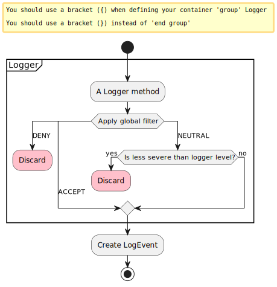

The parameters of the logging call are passed to the global filter.
If the global filter returns:

DENY
:   The log message is immediately discarded.

NEUTRAL
:   If the level of the log message is less severe than the configured logger threshold, the message is discarded.
    Otherwise, a
    [`LogEvent`](https://logging.apache.org/log4j/2.x/javadoc/log4j-core/org/apache/logging/log4j/core/LogEvent.html) is created and processing continues.

ACCEPT
:   A `LogEvent` is created and processing continues in the next stage.

> [!IMPORTANT]
> This is the only stage, which differentiates between an `ACCEPT` and `NEUTRAL` filter result.

> [!TIP]
> Filtering logging calls at this stage provides the best performance:
>
> - this stage precedes the creation of log events, therefore operations like the
>   [injection of context data](#thread-context),
>   [computation of location information](#layouts--locationinformation)
>   will not be performed for disabled log statements.
> - this stage precedes the asynchronous calls performed by either
>   [asynchronous loggers](#async)
>   or
>   [asynchronous appenders](#appenders-delegating--asyncappender).

<a id="filters--logger-config-stage"></a>
<a id="filters--2.-loggerconfig-stage"></a>

### 2. `LoggerConfig` stage

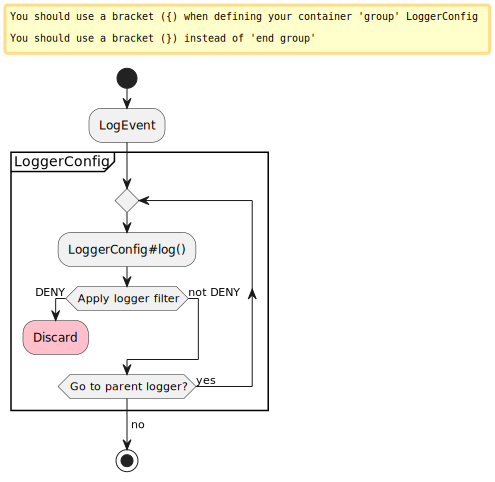

In this stage, log events are evaluated by all the
[logger filters](#configuration--logger-elements-filters)
that stand on the path from the logger to an appender.
Due to the
[additivity of logger configurations](#configuration--logger-attributes-additivity), this means that a log event must also pass the filters of all the parent loggers, until it reaches the logger that references the chosen appender.

<a id="filters--appender-control-stage"></a>
<a id="filters--3.-appendercontrol-stage"></a>

### 3. `AppenderControl` stage

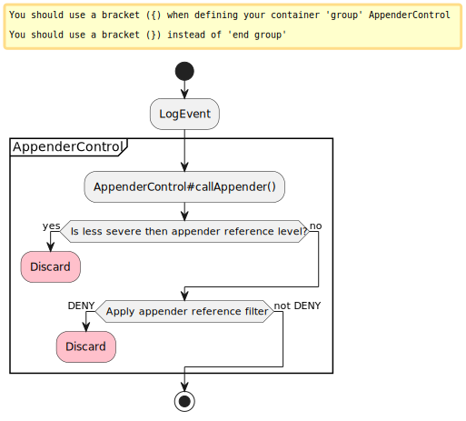

To pass this stage, log events must satisfy both conditions:

- the log event must be at least as severe as the
  [`level` attribute](#configuration--appenderref-attributes-level)
  of the appender reference.
- the [appender reference filter](#configuration--appenderrefs-elements-filters) must return `ACCEPT` or `NEUTRAL`,

<a id="filters--appender-stage"></a>
<a id="filters--4.-appender-stage-optional"></a>

### 4. `Appender` stage (optional)

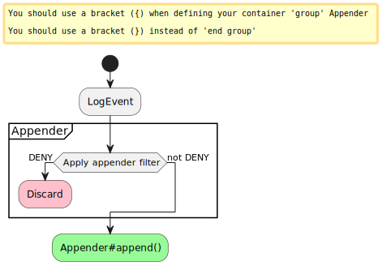

If the appender implements
[`Filterable`](https://logging.apache.org/log4j/2.x/javadoc/log4j-core/org/apache/logging/log4j/core/filter/Filterable.html)
an additional filtering stage is available.
When log events reach such an appender, the filter attached to an appender is evaluated and if the result is `DENY`, the log event is discarded.

All standard appenders implement `Filterable`.

> [!NOTE]
> Some appenders like the
> [asynchronous appender](#appenders-delegating--asyncappender)
> use appender references to transfer log events to other appenders.
> In such a case, the filtering process goes back to the [`AppenderControl` stage](#filters--appender-control-stage).

> [!TIP]
> Users migrating from Log4j 1 often replace the `threshold` property of a Log4j 1 appender with a [`ThresholdFilter`](#filters--thresholdfilter) on the equivalent Log4j 2 appender.
>
> Using the `level` property of appender references will give a better performance.

> [!WARNING]
> Configuring filters at this stage is a measure of last resort, since it adds a large overhead to disabled log events.
> You should rather configure the filtering in one of the previous stages.

<a id="filters--example-configuration-file"></a>

### Example configuration file

The following example configuration file employs filters at all possible stages to explain their evaluation order:

- XML
- JSON
- YAML
- Properties

```xml
<?xml version="1.0" encoding="UTF-8"?>
<Configuration xmlns="https://logging.apache.org/xml/ns"
               xmlns:xsi="http://www.w3.org/2001/XMLSchema-instance"
               xsi:schemaLocation="
                   https://logging.apache.org/xml/ns
                   https://logging.apache.org/xml/ns/log4j-config-2.xsd">
  <Appenders>
    <Console name="CONSOLE">
      <ThresholdFilter level="FATAL"/> (7)
    </Console>
  </Appenders>
  <Loggers>
    <Root level="OFF">
      <ThresholdFilter level="WARN"/> (4)
      <AppenderRef ref="CONSOLE" level="ERROR"> (5)
        <MarkerFilter marker="SECURITY_ALERT"/> (6)
      </AppenderRef>
    </Root>
    <Logger name="org.example" level="DEBUG"> (2)
      <ThresholdFilter level="INFO"/> (3)
    </Logger>
  </Loggers>
  <MarkerFilter marker="ALERT"
                onMatch="ACCEPT"
                onMismatch="NEUTRAL"/> (1)
</Configuration>
```

```json
{"Configuration": {"Appenders": {"Console": {"name": "CONSOLE","ThresholdFilter": {"level": "FATAL" (6)}} },"Loggers": {"Root": {"level": "OFF","ThresholdFilter": { (3) "level": "WARN" },"AppenderRef": {"ref": "CONSOLE","level": "ERROR", (4) "MarkerFilter": { (5) "marker": "SECURITY_ALERT"}} },"Logger": {"name": "org.example","level": "DEBUG", (2) "ThresholdFilter": { (3) "level": "INFO"}}} },"MarkerFilter": { (1) "marker": "ALERT","onMatch": "ACCEPT","onMismatch": "NEUTRAL"}}
```

```yaml
Configuration:
  Appenders:
    Console:
      name: "CONSOLE"
      ThresholdFilter: (7)
        level: "FATAL"
  Loggers:
    Root:
      level: "OFF"
      ThresholdFilter: (4)
        level: "WARN"
      AppenderRef:
        ref: "CONSOLE"
        level: "ERROR" (5)
        MarkerFilter: (6)
          marker: "SECURITY_ALERT"
      Logger:
        name: "org.example"
        level: "DEBUG" (2)
        ThresholdFilter: (3)
          level: "INFO"
  MarkerFilter: (1)
    marker: "ALERT"
    onMatch: "ACCEPT"
    onMismatch: "NEUTRAL"
```

```properties
appender.0.type = Console
appender.0.name = CONSOLE
(7)
appender.0.filter.type = ThresholdFilter
appender.0.filter.level = FATAL

rootLogger.level = OFF
(4)
rootLogger.filter.type = ThresholdFilter
rootLogger.filter.level = WARN
rootLogger.appenderRef.0.ref = CONSOLE
(5)
rootLogger.appenderRef.0.level = ERROR
(6)
rootLogger.appenderRef.0.filter.type = MarkerFilter
rootLogger.appenderRef.0.filter.marker = SECURITY_ALERT

logger.0.name = org.example
(2)
logger.0.level = DEBUG
(3)
logger.0.filter.type = ThresholdFilter
logger.0.filter.level = INFO

(1)
filter.0.type = MarkerFilter
filter.0.marker = ALERT
filter.0.onMatch = ACCEPT
filter.0.onMismatch = NEUTRAL
```

| **1** | Global filter |
| --- | --- |
| **2** | Logger `level` attribute. This setting is **ignored** unless the global filter returns `NEUTRAL`. |
| **3** | Filter of the `org.example` logger |
| **4** | Filter of the root logger (it is the parent of the `org.example` logger) |
| **5** | Appender reference `level` attribute |
| **6** | Filter of the appender reference |
| **7** | Filter of the appender |

<a id="filters--common-configuration"></a>

## Common configuration

<a id="filters--common-configuration-attributes"></a>

### Common configuration attributes

The default behavior of filters is in line with the `filter()` methods of functional interfaces, such as
[`Optional.filter()`](https://docs.oracle.com/javase/8/docs/api/java/util/Optional.html#filter-java.util.function.Predicate-)
or
[`Stream.filter()`](https://docs.oracle.com/javase/8/docs/api/java/util/stream/Stream.html#filter-java.util.function.Predicate-):
filters pass matching events to the next filter and drop those that do not match.

To allow for a larger spectrum of behaviors, all standard filters, except `CompositeFilter` and `DenyAllFilter`, accept the following configuration attributes:

| Attribute | Type | Default value | Description |
| --- | --- | --- | --- |
| `onMatch` | [`Result`](https://logging.apache.org/log4j/2.x/javadoc/log4j-core/org/apache/logging/log4j/core/Filter.Result.html) | [`NEUTRAL`](https://logging.apache.org/log4j/2.x/javadoc/log4j-core/org/apache/logging/log4j/core/Filter.Result.html#NEUTRAL) | Result returned if the condition matches. |
| `onMismatch` | [`Result`](https://logging.apache.org/log4j/2.x/javadoc/log4j-core/org/apache/logging/log4j/core/Filter.Result.html) | [`DENY`](https://logging.apache.org/log4j/2.x/javadoc/log4j-core/org/apache/logging/log4j/core/Filter.Result.html#DENY) | Result returned if the condition does not match. |

<a id="filters--compositefilter"></a>
<a id="filters--composing-filters"></a>

### Composing filters

Filters usually test for a single condition.
To express a more complex filtering logic, Log4j provides a
[`Filters`](https://logging.apache.org/log4j/2.x/plugin-reference.html#org-apache-logging-log4j_log4j-core_org-apache-logging-log4j-core-filter-CompositeFilter)
plugin.
This plugin can contain a sequence of filters and has no other configuration option.

The `Filters` plugin sequentially evaluates each sub-filter and:

- if the sub-filter returns `ACCEPT` (resp. `DENY`), the `Filters` plugin returns `ACCEPT` (resp. `DENY`).
- if the sub-filter return `NEUTRAL`, the `Filters` plugin evaluates the next sub-filter in the chain.
- if the last sub-filter returns `NEUTRAL`, the `Filters` plugin returns `NEUTRAL`.

The `Filters` plugin together with the ternary logic of filters, can be used to express most boolean operators.
In the following examples `A` and `B` are two filters.

`NOT A`
:   You can invert the functionality of filter `A` by swapping the `onMatch` and `onMismatch`:


```xml
<A onMatch="DENY" onMismatch="NEUTRAL"/>
```

`A AND B`
:   To select the events that match both `A` and `B` you can use:


```xml
<Filters>
  <A/>
  <B/>
</Filters>
```

`A OR B`
:   To select the events that match `A` or `B` we can replace `NEUTRAL` with `ACCEPT` in the `onMatch` attribute:


```xml
<Filters>
  <A onMatch="ACCEPT"/>
  <B onMatch="ACCEPT"/>
</Filters>
```

[📖 Plugin reference for `Filters`](https://logging.apache.org/log4j/2.x/plugin-reference.html#org-apache-logging-log4j_log4j-core_org-apache-logging-log4j-core-filter-CompositeFilter)

<a id="filters--collection"></a>

## Collection

Log4j Core provides the following filters out-of-the-box.

<a id="filters--timestamp-filters"></a>

### Timestamp filters

Timestamp filters use the timestamp of log events to decide whether to accept them or not.

<a id="filters--burstfilter"></a>

#### `BurstFilter`

The `BurstFilter` limits the rate of log events at or below a configured severity level.

Besides the [common configuration attributes](#filters--common-configuration-attributes), the `BurstFilter` supports the following parameters:

| Attribute | Type | Default value | Description |
| --- | --- | --- | --- |
| `level` | [`Level`](https://logging.apache.org/log4j/2.x/javadoc/log4j-api/org/apache/logging/log4j/Level.html) | [`WARN`](https://logging.apache.org/log4j/2.x/javadoc/log4j-api/org/apache/logging/log4j/Level.html#WARN) | The rate limit is only applied up until and including this level. Events more severe than this level will always match. |
| `rate` | `float` | `10` | The average number of events per second to allow. |
| `maxBurst` | `long` | `10 × rate` | The maximum number of events that can be logged at once, without incurring in rate limiting. |

> [!NOTE]
> The `BurstFilter` uses the *sliding window log* algorithm with a window `window` of `maxBurst / rate` seconds.
>
> The filter maintains a list of recently logged events.
> If in the interval of time of duration `window` preceding the current log event, more than `maxBurst` events have already been logged, rate limiting is applied.
>
> To control the size of the log files only the `rate` attribute needs to be taken into account.
> The `maxBurst` attribute controls the temporal spacing between log events:
> lower values of `maxBurst` will give more evenly spaced log events, while higher values will allow for peaks of activity followed by an absence of log events.

[📖 Plugin reference for `BurstFilter`](https://logging.apache.org/log4j/2.x/plugin-reference.html#org-apache-logging-log4j_log4j-core_org-apache-logging-log4j-core-filter-BurstFilter)

<a id="filters--timefilter"></a>

#### `TimeFilter`

The `TimeFilter` only matches log events emitted during a certain time of the day.

Besides the [common configuration attributes](#filters--common-configuration-attributes), the `TimeFilter` supports the following parameters:

| Attribute | Type | Default value | Description |
| --- | --- | --- | --- |
| `start` | [`LocalTime`](https://docs.oracle.com/javase/8/docs/api/java/time/LocalTime.html) in `HH:mm:ss` format | [`LocalTime.MIN`](https://docs.oracle.com/javase/8/docs/api/java/time/LocalTime.html#MIN) | The beginning of the time slot. |
| `start` | [`LocalTime`](https://docs.oracle.com/javase/8/docs/api/java/time/LocalTime.html) in `HH:mm:ss` format | [`LocalTime.MAX`](https://docs.oracle.com/javase/8/docs/api/java/time/LocalTime.html#MAX) | The end of the time slot. |
| `timezone` | [`ZoneId`](https://docs.oracle.com/javase/8/docs/api/java/time/ZoneId.html) | [`ZoneId.systemDefault()`](https://docs.oracle.com/javase/8/docs/api/java/time/ZoneId.html#systemDefault--) | The timezone to use when comparing `start` and `end` to the event timestamp. |

As a simple application of this filter, if you want to forward messages to your console during work hours and to your e-mail account after work hours, you can use a configuration snippet like:

- XML
- JSON
- YAML
- Properties

Snippet from an example [`log4j2.xml`](https://github.com/apache/logging-log4j2/tree/rel/2.25.3/src/site/antora/modules/ROOT/examples/manual/filters/TimeFilter.xml)

```xml
<AppenderRef ref="CONSOLE">
  <TimeFilter start="08:00:00" end="16:00:00"/>
</AppenderRef>
<AppenderRef ref="SMTP">
  <TimeFilter start="16:00:00" end="08:00:00"/>
</AppenderRef>
```

Snippet from an example [`log4j2.json`](https://github.com/apache/logging-log4j2/tree/rel/2.25.3/src/site/antora/modules/ROOT/examples/manual/filters/TimeFilter.json)

```json
"AppenderRef": [{"ref": "CONSOLE","TimeFilter": {"start": "08:00:00","end": "16:00:00"} },{"ref": "SMTP","TimeFilter": {"start": "16:00:00","end": "08:00:00"}}]
```

Snippet from an example [`log4j2.yaml`](https://github.com/apache/logging-log4j2/tree/rel/2.25.3/src/site/antora/modules/ROOT/examples/manual/filters/TimeFilter.yaml)

```yaml
AppenderRef:
  - ref: "CONSOLE"
    TimeFilter:
      start: "08:00:00"
      end: "16:00:00"
  - ref: "SMTP"
    TimeFilter:
      start: "16:00:00"
      end: "08:00:00"
```

Snippet from an example [`log4j2.properties`](https://github.com/apache/logging-log4j2/tree/rel/2.25.3/src/site/antora/modules/ROOT/examples/manual/filters/TimeFilter.properties)

```properties
rootLogger.appenderRef.0.ref = CONSOLE
rootLogger.appenderRef.0.filter.0.type = TimeFilter
rootLogger.appenderRef.0.filter.0.start = 08:00:00
rootLogger.appenderRef.0.filter.0.end = 16:00:00

rootLogger.appenderRef.1.ref = SMTP
rootLogger.appenderRef.1.filter.0.type = TimeFilter
rootLogger.appenderRef.1.filter.0.start = 16:00:00
rootLogger.appenderRef.1.filter.0.end = 08:00:00
```

[📖 Plugin reference for `TimeFilter`](https://logging.apache.org/log4j/2.x/plugin-reference.html#org-apache-logging-log4j_log4j-core_org-apache-logging-log4j-core-filter-TimeFilter)

<a id="filters--level-filters"></a>

### Level filters

The following filters allow you to filter log events based on their [levels](#customloglevels).

<a id="filters--levelmatchfilter"></a>

#### `LevelMatchFilter`

The `LevelMatchFilter` matches log events that have exactly a certain log level.

Besides the [common configuration attributes](#filters--common-configuration-attributes), the `LevelMatchFilter` supports the following parameter:

| Attribute | Type | Default value | Description |
| --- | --- | --- | --- |
| `level` | [`Level`](https://logging.apache.org/log4j/2.x/javadoc/log4j-api/org/apache/logging/log4j/Level.html) | [`ERROR`](https://logging.apache.org/log4j/2.x/javadoc/log4j-api/org/apache/logging/log4j/Level.html#ERROR) | The filter only matches log events of this level. |

> [!TIP]
> If you wish to use a different log file for each log level, you should also use a
> [`Routing` appender](#appenders-delegating--routingappender) together with the
> [`${event:Level}` lookup](#lookups--eventlookup).
> Such a solution will ensure that:
>
> - you don’t forget any log level (Log4j supports [custom levels](#customloglevels)).
> - you don’t need to configure an appender for each level separately.

[📖 Plugin reference for `LevelMatchFilter`](https://logging.apache.org/log4j/2.x/plugin-reference.html#org-apache-logging-log4j_log4j-core_org-apache-logging-log4j-core-filter-LevelMatchFilter)

<a id="filters--levelrangefilter"></a>

#### `LevelRangeFilter`

The `LevelRangeFilter` matches log events with a log level within a configured range.

Besides the [common configuration attributes](#filters--common-configuration-attributes), the `LevelRangeFilter` supports the following parameter:

| Attribute | Type | Default value | Description |
| --- | --- | --- | --- |
| `minLevel` | [`Level`](https://logging.apache.org/log4j/2.x/javadoc/log4j-api/org/apache/logging/log4j/Level.html) | [`OFF`](https://logging.apache.org/log4j/2.x/javadoc/log4j-api/org/apache/logging/log4j/Level.html#OFF) | The filter only matches log events at most as severe as this level. |
| `maxLevel` | [`Level`](https://logging.apache.org/log4j/2.x/javadoc/log4j-api/org/apache/logging/log4j/Level.html) | [`ALL`](https://logging.apache.org/log4j/2.x/javadoc/log4j-api/org/apache/logging/log4j/Level.html#ALL) | The filter only matches log events at least as severe as this level. |

> [!TIP]
> Make sure not to invert the bounds of the range.
> Starting from the smallest level, [the Log4j API defines](#customloglevels): `OFF`, `FATAL`, `ERROR`, `WARN`, `INFO`, `DEBUG`, `TRACE` and `ALL`.

[📖 Plugin reference for `LevelRangeFilter`](https://logging.apache.org/log4j/2.x/plugin-reference.html#org-apache-logging-log4j_log4j-core_org-apache-logging-log4j-core-filter-LevelRangeFilter)

<a id="filters--thresholdfilter"></a>

#### `ThresholdFilter`

The `ThresholdFilter` matches log events at least as severe as a configured level.

Besides the [common configuration attributes](#filters--common-configuration-attributes), the `ThresholdFilter` supports the following parameter:

| Attribute | Type | Default value | Description |
| --- | --- | --- | --- |
| `level` | [`Level`](https://logging.apache.org/log4j/2.x/javadoc/log4j-api/org/apache/logging/log4j/Level.html) | [`OFF`](https://logging.apache.org/log4j/2.x/javadoc/log4j-api/org/apache/logging/log4j/Level.html#OFF) | The filter only matches log events at least as severe as this level. |

[📖 Plugin reference for `ThresholdFilter`](https://logging.apache.org/log4j/2.x/plugin-reference.html#org-apache-logging-log4j_log4j-core_org-apache-logging-log4j-core-filter-ThresholdFilter)

<a id="filters--dynamicthresholdfilter"></a>

#### `DynamicThresholdFilter`

The `DynamicThresholdFilter` is a variant of [`ThresholdFilter`](#filters--thresholdfilter), which uses a different threshold for each log event.
The effective threshold to use is determined by querying the
[context data](#thread-context)
of the log event.
For each log event:

1. The filter retrieves the value of `key` in the context data map.
2. The filter checks the list of nested
   [`KeyValuePair`](https://logging.apache.org/log4j/2.x/plugin-reference.html#org-apache-logging-log4j_log4j-core_org-apache-logging-log4j-core-util-KeyValuePair)
   configuration elements to decide which level to apply.

Besides the [common configuration attributes](#filters--common-configuration-attributes), the `DynamicThresholdFilter` supports the following parameters:

| Attribute | Type | Default value | Description |
| --- | --- | --- | --- |
| `key` | `String` |  | The key to a value in the context map of the log event. **Required** |
| `defaultThreshold` | [`Level`](https://logging.apache.org/log4j/2.x/javadoc/log4j-api/org/apache/logging/log4j/Level.html) | [`ERROR`](https://logging.apache.org/log4j/2.x/javadoc/log4j-api/org/apache/logging/log4j/Level.html#ERROR) | Threshold to apply to log events that don’t have a corresponding `KeyValuePair`. |

| Type | Multiplicity | Description |
| --- | --- | --- |
| `KeyValuePair` | One or more | Associates a log level with the context map value associated with `key`. |

For example, if `loginId` contains the login of the current user, you can use this configuration to apply different thresholds to different users:

- XML
- JSON
- YAML
- Properties

Snippet from an example [`log4j2.xml`](https://github.com/apache/logging-log4j2/tree/rel/2.25.3/src/site/antora/modules/ROOT/examples/manual/filters/DynamicThresholdFilter.xml)

```xml
<DynamicThresholdFilter key="loginId"
                        defaultThreshold="ERROR"> (3)
  <KeyValuePair key="alice" value="DEBUG"/> (1)
  <KeyValuePair key="bob" value="INFO"/> (2)
</DynamicThresholdFilter>
```

Snippet from an example [`log4j2.json`](https://github.com/apache/logging-log4j2/tree/rel/2.25.3/src/site/antora/modules/ROOT/examples/manual/filters/DynamicThresholdFilter.json)

```json
"DynamicThresholdFilter": {"key": "loginId", (3) "defaultThreshold": "ERROR","KeyValuePair": [{ (1) "key": "alice","value": "DEBUG" },{ (2) "key": "bob","value": "INFO"}]}
```

Snippet from an example [`log4j2.yaml`](https://github.com/apache/logging-log4j2/tree/rel/2.25.3/src/site/antora/modules/ROOT/examples/manual/filters/DynamicThresholdFilter.yaml)

```yaml
DynamicThresholdFilter:
  key: "loginId"
  defaultThreshold: "ERROR" (3)
  KeyValuePair:
    - key: "alice" (1)
      value: "DEBUG"
    - key: "bob" (2)
      value: "INFO"
```

Snippet from an example [`log4j2.properties`](https://github.com/apache/logging-log4j2/tree/rel/2.25.3/src/site/antora/modules/ROOT/examples/manual/filters/DynamicThresholdFilter.properties)

```properties
filter.0.type = DynamicThresholdFilter
filter.0.key = loginId
(3)
filter.0.defaultThreshold = ERROR
(1)
filter.0.kv0.type = KeyValuePair
filter.0.kv0.key = alice
filter.0.kv0.value = DEBUG
(2)
filter.0.kv1.type = KeyValuePair
filter.0.kv1.key = bob
filter.0.kv1.value = INFO
```

| **1** | If the `loginId` is `alice` a threshold level of `DEBUG` will be used. |
| --- | --- |
| **2** | If the `loginId` is `bob` a threshold level of `INFO` will be used. |
| **3** | For all the other values of `loginId` a threshold level of `ERROR` will be used. |

> [!TIP]
> You can use Log4j Core’s
> [automatic reconfiguration feature](#configuration--configuration-attribute-monitorinterval)
> to modify the `KeyValuePair`s without restarting your application.

[📖 Plugin reference for `DynamicThresholdFilter`](https://logging.apache.org/log4j/2.x/plugin-reference.html#org-apache-logging-log4j_log4j-core_org-apache-logging-log4j-core-filter-DynamicThresholdFilter)

<a id="filters--marker-filters"></a>

### Marker filters

The following filters use the
[log event marker](#markers)
to filter log events.

<a id="filters--nomarkerfilter"></a>

#### `NoMarkerFilter`

The `NoMarkerFilter` matches log events that do not have any markers.

This filter does not have any additional configuration attribute, except the [common configuration attributes](#filters--common-configuration-attributes).

[📖 Plugin reference for `NoMarkerFilter`](https://logging.apache.org/log4j/2.x/plugin-reference.html#org-apache-logging-log4j_log4j-core_org-apache-logging-log4j-core-filter-NoMarkerFilter)

<a id="filters--markerfilter"></a>

#### `MarkerFilter`

The `MarkerFilter` matches log events marked with a specific marker or **any** of its descendants.

Besides the [common configuration attributes](#filters--common-configuration-attributes), the `MarkerFilter` supports the following parameter:

| Attribute | Type | Default value | Description |
| --- | --- | --- | --- |
| `marker` | [`Marker`](https://logging.apache.org/log4j/2.x/javadoc/log4j-api/org/apache/logging/log4j/Marker.html) |  | The filter only matches log events of marker with the given marker or one of its descendants. **Required** |

[📖 Plugin reference for `MarkerFilter`](https://logging.apache.org/log4j/2.x/plugin-reference.html#org-apache-logging-log4j_log4j-core_org-apache-logging-log4j-core-filter-MarkerFilter)

<a id="filters--message-filters"></a>

### Message filters

Message filters allow filtering log events based on the
[`Message`](#messages)
contained in the log event.

> [!IMPORTANT]
> **Click for an introduction to log event fields**
> **Log messages** are often used interchangeably with **log events**.
> While this simplification holds for several cases, it is not technically correct.
> A log event, capturing the logging context (level, logger name, instant, etc.) along with the log message, is generated by the logging implementation (e.g., Log4j Core) when a user issues a log using a [logger](#api--loggers), e.g., `LOGGER.info("Hello, world!")`.
> Hence, **log events are compound objects containing log messages**.
>
> <details>
> <div>
> <div>
> <p>Log events contain fields that can be classified into three categories:</p>
> </div>
> <div>
> <ol>
> <li>
> <p>Some fields are provided explicitly, in a <a href="https://logging.apache.org/log4j/2.x/javadoc/log4j-api/org/apache/logging/log4j/Logger.html"><code>Logger</code></a> method call.
> The most important are the log level and the log message, which is a description of what happened, and it is addressed to humans.</p>
> </li>
> <li>
> <p>Some fields are contextual (e.g., <a href="#thread-context">Thread Context</a>) and are either provided explicitly by developers of other parts of the application, or is injected by Java instrumentation.</p>
> </li>
> <li>
> <p>The last category of fields is those that are computed automatically by the logging implementation employed.</p>
> </li>
> </ol>
> </div>
> <div>
> <p>For clarity’s sake let us look at a log event formatted as JSON:</p>
> </div>
> <div>
> <div>
> <pre><code>{
>   <i></i><b>(1)</b>
>   "log.level": "INFO",
>   "message": "Unable to insert data into my_table.",
>   "error.type": "java.lang.RuntimeException",
>   "error.message": null,
>   "error.stack_trace": [
>     {
>       "class": "com.example.Main",
>       "method": "doQuery",
>       "file.name": "Main.java",
>       "file.line": 36
>     },
>     {
>       "class": "com.example.Main",
>       "method": "main",
>       "file.name": "Main.java",
>       "file.line": 25
>     }
>   ],
>   "marker": "SQL",
>   "log.logger": "com.example.Main",
>   <i></i><b>(2)</b>
>   "tags": [
>     "SQL query"
>   ],
>   "labels": {
>     "span_id": "3df85580-f001-4fb2-9e6e-3066ed6ddbb1",
>     "trace_id": "1b1f8fc9-1a0c-47b0-a06f-af3c1dd1edf9"
>   },
>   <i></i><b>(3)</b>
>   "@timestamp": "2024-05-23T09:32:24.163Z",
>   "log.origin.class": "com.example.Main",
>   "log.origin.method": "doQuery",
>   "log.origin.file.name": "Main.java",
>   "log.origin.file.line": 36,
>   "process.thread.id": 1,
>   "process.thread.name": "main",
>   "process.thread.priority": 5
> }</code></pre>
> </div>
> </div>
> <div>
> <table>
> <tr>
> <td><i></i><b>1</b></td>
> <td>Explicitly supplied fields:
> <div>
> <dl>
> <dt><code>log.level</code></dt>
> <dd>
> <p>The <a href="#customloglevels">level</a> of the event, either explicitly provided as an argument to the logger call, or implied by the name of the logger method</p>
> </dd>
> <dt><code>message</code></dt>
> <dd>
> <p>The <strong>log message</strong> that describes what happened</p>
> </dd>
> <dt><code>error.*</code></dt>
> <dd>
> <p>An <em>optional</em> <code>Throwable</code> explicitly passed as an argument to the logger call</p>
> </dd>
> <dt><code>marker</code></dt>
> <dd>
> <p>An <em>optional</em> <a href="#markers">marker</a> explicitly passed as an argument to the logger call</p>
> </dd>
> <dt><code>log.logger</code></dt>
> <dd>
> <p>The <a href="#api--logger-names">logger name</a> provided explicitly to <code>LogManager.getLogger()</code> or inferred by Log4j API</p>
> </dd>
> </dl>
> </div></td>
> </tr>
> <tr>
> <td><i></i><b>2</b></td>
> <td>Contextual fields:
> <div>
> <dl>
> <dt><code>tags</code></dt>
> <dd>
> <p>The <a href="#thread-context">Thread Context</a> stack</p>
> </dd>
> <dt><code>labels</code></dt>
> <dd>
> <p>The <a href="#thread-context">Thread Context</a> map</p>
> </dd>
> </dl>
> </div></td>
> </tr>
> <tr>
> <td><i></i><b>3</b></td>
> <td>Logging backend specific fields.
> In case you are using Log4j Core, the following fields can be automatically generated:
> <div>
> <dl>
> <dt><code>@timestamp</code></dt>
> <dd>
> <p>The instant of the logger call</p>
> </dd>
> <dt><code>log.origin.*</code></dt>
> <dd>
> <p>The <a href="#layouts--locationinformation">location</a> of the logger call in the source code</p>
> </dd>
> <dt><code>process.thread.*</code></dt>
> <dd>
> <p>The name of the Java thread, where the logger is called</p>
> </dd>
> </dl>
> </div></td>
> </tr>
> </table>
> </div>
> </div>
> </details>

<a id="filters--regexfilter"></a>

#### `RegexFilter`

The `RegexFilter` matches a regular expression against messages.
Besides the [common configuration attributes](#filters--common-configuration-attributes), the `RegexFilter` supports the following parameters:

| Attribute | Type | Default value | Description |
| --- | --- | --- | --- |
| `regex` | [`Pattern`](https://docs.oracle.com/javase/8/docs/api/java/util/regex/Pattern.html) |  | The regular expression used to match log messages. **Required** |
| `useRawMsg` | `boolean` | `false` | If `true`, for [`ParameterizedMessage`](#messages--parameterizedmessage), [`StringFormattedMessage`](#messages--stringformattedmessage), and [`MessageFormatMessage`](#messages--messageformatmessage), the message format pattern; for [`StructuredDataMessage`](#messages--structureddatamessage), the message field will be used as the match target. |

> [!WARNING]
> - This filter only matches if the **whole** log message matches the regular expression.
> - Setting `useRawMsg` to `false` decreases performance, since it forces the formatting of all log messages, including the disabled ones.

[📖 Plugin reference for `RegexFilter`](https://logging.apache.org/log4j/2.x/plugin-reference.html#org-apache-logging-log4j_log4j-core_org-apache-logging-log4j-core-filter-RegexFilter)

<a id="filters--stringmatchfilter"></a>

#### `StringMatchFilter`

The `StringMatchFilter` matches a log event, if its message contains the given string.

Besides the [common configuration attributes](#filters--common-configuration-attributes), the `StringMatchFilter` supports the following parameters:

| Attribute | Type | Default value | Description |
| --- | --- | --- | --- |
| `text` | `String` |  | The text to look for. **Required** |

> [!WARNING]
> This filter decreases performance, since it forces the formatting of all log messages, including the disabled ones.

[📖 Plugin reference for `StringMatchFilter`](https://logging.apache.org/log4j/2.x/plugin-reference.html#org-apache-logging-log4j_log4j-core_org-apache-logging-log4j-core-filter-StringMatchFilter)

<a id="filters--map-filters"></a>

### Map filters

The following filters match log events based on the content of one of these map structures:

- The map contained in a
  [`MapMessage`](#messages--mapmessage) object.
  See
  [`MapMessage.getData()`](https://logging.apache.org/log4j/2.x/javadoc/log4j-api/org/apache/logging/log4j/message/MapMessage.html#getData())
  for details.
- The context data map contained in a
  [`LogEvent`](https://logging.apache.org/log4j/2.x/javadoc/log4j-core/org/apache/logging/log4j/core/LogEvent.html).
  See
  [`LogEvent.getContextData()`](https://logging.apache.org/log4j/2.x/javadoc/log4j-core/org/apache/logging/log4j/core/LogEvent.html#getContextData())
  for details.

<a id="filters--configuration-map"></a>

#### Configuration map

These filters are configured with a configuration map of type `Map<String, String[]>`, which, depending on the filter, is encoded as either JSON:

```json
{"configs": {"clientId": ["1234" ],"userId": ["alice","bob"]}}
```

or as a sequence of
[`KeyValuePair`](https://logging.apache.org/log4j/2.x/plugin-reference.html#org-apache-logging-log4j_log4j-core_org-apache-logging-log4j-core-util-KeyValuePair)
plugins:

```xml
<KeyValuePair key="clientId" value="1234"/>
<KeyValuePair key="userId" value="alice"/>
<KeyValuePair key="userId" value="bob"/>
```

The configuration map associates to each key a list of allowed values for that key.
In the example above the allowed values for the `loginId` key are either `alice` or `bob`.
The only allowed value for the `clientId` key is `1234`.

The map filters can work in two matching modes:

AND
:   A map structure matches
    if the value associated with **each** key
    that appears in the configuration map is one of the allowed values.

OR
:   A map structure matches
    if the value associated with **at least one** key
    that appears in the configuration map is one of the allowed values.

<a id="filters--mapfilter"></a>

#### `MapFilter`

The `MapFilter` allows filtering based on the contents of all
[structured `Message`s](#messages--collection-structured).

This filter encodes the [Configuration map](#filters--configuration-map) introduced above as a list of
`KeyValuePair` elements.

Besides the [common configuration attributes](#filters--common-configuration-attributes), the `MapFilter` supports the following parameters:

<table class="tableblock frame-all grid-all stretch">
<caption>Table 12. <code>MapFilter</code> — configuration attributes</caption>
<colgroup>
<col/>
<col/>
<col/>
<col/>
</colgroup>
<thead>
<tr>
<th>Attribute</th>
<th>Type</th>
<th>Default value</th>
<th>Description</th>
</tr>
</thead>
<tbody>
<tr>
<td><p><code>operator</code></p></td>
<td><p><em>enumeration</em></p></td>
<td><p><code>AND</code></p></td>
<td><div><div>
<p>Determines the matching mode of the filter.
Can be:</p>
</div>
<div>
<ul>
<li>
<p><a href="#filters--matching-mode-and">AND</a></p>
</li>
<li>
<p><a href="#filters--matching-mode-or">OR</a></p>
</li>
</ul>
</div></div></td>
</tr>
</tbody>
</table>

| Type | Multiplicity | Description |
| --- | --- | --- |
| `KeyValuePair` | One or more | Adds a value as allowed value for a key. See [Configuration map](#filters--configuration-map) for more details. |

For example, if you want to filter all `MapMessage`s
that have an `eventType` key with value `authentication` **and** an `eventId` key with value either `login` **or** `logout`, you can use the following configuration:

- XML
- JSON
- YAML
- Properties

Snippet from an example [`log4j2.xml`](https://github.com/apache/logging-log4j2/tree/rel/2.25.3/src/site/antora/modules/ROOT/examples/manual/filters/MapFilter.xml)

```xml
<MapFilter operator="AND">
  <KeyValuePair key="eventType" value="authentication"/>
  <KeyValuePair key="eventId" value="login"/>
  <KeyValuePair key="eventId" value="logout"/>
</MapFilter>
```

Snippet from an example [`log4j2.json`](https://github.com/apache/logging-log4j2/tree/rel/2.25.3/src/site/antora/modules/ROOT/examples/manual/filters/MapFilter.json)

```json
"MapFilter": {"operator": "AND","KeyValuePair": [{"key": "eventType","value": "authentication" },{"key": "eventId","value": "login" },{"key": "eventId","value": "logout"}]}
```

Snippet from an example [`log4j2.yaml`](https://github.com/apache/logging-log4j2/tree/rel/2.25.3/src/site/antora/modules/ROOT/examples/manual/filters/MapFilter.yaml)

```yaml
MapFilter:
  operator: "AND"
  KeyValuePair:
    - key: "eventType"
      value: "authentication"
    - key: "eventId"
      value: "login"
    - key: "eventId"
      value: "logout"
```

Snippet from an example [`log4j2.properties`](https://github.com/apache/logging-log4j2/tree/rel/2.25.3/src/site/antora/modules/ROOT/examples/manual/filters/MapFilter.yaml)

```properties
filter.0.type = MapFilter
filter.0.operator = AND

filter.0.kv0.type = KeyValuePair
filter.0.kv0.key = eventType
filter.0.kv0.value = authentication

filter.0.kv1.type = KeyValuePair
filter.0.kv1.key = eventId
filter.0.kv1.value = login

filter.0.kv2.type = KeyValuePair
filter.0.kv2.key = eventId
filter.0.kv2.value = logout
```

> [!TIP]
> You can use Log4j Core’s
> [automatic reconfiguration feature](#configuration--configuration-attribute-monitorinterval)
> to modify the `KeyValuePair`s without restarting your application.

[📖 Plugin reference for `MapFilter`](https://logging.apache.org/log4j/2.x/plugin-reference.html#org-apache-logging-log4j_log4j-core_org-apache-logging-log4j-core-filter-MapFilter)

<a id="filters--structureddatafilter"></a>

#### `StructuredDataFilter`

The `StructuredDataFilter` is a variant of [`MapFilter`](#filters--mapfilter) that only matches
[`StructureDataMessage`](#messages--structureddatamessage)s.

In addition to matching the map structure contained in a `StructuredDataMessage`
(which corresponds to [RFC 5424 `SD-PARAM` elements](https://datatracker.ietf.org/doc/html/rfc5424#section-6.3.3))
it provides the following virtual keys:

| Key | RFC5424 field | Description |
| --- | --- | --- |
| `id` | [`SD-ID`](https://datatracker.ietf.org/doc/html/rfc5424#section-6.3.2) | The [`id` field](https://logging.apache.org/log4j/2.x/javadoc/log4j-api/org/apache/logging/log4j/message/StructuredDataMessage.html#getId()) of the `StructuredDataMessage`. |
| `id.name` |  | The [`name` field](https://logging.apache.org/log4j/2.x/javadoc/log4j-api/org/apache/logging/log4j/message/StructuredDataId.html#getName()) of the `StructuredDataId` element. |
| `type` | [`MSGID`](https://datatracker.ietf.org/doc/html/rfc5424#section-6.2.7) | The [`type` field](https://logging.apache.org/log4j/2.x/javadoc/log4j-api/org/apache/logging/log4j/message/StructuredDataMessage.html#getType()) of a `StructuredDataMessage`. |
| `message` | [`MSG`](https://datatracker.ietf.org/doc/html/rfc5424#section-6.4) | The result of a [`Message.getFormat()`](https://logging.apache.org/log4j/2.x/javadoc/log4j-api/org/apache/logging/log4j/message/Message.html#getFormat()) method call. |

The `StructuredDataFilter` encodes the [Configuration map](#filters--configuration-map) introduced above as a list of
`KeyValuePair` and supports the following parameters, besides the [common configuration attributes](#filters--common-configuration-attributes):

<table class="tableblock frame-all grid-all stretch">
<caption>Table 15. <code>StructuredDataFilter</code>—configuration attributes</caption>
<colgroup>
<col/>
<col/>
<col/>
<col/>
</colgroup>
<thead>
<tr>
<th>Attribute</th>
<th>Type</th>
<th>Default value</th>
<th>Description</th>
</tr>
</thead>
<tbody>
<tr>
<td><p><code>operator</code></p></td>
<td><p><em>enumeration</em></p></td>
<td><p><code>AND</code></p></td>
<td><div><div>
<p>Determines the matching mode of the filter.
Can be:</p>
</div>
<div>
<ul>
<li>
<p><a href="#filters--matching-mode-and">AND</a></p>
</li>
<li>
<p><a href="#filters--matching-mode-or">OR</a></p>
</li>
</ul>
</div></div></td>
</tr>
</tbody>
</table>

| Type | Multiplicity | Description |
| --- | --- | --- |
| `KeyValuePair` | One or more | Adds a value as allowed value for a key. See [Configuration map](#filters--configuration-map) for more details. |

If you want
to match all log messages with an `SD-ID` equal to `authentication` and the value of the `userId` `SD-PARAM` equal to either `alice` or `bob`, you can use the following configuration:

- XML
- JSON
- YAML
- Properties

Snippet from an example [`log4j2.xml`](https://github.com/apache/logging-log4j2/tree/rel/2.25.3/src/site/antora/modules/ROOT/examples/manual/filters/StructuredDataFilter.xml)

```xml
<StructuredDataFilter operator="AND">
  <KeyValuePair key="id" value="authentication"/>
  <KeyValuePair key="userId" value="alice"/>
  <KeyValuePair key="userId" value="bob"/>
</StructuredDataFilter>
```

Snippet from an example [`log4j2.json`](https://github.com/apache/logging-log4j2/tree/rel/2.25.3/src/site/antora/modules/ROOT/examples/manual/filters/StructuredDataFilter.json)

```json
"StructuredDataFilter": {"operator": "AND","KeyValuePair": [{"key": "id","value": "authentication" },{"key": "userId","value": "alice" },{"key": "userId","value": "bob"}]}
```

Snippet from an example [`log4j2.yaml`](https://github.com/apache/logging-log4j2/tree/rel/2.25.3/src/site/antora/modules/ROOT/examples/manual/filters/StructuredDataFilter.yaml)

```yaml
StructuredDataFilter:
  operator: "AND"
  KeyValuePair:
    - key: "id"
      value: "authentication"
    - key: "userId"
      value: "alice"
    - key: "userId"
      value: "bob"
```

Snippet from an example [`log4j2.properties`](https://github.com/apache/logging-log4j2/tree/rel/2.25.3/src/site/antora/modules/ROOT/examples/manual/filters/StructuredDataFilter.yaml)

```properties
filter.0.type = StructuredDataFilter
filter.0.operator = AND

filter.0.kv0.type = KeyValuePair
filter.0.kv0.key = id
filter.0.kv0.value = authentication

filter.0.kv1.type = KeyValuePair
filter.0.kv1.key = userId
filter.0.kv1.value = alice

filter.0.kv2.type = KeyValuePair
filter.0.kv2.key = userId
filter.0.kv2.value = bob
```

> [!TIP]
> You can use Log4j Core’s
> [automatic reconfiguration feature](#configuration--configuration-attribute-monitorinterval)
> to modify the `KeyValuePair`s without restarting your application.

[📖 Plugin reference for `StructuredDataFilter`](https://logging.apache.org/log4j/2.x/plugin-reference.html#org-apache-logging-log4j_log4j-core_org-apache-logging-log4j-core-filter-StructuredDataFilter)

<a id="filters--threadcontextmapfilter"></a>
<a id="filters--contextmapfilter"></a>

#### `ContextMapFilter`

The `ContextMapFilter` works in the same way as the [`MapFilter`](#filters--mapfilter) above, except it checks the
[context map data](#thread-context)
of the log event instead of the log message.

This filter also encodes the [Configuration map](#filters--configuration-map) introduced above as a list of
`KeyValuePair` elements.

Besides the [common configuration attributes](#filters--common-configuration-attributes), the `ContextMapFilter` supports the following parameters:

<table class="tableblock frame-all grid-all stretch">
<caption>Table 17. <code>ContextMapFilter</code> — configuration attributes</caption>
<colgroup>
<col/>
<col/>
<col/>
<col/>
</colgroup>
<thead>
<tr>
<th>Attribute</th>
<th>Type</th>
<th>Default value</th>
<th>Description</th>
</tr>
</thead>
<tbody>
<tr>
<td><p><code>operator</code></p></td>
<td><p><em>enumeration</em></p></td>
<td><p><code>AND</code></p></td>
<td><div><div>
<p>Determines the matching mode of the filter.
Can be:</p>
</div>
<div>
<ul>
<li>
<p><a href="#filters--matching-mode-and">AND</a></p>
</li>
<li>
<p><a href="#filters--matching-mode-or">OR</a></p>
</li>
</ul>
</div></div></td>
</tr>
</tbody>
</table>

| Type | Multiplicity | Description |
| --- | --- | --- |
| `KeyValuePair` | One or more | Adds a value as allowed value for a key. See [Configuration map](#filters--configuration-map) for more details. |

For example, if the `clientId` and `userId` keys in the context data map identify your client and his end users, you can filter the log events generated by users `alice` and `bob` of client `1234` using this configuration:

- XML
- JSON
- YAML
- Properties

Snippet from an example [`log4j2.xml`](https://github.com/apache/logging-log4j2/tree/rel/2.25.3/src/site/antora/modules/ROOT/examples/manual/filters/ContextMapFilter.xml)

```xml
<ContextMapFilter operator="AND">
  <KeyValuePair key="clientId" value="1234"/>
  <KeyValuePair key="userId" value="alice"/>
  <KeyValuePair key="userId" value="bob"/>
</ContextMapFilter>
```

Snippet from an example [`log4j2.json`](https://github.com/apache/logging-log4j2/tree/rel/2.25.3/src/site/antora/modules/ROOT/examples/manual/filters/ContextMapFilter.json)

```json
"ContextMapFilter": {"operator": "AND","KeyValuePair": [{"key": "clientId","value": "1234" },{"key": "userId","value": "alice" },{"key": "userId","value": "bob"}]}
```

Snippet from an example [`log4j2.yaml`](https://github.com/apache/logging-log4j2/tree/rel/2.25.3/src/site/antora/modules/ROOT/examples/manual/filters/ContextMapFilter.yaml)

```yaml
ContextMapFilter:
  operator: "AND"
  KeyValuePair:
    - key: "clientId"
      value: "1234"
    - key: "userId"
      value: "alice"
    - key: "userId"
      value: "bob"
```

Snippet from an example [`log4j2.properties`](https://github.com/apache/logging-log4j2/tree/rel/2.25.3/src/site/antora/modules/ROOT/examples/manual/filters/ContextMapFilter.yaml)

```properties
filter.0.type = ContextMapFilter
filter.0.operator = AND

filter.0.kv0.type = KeyValuePair
filter.0.kv0.key = clientId
filter.0.kv0.value = 1234

filter.0.kv1.type = KeyValuePair
filter.0.kv1.key = userId
filter.0.kv1.value = alice

filter.0.kv2.type = KeyValuePair
filter.0.kv2.key = userId
filter.0.kv2.value = bob
```

> [!TIP]
> You can use Log4j Core’s
> [automatic reconfiguration feature](#configuration--configuration-attribute-monitorinterval)
> to modify the `KeyValuePair`s without restarting your application.

[📖 Plugin reference for `ContextMapFilter`](https://logging.apache.org/log4j/2.x/plugin-reference.html#org-apache-logging-log4j_log4j-core_org-apache-logging-log4j-core-filter-ThreadContextMapFilter)

<a id="filters--mutablethreadcontextmapfilter"></a>
<a id="filters--mutablecontextmapfilter"></a>

#### `MutableContextMapFilter`

The `MutableContextMapFilter` is an alternative version of [`ContextMapFilter`](#filters--threadcontextmapfilter) that also uses the
[context data map](#thread-context)
to filter messages, but externalizes the [Configuration map](#filters--configuration-map), so it can be kept in a separate location.

This filter encodes the [Configuration map](#filters--configuration-map) as JSON.
The configuration map must be stored in an **external** location and will be regularly polled for changes.

Besides the [common configuration attributes](#filters--common-configuration-attributes), the `MutableContextMapFilter` supports the following parameters:

| Attribute | Type | Default value | Description |
| --- | --- | --- | --- |
| `configLocation` | [`Path`](https://docs.oracle.com/javase/8/docs/api/java/nio/file/Path.html) or [`URI`](https://docs.oracle.com/javase/8/docs/api/java/net/URI.html) |  | The location of the JSON [Configuration map](#filters--configuration-map). **Required** |
| `pollInterval` | `long` | `0` | Determines the polling interval used by Log4j to check for changes to the configuration map. If set to `0`, polling is disabled. |

> [!WARNING]
> Unlike other map filters that have a configurable matching mode, this filter always uses the [OR](#filters--matching-mode-or) matching mode.

To use this filter, you need to:

1. Create a JSON configuration map and place it at a known location (e.g. `https://server.example/configs.json`):


```json
{"configs": {"clientId": ["1234" (1) ],"userId": ["root" (2)]}}
```


**1**

The filter will match all events for client `1234` regardless of the `userId`.

**2**

The filter will match all events for the `root` account regardless of the `clientId`.

2. Reference the configuration map location in your configuration file:

   - XML
   - JSON
   - YAML
   - Properties

   Snippet from an example [`log4j2.xml`](https://github.com/apache/logging-log4j2/tree/rel/2.25.3/src/site/antora/modules/ROOT/examples/manual/filters/MutableContextMapFilter.xml)


```xml
<MutableContextMapFilter
    configLocation="https://server.example/configs.json"
    pollInterval="10"/>
```

   Snippet from an example [`log4j2.json`](https://github.com/apache/logging-log4j2/tree/rel/2.25.3/src/site/antora/modules/ROOT/examples/manual/filters/MutableContextMapFilter.json)


```json
"MutableContextMapFilter": {
  "configLocation": "https://server.example/configs.json",
  "pollInterval": 10
}
```

   Snippet from an example [`log4j2.yaml`](https://github.com/apache/logging-log4j2/tree/rel/2.25.3/src/site/antora/modules/ROOT/examples/manual/filters/MutableContextMapFilter.yaml)


```yaml
MutableContextMapFilter:
  configLocation: "https://server.example/configs.json"
  pollInterval: 10
```

   Snippet from an example [`log4j2.properties`](https://github.com/apache/logging-log4j2/tree/rel/2.25.3/src/site/antora/modules/ROOT/examples/manual/filters/MutableContextMapFilter.yaml)


```properties
filter.0.type = MutableContextMapFilter
filter.0.configLocation = https://server.example/configs.json
filter.0.pollInterval = 10
```

[📖 Plugin reference for `MutableContextMapFilter`](https://logging.apache.org/log4j/2.x/plugin-reference.html#org-apache-logging-log4j_log4j-core_org-apache-logging-log4j-core-filter-MutableThreadContextMapFilter)

<a id="filters--other-filters"></a>

### Other filters

<a id="filters--deny-filter"></a>
<a id="filters--denyfilter"></a>

#### `DenyFilter`

The `DenyFilter` always returns `DENY`.
It does not support **any** configuration attribute, even the common configuration attributes.

[📖 Plugin reference for `DenyAllFilter`](https://logging.apache.org/log4j/2.x/plugin-reference.html#org-apache-logging-log4j_log4j-core_org-apache-logging-log4j-core-filter-DenyAllFilter)

<a id="filters--script"></a>
<a id="filters--scriptfilter"></a>

#### `ScriptFilter`

The `ScriptFilter` executes a script that must return `true` if the event matches and `false` otherwise.

Besides the [common configuration attributes](#filters--common-configuration-attributes), it accepts a single nested element:

| Type | Multiplicity | Description |
| --- | --- | --- |
| [`Script`](#scripts--script), [`ScriptFile`](#scripts--scriptfile) or [`ScriptRef`](#scripts--scriptref) | one | A reference to the script to execute. See [Scripts](#scripts) for more details about scripting. |

The bindings available to the script depend
on whether the `ScriptFilter` is used as a global filter in the [Logger stage](#filters--logger-stage) or in the remaining stages.
For global filters, the following bindings are available:

<table class="tableblock frame-all grid-all stretch">
<caption>Table 21. Script Bindings — global filter</caption>
<colgroup>
<col/>
<col/>
<col/>
</colgroup>
<thead>
<tr>
<th>Binding name</th>
<th>Type</th>
<th>Description</th>
</tr>
</thead>
<tbody>
<tr>
<td><p><code>logger</code></p></td>
<td><p><a href="https://logging.apache.org/log4j/2.x/javadoc/log4j-core/org/apache/logging/log4j/core/Logger.html"><code>Logger</code></a></p></td>
<td><p>The logger used in the log statement.</p></td>
</tr>
<tr>
<td><p><code>level</code></p></td>
<td><p><a href="#customloglevels"><code>Level</code></a></p></td>
<td><p>The level used in the log statement.</p></td>
</tr>
<tr>
<td><p><code>marker</code></p></td>
<td><p><a href="#markers"><code>Marker</code></a></p></td>
<td><p>The marker used in the log statement.</p></td>
</tr>
<tr>
<td><p><code>message</code></p></td>
<td><p><a href="#messages"><code>Message</code></a></p></td>
<td><div><div>
<p>The message used in the log event if the user directly supplied one.
Otherwise:</p>
</div>
<div>
<ul>
<li>
<p>If the logging statement contained an <code>Object</code> argument, it is wrapped in a
<a href="#messages--objectmessage"><code>ObjectMessage</code></a>.</p>
</li>
<li>
<p>If the logging statement contained a format <code>String</code>, it is wrapped in a
<a href="#messages--simplemessage"><code>SimpleMessage</code></a>.</p>
</li>
</ul>
</div></div></td>
</tr>
<tr>
<td><p><code>parameters</code></p></td>
<td><p><code>Object[]</code></p></td>
<td><p>The parameters passed to the logging call.
Some logging calls include the parameters as part of <code>message</code>.</p></td>
</tr>
<tr>
<td><p><code>throwable</code></p></td>
<td><p><code>Throwable</code></p></td>
<td><p>The <code>Throwable</code> passed to the logging call, if any.
Some logging calls include the <code>Throwable</code> as part of <code>message</code>.</p></td>
</tr>
<tr>
<td><p><code>substitutor</code></p></td>
<td><p><a href="https://logging.apache.org/log4j/2.x/javadoc/log4j-core/org/apache/logging/log4j/core/lookup/StrSubstitutor.html"><code>StrSubstitutor</code></a></p></td>
<td><p>The <code>StrSubstitutor</code> used to replace lookup variables.</p></td>
</tr>
</tbody>
</table>

For the remaining filters, only these bindings are available:

| Binding name | Type | Description |
| --- | --- | --- |
| `logEvent` | [`LogEvent`](https://logging.apache.org/log4j/2.x/javadoc/log4j-core/org/apache/logging/log4j/core/LogEvent.html) | The log event being processed. |
| `substitutor` | [`StrSubstitutor`](https://logging.apache.org/log4j/2.x/javadoc/log4j-core/org/apache/logging/log4j/core/lookup/StrSubstitutor.html) | The `StrSubstitutor` used to replace lookup variables. |

As an example, if you wish to match only log events that contain a certain exception, you can use a simple Groovy script:

`scripts/local.groovy`

```groovy
return logEvent.throwable instanceof DataAccessException;
```

You can then integrate the script in a Log4j configuration:

- XML
- JSON
- YAML
- Properties

Snippet from an example [`log4j2.xml`](https://github.com/apache/logging-log4j2/tree/rel/2.25.3/src/site/antora/modules/ROOT/examples/manual/filters/ScriptFilter.xml)

```xml
<Root level="ALL">
  <ScriptFilter>
    <ScriptFile language="groovy" path="scripts/local.groovy"/>
  </ScriptFilter>
  <AppenderRef ref="CONSOLE"/>
</Root>
```

Snippet from an example [`log4j2.json`](https://github.com/apache/logging-log4j2/tree/rel/2.25.3/src/site/antora/modules/ROOT/examples/manual/filters/ScriptFilter.json)

```json
"Root": {"level": "ALL","ScriptFilter": {"ScriptFile": {"language": "groovy","path": "scripts/local.groovy"} },"AppenderRef": {"ref": "CONSOLE"}}
```

Snippet from an example [`log4j2.yaml`](https://github.com/apache/logging-log4j2/tree/rel/2.25.3/src/site/antora/modules/ROOT/examples/manual/filters/ScriptFilter.yaml)

```yaml
Root:
  level: "ALL"
  ScriptFilter:
    ScriptFile:
      language: "groovy"
      path: "scripts/local.groovy"
  AppenderRef:
    ref: "CONSOLE"
```

Snippet from an example [`log4j2.properties`](https://github.com/apache/logging-log4j2/tree/rel/2.25.3/src/site/antora/modules/ROOT/examples/manual/filters/ScriptFilter.yaml)

```properties
rootLogger.level = ALL

rootLogger.filter.0.type = ScriptFilter
rootLogger.filter.0.script.type = ScriptFile
rootLogger.filter.0.script.language = groovy
rootLogger.filter.0.script.path = scripts/local.groovy

rootLogger.appenderRef.0.ref = CONSOLE
```

Writing an equivalent **global** script is a little bit more complex, since you need to take into account all the places where a throwable can be passed as a parameter.
The script becomes:

`scripts/global.groovy`

```groovy
Throwable lastParam = parameters?.last() instanceof Throwable ? parameters.last() : null
Throwable actualThrowable = throwable ?: message?.throwable ?: lastParam
return actualThrowable instanceof DataAccessException
```

You can use it as a global filter:

- XML
- JSON
- YAML
- Properties

Snippet from an example [`log4j2.xml`](https://github.com/apache/logging-log4j2/tree/rel/2.25.3/src/site/antora/modules/ROOT/examples/manual/filters/ScriptFilter.xml)

```xml
<ScriptFilter>
  <ScriptFile language="groovy" path="scripts/global.groovy"/>
</ScriptFilter>
```

Snippet from an example [`log4j2.json`](https://github.com/apache/logging-log4j2/tree/rel/2.25.3/src/site/antora/modules/ROOT/examples/manual/filters/ScriptFilter.json)

```json
"ScriptFilter": {
  "ScriptFile": {
    "language": "groovy",
    "path": "scripts/global.groovy"
  }
}
```

Snippet from an example [`log4j2.yaml`](https://github.com/apache/logging-log4j2/tree/rel/2.25.3/src/site/antora/modules/ROOT/examples/manual/filters/ScriptFilter.yaml)

```yaml
ScriptFilter:
  ScriptFile:
    language: "groovy"
    path: "scripts/global.groovy"
```

Snippet from an example [`log4j2.properties`](https://github.com/apache/logging-log4j2/tree/rel/2.25.3/src/site/antora/modules/ROOT/examples/manual/filters/ScriptFilter.yaml)

```properties
filter.0.type = ScriptFilter
filter.0.script.type = ScriptFile
filter.0.script.language = groovy
filter.0.script.path = scripts/global.groovy
```

[📖 Plugin reference for `ScriptFilter`](https://logging.apache.org/log4j/2.x/plugin-reference.html#org-apache-logging-log4j_log4j-core_org-apache-logging-log4j-core-filter-ScriptFilter)

<a id="filters--third-party"></a>
<a id="filters--third-party-filters"></a>

## Third-party filters

> [!WARNING]
> These filters are provided by **third-party** vendors and are not maintained by the [Apache Logging Services](https://logging.apache.org/) project.

<a id="filters--more-log4j2-routingfilter"></a>
<a id="filters--routing-filter-more-log4j2"></a>

### Routing filter (`more-log4j2`)

`RoutingFilter` by [more-log4j2](https://github.com/mlangc/more-log4j2) helps to compose filters by defining routes selected using log event attributes.
For instance, it can be used to implement log throttling based on log event markers or levels.

<a id="filters--extending"></a>

## Extending

Filters are [plugins](https://logging.apache.org/log4j/2.x/manual/plugins.html) implementing [the `Filter` interface](https://logging.apache.org/log4j/2.x/javadoc/log4j-core/org/apache/logging/log4j/core/Filter.html).
This section will guide you on how to create custom ones.

> [!NOTE]
> While [the predefined filter collection](#filters--collection) should address most common use cases, you might find yourself needing to implement a custom one.
> If this is the case, we really appreciate it if you can **share your use case in a [user support channel](https://logging.apache.org/support.html)**.

<a id="filters--extending-plugins"></a>
<a id="filters--plugin-preliminaries"></a>

### Plugin preliminaries

Log4j plugin system is the de facto extension mechanism embraced by various Log4j components.
Plugins provide extension points to components, that can be used to implement new features, without modifying the original component.
It is analogous to a [dependency injection](https://en.wikipedia.org/wiki/Dependency_injection) framework, but curated for Log4j-specific needs.

In a nutshell, you annotate your classes with [`@Plugin`](https://logging.apache.org/log4j/2.x/javadoc/log4j-core/org/apache/logging/log4j/core/config/plugins/Plugin.html) and their (`static`) factory methods with [`@PluginFactory`](https://logging.apache.org/log4j/2.x/javadoc/log4j-core/org/apache/logging/log4j/core/config/plugins/PluginFactory.html).
Last, you inform the Log4j plugin system to discover these custom classes.
This is done using running the [`PluginProcessor`](https://logging.apache.org/log4j/2.x/javadoc/log4j-core/org/apache/logging/log4j/core/config/plugins/processor/PluginProcessor.html) annotation processor while building your project.
Refer to [Plugins](https://logging.apache.org/log4j/2.x/manual/plugins.html) for details.

<a id="filters--extending-filters"></a>

### Extending filters

Filters are [plugins](https://logging.apache.org/log4j/2.x/manual/plugins.html)
implementing [the `Filter`
interface](https://logging.apache.org/log4j/2.x/javadoc/log4j-core/org/apache/logging/log4j/core/Filter.html).
We recommend users
to extend from [`AbstractFilter`](https://logging.apache.org/log4j/2.x/javadoc/log4j-core/org/apache/logging/log4j/core/filter/AbstractFilter.html), which provides implementation convenience.
While annotating your filter with `@Plugin`, you need to make sure that

- It has a unique `name` attribute across all available `Filter` plugins
- The `category` attribute is set to [`Node.CATEGORY`](https://logging.apache.org/log4j/2.x/javadoc/log4j-core/org/apache/logging/log4j/core/config/Node.html#CATEGORY)

You can check out following files for examples:

- [`MarkerFilter.java`](https://github.com/apache/logging-log4j2/tree/rel/2.25.3/log4j-core/src/main/java/org/apache/logging/log4j/core/filter/MarkerFilter.java) – [`MarkerFilter`](#filters--markerfilter) matching on markers associated with the effective `LogEvent` in the context
- [`RegexFilter.java`](https://github.com/apache/logging-log4j2/tree/rel/2.25.3/log4j-core/src/main/java/org/apache/logging/log4j/core/filter/RegexFilter.java) – [`RegexFilter`](#filters--regexfilter) matching on the message associated with the effective `LogEvent` in the context

---

<a id="scripts"></a>

<!-- source_url: https://logging.apache.org/log4j/2.x/manual/scripts.html -->

<!-- page_index: 32 -->

# Scripts

[Edit this Page](https://github.com/apache/logging-log4j2/edit/2.x/src/site/antora/modules/ROOT/pages/manual/scripts.adoc)

<a id="scripts--scripts"></a>

# Scripts

Log4j provides support for
[JSR
223](https://docs.oracle.com/javase/8/docs/technotes/guides/scripting/) scripting languages to be used in some of its components.

> [!WARNING]
> In order to enable a scripting language, its name must be included in the
> [`log4j2.scriptEnableLanguages`](#systemproperties--log4j2.scriptenablelanguages)
> configuration property.

Each component that allows scripts can contain on of the following configuration elements:

Script
:   This element specifies the content of the script directly and has:

    - a required `language` configuration attribute that specifies the name of the JSR 223 language to use,
    - a required `scriptText` configuration attribute that contains the text of the script.
      In the XML configuration format, the text of the script can also be written as content of the `<Script>` XML element.
      This allows the usage of a `CDATA` block.

    The element can be assigned a name using the `name` configuration attribute.

    See also
    [Plugin reference](https://logging.apache.org/log4j/2.x/plugin-reference.html#org-apache-logging-log4j_log4j-core_org-apache-logging-log4j-core-script-Script).

ScriptFile
:   This element points to an external script file and has:

    - a required `path` attribute that points to the path to a file name.
    - an optional `language` attribute that specifies the name of the JSR 223 language to use.
      If not provided, the language is deduced from the extension of the file.
    - an optional `isWatched` attribute.
      If set to `true` the script file will be monitored for changes.

    The element can be assigned a name using the `name` configuration attribute.

    See also
    [Plugin reference](https://logging.apache.org/log4j/2.x/plugin-reference.html#org-apache-logging-log4j_log4j-core_org-apache-logging-log4j-core-script-ScriptFile).

ScriptRef
:   This element references a **named** script from the global
    [Scripts](https://logging.apache.org/log4j/2.x/plugin-reference.html#org-apache-logging-log4j_log4j-core_org-apache-logging-log4j-core-config-ScriptsPlugin)
    container plugin in the configuration file.

    See also
    [Plugin reference](https://logging.apache.org/log4j/2.x/plugin-reference.html#org-apache-logging-log4j_log4j-core_org-apache-logging-log4j-core-script-ScriptRef).

The environment in which the script runs is different for each Log4j script-based component.

- XML
- JSON
- YAML
- Properties

Snippet from an example [`log4j2.xml`](https://github.com/apache/logging-log4j2/tree/rel/2.25.3/src/site/antora/modules/ROOT/examples/scripts/log4j2.xml)

```xml
<Appenders>
  <Console name="STDOUT">
    <PatternLayout>
      <ScriptPatternSelector defaultPattern="%d %p %m%n">
        <ScriptRef ref="SELECTOR_SCRIPT"/>
        <PatternMatch key="NoLocation" pattern="[%-5level] %c{1.} %msg%n"/>
        <PatternMatch key="Flow"
                      pattern="[%-5level] %c{1.} ====== %C{1.}.%M:%L %msg ======%n"/>
      </ScriptPatternSelector>
    </PatternLayout>
  </Console>
</Appenders>
<Loggers>
  <Logger name="EventLogger">
    <ScriptFilter onMatch="ACCEPT" onMismatch="DENY">
      <Script name="EVENT_LOGGER_FILTER" language="groovy"><![CDATA[
        if (logEvent.getMarker() != null
            && logEvent.getMarker().isInstanceOf("FLOW")) {
          return true;
        } else if (logEvent.getContextMap().containsKey("UserId")) {
          return true;
        }
        return false;
        ]]>
      </Script>
    </ScriptFilter>
  </Logger>
  <Root level="INFO">
    <ScriptFilter onMatch="ACCEPT" onMismatch="DENY">
      <ScriptRef ref="ROOT_FILTER"/>
    </ScriptFilter>
    <AppenderRef ref="STDOUT"/>
  </Root>
</Loggers>
<Scripts>
  <Script name="SELECTOR_SCRIPT" language="javascript"><![CDATA[
    var result;
    if (logEvent.getLoggerName().equals("JavascriptNoLocation")) {
      result = "NoLocation";
    } else if (logEvent.getMarker() != null
        && logEvent.getMarker().isInstanceOf("FLOW")) {
      result = "Flow";
    }
    result;
    ]]>
  </Script>
  <ScriptFile name="ROOT_FILTER" path="scripts/filter.groovy"/>
</Scripts>
```

Snippet from an example [`log4j2.json`](https://github.com/apache/logging-log4j2/tree/rel/2.25.3/src/site/antora/modules/ROOT/examples/scripts/log4j2.json)

```json
"Appenders": {"Console": {"name": "STDOUT","PatternLayout": {"ScriptPatternSelector": {"defaultPattern": "%d %p %m%n","ScriptRef": {"ref": "SELECTOR_SCRIPT","PatternMatch": [{"key": "NoLocation","pattern": "[%-5level] %c{1.} %msg%n" },{"key": "Flow","pattern": "[%-5level] %c{1.} ====== %C{1.}.%M:%L %msg ======%n"}]}}}} },"Loggers": {"Logger": {"name": "EventLogger","ScriptFilter": {"onMatch": "ACCEPT","onMismatch": "DENY","Script": {"name": "EVENT_LOGGER_FILTER","language": "groovy","scriptText": "if (logEvent.getMarker() != null && logEvent.getMarker().isInstanceOf('FLOW'))) { return true; } else if (logEvent.getContextMap().containsKey('UserId')) { return true; } return false;"}} },"Root": {"level": "INFO","ScriptFilter": {"onMatch": "ACCEPT","onMismatch": "DENY","ScriptRef": {"ref": "ROOT_FILTER"} },"AppenderRef": {"ref": "STDOUT"}} },"Scripts": {"Script": {"name": "SELECTOR_SCRIPT","language": "javascript","scriptText": "var result; if (logEvent.getLoggerName().equals('JavascriptNoLocation')) { result = 'NoLocation'; } else if (logEvent.getMarker() != null && logEvent.getMarker().isInstanceOf('FLOW')) { result = 'Flow'; } result;" },"ScriptFile": {"name": "ROOT_FILTER","path": "scripts/filter.groovy"}}
```

Snippet from an example [`log4j2.yaml`](https://github.com/apache/logging-log4j2/tree/rel/2.25.3/src/site/antora/modules/ROOT/examples/scripts/log4j2.yaml)

```yaml
Appenders:
  Console:
    name: "STDOUT"
    PatternLayout:
      ScriptPatternSelector:
        defaultPattern: "%d %p %m%n"
        ScriptRef:
          ref: "SELECTOR_SCRIPT"
        PatternMatch:
          - key: "NoLocation"
            pattern: "[%-5level] %c{1.} %msg%n"
          - key: "Flow"
            pattern: "[%-5level] %c{1.} ====== %C{1.}.%M:%L %msg ======%n"
Loggers:
  Logger:
    name: "EventLogger"
    ScriptFilter:
      onMatch: "ACCEPT"
      onMismatch: "DENY"
      Script:
        name: "EVENT_LOGGER_FILTER"
        language: "groovy"
        scriptText: |
          if (logEvent.getMarker() != null
              && logEvent.getMarker().isInstanceOf("FLOW")) {
            return true;
          } else if (logEvent.getContextMap().containsKey("UserId")) {
            return true;
          }
          return false;
  Root:
    level: "INFO"
    ScriptFilter:
      onMatch: "ACCEPT"
      onMismatch: "DENY"
      ScriptRef:
        ref: "ROOT_FILTER"
    AppenderRef:
      ref: "STDOUT"
Scripts:
  Script:
    name: "SELECTOR_SCRIPT"
    language: "javascript"
    scriptText: |
      var result;
      if (logEvent.getLoggerName().equals("JavascriptNoLocation")) {
        result = "NoLocation";
      } else if (logEvent.getMarker() != null
          && logEvent.getMarker().isInstanceOf("FLOW")) {
        result = "Flow";
      }
      result;
  ScriptFile:
    name: "ROOT_FILTER"
    path: "scripts/filter.groovy"
```

Snippet from an example [`log4j2.properties`](https://github.com/apache/logging-log4j2/tree/rel/2.25.3/src/site/antora/modules/ROOT/examples/scripts/log4j2.properties)

```properties
appender.0.type = Console
appender.0.name = STDOUT
appender.0.layout.type = PatternLayout

appender.0.layout.selector = ScriptPatternSelector
appender.0.layout.selector.defaultPattern = %d %p %m%n
appender.0.layout.selector.scriptRef.type = ScriptRef
appender.0.layout.selector.scriptRef.ref = SELECTOR_SCRIPT
appender.0.layout.selector.match[0].type = PatternMatch
appender.0.layout.selector.match[0].key = NoLocation
appender.0.layout.selector.match[0].pattern = [%-5level] %c{1.} %msg%n
appender.0.layout.selector.match[1].type = PatternMatch
appender.0.layout.selector.match[1].key = Flow
appender.0.layout.selector.match[1].pattern = \
  [%-5level] %c{1.} ====== %C{1.}.%M:%L %msg ======%n

logger.0.name = EventLogger
logger.0.filter.0.type = ScriptFilter
logger.0.filter.0.onMatch = ACCEPT
logger.0.filter.0.onMismatch = DENY
logger.0.filter.0.script.type = Script
logger.0.filter.0.script.name = EVENT_LOGGER_FILTER
logger.0.filter.0.script.language = groovy
logger.0.filter.0.script.scriptText = \
  if (logEvent.getMarker() != null\
      && logEvent.getMarker().isInstanceOf("FLOW"))) {\
    return true;\
  } else if (logEvent.getContextMap().containsKey("UserId")) {\
    return true;\
  }\
  return false;

rootLogger.level = INFO
rootLogger.filter.0.type = ScriptFilter
rootLogger.filter.0.onMatch = ACCEPT
rootLogger.filter.0.onMismatch = DENY
rootLogger.filter.0.scriptRef.type = ScriptRef
rootLogger.filter.0.scriptRef.ref = ROOT_FILTER
rootLogger.appenderRef.0.ref = STDOUT

script.0.type = Script
script.0.name = SELECTOR_SCRIPT
script.0.language = javascript
script.0.scriptText = \
  var result;\
  if (logEvent.getLoggerName().equals("JavascriptNoLocation")) {\
    result = "NoLocation";\
  } else if (logEvent.getMarker() != null\
      && logEvent.getMarker().isInstanceOf("FLOW")) {\
    result = "Flow";\
  }\
  result;

script.1.type = ScriptFile
script.1.name = ROOT_FILTER
script.1.path = scripts/filter.groovy
```

<a id="scripts--a-special-note-on-beanshell"></a>

## A special note on Beanshell

JSR 223 scripting engines are supposed to identify that they support the
[`Compilable`](https://docs.oracle.com/javase/8/docs/api/javax/script/Compilable.html)
interface if they support compiling their scripts.

Beanshell does extend the `Compilable` interface, but an attempt to compile a script ends up in an
[`Error`](https://docs.oracle.com/javase/8/docs/api/java/lang/Error.html)
being thrown.
Log4j catches the throwable, but issues a warning in [Status Logger](#status-logger).

```
2015-09-27 16:13:23,095 main DEBUG Script BeanShellSelector is compilable
2015-09-27 16:13:23,096 main WARN Error compiling script java.lang.Error: unimplemented
            at bsh.engine.BshScriptEngine.compile(BshScriptEngine.java:175)
            at bsh.engine.BshScriptEngine.compile(BshScriptEngine.java:154)
            at org.apache.logging.log4j.core.script.ScriptManager$MainScriptRunner.<init>(ScriptManager.java:125)
            at org.apache.logging.log4j.core.script.ScriptManager.addScript(ScriptManager.java:94)
```

---

<a id="jmx"></a>

<!-- source_url: https://logging.apache.org/log4j/2.x/manual/jmx.html -->

<!-- page_index: 33 -->

# JMX

[Edit this Page](https://github.com/apache/logging-log4j2/edit/2.x/src/site/antora/modules/ROOT/pages/manual/jmx.adoc)

<a id="jmx--jmx"></a>

# JMX

Log4j 2 has built-in support for JMX.

When JMX support is enabled, [Status Logger](#status-logger), ContextSelector, and all LoggerContexts, LoggerConfigs, and [Appenders](#appenders) are instrumented with MBeans.

Also included is a simple client GUI that can be used to monitor the
status logger output, as well as to remotely reconfigure Log4j with a
different configuration file, or to edit the current configuration
directly.

<a id="jmx--enabling_jmx"></a>
<a id="jmx--enabling-jmx"></a>

## Enabling JMX

JMX support is disabled by default.

> [!NOTE]
> JMX support was enabled by default in Log4j 2 versions before 2.24.0.

To enable JMX support, set the
[`log4j2.disableJmx`](#systemproperties--log4j2.disablejmx)
system property when starting the Java VM:

`log4j2.disableJmx=false`

<a id="jmx--local"></a>
<a id="jmx--local-monitoring-and-management"></a>

## Local Monitoring and Management

To perform local monitoring you need to set the
[`log4j2.disableJmx`](#systemproperties--log4j2.disablejmx)
system property to `false`.
The JConsole tool that is included in the Java JDK can be
used to monitor your application. Start JConsole by typing
`$JAVA_HOME/bin/jconsole` in a command shell. For more details, see Oracle’s documentation at
[how
to use JConsole](https://docs.oracle.com/javase/8/docs/technotes/guides/management/jconsole.html).

<a id="jmx--remote"></a>
<a id="jmx--remote-monitoring-and-management"></a>

## Remote Monitoring and Management

To enable monitoring and management from remote systems, set the
following two system properties when starting the Java VM:

`log4j2.disableJmx=false`

and

`com.sun.management.jmxremote.port=portNum`

In the property above, `portNum` is the port number through which you
want to enable JMX RMI connections.

For more details, see Oracle’s documentation at
[Remote
Monitoring and Management](https://docs.oracle.com/javase/8/docs/technotes/guides/management/agent.html#gdenl).

<a id="jmx--rmi_gc"></a>
<a id="jmx--rmi-impact-on-garbage-collection"></a>

## RMI impact on Garbage Collection

Be aware that RMI by default triggers a full GC every hour. See the
[Oracle
documentation](https://docs.oracle.com/javase/8/docs/technotes/guides/rmi/sunrmiproperties.html) for the `sun.rmi.dgc.server.gcInterval` and
`sun.rmi.dgc.client.gcInterval` properties. The default value of both
properties is 3600000 milliseconds (one hour). Before Java 6, it was one
minute.

The two `sun.rmi` arguments reflect whether your JVM is running in server
or client mode. If you want to modify the GC interval time it may be
best to specify both properties to ensure the argument is picked up by
the JVM.

An alternative may be to disable explicit calls to `System.gc()`
altogether with `-XX:+DisableExplicitGC`, or (if you are using the CMS
or G1 collector) add `-XX:+ExplicitGCInvokesConcurrent` to ensure the
full GCs are done concurrently in parallel with your application instead
of forcing a stop-the-world collection.

<a id="jmx--log4j_mbeans"></a>
<a id="jmx--log4j-instrumented-components"></a>

## Log4j Instrumented Components

The best way to find out which methods and attributes of the various Log4j components are accessible via JMX is to look at the `org.apache.logging.log4j.core.jmx` package contents in the `log4j-core` artifact or by exploring directly in JConsole.

The screenshot below shows the Log4j MBeans in JConsole.

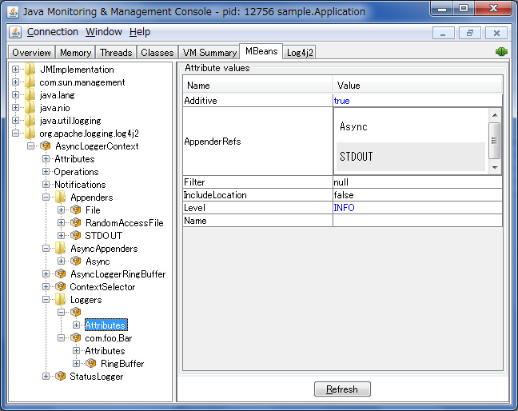

<a id="jmx--clientgui"></a>
<a id="jmx--client-gui"></a>

## Client GUI

[The Apache Log4j JMX GUI](https://github.com/apache/logging-log4j-jmx-gui) is a basic client GUI that can be used to monitor the `StatusLogger` output and to remotely modify the Log4j configuration.
The client GUI can be run as a stand-alone application or as a JConsole plug-in.

---

<a id="extending"></a>

<!-- source_url: https://logging.apache.org/log4j/2.x/manual/extending.html -->

<!-- page_index: 34 -->

# Extending

[Edit this Page](https://github.com/apache/logging-log4j2/edit/2.x/src/site/antora/modules/ROOT/pages/manual/extending.adoc)

---

<a id="performance"></a>

<!-- source_url: https://logging.apache.org/log4j/2.x/manual/performance.html -->

<!-- page_index: 35 -->

# Performance

[Edit this Page](https://github.com/apache/logging-log4j2/edit/2.x/src/site/antora/modules/ROOT/pages/manual/performance.adoc)

<a id="performance--performance"></a>

# Performance

In this page we will guide you through certain steps that will show how to improve the performance of your Log4j configuration to serve your particular use case best.

The act of logging is an interplay between the logging API (i.e., Log4j API) where the programmer publishes logs and a logging implementation (i.e., Log4j Core) where published logs get consumed; filtered, enriched, encoded, and written to files, databases, network sockets, etc.
Both parties can have dramatic impact on performance.
Hence, we will discuss the performance optimization of both individually:

1. [Using Log4j API efficiently](#performance--api)
2. [Tuning Log4j Core for performance](#performance--core)

<a id="performance--api"></a>
<a id="performance--using-log4j-api-efficiently"></a>

## Using Log4j API efficiently

Log4j API bundles a rich set of features to either totally avoid or minimize expensive computations whenever possible.
We will walk you through these features with examples.

> [!TIP]
> Remember that a logging API and a logging implementation are two different things.
> You can use Log4j API in combination with a logging implementation other than Log4j Core (e.g., Logback).
> **The tips shared in this section are logging implementation agnostic.**

<a id="performance--api-concat"></a>
<a id="performance--don-t-use-string-concatenation"></a>

### Don’t use string concatenation

If you are using `String` concatenation while logging, you are doing something very wrong and dangerous!

- Don’t use `String` concatenation to format arguments!
  This circumvents the handling of arguments by message type and layout.
  More importantly, **this approach is prone to attacks!**
  Imagine `userId` being provided by the user with the following content:
  `placeholders for non-existing args to trigger failure: {} {} {dangerousLookup}`


```java
/* BAD! */ LOGGER.info("failed for user ID: " + userId);
```

- Use message parameters.
  Parameterized messages allow safe encoding of parameters and avoid formatting totally if the message is filtered.
  For instance, if the associated level for the logger is discarded, no formatting will take place.


```java
/* GOOD */ LOGGER.info("failed for user ID `{}`", userId);
```

<a id="performance--core"></a>
<a id="performance--tuning-log4j-core-for-performance"></a>

## Tuning Log4j Core for performance

Below sections walk you through a set of features that can have significant impact on the performance of Log4j Core.

> [!IMPORTANT]
> Extra tuning of any application will deviate you away from defaults and add up to the maintenance load.
> You are strongly advised to measure your application’s overall performance and then, if Log4j is found to be an important bottleneck factor, tune it carefully.
> When this happens, we also recommend you to evaluate your assumptions on a regular basis to check if they still hold.
> Remember, [premature optimization is the root of all evil](https://en.wikipedia.org/wiki/Program_optimization#When_to_optimize).

> [!TIP]
> Remember that a logging API and a logging implementation are two different things.
> You can use Log4j Core in combination with a logging API other than Log4j API (e.g., SLF4J, JUL, JPL).
> **The tips shared in this section are logging API agnostic.**

<a id="performance--layouts"></a>

### Layouts

[Layouts](#layouts) are responsible for encoding a log event in a certain format (human-readable text, JSON, etc.) and they can have significant impact in your overall logging performance.

<a id="performance--layouts-location"></a>
<a id="performance--location-information"></a>

#### Location information

Several layouts offer directives to include the *location information*: the caller class, method, file, and line.
Log4j takes a snapshot of the stack, and walks the stack trace to find the location information.
**This is an expensive operation** and should be avoided in performance-sensitive setups.

> [!TIP]
> **Example demonstrating that the logger name can be a substitute for the caller name**
> Note that *the caller class* of the location information and *the logger name* are two different things.
> In most setups just using *the logger name* – which doesn’t incur any overhead to obtain while logging! – is a sufficient and **zero-cost substitute for the caller class**.
>
> <details>
> <div>
> <div>
> <div>
> <pre><code>package com.mycompany;
>
> public class PaymentService {
>
>     // Logger name: `com.mycompany.PaymentService`
>     private static final Logger LOGGER = LogManager.getLogger();
>
>     private static final class PaymentTransaction {
>         void doPayment() {
>             // Caller class: `com.mycompany.PaymentService$PaymentTransaction`
>             LOGGER.trace("...");
>         }
>     }
>
> }</code></pre>
> </div>
> </div>
> <div>
> <p>In the above example, if <em>the caller class</em> (which is expensive to compute!) is omitted in the layout, the produced log line will still be likely to contain sufficient information to trace back the source by just looking at <em>the logger name</em>.</p>
> </div>
> </div>
> </details>

Asynchronous loggers need to capture the location information before passing the log message to another thread; otherwise the location information will be lost after that point.
Due to associated performance implications, [asynchronous loggers](#async) and [asynchronous appenders](#appenders--asyncappender) do **not** include location information by default.
You can override the default behaviour in your asynchronous logger or asynchronous appender configuration.

> [!NOTE]
> Even if a layout is configured not to **request** location information, it might use it if the information is already available.
> This is always the case if the location information is captured at build time using the [Log4j Transform Maven Plugin](https://logging.apache.org/log4j/transform/latest/#log4j-transform-maven-plugin).

<a id="performance--layouts-efficiency"></a>
<a id="performance--layout-efficiency"></a>

#### Layout efficiency

Not all layouts are designed with the same performance considerations in mind.
Following layouts are known to be well-optimized for performance-sensitive workloads:

[JSON Template Layout](#json-template-layout--performance)
:   It encodes log events into JSON according to the structure described by the template provided.
    Its output can safely be ingested into several log storage solutions: Elasticsearch, Google Cloud Logging, Graylog, Logstash, etc.

[Pattern Layout](#pattern-layout--performance)
:   It encodes log events into human-readable text according to the pattern provided.

<a id="performance--async"></a>
<a id="performance--asynchronous-logging"></a>

### Asynchronous logging

Asynchronous logging is useful to deal with bursts of events.
How this works is that a minimum amount of work is done by the application thread to capture all required information in a log event, and this log event is then put on a queue for later processing by a background thread.
As long as the queue is sized large enough, the application threads should be able to spend very little time on the logging call and return to the business logic very quickly.

<a id="performance--trade-offs"></a>

#### Trade-offs

There are certain trade-offs associated with asynchronous logging:

<a id="performance--async-benefits"></a>
<a id="performance--benefits"></a>

##### Benefits

Higher peak throughput
:   Applications that occasionally need to log bursts of messages, can take advantage of asynchronous logging.
    It can prevent or dampen latency spikes by shortening the wait time until the next message can be logged.
    If the queue size is large enough to handle the burst, asynchronous logging will prevent your application from falling behind during a sudden increase of activity.

Lower logging latency
:   [`Logger`](https://logging.apache.org/log4j/2.x/javadoc/log4j-api/org/apache/logging/log4j/Logger.html) method calls return faster, since most of the work is done on the I/O thread.

<a id="performance--async-drawbacks"></a>
<a id="performance--drawbacks"></a>

##### Drawbacks

Lower sustainable throughput
:   If the *sustained rate* at which your application is logging messages is faster than the maximum sustained throughput of the underlying appender, the queue will fill up and the application will end up logging at the speed of the slowest appender.
    If this happens, consider selecting a faster appender, or logging less.
    If neither of these is an option, you may get better throughput and fewer latency spikes by logging synchronously.

Error handling
:   If a problem happens during the logging process and an exception is thrown, it is less easy for an asynchronous setting to signal this problem to the application.
    This can partly be alleviated by configuring an exception handler, but this may still not cover all cases.


> [!WARNING]
> If logging is part of your business logic, e.g. you are using Log4j as an audit logging framework, we would recommend to synchronously log those audit messages.
>
> See
> [mixed synchronous/asynchronous loggers](#async--mixedsync-async) on how to log some messages synchronously.

Stateful messages
:   Most
    [`Message`](https://logging.apache.org/log4j/2.x/javadoc/log4j-api/org/apache/logging/log4j/message/Message.html)
    implementations take a snapshot of the formatted message on the calling thread (cf.
    [`log4j2.formatMsgAsync`](#systemproperties--log4j2.formatmsgasync)).
    The log message will not change even if the arguments of the logging call are modified later.

    There are some exceptions to this rule.
    [`MapMessage`](https://logging.apache.org/log4j/2.x/javadoc/log4j-api/org/apache/logging/log4j/message/MapMessage.html)
    and
    [`StructuredDataMessage`](https://logging.apache.org/log4j/2.x/javadoc/log4j-api/org/apache/logging/log4j/message/StructuredDataMessage.html)
    for example are mutable by design: fields can be added to these messages after the message object was created.
    These messages should not be modified after they are logged with asynchronous loggers or asynchronous appenders.

    Similarly, custom
    [`Message`](https://logging.apache.org/log4j/2.x/javadoc/log4j-api/org/apache/logging/log4j/message/Message.html)
    implementations should be designed with asynchronous use in mind, and either take a snapshot of their parameters at construction time, or document their thread-safety characteristics (see
    [`AsynchronouslyFormattable`](https://logging.apache.org/log4j/2.x/javadoc/log4j-api/org/apache/logging/log4j/message/AsynchronouslyFormattable.html)).

Computational overhead
:   If your application is running in an environment where CPU resources are scarce, like a VM with a single vCPU, starting another thread is not likely to give better performance.

<a id="performance--async-strategies"></a>
<a id="performance--asynchronous-logging-strategies"></a>

#### Asynchronous logging strategies

Log4j provides following strategies users can choose from to do asynchronous logging:

<a id="performance--async-logger"></a>
<a id="performance--asynchronous-logger"></a>

##### Asynchronous logger

[Asynchronous loggers](#async) use [LMAX Disruptor](https://lmax-exchange.github.io/disruptor/) messaging library to consume log events.
Their aim is to return from a `log()` call to the application as soon as possible.

<a id="performance--async-appender"></a>
<a id="performance--asynchronous-appender"></a>

##### Asynchronous appender

The [asynchronous appender](#appenders-delegating--asyncappender) accepts references to other appenders and causes log events to be written to them on a separate thread.
The backing queue uses `ArrayBlockingQueue` by default, though it can be replaced with a better performing one suitable for your use case.

<a id="performance--gcfree"></a>
<a id="performance--garbage-free-logging"></a>

### Garbage-free logging

Garbage collection pauses are a common cause of latency spikes and for many systems significant effort is spent on controlling these pauses.
Log4j allocates temporary `LogEvent`, `String`, `char[]`, `byte[]`, etc. objects during steady state logging.
This contributes to pressure on the garbage collector and increases the frequency with which garbage collection pauses occur.
In *garbage-free mode*, Log4j buffers and reuses objects to lessen this pressure.

See [Garbage-free logging](#garbagefree) for details.

---

<a id="async"></a>

<!-- source_url: https://logging.apache.org/log4j/2.x/manual/async.html -->

<!-- page_index: 36 -->

<a id="async--asynchronous-loggers"></a>

# Asynchronous loggers

Asynchronous logging is a technique that improves application logging performance by executing all I/O operations in a separate thread.

Log4j offers out-of-the-box two different asynchronous logging solutions:

Asynchronous appender
:   An asynchronous appender is a classical queue-based asynchronous appender which is available since Log4j 1.

    See [Asynchronous appender](#appenders-delegating--asyncappender) for more details.

Asynchronous loggers
:   Asynchronous loggers have been a new feature since Log4j 2.
    They are based on
    [LMAX Disruptor](https://lmax-exchange.github.io/disruptor/),
    a lock-free inter-thread communication library, instead of queues, resulting in higher throughput and lower latency.

    The rest of this chapter is dedicated to this new component.

> [!WARNING]
> Logging performance depends significantly on the architecture of your application and the way you use logging.
> The solutions offered by this chapter should be evaluated using benchmarks against your application.
> If benchmarks and profiling don’t show a statistically significant difference between asynchronous and synchronous logging solutions, the latter is recommended since it is the simplest.

<a id="async--trade-offs"></a>

## Trade-offs

There are certain trade-offs associated with asynchronous logging:

<a id="async--async-benefits"></a>
<a id="async--benefits"></a>

### Benefits

Higher peak throughput
:   Applications that occasionally need to log bursts of messages, can take advantage of asynchronous logging.
    It can prevent or dampen latency spikes by shortening the wait time until the next message can be logged.
    If the queue size is large enough to handle the burst, asynchronous logging will prevent your application from falling behind during a sudden increase of activity.

Lower logging latency
:   [`Logger`](https://logging.apache.org/log4j/2.x/javadoc/log4j-api/org/apache/logging/log4j/Logger.html) method calls return faster, since most of the work is done on the I/O thread.

<a id="async--async-drawbacks"></a>
<a id="async--drawbacks"></a>

### Drawbacks

Lower sustainable throughput
:   If the *sustained rate* at which your application is logging messages is faster than the maximum sustained throughput of the underlying appender, the queue will fill up and the application will end up logging at the speed of the slowest appender.
    If this happens, consider selecting a faster appender, or logging less.
    If neither of these is an option, you may get better throughput and fewer latency spikes by logging synchronously.

Error handling
:   If a problem happens during the logging process and an exception is thrown, it is less easy for an asynchronous setting to signal this problem to the application.
    This can partly be alleviated by configuring an exception handler, but this may still not cover all cases.


> [!WARNING]
> If logging is part of your business logic, e.g. you are using Log4j as an audit logging framework, we would recommend to synchronously log those audit messages.
>
> See
> [mixed synchronous/asynchronous loggers](#async--mixedsync-async) on how to log some messages synchronously.

Stateful messages
:   Most
    [`Message`](https://logging.apache.org/log4j/2.x/javadoc/log4j-api/org/apache/logging/log4j/message/Message.html)
    implementations take a snapshot of the formatted message on the calling thread (cf.
    [`log4j2.formatMsgAsync`](#systemproperties--log4j2.formatmsgasync)).
    The log message will not change even if the arguments of the logging call are modified later.

    There are some exceptions to this rule.
    [`MapMessage`](https://logging.apache.org/log4j/2.x/javadoc/log4j-api/org/apache/logging/log4j/message/MapMessage.html)
    and
    [`StructuredDataMessage`](https://logging.apache.org/log4j/2.x/javadoc/log4j-api/org/apache/logging/log4j/message/StructuredDataMessage.html)
    for example are mutable by design: fields can be added to these messages after the message object was created.
    These messages should not be modified after they are logged with asynchronous loggers or asynchronous appenders.

    Similarly, custom
    [`Message`](https://logging.apache.org/log4j/2.x/javadoc/log4j-api/org/apache/logging/log4j/message/Message.html)
    implementations should be designed with asynchronous use in mind, and either take a snapshot of their parameters at construction time, or document their thread-safety characteristics (see
    [`AsynchronouslyFormattable`](https://logging.apache.org/log4j/2.x/javadoc/log4j-api/org/apache/logging/log4j/message/AsynchronouslyFormattable.html)).

Computational overhead
:   If your application is running in an environment where CPU resources are scarce, like a VM with a single vCPU, starting another thread is not likely to give better performance.

<a id="async--installation"></a>

## Installation

In order to use async loggers, you need to add LMAX Disruptor to you application’s dependencies, by adding the following dependency to your build tool:

- Maven
- Gradle

```xml
<dependency>
  <groupId>com.lmax</groupId>
  <artifactId>disruptor</artifactId>
  <version>4.0.0</version>
  <scope>runtime</scope>
</dependency>
```

```groovy
runtimeOnly 'com.lmax:disruptor:4.0.0'
```

<a id="async--configuration"></a>

## Configuration

There are two ways asynchronous loggers can be used in Log4j.
You can:

- [Making all loggers asynchronous](#async--allasync), which gives a better performance,
- [Mixing synchronous and asynchronous loggers](#async--mixedsync-async), which gives more flexibility.

Under the hood, these methods use different Log4j plugins but also share a
[set of common configuration properties](#async--common-configuration-properties).

<a id="async--allasync"></a>
<a id="async--making-all-loggers-asynchronous"></a>

### Making all loggers asynchronous

This is the simplest to configure and gives the best performance: to make all logger asynchronous, **all** you need to set the
[`log4j2.contextSelector`](#systemproperties--log4j2.contextselector)
property to one of the asynchronous logger context selectors:

[`org.apache.logging.log4j.core.async.BasicAsyncLoggerContextSelector`](https://logging.apache.org/log4j/2.x/javadoc/log4j-core/org/apache/logging/log4j/core/async/BasicAsyncLoggerContextSelector.html)
:   This will create a single logger context and disruptor for all the classes in the JVM,

[`org.apache.logging.log4j.core.async.AsyncLoggerContextSelector`](https://logging.apache.org/log4j/2.x/javadoc/log4j-core/org/apache/logging/log4j/core/async/AsyncLoggerContextSelector.html)
:   This will create a different logger context and disruptor for each classloader in the JVM.

> [!IMPORTANT]
> When using an asynchronous logger context, you should only use the `Root` and `Logger` elements (cf.
> [Logger configuration](#configuration--configuring-loggers)).
>
> If you use `AsyncRoot` and `AsyncLogger` configuration elements, two asynchronous barriers will be created instead of one, impairing performance.

<a id="async--syspropsallasync"></a>
<a id="async--tuning-a-fully-asynchronous-configuration"></a>

### Tuning a fully asynchronous configuration

Since Disruptor is initialized at the same time as the logger context and before any Log4j configuration file is loaded, tuning async loggers is only possible through configuration properties.

Beyond the [common configuration properties](#async--common-configuration-properties), the following additional elements are configurable:

<a id="async--log4j2.asyncloggerexceptionhandler"></a>

#### `log4j2.asyncLoggerExceptionHandler`

| Env. variable | `LOG4J_ASYNC_LOGGER_EXCEPTION_HANDLER` |
| --- | --- |
| Type | [`Class<? extends ExceptionHandler<? super RingBufferLogEvent>>`](https://lmax-exchange.github.io/disruptor/javadoc/com.lmax.disruptor/com/lmax/disruptor/ExceptionHandler.html) |
| Default value | [`AsyncLoggerDefaultExceptionHandler`](https://logging.apache.org/log4j/2.x/javadoc/log4j-core/org/apache/logging/log4j/core/async/AsyncLoggerDefaultExceptionHandler.html) |

Fully qualified name of a class that implements the [`ExceptionHandler`](https://lmax-exchange.github.io/disruptor/javadoc/com.lmax.disruptor/com/lmax/disruptor/ExceptionHandler.html) interface, which will be notified when an exception occurs while logging messages.
The class needs to have a public zero-argument constructor.

The default exception handler will print a message and stack trace to the standard error output stream.

<a id="async--log4j2.asyncloggerringbuffersize"></a>

#### `log4j2.asyncLoggerRingBufferSize`

| Env. variable | `LOG4J_ASYNC_LOGGER_RING_BUFFER_SIZE` |
| --- | --- |
| Type | `int` |
| Default value | `256 × 1024` (GC-free mode: `4 × 1024`) |

Size (number of slots) in the RingBuffer used by the asynchronous logging subsystem.
Make this value large enough to deal with bursts of activity.
The minimum size is 128.
The RingBuffer will be pre-allocated at first use and will never grow or shrink during the life of the system.

When the application is logging faster than the underlying appender can keep up with for a long enough time to fill up the queue, the behaviour is determined by the [`AsyncQueueFullPolicy`](https://logging.apache.org/log4j/2.x/javadoc/log4j-core/org/apache/logging/log4j/core/async/AsyncQueueFullPolicy.html).

<a id="async--log4j2.asyncloggerwaitstrategy"></a>

#### `log4j2.asyncLoggerWaitStrategy`

| Env. variable | `LOG4J_ASYNC_LOGGER_WAIT_STRATEGY` |
| --- | --- |
| Type | predefined constant |
| Default value | `Timeout` |

Specifies the [`WaitStrategy`](https://lmax-exchange.github.io/disruptor/javadoc/com.lmax.disruptor/com/lmax/disruptor/WaitStrategy.html) used by the LMAX Disruptor.

The value needs to be one of the predefined constants:

Block
:   a strategy that uses a lock and condition variable for the I/O thread waiting for log events.
    Block can be used when throughput and low-latency are not as important as CPU resource.
    Recommended for resource constrained/virtualized environments.
    This wait strategy is not [garbage free](#garbagefree).

Timeout
:   a variation of the `Block` strategy that will periodically wake up from the lock condition `await()` call.
    This ensures that if a notification is missed somehow the consumer thread is not stuck but will recover with a small latency delay, see [`log4j2.asyncLoggerTimeout`](#async--log4j2.asyncloggertimeout).
    This wait strategy is [garbage free](#garbagefree).

Sleep
:   a strategy that initially spins, then uses a `Thread.yield()`, and eventually parks for the minimum number of nanos the OS and JVM will allow while the I/O thread is waiting for log events (see [`log4j2.asyncLoggerRetries`](#async--log4j2.asyncloggerretries) and [`log4j2.asyncLoggerSleepTimeNs`](#async--log4j2.asyncloggersleeptimens)).
    Sleep is a good compromise between performance and CPU resource.
    This strategy has very low impact on the application thread, in exchange for some additional latency for actually getting the message logged.
    This wait strategy is [garbage free](#garbagefree).

Yield
:   is a strategy that will use `100%` CPU, but will give up the CPU if other threads require CPU resources.
    This wait strategy is [garbage free](#garbagefree).

<a id="async--log4j2.asyncloggertimeout"></a>

#### `log4j2.asyncLoggerTimeout`

| Env. variable | `LOG4J_ASYNC_LOGGER_TIMEOUT` |
| --- | --- |
| Type | `int` |
| Default value | `10` |

Timeout in milliseconds of `Timeout` wait strategy (see [`log4j2.asyncLoggerWaitStrategy`](#async--log4j2.asyncloggerwaitstrategy)).

<a id="async--log4j2.asyncloggersleeptimens"></a>

#### `log4j2.asyncLoggerSleepTimeNs`

| Env. variable | `LOG4J_ASYNC_LOGGER_SLEEP_TIME_NS` |
| --- | --- |
| Type | `long` |
| Default value | `100` |

Sleep time in nanoseconds of `Sleep` wait strategy (see [`log4j2.asyncLoggerWaitStrategy`](#async--log4j2.asyncloggerwaitstrategy)).

<a id="async--log4j2.asyncloggerretries"></a>

#### `log4j2.asyncLoggerRetries`

| Env. variable | `LOG4J_ASYNC_LOGGER_RETRIES` |
| --- | --- |
| Type | `int` |
| Default value | `200` |

Total number of spin cycles and `Thread.yield()` cycles of `Sleep` (see [`log4j2.asyncLoggerWaitStrategy`](#async--log4j2.asyncloggerwaitstrategy)).

<a id="async--log4j2.asyncloggersynchronizeenqueuewhenqueuefull"></a>

#### `log4j2.asyncLoggerSynchronizeEnqueueWhenQueueFull`

| Env. variable | `LOG4J_ASYNC_LOGGER_SYNCHRONIZE_ENQUEUE_WHEN_QUEUE_FULL` |
| --- | --- |
| Type | `boolean` |
| Default value | `true` |

Synchronizes access to the Disruptor ring buffer for blocking enqueue operations when the queue is full.
Users encountered excessive CPU utilization with Disruptor v3.4.2 when the application was logging more than the underlying appender could keep up with and the ring buffer became full, especially when the number of application threads vastly outnumbered the number of cores.
CPU utilization is significantly reduced by restricting access to the enqueue operation.
Setting this value to `false` may lead to very high CPU utilization when the async logging queue is full.

<a id="async--log4j2.asyncloggerthreadnamestrategy"></a>

#### `log4j2.asyncLoggerThreadNameStrategy`

| Env. variable | `LOG4J_ASYNC_LOGGER_HREAD_NAME_STRATEGY` |
| --- | --- |
| Type | [`ThreadNameCachingStrategy`](https://logging.apache.org/log4j/2.x/javadoc/log4j-core/org/apache/logging/log4j/core/async/ThreadNameCachingStrategy.html) (enumeration) |
| Default value | `UNCACHED` for JRE 8u102 or later, `CACHED` otherwise |

Specifies the
[`ThreadNameCachingStrategy`](https://logging.apache.org/log4j/2.x/javadoc/log4j-core/org/apache/logging/log4j/core/async/ThreadNameCachingStrategy.html)
to use to cache the result of
[`Thread#getName()`](https://docs.oracle.com/javase/8/docs/api/java/lang/Thread.html#getName--).

This setting allows to cache the result of `Thread.getName()` calls and has two values:

CACHED
:   stores the name of the current thread in a `ThreadLocal` field,

UNCACHED
:   disables caching.

> [!NOTE]
> Since JRE 8u102 the `Thread.getName()` method does **not** allocate a new object.

- The generic behavior of asynchronous components, such as the queue full policy and message formatting.

  For more details, see [common asynchronous logging configurations](#systemproperties--properties-async).
- The parameters of the disruptor, such as the size of the ring buffer and the wait strategy to use.

  See [asynchronous logger configuration](#systemproperties--properties-async-logger) for more details.

> [!TIP]
> You can place the selected value of the
> [`log4j2.contextSelector`](#systemproperties--log4j2.contextselector) and other configuration properties in a `log4j2.component.properties` file at the root of your application’s classpath.
>
> See [Property Sources](#systemproperties--property-sources) for more details.

<a id="async--mixedsync-async"></a>
<a id="async--mixing-synchronous-and-asynchronous-loggers"></a>

### Mixing synchronous and asynchronous loggers

Synchronous and asynchronous loggers can be combined in a single configuration.
This gives you more flexibility at the cost of a slight performance loss (compared to making all loggers asynchronous).

To use this configuration, you need to keep the
[`log4j2.contextSelector`](#systemproperties--log4j2.contextselector) at its default value and use one of the
`AsyncRoot` and `AsyncLogger` configuration elements designate the loggers you want to be asynchronous.

A configuration that mixes asynchronous loggers might look like:

- XML
- JSON
- YAML
- Properties

Snippet from an example [`log4j2.xml`](https://github.com/apache/logging-log4j2/tree/rel/2.25.3/src/site/antora/modules/ROOT/examples/manual/async/mixed-async.xml)

```xml
<Loggers>
  <Root level="INFO">
    <AppenderRef ref="AUDIT"> (1)
      <MarkerFilter marker="AUDIT" onMatch="ACCEPT" onMismatch="DENY"/>
    </AppenderRef>
  </Root>
  <AsyncLogger name="com.example" level="TRACE">
    <AppenderRef ref="DEBUG_LOG"/> (2)
  </AsyncLogger>
</Loggers>
```

Snippet from an example [`log4j2.json`](https://github.com/apache/logging-log4j2/tree/rel/2.25.3/src/site/antora/modules/ROOT/examples/manual/async/mixed-async.json)

```json
"Loggers": {"Root": {"level": "INFO","AppenderRef": { (1) "ref": "AUDIT","MarkerFilter": {"marker": "AUDIT","onMatch": "ACCEPT","onMismatch": "DENY"}} },"AsyncLogger": { (2) "name": "com.example","level": "TRACE","AppenderRef": {"ref": "DEBUG_LOG"}}}
```

Snippet from an example [`log4j2.yaml`](https://github.com/apache/logging-log4j2/tree/rel/2.25.3/src/site/antora/modules/ROOT/examples/manual/async/mixed-async.yaml)

```yaml
Loggers:
  Root:
    level: "INFO"
    AppenderRef: (1)
      ref: "AUDIT"
      MarkerFilter:
        marker: "AUDIT"
        onMatch: "ACCEPT"
        onMismatch: "DENY"
  AsyncLogger:
    name: "com.example"
    level: "TRACE"
    AppenderRef: (2)
      ref: "DEBUG_LOG"
```

Snippet from an example [`log4j2.properties`](https://github.com/apache/logging-log4j2/tree/rel/2.25.3/src/site/antora/modules/ROOT/examples/manual/async/mixed-async.properties)

```properties
rootLogger.level = INFO
rootLogger.appenderRef.0.ref = AUDIT (1)
rootLogger.appenderRef.0.filter.0.type = MarkerFilter
rootLogger.appenderRef.0.filter.0.marker = AUDIT
rootLogger.appenderRef.0.filter.0.onMatch = ACCEPT
rootLogger.appenderRef.0.filter.0.onMismatch = DENY

logger.0.type = AsyncLogger
logger.0.name = com.example
logger.0.level = TRACE
logger.0.appenderRef.0.ref = DEBUG_LOG (2)
```

**1**

All the appenders referenced by `Root` and `Logger` are called synchronously.
This is especially important for audit logging since exceptions can be forwarded to the caller.

**2**

All the appenders references by `AsyncRoot` and `AsyncLogger` are called asynchronously.
These log statements will cause a smaller latency for the caller.

<a id="async--syspropsmixedsync-async"></a>
<a id="async--tuning-a-mixed-synchronous-asynchronous-configuration"></a>

### Tuning a mixed synchronous/asynchronous configuration

Since all `AsyncRoot` and `AsyncLogger` components share the same Disruptor instance, their configuration is available through configuration properties.

Beyond the [common configuration properties](#async--common-configuration-properties), the following additional elements are configurable:

<a id="async--log4j2.asyncloggerconfigexceptionhandler"></a>

#### `log4j2.asyncLoggerConfigExceptionHandler`

| Env. variable | `LOG4J_ASYNC_LOGGER_CONFIG_EXCEPTION_HANDLER` |
| --- | --- |
| Type | [`Class<? extends ExceptionHandler<? super Log4jEventWrapper>>`](https://lmax-exchange.github.io/disruptor/javadoc/com.lmax.disruptor/com/lmax/disruptor/ExceptionHandler.html) |
| Default value | [`AsyncLoggerConfigDefaultExceptionHandler`](https://logging.apache.org/log4j/2.x/javadoc/log4j-core/org/apache/logging/log4j/core/async/AsyncLoggerConfigDefaultExceptionHandler.html) |

Fully qualified name of a class that implements the [`ExceptionHandler`](https://lmax-exchange.github.io/disruptor/javadoc/com.lmax.disruptor/com/lmax/disruptor/ExceptionHandler.html) interface, which will be notified when an exception occurs while logging messages.
The class needs to have a public zero-argument constructor.

The default exception handler will print a message and stack trace to the standard error output stream.

<a id="async--log4j2.asyncloggerconfigringbuffersize"></a>

#### `log4j2.asyncLoggerConfigRingBufferSize`

| Env. variable | `LOG4J_ASYNC_LOGGER_CONFIG_RING_BUFFER_SIZE` |
| --- | --- |
| Type | `int` |
| Default value | `256 × 1024` (GC-free mode: `4 × 1024`) |

Size (number of slots) in the RingBuffer used by the asynchronous logging subsystem.
Make this value large enough to deal with bursts of activity.
The minimum size is 128.
The RingBuffer will be pre-allocated at first use and will never grow or shrink during the life of the system.

When the application is logging faster than the underlying appender can keep up with for a long enough time to fill up the queue, the behaviour is determined by the [`AsyncQueueFullPolicy`](https://logging.apache.org/log4j/2.x/javadoc/log4j-core/org/apache/logging/log4j/core/async/AsyncQueueFullPolicy.html).

<a id="async--log4j2.asyncloggerconfigwaitstrategy"></a>

#### `log4j2.asyncLoggerConfigWaitStrategy`

| Env. variable | `LOG4J_ASYNC_LOGGER_CONFIG_WAIT_STRATEGY` |
| --- | --- |
| Type | predefined constant |
| Default value | `Timeout` |

Specifies the [`WaitStrategy`](https://lmax-exchange.github.io/disruptor/javadoc/com.lmax.disruptor/com/lmax/disruptor/WaitStrategy.html) used by the LMAX Disruptor.

The value needs to be one of the predefined constants:

Block
:   a strategy that uses a lock and condition variable for the I/O thread waiting for log events.
    Block can be used when throughput and low-latency are not as important as CPU resource.
    Recommended for resource constrained/virtualised environments.

Timeout
:   a variation of the `Block` strategy that will periodically wake up from the lock condition `await()` call.
    This ensures that if a notification is missed somehow the consumer thread is not stuck but will recover with a small latency delay (see [`log4j2.asyncLoggerTimeout`](#async--log4j2.asyncloggertimeout))

Sleep
:   a strategy that initially spins, then uses a `Thread.yield()`, and eventually parks for the minimum number of nanos the OS and JVM will allow while the I/O thread is waiting for log events (see [`log4j2.asyncLoggerRetries`](#async--log4j2.asyncloggerretries) and [`log4j2.asyncLoggerSleepTimeNs`](#async--log4j2.asyncloggersleeptimens)).
    Sleep is a good compromise between performance and CPU resource.
    This strategy has very low impact on the application thread, in exchange for some additional latency for actually getting the message logged.

Yield
:   is a strategy that will use `100%` CPU, but will give up the CPU if other threads require CPU resources.

See also [Custom `WaitStrategy`](#async--custom-waitstrategy) for an alternative way to configure the wait strategy.

<a id="async--log4j2.asyncloggerconfigtimeout"></a>

#### `log4j2.asyncLoggerConfigTimeout`

| Env. variable | `LOG4J_ASYNC_LOGGER_CONFIG_TIMEOUT` |
| --- | --- |
| Type | `int` |
| Default value | `10` |

Timeout in milliseconds of `Timeout` wait strategy (see [`log4j2.asyncLoggerConfigWaitStrategy`](#async--log4j2.asyncloggerconfigwaitstrategy)).

<a id="async--log4j2.asyncloggerconfigsleeptimens"></a>

#### `log4j2.asyncLoggerConfigSleepTimeNs`

| Env. variable | `LOG4J_ASYNC_LOGGER_CONFIG_SLEEP_TIME_NS` |
| --- | --- |
| Type | `long` |
| Default value | `100` |

Sleep time in nanoseconds of `Sleep` wait strategy (see [`log4j2.asyncLoggerConfigWaitStrategy`](#async--log4j2.asyncloggerconfigwaitstrategy))).

<a id="async--log4j2.asyncloggerconfigretries"></a>

#### `log4j2.asyncLoggerConfigRetries`

| Env. variable | `LOG4J_ASYNC_LOGGER_CONFIG_RETRIES` |
| --- | --- |
| Type | `int` |
| Default value | `200` |

Total number of spin cycles and `Thread.yield()` cycles of `Sleep` (see [`log4j2.asyncLoggerConfigWaitStrategy`](#async--log4j2.asyncloggerconfigwaitstrategy))).

<a id="async--log4j2.asyncloggerconfigsynchronizeenqueuewhenqueuefull"></a>

#### `log4j2.asyncLoggerConfigSynchronizeEnqueueWhenQueueFull`

| Env. variable | `LOG4J_ASYNC_LOGGER_CONFIG_SYNCHRONIZE_ENQUEUE_WHEN_QUEUE_FULL` |
| --- | --- |
| Type | `boolean` |
| Default value | `true` |

Synchronizes access to the Disruptor ring buffer for blocking enqueue operations when the queue is full.
Users encountered excessive CPU utilization with Disruptor v3.4.2 when the application was logging more than the underlying appender could keep up with and the ring buffer became full, especially when the number of application threads vastly outnumbered the number of cores.
CPU utilization is significantly reduced by restricting access to the enqueue operation.
Setting this value to `false` may lead to very high CPU utilization when the async logging queue is full.

> [!TIP]
> You can place the values of configuration properties in a `log4j2.component.properties` file at the root of your application’s classpath.
>
> See [Property Sources](#systemproperties--property-sources) for more details.

<a id="async--common-configuration-properties"></a>

### Common configuration properties

Regardless of the way you configure asynchronous loggers in Log4j, you can use the following properties to tune your installation further:

<a id="async--log4j2.formatmsgasync"></a>

#### `log4j2.formatMsgAsync`

| Env. variable | `LOG4J_FORMAT_MSG_ASYNC` |
| --- | --- |
| Type | `boolean` |
| Default value | `false` |

If `false`, Log4j will make sure the message is formatted in the caller thread, otherwise the formatting will occur on the asynchronous thread.

**Remark**: messages annotated with
[`AsynchronouslyFormattable`](https://logging.apache.org/log4j/2.x/javadoc/log4j-api/org/apache/logging/log4j/message/AsynchronouslyFormattable.html)
will be formatted on the async thread regardless of this setting.

<a id="async--log4j2.asyncqueuefullpolicy"></a>

#### `log4j2.asyncQueueFullPolicy`

| Env. variable | `LOG4J_ASYNC_QUEUE_FULL_POLICY` |
| --- | --- |
| Type | [`Class<? extends AsyncQueueFullPolicy>`](https://logging.apache.org/log4j/2.x/javadoc/log4j-core/org/apache/logging/log4j/core/async/AsyncQueueFullPolicy.html) or predefined constant |
| Default value | `Default` |

Determines the
[`AsyncQueueFullPolicy`](https://logging.apache.org/log4j/2.x/javadoc/log4j-core/org/apache/logging/log4j/core/async/AsyncQueueFullPolicy.html)
to use when the underlying async component cannot keep up with the logging rate and the queue is filling up.

Its value should be the fully qualified class name of an `AsyncQueueFullPolicy` implementation or one of these predefined constants:

Default
:   blocks the calling thread until the event can be added to the queue.

Discard
:   when the queue is full, it drops the events whose level is equal or less than the threshold level (see
    [`log4j2.discardThreshold`](#async--log4j2.discardthreshold)).

<a id="async--log4j2.discardthreshold"></a>

#### `log4j2.discardThreshold`

| Env. variable | `LOG4J_DISCARD_THRESHOLD` |
| --- | --- |
| Type | [`Level`](https://logging.apache.org/log4j/2.x/javadoc/log4j-api/org/apache/logging/log4j/Level.html) |
| Default value | `INFO` |

Determines the threshold level used by a `Discard` queue full policy.
Log events whose level is not more severe than the threshold level will be discarded during a queue full event.
See also [`log4j2.asyncQueueFullPolicy`](#async--log4j2.asyncqueuefullpolicy).

<a id="async--custom-waitstrategy"></a>

## Custom `WaitStrategy`

The system properties mentioned in the section above allow only to choose from among a fixed set of wait strategies.

To use a custom wait strategy, you need to:

1. Use the [mixed sync/async configuration method](#async--mixedsync-async) above, 2. Implement the interface [`AsyncWaitStrategyFactory`](https://logging.apache.org/log4j/2.x/javadoc/log4j-core/org/apache/logging/log4j/core/async/AsyncWaitStrategyFactory.html); the implementation must have a public no-arg constructor, 3. Add an [AsyncWaitStrategyFactory Log4j plugin](https://logging.apache.org/log4j/2.x/plugin-reference.html#org-apache-logging-log4j_log4j-core_org-apache-logging-log4j-core-async-AsyncWaitStrategyFactoryConfig)
   to your configuration.

- XML
- JSON
- YAML
- Properties

Snippet from an example [`log4j2.xml`](https://github.com/apache/logging-log4j2/tree/rel/2.25.3/src/site/antora/modules/ROOT/examples/manual/async/custom-wait-strategy.xml)

```xml
<AsyncWaitStrategyFactory class="com.example.AsyncWaitStrategyFactory"/>
```

Snippet from an example [`log4j2.json`](https://github.com/apache/logging-log4j2/tree/rel/2.25.3/src/site/antora/modules/ROOT/examples/manual/async/custom-wait-strategy.json)

```json
"AsyncWaitStrategyFactor": {
  "class": "com.example.AsyncWaitStrategyFactory"
}
```

Snippet from an example [`log4j2.yaml`](https://github.com/apache/logging-log4j2/tree/rel/2.25.3/src/site/antora/modules/ROOT/examples/manual/async/custom-wait-strategy.yaml)

```yaml
  AsyncWaitStrategyFactory:
    class: "com.example.AsyncWaitStrategyFactory"
```

Snippet from an example [`log4j2.properties`](https://github.com/apache/logging-log4j2/tree/rel/2.25.3/src/site/antora/modules/ROOT/examples/manual/async/custom-wait-strategy.properties)

```properties
strategy.type = AsyncWaitStrategyFactory
strategy.class = com.exampleAsyncWaitStrategyFactory
```

<a id="async--location"></a>
<a id="async--location-information"></a>

## Location information

[Computing the location information (i.e., the caller class, method, file, and line number) of a log event is an expensive operation.](#layouts--locationinformation)
The impact on asynchronous loggers and appenders is even higher since the component must decide whether to compute it or not **before** crossing the asynchronous barrier.
Location information is turned off by default for asynchronous loggers and appenders.
To enable it for a certain logger, set its [`includeLocation`](#configuration--logger-attributes-includelocation) attribute to `true`.

<a id="async--exception-handler"></a>

## Exception handler

To handle exceptions that occur on the asynchronous thread, you can configure a custom
[`ExceptionHandler<T>`](https://lmax-exchange.github.io/disruptor/javadoc/com.lmax.disruptor/com/lmax/disruptor/ExceptionHandler.html).

The exact type of handler depends on the configuration mode:

Full asynchronous
:   If all the loggers are asynchronous, you need to:

    - implement an [`ExceptionHandler<? super RingBufferLogEvent>`](https://logging.apache.org/log4j/2.x/javadoc/log4j-core/org/apache/logging/log4j/core/async/RingBufferLogEvent.html)
    - set its fully qualified class name as value of the
      [`log4j2.asyncLoggerExceptionHandler`](#systemproperties--log4j2.asyncloggerexceptionhandler)
      configuration property.

Mixed synchronous/asynchronous
:   If you use a mix of synchronous and asynchronous loggers, you need to:

    - implement a
      [`ExceptionHandler<? super AsyncLoggerConfigDisruptor.Log4jEventWrapper>`](https://logging.apache.org/log4j/2.x/javadoc/log4j-core/org/apache/logging/log4j/core/async/AsyncLoggerConfigDisruptor.Log4jEventWrapper.html)
    - set its fully qualified class name as the value of the
      [`log4j2.asyncLoggerConfigExceptionHandler`](#systemproperties--log4j2.asyncloggerconfigexceptionhandler)
      configuration property.

---

<a id="garbagefree"></a>

<!-- source_url: https://logging.apache.org/log4j/2.x/manual/garbagefree.html -->

<!-- page_index: 37 -->

<a id="garbagefree--garbage-free-logging"></a>

# Garbage-free logging

Garbage collection pauses are a common cause of latency spikes and for many systems significant effort is spent on controlling these pauses.
Log4j allocates temporary `LogEvent`, `String`, `char[]`, `byte[]`, etc. objects during steady state logging.
This contributes to pressure on the garbage collector and increases the frequency with which garbage collection pauses occur.
In *garbage-free mode*, Log4j buffers and reuses objects to lessen this pressure.

> [!IMPORTANT]
> Extra tuning of any application will deviate you away from defaults and add up to the maintenance load.
> You are strongly advised to measure your application’s overall performance and then, if Log4j is found to be an important bottleneck factor, tune it carefully.
> When this happens, we also recommend you to evaluate your assumptions on a regular basis to check if they still hold.
> Remember, [premature optimization is the root of all evil](https://en.wikipedia.org/wiki/Program_optimization#When_to_optimize).

The act of logging is an interplay between the logging API (i.e., Log4j API) where the programmer publishes logs and a logging implementation (i.e., Log4j Core) where published logs get consumed; filtered, enriched, encoded, and written to files, databases, network sockets, etc.
Both parties contain different features with different memory allocation characteristics.
To achieve an end-to-end garbage-free logging system, they need to work hand in hand.
Hence, we will discuss both:

1. [Log4j Core configuration](#garbagefree--config)
2. [Log4j API usage](#garbagefree--api)

> [!NOTE]
> Garbage-free logging is currently implemented for Log4j API and its reference implementation, Log4j Core.
> If you use another setup (e.g., a different logging API or implementation) this promise might not hold.

<a id="garbagefree--quick"></a>
<a id="garbagefree--quick-start"></a>

## Quick start

If you want to have a garbage-free Log4j setup, but don’t want to spend time with the associated details, you can quickly get started with the following instructions:

1. Set the following system properties to `true`:

   - [`log4j2.enableThreadlocals`](#garbagefree--log4j2.enablethreadlocals)
   - [`log4j2.garbagefreeThreadContextMap`](#garbagefree--log4j2.garbagefreethreadcontextmap)
2. Use garbage-free

   - [Layouts](#garbagefree--layouts)
   - [Appenders](#garbagefree--appenders)
   - [Filters](#garbagefree--filters)

This should be sufficient for a majority of use cases.
If not for yours, keep on reading.

<a id="garbagefree--config"></a>
<a id="garbagefree--log4j-core-configuration"></a>

## Log4j Core configuration

In order to have a garbage-free Log4j Core, you need to

- [configure it using properties](#garbagefree--core-properties),
- and employ garbage-free [Layouts](#garbagefree--layouts), [Appenders](#garbagefree--appenders), and [Filters](#garbagefree--filters).

<a id="garbagefree--core-properties"></a>
<a id="garbagefree--properties"></a>

### Properties

Garbage-free logging can be configured for Log4j Core using properties listed below.
(See [Configuration file](#configuration) on details how you can set these properties.)

<a id="garbagefree--log4j2.iswebapp"></a>

#### `log4j2.isWebapp`

| Env. variable | `LOG4J_IS_WEBAPP` |
| --- | --- |
| Type | `boolean` |
| Default value | `true` if the [Servlet](https://jakarta.ee/specifications/servlet/6.0/apidocs/jakarta.servlet/jakarta/servlet/servlet) class on classpath, `false` otherwise |

Setting this property to `true` switches Log4j Core into "Web application mode" (*"Web-app mode"*).

In this mode Log4j is optimized to work in a Servlet container.

This mode is incompatible with [`log4j2.enableThreadlocals`](#garbagefree--log4j2.enablethreadlocals).

<a id="garbagefree--log4j2.enablethreadlocals"></a>

#### `log4j2.enableThreadlocals`

| Env. variable | `LOG4J_ENABLE_THREADLOCALS` |
| --- | --- |
| Type | `boolean` |
| Default value | `false` if Web-app mode is enabled, `true` otherwise |

Setting this property to `true` switches Log4j Core into "garbage-free mode" (*"GC-free mode"*).

In this mode Log4j uses `ThreadLocal`s for object pooling to prevent object allocations.

[`ThreadLocal`](https://docs.oracle.com/javase/8/docs/api/java/lang/ThreadLocal.html)
fields holding non-JDK classes can cause memory leaks in web applications when the application server’s thread pool continues to reference these fields after the web application is undeployed.
Hence, to avoid causing memory leaks, `log4j2.enableThreadlocals` by default reflects the opposite of [`log4j2.isWebapp`](#garbagefree--log4j2.iswebapp).

<a id="garbagefree--log4j2.enabledirectencoders"></a>

#### `log4j2.enableDirectEncoders`

| Env. variable | `LOG4J_ENABLE_DIRECT_ENCODERS` |
| --- | --- |
| Type | `boolean` |
| Default value | `true` |

If `true`, garbage-aware layouts will directly encode log events into [`ByteBuffer`](https://docs.oracle.com/javase/8/docs/api/java/nio/ByteBuffer.html)s provided by appenders.

This prevents allocating temporary `String` and `char[]` instances.

<a id="garbagefree--log4j2.encoderbytebuffersize"></a>

#### `log4j2.encoderByteBufferSize`

| Env. variable | `LOG4J_ENCODER_BYTE_BUFFER_SIZE` |
| --- | --- |
| Type | `int` |
| Default value | `8192` |

The size in bytes of the
[`ByteBuffer`](https://docs.oracle.com/javase/8/docs/api/java/nio/ByteBuffer.html)s
stored in `ThreadLocal` fields by layouts and
[`StringBuilderEncoder`](https://logging.apache.org/log4j/2.x/javadoc/log4j-core/org/apache/logging/log4j/core/layout/StringBuilderEncoder.html)s.

This setting is only used if [`log4j2.enableDirectEncoders`](#garbagefree--log4j2.enabledirectencoders) is set to `true`.

<a id="garbagefree--log4j2.encodercharbuffersize"></a>

#### `log4j2.encoderCharBufferSize`

| Env. variable | `LOG4J_ENCODER_CHAR_BUFFER_SIZE` |
| --- | --- |
| Type | `int` |
| Default value | `4096` |

The size in `char`s of the
[`ByteBuffer`](https://docs.oracle.com/javase/8/docs/api/java/nio/ByteBuffer.html)s
stored in `ThreadLocal` fields
[`StringBuilderEncoder`](https://logging.apache.org/log4j/2.x/javadoc/log4j-core/org/apache/logging/log4j/core/layout/StringBuilderEncoder.html)s.

This setting is only used if [`log4j2.enableDirectEncoders`](#garbagefree--log4j2.enabledirectencoders) is set to `true`.

<a id="garbagefree--log4j2.initialreusablemsgsize"></a>

#### `log4j2.initialReusableMsgSize`

| Env. variable | `LOG4J_INITIAL_REUSABLE_MSG_SIZE` |
| --- | --- |
| Type | `int` |
| Default value | `128` |

In GC-free mode, this property determines the initial size of the reusable `StringBuilder`s used by
[`ReusableMessages`](https://logging.apache.org/log4j/2.x/javadoc/log4j-api/org/apache/logging/log4j/message/ReusableMessage.html)
for formatting purposes.

<a id="garbagefree--log4j2.maxreusablemsgsize"></a>

#### `log4j2.maxReusableMsgSize`

| Env. variable | `LOG4J_MAX_REUSABLE_MSG_SIZE` |
| --- | --- |
| Type | `int` |
| Default value | `518` |

In GC-free mode, this property determines the maximum size of the reusable `StringBuilder`s used by
[`ReusableMessages`](https://logging.apache.org/log4j/2.x/javadoc/log4j-api/org/apache/logging/log4j/message/ReusableMessage.html)
for formatting purposes.

The default value allows is equal to `2 × (2 × log4j.initialReusableMsgSize + 2) + 2` and allows the
`StringBuilder` to be resized twice by the current JVM resize algorithm.

<a id="garbagefree--log4j2.layoutstringbuildermaxsize"></a>

#### `log4j2.layoutStringBuilderMaxSize`

| Env. variable | `LOG4J_LAYOUT_STRING_BUILDER_MAX_SIZE` |
| --- | --- |
| Type | `int` |
| Default value | `2048` |

This property determines the maximum size of the reusable `StringBuilder`s used to format
[`LogEvent`](https://logging.apache.org/log4j/2.x/javadoc/log4j-core/org/apache/logging/log4j/core/LogEvent.html)s.

<a id="garbagefree--log4j2.unboxringbuffersize"></a>

#### `log4j2.unboxRingbufferSize`

| Env. variable | `LOG4J_UNBOX_RINGBUFFER_SIZE` |
| --- | --- |
| Type | `int` |
| Default value | `32` |

The
[`Unbox`](https://logging.apache.org/log4j/2.x/javadoc/log4j-api/org/apache/logging/log4j/util/Unbox.html)
utility class can be used by users to format primitive values without incurring in the boxing allocation cost.

This property specifies the maximum number of primitive arguments to a log message that will be cached and usually does not need to be changed.

<a id="garbagefree--log4j2.threadcontextmap"></a>

#### `log4j2.threadContextMap`

| Env. variable | `LOG4J_THREAD_CONTEXT_MAP` |
| --- | --- |
| Type | [`Class<? extends ThreadContextMap>`](https://logging.apache.org/log4j/2.x/javadoc/log4j-api/org/apache/logging/log4j/spi/ThreadContextMap.html) or predefined constant |
| Default value | `WebApp` |

Fully specified class name of a custom
[`ThreadContextMap`](https://logging.apache.org/log4j/2.x/javadoc/log4j-api/org/apache/logging/log4j/spi/ThreadContextMap.html)
implementation class or (since version `2.24.0`) one of the predefined constants:

NoOp
:   to disable the thread context,

WebApp
:   a web application-safe implementation, that only binds JRE classes to `ThreadLocal` to prevent memory leaks,

GarbageFree
:   a garbage-free implementation.

<a id="garbagefree--log4j2.garbagefreethreadcontextmap"></a>

#### `log4j2.garbagefreeThreadContextMap`

| Env. variable | `LOG4J_GARBAGEFREE_THREAD_CONTEXT_MAP` |
| --- | --- |
| Default value | `false` |

If set to `true` selects a garbage-free thread context map implementation.

<a id="garbagefree--log4j2.clock"></a>

#### `log4j2.clock`

| Env. variable | `LOG4J_CLOCK` |
| --- | --- |
| Type | [`Class<? extends Clock>`](https://logging.apache.org/log4j/2.x/javadoc/log4j-core/org/apache/logging/log4j/core/util/Clock.html) or predefined constant |
| Default value | `SystemClock` |

It specifies the
[`Clock`](https://logging.apache.org/log4j/2.x/javadoc/log4j-core/org/apache/logging/log4j/core/util/Clock.html)
implementation used to timestamp log events.

This must be the fully qualified class name of the implementation or one of these predefined constants:

SystemClock
:   It uses the best available system time source.
    See [`Clock#systemDefaultZone()`](https://docs.oracle.com/javase/8/docs/api/java/time/Clock.html#systemDefaultZone--) for details.


> [!NOTE]
> Depending on the version of the JRE, this implementation might not be garbage-free or might only become garbage-free when the code is hot enough.
>
> If you don’t require a nanosecond precision, and you need a garbage-free implementation, use [`SystemMillisClock`](#garbagefree--log4j2.clock.systemmillisclock).

SystemMillisClock
:   It is similar to `SystemClock`, but truncates the result to a millisecond.
    This implementation is garbage-free.

CachedClock
:   It uses a separate thread to update the timestamp value.
    See
    [`CachedClock`](https://logging.apache.org/log4j/2.x/javadoc/log4j-core/org/apache/logging/log4j/core/util/CachedClock.html)
    for details.

CoarseCachedClock
:   This is an alternative implementation of `CachedClock` with a slightly lower precision.
    See
    [`CoarseCachedClock`](https://logging.apache.org/log4j/2.x/javadoc/log4j-core/org/apache/logging/log4j/core/util/CoarseCachedClock.html)
    for details.

<a id="garbagefree--layouts"></a>

### Layouts

The following [layouts](#layouts) can be configured to run garbage-free during steady-state logging.
To understand which configuration knobs exhibit what kind of allocation behaviour, see their dedicated pages.

- [`GelfLayout`](#layouts--gelflayout)
- [`JsonTemplateLayout`](#json-template-layout--faq-garbage-free)
- [`PatternLayout`](#pattern-layout--garbage-free)

<details>
<summary>Implementation notes</summary>
<div>
<div>
<p>Garbage-free <a href="#layouts">layouts</a> need to implement the <code>Encoder&lt;LogEvent&gt;</code> interface.
<a href="https://logging.apache.org/log4j/2.x/javadoc/log4j-core/org/apache/logging/log4j/core/layout/StringBuilderEncoder.html"><code>StringBuilderEncoder</code></a> helps with encoding text to bytes in a garbage-free manner.</p>
</div>
</div>
</details>

<a id="garbagefree--appenders"></a>

### Appenders

The following [appenders](#appenders) are garbage-free during steady-state logging:

- [`ConsoleAppender`](#appenders--consoleappender)
- [`FileAppender`](#appenders-file--fileappender)
- [`MemoryMappedFileAppender`](#appenders-file--memorymappedfileappender)
- [`RandomAccessFileAppender`](#appenders-file--randomaccessfileappender)
- [`RollingFileAppender`](#appenders-rolling-file--rollingfileappender) (except during rollover)
- [`RollingRandomAccessFileAppender`](#appenders-rolling-file--rollingrandomaccessfileappender) (except during rollover)

Any other appender not shared in the above list (including [`AsyncAppender`](#appenders-delegating--asyncappender)) is not garbage-free.

<details>
<summary>Implementation notes</summary>
<div>
<div>
<p>Garbage-free <a href="#appenders">appenders</a> need to provide their <a href="#layouts">layout</a> with a <code>ByteBufferDestination</code> implementation that the layout can directly write into.</p>
</div>
<div>
<table>
<tr>
<td>
<i title="Note"></i>
</td>
<td>
<div>
<p><code>AbstractOutputStreamAppender</code> has been modified to make the following appenders garbage-free:</p>
</div>
<div>
<ul>
<li>
<p><code>ConsoleAppender</code></p>
</li>
<li>
<p><code>(Rolling)FileAppender</code></p>
</li>
<li>
<p><code>(Rolling)RandomAccessFileAppender</code></p>
</li>
<li>
<p><code>MemoryMappedFileAppender</code></p>
</li>
</ul>
</div>
<div>
<p>An effort has been made to minimize impact on custom appenders that extend <code>AbstractOutputStreamAppender</code>, but it is impossible to guarantee that changing the superclass will not impact any and all subclasses.
Custom appenders that extend <code>AbstractOutputStreamAppender</code> should verify that they still function correctly.
In case there is a problem, <a href="#garbagefree--log4j2.enabledirectencoders">the <code>log4j2.enableDirectEncoders</code> system property</a> can be set to <code>false</code> to revert to the pre-Log4j 2.6 behaviour.</p>
</div>
</td>
</tr>
</table>
</div>
</div>
</details>

<a id="garbagefree--filters"></a>

### Filters

The following [filters](#filters) are garbage-free during steady-state logging:

- [`CompositeFilter`](#filters--compositefilter) (adding and removing element filters creates temporary
  objects for thread safety)
- [`DynamicThresholdFilter`](#filters--dynamicthresholdfilter)
- [`LevelRangeFilter`](#filters--levelrangefilter) (garbage-free since `2.8`)
- [`MapFilter`](#filters--mapfilter) (garbage-free since `2.8`)
- [`MarkerFilter`](#filters--markerfilter) (garbage-free since `2.8`)
- [`StructuredDataFilter`](#filters--structureddatafilter) (garbage-free since `2.8`)
- [`ThreadContextMapFilter`](#filters--threadcontextmapfilter) (garbage-free since `2.8`)
- [`ThresholdFilter`](#filters--thresholdfilter) (garbage-free since `2.8`)
- [`TimeFilter`](#filters--timefilter) (garbage-free since `2.8` except when range must be recalculated once per day)

Any other filter not shared in the above list is not garbage-free.

<a id="garbagefree--core-limitations"></a>
<a id="garbagefree--limitations"></a>

### Limitations

There are certain caveats associated with the configuration of garbage-free logging:

Property substitutions
:   Some [property substitutions](#configuration--propertysubstitution) (e.g., ones using [Date Lookup](#lookups--datelookup)) might result in temporary objects being created during steady-state logging.

Asynchronous logger wait strategies
:   As of version `2.18.0`, the default [asynchronous logger](#async) wait strategy (i.e., `Timeout`) is garbage-free while running against both LMAX Disruptor 3 and 4.
    See [`log4j2.asyncLoggerWaitStrategy`](#async--log4j2.asyncloggerwaitstrategy) for details on predefined wait strategies.

<a id="garbagefree--api"></a>
<a id="garbagefree--log4j-api-usage"></a>

## Log4j API usage

[Log4j API](#api) contains several features to facilitate garbage-free logging:

<a id="garbagefree--api-vararg"></a>
<a id="garbagefree--parameterized-message-arguments"></a>

### Parameterized message arguments

The `Logger` interface contains methods for parameterized messages up to 10 arguments.
Logging more than 10 parameters creates [vararg arrays](https://docs.oracle.com/javase/8/docs/technotes/guides/language/varargs.html).

<a id="garbagefree--api-encode-custom-object"></a>
<a id="garbagefree--encoding-custom-objects"></a>

### Encoding custom objects

When a message parameter contains an unknown type by the layout, it will encode by calling `toString()` on these objects.
Most objects don’t have garbage-free `toString()` methods.
Objects themselves can implement their own garbage-free encoders by either extending from [Java’s `CharSequence`](https://docs.oracle.com/javase/8/docs/api/java/lang/CharSequence.html) or [Log4j’s `StringBuilderFormattable`](https://logging.apache.org/log4j/2.x/javadoc/log4j-api/org/apache/logging/log4j/util/StringBuilderFormattable.html).

<a id="garbagefree--codeimpact"></a>
<a id="garbagefree--avoiding-autoboxing"></a>

### Avoiding autoboxing

We made an effort to make logging garbage-free without requiring code
changes in existing applications, but there is one area where this was
not possible. When logging primitive values (i.e. int, double, boolean, etc.) the JVM autoboxes these primitive values to their Object wrapper
equivalents, creating garbage.

Log4j provides an `Unbox` utility to prevent autoboxing of primitive
parameters. This utility contains a thread-local pool of reused
`` StringBuilder`s. The `Unbox.box(primitive) `` methods write directly into
a StringBuilder, and the resulting text will be copied into the final
log message text without creating temporary objects.

```java
import static org.apache.logging.log4j.util.Unbox.box;

LOGGER.debug("Prevent primitive autoboxing {} {}", box(10L), box(2.6d));
```

This utility contains a `ThreadLocal` pool of reused `StringBuilder`s.
The pool size is configured by [the `log4j2.unboxRingbufferSize` system property](#garbagefree--log4j2.unboxringbuffersize).
The `Unbox.box(primitive)` methods write directly into a `StringBuilder`, and the resulting text will be copied into the final log message text without creating temporary objects.

<a id="garbagefree--api-limitations"></a>
<a id="garbagefree--limitations-2"></a>

### Limitations

Not all Log4j API feature set is garbage-free, specifically:

- The `ThreadContext` map (aka. MDC) is not garbage-free by default, but can be configured to be garbage-free by setting [the `log4j2.garbagefreeThreadContextMap` system property](#garbagefree--log4j2.garbagefreethreadcontextmap) to `true`.
- The `ThreadContext` stack (aka. NDC) is not garbage-free.
- Logging very large messages (i.e., more than [`log4j2.maxReusableMsgSize`](#garbagefree--log4j2.maxreusablemsgsize) characters, which defaults to 518), when all loggers are [asynchronous loggers](#async), will cause the internal `StringBuilder` in the
  `RingBuffer` to be trimmed back to their configured maximum size.
- Logging messages containing `${variable}` substitutions creates temporary objects.
- Logging a lambda as a parameter:


```java
LOGGER.info("lambda value is {}", () -> callExpensiveMethod());
```

  creates a vararg array.
  Logging a lambda expression by itself:


```java
LOGGER.debug(() -> callExpensiveMethod());
```

  is garbage-free.
- The [`traceEntry()`](https://logging.apache.org/log4j/2.x/javadoc/log4j-api/org/apache/logging/log4j/Logger.html#traceEntry()) and [`traceExit()`](https://logging.apache.org/log4j/2.x/javadoc/log4j-api/org/apache/logging/log4j/Logger.html#traceExit()) methods create temporary objects.
- Time calculations are not garbage-free when the `log4j2.usePreciseClock` system property (defaults to `false`) is set to `true`.

---
