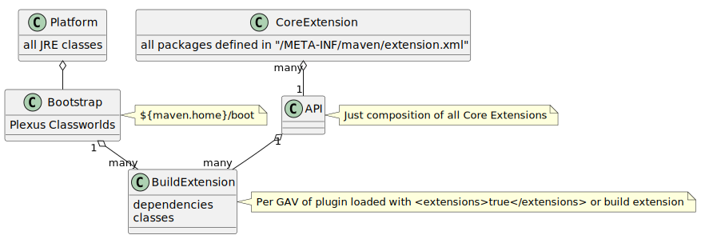
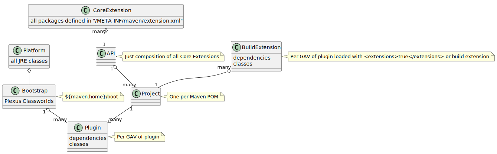
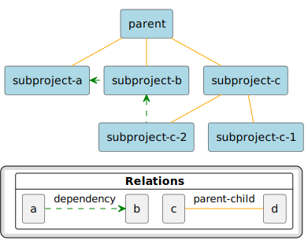

# Documentation

## Navigation

- Maven Build Fundamentals
  - [Maven in 5 Minutes](#getting-started-maven-in-five-minutes)
- Maven Build Config Fundamentals
  - [Plugins Validation](#plugins-validation)
  - [Creating a site](#mini-guide-site)
    - [Snippet Macro](#mini-guide-snippet-macro)
  - [Archetypes](#introduction-introduction-to-archetypes)
    - [Creating Archetypes](#mini-guide-creating-archetypes)
  - [Repositories](#introduction-introduction-to-repositories)
  - [Profiles](#introduction-introduction-to-profiles)
  - [Standard Directory Layout](#introduction-introduction-to-the-standard-directory-layout)
  - [Dependency Mechanism](#introduction-introduction-to-dependency-mechanism)
    - [Optional & Exclusion](#introduction-introduction-to-optional-and-excludes-dependencies)
- [Getting Started Guide](#getting-started)
  - [Naming Conventions](#mini-guide-naming-conventions)
  - [The Build Lifecycle](#introduction-introduction-to-the-lifecycle)
  - [The POM](#introduction-introduction-to-the-pom)
  - [Configuring Plugins](#mini-guide-configuring-plugins)
    - [Plugin Prefix Resolution](#introduction-introduction-to-plugin-prefix-mapping)
    - [Configuring Default Mojo Executions](#mini-guide-default-execution-ids)
- Maven 4
  - [Starting with Maven 4](#mini-guide-migration-to-mvn4)
  - [Maven Mixins](#mini-guide-mixins)
- [Guides](#mini)
  - [Configuring for Reproducible Builds](#mini-guide-reproducible-builds)
  - [Creating Assemblies](#mini-guide-assemblies)
  - [Configuring Archive Plugins](#mini-guide-archive-configuration)
  - [Configuring Maven](#mini-guide-configuring-maven)
  - [Generating Sources](#mini-guide-generating-sources)
  - [Working with Manifests](#mini-guide-manifest)
  - [Maven Classloading](#mini-guide-maven-classloading)
  - [Using Multiple Modules in a Build](#mini-guide-multiple-modules)
  - [Using the Release Plugin](#mini-guide-releasing)
  - [Using Ant with Maven](#mini-guide-using-ant)
  - [Using Modello](#mini-guide-using-modello)
  - [Using Extensions](#mini-guide-using-extensions)
  - [Building For Different Environments](#mini-guide-building-for-different-environments)
  - [Using Toolchains](#mini-guide-using-toolchains)
- [Maven Auto-Completion Using BASH](#mini-guide-bash-m2-completion)
- Documentation
  - [Index (category)](#index)
  - User Manual
    - Maven Build Fundamentals
      - [Maven in 5 Minutes](#getting-started-maven-in-five-minutes)
    - Maven Build Config Fundamentals
      - [Plugins Validation](#plugins-validation)
      - [Creating a site](#mini-guide-site)
      - [Archetypes](#introduction-introduction-to-archetypes)
      - [Repositories](#introduction-introduction-to-repositories)
        - [Install to Local](#mini-guide-3rd-party-jars-local)
        - [Deploy to Remote](#mini-guide-3rd-party-jars-remote)
        - [Using Multiple Repositories](#mini-guide-multiple-repositories)
        - [Large Scale Centralized Deployments](#mini-guide-large-scale-centralized-deployments)
        - [Mirror Settings](#mini-guide-mirror-settings)
        - [Deployment and Security Settings](#mini-guide-deployment-security-settings)
        - [Encrypting Passwords (Maven 3)](#mini-guide-encryption)
        - [Encrypting Passwords (Maven 4)](#mini-guide-encryption-4)
        - [Using Proxies](#mini-guide-proxies)
        - [Authenticated HTTPS](#mini-guide-repository-ssl)
        - [Resolver Transport](#mini-guide-resolver-transport)
        - [Advanced Wagon HTTP Configuration](#mini-guide-http-settings)
        - [Alternative Wagon Providers](#mini-guide-wagon-providers)
        - [Relocation](#mini-guide-relocation)
      - [Profiles](#introduction-introduction-to-profiles)
      - [Standard Directory Layout](#introduction-introduction-to-the-standard-directory-layout)
      - [Dependency Mechanism](#introduction-introduction-to-dependency-mechanism)
    - [Getting Started Guide](#getting-started)
    - Maven 4
      - [Starting with Maven 4](#mini-guide-migration-to-mvn4)
      - [Maven Mixins](#mini-guide-mixins)
    - [Guides](#mini)
      - [Configuring for Reproducible Builds](#mini-guide-reproducible-builds)
      - [Creating Assemblies](#mini-guide-assemblies)
      - [Configuring Archive Plugins](#mini-guide-archive-configuration)
      - [Configuring Maven](#mini-guide-configuring-maven)
      - [Generating Sources](#mini-guide-generating-sources)
      - [Working with Manifests](#mini-guide-manifest)
      - [Maven Classloading](#mini-guide-maven-classloading)
      - [Using Modules (Maven 3)](#mini-guide-multiple-modules)
      - [Using Subprojects (Maven 4)](#mini-guide-multiple-subprojects-4)
      - [Using Release Plugin](#mini-guide-releasing)
      - [Using Ant](#mini-guide-using-ant)
      - [Using Modello](#mini-guide-using-modello)
      - [Using Extensions](#mini-guide-using-extensions)
      - [Building for Different Environments](#mini-guide-building-for-different-environments)
      - [Using Toolchains](#mini-guide-using-toolchains)
      - [Maven CI Friendly Version](#mini-guide-maven-ci-friendly)
- Community
  - [How to Contribute](#development-guide-helping)
- [Guide to helping with Maven](#development-guide-helping)
  - [Build Maven](#development-guide-building-maven)
  - [Submit patches](#development-guide-maven-development--creating_and_submitting_a_patch)
  - [Test releases](#development-guide-testing-releases)
  - [Test snapshot plugins](#development-guide-testing-development-plugins)
- [Building Maven](#development-guide-building-maven)
- [Testing Development Plugins](#development-guide-testing-development-plugins)
- [Testing Staged Releases](#development-guide-testing-releases)
- [Becoming Committer](#development-guide-committer-school)

## Content

<a id="getting-started-maven-in-five-minutes"></a>

<!-- source_url: https://maven.apache.org/guides/getting-started/maven-in-five-minutes.html -->

<!-- page_index: 1 -->

<a id="getting-started-maven-in-five-minutes--maven-in-5-minutes"></a>

# Maven in 5 Minutes

<a id="getting-started-maven-in-five-minutes--prerequisites"></a>

## Prerequisites

You must understand how to install software on your computer. If you do not know how to do this, please ask someone at your office, school, etc. or pay someone to explain this to you. The Maven mailing lists are not the best place to ask for this advice.

<a id="getting-started-maven-in-five-minutes--installation"></a>

## Installation

*Maven is a Java tool, so you must have [Java](https://www.oracle.com/technetwork/java/javase/downloads/index.html) installed in order to proceed.*

First, [download Maven](https://maven.apache.org/download.html) and follow the [installation instructions](https://maven.apache.org/install.html). After that, type the following in a terminal or in a command prompt:

```
mvn --version
```

It should print out your installed version of Maven, for example:

```
Apache Maven 3.6.3 (cecedd343002696d0abb50b32b541b8a6ba2883f)
Maven home: D:\apache-maven-3.6.3\apache-maven\bin..
Java version: 1.8.0_232, vendor: AdoptOpenJDK, runtime: C:\Program Files\AdoptOpenJDK\jdk-8.0.232.09-hotspot\jre
Default locale: en_US, platform encoding: Cp1250
OS name: "windows 10", version: "10.0", arch: "amd64", family: "windows"
```

Depending upon your network setup, you may require extra configuration. Check out the [Guide to Configuring Maven](#mini-guide-configuring-maven) if necessary.

**If you are using Windows, you should look at** [Windows Prerequisites](https://maven.apache.org/guides/getting-started/windows-prerequisites.html) **to ensure that you are prepared to use Maven on Windows.**

<a id="getting-started-maven-in-five-minutes--creating-a-project"></a>

## Creating a Project

You need somewhere for your project to reside. Create a directory somewhere and start a shell in that directory. On your command line, execute the following Maven goal:

```
mvn archetype:generate -DgroupId=com.mycompany.app -DartifactId=my-app -DarchetypeArtifactId=maven-archetype-quickstart -DarchetypeVersion=1.5 -DinteractiveMode=false
```

*If you have just installed Maven, it may take a while on the first run. This is because Maven is downloading the most recent artifacts (plugin jars and other files) into your local repository. You may also need to execute the command a couple of times before it succeeds. This is because the remote server may time out before your downloads are complete. Don't worry, there are ways to fix that.*

You will notice that the *generate* goal created a directory with the same name given as the artifactId. Change into that directory.

```
cd my-app
```

Under this directory you will notice the following [standard project structure](#introduction-introduction-to-the-standard-directory-layout).

```
my-app
|-- pom.xml
`-- src
    |-- main
    |   `-- java
    |       `-- com
    |           `-- mycompany
    |               `-- app
    |                   `-- App.java
    `-- test
        `-- java
            `-- com
                `-- mycompany
                    `-- app
                        `-- AppTest.java
```

The `src/main/java` directory contains the project source code, the `src/test/java` directory contains the test source, and the `pom.xml` file is the project's Project Object Model, or POM.

<a id="getting-started-maven-in-five-minutes--the-pom"></a>

### The POM

The `pom.xml` file is the core of a project's configuration in Maven. It is a single configuration file that contains the majority of information required to build a project in just the way you want. The POM is huge and can be daunting in its complexity, but it is not necessary to understand all of the intricacies just yet to use it effectively. This project's POM should look like this:

```xml
<project xmlns="http://maven.apache.org/POM/4.0.0" xmlns:xsi="http://www.w3.org/2001/XMLSchema-instance"
  xsi:schemaLocation="http://maven.apache.org/POM/4.0.0 http://maven.apache.org/xsd/maven-4.0.0.xsd">
  <modelVersion>4.0.0</modelVersion>

  <groupId>com.mycompany.app</groupId>
  <artifactId>my-app</artifactId>
  <version>1.0-SNAPSHOT</version>

  <name>my-app</name>
  <!-- FIXME change it to the project's website -->
  <url>http://www.example.com</url>

  <properties>
    <project.build.sourceEncoding>UTF-8</project.build.sourceEncoding>
    <maven.compiler.release>17</maven.compiler.release>
  </properties>

  <dependencyManagement>
    <dependencies>
      <dependency>
        <groupId>org.junit</groupId>
        <artifactId>junit-bom</artifactId>
        <version>5.11.0</version>
        <type>pom</type>
        <scope>import</scope>
      </dependency>
    </dependencies>
  </dependencyManagement>

  <dependencies>
    <dependency>
      <groupId>org.junit.jupiter</groupId>
      <artifactId>junit-jupiter-api</artifactId>
      <scope>test</scope>
    </dependency>
    <!-- Optionally: parameterized tests support -->
    <dependency>
      <groupId>org.junit.jupiter</groupId>
      <artifactId>junit-jupiter-params</artifactId>
      <scope>test</scope>
    </dependency>
  </dependencies>

  <build>
    <pluginManagement><!-- lock down plugins versions to avoid using Maven defaults (may be moved to parent pom) -->
       ... lots of helpful plugins
    </pluginManagement>
  </build>
</project>
```

<a id="getting-started-maven-in-five-minutes--what-did-i-just-do"></a>

### What did I just do?

You executed the Maven goal *archetype:generate*, and passed in various parameters to that goal. The prefix *archetype* is the [plugin](https://maven.apache.org/plugins/index.html) that provides the goal. If you are familiar with [Ant](http://ant.apache.org), you may conceive of this as similar to a task. This *archetype:generate* goal created a simple project based upon a [maven-archetype-quickstart](https://maven.apache.org/archetypes/maven-archetype-quickstart/) archetype. Suffice it to say for now that a *plugin* is a collection of *goals* with a general common purpose. For example the jboss-maven-plugin, whose purpose is “deal with various jboss items”.

<a id="getting-started-maven-in-five-minutes--build-the-project"></a>

### Build the Project

```
mvn package
```

The command line will print out various actions, and end with the following:

```
 ...
[INFO] ------------------------------------------------------------------------
[INFO] BUILD SUCCESS
[INFO] ------------------------------------------------------------------------
[INFO] Total time:  2.953 s
[INFO] Finished at: 2019-11-24T13:05:10+01:00
[INFO] ------------------------------------------------------------------------
```

Unlike the first command executed (*archetype:generate*), the second is simply a single word - *package*. Rather than a *goal*, this is a *phase*. A phase is a step in the [build lifecycle](#introduction-introduction-to-the-lifecycle), which is an ordered sequence of phases. When a phase is given, Maven executes every phase in the sequence up to and including the one defined. For example, if you execute the *compile* phase, the phases that actually get executed are:

1. validate
2. generate-sources
3. process-sources
4. generate-resources
5. process-resources
6. compile

You may test the newly compiled and packaged JAR with the following command:

```
java -cp target/my-app-1.0-SNAPSHOT.jar com.mycompany.app.App
```

Which will print the quintessential:

```
Hello World!
```

<a id="getting-started-maven-in-five-minutes--java-9-or-later"></a>

## Java 9 or later

By default your version of Maven might use an old version of the `maven-compiler-plugin` that is not compatible with Java 9 or later versions. To target Java 9 or later, you should at least use version 3.6.0 of the `maven-compiler-plugin` and set the `maven.compiler.release` property to the Java release you are targetting (e.g. 9, 10, 11, 12, etc.).

In the following example, we have configured our Maven project to use version 3.8.1 of `maven-compiler-plugin` and target Java 11:

```xml
    <properties>
        <maven.compiler.release>11</maven.compiler.release>
    </properties>

    <build>
        <pluginManagement>
            <plugins>
                <plugin>
                    <groupId>org.apache.maven.plugins</groupId>
                    <artifactId>maven-compiler-plugin</artifactId>
                    <version>3.8.1</version>
                </plugin>
            </plugins>
        </pluginManagement>
    </build>
```

To learn more about `javac`'s `--release` option, see [JEP 247](https://openjdk.java.net/jeps/247).

<a id="getting-started-maven-in-five-minutes--running-maven-tools"></a>

## Running Maven Tools

<a id="getting-started-maven-in-five-minutes--maven-phases"></a>

### Maven Phases

Although hardly a comprehensive list, these are the most common *default* lifecycle phases executed.

- **validate**: validate the project is correct and all necessary information is available
- **compile**: compile the source code of the project
- **test**: test the compiled source code using a suitable unit testing framework. These tests should not require the code be packaged or deployed
- **package**: take the compiled code and package it in its distributable format, such as a JAR.
- **integration-test**: process and deploy the package if necessary into an environment where integration tests can be run
- **verify**: run any checks to verify the package is valid and meets quality criteria
- **install**: install the package into the local repository, for use as a dependency in other projects locally
- **deploy**: done in an integration or release environment, copies the final package to the remote repository for sharing with other developers and projects.

There are two other Maven lifecycles of note beyond the *default* list above. They are

- **clean**: cleans up artifacts created by prior builds
- **site**: generates site documentation for this project

Phases are actually mapped to underlying goals. The specific goals executed per phase is dependant upon the packaging type of the project. For example, *package* executes *jar:jar* if the project type is a JAR, and *war:war* if the project type is - you guessed it - a WAR.

An interesting thing to note is that phases and goals may be executed in sequence.

```
mvn clean dependency:copy-dependencies package
```

This command will clean the project, copy dependencies, and package the project (executing all phases up to *package*, of course).

<a id="getting-started-maven-in-five-minutes--generating-the-site"></a>

### Generating the Site

```
mvn site
```

This phase generates a site based upon information on the project's pom. You can look at the documentation generated under `target/site`.

<a id="getting-started-maven-in-five-minutes--conclusion"></a>

## Conclusion

We hope this quick overview has piqued your interest in the versatility of Maven. Note that this is a very truncated quick-start guide. Now you are ready for more comprehensive details concerning the actions you have just performed. Check out the [Maven Getting Started Guide](#getting-started).

---

<a id="plugins-validation"></a>

<!-- source_url: https://maven.apache.org/guides/plugins/validation/index.html -->

<!-- page_index: 2 -->

<a id="plugins-validation--plugin-validation"></a>

# Plugin Validation

Maven since versions 3.9.x and 4.x introduced **Plugin Validation**
in order to help Maven users and Maven Plugin developers discover issues with the plugins they
use or maintain that may break in the future.

These issues are displayed as WARNING either when plugin goal is executed or at the end of the build:

```
[WARNING] Plugin validation issues were detected in x plugin(s)
```

and split in two categories based on what actions should be taken:

<a id="plugins-validation--internal-issues"></a>

## Internal issues

Internal Plugins Validation issues (project local) are issues discovered in Maven project configuration, like:

- project using deprecated plugin goals ([MNG-7457](https://issues.apache.org/jira/browse/MNG-7457)),
- project using deprecated plugin parameters,
- project using read only plugin parameters ([MNG-7464](https://issues.apache.org/jira/browse/MNG-7464)).

In such cases, users can fix their project by fixing configuration by editing their POMs.
Users should consult actual plugin documentation (and eventually try to update plugin to newer version).

<a id="plugins-validation--external-issues"></a>

## External issues

External Plugins Validation issues (non-configuration) are issues detected in plugin itself, like:

- plugin using old, deprecated Maven API,
- plugin declaring dependencies for Maven Core artifacts in wrong scope (should be `provided`).

External Plugins issues require to be fixed by plugin authors first.

In such cases users can try to update plugin to newer version.
If the newest version of plugin still has such an issue, users should report problem to plugin authors.

<a id="plugins-validation--exclude-plugins-from-validation"></a>

## Exclude plugins from validation

In some case we know about issues in some plugin and we want exclude it from validation.
We can do it by property `maven.plugin.validation.excludes`, eg:

```
mvn -Dmaven.plugin.validation.excludes=plugin1-goupId:plugin1-artifactId:plugin1-version,plugin2-goupId:plugin2-artifactId:plugin2-version
```

Property `maven.plugin.validation` has tha same rule as `maven.plugin.validation` - can only be used on command line (not as property in POM)

<a id="plugins-validation--manage-plugin-validation-verbosity"></a>

## Manage Plugin Validation verbosity

In order to manage Plugin Validation verbosity, a Maven user property `-Dmaven.plugin.validation=...` can be used on command line (or injected: see below).

Allowed values are:

- `NONE` - mute Plugin Validation completely, nothing will be reported,
- `INLINE` (default) - report only `Internal` issues in place where they occur,
- `BRIEF` - report `Internal` issues in place where they occur and list of plugins with `External` issues at the end of the build,
- `SUMMARY` - report list of plugins with `Internal` and `External` issues at the end of the build,
- `VERBOSE` - report `Internal` and `External` issues at the end of build in verbose mode.

Configuration values for `maven.plugin.validation` are case insensitive, can only be used on command line (not as property in POM), like:

```
mvn -Dmaven.plugin.validation=verbose ...
```

As a consequence:

- it can be added to `MAVEN_OPTS` or `MAVEN_ARGS` environment variables,
- it can also be added to `.mvn/maven.config` file in order to configure per project,
- it can also be added as property in `settings.xml` file to change configuration globally.

But it can not be used as a POM property in project `pom.xml`.

Please consult:

- [Configuring Apache Maven](https://maven.apache.org/configure.html)
- [Settings reference](https://maven.apache.org/settings.html)

---

<a id="mini-guide-site"></a>

<!-- source_url: https://maven.apache.org/guides/mini/guide-site.html -->

<!-- page_index: 3 -->

<a id="mini-guide-site--creating-a-site"></a>

# Creating a site

<a id="mini-guide-site--creating-content"></a>

## Creating Content

The first step to creating your site is to create some content. In Maven, the site content is separated by format, as there are several available.

```
+- src/ +- site/ +- apt/ |  +- index.apt ! +- markdown/ |  +- content.md | +- fml/ |  +- general.fml |  +- faq.fml | +- xdoc/ |  +- other.xml | +- site.xml
```

You will notice there is now a `${project.basedir}/src/site` directory within which is contained a `site.xml` site descriptor along with various directories corresponding to the supported document types.

Let's take a look at the examples of the various document types:

- `apt`: the APT format, “Almost Plain Text”, is a wiki-like format that allows you to write simple, structured documents (like this one) very quickly. A full reference of the [APT Format](https://maven.apache.org/doxia/references/apt-format.html) is available,
- `markdown`: the well known [Markdown](https://en.wikipedia.org/wiki/Markdown) format,
- `fml`: the FML format is the [FAQ format](https://maven.apache.org/doxia/references/fml-format.html),
- `xdoc`: an XML document conforming to a small and simple set of tags, see the [full reference](https://maven.apache.org/doxia/references/xdoc-format.html).

Other formats are available, but at this point these 4 are the best tested.

There are also several possible output formats, but as of Maven Site Plugin, only XHTML is available.

Note that all of the above is optional - just one index file is required in one of the input trees. Each of the paths will be merged together to form the root directory of the site.

<a id="mini-guide-site--customizing-the-look-feel"></a>

## Customizing the Look & Feel

If you want to tune the way your site looks, you can use a custom **skin** to provide your own CSS styles. If that is still not enough, you can even tweak the output templates that Maven uses to generate the site documentation.

You can visit the [Skins index](https://maven.apache.org/skins/) to have a look at some of the skins that you can use to change the look of your site.

<a id="mini-guide-site--generating-the-site"></a>

## Generating the Site

Generating the site is very simple, and fast!

```
mvn site
```

By default, the resulting site will be in `target/site/...`

For more information on the Maven Site Plugin, see the [maven-site-plugin reference](https://maven.apache.org/plugins/maven-site-plugin/).

<a id="mini-guide-site--deploying-the-site"></a>

## Deploying the Site

<a id="mini-guide-site--classical-website-deployment"></a>

### Classical Website deployment

To be able to deploy the site with a classical network protocol (ftp, scp, webdav), you must first declare a location to distribute to in your `pom.xml`, similar to the repository for deployment:

```xml
<project xmlns="http://maven.apache.org/POM/4.0.0">
  ...
  <distributionManagement>
    <site>
      <id>website</id>
      <url>scp://www.mycompany.com/www/docs/project/</url>
    </site>
  </distributionManagement>
  ...
</project>
```

- the `<id>` element identifies the repository, so that you can attach credentials to it in your `settings.xml` file using the [`<servers>` element](https://maven.apache.org/settings.html#Servers) as you would for any other repository,
- the `<url>` gives the location to deploy to. Currently, only SSH is supported by default, as above which copies to the host `www.mycompany.com` in the path `/www/docs/project/`, but you can [add more protocols as required](https://maven.apache.org/plugins/maven-site-plugin/examples/adding-deploy-protocol.html). If subprojects inherit the site URL from a parent POM, they will automatically get their `<artifactId>` appended to form their effective deployment location.

Once distribution location is configured, deploying the site is done by using the `site-deploy` phase of the site lifecycle.

```
mvn site-deploy
```

<a id="mini-guide-site--github-pages-apache-svnpubsub-gitpubsub-deployment"></a>

### GitHub Pages, Apache svnpubsub/gitpubsub Deployment

When site publication is done with a SCM commit, like with [GitHub Pages](https://pages.github.com/) or [Apache svnpubsub/gitpubsub](https://infra.apache.org/project-site.html#tools), deploying the site will be done with [Maven SCM Publish Plugin](https://maven.apache.org/plugins/maven-scm-publish-plugin/).

For example with a project hosted on GitHub and using GitHub Pages for its site publication:

```xml
<plugin>
  <groupId>org.apache.maven.plugins</groupId>
  <artifactId>maven-scm-publish-plugin</artifactId>
  <version>3.1.0</version>
  <configuration>
    <pubScmUrl>${project.scm.developerConnection}</pubScmUrl>
    <scmBranch>gh-pages</scmBranch>
  </configuration>
</plugin>
```

Deploying the site is done in 2 steps:

1. staging the content by using the `site` phase of the site lifecycle followed by `site:stage`: `mvn site site:stage`
2. publishing the staged site to the SCM: `mvn scm-publish:publish-scm`

<a id="mini-guide-site--creating-a-site-descriptor"></a>

## Creating a Site Descriptor

The `site.xml` file is used to describe the structure of the site. A sample is given below:

```xml
<?xml version="1.0" encoding="ISO-8859-1"?>
<project xmlns="http://maven.apache.org/DECORATION/1.8.0" xmlns:xsi="http://www.w3.org/2001/XMLSchema-instance"
  xsi:schemaLocation="http://maven.apache.org/DECORATION/1.8.0 https://maven.apache.org/xsd/decoration-1.8.0.xsd"
  name="Maven">
  <bannerLeft>
    <name>Maven</name>
    <src>https://maven.apache.org/images/apache-maven-project.png</src>
    <href>https://maven.apache.org/</href>
  </bannerLeft>
  <bannerRight>
    <src>https://maven.apache.org/images/maven-small.gif</src>
  </bannerRight>

  <body>
    <links>
      <item name="Apache" href="http://www.apache.org/" />
      <item name="Maven 1.x" href="https://maven.apache.org/maven-1.x/"/>
      <item name="Maven 2" href="https://maven.apache.org/"/>
    </links>

    <menu name="Maven 2.0">
      <item name="Introduction" href="index.html"/>
      <item name="Download" href="download.html"/>
      <item name="Release Notes" href="release-notes.html" />
      <item name="General Information" href="about.html"/>
      <item name="For Maven 1.x Users" href="maven1.html"/>
      <item name="Road Map" href="roadmap.html" />
    </menu>

    <menu ref="reports"/>

    ...
  </body>
</project>
```

**Note:** The `<menu ref="reports"/>` element above. When building the site, this is replaced by a menu with links to all the reports that you have configured.

More information about the site descriptor is available at the [dedicated page of Maven Site Plugin](https://maven.apache.org/plugins/maven-site-plugin/examples/sitedescriptor.html).

<a id="mini-guide-site--adding-extra-resources"></a>

## Adding Extra Resources

You can add any arbitrary resource to your site by including them in a `resources` directory as shown below. Additional CSS files will be picked up when they are placed in the `css` directory within the `resources` directory.

```
+- src/
   +- site/
      +- resources/
         +- css/
         |  +- site.css
         |
         +- images/
            +- pic1.jpg
```

The file `site.css` will be added to the default XHTML output, so it can be used to adjust the default Maven stylesheets if desired.

The file `pic1.jpg` will be available via a relative reference to the `images` directory from any page in your site.

<a id="mini-guide-site--configuring-reports"></a>

## Configuring Reports

Maven has several reports that you can add to your web site to display the current state of the project. These reports take the form of plugins, just like those used to build the project.

There are many standard reports that are available by gleaning information from the POM. Currently what is provided by default are:

- Dependencies Report
- Mailing Lists
- Continuous Integration
- Source Repository
- Issue Tracking
- Project Team
- License

To find out more please refer to the [Project Info Reports Plugin](https://maven.apache.org/plugins/maven-project-info-reports-plugin/).

To add these reports to your site, you must add the Project Info Reports plugin to a special `<reporting>` section in the POM. The following example shows how to configure the standard project information reports that display information from the POM in a friendly format:

```xml
<project xmlns="http://maven.apache.org/POM/4.0.0">
  ...
  <reporting>
    <plugins>
      <plugin>
        <groupId>org.apache.maven.plugins</groupId>
        <artifactId>maven-project-info-reports-plugin</artifactId>
        <version>2.8</version><!-- define version here if not already defined in build/plugins or build/pluginManagement -->
      </plugin>
    </plugins>
  </reporting>
  ...
</project>
```

If you have included the appropriate `<menu ref="reports"/>` tag in your `site.xml` descriptor, then when you regenerate the site those items will appear in the menu.

Many other plugins provide reporting goals: look for “R” (Reporting) value in the “Type” column of the [list of plugins](https://maven.apache.org/plugins/). When plugins are both Build and Reporting plugins, defining explicitly the version in the reporting section is usually not necessary since reporting will use the version from `build/plugins` or `build/pluginManagement`. Since Maven Site Plugin 3.4, reporting plugin also get configuration from `build/pluginManagement`.

**Note:** Many report plugins provide a parameter called `outputDirectory` or similar to specify the destination for their report outputs. This parameter is only relevant if the report plugin is run standalone, i.e. by invocation directly from the command line. In contrast, when reports are generated as part of the site, the configuration of the Maven Site Plugin will determine the effective output directory to ensure that all reports end up in a central location.

<a id="mini-guide-site--internationalization"></a>

## Internationalization

Internationalization in Maven is very simple, as long as the reports you are using have that particular locale defined. For an overview of supported languages and instructions on how to add further languages, please see the related article [Internationalization](https://maven.apache.org/plugins/maven-site-plugin/i18n.html) from the Maven Site Plugin.

To enable multiple locales, add a configuration similar to the following to your POM:

```xml
<project xmlns="http://maven.apache.org/POM/4.0.0">
  ...
  <build>
    <plugins>
      <plugin>
        <groupId>org.apache.maven.plugins</groupId>
        <artifactId>maven-site-plugin</artifactId>
        <version>3.4</version>
        <configuration>
          <locales>en,fr</locales>
        </configuration>
      </plugin>
    </plugins>
  </build>
  ...
</project>
```

This will generate both an English and a French version of the site. If `en` is your current locale, then it will be generated at the root of the site, with a copy of the French translation of the site in the `fr/` subdirectory.

To add your own content for that translation instead of using the default, place a subdirectory with that locale name in your site directory and create a new site descriptor with the locale in the file name. For example:

```
+- src/
   +- site/
      +- apt/
      |  +- index.apt     (Default version)
      |
      +- fr/
      |  +- apt/
      |     +- index.apt  (French version)
      |
      +- site.xml         (Default site descriptor)
      +- site_fr.xml      (French site descriptor)
```

With one site descriptor per language, the translated site(s) can evolve independently.

---

<a id="mini-guide-snippet-macro"></a>

<!-- source_url: https://maven.apache.org/guides/mini/guide-snippet-macro.html -->

<!-- page_index: 4 -->

<a id="mini-guide-snippet-macro--guide-to-the-snippet-macro"></a>

# Guide to the Snippet Macro

When generating your project website with Maven, you have the option of dynamically including \_snippet\_s of source code in your pages.

A *snippet* is a section of a source code file that is surrounded by specially formatted comments.

This functionality is inspired by the [Confluence](http://www.atlassian.com/software/confluence/) snippet macro, and is provided by the Maven Doxia project by way of the Maven Site Plugin.

To include snippets of source code in your documentation, first add comments in the source document surrounding the lines you want to include, and then refer to the snippet by its id in the documentation file. Each snippet must be assigned an id, and the id must be unique within the source document. The id parameter is not required if you want to include the entire file.

Following are examples of snippets in various source documents, as well as the corresponding macros in the APT documentation format.

See the Doxia [Macros Guide](https://maven.apache.org/doxia/macros/index.html#Snippet_Macro) for more information and examples.

<a id="mini-guide-snippet-macro--snippets-in-sources"></a>

## Snippets in Sources

<a id="mini-guide-snippet-macro--java"></a>

### Java

```xml
// START SNIPPET: snip-id
public static void main( String[] args )
{
    System.out.println( "Hello World!" );
}
// END SNIPPET: snip-id
```

<a id="mini-guide-snippet-macro--xml"></a>

### XML

```xml
<!-- START SNIPPET: snip-id -->
<navigation-rule>
  <from-view-id>/logon.jsp</from-view-id>
  <navigation-case>
    <from-outcome>success</from-outcome>
    <to-view-id>/mainMenu.jsp</to-view-id>
  </navigation-case>
</navigation-rule>
<!-- END SNIPPET: snip-id -->
```

<a id="mini-guide-snippet-macro--jsp"></a>

### JSP

```xml
<%-- START SNIPPET: snip-id --%>
<ul>
    <li><a href="newPerson!input.action">Create</a> a new person</li>
    <li><a href="listPeople.action">List</a> all people</li>
</ul>
<%-- END SNIPPET: snip-id --%>
```

<a id="mini-guide-snippet-macro--snippets-in-documentation"></a>

## Snippets in Documentation

<a id="mini-guide-snippet-macro--apt"></a>

### APT

```xml
 %{snippet|id=snip-id|url=http://svn.example.com/path/to/Sample.java}

 %{snippet|id=snip-id|url=file:///path/to/Sample.java}
```

As of doxia-core version 1.0-alpha-9, a ‘file’ parameter is also available. If a full path is not specified, the location is assumed to be relative to ${project.basedir}.

```xml
~~ Since doxia-core 1.0-alpha-9
%{snippet|id=abc|file=src/main/webapp/index.jsp}
```

- Macros in apt **must not** be indented.
- Exactly one of `url` or `file` **must** be specified.

---

<a id="introduction-introduction-to-archetypes"></a>

<!-- source_url: https://maven.apache.org/guides/introduction/introduction-to-archetypes.html -->

<!-- page_index: 5 -->

<a id="introduction-introduction-to-archetypes--introduction-to-archetypes"></a>

# Introduction to Archetypes

<a id="introduction-introduction-to-archetypes--what-is-archetype"></a>

# What is Archetype?

In short, Archetype is a Maven project templating toolkit. An archetype is defined as *an original pattern or model from which all other things of the same kind are made*. The name fits as we are trying to provide a system that provides a consistent means of generating Maven projects. Archetype will help authors create Maven project templates for users, and provides users with the means to generate parameterized versions of those project templates.

Using archetypes provides a great way to enable developers work quickly in a way consistent with best practices employed by your project or organization. Within the Maven project, we use archetypes to try and get our users up and running as quickly as possible by providing a sample project that demonstrates many of the features of Maven, while introducing new users to the best practices employed by Maven. In a matter of seconds, a new user can have a working Maven project to use as a jumping board for investigating more of the features in Maven. We have also tried to make the Archetype mechanism additive, and by that we mean allowing portions of a project to be captured in an archetype so that pieces or aspects of a project can be added to existing projects. A good example of this is the Maven site archetype. If, for example, you have used the quick start archetype to generate a working project, you can then quickly create a site for that project by using the site archetype within that existing project. You can do anything like this with archetypes.

You may want to standardize J2EE development within your organization, so you may want to provide archetypes for EJBs, or WARs, or for your web services. Once these archetypes are created and deployed in your organization's repository, they are available for use by all developers within your organization.

<a id="introduction-introduction-to-archetypes--using-an-archetype"></a>

## Using an Archetype

To create a new project based on an Archetype, you need to call `mvn archetype:generate` goal, like the following:

```
mvn archetype:generate
```

Please refer to [Archetype Plugin page](https://maven.apache.org/archetype/maven-archetype-plugin/).

<a id="introduction-introduction-to-archetypes--provided-archetypes"></a>

## Provided Archetypes

Maven provides several Archetype artifacts:

| Archetype ArtifactIds | Description |
| --- | --- |
| maven-archetype-archetype | An archetype to generate a sample archetype project. |
| maven-archetype-j2ee-simple | An archetype to generate a simplifed sample J2EE application. |
| maven-archetype-plugin | An archetype to generate a sample Maven plugin. |
| maven-archetype-plugin-site | An archetype to generate a sample Maven plugin site. |
| maven-archetype-portlet | An archetype to generate a sample JSR-268 Portlet. |
| maven-archetype-quickstart | An archetype to generate a sample Maven project. |
| maven-archetype-simple | An archetype to generate a simple Maven project. |
| maven-archetype-site | An archetype to generate a sample Maven site which demonstrates some of the supported document types like APT, XDoc, and FML and demonstrates how to i18n your site. |
| maven-archetype-site-simple | An archetype to generate a sample Maven site. |
| maven-archetype-webapp | An archetype to generate a sample Maven Webapp project. |

For more information on these archetypes, please refer to the [Maven Archetype Bundles page](https://maven.apache.org/archetypes/index.html).

<a id="introduction-introduction-to-archetypes--what-makes-up-an-archetype"></a>

## What makes up an Archetype?

Archetypes are packaged up in a JAR and they consist of the archetype metadata which describes the contents of archetype, and a set of [Velocity](http://velocity.apache.org/) templates which make up the prototype project. If you would like to know how to make your own archetypes, please refer to our [Guide to creating archetypes](#mini-guide-creating-archetypes).

---

<a id="mini-guide-creating-archetypes"></a>

<!-- source_url: https://maven.apache.org/guides/mini/guide-creating-archetypes.html -->

<!-- page_index: 6 -->

<a id="mini-guide-creating-archetypes--guide-to-creating-archetypes"></a>

# Guide to Creating Archetypes

Creating an archetype is a pretty straight forward process. An archetype is a very simple artifact, that contains the project prototype you wish to create. An archetype is made up of:

- an [archetype descriptor](https://maven.apache.org/archetype/archetype-models/archetype-descriptor/archetype-descriptor.html) (`archetype-metadata.xml` in directory: `src/main/resources/META-INF/maven/`). It lists all the files that will be contained in the archetype and categorizes them so they can be processed correctly by the archetype generation mechanism.
- the prototype files that are copied by the archetype plugin (directory: `src/main/resources/archetype-resources/`)
- the prototype pom (`pom.xml` in: `src/main/resources/archetype-resources`)
- a pom for the archetype (`pom.xml` in the archetype's root directory).

To create an archetype follow these steps:

<a id="mini-guide-creating-archetypes--1.-create-a-new-project-and-pom.xml-for-the-archetype-artifact"></a>

## 1. Create a new project and pom.xml for the archetype artifact

An example `pom.xml` for an archetype artifact looks as follows:

```xml
<project xmlns="http://maven.apache.org/POM/4.0.0" xmlns:xsi="http://www.w3.org/2001/XMLSchema-instance"
  xsi:schemaLocation="http://maven.apache.org/POM/4.0.0 https://maven.apache.org/xsd/maven-4.0.0.xsd">
  <modelVersion>4.0.0</modelVersion>

  <groupId>my.groupId</groupId>
  <artifactId>my-archetype-id</artifactId>
  <version>1.0-SNAPSHOT</version>
  <packaging>maven-archetype</packaging>

  <build>
    <extensions>
      <extension>
        <groupId>org.apache.maven.archetype</groupId>
        <artifactId>archetype-packaging</artifactId>
        <version>3.4.1</version>
      </extension>
    </extensions>
  </build>
</project>
```

All you need to specify is a `groupId`, `artifactId` and `version`. These three parameters will be needed later for invoking the archetype via `archetype:generate` from the commandline.

<a id="mini-guide-creating-archetypes--2.-create-the-archetype-descriptor"></a>

## 2. Create the archetype descriptor

The [archetype descriptor](https://maven.apache.org/archetype/archetype-models/archetype-descriptor/archetype-descriptor.html) is a file called `archetype-metadata.xml` which must be located in the `src/main/resources/META-INF/maven/` directory. An example of an archetype descriptor can be found in the quickstart archetype:

```xml
<archetype-descriptor
        xmlns="http://maven.apache.org/plugins/maven-archetype-plugin/archetype-descriptor/1.2.0" xmlns:xsi="http://www.w3.org/2001/XMLSchema-instance"
        xsi:schemaLocation="http://maven.apache.org/plugins/maven-archetype-plugin/archetype-descriptor/1.2.0 https://maven.apache.org/xsd/archetype-descriptor-1.2.0.xsd"
        name="quickstart">
    <fileSets>
        <fileSet filtered="true" packaged="true">
            <directory>src/main/java</directory>
        </fileSet>
        <fileSet>
            <directory>src/test/java</directory>
        </fileSet>
    </fileSets>
</archetype-descriptor>
```

The attribute `name` tag should be the same as the `artifactId` in the archetype `pom.xml`.

The boolean attribute `partial` show if this archetype is representing a full Maven project or only parts.

The `requiredProperties`, `fileSets` and `modules` tags represent the differents parts of the project:

- `<requiredProperties>` : List of required properties to generate a project from this archetype
- `<fileSets>` : File sets definition
- `<modules>` : Modules definition

At this point one can only specify individual files to be created but not empty directories.

Thus the quickstart archetype shown above defines the following directory structure:

```
archetype
|-- pom.xml
`-- src
    `-- main
        `-- resources
            |-- META-INF
            |   `-- maven
            |       `--archetype-metadata.xml
            `-- archetype-resources
                |-- pom.xml
                `-- src
                    |-- main
                    |   `-- java
                    |       `-- App.java
                    `-- test
                        `-- java
                            `-- AppTest.java
```

<a id="mini-guide-creating-archetypes--3.-create-the-prototype-files-and-the-prototype-pom.xml"></a>

## 3. Create the prototype files and the prototype pom.xml

The next component of the archetype to be created is the prototype `pom.xml`. Any `pom.xml` will do, just don't forget to the set `artifactId` and `groupId` as variables ( `${artifactId}` / `${groupId}` ). Both variables will be initialized from the commandline when calling `archetype:generate`.

An example for a prototype `pom.xml` is:

```xml
<project xmlns="http://maven.apache.org/POM/4.0.0" xmlns:xsi="http://www.w3.org/2001/XMLSchema-instance"
    xsi:schemaLocation="http://maven.apache.org/POM/4.0.0 https://maven.apache.org/xsd/maven-4.0.0.xsd">
    <modelVersion>4.0.0</modelVersion>

    <groupId>${groupId}</groupId>
    <artifactId>${artifactId}</artifactId>
    <version>${version}</version>
    <packaging>jar</packaging>

    <name>${artifactId}</name>
    <url>http://www.myorganization.org</url>

    <dependencies>
        <dependency>
                <groupId>junit</groupId>
                <artifactId>junit</artifactId>
                 <version>4.12</version>
                <scope>test</scope>
        </dependency>
    </dependencies>
</project>
```

<a id="mini-guide-creating-archetypes--4.-install-the-archetype-and-run-the-archetype-plugin"></a>

## 4. Install the archetype and run the archetype plugin

Now you are ready to install the archetype:

```
mvn install
```

Now that you have created an archetype, you can try it on your local system by using the following command. In this command, you need to specify the full information about the archetype you want to use (its `groupId`, its `artifactId`, its `version`) and the information about the new project you want to create (`artifactId` and `groupId`). Don't forget to include the version of your archetype (if you don't include the version, you archetype creation may fail with a message that version:RELEASE was not found)

```
mvn archetype:generate                                  \
  -DarchetypeGroupId=<archetype-groupId>                \
  -DarchetypeArtifactId=<archetype-artifactId>          \
  -DarchetypeVersion=<archetype-version>                \
  -DgroupId=<my.groupid>                                \
  -DartifactId=<my-artifactId>
```

Once you are happy with the state of your archetype, you can deploy (or submit it to [Maven Central](https://maven.apache.org/guides/mini/guide-central-repository-upload.html)) it as any other artifact and the archetype will then be available to any user of Maven.

<a id="mini-guide-creating-archetypes--alternative-way-to-start-creating-your-archetype"></a>

## Alternative way to start creating your Archetype

Instead of manually creating the directory structure needed for an archetype, simply use

```
mvn archetype:generate
  -DgroupId=[your project's group id]
  -DartifactId=[your project's artifact id]
  -DarchetypeGroupId=org.apache.maven.archetypes
  -DarchetypeArtifactId=maven-archetype-archetype
```

Afterwhich, you can now customize the contents of the `archetype-resources` directory, and `archetype-metadata.xml`, then, proceed to Step#4 (Install the archetype and run the archetype plugin).

---

<a id="introduction-introduction-to-repositories"></a>

<!-- source_url: https://maven.apache.org/guides/introduction/introduction-to-repositories.html -->

<!-- page_index: 7 -->

<a id="introduction-introduction-to-repositories--introduction-to-repositories"></a>

# Introduction to Repositories

<a id="introduction-introduction-to-repositories--artifact-repositories"></a>

## Artifact Repositories

A repository in Maven holds build artifacts of varying types.

There are exactly two types of repositories: **local** and **remote**:

1. the **local** repository is a directory on the computer where Maven runs. It caches remote downloads and contains temporary build artifacts that you have not yet released.
2. **remote** repositories refer to any other type of repository, accessed by a variety of protocols such as `file://` and `https://`. These repositories might be a truly remote repository set up by a third party to provide their artifacts for downloading (for example, [repo.maven.apache.org](https://repo.maven.apache.org/maven2/)). Other “remote” repositories may be internal repositories set up on a file or HTTP server within your company, used to share private artifacts between development teams and for releases.

Local and remote repositories are structured the same way so that scripts can run on either side, or they can be synced for offline use. The layout of the repositories is completely transparent to the Maven user, however.

<a id="introduction-introduction-to-repositories--using-repositories"></a>

## Using Repositories

In general, you should not need to do anything with the local repository on a regular basis, except clean it out if you are short on disk space (or erase it completely if you are willing to download everything again).

For the remote repositories, they are used for both downloading and uploading (if you have the permission to do so).

<a id="introduction-introduction-to-repositories--downloading-from-a-remote-repository"></a>

### Downloading from a Remote Repository

Downloading in Maven is triggered by a project declaring a dependency that is not present in the local repository (or for a `SNAPSHOT`, when the remote repository contains one that is newer). By default, Maven will download from the [central](https://repo.maven.apache.org/maven2/) repository.

To override this, you need to specify a `mirror` as shown in [Using Mirrors for Repositories](#mini-guide-mirror-settings).

You can set this in your `settings.xml` file to globally use a certain mirror. However, it is common for a project to [customise the repository in its `pom.xml`](#mini-guide-multiple-repositories) and that your setting will take precedence. If dependencies are not being found, check that you have not overridden the remote repository.

For more information on dependencies, see [Dependency Mechanism](#introduction-introduction-to-dependency-mechanism).

<a id="introduction-introduction-to-repositories--using-mirrors-for-the-central-repository"></a>

### Using Mirrors for the Central Repository

There are [several official Central repositories](https://maven.apache.org/repository/) geographically distributed. You can make changes to your `settings.xml` file to use one or more mirrors. Instructions for this can be found in the guide [Using Mirrors for Repositories](#mini-guide-mirror-settings).

<a id="introduction-introduction-to-repositories--building-offline"></a>

## Building Offline

If you are temporarily disconnected from the internet and you need to build your projects offline, you can use the offline switch on the CLI:

```
mvn -o package
```

Many plugins honor the offline setting and do not perform any operations that connect to the internet. Some examples are resolving Javadoc links and link checking the site.

<a id="introduction-introduction-to-repositories--uploading-to-a-remote-repository"></a>

## Uploading to a Remote Repository

While this is possible for any type of remote repository, you must have the permission to do so. To have someone upload to the Central Maven repository, see [Repository Center](https://maven.apache.org/repository/index.html).

<a id="introduction-introduction-to-repositories--internal-repositories"></a>

## Internal Repositories

When using Maven, particularly in a corporate environment, connecting to the internet to download dependencies is not acceptable for security, speed or bandwidth reasons. For that reason, it is desirable to set up an internal repository to house a copy of artifacts, and to publish private artifacts to.

Such an internal artifact can be downloaded using HTTPS or the file system (with a `file://` URL), and uploaded to using SCP, SFTP, or a file copy.

As far as Maven is concerned, there is nothing special about this repository: it is another **remote repository** that contains artifacts to download to a user's local cache, and to which artifacts can be published.

Additionally, you may want to share the repository server with your generated project sites. For more information on creating and deploying sites, see [Creating a Site](#mini-guide-site).

<a id="introduction-introduction-to-repositories--setting-up-the-internal-repository"></a>

## Setting up the Internal Repository

Setting up an internal repository just requires that you have a place to put it, and then copy required artifacts there using the same layout as in a remote repository such as [repo.maven.apache.org](https://repo.maven.apache.org/maven2/).

Do *not* scrape or `rsync://` a full copy of central as there is a large amount of data there and doing so will get you banned. You can use a program such as those described on the [Repository Management](https://maven.apache.org/repository-management.html) page to run your internal repository's server, download from the internet as required, and then hold the artifacts in your internal repository for faster downloading later.

The other options are to manually download and vet releases, then copy them to the internal repository; or to have Maven download them for a user, then manually upload the vetted artifacts to the internal repository which is used for releases. This step is useful for artifacts whose license forbids their automatic distribution, such as several J2EE JARs.

<a id="introduction-introduction-to-repositories--using-the-internal-repository"></a>

## Using the Internal Repository

Using the internal repository is quite simple. Simply make a change to add a `repositories` element:

```xml

<project xmlns="http://maven.apache.org/POM/4.0.0">
  ...
  <repositories>
    <repository>
      <id>my-internal-site</id>
      <url>https://myserver/repo</url>
    </repository>
  </repositories>
  ...
</project>
```

If your internal repository requires authentication, the `id` element can be used in your [settings](https://maven.apache.org/settings.html#Servers) file to specify login information.

<a id="introduction-introduction-to-repositories--deploying-to-the-internal-repository"></a>

## Deploying to the Internal Repository

One of the most important reasons to have one or more internal repositories is to be able to publish your own private releases.

To publish to the repository, you will need to have access via one of SCP, SFTP, FTP, WebDAV, or the filesystem. Connectivity is accomplished with the various [wagons](https://maven.apache.org/wagon/wagon-providers/index.html). Some wagons may need to be added as [extension](https://maven.apache.org/ref/current/maven-model/maven.html#class_extension) to your build.

---

<a id="introduction-introduction-to-profiles"></a>

<!-- source_url: https://maven.apache.org/guides/introduction/introduction-to-profiles.html -->

<!-- page_index: 8 -->

<a id="introduction-introduction-to-profiles--introduction-to-build-profiles"></a>

# Introduction to Build Profiles

- [What are the different types of profile? Where is each defined?](#introduction-introduction-to-profiles--what_are_the_different_types_of_profile.3f_where_is_each_defined.3f)
- [Profile Inheritance](#introduction-introduction-to-profiles--profile_inheritance)
- [How can a profile be triggered? How does this vary according to the type of profile being used?](#introduction-introduction-to-profiles--how_can_a_profile_be_triggered.3f_how_does_this_vary_according_to_the_type_of_profile_being_used.3f)
  - [Details on profile activation](#introduction-introduction-to-profiles--details_on_profile_activation)
    - [Explicit profile activation](#introduction-introduction-to-profiles--explicit_profile_activation)
    - [Implicit profile activation](#introduction-introduction-to-profiles--implicit_profile_activation)
      - [Active by default](#introduction-introduction-to-profiles--active_by_default)
      - [JDK](#introduction-introduction-to-profiles--jdk)
      - [OS](#introduction-introduction-to-profiles--os)
      - [Properties](#introduction-introduction-to-profiles--properties)
        - [System or CLI user property](#introduction-introduction-to-profiles--system_or_cli_user_property)
        - [Packaging property](#introduction-introduction-to-profiles--packaging_property)
      - [Files](#introduction-introduction-to-profiles--files)
    - [Multiple conditions](#introduction-introduction-to-profiles--multiple_conditions)
  - [Deactivating a profile](#introduction-introduction-to-profiles--deactivating_a_profile)
- [Which areas of a POM can be customized by each type of profile? Why?](#introduction-introduction-to-profiles--which_areas_of_a_pom_can_be_customized_by_each_type_of_profile.3f_why.3f)
  - [Profiles in external files](#introduction-introduction-to-profiles--profiles_in_external_files)
  - [Profiles in POMs](#introduction-introduction-to-profiles--profiles_in_poms)
    - [Examples](#introduction-introduction-to-profiles--examples)
  - [POM elements outside <profiles>](#introduction-introduction-to-profiles--pom_elements_outside_.3cprofiles.3e)
- [Profile Order](#introduction-introduction-to-profiles--profile_order)
- [Profile Pitfalls](#introduction-introduction-to-profiles--profile_pitfalls)
  - [External Properties](#introduction-introduction-to-profiles--external_properties)
  - [Incomplete Specification of a Natural Profile Set](#introduction-introduction-to-profiles--incomplete_specification_of_a_natural_profile_set)
- [How can I tell which profiles are in effect during a build?](#introduction-introduction-to-profiles--how_can_i_tell_which_profiles_are_in_effect_during_a_build.3f)
- [Naming Conventions](#introduction-introduction-to-profiles--naming_conventions)

Apache Maven goes to great lengths to ensure that builds are portable. Among other things, this means allowing build configuration inside the POM, avoiding **all** filesystem references (in inheritance, dependencies, and other places), and leaning much more heavily on the local repository to store the metadata needed to make this possible.

However, sometimes portability is not entirely possible. Under certain conditions, plugins may need to be configured with local filesystem paths. Under other circumstances, a slightly different dependency set will be required, and the project's artifact name may need to be adjusted slightly. And at still other times, you may even need to include a whole plugin in the build lifecycle depending on the detected build environment.

To address these circumstances, Maven supports build profiles. Profiles are specified using a subset of the elements available in the POM itself (plus one extra section), and are triggered in any of a variety of ways. They modify the POM at build time, and are meant to be used in complementary sets to give equivalent-but-different parameters for a set of target environments (providing, for example, the path of the appserver root in the development, testing, and production environments). As such, profiles can easily lead to differing build results from different members of your team. However, used properly, profiles can be used while still preserving project portability. This will also minimize the use of `-f` option of maven which allows user to create another POM with different parameters or configuration to build which makes it more maintainable since it is running with one POM only.

<a id="introduction-introduction-to-profiles--what-are-the-different-types-of-profile-where-is-each-defined"></a>

## What are the different types of profile? Where is each defined?

- Per Project

  - Defined in the POM itself `(pom.xml)`.
- Per User

  - Defined in the [Maven-settings](https://maven.apache.org/ref/current/maven-settings/settings.html) `(%USER_HOME%/.m2/settings.xml)`.
- Global

  - Defined in the [global Maven-settings](https://maven.apache.org/ref/current/maven-settings/settings.html) `(${maven.home}/conf/settings.xml)`.

<a id="introduction-introduction-to-profiles--profile-inheritance"></a>

## Profile Inheritance

The profiles are not inherited by child POMs. Instead, they are resolved very early by the [Maven Model Builder](https://maven.apache.org/ref/current/maven-model-builder/) and only the effects of active profiles are inherited (e.g. the plugins defined in the profile). Implicit profile activation only has an effect on the surrounding profile container but never on any other profile (even if it has the same id).

<a id="introduction-introduction-to-profiles--how-can-a-profile-be-triggered-how-does-this-vary-according-to-the-type-of-profile-being-used"></a>

## How can a profile be triggered? How does this vary according to the type of profile being used?

A profile can be activated in several ways:

- Explicitly
- Implicitly, based on
  - JDK version
  - Operating system
  - system or CLI user properties
  - packaging properties
  - presence of files

Refer to the sections below for details.

<a id="introduction-introduction-to-profiles--details-on-profile-activation"></a>

### Details on profile activation

<a id="introduction-introduction-to-profiles--explicit-profile-activation"></a>

#### Explicit profile activation

Profiles can be explicitly specified using the `-P` command line flag.

This flag is followed by a comma-delimited list of profile IDs to use. The profile(s) specified in the option are activated in addition to any profiles which are activated by their activation configuration or the `<activeProfiles>` section in `settings.xml`. From Maven 4 onward, Maven will refuse to activate or deactivate a profile that cannot be resolved. To prevent this, prefix the profile identifier with an `?`, marking it as optional:

```
mvn groupId:artifactId:goal -P profile-1,profile-2,?profile-3
```

Profiles can be activated in the Maven settings, via the `<activeProfiles>` section. This section takes a list of `<activeProfile>` elements, each containing a profile-id inside.

```xml
<settings>
  ...
  <activeProfiles>
    <activeProfile>profile-1</activeProfile>
  </activeProfiles>
  ...
</settings>
```

Profiles listed in the `<activeProfiles>` tag would be activated by default every time a project use it.

Profiles can also be active by default using a configuration like the following in a POM:

```xml
<profiles>
  <profile>
    <id>profile-1</id>
    <activation>
      <activeByDefault>true</activeByDefault>
    </activation>
    ...
  </profile>
</profiles>
```

This profile will automatically be active for all builds unless another profile in the same POM is activated using one of the previously described methods. All profiles that are active by default are automatically deactivated when a profile in the POM is activated on the command line or through its activation config.

<a id="introduction-introduction-to-profiles--implicit-profile-activation"></a>

#### Implicit profile activation

Profiles can be automatically triggered based on the state of the build environment.
These triggers are specified via an `<activation>` section in the profile.
The implicit profile activation only refers to the container profile (and not to profiles in other modules with the same id).
The activation occurs when all the specified criteria have been met.

<a id="introduction-introduction-to-profiles--active-by-default"></a>

##### Active by default

Boolean flag which determines if the profile is active by default. Is `false` by default.
This flag is only evaluated if no other profile is explicitly activated via command line, `settings.xml` or activated through some other activator. Otherwise, it has no effect.

Example to set a profile active by default.

```xml
<profiles>
  <profile>
    <activation>
      <activeByDefault>true</activeByDefault>
    </activation>
    ...
  </profile>
</profiles>
```

<a id="introduction-introduction-to-profiles--jdk"></a>

##### JDK

The following configuration will trigger the profile when the JDK's version *starts with* `1.4` (for example `1.4.0_08`, `1.4.2_07`, `1.4`), in particular it *won't be active* for **newer** versions like `1.8` or `11`:

```xml
<profiles>
  <profile>
    <activation>
      <jdk>1.4</jdk>
    </activation>
    ...
  </profile>
</profiles>
```

[Ranges](https://maven.apache.org/enforcer/enforcer-rules/versionRanges.html) can also be used. Range values must start with either `[` or `(`.
The following honours versions `1.3`, `1.4`, and `1.5`.

```xml
<profiles>
  <profile>
    <activation>
      <jdk>[1.3,1.6)</jdk>
    </activation>
    ...
  </profile>
</profiles>
```

*Note:* The value ranges match if the JDK version used for running Maven is between the lower and upper bounds (either inclusive or exclusive).
An upper bound such as `,1.5]` likely does not include most releases of 1.5, since they will have an additional “patch” release such as `_05` that is not taken into consideration in the above range.

If the range does not start with `[` or `(`, the value is interpreted as a vendor prefix.
A prefix is negated if the value starts with `!`.
(Negated) prefix values match if the JDK version used for running Maven starts/doesn't start with the given prefix (excluding the potentially leading `!`).
The following profile would be active, when any `zulu64` JDK is used.

```xml
<profiles>
  <profile>
    <activation>
      <jdk>zulu64</jdk>
    </activation>
    ...
  </profile>
</profiles>
```

<a id="introduction-introduction-to-profiles--os"></a>

##### OS

This next one will activate based on the detected operating system. See the [Maven Enforcer Plugin](https://maven.apache.org/enforcer/enforcer-rules/requireOS.html) for more details about OS values.

```xml
<profiles>
  <profile>
    <activation>
      <os>
        <name>Windows XP</name>
        <family>Windows</family>
        <arch>x86</arch>
        <version>5.1.2600</version>
      </os>
    </activation>
    ...
  </profile>
</profiles>
```

The values are interpreted as Strings and are matched against the [Java System properties](https://docs.oracle.com/javase/tutorial/essential/environment/sysprop.html) `os.name`, `os.arch`, `os.version` and the family being derived from those.

Each value can be prefixed with `!` to negate the matching. The values match if they are (not) equal to the actual String value (**case insensitive**). All given OS conditions must match for the profile to be considered for activation.

Since [Maven 3.9.7](https://issues.apache.org/jira/browse/MNG-5726) the value for `version` may be prefixed with `regex:`. In that case [regular pattern matching](https://docs.oracle.com/javase/tutorial/essential/regex/) is applied for the version matching and applied against the **lower case** `os.version` value.

The actual OS values which need to match the given values are emitted when executing `mvn --version`.
See the maven-enforcer-plugin's [Require OS Rule](https://maven.apache.org/enforcer/enforcer-rules/requireOS.html) for more details about OS values.

<a id="introduction-introduction-to-profiles--properties"></a>

##### Properties

The `profile` will activate if Maven detects a system property or CLI user property (a value which can be dereferenced within the POM by `${name}`) of the corresponding `name=value` pair, and it matches the given value (if given).
Since Maven 3.9.0 one can also evaluate the `<packaging value>` of the pom via property name `packaging`.

<a id="introduction-introduction-to-profiles--system-or-cli-user-property"></a>

###### System or CLI user property

The `profile` will activate if Maven detects a system property or CLI user property (a value which can be dereferenced within the POM by `${name}`)
of the corresponding `name=value` pair, and it matches the given value (if given).

The profile below will be activated when the system property `debug` is specified with any value:

```xml
<profiles>
  <profile>
    <activation>
      <property>
        <name>debug</name>
      </property>
    </activation>
    ...
  </profile>
</profiles>
```

The following profile will be activated when the system property `debug` is not defined at all:

```xml
<profiles>
  <profile>
    <activation>
      <property>
        <name>!debug</name>
      </property>
    </activation>
    ...
  </profile>
</profiles>
```

The following profile will be activated when the system property `debug` is defined with no value, or is defined with the value `true`.

```xml
<profiles>
  <profile>
    <activation>
      <property>
        <name>debug</name>
        <value>true</value>
      </property>
    </activation>
    ...
  </profile>
</profiles>
```

To activate this you would type one of those on the command line:

```
mvn groupId:artifactId:goal -Ddebug
mvn groupId:artifactId:goal -Ddebug=true
```

The following profile will be activated when the system property `debug` is not defined, or is defined with a value which is not `true`.

```xml
<profiles>
  <profile>
    <activation>
      <property>
        <name>debug</name>
        <value>!true</value>
      </property>
    </activation>
    ...
  </profile>
</profiles>
```

To activate this you would type one of those on the command line:

```
mvn groupId:artifactId:goal
mvn groupId:artifactId:goal -Ddebug=false
```

The next example will trigger the profile when the system property `environment` is specified with the value `test`:

```xml
<profiles>
  <profile>
    <activation>
      <property>
        <name>environment</name>
        <value>test</value>
      </property>
    </activation>
    ...
  </profile>
</profiles>
```

To activate this you would type this on the command line:

```
mvn groupId:artifactId:goal -Denvironment=test
```

Profiles in the POM can also be activated based on properties from active profiles from the `settings.xml`.

> [!NOTE]
> : Environment variables like `FOO` are available as properties of the form `env.FOO`. Further note that environment variable names are normalized to all upper-case on Windows.

<a id="introduction-introduction-to-profiles--packaging-property"></a>

###### Packaging property

Since Maven 3.9.0 one can also evaluate the POM's packaging value by referencing property `packaging`. This is only useful where the profile activation is defined in a common parent POM which is reused among multiple Maven projects. The next example will trigger the profile when a project with packaging `war` is built:

```xml
<profiles>
  <profile>
    <activation>
      <property>
        <name>packaging</name>
        <value>war</value>
      </property>
    </activation>
    ...
  </profile>
</profiles>
```

<a id="introduction-introduction-to-profiles--files"></a>

##### Files

> [!NOTE]
> A given filename may activate the `profile` by the `existence` of a file, or if it is `missing`.
> : Interpolation for this element is limited to `${project.basedir}`, System properties, and request properties.

This example will trigger the profile when the generated file `target/generated-sources/axistools/wsdl2java/org/apache/maven` is missing.

```xml
<profiles>
  <profile>
    <activation>
      <file>
        <missing>target/generated-sources/axistools/wsdl2java/org/apache/maven</missing>
      </file>
    </activation>
    ...
  </profile>
</profiles>
```

The tags `<exists>` and `<missing>` can be interpolated. Supported variables are system properties like `${user.home}` and environment variables like `${env.HOME}`. Please note that properties and values defined in the POM itself are not available for interpolation here, e.g. the above example activator cannot use `${project.build.directory}` but needs to hard-code the path `target`.

<a id="introduction-introduction-to-profiles--multiple-conditions"></a>

#### Multiple conditions

Different implicit activation types can be combined in one profile. The profile is then only active if all conditions are met. Using the same type more than once in the same profile is not supported ([MNG-5909](https://issues.apache.org/jira/browse/MNG-5909), [MNG-3328](https://issues.apache.org/jira/browse/MNG-3328)).

<a id="introduction-introduction-to-profiles--deactivating-a-profile"></a>

### Deactivating a profile

One or more profiles can be deactivated using the command line by prefixing their identifier with either the character ‘!’ or ‘-’ as shown below.

> [!NOTE]
> that `!` needs to be escaped with `\` or quoted in Bash, ZSH and other shells as it has [a special meaning](https://www.gnu.org/software/bash/manual/html_node/Event-Designators.html). Also there is a known bug with command line option values starting with `-` ([CLI-309](https://issues.apache.org/jira/browse/CLI-309)), therefore it is recommended to use it with the syntax `-P=-profilename`.

```
mvn groupId:artifactId:goal -P !profile-1,!profile-2,!?profile-3
```

or

```
mvn groupId:artifactId:goal -P=-profile-1,-profile-2,-?profile-3
```

This can be used to deactivate profiles marked as activeByDefault or profiles that would otherwise be activated through their activation config.

<a id="introduction-introduction-to-profiles--which-areas-of-a-pom-can-be-customized-by-each-type-of-profile-why"></a>

## Which areas of a POM can be customized by each type of profile? Why?

Now that we've talked about where to specify profiles, and how to activate them, it will be useful to talk about *what* you can specify in a profile. As with the other aspects of profile configuration, this answer is not straightforward.

Depending on where you choose to configure your profile, you will have access to varying POM configuration options.

<a id="introduction-introduction-to-profiles--profiles-in-external-files"></a>

### Profiles in external files

Profiles specified in external files (i.e in `settings.xml` or `profiles.xml`) are not portable in the strictest sense. Anything that seems to stand a high chance of changing the result of the build is restricted to the inline profiles in the POM. Things like repository lists could simply be a proprietary repository of approved artifacts, and won't change the outcome of the build. Therefore, you will only be able to modify the `<repositories>` and `<pluginRepositories>` sections, plus an extra `<properties>` section.

The `<properties>` section allows you to specify free-form key-value pairs which will be included in the interpolation process for the POM. This allows you to specify a plugin configuration in the form of `${profile.provided.path}`.

<a id="introduction-introduction-to-profiles--profiles-in-poms"></a>

### Profiles in POMs

On the other hand, if your profiles can be reasonably specified *inside* the POM, you have many more options. The trade-off, of course, is that you can only modify *that* project and its sub-modules. Since these profiles are specified inline, and therefore have a better chance of preserving portability, it's reasonable to say you can add more information to them without the risk of that information being unavailable to other users.

Profiles specified in the POM can modify [the following POM elements](https://maven.apache.org/ref/current/maven-model/maven.html):

- `<repositories>`
- `<pluginRepositories>`
- `<dependencies>`
- `<plugins>`
- `<properties>`
- `<modules>`
- `<reports>`
- `<reporting>`
- `<dependencyManagement>`
- `<distributionManagement>`
- the following subset of the `<build>` element:
  - `<defaultGoal>`
  - `<resources>`
  - `<testResources>`
  - `<directory>`
  - `<finalName>`
  - `<filters>`
  - `<pluginManagement>`
  - `<plugins>`

*Note*: A profile which tries to modify other elements of the `<build>` element is invalid and will fail the build with a “malformed POM” error.

<a id="introduction-introduction-to-profiles--examples"></a>

#### Examples

The following example defines a profile to execute the [Maven Invoker Plugin](https://maven.apache.org/plugins/maven-invoker-plugin/):

```xml
<profile>
  <id>run-its</id>
  <build>
    <plugins>
      <plugin>
        <groupId>org.apache.maven.plugins</groupId>
        <artifactId>maven-invoker-plugin</artifactId>
        <configuration>
          <goals>
            <goal>clean</goal>
            <goal>package</goal>
          </goals>
        </configuration>
        <executions>
          <execution>
            <id>integration-test</id>
            <goals>
              <goal>install</goal>
              <goal>integration-test</goal>
            </goals>
          </execution>
        </executions>
      </plugin>
    </plugins>
  </build>
</profile>
```

<a id="introduction-introduction-to-profiles--pom-elements-outside-profiles"></a>

### POM elements outside <profiles>

We don't allow modification of some POM elements outside of POM-profiles because these runtime modifications will not be distributed when the POM is deployed to the repository system, making that person's build of that project completely unique from others. While you can do this to some extent with the options given for external profiles, the danger is limited. Another reason is that this POM info is sometimes being reused from the parent POM.

External files such as `settings.xml` and `profiles.xml` also do not support elements outside the POM-profiles. Let us take this scenario for elaboration. When the effective POM is deployed to a remote repository, any person can pickup its info out of the repository and use it to build a Maven project directly. Now, imagine that if we can set profiles in dependencies, which is very important to a build, or in any other elements outside POM-profiles in `settings.xml` then most probably we cannot expect someone else to use that POM from the repository and be able to build it. And we have to also think about how to share the `settings.xml` with others. Note that too many files to configure are very confusing and very hard to maintain. Bottom line is that since this is build data, it should be in the POM.

<a id="introduction-introduction-to-profiles--profile-order"></a>

## Profile Order

All profile elements in a POM from active profiles overwrite the global elements with the same name of the POM or extend those in case of collections. In case multiple profiles are active in the same POM or external file, the ones which are defined **later** take precedence over the ones defined **earlier** (independent of their profile id and activation order).

Example:

```xml
<project xmlns="http://maven.apache.org/POM/4.0.0">
  ...
  <repositories>
    <repository>
      <id>global-repo</id>
      ...
    </repository>
  </repositories>
  ...
  <profiles>
    <profile>
      <id>profile-1</id>
      <activation>
        <activeByDefault>true</activeByDefault>
      </activation>
      <repositories>
        <repository>
          <id>profile-1-repo</id>
          ...
        </repository>
      </repositories>
    </profile>
    <profile>
      <id>profile-2</id>
      <activation>
        <activeByDefault>true</activeByDefault>
      </activation>
      <repositories>
        <repository>
          <id>profile-2-repo</id>
          ...
        </repository>
      </repositories>
    </profile>
    ...
  </profiles>
  ...
</project>
```

This leads to the repository list: `profile-2-repo, profile-1-repo, global-repo`.

<a id="introduction-introduction-to-profiles--profile-pitfalls"></a>

## Profile Pitfalls

We've already mentioned the fact that adding profiles to your build has the potential to break portability for your project. We've even gone so far as to highlight circumstances where profiles are likely to break project portability. However, it's worth reiterating those points as part of a more coherent discussion about some pitfalls to avoid when using profiles.

There are two main problem areas to keep in mind when using profiles. First are external properties, usually used in plugin configurations. These pose the risk of breaking portability in your project. The other, more subtle area is the incomplete specification of a natural set of profiles.

<a id="introduction-introduction-to-profiles--external-properties"></a>

### External Properties

External property definition concerns any property value defined outside the `pom.xml` but not defined in a corresponding profile inside it. The most obvious usage of properties in the POM is in plugin configuration. While it is certainly possible to break project portability without properties, these critters can have subtle effects that cause builds to fail. For example, specifying appserver paths in a profile that is specified in the `settings.xml` may cause your integration test plugin to fail when another user on the team attempts to build without a similar `settings.xml`. Consider the following `pom.xml` snippet for a web application project:

```xml
<project xmlns="http://maven.apache.org/POM/4.0.0">
  ...
  <build>
    <plugins>
      <plugin>
        <groupId>org.myco.plugins</groupId>
        <artifactId>spiffy-integrationTest-plugin</artifactId>
        <version>1.0</version>
        <configuration>
          <appserverHome>${appserver.home}</appserverHome>
        </configuration>
      </plugin>
      ...
    </plugins>
  </build>
  ...
</project>
```

Now, in your local `${user.home}/.m2/settings.xml`, you have:

```xml
<settings>
  ...
  <profiles>
    <profile>
      <id>appserverConfig</id>
      <properties>
        <appserver.home>/path/to/appserver</appserver.home>
      </properties>
    </profile>
  </profiles>

  <activeProfiles>
    <activeProfile>appserverConfig</activeProfile>
  </activeProfiles>
  ...
</settings>
```

When you build the **integration-test** lifecycle phase, your integration tests pass, since the path you've provided allows the test plugin to install and test this web application.

*However*, when your colleague attempts to build to **integration-test**, his build fails spectacularly, complaining that it cannot resolve the plugin configuration parameter `<appserverHome>`, or worse, that the value of that parameter - literally `${appserver.home}` - is invalid (if it warns you at all).

Congratulations, your project is now non-portable. Inlining this profile in your `pom.xml` can help alleviate this, with the obvious drawback that each project hierarchy (allowing for the effects of inheritance) now have to specify this information. Since Maven provides good support for project inheritance, it's possible to stick this sort of configuration in the `<pluginManagement>` section of a team-level POM or similar, and simply inherit the paths.

Another, less attractive answer might be standardization of development environments. However, this will tend to compromise the productivity gain that Maven is capable of providing.

<a id="introduction-introduction-to-profiles--incomplete-specification-of-a-natural-profile-set"></a>

### Incomplete Specification of a Natural Profile Set

In addition to the above portability-breaker, it's easy to fail to cover all cases with your profiles. When you do this, you're usually leaving one of your target environments high and dry. Let's take the example `pom.xml` snippet from above one more time:

```xml
<project xmlns="http://maven.apache.org/POM/4.0.0">
  ...
  <build>
    <plugins>
      <plugin>
        <groupId>org.myco.plugins</groupId>
        <artifactId>spiffy-integrationTest-plugin</artifactId>
        <version>1.0</version>
        <configuration>
          <appserverHome>${appserver.home}</appserverHome>
        </configuration>
      </plugin>
      ...
    </plugins>
  </build>
  ...
</project>
```

Now, consider the following profile, which would be specified inline in the `pom.xml`:

```xml
<project xmlns="http://maven.apache.org/POM/4.0.0">
  ...
  <profiles>
    <profile>
      <id>appserverConfig-dev</id>
      <activation>
        <property>
          <name>env</name>
          <value>dev</value>
        </property>
      </activation>
      <properties>
        <appserver.home>/path/to/dev/appserver</appserver.home>
      </properties>
    </profile>

    <profile>
      <id>appserverConfig-dev-2</id>
      <activation>
        <property>
          <name>env</name>
          <value>dev-2</value>
        </property>
      </activation>
      <properties>
        <appserver.home>/path/to/another/dev/appserver2</appserver.home>
      </properties>
    </profile>
  </profiles>
  ..
</project>
```

This profile looks quite similar to the one from the last example, with a few important exceptions: it's plainly geared toward a development environment, a new profile named `appserverConfig-dev-2` is added and it has an activation section that will trigger its inclusion when the system properties contain “env=dev” for a profile named `appserverConfig-dev` and “env=dev-2” for a profile named `appserverConfig-dev-2`. So, executing:

```
mvn -Denv=dev-2 integration-test
```

will result in a successful build, applying the properties given by profile named `appserverConfig-dev-2`. And when we execute

```
mvn -Denv=dev integration-test
```

it will result in a successful build applying the properties given by the profile named `appserverConfig-dev`. However, executing:

```
mvn -Denv=production integration-test
```

will not do a successful build. Why? Because, the resulting non-interpolated literal value of `${appserver.home}` will not be a valid path for deploying and testing your web application. We haven't considered the case for the production environment when writing our profiles. The “production” environment (env=production), along with “test” and possibly even “local” constitute a natural set of target environments for which we may want to build the integration-test lifecycle phase. The incomplete specification of this natural set means we have effectively limited our valid target environments to the development environment. Your teammates - and probably your manager - will not see the humor in this. When you construct profiles to handle cases such as these, be sure to address the entire set of target permutations.

As a quick aside, it's possible for user-specific profiles to act in a similar way. This means that profiles for handling different environments which are keyed to the user can act up when the team adds a new developer. While I suppose this *could* act as useful training for the newbie, it just wouldn't be nice to throw them to the wolves in this way. Again, be sure to think of the *whole* set of profiles.

<a id="introduction-introduction-to-profiles--how-can-i-tell-which-profiles-are-in-effect-during-a-build"></a>

## How can I tell which profiles are in effect during a build?

Determining active profiles will help the user to know what particular profiles has been executed during a build. We can use the [Maven Help Plugin](https://maven.apache.org/plugins/maven-help-plugin/) to tell what profiles are in effect during a build.

```
mvn help:active-profiles
```

Let us have some small samples that will help us to understand more on the *active-profiles* goal of that plugin.

From the last example of profiles in the `pom.xml`, you'll notice that there are two profiles named `appserverConfig-dev` and `appserverConfig-dev-2` which has been given different values for properties. If we go ahead and execute:

```
mvn help:active-profiles -Denv=dev
```

The result will be a bulleted list of the id of the profile with an activation property of “env=dev” together with the source where it was declared. See sample below.

```
The following profiles are active:

 - appserverConfig-dev (source: pom)
```

Now if we have a profile declared in `settings.xml` (refer to the sample of profile in `settings.xml`) and that have been set to be an active profile and execute:

```
mvn help:active-profiles
```

The result should be something like this

```
The following profiles are active:

 - appserverConfig (source: settings.xml)
```

Even though we don't have an activation property, a profile has been listed as active. Why? Like we mentioned before, a profile that has been set as an active profile in the `settings.xml` is automatically activated.

Now if we have something like a profile in the `settings.xml` that has been set as an active profile and also triggered a profile in the POM. Which profile do you think will have an effect on the build?

```
mvn help:active-profiles -P appserverConfig-dev
```

This will list the activated profiles:

```
The following profiles are active:

 - appserverConfig-dev (source: pom)
 - appserverConfig (source: settings.xml)
```

Even though it listed the two active profiles, we are not sure which one of them has been applied. To see the effect on the build execute:

```
mvn help:effective-pom -P appserverConfig-dev
```

This will print the effective POM for this build configuration out to the console. Take note that profiles in the `settings.xml` takes higher priority than profiles in the POM. So the profile that has been applied here is `appserverConfig` not `appserverConfig-dev`.

If you want to redirect the output from the plugin to a file called `effective-pom.xml`, use the command-line option `-Doutput=effective-pom.xml`.

<a id="introduction-introduction-to-profiles--naming-conventions"></a>

## Naming Conventions

By now you've noticed that profiles are a natural way of addressing the problem of different build configuration requirements for different target environments. Above, we discussed the concept of a “natural set” of profiles to address this situation, and the importance of considering the whole set of profiles that will be required.

However, the question of how to organize and manage the evolution of that set is non-trivial as well. Just as a good developer strives to write self-documenting code, it's important that your profile id's give a hint to their intended use. One good way to do this is to use the common system property trigger as part of the name for the profile. This might result in names like **env-dev**, **env-test**, and **env-prod** for profiles that are triggered by the system property **env**. Such a system leaves a highly intuitive hint on how to activate a build targeted at a particular environment. Thus, to activate a build for the test environment, you need to activate **env-test** by issuing:

```
mvn -Denv=test <phase>
```

The right command-line option can be had by simply substituting “=” for “-” in the profile id.

---

<a id="introduction-introduction-to-the-standard-directory-layout"></a>

<!-- source_url: https://maven.apache.org/guides/introduction/introduction-to-the-standard-directory-layout.html -->

<!-- page_index: 9 -->

<a id="introduction-introduction-to-the-standard-directory-layout--introduction-to-the-standard-directory-layout"></a>

# Introduction to the Standard Directory Layout

Having a common directory layout allows users familiar with one Maven project to immediately feel at home in another Maven project. The advantages are analogous to adopting a site-wide look-and-feel.

The next section documents the directory layout expected by Maven and the directory layout created by Maven. Try to conform to this structure as much as possible. However, if you can't, these settings can be overridden via the project descriptor.

| `src/main/java` | Application/Library sources |
| --- | --- |
| `src/main/resources` | Application/Library resources |
| `src/main/filters` | Resource filter files |
| `src/main/webapp` | Web application sources |
| `src/test/java` | Test sources |
| `src/test/resources` | Test resources |
| `src/test/filters` | Test resource filter files |
| `src/it` | Integration Tests (primarily for plugins) |
| `src/assembly` | Assembly descriptors |
| `src/site` | Site |
| `LICENSE.txt` | Project's license |
| `NOTICE.txt` | Notices and attributions required by libraries that the project depends on |
| `README.txt` | Project's readme |

At the top level, files descriptive of the project: a `pom.xml` file. In addition, there are textual documents meant for the user to be able to read immediately on receiving the source: `README.txt`, `LICENSE.txt`, etc.

There are just two subdirectories of this structure: `src` and `target`. The only other directories that would be expected here are metadata like `CVS`, `.git` or `.svn`, and any subprojects in a multiproject build (each of which would be laid out as above).

The `target` directory is used to house all output of the build.

The `src` directory contains all of the source material for building the project, its site and so on. It contains a subdirectory for each type: `main` for the main build artifact, `test` for the unit test code and resources, `site` and so on.

Within artifact producing source directories (ie. `main` and `test`), there is one directory for the language `java` (under which the normal package hierarchy exists), and one for `resources` (the structure which is copied to the target classpath given the default resource definition).

If there are other contributing sources to the artifact build, they would be under other subdirectories. For example `src/main/antlr` would contain Antlr grammar definition files.

---

<a id="introduction-introduction-to-dependency-mechanism"></a>

<!-- source_url: https://maven.apache.org/guides/introduction/introduction-to-dependency-mechanism.html -->

<!-- page_index: 10 -->

<a id="introduction-introduction-to-dependency-mechanism--introduction-to-the-dependency-mechanism"></a>

# Introduction to the Dependency Mechanism

Dependency management is a core feature of Maven. Managing dependencies for a single project is easy. Managing dependencies for multi-module projects and applications that consist of hundreds of modules is possible. Maven helps a great deal in defining, creating, and maintaining reproducible builds with well-defined classpaths and library versions.

Learn more about:

- [Transitive Dependencies](#introduction-introduction-to-dependency-mechanism--transitive_dependencies)
- [Dependency Scope](#introduction-introduction-to-dependency-mechanism--dependency_scope)
- [Dependency Management](#introduction-introduction-to-dependency-mechanism--dependency_management)
  - [Importing Dependencies](#introduction-introduction-to-dependency-mechanism--importing_dependencies)
  - [Bill of Materials (BOM) POMs](#introduction-introduction-to-dependency-mechanism--bill_of_materials_.28bom.29_poms)
- [System Dependencies](#introduction-introduction-to-dependency-mechanism--system_dependencies)
  - [Historical usage: Java EE (javax) libraries of the JDK](#introduction-introduction-to-dependency-mechanism--historical_usage.3a_java_ee_.28javax.29_libraries_of_the_jdk)

<a id="introduction-introduction-to-dependency-mechanism--transitive-dependencies"></a>

## Transitive Dependencies

Maven avoids the need to discover and specify the libraries that your own dependencies require by including transitive dependencies automatically.

This feature is facilitated by reading the project files of your dependencies from the remote repositories specified. In general, all dependencies of those projects are used in your project, as are any that the project inherits from its parents, or from its dependencies, and so on.

There is no limit to the number of levels that dependencies can be gathered from. A problem arises only if a cyclic dependency is discovered.

With transitive dependencies, the graph of included libraries can quickly grow quite large. For this reason, there are additional features that limit which dependencies are included:

- *Dependency mediation* - this determines what version of an artifact will be chosen when multiple versions are encountered as dependencies. Maven picks the “nearest definition”. That is, it uses the version of the closest dependency to your project in the tree of dependencies. You can always guarantee a version by declaring it explicitly in your project's POM. Note that if two dependency versions are at the same depth in the dependency tree, the first declaration wins.
  - “nearest definition” means that the version used will be the closest one to your project in the tree of dependencies. Consider this tree of dependencies:


```
  A
  ├── B
  │   └── C
  │       └── D 2.0
  └── E
      └── D 1.0
```

    In text, dependencies for A, B, and C are defined as A -> B -> C -> D 2.0 and A -> E -> D 1.0, then D 1.0 will be used when building A because the path from A to D through E is shorter. You could explicitly add a dependency to D 2.0 in A to force the use of D 2.0, as shown here:


```
  A
  ├── B
  │   └── C
  │       └── D 2.0
  ├── E
  │   └── D 1.0
  │
  └── D 2.0      
```

- *Dependency management* - this allows project authors to directly specify the versions of artifacts to be used when they are encountered in transitive dependencies or in dependencies where no version has been specified. In the example in the preceding section a dependency was directly added to A even though it is not directly used by A. Instead, A can include D as a dependency in its dependencyManagement section and directly control which version of D is used when, or if, it is ever referenced.
- *Dependency scope* - this allows you to only include dependencies appropriate for the current stage of the build. This is described in more detail below.
- *Excluded dependencies* - If project X depends on project Y, and project Y depends on project Z, the owner of project X can explicitly exclude project Z as a dependency, using the “exclusion” element.
- *Optional dependencies* - If project Y depends on project Z, the owner of project Y can mark project Z as an optional dependency, using the “optional” element. When project X depends on project Y, X will depend only on Y and not on Y's optional dependency Z. The owner of project X may then explicitly add a dependency on Z, at her option. (It may be helpful to think of optional dependencies as “excluded by default.”)

Although transitive dependencies can implicitly include desired dependencies, it is a good practice to explicitly specify the dependencies your source code uses directly. This best practice proves its value especially when the dependencies of your project change their dependencies.

For example, assume that your project A specifies a dependency on another project B, and project B specifies a dependency on project C. If you are directly using components in project C, and you don't specify project C in your project A, it may cause build failure when project B suddenly updates/removes its dependency on project C.

Another reason to directly specify dependencies is that it provides better documentation for your project: one can learn more information by just reading the POM file in your project, or by executing **mvn dependency:tree**.

Maven also provides [dependency:analyze](https://maven.apache.org/plugins/maven-dependency-plugin/analyze-mojo.html) plugin goal for analyzing the dependencies: it helps making this best practice more achievable.

<a id="introduction-introduction-to-dependency-mechanism--dependency-scope"></a>

## Dependency Scope

Dependency scope is used to limit the transitivity of a dependency and to determine when a dependency is included in a classpath.

There are 6 scopes:

- **compile**
  This is the default scope, used if none is specified. Compile dependencies are available in all classpaths of a project. Furthermore, those dependencies are propagated to dependent projects.
- **provided**
  This is much like `compile`, but indicates you expect the JDK or a container to provide the dependency at runtime. For example, when building a web application for the Java Enterprise Edition, you would set the dependency on the Servlet API and related Java EE APIs to scope `provided` because the web container provides those classes. A dependency with this scope is added to the classpath used for compilation and test, but not the runtime classpath. It is not transitive.
- **runtime**
  This scope indicates that the dependency is not required for compilation, but is for execution. Maven includes a dependency with this scope in the runtime and test classpaths, but not the compile classpath.
- **test**
  This scope indicates that the dependency is not required for normal use of the application, and is only available for the test compilation and execution phases. This scope is not transitive. Typically, this scope is used for test libraries such as JUnit and Mockito. It is also used for non-test libraries such as Apache Commons IO if those libraries are used in unit tests (src/test/java) but not in the model code (src/main/java).
- **system**
  This scope indicates that the dependency is required for compilation and execution. However, Maven will not download the dependency from the repository system. Instead, it looks for a jar in the local file system at a specified path.
- **import**
  This scope is only supported on a dependency of type `pom` in the `<dependencyManagement>` section. It indicates the dependency is to be replaced with the effective list of dependencies in the specified POM's `<dependencyManagement>` section. Since they are replaced, dependencies with a scope of `import` do not actually participate in limiting the transitivity of a dependency.

Each of the scopes (except for `import`) affects transitive dependencies in a different way.
For a dependency A, declared in the project (left column), and its transitive dependency B (top row), the table below shows the resulting scope of B based on both initial scope declarations.
If the cell is empty, it means the dependency is omitted during the build of the project.

Examples:

- If dependency A is declared as “compile” and its transitive dependency B is declared as “runtime”, then the resulting scope of B will be “runtime”.
- If dependency A is declared as “compile” and its transitive dependency B is declared as “provided”, then B will be omitted.

Scope of B (transitive dependency of A)

compile

provided

runtime

test

Scope of A (Project dependency)

compile

compile

-

runtime

-

provided

provided

-

provided

-

runtime

runtime

-

runtime

-

test

test

-

test

-

<a id="introduction-introduction-to-dependency-mechanism--dependency-management"></a>

## Dependency Management

The dependency management section is a mechanism for centralizing dependency information. When you have a set of projects that inherit from a common parent, it's possible to put all information about the dependency in the common POM and have simpler references to the artifacts in the child POMs. The mechanism is best illustrated through some examples. Given these two POMs which extend the same parent:

Project A:

```xml

<project xmlns="http://maven.apache.org/POM/4.0.0">
  ...
  <dependencies>
    <dependency>
      <groupId>group-a</groupId>
      <artifactId>artifact-a</artifactId>
      <version>1.0</version>
      <exclusions>
        <exclusion>
          <groupId>group-c</groupId>
          <artifactId>excluded-artifact</artifactId>
        </exclusion>
      </exclusions>
    </dependency>
    <dependency>
      <groupId>group-a</groupId>
      <artifactId>artifact-b</artifactId>
      <version>1.0</version>
      <type>bar</type>
      <scope>runtime</scope>
    </dependency>
  </dependencies>
</project>
```

Project B:

```xml

<project xmlns="http://maven.apache.org/POM/4.0.0">
  ...
  <dependencies>
    <dependency>
      <groupId>group-c</groupId>
      <artifactId>artifact-b</artifactId>
      <version>1.0</version>
      <type>war</type>
      <scope>runtime</scope>
    </dependency>
    <dependency>
      <groupId>group-a</groupId>
      <artifactId>artifact-b</artifactId>
      <version>1.0</version>
      <type>bar</type>
      <scope>runtime</scope>
    </dependency>
  </dependencies>
</project>
```

These two example POMs share a common dependency and each has one non-trivial dependency. This information can be put in the parent POM like this:

```xml

<project xmlns="http://maven.apache.org/POM/4.0.0">
  ...
  <dependencyManagement>
    <dependencies>
      <dependency>
        <groupId>group-a</groupId>
        <artifactId>artifact-a</artifactId>
        <version>1.0</version>

        <exclusions>
          <exclusion>
            <groupId>group-c</groupId>
            <artifactId>excluded-artifact</artifactId>
          </exclusion>
        </exclusions>

      </dependency>

      <dependency>
        <groupId>group-c</groupId>
        <artifactId>artifact-b</artifactId>
        <version>1.0</version>
        <type>war</type>
        <scope>runtime</scope>
      </dependency>

      <dependency>
        <groupId>group-a</groupId>
        <artifactId>artifact-b</artifactId>
        <version>1.0</version>
        <type>bar</type>
        <scope>runtime</scope>
      </dependency>
    </dependencies>
  </dependencyManagement>
</project>
```

Then the two child POMs become much simpler:

```xml

<project xmlns="http://maven.apache.org/POM/4.0.0">
  ...
  <dependencies>
    <dependency>
      <groupId>group-a</groupId>
      <artifactId>artifact-a</artifactId>
    </dependency>

    <dependency>
      <groupId>group-a</groupId>
      <artifactId>artifact-b</artifactId>
      <!-- This is not a jar dependency, so we must specify type. -->
      <type>bar</type>
    </dependency>
  </dependencies>
</project>
```

```xml

<project xmlns="http://maven.apache.org/POM/4.0.0">
  ...
  <dependencies>
    <dependency>
      <groupId>group-c</groupId>
      <artifactId>artifact-b</artifactId>
      <!-- This is not a jar dependency, so we must specify type. -->
      <type>war</type>
    </dependency>

    <dependency>
      <groupId>group-a</groupId>
      <artifactId>artifact-b</artifactId>
      <!-- This is not a jar dependency, so we must specify type. -->
      <type>bar</type>
    </dependency>
  </dependencies>
</project>
```

**NOTE:** In two of these dependency references, we had to specify the <type/> element. This is because the minimal set of information for matching a dependency reference against a dependencyManagement section is actually **{groupId, artifactId, type, classifier}**. In many cases, these dependencies will refer to jar artifacts with no classifier. This allows us to shorthand the identity set to **{groupId, artifactId}**, since the default for the type field is `jar`, and the default classifier is null.

A second, and very important use of the dependency management section is to control the versions of artifacts used in transitive dependencies. As an example consider these projects:

Project A:

```xml

<project xmlns="http://maven.apache.org/POM/4.0.0">
 <modelVersion>4.0.0</modelVersion>
 <groupId>maven</groupId>
 <artifactId>A</artifactId>
 <packaging>pom</packaging>
 <name>A</name>
 <version>1.0</version>
 <dependencyManagement>
   <dependencies>
     <dependency>
       <groupId>test</groupId>
       <artifactId>a</artifactId>
       <version>1.2</version>
     </dependency>
     <dependency>
       <groupId>test</groupId>
       <artifactId>b</artifactId>
       <version>1.0</version>
       <scope>compile</scope>
     </dependency>
     <dependency>
       <groupId>test</groupId>
       <artifactId>c</artifactId>
       <version>1.0</version>
       <scope>compile</scope>
     </dependency>
     <dependency>
       <groupId>test</groupId>
       <artifactId>d</artifactId>
       <version>1.2</version>
     </dependency>
   </dependencies>
 </dependencyManagement>
</project>
```

Project B:

```xml

<project xmlns="http://maven.apache.org/POM/4.0.0">
  <parent>
    <artifactId>A</artifactId>
    <groupId>maven</groupId>
    <version>1.0</version>
  </parent>
  <modelVersion>4.0.0</modelVersion>
  <groupId>maven</groupId>
  <artifactId>B</artifactId>
  <packaging>pom</packaging>
  <name>B</name>
  <version>1.0</version>

  <dependencyManagement>
    <dependencies>
      <dependency>
        <groupId>test</groupId>
        <artifactId>d</artifactId>
        <version>1.0</version>
      </dependency>
    </dependencies>
  </dependencyManagement>

  <dependencies>
    <dependency>
      <groupId>test</groupId>
      <artifactId>a</artifactId>
      <version>1.0</version>
      <scope>runtime</scope>
    </dependency>
    <dependency>
      <groupId>test</groupId>
      <artifactId>c</artifactId>
      <scope>runtime</scope>
    </dependency>
  </dependencies>
</project>
```

When maven is run on project B, version 1.0 of artifacts a, b, c, and d will be used regardless of the version specified in their POM.

- a and c both are declared as dependencies of the project so version 1.0 is used due to dependency mediation. Both also have runtime scope since it is directly specified.
- b is defined in B's parent's dependency management section and since dependency management takes precedence over dependency mediation for transitive dependencies, version 1.0 will be selected should it be referenced in a or c's POM. b will also have compile scope.
- Finally, since d is specified in B's dependency management section, should d be a dependency (or transitive dependency) of a or c, version 1.0 will be chosen - again because dependency management takes precedence over dependency mediation and also because the current POM's declaration takes precedence over its parent's declaration.

**NOTE:** The dependency management won't affect the (transitive) dependencies of any *plugins* used in the same effective POM but only the (transitive) project dependencies.

The reference information about the dependency management tags is available from the [project descriptor reference](https://maven.apache.org/ref/current/maven-model/maven.html#class_DependencyManagement).

<a id="introduction-introduction-to-dependency-mechanism--importing-dependencies"></a>

### Importing Dependencies

The examples in the previous section describe how to specify managed dependencies through inheritance. However, in larger projects it may be impossible to accomplish this since a project can only inherit from a single parent. To accommodate this, projects can import managed dependencies from other projects. This is accomplished by declaring a POM artifact as a dependency with a scope of “import”.

Project B:

```xml

<project xmlns="http://maven.apache.org/POM/4.0.0">
  <modelVersion>4.0.0</modelVersion>
  <groupId>maven</groupId>
  <artifactId>B</artifactId>
  <packaging>pom</packaging>
  <name>B</name>
  <version>1.0</version>

  <dependencyManagement>
    <dependencies>
      <dependency>
        <groupId>maven</groupId>
        <artifactId>A</artifactId>
        <version>1.0</version>
        <type>pom</type>
        <scope>import</scope>
      </dependency>
      <dependency>
        <groupId>test</groupId>
        <artifactId>d</artifactId>
        <version>1.0</version>
      </dependency>
    </dependencies>
  </dependencyManagement>

  <dependencies>
    <dependency>
      <groupId>test</groupId>
      <artifactId>a</artifactId>
      <version>1.0</version>
      <scope>runtime</scope>
    </dependency>
    <dependency>
      <groupId>test</groupId>
      <artifactId>c</artifactId>
      <scope>runtime</scope>
    </dependency>
  </dependencies>
</project>
```

Assuming A is the POM defined in the preceding example, the end result would be the same. All of A's managed dependencies would be incorporated into B except for d since it is defined in this POM.

Project X:

```xml

<project xmlns="http://maven.apache.org/POM/4.0.0">
 <modelVersion>4.0.0</modelVersion>
 <groupId>maven</groupId>
 <artifactId>X</artifactId>
 <packaging>pom</packaging>
 <name>X</name>
 <version>1.0</version>

 <dependencyManagement>
   <dependencies>
     <dependency>
       <groupId>test</groupId>
       <artifactId>a</artifactId>
       <version>1.1</version>
     </dependency>
     <dependency>
       <groupId>test</groupId>
       <artifactId>b</artifactId>
       <version>1.0</version>
       <scope>compile</scope>
     </dependency>
   </dependencies>
 </dependencyManagement>
</project>
```

Project Y:

```xml

<project xmlns="http://maven.apache.org/POM/4.0.0">
 <modelVersion>4.0.0</modelVersion>
 <groupId>maven</groupId>
 <artifactId>Y</artifactId>
 <packaging>pom</packaging>
 <name>Y</name>
 <version>1.0</version>

 <dependencyManagement>
   <dependencies>
     <dependency>
       <groupId>test</groupId>
       <artifactId>a</artifactId>
       <version>1.2</version>
     </dependency>
     <dependency>
       <groupId>test</groupId>
       <artifactId>c</artifactId>
       <version>1.0</version>
       <scope>compile</scope>
     </dependency>
   </dependencies>
 </dependencyManagement>
</project>
```

Project Z:

```xml

<project xmlns="http://maven.apache.org/POM/4.0.0">
  <modelVersion>4.0.0</modelVersion>
  <groupId>maven</groupId>
  <artifactId>Z</artifactId>
  <packaging>pom</packaging>
  <name>Z</name>
  <version>1.0</version>
 
  <dependencyManagement>
    <dependencies>
      <dependency>
        <groupId>maven</groupId>
        <artifactId>X</artifactId>
        <version>1.0</version>
        <type>pom</type>
        <scope>import</scope>
      </dependency>
      <dependency>
        <groupId>maven</groupId>
        <artifactId>Y</artifactId>
        <version>1.0</version>
        <type>pom</type>
        <scope>import</scope>
      </dependency>
    </dependencies>
  </dependencyManagement>
</project>
```

In the example above Z imports the managed dependencies from both X and Y. However, both X and Y contain dependency a. Here, version 1.1 of a would be used since X is declared first and a is not declared in Z's dependencyManagement.

This process is recursive. For example, if X imports another POM, Q, when Z is processed it will simply appear that all of Q's managed dependencies are defined in X.

<a id="introduction-introduction-to-dependency-mechanism--bill-of-materials-bom-poms"></a>

### Bill of Materials (BOM) POMs

Imports are most effective when used for defining a “library” of related artifacts that are generally part of a multiproject build. It is fairly common for one project to use one or more artifacts from these libraries. However, it has sometimes been difficult to keep the versions in the project using the artifacts in synch with the versions distributed in the library. The pattern below illustrates how a “bill of materials” (BOM) can be created for use by other projects.

The root of the project is the BOM POM. It defines the versions of all the artifacts that will be created in the library. Other projects that wish to use the library should import this POM into the dependencyManagement section of their POM.

```xml

<project xmlns="http://maven.apache.org/POM/4.0.0" xmlns:xsi="http://www.w3.org/2001/XMLSchema-instance"
    xsi:schemaLocation="http://maven.apache.org/POM/4.0.0 http://maven.apache.org/xsd/maven-4.0.0.xsd">
  <modelVersion>4.0.0</modelVersion>
  <groupId>com.test</groupId>
  <artifactId>bom</artifactId>
  <version>1.0.0</version>
  <packaging>pom</packaging>
  <properties>
    <project1Version>1.0.0</project1Version>
    <project2Version>1.0.0</project2Version>
  </properties>
 
  <dependencyManagement>
    <dependencies>
      <dependency>
        <groupId>com.test</groupId>
        <artifactId>project1</artifactId>
        <version>${project1Version}</version>
      </dependency>
      <dependency>
        <groupId>com.test</groupId>
        <artifactId>project2</artifactId>
        <version>${project2Version}</version>
      </dependency>
    </dependencies>
  </dependencyManagement>
 
  <modules>
    <module>parent</module>
  </modules>
</project>
```

The parent subproject has the BOM POM as its parent. It is a normal multiproject pom.

```xml

<project xmlns="http://maven.apache.org/POM/4.0.0" xmlns:xsi="http://www.w3.org/2001/XMLSchema-instance"
     xsi:schemaLocation="http://maven.apache.org/POM/4.0.0 http://maven.apache.org/xsd/maven-4.0.0.xsd">
  <modelVersion>4.0.0</modelVersion>
  <parent>
    <groupId>com.test</groupId>
    <version>1.0.0</version>
    <artifactId>bom</artifactId>
  </parent>

  <groupId>com.test</groupId>
  <artifactId>parent</artifactId>
  <version>1.0.0</version>
  <packaging>pom</packaging>

  <dependencyManagement>
    <dependencies>
      <dependency>
        <groupId>log4j</groupId>
        <artifactId>log4j</artifactId>
        <version>1.2.12</version>
      </dependency>
      <dependency>
        <groupId>commons-logging</groupId>
        <artifactId>commons-logging</artifactId>
        <version>1.1.1</version>
      </dependency>
    </dependencies>
  </dependencyManagement>
  <modules>
    <module>project1</module>
    <module>project2</module>
  </modules>
</project>
```

Next are the actual project POMs.

```xml

<project xmlns="http://maven.apache.org/POM/4.0.0" xmlns:xsi="http://www.w3.org/2001/XMLSchema-instance"
     xsi:schemaLocation="http://maven.apache.org/POM/4.0.0 http://maven.apache.org/xsd/maven-4.0.0.xsd">
  <modelVersion>4.0.0</modelVersion>
  <parent>
    <groupId>com.test</groupId>
    <version>1.0.0</version>
    <artifactId>parent</artifactId>
  </parent>
  <groupId>com.test</groupId>
  <artifactId>project1</artifactId>
  <version>${project1Version}</version>
  <packaging>jar</packaging>

  <dependencies>
    <dependency>
      <groupId>log4j</groupId>
      <artifactId>log4j</artifactId>
    </dependency>
  </dependencies>
</project>

<project xmlns="http://maven.apache.org/POM/4.0.0" xmlns:xsi="http://www.w3.org/2001/XMLSchema-instance"
     xsi:schemaLocation="http://maven.apache.org/POM/4.0.0 http://maven.apache.org/xsd/maven-4.0.0.xsd">
  <modelVersion>4.0.0</modelVersion>
  <parent>
    <groupId>com.test</groupId>
    <version>1.0.0</version>
    <artifactId>parent</artifactId>
  </parent>
  <groupId>com.test</groupId>
  <artifactId>project2</artifactId>
  <version>${project2Version}</version>
  <packaging>jar</packaging>

  <dependencies>
    <dependency>
      <groupId>commons-logging</groupId>
      <artifactId>commons-logging</artifactId>
    </dependency>
  </dependencies>
</project>
```

The project that follows shows how the library can now be used in another project without having to specify the dependent project's versions.

```xml
<project xmlns="http://maven.apache.org/POM/4.0.0" xmlns:xsi="http://www.w3.org/2001/XMLSchema-instance"
     xsi:schemaLocation="http://maven.apache.org/POM/4.0.0 http://maven.apache.org/xsd/maven-4.0.0.xsd">
  <modelVersion>4.0.0</modelVersion>
  <groupId>com.test</groupId>
  <artifactId>use</artifactId>
  <version>1.0.0</version>
  <packaging>jar</packaging>

  <dependencyManagement>
    <dependencies>
      <dependency>
        <groupId>com.test</groupId>
        <artifactId>bom</artifactId>
        <version>1.0.0</version>
        <type>pom</type>
        <scope>import</scope>
      </dependency>
    </dependencies>
  </dependencyManagement>
  <dependencies>
    <dependency>
      <groupId>com.test</groupId>
      <artifactId>project1</artifactId>
    </dependency>
    <dependency>
      <groupId>com.test</groupId>
      <artifactId>project2</artifactId>
    </dependency>
  </dependencies>
</project>
```

Finally, when creating projects that import dependencies, beware of the following:

- Do not attempt to import a POM that is defined in a submodule of the current POM. Attempting to do that will result in the build failing since it won't be able to locate the POM.
- Never declare the POM importing a POM as the parent (or grandparent, etc) of the target POM. There is no way to resolve the circularity and an exception will be thrown.
- When referring to artifacts whose POMs have transitive dependencies, the project needs to specify versions of those artifacts as managed dependencies. Not doing so results in a build failure since the artifact may not have a version specified. (This should be considered a best practice in any case as it keeps the versions of artifacts from changing from one build to the next).

Starting from Maven 4.0, a new specific BOM packaging has been introduced. It allows defining a BOM which is not used as a parent in a project leveraging the newer 4.1.0 model, while still providing full compatibility with Maven 3.X clients and projects. This BOM packaging is translated into a more usual POM packaging at installation / deployment time, leveraging the build/consumer POM feature from Maven 4. This thus provides full compatibility with Maven 3.x.

```xml

<project xmlns="http://maven.apache.org/POM/4.1.0" xmlns:xsi="http://www.w3.org/2001/XMLSchema-instance"
    xsi:schemaLocation="http://maven.apache.org/POM/4.1.0 https://maven.apache.org/xsd/maven-4.1.0.xsd">
  <parent>
    <groupId>com.test</groupId>
    <version>1.0.0</version>
    <artifactId>parent</artifactId>
  </parent>
  <groupId>com.test</groupId>
  <artifactId>bom</artifactId>
  <version>1.0.0</version>
  <packaging>bom</packaging>
  <properties>
    <project1Version>1.0.0</project1Version>
    <project2Version>1.0.0</project2Version>
  </properties>
  <dependencyManagement>
    <dependencies>
      <dependency>
        <groupId>com.test</groupId>
        <artifactId>project1</artifactId>
        <version>${project1Version}</version>
      </dependency>
      <dependency>
        <groupId>com.test</groupId>
        <artifactId>project2</artifactId>
        <version>${project2Version}</version>
      </dependency>
    </dependencies>
  </dependencyManagement>
 </project>
```

<a id="introduction-introduction-to-dependency-mechanism--system-dependencies"></a>

## System Dependencies

In rare occurrences it's necessary to use a dependency which is not available in any repository, but only on local machine; For example, a jar of some commercial application.
To include such a dependency in the build, the *system* scope can be used.
Dependencies with the scope *system* are not looked up in the Maven repository system.
Instead, the `dependency` element contains a `systemPath` pointing to a jar on the local file system.

```xml
<project xmlns="http://maven.apache.org/POM/4.0.0">
  ...
  <dependencies>
    <dependency>
      <groupId>some.company</groupId>
      <artifactId>the-artifact</artifactId>
      <version>1.0.0</version>
      <scope>system</scope>
      <systemPath>path/to/lib/the.jar</systemPath>
    </dependency>
  </dependencies>
  ...
</project>
```

While the *system* scope is supported, its usage is **not recommended**!
The dependency is only looked up on this specific file path, which binds the build to individual machines.
The recommended approach is to upload the dependency to a [private hosted repository](https://maven.apache.org/repository-management.html) accessible within the organization.
This also allows differentiation between dependencies needed for compile/execution and those only needed for testing, by using *compile* or *test* scope.

<a id="introduction-introduction-to-dependency-mechanism--historical-usage:-java-ee-javax-libraries-of-the-jdk"></a>

### Historical usage: Java EE (`javax`) libraries of the JDK

In the past, the system scope was commonly used to tell Maven about Java EE (`javax` package) dependencies provided by the JDK that were available as separate downloads earlier.
A typical examples is the Java Authentication and Authorization Service (JAAS):

```xml
<project xmlns="http://maven.apache.org/POM/4.0.0">
  ...
  <dependencies>
    <dependency>
      <groupId>javax.security</groupId>
      <artifactId>jaas</artifactId>
      <version>1.0.01</version>
      <scope>system</scope>
      <systemPath>${java.home}/lib/rt.jar</systemPath>
    </dependency>
  </dependencies>
  ...
</project>
```

Most of those dependencies are available on Maven central nowadays.
In general, you should never add any explicit dependencies for classes which are part of the JDK.

---

<a id="introduction-introduction-to-optional-and-excludes-dependencies"></a>

<!-- source_url: https://maven.apache.org/guides/introduction/introduction-to-optional-and-excludes-dependencies.html -->

<!-- page_index: 11 -->

<a id="introduction-introduction-to-optional-and-excludes-dependencies--introduction"></a>

# Introduction

This section discusses optional dependencies and dependency exclusions. This will help users to understand what they are and when and how to use them. It also explains why exclusions are made on a per dependency basis instead of at the POM level.

<a id="introduction-introduction-to-optional-and-excludes-dependencies--optional-dependencies"></a>

## Optional Dependencies

Optional dependencies are used when it's not possible (for whatever reason) to split a project into sub-modules. The idea is that some of the dependencies are only used for certain features in the project and will not be needed if that feature isn't used. Ideally, such a feature would be split into a sub-module that depends on the core functionality project. This new subproject would have only non-optional dependencies, since you'd need them all if you decided to use the subproject's functionality.

However, since the project cannot be split up (again, for whatever reason), these dependencies are declared optional. If a user wants to use functionality related to an optional dependency, they have to redeclare that optional dependency in their own project. This is not the clearest way to handle this situation, but both optional dependencies and dependency exclusions are stop-gap solutions.

<a id="introduction-introduction-to-optional-and-excludes-dependencies--why-use-optional-dependencies"></a>

### Why use optional dependencies?

Optional dependencies save space and memory. They prevent problematic jars that violate a license agreement or cause classpath issues from being bundled into a WAR, EAR, fat jar, or the like.

<a id="introduction-introduction-to-optional-and-excludes-dependencies--how-do-i-use-the-optional-tag"></a>

### How do I use the optional tag?

A dependency is declared optional by setting the `<optional>` element to true in its dependency declaration:

```xml

<project xmlns="http://maven.apache.org/POM/4.0.0">
  ...
  <dependencies>
    <!-- declare the dependency to be set as optional -->
    <dependency>
      <groupId>sample.ProjectA</groupId>
      <artifactId>Project-A</artifactId>
      <version>1.0</version>
      <scope>compile</scope>
      <optional>true</optional> <!-- value will be true or false only -->
    </dependency>
  </dependencies>
</project>
```

<a id="introduction-introduction-to-optional-and-excludes-dependencies--how-do-optional-dependencies-work"></a>

### How do optional dependencies work?

```

Project-A -> Project-B
```

The diagram above says that Project-A depends on Project-B. When A declares B as an optional dependency in its POM, this relationship remains unchanged. It's just like a normal build where Project-B will be added in Project-A's classpath.

```

Project-X -> Project-A
```

When another project (Project-X) declares Project-A as a dependency in its POM, the optional nature of the dependency takes effect. Project-B is not included in the classpath of Project-X. You need to declare it directly in the POM of Project X for B to be included in X's classpath.

<a id="introduction-introduction-to-optional-and-excludes-dependencies--example"></a>

### Example

Suppose there is a project named *X2* that has similar functionality to *Hibernate*. It supports many databases such as MySQL, PostgreSQL, and several versions of Oracle. Each supported database requires an additional dependency on a driver jar. All of these dependencies are needed at compile time to build X2. However your project only uses one specific database and doesn't need drivers for the others. X2 can declare these dependencies as optional, so that when your project declares X2 as a direct dependency in its POM, all the drivers supported by the X2 are not automatically included in your project's classpath. Your project will have to include an explicit dependency on the specific driver for the one database it does use.

<a id="introduction-introduction-to-optional-and-excludes-dependencies--dependency-exclusions"></a>

## Dependency Exclusions

Since Maven resolves dependencies transitively, it is possible for unwanted dependencies to be included in your project's classpath. For example, a certain older jar may have security issues or be incompatible with the Java version you're using. To address this, Maven allows you to exclude specific dependencies. Exclusions are set on a specific dependency in your POM, and are targeted at a specific groupId and artifactId. When you build your project, that artifact will not be added to your project's classpath *by way of the dependency in which the exclusion was declared*.

<a id="introduction-introduction-to-optional-and-excludes-dependencies--how-to-use-dependency-exclusions"></a>

### How to use dependency exclusions

Add an `<exclusions>` element in the `<dependency>` element by which the problematic jar is included.

```xml

<project xmlns="http://maven.apache.org/POM/4.0.0">
  ...
  <dependencies>
    <dependency>
      <groupId>sample.ProjectA</groupId>
      <artifactId>Project-A</artifactId>
      <version>1.0</version>
      <scope>compile</scope>
      <exclusions>
        <exclusion>  <!-- declare the exclusion here -->
          <groupId>sample.ProjectB</groupId>
          <artifactId>Project-B</artifactId>
        </exclusion>
      </exclusions> 
    </dependency>
  </dependencies>
</project>
```

<a id="introduction-introduction-to-optional-and-excludes-dependencies--how-dependency-exclusion-works-and-when-to-use-it-as-a-last-resort"></a>

### How dependency exclusion works and when to use it **( as a last resort! )**

```

Project-A
   -> Project-B
        -> Project-D <! -- This dependency should be excluded -->
              -> Project-E
              -> Project-F
   -> Project C
```

The diagram shows that Project-A depends on both Project-B and C. Project-B depends on Project-D. Project-D depends on both Project-E and F. By default, Project A's classpath will include:

```
B, C, D, E, F
```

Suppose you don't want project D and its dependencies to be added to Project A's classpath because some of Project-D's dependencies are missing from the repository, and you don't need the functionality in Project-B that depends on Project-D anyway. Project-B's developers could have marked the dependency on Project-D `<optional>true</optional>`:

```xml
<dependency>
  <groupId>sample.ProjectD</groupId>
  <artifactId>ProjectD</artifactId>
  <version>1.0-SNAPSHOT</version>
  <optional>true</optional>
</dependency>
```

Unfortunately, they didn't. As a last resort, you can exclude it on your own POM for Project-A like this:

```xml

<project xmlns="http://maven.apache.org/POM/4.0.0">
  <modelVersion>4.0.0</modelVersion>
  <groupId>sample.ProjectA</groupId>
  <artifactId>Project-A</artifactId>
  <version>1.0-SNAPSHOT</version>
  <packaging>jar</packaging>
  ...
  <dependencies>
    <dependency>
      <groupId>sample.ProjectB</groupId>
      <artifactId>Project-B</artifactId>
      <version>1.0-SNAPSHOT</version>
      <exclusions>
        <exclusion>
          <groupId>sample.ProjectD</groupId> <!-- Exclude Project-D from Project-B -->
          <artifactId>Project-D</artifactId>
        </exclusion>
      </exclusions>
    </dependency>
  </dependencies>
</project>
```

If you deploy Project-A to a repository, and Project-X declares a normal dependency on Project-A, will Project-D still be excluded from the classpath?

```

Project-X -> Project-A
```

The answer is **Yes**. Project-A has declared that it doesn't need Project-D to run, so it won't be brought in as a transitive dependency of Project-A.

Now, consider that Project-X depends on Project-Y, as in the diagram below:

```

Project-X -> Project-Y
               -> Project-B
                    -> Project-D
                       ...
```

Project-Y also has a dependency on Project-B, and it does need the features supported by Project-D. Therefore, it will NOT place an exclusion on Project-D in its dependency list. It may also supply an additional repository, from which it can resolve Project-E. In this case, it's important that Project-D **is not** excluded globally, since it is a legitimate dependency of Project-Y.

As another scenario, suppose the dependency you don't want is Project-E instead of Project-D. How do you exclude it? See the diagram below:

```

Project-A
   -> Project-B
        -> Project-D 
              -> Project-E <!-- Exclude this dependency -->
              -> Project-F
   -> Project C
```

Exclusions work on the entire dependency graph below the point where they are declared. If you want to exclude Project-E instead of Project-D, simply change the exclusion to point at Project-E, but you don't move the exclusion down to Project-D. You cannot change Project-D's POM. If you could, you would use optional dependencies instead of exclusions, or split Project-D up into multiple subprojects, each with nothing but normal dependencies.

```xml

<project xmlns="http://maven.apache.org/POM/4.0.0">
  <modelVersion>4.0.0</modelVersion>
  <groupId>sample.ProjectA</groupId>
  <artifactId>Project-A</artifactId>
  <version>1.0-SNAPSHOT</version>
  <packaging>jar</packaging>
  ...
  <dependencies>
    <dependency>
      <groupId>sample.ProjectB</groupId>
      <artifactId>Project-B</artifactId>
      <version>1.0-SNAPSHOT</version>
      <exclusions>
        <exclusion>
          <groupId>sample.ProjectE</groupId> <!-- Exclude Project-E from Project-B -->
          <artifactId>Project-E</artifactId>
        </exclusion>
      </exclusions>
    </dependency>
  </dependencies>
</project>
```

<a id="introduction-introduction-to-optional-and-excludes-dependencies--why-exclusions-are-made-on-a-per-dependency-basis-rather-than-at-the-pom-level"></a>

### Why exclusions are made on a per-dependency basis, rather than at the POM level

This is mainly to be sure the dependency graph is predictable, and to keep inheritance effects from excluding a dependency that should not be excluded. If you get to the method of last resort and have to put in an exclusion, you should be absolutely certain which of your dependencies is bringing in that unwanted transitive dependency.

If you truly want to ensure that a particular dependency appears nowhere in your classpath, regardless of path, the [banned dependencies rule](https://maven.apache.org/enforcer/enforcer-rules/bannedDependencies.html) can be configured to fail the build if a problematic dependency is found. When the build fails, you'll need to add specific exclusions on each path the enforcer finds.

---

<a id="getting-started"></a>

<!-- source_url: https://maven.apache.org/guides/getting-started/index.html -->

<!-- page_index: 12 -->

<a id="getting-started--maven-getting-started-guide"></a>

# Maven Getting Started Guide

This guide is intended as a reference for those working with Maven for the first time, but is also intended to serve as a cookbook with self-contained references and solutions for common use cases. For first time users, it is recommended that you step through the material in a sequential fashion. For users more familiar with Maven, this guide endeavours to provide a quick solution for the need at hand. It is assumed at this point that you have downloaded Maven and installed Maven on your local machine. If you have not done so please refer to the [Download and Installation](https://maven.apache.org/download.html) instructions.

Ok, so you now have Maven installed and we're ready to go. Before we jump into our examples we'll very briefly go over what Maven is and how it can help you with your daily work and collaborative efforts with team members. Maven will, of course, work for small projects, but Maven shines in helping teams operate more effectively by allowing team members to focus on what the stakeholders of a project require. You can leave the build infrastructure to Maven!

<a id="getting-started--sections"></a>

# Sections

- [What is Maven?](#getting-started--what_is_maven.3f)
- [How can Maven benefit my development process?](#getting-started--how_can_maven_benefit_my_development_process.3f)
- [How do I setup Maven?](#getting-started--how_do_i_setup_maven.3f)
- [How do I make my first Maven project?](#getting-started--how_do_i_make_my_first_maven_project.3f)
- [How do I compile my application sources?](#getting-started--how_do_i_compile_my_application_sources.3f)
- [How do I compile my test sources and run my unit tests?](#getting-started--how_do_i_compile_my_test_sources_and_run_my_unit_tests.3f)
- [How do I create a JAR and install it in my local repository?](#getting-started--how_do_i_create_a_jar_and_install_it_in_my_local_repository.3f)
- [What is a SNAPSHOT version?](#getting-started--what_is_a_snapshot_version.3f)
- [How do I use plugins?](#getting-started--how_do_i_use_plugins.3f)
- [How do I add resources to my JAR?](#getting-started--how_do_i_add_resources_to_my_jar.3f)
- [How do I filter resource files?](#getting-started--how_do_i_filter_resource_files.3f)
- [How do I use external dependencies?](#getting-started--how_do_i_use_external_dependencies.3f)
- [How do I deploy my jar in my remote repository?](#getting-started--how_do_i_deploy_my_jar_in_my_remote_repository.3f)
- [How do I create documentation?](#getting-started--how_do_i_create_documentation.3f)
- [How do I build other types of projects?](#getting-started--how_do_i_build_other_types_of_projects.3f)
- [How do I build more than one project at once?](#getting-started--how_do_i_build_more_than_one_project_at_once.3f)

<a id="getting-started--what-is-maven"></a>

## What is Maven?

At first glance Maven can appear to be many things, but in a nutshell Maven is an attempt *to apply patterns to a project's build infrastructure in order to promote comprehension and productivity by providing a clear path in the use of best practices*. Maven is essentially a project management and comprehension tool and as such provides a way to help with managing:

- Builds
- Documentation
- Reporting
- Dependencies
- SCMs
- Releases
- Distribution

If you want more background information on Maven you can check out [The Philosophy of Maven](https://maven.apache.org/background/philosophy-of-maven.html) and [The History of Maven](https://maven.apache.org/background/history-of-maven.html). Now let's move on to how you, the user, can benefit from using Maven.

<a id="getting-started--how-can-maven-benefit-my-development-process"></a>

## How can Maven benefit my development process?

Maven can provide benefits for your build process by employing standard conventions and practices to accelerate your development cycle while at the same time helping you achieve a higher rate of success.

Now that we have covered a little bit of the history and purpose of Maven let's get into some real examples to get you up and running with Maven!

<a id="getting-started--how-do-i-setup-maven"></a>

## How do I setup Maven?

The defaults for Maven are often sufficient, but if you need to change the cache location or are behind a HTTP proxy, you will need to create configuration. See the [Guide to Configuring Maven](#mini-guide-configuring-maven) for more information.

<a id="getting-started--how-do-i-make-my-first-maven-project"></a>

## How do I make my first Maven project?

We are going to jump headlong into creating your first Maven project! To create our first Maven project we are going to use Maven's archetype mechanism. An archetype is defined as *an original pattern or model from which all other things of the same kind are made*. In Maven, an archetype is a template of a project which is combined with some user input to produce a working Maven project that has been tailored to the user's requirements. We are going to show you how the archetype mechanism works now, but if you would like to know more about archetypes please refer to our [Introduction to Archetypes](#introduction-introduction-to-archetypes).

On to creating your first project! In order to create the simplest of Maven projects, execute the following from the command line:

```
mvn archetype:generate -DgroupId=com.mycompany.app -DartifactId=my-app -DarchetypeArtifactId=maven-archetype-quickstart -DarchetypeVersion=1.5 -DinteractiveMode=false
```

Once you have executed this command, you will notice a few things have happened. First, you will notice that a directory named `my-app` has been created for the new project, and this directory contains a file named `pom.xml` that should look like this:

```xml
<project xmlns="http://maven.apache.org/POM/4.0.0" xmlns:xsi="http://www.w3.org/2001/XMLSchema-instance"
  xsi:schemaLocation="http://maven.apache.org/POM/4.0.0 http://maven.apache.org/xsd/maven-4.0.0.xsd">
  <modelVersion>4.0.0</modelVersion>

  <groupId>com.mycompany.app</groupId>
  <artifactId>my-app</artifactId>
  <version>1.0-SNAPSHOT</version>

  <name>my-app</name>
  <!-- FIXME change it to the project's website -->
  <url>http://www.example.com</url>

  <properties>
    <project.build.sourceEncoding>UTF-8</project.build.sourceEncoding>
    <maven.compiler.release>17</maven.compiler.release>
  </properties>

  <dependencyManagement>
    <dependencies>
      <dependency>
        <groupId>org.junit</groupId>
        <artifactId>junit-bom</artifactId>
        <version>5.11.0</version>
        <type>pom</type>
        <scope>import</scope>
      </dependency>
    </dependencies>
  </dependencyManagement>

  <dependencies>
    <dependency>
      <groupId>org.junit.jupiter</groupId>
      <artifactId>junit-jupiter-api</artifactId>
      <scope>test</scope>
    </dependency>
    <!-- Optionally: parameterized tests support -->
    <dependency>
      <groupId>org.junit.jupiter</groupId>
      <artifactId>junit-jupiter-params</artifactId>
      <scope>test</scope>
    </dependency>
  </dependencies>

  <build>
    <pluginManagement><!-- lock down plugins versions to avoid using Maven defaults (may be moved to parent pom) -->
       ... lots of helpful plugins
    </pluginManagement>
  </build>
</project>
```

`pom.xml` contains the Project Object Model (POM) for this project. The POM is the basic unit of work in Maven. This is important to remember because Maven is inherently project-centric in that everything revolves around the notion of a project. In short, the POM contains every important piece of information about your project and is essentially one-stop-shopping for finding anything related to your project. Understanding the POM is important and new users are encouraged to refer to the [Introduction to the POM](#introduction-introduction-to-the-pom).

This is a very simple POM but still displays the key elements every POM contains, so let's walk through each of them to familiarize you with the POM essentials:

- **project** This is the top-level element in all Maven `pom.xml` files.
- **modelVersion** This element indicates what version of the object model this POM is using. The version of the model itself changes very infrequently but it is mandatory in order to ensure stability of use if and when the Maven developers deem it necessary to change the model.
- **groupId** This element indicates the unique identifier of the organization or group that created the project. The groupId is one of the key identifiers of a project and is typically based on the fully qualified domain name of your organization. For example `org.apache.maven.plugins` is the designated groupId for all Maven plugins.
- **artifactId** This element indicates the unique base name of the primary artifact being generated by this project. The primary artifact for a project is typically a JAR file. Secondary artifacts like source bundles also use the artifactId as part of their final name. A typical artifact produced by Maven would have the form <artifactId>-<version>.<extension> (for example, `myapp-1.0.jar`).
- **version** This element indicates the version of the artifact generated by the project. Maven goes a long way to help you with version management and you will often see the `SNAPSHOT` designator in a version, which indicates that a project is in a state of development. We will discuss the use of [snapshots](#getting-started--what-is-a-snapshot-version) and how they work further on in this guide.
- **name** This element indicates the display name used for the project. This is often used in Maven's generated documentation.
- **url** This element indicates where the project's site can be found. This is often used in Maven's generated documentation.
- **properties** This element contains value placeholders accessible anywhere within a POM.
- **dependencies** This element's children list [dependencies](https://maven.apache.org/pom.html#dependencies). The cornerstone of the POM.
- **build** This element handles things like declaring your project's directory structure and managing plugins.

For a complete reference of what elements are available for use in the POM please refer to our [POM Reference](https://maven.apache.org/ref/current/maven-model/maven.html). Now let's get back to the project at hand.

After the archetype generation of your first project you will also notice that the following directory structure has been created:

```
my-app
|-- pom.xml
`-- src
    |-- main
    |   `-- java
    |       `-- com
    |           `-- mycompany
    |               `-- app
    |                   `-- App.java
    `-- test
        `-- java
            `-- com
                `-- mycompany
                    `-- app
                        `-- AppTest.java
```

As you can see, the project created from the archetype has a POM, a source tree for your application's sources and a source tree for your test sources. This is the standard layout for Maven projects (the application sources reside in `${project.basedir}/src/main/java` and test sources reside in `${project.basedir}/src/test/java`, where `${project.basedir}` represents the directory containing `pom.xml`).

If you were to create a Maven project by hand this is the directory structure that we recommend using. This is a Maven convention and to learn more about it you can read our [Introduction to the Standard Directory Layout](#introduction-introduction-to-the-standard-directory-layout).

Now that we have a POM, some application sources, and some test sources you are probably asking…

<a id="getting-started--how-do-i-compile-my-application-sources"></a>

## How do I compile my application sources?

Change to the directory where `pom.xml` is created by archetype:generate and execute the following command to compile your application sources:

```
mvn compile
```

Upon executing this command you should see output like the following:

```
[INFO] Scanning for projects...
[INFO]
[INFO] ----------------------< com.mycompany.app:my-app >----------------------
[INFO] Building my-app 1.0-SNAPSHOT
[INFO] --------------------------------[ jar ]---------------------------------
[INFO]
[INFO] --- maven-resources-plugin:3.0.2:resources (default-resources) @ my-app ---
[INFO] Using 'UTF-8' encoding to copy filtered resources.
[INFO] skip non existing resourceDirectory <dir>/my-app/src/main/resources
[INFO]
[INFO] --- maven-compiler-plugin:3.8.0:compile (default-compile) @ my-app ---
[INFO] Changes detected - recompiling the module!
[INFO] Compiling 1 source file to <dir>/my-app/target/classes
[INFO] ------------------------------------------------------------------------
[INFO] BUILD SUCCESS
[INFO] ------------------------------------------------------------------------
[INFO] Total time:  0.899 s
[INFO] Finished at: 2020-07-12T11:31:54+01:00
[INFO] ------------------------------------------------------------------------
```

The first time you execute this (or any other) command, Maven will need to download all the plugins and related dependencies it needs to fulfill the command. From a clean installation of Maven, this can take quite a while (in the output above, it took almost 4 minutes). If you execute the command again, Maven will now have what it needs, so it won't need to download anything new and will be able to execute the command much more quickly.

As you can see from the output, the compiled classes were placed in `${project.basedir}/target/classes`, which is another standard convention employed by Maven. So, if you're a keen observer, you'll notice that by using the standard conventions, the POM above is very small and you haven't had to tell Maven explicitly where any of your sources are or where the output should go. By following the standard Maven conventions, you can get a lot done with very little effort! Just as a casual comparison, let's take a look at what you might have had to do in [Ant](http://ant.apache.org) to accomplish the same [thing](assets/files/build-a1_931e7a56f2a461e0.xml).

Now, this is simply to compile a single tree of application sources and the Ant script shown is pretty much the same size as the POM shown above. But we'll see how much more we can do with just that simple POM!

<a id="getting-started--how-do-i-compile-my-test-sources-and-run-my-unit-tests"></a>

## How do I compile my test sources and run my unit tests?

Now you're successfully compiling your application's sources and now you've got some unit tests that you want to compile and execute (because every programmer always writes and executes their unit tests *nudge nudge wink wink*).

Execute the following command:

```
mvn test
```

Upon executing this command you should see output like the following:

```
[INFO] Scanning for projects...
[INFO]
[INFO] ----------------------< com.mycompany.app:my-app >----------------------
[INFO] Building my-app 1.0-SNAPSHOT
[INFO] --------------------------------[ jar ]---------------------------------
[INFO]
[INFO] --- maven-resources-plugin:3.0.2:resources (default-resources) @ my-app ---
[INFO] Using 'UTF-8' encoding to copy filtered resources.
[INFO] skip non existing resourceDirectory <dir>/my-app/src/main/resources
[INFO]
[INFO] --- maven-compiler-plugin:3.8.0:compile (default-compile) @ my-app ---
[INFO] Nothing to compile - all classes are up to date
[INFO]
[INFO] --- maven-resources-plugin:3.0.2:testResources (default-testResources) @ my-app ---
[INFO] Using 'UTF-8' encoding to copy filtered resources.
[INFO] skip non existing resourceDirectory <dir>/my-app/src/test/resources
[INFO]
[INFO] --- maven-compiler-plugin:3.8.0:testCompile (default-testCompile) @ my-app ---
[INFO] Changes detected - recompiling the module!
[INFO] Compiling 1 source file to <dir>/my-app/target/test-classes
[INFO]
[INFO] --- maven-surefire-plugin:2.22.1:test (default-test) @ my-app ---
[INFO]
[INFO] -------------------------------------------------------
[INFO]  T E S T S
[INFO] -------------------------------------------------------
[INFO] Running com.mycompany.app.AppTest
[INFO] Tests run: 1, Failures: 0, Errors: 0, Skipped: 0, Time elapsed: 0.025 s - in com.mycompany.app.AppTest
[INFO]
[INFO] Results:
[INFO]
[INFO] Tests run: 1, Failures: 0, Errors: 0, Skipped: 0
[INFO]
[INFO] ------------------------------------------------------------------------
[INFO] BUILD SUCCESS
[INFO] ------------------------------------------------------------------------
[INFO] Total time:  1.881 s
[INFO] Finished at: 2020-07-12T12:00:33+01:00
[INFO] ------------------------------------------------------------------------
```

Some things to notice about the output:

- Maven downloads more dependencies this time. These are the dependencies and plugins necessary for executing the tests (it already has the dependencies it needs for compiling and won't download them again).
- Before compiling and executing the tests Maven compiles the main code (all these classes are up to date because we haven't changed anything since we compiled last).

If you simply want to compile your test sources (but not execute the tests), you can execute the following:

```
mvn test-compile
```

Now that you can compile your application sources, compile your tests, and execute the tests, you'll want to move on to the next logical step so you'll be asking …

<a id="getting-started--how-do-i-create-a-jar-and-install-it-in-my-local-repository"></a>

## How do I create a JAR and install it in my local repository?

Making a JAR file is straight forward enough and can be accomplished by executing the following command:

```
mvn package
```

You can now take a look in the `${project.basedir}/target` directory and you will see the generated JAR file.

Now you'll want to install the artifact you've generated (the JAR file) in your local repository (`${user.home}/.m2/repository` is the default location). For more information on repositories you can refer to our [Introduction to Repositories](#introduction-introduction-to-repositories) but let's move on to installing our artifact! To do so execute the following command:

```
mvn install
```

Upon executing this command you should see the following output:

```
[INFO] Scanning for projects...
[INFO]
[INFO] ----------------------< com.mycompany.app:my-app >----------------------
[INFO] Building my-app 1.0-SNAPSHOT
[INFO] --------------------------------[ jar ]---------------------------------
[INFO]
[INFO] --- maven-resources-plugin:3.0.2:resources (default-resources) @ my-app ---
...
[INFO] --- maven-compiler-plugin:3.8.0:compile (default-compile) @ my-app ---
[INFO] Nothing to compile - all classes are up to date
[INFO]
[INFO] --- maven-resources-plugin:3.0.2:testResources (default-testResources) @ my-app ---
...
[INFO] --- maven-compiler-plugin:3.8.0:testCompile (default-testCompile) @ my-app ---
[INFO] Nothing to compile - all classes are up to date
[INFO]
[INFO] --- maven-surefire-plugin:2.22.1:test (default-test) @ my-app ---
[INFO]
[INFO] -------------------------------------------------------
[INFO]  T E S T S
[INFO] -------------------------------------------------------
[INFO] Running com.mycompany.app.AppTest
[INFO] Tests run: 1, Failures: 0, Errors: 0, Skipped: 0, Time elapsed: 0.025 s - in com.mycompany.app.AppTest
[INFO]
[INFO] Results:
[INFO]
[INFO] Tests run: 1, Failures: 0, Errors: 0, Skipped: 0
[INFO]
[INFO]
[INFO] --- maven-jar-plugin:3.0.2:jar (default-jar) @ my-app ---
[INFO] Building jar: <dir>/my-app/target/my-app-1.0-SNAPSHOT.jar
[INFO]
[INFO] --- maven-install-plugin:2.5.2:install (default-install) @ my-app ---
[INFO] Installing <dir>/my-app/target/my-app-1.0-SNAPSHOT.jar to <local-repository>/com/mycompany/app/my-app/1.0-SNAPSHOT/my-app-1.0-SNAPSHOT.jar
[INFO] Installing <dir>/my-app/pom.xml to <local-repository>/com/mycompany/app/my-app/1.0-SNAPSHOT/my-app-1.0-SNAPSHOT.pom
[INFO] ------------------------------------------------------------------------
[INFO] BUILD SUCCESS
[INFO] ------------------------------------------------------------------------
[INFO] Total time:  1.678 s
[INFO] Finished at: 2020-07-12T12:04:45+01:00
[INFO] ------------------------------------------------------------------------
```

Note that the surefire plugin (which executes the test) looks for tests contained in files with a particular naming convention. By default the tests included are:

- `**/*Test.java`
- `**/Test*.java`
- `**/*TestCase.java`

And the default excludes are:

- `**/Abstract*Test.java`
- `**/Abstract*TestCase.java`

You have walked through the process for setting up, building, testing, packaging, and installing a typical Maven project. This is likely the vast majority of what projects will be doing with Maven and if you've noticed, everything you've been able to do up to this point has been driven by an 18-line file, namely the project's model or POM. If you look at a typical Ant [build file](assets/files/build-a1_931e7a56f2a461e0.xml) that provides the same functionality that we've achieved thus far you'll notice it's already twice the size of the POM and we're just getting started! There is far more functionality available to you from Maven without requiring any additions to our POM as it currently stands. To get any more functionality out of our example Ant build file you must keep making error-prone additions.

So what else can you get for free? There are a great number of Maven plugins that work out of the box with even a simple POM like we have above. We'll mention one here specifically as it is one of the highly prized features of Maven: without any work on your part this POM has enough information to generate a web site for your project! You will most likely want to customize your Maven site but if you're pressed for time all you need to do to provide basic information about your project is execute the following command:

```
mvn site
```

There are plenty of other standalone goals that can be executed as well, for example:

```
mvn clean
```

This will remove the `target` directory with all the build data before starting so that it is fresh.

<a id="getting-started--what-is-a-snapshot-version"></a>

## What is a SNAPSHOT version?

Notice the value of the **version** tag in the `pom.xml` file shown below has the suffix: `-SNAPSHOT`.

```xml
<project xmlns="http://maven.apache.org/POM/4.0.0" ...<groupId>...</groupId> <artifactId>my-app</artifactId> ...<version>1.0-SNAPSHOT</version> <name>Maven Quick Start Archetype</name> ...
```

The `SNAPSHOT` value refers to the ‘latest’ code along a development branch, and provides no guarantee the code is stable or unchanging. Conversely, the code in a ‘release’ version (any version value without the suffix `SNAPSHOT`) is unchanging.

In other words, a SNAPSHOT version is the ‘development’ version before the final ‘release’ version. The SNAPSHOT is “older” than its release.

During the [release](https://maven.apache.org/plugins/maven-release-plugin/) process, a version of **x.y-SNAPSHOT** changes to **x.y**. The release process also increments the development version to **x.(y+1)-SNAPSHOT**. For example, version **1.0-SNAPSHOT** is released as version **1.0**, and the new development version is version **1.1-SNAPSHOT**.

<a id="getting-started--how-do-i-use-plugins"></a>

## How do I use plugins?

Whenever you want to customise the build for a Maven project, this is done by adding or reconfiguring plugins.

For this example, we will configure the Java compiler to allow JDK 5.0 sources. This is as simple as adding this to your POM:

```xml
...
<build>
  <plugins>
    <plugin>
      <groupId>org.apache.maven.plugins</groupId>
      <artifactId>maven-compiler-plugin</artifactId>
      <version>3.3</version>
      <configuration>
        <source>1.5</source>
        <target>1.5</target>
      </configuration>
    </plugin>
  </plugins>
</build>
...
```

You'll notice that all plugins in Maven look much like a dependency - and in some ways they are. This plugin will be automatically downloaded and used - including a specific version if you request it (the default is to use the latest available).

The `configuration` element applies the given parameters to every goal from the compiler plugin. In the above case, the compiler plugin is already used as part of the build process and this just changes the configuration. It is also possible to add new goals to the process, and configure specific goals. For information on this, see the [Introduction to the Build Lifecycle](#introduction-introduction-to-the-lifecycle).

To find out what configuration is available for a plugin, you can see the [Plugins List](https://maven.apache.org/plugins/) and navigate to the plugin and goal you are using. For general information about how to configure the available parameters of a plugin, have a look at the [Guide to Configuring Plugins](#mini-guide-configuring-plugins).

<a id="getting-started--how-do-i-add-resources-to-my-jar"></a>

## How do I add resources to my JAR?

Another common use case that can be satisfied which requires no changes to the POM that we have above is packaging resources in the JAR file. For this common task, Maven again relies on the [Standard Directory Layout](#introduction-introduction-to-the-standard-directory-layout), which means by using standard Maven conventions you can package resources within JARs simply by placing those resources in a standard directory structure.

You see below in our example we have added the directory `${project.basedir}/src/main/resources` into which we place any resources we wish to package in our JAR. The simple rule employed by Maven is this: any directories or files placed within the `${project.basedir}/src/main/resources` directory are packaged in your JAR with the exact same structure starting at the base of the JAR.

```
my-app
|-- pom.xml
`-- src
    |-- main
    |   |-- java
    |   |   `-- com
    |   |       `-- mycompany
    |   |           `-- app
    |   |               `-- App.java
    |   `-- resources
    |       `-- META-INF
    |           `-- application.properties
    `-- test
        `-- java
            `-- com
                `-- mycompany
                    `-- app
                        `-- AppTest.java
```

So you can see in our example that we have a `META-INF` directory with an `application.properties` file within that directory. If you unpacked the JAR that Maven created for you and took a look at it you would see the following:

```
|-- META-INF
|   |-- MANIFEST.MF
|   `-- application.properties
|   `-- maven
|       `-- com.mycompany.app
|           `-- my-app
|               |-- pom.properties
|               `-- pom.xml
`-- com
    `-- mycompany
        `-- app
            `-- App.class
```

As you can see, the contents of `${project.basedir}/src/main/resources` can be found starting at the base of the JAR and our `application.properties` file is there in the `META-INF` directory. You will also notice some other files there like `META-INF/MANIFEST.MF` as well as a `pom.xml` and `pom.properties` file. These come standard with generation of a JAR in Maven. You can create your own manifest if you choose, but Maven will generate one by default if you don't. (You can also modify the entries in the default manifest. We will touch on this later.) The `pom.xml` and `pom.properties` files are packaged up in the JAR so that each artifact produced by Maven is self-describing and also allows you to utilize the metadata in your own application if the need arises. One simple use might be to retrieve the version of your application. Operating on the POM file would require you to use some Maven utilities but the properties can be utilized using the standard Java API and look like the following:

```
#Generated by Maven
#Tue Oct 04 15:43:21 GMT-05:00 2005
version=1.0-SNAPSHOT
groupId=com.mycompany.app
artifactId=my-app
```

To add resources to the classpath for your unit tests, you follow the same pattern as you do for adding resources to the JAR except the directory you place resources in is `${project.basedir}/src/test/resources`. At this point you would have a project directory structure that would look like the following:

```
my-app
|-- pom.xml
`-- src
    |-- main
    |   |-- java
    |   |   `-- com
    |   |       `-- mycompany
    |   |           `-- app
    |   |               `-- App.java
    |   `-- resources
    |       `-- META-INF
    |           |-- application.properties
    `-- test
        |-- java
        |   `-- com
        |       `-- mycompany
        |           `-- app
        |               `-- AppTest.java
        `-- resources
            `-- test.properties
```

In a unit test you could use a simple snippet of code like the following to access the resource required for testing:

```xml
...
// Retrieve resource InputStream is = getClass().getResourceAsStream( "/test.properties" );
// Do something with the resource
...
```

<a id="getting-started--how-do-i-filter-resource-files"></a>

## How do I filter resource files?

Sometimes a resource file will need to contain a value that can only be supplied at build time. To accomplish this in Maven, put a reference to the property that will contain the value into your resource file using the syntax `${<property name>}`. The property can be one of the values defined in your `pom.xml`, a value defined in the user's `settings.xml`, a property defined in an external properties file, or a system property.

To have Maven filter resources when copying, simply set `filtering` to true for the resource directory in your `pom.xml`:

```xml
<project xmlns="http://maven.apache.org/POM/4.0.0" xmlns:xsi="http://www.w3.org/2001/XMLSchema-instance"
  xsi:schemaLocation="http://maven.apache.org/POM/4.0.0 https://maven.apache.org/xsd/maven-4.0.0.xsd">
  <modelVersion>4.0.0</modelVersion>

  <groupId>com.mycompany.app</groupId>
  <artifactId>my-app</artifactId>
  <version>1.0-SNAPSHOT</version>
  <packaging>jar</packaging>

  <name>Maven Quick Start Archetype</name>
  <url>http://maven.apache.org</url>

  <dependencies>
    <dependency>
      <groupId>junit</groupId>
      <artifactId>junit</artifactId>
      <version>4.11</version>
      <scope>test</scope>
    </dependency>
  </dependencies>

  <build>
    <resources>
      <resource>
        <directory>src/main/resources</directory>
        <filtering>true</filtering>
      </resource>
    </resources>
  </build>
</project>
```

You'll notice that we had to add the `build`, `resources`, and `resource` elements which weren't there before. In addition, we had to explicitly state that the resources are located in the `src/main/resources` directory. All of this information was provided as default values previously, but because the default value for `filtering` is false, we had to add this to our `pom.xml` in order to override that default value and set `filtering` to true.

To reference a property defined in your `pom.xml`, the property name uses the names of the XML elements that define the value, with “pom” being allowed as an alias for the project (root) element. So `${project.name}` refers to the name of the project, `${project.version}` refers to the version of the project, `${project.build.finalName}` refers to the final name of the file created when the built project is packaged, etc. Note that some elements of the POM have default values, so don't need to be explicitly defined in your `pom.xml` for the values to be available here. Similarly, values in the user's `settings.xml` can be referenced using property names beginning with “settings” (for example, `${settings.localRepository}` refers to the path of the user's local repository).

To continue our example, let's add a couple of properties to the `application.properties` file (which we put in the `src/main/resources` directory) whose values will be supplied when the resource is filtered:

```
# application.properties
application.name=${project.name}
application.version=${project.version}
```

With that in place, you can execute the following command (process-resources is the build lifecycle phase where the resources are copied and filtered):

```
mvn process-resources
```

and the `application.properties` file under `target/classes` (and will eventually go into the jar) looks like this:

```
# application.properties
application.name=Maven Quick Start Archetype
application.version=1.0-SNAPSHOT
```

To reference a property defined in an external file, all you need to do is add a reference to this external file in your `pom.xml`. First, let's create our external properties file and call it `src/main/filters/filter.properties`:

```
# filter.properties
my.filter.value=hello!
```

Next, we'll add a reference to this new file in the `pom.xml`:

```xml
<project xmlns="http://maven.apache.org/POM/4.0.0" xmlns:xsi="http://www.w3.org/2001/XMLSchema-instance"
  xsi:schemaLocation="http://maven.apache.org/POM/4.0.0 https://maven.apache.org/xsd/maven-4.0.0.xsd">
  <modelVersion>4.0.0</modelVersion>

  <groupId>com.mycompany.app</groupId>
  <artifactId>my-app</artifactId>
  <version>1.0-SNAPSHOT</version>
  <packaging>jar</packaging>

  <name>Maven Quick Start Archetype</name>
  <url>http://maven.apache.org</url>

  <dependencies>
    <dependency>
      <groupId>junit</groupId>
      <artifactId>junit</artifactId>
      <version>4.11</version>
      <scope>test</scope>
    </dependency>
  </dependencies>

  <build>
    <filters>
      <filter>src/main/filters/filter.properties</filter>
    </filters>
    <resources>
      <resource>
        <directory>src/main/resources</directory>
        <filtering>true</filtering>
      </resource>
    </resources>
  </build>
</project>
```

Then, if we add a reference to this property in the `application.properties` file:

```
# application.properties
application.name=${project.name}
application.version=${project.version}
message=${my.filter.value}
```

the next execution of the `mvn process-resources` command will put our new property value into `application.properties`. As an alternative to defining the my.filter.value property in an external file, you could also have defined it in the `properties` section of your `pom.xml` and you'd get the same effect (notice I don't need the references to `src/main/filters/filter.properties` either):

```xml
<project xmlns="http://maven.apache.org/POM/4.0.0" xmlns:xsi="http://www.w3.org/2001/XMLSchema-instance"
  xsi:schemaLocation="http://maven.apache.org/POM/4.0.0 https://maven.apache.org/xsd/maven-4.0.0.xsd">
  <modelVersion>4.0.0</modelVersion>

  <groupId>com.mycompany.app</groupId>
  <artifactId>my-app</artifactId>
  <version>1.0-SNAPSHOT</version>
  <packaging>jar</packaging>

  <name>Maven Quick Start Archetype</name>
  <url>http://maven.apache.org</url>

  <dependencies>
    <dependency>
      <groupId>junit</groupId>
      <artifactId>junit</artifactId>
      <version>4.11</version>
      <scope>test</scope>
    </dependency>
  </dependencies>

  <build>
    <resources>
      <resource>
        <directory>src/main/resources</directory>
        <filtering>true</filtering>
      </resource>
    </resources>
  </build>

  <properties>
    <my.filter.value>hello</my.filter.value>
  </properties>
</project>
```

Filtering resources can also get values from system properties; either the system properties built into Java (like `java.version` or `user.home`) or properties defined on the command line using the standard Java -D parameter. To continue the example, let's change our `application.properties` file to look like this:

```
# application.properties
java.version=${java.version}
command.line.prop=${command.line.prop}
```

Now, when you execute the following command (note the definition of the command.line.prop property on the command line), the `application.properties` file will contain the values from the system properties.

```
mvn process-resources "-Dcommand.line.prop=hello again"
```

<a id="getting-started--how-do-i-use-external-dependencies"></a>

## How do I use external dependencies?

You've probably already noticed a `dependencies` element in the POM we've been using as an example. You have, in fact, been using an external dependency all this time, but here we'll talk about how this works in a bit more detail. For a more thorough introduction, please refer to our [Introduction to Dependency Mechanism](#introduction-introduction-to-dependency-mechanism).

The `dependencies` section of the `pom.xml` lists all of the external dependencies that our project needs in order to build (whether it needs that dependency at compile time, test time, run time, or whatever). Right now, our project is depending on JUnit only (I took out all of the resource filtering stuff for clarity):

```xml
<project xmlns="http://maven.apache.org/POM/4.0.0" xmlns:xsi="http://www.w3.org/2001/XMLSchema-instance"
  xsi:schemaLocation="http://maven.apache.org/POM/4.0.0 https://maven.apache.org/xsd/maven-4.0.0.xsd">
  <modelVersion>4.0.0</modelVersion>

  <groupId>com.mycompany.app</groupId>
  <artifactId>my-app</artifactId>
  <version>1.0-SNAPSHOT</version>
  <packaging>jar</packaging>

  <name>Maven Quick Start Archetype</name>
  <url>http://maven.apache.org</url>

  <dependencies>
    <dependency>
      <groupId>junit</groupId>
      <artifactId>junit</artifactId>
      <version>4.11</version>
      <scope>test</scope>
    </dependency>
  </dependencies>
</project>
```

For each external dependency, you'll need to define at least 4 things: groupId, artifactId, version, and scope. The groupId, artifactId, and version are the same as those given in the `pom.xml` for the project that built that dependency. The scope element indicates how your project uses that dependency, and can be values like `compile`, `test`, and `runtime`. For more information on everything you can specify for a dependency, see the [Project Descriptor Reference](https://maven.apache.org/ref/current/maven-model/maven.html).

For more information about the dependency mechanism as a whole, see [Introduction to Dependency Mechanism](#introduction-introduction-to-dependency-mechanism).

With this information about a dependency, Maven will be able to reference the dependency when it builds the project. Where does Maven reference the dependency from? Maven looks in your local repository (`${user.home}/.m2/repository` is the default location) to find all dependencies. In a [previous section](#getting-started--how_do_i_create_a_jar_and_install_it_in_my_local_repository), we installed the artifact from our project (my-app-1.0-SNAPSHOT.jar) into the local repository. Once it's installed there, another project can reference that jar as a dependency simply by adding the dependency information to its `pom.xml`:

```xml
<project xmlns="http://maven.apache.org/POM/4.0.0" xmlns:xsi="http://www.w3.org/2001/XMLSchema-instance"
  xsi:schemaLocation="http://maven.apache.org/POM/4.0.0 https://maven.apache.org/xsd/maven-4.0.0.xsd">
  <groupId>com.mycompany.app</groupId>
  <artifactId>my-other-app</artifactId>
  ...
  <dependencies>
    ...
    <dependency>
      <groupId>com.mycompany.app</groupId>
      <artifactId>my-app</artifactId>
      <version>1.0-SNAPSHOT</version>
      <scope>compile</scope>
    </dependency>
  </dependencies>
</project>
```

What about dependencies built somewhere else? How do they get into my local repository? Whenever a project references a dependency that isn't available in the local repository, Maven will download the dependency from a remote repository into the local repository. You probably noticed Maven downloading a lot of things when you built your very first project (these downloads were dependencies for the various plugins used to build the project). By default, the remote repository Maven uses can be found (and browsed) at <https://repo.maven.apache.org/maven2/>. You can also set up your own remote repository (maybe a central repository for your company) to use instead of or in addition to the default remote repository. For more information on repositories you can refer to the [Introduction to Repositories](#introduction-introduction-to-repositories).

Let's add another dependency to our project. Let's say we've added some logging to the code and need to add log4j as a dependency. First, we need to know what the groupId, artifactId, and version are for log4j. The appropriate directory on Maven Central is called [/maven2/log4j/log4j](https://repo.maven.apache.org/maven2/log4j/log4j/). In that directory is a file called maven-metadata.xml. Here's what the maven-metadata.xml for log4j looks like:

```xml
<metadata>
  <groupId>log4j</groupId>
  <artifactId>log4j</artifactId>
  <version>1.1.3</version>
  <versioning>
    <versions>
      <version>1.1.3</version>
      <version>1.2.4</version>
      <version>1.2.5</version>
      <version>1.2.6</version>
      <version>1.2.7</version>
      <version>1.2.8</version>
      <version>1.2.11</version>
      <version>1.2.9</version>
      <version>1.2.12</version>
    </versions>
  </versioning>
</metadata>
```

From this file, we can see that the groupId we want is “log4j” and the artifactId is “log4j”. We see lots of different version values to choose from; for now, we'll just use the latest version, 1.2.12 (some maven-metadata.xml files may also specify which version is the current release version: see [repository metadata reference](https://maven.apache.org/ref/current/maven-repository-metadata/repository-metadata.html)). Alongside the maven-metadata.xml file, we can see a directory corresponding to each version of the log4j library. Inside each of these, we'll find the actual jar file (e.g. log4j-1.2.12.jar) as well as a pom file (this is the `pom.xml` for the dependency, indicating any further dependencies it might have and other information) and another maven-metadata.xml file. There's also an md5 file corresponding to each of these, which contains an MD5 hash for these files. You can use this to authenticate the library or to figure out which version of a particular library you may be using already.

Now that we know the information we need, we can add the dependency to our pom.xml:

```xml
<project xmlns="http://maven.apache.org/POM/4.0.0" xmlns:xsi="http://www.w3.org/2001/XMLSchema-instance"
  xsi:schemaLocation="http://maven.apache.org/POM/4.0.0 https://maven.apache.org/xsd/maven-4.0.0.xsd">
  <modelVersion>4.0.0</modelVersion>

  <groupId>com.mycompany.app</groupId>
  <artifactId>my-app</artifactId>
  <version>1.0-SNAPSHOT</version>
  <packaging>jar</packaging>

  <name>Maven Quick Start Archetype</name>
  <url>http://maven.apache.org</url>

  <dependencies>
    <dependency>
      <groupId>junit</groupId>
      <artifactId>junit</artifactId>
      <version>4.11</version>
      <scope>test</scope>
    </dependency>
    <dependency>
      <groupId>log4j</groupId>
      <artifactId>log4j</artifactId>
      <version>1.2.12</version>
      <scope>compile</scope>
    </dependency>
  </dependencies>
</project>
```

Now, when we compile the project (`mvn compile`), we'll see Maven download the log4j dependency for us.

<a id="getting-started--how-do-i-deploy-my-jar-in-my-remote-repository"></a>

## How do I deploy my jar in my remote repository?

For deploying jars to an external repository, you have to configure the repository url in the `pom.xml` and the authentication information for connecting to the repository in the `settings.xml`.

Here is an example using scp and username/password authentication:

```xml
<project xmlns="http://maven.apache.org/POM/4.0.0" xmlns:xsi="http://www.w3.org/2001/XMLSchema-instance"
  xsi:schemaLocation="http://maven.apache.org/POM/4.0.0 https://maven.apache.org/xsd/maven-4.0.0.xsd">
  <modelVersion>4.0.0</modelVersion>

  <groupId>com.mycompany.app</groupId>
  <artifactId>my-app</artifactId>
  <version>1.0-SNAPSHOT</version>
  <packaging>jar</packaging>

  <name>Maven Quick Start Archetype</name>
  <url>http://maven.apache.org</url>

  <dependencies>
    <dependency>
      <groupId>junit</groupId>
      <artifactId>junit</artifactId>
      <version>4.11</version>
      <scope>test</scope>
    </dependency>
    <dependency>
      <groupId>org.apache.codehaus.plexus</groupId>
      <artifactId>plexus-utils</artifactId>
      <version>1.0.4</version>
    </dependency>
  </dependencies>

  <build>
    <filters>
      <filter>src/main/filters/filters.properties</filter>
    </filters>
    <resources>
      <resource>
        <directory>src/main/resources</directory>
        <filtering>true</filtering>
      </resource>
    </resources>
  </build>
  <!--
   |
   |
   |
   -->
  <distributionManagement>
    <repository>
      <id>mycompany-repository</id>
      <name>MyCompany Repository</name>
      <url>scp://repository.mycompany.com/repository/maven2</url>
    </repository>
  </distributionManagement>
</project>
```

```xml
<settings xmlns="http://maven.apache.org/SETTINGS/1.0.0" xmlns:xsi="http://www.w3.org/2001/XMLSchema-instance"
  xsi:schemaLocation="http://maven.apache.org/SETTINGS/1.0.0 https://maven.apache.org/xsd/settings-1.0.0.xsd">
  ...
  <servers>
    <server>
      <id>mycompany-repository</id>
      <username>jvanzyl</username>
      <!-- Default value is ~/.ssh/id_dsa -->
      <privateKey>/path/to/identity</privateKey> (default is ~/.ssh/id_dsa)
      <passphrase>my_key_passphrase</passphrase>
    </server>
  </servers>
  ...
</settings>
```

Note that if you are connecting to an openssh ssh server which has the parameter “PasswordAuthentication” set to “no” in the sshd\_config, you will have to type your password each time for username/password authentication (although you can log in using another ssh client by typing in the username and password). You might want to switch to public key authentication in this case.

Care should be taken if using passwords in `settings.xml`. For more information, see [Password Encryption](#mini-guide-encryption).

<a id="getting-started--how-do-i-create-documentation"></a>

## How do I create documentation?

To get you jump started with Maven's documentation system you can use the archetype mechanism to generate a site for your existing project using the following command:

```
mvn archetype:generate \
  -DarchetypeGroupId=org.apache.maven.archetypes \
  -DarchetypeArtifactId=maven-archetype-site \
  -DgroupId=com.mycompany.app \
  -DartifactId=my-app-site
```

Now head on over to the [Guide to creating a site](#mini-guide-site) to learn how to create the documentation for your project.

<a id="getting-started--how-do-i-build-other-types-of-projects"></a>

## How do I build other types of projects?

Note that the lifecycle applies to any project type. For example, back in the base directory we can create a simple web application:

```
mvn archetype:generate \
    -DarchetypeGroupId=org.apache.maven.archetypes \
    -DarchetypeArtifactId=maven-archetype-webapp \
    -DgroupId=com.mycompany.app \
    -DartifactId=my-webapp
```

Note that these must all be on a single line. This will create a directory called `my-webapp` containing the following project descriptor:

```xml
<project xmlns="http://maven.apache.org/POM/4.0.0" xmlns:xsi="http://www.w3.org/2001/XMLSchema-instance"
  xsi:schemaLocation="http://maven.apache.org/POM/4.0.0 https://maven.apache.org/xsd/maven-4.0.0.xsd">
  <modelVersion>4.0.0</modelVersion>

  <groupId>com.mycompany.app</groupId>
  <artifactId>my-webapp</artifactId>
  <version>1.0-SNAPSHOT</version>
  <packaging>war</packaging>

  <dependencies>
    <dependency>
      <groupId>junit</groupId>
      <artifactId>junit</artifactId>
      <version>4.11</version>
      <scope>test</scope>
    </dependency>
  </dependencies>

  <build>
    <finalName>my-webapp</finalName>
  </build>
</project>
```

Note the `<packaging>` element - this tells Maven to build as a WAR. Change into the webapp project's directory and try:

```
mvn package
```

You'll see `target/my-webapp.war` is built, and that all the normal steps were executed.

<a id="getting-started--how-do-i-build-more-than-one-project-at-once"></a>

## How do I build more than one project at once?

The concept of dealing with multiple modules is built in to Maven. In this section, we will show how to build the WAR above, and include the previous JAR as well in one step.

Firstly, we need to add a parent `pom.xml` file in the directory above the other two, so it should look like this:

```
+- pom.xml
+- my-app
| +- pom.xml
| +- src
|   +- main
|     +- java
+- my-webapp
| +- pom.xml
| +- src
|   +- main
|     +- webapp
```

The POM file you'll create should contain the following:

```xml
<project xmlns="http://maven.apache.org/POM/4.0.0" xmlns:xsi="http://www.w3.org/2001/XMLSchema-instance"
  xsi:schemaLocation="http://maven.apache.org/POM/4.0.0 https://maven.apache.org/xsd/maven-4.0.0.xsd">
  <modelVersion>4.0.0</modelVersion>

  <groupId>com.mycompany.app</groupId>
  <artifactId>app</artifactId>
  <version>1.0-SNAPSHOT</version>
  <packaging>pom</packaging>

  <modules>
    <module>my-app</module>
    <module>my-webapp</module>
  </modules>
</project>
```

We'll need a dependency on the JAR from the webapp, so add this to `my-webapp/pom.xml`:

```xml
...<dependencies> <dependency> <groupId>com.mycompany.app</groupId> <artifactId>my-app</artifactId> <version>1.0-SNAPSHOT</version> </dependency> ...</dependencies>
```

Finally, add the following `<parent>` element to both of the other `pom.xml` files in the subdirectories:

```xml
<project xmlns="http://maven.apache.org/POM/4.0.0" xmlns:xsi="http://www.w3.org/2001/XMLSchema-instance"
  xsi:schemaLocation="http://maven.apache.org/POM/4.0.0 https://maven.apache.org/xsd/maven-4.0.0.xsd">
  <parent>
    <groupId>com.mycompany.app</groupId>
    <artifactId>app</artifactId>
    <version>1.0-SNAPSHOT</version>
  </parent>
  ...
```

Now, try it… from the top level directory, run:

```
mvn verify
```

The WAR has now been created in `my-webapp/target/my-webapp.war`, and the JAR is included:

```
$ jar tvf my-webapp/target/my-webapp-1.0-SNAPSHOT.war 0 Fri Jun 24 10:59:56 EST 2005 META-INF/222 Fri Jun 24 10:59:54 EST 2005 META-INF/MANIFEST.MF 0 Fri Jun 24 10:59:56 EST 2005 META-INF/maven/0 Fri Jun 24 10:59:56 EST 2005 META-INF/maven/com.mycompany.app/0 Fri Jun 24 10:59:56 EST 2005 META-INF/maven/com.mycompany.app/my-webapp/3239 Fri Jun 24 10:59:56 EST 2005 META-INF/maven/com.mycompany.app/my-webapp/pom.xml 0 Fri Jun 24 10:59:56 EST 2005 WEB-INF/215 Fri Jun 24 10:59:56 EST 2005 WEB-INF/web.xml 123 Fri Jun 24 10:59:56 EST 2005 META-INF/maven/com.mycompany.app/my-webapp/pom.properties 52 Fri Jun 24 10:59:56 EST 2005 index.jsp 0 Fri Jun 24 10:59:56 EST 2005 WEB-INF/lib/2713 Fri Jun 24 10:59:56 EST 2005 WEB-INF/lib/my-app-1.0-SNAPSHOT.jar
```

How does this work? Firstly, the parent POM created (called `app`), has a packaging of `pom` and a list of modules defined. This tells Maven to run all operations over the set of projects instead of just the current one (to override this behaviour, you can use the `--non-recursive` command line option).

Next, we tell the WAR that it requires the `my-app` JAR. This does a few things: it makes it available on the classpath to any code in the WAR (none in this case), it makes sure the JAR is always built before the WAR, and it indicates to the WAR plugin to include the JAR in its library directory.

You may have noticed that `junit-4.11.jar` was a dependency, but didn't end up in the WAR. The reason for this is the `<scope>test</scope>` element - it is only required for testing, and so is not included in the web application as the compile time dependency `my-app` is.

The final step was to include a parent definition. This ensures that the POM can always be located even if the project is distributed separately from its parent by looking it up in the repository.

---

<a id="mini-guide-naming-conventions"></a>

<!-- source_url: https://maven.apache.org/guides/mini/guide-naming-conventions.html -->

<!-- page_index: 13 -->

<a id="mini-guide-naming-conventions--naming-convention-of-maven-coordinates"></a>

# Naming convention of Maven coordinates

So that Maven can identify and utilise any artifact (e.g. a `.jar` file), every artifact must be identifiable through a
unique combination of three identifiers.
This combination is called the “[Maven coordinates](https://maven.apache.org/pom.html#Maven_Coordinates)”.
Maven coordinates consist of a project group identifier named `groupId`, an artifact identifier named `artifactId`, and
the version identifier named `version`.

This document defines the naming conventions of Maven coordinates.

You should follow this convention whenever you create a new artifact.

<a id="mini-guide-naming-conventions--project-group-identifier"></a>

## Project group identifier

When projects of the same organization are topically related, we say they belong to the same “project group”.
The `groupId` uniquely identifies a project group across all other groups.
Each `groupId` should follow [Java's package name rules](https://docs.oracle.com/javase/specs/jls/se21/html/jls-6.html#d5e8762).
This means it starts with a reversed domain name you control.

Examples

```
org.apache.maven
org.apache.commons
com.google.guava
```

There are many legacy projects that do not follow this convention and instead use single word group IDs.
However, it will be difficult to get a new single word group ID approved for inclusion in the Maven Central repository.

You can create as many subgroups as you want.
A good way to determine the granularity of the `groupId` is to look at the project group's structure.
If there are multiple projects of the same topic or type, e.g. plugins, those may be grouped in a subgroup.
Each subgroup should append a new identifier to the parent's `groupId`.

Example

```
// Parent project group
org.apache.maven

// Subgroups
org.apache.maven.plugins
org.apache.maven.reporting
```

<a id="mini-guide-naming-conventions--artifact-identifier"></a>

## Artifact identifier

The `artifactId` is the name of the artifact.
The identifiers should only consist of *lowercase* letters, digits, and hyphens.

Examples

```
commons-math
maven-clean-plugin
```

<a id="mini-guide-naming-conventions--version-identifier"></a>

## Version identifier

We recommend that the `version` follow the rules of [Semantic Versioning 1.0.0](https://semver.org/spec/v1.0.0.html).
It should start with the major version, followed by the minor version and the patch version.
All three are numeric, separated by a dot.

Examples

```
1.0.0
2.3.2
3.5.42
```

You can add labels for pre-releases or build metadata after the patch version.
Avoid using dates in those labels, because they are usually associated with unstable versions.

Examples

```
// Pre-releases
1.0.0-beta
1.0.0-M1
1.0.0-rc2

// Build metadata
1.2.3+dfc0c87
2.3.4+15433
```

<a id="mini-guide-naming-conventions--unstable-versions-snapshot"></a>

### Unstable versions (SNAPSHOT)

`SNAPSHOT`s are artifacts built in between releases.
They may be built from a particular commit or from code that isn't even committed to the source repository.
They are a snapshot of the project at a particular point in time, generally used for testing.
Unlike release versions, snapshot artifacts can and do change over time.

Usually the snapshot has the version of the next anticipated release followed by `-SNAPSHOT`, e.g. `1.0.1-SNAPSHOT`.

Maven treats artifacts with such versions in a special way during deployment and stores them in the `snapshotRepository`
if one is defined in the [POM file](https://maven.apache.org/pom.html#Repository).

---

<a id="introduction-introduction-to-the-lifecycle"></a>

<!-- source_url: https://maven.apache.org/guides/introduction/introduction-to-the-lifecycle.html -->

<!-- page_index: 14 -->

<a id="introduction-introduction-to-the-lifecycle--introduction-to-the-build-lifecycle"></a>

# Introduction to the Build Lifecycle

- [Build Lifecycle Basics](#introduction-introduction-to-the-lifecycle--build_lifecycle_basics)
- [Setting Up Your Project to Use the Build Lifecycle](#introduction-introduction-to-the-lifecycle--setting_up_your_project_to_use_the_build_lifecycle)
- [Lifecycle Reference](#introduction-introduction-to-the-lifecycle--lifecycle_reference)
- [Built-in Lifecycle Bindings](#introduction-introduction-to-the-lifecycle--built-in_lifecycle_bindings)

<a id="introduction-introduction-to-the-lifecycle--build-lifecycle-basics"></a>

## Build Lifecycle Basics

Maven is based around the central concept of a build lifecycle. What this means is that the process for building and distributing a particular artifact (project) is clearly defined.

For the person building a project, this means that it is only necessary to learn a small set of commands to build any Maven project, and the [POM](#introduction-introduction-to-the-pom) will ensure they get the results they desired.

There are three built-in build lifecycles: default, clean and site. The `default` lifecycle handles your project deployment, the `clean` lifecycle handles project cleaning, while the `site` lifecycle handles the creation of your project's web site.

<a id="introduction-introduction-to-the-lifecycle--a-build-lifecycle-is-made-up-of-phases"></a>

### A Build Lifecycle is Made Up of Phases

Each of these build lifecycles is defined by a different list of build phases, wherein a build phase represents a stage in the lifecycle.

For example, the default lifecycle comprises of the following phases (for a complete list of the lifecycle phases, refer to the [Lifecycle Reference](#introduction-introduction-to-the-lifecycle--lifecycle_reference)):

- `validate` - validate the project is correct and all necessary information is available
- `compile` - compile the source code of the project
- `test` - test the compiled source code using a suitable unit testing framework. These tests should not require the code be packaged or deployed
- `package` - take the compiled code and package it in its distributable format, such as a JAR.
- `verify` - run any checks on results of integration tests to ensure quality criteria are met
- `install` - install the package into the local repository, for use as a dependency in other projects locally
- `deploy` - done in the build environment, copies the final package to the remote repository for sharing with other developers and projects.

These lifecycle phases (plus the other lifecycle phases not shown here) are executed sequentially to complete the `default` lifecycle. Given the lifecycle phases above, this means that when the default lifecycle is used, Maven will first validate the project, then will try to compile the sources, run those against the tests, package the binaries (e.g. jar), run integration tests against that package, verify the integration tests, install the verified package to the local repository, then deploy the installed package to a remote repository.

*[top](#introduction-introduction-to-the-lifecycle).*

<a id="introduction-introduction-to-the-lifecycle--usual-command-line-calls"></a>

### Usual Command Line Calls

You should select the phase that matches your outcome. If you want your jar, run `package`. If you want to run the unit tests, run `test`.

If you are uncertain what you want, the preferred phase to call is

```
mvn verify
```

This command executes each default lifecycle phase in order (`validate`, `compile`, `package`, etc.), before executing `verify`. You only need to call the last build phase to be executed, in this case, `verify`. In most cases the effect is the same as `package`. However, in case there are integration tests, these will be executed as well. And during the `verify` phase additional checks can be done, e.g. if your code is written according to predefined checkstyle rules.

In a build environment, use the following call to cleanly build and deploy artifacts into the shared repository.

```
mvn clean deploy
```

The same command can be used in a multi-module scenario (i.e. a project with one or more subprojects). Maven traverses into every subproject and executes `clean`, then executes `deploy` (including all of the prior build phase steps).

*[top](#introduction-introduction-to-the-lifecycle).*

<a id="introduction-introduction-to-the-lifecycle--a-build-phase-is-made-up-of-plugin-goals"></a>

### A Build Phase is Made Up of Plugin Goals

However, even though a build phase is responsible for a specific step in the build lifecycle, the manner in which it carries out those responsibilities may vary. And this is done by declaring the plugin goals bound to those build phases.

A plugin goal represents a specific task (finer than a build phase) which contributes to the building and managing of a project. It may be bound to zero or more build phases. A goal not bound to any build phase could be executed outside of the build lifecycle by direct invocation. The order of execution depends on the order in which the goal(s) and the build phase(s) are invoked. For example, consider the command below. The `clean` and `package` arguments are build phases, while the `dependency:copy-dependencies` is a goal (of a plugin).

```
mvn clean dependency:copy-dependencies package
```

If this were to be executed, the `clean` phase will be executed first (meaning it will run all preceding phases of the clean lifecycle, plus the `clean` phase itself), and then the `dependency:copy-dependencies` goal, before finally executing the `package` phase (and all its preceding build phases of the default lifecycle).

Moreover, if a goal is bound to one or more build phases, that goal will be called in all those phases.

Furthermore, a build phase can also have zero or more goals bound to it. If a build phase has no goals bound to it, that build phase will not execute. But if it has one or more goals bound to it, it will execute all those goals.

Multiple goals bound to a phase are executed in the same order as they are declared in the POM.

> [!NOTE]
> It's possible to declare multiple executions for the same plugin - see [Configuring plugins](#mini-guide-configuring-plugins--configuring_build_plugins) for more details. : This does **not** mean that it's allowed to declare the same plugin multiple times in [`<plugins>` declaration section](https://maven.apache.org/pom.html#Plugins)! Declaring a plugin multiple times shows warnings using Maven 3 and fail the build using Maven 4.

*[top](#introduction-introduction-to-the-lifecycle).*

<a id="introduction-introduction-to-the-lifecycle--some-phases-are-not-usually-called-from-the-command-line"></a>

### Some Phases Are Not Usually Called From the Command Line

The phases named with hyphenated-words (`pre-*`, `post-*`, or `process-*`) are not usually directly called from the command line. These phases sequence the build, producing intermediate results that are not useful outside the build. In the case of invoking `integration-test`, the environment may be left in a hanging state.

Code coverage tools such as Jacoco and execution container plugins such as Tomcat, Cargo, and Docker bind goals to the `pre-integration-test` phase to prepare the integration test container environment. These plugins also bind goals to the `post-integration-test` phase to collect coverage statistics or decommission the integration test container.

Failsafe and code coverage plugins bind goals to `integration-test` and `verify` phases. The net result is test and coverage reports are available after the `verify` phase. If `integration-test` were to be called from the command line, no reports are generated. Worse is that the integration test container environment is left in a hanging state; the Tomcat webserver or Docker instance is left running, and Maven may not even terminate by itself.

*[top](#introduction-introduction-to-the-lifecycle).*

<a id="introduction-introduction-to-the-lifecycle--setting-up-your-project-to-use-the-build-lifecycle"></a>

## Setting Up Your Project to Use the Build Lifecycle

The build lifecycle is simple enough to use, but when you are constructing a Maven build for a project, how do you go about assigning tasks to each of those build phases?

<a id="introduction-introduction-to-the-lifecycle--packaging"></a>

### Packaging

The first, and most common way, is to set the packaging for your project via the equally named POM element `<packaging>`. Some of the valid packaging values are `jar`, `war`, `ear` and `pom`. If no packaging value has been specified, it will default to `jar`.

Each packaging contains a list of goals to bind to a particular phase. For example, the `jar` packaging will bind the following goals to build phases of the default lifecycle.

| Phase | plugin:goal for the `jar` packaging |
| --- | --- |
| `process-resources` | `resources:resources` |
| `compile` | `compiler:compile` |
| `process-test-resources` | `resources:testResources` |
| `test-compile` | `compiler:testCompile` |
| `test` | `surefire:test` |
| `package` | `jar:jar` |
| `install` | `install:install` |
| `deploy` | `deploy:deploy` |

This is an almost [standard set of bindings](https://maven.apache.org/ref/current/maven-core/default-bindings.html); however, some packagings handle them differently. For example, a project that is purely metadata (packaging value is `pom`) only binds goals to the `install` and `deploy` phases (for a complete list of goal-to-build-phase bindings of some of the packaging types, refer to the [Lifecycle Reference](#introduction-introduction-to-the-lifecycle--lifecycle_reference)).

Note that for some packaging types to be available, you may also need to include a particular plugin in the `<build>` section of your POM and specify `<extensions>true</extensions>` for that plugin. One example of a plugin that requires this is the Plexus plugin, which provides a `plexus-application` and `plexus-service` packaging.

*[top](#introduction-introduction-to-the-lifecycle).*

<a id="introduction-introduction-to-the-lifecycle--plugins"></a>

### Plugins

The second way to add goals to phases is to configure plugins in your project. Plugins are artifacts that provide goals to Maven. Furthermore, a plugin may have one or more goals wherein each goal represents a capability of that plugin. For example, the Compiler plugin has two goals: `compile` and `testCompile`. The former compiles the source code of your main code, while the latter compiles the source code of your test code.

As you will see in the later sections, plugins can contain information that indicates which lifecycle phase to bind a goal to. Note that adding the plugin on its own is not enough information - you must also specify the goals you want to run as part of your build.

The goals that are configured will be added to the goals already bound to the lifecycle from the packaging selected. If more than one goal is bound to a particular phase, the order used is that those from the packaging are executed first, followed by those configured in the POM. Note that you can use the `<executions>` element to gain more control over the order of particular goals.

For example, the Modello plugin binds by default its goal `modello:java` to the `generate-sources` phase (Note: The `modello:java` goal generates Java source codes). So to use the Modello plugin and have it generate sources from a model and incorporate that into the build, you would add the following to your POM in the `<plugins>` section of `<build>`:

```xml
<plugin>
  <groupId>org.codehaus.modello</groupId>
  <artifactId>modello-maven-plugin</artifactId>
  <version>1.8.1</version>
  <executions>
    <execution>
      <configuration>
        <models>
          <model>src/main/mdo/maven.mdo</model>
        </models>
        <version>4.0.0</version>
      </configuration>
      <goals>
        <goal>java</goal>
      </goals>
    </execution>
  </executions>
</plugin>
```

You might be wondering why that `<executions>` element is there. That is so that you can run the same goal multiple times with different configuration if needed. Separate executions can also be given an ID so that during inheritance or the application of profiles you can control whether goal configuration is merged or turned into an additional execution.

See [Configuring plugins](#mini-guide-configuring-plugins--configuring_build_plugins) for more details about the configuration of multiple executions and their execution order.

Now, in the case of `modello:java`, it only makes sense in the `generate-sources` phase. But some goals can be used in more than one phase, and there may not be a sensible default. For those, you can specify the phase yourself. For example, let's say you have a goal `display:time` that echos the current time to the commandline, and you want it to run in the `process-test-resources` phase to indicate when the tests were started. This would be configured like so:

```xml
<plugin>
  <groupId>com.mycompany.example</groupId>
  <artifactId>display-maven-plugin</artifactId>
  <version>1.0</version>
  <executions>
    <execution>
      <phase>process-test-resources</phase>
      <goals>
        <goal>time</goal>
      </goals>
    </execution>
  </executions>
</plugin>
```

*[top](#introduction-introduction-to-the-lifecycle).*

<a id="introduction-introduction-to-the-lifecycle--lifecycle-reference"></a>

## Lifecycle Reference

The following lists all build phases of the `default`, `clean` and `site` lifecycles, which are executed in the order given up to the point of the one specified.

<a id="introduction-introduction-to-the-lifecycle--clean-lifecycle"></a>

### Clean Lifecycle

| Phase | Description |
| --- | --- |
| `pre-clean` | execute processes needed prior to the actual project cleaning |
| `clean` | remove all files generated by the previous build |
| `post-clean` | execute processes needed to finalize the project cleaning |

<a id="introduction-introduction-to-the-lifecycle--default-lifecycle"></a>

### Default Lifecycle

| Phase | Description |
| --- | --- |
| `validate` | validate the project is correct and all necessary information is available. |
| `initialize` | initialize build state, e.g. set properties or create directories. |
| `generate-sources` | generate any source code for inclusion in compilation. |
| `process-sources` | process the source code, for example to filter any values. |
| `generate-resources` | generate resources for inclusion in the package. |
| `process-resources` | copy and process the resources into the destination directory, ready for packaging. |
| `compile` | compile the source code of the project. |
| `process-classes` | post-process the generated files from compilation, for example to do bytecode enhancement on Java classes. |
| `generate-test-sources` | generate any test source code for inclusion in compilation. |
| `process-test-sources` | process the test source code, for example to filter any values. |
| `generate-test-resources` | create resources for testing. |
| `process-test-resources` | copy and process the resources into the test destination directory. |
| `test-compile` | compile the test source code into the test destination directory |
| `process-test-classes` | post-process the generated files from test compilation, for example to do bytecode enhancement on Java classes. |
| `test` | run tests using a suitable unit testing framework. These tests should not require the code be packaged or deployed. |
| `prepare-package` | perform any operations necessary to prepare a package before the actual packaging. This often results in an unpacked, processed version of the package. |
| `package` | take the compiled code and package it in its distributable format, such as a JAR. |
| `pre-integration-test` | perform actions required before integration tests are executed. This may involve things such as setting up the required environment. |
| `integration-test` | process and deploy the package if necessary into an environment where integration tests can be run. |
| `post-integration-test` | perform actions required after integration tests have been executed. This may including cleaning up the environment. |
| `verify` | run any checks to verify the package is valid and meets quality criteria. |
| `install` | install the package into the local repository, for use as a dependency in other projects locally. |
| `deploy` | done in an integration or release environment, copies the final package to the remote repository for sharing with other developers and projects. |

<a id="introduction-introduction-to-the-lifecycle--site-lifecycle"></a>

### Site Lifecycle

| Phase | Description |
| --- | --- |
| `pre-site` | execute processes needed prior to the actual project site generation |
| `site` | generate the project's site documentation |
| `post-site` | execute processes needed to finalize the site generation, and to prepare for site deployment |
| `site-deploy` | deploy the generated site documentation to the specified web server |

*[top](#introduction-introduction-to-the-lifecycle).*

<a id="introduction-introduction-to-the-lifecycle--built-in-lifecycle-bindings"></a>

## Built-in Lifecycle Bindings

Some phases have goals bound to them by default. And for the default lifecycle, these bindings depend on the packaging value. Here are some of the goal-to-build-phase bindings.

<a id="introduction-introduction-to-the-lifecycle--clean-lifecycle-bindings"></a>

### Clean Lifecycle Bindings

| Phase | plugin:goal |
| --- | --- |
| `clean` | `clean:clean` |

<a id="introduction-introduction-to-the-lifecycle--default-lifecycle-bindings-packaging-ejb-jar-rar-war"></a>

### Default Lifecycle Bindings - Packaging `ejb` / `jar` / `rar` / `war`

| Phase | plugin:goal |
| --- | --- |
| `process-resources` | `resources:resources` |
| `compile` | `compiler:compile` |
| `process-test-resources` | `resources:testResources` |
| `test-compile` | `compiler:testCompile` |
| `test` | `surefire:test` |
| `package` | `ejb:ejb` *or* `jar:jar` *or* `rar:rar` *or* `war:war` |
| `install` | `install:install` |
| `deploy` | `deploy:deploy` |

<a id="introduction-introduction-to-the-lifecycle--default-lifecycle-bindings-packaging-ear"></a>

### Default Lifecycle Bindings - Packaging `ear`

| Phase | plugin:goal |
| --- | --- |
| `generate-resources` | `ear:generate-application-xml` |
| `process-resources` | `resources:resources` |
| `package` | `ear:ear` |
| `install` | `install:install` |
| `deploy` | `deploy:deploy` |

<a id="introduction-introduction-to-the-lifecycle--default-lifecycle-bindings-packaging-maven-plugin"></a>

### Default Lifecycle Bindings - Packaging `maven-plugin`

| Phase | plugin:goal |
| --- | --- |
| `generate-resources` | `plugin:descriptor` |
| `process-resources` | `resources:resources` |
| `compile` | `compiler:compile` |
| `process-test-resources` | `resources:testResources` |
| `test-compile` | `compiler:testCompile` |
| `test` | `surefire:test` |
| `package` | `jar:jar` *and* `plugin:addPluginArtifactMetadata` |
| `install` | `install:install` |
| `deploy` | `deploy:deploy` |

<a id="introduction-introduction-to-the-lifecycle--default-lifecycle-bindings-packaging-pom"></a>

### Default Lifecycle Bindings - Packaging `pom`

<table class="table table-striped">
<thead>
<tr>
<th>Phase</th>
<th>plugin:goal</th></tr></thead><tbody>
<tr>
<td colspan="2"><code>package</code></td></tr>
<tr>
<td><code>install</code></td>
<td><code>install:install</code></td></tr>
<tr>
<td><code>deploy</code></td>
<td><code>deploy:deploy</code></td></tr></tbody>
</table>

<a id="introduction-introduction-to-the-lifecycle--site-lifecycle-bindings"></a>

### Site Lifecycle Bindings

| Phase | plugin:goal |
| --- | --- |
| `site` | `site:site` |
| `site-deploy` | `site:deploy` |

<a id="introduction-introduction-to-the-lifecycle--references"></a>

### References

The full Maven lifecycle is defined by the `components.xml` file in the `maven-core` module, with [associated documentation](https://maven.apache.org/ref/current/maven-core/lifecycles.html) for reference.

Default lifecycle bindings are defined in a separate [`default-bindings.xml`](https://github.com/apache/maven/blob/master/maven-core/src/main/resources/META-INF/plexus/default-bindings.xml) descriptor.

See [Lifecycles Reference](https://maven.apache.org/ref/current/maven-core/lifecycles.html) and [Plugin Bindings for default Lifecycle Reference](https://maven.apache.org/ref/current/maven-core/default-bindings.html) for latest documentation taken directly from source code.

*[top](#introduction-introduction-to-the-lifecycle).*

---

<a id="introduction-introduction-to-the-pom"></a>

<!-- source_url: https://maven.apache.org/guides/introduction/introduction-to-the-pom.html -->

<!-- page_index: 15 -->

<a id="introduction-introduction-to-the-pom--introduction-to-the-pom"></a>

# Introduction to the POM

- [What is a POM?](#introduction-introduction-to-the-pom--what_is_a_pom.3f)
- [Super POM](#introduction-introduction-to-the-pom--super_pom)
- [Minimal POM](#introduction-introduction-to-the-pom--minimal_pom)
- [Project Inheritance](#introduction-introduction-to-the-pom--project_inheritance)
  - [Example 1](#introduction-introduction-to-the-pom--example_1)
  - [Example 2](#introduction-introduction-to-the-pom--example_2)
- [Project Aggregation](#introduction-introduction-to-the-pom--project_aggregation)
  - [Example 3](#introduction-introduction-to-the-pom--example_3)
  - [Example 4](#introduction-introduction-to-the-pom--example_4)
- [Project Inheritance vs Project Aggregation](#introduction-introduction-to-the-pom--project_inheritance_vs_project_aggregation)
  - [Example 5](#introduction-introduction-to-the-pom--example_5)
- [Project Interpolation and Variables](#introduction-introduction-to-the-pom--project_interpolation_and_variables)
  - [Available Variables](#introduction-introduction-to-the-pom--available_variables)

<a id="introduction-introduction-to-the-pom--what-is-a-pom"></a>

## What is a POM?

A Project Object Model or POM is the fundamental unit of work in Maven. It is an XML file that contains information about the project and configuration details used by Maven to build the project. It contains default values for most projects. Examples for this is the build directory, which is `target`; the source directory, which is `src/main/java`; the test source directory, which is `src/test/java`; and so on. When executing a task or goal, Maven looks for the POM in the current directory. It reads the POM, gets the needed configuration information, then executes the goal.

Some of the configuration that can be specified in the POM are the project dependencies, the plugins or goals that can be executed, the build profiles, and so on. Other information such as the project version, description, developers, mailing lists and such can also be specified.

[top](#introduction-introduction-to-the-pom)

<a id="introduction-introduction-to-the-pom--super-pom"></a>

## Super POM

The Super POM is Maven's default POM. All POMs extend the Super POM unless explicitly set, meaning the configuration specified in the Super POM is inherited by the POMs you created for your projects.

You can see the [Super POM for the latest Maven 3 release](https://maven.apache.org/maven-model-builder/super-pom.html) in Maven Core reference documentation.

[top](#introduction-introduction-to-the-pom)

<a id="introduction-introduction-to-the-pom--minimal-pom"></a>

## Minimal POM

The minimum requirement for a POM are the following:

- `project` root
- `modelVersion` - should be set to 4.0.0
- `groupId` - the id of the project's group.
- `artifactId` - the id of the artifact (project)
- `version` - the version of the artifact under the specified group

Here's an example:

```xml
<project xmlns="http://maven.apache.org/POM/4.0.0">
  <modelVersion>4.0.0</modelVersion>

  <groupId>com.mycompany.app</groupId>
  <artifactId>my-app</artifactId>
  <version>1</version>
</project>
```

A POM requires that its groupId, artifactId, and version be configured. These three values form the project's fully qualified artifact name. This is in the form of <groupId>:<artifactId>:<version>. As for the example above, its fully qualified artifact name is “com.mycompany.app:my-app:1”.

Also, as mentioned in the [first section](#introduction-introduction-to-the-pom--what_is_a_pom), if the configuration details are not specified, Maven will use their defaults. One of these default values is the packaging type. Every Maven project has a packaging type. If it is not specified in the POM, then the default value “jar” would be used.

Furthermore, you can see that in the minimal POM the *repositories* were not specified. If you build your project using the minimal POM, it would inherit the *repositories* configuration in the Super POM. Therefore when Maven sees the dependencies in the minimal POM, it would know that these dependencies will be downloaded from `https://repo.maven.apache.org/maven2` which was specified in the Super POM.

[top](#introduction-introduction-to-the-pom)

<a id="introduction-introduction-to-the-pom--project-inheritance"></a>

## Project Inheritance

Elements in the POM that are merged are the following:

- dependencies
- developers and contributors
- plugin lists (including reports)
- plugin executions with matching ids
- plugin configuration
- resources

The Super POM is one example of project inheritance, however you can also introduce your own parent POMs by specifying the parent element in the POM, as demonstrated in the following examples.

<a id="introduction-introduction-to-the-pom--example-1"></a>

### Example 1

<a id="introduction-introduction-to-the-pom--the-scenario"></a>

#### The Scenario

As an example, let us reuse our previous artifact, com.mycompany.app:my-app:1. And let us introduce another artifact, com.mycompany.app:my-module:1.

```xml
<project xmlns="http://maven.apache.org/POM/4.0.0">
  <modelVersion>4.0.0</modelVersion>

  <groupId>com.mycompany.app</groupId>
  <artifactId>my-module</artifactId>
  <version>1</version>
</project>
```

And let us specify their directory structure as the following:

```
.
 |-- my-module
 |   `-- pom.xml
 `-- pom.xml
```

**Note:** `my-module/pom.xml` is the POM of com.mycompany.app:my-module:1 while `pom.xml` is the POM of com.mycompany.app:my-app:1

<a id="introduction-introduction-to-the-pom--the-solution"></a>

#### The Solution

Now, if we were to turn com.mycompany.app:my-app:1 into a parent artifact of com.mycompany.app:my-module:1,we will have to modify com.mycompany.app:my-module:1's POM to the following configuration:

**com.mycompany.app:my-module:1's POM**

```xml
<project xmlns="http://maven.apache.org/POM/4.0.0">
  <modelVersion>4.0.0</modelVersion>

  <parent>
    <groupId>com.mycompany.app</groupId>
    <artifactId>my-app</artifactId>
    <version>1</version>
  </parent>

  <groupId>com.mycompany.app</groupId>
  <artifactId>my-module</artifactId>
  <version>1</version>
</project>
```

Notice that we now have an added section, the parent section. This section allows us to specify which artifact is the parent of our POM. And we do so by specifying the fully qualified artifact name of the parent POM. With this setup, our module can now inherit some of the properties of our parent POM.

Alternatively, if you want the groupId or the version of your modules to be the same as their parents, you can remove the groupId or the version identity of your module in its POM.

```xml
<project xmlns="http://maven.apache.org/POM/4.0.0">
  <modelVersion>4.0.0</modelVersion>

  <parent>
    <groupId>com.mycompany.app</groupId>
    <artifactId>my-app</artifactId>
    <version>1</version>
  </parent>

  <artifactId>my-module</artifactId>
</project>
```

This allows the module to inherit the groupId or the version of its parent POM.

[top](#introduction-introduction-to-the-pom)

<a id="introduction-introduction-to-the-pom--example-2"></a>

### Example 2

<a id="introduction-introduction-to-the-pom--the-scenario-2"></a>

#### The Scenario

However, that would work if the parent project was already installed in our local repository or was in that specific directory structure (parent `pom.xml` is one directory higher than that of the module's `pom.xml`).

But what if the parent is not yet installed and if the directory structure is as in the following example?

```
.
 |-- my-module
 |   `-- pom.xml
 `-- parent
     `-- pom.xml
```

<a id="introduction-introduction-to-the-pom--the-solution-2"></a>

#### The Solution

To address this directory structure (or any other directory structure), we would have to add the `<relativePath>` element to our parent section.

```xml
<project xmlns="http://maven.apache.org/POM/4.0.0">
  <modelVersion>4.0.0</modelVersion>

  <parent>
    <groupId>com.mycompany.app</groupId>
    <artifactId>my-app</artifactId>
    <version>1</version>
    <relativePath>../parent/pom.xml</relativePath>
  </parent>

  <artifactId>my-module</artifactId>
</project>
```

As the name suggests, it's the relative path from the module's `pom.xml` to the parent's `pom.xml`.

<a id="introduction-introduction-to-the-pom--project-aggregation"></a>

## Project Aggregation

Project Aggregation is similar to [Project Inheritance](#introduction-introduction-to-the-pom--project_inheritance). But instead of specifying the parent POM from the module, it specifies the modules from the parent POM. By doing so, the parent project now knows its modules, and if a Maven command is invoked against the parent project, that Maven command will then be executed to the parent's modules as well. To do Project Aggregation, you must do the following:

- Change the parent POMs packaging to the value “pom”.
- Specify in the parent POM the directories of its modules (children POMs).

[top](#introduction-introduction-to-the-pom)

<a id="introduction-introduction-to-the-pom--example-3"></a>

### Example 3

<a id="introduction-introduction-to-the-pom--the-scenario-3"></a>

#### The Scenario

Given the previous original artifact POMs and directory structure:

**com.mycompany.app:my-app:1's POM**

```xml
<project xmlns="http://maven.apache.org/POM/4.0.0">
  <modelVersion>4.0.0</modelVersion>

  <groupId>com.mycompany.app</groupId>
  <artifactId>my-app</artifactId>
  <version>1</version>
</project>
```

**com.mycompany.app:my-module:1's POM**

```xml
<project xmlns="http://maven.apache.org/POM/4.0.0">
  <modelVersion>4.0.0</modelVersion>

  <groupId>com.mycompany.app</groupId>
  <artifactId>my-module</artifactId>
  <version>1</version>
</project>
```

**directory structure**

```
.
 |-- my-module
 |   `-- pom.xml
 `-- pom.xml
```

<a id="introduction-introduction-to-the-pom--the-solution-3"></a>

#### The Solution

If we are to aggregate my-module into my-app, we would only have to modify my-app.

```xml
<project xmlns="http://maven.apache.org/POM/4.0.0">
  <modelVersion>4.0.0</modelVersion>

  <groupId>com.mycompany.app</groupId>
  <artifactId>my-app</artifactId>
  <version>1</version>
  <packaging>pom</packaging>

  <modules>
    <module>my-module</module>
  </modules>
</project>
```

In the revised com.mycompany.app:my-app:1, the packaging section and the modules sections were added. For the packaging, its value was set to “pom”, and for the modules section, we have the element `<module>my-module</module>`. The value of `<module>` is the relative path from the com.mycompany.app:my-app:1 to com.mycompany.app:my-module:1's POM (*by practice, we use the module's artifactId as the module directory's name*).

Now, whenever a Maven command processes com.mycompany.app:my-app:1, that same Maven command would be ran against com.mycompany.app:my-module:1 as well. Furthermore, some commands (goals specifically) handle project aggregation differently.

[top](#introduction-introduction-to-the-pom)

<a id="introduction-introduction-to-the-pom--example-4"></a>

### Example 4

<a id="introduction-introduction-to-the-pom--the-scenario-4"></a>

#### The Scenario

But what if we change the directory structure to the following:

```
.
 |-- my-module
 |   `-- pom.xml
 `-- parent
     `-- pom.xml
```

How would the parent POM specify its modules?

<a id="introduction-introduction-to-the-pom--the-solution-4"></a>

#### The Solution

The answer? - the same way as Example 3, by specifying the path to the module.

```xml
<project xmlns="http://maven.apache.org/POM/4.0.0">
  <modelVersion>4.0.0</modelVersion>

  <groupId>com.mycompany.app</groupId>
  <artifactId>my-app</artifactId>
  <version>1</version>
  <packaging>pom</packaging>

  <modules>
    <module>../my-module</module>
  </modules>
</project>
```

<a id="introduction-introduction-to-the-pom--project-inheritance-vs-project-aggregation"></a>

## Project Inheritance vs Project Aggregation

If you have several Maven projects, and they all have similar configurations, you can refactor your projects by pulling out those similar configurations and making a parent project. Thus, all you have to do is to let your Maven projects inherit that parent project, and those configurations would then be applied to all of them.

And if you have a group of projects that are built or processed together, you can create a parent project and have that parent project declare those projects as its modules. By doing so, you'd only have to build the parent and the rest will follow.

But of course, you can have both Project Inheritance and Project Aggregation. Meaning, you can have your modules specify a parent project, and at the same time, have that parent project specify those Maven projects as its modules. You'd just have to apply all three rules:

- Specify in every child POM who their parent POM is.
- Change the parent POMs packaging to the value “pom” .
- Specify in the parent POM the directories of its modules (children POMs)

[top](#introduction-introduction-to-the-pom)

<a id="introduction-introduction-to-the-pom--example-5"></a>

### Example 5

<a id="introduction-introduction-to-the-pom--the-scenario-5"></a>

#### The Scenario

Given the previous original artifact POMs again,

**com.mycompany.app:my-app:1's POM**

```xml
<project xmlns="http://maven.apache.org/POM/4.0.0">
  <modelVersion>4.0.0</modelVersion>

  <groupId>com.mycompany.app</groupId>
  <artifactId>my-app</artifactId>
  <version>1</version>
</project>
```

**com.mycompany.app:my-module:1's POM**

```xml
<project xmlns="http://maven.apache.org/POM/4.0.0">
  <modelVersion>4.0.0</modelVersion>

  <groupId>com.mycompany.app</groupId>
  <artifactId>my-module</artifactId>
  <version>1</version>
</project>
```

and this **directory structure**

```
.
 |-- my-module
 |   `-- pom.xml
 `-- parent
     `-- pom.xml
```

<a id="introduction-introduction-to-the-pom--the-solution-5"></a>

#### The Solution

To do both project inheritance and aggregation, you only have to apply all three rules.

**com.mycompany.app:my-app:1's POM**

```xml
<project xmlns="http://maven.apache.org/POM/4.0.0">
  <modelVersion>4.0.0</modelVersion>

  <groupId>com.mycompany.app</groupId>
  <artifactId>my-app</artifactId>
  <version>1</version>
  <packaging>pom</packaging>

  <modules>
    <module>../my-module</module>
  </modules>
</project>
```

**com.mycompany.app:my-module:1's POM**

```xml
<project xmlns="http://maven.apache.org/POM/4.0.0">
  <modelVersion>4.0.0</modelVersion>

  <parent>
    <groupId>com.mycompany.app</groupId>
    <artifactId>my-app</artifactId>
    <version>1</version>
    <relativePath>../parent/pom.xml</relativePath>
  </parent>

  <artifactId>my-module</artifactId>
</project>
```

**NOTE:** Profile inheritance the same inheritance strategy as used for the POM itself.

[top](#introduction-introduction-to-the-pom)

<a id="introduction-introduction-to-the-pom--project-interpolation-and-variables"></a>

## Project Interpolation and Variables

One of the practices that Maven encourages is *don't repeat yourself*. However, there are circumstances where you will need to use the same value in several different locations. To assist in ensuring the value is only specified once, Maven allows you to use both your own and pre-defined variables in the POM.

For example, to access the `project.version` variable, you would reference it like so:

```xml
<version>${project.version}</version>
```

One factor to note is that these variables are processed *after* inheritance as outlined above. This means that if a parent project uses a variable, then its definition in the child, not the parent, will be the one eventually used.

<a id="introduction-introduction-to-the-pom--available-variables"></a>

### Available Variables

<a id="introduction-introduction-to-the-pom--project-model-variables"></a>

#### Project Model Variables

Any field of the model that is a single value element can be referenced as a variable. For example, `${project.groupId}`, `${project.version}`, `${project.build.sourceDirectory}` and so on. Refer to the [POM reference](https://maven.apache.org/pom.html) to see a full list of properties.

These variables are all referenced by the prefix “`project.`”. You may also see references with `pom.` as the prefix, or the prefix omitted entirely - these forms are now deprecated and should not be used.

<a id="introduction-introduction-to-the-pom--special-variables"></a>

#### Special Variables

| `project.basedir` | The directory that the current project resides in. |
| --- | --- |
| `project.baseUri` | The directory that the current project resides in, represented as an URI. *Since Maven 2.1.0* |
| `maven.build.timestamp` | The timestamp that denotes the start of the build (UTC). *Since Maven 2.1.0-M1* |

The format of the build timestamp can be customized by declaring the property `maven.build.timestamp.format` as shown in the example below:

```xml
<project xmlns="http://maven.apache.org/POM/4.0.0">
  ...
  <properties>
    <maven.build.timestamp.format>yyyy-MM-dd'T'HH:mm:ss'Z'</maven.build.timestamp.format>
  </properties>
  ...
</project>
```

The format pattern has to comply with the rules given in the API documentation for [SimpleDateFormat](https://docs.oracle.com/javase/7/docs/api/java/text/SimpleDateFormat.html). If the property is not present, the format defaults to the value already given in the example.

<a id="introduction-introduction-to-the-pom--properties"></a>

#### Properties

You are also able to reference any properties defined in the project as a variable. Consider the following example:

```xml
<project xmlns="http://maven.apache.org/POM/4.0.0">
  ...
  <properties>
    <mavenVersion>3.0</mavenVersion>
  </properties>

  <dependencies>
    <dependency>
      <groupId>org.apache.maven</groupId>
      <artifactId>maven-artifact</artifactId>
      <version>${mavenVersion}</version>
    </dependency>
    <dependency>
      <groupId>org.apache.maven</groupId>
      <artifactId>maven-core</artifactId>
      <version>${mavenVersion}</version>
    </dependency>
  </dependencies>
  ...
</project>
```

[top](#introduction-introduction-to-the-pom)

---

<a id="mini-guide-configuring-plugins"></a>

<!-- source_url: https://maven.apache.org/guides/mini/guide-configuring-plugins.html -->

<!-- page_index: 16 -->

<a id="mini-guide-configuring-plugins--guide-to-configuring-plug-ins"></a>

# Guide to Configuring Plug-ins

- [Introduction](#mini-guide-configuring-plugins--introduction)
- [Generic Configuration](#mini-guide-configuring-plugins--generic_configuration)
  - [Help Goal](#mini-guide-configuring-plugins--help_goal)
  - [Configuring Parameters](#mini-guide-configuring-plugins--configuring_parameters)
    - [Mapping Value Objects](#mini-guide-configuring-plugins--mapping_value_objects)
    - [Mapping Complex Objects](#mini-guide-configuring-plugins--mapping_complex_objects)
    - [Mapping Collection Types](#mini-guide-configuring-plugins--mapping_collection_types)
      - [Mapping Collections and Arrays](#mini-guide-configuring-plugins--mapping_collections_and_arrays)
      - [Mapping Maps](#mini-guide-configuring-plugins--mapping_maps)
      - [Mapping Properties](#mini-guide-configuring-plugins--mapping_properties)
- [Configuring Build Plugins](#mini-guide-configuring-plugins--configuring_build_plugins)
  - [Using the <executions> Tag](#mini-guide-configuring-plugins--using_the_.3cexecutions.3e_tag)
  - [Using the <dependencies> Tag](#mini-guide-configuring-plugins--using_the_.3cdependencies.3e_tag)
  - [Using the <inherited> Tag In Build Plugins](#mini-guide-configuring-plugins--using_the_.3cinherited.3e_tag_in_build_plugins)
- [Configuring Reporting Plugins](#mini-guide-configuring-plugins--configuring_reporting_plugins)
  - [Using the <reporting> Tag VS <build> Tag](#mini-guide-configuring-plugins--using_the_.3creporting.3e_tag_vs_.3cbuild.3e_tag)
  - [Using the <reportSets> Tag](#mini-guide-configuring-plugins--using_the_.3creportsets.3e_tag)
  - [Using the <inherited> Tag In Reporting Plugins](#mini-guide-configuring-plugins--using_the_.3cinherited.3e_tag_in_reporting_plugins)

<a id="mini-guide-configuring-plugins--introduction"></a>

## Introduction

In Maven, there are two kinds of plugins, build and reporting:

- **Build plugins** are executed during the build and configured in the `<build/>` element.
- **Reporting plugins** are executed during the site generation and configured in the `<reporting/>` element.

All plugins should have at least the minimal required [information](https://maven.apache.org/ref/current/maven-model/maven.html#class_plugin): `groupId`, `artifactId` and `version`.

If no `groupId` is defined for a plugin in the `build` or `reporting` section of the POM file, Maven uses the group ID `org.apache.maven.plugins`. This means that Maven assumes an official Maven plugin will be used.

If a plugin is called from the command line without a fully qualified name, for example `mvn versions:set`, Maven searches for plugins with the group ID `org.apache.maven.plugins` or `org.codehaus.mojo`.

**Important Note**: Always define the version of each plugin to guarantee build reproducibility. A good practice is to specify each build plugin's version in a `<build><pluginManagement/></build>` element. Often the `<pluginManagement/>` element is found in the parent POM. For reporting plugins, specify each version in the `<reporting><plugins/></reporting>` element (and in the `<build><pluginManagement/></build>` element too).

<a id="mini-guide-configuring-plugins--generic-configuration"></a>

## Generic Configuration

Maven plugins (build and reporting) are configured by specifying a `<configuration>` element where the child elements of the `<configuration>` element are mapped to fields, or setters, inside your Mojo. (Remember that a plug-in consists of one or more Mojos where a Mojo maps to a goal.) Say, for example, you have a Mojo that performs a query against a particular URL, with a specified timeout and list of options. The Mojo might look like the following:

```xml
@Mojo( name = "query" ) public class MyQueryMojo extends AbstractMojo {@Parameter(property = "query.url", required = true) private String url;
@Parameter(property = "timeout", required = false, defaultValue = "50") private int timeout;
@Parameter(property = "options") private String[] options;
public void execute() throws MojoExecutionException {...}}
```

To configure the Mojo from your POM with the desired URL, timeout and options you might have something like the following:

```xml
<project xmlns="http://maven.apache.org/POM/4.0.0">
  ...
  <build>
    <plugins>
      <plugin>
        <artifactId>maven-myquery-plugin</artifactId>
        <version>1.0</version>
        <configuration>
          <url>http://www.foobar.com/query</url>
          <timeout>10</timeout>
          <options>
            <option>one</option>
            <option>two</option>
            <option>three</option>
          </options>
        </configuration>
      </plugin>
    </plugins>
  </build>
  ...
</project>
```

The elements in the configuration match the names of the fields in the Mojo. The mapping is straight forward. The `url` element maps to the `url` field, the `timeout` element maps to the `timeout` field, and the `options` element maps to the `options` field. The mapping mechanism can deal with arrays by inspecting the type of the field and determining if a suitable mapping is possible.

For Mojos that are intended to be executed directly from the CLI, their parameters usually provide a means to be configured via system properties instead of a `<configuration>` section in the POM. The plugin documentation for those parameters will list an *expression* that denotes the system properties for the configuration. In the Mojo above, the parameter `url` is associated with the expression `${query.url}`, meaning its value can be specified by the system property `query.url` as shown below:

```
mvn myquery:query -Dquery.url=http://maven.apache.org
```

The name of the system property does not necessarily match the name of the mojo parameter. While this is a rather common practice, you will often notice plugins that employ some prefix for the system properties to avoid name clashes with other system properties. Though rarely, there are also plugin parameters that (e.g. for historical reasons) employ system properties which are completely unrelated to the parameter name. So be sure to have a close look at the plugin documentation.

<a id="mini-guide-configuring-plugins--help-goal"></a>

### Help Goal

Most Maven plugins have a `help` goal that prints a description of the plugin and its parameters and types. For instance, to see help for the javadoc goal, type:

```
mvn javadoc:help -Ddetail -Dgoal=javadoc
```

And you will see all parameters for the javadoc:javadoc goal, similar to this [page](https://maven.apache.org/plugins/maven-javadoc-plugin/javadoc-mojo.html).

<a id="mini-guide-configuring-plugins--configuring-parameters"></a>

### Configuring Parameters

Parameterization of Mojos relies internally on the Plexus Component Configuration API provided by [sisu-plexus](https://github.com/eclipse/sisu.plexus).

<a id="mini-guide-configuring-plugins--mapping-value-objects"></a>

#### Mapping Value Objects

Mapping value types, like Boolean or Integer, is very simple. The `<configuration>` element might look like the following:

```xml
<project xmlns="http://maven.apache.org/POM/4.0.0">
...
<configuration>
  <myString>a string</myString>
  <myBoolean>true</myBoolean>
  <myInteger>10</myInteger>
  <myDouble>1.0</myDouble>
  <myFile>c:\temp</myFile>
  <myURL>http://maven.apache.org</myURL>
</configuration>
...
</project>
```

The detailed type coercion is explained in the table below. For conversion to primitive types their according [wrapper classes are used and automatically unboxed](https://docs.oracle.com/javase/tutorial/java/data/autoboxing.html).

| Parameter Class | Conversion from String |
| --- | --- |
| `Boolean` | [`Boolean.valueOf(String)`](https://docs.oracle.com/javase/8/docs/api/java/lang/Boolean.html#valueOf-java.lang.String-) |
| `Byte` | [`Byte.decode(String)`](https://docs.oracle.com/javase/8/docs/api/java/lang/Byte.html#decode-java.lang.String-) |
| `Character` | [`Character.valueOf(char)`](https://docs.oracle.com/javase/8/docs/api/java/lang/Character.html#valueOf-char-) of the first character in the given string |
| `Class` | [`Class.forName(String)`](https://docs.oracle.com/javase/8/docs/api/java/lang/Class.html#forName-java.lang.String-) |
| `java.util.Date` | [`SimpleDateFormat.parse(String)`](https://docs.oracle.com/javase/8/docs/api/java/text/DateFormat.html#parse-java.lang.String-) for the following patterns: `yyyy-MM-dd hh:mm:ss.S a`, `yyyy-MM-dd hh:mm:ssa`, `yyyy-MM-dd HH:mm:ss.S` or `yyyy-MM-dd HH:mm:ss` |
| `Double` | [`Double.valueOf(String)`](https://docs.oracle.com/javase/8/docs/api/java/lang/Double.html#valueOf-java.lang.String-) |
| `Enum` | [`Enum.valueOf(String)`](https://docs.oracle.com/javase/8/docs/api/java/lang/Enum.html#valueOf-java.lang.String-) |
| `java.io.File` | [`new File(String)`](https://docs.oracle.com/javase/8/docs/api/java/io/File.html#File-java.lang.String-) with the file separators normalized to `File.separatorChar`. In case the file is relative, is is made absolute by prefixing it with the project's base directory. |
| `Float` | [`Float.valueOf(String)`](https://docs.oracle.com/javase/8/docs/api/java/lang/Float.html#valueOf-java.lang.String-) |
| `Integer` | [`Integer.decode(String)`](https://docs.oracle.com/javase/8/docs/api/java/lang/Integer.html#decode-java.lang.String-) |
| `Long` | [`Long.decode(String)`](https://docs.oracle.com/javase/8/docs/api/java/lang/Long.html#decode-java.lang.String-) |
| `Short` | [`Short.decode(String)`](https://docs.oracle.com/javase/8/docs/api/java/lang/Short.html#decode-java.lang.String-) |
| `String` | n/a |
| `StringBuffer` | [`new StringBuffer(String)`](https://docs.oracle.com/javase/8/docs/api/java/lang/StringBuffer.html#StringBuffer-java.lang.String-) |
| `StringBuilder` | [`new StringBuilder(String)`](https://docs.oracle.com/javase/8/docs/api/java/lang/StringBuilder.html#StringBuilder-java.lang.String-) |
| `java.net.URI` | [`new URI(String)`](https://docs.oracle.com/javase/8/docs/api/java/net/URI.html#URI-java.lang.String-) |
| `java.net.URL` | [`new URL(String)`](https://docs.oracle.com/javase/8/docs/api/java/net/URL.html#URL-java.lang.String-) |

<a id="mini-guide-configuring-plugins--mapping-complex-objects"></a>

#### Mapping Complex Objects

Mapping complex types is also fairly straight forward. Let's look at a simple example where we are trying to map a configuration for Person object. The `<configuration/>` element might look like the following:

```xml
<project xmlns="http://maven.apache.org/POM/4.0.0">
...
<configuration>
  <person>
    <firstName>Jason</firstName>
    <lastName>van Zyl</lastName>
  </person>
</configuration>
...
</project>
```

The rules for mapping complex objects are as follows:

- There must be a private field that corresponds to name of the element being mapped. So in our case the `person` element must map to a `person` field in the mojo.
- The object instantiated must be in the same package as the Mojo itself. So if your mojo is in `com.mycompany.mojo.query` then the mapping mechanism will look in that package for an object named `Person`. The mechanism capitalizes the first letter of the element name and uses that to search for the object to instantiate.
- If you wish to have the object to be instantiated live in a different package or have a more complicated name, specify this using an `implementation` attribute like the following:

```xml
<project xmlns="http://maven.apache.org/POM/4.0.0">
...
<configuration>
  <person implementation="com.mycompany.mojo.query.SuperPerson">
    <firstName>Jason</firstName>
    <lastName>van Zyl</lastName>
  </person>
</configuration>
...
</project>
```

<a id="mini-guide-configuring-plugins--mapping-collection-types"></a>

#### Mapping Collection Types

The configuration mapping mechanism can easily deal with most collections so let's go through a few examples to show you how it's done:

<a id="mini-guide-configuring-plugins--mapping-collections-and-arrays"></a>

##### Mapping Collections and Arrays

Mapping to collections works in much the same way as mapping to arrays. Each item is given in the XML as dedicated element. The element name does not matter in that case. So if you have a mojo like the following:

```xml
public class MyAnimalMojo extends AbstractMojo {@Parameter(property = "animals") private List<String> animals;
public void execute() throws MojoExecutionException {...}}
```

where you have a field named `animals` then your configuration for the plug-in would look like the following:

```xml
<project xmlns="http://maven.apache.org/POM/4.0.0">
  ...
  <build>
    <plugins>
      <plugin>
        <artifactId>maven-myanimal-plugin</artifactId>
        <version>1.0</version>
        <configuration>
          <animals>
            <animal>cat</animal>
            <animal>dog</animal>
            <animal>aardvark</animal>
          </animals>
        </configuration>
      </plugin>
    </plugins>
  </build>
  ...
</project>
```

Where each of the animals listed would be entries in the `animals` field. Unlike arrays, collections do not necessarily have a specific component type. In order to derive the type of a collection item, the following strategy is used:

1. If the first item XML element contains an `implementation` hint attribute, try to load the class with the given fully qualified class name from the attribute value
2. If the first item XML element contains a `.`, try to load the class with the fully qualified class name given in the element name
3. Try the first item XML element name (with capitalized first letter) as a class in the same package as the mojo/object being configured
4. Use the parameter type information from either [`Field.getGenericType()`](https://docs.oracle.com/javase/7/docs/api/java/lang/reflect/Field.html#getGenericType()) or [`Method.getGenericParameterTypes()`](https://docs.oracle.com/javase/7/docs/api/java/lang/reflect/Method.html#getGenericParameterTypes())
5. If the element has no children, assume its type is `String`. Otherwise, the configuration will fail.

The following collection implementations are being used when there is no `implementation` hint attribute in the XML element representing the collection:

| Collection Class | Used for |
| --- | --- |
| `TreeSet` | for all types assignable to `SortedSet` |
| `HashSet` | for all types assignable to `Set` |
| `ArrayList` | for every other `Collection` type which is not a `Map` |

Since Maven 3.3.9 ([MNG-5440](https://issues.apache.org/jira/browse/MNG-5440)), you can list individual items alternatively as comma-separated list in the XML value of animals directly. This approach is also used if configuring collection/array parameters via command line The following example is equivalent to the example above:

```xml
<project xmlns="http://maven.apache.org/POM/4.0.0">
  ...
  <build>
    <plugins>
      <plugin>
        <artifactId>maven-myanimal-plugin</artifactId>
        <version>1.0</version>
        <configuration>
          <animals>cat,dog,aardvark</animals>
        </configuration>
      </plugin>
    </plugins>
  </build>
  ...
</project>
```

Each item is mapped again according to the rules of this section depending on the type of the collection/array.

<a id="mini-guide-configuring-plugins--mapping-maps"></a>

##### Mapping Maps

In the same way, you could define maps like the following:

```xml
...
    @Parameter
    private Map<String,String> myMap;
...
```

```xml
<project xmlns="http://maven.apache.org/POM/4.0.0">
...
  <configuration>
    <myMap>
      <key1>value1</key1>
      <key2>value2</key2>
    </myMap>
  </configuration>
...
</project>
```

Unlike Collections the value type for Maps is always derived from the parameter type information from either [`Field.getGenericType()`](https://docs.oracle.com/javase/7/docs/api/java/lang/reflect/Field.html#getGenericType()) or [`Method.getGenericParameterTypes()`](https://docs.oracle.com/javase/7/docs/api/java/lang/reflect/Method.html#getGenericParameterTypes()). It falls back to `String`. The key type must always be `String`.

In contrast to value objects and collections/arrays there is no string coercion defined for maps, i.e. you cannot give parameters of that type via CLI argument.

The map implementation class is by default `TreeMap` but can be overridden with an `implementation` attribute on the XML element representing the map.

<a id="mini-guide-configuring-plugins--mapping-properties"></a>

##### Mapping Properties

Properties should be defined like the following:

```xml
...
    @Parameter
    private Properties myProperties;
...
```

```xml
<project xmlns="http://maven.apache.org/POM/4.0.0">
...
  <configuration>
    <myProperties>
      <property>
        <name>propertyName1</name>
        <value>propertyValue1</value>
      </property>
      <property>
        <name>propertyName2</name>
        <value>propertyValue2</value>
      </property>
    </myProperties>
  </configuration>
...
</project>
```

In contrast to value objects and collections/arrays there is no string coercion defined for properties, i.e. you cannot give parameters of those type via CLI argument.

<a id="mini-guide-configuring-plugins--configuring-build-plugins"></a>

## Configuring Build Plugins

The following is only to configure Build plugins in the `<build>` element.

<a id="mini-guide-configuring-plugins--using-the-executions-tag"></a>

### Using the `<executions>` Tag

You can also configure a mojo using the `<executions>` tag. This is most commonly used for mojos that are intended to participate in some phases of the [build lifecycle](#introduction-introduction-to-the-lifecycle). Using `MyQueryMojo` as an example, you may have something that will look like:

```xml
<project xmlns="http://maven.apache.org/POM/4.0.0">
  ...
  <build>
    <plugins>
      <plugin>
        <artifactId>maven-myquery-plugin</artifactId>
        <version>1.0</version>
        <executions>
          <execution>
            <id>execution1</id>
            <phase>test</phase>
            <configuration>
              <url>http://www.foo.com/query</url>
              <timeout>10</timeout>
              <options>
                <option>one</option>
                <option>two</option>
                <option>three</option>
              </options>
            </configuration>
            <goals>
              <goal>query</goal>
            </goals>
          </execution>
          <execution>
            <id>execution2</id>
            <configuration>
              <url>http://www.bar.com/query</url>
              <timeout>15</timeout>
              <options>
                <option>four</option>
                <option>five</option>
                <option>six</option>
              </options>
            </configuration>
            <goals>
              <goal>query</goal>
            </goals>
          </execution>
        </executions>
      </plugin>
    </plugins>
  </build>
  ...
</project>
```

The first execution with id `execution1` binds this configuration to the test phase. The second execution does not have a `<phase>` tag, how do you think will this execution behave? Well, goals can have a default phase binding as discussed further below. If the goal has a default phase binding then it will execute in that phase. But if the goal is not bound to any lifecycle phase then it simply won't be executed during the build lifecycle.

Note that while execution id's have to be unique among all executions of a single plugin within a POM, they don't have to be unique across an inheritance hierarchy of POMs. Executions with different id's are merged, meaning they are all executed in the hierarchy order (parent first). Executions with the same id from different POMs are overwritten by child configuration.

The same applies to executions that are defined by profiles.

How about if we have a multiple executions with different phases bound to it? How do you think will it behave? Let us use the example POM above again, but this time we shall bind `execution2` to a phase.

```xml
<project xmlns="http://maven.apache.org/POM/4.0.0">
  ...
  <build>
    <plugins>
      <plugin>
        ...
        <executions>
          <execution>
            <id>execution1</id>
            <phase>test</phase>
            ...
          </execution>
          <execution>
            <id>execution2</id>
            <phase>install</phase>
            <configuration>
              <url>http://www.bar.com/query</url>
              <timeout>15</timeout>
              <options>
                <option>four</option>
                <option>five</option>
                <option>six</option>
              </options>
            </configuration>
            <goals>
              <goal>query</goal>
            </goals>
          </execution>
        </executions>
      </plugin>
    </plugins>
  </build>
  ...
</project>
```

If there are multiple executions bound to different phases, then the mojo is executed once for each phase indicated. Meaning, `execution1` will be executed applying the configuration setup during the test phase, while `execution2` will be executed applying the configuration setup during the install phase.

It's possible to bind multiple executions to the same phase, for example if you want to do multiple things inside the same phase. Those are executed in the same order as they are declared in the POM. This also applies to inherited definitions. A parents declaration is execution before the child's declaration. Since Maven 4 it's possible to explicit define the order of multiple executions by using square brackets with an integer at the end of the phase name. A higher number means a later execution. Using the following definition would execute `execution2` before `execution1`, but both in the test phase.

```xml
<project xmlns="http://maven.apache.org/POM/4.0.0"> ...<build> <plugins> <plugin> ...<executions> <execution> <id>execution1</id> <phase>test[200]</phase> ...</execution> <execution> <id>execution2</id> <phase>test[100]</phase> ...</execution> </executions> </plugin> </plugins> </build> ...</project>
```

Now, let us have another mojo example which shows a default lifecycle phase binding.

```java
@Mojo( name = "query", defaultPhase = LifecyclePhase.PACKAGE ) public class MyBoundQueryMojo extends AbstractMojo {@Parameter(property = "query.url", required = true) private String url;
@Parameter(property = "timeout", required = false, defaultValue = "50") private int timeout;
@Parameter(property = "options") private String[] options;
public void execute() throws MojoExecutionException {...}}
```

From the above mojo example, `MyBoundQueryMojo` is by default bound to the package phase (see the `@phase` notation). But if we want to execute this mojo during the install phase and not with package we can rebind this mojo into a new lifecycle phase using the `<phase>` tag under `<execution>`.

```xml
<project xmlns="http://maven.apache.org/POM/4.0.0">
  ...
  <build>
    <plugins>
      <plugin>
        <artifactId>maven-myquery-plugin</artifactId>
        <version>1.0</version>
        <executions>
          <execution>
            <id>execution1</id>
            <phase>install</phase>
            <configuration>
              <url>http://www.bar.com/query</url>
              <timeout>15</timeout>
              <options>
                <option>four</option>
                <option>five</option>
                <option>six</option>
              </options>
            </configuration>
            <goals>
              <goal>query</goal>
            </goals>
          </execution>
        </executions>
      </plugin>
    </plugins>
  </build>
  ...
</project>
```

Now, `MyBoundQueryMojo` default phase which is package has been overridden by install phase.

**Note:** Configurations inside the `<executions>` element used to differ from those that are outside `<executions>` in that they could not be used from a direct command line invocation because they were only applied when the lifecycle phase they were bound to was invoked. So you had to move a configuration section outside of the executions section to apply it globally to all invocations of the plugin. Since Maven 3.3.1 this is not the case anymore as you can specify on the command line the execution id for direct plugin goal invocation. Hence if you want to run the above plugin and it's specific `execution1`'s configuration from the command-line, you can execute:

```
mvn myquery:query@execution1
```

<a id="mini-guide-configuring-plugins--using-the-dependencies-tag"></a>

### Using the `<dependencies>` Tag

You could configure the dependencies of the Build plugins, commonly to use a more recent dependency version.

For instance, the Maven Antrun Plugin version 1.2 uses Ant version 1.6.5, if you want to use the latest Ant version when running this plugin, you need to add `<dependencies>` element like the following:

```xml
<project xmlns="http://maven.apache.org/POM/4.0.0">
  ...
  <build>
    <plugins>
      <plugin>
        <groupId>org.apache.maven.plugins</groupId>
        <artifactId>maven-antrun-plugin</artifactId>
        <version>1.2</version>
        ...
        <dependencies>
          <dependency>
            <groupId>org.apache.ant</groupId>
            <artifactId>ant</artifactId>
            <version>1.7.1</version>
          </dependency>
          <dependency>
            <groupId>org.apache.ant</groupId>
            <artifactId>ant-launcher</artifactId>
            <version>1.7.1</version>
          </dependency>
         </dependencies>
      </plugin>
    </plugins>
  </build>
  ...
</project>
```

<a id="mini-guide-configuring-plugins--using-the-inherited-tag-in-build-plugins"></a>

### Using the `<inherited>` Tag In Build Plugins

By default, plugin configuration should be propagated to child POMs, so to break the inheritance, you could use the `<inherited>` tag:

```xml
<project xmlns="http://maven.apache.org/POM/4.0.0">
  ...
  <build>
    <plugins>
      <plugin>
        <groupId>org.apache.maven.plugins</groupId>
        <artifactId>maven-antrun-plugin</artifactId>
        <version>1.2</version>
        <inherited>false</inherited>
        ...
      </plugin>
    </plugins>
  </build>
  ...
</project>
```

<a id="mini-guide-configuring-plugins--configuring-reporting-plugins"></a>

## Configuring Reporting Plugins

The following is only to configure Reporting plugins in the `<reporting>` element.

<a id="mini-guide-configuring-plugins--using-the-reporting-tag-vs-build-tag"></a>

### Using the `<reporting>` Tag VS `<build>` Tag

Configuring a reporting plugin in the `<reporting>` or `<build>` elements in the pom does not exactly have the same results.

`mvn site`
:   Since maven-site-plugin 3.4, it uses the parameters defined in the `<configuration>` element of each reporting Plugin specified in the `<reporting>` element, in addition to the parameters defined in the `<configuration>` element of each plugin specified in `<build>` (parameters from `<build>` section were previously ignored).

`mvn aplugin:areportgoal`
:   It **ignores** the parameters defined in the `<configuration>` element of each reporting Plugin specified in the `<reporting>` element; only parameters defined in the `<configuration>` element of each plugin specified in `<build>` are used.

<a id="mini-guide-configuring-plugins--using-the-reportsets-tag"></a>

### Using the `<reportSets>` Tag

You can configure a reporting plugin using the `<reportSets>` tag. This is most commonly used to generate reports selectively when running `mvn site`. The following will generate only the project team report.

```xml
<project xmlns="http://maven.apache.org/POM/4.0.0">
  ...
  <reporting>
    <plugins>
      <plugin>
        <groupId>org.apache.maven.plugins</groupId>
        <artifactId>maven-project-info-reports-plugin</artifactId>
        <version>2.1.2</version>
        <reportSets>
          <reportSet>
            <reports>
              <report>project-team</report>
            </reports>
          </reportSet>
        </reportSets>
      </plugin>
    </plugins>
  </reporting>
  ...
</project>
```

**Notes**:

1. To exclude all reports, you need to use:


```xml
<reportSets>
  <reportSet>
    <reports/>
  </reportSet>
</reportSets>
```

2. Refer to each Plugin Documentation (i.e. plugin-info.html) to know the available report goals.

<a id="mini-guide-configuring-plugins--using-the-inherited-tag-in-reporting-plugins"></a>

### Using the `<inherited>` Tag In Reporting Plugins

Similar to the build plugins, to break the inheritance, you can use the `<inherited>` tag:

```xml
<project xmlns="http://maven.apache.org/POM/4.0.0">
  ...
  <reporting>
    <plugins>
      <plugin>
        <groupId>org.apache.maven.plugins</groupId>
        <artifactId>maven-project-info-reports-plugin</artifactId>
        <version>2.1.2</version>
        <inherited>false</inherited>
      </plugin>
    </plugins>
  </reporting>
  ...
</project>
```

---

<a id="introduction-introduction-to-plugin-prefix-mapping"></a>

<!-- source_url: https://maven.apache.org/guides/introduction/introduction-to-plugin-prefix-mapping.html -->

<!-- page_index: 17 -->

<a id="introduction-introduction-to-plugin-prefix-mapping--introduction-to-plugin-prefix-resolution"></a>

# Introduction to Plugin Prefix Resolution

When you execute Maven using a standard lifecycle phase, resolving the plugins that participate in that lifecycle is a relatively simple process. However, when you directly invoke a mojo from the command line, as in the case of **clean**, Maven must have some way of reliably resolving the **clean** plugin prefix to the **maven-clean-plugin**. This provides brevity for command-line invocations, while preserving the descriptiveness of the plugin's real artifactId.

To complicate matters even more, not all plugins should be forced to have the same groupId in the repository. Since groupIds are presumed to be controlled by one project, and multiple projects may release plugins for Maven, it follows that plugin-prefix mappings must also accommodate multiple plugin groupIds.

To address these concerns, Maven provides a new piece of repository-level metadata (not associated with any single artifact) for plugin groups, along with a plugin mapping manager to organize multiple plugin groups and provide search functionality.

<a id="introduction-introduction-to-plugin-prefix-mapping--specifying-a-plugin-s-prefix"></a>

## Specifying a Plugin's Prefix

In order to give users a convenient prefix with which to reference your plugin a prefix must be associated with your plugin when it is built. By default, Maven will make a guess at the plugin-prefix to be used, by removing any instances of "maven" or "plugin" surrounded by hyphens in the plugin's artifact ID. The conventional artifact ID formats to use are:

- `maven-${prefix}-plugin` - for official plugins maintained by the Apache Maven team itself (you **must not** use this naming pattern for your plugin, see [this note for more informations](https://maven.apache.org/guides/plugin/guide-java-plugin-development.html#Plugin_Naming_Convention_and_Apache_Maven_Trademark))
- `${prefix}-maven-plugin` - for plugins from other sources

If your plugin's artifactId fits this pattern, Maven will automatically map your plugin to the correct prefix in the metadata stored within your plugin's groupId path on the repository. However, if you want to customize the prefix used to reference your plugin, you can specify the prefix directly through a configuration parameter on the `maven-plugin-plugin` in your plugin's POM:

```
<project> ...<build> ...<plugins> ...<plugin> <artifactId>maven-plugin-plugin</artifactId> <version>3.15.2</version> <configuration> ...<goalPrefix>somePrefix</goalPrefix> </configuration> </plugin> </plugins> </build> </project>
```

The above configuration will allow users to refer to your plugin by the prefix **somePrefix**, as in the following example:

```
mvn somePrefix:goal
```

<a id="introduction-introduction-to-plugin-prefix-mapping--mapping-prefixes-to-plugins"></a>

## Mapping Prefixes to Plugins

For each groupId configured for searching, Maven will:

1. Download `maven-metadata.xml` from each remote repository into the local repository, and name it `maven-metadata-${repoId}.xml` within the path of ${groupId}.
2. Load these metadata files, along with `maven-metadata-local.xml` (if it exists), within the path of ${groupId}. Merge them.
3. Lookup the plugin prefix in the merged metadata. If it's mapped, it should refer to a concrete groupId-artifactId pair. Otherwise, go on to #1 for the next groupId in the user's plugin-groups.

These metadata files consist of the **groupId** it represents (for clarity when the file is opened outside the context of the directory), and a group of **plugin** elements. Each **plugin** in this list contains a **prefix** element denoting the plugin's command-line prefix, and an **artifactId** element, which provides the other side of the prefix mapping and provides enough information to lookup and use the plugin. When a plugin is installed or deployed, the appropriate metadata file is located - and if the prefix mapping is missing - modified to include the plugin-prefix mapping.

<a id="introduction-introduction-to-plugin-prefix-mapping--configuring-maven-to-search-for-plugins"></a>

## Configuring Maven to Search for Plugins

By default, Maven will search the groupId **org.apache.maven.plugins** for prefix-to-artifactId mappings for the plugins it needs to perform a given build. However, as previously mentioned, the user may have a need for third-party plugins. Since the Maven project is assumed to have control over the default plugin groupId, this means configuring Maven to search other groupId locations for plugin-prefix mappings.

As it turns out, this is simple. In the Maven settings file (per-user: `${user.home}/.m2/settings.xml`; global: `${maven.home}/conf/settings.xml`), you can provide a custom **pluginGroups** section, listing the plugin groupIds you want to search (each groupId goes in its own **pluginGroup** sub-element). For example, if my project uses a Modello model file, I might have the following in my settings:

```
<pluginGroups>
  <pluginGroup>org.codehaus.modello</pluginGroup>
</pluginGroups>
```

This allows me to execute the following, which will generate Java classes from the model:

```
mvn -Dversion=4.0.0 -Dmodel=maven.mdo modello:java
```

Maven will always search the following groupId's **after** searching any plugin groups specified in the user's settings:

- org.apache.maven.plugins
- org.codehaus.mojo

**NOTE:** When specifying plugin groups to be used in searching for a prefix mapping, order is critical! By specifying a pluginGroup of `com.myco.plugins` with a prefix of `clean`, I can override the usage of the `maven-clean-plugin` when `clean:clean` is invoked.

**NOTE2:** For more information on `settings.xml`, see [[1](#introduction-introduction-to-plugin-prefix-mapping--a1)].

<a id="introduction-introduction-to-plugin-prefix-mapping--resources"></a>

## Resources

1 [Guide to Configuring Maven](#mini-guide-configuring-maven)

---

<a id="mini-guide-default-execution-ids"></a>

<!-- source_url: https://maven.apache.org/guides/mini/guide-default-execution-ids.html -->

<!-- page_index: 18 -->

<a id="mini-guide-default-execution-ids--guide-to-configuring-default-mojo-executions"></a>

# Guide to Configuring Default Mojo Executions

In most cases where you need to configure a plugin, there are two options that work well: plugin-level configuration and execution-level configuration. Plugin-level configuration is the most common method for configuring plugins that will be used from the command line, are defined as part of the default lifecycle, or that use a common configuration across all invocations. In fact, for direct invocation from the command line, plugin-level configuration has been the *only* option historically.

On the other hand, in cases where a more advanced build process requires the execution of mojos - sometimes the same mojos, sometimes different ones - from a single plugin that use different configurations, the execution-level configuration is most commonly used. These cases normally involve plugins that are introduced as part of the standard build process, but which aren't present in the default lifecycle mapping for that particular packaging. In these cases, common settings shared between executions are still normally specified in the plugin-level configuration.

However, these two options leave out a few important configuration use cases:

- Mojos run from the command line *and* during the build, when the CLI-driven invocation requires its own configuration.
- Mojo executions that are bound to the lifecycle as part of the default mapping for a particular packaging, especially in cases where the same mojos need to be added to a second execution with different configuration.
- Groups of mojos from the same plugin that are bound to the lifecycle as part of the default mapping for a particular packaging, but require separate configurations.

<a id="mini-guide-default-execution-ids--default-executionid-s-for-implied-executions"></a>

## Default `executionId`s for Implied Executions

When you consider the fact that the aforementioned configuration use cases are for mojos that are not explicitly mentioned in the POM, it's reasonable to refer to them as implied executions. But if they're implied, how can Maven allow users to provide configuration for them? The solution we've implemented is rather simple and low-tech, but should be more than adequate to handle even advanced use cases. Each mojo invoked directly from the command line will have an execution Id of `default-cli` assigned to it, which will allow the configuration of that execution from the POM by using this default execution Id. Likewise, each mojo bound to the build lifecycle via the default lifecycle mapping for the specified POM packaging will have an execution Id of `default-<goalName>` assigned to it, to allow configuration of each default mojo execution independently.

<a id="mini-guide-default-execution-ids--example:-command-line-variant-invocation-of-the-assembly-plugin"></a>

### Example: Command-line variant invocation of the assembly plugin

Consider the case where the user wants to execute the `assembly:assembly` mojo directly on the command line, but already has a configuration for the `assembly:single` mojo that runs during the main build lifecycle. Since these configurations require different options, the user cannot use the plugin-level configuration section to specify common elements.

In this case, the assembly-plugin configuration might look like this:

```xml
<plugin>
  <artifactId>maven-assembly-plugin</artifactId>
  <configuration>
    <tarLongFileMode>gnu</tarLongFileMode>    
  </configuration>
  <executions>
    <execution>
      <id>build-distros</id>
      <phase>package</phase>
      <goals>
        <goal>single</goal>
      </goals>
      <configuration>
        <descriptors>
          <descriptor>src/main/assembly/bin.xml</descriptor>
          <descriptor>src/main/assembly/src.xml</descriptor>
        </descriptors>
      </configuration>
    </execution>
    <execution>
      <id>default-cli</id>
      <configuration>
        <descriptorRefs>
          <descriptorRef>jar-with-dependencies</descriptorRef>
          <descriptorRef>project</descriptorRef>
        </descriptorRefs>
      </configuration>
    </execution>
  </executions>
</plugin>
```

In the above example, you can see several interesting things. First, the main build process will invoke the `assembly:single` mojo during the `package` phase of the build, and produce both binary and source distribution artifacts using custom assembly descriptors included with the project. Second, all invocations of the assembly plugin should use a `tarLongFileMode` strategy of `gnu`. Finally, when the assembly plugin is invoked from the command line, it will build the standard `jar-with-dependencies` and `project` artifacts for the project, and ignore the custom assembly descriptors in `src/main/assembly`.

Now, notice the difference in the way the two execution blocks reference assembly descriptors. One uses custom descriptors via the `descriptors` section, and the other uses standard descriptors via the `descriptorRefs` section. These two sections cannot override one another, so it's impossible to setup one section - say, `descriptorRefs` - in the plugin-level configuration block (to provide CLI access to it, as historical versions of Maven would require), then have the `build-distros` invocation override it with the custom descriptors specified in the `descriptors` section.

<a id="mini-guide-default-execution-ids--example:-configuring-compile-to-run-twice"></a>

### Example: Configuring `compile` to run twice

In this scenario, the user wants to run the `compiler:compile` mojo twice for his `jar` packaging project. The main reason for this is to provide an entry point into the application that will warn the user if he's using a Java version older than 1.5, then exit gracefully. Without such an entry point, the user would be confronted with a stacktrace in the event he tried to run this application with a 1.4 or older JRE.

Therefore, the user needs to compile the bulk of his application to target the 1.5 Java specification, then compile the rest (the entry point) to target an older specification…say, 1.3. The first execution will specify the `source` and `target` values at `1.5`, and add an `excludes` section to avoid compiling the entry point for the application. The second pass will then re-specify `source` and `target` to `1.3`, and basically invert the original `excludes` section to be an `includes` section, so as to compile *only* the entry point class.

The resulting configuration might look something like this:

```xml
<plugin>
  <artifactId>maven-compiler-plugin</artifactId>
  <configuration>
    <source>1.5</source>
    <target>1.5</target>
  </configuration>
  <executions>
    <execution>
      <id>default-compile</id>
      <configuration>
        <excludes>
          <exclude>**/cli/*</exclude>
        </excludes>
      </configuration>
    </execution>
    <execution>
      <id>build-java14-cli</id>
      <phase>compile</phase>
      <goals>
        <goal>compile</goal>
      </goals>
      <configuration>
        <source>1.3</source>
        <target>1.3</target>
        <includes>
          <include>**/cli/*</include>
        </includes>
      </configuration>
    </execution>
  </executions>
</plugin>
```

There are three important things to notice in the above compiler-plugin configuration:

- The default `source` and `target` compatibility levels are for Java 1.5. This means that the compiler will generate binaries for Java 1.5 from both the main codebase and the test codebase, unless otherwise overridden.
- The default pass of the `compile` goal will *exclude* the `**/cli/*` path pattern, but will compile everything else in `src/main/java` to run under Java 1.5.
- The second pass of the `compile` mojo - in the execution called `build-java14-cli` - resets the `source` and `target` versions to `1.3`, and inverts the exclude rule from the first pass. This means the second time around, the compiler will produce 1.4-targeted binaries for the classes matching the `**/cli/*` path pattern.

<a id="mini-guide-default-execution-ids--example:-configuring-compile-and-testcompile-mojos-separately"></a>

### Example: Configuring `compile` and `testCompile` mojos separately

Finally, building on our use of the compiler plugin to tease out these different use cases, consider the case where a user wants to target version 1.4 of the Java specification as his runtime platform. However, he still wants the convenience and other advantages to be found in a unit-testing framework like TestNG. This forces the user to configure the `compile` mojo with one set of `source` and `target` values - specifically, `1.4` - and the `testCompile` mojo with another (`1.5`).

The resulting compiler-plugin configuration might look something like the following:

```xml
<plugin>
  <artifactId>maven-compiler-plugin</artifactId>
  <executions>
    <execution>
      <id>default-compile</id>
      <configuration>
        <source>1.3</source>
        <target>1.3</target>
      </configuration>
    </execution>
    <execution>
      <id>default-testCompile</id>
      <configuration>
        <source>1.5</source>
        <target>1.5</target>
      </configuration>
    </execution>
  </executions>
</plugin>
```

This example is fairly simple and straightforward. First, the `default-compile` execution sets the `source` and `target` values to `1.3` to allow older Java versions to run the project. Then, the `default-testCompile` execution resets the `source` and `target` values to `1.5`, which enables the project to use tools like TestNG that use annotations.

Incidentally, it's perhaps useful to point out that the example above is a little bit contrived; the compiler plugin targets Java 1.3 by default, so the only configuration that's really required is the `default-testCompile` execution. The `default-compile` execution respecifies plugin defaults. The only time this might be useful is when a parent POM defines a plugin-level configuration for `source` and `target` that needs to be changed for the purposes of these different compiler executions. This example is meant to be illustrative of the potential for separate configuration of default lifecycle mojos.

---

<a id="mini-guide-migration-to-mvn4"></a>

<!-- source_url: https://maven.apache.org/guides/mini/guide-migration-to-mvn4.html -->

<!-- page_index: 19 -->

<a id="mini-guide-migration-to-mvn4--starting-with-maven-4"></a>

# Starting with Maven 4

Maven 4 introduces several updates and improvements (see [“What's new in Maven 4?”](https://maven.apache.org/whatsnewinmaven4.html)).
Some of them are backwards compatible with Maven 3 or optional, but some require changes of your build environment or Maven project.
This page offers help for users who want to build their projects with Maven 4 (and check with RCs that everything is fine).

In short, the general suggestion for the migration is to do it in three steps:

1. **prepare**: Meet the prerequisites with latest Maven 3
2. **test**: Build in parallel with Maven 4 ([latest RC of Maven 4](https://maven.apache.org/docs/history.html)) and do minimal fixes (report us if anything is unexpected)
3. **migrate**: Introduce optional Maven 4 features (see also [Maven Upgrade Tool](https://maven.apache.org/tools/mvnup.html))

If you run into any issues, please don't hesitate to contact the [users mailing list](https://maven.apache.org/mailing-lists.html).
The Maven team is interested in all your migration experiences - either good or bad!

Many OSS projects have already published releases to [Maven Central with Maven 4 RC](https://central.sonatype.com/search?q=l%3Abuild): it's time to check that latest Maven 4 RC works for you before we release the long awaited Maven 4.0.0.

**Notes**:

- This page will constantly be updated to contain changes, but also to integrate feedback of the community and their experience when upgrading to Maven 4 (RC).
  This means it will still receive updates after Maven 4 (RC or final) has been released.
- Since Maven 4.0.0-rc-4, Maven ships with a built-in migration tool for “step 3 – migrate” (see [Maven Upgrade Tool](https://maven.apache.org/tools/mvnup.html)), doing most of the steps needed to benefit from optional Maven 4 specific features.
- This guide does not contain information about how to update plugins to use the new Maven 4 plugin API.
  We plan to create a separate guide for this: for now, we focus on using Maven 4 (RC) with classical Maven 3 plugins.

<a id="mini-guide-migration-to-mvn4--table-of-content"></a>

## Table of content

- [Table of content](#mini-guide-migration-to-mvn4--table_of_content)
- [Step 1 – prepare: Maven 3 Prerequisites](#mini-guide-migration-to-mvn4--step_1_.e2.80.93_prepare.3a_maven_3_prerequisites)
  - [Use latest version of Maven 3.9](#mini-guide-migration-to-mvn4--use_latest_version_of_maven_3.9)
  - [Upgrade plugins to their latest Maven 3 version](#mini-guide-migration-to-mvn4--upgrade_plugins_to_their_latest_maven_3_version)
- [Step 2 – test: Minimal Updates for Maven 4](#mini-guide-migration-to-mvn4--step_2_.e2.80.93_test.3a_minimal_updates_for_maven_4)
  - [Upgrade build environment to support Java 17](#mini-guide-migration-to-mvn4--upgrade_build_environment_to_support_java_17)
  - [Install and use Maven 4](#mini-guide-migration-to-mvn4--install_and_use_maven_4)
  - [Update few necessary plugins to Maven 4 version](#mini-guide-migration-to-mvn4--update_few_necessary_plugins_to_maven_4_version)
- [Troubleshooting and required changes if situation applies](#mini-guide-migration-to-mvn4--troubleshooting_and_required_changes_if_situation_applies)
  - [Fix plugin misconfigurations](#mini-guide-migration-to-mvn4--fix_plugin_misconfigurations)
    - [Duplicate plugin declaration](#mini-guide-migration-to-mvn4--duplicate_plugin_declaration)
  - [Replace removed directory properties](#mini-guide-migration-to-mvn4--replace_removed_directory_properties)
  - [Replace plugin bindings to pre- and post- lifecycle phase](#mini-guide-migration-to-mvn4--replace_plugin_bindings_to_pre-_and_post-_lifecycle_phase)
- [Step 3 – migrate: Use Optional Maven 4 features](#mini-guide-migration-to-mvn4--step_3_.e2.80.93_migrate.3a_use_optional_maven_4_features)
  - [Changed default values](#mini-guide-migration-to-mvn4--changed_default_values)
    - [Install/deploy at end of build (breaking change)](#mini-guide-migration-to-mvn4--install.2fdeploy_at_end_of_build_.28breaking_change.29)
  - [Use POM model version 4.1.0](#mini-guide-migration-to-mvn4--use_pom_model_version_4.1.0)
    - [Define project's root directory](#mini-guide-migration-to-mvn4--define_project.27s_root_directory)
    - [Use <subprojects> instead of <modules>](#mini-guide-migration-to-mvn4--use_.3csubprojects.3e_instead_of_.3cmodules.3e)
    - [Automatic versioning in multi subprojects setups](#mini-guide-migration-to-mvn4--automatic_versioning_in_multi_subprojects_setups)
    - [CI-friendly variables without flatten-maven-plugin](#mini-guide-migration-to-mvn4--ci-friendly_variables_without_flatten-maven-plugin)
    - [Using BOM packaging](#mini-guide-migration-to-mvn4--using_bom_packaging)
  - [Use the new all and each life cycle phases](#mini-guide-migration-to-mvn4--use_the_new_all_and_each_life_cycle_phases)
  - [New way to declare source directories](#mini-guide-migration-to-mvn4--new_way_to_declare_source_directories)

<a id="mini-guide-migration-to-mvn4--step-1-prepare:-maven-3-prerequisites"></a>

## Step 1 – prepare: Maven 3 Prerequisites

This guide assumes that your environment and project meets the following prerequisites.
If they don't, please make sure they do before continuing with this guide.

<a id="mini-guide-migration-to-mvn4--use-latest-version-of-maven-3.9"></a>

### Use latest version of Maven 3.9

This guide assumes that the project to be migrated was successfully built using the [latest version of Maven 3](https://maven.apache.org/docs/history.html).

<a id="mini-guide-migration-to-mvn4--upgrade-plugins-to-their-latest-maven-3-version"></a>

### Upgrade plugins to their latest Maven 3 version

Similar to the previous prerequisite, the guides assumes that you are using the latest Maven 3 plugin version of all your plugins.

Do not upgrade yet to a plugin version which requires Maven 4!
Be aware of this, if you use tools that can automate updates.

You can use the [versions-maven-plugin's `display-plugin-updates` goal](https://www.mojohaus.org/versions/versions-maven-plugin/examples/display-plugin-updates.html) to see which are the latest available versions of the plugins you use.

The following example shows the output of the [Versions Maven Plugin](https://www.mojohaus.org/versions/versions-maven-plugin/) in a project using the outdated version 3.12.0 of the Maven Compiler Plugin.
As you can see, it shows that 3.14.0 is the best Maven 3 compatible update, while versions 4.0.0-beta-1 and 4.0.0-beta-2 require Maven 4 versions, not yet for the current step.

```
[INFO] The following plugin updates are available:
[INFO]   maven-compiler-plugin ............................ 3.12.0 -> 3.14.0
[INFO]
[INFO] All plugins have a version specified.
[INFO]
[INFO] Project requires minimum Maven version for build of: 3.9
[INFO] Plugins require minimum Maven version of: 3.6.3
[INFO]
[INFO] No plugins require a newer version of Maven than specified by the pom.
[INFO]
[INFO] Require Maven 4.0.0-beta-3 to use the following plugin updates:
[INFO]   maven-compiler-plugin ...................... 3.12.0 -> 4.0.0-beta-1
[INFO]
[INFO] Require Maven 4.0.0-rc-2 to use the following plugin updates:
[INFO]   maven-compiler-plugin ...................... 3.12.0 -> 4.0.0-beta-2
```

<a id="mini-guide-migration-to-mvn4--step-2-test:-minimal-updates-for-maven-4"></a>

## Step 2 – test: Minimal Updates for Maven 4

You need to do the following steps to be able to use Maven 4.

<a id="mini-guide-migration-to-mvn4--upgrade-build-environment-to-support-java-17"></a>

### Upgrade build environment to support Java 17

Maven 4 requires Java 17 to be run.
This means the build environment (locally but also your CI environment) needs to provide a JDK that supports Java 17.
Either install one to your machine or use a container providing one.

> [!NOTE]
> : Maven 3 can also be executed with Java 17.
> So you should prepare your build environment as soon as possible to have a solid, project independent base for further migration.

<a id="mini-guide-migration-to-mvn4--install-and-use-maven-4"></a>

### Install and use Maven 4

After you have upgraded your build environment to support Java 17, you also need to provide Maven 4.
See the information [where to download](https://maven.apache.org/download.cgi) and [how to install](https://maven.apache.org/install.html) Maven 4 for further information.

Places where you might have to configure Maven 4 usage aside installation:

- [Maven Wrapper](https://maven.apache.org/tools/wrapper/index.html)'s `maven-wrapper.properties` file.
- [Required Maven version](https://maven.apache.org/enforcer/enforcer-rules/requireMavenVersion.html) rule of the Maven enforcer plugin.
- Your own CI/CD configuration scripts or pipelines.

<a id="mini-guide-migration-to-mvn4--update-few-necessary-plugins-to-maven-4-version"></a>

### Update few necessary plugins to Maven 4 version

If there is a dedicated Maven 4 version for used plugins, you should evaluate updating to such a version.
You can use the [Versions Maven Plugin's `display-plugin-updates` goal](https://www.mojohaus.org/versions/versions-maven-plugin/examples/display-plugin-updates.html) to check for updates.

> [!NOTE]
> : Maven 4 aims to support all Maven 3.9 compatible plugins that do not use old Maven 2 APIs. This is why we promote upgrading to latest release, and to Maven 4 specific release only when a plugin requires definitively a Maven 4-specific update (bugfix or feature. TODO: list the few known plugins requiring 4.x, either to benefit from new features like Compiler, or fix bugs that cannot be fixed with Maven 3)

<a id="mini-guide-migration-to-mvn4--troubleshooting-and-required-changes-if-situation-applies"></a>

## Troubleshooting and required changes if situation applies

The following changes are in general not required by all projects, but might apply to yours.

<a id="mini-guide-migration-to-mvn4--fix-plugin-misconfigurations"></a>

### Fix plugin misconfigurations

There are several misconfigurations in the project's POM declaration that result in warnings when using Maven 3.9.
While your build should not throw any warnings at all, the following ones needs to be fixed as they will fail the build in Maven 4.

**Notes**:

- The [plugin configuration guide](#mini-guide-configuring-plugins) contains general information, how plugins are correctly declared and configured.
- For analysing wrong build behavior, it might help to use the new `--fail-on-severity` parameter, paired with `WARN` as an argument, to fail your build when a warning occurs.

<a id="mini-guide-migration-to-mvn4--duplicate-plugin-declaration"></a>

#### Duplicate plugin declaration

A plugin must only be declared once.
Defining it multiple times results the following log message.

> ‘build.plugins.plugin.(groupId:artifactId)’ must be unique but found duplicate declaration of plugin [plugin-name] …

To fix this, remove the duplicated configuration.

<a id="mini-guide-migration-to-mvn4--replace-removed-directory-properties"></a>

### Replace removed directory properties

Maven 4 introduces new public properties dedicated to point to the root and top directory of (multi-subproject) project.
You can now use `${project.rootDirectory}`, `${session.topDirectory}`, `${session.rootDirectory}` when declaring paths.
See the [Maven Model Builder interpolation reference](https://maven.apache.org/ref/4-LATEST/maven-compat-modules/maven-model-builder/#model-interpolation) for more details.

At the same time, several (especially internal) properties are deprecated or removed.
This includes the following properties:

- `executionRootDirectory`
- `multiModuleProjectDirectory`

<a id="mini-guide-migration-to-mvn4--replace-plugin-bindings-to-pre-and-post-lifecycle-phase"></a>

### Replace plugin bindings to `pre-` and `post-` lifecycle phase

In Maven 3, `integration-test`, `clean` and `test` [lifecycle phases](https://maven.apache.org/ref/3-LATEST/maven-core/lifecycles.html) have `pre-` and `post-` phases.
In Maven 4 those phases are removed in favor of new `before:` and `after:` phases, available for [all lifecycle phases](https://maven.apache.org/ref/4-LATEST/maven-impl-modules/maven-core/lifecycles.html).

Update your plugin executions that bind to a `pre-integration-test` or `post-integration-test` phase with the corresponding `before:integration-test` or `after:integration-test` phases.

<a id="mini-guide-migration-to-mvn4--step-3-migrate:-use-optional-maven-4-features"></a>

## Step 3 – migrate: Use Optional Maven 4 features

<a id="mini-guide-migration-to-mvn4--changed-default-values"></a>

### Changed default values

<a id="mini-guide-migration-to-mvn4--install-deploy-at-end-of-build-breaking-change"></a>

#### Install/deploy at end of build (breaking change)

Both, the Maven Install Plugin and the Maven Deploy Plugin, have changed default values for their behavior, about when to install respectively deploy.
The default values for `installAtEnd` and `deployAtEnd` are set to `true` in Maven 4.
They now reflect the desired behavior for the majority of the Maven builds.
If you manually set these values to `true` before, you can remove the explicit declaration and inherit the same behavior from the new default values now.

If your build relies on the old default value (`false`), you have to add it to your plugin configuration now.
But in most cases, a build that requires the values to be `false` means that these settings hide a configuration error.
We suggest to analyse the build configuration after migration.

<a id="mini-guide-migration-to-mvn4--use-pom-model-version-4.1.0"></a>

### Use POM model version 4.1.0

Using POM model version 4.1.0 is not required with Maven 4.0.0.
It is only required, for using new POM features like `root`-attribute, BOM packaging types, optional profiles and others.

Model version 4.1.0 (or higher) will be required in future versions of Maven.
It's suggested to migrate your project to Maven 4 without any POM changes that require model version 4.1.0 first.
After you have successfully done this, include wanted features step by step.

<a id="mini-guide-migration-to-mvn4--define-project-s-root-directory"></a>

#### Define project's root directory

It is highly recommended to define the project's root directory.
While the definition is not enforced with Maven 4.0.0, it might be in the future.
Some new Maven 4 features, for example the `${project.rootDirectory}`property, do require it.

When the root directory is not defined, the following warning is displayed:

> [WARNING] Unable to find the root directory. Create a .mvn directory in the root directory or add the root=“true” attribute on the root project's model to identify it.

As written in the warning there are two ways to define the root directory:

1. Create a `.mvn` directory in the root directory.
   From Maven's perspective, the directory can be empty, but some version control systems do not check in an empty directory.
   Therefore, placing an empty file inside (or a Maven [configuration files](https://maven.apache.org/configure.html)) works around this.
   Using the `.mvn` directory is already possible with Maven 3.
2. Set the `root` attribute in your parent POM to `true`.
   The `root` attribute is a new attribute of model version 4.1.0 and therefore can only be used with Maven 4.
   Note: That is also the cause, why this topic is listed in the model version 4.1.0 section.

<a id="mini-guide-migration-to-mvn4--use-subprojects-instead-of-modules"></a>

#### Use `<subprojects>` instead of `<modules>`

In Maven 4 subprojects are no longer called modules.
While the `<modules>` element is still supported, it was marked as deprecated in model version 4.1.0 and will get removed in a future version.
So you should replace it with the new `<subprojects>` element instead.

```xml
<!-- Requires model version 4.0.0 (Maven 3, deprecated in model version 4.1.0) -->
 <modules>
     <module>ModuleA</module>
     <module>ModuleB</module>
 </modules>

<!-- Requires model version 4.1.0 (Maven 4) -->
 <subprojects>
     <subproject>ModuleA</subproject>
     <subproject>ModuleB</subproject>
 </subprojects>
```

<a id="mini-guide-migration-to-mvn4--automatic-versioning-in-multi-subprojects-setups"></a>

#### Automatic versioning in multi subprojects setups

Maven 4 contains a lot of improvements for projects which contain subprojects.
Those include automatic version detection of the parent and project own dependencies.

Using Maven 3 with model version 4.0.0 you need to declare those.
While the parent's version always must be hardcoded, you can use the `${project.version` property to declare another subproject as a dependency.
Using Maven 4 and model version 4.1.0 those definitions are optional.

The following example of a pom.xml shows the associated part for a subproject called “SubprojectB”.
This subproject declares its parent and the dependency to “SubprojectA”, which is also a subproject in the same multi subproject setup.

In Maven 3 with model version 4.0.0 such a declaration looks like the following.

```xml
<project xmlns="http://maven.apache.org/POM/4.0.0"
         xmlns:xsi="http://www.w3.org/2001/XMLSchema-instance"
         xsi:schemaLocation="http://maven.apache.org/POM/4.0.0 http://maven.apache.org/xsd/maven-4.0.0.xsd">
   
   <modelVersion>4.0.0</modelVersion>
   <artifactId>SubprojectB</artifactId>
   
   <parent>
      <groupId>demo.maven</groupId>
      <artifactId>TheParentProjecct</artifactId>
      <!-- The parents version must be "hardcoded" -->
      <version>0.0.1-SNAPSHOT</version>
   </parent>
   
   <dependencies>
      <dependency>
         <groupId>demo.maven</groupId>
         <artifactId>SubprojectA</artifactId>
         <!-- The subproject dependency version declaration can make use of the project.version property-->
         <version>${project.version}</version>
      </dependency>
   </dependencies>
   
   <!-- other declarations -->
</project>
```

In Maven 4 and model version 4.1.0 the version declaration is not needed anymore.

```xml
<project xmlns="http://maven.apache.org/POM/4.1.0"
         xmlns:xsi="http://www.w3.org/2001/XMLSchema-instance"
         xsi:schemaLocation="http://maven.apache.org/POM/4.1.0 http://maven.apache.org/xsd/maven-4.1.0.xsd">
   
   <modelVersion>4.1.0</modelVersion>
   <artifactId>SubprojectB</artifactId>
   
   <parent>
      <groupId>demo.maven</groupId>
      <artifactId>TheParentProjecct</artifactId>
   </parent>
   
   <dependencies>
      <dependency>
         <groupId>demo.maven</groupId>
         <artifactId>SubprojectA</artifactId>
      </dependency>
   </dependencies>
   
   <!-- other declarations -->
</project>
```

<a id="mini-guide-migration-to-mvn4--ci-friendly-variables-without-flatten-maven-plugin"></a>

#### CI-friendly variables without flatten-maven-plugin

Maven partially supports [CI-friendly variables](#mini-guide-maven-ci-friendly) (like `${revision}`) since version 3.5.0.
Thanks to the improved dependency resolution of project own dependencies in multi subprojects setups they are now fully supported if you rely on the automatic versioning as described in the section above.
This also means that you don't need the [flatten-maven-plugin](https://www.mojohaus.org/flatten-maven-plugin/) to `install` and `deploy` anymore.

<a id="mini-guide-migration-to-mvn4--using-bom-packaging"></a>

#### Using BOM packaging

Maven 4 introduces a dedicated `bom` packaging type to provide a [Bill of Materials BOM POM](#introduction-introduction-to-dependency-mechanism--bill-of-materials-bom-poms).
This now differentiates between parent POMs and dependency-managing BOM POMs.
The new type is only available as a build POM in Model Version 4.1.0 and later, but Maven generates a full Maven 3
compatible consumer POM during the build.

The following code snippet shows an example for a BOM POM using the new `<packaging>` type.

```xml
<project xmlns="http://maven.apache.org/POM/4.1.0"
         xmlns:xsi="http://www.w3.org/2001/XMLSchema-instance"
         xsi:schemaLocation="http://maven.apache.org/POM/4.1.0 http://maven.apache.org/xsd/maven-4.1.0.xsd">

    <modelVersion>4.1.0</modelVersion>
    <groupId>demo.maven</groupId>
    <artifactId>Maven4-example-bom</artifactId>
    <version>1.0.0</version>

    <packaging>bom</packaging>

    <dependencyManagement>
        <dependencies>
            <dependency>
                <groupId>dev.some.group</groupId>
                <artifactId>someArtifact</artifactId>
                <version>1.2.3</version>
            </dependency>
            <dependency>
                <groupId>dev.some.other</groupId>
                <artifactId>somethingElse</artifactId>
                <version>3.1.5</version>
            </dependency>
        </dependencies>
    </dependencyManagement>
</project>
```

<a id="mini-guide-migration-to-mvn4--use-the-new-all-and-each-life-cycle-phases"></a>

### Use the new `all` and `each` life cycle phases

Maven 4 introduces several new [lifecycle phases](https://maven.apache.org/ref/4-LATEST/maven-impl-modules/maven-core/lifecycles.html) — `all`, `each`, `before:all`, `after:all`, `before:each`, and `after:each`.
They give users finer control over plugin execution, particularly in multi-project and concurrent builds.
If you want to execute a plugin before/after all or each of your (sub-)projects, consider to use them.

<a id="mini-guide-migration-to-mvn4--new-way-to-declare-source-directories"></a>

### New way to declare source directories

Maven 3 has two explicitly named XML elements (`<sourceDirectory>` and `<testSourceDirectory>`) to declare the root directories of source code, as shown below:

```xml
<project>
  <build>
    <sourceDirectory>my-custom-dir/foo</sourceDirectory>
    <testSourceDirectory>my-custom-dir/bar</testSourceDirectory>
  </build>
</project>
```

Maven 4 introduces the new `<sources>` element for this.
This makes source directory declarations more flexible for future improvements.
When migrate to Maven 4, you should use the new element.

```xml
<project>
  <build>
    <sources>
      <source>
        <scope>main</scope>
        <directory>my-custom-dir/foo</directory>
      </source>
      <source>
        <scope>test</scope>
        <directory>my-custom-dir/bar</directory>
      </source>
    </sources>
  </build>
</project>
```

---

<a id="mini-guide-mixins"></a>

<!-- source_url: https://maven.apache.org/guides/mini/guide-mixins.html -->

<!-- page_index: 20 -->

<a id="mini-guide-mixins--maven-mixins"></a>

# Maven Mixins

Maven Mixins provide a powerful mechanism for sharing common POM configuration across multiple projects without the limitations of traditional inheritance. Mixins allow you to compose your project configuration from multiple sources, promoting better code reuse and maintainability.

<a id="mini-guide-mixins--overview"></a>

## Overview

Maven Mixins address several limitations of traditional POM inheritance:

- **Single inheritance limitation**: Maven POMs can only inherit from one parent, limiting reusability
- **Deep inheritance hierarchies**: Complex inheritance chains can be difficult to understand and maintain
- **Configuration duplication**: Common configurations often need to be duplicated across projects
- **Tight coupling**: Changes to parent POMs can have unintended effects on child projects

Mixins solve these problems by allowing you to include configuration from multiple sources in a composable way.

<a id="mini-guide-mixins--basic-usage"></a>

## Basic Usage

<a id="mini-guide-mixins--declaring-mixins"></a>

### Declaring Mixins

Mixins are declared in the `<mixins>` section of your POM:

```xml
<project>
    <modelVersion>4.2.0</modelVersion>
    
    <groupId>com.example</groupId>
    <artifactId>my-project</artifactId>
    <version>1.0.0</version>
    
    <mixins>
        <mixin>
            <groupId>com.example.mixins</groupId>
            <artifactId>java-mixin</artifactId>
            <version>1.0.0</version>
        </mixin>
        <mixin>
            <groupId>com.example.mixins</groupId>
            <artifactId>testing-mixin</artifactId>
            <version>1.0.0</version>
        </mixin>
    </mixins>
    
    <!-- Your project-specific configuration -->
</project>
```

<a id="mini-guide-mixins--model-version-requirement"></a>

### Model Version Requirement

Mixins require **model version 4.2.0** (introduced with Maven 4.1.0) or higher. This new model version was introduced specifically to support the mixins feature while maintaining backward compatibility.

<a id="mini-guide-mixins--creating-mixin-poms"></a>

## Creating Mixin POMs

A mixin is simply a regular Maven POM that contains reusable configuration. Here's an example of a Java compilation mixin:

```xml
<project>
    <modelVersion>4.2.0</modelVersion>
    
    <groupId>com.example.mixins</groupId>
    <artifactId>java-mixin</artifactId>
    <version>1.0.0</version>
    <packaging>pom</packaging>
    
    <name>Java Compilation Mixin</name>
    <description>Common Java compilation settings</description>
    
    <properties>
        <maven.compiler.source>17</maven.compiler.source>
        <maven.compiler.target>17</maven.compiler.target>
        <project.build.sourceEncoding>UTF-8</project.build.sourceEncoding>
    </properties>
    
    <build>
        <plugins>
            <plugin>
                <groupId>org.apache.maven.plugins</groupId>
                <artifactId>maven-compiler-plugin</artifactId>
                <version>3.11.0</version>
                <configuration>
                    <release>17</release>
                    <compilerArgs>
                        <arg>-Xlint:all</arg>
                        <arg>-Werror</arg>
                    </compilerArgs>
                </configuration>
            </plugin>
        </plugins>
    </build>
</project>
```

<a id="mini-guide-mixins--advanced-features"></a>

## Advanced Features

<a id="mini-guide-mixins--mixin-composition-order"></a>

### Mixin Composition Order

Mixins are applied in the order they are declared. Later mixins can override configuration from earlier mixins:

```xml
<mixins>
    <mixin>
        <groupId>com.example.mixins</groupId>
        <artifactId>base-mixin</artifactId>
        <version>1.0.0</version>
    </mixin>
    <mixin>
        <groupId>com.example.mixins</groupId>
        <artifactId>override-mixin</artifactId>
        <version>1.0.0</version>
    </mixin>
</mixins>
```

<a id="mini-guide-mixins--combining-with-inheritance"></a>

### Combining with Inheritance

Mixins work alongside traditional POM inheritance. The resolution order is:

1. Parent POM configuration
2. Mixin configurations (in declaration order)
3. Current POM configuration

```xml
<project>
    <modelVersion>4.2.0</modelVersion>
    
    <parent>
        <groupId>com.example</groupId>
        <artifactId>parent-pom</artifactId>
        <version>1.0.0</version>
    </parent>
    
    <mixins>
        <mixin>
            <groupId>com.example.mixins</groupId>
            <artifactId>java-mixin</artifactId>
            <version>1.0.0</version>
        </mixin>
    </mixins>
    
    <artifactId>my-project</artifactId>
    <!-- Project-specific overrides -->
</project>
```

<a id="mini-guide-mixins--version-management"></a>

### Version Management

Like dependencies, mixin versions can be managed centrally:

```xml
<project>
    <modelVersion>4.2.0</modelVersion>
    
    <mixinManagement>
        <mixins>
            <mixin>
                <groupId>com.example.mixins</groupId>
                <artifactId>java-mixin</artifactId>
                <version>1.0.0</version>
            </mixin>
            <mixin>
                <groupId>com.example.mixins</groupId>
                <artifactId>testing-mixin</artifactId>
                <version>2.0.0</version>
            </mixin>
        </mixins>
    </mixinManagement>
    
    <mixins>
        <mixin>
            <groupId>com.example.mixins</groupId>
            <artifactId>java-mixin</artifactId>
            <!-- Version inherited from mixinManagement -->
        </mixin>
    </mixins>
</project>
```

<a id="mini-guide-mixins--common-use-cases"></a>

## Common Use Cases

<a id="mini-guide-mixins--1.-technology-stack-mixins"></a>

### 1. Technology Stack Mixins

Create mixins for specific technology stacks:

```xml
<!-- spring-boot-mixin -->
<project>
    <modelVersion>4.2.0</modelVersion>
    <groupId>com.example.mixins</groupId>
    <artifactId>spring-boot-mixin</artifactId>
    <version>1.0.0</version>
    <packaging>pom</packaging>
    
    <properties>
        <spring-boot.version>3.1.0</spring-boot.version>
    </properties>
    
    <dependencyManagement>
        <dependencies>
            <dependency>
                <groupId>org.springframework.boot</groupId>
                <artifactId>spring-boot-dependencies</artifactId>
                <version>${spring-boot.version}</version>
                <type>pom</type>
                <scope>import</scope>
            </dependency>
        </dependencies>
    </dependencyManagement>
    
    <build>
        <plugins>
            <plugin>
                <groupId>org.springframework.boot</groupId>
                <artifactId>spring-boot-maven-plugin</artifactId>
                <version>${spring-boot.version}</version>
            </plugin>
        </plugins>
    </build>
</project>
```

<a id="mini-guide-mixins--2.-quality-assurance-mixins"></a>

### 2. Quality Assurance Mixins

Standardize code quality tools across projects:

```xml
<!-- quality-mixin -->
<project>
    <modelVersion>4.2.0</modelVersion>
    <groupId>com.example.mixins</groupId>
    <artifactId>quality-mixin</artifactId>
    <version>1.0.0</version>
    <packaging>pom</packaging>
    
    <build>
        <plugins>
            <plugin>
                <groupId>org.sonarsource.scanner.maven</groupId>
                <artifactId>sonar-maven-plugin</artifactId>
                <version>3.9.1.2184</version>
            </plugin>
            <plugin>
                <groupId>com.github.spotbugs</groupId>
                <artifactId>spotbugs-maven-plugin</artifactId>
                <version>4.7.3.0</version>
            </plugin>
            <plugin>
                <groupId>org.jacoco</groupId>
                <artifactId>jacoco-maven-plugin</artifactId>
                <version>0.8.8</version>
                <executions>
                    <execution>
                        <goals>
                            <goal>prepare-agent</goal>
                        </goals>
                    </execution>
                    <execution>
                        <id>report</id>
                        <phase>test</phase>
                        <goals>
                            <goal>report</goal>
                        </goals>
                    </execution>
                </executions>
            </plugin>
        </plugins>
    </build>
</project>
```

<a id="mini-guide-mixins--3.-testing-mixins"></a>

### 3. Testing Mixins

Standardize testing configurations:

```xml
<!-- testing-mixin -->
<project>
    <modelVersion>4.2.0</modelVersion>
    <groupId>com.example.mixins</groupId>
    <artifactId>testing-mixin</artifactId>
    <version>1.0.0</version>
    <packaging>pom</packaging>
    
    <properties>
        <junit.version>5.9.2</junit.version>
        <mockito.version>5.1.1</mockito.version>
    </properties>
    
    <dependencyManagement>
        <dependencies>
            <dependency>
                <groupId>org.junit.jupiter</groupId>
                <artifactId>junit-jupiter</artifactId>
                <version>${junit.version}</version>
                <scope>test</scope>
            </dependency>
            <dependency>
                <groupId>org.mockito</groupId>
                <artifactId>mockito-core</artifactId>
                <version>${mockito.version}</version>
                <scope>test</scope>
            </dependency>
        </dependencies>
    </dependencyManagement>
    
    <build>
        <plugins>
            <plugin>
                <groupId>org.apache.maven.plugins</groupId>
                <artifactId>maven-surefire-plugin</artifactId>
                <version>3.0.0-M9</version>
                <configuration>
                    <includes>
                        <include>**/*Test.java</include>
                        <include>**/*Tests.java</include>
                    </includes>
                </configuration>
            </plugin>
        </plugins>
    </build>
</project>
```

<a id="mini-guide-mixins--best-practices"></a>

## Best Practices

<a id="mini-guide-mixins--1.-keep-mixins-focused"></a>

### 1. Keep Mixins Focused

Each mixin should have a single, well-defined purpose:

- ✅ `java-17-mixin` - Java 17 compilation settings
- ✅ `spring-boot-mixin` - Spring Boot configuration
- ✅ `testing-mixin` - Testing framework setup
- ❌ `everything-mixin` - Kitchen sink approach

<a id="mini-guide-mixins--2.-use-semantic-versioning"></a>

### 2. Use Semantic Versioning

Version your mixins using semantic versioning to communicate compatibility:

- `1.0.0` - Initial release
- `1.1.0` - New features, backward compatible
- `2.0.0` - Breaking changes

<a id="mini-guide-mixins--3.-document-your-mixins"></a>

### 3. Document Your Mixins

Include clear documentation in your mixin POMs:

```xml
<project>
    <modelVersion>4.2.0</modelVersion>
    <groupId>com.example.mixins</groupId>
    <artifactId>java-mixin</artifactId>
    <version>1.0.0</version>
    <packaging>pom</packaging>

    <name>Java Compilation Mixin</name>
    <description>
        Provides standardized Java compilation settings including:
        - Java 17 source/target compatibility
        - UTF-8 encoding
        - Compiler warnings and error handling
        - Code quality checks
    </description>

    <url>https://github.com/example/maven-mixins</url>

    <!-- Configuration follows -->
</project>
```

<a id="mini-guide-mixins--4.-test-your-mixins"></a>

### 4. Test Your Mixins

Create test projects that use your mixins to ensure they work correctly:

```
maven-mixins/
├── java-mixin/
│   └── pom.xml
├── testing-mixin/
│   └── pom.xml
└── test-projects/
    ├── simple-java-project/
    │   └── pom.xml (uses java-mixin)
    └── spring-boot-project/
        └── pom.xml (uses java-mixin + spring-boot-mixin)
```

<a id="mini-guide-mixins--5.-organize-mixins-in-a-dedicated-repository"></a>

### 5. Organize Mixins in a Dedicated Repository

Consider organizing your mixins in a dedicated repository or module:

```
company-maven-mixins/
├── pom.xml (parent for all mixins)
├── java-mixin/
├── spring-boot-mixin/
├── testing-mixin/
├── quality-mixin/
└── README.md
```

<a id="mini-guide-mixins--migration-from-parent-poms"></a>

## Migration from Parent POMs

<a id="mini-guide-mixins--before-traditional-inheritance"></a>

### Before (Traditional Inheritance)

```xml
<!-- parent-pom -->
<project>
    <modelVersion>4.0.0</modelVersion>
    <groupId>com.example</groupId>
    <artifactId>parent-pom</artifactId>
    <version>1.0.0</version>
    <packaging>pom</packaging>

    <!-- Everything mixed together -->
    <properties>
        <maven.compiler.source>17</maven.compiler.source>
        <spring-boot.version>3.1.0</spring-boot.version>
        <junit.version>5.9.2</junit.version>
    </properties>

    <!-- All dependencies and plugins -->
</project>

<!-- child-project -->
<project>
    <modelVersion>4.0.0</modelVersion>

    <parent>
        <groupId>com.example</groupId>
        <artifactId>parent-pom</artifactId>
        <version>1.0.0</version>
    </parent>

    <artifactId>my-project</artifactId>
    <!-- Inherits everything, wanted or not -->
</project>
```

<a id="mini-guide-mixins--after-with-mixins"></a>

### After (With Mixins)

```xml
<!-- my-project -->
<project>
    <modelVersion>4.2.0</modelVersion>

    <groupId>com.example</groupId>
    <artifactId>my-project</artifactId>
    <version>1.0.0</version>

    <mixins>
        <mixin>
            <groupId>com.example.mixins</groupId>
            <artifactId>java-mixin</artifactId>
            <version>1.0.0</version>
        </mixin>
        <mixin>
            <groupId>com.example.mixins</groupId>
            <artifactId>spring-boot-mixin</artifactId>
            <version>1.0.0</version>
        </mixin>
        <mixin>
            <groupId>com.example.mixins</groupId>
            <artifactId>testing-mixin</artifactId>
            <version>1.0.0</version>
        </mixin>
    </mixins>

    <!-- Only project-specific configuration -->
</project>
```

<a id="mini-guide-mixins--troubleshooting"></a>

## Troubleshooting

<a id="mini-guide-mixins--common-issues"></a>

### Common Issues

1. **Model Version Error**


```
Error: mixins require model version 4.2.0 or higher
```

   Solution: Update your `<modelVersion>` to `4.2.0`
2. **Mixin Not Found**


```
Error: Could not resolve mixin com.example:my-mixin:1.0.0
```

   Solution: Ensure the mixin is deployed to your repository
3. **Circular Dependencies**


```
Error: Circular mixin dependency detected
```

   Solution: Review your mixin dependencies and remove cycles

<a id="mini-guide-mixins--debugging-mixin-resolution"></a>

### Debugging Mixin Resolution

Use the Maven help plugin to see the effective POM after mixin resolution:

```bash
mvn help:effective-pom
```

<a id="mini-guide-mixins--conclusion"></a>

## Conclusion

Maven Mixins provide a powerful and flexible way to share configuration across projects while avoiding the limitations of traditional inheritance. By composing your project configuration from focused, reusable mixins, you can:

- Reduce configuration duplication
- Improve maintainability
- Enable better separation of concerns
- Facilitate standardization across teams and organizations

Start small by creating mixins for your most common configuration patterns, and gradually build a library of reusable components that can accelerate your development process.

---

<a id="mini"></a>

<!-- source_url: https://maven.apache.org/guides/mini/index.html -->

<!-- page_index: 21 -->

<a id="mini--maven-mini-guides"></a>

# Maven Mini Guides

- [Configuring for Reproducible Builds](#mini-guide-reproducible-builds)
- [Creating Assemblies](#mini-guide-assemblies)
- [Configuring Archive Plugins](#mini-guide-archive-configuration)
- [Configuring Maven](#mini-guide-configuring-maven)
- [Generating Sources](#mini-guide-generating-sources)
- [Working with Manifests](#mini-guide-manifest)
- [Maven Classloading](#mini-guide-maven-classloading)
- [Using Multiple Modules in a Build](#mini-guide-multiple-modules)
- [Using the Release Plugin](#mini-guide-releasing)
- [Using Ant with Maven](#mini-guide-using-ant)
- [Using Modello](#mini-guide-using-modello)
- [Using Extensions](#mini-guide-using-extensions)
- [Building For Different Environments](#mini-guide-building-for-different-environments)
- [Using Toolchains](#mini-guide-using-toolchains)
- [Injecting POM Properties via settings.xml](https://maven.apache.org/examples/injecting-properties-via-settings.html)

---

<a id="mini-guide-reproducible-builds"></a>

<!-- source_url: https://maven.apache.org/guides/mini/guide-reproducible-builds.html -->

<!-- page_index: 22 -->

<a id="mini-guide-reproducible-builds--configuring-for-reproducible-builds"></a>

# Configuring for Reproducible Builds

<a id="mini-guide-reproducible-builds--what-are-reproducible-builds"></a>

## What are Reproducible Builds?

[Reproducible builds](https://reproducible-builds.org/) are a set of software development practices that create an independently-verifiable path from source to binary code. A build is **reproducible** if given the same source code, build environment and build instructions, any party can recreate **bit-by-bit** identical copies of all specified artifacts.

[Reproducible Central](https://github.com/jvm-repo-rebuild/reproducible-central) lists projects releases that have been checked as reproducible by rebuilding independently from the reference build published in Central Repository.

<a id="mini-guide-reproducible-builds--how-do-i-configure-my-maven-build"></a>

## How do I configure my Maven build?

There is no Maven version prerequisite. Everything happens at plugin level:

1. Upgrade your plugins to reproducible versions: to easily detect [required upgrades](https://maven.apache.org/plugins/maven-artifact-plugin/plugin-issues.html), run


```
mvn artifact:check-buildplan
```

2. Enable Reproducible Builds mode for plugins, by adding [`project.build.outputTimestamp` property](https://cwiki.apache.org/confluence/pages/viewpage.action?pageId=74682318#Reproducible/VerifiableBuilds-OutputArchiveEntriesTimestamp) to the project's `pom.xml`:


```xml
<properties>
  <project.build.outputTimestamp>2023-01-01T00:00:00Z</project.build.outputTimestamp>
</properties>
```

Notice: starting with Maven 4.0.0-beta-5, Reproducible Builds mode will be active by default (see [MNG-8258](https://issues.apache.org/jira/browse/MNG-8258)), without modifying project's `pom.xml`. Setting a value in your `pom.xml` will only be useful if you want to override the inherited value.

You have the basics configured. The output should be mostly reproducible now.

<a id="mini-guide-reproducible-builds--how-to-test-my-maven-build-reproducibility"></a>

## How to test my Maven build reproducibility?

Using [`maven-artifact-plugin`'s `compare` goal](https://maven.apache.org/plugins/maven-artifact-plugin/compare-mojo.html), you can easily check that the second build of your project produce the same output than an initial build:

1. build and `install` your project (don't hesitate to customize arguments to better match your project):


```
mvn clean install 
```

2. rebuild (`verify` only, without installing) and check against the previous install:


```
mvn clean verify artifact:compare
```

Notice that this local test does NOT really prove that your build is yet reproducible by a third party, because it may still suffer from environment leaks (username, current directory, …). But it is easy to do, and prevents basic non-reproducible issues like timestamps. Really checking reproducibility requires to rebuild from a completely different setup: this is harder to do, even if containers may ease the task.

<a id="mini-guide-reproducible-builds--staging"></a>

### Staging

If the first build is done with `deploy` to a private remote repository, the rebuild and its verification can be done by someone else referencing the staging location, like for example at Apache during votes on staged releases candidates:

```
mvn verify artifact:compare -Dreference.repo=https://repository.apache.org/content/repositories/staging/
```

<a id="mini-guide-reproducible-builds--how-to-fix-my-maven-build-reproducibility"></a>

## How to fix my Maven build reproducibility?

If something is still not reproducible after initial setup and [automatic check from `artifact:check-buildplan`](https://maven.apache.org/plugins/maven-artifact-plugin/plugin-issues.html):

1. Use [diffoscope](https://diffoscope.org/) to find the unstable output between builds. The `artifact:buildinfo` goal proposes a command with path to files: just copy/paste to launch.
2. Find the plugin that generated this output.
3. Check if a reproducible version of the plugin is available. If not, please open an issue to help plugin maintainers improving Reproducible Builds support at every plugin level.

<a id="mini-guide-reproducible-builds--more-details"></a>

## More Details

Reproducible Builds for Maven:

- Require **no version ranges** in dependencies,
- Generally give **different results on Windows and Unix** because of different newlines. (carriage return linefeed on Windows, linefeed on Unixes)
- Generally depend on the **major version of the JDK** used to compile. (Even with source/target defined, each major JDK version changes the generated bytecode)

For detailed explanations, see [Maven “Reproducible/Verifiable Builds” Wiki page](https://s.apache.org/reproducible-builds).

<a id="mini-guide-reproducible-builds--faq"></a>

## FAQ

- Q. Can the `project.build.outputTimestamp` property in `pom.xml` be updated automatically at release time?

  A. Yes.

  Details depend on your release process tooling:

  - if you use [maven-release-plugin](https://maven.apache.org/plugins/maven-release-plugin/), you'll need **version 3.0.0-M1 or later**: it will automatically update the timestamp value in `pom.xml` during the release in the same commit that updates version,
  - if you have a custom release process tooling, you'll need to add the feature to your release tooling. Notice that if you're using `versions-maven-plugin` in custom release scripts, starting with release 2.9.0, [`versions:set` goal updates the property](https://github.com/mojohaus/versions-maven-plugin/issues/453).
  - instead of explicitly writing a timestamp in their `pom.xml`, some people tend to prefer using last Git commit timestamp, like `${git.commit.time}` from [git-commit-id-maven-plugin](https://github.com/git-commit-id/git-commit-id-maven-plugin) (with `<dateFormatTimeZone>UTC</dateFormatTimeZone>` to be independent from user's timezone).

Don't hesitate to share your questions or solutions on [user mailing-list](https://maven.apache.org/mailing-lists.html).

- Q. Which additional plugins need to be updated for Reproducible Builds?

  A. See the list of [required upgrades](https://maven.apache.org/plugins/maven-artifact-plugin/plugin-issues.html)

---

<a id="mini-guide-assemblies"></a>

<!-- source_url: https://maven.apache.org/guides/mini/guide-assemblies.html -->

<!-- page_index: 23 -->

<a id="mini-guide-assemblies--guide-to-creating-assemblies"></a>

# Guide to creating assemblies

The assembly mechanism in Maven provides an easy way to create distributions using a assembly descriptor and dependency information found in you POM. In order to use the assembly plug-in you need to configure the assembly plug-in in your POM and it might look like the following:

```xml
<project xmlns="http://maven.apache.org/POM/4.0.0">
  <parent>
    <artifactId>maven</artifactId>
    <groupId>org.apache.maven</groupId>
    <version>2.0-beta-3-SNAPSHOT</version>
  </parent>
  <modelVersion>4.0.0</modelVersion>
  <groupId>org.apache.maven</groupId>
  <artifactId>maven-embedder</artifactId>
  <name>Maven Embedder</name>
  <version>2.0-beta-3-SNAPSHOT</version>
  <build>
    <plugins>
      <plugin>
        <artifactId>maven-assembly-plugin</artifactId>
        <version>3.3.0</version>
        <configuration>
          <descriptors>
            <descriptor>src/assembly/dep.xml</descriptor>
          </descriptors>
        </configuration>
        <executions>
          <execution>
            <id>create-archive</id>
            <phase>package</phase>
            <goals>
              <goal>single</goal>
            </goals>
          </execution>
        </executions>
      </plugin>
    </plugins>
  </build>
  ...
</project>
```

You'll notice that the assembly descriptor is located in `${project.basedir}/src/assembly` which is the [standard](#introduction-introduction-to-the-standard-directory-layout) location for assembly descriptors.

<a id="mini-guide-assemblies--creating-a-binary-assembly"></a>

## Creating a binary assembly

This is the most typical usage of the assembly plugin where you are creating a distribution for standard use.

```xml
<assembly xmlns="http://maven.apache.org/plugins/maven-assembly-plugin/assembly/1.1.2" xmlns:xsi="http://www.w3.org/2001/XMLSchema-instance"
  xsi:schemaLocation="http://maven.apache.org/plugins/maven-assembly-plugin/assembly/1.1.2 http://maven.apache.org/xsd/assembly-1.1.2.xsd">
  <id>bin</id>
  <formats>
    <format>tar.gz</format>
    <format>tar.bz2</format>
    <format>zip</format>
  </formats>
  <fileSets>
    <fileSet>
      <directory>${project.basedir}</directory>
      <outputDirectory>/</outputDirectory>
      <includes>
        <include>README*</include>
        <include>LICENSE*</include>
        <include>NOTICE*</include>
      </includes>
    </fileSet>
    <fileSet>
      <directory>${project.build.directory}</directory>
      <outputDirectory>/</outputDirectory>
      <includes>
        <include>*.jar</include>
      </includes>
    </fileSet>
    <fileSet>
      <directory>${project.build.directory}/site</directory>
      <outputDirectory>docs</outputDirectory>
    </fileSet>
  </fileSets>
</assembly>
```

You can use a manually defined assembly descriptor as mentioned before but it is simpler to use the [pre-defined assembly descriptor bin](https://maven.apache.org/plugins/maven-assembly-plugin/descriptor-refs.html#bin) in such cases.

How to use such pre-defined assembly descriptors is described in the [documentation of maven-assembly-plugin](https://maven.apache.org/plugins/maven-assembly-plugin/usage.html#Configuration).

```xml
<assembly 
  xmlns="http://maven.apache.org/plugins/maven-assembly-plugin/assembly/1.1.2" xmlns:xsi="http://www.w3.org/2001/XMLSchema-instance"
  xsi:schemaLocation="http://maven.apache.org/plugins/maven-assembly-plugin/assembly/1.1.2 
  http://maven.apache.org/xsd/assembly-1.1.2.xsd">

  <!-- TODO: a jarjar format would be better -->
  <id>dep</id>
  <formats>
    <format>jar</format>
  </formats>
  <includeBaseDirectory>false</includeBaseDirectory>
  <fileSets>
    <fileSet>
      <outputDirectory>/</outputDirectory>
    </fileSet>
  </fileSets>
  <dependencySets>
    <dependencySet>
      <outputDirectory>/</outputDirectory>
      <unpack>true</unpack>
      <scope>runtime</scope>
      <excludes>
        <exclude>junit:junit</exclude>
        <exclude>commons-lang:commons-lang</exclude>
        <exclude>commons-logging:commons-logging</exclude>
        <exclude>commons-cli:commons-cli</exclude>
        <exclude>jsch:jsch</exclude>
        <exclude>org.apache.maven.wagon:wagon-ssh</exclude>
        <!-- TODO: can probably be removed now -->
        <exclude>plexus:plexus-container-default</exclude>
      </excludes>
    </dependencySet>
  </dependencySets>
</assembly>
```

If you like to create a source distribution package the best solution is to use the [pre-defined assembly descriptor src](https://maven.apache.org/plugins/maven-assembly-plugin/descriptor-refs.html#src) for such purposes.

```xml
<assembly xmlns="http://maven.apache.org/plugins/maven-assembly-plugin/assembly/1.1.2" xmlns:xsi="http://www.w3.org/2001/XMLSchema-instance"
  xsi:schemaLocation="http://maven.apache.org/plugins/maven-assembly-plugin/assembly/1.1.2 http://maven.apache.org/xsd/assembly-1.1.2.xsd">
  <id>src</id>
  <formats>
    <format>tar.gz</format>
    <format>tar.bz2</format>
    <format>zip</format>
  </formats>
  <fileSets>
    <fileSet>
      <directory>${project.basedir}</directory>
      <includes>
        <include>README*</include>
        <include>LICENSE*</include>
        <include>NOTICE*</include>
        <include>pom.xml</include>
      </includes>
      <useDefaultExcludes>true</useDefaultExcludes>
    </fileSet>
    <fileSet>
      <directory>${project.build.sourceDirectory}/src</directory>
      <useDefaultExcludes>true</useDefaultExcludes>
    </fileSet>
  </fileSets>
</assembly>
```

You can now create the defined distribution packages via command line like this:

```
mvn package
```

---

<a id="mini-guide-archive-configuration"></a>

<!-- source_url: https://maven.apache.org/guides/mini/guide-archive-configuration.html -->

<!-- page_index: 24 -->

<a id="mini-guide-archive-configuration--guide-to-configuring-archive-plugins"></a>

# Guide to Configuring Archive Plugins

Many Java archive generating plugins accept the `archive` configuration element to customize the generation of the archive. In the standard Maven Plugins, this includes the `jar`, `war`, `ejb`, `ear` and `assembly` plugins.

<a id="mini-guide-archive-configuration--disabling-maven-meta-information"></a>

## Disabling Maven Meta Information

By default, Maven generated archives include the `META-INF/maven` directory, which contains the `pom.xml` file used to build the archive, and a `pom.properties` file that includes some basic properties in a small, easier to read format.

To disable the generation of these files, include the following configuration for your plugin (in this example, the WAR plugin is used):

```xml
<project xmlns="http://maven.apache.org/POM/4.0.0">
  ...
  <build>
    <plugins>
      <plugin>
        <groupId>org.apache.maven.plugins</groupId>
        <artifactId>maven-war-plugin</artifactId>
        <version>3.4.0</version>
        <configuration>
          <archive>
            <addMavenDescriptor>false</addMavenDescriptor>
          </archive>
        </configuration>
      </plugin>
    </plugins>
  </build>
  ...
</project>
```

<a id="mini-guide-archive-configuration--configuring-the-manifest"></a>

## Configuring the Manifest

The archive configuration also accepts manifest configuration. See [Guide to Working with Manifests](#mini-guide-manifest) for more information.

---

<a id="mini-guide-configuring-maven"></a>

<!-- source_url: https://maven.apache.org/guides/mini/guide-configuring-maven.html -->

<!-- page_index: 25 -->

<a id="mini-guide-configuring-maven--configuring-maven"></a>

# Configuring Maven

Maven configuration occurs at 3 levels:

- *Project* - most static configuration occurs in `pom.xml`
- *Installation* - this is configuration added once for a Maven installation
- *User* - this is configuration specific to a particular user

The separation is quite clear - the project defines information that applies to the project, no matter who is building it, while the others both define settings for the current environment.

**Note:** the installation and user configuration cannot be used to add shared project information - for example, setting `<organization>` or `<distributionManagement>` company-wide.

For this, you should have your projects inherit from a company-wide parent `pom.xml`.

You can specify your user configuration in `${user.home}/.m2/settings.xml`. A [full reference](https://maven.apache.org/maven-settings/settings.html) to the configuration file is available. This section will show how to make some common configurations. Note that the file is not required - defaults will be used if it is not found.

<a id="mini-guide-configuring-maven--configuring-your-local-repository"></a>

## Configuring your Local Repository

The location of your local repository can be changed in your user configuration. The default value is `${user.home}/.m2/repository/`.

```xml
<settings>
  ...
  <localRepository>/path/to/local/repo/</localRepository>
  ...
</settings>
```

**Note:** The local repository must be an absolute path.

<a id="mini-guide-configuring-maven--configuring-a-proxy"></a>

## Configuring a Proxy

Proxy configuration can also be specified in the settings file.

For more information, see the [Guide to using a Proxy](#mini-guide-proxies).

<a id="mini-guide-configuring-maven--configuring-parallel-artifact-resolution"></a>

## Configuring Parallel Artifact Resolution

By default, Maven will download up to five artifacts (from different groups) at once. To change the size of the thread pool, start Maven using `-Dmaven.artifact.threads`. For example, to only download one artifact at a time:

```
mvn -Dmaven.artifact.threads=1 verify
```

You may wish to set this option permanently, in which case you can use the `MAVEN_OPTS` environment variable. For example:

```
export MAVEN_OPTS=-Dmaven.artifact.threads=3
```

<a id="mini-guide-configuring-maven--security-and-deployment-settings"></a>

## Security and Deployment Settings

Repositories to deploy to are defined in a project in the `<distributionManagement>` section. However, you cannot put your username, password, or other security settings in that project. For that reason, you should add a server definition to your own settings with an `id` that matches that of the deployment repository in the project.

In addition, some repositories may require authorization to download from, so the corresponding settings can be specified in a `server` element in the same way.

Which settings are required will depend on the type of repository you are deploying to. As of the first release, only SCP deployments and file deployments are supported by default, so only the following SCP configuration is needed:

```xml
<settings> ...<servers> <server> <id>repo1</id> <username>repouser</username> <!-- other optional elements:<password>my_login_password</password> <privateKey>/path/to/identity</privateKey> (default is ~/.ssh/id_dsa) <passphrase>my_key_passphrase</passphrase> --> </server> ...</servers> ...</settings>
```

To encrypt passwords in these sections, refer to [Encryption Settings](#mini-guide-encryption).

<a id="mini-guide-configuring-maven--using-mirrors-for-repositories"></a>

## Using Mirrors for Repositories

Repositories can be declared inside a project, which means that if you have your own custom repositories, those sharing your project easily get the right settings out of the box. However, you may want to use an alternative mirror for a particular repository without changing the project files. Refer to [Guide to Mirror Settings](#mini-guide-mirror-settings) for more details.

<a id="mini-guide-configuring-maven--profiles"></a>

## Profiles

Repository configuration can also be put into a profile. You can have multiple profiles, with one set to active so that you can easily switch environments. Read more about profiles in [Introduction to Build Profiles](#introduction-introduction-to-profiles).

<a id="mini-guide-configuring-maven--optional-configuration"></a>

## Optional configuration

Maven will work for most tasks with the above configuration, however if you have any environmental specific configuration outside of individual projects then you will need to configure settings. The following sections refer to what is available.

<a id="mini-guide-configuring-maven--settings"></a>

### Settings

Maven has a settings file located in the Maven installation and/or user home directory that configure environmental specifics such as:

- HTTP proxy server
- repository manager location
- server authentication and passwords
- other configuration properties

For information on this file, see the [Settings reference](https://maven.apache.org/settings.html)

<a id="mini-guide-configuring-maven--security"></a>

### Security

You can encrypt passwords in your settings file. However, you must first configure a master password. For more information on both server passwords and the master password, see the [Guide to Password Encryption](#mini-guide-encryption).

<a id="mini-guide-configuring-maven--toolchains"></a>

### Toolchains

You can build a project using a specific version of JDK independent from the one Maven is running with. For more information, see the [Guide to Using Toolchains](#mini-guide-using-toolchains).

---

<a id="mini-guide-generating-sources"></a>

<!-- source_url: https://maven.apache.org/guides/mini/guide-generating-sources.html -->

<!-- page_index: 26 -->

<a id="mini-guide-generating-sources--guide-to-generating-sources"></a>

# Guide to generating sources

Let's run though a short example. To generate sources you must first have a plugin that participates in the `generate-sources` phase like the [ANTLR4 Maven Plugin](https://www.antlr.org/api/maven-plugin/latest/). You configure its execution in the POM:

```xml
<project xmlns="http://maven.apache.org/POM/4.0.0">
  ...
  <build>
    <plugins>
      <plugin>
        <groupId>org.antlr</groupId>
        <artifactId>antlr4-maven-plugin</artifactId>
        <version>4.5.3</version>
        <executions>
          <execution>
            <id>antlr</id>
            <goals>
              <goal>antlr4</goal>
            </goals>
          </execution>
        </executions>
      </plugin>
    </plugins>
  </build>
  ...
</project>
```

When you type `mvn compile`, Maven walks through the [lifecycle](#introduction-introduction-to-the-lifecycle) and eventually hits the `generate-sources` phase. It sees that a plugin is configured that wants to participate in that phase, and executes the ANTLR4 Maven Plugin with the given configuration. Later, during the compile phase, all the code generated from the grammar files is compiled without further configuration.

---

<a id="mini-guide-manifest"></a>

<!-- source_url: https://maven.apache.org/guides/mini/guide-manifest.html -->

<!-- page_index: 27 -->

<a id="mini-guide-manifest--guide-to-working-with-manifests"></a>

# Guide to Working with Manifests

In order to modify the manifest of the archive produced by the packaging plug-ins you need to create a configuration for it. The definitive guide for this is [the site for the Maven Archiver shared component](https://maven.apache.org/shared/maven-archiver/index.html). This component is used by all our packaging plugins.

---

<a id="mini-guide-maven-classloading"></a>

<!-- source_url: https://maven.apache.org/guides/mini/guide-maven-classloading.html -->

<!-- page_index: 28 -->

<a id="mini-guide-maven-classloading--guide-to-maven-classloading"></a>

# Guide to Maven Classloading

This is a description of the classloader hierarchy in Maven.

- [Overview](#mini-guide-maven-classloading--overview)
- [Platform Classloader](#mini-guide-maven-classloading--platform_classloader)
- [System Classloader](#mini-guide-maven-classloading--system_classloader)
- [Core Classloader](#mini-guide-maven-classloading--core_classloader)
- [API Classloader](#mini-guide-maven-classloading--api_classloader)
- [Build Extension Classloaders](#mini-guide-maven-classloading--build_extension_classloaders)
- [Project Classloaders](#mini-guide-maven-classloading--project_classloaders)
- [Plugin Classloaders](#mini-guide-maven-classloading--plugin_classloaders)
- [Custom Classloaders](#mini-guide-maven-classloading--custom_classloaders)

<a id="mini-guide-maven-classloading--overview"></a>

## Overview

Maven uses the [Plexus Classworlds](https://codehaus-plexus.github.io/plexus-classworlds/) classloading framework to create the classloader graph. If you look in your `${maven.home}/boot` directory, you will see a single JAR which is the Classworlds JAR we use to boot the classloader graph. The Classworlds JAR is the only element of the Java `CLASSPATH`. The other classloaders are built by Classworlds (“realms” in Classworlds terminology).

Each realm exposes

1. optionally some classes imported from 0..n other classloaders
2. optionally some classes from a directory or JAR
3. one parent classloader

The search order is always as given above.

<a id="mini-guide-maven-classloading--platform-classloader"></a>

## Platform Classloader

This is the classloader exposing all JRE classes.

<a id="mini-guide-maven-classloading--system-classloader"></a>

## System Classloader

It contains only Plexus Classworlds and imports the platform classloader.

<a id="mini-guide-maven-classloading--core-classloader"></a>

## Core Classloader

The second classloader down the graph contains the core requirements of Maven. **It is used by Maven internally but not by plugins**. The core classloader has the libraries in `${maven.home}/lib`. In general these are just Maven libraries. For example instances of [`MavenProject`](https://maven.apache.org/ref/current/apidocs/org/apache/maven/project/MavenProject.html) belong to this classloader.

You can add elements to this classloader by the means outlined in [Core Extension](#mini-guide-using-extensions). These are loaded through the same classloader as `${maven.home}/lib` and hence are available to the Maven core and all plugins for the current project (through the API Classloader, see next paragraph). More information is available in [Core Extension](#mini-guide-using-extensions).

<a id="mini-guide-maven-classloading--api-classloader"></a>

## API Classloader

The API classloader is a filtered view of the Core Classloader, done by exposing only the exported packages from all Core Extensions. The main API is listed in [Maven Core Extensions Reference](https://maven.apache.org/ref/current/maven-core/core-extensions.html).

This has been introduced with Maven 3.3.1 ([MNG-5771](https://issues.apache.org/jira/browse/MNG-5771)).

<a id="mini-guide-maven-classloading--build-extension-classloaders"></a>

## Build Extension Classloaders



For every plugin which is marked with `<extensions>true</extensions>` and every [build extension](https://maven.apache.org/ref/current/maven-model/maven.html#class_extension) listed in the according section of the POM, there is a dedicated classloader. Those are isolated. That is, one build extension does not have access to other build extensions. It imports everything from the API classloader. All JSR 330 or Plexus components declared in the underlying JAR are registered in the global Plexus container while creating the classloader. In addition all component references in the plugin descriptor are properly wired from the underlying Plexus container. Build extensions have limited effect as they are loaded late.

<a id="mini-guide-maven-classloading--project-classloaders"></a>

## Project Classloaders

There is one project classloader per Maven project (identified through its coordinates). This one imports the API Classloader. In addition it exposes all classes from all Build Extension Classloaders which are bound to the current project. This is only released with the container. During the build outside Mojo executions, the thread's context classloader is set to the project classloader.

<a id="mini-guide-maven-classloading--plugin-classloaders"></a>

## Plugin Classloaders



Each plugin (which is not marked as build extension) has its own classloader that imports the Project classloader.

Plugins marked with `<extensions>true</extensions>` leverage the Build Extension classloader instead of the Plugin classloader.

Users can add dependencies to this classloader by adding dependencies to a plugin in the [`plugins/plugin`](https://maven.apache.org/ref/current/maven-model/maven.html#class_plugin) section of their project `pom.xml`. Here is a sample of adding `ant-nodeps` to the plugin classloader of the Antrun Plugin and hereby enabling the use of additional/optional Ant tasks:

```xml
<plugin>
  <groupId>org.apache.maven.plugins</groupId>
  <artifactId>maven-antrun-plugin</artifactId>
  <version>1.3</version>
  <dependencies>
    <dependency>
      <groupId>org.apache.ant</groupId>
      <artifactId>ant-nodeps</artifactId>
      <version>1.7.1</version>
    </dependency>
  </dependencies>
  ...
</plugin>
```

Plugins can inspect their effective runtime class path via the expressions `${plugin.artifacts}` or `${plugin.artifactMap}` to have a list or map, respectively, of resolved artifacts injected from the [`PluginDescriptor`](https://maven.apache.org/ref/current/maven-plugin-api/apidocs/org/apache/maven/plugin/descriptor/PluginDescriptor.html).

Please note that the plugin classloader does neither contain the [dependencies](https://maven.apache.org/ref/current/maven-model/maven.html#class_dependency) of the current project nor its build output. Instead, plugins can query the project's compile, runtime and test class path from the [`MavenProject`](https://maven.apache.org/ref/current/apidocs/org/apache/maven/project/MavenProject.html) in combination with the mojo annotation `requiresDependencyResolution` from the [Mojo API Specification](https://maven.apache.org/developers/mojo-api-specification.html). For instance, flagging a mojo with `@requiresDependencyResolution runtime` enables it to query the runtime class path of the current project from which it could create further classloaders.

When a build plugin is executed, the thread's context classloader is set to the plugin classloader.

<a id="mini-guide-maven-classloading--custom-classloaders"></a>

## Custom Classloaders

Plugins are free to create further classloaders. For example, a plugin might want to create a classloader that combines the plugin class path and the project class path.

It is important to understand that the plugin classloader cannot load classes from any of those custom classloaders. Some factory patterns require that. Here you must add the classes to the plugin classloader as shown before.

---

<a id="mini-guide-multiple-modules"></a>

<!-- source_url: https://maven.apache.org/guides/mini/guide-multiple-modules.html -->

<!-- page_index: 29 -->

<a id="mini-guide-multiple-modules--guide-to-working-with-multiple-modules"></a>

# Guide to Working with Multiple Modules

(If you're working with Maven 4, please refer to the [Maven 4 edition of this guide](https://maven.apache.org/guides/mini/guide-multiple-modules-4.html))

As seen in the introduction to the POM, Maven supports [project](https://maven.apache.org/glossary.html#Project) aggregation in addition to project inheritance. This section outlines how Maven processes projects with multiple modules, and how you can work with them more effectively.

<a id="mini-guide-multiple-modules--the-reactor"></a>

## The Reactor

The mechanism in Maven that handles multi-module projects is referred to as the *reactor*. This part of the Maven core does the following:

- Collects all the available modules to build
- Sorts the projects into the correct build order
- Builds the selected projects in order

<a id="mini-guide-multiple-modules--reactor-sorting"></a>

### Reactor Sorting

Because modules within a multi-module build can depend on each other, it is important that the reactor sorts all the projects in a way that guarantees any project is built before it is required.

The following relationships are honoured when sorting projects:

- a project dependency on another module in the build
- a plugin declaration where the plugin is another module in the build
- a plugin dependency on another module in the build
- a build extension declaration on another module in the build
- the order declared in the `<modules>` element (if no other rule applies)

Note that only “instantiated” references are used - `dependencyManagement` and `pluginManagement` elements do not cause a change to the reactor sort order.

<a id="mini-guide-multiple-modules--command-line-options"></a>

### Command Line Options

No special configuration is required to take advantage of the reactor, however it is possible to customize its behavior.

The following command line switches are available:

- `--resume-from` - resumes a reactor from the specified project (e.g. when it fails in the middle)
- `--also-make` - build the specified projects, and any of their dependencies in the reactor
- `--also-make-dependents` - build the specified projects, and any that depend on them
- `--fail-fast` - the default behavior - whenever a module build fails, stop the overall build immediately
- `--fail-at-end` - if a particular module build fails, continue the rest of the reactor and report all failed modules at the end instead
- `--non-recursive` - do not use a reactor build, even if the current project declares modules and just build the project in the current directory

Refer to the Maven command line interface reference for more information on these switches.

<a id="mini-guide-multiple-modules--more-information"></a>

## More information

- [Chapter 6. A Multi-module Project (Maven by Example)](http://books.sonatype.com/mvnex-book/reference/multimodule.html)

---

<a id="mini-guide-releasing"></a>

<!-- source_url: https://maven.apache.org/guides/mini/guide-releasing.html -->

<!-- page_index: 30 -->

<a id="mini-guide-releasing--releasing"></a>

# Releasing

<a id="mini-guide-releasing--introduction"></a>

## Introduction

The main aim of the maven-release plugin is to provide a standard mechanism to release project artifacts outside the immediate development team. The plugin provides basic functionality to create a release and to update the project's SCM accordingly.

To create a release the maven-release plugin is executed through maven in 2 stages:

1. Preparing the release.
2. Performing the release.

<a id="mini-guide-releasing--preparing-the-release"></a>

## Preparing the release

The plugin will record release information into a new revision of the project's *pom.xml* file as well as applying SCM versioning to the project's resources.

The `release:prepare` goal will:

1. Verify that there are no uncommitted changes in the workspace.
2. Prompt the user for the desired tag, release and development version names.
3. Modify and commit release information into the *pom.xml* file.
4. Tag the entire project source tree with the new tag name.

The following example shows how to run the `release:prepare` goal with a Subversion SCM. The commandline example directs the plugin to locate a Subversion SCM on a local file system.

```
mvn release:prepare \
        -Dproject.scm.developerConnection=scm:svn:file:///D:/subversion_data/repos/my_repo/my-app-example/trunk \
        -DtagBase=file:///D:/subversion_data/repos/my_repo/my-app-example/tags
```

When using the `release:prepare` goal, the user must supply maven with information regarding the current location of the project's SCM. In the previous example maven was supplied with the current location of the development trunk and the new location to record tagged instances of the project.

- **project.scm.developerConnection**

  The current location of the development trunk. A valid SCM URL format appropriate to the SCM provider. The “SCM:Provider:” prefix is used to determine the provider being used.
- **tagbase**

  The new location to record a tagged release. A valid SCM URL format appropriate to the SCM provider without the “SCM:Provider:” prefix.

The previous goal parameters can be supplied while executing maven on the commandline, (as shown in the previous example) or they can be defined and maintained within the project's *pom.xml* file. The location of the current development trunk is defined within the *pom.xml* file in the following form:

```xml
<project xmlns="http://maven.apache.org/POM/4.0.0"> <modelVersion>4.0.0</modelVersion> <groupId>com.mycompany.app</groupId> <artifactId>app</artifactId> <packaging>jar</packaging> <version>1.0-SNAPSHOT</version> <name>Application</name> <url>http://app.mycompany.com</url> ...<scm> <developerConnection>scm:svn:file:///D:/subversion_data/repos/my_repo/my-app-example/trunk</developerConnection> </scm> ...<build> <plugins> ...<plugin> <artifactId>maven-release-plugin</artifactId> <version>2.5.2</version> <configuration> ...<tagBase> file:///D:/subversion_data/repos/my_repo/my-app-example/tags </tagBase> ...</configuration> </plugin> ...</plugins> </build> ...</project>
```

To define the tagBase parameter within the *pom.xml* file a tagBase element must be defined within a *plugins/plugin/configuration* element. The following example shows how this would look within the *pom.xml* file.

```xml
<project xmlns="http://maven.apache.org/POM/4.0.0"> <modelVersion>4.0.0</modelVersion> <groupId>com.mycompany.app</groupId> <artifactId>app</artifactId> <packaging>jar</packaging> <version>1.0-SNAPSHOT</version> <name>Application</name> <url>http://app.mycompany.com</url> ...<scm> <developerConnection>scm:svn:file:///D:/subversion_data/repos/my_repo/my-app-example/trunk</developerConnection> </scm> ...<build> <plugins> ...<plugin> <artifactId>maven-release-plugin</artifactId> <version>2.5.2</version> <configuration> ...<tagBase> file:///D:/subversion_data/repos/my_repo/my-app-example/tags </tagBase> ...</configuration> </plugin> ...</plugins> </build> ...</project>
```

During the execution of the `release:prepare` goal maven will interact with the user to gather information about the current release. Maven will prompt the user for the following information:

- **A Desired SCM provider tag name**.

  This is a SCM provider specific value, in the case of the Subversion SCM provider this value is equal to the directory name that will appear under the URL provided by the the tagBase parameter.
- **A Desired project release version**.

  This value is placed in the *pom.xml* that will define the current release. If a development *pom.xml* holds a version value of 1.0-SNAPSHOT then the release version would be 1.0. This is not enforced and can be a value appropriate to yourself or a company environment.
- **A New development version**.

  This value is the placed in the next revision of the *pom.xml* file used for continuing development. If the current release represented version 1.0 then an appropriate value could be 2.0-SNAPSHOT. The SNAPSHOT designator is required to prepare and perform future releases. This value is then committed in the next development revision of the *pom.xml* file.

After maven has been supplied with the required information the maven-release plugin will interact with the project's SCM and define a relese to be extracted and deployed. At the same time the project's development trunk is updated allowing developers to continue with further modifications that will be included within future releases.

<a id="mini-guide-releasing--performing-the-release"></a>

## Performing the release

The plugin will extract file revisions associated with the current release. Maven will compile, test and package the versioned project source code into an artifact. The final deliverable will then be released into an appropriate maven repository.

The `release:perform` goal will:

1. Extract file revisions versioned under the new tag name.
2. Execute the maven build lifecycle on the extracted instance of the project.
3. Deploy the versioned artifacts to appropriate local and remote repositories.

The following example shows how to run the `release:perform` goal from the commandline.

```
mvn release:perform
```

The `release:perform` goal requires a file called *release.properties* to be present within the project root directory. The *release.properties* file is constructed during the execution of the `release:prepare` goal and contains all the information needed to locate and extract the correctly tagged version of the project. Shown below is an example of the contents that can appear within an instance of the *release.properties* file.

**Note:** The location of the *release.properties* file is under review and could be moved to the target directory.

```
#Generated by Release Plugin on: Sat Nov 12 11:22:33 GMT 2005
#Sat Nov 12 11:22:33 GMT 2005
maven.username=myusername
checkpoint.transformed-pom-for-release=OK
scm.tag=1.0
scm.url=scm\:svn\:file\:///D\:/subversion_data/repos/my_repo/my-app-example/trunk
scm.tag-base=file\:///D\:/subversion_data/repos/my_repo/my-app-example/tags
checkpoint.transform-pom-for-development=OK
checkpoint.local-modifications-checked=OK
checkpoint.initialized=OK
checkpoint.checked-in-release-version=OK
checkpoint.tagged-release=OK
checkpoint.prepared-release=OK
checkpoint.check-in-development-version=OK
```

The *release.properties* file is created while preparing the release. By default the file gets deleted after a successful release.

During the execution of the `release:perform` goal, Maven executes the project's entire build lifecycle. The tagged project source code is extracted, compiled, tested, documented, and deployed. An instance of the release artifact is deployed to the machine's local repository. An another instance of the release can be deployed to a remote repository by configuring the *distributionManagement* element within the *pom.xml* file.

The following is an example of how a distributionManagement element can be configured within a project *pom.xml* file.

```xml
<project xmlns="http://maven.apache.org/POM/4.0.0">
  <modelVersion>4.0.0</modelVersion>
  <groupId>com.mycompany.app</groupId>
  <artifactId>app</artifactId>
  <packaging>jar</packaging>
  <version>1.0-SNAPSHOT</version>
  <name>Application</name>
  <url>http://app.mycompany.com</url>
  ...
  <distributionManagement>
    <repository>
      <id>myRepoId</id>
      <name>myCompanyReporsitory</name>
      <url>ftp://repository.mycompany.com/repository</url>
    </repository>
  </distributionManagement>
  ...
</project>
```

If the distributionManagement element is not configured within the *pom.xml* file then the deployment of the artifact will fail. Maven will report a failure back to the user for the execution of the maven-deploy plugin. Please refer maven documentationa and additional mini guides for the use of the maven-deploy plugin.

The following delvierables are created and deployed to local and remoted repositories after the execution of the `release:perform` goal has finished.

- *artifact id*-*version*.jar

  The binaries for the current release of the project.
- *artifact id*-*version*-javadoc.jar

  The javadoc explaining the current functionality of the classes within the current release.
- *artifact id*-*version*-source.jar

  The source code revisions used to build the current release of the project.
- *artifact id*-*version*.pom

  The contents of the *pom.xml* file used to create the current release of the project.

<a id="mini-guide-releasing--troubleshooting"></a>

## Troubleshooting

<a id="mini-guide-releasing--i-get-a-the-authenticity-of-host-host-can-t-be-established.-error-and-the-build-hangs"></a>

### I get a “The authenticity of host ‘*host*’ can't be established.” error and the build hangs

This is because your `~user/.ssh/known_hosts` file doesn't have the host listed. You'd normally get a prompt to add the host to the known host list but Maven doesn't propagate that prompt. The solution is to add the host the `known_hosts` file before executing Maven. On Windows, this can be done by installing an OpenSSH client (for example [SSHWindows](http://sshwindows.sourceforge.net/download/)), running `ssh <host`> and accepting to add the host.

<a id="mini-guide-releasing--the-site-deploy-goal-hangs"></a>

### The site deploy goal hangs

First, this means that you have successfully deployed the artifacts to the remote repo and that it's only the site deployment that is now an issue. Stop your build, cd to **target/checkout**> and run the build again by executing `mvn site:deploy`. You should see a prompt asking you to enter a password. This happens if your key is not in the authorized keys on the server.

---

<a id="mini-guide-using-ant"></a>

<!-- source_url: https://maven.apache.org/guides/mini/guide-using-ant.html -->

<!-- page_index: 31 -->

<a id="mini-guide-using-ant--guide-to-using-ant-with-maven"></a>

# Guide to using Ant with Maven

The example above illustrates how to bind an ant script to a lifecycle phase. You can add a script to each lifecycle phase, by duplicating the *execution/* section and specifying a new phase.

```xml
<project xmlns="http://maven.apache.org/POM/4.0.0">
  <modelVersion>4.0.0</modelVersion>
  <artifactId>my-test-app</artifactId>
  <groupId>my-test-group</groupId>
  <version>1.0-SNAPSHOT</version>
  <build>
    <plugins>
      <plugin>
        <artifactId>maven-antrun-plugin</artifactId>
        <version>1.7</version>
        <executions>
          <execution>
            <phase>generate-sources</phase>
            <configuration>
              <tasks>

                <!--
                  Place any ant task here. You can add anything
                  you can add between <target> and </target> in a
                  build.xml.
                -->

              </tasks>
            </configuration>
            <goals>
              <goal>run</goal>
            </goals>
          </execution>
        </executions>
      </plugin>
    </plugins>
  </build>
</project>
```

So a concrete example would be something like the following:

```xml
<project xmlns="http://maven.apache.org/POM/4.0.0">
  <modelVersion>4.0.0</modelVersion>
  <artifactId>my-test-app</artifactId>
  <groupId>my-test-group</groupId>
  <version>1.0-SNAPSHOT</version>
  <build>
    <plugins>
      <plugin>
        <artifactId>maven-antrun-plugin</artifactId>
        <version>1.7</version>
        <executions>
          <execution>
            <phase>generate-sources</phase>
            <configuration>
              <tasks>
                <exec
                  dir="${project.basedir}"
                  executable="${project.basedir}/src/main/sh/do-something.sh"
                  failonerror="true">
                  <arg line="arg1 arg2 arg3 arg4" />
                </exec>
              </tasks>
            </configuration>
            <goals>
              <goal>run</goal>
            </goals>
          </execution>
        </executions>
      </plugin>
    </plugins>
  </build>
</project>
```

---

<a id="mini-guide-using-modello"></a>

<!-- source_url: https://maven.apache.org/guides/mini/guide-using-modello.html -->

<!-- page_index: 32 -->

<a id="mini-guide-using-modello--guide-to-using-modello"></a>

# Guide to using Modello

[Modello](https://codehaus-plexus.github.io/modello/) is a tool for generating resources from a simple model. From a [simple model](https://codehaus-plexus.github.io/modello/modello.html) you can generate things like:

- Java sources
- XML serialization code for the model
- XML deserialization code for model
- Model documentation
- XSD

A typical modello model looks like the following:

```
<model xmlns="http://codehaus-plexus.github.io/MODELLO/2.0.0" xmlns:xsi="http://www.w3.org/2001/XMLSchema-instance"
       xsi:schemaLocation="http://codehaus-plexus.github.io/MODELLO/2.0.0 https://codehaus-plexus.github.io/modello/xsd/modello-2.0.0.xsd"
       xml.namespace="http://maven.apache.org/plugins/maven-archetype-plugin/archetype-descriptor/${version}"
       xml.schemaLocation="https://maven.apache.org/xsd/archetype-descriptor-${version}.xsd">
  <id>archetype-descriptor</id>
  <name>ArchetypeDescriptor</name>
  <description>
    <![CDATA[
    <p>This is a reference for the Archetype descriptor used to describe archetypes's metadata.</p>
    <p>The metadata about an archetype is stored in the <code>archetype-metadata.xml</code> file located
    in the <code>META-INF/maven</code> directory of its jar file.</p>]]>
  </description>

  <defaults>
    <default>
      <key>package</key>
      <value>org.apache.maven.archetype.metadata</value>
    </default>
  </defaults>

  <classes>
    <class rootElement="true" xml.tagName="archetype-descriptor">
      <name>ArchetypeDescriptor</name>
      <version>1.0.0+</version>
      <superClass>AbstractArchetypeDescriptor</superClass>
      <fields>
        <field xml.attribute="true">
          <name>name</name>
          <version>1.0.0+</version>
          <type>String</type>
          <required>true</required>
          <description>Name of the Archetype, that will be displayed to the user when choosing an archetype.</description>
        </field>
        <field xml.attribute="true">
          <name>partial</name>
          <version>1.0.0+</version>
          <type>boolean</type>
          <required>false</required>
          <description>Is this archetype representing a full Maven project or only parts?</description>
        </field>
        <field>
          <name>requiredProperties</name>
          <version>1.0.0+</version>
          <description>List of required properties to generate a project from this archetype.</description>
          <association>
            <type>RequiredProperty</type>
            <multiplicity>*</multiplicity>
          </association>
        </field>
      </fields>
    </class>

    <class>
      <name>ModuleDescriptor</name>
      <version>1.0.0+</version>
      <superClass>AbstractArchetypeDescriptor</superClass>
      <fields>
        <field xml.attribute="true">
          <name>id</name>
          <version>1.0.0+</version>
          <type>String</type>
          <required>true</required>
          <description>The module's artifactId.</description>
        </field>
        <field xml.attribute="true">
          <name>dir</name>
          <version>1.0.0+</version>
          <type>String</type>
          <required>true</required>
          <description>The module's directory.</description>
        </field>
        <field xml.attribute="true">
          <name>name</name>
          <version>1.0.0+</version>
          <type>String</type>
          <required>true</required>
          <description>The module's name.</description>
        </field>
      </fields>
    </class>

    <class>
      <name>AbstractArchetypeDescriptor</name>
      <version>1.0.0+</version>
      <fields>
        <field xdoc.separator="blank">
          <name>fileSets</name>
          <version>1.0.0+</version>
          <association>
            <type>FileSet</type>
            <multiplicity>*</multiplicity>
          </association>
          <required>true</required>
          <description>File sets definition.</description>
        </field>
        <field xdoc.separator="blank">
          <name>modules</name>
          <version>1.0.0+</version>
          <association>
            <type>ModuleDescriptor</type>
            <multiplicity>*</multiplicity>
          </association>
          <required>false</required>
          <description>Modules definition.</description>
        </field>
      </fields>
    </class>

    <class>
      <name>FileSet</name>
      <version>1.0.0+</version>
      <description><![CDATA[
        A fileset defines the way the project's files located in the jar file are used by the Archetype Plugin to generate a project.
        If file or directory name contains <code>__<i>property</i>__</code> pattern, it is replaced with corresponding property value.
        ]]></description>
      <fields>
        <field xml.attribute="true">
          <name>filtered</name>
          <version>1.0.0+</version>
          <type>boolean</type>
          <required>false</required>
          <description><![CDATA[
            Filesets can be filtered, which means the selected files will be used as
            <a href="https://velocity.apache.org/engine/1.5/user-guide.html">Velocity templates</a>.
            They can be non-filtered, which means the selected files will be copied without modification.
          ]]></description>
        </field>
        <field xml.attribute="true">
          <name>packaged</name>
          <version>1.0.0+</version>
          <type>boolean</type>
          <required>false</required>
          <description>Filesets can be packaged, which means the selected files will be generated/copied in a directory
           structure that is prepended by the package property. They can be non-packaged, which means that the selected
           files will be generated/copied without that prepend.</description>
        </field>
        <field xml.attribute="true">
          <name>encoding</name>
          <version>1.0.0+</version>
          <type>String</type>
          <required>false</required>
          <description>Encoding to use when filtering content.</description>
        </field>
        <field xml.attribute="true">
          <name>includeCondition</name>
          <version>1.2.0+</version>
          <type>String</type>
          <required>false</required>
          <description>A string value that should resolve to a boolean value to conditionally include filesets.
          This condition should be either a boolean as String or a velocity template language statement that resolves
          to a boolean value. If the descriptor contains includeCondition="${shouldInclude}" and the archetype has
          a (required) property like shouldInclude=true the fileset is included.</description>
        </field>
        <field>
          <name>directory</name>
          <version>1.0.0+</version>
          <type>String</type>
          <required>false</required>
          <defaultValue/>
          <description>The directory where the files will be searched for, which is also the directory where the
           project's files will be generated.</description>
        </field>
        <field>
          <name>includes</name>
          <version>1.0.0+</version>
          <association>
            <type>String</type>
            <multiplicity>*</multiplicity>
          </association>
          <required>false</required>
          <description>Inclusion definition "à la" Ant.</description>
        </field>
        <field>
          <name>excludes</name>
          <version>1.0.0+</version>
          <association>
            <type>String</type>
            <multiplicity>*</multiplicity>
          </association>
          <required>false</required>
          <description>Exclusion definition "à la" Ant.</description>
        </field>
      </fields>
      <codeSegments>
        <codeSegment>
          <code><![CDATA[
    public String toString()
    {
        return
            getDirectory() + " ("
                + ( isFiltered() ? "Filtered" : "Copied" )
                + "-"
                + ( isPackaged() ? "Packaged" : "Flat" )
            + ") ["
                + org.codehaus.plexus.util.StringUtils.join( getIncludes().iterator(), ", " )
                + " -- "
                + org.codehaus.plexus.util.StringUtils.join( getExcludes().iterator(), ", " )
            + "]";

    }
                    ]]></code>
        </codeSegment>
      </codeSegments>
    </class>

    <class>
      <name>RequiredProperty</name>
      <version>1.0.0+</version>
      <description>Definition of a property required when generating a project from this archetype.</description>
      <fields>
        <field xml.attribute="true">
          <name>key</name>
          <version>1.0.0+</version>
          <type>String</type>
          <required>true</required>
          <description>Key value of the property.</description>
        </field>
        <field>
          <name>defaultValue</name>
          <type>String</type>
          <required>false</required>
          <description>Default value of the property.</description>
        </field>
        <field>
          <name>validationRegex</name>
          <version>1.1.0+</version>
          <type>String</type>
          <required>false</required>
          <description>A regular expression used to validate the property.</description>
        </field>
      </fields>
    </class>
  </classes>
</model>
```

To utilize Modello, you would configure the `modello-maven-plugin` something like the following where you want to generate the Java sources for the model, the xpp3 serialization code and the xpp3 deserialization code (see [modello-plugin-xpp3](https://codehaus-plexus.github.io/modello/modello-plugins/modello-plugin-xpp3/) for more details):

```xml
<project xmlns="http://maven.apache.org/POM/4.0.0">
  ...
  <build>
    <plugins>
      <plugin>
        <groupId>org.codehaus.modello</groupId>
        <artifactId>modello-maven-plugin</artifactId>
        <version>1.8.3</version>
        <executions>
          <execution>
            <goals>
              <!-- Generate the xpp3 reader code -->
              <goal>xpp3-reader</goal>
              <!-- Generate the xpp3 writer code -->
              <goal>xpp3-writer</goal>
              <!-- Generate the Java sources for the model itself -->
              <goal>java</goal>
            </goals>
          </execution>
        </executions>
        <configuration>
          <models>
            <model>src/main/mdo/archetype-descriptor.mdo</model>
          </models>
          <version>1.0.0</version>
          <useJava5>true</useJava5>
        </configuration>
      </plugin>
    </plugins>
  </build>
  ...
</project>
```

---

<a id="mini-guide-using-extensions"></a>

<!-- source_url: https://maven.apache.org/guides/mini/guide-using-extensions.html -->

<!-- page_index: 33 -->

<a id="mini-guide-using-extensions--using-extensions"></a>

# Using Extensions

Extensions are a way to add classes to either the [Core Classloader](#mini-guide-maven-classloading--core_classloader) (Core Extensions) or the [Project Classloader](#mini-guide-maven-classloading--project_classloaders) (Build Extensions). This is necessary for adjusting Maven in a way that affects more than just one plug-in.

The mechanism allows extensions to either replace default [Sisu components](https://www.eclipse.org/sisu/) with custom ones or add new components which are used at run time. In addition one could also expose additional packages from the Core Classloader.

Extensions are typically used to enable [Wagon providers](https://maven.apache.org/wagon/wagon-providers/), used for the transport of artifact between repositories, and plug-ins which [provide lifecycle enhancements](https://maven.apache.org/examples/maven-3-lifecycle-extensions.html).

<a id="mini-guide-using-extensions--loading-extensions"></a>

## Loading Extensions

There are different means of loading extensions depending on the type. There are *core extensions* which are loaded **early** and build extensions which are loaded **late**. Some extensions require early loading as they fundamentally change Maven behaviour. An extension's documentation should indicate whether it provides a core or a build extension.

<a id="mini-guide-using-extensions--core-extension"></a>

### Core Extension

- Registered via extension jar in `${maven.home}/lib/ext`
- Registered via CLI argument `mvn -Dmaven.ext.class.path=extension.jar`
- Registered via [`.mvn/extensions.xml` file](https://maven.apache.org/configure.html#mvn-extensions-xml-file)

<a id="mini-guide-using-extensions--build-extension"></a>

### Build Extension

- Registered via [`project->build->plugins->plugin`](https://maven.apache.org/pom.html#Plugins) with element `extensions` being set to `true`. This is useful for regular plug-ins carrying some extensions.

  Example:


```xml
<project xmlns="http://maven.apache.org/POM/4.0.0">
  ...
  <build>
    <plugins>
      <plugin>
        <groupId>org.apache.felix</groupId>
        <artifactId>maven-bundle-plugin</artifactId>
        <extensions>true</extensions>
        <configuration>
          ...
        </configuration>
      </plugin>
    </plugins>
  </build>
  ...
</project>
```

- Registered as build extension in [`project->build->extensions->extension`](https://maven.apache.org/pom.html#Extensions)

  Example:


```xml
<project xmlns="http://maven.apache.org/POM/4.0.0">
  ...
  <build>
    <extensions>
      <extension>
        <groupId>org.apache.maven.wagon</groupId>
         <artifactId>wagon-ftp</artifactId>
         <version>2.10</version>
      </extension>
    </extensions>
  </build>
  ...
</project>
```

---

<a id="mini-guide-building-for-different-environments"></a>

<!-- source_url: https://maven.apache.org/guides/mini/guide-building-for-different-environments.html -->

<!-- page_index: 34 -->

<a id="mini-guide-building-for-different-environments--building-for-different-environments"></a>

# Building For Different Environments

Building the same artifact for different environments has always been an annoyance. You have multiple environments, for instance test and production servers or, maybe a set of servers that run the same application with different configurations. In this guide I'll explain how you can use profiles to build and package artifacts configured for specific environments. See [Introduction to Build Profiles](#introduction-introduction-to-profiles) for a more in-depth explanation of the profile concept.

Note:

- This guide assume that you have basic Maven knowledge.
- It will show a way to configure Maven to solve simple configuration set-ups only. By simple configuration set-up I mean cases where you only have a single file or a small set of files that vary for each environment. There are other and better ways to handle two and many-dimensional configuration issues.

  This example assume the use of the [Standard Directory Layout](#introduction-introduction-to-the-standard-directory-layout).


```
pom.xml
src/
  main/
    java/
    resources/
  test/
    java/
```

Under `src/main/resources` there are three files:

- `environment.properties` - This is the default configuration and will be packaged in the artifact by default.
- `environment.test.properties` - This is the variant for the test environment.
- `environment.prod.properties` - This is basically the same as the test variant and will be used in the production environment.

  In the project descriptor, you need to configure the different profiles. Only the test profile is showed here.


```xml
 <profiles>
   <profile>
     <id>test</id>
     <build>
       <plugins>
         <plugin>
           <artifactId>maven-antrun-plugin</artifactId>
           <executions>
             <execution>
               <phase>test</phase>
               <goals>
                 <goal>run</goal>
               </goals>
               <configuration>
                 <tasks>
                   <delete file="${project.build.outputDirectory}/environment.properties"/>
                   <copy file="src/main/resources/environment.test.properties"
                         tofile="${project.build.outputDirectory}/environment.properties"/>
                 </tasks>
               </configuration>
             </execution>
           </executions>
         </plugin>
         <plugin>
           <artifactId>maven-surefire-plugin</artifactId>
           <configuration>
             <skip>true</skip>
           </configuration>
         </plugin>
         <plugin>
           <artifactId>maven-jar-plugin</artifactId>
           <executions>
             <execution>
               <phase>package</phase>
               <goals>
                 <goal>jar</goal>
               </goals>
               <configuration>
                 <classifier>test</classifier>
               </configuration>
             </execution>
           </executions>
         </plugin>
       </plugins>
     </build>
   </profile>

   .. Other profiles go here ..

 </profiles>
```

  Three things are configured in this snippet:

  1. It configures the antrun plugin to execute the run goal in the test phase where it will copy the `environment.test.properties` file to `environment.properties`.
  2. It will configure the test plugin to skip all tests when building the test and production artifacts. This is useful as you probably don't want to run tests against the production system
  3. It configures the JAR plugin to create an “attached” JAR with the “test” classifier.

     To activate this profile execute `mvn -Ptest install` and Maven will execute the steps in the profile in addition to the normal steps. From this build you will get two artifacts, “foo-1.0.jar” and “foo-1.0-test.jar”. These two jars will identical.

<a id="mini-guide-building-for-different-environments--caveats"></a>

# Caveats

- Currently Maven doesn't allow a project build to only produce attached artifacts. (i.e. it has to produce a “main” artifact as well) This results in two equal JARs being packaged and installed. The JAR plugin probably should also get improved support for this use case to that two different output directories will be used as the basis for building the JAR.
- The usage of the delete task might seem a bit odd but is required to make sure that the copy task actually will copy the file. The copy task will look at the timestamps of the source and destination files, only when copying the files it won't know that the actually source file might be different than the last time it was executed.
- After the build the test configuration will be in target/classes and won't be overridden because the resources plugin uses the same timestamp checking, so you should always do a clean after executing Maven with a profile.
- For the reasons given above it's imperative that you only build an artifact for a single environment in a single execution at a time and that you execute “mvn clean” whenever you change the profile switches. If not, you might get artifacts with a mixed set of configuration files.

<a id="mini-guide-building-for-different-environments--resources"></a>

# Resources

1. [Introduction to Build Profiles](#introduction-introduction-to-profiles)
2. [Standard Directory Layout](#introduction-introduction-to-the-standard-directory-layout)

---

<a id="mini-guide-using-toolchains"></a>

<!-- source_url: https://maven.apache.org/guides/mini/guide-using-toolchains.html -->

<!-- page_index: 35 -->

<a id="mini-guide-using-toolchains--guide-to-using-toolchains"></a>

# Guide to Using Toolchains

<a id="mini-guide-using-toolchains--what-are-toolchains"></a>

## What are Toolchains?

Maven Toolchains provide a way for a project to specify the JDK (or other tools) used to build the project, without needing to configure this in each plugin or in every `pom.xml`.

When Maven Toolchains are used to specify the JDK, a project can be built by a specific version of the JDK independent of the one Maven is running with. This is similar to how JDK versions can be set in IDEs like IDEA, NetBeans and Eclipse.

<a id="mini-guide-using-toolchains--prerequisites"></a>

### Prerequisites

For more details about Toolchains' design and implementation, see [Toolchains](https://cwiki.apache.org/confluence/display/MAVENOLD/Toolchains).

Below are some plugins which are toolchain-aware, with the toolchain-type used:

| Toolchain type | **Plugin** | **Starting with** | **Hosted at** |
| --- | --- | --- | --- |
| jdk | [`maven-compiler-plugin`](https://maven.apache.org/plugins/maven-compiler-plugin/) | 2.1 | Apache Maven |
| jdk | [`maven-jarsigner-plugin`](https://maven.apache.org/plugins/maven-jarsigner-plugin/) | 1.3 | Apache Maven |
| jdk | [`maven-javadoc-plugin`](https://maven.apache.org/plugins/maven-javadoc-plugin/) | 2.5 | Apache Maven |
| jdk | [`maven-pmd-plugin`](https://maven.apache.org/plugins/maven-pmd-plugin/) | 3.14.0 | Apache Maven |
| jdk | [`maven-surefire-plugin`](https://maven.apache.org/plugins/maven-surefire-plugin/) | 2.5 | Apache Maven |
| jdk | [`maven-failsafe-plugin`](https://maven.apache.org/plugins/maven-failsafe-plugin/) | 2.5 | Apache Maven |
| jdk | [`animal-sniffer-maven-plugin`](https://www.mojohaus.org/animal-sniffer/animal-sniffer-maven-plugin/) | 1.3 | MojoHaus |
| jdk | [`cassandra-maven-plugin`](https://www.mojohaus.org/cassandra-maven-plugin/) | 0.7.0-1 | MojoHaus |
| jdk | [`exec-maven-plugin`](https://www.mojohaus.org/exec-maven-plugin/) | 1.1.1 | MojoHaus |
| jdk | [`jdiff-maven-plugin`](https://www.mojohaus.org/jdiff-maven-plugin/) | 1.0-beta-1-SNAPSHOT | MojoHaus |
| jdk | [`keytool-maven-plugin`](https://www.mojohaus.org/keytool/keytool-maven-plugin/) | 1.4 | MojoHaus |
| protobuf | [`protobuf-maven-plugin`](https://www.xolstice.org/protobuf-maven-plugin/examples/protobuf-toolchain.html) | 0.6.1 | github |

<a id="mini-guide-using-toolchains--using-toolchains-in-your-project"></a>

## Using Toolchains in Your Project

There are two essential components that you need to configure in order to use toolchains:

1. the [`maven-toolchains-plugin`](https://maven.apache.org/plugins/maven-toolchains-plugin/) in your project POM, 2. the [`toolchains.xml`](https://maven.apache.org/ref/current/maven-core/toolchains.html) file on the building machine.

The `maven-toolchains-plugin` is the one that sets the toolchain to be used by the toolchain-aware plugins in your project.

For example, you want to use a different JDK version to build your project than the version used to run Maven, you can configure the version you want to use via this plugin as shown in the `pom.xml` below:

```xml
<plugins>
 ...
  <plugin>
    <groupId>org.apache.maven.plugins</groupId>
    <artifactId>maven-compiler-plugin</artifactId>
    <version>3.1</version>
  </plugin>
  <plugin>
    <groupId>org.apache.maven.plugins</groupId>
    <artifactId>maven-toolchains-plugin</artifactId>
    <version>1.1</version>
    <executions>
      <execution>
        <goals>
          <goal>toolchain</goal>
        </goals>
      </execution>
    </executions>
    <configuration>
      <toolchains>
        <jdk>
          <version>1.8</version>
          <vendor>openjdk</vendor>
        </jdk>
      </toolchains>
    </configuration>
  </plugin>
  ...
</plugins>
```

As you can see in the example above, a JDK toolchain with `<version>` “1.8” and `<vendor>` “openjdk” is to be used. Now how does the plugin know where this JDK is installed? This is where the `toolchains.xml` file comes in.

The `toolchains.xml` file (see below) is the configuration file where you set the installation paths of your toolchains. This file should be put in the `${user.home}/.m2` directory. When the `maven-toolchains-plugin` executes, it looks for the `toolchains.xml` file, reads it and looks for a toolchain matching the toolchains requirements configured in the plugin. In this example, that is a JDK toolchain with `<version>` “1.8” and `<vendor>` “openjdk”. Once a match is found, the plugin then stores the toolchain to be used in the MavenSession. As you can see in the `toolchains.xml` below, there is indeed a JDK toolchain with `<version>` “1.8” and `<vendor>` “openjdk” configured. So when the `maven-compiler-plugin` configured in the `pom.xml` above executes, it sees that a JDK toolchain is set in the MavenSession and will use that toolchain (that would be the JDK installed at `/path/to/jdk/1.8` in this example) to compile the sources.

Starting with [Maven 3.3.1](https://maven.apache.org/docs/3.3.1/release-notes.html) you can put the `toolchains.xml` file wherever you like by using the `--global-toolchains file` option, but it is recommended to locate it into `${user.home}/.m2/`.

```xml
<?xml version="1.0" encoding="UTF-8"?>
<toolchains>
  <!-- JDK toolchains -->
  <toolchain>
    <type>jdk</type>
    <provides>
      <version>1.8</version>
      <vendor>openjdk</vendor>
    </provides>
    <configuration>
      <jdkHome>/path/to/jdk/1.8</jdkHome>
    </configuration>
  </toolchain>
  <toolchain>
    <type>jdk</type>
    <provides>
      <version>17</version>
      <vendor>azul</vendor>
    </provides>
    <configuration>
      <jdkHome>/path/to/jdk/17</jdkHome>
    </configuration>
  </toolchain>

  <!-- other toolchains -->
  <toolchain>
    <type>netbeans</type>
    <provides>
      <version>5.5</version>
    </provides>
    <configuration>
      <installDir>/path/to/netbeans/5.5</installDir>
    </configuration>
  </toolchain>
</toolchains>
```

You can configure as many toolchains as you want in your `toolchains.xml` file.

---

<a id="mini-guide-bash-m2-completion"></a>

<!-- source_url: https://maven.apache.org/guides/mini/guide-bash-m2-completion.html -->

<!-- page_index: 36 -->

<a id="mini-guide-bash-m2-completion--guide-to-maven-auto-completion-using-bash"></a>

# Guide to Maven auto completion using BASH

If you like having bash completion which i can recommend if you are working with Maven on command line i would suggest to install the following [Maven Bash Auto Completion](https://github.com/juven/maven-bash-completion) to fullfil you needs.

---

<a id="index"></a>

<!-- source_url: https://maven.apache.org/guides/index.html -->

<!-- page_index: 37 -->

<a id="index--documentation"></a>

# Documentation

<a id="index--user-centre"></a>

## User Centre

<a id="index--maven-build-fundamentals"></a>

### Maven Build Fundamentals

- [Getting Started in 5 Minutes](#getting-started-maven-in-five-minutes)
- [Getting Started in 30 Minutes](#getting-started)

<a id="index--maven-build-config-fundamentals"></a>

### Maven Build Config Fundamentals

- [Standard Directory Layout](#introduction-introduction-to-the-standard-directory-layout)
- [Repositories](#introduction-introduction-to-repositories)
- [What is an Archetype](#introduction-introduction-to-archetypes)
- [Creating Archetypes](#mini-guide-creating-archetypes)
- [The Dependency Mechanism](#introduction-introduction-to-dependency-mechanism)
- [Optional Dependencies and Dependency Exclusions](#introduction-introduction-to-optional-and-excludes-dependencies)
- [Glossary](https://maven.apache.org/glossary.html)

<a id="index--site"></a>

#### Site

- [Creating a Site](#mini-guide-site)
- [The APT Format](https://maven.apache.org/doxia/references/apt-format.html)
- [Snippet Macro](#mini-guide-snippet-macro)

<a id="index--getting-started-with-maven"></a>

### Getting Started with Maven

- [The Build Lifecycle](#introduction-introduction-to-the-lifecycle)
- [The POM](#introduction-introduction-to-the-pom)
- [Profiles](#introduction-introduction-to-profiles)
- [Configuring Plug-ins](#mini-guide-configuring-plugins)
- [POM Overview](https://maven.apache.org/pom.html) ([Technical Project Descriptor](https://maven.apache.org/ref/current/maven-model/maven.html))
- [Settings Overview](https://maven.apache.org/settings.html) ([Technical Settings Descriptor](https://maven.apache.org/ref/current/maven-settings/settings.html))

<a id="index--plugin-developer-centre"></a>

## Plugin Developer Centre

- [Plugin Development](https://maven.apache.org/guides/introduction/introduction-to-plugins.html)
- [Plugin Prefix Resolution](#introduction-introduction-to-plugin-prefix-mapping)
- [Developing Java Plugins](https://maven.apache.org/guides/plugin/guide-java-plugin-development.html)
- [The Plugin Documentation Standard](https://maven.apache.org/guides/development/guide-plugin-documentation.html)
- [Testing Development Versions of Plugins](#development-guide-testing-development-plugins)
- [Mojo API](https://maven.apache.org/developers/mojo-api-specification.html)

<a id="index--maven-repository-centre"></a>

## Maven Repository Centre

- [Installing 3rd party JARs to Local Repository](#mini-guide-3rd-party-jars-local)
- [Deploying 3rd party JARs to Remote Repository](#mini-guide-3rd-party-jars-remote)
- [Repository Management](https://maven.apache.org/repository-management.html)
- [Using Multiple Repositories](#mini-guide-multiple-repositories)
- [Large Scale Centralized Deployments](#mini-guide-large-scale-centralized-deployments)
- [Mirror Settings](#mini-guide-mirror-settings)
- [Deployment and Security Settings](#mini-guide-deployment-security-settings)
- [Using Proxies](#mini-guide-proxies)
- [Authenticated HTTPS](#mini-guide-repository-ssl)
- [Remote repository access through authenticated HTTPS](#mini-guide-repository-ssl)
- [Relocation of Artifacts](#mini-guide-relocation)

<a id="index--the-central-repository"></a>

### The Central Repository

- [Introduction to the Central Repository](https://maven.apache.org/repository/)
- [Uploading Artifacts to the Central Repository](https://maven.apache.org/repository/guide-central-repository-upload.html)
- [Improving the Repository](https://maven.apache.org/repository/central-metadata.html)

<a id="index--guides"></a>

## Guides

- [Configuring for Reproducible Builds](#mini-guide-reproducible-builds)
- [Creating Assemblies](#mini-guide-assemblies)
- [Configuring Archive Plugins](#mini-guide-archive-configuration)
- [Configuring Maven](#mini-guide-configuring-maven)
- [Generating Sources](#mini-guide-generating-sources)
- [Working with Manifests](#mini-guide-manifest)
- [Maven Classloading](#mini-guide-maven-classloading)
- [Using Multiple Modules in a Build](#mini-guide-multiple-modules)
- [Using the Release Plugin](#mini-guide-releasing)
- [Using Ant with Maven](#mini-guide-using-ant)
- [Using Modello](#mini-guide-using-modello)
- [Using Extensions](#mini-guide-using-extensions)
- [Building For Different Environments](#mini-guide-building-for-different-environments)
- [Using Toolchains](#mini-guide-using-toolchains)
- [Injecting POM Properties via settings.xml](https://maven.apache.org/examples/injecting-properties-via-settings.html)

- [Maven Auto-Completion Using BASH](#mini-guide-bash-m2-completion)

<a id="index--maven-developer-centre"></a>

## Maven Developer Centre

- [Building Maven from Scratch](#development-guide-building-maven)
- [Developing Maven](#development-guide-maven-development)
- [Maven Documentation Style](https://maven.apache.org/guides/development/guide-documentation-style.html)
- [Maven Conventions](https://maven.apache.org/maven-conventions.html)
- [Naming Conventions](#mini-guide-naming-conventions)
- [When You Can't Use the Conventions](https://maven.apache.org/guides/mini/guide-using-one-source-directory.html)

<a id="index--the-maven-community"></a>

## The Maven Community

- [The Maven Community](https://maven.apache.org/community.html)
- [Helping with Maven](#development-guide-helping)
- [Guide for New Committers](https://maven.apache.org/guides/mini/guide-new-committers.html)
- [3rd Party Resources](https://maven.apache.org/articles.html)

<a id="index--javadoc-api"></a>

## Javadoc API

Here is some useful Javadoc API links to the current version of Maven:

- [Maven Artifact](https://maven.apache.org/ref/current/maven-artifact/apidocs/)
- [Maven Reporting](https://maven.apache.org/shared/maven-reporting-api/apidocs/)
- [Maven Plugin API](https://maven.apache.org/ref/current/maven-plugin-api/apidocs/)
- [Maven Model](https://maven.apache.org/ref/current/maven-model/apidocs/)
- [Maven Core](https://maven.apache.org/ref/current/maven-core/apidocs/)
- [Maven Settings](https://maven.apache.org/ref/current/maven-settings/apidocs/)

You can also browse the [full technical documentation references](https://maven.apache.org/ref/current/) of the current version of Maven.

---

<a id="mini-guide-3rd-party-jars-local"></a>

<!-- source_url: https://maven.apache.org/guides/mini/guide-3rd-party-jars-local.html -->

<!-- page_index: 38 -->

<a id="mini-guide-3rd-party-jars-local--guide-to-installing-3rd-party-jars"></a>

# Guide to installing 3rd party JARs

Occasionally, you will have 3rd party JARs that you need to put in your local repository for use in your builds, since they don't exist in any public repository like [Maven Central](https://search.maven.org). The JARs must be placed in the local repository in the correct place in order for it to be correctly picked up by Apache Maven.

To make this easier, and less error prone, we have provided an `install-file` goal in the [maven-install-plugin](https://maven.apache.org/plugins/maven-install-plugin/) which should make this relatively painless.

To install a JAR in the local repository use the following command:

```
mvn install:install-file -Dfile=<path-to-file> -DgroupId=<group-id> -DartifactId=<artifact-id> -Dversion=<version> -Dpackaging=<packaging>
```

If there's a pom-file as well, you can install it with the following command:

```
mvn install:install-file -Dfile=<path-to-file> -DpomFile=<path-to-pomfile>
```

With version 2.5 of the maven-install-plugin, it can get even simpler: if the JAR was built by Apache Maven, it'll contain a pom.xml in a subdirectory of the META-INF/ directory, which will be read by default. In that case, all you need to do is:

```
mvn org.apache.maven.plugins:maven-install-plugin:2.5.2:install-file -Dfile=<path-to-file>
```

---

<a id="mini-guide-3rd-party-jars-remote"></a>

<!-- source_url: https://maven.apache.org/guides/mini/guide-3rd-party-jars-remote.html -->

<!-- page_index: 39 -->

<a id="mini-guide-3rd-party-jars-remote--guide-to-deploying-3rd-party-jars-to-remote-repository"></a>

# Guide to deploying 3rd party JARs to remote repository

Same concept of the [install:install-file](#mini-guide-3rd-party-jars-local) goal of the maven-install-plugin where the 3rd party JAR is installed in the local repository. But this time the JAR will be installed both in the local and remote repository.

To deploy a 3rd party JAR, use the deploy:deploy-file goal under maven-deploy-plugin.

First, the wagon-provider(wagon-ftp, wagon-file, etc..) must be placed to your `${maven.home}/lib`.

Then execute the command:

```
mvn deploy:deploy-file -DgroupId=<group-id> \
  -DartifactId=<artifact-id> \
  -Dversion=<version> \
  -Dpackaging=<type-of-packaging> \
  -Dfile=<path-to-file> \
  -DrepositoryId=<id-to-map-on-server-section-of-settings.xml> \
  -Durl=<url-of-the-repository-to-deploy>
```

<a id="mini-guide-3rd-party-jars-remote--deploying-a-3rd-party-jar-with-a-generic-pom"></a>

## Deploying a 3rd party JAR with a generic POM

By default, deploy:deploy-file generates a generic POM(.pom) to be deployed together with the 3rd party JAR. To disable this feature we should set the `generatePOM` argument to false.

```
-DgeneratePom=false
```

<a id="mini-guide-3rd-party-jars-remote--deploying-a-3rd-party-jar-with-a-customized-pom"></a>

## Deploying a 3rd party JAR with a customized POM

If a POM already exists for the third party JAR and you want to deploy it together with the JAR, you should use the `pomFile` argument of the deploy-file goal. See sample below.

```
mvn deploy:deploy-file -DpomFile=<path-to-pom> \
  -Dfile=<path-to-file> \
  -DrepositoryId=<id-to-map-on-server-section-of-settings.xml> \
  -Durl=<url-of-the-repository-to-deploy>
```

Note that `groupId`, `artifactId`, `version` and `packaging` arguments are not included here because deploy-file goal will get these information from the given POM.

<a id="mini-guide-3rd-party-jars-remote--deploying-source-jars"></a>

## Deploying Source Jars

To deploy a 3rd party source jar, packaging should be set to `java-source`, and generatePom should be set to `false`.

---

<a id="mini-guide-multiple-repositories"></a>

<!-- source_url: https://maven.apache.org/guides/mini/guide-multiple-repositories.html -->

<!-- page_index: 40 -->

<a id="mini-guide-multiple-repositories--setting-up-multiple-repositories"></a>

# Setting up Multiple Repositories

There are two different ways that you can specify the use of multiple repositories. The first way is to specify in a POM which repositories you want to use. That is supported both inside and outside of build profiles:

```xml
<project xmlns="http://maven.apache.org/POM/4.0.0">
...
  <repositories>
    <repository>
      <id>my-repo1</id>
      <name>your custom repo</name>
      <url>http://jarsm2.dyndns.dk</url>
    </repository>
    <repository>
      <id>my-repo2</id>
      <name>your custom repo</name>
      <url>http://jarsm2.dyndns.dk</url>
    </repository>
  </repositories>
...
</project>
```

**NOTE:** You will also get the standard set of repositories as defined in the [Super POM](#introduction-introduction-to-the-pom--super_pom).

The other way you can specify multiple repositories is by creating a profile in the `${user.home}/.m2/settings.xml` or `${maven.home}/conf/settings.xml` file like the following:

```xml
<settings>
 ...
 <profiles>
   ...
   <profile>
     <id>myprofile</id>
     <repositories>
       <repository>
         <id>my-repo2</id>
         <name>your custom repo</name>
         <url>http://jarsm2.dyndns.dk</url>
       </repository>
     </repositories>
   </profile>
   ...
 </profiles>

 <activeProfiles>
   <activeProfile>myprofile</activeProfile>
 </activeProfiles>
 ...
</settings>
```

If you specify repositories in profiles you must remember to activate that particular profile! As you can see above we do this by registering a profile to be active in the `activeProfiles` element.

You could also activate this profile on the command like by executing the following command:

```
mvn -Pmyprofile ...
```

In fact the `-P` option will take a CSV list of profiles to activate if you wish to activate multiple profiles simultaneously.

> [!NOTE]
> : The settings descriptor documentation can be found on the [Maven Local Settings Model Website](https://maven.apache.org/maven-settings/settings.html).

<a id="mini-guide-multiple-repositories--repository-order"></a>

## Repository Order

Remote repository URLs are queried in the following order for artifacts until one returns a valid result:

1. effective settings:
   1. Global `settings.xml`
   2. User `settings.xml`
2. local effective build POM:
   1. Local `pom.xml`
   2. Parent POMs, recursively
   3. Super POM
3. effective POMs from dependency path to the artifact.

For each of these locations, the repositories within the profiles are queried first in the order outlined at [Introduction to build profiles](#introduction-introduction-to-profiles).

Before downloading from a repository, [mirrors configuration](#mini-guide-mirror-settings) is applied.

Effective settings and local build POM, with profile taken into account, can easily be reviewed to see their repositories order with `mvn help:effective-settings` and `mvn help:effective-pom -Dverbose`.

<a id="mini-guide-multiple-repositories--repository-ids"></a>

## Repository IDs

Each repository must have a **unique ID**. Clashing repository IDs within either effective settings or effective POMs lead to build failures. However, repositories from POM get overwritten by repositories with the same ID from effective settings. Repository IDs are also used in the [local repository metadata](https://maven.apache.org/ref/3-LATEST/maven-repository-metadata/).

---

<a id="mini-guide-large-scale-centralized-deployments"></a>

<!-- source_url: https://maven.apache.org/guides/mini/guide-large-scale-centralized-deployments.html -->

<!-- page_index: 41 -->

<a id="mini-guide-large-scale-centralized-deployments--guide-to-large-scale-centralized-deployments"></a>

# Guide to Large Scale Centralized Deployments

This guide covers a simple optimized approach to using a [repository manager](https://maven.apache.org/repository-management.html) in a large organization with hundreds/thousands of Maven projects.

The pillars of this approach are:

1. Use a centralized [repository manager](https://maven.apache.org/repository-management.html).
   - Maven clients should download needed artifacts from the repository manager.
   - Maven clients should upload proprietary artifacts to the repository manager.
2. Configure the location to download/upload artifacts in Maven `settings.xml` files, rather than in `pom.xml` files.
3. Centrally manage the `settings.xml` files, and distribute them via automation.

<a id="mini-guide-large-scale-centralized-deployments--repository-manager-layout"></a>

## Repository Manager Layout

Repository managers generally have at least three types of repositories:

hosted
:   contains artifacts uploaded to the repository manager

proxy
:   proxies a remote repository and caches artifacts

virtual
:   aggregates several repositories into one

The simplest way to organize repositories within a repository manager is to have a single virtual repository that aggregates:

- a proxy repository for each public repository to mirror. (For example: Maven Central)
- a hosted repository for releases
- a hosted repository for snapshots
- a hosted repository that can contain both releases and snapshots (Only needed if some projects are still using Maven Deploy Plugin < 2.8. See [Managing Uploads to the Repository Manager](#mini-guide-large-scale-centralized-deployments--managing_uploads_to_the_repository_manager) for more info.)

Separate hosted repositories are generally used for releases and snapshots due to the need for different artifact retention policies.

The following sections describe how to configure Maven clients to:

- [Download](#mini-guide-large-scale-centralized-deployments--managing_downloads_from_the_repository_manager) artifacts from the virtual repository.
- [Upload](#mini-guide-large-scale-centralized-deployments--managing_uploads_to_the_repository_manager) artifacts to one of the hosted repositories.

<a id="mini-guide-large-scale-centralized-deployments--managing-downloads-from-the-repository-manager"></a>

## Managing Downloads from the Repository Manager

All artifacts used by Maven projects in the organization should be downloaded from the single virtual repository of the repository manager.

Maven can be instructed to download artifacts from the repository manager's virtual repository by defining a mirror in the Maven `settings.xml` file as described in the [Guide to Mirror Settings](#mini-guide-mirror-settings).

Example: To download artifacts from the corporate repository manager's `maven-virtual` repository:

```xml
<settings>
  ...
  <mirrors>
    <!-- Mirror all external repositories via the Corporate Repository Manager's Maven virtual repository -->
    <mirror>
      <id>corp-repository-manager</id>
      <name>Corporate Repository Manager</name>
      <mirrorOf>external:*</mirrorOf>
      <url>https://corp-repository-manager-host/maven-virtual</url>
    </mirror>
  </mirrors>
  ...
</settings>
```

<a id="mini-guide-large-scale-centralized-deployments--managing-uploads-to-the-repository-manager"></a>

## Managing Uploads to the Repository Manager

All proprietary artifacts produced by Maven projects in the organization should be uploaded to the repository manager's hosted repositories.

The [Maven Deploy Plugin](https://maven.apache.org/plugins/maven-deploy-plugin) can be instructed to upload artifacts to the repository manager's repositories by defining the `alt*DeploymentRepository` properties in the Maven `settings.xml` file. When these properties are defined, the Maven Deploy Plugin's [deploy](https://maven.apache.org/plugins/maven-deploy-plugin/deploy-mojo.html) goal uses them instead of the `<distributionManagement>` section of `pom.xml` files to determine where to upload artifacts.

Defining the upload destination of artifacts in `settings.xml` files rather than in the `<distributionManagement>` section of `pom.xml` files allows the destinations to be centrally managed, which simplifies maintenance if the destinations need to change. In other words, rather than changing a huge number of `pom.xml` files, you just need to change [relatively few](#mini-guide-large-scale-centralized-deployments--settings_file_locations) `settings.xml` files if/when the distribution locations need to change.

The ability to specify separate alternate deployment repositories for releases and snapshots via the `altReleaseDeploymentRepository` and `altSnapshotDeploymentRepository` properties, respectively, was added in Maven Deploy Plugin 2.8. To get the most out of the approach defined in this document, all projects should use Maven Deploy Plugin >=2.8. If some projects are still using an older version of Maven Deploy Plugin (>=2.3 and <2.8), then specify a single alternate deployment repository via the `altDeploymentRepository` property that points to a repository capable of containing both releases and snapshots.

Typically, only continuous integration servers are allowed to upload artifacts to the repository manager. Therefore, these settings should only be specified in `settings.xml` files on continuous integration servers, and should not be in `settings.xml` files on developer machines. Alternatively, if you want developers to be able to upload artifacts to the repository manager, then include these properties in the `settings.xml` files used by developers.

Example: To upload artifacts to one of the corporate repository manager's hosted repositories:

```xml
<settings>
  ...
  <profiles>
    <profile>

      <id>corp-repository-manager</id>

      <properties>
        <!--
          For Maven Deploy Plugin >= 2.8, deploy snapshots to this repository instead of the
          distributionManagement snapshotRepository from project pom.xml files.
        -->
        <altSnapshotDeploymentRepository>corp::default::https://corp-repository-manager-host/maven-snapshots</altSnapshotDeploymentRepository>

        <!--
          For Maven Deploy Plugin >= 2.8, deploy releases to this repository instead of the
          distributionManagement repository from project pom.xml files.
        -->
        <altReleaseDeploymentRepository>corp::default::https://corp-repository-manager-host/maven-releases</altReleaseDeploymentRepository>

        <!--
          Only needed if some projects are still using Maven Deploy Plugin >=2.3 and < 2.8,
          which is the case if projects are using the default version of Maven Deploy Plugin in maven 3.x.
          For Maven Deploy Plugin >=2.3 and < 2.8, deploy both releases and snapshots to this repository
          instead of the repositories mentioned in distributionManagement from project pom.xml files.
        -->
        <altDeploymentRepository>corp::default::https://corp-repository-manager-host/maven-combined</altDeploymentRepository>
      </properties>

      <repositories>
        <repository>
          <id>corp</id>
          <!--
            This URL is overridden by the corp-repository-manager mirror above.
            Some misbehaving tools might complain if they can't resolve the host specified here.
            If you encounter this problem, use the same URL as the corp-repository-manager mirror.
          -->
          <url>https://ignored</url>
          <releases>
            <enabled>true</enabled>
            <updatePolicy>never</updatePolicy>
          </releases>
          <snapshots>
            <enabled>true</enabled>
            <updatePolicy>always</updatePolicy>
          </snapshots>
        </repository>
      </repositories>

      <pluginRepositories>
        <pluginRepository>
          <id>corp</id>
          <!--
            This URL is overridden by the corp-repository-manager mirror above.
            Some misbehaving tools might complain if they can't resolve the host specified here.
            If you encounter this problem, use the same URL as the corp-repository-manager mirror.
          -->
          <url>https://ignored</url>
          <releases>
            <enabled>true</enabled>
            <updatePolicy>never</updatePolicy>
          </releases>
          <snapshots>
            <enabled>true</enabled>
            <updatePolicy>always</updatePolicy>
          </snapshots>
        </pluginRepository>
      </pluginRepositories>

    </profile>
  </profiles>
  <activeProfiles>
    <activeProfile>corp-repository-manager</activeProfile>
  </activeProfiles>
  ...
</settings>
```

<a id="mini-guide-large-scale-centralized-deployments--settings-file-locations"></a>

## Settings File Locations

Maven `settings.xml` files need to be available wherever Maven builds are performed, typically:

- on continuous integration servers, and
- on developer machines

Both locations should have the mirror settings mentioned in [Managing Downloads from the Repository Manager](#mini-guide-large-scale-centralized-deployments--managing_downloads_from_the_repository_manager).

Typically, only continuous integration servers should have the deployment repository settings mentioned in [Managing Uploads to the Repository Manager](#mini-guide-large-scale-centralized-deployments--managing_uploads_to_the_repository_manager), because only continuous integration servers should be allowed to upload to the repository manager. Alternatively, if you want developers to be able to upload artifacts to the repository manager, then include the deployment repository properties in the `settings.xml` files used by developers.

How the `settings.xml` files are stored and updated is beyond the scope of this document. The general recommendation is to manage a few `settings.xml` files centrally, and then use automation to distribute them to continuous integration servers and developer machines.

---

<a id="mini-guide-mirror-settings"></a>

<!-- source_url: https://maven.apache.org/guides/mini/guide-mirror-settings.html -->

<!-- page_index: 42 -->

<a id="mini-guide-mirror-settings--using-mirrors-for-repositories"></a>

# Using Mirrors for Repositories

With [Repositories](#introduction-introduction-to-repositories) you specify from which locations you want to *download* certain artifacts, such as dependencies and maven-plugins. Repositories can be [declared inside a project](#mini-guide-multiple-repositories), which means that if you have your own custom repositories, those sharing your project easily get the right settings out of the box. However, you may want to use an alternative mirror for a particular repository without changing the project files.

Some reasons to use a mirror are:

- There is a synchronized mirror on the internet that is geographically closer and faster
- You want to replace a particular repository with your own internal repository which you have greater control over
- You want to run a [repository manager](https://maven.apache.org/repository-management.html) to provide a local cache to a mirror and need to use its URL instead

To configure a mirror of a given repository, you provide it in your settings file (`${user.home}/.m2/settings.xml`), giving the new repository its own `id` and `url`, and specify the `mirrorOf` setting that is the ID of the repository you are using a mirror of. For example, the ID of the main Maven Central repository included by default is `central`, so to use the different mirror instance, you would configure the following:

```xml
<settings>
  ...
  <mirrors>
    <mirror>
      <id>other-mirror</id>
      <name>Other Mirror Repository</name>
      <url>https://other-mirror.repo.other-company.com/maven2</url>
      <mirrorOf>central</mirrorOf>
    </mirror>
  </mirrors>
  ...
</settings>
```

Note that there can be at most one mirror for a given repository. In other words, you cannot map a single repository to a group of mirrors that all define the same `<mirrorOf>` value. Maven will not aggregate the mirrors but simply picks the first match. If you want to provide a combined view of several repositories, use a [repository manager](https://maven.apache.org/repository-management.html) instead.

The settings descriptor documentation can be found on the [Maven Local Settings Model Website](https://maven.apache.org/maven-settings/settings.html).

> [!NOTE]
> : The official Maven repository is at `https://repo.maven.apache.org/maven2` hosted by the Sonatype Company and is distributed worldwide via CDN.

A list of known mirrors is available in the [Repository Metadata](https://repo.maven.apache.org/maven2/.meta/repository-metadata.xml). These mirrors may not have the same contents and we don't support them in any way.

<a id="mini-guide-mirror-settings--using-a-single-repository"></a>

# Using A Single Repository

You can force Maven to use a single repository by having it mirror all repository requests. The repository must contain all of the desired artifacts, or be able to proxy the requests to other repositories. This setting is most useful when using an internal company repository with a [Maven Repository Manager](https://maven.apache.org/repository-management.html) to proxy external requests.

To achieve this, set `mirrorOf` to `*`.

**Note:** This feature is only available in Maven 2.0.5+.

```xml
<settings>
  ...
  <mirrors>
    <mirror>
      <id>internal-repository</id>
      <name>Maven Repository Manager running on repo.mycompany.com</name>
      <url>http://repo.mycompany.com/proxy</url>
      <mirrorOf>*</mirrorOf>
    </mirror>
  </mirrors>
  ...
</settings>
```

<a id="mini-guide-mirror-settings--advanced-mirror-specification"></a>

# Advanced Mirror Specification

A single mirror can handle multiple repositories. This is typically used in conjunction with a repository manager, that gives easy centralised configuration of the list of repositories behind.

The syntax:

- `*` matches all repo ids.
- `external:*` matches all repositories except those using localhost or file based repositories. This is used when you want to exclude redirecting repositories that are defined for Integration Testing.
- since Maven 3.8.0, `external:http:*` matches all repositories using HTTP except those using localhost.
- multiple repositories may be specified using a comma as the delimiter
- an exclamation mark may be used in conjunction with one of the above wildcards to exclude a repository id

Be careful not to include extra whitespace around identifiers or wildcards in comma separated lists. For example, a mirror with `<mirrorOf`> set to `!repo1, *` will not mirror anything while `!repo1,*` will mirror everything but `repo1`.

The position of wildcards within a comma separated list of repository identifiers is not important as the wildcards defer to further processing and explicit includes or excludes stop the processing, overruling any wildcard match.

When you use the advanced syntax and configure multiple mirrors, the declaration order matters. When Maven looks for a mirror of some repository, it first checks for a mirror whose `<mirrorOf>` exactly matches the repository identifier. If no direct match is found, Maven picks the first mirror declaration that matches according to the rules above (if any). Hence, you may influence match order by changing the order of the definitions in the `settings.xml`

Examples:

- `*` = everything
- `external:*` = everything not on the localhost and not file based.
- `repo,repo1` = repo or repo1
- `*,!repo1` = everything except repo1

```xml
<settings>
  ...
  <mirrors>
    <mirror>
      <id>internal-repository</id>
      <name>Maven Repository Manager running on repo.mycompany.com</name>
      <url>http://repo.mycompany.com/proxy</url>
      <mirrorOf>external:*,!foo</mirrorOf>
    </mirror>
    <mirror>
      <id>foo-repository</id>
      <name>Foo</name>
      <url>http://repo.mycompany.com/foo</url>
      <mirrorOf>foo</mirrorOf>
    </mirror>
  </mirrors>
  ...
</settings>
```

<a id="mini-guide-mirror-settings--creating-your-own-mirror"></a>

# Creating Your Own Mirror

The size of the central repository is [increasing steadily](https://search.maven.org/stats) To save us bandwidth and you time, mirroring the entire central repository is not allowed. (Doing so will get you automatically banned.) Instead, we suggest you setup a [repository manager](https://maven.apache.org/repository-management.html) as a proxy.

---

<a id="mini-guide-deployment-security-settings"></a>

<!-- source_url: https://maven.apache.org/guides/mini/guide-deployment-security-settings.html -->

<!-- page_index: 43 -->

<a id="mini-guide-deployment-security-settings--security-and-deployment-settings"></a>

# Security and Deployment Settings

Repositories to deploy to are defined in a project in the `distributionManagement` section. However, you cannot put your username, password, or other security settings in that project. For that reason, you should add a server definition to your own settings with an id that matches that of the deployment repository in the project.

In addition, some repositories may require authorisation to download from, so the corresponding settings can be specified in a server element in the same way.

Which settings are required will depend on the type of repository you are deploying to. As of the first release, only SCP deployments and file deployments are supported by default, so only the following SCP configuration is needed:

```xml
<settings>..<servers> <server> <id>repo1</id> <username>repouser</username> <!-- other optional elements:<password>my_login_password</password> <privateKey>/path/to/identity</privateKey> (default is ~/.ssh/id_dsa) <passphrase>my_key_passphrase</passphrase> --> </server> </servers>..</settings>
```

To encrypt passwords in these sections, refer to [Encryption Settings](#mini-guide-encryption).

> [!NOTE]
> : The settings descriptor documentation can be found on the [Maven Local Settings Model Website](https://maven.apache.org/maven-settings/settings.html).

---

<a id="mini-guide-encryption"></a>

<!-- source_url: https://maven.apache.org/guides/mini/guide-encryption.html -->

<!-- page_index: 44 -->

<a id="mini-guide-encryption--password-encryption"></a>

# Password Encryption

(If you're working with Maven 4, please refer to the [Maven 4 edition of this guide](#mini-guide-encryption-4))

- [Introduction](#mini-guide-encryption--introduction)
- [How to create a master password](#mini-guide-encryption--how_to_create_a_master_password)
- [How to encrypt server passwords](#mini-guide-encryption--how_to_encrypt_server_passwords)
- [How to keep the master password on removable drive](#mini-guide-encryption--how_to_keep_the_master_password_on_removable_drive)
- [Tips](#mini-guide-encryption--tips)
  - [Escaping curly-brace literals in your password (Since: Maven 2.2.0)](#mini-guide-encryption--escaping_curly-brace_literals_in_your_password_.28since.3a_maven_2.2.0.29)
  - [Password Security](#mini-guide-encryption--password_security)
  - [Password Escaping on different platforms](#mini-guide-encryption--password_escaping_on_different_platforms)
  - [Prompting for Password](#mini-guide-encryption--prompting_for_password)

<a id="mini-guide-encryption--introduction"></a>

## Introduction

Maven supports server password encryption. The main use case, addressed by this solution is:

- multiple users share the same build machine (server, CI box)
- some users have the privilege to deploy Maven artifacts to repositories, some don't.
  - this applies to any server operations, requiring authorization, not only deployment
- `settings.xml` is shared between users

The implemented solution adds the following capabilities:

- authorized users have an additional `settings-security.xml` file in their `${user.home}/.m2` directory
  - this file either contains encrypted **master password**, used to encrypt other passwords
  - or it can contain a **relocation** - reference to another file, possibly on removable storage
  - this password is created first via CLI for now
- server entries in the `settings.xml` have passwords and/or keystore passphrases encrypted
  - for now - this is done via CLI **after** master password has been created and stored in appropriate location

<a id="mini-guide-encryption--how-to-create-a-master-password"></a>

## How to create a master password

Use the following command line:

```
mvn --encrypt-master-password <password>
```

*Note:* Since Maven 3.2.1 the password argument should no longer be used (see [Tips](#mini-guide-encryption--tips) below for more information). Maven will prompt for the password. Earlier versions of Maven will not prompt for a password, so it must be typed on the command-line in plaintext.

This command will produce an encrypted version of the password, something like

```
{jSMOWnoPFgsHVpMvz5VrIt5kRbzGpI8u+9EF1iFQyJQ=}
```

Store this password in the `${user.home}/.m2/settings-security.xml`; it should look like

```xml
<settingsSecurity>
  <master>{jSMOWnoPFgsHVpMvz5VrIt5kRbzGpI8u+9EF1iFQyJQ=}</master>
</settingsSecurity>
```

*The encrypted version of the master password is encrypted with a [hardcoded key](https://github.com/apache/maven/blob/fe25a2627c1dafeb44188dad9f45dfd5fe965a98/maven-embedder/src/main/java/org/apache/maven/cli/MavenCli.java#L856), so please treat it as if the password is stored in the file in plain text.*

When this is done, you can start encrypting existing server passwords.

<a id="mini-guide-encryption--how-to-encrypt-server-passwords"></a>

## How to encrypt server passwords

You have to use the following command line:

```
mvn --encrypt-password <password>
```

\_Note:\_Just like `--encrypt-master-password` the password argument should no longer be used since Maven 3.2.1 (see [Tips below for more information.](#mini-guide-encryption--tips)).

This command produces an encrypted version of it, something like

```
{COQLCE6DU6GtcS5P=}
```

Copy and paste it into the servers section of your `settings.xml` file. This will look like:

```xml
<settings> ...<servers> ...<server> <id>my.server</id> <username>foo</username> <password>{COQLCE6DU6GtcS5P=}</password> </server> ...</servers> ...</settings>
```

Please note that password can contain any information outside of the curly brackets, so that the following will still work:

```xml
<settings> ...<servers> ...<server> <id>my.server</id> <username>foo</username> <password>Oleg reset this password on 2009-03-11, expires on 2009-04-11 {COQLCE6DU6GtcS5P=}</password> </server> ...</servers> ...</settings>
```

Then you can use, say, deploy plugin, to write to this server:

```
mvn deploy:deploy-file -Durl=https://maven.corp.com/repo \
                       -DrepositoryId=my.server \
                       -Dfile=your-artifact-1.0.jar \
```

<a id="mini-guide-encryption--how-to-keep-the-master-password-on-removable-drive"></a>

## How to keep the master password on removable drive

Create the master password exactly as described above, and store it on a removable drive, for instance on OSX, my USB drive mounts as `/Volumes/mySecureUsb`, so I store

```xml
<settingsSecurity>
  <master>{jSMOWnoPFgsHVpMvz5VrIt5kRbzGpI8u+9EF1iFQyJQ=}</master>
</settingsSecurity>
```

in the file `/Volumes/mySecureUsb/secure/settings-security.xml`

And then I create `${user.home}/.m2/settings-security.xml` with the following content:

```xml
<settingsSecurity>
  <relocation>/Volumes/mySecureUsb/secure/settings-security.xml</relocation>
</settingsSecurity>
```

This assures that encryption only works when the USB drive is mounted by the OS. This addresses a use case where only certain people are authorized to deploy and are issued these devices.

<a id="mini-guide-encryption--tips"></a>

## Tips

<a id="mini-guide-encryption--escaping-curly-brace-literals-in-your-password-since:-maven-2.2.0"></a>

### Escaping curly-brace literals in your password *(Since: Maven 2.2.0)*

At times, you might find that your password (or the encrypted form of it) contains ‘{’ or ‘}’ as a literal value. If you added such a password as-is to your settings.xml file, you would find that Maven does strange things with it. Specifically, Maven treats all the characters preceding the ‘{’ literal, and all the characters after the ‘}’ literal, as comments. Obviously, this is not the behavior you want. What you really need is a way of **escaping** the curly-brace literals in your password.

You can do this with the widely used ‘\’ escape character. If your password looks like this:

```
jSMOWnoPFgsHVpMvz5VrIt5kRbzGpI8u+{EF1iFQyJQ=
```

Then, the value you would add to your settings.xml looks like this:

```
{jSMOWnoPFgsHVpMvz5VrIt5kRbzGpI8u+\{EF1iFQyJQ=}
```

<a id="mini-guide-encryption--password-security"></a>

### Password Security

Editing `settings.xml` and running the above commands can still leave your password stored locally in plaintext. You may want to check the following locations:

- Shell history (e.g. by running `history`). You may want to clear your history after encrypting the above passwords
- Editor caches (e.g. `~/.viminfo`)

Also note that the encrypted passwords can be decrypted by someone that has the master password and settings security file. Keep this file secure (or stored separately) if you expect the possibility that the `settings.xml` file may be retrieved.

<a id="mini-guide-encryption--password-escaping-on-different-platforms"></a>

### Password Escaping on different platforms

On some platforms it might be necessary to quote the password if it contains special characters like `%`, `!`, `$`, etc. For example on Windows you have to be careful about things like the following:

The following example will not work on Windows:

```
mvn --encrypt-master-password a!$%^b
```

whereas the following will work on Windows:

```
mvn --encrypt-master-password "a!$%^b"
```

If you are on a linux/unix platform you should use single quotes for the above master password. Otherwise the master password will not work (caused by the dollar sign and the exclamation mark).

<a id="mini-guide-encryption--prompting-for-password"></a>

### Prompting for Password

In Maven before version 3.2.1 you have to give the password on the command line as an argument which means you might need to escape your password. In addition usually the shell stores the full history of commands you have entered, therefore anyone with access to your computer could restore the password from the shell`s history.

Starting with Maven 3.2.1, the password is an optional argument. If you omit the password, you will be prompted for it which prevents all the issues mentioned above.

We strongly recommend using Maven 3.2.1 and above to prevent problems with escaping special characters and of course security issues related to bash history or environment issues in relationship with the password.

---

<a id="mini-guide-encryption-4"></a>

<!-- source_url: https://maven.apache.org/guides/mini/guide-encryption-4.html -->

<!-- page_index: 45 -->

<a id="mini-guide-encryption-4--password-encryption-maven-4"></a>

# Password Encryption (Maven 4)

- [Introduction](#mini-guide-encryption-4--introduction)
- [Dispatchers](#mini-guide-encryption-4--dispatchers)
  - [Master](#mini-guide-encryption-4--master)
  - [Master Source Lookup Dispatcher](#mini-guide-encryption-4--master_source_lookup_dispatcher)
  - [Legacy Dispatcher](#mini-guide-encryption-4--legacy_dispatcher)
- [Master Key Sources](#mini-guide-encryption-4--master_key_sources)
- [Setup](#mini-guide-encryption-4--setup)
- [Create encrypted values](#mini-guide-encryption-4--create_encrypted_values)
- [Implementation](#mini-guide-encryption-4--implementation)
  - [Configuration File](#mini-guide-encryption-4--configuration_file)

<a id="mini-guide-encryption-4--introduction"></a>

## Introduction

Maven 4 introduces an enhanced encryption providing more secure handling of passwords than provided by [the one from Maven 3](#mini-guide-encryption).
It ships with multiple pluggable providers (internally referred to as dispatchers) which use different approaches for decrypting secret values from [`settings.xml`](https://maven.apache.org/settings.html).

<a id="mini-guide-encryption-4--dispatchers"></a>

## Dispatchers

<a id="mini-guide-encryption-4--master"></a>

### Master

The `master` dispatcher still sticks to the principle of keeping the *symmetrically encrypted values* directly within the `settings.xml` (same approach as in Maven 3).

A single master key is used for both decrypting and encrypting and therefore should be always kept at a safe place. *Everyone with that key can decrypt all encrypted values from your `settings.xml`.*
The master key may be provided from different sources therefore this dispatcher requires the configuration of a master `source`.

Currently the only cipher used is `AES/GCM/NoPadding` leveraging `PBKDF2WithHmacSHA512` hashes of the master key as crypto key (this may change in the future though).

<a id="mini-guide-encryption-4--master-source-lookup-dispatcher"></a>

### Master Source Lookup Dispatcher

The `masterSourceLookup` dispatcher (introduced in [Maven 4.0.0-rc-3](https://issues.apache.org/jira/browse/MNG-8555)) does not actually perform any crypto operations. It merely looks up a secret value references from one of Master Key Sources.
Instead of using an actually encrypted value one leverages master key source configurations within the `settings.xml`.
The placeholder to be used within the `settings.xml` should be created with `mvnenc encrypt` as outlined in section *Create encrypted values*.
It has the format `{[name=masterSourceLookup,version=4.0]<master source config>}`.

<a id="mini-guide-encryption-4--legacy-dispatcher"></a>

### Legacy Dispatcher

This is provided as compatibility layer with the [Maven 3 encryption](#mini-guide-encryption) and should only be used if the same `settings.xml` is supposed to be used with Maven < 4 and above. It is using the same decryption and master key as in Maven 3.

<a id="mini-guide-encryption-4--master-key-sources"></a>

## Master Key Sources

There are different master key source implementations shipping with Maven with which the master key may be retrieved. Each of them have a unique prefix used
in the dispatcher's `source` property of the `settings-security4.xml` (for the Master Dispatcher) or the reference used in the `settings.xml` (for the Master Source Lookup Dispatcher).
This is the list of implementations (in parentheses the format of the `source`):

1. Plain file (`file:<filepath>`), the given filepath must be absolute. Only considered secure if located on a protected file system.
2. Environment variable (`env:<variable-name>`), the environment variable must be externally populated via some secure means.
3. Java System Properties (`system-property:<property-name>`), the Java system property must be externally populated via some secure means.
4. [GnuPG Agent](https://www.gnupg.org/documentation/manuals/gnupg/Invoking-GPG_002dAGENT.html) (`gpg-agent:<agentSocketPath>(?non-interactive)`), requires one manual input per user session. The default agent socket path is `.gnupg/S.gpg-agent` within the user's home directory.
5. [Pinentry](https://www.gnupg.org/related_software/pinentry/index.html) (`pinentry-prompt:<pinentry-binary-path>`), requires manual input of the password every time a decryption is required. The path should specify the absolute location of the pinentry binary to be used. The one used by GnuPG Agent can be found in `~/.gnupg/gpg-agent.conf` in property `pinentry-program`.
6. 1Password CLI (`onepassword:<1Password Secret Reference URI>`), looks up secret values from a 1Password vault leveraging the [1Password CLI](https://developer.1password.com/docs/cli/get-started). The [1Password Secret Reference URI](https://developer.1password.com/docs/cli/secret-reference-syntax) always starts with `op://`.

One has to pick a suitable source depending on the security and ease-of-use requirements.

<a id="mini-guide-encryption-4--setup"></a>

## Setup

There is a dedicated tool named `mvnenc` shipping with Maven 4 which helps both with the setup and encryption of values, as well as diagnosis in case of issues.
Start by executing `mvnenc init` and then select the desired dispatcher.

Depending on this choice there may be multiple subsequent configuration steps.

Afterwards check with `mvnenc diag` if the configuration is valid.

*In contrast to [`settings.xml`](https://maven.apache.org/settings.html) there is no support for expressions in the security related settings*

<a id="mini-guide-encryption-4--create-encrypted-values"></a>

## Create encrypted values

Execute `mvnenc encrypt` and afterwards enter the value to encrypt via the CLI. The tool emits the encrypted value in the format

```
{[name=<dispatcher name>,<dispatcher-specific attributes>,version=4.0]<the encrypted value>}
```

which can be just used as is in the `settings.xml`.

<a id="mini-guide-encryption-4--implementation"></a>

## Implementation

The implementation relies on the [Plexus Security Dispatcher Component](https://github.com/codehaus-plexus/plexus-sec-dispatcher) which also provides an SPI to implement your own source of the master password or other dispatcher implementations.

<a id="mini-guide-encryption-4--configuration-file"></a>

### Configuration File

The Maven 4 security configuration is stored in the `<maven.user.conf>/settings-security4.xml` (where `<maven.user.conf>` is by default`~/.m2`). The path can be overwritten with config `maven.settings.security`. The XML must adhere to the format defined by <https://codehaus-plexus.github.io/plexus-sec-dispatcher/settings-security.html>.
It is recommended to only write the configuration file with the aforementioned `mvnenc` CLI tool, though.

---

<a id="mini-guide-proxies"></a>

<!-- source_url: https://maven.apache.org/guides/mini/guide-proxies.html -->

<!-- page_index: 46 -->

<a id="mini-guide-proxies--configuring-a-proxy"></a>

# Configuring a proxy

You can configure a proxy to use for some or all of your HTTP requests with Maven. The username and password are only required if your proxy requires basic authentication (note that later releases may support storing your passwords in a secured keystore - in the mean time, please ensure your settings.xml file (usually ${user.home}/.m2/settings.xml) is secured with permissions appropriate for your operating system).

The `nonProxyHosts` setting accepts wild cards, and each host not to proxy is separated by the | character. This matches the JDK configuration equivalent.

```xml
<settings>..<proxies> <proxy> <id>example-proxy</id> <active>true</active> <protocol>http</protocol> <host>proxy.example.com</host> <port>8080</port> <username>proxyuser</username> <password>somepassword</password> <nonProxyHosts>www.google.com|*.example.com</nonProxyHosts> </proxy> </proxies>..</settings>
```

Please note that currently NTLM proxies are not supported as they have not been tested. Some transports allow to use the relevant Java system properties to make this work, but that approach is specific for given implementation, and should not be considered the “official” way of configuring proxies.

<a id="mini-guide-proxies--resources"></a>

## Resources

1. [Settings descriptor documentation](https://maven.apache.org/maven-settings/settings.html)
2. [Configuring Maven](#mini-guide-configuring-maven)

---

<a id="mini-guide-repository-ssl"></a>

<!-- source_url: https://maven.apache.org/guides/mini/guide-repository-ssl.html -->

<!-- page_index: 47 -->

<a id="mini-guide-repository-ssl--guide-to-remote-repository-access-through-authenticated-https"></a>

# Guide to Remote repository access through authenticated HTTPS

This document describes how to configure Maven to access a remote repository that sits behind an HTTPS server which requires client authentication with certificates.

<a id="mini-guide-repository-ssl--the-problem"></a>

## The problem

There is a maven repository at `https://my.server.com/maven`. This server only serves clients authenticated through SSL protocol by a valid certificate signed by an approved certificate authority's certificate which we call the `CACert`. In the simplest case where the server is used internally by an identified community of users (e.g. corporate intranet), the server's certificate is the certificate authority as the server is used only internally.

So we assume that we have access to the trusted certificate in X.509 format stored in a file named:

```
/somewhere/in/filesystem/CACert.cert
```

The client's certificate has been issued by some means not described in this document in PKCS#12 format, which is the format that is accepted by browsers (at least Firefox and Internet Explorer) for import into their keystore. This file is named:

```
/home/directory/mycertificate.p12
```

and we assume it is accessible when launching maven. This file contains the client's private key which may be very sensitive information so it is secured by a password:

```
CeRtPwD
```

The remote repository is referenced either through the `pom.xml` file:

```
maven.repo.remote=https://my.server.com/maven,http://www.ibiblio.org/maven
```

<a id="mini-guide-repository-ssl--the-solution"></a>

## The solution

For maven to use this repository, we should take the following steps:

1. Create a store to hold the server's certificate usings Oracle's [keytool](https://docs.oracle.com/javase/8/docs/technotes/tools/unix/keytool.html), 2. Define properties to be used by HttpClient for finding keys and certificate

<a id="mini-guide-repository-ssl--storing-certificate"></a>

### Storing certificate

The following command line imports the certififcate authority's certificate into a JKS formatted key store named `trust.jks`, the *trust store*.

```
$> keytool -v -alias mavensrv -import \
     -file /somewhere/in/filesystem/CACert.cert\
      -keystore trust.jks
Enter keystore password:
Owner: ....
Issuer: ....
Serial number: ....
Valid from: Mon Feb 21 22:34:25 CET 2005 until: Thu Feb 19 22:34:25 CET 2015
Certificate fingerprints:
         MD5:  .......
         SHA1: .....
Trust this certificate? [no]:  yes
Certificate was added to keystore
[Storing trust.jks]
$>
```

Note that it should be possible to import a full chain of certificates with only one root certificate being trusted but the author did not test it.

<a id="mini-guide-repository-ssl--setting-properties"></a>

### Setting properties

The following properties must be set at start of maven to be accessible when HttpClient starts up.

javax.net.ssl.trustStore
:   the path to the keystore where trusted certificates are stored

javax.net.ssl.trustStoreType
:   the type of storage for this store, maybe either `jks` (default) or `pkcs12`

javax.net.ssl.trustStorePassword
:   the password protecting the store

javax.net.ssl.keyStore
:   the path to the keystore where user's private key is stored

javax.net.ssl.keyStoreType
:   the type of storage for this store, maybe either `jks` (default) or `pkcs12`

javax.net.ssl.keyStorePassword
:   the password protecting the store

Not all the properties must be set depending of your precise settings: type of store may left to default, password may be empty.

They may be set either on maven's command-line, in `.mavenrc` file or in `MAVEN_OPTS` environment variable. For the setting defined in this document, here is an example `.mavenrc` file:

```
MAVEN_OPTS="-Xmx512m -Djavax.net.ssl.trustStore=trust.jks \
                     -Djavax.net.ssl.trustStorePassword=  \
                     -Djavax.net.ssl.keyStore=/home/directory/mycertificate.p12 \
                     -Djavax.net.ssl.keyStoreType=pkcs12 \
                     -Djavax.net.ssl.keyStorePassword=XXXXXX"
```

<a id="mini-guide-repository-ssl--links"></a>

## Links

The following links may be useful in understanding SSL infrastructure management in Java:

- [HttpClient](http://hc.apache.org/httpclient-3.x/sslguide.html)'s SSL guide

---

<a id="mini-guide-resolver-transport"></a>

<!-- source_url: https://maven.apache.org/guides/mini/guide-resolver-transport.html -->

<!-- page_index: 48 -->

<a id="mini-guide-resolver-transport--guide-for-resolver-transport"></a>

# Guide for Resolver Transport

Historically, since Maven 2.x, the only transport used by Maven was Maven Wagon. Since the introduction of the Resolver in
Maven 3.x, it did “wrap” it in the `maven-resolver-transport-wagon` module, and continued to use it. Still, Wagon is
deeply integrated with the old Plexus DI container and many, if not all, of its configuration are bound to be set in
Plexus XML, which is not type safe, nor validated, nor future-proof.

**Starting with Maven 3.9.0 release, the *default transport* (the default transport used by Maven Resolver)
changed from ancient Wagon to modern `maven-resolver-transport-http` aka *native HTTP* transport.**

Take a peek at the Resolver [architecture diagram](https://maven.apache.org/resolver-1.x/) and the *transport* box
contains several implementations, and this number will probably increase.

The Resolver contains configuration for many aspects, including transport (see the keys
prefixed with `aether.connector.`). They can be found on
[resolver configuration page](https://maven.apache.org/resolver-1.x/configuration.html).

**This page applies only to Maven 3.9.0 and newer.**

<a id="mini-guide-resolver-transport--switching-between-transports"></a>

## Switching Between Transports

The transport used by resolver can be controlled using the `-Dmaven.resolver.transport` user property, for which accepted
values are `native` (the default), `wagon` (uses legacy Wagon) and `auto` (delegates to resolver to sort
out defaults).

The accepted values of `maven.resolver.transport` user property:

- `default` (implied if not present), does `auto` by default
- `native` forces use of transport-http
- `wagon` forces use of transport-wagon
- `auto` delegates to the resolver the transport choice (using `aether.priority.<class>` and related properties, or just relying on component priorities).

Note: *forces* means that the resolver will use the given transport even if another higher prioritized component is present
on classpath.

Given the priority of `native` is higher than `wagon`, and that starting with Maven 3.9.0 both are present on resolver
classpath, `native` is chosen by default. This behaviour preserves existing (pre 3.9.0) behaviour of Maven Resolver, that allowed third party transports to be added (by copying them to `lib/ext`) that have higher priorities. Still, fallback is possible with explicit use of `native` or `wagon` values.

<a id="mini-guide-resolver-transport--custom-http-headers"></a>

## Custom HTTP Headers

In all HTTP transports, you can add your custom HTTP headers like this:

```xml
<settings>
  <servers>
    <server>
      <id>my-server</id>
      <configuration>
        <httpHeaders>
          <property>
            <name>Foo</name>
            <value>Bar</value>
          </property>
        </httpHeaders>
      </configuration>
    </server>
  </servers>
</settings>
```

It is important to understand that the above approach does not allow you to turn off all the default HTTP headers;
nor does it allow you to specify headers on a per-method basis. However, this configuration remains available in all
transports that support headers, like HTTP transports are (and works for “native” but also Wagon transport).

<a id="mini-guide-resolver-transport--timeouts"></a>

## Timeouts

All transport implementations that perform some network access allow configuring several timeouts, for example to allow the user to tell Maven how long to wait before giving up on a connection that has not responded.

```xml
<settings>
  <servers>
    <server>
      <id>my-server</id>
      <configuration>
        <connectTimeout>10000</connectTimeout> <!-- milliseconds -->
        <requestTimeout>1800000</requestTimeout> <!-- milliseconds -->
      </configuration>
    </server>
  </servers>
</settings>
```

<a id="mini-guide-resolver-transport--low-level-resolver-configuration"></a>

## Low-level Resolver configuration

All configuration items mentioned in [Configuration Options](https://maven.apache.org/resolver-1.x/configuration.html)
which are not mapped by `server/configuration` (eg.httpHeaders, timeout) tag must be provided in special way.

Some resolver configuration properties has a flag `Supports Repo ID Suffix`.

If you use property like:

```
aether.connector.http.preemptiveAuth=true
```

it means that `preemptiveAuth` will be applied for all of your repositories.

You can also add suffix to property with your repository ID in order to configure only for selected repository.

```
aether.connector.http.preemptiveAuth.myRepositoryId=true
```

it means that `preemptiveAuth` will be applied only for repository or mirror which has `id` as `myRepositoryId`

<a id="mini-guide-resolver-transport--system-level"></a>

### System level

Configuration can be provided on global level as properties in `settings.xml`

```xml
<settings>
  <profiles>
    <profile>
      <id>resolver-config</id>
      <properties>
        <aether.dependencyCollector.impl>bf</aether.dependencyCollector.impl>
        <!-- set preemptiveAuth for all repositories -->
        <aether.connector.http.preemptiveAuth>true</aether.connector.http.preemptiveAuth>
      </properties>
    </profile>
  </profiles>

  <activeProfiles>
    <!-- profile with configuration properties must be activated here -->
    <activeProfile>resolver-config</activeProfile>
  </activeProfiles>
</settings>
```

**NOTICE**

- only profiles activated by `settings/activeProfiles` will be taken for consideration - you can not use `profile/activation` in such case

You can also use environment variable `MAVEN_OPTS` ot `MAVEN_ARGS`

```
export MAVEN_ARGS="-Daether.connector.http.preemptiveAuth=true"
```

<a id="mini-guide-resolver-transport--project-level"></a>

### Project level

You can add configuration items per project in `.mvn/maven.config`, like:

```
-Daether.dependencyCollector.impl=bf
```

<a id="mini-guide-resolver-transport--execution-level"></a>

### Execution level

For particular execution can be provided as user settings on command line:

```
$ mvn ... -Daether.enhancedLocalRepository.split \
          -Daether.enhancedLocalRepository.localPrefix=maven-resolver/mresolver-253
          -Daether.enhancedLocalRepository.splitRemoteRepository
```

<a id="mini-guide-resolver-transport--how-to-upgrade-from-wagon-or-native-transport-does-not-work"></a>

## How To Upgrade from Wagon? (or “native transport does not work”)

If your build environment uses Wagon specific configuration (in `settings.xml` or alike), you should migrate your
configuration first. You can still upgrade and use latest Maven, with use `-Dmaven.resolver.transport=wagon` user property
to stick with Wagon, but migration to new transport is warmly recommended.

<a id="mini-guide-resolver-transport--per-transport-configuration-details"></a>

## Per Transport configuration details

Depending on which transport you use (`native`, `wagon` or something else), you will want to refer to the corresponding
page(s) for detailed configuration options:

- For Native HTTP transport detailed configuration user properties are [collected on this page](https://maven.apache.org/resolver-1.x/configuration.html).
- For Wagon you want to use `-Dmaven.resolver.transport=wagon` user property and [configuration from this page](#mini-guide-http-settings).
- For any third party transport, please refer to its own documentation.

---

<a id="mini-guide-http-settings"></a>

<!-- source_url: https://maven.apache.org/guides/mini/guide-http-settings.html -->

<!-- page_index: 49 -->

<a id="mini-guide-http-settings--advanced-configuration-to-httpclient-http-wagon"></a>

# Advanced configuration to HttpClient HTTP Wagon

**This page contains Wagon specific information, but the default transport in Maven 3.9.0+ is NOT Wagon anymore. Make sure to check the [Resolver Transport guide](#mini-guide-resolver-transport) first, as things have changed.**

- [Advanced configuration to HttpClient HTTP Wagon](#mini-guide-http-settings--advanced_configuration_to_httpclient_http_wagon)
  - [Introduction](#mini-guide-http-settings--introduction)
  - [The Basics](#mini-guide-http-settings--the_basics)
  - [Configuring GET, HEAD, PUT, or All of the Above](#mini-guide-http-settings--configuring_get.2c_head.2c_put.2c_or_all_of_the_above)
  - [Taking Control of Your HTTP Headers](#mini-guide-http-settings--taking_control_of_your_http_headers)
  - [Fine-Tuning HttpClient Parameters](#mini-guide-http-settings--fine-tuning_httpclient_parameters)
    - [Non-String Parameter Values](#mini-guide-http-settings--non-string_parameter_values)
      - [Example: Using Preemptive Authentication](#mini-guide-http-settings--example.3a_using_preemptive_authentication)
    - [Example: Lifting auth scope restriction for external authentication systems](#mini-guide-http-settings--example.3a_lifting_auth_scope_restriction_for_external_authentication_systems)
    - [Ignoring Cookies](#mini-guide-http-settings--ignoring_cookies)
  - [Support for General-Wagon Configuration Standards](#mini-guide-http-settings--support_for_general-wagon_configuration_standards)
    - [HTTP Headers](#mini-guide-http-settings--http_headers)
    - [Connection Timeouts](#mini-guide-http-settings--connection_timeouts)
    - [Read time out](#mini-guide-http-settings--read_time_out)
  - [Resources](#mini-guide-http-settings--resources)

You can use the default wagon implementation for a given protocol, or you can select an alternative wagon `provider` on a per-protocol basis. For more information, see the [Guide to Wagon Providers](#mini-guide-wagon-providers) [3]. The default wagon http(s) is the HttpClient based on [Apache Http Client 4.5](https://hc.apache.org/httpcomponents-client-4.5.x/). HTTP connection pooling prevents reopening new connections to the same server for each request. This pool feature is configurable with some parameters [4]. The default wagon comes with some default configuration:

- http(s) connection pool: default to 20.
- readTimeout: default to 1800000 (~30 minutes) (see section `Read time out` below)
- default Preemptive Authentication only with PUT (GET doesn't use anymore default Preemptive Authentication)

<a id="mini-guide-http-settings--introduction"></a>

## Introduction

The HttpClient-based HTTP wagon offers more control over the configuration used to access HTTP-based Maven repositories. For starters, you have fine-grained control over what HTTP headers are used when resolving artifacts. In addition, you can also configure a wide range of parameters to control the behavior of HttpClient itself. Best of all, you have the ability to control these headers and parameters for all requests, or individual request types (GET, HEAD, and PUT).

<a id="mini-guide-http-settings--the-basics"></a>

## The Basics

Without any special configuration, Maven's HTTP wagon uses some default HTTP headers and client parameters when managing artifacts. The default headers are:

```
Cache-control: no-cache
Cache-store: no-store
Pragma: no-cache
Expires: 0
Accept-Encoding: gzip
```

In addition, PUT requests made with the HTTP wagon use the following HttpClient parameter:

```
http.protocol.expect-continue=true
```

From the HttpClient documentation[2], this parameter provides the following functionality:

```
Activates 'Expect: 100-Continue' handshake for the entity enclosing methods. 
The 'Expect: 100-Continue' handshake allows a client that is sending a request 
message with a request body to determine if the origin server is willing to 
accept the request (based on the request headers) before the client sends the 
request body.

The use of the 'Expect: 100-continue' handshake can result in noticeable performance 
improvement for entity enclosing requests (such as POST and PUT) that require 
the target server's authentication.

'Expect: 100-continue' handshake should be used with caution, as it may cause 
problems with HTTP servers and proxies that do not support HTTP/1.1 protocol.
```

Without this setting, PUT requests that require authentication transfer their entire payload to the server before that server issues an authentication challenge. In order to complete the PUT request, the client must then re-send the payload with the proper credentials specified in the HTTP headers. This results in twice the bandwidth usage, and twice the time to transfer each artifact.

Another option to avoid this double transfer is what's known as preemptive authentication, which involves sending the authentication headers along with the original PUT request. However, there are a few potential issues with this approach. For one thing, in the event you have an unused `<server>` entry that specifies an invalid username/password combination, some servers may respond with a `401 Unauthorized` even if the server doesn't actually require any authentication for the request. In addition, blindly sending authentication credentials with every request regardless of whether the server has made a challenge can result in a security hole, since the server may not make provisions to secure credentials for paths that don't require authentication.

We'll discuss preemptive authentication in another example, below.

<a id="mini-guide-http-settings--configuring-get-head-put-or-all-of-the-above"></a>

## Configuring GET, HEAD, PUT, or All of the Above

**Starting with Maven 3.9.0 native HTTP transport will pick up the “all” settings only (get, head, put are neglected!)" but it will WARN about its deprecation. For users sticking with Wagon nothing changes.**

In all of the examples below, it's important to understand that you can configure the HTTP settings for all requests made to a given server, or for only one method. To configure all methods for a server, use the following section of the `settings.xml` file:

```xml
<settings>
  [...]
  <servers>
    <server>
      <id>the-server</id>
      <configuration>
        <httpConfiguration>
          <all>
            [ Your configuration here. ]
          </all>
        </httpConfiguration>
      </configuration>
    </server>
  </servers>
</settings>
```

On the other hand, if you can live with the default configuration for most requests — say, HEAD and GET requests, which are used to check for the existence of a file and retrieve a file respectively — maybe you only need to configure the PUT method:

```xml
<settings>
  [...]
  <servers>
    <server>
      <id>the-server</id>
      <configuration>
        <httpConfiguration>
          <put>
            [ Your configuration here. ]
          </put>
        </httpConfiguration>
      </configuration>
    </server>
  </servers>
</settings>
```

For clarity, the other two sections are `<get>` for GET requests, and `<head>` for HEAD requests. I know that's going to be hard to remember…

<a id="mini-guide-http-settings--taking-control-of-your-http-headers"></a>

## Taking Control of Your HTTP Headers

As you may have noticed above, the default HTTP headers do have the potential to cause problems. For instance, some websites set the encoding for downloading GZipped files as `gzip`, in spite of the fact that the HTTP request itself isn't being sent using GZip compression. If the client is using the `Accept-Encoding: gzip` header, this can result in the client itself decompressing the GZipped file *during the transfer* and writing the decompressed file to the local disk with the original filename. This can be misleading to say the least, and can use up an inordinate amount of disk space on the local computer.

To turn off this default behavior, simply disable the default headers. Then, respecify the other headers that you are still interested in, like this:

```xml
<settings>
  [...]
  <servers>
    <server>
      <id>openssl</id>
      <configuration>
        <httpConfiguration>
          <put>
            <useDefaultHeaders>false</useDefaultHeaders>
            <headers>
              <property>
                <name>Cache-control</name>
                <value>no-cache</value>
              </property>
              <property>
                <name>Cache-store</name>
                <value>no-store</value>
              </property>
              <property>
                <name>Pragma</name>
                <value>no-cache</value>
              </property>
              <property>
                <name>Expires</name>
                <value>0</value>
              </property>
              <property>
                <name>Accept-Encoding</name>
                <value>*</value>
              </property>
            </headers>
          </put>
        </httpConfiguration>
      </configuration>
    </server>
    [...]
  </servers>
  [...]
</settings>
```

<a id="mini-guide-http-settings--fine-tuning-httpclient-parameters"></a>

## Fine-Tuning HttpClient Parameters

Going beyond the power of HTTP request parameters, HttpClient provides a host of other configuration options. In most cases, you won't need to customize these. But in case you do, Maven provides access to specify your own fine-grained configuration for HttpClient. Again, you can specify these parameter customizations per-method (HEAD, GET, or PUT), or for all methods of interacting with a given server. For a complete list of supported parameters, see the link[2] in Resources section below.

<a id="mini-guide-http-settings--non-string-parameter-values"></a>

### Non-String Parameter Values

Many of the configuration parameters for HttpClient have simple string values; however, there are important exceptions to this. In some cases, you may need to specify boolean, integer, or long values. In others, you may even need to specify a collection of string values. You can specify these using a simple formatting syntax, as follows:

1. **booleans:** `%b,<value>`
2. **integer:** `%i,<value>`
3. **long:** `%l,<value>` (yes, that's an ‘L’, not a ‘1’)
4. **double:** `%d,<value>`
5. **collection of strings:** `%c,<value1>,<value2>,<value3>,...`, which could also be specified as:


```
%c,
<value1>,
<value2>,
<value3>,
...
```

As you may have noticed, this syntax is similar to the format-and-data strategy used by functions like `sprintf()` in many languages. The syntax has been chosen with this similarity in mind, to make it a little more intuitive to use.

<a id="mini-guide-http-settings--example:-using-preemptive-authentication"></a>

#### Example: Using Preemptive Authentication

Using the above syntax, you can configure preemptive authentication for PUT requests using the boolean HttpClient parameter `http.authentication.preemptive`, like this:

```xml
<settings>
  <servers>
    <server>
      <id>my-server</id>
      <configuration>
        <httpConfiguration>
          <put>
            <params>
              <property>
                <name>http.authentication.preemptive</name>
                <value>%b,true</value>
              </property>
            </params>
          </put>
        </httpConfiguration>
      </configuration>
    </server>
  </servers>
</settings>
```

Another option is to make write it like this:

```xml
<settings>
  <servers>
    <server>
      <id>my-server</id>
      <configuration>
        <httpConfiguration>
          <put>
            <usePreemptive>true</usePreemptive>
          </put>
        </httpConfiguration>
      </configuration>
    </server>
  </servers>
</settings>
```

<a id="mini-guide-http-settings--example:-lifting-auth-scope-restriction-for-external-authentication-systems"></a>

### Example: Lifting auth scope restriction for external authentication systems

Maven Wagon by default limits supplied credentials to the host:port combination scope, ignoring any other target servers. When the target server delegates authentication to an external system, you need to deliberately lift that scope limitation. Configure your server element to pass authentication to all target servers which challenge the client. +—+ *settings* *servers* *server* *id\_my-server*/id\_ *configuration* *basicAuthScope* *host\_ANY*/host\_ *port\_ANY*/port\_ *!– or even 443 to force the use of TLS –* */basicAuthScope* *httpConfiguration* *all* *params* *property* *name\_http.protocol.cookie-policy*/name\_ *value\_standard*/value\_ */property* */params* */all* */httpConfiguration* */configuration* */server* */servers* */settings* +—+

<a id="mini-guide-http-settings--ignoring-cookies"></a>

### Ignoring Cookies

Like the example above, telling the HttpClient to ignore cookies for all methods of request is a simple matter of configuring the `http.protocol.cookie-policy` parameter (it uses a regular string value, so no special syntax is required):

```xml
<settings>
  <servers>
    <server>
      <id>my-server</id>
      <configuration>
        <httpConfiguration>
          <all>
            <params>
              <param>
                <name>http.protocol.cookie-policy</name>
                <value>ignore</value>
              </param>
            </params>
          </all>
        </httpConfiguration>
      </configuration>
    </server>
  </servers>
</settings>
```

The configuration above can be useful in cases where the repository is using cookies - like the session cookies that are often mistakenly turned on or left on in appservers - alongside HTTP redirection. In these cases, it becomes far more likely that the cookie issued by the appserver uses a `Path` that is inconsistent with the one used by the client to access the server. If you have this problem, and know that you don't need to use this session cookie, you can ignore cookies from this server with the above configuration.

<a id="mini-guide-http-settings--support-for-general-wagon-configuration-standards"></a>

## Support for General-Wagon Configuration Standards

It should be noted that configuration options previously available in the HttpClient-driven HTTP wagon are still supported in addition to this new, fine-grained approach. These include the configuration of HTTP headers and connection timeouts. Let's examine each of these briefly:

<a id="mini-guide-http-settings--http-headers"></a>

### HTTP Headers

In all HTTP Wagon implementations, you can add your own HTTP headers like this:

```xml
<settings>
  <servers>
    <server>
      <id>my-server</id>
      <configuration>
        <httpHeaders>
          <property>
            <name>Foo</name>
            <value>Bar</value>
          </property>
        </httpHeaders>
      </configuration>
    </server>
  </servers>
</settings>
```

It's important to understand that the above approach doesn't allow you to turn off all of the default HTTP headers; nor does it allow you to specify headers on a per-method basis. However, this configuration remains available in both the lightweight and httpclient-based Wagon implementations.

<a id="mini-guide-http-settings--connection-timeouts"></a>

### Connection Timeouts

All wagon implementations that extend the `AbstractWagon` class, including those for SCP, HTTP, FTP, and more, allow the configuration of a connection timeout, to allow the user to tell Maven how long to wait before giving up on a connection that has not responded. This option is preserved in the HttpClient-based wagon, but this wagon also provides a fine-grained alternative configuration that can allow you to specify timeouts per-method for a given server. The old configuration option - which is still supported - looks like this:

```xml
<settings>
  <servers>
    <server>
      <id>my-server</id>
      <configuration>
        <timeout>6000</timeout> <!-- milliseconds -->
      </configuration>
    </server>
  </servers>
</settings>
```

…while the new configuration option looks more like this:

```xml
<settings>
  <servers>
    <server>
      <id>my-server</id>
      <configuration>
        <httpConfiguration>
          <put>
            <connectionTimeout>10000</connectionTimeout> <!-- milliseconds -->
          </put>
        </httpConfiguration>
      </configuration>
    </server>
  </servers>
</settings>
```

If all you need is a per-server timeout configuration, you still have the option to use the old `<timeout>` parameter. If you need to separate timeout preferences according to HTTP method, you can use one more like that specified directly above.

<a id="mini-guide-http-settings--read-time-out"></a>

### Read time out

The default timeout is 30 minutes. If you want to change this value, you can add the following setup in your settings:

```xml
<settings>
  <servers>
    <server>
      <id>my-server</id>
      <configuration>
        <httpConfiguration>
          <put>
            <readTimeout>120000</readTimeout> <!-- milliseconds -->
          </put>
        </httpConfiguration>
      </configuration>
    </server>
  </servers>
</settings>
```

<a id="mini-guide-http-settings--resources"></a>

## Resources

1. [HttpClient website](https://hc.apache.org/httpcomponents-client-4.5.x/)
2. [HttpClient preference architecture and configuration guide](https://hc.apache.org/httpclient-3.x/preference-api.html)
3. [Guide to Wagon Providers](#mini-guide-wagon-providers)
4. [Wagon Http](https://maven.apache.org/wagon/wagon-providers/wagon-http/)

---

<a id="mini-guide-wagon-providers"></a>

<!-- source_url: https://maven.apache.org/guides/mini/guide-wagon-providers.html -->

<!-- page_index: 50 -->

<a id="mini-guide-wagon-providers--guide-to-selecting-alternative-wagon-providers"></a>

# Guide to Selecting Alternative Wagon Providers

By default, Maven uses the `java.net.URLConnection` (`HttpURLConnection`) classes provided with the JDK to access repositories that use the HTTP/HTTPs protocols. Unfortunately, since this implementation contains certain bugs, Maven users may find themselves unable to connect to servers that demand some configurations. A couple examples of weird behavior include line-wrapping the Authorization header's Base64 value when passwords are long, and using cached values in preemptive authentication for successive connections to the same server.

Maven 2.2.0 attempted to amend this problem by switching over to a Wagon implementation that's based on Apache HttpClient. Unfortunately, it soon became apparent that HttpClient doesn't support NTLM (at least, version 2), which effectively means users behind NTLMv2 proxies cannot use Maven 2.2.0.

To hopefully resolve this once and for all, Maven 2.2.1 will contain support for specifying which Wagon provider you want to use for a given protocol during the build. The provider name will then be appended to the protocol using the format `<protocol>-<provider>` to form the component role-hint for the Wagon.

As of Maven 2.2.1, there are two ways to specify which Wagon provider should be used: via the command line, or in the `<server>` configuration section of the `settings.xml`.

<a id="mini-guide-wagon-providers--command-line-configuration"></a>

## Command-Line Configuration

To specify the Wagon provider from the command line, simply use the `-Dmaven.wagon.provider.<protocol>=<provider-name>` command-line option, like the following:

```
mvn -Dmaven.wagon.provider.http=httpclient clean install
```

This instructs Maven to use the HttpClient-based Wagon implementation for connections to HTTP repositories.

<a id="mini-guide-wagon-providers--settings.xml-configuration"></a>

## `settings.xml` Configuration

To specify which Wagon provider to use for a particular server, modify your `settings.xml` file to add the `<wagonProvider>` configuration to your `<server>` entry, like the following:

```xml
<settings>
  [...]
  <servers>
    <server>
      <id>central</id>
      <configuration>
        <wagonProvider>httpclient</wagonProvider>
        [...]
      </configuration>
    </server>
```

<a id="mini-guide-wagon-providers--available-wagon-providers"></a>

## Available Wagon Providers

Maven 2.2.1 provides two providers for HTTP/HTTPS Wagons: `lightweight` and `httpclient`. If you add a new HTTP Wagon implementation via build extension, you'll need to make sure the extension binds its Wagon components to role-hints of the form `<protocol>-<provider>` in order to allow users to specify your alternative Wagon provider. For instance, the HttpClient HTTP Wagon component definition looks like this:

```xml
<component>
  <role>org.apache.maven.wagon.Wagon</role>
  <role-hint>http-httpclient</role-hint>
  <implementation>org.apache.maven.wagon.providers.http.HttpWagon</implementation>
  <instantiation-strategy>per-lookup</instantiation-strategy>
</component>
```

**NOTE:** The default provider for HTTP/HTTPS Wagons is `lightweight`.

---

<a id="mini-guide-relocation"></a>

<!-- source_url: https://maven.apache.org/guides/mini/guide-relocation.html -->

<!-- page_index: 51 -->

<a id="mini-guide-relocation--guide-to-relocation"></a>

# Guide to relocation

Sometimes it is necessary to relocate artifacts in the repository. One example of that is when a project moves from one groupId to a different groupId.

Making changes to the repository can have far reaching consequences. So it is best to get it right the first time, hence this guide.

**2020 rework in progress**, see [discussion on dev mailing list](https://lists.apache.org/thread.html/r5e940260cfe5234f540c20fdb7bb7dacbb63b911a4b902c75f4f0cd2%40%3Cdev.maven.apache.org%3E), still need analysis of issues, definition of improvements, and of course implementation…

<a id="mini-guide-relocation--how-to-relocate-a-maven-2-artifact-to-a-different-groupid"></a>

## How to relocate a Maven 2 artifact to a different groupId

The goal of the example below is for the `foo` project to relocate its groupId from `bar` to `org.bar`.

<a id="mini-guide-relocation--working-on-past-versions"></a>

### Working on past versions

1. Copy all `foo`-related files from `/bar/foo/` in your Maven 2 repository to a temporary location.
2. Change the groupId to `org.bar` in all `foo`-related POM files in the temporary location.
3. Copy all files from the temporary location to `/org/bar/foo/` in your Maven 2 repository.
4. Create a minimal Maven 2 POM file for every old release of `foo` in your Maven 2 repository. The POM files only need to include `groupId`, `artifactId`, `version` and the relocation section.

   **Note:** Before you replace your old POM files in `/bar/foo/` with these minimal POM files, make sure you have made backups!

   The minimal POM file might look like this for version 1.0 of `foo`:


```xml
<project xmlns="http://maven.apache.org/POM/4.0.0">
  <modelVersion>4.0.0</modelVersion>
  <groupId>bar</groupId>
  <artifactId>foo</artifactId>
  <version>1.0</version>
  <distributionManagement>
    <relocation>
      <groupId>org.bar</groupId>
    </relocation>
  </distributionManagement>
</project>
```

   In this case we are relocating because the groupId has changed. We only need to add the element that has changed to the `relocation` element. For information on which elements are allowed in the `relocation` element, see [the POM reference](https://maven.apache.org/ref/current/maven-model/maven.html#class_relocation).
5. If your project uses MD5 or SHA1 checksums you must now create new checksums for the pom files in `/bar/foo/` in your Maven 2 repository. If the POM file needs to be signed, do that as well.
6. If your project syncs with Central, you should now initiate that sync. This might happen automatically depending on your projects sync policy.

Your `foo`-artifacts are now available to Maven users with both the old and the new groupId. Projects using the old groupId will automatically be redirected to the new groupId and a warning telling the user to update their dependencies will be issued.

<a id="mini-guide-relocation--releasing-the-next-version"></a>

### Releasing the next version

When the next release of `foo` is made, you should publish two Maven 2 POM files: first you should publish `foo`'s POM with the new groupId `org.bar`.

Because data in the repository is not supposed to change, Maven doesn't download POM files that it has already downloaded. Therefore you will also need to publish a relocation POM file with the old groupId `bar` for the new version: this should be a minimal relocation POM (as described in step 4 above), but for the new version of `foo`.

For the release after that, you only need to publish a Maven POM with a groupId of `org.bar`, since users of the previous version have been informed of the changed groupId.

<a id="mini-guide-relocation--examples"></a>

## Examples

<a id="mini-guide-relocation--apache-ant"></a>

### Apache Ant

1. has published its releases until 1.6.5 to Maven 1-compliant `ant:ant` coordinates (see [repository content](https://repo.maven.apache.org/maven2/ant/ant/)), 2. starting with 1.7.0, moved to reverse-DNS compliant Maven 2+ `org.apache.ant:ant` coordinates, (see [repository content](https://repo.maven.apache.org/maven2/org/apache/ant/ant/)), 3. published one `ant:ant:1.7.0` relocation POM in old groupId to advertise about the move (see [repository content](https://repo.maven.apache.org/maven2/ant/ant/1.7.0/)).

Notice that past `ant:ant` versions POMs (until 1.6.5) have not been modified to advertise about the move: Central POM content is not expected to be changed once published (because initial content has been downloaded many times and is not expected to be re-loaded later).

<a id="mini-guide-relocation--apache-poi"></a>

### Apache POI

1. has published its releases until 3.0-alpha-3 to Maven 1-compliant `poi:poi` coordinates (see [repository content](https://repo.maven.apache.org/maven2/poi/poi/)), 2. starting with 3.0-FINAL, moved to reverse-DNS compliant Maven 2+ `org.apache.poi:poi` coordinates, (see [repository content](https://repo.maven.apache.org/maven2/org/apache/poi/poi/)), 3. published `poi:poi:3.0-FINAL` relocation POM **with jars** in old groupId to advertise about the move (see [repository content](https://repo.maven.apache.org/maven2/poi/poi/3.0-FINAL/)).
4. published `poi:poi` relocation POMs for 3.0.1-FINAL, 3.0.2-beta1/beta2/FINAL and 3.1-beta1/beta2/FINAL in old groupId to advertise about the move (see [repository content](https://repo.maven.apache.org/maven2/poi/poi/)).

<a id="mini-guide-relocation--testing"></a>

### Testing

Using `pom.xml`

```xml
<?xml version="1.0" encoding="UTF-8"?>
<project xmlns="http://maven.apache.org/POM/4.0.0" xmlns:xsi="http://www.w3.org/2001/XMLSchema-instance" xsi:schemaLocation="http://maven.apache.org/POM/4.0.0 http://maven.apache.org/maven-v4_0_0.xsd">
    <modelVersion>4.0.0</modelVersion>

    <groupId>test</groupId>
    <artifactId>relocation-test</artifactId>
    <version>1.0-SNAPSHOT</version>

    <dependencies>
        <dependency>
            <groupId>ant</groupId>
            <artifactId>ant</artifactId>
            <version>1.7.0</version><!-- https://repo.maven.apache.org/maven2/ant/ant/1.7.0/ -->
        </dependency>
        <dependency>
            <groupId>poi</groupId>
            <artifactId>poi</artifactId>
            <version>3.0-FINAL</version><!-- https://repo.maven.apache.org/maven2/poi/poi/3.0-FINAL/ -->
        </dependency>
    </dependencies>
</project>
```

Dependency resolution of these relocated artifacts follows to the new relocated coordinates, issuing a warning:

```
$ mvn dependency:list dependency:tree [INFO] Scanning for projects... [INFO] [INFO] ------------------------< test:relocation-test >------------------------[INFO] Building relocation-test 1.0-SNAPSHOT [INFO] from pom.xml [INFO] --------------------------------[ jar ]---------------------------------[WARNING] The artifact ant:ant:jar:1.7.0 has been relocated to org.apache.ant:ant:jar:1.7.0 [WARNING] The artifact poi:poi:jar:3.0-FINAL has been relocated to org.apache.poi:poi:jar:3.0-FINAL [INFO] [INFO] --- dependency:3.6.0:list (default-cli) @ relocation-test ---[INFO] [INFO] The following files have been resolved:[INFO] org.apache.ant:ant:jar:1.7.0:compile -- module ant (auto) [INFO] org.apache.ant:ant-launcher:jar:1.7.0:compile -- module ant.launcher (auto) [INFO] org.apache.poi:poi:jar:3.0-FINAL:compile -- module poi (auto) [INFO] commons-logging:commons-logging:jar:1.1:compile -- module commons.logging (auto) [INFO] log4j:log4j:jar:1.2.13:compile -- module log4j (auto) [INFO] [INFO] [INFO] --- dependency:3.6.0:tree (default-cli) @ relocation-test ---[WARNING] The artifact ant:ant:jar:1.7.0 has been relocated to org.apache.ant:ant:jar:1.7.0 [WARNING] The artifact poi:poi:jar:3.0-FINAL has been relocated to org.apache.poi:poi:jar:3.0-FINAL [INFO] test:relocation-test:jar:1.0-SNAPSHOT [INFO] +- org.apache.ant:ant:jar:1.7.0:compile [INFO] | \- org.apache.ant:ant-launcher:jar:1.7.0:compile [INFO] \- org.apache.poi:poi:jar:3.0-FINAL:compile [INFO] +- commons-logging:commons-logging:jar:1.1:compile [INFO] \- log4j:log4j:jar:1.2.13:compile [INFO] ------------------------------------------------------------------------[INFO] BUILD SUCCESS [INFO] ------------------------------------------------------------------------
```

---

<a id="mini-guide-multiple-subprojects-4"></a>

<!-- source_url: https://maven.apache.org/guides/mini/guide-multiple-subprojects-4.html -->

<!-- page_index: 52 -->

<a id="mini-guide-multiple-subprojects-4--guide-to-working-with-multiple-subprojects-in-maven-4"></a>

# Guide to Working with Multiple Subprojects in Maven 4

(If you're working with Maven 3, please refer to the [Maven 3 edition of this guide](#mini-guide-multiple-modules))

As seen in the introduction to the POM, Maven supports project aggregation in addition to project inheritance.
This section outlines how Maven processes [projects](https://maven.apache.org/glossary.html#Project) with multiple subprojects, and how you can
work with them more effectively.

<a id="mini-guide-multiple-subprojects-4--the-reactor"></a>

## The Reactor

The mechanism in Maven that handles projects with multiple subprojects is referred to as the *reactor*.
This part of the Maven core does the following:

- Collects all the available subprojects to build
- Sorts the subprojects into the correct build order
- Selects which subprojects to build
- Builds the selected subprojects in order

<a id="mini-guide-multiple-subprojects-4--collecting-subprojects"></a>

### Collecting subprojects

Subproject collection starts from one aggregator project.
That project defines the subprojects of which it consists using the `<subproject>` element.
This is a recursive process, so aggregators can have child subprojects which are aggregators themselves.

For this process to work, it does not matter which POM you start with.
Maven attempts to find the root of a multi-project setup, by traversing upwards in the directory structure until it
either finds a POM with a `.mvn` sibling directory or a POM with the `root` attribute set to true.
This allows Maven to resolve dependencies on subprojects from the same project, regardless of the location of
the starting POM.
When Maven fails to find the root, it assumes that the starting POM is the root.
For consistent behaviour, create a `.mvn` directory in the root directory of the project or set the `root` attribute in
the POM of the root project to true.

There are two ways to point at a starting POM.
By default, Maven reads the `pom.xml` file in the working directory.
Using the file parameter (`--file` or `-f`), you can point to another POM.

<a id="mini-guide-multiple-subprojects-4--sorting-subprojects"></a>

### Sorting subprojects

Because subprojects within a multi-project build can depend on each other, it is important that the reactor sorts
all the projects in a way that guarantees each project is built before it is required.

The following relationships are honoured when sorting projects:

- a project dependency on another subproject in the build
- a plugin declaration where the plugin is another subproject in the build
- a plugin dependency on another subproject in the build
- a build extension declaration on another subproject in the build
- the order declared in the `<subprojects>` element (if no other rule applies)

Note that only “instantiated” references are used - `dependencyManagement` and `pluginManagement` elements do not cause
a change to the reactor sort order.

<a id="mini-guide-multiple-subprojects-4--selecting-subprojects"></a>

### Selecting subprojects

By default, Maven builds all subprojects it has collected.
However, you can select a subset of these subprojects to build using command line flags.
These flags come in three categories:

- Inclusion and exclusion
- Relationships between subprojects
- Dealing with failures

This section ends with how these flags relate to each other.

<a id="mini-guide-multiple-subprojects-4--inclusion-and-exclusion"></a>

#### Inclusion and exclusion

Using `--projects` you can specify which subprojects to build.
You can do this by specifying a comma-delimited list of project selectors.
A project selector is a string that is composed of the `groupId:artifactId`, only `:artifactId` or the relative path to
a subproject.

A subproject can be selected (default), or excluded from the build.
You exclude a subproject by prefixing the selector with a `!` or `-`.
To explicitly select a subproject, prefix it with a `+`.

When a selector does not resolve to an existing subproject, Maven fails the build.
You can prevent this by adding the `?` prefix.
This prefix should always go after the other prefixes.

<a id="mini-guide-multiple-subprojects-4--relationships-between-subprojects"></a>

#### Relationships between subprojects

Subprojects inside a project can have two types of relationships: parent/child and dependency/dependent.

When selecting a parent (aggregator), Maven automatically selects the child subprojects as well.
Similarly, Maven excludes child subprojects of an excluded parent (aggregator).
To prevent this recursive behaviour, combine `--projects` with `--non-recursive`.

Maven knows about the dependencies between subprojects inside the multi-project setup.
Using `--also-make`, Maven includes all dependencies of the selected projects in the build.
Similarly, `--also-make-dependents` lets Maven include all subprojects which depend on the selected projects.

<a id="mini-guide-multiple-subprojects-4--dealing-with-failures"></a>

#### Dealing with failures

There are several ways to customize how the reactor deals with failures.

- `--fail-at-end` fails the build after building as many subprojects as possible.
  In this case, subprojects that do not depend on a failed subproject will still be built.
- `--fail-fast`, in contrast, fails the build as soon as one subproject has failed.
  This is the default behaviour.
- `--fail-never` ignores build failures.

When a build has failed, and you want to start it again, you can skip building the subprojects that were previously
built successfully using `--resume` (or `-r`).
To resume a build from a specific subproject, you can use `--resume-from <selector>`.

<a id="mini-guide-multiple-subprojects-4--bringing-it-together"></a>

#### Bringing it together

As said, Maven includes all subprojects in the reactor, even when the starting POM is not the root of the project.
The reactor then selects which subprojects to build using the following steps:

1. Reduce the full list of subprojects to the subproject of the starting POM and its children.
2. Further reduce this list to all subprojects included with `--projects` and, if `--resume` is given, the remaining
   subprojects
   of a previously failed build.
3. Further reduce this list by removing all subprojects that would have been built before the subproject selected by
   `--resume-from`.
4. Finally, further reduce this list by removing all subprojects that are excluded with `--projects` (using the `!` or
   `-`
   prefixes).

Each of the steps 1, 2 and 3 honor the `--also-make` and `--also-make-dependents` flags, if they are given.

<a id="mini-guide-multiple-subprojects-4--command-line-options"></a>

## Command Line Options

No special configuration is required to take advantage of the reactor, however it is possible to customize its behavior.

The following command line switches are available:

| Long | Short | Summary | Details |
| --- | --- | --- | --- |
| `--file` | `-f` | Selects an alternative POM file or directory containing a POM file. | [Collecting subprojects](#mini-guide-multiple-subprojects-4--collecting-subprojects) |
| `--non-recursive` | `-N` | Ignores any child subprojects that may be present in the starting POM. When combined with `-pl`, ignores the children of selected subprojects. | [Collecting subprojects](#mini-guide-multiple-subprojects-4--collecting-subprojects) and [Relationships between subprojects](https://maven.apache.org/guides/mini/relationships-between-subprojects) |
| `--projects` | `-pl` | Specifies the subprojects to include or exclude from a build. | [Inclusion and exclusion](#mini-guide-multiple-subprojects-4--inclusion-and-exclusion) |
| `--also-make` | `-am` | Builds the specified subprojects, and any of their dependencies in the reactor. | [Relationships between subprojects](#mini-guide-multiple-subprojects-4--relationships-between-subprojects) |
| `--also-make-dependents` | `-amd` | Builds the specified subprojects, and any that depend on them. | [Relationships between subprojects](#mini-guide-multiple-subprojects-4--relationships-between-subprojects) |
| `--resume-from` | `-rf` | Resumes a reactor from the specified project (e.g. when it fails in the middle). | [Dealing with failures](#mini-guide-multiple-subprojects-4--dealing-with-failures) |
| `--resume` | `-r` | Resumes a reactor from the subproject where the previous build failed. | [Dealing with failures](#mini-guide-multiple-subprojects-4--dealing-with-failures) |
| `--fail-fast` | `-ff` | Stops the overall build immediately whenever a subproject build fails. This is the default behavior. | [Dealing with failures](#mini-guide-multiple-subprojects-4--dealing-with-failures) |
| `--fail-at-end` | `-fae` | Continues the rest of the reactor if a particular subproject build fails and report all failed subprojects at the end instead. | [Dealing with failures](#mini-guide-multiple-subprojects-4--dealing-with-failures) |
| `--fail-never` | `-fn` | Never fails the build, regardless of the project result. | [Dealing with failures](#mini-guide-multiple-subprojects-4--dealing-with-failures) |

<a id="mini-guide-multiple-subprojects-4--differences-between-maven-3-and-4"></a>

## Differences between Maven 3 and 4



The table below illustrates multiple scenarios which have changed between Maven 3 and 4. They assume a project structure
as depicted above.

| Scenario | Outcome (in order) | Maven 3 | Maven 4 |
| --- | --- | --- | --- |
| Build an aggregator and its children | subproject-c, subproject-c-1, subproject-c-2 | `mvn compile -pl subproject-c, subproject-c-1, subproject-c-2` | `mvn compile -pl subproject-c` |
| Build an aggregator and ignore its children | subproject-c, subproject-c-1, subproject-c-2 | `mvn compile -pl subproject-c` | `mvn compile -pl subproject-c -N` |
| Also make dependencies outside of current scope | parent, subproject-a, subproject-b, subproject-c, subproject-c-2 | N/A | `cd subproject-c/subproject-c-2 && mvn compile -am` |
| Also make dependents outside of current scope | subproject-a, subproject-b, subproject-c-2 | N/A | `cd subproject-a && mvn compile -amd` |
| Resuming from a subproject and build all dependencies | parent, subproject-a, subproject-b, subproject-c, subproject-c-2 | N/A | `mvn compile -rf :subproject-c-2 -am` or `mvn compile -r -am` |
| Run specific goal on one subproject with dependencies from project | subproject-c-2 | `mvn install && mvn jetty:run -f subproject-c/subproject-c-2` | `mvn compile && mvn jetty:run -f subproject-c/subproject-c-2` |

<a id="mini-guide-multiple-subprojects-4--more-information"></a>

## More information

- [Chapter 6. A Multi-module Project (Maven by Example)](http://books.sonatype.com/mvnex-book/reference/multimodule.html) -
  does not include Maven 4 changes!

---

<a id="mini-guide-maven-ci-friendly"></a>

<!-- source_url: https://maven.apache.org/guides/mini/guide-maven-ci-friendly.html -->

<!-- page_index: 53 -->

<a id="mini-guide-maven-ci-friendly--maven-ci-friendly-versions"></a>

# Maven CI Friendly Versions

Starting with Maven 3.5.0-beta-1 you can use the `${revision}`, `${sha1}`
and/or `${changelist}` as placeholders for the version in your pom file.

<a id="mini-guide-maven-ci-friendly--single-project-setup"></a>

## Single Project Setup

This can look like this:

```xml
<project>
  <modelVersion>4.0.0</modelVersion>
  <parent>
    <groupId>org.apache</groupId>
    <artifactId>apache</artifactId>
    <version>18</version>
  </parent>
  <groupId>org.apache.maven.ci</groupId>
  <artifactId>ci-parent</artifactId>
  <name>First CI Friendly</name>
  <version>${revision}</version>
  ...
</project>
```

This is of course a simple situation where we use only `${revision}` for brevity
to show the general course.

Based on the above pom you can build your project using:

```
mvn clean package
```

But wait there is a problem? Which version will the artifacts have? So you need
to define the version for your artifacts. The first possibility is to use the command
line like this:

```
mvn -Drevision=1.0.0-SNAPSHOT clean package
```

This will become cumbersome over the time. So the other solution for this is
to simply use a property inside the pom file which looks like this:

```xml
<project>
  <modelVersion>4.0.0</modelVersion>
  <parent>
    <groupId>org.apache</groupId>
    <artifactId>apache</artifactId>
    <version>18</version>
  </parent>
  <groupId>org.apache.maven.ci</groupId>
  <artifactId>ci-parent</artifactId>
  <name>First CI Friendly</name>
  <version>${revision}</version>
  ...
  <properties>
    <revision>1.0.0-SNAPSHOT</revision>
  </properties>
</project>
```

So now you can simply call Maven as usual like `mvn clean package`.

You can of course change the version via the command line like this:

```
mvn -Drevision=2.0.0-SNAPSHOT clean package
```

Of course, you can use the `.mvn/maven.config` file for this.

A note about the used properties. You can only use those named
`${revision}`, `${sha1}` and/or `${changelist}` and not other
named properties like this:

```xml
<project>
  <modelVersion>4.0.0</modelVersion>
  <parent>
    <groupId>org.apache</groupId>
    <artifactId>apache</artifactId>
    <version>18</version>
  </parent>
  <groupId>org.apache.maven.ci</groupId>
  <artifactId>ci-parent</artifactId>
  <name>First CI Friendly</name>
  <version>${revision}</version>
  ...
  <properties>
    <revision>1.0.0-${buildNumber}-SNAPSHOT</revision>
  </properties>
</project>
```

The above example will *not work as expected*. If you like
to have more flexibility you can use a combination of the
different properties like this:

```xml
<project>
  <modelVersion>4.0.0</modelVersion>
  <parent>
    <groupId>org.apache</groupId>
    <artifactId>apache</artifactId>
    <version>18</version>
  </parent>
  <groupId>org.apache.maven.ci</groupId>
  <artifactId>ci-parent</artifactId>
  <name>First CI Friendly</name>
  <version>${revision}${sha1}${changelist}</version>
  ...
  <properties>
    <revision>1.3.1</revision>
    <changelist>-SNAPSHOT</changelist>
    <sha1/>
  </properties>
</project>
```

If you like to make a version `2.0.0-SNAPSHOT` this can
simply being achieved by using this:

```
mvn -Drevision=2.0.0 clean package
```

Another usage example can be to make a release which can be
done via (version 1.3.1):

```
mvn -Dchangelist= clean package
```

Or if you like to make a release with another version:

```
mvn -Drevision=2.7.8 -Dchangelist= clean package
```

Please read until the end of this documentation!

<a id="mini-guide-maven-ci-friendly--multi-module-setup-maven-3"></a>

## Multi-module Setup (Maven 3)

So now let us take a look into a situation where we have a multi-module
build. We have a parent pom and one or more children.
The parent pom will look like this:

```xml
<project>
  <modelVersion>4.0.0</modelVersion>
  <parent>
    <groupId>org.apache</groupId>
    <artifactId>apache</artifactId>
    <version>18</version>
  </parent>
  <groupId>org.apache.maven.ci</groupId>
  <artifactId>ci-parent</artifactId>
  <name>First CI Friendly</name>
  <version>${revision}</version>
  ...
  <properties>
    <revision>1.0.0-SNAPSHOT</revision>
  </properties>
  <modules>
    <module>child1</module>
    ..
  </modules>
</project>
```

The child will look like this:

```xml
<project>
  <modelVersion>4.0.0</modelVersion>
  <parent>
    <groupId>org.apache.maven.ci</groupId>
    <artifactId>ci-parent</artifactId>
    <version>${revision}</version>
  </parent>
  <groupId>org.apache.maven.ci</groupId>
  <artifactId>ci-child</artifactId>
  ...
</project>
```

A multi-module build builds the same way as the single project setup. You should
define the version either via property in the parent or use the `.mvn/maven.config` file.

<a id="mini-guide-maven-ci-friendly--dependencies"></a>

## Dependencies

A multi-module build often defines dependencies between modules.
The usual way of defining dependencies and their versions has been to use `${project.version}` and this has not been changed.

So the correct way to do such things can be seen in the following example:

```xml
<project>
  <modelVersion>4.0.0</modelVersion>
  <parent>
    <groupId>org.apache</groupId>
    <artifactId>apache</artifactId>
    <version>18</version>
  </parent>
  <groupId>org.apache.maven.ci</groupId>
  <artifactId>ci-parent</artifactId>
  <name>First CI Friendly</name>
  <version>${revision}</version>
  ...
  <properties>
    <revision>1.0.0-SNAPSHOT</revision>
  </properties>
  <modules>
    <module>child1</module>
    ..
  </modules>
</project>
```

The child will look like this:

```xml
<project>
  <modelVersion>4.0.0</modelVersion>
  <parent>
    <groupId>org.apache.maven.ci</groupId>
    <artifactId>ci-parent</artifactId>
    <version>${revision}</version>
  </parent>
  <groupId>org.apache.maven.ci</groupId>
  <artifactId>ci-child</artifactId>
  ...
  <dependencies>
    <dependency>
      <groupId>org.apache.maven.ci</groupId>
      <artifactId>child2</artifactId>
      <version>${project.version}</version>
    </dependency>
  </dependencies>
</project>
```

If you try to use `${revision}` instead of `${project.version}` your build
will fail.

<a id="mini-guide-maven-ci-friendly--install-deploy"></a>

## Install / Deploy

To install or deploy artifacts by using the above setup, you **have to use** the [Flatten Maven Plugin](https://www.mojohaus.org/flatten-maven-plugin/).
Otherwise, you will install/deploy artifacts in the repository which will not be consumable by Maven.
Such a setup will look like this:

```xml
<project>
  <modelVersion>4.0.0</modelVersion>
  <parent>
    <groupId>org.apache</groupId>
    <artifactId>apache</artifactId>
    <version>18</version>
  </parent>
  <groupId>org.apache.maven.ci</groupId>
  <artifactId>ci-parent</artifactId>
  <name>First CI Friendly</name>
  <version>${revision}</version>
  ...
  <properties>
    <revision>1.0.0-SNAPSHOT</revision>
  </properties>

  <build>
    <plugins>
      <plugin>
        <groupId>org.codehaus.mojo</groupId>
        <artifactId>flatten-maven-plugin</artifactId>
        <version>1.1.0</version>
        <configuration>
          <updatePomFile>true</updatePomFile>
          <flattenMode>resolveCiFriendliesOnly</flattenMode>
        </configuration>
        <executions>
          <execution>
            <id>flatten</id>
            <phase>process-resources</phase>
            <goals>
              <goal>flatten</goal>
            </goals>
          </execution>
          <execution>
            <id>flatten.clean</id>
            <phase>clean</phase>
            <goals>
              <goal>clean</goal>
            </goals>
          </execution>
        </executions>
      </plugin>
    </plugins>
  </build>

  <modules>
    <module>child1</module>
    ..
  </modules>
</project>
```

<a id="mini-guide-maven-ci-friendly--multi-subproject-setup-maven-4"></a>

## Multi-Subproject Setup (Maven 4)

When you are using Maven 4 with model version 4.1.0, you don't need to specify the versions of your subproject's parent and your project's own dependencies thanks to [automatic version resolution](#mini-guide-migration-to-mvn4--automatic_versioning_in_multi_subprojects_setups) in Maven 4.
In addition, you don't need the [Flatten Maven Plugin](https://www.mojohaus.org/flatten-maven-plugin/) like you did with Maven 3.

---

<a id="development-guide-helping"></a>

<!-- source_url: https://maven.apache.org/guides/development/guide-helping.html -->

<!-- page_index: 54 -->

<a id="development-guide-helping--guide-to-helping-with-maven"></a>

# Guide to helping with Maven

As with any open source project, there are several ways you can help:

- Join the [mailing lists](https://maven.apache.org/mailing-lists.html) and answer other user's questions.
- Report bugs, feature requests and other issues in the [issue management system](https://maven.apache.org/issue-management.html).
- [Build Maven](#development-guide-building-maven) for yourself, in order to fix bugs.
- [Submit patches](#development-guide-maven-development--creating_and_submitting_a_patch) to reported issues (both those you find, or that others have filed).
  If you consider picking up larger chunks of work, please reach out on the [dev@maven.apache.org list](https://maven.apache.org/mailing-lists.html) to discuss if the idea and solution strategy might work.
- [Test releases](#development-guide-testing-releases) help test releases that are being voted on (see the [dev@maven.apache.org list](https://maven.apache.org/mailing-lists.html) for release votes)
- [Test snapshot plugins](#development-guide-testing-development-plugins) help testing the latest development versions of plugins and report issues
- Help improving the documentation by pointing out areas that are lacking or are unclear.
  If you want, submit Pull Requests to correct it.
  Just use the “edit” button in the breadcrumb (next to the page title).
  You can also create appropriate issues [by using the issue management system](https://github.com/apache/maven-site/issues).

Your participation in the community is much appreciated!

<a id="development-guide-helping--why-would-i-want-to-help"></a>

# Why Would I Want to Help?

There are several reasons from which you benefit yourself.

- By answering other people's questions, you can learn more for yourself
- By submitting your own fixes, they get incorporated faster
- By reporting issues, you ensure that bugs don't get missed, or forgotten
- You are giving back to a community that has given you software for free

<a id="development-guide-helping--how-do-i-join-the-project"></a>

# How do I Join the Project?

Projects at Apache operate under a meritocracy, meaning those that the developers notice participating in a high extent will be invited to join the project as a committer.

This is as much based on personality and ability to work with other developers and the community as it is with proven technical ability.
Being unhelpful to other users, or obviously looking to become a committer for bragging rights and nothing else is frowned upon, as is asking to be made a committer without having contributed sufficiently to be invited.

<a id="development-guide-helping--developers-conventions"></a>

# Developers Conventions

There are a number of conventions used in the project, which contributors and developers alike should follow for consistency's sake.

- [Maven Code Style And Convention](https://maven.apache.org/developers/conventions/code.html)
- [Maven Git Convention](https://maven.apache.org/developers/conventions/git.html)
- [Releasing a Maven project](https://maven.apache.org/developers/release/index.html)
- [Apache Maven Wiki](https://cwiki.apache.org/confluence/display/MAVEN/Index)

<a id="development-guide-helping--resources-for-apache-software-foundation-committers"></a>

# Resources for Apache Software Foundation committers

- [About the Apache Software Foundation](http://www.apache.org/foundation/)
- [Developer Resources](http://www.apache.org/dev/)
- [Committer FAQ](http://www.apache.org/dev/committers.html)

---

<a id="development-guide-building-maven"></a>

<!-- source_url: https://maven.apache.org/guides/development/guide-building-maven.html -->

<!-- page_index: 55 -->

<a id="development-guide-building-maven--building-maven"></a>

# Building Maven

<a id="development-guide-building-maven--why-would-i-want-to-build-maven"></a>

## Why would I want to build Maven?

Building Maven (or a plugin, or any component) yourself is for one of two reasons:

- to try out a bleeding edge feature or bugfix
- to fix a problem you are having and submit a patch to the developers team.

Issues are tracked on the component's GitHub repository page.
See the [issue management page](https://maven.apache.org/issue-management.html) for more details.

<a id="development-guide-building-maven--checking-out-the-sources"></a>

## Checking out the sources

The source code for Maven and its related libraries is managed in the ASF source code repositories.
A full list of the repositories is listed on the [Getting Maven Source](https://maven.apache.org/scm.html) page.

<a id="development-guide-building-maven--building-maven-2"></a>

## Building Maven

<a id="development-guide-building-maven--building-a-maven-plugin-or-component"></a>

### Building a Maven Plugin or Component

Building a Maven plugin or component is like any Maven build:

```
mvn verify
```

<a id="development-guide-building-maven--running-integration-tests"></a>

#### Running Integration Tests

Before submitting a patch, it is advised to run the integration tests, which are available in the `run-its` profile:

```
mvn -Prun-its verify
```

See [Core ITs documentation](https://maven.apache.org/core-its/) for more options.

<a id="development-guide-building-maven--building-maven-core"></a>

### Building Maven core

Until Maven 3.3, Maven core build could be bootstrapped with an Ant build.
This bootstrap has been removed in Maven 3.5: you need a pre-built Maven to build Maven from source.

To do this, run from the source directory:

```
mvn install
```

The assemblies will be created in `apache-maven`, and can be manually unzipped to the location where you'd like the resulting Maven installed.
If you want to have the resulting Maven directly copied to a directory, you can use the `distributionTargetDir` property:

```
mvn -DdistributionTargetDir="$HOME/app/maven/apache-maven-SNAPSHOT" install
```

---

<a id="development-guide-maven-development"></a>

<!-- source_url: https://maven.apache.org/guides/development/guide-maven-development.html -->

<!-- page_index: 56 -->

<a id="development-guide-maven-development--developing-maven"></a>

# Developing Maven

This document describes how to get started developing Maven itself. There is a separate page describing how to [build Maven](#development-guide-building-maven).

- [Finding some work to do](#development-guide-maven-development--finding_some_work_to_do)
- [Where's the source?](#development-guide-maven-development--where.27s_the_source.3f)
- [Don't forget tests!](#development-guide-maven-development--don.27t_forget_tests.21)
- [Creating and submitting a patch](#development-guide-maven-development--creating_and_submitting_a_patch)
  - [Small amendments of the documentation](#development-guide-maven-development--small_amendments_of_the_documentation)
- [Pull request acceptance criteria](#development-guide-maven-development--pull_request_acceptance_criteria)
- [Related Projects](#development-guide-maven-development--related_projects)
- [Sub Projects](#development-guide-maven-development--sub_projects)

<a id="development-guide-maven-development--finding-some-work-to-do"></a>

## Finding some work to do

First of all you need something to work on.
Issues can be found on each GitHub repo issues.

When you find an issue you would like to work on, add a comment in the issue log so the core developers and other people looking for work know that someone is already working on it.

<a id="development-guide-maven-development--where-s-the-source"></a>

## Where's the source?

See <https://maven.apache.org/scm.html> for information.
The Maven project uses the Apache GitBox Repositories, and all of them are dual-mirrored to [GitHub](https://github.com/apache/).

<a id="development-guide-maven-development--don-t-forget-tests"></a>

## Don't forget tests!

You will find many unit tests.
If at all possible, create or modify a unit test to demonstrate the problem, and then validate your fix.

If you need to mock a class to write a test, use the Mockito framework.
Parts of the Maven codebase predate Mockito so you will encounter existing tests that use EasyMock, PowerMock, and JMock.
However, all newly written mocks should use Mockito, even if this means a module or a single class uses multiple mocking frameworks.
If an existing test class has complicated legacy mock setup, you can add new Mockito based tests in a new test class.
There is no requirement that all tests for a single model class must be in the same test class.
It is OK to have multiple test classes per model class.

If the problem case can't be set up in the unit tests, add an integration test.
Before submitting a patch, in any case, you should run all integration tests.
The tests require an empty local repository.
See [Core IT Suite documentation](https://maven.apache.org/core-its/core-it-suite/) for more details.

<a id="development-guide-maven-development--creating-and-submitting-a-patch"></a>

## Creating and submitting a patch

The most convenient way is to create a GitHub fork from the Git repository you are working with.
When you have either completed an issue or just want some feedback on the work you have done, create a pull request.
We have a couple of guidelines when submitting contributions:

- Verify the status of the `master` branch on [Maven CI](https://ci-maven.apache.org/job/Maven/job/maven-box/job/maven-dist-tool/job/master/site/dist-tool-master-jobs.html).
- If it is not `SUCCESS`, then first try to figure out the problem.
  Don't start with your own issue yet.
  You can use `git bisect` to figure out the problematic commit and help with that committer to solve the problem.
- Create your branch from `master`, not from a tag.
  Otherwise, your patch is outdated the moment you create it and might not be applicable to the development head.
- Name the branch after the issue number; the branch name would start with `-<ticket-id>`.
- Push your branch with the commit(s) to your fork.
- Create a [pull request](https://help.github.com/en/articles/about-pull-requests) to submit your contribution.
  Someone will review the pull request and give you feedback on it.
- Make sure that you follow our [Maven Code Style And Code Convention](https://maven.apache.org/developers/conventions/code.html).

<a id="development-guide-maven-development--small-amendments-of-the-documentation"></a>

### Small amendments of the documentation

If you want to submit small site amendments, for example correct a spelling mistake, you don't have to do the full setup described before.
You can simply hit the “Edit” button after the page's title in the breadcrumb section on the top of the page.
This will open the page's source file on GitHub, where you can edit it and easily open a pull request containing your change.

<a id="development-guide-maven-development--pull-request-acceptance-criteria"></a>

## Pull request acceptance criteria

There are a number of criteria that a pull request will be judged on:

- Whether it works and does what is intended.
  This one is probably obvious!
- Whether it fits the spirit of the project.
  Some pull requests may be rejected as they take the project in a different direction than the current development community has chosen.
  This is usually discussed on an issue well before a pull request is contributed, so if you are unsure, discuss it there or on the mailing lists first.
  Feel free to continue discussing it (with new justification) if you disagree, or appeal to a wider audience on the mailing lists.
- Whether it contains tests.
  It is expected that any pull request relating to functionality will be accompanied by unit tests and/or integration tests.
  It is strongly desired (and will be requested) for bug fixes too, but will not be the basis for not applying it.
  At a bare minimum, the change should not decrease the amount of automated test coverage.
  As a community, we are focusing on increasing the current coverage, as there are several areas that do not receive automated testing.
- Whether it contains documentation.
  All new functionality needs to be documented for users, even if it is very rough for someone to expand on later.
  While rough is acceptable, incomplete is not.
  As with automated testing, as a community we are striving to increase the current coverage of documentation.

Above all, don't be discouraged.
These are the same requirements the current committers should hold each other to as well.
And remember, your contributions are always welcome!

<a id="development-guide-maven-development--related-projects"></a>

## Related Projects

Maven has a few dependencies on other projects:

- **Plexus**

  Plexus is a full-fledged container supporting different kinds of component lifecycles.
  Its native lifecycle is like any other modern IoC container, using field injection of both requirements and configuration.
  All core Maven functionality are Plexus components.

  You can [read more about Plexus](https://codehaus-plexus.github.io/).
- **Modello**

  Modello is a simple tool for representing an object model and generating code and resources from the model.
  Maven uses Modello to generate all Java objects, XML readers and writers, XML Schema, and HTML documentation.

  You can [read more about Modello](https://codehaus-plexus.github.io/modello/).
- **Mojo**

  “Mojo” is really two things when it comes to Maven: it is both [Maven's plug-in API](https://maven.apache.org/ref/current/maven-plugin-api/) and also [a separate Mojohaus project](http://www.mojohaus.org) hosting a lot of plugins.

  [The MojoHaus Project](http://www.mojohaus.org) is a plugin forge for non-core Maven plugins.
  There is also a lower bar for becoming a part of the project.

<a id="development-guide-maven-development--sub-projects"></a>

## Sub Projects

- **Maven Surefire**

  Surefire is a testing framework.
  It can run regular JUnit tests so you won't have to change anything in your code to use it.
  It supports scripting tests in BeanShell and Jython and has special “batteries” for writing acceptance and functional tests for the web and for testing XML-RPC code.

  You can [read more about Surefire](https://maven.apache.org/surefire/).
- **Maven Doxia**

  Doxia is Maven's documentation engine.
  It has a sink and parser API that can be used to plug in support for input and output documents.

  You can read more about [Doxia](https://maven.apache.org/doxia/) and the currently supported [document formats](https://maven.apache.org/doxia/references/index.html).
- **Maven SCM**

  Maven SCM (Source Control Management) is a reusable API which is independent of Maven itself.
  It is used by the SCM related Maven Plugins.
  The core part of Maven doesn't depend on Maven SCM.

  You can [read more about Scm](https://maven.apache.org/scm/).
- **Maven Wagon**

  Maven Wagon is a standalone API that dealt with transporting files and directories in Maven 2.x.
  Maven Core today uses the Resolver Transport API, that among other implementations, contains a wrapper for Wagon as well.
  Also, the site plugin uses it to publish the site.

  You can [read more about Wagon](https://maven.apache.org/wagon/).

---

<a id="development-guide-testing-releases"></a>

<!-- source_url: https://maven.apache.org/guides/development/guide-testing-releases.html -->

<!-- page_index: 57 -->

<a id="development-guide-testing-releases--guide-to-testing-staged-releases"></a>

# Guide to Testing Staged Releases

As part of [the release process](https://maven.apache.org/developers/release/index.html), the artifacts are staged in a temporary repository for testing and evaluation before voting.
Such repositories are not available by default, so to use them your project must be configured appropriately.

The steps are as follows:

- add the repository or plugin repository to your POM or settings (see below)
- ensure you are using the version being released of the artifacts in your project, e.g. by setting the `<version>` in the `<plugin>` tag.
- test the release
- remove the repository from your POM if it was specified there
- remove the artifacts from your local repository when you have completed testing

The repository configuration for testing a plugin will typically look something like this (it will be provided in the vote email):

```xml
...<pluginRepositories> <pluginRepository> <id>staged-releases</id> <url>https://repository.apache.org/content/groups/staging/</url> </pluginRepository> </pluginRepositories> ...
```

The important thing is that the staged release does not pollute your eventual environment as it may change if the vote fails and the release is made again.
This is why clearing the local repository is necessary, but if you are using a repository manager this is also important to clear.
The following provides instructions for setting Archiva up in such a way that the artifacts are isolated already.

<a id="development-guide-testing-releases--checking-reproducible-builds"></a>

## Checking Reproducible Builds

Checking binary output, ideally to control that the build is reproducible, can be done by running `verify` (NOT `install`) followed by `artifact:compare` against the staged content:

```
mvn -Papache-release -Dgpg.skip clean verify \
    artifact:compare -Dreference.repo=https://repository.apache.org/content/groups/staging/
```

Results of this check should be shared when voting, see for example:

- successful check results: [one approach](https://lists.apache.org/thread/oodn7t2dmqdb0s9vr8dc0ocr71dqfsbl) or [another](https://lists.apache.org/thread/5swm1phkpbmvt9bt6vb3r0qroczf90o1).
- un-successful check results: can be either found [serious enough to vote -1](https://lists.apache.org/thread/ksdgkfr7x3wgld3ys5z75nfmp328p6k2), or [not blocking](https://lists.apache.org/thread/d2hh4d8kzrxs04mdl6v3py1v8hdtfyqt) ([another](https://lists.apache.org/thread/8hlwosrxdptttjl363q0j86wp9yr27fo)) based on impact of unexpected content in staged release.

<a id="development-guide-testing-releases--setting-up-archiva-to-test-staged-releases"></a>

## Setting up Archiva to Test Staged Releases

These steps will be similar for any repository manager - please refer to their individual documentation for instructions on how to configure remote proxies.

For Archiva, the first step is to create a new managed repository for the staged releases. This will ensure they remain isolated from your environment. On the repositories tab, add a new managed repository with the settings:

- Identifier = `staged-releases`
- Name = Staged Releases
- Directory = `/path/to/repositories/staged-releases`
- Uncheck `Scannable`

Next add a remote repository with settings similar to the following:

- Identifier = `dfabulich.staged.releases`
- Name = dfabulich Staged Releases
- URL = `http://people.apache.org/~dfabulich/staging-repo/`

Finally, add a proxy connector to connect the two repositories:

- Managed repository = `staged-releases`
- Remote repository = `dfabulich.staged`
- Release policy = `once`
- Snapshot policy = `never`
- White list = `org/apache/maven/**`

You can then utilise this repository from your POM or settings in the same way, but with the alternate URL of `http://localhost:8080/archiva/repository/staged-releases/`.

The advantage of this approach is that you can usually remove your entire local repository afterward and after removing the staged repository from your POM the artifacts will no longer be used.
There is no need to remove the repository or artifacts from Archiva itself - unless a staged release is updated for further testing.

It is also quite easy to test another staged release at a later date by reusing the repository, or adding a proxy connector and remote repository for a different staging repository.

If you are using the repository mirroring technique to lock down to the repository manager in your environment, you would add an additional mirror to correspond to the additional repository in the POM, such as:

```xml
...
<mirror>
  <id>staged-releases-mirror</id>
  <url>http://localhost:8080/archiva/repository/staged-releases/</url>
  <mirrorOf>staged-releases</mirrorOf>
</mirror>
...
```

<a id="development-guide-testing-releases--using-a-settings-profile"></a>

## Using a Settings Profile

If you regularly test staged releases and want to have a more convenient way to add the repository to a build without modifying your POM, you may add a profile to your `~/.m2/settings.xml`:

```xml
...
<profiles>
  <profile>
    <id>staged-releases</id>
    <pluginRepositories>
      <pluginRepository>
        <id>staged-releases</id>
        <url>https://repository.apache.org/content/groups/staging/</url>
      </pluginRepository>
    </pluginRepositories>
  </profile>
...
```

With this in place, you can activate it by simply changing the plugin version to the one you are testing in the POM as above, then run the build with the following command:

```
mvn verify -Pstaged-releases
```

Note that the same conditions apply as above about cleaning out the local repository to prevent pollution of your local build environment.

---

<a id="development-guide-testing-development-plugins"></a>

<!-- source_url: https://maven.apache.org/guides/development/guide-testing-development-plugins.html -->

<!-- page_index: 58 -->

<a id="development-guide-testing-development-plugins--guide-to-testing-development-versions-of-plugins"></a>

# Guide to Testing Development Versions of Plugins

<a id="development-guide-testing-development-plugins--why-would-i-want-to-do-this"></a>

## Why would I want to do this?

If a bug you are encountering has been reported as fixed but not yet released, you can confirm that it has been fixed for you.
Or perhaps you just like to live on the bleeding edge.

You are highly encouraged to join the development list for the project and provide your feedback, or help promote release of the plugin in question.

*Note:* This is **not** recommended as an everyday or in production practice!
Snapshots are for testing purposes only and are not official releases.
For more information, see [the Releases FAQ](http://www.apache.org/dev/release.html#what).

<a id="development-guide-testing-development-plugins--how-do-i-do-this"></a>

## How do I do this?

Development versions of Maven plugins are periodically published to the repository: <https://repository.apache.org/snapshots/>.

*Note:* Currently, this is not done automatically by our continuous integration setup.
This is coming soon.

Other sites may publish their own - for example, the MojoHaus project hosts theirs at <https://oss.sonatype.org/content/repositories/snapshots/>

The first step is to include this in your project:

```xml
<project xmlns="http://maven.apache.org/POM/4.0.0">
  ...
  <pluginRepositories>
    <pluginRepository>
      <id>apache.snapshots</id>
      <url>https://repository.apache.org/snapshots/</url>
    </pluginRepository>
  </pluginRepositories>
  ...
</project>
```

After this is included, there are three ways to use the updated versions:

- Set the appropriate version in the plugin, eg `2.0.1-SNAPSHOT`
- If you have not specified a version, use the `-U` switch to update plugins for the given Maven run
- You can have Maven automatically check for updates on a given interval, for example:


```xml
<project xmlns="http://maven.apache.org/POM/4.0.0">
  ...
  <pluginRepositories>
    <pluginRepository>
      <id>apache.snapshots</id>
      <url>https://repository.apache.org/snapshots/</url>
      <snapshots>
          <enabled>true</enabled>
          <updatePolicy>interval:15</updatePolicy>
      </snapshots>
    </pluginRepository>
  </pluginRepositories>
  ...
</project>
```

*Note:* These last two techniques mean that *every* plugin will be updated to the latest snapshot version.

The development version will stop being used if the `<pluginRepository>` element is removed from your POM and the version is set back to the release version.
If you are using the command line or an unspecified version, you will also need to remove the version from the local repository.

<a id="development-guide-testing-development-plugins--using-settings-without-modifying-the-project"></a>

## Using Settings without Modifying the Project

If you are using the goals from the command line on a number of projects, you should include this in your `settings.xml` file instead.

You need to modify your `${user.home}/.m2/settings.xml` file to include two new profiles and then when you need access to the plugin snapshots use `-Papache`.
The profile only needs to be enabled once so that the plugins can be downloaded into you local repository.
Once in your local repository Maven can successfully resolve the dependencies and the profile no longer needs to be activated.

```xml
<settings>
  ...
  <profiles>
    <profile>
      <id>apache</id>
      <pluginRepositories>
        <pluginRepository>
          <id>apache.snapshots</id>
          <name>Maven Plugin Snapshots</name>
          <url>https://repository.apache.org/snapshots/</url>
          <releases>
            <enabled>false</enabled>
          </releases>
          <snapshots>
            <enabled>true</enabled>
          </snapshots>
        </pluginRepository>
      </pluginRepositories>
    </profile>
  </profiles>
  ...
</settings>
```

When invoking Maven for Apache profile, do it like this:

```
mvn -Papache <phase|goal>
```

<a id="development-guide-testing-development-plugins--using-a-repository-manager"></a>

## Using a Repository Manager

In addition to the above you may want to use a repository manager so that you can retain the builds you have been using.
For information on this technique, see the [Guide to Testing Staged Releases](#development-guide-testing-releases).

<a id="development-guide-testing-development-plugins--how-do-i-make-changes-to-the-source-and-test-development-versions-of-the-plugins"></a>

## How do I make changes to the source and test development versions of the plugins?

For information on this, see the [Guide to Maven Development](#development-guide-maven-development).

---

<a id="development-guide-committer-school"></a>

<!-- source_url: https://maven.apache.org/guides/development/guide-committer-school.html -->

<!-- page_index: 59 -->

<a id="development-guide-committer-school--do-you-want-to-become-a-maven-committer"></a>

# Do you want to become a Maven Committer?

*TL;DR To become a Maven committer write good patches and get them applied.*

The Apache Software Foundation is a meritocracy.
This means you gain status based on the merit of your work and actions.
In fact the status you gain is a recognition of your merit.

Maven is project of the Apache Software Foundation (ASF), so the team has to follow the ASF rules and way.
One of those rules is that we must not hand out commit access to anyone who asks for it.

To gain commit access you must establish your merit by submitting patches that get picked up by existing committers.
After you have contributed enough patches to establish merit, the project management committee decides whether you can be trusted with commit access.

<a id="development-guide-committer-school--what-makes-a-good-patch"></a>

# What makes a good patch?

A good patch is a patch that applies cleanly and includes tests that cover both the positive and negative case and has documentation where relevant.

<a id="development-guide-committer-school--example"></a>

## Example

You were implementing a patch to fix [MNG-4612](http://issues.apache.org/jira/browse/MNG-4612), you would first need to write a test case that is failing when trying to encrypt

```
{DESede}y+qq...==
```

and a second test case that is passing when trying to encrypt

```
password
```

This is in order to be sure that you have written an effective test case that can pass for good data. Then you implement the fix and all the tests should pass. You then take a Subversion compatible† diff of the source code and attach that to the issue in question.

To understand how your patch might get evaluated, here is a list how Maven team member Stephen Connolly applies patches:

> 1. I look at the actual diff: if there is a lot of formatting changes irrelevant to the issue being fixed => **Patch is not good, ask for a clean patch**
> 2. I look at the list of files in the diff, if there are no tests => **Patch is not good, ask for test cases**
> 3. I look at the issue and if the issue requires documentation be updated and there is no documentation changes in the patch => **Patch is not good, ask for documentation changes in the patch**
> 4. I take a clean checkout of the source that the patch applies to and try to apply the patch… if it does not apply clean => **Patch is not good, ask for an updated patch**
> 5. I revert the src/main and run the tests. If the tests all pass, then there are no test cases to catch the bug => **Patch is not good, ask for proper tests**
> 6. I revert src and run the tests. If any tests fail, then there is something wrong with the existing code => **If I have time, I might try and fix the issue, otherwise I just move on**
> 7. I apply the patch a second time and run the tests. If the tests all pass => **Patch is good, I commit the patch and mark the issue as resolved**

> [!NOTE]
>

<a id="development-guide-committer-school--how-to-get-your-patches-noticed"></a>

# How to get your patches noticed

The simplest way to get your patches noticed is to create a pull request and link them to the issue that they fix.

Remember that the Maven project is run by volunteers in their spare time, so very often we may not have the time to respond to your patch for a few days.

If a week has passed with no comments on your pull request, feel free to send *one and only one* email to the [dev@maven.apache.org](mailto:dev@maven.apache.org) mailing list to see if your patch can get noticed.

**Note:** You need to be fairly confident that your patch is a good patch, because if you keep on pestering the Maven developers looking to have non-good patches applied, your merit will become negative and people will be less inclined to help you get your patches applied.
This is why you should send one and *only one* email about your patch on any specific issue.

---
