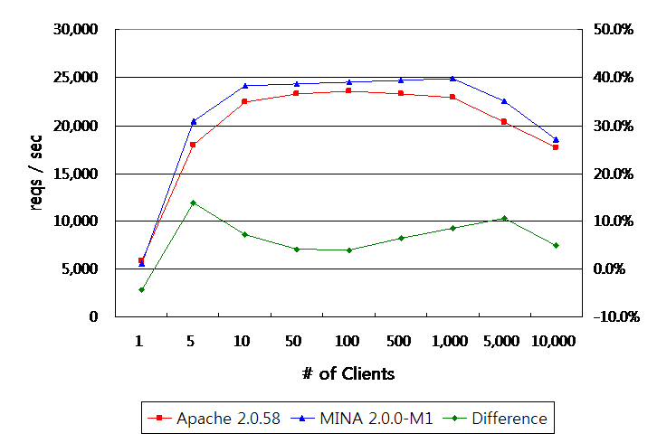

# Documentation

## Navigation

- Latest Downloads
  - [Mina 2.0.28](#downloads_2_0)
  - [Mina 2.1.12](#downloads_2_1)
  - [Mina 2.2.7](#downloads_2_2)
  - [Mina old versions](#downloads_old)
- [Documentation](#documentation)
  - [Base documentation](#documentation)
  - [User guide](#userguide-user-guide-toc)
  - [2.2 vs 2.1](#2.2-vs-2.1)
  - [2.1 vs 2.0](#2.1-vs-2.0)
  - [Features](#features)
  - [Road Map](#road-map)
  - [Quick Start Guide](#quick-start-guide)
  - [FAQ](#faq)
- Resources
  - [Mailing lists & IRC](#mailing-lists)
  - [Issue tracking](#issue-tracking)
  - [Sources](#sources)
  - [Performances](#performances)
  - [Testimonials](#testimonials)
  - [Conferences](#conferences)
  - [Developers Guide](#developer-guide)
  - [Related Projects](#related-projects)

## Content

<a id="downloads_2_0"></a>

<!-- source_url: https://mina.apache.org/mina-project/downloads_2_0.html -->

<!-- page_index: 1 -->

<a id="downloads_2_0--latest-mina-releases"></a>

# Latest MINA Releases

<a id="downloads_2_0--apache-mina-2028-font-colorgreenstablefont-java-8"></a>
<a id="downloads_2_0--apache-mina-2.0.28-stable-java-8"></a>

## Apache MINA 2.0.28 stable (Java 8+)

<a id="downloads_2_0--binaries"></a>

### Binaries

- .tar.gz archive [mina-2.0.28](https://dlcdn.apache.org/mina/mina/2.0.28/apache-mina-2.0.28-bin.tar.gz) (signatures : [SHA256](https://www.apache.org/dist/mina/mina/2.0.28/apache-mina-2.0.28-bin.tar.gz.sha256) [SHA512](https://www.apache.org/dist/mina/mina/2.0.28/apache-mina-2.0.28-bin.tar.gz.sha512) [ASC](https://www.apache.org/dist/mina/mina/2.0.28/apache-mina-2.0.28-bin.tar.gz.asc))
- .tar.bz2 archive [mina-2.0.28](https://dlcdn.apache.org/mina/mina/2.0.28/apache-mina-2.0.28-bin.tar.bz2) (signatures : [SHA256](https://www.apache.org/dist/mina/mina/2.0.28/apache-mina-2.0.28-bin.tar.bz2.sha256) [SHA512](https://www.apache.org/dist/mina/mina/2.0.28/apache-mina-2.0.28-bin.tar.bz2.sha512) [ASC](https://www.apache.org/dist/mina/mina/2.0.28/apache-mina-2.0.28-bin.tar.bz2.asc))
- .zip archive [mina-2.0.28](https://dlcdn.apache.org/mina/mina/2.0.28/apache-mina-2.0.28-bin.zip) (signatures : [SHA256](https://www.apache.org/dist/mina/mina/2.0.28/apache-mina-2.0.28-bin.zip.sha256) [SHA512](https://www.apache.org/dist/mina/mina/2.0.28/apache-mina-2.0.28-bin.zip.sha512) [ASC](https://www.apache.org/dist/mina/mina/2.0.28/apache-mina-2.0.28-bin.zip.asc))

<a id="downloads_2_0--sources"></a>

### Sources

- .src.tar.gz archive [mina-2.0.28](https://dlcdn.apache.org/mina/mina/2.0.28/apache-mina-2.0.28-src.tar.gz) (signatures : [SHA256](https://www.apache.org/dist/mina/mina/2.0.28/apache-mina-2.0.28-src.tar.gz.sha256) [SHA512](https://www.apache.org/dist/mina/mina/2.0.28/apache-mina-2.0.28-src.tar.gz.sha512) [ASC](https://www.apache.org/dist/mina/mina/2.0.28/apache-mina-2.0.28-src.tar.gz.asc))
- .src.tar.bz2 archive [mina-2.0.28](https://dlcdn.apache.org/mina/mina/2.0.28/apache-mina-2.0.28-src.tar.bz2) (signatures : [SHA256](https://www.apache.org/dist/mina/mina/2.0.28/apache-mina-2.0.28-src.tar.bz2.sha256) [SHA512](https://www.apache.org/dist/mina/mina/2.0.28/apache-mina-2.0.28-src.tar.bz2.sha512) [ASC](https://www.apache.org/dist/mina/mina/2.0.28/apache-mina-2.0.28-src.tar.bz2.asc))
- .src.zip archive [mina-2.0.28](https://dlcdn.apache.org/mina/mina/2.0.28/apache-mina-2.0.28-src.zip) (signatures : [SHA256](https://www.apache.org/dist/mina/mina/2.0.28/apache-mina-2.0.28-src.zip.sha256) [SHA512](https://www.apache.org/dist/mina/mina/2.0.28/apache-mina-2.0.28-src.zip.sha512) [ASC](https://www.apache.org/dist/mina/mina/2.0.28/apache-mina-2.0.28-src.zip.asc))

For people wanting to use the **serial** package, we don't include the **rxtx.jar** library in the releases, as it's under a LGPL license. Please download it from <http://rxtx.qbang.org/wiki/index.php/Download> or add the associated dependency in your maven pom.xml :

```
<dependency>
    <groupId>org.rxtx</groupId>
    <artifactId>rxtx</artifactId>
    <version>2.1.7</version>
    <scope>provided<scope>
</dependency>
```

<a id="downloads_2_0--verify-the-integrity-of-the-files"></a>

# Verify the integrity of the files

The PGP signatures can be verified using PGP or GPG. First download the [KEYS](https://downloads.apache.org/mina/KEYS) as well as the asc signature file for the relevant distribution. Then verify the signatures using:

```bash
$ pgpk -a KEYS
$ pgpv mina-2.0.28.tar.gz.asc
```

or

```bash
$ pgp -ka KEYS
$ pgp mina-2.0.28.tar.gz.asc
```

or

```bash
$ gpg --import KEYS
$ gpg --verify mina-2.0.28.tar.gz.asc
```

Alternatively, you can verify the checksums of the files (see the [How to verify downloaded files page](https://www.apache.org/info/verification.html)).

<a id="downloads_2_0--previous-releases"></a>

# Previous Releases

The previous releases can be found [here](https://archive.apache.org/dist/mina/) and [here](https://archive.apache.org/dist/mina/mina/). Please note that the following releases contains a LGPL licensed file, rxtx-2.1.7.jar: 2.0.0-M4, 2.0.0-M5, 2.0.0-M6, 2.0.0-RC1.

<a id="downloads_2_0--version-numbering-scheme"></a>

# Version Numbering Scheme

The version number of MINA has the following form:

<major>.<minor>.<micro> \[-M<milestone number> or -RC<release candidate number>]

This scheme has three number components:

- The **major** number increases when there are incompatible changes in the API.
- The **minor** number increases when a new feature is introduced.
- The **micro** number increases when a bug or a trivial change is made.

and an optional label that indicates the maturity of a release:

- **M** (Milestone) means the feature set can change at any time in the next milestone releases. The last milestone release becomes the first release candidate after a vote.
- **RC** (Release Candidate) means the feature set is frozen and the next RC releases will focus on fixing problems unless there is a serious flaw in design. The last release candidate becomes the first GA release after a vote.
- No label implies **GA** (General Availability), which means the release is stable enough and therefore ready for production environment.

MINA is not a stand-alone software, so ‘the feature set’ here also includes the API of the newly introduced features and the overall architecture of the software,

Here’s an example that illustrates how MINA version number increases:

2.0.0-M1 -> 2.0.0-M3 -> 2.0.0-M3 -> 2.0.0-M4 -> 2.0.0-RC1 -> 2.0.0-RC2 -> 2.0.0-RC3 -> **2.0.0** -> 2.0.1 -> 2.0.2 -> 2.1.0-M1 ...

Please note that we always specify the micro number, even if it’s zero.

---

<a id="downloads_2_1"></a>

<!-- source_url: https://mina.apache.org/mina-project/downloads_2_1.html -->

<!-- page_index: 2 -->

<a id="downloads_2_1--latest-mina-releases"></a>

# Latest MINA Releases

<a id="downloads_2_1--apache-mina-2112-font-colorgreenstablefont-java-8"></a>
<a id="downloads_2_1--apache-mina-2.1.12-stable-java-8"></a>

## Apache MINA 2.1.12 stable (Java 8+)

<a id="downloads_2_1--binaries"></a>

### Binaries

- .tar.gz archive [mina-2.1.12](https://dlcdn.apache.org/mina/mina/2.1.12/apache-mina-2.1.12-bin.tar.gz) (signatures : [SHA256](https://www.apache.org/dist/mina/mina/2.1.12/apache-mina-2.1.12-bin.tar.gz.sha256) [SHA512](https://www.apache.org/dist/mina/mina/2.1.12/apache-mina-2.1.12-bin.tar.gz.sha512) [ASC](https://www.apache.org/dist/mina/mina/2.1.12/apache-mina-2.1.12-bin.tar.gz.asc))
- .tar.bz2 archive [mina-2.1.12](https://dlcdn.apache.org/mina/mina/2.1.12/apache-mina-2.1.12-bin.tar.bz2) (signatures : [SHA256](https://www.apache.org/dist/mina/mina/2.1.12/apache-mina-2.1.12-bin.tar.bz2.sha256) [SHA512](https://www.apache.org/dist/mina/mina/2.1.12/apache-mina-2.1.12-bin.tar.bz2.sha512) [ASC](https://www.apache.org/dist/mina/mina/2.1.12/apache-mina-2.1.12-bin.tar.bz2.asc))
- .zip archive [mina-2.1.12](https://dlcdn.apache.org/mina/mina/2.1.12/apache-mina-2.1.12-bin.zip) (signatures : [SHA256](https://www.apache.org/dist/mina/mina/2.1.12/apache-mina-2.1.12-bin.zip.sha256) [SHA512](https://www.apache.org/dist/mina/mina/2.1.12/apache-mina-2.1.12-bin.zip.sha512) [ASC](https://www.apache.org/dist/mina/mina/2.1.12/apache-mina-2.1.12-bin.zip.asc))

<a id="downloads_2_1--sources"></a>

### Sources

- .src.tar.gz archive [mina-2.1.12](https://dlcdn.apache.org/mina/mina/2.1.12/apache-mina-2.1.12-src.tar.gz) (signatures : [SHA256](https://www.apache.org/dist/mina/mina/2.1.12/apache-mina-2.1.12-src.tar.gz.sha256) [SHA512](https://www.apache.org/dist/mina/mina/2.1.12/apache-mina-2.1.12-src.tar.gz.sha512) [ASC](https://www.apache.org/dist/mina/mina/2.1.12/apache-mina-2.1.12-src.tar.gz.asc))
- .src.tar.bz2 archive [mina-2.1.12](https://dlcdn.apache.org/mina/mina/2.1.12/apache-mina-2.1.12-src.tar.bz2) (signatures : [SHA256](https://www.apache.org/dist/mina/mina/2.1.12/apache-mina-2.1.12-src.tar.bz2.sha256) [SHA512](https://www.apache.org/dist/mina/mina/2.1.12/apache-mina-2.1.12-src.tar.bz2.sha512) [ASC](https://www.apache.org/dist/mina/mina/2.1.12/apache-mina-2.1.12-src.tar.bz2.asc))
- .src.zip archive [mina-2.1.12](https://dlcdn.apache.org/mina/mina/2.1.12/apache-mina-2.1.12-src.zip) (signatures : [SHA256](https://www.apache.org/dist/mina/mina/2.1.12/apache-mina-2.1.12-src.zip.sha256) [SHA512](https://www.apache.org/dist/mina/mina/2.1.12/apache-mina-2.1.12-src.zip.sha512) [ASC](https://www.apache.org/dist/mina/mina/2.1.12/apache-mina-2.1.12-src.zip.asc))

For people wanting to use the **serial** package, we don't include the **rxtx.jar** library in the releases, as it's under a LGPL license. Please download it from <http://rxtx.qbang.org/wiki/index.php/Download> or add the associated dependency in your maven pom.xml :

```
<dependency>
    <groupId>org.rxtx</groupId>
    <artifactId>rxtx</artifactId>
    <version>2.1.7</version>
    <scope>provided<scope>
</dependency>
```

<a id="downloads_2_1--verify-the-integrity-of-the-files"></a>

# Verify the integrity of the files

The PGP signatures can be verified using PGP or GPG. First download the [KEYS](https://downloads.apache.org/mina/KEYS) as well as the asc signature file for the relevant distribution. Then verify the signatures using:

```
$ pgpk -a KEYS
$ pgpv mina-2.1.12.tar.gz.asc
```

or

```
$ pgp -ka KEYS
$ pgp mina-2.1.12.tar.gz.asc
```

or

```
$ gpg --import KEYS
$ gpg --verify mina-2.1.12.tar.gz.asc
```

Alternatively, you can verify the checksums of the files (see the [How to verify downloaded files page](https://www.apache.org/info/verification.html)).

<a id="downloads_2_1--previous-releases"></a>

# Previous Releases

The previous releases can be found [here](https://archive.apache.org/dist/mina/) and [here](https://archive.apache.org/dist/mina/mina/). Please note that the following releases contains a LGPL licensed file, rxtx-2.1.8.jar: 2.0.0-M4, 2.0.0-M5, 2.0.0-M6, 2.0.0-RC1.

<a id="downloads_2_1--version-numbering-scheme"></a>

# Version Numbering Scheme

The version number of MINA has the following form:

<major>.<minor>.<micro> \[-M<milestone number> or -RC<release candidate number>]

This scheme has three number components:

- The **major** number increases when there are incompatible changes in the API.
- The **minor** number increases when a new feature is introduced.
- The **micro** number increases when a bug or a trivial change is made.

and an optional label that indicates the maturity of a release:

- **M** (Milestone) means the feature set can change at any time in the next milestone releases. The last milestone release becomes the first release candidate after a vote.
- **RC** (Release Candidate) means the feature set is frozen and the next RC releases will focus on fixing problems unless there is a serious flaw in design. The last release candidate becomes the first GA release after a vote.
- No label implies **GA** (General Availability), which means the release is stable enough and therefore ready for production environment.

MINA is not a stand-alone software, so ‘the feature set’ here also includes the API of the newly introduced features and the overall architecture of the software,

Here’s an example that illustrates how MINA version number increases:

2.0.0-M1 -> 2.0.0-M3 -> 2.0.0-M3 -> 2.0.0-M4 -> 2.0.0-RC1 -> 2.0.0-RC2 -> 2.0.0-RC3 -> **2.0.0** -> 2.0.1 -> 2.0.2 -> 2.1.8-M1 ...

Please note that we always specify the micro number, even if it’s zero.

---

<a id="downloads_2_2"></a>

<!-- source_url: https://mina.apache.org/mina-project/downloads_2_2.html -->

<!-- page_index: 3 -->

<a id="downloads_2_2--latest-mina-releases"></a>

# Latest MINA Releases

<a id="downloads_2_2--apache-mina-227-font-colorgreenstablefont-java-8"></a>
<a id="downloads_2_2--apache-mina-2.2.7-stable-java-8"></a>

## Apache MINA 2.2.7 stable (Java 8+)

<a id="downloads_2_2--binaries"></a>

### Binaries

- .tar.gz archive [mina-2.2.7](https://dlcdn.apache.org/mina/mina/2.2.7/apache-mina-2.2.7-bin.tar.gz) (signatures : [SHA256](https://downloads.apache.org/mina/mina/2.2.7/apache-mina-2.2.7-bin.tar.gz.sha256) [SHA512](https://downloads.apache.org/mina/mina/2.2.7/apache-mina-2.2.7-bin.tar.gz.sha512) [ASC](https://downloads.apache.org/mina/mina/2.2.7/apache-mina-2.2.7-bin.tar.gz.asc))
- .tar.bz2 archive [mina-2.2.7](https://dlcdn.apache.org/mina/mina/2.2.7/apache-mina-2.2.7-bin.tar.bz2) (signatures : [SHA256](https://downloads.apache.org/mina/mina/2.2.7/apache-mina-2.2.7-bin.tar.bz2.sha256) [SHA512](https://downloads.apache.org/mina/mina/2.2.7/apache-mina-2.2.7-bin.tar.bz2.sha512) [ASC](https://downloads.apache.org/mina/mina/2.2.7/apache-mina-2.2.7-bin.tar.bz2.asc))
- .zip archive [mina-2.2.7](https://dlcdn.apache.org/mina/mina/2.2.7/apache-mina-2.2.7-bin.zip) (signatures : [SHA256](https://downloads.apache.org/mina/mina/2.2.7/apache-mina-2.2.7-bin.zip.sha256) [SHA512](https://downloads.apache.org/mina/mina/2.2.7/apache-mina-2.2.7-bin.zip.sha512) [ASC](https://downloads.apache.org/mina/mina/2.2.7/apache-mina-2.2.7-bin.zip.asc))

<a id="downloads_2_2--sources"></a>

### Sources

- .src.tar.gz archive [mina-2.2.7](https://dlcdn.apache.org/mina/mina/2.2.7/apache-mina-2.2.7-src.tar.gz) (signatures : [SHA256](https://downloads.apache.org/mina/mina/2.2.7/apache-mina-2.2.7-src.tar.gz.sha256) [SHA512](https://downloads.apache.org/mina/mina/2.2.7/apache-mina-2.2.7-src.tar.gz.sha512) [ASC](https://downloads.apache.org/mina/mina/2.2.7/apache-mina-2.2.7-src.tar.gz.asc))
- .src.tar.bz2 archive [mina-2.2.7](https://dlcdn.apache.org/mina/mina/2.2.7/apache-mina-2.2.7-src.tar.bz2) (signatures : [SHA256](https://downloads.apache.org/mina/mina/2.2.7/apache-mina-2.2.7-src.tar.bz2.sha256) [SHA512](https://downloads.apache.org/mina/mina/2.2.7/apache-mina-2.2.7-src.tar.bz2.sha512) [ASC](https://downloads.apache.org/mina/mina/2.2.7/apache-mina-2.2.7-src.tar.bz2.asc))
- .src.zip archive [mina-2.2.7](https://dlcdn.apache.org/mina/mina/2.2.7/apache-mina-2.2.7-src.zip) (signatures : [SHA256](https://downloads.apache.org/mina/mina/2.2.7/apache-mina-2.2.7-src.zip.sha256) [SHA512](https://downloads.apache.org/mina/mina/2.2.7/apache-mina-2.2.7-src.zip.sha512) [ASC](https://downloads.apache.org/mina/mina/2.2.7/apache-mina-2.2.7-src.zip.asc))

For people wanting to use the **serial** package, we don't include the **rxtx.jar** library in the releases, as it's under a LGPL license. Please download it from <http://rxtx.qbang.org/wiki/index.php/Download> or add the associated dependency in your maven pom.xml :

```
<dependency>
    <groupId>org.rxtx</groupId>
    <artifactId>rxtx</artifactId>
    <version>2.1.7</version>
    <scope>provided<scope>
</dependency>
```

<a id="downloads_2_2--verify-the-integrity-of-the-files"></a>

# Verify the integrity of the files

The PGP signatures can be verified using PGP or GPG. First download the [KEYS](https://downloads.apache.org/mina/KEYS) as well as the asc signature file for the relevant distribution. Then verify the signatures using:

```
$ pgpk -a KEYS
$ pgpv mina-2.2.7.tar.gz.asc
```

or

```
$ pgp -ka KEYS
$ pgp mina-2.2.7.tar.gz.asc
```

or

```
$ gpg --import KEYS
$ gpg --verify mina-2.2.7.tar.gz.asc
```

Alternatively, you can verify the checksums of the files (see the [How to verify downloaded files page](https://www.apache.org/info/verification.html)).

<a id="downloads_2_2--previous-releases"></a>

# Previous Releases

The previous releases can be found [here](https://archive.apache.org/dist/mina/) and [here](https://archive.apache.org/dist/mina/mina/). Please note that the following releases contains a LGPL licensed file, rxtx-2.1.7.jar: 2.0.0-M4, 2.0.0-M5, 2.0.0-M6, 2.0.0-RC1.

<a id="downloads_2_2--version-numbering-scheme"></a>

# Version Numbering Scheme

The version number of MINA has the following form:

<major>.<minor>.<micro> \[-M<milestone number> or -RC<release candidate number>]

This scheme has three number components:

- The **major** number increases when there are incompatible changes in the API.
- The **minor** number increases when a new feature is introduced.
- The **micro** number increases when a bug or a trivial change is made.

and an optional label that indicates the maturity of a release:

- **M** (Milestone) means the feature set can change at any time in the next milestone releases. The last milestone release becomes the first release candidate after a vote.
- **RC** (Release Candidate) means the feature set is frozen and the next RC releases will focus on fixing problems unless there is a serious flaw in design. The last release candidate becomes the first GA release after a vote.
- No label implies **GA** (General Availability), which means the release is stable enough and therefore ready for production environment.

MINA is not a stand-alone software, so ‘the feature set’ here also includes the API of the newly introduced features and the overall architecture of the software,

Here’s an example that illustrates how MINA version number increases:

2.0.0-M1 -> 2.0.0-M3 -> 2.0.0-M3 -> 2.0.0-M4 -> 2.0.0-RC1 -> 2.0.0-RC2 -> 2.0.0-RC3 -> **2.0.0** -> 2.0.1 -> 2.0.2 -> 2.2.7-M1 ...

Please note that we always specify the micro number, even if it’s zero.

---

<a id="downloads_old"></a>

<!-- source_url: https://mina.apache.org/mina-project/downloads_old.html -->

<!-- page_index: 4 -->

<a id="downloads_old--older-mina-releases"></a>

# Older MINA Releases

For people wanting to use the **serial** package, we don't include the **rxtx.jar** library in the releases, as it's under a LGPL license. Please download it from <http://rxtx.qbang.org/wiki/index.php/Download> or add the associated dependency in your maven pom.xml :

```
<dependency>
    <groupId>org.rxtx</groupId>
    <artifactId>rxtx</artifactId>
    <version>2.1.7</version>
    <scope>provided<scope>
</dependency>
```

<a id="downloads_old--mina-22x"></a>
<a id="downloads_old--mina-2.2.x"></a>

## MINA 2.2.x

| Version | Download Links | Date |
| --- | --- | --- |
| ApacheDS MINA 2.2.6 | [Download](https://archive.apache.org/dist/mina/mina/2.2.6/), [Javadoc](https://mina.apache.org/mina-project/gen-docs/2.2.6/apidocs/index.html), [Test javadoc](https://mina.apache.org/mina-project/gen-docs/2.2.6/testapidocs/index.html), [Xref](https://mina.apache.org/mina-project/gen-docs/2.2.6/xref/index.html), [Xref test](https://mina.apache.org/mina-project/gen-docs/2.2.6/xref-test/index.html) | 27/Apr/2026 |
| ApacheDS MINA 2.2.5 | [Download](https://archive.apache.org/dist/mina/mina/2.2.5/), [Javadoc](https://mina.apache.org/mina-project/gen-docs/2.2.5/apidocs/index.html), [Test javadoc](https://mina.apache.org/mina-project/gen-docs/2.2.5/testapidocs/index.html), [Xref](https://mina.apache.org/mina-project/gen-docs/2.2.5/xref/index.html), [Xref test](https://mina.apache.org/mina-project/gen-docs/2.2.5/xref-test/index.html) | 28/Nov/2025 |
| ApacheDS MINA 2.2.4 | [Download](https://archive.apache.org/dist/mina/mina/2.2.4/), [Javadoc](https://mina.apache.org/mina-project/gen-docs/2.2.4/apidocs/index.html), [Test javadoc](https://mina.apache.org/mina-project/gen-docs/2.2.4/testapidocs/index.html), [Xref](https://mina.apache.org/mina-project/gen-docs/2.2.4/xref/index.html), [Xref test](https://mina.apache.org/mina-project/gen-docs/2.2.4/xref-test/index.html) | 24/Dec/2024 |
| ApacheDS MINA 2.2.3 | [Download](https://archive.apache.org/dist/mina/mina/2.2.3/), [Javadoc](https://mina.apache.org/mina-project/gen-docs/2.2.3/apidocs/index.html), [Test javadoc](https://mina.apache.org/mina-project/gen-docs/2.2.3/testapidocs/index.html), [Xref](https://mina.apache.org/mina-project/gen-docs/2.2.3/xref/index.html), [Xref test](https://mina.apache.org/mina-project/gen-docs/2.2.3/xref-test/index.html) | 12/Sep/2023 |
| ApacheDS MINA 2.2.2 | [Download](https://archive.apache.org/dist/mina/mina/2.2.2/), [Javadoc](https://mina.apache.org/mina-project/gen-docs/2.2.2/apidocs/index.html), [Test javadoc](https://mina.apache.org/mina-project/gen-docs/2.2.2/testapidocs/index.html), [Xref](https://mina.apache.org/mina-project/gen-docs/2.2.2/xref/index.html), [Xref test](https://mina.apache.org/mina-project/gen-docs/2.2.2/xref-test/index.html) | 5/Jun/2023 |
| ApacheDS MINA 2.2.1 | [Download](https://archive.apache.org/dist/mina/mina/2.2.1/), [Javadoc](https://mina.apache.org/mina-project/gen-docs/2.2.1/apidocs/index.html), [Test javadoc](https://mina.apache.org/mina-project/gen-docs/2.2.1/testapidocs/index.html), [Xref](https://mina.apache.org/mina-project/gen-docs/2.2.1/xref/index.html), [Xref test](https://mina.apache.org/mina-project/gen-docs/2.2.1/xref-test/index.html) | 24/Jul/2022 |
| ApacheDS MINA 2.2.0 | [Download](https://archive.apache.org/dist/mina/mina/2.2.0/), [Javadoc](https://mina.apache.org/mina-project/gen-docs/2.2.0/apidocs/index.html), [Test javadoc](https://mina.apache.org/mina-project/gen-docs/2.2.0/testapidocs/index.html), [Xref](https://mina.apache.org/mina-project/gen-docs/2.2.0/xref/index.html), [Xref test](https://mina.apache.org/mina-project/gen-docs/2.2.0/xref-test/index.html) | 19/Jul/2022 |

<a id="downloads_old--mina-21x"></a>
<a id="downloads_old--mina-2.1.x"></a>

## MINA 2.1.x

| Version | Download Links | Date |
| --- | --- | --- |
| ApacheDS MINA 2.1.11 | [Download](https://archive.apache.org/dist/mina/mina/2.1.11/), [Javadoc](https://mina.apache.org/mina-project/gen-docs/2.1.11/apidocs/index.html), [Test javadoc](https://mina.apache.org/mina-project/gen-docs/2.1.11/testapidocs/index.html), [Xref](https://mina.apache.org/mina-project/gen-docs/2.1.11/xref/index.html), [Xref test](https://mina.apache.org/mina-project/gen-docs/2.1.11/xref-test/index.html) | 27/Apr/2026 |
| ApacheDS MINA 2.1.10 | [Download](https://archive.apache.org/dist/mina/mina/2.1.10/), [Javadoc](https://mina.apache.org/mina-project/gen-docs/2.1.10/apidocs/index.html), [Test javadoc](https://mina.apache.org/mina-project/gen-docs/2.1.10/testapidocs/index.html), [Xref](https://mina.apache.org/mina-project/gen-docs/2.1.10/xref/index.html), [Xref test](https://mina.apache.org/mina-project/gen-docs/2.1.10/xref-test/index.html) | 24/Dec/2024 |
| ApacheDS MINA 2.1.9 | [Download](https://archive.apache.org/dist/mina/mina/2.1.9/), [Javadoc](https://mina.apache.org/mina-project/gen-docs/2.1.9/apidocs/index.html), [Test javadoc](https://mina.apache.org/mina-project/gen-docs/2.1.9/testapidocs/index.html), [Xref](https://mina.apache.org/mina-project/gen-docs/2.1.9/xref/index.html), [Xref test](https://mina.apache.org/mina-project/gen-docs/2.1.9/xref-test/index.html) | 15/Oct/2023 |
| ApacheDS MINA 2.1.8 | [Download](https://archive.apache.org/dist/mina/mina/2.1.8/), [Javadoc](https://mina.apache.org/mina-project/gen-docs/2.1.8/apidocs/index.html), [Test javadoc](https://mina.apache.org/mina-project/gen-docs/2.1.8/testapidocs/index.html), [Xref](https://mina.apache.org/mina-project/gen-docs/2.1.8/xref/index.html), [Xref test](https://mina.apache.org/mina-project/gen-docs/2.1.8/xref-test/index.html) | 12/Sep/2023 |
| ApacheDS MINA 2.1.7 | [Download](https://archive.apache.org/dist/mina/mina/2.1.7/), [Javadoc](https://mina.apache.org/mina-project/gen-docs/2.1.7/apidocs/index.html), [Test javadoc](https://mina.apache.org/mina-project/gen-docs/2.1.7/testapidocs/index.html), [Xref](https://mina.apache.org/mina-project/gen-docs/2.1.7/xref/index.html), [Xref test](https://mina.apache.org/mina-project/gen-docs/2.1.7/xref-test/index.html) | 5/Jun/2023 |
| ApacheDS MINA 2.1.6 | [Download](https://archive.apache.org/dist/mina/mina/2.1.6/), [Javadoc](https://mina.apache.org/mina-project/gen-docs/2.1.6/apidocs/index.html), [Test javadoc](https://mina.apache.org/mina-project/gen-docs/2.1.6/testapidocs/index.html), [Xref](https://mina.apache.org/mina-project/gen-docs/2.1.6/xref/index.html), [Xref test](https://mina.apache.org/mina-project/gen-docs/2.1.6/xref-test/index.html) | 18/Feb/2022 |
| ApacheDS MINA 2.1.5 | [Download](https://archive.apache.org/dist/mina/mina/2.1.5/), [Javadoc](https://mina.apache.org/mina-project/gen-docs/2.1.5/apidocs/index.html), [Test javadoc](https://mina.apache.org/mina-project/gen-docs/2.1.5/testapidocs/index.html), [Xref](https://mina.apache.org/mina-project/gen-docs/2.1.5/xref/index.html), [Xref test](https://mina.apache.org/mina-project/gen-docs/2.1.5/xref-test/index.html) | 29/Oct/2021 |
| ApacheDS MINA 2.1.4 | [Download](https://archive.apache.org/dist/mina/mina/2.1.4/), [Javadoc](https://mina.apache.org/mina-project/gen-docs/2.1.4/apidocs/index.html), [Test javadoc](https://mina.apache.org/mina-project/gen-docs/2.1.4/testapidocs/index.html), [Xref](https://mina.apache.org/mina-project/gen-docs/2.1.4/xref/index.html), [Xref test](https://mina.apache.org/mina-project/gen-docs/2.1.4/xref-test/index.html) | 24/Aug/2020 |
| ApacheDS MINA 2.1.3 | [Download](https://archive.apache.org/dist/mina/mina/2.1.3/), [Javadoc](https://svn.apache.org/repos/infra/websites/production/mina/content/mina-project/gen-docs/2.1.3/apidocs/index.html), [Test javadoc](https://svn.apache.org/repos/infra/websites/production/mina/content/mina-project/gen-docs/2.1.3/testapidocs/index.html), [Xref](https://svn.apache.org/repos/infra/websites/production/mina/content/mina-project/gen-docs/2.1.3/xref/index.html), [Xref test](https://svn.apache.org/repos/infra/websites/production/mina/content/mina-project/gen-docs/2.1.3/xref-test/index.html) | 02/Jun/2019 |
| ApacheDS MINA 2.1.2 | [Download](https://archive.apache.org/dist/mina/mina/2.1.2/), [Javadoc](https://svn.apache.org/repos/infra/websites/production/mina/content/mina-project/gen-docs/2.1.2/apidocs/index.html), [Test javadoc](https://svn.apache.org/repos/infra/websites/production/mina/content/mina-project/gen-docs/2.1.2/testapidocs/index.html), [Xref](https://svn.apache.org/repos/infra/websites/production/mina/content/mina-project/gen-docs/2.1.2/xref/index.html), [Xref test](https://svn.apache.org/repos/infra/websites/production/mina/content/mina-project/gen-docs/2.1.2/xref-test/index.html) | 20/Apr/2019 |
| ApacheDS MINA 2.1.1 | [Download](https://archive.apache.org/dist/mina/mina/2.1.1/), [Javadoc](https://svn.apache.org/repos/infra/websites/production/mina/content/mina-project/gen-docs/2.1.1/apidocs/index.html), [Test javadoc](https://svn.apache.org/repos/infra/websites/production/mina/content/mina-project/gen-docs/2.1.1/testapidocs/index.html), [Xref](https://svn.apache.org/repos/infra/websites/production/mina/content/mina-project/gen-docs/2.1.1/xref/index.html), [Xref test](https://svn.apache.org/repos/infra/websites/production/mina/content/mina-project/gen-docs/2.1.1/xref-test/index.html) | 14/Apr/2019 |
| ApacheDS MINA 2.1.0 | [Download](https://archive.apache.org/dist/mina/mina/2.1.0/), [Javadoc](https://svn.apache.org/repos/infra/websites/production/mina/content/mina-project/gen-docs/2.1.0/apidocs/index.html), [Test javadoc](https://svn.apache.org/repos/infra/websites/production/mina/content/mina-project/gen-docs/2.1.0/testapidocs/index.html), [Xref](https://svn.apache.org/repos/infra/websites/production/mina/content/mina-project/gen-docs/2.1.0/xref/index.html), [Xref test](https://svn.apache.org/repos/infra/websites/production/mina/content/mina-project/gen-docs/2.1.0/xref-test/index.html) | 14/Mar/2019 |

<a id="downloads_old--mina-20x"></a>
<a id="downloads_old--mina-2.0.x"></a>

## MINA 2.0.x

| Version | Download Links | Date |
| --- | --- | --- |
| ApacheDS MINA 2.0.27 | [Download](https://archive.apache.org/dist/mina/mina/2.0.27/), [Javadoc](https://nightlies.apache.org/mina/mina/2.0.27/apidocs/index.html), [Test javadoc](https://nightlies.apache.org/mina/mina/2.0.27/testapidocs/index.html), [Xref](https://nightlies.apache.org/mina/mina/2.0.27/xref/index.html), [Xref test](https://nightlies.apache.org/mina/mina/2.0.27/xref-test/index.html) | 24/Dec/2024 |
| ApacheDS MINA 2.0.26 | [Download](https://archive.apache.org/dist/mina/mina/2.0.26/), [Javadoc](https://nightlies.apache.org/mina/mina/2.0.26/apidocs/index.html), [Test javadoc](https://nightlies.apache.org/mina/mina/2.0.26/testapidocs/index.html), [Xref](https://nightlies.apache.org/mina/mina/2.0.26/xref/index.html), [Xref test](https://nightlies.apache.org/mina/mina/2.0.26/xref-test/index.html) | 15/Oct/2023 |
| ApacheDS MINA 2.0.25 | [Download](https://archive.apache.org/dist/mina/mina/2.0.25/), [Javadoc](https://nightlies.apache.org/mina/mina/2.0.25/apidocs/index.html), [Test javadoc](https://nightlies.apache.org/mina/mina/2.0.25/testapidocs/index.html), [Xref](https://nightlies.apache.org/mina/mina/2.0.25/xref/index.html), [Xref test](https://nightlies.apache.org/mina/mina/2.0.25/xref-test/index.html) | 12/Sep/2023 |
| ApacheDS MINA 2.0.24 | [Download](https://archive.apache.org/dist/mina/mina/2.0.24/), [Javadoc](https://nightlies.apache.org/mina/mina/2.0.24/apidocs/index.html), [Test javadoc](https://nightlies.apache.org/mina/mina/2.0.24/testapidocs/index.html), [Xref](https://nightlies.apache.org/mina/mina/2.0.24/xref/index.html), [Xref test](https://nightlies.apache.org/mina/mina/2.0.24/xref-test/index.html) | 5/Jun/2023 |
| ApacheDS MINA 2.0.23 | [Download](https://archive.apache.org/dist/mina/mina/2.0.23/), [Javadoc](https://nightlies.apache.org/mina/mina/2.0.23/apidocs/index.html), [Test javadoc](https://nightlies.apache.org/mina/mina/2.0.23/testapidocs/index.html), [Xref](https://nightlies.apache.org/mina/mina/2.0.23/xref/index.html), [Xref test](https://nightlies.apache.org/mina/mina/2.0.23/xref-test/index.html) | 18/Feb/2022 |
| ApacheDS MINA 2.0.22 | [Download](https://archive.apache.org/dist/mina/mina/2.0.22/), [Javadoc](https://nightlies.apache.org/mina/mina/2.0.22/apidocs/index.html), [Test javadoc](https://nightlies.apache.org/mina/mina/2.0.22/testapidocs/index.html), [Xref](https://nightlies.apache.org/mina/mina/2.0.22/xref/index.html), [Xref test](https://nightlies.apache.org/mina/mina/2.0.22/xref-test/index.html) | 29/Oct/2021 |
| ApacheDS MINA 2.0.21 | [Download](https://archive.apache.org/dist/mina/mina/2.0.21/), [Javadoc](https://nightlies.apache.org/mina/mina/2.0.21/apidocs/index.html), [Test javadoc](https://nightlies.apache.org/mina/mina/2.0.21/testapidocs/index.html), [Xref](https://nightlies.apache.org/mina/mina/2.0.21/xref/index.html), [Xref test](https://nightlies.apache.org/mina/mina/2.0.21/xref-test/index.html) | 14/Apr/2019 |
| ApacheDS MINA 2.0.20 | [Download](https://archive.apache.org/dist/mina/mina/2.0.20/), [Javadoc](https://svn.apache.org/repos/infra/websites/production/mina/content/mina-project/gen-docs/2.0.20/apidocs/index.html), [Test javadoc](https://svn.apache.org/repos/infra/websites/production/mina/content/mina-project/gen-docs/2.0.20/testapidocs/index.html), [Xref](https://svn.apache.org/repos/infra/websites/production/mina/content/mina-project/gen-docs/2.0.20/xref/index.html), [Xref test](https://svn.apache.org/repos/infra/websites/production/mina/content/mina-project/gen-docs/2.0.20/xref-test/index.html) | 24/Feb/2019 |
| ApacheDS MINA 2.0.19 | [Download](https://archive.apache.org/dist/mina/mina/2.0.19/), [Javadoc](https://svn.apache.org/repos/infra/websites/production/mina/content/mina-project/gen-docs/2.0.19/apidocs/index.html), [Test javadoc](https://svn.apache.org/repos/infra/websites/production/mina/content/mina-project/gen-docs/2.0.19/testapidocs/index.html), [Xref](https://svn.apache.org/repos/infra/websites/production/mina/content/mina-project/gen-docs/2.0.19/xref/index.html), [Xref test](https://svn.apache.org/repos/infra/websites/production/mina/content/mina-project/gen-docs/2.0.19/xref-test/index.html) | 11/Jun/2018 |
| ApacheDS MINA 2.0.18 | [Download](https://archive.apache.org/dist/mina/mina/2.0.18/), [Javadoc](https://svn.apache.org/repos/infra/websites/production/mina/content/mina-project/gen-docs/2.0.18/apidocs/index.html), [Test javadoc](https://svn.apache.org/repos/infra/websites/production/mina/content/mina-project/gen-docs/2.0.18/testapidocs/index.html), [Xref](https://svn.apache.org/repos/infra/websites/production/mina/content/mina-project/gen-docs/2.0.18/xref/index.html), [Xref test](https://svn.apache.org/repos/infra/websites/production/mina/content/mina-project/gen-docs/2.0.18/xref-test/index.html) | 01/Jun/2018 |
| ApacheDS MINA 2.0.17 | [Download](https://archive.apache.org/dist/mina/mina/2.0.17/), [Javadoc](https://svn.apache.org/repos/infra/websites/production/mina/content/mina-project/gen-docs/2.0.17/apidocs/index.html), [Test javadoc](https://svn.apache.org/repos/infra/websites/production/mina/content/mina-project/gen-docs/2.0.17/testapidocs/index.html), [Xref](https://svn.apache.org/repos/infra/websites/production/mina/content/mina-project/gen-docs/2.0.17/xref/index.html), [Xref test](https://svn.apache.org/repos/infra/websites/production/mina/content/mina-project/gen-docs/2.0.17/xref-test/index.html) | 15/Mar/2018 |
| ApacheDS MINA 2.0.16 | [Download](https://archive.apache.org/dist/mina/mina/2.0.16/), [Javadoc](https://svn.apache.org/repos/infra/websites/production/mina/content/mina-project/gen-docs/2.0.16/apidocs/index.html), [Test javadoc](https://svn.apache.org/repos/infra/websites/production/mina/content/mina-project/gen-docs/2.0.16/testapidocs/index.html), [Xref](https://svn.apache.org/repos/infra/websites/production/mina/content/mina-project/gen-docs/2.0.16/xref/index.html), [Xref test](https://svn.apache.org/repos/infra/websites/production/mina/content/mina-project/gen-docs/2.0.16/xref-test/index.html) | 31/Oct/2016 |
| ApacheDS MINA 2.0.15 | [Download](https://archive.apache.org/dist/mina/mina/2.0.15/), [Javadoc](https://svn.apache.org/repos/infra/websites/production/mina/content/mina-project/gen-docs/2.0.15/apidocs/index.html), [Test javadoc](https://svn.apache.org/repos/infra/websites/production/mina/content/mina-project/gen-docs/2.0.15/testapidocs/index.html), [Xref](https://svn.apache.org/repos/infra/websites/production/mina/content/mina-project/gen-docs/2.0.15/xref/index.html), [Xref test](https://svn.apache.org/repos/infra/websites/production/mina/content/mina-project/gen-docs/2.0.15/xref-test/index.html) | 27/Sep/2016 |
| ApacheDS MINA 2.0.14 | [Download](https://archive.apache.org/dist/mina/mina/2.0.14/), [Javadoc](https://svn.apache.org/repos/infra/websites/production/mina/content/mina-project/gen-docs/2.0.14/apidocs/index.html), [Test javadoc](https://svn.apache.org/repos/infra/websites/production/mina/content/mina-project/gen-docs/2.0.14/testapidocs/index.html), [Xref](https://svn.apache.org/repos/infra/websites/production/mina/content/mina-project/gen-docs/2.0.14/xref/index.html), [Xref test](https://svn.apache.org/repos/infra/websites/production/mina/content/mina-project/gen-docs/2.0.14/xref-test/index.html) | 30/AUG/2016 |
| ApacheDS MINA 2.0.13 | [Download](https://archive.apache.org/dist/mina/mina/2.0.13/), [Javadoc](https://svn.apache.org/repos/infra/websites/production/mina/content/mina-project/gen-docs/2.0.13/apidocs/index.html), [Test javadoc](https://svn.apache.org/repos/infra/websites/production/mina/content/mina-project/gen-docs/2.0.13/testapidocs/index.html), [Xref](https://svn.apache.org/repos/infra/websites/production/mina/content/mina-project/gen-docs/2.0.13/xref/index.html), [Xref test](https://svn.apache.org/repos/infra/websites/production/mina/content/mina-project/gen-docs/2.0.13/xref-test/index.html) | 15/Feb/2016 |
| ApacheDS MINA 2.0.12 | [Download](https://archive.apache.org/dist/mina/mina/2.0.12/), [Javadoc](https://svn.apache.org/repos/infra/websites/production/mina/content/mina-project/gen-docs/2.0.12/apidocs/index.html), [Test javadoc](https://svn.apache.org/repos/infra/websites/production/mina/content/mina-project/gen-docs/2.0.12/testapidocs/index.html), [Xref](https://svn.apache.org/repos/infra/websites/production/mina/content/mina-project/gen-docs/2.0.12/xref/index.html), [Xref test](https://svn.apache.org/repos/infra/websites/production/mina/content/mina-project/gen-docs/2.0.12/xref-test/index.html) | 07/Feb/2016 |
| ApacheDS MINA 2.0.11 | [Download](https://archive.apache.org/dist/mina/mina/2.0.11/), [Javadoc](https://svn.apache.org/repos/infra/websites/production/mina/content/mina-project/gen-docs/2.0.11/apidocs/index.html), [Test javadoc](https://svn.apache.org/repos/infra/websites/production/mina/content/mina-project/gen-docs/2.0.11/testapidocs/index.html), [Xref](https://svn.apache.org/repos/infra/websites/production/mina/content/mina-project/gen-docs/2.0.11/xref/index.html) | 26/Jan/2016 |
| ApacheDS MINA 2.0.10 | [Download](https://archive.apache.org/dist/mina/mina/2.0.10/), [Javadoc](https://svn.apache.org/repos/infra/websites/production/mina/content/mina-project/gen-docs/2.0.10/apidocs/index.html), Test javadoc (N/A), [Xref](https://svn.apache.org/repos/infra/websites/production/mina/content/mina-project/gen-docs/2.0.10/xref/index.html), [Xref test](https://svn.apache.org/repos/infra/websites/production/mina/content/mina-project/gen-docs/2.0.10/xref-test/index.html) | 16/Dec/2015 |
| ApacheDS MINA 2.0.9 | [Download](https://archive.apache.org/dist/mina/mina/2.0.9/), [Javadoc](https://svn.apache.org/repos/infra/websites/production/mina/content/mina-project/gen-docs/2.0.9/apidocs/index.html), Test javadoc (N/A), [Xref](https://svn.apache.org/repos/infra/websites/production/mina/content/mina-project/gen-docs/2.0.9/xref/index.html), Xref test (N/A) | 25/Oct/2014 |
| ApacheDS MINA 2.0.8 | [Download](https://archive.apache.org/dist/mina/mina/2.0.8/), [Javadoc](https://svn.apache.org/repos/infra/websites/production/mina/content/mina-project/gen-docs/2.0.8/apidocs/index.html), [Xref](https://svn.apache.org/repos/infra/websites/production/mina/content/mina-project/gen-docs/2.0.8/xref/index.html), [Xref test](https://svn.apache.org/repos/infra/websites/production/mina/content/mina-project/gen-docs/2.0.8/xref-test/index.html) | 20/Sep/2014 |
| ApacheDS MINA 2.0.7 | [Download](https://archive.apache.org/dist/mina/2.0.7/), [Javadoc](https://svn.apache.org/repos/infra/websites/production/mina/content/mina-project/gen-docs/2.0.7/apidocs/index.html), [Xref](https://svn.apache.org/repos/infra/websites/production/mina/content/mina-project/gen-docs/2.0.7/xref/index.html), [Xref test](https://svn.apache.org/repos/infra/websites/production/mina/content/mina-project/gen-docs/2.0.7/xref-test/index.html) | 17/Nov/2012 |
| ApacheDS MINA 2.0.6 | [Download](https://archive.apache.org/dist/mina/2.0.6/), [Javadoc](https://svn.apache.org/repos/infra/websites/production/mina/content/mina-project/gen-docs/2.0.6/apidocs/index.html), [Xref](https://svn.apache.org/repos/infra/websites/production/mina/content/mina-project/gen-docs/2.0.6/xref/index.html), [Xref test](https://svn.apache.org/repos/infra/websites/production/mina/content/mina-project/gen-docs/2.0.6/xref-test/index.html) | 05/Oct/2012 |
| ApacheDS MINA 2.0.5 | [Download](https://archive.apache.org/dist/mina/2.0.5/), [Javadoc](https://svn.apache.org/repos/infra/websites/production/mina/content/mina-project/gen-docs/2.0.5/apidocs/index.html), [Xref](https://svn.apache.org/repos/infra/websites/production/mina/content/mina-project/gen-docs/2.0.5/xref/index.html), [Xref test](https://svn.apache.org/repos/infra/websites/production/mina/content/mina-project/gen-docs/2.0.5/xref-test/index.html) | 25/Aug/2012 |
| ApacheDS MINA 2.0.4 | [Download](https://archive.apache.org/dist/mina/2.0.4/), [Javadoc](https://svn.apache.org/repos/infra/websites/production/mina/content/mina-project/gen-docs/2.0.4/apidocs/index.html), [Xref](https://svn.apache.org/repos/infra/websites/production/mina/content/mina-project/gen-docs/2.0.4/xref/index.html), [Xref test](https://svn.apache.org/repos/infra/websites/production/mina/content/mina-project/gen-docs/2.0.4/xref-test/index.html) | 16/Jun/2011 |
| ApacheDS MINA 2.0.3 | [Download](https://archive.apache.org/dist/mina/2.0.3/), [Javadoc](https://svn.apache.org/repos/infra/websites/production/mina/content/mina-project/gen-docs/2.0.3/apidocs/index.html), [Xref](https://svn.apache.org/repos/infra/websites/production/mina/content/mina-project/gen-docs/2.0.3/xref/index.html), [Xref test](https://svn.apache.org/repos/infra/websites/production/mina/content/mina-project/gen-docs/2.0.3/xref-test/index.html) | 15/Apr/2011 |
| ApacheDS MINA 2.0.2 | [Download](https://archive.apache.org/dist/mina/2.0.2/), [Javadoc](https://svn.apache.org/repos/infra/websites/production/mina/content/mina-project/gen-docs/2.0.2/apidocs/index.html), [Xref](https://svn.apache.org/repos/infra/websites/production/mina/content/mina-project/gen-docs/2.0.2/xref/index.html), [Xref test](https://svn.apache.org/repos/infra/websites/production/mina/content/mina-project/gen-docs/2.0.2/xref-test/index.html) | 17/Dec/2010 |
| ApacheDS MINA 2.0.1 | [Download](https://archive.apache.org/dist/mina/2.0.1/), [Javadoc](https://svn.apache.org/repos/infra/websites/production/mina/content/mina-project/gen-docs/2.0.1/apidocs/index.html), [Xref](https://svn.apache.org/repos/infra/websites/production/mina/content/mina-project/gen-docs/2.0.1/xref/index.html), [Xref test](https://svn.apache.org/repos/infra/websites/production/mina/content/mina-project/gen-docs/2.0.1/xref-test/index.html) | 28/Oct/2010 |
| ApacheDS MINA 2.0.0 | [Download](https://archive.apache.org/dist/mina/2.0.0/), [Javadoc](https://svn.apache.org/repos/infra/websites/production/mina/content/mina-project/gen-docs/2.0.0/apidocs/index.html), [Xref](https://svn.apache.org/repos/infra/websites/production/mina/content/mina-project/gen-docs/2.0.0/xref/index.html), [Xref test](https://svn.apache.org/repos/infra/websites/production/mina/content/mina-project/gen-docs/2.0.0/xref-test/index.html) | 27/Sep/2010 |
| ApacheDS MINA 2.0.0-RC1 | [Download](https://archive.apache.org/dist/mina/2.0.0-RC1/), [Javadoc](https://svn.apache.org/repos/infra/websites/production/mina/content/mina-project/gen-docs/2.0.0-RC1/apidocs/index.html), [Xref](https://svn.apache.org/repos/infra/websites/production/mina/content/mina-project/gen-docs/2.0.0-RC1/xref/index.html), [Xref test](https://svn.apache.org/repos/infra/websites/production/mina/content/mina-project/gen-docs/2.0.0-RC1/xref-test/index.html) | 20/Oct/2009 |
| ApacheDS MINA 2.0.0-M6 | [Download](https://archive.apache.org/dist/mina/2.0.0-M6/), [Javadoc](https://svn.apache.org/repos/infra/websites/production/mina/content/mina-project/gen-docs/2.0.0-M6/apidocs/index.html), [Xref](https://svn.apache.org/repos/infra/websites/production/mina/content/mina-project/gen-docs/2.0.0-M6/xref/index.html), [Xref test](https://svn.apache.org/repos/infra/websites/production/mina/content/mina-project/gen-docs/2.0.0-M6/xref-test/index.html) | 03/Jun/2009 |
| ApacheDS MINA 2.0.0-M5 | [Download](https://archive.apache.org/dist/mina/2.0.0-M5/), [Javadoc](https://svn.apache.org/repos/infra/websites/production/mina/content/mina-project/gen-docs/2.0.0-M5/apidocs/index.html), [Xref](https://svn.apache.org/repos/infra/websites/production/mina/content/mina-project/gen-docs/2.0.0-M5/xref/index.html), [Xref test](https://svn.apache.org/repos/infra/websites/production/mina/content/mina-project/gen-docs/2.0.0-M5/xref-test/index.html) | 19/Apr/2009 |
| ApacheDS MINA 2.0.0-M4 | [Download](https://archive.apache.org/dist/mina/2.0.0-M4/), [Javadoc](https://svn.apache.org/repos/infra/websites/production/mina/content/mina-project/gen-docs/2.0.0-M4/apidocs/index.html), [Xref](https://svn.apache.org/repos/infra/websites/production/mina/content/mina-project/gen-docs/2.0.0-M4/xref/index.html), [Xref test](https://svn.apache.org/repos/infra/websites/production/mina/content/mina-project/gen-docs/2.0.0-M4/xref-test/index.html) | 12/Dec/2008 |
| ApacheDS MINA 2.0.0-M3 | [Download](https://archive.apache.org/dist/mina/2.0.0-M3/), [Javadoc](https://svn.apache.org/repos/infra/websites/production/mina/content/mina-project/gen-docs/2.0.0-M3/apidocs/index.html), [Xref](https://svn.apache.org/repos/infra/websites/production/mina/content/mina-project/gen-docs/2.0.0-M3/xref/index.html), [Xref test](https://svn.apache.org/repos/infra/websites/production/mina/content/mina-project/gen-docs/2.0.0-M3/xref-test/index.html) | 12/Aug/2008 |
| ApacheDS MINA 2.0.0-M2 | [Download](https://archive.apache.org/dist/mina/2.0.0-M2/), [Javadoc](https://svn.apache.org/repos/infra/websites/production/mina/content/mina-project/gen-docs/2.0.0-M2/apidocs/index.html), [Xref](https://svn.apache.org/repos/infra/websites/production/mina/content/mina-project/gen-docs/2.0.0-M2/xref/index.html), [Xref test](https://svn.apache.org/repos/infra/websites/production/mina/content/mina-project/gen-docs/2.0.0-M2/xref-test/index.html) | 09/Jul/2008 |
| ApacheDS MINA 2.0.0-M1 | [Download](https://archive.apache.org/dist/mina/2.0.0-M1/), [Javadoc](https://svn.apache.org/repos/infra/websites/production/mina/content/mina-project/gen-docs/2.0.0-M1/apidocs/index.html), [Xref](https://svn.apache.org/repos/infra/websites/production/mina/content/mina-project/gen-docs/2.0.0-M1/xref/index.html), [Xref test](https://svn.apache.org/repos/infra/websites/production/mina/content/mina-project/gen-docs/2.0.0-M1/xref-test/index.html) | 19/Feb/2008 |

<a id="downloads_old--mina-11x"></a>
<a id="downloads_old--mina-1.1.x"></a>

## MINA 1.1.x

Note: those versions are not maintained, those links are just provided for those interested in archeology…

| Version | Download Links | Date |
| --- | --- | --- |
| ApacheDS MINA 1.1.7 | [Download](https://archive.apache.org/dist/mina/1.1.7/), [Javadoc](https://svn.apache.org/repos/infra/websites/production/mina/content/mina-project/gen-docs/1.1.7/apidocs/index.html) | 23/Apr/2008 |
| ApacheDS MINA 1.1.6 | [Download](https://archive.apache.org/dist/mina/1.1.6/), [Javadoc](https://svn.apache.org/repos/infra/websites/production/mina/content/mina-project/gen-docs/1.1.6/apidocs/index.html) | 09/Feb/2008 |
| ApacheDS MINA 1.1.5 | [Download](https://archive.apache.org/dist/mina/1.1.5/), [Javadoc](https://svn.apache.org/repos/infra/websites/production/mina/content/mina-project/gen-docs/1.1.5/apidocs/index.html) | 26/Nov/2007 |
| ApacheDS MINA 1.1.4 | [Download](https://archive.apache.org/dist/mina/1.1.4/), [Javadoc](https://svn.apache.org/repos/infra/websites/production/mina/content/mina-project/gen-docs/1.1.4/apidocs/index.html) | 29/Oct/2007 |
| ApacheDS MINA 1.1.3 | [Download](https://archive.apache.org/dist/mina/1.1.3/), [Javadoc](https://svn.apache.org/repos/infra/websites/production/mina/content/mina-project/gen-docs/1.1.3/apidocs/index.html) | 17/Oct/2007 |
| ApacheDS MINA 1.1.2 | [Download](https://archive.apache.org/dist/mina/1.1.2/), [Javadoc](https://svn.apache.org/repos/infra/websites/production/mina/content/mina-project/gen-docs/1.1.2/apidocs/index.html) | 14/Aug/2007 |
| ApacheDS MINA 1.1.1 | [Download](https://archive.apache.org/dist/mina/1.1.1/), [Javadoc](https://svn.apache.org/repos/infra/websites/production/mina/content/mina-project/gen-docs/1.1.1/apidocs/index.html) | 19/Jul/2007 |
| ApacheDS MINA 1.1.0 | [Download](https://archive.apache.org/dist/mina/1.1.0/), [Javadoc](https://svn.apache.org/repos/infra/websites/production/mina/content/mina-project/gen-docs/1.1.0/apidocs/index.html) | 16/Apr/2007 |

<a id="downloads_old--mina-10x"></a>
<a id="downloads_old--mina-1.0.x"></a>

## MINA 1.0.x

Note: those versions are not maintained, those links are just provided for those interested in archeology…

| Version | Download Links | Date |
| --- | --- | --- |
| ApacheDS MINA 1.0.10 | [Download](https://archive.apache.org/dist/mina/1.0.10/), [Javadoc](https://svn.apache.org/repos/infra/websites/production/mina/content/mina-project/gen-docs/1.0.10/apidocs/index.html) | 15/Apr/2008 |
| ApacheDS MINA 1.0.9 | [Download](https://archive.apache.org/dist/mina/1.0.9/), [Javadoc](https://svn.apache.org/repos/infra/websites/production/mina/content/mina-project/gen-docs/1.0.9/apidocs/index.html) | 09/Feb/2008 |
| ApacheDS MINA 1.0.8 | [Download](https://archive.apache.org/dist/mina/1.0.8/), [Javadoc](https://svn.apache.org/repos/infra/websites/production/mina/content/mina-project/gen-docs/1.0.8/apidocs/index.html) | 19/Nov/2007 |
| ApacheDS MINA 1.0.7 | [Download](https://archive.apache.org/dist/mina/1.0.7/), [Javadoc](https://svn.apache.org/repos/infra/websites/production/mina/content/mina-project/gen-docs/1.0.7/apidocs/index.html) | 29/Oct/2007 |
| ApacheDS MINA 1.0.6 | [Download](https://archive.apache.org/dist/mina/1.0.6/), [Javadoc](https://svn.apache.org/repos/infra/websites/production/mina/content/mina-project/gen-docs/1.0.6/apidocs/index.html) | 17/Oct/2007 |
| ApacheDS MINA 1.0.5 | [Download](https://archive.apache.org/dist/mina/1.0.5/), [Javadoc](https://svn.apache.org/repos/infra/websites/production/mina/content/mina-project/gen-docs/1.0.5/apidocs/index.html) | 14/Aug/2007 |
| ApacheDS MINA 1.0.4 | [Download](https://archive.apache.org/dist/mina/1.0.4/), [Javadoc](https://svn.apache.org/repos/infra/websites/production/mina/content/mina-project/gen-docs/1.0.4/apidocs/index.html) | 19/Jul/2007 |
| ApacheDS MINA 1.0.3 | [Download](https://archive.apache.org/dist/mina/1.0.3/), [Javadoc](https://svn.apache.org/repos/infra/websites/production/mina/content/mina-project/gen-docs/1.0.3/apidocs/index.html) | 16/Apr/2007 |
| ApacheDS MINA 1.0.2 | [Download](https://archive.apache.org/dist/mina/1.0.2/), [Javadoc](https://svn.apache.org/repos/infra/websites/production/mina/content/mina-project/gen-docs/1.0.2/apidocs/index.html) | 20/Feb/2007 |
| ApacheDS MINA 1.0.1 | [Download](https://archive.apache.org/dist/mina/1.0.1/), javadoc unavailable | 06/Dec/2006 |
| ApacheDS MINA 1.0.0 | [Download](https://archive.apache.org/dist/mina/1.0.0/), [Javadoc](https://svn.apache.org/repos/infra/websites/production/mina/content/mina-project/gen-docs/1.0.0/apidocs/index.html) | 02/Oct/2006 |

<a id="downloads_old--mina-09x"></a>
<a id="downloads_old--mina-0.9.x"></a>

## MINA 0.9.x

Note: those versions are not maintained, those links are just provided for those interested in archeology…

| Version | Download Links | Date |
| --- | --- | --- |
| ApacheDS MINA 0.9.5 | [Download](https://archive.apache.org/dist/directory/mina/unstable/0.9/0.9.5/), [Javadoc](https://svn.apache.org/repos/infra/websites/production/mina/content/mina-project/gen-docs/0.9.5/apidocs/index.html) | 05/Sep/2006 |
| ApacheDS MINA 0.9.4 | [Download](https://archive.apache.org/dist/directory/mina/unstable/0.9/0.9.4/), [Javadoc](https://svn.apache.org/repos/infra/websites/production/mina/content/mina-project/gen-docs/0.9.4/apidocs/index.html) | 01/May/2006 |
| ApacheDS MINA 0.9.3 | [Download](https://archive.apache.org/dist/directory/mina/unstable/0.9/0.9.3/), [Javadoc](https://svn.apache.org/repos/infra/websites/production/mina/content/mina-project/gen-docs/0.9.3/apidocs/index.html) | 04/Apr/2006 |
| ApacheDS MINA 0.9.2 | [Download](https://archive.apache.org/dist/directory/mina/unstable/0.9/0.9.2/), [Javadoc](https://svn.apache.org/repos/infra/websites/production/mina/content/mina-project/gen-docs/0.9.2/apidocs/index.html) | 25/Feb/2006 |
| ApacheDS MINA 0.9.1 | [Download](https://archive.apache.org/dist/directory/mina/unstable/0.9/0.9.1/), [Javadoc](https://svn.apache.org/repos/infra/websites/production/mina/content/mina-project/gen-docs/0.9.1/apidocs/index.html) | 02/Feb/2006 |
| ApacheDS MINA 0.9.0 | [Download](https://archive.apache.org/dist/directory/mina/unstable/0.9/0.9.0/), [Javadoc](https://svn.apache.org/repos/infra/websites/production/mina/content/mina-project/gen-docs/0.9.0/apidocs/index.html), [Examples Javadoc](https://svn.apache.org/repos/infra/websites/production/mina/content/mina-project/gen-docs/0.9.0/apidocs-examples/index.html), [xref](https://svn.apache.org/repos/infra/websites/production/mina/content/mina-project/gen-docs/0.9.0/xref/index.html), [Tests xref](https://svn.apache.org/repos/infra/websites/production/mina/content/mina-project/gen-docs/0.9.0/xref-test/index.html), [Examples xref](https://svn.apache.org/repos/infra/websites/production/mina/content/mina-project/gen-docs/0.9.0/xref-examples/) | 08/Dec/2005 |

<a id="downloads_old--mina-08x"></a>
<a id="downloads_old--mina-0.8.x"></a>

## MINA 0.8.x

Note: those versions are not maintained, those links are just provided for those interested in archeology…

| Version | Download Links | Date |
| --- | --- | --- |
| ApacheDS MINA 0.8.4 | [Download](https://archive.apache.org/dist/mina/0.8.4/), [Javadoc](https://svn.apache.org/repos/infra/websites/production/mina/content/mina-project/gen-docs/0.8.4/apidocs/index.html) | 19/Nov/2006 |
| ApacheDS MINA 0.8.3 | [Download](https://archive.apache.org/dist/mina/0.8.3/), [Javadoc](https://svn.apache.org/repos/infra/websites/production/mina/content/mina-project/gen-docs/0.8.3/apidocs/index.html) | 02/Oct/2006 |
| ApacheDS MINA 0.8.2 | [Download](https://archive.apache.org/dist/mina/0.8.2/), [Javadoc](https://svn.apache.org/repos/infra/websites/production/mina/content/mina-project/gen-docs/0.8.2/apidocs/index.html), [Examples Javadoc](https://svn.apache.org/repos/infra/websites/production/mina/content/mina-project/gen-docs/0.8.2/apidocs-examples/index.html), [xref](https://svn.apache.org/repos/infra/websites/production/mina/content/mina-project/gen-docs/0.8.2/xref/index.html), [Tests xref](https://svn.apache.org/repos/infra/websites/production/mina/content/mina-project/gen-docs/0.8.2/xref-test/index.html), [Examples xref](https://svn.apache.org/repos/infra/websites/production/mina/content/mina-project/gen-docs/0.8.2/xref-examples/) | 23/Dec/2005 |
| ApacheDS MINA 0.8.1 | [Download](https://archive.apache.org/dist/mina/0.8.1/), [Javadoc](https://svn.apache.org/repos/infra/websites/production/mina/content/mina-project/gen-docs/0.8.1/apidocs/index.html), [Examples Javadoc](https://svn.apache.org/repos/infra/websites/production/mina/content/mina-project/gen-docs/0.8.1/apidocs-examples/index.html), [xref](https://svn.apache.org/repos/infra/websites/production/mina/content/mina-project/gen-docs/0.8.1/xref/index.html), [Tests xref](https://svn.apache.org/repos/infra/websites/production/mina/content/mina-project/gen-docs/0.8.1/xref-test/index.html), [Examples xref](https://svn.apache.org/repos/infra/websites/production/mina/content/mina-project/gen-docs/0.8.1/xref-examples/) | 11/Nov/2005 |
| ApacheDS MINA 0.8.0 | [Download](https://archive.apache.org/dist/mina/0.8.0/), [Javadoc](https://svn.apache.org/repos/infra/websites/production/mina/content/mina-project/gen-docs/0.8.0/apidocs/index.html), [Examples Javadoc](https://svn.apache.org/repos/infra/websites/production/mina/content/mina-project/gen-docs/0.8.0/apidocs-examples/index.html), [xref](https://svn.apache.org/repos/infra/websites/production/mina/content/mina-project/gen-docs/0.8.0/xref/index.html), [Tests xref](https://svn.apache.org/repos/infra/websites/production/mina/content/mina-project/gen-docs/0.8.0/xref-test/index.html), [Examples xref](https://svn.apache.org/repos/infra/websites/production/mina/content/mina-project/gen-docs/0.8.0/xref-examples/) | 22/Oct/2005 |

<a id="downloads_old--mina-07x"></a>
<a id="downloads_old--mina-0.7.x"></a>

## MINA 0.7.x

Note: those versions are not maintained, those links are just provided for those interested in archeology…

| Version | Download Links | Date |
| --- | --- | --- |
| ApacheDS MINA 0.7.4 | [Download](https://archive.apache.org/dist/directory/mina/unstable/0.7/0.7.4/), [Javadoc](https://svn.apache.org/repos/infra/websites/production/mina/content/mina-project/gen-docs/0.7.4/apidocs/index.html), [Examples Javadoc](https://svn.apache.org/repos/infra/websites/production/mina/content/mina-project/gen-docs/0.7.4/apidocs-examples/index.html), [xref](https://svn.apache.org/repos/infra/websites/production/mina/content/mina-project/gen-docs/0.7.4/xref/index.html), [Tests xref](https://svn.apache.org/repos/infra/websites/production/mina/content/mina-project/gen-docs/0.7.4/xref-test/index.html), [Examples xref](https://svn.apache.org/repos/infra/websites/production/mina/content/mina-project/gen-docs/0.7.4/xref-examples/) | 03/Sep/2005 |
| ApacheDS MINA 0.7.3 | [Download](https://archive.apache.org/dist/directory/mina/unstable/0.7/0.7.3/), [Javadoc](https://svn.apache.org/repos/infra/websites/production/mina/content/mina-project/gen-docs/0.7.3/apidocs/index.html), [Examples Javadoc](https://svn.apache.org/repos/infra/websites/production/mina/content/mina-project/gen-docs/0.7.3/apidocs-examples/index.html), [xref](https://svn.apache.org/repos/infra/websites/production/mina/content/mina-project/gen-docs/0.7.3/xref/index.html), [Tests xref](https://svn.apache.org/repos/infra/websites/production/mina/content/mina-project/gen-docs/0.7.3/xref-test/index.html), [Examples xref](https://svn.apache.org/repos/infra/websites/production/mina/content/mina-project/gen-docs/0.7.3/xref-examples/) | 11/Jul/2005 |
| ApacheDS MINA 0.7.2 | [Download](https://archive.apache.org/dist/directory/mina/unstable/0.7/0.7.2/), [Javadoc](https://svn.apache.org/repos/infra/websites/production/mina/content/mina-project/gen-docs/0.7.2/apidocs/index.html), [Examples Javadoc](https://svn.apache.org/repos/infra/websites/production/mina/content/mina-project/gen-docs/0.7.2/apidocs-examples/index.html), [xref](https://svn.apache.org/repos/infra/websites/production/mina/content/mina-project/gen-docs/0.7.2/xref/index.html), [Tests xref](https://svn.apache.org/repos/infra/websites/production/mina/content/mina-project/gen-docs/0.7.2/xref-test/index.html), [Examples xref](https://svn.apache.org/repos/infra/websites/production/mina/content/mina-project/gen-docs/0.7.2/xref-examples/) | 08/Jun/2005 |
| ApacheDS MINA 0.7.1 | [Download](https://archive.apache.org/dist/directory/mina/unstable/0.7/0.7.1/), [Javadoc](https://svn.apache.org/repos/infra/websites/production/mina/content/mina-project/gen-docs/0.7.1/apidocs/index.html), [Examples Javadoc](https://svn.apache.org/repos/infra/websites/production/mina/content/mina-project/gen-docs/0.7.1/apidocs-examples/index.html), [xref](https://svn.apache.org/repos/infra/websites/production/mina/content/mina-project/gen-docs/0.7.1/xref/index.html), [Tests xref](https://svn.apache.org/repos/infra/websites/production/mina/content/mina-project/gen-docs/0.7.1/xref-test/index.html), [Examples xref](https://svn.apache.org/repos/infra/websites/production/mina/content/mina-project/gen-docs/0.7.1/xref-examples/) | 23/May/2005 |

<a id="downloads_old--verify-the-integrity-of-the-files"></a>

# Verify the integrity of the files

The PGP signatures can be verified using PGP or GPG. First download the [KEYS](https://downloads.apache.org/mina/KEYS) as well as the asc signature file for the relevant distribution. Then verify the signatures using:

```
$ pgpk -a KEYS
$ pgpv mina-2.0.20.tar.gz.asc
```

or

```
$ pgp -ka KEYS
$ pgp mina-2.0.20.tar.gz.asc
```

or

```
$ gpg --import KEYS
$ gpg --verify mina-2.0.20.tar.gz.asc
```

Alternatively, you can verify the checksums of the files (see the [How to verify downloaded files page](https://www.apache.org/info/verification.html)).

<a id="downloads_old--previous-releases"></a>

# Previous Releases

The previous releases can be found [here](https://archive.apache.org/dist/mina/) and [here](https://archive.apache.org/dist/mina/mina/). Please note that the following releases contains a LGPL licensed file, rxtx-2.1.7.jar: 2.0.0-M4, 2.0.0-M5, 2.0.0-M6, 2.0.0-RC1.

<a id="downloads_old--version-numbering-scheme"></a>

# Version Numbering Scheme

The version number of MINA has the following form:

<major>.<minor>.<micro> \[-M<milestone number> or -RC<release candidate number>]

This scheme has three number components:

- The **major** number increases when there are incompatible changes in the API.
- The **minor** number increases when a new feature is introduced.
- The **micro** number increases when a bug or a trivial change is made.

and an optional label that indicates the maturity of a release:

- **M** (Milestone) means the feature set can change at any time in the next milestone releases. The last milestone release becomes the first release candidate after a vote.
- **RC** (Release Candidate) means the feature set is frozen and the next RC releases will focus on fixing problems unless there is a serious flaw in design. The last release candidate becomes the first GA release after a vote.
- No label implies **GA** (General Availability), which means the release is stable enough and therefore ready for production environment.

MINA is not a stand-alone software, so ‘the feature set’ here also includes the API of the newly introduced features and the overall architecture of the software,

Here’s an example that illustrates how MINA version number increases:

2.0.0-M1 -> 2.0.0-M3 -> 2.0.0-M3 -> 2.0.0-M4 -> 2.0.0-RC1 -> 2.0.0-RC2 -> 2.0.0-RC3 -> **2.0.0** -> 2.0.1 -> 2.0.2 -> 2.1.0-M1 ...

Please note that we always specify the micro number, even if it’s zero.

---

<a id="documentation"></a>

<!-- source_url: https://mina.apache.org/mina-project/documentation.html -->

<!-- page_index: 5 -->

<a id="documentation--documentation"></a>

# Documentation

The MINA 2.X User Guide can be found here : [User Guide](#userguide-user-guide-toc)

- [Java requirement](#documentation--java-requirement)
- [Presentation Materials](#documentation--presentation-materials)
- [Versions & References](#documentation--versions-references)
- [Tutorials](#documentation--tutorials)
  - [For Developers](#documentation--for-developers)
- [Examples](#documentation--examples)
- [Older Presentation Materials](#documentation--older-presentation-materials)
<a id="documentation--java-requirement"></a>

## Java requirement

**MINA 2.X** branches can all be used with **Java version 8**.

In order to be able to build **MINA**, you must use **Java version 11** at least

<a id="documentation--presentation-materials"></a>

## Presentation Materials

These presentation materials will help you understand the overall architecture and core constructs of MINA

- [MINA in real life (ApacheCon EU 2009)](assets/files/mina-in-real-life-aseu-2009_c95471993b6d2549.pdf) by Emmanuel Lécharny
- [Rapid Network Application Development with Apache MINA (JavaOne 2008)](assets/files/javaone2008_669c72eba3114e1d.pdf) by Trustin Lee
- [Apache MINA - The High Performance Protocol Construction Toolkit (ApacheCon US 2007)](assets/files/acus2007_65deeb4219a40b78.pdf) by Peter Royal
- [Introduction to MINA (ApacheCon Asia 2006)](assets/files/acasia2006_37b98ff6d4808106.pdf) by Trustin Lee

<a id="documentation--versions-references"></a>

## Versions & References

There are currently four branches in MINA:

| JavaDoc | Source Code | Description |
| --- | --- | --- |
| [2.0.X](http://mina.apache.org/mina-project/gen-docs/latest-2.0/apidocs/index.html) | [main](http://mina.apache.org/mina-project/gen-docs/latest-2.0/xref/), [test](http://mina.apache.org/mina-project/gen-docs/latest-2.0/xref-test/) | The 2.0 recommended production-ready branch |
| [2.1.X](http://mina.apache.org/mina-project/gen-docs/latest-2.1/apidocs/index.html) | [main](http://mina.apache.org/mina-project/gen-docs/latest-2.1/xref/), [test](http://mina.apache.org/mina-project/gen-docs/latest-2.1/xref-test/) | The 2.1 recommended production-ready branch |
| [2.2.X]http://mina.apache.org/mina-project/gen-docs/latest-2.2/apidocs/index.html) | [main](http://mina.apache.org/mina-project/gen-docs/latest-2.2/xref/), [test](http://mina.apache.org/mina-project/gen-docs/latest-2.2/xref-test/) | The new 2.2 recommended production-ready branch |
| 3.0 | [trunk](http://svn.apache.org/viewvc/mina/mina/trunk/) | A defunct branch that we worked on years ago as a attempt of a complete rewrite |

You might also want to read the [frequently asked questions](faq.html] and learn how to [contact us](https://mina.apache.org/contact.html) before getting started.

<a id="documentation--tutorials"></a>

## Tutorials

- [MINA v2.0 Quick Start Guide](#quick-start-guide) - Create your first MINA based program using MINA version 2.0
- [Logging Configuration](https://mina.apache.org/mina-project/userguide/ch12-logging-filter/ch12-logging-filter.html) - Configuring your MINA-based application for logging
- Transport-specific Configuration
  - [Serial Tutorial](https://mina.apache.org/mina-project/userguide/ch6-transports/ch6.2-serial-transport.html) - Serial communications with MINA trunk
  - [UDP Tutorial](https://mina.apache.org/mina-project/userguide/ch6-transports/ch6-transports) - Writing a User Datagram Protocol (UDP) client and server using MINA
  - [APR Transport](https://mina.apache.org/mina-project/userguide/ch6-transports/ch6.1-apr-transport.html) - Describes use of APR Transport with MINA
- [Integrating with Spring](https://mina.apache.org/mina-project/userguide/ch17-spring-integration/ch17-spring-integration.html) - Demonstrates how to integrate MINA application with Spring
- [Codec Repository](https://mina.apache.org/mina-project/codec-repo.html) - Links to available codec implementations for MINA
- Advanced Topic
  - [Writing IoFilter](https://mina.apache.org/mina-project/userguide/ch5-filters/ch5-filters.html) - Writing your own *IoFilter* implementation to deal with cross-cutting concerns
  - [Writing Protocol Codec for MINA 2.x](https://mina.apache.org/mina-project/userguide/ch9-codec-filter/ch9-codec-filter.html) - Implementing a protocol codec for separation of concern
  - [Using an Executor Filter](https://mina.apache.org/mina-project/userguide/ch10-executor-filter/ch10-executor-filter.html) - Controlling the size of thread pool and choosing the right thread model
  - [JMX Integration](https://mina.apache.org/mina-project/userguide/ch16-jmx-support/ch16-jmx-support.html) - Making your network application manageable
  - [Introduction to mina-statemachine](https://mina.apache.org/mina-project/userguide/ch14-state-machine/ch14-state-machine.html) - Implementing state machine based MINA applications using Java5 annotations
- [User Guide](#userguide-user-guide-toc) - The new **MINA 2.0** User Guide.

<a id="documentation--for-developers"></a>

### For Developers

- [Developer Guide](#developer-guide) - Building & deploying MINA, Coding Standard, and more

<a id="documentation--examples"></a>

## Examples

You can browse all examples [here](http://mina.apache.org/mina-project/gen-docs/latest-2.0/xref/org/apache/mina/example/).

| Name | Feature it demonstrates | Side |
| --- | --- | --- |
| [Reverser](http://mina.apache.org/mina-project/gen-docs/latest-2.0/xref/org/apache/mina/example/reverser/) | Text protocol based on a protocol codec | Server |
| [SumUp server](http://mina.apache.org/mina-project/gen-docs/latest-2.0/xref/org/apache/mina/example/sumup/) | Complex binary protocol based on a protocol codec | Both |
| [Echo server](http://mina.apache.org/mina-project/gen-docs/latest-2.0/xref/org/apache/mina/example/echoserver/) | Low-level I/O and SSL | Server |
| [NetCat](http://mina.apache.org/mina-project/gen-docs/latest-2.0/xref/org/apache/mina/example/netcat/) | Client programming | Client |
| [HTTP server](http://mina.apache.org/mina-project/gen-docs/latest-2.0/xref/org/apache/mina/http/) | Stream-based synchronous I/O | Server |
| [Tennis](http://mina.apache.org/mina-project/gen-docs/latest-2.0/xref/org/apache/mina/example/tennis/) | In-VM pipe communication | Both |
| [Chat server](http://mina.apache.org/mina-project/gen-docs/latest-2.0/xref/org/apache/mina/example/chat/) | Spring integration | Both |
| [Proxy](http://mina.apache.org/mina-project/gen-docs/latest-2.0/xref/org/apache/mina/example/proxy/) | Resending received bytes on another session. | Both |

<a id="documentation--older-presentation-materials"></a>

## Older Presentation Materials

- [Building TCP/IP Servers with Apache MINA (ApacheCon EU 2007)](assets/files/aceu2007_4132144215fcc0a8.pdf) by Peter Royal
- [Building TCP/IP Servers with Apache MINA (ApacheCon EU 2006)](assets/files/aceu2006_9de21a6cd77a807c.pdf) by Peter Royal
- [Introduction to MINA (ApacheCon US 2005)](assets/files/acus2005_7cda633ad7a521d9.pdf) by Trustin Lee ([Demo movie](https://mina.apache.org/mina-project/resources/ACUS2005.swf))

---

<a id="userguide-user-guide-toc"></a>

<!-- source_url: https://mina.apache.org/mina-project/userguide/user-guide-toc.html -->

<!-- page_index: 6 -->

<a id="userguide-user-guide-toc--mina-20-user-guide"></a>
<a id="userguide-user-guide-toc--mina-2.0-user-guide"></a>

## MINA 2.0 User Guide

Part I - Basics

- [Chapter 1 - Getting Started](https://mina.apache.org/mina-project/userguide/ch1-getting-started/ch1-getting-started.html)
  - [1.1 - NIO Overview](https://mina.apache.org/mina-project/userguide/ch1-getting-started/ch1.1-nio-overview.html)
  - [1.2 - Why MINA ?](https://mina.apache.org/mina-project/userguide/ch1-getting-started/ch1.2-why-mina.html)
  - [1.3 - Features](https://mina.apache.org/mina-project/userguide/ch1-getting-started/ch1.3-features.html)
  - [1.4 - First Steps](https://mina.apache.org/mina-project/userguide/ch1-getting-started/ch1.4-first-steps.html)
  - [1.5 - Summary](https://mina.apache.org/mina-project/userguide/ch1-getting-started/ch1.5-summary.html)
- [Chapter 2 - Basics](https://mina.apache.org/mina-project/userguide/ch2-basics/ch2-basics.html)
  - [2.1 - Application Architecture](https://mina.apache.org/mina-project/userguide/ch2-basics/ch2.1-application-architecture.html)
    - [2.1.1 - Server Architecture](https://mina.apache.org/mina-project/userguide/ch2-basics/ch2.1.1-server-architecture.html)
    - [2.1.2 - Client Architecture](https://mina.apache.org/mina-project/userguide/ch2-basics/ch2.1.2-client-architecture.html)
  - [2.2 - Sample TCP Server](https://mina.apache.org/mina-project/userguide/ch2-basics/ch2.2-sample-tcp-server.html)
  - [2.3 - Sample TCP Client](https://mina.apache.org/mina-project/userguide/ch2-basics/ch2.3-sample-tcp-client.html)
  - [2.4 - Sample UDP Server](https://mina.apache.org/mina-project/userguide/ch2-basics/ch2.4-sample-udp-server.html)
  - [2.5 - Sample UDP Client](https://mina.apache.org/mina-project/userguide/ch2-basics/ch2.5-sample-udp-client.html)
  - [2.6 - Summary](https://mina.apache.org/mina-project/userguide/ch2-basics/ch2.6-summary.html)
- [Chapter 3 - Service](https://mina.apache.org/mina-project/userguide/ch3-service/ch3-service.html)
  - [3.1 - IoService Introduction](https://mina.apache.org/mina-project/userguide/ch3-service/ch3.1-io-service.html)
  - [3.2 - IoService Details](https://mina.apache.org/mina-project/userguide/ch3-service/ch3.2-io-service-details.html)
  - [3.3 - IoAcceptor](https://mina.apache.org/mina-project/userguide/ch3-service/ch3.3-acceptor.html)
  - [3.4 - IoConnector](https://mina.apache.org/mina-project/userguide/ch3-service/ch3.4-connector.html)
- [Chapter 4 - Session](https://mina.apache.org/mina-project/userguide/ch4-session/ch4-session.html)
  - [4.1 - Session Configuration](https://mina.apache.org/mina-project/userguide/ch4-session/ch4.1-session-configuration.html)
  - [4.2 - Session Statistics](https://mina.apache.org/mina-project/userguide/ch4-session/ch4.2-session-statistics.html)
- [Chapter 5 - Filters](https://mina.apache.org/mina-project/userguide/ch5-filters/ch5-filters.html)
  - [5.1 - Blacklist Filter](https://mina.apache.org/mina-project/userguide/ch5-filters/ch5.1-blacklist-filter.html)
  - [5.2 - Buffered Write Filter](https://mina.apache.org/mina-project/userguide/ch5-filters/ch5.2-buffered-write-filter.html)
  - [5.3 - Compression Filter](https://mina.apache.org/mina-project/userguide/ch5-filters/ch5.3-compression-filter.html)
  - [5.4 - Connection Throttle Filter](https://mina.apache.org/mina-project/userguide/ch5-filters/ch5.4-connection-throttle-filter.html)
  - [5.5 - Error Generating Filter](https://mina.apache.org/mina-project/userguide/ch5-filters/ch5.5-error-generating-filter.html)
  - [5.6 - Executor Filter](https://mina.apache.org/mina-project/userguide/ch5-filters/ch5.6-executor-filter.html)
  - [5.7 - FileRegion Write Filter](https://mina.apache.org/mina-project/userguide/ch5-filters/ch5.7-file-region-write-filter.html)
  - [5.8 - KeepAlive Filter](https://mina.apache.org/mina-project/userguide/ch5-filters/ch5.8-keep-alive-filter.html)
  - [5.9 - Logging Filter](https://mina.apache.org/mina-project/userguide/ch5-filters/ch5.9-logging-filter.html)
  - [5.10 - MDC Injection Filter](https://mina.apache.org/mina-project/userguide/ch5-filters/ch5.10-mdc-injection-filter.html)
  - [5.11 - NOOP Filter](https://mina.apache.org/mina-project/userguide/ch5-filters/ch5.11-noop-filter.html)
  - [5.12 - Profiler Filter](https://mina.apache.org/mina-project/userguide/ch5-filters/ch5.12-profiler-filter.html)
  - [5.13 - Protocol Codec Filter](https://mina.apache.org/mina-project/userguide/ch5-filters/ch5.13-protocol-codec-filter.html)
  - [5.14 - Proxy Filter](https://mina.apache.org/mina-project/userguide/ch5-filters/ch5.14-proxy-filter.html)
  - [5.15 - Reference Counting Filter](https://mina.apache.org/mina-project/userguide/ch5-filters/ch5.15-reference-counting-filter.html)
  - [5.16 - Request/Response Filter](https://mina.apache.org/mina-project/userguide/ch5-filters/ch5.16-request-response-filter.html)
  - [5.17 - Session Attribute Initializing Filter](https://mina.apache.org/mina-project/userguide/ch5-filters/ch5.17-session-attribute-initializing-filter.html)
  - [5.18 - Stream Write Filter](https://mina.apache.org/mina-project/userguide/ch5-filters/ch5.18-stream-write-filter.html)
  - [5.19 - SSL/TLS Filter](https://mina.apache.org/mina-project/userguide/ch5-filters/ch5.19-ssl-filter.html)
  - [5.20 - Write Request Filter](https://mina.apache.org/mina-project/userguide/ch5-filters/ch5.20-write-request-filter.html)
- [Chapter 6 - Transports](https://mina.apache.org/mina-project/userguide/ch6-transports/ch6-transports.html)
  - [6.1 - APR Transport](https://mina.apache.org/mina-project/userguide/ch6-transports/ch6.1-apr-transport.html)
  - [6.2 - Serial Transport](https://mina.apache.org/mina-project/userguide/ch6-transports/ch6.2-serial-transport.html)
- [Chapter 7 - Handler](https://mina.apache.org/mina-project/userguide/ch7-handler/ch7-handler.html)

Part II - MINA Core

- [Chapter 8 - IoBuffer](https://mina.apache.org/mina-project/userguide/ch8-iobuffer/ch8-iobuffer.html)
- [Chapter 9 - Codec Filter](https://mina.apache.org/mina-project/userguide/ch9-codec-filter/ch9-codec-filter.html)
- [Chapter 10 - Executor Filter](https://mina.apache.org/mina-project/userguide/ch10-executor-filter/ch10-executor-filter.html)
- [Chapter 11 - SSL Filter](https://mina.apache.org/mina-project/userguide/ch11-ssl-filter/ch11-ssl-filter.html)
- [Chapter 12 - Logging Filter](https://mina.apache.org/mina-project/userguide/ch12-logging-filter/ch12-logging-filter.html)

Part III - MINA Advanced

- [Chapter 13 - Debugging](https://mina.apache.org/mina-project/userguide/ch13-debugging/ch13-debugging.html)
- [Chapter 14 - State Machine](https://mina.apache.org/mina-project/userguide/ch14-state-machine/ch14-state-machine.html)
- [Chapter 15 - Proxy](https://mina.apache.org/mina-project/userguide/ch15-proxy/ch15-proxy.html)
- [Chapter 16 - JMX Integration](https://mina.apache.org/mina-project/userguide/ch16-jmx-support/ch16-jmx-support.html)
- [Chapter 17 - Spring Integration](https://mina.apache.org/mina-project/userguide/ch17-spring-integration/ch17-spring-integration.html)

---

<a id="2.2-vs-2.1"></a>

<!-- source_url: https://mina.apache.org/mina-project/2.2-vs-2.1.html -->

<!-- page_index: 7 -->

<a id="2.2-vs-2.1--22x-vs-21x-differences"></a>
<a id="2.2-vs-2.1--2.2.x-vs-2.1.x-differences"></a>

# 2.2.x vs 2.1.x differences

The **SSL/TLS** handling has been totally rewritten in **MINA 2.2**. This has an impact in many areas.

<a id="2.2-vs-2.1--removal-of-the-sslfilterdisable_encryption_once-attribute"></a>
<a id="2.2-vs-2.1--removal-of-the-sslfilter.disable_encryption_once-attribute"></a>

## Removal of the SslFilter.DISABLE\_ENCRYPTION\_ONCE attribute

This attribute was used in previous **MINA** versions to insure that we can send a clear text message to the remote peer while establishing the TLS connection when using the **startTLS** command.

The idea is that the **startTLS** command is sent by an application (an **LDAP** client, for instance), which tells the server it should establish the **SSL/TLS** layer. The problem is that the server should be able to inform the client that the **SSL/TLS** layer is up and running, in clear text, which is not possible as the **SSL/TLS** layer is already fonctionning…

This kind of chicken and egg problem was solved by giving the opportunity to the **SSL/TLS** layer to send back the **startTLS** response to the client in clear text, assuming it’s the server’s first message. A bit of a hack.

In **MINA 2.2**, this attribute has been removed and replaced by either a filter to be added, or by encapsulating the message that should not be encrypted into an instance that implements the **DisableEncryptWriteRequest** interface.

Typically, in **Apache Directory**, we use this filter:

```java
public class StartTlsFilter extends IoFilterAdapter {/** * {@inheritDoc} */ @Override public void filterWrite( NextFilter nextFilter, IoSession session, WriteRequest writeRequest ) throws Exception {if ( writeRequest.getOriginalMessage() instanceof StartTlsResponse ) {// We need to bypass the SslFilter IoFilterChain chain = session.getFilterChain();
for ( IoFilterChain.Entry entry : chain.getAll() ) {IoFilter filter = entry.getFilter();
if ( filter instanceof SslFilter ) {entry.getNextFilter().filterWrite( session, writeRequest );}}} else {nextFilter.filterWrite( session, writeRequest );}}}
```

As you can see in the code above, we check if the message is a **startTLS** response, and if so, we bypass the **SSLFilter**, which leads to the message to be sent in clear text.

<a id="2.2-vs-2.1--addition-of-the-iosessionisserver-method"></a>
<a id="2.2-vs-2.1--addition-of-the-iosession.isserver-method"></a>

## Addition of the IoSession.isServer() method

This method tells if the underlaying service is an *IoAcceptor* or not. It’s useful to quickly find out if we have to set the **Tls** flag to client or server when initializing the **SslEngine** instance, we also use it for the **SslFilter** logs.

<a id="2.2-vs-2.1--removal-of-the-sslfiltergetsslsession-method"></a>
<a id="2.2-vs-2.1--removal-of-the-sslfilter.getsslsession-method"></a>

## Removal of the SslFilter.getSslSession() method

This method is not used. Would you like to get the **SSLSession** instance, it’s a matter of calling the *IoSession.getAttribute()* method with **SslFilter.SSL\_SECURED** as a parameter:

```java
...
            SSLSession sslSession = SSLSession.class.cast(getAttribute(SslFilter.SSL_SECURED));
...
```

<a id="2.2-vs-2.1--why-is-it-api-incompatible"></a>

## Why is it API incompatible ?

The removal of the **SslFilter.DISABLE\_ENCRYPTION\_ONCE** attribute makes it impossible for application that leverage the **startTLS** command to work, without some code change.

<a id="2.2-vs-2.1--migration"></a>

## Migration

This is pretty straightforward :

- Create a filter that bypasses the message that should not be encrypted, or encapsulate it into an instance that implements the **DisableEncryptWriteRequest** interface.

and that’s it !

---

<a id="2.1-vs-2.0"></a>

<!-- source_url: https://mina.apache.org/mina-project/2.1-vs-2.0.html -->

<!-- page_index: 8 -->

<a id="2.1-vs-2.0--21x-vs-20x-differences"></a>
<a id="2.1-vs-2.0--2.1.x-vs-2.0.x-differences"></a>

# 2.1.x vs 2.0.x differences

The way an application is informed that a session has been secured (ie, the SSL/TLS handshake has been successfully completed) was to use a notification system. A specific message was pushed for that purpose, up to the client application to check that message. It forced the application implementer to inject a special session attribute (*SslFilter.USE\_NOTIFICATION*), which is a bit heavy.

It was decided to change that and make it easier for the application to get this information. The idea was to add a new event being propagated to the *IoHandler* interface, up to the application to react to such an event or not.

<a id="2.1-vs-2.0--secure-session-detection-in-apache-mina-20x"></a>
<a id="2.1-vs-2.0--secure-session-detection-in-apache-mina-2.0.x"></a>

## Secure session detection in Apache MINA 2.0.x

The following application code is to be used if the application needs to know if the session has been secured or not:

```java
connector.setHandler(new IoHandlerAdapter() {@Override public void sessionCreated(IoSession session) throws Exception {// Add the SSL notification in the session's attribute liste session.setAttribute(SslFilter.USE_NOTIFICATION, Boolean.TRUE);} ...@Override public void messageReceived(IoSession session, Object message) throws Exception {// Check if the 'fake' session secured message notification has been received if (message == SslFilter.SESSION_SECURED) {counter.countDown();}}}
```

As we can see in this piece of code, this is a two step process:

- first we have to inform our session that we want to be informed about the secured status
- second we have to check for every received message if the session has been secured

This is a bit clumsy, as the check has to be done in the *messageReceived* event, which is clearly mixing concepts (the remote peer never sends such a message)

<a id="2.1-vs-2.0--secure-session-detection-in-apache-mina-21x"></a>
<a id="2.1-vs-2.0--secure-session-detection-in-apache-mina-2.1.x"></a>

## Secure session detection in Apache MINA 2.1.x

The idea was to extend the *IoHandler* interface with a generic *event* method that can be used to be informed about whatever type of event the session is subject to, beside the already processed events (session created, closed, etc).

The *SslHandler* code has been modified to fire this event when the session has been secured, using a dedicated event, *SslEvent.SECURED*.
We also have modified the *SslFilter* code to generate a event when the session is not anymore secured, sending the *SslEvent.UNSECURED* event.

The following code show the difference with the previous code :

```java
connector.setHandler(new IoHandlerAdapter() {@Override public void event(IoSession session, FilterEvent event) throws Exception {if (event == SslEvent.SECURED ) {// DO whatever the application needs to do when the session is secured}}}
```

As we can see, we don’t need to initialize the session telling it to inform the application through a notification: this will be done no matter what.

<a id="2.1-vs-2.0--why-is-it-api-incompatible"></a>

## Why is it API incompatible ?

The *event* addition in the *IoHandler* interface does not break your code: we always have an abstract implementation that will handle the events if your application does not.

The real issue is that if your application was using the Notification mechanism for that purpose, the new version will not send you this specific message(*SslFilter.SESSION\_SECURED*).

<a id="2.1-vs-2.0--migration"></a>

## Migration

This is pretty straightforward :

- get rid of the notification declaration by removing the *session.setAttribute(SslFilter.USE\_NOTIFICATION, Boolean.TRUE)* code.
- implement the *event(IoSession session, FilterEvent event)* method in your application handler, checking for the *SslEvent.SECURED*/*SslEvent.UNSECURED* specific events.

and that’s it !

<a id="2.1-vs-2.0--future-evolution"></a>

## Future evolution

The added event mechanism could be used to other purposes, and that includes user specific needs. It’s possible to write a specific filter that will send a dedicated *FilterEvent* instance, for the application to process it.

---

<a id="features"></a>

<!-- source_url: https://mina.apache.org/mina-project/features.html -->

<!-- page_index: 9 -->

<a id="features--features"></a>

# Features

MINA is a simple yet full-featured network application framework which provides:

- Unified API for various transport types:
  - TCP/IP & UDP/IP via Java NIO
  - Serial communication (RS232) via RXTX
  - In-VM pipe communication
  - You can implement your own!
- Filter interface as an extension point; similar to Servlet filters
- Low-level and high-level API:
  - Low-level: uses ByteBuffers
  - High-level: uses user-defined message objects and codecs
- Highly customizable thread model:
  - Single thread
  - One thread pool
  - More than one thread pools (i.e. [SEDA](https://web.archive.org/web/20061208181754/http:/www.eecs.harvard.edu/~mdw/papers/mdw-phdthesis.pdf))
- Out-of-the-box SSL · TLS · StartTLS support using Java 5 `SSLEngine`
- Overload shielding & traffic throttling
- Unit testability using mock objects
- JMX managability
- Stream-based I/O support via `StreamIoHandler`
- Integration with well known containers such as PicoContainer and Spring
- Smooth migration from Netty, an ancestor of Apache MINA.

---

<a id="road-map"></a>

<!-- source_url: https://mina.apache.org/mina-project/road-map.html -->

<!-- page_index: 10 -->

# Road map — Apache MINA

Please click the following links to find out what issues have been resolved and what issues will be resolved.

- [Road map for the future releases](http://issues.apache.org/jira/browse/DIRMINA?report=com.atlassian.jira.plugin.system.project:roadmap-panel&subset=-1)
- [Change log for the past releases](http://issues.apache.org/jira/browse/DIRMINA?report=com.atlassian.jira.plugin.system.project:changelog-panel&subset=-1)

<a id="road-map--genesis-of-mina"></a>

## Genesis of MINA

by Trustin Lee

In June 2004, I released a network application framework, ‘Netty2’. It was the first network application framework that provides event-based architecture in Java community. It attracted network application programmers because of its simplicity and ease of use. As the Netty2 community matured, its problems also arose. Netty2 didn’t work fine with text protocols and had a critical architectural flaw that prevents users from using it for applications with many concurrent clients.

Quite a large amount of information was collected about what users like about Netty2 and what improvements they want from it for 6 months. It was clear they like its ease of use and unit-testability. They wanted support for UDP/IP and text protocols. I had to invent a cleaner, more flexible, and more extensible API so that it is easy to learn yet full-featured.

Meanwhile around 2003 at Apache Directory, Alex Karasulu was wrestling with a network application framework he developed based on the [Matt Welsh’s SEDA (Staged Event Driven Architecture)](http://www.sosp.org/2001/papers/welsh.pdf). After several iterations Alex realized it was very difficult to manage, and started to research other network application frameworks looking for a replacement. He wanted something for Java that would scale like SEDA yet was simple to use like [ACE](http://www.cs.wustl.edu/~schmidt/ACE.html). Alex encountered Netty2 at [gleamynode.net](https://web.archive.org/web/20130502105932/http://gleamynode.net/) and contacted me asking if I wanted to work with him on a new network application framework.

In September 2004, I formally joined the Apache Directory team. Alex and I decided to mix concepts between the two architectures to create a new network application framework. We exchanged various ideas to extract the strengths of both legacy frameworks to ultimately come up with what is today’s ‘MINA’.

Since then MINA became the primary network application framework used by the Apache Directory project for the various implemented by Apache Directory Server (ApacheDS). Several complex protocols in ApacheDS are implemented with MINA: LDAP, Kerberos, DNS and NTP.

---

<a id="quick-start-guide"></a>

<!-- source_url: https://mina.apache.org/mina-project/quick-start-guide.html -->

<!-- page_index: 11 -->

<a id="quick-start-guide--quick-start-guide"></a>

# Quick Start Guide

This tutorial will walk you through the process of building a MINA based program. This tutorial will walk through building a time server. The following prerequisites are required for this tutorial:

- MINA 2.0.7 Core
- JDK 1.5 or greater
- [SLF4J|http://www.slf4j.org/] 1.3.0 or greater
  - **Log4J 1.2** users: *slf4j-api.jar*, *slf4j-log4j12.jar*, and [Log4J](http://logging.apache.org/log4j/1.2/) 1.2.x
  - **Log4J 1.3** users: *slf4j-api.jar*, *slf4j-log4j13.jar*, and [Log4J](http://logging.apache.org/log4j/1.2/) 1.3.x
  - **java.util.logging** users: *slf4j-api.jar* and *slf4j-jdk14.jar*

> [!IMPORTANT]
> - : Please make sure you are using the right *slf4j-\*.jar* that matches to your logging framework.
>   For instance, *slf4j-log4j12.jar* and *log4j-1.3.x.jar* can not be used together, and will malfunction.

I have tested this program on both Windows© 2000 professional and linux. If you have any problems getting this program to work, please do not hesitate to [contact us|Contact] in order to talk to the MINA developers. Also, this tutorial has tried to remain independent of development environments (IDE, editors..etc). This tutorial will work with any environment that you are comfortable with. Compilation commands and steps to execute the program have been removed for brevity. If you need help learning how to either compile of execute java programs, please consult the [Java tutorial](http://java.sun.com/docs/books/tutorial/).

<a id="quick-start-guide--writing-the-mina-time-server"></a>

## Writing the MINA time server

We will begin by creating a file called MinaTimeServer.java. The initial code can be found below:

```java
public class MinaTimeServer {

    public static void main(String[] args) {
        // code will go here next
    }
}
```

This code should be straightforward to all. We are simply defining a main method that will be used to kick off the program. At this point, we will begin to add the code that will make up our server. First off, we need an object that will be used to listen for incoming connections. Since this program will be TCP/IP based, we will add a *SocketAcceptor* to our program.

```java
import org.apache.mina.core.service.IoAcceptor; import org.apache.mina.transport.socket.nio.NioSocketAcceptor;
public class MinaTimeServer {public static void main( String[] args ) {IoAcceptor acceptor = new NioSocketAcceptor();}}
```

With the *NioSocketAcceptor* class in place, we can go ahead and define the handler class and bind the NioSocketAcceptor to a port.

Next we add a filter to the configuration. This filter will log all information such as newly created sessions, messages received, messages sent, session closed. The next filter is a *ProtocolCodecFilter*. This filter will translate binary or protocol specific data into message object and vice versa. We use an existing TextLine factory because it will handle text base message for you (you don’t have to write the codec part)

```java
import java.nio.charset.Charset;
import org.apache.mina.core.service.IoAcceptor; import org.apache.mina.filter.codec.ProtocolCodecFilter; import org.apache.mina.filter.codec.textline.TextLineCodecFactory; import org.apache.mina.filter.logging.LoggingFilter; import org.apache.mina.transport.socket.nio.NioSocketAcceptor;
public class MinaTimeServer {public static void main( String[] args ) {IoAcceptor acceptor = new NioSocketAcceptor();
acceptor.getFilterChain().addLast( "logger", new LoggingFilter() ); acceptor.getFilterChain().addLast( "codec", new ProtocolCodecFilter( new TextLineCodecFactory( Charset.forName( "UTF-8" ))));}}
```

At this point, we will define the handler that will be used to service client connections and the requests for the current time. The handler class is a class that must implement the interface IoHandler. For almost all programs that use MINA, this becomes the workhorse of the program, as it services all incoming requests from the clients. For this tutorial, we will extend the class IoHandlerAdapter. This is a class that follows the adapter design pattern which simplifies the amount of code that needs to be written in order to satisfy the requirement of passing in a class that implements the IoHandler interface.

```java
import java.io.IOException; import java.nio.charset.Charset;
import org.apache.mina.core.service.IoAcceptor; import org.apache.mina.filter.codec.ProtocolCodecFilter; import org.apache.mina.filter.codec.textline.TextLineCodecFactory; import org.apache.mina.filter.logging.LoggingFilter; import org.apache.mina.transport.socket.nio.NioSocketAcceptor;
public class MinaTimeServer {public static void main( String[] args ) throws IOException {IoAcceptor acceptor = new NioSocketAcceptor();
acceptor.getFilterChain().addLast( "logger", new LoggingFilter() ); acceptor.getFilterChain().addLast( "codec", new ProtocolCodecFilter( new TextLineCodecFactory( Charset.forName( "UTF-8" ))));
acceptor.setHandler(  new TimeServerHandler() );}}
```

We will now add in the NioSocketAcceptor configuration. This will allow us to make socket-specific settings for the socket that will be used to accept connections from clients.

```java
import java.io.IOException;
import java.nio.charset.Charset;

import org.apache.mina.core.session.IdleStatus;
import org.apache.mina.core.service.IoAcceptor;
import org.apache.mina.filter.codec.ProtocolCodecFilter;
import org.apache.mina.filter.codec.textline.TextLineCodecFactory;
import org.apache.mina.filter.logging.LoggingFilter;
import org.apache.mina.transport.socket.nio.NioSocketAcceptor;

public class MinaTimeServer
{
    public static void main( String[] args ) throws IOException
    {
        IoAcceptor acceptor = new NioSocketAcceptor();

        acceptor.getFilterChain().addLast( "logger", new LoggingFilter() );
        acceptor.getFilterChain().addLast( "codec", new ProtocolCodecFilter( new TextLineCodecFactory( Charset.forName( "UTF-8" ))));

        acceptor.setHandler(  new TimeServerHandler() );

        acceptor.getSessionConfig().setReadBufferSize( 2048 );
        acceptor.getSessionConfig().setIdleTime( IdleStatus.BOTH_IDLE, 10 );
    }
}
```

There are 2 new lines in the MinaTimeServer class. These methods set the set the IoHandler, input buffer size and the idle property for the sessions. The buffer size will be specified in order to tell the underlying operating system how much room to allocate for incoming data. The second line will specify when to check for idle sessions. In the call to setIdleTime, the first parameter defines what actions to check for when determining if a session is idle, the second parameter defines the length of time in seconds that must occur before a session is deemed to be idle.

The code for the handler is shown below:

```java
import java.util.Date;
import org.apache.mina.core.session.IdleStatus; import org.apache.mina.core.service.IoHandlerAdapter; import org.apache.mina.core.session.IoSession;
public class TimeServerHandler extends IoHandlerAdapter {@Override public void exceptionCaught( IoSession session, Throwable cause ) throws Exception {cause.printStackTrace();}
@Override public void messageReceived( IoSession session, Object message ) throws Exception {String str = message.toString(); if( str.trim().equalsIgnoreCase("quit") ) {session.close(); return;}
Date date = new Date(); session.write( date.toString() ); System.out.println("Message written...");}
@Override public void sessionIdle( IoSession session, IdleStatus status ) throws Exception {System.out.println( "IDLE " + session.getIdleCount( status ));}}
```

The methods used in this class are *exceptionCaught*, *messageReceived* and *sessionIdle*. *exceptionCaught* should always be defined in a handler to process and exceptions that are raised in the normal course of handling remote connections. If this method is not defined, exceptions may not get properly reported.

The *exceptionCaught* method will simply print the stack trace of the error and close the session. For most programs, this will be standard practice unless the handler can recover from the exception condition.

The *messageReceived* method will receive the data from the client and write back to the client the current time. If the message received from the client is the word “quit”, then the session will be closed. This method will also print out the current time to the client. Depending on the protocol codec that you use, the object (second parameter) that gets passed in to this method will be different, as well as the object that you pass in to the session.write(Object) method. If you do not specify a protocol codec, you will most likely receive a IoBuffer object, and be required to write out a IoBuffer object.

The *sessionIdle* method will be called once a session has remained idle for the amount of time specified in the call *acceptor.getSessionConfig().setIdleTime( IdleStatus.BOTH\_IDLE, 10 );*.

All that is left to do is define the socket address that the server will listen on, and actually make the call that will start the server. That code is shown below:

```java
import java.io.IOException;
import java.net.InetSocketAddress;
import java.nio.charset.Charset;

import org.apache.mina.core.service.IoAcceptor;
import org.apache.mina.core.session.IdleStatus;
import org.apache.mina.filter.codec.ProtocolCodecFilter;
import org.apache.mina.filter.codec.textline.TextLineCodecFactory;
import org.apache.mina.filter.logging.LoggingFilter;
import org.apache.mina.transport.socket.nio.NioSocketAcceptor;

public class MinaTimeServer
{
    private static final int PORT = 9123;

    public static void main( String[] args ) throws IOException
    {
        IoAcceptor acceptor = new NioSocketAcceptor();

        acceptor.getFilterChain().addLast( "logger", new LoggingFilter() );
        acceptor.getFilterChain().addLast( "codec", new ProtocolCodecFilter( new TextLineCodecFactory( Charset.forName( "UTF-8" ))));

        acceptor.setHandler( new TimeServerHandler() );
    acceptor.getSessionConfig().setReadBufferSize( 2048 );
        acceptor.getSessionConfig().setIdleTime( IdleStatus.BOTH_IDLE, 10 );
        acceptor.bind( new InetSocketAddress(PORT) );
    }
}
```

<a id="quick-start-guide--try-out-the-time-server"></a>

## Try out the Time server

At this point, we can go ahead and compile the program. Once you have compiled the program you can run the program in order to test out what happens. The easiest way to test the program is to start the program, and then telnet in to the program:

| Client Output | Server Output |
| --- | --- |
| user@myhost:~> telnet 127.0.0.1 9123 Trying 127.0.0.1… Connected to 127.0.0.1. Escape character is ‘^]'. hello Mon Apr 09 23:42:55 EDT 2007 quit Connection closed by foreign host. user@myhost:~> | MINA Time server started. Session created… Message written… |

<a id="quick-start-guide--whats-next"></a>
<a id="quick-start-guide--what-s-next"></a>

## What’s Next?

Please visit our [User Guide](#userguide-user-guide-toc) page to find out more resources.

---

<a id="faq"></a>

<!-- source_url: https://mina.apache.org/mina-project/faq.html -->

<!-- page_index: 12 -->

<a id="faq--mina-faq"></a>

# MINA FAQ

- [General](#faq--general)
- [What does MINA mean?](#faq--what-does-mina-mean)
  - [What transport does MINA support?](#faq--what-transport-does-mina-support)
  - [How does MINA perform?](#faq--how-does-mina-perform)
  - [Which version of MINA should I use?](#faq--which-version-of-mina-should-i-use)
  - [What is required to build/run MINA?](#faq--what-is-required-to-buildrun-mina)
  - [How can I get help?](#faq--how-can-i-get-help)
  - [How / What can I contribute?](#faq--how-what-can-i-contribute)
- [Can MINA…?](#faq--can-mina)
  - [Can I use MINA to create client (or server) applications?](#faq--can-i-use-mina-to-create-client-or-server-applications)
  - [Can MINA handle text protocols such as HTTP?](#faq--can-mina-handle-text-protocols-such-as-http)
  - [Can MINA handle complex binary protocols such as LDAP?](#faq--can-mina-handle-complex-binary-protocols-such-as-ldap)
  - [Can I implement protocols that keeps connection alive with MINA?](#faq--can-i-implement-protocols-that-keeps-connection-alive-with-mina)
  - [Does MINA support SSL/TLS and SASL out-of-the-box?](#faq--does-mina-support-ssltls-and-sasl-out-of-the-box)
  - [Do I need to make my IoHandler thread-safe?](#faq--do-i-need-to-make-my-iohandler-thread-safe)
  - [What transport types can MINA support except TCP/IP and UDP/IP?](#faq--what-transport-types-can-mina-support-except-tcpip-and-udpip)
  - [Does MINA support multicast?](#faq--does-mina-support-multicast)
- [How do I…?](#faq--how-do-i)
  - [How can I store session-specific information?](#faq--how-can-i-store-session-specific-information)
  - [How can I separate an event handler into multiple handlers when I implement complex business logic?](#faq--how-can-i-separate-an-event-handler-into-multiple-handlers-when-i-implement-complex-business-logic)
  - [How do I close my sessions and dispose my Connector?](#faq--how-do-i-close-my-sessions-and-dispose-my-connector)
  - [How can I reconnect to server after my client session is closed?](#faq--how-can-i-reconnect-to-server-after-my-client-session-is-closed)
  - [When should I implement my protocol handler using filters?](#faq--when-should-i-implement-my-protocol-handler-using-filters)
  - [How can I detect when the remote peer doesn’t send a response message for my request message?](#faq--how-can-i-detect-when-the-remote-peer-doesnt-send-a-response-message-for-my-request-message)
  - [How can I let MINA log messages using my favorite logging framework (i.e. Log4J)?](#faq--how-can-i-let-mina-log-messages-using-my-favorite-logging-framework-ie-log4j)
- [Troubleshooting](#faq--troubleshooting)
  - [I get OutOfMemoryError or response timeout and connection reset under heavy load.](#faq--i-get-ttoutofmemoryerrortt-or-response-timeout-and-connection-reset-under-heavy-load)
  - [No data is writtin out to the session even if the buffer is not empty.](#faq--no-data-is-writtin-out-to-the-session-even-if-the-buffer-is-not-empty)
  - [I created an SSL client with MINA, but it doesn’t initiate any handshake after the session is open.](#faq--i-created-an-ssl-client-with-mina-but-it-doesnt-initiate-any-handshake-after-the-session-is-open)
  - [Why does SocketConnector send several messages as one message?](#faq--why-does-socketconnector-send-several-messages-as-one-message)
  - [I get InvalidClassChangeError.](#faq--i-get-ttinvalidclasschangeerrortt)
  - [My server fails with java.net.SocketException: Too many files open<](#faq--my-server-fails-with-javanetsocketexception-too-many-files-open)
<a id="faq--general"></a>

## General

<a id="faq--what-does-mina-mean"></a>

## What does MINA mean?

MINA is:

- An acronym for ‘Multipurpose Infrastructure for Network Applications’;
- A girl’s name;
- ‘South’ in Japanese;
- ‘Mine’ (as in mineshaft) in Spanish and Portuguese;
- Look at [Wikipedia](http://en.wikipedia.org/wiki/Mina) for more meanings.

<a id="faq--what-transport-does-mina-support"></a>

### What transport does MINA support?

MINA currently supports TCP and UDP based on Java NIO API, provides support for serial port communication, and transports based on [Apache Portable Runtime](http://apr.apache.org/).

<a id="faq--how-does-mina-perform"></a>

### How does MINA perform?

It is known to perform as good as C/C++ servers. Please refer to the [Performance Test Reports](#performances "Performance Test Reports") or the [Testimonials](#testimonials "Testimonials").

<a id="faq--which-version-of-mina-should-i-use"></a>

### Which version of MINA should I use?

Use the latest point-release of 2.0 (for Java 8 or above). 1.0 and 1.1 aren’t maintained anymore.

<a id="faq--what-is-required-to-buildrun-mina"></a>
<a id="faq--what-is-required-to-build-run-mina"></a>

### What is required to build/run MINA?

JDK 7 or above is required to build MINA.

MINA core module depends on two libraries, SLF4J and backport-util-concurrent (for 1.0):

[SLF4J (Simple Logging Facade for Java)](http://www.slf4j.org/), a logging framework from the author of [Log4J](http://logging.apache.org/log4j/1.2/index.html). SLF4J is very similar to [Commons-Logging](http://jakarta.apache.org/commons/logging/), but it doesn’t cause any class loader issues at all. SLF4J provides bindings for Log4J, JDK 1.4 logging API, and NLog4J. Please put an appropriate SLF4J JAR file which corresponds to your favorite logging framework to the classpath as SLF4J documentation explains.

[Spring framework](http://www.springframework.org/) and [JZlib](http://www.jcraft.com/jzlib/) are also required to build integration-spring and filter-compression module.

<a id="faq--how-can-i-get-help"></a>

### How can I get help?

The primary source to get help is the [User Guide](#userguide-user-guide-toc). You can also contact us via [various channels](https://mina.apache.org/contact.html) to ask questions on MINA or to contribute to it.

<a id="faq--how-what-can-i-contribute"></a>

### How / What can I contribute?

You can contribute anything related with MINA; examples, useful codecs for existing protocols, tutorials, feature improvements, bug fixes, benchmarks, and whatever. Please [contact us](https://mina.apache.org/contact.html) without hesitation.

<a id="faq--can-mina"></a>

## Can MINA…?

<a id="faq--can-i-use-mina-to-create-client-or-server-applications"></a>

### Can I use MINA to create client (or server) applications?

Yes. You can create both client and server applications with MINA. Please take a look at IoConnector and IoAcceptor.

<a id="faq--can-mina-handle-text-protocols-such-as-http"></a>

### Can MINA handle text protocols such as HTTP?

Yes. Please take a look at [the Reversed and HTTP server examples](#documentation). [AsyncWeb](https://mina.apache.org/asyncweb-project/index.html) is a HTTP server implementation based on MINA.

<a id="faq--can-mina-handle-complex-binary-protocols-such-as-ldap"></a>

### Can MINA handle complex binary protocols such as LDAP?

Yes. Please take a look at [the SumUp example](#documentation). There is no full ASN.1 support yet, but we will implement it someday and you can contribute to make it available sooner.

<a id="faq--can-i-implement-protocols-that-keeps-connection-alive-with-mina"></a>

### Can I implement protocols that keeps connection alive with MINA?

Yes. MINA doesn’t close any connections unless you called `IoSession.close()` or connection is closed by the remote peer.

<a id="faq--does-mina-support-ssltls-and-sasl-out-of-the-box"></a>
<a id="faq--does-mina-support-ssl-tls-and-sasl-out-of-the-box"></a>

### Does MINA support SSL/TLS and SASL out-of-the-box?

We support SSL/TLS out-of-the-box. Please refer to `SSLFilter`. It also provides a way to implement StartTLS. JDK 7 provides complete SASL support which works well with MINA.

<a id="faq--do-i-need-to-make-my-iohandler-thread-safe"></a>

### Do I need to make my IoHandler thread-safe?

It depends on your implementation. If you access the resource which is shared across multiple sessions, you have to make it thread-safe. If the resource is not shared at all and accessed by only one session (e.g. storing context information as a session attribute), then you don’t need to make it thread-safe. It is because all events generated by MINA are transmitted to your handler in order (when using the Executor Filter), and the newer event is not processed if the event handler method for the older event for the same session hasn’t returned yet.

<a id="faq--what-transport-types-can-mina-support-except-tcpip-and-udpip"></a>
<a id="faq--what-transport-types-can-mina-support-except-tcp-ip-and-udp-ip"></a>

### What transport types can MINA support except TCP/IP and UDP/IP?

Virtually all kind of transport types. MINA API is designed to be transport-independent. You can implement any transport type support only if you can conform to MINA API. Support for Pre-1.4 I/O (aka BIO), reliable multicast, Java Communications API, and file I/O are planned.

<a id="faq--does-mina-support-multicast"></a>

### Does MINA support multicast?

Not yet. Java NIO doesn’t support multicast yet. Multicast for NIO will be available in Java SE 7, Dolphin. We are seriously considering to implement multicasts using pre-1.4 Java API.

<a id="faq--how-do-i"></a>

## How do I…?

<a id="faq--how-can-i-store-session-specific-information"></a>

### How can I store session-specific information?

Sessions are capable of custom attributes that you can add or remove at any time. These custom attributes are not shared between sessions; it is designed to store session specific information.

<a id="faq--how-can-i-separate-an-event-handler-into-multiple-handlers-when-i-implement-complex-business-logic"></a>

### How can I separate an event handler into multiple handlers when I implement complex business logic?

Please refer to DemuxingIoHandler.

<a id="faq--how-do-i-close-my-sessions-and-dispose-my-connector"></a>

### How do I close my sessions and dispose my Connector?

You have to do it in two steps : first close your sessions, then dispose the connector. Of course, if you dispose your Connector first, then all the sessions will be closed. Here is the code :

```java
ConnectFuture cf = connector.connect(new InetSocketAddress("localhost", 8080));

// Get the close future for this session
CloseFuture closeFuture = cf.getSession().getCloseFuture();

// Adding a listener to this close event
closeFuture.addListener((IoFutureListener<?>) new IoFutureListener<IoFuture>() {
        @Override
        public void operationComplete(IoFuture future) {
            System.out.println("The session is now closed");
        }
});

// Do the close requesting that the pending messages are sent before
// the session is closed
closeFuture.getSession().close(false);

// Now wait for the close to be completed
closeFuture.awaitUninterruptibly();

// We can now dispose the connector
connector.dispose();
```

<a id="faq--how-can-i-reconnect-to-server-after-my-client-session-is-closed"></a>

### How can I reconnect to server after my client session is closed?

Here is an example code:

```java
public void sessionClosed( IoSession session ) throws Exception {
    // Wait for five seconds before reconnecting.
    Thread.sleep( 5000 );

    // Reconnect.
    connector.connect( session.getRemoteAddress(), this );
}
```

Possibly it would be better to extract this code to a method like `reconnect()` so that it can reusable in more than one place.

<a id="faq--when-should-i-implement-my-protocol-handler-using-filters"></a>

### When should I implement my protocol handler using filters?

`IoFilter` is usually considered reusable just like we think about Servlet filters. Please implement commonly used business logic such as authorization and logging as a filter. In case you implement just complex multi-layer protocols like Kerberos, you could consider using `org.apache.mina.handler.chain`> package.

<a id="faq--how-can-i-detect-when-the-remote-peer-doesnt-send-a-response-message-for-my-request-message"></a>
<a id="faq--how-can-i-detect-when-the-remote-peer-doesn-t-send-a-response-message-for-my-request-message"></a>

### How can I detect when the remote peer doesn’t send a response message for my request message?

You can’t use `sessionIdle` event simply here. You’ll have to use `java.util.concurrent.ScheduledExecutor` (or [OpenSymphony Quartz](http://www.opensymphony.com/quartz/) as an alternative). Schedule a timeout task to be executed on timeout situation for each request message, and cancel it when you receive the corresponding response message.

<a id="faq--how-can-i-let-mina-log-messages-using-my-favorite-logging-framework-ie-log4j"></a>
<a id="faq--how-can-i-let-mina-log-messages-using-my-favorite-logging-framework-i.e.-log4j"></a>

### How can I let MINA log messages using my favorite logging framework (i.e. Log4J)?

Please refer to ‘Swapping implementations at deployment time’ section in [the SLF4J Manual](http://www.slf4j.org/manual.html).

<a id="faq--troubleshooting"></a>

## Troubleshooting

<a id="faq--i-get-ttoutofmemoryerrortt-or-response-timeout-and-connection-reset-under-heavy-load"></a>
<a id="faq--i-get-outofmemoryerror-or-response-timeout-and-connection-reset-under-heavy-load."></a>

### I get OutOfMemoryError or response timeout and connection reset under heavy load.

We recommend to switch the default buffer type to ‘heap’ by inserting the following code before you start a server:

```java
ByteBuffer.setUseDirectBuffers(false);
ByteBuffer.setAllocator(new SimpleByteBufferAllocator());
```

If you prefer direct buffers to heap buffers, JVM might have ran out of direct memory. Please try increasing maximum direct memory size using **-XX:MaxDirectMemorySize** option (e.g. **-XX:MaxDirectMemorySize=128M**)

<a id="faq--no-data-is-writtin-out-to-the-session-even-if-the-buffer-is-not-empty"></a>
<a id="faq--no-data-is-writtin-out-to-the-session-even-if-the-buffer-is-not-empty."></a>

### No data is writtin out to the session even if the buffer is not empty.

Please make sure if you called `ByteBuffer.flip()` to flip the buffer before writing the buffer out. It is a common mistake NIO beginners make.

<a id="faq--i-created-an-ssl-client-with-mina-but-it-doesnt-initiate-any-handshake-after-the-session-is-open"></a>
<a id="faq--i-created-an-ssl-client-with-mina-but-it-doesn-t-initiate-any-handshake-after-the-session-is-open."></a>

### I created an SSL client with MINA, but it doesn’t initiate any handshake after the session is open.

Please make sure you called `SSLFilter.setUseClientMode(true)` before you initiate a connection. Server developers will also have to disconnect users who doesn’t initiate SSL handshake by setting `IoSession.readerIdleTime` and closing the session in `IoHandler.sessionIdle()`.

<a id="faq--why-does-socketconnector-send-several-messages-as-one-message"></a>

### Why does SocketConnector send several messages as one message?

*For example, I tried using SocketConnector to send “abc” and “def”, but it sent “abcdef”. Is it a MINA bug?*

No, this is due to your OS trying to send packets more efficiently (see [Nagle algorithm](http://en.wikipedia.org/wiki/Nagle_algorithm)). You can enable/disable Nagle’s algorithm by a call to SocketSessionConfig.setTcpNoDelay(), e.g.:

```java
((SocketSessionConfig) connector.getSessionConfig()).setTcpNoDelay(false)
```

However, even if you do this you cannot expect one session.write(bytes) in MINA to correspond to one TCP packet on your network. You should probably implement your own MINA ProtocolDecoder to handle the assembly of incoming bytes into message objects. The TextLineCodec is a good start if the protocol you’re implementing is based on text lines. For a more advanced example have a look at the SumUp example in the MINA distribution.

<a id="faq--i-get-ttinvalidclasschangeerrortt"></a>
<a id="faq--i-get-invalidclasschangeerror-."></a>

### I get InvalidClassChangeError.

Please make sure if you are using the appropriate SLF4J version. You will get `InvalidClassChangeError` if you are using outdated SLF4J release.

<a id="faq--my-server-fails-with-javanetsocketexception-too-many-files-open"></a>
<a id="faq--my-server-fails-with-java.net.socketexception:-too-many-files-open"></a>

### My server fails with java.net.SocketException: Too many files open<

Network sockets are treated like files and your operating system has a limit to the number of file handles it can manage. Running out of file handles is usually due to a large number of clients connecting and disconnecting frequently. As specified by TCP, after being closed sockets remain in the TIME\_WAIT state for some additional time. The reason is to ensure that delayed packets arrive on the correct socket. In Windows, the default TIME\_WAIT timeout is 4 minutes, in Linux it is 60 seconds.

<a id="faq--change-the-timeout-in-windows"></a>

#### Change the timeout in Windows

1. Run regedit to start the Registry Editor
2. Locate the following key: HKEY\_LOCAL\_MACHINE\System\CurrentControlSet\Services\tcpip\Parameters
3. Add a new value named TcpTimedWaitDelay asa decimal and set the desired timeout in seconds (30-300)
4. Reboot

<a id="faq--change-the-timeout-in-linux"></a>

#### Change the timeout in Linux

1. Update the configuration value by running (30 seconds used in the example)


```
 echo 30 > /proc/sys/net/ipv4/tcp_fin_timeout
```

2. Restart the networking component, for example by running


```
 /etc/init.d/networking restart
```

   or


```
 service network restart
```

---

<a id="mailing-lists"></a>

<!-- source_url: https://mina.apache.org/mina-project/mailing-lists.html -->

<!-- page_index: 13 -->

# Users mailing list

The Apache MINA team interacts with MINA developers and users via [mailing lists](http://en.wikipedia.org/wiki/Mailing_list). If you have any questions or something to say to us, please subscribe to our user mailing list and post a message. If you would like to contribute to the development of MINA, please subscribe to the developer mailing list.

**Do NOT cross post (ie mail to users and dev). Pick the right list**

Take a few minutes to read this page :[Asking Smart Questions](http://www.catb.org/~esr/faqs/smart-questions.html)

More specifically, follow those simple rules :

- Do not cross post (ie mail to users and dev). Pick the right list.
- No need to send a mail every hour if you don’t get an answer. We don’t have an answer to every question …
- Use meaningful subject headers. HELP PLEASE HELP ME is just plain useless…
- Be precise about your problem.
- Always give some information about the version you are using, the OS, the Java version.
- You may have find a bug in MINA, but it’s way more likely that your code is buggy.
- Don’t be afraid to post, even if you think your english suck. Most of us are not english native speakers, anyways …

Thanks for listening !

<a id="mailing-lists--users-mailing-list"></a>

# Users mailing list

This list is for any questions related to MINA. It’s where you need to post for requesting support, or asking question about API usage.

<a id="mailing-lists--subscribing"></a>

## Subscribing

Send a message to [users-subscribe@mina.apache.org](mailto:users-subscribe@mina.apache.org). After sending your initial email, you will be sent a confirmation email. Simply reply to the confirmation email and you will be subscribed.

<a id="mailing-lists--posting-a-message"></a>

## Posting a message

You can ask any questions or provide feedback by sending an email to [users@mina.apache.org](mailto:users@mina.apache.org) after subscribing to the mailing list. Your message can be sent even if you didn’t subscribe to the mailing list, but it will take some time for your message to be in our mail box because of the moderation process.

<a id="mailing-lists--unsubscribing"></a>

## Unsubscribing

Oh, did you lose your interest in MINA? Please let us know what made so if MINA couldn’t solve your problem and give it a chance!

Send a message to [users-unsubscribe@mina.apache.org](mailto:users-unsubscribe@mina.apache.org), you’ll receive a confirmation and you will just have to reply to this confirmation.

<a id="mailing-lists--developers-mailing-list"></a>

# Developers mailing list

This mailing list is used for discussions about the actual development of MINA and sub-projects (FtpServer, AsyncWeb).

<a id="mailing-lists--subscribing-1"></a>
<a id="mailing-lists--subscribing-2"></a>

## Subscribing

Send a message to [dev-subscribe@mina.apache.org](mailto:dev-subscribe@mina.apache.org). After sending your initial email, you will be sent a confirmation email. Simply reply to the confirmation email and you will be subscribed.

<a id="mailing-lists--posting-a-message-1"></a>
<a id="mailing-lists--posting-a-message-2"></a>

## Posting a message

You can ask any questions or feedback to [dev@mina.apache.org](mailto:dev@mina.apache.org) after subscribing to the mailing list. Your message can be sent even if you didn’t subscribe to the mailing list, but it will take for some time for your message to be in our mail box because of moderation process.

Alternatively, you can use the web forum interface.

<a id="mailing-lists--unsubscribing-from-the-mailing-list"></a>

## Unsubscribing from the mailing list

Send a message to [dev-unsubscribe@mina.apache.org](mailto:dev-unsubscribe@mina.apache.org), you’ll receive a confirmation and you will just have to reply to this confirmation.

<a id="mailing-lists--commits-mailing-list"></a>

# Commits mailing list

This mailing list is tracking all the code modifications realised in MINA subversion repository. It’s an useful tool for knowing what is going on MINA development and giving feedback on last modifications using the development mailing list

<a id="mailing-lists--subscribing-2-2"></a>
<a id="mailing-lists--subscribing-3"></a>

## Subscribing

Send a message to [commits-subscribe@mina.apache.org](mailto:commits-subscribe@mina.apache.org). After sending your initial email, you will be sent a confirmation email. Simply reply to the confirmation email and you will be subscribed.

<a id="mailing-lists--unsubscribing-from-the-mailing-list-1"></a>
<a id="mailing-lists--unsubscribing-from-the-mailing-list-2"></a>

## Unsubscribing from the mailing list

Send a message to [commits-unsubscribe@mina.apache.org](mailto:commits-unsubscribe@mina.apache.org), you’ll receive a confirmation and you will just have to reply to this confirmation.

<a id="mailing-lists--archive"></a>

# Archive

All previous messages are archived in the following site:

- [MarkMail.org](http://mina.markmail.org/)
- Mail-Archive.com - [dev](http://www.mail-archive.com/dev@mina.apache.org/), [users](http://www.mail-archive.com/users@mina.apache.org/), [commits](http://www.mail-archive.com/commits@mina.apache.org/)
- Apache.org - [dev](http://mail-archives.apache.org/mod_mbox/mina-dev/), [users](http://mail-archives.apache.org/mod_mbox/mina-users/), [commits](http://mail-archives.apache.org/mod_mbox/mina-commits/)

---

<a id="issue-tracking"></a>

<!-- source_url: https://mina.apache.org/mina-project/issue-tracking.html -->

<!-- page_index: 14 -->

# General guidance

Our project uses [JIRA](http://www.atlassian.com/software/jira), a Java EE based issue tracking and project management application.

<a id="issue-tracking--general-guidance"></a>

# General guidance

First, this is the best place to submit bugs (or what you think is a bug). The mailing list is a short term memory place, don’t expect your problem to be answered if it’s not in the next couple of days you posted on it.

What are the important information you need to put when filing a JIRA ?

- The version you are using. This is mandatory. We are dealing with many versions, and we don’t have time to check what version you are using by looking to your code.
- The trace you got (attach them to the issue you have opened). Thread dumps, logs, whatever you can provide is just better than nothing
- Some code that expose the problem, if possible. Not thousands of lines, just the bare minimum.
- Some clear explanation on what’s going on and what is expected instead, in English of course. It does not have to be perfect english - most of the committers aren’t English native’s speaker - but at least something we can understand.
- A short description in the title.
- Last, not least, if you are kind enough to propose a patch, attach it and **do not forget to check the box which grant The ASF the right to apply it in the code base.**

Remember that this issue tracking system is public. Would you provide some confidential information, it will be visible to the world. Keep that in mind before posting !!!

<a id="issue-tracking--filling-an-issue"></a>

# Filling an issue

Issues, bugs, and feature requests should be submitted to the following issue tracking system :

<table>
<thead>
<tr>
<th></th>
<th></th>
<th></th>
</tr>
</thead>
<tbody>
<tr>
<td>Project</td>
<td>JIRA key</td>
<td>Corresponding link to issue tracking system</td>
</tr>
<tr>
<td>MINA</td>
<td>DIRMINA</td>
<td><a href="http://issues.apache.org/jira/browse/DIRMINA">http://issues.apache.org/jira/browse/DIRMINA</a></td>
</tr>
</tbody>
</table>

---

<a id="sources"></a>

<!-- source_url: https://mina.apache.org/mina-project/sources.html -->

<!-- page_index: 15 -->

<a id="sources--overview"></a>

## Overview

Sources for the Apache MINA projects are currently managed through GIT. Instructions on GIT use can be found at <http://git-scm.com/book/>.

For each project you can find a detailed description how to checkout and build the source on the project documentation. This page is just a short overview.

<a id="sources--normal-git-access"></a>

# Normal Git Access

Anyone can check code out of Git. You only need to specify a username and password in order to update the Git repository, and only MINA committers have the permissions to do that. We run Git over standard HTTPS, so hopefully you won’t have problems with intervening firewalls.

<a id="sources--web-access"></a>

## Web Access

The following is a link to the [online source repository](https://gitbox.apache.org/repos/asf?p=mina.git;a=summary).

<a id="sources--cloning-from-the-git-repo"></a>

# Cloning from the Git repo

Again, anyone can do this. Use a command like to checkout the current development version (the trunk):

<a id="sources--for-mina"></a>

### For MINA

read only access :

```
$ git clone http://gitbox.apache.org/repos/asf/mina.git mina
```

write access :

```
$ git clone https://gitbox.apache.org/repos/asf/mina.git mina
```

Note that you will get the full repository, and you may probably want to work on a specific branch. We currently have 3 active branches :

- Mina 2.0.X
- Mina 2.1.X
- Mina 2.2.X

Cloning the MINA repository will get you to the trunk, ie the MINA 3.0 branch. If you want to work on the MINA 2.0.X branch, you ought to checkout the latest 2.0.X tag, after having cloned the repository :

```
$ git checkout -b 2.0.X 2.0.X
```

You can also clone the branch you want to work on directly:

```
$ git clone -b 2.2.X https://gitbox.apache.org/repos/asf/mina.git mina-2.2.X
```

Will checkout the 2.2.X branche immediately, in a directory named mina-2.2.X.

<a id="sources--heading"></a>

###

<a id="sources--building-mina"></a>

# Building MINA

Instructions on how to build MINA can be found [here](#developer-guide)

<a id="sources--released-version"></a>

# Released version

The following table displays the URL of each project, and the URL where you can find information about how to build each project.

| Subproject/Documentation | Git URL |
| --- | --- |
| [MINA](http://mina.apache.org/mina-project/developer-guide.html) | <https://gitbox.apache.org/repos/asf/mina.git> |
| [FtpServer](http://mina.apache.org/ftpserver-project/building.html) | <https://gitbox.apache.org/repos/asf/mina-ftpserver.git> |
| [SSHD](http://mina.apache.org/sshd-project/documentation.html) | <https://gitbox.apache.org/repos/asf/mina-sshd.git> |
| [Vysper](http://mina.apache.org/vysper-project/documentation.html) | <https://gitbox.apache.org/repos/asf/mina-vysper.git> |
| [AsyncWeb](http://mina.apache.org/asyncweb-project) | <https://gitbox.apache.org/repos/asf/mina-asyncweb.git> |

<a id="sources--commit-changes-to-git"></a>

# Commit Changes to Git

In order to be able to push some modification, you have to be a committer.

<a id="sources--documentation"></a>

# Documentation

The Website documentation is published via Apache SVN pubsub. The website source resides at

<https://svn.apache.org/repos/asf/mina/site/trunk>

---

<a id="performances"></a>

<!-- source_url: https://mina.apache.org/mina-project/performances.html -->

<!-- page_index: 16 -->

<a id="performances--before-you-read-the-performance-test-reports"></a>

# Before You Read the Performance Test Reports…

This page exhibits the performance test results under various conditions (e.g. various protocols and system environments). Please [contact us|Mailing Lists] if you have any specific performance test results to publish for your MINA-based application.

The following performance test results may have critical flaws in test design or contain wrong values. Please regard these reports as just a hint for understanding general performance characteristics of Apache MINA. Additionally, these reports are not meant to claim that Apache MINA outperforms a certain product purposely.

Also note that this benchmark has been created 14 years ago. This page remains present solely for historical reasons…

<a id="performances--apache-mina-200-m1-snapshot-asyncweb-090-snapshot"></a>
<a id="performances--apache-mina-2.0.0-m1-snapshot-asyncweb-0.9.0-snapshot"></a>

## Apache MINA 2.0.0-M1-SNAPSHOT + AsyncWeb 0.9.0-SNAPSHOT

[Trustin Lee](https://web.archive.org/web/20121221090054/http://gleamynode.net/) ran a HTTP performance test with the latest snapshot of Apache MINA and [AsyncWeb](https://svn.apache.org/repos/asf/mina/asyncweb/trunk/) combo, using [the AsyncWeb lightweight HTTP server example](https://svn.apache.org/repos/asf/mina/asyncweb/trunk/examples/src/main/java/org/apache/asyncweb/examples/lightweight/).

- Protocol
  - HTTP
  - Tested keep-alive mode using [ApacheBench](http://en.wikipedia.org/wiki/ApacheBench).
  - Content length: 128 (excluding the header)
- Client
  - Pentium 4 3GHz
  - Ubuntu Linux 6.10
- Server
  - 2 dual-core Opterons (4 cores, 270 Italy)
  - Gentoo Linux 2.6.18-r6 x86\_64
- Network
  - 100Mbit Ethernet (direct link)
- JVM
  - Sun Java HotSpot(TM) 64-Bit Server VM (build 1.6.0-b105, mixed mode)
  - {{-server -Xms512m -Xmx512m -Xss128k -XX:+AggressiveOpts -XX:+UseParallelGC -XX:+UseBiasedLocking -XX:NewSize=64m}}

To show the performance characteristics of Apache MINA doesn’t differ with the production-ready Web servers, the same test has been run on [the Apache HTTPD 2.0.58|http://httpd.apache.org/]. Because I don’t know how to write an Apache HTTPD module, I simply used a dummy static file. Because the amount of the response header two HTTP servers generate is different, I changed the AsyncWeb to generate more traffic in the content. The size of one response was about 405 bytes.



The client machine in my company doesn’t have 1Gbps Ethernet adapter nor a gigabit-capable CPU, I was not able to increase the content size. I made sure the network didn’t saturate while the test at least.

---

<a id="testimonials"></a>

<!-- source_url: https://mina.apache.org/mina-project/testimonials.html -->

<!-- page_index: 17 -->

# Testimonials — Apache MINA

[**Marko Asplund**](http://practicingtechie.wordpress.com/2012/08/06/asynchronous-event-driven-servers-with-apache-mina/) says:

> I found that Apache MINA really did fulfill its promise and implementing a high-performance, scalable and extensible network server was easy using it. MINA also helps very cleanly separate network communication and application level message processing logic. Supporting multiple different protocols in in the same server is well supported in MINA. As a downside the documentation for v2.0 is a bit lacking, but fortunately there are quite a few code samples that you can check out.

**Maarten Bosteels** says:

> EURid used MINA during the landrush for .eu domain names on the 7th of april 2006. More than 700.000 domain names were registered during the first 4 hours. After one hour MINA had handled more than 0.5 million SSL connections.

> We found the speed and stability of MINA to be excellent. And although we are still using MINA 0.8.1, we found the API very elegant and easy.

**Frédéric Brégier** says:

> MINA helped us to get the network layout of OpenLSD done in about 2 months, saving us about 9 months to 1 year of development and fine-grained testing, so we were able to focus on our problem; Open Legacy Storage Document, a framework for document archiving in a huge storage. OpenLSD brings security, network layout, JDBC, and good performance, and allows at least 2 petabytes of documents (2000 terabytes, the limit is virtually 2^192 bytes).

> Our benchmark test went well with massive import capacity (through network with multiple processes) of 1400 documents per second, network (web) retrieves of 1000 documents per second with small latency. Network (MINA) was not the bottleneck so we were able to focus mainly on database optimization. For the web interface, our Tomcat web application connected to OpenLSD Server using pool of MINA connections almost like a JDBC pool.

> Any MINA problems were resolved very quickly either by a quick fix in MINA source code (a few) or by code fix with the support of the MINA mailing list. This was one reason of this success. Therefore we will continue to use MINA on other related project (email archiving and mimic of a professional file transfer monitor). Again, MINA is helping us to
> focus on what the applications need to do and not too much on network layout.

**Alex Burmester** says:

> We are using MINA at a telco to route low level protocol packets to a third party. We already had a SOAP and also a CORBA interface but for speed purposes we are trying out a lower level protocol and we needed a gateway of sorts to route messages between our cluster of servers and the third party’s servers.

> I had been planning on using NIO and some aspects of SEDA but finding MINA was a real treat as it saved a lot of time, is well written and gets more testing than our in house QA would be able to cover. The speed and stability of our app on top of MINA has been excellent.

**Nicholas Clare** says:

> We use MINA as a networking library to handle concurrent connections to our text based communication server. MINA has worked like a charm. It makes writing server applications simple and is much easier to use than Java’s NIO libraries. Because of MINA’s stability and ease of use, we plan on using MINA more in our future projects.

**Jean-François Daune** says:

> We use MINA to communicate with [Banksys](http://www.banksys.com/) ‘point of sale’ terminals (Visa, Mastercard…) for technical management operations. (software upgrade, remote monitoring, log transfer…)

> So far, MINA has worked really well for us. We used Netty2, and clearly saw the improvements in MINA. I like the MINA API more. MINA really makes it easier to write applications using NIO.

**Luke Hubbard** says:

> We are using it for the network layer of [Red5](http://www.osflash.org/red5), an open source flash server. At the moment we have RTMP and AMF working and hope to add more protocols in the future. MINA’s design and ease of use has helped us get a prototype up and running quickly.

**Thomas Muller** says:

> What a fantastic API! Definitely the best I’ve seen since [Doug Lea’s Concurrency API](http://gee.cs.oswego.edu/dl/classes/EDU/oswego/cs/dl/util/concurrent/intro.html).

**Paolo Perrucci** says:

> We are using MINA to build the network layer of our multiplayer game server at [Leonardo.it](http://ludonet.leonardo.it/). Using MINA, we implemented different protocols in a few days; Game and HTTP tunneling. In the past, we used NIO, and the advantage of using MINA is evident; the MINA API is elegant and very simple to use. Last, but not least, MINA have a really responsive support.

**Frédéric Soulier** says:

> In 3 days, starting from scratch (knowing nothing about MINA) and with help from this list, I’ve re-implemented something that took us 2+ months to develop! I’ve thrown 4000 concurrent connections at it without a problem. The only problem I faced was to increase the limit for open files on my linux box (default was 1024).

**Niklas Therning** says:

> [SpamDrain](http://www.spamdrain.net/), our online anti-spam service, has been using MINA since late 2005. So far we have developed custom proxies for the POP3, IMAP and SMTP protocols on top of the MINA API. Before MINA we used our own Java NIO abstraction layer which had some serious stability problems. With MINA we haven’t experienced any stability issues and the MINA API has really helped us write cleaner code. I just love the way MINA helps you separate the decoding and encoding of protocol messages from the implementation of the protocol’s state machine. Other features, like SSLFilter which gives you SSL support virtually without any effort, are also very much appreciated.

**Julien Vermillard** says:

> I’m using MINA for supervisory control and data acquisition (SCADA) embedded application. It’s used for several tasks; connecting supervision clients to the server, interaction of the server with different hardware (other SCADA systems, media stream matrix, programmable automaton, remote data acquisition systems), custom replication protocols for fail-over service. I found MINA when I started implementation using NIO and it was a great time saver. You can switch from RS232 to TCP/IP and add SSL connectivity easily. The stability and the support is really great. The code and the design are simple and efficient, so you can easily implement high quality protocol logic without bothering with all the NIO quirks. I didn’t really tested the maximum performance you can get out of MINA, but all I can say is that MINA is running 24/7 with an amazing stability and I’m not afraid of using it in harsh environment.

[**Ashish Paliwal**](http://www.ashishpaliwal.com/blog) says:

> Used Apache MINA for Building a Trap Receiver

> see [White Paper](http://www.hsc.com/HSFiles/Wpos/WhitePaper_Trap_Receiver_using_Apache_MINA.pdf)

**Emmanuel Lécharny** says:

> MINA handles the following protocols in ADS :

> - LDAP
> - DNS
> - NTP
> - DHCP
> - Kerberos
>   We also use it to manage replication (using a specific protocol to communicate between two LDAP server). A LDAP client is being drafted atm, using MINA 2.0 too.
>   We are using 1.1.7 currently, but a migration to 2.0 is ready (and we will switch as soon as 2.0.0-M4 will be released)

**Dan Creswell** says:

> I’ve used it to build:

> 1. A framework for Paxos consensus
> 2. A remote transport for a JavaSpace
> 3. A transport for various gossip-based protocols

**Matthew Estes** says:

> I’m using it for an asynchronous messaging framework (think RPC/RMI), which
> is mostly done, but needs documenting and clean up. I also plan to use it
> to for the HTTP part of a web framework/container. Most of my work is/will
> be Apache 2.0 licensed open source

**Kevin Williams** says:

> We used Mina to build an internal distributed coherent cache system

**Matthew Phillips** says:

> The Avis event notification router and client library uses MINA.

> [Avis](http://avis.sourceforge.net/)

---

<a id="conferences"></a>

<!-- source_url: https://mina.apache.org/mina-project/conferences.html -->

<!-- page_index: 18 -->

<a id="conferences--presentation-materials"></a>

# Presentation Materials

These presentation materials will help you understand the overall architecture and core constructs of MINA.

- [MINA in real life](assets/files/mina-in-real-life-aseu-2009_1b0321a9397ab245.pdf) (ApacheCon EU 2009) by Emmanuel Lécharny
- [Rapid Network Application Development with Apache MINA](assets/files/javaone2008_aea13b6a45b0985d.pdf) (JavaOne 2008) by Trustin Lee
- [Apache MINA - The High Performance Protocol Construction Toolkit](assets/files/acus2007_d54ded4d75d9d4e3.pdf) (ApacheCon US 2007) by Peter Royal
- [Introduction to MINA (ApacheCon Asia 2006)](assets/files/acasia2006_13368c32a642a3ab.pdf) by Trustin Lee

<a id="conferences--other-presentation-materials"></a>

# Other Presentation Materials

- [Building TCP/IP Servers with Apache MINA](assets/files/aceu2007_84fa002ddd376e22.pdf) (ApacheCon EU 2007) by Peter Royal
- [Building TCP/IP Servers with Apache MINA](assets/files/aceu2006_815e6f9e56929512.pdf) (ApacheCon EU 2006) by Peter Royal
- [Introduction to MINA](assets/files/acus2005_ed9c910b913c2846.pdf) (ApacheCon US 2005) by Trustin Lee [Demo movie](https://mina.apache.org/assets/pdfs/ACUS2005.swf)

---

<a id="developer-guide"></a>

<!-- source_url: https://mina.apache.org/mina-project/developer-guide.html -->

<!-- page_index: 19 -->

<a id="developer-guide--building-mina"></a>

# Building MINA

Please read [the Developer Infrastructure Information](https://www.apache.org/dev/) if you haven't yet before you proceed.

- [Preparing the release for the vote](#developer-guide--preparing-the-release-for-the-vote)
  - [Step 0: Building MINA](#developer-guide--step-0-building-mina)
  - [Step 1: Tagging and Deploying](#developer-guide--step-1-tagging-and-deploying)
  - [step 2 : Processing with a dry run](#developer-guide--step-2-processing-with-a-dry-run)
  - [Step 3 : Processing with the real release](#developer-guide--step-3-processing-with-the-real-release)
  - [Step 4 : perform the release](#developer-guide--step-4-perform-the-release)
  - [Step 5 : closing the staging release on nexus](#developer-guide--step-5-closing-the-staging-release-on-nexus)
  - [Step 6 : Build the Site](#developer-guide--step-6-build-the-site)
  - [Step 7 : Sign the packages](#developer-guide--step-7-sign-the-packages)
  - [Step 8 : Publish Source and Binary Distribution Packages](#developer-guide--step-8-publish-source-and-binary-distribution-packages)
  - [Step 9 : Test the New Version with FtpServer, Sshd and Vysper](#developer-guide--step-9-test-the-new-version-with-ftpserver-sshd-and-vysper)
- [Step 10 : Voting a release](#developer-guide--step-10-voting-a-release)
  - [Step 11 : Close the vote](#developer-guide--step-11-close-the-vote)
  - [Step 12: Deploy Web Reports (JavaDoc and JXR)](#developer-guide--step-12-deploy-web-reports-javadoc-and-jxr)
  - [Step 13: Update the Links in Web Site](#developer-guide--step-13-update-the-links-in-web-site)
  - [Step 14: Wait an hour](#developer-guide--step-14-wait-an-hour)
  - [Step 15: Announce the New Release](#developer-guide--step-15-announce-the-new-release)
<a id="developer-guide--checking-out-the-code"></a>

# Checking out the code

The current *MINA* code requires to be built with Java 8 for *MINA* 2.0.X and *MINA* 2.1.X, and with Java 17 or higher for *MINA* 2.2.X branch. See the table below.

You need **Git** to check out the source code from our source code repository, and [Maven](https://maven.apache.org/) 3.8 (pick the latest Maven version) to build the source code (Building with Maven 3.0 will also work).

Here are the Java version required for each branch. The Maven *pom.xml* has been configured to enforce those versions:

| Banche | Build Java required version |
| --- | --- |
| [2.0.X] | Java 1.8 |
| [2.1.X] | Java 1.8 |
| [2.2.X] | Java 17 or higher |

The following example shows how to build the current stable branch (2.2.X).

```bash
$ git clone -b 2.2.X https://gitbox.apache.org/repos/asf/mina.git mina
$ cd mina
$ mvn -Pserial clean install             # Build packages (JARs) for the core API and other
                                         # extensions and install them to the local Maven repository.
$ mvn -Pserial site                      # Generate reports (JavaDoc and JXR)
$ mvn -Pserial package assembly:assembly # Generate a tarball (package goal needed to fix an assembly plugin bug)
```

Eclipse users:
Don’t forget to declare a classpath variable named **M2\_REPO**, pointing to `~/.m2/repository`, otherwise many links to existing jars will be broken.
You can declare new variables in Eclipse in *Windows -> Preferences…* and selecting *Java -> Build Path -> Classpath Variables*.

There are also other branches that might interest you:

- 2.1.X: For MINA 2.1 version
- 2.0.X: For MINA 2.1 version

If you want to check out the source code of previous releases, you have to select the branch you want to work on :

```bash
$ git clone https://gitbox.apache.org/repos/asf/mina.git mina
$ cd mina
$ git checkout <tag>
```

For instance, to work on the 2.0.X version trunk, just do :

```bash
$ git clone https://gitbox.apache.org/repos/asf/mina.git mina
$ cd mina
$ git checkout 2.0.X
```

or in two lines only:

```bash
$ git clone -b 2.0.X https://gitbox.apache.org/repos/asf/mina.git mina
$ cd mina
```

<a id="developer-guide--coding-convention"></a>

# Coding Convention

We follow [Sun’s standard Java coding convention](https://www.oracle.com/technetwork/java/codeconventions-150003.pdf) except that we always use spaces instead of tabs. Please download [the Eclipse Java formatter settings file](assets/files/improvedjavaconventions_af8674a3ea2fe874.xml) before you make any changes to the code.

This file is also available in the `/resources` directory.

<a id="developer-guide--class-header"></a>

# Class header

As class header we use :

```java
/** 
 * Class desciption here.
 *
 * @author <a href="https://mina.apache.org">Apache MINA Project</a>
 */
```

The headers revisions tags are removed.

<a id="developer-guide--deploying-snapshots-committers-only"></a>

# Deploying Snapshots (Committers Only)

Before running Maven to deploy artifacts, *please make sure if your umask is configured correctly*. Unless configured properly, other committers will experience annoying ‘permission denied’ errors. If your default shell is `bash`, please update your umask setting in the `~/.bashrc` file (create one if it doesn’t exist.) by adding the following line:

```bash
umask 002
```

Please note that you have to edit the correct `shrc` file. If you use `csh`, then you will have to edit `~/.cshrc` file.

Now you are ready to deploy the artifacts if you configured your umask correctly.

```bash
$ git clone https://gitbox.apache.org/repos/asf/mina.git mina
$ cd mina
$ mvn -Pserial clean deploy site site:deploy    # Make sure to run 'clean' goal first to prevent side effects from your IDE.
```

Please double-check the mode (i.e. `0664` or `-rw-rw-r--`, a.k.a permission code) of the deployed artifacts, otherwise you can waste other people’s time significantly.

<a id="developer-guide--releasing-a-point-release-committers-only"></a>

# Releasing a Point Release (Committers Only)

<a id="developer-guide--preparing-the-release-for-the-vote"></a>

## Preparing the release for the vote

Before starting be sure to have the java and mvn command in your PATH.
On linux you can check with the following commands (change the Maven version accordingly):

```bash
$ type mvn mvn is hashed (/opt/maven-3.8.5/bin/mvn)
$ type java java is hashed (/usr/bin/java)
```

<a id="developer-guide--step-0-building-mina"></a>
<a id="developer-guide--step-0:-building-mina"></a>

### Step 0: Building MINA

As weird as it sounds, for some unknown reason (most certainly a misconfiguration in the Maven poms), we can’t just run the release without having previously build all the projects. This is done with the following command :

```bash
$ mvn clean install -Pserial
```

<a id="developer-guide--step-1-tagging-and-deploying"></a>
<a id="developer-guide--step-1:-tagging-and-deploying"></a>

### Step 1: Tagging and Deploying

First you need to configure maven for using the good username for scp and operation.

In the `~/.m2/settings.xml` you need the following lines :

```xml
<settings xmlns="http://maven.apache.org/POM/4.0.0"
  xmlns:xsi="http://www.w3.org/2001/XMLSchema-instance"
  xsi:schemaLocation="http://maven.apache.org/POM/4.0.0
                      http://maven.apache.org/xsd/settings-1.0.0.xsd">

  <!-- SERVER SETTINGS -->
  <servers>
    <!-- To publish a snapshot of some part of Maven -->
    <server>
      <id>apache.snapshots.https</id>
      <username>elecharny</username>
      <password>-----Your password here-----</password>
    </server>
    <!-- To publish a website of some part of Maven -->
    <server>
      <id>apache.websites</id>
      <username>elecharny</username>
      <filePermissions>664</filePermissions>
      <directoryPermissions>775</directoryPermissions>
    </server>
    <!-- To stage a release of some part of Maven -->
    <server>
      <id>apache.releases.https</id>
      <username>elecharny</username>
      <password>-----Your password here-----</password>
    </server>
    <!-- To stage a website of some part of Maven -->
    <server>
      <id>stagingSite</id> <!-- must match hard-coded repository identifier in site:stage-deploy -->
      <username>elecharny</username>
      <filePermissions>664</filePermissions>
      <directoryPermissions>775</directoryPermissions>
    </server>
  </servers>

  <!-- PROFILE SETTINGS -->
  <profiles>
    <profile>
      <id>apache-release</id>
      <properties>
        <!-- Configuration for artifacts signature -->
        <gpg.passphrase>-----Your passphrase here-----</gpg.passphrase>
      </properties>
    </profile>
  </profiles>

</settings>
```

<a id="developer-guide--step-2-processing-with-a-dry-run"></a>
<a id="developer-guide--step-2-:-processing-with-a-dry-run"></a>

### step 2 : Processing with a dry run

After having checked out the branch you want to release (2.2.X, 2.1.X or 2.0.X), and built it (see step 0), here the 2.2.X branch:

```bash
$ git clone -b 2.2.X https://gitbox.apache.org/repos/asf/mina.git mina
$ cd mina
$ mvn clean install -Pserial
```

run the following commands :

```bash
$ mvn -Pserial,apache-release -DdryRun=true release:prepare    # Dry-run first.
```

Answer to maven questions :

```text
"What is the release version for "Apache MINA"? (org.apache.mina:mina-parent) <version>: :" 
<either use the default version as suggested, or type in the version you@qot;d like to be used>
[..]
```

Then some other questions will be asked, about the next version to use. The default values should be fine.

**Be Careful**

```
Make sure the change made by the release plugin is correct! (pom.xml, tags created)
```

**In case of a problem...**

```
It's frequent that the dry-run fails, typically when you have some Javadoc issues (starting with Java 8, the compiler is really picky about wrong HTML tags or missing parameters).

You can rollback the release with the command:

$ mvn -Pserial,apache-release -DdryRun=true release:rollback

You should be back on your feet. 
```

<a id="developer-guide--step-3-processing-with-the-real-release"></a>
<a id="developer-guide--step-3-:-processing-with-the-real-release"></a>

### Step 3 : Processing with the real release

When the dry run is successful, then you can do in real with the following commands:

```bash
$ mvn -Pserial,apache-release release:clean      # Clean up the temporary files created by the dry-run.
$ mvn -Pserial,apache-release release:prepare    # Copy to tags directory.
```

The first step will clean up the local sources, the second step will release for real. The same questions will be asked as those we had during the dry run step.

At some point, it will ask for your passphrase (the one you used when you created your PGP key). Type it in.

Three mails will be generated, and sent to [commits@mina.apache.org](mailto:commits@mina.apache.org) :

```text
git commit: [maven-release-plugin] prepare release 2.0.9
Git Push Summary
git commit: [maven-release-plugin] prepare for next development iteration
```

The first mail tells you that the SNAPSHOT has been moved to the release version in trunk, the second mails tells you that this version has been tagged, and the last mail tells you that trunk has moved to the next version.

<a id="developer-guide--step-4-perform-the-release"></a>
<a id="developer-guide--step-4-:-perform-the-release"></a>

### Step 4 : perform the release

The last step before launching a vote is to push the potential release to Nexus so that every user can test the created packages. Perform the following actions (note that we have to run a build first for the javadoc to be correctly generated…) :

```bash
$ mvn clean install -Pserial -DskipTests...
$ mvn -Pserial,apache-release release:perform... [INFO] [INFO] ------------------------------------------------------------------------[INFO] [INFO] Reactor Summary:[INFO] [INFO] ------------------------------------------------------------------------[INFO] [INFO] Apache MINA ........................................... SUCCESS [1:05.896s] [INFO] [INFO] Apache MINA Legal ..................................... SUCCESS [30.708s] [INFO] [INFO] Apache MINA Core ...................................... SUCCESS [4:44.973s] [INFO] [INFO] Apache MINA APR Transport ............................. SUCCESS [46.082s] [INFO] [INFO] Apache MINA Compression Filter ........................ SUCCESS [40.230s] [INFO] [INFO] Apache MINA State Machine ............................. SUCCESS [52.718s] [INFO] [INFO] Apache MINA JavaBeans Integration ..................... SUCCESS [46.358s] [INFO] [INFO] Apache MINA XBean Integration ......................... SUCCESS [1:21.054s] [INFO] [INFO] Apache MINA OGNL Integration .......................... SUCCESS [40.740s] [INFO] [INFO] Apache MINA JMX Integration ........................... SUCCESS [40.482s] [INFO] [INFO] Apache MINA Examples .................................. SUCCESS [1:13.837s] [INFO] [INFO] Apache MINA Serial Communication support .............. SUCCESS [41.684s] [INFO] [INFO] Apache MINA Distribution .............................. SUCCESS [12:39.542s] [INFO] [INFO] ------------------------------------------------------------------------[INFO] [INFO] ------------------------------------------------------------------------[INFO] [INFO] BUILD SUCCESSFUL [INFO] [INFO] ------------------------------------------------------------------------[INFO] [INFO] Total time: 26 minutes 46 seconds [INFO] [INFO] Finished at: Mon Sep 13 16:45:14 CEST 2010 [INFO] [INFO] Final Memory: 98M/299M [INFO] [INFO] ------------------------------------------------------------------------[INFO] Cleaning up after release... [INFO] ------------------------------------------------------------------------[INFO] BUILD SUCCESSFUL [INFO] ------------------------------------------------------------------------[INFO] Total time: 27 minutes 5 seconds [INFO] Finished at: Mon Sep 13 16:45:18 CEST 2010 [INFO] Final Memory: 28M/81M [INFO] ------------------------------------------------------------------------
```

Done !

<a id="developer-guide--step-5-closing-the-staging-release-on-nexus"></a>
<a id="developer-guide--step-5-:-closing-the-staging-release-on-nexus"></a>

### Step 5 : closing the staging release on nexus

Now, you have to close the staged project on nexus. In order to do that you **must** have exported your PGP key to a PGP public server [see](https://www.apache.org/dev/openpgp.html)

Connect to the [Nexus server](https://repository.apache.org), login, and select the MINA staging repository you just created, then click on the ‘close’ button. You are home…

<a id="developer-guide--step-6-build-the-site"></a>
<a id="developer-guide--step-6-:-build-the-site"></a>

### Step 6 : Build the Site

Just run this command:

```bash
$ cd target/checkout
$ mvn -Pserial site
```

This creates the site in target/checkout/target

<a id="developer-guide--step-7-sign-the-packages"></a>
<a id="developer-guide--step-7-:-sign-the-packages"></a>

### Step 7 : Sign the packages

Now, you have to sign the binary packages which are in target/checkout/distribution/target.

You should have all the build packages here.

First, remove the already signed files:

```bash
rm *.asc
```

Then start with the signing part.

Use your PGP key ID (the pub key, 4096R/[XXXXXXX] where [XXXXXXX] is the key ID)

You can get the keys by typing :

```bash
gpg --list-keys
```

You’ll get something like :

```text
localhost:target elecharny$ gpg --list-keys
/Users/elecharny/.gnupg/pubring.gpg
-----------------------------------
pub   dsa2048 2009-12-03 [SCA]
  C62BFD988278310B5B7A43D16FC4BEA60A8A0BBA
uid           [ultimate] Emmanuel Lecharny <elecharny@nextury.com>
sub   elg2048 2009-12-03 [E]

pub   rsa4096 2010-09-13 [SC]
  4D2DB2916149BAA9D0C92F3731474E5E7C6B7034
uid           [ultimate] Emmanuel Lecharny (CODE SIGNING KEY) <elecharny@apache.org>
sub   rsa4096 2010-09-13 [E]

...
```

Take the long hexadecimal part following the ‘pub’ part (ie “4D2DB2916149BAA9D0C92F3731474E5E7C6B7034” for the 4096 bits key)

Use a shell script to sign the packages which are stored in target/checkout/distribution/target. You will first have to delete the created .asc files :

```text
localhost:target elecharny$ rm *.asc
localhost:target elecharny$ ~/sign.sh 
PGP Key ID: 
<your PGP key>
PGP Key Password: 
<Your PGP passphrase>

-n Signing: ./apache-mina-2.0.9-bin.tar.bz2 ... 
  - Generated './apache-mina-2.0.9-bin.tar.bz2.sha512'
  - Generated './apache-mina-2.0.9-bin.tar.bz2.asc'
-n Signing: ./apache-mina-2.0.9-bin.tar.gz ... 
  - Generated './apache-mina-2.0.9-bin.tar.gz.sha512'
  - Generated './apache-mina-2.0.9-bin.tar.gz.asc'
...
```

Here is the `sign.sh` script you can use :

```bash
#!/bin/sh

echo "PGP Key ID: "
read DEFAULT_KEY

echo "PGP Key Password: "
stty -echo
read PASSWORD
stty echo
echo ""

for FILE in $(find . -maxdepth 1 -not '(' -name "sign.sh" -or -name ".*" -or -name "*.sha256" -or -name "*.sha512" -or -name "*.asc" ')' -and -type f) ; do
  if [ -f "$FILE.asc" ]; then
      echo "Skipping: $FILE"
      continue
  fi

  echo -n "Signing: $FILE ... "

# SHA-512 if [ ! -f "$FILE.sha512" ]; then gpg -v --default-key "$DEFAULT_KEY" --print-md SHA512 "$FILE" > "$FILE".sha512 echo " - Generated '$FILE.sha512'" else echo " - Skipped '$FILE.sha512' (file already existing)" fi

# ASC if [ ! -f "$FILE.asc" ]; then echo "$PASSWORD" | gpg --default-key "$DEFAULT_KEY" --detach-sign --armor --no-tty --yes --passphrase-fd 0 "$FILE" echo " - Generated '$FILE.asc'" else echo " - Skipped '$FILE.asc' (file already existing)" fi done
```

Once done, you can remove the signed pom files, they are useless:

```
rm *.pom.*
```

<a id="developer-guide--step-8-publish-source-and-binary-distribution-packages"></a>
<a id="developer-guide--step-8-:-publish-source-and-binary-distribution-packages"></a>

### Step 8 : Publish Source and Binary Distribution Packages

The sources, binaries and their signatures, have to be pushed in a place where they can be downloaded by the other committers, in order to be checked while validating the release. As the ~/people.apache.org server is not anymore available for that purpose, we use the distribution space for that purpose.

If you haven’t checked out this space, do it now :

```bash
$ mkdir -p ~/mina/dist/dev/mina
$ svn co https://dist.apache.org/repos/dist/dev/mina ~/mina/dist/dev/mina
```

That will checkout the full project distributions.

You may want to checkout only the part that you are going to generate, to avoid getting Gb of data :

```bash
$ mkdir -p ~/mina/dist/dev/mina/mina
$ svn co https://dist.apache.org/repos/dist/dev/mina/mina ~/mina/dist/dev/mina/mina
```

Now, create a sub-directory for the version you have generated (here, for version 2.0.14) :

```bash
$ mkdir ~/mina/dist/dev/mina/mina/2.0.14
```

Then copy the packages :

```bash
$ cd target/checkout/distributions/target
$ cp apache-mina-2.0.14-* ~/mina/dist/dev/mina/mina/2.0.14/
```

Last, not least, commit your changes

```bash
$ svn add ~/mina/dist/dev/mina/mina/2.0.14
$ svn ci ~/mina/dist/dev/mina/mina/2.0.14 -m "Apache MINA 2.0.14 packages"
```

<a id="developer-guide--step-9-test-the-new-version-with-ftpserver-sshd-and-vysper"></a>
<a id="developer-guide--step-9-:-test-the-new-version-with-ftpserver-sshd-and-vysper"></a>

### Step 9 : Test the New Version with FtpServer, Sshd and Vysper

In *FtpServer/pom.xml* change the <org.apache.directory.shared.version> property, build FtpServer. It should build with no error. Do the same thing with Sshd and Vysper.

It’s time to launch a vote !

<a id="developer-guide--step-10-voting-a-release"></a>
<a id="developer-guide--step-10-:-voting-a-release"></a>

## Step 10 : Voting a release

Once the tarballs have been created, and the binaries available in Nexus, a vote can be launched. Simply send a mail on the [dev@mina.apache.org](mailto:dev@mina.apache.org) mailing list describing the new release.

Here is how you send a [VOTE] mail on the dev mailing list :

```text
Hi,

<blah blah blah>

Here is the list of fixed issues :
 

   * [DIRMINA-803 <https://issues.apache.org/jira/browse/DIRMINA-803>]
     - ProtocolCodecFilter.filterWrite() is no longer thread-safe
   * ...


Here's the Jira link for this version if you'd like to review issues in more details:

https://issues.apache.org/jira/secure/ReleaseNote.jspa?projectId=10670&styleName=Html&version=12313702

A temporary tag has been created (it can be removed if the vote is not approved)

The newly approved Nexus has been used for the preparation of this release and all final artifacts are stored 
in a staging repository:
https://repository.apache.org/content/repositories/orgapachemina-002/


The distributions are available for download on :
https://repository.apache.org/content/repositories/orgapachemina-004/org/apache/mina/mina-parent/2.0.1/

Let us vote :
[ ] +1 | Release MINA 2.0.1
[ ] +/- | Abstain
[ ] -1 | Do *NOT*  release MINA 2.0.1

Thanks !
```

The vote will be open for 72 hours. Once the delay is over, collect the votes, and count the binding +1/-1. If the vote is positive, then we can release.

<a id="developer-guide--step-11-close-the-vote"></a>
<a id="developer-guide--step-11-:-close-the-vote"></a>

### Step 11 : Close the vote

You can officially close the vote now. There are some more steps to fulfill :

- Release the project on the [Nexus server](https://repository.apache.org)
- Copy the tarballs and heir signature in <https://dist.apache.org/repos/dist/release/mina/mina>

The sources, binaries and their signatures, have to be pushed in a place where they can be downloaded by users. We use the [distribution](https://dist.apache.org/repos/dist/release/mina/mina) space for that purpose.

Move the distribution packages (sources and binaries) to the dist SVN repository: `https://dist.apache.org/repos/dist/release/mina/mina/$(version)`

If you haven’t checked out this space, do it now :

```bash
$ mkdir -p ~/mina/dist/release/mina
$ svn co https://dist.apache.org/repos/dist/release/mina/mina ~/mina/dist/release/mina
```

That will checkout the full project distributions.

Then move the packages from ‘dev’ to ‘release’ :

```bash
$ cd ~/mina/dist/release/mina
$ cp ~/mina/dist/dev/mina/mina/<version> .
$ svn add <version>
$ svn ci <version>...
$ exit
```

The packages should now be available on <https://dist.apache.org/repos/dist/release/mina/mina/>

<a id="developer-guide--step-12-deploy-web-reports-javadoc-and-jxr"></a>
<a id="developer-guide--step-12:-deploy-web-reports-javadoc-and-jxr"></a>

### Step 12: Deploy Web Reports (JavaDoc and JXR)

The javadoc and xref files have been generated in step 6, it’s now time to push them into the production site. They are generated in the following directory :

```text
target/checkout/target/site
```

We will copy four directories :

```text
apidocs
testapidocs
xref
xref-test
```

They are uploaded to <https://nightlies.apache.org/> via WebDAV protocol.

First create the folders for the version (change the <version> part):

```
$ curl -u <your asf id> -X MKCOL 'https://nightlies.apache.org/mina/mina/<version>/'
$ curl -u <your asf id> -X MKCOL 'https://nightlies.apache.org/mina/mina/<version>/apidocs'
$ curl -u <your asf id> -X MKCOL 'https://nightlies.apache.org/mina/mina/<version>/testapidocs'
$ curl -u <your asf id> -X MKCOL 'https://nightlies.apache.org/mina/mina/<version>/xref'
$ curl -u <your asf id> -X MKCOL 'https://nightlies.apache.org/mina/mina/<version>/xref-test'
```

Each of those commands will ask for your ASF password.

I used **rclone** to copy folders via WebDAV.

After intallation run rclone config and configure the nightlies connection:

```
$ rclone config name: nightlies type: webdav url: https://nightlies.apache.org vendor: other user: <your asf id> pass: <your asf password> (will be stored encrypted)
```

Then copy the directories (change the <version> part):

```
cd target/checkout/target/site
rclone copy --progress apidocs nightlies:/mina/mina/<version>/apidocs
rclone copy --progress testapidocs nightlies:/mina/mina/<version>/testapidocs
rclone copy --progress xref nightlies:/mina/mina/<version>/xref
rclone copy --progress xref-test nightlies:/mina/mina/<version>/xref-test
```

Finally update the links in the static/mina-project/gen-docs/.htaccess of the mina-site repo (change the <version> part):

```
RewriteRule ^latest-2.1$ https://nightlies.apache.org/mina/mina/<version>/ [QSA,L]
RewriteRule ^latest-2.1/(.*)$ https://nightlies.apache.org/mina/mina/<version>/$1 [QSA,L]
```

Save and commit the file, the web site should be automatically generated and published.

<a id="developer-guide--step-13-update-the-links-in-web-site"></a>
<a id="developer-guide--step-13:-update-the-links-in-web-site"></a>

### Step 13: Update the Links in Web Site

Some pages have to be updated. Assuming the MINA site has been checked out in ~/mina/site (this can be done with the command *$ svn co <https://svn.apache.org/viewvc/mina/site/trunk> ~/mina/site*), here are the pages that need to be changed :

- /config.toml: update the `version_mina_XYZ` variable with the new version.
- /source/mina-project/news.md: add the news on top of this page
- /source/mina-project/downloads-2\_0.md or /source/mina-project/downloads-2\_1.md or /source/mina-project/downloads-2\_2.md: change the version all over the page
- /source/downloads-mina\_2\_0.md or /source/downloads-mina2\_1.md or /source/downloads-mina2\_2.md: change the version all over the page
- /source/mina-project/downloads-old.md: Add a line for the latest version which has been replaced by the released one

Commit the changes, and publish the web site, you are done !

<a id="developer-guide--step-14-wait-an-hour"></a>
<a id="developer-guide--step-14:-wait-an-hour"></a>

### Step 14: Wait an hour

We need to wait until any changes made in the web site and metadata file(s) go live.

<a id="developer-guide--step-15-announce-the-new-release"></a>
<a id="developer-guide--step-15:-announce-the-new-release"></a>

### Step 15: Announce the New Release

An announcement message can be sent to [mailto:announce@apache.org], [mailto:announce@apachenews.org], [mailto:users@mina.apache.org] and [mailto:dev@mina.apache.org]. Please note that announcement messages are rejected unless your from-address ends with `@apache.org`. Plus, you shouldn’t forget to post a news to the MINA site main page.

Enjoy !

---

<a id="related-projects"></a>

<!-- source_url: https://mina.apache.org/mina-project/related-projects.html -->

<!-- page_index: 20 -->

<a id="related-projects--related-projects"></a>

# Related Projects

This page lists the projects which use Apache MINA as its networking layer. Please contact us if you are using MINA and you want to add a link to this page. You could also read the users’ testimonials. To compare MINA to other network application frameworks, please refer to the ‘Other network application frameworks’ section below.

- [Other network application frameworks](#related-projects--other-network-application-frameworks)
  - [Grizzly](#related-projects--grizzlyhttpsgrizzlyjavanet)
  - [Netty 3](#related-projects--netty-3httpwwwjbossorgnetty)
  - [NIO Framework](#related-projects--nio-frameworkhttpnioframeworksourceforgenet)
  - [QuickServer](#related-projects--quickserverhttpwwwquickserverorg)
  - [xSocket](#related-projects--xsockethttpxsocketsourceforgenet)
- [Messaging](#related-projects--messaging)
  - [Apache Camel](#related-projects--apache-camelhttpactivemqapacheorgcamel)
  - [Apache Qpid (incubating)](#related-projects--apache-qpid-incubatinghttpcwikiapacheorgqpid)
  - [Avis](#related-projects--avishttpavissourceforgenet)
  - [MailsterSMTP](#related-projects--mailstersmtphttptedorgfreefrenprojectsphpsectionsmtp)
- [Instant Messaging](#related-projects--instant-messaging)
  - [Jive Software Openfire](#related-projects--jive-software-openfirehttpwwwjivesoftwarecomproductsopenfire)
- [Media Storage & Streaming](#related-projects--media-storage-streaming)
  - [OpenLSD](#related-projects--openlsdhttpopenlsdfreefrenopenlsdhtml)
  - [Red5](#related-projects--red5httpwwwosflashorgred5)
- [Miscellaneous](#related-projects--miscellaneous)
  - [Apache Directory Project](#related-projects--apache-directory-projecthttpdirectoryapacheorg)
  - [Beep4j](#related-projects--beep4jhttpbeep4jsourceforgenet)
  - [VFS FTPServer Bridge](#related-projects--vfs-ftpserver-bridgehttpvfs-utilssourceforgenetftpserverindexhtml)
  - [HDFS over FTP](#related-projects--a-namehdfsoverftp-hdfs-over-ftphttpssitesgooglecomaiponwebnethadoophomehdfs-over-ftp)
<a id="related-projects--other-network-application-frameworks"></a>

## Other network application frameworks

The projects referred in this section 'Other network application frameworks' are **not** based on MINA but are their own network application frameworks. These links are provided for users who want to compare MINA to other network application frameworks.

<a id="related-projects--grizzlyhttpsgrizzlyjavanet"></a>
<a id="related-projects--grizzly"></a>

### [Grizzly](https://grizzly.java.net/)

Grizzly framework has been designed to help developers to take advantage of the Java™ NIO API. Originally developed under the GlassFish umbrella, the framework is now available as a standalone project. Grizzly goals is to help developers to build scalable and robust servers using NIO.

<a id="related-projects--netty-3httpwwwjbossorgnetty"></a>
<a id="related-projects--netty-3"></a>

### [Netty 3](http://www.jboss.org/netty/)

The new version of Netty Trustin Lee is working on now. The Netty project is an effort to provide an asynchronous event-driven network application framework and tools for rapid development of maintainable high performance and high scalability protocol servers and clients.

<a id="related-projects--nio-frameworkhttpnioframeworksourceforgenet"></a>
<a id="related-projects--nio-framework"></a>

### [NIO Framework](http://nioframework.sourceforge.net/)

The NIO Framework is a library on top of NIO that hides most of the complexity of plain NIO. With the NIO Framework you can implement high-performance Java network applications without having to deal with all the nasty details of NIO. The issues above are resolved while the performance is preserved.

<a id="related-projects--quickserverhttpwwwquickserverorg"></a>
<a id="related-projects--quickserver"></a>

### [QuickServer](http://www.quickserver.org/)

QuickServer is an open source Java library/framework for quick creation of robust multi-client TCP server applications. QuickServer provides an abstraction over the ServerSocket, Socket and other network and input output classes and it eases the creation of powerful network servers.

<a id="related-projects--xsockethttpxsocketsourceforgenet"></a>
<a id="related-projects--xsocket"></a>

### [xSocket](http://xsocket.sourceforge.net/)

xSocket is a easy to use NIO-based library to build high performance, highly scalable network applications. It supports writing client-side applications as well as server-side applications in an intuitive way. Issues like low level NIO selector programming, connection pool management, connection timeout detection or fragmented buffer reads are encapsulated by xSocket.

<a id="related-projects--messaging"></a>

## Messaging

<a id="related-projects--apache-camelhttpactivemqapacheorgcamel"></a>
<a id="related-projects--apache-camel"></a>

### [Apache Camel](http://activemq.apache.org/camel/)

Apache Camel is a POJO routing and mediation library for working with files, FTP, HTTP, MINA, JMS, JBI and web services.

<a id="related-projects--apache-qpid-incubatinghttpcwikiapacheorgqpid"></a>
<a id="related-projects--apache-qpid-incubating"></a>

### [Apache Qpid (incubating)](http://cwiki.apache.org/qpid/)

The Apache Qpid Project implemented [AMQP (Advanced Message Queuing Protocol)](http://www.amqp.org/) using Apache MINA.

<a id="related-projects--avishttpavissourceforgenet"></a>
<a id="related-projects--avis"></a>

### [Avis](http://avis.sourceforge.net/)

Avis is an event router service compatible with the commercial Elvin implementation developed by Mantara Software. Avis provides a fast, general-purpose publish/subscribe message bus.

<a id="related-projects--mailstersmtphttptedorgfreefrenprojectsphpsectionsmtp"></a>
<a id="related-projects--mailstersmtp"></a>

### [MailsterSMTP](http://tedorg.free.fr/en/projects.php?section=smtp)

MailsterSMTP is designed to be a easy to understand Java library which provides a receptive SMTP server component. Using this library, you can easily receive mails using a simple Java interface, extend the set of implemented commands or control how mails are delivered by plugging your custom implementations.

<a id="related-projects--instant-messaging"></a>

## Instant Messaging

<a id="related-projects--jive-software-openfirehttpwwwjivesoftwarecomproductsopenfire"></a>
<a id="related-projects--jive-software-openfire"></a>

### [Jive Software Openfire](http://www.jivesoftware.com/products/openfire/)

Jive Software Openfire implemented [XMPP (Extensible Messaging and Presence Protocol)](http://www.xmpp.org/) server on top of Apache MINA. After switching to Apache MINA, [they gained 11 times scalability boost](http://community.igniterealtime.org/blogs/ignite/2006/12/19/scalability-turn-it-to-eleven/).

<a id="related-projects--media-storage-streaming"></a>

## Media Storage & Streaming

<a id="related-projects--openlsdhttpopenlsdfreefrenopenlsdhtml"></a>
<a id="related-projects--openlsd"></a>

### [OpenLSD](http://openlsd.free.fr/en/OpenLSD.html)

OpenLSD is an open source framework for massive document archiving. The web site also contains an interesting performance test report.

<a id="related-projects--red5httpwwwosflashorgred5"></a>
<a id="related-projects--red5"></a>

### [Red5](http://www.osflash.org/red5)

OSFlash.org team implemented an open-source flash media streaming ([RTMP, Real Time Messaging Protocol](http://en.wikipedia.org/wiki/Real_Time_Messaging_Protocol)) server with Apache MINA.

<a id="related-projects--miscellaneous"></a>

## Miscellaneous

<a id="related-projects--apache-directory-projecthttpdirectoryapacheorg"></a>
<a id="related-projects--apache-directory-project"></a>

### [Apache Directory Project](http://directory.apache.org/)

The Apache Directory Project implemented LDAP v3, Kerberos, DNS, DHCP, NTP, and ChangePW using Apache MINA.

<a id="related-projects--beep4jhttpbeep4jsourceforgenet"></a>
<a id="related-projects--beep4j"></a>

### [Beep4j](http://beep4j.sourceforge.net/)

Beep4j is an open-source implementation of the [BEEP](http://www.beepcore.org/) specification (RFC3080 and RFC3081).

<a id="related-projects--vfs-ftpserver-bridgehttpvfs-utilssourceforgenetftpserverindexhtml"></a>
<a id="related-projects--vfs-ftpserver-bridge"></a>

### [VFS FTPServer Bridge](http://vfs-utils.sourceforge.net/ftpserver/index.html)

This project provides an Apache Commons VFS implementation for the Apache FTPServer project. Instead of working only on local files, with this VFS bridge you can connect to any VFS provider. You can still use a local file system, but you can also use a ZIP file, loop through to another FTP server, or use any other available VFS implementation such as DctmVFS.

<a id="related-projects--a-namehdfsoverftp-hdfs-over-ftphttpssitesgooglecomaiponwebnethadoophomehdfs-over-ftp"></a>
<a id="related-projects--hdfs-over-ftp"></a>

### [HDFS over FTP](https://sites.google.com/a/iponweb.net/hadoop/Home/hdfs-over-ftp)

FTP server which works on a top of HDFS. It aAllows to connect to HDFS using any FTP client. FTP server is configurable by hdfs-over-ftp.conf and users.conf. Also it allows to use secure connection over SSL and supports all HDFS permissions

---
