# Java SE Learning Trail

## Navigation

- Java Swing
  - [Introduction to GUI Building](#gui-functionality)
  - [Native Packaging in NetBeans IDE](#native_pkg)
  - [GUI Builder Visual Feedback Legend](#quickstart-gui-legend)
  - [Handling Images in a Java GUI Application](#gui-image-display)
  - [Designing a Swing GUI in NetBeans IDE](#quickstart-gui)
  - [Gap Editing Support in the NetBeans GUI Builder](#gui-gaps)
  - [Internationalizing a GUI Form](#gui-automatic-i18n)
  - [Designing a Basic Java Form Using the GridBag Customizer](#gbcustomizer-basic)
  - [Designing an Advanced Java Form Using the GridBag Customizer](#gbcustomizer-advanced)
  - [Using Hibernate in a Java Swing Application](#hibernate-java-se)
- Other pages
  - [Static Code Analysis in the NetBeans IDE Java Editor](#code-inspect)
  - [Debugging Multi-threaded Applications in NetBeans IDE](#debug-multithreaded)
  - [Using the Visual Debugger in NetBeans IDE](#debug-visual)
  - [Code Assistance in the NetBeans IDE Java Editor: A Reference Guide](#editor-codereference)
  - [Refactoring with Inspect and Transform in the NetBeans IDE Java Editor](#editor-inspect-transform)
  - [Introduction to Groovy](#groovy-quickstart)
  - [Java SE Learning Trail](#index)
  - [Packaging and Distributing Java Desktop Applications](#javase-deploy)
  - [Using Oracle Java SE Embedded Support in NetBeans IDE](#javase-embedded)
  - [Developing General Java Applications](#javase-intro)
  - [Writing JUnit Tests in NetBeans IDE](#junit-intro)
  - [Creating a Maven Swing Application Using Hibernate - NetBeans IDE Tutorial](#maven-hib-java-se)
  - [Introduction to Profiling Java Applications in NetBeans IDE](#profiler-intro)
  - [Using Profiling Points in NetBeans IDE](#profiler-profilingpoints)
  - [Java Quick Start Tutorial](#quickstart)

## Content

<a id="gui-functionality"></a>

<!-- source_url: https://netbeans.apache.org/tutorial/main/kb/docs/java/gui-functionality/ -->

<!-- page_index: 1 -->

<a id="gui-functionality--introduction-to-gui-building"></a>

# Introduction to GUI Building

> [!NOTE]
> This tutorial needs a review.
> You can [edit it in GitHub](https://github.com/apache/netbeans-antora-tutorials/edit/main/modules/ROOT/pages/kb/docs/java/gui-functionality.adoc "Edit this tutorial in github")
> following these [contribution guidelines.](https://netbeans.apache.org/tutorial/main/kb/docs/contributing)

Contributed by Saleem Gul and Tomas Pavek

This beginner tutorial teaches you how to create a simple graphical user interface and add simple back-end functionality. In particular we will show how to code the behavior of buttons and fields in a Swing form.

We will work through the layout and design of a GUI and add a few buttons and text fields. The text fields will be used for receiving user input and also for displaying the program output. The button will initiate the functionality built into the front end. The application we create will be a simple but functional calculator.

For a more comprehensive guide to the GUI Builder’s design features, including video demonstrations of the various design features, see [Designing a Swing GUI in NetBeans IDE](#quickstart-gui).

<a id="gui-functionality--exercise_1"></a>
<a id="gui-functionality--exercise-1:-creating-a-project"></a>

## Exercise 1: Creating a Project

The first step is to create an IDE project for the application that we are going to develop. We will name our project `NumberAddition` .

1. Choose `File` > `New Project` . Alternatively, you can click the New Project icon in the IDE toolbar.
2. In the Categories pane, select Java with Ant. In the Projects pane, choose Java Application. Click Next.
3. Type `NumberAddition` in the Project Name field and specify a path, for example, in your home directory, as the project location.
4. (Optional) Select the Use Dedicated Folder for Storing Libraries checkbox and specify the location for the libraries folder. See [Sharing a Library with Other Users](http://www.oracle.com/pls/topic/lookup?ctx=nb8000&id=NBDAG455) in *Developing Applications with NetBeans IDE* for more information.
5. Deselect the Create Main Class checkbox if it is selected.
6. Click Finish.

<a id="gui-functionality--_exercise_2_building_the_front_end"></a>
<a id="gui-functionality--exercise-2:-building-the-front-end"></a>

## Exercise 2: Building the Front End

To proceed with building our interface, we need to create a Java container within which we will place the other required GUI components. In this step we’ll create a container using the `JFrame` component. We will place the container in a new package, which will appear within the Source Packages node.

<a id="gui-functionality--_create_a_jframe_container"></a>
<a id="gui-functionality--create-a-jframe-container"></a>

### Create a JFrame container

1. In the Projects window, right-click the `NumberAddition` node and choose `New` > `Other` .
2. In the New File dialog box, choose the `Swing GUI Forms` category and the `JFrame Form` file type. Click Next.
3. Enter `NumberAdditionUI` as the class name.
4. Enter `my.numberaddition` as the package.
5. Click Finish.

The IDE creates the `NumberAdditionUI` form and the `NumberAdditionUI` class within the `NumberAddition` application, and opens the `NumberAdditionUI` form in the GUI Builder. The `my.NumberAddition` package replaces the default package.

<a id="gui-functionality--_adding_components_making_the_front_end"></a>
<a id="gui-functionality--adding-components:-making-the-front-end"></a>

### Adding Components: Making the Front End

Next we will use the Palette to populate our application’s front end with a JPanel. Then we will add three JLabels, three JTextFields, and three JButtons. If you have not used the GUI Builder before, you might find information in the [Designing a Swing GUI in NetBeans IDE](#quickstart-gui) tutorial on positioning components useful.

Once you are done dragging and positioning the aforementioned components, the JFrame should look something like the following screenshot.

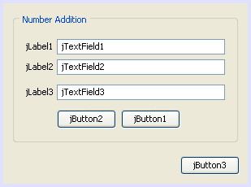

If you do not see the Palette window in the upper right corner of the IDE, choose Window > Palette.

1. Start by selecting a Panel from the Swing Containers category on Palette and drop it onto the JFrame.
2. While the JPanel is highlighted, go to the Properties window and click the ellipsis (…) button next to Border to choose a border style.
3. In the Border dialog, select TitledBorder from the list, and type in `Number Addition` in the Title field. Click OK to save the changes and exit the dialog.
4. You should now see an empty titled JFrame that says Number Addition like in the screenshot. Look at the screenshot and add three JLabels, three JTextFields and three JButtons as you see above.

<a id="gui-functionality--_renaming_the_components"></a>
<a id="gui-functionality--renaming-the-components"></a>

### Renaming the Components

In this step we are going to rename the display text of the components that were just added to the JFrame.

1. Double-click `jLabel1` and change the text property to `First Number:`.
2. Double-click `jLabel2` and change the text to `Second Number:`.
3. Double-click `jLabel3` and change the text to `Result:`.
4. If you want the labels right aligned, as the those in the image are, expand the width of the two shorter labels so that they are all the same width. Then open the Properties dialog for each one, and change the Horizontal Alignment property to RIGHT.
5. Delete the sample text from `jTextField1`. You can make the display text editable by right-clicking the text field and choosing Edit Text from the popup menu. You may have to resize the `jTextField1` to its original size. Repeat this step for `jTextField2` and `jTextField3`.
6. Rename the display text of `jButton1` to `Clear`. (You can edit a button’s text by right-clicking the button and choosing Edit Text. Or you can click the button, pause, and then click again.)
7. Rename the display text of `jButton2` to `Add`.
8. Rename the display text of `jButton3` to `Exit`.

Your Finished GUI should now look like the following screenshot:

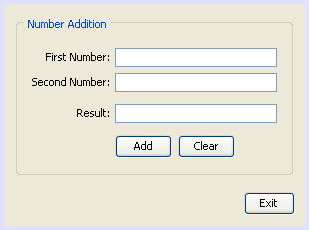

<a id="gui-functionality--_exercise_3_adding_functionality"></a>
<a id="gui-functionality--exercise-3:-adding-functionality"></a>

## Exercise 3: Adding Functionality

In this exercise we are going to give functionality to the Add, Clear, and Exit buttons. The `jTextField1` and `jTextField2` boxes will be used for user input and `jTextField3` for program output - what we are creating is a very simple calculator. Let’s begin.

<a id="gui-functionality--_making_the_exit_button_work"></a>
<a id="gui-functionality--making-the-exit-button-work"></a>

### Making the Exit Button Work

In order to give function to the buttons, we have to assign an event handler to each to respond to events. In our case we want to know when the button is pressed, either by mouse click or via keyboard. So we will use ActionListener responding to ActionEvent.

1. Right click the Exit button. From the pop-up menu choose Events > Action > actionPerformed. Note that the menu contains many more events you can respond to! When you select the `actionPerformed` event, the IDE will automatically add an ActionListener to the Exit button and generate a handler method for handling the listener’s actionPerformed method.
2. The IDE will open up the Source Code window and scroll to where you implement the action you want the button to do when the button is pressed (either by mouse click or via keyboard). Your Source Code window should contain the following lines:

```java
private void jButton3ActionPerformed(java.awt.event.ActionEvent evt) {
    //TODO add your handling code here:
                }
```

1. We are now going to add code for what we want the Exit Button to do. Replace the TODO line with `System.exit(0);`. Your finished Exit button code should look like this:

```java
private void jButton3ActionPerformed(java.awt.event.ActionEvent evt) {
    System.exit(0);
                }
```

<a id="gui-functionality--_making_the_clear_button_work"></a>
<a id="gui-functionality--making-the-clear-button-work"></a>

### Making the Clear Button Work

1. Click the Design tab at the top of your work area to go back to the Form Design.
2. Right click the Clear button (`jButton1`). From the pop-up menu select Events > Action > actionPerformed.
3. We are going to have the Clear button erase all text from the jTextFields. To do this, you will add some code like above. Your finished source code should look like this:

```java
private void jButton1ActionPerformed(java.awt.event.ActionEvent evt){
    jTextField1.setText("");
    jTextField2.setText("");
    jTextField3.setText("");
                }
```

The above code changes the text in all three of our JTextFields to nothing, in essence it is overwriting the existing Text with a blank.

<a id="gui-functionality--_making_the_add_button_work"></a>
<a id="gui-functionality--making-the-add-button-work"></a>

### Making the Add Button Work

The Add button will perform three actions.

1. It is going to accept user input from `jTextField1` and `jTextField2` and convert the input from a type String to a float.
2. It will then perform addition of the two numbers.
3. And finally, it will convert the sum to a type String and place it in `jTextField3`.
   Lets get started!

1. Click the Design tab at the top of your work area to go back to the Form Design.
2. Right-click the Add button (`jButton2`). From the pop-up menu, select Events > Action > actionPerformed.
3. We are going to add some code to have our Add button work. The finished source code shall look like this:

```java
private void jButton2ActionPerformed(java.awt.event.ActionEvent evt){
    // First we define float variables.
    float num1, num2, result;
    // We have to parse the text to a type float.
    num1 = Float.parseFloat(jTextField1.getText());
    num2 = Float.parseFloat(jTextField2.getText());
   // Now we can perform the addition.
    result = num1+num2;
    // We will now pass the value of result to jTextField3.
    // At the same time, we are going to
    // change the value of result from a float to a string.
    jTextField3.setText(String.valueOf(result));
                    }
```

Our program is now complete we can now build and run it to see it in action.

<a id="gui-functionality--_exercise_4_running_the_program"></a>
<a id="gui-functionality--exercise-4:-running-the-program"></a>

## Exercise 4: Running the Program

**To run the program in the IDE:**

1. Choose Run > Run Project (Number Addition) (alternatively, press F6).

> [!NOTE]
> If you get a window informing you that Project NumberAddition does not have a main class set, then you should select `my.NumberAddition.NumberAdditionUI` as the main class in the same window and click the OK button.

**To run the program outside of the IDE:**

1. Choose Run > Clean and Build Main Project (Shift-F11) to build the application JAR file.
2. Using your system’s file explorer or file manager, navigate to the ` NumberAddition/dist` directory.

> [!NOTE]
> The location of the `NumberAddition` project directory depends on the path you specified while creating the project in step 3 of the [Exercise 1: Creating a Project](#gui-functionality--exercise_1) section.

1. Double-click the `NumberAddition.jar` file.

After a few seconds, the application should start.

> [!NOTE]
> If double-clicking the JAR file does not launch the application, see [this article](#javase-deploy--troubleshooting) for information on setting JAR file associations in your operating system.

You can also launch the application from the command line.

**To launch the application from the command line:**

1. On your system, open up a command prompt or terminal window.
2. In the command prompt, change directories to the `NumberAddition/dist` directory.
3. At the command line, type the following statement:

```java
java -jar  NumberAddition.jar
```

> [!NOTE]
> Make sure `my.NumberAddition.NumberAdditionUI` is set as the main class before running the application. You can check this by right-clicking the NumberAddition project node in the Projects pane, choosing Properties in the popup menu, and selecting the Run category in the Project Properties dialog box. The Main Class field should display `my.numberaddition.NumberAdditionUI` .

<a id="gui-functionality--_how_event_handling_works"></a>
<a id="gui-functionality--how-event-handling-works"></a>

## How Event Handling Works

This tutorial has showed how to respond to a simple button event. There are many more events you can have your application respond to. The IDE can help you find the list of available events your GUI components can handle:

1. Go back to the file `NumberAdditionUI.java` in the Editor. Click the Design tab to see the GUI’s layout in the GUI Builder.
2. Right-click any GUI component, and select Events from the pop-up menu. For now, just browse the menu to see what’s there, you don’t need to select anything.
3. Alternatively, you can select Properties from the Window/IDE Tools menu. In the Properties window, click the Events tab. In the Events tab, you can view and edit events handlers associated with the currently active GUI component.
4. You can have your application respond to key presses, single, double and triple mouse clicks, mouse motion, window size and focus changes. You can generate event handlers for all of them from the Events menu. The most common event you will use is an Action event. (Learn [best practices for Event handling](http://java.sun.com/docs/books/tutorial/uiswing/events/generalrules.html#twokinds) from Sun’s [Java Events Tutorial](http://java.sun.com/docs/books/tutorial/uiswing/events/index.html).)

How does event handling work? Every time you select an event from the Event menu, the IDE automatically creates a so-called event listener for you, and hooks it up to your component. Go through the following steps to see how event handling works.

1. Go back to the file `NumberAdditionUI.java` in the Editor. Click the Source tab to see the GUI’s source.
2. Scroll down and note the methods `jButton1ActionPerformed()`, `jButton2ActionPerformed()`, and `jButton3ActionPerformed()` that you just implemented. These methods are called event handlers.
3. Now scroll to a method called `initComponents()`. If you do not see this method, look for a line that says `Generated Code`; click the + sign next to it to expand the collapsed `initComponents()` method.
4. First, note the blue block around the `initComponents()` method. This code was auto-generated by the IDE and you cannot edit it.
5. Now, browse through the `initComponents()` method. Among other things, it contains the code that initializes and places your GUI components on the form. This code is generated and updated automatically while you place and edit components in the Design view.
6. In `initComponents()`, scroll down to where it reads

```java
jButton3.setText("Exit");
jButton3.addActionListener(new java.awt.event.ActionListener() {
    public void actionPerformed(java.awt.event.ActionEvent evt) {
           jButton3ActionPerformed(evt);
    }
            });
```

This is the spot where an event listener object is added to the GUI component; in this case, you register an ActionListener to the `jButton3`. The ActionListener interface has an actionPerformed method taking ActionEvent object which is implemented simply by calling your `jButton3ActionPerformed` event handler. The button is now listening to action events. Everytime it is pressed an ActionEvent is generated and passed to the listener’s actionPerformed method which in turn executes code that you provided in the event handler for this event.

Generally speaking, to be able to respond, each interactive GUI component needs to register to an event listener and needs to implement an event handler. As you can see, NetBeans IDE handles hooking up the event listener for you, so you can concentrate on implementing the actual business logic that should be triggered by the event.

- [See this page in GitHub.](https://github.com/apache/netbeans-antora-tutorials/edit/main/modules/ROOT/pages/kb/docs/java/gui-functionality.adoc "See this page in github")

---

<a id="native_pkg"></a>

<!-- source_url: https://netbeans.apache.org/tutorial/main/kb/docs/java/native_pkg/ -->

<!-- page_index: 2 -->

<a id="native_pkg--native-packaging-in-netbeans-ide"></a>

# Native Packaging in NetBeans IDE

> [!NOTE]
> This tutorial needs a review.
> You can [edit it in GitHub](https://github.com/apache/netbeans-antora-tutorials/edit/main/modules/ROOT/pages/kb/docs/java/native_pkg.adoc "Edit this tutorial in github")
> following these [contribution guidelines.](https://netbeans.apache.org/tutorial/main/kb/docs/contributing)

Native packaging was first introduced as a part of the JavaFX 2.2 SDK enabling you to package an application as a *native bundle* and then installing and running the application without any external dependencies on a system JRE or JavaFX SDK. Next it became usable for Java SE projects as well.

Native packaging does not change the deployment model of your application: it takes your application as it is, packages it together with Java runtime, and produces an installer that is common for the operating system you are using. The point is to make the whole thing independent on whatever Java runtime users have or do not have on the target machine. You can take such an installer and run it on a machine where there is no trace of Java, and it will install both the application and the necessary Java runtime bits.The size of such installers is quite big, because even a "Hello world" application will carry with itself a large portion of Java runtime artifacts.

In this tutorial you will create an `EXE` installer for a Java SE application and an `MSI` installer for a JavaFX application for the Windows operating system based on the sample applications bundled with the IDE.

NOTE:

- The `EXE` and `MSI` installers you get are platform-specific, they will run only on a system that is compatible with the target Java platform for which the `EXE` / `MSI` installable packages have been created. (For example, if an `EXE` or `MSI` installer has been created on a machine with a 64-bit JDK installed, it must be run on a machine with 64-bit Windows installed.)
- On Windows, both the applications are installed into the `C:\Users\<username>\AppData\Local\` directory and are available in the Start menu.

**To follow this tutorial, you need the following software and resources.**

| Software or Resource | Version Required |
| --- | --- |
| [Inno Setup](http://www.jrsoftware.org/) | 5.5 or more recent |
| [WiX](http://wixtoolset.org/) | 3.7 or more recent |

<a id="native_pkg--_installing_and_adding_required_tools_to_the_path"></a>
<a id="native_pkg--installing-and-adding-required-tools-to-the-path"></a>

## Installing and Adding Required Tools to the Path

To use the IDE’s support for native packaging, the following additional tools need to be installed:

- [Inno Setup 5.5](http://www.jrsoftware.org/) (or more recent) for producing EXE installers on Windows is required.
- [WiX 3.7](http://wixtoolset.org/) (or more recent) for producing MSI installers on Windows is required.

> [!NOTE]
> For a list of tools required for making installers for different platforms, see "[Packaging an Application as a Native Installer](http://www.oracle.com/pls/topic/lookup?ctx=nb7400&id=NBDAG2508)" in *Developing Applications with NetBeans IDE*.

**To install Inno Setup:**

1. Download `ispack-5.5.3.exe` from the [Inno Setup Downloads](http://www.jrsoftware.org/isdl.php) page.
2. Double-click the file to launch the installer.
3. Accept the Inno Setup license agreement and click Next.
4. Follow the instructions in the install wizard for installing Inno Setup.

**To install WiX:**

1. Download `wix37.exe` from the [WiX Toolset - Download](http://wix.codeplex.com/releases/view/99514) page.
2. Double-click the file to launch the installer.
3. Follow the instructions in the install wizard for installing WiX.

**To add Inno Setup and/or WiX to the system Path variable:**

1. On Windows 7, select Start > Computer > System Properties > Advanced system settings.
2. Select the Advanced tab and click the Environment Variables button.
3. In the System Variables pane, double-click the Path variable.
4. In the Edit System Variable dialog box, add a semicolon followed by a new path to the Variable value field (for example, `C:\Program Files (x86)\Inno Setup 5`  or `C:\Program Files (x86)\WiX Toolset v3.6\bin` ).
5. Click OK to close all the open dialog boxes.

**Notes:**

- To check if the installed tool is in the Path, open the Command Prompt window and type `iscc.exe` for Inno Setup or `candle.exe` for WiX. (In case the Command Prompt closes instantly, try specifying `cmd.exe /c cmd.exe /k iscc.exe` or `cmd.exe /c cmd.exe /k candle.exe` respectively.)
  The following figure shows what the Command Prompt should display if Inno Setup is added to the system Path variable.

[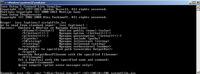](assets/images/cmd_c679aaf95ddf7dc2.png)

- Make sure the IDE is restarted after the tools are added to the system Path variable.

<a id="native_pkg--_native_packaging_in_java_se_projects"></a>
<a id="native_pkg--native-packaging-in-java-se-projects"></a>

## Native Packaging in Java SE Projects

To utilize the native packaging support in the IDE, you need to complete the following:

- [create an IDE project](#native_pkg--createse)
- [enable the native packaging actions in the project](#native_pkg--enable)
- [clean and build the project](#native_pkg--buildse)
- [package the application in an installer](#native_pkg--instse)

<a id="native_pkg--_setting_up_a_java_se_project"></a>
<a id="native_pkg--setting-up-a-java-se-project"></a>

### Setting Up a Java SE Project

Before packaging an application in an installer an application itself needs to be created.

You will create a new Java SE project with the Anagram game example which is shipped with NetBeans IDE.

**To create an IDE project:**

1. In the IDE, choose File > New Project.
2. In the New Project wizard, expand the Samples category and select Java.
3. Choose Anagram Game in the Projects list. Then click Next.

[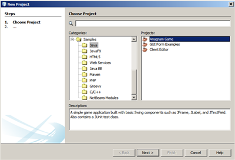](assets/images/new-javase-prj_4c28431a046045e5.png)

1. In the Name and Location panel, leave the default values for the Project Name and Project Location fields.
2. Click Finish.
   The IDE creates and opens the Java SE project.

To test that the created project works fine, run it by choosing Run > Run Project from the main menu.
The Anagrams application should launch and display on your machine.

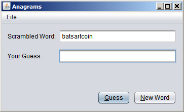

<a id="native_pkg--_enabling_native_packaging_in_the_ide"></a>
<a id="native_pkg--enabling-native-packaging-in-the-ide"></a>

### Enabling Native Packaging in the IDE

The native packaging actions are disabled in the IDE by default.

Right-click the AnagramGame project in the Projects window, to check the actions available for the created Java SE project in the IDE: there are no package related actions in the project’s context menu.

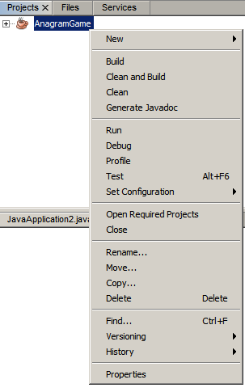

**To enable native packaging actions for the project:**

1. Right-click the project node in the Projects window and select Properties from the context menu.
2. In the Project Properties dialog box, choose the Deployment category and select the Enable Native Packaging Actions in Project Menu option.

[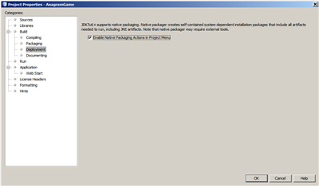](assets/images/enable-native-pkg_bb894394dfe0f951.png)

1. Click OK.
   A Package as command is added to the project’s context menu.

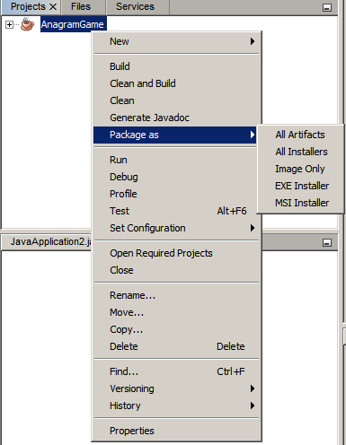

<a id="native_pkg--_building_an_application"></a>
<a id="native_pkg--building-an-application"></a>

### Building an Application

It is time to clean and build your application for deployment.

**To clean and build your project:**

- Choose Run > Clean and Build Project from the main menu.
  The IDE displays the results in the Output window.

[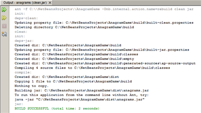](assets/images/output_808dbb60524c31dc.png)

A `dist` folder that contains a `jar` file is created in the project folder.

<a id="native_pkg--_making_an_exe_installer"></a>
<a id="native_pkg--making-an-exe-installer"></a>

### Making an `EXE` Installer

The application can now be packaged in an installer for Windows.

**To build an `EXE` installer:**

- Right-click the AnagramGame project and choose Package as > EXE Installer from the context menu.

> [!NOTE]
> The IDE creates an `EXE` installer only if Inno Setup is [installed and added to the system Path variable](#native_pkg--tool).

The IDE displays the progress and result of the packaging process in the Output window.

[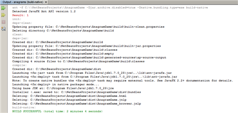](assets/images/output-se-exe_e634349175248cfc.png)

> [!NOTE]
> The IDE first logs some progress and then for some time it looks as if nothing is happening - this is exactly the moment when Inno Setup is working in the background. It takes a while for the packaging to get completed.

When the `EXE` installer is ready, it is placed in the `AnagramGame/dist/bundles/` directory.

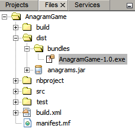

<a id="native_pkg--_self_contained_application_packaging_in_javafx_projects"></a>
<a id="native_pkg--self-contained-application-packaging-in-javafx-projects"></a>

## Self-Contained Application Packaging in JavaFX Projects

To build an installable JavaFX application using the native packaging support in the IDE, you need to complete the following:

- [create a JavaFX project in the IDE](#native_pkg--createfx)
- [enable native packaging support for the project](#native_pkg--enablefx)
- [clean and build a JavaFX application](#native_pkg--buildfx)
- [build an installable JavaFX application](#native_pkg--instfx)

<a id="native_pkg--_creating_a_javafx_project"></a>
<a id="native_pkg--creating-a-javafx-project"></a>

### Creating a JavaFX Project

You begin by creating a JavaFX project using the BrickBreaker sample project bundled with the IDE.

**To create a JavaFX project in the IDE:**

1. In the IDE, choose File > New Project.
2. In the New Project wizard, expand the Samples category and select JavaFX.
3. Choose BrickBreaker in the Projects list. Then click Next.
4. In the Name and Location panel, leave the default values for the Project Name, Project Location, and JavaFX Platform fields.

[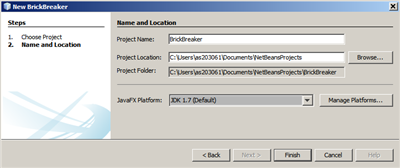](assets/images/new-javafx-prj_1ae251110044dbc0.png)

1. Click Finish.
   The BrickBreaker JavaFX project displays in the Projects window in the IDE.

To test that the created project works fine, run it by choosing Run > Run Project(BrickBreaker) from the main menu.
The Brick Breaker application should launch and display on your machine.

[](assets/images/brickbreaker_5e78526beac5dfdc.png)

<a id="native_pkg--_enabling_native_packaging_in_the_project"></a>
<a id="native_pkg--enabling-native-packaging-in-the-project"></a>

### Enabling Native Packaging in the Project

To use the native packaging support in the IDE for your project, you need to enable it first.

If you right-click the Brick Breaker project, you will see no native packaging related actions in it.

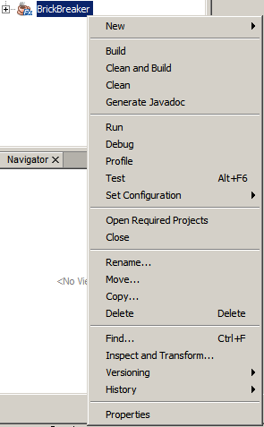

**To enable native packaging actions in the project context menu:**

1. Right-click the project node in the Projects window and select Properties from the context menu.
2. In the Project Properties dialog box, choose Deployment in the Build category and select the Enable Native Packaging option.

[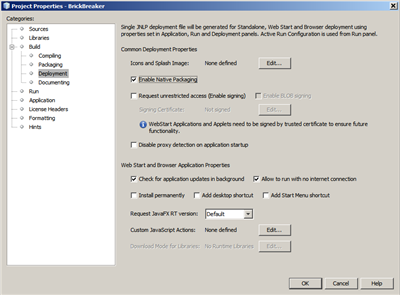](assets/images/enable-native-pkg-fx_a35946b93cdf3bc5.png)

1. Click OK.
   The Package as item is added to the project’s context menu.

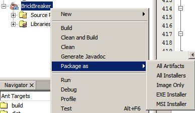

<a id="native_pkg--_building_an_application_2"></a>
<a id="native_pkg--building-an-application-2"></a>

### Building an Application

Your JavaFX application is now ready to be cleaned and built.

**To clean and build your project:**

- Choose Run > Clean and Build Project from the main menu.
  The IDE displays the results in the Output window.

> [!NOTE]
> If the build is successful but the IDE displays `warning: [options] bootstrap class path not set in conjunction with -source 1.6` in the Output window, the Source/Binary format needs to be set to JDK 8 in the project properties and the project needs to be cleaned and built again as follows:

1. Right-click the BrickBreaker project in the Projects windows and choose Properties.
2. In the Project Properties dialog box, select the Sources category.
3. Set the Source/Binary format to JDK 8 and click OK.
4. Right-click BrickBreaker in the Projects window and choose Clean and Build from the context menu.

<a id="native_pkg--_making_an_msi_installer"></a>
<a id="native_pkg--making-an-msi-installer"></a>

### Making an `MSI` Installer

The application can now be wrapped into a Windows-specific installable package.

**To build an `MSI` installer:**

- Right-click the BrickBreaker project and choose Package as > MSI Installer from the context menu.

> [!NOTE]
> The IDE creates an `MSI` installer only if WiX is [installed and added to the system Path variable](#native_pkg--tool).

The IDE displays the progress and result of the packaging process in the Output window.

[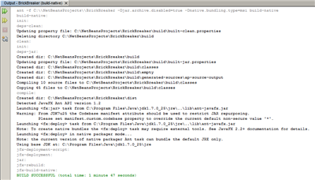](assets/images/output-fx-msi_2f706e05bacc96f5.png)

> [!NOTE]
> The IDE first logs some progress and then for some time it looks as if nothing is happening - this is exactly the moment when WiX is working in the background. It takes a while for the packaging to get completed.

The installable JavaFX application is located in the `BrickBreaker/dist/bundles/` directory.

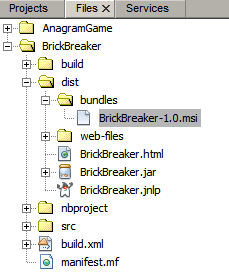

<a id="native_pkg--_verifying_the_installable_applications"></a>
<a id="native_pkg--verifying-the-installable-applications"></a>

## Verifying the Installable Applications

When the `AnagramGame-1.0.exe` and `BrickBreaker-1.0.msi` installers are done, you need to check which directory the Anagram and BrickBreaker applications are installed natively into.

**To check the installers:**

1. Browse to the installer file ( `AnagramGame-1.0.exe` or `BrickBreaker-1.0.msi` ) on your hard drive.
2. Double-click to run the installer.

Both the applications should be installed into the `C:\Users\<username>\AppData\Local\` directory and be available in the Start menu.

- [See this page in GitHub.](https://github.com/apache/netbeans-antora-tutorials/edit/main/modules/ROOT/pages/kb/docs/java/native_pkg.adoc "See this page in github")

---

<a id="quickstart-gui-legend"></a>

<!-- source_url: https://netbeans.apache.org/tutorial/main/kb/docs/java/quickstart-gui-legend/ -->

<!-- page_index: 3 -->

<a id="quickstart-gui-legend--gui-builder-visual-feedback-legend"></a>

# GUI Builder Visual Feedback Legend

> [!NOTE]
> This tutorial needs a review.
> You can [edit it in GitHub](https://github.com/apache/netbeans-antora-tutorials/edit/main/modules/ROOT/pages/kb/docs/java/quickstart-gui-legend.adoc "Edit this tutorial in github")
> following these [contribution guidelines.](https://netbeans.apache.org/tutorial/main/kb/docs/contributing)

This document describes visual feedback the IDE’s GUI Builder (formerly code-named Matisse) provides during the process of Java GUI creation.

<a id="quickstart-gui-legend--_alignment_guidelines"></a>
<a id="quickstart-gui-legend--alignment-guidelines"></a>

## Alignment Guidelines

Alignment guidelines appear only when adding or moving components, indicating the preferred positions to which components snap when the mouse button is released. Once positioned, alignment guidelines are replaced by solid lines illustrating the common alignments shared among components as well as anchoring indicators.

| **Inset** | 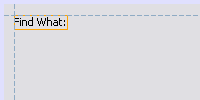 | Insets are the preferred spacings between components and the containers within which they are located. Insets are suggested by dashed horizontal and vertical guidelines. |
| --- | --- | --- |
| **Offset** | 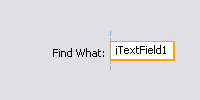 | Offsets are the preferred spacings between adjacent components. Offsets are suggested by dashed horizontal and vertical guidelines. |
| **Baseline** | 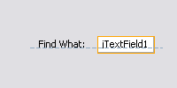 | Baseline alignment is the preferred relationship between adjacent components containing display text. Baseline alignment is suggested by dashed a horizontal guideline. |
| **Edge** | 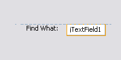 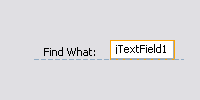   | Edge alignments (Top, Bottom, Left, and Right) are the alignment relationships possible between adjacent components. Edge alignments are suggested by dashed horizontal and vertical guidelines. |
| **Indentation** |  | Indentation alignment is a special alignment relationship in which one component is located below another and offset slightly to the right. Indentation alignment is suggested by the appearance of two vertical dashed guidelines. |
| **Preferred Distance** | 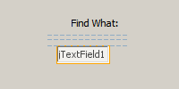 | Preferred distances (Small, Medium, and Large) are gap sizes between adjacent components. Preferred distances are suggested by dashed horizontal or vertical guidelines. |

<a id="quickstart-gui-legend--_anchoring_indicators"></a>
<a id="quickstart-gui-legend--anchoring-indicators"></a>

## Anchoring Indicators

Once components have snapped into position, solid anchoring indicators appear illustrating the common alignments shared among components.

| **Container** |  | Anchors connecting individual components to the containers within which they are located are represented by small semi-circular indicators with dashed lines extending from the container edge to the component itself. |
| --- | --- | --- |
| **Component** | 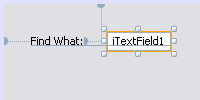 | Anchors connecting individual components to adjacent components are represented by small semi-circular indicators with dashed lines extending from the one component to the other. |

<a id="quickstart-gui-legend--_sizing_indicators"></a>
<a id="quickstart-gui-legend--sizing-indicators"></a>

## Sizing Indicators

**Same Size**

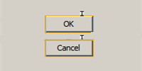 

Same Sizing is the state in which a group of components (adjacent or otherwise) are all set to have the same width or height. Same Sizing is illustrated by the appearance of small rectangular indicators appearing on the top edge of each component for which the property is set.

**Auto-Resizing**

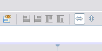 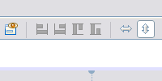 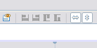

Auto-Resizing is the state in which a component’s width or height is set to resize dynamically at runtime. Auto-Resizing is indicated by the state of the horizontal and vertical Resizing buttons (called Change horizontal resizeability and Change vertical resizeability respectively) in the GUI Builder’s toolbar. Auto-Resizing is enabled by selecting `resizable` in the Other Properties list in the Properties window.

<a id="quickstart-gui-legend--_highlighting_and_handles"></a>
<a id="quickstart-gui-legend--highlighting-and-handles"></a>

## Highlighting and Handles

| \* Highlighting\* | 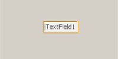 | Orange highlighting indicates where a selected component is going to be placed. |
| --- | --- | --- |
| **Handles** | 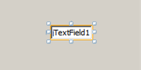 | Small square resize handles appear around a component’s perimeter when a component is selected. Clicking, holding, and dragging a handle on the edge of a component resizes the latter. |

[Send Us Your Feedback](https://netbeans.apache.org/front/main/community/mailing-lists/)

<a id="quickstart-gui-legend--_see_also"></a>
<a id="quickstart-gui-legend--see-also"></a>

## See Also

- [Implementing Java GUIs](http://www.oracle.com/pls/topic/lookup?ctx=nb8000&id=NBDAG920) in *Developing Applications with NetBeans IDE*
- [General Java Development Learning Trail](https://netbeans.apache.org/tutorial/main/kb/docs/java-se/)

- [See this page in GitHub.](https://github.com/apache/netbeans-antora-tutorials/edit/main/modules/ROOT/pages/kb/docs/java/quickstart-gui-legend.adoc "See this page in github")

---

<a id="gui-image-display"></a>

<!-- source_url: https://netbeans.apache.org/tutorial/main/kb/docs/java/gui-image-display/ -->

<!-- page_index: 4 -->

<a id="gui-image-display--handling-images-in-a-java-gui-application"></a>

# Handling Images in a Java GUI Application

> [!NOTE]
> This tutorial needs a review.
> You can [edit it in GitHub](https://github.com/apache/netbeans-antora-tutorials/edit/main/modules/ROOT/pages/kb/docs/java/gui-image-display.adoc "Edit this tutorial in github")
> following these [contribution guidelines.](https://netbeans.apache.org/tutorial/main/kb/docs/contributing)

Handling images in an application is a common problem for many beginning Java programmers. The standard way to access images in a Java application is by using the `getResource()` method. This tutorial shows you how to use the IDE’s GUI Builder to generate the code to include images (and other resources) in your application. In addition, you will learn how to customize the way the IDE generates image handling code.

The application that results from this tutorial will be a simple JFrame that contains one JLabel that displays a single image.

<a id="gui-image-display--_creating_the_application"></a>
<a id="gui-image-display--creating-the-application"></a>

## Creating the Application

1. Choose File > New Project.
2. In the New Project wizard, select Java > Java Application and click Next.
3. For Project Name, type `ImageDisplayApp`.
4. Clear the Create Main Class checkbox.

[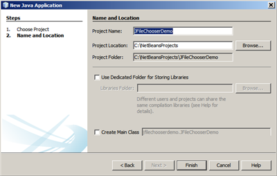](assets/images/newproj_85d9262a459ea2a1.png)

1. Click Finish.

<a id="gui-image-display--_creating_the_application_form"></a>
<a id="gui-image-display--creating-the-application-form"></a>

## Creating the Application Form

In this section, you create the JFrame form and add a JLabel to the form.

**To create the JFrame form:**

1. In the Projects window, expand the `ImageDisplayApp` node.
2. Right-click the Source Packages node and choose New > JFrame Form.
3. For Class Name, type `ImageDisplay`.
4. For Package Name, type `org.me.myimageapp`.
5. Click Finish.

**To add the JLabel:**

- In the Palette, select the Label component and drag it to the JFrame.

For now, the form should look something like the following image:

[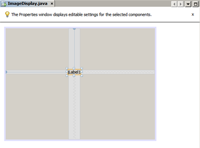](assets/images/form_bdf646289e971681.png)

<a id="gui-image-display--_adding_a_package_for_the_image"></a>
<a id="gui-image-display--adding-a-package-for-the-image"></a>

## Adding a Package for the Image

When you use images or other resources in an application, typically you create a separate Java package for the resources. On your local filesystem, a package corresponds with a folder.

**To create a package for the image:**

1. In the Projects window, right-click the `org.me.myimageapp` node and choose New > Java Package.

[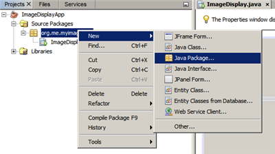](assets/images/package_2fce0b0f6868fbc9.png)

1. Click Finish.

In the Projects window, you should see a new package appear within the `Source Packages` folder.

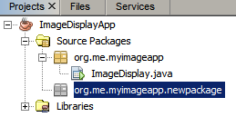

<a id="gui-image-display--_displaying_the_image_on_the_label"></a>
<a id="gui-image-display--displaying-the-image-on-the-label"></a>

## Displaying the Image on the Label

In this application, the image will be embedded within a JLabel component.

**To add the image to the label:**

1. In the GUI Designer, select the label that you have added to your form.
2. In the Properties window, click the Properties category and scroll to the Icon property.
3. Click the ellipsis (…) button.
   The icon property editor is displayed.

[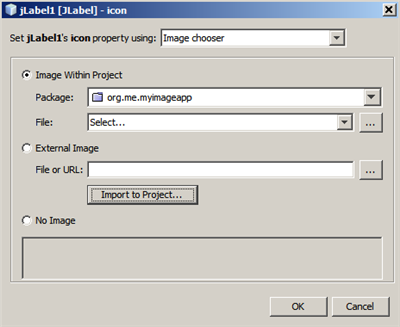](assets/images/importimage_ba231f4251233fd9.png)

1. In the icon property dialog box, click Import to Project.
2. In the file chooser navigate to any image that is on your system that you want to use. Then click Next.
3. In the Select target folder page of the wizard, select the `newpackage` folder and click Finish.

[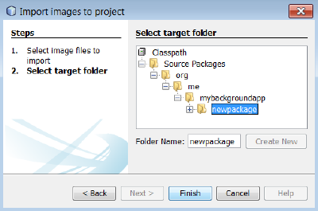](assets/images/targetfolder_ebf0c7b54ce4d9f8.png)

1. Click OK to close the icon property dialog box.

After you click OK, the IDE does the following things:

- Copies the image to your project. Therefore, when you build and distribute the application, the image is included in the distributable JAR file.
- Generates code in the ImageDisplay class to access the image.
- Displays your image on the label in the Design view of your form.

[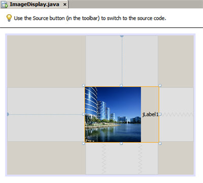](assets/images/label-added_7d2e19b6f6557ea5.png)

At this point, you can do some simple things to improve the appearance of the form, such as:

- In the Properties window, select the `text` property and delete `jLabel1`. That value was generated by the GUI Builder as display text for the label. However, you are using the label to display an image rather than text, so that text is not needed.
- Drag the `jLabel1` to the center of the form.

[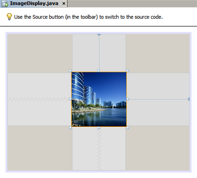](assets/images/centered_2337397547ca0e7c.png)

**To view the generated code:**

1. In the GUI Designer, click the Source button. (Choose View > Source Editor Toolbar from the main menu if the Source button is hidden.)
2. Scroll down to the line that says Generated Code.
3. Click the plus sign (+) to the left of the Generated Code line to display the code that the GUI Designer has generated.

The key line is the following:

```java
jLabel1.setIcon(new javax.swing.ImageIcon(getClass().getResource("/org/me/myimageapp/newpackage/image.png"))); // NOI18N
```

Since you have used the property editor for `` jLabel1’s `Icon `` property, the IDE has generated the `setIcon` method. The parameter of that method contains a call to the `getResource()` method on an anonymous inner class of `ImageIcon`. Notice that the generated path for the image corresponds with its location in the application’s package structure.

**Notes:**

- If you use the External Image option in the icon property editor, the IDE will generate an absolute path to the image instead of copying the image to your project. Therefore, the image would appear when you run the application on your system, but it would probably not appear when running the application on another system.
- The `getResource` method is also useful for accessing other types of resources, such as text files that contain data that your application might need to use.

**To register event handlers for mouse events on the Jlabel:**

In the Design View, right-click the JLabel and choose Events > Mouse > mouseClicked/mousePressed/mouseReleased from the popup menu.
An event handler is generated for the corresponding event.

> [!NOTE]
> You can get the mouse coordinates (for example, the location of a mouse click) in the event handler using the `event.getPoint()`, `event.getX()`, or `event.getY()` methods. See [Class MouseEvent](http://docs.oracle.com/javase/1.4.2/docs/api/java/awt/event/MouseEvent.html) for details.

<a id="gui-image-display--_building_and_running_the_application"></a>
<a id="gui-image-display--building-and-running-the-application"></a>

## Building and Running the Application

Now that you have generated the code for accessing and displaying the image, you can build and run the application to ensure that the image is accessed.

First you need to set the project’s main class. When you set the main class, the IDE knows which class to run when you run the project. In addition, this ensures that the `Main-Class` element in the application’s JAR file is generated when you build the application.

**To set the project’s main class:**

1. Right-click the ImageDisplayApp project’s node and choose Properties.
2. In the Project Properties dialog box, select the Run category.
3. Click the Browse button that is next to the Main Class field. Then select the `org.me.myimageapp.ImageDisplay` class.

[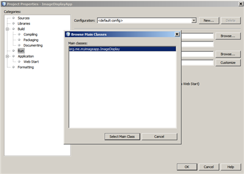](assets/images/mainclass_4a56f1b00876dd6a.png)

1. Click the Select Main Class button.
2. Click OK to close the Project Properties dialog box.

**To build the project:**

- Choose Run > Clean & Build Project (*project\_name*) from the main toolbar.

You can view the build products of the application in the Files window. The `build` folder contains the compiled class. The `dist` folder contains a runnable JAR file that contains the compiled class and the image.

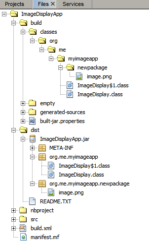

**To run the project:**

- Choose Run > Run Project (*project\_name*) from the main toolbar.

<a id="gui-image-display--_creating_custom_code"></a>
<a id="gui-image-display--creating-custom-code"></a>

## Creating Custom Code

In many applications, the image that is displayed is not determined statically like it is in this example. For example, the image to display might be determined by something that the user clicks.

If you need to be able to choose the image to display programmatically, you can write your own custom code to access and display resources. The IDE prevents you from writing code directly in the Source view’s "guarded blocks" that contain code generated by the GUI Builder. However, you can insert code in the guarded blocks through property editors that you can access through the Properties window. Using the property editors in this manner ensures that your custom code is not lost when you make design changes in the GUI Builder.

**For example, to write custom code for a JLabel’s `icon` property:**

1. Select the JLabel in the Design View or in the Navigator window.
2. In the Properties window, click the ellipsis (…) button that is next to the `icon` property.
3. From the dropdown list at the top of the dialog box, select the Custom Code option.

[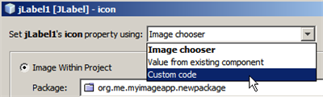](assets/images/custom-code_49e6ea510cf70c7d.png)

The Custom Code option in this property editor lets you fill in the parameter of the `setIcon` method yourself. You can fill in this parameter with the necessary logic or with a call to a separate method that you have hand-coded elsewhere in the class.

[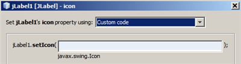](assets/images/custom-view_1625890c62d02fbc.png)

<a id="gui-image-display--_summary"></a>
<a id="gui-image-display--summary"></a>

## Summary

This tutorial has shown you how to access images from an application that you create in the NetBeans IDE. Image handling is further discussed in the Java Tutorial.

\*Note: \*The example given in this tutorial is very similar to the first example in the [How to Use Icons section](http://java.sun.com/docs/books/tutorial/uiswing/components/icon.html) of the Java Tutorial. One difference is that the code that is generated when you follow this tutorial uses `` JLabel’s `setIcon `` method to apply the icon to the label. In the Java Tutorial example, the icon is applied to the label by being passed through its constructor.

- [See this page in GitHub.](https://github.com/apache/netbeans-antora-tutorials/edit/main/modules/ROOT/pages/kb/docs/java/gui-image-display.adoc "See this page in github")

---

<a id="quickstart-gui"></a>

<!-- source_url: https://netbeans.apache.org/tutorial/main/kb/docs/java/quickstart-gui/ -->

<!-- page_index: 5 -->

<a id="quickstart-gui--designing-a-swing-gui-in-netbeans-ide"></a>

# Designing a Swing GUI in NetBeans IDE

> [!NOTE]
> This tutorial needs a review.
> You can [edit it in GitHub](https://github.com/apache/netbeans-antora-tutorials/edit/main/modules/ROOT/pages/kb/docs/java/quickstart-gui.adoc "Edit this tutorial in github")
> following these [contribution guidelines.](https://netbeans.apache.org/tutorial/main/kb/docs/contributing)

This tutorial guides you through the process of creating the graphical user interface (GUI) for an application called ContactEditor using the NetBeans IDE GUI Builder. In the process you will layout a GUI front-end that enables you to view and edit contact information of individuals included in an employee database.

In this tutorial you will learn how to: use the GUI Builder Interface, create a GUI Container, add, resize, and align components, adjust component anchoring, set component auto-resizing behavior, edit component properties.

<a id="quickstart-gui--_getting_started"></a>
<a id="quickstart-gui--getting-started"></a>

## Getting Started

The IDE’s GUI Builder makes it possible to build professional-looking GUIs without an intimate understanding of layout managers. You can lay out your forms by simply placing components where you want them.

For descriptions of the GUI Builder’s visual feedback, you can use the [GUI Builder Visual Feedback Legend](#quickstart-gui-legend).

<a id="quickstart-gui--_creating_a_project"></a>
<a id="quickstart-gui--creating-a-project"></a>

### Creating a Project

Because all Java development in the IDE takes place within projects, we first need to create a new `ContactEditor` project within which to store sources and other project files. An IDE project is a group of Java source files plus its associated meta data, including project-specific properties files, an Ant build script that controls the build and run settings, and a `project.xml` file that maps Ant targets to IDE commands. While Java applications often consist of several IDE projects, for the purposes of this tutorial, we will build a simple application which is stored entirely in a single project.

To create a new `ContactEditor` application project:

1. Choose File > New Project. Alternately, you can click the New Project icon in the IDE toolbar.
2. In the Categories pane, select the Java node and in the Projects pane, choose Java Application. Click Next.
3. Enter `ContactEditor` in the Project Name field and specify the project location.
4. Leave the Use Dedicated Folder for Storing Libraries checkbox unselected.
5. Ensure that the Set as Main Project checkbox is selected and clear the Create Main Class field.
6. Click Finish.

The IDE creates the `ContactEditor` folder on your system in the designated location. This folder contains all of the project’s associated files, including its Ant script, folders for storing sources and tests, and a folder for project-specific metadata. To view the project structure, use the IDE’s Files window.

<a id="quickstart-gui--_creating_a_jframe_container"></a>
<a id="quickstart-gui--creating-a-jframe-container"></a>

### Creating a JFrame Container

After creating the new application, you may have noticed that the Source Packages folder in the Projects window contains an empty `<default package>` node. To proceed with building our interface, we need to create a Java container within which we will place the other required GUI components. In this step we’ll create a container using the `JFrame` component and place the container in a new package.

To add a `JFrame` container:

1. In the Projects window, right-click the `ContactEditor` node and choose New > JFrame Form.
   Alternatively, you can find a JFrame form by choosing New > Other > Swing GUI Forms > JFrame Form.

   1. Enter `ContactEditorUI` as the Class Name.
   2. Enter `my.contacteditor` as the package.
   3. Click Finish.

The IDE creates the `ContactEditorUI` form and the `ContactEditorUI` class within the `ContactEditorUI.java` application and opens the `ContactEditorUI` form in the GUI Builder. Notice that the `my.contacteditor` package replaces the default package.

<a id="quickstart-gui--_getting_familiar_with_the_gui_builder"></a>
<a id="quickstart-gui--getting-familiar-with-the-gui-builder"></a>

## Getting Familiar with the GUI Builder

Now that we’ve set up a new project for our application, let’s take a minute to familiarize ourselves with the GUI Builder’s interface.

> [!NOTE]
> To explore the GUI Builder interface with an interactive demo, view the [Exploring GUI Builder (.swf)](http://bits.netbeans.org/media/quickstart-gui-explore.swf) screencast.

[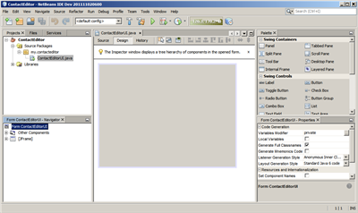](assets/images/01-gb-ui_9f6a342df9e9b3ea.png)

When we added the JFrame container, the IDE opened the newly-created `ContactEditorUI` form in an Editor tab with a toolbar containing several buttons, as shown in the preceding illustration. The ContactEditor form opened in the GUI Builder’s Design view and three additional windows appeared automatically along the IDE’s edges, enabling you to navigate, organize, and edit GUI forms as you build them.

The GUI Builder’s various windows include:

- **Design Area.** The GUI Builder’s primary window for creating and editing Java GUI forms. The toolbar’s Source button enables you to view a class’s source code, the Design button allows you to view a graphical view of the GUI components, the History button allows you to access the local history of changes of the file. The additional toolbar buttons provide convenient access to common commands, such as choosing between Selection and Connection modes, aligning components, setting component auto-resizing behavior, and previewing forms.
- **Navigator.** Provides a representation of all the components, both visual and non-visual, in your application as a tree hierarchy. The Navigator also provides visual feedback about what component in the tree is currently being edited in the GUI Builder as well as allows you to organize components in the available panels.
- **Palette.** A customizable list of available components containing tabs for JFC/Swing, AWT, and JavaBeans components, as well as layout managers. In addition, you can create, remove, and rearrange the categories displayed in the Palette using the customizer.
- **Properties Window.** Displays the properties of the component currently selected in the GUI Builder, Navigator window, Projects window, or Files window.

If you click the Source button, the IDE displays the application’s Java source code in the Editor with sections of code that are automatically generated by the GUI Builder indicated by grey areas (they become blue when selected), called Guarded Blocks. Guarded blocks are protected areas that are not editable in Source view. You can only edit code appearing in the white areas of the Editor when in Source view. If you need to make changes to the code within a Guarded Block, clicking the Design button returns the IDE’s Editor to the GUI Builder where you can make the necessary adjustments to the form. When you save your changes, the IDE updates the file’s sources.

> [!NOTE]
> For advanced developers, the Palette Manager is available that enables you to add custom components from JARs, libraries, or other projects to the Palette. To add custom components through the Palette Manager, choose Tools > Palette > Swing/AWT Components.

<a id="quickstart-gui--_key_concepts"></a>
<a id="quickstart-gui--key-concepts"></a>

## Key Concepts

The IDE’s GUI Builder solves the core problem of Java GUI creation by streamlining the workflow of creating graphical interfaces, freeing developers from the complexities of Swing layout managers. It does this by extending the current NetBeans IDE GUI Builder to support a straightforward "Free Design" paradigm with simple layout rules that are easy to understand and use. As you lay out your form, the GUI Builder provides visual guidelines suggesting optimal spacing and alignment of components. In the background, the GUI Builder translates your design decisions into a functional UI that is implemented using the new GroupLayout layout manager and other Swing constructs. Because it uses a dynamic layout model, GUI’s built with the GUI Builder behave as you would expect at runtime, adjusting to accommodate any changes you make without altering the defined relationships between components. Whenever you resize the form, switch locales, or specify a different look and feel, your GUI automatically adjusts to respect the target look and feel’s insets and offsets.

<a id="quickstart-gui--_free_design"></a>
<a id="quickstart-gui--free-design"></a>

### Free Design

In the IDE’s GUI Builder, you can build your forms by simply putting components where you want them as though you were using absolute positioning. The GUI Builder figures out which layout attributes are required and then generates the code for you automatically. You need not concern yourself with insets, anchors, fills, and so forth.

<a id="quickstart-gui--_automatic_component_positioning_snapping"></a>
<a id="quickstart-gui--automatic-component-positioning-snapping"></a>

### Automatic Component Positioning (Snapping)

As you add components to a form, the GUI Builder provides visual feedback that assists in positioning components based on your operating system’s look and feel. The GUI Builder provides helpful inline hints and other visual feedback regarding where components should be placed on your form, automatically snapping components into position along guidelines. It makes these suggestions based on the positions of the components that have already been placed in the form, while allowing the padding to remain flexible such that different target look and feels render properly at runtime.

<a id="quickstart-gui--_visual_feedback"></a>
<a id="quickstart-gui--visual-feedback"></a>

### Visual Feedback

The GUI Builder also provides visual feedback regarding component anchoring and chaining relationships. These indicators enable you to quickly identify the various positioning relationships and component pinning behavior that affect the way your GUI will both appear and behave at runtime. This speeds the GUI design process, enabling you to quickly create professional-looking visual interfaces that work.

<a id="quickstart-gui--_first_things_first"></a>
<a id="quickstart-gui--first-things-first"></a>

## First Things First

Now that you have familiarized yourself with the GUI builder’s interface, it’s time to begin developing the UI of our ContactEditor application. In this section we’ll take a look at using the IDE’s Palette to add the various GUI components that we need to our form.

Thanks to the IDE’s Free Design paradigm, you no longer have to struggle with layout managers to control the size and position of the components within your containers. All you need to do is drag and drop the components you need to your GUI form as shown in the illustrations that follow.

> [!NOTE]
> Refer to the [Adding individual and multiple components (.swf)](http://bits.netbeans.org/media/quickstart-gui-add.swf) screencast for an interactive demo on the section below.

<a id="quickstart-gui--_adding_components_the_basics"></a>
<a id="quickstart-gui--adding-components:-the-basics"></a>

### Adding Components: The Basics

Though the IDE’s GUI Builder simplifies the process of creating Java GUIs, it is often helpful to sketch out the way you want your interface to look before beginning to lay it out. Many interface designers consider this a "best practice" technique, however, for the purposes of this tutorial you can simply peek at how our completed form should look by jumping ahead to the [Previewing your GUI](#quickstart-gui--_previewing_your_gui) section.

Since we’ve already added a JFrame as our form’s top-level container, the next step is to add a couple of JPanels which will enable us to cluster the components of our UI using titled borders. Refer to the following illustrations and notice the IDE’s "drag and drop" behavior when accomplishing this.

To add a JPanel:

1. In the Palette window, select the Panel component from the Swing Containers category by clicking and releasing the mouse button.
2. Move the cursor to the upper left corner of the form in the GUI Builder. When the component is located near the container’s top and left edges, horizontal and vertical alignment guidelines appear indicating the preferred margins. Click in the form to place the JPanel in this location.

The `JPanel` component appears in the `ContactEditorUI` form with orange highlighting signifying that it is selected. After releasing the mouse button, small indicators appear to show the component’s anchoring relationships and a corresponding JPanel node is displayed in the Navigator window, as shown in the following illustration.

[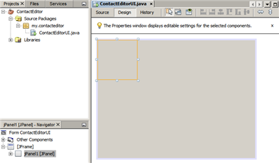](assets/images/02-add-panels-1_0389fcad3972fa6a.png)

Next, we need to resize the JPanel to make room for the components we’ll place within it a little later, but let’s take a minute to point out another of the GUI Builder’s visualization features first. In order to do this we need to deselect the JPanel we just added. Because we haven’t added a title border yet, the panel disappears. Notice, however, that when you pass the cursor over the JPanel, its edges change to light gray so that its position can be clearly seen. You need only to click anywhere within the component to reselect it and cause the resize handles and anchoring indicators to reappear.

To resize the JPanel:

1. Select the JPanel you just added. The small square resize handles reappear around the component’s perimeter.
2. Click and hold the resize handle on the right edge of the JPanel and drag until the dotted alignment guideline appears near the form’s edge.
3. Release the resize handle to resize the component.

The `JPanel` component is extended to span between the container’s left and right margins in accordance with the recommended offset, as shown in the following illustration.

[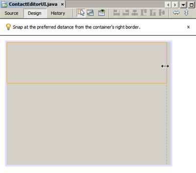](assets/images/02-add-panels-2_29b525fb018afe68.png)

Now that we’ve added a panel to contain our UI’s Name information, we need to repeat the process to add another directly below the first for the E-mail information. Referring to the following illustrations, repeat the previous two tasks, paying attention to the GUI Builder’s suggested positioning. Notice that the suggested vertical spacing between the two JPanels is much narrower than that at the edges. Once you have added the second JPanel, resize it such that it fills the form’s remaining vertical space.

[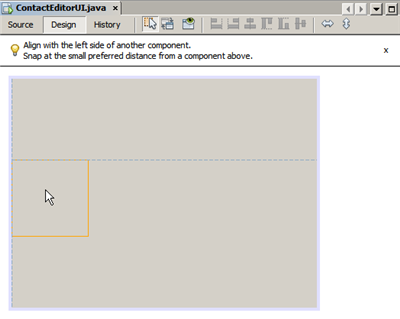](assets/images/02-add-panels-3_d4a354e5d3e3e7c4.png)

[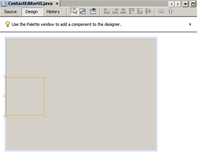](assets/images/02-add-panels-4_57cb37943c25411b.png)

[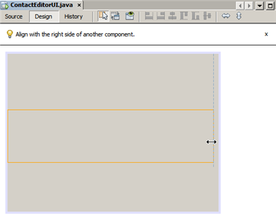](assets/images/02-add-panels-5_fcbe180ad694791d.png)

Because we want to visually distinguish the functions in the upper and lower sections of our GUI, we need to add a border and title to each JPanel. First we’ll accomplish this using the Properties window and then we’ll try it using the pop-up menu.

To add title borders to the JPanels:

1. Select the top JPanel in the GUI Builder.
2. In the Properties window, click the ellipsis button (…) next to the Border property.
3. In the JPanel Border editor that appears, select the TitledBorder node in the Available Borders pane.
4. In the Properties pane below, enter `Name` for the Title property.
5. Click the ellipsis (…) next to the Font property, select Bold for the Font Style, and enter 12 for the Size. Click OK to exit the dialogs.
6. Select the bottom JPanel and repeat steps 2 through 5, but this time right-click the JPanel and access the Properties window using the pop-up menu. Enter `E-mail` for the Title property.

Titled borders are added to both `JPanel` components.

[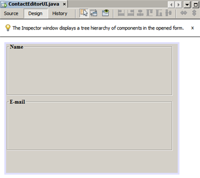](assets/images/02-add-borders_6dc52f92360172e7.png)

<a id="quickstart-gui--_adding_individual_components_to_the_form"></a>
<a id="quickstart-gui--adding-individual-components-to-the-form"></a>

### Adding Individual Components to the Form

Now we need to start adding the components that will present the actual contact information in our contact list. In this task we’ll add four JTextFields that will display the contact information and the JLabels that will describe them. While accomplishing this, notice the horizontal and vertical guidelines that the GUI Builder displays, suggesting the preferred component spacing as defined by your operating system’s look and feel. This ensures that your GUI is automatically rendered respecting the target operating system’s look and feel at runtime.

To add a JLabel to the form:

1. In the Palette window, select the Label component from the Swing Controls category.
2. Move the cursor over the `Name` JPanel we added earlier. When the guidelines appear indicating that the JLabel is positioned in the top left corner of the JPanel with a small margin at the top and left edges, click to place the label.

The JLabel is added to the form and a corresponding node representing the component is added to the Inspector window.

Before going further, we need to edit the display text of the JLabel we just added. Though you can edit component display text at any point, the easiest way is to do this as you add them.

To edit the display text of a JLabel:

1. Double-click the JLabel to select its display text.
2. Type `First Name:` and press Enter.

The JLabel’s new name is displayed and the component’s width adjusts as a result of the edit.

Now we’ll add a JTextField so we can get a glimpse of the GUI Builder’s baseline alignment feature.

To add a JTextField to the form:

1. In the Palette window, select the Text Field component from the Swing Controls category.
2. Move the cursor immediately to the right of the `First Name:` JLabel we just added. When the horizontal guideline appears indicating that the JTextField’s baseline is aligned with that of the JLabel and the spacing between the two components is suggested with a vertical guideline, click to position the JTextField.

The JTextField snaps into position in the form aligned with the JLabel’s baseline, as shown in the following illustration. Notice that the JLabel shifted downward slightly in order to align with the taller text field’s baseline. As usual, a node representing the component is added to the Navigator window.

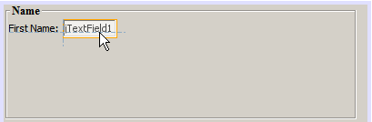

Before proceeding further, we need to add an additional JLabel and JTextField immediately to the right of those we just added, as shown in the following illustration. This time enter `Last Name:` as the JLabel’s display text and leave the JTextFields' placeholder text as it is for now.


To resize a JTextField:

1. Select the JTextField we just added to the right of the `Last Name:` JLabel.
2. Drag the JTextField’s right edge resize handle toward the right edge of the enclosing JPanel.
3. When the vertical alignment guidelines appear suggesting the margin between the text field and right edge of the JPanel, release the mouse button to resize the JTextField.

The JTextField’s right edge snaps into alignment with the JPanel’s recommended edge margin, as shown in the following illustration.


<a id="quickstart-gui--_adding_multiple_components_to_the_form"></a>
<a id="quickstart-gui--adding-multiple-components-to-the-form"></a>

### Adding Multiple Components to the Form

Now we’ll add the `Title:` and `Nickname:` JLabels that describe two JTextFields that we’re going to add in a minute. We’ll drag and drop the components while pressing the Shift key, to quickly add them to the form. While accomplishing this, again notice that the GUI Builder displays horizontal and vertical guidelines suggesting the preferred component spacing.

To add multiple JLabels to the form:

1. In the Palette window, select the Label component from the Swing Controls category by clicking and releasing the mouse button.
2. Move the cursor over the form directly below the `First Name:` JLabel we added earlier. When the guidelines appear indicating that the new JLabel’s left edge is aligned with that of the JLabel above and a small margin exists between them, shift-click to place the first JLabel.
3. While still pressing the Shift key, place another JLabel immediately to the right of the first. Make certain to release the Shift key prior to positioning the second JLabel. If you forget to release the Shift key prior to positioning the last JLabel, simply press the Escape key.

The JLabels are added to the form creating a second row, as shown in the following illustration. Nodes representing each component are added to the Navigator window.


Before moving on, we need to edit the JLabels' name so that we’ll be able to see the effect of the alignments we’ll set later.

To edit the display text of JLabels:

1. Double-click the first JLabel to select its display text.
2. Type `Title:` and press Enter.
3. Repeat steps 1 and 2, entering `Nickname:` for the second JLabel’s name property.

The JLabels' new names are displayed in the form and are shifted as a result of their edited widths, as shown in the following illustration.


<a id="quickstart-gui--_inserting_components"></a>
<a id="quickstart-gui--inserting-components"></a>

### Inserting Components

> [!NOTE]
> Refer to the [Inserting components (.swf)](http://bits.netbeans.org/media/quickstart-gui-insert.swf) screencast for an interactive demo on the section below.

Often it is necessary to add a component between components that are already placed in a form. Whenever you add a component between two existing components, the GUI Builder automatically shifts them to make room for the new component. To demonstrate this, we’ll insert a JTextField between the JLabels we added previously, as shown in the following two illustrations.

To insert a JTextField between two JLabels:

1. In the Palette window, select the Text Field component from the Swing Controls category.
2. Move the cursor over the `Title:` and `Nickname:` JLabels on the second row such that the JTextField overlaps both and is aligned to their baselines. If you encounter difficulty positioning the new text field, you can snap it to the left guideline of the `Nickname` JLabel as shown in the first image below.
3. Click to place the JTextField between the `Title:` and `Nickname:` JLabels.

The JTextField snaps into position between the two JLabels. The rightmost JLabel shifts toward the right of the JTextField to accommodate the suggested horizontal offset.


We still need to add one additional JTextField to the form that will display each contact’s nickname on the right side of the form.

To add a JTextField:

1. In the Palette window, select the Text Field component from the Swing category.
2. Move the cursor to the right of the `Nickname` label and click to place the text field.

The JTextField snaps into position next to the JLabel on its left.

To resize a JTextField:

1. Drag the resize handles of the `Nickname:` label’s JTextField you added in the previous task toward the right of the enclosing JPanel.
2. When the vertical alignment guidelines appear suggesting the margin between the text field and JPanel edges, release the mouse button to resize the JTextField.

The JTextField’s right edge snaps into alignment with the JPanel’s recommended edge margin and the GUI Builder infers the appropriate resizing behavior.

1. Press Ctrl-S to save the file.

<a id="quickstart-gui--_moving_forward"></a>
<a id="quickstart-gui--moving-forward"></a>

## Moving Forward

Alignment is one of the most fundamental aspects of creating professional-looking GUIs. In the previous section we got a glimpse of the IDE’s alignment features while adding the JLabel and JTextField components to our ContactEditorUI form. Next, we’ll take a more in depth look at the GUI Builder’s alignment features as we work with the various other components we need for our application.

<a id="quickstart-gui--_component_alignment"></a>
<a id="quickstart-gui--component-alignment"></a>

### Component Alignment

> [!NOTE]
> Refer to the [Aligning and anchoring components (.swf)](http://bits.netbeans.org/media/quickstart-gui-align.swf) screencast for an interactive demo on the sections below.

Every time you add a component to a form, the GUI Builder effectively aligns them, as evidenced by the alignment guidelines that appear. It is sometimes necessary, however, to specify different relationships between groups of components as well. Earlier we added four JLabels that we need for our ContactEditor GUI, but we didn’t align them. Now we’ll align the two columns of JLabels so that their right edges line up.

To align components:

1. Hold down the `Ctrl` key and click to select the `First Name:` and `Title:` JLabels on the left side of the form.
2. Click the Align Right in Column button () in the toolbar. Alternately, you can right-click either one and choose Align > Right in Column from the pop-up menu.
3. Repeat this for the `Last Name:` and `Nickname:` JLabels as well.

The JLabels' positions shift such that the right edges of their display text are aligned. The anchoring relationships are updated, indicating that the components have been grouped.

Before we’re finished with the JTextFields we added earlier, we need to make sure that the two JTextFields we inserted between the JLabels are set to resize correctly. Unlike the two JTextFields that we stretched to the right edge of our form, inserted components' resizeability behavior isn’t automatically set.

To set component resizeability behavior:

1. Control-click the two inserted JTextField components to select them in the GUI Builder.
2. With both JTextFields selected, right-click either one of them and choose Auto Resizing > Horizontal from the pop-up menu.

The JTextFields are set to resize horizontally at runtime. The alignment guidelines and anchoring indicators are updated, providing visual feedback of the component relationships.

To set components to be the same size:

1. Control-click all four of the JTextFields in the form to select them.
2. With the JTextFields selected, right-click any one of them and choose Set Same Size > Same Width from the pop-up menu.

The JTextFields are all set to the same width and indicators are added to the top edge of each, providing visual feedback of the component relationships.

Now we need to add another JLabel describing the JComboBox that will enable users to select the format of the information our ContactEditor application will display.

To align a JLabel to a component group:

1. In the Palette window, select the Label component from the Swing category.
2. Move the cursor below the `First Name` and `Title` JLabels on the left side of the JPanel. When the guideline appears indicating that the new JLabel’s right edge is aligned with the right edges of the component group above (the two JLabels), click to position the component.

The JLabel snaps into a right-aligned position with the column of JLabels above, as shown in the following illustration. The GUI Builder updates the alignment status lines indicating the component’s spacing and anchoring relationships.

[](assets/images/06-align-1_45acb5e58df5457f.png)

As in the previous examples, double-click the JLabel to select its display text and then enter `Display Format:` for the display name. Notice that when the JLabel snaps into position, the other components shift to accommodate the longer display text.

<a id="quickstart-gui--_baseline_alignment"></a>
<a id="quickstart-gui--baseline-alignment"></a>

### Baseline Alignment

Whenever you add or move components that include text (JLabels, JTextFields, and so forth), the IDE suggests alignments which are based on the baselines of the text in the components. When we inserted the JTextField earlier, for example, its baseline was automatically aligned to the adjacent JLabels.

Now we’ll add the combo box that will enable users to select the format of the information that our ContactEditor application will display. As we add the JComboBox, we’ll align its baseline to that of the JLabel’s text. Notice once again the baseline alignment guidelines that appear to assist us with the positioning.

To align the baselines of components:

1. In the Palette window, select the Combo Box component from the Swing Controls category.
2. Move the cursor immediately to the right of the JLabel we just added. When the horizontal guideline appears indicating that the JComboBox’s baseline is aligned with the baseline of the text in the JLabel and the spacing between the two components is suggested with a vertical guideline, click to position the combo box.

The component snaps into a position aligned with the baseline of the text in the JLabel to its left, as shown in the following illustration. The GUI Builder displays status lines indicating the component’s spacing and anchoring relationships.

[](assets/images/06-align-2_7a53fccc73554eae.png)

To resize the JComboBox:

1. Select the ComboBox in the GUI Builder.
2. Drag the resize handle on the JComboBox’s right edge toward the right until the alignment guidelines appear suggesting the preferred offset between the JComboBox and JPanel edges.

As shown in the following illustration, the JComboBox’s right edge snaps into alignment with the JPanel’s recommended edge margin and the component’s width is automatically set to resize with the form.

[](assets/images/06-align-3_f99944a07f3a5fb0.png)

1. Press Ctrl-S to save the file.

Editing component models is beyond the scope of this tutorial, so for the time being we’ll leave the JComboBox’s placeholder item list as it is.

<a id="quickstart-gui--_reviewing_what_weve_learned"></a>
<a id="quickstart-gui--reviewing-what-we-ve-learned"></a>

## Reviewing What We’ve Learned

We’ve got off to a good start building our ContactEditor GUI, but let’s take a minute to recap what we’ve learned while we add a few more of the components our interface requires.

Until now we’ve concentrated on adding components to our ContactEditor GUI using the IDE’s alignment guidelines to help us with positioning. It is important to understand, however, that another integral part of component placement is anchoring. Though we haven’t discussed it yet, you’ve already taken advantage of this feature without realizing it. As mentioned previously, whenever you add a component to a form, the IDE suggests the target look and feel’s preferred positioning with guidelines. Once placed, new components are also anchored to the nearest container edge or component to ensure that component relationships are maintained at runtime. In this section, we’ll concentrate on accomplishing the tasks in a more streamlined fashion while pointing out the work the GUI builder is doing behind the scenes.

<a id="quickstart-gui--_adding_aligning_and_anchoring"></a>
<a id="quickstart-gui--adding-aligning-and-anchoring"></a>

### Adding, Aligning, and Anchoring

The GUI Builder enables you to lay out your forms quickly and easily by streamlining typical workflow gestures. Whenever you add a component to a form, the GUI Builder automatically snaps them into the preferred positions and sets the necessary chaining relationships so you can concentrate on designing your forms rather than struggling with complicated implementation details.

To add, align, and edit the display text of a JLabel:

1. In the Palette window, select the Label component from the Swing Controls category.
2. Move the cursor over the form immediately below the bottom JPanel’s E-mail title. When the guidelines appear indicating that it’s positioned in the top left corner of the JPanel with a small margin at the top and left edges, click to place the JLabel.
3. Double-click the JLabel to select its display text. Then type `E-mail Address:`  and press Enter.

The JLabel snaps into the preferred position in the form, anchored to the top and left edges of the enclosing JPanel. Just as before, a corresponding node representing the component is added to the Navigator window.

To add a JTextField:

1. In the Palette window, select the Text Field component from the Swing Controls category.
2. Move the cursor immediately to the right of the `E-mail Address` label we just added. When the guidelines appear indicating that the JTextField’s baseline is aligned with the baseline of the text in the JLabel and the margin between the two components is suggested with a vertical guideline, click to position the text field.

The JTextField snaps into position on the right of the `E-mail Address:` JLabel and is chained to the JLabel. Its corresponding node is also added to the Inspector window.

1. Drag the resize handle of the JTextField toward the right of the enclosing JPanel until the alignment guidelines appear suggesting the offset between the JTextField and JPanel edges.

The JTextField’s right edge snaps to the alignment guideline indicating the preferred margins.

Now we need to add the JList that will display our ContactEditor’s entire contact list.

To add and resize a JList:

1. In the Palette window, select the List component from the Swing Controls category.
2. Move the cursor immediately below the `E-mail Address` JLabel we added earlier. When the guidelines appear indicating that the JList’s top and left edges are aligned with the preferred margins along the JPanel’s left edge and the JLabel above, click to position the JList.
3. Drag the JList’s right resize handle toward the right of the enclosing JPanel until the alignment guidelines appear indicating that it is the same width as the JTextField above.

The JList snaps into the position designated by the alignment guidelines and its corresponding node is displayed in the Inspector window. Notice also that the form expands to accommodate the newly added JList.

[](assets/images/06-align-4_e2929c87c8730579.png)

Since JLists are used to display long lists of data, they typically require the addition of a JScrollPane. Whenever you add a component which requires a JScrollPane, the GUI Builder automatically adds it for you. Because JScrollPanes are non-visual components, you have to use the Inspector window in order to view or edit any JScrollPanes that the GUI Builder created.

<a id="quickstart-gui--_component_sizing"></a>
<a id="quickstart-gui--component-sizing"></a>

### Component Sizing

> [!NOTE]
> Refer to the [Resizing and indenting components (.swf)](http://bits.netbeans.org/media/quickstart-gui-resize.swf) screencast for an interactive demo on the sections below.

It is often beneficial to set several related components, such as buttons in modal dialogues, to be the same size for visual consistency. To demonstrate this we’ll add four JButtons to our ContactEditor form that will allow us to add, edit, and remove individual entries from our contact list, as shown in the following illustrations. Afterwards, we’ll set the four buttons to be the same size so they can be easily recognized as offering related functionality.

To add, align, and edit the display text of multiple buttons:

1. In the Palette window, select the Button component from the Swing Controls category.
2. Move the JButton over the right edge of the `E-mail Address` JTextField in the lower JPanel. When the guidelines appear indicating that the JButton’s baseline and right edge are aligned with that of the JTextField, shift-click to place the first button along the JFrame’s right edge. The JTextField’s width shrinks to accommodate the JButton when you release the mouse button.

[](assets/images/buttons-1_7e453652ea11a2b5.png)

[](assets/images/buttons-2_32afe53ddff4d64f.png)

1. Move the cursor over the top right corner of the JList in the lower JPanel. When the guidelines appear indicating that the JButton’s top and right edges are aligned with that of the JList, shift-click to place the second button along the JFrame’s right edge.

[](assets/images/buttons-3_921c6eed95badbd7.png)

1. Add two additional JButtons below the two we already added to create a column. Make certain to position the JButtons such that the suggested spacing is respected and consistent. If you forget to release the Shift key prior to positioning the last JButton, simply press the Escape key.

[](assets/images/buttons-4_91b8a7045cf516b3.png)

1. Set the display text for each JButton. (You can edit a button’s text by right-clicking the button and choosing Edit Text. Or you can click the button, pause, and then click again.) Enter `Add` for the top button, `Edit` for the second, `Remove` for the third, and `As Default` for the fourth.

The JButton components snap into the positions designated by the alignment guidelines. The width of the buttons changes to accommodate the new names.

[](assets/images/buttons-5_9344e8fa604d0ef5.png)

Now that the buttons are positioned where we want them, we’ll set the four buttons to be the same size for visual consistency as well as to clarify that they are related functionally.

To set components to the same size:

1. Select all four JButtons by pressing the Control key while making your selection.
2. Right-click one of them and choose Same Size > Same Width from the pop-up menu.

The JButtons are set to the same size as the button with the longest name.

[](assets/images/buttons-6_7dba14a158e681e0.png)

<a id="quickstart-gui--_indentation"></a>
<a id="quickstart-gui--indentation"></a>

### Indentation

Often it is necessary to cluster multiple components under another component such that it is clear they belong to a group of related functions. One typical case, for example, is placing several related checkboxes below a common label. The GUI Builder enables you to accomplish indenting easily by providing special guidelines suggesting the preferred offset for your operating system’s look and feel.

In this section we’ll add a few JRadioButtons below a JLabel that will allow users to customize the way the application displays data. Refer to the following illustrations while accomplishing this or click the View Demo link following the procedure to view an interactive demonstration.

To indent JRadioButtons below a JLabel:

1. Add a JLabel named `Mail Format` to the form below the JList. Make certain the label is left aligned with the JList above.
2. In the Palette window, select the Radio Button component from the Swing category.
3. Move the cursor below the JLabel that we just added. When the guidelines appear indicating that the JRadioButton’s left edge is aligned with that of the JLabel, move the JRadioButton slightly to the right until secondary indentation guidelines appear. Shift-click to place the first radio button.

[](assets/images/07-indent-1_247bdaa2b81cf8b6.png)

1. Move the cursor to the right of the first JRadioButton. Shift-click to place the second and third JRadioButtons, being careful to respect the suggested component spacing. Make certain to release the Shift key prior to positioning the last JRadioButton.
2. Set the display text for each JRadioButton. (You can edit a button’s text by right-clicking the button and choosing Edit Text. Or you can click the button, pause, and then click again.) Enter `HTML` for the left radio button, `` Plain Text ` for the second, and `Custom `` for the third.

Three JRadioButtons are added to the form and indented below the `Mail Format` JLabel.

[](assets/images/07-indent-3_50a091de4b2f1ad2.png)

Now we need to add the three JRadioButtons to a ButtonGroup to enable the expected toggle behavior in which only one radio button can be selected at a time. This will, in turn, ensure that our ContactEditor application’s contact information will be displayed in the mail format of our choosing.

To add JRadioButtons to a ButtonGroup:

1. In the Palette window, select the Button Group component from the Swing Controls category.
2. Click anywhere in the GUI Builder design area to add the ButtonGroup component to the form. Notice that the ButtonGroup does not appear in the form itself, however, it is visible in the Navigator’s Other Components area.
3. Select all three of the JRadioButtons in the form.
4. In the Properties window, choose buttonGroup1 from the buttonGroup property combo box.

Three JRadioButtons are added to the button group.

[](assets/images/07-group_bf71fe95db36e940.png)

1. Press Ctrl-S to save the file.

<a id="quickstart-gui--_making_the_final_adjustments"></a>
<a id="quickstart-gui--making-the-final-adjustments"></a>

## Making the Final Adjustments

We’ve managed to rough out our ContactEditor application’s GUI, but there are still a few things remaining to do. In this section, we’ll take a look at a couple of other typical layout tasks that the GUI Builder streamlines.

<a id="quickstart-gui--_finishing_up"></a>
<a id="quickstart-gui--finishing-up"></a>

### Finishing Up

Now we need to add the buttons that will enable users to confirm the information they enter for an individual contact and add it to the contact list or cancel, leaving the database unchanged. In this step, we’ll add the two required buttons and then edit them so that they appear the same size in our form even though their display text are different lengths.

To add and edit the display text of buttons:

1. If the lower JPanel is extended to the bottom edge of the JFrame form, drag the bottom edge of the JFrame down. This gives you space between the edge of the JFrame and the edge of the JPanel for your OK and Cancel buttons.
2. In the Palette window, select the Button component from the Swing Controls category.
3. Move the cursor over the form below the E-mail JPanel. When the guidelines appear indicating that the JButton’s right edge is aligned with the lower right corner of the JFrame, click to place the button.

[](assets/images/08-cancel_454bc788ba16cfce.png)

1. Add another JButton to the left of the first, making certain to place it using the suggested spacing along the JFrame’s bottom edge.
2. Set the display text for each JButton. Enter `OK` for the left button and `Cancel` for right one. Notice that the width of the buttons changes to accommodate the new names.
3. Set the two JButtons to be the same size by selecting both, right-clicking either, and choosing Same Size > Same Width from the pop-up menu.

[](assets/images/08-same-size_d19af0ec0cfd2b03.png)

The `JButton` components appear in the form and their corresponding nodes are displayed in the Navigator window. The `JButton` components' code is also added to the form’s source file which is visible in the Editor’s Source view. Each of the JButtons are set to the same size as the button with the longest name.

1. Press Ctrl-S to save the file.

The last thing we need to do is delete the placeholder text in the various components. Note that while removing placeholder text after roughing out a form can be a helpful technique in avoiding problems with component alignments and anchoring relationships, most developers typically remove this text in the process of laying out their forms. As you go through the form, select and delete the placeholder text for each of the JTextFields. We’ll leave the placeholder items in both the JComboBox and JList for a later tutorial.

<a id="quickstart-gui--_previewing_your_gui"></a>
<a id="quickstart-gui--previewing-your-gui"></a>

## Previewing Your GUI

Now that you have successfully built the ContactEditor GUI, you can try your interface to see the results. You can preview your form as you work by clicking the Preview Form button () in the GUI Builder’s toolbar. The form opens in its own window, allowing you to test it prior to building and running.

[](assets/images/08-preview-gui_7cceb1aefbbe0948.png)

<a id="quickstart-gui--_deploying_gui_applications"></a>
<a id="quickstart-gui--deploying-gui-applications"></a>

## Deploying GUI Applications

In order for the interfaces you create with the GUI Builder to work outside of the IDE, the application must be compiled against classes for the GroupLayout layout manager and also have those classes available at runtime. These classes are included in Java SE 6, but not in Java SE 5. If you develop the application to run on Java SE 5, your application needs to use the Swing Layout Extensions library.

If you are running the IDE on JDK 5, the IDE automatically generates your application code to use the Swing Layout Extensions library. When you deploy the application, you need to include the Swing Layout Extensions library with the application. When you build the application (Build > Build Main Project), the IDE automatically provides a copy of the library’s JAR file in the application’s `dist/lib` folder. The IDE also adds each of the JAR files that are in the `dist` folder to the `Class-Path` element in the application JAR file’s `manifest.mf` file.

If you are running the IDE on JDK 6, the IDE generates your application code to use the GroupLayout classes that are in Java SE 6. This means that you can deploy the application to run on systems with Java SE 6 installed and you do not need to package your application with the Swing Layout Extensions library.

> [!NOTE]
> If you create your application using JDK 6 but you need the application to also run on Java SE 5, you can have the IDE generate its code to use the Swing Layout Extensions library instead of the classes in Java SE 6. Open the ContactEditorUI class in the GUI Editor. In the Navigator, right-click the Form ContactEditorUI node and choose Properties in the popup menu. In the Properties dialog box, change the value of the Layout Generation Style property to Swing Layout Extensions Library.

<a id="quickstart-gui--_distributing_and_running_standalone_gui_applications"></a>
<a id="quickstart-gui--distributing-and-running-standalone-gui-applications"></a>

### Distributing and Running Standalone GUI Applications

To prepare your GUI application for distribution outside of the IDE:

- Zip the project’s `dist` folder into a ZIP archive. (The `dist` folder might also contain a `lib` folder, which you would also need to include.)

To run your application, right-click the project name and select Run in the context menu. In the Run Project dialog select the main class name ( `my.contacteditor.ContactEditorUI` if speaking about the project you have just created) and click OK. Your application is up and running.

To run a standalone GUI application from the command line:

1. Navigate to the project’s `dist` folder.
2. Type the following:

```bash
 ``java -jar <jar_name>.jar``
```

> [!NOTE]
> If you encounter the following error:

```bash
Exception in thread "main" java.lang.NoClassDefFoundError: org/jdesktop/layout/GroupLayout$Group
```

Ensure that the `manifest.mf` file references the currently installed version of the Swing Layout Extensions Library.

- [See this page in GitHub.](https://github.com/apache/netbeans-antora-tutorials/edit/main/modules/ROOT/pages/kb/docs/java/quickstart-gui.adoc "See this page in github")

---

<a id="gui-gaps"></a>

<!-- source_url: https://netbeans.apache.org/tutorial/main/kb/docs/java/gui-gaps/ -->

<!-- page_index: 6 -->

<a id="gui-gaps--gap-editing-support-in-the-netbeans-gui-builder"></a>

# Gap Editing Support in the NetBeans GUI Builder

> [!NOTE]
> This tutorial needs a review.
> You can [edit it in GitHub](https://github.com/apache/netbeans-antora-tutorials/edit/main/modules/ROOT/pages/kb/docs/java/gui-gaps.adoc "Edit this tutorial in github")
> following these [contribution guidelines.](https://netbeans.apache.org/tutorial/main/kb/docs/contributing)

A layout of a container in the Free Design mode consists of components and gaps between these components. Both the components and gaps are visualized in the Design view of the GUI Builder. The NetBeans IDE enables you to edit gaps directly in the GUI Builder.

This tutorial demonstrates how to utilize gap editing to insert new UI components between other components as well as how to center components easily around a frame in the NetBeans GUI Builder without concern for the underlying layout manager. The tutorial is intended as a guide to show how you can perform changes in an existing form in the Free Design mode to implement a specific target layout that is required by the project.

**To follow this tutorial, you need the software and resources listed below.**

| Software or Resource | Version Required |
| --- | --- |
| [GapSupport.zip](https://netbeans.org/projects/samples/downloads/download/Samples%252FJava%252FGapSupport.zip) | An archive with the source files containing the initial and target tutorial layouts. |

**Notes:**

- You can download the project that is used as the starting point for this tutorial as a `.zip` archive.
- This tutorial focuses on designing the layout of the container only. Adding functionality to the GUI is out of its scope.
- You can turn on and off visualization of the gaps by using the `Visualize Additional Layout Information` option after choosing `Tools` > `Options` > `Java` > `GUI Builder` in the main IDE’s menu.

<a id="gui-gaps--_opening_example_project"></a>
<a id="gui-gaps--opening-example-project"></a>

## Opening Example Project

1. Download and unzip the [GapSupport.zip](https://netbeans.org/projects/samples/downloads/download/Samples%252FJava%252FGapSupport.zip) archive to any location on your computer.
2. In the NetBeans IDE main menu, choose `File` > `Open Project` , navigate to the folder that contains the unzipped files with the `GapSupport` project that you extracted in the previous step.
3. Click Open Project.
   The Projects window should look like the following:


1. Double-click the `Initial.java` file.
   The sample form opens in the GUI Builder Design view.


> [!NOTE]
> You can view the component hierarchy of the form in the Navigator window by choosing Window > Navigator from the main toolbar.


[top](#gui-gaps--top)

<a id="gui-gaps--_resizing_a_gap_by_dragging_and_dropping_its_edge"></a>
<a id="gui-gaps--resizing-a-gap-by-dragging-and-dropping-its-edge"></a>

## Resizing a Gap by Dragging and Dropping Its Edge

Let us explore how to edit a gap by dragging and dropping its edge in the Design view of the IDE.

To add a `Middle Name` row between the `First Name` and `Last Name` rows, you need to complete the following steps:

1. Click on the gap between the `First Name` and `Last Name` labels.
   The gap is highlighted with green.


1. Hover the mouse pointer over the bottom part of the highlighted gap.
   The pointer is changed to a vertical resizable one.


1. Enlarge the selected gap to 50 by pressing the left mouse button, dragging the pointer downward, and releasing the left mouse button.
   The new size of the gap is displayed in a tooltip.


1. Add a new label into the created gap by dragging it from the Swing Controls section of the Palette and dropping it so that its left edge is aligned with the left edge of the `First Name` label and its top edge has the suggested preferred gap from the `First Name` row.


1. Double-click the label and change the text of the label to `Middle Name:` .


1. Add a new text field to the right of the `Middle Name:` label by dragging it from the Swing Controls section of the Palette and dropping it so that it is baseline-aligned with the `Middle Name` label and its left edge is aligned with the other text fields.


1. Drag the right edge of the text field to align it with the right edge of the other text fields.


1. Right-click the text inside the text field and choose Edit Text from the popup menu. Remove the text.

The `Middle Name` row is inserted between the form components.


[top](#gui-gaps--top)

<a id="gui-gaps--_resizing_a_gap_using_the_mouse_wheel"></a>
<a id="gui-gaps--resizing-a-gap-using-the-mouse-wheel"></a>

## Resizing a Gap Using the Mouse Wheel

The IDE enables you to resize a gap by clicking and then scrolling a mouse wheel to tune the gap size.

To remove the remaining space between the `Middle Name` and `Last Name` rows, click the gap below and decrease the height of the gap by scrolling the mouse wheel downward and setting the new size to `default small` .

> [!NOTE]
> The NetBeans GUI Builder supports three preferred gaps for component placement - `default small` , `default medium` , and `default large` .


The gap between the form components is resized by using the mouse wheel and utilizing a preferred gap.


[top](#gui-gaps--top)

<a id="gui-gaps--_editing_gaps_around_a_component"></a>
<a id="gui-gaps--editing-gaps-around-a-component"></a>

## Editing Gaps Around a Component

You can center a component by enclosing it into two identical gaps that have prior been marked as resizable.

> [!NOTE]
> A container helps specify where the components should be centered. It is possible to center the buttons without enclosing them in a new panel but it is more difficult to accomplish in the GUI Builder and the resulting layout is a bit fragile. Therefore, we suggest to enclose the component being centered in a panel whenever it is possible.

**To enclose the buttons and resizable gaps into a separate container, do as follows:**

1. Select all the four buttons in the form.
2. Right-click the selection and choose `Enclose In` > `Panel` from the popup menu.


The buttons are enclosed into a container.


**To remove the newly created gaps on the left and right side of the buttons, complete the following steps:**

1. Right-click one of the buttons and choose Edit Layout Space from the popup menu.
   The Edit Layout Space dialog box is displayed.


1. Set the size of the Left and Right gaps to 0 and click OK.
   The gaps to the left and right of the buttons are removed using the Edit Layout Space dialog box.


**To make the gaps above and below the container resizable, do as follows:**

1. Double-click the gap at the bottom of the last button.
   The Edit Layout Space dialog box is displayed.

   1. In the Edit Layout Space dialog box, select the `Resizable` option and click OK.

[](assets/images/bottom_aa632acba23db851.png)

1. Repeat steps 1 and 2 for the gap above the topmost button.
   The gaps above and below the container with the buttons are made resizable.

**To center the buttons of the sample form**:

Drag the bottom edge of the container with the buttons to align with the bottom edges of the lists as shown below:


The container is stretched to match the height of the `Available Topics` and `Selected Topics` lists. The buttons are centered within the space determined by the enclosing container since the surrounding gaps have been marked as resizable.


[top](#gui-gaps--top)

<a id="gui-gaps--_summary"></a>
<a id="gui-gaps--summary"></a>

## Summary

In this tutorial you enhanced a simple form. When manipulating gaps you learned how to manage empty spaces in the Free Design mode and design an appealing UI without spending extra time on tweaking every detail of the layout implementation.

[top](#gui-gaps--top)

- [See this page in GitHub.](https://github.com/apache/netbeans-antora-tutorials/edit/main/modules/ROOT/pages/kb/docs/java/gui-gaps.adoc "See this page in github")

---

<a id="gui-automatic-i18n"></a>

<!-- source_url: https://netbeans.apache.org/tutorial/main/kb/docs/java/gui-automatic-i18n/ -->

<!-- page_index: 7 -->

<a id="gui-automatic-i18n--internationalizing-a-gui-form"></a>

# Internationalizing a GUI Form

> [!NOTE]
> This tutorial needs a review.
> You can [edit it in GitHub](https://github.com/apache/netbeans-antora-tutorials/edit/main/modules/ROOT/pages/kb/docs/java/gui-automatic-i18n.adoc "Edit this tutorial in github")
> following these [contribution guidelines.](https://netbeans.apache.org/tutorial/main/kb/docs/contributing)

The following tutorial takes you through some of the basic steps of internationalization in the NetBeans IDE. We will set up internationalization for one form and later on design that form. Then we internationalize the whole project, which contains several forms in a few different packages. You can internationalize applications either by specifying automatic internationalization or by using a special wizard.

<a id="gui-automatic-i18n--_principle_of_internationalization"></a>
<a id="gui-automatic-i18n--principle-of-internationalization"></a>

## Principle of Internationalization

Internationalization permits applications to be adapted to various languages and regions without requiring engineering changes or recompilation. Internationalized programs enable textual elements, such as status messages and GUI component labels, to be stored outside the source code and retrieved dynamically rather than hard-coded in the program.

You typically store your internationalized strings in properties files, in the form of key/value pairs. The key is the identifier used by the program to retrieve the text, and the value is the actual text. You create one properties file for each locale (or language) in which you translate the program. The keys are the same in each locale - only the strings are different.

The IDE provides tools for doing each of the following:

- Inserting internationalized strings as you create a GUI form or Java program
- Replacing all hard-coded strings in an individual file or group of files with internationalized strings

<a id="gui-automatic-i18n--_internationalizing_a_gui_form_at_design_time"></a>
<a id="gui-automatic-i18n--internationalizing-a-gui-form-at-design-time"></a>

## Internationalizing a GUI Form at Design Time

In this exercise we will open the demo Java application project, which contains a well-known find dialog created using the GUI Builder. Next, we will switch on automatic internationalization for Form FindDialog.java. In order to test our internationalized GUI form, we will add a new locale to the properties file and run the form in the non-default locale.

<a id="gui-automatic-i18n--_opening_the_example_project"></a>
<a id="gui-automatic-i18n--opening-the-example-project"></a>

### Opening the Example Project

1. Download and unzip the [InternationalizeDemo.zip](https://netbeans.org/files/documents/4/770/InternationalizeDemo.zip) project to any location on your computer.
2. Choose File > Open Project, navigate to the `InternationalizeDemo` project that you extracted in the last step, and click Open. The project folder might be in a containing folder that is also called `InternationalizeDemo` .
3. Expand Source Packages > Demo and double-click `FindDialog.java` . The sample form opens in the GUI Builder.


<a id="gui-automatic-i18n--_switch_automatic_internationalization_on"></a>
<a id="gui-automatic-i18n--switch-automatic-internationalization-on"></a>

### Switch Automatic Internationalization On

1. Select the root node in the Navigator Window (named `Form FindDialog` ).


1. In the Properties window, select the checkbox in the Automatic Internationalization property.


1. Click Upgrade in the GUI Form Format Upgrade dialog box.

If the checkbox is selected, the IDE creates the `Bundle.properties` file in the `demo` package as it is set in the `Properties Bundle File` property.


If you need to have the `Bundle.properties` file in a different location, you can click the ellipsis (…) button to the right of the Properties Bundle File and choose a location or directly type the path in the property’s text field.

1. In the Projects window, double-click the `Bundle.properties` node in the Projects Window or right-click the node and choose Edit.

The properties file is opened in the Source Editor. As you can see, all appropriate Keys and Values for Form `FindDialog.java` are generated. (The name of each key is derived from the form file name and the component Variable name. For example, the key `FindDialog.jLabel1.text` is generated for a component with the variable name `jLabel1` placed in form file `FindDialog` . The value `jLabel1` represents component’s Text property in this example.

1. Close the `Bundle.properties` file.

<a id="gui-automatic-i18n--_internationalizing_individual_gui_components"></a>
<a id="gui-automatic-i18n--internationalizing-individual-gui-components"></a>

### Internationalizing Individual GUI Components

We will now use the GUI builder to enter internationalized strings for the JLabels and JButtons in the form.

1. Select the appropriate GUI component (e.g. `jLabel1` ) in the Design Area.
2. In the Properties window, click the ellipsis (…) button for the Text property.

> [!NOTE]
> You can also internationalize other properties that have String values, such as Mnemonic, Accessible Name, Accessible Descriptor, and ToolTip.

1. The property editor is switched to resource bundle mode. Check that the Bundle Name field is set to `demo.Bundle` and the Key field contains the string `FindDialog.jLabel1.text`
2. Type `Find What:` in the Value field.
3. Click OK.

Repeat the previous steps for all the components so that the form looks like the following picture:

[](assets/images/finddialog-new_e02cfc7fe1d72470.png)

> [!NOTE]
> Steps 1-5 can be done in a simpler and faster way: just double click `jLabel1` in the design view, change the text from `jLabel1` to `Find What:` , and press Enter. The result is the same as from the steps given above.

To make the components the same width, complete the steps below:

1. Control-click all eight of the jCheckBoxes in the form to select them.
2. With the jCheckBoxes selected, right-click any one of them and choose Same Size > Same Width from the pop-up menu.
3. Apply Steps 1-2 to the three jButtons.

<a id="gui-automatic-i18n--_adding_a_new_locale"></a>
<a id="gui-automatic-i18n--adding-a-new-locale"></a>

### Adding a New Locale

1. Select the root node in the Navigator Window (the `Form FindDialog` node).
2. In the Properties window, click the ellipsis (…) button for the Design Locale property.
3. In the New Locale dialog box, choose `es_ES` from the `Predefined Locales:` combobox.
4. Click OK.

The new locale appears below the `Bundle.properties` node, as shown below:


1. In the Projects window, right-click `Bundle.properties` and choose Open.
2. Translate individual messages in the correspondent column of the table to a new language (for example, Spanish), as shown below:

[](assets/images/bundles-new_f6ab0132c8938fcb.png)

1. Press Ctrl-S to save your edits.
2. Select the `FindDialog.java` tab to display the form you are internationalizing.
3. Right-click the root node in the Navigator window and choose Reload Form (alternatively, press Ctrl-R).
4. Click Save in the Question dialog box that displays.
   The form is reopened and the Spanish locale is loaded in in the design, as shown below:

[](assets/images/finddialog-es-new_d12ba60cda23fc92.png)

<a id="gui-automatic-i18n--_testing_a_non_default_locale"></a>
<a id="gui-automatic-i18n--testing-a-non-default-locale"></a>

### Testing a Non-Default Locale

1. In the Projects window, right-click the InternationalizeDemo project and choose Properties.
2. In the Categories pane, select the Run node.
3. Enter `-Duser.language=es -Duser.country=ES` in the VM Options field.

[](assets/images/prjproperties_6d4ae862235d7ddb.png)

1. Click OK.
2. Right-click the InternationalizeDemo project and choose Run.

The IDE runs the `FindDialog` dialog box in the Spanish locale like shown below.

[](assets/images/run_9e00a48d0754ee90.png)

<a id="gui-automatic-i18n--_internationalizing_an_entire_project"></a>
<a id="gui-automatic-i18n--internationalizing-an-entire-project"></a>

## Internationalizing an Entire Project

Generally, we have several files in the default locale and we are asked to adapt them in order to be translated to other languages. The Internationalization Wizard is the perfect tool for this task, as it can internationalize multiple files at once. We will show this feature on the GUI Form examples project, which contains the form created in the [Designing a Swing GUI](#quickstart-gui) tutorial.

<a id="gui-automatic-i18n--_creating_a_sample_project"></a>
<a id="gui-automatic-i18n--creating-a-sample-project"></a>

### Creating a Sample Project

1. Choose File > New Project or click on the New Project icon in the IDE toolbar.
2. In the Categories pane, select the Samples > Java node. In the Projects pane, select GUI Form Examples. Click Next.
3. Enter `GUIFormExamples` in the Project Name field and specify the project location (e.g. `/space/projects` ).
4. Click Finish.


<a id="gui-automatic-i18n--_preparing_a_properties_file"></a>
<a id="gui-automatic-i18n--preparing-a-properties-file"></a>

### Preparing a Properties File

1. Choose File > New File or click the New File icon in the IDE toolbar.
2. In the Categories pane, select the Other node and in the File Types pane, choose Properties File. Click Next.
3. Enter `ContactEditor` in the File Name field.
4. Click Browse and specify the `GUIFormExamples/src/examples` folder as the file location in the Browse Folders dialog box.
5. Click Select Folder.
6. Click Finish.

The IDE creates the `ContactEditor.properties` file and opens it in the Source Editor.

Repeat previous steps to create another `Antenna.properties` file.


<a id="gui-automatic-i18n--_invoking_the_internationalization_wizard"></a>
<a id="gui-automatic-i18n--invoking-the-internationalization-wizard"></a>

### Invoking The Internationalization Wizard

1. In the Main menu, choose Tools > Internationalization > Internationalization Wizard.
2. On the first page of the Wizard, click Add Source(s).
3. In the Select Sources dialog box, expand the `Source Packages` > `examples` nodes and control-click the `Antenna.java` , `ContactEditor.java` , and `Find.java` files to select them.
4. Click OK.

The sources files appear in the first page of the Wizard as shown below:

[](assets/images/i18nwizardone_da10ec3ec9452d67.png)

1. For demonstration purposes, select `examples.Find` and click the Remove Source(s) button.
2. Click Next.
3. Check if the Internationalization Wizard offers the correct properties files `examples.Antenna` and `examples.ContactEditor` . If it does not, use the Select Resource button to choose the correct properties file.

[](assets/images/i18nwizardtwo_ffc6feaa688cd9da.png)

1. Click Next.
2. Skip page 3 of the Wizard since you are not going to create any fields and modify additional values and click Next.
3. All hard-coded strings are displayed in the last step of Internationalization wizard and it is possible to decide which of them will come from the properties file (use checkbox). You can further customize individual keys, values, comments, and format of replaced strings by clicking on the ellipsis (…) button for a string.

[](assets/images/i18nwizardthree_67e54686f557cc1d.png)

1. Click Finish.

Now, the internationalization of source code is finished, other locale can be [added](#gui-automatic-i18n--newlocale) and [tested](#gui-automatic-i18n--testlocale) as it was shown previously.

<a id="gui-automatic-i18n--_internationalizing_a_single_form"></a>
<a id="gui-automatic-i18n--internationalizing-a-single-form"></a>

## Internationalizing a Single Form

Using automatic I18n features is the easiest way to internationalize a GUI form. But if you don’t have the update pack installed, or you also want to internationalize code not generated by the Form Editor, then using the Internationalize window is the way to go. (This feature works with any `.java` file, not just files created with the Form Editor). The next example uses the Internationalization window, which is a part of default Netbeans IDE installation.

In this last exercise we will reuse the GUI Form Examples project and internationalize the Find.java form, which we excluded in the previous exercise. We will invoke the Internationalize dialog box to replace all hard-coded strings in this file. Finally, we will go through a short demonstration of how to insert an internationalized string in the source code when you are writing a program.

<a id="gui-automatic-i18n--_using_the_internationalize_dialog_box"></a>
<a id="gui-automatic-i18n--using-the-internationalize-dialog-box"></a>

### Using the Internationalize Dialog Box

1. In the Projects window, select `Find.java` and choose Tools > Internationalization > Internationalize from the main menu.

The IDE shows Internationalization dialog box and pre-fills the first hard-coded string from the `Find.java` source code .

1. Click Select to select a particular properties file or create a new one.
2. In the Select Resource Bundle dialog box, enter `Find.properties` in the File Name text field, click Create New and then OK.
3. You can modify format of replaced string, key, value or comment if it is necessary. We’ll just leave the default values.
4. Click Replace to confirm the change and move a focus on the next hard-coded string.

If a hard-coded string does not need to be replaced, click the Skip button.

[](assets/images/i18ndialog_7115b7b16dd978df.png)

<a id="gui-automatic-i18n--_inserting_a_single_internationalized_string"></a>
<a id="gui-automatic-i18n--inserting-a-single-internationalized-string"></a>

### Inserting a Single Internationalized String

1. In the Projects window, right-click `Find.java` and choose Edit.

The IDE opens the `Find.java` file in the Source Editor.

1. Scroll through the source code and find the main method.
2. Insert the following line in bold in the main method:

```xml
    public static void main(String args[]) {
			   /* Set the Nimbus look and feel */
			   //<editor-fold defaultstate="collapsed" desc=" Look and feel setting code (optional) ">
        /* If Nimbus (introduced in Java SE 6) is not available, stay with the default look and feel.
         * For details see http://download.oracle.com/javase/tutorial/uiswing/lookandfeel/plaf.html
         */
        try {
            javax.swing.UIManager.LookAndFeelInfo[] installedLookAndFeels=javax.swing.UIManager.getInstalledLookAndFeels();
			for (int idx=0; idx<installedLookAndFeels.length; idx++)
			if ("Nimbus".equals(installedLookAndFeels[idx].getName())) {
			    javax.swing.UIManager.setLookAndFeel(installedLookAndFeels[idx].getClassName());
				break;
			}
        } catch (ClassNotFoundException ex) {
            java.util.logging.Logger.getLogger(Find.class.getName()).log(java.util.logging.Level.SEVERE, null, ex);
        } catch (InstantiationException ex) {
            java.util.logging.Logger.getLogger(Find.class.getName()).log(java.util.logging.Level.SEVERE, null, ex);
        } catch (IllegalAccessException ex) {
            java.util.logging.Logger.getLogger(Find.class.getName()).log(java.util.logging.Level.SEVERE, null, ex);
        } catch (javax.swing.UnsupportedLookAndFeelException ex) {
            java.util.logging.Logger.getLogger(Find.class.getName()).log(java.util.logging.Level.SEVERE, null, ex);
        }
        //</editor-fold>
        *System.out.println();*
		/* Create and display the form */
        java.awt.EventQueue.invokeLater(new Runnable() {
            public void run() {
                new Find().setVisible(true);
            }
        });
               }
```

1. Place the mouse cursor within the parentheses of the `System.out.println();` so that an internationalized string is inserted as a parameter.
2. Press Ctrl-Shift-J to invoke Insert Internationalized String dialog box (alternatively, you can choose Tools > Internationalization > Insert Internationalized String from the main menu).
3. For Bundle Name, click the Select button, select the `Source Packages > examples` folder, and enter `Find` as the Bundle name in the File Name text field. Then click OK.
   The Bundle Name field of the Insert Internationalized String dialog box shows `examples.Find` .
4. Type `Start` in the Key drop-down box and `Start Find Dialog` in the Value field. Then click OK.


1. The IDE inserts an internationalized string:

```xml
    public static void main(String args[]) {
			   /* Set the Nimbus look and feel */
			   //<editor-fold defaultstate="collapsed" desc=" Look and feel setting code (optional) ">
        /* If Nimbus (introduced in Java SE 6) is not available, stay with the default look and feel.
         * For details see http://download.oracle.com/javase/tutorial/uiswing/lookandfeel/plaf.html
         */
        try {
            javax.swing.UIManager.LookAndFeelInfo[] installedLookAndFeels=javax.swing.UIManager.getInstalledLookAndFeels();
			for (int idx=0; idx<installedLookAndFeels.length; idx++)
			if ("Nimbus".equals(installedLookAndFeels[idx].getName())) {
			    javax.swing.UIManager.setLookAndFeel(installedLookAndFeels[idx].getClassName());
				break;
			}
        } catch (ClassNotFoundException ex) {
            java.util.logging.Logger.getLogger(Find.class.getName()).log(java.util.logging.Level.SEVERE, null, ex);
        } catch (InstantiationException ex) {
            java.util.logging.Logger.getLogger(Find.class.getName()).log(java.util.logging.Level.SEVERE, null, ex);
        } catch (IllegalAccessException ex) {
            java.util.logging.Logger.getLogger(Find.class.getName()).log(java.util.logging.Level.SEVERE, null, ex);
        } catch (javax.swing.UnsupportedLookAndFeelException ex) {
            java.util.logging.Logger.getLogger(Find.class.getName()).log(java.util.logging.Level.SEVERE, null, ex);
        }
        //</editor-fold>
*        System.out.println(java.util.ResourceBundle.getBundle("examples/Find").getString("Start"));*
        /* Create and display the form */
        java.awt.EventQueue.invokeLater(new Runnable() {
            public void run() {
                new Find().setVisible(true);
                }
            });
               }
```

- [See this page in GitHub.](https://github.com/apache/netbeans-antora-tutorials/edit/main/modules/ROOT/pages/kb/docs/java/gui-automatic-i18n.adoc "See this page in github")

---

<a id="gbcustomizer-basic"></a>

<!-- source_url: https://netbeans.apache.org/tutorial/main/kb/docs/java/gbcustomizer-basic/ -->

<!-- page_index: 8 -->

<a id="gbcustomizer-basic--designing-a-basic-java-form-using-the-gridbag-customizer"></a>

# Designing a Basic Java Form Using the GridBag Customizer

> [!NOTE]
> This tutorial needs a review.
> You can [edit it in GitHub](https://github.com/apache/netbeans-antora-tutorials/edit/main/modules/ROOT/pages/kb/docs/java/gbcustomizer-basic.adoc "Edit this tutorial in github")
> following these [contribution guidelines.](https://netbeans.apache.org/tutorial/main/kb/docs/contributing)

This tutorial is the first in a two-part series that demonstrates how to design a simple Java form using the basic features of the NetBeans IDE GridBag Customizer.
The series is intended as a guide to show how you can layout your GUI components without manually writing your layout code and then perform additional changes in an existing form to implement a specific target layout that is required by the project.

Each document in this series covers specific set of features.

- Part 1: Designing a Basic Java Form Using the GridBag Customizer
- Part 2: [Designing an Advanced Java Form Using the GridBag Customizer](#gbcustomizer-advanced)

**To follow this tutorial, you need the software and resources listed below.**

| Software or Resource | Version Required |
| --- | --- |
| [gbcustomizer-basic-tutorial.zip](https://netbeans.org/projects/samples/downloads/download/Samples%252FJava%252Fgbcustomizer-basic-tutorial.zip) | An archive with the demo project containing the initial and target tutorial layouts. |

**Notes:**

- You can download the project that is used as the starting point for this series as a `.zip` archive.
- This tutorial focuses on designing the layout of the container only. Adding functionality to the GUI is out of its scope.

<a id="gbcustomizer-basic--_opening_example_project"></a>
<a id="gbcustomizer-basic--opening-example-project"></a>

## Opening Example Project

1. Download and unzip the [gbcustomizer-basic-tutorial.zip](https://netbeans.org/projects/samples/downloads/download/Samples%252FJava%252Fgbcustomizer-basic-tutorial.zip) project to any location on your computer.
2. In the Projects tab, choose `File` > `Open Project` , navigate to the `gbcustomizer-basic-tutorial` project that you extracted in the previous step, and click Open Project. The project folder might be in a containing folder that is also called `gbcustomizer-basic-tutorial` .
3. In the Reference Problem dialog box, click Resolve. The IDE automatically downloads the JUnit and JUnit 4 libraries. Follow the instructions in the NetBeans IDE installer to install the required plugins. When the installation is complete, click Finish.
4. Expand `Source Packages` > `Tutorial` and double-click `ContactsBasicInitial.java` .
   The sample form opens in the GUI Builder Design view.

[](assets/images/sampleform_26a4660545920172.png)

<a id="gbcustomizer-basic--_gridbag_customizer_overview"></a>
<a id="gbcustomizer-basic--gridbag-customizer-overview"></a>

## GridBag Customizer Overview

The GridBag Layout Customizer is one of the most flexible and complex layout managers the Java platform provides. The Customizer places components in a grid of rows and columns, allowing specified components to span multiple rows or columns. Not all rows necessarily have the same height. Similarly, not all columns necessarily have the same width. Essentially, the GridBagLayout places components in rectangles (cells) in a grid, and then uses the components' preferred sizes to determine how big the cells should be.

To display the GridBag Customizer, complete the steps below:

1. In the Design view, select the JFrame form.
2. Right-click the form and choose `Customize Layout` from the context menu.
   The Customize Layout dialog box opens as shown below.

[](assets/images/customizerdialog_a574b4acb07f48b9.png)

> [!NOTE]
> In this tutorial the GridBagLayout is already set. In case you work with another form, in step 2 above, right-click the form and choose `Set Layout` > `Grid Bag Layout` from the context menu (this enables the `Customize Layout` menu item.). Then complete the procedure.

<a id="gbcustomizer-basic--_grid_area"></a>
<a id="gbcustomizer-basic--grid-area"></a>

### Grid Area

The Grid area is on the right side of the Customize Layout dialog box. It shows the grid layout of the components.
The components in the sample form are already added but not laid out correctly.

<a id="gbcustomizer-basic--_toolbar"></a>
<a id="gbcustomizer-basic--toolbar"></a>

### Toolbar

A toolbar with five buttons is located above the Grid area. It provides convenient access to common commands, such as undoing, redoing, enabling uniform gaps, hiding empty rows and columns, and testing the layout.


<a id="gbcustomizer-basic--_property_customizer"></a>
<a id="gbcustomizer-basic--property-customizer"></a>

### Property Customizer

The Property Customizer is positioned in the top left corner of the Customize Layout dialog box. It allows for easy modification of the most common layout constraints such as `Anchor` , `Insets` , etc.


<a id="gbcustomizer-basic--_property_sheet"></a>
<a id="gbcustomizer-basic--property-sheet"></a>

### Property Sheet

The Property Sheet is located below the Property Customizer. It displays the layout constraints of the selected components.


<a id="gbcustomizer-basic--_laying_out_components"></a>
<a id="gbcustomizer-basic--laying-out-components"></a>

## Laying Out Components

The components for the `ContactsBasicInitial` form are added and laid out in a single row. The GridBagLayout lays out the components like this when no layout constraints are specified.

<a id="gbcustomizer-basic--_moving"></a>
<a id="gbcustomizer-basic--moving"></a>

### Moving

You can move components using simple drag and drop as desired. The component is highlighted with green when selected. While dragging a component, its `Grid X` and `Grid Y` properties change to reflect its new position. New columns and rows are created automatically when needed.

To create a layout like shown in the picture below, move the components from columns 2 to 11 as follows:

1. Drag the `Surname:` label and the adjacent text field into the first two cells of the second row.
2. Drag the `Street:` label, the adjacent text field, and the adjacent `Browse` button into the first three cells of the third row.
3. Drag the `City:` label, the adjacent text field, and the adjacent `Browse` button into the first three cells of the fourth row.
4. Drag the `State:` label and the adjacent combobox into the first two cells of the fifth row.

The components are now placed in accordance with the target layout.

[](assets/images/layout1_9cc2844c771c2664.png)

> [!NOTE]
> When a component is moved the target cells are highlighted with green.

<a id="gbcustomizer-basic--_resizing"></a>
<a id="gbcustomizer-basic--resizing"></a>

### Resizing

A component can be resized by dragging small square resize handles that appear around its perimeter when it is selected.

To resize the `First Name:` and `Surname:` text fields and make them occupy two adjacent cells, complete the steps below:

1. Control-click the two JTextField components to select them.
2. With both JTextFields selected, position the cursor over the cells right edge, click and drag until the orange highlighted guideline embraces the adjacent cells in column 2 on the right.
3. Release the cursor to resize the components.

The `First Name:` and `Surname:` text fields are extended to span between the two cells as shown in the following illustration. The occupied cells are highlighted.

[](assets/images/tfieldsresized_2fbeaf9402d79cec.png)

<a id="gbcustomizer-basic--_specifying_fill_layout_constraint"></a>
<a id="gbcustomizer-basic--specifying-fill-layout-constraint"></a>

### Specifying Fill Layout Constraint

Though the `First Name:` and `Surname:` text fields occupy two cells, they have the preferred size and are placed in the middle of the display area. Before moving on, we need to fill out the whole area of the cells using the `Fill` layout constraint.

To make the text fields wide enough to fill their display areas horizontally without changing their heights, in the `Fill` combobox in the Property Sheet area, select `Horizontal` .

[](assets/images/horizontalset_9a866043f2b07aef.png)

<a id="gbcustomizer-basic--_previewing"></a>
<a id="gbcustomizer-basic--previewing"></a>

### Previewing

Now that you have successfully completed the `ContactsBasicInitial` form layout, you can try your interface to see the results. You can preview your form as you work by clicking the Test Layout button () in the Customizer’s toolbar. The form opens in its own window, allowing you to test it prior to building and running.


The preview is useful to test dynamic behaviour of the layout, i.e. how the layout behaves when the designed container is resized.

<a id="gbcustomizer-basic--_specifying_weight_x_and_weight_y_constraints"></a>
<a id="gbcustomizer-basic--specifying-weight-x-and-weight-y-constraints"></a>

### Specifying Weight X and Weight Y Constraints

Specifying weights has a significant impact on the appearance of the GridBagLayout components. Weights are used to determine how to distribute space among columns (Weight X) and among rows (Weight Y); this is important for specifying resizing behavior.
Generally weights are specified with 0.0 and 1.0 as the extremes: the numbers in between are used as necessary. Larger numbers indicate that the component’s row or column should get more space.

If you try to resize the previewed container horizontally, you can see that the layout components remain the same size and stay clumped in the middle of the container. Even the `First Name:` and `Surname:` fields that have the Fill constraint set to Horizontal do not grow since the Fill constraint refers to the cell inner area but not the cell’s size. In other words, a component with the Fill attribute set to a value different from `none` claims that it **"can"** grow, but it does not claim that it **"wants"** to grow.
The Weight X and Weight Y layout constraints determine whether a component **"wants"** to grow in horizontal and vertical directions.
When two components in a row (or column) have a non-zero value of Weight X (or Weight Y) constraint the values determine how much the individual components grow. For example, if the values are 0.6 and 0.4 then the first component obtains 60% of the available additional space and the second component obtains 40%.

To make the designed container resize correctly in a horizontal direction, do the following:

1. Select the text field to the right of the `First Name:` label in the Grid Area of the GridBag Customizer.
2. Type `1.0` in the `Weight X` layout constraint value field and press Enter.
3. Select the text field to the right of the `Surname:` label in the Grid Area of the GridBag Customizer.
4. Type `1.0` in the `Weight X` layout constraint value field and press Enter.
5. Select the text field to the right of the `Street` label in the Grid Area of the GridBag Customizer.
6. Select `Horizontal` in the `Fill` combobox and press Enter.
7. Type `1.0` in the `Weight X` layout constraint value field and press Enter.
8. Select the text field to the right of the `City` label in the Grid Area of the GridBag Customizer.
9. Select `Horizontal` in the `Fill` combobox and press Enter.
10. Type `1.0` in the `Weight X` layout constraint value field and press Enter.

To verify that the designed container resizes correctly in horizontal direction, click the Test Layout button () in the Customizer’s toolbar and drag the borders of the `ContactsBasicInitial` form.


<a id="gbcustomizer-basic--_anchoring"></a>
<a id="gbcustomizer-basic--anchoring"></a>

### Anchoring

Anchoring is used when the component is smaller than its display area to determine where (within the area) to place the component.

During horizontal resizing of the `ContactsBasicInitial` form in the previous section you have probably noticed that the `State` combobox moves away from the `State` label. Since the preferred size of the combobox is smaller than the size of the corresponding cell, the GridBagLayout places the component into the center of the cell by default.

To change this behaviour, specify the `Anchor` layout constraint as follows:

1. Select the combo-box to the right of the `State` label and click the arrow button () to the right of the `Anchor` combobox in the [Property Sheet](#gbcustomizer-basic--01d) of the Customizer.
2. Choose `Line Start` from the drop-down list.

The `State` combo-box is anchored to the left side of the form when the latter is resized horizontally now.

[](assets/images/comboanchored_bc6cd57a695ce0fb.png)

To get the labels aligned to the left instead of to the center as they are at the moment, complete the steps below:

1. Select the `First name:` , `Surname:` , `Street` , `City` , and `State` labels.

> [!NOTE]
> You can select multiple components by pressing the left mouse button on the first component, holding it, and dragging it pressed to the last component as if drawing a rectangle that encloses all the labels. After you release the mouse all the five components are highlighted with orange borders and green background as shown below.


1. Change the `Anchor` layout constraint of the labels to `Line Start` .
   The labels are anchored to the left.


<a id="gbcustomizer-basic--_spacing"></a>
<a id="gbcustomizer-basic--spacing"></a>

### Spacing

By default, each component has no external padding. The `Inset` constraint specifies the external padding of the component - the minimum amount of space between the component and the edges of its display area.

In the current layout, the components are placed too close to each other. To separate them, do the following:

1. Ctrl-click to select all the components.
2. Press the button to the right of the Insets constraint text field.
3. In the displayed dialog box, change `Top:` and `Left:` values to `5` and click OK.


Your form should look now like the one from the `ContactsBasicFinal.java` file if you open it.

[](assets/images/contactsbasicfinal_875d48af2f1b18f4.png)

<a id="gbcustomizer-basic--_summary"></a>
<a id="gbcustomizer-basic--summary"></a>

## Summary

In this short tutorial, you designed a simple form. When editing the layout you learned how to use the basic features of the GridBag Customizer.
You can now go to the second in a two-part series tutorial where you will modify the `ContactsAdvancedInitial` form to get familiar with the GridBag Customizer advanced features.

Go to [Designing an Advanced Java Form Using the GridBag Customizer](#gbcustomizer-advanced)

[top](#gbcustomizer-basic--top)

[Send Us Your Feedback](https://netbeans.apache.org/front/main/community/mailing-lists/)

<a id="gbcustomizer-basic--_summary_2"></a>
<a id="gbcustomizer-basic--summary-2"></a>

## Summary

You have now completed the Designing a Basic Java Form Using the GridBag Customizer tutorial. For information on adding functionality to the GUIs that you create, see:

[top](#gbcustomizer-basic--top)

- [See this page in GitHub.](https://github.com/apache/netbeans-antora-tutorials/edit/main/modules/ROOT/pages/kb/docs/java/gbcustomizer-basic.adoc "See this page in github")

---

<a id="gbcustomizer-advanced"></a>

<!-- source_url: https://netbeans.apache.org/tutorial/main/kb/docs/java/gbcustomizer-advanced/ -->

<!-- page_index: 9 -->

<a id="gbcustomizer-advanced--designing-an-advanced-java-form-using-the-gridbag-customizer"></a>

# Designing an Advanced Java Form Using the GridBag Customizer

> [!NOTE]
> This tutorial needs a review.
> You can [edit it in GitHub](https://github.com/apache/netbeans-antora-tutorials/edit/main/modules/ROOT/pages/kb/docs/java/gbcustomizer-advanced.adoc "Edit this tutorial in github")
> following these [contribution guidelines.](https://netbeans.apache.org/tutorial/main/kb/docs/contributing)

This tutorial is the second in a two-part series that demonstrates how to design an advanced Java form using the advanced features of the NetBeans IDE GridBag Customizer.
The series is intended as a guide to show how you can layout your GUI components without manually writing your layout code and then perform additional changes in an existing form to implement a specific target layout that is required by the project.

Each document in this series covers specific set of features.

- Part 1: [Designing a Basic Java Form Using the GridBag Customizer](#gbcustomizer-basic)
- Part 2: Designing an Advanced Java Form Using the GridBag Customizer

The [first tutorial in the series](#gbcustomizer-basic) demonstrated how to modify a simple Java form using the basic features of the NetBeans IDE GridBag Customizer. In this tutorial you will learn how to use the GridBag Customizer advanced features to change the existing form layout.

**To follow this tutorial, you need the following software and resources.**

| Software or Resource | Description |
| --- | --- |
| [gbcustomizer-advanced-tutorial.zip](https://netbeans.org/projects/samples/downloads/download/Samples%252FJava%252Fgbcustomizer-advanced-tutorial.zip) | An archive with the demo project containing the initial and target tutorial layouts. |

**Notes:**

- You can download the project that is used as the starting point for this series as a `.zip` archive.
- This tutorial focuses on designing the layout of the container only. Adding functionality to the GUI is out of its scope.

<a id="gbcustomizer-advanced--_opening_example_project"></a>
<a id="gbcustomizer-advanced--opening-example-project"></a>

## Opening Example Project

Before starting to lay out the components with the help of the GridBag Customizer, download the [gbcustomizer-advanced-tutorial.zip](https://netbeans.org/projects/samples/downloads/download/Samples%252FJava%252Fgbcustomizer-advanced-tutorial.zip), extract the `GridBagCustomizerAdvancedTutorial` project on your hard drive and open it in the NetBeans IDE.

1. Download and unzip the [gbcustomizer-advanced-tutorial.zip](https://netbeans.org/projects/samples/downloads/download/Samples%252FJava%252Fgbcustomizer-advanced-tutorial.zip) project to any location on your computer.
2. In the NetBeans IDE Projects tab, click Open Project on the File menu, navigate to the `GridBagCustomizerAdvancedTutorial` project that you extracted in the previous step, and click Open Project. The project folder might be in a containing folder that is also called `GridBagCustomizerAdvancedTutorial` .

> [!NOTE]
> The `GridBagCustomizerAdvancedTutorial` project uses the `JUnit` and `JUnit 4` class libraries, which are located in the Update Center. You need to click Resolve Problems in the Open project dialog box, then click Resolve in the Resolve Reference Problems dialog box and install the JUnit plugin following the instructions in the NetBeans IDE Installer. When the installation is completed, click Finish to close the NetBeans IDE Installer dialog box, then click Close to close the Resolve Reference Problems dialog box.

1. Expand `Source Packages > tutorial` and double-click `ContactsAdvancedInitial.java` .
   The sample form opens in the GUI Builder Design view.

[](assets/images/sampleform_26a4660545920172.png)

<a id="gbcustomizer-advanced--_invoking_gridbag_customizer"></a>
<a id="gbcustomizer-advanced--invoking-gridbag-customizer"></a>

## Invoking GridBag Customizer

To display the GridBag Customizer, complete the following steps:

1. In the Design view, select the JFrame form.
2. Right-click the form and choose `Customize Layout` .
   The Customize Layout dialog box opens as shown below.

[](assets/images/customizerdialog_a574b4acb07f48b9.png)

> [!NOTE]
> In this tutorial the GridBagLayout is already set. In case you work with another form, in step 2 above, right-click the form and choose `Set Layout` > `Grid Bag Layout` (this enables the `Customize Layout` menu item) and complete the procedure.

<a id="gbcustomizer-advanced--_advanced_features"></a>
<a id="gbcustomizer-advanced--advanced-features"></a>

## Advanced Features

In this section you will use the advanced features of the GridBag Customizer to reorganize the `ContactsAdvancedInitial` form components in accordance with the target layout shown below.


> [!NOTE]
> To view the target layout in your NetBeans IDE, in the Projects tab, expand `Source Packages > tutorial` and double-click `ContactsAdvancedFinal.java` .
> The `ContactsAdvancedFinal` form with the target layout opens in the GUI Builder Design view.

<a id="gbcustomizer-advanced--_inserting_new_row"></a>
<a id="gbcustomizer-advanced--inserting-new-row"></a>

### Inserting New Row

The `Phone` section of the existing form features three phone entries. To enhance it and add an additional label and text field (e.g., Skype username between `Cell Phone:` and `Home Phone:` ), make a new row there as follows:

1. In the Customize Layout dialog box, right-click the header of the row that contains `Home Phone:` information.
2. Choose `Insert Row Before` .


A new row is added as in the following figure.


<a id="gbcustomizer-advanced--_adding_new_components"></a>
<a id="gbcustomizer-advanced--adding-new-components"></a>

### Adding New Components

To add a new label and text field to the newly added row, complete the following steps:

1. Right-click the first cell of the newly added row.
2. From the context menu, choose `Add Components > Swing Controls > Label` like shown below.

[](assets/images/addcomponent_360258e8c501b3c3.png)

Highlighted `JLabel1` displays in the first cell.

1. Right-click the second cell of the newly added row.
2. From the context menu, choose `Add Components > Swing Controls > Text Field` .
   Highlighted `JTextField1` displays in the second cell.


After the components are added, their gridbag constraints must be specified to align them with other components.

With the `JTextField1` component selected in the Grid Area, do the following in the Property Sheet:

1. In the Grid Width combobox, enter `3` and press Enter.
2. In the Fill combobox, select `horizontal` .
3. In the Anchor combobox scroll-down and select `Baseline` .
4. In the Weight X text field, enter `1.0` and press Enter.


In the Grid Area, select the `JLabel1` component and specify its `Anchor` constraint by scrolling down and selecting `Baseline Leading` in the Property Sheet.

Select both the `JLabel1` and `JTextField1` components in the Grid Area, click the browse button () to the right of the `Insets` text field. The `Insets` dialog box displays. Enter `5` in the `Top:` text field, and click OK.

The form should look like shown below.


> [!NOTE]
> The GridBag Customizer helps you to add, remove, and change the position of components in the layout. To change properties of the components in the layout like background or text, use the GUI Builder Design window.

To set the display text for the `JLabel1` , do as follows:

1. Click Close to close the Customize Layout dialog box.
2. In the Design view, select the `JLabel1` component and press F2 (alternatively, select Edit Text from the context menu).
3. Delete the selected text and enter `Skype:` .
4. Press Enter.

To remove the `JTextField1` component’s text, complete the following steps:

1. In the Design view, select the `JTextField1` component and press F2 (alternatively, select Edit Text from the context menu).
2. Delete the selected text and press Enter.

<a id="gbcustomizer-advanced--_reorganizing_layout"></a>
<a id="gbcustomizer-advanced--reorganizing-layout"></a>

### Reorganizing Layout

The GridBag Customizer can save you time and effort by quickly repositioning the form components as desired.

To change the layout of the `Phone` section and position of four existing text fields from one column to two columns with two text fields, complete the following steps:

1. Right-click the form and choose `Customize Layout` from the context menu.
2. In the Customize Layout dialog box, control-click the four `JTextField` components to select them.
3. Drag the right edge of the text fields to the left and drop it so that the text fields occupy just the second grid column, in other words, so that they no longer occupy the third and fourth grid columns.


The GridBag Customizer can resize several components together thus making room for the second column of text fields.

1. Click outside the form to deselect the resized text fields.
2. Control-click to select all the `Skype:` and `Home Phone:` `JLabel` and `JTextField` components in the `Phone` section.
3. Position the cursor over the selection and drag them to the right of the top two text fields.


> [!NOTE]
> Before dragging make sure the cursor is not changed into a two-way arrow, otherwise you will resize the selection instead.

After you move the components, the form should look like shown below.


To discard the redundant rows 10 and 11 (row indices 9 and 10 respectively), right-click the row headers and choose `Delete Row` from the context menu.

The `Phone` section became more compact.


To fix spacing of the second column here, do as follows:

1. Control-click the `Skype:` and `Home Phone:` labels to select them in the Grid Area.
2. Click the browse button () to the right of the `Insets` text field.
   The `Insets` dialog box displays.

   1. Enter `5` in the `Left:` text field, and click OK.

<a id="gbcustomizer-advanced--_introducing_subcontainers"></a>
<a id="gbcustomizer-advanced--introducing-subcontainers"></a>

### Introducing Subcontainers

The grid based layout sometimes introduces unnecessary dependencies that need to be resolved by means of subcontainers.

If you click the Test Layout button in the toolbar ( ) and test horizontal resizeability of the current layout, you will notice that unwanted space is created around the Browse, OK, and Cancel buttons.

[](assets/images/unwantedspace_4cb42b501e20be09.png)

This happens because the fourth column comprises both text fields and buttons (the components that should grow and the components that should not grow respectively). You need to modify the layout so that the additional space around the `Browse` buttons is consumed by the `Street` and `City:` text fields. The current layout ensures that the right edge of the `Street:` and `City:` text fields is on the same vertical position as the left edge of the `Home Phone:` text field. To make these positions independent, complete the following steps:

1. Control-click the `Street:` text field and the `Browse` button to the right of it to select them.
2. Right-click the selection and choose `Enclose in Container` from the context menu.

[](assets/images/enclose_1415ea7fb7c9150f.png)

After the components are enclosed into a subcontainer, the boundary between the `Home Phone:` label and text field no longer affects the boundary between the `Street` text field and button.

> [!NOTE]
> The `Enclose in Container` action creates a new subcontainer in the cells occupied by the selected components. It moves the selected components into a newly introduced container but it preserves their relative positions and other layout constraints.

Repeat the two steps listed above for the `City:` text field and the `Browse` button to the right of it, to enclose them into a subcontainer like shown below.


Now you want to fix the unwanted space around the `OK` and `Cancel` buttons as follows:

1. Click Close to deselect the enclosed into a subcontainer components, right-click the form, and choose `Customize Layout` from the context menu.
2. Control-click the `OK` and `Cancel` buttons at the bottom of the form to select them.
3. Right-click the selection and choose `Enclose in Container` from the context menu.
   A new subcontainer is created for the buttons.


> [!NOTE]
> None of the components in the subcontainer is resizable. Therefore, they are placed next to each other in the center of the container, which is the default anchoring.

To change the anchoring of the whole subcontainer, complete the following steps:

1. Ensure that the subcontainer with the `OK` and `Cancel` buttons is selected and click the arrow button () to the right of the `Anchor` combobox.
2. Scroll down and choose `Line End` from the list.


The layout looks fine but the subcontainer with the `OK` and `Cancel` buttons occupies only the last two cells in the last row.
In case the `OK` and `Cancel` buttons become wider (for example, during the translation into a different language), they will push the right edges of the `Work Phone:` and `Cell Phone:` text fields.
To avoid this potential issue and let the subcontainer occupy all cells in the bottom row, select the subcontainer and drag its left border to the beginning of the row.


The subcontainer occupies all cells in the bottom row.

<a id="gbcustomizer-advanced--_navigating_between_containers"></a>
<a id="gbcustomizer-advanced--navigating-between-containers"></a>

### Navigating Between Containers

To add a component to a subcontainer (for example, a `Help` button to the existing `OK` and `Cancel` buttons), you need to switch from the main container to the subcontainer before editing the latter’s layout.

Complete the steps listed below to add a button to an existing subcontainer:

1. Click the subcontainer with the `OK` and `Cancel` buttons to select it.
2. Right-click the container to display the context menu and choose `Design This Container` from it.

[](assets/images/designsubcontainer_ce8aa9026a7ac756.png)

1. Right-click the second column header and choose `Insert Column After` from the context menu.
   An empty cell for the new button displays.

[](assets/images/emptycell_44839d6e9fdbb928.png)

1. Right-click inside the newly created cell and choose `Add Component` > `Swing Controls` > `Button` from the context menu.
   A new `jButton1` button is added.

[](assets/images/newbutton_d71716a6b4d34245.png)

1. Click the Baseline-Related Anchor button () in the Property Customizer to align the new button with the two existing ones in the row.
2. Click the browse button () to the right of the Insets text field. The Insets dialog box displays. Enter 5 in the Top: text field, and click OK.
3. To check how the main container layout looks now, right-click the designed subcontainer and choose `Design Parent Container` from the context menu.


> [!NOTE]
> The context menu does not display if you right-click the buttons.

The layout design is completed.
A final change that is not related to layout of the container is left.
To rename the button, complete the following steps:

1. Click Close to close the Customize Layout dialog box.
2. In the Design view, click the `jButton1` component and press F2 (alternatively, select Edit Text from the context menu).
3. Delete the selected text and enter `Help` .
4. Press Enter.


<a id="gbcustomizer-advanced--_summary"></a>
<a id="gbcustomizer-advanced--summary"></a>

## Summary

In this tutorial, you modified an existing form by adding new components, inserting rows, etc. When designing the layout you learned how to use the advanced features of the GridBag Customizer to reorganize the layout of the form.

Go to [Designing a Basic Java Form Using the GridBag Customizer](#gbcustomizer-basic)

[top](#gbcustomizer-advanced--top)

- [See this page in GitHub.](https://github.com/apache/netbeans-antora-tutorials/edit/main/modules/ROOT/pages/kb/docs/java/gbcustomizer-advanced.adoc "See this page in github")

---

<a id="hibernate-java-se"></a>

<!-- source_url: https://netbeans.apache.org/tutorial/main/kb/docs/java/hibernate-java-se/ -->

<!-- page_index: 10 -->

<a id="hibernate-java-se--using-hibernate-in-a-java-swing-application"></a>

# Using Hibernate in a Java Swing Application

> [!NOTE]
> This tutorial needs a review.
> You can [edit it in GitHub](https://github.com/apache/netbeans-antora-tutorials/edit/main/modules/ROOT/pages/kb/docs/java/hibernate-java-se.adoc "Edit this tutorial in github")
> following these [contribution guidelines.](https://netbeans.apache.org/tutorial/main/kb/docs/contributing)

In this tutorial, you use the NetBeans IDE to create and deploy a Java Swing application that displays data from a database. The application uses the Hibernate framework as the persistence layer to retrieve POJOs (plain old Java objects) from a relational database.

Hibernate is framework that provides tools for object relational mapping (ORM). The tutorial demonstrates the support for the Hibernate framework included in the IDE and how to use wizards to create the necessary Hibernate files. After creating the Java objects and configuring the application to use Hibernate, you create a GUI interface for searching and displaying the data.

The application that you build in this tutorial is a companion administration application for the [DVD Store web application](https://netbeans.apache.org/tutorial/main/kb/docs/web/hibernate-webapp/). This tutorial covers how to create an application that allows you to query an actor’s profile based on the match with first name or last name. If you wish you can extend the application to query film details and to add/update/delete items. This tutorial uses MySQL and the Sakila database, but you can use any supported database server with Hibernate applications. The Sakila database is a sample database that you can download from the MySQL site. Information for setting up the Sakila DB is provided in the following sections.

Before starting this tutorial you may want to familiarize yourself with the following documentation.

- Hibernate documentation at [hibernate.org](http://www.hibernate.org/).
- [Introduction to GUI Building](#gui-functionality)
- [Connecting to a MySQL Database](https://netbeans.apache.org/tutorial/main/kb/docs/ide/mysql/) tutorial.

To build this application using Maven, see [Creating a Maven Swing Application Using Hibernate](#maven-hib-java-se).


Figure 1. Content on this page applies to the NetBeans IDE 7.2, 7.3, 7.4 and 8.0

**To follow this tutorial, you need the following software and resources.**

| Software or Resource | Version Required |
| --- | --- |
| [NetBeans IDE](https://netbeans.apache.org/front/main/download/) | 7.2, 7.3, 7.4, 8.0, Java |
| [Java Development Kit (JDK)](http://java.sun.com/javase/downloads/index.jsp) | version 7 or 8 |
| [MySQL database server](http://www.mysql.com/) | version 5.x |
| Sakila Database | plugin available from update center |

You can download [a zip archive of the finished project](https://netbeans.org/projects/samples/downloads/download/Samples/Java/DVDStoreAdmin-Ant.zip).

<a id="hibernate-java-se--_creating_the_database"></a>
<a id="hibernate-java-se--creating-the-database"></a>

## Creating the Database

This tutorial uses a MySQL database called `sakila` . The sample database is not included when you install the IDE so you need to first create the database to follow this tutorial.

The Sakila database is a free sample MySQL database that is available from the MySQL site. To create the sakila database you can download and install the Sakila Sample Database plugin using the Plugins manager. After you install the plugin you can create the sakila database from the Services window. The sakila database is added to the list of databases in the Create MySQL database dialog box.

For more information on configuring the IDE to work with MySQL, see the [Connecting to a MySQL Database](https://netbeans.apache.org/tutorial/main/kb/docs/ide/mysql/) tutorial.

1. Open the Plugins manager and install the Sakila Sample Database plugin.
2. After installing the plugin, start the MySQL database server by expanding the Databases node in the Services window, right-clicking the MySQL Server node and choosing Start.
3. Right-click the MySQL Server node and choose Create Database.
4. Select the Sakila database from the New Database Name drop down list in the Create MySQL Database dialog box. Click OK.


Figure 2. Screenshot of Create MySQL Database dialog

When you click OK a Sakila node appears under the MySQL Server node.

1. Right-click the Sakila node and choose Connect.

When you click Connect a database connection node for the Sakila database ( `jdbc:mysql://localhost:3306/sakila [username on Default]` ) is listed under the Databases node. When a connection is open you can view the data in the database by expanding the connection node.

<a id="hibernate-java-se--_creating_the_java_swing_application_project"></a>
<a id="hibernate-java-se--creating-the-java-swing-application-project"></a>

## Creating the Java Swing Application Project

In this exercise you create a simple Java Swing application project called DVDStoreAdmin.

1. Choose File > New Project (Ctrl-Shift-N). Select Java Application from the Java category and click Next.
2. Type **DVDStoreAdmin** for the project name and set the project location.
3. Deselect the Use Dedicated Folder option, if selected.
   For this tutorial there is little reason to copy project libraries to a dedicated folder because you will not need to share libraries with other users.

   1. Deselect Create Main Class. Click Finish.

When you click Finish, the IDE creates the Java application project. The project does not have a main class. You will create a form and then set the form as the main class.

<a id="hibernate-java-se--_adding_hibernate_support_to_the_project"></a>
<a id="hibernate-java-se--adding-hibernate-support-to-the-project"></a>

## Adding Hibernate Support to the Project

To add support for Hibernate to a J2SE project you need to add the Hibernate library to the project. The Hibernate library is included with the IDE and can be added to any project by right-clicking the 'Libraries' node in the Projects window, selecting 'Add Library' and then selecting the Hibernate library in the Add Library dialog box.

The IDE includes wizards to help you create the Hibernate files you may need in your project. You can use the wizards in the IDE to create a Hibernate configuration file and a utility helper class. If you create the Hibernate configuration file using a wizard the IDE automatically adds the Hibernate libraries to the project.

<a id="hibernate-java-se--_creating_the_hibernate_configuration_file"></a>
<a id="hibernate-java-se--creating-the-hibernate-configuration-file"></a>

### Creating the Hibernate Configuration File

The Hibernate configuration file ( `hibernate.cfg.xml` ) contains information about the database connection, resource mappings, and other connection properties. When you create a Hibernate configuration file using a wizard you specify the database connection by choosing from a list of database connection registered with the IDE. When generating the configuration file the IDE automatically adds the connection details and dialect information based on the selected database connection. The IDE also automatically adds the Hibernate library to the project classpath. After you create the configuration file you can edit the file using the multi-view editor, or edit the XML directly in the XML editor.

1. Right-click the Source Packages node in the Projects window and choose New > Other to open the New File wizard.
2. Select Hibernate Configuration Wizard from the Hibernate category. Click Next.
3. Keep the default settings in the Name and Location pane (you want to create the file in the `src` directory). Click Next.
4. Select the sakila connection in the Database Connection drop down list. Click Finish.


Figure 3. Dialog for selecting database connection

When you click Finish the IDE opens `hibernate.cfg.xml` in the source editor. The IDE creates the configuration file at the root of the context classpath of the application (in the Files window, WEB-INF/classes). In the Projects window the file is located in the `<default package>` source package. The configuration file contains information about a single database. If you plan to connect to multiple databases, you can create multiple configuration files in the project, one for each database servers, but by default the helper utility class will use the `hibernate.cfg.xml` file located in the root location.

If you expand the Libraries node in the Projects window you can see that the IDE added the required Hibernate JAR files and the MySQL connector JAR.


Figure 4. Screenshot of Projects window showing Hibernate libraries

**Note.** NetBeans IDE 8.0 bundles the Hibernate 4 libraries. Older versions of the IDE bundled Hibernate 3.

<a id="hibernate-java-se--_modifying_the_hibernate_configuration_file"></a>
<a id="hibernate-java-se--modifying-the-hibernate-configuration-file"></a>

### Modifying the Hibernate Configuration File

In this exercise you will edit the default properties specified in `hibernate.cfg.xml` to enable debug logging for SQL statements.

1. Open `hibernate.cfg.xml` in the Design tab. You can open the file by expanding the Configuration Files node in the Projects window and double-clicking `hibernate.cfg.xml` .
2. Expand the Configuration Properties node under Optional Properties.
3. Click Add to open the Add Hibernate Property dialog box.
4. In the dialog box, select the `hibernate.show_sql` property and set the value to `true` . Click OK. This enables the debug logging of the SQL statements.


Figure 5. Add Hibernate Property dialog box showing setting value for the hibernate.show\_sql property

1. Click Add under the Miscellaneous Properties node and select `hibernate.query.factory_class` in the Property Name dropdown list.
2. Type **org.hibernate.hql.internal.classic.ClassicQueryTranslatorFactory** as the Property Value.

This is the translator factory class that is used in Hibernate 4 that is bundled with the IDE.

Click OK.


Figure 6. Add Hibernate Property dialog box showing setting value for the hibernate.query.factory\_class property

If you are using NetBeans IDE 7.4 or earlier you should select **org.hibernate.hql.classic.ClassicQueryTranslatorFactory** as the Property Value in the dialog box. NetBeans IDE 7.4 and earlier bundled Hibernate 3.


Figure 7. Add Hibernate Property dialog box showing setting value for the hibernate.query.factory\_class property

If you click the XML tab in the editor you can see the file in XML view. Your file should look like the following:

```xml
<hibernate-configuration>
    <session-factory name="session1">
        <property name="hibernate.dialect">org.hibernate.dialect.MySQLDialect</property>
        <property name="hibernate.connection.driver_class">com.mysql.jdbc.Driver</property>
        <property name="hibernate.connection.url">jdbc:mysql://localhost:3306/sakila</property>
        <property name="hibernate.connection.username">root</property>
        <property name="hibernate.connection.password">######</property>
        <property name="hibernate.show_sql">true</property>
        <property name="hibernate.query.factory_class">org.hibernate.hql.internal.classic.ClassicQueryTranslatorFactory</property>
    </session-factory>
</hibernate-configuration>
```

1. Save your changes to the file.

After you create the form and set it as the main class you will be able to see the SQL query printed in the IDE’s Output window when you run the project.

<a id="hibernate-java-se--_creating_the_hibernateutil_java_helper_file"></a>
<a id="hibernate-java-se--creating-the-hibernateutil.java-helper-file"></a>

### Creating the `HibernateUtil.java` Helper File

To use Hibernate you need to create a helper class that handles startup and that accesses Hibernate’s `SessionFactory` to obtain a Session object. The class calls Hibernate’s `configure()` method, loads the `hibernate.cfg.xml` configuration file and then builds the `SessionFactory` to obtain the Session object.

In this section you use the New File wizard to create the helper class `HibernateUtil.java` .

1. Right-click the Source Packages node and select New > Other to open the New File wizard.
2. Select Hibernate from the Categories list and HibernateUtil.java from the File Types list. Click Next.


Figure 8. New File wizard showing how to create HibernateUtil

1. Type **HibernateUtil** for the class name and **sakila.util** as the package name. Click Finish.

When you click Finish, `HibernateUtil.java` opens in the editor. You can close the file because you do not need to edit the file.

<a id="hibernate-java-se--_generating_hibernate_mapping_files_and_java_classes"></a>
<a id="hibernate-java-se--generating-hibernate-mapping-files-and-java-classes"></a>

## Generating Hibernate Mapping Files and Java Classes

In this tutorial you use a plain old Java object (POJO), `Actor.java` , to represent the data in the table ACTOR in the database. The class specifies the fields for the columns in the tables and uses simple setters and getters to retrieve and write the data. To map `Actor.java` to the ACTOR table you can use a Hibernate mapping file or use annotations in the class.

You can use the Reverse Engineering wizard and the Hibernate Mapping Files and POJOs from a Database wizard to create multiple POJOs and mapping files based on database tables that you select. Alternatively, you can use wizards in the IDE to help you create individual POJOs and mapping files from scratch.

**Notes.**

- When you want to create files for multiple tables you will most likely want to use the wizards. In this tutorial you only need to create one POJO and one mapping file so it is fairly easy to create the files individually. You can see the steps for [creating the POJOs and mapping files individually](#hibernate-java-se--10) at the end of this tutorial.

<a id="hibernate-java-se--_creating_the_reverse_engineering_file"></a>
<a id="hibernate-java-se--creating-the-reverse-engineering-file"></a>

### Creating the Reverse Engineering File

The reverse engineering file ( `hibernate.reveng.xml` ) is an XML file that can be used to modify the default settings used when generating Hibernate files from the metadata of the database specified in `hibernate.cfg.xml` . The wizard generates the file with basic default settings. You can modify the file to explicitly specify the database schema that is used, to filter out tables that should not be used and to specify how JDBC types are mapped to Hibernate types.

1. Right-click the Source Packages node and select New > Other to open the New File wizard.
2. Select Hibernate from the Categories list and Hibernate Reverse Engineering Wizard from the File Types list. Click Next.
3. Type **hibernate.reveng** for the file name.
4. Keep the default \* `src` \* as the Location. Click Next.
5. Select **actor** in the Available Tables pane and click Add. Click Finish.

The wizard generates a `hibernate.reveng.xml` reverse engineering file. You can close the reverse engineering file because you will not need to edit the file.

<a id="hibernate-java-se--_creating_hibernate_mapping_files_and_pojos_from_a_database"></a>
<a id="hibernate-java-se--creating-hibernate-mapping-files-and-pojos-from-a-database"></a>

### Creating Hibernate Mapping Files and POJOs From a Database

The Hibernate Mapping Files and POJOs from a Database wizard generates files based on tables in a database. When you use the wizard, the IDE generates POJOs and mapping files for you based on the database tables specified in `hibernate.reveng.xml` and then adds the mapping entries to `hibernate.cfg.xml` . When you use the wizard you can choose the files that you want the IDE to generate (only the POJOs, for example) and select code generation options (generate code that uses EJB 3 annotations, for example).

1. Right-click the Source Packages node in the Projects window and choose New > Other to open the New File wizard.
2. Select Hibernate Mapping Files and POJOs from a Database in the Hibernate category. Click Next.
3. Select `hibernate.cfg.xml` from the Hibernate Configuration File dropdown list, if not selected.
4. Select `hibernate.reveng.xml` from the Hibernate Reverse Engineering File dropdown list, if not selected.
5. Ensure that the **Domain Code** and **Hibernate XML Mappings** options are selected.
6. Type **sakila.entity** for the Package name. Click Finish.


Figure 9. Generate Hibernate Mapping Files and POJOs wizard

When you click Finish, the IDE generates the POJO `Actor.java` with all the required fields and generates a Hibernate mapping file and adds the mapping entry to `hibernate.cfg.xml` .

Now that you have the POJO and necessary Hibernate-related files you can create a simple Java GUI front end for the application. You will also create and then add an HQL query that queries the database to retrieve the data. In this process we also use the HQL editor to build and test the query.

<a id="hibernate-java-se--_creating_the_application_gui"></a>
<a id="hibernate-java-se--creating-the-application-gui"></a>

## Creating the Application GUI

In this exercise you will create a simple JFrame Form with some fields for entering and displaying data. You will also add a button that will trigger a database query to retrieve the data.

If you are not familiar with using the GUI builder to create forms, you might want to review the [Introduction to GUI Building](#gui-functionality) tutorial.

<a id="hibernate-java-se--_creating_the_jframe_form"></a>
<a id="hibernate-java-se--creating-the-jframe-form"></a>

### Creating the JFrame Form

1. Right-click the project node in the Projects window and choose New > Other to open the New File wizard.
2. Select JFrame Form from the Swing GUI Forms category. Click Next.
3. Type **DVDStoreAdmin** for the Class Name and type **sakila.ui** for the Package. Click Finish.

When you click Finish the IDE creates the class and opens the JFrame Form in the Design view of the editor.

<a id="hibernate-java-se--_adding_elements_to_the_form"></a>
<a id="hibernate-java-se--adding-elements-to-the-form"></a>

### Adding Elements to the Form

You now need to add the UI elements to the form. When the form is open in Design view in the editor, the Palette appears in the left side of the IDE. To add an element to the form, drag the element from the Palette into the form area. After you add an element to the form you need to modify the default value of the Variable Name property for that element.

1. Drag a Label element from the Palette and change the text to **Actor Profile**.
2. Drag a Label element from the Palette and change the text to **First Name**.
3. Drag a Text Field element next to the First Name label and delete the default text.
4. Drag a Label element from the Palette and change the text to **Last Name**.
5. Drag a Text Field element next to the Last Name label and delete the default text.
6. Drag a Button element from the Palette and change the text to **Query**.
7. Drag a Table element from the Palette into the form.
8. Modify the Variable Name values of the following UI elements according to the values in the following table.

You can modify the Variable Name value of an element by right-clicking the element in the Design view and then choosing Change Variable Name. Alternatively, you can change the Variable Name directly in the Inspector window.

You do not need to assign Variable Name values to the Label elements.

| Element | Variable Name |
| --- | --- |
| First Name text field | `firstNameTextField` |
| Last Name text field | `lastNameTextField` |
| Query button | `queryButton` |
| Table | `resultTable` |

1. Save your changes.

In Design view your form should look similar to the following image.


Figure 10. GUI form in Design view of the editor

Now that you have a form you need to create the code to assign events to the form elements. In the next exercise you will construct queries based on Hibernate Query Language to retrieve data. After you construct the queries you will add methods to the form to invoke the appropriate query when the Query button is pressed.

<a id="hibernate-java-se--_creating_the_query_in_the_hql_query_editor"></a>
<a id="hibernate-java-se--creating-the-query-in-the-hql-query-editor"></a>

## Creating the Query in the HQL Query Editor

In the IDE you can construct and test queries based on the Hibernate Query Language (HQL) using the HQL Query Editor. As you type the query the editor shows the equivalent (translated) SQL query. When you click the 'Run HQL Query' button in the toolbar, the IDE executes the query and shows the results at the bottom of editor.

In this exercise you use the HQL Editor to construct simple HQL queries that retrieve a list of actors' details based on matching the first name or last name. Before you add the query to the class you will use the HQL Query Editor to test that the connection is working correctly and that the query produces the desired results. Before you can run the query you first need to compile the application.

1. Right-click the project node and choose Build.
2. Expand the <default package> source package node in the Projects window.
3. Right-click `hibernate.cfg.xml` and choose Run HQL Query to open the HQL Editor.
4. Test the connection by typing `from Actor` in the HQL Query Editor. Click the Run HQL Query button (  ) in the toolbar.

When you click Run HQL Query you should see the query results in the bottom pane of the HQL Query Editor.


Figure 11. HQL Query Editor showing HQL query results

1. Type the following query in the HQL Query Editor and click Run HQL Query to check the query results when the search string is 'PE'.

```java
from Actor a where a.firstName like 'PE%'
```

The query returns a list of actors' details for those actors whose first names begin with 'PE'.

If you click the SQL button above the results you should see the following equivalent SQL query.

```java
select actor0_.actor_id as col_0_0_ from sakila.actor actor0_ where (actor0_.first_name like 'PE%' )
```

1. Open a new HQL Query Editor tab and type the following query in the editor pane. Click Run HQL Query.

```java
from Actor a where a.lastName like 'MO%'
```

The query returns a list of actors' details for those actors whose last names begin with 'MO'.

Testing the queries shows that the queries return the desired results. The next step is to implement the queries in the application so that the appropriate query is invoked by clicking the Query button in the form.

<a id="hibernate-java-se--_adding_the_query_to_the_form"></a>
<a id="hibernate-java-se--adding-the-query-to-the-form"></a>

## Adding the Query to the Form

You now need to modify `DVDStoreAdmin.java` to add the query strings and create the methods to construct and invoke a query that incorporates the input variables. You also need to modify the button event handler to invoke the correct query and add a method to display the query results in the table.

1. Open `DVDStoreAdmin.java` and click the Source tab.
2. Add the following query strings (in bold) to the class.

```java
public DVDStoreAdmin() {
    initComponents();
}

*private static String QUERY_BASED_ON_FIRST_NAME="from Actor a where a.firstName like '";
private static String QUERY_BASED_ON_LAST_NAME="from Actor a where a.lastName like '";*
```

It is possible to copy the queries from the HQL Query Editor tabs into the file and then modify the code.

1. Add the following methods to create the query based on the user input string.

```java
private void runQueryBasedOnFirstName() {
    executeHQLQuery(QUERY_BASED_ON_FIRST_NAME + firstNameTextField.getText() + "%'");
}

private void runQueryBasedOnLastName() {
    executeHQLQuery(QUERY_BASED_ON_LAST_NAME + lastNameTextField.getText() + "%'");
}
```

The methods call a method called `executeHQLQuery()` and create the query by combining the query string with the user entered search string.

1. Add the `executeHQLQuery()` method.

```java
private void executeHQLQuery(String hql) {
    try {
        Session session = HibernateUtil.getSessionFactory().openSession();
        session.beginTransaction();
        Query q = session.createQuery(hql);
        List resultList = q.list();
        displayResult(resultList);
        session.getTransaction().commit();
    } catch (HibernateException he) {
        he.printStackTrace();
    }
}
```

The `executeHQLQuery()` method calls Hibernate to execute the selected query. This method makes use of the `HibernateUtil.java` utility class to obtain the Hibernate Session.

1. Right-click in the editor and choose Fix Imports (Ctrl-Shift-I; ⌘-Shift-I on Mac) to generate import statements for the Hibernate libraries ( `org.hibernate.Query` , `org.hibernate.Session` ) and `java.util.List` . Save your changes.
2. Create a Query button event handler by switching to the Design view and double-clicking the Query button.

The IDE creates the `queryButtonActionPerformed` method and displays the method in the Source view.

1. Modify the `queryButtonActionPerformed` method in the Source view by adding the following code so that a query is run when the user clicks the button.

```java
private void queryButtonActionPerformed(java.awt.event.ActionEvent evt) {
    *if(!firstNameTextField.getText().trim().equals("")) {
        runQueryBasedOnFirstName();
    } else if(!lastNameTextField.getText().trim().equals("")) {
        runQueryBasedOnLastName();
    }*
}
```

1. Add the following method to display the results in the JTable.

```java
private void displayResult(List resultList) {
    Vector<String> tableHeaders = new Vector<String>();
    Vector tableData = new Vector();
    tableHeaders.add("ActorId");
    tableHeaders.add("FirstName");
    tableHeaders.add("LastName");
    tableHeaders.add("LastUpdated");

    for(Object o : resultList) {
        Actor actor = (Actor)o;
        Vector<Object> oneRow = new Vector<Object>();
        oneRow.add(actor.getActorId());
        oneRow.add(actor.getFirstName());
        oneRow.add(actor.getLastName());
        oneRow.add(actor.getLastUpdate());
        tableData.add(oneRow);
    }
    resultTable.setModel(new DefaultTableModel(tableData, tableHeaders));
}
```

1. Right-click in the editor and choose Fix Imports (Ctrl-Shift-I; ⌘-Shift-I on Mac) to generate an import statement for `java.util.Vector` and `java.util.List` . Save your changes.

After you save the form you can run the project.

<a id="hibernate-java-se--_running_the_project"></a>
<a id="hibernate-java-se--running-the-project"></a>

## Running the Project

Now that the coding is finished, you can launch the application. Before you run the project, you need to specify the application’s Main Class in the project’s properties dialog box. If no Main Class is specified, you are prompted to set it the first time that you run the application.

1. Right-click the project node in the Projects window and choose Properties.
2. Select the Run category in the Project Properties dialog box.
3. Type **sakila.ui.DVDStoreAdmin** for the Main Class. Click OK.

Alternatively, you can click the Browse button and choose the main class in the dialog box.


Figure 12. Setting the main class in the Browse Main Classes dialog

1. Click Run Project in the main toolbar to launch the application.

Type in a search string in the First Name or Last Name text field and click Query to search for an actor and see the details.


Figure 13. DVDStoreAdmin application showing results

If you look in the Output window of the IDE you can see the SQL query that retrieved the displayed results.

<a id="hibernate-java-se--_downloading_the_solution_project"></a>
<a id="hibernate-java-se--downloading-the-solution-project"></a>

### Downloading the Solution Project

You can download the solution to this tutorial as a project in the following ways.

- Download [a zip archive of the finished project](https://netbeans.org/projects/samples/downloads/download/Samples/Java/DVDStoreAdmin-Ant.zip).
- Checkout the project sources from the NetBeans Samples by performing the following steps:

  1. Choose Team > Subversion > Checkout from the main menu.
  2. In the Checkout dialog box, enter the following Repository URL:
     `https://svn.netbeans.org/svn/samples~samples-source-code`
     Click Next.

     1. Click Browse to open the Browse Repostiory Folders dialog box.
     2. Expand the root node and select **samples/java/DVDStoreAdmin-Ant**. Click OK.
     3. Specify the Local Folder for the sources (the local folder must be empty).
     4. Click Finish.

When you click Finish, the IDE initializes the local folder as a Subversion repository and checks out the project sources.

1. Click Open Project in the dialog that appears when checkout is complete.

**Note.** You need a Subversion client to checkout the sources. For more about installing Subversion, see the section on [Setting up Subversion](https://netbeans.apache.org/tutorial/main/kb/docs/ide/subversion/#settingUp) in the [Guide to Subversion in NetBeans IDE](https://netbeans.apache.org/tutorial/main/kb/docs/ide/subversion/).

<a id="hibernate-java-se--_creating_pojos_and_mapping_files_individually"></a>
<a id="hibernate-java-se--creating-pojos-and-mapping-files-individually"></a>

## Creating POJOs and Mapping Files Individually

Because a POJO is a simple Java class you can use the New Java Class wizard to create the class and then edit the class in the source editor to add the necessary fields and getters and setters. After you create the POJO you then use a wizard to create a Hibernate mapping file to map the class to the table and add mapping information to `hibernate.cfg.xml` . When you create a mapping file from scratch you need to map the fields to the columns in the XML editor.

**Note.** This exercise is optional and describes how to create the POJO and mapping file that you created with the Hibernate Mapping Files and POJOs from Database wizard.

1. Right-click the Source Packages node in the Projects window and choose New > Java Class to open the New Java Class wizard.
2. In the wizard, type **Actor** for the class name and type **sakila.entity** for the package. Click Finish.
3. Make the following changes (displayed in bold) to the class to implement the Serializable interface and add fields for the table columns.

```java
public class Actor *implements Serializable* {
    *private Short actorId;
    private String firstName;
    private String lastName;
    private Date lastUpdate;*
}
```

1. Right-click in the editor and choose Insert Code (Alt-Insert; Ctrl-I on Mac) and select Getter and Setter in the popup menu to generate getters and setters for the fields.
2. In the Generate Getters and Setters dialog box, select all the fields and click Generate.


Figure 14. Generate Getters and Setters dialog box

In the Generate Getters and Setters dialog box, you can use the Up arrow on the keyboard to move the selected item to the Actor node and then press the Space bar to select all fields in Actor.

1. Fix your imports and save your changes.

After you create the POJO for the table you will want to create an Hibernate Mapping File for `Actor.java` .

1. Right-click the `sakila.entity` source packages node in the Projects window and choose New > Other to open the New File wizard.
2. Select Hibernate Mapping Wizard in the Hibernate category. Click Next.
3. Type **Actor.hbm** for the File Name and check that the Folder is **src/sakila/entity**. Click Next.
4. Type **sakila.entity.Actor** for the Class to Map and select **actor** from the Database Table drop down list. Click Finish.


Figure 15. Generate Hibernate Mapping Files wizard

When you click Finish the `Actor.hbm.xml` Hibernate mapping file opens in the source editor. The IDE also automatically adds an entry for the mapping resource to `hibernate.cfg.xml` . You can view the entry details by expanding the Mapping node in the Design view of `hibernate.cfg.xml` or in the XML view. The `mapping` entry in the XML view will look like the following:

```xml
        <mapping resource="sakila/entity/Actor.hbm.xml"/>
    </session-factory>
</hibernate-configuration>
```

1. Map the fields in `Actor.java` to the columns in the ACTOR table by making the following changes (in bold) to `Actor.hbm.xml` .

```xml
<hibernate-mapping>
  <class name="sakila.entity.Actor" *table="actor">
    <id name="actorId" type="java.lang.Short">
      <column name="actor_id"/>
      <generator class="identity"/>
    </id>
    <property name="firstName" type="string">
      <column length="45" name="first_name" not-null="true"/>
    </property>
    <property name="lastName" type="string">
      <column length="45" name="last_name" not-null="true"/>
    </property>
    <property name="lastUpdate" type="timestamp">
      <column length="19" name="last_update" not-null="true"/>
    </property>
  </class>*
</hibernate-mapping>
```

You can use code completion in the editor to complete the values when modifying the mapping file.

> [!NOTE]
> By default, the generated `class` element has a closing tag. Because you need to add property elements between the opening and closing `class` element tags, you need to make the following changes (displayed in bold). After making the changes you can then use code completion between the `class` tags.

```xml
<hibernate-mapping>
  <class name="sakila.entity.Actor" *table="actor">
  </class>*
</hibernate-mapping>
```

1. Click the Validate XML button in the toolbar and save your changes.

Creating individual POJOs and Hibernate mapping files might be a convenient way to further customizing your application.

[Send Us Your Feedback](https://netbeans.apache.org/front/main/community/mailing-lists/)

<a id="hibernate-java-se--_see_also"></a>
<a id="hibernate-java-se--see-also"></a>

## See Also

For additional information on creating Swing GUI applications, see the following tutorials.

- [Designing a Swing GUI in NetBeans IDE](#quickstart-gui)
- [Introduction to GUI Building](#gui-functionality)
- [Java GUI Applications Learning Trail](https://netbeans.apache.org/tutorial/main/kb/docs/matisse/)

- [See this page in GitHub.](https://github.com/apache/netbeans-antora-tutorials/edit/main/modules/ROOT/pages/kb/docs/java/hibernate-java-se.adoc "See this page in github")

---

<a id="code-inspect"></a>

<!-- source_url: https://netbeans.apache.org/tutorial/main/kb/docs/java/code-inspect/ -->

<!-- page_index: 11 -->

<a id="code-inspect--static-code-analysis-in-the-netbeans-ide-java-editor"></a>

# Static Code Analysis in the NetBeans IDE Java Editor

> [!NOTE]
> This tutorial needs a review.
> You can [edit it in GitHub](https://github.com/apache/netbeans-antora-tutorials/edit/main/modules/ROOT/pages/kb/docs/java/code-inspect.adoc "Edit this tutorial in github")
> following these [contribution guidelines.](https://netbeans.apache.org/tutorial/main/kb/docs/contributing)

The NetBeans IDE Java Editor has a static code analysis feature, which is a tool for finding potential problems and detecting inconsistencies in your source code.

In this tutorial, you will learn how to perform static analysis of your Java code using NetBeans Java Hints without actually running your applications.

<a id="code-inspect--_requirements"></a>
<a id="code-inspect--requirements"></a>

## Requirements

**To complete this tutorial, you need the following software and resources.**

| Software or Resource | Version Required |
| --- | --- |
| [library.zip](https://web.archive.org/web/20131021173103/https:/netbeans.org/project_downloads/samples/Samples/Java/library.zip) | NetBeans project |

<a id="code-inspect--_setting_up_the_tutorial_environment"></a>
<a id="code-inspect--setting-up-the-tutorial-environment"></a>

## Setting Up the Tutorial Environment

In addition to the required software listed above you should have the following installed on your computer:

- The [library.zip](https://web.archive.org/web/20131021173103/https:/netbeans.org/project_downloads/samples/Samples/Java/library.zip) file should be unzipped into your NetBeans project folder and opened in the NetBeans IDE.

<a id="code-inspect--_using_predefined_configurations"></a>
<a id="code-inspect--using-predefined-configurations"></a>

## Using Predefined Configurations

You can use the following predefined configurations when inspecting your code in the NetBeans IDE:

- [All Analyzers](#code-inspect--all)
- [NetBeans Java Hints](#code-inspect--hints)
- [Default](#code-inspect--default)

<a id="code-inspect--all"></a>
<a id="code-inspect--running-all-analyzers"></a>

### Running All Analyzers

The `All Analyzers` configuration deploys all static code analysis tools available in the IDE.

**To run the `All Analyzers` configuration, complete the following steps:**

1. Choose Source > Inspect from the main IDE’s toolbar.
2. In the Scope drop-down list of the Inspect dialog box, select `Current Project (library)` .
3. In the Configuration drop-down list, select the `All Analyzers` configuration.

[](assets/images/allconfig_7f95cb3e489b64df.png)

4. Click Inspect.
   The results of the analysis are displayed in the Inspector Window as a tree view on the left.

[](assets/images/all_d95e34707547344e.png)

The description of the currently selected in the tree view finding is displayed on the right.

[](assets/images/alldescription_bb4f55eb98770c14.png)

> [!NOTE]
> If you want to leave some part of your code that is reported as problematic as is, the IDE allows you to suppress the warning for this code to leave it without any changes. You can double-click a warning in the tree view of the Inspector Window to go to the Source Editor.
> Press `Alt`+`Enter`, click the black arrow pointing to the right at the end of the displayed hint, and choose `SuppressWarning - (warning name)` .

[](assets/images/suppress_30939bc58605e57b.png)

<a id="code-inspect--hints"></a>
<a id="code-inspect--verifying-java-code-against-netbeans-java-hints"></a>

> [!NOTE]
> ### Verifying Java Code against NetBeans Java Hints

The `NetBeans Java Hints` configuration available in the IDE enables you to verify if the predefined coding standard rules are satisfied by the source code under consideration. In other words, it applies a set of NetBeans Java Hints (also known as code inspections) to your Java source files.

**To run the `NetBeans Java Hints` configuration, complete the following steps:**

1. Choose Source > Inspect from the main IDE’s toolbar.
2. In the Scope drop-down list of the Inspect dialog box, select `Open Projects` (if you have only one `library` project open in the IDE) or `Current Project (library)` .

> [!NOTE]
> You can define a scope (a file, package, or project(s)) for the `NetBeans Java Hints` configuration.

3. Select the Configuration radio button and choose `NetBeans Java Hints` in the drop-down list.

[](assets/images/hints_9b18c52873dad585.png)

4. Click Inspect.
   The IDE displays the tree view with the results of the analysis with the `NetBeans Java Hints` configuration in the Inspector Window.


5. In the Inspector Window, click the [Categorize](#code-inspect--categorize) button in the toolbar on the left to view the problems grouped into categories.


The following table displays the commands available in the Inspector Window.

| Icon | Name | Function |
| --- | --- | --- |
|  | **Refresh** | Displays a refreshed list of the static analysis results. |
|  | **Previous Problem** | Displays the previous problem in the list of the static analysis results. |
|  | **Next Problem** | Displays the following problem in the list of the static analysis results. |
|  | **Categorize** | Toggles the collapsed view of the problems detected in a file, project, or package or the categorized view of all the detected problems. |

<a id="code-inspect--default"></a>
<a id="code-inspect--customizing-a-default-configuration"></a>

### Customizing a Default Configuration

While working on your code you may need to customize a predefined configuration that includes your own NetBeans Java hints or FindBugs bugs.

**To tailor a predefined `Default` configuration to your own needs, complete the following steps:**

1. Choose Source > Inspect from the main IDE’s toolbar.
2. In the Inspect dialog box, select the Configuration radio button and select the `Default` configuration.
3. Click Manage.
   The IDE displays the Configurations dialog box.


4. Ensure `Default` is selected in the Configurations drop-down list.
5. In the Analyzer drop-down list, select the `JRE 8 Profiles Conformance` or `Netbeans Java Hints` analyzer.
6. Depending on the choice of the analyzer in the previous step, select the profile to validate, the inspections, or bugs you need to include into your `Default` configuration.

[](assets/images/select-inspections_0df4214b818220dc.png)

7. Click OK to save your `Default` configuration.

<a id="code-inspect--_creating_and_deleting_configurations"></a>
<a id="code-inspect--creating-and-deleting-configurations"></a>

## Creating and Deleting Configurations

You can create and delete your own configurations to be used in the static analysis of your Java code.

**To create a configuration, complete the following steps:**

1. Choose Source > Inspect from the main IDE’s toolbar.
2. In the Inspect dialog box, select the Configuration radio button and select the `Default` configuration.
3. Click Manage.
4. In the Configurations dialog box, click the black arrow at the end of the Configurations drop-down list and choose New.


A `newConfig` configuration is created and added to the Configurations drop-down list.


5. In the Analyzer drop-down list, choose `JRE 8 Profiles Conformance` or `Netbeans Java Hints`.
6. Specify the profile, inspections, or bugs to be included into your own configuration.
7. Click OK to save your edits and close the Configurations dialog box.
   The created `newConfig` configuration is available in the Configuration drop-down list of the Inspect dialog box.

[](assets/images/newconfig-inspect_1dd904bf11f26664.png)

> [!NOTE]
> To rename a configuration, select the `newConfig` configuration in the Configurations drop-down list, click the black arrow at the end of the Configurations drop-down list and choose Rename. Type a new name (for example, `renamedConfig` ) and press `Enter` to save your edits.


**To delete a configuration, complete the following steps:**

1. Choose Source > Inspect from the main IDE’s toolbar.
2. In the Inspect dialog box, select the Configuration radio button and select the configuration to be deleted ( `renamedConfig` in this example).
3. Click Manage.
4. In the Configurations dialog box, click the black arrow at the end of the Configurations drop-down list and choose Delete.


5. In the Delete Configuration dialog box, click Yes to confirm the deletion of the configuration.


The `renamedConfig` configuration is deleted from the Configurations list.

> [!NOTE]
> Refer to the [NetBeans Java Hint Module Tutorial](https://netbeans.apache.org/tutorial/main/tutorials/nbm-java-hint/) for information on how to create a NetBeans module that provides one or more NetBeans Java hints.

<a id="code-inspect--_running_single_inspections"></a>
<a id="code-inspect--running-single-inspections"></a>

## Running Single Inspections

You can inspect your code for a particular deficiency in your source code using the static code analysis feature in the NetBeans IDE.

**To detect a specific inconsistency or problem in your Java source code with a single inspection, complete the following steps:**

1. Choose Source > Inspect from the main IDE’s menu.
2. In the Scope drop-down list of the Inspect dialog box, select a file, package, or project(s) to be inspected.
3. Select Single Inspection and do either of the following:

- In the Single Inspection drop-down list, scroll and select a *single* NetBeans Java hint or FindBugs bug to be used in the source code analysis, or

[](assets/images/single-inspection_d1f10249d3c6ada9.png)

- Click Browse to open the Configurations dialog box and, in the Analyzer drop-down list, specify the analyzer and then choose a profile (for the JRE 8 Profile Compliance analyzer), a *single* inspection (for the NetBeans Java Hints analyzer), or a *single* bug (for the FindBugs analyzer) to be used in the source code analysis. Click OK to close the Configurations dialog box.

[](assets/images/hint-inspection_b6c54c2ee36cfb6a.png)

4. In the Inspect dialog box, click Inspect to perform the source code analysis.
   After the Inspect operation is completed, the hints that can be applied to your code or bugs that have been found are displayed in the Inspector Window below the Source Editor.

<a id="code-inspect--_summary"></a>
<a id="code-inspect--summary"></a>

## Summary

This tutorial covers most frequent usages of the static code analysis feature in the NetBeans IDE. Please note that with the static code analysis functionality you can also perform custom refactorings at a project scope, or apply particular refactoring configurations to several projects open in the IDE, etc.

[top](#code-inspect--top)

- [See this page in GitHub.](https://github.com/apache/netbeans-antora-tutorials/edit/main/modules/ROOT/pages/kb/docs/java/code-inspect.adoc "See this page in github")

---

<a id="debug-multithreaded"></a>

<!-- source_url: https://netbeans.apache.org/tutorial/main/kb/docs/java/debug-multithreaded/ -->

<!-- page_index: 12 -->

<a id="debug-multithreaded--debugging-multi-threaded-applications-in-netbeans-ide"></a>

# Debugging Multi-threaded Applications in NetBeans IDE

> [!NOTE]
> This tutorial needs a review.
> You can [edit it in GitHub](https://github.com/apache/netbeans-antora-tutorials/edit/main/modules/ROOT/pages/kb/docs/java/debug-multithreaded.adoc "Edit this tutorial in github")
> following these [contribution guidelines.](https://netbeans.apache.org/tutorial/main/kb/docs/contributing)

This document describes how to use the Debugging window in NetBeans IDE to debug multi-threaded applications. The tutorial also demonstrate how to use the IDE to detect deadlocks in an application.

The Debugging window simplifies the debugging process by integrating into one window the information about debugging sessions, application threads and thread call stacks. The Debugging window enables you to easily see the status of application threads and suspend and resume any of the threads in the session.

This tutorial uses two sample projects to demonstrate how to work with the Debugging window. To complete this tutorial you first download and open the projects Gallery and Deadlock.

> [!NOTE]
> To follow this tutorial, you need the [Gallery Project and Deadlock Project](https://netbeans.org/projects/samples/downloads/download/Samples/Java/debugging-samples.zip).

<a id="debug-multithreaded--_downloading_the_sample_projects"></a>
<a id="debug-multithreaded--downloading-the-sample-projects"></a>

## Downloading the Sample Projects

You can download the sample projects used in this tutorial in the following ways.

- Download [a zip archive of the finished project](https://netbeans.org/projects/samples/downloads/download/Samples/Java/debugging-samples.zip).
- Checkout the project sources from the NetBeans Samples by performing the following steps:

  1. Choose Team > Subversion > Checkout from the main menu.
  2. In the Checkout dialog box, enter the following Repository URL:
     `https://svn.netbeans.org/svn/samples~samples-source-code`
     Click Next.

     1. Click Browse to open the Browse Repository Folders dialog box.
     2. Expand the root node and select **samples/java/debugging-samples**. Click OK.
     3. Specify the Local Folder for the sources (the local folder must be empty).
     4. Click Finish.

When you click Finish, the IDE initializes the local folder as a Subversion repository and checks out the project sources.

1. Click Open Project in the dialog that appears when checkout is complete.

**Note.** For more about checking out sources with Subversion, see the section on [Setting up Subversion](https://netbeans.apache.org/tutorial/main/kb/docs/ide/subversion/#settingUp) in the [Guide to Subversion in NetBeans IDE](https://netbeans.apache.org/tutorial/main/kb/docs/ide/subversion/).

<a id="debug-multithreaded--_opening_the_projects"></a>
<a id="debug-multithreaded--opening-the-projects"></a>

## Opening the Projects

In this tutorial you will use two applications to demonstrate the IDE’s support for debugging multi-threaded applications. In this exercise you will open and then run the two projects in the IDE. After you run the projects you will then proceed to debug each of the projects.

<a id="debug-multithreaded--_running_the_gallery_project"></a>
<a id="debug-multithreaded--running-the-gallery-project"></a>

### Running the Gallery Project

The Gallery application is a simple Java Swing application that plays animated images. The application has two buttons that enable you to add and remove animated images. In this exercise you run the Gallery application.

1. Download and expand the [+ `debugging-samples.zip` +](https://netbeans.org/projects/samples/downloads/download/Samples/Java/debugging-samples.zip) archive to your local system.
2. Choose File > Open from the main menu.
3. Locate and select the Gallery project in the debugging-samples directory. Click Open.

When you click Open the IDE opens and displays the project in the Projects window. If you expand the project node in the Projects window you can see that the project is a simple Java Swing application.

1. Right-click the project node and choosing Run to launch the Gallery application.
2. In the Gallery application, click 'More' to add images and click 'Less' to remove images.


Figure 1. Gallery application

1. Close the Gallery application window.

The Gallery project is a simple multi-threaded application that you will debug in this tutorial.

<a id="debug-multithreaded--_running_the_deadlock_project"></a>
<a id="debug-multithreaded--running-the-deadlock-project"></a>

### Running the Deadlock Project

The Deadlock application contains a `main` method that starts a thread that runs for 500000 milliseconds. The `main` method starts two threads that print to the Output window when they finish.

1. Choose File > Open from the main menu.
2. Locate and select the Deadlock project in the debugging-samples directory. Click Open.

When you click Open the IDE opens and displays the project in the Projects window. If you expand the project node in the Projects window you can see that the project is a simple Java application.

1. Right-click the project node and choosing Run to launch the Deadlock application.

When you click Run, the Output window opens and displays the following output.

```java
run:
Application started
MyThread2 successfully finished.
MyThread1 successfully finished
```

1. Allow the application to end normally (five minutes).

When the Deadlock application ends you will see the following in the Output window.

```java
Main thread finished
```

The Deadlock project is a simple Java application with two threads. When you debug the application you will create a deadlock to illustrate how the IDE can help you detect deadlocks.

<a id="debug-multithreaded--_debugging_the_sample_projects"></a>
<a id="debug-multithreaded--debugging-the-sample-projects"></a>

## Debugging the Sample Projects

The Gallery project is a simple Java Swing application that displays animated images. You add and remove the images by clicking buttons in the application. Clicking the 'More' button starts a new thread that displays and animates an image. Clicking the 'Less' button stops the most recent thread, stopping the animation and removing the image.

<a id="debug-multithreaded--_suspending_threads"></a>
<a id="debug-multithreaded--suspending-threads"></a>

### Suspending Threads

In this exercise you start debugging the Gallery application and add some images to start some application threads. When you start a debugging session the IDE opens the Debugging window in the left pane of the IDE. The Debugging window displays a list of the threads in the session.

1. Right-click the Gallery project in the Projects window and choose Debug.

When you click Debug, the IDE starts the Gallery application and opens the default debugging windows. The IDE automatically opens the Debugging window in the left side of the main window and opens the Debugger Console in the Output window.

1. Click 'More' three times in the Gallery application to start three threads displaying animated images.

If you look in the Debugging window you can see that a new thread was started for each animation.


Figure 2. Debugging window

1. Suspend two of the threads by clicking the 'Suspend thread' button to the right of the thread in the Debugging window.

When a thread is suspended, the icon for the thread changes to indicate the new state. You can expand the thread node to view the thread’s call stack. You can right-click items in the Debugging window to open a pop-up menu with debug commands.


Figure 3. Debugging window with two suspended threads

If you look at the Gallery application you can see that when you suspended the threads the animation for those threads stopped.

The Debugging window enables you to quickly view and change the status of threads in the session. By default the Debugging window displays the Resume and Suspend buttons in the right side of the window. You can hide the buttons and further customize the display of the Debugging window by using the toolbar at the bottom of the Debugging window. If you are running multiple debugging sessions you can use the drop down list at the top of the Debugging window to choose which session is displayed in the window.


Figure 4. Debugging window toolbar

<a id="debug-multithreaded--_switching_threads"></a>
<a id="debug-multithreaded--switching-threads"></a>

### Switching Threads

This exercise demonstrates what happens when you are stepping through an application and a different application thread hits a breakpoint. In this exercise you will set a method breakpoint and start stepping through the application. While you are stepping through the application you will start a new thread that will also hit the breakpoint. The IDE informs you when this occurs by displaying a notification in the Debugging window. You will then switch between threads.

1. In the Gallery application window, click 'Less' or 'More' until only two or three of the animations are displayed in the window.
2. In the Projects window of the IDE, expand the `gallery` package and double-click `Gallery.java` to open the file in the editor.
3. Insert a method breakpoint in `Gallery.java` at the beginning of the `run` method by clicking in the left margin at line 175.
4. Click 'More' in the Gallery application to start a new thread that will hit the method breakpoint.
5. Click Step Over (F8) and start stepping through the method until the Program Counter reaches line 191.

You can see that the Program Counter in the margin of the editor indicates your position as you step through the method.

1. Click 'More' in the Gallery application to start a new thread that will hit the method breakpoint.

When the new thread hits the method breakpoint a New Breakpoint Hit notification appears in the Debugging window that informs you that another thread hit a breakpoint while you were stepping through the method.


Figure 5. New Breakpoint Hit notification

When you are stepping through a thread and a breakpoint is hit in another thread, the IDE gives you the option to switch to the other thread or continue stepping through the current thread. You can click the arrow button in the New Breakpoint Hit notification to switch to the thread that encountered the breakpoint. You can switch to the new thread at any time by selecting the thread in the notice window. Stepping through the current breakpoint thread resumes the current thread but the status of other application threads remains unchanged.

**Note.** If you look in the Debugging window you can see that the current thread (Thread\_Jirka) is indicated by a green bar in the margin. The thread that invoked the notification by hitting the breakpoint (Thread\_Roman) is indicated by a yellow bar and the thread icon indicates that the thread is suspended by a breakpoint.


Figure 6. New Breakpoint Hit notification

1. Click the arrow in the New Breakpoint Hit notification to switch the current thread to the new thread (Thread\_Roman).

When you switch to the new thread you can see the following:

- The program counter moves to the position at line 175 in the new current thread (Thread\_Roman).
- A 'suspended thread' annotation is now visible in the margin at line 191 indicating that a thread (Thread\_Jirka) is suspended at that line.


Figure 7. Editor showing debugging annotations

1. Click Step Over a few times to step through the new current thread (Thread\_Roman).
2. Right-click the 'suspended thread' annotation in the editor margin and choose Set as Current Thread > Thread\_Jirka to switch back to the suspended thread.


Figure 8. Editor showing Set as Current Thread pop-up

Alternatively, you can invoke the Current Thread Chooser (Alt+Shift+T; Ctrl+Shift+T on Mac) and switch to any of the application threads.


Figure 9. Gallery application

When you switch back to Thread\_Jirka, the suspended thread annotation appears next to the line where Thread\_Roman was suspended. You can resume Thread\_Roman by clicking Resume in the Debugging window.


Figure 10. Editor showing debugging annotations

The Debugging window enables you to very precisely view and control thread states. The debugger manages application threads to simplify the debugging workflow and to prevent the debugging process from creating deadlocks. In this exercise you saw the following behavior when debugging an application in the IDE.

- When a thread hits a breakpoint only the breakpoint thread is suspended.
- When stepping through the application, the current thread is not affected when other application threads hit breakpoints.
- Stepping only resumes the current thread. When the step is completed only the current thread is suspended.

You can quit the Gallery application. In the next exercise you will debug the Deadlock application and use the IDE to help you detect a deadlock.

<a id="debug-multithreaded--_detecting_deadlocks"></a>
<a id="debug-multithreaded--detecting-deadlocks"></a>

### Detecting Deadlocks

The IDE can help you identify potential deadlock situations by automatically searching for deadlocks among all suspended threads. When a deadlock is detected, the IDE displays a notification in the Debugging window and identifies the involved threads.

To demonstrate the IDE’s deadlock detection, you will run the sample Deadlock project in the debugger and create a deadlock situation.

1. Expand the `myapplication` package and open `Thread1.java` and `Thread2.java` in the source editor.
2. Set a breakpoint in `Thread1.java` at line 20 and in `Thread2.java` at line 20

To set the breakpoint, click in the margin of the source editor next to the line where you want to set the breakpoint. The breakpoint annotation appears in the left margin next to the line. If you open the Breakpoints window (Alt-Shift-5; Ctrl+Shift+5 on Mac) you can see that the two breakpoints are set and enabled.


Figure 11. Editor showing breakpoint set at line 20

1. Right-click the Deadlock project in the Projects window and choose Debug.

The `main` method will run the two threads, and both threads will be suspended at one of the breakpoints. You can see the threads suspended by the breakpoints in the Debugging window.

1. In the Debugging Window, resume the suspended threads ( `MyThread1` and `MyThread2` ) by clicking the Resume buttons to the right of the suspended threads in the Debugging window.


Figure 12. Resuming suspended threads in the Debugging window

Resuming the threads `MyThread1` and `MyThread2` will create the deadlock state.

1. Choose Debug\Check for Deadlock from the main menu to check the suspended threads for deadlocks.


Figure 13. Resuming suspended threads in the Debugging window

If you check the application for deadlocks and a deadlock is detected, a message appears in the Debugging Window informing you about the deadlock. You can see that the threads in deadlock are indicated with a red bar in the left margin of the Debugging window.

This tutorial was a basic introduction to some of the debugging features in the IDE. The Debugging window enables you to easily suspend and resume threads when debugging an application. This can be extremely helpful when you are debugging multi-threaded applications.

- [See this page in GitHub.](https://github.com/apache/netbeans-antora-tutorials/edit/main/modules/ROOT/pages/kb/docs/java/debug-multithreaded.adoc "See this page in github")

---

<a id="debug-visual"></a>

<!-- source_url: https://netbeans.apache.org/tutorial/main/kb/docs/java/debug-visual/ -->

<!-- page_index: 13 -->

<a id="debug-visual--using-the-visual-debugger-in-netbeans-ide"></a>

# Using the Visual Debugger in NetBeans IDE

> [!NOTE]
> This tutorial needs a review.
> You can [edit it in GitHub](https://github.com/apache/netbeans-antora-tutorials/edit/main/modules/ROOT/pages/kb/docs/java/debug-visual.adoc "Edit this tutorial in github")
> following these [contribution guidelines.](https://netbeans.apache.org/tutorial/main/kb/docs/contributing)

This tutorial describes how to use the Visual Debugger to help you locate and debug the code for visual elements in your Java GUI applications. Specifically, you can use the Visual Debugger in Java Swing and JavaFX GUI applications.

You will use the Visual Debugger to explore the Anagram Game sample project, which is a Java Swing application distributed with NetBeans. This document will demonstrate how to take a GUI snapshot of the application and then work with the snapshot to locate source code, add listeners to events, and view the event log of GUI components.

<a id="debug-visual--_creating_the_anagram_game_sample_project"></a>
<a id="debug-visual--creating-the-anagram-game-sample-project"></a>

## Creating the Anagram Game sample project

To open a new Java project, press:

**Windows**™/Linux

`Ctrl`+`Shift`+`N`

**macOS**™

`Command`+`Shift`+`N`

or, select **File > New Project…** from the menu bar. Then **Choose Project** by selecting **Categories: Samples**, **Categories: Java with Ant** and **Projects: Anagram Game**, then click **Next >**.

For **Name and Location**, set **Project Name: MyAnagram**. Change **Project Location:** to any directory on your computer. From now on, this tutorial refers to this directory as `NetBeansProjects`.

<a id="debug-visual--_taking_a_gui_snapshot"></a>
<a id="debug-visual--taking-a-gui-snapshot"></a>

## Taking a GUI Snapshot

To start a debugging session, press:

**Windows**™/Linux

`Ctrl`+`F5`

**macOS**™

`Command`+`F5`

or, click the Debug button in the toolbar to start the debugging session. Alternatively, right-click the project node in the Projects window and choose Debug. When you start the session, the IDE will launch the Anagram Game application and open the Debugging window.

Choose Debug > Take GUI Snapshot from the main menu.When you choose Take GUI Snapshot, the IDE will take a snapshot of the GUI and will open the snapshot in the main window, as shown below:

[](assets/images/debug-fullscreen_24cafff4139b189a.png)

<a id="debug-visual--_working_with_the_visual_debugger"></a>
<a id="debug-visual--working-with-the-visual-debugger"></a>

## Working with the Visual Debugger

The GUI snapshot is a visual debugging tool that can help you locate the source code for GUI components. The source code for GUI components can sometimes be difficult to locate and the snapshot provides a way for you to locate the code based on the GUI instead of searching through the code. You can select components in the snapshot and invoke tasks from the popup menu to view the source code for the component, show the listeners, and set breakpoints on components.

<a id="debug-visual--_locating_the_source_code_for_components"></a>
<a id="debug-visual--locating-the-source-code-for-components"></a>

### Locating the Source Code for Components

This exercise will demonstrate how to use the GUI snapshot to navigate to the lines in the source code where a component is declared and defined. When you select a component in the GUI snapshot, you can use the popup menu to invoke various commands.

The commands can also be invoked from the Navigator window by right-clicking the component and choosing the command in the popup menu.

1. In the GUI snapshot, select the Guess button. When you select a component in the snapshot, the IDE displays details about the selected component in the Properties window. If the Properties window is not visible you can choose Window > Properties from the main menu to open the window.


The IDE also displays the location of the component in the form hierarchy in the Navigator window. If the Navigator window is not visible you can choose Window > Navigator from the main menu to open the window.


1. Right-click the Guess button in the snapshot and choose Go to Component Declaration from the popup menu. When you choose Go to Component Declaration, the IDE opens the source file in the editor and moves the cursor to the line in the code where `guessButton` is declared.


1. Right-click the Guess button in the snapshot again and choose Go to Component Source. When you choose Go to Component Source, the IDE opens the source file in the editor and moves the cursor to the line in the source code for the JButton component.


You can use the Go to Hierarchy Addition command in the GUI snapshot to locate the line in the source code where a component is added to its container. The Go to Hierarchy Addition command is disabled by default. You can enable the command in the Options window.

1. Open the Options window by selecting the Option item in the Tools menu.
2. Click the Java Debugger tab in the Java category in the Options window.
3. Select Visual Debugging in the list of categories and select **Track locations of component hierarchy changes**. Click OK.
4. Stop your debugging session (if one is running). After you enable the command in the Options window, you will need to restart your debugging session and take a new GUI snapshot before you can use the Go to Hierarchy Addition command.
5. Start a new debugging session and take a GUI snapshot.
6. Right-click a component in the GUI snapshot and choose Go to Hierarchy Addition.

The IDE will open the source code in the editor at the line where the component is added, as shown below:


<a id="debug-visual--_exploring_component_events"></a>
<a id="debug-visual--exploring-component-events"></a>

### Exploring Component Events

This exercise will demonstrate how you can use the GUI snapshot and the Events window to explore component events, enabling you to locate component listeners and the events that are triggered by the components.

1. Right-click the Guess button in the snapshot and choose Show Listeners from the popup menu. When you choose Show Listeners, the IDE opens the Events window. You can see that the Custom Listeners node is expanded.


1. Right-click **com.toy.anagrams.ui.Anagrams$3** below the Custom Listeners node and choose Go to Component Source in the popup menu. The source code opens in the editor at the line where the listener is defined.
2. Select the empty text field in the snapshot. Alternatively, you can select the `guessedWord` text field in the Navigator window. When you select the text field, the items in the Events window will change automatically to display the listeners for the selected component.
3. In the Events window, double-click the Event Log node to open the Select Listener window. Alternatively, you can right-click the Event Log node and choose Set Logging Events from the popup menu.
4. Select the `java.awt.event.KeyListener` listener from the dialog. Click OK.


This listener is now listening for keyboard events in the text field.

1. In the Anagram Game application, type some characters in the text field. When you type a character in the text field, the event is recorded in the events log. If you expand the Event Log node you can see that each keystroke is now logged. New events appear each time that you type in the Anagram Game application text field. If you expand an individual event, for example `keyPressed` , you can see the properties of that event in the log.


If you expand the "Called From…" node for an event you can see the stack trace for the event.

This tutorial was a basic introduction to the visual debugger in the IDE. The visual debugger enables you to easily locate the source code and log events for GUI components. This can be extremely helpful when you are debugging GUI applications.

- [See this page in GitHub.](https://github.com/apache/netbeans-antora-tutorials/edit/main/modules/ROOT/pages/kb/docs/java/debug-visual.adoc "See this page in github")

---

<a id="editor-codereference"></a>

<!-- source_url: https://netbeans.apache.org/tutorial/main/kb/docs/java/editor-codereference/ -->

<!-- page_index: 14 -->

<a id="editor-codereference--code-assistance-in-the-netbeans-ide-java-editor:-a-reference-guide"></a>

# Code Assistance in the NetBeans IDE Java Editor: A Reference Guide

Last reviewed on 2019-02-19

The purpose of any integrated development environment (IDE) is to maximize productivity and support seamless development from a single tool. This reference document describes useful code assistance features, customization options, and navigation capabilities of the NetBeans IDE’s Java Editor.

<a id="editor-codereference--_general_editor_features"></a>
<a id="editor-codereference--general-editor-features"></a>

## General Editor Features

<a id="editor-codereference--_code_formatting"></a>
<a id="editor-codereference--code-formatting"></a>

### Code Formatting

Code formatting allows you to set up the editor to layout your source code in the way that you find most preferable and comfortable to work with. When you want to format your code simply press:

**Windows**™/**Linux**

`Alt`+`Shift`+`F`

**macOS**™

`Ctrl`+`Shift`+`F`

or, select **Source > Format** from the menu bar or, right-click and select **Format**. Your code will then be formatted according to the rules specified in the Formatting pane.

To customize the formatting behaviour, open the formatting pane by selecting:

**Windows**™/**Linux**

Tools > Options > Editor > Formatting

**macOS**™

NetBeans > Preferences… > Editor > Formatting

then select **Language: Java**. From the **Category:** drop-down list, you can select from a wide range of customizable elements such as: the number of blank lines, the size of tabs and indentation, wrapping style, etc. You can preview your changes as you make them.

<a id="editor-codereference--_inserting_and_highlighting_braces_brackets_and_quotes"></a>
<a id="editor-codereference--inserting-and-highlighting-braces-brackets-and-quotes"></a>

### Inserting and Highlighting Braces, Brackets, and Quotes

By default, the editor automatically inserts matching pairs for braces, brackets, parentheses and, quote marks. When you type an opening brace and then press `Enter`, the closing brace is added automatically. However, for `(`, `[`, `"`, and `'`, the editor inserts the matching pair immediately, and positions the cursor between them.

If, for some reason, this feature is disabled, you can enable it by selecting:

**Windows**™/**Linux**

Tools > Options > Editor > Code Completion

**macOS**™

NetBeans > Preferences… > Editor > Code Completion

then in the **Language: All Languages** pane select the **Insert Closing Brackets Automatically** checkbox.

The editor also highlights matching pairs of braces, brackets and parentheses. If for example, you place the cursor immediately adjacent to any brace, bracket or parenthesis and, it has a matching pair, both will be highlighted in yellow. If there is no matching pair, then the single element is highlighted in red and an error mark is displayed in the left-hand margin.

> [!NOTE]
> Do not take any notice of the indicated error, because it does not propose an unpaired element and is therefore misleading. The key indicator is the red highlight.

To customize the highlight colors, select:

**Windows**™/**Linux**

Tools > Options > Fonts & Colors > Highlighting

**macOS**™

NetBeans > Preferences… > Fonts & Colors > Highlighting

<a id="editor-codereference--_code_folding"></a>
<a id="editor-codereference--code-folding"></a>

### Code Folding

In the editor, you can quickly collapse and expand blocks of code, such as method declarations, Javadoc comments, import statements, etc. Collapsible blocks are indicated by a gray line with a minus sign in a box attached to the top of the line in the left-hand margin of the editor. Expandable blocks are indicated by a box with a plus sign in the same margin.


The easiest way to collapse a specific block of code is to double-click the gray line in the left-hand margin, the number of collapsed lines within the block are then displayed. You can quickly review the collapsed parts of your code by doing a mouse over the folded elements.

More options for collapsing and expanding code blocks can be found by selecting **View > Code Folds** from the menu bar or, right-click select **Code Folds**, where you will also find keyboard shortcuts.

To customize the code folding options select:

**Windows**™/**Linux**

Tools > Options > Editor > Folding

**macOS**™

NetBeans > Preferences… > Editor > Folding

then select **Language: Java**. There you will find various options.

<a id="editor-codereference--_customizing_keyboard_shortcuts"></a>
<a id="editor-codereference--customizing-keyboard-shortcuts"></a>

### Customizing Keyboard Shortcuts

To customize keyboard shortcuts, select:

**Windows**™/**Linux**

Tools > Options > Keymap

**macOS**™

NetBeans > Preferences… > Keymap

then select **Manage Profiles…** . Select the profile you want to use as a base for your new profile and click **Duplicate**, rename your profile and click **OK**, then **Close**.

Ensure that your new profile is selected, **Profile: myNewProfileName** and then you can modify the shortcuts you need.

To edit a shortcut, double-click in the **Shortcut** field or, click the ellipsis button ( `…` ) and select **Edit…** As you press a sequence of keys, the syntax for them is added. If you want to add special keys, such as: `Tab` , `Escape` or, `Enter` etc., click the ellipsis button ( `…` ) again and select the key from the pop-up window. When you have finished editing your shortcuts, click **OK** in the **Keymap** window.

You can save customized sets of your shortcuts as profiles. Then, you can switch from one profile to another to quickly change multiple settings.

To find a shortcut for a specific command, type the command name in the Search field.

<a id="editor-codereference--_smart_code_completion"></a>
<a id="editor-codereference--smart-code-completion"></a>

## Smart Code Completion

The editor helps you quickly complete or generate code through the "smart" code completion feature. Code completion is very useful when you want to fill in missing code, it allows you to look at the available options within the context of your application, and generates fragments of code when required. See below for examples of how to use code completion.

<a id="editor-codereference--_invoking_code_completion"></a>
<a id="editor-codereference--invoking-code-completion"></a>

### Invoking Code Completion

To invoke code completion press `Ctrl`+`Space` or, choose **Source > Complete Code…** from the menu bar and a list of appropriate suggestions is presented to you. As you continue to type, code completion becomes more focussed and the list shortens. The list includes options imported in your source file and symbols from the `java.lang` package.

To customize the code completion settings, select:

**Windows** ™

Tools > Options > Editor > Code Completion

**macOS** ™

NetBeans > Preferences… > Editor > Code Completion

You can set code completion to pop-up an options list either automatically or, on an as-needed basis. In the Code Completion pane for **Language: All Languages**, select the **Auto Popup Completion Window** checkbox to invoke code completion automatically when you type certain characters. The default character for **Language: Java** is " `.` ", but you can add your own characters.

To add characters that will invoke code completion, select the **Language: Java** pane and type your characters in the **Auto Popup Triggers for Java:** field. The code completion list will pop-up every time you type one of your specified characters, simply select your desired option, hit return or "double-click", for it to be entered into your document.

When the **Auto Popup Completion Window** checkbox is not selected, you need to press `Ctrl`+`Space` each time you want to invoke code completion.

Instead of using `Ctrl`+`Space` for code completion, you can use "hippie completion". Hippie completion analyzes text in the visible scope by searching your current document and, if not found, in other documents. Hippie completion then provides suggestions to complete the current word with a keyword, class name, method, or variable. To invoke hippie completion press:

**Windows**™/**Linux**

`Ctrl`+`K`

**macOS**™

`Command`+`K`

and the editor automatically completes the word you’re typing. Repeatedly pressing the appropriate key combination will cycle once through all available options. If you go past your desired option then press the shift key as well as your key combination and you can reverse.

The first time `Ctrl`+`Space` is pressed only items matching the type, in this example an `int`, are shown.


Press `Ctrl`+`Space` a second time and *all* available items are shown, regardless of whether they match the provided type, as shown below.


Also, you can select for **Language: Java** the **Auto Popup on Typing Any Java Identifier Part** checkbox and, as you type keywords etc., code completion automatically presents you with an appropriate list of options.

<a id="editor-codereference--_smart_suggestions_at_the_top"></a>
<a id="editor-codereference--smart-suggestions-at-the-top"></a>

### Smart Suggestions at the Top

Code completion is "smart", and will present the most relevant suggestions at the top, above the black line in the code completion list.

In the example below, the editor suggests inserting the `LinkedHashMap` constructor from the `java.util` package.


If the "smart" suggestions are not the ones you want to use, press `Ctrl`+`Space` again to see the complete list.

<a id="editor-codereference--_camel_case_completion"></a>
<a id="editor-codereference--camel-case-completion"></a>

### Camel Case Completion

Instead of typing consecutive characters, and then calling code completion, you can type the initial capital letters of the word you’re interested in.

For example, type `IE` , press `Ctrl`+`Space` , and you will see a list of suggestions that match via camel case completion using the letter `I` and then the letter `E` .


<a id="editor-codereference--_completing_keywords"></a>
<a id="editor-codereference--completing-keywords"></a>

### Completing Keywords

Use code completion to complete keywords in your code. The editor analyzes the context and suggests the most relevant keywords.

In the example below, the `ColorChooser` class needs to extend the `JPanel` class. You can quickly add the keyword `extends` from the suggested items.


<a id="editor-codereference--_suggesting_names_for_variable_and_fields"></a>
<a id="editor-codereference--suggesting-names-for-variable-and-fields"></a>

### Suggesting Names for Variable and Fields

When you are adding a new field or a variable, use code completion to choose a name that matches its type.

Type a prefix for the new name, press `Ctrl`+`Space` and select the name you want to use from the list of suggestions.


<a id="editor-codereference--_suggesting_parameters"></a>
<a id="editor-codereference--suggesting-parameters"></a>

### Suggesting Parameters

The editor determines the most likely parameters for variables, methods, or fields and displays the suggestions in a pop-up box.

For example, when you select a method from the code completion window which has one or more arguments, the editor highlights the first argument and displays a tooltip suggesting the format for this argument. To move to the next argument, press the `Tab` or `Enter` keys.

You can invoke the tooltips with method parameters by pressing:

**Windows**™/**Linux**

`Ctrl`+`P`

**macOS**™

`Command`+`P`

or, selecting **Source > Show Method Parameters** from the menu bar at any time.


<a id="editor-codereference--_common_prefix_completion"></a>
<a id="editor-codereference--common-prefix-completion"></a>

### Common Prefix Completion

You can use the `Tab` key to quickly fill in the most commonly used prefixes and single suggestions. To check out how this feature works, try typing the following:

Type `System.out.p` and wait for code completion to show all fields and methods that start with "p". All the suggestions will be related to "print".


Press the `Tab` key and the editor automatically fills in the "print". You can continue and type "l" and, after pressing `Tab` again, "println" will be added.

<a id="editor-codereference--_subword_completion"></a>
<a id="editor-codereference--subword-completion"></a>

### Subword Completion

Sometimes you may not remember how an item starts, making it difficult to use code completion. For example, to see all items that relate to listening to property changes, you can use subword completion, so if you type `prop` you will see all method calls that relate to property change listening.


To implement this feature, select:

**Windows**™/**Linux**

Tools > Options > Editor > Code Completion

**macOS**™

NetBeans > Preferences… > Editor > Code Completion

then select in the **Language: Java** pane, the **Subword completion** checkbox.

You can then type part of the method you want to call, in this case `prop`, then invoke code completion, relevant alternatives all applicable to properties on the object, in this example, are displayed.

<a id="editor-codereference--_chain_completion"></a>
<a id="editor-codereference--chain-completion"></a>

### Chain Completion

When you need to type a chain of commands, you can use code completion. By pressing `Ctrl`+`Space` twice all available chains will be shown. The editor scans: variables, fields, and methods that are in the visible context. It will then suggest a chain that satisfies the expected type.


<a id="editor-codereference--_completion_of_static_imports"></a>
<a id="editor-codereference--completion-of-static-imports"></a>

### Completion of Static Imports

When you want to complete a statement and, at the same time, require to make use of a static import statement, use code completion. By pressing `Ctrl`+`Space` twice, all available static import statements will be shown.


If you would like static import statements to be added automatically, select:

**Windows**™/**Linux**

Tools > Options > Editor > Formatting

**macOS**™

NetBeans > Preferences… > Editor > Formatting

then from the **Language: Java**, **Category: Imports** pane select the **Prefer Static Imports** checkbox.

<a id="editor-codereference--_excluding_items_from_completion"></a>
<a id="editor-codereference--excluding-items-from-completion"></a>

### Excluding Items from Completion

Time can be wasted when code completion returns classes that you seldom or never use. When you invoke code completion, a lightbulb within the returned items indicates that you can exclude them from the code completion list.


You can add or modify your exclusion rules either when "Configure excludes" is selected from the code completion list or, by selecting:

**Windows**™/**Linux**

Tools > Options > Editor > Code Completion

**macOS**™

NetBeans > Preferences… > Editor > Code Completion

then in the **Language: Java** pane, make your changes to the **Packages/classes:** list.


<a id="editor-codereference--_jpa_completion"></a>
<a id="editor-codereference--jpa-completion"></a>

### JPA Completion

When you are using the Java Persistence Annotation specification (JPA), you can complete SQL expressions in `@NamedQuery` statements via code completion.


In the code completion window, icons are used to distinguish different members of the Java language. See [Appendix A: Icons in the Code Completion Window](#editor-codereference--_appendix_a_icons_in_the_code_completion_window) at the end of this document to see the meanings of these icons.

<a id="editor-codereference--_managing_imports"></a>
<a id="editor-codereference--managing-imports"></a>

## Managing Imports

There are several ways of working with import statements. The editor constantly checks your code for the correct use of import statements and immediately warns you when non-imported classes or unused import statements are detected.


When a non-imported class is found, the  error mark appears in the IDE’s left-hand margin (also called the *glyph margin*). Click the error mark and choose whether to: add the missing import, create this class in the current package or, create this class in the current class.

While you are typing, press:

**Windows**™/**Linux**

`Ctrl`+`Shift`+`I`

**macOS**™

`Command`+`Shift`+`I`

or, choose **Source > Fix Imports** from the menu bar or, right-click and choose **Source > Fix Imports**, to add all missing import statements and, remove all unused import statements at once.

To add an import only for the type at which the cursor is located, press:

**Windows**™/**Linux**

`Alt`+`Shift`+`I`

**macOS**™

`Ctrl`+`Shift`+`I`


When you select a class from the code completion window, the editor automatically adds an import statement for it, so you do not need to worry about this.


If there are unused import statements in your code, select the  warning mark in the editor left-hand margin. Then choose either: to remove one unused import or, all unused imports.

In the editor, unused imports are underlined in yellow. See the [Semantic Coloring and Highlighting](#editor-codereference--_semantic_coloring_and_highlighting) section for details.

To quickly see if your code contains unused or missing imports, watch the error stripes in the righthand margin: orange stripes indicate missing or unused imports.

You can specify that, whenever you save a file, all the unused imports should automatically be removed, select:

**Windows**™/**Linux**

Select Tools > Options > Editor > On Save

**macOS**™

NetBeans > Preferences… > Editor > On Save

then for **Language: Java**, select the **Remove Unused Imports** checkbox.

<a id="editor-codereference--_generating_code"></a>
<a id="editor-codereference--generating-code"></a>

## Generating Code

When working in the Java editor, you can generate pieces of code in one of two ways: by using code completion or from the Code Generation dialog box. Let’s take a closer look at simple examples of automatic code generation.

<a id="editor-codereference--_using_the_code_generation_dialog_box"></a>
<a id="editor-codereference--using-the-code-generation-dialog-box"></a>

### Using the Code Generation Dialog Box

In the editor, you can automatically generate: various constructs, whole methods, override and delegate methods, add properties and more. To invoke code generation, press:

**Windows**™/**Linux**

`Alt`+`Insert`

**macOS**™

`Ctrl`+`I`

or, choose **Source > Insert Code…** from the menu bar or, right-click and select **Insert Code…** anywhere in the editor to insert a construct from the Code Generation box. The suggested list is adjusted to the current context.

In the example below, we are going to generate a constructor for the `ColorChooser` class. Select Constructor from the Code Generation box, and specify the fields that will be initialized by the constructor. The editor will generate the constructor with the specified parameters.


<a id="editor-codereference--_using_code_completion"></a>
<a id="editor-codereference--using-code-completion"></a>

### Using Code Completion

You can also generate code from the code completion window. In this example, we use the same code fragment as above to demonstrate code generation from the code completion window.


Press `Ctrl`+`Space` to open the code completion window and choose the following item: `ColorChooser(String name, int number) - generate`. The editor generates a constructor with the specified parameters.

In the code completion window, the constructors that can be generated automatically are marked with the  icon and the " `generate` " note.

For more explanation of the icons and their meanings, see [Appendix A: Icons in the Code Completion Window](#editor-codereference--_appendix_a_icons_in_the_code_completion_window).

<a id="editor-codereference--_code_templates"></a>
<a id="editor-codereference--code-templates"></a>

## Code Templates

A Code Template is a predefined piece of code that has an abbreviation associated with it.

<a id="editor-codereference--_using_code_templates"></a>
<a id="editor-codereference--using-code-templates"></a>

### Using Code Templates

Code templates are marked with the  icon in the code completion window.


You can use code templates by selecting one from the code completion window or, by typing its abbreviation, found by selecting:

**Windows**™/**Linux**

Tools > Options > Editor > Code Templates

**macOS**™

NetBeans > Preferences… > Editor > Code Templates

and then **Language: Java** in the **Code Templates** pane.

The template can be expanded by pressing the default expansion key `Tab`. In the expanded template, editable parts are displayed as blue boxes. Use the `Tab` key again to go through the parts that you need to edit.

<a id="editor-codereference--_adding_or_editing_code_templates"></a>
<a id="editor-codereference--adding-or-editing-code-templates"></a>

### Adding or Editing Code Templates

To add or edit code templates, select:

**Windows**™/**Linux**

Tools > Options > Editor > Code Templates

**macOS**™

NetBeans > Preferences… > Editor > Code Templates

then select **Language: Java**. In the **Templates:** window you will be pesented with a list of abbreviations each with an expanded text and description.

Use the **New** and **Remove** buttons to modify the templates list. To edit an existing template, select the template and edit the code in the **Expanded Text** field. Then ideally, you should add a **Description** as an aid memoir and, if necessary, a **Context**.

Choose your peferred key from the **Expand Template on:** list, to activate your template. The default key is `Tab` . Finally, select an action from the **On Template Expansion:** list.

See [Code Templates in NetBeans IDE for PHP](https://netbeans.apache.org/tutorial/main/kb/docs/php/code-templates/), for more information about templates.

<a id="editor-codereference--_working_with_javadoc"></a>
<a id="editor-codereference--working-with-javadoc"></a>

## Working with Javadoc

Use the following features to facilitate working with Javadoc for your code.

<a id="editor-codereference--_displaying_javadoc"></a>
<a id="editor-codereference--displaying-javadoc"></a>

### Displaying Javadoc

To display Javadoc, place the cursor on an element in your code and, press:

**Windows**™/**Linux**

`Ctrl`+`Shift`+`Space`

**macOS**™

`Command`+`Shift`+`\`

or choose **Source > Show Documentation** from the menu bar. The Javadoc for this element is displayed in a popup window.


From the menu bar, select **Window > IDE Tools > Javadoc Documentation** to open the Javadoc window, in which the documentation is refreshed automatically for the location of your cursor.

<a id="editor-codereference--_creating_javadoc_stubs"></a>
<a id="editor-codereference--creating-javadoc-stubs"></a>

### Creating Javadoc Stubs

Place the cursor above a method or a class that has no Javadoc, type `"/**` ", and press `Enter` .


The IDE creates a skeletal structure for a Javadoc comment filled with some content. If you have a Javadoc window open, you will see the changes immediately while you are typing.

<a id="editor-codereference--_using_javadoc_hints"></a>
<a id="editor-codereference--using-javadoc-hints"></a>

> [!NOTE]
> ### Using Javadoc Hints

The editor displays hints when Javadoc is missing or Javadoc tags are needed by displaying the bulb icon  in the left-hand margin, click the bulb icon to fix Javadoc errors.


If you do not want to see the hints related to Javadoc, select:

**Windows**™/**Linux**

Tools > Options > Editor > Hints

**macOS**™

NetBeans > Preferences… > Editor > Hints

and clear the **JavaDoc** checkbox in the list of hints that are displayed.

<a id="editor-codereference--_using_code_completion_for_javadoc_tags"></a>
<a id="editor-codereference--using-code-completion-for-javadoc-tags"></a>

### Using Code Completion for Javadoc Tags

Code completion is available for Javadoc tags.


Type the `@` symbol and wait until the code completion window opens, depending on your settings, you may need to press `Ctrl`+`Space`. Then select the required tag from the drop-down list.

<a id="editor-codereference--_generating_javadoc"></a>
<a id="editor-codereference--generating-javadoc"></a>

### Generating Javadoc

To generate Javadoc for a project, select **Run > Generate Javadoc** from the menu bar or, right-click the project in the **Projects** window and choose Generate Javadoc. The IDE will generate the Javadoc and open it in a separate browser window.


In the example above, you can see a sample output of the Generate Javadoc command. If there are some warnings or errors, they are also displayed in this window.

To customize Javadoc formatting options, right-click the project in the **Projects** window, choose **Properties** and open the **Documenting** panel under the **Build** category. This is only available for Java projects.

<a id="editor-codereference--_analyzing_javadoc"></a>
<a id="editor-codereference--analyzing-javadoc"></a>

### Analyzing Javadoc

To identify the places in your code that need Javadoc comments and quickly insert these comments, you can use the Javadoc Analyzer tool available in the Java editor.


To analyze and fix Javadoc comments:

Select a project, a package, or an individual file and choose **Tools > Analyze Javadoc** from the menu bar. The **Analyzer** window displays suggestions for adding or fixing Javadoc comments, depending on the scope of your selection.

Select one or, several checkboxes where you would like to fix Javadoc and click the **Fix Selected** button.

Click **Go Over Fixed Problems** and use the Up and Down arrows to actually add your comments. This might be helpful if you opted to fix several instances at once and now want to revisit the stubs.

<a id="editor-codereference--_using_hints"></a>
<a id="editor-codereference--using-hints"></a>

> [!NOTE]
> ## Using Hints

While you are typing, the Java editor checks your code and provides suggestions of how you can fix errors and navigate through code. The examples below show the types of hints that are available in the editor and how to customize them.

<a id="editor-codereference--_using_hints_to_fix_code"></a>
<a id="editor-codereference--using-hints-to-fix-code"></a>

> [!NOTE]
> ### Using Hints to Fix Code

For the most common coding mistakes, you can see hints in the left-hand margin of the editor. The hints are shown for many types of errors, such as missing field and variable definitions, problems with imports, braces, and other. Click the hint icon and select the fix to add to your code.

Hints are displayed automatically by default. However, if you want to view all hints, choose **Source > Fix Code** from the menu bar or, press:

**Windows**™/**Linux**

`Alt`+`Enter`

**macOS**™

`Ctrl`+`Enter`

For example, try typing `myBoolean=true`. The editor detects that this variable is not defined. Click the hint icon  and, see the editor suggests that you create a field, a method parameter, or a local variable.


<a id="editor-codereference--_surround_with"></a>
<a id="editor-codereference--surround-with"></a>

### Surround With…

You can easily surround pieces of your code with various statements, such as `for`, `while`, `if`, `try/catch`, etc.

Select a block in your code that you want to surround with a statement and click the bulb icon  in the left-hand margin or, choose **Source > Fix Code** from the menu bar or, press:

**Windows**™/**Linux**

`Alt`+`Enter`

**macOS**™

`Ctrl`+`Enter`

The editor displays a pop-up list of suggestions from which you can select the statement you need.


<a id="editor-codereference--_customizing_hints"></a>
<a id="editor-codereference--customizing-hints"></a>

> [!NOTE]
> ### Customizing Hints

You might want to limit the number of categories for which hints are displayed. To do this, select:

**Windows**™/**Linux**

Tools > Options > Editor > Hints

**macOS**™

NetBeans > Preferences… > Editor > Hints

then select **Language: Java** from the drop-down list. You are presented with a list of elements for which hints can be displayed, select the checkboxes of those that you want and deselect those you don’t.

The IDE can detect compilation errors in your Java sources. By locating and recompiling classes that depend on the file that you are modifying, even if these dependencies are in the files that are not open in the editor. When a compilation error is found, red badges are attached to source file, package, or project nodes in the **Projects** window.

Dependency scanning within projects can be resource consuming and degrade performance, especially if you are working with large projects. To improve the IDE’s performance, you can do one of the following:

- On the Hints tab, you can disable dependency scans, via the **Dependency Scanning** option.
- For a specific Project, in the **Projects** window select **Properties > Build > Compiling** and deselect the **Track Java Dependencies** option. In this case, the IDE does not scan for dependencies or update the error badges when you modify a file.

<a id="editor-codereference--_semantic_coloring_and_highlighting"></a>
<a id="editor-codereference--semantic-coloring-and-highlighting"></a>

## Semantic Coloring and Highlighting

The IDE’s Java editor shows code elements in distinct colors, based on the semantics of your code. With semantic coloring, it becomes easier for you to identify various elements in your code. In addition to coloring, the Java editor highlights similar elements with a particular background color. Thus, you can think of the highlighting feature as an alternative to the Search command, because in combination with error stripes, it gives you a quick overview of where the highlighted elements are located within a file.

<a id="editor-codereference--_customizing_colors"></a>
<a id="editor-codereference--customizing-colors"></a>

### Customizing Colors

The IDE provides several preset coloring schemes, which are called profiles. You can create new profiles with custom colors and quickly switch between them.

To customize semantic coloring settings for the Java editor, select:

**Windows**™/**Linux**

Tools > Options > Fonts & Colors

**macOS**™

NetBeans > Preferences… > Fonts & Colors

It is preferable to save custom colors in new profiles, to do this use the following method:

- In the **Fonts & Colors** window, select a suitable profile from the **Profile:** drop-down list as your starting point.
- Click **Duplicate** next to the **Profile:** and, enter a name for your new profile and click **OK**.
- Ensure that your new profile is currently selected **Profile: myNewColorProfile** and select **Language: Java**.
- Select a **Category:** and then change the **Font:**, **Foreground:**, **Background:**, and **Effects:** for this category. Use the **Preview:** window to view the results and when satisfied click **OK**.

> [!NOTE]
> All NetBeans IDE settings and profiles are stored in the *NetBeans userdir*. When upgrading NetBeans, you can export your old settings and import them into the new version.

<a id="editor-codereference--_exporting_and_importing_settings"></a>
<a id="editor-codereference--exporting-and-importing-settings"></a>

### Exporting and Importing Settings

To export IDE settings, select:

**Windows**™/**Linux**

Tools > Options

**macOS**™

NetBeans > Preferences…

and click **Export**, specify the location and name of the ZIP file that will be created. Select the settings that you want to export and click **OK**.

To import IDE settings:

Open the **Options/Preferences…** window and click **Import**. Specify the location of the ZIP file to import and then select the settings you want to import and click **OK**.

<a id="editor-codereference--_coloring_example"></a>
<a id="editor-codereference--coloring-example"></a>

### Coloring Example

In the figure below, you can see an example of a coloring scheme. Depending upon your custom settings, your colors might look differently from those shown.


- Distinct colors are used for: keywords (blue), variables and fields (green), and parameters (orange).
- References to deprecated methods or classes are shown as strikethrough. This warns you when you are going to write code that relies on deprecated members.
- Unused members are underlined with a gray wavy line.
- Comments are displayed in gray.

<a id="editor-codereference--_using_highlights"></a>
<a id="editor-codereference--using-highlights"></a>

### Using Highlights


The IDE highlights usages of the same element, matching braces, method exit points, and exception throwing points.

If you place the cursor in an element, such as a field or a variable, all usages of this element are highlighted. Note that error stripes in the editor’s righthand margin indicate the usages of this element in the entire source file, see: [Error Stripes](#editor-codereference--_error_stripes). Click the error stripe to quickly navigate to the desired usage location.

If you decide to rename all the highlighted instances, use the Instant Rename command (`Ctrl`+`R` or choose Refactor > Rename).

<a id="editor-codereference--_navigation"></a>
<a id="editor-codereference--navigation"></a>

## Navigation

The Java editor provides numerous ways to navigate through code. See below for several examples that show the navigation features of the Java editor.

<a id="editor-codereference--_error_stripes"></a>
<a id="editor-codereference--error-stripes"></a>

### Error Stripes

Error stripes in the right-hand margin of the editor provide a quick overview of all: errors, warnings, hints, highlighted occurrences, and annotations in the current file. Note that the error stripe margin represents an entire file, not just the part that is currently displayed in the editor.

By using the error stripes, you can quickly identify whether your file has any errors or warnings, without scrolling through the file. Clicking an error stripe will jump to the corresponding line.

<a id="editor-codereference--_navigating_from_the_editor_go_to"></a>
<a id="editor-codereference--navigating-from-the-editor:-go-to"></a>

### Navigating From the Editor: Go to…

There are many ways of navigating through your code, use the following the "Go to…" commands located under the **Navigate** menu to quickly jump to target locations:

Select: a class, method or field in your code and then choose your desired action:

**Go to declaration**, press:

**Windows**™/**Linux**

`Ctrl`+`B`

**macOS**™

`Ctrl`+`Shift`+`G`

or, select **Navigate > Go to Declaration** from the menu bar or, right-click and select **Navigate > Go To Declaration** from the pop-up menu. The editor then moves the cursor to its declaration within: the current file or, if not there opens the appropriate file and positions the cursor to the declaration of your selected item.

**Go to source**, press:

**Windows**™/**Linux**

`Ctrl`+`Shift`+`B`

**macOS**™

`Command`+`Shift`+`B`

or, select **Navigate > Go to Source** from the menu bar or, right-click and select **Navigate > Go to Source** from the pop-up menu. The result of this action is similar to that of "go to declaration". However, in this case it opens the file of the original "source declaration".

The difference between these two actions is: that both the declaration and source could be in your current file or, the declaration in your current file with the source in another or, that neither are in your current file and that the declaration is in one and the source in another.

If you know the name of the type (class, interface, annotation or enum), file, or symbol to where you want to jump, use these commands and type the name in the new window. Notice that you can use prefixes, camel case, and wildcards.

**Go to type**, press:

**Windows**™/**Linux**

`Ctrl`+`O`

**macOS**™

`Command`+`O`

or, select **Navigate > Go to Type…** from the menu bar.


**Go to file**, press:

**Windows**™/**Linux**

`Alt`+`Shift`+`O`

**macOS**™

`Ctrl`+`Shift`+`O`

or, select **Navigate > Go to File…** from the menu bar.

**Go to symbol**, press:

**Windows**™/**Linux**

`Ctrl`+`Alt`+`Shift`+`O`

**macOS**™

`Ctrl`+`Shift`+`Command`+`O`

or, select **Navigate > Go to Symbol…** from the menu bar.

**Go to line**, press `Ctrl`+`G` or, select **Navigate > Go to Line** from the menu bar, and enter the line number to which you want to jump.


<a id="editor-codereference--_jumping_to_last_edit"></a>
<a id="editor-codereference--jumping-to-last-edit"></a>

### Jumping to Last Edit

To quickly return to your last edit, even if it is in another file or project, press `Ctrl`+`Q` or use the button in the top left corner of the Java editor toolbar. The last edited document opens, and the cursor is at the position, which you edited last.


<a id="editor-codereference--_using_breadcrumbs"></a>
<a id="editor-codereference--using-breadcrumbs"></a>

### Using Breadcrumbs

Breadcrumbs are displayed along the bottom of the editor, the position of the cursor in the document determines the breadcrumbs displayed. To activate breadcrumbs, select **View > Show Breadcrumbs** from the menu bar.


Click on an arrow associated with a breadcrumb to see all available class members and select to jump to them.

<a id="editor-codereference--_switching_between_files"></a>
<a id="editor-codereference--switching-between-files"></a>

### Switching Between Files

There are several features that allow you to switch between open files:

To go to a previously edited file, press:

**Windows**™/**Linux**

`Alt`+`Left`

**macOS**™

`Ctrl`+`Left`

or, select **Navigate > Back**, from the menu bar.

To move forward press:

**Windows**™/**Linux**

`Alt`+`Right`

**macOS**™

`Ctrl`+`Right`

or, select **Navigate > Forward**, from the menu bar.

Alternatively, you can press the corresponding buttons on the editor toolbar, see the figure below. The file opens and the cursor is placed at the location of your last edit. When you click one of these buttons, you can expand the list of the recent files and click to navigate to any of them.


- You can toggle between files and windows by pressing `Ctrl`+`Tab`. After you press `Ctrl`+`Tab`, a pop-up window opens containg two panes: the left-hand pane shows a list of all open files and, the right-hand pane shows a list of all windows. Hold down the `Ctrl` key then press and release the `Tab` key to move forward through the list. Hold down `Ctrl`+`Shift` then press and release the `Tab` key to move backward through the list. When your required file is highlighted release all keys to switch to that file.

> [!NOTE]
> If you continue pressing the `Tab` key you will also cycle through the windows list as well.


- You can show all open documents by pressing, `Shift`+`F4` or, select **Windows > Documents…** from the menu bar. After you have selected the **Documents** window, all open files are shown. Order the files based on your needs and choose the file you would like to open.


<a id="editor-codereference--_using_bookmarks"></a>
<a id="editor-codereference--using-bookmarks"></a>

### Using Bookmarks

You can use bookmarks to quickly navigate to specific places in your code. To create a bookmark, place the cursor anywhere in a line of code and, press:

**Windows**™/**Linux**

`Ctrl`+`Shift`+`M`

**macOS**™

`Command`+`Shift`+`M`

or, select **Navigate > Toggle Bookmark** from the menu bar or, right-click the left margin and choose **Bookmark > Toggle Bookmark**.

Alternatively, you can select **View > Show Editor Toolbar** from the menu bar. The new toolbar is positioned at the top of the current document in the editor window. There you will find a variety of icons, specifically, three that relate to bookmarks: **Previous Bookmark**, **Next Bookmark** and **Toggle Boomark**

A bookmarked line is shown with a small blue icon in the left margin, as shown below.


To remove the bookmark, press the key combination again.

To clear all document bookmarks, you need to customize the Toolbar, to do this select **View > Toolbars > Customize**. In the pop-up window scroll down to category **Edit** and, if necessary expand it, then drag the **Clear Document Bookmarks** icon to your toolbar.

To go to the next bookmark, press:

**Windows**™/**Linux**

`Ctrl`+`Shift`+`.`

**macOS**™

`Command`+`Shift`+`.`

To go to the previous bookmark, press:

**Windows**™/**Linux**

`Ctrl`+`Shift`+`,`

**macOS**™

`Command`+`Shift`+`,`

Automatically a pop-up list of bookmarks appears containing all the bookmarks visited in your current session, including those files that are not currently open in the editor.


You can move forward or backward by repeatedly releasing and pressing the `.` key or `,` key as appropriate to highlight your chosen bookmark. Then when you release the whole key combination the cursor is moved to the bookmark in your code.

If the file is not the topmost, the editor will switch to that file and move the cursor to the selected bookmark. Selecting a bookmark in a closed file will cause the editor to open that file and position the cursor at the required bookmark.

If you select the **Bookmarks** item in the pop-up list, as shown in the figure above or, when you select **Window > IDE Tools > Bookmarks** from the menu bar, the **Bookmarks** window opens.


The **Bookmarks** window contains two panes: one showing all visited bookmarks in the current session and, the other a view of the code related to the currently highlighted bookmark. You cannot edit anything in this window, it is there so that you can see if the correct bookmark has been selected in the bookmarks pane.

In the bookmarks pane you can select either a **Tree View** or, a **Table View**. In **Table View** you can assign keys and labels to bookmarks, so that when `Ctrl`+`G` is pressed, you can quickly jump to a labelled bookmark in your code.

<a id="editor-codereference--_using_the_navigator"></a>
<a id="editor-codereference--using-the-navigator"></a>

### Using the Navigator

The Navigator window provides structured views of the file you are working with and lets you quickly navigate between different parts of the file.


To open the Navigator window, choose **Window > Navigator** or, press:

**Windows**™/**Linux**

`Ctrl`+`7`

> [!NOTE]
> There is no keyboard shortcut set for |**macOS**™. See **Customizing Keyboard Shortcuts** to learn how to set missing shortcuts.

In the Navigator window, you can do the following:

- Choose between different views: Members, Bean Patterns, Trees, Elements, etc.
- Double-click an element to jump to the line where it is defined.
- Right-click an element and apply commands, such as Go to Source, Find Usages, and Refactor.
- Apply filters to the elements displayed in the **Navigator**, select the buttons at the bottom.
- Type the name of the element that you want to find, the **Navigator** window must be active.

<a id="editor-codereference--_appendix_a_icons_in_the_code_completion_window"></a>
<a id="editor-codereference--appendix-a:-icons-in-the-code-completion-window"></a>

## Appendix A: Icons in the Code Completion Window

| Icon | Meaning | Variants | Meaning |
| --- | --- | --- | --- |
|  | Annotation type |  |  |
|  | Class |  |  |
|  | Package |  |  |
|  | Enum type |  |  |
|  | Code Template |  |  |
|  | Constructor |  | New constructor (generate) |
|  |  |  | Protected constructor |
|  |  |  | Private constructor |
|  |  |  | Package private constructor |
|  | Field |  | Protected field |
|  |  |  | Private field |
|  |  |  | Package private field |
|  | Static field |  | Protected static field |
|  |  |  | Private static field |
|  |  |  | Package private static field |
|  | Interface |  |  |
|  | Java keyword |  |  |
|  | Method |  | Protected method |
|  |  |  | Private method |
|  |  |  | Package private method |
|  | Static method |  | Protected static method |
|  |  |  | Private static method |
|  |  |  | Package private static method |
|  | Local variable |  |  |
|  | Attribute |  |  |

- [See this page in GitHub.](https://github.com/apache/netbeans-antora-tutorials/edit/main/modules/ROOT/pages/kb/docs/java/editor-codereference.adoc "See this page in github")

---

<a id="editor-inspect-transform"></a>

<!-- source_url: https://netbeans.apache.org/tutorial/main/kb/docs/java/editor-inspect-transform/ -->

<!-- page_index: 15 -->

<a id="editor-inspect-transform--refactoring-with-inspect-and-transform-in-the-netbeans-ide-java-editor"></a>

# Refactoring with Inspect and Transform in the NetBeans IDE Java Editor

> [!NOTE]
> This tutorial needs a review.
> You can [edit it in GitHub](https://github.com/apache/netbeans-antora-tutorials/edit/main/modules/ROOT/pages/kb/docs/java/editor-inspect-transform.adoc "Edit this tutorial in github")
> following these [contribution guidelines.](https://netbeans.apache.org/tutorial/main/kb/docs/contributing)

The NetBeans IDE Java Editor features an Inspect and Transform feature, which is a refactoring tool for running various inspections and transformations on the selected scope of files at once. It also enables a user to define a custom inspection.

In this tutorial, you will learn to perform a code review using inspections with refactoring and predefined set of inspections, manage configurations, and create custom inspections.

<a id="editor-inspect-transform--_setting_up_the_tutorial_environment"></a>
<a id="editor-inspect-transform--setting-up-the-tutorial-environment"></a>

## Setting Up the Tutorial Environment

In addition to the required software listed above you should have the [InspectTransform.zip](https://netbeans.org/projects/samples/downloads/download/Samples/Java/inspecttransform.zip) file unzipped into your NetBeans project folder and opened in the NetBeans IDE as follows:


<a id="editor-inspect-transform--_running_inspections"></a>
<a id="editor-inspect-transform--running-inspections"></a>

## Running Inspections

The **Single Inspection** option in the **Inspect and Transform** dialog box (**Refactor > Inspect and Transform**) offers a big variety of inspections related to particular refactoring transformations. The complete list of such operations is available in the **Manage Inspections** dialog box after clicking the **Browse** button to the right of the **Single Inspection** option.

[](assets/images/manage-inspections_4e81f0686ffd8828.png)

The Search field enables you to check if a required inspection is available using a keyword lookup. For example, there are several inspections found when `operator` is searched for.

[](assets/images/search_683d712b486144f5.png)

Every inspection is provided with a description available either in the Description field or in the **Manage Inspection dialog** box.

<a id="editor-inspect-transform--_to_run_an_inspection_and_apply_an_existing_inspection"></a>
<a id="editor-inspect-transform--to-run-an-inspection-and-apply-an-existing-inspection:"></a>

### To run an inspection and apply an existing Inspection:

1. In the **Projects** window, select the `InspectTransform.java` file.
2. Choose **Refactor > Inspect and Transform** from the IDE’s menu.
3. In the **Inspect and Transform** dialog box, select the **Single Inspection** option and click **Browse.**
4. In the **Manage Inspections** dialog box, choose the `Assignment replaceable with operator-assignment` inspection in the Assignment Issues node.
5. Click **OK** to close the **Manage Inspections** dialog box.
6. Click **Inspect** in the **Inspect and Transform** dialog box.
   The suggested refactoring changes display in the preview panel.

   [](assets/images/single-inspection_d1f10249d3c6ada9.png)
7. Click **Do Refactoring** to apply the changes if required.

<a id="editor-inspect-transform--_using_configurations"></a>
<a id="editor-inspect-transform--using-configurations"></a>

## Using Configurations

A set of refactorings grouped together constitute a configuration that can be run on your scope of interest, for example, a class or several classes, packages, or projects. The IDE offers the following predefined configurations:

- [Migrate to JDK 5](#editor-inspect-transform--migrate5)
- [Migrate to JDK 7](#editor-inspect-transform--convert)
- [Migrate to JDK 8](#editor-inspect-transform--migrate8)
- [Organize Imports](#editor-inspect-transform--organize)

> [!NOTE]
> Not all releases of the JDK introduce new language features.

<a id="editor-inspect-transform--_migrate_to_jdk_5"></a>
<a id="editor-inspect-transform--migrate-to-jdk-5"></a>

### Migrate to JDK 5

The `Migrate to JDK 5` configuration available in the IDE by default incorporates such refactoring operations as static imports, JDK 5 for-loop usage, unnecessary boxing and unboxing, and switch over Strings application.

[](assets/images/jdk5-conf_0b63bb139bb13d7a.png)

> [!NOTE]
> The list of refactorings in the configuration can be modified in the Inspections list of the **Manage Inspections** dialog box by selecting and deselecting the items under the `JDK Migration Support` node.

<a id="editor-inspect-transform--_migrate_to_jdk_7"></a>
<a id="editor-inspect-transform--migrate-to-jdk-7"></a>

### Migrate to JDK 7

The `Migrate to JDK 7` configuration available in the IDE by default incorporates such refactoring operations as diamond operator usage, try-with-resources conversion, multicatch usage, switch over Strings application, and others.

[](assets/images/jdk7-conf_c6661022f1a60c7b.png)

> [!NOTE]
> The list of refactorings in the configuration can be modified in the Inspections list of the **Manage Inspections** dialog box by selecting and deselecting the items under the `JDK Migration Support` node.

<a id="editor-inspect-transform--_to_run_and_apply_the_default_migrate_to_jdk_7_configuration"></a>
<a id="editor-inspect-transform--to-run-and-apply-the-default-migrate-to-jdk-7-configuration:"></a>

#### To run and apply the default `Migrate to JDK 7` configuration:

1. In the **Projects** window, select the `PredefinedSet.java` file.
2. Choose **Refactor > Inspect** and **Transform** from the IDE’s menu.
3. In the **Inspect and Transform** dialog box, select the **Configuration** option and choose the `Migrate to JDK 7` set of inspections from the drop-down list.
4. Click **Inspect**.
   Changes that convert the code to JDK 7 syntax display in the preview panel.

   [](assets/images/jdk7-ref_97f34c5b7372038c.png)
5. Click **Do Refactoring** to apply the changes if required.

<a id="editor-inspect-transform--_migrate_to_jdk_8"></a>
<a id="editor-inspect-transform--migrate-to-jdk-8"></a>

### Migrate to JDK 8

The `Migrate to JDK 8` configuration available in the IDE by default incorporates such refactoring operations as Lambda or Member Reference conversion, static imports, multicatch usage, switch over Strings application, and others.

[](assets/images/jdk8-conf_a53240774114e912.png)

> [!NOTE]
> The list of refactorings in the configuration can be modified in the Inspections list of the **Manage Inspections** dialog box by selecting and deselecting the items under the `JDK Migration Support` node.

<a id="editor-inspect-transform--_organize_imports"></a>
<a id="editor-inspect-transform--organize-imports"></a>

### Organize Imports

The `Organize Imports` configuration enables you to inspect the way import statements are organized in the code and refactor your code if desired. By default it includes a single inspection that checks whether import statements correspond to the specified code style rules.

> [!NOTE]
> To configure the code style rules for import statements:

1. Choose **Tools > Options > Editor > Formatting** in the main IDE toolbar.
2. Select **Java** in the Language drop-down list.
3. Select **Imports** in the **Category** drop-down list.
4. Specify the available options as required.

   [](assets/images/org-imports_9f06790faa07529e.png)
5. Click **OK** to save your edits.

<a id="editor-inspect-transform--_to_run_and_apply_the_default_organize_imports_configuration"></a>
<a id="editor-inspect-transform--to-run-and-apply-the-default-organize-imports-configuration:"></a>

#### To run and apply the default `Organize Imports` configuration:

1. In the **Projects** window, select the `Imports.java` file.
2. Choose **Refactor > Inspect and Transform** from the IDE’s menu.
3. In the **Inspect and Transform** dialog box, select the Configuration option and choose the `Organize Imports` item.
4. Click **Inspect**.
   The preview panel displays one occurrence proposed for the Import section of the `Imports.java` file to make it aligned with the specified code style rules.

   [](assets/images/imports-ref_4a1d7030de7d1caf.png)
5. Click **Do Refactoring** to apply the changes if necessary.

<a id="editor-inspect-transform--_managing_custom_inspections"></a>
<a id="editor-inspect-transform--managing-custom-inspections"></a>

## Managing Custom Inspections

A custom inspection can be created to instruct the IDE what code structures are to be found and how to transform them.

> [!NOTE]
> To avoid adding a duplicate inspection to the IDE, choose **Refactor > Inspect and Transform** from the main menu, click either **Manage** or **Browse**, and, in the **Manage Inspections** dialog box, use the **Search** field to look for the required inspection prior to creating a new inspection.

**To create a custom inspection:**

1. Choose **Refactor > Inspect** and **Transform** from the IDE’s menu.
2. In the **Inspect and Transform** dialog box, click either **Manage** or **Browse**.
3. In the **Manage Inspections** dialog box, click **New**.
   A `Custom > Inspection` node is created in the Inspections list.

   [](assets/images/custom-hint_01bc20bf17571dbe.png)
4. (Optional) Right-click `Inspection` , choose Rename from the popup menu, specify the name required for your custom inspection (for example, `MyCustomInspection` ), and press Enter.
5. Click Edit Script. The Script text area displays.

   [](assets/images/script_d80643e94a5390c2.png)
6. Type the inspection description and code in the Script text area or click Open in Editor and specify the same in the `MyCustomInspection.hint` file.

   [](assets/images/hint-file_7afe5d5daadcec61.png)
7. Click **Save** below the Script text area or press `Ctrl` + `S` in the Editor to save your edits.
8. Click **OK** to close the **Manage Inspections** dialog box or close the `MyCustomInspection.hint` file in the Editor.
   Your custom inspection is done and ready to be applied.

**To run the custom inspection you created:**

1. Choose **Refactor > Inspect and Transform** from the IDE’s menu.
2. In the Inspect list of the **Inspect and Transform** dialog box, specify a file, package, or project(s) to be inspected. Alternatively, click the button to the right to open the **Custom Scope** dialog box and specify the custom code to be inspected.
3. Select the **Single Inspection** option and choose the `MyCustomInspection` inspection.

   [](assets/images/mycustomhint_1065d90c861f6033.png)

   1. Click **Inspect**.
      The suggested refactoring changes display in the preview panel.
   2. Click **Do Refactoring** to apply the changes if required.

<a id="editor-inspect-transform--_summary"></a>
<a id="editor-inspect-transform--summary"></a>

## Summary

This tutorial covers most frequent usages of the Inspect and Transform feature. Please note that with the Inspect and Transform functionality you can also perform custom refactoring at project scope, or apply particular refactoring configurations to several projects open in the IDE, etc.

- [See this page in GitHub.](https://github.com/apache/netbeans-antora-tutorials/edit/main/modules/ROOT/pages/kb/docs/java/editor-inspect-transform.adoc "See this page in github")

---

<a id="groovy-quickstart"></a>

<!-- source_url: https://netbeans.apache.org/tutorial/main/kb/docs/java/groovy-quickstart/ -->

<!-- page_index: 16 -->

<a id="groovy-quickstart--introduction-to-groovy"></a>

# Introduction to Groovy

Last reviewed on 2019-01-26

This document gets you started with [Groovy](http://groovy.codehaus.org/) in NetBeans IDE. You will create a Java application, add a JFrame, and retrieve a simple message from a Groovy file.

<a id="groovy-quickstart--_creating_the_application"></a>
<a id="groovy-quickstart--creating-the-application"></a>

## Creating the Application

In this section you will create a new Java application.

1. Choose File > New Project (Ctrl-Shift-N;⌘-Shift-N on Mac) from the main menu to open the New Project wizard.
2. Select Java Application in the Java category. Click Next.
3. Type **GroovyJavaDemo** as the Project Name and specify the folder where you want to create the application in the Project Location field.
4. Deselect the Create Main Class checkbox. Click Finish.

When you click Finish the IDE creates the project and displays a project node in the Projects window.

<a id="groovy-quickstart--_creating_the_java_class_and_the_groovy_file"></a>
<a id="groovy-quickstart--creating-the-java-class-and-the-groovy-file"></a>

## Creating the Java Class and the Groovy File

In this section you will create a JFrame and a Groovy class.

1. Right-click the project node in the Projects window and choose New > Other to open the New File dialog box.
2. Select JFrame Form in the Swing GUI Forms category. Click Next.


1. Type **DisplayJFrame** as the Class Name.
2. Type **org.demo** as the Package. Click Finish.


When you click Finish the IDE creates the JFrame form and opens the file in the editor.

1. Right-click the project node in the Projects window and choose New > Other to open the New File dialog box.
2. Select Groovy Class in the Groovy category. Click Next.


1. Type **GreetingProvider** as the Class Name.
2. Select the `org.demo` package from the Package dropdown list. Click Finish.

When you click Finish the IDE creates the Groovy file and opens the file in the editor.

If you expand the project node in the Projects window you can see that the two files that you created are under the Source Packages node.

<a id="groovy-quickstart--_calling_groovy_from_java"></a>
<a id="groovy-quickstart--calling-groovy-from-java"></a>

## Calling Groovy from Java

In this section, you will code the interaction between the Groovy file and the Java class.

1. Open `GreetingProvider.groovy` in the editor (if not already open).
2. Define a greeting variable within the class definition by adding the following code (in bold). Save your changes.

```groovy
class GreetingProvider {

    def greeting = "Hello from Groovy"

}
```

1. Open `DisplayJFrame.java` in the editor (if not already open) and click the Design tab.
2. Open the Palette (Window > Palette from the main menu) and drag and drop a Text Field element ( `jTextField` ) from the Palette and into the JFrame.


1. Click the Source tab in the editor and add the following code at the top of the class body to instantiate the Groovy class and in the constructor to call the `getGreeting()` method in the Groovy class.

```java
public class DisplayJFrameForm extends javax.swing.JFrame {

    GreetingProvider provider = new GreetingProvider();

    public DisplayJFrame() {
        initComponents();
        String greeting = provider.getGreeting().toString();
        jTextField1.setText(greeting);
    }
```

You can use code completion in the Java class to find the methods you need in the Groovy class.


> [!WARNING]
> JIRA <https://issues.apache.org/jira/browse/NETBEANS-1996> has to be solved for the Java editor to recognize the Groovy reference and for code completion shown above to work. Despite that, and even though the Java editor shows the Groovy reference with a red underline, you can still follow the step below and successfully run the application.

1. Right-click the project node in the Projects window and choose Run.

When you choose Run, the IDE compiles and launches the application.


In the window of the application you can see that the text from the Groovy class is displayed in the text field.

You now know how to create a basic Java application that interacts with Groovy.

- [See this page in GitHub.](https://github.com/apache/netbeans-antora-tutorials/edit/main/modules/ROOT/pages/kb/docs/java/groovy-quickstart.adoc "See this page in github")

---

<a id="index"></a>

<!-- source_url: https://netbeans.apache.org/tutorial/main/kb/docs/java/ -->

<!-- page_index: 17 -->

<a id="index--java-se-learning-trail"></a>

# Java SE Learning Trail

Last reviewed on 2019-01-25

This learning trail is focused on Java SE applications. A Java SE application is an application written to the Java Platform, Standard Edition (Java SE). The same unmodified Java SE applications can be run on almost any computer, whether that computer uses the Microsoft Windows, Solaris, Linux, or OS X operating systems. The key to this application portability is the Java Runtime Environment, which is available free of charge for most operating systems, including all of the ones mentioned above.

In addition to being a platform for multi-platform desktop applications, the Java SE platform is the basis for other technologies such as Java Platform, Enterprise Edition. You might find yourself writing Java code that provides back-end server logic for web and enterprise applications as well.

<a id="index--_getting_started"></a>
<a id="index--getting-started"></a>

## Getting Started

- [Java Quick Start Tutorial](#quickstart)
- [Code Assistance in the NetBeans IDE Java Editor: A Reference Guide](#editor-codereference)

<a id="index--_developing_java_applications"></a>
<a id="index--developing-java-applications"></a>

## Developing Java Applications

- [Developing General Java Applications](#javase-intro)
- [Static Code Analysis in the NetBeans IDE Java Editor](#code-inspect)
- [Refactoring with Inspect and Transform in the NetBeans IDE Java Editor](#editor-inspect-transform)
- [Using Oracle Java SE Embedded Support in NetBeans IDE](#javase-embedded)
- [Packaging and Distributing Java Desktop Applications](#javase-deploy)

<a id="index--_building_debugging_and_testing"></a>
<a id="index--building-debugging-and-testing"></a>

## Building, Debugging, and Testing

- [Using the Visual Debugger in NetBeans IDE](#debug-visual)
- [Writing JUnit Tests in NetBeans IDE](#junit-intro)
- [Debugging Multi-threaded Applications in NetBeans IDE](#debug-multithreaded)

<a id="index--_maven"></a>
<a id="index--maven"></a>

## Maven

- [Maven Best Practices](https://netbeans.apache.org/wiki/main/wiki/MavenBestPractices/)
- [Creating a Maven Swing Application Using Hibernate - NetBeans IDE Tutorial](#maven-hib-java-se)

<a id="index--_profiling_source_code"></a>
<a id="index--profiling-source-code"></a>

## Profiling Source Code

- [Introduction to Profiling Java Applications in NetBeans IDE](#profiler-intro)
- [Using Profiling Points in NetBeans IDE](#profiler-profilingpoints)

<a id="index--_scripting_languages"></a>
<a id="index--scripting-languages"></a>

## Scripting Languages

- [Introduction to Groovy](#groovy-quickstart)

<a id="index--_javafx"></a>
<a id="index--javafx"></a>

## JavaFX

- [JavaFX by Gluon in Apache NetBeans 11.2](https://m.youtube.com/watch?v=8xaRwqcKPSI)
- [JavaFX 13 and NetBeans on openjfx.io](https://openjfx.io/openjfx-docs/#IDE-NetBeans)
- [Getting Started with JavaFX](https://docs.oracle.com/javase/8/javafx/get-started-tutorial/jfx-overview.htm)
- [What Is JavaFX?](https://docs.oracle.com/javafx/2/overview/jfxpub-overview.htm)
- [JavaFX Architecture](https://docs.oracle.com/javase/8/javafx/get-started-tutorial/jfx-architecture.htm)

<a id="index--_java_swing"></a>
<a id="index--java-swing"></a>

## Java Swing

- [Introduction to GUI Building](#gui-functionality)
- [Native Packaging in NetBeans IDE](#native_pkg)
- [GUI Builder Visual Feedback Legend](#quickstart-gui-legend)
- [Handling Images in a Java GUI Application](#gui-image-display)
- [Designing a Swing GUI in NetBeans IDE](#quickstart-gui)
- [Gap Editing Support in the NetBeans GUI Builder](#gui-gaps)
- [Internationalizing a GUI Form](#gui-automatic-i18n)
- [Designing a Basic Java Form Using the GridBag Customizer](#gbcustomizer-basic)
- [Designing an Advanced Java Form Using the GridBag Customizer](#gbcustomizer-advanced)
- [Using Hibernate in a Java Swing Application](#hibernate-java-se)

- [See this page in GitHub.](https://github.com/apache/netbeans-antora-tutorials/edit/main/modules/ROOT/pages/kb/docs/java/index.adoc "See this page in github")

---

<a id="javase-deploy"></a>

<!-- source_url: https://netbeans.apache.org/tutorial/main/kb/docs/java/javase-deploy/ -->

<!-- page_index: 18 -->

<a id="javase-deploy--packaging-and-distributing-java-desktop-applications"></a>

# Packaging and Distributing Java Desktop Applications

> [!NOTE]
> This tutorial needs a review.
> You can [edit it in GitHub](https://github.com/apache/netbeans-antora-tutorials/edit/main/modules/ROOT/pages/kb/docs/java/javase-deploy.adoc "Edit this tutorial in github")
> following these [contribution guidelines.](https://netbeans.apache.org/tutorial/main/kb/docs/contributing)

One question that a lot of beginning programmers have is: "Now that I’ve created my application in the IDE, how do I get it to work from the command line outside of the IDE." Similarly, someone might ask, "How do I distribute this application to other users without having to give them the whole IDE as well?"

The answers to these questions are relatively simple, but not necessarily obvious. This document addresses those questions by taking you through the basics of using the IDE to prepare your applications for distribution and deployment. In addition, this document provides information that you might need to configure your system (or which you might need to pass on to the users of your application). We will show a few different approaches for deploying an application, so that users can access the application by:

- Double-clicking the application’s Java Archive (JAR) file.
- Calling the application from the command line.
- Calling the application from a script file.

> [!NOTE]
> To complete this tutorial, you need the [Deployment Tutorial source files](https://netbeans.org/projects/samples/downloads/download/Samples%252FJava%252FDeploymentTutorial.zip).

<a id="javase-deploy--_creating_executable_jar_file"></a>
<a id="javase-deploy--creating-executable-jar-file"></a>

## Creating Executable JAR File

This part of the tutorial shows how you can create a distributable application in the IDE and then run that application from outside of the IDE. We will package the application in the form of an executable [JAR](http://download.oracle.com/javase/tutorial/deployment/jar/run.html) file.

A JAR file is an archive file that can contain multiple files and folders. JAR files are similar to zip files, but JAR files can have additional attributes that are useful for distributing Java applications. These attributes include digitally signing JAR files, additional compression, multiplatform compatibility, etc.

In this exercise, you create an IDE project and then place two pre-written Java source files into that project. Then you will compile the classes and build an executable JAR file. Afterwards, you will learn how to run the JAR file from outside of the IDE.

The classes used in this tutorial implement features of the [GNU grep](http://www.gnu.org/software/grep/) utility, which can be used for searching text or regular expression patterns inside text files. The project contains both command-line and GUI versions of the application, so that you can see different ways of running the application.

<a id="javase-deploy--_creating_a_project_with_existing_sources"></a>
<a id="javase-deploy--creating-a-project-with-existing-sources"></a>

### Creating a Project with Existing Sources

1. Download the [DeploymentTutorial.zip](https://netbeans.org/projects/samples/downloads/download/Samples%252FJava%252FDeploymentTutorial.zip) file and extract its contents on your system.
   This zip archive contains source files for the application plus a few other files that will be used in the tutorial.

   1. In NetBeans IDE, choose File > New Project.
   2. In the Choose Category page, select Java Project With Existing Sources in the Java category and click Next.
   3. On the Name and Location page of the wizard, type `AnotherGrep` as the project name and specify the project’s location.
      Click Next.

The project folder does *not* have to be in the same location as the source files that you are importing into the project.

1. On the Existing Sources page of the wizard, specify the sources that will be in the project.
   Click the Add Folder button that is to the right of the Source Package Folders field. Navigate to the `DeploymentTutorial` folder that you have just unzipped on your system, expand the folder, select the `src` folder, and click Open. The `src` folder is added to your Source Package Folders field.
2. Click Finish.

> [!NOTE]
> If, for example, you want to exclude some source files from importing into the project, click Next to open the last Includes & Excludes window. In our case, we want to use all the source files in the `src` folder, so we click Finish to finish working in the New Project wizard.

The project opens in the IDE and becomes visible in the Projects window. You can explore the contents of the project by expanding the project’s Source Packages node, where you should see classes called `Grep` and `xGrep` . `Grep.java` is a console version of the application. `xGrep.java` is a GUI version of the application and uses methods defined in `Grep.java` .

<a id="javase-deploy--_configuring_the_project"></a>
<a id="javase-deploy--configuring-the-project"></a>

### Configuring the Project

There are a few configuration steps you need to do, such as:

- Choose the Java platform that will be used to compile the sources.
- Set the project’s main class. By doing this, you ensure that the JAR file that you create when you build the project is executable.

<a id="javase-deploy--_verifying_the_java_platform"></a>
<a id="javase-deploy--verifying-the-java-platform"></a>

#### Verifying the Java Platform

Our project needs to be compiled and run on Java 7 or Java 8 platform. Therefore, you need to make sure that Java 7 or Java 8 is respectively used as the platform for this project.

1. Right-click the project’s node and choose Properties.
2. On the Libraries tab, ensure that the Java Platform is JDK 1.7 (or JDK 1.8).
3. On the Sources tab, choose JDK 7 (or JDK 8) in the Source/Binary format.
4. Click OK to close the Properties window.

<a id="javase-deploy--_setting_the_main_class"></a>
<a id="javase-deploy--setting-the-main-class"></a>

#### Setting the Main Class

In order for a user to easily run your JAR file (by double-clicking the JAR file or by typing `java -jar AnotherGrep.jar` at the command line), a main class has to be specified inside the JAR’s *manifest* file. (The manifest is a standard part of the JAR file that contains information about the JAR file that is useful for the `java` launcher when you want to run the application.) The main class serves as an entry point from which the `java` launcher runs your application.

When you build a project, the IDE builds the JAR file and includes a manifest. When you set the project’s main class, you ensure that the main class is be designated in the manifest.

To set the project’s main class:

1. Right-click the project’s node and choose Properties.
2. Select the Run category and enter `anothergrep.xGrep` in the Main Class field.
3. Click OK to close the Project Properties dialog box.

When you build the project later in this tutorial, the manifest will be generated and include the following entry:

```java
Main-Class: anothergrep.xGrep
```

<a id="javase-deploy--_building_the_project_and_creating_the_jar_file"></a>
<a id="javase-deploy--building-the-project-and-creating-the-jar-file"></a>

### Building the Project and Creating the JAR File

Now that you have your sources ready and your project configured, it is time to build your project.

To build the project:

- Choose Run > Build Project (AnotherGrep).
  Alternatively, right-click the project’s node in the Projects window and choose Build.

When you build your project:

- `build` and `dist` folders are added to your project folder (hereafter referred to as the *PROJECT\_HOME* folder).
- All of the sources are compiled into `.class` files, which are placed into the `PROJECT_HOME/build` folder.
- A JAR file containing your project is created inside the `PROJECT_HOME/dist` folder.
- If you have specified any libraries for the project (in addition to the JDK), a `lib` folder is created in the `dist` folder. The libraries are copied into `dist/lib` .
- The manifest file in the JAR is updated to include entries that designate main class and any libraries that are on the project’s classpath.

> [!NOTE]
> You can view the contents of the manifest in the IDE’s Files window. After you have built your project, switch to the Files window and navigate to `dist/AnotherGrep.jar` . Expand the node for the JAR file, expand the `META-INF` folder, and double-click `MANIFEST.MF` to display the manifest in the Source Editor.

```java
Main-Class: anothergrep.xGrep
```

(To find more about manifest files, you can read [this chapter](http://java.sun.com/docs/books/tutorial/deployment/jar/manifestindex.html) from the Java Tutorial.)

<a id="javase-deploy--_running_and_distributing_the_jar_file"></a>
<a id="javase-deploy--running-and-distributing-the-jar-file"></a>

## Running and Distributing the JAR File

<a id="javase-deploy--_running_the_application_inside_of_the_ide"></a>
<a id="javase-deploy--running-the-application-inside-of-the-ide"></a>

### Running the Application Inside of the IDE

When developing applications in the IDE, typically you will need to test and refine them before distributing. You can easily test an application that you are working on by running the application from the IDE.

To run the `AnotherGrep` project in the IDE, right-click the project’s node in the Projects window and choose Run.

The xGrep window should open. You can click the Browse button to choose a file in which to search for a text pattern. In the Search Pattern field, type text or a regular expression pattern that you would like to match, and click Search. The results of each match will appear in the xGrep window’s Output area.

Information on regular expressions that you can use in this application are available [here](http://www.gnu.org/software/grep/manual/html_node/Regular-Expressions.html#Regular-Expressions) and in many other places.

<a id="javase-deploy--_running_the_application_outside_of_the_ide"></a>
<a id="javase-deploy--running-the-application-outside-of-the-ide"></a>

### Running the Application Outside of the IDE

Once you have finished developing the application and before you distribute it, you will probably want to make sure that the application also works outside of the IDE.

You can run the application outside of the IDE by following these steps:

- In your system’s file manager (for example, in the My Computer window on Windows XP systems), navigate to `PROJECT_HOME/dist` and double-click the `AnotherGrep.jar` file.

You will know that the application has started successfully when the xGrep window opens.

If the xGrep window does not open, your system probably does not have a file association between JAR files and the Java Runtime Environment. See [Troubleshooting JAR File Associations](#javase-deploy--troubleshooting) below.

<a id="javase-deploy--_distributing_the_application_to_other_users"></a>
<a id="javase-deploy--distributing-the-application-to-other-users"></a>

### Distributing the Application to Other Users

Now that you have verified that the application works outside of the IDE, you are ready to distribute it.

- Send the application’s JAR file to the people who will use the application. The users of your application should be able to run it by double-clicking the JAR file. If this does not work for them, show them the information in the [Troubleshooting JAR File Associations](#javase-deploy--troubleshooting) section below.

> [!NOTE]
> If your application depends on additional libraries other than those included in JDK, you need to also include them in your distribution (not the case in our example). The relative paths to these libraries are added in the `classpath` entry of the JAR’s manifest file when you are developing your application in the IDE. If these additional libraries will not be found at the specified classpath (i.e., relative path) at launch, the application will not start.
> Create a zip archive that contains the application JAR file and the library and provide this zip file to users. Instruct the users to unpack the zip file making sure that the JAR file and libraries JAR files are in the same folder. Run the application JAR file.

<a id="javase-deploy--_starting_your_java_application"></a>
<a id="javase-deploy--starting-your-java-application"></a>

## Starting Your Java Application

The goal of this exercise is to show you some ways that you can start your application from the command line.

This exercise shows you how you can start a Java application in the following two ways:

- Running the `java` command from the command line.
- Using a script to a call a class in the JAR file.

<a id="javase-deploy--_launching_applications_from_the_command_line"></a>
<a id="javase-deploy--launching-applications-from-the-command-line"></a>

### Launching Applications From the Command Line

You can launch an application from the command line by using the `java` command. If you want to run an executable JAR file, use the `-jar` option of the command.

For example, to run the AnotherGrep application, you would take the following steps:

1. Open a terminal window. On Microsoft Windows systems, you do this by choosing Start > Run, typing `cmd` in the Open field, and clicking OK.
2. Change directories to the `PROJECT_HOME/dist` folder (using the `cd` command).
3. Type the following line to run the application’s main class:

```java
java -jar AnotherGrep.jar
```

If you follow these steps and the application does not run, you probably need to do one of the following things:

- Include the full path to the `java` binary in the third step of the procedure. For example, you would type something like the following, depending on where your JDK or JRE is located:

```java
C:\Program Files\Java\jdk1.7.0_51\bin\java -jar AnotherGrep.jar
```

- Add the Java binaries to your PATH environment variable, so that you never have to specify the path to the `java` binary from the command line. See [Setting the PATH Environment Variable](#javase-deploy--path).

<a id="javase-deploy--_launching_applications_from_a_script"></a>
<a id="javase-deploy--launching-applications-from-a-script"></a>

### Launching Applications From a Script

If the application that you want to distribute is a console application, you might find that it is convenient to start the application from a a script, particularly if the application takes long and complex arguments to run. In this section, you will use a console version of the Grep program, where you need to pass the arguments (search pattern and file list) to the JAR file, which will be invoked in our script. To reduce typing at the command line, you will use a simple script suitable to run the test application.

First you need to change the main class in the application to be the console version of the class and rebuild the JAR file:

1. In the IDE’s Projects window, right-click the project’s node ( `AnotherGrep` ) and choose Properties.
2. Select the Run node and change the Main Class property to `anothergrep.Grep` (from `anothergrep.xGrep` ). Click OK to close the Project Properties window.
3. Right-click the project’s node again and choose Clean and Build Project.

After completing these steps, the JAR file is rebuilt, and the `Main-Class` attribute of the JAR file’s manifest is changed to point to `anothergrep.Grep` .

<a id="javase-deploy--_bash_scriptfor_unix_and_linux_machines"></a>
<a id="javase-deploy--bash-script-for-unix-and-linux-machines"></a>

#### [BASH](http://www.gnu.org/software/bash/bash.html) script — for UNIX and Linux machines

Inside the folder on your system where you extracted the contents of the [DeploymentTutorial.zip](https://netbeans.org/projects/samples/downloads/download/Samples%252FJava%252FDeploymentTutorial.zip) file, there is a `grep.sh` bash script. Have a look at it:

```java
#!/bin/bash
java -jar dist/AnotherGrep.jar $@
```

The first line states which shell should be used to interpret this. The second one executes your JAR file, created by the IDE inside `PROJECT_HOME/dist` folder. `$@` just copies all given arguments, enclosing each inside quotes.

This script presumes that the Java binaries are part of your PATH environment variable. If the script does not work for you, see [Setting the PATH Environment Variable](#javase-deploy--path).

More about bash scripting can be found [here](http://www.gnu.org/software/bash/manual/bashref.html).

<a id="javase-deploy--_bat_script_for_windows_machines"></a>
<a id="javase-deploy--.bat-script-for-windows-machines"></a>

#### .bat script for Windows machines

On Microsoft Windows systems, you can only pass nine arguments at once to a batch file. If there were more than nine arguments, you would need to execute the JAR file multiple times.

A script handling this might look like the following:

```java
                @echo off
                set jarpath="dist/AnotherGrep.jar"
                set pattern="%1"
                shift
                :loop
                  if "%1" == "" goto :allprocessed
                  set files=%1 %2 %3 %4 %5 %6 %7 %8 %9
                  java -jar %jarpath% %pattern% %files%
                  for %%i in (0 1 2 3 4 5 6 7 8) do shift
                goto :loop

                :allprocessed
```

This script is included as `grep.bat` inside the folder on your system where you extracted the contents of the [DeploymentTutorial.zip](https://netbeans.org/projects/samples/downloads/download/Samples%252FJava%252FDeploymentTutorial.zip) file so you can try it out.

The nine arguments are represented inside the batch file by `%<ARG_NUMBER>` , where `<ARG_NUMBER>` has to be inside `<0-9>` . `%0` is reserved for the script name.

You can see that only nine arguments are passed to the program at a time (in one loop). The `for` statement just shifts the arguments by nine, to prepare it for next loop. Once an empty file argument is detected by the `if` statement (there are no further files to process), the loop is ended.

More about batch scripting can be found on [this page](http://www.microsoft.com/resources/documentation/windows/xp/all/proddocs/en-us/batch.mspx).

<a id="javase-deploy--troubleshooting"></a>
<a id="javase-deploy--troubleshooting-tips"></a>

## Troubleshooting Tips

<a id="javase-deploy--_specifying_jar_file_associations"></a>
<a id="javase-deploy--specifying-jar-file-associations"></a>

### Specifying JAR File Associations

On most systems, you can execute an executable JAR file by simply double-clicking the JAR file. If nothing happens when you double-click the JAR file, it might be because of either of the following two reasons:

- The JAR file type is probably not associated with a Java Runtime Environment (JRE) on that system.

If the JAR file type is associated with a JRE, the icon that represents that file should include a Java logo.

- The JAR file type is associated with the JRE, but the `-jar` option is not included in the command that is passed to the JRE when you double-click the icon.

> [!NOTE]
> Sometimes JAR file associations are switched by software that you install, such as software to handle zip files.

The way how you associate the JAR file type with the `java` launcher depends on your operating system.

> [!NOTE]
> Make sure that there is a version of the JRE installed on your system. You should use version 1.4.2 or later. You cannot launch a Java application if no Java is installed. (If you have the JDK installed, you also get the JRE. However, if you are distributing the program to a non-programmer, that person does not necessarily have either the JRE or the JDK.)

- On Windows XP, you can check for installed versions of Java by choosing Start > Control Panel > Add or Remove Software (you should see, for example, Java™ 7 Update 51).
- On Windows Vista or 7, you can check for installed versions of Java by choosing Start > Control Panel > Programs and Components (you should see, for example, Java™ 7 Update 51).

If there is no Java on the system, you can get the JRE one from the [Java SE download site](http://www.oracle.com/technetwork/java/javase/downloads/index.html).

If you have Java installed on your system, but the file association is not working, continue with the steps for adding the JAR file association on Microsoft Windows:

1. Choose Start > Control Panel.
2. (Applicable to Windows Vista only.) Click Control Panel Home > Programs.
3. For Windows XP, double-click Folder Options and select the File Types tab.
   For Windows Vista or 7, click Default Programs and select Associate a file type or protocol with a program.

   1. In the Registered File Types list, select JAR File.
   2. (On Windows XP, in the Details section of the dialog box), click Change Program.
   3. In the Open With dialog box, select Java Platform SE Binary.
   4. Click OK to exit the Open With dialog box.
   5. Click Close to exit the Folder Options dialog box (on Windows XP) or the Associate a file type or protocol with a specific program dialog box (on Windows 7).

> [!NOTE]
> If JAR files are associated with the Java Platform SE Binary on your system but double-clicking still does not execute the file JAR file, you might need to specify the `-jar` option in the file association.

To specify the `-jar` option in the file association on Microsoft Windows XP:

1. Choose Start > Control Panel.
2. For Windows XP, double-click Folder Options and select the File Types tab.
3. In the Registered File Types list, select JAR File.
4. In the Details section of the dialog box, click Advanced.
5. In the Edit File Type dialog box, click Edit.
6. In the Application Used to Perform Action text field, add the following at the end of the path to the JRE:

```java
 -jar "%1" %*
```

Afterwards, the field should contain text similar to the following:

```java
"C:\Program Files\Java\jre1.7.0_51\bin\javaw.exe" -jar "%1" %*
```

1. Click OK to exit the Editing Action for Type dialog box.
2. Click OK to exit the Edit File Type dialog box.
3. Click Close to exit the Folder Options dialog box.

> [!NOTE]
> Starting with Windows Vista advanced file associations can be set via RegEdit. See the [What Happened to the File Types Dialog?](http://technet.microsoft.com/en-us/magazine/ee914604.aspx) article for details.

For UNIX and Linux systems, the procedure for changing file associations depends on which desktop environment (such as GNOME or KDE) that you are using. Look in your desktop environment’s preference settings or consult the documentation for the desktop environment.

<a id="javase-deploy--path"></a>
<a id="javase-deploy--setting-the-path-environment-variable"></a>

### Setting the PATH Environment Variable

If you can not run a Java class or JAR file on your system without pointing to the location of the JDK or JRE on your system, you might need to modify the value of your system’s `PATH` variable.

If you are running on a Microsoft Windows system, the procedure for setting the PATH variable depends the version of Windows you are using.

The following are the steps for setting the `PATH` variable on a Windows XP system:

1. Choose Start > Control Panel and double-click System.
2. In the System Properties dialog box, click the Advanced tab.
3. Click the Environment Variables tab.
4. In the list of user variables, select `PATH` and click Edit.
5. Add the location of the JRE to the end of the list of paths. The locations in this list are separated by semicolons (;).
   For example, if your JRE is located at `C:\Program Files\Java\jdk1.7.0_51` you would add the following to the end of the PATH variable:

```java
C:\Program Files\Java\jdk1.7.0_51\bin
```

1. Click OK to exit the Environment Variables dialog box, and click OK to exit the System Properties dialog box.

If you are running on a UNIX or Linux system, the instructions for modifying your PATH variable depends on the shell program you are using. Consult the documentation of the shell that you are using for more information.

- [See this page in GitHub.](https://github.com/apache/netbeans-antora-tutorials/edit/main/modules/ROOT/pages/kb/docs/java/javase-deploy.adoc "See this page in github")

---

<a id="javase-embedded"></a>

<!-- source_url: https://netbeans.apache.org/tutorial/main/kb/docs/java/javase-embedded/ -->

<!-- page_index: 19 -->

<a id="javase-embedded--using-oracle-java-se-embedded-support-in-netbeans-ide"></a>

# Using Oracle Java SE Embedded Support in NetBeans IDE

> [!NOTE]
> This tutorial needs a review.
> You can [edit it in GitHub](https://github.com/apache/netbeans-antora-tutorials/edit/main/modules/ROOT/pages/kb/docs/java/javase-embedded.adoc "Edit this tutorial in github")
> following these [contribution guidelines.](https://netbeans.apache.org/tutorial/main/kb/docs/contributing)

[Oracle Java Standard Edition Embedded](http://www.oracle.com/technetwork/java/embedded/overview/javase/index.html) (Oracle Java SE Embedded) enables users to develop highly functional, reliable and portable applications for powerful embedded systems. NetBeans IDE supports Java SE Embedded features, such as footprint, memory, power, platform support, etc.

In this tutorial, you will learn how to get started with Java SE Embedded in NetBeans IDE and how to use the IDE support for Java SE Embedded.

<a id="javase-embedded--_setting_up_a_remote_platform_in_netbeans_ide"></a>
<a id="javase-embedded--setting-up-a-remote-platform-in-netbeans-ide"></a>

## Setting Up a Remote Platform in NetBeans IDE

Once [Oracle Java SE Embedded](http://www.oracle.com/technetwork/java/embedded/downloads/javase/index.html?ssSourceSiteId=otncn) runtime is downloaded and installed on your remote machine (Raspberry Pi is used for demonstration purposes in this tutorial), you need to set up NetBeans IDE with the remote platform as follows:

- activate the Java SE feature in NetBeans IDE
- install a remote Java SE platform in NetBeans IDE

> [!NOTE]
> The remote operating system must be UNIX. Windows is not supported.

**To activate the Java SE feature in the IDE:**

1. Choose Tools > Plugins from the main IDE’s toolbar.
2. In the Plugins dialog box, click the Installed tab and select Java SE in the list of available features.

[](assets/images/plugins_4437825a2001cf27.png)

1. Click Activate.
2. At the Welcome panel of the Installer dialog box, click Activate.
3. When the activation is successfully completed, click Finish.
4. Click Close to close the Plugins dialog box.

**To install a remote Java SE platform in NetBeans IDE:**

1. Choose Tools > Java Platforms.
   The Java Platform Manager dialog box displays.

[](assets/images/jpmanager_ed57981997b13a1a.png)

1. Click Add Platform.
2. In the Select Platform Type of the Add Java Platform wizard, select Remote Java Standard Edition and click Next.
   The IDE displays the Add Java Platform dialog box.

[](assets/images/addjp_963f3e1949a30b96.png)

1. Specify the remote platform details such as the name, the IP address or DNS name of the device, login, password, and the path to the JRE on the remote device.

> [!NOTE]
> The target operating system must be UNIX (Windows is not supported).

1. Click Finish. The IDE validates the remote JRE by executing a probe and downloads the remote JRE system properties.
   A new remote Java SE platform displays in the Java Platform Manager dialog box.

[](assets/images/jpremote_ececf1d41aebf0da.png)

Now your NetBeans IDE is set up for remote Java SE development.

<a id="javase-embedded--_creating_and_running_a_project_in_the_ide"></a>
<a id="javase-embedded--creating-and-running-a-project-in-the-ide"></a>

## Creating and Running a Project in the IDE

Now let us create a project that is going to be first run in the IDE and then on the remote platform.

**To create a project:**

1. In the IDE, choose File > New Project.
2. In the New Project wizard, choose the Java category and select Java Application in the Projects list. Click Next.
3. In the Name and Location page of the wizard, do the following:

   - In the Project Name field, type `EmbeddedCalculator`.
   - Leave the Use Dedicated Folder for Storing Libraries checkbox unselected.
   - In the Create Main Class field, type `embeddedcalculator.EmbeddedCalculator`.

[](assets/images/wizard_ee3a25bafca91df1.png)

1. Click Finish.
   The IDE creates and opens the Java SE project in the Projects window.
2. Replace the `// TODO code application logic here` line with the following code:

```java
    int a = 1;
    int b = 2;
    int c = a + b;
    System.out.println (c);
```

1. Save your changes by choosing File > Save.

To test your application, right-click the project name and choose Run from the context menu. The calculated output can be viewed in the Output window (Window > Output).


<a id="javase-embedded--_configuring_a_project_to_use_a_remote_platform"></a>
<a id="javase-embedded--configuring-a-project-to-use-a-remote-platform"></a>

### Configuring a Project to Use a Remote Platform

To develop a Java SE embedded application on a remote platform using [compact1, compact2, or compact3 runtime platforms](https://openjdk.org/jeps/161), JDK 8 needs to be registered in the IDE.

**To enable JDK 8 support in NetBeans IDE:**

1. In the IDE, choose Tools > Java Platforms from the main menu.
2. Click Add Platform in the Java Platform Manager dialog.
3. In the Add Java Platform dialog, select Java Standard Edition and click Next.
4. Specify the directory that contains the JDK and click Next.

[](assets/images/jdk8_c2bf89ad8ca95c6f.png)

1. Verify that the default locations of the platform sources zip file and API documentation are valid. Click Finish to close the Add Java Platform dialog box.
   JDK 8 is registered as a platform in the IDE.

[](assets/images/jdk8registered_c936b5f2a5eb7794.png)

1. Click Close.

**To configure your project to use JDK 8:**

1. Right-click the EmbeddedCalculator project in the Projects window and select Properties from the context menu.
2. In the Project Properties dialog box, choose the Libraries category and set JDK 1.8 as the Java Platform.

[](assets/images/prj-jdk8_86cfbd268ba21dff.png)

1. Select the Sources category and set Source/Binary Format to JDK 8.

[](assets/images/prj-source-jdk8_d55d71e1f5249904.png)

1. Specify the profile that is used as runtime on a remote platform (for example, Compact 2).

[](assets/images/prj-jdk8-profile_1000d62c26bbc5d1.png)

1. Click OK to save the changes.
   Your project is set to recognize a particular runtime on a remote platform.

<a id="javase-embedded--_running_a_project_on_a_remote_platfrom"></a>
<a id="javase-embedded--running-a-project-on-a-remote-platfrom"></a>

## Running a Project on a Remote Platfrom

You can run and debug the application on a remote device after setting the project configuration to a configuration different from the default one.

**To create a new configuration:**

1. Right-click the project name in the Projects window and select Properties from the context menu.
2. Choose the Run category.
3. Click New to the right of the Configuration drop-down list.
4. In the Create New Configuration dalog box, specify the name of a new configuration and click OK.
5. Select the runtime platform name in the Runtime Platform drop-down list.

[](assets/images/config-runtime_b68182ee1b30da36.png)

1. Click OK to save your edits.

If you run the project on a remote platform (Run > Run Project (project name)), the output will look similar to what is shown in the figure below.

[](assets/images/run-remote_db6a1723016904ba.png)

**To switch between project configurations:**

- Choose Run > Set Project Configuration > configuration name or right-click the project name and choose Set Configuration > configuration name from the context menu.

[](assets/images/switch-config_da923a545ee0b794.png)

- [See this page in GitHub.](https://github.com/apache/netbeans-antora-tutorials/edit/main/modules/ROOT/pages/kb/docs/java/javase-embedded.adoc "See this page in github")

---

<a id="javase-intro"></a>

<!-- source_url: https://netbeans.apache.org/tutorial/main/kb/docs/java/javase-intro/ -->

<!-- page_index: 20 -->

<a id="javase-intro--developing-general-java-applications"></a>

# Developing General Java Applications

Last reviewed on 2023-02-25

The following short tutorial takes you through some of the basic steps of developing a Java SE application in the NetBeans IDE. This tutorial assumes you already have some familiarity with developing Java applications. Along the way, you will see some of the IDE’s features that simplify application development.

You will create an application that converts several words into a single word that contains one letter from each of the other words. The resulting word is called an *acrostic*.

This tutorial takes approximately 30 minutes to complete. If you would like to do a quicker **Hello World** tutorial, see the [NetBeans IDE Java Quick Start Tutorial](#quickstart).

<a id="javase-intro--_project_setup"></a>
<a id="javase-intro--project-setup"></a>

## Project Setup

The application you create will contain two projects that will use Ant to handle the build process:

- A Java Class Library project, **MyLib**, in which you will create a utility class.
- A Java Application project, **MyApp**, with a main class that implements a method from the library project’s utility class.

After you create the projects, you will add the library project, **MyLib**, to the classpath of the application project, **MyApp**. Then you will code the application. The library project will contain a utility class with a method named `acrostic` . The method `acrostic` takes an array of words as a parameter and then generates an acrostic based on those words. The **MyApp** project will contain a class **Main** that calls method `acrostic` and passes the words that are entered as arguments when the application is run.

> [!NOTE]
> Strictly speaking, two projects are not needed for such a simple application. This tutorial uses two projects to demonstrate features that you might need for a more complex application.

<a id="javase-intro--_creating_a_java_class_library_project"></a>
<a id="javase-intro--creating-a-java-class-library-project"></a>

### Creating a Java Class Library Project

To open a new Java project, press:

**Windows**™/Linux

`Ctrl`+`Shift`+`N`

**macOS**™

`Command`+`Shift`+`N`

or, select **File > New Project…** from the menu bar. Then **Choose Project** by selecting **Categories: Java with Ant** and **Projects: Java Class Library**, then click **Next >**.

For **Name and Location**, set **Project Name: MyLib**. Change **Project Location:** to any directory on your computer. From now on, this tutorial refers to this directory as `NetBeansProjects`.

The specified path is then shown as **Project Folder:  `/NetBeansProjects/MyLib`**

Optionally, select **Use Dedicated Folder for Storing Libraries** checkbox and specify the location for the **libraries Folder:**. See [Sharing a Library with Other Users](http://www.oracle.com/pls/topic/lookup?ctx=nb8000&id=NBDAG455) in *Developing Applications with NetBeans IDE* for more information on this option.

Finally, click **Finish**. The MyLib project will be created and opens in the **Projects** window.

<a id="javase-intro--_creating_a_java_application_project"></a>
<a id="javase-intro--creating-a-java-application-project"></a>

### Creating a Java Application Project

Open a new Java Project, as shown above. Then **Choose Project** by selecting **Categories: Java with Ant** and **Projects: Java Application**, then click **Next >**.

for **Name and Location**, set **Project Name: MyApp**. Make sure the Project Location is set to `NetBeansProjects`.

Optionally, select the **Use Dedicated Folder for Storing Libraries** checkbox.

Ensure that the **Create Main Class** checkbox is selected and, enter **acrostic.Main** as the main class.

Finally, click **Finish**. The MyApp project is displayed in the **Projects** window and **Main.java** opens in the source editor.

<a id="javase-intro--_configuring_the_compilation_classpath"></a>
<a id="javase-intro--configuring-the-compilation-classpath"></a>

### Configuring the Compilation Classpath

Since class **MyApp** is going to depend on class **MyLib**, you have to add **MyLib** to the classpath of **MyApp**. Doing so also ensures that classes in the **MyApp Project** can refer to classes in the **MyLib Project** without causing compilation errors. In addition, this enables you to use code completion in the **MyApp Project** to fill in code based on the **MyLib Project**. In the IDE, the classpath is visually represented by the **Libraries** node.

**To add the library’s utility classes to the project classpath:**

In the **Projects** window, right-click the **Libraries** node for the **MyApp** project and choose **Add Project…** as shown in the image below.


If necessary, in the **Add Project** window browse to `NetBeansProjects` and, select the **MyLib** project folder. When you do so, you will see **Project Name: MyLib** and, **Project JAR Files: dist/MyLib.jar** can be added to the project.

Notice that a JAR file is shown for **MyLib** even though you have not actually built one yet. This JAR file will get built when you build and run the **MyApp** project.

Select **Add Project JAR Files** then expand the **Libraries** node of **MyApp** in the **Projects** window and, you will see that **MyLib** project’s JAR file has been added to the **MyApp** project’s classpath.

<a id="javase-intro--_creating_and_editing_java_source_code"></a>
<a id="javase-intro--creating-and-editing-java-source-code"></a>

## Creating and Editing Java Source Code

Now you need to create a Java package and, add the method that will construct the acrostic. After that you need to implement the method `acrostic` in class `Main`.

<a id="javase-intro--_creating_a_java_package_and_class_file"></a>
<a id="javase-intro--creating-a-java-package-and-class-file"></a>

### Creating a Java Package and Class File

In the **Projects** window, right-click the **MyLib** project node and select **New > Java Class…** . Alternatively, regardless of where you are in the project, press:

**Windows™**/Linux

`Ctrl`+`N`

**macOS**™

`Command`+`N`

or, select **File > New File…** from the menu bar. Then in the **New File** window select: **Project: MyLib**, **Categories: Java** and **File Types: Java Class** then click **Next**.

In the **New Java Class** window, type: **Class Name: LibClass** and **Package: org.me.mylib**. Click **Finish** and **LibClass.java** opens in the source editor.

In `LibClass.java`, place the cursor on the line after the class declaration `public class LibClass {`.

Type or paste in the following method code:

```java
public static String acrostic(String[] args) {StringBuilder b = new StringBuilder(); for (int i = 0; i < args.length; i++) {if (args[i].length() > i) {b.append(args[i].charAt(i)); } else {b.append('?');}} return b.toString();}
```

If the code that you pasted in is not formatted correctly, press:

**Windows™**/Linux

`Alt`+`Shift`+`F`

**macOS**™

`Ctrl`+`Shift`+`F`

or, **Source > Format** from the menu bar or, right-click **Format** to reformat the entire file. Then save your file:

**Windows™**/Linux

`Ctrl`+`S`

**macOS**™

`Command`+`S`

or, select **File > Save** from the menu bar.

<a id="javase-intro--_editing_a_java_file"></a>
<a id="javase-intro--editing-a-java-file"></a>

### Editing a Java File

Now you will add some code to class `Main.java`. In doing so, you will see the source editor’s code completion and, code template features.

Select the `Main.java` tab in the source editor. If it isn’t already open, select the **Projects** window and expand **MyApp > Source Packages > acrostic** and either: double-click `Main.java` or, right-click and select **Open**.

In the method `main`, delete the comment: `// TODO code application logic here` and, in its place type the following:

```java
String result = Li
```

At this point stop typing but leave the cursor immediately after `Li`. Invoke code completion by pressing `Ctrl`+`Space`, a short list of options appears. However, the class that you want, `LibClass` might not be there. If you press `Ctrl`+`Space` again a longer code completion list appears containing `LibClass`, select `LibClass` and press **Enter**. The IDE fills in the rest of the class name and also automatically creates an import statement for the class.

> [!NOTE]
> The IDE also opens a box above the code completion box that displays Javadoc information for the selected class or package. Since there is no Javadoc information for this package, the box displays a "Cannot find Javadoc" message.

In the main method, type a period ( `.` ) after `LibClass`, the code completion box opens again. Select the `acrostic(String[]args)` method and press **Enter**. The IDE fills in the `acrostic` method and highlights the `args` parameter, press **Enter** again to accept `args` as the parameter, end the line with a semicolon ( `;` ). The line should look, as follows:

```java
String result = LibClass.acrostic(args);
```

Press **Enter** to start a new line. Then type `sout` and press **Tab**. The `sout` abbreviation expands to `System.out.println("");` with the cursor positioned between the quotation marks. Type `Result =` inside the quotation marks and `+ result` after the end quotation mark. The final line should look like the following line.

```java
System.out.println("Result = " + result);
```

Save the file.

> [!NOTE]
> `sout` is one of many code templates that are available in the Source Editor. To find out how to edit using code templates see, See [Sharing a Library with Other Users](http://www.oracle.com/pls/topic/lookup?ctx=nb8000&id=NBDAG455) in *Developing Applications with NetBeans IDE* for more information on this option.choose Tools > Options > Editor > Code Template.

<a id="javase-intro--_compiling_and_running_the_application"></a>
<a id="javase-intro--compiling-and-running-the-application"></a>

## Compiling and Running the Application

Now you need to set the main class and execution arguments so that you can run the project.

> [!NOTE]
> By default, the projects have been created with the Compile on Save feature enabled, so you do not need to compile your code first in order to run the application in the IDE. For more information, see [Compiling a Single Java File](http://www.oracle.com/pls/topic/lookup?ctx=nb8000&id=NBDAG525) in *Developing Applications with NetBeans IDE*.

<a id="javase-intro--_setting_the_main_class_and_execution_arguments"></a>
<a id="javase-intro--setting-the-main-class-and-execution-arguments"></a>

### Setting the Main Class and Execution Arguments

The output of this program is based on arguments that you provide when you run the program. As arguments, you will provide five words, from which the acrostic "Hello" will be generated. The acrostic is assembled from the first letter of the first word, the second letter of the second word, the third letter of the third word, and so on.

**To add the arguments for the IDE to use when running the application:**

From the **Projects** window, right-click the **MyApp** project node and select **Properties**. The **Project Properties** window opens, select the **Categories: Run** node in the dialog’s left-hand pane. In the right-hand pane set **Arguments: However we all feel zealous** and select **OK**.

<a id="javase-intro--_running_the_application"></a>
<a id="javase-intro--running-the-application"></a>

### Running the Application

Now that you have created the application and provided runtime arguments for the application, you can test run the application in the IDE.

**To run the application in the IDE:**

First, press `F11` to clean and build your project or, in the **Projects** window right-click the **MyApp** project node and choose **Clean and Build** or, select **Run > Clean and Build Project (MyApp)** from the menu bar.

Then, you can press `F6` or, in the **Projects** window right-click the **MyApp** project node and choose **Run** or, select **Run > Run Project (MyApp)** from the menu bar .

In the **Output** window, you should see the output from the program, `Result = Hello`, the acrostic of the phrase that was passed as an argument to the program.

<a id="javase-intro--_testing_and_debugging_the_application"></a>
<a id="javase-intro--testing-and-debugging-the-application"></a>

## Testing and Debugging the Application

Now you will create and run a test for the project using JUnit and then run the application in the IDE’s debugger to check for errors. In the JUnit test, you will test the LibClass by passing a phrase to the `acrostic` method and using an assertion to indicate what you think the result should be.

<a id="javase-intro--_creating_junit_tests"></a>
<a id="javase-intro--creating-junit-tests"></a>

### Creating JUnit Tests

To create a JUnit test, from the **Projects** window select the `LibClass.java` node and press:

**Windows™**/Linux

`Ctrl`+`Shift`+`U`

**macOS**™

`Command`+`Shift`+`U`

or, select **Tools > Create/Update Tests** from the menu bar or, in the **Projects** window, right-click the `LibClass.java` node and and select **Tools > Create/Update Tests**.

In the **Create/Update Tests** dialog box, click **OK** to run the command with the default options.

In the **Projects** window you will see that the IDE has created the `org.me.mylib` package, the `LibClassTest.java` file in the **MyLib > Test Packages** folder and, created the **MyLib > Test Libraries** folder. Finally the file `LibClassTest.java` is opened in the editor.

In the **Projects** window, right-click the **Test Libraries** node and select **Properties**. In the **Project Properties - MyLib** window, select **Categories: Libraries**. In the right-hand pane select the **Compile Tests** tab and click the ` **+** ` button to the right of the **Classpath** heading. From the pop-up list select **Add Library**, from the **Global Libraries** folder select `JUnit 4.x` and click **Add Library** repeat, this time selecting the `Hamcrest 1.x` library. Select the **Run Tests** tab and add these libraries to its classpath.

In `LibClassTest.java`, delete the body of the `public void testAcrostic()` method and, in place of the deleted lines, type or paste in the following:

```java
System.err.println("Running testAcrostic...");
String result = LibClass.acrostic(new String[]{"fnord", "polly", "tropism"});
assertEquals("Correct value", "foo", result);
```

Then **Save** the file.

<a id="javase-intro--_running_junit_tests"></a>
<a id="javase-intro--running-junit-tests"></a>

### Running JUnit Tests

In the **Projects** window, select the **MyLib** project node and press:

**Windows™**/Linux

`Alt`+`F6`

**macOS**™

`Ctrl`+`F6`

or, select **Run > Test Project (MyLib)** from the menu bar or, right-click the **MyLib** project node and select **Test**. A notification pops up telling you "Tests completed successfully for project: MyLib", and then instructs you to open the **Test Results** window, were you will receive confirmation of success.

You can also run a single test file rather than testing the entire project. Right-click the `LibClass.java` node in the **Projects** window and choose **Run > Test File**. Alternatively, if `LibClassTest.java` is open in the editor, select **Run > Test File** from the menu bar.

The JUnit API documentation is available from the IDE. To look for Javadoc references, select **Help > Javadoc References** from the menu bar and select `JUnit`.

If this is the first time you try to access Javadoc in the IDE, you need to first choose **Help > Javadoc References > More Javadoc**.

You can learn more about JUnit by visiting <http://www.junit.org>

<a id="javase-intro--_debugging_the_application"></a>
<a id="javase-intro--debugging-the-application"></a>

### Debugging the Application

In this section, you will use the debugger to step through the application and watch the values of variables change as the acrostic is assembled.

**To run the application in the debugger:**

In the `LibClass.java` file, go to the `acrostic` method and place the insertion point anywhere inside `b.append(args[i].charAt(i));`, then set a breakpoint by pressing:

**Windows™**/Linux

`Ctrl`+`F8`

**macOS**™

`Command`+`F8`

or, select **Debug > Toggle Line Breakpoint** from the menu bar or, in the left hand margin right-click the specified line and select **Breakpoint > Toggle Line Breakpoint**.

Select the **MyApp** project node in the **Projects** window and, press:

**Windows**™/Linux

`Ctrl`+`F5`

**macOS**™

`Shift`+`F5`

or, select **Debug > Debug Project (MyApp)** from the menu bar or, right-click and select **Debug**. The IDE opens the **Debugging** window and runs the project in the debugger until the breakpoint is reached.

Select the **Variables** window in the bottom of the IDE and expand the `args` node. The array of strings contains the phrase you entered as the command arguments.

Press `F7` or, select **Debug > Step Into** from the menu bar to step through the program and watch the `b` variable change as the acrostic is constructed.

When the program reaches the end, the debugger windows close.

For more information, see [Writing JUnit Tests in NetBeans IDE](#junit-intro).

<a id="javase-intro--_building_running_and_distributing_the_application"></a>
<a id="javase-intro--building-running-and-distributing-the-application"></a>

## Building, Running, and Distributing the Application

Once you are satisfied that your application works properly, you can prepare the application for deployment outside of the IDE. In this section you will build the application’s JAR file and then run the JAR file from the command line.

<a id="javase-intro--_building_the_application"></a>
<a id="javase-intro--building-the-application"></a>

### Building the Application

The main build command in the IDE is the **Clean and Build** command. The **Clean and Build** command deletes previously compiled classes and other build artifacts and then rebuilds the entire project from scratch.

> [!NOTE]
> There is also a Build command, which does not delete old build artifacts, but this command is disabled by default. See [About Building Java Projects](http://www.oracle.com/pls/topic/lookup?ctx=nb8000&id=NBDAG512) in *Developing Applications with NetBeans IDE* for more information.

To build the application, press `Shift`+`F11` or, if `Main.java` is open in the editor, select **Run > Clean and Build Project (MyApp)** from the menu bar or, in the **projects** window right-click on the **MyApp** node and select **Clean and Build**.

Output from the Ant build script appears in the **Output** window, If the window does not appear automatically, open it manually by choosing **Window > Output** from the menu bar.

When you clean and build your project, the following things occur:

- Output folders that have been generated by previous build actions are deleted, " **cleaned** ". In most cases, these are the `build` and `dist` folders.
- `build` and `dist` folders are added to your project folder, hereafter referred to as the *PROJECT\_HOME* folder. You can view these folders in the Files window.
- All of the sources are compiled into `.class` files, which are placed into the `PROJECT_HOME/build` folder.
- A JAR file containing your project is created inside the `PROJECT_HOME/dist` folder.
- If you have specified any libraries for the project, in addition to the JDK, a `lib` folder is created in the `dist` folder. The libraries are copied into `dist/lib`.
- The manifest file in the JAR is updated to include entries that designate the main class and any libraries that are on the project’s classpath.

> [!NOTE]
> You can view the contents of the manifest in the IDE’s **Files** window. After you have built your project, switch to the Files window and navigate to `dist/MyApp.jar`. Expand the node for the JAR file, expand the `META-INF` folder, and double-click `MANIFEST.MF` to display the manifest in the Source Editor.

To find more about manifest files, you can read [this chapter](http://java.sun.com/docs/books/tutorial/deployment/jar/manifestindex.html) from the Java Tutorial.

<a id="javase-intro--_running_the_application_outside_of_the_ide"></a>
<a id="javase-intro--running-the-application-outside-of-the-ide"></a>

### Running the Application Outside of the IDE

**To run the application outside of the IDE:**

On your system, open up a command prompt or terminal window.

In the command prompt, change directories to the `MyApp/dist` directory.

At the command line, type the following statement:

```java
java -jar MyApp.jar However we all feel zealous
```

The application then executes and returns the following output as shown in the image below:

```java
Result = Hello
```

<a id="javase-intro--_distributing_the_application_to_other_users"></a>
<a id="javase-intro--distributing-the-application-to-other-users"></a>

### Distributing the Application to Other Users

Now that you have verified that the application works outside of the IDE, you are ready to distribute the application.

**To distribute the application:**

On your system, create a zip file that contains the application JAR file (`MyApp.jar`) and the accompanying `lib` folder that contains `MyLib.jar`.

Send the file to the people who will use the application. Instruct them to unpack the zip file, making sure that the `MyApp.jar` file and the `lib` folder are in the same folder.

Instruct the users to follow the steps in the [Running the Application Outside of the IDE](#javase-intro--running-outside-ide) section above.

<a id="javase-intro--_other_common_tasks"></a>
<a id="javase-intro--other-common-tasks"></a>

## Other Common Tasks

You have now completed the main part of the tutorial, but there are still some basic tasks that have not been covered. This section includes a few of those tasks.

<a id="javase-intro--_making_the_javadoc_available_in_the_ide"></a>
<a id="javase-intro--making-the-javadoc-available-in-the-ide"></a>

### Making the Javadoc Available in the IDE

To view the Java SE API documentation in the NetBeans IDE, select either: **Source > Show Documentation** or, **Window > IDE Tools > Javadoc Documentation** from the menu bar.

However, for some third-party libraries, API documentation is not available. In these cases, the Javadoc resources must be manually associated with the IDE.

If you have not already installed the Javadoc for your JDK then go to:

<https://www.oracle.com/technetwork/java/javase/downloads/index.html>

and, download the file.

To install, select **Tools > Java Platforms** from the menu bar and, in the **Java Platform Manager** window select the **Javadoc** tab and click **Add ZIP/Folder…**. Navigate to the download file, select and then click the **Add ZIP/Folder** button, finally click **Close**.

<a id="javase-intro--_generating_javadoc_for_a_project"></a>
<a id="javase-intro--generating-javadoc-for-a-project"></a>

### Generating Javadoc for a Project

You can generate compiled Javadoc documentation for your project based on Javadoc comments that you have added to your classes.

To generate Javadoc documentation for a project:

From the **Projects** window select the **MyLib** project node then select **Run > Generate Javadoc (MyLib)** from the menu bar.

The generated Javadoc is added to the `dist` folder of the project. In addition, the IDE opens a web browser that displays the Javadoc.

- [See this page in GitHub.](https://github.com/apache/netbeans-antora-tutorials/edit/main/modules/ROOT/pages/kb/docs/java/javase-intro.adoc "See this page in github")

---

<a id="junit-intro"></a>

<!-- source_url: https://netbeans.apache.org/tutorial/main/kb/docs/java/junit-intro/ -->

<!-- page_index: 21 -->

<a id="junit-intro--writing-junit-tests-in-netbeans-ide"></a>

# Writing JUnit Tests in NetBeans IDE

> [!NOTE]
> This tutorial needs a review.
> You can [edit it in GitHub](https://github.com/apache/netbeans-antora-tutorials/edit/main/modules/ROOT/pages/kb/docs/java/junit-intro.adoc "Edit this tutorial in github")
> following these [contribution guidelines.](https://netbeans.apache.org/tutorial/main/kb/docs/contributing)

This tutorial introduces the basics of writing and running JUnit unit tests in NetBeans IDE. Testing an application is an integral part of the development cycle, and writing and maintaining unit tests can help ensure that the individual methods in your source code work correctly. The IDE’s integrated support for the JUnit unit testing framework enables you to quickly and easily create JUnit tests and test suites.

In this tutorial you create simple JUnit 3 and JUnit 4 unit tests and test suites for a Java class library project. The first part of the tutorial shows how to create tests in JUnit 3. The second part shows how to create the same tests in JUnit 4 using JUnit annotations. It is not necessary to complete both parts of the tutorial because the tests are the same, but seeing how the tests are written in both versions enables you to see some of the changes introduced in JUnit 4.

For more on using JUnit, see [www.junit.org](http://www.junit.org).

> [!NOTE]
> To follow this tutorial, you need the [JUnitSampleSol Project](https://netbeans.org/projects/samples/downloads/download/Samples/Java/JUnitSampleSol.zip).

<a id="junit-intro--_creating_the_project"></a>
<a id="junit-intro--creating-the-project"></a>

## Creating the Project

To complete this tutorial you first create a Java class library project called JUnit-Sample. After you create the project, you copy two classes from the sample project JUnitSampleSol to your project JUnit-Sample.

<a id="junit-intro--_creating_the_java_class_library_project"></a>
<a id="junit-intro--creating-the-java-class-library-project"></a>

### Creating the Java Class Library Project

1. Choose File > New Project from the main menu.
2. Select Java Class Library from the Java category and click Next.
3. Type **JUnit-Sample** for the project and set the project location.
4. Deselect the Use Dedicated Folder option, if selected.

For this tutorial there is little reason to copy project libraries to a dedicated folder because you will not need to share libraries with other users or projects.

Click Finish.

The first time that you create a JUnit test the IDE prompts you to select a version and then adds a Test Libraries node and the JUnit library.

<a id="junit-intro--_creating_the_java_classes"></a>
<a id="junit-intro--creating-the-java-classes"></a>

## Creating the Java Classes

In this exercise you copy the files `Utils.java` and `Vectors.java` from the sample project JUnitSampleSol into the class library project that you created.

1. In the Projects window, right-click the Source Packages node of the **JUnit-Sample** project and choose New > Java Package from the popup menu.
2. Type **sample** as the package name. Click Finish.
3. Open the **JUnitSampleSol** project (if not already open) and expand the Source Packages node in the Projects window.


1. Copy the classes `Utils.java` and `Vectors.java` in the JUnitSampleSol project and paste them into the `sample` source package in JUnit-Sample.

If you look at the source code for the classes, you can see that `Utils.java` has three methods ( `computeFactorial` , `concatWords` , and `normalizeWord` ) and that `Vectors.java` has two methods ( `equal` and `scalarMultiplication` ). The next step is to create test classes for each class and write some test cases for the methods.

> [!NOTE]
> You can close the JUnitSampleSol project because you will not need it again. The JUnitSampleSol project contains all the tests described in this document.

<a id="junit-intro--_writing_junit_3_unit_tests"></a>
<a id="junit-intro--writing-junit-3-unit-tests"></a>

## Writing JUnit 3 Unit Tests

In this part of the tutorial you create basic JUnit 3 unit tests for the classes `Vectors.java` and `Utils.java` . You will use the IDE to create skeleton test classes that are based on the classes in your project. You will then modify the generated test methods and add new test methods.

The IDE prompts you to choose a JUnit version the first time that you use the IDE to create tests for you in the project. The version that you select becomes the default JUnit version and the IDE will generate all subsequent tests and test suites for that version.

<a id="junit-intro--_creating_a_test_class_for_vectors_java"></a>
<a id="junit-intro--creating-a-test-class-for-vectors.java"></a>

### Creating a Test Class for `Vectors.java`

In this exercise you create a JUnit test skeleton for `Vectors.java` . You will also select JUnit as the test framework and JUnit 3 as the version.

> [!NOTE]
> If you are using NetBeans IDE 7.1 or earlier you do not need to specify the test framework because JUnit is specified by default. From NetBeans IDE 7.2 onwards, you have the option of specifying JUnit or TestNG as the test framework.

1. Right-click `Vectors.java` and choose Tools > Create Tests.
2. Modify the name of the test class to **VectorsJUnit3Test** in the Create Tests dialog.

When you change the name of the test class, you will see a warning about changing the name. The default name is based on the name of the class you are testing, with the word Test appended to the name. For example, for the class `MyClass.java` , the default name of the test class is `MyClassTest.java` . Usually it is best to keep the default name, but for this tutorial you will change the name because you will also create JUnit 4 tests in the same package and the names of the test classes must be unique.

1. Select JUnit in the Framework dropdown list.
2. Deselect Test Initializer and Test Finalizer. Click OK.


1. Select JUnit 3.x in the Select JUnit Version dialog box.


When you select JUnit 3.x the IDE adds the JUnit 3 library to the project.

When you click Select, the IDE creates the `VectorsJUnit3Test.java` test class in the `sample` package under the Test Packages node in the Projects window.


A project requires a directory for test packages to create tests. The default location for the test packages directory is at the root level of the project, but depending on the type of project you can specify a different location for the directory in the project’s Properties dialog.

If you look at the generated test class `VectorsJUnit3Test.java` in the editor, you can see that the IDE generated the following test class with test methods for the methods `equal` and `scalarMultiplication` .

```java
public class VectorsJUnit3Test extends TestCase {/** * Test of equal method, of class Vectors.*/ public void testEqual() {System.out.println("equal"); int[] a = null; int[] b = null; boolean expResult = false; boolean result = Vectors.equal(a, b); assertEquals(expResult, result); // TODO review the generated test code and remove the default call to fail.fail("The test case is a prototype.");}
/** * Test of scalarMultiplication method, of class Vectors.*/ public void testScalarMultiplication() {System.out.println("scalarMultiplication"); int[] a = null; int[] b = null; int expResult = 0; int result = Vectors.scalarMultiplication(a, b); assertEquals(expResult, result); // TODO review the generated test code and remove the default call to fail.fail("The test case is a prototype.");}}
```

The method body of each generated test is provided solely as a guide and needs to be modified to be an actual test case. You can deselect Default Method Bodies in the Create Tests dialog if you do not want the code generated for you.

When the IDE generates the names for the test methods, each method name is prepended with `test` because JUnit 3 uses naming conventions and reflection to identify tests. To identify test methods, each test method is required to follow the syntax `test_<NAME>_` .

> [!NOTE]
> In JUnit 4, it is no longer necessary to use this test method naming syntax because you can use annotations to identify test methods and the test class is no longer required to extend `TestCase` .

<a id="junit-intro--_writing_test_methods_for_vectors_java"></a>
<a id="junit-intro--writing-test-methods-for-vectors.java"></a>

### Writing Test Methods for `Vectors.java`

In this exercise you modify the generated test methods to make them functioning tests and modify the default output messages. You do not need to modify the output messages to run the tests, but you may want to modify the output to help identify the results displayed in the JUnit Test Results output window.

1. Open `VectorsJUnit3Test.java` in the editor.
2. Modify the test skeleton for `testScalarMultiplication` by changing the value of the `println` and removing the generated variables. The test method should now look like the following (changes displayed in bold):

```java
public void testScalarMultiplication() {
    System.out.println("** VectorsJUnit3Test: testScalarMultiplication()*");
    assertEquals(expResult, result);
}
```

1. Now add some assertions to test the method.

```java
public void testScalarMultiplication() {
    System.out.println("* VectorsJUnit3Test: testScalarMultiplication()");
    *assertEquals(  0, Vectors.scalarMultiplication(new int[] { 0, 0}, new int[] { 0, 0}));
    assertEquals( 39, Vectors.scalarMultiplication(new int[] { 3, 4}, new int[] { 5, 6}));
    assertEquals(-39, Vectors.scalarMultiplication(new int[] {-3, 4}, new int[] { 5,-6}));
    assertEquals(  0, Vectors.scalarMultiplication(new int[] { 5, 9}, new int[] {-9, 5}));
    assertEquals(100, Vectors.scalarMultiplication(new int[] { 6, 8}, new int[] { 6, 8}));*
}
```

This test method uses the JUnit `assertEquals` method. To use the assertion, you supply the input variables and the expected result. To pass the test, the test method must successfully return all the expected results based on the supplied variables when running the tested method. You should add a sufficient number of assertions to cover the various possible permutations.

1. Modify the test skeleton for `testEqual` by deleting the generated method bodies and adding the following `println` .

```java
    *System.out.println("* VectorsJUnit3Test: testEqual()");*
```

The test method should now look like the following:

```java
public void testEqual() {
    System.out.println("* VectorsJUnit3Test: testEqual()");
}
```

1. Modify the `testEqual` method by adding the following assertions (displayed in bold).

```java
public void testEqual() {
    System.out.println("* VectorsJUnit3Test: testEqual()");
    *assertTrue(Vectors.equal(new int[] {}, new int[] {}));
    assertTrue(Vectors.equal(new int[] {0}, new int[] {0}));
    assertTrue(Vectors.equal(new int[] {0, 0}, new int[] {0, 0}));
    assertTrue(Vectors.equal(new int[] {0, 0, 0}, new int[] {0, 0, 0}));
    assertTrue(Vectors.equal(new int[] {5, 6, 7}, new int[] {5, 6, 7}));

    assertFalse(Vectors.equal(new int[] {}, new int[] {0}));
    assertFalse(Vectors.equal(new int[] {0}, new int[] {0, 0}));
    assertFalse(Vectors.equal(new int[] {0, 0}, new int[] {0, 0, 0}));
    assertFalse(Vectors.equal(new int[] {0, 0, 0}, new int[] {0, 0}));
    assertFalse(Vectors.equal(new int[] {0, 0}, new int[] {0}));
    assertFalse(Vectors.equal(new int[] {0}, new int[] {}));

    assertFalse(Vectors.equal(new int[] {0, 0, 0}, new int[] {0, 0, 1}));
    assertFalse(Vectors.equal(new int[] {0, 0, 0}, new int[] {0, 1, 0}));
    assertFalse(Vectors.equal(new int[] {0, 0, 0}, new int[] {1, 0, 0}));
    assertFalse(Vectors.equal(new int[] {0, 0, 1}, new int[] {0, 0, 3}));*
}
```

This test uses the JUnit `assertTrue` and `assertFalse` methods to test a variety of possible results. For the test of this method to pass, the `assertTrue` must all be true and `assertFalse` must all be false.

1. Save your changes.

Compare: [Writing Test Methods for `Vectors.java` (JUnit 4)](#junit-intro--exercise_32)

<a id="junit-intro--_creating_a_test_class_for_utils_java"></a>
<a id="junit-intro--creating-a-test-class-for-utils.java"></a>

### Creating a Test Class for `Utils.java`

You now create the test skeletons for `Utils.java` . When you created the test in the previous exercise, the IDE prompted you for the version of JUnit. You are not prompted to select a version this time.

1. Right-click `Utils.java` and choose Tools > Create Tests.
2. Select JUnit in the Framework dropdown list if not selected.
3. Select Test Initializer and Test Finalizer in the dialog box, if not selected.
4. Modify the name of the test class to **UtilsJUnit3Test** in the Create Tests dialog box. Click OK.

When you click OK, the IDE creates the test file `UtilsJUnit3Test.java` in the Test Packages > samples directory. You can see that in addition to creating the test skeletons `testComputeFactorial` , `testConcatWords` , and `testNormalizeWord` for the methods in `Utils.java` , the IDE also creates the test initializer method `setUp` and the test finalizer method `tearDown` .

<a id="junit-intro--_writing_test_methods_for_utils_java"></a>
<a id="junit-intro--writing-test-methods-for-utils.java"></a>

### Writing Test Methods for `Utils.java`

In this exercise you add some test cases that illustrate some common JUnit test elements. You also add a `println` to the methods because some methods do not print any output by default. By adding a `println` to the methods you can later look in the JUnit test result window to see if the methods were run and the order in which they were run.

<a id="junit-intro--_test_initializers_and_finalizers"></a>
<a id="junit-intro--test-initializers-and-finalizers"></a>

#### Test Initializers and Finalizers

The `setUp` and `tearDown` methods are used to initialize and finalize test conditions. You do not need the `setUp` and `tearDown` methods to test `Utils.java` , but they are included here to demonstrate how they work.

The `setUp` method is a test initialization method and is run before each test case in the test class. A test initialization method is not required for running tests, but if you need to initialize some variables before you run a test, you use the test initializer method.

The `tearDown` method is a test finalizer method and is run after each test case in the test class. A test finalizer method is not required for running tests, but you may need a finalizer to clean up any data that was required when running the test cases.

Make the following changes (displayed in bold) to add a `println` to each method.

```java
@Override
protected void setUp() throws Exception {
    super.setUp();
    *System.out.println("* UtilsJUnit3Test: setUp() method");*
}

@Override
protected void tearDown() throws Exception {
    super.tearDown();
    *System.out.println("* UtilsJUnit3Test: tearDown() method");*
}
```

When you run the test the `println` text for each methods will appear in the JUnit Test Results output window. If you do not add the `println` , there is no output to show that the methods were run.

<a id="junit-intro--_testing_using_a_simple_assertion"></a>
<a id="junit-intro--testing-using-a-simple-assertion"></a>

#### Testing Using a Simple Assertion

This simple test case tests the `concatWords` method. Instead of using the generated test method `testConcatWords` , you will add a new test method called `testHelloWorld` that uses a single simple assertion to test if the method concatenates the strings correctly. The `assertEquals` in the test case uses the syntax `assertEquals(EXPECTED_RESULT, ACTUAL_RESULT)` to test if the expected result is equal to the actual result. In this case, if the input to the method `concatWords` is " `Hello` ", " `,`  ", " `world` " and " `!` ", the expected result should equal `"Hello, world!"` .

1. Delete the generated test method `testConcatWords` in `UtilsJUnit3Test.java` .
2. Add the following method to test the `concatWords` method.**public void testHelloWorld() {
   assertEquals("Hello, world!", Utils.concatWords("Hello", ", ", "world", "!"));
   }**

   1. Add a `println` statement to display text about the test in the JUnit Test Results window.

```java
public void testHelloWorld() {
    *System.out.println("* UtilsJUnit3Test: test method 1 - testHelloWorld()");*
    assertEquals("Hello, world!", Utils.concatWords("Hello", ", ", "world", "!"));
```

Compare: [Testing Using a Simple Assertion (JUnit 4)](#junit-intro--exercise_342)

<a id="junit-intro--_testing_using_a_timeout"></a>
<a id="junit-intro--testing-using-a-timeout"></a>

#### Testing Using a Timeout

This test demonstrates how to check if a method is taking too long to complete. If the method is taking too long, the test thread is interrupted and the test fails. You can specify the time limit in the test.

The test method invokes the `computeFactorial` method in `Utils.java` . You can assume that the `computeFactorial` method is correct, but in this case you want to test if the computation is completed within 1000 milliseconds. The `computeFactorial` thread and a test thread are started at the same time. The test thread will stop after 1000 milliseconds and throw a `TimeoutException` unless the `computeFactorial` thread completes first. You will add a message so that a message is displayed if a `TimeoutException` is thrown.

1. Delete the generated test method `testComputeFactorial` .
2. Add the `testWithTimeout` method that calculates the factorial of a randomly generated number.\*public void testWithTimeout() throws InterruptedException, TimeoutException {
   final int factorialOf = 1 + (int) (30000 \* Math.random());
   System.out.println("computing " + factorialOf + '!');


```
    Thread testThread = new Thread() {
        public void run() {
            System.out.println(factorialOf + "! = " + Utils.computeFactorial(factorialOf));
        }
    };
}*
```

   1. Fix your imports to import `java.util.concurrent.TimeoutException` .
   2. Add the following code (displayed in bold) to the method to interrupt the thread and display a message if the test takes too long to execute.

```java
Thread testThread = new Thread() {public void run() {System.out.println(factorialOf + "! = " + Utils.computeFactorial(factorialOf));} };
*testThread.start(); Thread.sleep(1000); testThread.interrupt();
if (testThread.isInterrupted()) {throw new TimeoutException("the test took too long to complete"); }*}
```

You can modify the `Thread.sleep` line to change the number of milliseconds before the timeout is thrown.

1. Add the following `println` (displayed in bold) to print the text about the test in the JUnit Test Results window.

```java
public void testWithTimeout() throws InterruptedException, TimeoutException {
    *System.out.println("* UtilsJUnit3Test: test method 2 - testWithTimeout()");*
    final int factorialOf = 1 + (int) (30000 * Math.random());
    System.out.println("computing " + factorialOf + '!');
```

Compare: [Testing Using a Timeout (JUnit 4)](#junit-intro--exercise_343)

<a id="junit-intro--_testing_for_an_expected_exception"></a>
<a id="junit-intro--testing-for-an-expected-exception"></a>

#### Testing for an Expected Exception

This test demonstrates how to test for an expected exception. The method fails if it does not throw the specified expected exception. In this case you are testing that the `computeFactorial` method throws an `IllegalArgumentException` if the input variable is a negative number (-5).

1. Add the following `testExpectedException` method that invokes the `computeFactorial` method with an input of -5.**public void testExpectedException() {
   try {
   final int factorialOf = -5;
   System.out.println(factorialOf + "! = " + Utils.computeFactorial(factorialOf));
   fail("IllegalArgumentException was expected");
   } catch (IllegalArgumentException ex) {
   }
   }**

   1. Add the following `println` (displayed in bold) to print the text about the test in the JUnit Test Results window.

```java
public void testExpectedException() {
    *System.out.println("* UtilsJUnit3Test: test method 3 - testExpectedException()");*
    try {
```

Compare: [Testing for an Expected Exception (JUnit 4)](#junit-intro--exercise_344)

<a id="junit-intro--_disabling_a_test"></a>
<a id="junit-intro--disabling-a-test"></a>

#### Disabling a Test

This test demonstrates how to temporarily disable a test method. In JUnit 3, if a method name does not start with `test` it is not recognized as a test method. In this case you prepend `DISABLED_` to the name of the test method to disable it.

1. Delete the generated test method `testNormalizeWord` .
2. Add the following test method to the test class.**public void testTemporarilyDisabled() throws Exception {
   System.out.println("** UtilsJUnit3Test: test method 4 - checkExpectedException()");
   assertEquals("Malm\u00f6", Utils.normalizeWord("Malmo\u0308"));
   }\*

The test method `testTemporarilyDisabled` will run if you run the test class.

1. Prepend `DISABLED_` (displayed in bold) to the name of the test method.

```java
public void *DISABLED_*testTemporarilyDisabled() throws Exception {
    System.out.println("* UtilsJUnit3Test: test method 4 - checkExpectedException()");
    assertEquals("Malm\u00f6", Utils.normalizeWord("Malmo\u0308"));
}
```

Compare: [Disabling a Test (JUnit 4)](#junit-intro--exercise_345)

Now that you have written the tests, you can run the test and see the test output in the JUnit Test Results window.

<a id="junit-intro--_running_the_tests"></a>
<a id="junit-intro--running-the-tests"></a>

### Running the Tests

When you run a JUnit test the results are displayed in the Test Results window of the IDE. You can run individual JUnit test classes or you can choose Run > Test *PROJECT\_NAME* from the main menu to run all the tests for the project. If you choose Run > Test, the IDE runs all the test classes in the Test Packages folder. To run an individual test class, right-click the test class under the Test Packages node and choose Run File.

1. Choose Run > Set Main Project in the main menu and select the JUnit-Sample project.
2. Choose Run > Test Project (JUnit-Sample) from the main menu.
3. Choose Window > IDE Tools > Test Results to open the Test Results window.

When you run the test you will see one of the following results in the JUnit Test Results window.

[](assets/images/junit3-test-pass_a3053ee4935966ff.png)

In this image (click the image to see a larger image) you can see that the project passed all the tests. The left pane displays the results of the individual test methods and the right pane displays the test output. If you look at the output you can see the order that the tests were run. The `println` that you added to each of the test methods printed out the name of the test to the output window. You can also see that in `UtilJUnit3Test` the `setUp` method was run before each test method and the `tearDown` method was run after each method.

[](assets/images/junit3-test-fail_655a7948d77bee79.png)

In this image (click the image to see a larger image) you can see that the project failed one of the tests. The `testTimeout` method took too long to complete and the test thread was interrupted, causing that test to fail. It took longer than 1000 milliseconds to compute the factorial of the randomly generated number (22991).

The next step after you create your unit test classes is to create test suites. See [Creating JUnit 3 Test Suites](#junit-intro--exercise_41) to see how to run specified tests as a group so you do not have to run each test individually.

<a id="junit-intro--_writing_junit_4_tests"></a>
<a id="junit-intro--writing-junit-4-tests"></a>

## Writing JUnit 4 Tests

In this exercise you create JUnit 4 unit tests for the classes `Vectors.java` and `Utils.java` . The JUnit 4 test cases are the same as the JUnit 3 test cases, but you will see that the syntax for writing the tests is simpler.

You will use the IDE’s wizards to create test skeletons based on the classes in your project. The first time that you use the IDE to create some test skeletons for you, the IDE prompts you to choose the JUnit version.

**Note.** If you already selected JUnit 3.x as the default version for your tests, you need to change the default version to JUnit 4.x. To change the default JUnit version, expand the Test Libraries node, right-click the JUnit library and choose Remove. You can now use the Add Library dialog box to explicitly add the JUnit 4 library or you can select version 4.x when you are prompted to select the JUnit version when you create a new test. You can still run JUnit 3 tests, but any new tests you create will use JUnit 4.

<a id="junit-intro--_creating_a_test_class_for_vectors_java_2"></a>
<a id="junit-intro--creating-a-test-class-for-vectors.java-2"></a>

### Creating a Test Class for `Vectors.java`

In this exercise you will create the JUnit test skeletons for `Vectors.java` .

> [!NOTE]
> If you are using NetBeans IDE 7.1 or earlier you do not need to specify the test framework because JUnit is specified by default. From NetBeans IDE 7.2 onwards, you have the option of specifying JUnit or TestNG as the test framework.

1. Right-click `Vectors.java` and choose Tools > Create Tests.
2. Modify the name of the test class to **VectorsJUnit4Test** in the Create Tests dialog.

When you change the name of the test class, you will see a warning about changing the name. The default name is based on the name of the class you are testing, with the word Test appended to the name. For example, for the class `MyClass.java` , the default name of the test class is `MyClassTest.java` . Unlike JUnit 3, in JUnit 4, test are not required to end with the word Test. Usually it is best to keep the default name, but because you are creating all the JUnit tests in the same package in this tutorial the names of the test classes have to be unique.

1. Select JUnit in the Framework dropdown list.
2. Deselect Test Initializer and Test Finalizer. Click OK.


1. Select JUnit 4.x in the Select JUnit Version dialog box. Click Select.


When you click OK, the IDE creates the `VectorsJUnit4Test.java` test class in the `sample` package under the Test Packages node in the Projects window.


> [!NOTE]
> A project requires a directory for test packages to create tests. The default location for the test packages directory is at the root level of the project, but you can specify a different location for the directory in the project’s Properties dialog.

If you look at `VectorsJUnit3Test.java` in the editor, you can see that the IDE generated the test methods `testEqual` and `testScalarMultiplication` . In `VectorsJUnit4Test.java` , each test method is annotated with `@Test` . The IDE generated the names for the test methods based on the names of the method in `Vectors.java` but the name of the test method is not required to have `test` prepended. The default body of each generated test method is provided solely as a guide and needs to be modified to be actual test cases.

You can deselect Default Method Bodies in the Create Tests dialog if you do not want the bodies of the method generated for you.

The IDE also generated the following test class initializer and finalizer methods:

```java
@BeforeClass
public static void setUpClass() throws Exception {
}

@AfterClass
public static void tearDownClass() throws Exception {
}
```

The IDE generates the class initializer and finalizer methods by default when creating JUnit 4 test classes. The annotations `@BeforeClass` and `@AfterClass` are used to mark methods that should be run before and after running the test class. You can delete the methods because you will not need them to test `Vectors.java` .

You can configure the methods that are generated by default by configuring the JUnit options in the Options window.

> [!NOTE]
> For JUnit 4 tests, notice that by default the IDE adds a static import declaration for `org.junit.Assert.*` .

<a id="junit-intro--_writing_test_methods_for_vectors_java_2"></a>
<a id="junit-intro--writing-test-methods-for-vectors.java-2"></a>

### Writing Test Methods for `Vectors.java`

In this exercise you modify each of the generated test methods to test the methods using the JUnit `assert` method and to change the names of the test methods. In JUnit 4 you have greater flexibility when naming test methods because test methods are indicated by the `@Test` annotation and do not require the word `test` prepended to test method names.

1. Open `VectorsJUnit4Test.java` in the editor.
2. Modify the test method for `testScalarMultiplication` by changing the name of the method, the value of the `println` and removing the generated variables. The test method should now look like the following (changes displayed in bold):

```java
@Test
public void *ScalarMultiplicationCheck*() {
    System.out.println("** VectorsJUnit4Test: ScalarMultiplicationCheck()*");
    assertEquals(expResult, result);
}
```

> [!NOTE]
> When writing tests it is not necessary to change the printed output. You do this in this exercise so that it is easier to identify the test results in the output window.

1. Now add some assertions to test the method.

```java
@Test
public void ScalarMultiplicationCheck() {
    System.out.println("* VectorsJUnit4Test: ScalarMultiplicationCheck()");
    *assertEquals(  0, Vectors.scalarMultiplication(new int[] { 0, 0}, new int[] { 0, 0}));
    assertEquals( 39, Vectors.scalarMultiplication(new int[] { 3, 4}, new int[] { 5, 6}));
    assertEquals(-39, Vectors.scalarMultiplication(new int[] {-3, 4}, new int[] { 5,-6}));
    assertEquals(  0, Vectors.scalarMultiplication(new int[] { 5, 9}, new int[] {-9, 5}));
    assertEquals(100, Vectors.scalarMultiplication(new int[] { 6, 8}, new int[] { 6, 8}));*
}
```

In this test method you use the JUnit `assertEquals` method. To use the assertion, you supply the input variables and the expected result. To pass the test, the test method must successfully return all the expected results based on the supplied variables when running the tested method. You should add a sufficient number of assertions to cover the various possible permutations.

1. Change the name of the `testEqual` test method to `equalsCheck` .
2. Delete the the generated method body of the `equalsCheck` test method.
3. Add the following `println` to the `equalsCheck` test method.**System.out.println("** VectorsJUnit4Test: equalsCheck()");\*

The test method should now look like the following:

```java
@Test
public void equalsCheck() {
    System.out.println("* VectorsJUnit4Test: equalsCheck()");
}
```

1. Modify the `equalsCheck` method by adding the following assertions (displayed in bold).

```java
@Test
public void equalsCheck() {
    System.out.println("* VectorsJUnit4Test: equalsCheck()");
    *assertTrue(Vectors.equal(new int[] {}, new int[] {}));
    assertTrue(Vectors.equal(new int[] {0}, new int[] {0}));
    assertTrue(Vectors.equal(new int[] {0, 0}, new int[] {0, 0}));
    assertTrue(Vectors.equal(new int[] {0, 0, 0}, new int[] {0, 0, 0}));
    assertTrue(Vectors.equal(new int[] {5, 6, 7}, new int[] {5, 6, 7}));

    assertFalse(Vectors.equal(new int[] {}, new int[] {0}));
    assertFalse(Vectors.equal(new int[] {0}, new int[] {0, 0}));
    assertFalse(Vectors.equal(new int[] {0, 0}, new int[] {0, 0, 0}));
    assertFalse(Vectors.equal(new int[] {0, 0, 0}, new int[] {0, 0}));
    assertFalse(Vectors.equal(new int[] {0, 0}, new int[] {0}));
    assertFalse(Vectors.equal(new int[] {0}, new int[] {}));

    assertFalse(Vectors.equal(new int[] {0, 0, 0}, new int[] {0, 0, 1}));
    assertFalse(Vectors.equal(new int[] {0, 0, 0}, new int[] {0, 1, 0}));
    assertFalse(Vectors.equal(new int[] {0, 0, 0}, new int[] {1, 0, 0}));
    assertFalse(Vectors.equal(new int[] {0, 0, 1}, new int[] {0, 0, 3}));*
}
```

This test uses the JUnit `assertTrue` and `assertFalse` methods to test a variety of possible results. For the test of this method to pass, the `assertTrue` must all be true and `assertFalse` must all be false.

Compare: [Writing Test Methods for `Vectors.java` (JUnit 3)](#junit-intro--exercise_22)

<a id="junit-intro--_creating_a_test_class_for_utils_java_2"></a>
<a id="junit-intro--creating-a-test-class-for-utils.java-2"></a>

### Creating a Test Class for `Utils.java`

You will now create the JUnit test methods for `Utils.java` . When you created the test class in the previous exercise, the IDE prompted you for the version of JUnit. You are not prompted to select a version this time because you already selected the JUnit version and all subsequent JUnit tests are created in that version.

> [!NOTE]
> You can still write and run JUnit 3 tests if you select JUnit 4 as the version, but the IDE uses the JUnit 4 template for generating test skeletons.

1. Right-click `Utils.java` and choose Tools > Create Tests.
2. Select JUnit in the Framework dropdown list if not selected.
3. Select Test Initializer and Test Finalizer in the dialog box if not selected.
4. Modify the name of the test class to **UtilsJUnit4Test** in the Create Tests dialog box. Click OK.

When you click OK, the IDE creates the test file `UtilsJUnit4Test.java` in the Test Packages > sample directory. You can see that the IDE generated the test methods `testComputeFactorial` , `testConcatWords` , and `testNormalizeWord` for the methods in `Utils.java` . The IDE also generated initializer and finalizer methods for the test and the test class.

<a id="junit-intro--_writing_test_methods_for_utils_java_2"></a>
<a id="junit-intro--writing-test-methods-for-utils.java-2"></a>

### Writing Test Methods for `Utils.java`

In this exercise you will add test cases that illustrate some common JUnit test elements. You will also add a `println` to the methods because some methods do not print any output to the JUnit Test Results window to indicate that they were run, or to indicate that the method passed the test. By adding a `println` to the methods you can see if the methods were run and the order in which they were run.

<a id="junit-intro--_test_initializers_and_finalizers_2"></a>
<a id="junit-intro--test-initializers-and-finalizers-2"></a>

#### Test Initializers and Finalizers

When you created the test class for `Utils.java` the IDE generated annotated initializer and finalizer methods. You can choose any name for the name of the method because there is no required naming convention.

> [!NOTE]
> You do not need the initializer and finalizer methods to test `Utils.java` , but they are included in this tutorial to demonstrate how they work.

In JUnit 4 you can use annotations to mark the following types of initializer and finalizer methods.

- **Test Class Initializer.** The `@BeforeClass` annotation marks a method as a test class initialization method. A test class initialization method is run only once, and before any of the other methods in the test class. For example, instead of creating a database connection in a test initializer and creating a new connection before each test method, you may want to use a test class initializer to open a connection before running the tests. You could then close the connection with the test class finalizer.
- **Test Class Finalizer.** The `@AfterClass` annotation marks a method as a test class finalizer method. A test class finalizer method is run only once, and after all of the other methods in the test class are finished.
- **Test Initializer.** The `@Before` annotation marks a method as a test initialization method. A test initialization method is run before each test case in the test class. A test initialization method is not required to run tests, but if you need to initialize some variables before you run a test, you use a test initializer method.
- **Test Finalizer.** The `@After` annotation marks a method as a test finalizer method. A test finalizer method is run after each test case in the test class. A test finalizer method is not required to run tests, but you may need a finalizer to clean up any data that was required when running the test cases.

Make the following changes (displayed in bold) in `UtilsJUnit4Test.java` .

```java
@BeforeClass public static void setUpClass() throws Exception {*System.out.println("* UtilsJUnit4Test: @BeforeClass method");*}
@AfterClass public static void tearDownClass() throws Exception {*System.out.println("* UtilsJUnit4Test: @AfterClass method");*}
@Before public void setUp() {*System.out.println("* UtilsJUnit4Test: @Before method");*}
@After public void tearDown() {*System.out.println("* UtilsJUnit4Test: @After method");*}
```

Compare: [Test initializers and finalizers (JUnit 3)](#junit-intro--exercise_241)

When you run the test class the `println` text you added is displayed in the output pane of the JUnit Test Results window. If you do not add the `println` , there is no output to indicate that the initializer and finalizer methods were run.

<a id="junit-intro--_testing_using_a_simple_assertion_2"></a>
<a id="junit-intro--testing-using-a-simple-assertion-2"></a>

#### Testing Using a Simple Assertion

This simple test case tests the `concatWords` method. Instead of using the generated test method `testConcatWords` , you will add a new test method called `helloWorldCheck` that uses a single simple assertion to test if the method concatenates the strings correctly. The `assertEquals` in the test case uses the syntax `assertEquals(EXPECTED_RESULT, ACTUAL_RESULT)` to test if the expected result is equal to the actual result. In this case, if the input to the method `concatWords` is " `Hello` ", " `,` ", " `world` " and " `!` ", the expected result should equal `"Hello, world!"` .

1. Delete the generated test method `testConcatWords` .
2. Add the following `helloWorldCheck` method to test `Utils.concatWords` .**@Test
   public void helloWorldCheck() {
   assertEquals("Hello, world!", Utils.concatWords("Hello", ", ", "world", "!"));
   }**

   1. Add a `println` statement to display text about the test in the JUnit Test Results window.

```java
@Test
public void helloWorldCheck() {
    *System.out.println("* UtilsJUnit4Test: test method 1 - helloWorldCheck()");*
    assertEquals("Hello, world!", Utils.concatWords("Hello", ", ", "world", "!"));
```

Compare: [Testing Using a Simple Assertion (JUnit 3)](#junit-intro--exercise_242)

<a id="junit-intro--_testing_using_a_timeout_2"></a>
<a id="junit-intro--testing-using-a-timeout-2"></a>

#### Testing Using a Timeout

This test demonstrates how to check if a method is taking too long to complete. If the method is taking too long, the test thread is interrupted and the test fails. You can specify the time limit in the test.

The test method invokes the `computeFactorial` method in `Utils.java` . You can assume that the `computeFactorial` method is correct, but in this case you want to test if the computation is completed within 1000 milliseconds. You do this by interrupting the test thread after 1000 milliseconds. If the thread is interrupted the test method throws a `TimeoutException` .

1. Delete the generated test method `testComputeFactorial` .
2. Add the `testWithTimeout` method that calculates the factorial of a randomly generated number.**@Test
   public void testWithTimeout() {
   final int factorialOf = 1 + (int) (30000 \* Math.random());
   System.out.println("computing " + factorialOf + '!');
   System.out.println(factorialOf + "! = " + Utils.computeFactorial(factorialOf));
   }**

   1. Add the following code (displayed in bold) to set the timeout and to interrupt the thread if the method takes too long to execute.

```java
@Test*(timeout=1000)*
public void testWithTimeout() {
    final int factorialOf = 1 + (int) (30000 * Math.random());
```

You can see that the timeout is set to 1000 milliseconds.

1. Add the following `println` (displayed in bold) to print the text about the test in the JUnit Test Results window.

```java
@Test(timeout=1000)
public void testWithTimeout() {
    *System.out.println("* UtilsJUnit4Test: test method 2 - testWithTimeout()");*
    final int factorialOf = 1 + (int) (30000 * Math.random());
    System.out.println("computing " + factorialOf + '!');
```

Compare: [Testing Using a Timeout (JUnit 3)](#junit-intro--exercise_243)

<a id="junit-intro--_testing_for_an_expected_exception_2"></a>
<a id="junit-intro--testing-for-an-expected-exception-2"></a>

#### Testing for an Expected Exception

This test demonstrates how to test for an expected exception. The method fails if it does not throw the specified expected exception. In this case you are testing that the `computeFactorial` method throws an `IllegalArgumentException` if the input variable is a negative number (-5).

1. Add the following `testExpectedException` method that invokes the `computeFactorial` method with an input of -5.**@Test
   public void checkExpectedException() {
   final int factorialOf = -5;
   System.out.println(factorialOf + "! = " + Utils.computeFactorial(factorialOf));
   }**

   1. Add the following property (displayed in bold) to the `@Test` annotation to specify that the test is expected to throw `IllegalArgumentException` .

```java
@Test*(expected=IllegalArgumentException.class)*
public void checkExpectedException() {
    final int factorialOf = -5;
    System.out.println(factorialOf + "! = " + Utils.computeFactorial(factorialOf));
}
```

1. Add the following `println` (displayed in bold) to print the text about the test in the JUnit Test Results window.

```java
@Test (expected=IllegalArgumentException.class)
public void checkExpectedException() {
    *System.out.println("* UtilsJUnit4Test: test method 3 - checkExpectedException()");*
    final int factorialOf = -5;
    System.out.println(factorialOf + "! = " + Utils.computeFactorial(factorialOf));
}
```

Compare: [Testing for an Expected Exception (JUnit 3)](#junit-intro--exercise_244)

<a id="junit-intro--_disabling_a_test_2"></a>
<a id="junit-intro--disabling-a-test-2"></a>

#### Disabling a Test

This test demonstrates how to temporarily disable a test method. In JUnit 4 you simply add the `@Ignore` annotation to disable the test.

1. Delete the generated test method `testNormalizeWord` .
2. Add the following test method to the test class.**@Test
   public void temporarilyDisabledTest() throws Exception {
   System.out.println("** UtilsJUnit4Test: test method 4 - checkExpectedException()");
   assertEquals("Malm\u00f6", Utils.normalizeWord("Malmo\u0308"));
   }\*

The test method `temporarilyDisabledTest` will run if you run the test class.

1. Add the `@Ignore` annotation (displayed in bold) above `@Test` to disable the test.**@Ignore**

```java
@Test
public void temporarilyDisabledTest() throws Exception {
    System.out.println("* UtilsJUnit4Test: test method 4 - checkExpectedException()");
    assertEquals("Malm\u00f6", Utils.normalizeWord("Malmo\u0308"));
}
```

1. Fix your imports to import `org.junit.Ignore` .

Compare: [Disabling a Test (JUnit 3)](#junit-intro--exercise_245)

Now that you have written the tests you can run the test and see the test output in the JUnit Test Results window.

<a id="junit-intro--_running_the_tests_2"></a>
<a id="junit-intro--running-the-tests-2"></a>

### Running the Tests

You can run JUnit tests on the entire application or on individual files and see the results in the IDE. The easiest way to run all the unit tests for the project is to choose Run > Test *<PROJECT\_NAME>* from the main menu. If you choose this method, the IDE runs all the test classes in the Test Packages. To run an individual test class, right-click the test class under the Test Packages node and choose Run File.

1. Right-click `UtilsJUnit4Test.java` in the Projects window.
2. Choose Test File.
3. Choose Window > IDE Tools > Test Results to open the Test Results window.

When you run `UtilsJUnit4Test.java` the IDE only runs the tests in the test class. If the class passes all the tests you will see something similar to the following image in the JUnit Test Results window.

[](assets/images/junit4-utilstest-pass_25fd24da0e44e4e4.png)

In this image (click the image to see a larger image) you can see that the IDE ran the JUnit test on `Utils.java` and that the class passed all the tests. The left pane displays the results of the individual test methods and the right pane displays the test output. If you look at the output you can see the order that the tests were run. The `println` that you added to each of the test methods printed out the name of the test to Test Results window and the Output window.

You can see that in `UtilsJUnit4Test` the test class initializer method annotated with `@BeforeClass` was run before any of the other methods and it was run only once. The test class finalizer method annotated with `@AfterClass` was run last, after all the other methods in the class. The test initializer method annotated with `@Before` was run before each test method.

The controls in the left side of the Test Results window enable you to easily run the test again. You can use the filter to toggle between displaying all test results or only the failed tests. The arrows enable you to skip to the next failure or the previous failure.

When you right-click a test result in the Test Results window, the popup menu enables you to choose to go to the test’s source, run the test again or debug the test.

The next step after creating your unit test classes is to create test suites. See [Creating JUnit 4 Test Suites](#junit-intro--exercise_42) to see how to run specified tests as a group so you do not have to run each test individually.

<a id="junit-intro--_creating_test_suites"></a>
<a id="junit-intro--creating-test-suites"></a>

## Creating Test Suites

When creating tests for a project you will generally end up with many test classes. While you can run test classes individually or run all the tests in a project, in many cases you will want to run a subset of the tests or run tests in a specific order. You can do this by creating one or more test suites. For example, you can create test suites that test specific aspects of your code or specific conditions.

A test suite is basically a class with a method that invokes the specified test cases, such as specific test classes, test methods in test classes and other test suites. A test suite can be included as part of a test class but best practices recommends creating individual test suite classes.

You can create JUnit 3 and JUnit 4 test suites for your project manually or the IDE can generate the suites for you. When you use the IDE to generate a test suite, by default the IDE generates code to invoke all the test classes in the same package as the test suite. After the test suite is created you can modify the class to specify the tests you want to run as part of that suite.

<a id="junit-intro--_creating_junit_3_test_suites"></a>
<a id="junit-intro--creating-junit-3-test-suites"></a>

### Creating JUnit 3 Test Suites

If you selected JUnit 3 as the version for your tests, the IDE can generate JUnit 3 test suites based on the test classes in the test package. In JUnit 3 you specify the test classes to include in the test suite by creating an instance of `TestSuite` and using the `addTest` method for each test.

1. Right-click the **JUnit-Sample** project node in the Projects window and choose New > Other to open the New File wizard.
2. Select Test Suite in the Unit Tests category. Click Next.
3. Type **JUnit3TestSuite** for the Class Name.
4. Select the `sample` package to create the test suite in the sample folder in the test packages folder.
5. Deselect Test Initializer and Test Finalizer. Click Finish.


When you click Finish, the IDE creates the test suite class in the `sample` package and opens the class in the editor. The test suite will contain the following code.

```java
public class JUnit3TestSuite extends TestCase {public JUnit3TestSuite(String testName) {super(testName);}
public static Test suite() {TestSuite suite = new TestSuite("JUnit3TestSuite"); return suite;}}
```

1. Modify the `suite()` method to add the test classes that will be run as part of the suite.

```java
public JUnit3TestSuite(String testName) {super(testName);}
public static Test suite() {TestSuite suite = new TestSuite("JUnit3TestSuite"); *suite.addTest(new TestSuite(sample.VectorsJUnit3Test.class)); suite.addTest(new TestSuite(sample.UtilsJUnit3Test.class));* return suite;}
```

1. Save your changes.

<a id="junit-intro--_creating_junit_4_test_suites"></a>
<a id="junit-intro--creating-junit-4-test-suites"></a>

### Creating JUnit 4 Test Suites

If you selected JUnit 4 for the version of your tests, the IDE can generate JUnit 4 test suites. JUnit 4 is back-compatible so you can run JUnit 4 test suites that contain JUnit 4 and JUnit 3 tests. In JUnit 4 test suites you specify the test classes to include as values of the `@Suite` annotation.

> [!NOTE]
> To run JUnit 3 test suites as part of a JUnit 4 test suite requires JUnit 4.4 or higher.

1. Right-click the project node in the Projects window and choose New > Other to open the New File wizard.
2. Select Test Suite in the Unit Tests category. Click Next.
3. Type **JUnit4TestSuite** for the file name.
4. Select the `sample` package to create the test suite in the sample folder in the test packages folder.
5. Deselect Test Initializer and Test Finalizer. Click Finish.

When you click Finish, the IDE creates the test suite class in the `sample` package and opens the class in the editor. The test suite contains code similar to the following.

```java
@RunWith(Suite.class)
@Suite.SuiteClasses(value={UtilsJUnit4Test.class, VectorsJUnit4Test.class})
public class JUnit4TestSuite {
}
```

When you run the test suite the IDE will run the test classes in the order that they are listed.

<a id="junit-intro--_running_test_suites"></a>
<a id="junit-intro--running-test-suites"></a>

### Running Test Suites

You run a test suite the same way you run any individual test class.

1. Expand the Test Packages node in the Projects window.
2. Right-click the test suite class and choose Test File.

When you run the test suite the IDE runs the tests included in the suite in the order they are listed. The results are displayed in the JUnit Test Results window.

[](assets/images/junit3-suite-results_dc6435ca3d347a47.png)

In this image (click the image to see a larger image) you can see the test results for a JUnit 3 test suite. The test suite ran the `UtilsJUnit3Test` and `VectorsJUnit3Test` test classes as a single test and displayed the test results in the left pane as the results of a single test. The output in the right pane is the same as when you run the test individually.

[](assets/images/junit4-suite-results_a068ced60f13082c.png)

In this image (click the image to see a larger image) you can see the test results for a JUnit 4 test suite. The test suite ran the `UtilsJUnit4Test` and `VectorsJUnit4Test` test classes as a single test and displayed the test results in the left pane as the results of a single test. The output in the right pane is the same as when you run the test individually.

[](assets/images/junitmix3and4-suite-results_4e19b92ba097a6c1.png)

In this image (click the image to see a larger image) you can see the test results for a mixed test suite. This test suite includes the JUnit 4 test suite and one of the JUnit 3 test classes. The test suite ran the `UtilsJUnit3Test.java` and `JUnit4TestSuite.java` test classes as a single test and displayed the test results in the left pane as the results of a single test. The output in the right pane is the same as running the test individually.

<a id="junit-intro--_conclusion"></a>
<a id="junit-intro--conclusion"></a>

## Conclusion

This tutorial has given you a basic introduction to creating JUnit unit tests and test suites in NetBeans IDE. The IDE supports JUnit 3 and JUnit 4, and this document demonstrated some of the changes introduced in JUnit 4 that are designed to make creating and running tests simpler.

As demonstrated in this tutorial, one of the main improvements in JUnit 4 is support for annotations. In JUnit 4 you can now use annotations to do the following:

- Identify a test using the `@Test` annotation instead of naming convention
- Identify `setUp` and `tearDown` methods with `@Before` and `@After` annotations
- Identify `setUp` and `tearDown` methods that apply to the entire test class. Methods annotated with `@BeforeClass` are run only once, before any test methods in the class are run. Methods annotated with `@AfterClass` are also run only once, after all the test methods have finished.
- Identify expected exceptions
- Identify tests that should be skipped using the `@Ignore` annotation
- Specify a timeout parameter for a test

For more information about using JUnit and other changes introduced in JUnit 4, see the following resources:

- [JUnit group at Yahoo groups](http://tech.groups.yahoo.com/group/junit/)
- [junit.org](http://www.junit.org)

Testing code often helps ensure that small changes made in the code do not break the application. Automated testing tools like JUnit streamline the process of testing and frequent testing can help catch coding errors early.

- [See this page in GitHub.](https://github.com/apache/netbeans-antora-tutorials/edit/main/modules/ROOT/pages/kb/docs/java/junit-intro.adoc "See this page in github")

---

<a id="maven-hib-java-se"></a>

<!-- source_url: https://netbeans.apache.org/tutorial/main/kb/docs/java/maven-hib-java-se/ -->

<!-- page_index: 22 -->

<a id="maven-hib-java-se--creating-a-maven-swing-application-using-hibernate-netbeans-ide-tutorial"></a>

# Creating a Maven Swing Application Using Hibernate - NetBeans IDE Tutorial

> [!NOTE]
> This tutorial needs a review.
> You can [edit it in GitHub](https://github.com/apache/netbeans-antora-tutorials/edit/main/modules/ROOT/pages/kb/docs/java/maven-hib-java-se.adoc "Edit this tutorial in github")
> following these [contribution guidelines.](https://netbeans.apache.org/tutorial/main/kb/docs/contributing)

In this tutorial, you use the NetBeans IDE to create a Java Swing application from a Maven archetype. The application uses the Hibernate framework as the persistence layer to retrieve POJOs (plain old Java objects) from a relational database. The tutorial demonstrates how wizards in the IDE can help you create the necessary Hibernate files and add Hibernate dependencies to the POM. After creating the Java objects and configuring the application to use Hibernate, you create a GUI interface for searching and displaying the data.

Support for Maven is fully integrated in NetBeans IDE and Maven 3 is bundled with the IDE. You can create applications from the bundled Maven archetypes or from archetypes in remote repositories in the New Project wizard. The Maven Repository Browser enables you to explore your local and remote Maven repositories, examine artifacts and add project dependencies to the project’s POM.

To build this application using Ant, see [Using Hibernate in a Java Swing Application](#hibernate-java-se).

To build a Maven Java EE application, see [Creating an Enterprise Application Using Maven](https://netbeans.apache.org/tutorial/main/kb/docs/javaee/maven-entapp/).

**To follow this tutorial, you need the following software and resources.**

| Software or Resource | Version Required |
| --- | --- |
| [Maven](http://maven.apache.org/) | version 2.09 or newer |
| [MySQL database server](http://www.mysql.com/) | version 5.x |
| Sakila Database | plugin available from update center |

Before starting this tutorial you may want to familiarize yourself with the following documentation.

- Hibernate documentation at [hibernate.org](http://www.hibernate.org/)

You can download [a zip archive of the finished project](https://netbeans.org/projects/samples/downloads/download/Samples/Java/DVDStoreAdmin-Maven.zip).

<a id="maven-hib-java-se--_creating_the_database"></a>
<a id="maven-hib-java-se--creating-the-database"></a>

## Creating the Database

This tutorial uses a MySQL database called `sakila` . The sample database is not included when you install the IDE so you need to first create the database to follow this tutorial.

The sakila database is a free sample MySQL database that is available from the MySQL site. To create the sakila database you can download and install the Sakila Sample Database plugin using the Plugins manager. After you install the plugin you can create the sakila database from the Services window. The sakila database is added to the list of databases in the Create MySQL database dialog box.

For more information on configuring the IDE to work with MySQL, see the [Connecting to a MySQL Database](https://netbeans.apache.org/tutorial/main/kb/docs/ide/mysql/) tutorial.

1. Open the Plugins manager and install the Sakila Sample Database plugin.
2. After installing the plugin, start the MySQL database server by expanding the Databases node in the Services window, right-clicking the MySQL Server node and choosing Start.
3. Right-click the MySQL Server node and choose Create Database.
4. Select the Sakila database from the New Database Name drop down list in the Create MySQL Database dialog box. Click OK.


Figure 1. Screenshot of Create MySQL Database dialog

When you click OK the IDE will run a script to create the Sakila database and populate the database tables. You can see the results of running the script in the Output window. A node for the Sakila database is also added under the MySQL Server node.

1. Right-click the Sakila node and choose Connect.

When you click Connect, a database connection node for the Sakila database ( `jdbc:mysql://localhost:3306/sakila [username on Default]` ) is listed under the Databases node. When a connection is open you can view the data in the database by expanding the connection node.

<a id="maven-hib-java-se--_configuring_maven"></a>
<a id="maven-hib-java-se--configuring-maven"></a>

## Configuring Maven

Maven is bundled with the IDE and installed when you install the IDE, but if this is your first Maven project you will want to check the Maven configuration settings in the Options window.

1. Open the Options window in the IDE (Tools > Options; NetBeans > Preferences on Mac).
2. Select the Java category in the Options window and click the Maven tab.
3. Confirm that a Maven Home is specified.

You can use the Maven version bundled with the IDE or specify the location of a local Maven installation (requires 2.0.9 or newer).

1. Click OK to close the Options window.

**Notes.**

- Maven support is automatically enabled when Java is enabled in the IDE. You will need to enable the Java EE plugin if it is not enabled.
- In NetBeans IDE 7.1 and earlier versions of the IDE, the Maven tab in the Options window is located in the Miscellaneous category.

<a id="maven-hib-java-se--_viewing_the_maven_repositories"></a>
<a id="maven-hib-java-se--viewing-the-maven-repositories"></a>

### Viewing the Maven Repositories

The artifacts that are used by Maven to build all your projects are stored in your local Maven repository. When an artifact is declared as a project dependency, the artifact is downloaded to your local repository from one of the registered remote repositories.

Several well-known indexed Maven repositories are registered and listed in the repository browser by default. The registered repositories contain most of the public artifacts necessary for you to build your project. In most cases, you do not need to register any additional repositories unless your project requires artifacts found only in a private repository.

You can explore your local and remote Maven repositories and perform an immediate check for updates in the Services window. Any artifact that is in your local or remote repositories can be added as a project dependency. You can expand the Local repository node in the Services window to see the artifacts that are present locally. The artifacts listed under the remote repository nodes can be added as project dependencies, but not all of them are present locally. They are only added to the Local repository when they are declared as project dependencies.

To browse and update the Maven repositories perform the following steps.

1. Choose Window > Services to open the Services window.
2. Expand the Maven Repositories node in the Services window to view the repositories.
3. Expand a repository node to view the artifacts.
4. Right-click a repository node and choose Update Index in the popup menu to update the repository.


Figure 2. Maven Repositories in Services window

When your cursor is over an artifact, the IDE displays a tooltip with the artifact’s coordinates. You can double-click an artifact’s JAR file to view additional details about the artifact.

You can search for an artifact by right-clicking the Maven Repositories node in the Services window and choosing Find.

For more about managing Maven classpath dependencies and working with Maven repositories in the IDE, see the [Dependency Management](https://netbeans.apache.org/wiki/main/wiki/MavenBestPractices/#section-MavenBestPractices-DependencyManagement) section of [Best Practices for Apache Maven in NetBeans IDE](https://netbeans.apache.org/wiki/main/wiki/MavenBestPractices/).

**Notes for NetBeans IDE 7.1 and earlier versions of the IDE.**

- Choose Window > Other > Maven Repositories Browser to view Maven repositories.
- You can use the buttons in the toolbar of the Maven Repositories Browser to update indexes and search for artifacts.

<a id="maven-hib-java-se--_creating_the_maven_application"></a>
<a id="maven-hib-java-se--creating-the-maven-application"></a>

## Creating the Maven Application

In this tutorial you create a simple Java Swing application project called DVDStoreAdmin. You will create the project from one of the bundled Maven archetypes and then modify the default project settings.

<a id="maven-hib-java-se--_choosing_an_archetype"></a>
<a id="maven-hib-java-se--choosing-an-archetype"></a>

### Choosing an Archetype

The New Project wizard enables you to create a Maven project from a Maven archetype. The IDE includes several archetypes for common NetBeans project types, but you can also locate and choose archetypes in remote repositories in the wizard.

1. Choose File > New Project (Ctrl-Shift-N; ⌘-Shift-N on Mac) from the main menu to open the New Project wizard.
2. Select Java Application from the Maven category. Click Next.


Figure 3. Maven Archetypes in New Project wizard

1. Type **DVDStoreAdmin** for the project name and set the project location.
2. Modify the default Group Id and Version (optional).

The Group Id and Version will be used as the coordinates for the artifact in your local repository when you build the project.

1. Click Finish.

When you click finish the IDE creates the Maven project and opens the project in the Projects window. The IDE automatically creates the class `App.java` in the `com.mycompany.dvdstoreadmin` package. You can delete `App.java` because the application does not need it.

**Note.** If this is the first time you are creating a Maven project, Maven will need to download some necessary plugins and artifacts to the local repository. This can take some time.

<a id="maven-hib-java-se--_modifying_project_properties"></a>
<a id="maven-hib-java-se--modifying-project-properties"></a>

### Modifying Project Properties

When you create a Maven project using the wizard, the default project properties are based on the archetype. In some cases, you may need to modify the default properties according to your system and the project’s requirements. For example, for this project you want to confirm that the Source level is set to 1.5 or higher because the project uses annotations.

1. Right-click the project node and choose Properties.
2. Select the Sources category in the Properties window.
3. Confirm that the Source/Binary Format that is selected in the drop-down list is 1.5 or higher.
4. Select UTF-8 from the drop-down list for the Encoding property. Click OK.

<a id="maven-hib-java-se--_adding_hibernate_files_and_dependencies"></a>
<a id="maven-hib-java-se--adding-hibernate-files-and-dependencies"></a>

## Adding Hibernate Files and Dependencies

To add support for Hibernate you need to make the Hibernate libraries available by declaring the necessary artifacts as dependencies in the POM. The IDE includes wizards to help you create the Hibernate files you may need in your project. You can use the wizards in the IDE to create a Hibernate configuration file and a utility helper class. If you create the Hibernate configuration file using a wizard the IDE automatically updates the POM to add the Hibernate dependencies to the project.

You can add dependencies to the project in the Projects window or by editing `pom.xml` directly. To add a dependency in the Projects window, right-click the Dependencies node in the Projects window and choose Add Dependency from the popup menu to open the Add Dependency dialog box. When you add a dependency, the IDE updates the POM and downloads any required artifacts to the local repository that are not already present locally.

To edit `pom.xml` directly, open the file by expanding the Project Files node in the Projects window and double-clicking `pom.xml` .

<a id="maven-hib-java-se--_creating_the_hibernate_configuration_file"></a>
<a id="maven-hib-java-se--creating-the-hibernate-configuration-file"></a>

### Creating the Hibernate Configuration File

The Hibernate configuration file ( `hibernate.cfg.xml` ) contains information about the database connection, resource mappings, and other connection properties. When you create a Hibernate configuration file using a wizard you specify the database connection by choosing from a list of database connection registered with the IDE. When generating the configuration file the IDE automatically adds the connection details and dialect information based on the selected database connection. The IDE also automatically modifies the POM to add the required Hibernate dependencies. After you create the configuration file you can edit the file using the multi-view editor, or edit the XML directly in the XML editor.

1. Right-click the Sakila database connection in the Services window and choose Connect.
2. Right-click the Source Packages node in the Projects window and choose New > Other to open the New File wizard.
3. Select Hibernate Configuration Wizard from the Hibernate category. Click Next.
4. Keep the default file name ( `hibernate.cfg` ).
5. Click Browse and specify the `src/main/resources` directory as the Location (if not already specified). Click Next.
6. Select the sakila connection in the Database Connection drop down list. Click Finish.


Figure 4. Dialog for selecting database connection

When you click Finish the IDE opens `hibernate.cfg.xml` in the editor. The configuration file contains information about a single database.

If you expand the Dependencies node in the Projects window you can see that the IDE added the required Hibernate artifacts. The IDE lists all direct and transitive dependencies required to compile the project under the Dependencies node. The artifacts that are direct dependencies (dependencies that are specified in the project’s POM) are indicated by color JAR icons. An artifact is greyed out if it is a transitive dependency (an artifact that is the dependency of one or more direct dependencies).


Figure 5. Dependencies under Libraries node in Projects window

You can view details of artifacts by right-clicking a JAR and choosing View Artifact Details. The Artifact Viewer contains tabs that provide details about the selected artifact. For example, the Basic tab provides details about the artifact’s coordinates and available versions. The Graph tab provides a visual representation of the dependencies of the selected artifact.


Figure 6. Graphs tab or Artifact Viewer showing dependencies

You can also use the Graphs tab to discover and resolve version conflicts among dependencies.

<a id="maven-hib-java-se--_modifying_the_hibernate_configuration_file"></a>
<a id="maven-hib-java-se--modifying-the-hibernate-configuration-file"></a>

### Modifying the Hibernate Configuration File

In this exercise you will edit the default properties specified in `hibernate.cfg.xml` to enable debug logging for SQL statements. This exercise is optional.

1. Open `hibernate.cfg.xml` in the Design tab. You can open the file by expanding the Configuration Files node in the Projects window and double-clicking `hibernate.cfg.xml` .
2. Expand the Configuration Properties node under Optional Properties.
3. Click Add to open the Add Hibernate Property dialog box.
4. In the dialog box, select the `hibernate.show_sql` property and set the value to `true` . Click OK. This enables the debug logging of the SQL statements.


Figure 7. Add Hibernate Property dialog box showing setting value for the hibernate.show\_sql property

1. Click Add under the Miscellaneous Properties node and select `hibernate.query.factory_class` in the Property Name dropdown list.
2. Type **org.hibernate.hql.internal.classic.ClassicQueryTranslatorFactory** in the text field. Click OK.

**Note.** Do not select the value from the drop-down list.


Figure 8. Add Hibernate Property dialog box showing setting value for the hibernate.query.factory\_class property

If you click the XML tab in the editor you can see the file in XML view. Your file should look similar to the following:

```xml
<hibernate-configuration>
    <session-factory name="session1">
        <property name="hibernate.dialect">org.hibernate.dialect.MySQLDialect</property>
        <property name="hibernate.connection.driver_class">com.mysql.jdbc.Driver</property>
        <property name="hibernate.connection.url">jdbc:mysql://localhost:3306/sakila</property>
        <property name="hibernate.connection.username">root</property>
        <property name="hibernate.connection.password">######</property>
        <property name="hibernate.show_sql">true</property>
        <property name="hibernate.query.factory_class">org.hibernate.hql.internal.classic.ClassicQueryTranslatorFactory</property>
    </session-factory>
</hibernate-configuration>
```

1. Save your changes to the file.

When you run your project you will be able to see the SQL query printed in the IDE’s Output window.

<a id="maven-hib-java-se--_creating_the_hibernateutil_java_helper_file"></a>
<a id="maven-hib-java-se--creating-the-hibernateutil.java-helper-file"></a>

### Creating the `HibernateUtil.java` Helper File

To use Hibernate you need to create a helper class that handles startup and that accesses Hibernate’s `SessionFactory` to obtain a Session object. The class calls Hibernate’s `configure()` method, loads the `hibernate.cfg.xml` configuration file and then builds the `SessionFactory` to obtain the Session object.

In this section you use the New File wizard to create the helper class `HibernateUtil.java` .

1. Right-click the Source Packages node and select New > Other to open the New File wizard.
2. Select Hibernate from the Categories list and HibernateUtil.java from the File Types list. Click Next.
3. Type **HibernateUtil** for the class name and **sakila.util** as the package name. Click Finish.


Figure 9. Hibernate Util wizard

When you click Finish, `HibernateUtil.java` opens in the editor. You can close the file because you do not need to edit the file.

<a id="maven-hib-java-se--_generating_hibernate_mapping_files_and_java_classes"></a>
<a id="maven-hib-java-se--generating-hibernate-mapping-files-and-java-classes"></a>

## Generating Hibernate Mapping Files and Java Classes

In this tutorial you use a plain old Java object (POJO), `Actor.java` , to represent the data in the table ACTOR in the database. The class specifies the fields for the columns in the tables and uses simple setters and getters to retrieve and write the data. To map `Actor.java` to the ACTOR table you can use a Hibernate mapping file or use annotations in the class.

You can use the Reverse Engineering wizard and the Hibernate Mapping Files and POJOs from a Database wizard to create multiple POJOs and mapping files based on database tables that you select. Alternatively, you can use wizards in the IDE to help you create individual POJOs and mapping files from scratch.

**Note.** When you want to create files for multiple tables you will most likely want to use the wizards. In this tutorial you only need to create one POJO and one mapping file so it is fairly easy to create the files individually. You can see the steps for [creating the POJOs and mapping files individually](#maven-hib-java-se--10) at the end of this tutorial.

<a id="maven-hib-java-se--_create_reverse_engineering_file"></a>
<a id="maven-hib-java-se--create-reverse-engineering-file"></a>

### Create Reverse Engineering File

To use the POJOs and Mapping Files from Database wizard, you need to first create the `reveng.xml` reverse engineering file in the `src/main/resources` directory where you created `hibernate.cfg.xml` .

1. Right-click the Source Packages node and select New > Other to open the New File wizard.
2. Select Hibernate from the Categories list and Hibernate Reverse Engineering Wizard from the File Types list. Click Next.
3. Type **hibernate.reveng** for the file name.
4. Specify **`src/main/resources`** as the Location. Click Next.
5. Select **actor** in the Available Tables pane and click Add. Click Finish.

The wizard generates a `hibernate.reveng.xml` reverse engineering file. You can close the reverse engineering file because you will not need to edit the file.

**Note.** This project requires a MySQL connector jar library ( `mysql-connector-jar-5.1.13.jar` , for example). If a suitable JAR is not listed as a project dependency under the Dependencies node, you can add the dependency by right-clicking the Dependencies node and choosing Add Dependency.

<a id="maven-hib-java-se--_creating_hibernate_mapping_files_and_pojos_from_a_database"></a>
<a id="maven-hib-java-se--creating-hibernate-mapping-files-and-pojos-from-a-database"></a>

### Creating Hibernate Mapping Files and POJOs From a Database

The Hibernate Mapping Files and POJOs from a Database wizard generates files based on tables in a database. When you use the wizard, the IDE generates POJOs and mapping files for you based on the database tables specified in `hibernate.reveng.xml` and then adds the mapping entries to `hibernate.cfg.xml` . When you use the wizard you can choose the files that you want the IDE to generate (only the POJOs, for example) and select code generation options (generate code that uses EJB 3 annotations, for example).

1. Right-click the Source Packages node in the Projects window and choose New > Other to open the New File wizard.
2. Select Hibernate Mapping Files and POJOs from a Database in the Hibernate category. Click Next.
3. Select `hibernate.cfg.xml` from the Hibernate Configuration File dropdown list, if not selected.
4. Select `hibernate.reveng.xml` from the Hibernate Reverse Engineering File dropdown list, if not selected.
5. Ensure that the **Domain Code** and **Hibernate XML Mappings** options are selected.
6. Type **sakila.entity** for the Package name. Click Finish.


Figure 10. Generate Hibernate Mapping Files and POJOs wizard

When you click Finish, the IDE generates the POJO `Actor.java` with all the required fields in the `src/main/java/sakila/entity` directory. The IDE also generates a Hibernate mapping file in the `src/main/resources/sakila/entity` directory and adds the mapping entry to `hibernate.cfg.xml` .

Now that you have the POJO and necessary Hibernate-related files you can create a simple Java GUI front end for the application. You will also create and then add an HQL query that queries the database to retrieve the data. In this process we also use the HQL editor to build and test the query.

<a id="maven-hib-java-se--_creating_the_application_gui"></a>
<a id="maven-hib-java-se--creating-the-application-gui"></a>

## Creating the Application GUI

In this exercise you will create a simple JFrame Form with some fields for entering and displaying data. You will also add a button that will trigger a database query to retrieve the data.

If you are not familiar with using the GUI builder to create forms, you might want to review the [Introduction to GUI Building](#gui-functionality) tutorial.

<a id="maven-hib-java-se--_creating_the_jframe_form"></a>
<a id="maven-hib-java-se--creating-the-jframe-form"></a>

### Creating the JFrame Form

1. Right-click the project node in the Projects window and choose New > Other to open the New File wizard.
2. Select JFrame Form from the Swing GUI Forms category. Click Next.
3. Type **DVDStoreAdmin** for the Class Name and type **sakila.ui** for the Package. Click Finish.

When you click Finish, the IDE creates the class and opens the JFrame Form in the Design view of the editor.

<a id="maven-hib-java-se--_adding_elements_to_the_form"></a>
<a id="maven-hib-java-se--adding-elements-to-the-form"></a>

### Adding Elements to the Form

You now need to add the UI elements to the form. When the form is open in Design view in the editor, the Palette appears in the right side of the IDE. To add an element to the form, drag the element from the Palette into the form area. After you add an element to the form you need to modify the default value of the Variable Name property for that element.

1. Drag a Label element from the Palette and change the text to **Actor Profile**.
2. Drag a Label element from the Palette and change the text to **First Name**.
3. Drag a Text Field element next to the First Name label and delete the default text.

When you delete the default text, the text field will collapse. You can resize the text field later to adjust the alignment of the form elements.

1. Drag a Label element from the Palette and change the text to **Last Name**.
2. Drag a Text Field element next to the Last Name label and delete the default text.
3. Drag a Button element from the Palette and change the text to **Query**.
4. Drag a Table element from the Palette into the form.
5. Modify the Variable Name values of the following UI elements according to the values in the following table.

You can modify the Variable Name value of an element by right-clicking the element in the Design view and then choosing Change Variable Name. Alternatively, you can change the Variable Name directly in the Inspector window.

You do not need to assign Variable Name values to the Label elements.

| Element | Variable Name |
| --- | --- |
| First Name text field | `firstNameTextField` |
| Last Name text field | `lastNameTextField` |
| Query button | `queryButton` |
| Table | `resultTable` |

1. Resize the text fields and align the form elements.

You can enable the Horizontal Resizable property for the text fields to ensure that the text fields resize with the window and that the spacing between elements remains constant.

1. Save your changes.

In Design view your form should look similar to the following image.


Figure 11. GUI form in Design view of the editor

Now that you have a form you need to create the code to assign events to the form elements. In the next exercise you will construct queries based on Hibernate Query Language to retrieve data. After you construct the queries you will add methods to the form to invoke the appropriate query when the Query button is pressed.

<a id="maven-hib-java-se--_creating_the_query_in_the_hql_query_editor"></a>
<a id="maven-hib-java-se--creating-the-query-in-the-hql-query-editor"></a>

## Creating the Query in the HQL Query Editor

In the IDE you can construct and test queries based on the Hibernate Query Language (HQL) using the HQL Query Editor. As you type the query the editor shows the equivalent (translated) SQL query. When you click the 'Run HQL Query' button in the toolbar, the IDE executes the query and shows the results at the bottom of editor.

In this exercise you use the HQL Editor to construct simple HQL queries that retrieve a list of actors' details based on matching the first name or last name. Before you add the query to the class you will use the HQL Query Editor to test that the connection is working correctly and that the query produces the desired results. Before you can run the query you first need to compile the application.

1. Right-click the project node and choose Build.

When you click Build, the IDE will download the necessary artifacts to your local Maven repository.

1. Expand the `<default package>` source package node under the Other Sources node in the Projects window.
2. Right-click `hibernate.cfg.xml` and choose Run HQL Query to open the HQL Editor.
3. Test the connection by typing `from Actor` in the HQL Query Editor. Click the Run HQL Query button (  ) in the toolbar.

When you click Run HQL Query you should see the query results in the bottom pane of the HQL Query Editor.


Figure 12. HQL Query Editor showing HQL query results

1. Type the following query in the HQL Query Editor and click Run HQL Query to check the query results when the search string is 'PE'.

```java
from Actor a where a.firstName like 'PE%'
```

The query returns a list of actors' details for those actors whose first names begin with 'PE'.

If you click the SQL button above the results you should see the following equivalent SQL query.

```java
select actor0_.actor_id as col_0_0_ from sakila.actor actor0_ where (actor0_.first_name like 'PE%' )
```

1. Open a new HQL Query Editor tab and type the following query in the editor pane. Click Run HQL Query.

```java
from Actor a where a.lastName like 'MO%'
```

The query returns a list of actors' details for those actors whose last names begin with 'MO'.

Testing the queries shows that the queries return the desired results. The next step is to implement the queries in the application so that the appropriate query is invoked by clicking the Query button in the form.

<a id="maven-hib-java-se--_adding_the_query_to_the_form"></a>
<a id="maven-hib-java-se--adding-the-query-to-the-form"></a>

## Adding the Query to the Form

You now need to modify `DVDStoreAdmin.java` to add the query strings and create the methods to construct and invoke a query that incorporates the input variables. You also need to modify the button event handler to invoke the correct query and add a method to display the query results in the table.

1. Open `DVDStoreAdmin.java` and click the Source tab.
2. Add the following query strings (in bold) to the class.

```java
public DVDStoreAdmin() {
    initComponents();
}

*private static String QUERY_BASED_ON_FIRST_NAME="from Actor a where a.firstName like '";
private static String QUERY_BASED_ON_LAST_NAME="from Actor a where a.lastName like '";*
```

It is possible to copy the queries from the HQL Query Editor tabs into the file and then modify the code.

1. Add the following methods to create the query based on the user input string.

```java
private void runQueryBasedOnFirstName() {
    executeHQLQuery(QUERY_BASED_ON_FIRST_NAME + firstNameTextField.getText() + "%'");
}

private void runQueryBasedOnLastName() {
    executeHQLQuery(QUERY_BASED_ON_LAST_NAME + lastNameTextField.getText() + "%'");
}
```

The methods call a method called `executeHQLQuery()` and create the query by combining the query string with the user entered search string.

1. Add the `executeHQLQuery()` method.

```java
private void executeHQLQuery(String hql) {
    try {
        Session session = HibernateUtil.getSessionFactory().openSession();
        session.beginTransaction();
        Query q = session.createQuery(hql);
        List resultList = q.list();
        displayResult(resultList);
        session.getTransaction().commit();
    } catch (HibernateException he) {
        he.printStackTrace();
    }
}
```

The `executeHQLQuery()` method calls Hibernate to execute the selected query. This method makes use of the `HibernateUtil.java` utility class to obtain the Hibernate Session.

1. Fix your imports to add import statements for the Hibernate libraries ( `org.hibernate.Query` , `org.hibernate.Session` ) and `java.util.List` .
2. Create a Query button event handler by switching to the Design view and double-clicking the Query button.

The IDE creates the `queryButtonActionPerformed` method and displays the method in the Source view.

1. Modify the `queryButtonActionPerformed` method in the Source view by adding the following code so that a query is run when the user clicks the button.

```java
private void queryButtonActionPerformed(java.awt.event.ActionEvent evt) {
    *if(!firstNameTextField.getText().trim().equals("")) {
        runQueryBasedOnFirstName();
    } else if(!lastNameTextField.getText().trim().equals("")) {
        runQueryBasedOnLastName();
    }*
}
```

1. Add the following method to display the results in the JTable.

```java
private void displayResult(List resultList) {
    Vector<String> tableHeaders = new Vector<String>();
    Vector tableData = new Vector();
    tableHeaders.add("ActorId");
    tableHeaders.add("FirstName");
    tableHeaders.add("LastName");
    tableHeaders.add("LastUpdated");

    for(Object o : resultList) {
        Actor actor = (Actor)o;
        Vector<Object> oneRow = new Vector<Object>();
        oneRow.add(actor.getActorId());
        oneRow.add(actor.getFirstName());
        oneRow.add(actor.getLastName());
        oneRow.add(actor.getLastUpdate());
        tableData.add(oneRow);
    }
    resultTable.setModel(new DefaultTableModel(tableData, tableHeaders));
}
```

1. Fix your imports (Ctrl+Shift+I) to add `java.util.Vector` and save your changes.

After you save the form you can run the project.

<a id="maven-hib-java-se--_running_a_maven_project"></a>
<a id="maven-hib-java-se--running-a-maven-project"></a>

## Running a Maven Project

Now that the coding is finished, you can build the project and launch the application. When you build a Maven project in the IDE, Maven reads the project’s POM to identify the project dependencies. All the artifacts specified as dependencies must be in your local Maven repository in order to build the project. If a required artifact is not in the local repository, Maven will checkout the artifact from a remote repository before attempting to build and run the project. After building the project, Maven will install the resulting binary as an artifact in your local repository.

**Notes.**

- Building and running a project for the first time can take some time if the IDE needs to checkout any project dependencies. Subsequent builds will be much faster.
- To run this application, you first need to specify the Main Class.

To compile and launch this application, perform the following tasks.

1. Right-click the project node in the Projects window and choose Properties.
2. Select the Run category in the Project Properties dialog box.
3. Type **sakila.ui.DVDStoreAdmin** for the Main Class. Click OK.

Alternatively, you can click the Browse button and choose the main class in the dialog box.


Figure 13. Setting the main class in the Browse Main Classes dialog

1. Click Run Project in the main toolbar to launch the application.

When you invoke the Run action on a Maven project in the IDE, the IDE runs the Maven goals associated with the Run action. The IDE has default goals bound to IDE actions according to the project packaging. You can view the goals bound to the Run action in the Actions pane of the project’s Properties window


Figure 14. Actions pane of DVDStoreAdmin project properties window

You can customize the binding of goals to actions in the Actions pane of the project’s Properties window.

The GUI form opens when you launch the application. Type in a search string in the First Name or Last Name text field and click Query to search for an actor and see the details.


Figure 15. DVDStoreAdmin application showing results

If you look in the Output window of the IDE you can see the SQL query that retrieved the displayed results.

<a id="maven-hib-java-se--_downloading_the_solution_project"></a>
<a id="maven-hib-java-se--downloading-the-solution-project"></a>

### Downloading the Solution Project

You can download the solution to this tutorial as a project in the following ways.

- Download [a zip archive of the finished project](https://netbeans.org/projects/samples/downloads/download/Samples/Java/DVDStoreAdmin-Maven.zip).
- Checkout the project sources from the NetBeans Samples by performing the following steps:

  1. Choose Team > Subversion > Checkout from the main menu.
  2. In the Checkout dialog box, enter the following Repository URL:
     `https://svn.netbeans.org/svn/samples~samples-source-code`
     Click Next.

     1. Click Browse to open the Browse Repostiory Folders dialog box.
     2. Expand the root node and select **samples/java/DVDStoreAdmin-Maven**. Click OK.
     3. Specify the Local Folder for the sources (the local folder must be empty).
     4. Click Finish.

When you click Finish, the IDE initializes the local folder as a Subversion repository and checks out the project sources.

1. Click Open Project in the dialog that appears when checkout is complete.

**Notes.**

- Steps for checking out sources from Kenai only apply to NetBeans IDE 6.7 and 6.8.
- You need a Subversion client to checkout the sources from Kenai. For more about installing Subversion, see the section on [Setting up Subversion](https://netbeans.apache.org/tutorial/main/kb/docs/ide/subversion/#settingUp) in the [Guide to Subversion in NetBeans IDE](https://netbeans.apache.org/tutorial/main/kb/docs/ide/subversion/).

<a id="maven-hib-java-se--_creating_pojos_and_mapping_files_individually"></a>
<a id="maven-hib-java-se--creating-pojos-and-mapping-files-individually"></a>

## Creating POJOs and Mapping Files Individually

Because a POJO is a simple Java class you can use the New Java Class wizard to create the class and then edit the class in the source editor to add the necessary fields and getters and setters. After you create the POJO you then use a wizard to create a Hibernate mapping file to map the class to the table and add mapping information to `hibernate.cfg.xml` . When you create a mapping file from scratch you need to map the fields to the columns in the XML editor.

**Note.** This exercise is optional and describes how to create the POJO and mapping file that you created with the Hibernate Mapping Files and POJOs from Database wizard.

1. Right-click the Source Packages node in the Projects window and choose New > Java Class to open the New Java Class wizard.
2. In the wizard, type **Actor** for the class name and type **sakila.entity** for the package. Click Finish.
3. Make the following changes (displayed in bold) to the class to implement the Serializable interface and add fields for the table columns.

```java
public class Actor *implements Serializable* {
    *private Short actorId;
    private String firstName;
    private String lastName;
    private Date lastUpdate;*
}
```

1. Generate the getters and setters for the fields by placing the insertion cursor in the source editor, typing Alt-Insert and then selecting Getter and Setter.
2. In the Generate Getters and Setters dialog box, select all the fields and click Generate.


Figure 16. Generate Getters and Setters dialog box

In the Generate Getters and Setters dialog box, you can use the Up arrow on the keyboard to move the selected item to the Actor node and then press the Space bar to select all fields in Actor.

1. Fix your imports and save your changes.

After you create the POJO for the table you will want to create an Hibernate Mapping File for `Actor.java` .

1. Right-click the `sakila.entity` source packages node in the Projects window and choose New > Other to open the New File wizard.
2. Select Hibernate Mapping Wizard in the Hibernate category. Click Next.
3. Type **Actor.hbm** for the File Name and set the Folder to **src/main/resources/sakila/entity** . Click Next.
4. Type **sakila.entity.Actor** for the Class to Map.
5. Select **actor** from the Database Table drop down list if not already selected. Click Finish.


Figure 17. Generate Hibernate Mapping Files wizard

When you click Finish the `Actor.hbm.xml` Hibernate mapping file opens in the source editor. The IDE also automatically adds an entry for the mapping resource to `hibernate.cfg.xml` . You can view the entry details by expanding the Mapping node in the Design view of `hibernate.cfg.xml` or in the XML view. The `mapping` entry in the XML view will look like the following:

```xml
        <mapping resource="sakila/entity/Actor.hbm.xml"/>
    </session-factory>
</hibernate-configuration>
```

1. Map the fields in `Actor.java` to the columns in the ACTOR table by making the following changes (in bold) to `Actor.hbm.xml` .

```xml
<hibernate-mapping>
  <class name="sakila.entity.Actor" *table="actor">
    <id name="actorId" type="java.lang.Short">
      <column name="actor_id"/>
      <generator class="identity"/>
    </id>
    <property name="firstName" type="string">
      <column length="45" name="first_name" not-null="true"/>
    </property>
    <property name="lastName" type="string">
      <column length="45" name="last_name" not-null="true"/>
    </property>
    <property name="lastUpdate" type="timestamp">
      <column length="19" name="last_update" not-null="true"/>
    </property>
  </class>*
</hibernate-mapping>
```

You can use code completion in the editor to complete the values when modifying the mapping file.

> [!NOTE]
> By default, the generated `class` element has a closing tag. Because you need to add property elements between the opening and closing `class` element tags, you need to make the following changes (displayed in bold). After making the changes you can then use code completion between the `class` tags.

```xml
<hibernate-mapping>
  <class name="sakila.entity.Actor" *table="actor">
  </class>*
</hibernate-mapping>
```

1. Click the Validate XML button in the toolbar and save your changes.

Creating individual POJOs and Hibernate mapping files might be a convenient way to further customize your application.

- [See this page in GitHub.](https://github.com/apache/netbeans-antora-tutorials/edit/main/modules/ROOT/pages/kb/docs/java/maven-hib-java-se.adoc "See this page in github")

---

<a id="profiler-intro"></a>

<!-- source_url: https://netbeans.apache.org/tutorial/main/kb/docs/java/profiler-intro/ -->

<!-- page_index: 23 -->

<a id="profiler-intro--introduction-to-profiling-java-applications-in-netbeans-ide"></a>

# Introduction to Profiling Java Applications in NetBeans IDE

> [!NOTE]
> This tutorial needs a review.
> You can [edit it in GitHub](https://github.com/apache/netbeans-antora-tutorials/edit/main/modules/ROOT/pages/kb/docs/java/profiler-intro.adoc "Edit this tutorial in github")
> following these [contribution guidelines.](https://netbeans.apache.org/tutorial/main/kb/docs/contributing)

NetBeans IDE includes a powerful profiling tool that can provide important information about the runtime behavior of your application. The NetBeans profiling tool easily enables you to monitor thread states, CPU performance, and memory usage of your application from within the IDE, and imposes relatively low overhead.

This introductory document is an overview of the profiling tools included in the IDE and a guide to help you quickly start profiling your NetBeans projects. This document is intended to demonstrate the various profiling tasks available in the IDE and the profiling results you can obtain when profiling a project. It does not cover all the profiling features included in the IDE, nor does it explore how to interpret profiling results to resolve specific performance issues you may have in your application.

In this document you will use the profiling tool to obtain profiling data about the Anagram Game sample application, a simple Java application that is included in the IDE. Though the Anagram Game is a very simple Java application project, you would follow the same steps to profile larger, more complex Java applications, as well as web and enterprise application projects.

This document shows how to use the IDE to profile the application and obtain the following profiling results:

- Runtime behavior of an application
- CPU time used by an application’s methods
- Object creation

Additionally, this document demonstrates how to take and compare snapshots of profiling results.

<a id="profiler-intro--_profiling_for_the_first_time"></a>
<a id="profiler-intro--profiling-for-the-first-time"></a>

## Profiling for the First Time

The first time that you use the profiling tool, the IDE needs to perform some initial operations to ensure that accurate profile results are obtained and to integrate the tool with the project. To demonstrate this, you will first create the AnagramGame project and then run the calibration. The IDE will automatically perform the integration the first time you profile the AnagramGame project.

<a id="profiler-intro--_creating_the_sample_project"></a>
<a id="profiler-intro--creating-the-sample-project"></a>

### Creating the Sample Project

In this document you will profile the Anagram Game sample application. To do this you will first use the New Project wizard to create the sample application and set the project as the Main Project.

To create the Anagram Game application perform the following steps.

1. Choose File > New Project (Ctrl-Shift-N; ⌘-Shift-N on Mac) from the main menu.
2. In the New Projects wizard, select the Samples > Java category.
3. Select the Anagram Game project. Click Next.
4. Specify a location for the project. Click Finish.

When you click Finish, the IDE creates the Anagram Game sample project.

1. Choose Run > Set Main Project > AnagramGame from the main menu.

After you set the project as the main project you can see that the name of the Anagram Game project is in bold in the Projects window. By default, when using the IDE to profile a project, the IDE will profile the main project. If no project is set as the main project the IDE will profile the project that is selected in the Projects window.

<a id="profiler-intro--_using_the_profiler_for_the_first_time"></a>
<a id="profiler-intro--using-the-profiler-for-the-first-time"></a>

### Using the Profiler for the First Time

To achieve accurate profiling results, you must have calibration data for each Java platform that will be used for profiling. If you are running the profiling tool for the first time, or if valid calibration data is unavailable for the Java platform, the IDE will prompt you to run the calibration process for your platform.

The calibration only needs to be performed once. However, if you make any substantial changes to the configuration of the machine that could affect machine performance, you should run the calibration again. You can run the calibration at any time by performing the following steps.

1. Choose **Advanced Commands** > **Manage Calibration Data** from the Profile menu.
2. Select the Java Platform. Click Calibrate.


Figure 1. Dialog box to select the Java Platform when calibrating.

A dialog box appears when the calibration operation is complete. You can click Show Details to view a dialog box with information about the calibration results. The calibration data for each Java platform is saved in the `.nbprofile` directory in your home directory.


Figure 2. Calibration Information dialog

**Note.** If you are using NetBeans IDE 7.4 or earlier, choose **Advanced Commands** > **Run Profiler Calibration** from the Profile menu and select the Java platform in the Select Java Platform to Calibrate dialog box.


Figure 3. Dialog box to select the Java Platform when calibrating.

<a id="profiler-intro--_selecting_a_profiling_task"></a>
<a id="profiler-intro--selecting-a-profiling-task"></a>

## Selecting a Profiling Task

The IDE provides a number of internal settings that let you tune profiling to your needs. For example, you may decrease the profiling overhead at the cost of some reduction in the amount of generated information. However, it may take some time to understand the meaning and use of the numerous settings available. For many applications, the default settings specified for the profiling tasks are sufficient in most situations.

When profiling a project, you use the Select Profiling Task dialog box to choose a task according to the type of profiling information you want to obtain. The following table describes the profiling tasks and the profiling results obtained from running the task.

| Profiling Task | Results |
| --- | --- |
| [Monitor Application](#profiler-intro--monitor) | Choose this to obtain high-level information about properties of the target JVM, including thread activity and memory allocations. |
| [Analyze CPU Performance](#profiler-intro--cpu) | Choose this to obtain detailed data on application performance, including the time to execute methods and the number of times the method is invoked. |
| [Analyze Memory Usage](#profiler-intro--memory) | Choose this to obtain detailed data on object allocation and garbage collection. |

The Select Profiling Task dialog box is the main interface for running a profiling task. After you select a task, you can modify the task settings to fine tune the results you will obtain. For each of the profiling tasks, you can also create and save custom profiling tasks based on the task. When you create a custom profiling task, the custom task is listed in the Select Profiling Task dialog box so that you can easily find and run your custom settings later. When you create a custom profiling task, you can modify more advanced profiling settings by clicking **Advanced settings** in the Select Profiling Task dialog box.

<a id="profiler-intro--_monitoring_an_application"></a>
<a id="profiler-intro--monitoring-an-application"></a>

### Monitoring an Application

When you choose the Monitor task, the target application is started without any instrumentation. When monitoring an application, you obtain high-level information about several important properties of the target JVM. Because monitoring an application imposes very low overhead, you can run the application in this mode for extended periods of time.

To monitor the Anagram Game application, perform the following steps.

1. Confirm that the AnagramGame project is set as the main project.
2. Choose Profile > Profile Main Project from the main menu.

Alternatively, right-click the project node in the Projects window and choose Profile.

1. Select Monitor in the Select Profiling Task dialog box.
2. Select additional monitor options, if desired. Click Run.


Figure 4. Selecting the Monitor Application profiling task

You can hover the cursor over an option to view a tooltip with details about the option.

When you click Run, the IDE launches the application and the Profiler window opens in the left pane of the IDE. The Profiler window contains the controls that enable you to do the following:

- Control the profiling task
- See the status of the current profiling task
- Display profiling results
- Manage profiling results snapshots
- See basic telemetry statistics

You can use the controls in the Profiler window or the main menu to open the windows where you can view the monitoring data. You can use the Telemetry Overview window to quickly get an overview of the monitoring data in real time. If you place the cursor over a graph, you can see more detailed statistics about the data displayed in the graph. You can double-click on any of the graphs in the Telemetry Overview window to open a larger and more detailed version of the graph.


Figure 5. Telemetry Overview window

If the overview does not open automatically you can choose Window > Profiling > VM Telemetry Overview to open the overview in the Output window. You can open the VM Telemetry Overview window and see monitoring data at any time during any profiling session.

<a id="profiler-intro--_analyzing_cpu_performance"></a>
<a id="profiler-intro--analyzing-cpu-performance"></a>

### Analyzing CPU Performance

When you choose the CPU task, the IDE profiles the method-level CPU performance (execution time) of your application and processes the results in real-time. You can choose to analyze the performance by periodically taking a stack trace or by instrumenting the methods in the application. You can choose to instrument all the methods or limit the instrumentation to a part of the application code, even down to a specific code fragment.

To analyze CPU performance, you choose how the application is profiled by selecting one of the following options.

- **Quick (Sampled).** In this mode, the IDE samples the application and takes a stack trace periodically. This option is less precise than instrumenting methods, but the overhead is lower. This option can help you locate methods that you might want to instrument.
- **Advanced (Instrumented).** In this mode, the methods of the profiled application are instrumented. The IDE records when threads enter and exit project methods enabling you to see how much time is spent in each method. When entering a method, threads generate a "method entry" event. Threads generate a corresponding "method exit" event when exiting the method. The timestamps for both of these events are recorded. This data is processed in real time.

You can choose to instrument all the methods in the application or limit the instrumentation to a subset of the application’s code by specifying one or more **root methods**. You can specify a root method using the popup menu in the source code or by clicking **customize** to open the Edit Profiling Roots dialog box.

A root method is the method, class or package in your source code that you specify as an instrumentation root. Profiling data is collected when one of the application’s threads enters and leaves the instrumentation root. No profiling data is collected until one of the application’s threads enters the root method. Specifying a root method can significantly reduce the profiling overhead. For some applications, specifying a root method may be the only way to obtain any detailed and/or realistic performance data because profiling the entire application may generate so much profiling data that the application becomes unusable or may even cause the application to crash.

> [!NOTE]
> The Quick profile mode is not available in NetBeans IDE 7.0 and earlier. You can only use instrumentation to obtain profiling results, but you can choose to instrument the entire application or limit instrumentation to part of the application by specifying one or more root methods.

You can further fine tune how much code is profiled by using a filter to limit the sources that are instrumented.

You will now use the IDE to analyze the CPU performance of the Anagram Game application. You will choose the Part of Application option and then select `WordLibrary.java` as the profiling root. By selecting this class as the profiling root, you limit the profiling to the methods in this class.

1. Click the Stop button in the Profiler window to stop the previous profiling session (if still running).
2. Choose Profile > Profile Main Project from the main menu.
3. Select CPU in the Select Profiling Task dialog box.
4. Select **Advanced (Instrumented)**.

To use this option you also need to specify a profiling root method.

1. Click **customize** to open the Edit Profiling Roots dialog box.


Figure 6. Select CPU Profiling Task

1. In the Edit Profiling Roots dialog box, expand the AnagramGame node and select `Sources/com.toy.anagrams.lib/WordLibrary` . When profiling a project you can specify multiple root methods.


Figure 7. Dialog box for selecting the root methods

1. Click the Advanced button to open the Edit Profiling Roots (Advanced) dialog box which provides more advanced options for adding, editing and removing root methods.


Figure 8. Dialog box for specifying the root methods

You can see that `WordLibrary` is listed as the root method. Click OK to close the Edit Profiling Roots (Advanced) dialog box.

1. Click OK to close the Edit Profiling Roots dialog box.

After you select the profiling root you can click **edit** in the Select Profiling Task dialog to modify the selected root method.

1. Select **Profile only project classes** for the Filter value.

The filter enables you to limit the classes that are instrumented. You can choose from the IDE’s predefined profiling filters or create your own custom filters. You can click **Show filter value** to see a list of the classes that will be profiled when the selected filter is applied.


Figure 9. Show Filter Value Dialog box

1. Click Run in the Select Profiling Task dialog box to start the profiling session.

When you click Run, the IDE launches the application and starts the profiling session. To view the profiling results, click Live Results in the Profiler window to open the Live Results window. The Live Results window displays the profiling data collected thus far. The data displayed is refreshed every few seconds by default. When analyzing CPU performance, the Live Results window displays information on the time spent in each method and the number of invocations of each method. You can see that in the Anagram Game application only the selected root methods are invoked initially.


Figure 10. CPU Live Results

You can quickly navigate to the source code containing any of the listed methods by right-clicking the name of the method and choosing Go To Source. When you click Go To Source the class opens in the Source editor.

<a id="profiler-intro--_analyzing_memory_usage"></a>
<a id="profiler-intro--analyzing-memory-usage"></a>

### Analyzing Memory Usage

The Analyze Memory Usage task gives you data on objects that have been allocated in the target application such as the number, type and location of the allocated objects.

To analyze memory performance, you choose how much data you want to obtain by selecting one of the following options.

- **Quick.** When this option is selected, the profiler samples the application to provide data that is limited to the live objects. This option only tracks live objects and does not track allocations when instrumenting. It is not possible to record stack traces or to use profiling points if you select this option. This option incurs a significantly lower overhead than the Advanced option.
- **Advanced.** When this option is selected application you can obtain information about the number, type, and location of allocated objects. All classes that are currently loaded by the target JVM (and each new class as it is loaded) are instrumented to produce information about object allocations. You need to select this option if you want to use profiling points when analyzing memory usage or if you want to record the call stack. This options incurs a greater profiling overhead than the Quick option.

If you select the Advanced option you can also set the following options.

- **Record Full Object Lifestyle.** Select this option to record all information for each object, including the number of generations survived.
- **Record Stack Trace for Allocations.** Select this option to record the full call stack. This option enables you to view the reverse call tree for method calls when viewing a memory snapshot.
- **Use defined Profiling Points.** Select this option to enable profiling points. Disabled profiling points are ignored. When deselected, all profiling points in the project are ignored.

The Overhead meter in the Select Profiling Tasks window gives a rough approximation of the increase or decrease in the profiling overhead according to the profiling options that you select.

In this exercise you will use the IDE to analyze the memory performance of the Anagram Game application. You will choose the **Advanced** option and select the **Record Stack Trace for Allocations** so that the IDE records the full call stack. By selecting this option, when you take the memory snapshot you will be able to view a reverse call tree.

1. Click the Stop button in the Profiler window to stop the previous profiling session (if still running) and stop the Anagram Game application.
2. Choose Profile > Profile Main Project from the main menu.
3. Select Memory in the Select Profiling Task dialog box.
4. Select **Advanced**.
5. Select **Record Stack Trace for Allocations**. Click Run to start the profiling session.

Notice that when you selected this option the Overhead meter increased substantially, but the application is small enough that the performance hit should be manageable.


Figure 11. Select Memory Profiling Task

When you click Run, the IDE launches the application and starts the profiling session. To view the profiling results, click Live Results in the Profiler window to open the Live Results window. The Live Results window displays information on the size and number of objects that are allocated in our project.

By default the results are sorted and displayed by the number of Live Bytes, but you can click a column header to change how the results are displayed. You can also filter the results by typing a class name in the filter box below the list.


Figure 12. Memory Profiling Results

<a id="profiler-intro--_taking_snapshots"></a>
<a id="profiler-intro--taking-snapshots"></a>

## Taking Snapshots

When a profiling session is in progress, you can capture profiling results by taking a snapshot. A snapshot captures the profiling data at the moment you take the snapshot. However, snapshots differ from live profiling results in the following ways:

- Snapshots can be examined when no profiling session is running.
- Snapshots contain a more detailed record of profiling data than live results.
- Snapshots can be easily compared (memory snapshots).

Because a profiling session does not have to be in progress to open a project’s snapshots, you can open a project’s snapshot at any time by selecting the snapshot in the list of saved snapshots in the Profiler window and clicking Open.

<a id="profiler-intro--_taking_and_comparing_memory_snapshots"></a>
<a id="profiler-intro--taking-and-comparing-memory-snapshots"></a>

### Taking and Comparing Memory Snapshots

For the Anagram Game application, you can take a snapshot of the results to see the allocation stack trace for the objects of type `String` . You can then take another snapshot and compare the two. By comparing memory snapshots you can see what objects have been created or released from the heap in the interval between when you took the two snapshots. The snapshots must be comparable, which means that the profiling type (e.g., Allocations vs. Liveness) and the number of tracked objects must match.

In this exercise you will take and save a snapshot to your project. You will then take a second snapshot and compare the second snapshot to the saved snapshot.

1. Make sure the profiling session is still running.
   (If you stopped the profiling session, repeat the steps to analyze memory performance and open the Live Results window.)

   1. Right-click the line containing `java.lang.String` in the Live Results window and choose Take Snapshot and Show Allocation Stack Traces.

You can use the filter in the Live Results window to help you find the line.


Figure 13. Snapshot of Memory Profiling Results

The IDE takes a memory snapshot and opens the snapshot in the Allocation Stack Traces tab. In the Allocation Stack Traces tab you can explore the reverse call tree for the methods that instantiated the selected object.

1. Click the Save Snapshot to Project button in the snapshot toolbar (Ctrl-S; ⌘-S on Mac) to save the memory snapshot to your project. When you save the snapshot to your project, the snapshot is added to the list of Anagram Game’s saved snapshots in the Profiler window. By default, snapshots are physically saved in the `nbproject/private/profiler` directory of your project. Saved snapshots are appended with the `.nps` suffix.

**Note.** You can save snapshots anywhere on your filesystem, however only snapshots saved in the default location in your project will be listed in the Profiler window. You can also click the "Save current view to image" button in the snapshot’s toolbar to save the snapshot as an image files ( `.png` ) that can be viewed outside of the IDE.

1. Take another snapshot by clicking the Take Snapshot of Collected Results button in the Live Results toolbar (or alternatively, click the Take Snapshot button in the Profiler window). Save the snapshot.
2. In the window of one of the memory snapshots, click the Compute Difference button (  ) in the snapshot toolbar. Alternatively, choose Profile > Compare Memory Snapshots from the main menu.
3. In the Select Snapshot to Compare, select one of the open snapshots from the list. Click OK.


Figure 14. Select Snapshots to Compare dialog box

When a memory snapshot is open, you can compare it to other comparable memory snapshots. You can compare the snapshot to unsaved snapshots that are currently open or to snapshots that are saved to the project or elsewhere on your system.

When you click OK, the Liveness Comparison window opens displaying the differences between the two memory snapshots.


Figure 15. tab showing results of Liveness Comparison of two memory snapshots

The snapshot comparison looks similar to a memory snapshot but only displays the differences between the two compared snapshots. When you look at the numbers in the columns you can see that a plus sign ( + ) indicates that the value increased and a minus sign ( - ) indicates that the value decreased. In the Live Bytes column a graphical bar enables you to easily see the difference in the bytes allocated. If the left half of the cell in that column is green it means that the number of allocated bytes for that object is lower when the second snapshot was taken than it was when the first was taken. If the right half of the cell is red it means that the number of allocated bytes is higher in the second snapshot than in the first.

**Note.** You can also set Take Snapshot profiling points for more precise control over when snapshots are taken. For more on how to take snapshots using profiling points, see [Using Profiling Points in NetBeans IDE](#profiler-profilingpoints).

<a id="profiler-intro--_conclusion"></a>
<a id="profiler-intro--conclusion"></a>

## Conclusion

This concludes the introduction to profiling an application using NetBeans IDE. This document demonstrated the basics of how to use the IDE to profile a simple NetBeans project and view the profiling results. The steps outlined above can be applied when profiling most projects. Profiling more complex projects such as enterprise applications and free-form projects may require additional configuration steps.

[top](#profiler-intro--top)

- [See this page in GitHub.](https://github.com/apache/netbeans-antora-tutorials/edit/main/modules/ROOT/pages/kb/docs/java/profiler-intro.adoc "See this page in github")

---

<a id="profiler-profilingpoints"></a>

<!-- source_url: https://netbeans.apache.org/tutorial/main/kb/docs/java/profiler-profilingpoints/ -->

<!-- page_index: 24 -->

<a id="profiler-profilingpoints--using-profiling-points-in-netbeans-ide"></a>

# Using Profiling Points in NetBeans IDE

> [!NOTE]
> This tutorial needs a review.
> You can [edit it in GitHub](https://github.com/apache/netbeans-antora-tutorials/edit/main/modules/ROOT/pages/kb/docs/java/profiler-profilingpoints.adoc "Edit this tutorial in github")
> following these [contribution guidelines.](https://netbeans.apache.org/tutorial/main/kb/docs/contributing)

NetBeans IDE includes a powerful profiling tool that can provide important information about the runtime behavior of your application. The NetBeans profiling tool easily enables you to monitor thread states, CPU performance and the memory usage of your application from within the IDE, and imposes relatively low overhead.

This document describes how to use profiling points as an alternative way of setting up and controlling the profiling session. Profiling points are similar to debugger breakpoints in that you place them directly in the source code and they can trigger behavior when hit. Once you set a profiling point it becomes part of the project until you delete it. You can open the Profiling Points window to view, modify and delete the Profiling Points in your projects.

You can use profiling points to perform the following tasks:

- Reset profiling results
- Take a snapshot or heap dump
- Record the timestamp or execution time of a code fragment
- Stop and start a load generator script (requires the load generator plugin)

This document will demonstrate how to use profiling points to obtain profiling data about the Anagram Game sample application, a simple Java application that is included in the IDE. Though the Anagram Game is a very simple Java application project, you would follow the same steps to profile larger, more complex Java applications, as well as web and enterprise application projects.

Before starting this tutorial you may want to familiarize yourself with using the profiling tool by reading the following documentation.

- [Introduction to Profiling Java Applications in NetBeans IDE](#profiler-intro)

<a id="profiler-profilingpoints--_profiling_point_basics"></a>
<a id="profiler-profilingpoints--profiling-point-basics"></a>

## Profiling Point Basics

This section is a general guide on how to set profiling points in a project and how to view and modify existing profiling points. There are different types of profiling points, and you choose the profiling point according to the use case. A project might have a number of different profiling points associated with it. You can add, delete, enable and disable profiling points according to the measurements that you want to obtain during that profiling session.

<a id="profiler-profilingpoints--_setting_a_profiling_point"></a>
<a id="profiler-profilingpoints--setting-a-profiling-point"></a>

### Setting a Profiling Point

The easiest way to set a profiling point is in the source code in the editor window. You can simply choose the line in the code where you want to set the profiling point and then open the New Profiling Point window. You can also set profiling points when you are configuring the options for the profiling session.

1. Open the file that contains the code where you want to insert the profiling point.
2. In the source editor, right-click in the line where you want to add the profiling point and choose **Profiling** > **Insert Profiling Point** to open the New Profiling Point wizard.
3. Select a profiling point type and the project. Click Next.


Figure 1. Screenshot of New Profiling Point dialog box

1. Type a name for the profiling point and customize the properties of the profiling point. Click Finish.

When you click Finish, an icon representing the profiling point type appears in the left margin of the source editor next to the line where you inserted the profiling point.


Figure 2. Profiling Points annotations in margin of source editor

<a id="profiler-profilingpoints--_enabling_disabling_and_editing_profiling_points"></a>
<a id="profiler-profilingpoints--enabling-disabling-and-editing-profiling-points"></a>

### Enabling, Disabling and Editing Profiling Points

When no profiling session is running, you can edit, enable and disable individual profiling points in either the source editor or in the Profiling Points window. To see a list of all profiling points, open the Profiling Points window by choosing **Window** > **Profiling** > **Profiling Points** from the main menu. The Profiling Points window shows the current status of the profiling points.

When a profiling session is running, the Profiling Points window displays how many times each profiling point was hit and enables you to view a report of the results.


Figure 3. Screenshot of Profiling Points window

You can quickly navigate to a specific profiling point in your source code by opening the Profiling Points window and right-clicking the profiling point name and choosing Show Source.

To modify the status or the settings of a profiling point, do either of the following.

- In the source editor, right-click the profiling point icon in the margin and choose Profiling Point in the popup menu.
- In the Profiling Points window, select a profiling point and then use the toolbar to edit, remove, enable or disable the profiling point.

Alternatively, you can right-click the profiling point name in the list and choose a command in the popup menu.

If you choose to edit a profiling point, the Customize Profiling Point dialog box opens.


Figure 4. Screenshot of Customize Profiling Point dialog box

<a id="profiler-profilingpoints--_viewing_active_profiling_points_in_a_project"></a>
<a id="profiler-profilingpoints--viewing-active-profiling-points-in-a-project"></a>

### Viewing Active Profiling Points in a Project

You can use profiling points when you are analyzing memory usage or application performance. When you are selecting the profiling task you can see the profiling points that are active and enabled for the profiling session.

1. Right-click the project node and choose Profile to open the Select Profiling Task dialog box.
2. Select the profiling task (CPU or Memory).
3. Select **Advanced (instrumented)**.
4. Click **Show active Profiling Points** in the settings pane.

The link to show active profiling points is only available when the Advanced profiling option is selected.


Figure 5. Screenshot of Active Profiling Points dialog box

When you click Show active Profiling Points, a dialog box opens that lists all the profiling points that are set in the project. Profiling points that are set but disabled are greyed out.

**Note.** If you want to enable, disable or customize the settings of a profiling point, open the Profiling Points window or locate the profiling point in the project.

<a id="profiler-profilingpoints--_working_with_profiling_points"></a>
<a id="profiler-profilingpoints--working-with-profiling-points"></a>

## Working with Profiling Points

In this section you will create a sample project and then set different profiling points in the source code. This exercise will demonstrate how to use the different profiling points.

<a id="profiler-profilingpoints--_creating_the_sample_project"></a>
<a id="profiler-profilingpoints--creating-the-sample-project"></a>

### Creating the Sample Project

In this document you will use profiling points when profiling the Anagram Game sample application. To do this you will first use the New Project wizard to create the sample application.

To create the Anagram Game application, perform the following steps.

1. Choose File > New Project from the main menu.
2. In the New Projects wizard, select the Samples > Java category.
3. Select the Anagram Game project.
4. Specify a location for the project. Click Finish.

When you click Finish, the IDE creates the Anagram Game sample project.

1. Choose Run > Set Main Project > AnagramGame from the main menu.

After you set the project as the main project you can see that the name of the Anagram Game project is in bold in the Projects window. By default, when using the IDE to profile a project, the IDE will profile the main project. If no project is set as the main project the IDE will profile the project that is selected in the Projects window.

<a id="profiler-profilingpoints--_measuring_execution_time_of_a_code_fragment"></a>
<a id="profiler-profilingpoints--measuring-execution-time-of-a-code-fragment"></a>

### Measuring Execution Time of a Code Fragment

You use the Stopwatch profiling point to retrieve timestamps when the profiling point is hit. You can also use the Stopwatch profiling point to measure how long it takes to execute a code fragment by calculating the difference between two timestamps. You can set any number of stopwatch profiling points.

When you set a Stopwatch profiling point you choose one of the following types.

- **Timestamp.** This type retrieves a timestamp when the profiling point is hit.
- **Timestamp and Duration.** This type enables you to measure how long it takes to execute a code fragment. You specify the code fragment you want to measure by setting a Stopwatch profiling point at the point where you want the measurement to begin and another Stopwatch profiling point where you want the measurement to end. The start and end stopwatch points are paired by their name.

To measure the execution time of a code fragment, perform the following steps.

1. Open the `Anagrams.java` class in the editor by expanding the `com.toy.anagrams.ui` source package and double-clicking `Anagrams.java` .
2. Locate the line in the source code where you want the measurement to start, for example at line 54.
3. Right-click in the line and choose **Profiling > Insert Profiling Point** from the popup menu.
4. Select **Stopwatch** as the Profiling Point Type. Click Next.
5. Select **Timestamp and duration** as the Setting.

When you choose Timestamp and duration, the dialog box automatically sets the stopwatch to start at the beginning of the line of code and to end at the end of the following line. You can modify the lines where the stopwatch starts and stops.

1. Modify the **Location (stop)** setting to change the end line to a couple lines after the begin line. Click Finish.


Figure 6. Screenshot of New Profiling Point dialog box

When you set the profiling point, annotations for the start point and end point appear in the left margin of the editor.


Figure 7. Profiling points active for the profiling session

If you open the Profiling Points window you can see that the stopwatch profiling point is added to the list.

1. Click Profile Main Project in the toolbar.
2. In the Select Profiling Task dialog box, click the **CPU** profiling task and select the **Advanced (instrumented)** option.


Figure 8. Select Profiling Task dialog box

**Note.** Profiling points can be used when analyzing performance or memory usage.

1. Select **Use defined Profiling Points.** Click Run to start the profiling session.

If you click **Show active profiling points** you can view the profiling points that are enabled for the profiling session.


Figure 9. Profiling points active for the profiling session

When you click Run, the IDE launches the Anagram Game application and starts the profiling session. If you open the Profiling Points window you can see if the Stopwatch profiling point was hit. After the profiling point is hit you can click **report** in the Results column of the window to open a window that displays data about the profiling point and the length of time it took to execute the code fragment between the begin and end stopwatch profiling points.


Figure 10. Screenshot of report of results for Stopwatch profiling point

**Note.** If this is the first time that you are profiling a project, see [Introduction to Profiling Java Applications in NetBeans IDE](#profiler-intro) for details on calibration and profiler integration.

<a id="profiler-profilingpoints--_taking_a_snapshot_or_heap_dump"></a>
<a id="profiler-profilingpoints--taking-a-snapshot-or-heap-dump"></a>

### Taking a Snapshot or Heap Dump

If you want to capture profiling data at a very precise moment you can use a profiling point to take a snapshot of profiling results or of the heap (heap dump). To take a profiling results snapshot (either memory or CPU) or a heap dump, you place a Take Snapshot profiling point in the source code, choose the type of snapshot and specify where you want the files to be saved. If you do not specify a location, all snapshots will be saved in the main project folder ( `nbproject/private` ).

**Note.** You should exercise caution when placing a snapshot profiling point because the profiling point might be hit several hundred times if it is placed in frequently executed code.

To take a snapshot using a profiling point, perform the following steps.

1. Open the `Anagrams.java` class in the editor by expanding the `com.toy.anagrams.ui` source package and double-clicking `Anagrams.java` .
2. Locate the line in the source code where you want to place the profiling point.
3. Right-click in the line and choose **Profiling > Insert Profiling Point** from the popup menu.
4. Select **Take Snapshot** as the Profiling Point Type. Click Next.
5. Select either **Profiling data snapshot** or **Heap dump** as the Setting.
6. Specify a location where you want the files to be saved or keep the default location. Click Finish.


Figure 11. New Take Snapshot profiling point with heap dump selected

1. Click Profile Main Project in the toolbar.
2. In the Select Profiling Task dialog box, click either **CPU** or **Memory** and select the **Advanced (instrumented)** option.
3. Select **Use defined profiling points.** Click Run to start the profiling session.

If you click **Show active profiling points** you can view the profiling points that are enabled for the profiling session.

When you click Run, the IDE launches the Anagram Game application and starts the profiling session. If you open the Profiling Points window you can see if the Take Snapshot profiling point was hit. If the profiling point was hit, you can click **report** in the Results column to open the Take Snapshot window that displays data about the profiling point. To view the snapshot, click "open snapshot" in the Take Snapshot window.

Snapshot points can be effectively paired with Reset points to produce heap deltas.

When you use a Take Snapshot profiling point, the resulting snapshots or heap dumps are automatically saved to the specified location. If you specified that the snapshots should be saved to the project folder, the saved snapshots automatically appear in the Saved Snapshots list in the Profiler window. You can open snapshots in the Saved Snapshots list by selecting the item and clicking Open.

**Note.** If you specify that snapshots should be saved in a location other than the project folder, the snapshots are not automatically listed in the Saved Snapshots list. To open snapshots not listed in the Saved Snapshots list, click the Load button next to the list and navigate to the location of the saved snapshot.


Figure 12. Screenshot of New Reset Results pane

For more about working with snapshots and heap dumps, see the following documents.

- See the Taking Snapshots section of the [Introduction to Profiling](#profiler-intro) tutorial for more about viewing and comparing snapshots.

<a id="profiler-profilingpoints--_resetting_profiling_results"></a>
<a id="profiler-profilingpoints--resetting-profiling-results"></a>

### Resetting Profiling Results

You can reset collected results (either memory or CPU) at any given precise point by placing a Reset Results profiling point in the source code.

To set a Reset Results profiling point, perform the following steps.

1. Open the `Anagrams.java` class in the editor by expanding the `com.toy.anagrams.ui` source package and double-clicking `Anagrams.java` .
2. Locate the line in the source code where you want to place the profiling point.
3. Right-click in the line and choose **Profiling > Insert Profiling Point** from the popup menu.
4. Select **Reset Results** as the Profiling Point Type. Click Next.
5. Specify a name for the profiling point and ensure the location of the profiling point is correct. Click Finish.


Figure 13. Screenshot of New Reset Results pane

1. Click Profile Main Project in the toolbar.
2. In the Select Profiling Task dialog box, click either **CPU** or **Memory** and select the **Advanced (instrumented)** option
3. Select **Use defined Profiling Points.** Click Run to start the profiling session.

If you click **Show active profiling points** you can view the profiling points that are enabled for the profiling session.

When you click Run, the IDE launches the Anagram Game application and starts the profiling session. If you open the Profiling Points window you can see if the Reset Results profiling point was hit. If the profiling point was hit, you can click **report** in the Results column to open a window displaying data about the profiling point.


Figure 14. Screenshot of report of results for Reset profiling point

[Send Us Your Feedback](https://netbeans.apache.org/front/main/community/mailing-lists/)

<a id="profiler-profilingpoints--_conclusion"></a>
<a id="profiler-profilingpoints--conclusion"></a>

## Conclusion

This document demonstrated the basics of how to use profiling points when profiling a simple NetBeans project. The steps outlined above can be applied when profiling most projects. For more detailed information about profiling settings and features not covered in this document, please consult the documentation included in the IDE and available from the Help menu item.

[top](#profiler-profilingpoints--top)

- [See this page in GitHub.](https://github.com/apache/netbeans-antora-tutorials/edit/main/modules/ROOT/pages/kb/docs/java/profiler-profilingpoints.adoc "See this page in github")

---

<a id="quickstart"></a>

<!-- source_url: https://netbeans.apache.org/tutorial/main/kb/docs/java/quickstart/ -->

<!-- page_index: 25 -->

<a id="quickstart--java-quick-start-tutorial"></a>

# Java Quick Start Tutorial

Last reviewed on 2019-04-06

Welcome to Apache NetBeans IDE!

In this tutorial, which should take about 10 minutes to complete, you are given a quick introduction to the basic Java development workflow in NetBeans IDE.

> [!NOTE]
> The aim of this tutorial is to get you started with Java development with Maven in NetBeans IDE. Though not needed to complete this tutorial, to get started understanding and working with the Java language itself, see the [Java Tutorials](https://docs.oracle.com/javase/tutorial/index.html), and to understand Maven, the [Apache Maven Website](https://maven.apache.org).

<a id="quickstart--_setting_up_the_project"></a>
<a id="quickstart--setting-up-the-project"></a>

## Setting Up the Project

Take the steps below to set up a new Java project.

1. In the IDE, choose File > New Project or click the "New Project" button in the toolbar.

   1. In the New Project wizard, select Java Application, as shown in the figure below. Then click Next.

[](assets/images/proj-wizard-maven2_ca6513933e88f074.png)

> [!NOTE]
> The first time you create a new Java project, you will be prompted to download and enable support for Java. Follow the prompts and install as recommended by the wizard.

1. In the Name and Location page of the wizard, type `HelloWorldApp` in the Project Name field, (as shown in the figure below):

[](assets/images/proj-wizard2-maven_768f42b0ed9a78f2.png)

Click Finish.

The project is created and opened.

<a id="quickstart--_creating_a_java_source_file"></a>
<a id="quickstart--creating-a-java-source-file"></a>

## Creating a Java Source File

Right-click the package name and choose New | Java Class, (as shown in the figure below):

[](assets/images/proj-wizard3-maven_e831ec53084732df.png)

In the New Java Class wizard, type `Main` in the Class Name field, (as shown in the figure below):

[](assets/images/proj-wizard4-maven_bf778895a31efdab.png)

Click Finish.

The Java source file is created and opened.

You should see the following components, (as shown in the figure below):

- **Projects window:** Top left, contains a tree view of the components of the project, including source files, libraries that your code depends on, and so on.
- **Source Editor:** Central area, contains files, where most of your work will be done, currently with a Java source file called `Main` open.
- **Navigator:** Lower left, useful for quickly navigating between elements within the selected class.

[](assets/images/proj-opened-maven_cecb1a3cc38621d4.png)

<a id="quickstart--_adding_code_to_the_java_source_file"></a>
<a id="quickstart--adding-code-to-the-java-source-file"></a>

## Adding Code to the Java Source File

A skeleton main class has been created for you. Let’s add some basic content to produce a 'hello world' message.

1. Between the braces, type `psvm` and press `Tab`. You should now see `public static void main` statement.

   1. Within the `public static void main` statement, type `sout` and press `Tab`. You should now see a `System.out.println` statement.
   2. Within the quotation marks, type `hello world`.

You should now see the following:

[](assets/images/file-opened-maven_147578c99d684ed3.png)

Notice that when you press `Ctrl`+`Space`, the editor shows you multiple ways of completing the code at the cursor, as well as related documentation:

[](assets/images/editor-cc-maven2_6e9c4554dea0b07a.png)

For a full description of editor assistance features, see [Code Assistance in the NetBeans IDE Java Editor: A Reference Guide](#editor-codereference).

<a id="quickstart--_running_the_application"></a>
<a id="quickstart--running-the-application"></a>

## Running the Application

Make sure to save the Java source file, right-click the project and choose Run or choose Run Project under the Run menu. Click Select Main Class.

In the Output window (which can be opened from the Window menu), you should see the below.

[](assets/images/run-output-maven_36789bc1e436d366.png)

Congratulations! Your application works.

You can view the build output by opening the Files window (from the Window menu) and expanding the `target` node.

You now know how to accomplish the most common Java development tasks. To learn the complete Java development workflow, including testing and debugging, see [Developing General Java Applications](#javase-intro).

- [See this page in GitHub.](https://github.com/apache/netbeans-antora-tutorials/edit/main/modules/ROOT/pages/kb/docs/java/quickstart.adoc "See this page in github")

---
