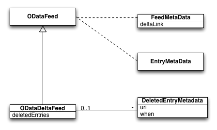
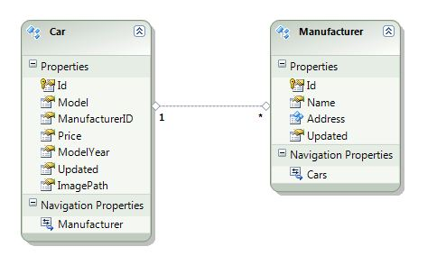
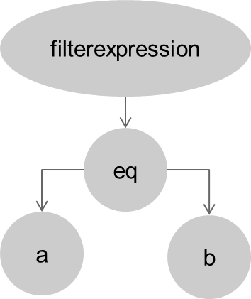
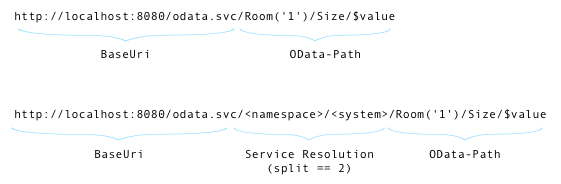

# Java Library for OData Version 4 ¶

## Navigation

- Download
  - [Download OData 2.0 Java](#odata2-download)
  - [Download OData 4.0 Java](#odata4-download)
  - [Download OData 4.0 JavaScript](#javascript-download)
- Documentation
  - [Documentation OData 2.0 Java](#odata2)
  - [Documentation OData 4.0 JavaScript](#javascript)
- [Java Library for OData Version 4](#odata4-overview)
- [Documentation OData 2.0 Java Library](#odata2)
- How to Start
  - [Sample Project Setup with Maven Archetypes](#odata2-sample-setup)
  - [Run with Tomcat](#odata2-tomcat)
- Olingo for Client usage
  - [Client Sample Tutorial](#odata2-tutorials-olingov2basicclientsample)
  - [Consuming Delta Responses](#odata2-tutorials-deltaclient)
  - [How to use the Batch Client API](#odata2-tutorials-batchclientapi)
- Olingo for Server usage
  - [Read Scenario](#odata2-tutorials-basicread)
  - [Write Scenario](#odata2-tutorials-olingo_tutorial_basicwrite)
  - [Read Scenario - $expand](#odata2-tutorials-read_expand)
  - [Read Scenario - Media Resources](#odata2-tutorials-read_media-resource)
  - [Batch Scenario (read/write)](#odata2-tutorials-olingo_tutorial_advancedreadwrite_batch)
  - [Delta Responses](#odata2-tutorials-delta)
- Olingo Library Extensions
  - Java Annotation Processor Extension
    - [Creating a Web Application Project with Annotation Processor Extension](#odata2-tutorials-annotationprocessorextension)
  - JPA Processor Extension
    - [Creating a Web Application Project for Transforming JPA Models into OData Services](#odata2-tutorials-createwebapp)
    - [Extending the EDM Generated from the JPA Models](#odata2-tutorials-extendingtheedm)
    - [Adding Function Imports for JPA Models](#odata2-tutorials-jpafunctionimport)
    - [Redefine Metadata for JPA Models](#odata2-tutorials-jparedefinemetadata)
    - [Delta Token Support for JPA](#odata2-tutorials-deltaquerysupport)
    - [Handling CLOB and BLOB Data Types](#odata2-tutorials-handlingclobandblob)
    - [Custom OData JPA Processor](#odata2-tutorials-customodatajpaprocessor)
- Miscellaneous
  - [Non JAX-RS support](#odata2-tutorials-servlet)
  - [Implementation of Filter Visitor](#odata2-tutorials-olingo_tutorial_advancedread_filtervisitor)
  - [Parse Metadata](#odata2-tutorials-olingo_tutorial_basicread_edm)
  - [Service Resolution](#odata2-tutorials-olingo_tutorial_advanced_service_resolution)
  - [Debug Support and Custom Error Handling](#odata2-tutorials-debug)
  - [OSGi Support](#odata2-tutorials-osgi)
- Olingo Project Setup (Contributors)
  - [Git and Maven Support](#odata2-maven)
  - [Eclipse IDE Support](#odata2-eclipse)
  - [Release Documentation](#odata2-release)
- [Index](#javascript-apidoc)
- Modules
  - [cache](#javascript-apidoc-module-cache)
  - [cache/source](#javascript-apidoc-source)
  - [odata](#javascript-apidoc-module-odata)
  - [odata/batch](#javascript-apidoc-batch)
  - [odata/handler](#javascript-apidoc-handler)
  - [odata/json](#javascript-apidoc-json)
  - [odata/metadata](#javascript-apidoc-metadata)
  - [odata/net](#javascript-apidoc-net)
  - [odata/utils](#javascript-apidoc-utils)
  - [odatajs/deferred](#javascript-apidoc-deferred)
  - [odatajs/utils](#javascript-apidoc-utils_)
  - [odatajs/xml](#javascript-apidoc-xml)
  - [store](#javascript-apidoc-module-store)
  - [store/dom](#javascript-apidoc-dom)
  - [store/indexeddb](#javascript-apidoc-indexeddb)
  - [store/memory](#javascript-apidoc-memory)
- Classes
  - [DataCache](#javascript-apidoc-datacache)
  - [DataCacheOperation](#javascript-apidoc-datacacheoperation)
  - [DjsDeferred](#javascript-apidoc-djsdeferred)
  - [DomStore](#javascript-apidoc-dom-domstore)
  - [IndexedDBStore](#javascript-apidoc-indexeddb-indexeddbstore)
  - [MemoryStore](#javascript-apidoc-memory-memorystore)
  - [ODataCacheSource](#javascript-apidoc-odatacachesource)
- [Global](#javascript-apidoc-global)
- [How to use Apache Olingo as Client Library](#odata2-tutorials-olingov2basicclientsample)
- [Project Setup](#odata2-project-setup)
- Build Environment
  - [Maven](#odata2-maven)
- Development Environment
  - [Eclipse IDE](#odata2-eclipse)
- Run Environment
  - [Run with Tomcat](#odata2-tomcat)
- Required steps
  - Build of OData Application
    - [If you don't have a project the follow our sample project setup](#odata2-sample-setup)
- [Download OData 2.0 Java Library](#odata2-download)
- [Download OData 4.0 Java Library](#odata4-download)
- [Download Olingo OData Client for JavaScript Library](#javascript-download)
- Other pages
  - [JSDoc: Source: cache.js](#javascript-apidoc-cache.js)
  - [Building the Olingo OData Client for JavaScript ¶](#javascript-project-build)
  - [Project setup ¶](#javascript-project-setup)
  - [Apache Olingo - Privacy ¶](#odata2-privacy)
  - [Building the Olingo Project ¶](#odata4-maven)

## Content

<a id="odata2-download"></a>

<!-- source_url: https://olingo.apache.org/doc/odata2/download.html -->

<!-- page_index: 1 -->

<a id="odata2-download--download-odata-20-java-library"></a>
<a id="odata2-download--download-odata-2.0-java-library"></a>

# Download OData 2.0 Java Library

Apache Olingo OData2 is a collection of Java libraries for
implementing [OData V2](https://odata.org) protocol clients or servers.

<a id="odata2-download--release-2013-2023-10-22"></a>
<a id="odata2-download--release-2.0.13-2023-10-22"></a>

### Release 2.0.13 (2023-10-22)

[Release notes](https://issues.apache.org/jira/secure/ReleaseNote.jspa?projectId=12314520&version=12351658)

The Apache Olingo OData2 2.0.13 release is a patch release.

<a id="odata2-download--commodity-packages"></a>

### Commodity Packages

The **Olingo Library Core** packages contains the *API*, the *implementation*, the *documentation as JavaDoc* and the *Reference Scenario*.
The *API* and the according *implementation* can be used in a *production* environment.
The Reference Scenario is a sample and **shall not be used in a production** environment.
The *Core Library* is developed for production environment usage in business scenarios.

| Package | zip | Description |
| --- | --- | --- |
| Olingo OData2 Library | [Download](https://www.apache.org/dyn/closer.lua/olingo/odata2/2.0.13/olingo-odata2-dist-lib-2.0.13-lib.zip) ([sha512](https://downloads.apache.org/olingo/odata2/2.0.13/olingo-odata2-dist-lib-2.0.13-lib.zip.sha512), [pgp](https://downloads.apache.org/olingo/odata2/2.0.13/olingo-odata2-dist-lib-2.0.13-lib.zip.asc)) | All you need to implement an OData V2 client or server. |
| Olingo OData2 Sources | [Download](https://www.apache.org/dyn/closer.lua/olingo/odata2/2.0.13/olingo-odata2-parent-2.0.13-source-release.zip) ([sha512](https://downloads.apache.org/olingo/odata2/2.0.13/olingo-odata2-parent-2.0.13-source-release.zip.sha512), [pgp](https://downloads.apache.org/olingo/odata2/2.0.13/olingo-odata2-parent-2.0.13-source-release.zip.asc)) | Olingo OData2 source code. |
| Olingo OData2 Docs | [Download](https://www.apache.org/dyn/closer.lua/olingo/odata2/2.0.13/olingo-odata2-dist-javadoc-2.0.13-javadoc.zip) ([sha512](https://downloads.apache.org/olingo/odata2/2.0.13/olingo-odata2-dist-javadoc-2.0.13-javadoc.zip.sha512), [pgp](https://downloads.apache.org/olingo/odata2/2.0.13/olingo-odata2-dist-javadoc-2.0.13-javadoc.zip.asc)) | Documentation and JavaDoc. |
| Olingo OData2 Reference Scenario | [Download](https://www.apache.org/dyn/closer.lua/olingo/odata2/2.0.13/olingo-odata2-dist-ref-2.0.13-ref.zip) ([sha512](https://downloads.apache.org/olingo/odata2/2.0.13/olingo-odata2-dist-ref-2.0.13-ref.zip.sha512), [pgp](https://downloads.apache.org/olingo/odata2/2.0.13/olingo-odata2-dist-ref-2.0.13-ref.zip.asc)) | Deployable WAR files with reference scenario services using [Apache CXF](https://cxf.apache.org). |

<a id="odata2-download--extension-packages"></a>

##### Extension Packages

The **Olingo Library Extension** packages contains extensions which are provided from various contributors in the context of the Olingo open source project.
The extensions provides convenience for easier consumption or creation of an OData service like the *JPA based processor*, the *Java Annotation based processor* or the *Spring Framework integration*.
However the extensions are *not optimized regarding performance or extensibility*.
Interested parties can use the extensions, if they are sufficient for their scenarios in a production environment.
Feature enhancements or optimizations of the extensions have to be done by the interested parties itself.

| Package | zip | Description |
| --- | --- | --- |
| Olingo OData2 JPA Processor | [Download](https://www.apache.org/dyn/closer.lua/olingo/odata2/2.0.13/olingo-odata2-dist-jpa-2.0.13-jpa.zip) ([sha512](https://downloads.apache.org/olingo/odata2/2.0.13/olingo-odata2-dist-jpa-2.0.13-jpa.zip.sha512), [pgp](https://downloads.apache.org/olingo/odata2/2.0.13/olingo-odata2-dist-jpa-2.0.13-jpa.zip.asc)) | All you need to expose your JPA model as OData service. |
| Olingo OData2 Java Annotation Processor | [Download](https://www.apache.org/dyn/closer.lua/olingo/odata2/2.0.13/olingo-odata2-dist-janos-2.0.13-janos.zip) ([sha512](https://downloads.apache.org/olingo/odata2/2.0.13/olingo-odata2-dist-janos-2.0.13-janos.zip.sha512), [pgp](https://downloads.apache.org/olingo/odata2/2.0.13/olingo-odata2-dist-janos-2.0.13-janos.zip.asc)) | Use Java Annotations to create a simple OData service for e.g. test cases (without persistence). |
| Olingo OData2 Spring Extension Sources | [Download](https://www.apache.org/dyn/closer.lua/olingo/odata2/2.0.13/olingo-odata2-spring-2.0.13-source-release.zip) ([sha512](https://downloads.apache.org/olingo/odata2/2.0.13/olingo-odata2-spring-2.0.13-source-release.zip.sha512), [pgp](https://downloads.apache.org/olingo/odata2/2.0.13/olingo-odata2-spring-2.0.13-source-release.zip.asc)) | Support for use of OData library in Spring context. |

<a id="odata2-download--maven"></a>

### Maven

Apache Olingo OData2 artifacts for latest version at [Maven Central](https://search.maven.org/#search%7Cga%7C1%7Cg%3A%22org.apache.olingo%22%20AND%20v%3A%222.0.13%22).
For POM dependencies see [here](#odata2-maven).

All other Apache Olingo artifacts are also available at [Maven Central](https://search.maven.org/#search%7Cga%7C1%7Corg.apache.olingo).

<a id="odata2-download--older-releases"></a>

### Older Releases

For older releases please refer to [Archives](https://archive.apache.org/dist/olingo/)
or you can get them [using Maven](#odata2-maven).

<a id="odata2-download--verify-authenticity-of-downloads-package"></a>

### Verify Authenticity of Downloads package

While downloading the packages, make yourself familiar
on how to verify their integrity, authenticity and provenience
according to the Apache Software Foundation best practices.
Please make sure you check the following resources:

- [Artifact verification](https://olingo.apache.org/verification.html) details
- Developers and release managers PGP keys are publicly available here: [KEYS](https://downloads.apache.org/olingo/KEYS).

Copyright © 2013-2025, The Apache Software Foundation
Apache Olingo, Olingo, Apache, the Apache feather, and
the Apache Olingo project logo are trademarks of the Apache Software
Foundation.

[Privacy](#odata2-privacy)

---

<a id="odata4-download"></a>

<!-- source_url: https://olingo.apache.org/doc/odata4/download.html -->

<!-- page_index: 2 -->

<a id="odata4-download--download-odata-40-java-library"></a>
<a id="odata4-download--download-odata-4.0-java-library"></a>

# Download OData 4.0 Java Library

Apache Olingo OData4 is a collection of Java libraries for
implementing [OData V4](https://odata.org) protocol clients or servers.

<a id="odata4-download--release-500-2023-12-18"></a>
<a id="odata4-download--release-5.0.0-2023-12-18"></a>

### Release 5.0.0 (2023-12-18)

[Full download page](https://downloads.apache.org/olingo/odata4/5.0.0/) and [release notes](https://issues.apache.org/jira/secure/ReleaseNote.jspa?projectId=12314520&version=12353663).

The Apache *Olingo OData 4 5.0.0* release is the latest stable release for the *OData V4* specifications.

<a id="odata4-download--commodity-packages"></a>

### Commodity Packages

| Package | zip | Description |
| --- | --- | --- |
| Olingo OData Sources | [Download](https://www.apache.org/dyn/closer.lua/olingo/odata4/5.0.0/Olingo-OData-5.0.0-source-release.zip) ([sha512](https://downloads.apache.org/olingo/odata4/5.0.0/Olingo-OData-5.0.0-source-release.zip.sha512), [pgp](https://downloads.apache.org/olingo/odata4/5.0.0/Olingo-OData-5.0.0-source-release.zip.asc)) | Complete source code. |
| Olingo OData Docs | [Download](https://www.apache.org/dyn/closer.lua/olingo/odata4/5.0.0/Olingo-OData-JavaDoc-5.0.0-javadoc.zip) ([sha512](https://downloads.apache.org/olingo/odata4/5.0.0/Olingo-OData-JavaDoc-5.0.0-javadoc.zip.sha512), [pgp](https://downloads.apache.org/olingo/odata4/5.0.0/Olingo-OData-JavaDoc-5.0.0-javadoc.zip.asc)) | Documentation and JavaDoc. |
| Olingo OData Server for Java | [Download](https://www.apache.org/dyn/closer.lua/olingo/odata4/5.0.0/Olingo-OData-Server-for-Java-5.0.0-lib.zip) ([sha512](https://downloads.apache.org/olingo/odata4/5.0.0/Olingo-OData-Server-for-Java-5.0.0-lib.zip.sha512), [pgp](https://downloads.apache.org/olingo/odata4/5.0.0/Olingo-OData-Server-for-Java-5.0.0-lib.zip.asc)) | All you need to implement an OData V4 Java server. |
| Olingo OData Server Extension for Java | [Download](https://www.apache.org/dyn/closer.lua/olingo/odata4/5.0.0/Olingo-OData-Server-Extension-for-Java-5.0.0-lib.zip) ([sha512](https://downloads.apache.org/olingo/odata4/5.0.0/Olingo-OData-Server-Extension-for-Java-5.0.0-lib.zip.sha512), [pgp](https://downloads.apache.org/olingo/odata4/5.0.0/Olingo-OData-Server-Extension-for-Java-5.0.0-lib.zip.asc)) | Convenience API to implement an OData V4 Java server. |
| Olingo OData Client for Java | [Download](https://www.apache.org/dyn/closer.lua/olingo/odata4/5.0.0/Olingo-OData-Client-for-Java-5.0.0-lib.zip) ([sha512](https://downloads.apache.org/olingo/odata4/5.0.0/Olingo-OData-Client-for-Java-5.0.0-lib.zip.sha512), [pgp](https://downloads.apache.org/olingo/odata4/5.0.0/Olingo-OData-Client-for-Java-5.0.0-lib.zip.asc)) | All you need to implement an OData V4 Java client. |
| Olingo OData Client for Android | [Download](https://www.apache.org/dyn/closer.lua/olingo/odata4/5.0.0/Olingo-OData-Client-for-Android-5.0.0-lib.zip) ([sha512](https://downloads.apache.org/olingo/odata4/5.0.0/Olingo-OData-Client-for-Android-5.0.0-lib.zip.sha512), [pgp](https://downloads.apache.org/olingo/odata4/5.0.0/Olingo-OData-Client-for-Android-5.0.0-lib.zip.asc)) | All you need to implement an OData V4 Android client. |

<a id="odata4-download--maven"></a>

### Maven

The Apache Olingo 5.0.0 only artifacts are also available at [Maven Central](https://search.maven.org/#search%7Cga%7C1%7Cg:%22org.apache.olingo%22%20AND%20v:%225.0.0%22).
All Apache Olingo OData 4 artifacts are available at [Maven Central](https://search.maven.org/#search%7Cga%7C1%7Corg.apache.olingo).
For POM dependencies see [here](#odata4-maven).

<a id="odata4-download--older-releases"></a>

### Older Releases

For older releases please refer to [Archives](https://archive.apache.org/dist/olingo/)
or you can get them [using Maven](#odata4-maven).

<a id="odata4-download--verify-authenticity-of-downloads-package"></a>

### Verify Authenticity of Downloads package

While downloading the packages, make yourself familiar
on how to verify their integrity, authenticity and provenience
according to the Apache Software Foundation best practices.
Please make sure you check the following resources:

- [Artifact verification](https://olingo.apache.org/verification.html) details
- Developers and release managers PGP keys are publicly available here: [KEYS](https://downloads.apache.org/olingo/KEYS).

Copyright © 2013-2025, The Apache Software Foundation
Apache Olingo, Olingo, Apache, the Apache feather, and
the Apache Olingo project logo are trademarks of the Apache Software
Foundation.

[Privacy](#odata2-privacy)

---

<a id="javascript-download"></a>

<!-- source_url: https://olingo.apache.org/doc/javascript/download.html -->

<!-- page_index: 3 -->

<a id="javascript-download--download-olingo-odata-client-for-javascript-library"></a>

# Download Olingo OData Client for JavaScript Library

The Olingo OData Client for JavaScript (odatajs) is a library written in JavaScript that enables browser based frontend applications to easily use the OData protocol for communication with application servers.

<a id="javascript-download--release-400"></a>
<a id="javascript-download--release-4.0.0"></a>

### Release 4.0.0

[Full download page](https://dist.apache.org/repos/dist/release/olingo/odatajs/odatajs-4.0.0), [release notes](https://issues.apache.org/jira/browse/OLINGO-624)

The Apache Olingo OData for JavaScript 4.0.0 release is a major release.

<a id="javascript-download--commodity-packages"></a>

### Commodity Packages

| Package | zip | Description |
| --- | --- | --- |
| Library | [Download](https://www.apache.org/dyn/closer.lua/olingo/odatajs/odatajs-4.0.0/odatajs-4.0.0-lib.zip) ([md5](https://dist.apache.org/repos/dist/release/olingo/odatajs/odatajs-4.0.0/odatajs-4.0.0-lib.zip.md5), [sha512](https://dist.apache.org/repos/dist/release/olingo/odatajs/odatajs-4.0.0/odatajs-4.0.0-lib.zip.sha512), [pgp](https://dist.apache.org/repos/dist/release/olingo/odatajs/odatajs-4.0.0/odatajs-4.0.0-lib.zip.asc)) | All you need to implement an OData V4 client. |
| Source | [Download](https://www.apache.org/dyn/closer.lua/olingo/odatajs/odatajs-4.0.0/odatajs-4.0.0-sources.zip) ([md5](https://dist.apache.org/repos/dist/release/olingo/odatajs/odatajs-4.0.0/odatajs-4.0.0-sources.zip.md5), [sha512](https://dist.apache.org/repos/dist/release/olingo/odatajs/odatajs-4.0.0/odatajs-4.0.0-sources.zip.sha512), [pgp](https://dist.apache.org/repos/dist/release/olingo/odatajs/odatajs-4.0.0/odatajs-4.0.0-sources.zip.asc)) | All source. |
| NuGet | [Download](https://www.apache.org/dyn/closer.lua/olingo/odatajs/odatajs-4.0.0/odatajs.4.0.0.nupkg) ([md5](https://dist.apache.org/repos/dist/release/olingo/odatajs/odatajs-4.0.0/odatajs.4.0.0.nupkg.md5), [sha512](https://dist.apache.org/repos/dist/release/olingo/odatajs/odatajs-4.0.0/odatajs.4.0.0.nupkg.sha512), [pgp](https://dist.apache.org/repos/dist/release/olingo/odatajs/odatajs-4.0.0/odatajs.4.0.0.nupkg.asc)) | NuGet package. |
| Documentation | [Download](https://www.apache.org/dyn/closer.lua/olingo/odatajs/odatajs-4.0.0/odatajs-4.0.0-doc.zip) ([md5](https://dist.apache.org/repos/dist/release/olingo/odatajs/odatajs-4.0.0/odatajs-4.0.0-doc.zip.md5), [sha512](https://dist.apache.org/repos/dist/release/olingo/odatajs/odatajs-4.0.0/odatajs-4.0.0-doc.zip.sha512), [pgp](https://dist.apache.org/repos/dist/release/olingo/odatajs/odatajs-4.0.0/odatajs-4.0.0-doc.zip.asc)) | API documentation. |

<a id="javascript-download--verify-authenticity-of-downloads-package"></a>

### Verify Authenticity of Downloads package

While downloading the packages, make yourself familiar
on how to verify their integrity, authenticity and provenience
according to the Apache Software Foundation best practices.
Please make sure you check the following resources:

- [Artifact verification](https://olingo.apache.org/verification.html) details
- Developers and release managers PGP keys are publicly available here: [KEYS](https://downloads.apache.org/olingo/KEYS).

Copyright © 2013-2025, The Apache Software Foundation
Apache Olingo, Olingo, Apache, the Apache feather, and
the Apache Olingo project logo are trademarks of the Apache Software
Foundation.

[Privacy](#odata2-privacy)

---

<a id="odata2"></a>

<!-- source_url: https://olingo.apache.org/doc/odata2/index.html -->

<!-- page_index: 4 -->

# Documentation OData 2.0 Java Library ¶

---

<a id="javascript"></a>

<!-- source_url: https://olingo.apache.org/doc/javascript/index.html -->

<!-- page_index: 5 -->

<a id="javascript--olingo-odata-client-for-javascript"></a>

## Olingo OData Client for JavaScript

The Olingo OData Client for JavaScript (odatajs) is a library written in JavaScript that enables browser based frontend applications to easily use the OData protocol for communication with application servers.

This library "odatajs-4.0.0.min.js" supports only the OData V4 protocol.

For using the OData protocols V1-V3 please refer to the [datajs library](http://datajs.codeplex.com/)

The odatajs library can be included in any html page with the script tag (for example) `<script type="text/javascript" src="./sources/odatajs-4.0.0.min.js"></script>`
and its features can be used through the `odatajs` namespace (or `window.odatajs`). The odatajs library can be used together with the datajs library which uses the `window.OData` namespace.

For API documentation please see [ODatajs API documentation](#javascript-apidoc)

You may also use the documentation and the samples from the [datajs library](http://datajs.codeplex.com/documentation) because the features and API are similar.

<a id="javascript--features"></a>

## Features

Features ported from DataJS V3 to Olingo OData Client for JavaScript to support OData V4

- Support of OData V4 headers
- Support of OData V4 metadata payload
- Support of OData JSON payload version 4.0 (include batch request and response payload)
- Support of the Cache and Store modules
  Changes in Olingo OData Client for JavaScript
- [Changed] The license header is changed to the Apache license header
- [Pruned] Atom and JSON verbose payload support is removed to conform the OData V4 protocol
- [New] New build infrastructure -
  In order to make the build infrastructure of ODataJS cross-platform and easy accessible, a new build infrastructure based on Node Package Manager (NPM) and Grunt is adopted and has replaced the former Visual Studio based build infrastructure. For more details, please refers to the building instructions.
- [New] The code comments are modified to the JSDoc style and the JSDoc generation functionality is enabled.
- [New] Support running on browser-independent environments (e.g. Node.js)

<a id="javascript--contribute-to-olingo-odata-client-for-javascript"></a>

## Contribute to Olingo OData Client for JavaScript

If you are interested to contribute to this library please have a look into [Project setup](#javascript-project-setup) and [Build instructions](#javascript-project-build) where you find a manual how you can download the source code and build the odatajs library.

If you intend so please also join the [Olingo developers group](https://olingo.apache.org/support.html) for discussion.

Copyright © 2013-2025, The Apache Software Foundation
Apache Olingo, Olingo, Apache, the Apache feather, and
the Apache Olingo project logo are trademarks of the Apache Software
Foundation.

[Privacy](#odata2-privacy)

---

<a id="odata4-overview"></a>

<!-- source_url: https://olingo.apache.org/doc/odata4/overview.html -->

<!-- page_index: 6 -->

<a id="odata4-overview--java-library-for-odata-version-4"></a>

# Java Library for OData Version 4

<a id="odata4-overview--overview"></a>

## Overview

The Open Data Protocol (OData) is a web-based protocol for querying and
updating data. It has been defined initially by Microsoft but is now an
[OASIS standard](https://www.oasis-open.org/committees/tc_home.php?wg_abbrev=odata).
This allows anyone to freely interoperate with OData implementations. Data
exposed via the OData standard can be consumed in any environment offering
HTTP-based connectivity. In addition, there are client SDKs available for
various platforms such as .Net, Java, PHP, JavaScript, etc.

For the Java platform, the [Apache Olingo project](https://olingo.apache.org/)
offers a library useful for implementing an OData service. It provides
services such as URL parsing, input validation, (de-)serialization of
content, request dispatching, etc., according to the OData specification.

The main parts of an OData service implementation are the metadata
definition, the run-time processing of requests, and the definition of the
web infrastructure. These parts will now be described in more detail.

<a id="odata4-overview--entity-data-model-metadata"></a>

## Entity Data Model (Metadata)

The Entity Data Model (EDM) is the underlying metadata model of the OData
protocol. Within the EDM the following (main) elements are described:

- Schemas
- Entity Types
- Complex Types
- Type Definitions
- Enum Types
- Properties
- Navigation Properties
- Actions
- Functions
- Entity Container
  - Entity Sets
  - Singletons
  - Action Imports
  - Function Imports

A proper OData Service requires a valid and consistent EDM. In order to speed
up performance, the OData Library does no validation of the EDM.

The standard way of defining the metadata is to write code in so-called
EDM provider classes. It would be possible to add other sources for
metadata, e.g., a predefined metadata document.

EDM provider classes separate the run-time EDM object instances from code
that defines OData EDM objects. All provider classes simply define string
values for the different EDM elements. At run-time, objects are created only
as far as necessary. Since the typical request (apart from the request for
the metadata document, of course) can be processed with only the directly
involved EDM objects, this can be a significant performance improvement.
Furthermore, this solves the problem that many EDM objects depend on each
other, making it no easy task to find the right order of object
instantiation.

Service implementations can derive from `CsdlAbstractEdmProvider` and
override only those methods that should provide EDM objects. Almost all
provider methods have a parameter of type `FullQualifiedName` that specifies
for which (namespace-qualified) name a provider-object instance is to be
returned. In addition, there are some methods with the purpose of retrieving
a list of all names of a given object type; these are used only for the
output of the metadata document.

<a id="odata4-overview--run-time-processing-of-requests"></a>

## Run-Time Processing of Requests

<a id="odata4-overview--general-setup"></a>

### General Setup

<a id="odata4-overview--design-considerations"></a>

#### Design Considerations

The OData standard describes many different types of requests that have to be
answered by an OData service implementation. It would not be useful to have a
single processing interface or even a single method that a service
implementation has to implement. Different designs are possible how the
multitude of requests can be split into more manageable parts.

This library has been designed to handle a given OData request in a single
call to a processing method, including the complete query-options part. Which
method the request dispatcher calls is decided according to the HTTP method
and the representation type of the expected response. The HTTP method
describes the fundamental type of operation: `GET` for read requests, `PUT`
or `PATCH` for update requests, `POST` for create requests, and `DELETE` for
deletion requests. The representation type describes which information can be
retrieved from the OData service: an Entity representation, or only a link
URL, or even just a simple number as a count of entities.

The fact that a single method call occurs for a given request, as complicated
as it may be, leads immediately to the consequence that almost all processing
methods must be prepared to handle things like navigation and system query
options. Navigation in turn means that even if the response in the end may be
a simple count, the implementation may have to read entity collections, their
relations, and even function imports or bound functions that may occur before
the final `$count` in the request URI. Services therefore have to be
implemented carefully in order to respond to requests they are not prepared
to handle with a `Not Implemented` response and its corresponding HTTP status
code of 501.

A major advantage of the one-step approach is that the processing interfaces
don't have to make any assumptions how application data is to be transported.
The serialization and deserialization helper methods of the library of course
use library-defined data objects but service implementations are free to use
their own code for that tasks and still can use the core run-time library
functionality.

Many implementations will re-use large parts of code for essentially the same
requests that differ only in the returned representation. But there might be
optimizations: An SQL request could be much more efficient for count
determination if not all entities are retrieved first. Since this library does
not favor a specific implementation, the interface is designed to allow the
necessary flexibility.

<a id="odata4-overview--overall-handling"></a>

#### Overall Handling

Processor classes have to be registered in order to be called from the
library core at run-time. The core run-time registers the `DefaultProcessor`
API class with default implementations of `MetadataProcessor`, `ServiceDocumentProcessor`, and `ErrorProcessor`, but this can be overridden
simply by registering an own implementation.

Each class can implement one or more of the processor interfaces; all
processing methods have unique names across all processor interfaces.

Since the general design of the library is to have as little constraints as
possible, as little as possible happens automatically. The service developer
is responsible for the correct response to a given request. There are several
helper methods to ease this task considerably. But if you are not satisfied
with them, it is always possible to use your own implementation, even if that
does not conform to the OData standard.

<a id="odata4-overview--processor-interfaces-and-processing-methods"></a>

#### Processor Interfaces and Processing Methods

All processor interfaces derive from the `Processor` interface which defines
a single `init()` method allowing to get a run-time instance of the `OData`
object and the `ServiceMetadata`. The `OData` object is the root object for
serving factory tasks and the single instance connecting the API interfaces
with their implementations; each thread (processing of one request) should
keep its own instance. The `ServiceMetadata` instance contains the Entity
Data Model and some other objects related to metadata.

All processing methods have at least `ODataRequest` and `ODataResponse`
objects as parameters. They are supposed to find all necessary information
about the request body and its headers in the request object and set the
corresponding information in the response object.

Processing methods that are not called with a static URI like `$batch`
additionally have a `UriInfo` parameter describing the request URI.

Processing methods that have to read request-body content additionally have a
`ContentType` parameter describing the request-body format in order to select
the correct deserializer.

Processing methods that have to deliver content in the response body
additionally have a `ContentType` parameter describing the requested format
in order to select the correct serializer.

An example with all parameters mentioned above is the method `createEntity()`
in the interface `EntityProcessor`:

```java
void createEntity(ODataRequest request, ODataResponse response,
    UriInfo uriInfo, ContentType requestFormat, ContentType responseFormat)
    throws ODataApplicationException, ODataLibraryException;
```

<a id="odata4-overview--content-negotiation"></a>

### Content Negotiation

<a id="odata4-overview--request-content-type"></a>

#### Request Content Type

Requests that send data must provide a `Content-Type` HTTP header.
This is checked in the core run-time code. For each representation type
there is a list of content types that are supported by the implementation.

The method `modifySupportedContentTypes()` of the interface
`CustomContentTypeSupport` can be implemented to change that; it is even
possible to remove library-supported content types. Any implementation of
this interface has to be registered in the same way as processor classes in
order to have any effect.

Request content types that do not match the supported content types are
rejected with error messages and the HTTP status code 406 (Not Acceptable).

<a id="odata4-overview--response-content-type"></a>

#### Response Content Type

A request for a response with a content type not matching the supported
content types is rejected with an error message and the HTTP status code 415
(Unsupported Media Type).

The list of supported content types can be modified as described for the
request content type. It is not possible to have different support for
responses than for requests.

<a id="odata4-overview--exceptions"></a>

### Exceptions

All processing methods can and should throw exceptions if something went
wrong.

Almost all library utility methods declare exceptions that derive from
`ODataLibraryException`. Those exceptions are handled by the core run-time
code which takes care of setting the correct response status code and error
text.

If a service implementation wants to signal an error itself, it can throw an
`ODataApplicationException`. The constructor of this exception allows to
define the response status code and the error text. Please note that the
OData standard mandates specific status codes in many places; this is not
enforced by the library.

If a `RuntimeException` occurs, the core run-time code sets the response
status code to 500 (Internal Server Error) and delivers a corresponding error
text.

<a id="odata4-overview--response-status-code"></a>

### Response Status Code

Service implementations have to set the response status code explicitly.
Failing to do so results in a status code of 500 (Internal Server Error).
Please note that the OData standard mandates specific status codes in many
places; this is not enforced by the library.

<a id="odata4-overview--helper-methods"></a>

### Helper Methods

<a id="odata4-overview--serialization"></a>

#### Serialization

<a id="odata4-overview--serializers-dependent-on-content-negotiation"></a>

##### Serializers Dependent on Content Negotiation

For some representation types the OData standard defines different
representations, e.g., JSON and XML. For the JSON format there are different
sub-formats differing in the amount of metadata that is part of the content.

In order to have a uniform interface and to relieve the service
implementations from many switch statements, it is possible to get the
correct serializer from the `OData` object's `createSerializer()` method that
has a content type as parameter. The requested response content type is
passed as parameter to all processing methods that are supposed to create
response content.

The `ODataSerializer` interface has methods to serialize the following types
of content:

- service document
- metadata document
- error document
- entity
- entity collection
- primitive value
- collection of primitive values
- complex value
- collection of complex values
- reference to an entity
- collection of references to entities

Every data serializer gets its run-time data as an instance of a type defined
in the `commons.api.data` package. It has also an additional parameter to
pass options like the context URL or expand settings in a single object.
Please note that according to the OData standard the context URL is mandatory
for service responses except for responses with no metadata at all.

<a id="odata4-overview--fixed-format-serializers"></a>

##### Fixed-Format Serializers

Fixed-format serializers can be used for formats defined in the OData
standard that are not subject to content negotiation. The
`FixedFormatSerializer` instance to be got from the `OData` object's
`createFixedFormatSerializer()` method has methods for serializing a binary, a count, a primitive raw value, a batch, and an asynchronous response.

<a id="odata4-overview--deserialization"></a>

#### Deserialization

Deserialization works along the same principles as serialization, with
minor differences, however.

There is no deserializer for the representation types service document, metadata document, and error document. There is an additional representation
type that can be deserialized: action parameters.

All content-type-dependent methods don't return data objects directly but
instances of `DeserializerResult` instead. This makes it possible to return
additional information like the expand information.

<a id="odata4-overview--uri-related-tasks"></a>

#### URI-related Tasks

<a id="odata4-overview--context-url"></a>

##### Context URL

The context URL is a mandatory part of all data-related responses of an OData
service except for responses with no metadata at all. In some cases it cannot
be determined from the data alone that is passed to the serialization
methods. Therefore, the serialization methods expect the correct context URL
as parameter.

The `ContextURL` object has its own builder that allows to build the context
URL from its parts. For the difficult parts the `UriHelper` instance to be
got from the `OData` object's `createUriHelper()` method has helper methods
that assist with building select lists and key predicates.

<a id="odata4-overview--canonical-url"></a>

##### Canonical URL

The `UriHelper` instance to be got from the `OData` object's
`createUriHelper()` method has a helper method to construct the canonical URL
of an entity. This URL can be used as `Location` HTTP header, for example.

<a id="odata4-overview--uri-parser"></a>

##### URI parser

The `UriHelper` instance to be got from the `OData` object's
`createUriHelper()` method has a helper method to parse the entity-ID URI of
an entity. This method can be used in the handling of reference-changing
requests.

<a id="odata4-overview--helpers-for-concurrency-control"></a>

#### Helpers for Concurrency Control

The OData standard defines optimistic concurrency control, a mechanism to
ensure that a modification request accesses the current version of the data
to be modified. Furthermore, this mechanism can be used to enable client-side
caching, using the information that the requested data are still current.

To achieve this, OData uses weak entity tags via the `ETag` HTTP response
header and its associated `If-Match` and `If-None-Match` HTTP request
headers.

To enable this functionality for run-time data, service implementations can
register a class that implements the `CustomETagSupport` interface with its
two methods for entities and media-entity data. These methods should return
for a given entity-set or singleton name whether the service supports entity
tags for entities out of this entity set or singleton. No finer granularity
is possible currently. Processing methods still have to check the ETag(s)
themselves; the `ETagHelper` instance to be got from the `OData` object's
`createETagHelper()` method has two ready-made methods for read and change
requests, respectively.

To enable this functionality for metadata, i.e., for the service document and
the metadata document, service implementations can pass an instance of an
implementation of the `ServiceMetadataETagSupport` interface to the
`ServiceMetadata` creation described above. The default processors for
service- and metadata document requests already take this ETag support into
account.

<a id="odata4-overview--helpers-for-preference-handling"></a>

#### Helpers for Preference Handling

Some aspects of OData request processing can be influenced from a client by
setting preferences in the HTTP `Prefer` header. The service implementation
is not obliged to honor these preferences. If it does, it should respond with
an appropriate `Preference-Applied` HTTP header.

The `Preferences` instance to be got from the `OData` object's
`createPreferences()` method with the HTTP `Prefer` headers as parameter
has named access methods for the preferences defined in the OData standard
plus generic access to other preferences.

The `PreferencesApplied` API class has a builder that helps building a
correct `Preference-Applied` HTTP response header.

<a id="odata4-overview--debug-output"></a>

#### Debug Output

For support purposes there is a possibility to enrich the service response
with additional data helpful for finding bugs. Please note that this
information could also help attackers.

To enable this functionality, service implementations can register a class
that implements the `DebugSupport` interface with its two methods for user
authorization and creation of output.

A ready-made `DefaultDebugSupport` class is already provided where all users
are always authorized and the additional data consists of information about
the request, the response, the parsed request URI, the server environment, library timings, and the stacktrace in case an error occurred, in a
self-contained HTML document ready for browser usage or in a JSON document.
The `OData` object's `createDebugResponseHelper()` method returns a
`DebugResponseHelper` instance which is used in this default implementation.

To request the debug output for a request to the OData service the query parameter
`odata-debug=html` must be appended to the original request URL
(e.g. `http://localhost:8080/odata-server-tecsvc/odata.svc/?odata-debug=html` for a local published test service).

<a id="odata4-overview--definition-of-the-web-infrastructure"></a>

## Definition of the Web Infrastructure

To enable an OData service on a web server, the service is wrapped by a web
application.

The web application is defined in a `web.xml` file where a servlet is
registered. The servlet is a standard `HttpServlet` configured to dispatch
all requests to URLs below the service's root URL to the OData handler class.
This is done by overriding the servlet's `service()` method. The library
provides an `ODataHttpHandler` object, creatable from the `OData` API class
with the EDM definition as parameter, that can be used inside the `service()`
method.

It receives the request and delegates it to the processor implementation of
the OData service if the URL conforms to the OData specification. This means
that all processor implementations of the OData service have to be registered
with the `register()` method. The responses of the registered handlers are
given back to the servlet infrastructure and will result in corresponding
HTTP responses.

Copyright © 2013-2025, The Apache Software Foundation
Apache Olingo, Olingo, Apache, the Apache feather, and
the Apache Olingo project logo are trademarks of the Apache Software
Foundation.

[Privacy](#odata2-privacy)

---

<a id="odata2-sample-setup"></a>

<!-- source_url: https://olingo.apache.org/doc/odata2/sample-setup.html -->

<!-- page_index: 7 -->

<a id="odata2-sample-setup--sample-project-setup"></a>

# Sample Project Setup

Olingo has prepared a very simple sample car service that can work as a starting point for implementing a custom OData service.
This service consists of a very simple EDM with two entity sets that are cars and manufactures and a memory based data provider that is a simple hash map.
Therefore the project implements a very basic single OData processor supporting a minimal readonly scenario.
If build with Maven the build result is a web application (`war` file) which can be deployed to any JEE compliant web application server (e.g. [Tomcat](https://tomcat.apache.org)).

---

<a id="odata2-sample-setup--maven-archetype"></a>

### Maven Archetype

Apache Olingo supports Maven archetypes that are a kind of project template for setting up new projects from scratch.
Currently exists an archetype with an `ODataSingleProcessor` implementation as `olingo-odata2-sample-cars-service-archetype` and an archetype with an annotation based `ODataService` implementation as `olingo-odata2-sample-cars-annotation-archetype`.

To generate the sample project for the `ODataSingleProcessor` implementation start with:

```
mvn archetype:generate \
  -DinteractiveMode=false \
  -Dversion=1.0.0-SNAPSHOT \
  -DgroupId=com.sample \
  -DartifactId=my-car-service \
  -DarchetypeGroupId=org.apache.olingo \
  -DarchetypeArtifactId=olingo-odata2-sample-cars-service-archetype \
  -DarchetypeVersion=RELEASE
```

To generate the sample project for the `ODataService` implementation with use of the Java Annotations extension start with:

```
mvn archetype:generate \
  -DinteractiveMode=false \
  -Dversion=1.0.0-SNAPSHOT \
  -DgroupId=com.sample \
  -DartifactId=my-car-service \
  -DarchetypeGroupId=org.apache.olingo \
  -DarchetypeArtifactId=olingo-odata2-sample-cars-annotation-archetype \
  -DarchetypeVersion=RELEASE
```

If an archetype is not available via Maven standard configuration then an additional parameter `-DarchetypeRepository=https://repository.apache.org/snapshots` can solve the issue.

Based on the Olingo project template Maven will generate a new project with the specified GAV\*) coordinates: `com.sample:my-car-service:1.0.0-SNAPSHOT`.
GAV coordinates can be freely chosen during generation with the interactive mode. To enable the interactive mode `-DinteractiveMode` must be set to true or omitted (to use Maven default setting of `true`).

The result is a new and ready to build Maven project. Switch to *my-car-service* directory and execute:

```
mvn clean install
```

If a Apache Olingo dependency is not available via Maven standard configuration than adding the Apache Maven Repository (or in case you want to use SNAPSHOTS the Apache Snapshot Repository) into your Maven `settings.xml` or the `pom.xml` of this project can solve the issue.

```xml
     …
      <repositories>
        <repository>
          <id>apache.central</id>
          <name>Central Repository</name>
          <url>https://repo.maven.apache.org/maven2</url>
        </repository>

        <repository>
          <id>apache.snapshots</id>
          <name>Apache SNAPSHOT Repository</name>
          <url>https://repository.apache.org/content/repositories/snapshots/</url>
        </repository>
      </repositories>
    …
```

Maven will build the project with the result **car-service.war** in the Maven *target* directory which can be deployed to any JEE compliant web application server.
To call the deployed and running OData service enter this URI in a browser:

```
http://localhost:8080/my-car-service/
```

Which show a entry page for the generated sample service with links to the *Metadata* (`$metadata`), *Service Document* and some *sample data* which it provides.

\*) GAV means a Maven groupId, artifactId and version.

<a id="odata2-sample-setup--eclipse-ide-support"></a>

### Eclipse IDE Support

The archetype template supports Eclipse as IDE.
Additionally to a Maven clean and install it is possible to call the following Maven goal:

```
mvn eclipse:clean eclipse:eclipse
```

This will generate Eclipse project files including all transitive dependencies and the web application facet.
Import the project to Eclipse and it should be recognized as a web application project.
Deploy the Eclipse project to a server and it should run as well.

Copyright © 2013-2025, The Apache Software Foundation
Apache Olingo, Olingo, Apache, the Apache feather, and
the Apache Olingo project logo are trademarks of the Apache Software
Foundation.

[Privacy](#odata2-privacy)

---

<a id="odata2-tomcat"></a>

<!-- source_url: https://olingo.apache.org/doc/odata2/tomcat.html -->

<!-- page_index: 8 -->

# Apache Olingo Library

---

<a id="odata2-tutorials-olingov2basicclientsample"></a>

<!-- source_url: https://olingo.apache.org/doc/odata2/tutorials/OlingoV2BasicClientSample.html -->

<!-- page_index: 9 -->

# How to use Apache Olingo as Client Library ¶

---

<a id="odata2-tutorials-deltaclient"></a>

<!-- source_url: https://olingo.apache.org/doc/odata2/tutorials/deltaClient.html -->

<!-- page_index: 10 -->

<a id="odata2-tutorials-deltaclient--consuming-delta-responses"></a>

# Consuming Delta Responses

Delta responses is a feature on top of OData 2.0 for requesting changes. The feature is defined in OData 4.0 and this is a preliminary and lightweight implementation close to the OData 4.0 specification [(see here)](http://docs.oasis-open.org/odata/odata/v4.0/errata02/os/complete/part1-protocol/odata-v4.0-errata02-os-part1-protocol-complete.html#_Toc406398316).

How delta responses can be produced by an OData service is documented here: [server side delta responses](#odata2-tutorials-delta).

<a id="odata2-tutorials-deltaclient--use-case"></a>

### Use Case

A client reads a feed and later wants to get only the update of changed and deleted entries.

<a id="odata2-tutorials-deltaclient--principle"></a>

### Principle

A client has to read a complete (paged) feed. With the last feed page the service has to provide a delta link instead of a next link. A delta link us usually the same feed url containing a delta token as proprietary query parameter. With the delta link the client can query the service again and gets back a delta feed containing entries which were changed or deleted since the complete feed was received.



<a id="odata2-tutorials-deltaclient--examples"></a>

### Examples

Example for a delta link: `http://<host>:<port>/odata/Rooms?!deltatoken=123`

<a id="odata2-tutorials-deltaclient--delta-feed-handling"></a>

##### Delta Feed Handling

Depends on the general client sample [here](https://olingo.apache.org/doc/odata2/tutorials/...)

```
// retrieve a feed
ODataFeed feed = client.readFeed("Container1", "Rooms", contentType);
String deltaLink = feed.getFeedMetadata().getDeltaLink();

// store feed data
List<ODataEntry> entries = feed.getEntries();

// get delta link from feed
String deltaLink = feed.getFeedMetadata().getDeltaLink();

// query delta feed using delta link
ODataDeltaFeed deltaFeed = client.readDeltaFeed("Container1", "Rooms", contentType, deltaLink);

List<ODataEntry> changedEntries = deltaFeed.getEntries();
List<DeletedEntryMetada) deletedEntries = deltaFeed.getDeletedEntries();

// proceed with data handling of entries, changedEntries and deletedEntries    
```

<a id="odata2-tutorials-deltaclient--response-deserialization"></a>

##### Response Deserialization

Precondition: Query the delta link using any HTTP client.

```
InputStream content = ...; // retrieve content    

EdmEntityContainer entityContainer = edm.getEntityContainer("Container1");

ODataFeed deltaFeed = EntityProvider.readDeltaFeed(contentType, entityContainer.getEntitySet("Rooms"), 
  content, EntityProviderReadProperties.init().build());
```

<a id="odata2-tutorials-deltaclient--links"></a>

### Links

- Delta Links (for Atom and Json)
- Tombstones [RFC6721](http://tools.ietf.org/html/rfc6721) for deleted entries in Atom format
- Deleted Entries in Json as a lightweight implementation of [Delta Responses](http://docs.oasis-open.org/odata/odata-json-format/v4.0/cos01/odata-json-format-v4.0-cos01.html#_Toc372793080)

Copyright © 2013-2025, The Apache Software Foundation
Apache Olingo, Olingo, Apache, the Apache feather, and
the Apache Olingo project logo are trademarks of the Apache Software
Foundation.

[Privacy](#odata2-privacy)

---

<a id="odata2-tutorials-batchclientapi"></a>

<!-- source_url: https://olingo.apache.org/doc/odata2/tutorials/batchClientApi.html -->

<!-- page_index: 11 -->

<a id="odata2-tutorials-batchclientapi--batch-request-construction"></a>

## Batch Request construction

**Query Request construction**

A BatchQueryPart is a representation of a single retrieve request. You can use the following methods in order to fill out a request:

- method(String)
- uri(String)
- contentId(String)
- headers(List)

```

BatchQueryPart request = BatchQueryPart.method("GET").uri("$metadata").build();
```

**Note:** The valid method value is GET.

**ChangeSet construction**
A BatchChangeSetPart is a representation of a single change request. You can use the following methods in order to fill out a change request:

- method(String)
- uri(String)
- headers(List)
- contentId(String)
- body(String)

```
Map changeSetHeaders = new HashMap();
changeSetHeaders.put("content-type", "application/json;odata=verbose");
BatchChangeSetPart changeRequest = BatchChangeSetPart.method("PUT")
.uri("Employees('2')/EmployeeName")
.headers(changeSetHeaders)
.body("{\"EmployeeName\":\"Frederic Fall MODIFIED\"}")
.build();
...
```

**Note:** The valid method values are POST, PUT, DELETE or MERGE.

The change request has to become a part of a changeSet. For that you need to create a changeSet object and to attach the change request to this object.

```
...
BatchChangeSet changeSet = BatchChangeSet.newBuilder().build();
changeSet.add(changeRequest);
```

**Batch request payload construction**
After you collected all created parts, you can call the method writeBatchRequestBody(..) provided by EntityProvider

```
...
List<BatchPart> batchParts = new ArrayList<BatchPart>();
batchParts.add(request);
batchParts.add(changeSet);
 
InputStream payload = EntityProvider.writeBatchRequest(batchParts, BOUNDARY);
```

The second parameter BOUNDARY is necessary information for the construction of the batch request payload. It is the value of the boundary parameter, that is set in Content-Type header of the batch request.

**Batch Response interpretation**
Interpretation of the batch response payload
You receive a list of single response by calling EntityProvider.parseBatchResponse(..)

```
List<BatchSingleResponse> responses = EntityProvider.parseBatchResponse(responseBody, contentType);
for (BatchSingleResponse response : responses) {
      response.getStatusCode());
      response.getStatusInfo());
      response.getHeader(HttpHeaders.CONTENT_TYPE);
      response.getBody();
      response.getContentId();
}
```

Copyright © 2013-2025, The Apache Software Foundation
Apache Olingo, Olingo, Apache, the Apache feather, and
the Apache Olingo project logo are trademarks of the Apache Software
Foundation.

[Privacy](#odata2-privacy)

---

<a id="odata2-tutorials-basicread"></a>

<!-- source_url: https://olingo.apache.org/doc/odata2/tutorials/basicread.html -->

<!-- page_index: 12 -->

<a id="odata2-tutorials-basicread--read-scenario"></a>

# Read Scenario

---

<a id="odata2-tutorials-basicread--how-to-guide-for-building-a-sample-odata-service-with-the-odata-library-java"></a>

### How To Guide for building a Sample OData service with the OData Library (Java)

This How To Guide prerequisites a Project Setup (Git, Maven, etc.) and then shows how to develop an OData Service and make the same available.
It shows in addition how to implement the Model Provider to expose the Entity Data Model (EDM) and the Data Provider to expose the runtime data.
The implementation of the Data Provider (ODataSingleProcessor) illustrates how to expose a single entry, a feed and how to follow associations.

<a id="odata2-tutorials-basicread--prerequisites"></a>

### Prerequisites

[Project Setup](#odata2-project-setup) is successfully done and the project is ready to start in your `$ODATA_PROJECT_HOME`.

<a id="odata2-tutorials-basicread--implement-your-odata-service"></a>

### Implement your OData Service

<a id="odata2-tutorials-basicread--shortcut"></a>

##### Shortcut

As a shortcut you can download the [Olingo Tutorial 'Basic-Read' Project](assets/files/apache-olingo-tutorial-basic-read_7c44488c64bd3962.zip).

<a id="odata2-tutorials-basicread--deployment-descriptor"></a>

### Deployment Descriptor

<a id="odata2-tutorials-basicread--sample-code"></a>

##### Sample Code

```xml
<?xml version="1.0" encoding="UTF-8"?>
<web-app xmlns:xsi="http://www.w3.org/2001/XMLSchema-instance"
    xmlns="http://java.sun.com/xml/ns/javaee" xmlns:web="http://java.sun.com/xml/ns/javaee/web-app_2_5.xsd"
    xsi:schemaLocation="http://java.sun.com/xml/ns/javaee http://java.sun.com/xml/ns/javaee/web-app_2_5.xsd"
    id="WebApp_ID" version="2.5">
    <display-name>org.apache.olingo.odata2.sample</display-name>
    <servlet>
        <servlet-name>MyODataSampleServlet</servlet-name>
        <servlet-class>org.apache.cxf.jaxrs.servlet.CXFNonSpringJaxrsServlet</servlet-class>
        <init-param>
            <param-name>javax.ws.rs.Application</param-name>
            <param-value>org.apache.olingo.odata2.core.rest.app.ODataApplication</param-value>
        </init-param>
        <init-param>
            <param-name>org.apache.olingo.odata2.service.factory</param-name>
            <param-value>org.apache.olingo.odata2.sample.service.MyServiceFactory</param-value>
        </init-param>
        <load-on-startup>1</load-on-startup>
    </servlet>
    <servlet-mapping>
        <servlet-name>MyODataSampleServlet</servlet-name>
        <url-pattern>/MyODataSample.svc/*</url-pattern>
    </servlet-mapping>
</web-app>
```

- Start the command line tool, go to folder *$ODATA\_PROJECT\_HOME\org.apache.olingo.odata2.sample.cars* and enter
  `mvn clean install` to build your projects
- The deployment Descriptor contains two `<init-param>` elements which define the OData Application `org.apache.olingo.odata2.core.rest.app.ODataApplication` and your Service Factory `org.apache.olingo.odata2.sample.service.MyServiceFactory`. The OData Application is implemented in the OData Library (Core) and registers a root locator and an exception mapper. The root locator looks up your registered Service Factory to get access to the Entity Data Model Provider and the OData Processor which provides the runtime data. In addition the root locator looks up a parameter `org.apache.olingo.odata2.path.split` (not present in the deployment descriptor above) which indicates how many path segments are reserved for the OData Service via an Integer value (default is 0, which means that the OData Service name corresponds to the defined `url-pattern`).

<a id="odata2-tutorials-basicread--implement-the-odata-service-factory"></a>

### Implement the OData Service Factory

- Create a new source folder *src/main/java* in the eclipse project
- Create a new package `org.apache.olingo.odata2.sample.service` in the source folder
- Create a class `MyServiceFactory` which extends `org.apache.olingo.odata2.api.ODataServiceFactory` in the new package and contains the following implementation

<a id="odata2-tutorials-basicread--sample-code_1"></a>
<a id="odata2-tutorials-basicread--sample-code-2"></a>

##### Sample Code

```java
package org.apache.olingo.odata2.sample.service;
    
import org.apache.olingo.odata2.api.ODataService;
import org.apache.olingo.odata2.api.ODataServiceFactory;
import org.apache.olingo.odata2.api.edm.provider.EdmProvider;
import org.apache.olingo.odata2.api.exception.ODataException;
import org.apache.olingo.odata2.api.processor.ODataContext;
import org.apache.olingo.odata2.api.processor.ODataSingleProcessor;
    
public class MyServiceFactory extends ODataServiceFactory {

  @Override
  public ODataService createService(ODataContext ctx) throws ODataException {

    EdmProvider edmProvider = new MyEdmProvider();
    ODataSingleProcessor singleProcessor = new MyODataSingleProcessor();
    
    return createODataSingleProcessorService(edmProvider, singleProcessor);
  }
}
```

- In order to make your coding able to compile you have to create Java classes for
  `MyEdmProvider` which extends `org.apache.olingo.odata2.api.edm.provider.EdmProvider` and
  `MyODataSingleProcessor` which extends `org.apache.olingo.odata2.api.processor.ODataSingleProcessor`
- After these steps compile your project with `mvn clean install`

<a id="odata2-tutorials-basicread--implement-the-entity-data-model-provider"></a>

### Implement the Entity Data Model Provider

In this paragraph you will implement the `MyEdmProvider` class by overriding all methods of `org.apache.olingo.odata2.api.edm.provider.EdmProvider`.

- You will implement the following Entity Data Model.



- As we have a static model we define constants for all top level elements of the schema (declared in the `MyEdmProvider` class).

<a id="odata2-tutorials-basicread--sample-code_2"></a>
<a id="odata2-tutorials-basicread--sample-code-3"></a>

##### Sample Code

```java
  static final String ENTITY_SET_NAME_MANUFACTURERS = "Manufacturers";
  static final String ENTITY_SET_NAME_CARS = "Cars";
  static final String ENTITY_NAME_MANUFACTURER = "Manufacturer";
  static final String ENTITY_NAME_CAR = "Car";
    
  private static final String NAMESPACE = "org.apache.olingo.odata2.ODataCars";

  private static final FullQualifiedName ENTITY_TYPE_1_1 = new FullQualifiedName(NAMESPACE, ENTITY_NAME_CAR);
  private static final FullQualifiedName ENTITY_TYPE_1_2 = new FullQualifiedName(NAMESPACE, ENTITY_NAME_MANUFACTURER);

  private static final FullQualifiedName COMPLEX_TYPE = new FullQualifiedName(NAMESPACE, "Address");

  private static final FullQualifiedName ASSOCIATION_CAR_MANUFACTURER = new FullQualifiedName(NAMESPACE, "Car_Manufacturer_Manufacturer_Cars");

  private static final String ROLE_1_1 = "Car_Manufacturer";
  private static final String ROLE_1_2 = "Manufacturer_Cars";

  private static final String ENTITY_CONTAINER = "ODataCarsEntityContainer";

  private static final String ASSOCIATION_SET = "Cars_Manufacturers";
```

- Implement `MyEdmProvider.getSchemas`. This method is used to retrieve the complete structural information in order to build the metadata document and the service document. The implementation makes use of other getter methods of this class for simplicity reasons. If a very performant way of building the whole structural information was required, other implementation strategies could be used.

<a id="odata2-tutorials-basicread--sample-code_3"></a>
<a id="odata2-tutorials-basicread--sample-code-4"></a>

##### Sample Code

```java
public List<Schema> getSchemas() throws ODataException {
  List<Schema> schemas = new ArrayList<Schema>();
    
  Schema schema = new Schema();
  schema.setNamespace(NAMESPACE);
    
  List<EntityType> entityTypes = new ArrayList<EntityType>();
  entityTypes.add(getEntityType(ENTITY_TYPE_1_1));
  entityTypes.add(getEntityType(ENTITY_TYPE_1_2));
  schema.setEntityTypes(entityTypes);
    
  List<ComplexType> complexTypes = new ArrayList<ComplexType>();
  complexTypes.add(getComplexType(COMPLEX_TYPE));
  schema.setComplexTypes(complexTypes);
    
  List<Association> associations = new ArrayList<Association>();
  associations.add(getAssociation(ASSOCIATION_CAR_MANUFACTURER));
  schema.setAssociations(associations);
    
  List<EntityContainer> entityContainers = new ArrayList<EntityContainer>();
  EntityContainer entityContainer = new EntityContainer();
  entityContainer.setName(ENTITY_CONTAINER).setDefaultEntityContainer(true);
    
  List<EntitySet> entitySets = new ArrayList<EntitySet>();
  entitySets.add(getEntitySet(ENTITY_CONTAINER, ENTITY_SET_NAME_CARS));
  entitySets.add(getEntitySet(ENTITY_CONTAINER, ENTITY_SET_NAME_MANUFACTURERS));
  entityContainer.setEntitySets(entitySets);
    
  List<AssociationSet> associationSets = new ArrayList<AssociationSet>();
  associationSets.add(getAssociationSet(ENTITY_CONTAINER, ASSOCIATION_CAR_MANUFACTURER, ENTITY_SET_NAME_MANUFACTURERS, ROLE_1_2));
  entityContainer.setAssociationSets(associationSets);

  entityContainers.add(entityContainer);
  schema.setEntityContainers(entityContainers);

  schemas.add(schema);

  return schemas;
}
```

- `MyEdmProvider.getEntityType(FullQualifiedName edmFQName)` returns an Entity Type according to the full qualified name specified. The Entity Type holds all information about its structure like simple properties, complex properties, navigation properties and the definition of its key property (or properties).

<a id="odata2-tutorials-basicread--sample-code_4"></a>
<a id="odata2-tutorials-basicread--sample-code-5"></a>

##### Sample Code

```java
@Override
public EntityType getEntityType(FullQualifiedName edmFQName) throws ODataException {
  if (NAMESPACE.equals(edmFQName.getNamespace())) {

    if (ENTITY_TYPE_1_1.getName().equals(edmFQName.getName())) {

      //Properties
      List<Property> properties = new ArrayList<Property>();
      properties.add(new SimpleProperty().setName("Id").setType(EdmSimpleTypeKind.Int32).setFacets(new Facets().setNullable(false)));
      properties.add(new SimpleProperty().setName("Model").setType(EdmSimpleTypeKind.String).setFacets(new Facets().setNullable(false).setMaxLength(100).setDefaultValue("Hugo"))
          .setCustomizableFeedMappings(new CustomizableFeedMappings().setFcTargetPath(EdmTargetPath.SYNDICATION_TITLE)));
      properties.add(new SimpleProperty().setName("ManufacturerId").setType(EdmSimpleTypeKind.Int32));
      properties.add(new SimpleProperty().setName("Price").setType(EdmSimpleTypeKind.Decimal));
      properties.add(new SimpleProperty().setName("Currency").setType(EdmSimpleTypeKind.String).setFacets(new Facets().setMaxLength(3)));
      properties.add(new SimpleProperty().setName("ModelYear").setType(EdmSimpleTypeKind.String).setFacets(new Facets().setMaxLength(4)));
      properties.add(new SimpleProperty().setName("Updated").setType(EdmSimpleTypeKind.DateTime)
          .setFacets(new Facets().setNullable(false).setConcurrencyMode(EdmConcurrencyMode.Fixed))
          .setCustomizableFeedMappings(new CustomizableFeedMappings().setFcTargetPath(EdmTargetPath.SYNDICATION_UPDATED)));
      properties.add(new SimpleProperty().setName("ImagePath").setType(EdmSimpleTypeKind.String));

      //Navigation Properties
      List<NavigationProperty> navigationProperties = new ArrayList<NavigationProperty>();
      navigationProperties.add(new NavigationProperty().setName("Manufacturer")
          .setRelationship(ASSOCIATION_CAR_MANUFACTURER).setFromRole(ROLE_1_1).setToRole(ROLE_1_2));

      //Key
      List<PropertyRef> keyProperties = new ArrayList<PropertyRef>();
      keyProperties.add(new PropertyRef().setName("Id"));
      Key key = new Key().setKeys(keyProperties);

      return new EntityType().setName(ENTITY_TYPE_1_1.getName())
          .setProperties(properties)
          .setKey(key)
          .setNavigationProperties(navigationProperties);

    } else if (ENTITY_TYPE_1_2.getName().equals(edmFQName.getName())) {

      //Properties
      List<Property> properties = new ArrayList<Property>();
      properties.add(new SimpleProperty().setName("Id").setType(EdmSimpleTypeKind.Int32).setFacets(new Facets().setNullable(false)));
      properties.add(new SimpleProperty().setName("Name").setType(EdmSimpleTypeKind.String).setFacets(new Facets().setNullable(false).setMaxLength(100))
          .setCustomizableFeedMappings(new CustomizableFeedMappings().setFcTargetPath(EdmTargetPath.SYNDICATION_TITLE)));
      properties.add(new ComplexProperty().setName("Address").setType(new FullQualifiedName(NAMESPACE, "Address")));
      properties.add(new SimpleProperty().setName("Updated").setType(EdmSimpleTypeKind.DateTime)
          .setFacets(new Facets().setNullable(false).setConcurrencyMode(EdmConcurrencyMode.Fixed))
          .setCustomizableFeedMappings(new CustomizableFeedMappings().setFcTargetPath(EdmTargetPath.SYNDICATION_UPDATED)));

      //Navigation Properties
      List<NavigationProperty> navigationProperties = new ArrayList<NavigationProperty>();
      navigationProperties.add(new NavigationProperty().setName("Cars")
          .setRelationship(ASSOCIATION_CAR_MANUFACTURER).setFromRole(ROLE_1_2).setToRole(ROLE_1_1));

      //Key
      List<PropertyRef> keyProperties = new ArrayList<PropertyRef>();
      keyProperties.add(new PropertyRef().setName("Id"));
      Key key = new Key().setKeys(keyProperties);

      return new EntityType().setName(ENTITY_TYPE_1_2.getName())
          .setProperties(properties)
          .setHasStream(true)
          .setKey(key)
          .setNavigationProperties(navigationProperties);
    }
  }

  return null;
}
```

- `MyEdmProvider.getComplexType(FullQualifiedName edmFQName)`

<a id="odata2-tutorials-basicread--sample-code_5"></a>
<a id="odata2-tutorials-basicread--sample-code-6"></a>

##### Sample Code

```java
public ComplexType getComplexType(FullQualifiedName edmFQName) throws ODataException {if (NAMESPACE.equals(edmFQName.getNamespace())) {if (COMPLEX_TYPE.getName().equals(edmFQName.getName())) {List<Property> properties = new ArrayList<Property>(); properties.add(new SimpleProperty().setName("Street").setType(EdmSimpleTypeKind.String)); properties.add(new SimpleProperty().setName("City").setType(EdmSimpleTypeKind.String)); properties.add(new SimpleProperty().setName("ZipCode").setType(EdmSimpleTypeKind.String)); properties.add(new SimpleProperty().setName("Country").setType(EdmSimpleTypeKind.String)); return new ComplexType().setName(COMPLEX_TYPE.getName()).setProperties(properties);}}
return null;
}
```

- `MyEdmProvider.getAssociation(FullQualifiedName edmFQName)`

<a id="odata2-tutorials-basicread--sample-code_6"></a>
<a id="odata2-tutorials-basicread--sample-code-7"></a>

##### Sample Code

```java
public Association getAssociation(FullQualifiedName edmFQName) throws ODataException {if (NAMESPACE.equals(edmFQName.getNamespace())) {if (ASSOCIATION_CAR_MANUFACTURER.getName().equals(edmFQName.getName())) {return new Association().setName(ASSOCIATION_CAR_MANUFACTURER.getName()) .setEnd1(new AssociationEnd().setType(ENTITY_TYPE_1_1).setRole(ROLE_1_1).setMultiplicity(EdmMultiplicity.MANY)) .setEnd2(new AssociationEnd().setType(ENTITY_TYPE_1_2).setRole(ROLE_1_2).setMultiplicity(EdmMultiplicity.ONE));}} return null;}
```

- `MyEdmProvider.getEntityContainerInfo(String name)`

<a id="odata2-tutorials-basicread--sample-code_7"></a>
<a id="odata2-tutorials-basicread--sample-code-8"></a>

##### Sample Code

```java
public EntityContainerInfo getEntityContainerInfo(String name) throws ODataException {
  if (name == null || "ODataCarsEntityContainer".equals(name)) {
    return new EntityContainerInfo().setName("ODataCarsEntityContainer").setDefaultEntityContainer(true);
  }

  return null;
}
```

- `MyEdmProvider.getEntitySet(String entityContainer, String name)`

<a id="odata2-tutorials-basicread--sample-code_8"></a>
<a id="odata2-tutorials-basicread--sample-code-9"></a>

##### Sample Code

```java
public EntitySet getEntitySet(String entityContainer, String name) throws ODataException {if (ENTITY_CONTAINER.equals(entityContainer)) {if (ENTITY_SET_NAME_CARS.equals(name)) {return new EntitySet().setName(name).setEntityType(ENTITY_TYPE_1_1); } else if (ENTITY_SET_NAME_MANUFACTURERS.equals(name)) {return new EntitySet().setName(name).setEntityType(ENTITY_TYPE_1_2);}} return null;}
```

- `MyEdmProvider.getAssociationSet(String entityContainer, FullQualifiedName association, String sourceEntitySetName, String sourceEntitySetRole)`

<a id="odata2-tutorials-basicread--sample-code_9"></a>
<a id="odata2-tutorials-basicread--sample-code-10"></a>

##### Sample Code

```java
public AssociationSet getAssociationSet(String entityContainer, FullQualifiedName association, String sourceEntitySetName, String sourceEntitySetRole) throws ODataException {if (ENTITY_CONTAINER.equals(entityContainer)) {if (ASSOCIATION_CAR_MANUFACTURER.equals(association)) {return new AssociationSet().setName(ASSOCIATION_SET) .setAssociation(ASSOCIATION_CAR_MANUFACTURER) .setEnd1(new AssociationSetEnd().setRole(ROLE_1_2).setEntitySet(ENTITY_SET_NAME_MANUFACTURERS)) .setEnd2(new AssociationSetEnd().setRole(ROLE_1_1).setEntitySet(ENTITY_SET_NAME_CARS));}} return null;}
```

<a id="odata2-tutorials-basicread--conclusion"></a>

#### Conclusion

After the implementation of the Edm Provider the web application can be executed to show the Service Document and the Metadata Document.

- Build your project `mvn clean install`
- Deploy the Web Application to the server.
- Show the Service Document: <http://localhost:8080/olingo.odata2.sample.cars.web/MyODataSample.svc/>
- Show the Metadata Document: <http://localhost:8080/olingo.odata2.sample.cars.web/MyODataSample.svc/$metadata>

<a id="odata2-tutorials-basicread--implement-the-odata-processor-which-provides-the-runtime-data"></a>

### Implement the OData Processor which provides the runtime data

You already created the `MyODataSingleProcessor` class which we now extend with some needed imports and a reference to a DataStore which contains our data (and will be implemented in the next step).

<a id="odata2-tutorials-basicread--sample-code_10"></a>
<a id="odata2-tutorials-basicread--sample-code-11"></a>

##### Sample Code

```java
package org.apache.olingo.odata2.sample.service;

import static org.apache.olingo.odata2.sample.service.MyEdmProvider.ENTITY_SET_NAME_CARS;
import static org.apache.olingo.odata2.sample.service.MyEdmProvider.ENTITY_SET_NAME_MANUFACTURERS;

import org.apache.olingo.odata2.api.processor.ODataSingleProcessor;

public class MyODataSingleProcessor extends ODataSingleProcessor {
  private DataStore dataStore = new DataStore();
}
```

- As next steps we will implement the read access to the Car and Manufacturer entries and the read access to the Cars and Manufacturers feed. As we need some basis for sample data we create a very simple DataStore which contains the data as well as access methods to serve the required data:

<a id="odata2-tutorials-basicread--sample-code_11"></a>
<a id="odata2-tutorials-basicread--sample-code-12"></a>

##### Sample Code

```java
package org.apache.olingo.odata2.sample.service;
    
import java.util.ArrayList;
import java.util.Calendar;
import java.util.HashMap;
import java.util.List;
import java.util.Map;
import java.util.TimeZone;

public class DataStore {

  //Data accessors
  public Map<String, Object> getCar(int id) {
    Map<String, Object> data = null;

    Calendar updated = Calendar.getInstance(TimeZone.getTimeZone("GMT"));
    
    switch (id) {
    case 1:
      updated.set(2012, 11, 11, 11, 11, 11);
      data = createCar(1, "F1 W03", 1, 189189.43, "EUR", "2012", updated, "file://imagePath/w03");
      break;

    case 2:
      updated.set(2013, 11, 11, 11, 11, 11);
      data = createCar(2, "F1 W04", 1, 199999.99, "EUR", "2013", updated, "file://imagePath/w04");
      break;

    case 3:
      updated.set(2012, 12, 12, 12, 12, 12);
      data = createCar(3, "F2012", 2, 137285.33, "EUR", "2012", updated, "http://pathToImage/f2012");
      break;

    case 4:
      updated.set(2013, 12, 12, 12, 12, 12);
      data = createCar(4, "F2013", 2, 145285.00, "EUR", "2013", updated, "http://pathToImage/f2013");
      break;

    case 5:
      updated.set(2011, 11, 11, 11, 11, 11);
      data = createCar(5, "F1 W02", 1, 167189.00, "EUR", "2011", updated, "file://imagePath/wXX");
      break;

    default:
      break;
    }
    
    return data;
  }
      
  private Map<String, Object> createCar(int carId, String model, int manufacturerId, double price, String currency, String modelYear, Calendar updated, String imagePath) {
    Map<String, Object> data = new HashMap<String, Object>();
    
    data.put("Id", carId);
    data.put("Model", model);
    data.put("ManufacturerId", manufacturerId);
    data.put("Price", price);
    data.put("Currency", currency);
    data.put("ModelYear", modelYear);
    data.put("Updated", updated);
    data.put("ImagePath", imagePath);
    
    return data;
  }
      
  public Map<String, Object> getManufacturer(int id) {
    Map<String, Object> data = null;
    Calendar date = Calendar.getInstance(TimeZone.getTimeZone("GMT"));
    
    switch (id) {
    case 1:
      Map<String, Object> addressStar = createAddress("Star Street 137", "Stuttgart", "70173", "Germany");
      date.set(1954, 7, 4);
      data = createManufacturer(1, "Star Powered Racing", addressStar, date);
      break;
      
    case 2:
      Map<String, Object> addressHorse = createAddress("Horse Street 1", "Maranello", "41053", "Italy");
      date.set(1929, 11, 16);
      data = createManufacturer(2, "Horse Powered Racing", addressHorse, date);
      break;
      
    default:
      break;
    }
    
    return data;
  }
    
  private Map<String, Object> createManufacturer(int id, String name, Map<String, Object> address, Calendar updated) {
    Map<String, Object> data = new HashMap<String, Object>();
    data.put("Id", id);
    data.put("Name", name);
    data.put("Address", address);
    data.put("Updated", updated);
    return data;
  }
      
  private Map<String, Object> createAddress(String street, String city, String zipCode, String country) {
    Map<String, Object> address = new HashMap<String, Object>();
    address.put("Street", street);
    address.put("City", city);
    address.put("ZipCode", zipCode);
    address.put("Country", country);
    return address;
  }
    
    
  public List<Map<String, Object>> getCars() {
    List<Map<String, Object>> cars = new ArrayList<Map<String, Object>>();
    cars.add(getCar(1));
    cars.add(getCar(2));
    cars.add(getCar(3));
    cars.add(getCar(4));
    cars.add(getCar(5));
    return cars;
  }
      
  public List<Map<String, Object>> getManufacturers() {
    List<Map<String, Object>> manufacturers = new ArrayList<Map<String, Object>>();
    manufacturers.add(getManufacturer(1));
    manufacturers.add(getManufacturer(2));
    return manufacturers;
  }
    

  public List<Map<String, Object>> getCarsFor(int manufacturerId) {
    List<Map<String, Object>> cars = getCars();
    List<Map<String, Object>> carsForManufacturer = new ArrayList<Map<String,Object>>();
    
    for (Map<String,Object> car: cars) {
      if(Integer.valueOf(manufacturerId).equals(car.get("ManufacturerId"))) {
        carsForManufacturer.add(car);
      }
    }
    
    return carsForManufacturer;
  }
   
  public Map<String, Object> getManufacturerFor(int carId) {
    Map<String, Object> car = getCar(carId);
    if(car != null) {
      Object manufacturerId = car.get("ManufacturerId");
      if(manufacturerId != null) {
        return getManufacturer((Integer) manufacturerId);
      }
    }
    return null;
  }
}
```

- Implement `MyODataSingleProcessor.readEntity(GetEntityUriInfo uriParserResultInfo)` by overriding the corresponding method of the ODataSingleProcessor

<a id="odata2-tutorials-basicread--sample-code_12"></a>
<a id="odata2-tutorials-basicread--sample-code-13"></a>

##### Sample Code

```java
  public ODataResponse readEntity(GetEntityUriInfo uriInfo, String contentType) throws ODataException {
    
    if (uriInfo.getNavigationSegments().size() == 0) {
      EdmEntitySet entitySet = uriInfo.getStartEntitySet();

      if (ENTITY_SET_NAME_CARS.equals(entitySet.getName())) {
        int id = getKeyValue(uriInfo.getKeyPredicates().get(0));
        Map<String, Object> data = dataStore.getCar(id);
        
        if (data != null) {
          URI serviceRoot = getContext().getPathInfo().getServiceRoot();
          ODataEntityProviderPropertiesBuilder propertiesBuilder = EntityProviderWriteProperties.serviceRoot(serviceRoot);
          
          return EntityProvider.writeEntry(contentType, entitySet, data, propertiesBuilder.build());
        }
      } else if (ENTITY_SET_NAME_MANUFACTURERS.equals(entitySet.getName())) {
        int id = getKeyValue(uriInfo.getKeyPredicates().get(0));
        Map<String, Object> data = dataStore.getManufacturer(id);
        
        if (data != null) {
          URI serviceRoot = getContext().getPathInfo().getServiceRoot();
          ODataEntityProviderPropertiesBuilder propertiesBuilder = EntityProviderWriteProperties.serviceRoot(serviceRoot);
  
          return EntityProvider.writeEntry(contentType, entitySet, data, propertiesBuilder.build());
        }
      }

      throw new ODataNotFoundException(ODataNotFoundException.ENTITY);

    } else if (uriInfo.getNavigationSegments().size() == 1) {
      //navigation first level, simplified example for illustration purposes only
      EdmEntitySet entitySet = uriInfo.getTargetEntitySet();
      if (ENTITY_SET_NAME_MANUFACTURERS.equals(entitySet.getName())) {
        int carKey = getKeyValue(uriInfo.getKeyPredicates().get(0));
        return EntityProvider.writeEntry(contentType, uriInfo.getTargetEntitySet(), dataStore.getManufacturer(carKey), EntityProviderWriteProperties.serviceRoot(getContext().getPathInfo().getServiceRoot()).build());
      }

      throw new ODataNotFoundException(ODataNotFoundException.ENTITY);
    }

    throw new ODataNotImplementedException();
  }
  Implement MyODataSingleProcessor.readEntitySet(GetEntitySetUriInfo uriParserResultInfo) by overriding the corresponding method of the ODataSingleProcessor 
    public ODataResponse readEntitySet(GetEntitySetUriInfo uriInfo, String contentType) throws ODataException {
    
    EdmEntitySet entitySet;

    if (uriInfo.getNavigationSegments().size() == 0) {
      entitySet = uriInfo.getStartEntitySet();

      if (ENTITY_SET_NAME_CARS.equals(entitySet.getName())) {
        return EntityProvider.writeFeed(contentType, entitySet, dataStore.getCars(), EntityProviderWriteProperties.serviceRoot(getContext().getPathInfo().getServiceRoot()).build());
      } else if (ENTITY_SET_NAME_MANUFACTURERS.equals(entitySet.getName())) {
        return EntityProvider.writeFeed(contentType, entitySet, dataStore.getManufacturers(), EntityProviderWriteProperties.serviceRoot(getContext().getPathInfo().getServiceRoot()).build());
      }

      throw new ODataNotFoundException(ODataNotFoundException.ENTITY);

    } else if (uriInfo.getNavigationSegments().size() == 1) {
      //navigation first level, simplified example for illustration purposes only
      entitySet = uriInfo.getTargetEntitySet();

      if (ENTITY_SET_NAME_CARS.equals(entitySet.getName())) {
        int manufacturerKey = getKeyValue(uriInfo.getKeyPredicates().get(0));

        List<Map<String, Object>> cars = new ArrayList<Map<String, Object>>();
        cars.add(dataStore.getCar(manufacturerKey));

        return EntityProvider.writeFeed(contentType, entitySet, cars, EntityProviderWriteProperties.serviceRoot(getContext().getPathInfo().getServiceRoot()).build());
      }

      throw new ODataNotFoundException(ODataNotFoundException.ENTITY);
    }

    throw new ODataNotImplementedException();
  }
```

And add the small method to get the key value of a `KeyPredicate`:

```java
  private int getKeyValue(KeyPredicate key) throws ODataException {
    EdmProperty property = key.getProperty();
    EdmSimpleType type = (EdmSimpleType) property.getType();
    return type.valueOfString(key.getLiteral(), EdmLiteralKind.DEFAULT, property.getFacets(), Integer.class);
  }
```

After the implementation of the `MyODataSingleProcessor` the web application can be tested.

- Build your project. Remember? `mvn clean install`
- Deploy the web application on your local server
- Show the Manufacturers: <http://localhost:8080/olingo.odata2.sample.cars.web/MyODataSample.svc/Manufacturers>
- Show one Manufacturer: <http://localhost:8080/olingo.odata2.sample.cars.web/MyODataSample.svc/Manufacturers(1)>
- Show the Cars: <http://localhost:8080/olingo.odata2.sample.cars.web/MyODataSample.svc/Cars>
- Show one Car: <http://localhost:8080/olingo.odata2.sample.cars.web/MyODataSample.svc/Cars(2)>
- Show the related Manufacturer of a Car: <http://localhost:8080/olingo.odata2.sample.cars.web/MyODataSample.svc/Cars(2)/Manufacturer>
- Show the related Cars of a Manufacturer: <http://localhost:8080/olingo.odata2.sample.cars.web/MyODataSample.svc/Manufacturers(1)/Cars>

Copyright © 2013-2025, The Apache Software Foundation
Apache Olingo, Olingo, Apache, the Apache feather, and
the Apache Olingo project logo are trademarks of the Apache Software
Foundation.

[Privacy](#odata2-privacy)

---

<a id="odata2-tutorials-olingo_tutorial_basicwrite"></a>

<!-- source_url: https://olingo.apache.org/doc/odata2/tutorials/Olingo_Tutorial_BasicWrite.html -->

<!-- page_index: 13 -->

<a id="odata2-tutorials-olingo_tutorial_basicwrite--write-scenario"></a>

# Write Scenario

<a id="odata2-tutorials-olingo_tutorial_basicwrite--how-to-guide-for-building-a-sample-odata-service-with-the-odata-library-java"></a>

### How To Guide for building a Sample OData service with the OData Library (Java)

This How To Guide shows how to create, update and delete an entry via your Data Provider (`ODataSingleProcessor`).

<a id="odata2-tutorials-olingo_tutorial_basicwrite--prerequisites"></a>

### Prerequisites

This tutorial is based on the [Read Scenario](#odata2-tutorials-basicread) - OData Library (Java) tutorial.

<a id="odata2-tutorials-olingo_tutorial_basicwrite--implementing-create-update-and-delete-entry-at-the-single-processor"></a>

### Implementing create, update and delete entry at the single processor

<a id="odata2-tutorials-olingo_tutorial_basicwrite--create-entry"></a>

##### Create entry

- You already created the `MyODataSingleProcessor` in the basic tutorial
- Implement `MyODataSingleProcessor.createEntity(PostUriInfo uriInfo, InputStream content, String requestContentType, String contentType) throws ODataException` by overriding the corresponding method of the `ODataSingleProcessor`

**Sample Code**

```
@Override
public ODataResponse createEntity(PostUriInfo uriInfo, InputStream content, 
String requestContentType, String contentType) throws ODataException {
  //No support for creating and linking a new entry
  if (uriInfo.getNavigationSegments().size() > 0) {
  throw new ODataNotImplementedException();
  }

  //No support for media resources
  if (uriInfo.getStartEntitySet().getEntityType().hasStream()) {
  throw new ODataNotImplementedException();
  }

  EntityProviderReadProperties properties = EntityProviderReadProperties.init().mergeSemantic(false).build();

  ODataEntry entry = EntityProvider.readEntry(requestContentType, uriInfo.getStartEntitySet(), content, properties);
  //if something goes wrong in deserialization this is managed via the ExceptionMapper
  //no need for an application to do exception handling here an convert the exceptions in HTTP exceptions

  Map<String, Object> data = entry.getProperties();
  //now one can use the data to create the entry in the backend ...
  //retrieve the key value after creation, if the key is generated by the server

  //update the data accordingly
  data.put("Id", Integer.valueOf(887788675));

  //serialize the entry, Location header is set by OData Library
  return EntityProvider.writeEntry(contentType, uriInfo.getStartEntitySet(), entry.getProperties(), EntityProviderWriteProperties.serviceRoot(getContext().getPathInfo().getServiceRoot()).build());
}
```

<a id="odata2-tutorials-olingo_tutorial_basicwrite--update-entry"></a>

##### Update entry

- You already created the `MyODataSingleProcessor` in the basic tutorial
- Implement `MyODataSingleProcessor.updateEntity(PutMergePatchUriInfo uriInfo, InputStream content, String requestContentType, boolean merge, String contentType) throws ODataException` by overriding the corresponding method of the `ODataSingleProcessor`

**Sample Code**

```
@Override
public ODataResponse updateEntity(PutMergePatchUriInfo uriInfo, InputStream content, String requestContentType, boolean merge, String contentType) throws ODataException {
EntityProviderReadProperties properties = EntityProviderReadProperties.init().mergeSemantic(false).build();

  ODataEntry entry = EntityProvider.readEntry(requestContentType, uriInfo.getTargetEntitySet(), content, properties);
  //if something goes wrong in deserialization this is managed via the ExceptionMapper,
  //no need for an application to do exception handling here an convert the exceptions in HTTP exceptions

  Map<String, Object> data = entry.getProperties();

  if ("Cars".equals(uriInfo.getTargetEntitySet().getName())) {
  int key = getKeyValue(uriInfo.getKeyPredicates().get(0));

    //if there is no entry with this key available, one should return "404 Not Found"
    //return ODataResponse.status(HttpStatusCodes.NOT_FOUND).build();

    //now one can use the data to create the entry in the backend ...
    String model = (String) data.get("Model");
    //...
  } else if ("Manufacturers".equals(uriInfo.getTargetEntitySet().getName())) {
  int key = getKeyValue(uriInfo.getKeyPredicates().get(0));
  //now one can use the data to create the entry in the backend ...
  }

  //we can return Status Code 204 No Content because the URI Parsing already guarantees that
  //a) only valid URIs are dispatched (also checked against the metadata)
  //b) 404 Not Found is already returned above, when the entry does not exist 
return ODataResponse.status(HttpStatusCodes.NO_CONTENT).build();
}
```

<a id="odata2-tutorials-olingo_tutorial_basicwrite--delete-entry"></a>

##### Delete entry

- You already created the `MyODataSingleProcessor` in the basic tutorial
- Implement `MyODataSingleProcessor.deleteEntity(DeleteUriInfo uriInfo, String contentType) throws ODataException` by overriding the corresponding method of the `ODataSingleProcessor`

**Sample Code**

```
@Override
public ODataResponse deleteEntity(DeleteUriInfo uriInfo, String contentType) throws ODataException {
  if ("Cars".equals(uriInfo.getTargetEntitySet().getName())) {
  int key = getKeyValue(uriInfo.getKeyPredicates().get(0));

    //if there is no entry with this key available, one should return "404 Not Found"
    //return ODataResponse.status(HttpStatusCodes.NOT_FOUND).build();

    //now one can delete the entry with this particular key in the backend...

  } else if ("Manufacturers".equals(uriInfo.getTargetEntitySet().getName())) {
  int key = getKeyValue(uriInfo.getKeyPredicates().get(0));
  //now one can delete the entry with this particular key in the backend...
  }

  //we can return Status Code 204 No Content because the URI Parsing already guarantees that
  //a) only valid URIs are dispatched (also checked against the metadata)
  //b) 404 Not Found is already returned above, when the entry does not exist 
  return ODataResponse.status(HttpStatusCodes.NO_CONTENT).build();
}
```

<a id="odata2-tutorials-olingo_tutorial_basicwrite--test-your-service"></a>

### Test your Service

After the implementation of the MyODataSingleProcessor the web application can be tested.

- Build your project `mvn clean install`
- In Eclipse, run the Web Application via Run As -> Run on Server
- Create a new Car
- Update an existing Car
- Delete a Car
- Create a new Manufacturer (this is a Media Link Entry), we expect the response 501 Not Implemented
- Update a Manufacturer (this is a Media Link Entry)

Copyright © 2013-2025, The Apache Software Foundation
Apache Olingo, Olingo, Apache, the Apache feather, and
the Apache Olingo project logo are trademarks of the Apache Software
Foundation.

[Privacy](#odata2-privacy)

---

<a id="odata2-tutorials-read_expand"></a>

<!-- source_url: https://olingo.apache.org/doc/odata2/tutorials/read_expand.html -->

<!-- page_index: 14 -->

<a id="odata2-tutorials-read_expand--read-scenario-read-with-expand"></a>

# Read Scenario - Read with $expand

---

<a id="odata2-tutorials-read_expand--how-to-guide-extend-basic-read-scenario-with-support-for-expand"></a>

### How To Guide - Extend basic read scenario with support for $expand

This How To Guide shows how to extend the basic read scenario with support for the $expand system query option.
It shows how to call the `EntityProvider.writeEntry(...)` and `EntityProvider.writeEntrySet(...)` methods with the necessary `EntityProviderWriteProperties` set and how to implement the necessary `OnWriteEntryContent OnWriteFeedContent` callbacks.

<a id="odata2-tutorials-read_expand--prerequisites"></a>

### Prerequisites

Setup of [Basic Read Scenario](#odata2-tutorials-basicread)

<a id="odata2-tutorials-read_expand--shortcut"></a>

### Shortcut

If you like to directly experiment with the results of the extented basic read scenario, you can use this shortcut:

- Download and unzip [Olingo Tutorial 'Basic Read with $expand extension' Project](assets/files/apache-olingo-tutorial-adv-read-expand_e263b2c90ed21283.zip) to your local drive which is your OData Tutorial project folder (referenced as `$ODATA_PROJECT_HOME` in the tutorial).
- Start the command line tool and execute the following command in the folder `$ODATA_PROJECT_HOME`
  - `mvn eclipse:eclipse clean install`
- Go into Eclipse and import the project into your workspace by...
  - Menu *File -> Import*...
  - *Existing projects into workspace*, then choose the `$ODATA_PROJECT_HOME` folder
  - Select both projects *olingo.odata2.sample.service* and *olingo.odata2.sample.web* and press *Finish*.

<a id="odata2-tutorials-read_expand--set-up-your-development-project"></a>

### Set Up your development project

If [Basic Read Scenario](#odata2-tutorials-basicread) is already set up there is nothing additional to do. Otherwise please refer to the Prerequisites section of the [Basic Read Scenario](#odata2-tutorials-basicread).

<a id="odata2-tutorials-read_expand--extend-basic-read-scenario"></a>

### Extend Basic Read Scenario

The steps to extend the basic read with $expand support for the Car and Manufacturer entities (not entity sets) are to provide the expanded data via ODataCallbacks and register these for the corresponding navigation properties.

<a id="odata2-tutorials-read_expand--implement-onwriteentrycontent-and-onwritefeedcontent-callbacks"></a>

### Implement OnWriteEntryContent and OnWriteFeedContent callbacks

To support `$expand` for a single entry the interface `org.apache.olingo.odata2.api.ep.callback.OnWriteEntryContent` must be implemented. This provides the method `WriteEntryCallbackResult retrieveEntryResult(WriteEntryCallbackContext context) throws ODataApplicationException;` which is called during processing from the `EntityProvider` to receive the necessary data which than is inlined in the response.

In our sample we create a class `MyCallback` which implements `org.apache.olingo.odata2.api.ep.callback.OnWriteEntryContent` in following way:

<a id="odata2-tutorials-read_expand--sample-code"></a>

##### Sample Code

```java
@Override
public WriteEntryCallbackResult retrieveEntryResult(WriteEntryCallbackContext context) throws ODataApplicationException {
WriteEntryCallbackResult result = new WriteEntryCallbackResult();

  try {
    if (isNavigationFromTo(context, ENTITY_SET_NAME_CARS, ENTITY_NAME_MANUFACTURER)) {
    EntityProviderWriteProperties inlineProperties = EntityProviderWriteProperties.serviceRoot(serviceRoot)
        .expandSelectTree(context.getCurrentExpandSelectTreeNode())
        .build();

      Map<String, Object> keys = context.extractKeyFromEntryData();
      Integer carId = (Integer) keys.get("Id");
      result.setEntryData(dataStore.getManufacturerFor(carId));
      result.setInlineProperties(inlineProperties);
    }
  } catch (EdmException e) {
  // TODO: should be handled and not only logged
  LOG.error("Error in $expand handling.", e);
  } catch (EntityProviderException e) {
  // TODO: should be handled and not only logged
  LOG.error("Error in $expand handling.", e);
  }
    
  return result;
}
```

Within this method we first check if the source entity and navigation property are correct for our case (via the method `isNavigationFromTo(...):boolean)`, then we create the `EntityProviderWriteProperties` with the new (current) `ExpandSelectTreeNode`, receive the data from our `DataStore` and put all into the result which then will be further processed by the `EntityProvider`.

<a id="odata2-tutorials-read_expand--implementation-for-expand-for-an-entity-set"></a>

### Implementation for $expand for an entity set

To support `$expand` for a feed of entries (entity set) the interface `org.apache.olingo.odata2.api.ep.callback.OnWriteFeedContent` must be implemented. These provides the method `WriteFeedCallbackResult retrieveFeedResult(WriteFeedCallbackContext context) throws ODataApplicationException;` which is called during processing from the `EntityProvider` to receive the necessary data which than is inlined in the response.

It is possible to create an additional callback class but for convenience we expand our already created callback (`MyCallback`) to implement `org.apache.olingo.odata2.api.ep.callback.OnWriteFeedContent` and provide the method implementation in following way:

<a id="odata2-tutorials-read_expand--sample-code_1"></a>
<a id="odata2-tutorials-read_expand--sample-code-2"></a>

##### Sample Code

```java
@Override
public WriteFeedCallbackResult retrieveFeedResult(WriteFeedCallbackContext context) throws ODataApplicationException {
WriteFeedCallbackResult result = new WriteFeedCallbackResult();
  try {
    if(isNavigationFromTo(context, ENTITY_SET_NAME_MANUFACTURERS, ENTITY_SET_NAME_CARS)) {
    EntityProviderWriteProperties inlineProperties = EntityProviderWriteProperties.serviceRoot(serviceRoot)
        .expandSelectTree(context.getCurrentExpandSelectTreeNode())
        .selfLink(context.getSelfLink())
        .build();

      Map<String, Object> keys = context.extractKeyFromEntryData();
      Integer manufacturerId = (Integer) keys.get("Id");
      result.setFeedData(dataStore.getCarsFor(manufacturerId));
      result.setInlineProperties(inlineProperties);
    }
  } catch (EdmException e) {
  // TODO: should be handled and not only logged
  LOG.error("Error in $expand handling.", e);
  } catch (EntityProviderException e) {
  // TODO: should be handled and not only logged
  LOG.error("Error in $expand handling.", e);
  }
  return result;
}
```

Within this method we first check if the source entity and navigation property are correct for our case (via the method `isNavigationFromTo(...):boolean)`, then we create the `EntityProviderWriteProperties` with the new (current) `ExpandSelectTreeNode`, receive the data from our `DataStore` and put all into the result which then will be further processed by the `EntityProvider`.

This example shows that the basic callback logic between `OnWriteEntryConten`t and `OnWriteFeedContent` is very similar. Validation of current element (optional), preparing of `EntityProviderWriteProperties`, receive of data and putting all together into corresponding result object (`WriteEntryCallbackResult` or `WriteFeedCallbackResult`).

To improve code readability the `isNavigationFromTo(...):boolean` method was also added to the class. The method is used to check if the retrieved request is related to given entity set and navigation:

<a id="odata2-tutorials-read_expand--sample-code_2"></a>
<a id="odata2-tutorials-read_expand--sample-code-3"></a>

#### Sample Code

```java
private boolean isNavigationFromTo(WriteCallbackContext context, String entitySetName, String navigationPropertyName) throws EdmException {if(entitySetName == null || navigationPropertyName == null) {return false;} EdmEntitySet sourceEntitySet = context.getSourceEntitySet(); EdmNavigationProperty navigationProperty = context.getNavigationProperty(); return entitySetName.equals(sourceEntitySet.getName()) && navigationPropertyName.equals(navigationProperty.getName());}
```

<a id="odata2-tutorials-read_expand--extend-odatasingleprocessorreadentity"></a>
<a id="odata2-tutorials-read_expand--extend-odatasingleprocessor.readentity-..."></a>

### Extend ODataSingleProcessor.readEntity(...)

The necessary callbacks (`MyCallback` class) now has to be registered during the corresponding `readEntity(...)` call. Therefore we first create a map with the property name as key and the according callback as value. Additional we need to create the `ExpandSelectTreeNode` based on current element position. Both then have to be set in the `EntityProviderWritePropertiesBuilder`.

The following code show the few lines we need for extending the read of a car with its expanded manufacturer.

```java
// create and register callback
Map<String, ODataCallback> callbacks = new HashMap<String, ODataCallback>();
callbacks.put(ENTITY_NAME_MANUFACTURER, new MyCallback(dataStore, serviceRoot));
ExpandSelectTreeNode expandSelectTreeNode = UriParser.createExpandSelectTree(uriInfo.getSelect(), uriInfo.getExpand());
propertiesBuilder.expandSelectTree(expandSelectTreeNode).callbacks(callbacks);
```

The following code show the few lines we need for extending the read of a manufacturer with its expanded cars.

```java
// create and register callback
Map<String, ODataCallback> callbacks = new HashMap<String, ODataCallback>();
callbacks.put(ENTITY_SET_NAME_CARS, new MyCallback(dataStore, serviceRoot));
ExpandSelectTreeNode expandSelectTreeNode = UriParser.createExpandSelectTree(uriInfo.getSelect(), uriInfo.getExpand());
propertiesBuilder.expandSelectTree(expandSelectTreeNode).callbacks(callbacks);
```

The complete `readEntity(...)` method should now look like:

```java
public ODataResponse readEntity(GetEntityUriInfo uriInfo, String contentType) throws ODataException {
    
  if (uriInfo.getNavigationSegments().size() == 0) {
  EdmEntitySet entitySet = uriInfo.getStartEntitySet();

    if (ENTITY_SET_NAME_CARS.equals(entitySet.getName())) {
    int id = getKeyValue(uriInfo.getKeyPredicates().get(0));
    Map<String, Object> data = dataStore.getCar(id);
        
      if (data != null) {
        URI serviceRoot = getContext().getPathInfo().getServiceRoot();
        ODataEntityProviderPropertiesBuilder propertiesBuilder = EntityProviderWriteProperties.serviceRoot(serviceRoot);
          
        // create and register callback
        Map<String, ODataCallback> callbacks = new HashMap<String, ODataCallback>();
        callbacks.put(ENTITY_NAME_MANUFACTURER, new MyCallback(dataStore, serviceRoot));
        ExpandSelectTreeNode expandSelectTreeNode = UriParser.createExpandSelectTree(uriInfo.getSelect(), uriInfo.getExpand());
        //
        propertiesBuilder.expandSelectTree(expandSelectTreeNode).callbacks(callbacks);

        return EntityProvider.writeEntry(contentType, entitySet, data, propertiesBuilder.build());
      }
    } else if (ENTITY_SET_NAME_MANUFACTURERS.equals(entitySet.getName())) {
      int id = getKeyValue(uriInfo.getKeyPredicates().get(0));
      Map<String, Object> data = dataStore.getManufacturer(id);
        
      if (data != null) {
        URI serviceRoot = getContext().getPathInfo().getServiceRoot();
        ODataEntityProviderPropertiesBuilder propertiesBuilder = EntityProviderWriteProperties.serviceRoot(serviceRoot);
  
        // create and register callback
        Map<String, ODataCallback> callbacks = new HashMap<String, ODataCallback>();
        callbacks.put(ENTITY_SET_NAME_CARS, new MyCallback(dataStore, serviceRoot));
        ExpandSelectTreeNode expandSelectTreeNode = UriParser.createExpandSelectTree(uriInfo.getSelect(), uriInfo.getExpand());
        //
        propertiesBuilder.expandSelectTree(expandSelectTreeNode).callbacks(callbacks);

        return EntityProvider.writeEntry(contentType, entitySet, data, propertiesBuilder.build());
      }
    }

    throw new ODataNotFoundException(ODataNotFoundException.ENTITY);

  } else if (uriInfo.getNavigationSegments().size() == 1) {
    //navigation first level, simplified example for illustration purposes only
    EdmEntitySet entitySet = uriInfo.getTargetEntitySet();
    if (ENTITY_SET_NAME_MANUFACTURERS.equals(entitySet.getName())) {
      int carKey = getKeyValue(uriInfo.getKeyPredicates().get(0));
      return EntityProvider.writeEntry(contentType, uriInfo.getTargetEntitySet(), dataStore.getManufacturer(carKey),   EntityProviderWriteProperties.serviceRoot(getContext().getPathInfo().getServiceRoot()).build());
    }

    throw new ODataNotFoundException(ODataNotFoundException.ENTITY);
  }

  throw new ODataNotImplementedException();
}
```

Now we can test out `$expand` extension in the web application.

<a id="odata2-tutorials-read_expand--deploy-run-and-test-expand"></a>

### Deploy, run and test $expand

Like in the basic read scenario follow these steps:

- Build your project: `mvn clean install`
- When build finished in Eclipse, run the Web Application via *Run As -> Run on Server*
- After successful server start and deployment the following uris from the basic read sample work as before:
  - Show the Manufacturers: <http://localhost:8080/olingo.odata2.sample.cars.web/MyODataSample.svc/Manufacturers>
  - Show one Manufacturer: <http://localhost:8080/olingo.odata2.sample.cars.web/MyODataSample.svc/Manufacturers(1)>
  - Show the Cars: <http://localhost:8080/olingo.odata2.sample.cars.web/MyODataSample.svc/Cars>
  - Show one Car: <http://localhost:8080/olingo.odata2.sample.cars.web/MyODataSample.svc/Cars(2)>
  - Show the related Manufacturer of a Car: <http://localhost:8080/olingo.odata2.sample.cars.web/MyODataSample.svc/Cars(2)/Manufacturer>
  - Show the related Cars of a Manufacturer: <http://localhost:8080/olingo.odata2.sample.cars.web/MyODataSample.svc/Manufacturers(1)/Cars>
- And in addition we can now expand the car and manufacturer with each other:
  - Show Car with its Manufacturer: <http://localhost:8080/olingo.odata2.sample.cars.web/MyODataSample.svc/Cars(2)?$expand=Manufacturer>
  - Show Manufacturer with its Cars: <http://localhost:8080/olingo.odata2.sample.cars.web/MyODataSample.svc/Manufacturers(1)?$expand=Cars>

<a id="odata2-tutorials-read_expand--further-information"></a>

### Further Information

Next extension step for read scenario are read of [Media Resources](#odata2-tutorials-read_media-resource).

Copyright © 2013-2025, The Apache Software Foundation
Apache Olingo, Olingo, Apache, the Apache feather, and
the Apache Olingo project logo are trademarks of the Apache Software
Foundation.

[Privacy](#odata2-privacy)

---

<a id="odata2-tutorials-read_media-resource"></a>

<!-- source_url: https://olingo.apache.org/doc/odata2/tutorials/read_media-resource.html -->

<!-- page_index: 15 -->

<a id="odata2-tutorials-read_media-resource--media-resources"></a>

# Media Resources

---

<a id="odata2-tutorials-read_media-resource--how-to-guide-extend-read-scenario-with-support-for-media-resources"></a>

### How To Guide - Extend read scenario with support for media resources

This How To Guide shows how to extend the read scenario (with `$expand` extension) with support for Media Link Entries and Media Resources.

The tutorial introduces a new resource (Driver), shows how to extend the according `readEntitySet(...)` and `readEntity(...)` and introduces the new method `readEntityMedia(uriInfo:GetMediaResourceUriInfo, contentType:String):ODataResponse` within the `MyODataSingleProcessor`.

<a id="odata2-tutorials-read_media-resource--prerequisites"></a>

### Prerequisites

Setup of [Read Scenario with `$expand`](#odata2-tutorials-read_expand) extension
(which has as prerequisite Setup of [Basic Read Scenario](#odata2-tutorials-basicread))

<a id="odata2-tutorials-read_media-resource--shortcut"></a>

### Shortcut

If you like to directly experiment with the results of the extented basic read scenario, you can use this shortcut:

- Download and unzip the [Olingo Tutorial 'Basic Read with Media Resource extension' Project](assets/files/apache-olingo-tutorial-adv-read-mediaresource_4676614f4293883c.zip) to your local drive which is your OData Tutorial project folder (referenced as `$ODATA_PROJECT_HOME` in the turorial).
- Start the command line tool and run maven in the folder `$ODATA_PROJECT_HOME` to build the war file which then can be deployed.
- Deploy the resulting war to your favorite application server.
  - For a Tomcat application server copy the war into the *$TOMCAT\_HOME/webapps* folder and start the server via `$TOMCAT_HOME/bin/startup.sh` (at Windows via `$TOMCAT_HOME/bin/startup.bat`).
- Optional: To import the sample project into Eclipse run the following steps:
  - Start the command line tool and run `mvn eclipse:eclipse clean install` in the folder `$ODATA_PROJECT_HOME` to generate the Eclipse project settings and do an initial build.
  - Go into Eclipse and import the project into your workspace by...
    - Menue "File" -> "Import..."
    - "Existing projects into workspace" then choose the olingo.odata2.sample folder
    - Select both projects olingo.odata2.sample.service and olingo.odata2.sample.web and press "Finish"

<a id="odata2-tutorials-read_media-resource--hints"></a>

> [!NOTE]
> ### Hints

- Sometimes a code extension needs one or more new/additional imports. These are not shown in the examples because it would blow up the source code examples and normally the IDE should support an auto fix of missing imports during typing of the code or after an insert of copied code.

<a id="odata2-tutorials-read_media-resource--extend-read-scenario"></a>

### Extend Read Scenario

The steps to extend the read scenario (already with `$expand` support) with support for a Driver which is a media link entry with an associated media resource and therefore contains an image as media is to override and implement the `readEntityMedia(uriInfo:GetMediaResourceUriInfo, contentType:String):ODataResponse` method within the `MyODataSingleProcessor`.

All $value requests - where $value is the next segment to an entity type instance identified by an EntitySet with key predicate or a navigation property (to one relation or key predicate for to many relation) - to the service are delegated to this method which then handles the creation of the according response.

<a id="odata2-tutorials-read_media-resource--extend-myedmprovider-and-myodatasingleprocessor"></a>

### Extend MyEdmProvider and MyODataSingleProcessor

<a id="odata2-tutorials-read_media-resource--small-sample-code-prerequisites"></a>

#### Small sample code Prerequisites

Not directly related to the OData Library parts but necessary for the sample project is the extension of the DataStore with methods to access the new Driver and the binary data for the media resource of the Driver.
Because this extension is more boilerplate code with no direct OData impact it is recommended to simply copy the DataStore.java into the project.
As conclusion following methods are added which are accessed from the `MyODataSingleProcessor`:

- `readDriverImage(entitySet:EdmEntitySet, id:int):byte[]`
- `getDriverFor(carId:int):Map<String, Object>`
- `getCarFor(driverKey:int):Map<String, Object>`
- `getDriver(id:int):Map<String, Object>`
- `getDrivers():List<Map<String, Object>>`

Additional and in conclusion with the `DataStore` three images (png) are added to the sample project. These images are located in */sample-service/src/main/resources/* and are named Driver\_'x'.png were 'x' is replaced by a number.
To really get an image for a media resource request it is necessary to copy these images (or create own PNG files which follows the naming schema).
If nothing is copied/created the sample will still work but does not show an image for a media resource request (instead a HTTP Response 404 - Entity not found is shown).

\*\* Extend MyEdmProvider with Driver data model \*\*

First the new Driver is added in the EDM.
The Driver gets a Key (Id) and some properties (Name, Surname, Nickname, Updates). For simplification currently we do not add any associations to another entities.

To mark the Driver as a media link entry with an associated media resource extension it is mandatory to set the stream property to true via the `setHasStream(true)` method when creating the `EntityType`.

As conclusion the `getEntityType(…)` method is extended as follows:

<a id="odata2-tutorials-read_media-resource--sample-code"></a>

##### Sample Code

```java
…
  } else if (ENTITY_TYPE_1_3.getName().equals(edmFQName.getName())) {
    List<Property> properties = new ArrayList<Property>();
    properties.add(new SimpleProperty().setName("Id").setType(EdmSimpleTypeKind.Int32).setFacets(new Facets().setNullable(false)));
    properties.add(new SimpleProperty().setName("Name").setType(EdmSimpleTypeKind.String).setFacets(new Facets().setNullable(false).setMaxLength(50)));
    properties.add(new SimpleProperty().setName("Surname").setType(EdmSimpleTypeKind.String).setFacets(new Facets().setNullable(false).setMaxLength(80))
                .setCustomizableFeedMappings(new CustomizableFeedMappings().setFcTargetPath(EdmTargetPath.SYNDICATION_TITLE)));
    properties.add(new SimpleProperty().setName("Nickname").setType(EdmSimpleTypeKind.String).setFacets(new Facets().setNullable(true).setMaxLength(50)));
    properties.add(new SimpleProperty().setName("Updated").setType(EdmSimpleTypeKind.DateTime)
        .setFacets(new Facets().setNullable(false).setConcurrencyMode(EdmConcurrencyMode.Fixed))
        .setCustomizableFeedMappings(new CustomizableFeedMappings().setFcTargetPath(EdmTargetPath.SYNDICATION_UPDATED)));

    // Navigation properties
    List<NavigationProperty> navigationProperties = new ArrayList<NavigationProperty>();
        
    // Key
    List<PropertyRef> keyProperties = new ArrayList<PropertyRef>();
    keyProperties.add(new PropertyRef().setName("Id"));
    Key key = new Key().setKeys(keyProperties);

    // finish
    return new EntityType().setName(ENTITY_TYPE_1_3.getName())
        .setProperties(properties)
        .setHasStream(true)
        .setKey(key)
        .setNavigationProperties(navigationProperties)
        .setMapping(new Mapping().setMimeType("image/png"));
}
...
```

In addition it is necessary to extend the `getSchemas(…)` method with the according `EntityType` and `EntitySet` of the new Driver.

```java
entityTypes.add(getEntityType(ENTITY_TYPE_1_3));
entitySets.add(getEntitySet(ENTITY_CONTAINER, ENTITY_SET_NAME_DRIVERS));
```

And at last following constants are added to the `MyEdmProvider` for cleaner code.

```java
  static final String ENTITY_SET_NAME_DRIVERS = "Drivers";
  static final String ENTITY_NAME_DRIVER = "Driver";
  private static final FullQualifiedName ENTITY_TYPE_1_3 = new FullQualifiedName(NAMESPACE, ENTITY_NAME_DRIVER);
```

**Extend `MyODataSingleProcessor` with `readEntityMedia(uriInfo:GetMediaResourceUriInfo, contentType:String):ODataResponse` method**
All requests for media resources are done via the specified $value property in the URL (e.g. *.../MyODataSample.svc/Drivers(1)/$value*). Such a request will be dispatched to an `EntityMediaProcessor` which is in our case the `MyODataSingleProcessor` (inherited from `ODataSingleProcessor`).
To handle now such read requests for our media resources we override and implement the `readEntityMedia(uriInfo:GetMediaResourceUriInfo, contentType:String):ODataResponse` method.
For our scenario we simply have to validate the correct requested target `EntitySet`, get the key for requesting the data from our `DataStore` (which contains the binary data of our media resource), use the `EntityProvider` to write the data and at last build the `ODataResponse`.
Seems a lot but in code this are only these few lines:

```java
@Override public ODataResponse readEntityMedia(final GetMediaResourceUriInfo uriInfo, final String contentType) throws ODataException {
final EdmEntitySet entitySet = uriInfo.getTargetEntitySet(); if(ENTITY_SET_NAME_DRIVERS.equals(entitySet.getName())) {int id = getKeyValue(uriInfo.getKeyPredicates().get(0)); byte[] image = dataStore.readDriverImage(entitySet, id); if (image == null) {throw new ODataNotFoundException(ODataNotFoundException.ENTITY);}
String mimeType = "image/png"; return ODataResponse.fromResponse(EntityProvider.writeBinary(mimeType, image)).build();}
throw new ODataNotImplementedException();}
```

With these extension it is possible to read the media resource, but for access to the Driver `EntitySet` and `Entity` the according read methods have to be extended.

\*\* Extend existing `readEntitySet(...)` and `readEntity(...)` methods in `MyODataSingleProcessor` methods \*\*
For access to the Driver as `Entity` and as `EntitySet` the according `readreadEntitySet(...)` and `readEntity(...)` methods have to be extended.

But its quite the same procedure as in the basic read. Validate the requested Entity, get the key for requesting the `DataStore` and write the result data via the `EntityProvider`.

The resulting extension for `readEntity(…)`:

```java
  } else if (ENTITY_SET_NAME_DRIVERS.equals(entitySet.getName())) {
    int id = getKeyValue(uriInfo.getKeyPredicates().get(0));
    Map<String, Object> data = dataStore.getDriver(id);

    if (data != null) {
      URI serviceRoot = getContext().getPathInfo().getServiceRoot();
      ODataEntityProviderPropertiesBuilder propertiesBuilder = EntityProviderWriteProperties.serviceRoot(serviceRoot);

      return EntityProvider.writeEntry(contentType, entitySet, data, propertiesBuilder.build());
    }
```

and `readEntitySet(…)`:

```java
  } else if (ENTITY_SET_NAME_DRIVERS.equals(entitySet.getName())) {
    return EntityProvider.writeFeed(contentType, entitySet, dataStore.getDrivers(),     EntityProviderWriteProperties.serviceRoot(getContext().getPathInfo().getServiceRoot()).build());
```

**Conclusion for media resource extension**
After finishing all steps above the project can be built and deployed containing a Driver type which is a media link entry with associated media resource. *Congratulations.*

For a more interesting sample and to update before learned knowledge about associations and `$expand` it is recommended to finish this HowTo with the creation of an association between a Driver and his Car with supported `$expand`.

**Extend Driver with association to Car**
For a more interesting sample we now create an association between a Driver and his Car.

**Extend Driver and Car in MyEdmProvider with a navigation property**
At first we introduce the necessary constants:

```java
  private static final FullQualifiedName ASSOCIATION_DRIVER_CAR = new FullQualifiedName(NAMESPACE, "Driver_Car-Car_Driver");
    
  private static final String ROLE_1_3 = "Car_Driver";
  private static final String ROLE_3_1 = "Driver_Car";
    
  private static final String ASSOCIATION_SET = "Cars_Manufacturers";
  private static final String ASSOCIATION_SET_CARS_DRIVERS = "Cars_Drivers";
```

Then the `getSchemas()` in `MyEdmProvider` is extended with the new association:

```java
associations.add(getAssociation(ASSOCIATION_DRIVER_CAR));
...
associationSets.add(getAssociationSet(ENTITY_CONTAINER, ASSOCIATION_DRIVER_CAR, ENTITY_SET_NAME_DRIVERS, ROLE_3_1));
```

Next step is the extension of the entity types in `getEntityType()` in `MyEdmProvider`.

For the Car:

```java
  if (ENTITY_TYPE_1_1.getName().equals(edmFQName.getName())) {
...
    navigationProperties.add(new NavigationProperty().setName("Driver")
        .setRelationship(ASSOCIATION_DRIVER_CAR).setFromRole(ROLE_1_3).setToRole(ROLE_3_1));
…
}
```

And the Driver:

```java
  if (ENTITY_TYPE_1_3.getName().equals(edmFQName.getName())) {
...
    properties.add(new SimpleProperty().setName("CarId").setType(EdmSimpleTypeKind.Int32));
...
    navigationProperties.add(new NavigationProperty().setName("Car").setRelationship(ASSOCIATION_DRIVER_CAR).setFromRole(ROLE_3_1).setToRole(ROLE_1_3));
...
}
```

At last the `getAssociation(…)` and `getAssociationSet(...)` has also to be extended and has to look like:

```java
@Override
public Association getAssociation(FullQualifiedName edmFQName) throws ODataException {
  if (NAMESPACE.equals(edmFQName.getNamespace())) {
    if (ASSOCIATION_CAR_MANUFACTURER.getName().equals(edmFQName.getName())) {
      return new Association().setName(ASSOCIATION_CAR_MANUFACTURER.getName())
        .setEnd1(new AssociationEnd().setType(ENTITY_TYPE_1_1).setRole(ROLE_1_1).setMultiplicity(EdmMultiplicity.MANY))
        .setEnd2(new AssociationEnd().setType(ENTITY_TYPE_1_2).setRole(ROLE_1_2).setMultiplicity(EdmMultiplicity.ONE));
    } else if (ASSOCIATION_DRIVER_CAR.getName().equals(edmFQName.getName())) {
      return new Association().setName(ASSOCIATION_DRIVER_CAR.getName())
        .setEnd1(new AssociationEnd().setType(ENTITY_TYPE_1_1).setRole(ROLE_1_3).setMultiplicity(EdmMultiplicity.ONE))
        .setEnd2(new AssociationEnd().setType(ENTITY_TYPE_1_3).setRole(ROLE_3_1).setMultiplicity(EdmMultiplicity.ONE));
    }
  }
  return null;
}

@Override
public AssociationSet getAssociationSet(String entityContainer, FullQualifiedName association, String sourceEntitySetName, String sourceEntitySetRole) throws ODataException {
  if (ENTITY_CONTAINER.equals(entityContainer)) {
    if (ASSOCIATION_CAR_MANUFACTURER.equals(association)) {
      return new AssociationSet().setName(ASSOCIATION_SET)
        .setAssociation(ASSOCIATION_CAR_MANUFACTURER)
        .setEnd1(new AssociationSetEnd().setRole(ROLE_1_2).setEntitySet(ENTITY_SET_NAME_MANUFACTURERS))
        .setEnd2(new AssociationSetEnd().setRole(ROLE_1_1).setEntitySet(ENTITY_SET_NAME_CARS));
    } else if (ASSOCIATION_DRIVER_CAR.equals(association)) {
      return new AssociationSet().setName(ASSOCIATION_SET_CARS_DRIVERS)
        .setAssociation(ASSOCIATION_DRIVER_CAR)
        .setEnd1(new AssociationSetEnd().setRole(ROLE_3_1).setEntitySet(ENTITY_SET_NAME_DRIVERS))
        .setEnd2(new AssociationSetEnd().setRole(ROLE_1_3).setEntitySet(ENTITY_SET_NAME_CARS));
    }
  }
  return null;
}
```

**Extend existing `readreadEntitySet(...)` and `readEntity(...)` methods in `MyODataSingleProcessor`**
For cleaner code we introduce at first following method in the `MyODataSingleProcessor` which validate if the uri contains the expected association.

```java
private boolean isAssociation(GetEntityUriInfo uriInfo, String startName, String targetName) throws EdmException {if(startName == null || targetName == null) {return false;} EdmEntitySet startEntitySet = uriInfo.getStartEntitySet(); EdmEntitySet targetEntitySet = uriInfo.getTargetEntitySet();
return startName.equals(startEntitySet.getName()) && targetName.equals(targetEntitySet.getName());}
```

The procedure should be already familiar. At first it is checked for the correct association of the requested Entity, then the key for requesting the DataStore is get as well as the data and then result data is written via the `EntityProvider`.

```java
} else if (uriInfo.getNavigationSegments().size() == 1) {
  //navigation first level, simplified example for illustration purposes only
  EdmEntitySet entitySet = uriInfo.getTargetEntitySet();
      
  Map<String, Object> data = null;
      
  if (ENTITY_SET_NAME_MANUFACTURERS.equals(entitySet.getName())) {
    int carKey = getKeyValue(uriInfo.getKeyPredicates().get(0));
    data = dataStore.getManufacturerFor(carKey);
  } else if(isAssociation(uriInfo, ENTITY_SET_NAME_CARS, ENTITY_SET_NAME_DRIVERS)) {
    int carKey = getKeyValue(uriInfo.getKeyPredicates().get(0));
    data = dataStore.getDriverFor(carKey);
  } else if(isAssociation(uriInfo, ENTITY_SET_NAME_DRIVERS, ENTITY_SET_NAME_CARS)) {
    int driverKey = getKeyValue(uriInfo.getKeyPredicates().get(0));
    data = dataStore.getCarFor(driverKey);
  }
      
  if(data != null) {
    return EntityProvider.writeEntry(contentType, uriInfo.getTargetEntitySet(), 
        data, EntityProviderWriteProperties.serviceRoot(getContext().getPathInfo().getServiceRoot()).build());
  }

  throw new ODataNotFoundException(ODataNotFoundException.ENTITY);
}
```

**Add $expand support for Driver to/from Car association**
The last missing step is to add the `$expand` support for the new Driver to/from Car association.

**Extend MyCallback for Driver and Car association**
Add first the extension in the MyCallback for each entity is done in the `retrieveEntryResult()` method.
The procedure is similar to the Cars - Manufacturers association. At first it is checked for the correct association of the requested Entity, then the key for requesting the DataStore is get as well as the data and then result data is attached to the `WriteEntryCallbackResult`.

The resulting method extension is:

```java
...
  if(isNavigationFromTo(context, ENTITY_SET_NAME_CARS, ENTITY_NAME_DRIVER)) {
    EntityProviderWriteProperties inlineProperties = EntityProviderWriteProperties.serviceRoot(serviceRoot)
        .expandSelectTree(context.getCurrentExpandSelectTreeNode())
        .build();

    Map<String, Object> keys = context.extractKeyFromEntryData();
    Integer carId = (Integer) keys.get("Id");
    result.setEntryData(dataStore.getDriverFor(carId));
    result.setInlineProperties(inlineProperties);
        
  } else if(isNavigationFromTo(context, ENTITY_SET_NAME_DRIVERS, ENTITY_NAME_CAR)) {
    EntityProviderWriteProperties inlineProperties = EntityProviderWriteProperties.serviceRoot(serviceRoot)
        .expandSelectTree(context.getCurrentExpandSelectTreeNode())
        .build();

    Map<String, Object> keys = context.extractKeyFromEntryData();
    Integer driverId = (Integer) keys.get("Id");
    result.setEntryData(dataStore.getCarFor(driverId));
    result.setInlineProperties(inlineProperties);        
  }
...
```

**Add registration of MyCallback for Driver and Car association**
After extension of `MyCallback` it is necessary to register a callback within the `readEntity()` in the `MyODataSingleProcessor`.

For the Driver we add the complete callback registration (code between the comments) which results in final code for the complete Driver Entity handling:

```java
...} else if (ENTITY_SET_NAME_DRIVERS.equals(entitySet.getName())) {int id = getKeyValue(uriInfo.getKeyPredicates().get(0)); Map<String, Object> data = dataStore.getDriver(id);
if (data != null) {URI serviceRoot = getContext().getPathInfo().getServiceRoot(); ODataEntityProviderPropertiesBuilder propertiesBuilder = EntityProviderWriteProperties.serviceRoot(serviceRoot);
// create and register callback Map<String, ODataCallback> callbacks = new HashMap<String, ODataCallback>(); callbacks.put(ENTITY_NAME_CAR, new MyCallback(dataStore, serviceRoot)); ExpandSelectTreeNode expandSelectTreeNode = UriParser.createExpandSelectTree(uriInfo.getSelect(), uriInfo.getExpand()); propertiesBuilder.expandSelectTree(expandSelectTreeNode).callbacks(callbacks); // end callback handling
return EntityProvider.writeEntry(contentType, entitySet, data, propertiesBuilder.build());}} ...
```

For the Car it is only necessary to add the single code line below to register the additional callback and enable the `$expand`:

```java
if (ENTITY_SET_NAME_CARS.equals(entitySet.getName())) {
...
    callbacks.put(ENTITY_NAME_DRIVER, new MyCallback(dataStore, serviceRoot));
...
}
```

Deploy, run and test
Like in the basic read scenario follow these steps:

- Build your project mvn clean install
- Deploy in Web Application server. When using within Eclipse simply run the Web Application via Run As -> Run on Server
- After successful server start and deployment the following uris from the read scenario work as before:
  - Show the Manufacturers: <http://localhost:8080/olingo.odata2.sample.cars.web/MyODataSample.svc/Manufacturers>
  - Show one Manufacturer: <http://localhost:8080/olingo.odata2.sample.cars.web/MyODataSample.svc/Manufacturers(1)>
  - Show the Cars: <http://localhost:8080/olingo.odata2.sample.cars.web/MyODataSample.svc/Cars>
  - Show one Car: <http://localhost:8080/olingo.odata2.sample.cars.web/MyODataSample.svc/Cars(2)>
  - Show the related Manufacturer of a Car: <http://localhost:8080/olingo.odata2.sample.cars.web/MyODataSample.svc/Cars(2)/Manufacturer>
  - Show the related Cars of a Manufacturer: <http://localhost:8080/olingo.odata2.sample.cars.web/MyODataSample.svc/Manufacturers(1)/Cars>
  - Show Car with its Manufacturer: <http://localhost:8080/olingo.odata2.sample.cars.web/MyODataSample.svc/Cars(2)?$expand=Manufacturer>
  - Show Manufacturer with its Cars: <http://localhost:8080/olingo.odata2.sample.cars.web/MyODataSample.svc/Manufacturers(1)?$expand=Cars>
- And in addition we now can access the drivers with their media resource ($value) and the association to their car.
  - Show one Driver: <http://localhost:8080/olingo.odata2.sample.cars.web/MyODataSample.svc/Drivers(3)>
  - Show Media Resource of Driver: <http://localhost:8080/olingo.odata2.sample.cars.web/MyODataSample.svc/Drivers(3)/$value>
  - Show Car of the Driver: <http://localhost:8080/olingo.odata2.sample.cars.web/MyODataSample.svc/Drivers(3)/Car>
- Show Driver with expanded Car: <http://localhost:8080/olingo.odata2.sample.cars.web/MyODataSample.svc/Drivers(3)?$expand=Car>

<a id="odata2-tutorials-read_media-resource--conclusion"></a>

### Conclusion

After finishing all steps of this tutorial your project contains three different entities with relations between them and one of them with media link entry and media resource support.

If something does not compile or run it is recommended to compare to the complete sample project source code in the [Olingo Tutorial 'Basic Read with Media Resource extension' Project](https://olingo.apache.org/doc/odata2/tutorials/apache-olingo-tutorial-adv_read_mediaresource).
For more details about how to use/setup the project in the zip see section ***Shortcut***.

Copyright © 2013-2025, The Apache Software Foundation
Apache Olingo, Olingo, Apache, the Apache feather, and
the Apache Olingo project logo are trademarks of the Apache Software
Foundation.

[Privacy](#odata2-privacy)

---

<a id="odata2-tutorials-olingo_tutorial_advancedreadwrite_batch"></a>

<!-- source_url: https://olingo.apache.org/doc/odata2/tutorials/Olingo_Tutorial_AdvancedReadWrite_Batch.html -->

<!-- page_index: 16 -->

<a id="odata2-tutorials-olingo_tutorial_advancedreadwrite_batch--batch"></a>

# Batch

<a id="odata2-tutorials-olingo_tutorial_advancedreadwrite_batch--how-to-process-an-odata-batch-request"></a>

### How to process an OData Batch Request

<a id="odata2-tutorials-olingo_tutorial_advancedreadwrite_batch--implement-the-method-executebatch-of-the-class-odatasingleprocessor"></a>
<a id="odata2-tutorials-olingo_tutorial_advancedreadwrite_batch--implement-the-method-executebatch-of-the-class-odatasingleprocessor."></a>

##### Implement the method executeBatch of the class ODataSingleProcessor.

- Use the method `EntityProvider.parseBatchRequest(contentType, content, batchProperties)` in order to parse the Batch Request Body. As a result you get a list with batch parts. Each part separately represents a ChangeSet or a query operation.
- Call `handler.handleBathPart(batchRequestPart)` while looping over the list. The handler delegates the processing of a batch part depending on the type of that batch part.
- When all batch parts are completely processed, use the method `EntityProvider.writeBatchResponse(final List<BatchResponsePart> batchResponseParts)` in order to write all responses in one Batch Response.
  The following example shows a possible implementation:

**Sample Code**

```
@Override
public ODataResponse executeBatch(final BatchHandler handler, final String contentType, final InputStream content)
    throws ODataException {

  List<BatchResponsePart> batchResponseParts = new ArrayList<BatchResponsePart>();
  PathInfo pathInfo = getContext().getPathInfo();
  EntityProviderBatchProperties batchProperties = EntityProviderBatchProperties.init().pathInfo(pathInfo).build();
  List<BatchRequestPart> batchParts = EntityProvider.parseBatchRequest(contentType, content, batchProperties);
  for (BatchRequestPart batchPart : batchParts) {
    batchResponseParts.add(handler.handleBatchPart(batchPart));
  }
  return EntityProvider.writeBatchResponse(batchResponseParts);
}
```

**NOTE:** The parameter batchProperties of the method parseBatchRequest contains OData URI informations as PathInfo-object. These informations are necessary for the parsing, that's why the PathInfo-object should not be null.

<a id="odata2-tutorials-olingo_tutorial_advancedreadwrite_batch--implement-the-method-executechangeset-of-the-class-odatasingleprocessor"></a>
<a id="odata2-tutorials-olingo_tutorial_advancedreadwrite_batch--implement-the-method-executechangeset-of-the-class-odatasingleprocessor."></a>

##### Implement the method executeChangeSet of the class ODataSingleProcessor.

In order to process a request invoke `handler.handleRequest(request)`, that delegates a handling of the request to the request handler and provides ODataResponse.
Define a rollback semantics that may be applied when a request within a ChangeSet fails.
The following example shows a possible implementation:

```
@Override
 public BatchResponsePart executeChangeSet(final BatchHandler handler, final List<ODataRequest> requests) throws ODataException {
    List<ODataResponse> responses = new ArrayList<ODataResponse>();
    for (ODataRequest request : requests) {
      ODataResponse response = handler.handleRequest(request);
      if (response.getStatus().getStatusCode() >= HttpStatusCodes.BAD_REQUEST.getStatusCode()) {
        // Rollback
        List<ODataResponse> errorResponses = new ArrayList<ODataResponse>(1);
        errorResponses.add(response);
        return BatchResponsePart.responses(errorResponses).changeSet(false).build();
      }
      responses.add(response);
    }
    return BatchResponsePart.responses(responses).changeSet(true).build();
  }
```

**NOTE:** If a request within a ChangeSet fails, a Batch Response Part contains only the error response and the flag changeSet is set to false.

<a id="odata2-tutorials-olingo_tutorial_advancedreadwrite_batch--batch-request-body-example"></a>

##### Batch Request Body Example

```
--batch_123
Content-Type: multipart/mixed; boundary=changeset_321

--changeset_321
Content-Type: application/http
Content-Transfer-Encoding: binary

PUT Employees('2')/EmployeeName HTTP/1.1
Content-Length: 100
DataServiceVersion: 1.0
Content-Type: application/json;odata=verbose
MaxDataServiceVersion: 2.0

{"EmployeeName":"Frederic Fall MODIFIED"}

--changeset_321--

--batch_123
Content-Type: application/http
Content-Transfer-Encoding: binary

GET Employees('2')/EmployeeName?$format=json HTTP/1.1
Accept: application/atomsvc+xml;q=0.8, application/json;odata=verbose;q=0.5, */*;q=0.1
MaxDataServiceVersion: 2.0


--batch_123--
```

**NOTE:**

- A Content-Type header of the Batch Request must specify a content type of "multipart/mixed" and a boundary parameter.
- Each Batch Part is separated by the boundary string, that must occur at the beginning of a line, following a CRLF.
- The boundary of the ChangeSet should be different from that used by the Batch.

<a id="odata2-tutorials-olingo_tutorial_advancedreadwrite_batch--request-line-of-a-single-request"></a>

##### Request Line of a single request

The following request lines of a single request (e.g. a retrieve request) will be accepted:

- GET http:///<service\_name>/<resource\_path> HTTP/1.1 - the request line with an absolute URI
- GET <resource\_path> HTTP/1.1 - the request line that contains a relative-path reference
  Query Options can optionally follow the Resource Path.

**Note:** An absolute-path reference like /<service\_name>/<resource\_path> will not be accepted

<a id="odata2-tutorials-olingo_tutorial_advancedreadwrite_batch--content-id"></a>

##### Content-ID

The new entity may be referenced by subsequent requests within the same ChangeSet by referring to the Content-Id value. $ acts as an alias for the Resource Path of the new entity.
In order to refer the new entity the Request URI must begin with $:

```
POST Customers HTTP/1.1
Content-ID: newCustomer
...
PUT $newCustomer/Name HTTP/1.1
```

**Note:** Requests in different ChangeSets cannot reference one another, even if they are in the same Batch

**Note:** Client are expected to take care of the percent encoding of the special characters from their end, if there are any.
Also, for batch requests the encoding of the parameters in the URLs in the payload are expected to be taken care by the client.

<a id="odata2-tutorials-olingo_tutorial_advancedreadwrite_batch--references"></a>

### References

[http://www.odata.org/documentation/odata-v2-documentation/batch-processing/](http://www.odata.org/documentation/odata-v2-documentation/batch-processing/ "External Link")

Copyright © 2013-2025, The Apache Software Foundation
Apache Olingo, Olingo, Apache, the Apache feather, and
the Apache Olingo project logo are trademarks of the Apache Software
Foundation.

[Privacy](#odata2-privacy)

---

<a id="odata2-tutorials-delta"></a>

<!-- source_url: https://olingo.apache.org/doc/odata2/tutorials/delta.html -->

<!-- page_index: 17 -->

<a id="odata2-tutorials-delta--delta-responses"></a>

# Delta Responses

Delta responses is a feature on top of OData 2.0 for requesting changes. The feature is defined in OData 4.0 and this is a preliminary and lightweight implementation close to the OData 4.0 specification [(see here)](http://docs.oasis-open.org/odata/odata/v4.0/cos01/part1-protocol/odata-v4.0-cos01-part1-protocol.html#_Toc372793707).

Because of delta responses are not defined in OData 2.0 this feature is optional.

Features:

- Delta Links (for Atom and Json)
- Tombstones [RFC6721](http://tools.ietf.org/html/rfc6721) for deleted entries in Atom format
- Deleted Entries in Json as a lightweight implementation of [Delta Responses](http://docs.oasis-open.org/odata/odata-json-format/v4.0/cos01/odata-json-format-v4.0-cos01.html#_Toc372793080)

<a id="odata2-tutorials-delta--use-case"></a>

### Use Case

A client requests a (paged) feed. A server can add a delta link on the last feed page. Using the delta link returns only changed data of the feed to the client. Changed data are feed entries with changed properties or deleted entries.

<a id="odata2-tutorials-delta--implementation"></a>

### Implementation

A server has to implement the `TombstoneCallback` interface:

```
public interface TombstoneCallback extends ODataCallback {
...
}
```

Basically the implementation of this interface has to carry information about deleted data and the delta link which is realized as custom query option:

```
http://host:80/service/Rooms?!deltatoken=1234
```

Finally the following code has to go into a `ODataSingleProcessor` implementation:

```
/** * @see EntitySetProcessor */ @Override public ODataResponse readEntitySet(final GetEntitySetUriInfo uriInfo, final String contentType) throws ODataException {
[...]
Map<String, ODataCallback> callbacks = new HashMap<String, ODataCallback>(); callbacks.put(TombstoneCallback.CALLBACK_KEY_TOMBSTONE, tombstoneCallback);
EntityProviderWriteProperties properties = EntityProviderWriteProperties.serviceRoot(new URI(BASE_URI)).callbacks(callbacks).build();
final ODataResponse response = new JsonEntityProvider().writeFeed(entitySet, roomsData, properties);
[...]
return response;}
```

<a id="odata2-tutorials-delta--json-response"></a>

##### Json Response

This is an example for a Json response:

```
[...] {"__metadata":{"id":"http://host:80/service/Rooms('2')","uri":"http://host:80/service/Rooms('2')","type":"RefScenario.Room","etag":"W/\"2\"" },"Id":"2","Name":null,"Seats":66,"Version":2,"nr_Employees":{"__deferred":{"uri":"http://host:80/service/Rooms('2')/nr_Employees"} },"nr_Building":{"__deferred":{"uri":"http://host:80/service/Rooms('2')/nr_Building"}} },{"@odata.context":"$metadata#Rooms/$deletedEntity","id":"http://host:80/service/Rooms('3')" },{"@odata.context":"$metadata#Rooms/$deletedEntity","id":"http://host:80/service/Rooms('4')" },{"@odata.context":"$metadata#Rooms/$deletedEntity","id":"http://host:80/service/Rooms('5')" },
],"__delta":"http://host:80/service/Rooms?!deltatoken=1234"}}
```

<a id="odata2-tutorials-delta--atom-response"></a>

##### Atom Response

This is an example of an Atom delta response (tombstones, RFC6721)

```
<feed ...>

[..]

<entry m:etag="W/&quot;3&quot;">
    <id>http://host:80/service/Rooms('2')</id>
    <title type="text">Rooms</title>
    <updated>2014-01-14T18:11:06.681+01:00</updated>
    <category term="RefScenario.Room" scheme="http://schemas.microsoft.com/ado/2007/08/dataservices/scheme"/>
    <link href="Rooms('2')" rel="edit" title="Room"/>
    <link href="Rooms('2')/nr_Employees" rel="http://schemas.microsoft.com/ado/2007/08/dataservices/related/nr_Employees" title="nr_Employees" type="application/atom+xml;type=feed"/>
    <link href="Rooms('2')/nr_Building" rel="http://schemas.microsoft.com/ado/2007/08/dataservices/related/nr_Building" title="nr_Building" type="application/atom+xml;type=entry"/>
    <content type="application/xml">
    <m:properties>
        <d:Id>2</d:Id>
        <d:Name>Neu Schwanstein2</d:Name>
        <d:Seats>20</d:Seats>
        <d:Version>3</d:Version>
    </m:properties>
    </content>
</entry>
<at:deleted-entry ref="http://host:80/service/Rooms('2')" when="2014-01-14T18:11:06.682+01:00"/>
<link rel="delta" href="http://host:80/service/Rooms?!deltatoken=1234"/>
</feed>
```

Copyright © 2013-2025, The Apache Software Foundation
Apache Olingo, Olingo, Apache, the Apache feather, and
the Apache Olingo project logo are trademarks of the Apache Software
Foundation.

[Privacy](#odata2-privacy)

---

<a id="odata2-tutorials-annotationprocessorextension"></a>

<!-- source_url: https://olingo.apache.org/doc/odata2/tutorials/AnnotationProcessorExtension.html -->

<!-- page_index: 18 -->

<a id="odata2-tutorials-annotationprocessorextension--creating-a-web-application-with-the-annotation-processor-extension"></a>

# Creating a Web Application with the Annotation Processor Extension

<a id="odata2-tutorials-annotationprocessorextension--shortcut-creation-via-archetype"></a>
<a id="odata2-tutorials-annotationprocessorextension--shortcut:-creation-via-archetype"></a>

### Shortcut: Creation via Archetype

As a shortcut it is possible to create a sample project which use the Annotation Processor Extension via a Maven Archetype.
Therefore Maven must be called as shown below:

```
mvn archetype:generate \
  -DinteractiveMode=false \
  -Dversion=1.0.0-SNAPSHOT \
  -DgroupId=com.sample \
  -DartifactId=my-car-service \
  -DarchetypeGroupId=org.apache.olingo \
  -DarchetypeArtifactId=olingo-odata2-sample-cars-annotation-archetype \
  -DarchetypeVersion=2.0.0
```

In the generated sample project you now can simply run Maven with the default goal (run `mvn` in the shell) which compiles the sources and starts an Jetty web server at `http://localhost:8080`.

For more detailed documentation about Archetypes in Olingo take a look into the [sample setup](#odata2-sample-setup) section.

<a id="odata2-tutorials-annotationprocessorextension--creation-from-scratch"></a>

### Creation from Scratch

A project which use the Annotation Processor Extension consists mainly of the model beans, the `ODataServiceFactory` implementation and the web resources (e.g. `web.xml`).
In addition we use Maven so that it is necessary to create a `pom.xml` for project build information and dependency resolution.

<a id="odata2-tutorials-annotationprocessorextension--create-maven-project-structure"></a>

##### Create Maven Project structure

To start a folder is created (e.g. *annotation-from-scratch*) which contains the Maven project.
Within this the default Maven project structure is used, which looks like:

```
./src/main/java 
./src/main/resources 
./src/main/webapp 
```

<a id="odata2-tutorials-annotationprocessorextension--create-maven-pomxml"></a>
<a id="odata2-tutorials-annotationprocessorextension--create-maven-pom.xml"></a>

##### Create Maven pom.xml

After creation of the project structure the default `pom.xml` for building of an `WAR-File` have to be created.
In addition we need the dependency to all necessary *Apache Olingo artifacts* and to the used `JAX-RS` implementation which in this sample is `Apache CXF`.

The resulting `pom.xml` then looks like:

```xml
<?xml version="1.0" encoding="UTF-8"?>
<project xmlns="http://maven.apache.org/POM/4.0.0" xmlns:xsi="http://www.w3.org/2001/XMLSchema-instance"
  xsi:schemaLocation="http://maven.apache.org/POM/4.0.0 http://maven.apache.org/xsd/maven-4.0.0.xsd">
  <modelVersion>4.0.0</modelVersion>
    
  <groupId>org.apache.olingo</groupId>
  <artifactId>cars-annotations-sample</artifactId>
  <version>1.0.0-SNAPSHOT</version>
  <name>${project.artifactId}</name>
    
  <packaging>war</packaging>
    
  <properties>
    <!-- Dependency Versions -->
    <version.cxf>2.7.6</version.cxf>
    <version.servlet-api>2.5</version.servlet-api>
    <version.jaxrs-api>2.0-m10</version.jaxrs-api>
    <version.olingo>2.0.0</version.olingo>
  </properties>
    
  <build>
    <finalName>${project.artifactId}</finalName>
    <defaultGoal>clean package</defaultGoal>
  </build>

  <dependencies>
    <!-- Apache Olingo Library dependencies -->
    <dependency>
      <groupId>org.apache.olingo</groupId>
      <artifactId>olingo-odata2-api</artifactId>
      <version>${version.olingo}</version>
    </dependency>
    <dependency>
      <artifactId>olingo-odata2-api-annotation</artifactId>
      <groupId>org.apache.olingo</groupId>
      <type>jar</type>
      <version>${version.olingo}</version>
    </dependency>
    <dependency>
      <groupId>org.apache.olingo</groupId>
      <artifactId>olingo-odata2-core</artifactId>
      <version>${version.olingo}</version>
    </dependency>
    <!-- Apache Olingo Annotation Processor Extension dependencies -->
    <dependency>
      <groupId>org.apache.olingo</groupId>
      <artifactId>olingo-odata2-annotation-processor-api</artifactId>
      <version>${version.olingo}</version>
    </dependency>
    <dependency>
      <groupId>org.apache.olingo</groupId>
      <artifactId>olingo-odata2-annotation-processor-core</artifactId>
      <version>${version.olingo}</version>
    </dependency>
    <!-- Servlet/REST dependencies -->
    <dependency>
      <groupId>javax.servlet</groupId>
      <artifactId>servlet-api</artifactId>
      <version>${version.servlet-api}</version>
      <scope>provided</scope>
    </dependency>
    <dependency>
      <groupId>javax.ws.rs</groupId>
      <artifactId>javax.ws.rs-api</artifactId>
      <version>${version.jaxrs-api}</version>
    </dependency>
    <dependency>
      <groupId>org.apache.cxf</groupId>
      <artifactId>cxf-rt-frontend-jaxrs</artifactId>
      <version>${version.cxf}</version>
    </dependency>
  </dependencies>
</project>
```

<a id="odata2-tutorials-annotationprocessorextension--create-sample-entity-model"></a>

##### Create Sample (Entity) Model

For this sample a simple model with the two entities *Manufacturer* and *Car* is created.

The *Manufacturer* consists of an `Id`, `Name`, `Founded` and a relation to a list of its `Cars`.
The *Car* consists of an `Id`, `Model`, `ProductionYear`, `Price` and a relation to its `Manufacturer`.

**Create Java Beans for Entities**
For each of both entities first a java bean (*POJO*) is created in the package `org.apache.olingo.sample.annotation.model` (which results in a created folder `src/main/java/org/apache/olingo/sample/annotation/model/`) which looks like:

```java
package org.apache.olingo.sample.annotation.model;

/** required Imports */

public class Manufacturer {
  private String id;
  private String name;
  private Calendar founded;
  private List<Car> cars = new ArrayList<Car>();
  
  /** optional getter and setter */
}
```

and:

```java
package org.apache.olingo.sample.annotation.model;
    
/** required Imports */
    
public class Car {
  private String id;
  private String model;
  private Double price;
  private Integer productionYear;
  private Manufacturer manufacturer;
  
  /** optional getter and setter */
}
```

**Annotated created Java Beans**
Now those beans have to be annotated with the annotations of the *Annotation Processor Extension*.

Both beans needs at first the `@EdmEntityType` and `@EdmEntitySet` annotation to define that they represent an OData Entity. These annotation must be added at the bean class which as example for the *Manufacturer* then look like:

```java
@EdmEntityType
@EdmEntitySet
public class Manufacturer { /** more code */ }
```

Then all simple properties of the Entity must be annotated with `@EdmProperty`, the *Key* for the Entity additional must be annotated with `@EdmKey` which is in this sample the `Id` field of the entities.

For the *Manufacturer* it then look like:

```java
@EdmEntityType
@EdmEntitySet
public class Manufacturer {
  @EdmKey
  @EdmProperty
  private String id;
  @EdmProperty
  private String name;
  @EdmProperty
  private Calendar founded;

 /** more code */ 
}
```

A relation to another Entity must be annotated with `@EdmNavigationProperty`. In this sample this are the bi-directional relation between a *Manufacturer* and its *Cars*.

For the *Manufacturer* the added annotation look like:

```java
@EdmEntityType
@EdmEntitySet
public class Manufacturer {
  /** more code */ 

  @EdmNavigationProperty
  private List<Car> cars = new ArrayList<Car>();
    
  /** more code */ 
}
```

The complete resulting Entities (POJOs) then look like:

```java
package org.apache.olingo.sample.annotation.model;
    
import java.util.*;
import org.apache.olingo.odata2.api.annotation.edm.*;
    
@EdmEntityType
@EdmEntitySet
public class Manufacturer {
  @EdmKey
  @EdmProperty
  private String id;
  @EdmProperty
  private String name;
  @EdmProperty
  private Calendar founded;
  @EdmNavigationProperty
  private List<Car> cars = new ArrayList<Car>();
   
  /** optional getter and setter */
}
```

and

```java
package org.apache.olingo.sample.annotation.model;
    
import org.apache.olingo.odata2.api.annotation.edm.*;
    
@EdmEntityType
@EdmEntitySet
public class Car {
  @EdmKey
  @EdmProperty
  private String id;
  @EdmProperty
  private String model;
  @EdmProperty
  private Double price;
  @EdmProperty
  private Integer productionYear;
  @EdmNavigationProperty
  private Manufacturer manufacturer;
    
  /** optional getter and setter */
}
```

The next step is to create the `ODataService`.

<a id="odata2-tutorials-annotationprocessorextension--create-odataservice"></a>

##### Create ODataService

The `ODataService` is created via an `ODataServiceFactory` implementation.
For the sample a `AnnotationSampleServiceFactory` in the package `org.apache.olingo.sample.annotation.processor` (which results in a created folder `src/main/java/org/apache/olingo/sample/annotation/processor/`) is created which extends the `ODataServiceFactory`. The resulting code look like:

```java
package org.apache.olingo.sample.annotation.processor;
/** required Imports */
public class AnnotationSampleServiceFactory extends ODataServiceFactory {@Override public ODataService createService(final ODataContext context) throws ODataException {return null;}}
```

In the `createService(...)` method now the `ODataService` needs to be created.
The *Annotation Processor Extension* provides therefore the method `createAnnotationService(...)` within the `AnnotationServiceFactory` which can be used. This method require as parameter the *Package* which contains the *Model* in form of annotated POJOs (as created in the section *Create the Model*).

For a persistence between several request it is necessary to hold the created `ODataService` in an static instance. In the sample the [Initialization on demand holder idiom](http://en.wikipedia.org/wiki/Initialization-on-demand_holder_idiom) is used.

As result the implementation look like:

```java
package org.apache.olingo.sample.annotation.processor;
import org.apache.olingo.odata2.api.*; import org.apache.olingo.odata2.api.exception.*; import org.apache.olingo.odata2.api.processor.ODataContext; import org.apache.olingo.odata2.annotation.processor.api.AnnotationServiceFactory;
public class AnnotationSampleServiceFactory extends ODataServiceFactory {
/** * Instance holder for all annotation relevant instances which should be used as singleton * instances within the ODataApplication (ODataService) */ private static class AnnotationInstances {final static String MODEL_PACKAGE = "org.apache.olingo.sample.annotation.model"; final static ODataService ANNOTATION_ODATA_SERVICE;
static {try {ANNOTATION_ODATA_SERVICE = AnnotationServiceFactory.createAnnotationService(MODEL_PACKAGE); } catch (ODataApplicationException ex) {throw new RuntimeException("Exception during sample data generation.", ex); } catch (ODataException ex) {throw new RuntimeException("Exception during data source initialization generation.", ex);}}}
public ODataService createService(final ODataContext context) throws ODataException {return AnnotationInstances.ANNOTATION_ODATA_SERVICE;}}
```

Now the model as well as the service creation is done.
The next step is to provide the necessary resources to run the application within an application server.

<a id="odata2-tutorials-annotationprocessorextension--create-web-application-resources"></a>

##### Create Web Application resources

To deploy and run the application on an application server it is necessary to provide a `web.xml` which defines the `JAX-RS` entry point which then calls the sample application.

For this sample `Apache CXF` is used (see `<servlet-class>org.apache.cxf.jaxrs.servlet.CXFNonSpringJaxrsServlet</servlet-class>`) which need as parameter the `javax.ws.rs.Application` and the `org.apache.olingo.odata2.service.factory`.

Therefore the `web.xml` is created in the `src/main/webapp/WEB-INF` folder with following content:

```xml
    <web-app xmlns:xsi="http://www.w3.org/2001/XMLSchema-instance"
	    xmlns="http://java.sun.com/xml/ns/javaee" xmlns:web="http://java.sun.com/xml/ns/javaee/web-app_2_5.xsd"
	    xsi:schemaLocation="http://java.sun.com/xml/ns/javaee http://java.sun.com/xml/ns/javaee/web-app_2_5.xsd"
        	id="WebApp_ID" version="2.5">
	    <display-name>org.apache.olingo.sample.annotation</display-name>
        	<servlet>
		        <servlet-name>ServiceServlet</servlet-name>
	        	<servlet-class>org.apache.cxf.jaxrs.servlet.CXFNonSpringJaxrsServlet</servlet-class>
        		<init-param>
			      <param-name>javax.ws.rs.Application</param-name>
		              <param-value>org.apache.olingo.odata2.core.rest.app.ODataApplication</param-value>
	        	</init-param>
        		<init-param>
		            <param-name>org.apache.olingo.odata2.service.factory</param-name>
	    		    <param-value>org.apache.olingo.sample.annotation.processor.AnnotationSampleServiceFactory</param-value>
        		</init-param>
		    <load-on-startup>1</load-on-startup>
	    </servlet>
    
	    <servlet-mapping>
    		    <servlet-name>ServiceServlet</servlet-name>
		    <url-pattern>/AnnotationSample.svc/*</url-pattern>
	    </servlet-mapping>
    </web-app>
```

<a id="odata2-tutorials-annotationprocessorextension--deploy-and-run"></a>

##### Deploy and Run

Build the project with maven via `mvm clean package` and copy the resulting `WAR-File` from the projects `target` folder in the `deploy` folder of the web application server (e.g. a [Tomcat](http://tomcat.apache.org/)).
As example for a default Tomcat 7.x installation `cp $PROJECT_HOME/target/cars-annotations-sample.war $TOMCAT_HOME/webapps`.

After starting the web application server it is possible to request...

- ...the *Service Document* via the URL: <http://localhost:8080/cars-annotations-sample/AnnotationSample.svc/>
- ...the *Metadata* via the URL: <http://localhost:8080/cars-annotations-sample/AnnotationSample.svc/$metadata>
- ...the *Cars* EntitySet via the URL: <http://localhost:8080/cars-annotations-sample/AnnotationSample.svc/CarSet>
- ...the *Manufacturer* EntitySet via the URL: <http://localhost:8080/cars-annotations-sample/AnnotationSample.svc/ManufacturerSet>

Also it is possible to create *Car* and *Manufacturer* Entities via `HTTP POST` requests.

<a id="odata2-tutorials-annotationprocessorextension--more-detailed-look"></a>

### More detailed look

A more detailed look into the Annotation Processor Extension can be found in the [wiki](https://wiki.apache.org/Olingo/Documentation/AnnotationProcessor).

Copyright © 2013-2025, The Apache Software Foundation
Apache Olingo, Olingo, Apache, the Apache feather, and
the Apache Olingo project logo are trademarks of the Apache Software
Foundation.

[Privacy](#odata2-privacy)

---

<a id="odata2-tutorials-createwebapp"></a>

<!-- source_url: https://olingo.apache.org/doc/odata2/tutorials/CreateWebApp.html -->

<!-- page_index: 19 -->

<a id="odata2-tutorials-createwebapp--creating-a-web-application-project-for-transforming-jpa-models-into-odata-services"></a>

## Creating a Web Application Project for Transforming JPA Models into OData Services

In this section, information on how to create a web application (Maven) for transforming JPA Models into OData Services using OData JPA Processor Library is provided.
The table gives the list of Maven dependencies you need to include in the POM.xml of your application.

*Note*: The following dependencies are applicable for an application using EclipseLink as the JPA Provider and HSQLDB as the database. However, you are free to use any JPA provider (like Hibernate, OpenJPA and so on) and database of your choice.

| Group ID | Artifact ID | Version |
| --- | --- | --- |
| javax.servlet | servlet-api | 2.5 |
| org.apache.cxf | cxf-rt-frontend-jaxrs | 2.7.5 |
| org.slf4j | slf4j-log4j12 | 1.7.1 |
| junit | junit | 3.8.1 |
| org.apache.olingo | olingo.odata2.api | 1.0.0 |
| org.apache.olingo | olingo.odata2.jpa.processor.api | 1.0.0 |
| org.apache.olingo | olingo.odata2.jpa.processor.core | 1.0.0 |
| org.apache.olingo | olingo.odata2.jpa.processor.ref | 1.0.0 |
| org.apache.olingo | olingo.odata2.core | 1.0.0 |
| org.eclipse.persistence | eclipselink | 2.3.1 |
| org.eclipse.persistence | javax.persistence | 2.0.5 |
| org.hsqldb | hsqldb | 2.2.8 |

Here is a [Sample JPA Model](assets/files/sample-jpa-model_486e3f25cc95c7eb.xml)

<a id="odata2-tutorials-createwebapp--create-a-dynamic-web-application-project-from-scratch"></a>
<a id="odata2-tutorials-createwebapp--create-a-dynamic-web-application-project-from-scratch:"></a>

##### Create a Dynamic Web Application Project from Scratch:

1. In the command prompt, enter the maven command given here (change the DgroupId and DartifactId as per your requirement)


```
 mvn archetype:generate -DgroupId=com.sample.jpa -DartifactId=salesorderprocessing.app -DarchetypeArtifactId=maven-archetype-webapp
```

   Maven generates the file system structure for a web application project including a basic POM.xml. This step is completed by creating a Java source folder.
2. Create a folder by name 'java' in the path 'src/main/'.

<a id="odata2-tutorials-createwebapp--tailor-pomxml"></a>
<a id="odata2-tutorials-createwebapp--tailor-pom.xml"></a>

##### Tailor POM.xml

POM.xml should be modified for adding dependencies like OData Library (Java) and OData JPA Processor Library. Add a dependency to the project that contains JPA models. Open POM.xml and replace the existing content with the following:

```
	  <?xml version="1.0" ?> 
	  <project xsi:schemaLocation="http://maven.apache.org/POM/4.0.0 http://maven.apache.org/xsd/maven-4.0.0.xsd" xmlns="http://maven.apache.org/POM/4.0.0" xmlns:xsi="http://www.w3.org/2001/XMLSchema-instance">
	    <modelVersion>4.0.0</modelVersion> 
	    <parent>
	      <groupId>org.apache.olingo</groupId> 
	      <artifactId>olingo-odata2-parent</artifactId> 
	      <version>1.0.0</version> 
	      <relativePath>..</relativePath> 
	     </parent>
	     <artifactId>olingo.odata2.jpa.processor.ref.web</artifactId> 
	     <packaging>war</packaging> 
	     <name>${project.groupId}-${project.artifactId}</name> 
	    <dependencies>
         <dependency>
           <!-- required because of auto detection of web facet 2.5 -->
           <groupId>javax.servlet</groupId>
           <artifactId>servlet-api</artifactId>
           <version>2.5</version>
           <scope>provided</scope>
         </dependency>
         <dependency>
           <groupId>org.apache.cxf</groupId>
           <artifactId>cxf-rt-frontend-jaxrs</artifactId>
           <version>2.7.5</version>
         </dependency>
         <dependency>
           <groupId>org.apache.olingo</groupId>
           <artifactId>olingo-odata2-core</artifactId>
           <version>${project.version}</version>
         </dependency>
         <dependency>
           <groupId>org.apache.olingo</groupId>
           <artifactId>olingo-odata2-api</artifactId>
           <version>${project.version}</version>
         </dependency>
         <dependency>
           <groupId>org.apache.olingo</groupId>
           <artifactId>olingo-odata2-jpa-processor-api</artifactId>
           <version>${project.version}</version>
         </dependency>
         <dependency>
           <groupId>org.apache.olingo</groupId>
           <artifactId>olingo-odata2-jpa-processor-core</artifactId>
           <version>${project.version}</version>
         </dependency>
         <dependency>
           <groupId>org.apache.olingo</groupId>
           <artifactId>olingo-odata2-jpa-processor-ref</artifactId>
           <version>${project.version}</version>
         </dependency>
         <dependency>
           <groupId>org.slf4j</groupId>
           <artifactId>slf4j-log4j12</artifactId>
           <version>1.7.1</version>
         </dependency>
         <dependency>
           <groupId>junit</groupId>
           <artifactId>junit</artifactId>
           <version>3.8.1</version>
           <scope>test</scope>
         </dependency>
         <dependency>
           <groupId>org.eclipse.persistence</groupId>
           <artifactId>eclipselink</artifactId>
           <version>2.3.1</version>
         </dependency>
         <dependency>
           <groupId>org.eclipse.persistence</groupId>
           <artifactId>javax.persistence</artifactId>
           <version>2.0.5</version>
         </dependency>
         <dependency>
           <groupId>org.hsqldb</groupId>
           <artifactId>hsqldb</artifactId>
           <version>2.2.8</version>
         </dependency>
       </dependencies>
       <build>
         <finalName>olingo.odata2.jpa.processor.ref.web</finalName> 
       </build>
     </project>
```

<a id="odata2-tutorials-createwebapp--implement-an-odata-service"></a>

##### Implement an OData Service

The project is now ready to expose OData services. Service Factory provides a means for initializing Entity Data Model (EDM) Provider and OData JPA Processors. Following are the steps for implementing a Service Factory:

1. Add a new Java class by extending ODataJPAServiceFactory.
2. Declare persistence unit name as class variable. For example, private static final String PUNIT\_NAME = "persistenceUnitName";
   *Note*: The PUNIT\_NAME refers to the persistence unit name maintained in the persistence.xml of JPA project.
3. Implement the abstract method `initializeODataJPAContext`. Here is the code snippet:


```
 ODataJPAContext oDataJPAContext = getODataJPAContext();
 oDataJPAContext.setEntityManagerFactory(JPAEntityManagerFactory.getEntityManagerFactory(PUNIT_NAME));
 oDataJPAContext.setPersistenceUnitName(PUNIT_NAME);
```

<a id="odata2-tutorials-createwebapp--configure-the-web-application"></a>

##### Configure the Web Application

1. Configure the web application as shown below by adding the following servlet configuration to web.xml. The Service factory which was implemented is configured in the web.xml of the ODataApplication as one of the init parameters.
2. Replace in the following XML with the class name you created in the previous step:


```
 - <servlet>
     <servlet-name>JPARefScenarioServlet</servlet-name> 
     <servlet-class>org.apache.cxf.jaxrs.servlet.CXFNonSpringJaxrsServlet</servlet-class> 
   - <init-param>
        <param-name>javax.ws.rs.Application</param-name> 
        <param-value>org.apache.olingo.odata2.core.rest.app.ODataApplication</param-value> 
     </init-param>
   - <init-param>
        <param-name>org.apache.olingo.odata2.service.factory</param-name> 
        <param-value>org.apache.olingo.odata2.jpa.processor.ref.web.JPAReferenceServiceFactory</param-value> 
     </init-param>
     <load-on-startup>1</load-on-startup> 
   </servlet>
 - <servlet-mapping>
     <servlet-name>JPARefScenarioServlet</servlet-name> 
     <url-pattern>/SalesOrderProcessing.svc/*</url-pattern> 
   </servlet-mapping>
```

After the implementation, test the web application using <http://localhost:8080/olingo.odata2.jpa.processor.ref.web/SalesOrderProcessing.svc>

Copyright © 2013-2025, The Apache Software Foundation
Apache Olingo, Olingo, Apache, the Apache feather, and
the Apache Olingo project logo are trademarks of the Apache Software
Foundation.

[Privacy](#odata2-privacy)

---

<a id="odata2-tutorials-extendingtheedm"></a>

<!-- source_url: https://olingo.apache.org/doc/odata2/tutorials/ExtendingtheEDM.html -->

<!-- page_index: 20 -->

<a id="odata2-tutorials-extendingtheedm--extending-the-edm-generated-from-the-jpa-models"></a>

# Extending the EDM Generated from the JPA Models

The Entity Data Model (EDM) generated from the JPA models can be extended with new Entity Types, Complex Types and also the existing EDM elements can be modified by implementing the interface method `org.apache.olingo.odata2.jpa.processor.api.model.JPAEdmExtension.extendJPAEdmSchema`.

Link to the code - [Support EDM Extension](https://gitbox.apache.org/repos/asf?p=olingo-odata2.git;a=blob;f=odata2-jpa-processor/jpa-web/src/main/java/org/apache/olingo/odata2/jpa/processor/ref/extension/SalesOrderProcessingExtension.java;h=3dacd7e727528cb79cb3d4a878ac53d0a4b25277;hb=ecdc476)

<a id="odata2-tutorials-extendingtheedm--how-to-add-a-complex-type-to-an-edm"></a>

#### How to Add a Complex Type to an EDM

Consider a scenario where we have a Plain Old Java Object (POJO) in the OrderValue Java class and let us try to transform this POJO into a Complex Type in the EDM.

<a id="odata2-tutorials-extendingtheedm--pojo-in-ordervalue-java-class"></a>

###### POJO in OrderValue Java Class

```
    public class OrderValue
	{

	private double amount;
	private String currency;

	public double getAmount()

	{ return amount; }
	public void setAmount(double amount)

	{ this.amount = amount; }
	public String getCurrency()

	{ return currency; }
	public void setCurrency(String currency)

	{ this.currency = currency; }

	}
```

Here is an example where the `SalesOrderProcessingExtension` implements the `JPAEdmExtension`.

<a id="odata2-tutorials-extendingtheedm--sample-code"></a>

##### Sample Code

```
            @Override
	public void extendJPAEdmSchema(final JPAEdmSchemaView view) {
	  Schema edmSchema = view.getEdmSchema();
	  edmSchema.getComplexTypes().add(getComplexType());
	}

	private ComplexType getComplexType() {
	  ComplexType complexType = new ComplexType();

	  List<Property> properties = new ArrayList<Property>();
	  SimpleProperty property = new SimpleProperty();

	  property.setName("Amount");
	  property.setType(EdmSimpleTypeKind.Double);
	  properties.add(property);

	  property = new SimpleProperty();
	  property.setName("Currency");
	  property.setType(EdmSimpleTypeKind.String);
	  properties.add(property);

	  complexType.setName("OrderValue");
	  complexType.setProperties(properties);

	  return complexType;

	}
```

You need to set your `JPAEDMExtension` type in the `initializeODataJPAContext` of `JPAReferenceServiceFactory`.

The Complex Type added to the EDM can be used as Function Imports Return Type. See [Adding Function Imports to OData Services](#odata2-tutorials-jpafunctionimport) for more information.

Copyright © 2013-2025, The Apache Software Foundation
Apache Olingo, Olingo, Apache, the Apache feather, and
the Apache Olingo project logo are trademarks of the Apache Software
Foundation.

[Privacy](#odata2-privacy)

---

<a id="odata2-tutorials-jpafunctionimport"></a>

<!-- source_url: https://olingo.apache.org/doc/odata2/tutorials/jpafunctionimport.html -->

<!-- page_index: 21 -->

<a id="odata2-tutorials-jpafunctionimport--adding-function-imports-to-odata-services-with-the-jpa-processor"></a>

# Adding Function Imports to OData Services with the JPA Processor

---

Function imports are used to perform custom operations on a JPA entity in addition to CRUD operations. For example, consider a scenario where you would like to check the availability of an item to promise on the sales order line items. ATP check is a custom operation that can be exposed as a function import in the schema of OData service.

OData JPA Processor Library is enhanced to:

- Enable Custom Operations as Function Imports
- Add non JPA entity types as Complex Types to the EDM and use the same as Function Imports Return Type

<a id="odata2-tutorials-jpafunctionimport--enabling-custom-operations-as-function-imports"></a>

### Enabling Custom Operations as Function Imports

1. Create a dependency to EDM Annotation Project. This is required to use the annotations that are defined in the project.

   org.apache.olingo
   olingo-odata2-api-annotation
   x.x.x
   provided
2. Create a Java class and annotate the Java methods implementing custom operations with Function Import and Parameter Java annotations as shown below. Java methods can be created in JPA entity types and these methods can be annotated with EDM annotations for function import.


```
 package org.apache.olingo.odata2.jpa.processor.ref.extension;

 import java.util.List;

 import javax.persistence.EntityManager;
 import javax.persistence.Persistence;
 import javax.persistence.Query;

 import org.apache.olingo.odata2.api.annotation.edm.EdmFacets;
 import org.apache.olingo.odata2.api.annotation.edm.EdmFunctionImport;
 import org.apache.olingo.odata2.api.annotation.edm.EdmFunctionImport.HttpMethod;
 import org.apache.olingo.odata2.api.annotation.edm.EdmFunctionImport.ReturnType;
 import org.apache.olingo.odata2.api.annotation.edm.EdmFunctionImport.ReturnType.Type;
 import org.apache.olingo.odata2.api.annotation.edm.EdmFunctionImportParameter;
 import org.apache.olingo.odata2.api.exception.ODataException;
 import org.apache.olingo.odata2.jpa.processor.ref.model.Address;
 import org.apache.olingo.odata2.jpa.processor.ref.model.SalesOrderHeader;
 import org.apache.olingo.odata2.jpa.processor.ref.model.SalesOrderItem;

 public class SalesOrderHeaderProcessor {

   private EntityManager em;

   public SalesOrderHeaderProcessor() {
     em = Persistence.createEntityManagerFactory("salesorderprocessing")
        .createEntityManager();
 }

 @SuppressWarnings("unchecked")
 @EdmFunctionImport(name = "FindAllSalesOrders", entitySet = "SalesOrders", returnType = @ReturnType(
     type = Type.ENTITY, isCollection = true))
 public List<SalesOrderHeader> findAllSalesOrders(
 	@EdmFunctionImportParameter(name = "DeliveryStatusCode",
 	    facets = @EdmFacets(maxLength = 2)) final String status) {

    Query q = em
 	   .createQuery("SELECT E1 from SalesOrderHeader E1 WHERE E1.deliveryStatus = '"
            + status + "'");
 	List<SalesOrderHeader> soList = (List<SalesOrderHeader>) q
 	    .getResultList();
 	return soList;
 }

 @EdmFunctionImport(name = "CheckATP", returnType = @ReturnType(type = Type.SIMPLE, isCollection = false),
 	httpMethod = HttpMethod.GET)
 public boolean checkATP(
    @EdmFunctionImportParameter(name = "SoID", facets = @EdmFacets(nullable = false)) final Long soID,
    @EdmFunctionImportParameter(name = "LiId", facets = @EdmFacets(nullable = false)) final Long lineItemID) {
 if (soID == 2L) {
 	    return false;
       } else {
 	    return true;
       }
 }

 @EdmFunctionImport(returnType = @ReturnType(type = Type.ENTITY, isCollection = true), entitySet = "SalesOrders")
 public SalesOrderHeader calculateNetAmount(
     @EdmFunctionImportParameter(name = "SoID", facets = @EdmFacets(nullable = false)) final Long soID)
     throws ODataException {

 if (soID <= 0L) {
    throw new ODataException("Invalid SoID");
 }

 Query q = em
     .createQuery("SELECT E1 from SalesOrderHeader E1 WHERE E1.soId = "
         + soID + "l");
 if (q.getResultList().isEmpty()) {
   return null;
 }
 SalesOrderHeader so = (SalesOrderHeader) q.getResultList().get(0);
 double amount = 0;
 for (SalesOrderItem soi : so.getSalesOrderItem()) {
   amount = amount
       + (soi.getAmount() * soi.getDiscount() * soi.getQuantity());
 }
 so.setNetAmount(amount);
 return so;
 }

 @SuppressWarnings("unchecked")
 @EdmFunctionImport(returnType = @ReturnType(type = Type.COMPLEX))
 public Address getAddress(
     @EdmFunctionImportParameter(name = "SoID", facets = @EdmFacets(nullable = false)) final Long soID) {
   Query q = em
       .createQuery("SELECT E1 from SalesOrderHeader E1 WHERE E1.soId = "
           + soID + "l");
   List<SalesOrderHeader> soList = (List<SalesOrderHeader>) q
       .getResultList();
   if (!soList.isEmpty()) {
   return soList.get(0).getCustomer().getAddress();
   } else {
     return null;
   }
 }

 @EdmFunctionImport(returnType = @ReturnType(type = Type.COMPLEX))
 public OrderValue orderValue(
     @EdmFunctionImportParameter(name = "SoId", facets = @EdmFacets(nullable = false)) final Long soID) {
 Query q = em
     .createQuery("SELECT E1 from SalesOrderHeader E1 WHERE E1.soId = "
         + soID + "l");
 if (q.getResultList().isEmpty()) {
   return null;
 }
 SalesOrderHeader so = (SalesOrderHeader) q.getResultList().get(0);
 double amount = 0;
 for (SalesOrderItem soi : so.getSalesOrderItem()) {
   amount = amount
        + (soi.getAmount() * soi.getDiscount() * soi.getQuantity());
 }
 OrderValue orderValue = new OrderValue();
 orderValue.setAmount(amount);
 orderValue.setCurrency(so.getCurrencyCode());
 return orderValue;
 }

   }
```

3. Create a Java class by implementing the interface *org.apache.olingo.odata2.jpa.processor.api.model* to register the annotated Java methods.


```java
public class SalesOrderProcessingExtension implements JPAEdmExtension {@Override public void extendJPAEdmSchema(final JPAEdmSchemaView arg0 {// TODO Auto-generated method stub}
@Override public void extendWithOperation(final JPAEdmSchemaView view) {view.registerOperations(SalesOrderHeaderProcessor.class, null);}}
```

*Note*: Use the method *extendWithOperation* to register the list of classes and the methods within the class that needs to be exposed as Function Imports. If the second parameter is passed null, then the OData JPA Processor Library would consider all the annotated methods within the class for Function Import. However, you could also restrict the list of methods that needs to be transformed into function imports within a Java class by passing an array of Java method names as the second parameter.

4. Register the class created in step 3 with *ODataJPAContext* as shown below. The registration can be done during the initialization of *ODataJPAContext* in OData JPA Service Factory along with initializing persistence unit name, entity manager factory instance and optional mapping model.


```java
 oDataJPAContext.setJPAEdmExtension((JPAEdmExtension) new SalesOrderProcessingExtension());
```

*Note*: You must register the class because the OData JPA Processor Library should be informed about the list of Java methods that it needs to process in a project. If we do not register, then OData JPA Processor Library should scan all the classes and the methods in the Java project looking for EDM annotations. In order to avoid such overload, it is mandatory to specify the list of Java methods that shall be transformed into function imports in a class.

<a id="odata2-tutorials-jpafunctionimport--using-non-jpa-entities-added-to-the-edm-as-function-imports-return-type"></a>

### Using Non JPA Entities added to the EDM as Function Imports Return Type

**Prerequisite**

Add non JPA Entity Types as Complex Types to the EDM. See [Extending the EDM Generated from the JPA Models](#odata2-tutorials-extendingtheedm) for more information.

*Note*: The Simple Name of the Java class used as the return type in a Function Import and the name of the EDM Complex Type should be same.

Here is an example, you define the operations inside the `SalesOrderHeaderProcessor` class and then register this class inside `JPAEdmExtension` class `extendWithOperation`.

<a id="odata2-tutorials-jpafunctionimport--sample-code"></a>

##### Sample Code

```
     @EdmFunctionImport(returnType = @ReturnType(type = Type.COMPLEX))
	      public OrderValue orderValue(
		
		     @EdmFunctionImportParameter(name = "SoId", facets = @EdmFacets(nullable = false)) final Long soID) {
			  Query q = em
			
			      .createQuery("SELECT E1 from SalesOrderHeader E1 WHERE E1.soId = "
					+ soID + "l");
			  if (q.getResultList().isEmpty()) {
			  return null;
			  }
			  SalesOrderHeader so = (SalesOrderHeader) q.getResultList().get(0);
			  double amount = 0;
			  for (SalesOrderItem soi : so.getSalesOrderItem()) {
				amount = amount
				    + (soi.getAmount() * soi.getDiscount() * soi.getQuantity());
			  }
			  OrderValue orderValue = new OrderValue();
			  orderValue.setAmount(amount);
			  orderValue.setCurrency(so.getCurrencyCode());
			  return orderValue;
              }
```

Copyright © 2013-2025, The Apache Software Foundation
Apache Olingo, Olingo, Apache, the Apache feather, and
the Apache Olingo project logo are trademarks of the Apache Software
Foundation.

[Privacy](#odata2-privacy)

---

<a id="odata2-tutorials-jparedefinemetadata"></a>

<!-- source_url: https://olingo.apache.org/doc/odata2/tutorials/jparedefinemetadata.html -->

<!-- page_index: 22 -->

<a id="odata2-tutorials-jparedefinemetadata--redefining-metadata"></a>

### Redefining Metadata

The OData services created from JPA models using OData JPA Processor Library derives the names for its elements from Java Persistence Entity elements. These derived (default) names can be redefined using JPA EDM mapping models. JPA EDM Mapping model can be used to redefine:

- Schema Namespace Name
- Entity Type Names
- Entity Set Names
- Property Names
- Navigation Property Names
- Complex Type Names

The OData JPA Processor Library applies certain naming rules to derive the names for the above OData elements by default. Here are the rules:

1. Schema Namespace Name is derived from Java Persistence Unit Name.
2. Entity Type Names are derived from Java Persistence Entity Type Names.
3. Entity Set Names are derived from EDM Entity Type Names suffixed with character "s".
4. Property Names are derived from Java Persistence Entity Attribute Names. The initial character in the property name is converted to an upper-case character.
5. Navigation Property Names are derived from Java Persistence attribute name representing relationships. The navigation property name is suffixed with the word "Details".
6. Complex Type Names are derived from Java Persistence Embeddable type names.

*Note*: The names generated by applying the above rules can be overridden using JPA EDM Mapping models. JPA EDM mapping model can be maintained as an XML document according to the schema.

<a id="odata2-tutorials-jparedefinemetadata--steps-to-redefine-the-metadata"></a>

#### Steps to Redefine the Metadata

1. Create a JPA EDM Mapping model XML according to the schema given below. In the XML, maintain the mapping only for those elements that needs to be redefined. For example, if JPA Entity Type A's name has to be redefined, then maintain an EDM name for the same.
   Link to [Schema](https://olingo.apache.org/resources/RedefiningTheMetadataSchema).
2. Deploy the JPA EDM Mapping model XML file in the root directory of your web application archive (store it in the same directory as 'WEB-INF').
3. Pass the XML name into *ODataJPAContext*. In the method *initializeODataJPAContext*, pass the name of the XML document as shown below:


```
 oDataJPAContext.setJPAEdmNameMappingModel(<mapping XML filename with XML extension>);
```

4. Compile, deploy and run the web application in a web server. A sample JPA EDM Mapping Model is provided as an example below:

<a id="odata2-tutorials-jparedefinemetadata--sample-jpa-edm-mapping-model"></a>

##### Sample JPA EDM Mapping Model

```
	  <?xml version="1.0" encoding="UTF-8" ?> 
	- <JPAEDMMappingModel xmlns="http://www.apache.org/olingo/odata2/jpa/processor/api/model/mapping">
      - <PersistenceUnit name="salesorderprocessing">
	      <EDMSchemaNamespace>SalesOrderProcessing</EDMSchemaNamespace> 
		- <JPAEntityTypes>
	      - <JPAEntityType name="SalesOrderHeader">
	          <EDMEntityType>SalesOrder</EDMEntityType> 
	          <EDMEntitySet>SalesOrders</EDMEntitySet> 
	        - <JPAAttributes>
	            <JPAAttribute name="soId">ID</JPAAttribute> 
	            <JPAAttribute name="netAmount">NetAmount</JPAAttribute> 
	            <JPAAttribute name="buyerAddress">BuyerAddressInfo</JPAAttribute> 
	          </JPAAttributes>
	        - <JPARelationships>
	            <JPARelationship name="salesOrderItem">SalesOrderLineItemDetails</JPARelationship> 
	            <JPARelationship name="notes">NotesDetails</JPARelationship> 
	          </JPARelationships>
	        </JPAEntityType>
	      - <JPAEntityType name="SalesOrderItem">
	          <EDMEntityType>SalesOrderLineItem</EDMEntityType> 
	          <EDMEntitySet>SalesOrderLineItems</EDMEntitySet> 
	        - <JPAAttributes>
	            <JPAAttribute name="liId">ID</JPAAttribute> 
	            <JPAAttribute name="soId">SalesOrderID</JPAAttribute> 
	          </JPAAttributes>
	        - <JPARelationships>
	            <JPARelationship name="salesOrderHeader">SalesOrderHeaderDetails</JPARelationship> 
	            <JPARelationship name="materials">MaterialDetails</JPARelationship> 
	          </JPARelationships>
	        </JPAEntityType>
	      </JPAEntityTypes>
	    - <JPAEmbeddableTypes>
	      - <JPAEmbeddableType name="Address">
	          <EDMComplexType>AddressInfo</EDMComplexType> 
	        - <JPAAttributes>
	            <JPAAttribute name="houseNumber">Number</JPAAttribute> 
	            <JPAAttribute name="streetName">Street</JPAAttribute> 
	          </JPAAttributes>
	        </JPAEmbeddableType>
	      </JPAEmbeddableTypes>
	    </PersistenceUnit>
	  </JPAEDMMappingModel>
```

Copyright © 2013-2025, The Apache Software Foundation
Apache Olingo, Olingo, Apache, the Apache feather, and
the Apache Olingo project logo are trademarks of the Apache Software
Foundation.

[Privacy](#odata2-privacy)

---

<a id="odata2-tutorials-deltaquerysupport"></a>

<!-- source_url: https://olingo.apache.org/doc/odata2/tutorials/DeltaQuerySupport.html -->

<!-- page_index: 23 -->

<a id="odata2-tutorials-deltaquerysupport--delta-token-support"></a>

## Delta Token Support

Delta Query retrieves the changes done to a service. It is supported in OData JPA Processor Library from version 1.4.0. The data returned by the feed for the query would look exactly like any other dataset for an OData query but with delta link at the end.

There are two approaches you can follow to generate delta token.

<a id="odata2-tutorials-deltaquerysupport--generating-delta-token"></a>

### Generating Delta Token

<a id="odata2-tutorials-deltaquerysupport--first-approach"></a>

##### First Approach

a. Create a Java class by extending `ODataJPATombstoneEntityListener.java`.

b. Implement the abstract method `getQuery`. In the method, implement the logic to generate a `javax.persistence.Query`. The Query object can be created as shown below in the code snippet.

```
     if (!resultsView.getStartEntitySet().getName().equals(resultsView.getTargetEntitySet().getName())) {    
	   contextType = JPQLContextType.JOIN;
	 } else {    
	   contextType = JPQLContextType.SELECT;  
	 }   
	 
	 JPQLContext jpqlContext = JPQLContext.createBuilder(contextType, resultsView).build();  
	 JPQLStatement jpqlStatement = JPQLStatement.createBuilder(jpqlContext).build();   
	 
	 Query query = em.createQuery(jpqlStatement);
```

The `JPQLStatement` is generated based on the OData request (resultsView). The generated `JPQLStatement` can be enhanced to introduce conditions that filters and fetches delta JPA Entities. To enhance the `JPQLStatement` and add a condition to the WHERE Clause, refer to the following code snippet.

*Note*: It is up to the JPA application developers to come up with a logic suitable for their use case.

```
String deltaToken = ODataJPATombstoneContext.getDeltaToken();
Query query = null; if (deltaToken != null) {String statement = jpqlStatement.toString(); String[] statementParts = statement.split(JPQLStatement.KEYWORD.WHERE); String deltaCondition = jpqlContext.getJPAEntityAlias() + ".creationDate >= {ts '" + deltaToken + "'}"; if (statementParts.length > 1) {statement = statementParts[0] + JPQLStatement.DELIMITER.SPACE + JPQLStatement.KEYWORD.WHERE + JPQLStatement.DELIMITER.SPACE + deltaCondition + JPQLStatement.DELIMITER.SPACE + JPQLStatement.Operator.AND + statementParts[1];} else {statement = statementParts[0] + JPQLStatement.DELIMITER.SPACE + JPQLStatement.KEYWORD.WHERE + JPQLStatement.DELIMITER.SPACE + deltaCondition;}
query = em.createQuery(statement);} else query = em.createQuery(jpqlStatement.toString());
```

c. Implement the method `generateDeltaToken` to generate a string representation of the delta token. The delta token generated shall be used by the client applications to fetch delta in their subsequent OData requests.

```
        SimpleDateFormat dateFormat = new SimpleDateFormat("yyyy-MM-dd HH:mm:ss.000");;    
		Date date = new Date(System.currentTimeMillis());    
		dateFormat.format(date);    
		return dateFormat.format(date);
```

d. Register the class (created above) as an Entity Listener in JPA Entity.

```
    @Entity
	@Table(name = "T_SALESORDERHEADER")
	@EntityListeners(com.sap.core.odata.processor.ref.jpa.listners.SalesOrderTombstoneListner.class)
	public class SalesOrderHeader { 
```

<a id="odata2-tutorials-deltaquerysupport--second-approach"></a>

##### Second Approach

The OData JPA Processor Library also provides support so that the JPA application developer can write a call back method in the Entity Listener class and annotate them with `javax.persistence.PostLoad`. Such call back methods are executed by JPA providers in a stateless manner for every record fetched from the database table. In the call back method, logic can be provided to decide whether a JPA entity fetched from the database table is a delta or not as shown below:

```
	@PostLoad  
	public void handleDelta(Object entity) {    
	  SalesOrderHeader so = (SalesOrderHeader) entity;    
	  if (so.getCreationDate().getTime() < ODataJPATombstoneContext.getDeltaTokenUTCTimeStamp())      
	    return;    
	  else      
	    addToDelta(entity,ENTITY_NAME);  
	} 
```

Copyright © 2013-2025, The Apache Software Foundation
Apache Olingo, Olingo, Apache, the Apache feather, and
the Apache Olingo project logo are trademarks of the Apache Software
Foundation.

[Privacy](#odata2-privacy)

---

<a id="odata2-tutorials-handlingclobandblob"></a>

<!-- source_url: https://olingo.apache.org/doc/odata2/tutorials/HandlingClobAndBlob.html -->

<!-- page_index: 24 -->

<a id="odata2-tutorials-handlingclobandblob--handling-blob-and-clob-data-types"></a>

## Handling BLOB and CLOB Data Types

JPA entities can have properties that are of type `java.sql.Blob` or `java.sql.Clob`. Internally, JPA entities can instantiate a JPA provider (Eclipse Link or Hibernate or ...) specific implementation
of the above two interfaces and bind them to the properties. To enable write on such properties using OData JPA Processor Library, an additional access modifier is required to be added to the JPA
entities. Following is the proposal on how OData JPA Processor Library handles `java.sql.Blob` and `java.sql.Clob` during metadata generation and runtime processing.

<a id="odata2-tutorials-handlingclobandblob--edm-generation"></a>

### EDM Generation

Based on the JPA entity property type, the pseudocode for generating the EDM is as below.

**For `java.sql.Blob`**:

1. Check if JPA entity property is of type byte[] or of type java.sql.Blob and annotated with @Lob annotation.
2. If Step 1 is true, then generate an EDM property with type as Edm.Binary

**For `java.sql.Clob`**:

1. Check if JPA entity property is of type `java.sql.Clob` and annotated with @Lob annotation.
2. If Step 1 is true, then generate an EDM property with type as `Edm.String` (with no max length unless a max length is specified).

<a id="odata2-tutorials-handlingclobandblob--runtime-processing"></a>

### Runtime Processing

**Prerequisites:**

1. It is mandatory to implement the callback interface `org.apache.olingo.odata2.jpa.processor.api.OnJPAWriteContent`.
2. The implemented interface needs to be registered with the service via the method `setOnJPAWriteContent` part of `ODataJPAServiceFactory`.

Following is the pseudocode for handling the `java.sql.Blob` and `java.sql.Clob` during runtime.

```
/* Callback Implementation */
public class OnDBWriteContent implements OnJPAWriteContent {
@Override public Blob getJPABlob(byte[] binaryData) throws ODataJPARuntimeException {try {return new JDBCBlob(binaryData); } catch (SerialException e) {ODataJPARuntimeException.throwException(ODataJPARuntimeException.INNER_EXCEPTION, e); } catch (SQLException e) {ODataJPARuntimeException.throwException(ODataJPARuntimeException.INNER_EXCEPTION, e);} return null;}
@Override public Clob getJPAClob(char[] characterData) throws ODataJPARuntimeException {try {return new JDBCClob(new String(characterData)); } catch (SQLException e) {ODataJPARuntimeException.throwException(ODataJPARuntimeException.INNER_EXCEPTION, e);} return null;}}
/* Call Back registration in Service Factory */ public class JPAReferenceServiceFactory extends ODataJPAServiceFactory {
public static final OnJPAWriteContent onDBWriteContent = new OnDBWriteContent();
@Override public ODataJPAContext initializeODataJPAContext() throws ODataJPARuntimeException {
..........................
setOnWriteJPAContent(onDBWriteContent); //Register Call Back
return oDataJPAContext;}}
```

OData JPA Processor Library internally does the following:

1. Checks if the JPA entity property is of type `java.sql.Blob` or `java.sql.Clob`.
2. If Step 1 is true, then it invokes the registered callback method `getJPABlob` or `getJPAClob` respectively.
3. If callback method is not defined, it throws an exception.

*Note*: Step 3 is needed because the OData JPA Processor Library is not bound to any specific implementation of BLOB or CLOB interface.

Copyright © 2013-2025, The Apache Software Foundation
Apache Olingo, Olingo, Apache, the Apache feather, and
the Apache Olingo project logo are trademarks of the Apache Software
Foundation.

[Privacy](#odata2-privacy)

---

<a id="odata2-tutorials-customodatajpaprocessor"></a>

<!-- source_url: https://olingo.apache.org/doc/odata2/tutorials/CustomODataJPAProcessor.html -->

<!-- page_index: 25 -->

<a id="odata2-tutorials-customodatajpaprocessor--custom-odata-jpa-processor"></a>

## Custom OData JPA Processor

OData JPA Processor Library along with transforming an existing JPA model as EDM with no or minimalistic coding also processes the OData request and generates the OData response. However, at times it is required for an application using OData JPA Processor Library to perform some pre-processing of requests and post-processing of responses. To enable this in the application, following steps needs to be performed.

Custom OData JPA Processor is supported from Apache Olingo release 1.1.0 onwards.

a) Write a Custom OData JPA Processor by extending the class `org.apache.olingo.odata2.jpa.processor.api.ODataJPAProcessor`. In the code snippet below, pre-process and post-process are two private methods that can be written to process the request and response. The instance variable (part of ODataJPAProcessor) `jpaProcessor` can be used to process the OData request. The `jpaProcessor` returns the JPA entities after processing the OData request. The instance variable `responseBuilder` can be used for building the OData response from the processed JPA entities.

```
	public class CustomODataJPAProcessor extends ODataJPAProcessor{

	  @Override
      public ODataResponse readEntitySet(final GetEntitySetUriInfo uriParserResultView, final String contentType)
         throws ODataException {

       /* Pre Process Step */
       preprocess ( );

       List<Object> jpaEntities = jpaProcessor.process(uriParserResultView);

       /* Post Process Step */
       postProcess( );

       ODataResponse oDataResponse =
           responseBuilder.build(uriParserResultView, jpaEntities, contentType);

       return oDataResponse;
      }

     }
```

b) Write a Custom OData JPA Service Factory. Implement an OData JPA service factory to create an OData service with custom OData JPA Processor. The default service factory `org.apache.olingo.odata2.jpa.processor.api.ODataJPAServiceFactory` part of the library cannot be used. Hence, create a class by extending `org.apache.olingo.odata2.api.ODataServiceFactory`. Follow the steps below to hook an existing flow to a custom OData JPA Processor. Copy the entire code from `ODataJPAServiceFactory` and replace the code as shown below.

```
	  ODataSingleProcessor odataJPAProcessor = accessFactory.createODataProcessor(oDataJPAContext);

with 

	 ODataSingleProcessor odataJPAProcessor = new CustomODataJPAProcessor(oDataJPAContext);
```

Copyright © 2013-2025, The Apache Software Foundation
Apache Olingo, Olingo, Apache, the Apache feather, and
the Apache Olingo project logo are trademarks of the Apache Software
Foundation.

[Privacy](#odata2-privacy)

---

<a id="odata2-tutorials-servlet"></a>

<!-- source_url: https://olingo.apache.org/doc/odata2/tutorials/servlet.html -->

<!-- page_index: 26 -->

<a id="odata2-tutorials-servlet--servlet-support"></a>

# Servlet Support

Originally the Olingo OData 2.0 server library has been implemented
based on JAX-RS to take advantage of the REST based CXF features.

With the development of Olingo URI parser it was possible now also
to offer a purely servlet-based approach. This has some advantages
on restricted runtime environments and reduces the amount of
required dependencies. Disadvantage is that some REST features
which are out of the box are not available.

Both solutions JAX-RS and Non-JAX-RS are supported.

For testing the feature it is recommended to start with the
[sample setup](#odata2-sample-setup) using the Olingo archetype and do the following
modifications.

<a id="odata2-tutorials-servlet--maven-dependencies"></a>

### Maven Dependencies

For a plain servlet based approach it is possible to exclude JAX-RS
dependencies. A simple way is to exclude them with Maven:

```
<dependency>
  <groupId>org.apache.olingo</groupId>
  <artifactId>olingo-odata2-lib</artifactId>
  <version>2.0.4</version>
  <exclusions>
    <exclusion>
      <groupId>javax.ws.rs</groupId>
      <artifactId>javax.ws.rs-api</artifactId>
    </exclusion>
  </exclusions>
</dependency>
```

A JAX-RS implementation dependency like Apache CXF is not required
for runtime.

<a id="odata2-tutorials-servlet--adopt-webxml"></a>
<a id="odata2-tutorials-servlet--adopt-web.xml"></a>

### Adopt web.xml

For using the servlet based approach a Servlet must be configured in web.xml file (and probably an old servlet replaced):

```
<servlet>
    <servlet-name>ReferenceScenarioServlet</servlet-name>
    <servlet-class>org.apache.olingo.odata2.core.servlet.ODataServlet</servlet-class>
    <init-param>
        <param-name>org.apache.olingo.odata2.service.factory</param-name>
        <param-value>org.apache.olingo.odata2.ref.processor.ScenarioServiceFactory</param-value>
    </init-param>
    <load-on-startup>1</load-on-startup>
</servlet>

<servlet-mapping>
    <servlet-name>ReferenceScenarioServlet</servlet-name>
    <url-pattern>/ReferenceScenario.svc/*</url-pattern>
</servlet-mapping>
```

Ensure that all runtime dependencies to Apache CXF are removed from the sample project.

After this modification the service should work like before.

Copyright © 2013-2025, The Apache Software Foundation
Apache Olingo, Olingo, Apache, the Apache feather, and
the Apache Olingo project logo are trademarks of the Apache Software
Foundation.

[Privacy](#odata2-privacy)

---

<a id="odata2-tutorials-olingo_tutorial_advancedread_filtervisitor"></a>

<!-- source_url: https://olingo.apache.org/doc/odata2/tutorials/Olingo_Tutorial_AdvancedRead_FilterVisitor.html -->

<!-- page_index: 27 -->

<a id="odata2-tutorials-olingo_tutorial_advancedread_filtervisitor--implementation-of-filter-visitor-jdbc"></a>

# Implementation of Filter Visitor (JDBC)

<a id="odata2-tutorials-olingo_tutorial_advancedread_filtervisitor--how-to-guide-for-implementing-a-filter-tree-transformation-into-a-jdbc-where-clause"></a>

### How To Guide for implementing a filter tree transformation into a JDBC where clause

The query option $filter can be used to apply a filter query to the result set. This tutorial will be about consuming and working with the filter tree which an application will get from the OData Java library by implementing a transformation of the filter expression into a JDBC where clause. The example explained here will be kept simple to show the mechanism of the visitor pattern. Security problem which occur when using user input (e.g. the filter string of the URI) inside a where clause will be pointed out but not solved for this tutorial. Knowledge about the visitor pattern is not necessary but helpful. If you want to read further please refer to the further information chapter at the end of this tutorial.

<a id="odata2-tutorials-olingo_tutorial_advancedread_filtervisitor--examples"></a>

### Examples

<a id="odata2-tutorials-olingo_tutorial_advancedread_filtervisitor--simple-example"></a>

##### Simple example

If a filter expression is parsed by the OData library it will be transformed into a filter tree. A simple tree for the expression ‘a’ eq ‘b’ would look like this:



To visit a filter tree we have to implement the interface `org.apache.olingo.odata2.api.uri.expression.ExpressionVisitor`. For this simple example we will only need the following methods:

- `visitFilter(…)`
- `visitBinary(…)`
- `visitLiteral(…)`

These methods will be called if the `accept(…)` method of the filter expression is called. The visitor will always start with the far left of the tree. First visitLiteral is called for 'a' and 'b' before the `visitBinary()` and finally the `visitFilter()` is called.

Now lets have a look at the implementation of the `visitLiteral()`:

```
@Override
public Object visitLiteral(LiteralExpression literal, EdmLiteral edmLiteral) {
  if(EdmSimpleTypeKind.String.getEdmSimpleTypeInstance().equals(edmLiteral.getType())) {
    // we have to be carefull with strings due to sql injection
    // TODO: Prevent sql injection via escaping
    return "'" + edmLiteral.getLiteral() + "'";
  } else {
    return "'" + edmLiteral.getLiteral() + "'";
  }
}
```

The signature for this method contains the literal expression as an object as well as the edmLiteral representation. In this case the literal would be "a" without the '. Inside this method we just return the literal. Since this literal is coming from the URL it represents user input. In the case of the type Edm.String we would have to escape the String to make sure no SQL Injection is possible.

Next the method visitBinary is called:

```
@Override
  public Object visitBinary(BinaryExpression binaryExpression, BinaryOperator operator, Object leftSide, Object rightSide) {    
    //Transform the OData filter operator into an equivalent sql operator
    String sqlOperator = "";
    switch (operator) {
    case EQ:
      sqlOperator = "=";
      break;
    case NE:
      sqlOperator = "<>";
      break;
    case OR:
      sqlOperator = "OR";
      break;
    case AND:
      sqlOperator = "AND";
      break;
    case GE:
      sqlOperator = ">=";
      break;
    case GT:
      sqlOperator = ">";
      break;
    case LE:
      sqlOperator = "<=";
      break;
    case LT:
      sqlOperator = "<";
      break;
    default:
      //Other operators are not supported for SQL Statements
      throw new UnsupportetOperatorException("Unsupported operator: " + operator.toUriLiteral());
    }  
    //return the binary statement
    return leftSide + " " + sqlOperator + " " + rightSide;
  }
```

The signature for this method contains the binaryExpression as an object as well as the left and right Side of this binary expression. In this example the left side would be "a" and the right side would be "b" which we got from the visitLiteral() method. In between we set the operator in its SQL syntax.

Finally the `visitFilter()` method is called:

```
  @Override
  public Object visitFilterExpression(FilterExpression filterExpression, String expressionString, Object expression) {
      return "WHERE " + expression;
  }
```

Here we just append the WHERE at the beginning and give the whole thing back to the caller of the `accept()` method.

A simple test can show how the expression is transformed. As one can see the `UriParser` can parse a filter expression if necessary. Usually the application will already have the filter expression.

```
@Test
public void printExpression() throws Exception {
    FilterExpression expression = UriParser.parseFilter(null, null, "'a' eq 'b'");
    String whereClause = (String) expression.accept(new JdbcStringVisitor());
    System.out.println("Raw: " + rawExpression + " ------> Whereclause: " + whereClause);
    System.out.println();
  }
```

The output will be:

```
Raw: 'a' eq 'b' ------> Whereclause: 'a' = 'b'
```

The implementation right now can only transform literals which will not be sufficient if you want to address a property. If an expression contains properties like "EmployeeId" we have to implement the method `visitProperty()`.

```
@Override public Object visitProperty(PropertyExpression propertyExpression, String uriLiteral, EdmTyped edmProperty) {if (edmProperty == null) {//If a property is not found it wont be represented in the database thus we have to throw an exception throw new PropertyNotFoundException("Could not find Property: " + uriLiteral); } else {//It is also possible to use the mapping of the edmProperty if the name differs from the databasename try {return edmProperty.getName(); } catch (EdmException e) {throw new PropertyNotFoundException(e);}}}
```

This method has an `edmProperty` in its signature which is set if the `uriLiteral` matches a property in the `EntityType`. Now we could transform an expression like `"EmployeeId eq '1'" or "EmployeeId eq '1' and ManagerId eq '2'"`. To get a validation if the property exists we have to give an `EntityType` on which the filter will be applied. In this case we use the `EntityType` "Employee".

```
@Test
public void printExpressionWithProperty() throws Exception {
  //Use a mocked edmProvider for this tutorial
  TestEdmProvider provider = new TestEdmProvider();
  Edm edm = RuntimeDelegate.createEdm(provider);
  EdmEntityType entityType = edm.getEntityType(TestEdmProvider.NAMESPACE_1, TestEdmProvider.ENTITY_TYPE_1_1.getName());

  String rawExpression = "EmployeeId eq '1'";
  FilterExpression expression = UriParser.parseFilter (null, entityType, rawExpression);
  String whereClause = (String) expression.accept(new JdbcSimpleStringVisitor());
  System.out.println("Raw: " + rawExpression + " ------> Whereclause: " + whereClause);
  System.out.println();
}
```

The output will be:

```
Raw: EmployeeId eq '1' ------> Whereclause: WHERE EmployeeId = '1'
```

Test in the sources: JdbcSimpleStringVisitorTest.class

<a id="odata2-tutorials-olingo_tutorial_advancedread_filtervisitor--advanced-example"></a>

##### Advanced Example

The implementation shown in the previous chapter can transform simple expressions. But if the expression gets more complex like `"'a' eq 'b' or ('c' eq 'd' and 'b' eq 'd')"` it won´t produce a correct where clause. The following test shows this.

```
@Test
public void compareSimpleAndAdvancedVisitor() throws Exception{
  String rawExpression = "'a' eq 'b' or ('c' eq 'd' and 'b' eq 'd')";
  FilterExpression expression = UriParser.parseFilter(null, null, rawExpression);

  String whereClauseSimple = (String) expression.accept(new JdbcSimpleStringVisitor());
  String whereClauseAdvanced = (String) expression.accept(new JdbcAdvancedStringVisitor());
  System.out.println("Simple: " + whereClauseSimple + " ------> Advanced: " + whereClauseAdvanced);
}
```

The output will be:

```
Simple: WHERE 'a' = 'b' OR 'c' = 'd' AND 'b' = 'd' ------> Advanced: WHERE 'a' = 'b' OR ('c' = 'd' AND 'b' = 'd')
```

In the simple implementation the brackets will not be transformed. To fix this the method `visitBinary()` has to be enhanced.

```
@Override
public Object visitBinary(BinaryExpression binaryExpression, BinaryOperator operator, Object leftSide, Object rightSide) {
  String actualLeftSide = leftSide.toString();
  String actualRightSide = rightSide.toString();
  if (leftSide instanceof Expression) {
    //If something is lower in the tree and is of the type AND or OR it needs brackets to show the higher priority
    if (BinaryOperator.AND.equals(((Expression) leftSide).getOperator()) || BinaryOperator.OR.equals(((Expression) leftSide).getOperator())) {
    actualLeftSide = "(" + leftSide + ")";
    }
  }
  if (rightSide instanceof Expression) {
    //If something is lower in the tree and is of the type AND or OR it needs brackets to show the higher priority
    if (BinaryOperator.AND.equals(((Expression) rightSide).getOperator()) || BinaryOperator.OR.equals(((Expression) rightSide).getOperator())) {
    actualRightSide = "(" + rightSide + ")";
    }
  }
  //Transform the OData filter operator into an equivalent sql operator
  String sqlOperator = "";
  switch (operator) {
  case EQ:
    sqlOperator = "=";
    break;
  case NE:
    sqlOperator = "<>";
    break;
  case OR:
    sqlOperator = "OR";
    break;
  case AND:
    sqlOperator = "AND";
    break;
  case GE:
    sqlOperator = ">=";
    break;
  case GT:
    sqlOperator = ">";
    break;
  case LE:
    sqlOperator = "<=";
    break;
  case LT:
    sqlOperator = "<";
    break;
  default:
    //Other operators are not supported for SQL  Statements
    throw new UnsupportetOperatorException("Unsupported operator: " + operator.toUriLiteral());
  }

  //return the binary statement
  return new Expression(actualLeftSide + " " + sqlOperator + " " + actualRightSide, operator);
}
```

Since simple strings cannot show this complexity a new private class "Expression" was introduced. The signature of all `visit()` methods accept any kind of object so we can mix in the new class. Now we only have to check if one side of the tree is of type String or Expression.

Test in the sources: JdbcAdvancedStringVisitorTest.class

<a id="odata2-tutorials-olingo_tutorial_advancedread_filtervisitor--example-with-prepared-statements"></a>

##### Example with prepared Statements

Since string concatenation is very vulnerable against SQL Injection a best practice is to use prepared statements. This can be a tough challenge in this case because not only the value of `EmployeeId` is supplied in the filter expression but the field EmployeeId and the operator as well. Prepared Statements don´t allow statements like `"WHERE ? ? ?"` thus we have to find a way to prepare the prepared statements in advance which can be very complex as the following example will show: The filter expression `"EmployeeId eq '1' and ManagerId eq '2'"` is the same as `"ManagerId eq '2' and EmployeeId eq '1'"` but the prepared statement will always look like `"…. WHERE EmployeeId = ? and ManagerId = ?"`.

This tutorial will not solve this problem. Instead it will show a first idea on how to implement such a prepared statement visitor. Again the Where clause will be created using string concatenation. But this time we will replace literals with a "?". These questionmarks can be set in a prepared statement. The methods `visitLiteral` and `visitProperty` will just return their value while the `visitBinary` will contain the logic.

VisitLiteral:

```
@Override
public Object visitLiteral(final LiteralExpression literal, final EdmLiteral edmLiteral) {
  //Sql Injection is not possible anymore since we are using prepared statements. Thus we can just give back the edmLiteral content
  return edmLiteral.getLiteral();
}
```

VisitProperty:

```
@Override
public Object visitProperty(final PropertyExpression propertyExpression, final String uriLiteral, final EdmTyped edmProperty) {
  if (edmProperty == null) {
    //If a property is not found it wont be represented in the database thus we have to throw an exception
    throw new PropertyNotFoundException("Could not find Property: " + uriLiteral);
  } else {
    //To distinguish between literals and properties we give back the whole edmProperty in this case
    return edmProperty;
  }
}
```

In addition we will use the following class as a container for the where clause and the parameters:

```
public class Expression {private String preparedWhere; private List<Object> parameters; private BinaryOperator operator;
public Expression(final BinaryOperator operator) {preparedWhere = ""; parameters = new ArrayList<Object>(); this.operator = operator;}
public void addParameter(final Object parameter) {parameters.add(parameter);}
public void setPrepeparedWhere(final String where) {preparedWhere = where;}
public List<Object> getParameters() {return parameters;}
public BinaryOperator getOperator() {return operator;}
@Override public String toString() {return preparedWhere;}}
```

Finally the visitBinary method:

```
@Override
public Object visitBinary(final BinaryExpression binaryExpression, final BinaryOperator operator, final Object leftSide, final Object rightSide) {
  //Transform the OData filter operator into an equivalent sql operator
  String sqlOperator = "";
  switch (operator) {
  case EQ:
    sqlOperator = "=";
    break;
  case NE:
    sqlOperator = "<>";
    break;
  case OR:
    sqlOperator = "OR";
    break;
  case AND:
    sqlOperator = "AND";
    break;
  case GE:
    sqlOperator = ">=";
    break;
  case GT:
    sqlOperator = ">";
    break;
  case LE:
    sqlOperator = "<=";
    break;
  case LT:
    sqlOperator = "<";
    break;
  default:
    //Other operators are not supported for SQL Statements
    throw new UnsupportetOperatorException("Unsupported operator: " + operator.toUriLiteral());
  }
  //The idea is to check if the left side is of type property. If this is the case we append the property name and the operator to the where clause
  if (leftSide instanceof EdmTyped && rightSide instanceof String) {
    Expression expression = new Expression(operator);
    try {
      expression.setPrepeparedWhere(((EdmTyped)   leftSide).getName() + " " + sqlOperator + " ?");
    } catch (EdmException e) {
      throw new RuntimeException("EdmException occured");
    }
    expression.addParameter(rightSide);
    return expression;
  } else if (leftSide instanceof Expression && rightSide instanceof Expression) {
    Expression returnExpression = new Expression(operator);
    Expression leftSideExpression = (Expression) leftSide;
    if (BinaryOperator.AND.equals    (leftSideExpression.getOperator()) || BinaryOperator.OR.equals(leftSideExpression.getOperator())) {
    leftSideExpression.setPrepeparedWhere("(" + leftSideExpression.toString() + ")");
    }
    Expression rightSideExpression = (Expression) rightSide;
    if (BinaryOperator.AND.equals(rightSideExpression.getOperator()) || BinaryOperator.OR.equals(rightSideExpression.getOperator())) {
    rightSideExpression.setPrepeparedWhere("(" + rightSideExpression.toString() + ")");
    }
    returnExpression.setPrepeparedWhere(leftSideExpression.toString() + " " + sqlOperator + " " + rightSideExpression.toString());

    for (Object parameter : leftSideExpression.getParameters()) {
    returnExpression.addParameter(parameter);
    }
    for (Object parameter : rightSideExpression.getParameters()) {
      returnExpression.addParameter(parameter);
    }
    return returnExpression;
  } else {
    throw new RuntimeException("Not right format");
  }
}
```

This implementation will work if the filter supplies a property on the left side and a literal on the right side. The output of this new implementation could look like this:

```
Raw: EmployeeId eq '1' or (ManagerId eq '2' and TeamId eq '3') ------> Whereclause: EmployeeId = ? OR (ManagerId = ? AND TeamId = ?)
1
2
3
```

Test in the sources: JdbcPreparedStatementVisitorTest.class

<a id="odata2-tutorials-olingo_tutorial_advancedread_filtervisitor--further-information"></a>

### Further Information

Documentation about how to create such a filter expression can be found under [http://www.odata.org](http://www.odata.org "External Link") in the OData protocol specification.

Visitor pattern: [http://en.wikipedia.org/wiki/Visitor\_pattern](http://en.wikipedia.org/wiki/Visitor_pattern "External Link")

Copyright © 2013-2025, The Apache Software Foundation
Apache Olingo, Olingo, Apache, the Apache feather, and
the Apache Olingo project logo are trademarks of the Apache Software
Foundation.

[Privacy](#odata2-privacy)

---

<a id="odata2-tutorials-olingo_tutorial_basicread_edm"></a>

<!-- source_url: https://olingo.apache.org/doc/odata2/tutorials/Olingo_Tutorial_BasicRead_EDM.html -->

<!-- page_index: 28 -->

<a id="odata2-tutorials-olingo_tutorial_basicread_edm--how-to-use-edmx-source-as-edm-provider-within-an-odata-service"></a>

# How to use EDMX source as EDM Provider within an OData Service

<a id="odata2-tutorials-olingo_tutorial_basicread_edm--how-to-guide-for-the-using-an-edm-parser"></a>

## How To Guide for the using an EDM Parser

The EDM Parser is designed to parse the metadata document.
To make the parser accessible from the API, we have to implement the method `readMetadata` from interface `org.apache.olingo.odata2.api.ep.EntityProviderInterface`:

```
 @Override
 public Edm readMetadata(final InputStream inputStream, final boolean validate) throws EntityProviderException {
   EdmProvider provider = new EdmxProvider().parse(inputStream, validate);
   return new EdmImplProv(provider);
  }
```

The signature contains the `InputStream` that represents a data stream read from a file and flag validate. If validate is set to true, the structure of the metadata will be checked according to the CSDL after parsing. For example: it will be validated that each `EntityType` defines a key element or derives from a `BaseType` that for its part defines a key.

To start the parsing we have to follow the next steps:

- create an object of the class `EdmxProvider`. This class derives from `EdmProvider` and provides implementations for all of its abstract methods
- invoke the method `parse(InputStream, boolean)` of this object

Returned is an EDM object that contains the complete information from parsed metadata.

Copyright © 2013-2025, The Apache Software Foundation
Apache Olingo, Olingo, Apache, the Apache feather, and
the Apache Olingo project logo are trademarks of the Apache Software
Foundation.

[Privacy](#odata2-privacy)

---

<a id="odata2-tutorials-olingo_tutorial_advanced_service_resolution"></a>

<!-- source_url: https://olingo.apache.org/doc/odata2/tutorials/Olingo_Tutorial_Advanced_Service_Resolution.html -->

<!-- page_index: 29 -->

<a id="odata2-tutorials-olingo_tutorial_advanced_service_resolution--service-resolution"></a>

# Service Resolution

An OData service usually starts with "/" which delivers the service document while all preceding path segments belong to the servlet and servlet mapping of a web application.

Some service providers would like to get control over the path hierarchy. This is called service resolution. Actually it means an OData path can start at any hierarchy path level behind the service mapping path elements.

An uri schema with and without service resolution is shown here:



A service init parameter (`org.apache.olingo.odata2.path.split`) can be set for servlet configuration (see web.xml) and define how many path segments are not interpreted as OData path segments. In the example the split value is 2 and the resulting service resolution uses two path segments. The first one is for  and the secound for .

```
<?xmlversion="1.0"encoding="UTF-8"?>
<web-appxmlns:xsi="http://www.w3.org/2001/XMLSchema-instance"
   xmlns="http://java.sun.com/xml/ns/javaee"xmlns:web="http://java.sun.com/xml/ns/javaee/web-app_2_5.xsd"
   xsi:schemaLocation="http://java.sun.com/xml/ns/javaee http://java.sun.com/xml/ns/javaee/web-app_2_5.xsd"
   id="WebApp_ID"version="2.5">
   <display-name>MyApp</display-name>
   <welcome-file-list>
         <welcome-file>index.jsp</welcome-file>
   </welcome-file-list>
   <servlet>
         <servlet-name>ODataServlet</servlet-name>
         <servlet-class>org.apache.cxf.jaxrs.servlet.CXFNonSpringJaxrsServlet</servlet-class>
         <init-param>
               <param-name>javax.ws.rs.Application</param-name>
                <param-value>org.apache.olingo.odata2.core.ODataApplication</param-value>
         </init-param>
         <init-param>
                <param-name>org.apache.olingo.odata2.service.factory</param-name>
                <param-value>org.apache.olingo.odata2.ref.processor.ScenarioServiceFactory</param-value>
         </init-param>
         <init-param>
                <param-name>org.apache.olingo.odata2.path.split</param-name>
                <param-value>2</param-value>
         </init-param>
         <load-on-startup>1</load-on-startup>
   </servlet>
   <servlet-mapping>
         <servlet-name>ODataServlet</servlet-name>
         <url-pattern>/odata.svc/*</url-pattern>
   </servlet-mapping>
</web-app>
```

A processor implementation (e.g. `ODataSingleProcessor`) does have access to an `ODataContext` object which will deliver a `PathInfo` object.
From this class a processor implementation can access the service resolution information which is as following:

- URI: *[http://localhost:8080/odata.svc/[namespace]/[system]/Room('1')/Size/$value](http://localhost:8080/odata.svc/%5Bnamespace%5D/%5Bsystem%5D/Room('1')/Size/$value)*
- preceding path segments: *[namespace], [system]*
- OData path segments: *Room('1'), Size, $value*
- base URI: *[http://localhost:8080/odata.svc/[namespace]/[system]/](http://localhost:8080/odata.svc/%5Bnamespace%5D/%5Bsystem%5D/)*

**Sample Code**

```
public interface ODataContext {
  ODataService getService() throws ODataException;
  PathInfo getPathInfo() throws ODataException;
}

public interface PathInfo {
  List<PathSegment> getPrecedingSegments();
  List<PathSegment> getODataSegments();
  URI getServiceRoot();
  URI getRequestUri();
}
```

Copyright © 2013-2025, The Apache Software Foundation
Apache Olingo, Olingo, Apache, the Apache feather, and
the Apache Olingo project logo are trademarks of the Apache Software
Foundation.

[Privacy](#odata2-privacy)

---

<a id="odata2-tutorials-debug"></a>

<!-- source_url: https://olingo.apache.org/doc/odata2/tutorials/debug.html -->

<!-- page_index: 30 -->

<a id="odata2-tutorials-debug--debug-support-and-error-handling"></a>

# Debug Support and Error Handling

---

<a id="odata2-tutorials-debug--odata-error-conditions"></a>

### OData Error Conditions

OData exposes error conditions as HTTP responses with error status code (4xx and 5xx) and it is in the responsibility of a client to handle this situations. For more details see
[OData Error Conditions](http://www.odata.org/documentation/odata-version-2-0/operations#ErrorConditions).

In OData the format for error messages is described in [OData-Atom](http://www.odata.org/documentation/odata-version-2-0/atom-format/) and [Odata-JSON](http://www.odata.org/documentation/odata-version-2-0/json-format/). Apache Olingo OData2 has implemented this this format for error message.

<a id="odata2-tutorials-debug--debug-support"></a>

### Debug Support

The OData V2 error message format is limited to the HTTP status codes and gives indicators for client errors (status code 4xx) and server errors (5xx). For development and support this is not sufficient because of more technical information is needed for doing a deep error analysis.

Apache Olingo has implemented a feature to return more error information (stack traces, object states, runtime measurements …) within a response to ease the development and support use case.

For uses cases in a production environment this feature is by default off. The following explains how to enable the feature and gives options to a service implementation to switch if on and off e.g. role based or by configuration.

<a id="odata2-tutorials-debug--debugcallback"></a>

##### DebugCallback

The debug feature can be enabled by the following callback implementation:

```
public class MyDebugCallback implements ODataDebugCallback {
  @Override
  public boolean isDebugEnabled() {
  	boolean isDebug = …; // true|configuration|user role check
    return isDebug;
  }
}
```

<a id="odata2-tutorials-debug--register-debugcallback"></a>

##### Register DebugCallback

In your service factory (`ODataServiceFactory`) implement the following method to register the callback:

```java
public <T extends ODataCallback> T getCallback(final Class<T> callbackInterface) {T callback
if (callbackInterface.isAssignableFrom(MyDebugCallback.class)) {callback = (T) new MyDebugCallback(); } else {callback = (T) super.getCallback(callbackInterface);}
return callback;}
```

If this is in place then the url query option odata-debug=json will return detailed error information in json format for each request.

<a id="odata2-tutorials-debug--query-for-debug-information"></a>

##### Query for Debug Information

**JSON Debug View**

Request url: <http://localhost:8080/olingo-odata2-ref-web/ReferenceScenario.svc/?odata-debug=json>

Response:

```json
{"body": "<?xml version='1.0' encoding='utf-8'?><service xml:base=\"http://localhost:8080/olingo-odata2-ref-web/ReferenceScenario.svc/\" xmlns=\"http://www.w3.org/2007/app\" xmlns:atom=\"http://www.w3.org/2005/Atom\"><workspace><atom:title>Default</atom:title><collection href=\"Employees\"><atom:title>Employees</atom:title></collection><collection href=\"Teams\"><atom:title>Teams</atom:title></collection><collection href=\"Rooms\"><atom:title>Rooms</atom:title></collection><collection href=\"Managers\"><atom:title>Managers</atom:title></collection><collection href=\"Buildings\"><atom:title>Buildings</atom:title></collection><collection href=\"Container2.Photos\"><atom:title>Photos</atom:title></collection></workspace></service>","request": {"method": "GET","uri": "https://localhost:8080/olingo-odata2-ref-web/ReferenceScenario.svc/?odata-debug=json","headers": {"Accept": "text/html,application/xhtml+xml,application/xml;q=0.9,*/*;q=0.8","accept-encoding": "gzip, deflate","accept-language": "de-de,de;q=0.8,en-us;q=0.5,en;q=0.3","connection": "keep-alive","Content-Type": null,"cookie": "JSESSIONID=C6A2403F354B61B1E645744FABCB7FB6C6BC5DA41BC841823647CF2DFF001556; BIGipServerlocalhost=3543090186.26911.0000","host": "localhost:8080","user-agent": "Mozilla/5.0 (Macintosh; Intel Mac OS X 10.8; rv:24.0) Gecko/20100101 Firefox/24.0","x-forwarded-for": "173.12.210.11"} },"response": {"status": {"code": 200,"info": "OK" },"headers": {"DataServiceVersion": "1.0","Content-Type": "application/xml;charset=utf-8"} },"runtime": [{"class": "ODataRequestHandler","method": "handle","duration": 1911,"memory": 191,"children": [{"class": "UriParserImpl","method": "parse","duration": 66,"memory": 0,"children": {} },{"class": "Dispatcher","method": "dispatch","duration": 1029,"memory": 95,"children": {}}] }]}
```

**HTML Debug View**

Request url: <http://localhost:8080/olingo-odata2-ref-web/ReferenceScenario.svc/?odata-debug=html>
to get a self-contained HTML document with all information that is in the JSON
output but can be viewed conveniently in a browser.

<a id="odata2-tutorials-debug--custom-debug-output"></a>

##### Custom Debug Output

Starting with release 1.2, it is possible to create custom debug output.
The complete formatting of the debug-support information can be implemented
in a callback method.

Add to the already existing `getCallback` method before the line with `else` a condition check whether the given `ODataCallback` is a `DebugWrapperCallback`.

```java
	} else if (callbackInterface.isAssignableFrom(ODataDebugResponseWrapperCallback.class)) {
	  callback = (T) new DebugWrapperCallback();
	}
```

which then results in following method

```java
	public <T extends ODataCallback> T getCallback(final Class<T> callbackInterface) {
	  T callback

	  if (callbackInterface.isAssignableFrom(MyDebugCallback.class)) {
	    callback = (T) new MyDebugCallback();
	  } else if (callbackInterface.isAssignableFrom(ODataDebugResponseWrapperCallback.class)) {
	    callback = (T) new DebugWrapperCallback();
	  } else {
	    callback = (T) super.getCallback(callbackInterface);
	  }

	  return callback;
	}
```

and implement the callback class

```java
private final class DebugWrapperCallback implements ODataDebugResponseWrapperCallback {@Override public ODataResponse handle(final ODataContext context, final ODataRequest request, final ODataResponse response,final UriInfo uriInfo, final Exception exception) {if ("true".equals(request.getQueryParameters().get("my-debug"))) {return DebugResponseWrapper.handle(context, request, response, uriInfo, exception); } else {return response;}}}
```

where `DebugResponseWrapper` is a class you have to implement which does
the real work.

**Please note** that this callback is not called if the built-in debug output
is requested as described above.

<a id="odata2-tutorials-debug--log-and-trace-support"></a>

### Log and Trace Support

Apache Olingo has no dependencies to any specific log and trace api (e.g. slf4j, log4j …) and with that it does not trace anything by default. This is to keep the library independent from a specific api so that it can be used on any JEE compliant platform independent from which l&t api is offered there.

Anyhow log and trace is required for most production environments and the following recommendations are given:

<a id="odata2-tutorials-debug--servlet-filter"></a>

##### Servlet Filter

For tracing the http traffic (request url, query parameter, http headers, response code …) to and from the server it is recommended to implement a servlet filter on top of the service. This is completely independent from the Apache Olingo OData library and has no restrictions.

<a id="odata2-tutorials-debug--service-processor-implementation"></a>

##### Service Processor Implementation

To trace OData activities (read/write activities) at the server it is recommended to do that within a custom processor implementation.

<a id="odata2-tutorials-debug--error-callback"></a>

##### Error Callback

Because of OData requires to handle error situations someone can hook into the handling and trace information there.

Simply implement another `ODataCallback` interface and register it within a `ODataServiceFactory`.

Callback:

```
public class MyErrorCallback implements ODataErrorCallback {
  @Override
  public ODataResponse handleError(ODataErrorContext context) throws ODataApplicationException {
    LOGGER.severe(context.getException().getClass().getName() + ":" + context.getMessage());
        return EntityProvider.writeErrorDocument(context);
  }
}
```

Register Callback:

```
public <T extends ODataCallback> T getCallback(final Class<T> callbackInterface) {
  T callback

  if (callbackInterface.isAssignableFrom(MyDebugCallback.class)) {
    callback = (T) new MyDebugCallback();
  } else if (callbackInterface.isAssignableFrom(MyErrorCallback.class)) {
    callback = (T) new MyErrorCallback();
  } else {
    callback = (T) super.getCallback(callbackInterface);
  }

  return callback;
}
```

Copyright © 2013-2025, The Apache Software Foundation
Apache Olingo, Olingo, Apache, the Apache feather, and
the Apache Olingo project logo are trademarks of the Apache Software
Foundation.

[Privacy](#odata2-privacy)

---

<a id="odata2-tutorials-osgi"></a>

<!-- source_url: https://olingo.apache.org/doc/odata2/tutorials/osgi.html -->

<!-- page_index: 31 -->

<a id="odata2-tutorials-osgi--osgi-support"></a>

# OSGi Support

All Apache Olingo artifacts are OSGi enabled and build as bundles. Apache Olingo is using the [Apache Felix bundle plugin for Maven](http://felix.apache.org/site/apache-felix-maven-bundle-plugin-bnd.html) to generate the manifest.mf file for each bundle.

The bundles expose the complete api (`org.apache.olingo.odata2.api.*`). From the implementation part (`org.apache.olingo.odata2.core.*`) only a minimum set of packages is exposed.

There is a difficulty in relation to class loading because of Apache Olingo core bundle has to load a specific custom service implementation without having a direct dependency to it.

In Apache Olingo OData2 Version 1.0.0 we solve this issue as follow:

<a id="odata2-tutorials-osgi--servlet-filter-in-osgi"></a>

### Servlet Filter in OSGi

It is assumed that an OData service implementation is deployed as a native web application (war) or as web application bundle (OSGi Enterprise Expert Group on the RFC66 Web Container specification). In both cases the Apache Olingo core bundle is not aware of this application and its classloader cannot load applications service factory by default.

Adding this servlet filter to the service servlet configuration can solve this problem. The filter can bind the application classloader to the servlet request object, which is then used by the Apache Olingo core bundle to load applications factory class.

```java
public class ServiceFactoryFilter implements Filter {
@Override public void doFilter(ServletRequest request, ServletResponse response,FilterChain chain) throws IOException, ServletException {
request.setAttribute(ODataServiceFactory.FACTORY_CLASSLOADER_LABEL,MyServiceFactory.class.getClassLoader());
chain.doFilter(request, response);}}
```

<a id="odata2-tutorials-osgi--extended-osgi-support"></a>

### Extended OSGi Support

The filter approach works fine for servlets but the Apache Olingo library can be used also for different, non-servlet based scenarios.

<a id="odata2-tutorials-osgi--implement-own-odataapplication"></a>

##### Implement own ODataApplication

A service has to implement an own `ODataApplication` and return the service factory class:

```java
import org.apache.olingo.odata2.core.rest.app.AbstractODataApplication;
public class CarODataApplication extends AbstractODataApplication {
@Override public Class<? extends ODataServiceFactory> getServiceFactoryClass() {return CarODataServiceFactory.class;}}
```

<a id="odata2-tutorials-osgi--register-application-in-servlet-context"></a>

##### Register Application in Servlet Context

Then register the application for any JAX-RS servlet implementation. Here it is the Apache CXF JAX-RS servlet.

```xml
	<servlet>
	  <servlet-name>CarServiceServlet</servlet-name>
	  <servlet-class>org.apache.cxf.jaxrs.servlet.CXFNonSpringJaxrsServlet</servlet-class>
	  <init-param>
	    <param-name>javax.ws.rs.Application</param-name>
	    <param-value>org.apache.olingo.odata2.sample.osgi.CarODataApplication</param-value>
	  </init-param>
	  <load-on-startup>1</load-on-startup>
	</servlet>
```

Copyright © 2013-2025, The Apache Software Foundation
Apache Olingo, Olingo, Apache, the Apache feather, and
the Apache Olingo project logo are trademarks of the Apache Software
Foundation.

[Privacy](#odata2-privacy)

---

<a id="odata2-maven"></a>

<!-- source_url: https://olingo.apache.org/doc/odata2/maven.html -->

<!-- page_index: 32 -->

<a id="odata2-maven--building-the-olingo-project"></a>

# Building the Olingo Project

---

The project uses Git for source code management and version control and uses Maven for build.

<a id="odata2-maven--clone-the-project"></a>

### Clone the project

To get the code for just clone the project from:

<a id="odata2-maven--odata-20-repository"></a>
<a id="odata2-maven--odata-2.0-repository"></a>

##### OData 2.0 repository

```
git clone https://gitbox.apache.org/repos/asf/olingo-odata2
```

<a id="odata2-maven--odata-40-repository"></a>
<a id="odata2-maven--odata-4.0-repository"></a>

##### OData 4.0 repository

```
git clone https://gitbox.apache.org/repos/asf/olingo-odata4
```

<a id="odata2-maven--building-the-project"></a>

### Building the Project

The project builds with Maven. Simply call

```
mvn clean install
```

to run the build, execute JUnit tests and create all artifacts.

Further information to Git and Maven is available here:

- <https://git-scm.com/>
- <https://maven.apache.org>

Copyright © 2013-2025, The Apache Software Foundation
Apache Olingo, Olingo, Apache, the Apache feather, and
the Apache Olingo project logo are trademarks of the Apache Software
Foundation.

[Privacy](#odata2-privacy)

---

<a id="odata2-eclipse"></a>

<!-- source_url: https://olingo.apache.org/doc/odata2/eclipse.html -->

<!-- page_index: 33 -->

<a id="odata2-eclipse--eclipse-ide-support"></a>

# Eclipse IDE Support

---

[Eclipse](https://eclipse.org) (in version `Juno` and `Kepler`) is supported by the project.

With the Maven project files can be generated with:

`mvn eclipse:clean eclipse:eclipse`

As result each Maven module will get a consistent `.project`, `.classpath` and `.settings` file with which each module can be imported as existing project to Eclipse.

Copyright © 2013-2025, The Apache Software Foundation
Apache Olingo, Olingo, Apache, the Apache feather, and
the Apache Olingo project logo are trademarks of the Apache Software
Foundation.

[Privacy](#odata2-privacy)

---

<a id="odata2-release"></a>

<!-- source_url: https://olingo.apache.org/doc/odata2/release.html -->

<!-- page_index: 34 -->

<a id="odata2-release--apache-olingo-release-documentation"></a>

# Apache Olingo Release Documentation

---

<a id="odata2-release--introduction"></a>

### Introduction

This document describes the release guidelines for Apache Olingo. It heavily refers
to [standard Apache procedures to release](https://maven.apache.org/developers/release/apache-release.html)
Maven based projects at Apache.

<a id="odata2-release--build-environments"></a>

### Build Environments

Apache Olingo is built and released with [Maven3](https://maven.apache.org) and uses
the [Apache POM version 13](https://svn.apache.org/repos/asf/maven/pom/tags/apache-13/pom.xml).

<a id="odata2-release--release-artifacts"></a>

### Release Artifacts

An Apache Olingo release consists of:

- All POMs/JARs/WARs built as part of the standard Maven build process. For
  an overview on the released modules see artifacts with groupId
  *org.apache.olingo* in the [Apache Maven Repository](https://repository.apache.org/index.html#nexus-search;gav%7Eorg.apache.olingo%7E%7E%7E%7E).
  In detail, per every module, where applicable, the following artifacts are produced:
- **Main artifact**: `<artifactId>-<version>.<ext>`
- **Source artifact**: `<artifactId>-<version>-sources.<ext>`
- **Javadoc artifact**: `<artifactId>-<version>-javadoc.<ext>`
- **POM**: `<artifactId>-<version>.pom`

Also the following additional *distribution commodity packages* are
provided as part of the release:

- `org.apache.olingo-olingo-odata2-parent-${version}-source-release.${ext}`
  A source-release
  bundle containing all files the sources necessary to build all other artifacts.
  **Package formats**: zip.
- `org.apache.olingo-olingo-odata2-dist-${version}-lib.${ext}`
  A bundle containing the OData2 core
  library and dependencies required to implement an OData V2 processor.
  **Package formats**: zip.
- `org.apache.olingo-olingo-odata2-dist-${version}-javadoc.${ext}`
  A bundle
  containing JavaDoc of the OData2 library API and annotations, the
  JPA processor API as well as additional documentation and reference scenario
  examples.
  **Package formats**: zip.
- `org.apache.olingo-olingo-odata2-dist-${version}-jpa.${ext}`
  A bundle containing the OData2 JPA
  processor and dependencies required to implement an OData V2 processor.
  **Package formats**: zip.
- `org.apache.olingo-olingo-odata2-dist-${version}-janos.${ext}`
  A bundle containing the OData2 Java Annotation
  processor and dependencies required to implement an OData V2 processor using Java Annotations.
  **Package formats**: zip.
- `org.apache.olingo-olingo-odata2-dist-${version}-ref.${ext}`
  A bundle containing ready-to-depoly WAR
  files of the OData V2 reference scenarios implementations for the core library and the JPA processor.
  **Package formats**: zip.

<a id="odata2-release--documentation-and-javadoc"></a>

### Documentation and JavaDoc

The documentation that will be part of the release must match the code.
All examples in the documentation must work. The Java package documentation must be
up-to-date. Release independend documentation is maintained on the [Apache Olingo Documentation](https://olingo.apache.org/documentation.html) page.

<a id="odata2-release--preparation"></a>

### Preparation

<a id="odata2-release--release-manager"></a>

##### Release Manager

A release manager must be appointed for a release. He or she is in charge of the release process, following the guidelines and eventually generating the release artifacts.
The release manager might tailor the process for a specific release.

<a id="odata2-release--version"></a>

##### Version

The Olingo community decides if the release will be a major or a minor release and
agrees on a version number.

```
mvn versions:set -DnewVersion=1.0.0-RC01
find . -name '*.versionsBackup' -type f -delete
git add .
git commit -am 'Issue OLINGO-25 - make release - set version 1.0.0-RC01'
git tag -f 1.0.0-RC01

mvn versions:set -DnewVersion=1.1.0-SNAPSHOT
find . -name '*.versionsBackup' -type f -delete
git add .
git commit -am 'Issue OLINGO-25 - make release - set version 1.1.0-SNAPSHOT'
git push
git push --tags
```

<a id="odata2-release--open-issues"></a>

##### Open Issues

There must not be any open JIRA issues for this release. There might be open issues for
future releases. Check with: [fix for version view](https://issues.apache.org/jira/browse/OLINGO/fixforversion/12324804)

<a id="odata2-release--unit-tests-and-integration-tests"></a>

##### Unit Tests and Integration Tests

All unit tests and integration tests must succeed on a
clean machine (starting with an empty local Maven repository). The following Maven
execution will run all unit and integration tests:

```
mvn clean install
```

<a id="odata2-release--apache-license-and-code-style"></a>

##### Apache License and Code Style

Each source code file must have a current ASF license header. The source
code should follow the Apache Olingo code style. For verification run following
Maven execution

```
mvn clean install -Pbuild.quality
```

<a id="odata2-release--packaging"></a>

##### Packaging

NOTICE, LICENSE and DISCLAIMER must be present in all bundles and must be up-to-date.

Remote resources are provided by the ASF and the Maven `remote-resources-plugin` is
configured in the parent pom of the project.

```xml
<resourceBundle>org.apache:apache-jar-resource-bundle:1.4</resourceBundle>
<resourceBundle>org.apache:apache-disclaimer-resource-bundle:1.1</resourceBundle>
```

The Maven module `odata2-dist` is responsible to package convenience distribution zip files
using the assembly plugin. The distributions are created with a release build `mvn clean install -Papache-release -Dgpg.passphrase="yourPassphraseHere"`

<a id="odata2-release--sha-for-distribution-packages"></a>

##### SHA for distribution packages

SHA files are created manually for distribution packages:

```
gpg --print-md SHA512 ${filename}.zip > ${filename}.zip.sha512
```

DO NOT generate md5 files.

<a id="odata2-release--release-tag"></a>

##### Release Tag

A tag has to be created for every release candidate. The naming rule
for the tags is olingo-${version}-RCxx. This is created as
part of the Maven release process. The tag will be renamed to the
final version number upon vote approval.

<a id="odata2-release--release-branch"></a>

##### Release Branch

A branch has to be created for every release. The naming rule for this
branch is olingo-${version}. This has to be created
manually upon release approval.

<a id="odata2-release--release-candidate"></a>

### Release Candidate

Once all preparations are done, a release candidate will be built.

All release candidates must be cryptographically signed. The string
"-RCxx" will be attached to the version number of the release candidate
artifacts, where is the number of the release candidate starting with 01.
If more than one release candidate is required a new tag has to be created
and release candidate number will be increased by one.

The release candidate artifacts:

- Maven artifacts will be staged on repository.apache.org. A new staging repo
  is created per RC and will be communicated upon release.
- Distribution commodity packages are staged at
  [https://people.apache.org/~[username]/olingo2/[version]](https://people.apache.org/%7E%5Busername%5D/olingo2/%5Bversion%5D) (e.g. [https://people.apache.org/~mibo/olingo2/2.0.0-RC01](https://people.apache.org/%7Emibo/olingo2/2.0.0-RC01))

Once candidate artifacts are available, release manager kicks off the [VOTE process][3].

If the vote fails, the raised issues will be fixed, a new release candidate will be
built and the VOTE process will be restarted.

If the release candidate gets approved, we can proceed to release publishing.

<a id="odata2-release--how-to-verify-a-release-candidate"></a>

#### How to verify a Release Candidate

This checklist helps verifying if a release candidate is valid:

- Are all files on "[https://people.apache.org/~[username]/olingo2/[version]](https://people.apache.org/%7E%5Busername%5D/olingo2/%5Bversion%5D)"?
- Check if md5, sha512 and asc files are filled correctly?
- Can the zip files be unpacked without issues?
- Execute a "mvn clean install -Pbuild.quality" on parent distribution. It should work without issues.
- Does the JavaDoc only contain API documentation?
- Is there a Disclaimer, Notice, License and Dependencies File in every folder?
- Do all License files contain the right amount of licenses?
- Do Notice files mention 3rd party libraries if they are contained in the distribution?

After all questions of this checklist can be answered with yes it is OK to give a +1 on the mailing list.
Of course the Release Manager can also use this checklist to make sure all artifacts are correct before publishing the results on the mailing list.

<a id="odata2-release--publishing-the-release"></a>

### Publishing the Release

If the release candidate gets approved, we can proceed to release publishing:

- Release candidate maven artifacts are promoted in the Apache Maven Repository and
  made available [here](https://repository.apache.org/index.html#nexus-search;gav%7Eorg.apache.olingo%7E%7E%7E%7E).
- Publish final release Version to [Apache Repository](https://repository.apache.org/)
  - First publish via `mvn deploy -Papache-release` into the *Staging Area*
  - From *Staging Area* close and release the staged Artifacts to finish publishing
  - Afterwards the Maven artifacts are automatically synced to [Maven Central](https://search.maven.org/#search%7Cga%7C1%7Corg.apache.olingo).
- Release candidate commodity packages are synced (together with their checksum and
  signatures) to [Apache Distributions](https://www.apache.org/dist/olingo/).
- Release tag is renamed to final version.
- Release branch is created.
- Release is closed in Jira.
- Release is announced to [dev@olingo.apache.org](mailto:dev@olingo.apache.org), [announce@apache.org](mailto:announce@apache.org).

<a id="odata2-release--maintain-release-distributions"></a>

### Maintain Release Distributions

To maintain the released Distributions for the download pages following steps are required (for more information see [Apache Distribution Documentation](https://www.apache.org/dev/release-publishing.html#distribution_dist)) to upload the new distribution via SVN (`svn co https://dist.apache.org/repos/dist/release/olingo`):

- Check out latest SVN revision via `svn co https://dist.apache.org/repos/dist/release/olingo`
- Change into the directory according to the released Olingo artifact (e.g. `odata2`, `odata4`, ...)
- Create new directory according to release version (e.g `rel-x.x.x`) and copy all distribution artifacts (includes *.zip*, *.asc*, *.md5*, *.sha512*).
- Add new directory (e.g. `svn add rel-x.x.x`) and do the commit (e.g `svn ci -m "Added Olingo x.x.x release"`)
- Afterwards do a cleanup for the old releases according to the Apache Release Guidelines [When](https://www.apache.org/dev/release.html#when-to-archive) and [How](https://www.apache.org/dev/release.html#how-to-archive) to archive.

<a id="odata2-release--maintain-version-section-in-doap-file"></a>

### Maintain Version Section in DOAP File

<https://olingo.apache.org/doap_Olingo.rdf>

Results are shown here:

[link text](https://projects.apache.org/indexes/alpha.html#O)

<a id="odata2-release--additional-apache-release-information"></a>

### Additional Apache Release Information

- [Releases Policy](https://www.apache.org/dev/release.html)
- [Publishing Releases](https://www.apache.org/dev/release-publishing.html)
- [Publishing Maven Artifacts](https://www.apache.org/dev/publishing-maven-artifacts.html)

Copyright © 2013-2025, The Apache Software Foundation
Apache Olingo, Olingo, Apache, the Apache feather, and
the Apache Olingo project logo are trademarks of the Apache Software
Foundation.

[Privacy](#odata2-privacy)

---

<a id="javascript-apidoc"></a>

<!-- source_url: https://olingo.apache.org/doc/javascript/apidoc/index.html -->

<!-- page_index: 35 -->

<a id="javascript-apidoc--index"></a>

# Index

###

---

<a id="javascript-apidoc-module-cache"></a>

<!-- source_url: https://olingo.apache.org/doc/javascript/apidoc/module-cache.html -->

<!-- page_index: 36 -->

# JSDoc: Module: cache

Source:
:   - [cache.js](#javascript-apidoc-cache.js), [line 21](#javascript-apidoc-cache.js--line21)

<a id="javascript-apidoc-module-cache--members"></a>

### Members

<a id="javascript-apidoc-module-cache--createdatacache"></a>
<a id="javascript-apidoc-module-cache--static-createdatacache"></a>

 #### <static> createDataCache
:   createDataCache

    Source:
    :   - [cache.js](#javascript-apidoc-cache.js), [line 1442](#javascript-apidoc-cache.js--line1442)

<a id="javascript-apidoc-module-cache--estimatesize"></a>
<a id="javascript-apidoc-module-cache--static-estimatesize"></a>

 #### <static> estimateSize
:   estimateSize (see estimateSize)

    Source:
    :   - [cache.js](#javascript-apidoc-cache.js), [line 1439](#javascript-apidoc-cache.js--line1439)

<a id="javascript-apidoc-module-cache--methods"></a>

### Methods

<a id="javascript-apidoc-module-cache--appendpage"></a>
<a id="javascript-apidoc-module-cache--inner-appendpage-operation-page"></a>

 #### <inner> appendPage(operation, page)
:   Appends a page's data to the operation data.

    <a id="javascript-apidoc-module-cache--parameters:"></a>

    ##### Parameters:


| Name | Type | Description |
| --- | --- | --- |
| `operation` | Object | Operation with (i)ndex, (c)ount and (d)ata. |
| `page` | Object | Page with (i)ndex, (c)ount and (d)ata. |

    Source:
    :   - [cache.js](#javascript-apidoc-cache.js), [line 53](#javascript-apidoc-cache.js--line53)

<a id="javascript-apidoc-module-cache--checkundefinedgreaterthanzero"></a>
<a id="javascript-apidoc-module-cache--inner-checkundefinedgreaterthanzero-val-name"></a>

 #### <inner> checkUndefinedGreaterThanZero(val, name)
:   Checks whether val is undefined or a number with value greater than zero.

    <a id="javascript-apidoc-module-cache--parameters:-2"></a>

    ##### Parameters:


| Name | Type | Description |
| --- | --- | --- |
| `val` | Number | Value to check. |
| `name` | String | Parameter name to use in exception. |

    Source:
    :   - [cache.js](#javascript-apidoc-cache.js), [line 106](#javascript-apidoc-cache.js--line106)

    <a id="javascript-apidoc-module-cache--throws:"></a>

    ##### Throws:

    Throws an exception if the check fails

<a id="javascript-apidoc-module-cache--checkundefinedornumber"></a>
<a id="javascript-apidoc-module-cache--inner-checkundefinedornumber-val-name"></a>

 #### <inner> checkUndefinedOrNumber(val, name)
:   Checks whether val is undefined or a number

    <a id="javascript-apidoc-module-cache--parameters:-3"></a>

    ##### Parameters:


| Name | Type | Description |
| --- | --- | --- |
| `val` | Number | Value to check. |
| `name` | String | Parameter name to use in exception. |

    Source:
    :   - [cache.js](#javascript-apidoc-cache.js), [line 124](#javascript-apidoc-cache.js--line124)

    <a id="javascript-apidoc-module-cache--throws:-2"></a>

    ##### Throws:

    Throws an exception if the check fails

<a id="javascript-apidoc-module-cache--checkzerogreater"></a>
<a id="javascript-apidoc-module-cache--inner-checkzerogreater-val-name"></a>

 #### <inner> checkZeroGreater(val, name)
:   Checks whether val is a defined number with value zero or greater.

    <a id="javascript-apidoc-module-cache--parameters:-4"></a>

    ##### Parameters:


| Name | Type | Description |
| --- | --- | --- |
| `val` | Number | Value to check. |
| `name` | String | Parameter name to use in exception. |

    Source:
    :   - [cache.js](#javascript-apidoc-cache.js), [line 90](#javascript-apidoc-cache.js--line90)

    <a id="javascript-apidoc-module-cache--throws:-3"></a>

    ##### Throws:

    Throws an exception if the check fails

<a id="javascript-apidoc-module-cache--createdatacache-2"></a>
<a id="javascript-apidoc-module-cache--inner-createdatacache-options-datacache"></a>

 #### <inner> createDataCache(options) → {[DataCache](#javascript-apidoc-datacache)}
:   Creates a data cache for a collection that is efficiently loaded on-demand.

    <a id="javascript-apidoc-module-cache--parameters:-5"></a>

    ##### Parameters:


| Name | Type | Description |
| --- | --- | --- |
| `options` |  | Options for the data cache, including name, source, pageSize, TODO check doku prefetchSize, cacheSize, storage mechanism, and initial prefetch and local-data handler. |

    Source:
    :   - [cache.js](#javascript-apidoc-cache.js), [line 1421](#javascript-apidoc-cache.js--line1421)

    <a id="javascript-apidoc-module-cache--returns:"></a>

    ##### Returns:

    A new data cache instance.

    Type
    :   [DataCache](#javascript-apidoc-datacache)

<a id="javascript-apidoc-module-cache--estimatesize-2"></a>
<a id="javascript-apidoc-module-cache--inner-estimatesize-object-number"></a>

 #### <inner> estimateSize(object) → {Number}
:   Estimates the size of an object in bytes.
    Object trees are traversed recursively

    <a id="javascript-apidoc-module-cache--parameters:-6"></a>

    ##### Parameters:


| Name | Type | Description |
| --- | --- | --- |
| `object` | Object | Object to determine the size of. |

    Source:
    :   - [cache.js](#javascript-apidoc-cache.js), [line 153](#javascript-apidoc-cache.js--line153)

    <a id="javascript-apidoc-module-cache--returns:-2"></a>

    ##### Returns:

    Estimated size of the object in bytes.

    Type
    :   Number

<a id="javascript-apidoc-module-cache--intersectranges"></a>
<a id="javascript-apidoc-module-cache--inner-intersectranges-x-y-object"></a>

 #### <inner> intersectRanges(x, y) → {Object}
:   Returns the {(i)ndex, (c)ount} range for the intersection of x and y.

    <a id="javascript-apidoc-module-cache--parameters:-7"></a>

    ##### Parameters:


| Name | Type | Description |
| --- | --- | --- |
| `x` | Object | Range with (i)ndex and (c)ount members. |
| `y` | Object | Range with (i)ndex and (c)ount members. |

    Source:
    :   - [cache.js](#javascript-apidoc-cache.js), [line 71](#javascript-apidoc-cache.js--line71)

    <a id="javascript-apidoc-module-cache--returns:-3"></a>

    ##### Returns:

    The intersection (i)ndex and (c)ount; undefined if there is no intersection.

    Type
    :   Object

<a id="javascript-apidoc-module-cache--removefromarray"></a>
<a id="javascript-apidoc-module-cache--inner-removefromarray-arr-item-boolean"></a>

 #### <inner> removeFromArray(arr, item) → {Boolean}
:   Performs a linear search on the specified array and removes the first instance of 'item'.

    <a id="javascript-apidoc-module-cache--parameters:-8"></a>

    ##### Parameters:


| Name | Type | Description |
| --- | --- | --- |
| `arr` | Array | Array to search. |
| `item` | \* | Item being sought. |

    Source:
    :   - [cache.js](#javascript-apidoc-cache.js), [line 135](#javascript-apidoc-cache.js--line135)

    <a id="javascript-apidoc-module-cache--returns:-4"></a>

    ##### Returns:

    true if the item was removed otherwise false

    Type
    :   Boolean

<a id="javascript-apidoc-module-cache--snaptopageboundaries"></a>
<a id="javascript-apidoc-module-cache--inner-snaptopageboundaries-lowindex-highindex-pagesize-object"></a>

 #### <inner> snapToPageBoundaries(lowIndex, highIndex, pageSize) → {Object}
:   Snaps low and high indices into page sizes and returns a range.

    <a id="javascript-apidoc-module-cache--parameters:-9"></a>

    ##### Parameters:


| Name | Type | Description |
| --- | --- | --- |
| `lowIndex` | Number | Low index to snap to a lower value. |
| `highIndex` | Number | High index to snap to a higher value. |
| `pageSize` | Number | Page size to snap to. |

    Source:
    :   - [cache.js](#javascript-apidoc-cache.js), [line 175](#javascript-apidoc-cache.js--line175)

    <a id="javascript-apidoc-module-cache--returns:-5"></a>

    ##### Returns:

    A range with (i)ndex and (c)ount of elements.

    Type
    :   Object

---

<a id="javascript-apidoc-source"></a>

<!-- source_url: https://olingo.apache.org/doc/javascript/apidoc/source.html -->

<!-- page_index: 37 -->

# JSDoc: Module: cache/source

Source:
:   - [cache/source.js](https://olingo.apache.org/doc/javascript/apidoc/source.js.html), [line 21](https://olingo.apache.org/doc/javascript/apidoc/source.js.html#line21)

<a id="javascript-apidoc-source--members"></a>

### Members

<a id="javascript-apidoc-source--odatacachesource"></a>
<a id="javascript-apidoc-source--static-odatacachesource"></a>

 #### <static> ODataCacheSource
:   ODataCacheSource (see [ODataCacheSource](#javascript-apidoc-odatacachesource))

    Source:
    :   - [cache/source.js](https://olingo.apache.org/doc/javascript/apidoc/source.js.html), [line 206](https://olingo.apache.org/doc/javascript/apidoc/source.js.html#line206)

<a id="javascript-apidoc-source--methods"></a>

### Methods

<a id="javascript-apidoc-source--appendqueryoption"></a>
<a id="javascript-apidoc-source--inner-appendqueryoption-uri-queryoption"></a>

 #### <inner> appendQueryOption(uri, queryOption)
:   Appends the specified escaped query option to the specified URI.

    <a id="javascript-apidoc-source--parameters:"></a>

    ##### Parameters:


| Name | Type | Description |
| --- | --- | --- |
| `uri` | String | URI to append option to. |
| `queryOption` | String | Escaped query option to append. |

    Source:
    :   - [cache/source.js](https://olingo.apache.org/doc/javascript/apidoc/source.js.html), [line 36](https://olingo.apache.org/doc/javascript/apidoc/source.js.html#line36)

<a id="javascript-apidoc-source--appendsegment"></a>
<a id="javascript-apidoc-source--inner-appendsegment-uri-segment-string"></a>

 #### <inner> appendSegment(uri, segment) → {String}
:   Appends the specified segment to the given URI.

    <a id="javascript-apidoc-source--parameters:-2"></a>

    ##### Parameters:


| Name | Type | Description |
| --- | --- | --- |
| `uri` | String | URI to append a segment to. |
| `segment` | String | Segment to append. |

    Source:
    :   - [cache/source.js](https://olingo.apache.org/doc/javascript/apidoc/source.js.html), [line 46](https://olingo.apache.org/doc/javascript/apidoc/source.js.html#line46)

    <a id="javascript-apidoc-source--returns:"></a>

    ##### Returns:

    The original URI with a new segment appended.

    Type
    :   String

<a id="javascript-apidoc-source--buildodatarequest"></a>
<a id="javascript-apidoc-source--inner-buildodatarequest-uri-options"></a>

 #### <inner> buildODataRequest(uri, options)
:   Builds a request object to GET the specified URI.

    <a id="javascript-apidoc-source--parameters:-3"></a>

    ##### Parameters:


| Name | Type | Description |
| --- | --- | --- |
| `uri` | String | URI for request. |
| `options` | Object | Additional options. |

    Source:
    :   - [cache/source.js](https://olingo.apache.org/doc/javascript/apidoc/source.js.html), [line 64](https://olingo.apache.org/doc/javascript/apidoc/source.js.html#line64)

<a id="javascript-apidoc-source--findqueryoptionstart"></a>
<a id="javascript-apidoc-source--inner-findqueryoptionstart-uri-name-number"></a>

 #### <inner> findQueryOptionStart(uri, name) → {Number}
:   Finds the index where the value of a query option starts.

    <a id="javascript-apidoc-source--parameters:-4"></a>

    ##### Parameters:


| Name | Type | Description |
| --- | --- | --- |
| `uri` | String | URI to search in. |
| `name` | String | Name to look for. |

    Source:
    :   - [cache/source.js](https://olingo.apache.org/doc/javascript/apidoc/source.js.html), [line 81](https://olingo.apache.org/doc/javascript/apidoc/source.js.html#line81)

    <a id="javascript-apidoc-source--returns:-2"></a>

    ##### Returns:

    The index where the query option starts.

    Type
    :   Number

<a id="javascript-apidoc-source--queryfordata"></a>
<a id="javascript-apidoc-source--inner-queryfordata-uri-options-success-error-object"></a>

 #### <inner> queryForData(uri, options, success, error) → {Object}
:   Gets data from an OData service.

    <a id="javascript-apidoc-source--parameters:-5"></a>

    ##### Parameters:


| Name | Type | Description |
| --- | --- | --- |
| `uri` | String | URI to the OData service. |
| `options` | Object | Object with additional well-known request options. |
| `success` | function | Success callback. |
| `error` | function | Error callback. |

    Source:
    :   - [cache/source.js](https://olingo.apache.org/doc/javascript/apidoc/source.js.html), [line 103](https://olingo.apache.org/doc/javascript/apidoc/source.js.html#line103)

    <a id="javascript-apidoc-source--returns:-3"></a>

    ##### Returns:

    Object with an abort method.

    Type
    :   Object

<a id="javascript-apidoc-source--queryfordatainternal"></a>
<a id="javascript-apidoc-source--inner-queryfordatainternal-uri-options-data-success-error-object"></a>

 #### <inner> queryForDataInternal(uri, options, data, success, error) → {Object}
:   Gets data from an OData service taking into consideration server side paging.

    <a id="javascript-apidoc-source--parameters:-6"></a>

    ##### Parameters:


| Name | Type | Description |
| --- | --- | --- |
| `uri` | String | URI to the OData service. |
| `options` | Object | Object with additional well-known request options. |
| `data` | Array | Array that stores the data provided by the OData service. |
| `success` | function | Success callback. |
| `error` | function | Error callback. |

    Source:
    :   - [cache/source.js](https://olingo.apache.org/doc/javascript/apidoc/source.js.html), [line 115](https://olingo.apache.org/doc/javascript/apidoc/source.js.html#line115)

    <a id="javascript-apidoc-source--returns:-4"></a>

    ##### Returns:

    Object with an abort method.

    Type
    :   Object

---

<a id="javascript-apidoc-module-odata"></a>

<!-- source_url: https://olingo.apache.org/doc/javascript/apidoc/module-odata.html -->

<!-- page_index: 38 -->

# JSDoc: Module: odata

Source:
:   - [odata.js](https://olingo.apache.org/doc/javascript/apidoc/odata.js.html), [line 21](https://olingo.apache.org/doc/javascript/apidoc/odata.js.html#line21)

<a id="javascript-apidoc-module-odata--methods"></a>

### Methods

<a id="javascript-apidoc-module-odata--defaultsuccess"></a>
<a id="javascript-apidoc-module-odata--static-defaultsuccess-data"></a>

 #### <static> defaultSuccess(data)
:   Default success handler for OData.

    <a id="javascript-apidoc-module-odata--parameters:"></a>

    ##### Parameters:


| Name | Type | Description |
| --- | --- | --- |
| `data` |  | Data to process. |

    Source:
    :   - [odata.js](https://olingo.apache.org/doc/javascript/apidoc/odata.js.html), [line 67](https://olingo.apache.org/doc/javascript/apidoc/odata.js.html#line67)

<a id="javascript-apidoc-module-odata--parsemetadata"></a>
<a id="javascript-apidoc-module-odata--static-parsemetadata-csdlmetadatadocument-object"></a>

 #### <static> parseMetadata(csdlMetadataDocument) → {Object}
:   Parses the csdl metadata to ODataJS metatdata format. This method can be used when the metadata is retrieved using something other than odatajs

    <a id="javascript-apidoc-module-odata--parameters:-2"></a>

    ##### Parameters:


| Name | Type | Description |
| --- | --- | --- |
| `csdlMetadataDocument` | string | A string that represents the entire csdl metadata. |

    Source:
    :   - [odata.js](https://olingo.apache.org/doc/javascript/apidoc/odata.js.html), [line 172](https://olingo.apache.org/doc/javascript/apidoc/odata.js.html#line172)

    <a id="javascript-apidoc-module-odata--returns:"></a>

    ##### Returns:

    An object that has the representation of the metadata in odatajs format.

    Type
    :   Object

<a id="javascript-apidoc-module-odata--read"></a>
<a id="javascript-apidoc-module-odata--static-read-urlorrequest-success-error-handler-httpclient-metadata"></a>

 #### <static> read(urlOrRequest, success, error, handler, httpClient, metadata)
:   Reads data from the specified URL.

    <a id="javascript-apidoc-module-odata--parameters:-3"></a>

    ##### Parameters:


| Name | Type | Argument | Description |
| --- | --- | --- | --- |
| `urlOrRequest` |  |  | URL to read data from. |
| `success` | function | <optional> | - |
| `error` | function | <optional> | - |
| `handler` | Object | <optional> | - |
| `httpClient` | Object | <optional> | - |
| `metadata` | Object | <optional> | - |

    Source:
    :   - [odata.js](https://olingo.apache.org/doc/javascript/apidoc/odata.js.html), [line 110](https://olingo.apache.org/doc/javascript/apidoc/odata.js.html#line110)

<a id="javascript-apidoc-module-odata--request"></a>
<a id="javascript-apidoc-module-odata--static-request-request-success-error-handler-httpclient-metadata"></a>

 #### <static> request(request, success, error, handler, httpClient, metadata)
:   Sends a request containing OData payload to a server.

    <a id="javascript-apidoc-module-odata--parameters:-4"></a>

    ##### Parameters:


| Name | Type | Argument | Description |
| --- | --- | --- | --- |
| `request` | Object |  | Object that represents the request to be sent. |
| `success` | function | <optional> | - |
| `error` | function | <optional> | - |
| `handler` | Object | <optional> | - |
| `httpClient` | Object | <optional> | - |
| `metadata` | Object | <optional> | - |

    Source:
    :   - [odata.js](https://olingo.apache.org/doc/javascript/apidoc/odata.js.html), [line 130](https://olingo.apache.org/doc/javascript/apidoc/odata.js.html#line130)

<a id="javascript-apidoc-module-odata--dispatchhandler"></a>
<a id="javascript-apidoc-module-odata--inner-dispatchhandler-handlermethod-requestorresponse-context"></a>

 #### <inner> dispatchHandler(handlerMethod, requestOrResponse, context)
:   Dispatches an operation to handlers.

    <a id="javascript-apidoc-module-odata--parameters:-5"></a>

    ##### Parameters:


| Name | Type | Description |
| --- | --- | --- |
| `handlerMethod` | String | Name of handler method to invoke. |
| `requestOrResponse` | Object | request/response argument for delegated call. |
| `context` | Object | context argument for delegated call. |

    Source:
    :   - [odata.js](https://olingo.apache.org/doc/javascript/apidoc/odata.js.html), [line 53](https://olingo.apache.org/doc/javascript/apidoc/odata.js.html#line53)

---

<a id="javascript-apidoc-batch"></a>

<!-- source_url: https://olingo.apache.org/doc/javascript/apidoc/batch.html -->

<!-- page_index: 39 -->

# JSDoc: Module: odata/batch

Source:
:   - [odata/batch.js](https://olingo.apache.org/doc/javascript/apidoc/batch.js.html), [line 21](https://olingo.apache.org/doc/javascript/apidoc/batch.js.html#line21)

<a id="javascript-apidoc-batch--members"></a>

### Members

<a id="javascript-apidoc-batch--batchhandler"></a>
<a id="javascript-apidoc-batch--static-batchhandler"></a>

 #### <static> batchHandler
:   batchHandler (see [module:odata/batch~batchParser](#javascript-apidoc-batch--batchparser))

    Source:
    :   - [odata/batch.js](https://olingo.apache.org/doc/javascript/apidoc/batch.js.html), [line 371](https://olingo.apache.org/doc/javascript/apidoc/batch.js.html#line371)

<a id="javascript-apidoc-batch--batchserializer"></a>
<a id="javascript-apidoc-batch--static-batchserializer"></a>

 #### <static> batchSerializer
:   batchSerializer (see [module:odata/batch~batchSerializer](#javascript-apidoc-batch--batchserializer))

    Source:
    :   - [odata/batch.js](https://olingo.apache.org/doc/javascript/apidoc/batch.js.html), [line 374](https://olingo.apache.org/doc/javascript/apidoc/batch.js.html#line374)

<a id="javascript-apidoc-batch--writerequest"></a>
<a id="javascript-apidoc-batch--static-writerequest"></a>

 #### <static> writeRequest
:   writeRequest (see [module:odata/batch~writeRequest](#javascript-apidoc-batch--writerequest))

    Source:
    :   - [odata/batch.js](https://olingo.apache.org/doc/javascript/apidoc/batch.js.html), [line 377](https://olingo.apache.org/doc/javascript/apidoc/batch.js.html#line377)

<a id="javascript-apidoc-batch--methods"></a>

### Methods

<a id="javascript-apidoc-batch--batchparser"></a>
<a id="javascript-apidoc-batch--inner-batchparser-handler-text-context"></a>

 #### <inner> batchParser(handler, text, context)
:   Parses a batch response.

    <a id="javascript-apidoc-batch--parameters:"></a>

    ##### Parameters:


| Name | Type | Description |
| --- | --- | --- |
| `handler` |  | This handler. |
| `text` | String | Batch text. |
| `context` | Object | Object with parsing context. |

    Source:
    :   - [odata/batch.js](https://olingo.apache.org/doc/javascript/apidoc/batch.js.html), [line 88](https://olingo.apache.org/doc/javascript/apidoc/batch.js.html#line88)

    <a id="javascript-apidoc-batch--returns:"></a>

    ##### Returns:

    An object representation of the batch.

<a id="javascript-apidoc-batch--batchserializer-2"></a>
<a id="javascript-apidoc-batch--inner-batchserializer-handler-data-context"></a>

 #### <inner> batchSerializer(handler, data, context)
:   Serializes a batch object representation into text.

    <a id="javascript-apidoc-batch--parameters:-2"></a>

    ##### Parameters:


| Name | Type | Description |
| --- | --- | --- |
| `handler` |  | This handler. |
| `data` | Object | Representation of a batch. |
| `context` | Object | Object with parsing context. |

    Source:
    :   - [odata/batch.js](https://olingo.apache.org/doc/javascript/apidoc/batch.js.html), [line 100](https://olingo.apache.org/doc/javascript/apidoc/batch.js.html#line100)

    <a id="javascript-apidoc-batch--returns:-2"></a>

    ##### Returns:

    An text representation of the batch object; undefined if not applicable.#

<a id="javascript-apidoc-batch--createboundary"></a>
<a id="javascript-apidoc-batch--inner-createboundary-prefix-string"></a>

 #### <inner> createBoundary(prefix) → {String}
:   Creates a string that can be used as a multipart request boundary.

    <a id="javascript-apidoc-batch--parameters:-3"></a>

    ##### Parameters:


| Name | Type | Argument | Description |
| --- | --- | --- | --- |
| `prefix` | String | <optional> | - |

    Source:
    :   - [odata/batch.js](https://olingo.apache.org/doc/javascript/apidoc/batch.js.html), [line 59](https://olingo.apache.org/doc/javascript/apidoc/batch.js.html#line59)

    <a id="javascript-apidoc-batch--returns:-3"></a>

    ##### Returns:

    Boundary string of the format: --

    Type
    :   String

<a id="javascript-apidoc-batch--currentboundary"></a>
<a id="javascript-apidoc-batch--inner-currentboundary-context-string"></a>

 #### <inner> currentBoundary(context) → {String}
:   Gets the current boundary used for parsing the body of a multipart response.

    <a id="javascript-apidoc-batch--parameters:-4"></a>

    ##### Parameters:


| Name | Type | Description |
| --- | --- | --- |
| `context` |  | Context used for parsing a multipart response. |

    Source:
    :   - [odata/batch.js](https://olingo.apache.org/doc/javascript/apidoc/batch.js.html), [line 77](https://olingo.apache.org/doc/javascript/apidoc/batch.js.html#line77)

    <a id="javascript-apidoc-batch--returns:-4"></a>

    ##### Returns:

    Boundary string.

    Type
    :   String

<a id="javascript-apidoc-batch--hex16"></a>
<a id="javascript-apidoc-batch--inner-hex16-string"></a>

 #### <inner> hex16() → {String}
:   Calculates a random 16 bit number and returns it in hexadecimal format.

    Source:
    :   - [odata/batch.js](https://olingo.apache.org/doc/javascript/apidoc/batch.js.html), [line 50](https://olingo.apache.org/doc/javascript/apidoc/batch.js.html#line50)

    <a id="javascript-apidoc-batch--returns:-5"></a>

    ##### Returns:

    A 16-bit number in hex format.

    Type
    :   String

<a id="javascript-apidoc-batch--parthandler"></a>
<a id="javascript-apidoc-batch--inner-parthandler-context"></a>

 #### <inner> partHandler(context)
:   Gets the handler for data serialization of individual requests / responses in a batch.

    <a id="javascript-apidoc-batch--parameters:-5"></a>

    ##### Parameters:


| Name | Type | Description |
| --- | --- | --- |
| `context` |  | Context used for data serialization. |

    Source:
    :   - [odata/batch.js](https://olingo.apache.org/doc/javascript/apidoc/batch.js.html), [line 68](https://olingo.apache.org/doc/javascript/apidoc/batch.js.html#line68)

    <a id="javascript-apidoc-batch--returns:-6"></a>

    ##### Returns:

    Handler object

<a id="javascript-apidoc-batch--readbatch"></a>
<a id="javascript-apidoc-batch--inner-readbatch-text-context"></a>

 #### <inner> readBatch(text, context)
:   Parses a multipart/mixed response body from from the position defined by the context.

    <a id="javascript-apidoc-batch--parameters:-6"></a>

    ##### Parameters:


| Name | Type | Description |
| --- | --- | --- |
| `text` | String | Body of the multipart/mixed response. |
| `context` |  | Context used for parsing. |

    Source:
    :   - [odata/batch.js](https://olingo.apache.org/doc/javascript/apidoc/batch.js.html), [line 113](https://olingo.apache.org/doc/javascript/apidoc/batch.js.html#line113)

    <a id="javascript-apidoc-batch--returns:-7"></a>

    ##### Returns:

    Array of objects representing the individual responses.

<a id="javascript-apidoc-batch--readheaders"></a>
<a id="javascript-apidoc-batch--inner-readheaders-text-context"></a>

 #### <inner> readHeaders(text, context)
:   Parses the http headers in the text from the position defined by the context.

    <a id="javascript-apidoc-batch--parameters:-7"></a>

    ##### Parameters:


| Name | Type | Description |
| --- | --- | --- |
| `text` | String | Text containing an http response's headers |
| `context` |  | Context used for parsing. |

    Source:
    :   - [odata/batch.js](https://olingo.apache.org/doc/javascript/apidoc/batch.js.html), [line 178](https://olingo.apache.org/doc/javascript/apidoc/batch.js.html#line178)

    <a id="javascript-apidoc-batch--returns:-8"></a>

    ##### Returns:

    Object containing the headers as key value pairs.
    This function doesn't support split headers and it will stop reading when it hits two consecutive line breaks.

<a id="javascript-apidoc-batch--readline"></a>
<a id="javascript-apidoc-batch--inner-readline-text-context-string"></a>

 #### <inner> readLine(text, context) → {String}
:   Returns a substring from the position defined by the context up to the next line break (CRLF).

    <a id="javascript-apidoc-batch--parameters:-8"></a>

    ##### Parameters:


| Name | Type | Description |
| --- | --- | --- |
| `text` | String | Input string. |
| `context` |  | Context used for reading the input string. |

    Source:
    :   - [odata/batch.js](https://olingo.apache.org/doc/javascript/apidoc/batch.js.html), [line 238](https://olingo.apache.org/doc/javascript/apidoc/batch.js.html#line238)

    <a id="javascript-apidoc-batch--returns:-9"></a>

    ##### Returns:

    Substring to the first ocurrence of a line break or null if none can be found.

    Type
    :   String

<a id="javascript-apidoc-batch--readresponse"></a>
<a id="javascript-apidoc-batch--inner-readresponse-text-context-delimiter"></a>

 #### <inner> readResponse(text, context, delimiter)
:   Parses an HTTP response.

    <a id="javascript-apidoc-batch--parameters:-9"></a>

    ##### Parameters:


| Name | Type | Description |
| --- | --- | --- |
| `text` | String | Text representing the http response. |
| `context` |  | optional - Context used for parsing. |
| `delimiter` | String | String used as delimiter of the multipart response parts. |

    Source:
    :   - [odata/batch.js](https://olingo.apache.org/doc/javascript/apidoc/batch.js.html), [line 207](https://olingo.apache.org/doc/javascript/apidoc/batch.js.html#line207)

    <a id="javascript-apidoc-batch--returns:-10"></a>

    ##### Returns:

    Object representing the http response.

<a id="javascript-apidoc-batch--readto"></a>
<a id="javascript-apidoc-batch--inner-readto-text-context-str-string"></a>

 #### <inner> readTo(text, context, str) → {String}
:   Returns a substring from the position given by the context up to value defined by the str parameter and increments the position in the context.

    <a id="javascript-apidoc-batch--parameters:-10"></a>

    ##### Parameters:


| Name | Type | Argument | Description |
| --- | --- | --- | --- |
| `text` | String |  | Input string. |
| `context` |  |  | Context used for reading the input string. |
| `str` | String | <optional> | Substring to read up to. |

    Source:
    :   - [odata/batch.js](https://olingo.apache.org/doc/javascript/apidoc/batch.js.html), [line 249](https://olingo.apache.org/doc/javascript/apidoc/batch.js.html#line249)

    <a id="javascript-apidoc-batch--returns:-11"></a>

    ##### Returns:

    Substring to the first ocurrence of str or the end of the input string if str is not specified. Null if the marker is not found.

    Type
    :   String

<a id="javascript-apidoc-batch--writebatch"></a>
<a id="javascript-apidoc-batch--inner-writebatch-data-context-string"></a>

 #### <inner> writeBatch(data, context) → {String}
:   Serializes a batch request object to a string.

    <a id="javascript-apidoc-batch--parameters:-11"></a>

    ##### Parameters:


| Name | Type | Description |
| --- | --- | --- |
| `data` |  | Batch request object in payload representation format |
| `context` |  | Context used for the serialization |

    Source:
    :   - [odata/batch.js](https://olingo.apache.org/doc/javascript/apidoc/batch.js.html), [line 270](https://olingo.apache.org/doc/javascript/apidoc/batch.js.html#line270)

    <a id="javascript-apidoc-batch--returns:-12"></a>

    ##### Returns:

    String representing the batch request

    Type
    :   String

<a id="javascript-apidoc-batch--writebatchpart"></a>
<a id="javascript-apidoc-batch--inner-writebatchpart-part-context-nested-string"></a>

 #### <inner> writeBatchPart(part, context, nested) → {String}
:   Serializes a part of a batch request to a string. A part can be either a GET request or
    a change set grouping several CUD (create, update, delete) requests.

    <a id="javascript-apidoc-batch--parameters:-12"></a>

    ##### Parameters:


| Name | Type | Argument | Description |
| --- | --- | --- | --- |
| `part` |  |  | Request or change set object in payload representation format |
| `context` |  |  | Object containing context information used for the serialization |
| `nested` | boolean | <optional> | - |

    Source:
    :   - [odata/batch.js](https://olingo.apache.org/doc/javascript/apidoc/batch.js.html), [line 314](https://olingo.apache.org/doc/javascript/apidoc/batch.js.html#line314)

    <a id="javascript-apidoc-batch--returns:-13"></a>

    ##### Returns:

    String representing the serialized part
    A change set is an array of request objects and they cannot be nested inside other change sets.

    Type
    :   String

<a id="javascript-apidoc-batch--writebatchpartdelimiter"></a>
<a id="javascript-apidoc-batch--inner-writebatchpartdelimiter-boundary-close-string"></a>

 #### <inner> writeBatchPartDelimiter(boundary, close) → {String}
:   Creates the delimiter that indicates that start or end of an individual request.

    <a id="javascript-apidoc-batch--parameters:-13"></a>

    ##### Parameters:


| Name | Type | Description |
| --- | --- | --- |
| `boundary` | String | Boundary string used to indicate the start of the request |
| `close` | Boolean | Flag indicating that a close delimiter string should be generated |

    Source:
    :   - [odata/batch.js](https://olingo.apache.org/doc/javascript/apidoc/batch.js.html), [line 297](https://olingo.apache.org/doc/javascript/apidoc/batch.js.html#line297)

    <a id="javascript-apidoc-batch--returns:-14"></a>

    ##### Returns:

    Delimiter string

    Type
    :   String

<a id="javascript-apidoc-batch--writerequest-2"></a>
<a id="javascript-apidoc-batch--inner-writerequest-request-string"></a>

 #### <inner> writeRequest(request) → {String}
:   Serializes a request object to a string.

    <a id="javascript-apidoc-batch--parameters:-14"></a>

    ##### Parameters:


| Name | Type | Description |
| --- | --- | --- |
| `request` |  | Request object to serialize |

    Source:
    :   - [odata/batch.js](https://olingo.apache.org/doc/javascript/apidoc/batch.js.html), [line 351](https://olingo.apache.org/doc/javascript/apidoc/batch.js.html#line351)

    <a id="javascript-apidoc-batch--returns:-15"></a>

    ##### Returns:

    String representing the serialized request

    Type
    :   String

---

<a id="javascript-apidoc-handler"></a>

<!-- source_url: https://olingo.apache.org/doc/javascript/apidoc/handler.html -->

<!-- page_index: 40 -->

# JSDoc: Module: odata/handler

Source:
:   - [odata/handler.js](https://olingo.apache.org/doc/javascript/apidoc/handler.js.html), [line 21](https://olingo.apache.org/doc/javascript/apidoc/handler.js.html#line21)

<a id="javascript-apidoc-handler--methods"></a>

### Methods

<a id="javascript-apidoc-handler--contenttype"></a>
<a id="javascript-apidoc-handler--inner-contenttype-str"></a>

 #### <inner> contentType(str)
:   Parses a string into an object with media type and properties.

    <a id="javascript-apidoc-handler--parameters:"></a>

    ##### Parameters:


| Name | Type | Description |
| --- | --- | --- |
| `str` | String | String with media type to parse. |

    Source:
    :   - [odata/handler.js](https://olingo.apache.org/doc/javascript/apidoc/handler.js.html), [line 38](https://olingo.apache.org/doc/javascript/apidoc/handler.js.html#line38)

    <a id="javascript-apidoc-handler--returns:"></a>

    ##### Returns:

    null if the string is empty; an object with 'mediaType' and a 'properties' dictionary otherwise.

<a id="javascript-apidoc-handler--contenttypetostring"></a>
<a id="javascript-apidoc-handler--inner-contenttypetostring-contenttype"></a>

 #### <inner> contentTypeToString(contentType)
:   Serializes an object with media type and properties dictionary into a string.

    <a id="javascript-apidoc-handler--parameters:-2"></a>

    ##### Parameters:


| Name | Type | Description |
| --- | --- | --- |
| `contentType` |  | Object with media type and properties dictionary to serialize. |

    Source:
    :   - [odata/handler.js](https://olingo.apache.org/doc/javascript/apidoc/handler.js.html), [line 60](https://olingo.apache.org/doc/javascript/apidoc/handler.js.html#line60)

    <a id="javascript-apidoc-handler--returns:-2"></a>

    ##### Returns:

    String representation of the media type object; undefined if contentType is null or undefined.

<a id="javascript-apidoc-handler--createreadwritecontext"></a>
<a id="javascript-apidoc-handler--inner-createreadwritecontext-contenttype-dataserviceversion-context-handler"></a>

 #### <inner> createReadWriteContext(contentType, dataServiceVersion, context, handler)
:   Creates an object that is going to be used as the context for the handler's parser and serializer.

    <a id="javascript-apidoc-handler--parameters:-3"></a>

    ##### Parameters:


| Name | Type | Description |
| --- | --- | --- |
| `contentType` |  | Object with media type and properties dictionary. |
| `dataServiceVersion` | String | String indicating the version of the protocol to use. |
| `context` |  | Operation context. |
| `handler` |  | Handler object that is processing a resquest or response. |

    Source:
    :   - [odata/handler.js](https://olingo.apache.org/doc/javascript/apidoc/handler.js.html), [line 80](https://olingo.apache.org/doc/javascript/apidoc/handler.js.html#line80)

    <a id="javascript-apidoc-handler--returns:-3"></a>

    ##### Returns:

    Context object.

<a id="javascript-apidoc-handler--fixdataserviceversionheader"></a>
<a id="javascript-apidoc-handler--inner-fixdataserviceversionheader-request-version"></a>

 #### <inner> fixDataServiceVersionHeader(request, version)
:   Sets the DataServiceVersion header of the request if its value is not yet defined or of a lower version.

    <a id="javascript-apidoc-handler--parameters:-4"></a>

    ##### Parameters:


| Name | Type | Description |
| --- | --- | --- |
| `request` |  | Request object on which the header will be set. |
| `version` | String | Version value. If the request has already a version value higher than the one supplied the this function does nothing. |

    Source:
    :   - [odata/handler.js](https://olingo.apache.org/doc/javascript/apidoc/handler.js.html), [line 114](https://olingo.apache.org/doc/javascript/apidoc/handler.js.html#line114)

<a id="javascript-apidoc-handler--fixrequestheader"></a>
<a id="javascript-apidoc-handler--inner-fixrequestheader-request-name-value"></a>

 #### <inner> fixRequestHeader(request, name, value)
:   Sets a request header's value. If the header has already a value other than undefined, null or empty string, then this method does nothing.

    <a id="javascript-apidoc-handler--parameters:-5"></a>

    ##### Parameters:


| Name | Type | Description |
| --- | --- | --- |
| `request` |  | Request object on which the header will be set. |
| `name` | String | Header name. |
| `value` | String | Header value. |

    Source:
    :   - [odata/handler.js](https://olingo.apache.org/doc/javascript/apidoc/handler.js.html), [line 98](https://olingo.apache.org/doc/javascript/apidoc/handler.js.html#line98)

<a id="javascript-apidoc-handler--getcontenttype"></a>
<a id="javascript-apidoc-handler--inner-getcontenttype-requestorresponse-object"></a>

 #### <inner> getContentType(requestOrResponse) → {Object}
:   Gets the value of the Content-Type header from a request or response.

    <a id="javascript-apidoc-handler--parameters:-6"></a>

    ##### Parameters:


| Name | Type | Description |
| --- | --- | --- |
| `requestOrResponse` |  | Object representing a request or a response. |

    Source:
    :   - [odata/handler.js](https://olingo.apache.org/doc/javascript/apidoc/handler.js.html), [line 138](https://olingo.apache.org/doc/javascript/apidoc/handler.js.html#line138)

    <a id="javascript-apidoc-handler--returns:-4"></a>

    ##### Returns:

    Object with 'mediaType' and a 'properties' dictionary; null in case that the header is not found or doesn't have a value.

    Type
    :   Object

<a id="javascript-apidoc-handler--getdataserviceversion"></a>
<a id="javascript-apidoc-handler--inner-getdataserviceversion-requestorresponse-string"></a>

 #### <inner> getDataServiceVersion(requestOrResponse) → {String}
:   Gets the value of the DataServiceVersion header from a request or response.

    <a id="javascript-apidoc-handler--parameters:-7"></a>

    ##### Parameters:


| Name | Type | Description |
| --- | --- | --- |
| `requestOrResponse` |  | Object representing a request or a response. |

    Source:
    :   - [odata/handler.js](https://olingo.apache.org/doc/javascript/apidoc/handler.js.html), [line 148](https://olingo.apache.org/doc/javascript/apidoc/handler.js.html#line148)

    <a id="javascript-apidoc-handler--returns:-5"></a>

    ##### Returns:

    Data service version; undefined if the header cannot be found.

    Type
    :   String

<a id="javascript-apidoc-handler--getrequestorresponseheader"></a>
<a id="javascript-apidoc-handler--inner-getrequestorresponseheader-requestorresponse-name-string"></a>

 #### <inner> getRequestOrResponseHeader(requestOrResponse, name) → {String}
:   Gets the value of a request or response header.

    <a id="javascript-apidoc-handler--parameters:-8"></a>

    ##### Parameters:


| Name | Type | Description |
| --- | --- | --- |
| `requestOrResponse` |  | Object representing a request or a response. |
| `name` | String | Name of the header to retrieve. |

    Source:
    :   - [odata/handler.js](https://olingo.apache.org/doc/javascript/apidoc/handler.js.html), [line 128](https://olingo.apache.org/doc/javascript/apidoc/handler.js.html#line128)

    <a id="javascript-apidoc-handler--returns:-6"></a>

    ##### Returns:

    String value of the header; undefined if the header cannot be found.

    Type
    :   String

<a id="javascript-apidoc-handler--handler"></a>
<a id="javascript-apidoc-handler--inner-handler-parsecallback-serializecallback-accept-maxdataserviceversion-object"></a>

 #### <inner> handler(parseCallback, serializeCallback, accept, maxDataServiceVersion) → {Object}
:   Creates a handler object for processing HTTP requests and responses.

    <a id="javascript-apidoc-handler--parameters:-9"></a>

    ##### Parameters:


| Name | Type | Description |
| --- | --- | --- |
| `parseCallback` | function | Parser function that will process the response payload. |
| `serializeCallback` | function | Serializer function that will generate the request payload. |
| `accept` | String | String containing a comma separated list of the mime types that this handler can work with. |
| `maxDataServiceVersion` | String | String indicating the highest version of the protocol that this handler can work with. |

    Source:
    :   - [odata/handler.js](https://olingo.apache.org/doc/javascript/apidoc/handler.js.html), [line 244](https://olingo.apache.org/doc/javascript/apidoc/handler.js.html#line244)

    <a id="javascript-apidoc-handler--returns:-7"></a>

    ##### Returns:

    Handler object.

    Type
    :   Object

<a id="javascript-apidoc-handler--handleraccepts"></a>
<a id="javascript-apidoc-handler--inner-handleraccepts-handler-ctype-boolean"></a>

 #### <inner> handlerAccepts(handler, cType) → {Boolean}
:   Checks that a handler can process a particular mime type.

    <a id="javascript-apidoc-handler--parameters:-10"></a>

    ##### Parameters:


| Name | Type | Description |
| --- | --- | --- |
| `handler` |  | Handler object that is processing a resquest or response. |
| `cType` |  | Object with 'mediaType' and a 'properties' dictionary. |

    Source:
    :   - [odata/handler.js](https://olingo.apache.org/doc/javascript/apidoc/handler.js.html), [line 169](https://olingo.apache.org/doc/javascript/apidoc/handler.js.html#line169)

    <a id="javascript-apidoc-handler--returns:-8"></a>

    ##### Returns:

    True if the handler can process the mime type; false otherwise.
    The following check isn't as strict because if cType.mediaType = application/; it will match an accept value of "application/xml";
    however in practice we don't not expect to see such "suffixed" mimeTypes for the handlers.

    Type
    :   Boolean

<a id="javascript-apidoc-handler--handlerread"></a>
<a id="javascript-apidoc-handler--inner-handlerread-handler-parsecallback-response-context-boolean"></a>

 #### <inner> handlerRead(handler, parseCallback, response, context) → {Boolean}
:   Invokes the parser associated with a handler for reading the payload of a HTTP response.

    <a id="javascript-apidoc-handler--parameters:-11"></a>

    ##### Parameters:


| Name | Type | Description |
| --- | --- | --- |
| `handler` |  | Handler object that is processing the response. |
| `parseCallback` | function | Parser function that will process the response payload. |
| `response` |  | HTTP response whose payload is going to be processed. |
| `context` |  | Object used as the context for processing the response. |

    Source:
    :   - [odata/handler.js](https://olingo.apache.org/doc/javascript/apidoc/handler.js.html), [line 180](https://olingo.apache.org/doc/javascript/apidoc/handler.js.html#line180)

    <a id="javascript-apidoc-handler--returns:-9"></a>

    ##### Returns:

    True if the handler processed the response payload and the response.data property was set; false otherwise.

    Type
    :   Boolean

<a id="javascript-apidoc-handler--handlerwrite"></a>
<a id="javascript-apidoc-handler--inner-handlerwrite-handler-serializecallback-request-context-boolean"></a>

 #### <inner> handlerWrite(handler, serializeCallback, request, context) → {Boolean}
:   Invokes the serializer associated with a handler for generating the payload of a HTTP request.

    <a id="javascript-apidoc-handler--parameters:-12"></a>

    ##### Parameters:


| Name | Type | Description |
| --- | --- | --- |
| `handler` |  | Handler object that is processing the request. |
| `serializeCallback` | function | Serializer function that will generate the request payload. |
| `request` |  | HTTP request whose payload is going to be generated. |
| `context` |  | Object used as the context for serializing the request. |

    Source:
    :   - [odata/handler.js](https://olingo.apache.org/doc/javascript/apidoc/handler.js.html), [line 211](https://olingo.apache.org/doc/javascript/apidoc/handler.js.html#line211)

    <a id="javascript-apidoc-handler--returns:-10"></a>

    ##### Returns:

    True if the handler serialized the request payload and the request.body property was set; false otherwise.

    Type
    :   Boolean

---

<a id="javascript-apidoc-json"></a>

<!-- source_url: https://olingo.apache.org/doc/javascript/apidoc/json.html -->

<!-- page_index: 41 -->

# JSDoc: Module: odata/json

Source:
:   - [odata/json.js](https://olingo.apache.org/doc/javascript/apidoc/json.js.html), [line 3](https://olingo.apache.org/doc/javascript/apidoc/json.js.html#line3)

<a id="javascript-apidoc-json--methods"></a>

### Methods

<a id="javascript-apidoc-json--addfullmetadatatojsonpayload"></a>
<a id="javascript-apidoc-json--inner-addfullmetadatatojsonpayload-data-model-recognizedates"></a>

 #### <inner> addFullMetadataToJsonPayload(data, model, recognizeDates)
:   Add metadata to an JSON payload complex object containing full metadata

    <a id="javascript-apidoc-json--parameters:"></a>

    ##### Parameters:


| Name | Type | Description |
| --- | --- | --- |
| `data` | Object | Data structure to be extended |
| `model` | Object | Metadata model |
| `recognizeDates` | Boolean | Flag indicating whether datetime literal strings should be converted to JavaScript Date objects. |

    Source:
    :   - [odata/json.js](https://olingo.apache.org/doc/javascript/apidoc/json.js.html), [line 273](https://olingo.apache.org/doc/javascript/apidoc/json.js.html#line273)

<a id="javascript-apidoc-json--addmetadatatojsonminimalpayloadcollection"></a>
<a id="javascript-apidoc-json--inner-addmetadatatojsonminimalpayloadcollection-data-model-collectioninfo-baseuri-recognizedates"></a>

 #### <inner> addMetadataToJsonMinimalPayloadCollection(data, model, collectionInfo, baseURI, recognizeDates)
:   Add metadata to an JSON payload collection object containing minimal metadata

    <a id="javascript-apidoc-json--parameters:-2"></a>

    ##### Parameters:


| Name | Type | Description |
| --- | --- | --- |
| `data` | Object | Data structure to be extended |
| `model` | Object | Metadata model |
| `collectionInfo` | String | Information about the data (name,type,typename,...) |
| `baseURI` | String | Base Url |
| `recognizeDates` | Boolean | Flag indicating whether datetime literal strings should be converted to JavaScript Date objects. |

    Source:
    :   - [odata/json.js](https://olingo.apache.org/doc/javascript/apidoc/json.js.html), [line 527](https://olingo.apache.org/doc/javascript/apidoc/json.js.html#line527)

<a id="javascript-apidoc-json--addmetadatatojsonminimalpayloadcomplex"></a>
<a id="javascript-apidoc-json--inner-addmetadatatojsonminimalpayloadcomplex-data-property-baseuri-model-recognizedates"></a>

 #### <inner> addMetadataToJsonMinimalPayloadComplex(data, property, baseURI, model, recognizeDates)
:   Add metadata to an JSON payload complex object containing minimal metadata

    <a id="javascript-apidoc-json--parameters:-3"></a>

    ##### Parameters:


| Name | Type | Description |
| --- | --- | --- |
| `data` | Object | Data structure to be extended |
| `property` | String | Information about the data (name,type,typename,...) |
| `baseURI` | String | Base Url |
| `model` | Object | Metadata model |
| `recognizeDates` | Boolean | Flag indicating whether datetime literal strings should be converted to JavaScript Date objects. |

    Source:
    :   - [odata/json.js](https://olingo.apache.org/doc/javascript/apidoc/json.js.html), [line 504](https://olingo.apache.org/doc/javascript/apidoc/json.js.html#line504)

<a id="javascript-apidoc-json--addmetadatatojsonminimalpayloadentity"></a>
<a id="javascript-apidoc-json--inner-addmetadatatojsonminimalpayloadentity-data-objectinfo-baseuri-model-recognizedates"></a>

 #### <inner> addMetadataToJsonMinimalPayloadEntity(data, objectInfo, baseURI, model, recognizeDates)
:   Add metadata to an JSON payload entity object containing minimal metadata

    <a id="javascript-apidoc-json--parameters:-4"></a>

    ##### Parameters:


| Name | Type | Description |
| --- | --- | --- |
| `data` | Object | Data structure to be extended |
| `objectInfo` | String | Information about the data (name,type,typename,...) |
| `baseURI` | String | Base Url |
| `model` | Object | Metadata model |
| `recognizeDates` | Boolean | Flag indicating whether datetime literal strings should be converted to JavaScript Date objects. |

    Source:
    :   - [odata/json.js](https://olingo.apache.org/doc/javascript/apidoc/json.js.html), [line 476](https://olingo.apache.org/doc/javascript/apidoc/json.js.html#line476)

<a id="javascript-apidoc-json--addmetadatatojsonminimalpayloadfeed"></a>
<a id="javascript-apidoc-json--inner-addmetadatatojsonminimalpayloadfeed-data-model-feedinfo-baseuri-recognizedates"></a>

 #### <inner> addMetadataToJsonMinimalPayloadFeed(data, model, feedInfo, baseURI, recognizeDates)
:   Add metadata to an JSON payload feed object containing minimal metadata

    <a id="javascript-apidoc-json--parameters:-5"></a>

    ##### Parameters:


| Name | Type | Description |
| --- | --- | --- |
| `data` | Object | Data structure to be extended |
| `model` | Object | Metadata model |
| `feedInfo` | String | Information about the data (name,type,typename,...) |
| `baseURI` | String | Base Url |
| `recognizeDates` | Boolean | Flag indicating whether datetime literal strings should be converted to JavaScript Date objects. |

    Source:
    :   - [odata/json.js](https://olingo.apache.org/doc/javascript/apidoc/json.js.html), [line 439](https://olingo.apache.org/doc/javascript/apidoc/json.js.html#line439)

<a id="javascript-apidoc-json--addminimalmetadatatojsonpayload"></a>
<a id="javascript-apidoc-json--inner-addminimalmetadatatojsonpayload-data-model-recognizedates-object"></a>

 #### <inner> addMinimalMetadataToJsonPayload(data, model, recognizeDates) → {Object}
:   Add metadata to an JSON payload object containing minimal metadata

    <a id="javascript-apidoc-json--parameters:-6"></a>

    ##### Parameters:


| Name | Type | Description |
| --- | --- | --- |
| `data` | Object | Json response payload object |
| `model` | Object | Object describing an OData conceptual schema |
| `recognizeDates` | Boolean | Flag indicating whether datetime literal strings should be converted to JavaScript Date objects. |

    Source:
    :   - [odata/json.js](https://olingo.apache.org/doc/javascript/apidoc/json.js.html), [line 388](https://olingo.apache.org/doc/javascript/apidoc/json.js.html#line388)

    <a id="javascript-apidoc-json--returns:"></a>

    ##### Returns:

    Object in the library's representation.

    Type
    :   Object

<a id="javascript-apidoc-json--addtype"></a>
<a id="javascript-apidoc-json--inner-addtype-data-name-value"></a>

 #### <inner> addType(data, name, value)
:   Add an OData type tag to an JSON payload object

    <a id="javascript-apidoc-json--parameters:-7"></a>

    ##### Parameters:


| Name | Type | Description |
| --- | --- | --- |
| `data` | Object | Data structure to be extended |
| `name` | String | Name of the property whose type is set |
| `value` | String | Type name |

    Source:
    :   - [odata/json.js](https://olingo.apache.org/doc/javascript/apidoc/json.js.html), [line 567](https://olingo.apache.org/doc/javascript/apidoc/json.js.html#line567)

<a id="javascript-apidoc-json--addtypecolnoedm"></a>
<a id="javascript-apidoc-json--inner-addtypecolnoedm-data-name-typename"></a>

 #### <inner> addTypeColNoEdm(data, name, typeName)
:   Add an OData type tag to an JSON payload object collection (without "Edm." namespace)

    <a id="javascript-apidoc-json--parameters:-8"></a>

    ##### Parameters:


| Name | Type | Description |
| --- | --- | --- |
| `data` | Object | Data structure to be extended |
| `name` | String | Name of the property whose type is set |
| `typeName` | String | Type name |

    Source:
    :   - [odata/json.js](https://olingo.apache.org/doc/javascript/apidoc/json.js.html), [line 580](https://olingo.apache.org/doc/javascript/apidoc/json.js.html#line580)

<a id="javascript-apidoc-json--addtypenoedm"></a>
<a id="javascript-apidoc-json--inner-addtypenoedm-data-name-value"></a>

 #### <inner> addTypeNoEdm(data, name, value)
:   Add an OData type tag to an JSON payload object (without "Edm." namespace)

    <a id="javascript-apidoc-json--parameters:-9"></a>

    ##### Parameters:


| Name | Type | Description |
| --- | --- | --- |
| `data` | Object | Data structure to be extended |
| `name` | String | Name of the property whose type is set |
| `value` | String | Type name |

    Source:
    :   - [odata/json.js](https://olingo.apache.org/doc/javascript/apidoc/json.js.html), [line 598](https://olingo.apache.org/doc/javascript/apidoc/json.js.html#line598)

<a id="javascript-apidoc-json--checkproperties"></a>
<a id="javascript-apidoc-json--inner-checkproperties-data-objectinfotype-baseuri-model-recognizedates"></a>

 #### <inner> checkProperties(data, objectInfoType, baseURI, model, recognizeDates)
:   Loop through the properties of an JSON payload object, look up the type info of the property and call
    the appropriate add\*MetadataToJsonPayloadObject function

    <a id="javascript-apidoc-json--parameters:-10"></a>

    ##### Parameters:


| Name | Type | Description |
| --- | --- | --- |
| `data` | Object | Data structure to be extended |
| `objectInfoType` | String | Information about the data (name,type,typename,...) |
| `baseURI` | String | Base Url |
| `model` | Object | Metadata model |
| `recognizeDates` | Boolean | Flag indicating whether datetime literal strings should be converted to JavaScript Date objects. |

    Source:
    :   - [odata/json.js](https://olingo.apache.org/doc/javascript/apidoc/json.js.html), [line 343](https://olingo.apache.org/doc/javascript/apidoc/json.js.html#line343)

<a id="javascript-apidoc-json--convertdates"></a>
<a id="javascript-apidoc-json--inner-convertdates-data-propertyname-type"></a>

 #### <inner> convertDates(data, propertyName, type)
:   Convert the date/time format of an property from the JSON payload object (without "Edm." namespace)

    <a id="javascript-apidoc-json--parameters:-11"></a>

    ##### Parameters:


| Name | Type | Description |
| --- | --- | --- |
| `data` | Object | Data structure to be extended |
| `propertyName` |  | Name of the property to be changed |
| `type` |  | Type |

    Source:
    :   - [odata/json.js](https://olingo.apache.org/doc/javascript/apidoc/json.js.html), [line 615](https://olingo.apache.org/doc/javascript/apidoc/json.js.html#line615)

<a id="javascript-apidoc-json--convertdatesnoedm"></a>
<a id="javascript-apidoc-json--inner-convertdatesnoedm-data-propertyname-type"></a>

 #### <inner> convertDatesNoEdm(data, propertyName, type)
:   Convert the date/time format of an property from the JSON payload object

    <a id="javascript-apidoc-json--parameters:-12"></a>

    ##### Parameters:


| Name | Type | Description |
| --- | --- | --- |
| `data` | Object | Data structure to be extended |
| `propertyName` |  | Name of the property to be changed |
| `type` |  | Type |

    Source:
    :   - [odata/json.js](https://olingo.apache.org/doc/javascript/apidoc/json.js.html), [line 632](https://olingo.apache.org/doc/javascript/apidoc/json.js.html#line632)

<a id="javascript-apidoc-json--createpayloadinfo"></a>
<a id="javascript-apidoc-json--inner-createpayloadinfo-data-model"></a>

 #### <inner> createPayloadInfo(data, model)
:   Infers the information describing the JSON payload from its metadata annotation, structure, and data model.

    <a id="javascript-apidoc-json--parameters:-13"></a>

    ##### Parameters:


| Name | Type | Description |
| --- | --- | --- |
| `data` | Object | Json response payload object. |
| `model` | Object | Object describing an OData conceptual schema. If the arguments passed to the function don't convey enough information about the payload to determine without doubt that the payload is a feed then it will try to use the payload object structure instead. If the payload looks like a feed (has value property that is an array or non-primitive values) then the function will report its kind as PAYLOADTYPE\_FEED unless the inferFeedAsComplexType flag is set to true. This flag comes from the user request and allows the user to control how the library behaves with an ambigous JSON payload. |

    Source:
    :   - [odata/json.js](https://olingo.apache.org/doc/javascript/apidoc/json.js.html), [line 949](https://olingo.apache.org/doc/javascript/apidoc/json.js.html#line949)

    <a id="javascript-apidoc-json--returns:-2"></a>

    ##### Returns:

    Object with kind and type fields. Null if there is no metadata annotation or the payload info cannot be obtained..

<a id="javascript-apidoc-json--formatjsonrequestpayload"></a>
<a id="javascript-apidoc-json--inner-formatjsonrequestpayload-data-string"></a>

 #### <inner> formatJsonRequestPayload(data) → {String}
:   Convert OData objects for serialisation in to a new data structure

    <a id="javascript-apidoc-json--parameters:-14"></a>

    ##### Parameters:


| Name | Type | Description |
| --- | --- | --- |
| `data` |  | Data to serialize. |

    Source:
    :   - [odata/json.js](https://olingo.apache.org/doc/javascript/apidoc/json.js.html), [line 204](https://olingo.apache.org/doc/javascript/apidoc/json.js.html#line204)

    <a id="javascript-apidoc-json--returns:-3"></a>

    ##### Returns:

    The string representation of data.

    Type
    :   String

<a id="javascript-apidoc-json--formatliteral"></a>
<a id="javascript-apidoc-json--inner-formatliteral-value-type-string"></a>

 #### <inner> formatLiteral(value, type) → {string}
:   Formats a value according to Uri literal format

    <a id="javascript-apidoc-json--parameters:-15"></a>

    ##### Parameters:


| Name | Type | Description |
| --- | --- | --- |
| `value` |  | Value to be formatted. |
| `type` |  | Edm type of the value |

    Source:
    :   - [odata/json.js](https://olingo.apache.org/doc/javascript/apidoc/json.js.html), [line 649](https://olingo.apache.org/doc/javascript/apidoc/json.js.html#line649)

    <a id="javascript-apidoc-json--returns:-4"></a>

    ##### Returns:

    Value after formatting

    Type
    :   string

<a id="javascript-apidoc-json--formatrawliteral"></a>
<a id="javascript-apidoc-json--inner-formatrawliteral-value-type-string"></a>

 #### <inner> formatRawLiteral(value, type) → {string}
:   convert raw byteArray to hexString if the property is an binary property

    <a id="javascript-apidoc-json--parameters:-16"></a>

    ##### Parameters:


| Name | Type | Description |
| --- | --- | --- |
| `value` |  | Value to be formatted. |
| `type` |  | Edm type of the value |

    Source:
    :   - [odata/json.js](https://olingo.apache.org/doc/javascript/apidoc/json.js.html), [line 688](https://olingo.apache.org/doc/javascript/apidoc/json.js.html#line688)

    <a id="javascript-apidoc-json--returns:-5"></a>

    ##### Returns:

    Value after formatting

    Type
    :   string

<a id="javascript-apidoc-json--isjsonserializableproperty"></a>
<a id="javascript-apidoc-json--inner-isjsonserializableproperty-attribute-boolean"></a>

 #### <inner> isJsonSerializableProperty(attribute) → {boolean}
:   Determine form the attribute name if the attribute is a serializable property

    <a id="javascript-apidoc-json--parameters:-17"></a>

    ##### Parameters:


| Name | Type | Description |
| --- | --- | --- |
| `attribute` |  |  |

    Source:
    :   - [odata/json.js](https://olingo.apache.org/doc/javascript/apidoc/json.js.html), [line 237](https://olingo.apache.org/doc/javascript/apidoc/json.js.html#line237)

    <a id="javascript-apidoc-json--returns:-6"></a>

    ##### Returns:

    Type
    :   boolean

<a id="javascript-apidoc-json--jsongetentrykey"></a>
<a id="javascript-apidoc-json--inner-jsongetentrykey-data-data-string"></a>

 #### <inner> jsonGetEntryKey(data, data) → {string}
:   Gets the key of an entry.

    <a id="javascript-apidoc-json--parameters:-18"></a>

    ##### Parameters:


| Name | Type | Description |
| --- | --- | --- |
| `data` | Object | JSON entry. |
| `data` | Object | EDM entity model for key loockup. |

    Source:
    :   - [odata/json.js](https://olingo.apache.org/doc/javascript/apidoc/json.js.html), [line 968](https://olingo.apache.org/doc/javascript/apidoc/json.js.html#line968)

    <a id="javascript-apidoc-json--returns:-7"></a>

    ##### Returns:

    Entry instance key.

    Type
    :   string

<a id="javascript-apidoc-json--jsonisprimitivetype"></a>
<a id="javascript-apidoc-json--inner-jsonisprimitivetype-typename-boolean"></a>

 #### <inner> jsonIsPrimitiveType(typeName) → {Boolean}
:   Determines whether a type name is a primitive type in a JSON payload.

    <a id="javascript-apidoc-json--parameters:-19"></a>

    ##### Parameters:


| Name | Type | Description |
| --- | --- | --- |
| `typeName` | String | Type name to test. |

    Source:
    :   - [odata/json.js](https://olingo.apache.org/doc/javascript/apidoc/json.js.html), [line 996](https://olingo.apache.org/doc/javascript/apidoc/json.js.html#line996)

    <a id="javascript-apidoc-json--returns:-8"></a>

    ##### Returns:

    True if the type name an EDM primitive type or an OData spatial type; false otherwise.

    Type
    :   Boolean

<a id="javascript-apidoc-json--jsonmakepayloadinfo"></a>
<a id="javascript-apidoc-json--inner-jsonmakepayloadinfo-kind-type-object"></a>

 #### <inner> jsonMakePayloadInfo(kind, type) → {Object}
:   Creates an object containing information for the json payload.

    <a id="javascript-apidoc-json--parameters:-20"></a>

    ##### Parameters:


| Name | Type | Description |
| --- | --- | --- |
| `kind` | String | JSON payload kind |
| `type` | String | Type name of the JSON payload. |

    Source:
    :   - [odata/json.js](https://olingo.apache.org/doc/javascript/apidoc/json.js.html), [line 262](https://olingo.apache.org/doc/javascript/apidoc/json.js.html#line262)

    <a id="javascript-apidoc-json--returns:-9"></a>

    ##### Returns:

    Object with kind and type fields.

    Type
    :   Object

<a id="javascript-apidoc-json--jsonparser"></a>
<a id="javascript-apidoc-json--inner-jsonparser-handler-text-context"></a>

 #### <inner> jsonParser(handler, text, context)
:   Extend JSON OData payload with metadata

    <a id="javascript-apidoc-json--parameters:-21"></a>

    ##### Parameters:


| Name | Type | Description |
| --- | --- | --- |
| `handler` |  | This handler. |
| `text` |  | Payload text (this parser also handles pre-parsed objects). |
| `context` | Object | Object with parsing context. |

    Source:
    :   - [odata/json.js](https://olingo.apache.org/doc/javascript/apidoc/json.js.html), [line 96](https://olingo.apache.org/doc/javascript/apidoc/json.js.html#line96)

    <a id="javascript-apidoc-json--returns:-10"></a>

    ##### Returns:

    An object representation of the OData payload.

<a id="javascript-apidoc-json--jsonserializer"></a>
<a id="javascript-apidoc-json--inner-jsonserializer-handler-data-context-string"></a>

 #### <inner> jsonSerializer(handler, data, context) → {String}
:   Serializes a ODataJs payload structure to the wire format which can be send to the server

    <a id="javascript-apidoc-json--parameters:-22"></a>

    ##### Parameters:


| Name | Type | Description |
| --- | --- | --- |
| `handler` |  | This handler. |
| `data` |  | Data to serialize. |
| `context` | Object | Object with serialization context. |

    Source:
    :   - [odata/json.js](https://olingo.apache.org/doc/javascript/apidoc/json.js.html), [line 182](https://olingo.apache.org/doc/javascript/apidoc/json.js.html#line182)

    <a id="javascript-apidoc-json--returns:-11"></a>

    ##### Returns:

    The string representation of data.

    Type
    :   String

<a id="javascript-apidoc-json--minutestooffset"></a>
<a id="javascript-apidoc-json--inner-minutestooffset-minutes-string"></a>

 #### <inner> minutesToOffset(minutes) → {String}
:   Formats the given minutes into (+/-)hh:mm format.

    <a id="javascript-apidoc-json--parameters:-23"></a>

    ##### Parameters:


| Name | Type | Description |
| --- | --- | --- |
| `minutes` | Number | Number of minutes to format. |

    Source:
    :   - [odata/json.js](https://olingo.apache.org/doc/javascript/apidoc/json.js.html), [line 701](https://olingo.apache.org/doc/javascript/apidoc/json.js.html#line701)

    <a id="javascript-apidoc-json--returns:-12"></a>

    ##### Returns:

    The minutes in (+/-)hh:mm format.

    Type
    :   String

<a id="javascript-apidoc-json--parsecontexturifragment"></a>
<a id="javascript-apidoc-json--inner-parsecontexturifragment-fragments-model-object"></a>

 #### <inner> parseContextUriFragment(fragments, model) → {Object}
:   Creates an object containing information for the context

    <a id="javascript-apidoc-json--parameters:-24"></a>

    ##### Parameters:


| Name | Type | Description |
| --- | --- | --- |
| `fragments` | String | Uri fragment |
| `model` | Object | Object describing an OData conceptual schema |

    Source:
    :   - [odata/json.js](https://olingo.apache.org/doc/javascript/apidoc/json.js.html), [line 753](https://olingo.apache.org/doc/javascript/apidoc/json.js.html#line753)

    <a id="javascript-apidoc-json--returns:-13"></a>

    ##### Returns:

    type(optional) object containing type information for entity- and complex-types ( null if a typeName is a primitive)

    Type
    :   Object

<a id="javascript-apidoc-json--parsejsondatestring"></a>
<a id="javascript-apidoc-json--inner-parsejsondatestring-value-date"></a>

 #### <inner> parseJsonDateString(value) → {Date}
:   Parses the JSON Date representation into a Date object.

    <a id="javascript-apidoc-json--parameters:-25"></a>

    ##### Parameters:


| Name | Type | Description |
| --- | --- | --- |
| `value` | String | String value. |

    Source:
    :   - [odata/json.js](https://olingo.apache.org/doc/javascript/apidoc/json.js.html), [line 721](https://olingo.apache.org/doc/javascript/apidoc/json.js.html#line721)

    <a id="javascript-apidoc-json--returns:-14"></a>

    ##### Returns:

    A Date object if the value matches one; falsy otherwise.

    Type
    :   Date

---

<a id="javascript-apidoc-metadata"></a>

<!-- source_url: https://olingo.apache.org/doc/javascript/apidoc/metadata.html -->

<!-- page_index: 42 -->

# JSDoc: Module: odata/metadata

Source:
:   - [odata/metadata.js](https://olingo.apache.org/doc/javascript/apidoc/metadata.js.html), [line 21](https://olingo.apache.org/doc/javascript/apidoc/metadata.js.html#line21)

<a id="javascript-apidoc-metadata--methods"></a>

### Methods

<a id="javascript-apidoc-metadata--getchildschema"></a>
<a id="javascript-apidoc-metadata--inner-getchildschema-parentschema-candidatename-object"></a>

 #### <inner> getChildSchema(parentSchema, candidateName) → {Object}
:   Gets the schema node for the specified element.

    <a id="javascript-apidoc-metadata--parameters:"></a>

    ##### Parameters:


| Name | Type | Description |
| --- | --- | --- |
| `parentSchema` | Object | Schema of the parent XML node of 'element'. |
| `candidateName` |  | XML element name to consider. |

    Source:
    :   - [odata/metadata.js](https://olingo.apache.org/doc/javascript/apidoc/metadata.js.html), [line 392](https://olingo.apache.org/doc/javascript/apidoc/metadata.js.html#line392)

    <a id="javascript-apidoc-metadata--returns:"></a>

    ##### Returns:

    The schema that describes the specified element; null if not found.

    Type
    :   Object

<a id="javascript-apidoc-metadata--isedmnamespace"></a>
<a id="javascript-apidoc-metadata--inner-isedmnamespace-nsuri-boolean"></a>

 #### <inner> isEdmNamespace(nsURI) → {Boolean}
:   Checks whether the specifies namespace URI is one of the known CSDL namespace URIs.

    <a id="javascript-apidoc-metadata--parameters:-2"></a>

    ##### Parameters:


| Name | Type | Description |
| --- | --- | --- |
| `nsURI` | String | Namespace URI to check. |

    Source:
    :   - [odata/metadata.js](https://olingo.apache.org/doc/javascript/apidoc/metadata.js.html), [line 421](https://olingo.apache.org/doc/javascript/apidoc/metadata.js.html#line421)

    <a id="javascript-apidoc-metadata--returns:-2"></a>

    ##### Returns:

    true if nsURI is a known CSDL namespace; false otherwise.

    Type
    :   Boolean

<a id="javascript-apidoc-metadata--metadataparser"></a>
<a id="javascript-apidoc-metadata--inner-metadataparser-handler-text"></a>

 #### <inner> metadataParser(handler, text)
:   Parses a metadata document.

    <a id="javascript-apidoc-metadata--parameters:-3"></a>

    ##### Parameters:


| Name | Type | Description |
| --- | --- | --- |
| `handler` |  | This handler. |
| `text` | String | Metadata text. |

    Source:
    :   - [odata/metadata.js](https://olingo.apache.org/doc/javascript/apidoc/metadata.js.html), [line 508](https://olingo.apache.org/doc/javascript/apidoc/metadata.js.html#line508)

    <a id="javascript-apidoc-metadata--returns:-3"></a>

    ##### Returns:

    An object representation of the conceptual model.

<a id="javascript-apidoc-metadata--parseconceptualmodelelement"></a>
<a id="javascript-apidoc-metadata--inner-parseconceptualmodelelement-element-object"></a>

 #### <inner> parseConceptualModelElement(element) → {Object}
:   Parses a CSDL document.

    <a id="javascript-apidoc-metadata--parameters:-4"></a>

    ##### Parameters:


| Name | Type | Description |
| --- | --- | --- |
| `element` |  | DOM element to parse. |

    Source:
    :   - [odata/metadata.js](https://olingo.apache.org/doc/javascript/apidoc/metadata.js.html), [line 430](https://olingo.apache.org/doc/javascript/apidoc/metadata.js.html#line430)

    <a id="javascript-apidoc-metadata--returns:-4"></a>

    ##### Returns:

    An object describing the parsed element.

    Type
    :   Object

<a id="javascript-apidoc-metadata--schemaelement"></a>
<a id="javascript-apidoc-metadata--inner-schemaelement-attributes-elements-text-ns-object"></a>

 #### <inner> schemaElement(attributes, elements, text, ns) → {Object}
:   Creates an object that describes an element in an schema.

    <a id="javascript-apidoc-metadata--parameters:-5"></a>

    ##### Parameters:


| Name | Type | Description |
| --- | --- | --- |
| `attributes` | Array | List containing the names of the attributes allowed for this element. |
| `elements` | Array | List containing the names of the child elements allowed for this element. |
| `text` | Boolean | Flag indicating if the element's text value is of interest or not. |
| `ns` | String | Namespace to which the element belongs to. If a child element name ends with \* then it is understood by the schema that that child element can appear 0 or more times. |

    Source:
    :   - [odata/metadata.js](https://olingo.apache.org/doc/javascript/apidoc/metadata.js.html), [line 59](https://olingo.apache.org/doc/javascript/apidoc/metadata.js.html#line59)

    <a id="javascript-apidoc-metadata--returns:-5"></a>

    ##### Returns:

    Object with attributes, elements, text, and ns fields.

    Type
    :   Object

<a id="javascript-apidoc-metadata--scriptcase"></a>
<a id="javascript-apidoc-metadata--inner-scriptcase-text-string"></a>

 #### <inner> scriptCase(text) → {String}
:   Converts a Pascal-case identifier into a camel-case identifier.

    <a id="javascript-apidoc-metadata--parameters:-6"></a>

    ##### Parameters:


| Name | Type | Description |
| --- | --- | --- |
| `text` | String | Text to convert. |

    Source:
    :   - [odata/metadata.js](https://olingo.apache.org/doc/javascript/apidoc/metadata.js.html), [line 369](https://olingo.apache.org/doc/javascript/apidoc/metadata.js.html#line369)

    <a id="javascript-apidoc-metadata--returns:-6"></a>

    ##### Returns:

    Converted text.
    If the text starts with multiple uppercase characters, it is left as-is.

    Type
    :   String

---

<a id="javascript-apidoc-net"></a>

<!-- source_url: https://olingo.apache.org/doc/javascript/apidoc/net.html -->

<!-- page_index: 43 -->

<a id="javascript-apidoc-net--module:-odata-net"></a>

# Module: odata/net

Source:
:   - [odata/net-browser.js](https://olingo.apache.org/doc/javascript/apidoc/net-browser.js.html), [line 3](https://olingo.apache.org/doc/javascript/apidoc/net-browser.js.html#line3)

<a id="javascript-apidoc-net--methods"></a>

### Methods

<a id="javascript-apidoc-net--createiframe"></a>
<a id="javascript-apidoc-net--inner-createiframe-url-htmlelement"></a>

 #### <inner> createIFrame(url) → {HTMLElement}
:   Creates an IFRAME tag for loading the JSONP script

    <a id="javascript-apidoc-net--parameters:"></a>

    ##### Parameters:


| Name | Type | Description |
| --- | --- | --- |
| `url` | String | The source URL of the script |

    Source:
    :   - [odata/net-browser.js](https://olingo.apache.org/doc/javascript/apidoc/net-browser.js.html), [line 53](https://olingo.apache.org/doc/javascript/apidoc/net-browser.js.html#line53)

    <a id="javascript-apidoc-net--returns:"></a>

    ##### Returns:

    The IFRAME tag

    Type
    :   HTMLElement

<a id="javascript-apidoc-net--createxmlhttprequest"></a>
<a id="javascript-apidoc-net--inner-createxmlhttprequest-xmlhttprequest"></a>

 #### <inner> createXmlHttpRequest() → {XmlHttpRequest}
:   Creates a XmlHttpRequest object.

    Source:
    :   - [odata/net-browser.js](https://olingo.apache.org/doc/javascript/apidoc/net-browser.js.html), [line 70](https://olingo.apache.org/doc/javascript/apidoc/net-browser.js.html#line70)

    <a id="javascript-apidoc-net--returns:-2"></a>

    ##### Returns:

    XmlHttpRequest object.

    Type
    :   XmlHttpRequest

<a id="javascript-apidoc-net--isabsoluteurl"></a>
<a id="javascript-apidoc-net--inner-isabsoluteurl-url-boolean"></a>

 #### <inner> isAbsoluteUrl(url) → {Boolean}
:   Checks whether the specified URL is an absolute URL.

    <a id="javascript-apidoc-net--parameters:-2"></a>

    ##### Parameters:


| Name | Type | Description |
| --- | --- | --- |
| `url` | String | URL to check. |

    Source:
    :   - [odata/net-browser.js](https://olingo.apache.org/doc/javascript/apidoc/net-browser.js.html), [line 95](https://olingo.apache.org/doc/javascript/apidoc/net-browser.js.html#line95)

    <a id="javascript-apidoc-net--returns:-3"></a>

    ##### Returns:

    true if the url is an absolute URL; false otherwise.

    Type
    :   Boolean

<a id="javascript-apidoc-net--isabsoluteurl-2"></a>
<a id="javascript-apidoc-net--inner-isabsoluteurl-url-boolean-2"></a>

 #### <inner> isAbsoluteUrl(url) → {Boolean}
:   Checks whether the specified URL is an absolute URL.

    <a id="javascript-apidoc-net--parameters:-3"></a>

    ##### Parameters:


| Name | Type | Description |
| --- | --- | --- |
| `url` | String | URL to check. |

    Source:
    :   - [odata/net.js](https://olingo.apache.org/doc/javascript/apidoc/net.js.html), [line 53](https://olingo.apache.org/doc/javascript/apidoc/net.js.html#line53)

    <a id="javascript-apidoc-net--returns:-4"></a>

    ##### Returns:

    true if the url is an absolute URL; false otherwise.

    Type
    :   Boolean

<a id="javascript-apidoc-net--islocalurl"></a>
<a id="javascript-apidoc-net--inner-islocalurl-url-boolean"></a>

 #### <inner> isLocalUrl(url) → {Boolean}
:   Checks whether the specified URL is local to the current context.

    <a id="javascript-apidoc-net--parameters:-4"></a>

    ##### Parameters:


| Name | Type | Description |
| --- | --- | --- |
| `url` | String | URL to check. |

    Source:
    :   - [odata/net-browser.js](https://olingo.apache.org/doc/javascript/apidoc/net-browser.js.html), [line 105](https://olingo.apache.org/doc/javascript/apidoc/net-browser.js.html#line105)

    <a id="javascript-apidoc-net--returns:-5"></a>

    ##### Returns:

    true if the url is a local URL; false otherwise.

    Type
    :   Boolean

<a id="javascript-apidoc-net--islocalurl-2"></a>
<a id="javascript-apidoc-net--inner-islocalurl-url-boolean-2"></a>

 #### <inner> isLocalUrl(url) → {Boolean}
:   Checks whether the specified URL is local to the current context.

    <a id="javascript-apidoc-net--parameters:-5"></a>

    ##### Parameters:


| Name | Type | Description |
| --- | --- | --- |
| `url` | String | URL to check. |

    Source:
    :   - [odata/net.js](https://olingo.apache.org/doc/javascript/apidoc/net.js.html), [line 63](https://olingo.apache.org/doc/javascript/apidoc/net.js.html#line63)

    <a id="javascript-apidoc-net--returns:-6"></a>

    ##### Returns:

    true if the url is a local URL; false otherwise.

    Type
    :   Boolean

<a id="javascript-apidoc-net--readresponseheaders"></a>
<a id="javascript-apidoc-net--inner-readresponseheaders-xhr-headers"></a>

 #### <inner> readResponseHeaders(xhr, headers)
:   Reads response headers into array.

    <a id="javascript-apidoc-net--parameters:-6"></a>

    ##### Parameters:


| Name | Type | Description |
| --- | --- | --- |
| `xhr` | XMLHttpRequest | HTTP request with response available. |
| `headers` | Array | Target array to fill with name/value pairs. |

    Source:
    :   - [odata/net-browser.js](https://olingo.apache.org/doc/javascript/apidoc/net-browser.js.html), [line 149](https://olingo.apache.org/doc/javascript/apidoc/net-browser.js.html#line149)

<a id="javascript-apidoc-net--readresponseheaders-2"></a>
<a id="javascript-apidoc-net--inner-readresponseheaders-inheader-outheader"></a>

 #### <inner> readResponseHeaders(inHeader, outHeader)
:   Reads response headers into array.

    <a id="javascript-apidoc-net--parameters:-7"></a>

    ##### Parameters:


| Name | Type | Description |
| --- | --- | --- |
| `inHeader` | Object |  |
| `outHeader` | Array |  |

    Source:
    :   - [odata/net.js](https://olingo.apache.org/doc/javascript/apidoc/net.js.html), [line 80](https://olingo.apache.org/doc/javascript/apidoc/net.js.html#line80)

<a id="javascript-apidoc-net--removecallback"></a>
<a id="javascript-apidoc-net--inner-removecallback-name-tick"></a>

 #### <inner> removeCallback(name, tick)
:   Removes a callback used for a JSONP request.

    <a id="javascript-apidoc-net--parameters:-8"></a>

    ##### Parameters:


| Name | Type | Description |
| --- | --- | --- |
| `name` | String | Function name to remove. |
| `tick` | Number | Tick count used on the callback. |

    Source:
    :   - [odata/net-browser.js](https://olingo.apache.org/doc/javascript/apidoc/net-browser.js.html), [line 121](https://olingo.apache.org/doc/javascript/apidoc/net-browser.js.html#line121)

<a id="javascript-apidoc-net--removeiframe"></a>
<a id="javascript-apidoc-net--inner-removeiframe-iframe-object"></a>

 #### <inner> removeIFrame(iframe) → {Object}
:   Removes an iframe.

    <a id="javascript-apidoc-net--parameters:-9"></a>

    ##### Parameters:


| Name | Type | Description |
| --- | --- | --- |
| `iframe` | Object | The iframe to remove. |

    Source:
    :   - [odata/net-browser.js](https://olingo.apache.org/doc/javascript/apidoc/net-browser.js.html), [line 136](https://olingo.apache.org/doc/javascript/apidoc/net-browser.js.html#line136)

    <a id="javascript-apidoc-net--returns:-7"></a>

    ##### Returns:

    Null value to be assigned to iframe reference.

    Type
    :   Object

<a id="javascript-apidoc-net--writehtmltoiframe"></a>
<a id="javascript-apidoc-net--inner-writehtmltoiframe-iframe-html"></a>

 #### <inner> writeHtmlToIFrame(iframe, html)
:   Writes HTML to an IFRAME document.

    <a id="javascript-apidoc-net--parameters:-10"></a>

    ##### Parameters:


| Name | Type | Description |
| --- | --- | --- |
| `iframe` | HTMLElement | The IFRAME element to write to. |
| `html` | String | The HTML to write. |

    Source:
    :   - [odata/net-browser.js](https://olingo.apache.org/doc/javascript/apidoc/net-browser.js.html), [line 165](https://olingo.apache.org/doc/javascript/apidoc/net-browser.js.html#line165)

Source:
:   - [odata/net.js](https://olingo.apache.org/doc/javascript/apidoc/net.js.html), [line 20](https://olingo.apache.org/doc/javascript/apidoc/net.js.html#line20)

<a id="javascript-apidoc-net--methods-2"></a>

### Methods

<a id="javascript-apidoc-net--createiframe-2"></a>
<a id="javascript-apidoc-net--inner-createiframe-url-htmlelement-2"></a>

 #### <inner> createIFrame(url) → {HTMLElement}
:   Creates an IFRAME tag for loading the JSONP script

    <a id="javascript-apidoc-net--parameters:-11"></a>

    ##### Parameters:


| Name | Type | Description |
| --- | --- | --- |
| `url` | String | The source URL of the script |

    Source:
    :   - [odata/net-browser.js](https://olingo.apache.org/doc/javascript/apidoc/net-browser.js.html), [line 53](https://olingo.apache.org/doc/javascript/apidoc/net-browser.js.html#line53)

    <a id="javascript-apidoc-net--returns:-8"></a>

    ##### Returns:

    The IFRAME tag

    Type
    :   HTMLElement

<a id="javascript-apidoc-net--createxmlhttprequest-2"></a>
<a id="javascript-apidoc-net--inner-createxmlhttprequest-xmlhttprequest-2"></a>

 #### <inner> createXmlHttpRequest() → {XmlHttpRequest}
:   Creates a XmlHttpRequest object.

    Source:
    :   - [odata/net-browser.js](https://olingo.apache.org/doc/javascript/apidoc/net-browser.js.html), [line 70](https://olingo.apache.org/doc/javascript/apidoc/net-browser.js.html#line70)

    <a id="javascript-apidoc-net--returns:-9"></a>

    ##### Returns:

    XmlHttpRequest object.

    Type
    :   XmlHttpRequest

<a id="javascript-apidoc-net--isabsoluteurl-3"></a>
<a id="javascript-apidoc-net--inner-isabsoluteurl-url-boolean-3"></a>

 #### <inner> isAbsoluteUrl(url) → {Boolean}
:   Checks whether the specified URL is an absolute URL.

    <a id="javascript-apidoc-net--parameters:-12"></a>

    ##### Parameters:


| Name | Type | Description |
| --- | --- | --- |
| `url` | String | URL to check. |

    Source:
    :   - [odata/net-browser.js](https://olingo.apache.org/doc/javascript/apidoc/net-browser.js.html), [line 95](https://olingo.apache.org/doc/javascript/apidoc/net-browser.js.html#line95)

    <a id="javascript-apidoc-net--returns:-10"></a>

    ##### Returns:

    true if the url is an absolute URL; false otherwise.

    Type
    :   Boolean

<a id="javascript-apidoc-net--isabsoluteurl-4"></a>
<a id="javascript-apidoc-net--inner-isabsoluteurl-url-boolean-4"></a>

 #### <inner> isAbsoluteUrl(url) → {Boolean}
:   Checks whether the specified URL is an absolute URL.

    <a id="javascript-apidoc-net--parameters:-13"></a>

    ##### Parameters:


| Name | Type | Description |
| --- | --- | --- |
| `url` | String | URL to check. |

    Source:
    :   - [odata/net.js](https://olingo.apache.org/doc/javascript/apidoc/net.js.html), [line 53](https://olingo.apache.org/doc/javascript/apidoc/net.js.html#line53)

    <a id="javascript-apidoc-net--returns:-11"></a>

    ##### Returns:

    true if the url is an absolute URL; false otherwise.

    Type
    :   Boolean

<a id="javascript-apidoc-net--islocalurl-3"></a>
<a id="javascript-apidoc-net--inner-islocalurl-url-boolean-3"></a>

 #### <inner> isLocalUrl(url) → {Boolean}
:   Checks whether the specified URL is local to the current context.

    <a id="javascript-apidoc-net--parameters:-14"></a>

    ##### Parameters:


| Name | Type | Description |
| --- | --- | --- |
| `url` | String | URL to check. |

    Source:
    :   - [odata/net-browser.js](https://olingo.apache.org/doc/javascript/apidoc/net-browser.js.html), [line 105](https://olingo.apache.org/doc/javascript/apidoc/net-browser.js.html#line105)

    <a id="javascript-apidoc-net--returns:-12"></a>

    ##### Returns:

    true if the url is a local URL; false otherwise.

    Type
    :   Boolean

<a id="javascript-apidoc-net--islocalurl-4"></a>
<a id="javascript-apidoc-net--inner-islocalurl-url-boolean-4"></a>

 #### <inner> isLocalUrl(url) → {Boolean}
:   Checks whether the specified URL is local to the current context.

    <a id="javascript-apidoc-net--parameters:-15"></a>

    ##### Parameters:


| Name | Type | Description |
| --- | --- | --- |
| `url` | String | URL to check. |

    Source:
    :   - [odata/net.js](https://olingo.apache.org/doc/javascript/apidoc/net.js.html), [line 63](https://olingo.apache.org/doc/javascript/apidoc/net.js.html#line63)

    <a id="javascript-apidoc-net--returns:-13"></a>

    ##### Returns:

    true if the url is a local URL; false otherwise.

    Type
    :   Boolean

<a id="javascript-apidoc-net--readresponseheaders-3"></a>
<a id="javascript-apidoc-net--inner-readresponseheaders-xhr-headers-2"></a>

 #### <inner> readResponseHeaders(xhr, headers)
:   Reads response headers into array.

    <a id="javascript-apidoc-net--parameters:-16"></a>

    ##### Parameters:


| Name | Type | Description |
| --- | --- | --- |
| `xhr` | XMLHttpRequest | HTTP request with response available. |
| `headers` | Array | Target array to fill with name/value pairs. |

    Source:
    :   - [odata/net-browser.js](https://olingo.apache.org/doc/javascript/apidoc/net-browser.js.html), [line 149](https://olingo.apache.org/doc/javascript/apidoc/net-browser.js.html#line149)

<a id="javascript-apidoc-net--readresponseheaders-4"></a>
<a id="javascript-apidoc-net--inner-readresponseheaders-inheader-outheader-2"></a>

 #### <inner> readResponseHeaders(inHeader, outHeader)
:   Reads response headers into array.

    <a id="javascript-apidoc-net--parameters:-17"></a>

    ##### Parameters:


| Name | Type | Description |
| --- | --- | --- |
| `inHeader` | Object |  |
| `outHeader` | Array |  |

    Source:
    :   - [odata/net.js](https://olingo.apache.org/doc/javascript/apidoc/net.js.html), [line 80](https://olingo.apache.org/doc/javascript/apidoc/net.js.html#line80)

<a id="javascript-apidoc-net--removecallback-2"></a>
<a id="javascript-apidoc-net--inner-removecallback-name-tick-2"></a>

 #### <inner> removeCallback(name, tick)
:   Removes a callback used for a JSONP request.

    <a id="javascript-apidoc-net--parameters:-18"></a>

    ##### Parameters:


| Name | Type | Description |
| --- | --- | --- |
| `name` | String | Function name to remove. |
| `tick` | Number | Tick count used on the callback. |

    Source:
    :   - [odata/net-browser.js](https://olingo.apache.org/doc/javascript/apidoc/net-browser.js.html), [line 121](https://olingo.apache.org/doc/javascript/apidoc/net-browser.js.html#line121)

<a id="javascript-apidoc-net--removeiframe-2"></a>
<a id="javascript-apidoc-net--inner-removeiframe-iframe-object-2"></a>

 #### <inner> removeIFrame(iframe) → {Object}
:   Removes an iframe.

    <a id="javascript-apidoc-net--parameters:-19"></a>

    ##### Parameters:


| Name | Type | Description |
| --- | --- | --- |
| `iframe` | Object | The iframe to remove. |

    Source:
    :   - [odata/net-browser.js](https://olingo.apache.org/doc/javascript/apidoc/net-browser.js.html), [line 136](https://olingo.apache.org/doc/javascript/apidoc/net-browser.js.html#line136)

    <a id="javascript-apidoc-net--returns:-14"></a>

    ##### Returns:

    Null value to be assigned to iframe reference.

    Type
    :   Object

<a id="javascript-apidoc-net--writehtmltoiframe-2"></a>
<a id="javascript-apidoc-net--inner-writehtmltoiframe-iframe-html-2"></a>

 #### <inner> writeHtmlToIFrame(iframe, html)
:   Writes HTML to an IFRAME document.

    <a id="javascript-apidoc-net--parameters:-20"></a>

    ##### Parameters:


| Name | Type | Description |
| --- | --- | --- |
| `iframe` | HTMLElement | The IFRAME element to write to. |
| `html` | String | The HTML to write. |

    Source:
    :   - [odata/net-browser.js](https://olingo.apache.org/doc/javascript/apidoc/net-browser.js.html), [line 165](https://olingo.apache.org/doc/javascript/apidoc/net-browser.js.html#line165)

---

<a id="javascript-apidoc-utils"></a>

<!-- source_url: https://olingo.apache.org/doc/javascript/apidoc/utils.html -->

<!-- page_index: 44 -->

# JSDoc: Module: odata/utils

Source:
:   - [odata/odatautils.js](https://olingo.apache.org/doc/javascript/apidoc/odatautils.js.html), [line 20](https://olingo.apache.org/doc/javascript/apidoc/odatautils.js.html#line20)

<a id="javascript-apidoc-utils--methods"></a>

### Methods

<a id="javascript-apidoc-utils--dataitemtypename"></a>
<a id="javascript-apidoc-utils--inner-dataitemtypename-value-metadata-string"></a>

 #### <inner> dataItemTypeName(value, metadata) → {string}
:   Gets the type name of a data item value that belongs to a feed, an entry, a complex type property, or a collection property

    <a id="javascript-apidoc-utils--parameters:"></a>

    ##### Parameters:


| Name | Type | Argument | Description |
| --- | --- | --- | --- |
| `value` | string |  | Value of the data item from which the type name is going to be retrieved. |
| `metadata` | object | <optional> | Object containing metadata about the data tiem. |

    Source:
    :   - [odata/odatautils.js](https://olingo.apache.org/doc/javascript/apidoc/odatautils.js.html), [line 41](https://olingo.apache.org/doc/javascript/apidoc/odatautils.js.html#line41)

    <a id="javascript-apidoc-utils--returns:"></a>

    ##### Returns:

    Data item type name; null if the type name cannot be found within the value or the metadata
    This function will first try to get the type name from the data item's value itself if it is an object with a \_\_metadata property; otherwise
    it will try to recover it from the metadata. If both attempts fail, it will return null.

    Type
    :   string

<a id="javascript-apidoc-utils--foreachschema"></a>
<a id="javascript-apidoc-utils--inner-foreachschema-metadata-callback"></a>

 #### <inner> forEachSchema(metadata, callback)
:   Invokes a function once per schema in metadata.

    <a id="javascript-apidoc-utils--parameters:-2"></a>

    ##### Parameters:


| Name | Type | Description |
| --- | --- | --- |
| `metadata` |  | Metadata store; one of edmx, schema, or an array of any of them. |
| `callback` | function | Callback function to invoke once per schema. |

    Source:
    :   - [odata/odatautils.js](https://olingo.apache.org/doc/javascript/apidoc/odatautils.js.html), [line 177](https://olingo.apache.org/doc/javascript/apidoc/odatautils.js.html#line177)

    <a id="javascript-apidoc-utils--returns:-2"></a>

    ##### Returns:

    The first truthy value to be returned from the callback; null or the last falsy value otherwise.

<a id="javascript-apidoc-utils--formatdatetimeoffset"></a>
<a id="javascript-apidoc-utils--inner-formatdatetimeoffset-value-string"></a>

 #### <inner> formatDateTimeOffset(value) → {String}
:   Formats a DateTime or DateTimeOffset value a string.

    <a id="javascript-apidoc-utils--parameters:-3"></a>

    ##### Parameters:


| Name | Type | Description |
| --- | --- | --- |
| `value` | Date | Value to format |

    Source:
    :   - [odata/odatautils.js](https://olingo.apache.org/doc/javascript/apidoc/odatautils.js.html), [line 235](https://olingo.apache.org/doc/javascript/apidoc/odatautils.js.html#line235)

    <a id="javascript-apidoc-utils--returns:-3"></a>

    ##### Returns:

    Formatted text.
    If the value is already as string it's returned as-is
    ´

    Type
    :   String

<a id="javascript-apidoc-utils--formatduration"></a>
<a id="javascript-apidoc-utils--inner-formatduration-value-string"></a>

 #### <inner> formatDuration(value) → {String}
:   Converts a duration to a string in xsd:duration format.

    <a id="javascript-apidoc-utils--parameters:-4"></a>

    ##### Parameters:


| Name | Type | Description |
| --- | --- | --- |
| `value` | Object | Object with ms and \_\_edmType properties. |

    Source:
    :   - [odata/odatautils.js](https://olingo.apache.org/doc/javascript/apidoc/odatautils.js.html), [line 281](https://olingo.apache.org/doc/javascript/apidoc/odatautils.js.html#line281)

    <a id="javascript-apidoc-utils--returns:-4"></a>

    ##### Returns:

    String representation of the time object in xsd:duration format.

    Type
    :   String

<a id="javascript-apidoc-utils--formatmilliseconds"></a>
<a id="javascript-apidoc-utils--inner-formatmilliseconds-ms-ns-string"></a>

 #### <inner> formatMilliseconds(ms, ns) → {String}
:   Formats a millisecond and a nanosecond value into a single string.

    <a id="javascript-apidoc-utils--parameters:-5"></a>

    ##### Parameters:


| Name | Type | Description |
| --- | --- | --- |
| `ms` | Number | Number of milliseconds to format. |
| `ns` | Number | Number of nanoseconds to format. |

    Source:
    :   - [odata/odatautils.js](https://olingo.apache.org/doc/javascript/apidoc/odatautils.js.html), [line 209](https://olingo.apache.org/doc/javascript/apidoc/odatautils.js.html#line209)

    <a id="javascript-apidoc-utils--returns:-5"></a>

    ##### Returns:

    Formatted text.
    If the value is already as string it's returned as-is.

    Type
    :   String

<a id="javascript-apidoc-utils--formatnumberwidth"></a>
<a id="javascript-apidoc-utils--inner-formatnumberwidth-value-width-append-string"></a>

 #### <inner> formatNumberWidth(value, width, append) → {String}
:   Formats the specified value to the given width.

    <a id="javascript-apidoc-utils--parameters:-6"></a>

    ##### Parameters:


| Name | Type | Description |
| --- | --- | --- |
| `value` | Number | Number to format (non-negative). |
| `width` | Number | Minimum width for number. |
| `append` | Boolean | Flag indicating if the value is padded at the beginning (false) or at the end (true). |

    Source:
    :   - [odata/odatautils.js](https://olingo.apache.org/doc/javascript/apidoc/odatautils.js.html), [line 314](https://olingo.apache.org/doc/javascript/apidoc/odatautils.js.html#line314)

    <a id="javascript-apidoc-utils--returns:-6"></a>

    ##### Returns:

    Text representation.

    Type
    :   String

<a id="javascript-apidoc-utils--getcanonicaltimezone"></a>
<a id="javascript-apidoc-utils--inner-getcanonicaltimezone-timezone-string"></a>

 #### <inner> getCanonicalTimezone(timezone) → {String}
:   Gets the canonical timezone representation.

    <a id="javascript-apidoc-utils--parameters:-7"></a>

    ##### Parameters:


| Name | Type | Description |
| --- | --- | --- |
| `timezone` | String | Timezone representation. |

    Source:
    :   - [odata/odatautils.js](https://olingo.apache.org/doc/javascript/apidoc/odatautils.js.html), [line 331](https://olingo.apache.org/doc/javascript/apidoc/odatautils.js.html#line331)

    <a id="javascript-apidoc-utils--returns:-7"></a>

    ##### Returns:

    An 'Z' string if the timezone is absent or 0; the timezone otherwise.

    Type
    :   String

<a id="javascript-apidoc-utils--getcollectiontype"></a>
<a id="javascript-apidoc-utils--inner-getcollectiontype-typename-string"></a>

 #### <inner> getCollectionType(typeName) → {String}
:   Gets the type of a collection type name.

    <a id="javascript-apidoc-utils--parameters:-8"></a>

    ##### Parameters:


| Name | Type | Description |
| --- | --- | --- |
| `typeName` | String | Type name of the collection. |

    Source:
    :   - [odata/odatautils.js](https://olingo.apache.org/doc/javascript/apidoc/odatautils.js.html), [line 340](https://olingo.apache.org/doc/javascript/apidoc/odatautils.js.html#line340)

    <a id="javascript-apidoc-utils--returns:-8"></a>

    ##### Returns:

    Type of the collection; null if the type name is not a collection type.

    Type
    :   String

<a id="javascript-apidoc-utils--getentitysetinfo"></a>
<a id="javascript-apidoc-utils--inner-getentitysetinfo-entitysetname-metadata-object"></a>

 #### <inner> getEntitySetInfo(entitySetName, metadata) → {Object}
:   Gets the entitySet info, container name and functionImports for an entitySet

    <a id="javascript-apidoc-utils--parameters:-9"></a>

    ##### Parameters:


| Name | Type | Description |
| --- | --- | --- |
| `entitySetName` | Object | - |
| `metadata` | Object | - |

    Source:
    :   - [odata/odatautils.js](https://olingo.apache.org/doc/javascript/apidoc/odatautils.js.html), [line 741](https://olingo.apache.org/doc/javascript/apidoc/odatautils.js.html#line741)

    <a id="javascript-apidoc-utils--returns:-9"></a>

    ##### Returns:

    The info about the entitySet.

    Type
    :   Object

<a id="javascript-apidoc-utils--invokerequest"></a>
<a id="javascript-apidoc-utils--inner-invokerequest-request-success-error-handler-httpclient-context"></a>

 #### <inner> invokeRequest(request, success, error, handler, httpClient, context)
:   Sends a request containing OData payload to a server.

    <a id="javascript-apidoc-utils--parameters:-10"></a>

    ##### Parameters:


| Name | Type | Description |
| --- | --- | --- |
| `request` |  | Object that represents the request to be sent.. |
| `success` |  | Callback for a successful read operation. |
| `error` |  | Callback for handling errors. |
| `handler` |  | Handler for data serialization. |
| `httpClient` |  | HTTP client layer. |
| `context` |  | Context used for processing the request |

    Source:
    :   - [odata/odatautils.js](https://olingo.apache.org/doc/javascript/apidoc/odatautils.js.html), [line 359](https://olingo.apache.org/doc/javascript/apidoc/odatautils.js.html#line359)

<a id="javascript-apidoc-utils--isbatch"></a>
<a id="javascript-apidoc-utils--inner-isbatch-value-boolean"></a>

 #### <inner> isBatch(value) → {Boolean}
:   Tests whether a value is a batch object in the library's internal representation.

    <a id="javascript-apidoc-utils--parameters:-11"></a>

    ##### Parameters:


| Name | Type | Description |
| --- | --- | --- |
| `value` |  | Value to test. |

    Source:
    :   - [odata/odatautils.js](https://olingo.apache.org/doc/javascript/apidoc/odatautils.js.html), [line 394](https://olingo.apache.org/doc/javascript/apidoc/odatautils.js.html#line394)

    <a id="javascript-apidoc-utils--returns:-10"></a>

    ##### Returns:

    True is the value is a batch object; false otherwise.

    Type
    :   Boolean

<a id="javascript-apidoc-utils--iscollection"></a>
<a id="javascript-apidoc-utils--inner-iscollection-value-typename-boolean"></a>

 #### <inner> isCollection(value, typeName) → {Boolean}
:   Tests whether a value is a collection value in the library's internal representation.

    <a id="javascript-apidoc-utils--parameters:-12"></a>

    ##### Parameters:


| Name | Type | Description |
| --- | --- | --- |
| `value` |  | Value to test. |
| `typeName` | String | Type name of the value. This is used to disambiguate from a collection property value. |

    Source:
    :   - [odata/odatautils.js](https://olingo.apache.org/doc/javascript/apidoc/odatautils.js.html), [line 407](https://olingo.apache.org/doc/javascript/apidoc/odatautils.js.html#line407)

    <a id="javascript-apidoc-utils--returns:-11"></a>

    ##### Returns:

    True is the value is a feed value; false otherwise.

    Type
    :   Boolean

<a id="javascript-apidoc-utils--iscollectiontype"></a>
<a id="javascript-apidoc-utils--inner-iscollectiontype-typename-boolean"></a>

 #### <inner> isCollectionType(typeName) → {Boolean}
:   Checks whether the specified type name is a collection type.

    <a id="javascript-apidoc-utils--parameters:-13"></a>

    ##### Parameters:


| Name | Type | Description |
| --- | --- | --- |
| `typeName` | String | Name of type to check. |

    Source:
    :   - [odata/odatautils.js](https://olingo.apache.org/doc/javascript/apidoc/odatautils.js.html), [line 419](https://olingo.apache.org/doc/javascript/apidoc/odatautils.js.html#line419)

    <a id="javascript-apidoc-utils--returns:-12"></a>

    ##### Returns:

    True if the type is the name of a collection type; false otherwise.

    Type
    :   Boolean

<a id="javascript-apidoc-utils--iscomplex"></a>
<a id="javascript-apidoc-utils--inner-iscomplex-value-boolean"></a>

 #### <inner> isComplex(value) → {Boolean}
:   Tests whether a value is a complex type value in the library's internal representation.

    <a id="javascript-apidoc-utils--parameters:-14"></a>

    ##### Parameters:


| Name | Type | Description |
| --- | --- | --- |
| `value` |  | Value to test. |

    Source:
    :   - [odata/odatautils.js](https://olingo.apache.org/doc/javascript/apidoc/odatautils.js.html), [line 427](https://olingo.apache.org/doc/javascript/apidoc/odatautils.js.html#line427)

    <a id="javascript-apidoc-utils--returns:-13"></a>

    ##### Returns:

    True is the value is a complex type value; false otherwise.

    Type
    :   Boolean

<a id="javascript-apidoc-utils--isdatetimeoffset"></a>
<a id="javascript-apidoc-utils--inner-isdatetimeoffset-value-boolean"></a>

 #### <inner> isDateTimeOffset(value) → {Boolean}
:   Checks whether a Date object is DateTimeOffset value

    <a id="javascript-apidoc-utils--parameters:-15"></a>

    ##### Parameters:


| Name | Type | Description |
| --- | --- | --- |
| `value` | Date | Value to check |

    Source:
    :   - [odata/odatautils.js](https://olingo.apache.org/doc/javascript/apidoc/odatautils.js.html), [line 439](https://olingo.apache.org/doc/javascript/apidoc/odatautils.js.html#line439)

    <a id="javascript-apidoc-utils--returns:-14"></a>

    ##### Returns:

    true if the value is a DateTimeOffset, false otherwise.

    Type
    :   Boolean

<a id="javascript-apidoc-utils--isdeferred"></a>
<a id="javascript-apidoc-utils--inner-isdeferred-value-boolean"></a>

 #### <inner> isDeferred(value) → {Boolean}
:   Tests whether a value is a deferred navigation property in the library's internal representation.

    <a id="javascript-apidoc-utils--parameters:-16"></a>

    ##### Parameters:


| Name | Type | Description |
| --- | --- | --- |
| `value` |  | Value to test. |

    Source:
    :   - [odata/odatautils.js](https://olingo.apache.org/doc/javascript/apidoc/odatautils.js.html), [line 447](https://olingo.apache.org/doc/javascript/apidoc/odatautils.js.html#line447)

    <a id="javascript-apidoc-utils--returns:-15"></a>

    ##### Returns:

    True is the value is a deferred navigation property; false otherwise.

    Type
    :   Boolean

<a id="javascript-apidoc-utils--isentry"></a>
<a id="javascript-apidoc-utils--inner-isentry-value-boolean"></a>

 #### <inner> isEntry(value) → {Boolean}
:   Tests whether a value is an entry object in the library's internal representation.

    <a id="javascript-apidoc-utils--parameters:-17"></a>

    ##### Parameters:


| Name | Type | Description |
| --- | --- | --- |
| `value` |  | Value to test. |

    Source:
    :   - [odata/odatautils.js](https://olingo.apache.org/doc/javascript/apidoc/odatautils.js.html), [line 461](https://olingo.apache.org/doc/javascript/apidoc/odatautils.js.html#line461)

    <a id="javascript-apidoc-utils--returns:-16"></a>

    ##### Returns:

    True is the value is an entry object; false otherwise.

    Type
    :   Boolean

<a id="javascript-apidoc-utils--isfeed"></a>
<a id="javascript-apidoc-utils--inner-isfeed-value-typename-boolean"></a>

 #### <inner> isFeed(value, typeName) → {Boolean}
:   Tests whether a value is a feed value in the library's internal representation.

    <a id="javascript-apidoc-utils--parameters:-18"></a>

    ##### Parameters:


| Name | Type | Description |
| --- | --- | --- |
| `value` |  | Value to test. |
| `typeName` | String | Type name of the value. This is used to disambiguate from a collection property value. |

    Source:
    :   - [odata/odatautils.js](https://olingo.apache.org/doc/javascript/apidoc/odatautils.js.html), [line 471](https://olingo.apache.org/doc/javascript/apidoc/odatautils.js.html#line471)

    <a id="javascript-apidoc-utils--returns:-17"></a>

    ##### Returns:

    True is the value is a feed value; false otherwise.

    Type
    :   Boolean

<a id="javascript-apidoc-utils--isgeographyedmtype"></a>
<a id="javascript-apidoc-utils--inner-isgeographyedmtype-typename-boolean"></a>

 #### <inner> isGeographyEdmType(typeName) → {Boolean}
:   Checks whether the specified type name is a geography EDM type.

    <a id="javascript-apidoc-utils--parameters:-19"></a>

    ##### Parameters:


| Name | Type | Description |
| --- | --- | --- |
| `typeName` | String | Name of type to check. |

    Source:
    :   - [odata/odatautils.js](https://olingo.apache.org/doc/javascript/apidoc/odatautils.js.html), [line 484](https://olingo.apache.org/doc/javascript/apidoc/odatautils.js.html#line484)

    <a id="javascript-apidoc-utils--returns:-18"></a>

    ##### Returns:

    True if the type is a geography EDM type; false otherwise.

    Type
    :   Boolean

<a id="javascript-apidoc-utils--isgeometryedmtype"></a>
<a id="javascript-apidoc-utils--inner-isgeometryedmtype-typename-boolean"></a>

 #### <inner> isGeometryEdmType(typeName) → {Boolean}
:   Checks whether the specified type name is a geometry EDM type.

    <a id="javascript-apidoc-utils--parameters:-20"></a>

    ##### Parameters:


| Name | Type | Description |
| --- | --- | --- |
| `typeName` | String | Name of type to check. |

    Source:
    :   - [odata/odatautils.js](https://olingo.apache.org/doc/javascript/apidoc/odatautils.js.html), [line 495](https://olingo.apache.org/doc/javascript/apidoc/odatautils.js.html#line495)

    <a id="javascript-apidoc-utils--returns:-19"></a>

    ##### Returns:

    True if the type is a geometry EDM type; false otherwise.

    Type
    :   Boolean

<a id="javascript-apidoc-utils--isnamedstream"></a>
<a id="javascript-apidoc-utils--inner-isnamedstream-value-boolean"></a>

 #### <inner> isNamedStream(value) → {Boolean}
:   Tests whether a value is a named stream value in the library's internal representation.

    <a id="javascript-apidoc-utils--parameters:-21"></a>

    ##### Parameters:


| Name | Type | Description |
| --- | --- | --- |
| `value` |  | Value to test. |

    Source:
    :   - [odata/odatautils.js](https://olingo.apache.org/doc/javascript/apidoc/odatautils.js.html), [line 506](https://olingo.apache.org/doc/javascript/apidoc/odatautils.js.html#line506)

    <a id="javascript-apidoc-utils--returns:-20"></a>

    ##### Returns:

    True is the value is a named stream; false otherwise.

    Type
    :   Boolean

<a id="javascript-apidoc-utils--isprimitive"></a>
<a id="javascript-apidoc-utils--inner-isprimitive-value-boolean"></a>

 #### <inner> isPrimitive(value) → {Boolean}
:   Tests whether a value is a primitive type value in the library's internal representation.

    <a id="javascript-apidoc-utils--parameters:-22"></a>

    ##### Parameters:


| Name | Type | Description |
| --- | --- | --- |
| `value` |  | Value to test. |

    Source:
    :   - [odata/odatautils.js](https://olingo.apache.org/doc/javascript/apidoc/odatautils.js.html), [line 521](https://olingo.apache.org/doc/javascript/apidoc/odatautils.js.html#line521)

    <a id="javascript-apidoc-utils--returns:-21"></a>

    ##### Returns:

    True is the value is a primitive type value.
    Date objects are considered primitive types by the library.

    Type
    :   Boolean

<a id="javascript-apidoc-utils--isprimitiveedmtype"></a>
<a id="javascript-apidoc-utils--inner-isprimitiveedmtype-typename-boolean"></a>

 #### <inner> isPrimitiveEdmType(typeName) → {Boolean}
:   Checks whether the specified type name is a primitive EDM type.

    <a id="javascript-apidoc-utils--parameters:-23"></a>

    ##### Parameters:


| Name | Type | Description |
| --- | --- | --- |
| `typeName` | String | Name of type to check. |

    Source:
    :   - [odata/odatautils.js](https://olingo.apache.org/doc/javascript/apidoc/odatautils.js.html), [line 533](https://olingo.apache.org/doc/javascript/apidoc/odatautils.js.html#line533)

    <a id="javascript-apidoc-utils--returns:-22"></a>

    ##### Returns:

    True if the type is a primitive EDM type; false otherwise.

    Type
    :   Boolean

<a id="javascript-apidoc-utils--lookupcomplextype"></a>
<a id="javascript-apidoc-utils--inner-lookupcomplextype-name-metadata"></a>

 #### <inner> lookupComplexType(name, metadata)
:   Looks up a complex type object by name.

    <a id="javascript-apidoc-utils--parameters:-24"></a>

    ##### Parameters:


| Name | Type | Description |
| --- | --- | --- |
| `name` | String | Name, possibly null or empty. |
| `metadata` |  | Metadata store; one of edmx, schema, or an array of any of them. |

    Source:
    :   - [odata/odatautils.js](https://olingo.apache.org/doc/javascript/apidoc/odatautils.js.html), [line 617](https://olingo.apache.org/doc/javascript/apidoc/odatautils.js.html#line617)

    <a id="javascript-apidoc-utils--returns:-23"></a>

    ##### Returns:

    A complex type description if the name is found; null otherwise.

<a id="javascript-apidoc-utils--lookupdefaultentitycontainer"></a>
<a id="javascript-apidoc-utils--inner-lookupdefaultentitycontainer-metadata"></a>

 #### <inner> lookupDefaultEntityContainer(metadata)
:   Looks up an

    <a id="javascript-apidoc-utils--parameters:-25"></a>

    ##### Parameters:


| Name | Type | Description |
| --- | --- | --- |
| `metadata` |  | Metadata store; one of edmx, schema, or an array of any of them. |

    Source:
    :   - [odata/odatautils.js](https://olingo.apache.org/doc/javascript/apidoc/odatautils.js.html), [line 637](https://olingo.apache.org/doc/javascript/apidoc/odatautils.js.html#line637)

    <a id="javascript-apidoc-utils--returns:-24"></a>

    ##### Returns:

    An entity container description if the name is found; null otherwise.

<a id="javascript-apidoc-utils--lookupentitycontainer"></a>
<a id="javascript-apidoc-utils--inner-lookupentitycontainer-name-metadata"></a>

 #### <inner> lookupEntityContainer(name, metadata)
:   Looks up an entity container object by name.

    <a id="javascript-apidoc-utils--parameters:-26"></a>

    ##### Parameters:


| Name | Type | Description |
| --- | --- | --- |
| `name` | String | Name, possibly null or empty. |
| `metadata` |  | Metadata store; one of edmx, schema, or an array of any of them. |

    Source:
    :   - [odata/odatautils.js](https://olingo.apache.org/doc/javascript/apidoc/odatautils.js.html), [line 651](https://olingo.apache.org/doc/javascript/apidoc/odatautils.js.html#line651)

    <a id="javascript-apidoc-utils--returns:-25"></a>

    ##### Returns:

    An entity container description if the name is found; null otherwise.

<a id="javascript-apidoc-utils--lookupentityset"></a>
<a id="javascript-apidoc-utils--inner-lookupentityset-entitysets-name-object"></a>

 #### <inner> lookupEntitySet(entitySets, name) → {Object}
:   Looks up a entity set by name.

    <a id="javascript-apidoc-utils--parameters:-27"></a>

    ##### Parameters:


| Name | Type | Description |
| --- | --- | --- |
| `entitySets` | Array | Array of entity set objects as per EDM metadata( may be null) |
| `name` | String | Name to look for. |

    Source:
    :   - [odata/odatautils.js](https://olingo.apache.org/doc/javascript/apidoc/odatautils.js.html), [line 593](https://olingo.apache.org/doc/javascript/apidoc/odatautils.js.html#line593)

    <a id="javascript-apidoc-utils--returns:-26"></a>

    ##### Returns:

    The entity set object; null if not found.

    Type
    :   Object

<a id="javascript-apidoc-utils--lookupentitytype"></a>
<a id="javascript-apidoc-utils--inner-lookupentitytype-name-metadata"></a>

 #### <inner> lookupEntityType(name, metadata)
:   Looks up an entity type object by name.

    <a id="javascript-apidoc-utils--parameters:-28"></a>

    ##### Parameters:


| Name | Type | Description |
| --- | --- | --- |
| `name` | String | Name, possibly null or empty. |
| `metadata` |  | Metadata store; one of edmx, schema, or an array of any of them. |

    Source:
    :   - [odata/odatautils.js](https://olingo.apache.org/doc/javascript/apidoc/odatautils.js.html), [line 627](https://olingo.apache.org/doc/javascript/apidoc/odatautils.js.html#line627)

    <a id="javascript-apidoc-utils--returns:-27"></a>

    ##### Returns:

    An entity type description if the name is found; null otherwise.

<a id="javascript-apidoc-utils--lookupfunctionimport"></a>
<a id="javascript-apidoc-utils--inner-lookupfunctionimport-functionimports-name-object"></a>

 #### <inner> lookupFunctionImport(functionImports, name) → {Object}
:   Looks up a function import by name.

    <a id="javascript-apidoc-utils--parameters:-29"></a>

    ##### Parameters:


| Name | Type | Description |
| --- | --- | --- |
| `functionImports` | Array | Array of function import objects as per EDM metadata (May be null) |
| `name` | String | Name to look for. |

    Source:
    :   - [odata/odatautils.js](https://olingo.apache.org/doc/javascript/apidoc/odatautils.js.html), [line 661](https://olingo.apache.org/doc/javascript/apidoc/odatautils.js.html#line661)

    <a id="javascript-apidoc-utils--returns:-28"></a>

    ##### Returns:

    The entity set object; null if not found.

    Type
    :   Object

<a id="javascript-apidoc-utils--lookupinmetadata"></a>
<a id="javascript-apidoc-utils--inner-lookupinmetadata-name-metadata-kind"></a>

 #### <inner> lookupInMetadata(name, metadata, kind)
:   Looks up a type object by name.

    <a id="javascript-apidoc-utils--parameters:-30"></a>

    ##### Parameters:


| Name | Type | Description |
| --- | --- | --- |
| `name` | String | Name, possibly null or empty. |
| `metadata` |  | Metadata store; one of edmx, schema, or an array of any of them. |
| `kind` | String | Kind of object to look for as per EDM metadata. |

    Source:
    :   - [odata/odatautils.js](https://olingo.apache.org/doc/javascript/apidoc/odatautils.js.html), [line 581](https://olingo.apache.org/doc/javascript/apidoc/odatautils.js.html#line581)

    <a id="javascript-apidoc-utils--returns:-29"></a>

    ##### Returns:

    An type description if the name is found; null otherwise

<a id="javascript-apidoc-utils--lookupinschema"></a>
<a id="javascript-apidoc-utils--inner-lookupinschema-name-schema-kind"></a>

 #### <inner> lookupInSchema(name, schema, kind)
:   Looks up a schema object by name.

    <a id="javascript-apidoc-utils--parameters:-31"></a>

    ##### Parameters:


| Name | Type | Description |
| --- | --- | --- |
| `name` | String | Name (assigned). |
| `schema` |  | Schema object as per EDM metadata. |
| `kind` | String | Kind of object to look for as per EDM metadata. |

    Source:
    :   - [odata/odatautils.js](https://olingo.apache.org/doc/javascript/apidoc/odatautils.js.html), [line 779](https://olingo.apache.org/doc/javascript/apidoc/odatautils.js.html#line779)

    <a id="javascript-apidoc-utils--returns:-30"></a>

    ##### Returns:

    An entity type description if the name is found; null otherwise.

<a id="javascript-apidoc-utils--lookupnavigationpropertyentityset"></a>
<a id="javascript-apidoc-utils--inner-lookupnavigationpropertyentityset-navigationproperty-sourceentitysetname-metadata-string"></a>

 #### <inner> lookupNavigationPropertyEntitySet(navigationProperty, sourceEntitySetName, metadata) → {String}
:   Looks up the target entityset name for a navigation property.

    <a id="javascript-apidoc-utils--parameters:-32"></a>

    ##### Parameters:


| Name | Type | Description |
| --- | --- | --- |
| `navigationProperty` | Object | - |
| `sourceEntitySetName` | Object | - |
| `metadata` | Object | metadata |

    Source:
    :   - [odata/odatautils.js](https://olingo.apache.org/doc/javascript/apidoc/odatautils.js.html), [line 711](https://olingo.apache.org/doc/javascript/apidoc/odatautils.js.html#line711)

    <a id="javascript-apidoc-utils--returns:-31"></a>

    ##### Returns:

    The entityset name for the specified property, null if not found.

    Type
    :   String

<a id="javascript-apidoc-utils--lookupnavigationpropertytype"></a>
<a id="javascript-apidoc-utils--inner-lookupnavigationpropertytype-navigationproperty-metadata-string"></a>

 #### <inner> lookupNavigationPropertyType(navigationProperty, metadata) → {String}
:   Looks up the target entity type for a navigation property.

    <a id="javascript-apidoc-utils--parameters:-33"></a>

    ##### Parameters:


| Name | Type | Description |
| --- | --- | --- |
| `navigationProperty` | Object | - |
| `metadata` | Object | - |

    Source:
    :   - [odata/odatautils.js](https://olingo.apache.org/doc/javascript/apidoc/odatautils.js.html), [line 672](https://olingo.apache.org/doc/javascript/apidoc/odatautils.js.html#line672)

    <a id="javascript-apidoc-utils--returns:-32"></a>

    ##### Returns:

    The entity type name for the specified property, null if not found.

    Type
    :   String

<a id="javascript-apidoc-utils--lookupproperty"></a>
<a id="javascript-apidoc-utils--inner-lookupproperty-properties-name-object"></a>

 #### <inner> lookupProperty(properties, name) → {Object}
:   Looks up a property by name.

    <a id="javascript-apidoc-utils--parameters:-34"></a>

    ##### Parameters:


| Name | Type | Description |
| --- | --- | --- |
| `properties` | Array | Array of property objects as per EDM metadata (may be null) |
| `name` | String | Name to look for. |

    Source:
    :   - [odata/odatautils.js](https://olingo.apache.org/doc/javascript/apidoc/odatautils.js.html), [line 568](https://olingo.apache.org/doc/javascript/apidoc/odatautils.js.html#line568)

    <a id="javascript-apidoc-utils--returns:-33"></a>

    ##### Returns:

    The property object; null if not found.

    Type
    :   Object

<a id="javascript-apidoc-utils--lookupsingleton"></a>
<a id="javascript-apidoc-utils--inner-lookupsingleton-singletons-name-object"></a>

 #### <inner> lookupSingleton(singletons, name) → {Object}
:   Looks up a entity set by name.

    <a id="javascript-apidoc-utils--parameters:-35"></a>

    ##### Parameters:


| Name | Type | Description |
| --- | --- | --- |
| `singletons` | Array | Array of entity set objects as per EDM metadata (may be null) |
| `name` | String | Name to look for. |

    Source:
    :   - [odata/odatautils.js](https://olingo.apache.org/doc/javascript/apidoc/odatautils.js.html), [line 605](https://olingo.apache.org/doc/javascript/apidoc/odatautils.js.html#line605)

    <a id="javascript-apidoc-utils--returns:-34"></a>

    ##### Returns:

    The entity set object; null if not found.

    Type
    :   Object

<a id="javascript-apidoc-utils--maxversion"></a>
<a id="javascript-apidoc-utils--inner-maxversion-left-right-string"></a>

 #### <inner> maxVersion(left, right) → {String}
:   Compares to version strings and returns the higher one.

    <a id="javascript-apidoc-utils--parameters:-36"></a>

    ##### Parameters:


| Name | Type | Description |
| --- | --- | --- |
| `left` | String | Version string in the form "major.minor.rev" |
| `right` | String | Version string in the form "major.minor.rev" |

    Source:
    :   - [odata/odatautils.js](https://olingo.apache.org/doc/javascript/apidoc/odatautils.js.html), [line 798](https://olingo.apache.org/doc/javascript/apidoc/odatautils.js.html#line798)

    <a id="javascript-apidoc-utils--returns:-35"></a>

    ##### Returns:

    The higher version string.

    Type
    :   String

<a id="javascript-apidoc-utils--navigationpropertykind"></a>
<a id="javascript-apidoc-utils--inner-navigationpropertykind-value-propertymodel-string"></a>

 #### <inner> navigationPropertyKind(value, propertyModel) → {String}
:   Gets the kind of a navigation property value.

    <a id="javascript-apidoc-utils--parameters:-37"></a>

    ##### Parameters:


| Name | Type | Argument | Description |
| --- | --- | --- | --- |
| `value` |  |  | Value of the navigation property. |
| `propertyModel` | Object | <optional> | Object that describes the navigation property in an OData conceptual schema. |

    Source:
    :   - [odata/odatautils.js](https://olingo.apache.org/doc/javascript/apidoc/odatautils.js.html), [line 543](https://olingo.apache.org/doc/javascript/apidoc/odatautils.js.html#line543)

    <a id="javascript-apidoc-utils--returns:-36"></a>

    ##### Returns:

    String value describing the kind of the navigation property; null if the kind cannot be determined.

    Type
    :   String

<a id="javascript-apidoc-utils--normalizeheaders"></a>
<a id="javascript-apidoc-utils--inner-normalizeheaders-headers"></a>

 #### <inner> normalizeHeaders(headers)
:   Normalizes headers so they can be found with consistent casing.

    <a id="javascript-apidoc-utils--parameters:-38"></a>

    ##### Parameters:


| Name | Type | Description |
| --- | --- | --- |
| `headers` | Object | Dictionary of name/value pairs. |

    Source:
    :   - [odata/odatautils.js](https://olingo.apache.org/doc/javascript/apidoc/odatautils.js.html), [line 852](https://olingo.apache.org/doc/javascript/apidoc/odatautils.js.html#line852)

<a id="javascript-apidoc-utils--parsebool"></a>
<a id="javascript-apidoc-utils--inner-parsebool-propertyvalue-boolean"></a>

 #### <inner> parseBool(propertyValue) → {Boolean}
:   Parses a string into a boolean value.

    <a id="javascript-apidoc-utils--parameters:-39"></a>

    ##### Parameters:


| Name | Type | Description |
| --- | --- | --- |
| `propertyValue` |  | Value to parse. |

    Source:
    :   - [odata/odatautils.js](https://olingo.apache.org/doc/javascript/apidoc/odatautils.js.html), [line 869](https://olingo.apache.org/doc/javascript/apidoc/odatautils.js.html#line869)

    <a id="javascript-apidoc-utils--returns:-37"></a>

    ##### Returns:

    true if the property value is 'true'; false otherwise.

    Type
    :   Boolean

<a id="javascript-apidoc-utils--parsedate"></a>
<a id="javascript-apidoc-utils--inner-parsedate-propertyvalue-nullonerror-date"></a>

 #### <inner> parseDate(propertyValue, nullOnError) → {Date}
:   Parses a string into a Date object.

    <a id="javascript-apidoc-utils--parameters:-40"></a>

    ##### Parameters:


| Name | Type | Description |
| --- | --- | --- |
| `propertyValue` | String | Value to parse. |
| `nullOnError` | Boolean | return null instead of throwing an exception |

    Source:
    :   - [odata/odatautils.js](https://olingo.apache.org/doc/javascript/apidoc/odatautils.js.html), [line 978](https://olingo.apache.org/doc/javascript/apidoc/odatautils.js.html#line978)

    <a id="javascript-apidoc-utils--returns:-38"></a>

    ##### Returns:

    The parsed with year, month, day set, time values are set to 0

    Type
    :   Date

<a id="javascript-apidoc-utils--parsedatetimemaybeoffset"></a>
<a id="javascript-apidoc-utils--inner-parsedatetimemaybeoffset-value-withoffset-nullonerror-date"></a>

 #### <inner> parseDateTimeMaybeOffset(value, withOffset, nullOnError) → {Date}
:   Parses a string into a DateTime value.

    <a id="javascript-apidoc-utils--parameters:-41"></a>

    ##### Parameters:


| Name | Type | Description |
| --- | --- | --- |
| `value` | String | Value to parse. |
| `withOffset` | Boolean | Whether offset is expected. |
| `nullOnError` | Boolean | return null instead of throwing an exception |

    Source:
    :   - [odata/odatautils.js](https://olingo.apache.org/doc/javascript/apidoc/odatautils.js.html), [line 893](https://olingo.apache.org/doc/javascript/apidoc/odatautils.js.html#line893)

    <a id="javascript-apidoc-utils--returns:-39"></a>

    ##### Returns:

    The parsed value.

    Type
    :   Date

<a id="javascript-apidoc-utils--parsedatetimeoffset"></a>
<a id="javascript-apidoc-utils--inner-parsedatetimeoffset-propertyvalue-nullonerror-date"></a>

 #### <inner> parseDateTimeOffset(propertyValue, nullOnError) → {Date}
:   Parses a string into a DateTimeOffset value.

    <a id="javascript-apidoc-utils--parameters:-42"></a>

    ##### Parameters:


| Name | Type | Description |
| --- | --- | --- |
| `propertyValue` | String | Value to parse. |
| `nullOnError` | Boolean | return null instead of throwing an exception |

    Source:
    :   - [odata/odatautils.js](https://olingo.apache.org/doc/javascript/apidoc/odatautils.js.html), [line 1021](https://olingo.apache.org/doc/javascript/apidoc/odatautils.js.html#line1021)

    <a id="javascript-apidoc-utils--returns:-40"></a>

    ##### Returns:

    The parsed value.
    The resulting object is annotated with an \_\_edmType property and
    an \_\_offset property reflecting the original intended offset of
    the value. The time is adjusted for UTC time, as the current
    timezone-aware Date APIs will only work with the local timezone.

    Type
    :   Date

<a id="javascript-apidoc-utils--parseduration"></a>
<a id="javascript-apidoc-utils--inner-parseduration-duration-object"></a>

 #### <inner> parseDuration(duration) → {Object}
:   Parses a string in xsd:duration format.

    <a id="javascript-apidoc-utils--parameters:-43"></a>

    ##### Parameters:


| Name | Type | Description |
| --- | --- | --- |
| `duration` | String | Duration value. This method will throw an exception if the input string has a year or a month component. |

    Source:
    :   - [odata/odatautils.js](https://olingo.apache.org/doc/javascript/apidoc/odatautils.js.html), [line 1046](https://olingo.apache.org/doc/javascript/apidoc/odatautils.js.html#line1046)

    <a id="javascript-apidoc-utils--returns:-41"></a>

    ##### Returns:

    Object representing the time

    Type
    :   Object

<a id="javascript-apidoc-utils--parsetimeofday"></a>
<a id="javascript-apidoc-utils--inner-parsetimeofday-propertyvalue-nullonerror-object"></a>

 #### <inner> parseTimeOfDay(propertyValue, nullOnError) → {Object}
:   Parses a time into a Date object.

    <a id="javascript-apidoc-utils--parameters:-44"></a>

    ##### Parameters:


| Name | Type | Description |
| --- | --- | --- |
| `propertyValue` |  |  |
| `nullOnError` | Boolean | return null instead of throwing an exception |

    Source:
    :   - [odata/odatautils.js](https://olingo.apache.org/doc/javascript/apidoc/odatautils.js.html), [line 1000](https://olingo.apache.org/doc/javascript/apidoc/odatautils.js.html#line1000)

    <a id="javascript-apidoc-utils--returns:-42"></a>

    ##### Returns:

    Type
    :   Object

<a id="javascript-apidoc-utils--parsetimezone"></a>
<a id="javascript-apidoc-utils--inner-parsetimezone-timezone-object"></a>

 #### <inner> parseTimezone(timezone) → {Object}
:   Parses a timezone description in (+|-)nn:nn format.

    <a id="javascript-apidoc-utils--parameters:-45"></a>

    ##### Parameters:


| Name | Type | Description |
| --- | --- | --- |
| `timezone` | String | Timezone offset. |

    Source:
    :   - [odata/odatautils.js](https://olingo.apache.org/doc/javascript/apidoc/odatautils.js.html), [line 1099](https://olingo.apache.org/doc/javascript/apidoc/odatautils.js.html#line1099)

    <a id="javascript-apidoc-utils--returns:-43"></a>

    ##### Returns:

    An object with a (d)irection property of 1 for + and -1 for -, offset (h)ours and offset (m)inutes.

    Type
    :   Object

<a id="javascript-apidoc-utils--preparerequest"></a>
<a id="javascript-apidoc-utils--inner-preparerequest-request-handler-context"></a>

 #### <inner> prepareRequest(request, handler, context)
:   Prepares a request object so that it can be sent through the network.

    <a id="javascript-apidoc-utils--parameters:-46"></a>

    ##### Parameters:


| Name | Type | Description |
| --- | --- | --- |
| `request` |  | Object that represents the request to be sent. |
| `handler` |  | Handler for data serialization |
| `context` |  | Context used for preparing the request |

    Source:
    :   - [odata/odatautils.js](https://olingo.apache.org/doc/javascript/apidoc/odatautils.js.html), [line 1114](https://olingo.apache.org/doc/javascript/apidoc/odatautils.js.html#line1114)

<a id="javascript-apidoc-utils--removenamespace"></a>
<a id="javascript-apidoc-utils--inner-removenamespace-ns-fullname-string"></a>

 #### <inner> removeNamespace(ns, fullName) → {String}
:   Given an expected namespace prefix, removes it from a full name.

    <a id="javascript-apidoc-utils--parameters:-47"></a>

    ##### Parameters:


| Name | Type | Description |
| --- | --- | --- |
| `ns` | String | Expected namespace. |
| `fullName` | String | Full name in 'ns'.'name' form. |

    Source:
    :   - [odata/odatautils.js](https://olingo.apache.org/doc/javascript/apidoc/odatautils.js.html), [line 764](https://olingo.apache.org/doc/javascript/apidoc/odatautils.js.html#line764)

    <a id="javascript-apidoc-utils--returns:-44"></a>

    ##### Returns:

    The local name, null if it isn't found in the expected namespace.

    Type
    :   String

<a id="javascript-apidoc-utils--traverse"></a>
<a id="javascript-apidoc-utils--inner-traverse-item-callback-object"></a>

 #### <inner> traverse(item, callback) → {Object}
:   Traverses a tree of objects invoking callback for every value.

    <a id="javascript-apidoc-utils--parameters:-48"></a>

    ##### Parameters:


| Name | Type | Description |
| --- | --- | --- |
| `item` | Object | Object or array to traverse. |
| `callback` | function | Callback function with key and value, similar to JSON.parse reviver. |

    Source:
    :   - [odata/odatautils.js](https://olingo.apache.org/doc/javascript/apidoc/odatautils.js.html), [line 1178](https://olingo.apache.org/doc/javascript/apidoc/odatautils.js.html#line1178)

    <a id="javascript-apidoc-utils--returns:-45"></a>

    ##### Returns:

    The traversed object.
    Unlike the JSON reviver, this won't delete null members.

    Type
    :   Object

<a id="javascript-apidoc-utils--traverseinternal"></a>
<a id="javascript-apidoc-utils--inner-traverseinternal-item-owner-callback-object"></a>

 #### <inner> traverseInternal(item, owner, callback) → {Object}
:   Traverses a tree of objects invoking callback for every value.

    <a id="javascript-apidoc-utils--parameters:-49"></a>

    ##### Parameters:


| Name | Type | Description |
| --- | --- | --- |
| `item` | Object | Object or array to traverse. |
| `owner` | Object | Pass through each callback |
| `callback` | function | Callback function with key and value, similar to JSON.parse reviver. |

    Source:
    :   - [odata/odatautils.js](https://olingo.apache.org/doc/javascript/apidoc/odatautils.js.html), [line 1152](https://olingo.apache.org/doc/javascript/apidoc/odatautils.js.html#line1152)

    <a id="javascript-apidoc-utils--returns:-46"></a>

    ##### Returns:

    The object with traversed properties.
    Unlike the JSON reviver, this won't delete null members.

    Type
    :   Object

---

<a id="javascript-apidoc-deferred"></a>

<!-- source_url: https://olingo.apache.org/doc/javascript/apidoc/deferred.html -->

<!-- page_index: 45 -->

# JSDoc: Module: odatajs/deferred

Source:
:   - [deferred.js](https://olingo.apache.org/doc/javascript/apidoc/deferred.js.html), [line 21](https://olingo.apache.org/doc/javascript/apidoc/deferred.js.html#line21)

<a id="javascript-apidoc-deferred--members"></a>

### Members

<a id="javascript-apidoc-deferred--createdeferred"></a>
<a id="javascript-apidoc-deferred--static-createdeferred"></a>

 #### <static> createDeferred
:   createDeferred (see module:datajs/deferred~createDeferred)

    Source:
    :   - [deferred.js](https://olingo.apache.org/doc/javascript/apidoc/deferred.js.html), [line 187](https://olingo.apache.org/doc/javascript/apidoc/deferred.js.html#line187)

<a id="javascript-apidoc-deferred--djsdeferred"></a>
<a id="javascript-apidoc-deferred--static-djsdeferred"></a>

 #### <static> DjsDeferred
:   DjsDeferred (see [DjsDeferred](#javascript-apidoc-djsdeferred))

    Source:
    :   - [deferred.js](https://olingo.apache.org/doc/javascript/apidoc/deferred.js.html), [line 190](https://olingo.apache.org/doc/javascript/apidoc/deferred.js.html#line190)

<a id="javascript-apidoc-deferred--methods"></a>

### Methods

<a id="javascript-apidoc-deferred--createdeferred-2"></a>
<a id="javascript-apidoc-deferred--inner-createdeferred-djsdeferred"></a>

 #### <inner> createDeferred() → {[DjsDeferred](#javascript-apidoc-djsdeferred)}
:   Creates a deferred object.

    Source:
    :   - [deferred.js](https://olingo.apache.org/doc/javascript/apidoc/deferred.js.html), [line 175](https://olingo.apache.org/doc/javascript/apidoc/deferred.js.html#line175)

    <a id="javascript-apidoc-deferred--returns:"></a>

    ##### Returns:

    A new deferred object. If jQuery is installed, then a jQueryDeferred object is returned, which provides a superset of features.

    Type
    :   [DjsDeferred](#javascript-apidoc-djsdeferred)

<a id="javascript-apidoc-deferred--forwardcall"></a>
<a id="javascript-apidoc-deferred--inner-forwardcall-thisvalue-name-returnvalue-function"></a>

 #### <inner> forwardCall(thisValue, name, returnValue) → {function}
:   Creates a new function to forward a call.

    <a id="javascript-apidoc-deferred--parameters:"></a>

    ##### Parameters:


| Name | Type | Description |
| --- | --- | --- |
| `thisValue` | Object | Value to use as the 'this' object. |
| `name` | String | Name of function to forward to. |
| `returnValue` | Object | Return value for the forward call (helps keep identity when chaining calls). |

    Source:
    :   - [deferred.js](https://olingo.apache.org/doc/javascript/apidoc/deferred.js.html), [line 31](https://olingo.apache.org/doc/javascript/apidoc/deferred.js.html#line31)

    <a id="javascript-apidoc-deferred--returns:-2"></a>

    ##### Returns:

    A new function that will forward a call.

    Type
    :   function

---

<a id="javascript-apidoc-utils_"></a>

<!-- source_url: https://olingo.apache.org/doc/javascript/apidoc/utils_.html -->

<!-- page_index: 46 -->

# JSDoc: Module: odatajs/utils

Source:
:   - [utils.js](https://olingo.apache.org/doc/javascript/apidoc/utils.js.html), [line 21](https://olingo.apache.org/doc/javascript/apidoc/utils.js.html#line21)

<a id="javascript-apidoc-utils_--methods"></a>

### Methods

<a id="javascript-apidoc-utils_--activexobject"></a>
<a id="javascript-apidoc-utils_--inner-activexobject-progid-object"></a>

 #### <inner> activeXObject(progId) → {Object}
:   Creates a new ActiveXObject from the given progId.

    <a id="javascript-apidoc-utils_--parameters:"></a>

    ##### Parameters:


| Name | Type | Description |
| --- | --- | --- |
| `progId` | String | ProgId string of the desired ActiveXObject. |

    Source:
    :   - [utils.js](https://olingo.apache.org/doc/javascript/apidoc/utils.js.html), [line 34](https://olingo.apache.org/doc/javascript/apidoc/utils.js.html#line34)

    <a id="javascript-apidoc-utils_--returns:"></a>

    ##### Returns:

    The ActiveXObject instance. Null if ActiveX is not supported by the browser.
    This function throws whatever exception might occur during the creation
    of the ActiveXObject.

    Type
    :   Object

<a id="javascript-apidoc-utils_--assigned"></a>
<a id="javascript-apidoc-utils_--inner-assigned-value-boolean"></a>

 #### <inner> assigned(value) → {Boolean}
:   Checks whether the specified value is different from null and undefined.

    <a id="javascript-apidoc-utils_--parameters:-2"></a>

    ##### Parameters:


| Name | Type | Argument | Description |
| --- | --- | --- | --- |
| `value` |  | <optional> | Value to check ( may be null) |

    Source:
    :   - [utils.js](https://olingo.apache.org/doc/javascript/apidoc/utils.js.html), [line 46](https://olingo.apache.org/doc/javascript/apidoc/utils.js.html#line46)

    <a id="javascript-apidoc-utils_--returns:-2"></a>

    ##### Returns:

    true if the value is assigned; false otherwise.

    Type
    :   Boolean

<a id="javascript-apidoc-utils_--contains"></a>
<a id="javascript-apidoc-utils_--inner-contains-arr-item-boolean"></a>

 #### <inner> contains(arr, item) → {Boolean}
:   Checks whether the specified item is in the array.

    <a id="javascript-apidoc-utils_--parameters:-3"></a>

    ##### Parameters:


| Name | Type | Argument | Description |
| --- | --- | --- | --- |
| `arr` | Array | <optional> | Array to check in. |
| `item` |  |  | Item to look for. |

    Source:
    :   - [utils.js](https://olingo.apache.org/doc/javascript/apidoc/utils.js.html), [line 55](https://olingo.apache.org/doc/javascript/apidoc/utils.js.html#line55)

    <a id="javascript-apidoc-utils_--returns:-3"></a>

    ##### Returns:

    true if the item is contained, false otherwise.

    Type
    :   Boolean

<a id="javascript-apidoc-utils_--defined"></a>
<a id="javascript-apidoc-utils_--inner-defined-a-b"></a>

 #### <inner> defined(a, b)
:   Given two values, picks the first one that is not undefined.

    <a id="javascript-apidoc-utils_--parameters:-4"></a>

    ##### Parameters:


| Name | Type | Description |
| --- | --- | --- |
| `a` |  | First value. |
| `b` |  | Second value. |

    Source:
    :   - [utils.js](https://olingo.apache.org/doc/javascript/apidoc/utils.js.html), [line 70](https://olingo.apache.org/doc/javascript/apidoc/utils.js.html#line70)

    <a id="javascript-apidoc-utils_--returns:-4"></a>

    ##### Returns:

    a if it's a defined value; else b.

<a id="javascript-apidoc-utils_--delay"></a>
<a id="javascript-apidoc-utils_--inner-delay-callback"></a>

 #### <inner> delay(callback)
:   Delays the invocation of the specified function until execution unwinds.

    <a id="javascript-apidoc-utils_--parameters:-5"></a>

    ##### Parameters:


| Name | Type | Description |
| --- | --- | --- |
| `callback` | function | Callback function. |

    Source:
    :   - [utils.js](https://olingo.apache.org/doc/javascript/apidoc/utils.js.html), [line 77](https://olingo.apache.org/doc/javascript/apidoc/utils.js.html#line77)

<a id="javascript-apidoc-utils_--djsassert"></a>
<a id="javascript-apidoc-utils_--inner-djsassert-condition-message-data"></a>

 #### <inner> djsassert(condition, message, data)
:   Throws an exception in case that a condition evaluates to false.

    <a id="javascript-apidoc-utils_--parameters:-6"></a>

    ##### Parameters:


| Name | Type | Description |
| --- | --- | --- |
| `condition` | Boolean | Condition to evaluate. |
| `message` | String | Message explaining the assertion. |
| `data` | Object | Additional data to be included in the exception. |

    Source:
    :   - [utils.js](https://olingo.apache.org/doc/javascript/apidoc/utils.js.html), [line 95](https://olingo.apache.org/doc/javascript/apidoc/utils.js.html#line95)

<a id="javascript-apidoc-utils_--extend"></a>
<a id="javascript-apidoc-utils_--inner-extend-target-values-object"></a>

 #### <inner> extend(target, values) → {Object}
:   Extends the target with the specified values.

    <a id="javascript-apidoc-utils_--parameters:-7"></a>

    ##### Parameters:


| Name | Type | Description |
| --- | --- | --- |
| `target` | Object | Object to add properties to. |
| `values` | Object | Object with properties to add into target. |

    Source:
    :   - [utils.js](https://olingo.apache.org/doc/javascript/apidoc/utils.js.html), [line 108](https://olingo.apache.org/doc/javascript/apidoc/utils.js.html#line108)

    <a id="javascript-apidoc-utils_--returns:-5"></a>

    ##### Returns:

    The target object.

    Type
    :   Object

<a id="javascript-apidoc-utils_--geturifrominfo"></a>
<a id="javascript-apidoc-utils_--inner-geturifrominfo-uriinfo-string"></a>

 #### <inner> getURIFromInfo(uriInfo) → {String}
:   Builds a URI string from its components.

    <a id="javascript-apidoc-utils_--parameters:-8"></a>

    ##### Parameters:


| Name | Type | Description |
| --- | --- | --- |
| `uriInfo` | Object | An object with uri parts (scheme, authority, etc.). |

    Source:
    :   - [utils.js](https://olingo.apache.org/doc/javascript/apidoc/utils.js.html), [line 250](https://olingo.apache.org/doc/javascript/apidoc/utils.js.html#line250)

    <a id="javascript-apidoc-utils_--returns:-6"></a>

    ##### Returns:

    URI string.

    Type
    :   String

<a id="javascript-apidoc-utils_--geturiinfo"></a>
<a id="javascript-apidoc-utils_--inner-geturiinfo-uri-object"></a>

 #### <inner> getURIInfo(uri) → {Object}
:   Gets information about the components of the specified URI.

    <a id="javascript-apidoc-utils_--parameters:-9"></a>

    ##### Parameters:


| Name | Type | Description |
| --- | --- | --- |
| `uri` | String | URI to get information from. |

    Source:
    :   - [utils.js](https://olingo.apache.org/doc/javascript/apidoc/utils.js.html), [line 225](https://olingo.apache.org/doc/javascript/apidoc/utils.js.html#line225)

    <a id="javascript-apidoc-utils_--returns:-7"></a>

    ##### Returns:

    An object with an isAbsolute flag and part names (scheme, authority, etc.) if available.

    Type
    :   Object

<a id="javascript-apidoc-utils_--isdate"></a>
<a id="javascript-apidoc-utils_--inner-isdate-value-boolean"></a>

 #### <inner> isDate(value) → {Boolean}
:   Checks whether the specified value is a Date object.

    <a id="javascript-apidoc-utils_--parameters:-10"></a>

    ##### Parameters:


| Name | Type | Description |
| --- | --- | --- |
| `value` |  | Value to check. |

    Source:
    :   - [utils.js](https://olingo.apache.org/doc/javascript/apidoc/utils.js.html), [line 147](https://olingo.apache.org/doc/javascript/apidoc/utils.js.html#line147)

    <a id="javascript-apidoc-utils_--returns:-8"></a>

    ##### Returns:

    true if the value is a Date object; false otherwise.

    Type
    :   Boolean

<a id="javascript-apidoc-utils_--isobject"></a>
<a id="javascript-apidoc-utils_--inner-isobject-value-boolean"></a>

 #### <inner> isObject(value) → {Boolean}
:   Tests whether a value is an object.

    <a id="javascript-apidoc-utils_--parameters:-11"></a>

    ##### Parameters:


| Name | Type | Description |
| --- | --- | --- |
| `value` |  | Value to test. |

    Source:
    :   - [utils.js](https://olingo.apache.org/doc/javascript/apidoc/utils.js.html), [line 156](https://olingo.apache.org/doc/javascript/apidoc/utils.js.html#line156)

    <a id="javascript-apidoc-utils_--returns:-9"></a>

    ##### Returns:

    True is the value is an object; false otherwise.
    Per javascript rules, null and array values are objects and will cause this function to return true.

    Type
    :   Boolean

<a id="javascript-apidoc-utils_--mergeuripathwithbase"></a>
<a id="javascript-apidoc-utils_--inner-mergeuripathwithbase-uripath-basepath-string"></a>

 #### <inner> mergeUriPathWithBase(uriPath, basePath) → {String}
:   Merges the path of a relative URI and a base URI.

    <a id="javascript-apidoc-utils_--parameters:-12"></a>

    ##### Parameters:


| Name | Type | Description |
| --- | --- | --- |
| `uriPath` | String | Relative URI path. |
| `basePath` | String | Base URI path. |

    Source:
    :   - [utils.js](https://olingo.apache.org/doc/javascript/apidoc/utils.js.html), [line 349](https://olingo.apache.org/doc/javascript/apidoc/utils.js.html#line349)

    <a id="javascript-apidoc-utils_--returns:-10"></a>

    ##### Returns:

    A string with the merged path.

    Type
    :   String

<a id="javascript-apidoc-utils_--normalizeuri"></a>
<a id="javascript-apidoc-utils_--inner-normalizeuri-uri-base-string"></a>

 #### <inner> normalizeURI(uri, base) → {String}
:   Normalizes a possibly relative URI with a base URI.

    <a id="javascript-apidoc-utils_--parameters:-13"></a>

    ##### Parameters:


| Name | Type | Description |
| --- | --- | --- |
| `uri` | String | URI to normalize, absolute or relative |
| `base` | String | Base URI to compose with (may be null) |

    Source:
    :   - [utils.js](https://olingo.apache.org/doc/javascript/apidoc/utils.js.html), [line 303](https://olingo.apache.org/doc/javascript/apidoc/utils.js.html#line303)

    <a id="javascript-apidoc-utils_--returns:-11"></a>

    ##### Returns:

    The composed URI if relative; the original one if absolute.

    Type
    :   String

<a id="javascript-apidoc-utils_--normalizeuricase"></a>
<a id="javascript-apidoc-utils_--inner-normalizeuricase-uri-string"></a>

 #### <inner> normalizeURICase(uri) → {String}
:   Normalizes the casing of a URI.

    <a id="javascript-apidoc-utils_--parameters:-14"></a>

    ##### Parameters:


| Name | Type | Description |
| --- | --- | --- |
| `uri` | String | URI to normalize, absolute or relative. |

    Source:
    :   - [utils.js](https://olingo.apache.org/doc/javascript/apidoc/utils.js.html), [line 273](https://olingo.apache.org/doc/javascript/apidoc/utils.js.html#line273)

    <a id="javascript-apidoc-utils_--returns:-12"></a>

    ##### Returns:

    The URI normalized to lower case.

    Type
    :   String

<a id="javascript-apidoc-utils_--parseint10"></a>
<a id="javascript-apidoc-utils_--inner-parseint10-value-number"></a>

 #### <inner> parseInt10(value) → {Number}
:   Parses a value in base 10.

    <a id="javascript-apidoc-utils_--parameters:-15"></a>

    ##### Parameters:


| Name | Type | Description |
| --- | --- | --- |
| `value` | String | String value to parse. |

    Source:
    :   - [utils.js](https://olingo.apache.org/doc/javascript/apidoc/utils.js.html), [line 164](https://olingo.apache.org/doc/javascript/apidoc/utils.js.html#line164)

    <a id="javascript-apidoc-utils_--returns:-13"></a>

    ##### Returns:

    The parsed value, NaN if not a valid value.

    Type
    :   Number

<a id="javascript-apidoc-utils_--removedotsfrompath"></a>
<a id="javascript-apidoc-utils_--inner-removedotsfrompath-path-string"></a>

 #### <inner> removeDotsFromPath(path) → {String}
:   Removes the special folders . and .. from a URI's path.

    <a id="javascript-apidoc-utils_--parameters:-16"></a>

    ##### Parameters:


| Name | Type | Description |
| --- | --- | --- |
| `path` | string | URI path component. |

    Source:
    :   - [utils.js](https://olingo.apache.org/doc/javascript/apidoc/utils.js.html), [line 369](https://olingo.apache.org/doc/javascript/apidoc/utils.js.html#line369)

    <a id="javascript-apidoc-utils_--returns:-14"></a>

    ##### Returns:

    Path without any . and .. folders.

    Type
    :   String

<a id="javascript-apidoc-utils_--renameproperty"></a>
<a id="javascript-apidoc-utils_--inner-renameproperty-obj-oldname-newname"></a>

 #### <inner> renameProperty(obj, oldName, newName)
:   Renames a property in an object.

    <a id="javascript-apidoc-utils_--parameters:-17"></a>

    ##### Parameters:


| Name | Type | Description |
| --- | --- | --- |
| `obj` | Object | Object in which the property will be renamed. |
| `oldName` | String | Name of the property that will be renamed. |
| `newName` | String | New name of the property. This function will not do anything if the object doesn't own a property with the specified old name. |

    Source:
    :   - [utils.js](https://olingo.apache.org/doc/javascript/apidoc/utils.js.html), [line 174](https://olingo.apache.org/doc/javascript/apidoc/utils.js.html#line174)

<a id="javascript-apidoc-utils_--throwerrorcallback"></a>
<a id="javascript-apidoc-utils_--inner-throwerrorcallback-error"></a>

 #### <inner> throwErrorCallback(error)
:   Default error handler.

    <a id="javascript-apidoc-utils_--parameters:-18"></a>

    ##### Parameters:


| Name | Type | Description |
| --- | --- | --- |
| `error` | Object | Error to handle. |

    Source:
    :   - [utils.js](https://olingo.apache.org/doc/javascript/apidoc/utils.js.html), [line 184](https://olingo.apache.org/doc/javascript/apidoc/utils.js.html#line184)

<a id="javascript-apidoc-utils_--trimstring"></a>
<a id="javascript-apidoc-utils_--inner-trimstring-str-string"></a>

 #### <inner> trimString(str) → {String}
:   Removes leading and trailing whitespaces from a string.

    <a id="javascript-apidoc-utils_--parameters:-19"></a>

    ##### Parameters:


| Name | Type | Description |
| --- | --- | --- |
| `str` | String | String to trim |

    Source:
    :   - [utils.js](https://olingo.apache.org/doc/javascript/apidoc/utils.js.html), [line 192](https://olingo.apache.org/doc/javascript/apidoc/utils.js.html#line192)

    <a id="javascript-apidoc-utils_--returns:-15"></a>

    ##### Returns:

    The string with no leading or trailing whitespace.

    Type
    :   String

<a id="javascript-apidoc-utils_--undefineddefault"></a>
<a id="javascript-apidoc-utils_--inner-undefineddefault-value-defaultvalue"></a>

 #### <inner> undefinedDefault(value, defaultValue)
:   Returns a default value in place of undefined.

    <a id="javascript-apidoc-utils_--parameters:-20"></a>

    ##### Parameters:


| Name | Type | Argument | Description |
| --- | --- | --- | --- |
| `value` |  | <optional> | Value to check (may be null) |
| `defaultValue` |  |  | Value to return if value is undefined. |

    Source:
    :   - [utils.js](https://olingo.apache.org/doc/javascript/apidoc/utils.js.html), [line 207](https://olingo.apache.org/doc/javascript/apidoc/utils.js.html#line207)

    <a id="javascript-apidoc-utils_--returns:-16"></a>

    ##### Returns:

    value if it's defined; defaultValue otherwise.
    This should only be used for cases where falsy values are valid;
    otherwise the pattern should be 'x = (value) ? value : defaultValue;'.

---

<a id="javascript-apidoc-xml"></a>

<!-- source_url: https://olingo.apache.org/doc/javascript/apidoc/xml.html -->

<!-- page_index: 47 -->

# JSDoc: Module: odatajs/xml

Source:
:   - [xml.js](https://olingo.apache.org/doc/javascript/apidoc/xml.js.html), [line 22](https://olingo.apache.org/doc/javascript/apidoc/xml.js.html#line22)

<a id="javascript-apidoc-xml--methods"></a>

### Methods

<a id="javascript-apidoc-xml--hasleadingortrailingwhitespace"></a>
<a id="javascript-apidoc-xml--inner-hasleadingortrailingwhitespace-text-boolean"></a>

 #### <inner> hasLeadingOrTrailingWhitespace(text) → {Boolean}
:   Checks whether the specified string has leading or trailing spaces.

    <a id="javascript-apidoc-xml--parameters:"></a>

    ##### Parameters:


| Name | Type | Description |
| --- | --- | --- |
| `text` | String | String to check. |

    Source:
    :   - [xml.js](https://olingo.apache.org/doc/javascript/apidoc/xml.js.html), [line 46](https://olingo.apache.org/doc/javascript/apidoc/xml.js.html#line46)

    <a id="javascript-apidoc-xml--returns:"></a>

    ##### Returns:

    true if text has any leading or trailing whitespace; false otherwise.

    Type
    :   Boolean

<a id="javascript-apidoc-xml--iswhitespace"></a>
<a id="javascript-apidoc-xml--inner-iswhitespace-text-boolean"></a>

 #### <inner> isWhitespace(text) → {Boolean}
:   Determines whether the specified text is empty or whitespace.

    <a id="javascript-apidoc-xml--parameters:-2"></a>

    ##### Parameters:


| Name | Type | Description |
| --- | --- | --- |
| `text` | String | Value to inspect. |

    Source:
    :   - [xml.js](https://olingo.apache.org/doc/javascript/apidoc/xml.js.html), [line 55](https://olingo.apache.org/doc/javascript/apidoc/xml.js.html#line55)

    <a id="javascript-apidoc-xml--returns:-2"></a>

    ##### Returns:

    true if the text value is empty or all whitespace; false otherwise.

    Type
    :   Boolean

<a id="javascript-apidoc-xml--iswhitespacepreservecontext"></a>
<a id="javascript-apidoc-xml--inner-iswhitespacepreservecontext-domelement-boolean"></a>

 #### <inner> isWhitespacePreserveContext(domElement) → {Boolean}
:   Determines whether the specified element has xml:space='preserve' applied.

    <a id="javascript-apidoc-xml--parameters:-3"></a>

    ##### Parameters:


| Name | Type | Description |
| --- | --- | --- |
| `domElement` |  | Element to inspect. |

    Source:
    :   - [xml.js](https://olingo.apache.org/doc/javascript/apidoc/xml.js.html), [line 66](https://olingo.apache.org/doc/javascript/apidoc/xml.js.html#line66)

    <a id="javascript-apidoc-xml--returns:-3"></a>

    ##### Returns:

    Whether xml:space='preserve' is in effect.

    Type
    :   Boolean

<a id="javascript-apidoc-xml--isxmlnsdeclaration"></a>
<a id="javascript-apidoc-xml--inner-isxmlnsdeclaration-domattribute-boolean"></a>

 #### <inner> isXmlNSDeclaration(domAttribute) → {Boolean}
:   Determines whether the attribute is a XML namespace declaration.

    <a id="javascript-apidoc-xml--parameters:-4"></a>

    ##### Parameters:


| Name | Type | Description |
| --- | --- | --- |
| `domAttribute` |  | Element to inspect. |

    Source:
    :   - [xml.js](https://olingo.apache.org/doc/javascript/apidoc/xml.js.html), [line 87](https://olingo.apache.org/doc/javascript/apidoc/xml.js.html#line87)

    <a id="javascript-apidoc-xml--returns:-4"></a>

    ##### Returns:

    True if the attribute is a namespace declaration (its name is 'xmlns' or starts with 'xmlns:'; false otherwise.

    Type
    :   Boolean

<a id="javascript-apidoc-xml--msxmldom"></a>
<a id="javascript-apidoc-xml--inner-msxmldom-object"></a>

 #### <inner> msXmlDom() → {Object}
:   Creates an configures new MSXML 6.0 or MSXML 3.0 ActiveX object.

    Source:
    :   - [xml.js](https://olingo.apache.org/doc/javascript/apidoc/xml.js.html), [line 128](https://olingo.apache.org/doc/javascript/apidoc/xml.js.html#line128)

    <a id="javascript-apidoc-xml--returns:-5"></a>

    ##### Returns:

    New MSXML 3.0 ActiveX object.
    This function will try to create a new MSXML 6.0 ActiveX object. If it fails then
    it will fallback to create a new MSXML 3.0 ActiveX object. Any exception that
    happens during the creation of the MSXML 6.0 will be handled by the function while
    the ones that happend during the creation of the MSXML 3.0 will be thrown.

    Type
    :   Object

<a id="javascript-apidoc-xml--msxmldom3"></a>
<a id="javascript-apidoc-xml--inner-msxmldom3-object"></a>

 #### <inner> msXmlDom3() → {Object}
:   Creates an configures new MSXML 3.0 ActiveX object.

    Source:
    :   - [xml.js](https://olingo.apache.org/doc/javascript/apidoc/xml.js.html), [line 110](https://olingo.apache.org/doc/javascript/apidoc/xml.js.html#line110)

    <a id="javascript-apidoc-xml--returns:-6"></a>

    ##### Returns:

    New MSXML 3.0 ActiveX object.
    This function throws any exception that occurs during the creation
    of the MSXML 3.0 ActiveX object.

    Type
    :   Object

<a id="javascript-apidoc-xml--msxmlparse"></a>
<a id="javascript-apidoc-xml--inner-msxmlparse-object"></a>

 #### <inner> msXmlParse() → {Object}
:   Parses an XML string using the MSXML DOM.

    Source:
    :   - [xml.js](https://olingo.apache.org/doc/javascript/apidoc/xml.js.html), [line 146](https://olingo.apache.org/doc/javascript/apidoc/xml.js.html#line146)

    <a id="javascript-apidoc-xml--returns:-7"></a>

    ##### Returns:

    New MSXML DOMDocument node representing the parsed XML string.
    This function throws any exception that occurs during the creation
    of the MSXML ActiveX object. It also will throw an exception
    in case of a parsing error.

    Type
    :   Object

<a id="javascript-apidoc-xml--safesetproperty"></a>
<a id="javascript-apidoc-xml--inner-safesetproperty-obj-name-value"></a>

 #### <inner> safeSetProperty(obj, name, value)
:   Safely set as property in an object by invoking obj.setProperty.

    <a id="javascript-apidoc-xml--parameters:-5"></a>

    ##### Parameters:


| Name | Type | Description |
| --- | --- | --- |
| `obj` |  | Object that exposes a setProperty method. |
| `name` | String | Property name |
| `value` |  | Property value. |

    Source:
    :   - [xml.js](https://olingo.apache.org/doc/javascript/apidoc/xml.js.html), [line 97](https://olingo.apache.org/doc/javascript/apidoc/xml.js.html#line97)

<a id="javascript-apidoc-xml--xmlappendchild"></a>
<a id="javascript-apidoc-xml--inner-xmlappendchild-parent-child"></a>

 #### <inner> xmlAppendChild(parent, child)
:   Appends a child node or a string value to a parent DOM node.

    <a id="javascript-apidoc-xml--parameters:-6"></a>

    ##### Parameters:


| Name | Type | Description |
| --- | --- | --- |
| `parent` |  | DOM node to which the child will be appended. |
| `child` |  | Child DOM node or string value to append to the parent. |

    Source:
    :   - [xml.js](https://olingo.apache.org/doc/javascript/apidoc/xml.js.html), [line 588](https://olingo.apache.org/doc/javascript/apidoc/xml.js.html#line588)

    <a id="javascript-apidoc-xml--returns:-8"></a>

    ##### Returns:

    The parent with the appended child or string value.
    If child is a string value, then a new DOM text node is going to be created
    for it and then appended to the parent.

<a id="javascript-apidoc-xml--xmlappendchildren"></a>
<a id="javascript-apidoc-xml--inner-xmlappendchildren-parent-children"></a>

 #### <inner> xmlAppendChildren(parent, children)
:   Appends a collection of child nodes or string values to a parent DOM node.

    <a id="javascript-apidoc-xml--parameters:-7"></a>

    ##### Parameters:


| Name | Type | Description |
| --- | --- | --- |
| `parent` |  | DOM node to which the children will be appended. |
| `children` | Array | Array containing DOM nodes or string values that will be appended to the parent. |

    Source:
    :   - [xml.js](https://olingo.apache.org/doc/javascript/apidoc/xml.js.html), [line 569](https://olingo.apache.org/doc/javascript/apidoc/xml.js.html#line569)

    <a id="javascript-apidoc-xml--returns:-9"></a>

    ##### Returns:

    The parent with the appended children or string values.
    If a value in the children collection is a string, then a new DOM text node is going to be created
    for it and then appended to the parent.

<a id="javascript-apidoc-xml--xmlappendtext"></a>
<a id="javascript-apidoc-xml--inner-xmlappendtext-domnode-textnode"></a>

 #### <inner> xmlAppendText(domNode, textNode)
:   Appends a text node into the specified DOM element node.

    <a id="javascript-apidoc-xml--parameters:-8"></a>

    ##### Parameters:


| Name | Type | Description |
| --- | --- | --- |
| `domNode` |  | DOM node for the element. |
| `textNode` | String | Text to append as a child of element. |

    Source:
    :   - [xml.js](https://olingo.apache.org/doc/javascript/apidoc/xml.js.html), [line 246](https://olingo.apache.org/doc/javascript/apidoc/xml.js.html#line246)

<a id="javascript-apidoc-xml--xmlattributenode"></a>
<a id="javascript-apidoc-xml--inner-xmlattributenode-domnode-localname-nsuri"></a>

 #### <inner> xmlAttributeNode(domNode, localName, nsURI)
:   Gets an attribute node from a DOM element.

    <a id="javascript-apidoc-xml--parameters:-9"></a>

    ##### Parameters:


| Name | Type | Description |
| --- | --- | --- |
| `domNode` |  | DOM node for the owning element. |
| `localName` | String | Local name of the attribute. |
| `nsURI` | String | Namespace URI of the attribute. |

    Source:
    :   - [xml.js](https://olingo.apache.org/doc/javascript/apidoc/xml.js.html), [line 289](https://olingo.apache.org/doc/javascript/apidoc/xml.js.html#line289)

    <a id="javascript-apidoc-xml--returns:-10"></a>

    ##### Returns:

    The attribute node, null if not found.

<a id="javascript-apidoc-xml--xmlattributes"></a>
<a id="javascript-apidoc-xml--inner-xmlattributes-element-onattributecallback"></a>

 #### <inner> xmlAttributes(element, onAttributeCallback)
:   Iterates through the XML element's attributes and invokes the callback function for each one.

    <a id="javascript-apidoc-xml--parameters:-10"></a>

    ##### Parameters:


| Name | Type | Description |
| --- | --- | --- |
| `element` |  | Wrapped element to iterate over. |
| `onAttributeCallback` | function | Callback function to invoke with wrapped attribute nodes. |

    Source:
    :   - [xml.js](https://olingo.apache.org/doc/javascript/apidoc/xml.js.html), [line 263](https://olingo.apache.org/doc/javascript/apidoc/xml.js.html#line263)

<a id="javascript-apidoc-xml--xmlattributevalue"></a>
<a id="javascript-apidoc-xml--inner-xmlattributevalue-domnode-localname-nsuri-string"></a>

 #### <inner> xmlAttributeValue(domNode, localName, nsURI) → {String}
:   Returns the value of a DOM element's attribute.

    <a id="javascript-apidoc-xml--parameters:-11"></a>

    ##### Parameters:


| Name | Type | Description |
| --- | --- | --- |
| `domNode` |  | DOM node for the owning element. |
| `localName` | String | Local name of the attribute. |
| `nsURI` | String | Namespace URI of the attribute. |

    Source:
    :   - [xml.js](https://olingo.apache.org/doc/javascript/apidoc/xml.js.html), [line 277](https://olingo.apache.org/doc/javascript/apidoc/xml.js.html#line277)

    <a id="javascript-apidoc-xml--returns:-11"></a>

    ##### Returns:

    - The attribute value, null if not found (may be null)

    Type
    :   String

<a id="javascript-apidoc-xml--xmlbaseuri"></a>
<a id="javascript-apidoc-xml--inner-xmlbaseuri-domnode-baseuri-string"></a>

 #### <inner> xmlBaseURI(domNode, baseURI) → {String}
:   Gets the value of the xml:base attribute on the specified element.

    <a id="javascript-apidoc-xml--parameters:-12"></a>

    ##### Parameters:


| Name | Type | Argument | Description |
| --- | --- | --- | --- |
| `domNode` |  |  | Element to get xml:base attribute value from. |
| `baseURI` |  | <optional> | Base URI used to normalize the value of the xml:base attribute ( may be null) |

    Source:
    :   - [xml.js](https://olingo.apache.org/doc/javascript/apidoc/xml.js.html), [line 304](https://olingo.apache.org/doc/javascript/apidoc/xml.js.html#line304)

    <a id="javascript-apidoc-xml--returns:-12"></a>

    ##### Returns:

    Value of the xml:base attribute if found; the baseURI or null otherwise.

    Type
    :   String

<a id="javascript-apidoc-xml--xmlchildelements"></a>
<a id="javascript-apidoc-xml--inner-xmlchildelements-domnode-onelementcallback"></a>

 #### <inner> xmlChildElements(domNode, onElementCallback)
:   Iterates through the XML element's child DOM elements and invokes the callback function for each one.

    <a id="javascript-apidoc-xml--parameters:-13"></a>

    ##### Parameters:


| Name | Type | Description |
| --- | --- | --- |
| `domNode` |  | DOM Node containing the DOM elements to iterate over. |
| `onElementCallback` | function | Callback function to invoke for each child DOM element. |

    Source:
    :   - [xml.js](https://olingo.apache.org/doc/javascript/apidoc/xml.js.html), [line 315](https://olingo.apache.org/doc/javascript/apidoc/xml.js.html#line315)

<a id="javascript-apidoc-xml--xmldom"></a>
<a id="javascript-apidoc-xml--inner-xmldom"></a>

 #### <inner> xmlDom()
:   Creates a new empty DOM document node.

    Source:
    :   - [xml.js](https://olingo.apache.org/doc/javascript/apidoc/xml.js.html), [line 555](https://olingo.apache.org/doc/javascript/apidoc/xml.js.html#line555)

    <a id="javascript-apidoc-xml--returns:-13"></a>

    ##### Returns:

    New DOM document node.
    This function will first try to create a native DOM document using
    the browsers createDocument function. If the browser doesn't
    support this but supports ActiveXObject, then an attempt to create
    an MSXML 6.0 DOM will be made. If this attempt fails too, then an attempt
    for creating an MXSML 3.0 DOM will be made. If this last attemp fails or
    the browser doesn't support ActiveXObject then an exception will be thrown.

<a id="javascript-apidoc-xml--xmlfindelementbypath"></a>
<a id="javascript-apidoc-xml--inner-xmlfindelementbypath-root-namespaceuri-path"></a>

 #### <inner> xmlFindElementByPath(root, namespaceURI, path)
:   Gets the descendant element under root that corresponds to the specified path and namespace URI.

    <a id="javascript-apidoc-xml--parameters:-14"></a>

    ##### Parameters:


| Name | Type | Description |
| --- | --- | --- |
| `root` |  | DOM element node from which to get the descendant element. |
| `namespaceURI` | String | The namespace URI of the element to match. |
| `path` | String | Path to the desired descendant element. |

    Source:
    :   - [xml.js](https://olingo.apache.org/doc/javascript/apidoc/xml.js.html), [line 334](https://olingo.apache.org/doc/javascript/apidoc/xml.js.html#line334)

    <a id="javascript-apidoc-xml--returns:-14"></a>

    ##### Returns:

    The element specified by path and namespace URI.
    All the elements in the path are matched against namespaceURI.
    The function will stop searching on the first element that doesn't match the namespace and the path.

<a id="javascript-apidoc-xml--xmlfindnodebypath"></a>
<a id="javascript-apidoc-xml--inner-xmlfindnodebypath-root-namespaceuri-path"></a>

 #### <inner> xmlFindNodeByPath(root, namespaceURI, path)
:   Gets the DOM element or DOM attribute node under root that corresponds to the specified path and namespace URI.

    <a id="javascript-apidoc-xml--parameters:-15"></a>

    ##### Parameters:


| Name | Type | Description |
| --- | --- | --- |
| `root` |  | DOM element node from which to get the descendant node. |
| `namespaceURI` | String | The namespace URI of the node to match. |
| `path` | String | Path to the desired descendant node. |

    Source:
    :   - [xml.js](https://olingo.apache.org/doc/javascript/apidoc/xml.js.html), [line 353](https://olingo.apache.org/doc/javascript/apidoc/xml.js.html#line353)

    <a id="javascript-apidoc-xml--returns:-15"></a>

    ##### Returns:

    The node specified by path and namespace URI.
    This function will traverse the path and match each node associated to a path segement against the namespace URI.
    The traversal stops when the whole path has been exahusted or a node that doesn't belogong the specified namespace is encountered.
    The last segment of the path may be decorated with a starting @ character to indicate that the desired node is a DOM attribute.

<a id="javascript-apidoc-xml--xmlfirstchildelement"></a>
<a id="javascript-apidoc-xml--inner-xmlfirstchildelement-domnode-namespaceuri-localname"></a>

 #### <inner> xmlFirstChildElement(domNode, namespaceURI, localName)
:   Returns the first child DOM element under the specified DOM node that matches the specified namespace URI and local name.

    <a id="javascript-apidoc-xml--parameters:-16"></a>

    ##### Parameters:


| Name | Type | Argument | Description |
| --- | --- | --- | --- |
| `domNode` |  |  | DOM node from which the child DOM element is going to be retrieved. |
| `namespaceURI` | String | <optional> | - |
| `localName` | String | <optional> | - |

    Source:
    :   - [xml.js](https://olingo.apache.org/doc/javascript/apidoc/xml.js.html), [line 376](https://olingo.apache.org/doc/javascript/apidoc/xml.js.html#line376)

    <a id="javascript-apidoc-xml--returns:-16"></a>

    ##### Returns:

    The node's first child DOM element that matches the specified namespace URI and local name; null otherwise.

<a id="javascript-apidoc-xml--xmlfirstdescendantelement"></a>
<a id="javascript-apidoc-xml--inner-xmlfirstdescendantelement-domnode-namespaceuri-localname"></a>

 #### <inner> xmlFirstDescendantElement(domNode, namespaceURI, localName)
:   Returns the first descendant DOM element under the specified DOM node that matches the specified namespace URI and local name.

    <a id="javascript-apidoc-xml--parameters:-17"></a>

    ##### Parameters:


| Name | Type | Argument | Description |
| --- | --- | --- | --- |
| `domNode` |  |  | DOM node from which the descendant DOM element is going to be retrieved. |
| `namespaceURI` | String | <optional> | - |
| `localName` | String | <optional> | - |

    Source:
    :   - [xml.js](https://olingo.apache.org/doc/javascript/apidoc/xml.js.html), [line 387](https://olingo.apache.org/doc/javascript/apidoc/xml.js.html#line387)

    <a id="javascript-apidoc-xml--returns:-17"></a>

    ##### Returns:

    The node's first descendant DOM element that matches the specified namespace URI and local name; null otherwise.

<a id="javascript-apidoc-xml--xmlfirstelementmayberecursive"></a>
<a id="javascript-apidoc-xml--inner-xmlfirstelementmayberecursive-domnode-namespaceuri-localname-recursive"></a>

 #### <inner> xmlFirstElementMaybeRecursive(domNode, namespaceURI, localName, recursive)
:   Returns the first descendant DOM element under the specified DOM node that matches the specified namespace URI and local name.

    <a id="javascript-apidoc-xml--parameters:-18"></a>

    ##### Parameters:


| Name | Type | Argument | Description |
| --- | --- | --- | --- |
| `domNode` |  |  | DOM node from which the descendant DOM element is going to be retrieved. |
| `namespaceURI` | String | <optional> | - |
| `localName` | String | <optional> | - |
| `recursive` | Boolean |  | - True if the search should include all the descendants of the DOM node. - False if the search should be scoped only to the direct children of the DOM node. |

    Source:
    :   - [xml.js](https://olingo.apache.org/doc/javascript/apidoc/xml.js.html), [line 404](https://olingo.apache.org/doc/javascript/apidoc/xml.js.html#line404)

    <a id="javascript-apidoc-xml--returns:-18"></a>

    ##### Returns:

    The node's first descendant DOM element that matches the specified namespace URI and local name; null otherwise.

<a id="javascript-apidoc-xml--xmlinnertext"></a>
<a id="javascript-apidoc-xml--inner-xmlinnertext-xmlelement-string"></a>

 #### <inner> xmlInnerText(xmlElement) → {String}
:   Gets the concatenated value of all immediate child text and CDATA nodes for the specified element.

    <a id="javascript-apidoc-xml--parameters:-19"></a>

    ##### Parameters:


| Name | Type | Description |
| --- | --- | --- |
| `xmlElement` |  | Element to get values for. |

    Source:
    :   - [xml.js](https://olingo.apache.org/doc/javascript/apidoc/xml.js.html), [line 425](https://olingo.apache.org/doc/javascript/apidoc/xml.js.html#line425)

    <a id="javascript-apidoc-xml--returns:-19"></a>

    ##### Returns:

    Text for all direct children.

    Type
    :   String

<a id="javascript-apidoc-xml--xmllocalname"></a>
<a id="javascript-apidoc-xml--inner-xmllocalname-domnode-string"></a>

 #### <inner> xmlLocalName(domNode) → {String}
:   Returns the localName of a XML node.

    <a id="javascript-apidoc-xml--parameters:-20"></a>

    ##### Parameters:


| Name | Type | Description |
| --- | --- | --- |
| `domNode` |  | DOM node to get the value from. |

    Source:
    :   - [xml.js](https://olingo.apache.org/doc/javascript/apidoc/xml.js.html), [line 472](https://olingo.apache.org/doc/javascript/apidoc/xml.js.html#line472)

    <a id="javascript-apidoc-xml--returns:-20"></a>

    ##### Returns:

    localName of domNode.

    Type
    :   String

<a id="javascript-apidoc-xml--xmlnamespaceuri"></a>
<a id="javascript-apidoc-xml--inner-xmlnamespaceuri-domnode-string"></a>

 #### <inner> xmlNamespaceURI(domNode) → {String}
:   Returns the namespace URI of a XML node.

    <a id="javascript-apidoc-xml--parameters:-21"></a>

    ##### Parameters:


| Name | Type | Description |
| --- | --- | --- |
| `domNode` |  | DOM node to get the value from. |

    Source:
    :   - [xml.js](https://olingo.apache.org/doc/javascript/apidoc/xml.js.html), [line 481](https://olingo.apache.org/doc/javascript/apidoc/xml.js.html#line481)

    <a id="javascript-apidoc-xml--returns:-21"></a>

    ##### Returns:

    Namespace URI of domNode.

    Type
    :   String

<a id="javascript-apidoc-xml--xmlnewattribute"></a>
<a id="javascript-apidoc-xml--inner-xmlnewattribute-dom-namespaceuri-qualifiedname-value"></a>

 #### <inner> xmlNewAttribute(dom, namespaceURI, qualifiedName, value)
:   Creates a new DOM attribute node.

    <a id="javascript-apidoc-xml--parameters:-22"></a>

    ##### Parameters:


| Name | Type | Description |
| --- | --- | --- |
| `dom` |  | DOM document used to create the attribute. |
| `namespaceURI` | String | Namespace URI. |
| `qualifiedName` | String | Qualified OData name |
| `value` | String | Value of the new attribute |

    Source:
    :   - [xml.js](https://olingo.apache.org/doc/javascript/apidoc/xml.js.html), [line 611](https://olingo.apache.org/doc/javascript/apidoc/xml.js.html#line611)

    <a id="javascript-apidoc-xml--returns:-22"></a>

    ##### Returns:

    DOM attribute node for the namespace declaration.

<a id="javascript-apidoc-xml--xmlnewelement"></a>
<a id="javascript-apidoc-xml--inner-xmlnewelement-dom-namespaceuri-qualifiedname-children"></a>

 #### <inner> xmlNewElement(dom, namespaceURI, qualifiedName, children)
:   Creates a new DOM element node.

    <a id="javascript-apidoc-xml--parameters:-23"></a>

    ##### Parameters:


| Name | Type | Argument | Description |
| --- | --- | --- | --- |
| `dom` |  |  | DOM document used to create the DOM element. |
| `namespaceURI` | String |  | Namespace URI of the new DOM element. |
| `qualifiedName` | String |  | Qualified name in the form of "prefix:name" of the new DOM element. |
| `children` | Array | <optional> | Collection of child DOM nodes or string values that are going to be appended to the new DOM element. |

    Source:
    :   - [xml.js](https://olingo.apache.org/doc/javascript/apidoc/xml.js.html), [line 630](https://olingo.apache.org/doc/javascript/apidoc/xml.js.html#line630)

    <a id="javascript-apidoc-xml--returns:-23"></a>

    ##### Returns:

    New DOM element.
    If a value in the children collection is a string, then a new DOM text node is going to be created
    for it and then appended to the new DOM element.

<a id="javascript-apidoc-xml--xmlnewfragment"></a>
<a id="javascript-apidoc-xml--inner-xmlnewfragment-dom-text"></a>

 #### <inner> xmlNewFragment(dom, text)
:   Creates a new DOM document fragment node for the specified xml text.

    <a id="javascript-apidoc-xml--parameters:-24"></a>

    ##### Parameters:


| Name | Type | Description |
| --- | --- | --- |
| `dom` |  | DOM document from which the fragment node is going to be created. |
| `text` | String | XML text to be represented by the XmlFragment. |

    Source:
    :   - [xml.js](https://olingo.apache.org/doc/javascript/apidoc/xml.js.html), [line 653](https://olingo.apache.org/doc/javascript/apidoc/xml.js.html#line653)

    <a id="javascript-apidoc-xml--returns:-24"></a>

    ##### Returns:

    New DOM document fragment object.

<a id="javascript-apidoc-xml--xmlnewnodebypath"></a>
<a id="javascript-apidoc-xml--inner-xmlnewnodebypath-dom-root-namespaceuri-prefix-path"></a>

 #### <inner> xmlNewNodeByPath(dom, root, namespaceURI, prefix, path)
:   Creates a new DOM element or DOM attribute node as specified by path and appends it to the DOM tree pointed by root.

    <a id="javascript-apidoc-xml--parameters:-25"></a>

    ##### Parameters:


| Name | Type | Description |
| --- | --- | --- |
| `dom` |  | DOM document used to create the new node. |
| `root` |  | DOM element node used as root of the subtree on which the new nodes are going to be created. |
| `namespaceURI` | String | Namespace URI of the new DOM element or attribute. |
| `prefix` | String | Prefix used to qualify the name of the new DOM element or attribute. |
| `path` | String | Path string describing the location of the new DOM element or attribute from the root element. |

    Source:
    :   - [xml.js](https://olingo.apache.org/doc/javascript/apidoc/xml.js.html), [line 691](https://olingo.apache.org/doc/javascript/apidoc/xml.js.html#line691)

    <a id="javascript-apidoc-xml--returns:-25"></a>

    ##### Returns:

    DOM element or attribute node for the last segment of the path.
    This function will traverse the path and will create a new DOM element with the specified namespace URI and prefix
    for each segment that doesn't have a matching element under root.
    The last segment of the path may be decorated with a starting @ character. In this case a new DOM attribute node
    will be created.

<a id="javascript-apidoc-xml--xmlnewnsdeclaration"></a>
<a id="javascript-apidoc-xml--inner-xmlnewnsdeclaration-dom-namespaceuri-prefix"></a>

 #### <inner> xmlNewNSDeclaration(dom, namespaceURI, prefix)
:   Creates a namespace declaration attribute.

    <a id="javascript-apidoc-xml--parameters:-26"></a>

    ##### Parameters:


| Name | Type | Description |
| --- | --- | --- |
| `dom` |  | DOM document used to create the attribute. |
| `namespaceURI` | String | Namespace URI. |
| `prefix` | String | Namespace prefix. |

    Source:
    :   - [xml.js](https://olingo.apache.org/doc/javascript/apidoc/xml.js.html), [line 644](https://olingo.apache.org/doc/javascript/apidoc/xml.js.html#line644)

    <a id="javascript-apidoc-xml--returns:-26"></a>

    ##### Returns:

    DOM attribute node for the namespace declaration.

<a id="javascript-apidoc-xml--xmlnewtext"></a>
<a id="javascript-apidoc-xml--inner-xmlnewtext-dom-text"></a>

 #### <inner> xmlNewText(dom, text)
:   Creates new DOM text node.

    <a id="javascript-apidoc-xml--parameters:-27"></a>

    ##### Parameters:


| Name | Type | Description |
| --- | --- | --- |
| `dom` |  | DOM document used to create the text node. |
| `text` | String | Text value for the DOM text node. |

    Source:
    :   - [xml.js](https://olingo.apache.org/doc/javascript/apidoc/xml.js.html), [line 674](https://olingo.apache.org/doc/javascript/apidoc/xml.js.html#line674)

    <a id="javascript-apidoc-xml--returns:-27"></a>

    ##### Returns:

    DOM text node.

<a id="javascript-apidoc-xml--xmlnodevalue"></a>
<a id="javascript-apidoc-xml--inner-xmlnodevalue-domnode"></a>

 #### <inner> xmlNodeValue(domNode)
:   Returns the value or the inner text of a XML node.

    <a id="javascript-apidoc-xml--parameters:-28"></a>

    ##### Parameters:


| Name | Type | Description |
| --- | --- | --- |
| `domNode` |  | DOM node to get the value from. |

    Source:
    :   - [xml.js](https://olingo.apache.org/doc/javascript/apidoc/xml.js.html), [line 490](https://olingo.apache.org/doc/javascript/apidoc/xml.js.html#line490)

    <a id="javascript-apidoc-xml--returns:-28"></a>

    ##### Returns:

    Value of the domNode or the inner text if domNode represents a DOM element node.

<a id="javascript-apidoc-xml--xmlparse"></a>
<a id="javascript-apidoc-xml--inner-xmlparse-text"></a>

 #### <inner> xmlParse(text)
:   Returns an XML DOM document from the specified text.

    <a id="javascript-apidoc-xml--parameters:-29"></a>

    ##### Parameters:


| Name | Type | Description |
| --- | --- | --- |
| `text` | String | Document text. |

    Source:
    :   - [xml.js](https://olingo.apache.org/doc/javascript/apidoc/xml.js.html), [line 178](https://olingo.apache.org/doc/javascript/apidoc/xml.js.html#line178)

    <a id="javascript-apidoc-xml--returns:-29"></a>

    ##### Returns:

    XML DOM document.
    This function will throw an exception in case of a parse error

<a id="javascript-apidoc-xml--xmlqualifiedname"></a>
<a id="javascript-apidoc-xml--inner-xmlqualifiedname-prefix-name-string"></a>

 #### <inner> xmlQualifiedName(prefix, name) → {String}
:   Builds a XML qualified name string in the form of "prefix:name".

    <a id="javascript-apidoc-xml--parameters:-30"></a>

    ##### Parameters:


| Name | Type | Description |
| --- | --- | --- |
| `prefix` | String | Prefix string (may be null) |
| `name` | String | Name string to qualify with the prefix. |

    Source:
    :   - [xml.js](https://olingo.apache.org/doc/javascript/apidoc/xml.js.html), [line 238](https://olingo.apache.org/doc/javascript/apidoc/xml.js.html#line238)

    <a id="javascript-apidoc-xml--returns:-30"></a>

    ##### Returns:

    Qualified name.

    Type
    :   String

<a id="javascript-apidoc-xml--xmlserialize"></a>
<a id="javascript-apidoc-xml--inner-xmlserialize-domnode-string"></a>

 #### <inner> xmlSerialize(domNode) → {String}
:   Returns the text representation of the document to which the specified node belongs.

    <a id="javascript-apidoc-xml--parameters:-31"></a>

    ##### Parameters:


| Name | Type | Description |
| --- | --- | --- |
| `domNode` |  | Wrapped element in the document to serialize. |

    Source:
    :   - [xml.js](https://olingo.apache.org/doc/javascript/apidoc/xml.js.html), [line 721](https://olingo.apache.org/doc/javascript/apidoc/xml.js.html#line721)

    <a id="javascript-apidoc-xml--returns:-31"></a>

    ##### Returns:

    Serialized document.

    Type
    :   String

<a id="javascript-apidoc-xml--xmlserializedescendants"></a>
<a id="javascript-apidoc-xml--inner-xmlserializedescendants-domnode-string"></a>

 #### <inner> xmlSerializeDescendants(domNode) → {String}
:   Returns the XML representation of the all the descendants of the node.

    <a id="javascript-apidoc-xml--parameters:-32"></a>

    ##### Parameters:


| Name | Type | Description |
| --- | --- | --- |
| `domNode` |  | Node to serialize. |

    Source:
    :   - [xml.js](https://olingo.apache.org/doc/javascript/apidoc/xml.js.html), [line 739](https://olingo.apache.org/doc/javascript/apidoc/xml.js.html#line739)

    <a id="javascript-apidoc-xml--returns:-32"></a>

    ##### Returns:

    The XML representation of all the descendants of the node.

    Type
    :   String

<a id="javascript-apidoc-xml--xmlserializenode"></a>
<a id="javascript-apidoc-xml--inner-xmlserializenode-domnode-string"></a>

 #### <inner> xmlSerializeNode(domNode) → {String}
:   Returns the XML representation of the node and all its descendants.

    <a id="javascript-apidoc-xml--parameters:-33"></a>

    ##### Parameters:


| Name | Type | Description |
| --- | --- | --- |
| `domNode` |  | Node to serialize |

    Source:
    :   - [xml.js](https://olingo.apache.org/doc/javascript/apidoc/xml.js.html), [line 776](https://olingo.apache.org/doc/javascript/apidoc/xml.js.html#line776)

    <a id="javascript-apidoc-xml--returns:-33"></a>

    ##### Returns:

    The XML representation of the node and all its descendants.

    Type
    :   String

<a id="javascript-apidoc-xml--xmlsiblingelement"></a>
<a id="javascript-apidoc-xml--inner-xmlsiblingelement-domnode-namespaceuri-localname"></a>

 #### <inner> xmlSiblingElement(domNode, namespaceURI, localName)
:   Returns the next sibling DOM element of the specified DOM node.

    <a id="javascript-apidoc-xml--parameters:-34"></a>

    ##### Parameters:


| Name | Type | Argument | Description |
| --- | --- | --- | --- |
| `domNode` |  |  | DOM node from which the next sibling is going to be retrieved. |
| `namespaceURI` | String | <optional> | - |
| `localName` | String | <optional> | - |

    Source:
    :   - [xml.js](https://olingo.apache.org/doc/javascript/apidoc/xml.js.html), [line 528](https://olingo.apache.org/doc/javascript/apidoc/xml.js.html#line528)

    <a id="javascript-apidoc-xml--returns:-34"></a>

    ##### Returns:

    The node's next sibling DOM element, null if there is none.

<a id="javascript-apidoc-xml--xmlthrowparsererror"></a>
<a id="javascript-apidoc-xml--inner-xmlthrowparsererror-exceptionorreason-srctext-errorxmltext"></a>

 #### <inner> xmlThrowParserError(exceptionOrReason, srcText, errorXmlText)
:   Throws a new exception containing XML parsing error information.

    <a id="javascript-apidoc-xml--parameters:-35"></a>

    ##### Parameters:


| Name | Type | Description |
| --- | --- | --- |
| `exceptionOrReason` |  | String indicating the reason of the parsing failure or Object detailing the parsing error. |
| `srcText` | String | String indicating the part of the XML string that caused the parsing error. |
| `errorXmlText` | String | XML string for wich the parsing failed. |

    Source:
    :   - [xml.js](https://olingo.apache.org/doc/javascript/apidoc/xml.js.html), [line 165](https://olingo.apache.org/doc/javascript/apidoc/xml.js.html#line165)

<a id="javascript-apidoc-xml--xmltraverse"></a>
<a id="javascript-apidoc-xml--inner-xmltraverse-domnode-recursive-onchildcallback-string"></a>

 #### <inner> xmlTraverse(domNode, recursive, onChildCallback) → {String}
:   Walks through the descendants of the domNode and invokes a callback for each node.

    <a id="javascript-apidoc-xml--parameters:-36"></a>

    ##### Parameters:


| Name | Type | Description |
| --- | --- | --- |
| `domNode` |  | DOM node whose descendants are going to be traversed. |
| `recursive` | Boolean | - True if the traversal should include all the descenants of the DOM node. - False if the traversal should be scoped only to the direct children of the DOM node. |
| `onChildCallback` | Boolean | Called for each child |

    Source:
    :   - [xml.js](https://olingo.apache.org/doc/javascript/apidoc/xml.js.html), [line 506](https://olingo.apache.org/doc/javascript/apidoc/xml.js.html#line506)

    <a id="javascript-apidoc-xml--returns:-35"></a>

    ##### Returns:

    Namespace URI of node.

    Type
    :   String

---

<a id="javascript-apidoc-module-store"></a>

<!-- source_url: https://olingo.apache.org/doc/javascript/apidoc/module-store.html -->

<!-- page_index: 48 -->

# JSDoc: Module: store

Source:
:   - [store.js](https://olingo.apache.org/doc/javascript/apidoc/store.js.html), [line 4](https://olingo.apache.org/doc/javascript/apidoc/store.js.html#line4)

<a id="javascript-apidoc-module-store--methods"></a>

### Methods

<a id="javascript-apidoc-module-store--createstore"></a>
<a id="javascript-apidoc-module-store--static-createstore-name-mechanism-object"></a>

 #### <static> createStore(name, mechanism) → {Object}
:   Creates a new store object.

    <a id="javascript-apidoc-module-store--parameters:"></a>

    ##### Parameters:


| Name | Type | Argument | Description |
| --- | --- | --- | --- |
| `name` | String |  | Store name. |
| `mechanism` | String | <optional> | - |

    Source:
    :   - [store.js](https://olingo.apache.org/doc/javascript/apidoc/store.js.html), [line 34](https://olingo.apache.org/doc/javascript/apidoc/store.js.html#line34)

    <a id="javascript-apidoc-module-store--returns:"></a>

    ##### Returns:

    Store object.

    Type
    :   Object

---

<a id="javascript-apidoc-dom"></a>

<!-- source_url: https://olingo.apache.org/doc/javascript/apidoc/dom.html -->

<!-- page_index: 49 -->

# JSDoc: Module: store/dom

Source:
:   - [store/dom.js](https://olingo.apache.org/doc/javascript/apidoc/dom.js.html), [line 21](https://olingo.apache.org/doc/javascript/apidoc/dom.js.html#line21)

<a id="javascript-apidoc-dom--classes"></a>

### Classes

[DomStore](#javascript-apidoc-dom-domstore)

<a id="javascript-apidoc-dom--methods"></a>

### Methods

<a id="javascript-apidoc-dom--domstoredatetojson"></a>
<a id="javascript-apidoc-dom--inner-domstoredatetojson-object"></a>

 #### <inner> domStoreDateToJSON() → {Object} Converts a Date object into an object representation friendly to JSON serialization.
:   This method is used to override the Date.toJSON method and is called only by
    JSON.stringify. It should never be called directly.

    Source:
    :   - [store/dom.js](https://olingo.apache.org/doc/javascript/apidoc/dom.js.html), [line 38](https://olingo.apache.org/doc/javascript/apidoc/dom.js.html#line38)

    <a id="javascript-apidoc-dom--returns:"></a>

    ##### Returns:

    Object that represents the Date.

    Type
    :   Object

<a id="javascript-apidoc-dom--domstorejsontodate"></a>
<a id="javascript-apidoc-dom--inner-domstorejsontodate-value-value-date"></a>

 #### <inner> domStoreJSONToDate(value, value) → {Date} JSON reviver function for converting an object representing a Date in a JSON stream to a Date object
:   This method is used during JSON parsing and invoked only by the reviver function.
    It should never be called directly.

    <a id="javascript-apidoc-dom--parameters:"></a>

    ##### Parameters:


| Name | Type | Description |
| --- | --- | --- |
| `value` |  | \_ |
| `value` |  | Object to convert. |

    Source:
    :   - [store/dom.js](https://olingo.apache.org/doc/javascript/apidoc/dom.js.html), [line 54](https://olingo.apache.org/doc/javascript/apidoc/dom.js.html#line54)

    <a id="javascript-apidoc-dom--returns:-2"></a>

    ##### Returns:

    Date object.

    Type
    :   Date

<a id="javascript-apidoc-dom--qualifydomstorekey"></a>
<a id="javascript-apidoc-dom--inner-qualifydomstorekey-store-key-string"></a>

 #### <inner> qualifyDomStoreKey(store, key) → {String}
:   Qualifies the key with the name of the store.

    <a id="javascript-apidoc-dom--parameters:-2"></a>

    ##### Parameters:


| Name | Type | Description |
| --- | --- | --- |
| `store` | Object | Store object whose name will be used for qualifying the key. |
| `key` | String | Key string. |

    Source:
    :   - [store/dom.js](https://olingo.apache.org/doc/javascript/apidoc/dom.js.html), [line 72](https://olingo.apache.org/doc/javascript/apidoc/dom.js.html#line72)

    <a id="javascript-apidoc-dom--returns:-3"></a>

    ##### Returns:

    Fully qualified key string.

    Type
    :   String

<a id="javascript-apidoc-dom--unqualifydomstorekey"></a>
<a id="javascript-apidoc-dom--inner-unqualifydomstorekey-store-key-string"></a>

 #### <inner> unqualifyDomStoreKey(store, key) → {String}
:   Gets the key part of a fully qualified key string.

    <a id="javascript-apidoc-dom--parameters:-3"></a>

    ##### Parameters:


| Name | Type | Description |
| --- | --- | --- |
| `store` | Object | Store object whose name will be used for qualifying the key. |
| `key` | String | Fully qualified key string. |

    Source:
    :   - [store/dom.js](https://olingo.apache.org/doc/javascript/apidoc/dom.js.html), [line 81](https://olingo.apache.org/doc/javascript/apidoc/dom.js.html#line81)

    <a id="javascript-apidoc-dom--returns:-4"></a>

    ##### Returns:

    Key part string

    Type
    :   String

---

<a id="javascript-apidoc-indexeddb"></a>

<!-- source_url: https://olingo.apache.org/doc/javascript/apidoc/indexeddb.html -->

<!-- page_index: 50 -->

# JSDoc: Module: store/indexeddb

Source:
:   - [store/indexeddb.js](https://olingo.apache.org/doc/javascript/apidoc/indexeddb.js.html), [line 21](https://olingo.apache.org/doc/javascript/apidoc/indexeddb.js.html#line21)

<a id="javascript-apidoc-indexeddb--classes"></a>

### Classes

[IndexedDBStore](#javascript-apidoc-indexeddb-indexeddbstore)

<a id="javascript-apidoc-indexeddb--methods"></a>

### Methods

<a id="javascript-apidoc-indexeddb--geterror"></a>
<a id="javascript-apidoc-indexeddb--inner-geterror-error-defaulterror-function"></a>

 #### <inner> getError(error, defaultError) → {function}
:   Returns either a specific error handler or the default error handler

    <a id="javascript-apidoc-indexeddb--parameters:"></a>

    ##### Parameters:


| Name | Type | Description |
| --- | --- | --- |
| `error` | function | The specific error handler |
| `defaultError` | function | The default error handler |

    Source:
    :   - [store/indexeddb.js](https://olingo.apache.org/doc/javascript/apidoc/indexeddb.js.html), [line 41](https://olingo.apache.org/doc/javascript/apidoc/indexeddb.js.html#line41)

    <a id="javascript-apidoc-indexeddb--returns:"></a>

    ##### Returns:

    The error callback

    Type
    :   function

<a id="javascript-apidoc-indexeddb--openstoredb"></a>
<a id="javascript-apidoc-indexeddb--inner-openstoredb-store-success-error"></a>

 #### <inner> openStoreDb(store, success, error)
:   Opens the store object's indexed db database.

    <a id="javascript-apidoc-indexeddb--parameters:-2"></a>

    ##### Parameters:


| Name | Type | Description |
| --- | --- | --- |
| `store` | IndexedDBStore | The store object |
| `success` | function | The success callback |
| `error` | function | The error callback |

    Source:
    :   - [store/indexeddb.js](https://olingo.apache.org/doc/javascript/apidoc/indexeddb.js.html), [line 75](https://olingo.apache.org/doc/javascript/apidoc/indexeddb.js.html#line75)

<a id="javascript-apidoc-indexeddb--opentransaction"></a>
<a id="javascript-apidoc-indexeddb--inner-opentransaction-store-mode-success-error"></a>

 #### <inner> openTransaction(store, mode, success, error)
:   Opens a new transaction to the store

    <a id="javascript-apidoc-indexeddb--parameters:-3"></a>

    ##### Parameters:


| Name | Type | Description |
| --- | --- | --- |
| `store` | IndexedDBStore | The store object |
| `mode` | Integer | The read/write mode of the transaction (constants from IDBTransaction) |
| `success` | function | The success callback |
| `error` | function | The error callback |

    Source:
    :   - [store/indexeddb.js](https://olingo.apache.org/doc/javascript/apidoc/indexeddb.js.html), [line 130](https://olingo.apache.org/doc/javascript/apidoc/indexeddb.js.html#line130)

---

<a id="javascript-apidoc-memory"></a>

<!-- source_url: https://olingo.apache.org/doc/javascript/apidoc/memory.html -->

<!-- page_index: 51 -->

<a id="javascript-apidoc-memory--module:-store-memory"></a>

# Module: store/memory

Source:
:   - [store/memory.js](https://olingo.apache.org/doc/javascript/apidoc/memory.js.html), [line 21](https://olingo.apache.org/doc/javascript/apidoc/memory.js.html#line21)

<a id="javascript-apidoc-memory--classes"></a>

### Classes

[MemoryStore](#javascript-apidoc-memory-memorystore)

---

<a id="javascript-apidoc-datacache"></a>

<!-- source_url: https://olingo.apache.org/doc/javascript/apidoc/DataCache.html -->

<!-- page_index: 52 -->

<a id="javascript-apidoc-datacache--datacache"></a>
<a id="javascript-apidoc-datacache--new-datacache-options-datacache"></a>

 #### new DataCache(options) → {[DataCache](#javascript-apidoc-datacache)}
:   Creates a data cache for a collection that is efficiently loaded on-demand.

    <a id="javascript-apidoc-datacache--parameters:"></a>

    ##### Parameters:


| Name | Type | Description |
| --- | --- | --- |
| `options` |  | Options for the data cache, including name, source, pageSize, prefetchSize, cacheSize, storage mechanism, and initial prefetch and local-data handler. |

    Source:
    :   - [cache.js](#javascript-apidoc-cache.js), [line 405](#javascript-apidoc-cache.js--line405)

    <a id="javascript-apidoc-datacache--returns:"></a>

    ##### Returns:

    A new data cache instance.

    Type
    :   [DataCache](#javascript-apidoc-datacache)

<a id="javascript-apidoc-datacache--methods"></a>

### Methods

<a id="javascript-apidoc-datacache--cancelcount"></a>

 #### cancelCount()
:   Aborts the count operation (used within promise callback)

    Source:
    :   - [cache.js](#javascript-apidoc-cache.js), [line 482](#javascript-apidoc-cache.js--line482)

<a id="javascript-apidoc-datacache--cancelfilter"></a>

 #### cancelFilter()
:   Aborts the filter operation (used within promise callback)

    Source:
    :   - [cache.js](#javascript-apidoc-cache.js), [line 840](#javascript-apidoc-cache.js--line840)

<a id="javascript-apidoc-datacache--cancelreadpage"></a>

 #### cancelReadPage()
:   Aborts the readPage operation. (used within promise callback)

    Source:
    :   - [cache.js](#javascript-apidoc-cache.js), [line 911](#javascript-apidoc-cache.js--line911)

<a id="javascript-apidoc-datacache--cancelreadpage-2"></a>

 #### cancelReadPage()
:   Aborts the savePage operation. (used within promise callback)

    Source:
    :   - [cache.js](#javascript-apidoc-cache.js), [line 952](#javascript-apidoc-cache.js--line952)

<a id="javascript-apidoc-datacache--cancelreadrange"></a>

 #### cancelReadRange()
:   Aborts the readRange operation (used within promise callback)

    Source:
    :   - [cache.js](#javascript-apidoc-cache.js), [line 567](#javascript-apidoc-cache.js--line567)

<a id="javascript-apidoc-datacache--clear"></a>
<a id="javascript-apidoc-datacache--clear-object"></a>

 #### clear() → {Object}
:   Cancels all running operations and clears all local data associated with this cache.
    New read requests made while a clear operation is in progress will not be canceled.
    Instead they will be queued for execution once the operation is completed.

    Source:
    :   - [cache.js](#javascript-apidoc-cache.js), [line 496](#javascript-apidoc-cache.js--line496)

    <a id="javascript-apidoc-datacache--returns:-2"></a>

    ##### Returns:

    A promise that has no value and can't be canceled.

    Type
    :   Object

<a id="javascript-apidoc-datacache--count"></a>
<a id="javascript-apidoc-datacache--count-object"></a>

 #### count() → {Object}
:   Counts the number of items in the collection.

    Source:
    :   - [cache.js](#javascript-apidoc-cache.js), [line 449](#javascript-apidoc-cache.js--line449)

    <a id="javascript-apidoc-datacache--returns:-3"></a>

    ##### Returns:

    A promise with the number of items.

    Type
    :   Object

<a id="javascript-apidoc-datacache--filterback"></a>
<a id="javascript-apidoc-datacache--filterback-index-count-predicate-djsdeferred"></a>

 #### filterBack(index, count, predicate) → {[DjsDeferred](#javascript-apidoc-djsdeferred)}
:   Filters the cache data based a predicate.
    Specifying a negative count value will yield all the items in the cache that satisfy the predicate.

    <a id="javascript-apidoc-datacache--parameters:-2"></a>

    ##### Parameters:


| Name | Type | Description |
| --- | --- | --- |
| `index` | Number | The index of the item to start filtering backward from. |
| `count` | Number | Maximum number of items to include in the result. |
| `predicate` | function | Callback function returning a boolean that determines whether an item should be included in the result or not. |

    Source:
    :   - [cache.js](#javascript-apidoc-cache.js), [line 529](#javascript-apidoc-cache.js--line529)

    <a id="javascript-apidoc-datacache--returns:-4"></a>

    ##### Returns:

    A promise for an array of results.

    Type
    :   [DjsDeferred](#javascript-apidoc-djsdeferred)

<a id="javascript-apidoc-datacache--filterforward"></a>
<a id="javascript-apidoc-datacache--filterforward-index-count-predicate-djsdeferred"></a>

 #### filterForward(index, count, predicate) → {[DjsDeferred](#javascript-apidoc-djsdeferred)}
:   Filters the cache data based a predicate.
    Specifying a negative count value will yield all the items in the cache that satisfy the predicate.

    <a id="javascript-apidoc-datacache--parameters:-3"></a>

    ##### Parameters:


| Name | Type | Description |
| --- | --- | --- |
| `index` | Number | The index of the item to start filtering forward from. |
| `count` | Number | Maximum number of items to include in the result. |
| `predicate` | function | Callback function returning a boolean that determines whether an item should be included in the result or not. |

    Source:
    :   - [cache.js](#javascript-apidoc-cache.js), [line 517](#javascript-apidoc-cache.js--line517)

    <a id="javascript-apidoc-datacache--returns:-5"></a>

    ##### Returns:

    A promise for an array of results.

    Type
    :   [DjsDeferred](#javascript-apidoc-djsdeferred)

<a id="javascript-apidoc-datacache--readrange"></a>
<a id="javascript-apidoc-datacache--readrange-index-count-djsdeferred"></a>

 #### readRange(index, count) → {[DjsDeferred](#javascript-apidoc-djsdeferred)}
:   Reads a range of adjacent records.
    New read requests made while a clear operation is in progress will not be canceled.
    Instead they will be queued for execution once the operation is completed.

    <a id="javascript-apidoc-datacache--parameters:-4"></a>

    ##### Parameters:


| Name | Type | Description |
| --- | --- | --- |
| `index` | Number | Zero-based index of record range to read. |
| `count` | Number | Number of records in the range. |

    Source:
    :   - [cache.js](#javascript-apidoc-cache.js), [line 541](#javascript-apidoc-cache.js--line541)

    <a id="javascript-apidoc-datacache--returns:-6"></a>

    ##### Returns:

    A promise for an array of records; less records may be returned if the
    end of the collection is found.

    Type
    :   [DjsDeferred](#javascript-apidoc-djsdeferred)

<a id="javascript-apidoc-datacache--toobservable"></a>

 #### toObservable()
:   Creates an Observable object that enumerates all the cache contents.

    Source:
    :   - [cache.js](#javascript-apidoc-cache.js), [line 575](#javascript-apidoc-cache.js--line575)

    <a id="javascript-apidoc-datacache--returns:-7"></a>

    ##### Returns:

    A new Observable object that enumerates all the cache contents.

<a id="javascript-apidoc-datacache--cachefailurecallback"></a>
<a id="javascript-apidoc-datacache--inner-cachefailurecallback-message-function"></a>

 #### <inner> cacheFailureCallback(message) → {function}
:   Creates a function that handles a callback by setting the cache into failure mode.

    <a id="javascript-apidoc-datacache--parameters:-5"></a>

    ##### Parameters:


| Name | Type | Description |
| --- | --- | --- |
| `message` | String | Message text. |

    Source:
    :   - [cache.js](#javascript-apidoc-cache.js), [line 632](#javascript-apidoc-cache.js--line632)

    <a id="javascript-apidoc-datacache--returns:-8"></a>

    ##### Returns:

    Function to use as error callback.
    This function will specifically handle problems with critical store resources
    during cache initialization.

    Type
    :   function

<a id="javascript-apidoc-datacache--cancelstatemachine"></a>
<a id="javascript-apidoc-datacache--inner-cancelstatemachine-operation-optargetstate-cachestate-data"></a>

 #### <inner> cancelStateMachine(operation, opTargetState, cacheState, data)
:   State machine describing the behavior for cancelling a read or prefetch operation.

    <a id="javascript-apidoc-datacache--parameters:-6"></a>

    ##### Parameters:


| Name | Type | Argument | Description |
| --- | --- | --- | --- |
| `operation` | [DataCacheOperation](#javascript-apidoc-datacacheoperation) |  | Operation being run. |
| `opTargetState` | Object |  | Operation state to transition to. |
| `cacheState` | Object |  | Current cache state. |
| `data` | Object | <optional> | This state machine contains behavior common to read and prefetch operations. |

    Source:
    :   - [cache.js](#javascript-apidoc-cache.js), [line 1059](#javascript-apidoc-cache.js--line1059)

<a id="javascript-apidoc-datacache--changestate"></a>
<a id="javascript-apidoc-datacache--inner-changestate-newstate"></a>

 #### <inner> changeState(newState)
:   Updates the cache's state and signals all pending operations of the change.

    <a id="javascript-apidoc-datacache--parameters:-7"></a>

    ##### Parameters:


| Name | Type | Description |
| --- | --- | --- |
| `newState` | Object | New cache state. This method is a no-op if the cache's current state and the new state are the same. |

    Source:
    :   - [cache.js](#javascript-apidoc-cache.js), [line 663](#javascript-apidoc-cache.js--line663)

<a id="javascript-apidoc-datacache--clearstore"></a>
<a id="javascript-apidoc-datacache--inner-clearstore-djsdeferred"></a>

 #### <inner> clearStore() → {[DjsDeferred](#javascript-apidoc-djsdeferred)}
:   Removes all the data stored in the cache.

    Source:
    :   - [cache.js](#javascript-apidoc-cache.js), [line 680](#javascript-apidoc-cache.js--line680)

    <a id="javascript-apidoc-datacache--returns:-9"></a>

    ##### Returns:

    A promise with no value.

    Type
    :   [DjsDeferred](#javascript-apidoc-djsdeferred)

<a id="javascript-apidoc-datacache--dequeueoperation"></a>
<a id="javascript-apidoc-datacache--inner-dequeueoperation-operation"></a>

 #### <inner> dequeueOperation(operation)
:   Removes an operation from the caches queues and changes the cache state to idle.

    <a id="javascript-apidoc-datacache--parameters:-8"></a>

    ##### Parameters:


| Name | Type | Description |
| --- | --- | --- |
| `operation` | [DataCacheOperation](#javascript-apidoc-datacacheoperation) | Operation to dequeue. This method is used as a handler for the operation's oncomplete event. |

    Source:
    :   - [cache.js](#javascript-apidoc-cache.js), [line 712](#javascript-apidoc-cache.js--line712)

<a id="javascript-apidoc-datacache--destroystatemachine"></a>
<a id="javascript-apidoc-datacache--inner-destroystatemachine-operation-optargetstate-cachestate"></a>

 #### <inner> destroyStateMachine(operation, opTargetState, cacheState)
:   State machine describing the behavior of a clear operation.

    <a id="javascript-apidoc-datacache--parameters:-9"></a>

    ##### Parameters:


| Name | Type | Description |
| --- | --- | --- |
| `operation` | [DataCacheOperation](#javascript-apidoc-datacacheoperation) | Operation being run. |
| `opTargetState` | Object | Operation state to transition to. |
| `cacheState` | Object | Current cache state. Clear operations have the highest priority and can't be interrupted by other operations; however, they will preempt any other operation currently executing. |

    Source:
    :   - [cache.js](#javascript-apidoc-cache.js), [line 1083](#javascript-apidoc-cache.js--line1083)

<a id="javascript-apidoc-datacache--fetchpage"></a>
<a id="javascript-apidoc-datacache--inner-fetchpage-start-djsdeferred"></a>

 #### <inner> fetchPage(start) → {[DjsDeferred](#javascript-apidoc-djsdeferred)}
:   Requests data from the cache source.

    <a id="javascript-apidoc-datacache--parameters:-10"></a>

    ##### Parameters:


| Name | Type | Description |
| --- | --- | --- |
| `start` | Number | Zero-based index of items to request. |

    Source:
    :   - [cache.js](#javascript-apidoc-cache.js), [line 731](#javascript-apidoc-cache.js--line731)

    <a id="javascript-apidoc-datacache--returns:-10"></a>

    ##### Returns:

    A promise for a page object with (i)ndex, (c)ount, (d)ata.

    Type
    :   [DjsDeferred](#javascript-apidoc-djsdeferred)

<a id="javascript-apidoc-datacache--filter"></a>
<a id="javascript-apidoc-datacache--inner-filter-index-count-predicate-backwards-djsdeferred"></a>

 #### <inner> filter(index, count, predicate, backwards) → {[DjsDeferred](#javascript-apidoc-djsdeferred)}
:   Filters the cache data based a predicate.

    <a id="javascript-apidoc-datacache--parameters:-11"></a>

    ##### Parameters:


| Name | Type | Description |
| --- | --- | --- |
| `index` | Number | The index of the item to start filtering from. |
| `count` | Number | Maximum number of items to include in the result. |
| `predicate` | function | Callback function returning a boolean that determines whether an item should be included in the result or not. |
| `backwards` | Boolean | True if the filtering should move backward from the specified index, falsey otherwise. Specifying a negative count value will yield all the items in the cache that satisfy the predicate. |

    Source:
    :   - [cache.js](#javascript-apidoc-cache.js), [line 763](#javascript-apidoc-cache.js--line763)

    <a id="javascript-apidoc-datacache--returns:-11"></a>

    ##### Returns:

    A promise for an array of results.

    Type
    :   [DjsDeferred](#javascript-apidoc-djsdeferred)

<a id="javascript-apidoc-datacache--fireonidle"></a>
<a id="javascript-apidoc-datacache--inner-fireonidle"></a>

 #### <inner> fireOnIdle()
:   Fires an onidle event if any functions are assigned.

    Source:
    :   - [cache.js](#javascript-apidoc-cache.js), [line 853](#javascript-apidoc-cache.js--line853)

<a id="javascript-apidoc-datacache--prefetch"></a>
<a id="javascript-apidoc-datacache--inner-prefetch-start"></a>

 #### <inner> prefetch(start)
:   Creates and starts a new prefetch operation.

    <a id="javascript-apidoc-datacache--parameters:-12"></a>

    ##### Parameters:


| Name | Type | Description |
| --- | --- | --- |
| `start` | Number | Zero-based index of the items to prefetch. This method is a no-op if any of the following conditions is true: 1.- prefetchSize is 0 2.- All data has been read and stored locally in the cache. 3.- There is already an all data prefetch operation queued. 4.- The cache has run out of available space (overflowed). |

    Source:
    :   - [cache.js](#javascript-apidoc-cache.js), [line 863](#javascript-apidoc-cache.js--line863)

<a id="javascript-apidoc-datacache--prefetchstatemachine"></a>
<a id="javascript-apidoc-datacache--inner-prefetchstatemachine-operation-optargetstate-cachestate-data"></a>

 #### <inner> prefetchStateMachine(operation, opTargetState, cacheState, data)
:   State machine describing the behavior of a prefetch operation.

    <a id="javascript-apidoc-datacache--parameters:-13"></a>

    ##### Parameters:


| Name | Type | Argument | Description |
| --- | --- | --- | --- |
| `operation` | [DataCacheOperation](#javascript-apidoc-datacacheoperation) |  | Operation being run. |
| `opTargetState` | Object |  | Operation state to transition to. |
| `cacheState` | Object |  | Current cache state. |
| `data` | Object | <optional> | Prefetch operations have the lowest priority and will be interrupted by operations of other kinds. A preempted prefetch operation will resume its execution only when the state of the cache returns to idle. If a clear operation starts executing then all the prefetch operations are canceled, even if they haven't started executing yet. |

    Source:
    :   - [cache.js](#javascript-apidoc-cache.js), [line 1130](#javascript-apidoc-cache.js--line1130)

<a id="javascript-apidoc-datacache--readpage"></a>
<a id="javascript-apidoc-datacache--inner-readpage-key-djsdeferred"></a>

 #### <inner> readPage(key) → {[DjsDeferred](#javascript-apidoc-djsdeferred)}
:   Requests a page from the cache local store.

    <a id="javascript-apidoc-datacache--parameters:-14"></a>

    ##### Parameters:


| Name | Type | Description |
| --- | --- | --- |
| `key` | Number | Zero-based index of the reuqested page. |

    Source:
    :   - [cache.js](#javascript-apidoc-cache.js), [line 900](#javascript-apidoc-cache.js--line900)

    <a id="javascript-apidoc-datacache--returns:-12"></a>

    ##### Returns:

    A promise for a found flag and page object with (i)ndex, (c)ount, (d)ata, and (t)icks.

    Type
    :   [DjsDeferred](#javascript-apidoc-djsdeferred)

<a id="javascript-apidoc-datacache--readsavestatemachine"></a>
<a id="javascript-apidoc-datacache--inner-readsavestatemachine-operation-optargetstate-cachestate-data-isprefetch"></a>

 #### <inner> readSaveStateMachine(operation, opTargetState, cacheState, data, isPrefetch)
:   State machine describing the behavior for reading and saving data into the cache.

    <a id="javascript-apidoc-datacache--parameters:-15"></a>

    ##### Parameters:


| Name | Type | Argument | Description |
| --- | --- | --- | --- |
| `operation` | [DataCacheOperation](#javascript-apidoc-datacacheoperation) |  | Operation being run. |
| `opTargetState` | Object |  | Operation state to transition to. |
| `cacheState` | Object |  | Current cache state. |
| `data` | Object | <optional> | - |
| `isPrefetch` | Boolean |  | Flag indicating whether a read (false) or prefetch (true) operation is running. This state machine contains behavior common to read and prefetch operations. |

    Source:
    :   - [cache.js](#javascript-apidoc-cache.js), [line 1282](#javascript-apidoc-cache.js--line1282)

<a id="javascript-apidoc-datacache--readstatemachine"></a>
<a id="javascript-apidoc-datacache--inner-readstatemachine-operation-optargetstate-cachestate-data"></a>

 #### <inner> readStateMachine(operation, opTargetState, cacheState, data)
:   State machine describing the behavior of a read operation.

    <a id="javascript-apidoc-datacache--parameters:-16"></a>

    ##### Parameters:


| Name | Type | Argument | Description |
| --- | --- | --- | --- |
| `operation` | [DataCacheOperation](#javascript-apidoc-datacacheoperation) |  | Operation being run. |
| `opTargetState` | Object |  | Operation state to transition to. |
| `cacheState` | Object |  | Current cache state. |
| `data` | Object | <optional> | Read operations have a higher priority than prefetch operations, but lower than clear operations. They will preempt any prefetch operation currently running but will be interrupted by a clear operation. If a clear operation starts executing then all the currently running read operations are canceled. Read operations that haven't started yet will wait in the start state until the destory operation finishes. |

    Source:
    :   - [cache.js](#javascript-apidoc-cache.js), [line 1200](#javascript-apidoc-cache.js--line1200)

<a id="javascript-apidoc-datacache--savepage"></a>
<a id="javascript-apidoc-datacache--inner-savepage-key-page-djsdeferred"></a>

 #### <inner> savePage(key, page) → {[DjsDeferred](#javascript-apidoc-djsdeferred)}
:   Saves a page to the cache local store.

    <a id="javascript-apidoc-datacache--parameters:-17"></a>

    ##### Parameters:


| Name | Type | Description |
| --- | --- | --- |
| `key` | Number | Zero-based index of the requested page. |
| `page` | Object | Object with (i)ndex, (c)ount, (d)ata, and (t)icks. |

    Source:
    :   - [cache.js](#javascript-apidoc-cache.js), [line 938](#javascript-apidoc-cache.js--line938)

    <a id="javascript-apidoc-datacache--returns:-13"></a>

    ##### Returns:

    A promise with no value.

    Type
    :   [DjsDeferred](#javascript-apidoc-djsdeferred)

<a id="javascript-apidoc-datacache--savesettings"></a>
<a id="javascript-apidoc-datacache--inner-savesettings-success-error"></a>

 #### <inner> saveSettings(success, error)
:   Saves the cache's current settings to the local store.

    <a id="javascript-apidoc-datacache--parameters:-18"></a>

    ##### Parameters:


| Name | Type | Description |
| --- | --- | --- |
| `success` | function | Success callback. |
| `error` | function | Errror callback. |

    Source:
    :   - [cache.js](#javascript-apidoc-cache.js), [line 985](#javascript-apidoc-cache.js--line985)

<a id="javascript-apidoc-datacache--storefailurecallback"></a>
<a id="javascript-apidoc-datacache--inner-storefailurecallback-deferred-function"></a>

 #### <inner> storeFailureCallback(deferred) → {function}
:   Creates a function that handles a store error.

    <a id="javascript-apidoc-datacache--parameters:-19"></a>

    ##### Parameters:


| Name | Type | Description |
| --- | --- | --- |
| `deferred` | [DjsDeferred](#javascript-apidoc-djsdeferred) | Deferred object to resolve. |

    Source:
    :   - [cache.js](#javascript-apidoc-cache.js), [line 1007](#javascript-apidoc-cache.js--line1007)

    <a id="javascript-apidoc-datacache--returns:-14"></a>

    ##### Returns:

    Function to use as error callback.
    This function will specifically handle problems when interacting with the store.

    Type
    :   function

<a id="javascript-apidoc-datacache--updatesettings"></a>
<a id="javascript-apidoc-datacache--inner-updatesettings-page-pagebytes"></a>

 #### <inner> updateSettings(page, pageBytes)
:   Updates the cache's settings based on a page object.

    <a id="javascript-apidoc-datacache--parameters:-20"></a>

    ##### Parameters:


| Name | Type | Description |
| --- | --- | --- |
| `page` | Object | Object with (i)ndex, (c)ount, (d)ata. |
| `pageBytes` | Number | Size of the page in bytes. |

    Source:
    :   - [cache.js](#javascript-apidoc-cache.js), [line 1027](#javascript-apidoc-cache.js--line1027)

---

<a id="javascript-apidoc-datacacheoperation"></a>

<!-- source_url: https://olingo.apache.org/doc/javascript/apidoc/DataCacheOperation.html -->

<!-- page_index: 53 -->

<a id="javascript-apidoc-datacacheoperation--datacacheoperation"></a>
<a id="javascript-apidoc-datacacheoperation--new-datacacheoperation-statemachine-promise-iscancelable-index-count-data-pending-datacacheoperation"></a>

 #### new DataCacheOperation(stateMachine, promise, isCancelable, index, count, data, pending) → {[DataCacheOperation](#javascript-apidoc-datacacheoperation)}
:   Creates a new operation object.

    <a id="javascript-apidoc-datacacheoperation--parameters:"></a>

    ##### Parameters:


| Name | Type | Description |
| --- | --- | --- |
| `stateMachine` | function | State machine that describes the specific behavior of the operation. |
| `promise` | [DjsDeferred](#javascript-apidoc-djsdeferred) | Promise for requested values. |
| `isCancelable` | Boolean | Whether this operation can be canceled or not. |
| `index` | Number | Index of first item requested. |
| `count` | Number | Count of items requested. |
| `data` | Array | Array with the items requested by the operation. |
| `pending` | Number | Total number of pending prefetch records. |

    Source:
    :   - [cache.js](#javascript-apidoc-cache.js), [line 207](#javascript-apidoc-cache.js--line207)

    <a id="javascript-apidoc-datacacheoperation--returns:"></a>

    ##### Returns:

    A new data cache operation instance.

    Type
    :   [DataCacheOperation](#javascript-apidoc-datacacheoperation)

<a id="javascript-apidoc-datacacheoperation--methods"></a>

### Methods

<a id="javascript-apidoc-datacacheoperation--cancel"></a>

 #### cancel()
:   Transitions this operation to the cancel state and sets the canceled flag to true.
    The function is a no-op if the operation is non-cancelable.

    Source:
    :   - [cache.js](#javascript-apidoc-cache.js), [line 234](#javascript-apidoc-cache.js--line234)

<a id="javascript-apidoc-datacacheoperation--complete"></a>

 #### complete()
:   Transitions this operation to the end state.

    Source:
    :   - [cache.js](#javascript-apidoc-cache.js), [line 251](#javascript-apidoc-cache.js--line251)

<a id="javascript-apidoc-datacacheoperation--error"></a>

 #### error()
:   Transitions this operation to the error state.

    Source:
    :   - [cache.js](#javascript-apidoc-cache.js), [line 260](#javascript-apidoc-cache.js--line260)

<a id="javascript-apidoc-datacacheoperation--firecanceled"></a>

 #### fireCanceled()
:   Fires a canceled notification as necessary.

    Source:
    :   - [cache.js](#javascript-apidoc-cache.js), [line 396](#javascript-apidoc-cache.js--line396)

<a id="javascript-apidoc-datacacheoperation--firerejected"></a>

 #### fireRejected()
:   Fires a rejected notification as necessary.

    Source:
    :   - [cache.js](#javascript-apidoc-cache.js), [line 383](#javascript-apidoc-cache.js--line383)

<a id="javascript-apidoc-datacacheoperation--fireresolved"></a>

 #### fireResolved()
:   Fires a resolved notification as necessary.

    Source:
    :   - [cache.js](#javascript-apidoc-cache.js), [line 370](#javascript-apidoc-cache.js--line370)

<a id="javascript-apidoc-datacacheoperation--operationstatemachine"></a>
<a id="javascript-apidoc-datacacheoperation--operationstatemachine-optargetstate-cachestate-data"></a>

 #### operationStateMachine(opTargetState, cacheState, data)
:   State machine that describes all operations common behavior.

    <a id="javascript-apidoc-datacacheoperation--parameters:-2"></a>

    ##### Parameters:


| Name | Type | Argument | Description |
| --- | --- | --- | --- |
| `opTargetState` | Object |  | Operation state to transition to. |
| `cacheState` | Object |  | Current cache state. |
| `data` | Object | <optional> | Additional data passed to the state. |

    Source:
    :   - [cache.js](#javascript-apidoc-cache.js), [line 290](#javascript-apidoc-cache.js--line290)

<a id="javascript-apidoc-datacacheoperation--run"></a>
<a id="javascript-apidoc-datacacheoperation--run-state"></a>

 #### run(state)
:   Executes the operation's current state in the context of a new cache state.

    <a id="javascript-apidoc-datacacheoperation--parameters:-3"></a>

    ##### Parameters:


| Name | Type | Description |
| --- | --- | --- |
| `state` | Object | New cache state. |

    Source:
    :   - [cache.js](#javascript-apidoc-cache.js), [line 271](#javascript-apidoc-cache.js--line271)

<a id="javascript-apidoc-datacacheoperation--transition"></a>
<a id="javascript-apidoc-datacacheoperation--transition-state-data"></a>

 #### transition(state, data)
:   Transitions this operation to a new state.

    <a id="javascript-apidoc-datacacheoperation--parameters:-4"></a>

    ##### Parameters:


| Name | Type | Argument | Description |
| --- | --- | --- | --- |
| `state` | Object |  | State to transition the operation to. |
| `data` | Object | <optional> | - |

    Source:
    :   - [cache.js](#javascript-apidoc-cache.js), [line 356](#javascript-apidoc-cache.js--line356)

<a id="javascript-apidoc-datacacheoperation--wait"></a>

 #### wait()
:   Transitions this operation to the wait state.

    Source:
    :   - [cache.js](#javascript-apidoc-cache.js), [line 281](#javascript-apidoc-cache.js--line281)

---

<a id="javascript-apidoc-djsdeferred"></a>

<!-- source_url: https://olingo.apache.org/doc/javascript/apidoc/DjsDeferred.html -->

<!-- page_index: 54 -->

<a id="javascript-apidoc-djsdeferred--djsdeferred"></a>
<a id="javascript-apidoc-djsdeferred--new-djsdeferred"></a>

 #### new DjsDeferred()
:   Initializes a new DjsDeferred object.

    - Compability Note A - Ordering of callbacks through chained 'then' invocations
      The Wiki entry at http://wiki.commonjs.org/wiki/Promises/A
      implies that .then() returns a distinct object.
      For compatibility with http://api.jquery.com/category/deferred-object/
      we return this same object. This affects ordering, as
      the jQuery version will fire callbacks in registration
      order regardless of whether they occur on the result
      or the original object.
    - Compability Note B - Fulfillment value
      The Wiki entry at http://wiki.commonjs.org/wiki/Promises/A
      implies that the result of a success callback is the
      fulfillment value of the object and is received by
      other success callbacks that are chained.
      For compatibility with http://api.jquery.com/category/deferred-object/
      we disregard this value instead.

    Source:
    :   - [deferred.js](https://olingo.apache.org/doc/javascript/apidoc/deferred.js.html), [line 38](https://olingo.apache.org/doc/javascript/apidoc/deferred.js.html#line38)

<a id="javascript-apidoc-djsdeferred--methods"></a>

### Methods

<a id="javascript-apidoc-djsdeferred--promise"></a>

 #### promise()
:   Returns a version of this object that has only the read-only methods available.

    Source:
    :   - [deferred.js](https://olingo.apache.org/doc/javascript/apidoc/deferred.js.html), [line 160](https://olingo.apache.org/doc/javascript/apidoc/deferred.js.html#line160)

    <a id="javascript-apidoc-djsdeferred--returns:"></a>

    ##### Returns:

    An object with only the promise object.

<a id="javascript-apidoc-djsdeferred--reject"></a>

 #### reject()
:   Invokes error callbacks for this deferred object.
    All arguments are forwarded to error callbacks.

    Source:
    :   - [deferred.js](https://olingo.apache.org/doc/javascript/apidoc/deferred.js.html), [line 139](https://olingo.apache.org/doc/javascript/apidoc/deferred.js.html#line139)

<a id="javascript-apidoc-djsdeferred--resolve"></a>

 #### resolve()
:   Invokes success callbacks for this deferred object.
    All arguments are forwarded to success callbacks.

    Source:
    :   - [deferred.js](https://olingo.apache.org/doc/javascript/apidoc/deferred.js.html), [line 113](https://olingo.apache.org/doc/javascript/apidoc/deferred.js.html#line113)

<a id="javascript-apidoc-djsdeferred--then"></a>
<a id="javascript-apidoc-djsdeferred--then-fulfilledhandler-errorhandler"></a>

 #### then(fulfilledHandler, errorHandler)
:   Adds success and error callbacks for this deferred object.
    See Compatibility Note A.

    <a id="javascript-apidoc-djsdeferred--parameters:"></a>

    ##### Parameters:


| Name | Type | Argument | Description |
| --- | --- | --- | --- |
| `fulfilledHandler` | function | <optional> | Success callback ( may be null) |
| `errorHandler` | function | <optional> | Error callback ( may be null) |

    Source:
    :   - [deferred.js](https://olingo.apache.org/doc/javascript/apidoc/deferred.js.html), [line 74](https://olingo.apache.org/doc/javascript/apidoc/deferred.js.html#line74)

---

<a id="javascript-apidoc-dom-domstore"></a>

<!-- source_url: https://olingo.apache.org/doc/javascript/apidoc/dom-DomStore.html -->

<!-- page_index: 55 -->

<a id="javascript-apidoc-dom-domstore--domstore"></a>
<a id="javascript-apidoc-dom-domstore--new-domstore-name"></a>

 #### new DomStore(name)
:   Constructor for store objects that use DOM storage as the underlying mechanism.

    <a id="javascript-apidoc-dom-domstore--parameters:"></a>

    ##### Parameters:


| Name | Type | Description |
| --- | --- | --- |
| `name` | String | Store name. |

    Source:
    :   - [store/dom.js](https://olingo.apache.org/doc/javascript/apidoc/dom.js.html), [line 90](https://olingo.apache.org/doc/javascript/apidoc/dom.js.html#line90)

<a id="javascript-apidoc-dom-domstore--members"></a>

### Members

<a id="javascript-apidoc-dom-domstore--mechanism"></a>

 #### mechanism
:   Identifies the underlying mechanism used by the store.

    Source:
    :   - [store/dom.js](https://olingo.apache.org/doc/javascript/apidoc/dom.js.html), [line 258](https://olingo.apache.org/doc/javascript/apidoc/dom.js.html#line258)

<a id="javascript-apidoc-dom-domstore--methods"></a>

### Methods

<a id="javascript-apidoc-dom-domstore--create"></a>
<a id="javascript-apidoc-dom-domstore--static-create-name-object"></a>

 #### <static> create(name) → {Object}
:   Creates a store object that uses DOM Storage as its underlying mechanism.

    <a id="javascript-apidoc-dom-domstore--parameters:-2"></a>

    ##### Parameters:


| Name | Type | Description |
| --- | --- | --- |
| `name` | String | Store name. |

    Source:
    :   - [store/dom.js](https://olingo.apache.org/doc/javascript/apidoc/dom.js.html), [line 94](https://olingo.apache.org/doc/javascript/apidoc/dom.js.html#line94)

    <a id="javascript-apidoc-dom-domstore--returns:"></a>

    ##### Returns:

    Store object.

    Type
    :   Object

<a id="javascript-apidoc-dom-domstore--add"></a>
<a id="javascript-apidoc-dom-domstore--add-key-value-success-error"></a>

 #### add(key, value, success, error)
:   Adds a new value identified by a key to the store.

    <a id="javascript-apidoc-dom-domstore--parameters:-3"></a>

    ##### Parameters:


| Name | Type | Argument | Description |
| --- | --- | --- | --- |
| `key` | String |  | Key string. |
| `value` |  |  | Value that is going to be added to the store. |
| `success` | function |  | Callback for a successful add operation. |
| `error` | function | <optional> | Callback for handling errors. If not specified then store.defaultError is invoked. This method errors out if the store already contains the specified key. |

    Source:
    :   - [store/dom.js](https://olingo.apache.org/doc/javascript/apidoc/dom.js.html), [line 117](https://olingo.apache.org/doc/javascript/apidoc/dom.js.html#line117)

<a id="javascript-apidoc-dom-domstore--addorupdate"></a>
<a id="javascript-apidoc-dom-domstore--addorupdate-key-value-success-error"></a>

 #### addOrUpdate(key, value, success, error) Adds or updates a value identified by a key to the store.
:   This method will overwrite the key's current value if it already exists in the store; otherwise it simply adds the new key and value.

    <a id="javascript-apidoc-dom-domstore--parameters:-4"></a>

    ##### Parameters:


| Name | Type | Argument | Description |
| --- | --- | --- | --- |
| `key` | String |  | Key string. |
| `value` |  |  | Value that is going to be added or updated to the store. |
| `success` | function |  | Callback for a successful add or update operation. |
| `error` | function | <optional> | Callback for handling errors. If not specified then store.defaultError is invoked. |

    Source:
    :   - [store/dom.js](https://olingo.apache.org/doc/javascript/apidoc/dom.js.html), [line 137](https://olingo.apache.org/doc/javascript/apidoc/dom.js.html#line137)

<a id="javascript-apidoc-dom-domstore--clear"></a>
<a id="javascript-apidoc-dom-domstore--clear-success-error"></a>

 #### clear(success, error) Removes all the data associated with this store object.
:   In case of an error, this method will not restore any keys that might have been deleted at that point.

    <a id="javascript-apidoc-dom-domstore--parameters:-5"></a>

    ##### Parameters:


| Name | Type | Argument | Description |
| --- | --- | --- | --- |
| `success` | function |  | Callback for a successful clear operation. |
| `error` | function | <optional> | Callback for handling errors. If not specified then store.defaultError is invoked. |

    Source:
    :   - [store/dom.js](https://olingo.apache.org/doc/javascript/apidoc/dom.js.html), [line 177](https://olingo.apache.org/doc/javascript/apidoc/dom.js.html#line177)

<a id="javascript-apidoc-dom-domstore--close"></a>

 #### close()
:   This function does nothing in DomStore as it does not have a connection model

    Source:
    :   - [store/dom.js](https://olingo.apache.org/doc/javascript/apidoc/dom.js.html), [line 205](https://olingo.apache.org/doc/javascript/apidoc/dom.js.html#line205)

<a id="javascript-apidoc-dom-domstore--contains"></a>
<a id="javascript-apidoc-dom-domstore--contains-key-success-error"></a>

 #### contains(key, success, error)
:   Checks whether a key exists in the store.

    <a id="javascript-apidoc-dom-domstore--parameters:-6"></a>

    ##### Parameters:


| Name | Type | Argument | Description |
| --- | --- | --- | --- |
| `key` | String |  | Key string. |
| `success` | function |  | Callback indicating whether the store contains the key or not. |
| `error` | function | <optional> | Callback for handling errors. If not specified then store.defaultError is invoked. |

    Source:
    :   - [store/dom.js](https://olingo.apache.org/doc/javascript/apidoc/dom.js.html), [line 211](https://olingo.apache.org/doc/javascript/apidoc/dom.js.html#line211)

<a id="javascript-apidoc-dom-domstore--getallkeys"></a>
<a id="javascript-apidoc-dom-domstore--getallkeys-success-error"></a>

 #### getAllKeys(success, error)
:   Gets all the keys that exist in the store.

    <a id="javascript-apidoc-dom-domstore--parameters:-7"></a>

    ##### Parameters:


| Name | Type | Argument | Description |
| --- | --- | --- | --- |
| `success` | function |  | Callback for a successful get operation. |
| `error` | function | <optional> | Callback for handling errors. If not specified then store.defaultError is invoked. |

    Source:
    :   - [store/dom.js](https://olingo.apache.org/doc/javascript/apidoc/dom.js.html), [line 230](https://olingo.apache.org/doc/javascript/apidoc/dom.js.html#line230)

<a id="javascript-apidoc-dom-domstore--read"></a>
<a id="javascript-apidoc-dom-domstore--read-key-success-error"></a>

 #### read(key, success, error)
:   Reads the value associated to a key in the store.

    <a id="javascript-apidoc-dom-domstore--parameters:-8"></a>

    ##### Parameters:


| Name | Type | Argument | Description |
| --- | --- | --- | --- |
| `key` | String |  | Key string. |
| `success` | function |  | Callback for a successful reads operation. |
| `error` | function | <optional> | Callback for handling errors. If not specified then store.defaultError is invoked. |

    Source:
    :   - [store/dom.js](https://olingo.apache.org/doc/javascript/apidoc/dom.js.html), [line 260](https://olingo.apache.org/doc/javascript/apidoc/dom.js.html#line260)

<a id="javascript-apidoc-dom-domstore--remove"></a>
<a id="javascript-apidoc-dom-domstore--remove-key-success-error"></a>

 #### remove(key, success, error)
:   Removes a key and its value from the store.

    <a id="javascript-apidoc-dom-domstore--parameters:-9"></a>

    ##### Parameters:


| Name | Type | Argument | Description |
| --- | --- | --- | --- |
| `key` | String |  | Key string. |
| `success` | function |  | Callback for a successful remove operation. |
| `error` | function | <optional> | Callback for handling errors. If not specified then store.defaultError is invoked. |

    Source:
    :   - [store/dom.js](https://olingo.apache.org/doc/javascript/apidoc/dom.js.html), [line 290](https://olingo.apache.org/doc/javascript/apidoc/dom.js.html#line290)

<a id="javascript-apidoc-dom-domstore--update"></a>
<a id="javascript-apidoc-dom-domstore--update-key-value-success-error"></a>

 #### update(key, value, success, error)
:   Updates the value associated to a key in the store.

    <a id="javascript-apidoc-dom-domstore--parameters:-10"></a>

    ##### Parameters:


| Name | Type | Argument | Description |
| --- | --- | --- | --- |
| `key` | String |  | Key string. |
| `value` |  |  | New value. |
| `success` | function |  | Callback for a successful update operation. |
| `error` | function | <optional> | Callback for handling errors. If not specified then store.defaultError is invoked This method errors out if the specified key is not found in the store. |

    Source:
    :   - [store/dom.js](https://olingo.apache.org/doc/javascript/apidoc/dom.js.html), [line 312](https://olingo.apache.org/doc/javascript/apidoc/dom.js.html#line312)

---

<a id="javascript-apidoc-indexeddb-indexeddbstore"></a>

<!-- source_url: https://olingo.apache.org/doc/javascript/apidoc/indexeddb-IndexedDBStore.html -->

<!-- page_index: 56 -->

<a id="javascript-apidoc-indexeddb-indexeddbstore--indexeddbstore"></a>
<a id="javascript-apidoc-indexeddb-indexeddbstore--new-indexeddbstore-name-object"></a>

 #### new IndexedDBStore(name) → {Object}
:   Creates a new IndexedDBStore.

    <a id="javascript-apidoc-indexeddb-indexeddbstore--parameters:"></a>

    ##### Parameters:


| Name | Type | Description |
| --- | --- | --- |
| `name` | String | The name of the store. |

    Source:
    :   - [store/indexeddb.js](https://olingo.apache.org/doc/javascript/apidoc/indexeddb.js.html), [line 153](https://olingo.apache.org/doc/javascript/apidoc/indexeddb.js.html#line153)

    <a id="javascript-apidoc-indexeddb-indexeddbstore--returns:"></a>

    ##### Returns:

    The new IndexedDBStore.

    Type
    :   Object

<a id="javascript-apidoc-indexeddb-indexeddbstore--members"></a>

### Members

<a id="javascript-apidoc-indexeddb-indexeddbstore--mechanism"></a>

 #### mechanism
:   Identifies the underlying mechanism used by the store.

    Source:
    :   - [store/indexeddb.js](https://olingo.apache.org/doc/javascript/apidoc/indexeddb.js.html), [line 335](https://olingo.apache.org/doc/javascript/apidoc/indexeddb.js.html#line335)

<a id="javascript-apidoc-indexeddb-indexeddbstore--methods"></a>

### Methods

<a id="javascript-apidoc-indexeddb-indexeddbstore--create"></a>
<a id="javascript-apidoc-indexeddb-indexeddbstore--static-create-name-object"></a>

 #### <static> create(name) → {Object}
:   Creates a new IndexedDBStore.

    <a id="javascript-apidoc-indexeddb-indexeddbstore--parameters:-2"></a>

    ##### Parameters:


| Name | Type | Description |
| --- | --- | --- |
| `name` | String | The name of the store. |

    Source:
    :   - [store/indexeddb.js](https://olingo.apache.org/doc/javascript/apidoc/indexeddb.js.html), [line 157](https://olingo.apache.org/doc/javascript/apidoc/indexeddb.js.html#line157)

    <a id="javascript-apidoc-indexeddb-indexeddbstore--returns:-2"></a>

    ##### Returns:

    The new IndexedDBStore.

    Type
    :   Object

<a id="javascript-apidoc-indexeddb-indexeddbstore--issupported"></a>
<a id="javascript-apidoc-indexeddb-indexeddbstore--static-issupported-boolean"></a>

 #### <static> isSupported() → {Boolean}
:   Returns whether IndexedDB is supported.

    Source:
    :   - [store/indexeddb.js](https://olingo.apache.org/doc/javascript/apidoc/indexeddb.js.html), [line 170](https://olingo.apache.org/doc/javascript/apidoc/indexeddb.js.html#line170)

    <a id="javascript-apidoc-indexeddb-indexeddbstore--returns:-3"></a>

    ##### Returns:

    True if IndexedDB is supported, false otherwise.

    Type
    :   Boolean

<a id="javascript-apidoc-indexeddb-indexeddbstore--add"></a>
<a id="javascript-apidoc-indexeddb-indexeddbstore--add-key-value-success-error"></a>

 #### add(key, value, success, error)
:   Adds a key/value pair to the store

    <a id="javascript-apidoc-indexeddb-indexeddbstore--parameters:-3"></a>

    ##### Parameters:


| Name | Type | Description |
| --- | --- | --- |
| `key` | String | The key |
| `value` | Object | The value |
| `success` | function | The success callback |
| `error` | function | The error callback |

    Source:
    :   - [store/indexeddb.js](https://olingo.apache.org/doc/javascript/apidoc/indexeddb.js.html), [line 178](https://olingo.apache.org/doc/javascript/apidoc/indexeddb.js.html#line178)

<a id="javascript-apidoc-indexeddb-indexeddbstore--addorupdate"></a>
<a id="javascript-apidoc-indexeddb-indexeddbstore--addorupdate-key-value-success-error"></a>

 #### addOrUpdate(key, value, success, error)
:   Adds or updates a key/value pair in the store

    <a id="javascript-apidoc-indexeddb-indexeddbstore--parameters:-4"></a>

    ##### Parameters:


| Name | Type | Description |
| --- | --- | --- |
| `key` | String | The key |
| `value` | Object | The value |
| `success` | function | The success callback |
| `error` | function | The error callback |

    Source:
    :   - [store/indexeddb.js](https://olingo.apache.org/doc/javascript/apidoc/indexeddb.js.html), [line 215](https://olingo.apache.org/doc/javascript/apidoc/indexeddb.js.html#line215)

<a id="javascript-apidoc-indexeddb-indexeddbstore--clear"></a>
<a id="javascript-apidoc-indexeddb-indexeddbstore--clear-success-error"></a>

 #### clear(success, error)
:   Clears the store

    <a id="javascript-apidoc-indexeddb-indexeddbstore--parameters:-5"></a>

    ##### Parameters:


| Name | Type | Description |
| --- | --- | --- |
| `success` | function | The success callback |
| `error` | function | The error callback |

    Source:
    :   - [store/indexeddb.js](https://olingo.apache.org/doc/javascript/apidoc/indexeddb.js.html), [line 253](https://olingo.apache.org/doc/javascript/apidoc/indexeddb.js.html#line253)

<a id="javascript-apidoc-indexeddb-indexeddbstore--close"></a>

 #### close()
:   Closes the connection to the database

    Source:
    :   - [store/indexeddb.js](https://olingo.apache.org/doc/javascript/apidoc/indexeddb.js.html), [line 271](https://olingo.apache.org/doc/javascript/apidoc/indexeddb.js.html#line271)

<a id="javascript-apidoc-indexeddb-indexeddbstore--contains"></a>
<a id="javascript-apidoc-indexeddb-indexeddbstore--contains-key-success-error"></a>

 #### contains(key, success, error)
:   Returns whether the store contains a key

    <a id="javascript-apidoc-indexeddb-indexeddbstore--parameters:-6"></a>

    ##### Parameters:


| Name | Type | Description |
| --- | --- | --- |
| `key` | String | The key |
| `success` | function | The success callback |
| `error` | function | The error callback |

    Source:
    :   - [store/indexeddb.js](https://olingo.apache.org/doc/javascript/apidoc/indexeddb.js.html), [line 282](https://olingo.apache.org/doc/javascript/apidoc/indexeddb.js.html#line282)

<a id="javascript-apidoc-indexeddb-indexeddbstore--getallkeys"></a>
<a id="javascript-apidoc-indexeddb-indexeddbstore--getallkeys-success-error"></a>

 #### getAllKeys(success, error)
:   Gets all the keys from the store

    <a id="javascript-apidoc-indexeddb-indexeddbstore--parameters:-7"></a>

    ##### Parameters:


| Name | Type | Description |
| --- | --- | --- |
| `success` | function | The success callback |
| `error` | function | The error callback |

    Source:
    :   - [store/indexeddb.js](https://olingo.apache.org/doc/javascript/apidoc/indexeddb.js.html), [line 304](https://olingo.apache.org/doc/javascript/apidoc/indexeddb.js.html#line304)

<a id="javascript-apidoc-indexeddb-indexeddbstore--read"></a>
<a id="javascript-apidoc-indexeddb-indexeddbstore--read-key-success-error"></a>

 #### read(key, success, error)
:   Reads the value for the specified key

    <a id="javascript-apidoc-indexeddb-indexeddbstore--parameters:-8"></a>

    ##### Parameters:


| Name | Type | Description |
| --- | --- | --- |
| `key` | String | The key |
| `success` | function | The success callback |
| `error` | function | The error callback If the key does not exist, the success handler will be called with value = undefined |

    Source:
    :   - [store/indexeddb.js](https://olingo.apache.org/doc/javascript/apidoc/indexeddb.js.html), [line 337](https://olingo.apache.org/doc/javascript/apidoc/indexeddb.js.html#line337)

<a id="javascript-apidoc-indexeddb-indexeddbstore--remove"></a>
<a id="javascript-apidoc-indexeddb-indexeddbstore--remove-key-success-error"></a>

 #### remove(key, success, error)
:   Removes the specified key from the store

    <a id="javascript-apidoc-indexeddb-indexeddbstore--parameters:-9"></a>

    ##### Parameters:


| Name | Type | Description |
| --- | --- | --- |
| `key` | String | The key |
| `success` | function | The success callback |
| `error` | function | The error callback |

    Source:
    :   - [store/indexeddb.js](https://olingo.apache.org/doc/javascript/apidoc/indexeddb.js.html), [line 373](https://olingo.apache.org/doc/javascript/apidoc/indexeddb.js.html#line373)

<a id="javascript-apidoc-indexeddb-indexeddbstore--update"></a>
<a id="javascript-apidoc-indexeddb-indexeddbstore--update-key-value-success-error"></a>

 #### update(key, value, success, error)
:   Updates a key/value pair in the store

    <a id="javascript-apidoc-indexeddb-indexeddbstore--parameters:-10"></a>

    ##### Parameters:


| Name | Type | Description |
| --- | --- | --- |
| `key` | String | The key |
| `value` | Object | The value |
| `success` | function | The success callback |
| `error` | function | The error callback |

    Source:
    :   - [store/indexeddb.js](https://olingo.apache.org/doc/javascript/apidoc/indexeddb.js.html), [line 399](https://olingo.apache.org/doc/javascript/apidoc/indexeddb.js.html#line399)

---

<a id="javascript-apidoc-memory-memorystore"></a>

<!-- source_url: https://olingo.apache.org/doc/javascript/apidoc/memory-MemoryStore.html -->

<!-- page_index: 57 -->

<a id="javascript-apidoc-memory-memorystore--memorystore"></a>
<a id="javascript-apidoc-memory-memorystore--new-memorystore-name"></a>

 #### new MemoryStore(name)
:   Constructor for store objects that use a sorted array as the underlying mechanism.

    <a id="javascript-apidoc-memory-memorystore--parameters:"></a>

    ##### Parameters:


| Name | Type | Description |
| --- | --- | --- |
| `name` | String | Store name. |

    Source:
    :   - [store/memory.js](https://olingo.apache.org/doc/javascript/apidoc/memory.js.html), [line 35](https://olingo.apache.org/doc/javascript/apidoc/memory.js.html#line35)

<a id="javascript-apidoc-memory-memorystore--members"></a>

### Members

<a id="javascript-apidoc-memory-memorystore--mechanism"></a>

 #### mechanism
:   Identifies the underlying mechanism used by the store.

    Source:
    :   - [store/memory.js](https://olingo.apache.org/doc/javascript/apidoc/memory.js.html), [line 243](https://olingo.apache.org/doc/javascript/apidoc/memory.js.html#line243)

<a id="javascript-apidoc-memory-memorystore--methods"></a>

### Methods

<a id="javascript-apidoc-memory-memorystore--add"></a>
<a id="javascript-apidoc-memory-memorystore--add-key-value-success-error"></a>

 #### add(key, value, success, error) Adds a new value identified by a key to the store.
:   This method errors out if the store already contains the specified key.

    <a id="javascript-apidoc-memory-memorystore--parameters:-2"></a>

    ##### Parameters:


| Name | Type | Description |
| --- | --- | --- |
| `key` | String | Key string. |
| `value` |  | Value that is going to be added to the store. |
| `success` | function | Callback for a successful add operation. |
| `error` | function | Callback for handling errors. If not specified then store.defaultError is invoked. |

    Source:
    :   - [store/memory.js](https://olingo.apache.org/doc/javascript/apidoc/memory.js.html), [line 71](https://olingo.apache.org/doc/javascript/apidoc/memory.js.html#line71)

<a id="javascript-apidoc-memory-memorystore--addorupdate"></a>
<a id="javascript-apidoc-memory-memorystore--addorupdate-key-value-success-error"></a>

 #### addOrUpdate(key, value, success, error) Adds or updates a value identified by a key to the store.
:   This method will overwrite the key's current value if it already exists in the store; otherwise it simply adds the new key and value.

    <a id="javascript-apidoc-memory-memorystore--parameters:-3"></a>

    ##### Parameters:


| Name | Type | Argument | Description |
| --- | --- | --- | --- |
| `key` | String |  | Key string. |
| `value` |  |  | Value that is going to be added or updated to the store. |
| `success` | function |  | Callback for a successful add or update operation. |
| `error` | function | <optional> | Callback for handling errors. If not specified then store.defaultError is invoked. |

    Source:
    :   - [store/memory.js](https://olingo.apache.org/doc/javascript/apidoc/memory.js.html), [line 91](https://olingo.apache.org/doc/javascript/apidoc/memory.js.html#line91)

<a id="javascript-apidoc-memory-memorystore--clear"></a>
<a id="javascript-apidoc-memory-memorystore--clear-success"></a>

 #### clear(success)
:   Removes all the data associated with this store object.

    <a id="javascript-apidoc-memory-memorystore--parameters:-4"></a>

    ##### Parameters:


| Name | Type | Description |
| --- | --- | --- |
| `success` | function | Callback for a successful clear operation. |

    Source:
    :   - [store/memory.js](https://olingo.apache.org/doc/javascript/apidoc/memory.js.html), [line 118](https://olingo.apache.org/doc/javascript/apidoc/memory.js.html#line118)

<a id="javascript-apidoc-memory-memorystore--close"></a>

 #### close()
:   This function does nothing in MemoryStore as it does not have a connection model.

    Source:
    :   - [store/memory.js](https://olingo.apache.org/doc/javascript/apidoc/memory.js.html), [line 236](https://olingo.apache.org/doc/javascript/apidoc/memory.js.html#line236)

<a id="javascript-apidoc-memory-memorystore--contains"></a>
<a id="javascript-apidoc-memory-memorystore--contains-key-success"></a>

 #### contains(key, success)
:   Checks whether a key exists in the store.

    <a id="javascript-apidoc-memory-memorystore--parameters:-5"></a>

    ##### Parameters:


| Name | Type | Description |
| --- | --- | --- |
| `key` | String | Key string. |
| `success` | function | Callback indicating whether the store contains the key or not. |

    Source:
    :   - [store/memory.js](https://olingo.apache.org/doc/javascript/apidoc/memory.js.html), [line 129](https://olingo.apache.org/doc/javascript/apidoc/memory.js.html#line129)

<a id="javascript-apidoc-memory-memorystore--getallkeys"></a>
<a id="javascript-apidoc-memory-memorystore--getallkeys-success"></a>

 #### getAllKeys(success)
:   Gets all the keys that exist in the store.

    <a id="javascript-apidoc-memory-memorystore--parameters:-6"></a>

    ##### Parameters:


| Name | Type | Description |
| --- | --- | --- |
| `success` | function | Callback for a successful get operation. |

    Source:
    :   - [store/memory.js](https://olingo.apache.org/doc/javascript/apidoc/memory.js.html), [line 139](https://olingo.apache.org/doc/javascript/apidoc/memory.js.html#line139)

<a id="javascript-apidoc-memory-memorystore--read"></a>
<a id="javascript-apidoc-memory-memorystore--read-key-success-error"></a>

 #### read(key, success, error)
:   Reads the value associated to a key in the store.

    <a id="javascript-apidoc-memory-memorystore--parameters:-7"></a>

    ##### Parameters:


| Name | Type | Description |
| --- | --- | --- |
| `key` | String | Key string. |
| `success` | function | Callback for a successful reads operation. |
| `error` | function | Callback for handling errors. If not specified then store.defaultError is invoked. |

    Source:
    :   - [store/memory.js](https://olingo.apache.org/doc/javascript/apidoc/memory.js.html), [line 152](https://olingo.apache.org/doc/javascript/apidoc/memory.js.html#line152)

<a id="javascript-apidoc-memory-memorystore--remove"></a>
<a id="javascript-apidoc-memory-memorystore--remove-key-success-error"></a>

 #### remove(key, success, error)
:   Removes a key and its value from the store.

    <a id="javascript-apidoc-memory-memorystore--parameters:-8"></a>

    ##### Parameters:


| Name | Type | Argument | Description |
| --- | --- | --- | --- |
| `key` | String |  | Key string. |
| `success` | function |  | Callback for a successful remove operation. |
| `error` | function | <optional> | Callback for handling errors. If not specified then store.defaultError is invoked. |

    Source:
    :   - [store/memory.js](https://olingo.apache.org/doc/javascript/apidoc/memory.js.html), [line 167](https://olingo.apache.org/doc/javascript/apidoc/memory.js.html#line167)

<a id="javascript-apidoc-memory-memorystore--update"></a>
<a id="javascript-apidoc-memory-memorystore--update-key-value-success-error"></a>

 #### update(key, value, success, error)
:   Updates the value associated to a key in the store.

    <a id="javascript-apidoc-memory-memorystore--parameters:-9"></a>

    ##### Parameters:


| Name | Type | Argument | Description |
| --- | --- | --- | --- |
| `key` | String |  | Key string. |
| `value` |  |  | New value. |
| `success` | function |  | Callback for a successful update operation. |
| `error` | function | <optional> | Callback for handling errors. If not specified then store.defaultError is invoked. This method errors out if the specified key is not found in the store. |

    Source:
    :   - [store/memory.js](https://olingo.apache.org/doc/javascript/apidoc/memory.js.html), [line 197](https://olingo.apache.org/doc/javascript/apidoc/memory.js.html#line197)

<a id="javascript-apidoc-memory-memorystore--validatekeyinput"></a>
<a id="javascript-apidoc-memory-memorystore--inner-validatekeyinput-key-error-boolean"></a>

 #### <inner> validateKeyInput(key, error) → {Boolean}
:   Validates that the specified key is not undefined, not null, and not an array

    <a id="javascript-apidoc-memory-memorystore--parameters:-10"></a>

    ##### Parameters:


| Name | Type | Description |
| --- | --- | --- |
| `key` |  | Key value. |
| `error` | function | Error callback. |

    Source:
    :   - [store/memory.js](https://olingo.apache.org/doc/javascript/apidoc/memory.js.html), [line 52](https://olingo.apache.org/doc/javascript/apidoc/memory.js.html#line52)

    <a id="javascript-apidoc-memory-memorystore--returns:"></a>

    ##### Returns:

    True if the key is valid. False if the key is invalid and the error callback has been queued for execution.

    Type
    :   Boolean

---

<a id="javascript-apidoc-odatacachesource"></a>

<!-- source_url: https://olingo.apache.org/doc/javascript/apidoc/ODataCacheSource.html -->

<!-- page_index: 58 -->

<a id="javascript-apidoc-odatacachesource--odatacachesource"></a>
<a id="javascript-apidoc-odatacachesource--new-odatacachesource-options-odatacachesource"></a>

 #### new ODataCacheSource(options) → {[ODataCacheSource](#javascript-apidoc-odatacachesource)}
:   Creates a data cache source object for requesting data from an OData service.

    <a id="javascript-apidoc-odatacachesource--parameters:"></a>

    ##### Parameters:


| Name | Type | Description |
| --- | --- | --- |
| `options` |  | Options for the cache data source. |

    Source:
    :   - [cache/source.js](https://olingo.apache.org/doc/javascript/apidoc/source.js.html), [line 153](https://olingo.apache.org/doc/javascript/apidoc/source.js.html#line153)

    <a id="javascript-apidoc-odatacachesource--returns:"></a>

    ##### Returns:

    A new data cache source instance.

    Type
    :   [ODataCacheSource](#javascript-apidoc-odatacachesource)

<a id="javascript-apidoc-odatacachesource--methods"></a>

### Methods

<a id="javascript-apidoc-odatacachesource--count"></a>
<a id="javascript-apidoc-odatacachesource--count-success-error-object"></a>

 #### count(success, error) → {Object}
:   Gets the number of items in the collection.

    <a id="javascript-apidoc-odatacachesource--parameters:-2"></a>

    ##### Parameters:


| Name | Type | Description |
| --- | --- | --- |
| `success` | function | Success callback with the item count. |
| `error` | function | Error callback. |

    Source:
    :   - [cache/source.js](https://olingo.apache.org/doc/javascript/apidoc/source.js.html), [line 165](https://olingo.apache.org/doc/javascript/apidoc/source.js.html#line165)

    <a id="javascript-apidoc-odatacachesource--returns:-2"></a>

    ##### Returns:

    Request object with an abort method.

    Type
    :   Object

<a id="javascript-apidoc-odatacachesource--read"></a>
<a id="javascript-apidoc-odatacachesource--read-index-count-success-error-object"></a>

 #### read(index, count, success, error) → {Object}
:   Gets a number of consecutive items from the collection.

    <a id="javascript-apidoc-odatacachesource--parameters:-3"></a>

    ##### Parameters:


| Name | Type | Description |
| --- | --- | --- |
| `index` | Number | Zero-based index of the items to retrieve. |
| `count` | Number | Number of items to retrieve. |
| `success` | function | Success callback with the requested items. |
| `error` | function | Error callback. |

    Source:
    :   - [cache/source.js](https://olingo.apache.org/doc/javascript/apidoc/source.js.html), [line 186](https://olingo.apache.org/doc/javascript/apidoc/source.js.html#line186)

    <a id="javascript-apidoc-odatacachesource--returns:-3"></a>

    ##### Returns:

    Request object with an abort method.

    Type
    :   Object

---

<a id="javascript-apidoc-global"></a>

<!-- source_url: https://olingo.apache.org/doc/javascript/apidoc/global.html -->

<!-- page_index: 59 -->

<a id="javascript-apidoc-global--members"></a>

### Members

<a id="javascript-apidoc-global--module:store-memory"></a>

 #### module:store/memory
:   MemoryStore (see [MemoryStore](https://olingo.apache.org/doc/javascript/apidoc/MemoryStore.html))

    Source:
    :   - [store/memory.js](https://olingo.apache.org/doc/javascript/apidoc/memory.js.html), [line 247](https://olingo.apache.org/doc/javascript/apidoc/memory.js.html#line247)

---

<a id="odata2-project-setup"></a>

<!-- source_url: https://olingo.apache.org/doc/odata2/project-setup.html -->

<!-- page_index: 60 -->

# Project Setup ¶

---

<a id="javascript-apidoc-cache.js"></a>

<!-- source_url: https://olingo.apache.org/doc/javascript/apidoc/cache.js.html -->

<!-- page_index: 61 -->

# JSDoc: Source: cache.js

```
/*
 * Licensed to the Apache Software Foundation (ASF) under one
 * or more contributor license agreements.  See the NOTICE file
 * distributed with this work for additional information
 * regarding copyright ownership.  The ASF licenses this file
 * to you under the Apache License, Version 2.0 (the
 * "License"); you may not use this file except in compliance
 * with the License.  You may obtain a copy of the License at
 *
 *   http://www.apache.org/licenses/LICENSE-2.0
 *
 * Unless required by applicable law or agreed to in writing,
 * software distributed under the License is distributed on an
 * "AS IS" BASIS, WITHOUT WARRANTIES OR CONDITIONS OF ANY
 * KIND, either express or implied.  See the License for the
 * specific language governing permissions and limitations
 * under the License.
 */
'use strict';

 /** @module cache */

//var odatajs = require('./odatajs/utils.js');
var utils =  require('./utils.js');
var deferred = require('./deferred.js');
var storeReq = require('./store.js');
var cacheSource = require('./cache/source.js');


var assigned = utils.assigned;
var delay = utils.delay;
var extend = utils.extend;
var djsassert = utils.djsassert;
var isArray = utils.isArray;
var normalizeURI = utils.normalizeURI;
var parseInt10 = utils.parseInt10;
var undefinedDefault = utils.undefinedDefault;

var createDeferred = deferred.createDeferred;
var DjsDeferred = deferred.DjsDeferred;


var getJsonValueArraryLength = utils.getJsonValueArraryLength;
var sliceJsonValueArray = utils.sliceJsonValueArray;
var concatJsonValueArray = utils.concatJsonValueArray;


/** Appends a page's data to the operation data.
 * @param {Object} operation - Operation with  (i)ndex, (c)ount and (d)ata.
 * @param {Object} page - Page with (i)ndex, (c)ount and (d)ata.
 */
function appendPage(operation, page) {

    var intersection = intersectRanges(operation, page);
    var start = 0;
    var end = 0;
    if (intersection) {
        start = intersection.i - page.i;
        end = start + (operation.c - getJsonValueArraryLength(operation.d));
    }

    operation.d = concatJsonValueArray(operation.d, sliceJsonValueArray(page.d, start, end));
}

/** Returns the {(i)ndex, (c)ount} range for the intersection of x and y.
 * @param {Object} x - Range with (i)ndex and (c)ount members.
 * @param {Object} y - Range with (i)ndex and (c)ount members.
 * @returns {Object} The intersection (i)ndex and (c)ount; undefined if there is no intersection.
 */
function intersectRanges(x, y) {

    var xLast = x.i + x.c;
    var yLast = y.i + y.c;
    var resultIndex = (x.i > y.i) ? x.i : y.i;
    var resultLast = (xLast < yLast) ? xLast : yLast;
    var result;
    if (resultLast >= resultIndex) {
        result = { i: resultIndex, c: resultLast - resultIndex };
    }

    return result;
}

/** Checks whether val is a defined number with value zero or greater.
 * @param {Number} val - Value to check.
 * @param {String} name - Parameter name to use in exception.
 * @throws Throws an exception if the check fails
 */
function checkZeroGreater(val, name) {

    if (val === undefined || typeof val !== "number") {
        throw { message: "'" + name + "' must be a number." };
    }

    if (isNaN(val) || val < 0 || !isFinite(val)) {
        throw { message: "'" + name + "' must be greater than or equal to zero." };
    }
}

/** Checks whether val is undefined or a number with value greater than zero.
 * @param {Number} val - Value to check.
 * @param {String} name - Parameter name to use in exception.
 * @throws Throws an exception if the check fails
 */
function checkUndefinedGreaterThanZero(val, name) {

    if (val !== undefined) {
        if (typeof val !== "number") {
            throw { message: "'" + name + "' must be a number." };
        }

        if (isNaN(val) || val <= 0 || !isFinite(val)) {
            throw { message: "'" + name + "' must be greater than zero." };
        }
    }
}

/** Checks whether val is undefined or a number
 * @param {Number} val - Value to check.
 * @param {String} name - Parameter name to use in exception.
 * @throws Throws an exception if the check fails
 */
function checkUndefinedOrNumber(val, name) {
    if (val !== undefined && (typeof val !== "number" || isNaN(val) || !isFinite(val))) {
        throw { message: "'" + name + "' must be a number." };
    }
}

/** Performs a linear search on the specified array and removes the first instance of 'item'.
 * @param {Array} arr - Array to search.
 * @param {*} item - Item being sought.
 * @returns {Boolean} true if the item was removed otherwise false
 */
function removeFromArray(arr, item) {

    var i, len;
    for (i = 0, len = arr.length; i < len; i++) {
        if (arr[i] === item) {
            arr.splice(i, 1);
            return true;
        }
    }

    return false;
}

/** Estimates the size of an object in bytes.
 * Object trees are traversed recursively
 * @param {Object} object - Object to determine the size of.
 * @returns {Number} Estimated size of the object in bytes.
 */
function estimateSize(object) {
    var size = 0;
    var type = typeof object;

    if (type === "object" && object) {
        for (var name in object) {
            size += name.length * 2 + estimateSize(object[name]);
        }
    } else if (type === "string") {
        size = object.length * 2;
    } else {
        size = 8;
    }
    return size;
}

/** Snaps low and high indices into page sizes and returns a range.
 * @param {Number} lowIndex - Low index to snap to a lower value.
 * @param {Number} highIndex - High index to snap to a higher value.
 * @param {Number} pageSize - Page size to snap to.
 * @returns {Object} A range with (i)ndex and (c)ount of elements.
 */
function snapToPageBoundaries(lowIndex, highIndex, pageSize) {
    lowIndex = Math.floor(lowIndex / pageSize) * pageSize;
    highIndex = Math.ceil((highIndex + 1) / pageSize) * pageSize;
    return { i: lowIndex, c: highIndex - lowIndex };
}

// The DataCache is implemented using state machines.  The following constants are used to properly
// identify and label the states that these machines transition to.
var CACHE_STATE_DESTROY  = "destroy";
var CACHE_STATE_IDLE     = "idle";
var CACHE_STATE_INIT     = "init";
var CACHE_STATE_READ     = "read";
var CACHE_STATE_PREFETCH = "prefetch";
var CACHE_STATE_WRITE    = "write";

// DataCacheOperation state machine states.
// Transitions on operations also depend on the cache current of the cache.
var OPERATION_STATE_CANCEL = "cancel";
var OPERATION_STATE_END    = "end";
var OPERATION_STATE_ERROR  = "error";
var OPERATION_STATE_START  = "start";
var OPERATION_STATE_WAIT   = "wait";

// Destroy state machine states
var DESTROY_STATE_CLEAR = "clear";

// Read / Prefetch state machine states
var READ_STATE_DONE   = "done";
var READ_STATE_LOCAL  = "local";
var READ_STATE_SAVE   = "save";
var READ_STATE_SOURCE = "source";

/** Creates a new operation object.
 * @class DataCacheOperation
 * @param {Function} stateMachine - State machine that describes the specific behavior of the operation.
 * @param {DjsDeferred} promise - Promise for requested values.
 * @param {Boolean} isCancelable - Whether this operation can be canceled or not.
 * @param {Number} index - Index of first item requested.
 * @param {Number} count - Count of items requested.
 * @param {Array} data - Array with the items requested by the operation.
 * @param {Number} pending - Total number of pending prefetch records.
 * @returns {DataCacheOperation} A new data cache operation instance.
 */
function DataCacheOperation(stateMachine, promise, isCancelable, index, count, data, pending) {

   var stateData;
    var cacheState;
    var that = this;

    that.p = promise;
    that.i = index;
    that.c = count;
    that.d = data;
    that.s = OPERATION_STATE_START;

    that.canceled = false;
    that.pending = pending;
    that.oncomplete = null;

    /** Transitions this operation to the cancel state and sets the canceled flag to true.
     * The function is a no-op if the operation is non-cancelable.
     * @method DataCacheOperation#cancel
     */
    that.cancel = function cancel() {

        if (!isCancelable) {
            return;
        }

        var state = that.s;
        if (state !== OPERATION_STATE_ERROR && state !== OPERATION_STATE_END && state !== OPERATION_STATE_CANCEL) {
            that.canceled = true;
            that.transition(OPERATION_STATE_CANCEL, stateData);
        }
    };

    /** Transitions this operation to the end state.
     * @method DataCacheOperation#complete
     */
    that.complete = function () {

        djsassert(that.s !== OPERATION_STATE_END, "DataCacheOperation.complete() - operation is in the end state", that);
        that.transition(OPERATION_STATE_END, stateData);
    };

    /** Transitions this operation to the error state.
     * @method DataCacheOperation#error
     */
    that.error = function (err) {
        if (!that.canceled) {
            djsassert(that.s !== OPERATION_STATE_END, "DataCacheOperation.error() - operation is in the end state", that);
            djsassert(that.s !== OPERATION_STATE_ERROR, "DataCacheOperation.error() - operation is in the error state", that);
            that.transition(OPERATION_STATE_ERROR, err);
        }
    };

    /** Executes the operation's current state in the context of a new cache state.
     * @method DataCacheOperation#run
     * @param {Object} state - New cache state.
     */
    that.run = function (state) {

        cacheState = state;
        that.transition(that.s, stateData);
    };

    /** Transitions this operation to the wait state.
     * @method DataCacheOperation#wait
     */
    that.wait = function (data) {

        djsassert(that.s !== OPERATION_STATE_END, "DataCacheOperation.wait() - operation is in the end state", that);
        that.transition(OPERATION_STATE_WAIT, data);
    };

    /** State machine that describes all operations common behavior.
     * @method DataCacheOperation#operationStateMachine
     * @param {Object} opTargetState - Operation state to transition to.
     * @param {Object} cacheState - Current cache state.
     * @param {Object} [data] - Additional data passed to the state.
     */
    var operationStateMachine = function (opTargetState, cacheState, data) {

        switch (opTargetState) {
            case OPERATION_STATE_START:
                // Initial state of the operation. The operation will remain in this state until the cache has been fully initialized.
                if (cacheState !== CACHE_STATE_INIT) {
                    stateMachine(that, opTargetState, cacheState, data);
                }
                break;

            case OPERATION_STATE_WAIT:
                // Wait state indicating that the operation is active but waiting for an asynchronous operation to complete.
                stateMachine(that, opTargetState, cacheState, data);
                break;

            case OPERATION_STATE_CANCEL:
                // Cancel state.
                stateMachine(that, opTargetState, cacheState, data);
                that.fireCanceled();
                that.transition(OPERATION_STATE_END);
                break;

            case OPERATION_STATE_ERROR:
                // Error state. Data is expected to be an object detailing the error condition.
                stateMachine(that, opTargetState, cacheState, data);
                that.canceled = true;
                that.fireRejected(data);
                that.transition(OPERATION_STATE_END);
                break;

            case OPERATION_STATE_END:
                // Final state of the operation.
                if (that.oncomplete) {
                    that.oncomplete(that);
                }
                if (!that.canceled) {
                    that.fireResolved();
                }
                stateMachine(that, opTargetState, cacheState, data);
                break;

            default:
                // Any other state is passed down to the state machine describing the operation's specific behavior.

                if (true) {
                    // Check that the state machine actually handled the sate.
                    var handled = stateMachine(that, opTargetState, cacheState, data);
                    djsassert(handled, "Bad operation state: " + opTargetState + " cacheState: " + cacheState, this);
                } else {

                    stateMachine(that, opTargetState, cacheState, data);

                }

                break;
        }
    };


    /** Transitions this operation to a new state.
     * @method DataCacheOperation#transition
     * @param {Object} state - State to transition the operation to.
     * @param {Object} [data] - 
     */
    that.transition = function (state, data) {
        that.s = state;
        stateData = data;
        operationStateMachine(state, cacheState, data);
    };
    
    return that;
}

/** Fires a resolved notification as necessary.
 * @method DataCacheOperation#fireResolved
 */
DataCacheOperation.prototype.fireResolved = function () {

    // Fire the resolve just once.
    var p = this.p;
    if (p) {
        this.p = null;
        p.resolve(this.d);
    }
};

/** Fires a rejected notification as necessary.
 * @method DataCacheOperation#fireRejected
 */
DataCacheOperation.prototype.fireRejected = function (reason) {

    // Fire the rejection just once.
    var p = this.p;
    if (p) {
        this.p = null;
        p.reject(reason);
    }
};

/** Fires a canceled notification as necessary.
 * @method DataCacheOperation#fireCanceled
 */
DataCacheOperation.prototype.fireCanceled = function () {

    this.fireRejected({ canceled: true, message: "Operation canceled" });
};


/** Creates a data cache for a collection that is efficiently loaded on-demand.
 * @class DataCache
 * @param options - Options for the data cache, including name, source, pageSize,
 * prefetchSize, cacheSize, storage mechanism, and initial prefetch and local-data handler.
 * @returns {DataCache} A new data cache instance.
 */
function DataCache(options) {

    var state = CACHE_STATE_INIT;
    var stats = { counts: 0, netReads: 0, prefetches: 0, cacheReads: 0 };

    var clearOperations = [];
    var readOperations = [];
    var prefetchOperations = [];

    var actualCacheSize = 0;                                             // Actual cache size in bytes.
    var allDataLocal = false;                                            // Whether all data is local.
    var cacheSize = undefinedDefault(options.cacheSize, 1048576);        // Requested cache size in bytes, default 1 MB.
    var collectionCount = 0;                                             // Number of elements in the server collection.
    var highestSavedPage = 0;                                            // Highest index of all the saved pages.
    var highestSavedPageSize = 0;                                        // Item count of the saved page with the highest index.
    var overflowed = cacheSize === 0;                                    // If the cache has overflowed (actualCacheSize > cacheSize or cacheSize == 0);
    var pageSize = undefinedDefault(options.pageSize, 50);               // Number of elements to store per page.
    var prefetchSize = undefinedDefault(options.prefetchSize, pageSize); // Number of elements to prefetch from the source when the cache is idling.
    var version = "1.0";
    var cacheFailure;

    var pendingOperations = 0;

    var source = options.source;
    if (typeof source === "string") {
        // Create a new cache source.
        source = new cacheSource.ODataCacheSource(options);
    }
    source.options = options;

    // Create a cache local store.
    var store = storeReq.createStore(options.name, options.mechanism);

    var that = this;

    that.onidle = options.idle;
    that.stats = stats;

    /** Counts the number of items in the collection.
     * @method DataCache#count
     * @returns {Object} A promise with the number of items.
     */
    that.count = function () {

        if (cacheFailure) {
            throw cacheFailure;
        }

        var deferred = createDeferred();
        var canceled = false;

        if (allDataLocal) {
            delay(function () {
                deferred.resolve(collectionCount);
            });

            return deferred.promise();
        }

        // TODO: Consider returning the local data count instead once allDataLocal flag is set to true.
        var request = source.count(function (count) {
            request = null;
            stats.counts++;
            deferred.resolve(count);
        }, function (err) {
            request = null;
            deferred.reject(extend(err, { canceled: canceled }));
        });

        return extend(deferred.promise(), {

             /** Aborts the count operation (used within promise callback)
              * @method DataCache#cancelCount
              */
            cancel: function () {
               
                if (request) {
                    canceled = true;
                    request.abort();
                    request = null;
                }
            }
        });
    };

    /** Cancels all running operations and clears all local data associated with this cache.
     * New read requests made while a clear operation is in progress will not be canceled.
     * Instead they will be queued for execution once the operation is completed.
     * @method DataCache#clear
     * @returns {Object} A promise that has no value and can't be canceled.
     */
    that.clear = function () {

        if (cacheFailure) {
            throw cacheFailure;
        }

        if (clearOperations.length === 0) {
            var deferred = createDeferred();
            var op = new DataCacheOperation(destroyStateMachine, deferred, false);
            queueAndStart(op, clearOperations);
            return deferred.promise();
        }
        return clearOperations[0].p;
    };

    /** Filters the cache data based a predicate.
     * Specifying a negative count value will yield all the items in the cache that satisfy the predicate.
     * @method DataCache#filterForward
     * @param {Number} index - The index of the item to start filtering forward from.
     * @param {Number} count - Maximum number of items to include in the result.
     * @param {Function} predicate - Callback function returning a boolean that determines whether an item should be included in the result or not.
     * @returns {DjsDeferred} A promise for an array of results.
     */
    that.filterForward = function (index, count, predicate) {
        return filter(index, count, predicate, false);
    };

    /** Filters the cache data based a predicate.
     * Specifying a negative count value will yield all the items in the cache that satisfy the predicate.
     * @method DataCache#filterBack
     * @param {Number} index - The index of the item to start filtering backward from.
     * @param {Number} count - Maximum number of items to include in the result.
     * @param {Function} predicate - Callback function returning a boolean that determines whether an item should be included in the result or not.
     * @returns {DjsDeferred} A promise for an array of results.
     */
    that.filterBack = function (index, count, predicate) {
        return filter(index, count, predicate, true);
    };

    /** Reads a range of adjacent records.
     * New read requests made while a clear operation is in progress will not be canceled.
     * Instead they will be queued for execution once the operation is completed.
     * @method DataCache#readRange
     * @param {Number} index - Zero-based index of record range to read.
     * @param {Number} count - Number of records in the range.
     * @returns {DjsDeferred} A promise for an array of records; less records may be returned if the
     * end of the collection is found.
     */
    that.readRange = function (index, count) {

        checkZeroGreater(index, "index");
        checkZeroGreater(count, "count");

        if (cacheFailure) {
            throw cacheFailure;
        }

        var deferred = createDeferred();

        // Merging read operations would be a nice optimization here.
        var op = new DataCacheOperation(readStateMachine, deferred, true, index, count, {}, 0);
        queueAndStart(op, readOperations);

        return extend(deferred.promise(), {
            cancel: function () {
                /** Aborts the readRange operation  (used within promise callback)
                 * @method DataCache#cancelReadRange
                 */
                op.cancel();
            }
        });
    };

    /** Creates an Observable object that enumerates all the cache contents.
     * @method DataCache#toObservable
     * @returns A new Observable object that enumerates all the cache contents.
     */
    that.ToObservable = that.toObservable = function () {
        if ( !utils.inBrowser()) {
            throw { message: "Only in broser supported" };
        }

        if (!window.Rx || !window.Rx.Observable) {
            throw { message: "Rx library not available - include rx.js" };
        }

        if (cacheFailure) {
            throw cacheFailure;
        }

        //return window.Rx.Observable.create(function (obs) {
        return new window.Rx.Observable(function (obs) {
            var disposed = false;
            var index = 0;

            var errorCallback = function (error) {
                if (!disposed) {
                    obs.onError(error);
                }
            };

            var successCallback = function (data) {
                if (!disposed) {
                    var i, len;
                    for (i = 0, len = data.value.length; i < len; i++) {
                        // The wrapper automatically checks for Dispose
                        // on the observer, so we don't need to check it here.
                        //obs.next(data.value[i]);
                        obs.onNext(data.value[i]);
                    }

                    if (data.value.length < pageSize) {
                        //obs.completed();
                        obs.onCompleted();
                    } else {
                        index += pageSize;
                        that.readRange(index, pageSize).then(successCallback, errorCallback);
                    }
                }
            };

            that.readRange(index, pageSize).then(successCallback, errorCallback);

            return { Dispose: function () { 
                obs.dispose(); // otherwise the check isStopped obs.onNext(data.value[i]);
                disposed = true; 
                } };
        });
    };

    /** Creates a function that handles a callback by setting the cache into failure mode.
     * @method DataCache~cacheFailureCallback
     * @param {String} message - Message text.
     * @returns {Function} Function to use as error callback.
     * This function will specifically handle problems with critical store resources
     * during cache initialization.
     */
    var cacheFailureCallback = function (message) {
        

        return function (error) {
            cacheFailure = { message: message, error: error };

            // Destroy any pending clear or read operations.
            // At this point there should be no prefetch operations.
            // Count operations will go through but are benign because they
            // won't interact with the store.
            djsassert(prefetchOperations.length === 0, "prefetchOperations.length === 0");
            var i, len;
            for (i = 0, len = readOperations.length; i < len; i++) {
                readOperations[i].fireRejected(cacheFailure);
            }
            for (i = 0, len = clearOperations.length; i < len; i++) {
                clearOperations[i].fireRejected(cacheFailure);
            }

            // Null out the operation arrays.
            readOperations = clearOperations = null;
        };
    };

    /** Updates the cache's state and signals all pending operations of the change.
     * @method DataCache~changeState
     * @param {Object} newState - New cache state.
     * This method is a no-op if the cache's current state and the new state are the same.
     */
    var changeState = function (newState) {

        if (newState !== state) {
            state = newState;
            var operations = clearOperations.concat(readOperations, prefetchOperations);
            var i, len;
            for (i = 0, len = operations.length; i < len; i++) {
                operations[i].run(state);
            }
        }
    };

    /** Removes all the data stored in the cache.
     * @method DataCache~clearStore
     * @returns {DjsDeferred} A promise with no value.
     */
    var clearStore = function () {
        djsassert(state === CACHE_STATE_DESTROY || state === CACHE_STATE_INIT, "DataCache.clearStore() - cache is not on the destroy or initialize state, current sate = " + state);

        var deferred = new DjsDeferred();
        store.clear(function () {

            // Reset the cache settings.
            actualCacheSize = 0;
            allDataLocal = false;
            collectionCount = 0;
            highestSavedPage = 0;
            highestSavedPageSize = 0;
            overflowed = cacheSize === 0;

            // version is not reset, in case there is other state in eg V1.1 that is still around.

            // Reset the cache stats.
            stats = { counts: 0, netReads: 0, prefetches: 0, cacheReads: 0 };
            that.stats = stats;

            store.close();
            deferred.resolve();
        }, function (err) {
            deferred.reject(err);
        });
        return deferred;
    };

    /** Removes an operation from the caches queues and changes the cache state to idle.
     * @method DataCache~dequeueOperation
     * @param {DataCacheOperation} operation - Operation to dequeue.
     * This method is used as a handler for the operation's oncomplete event.
    */
    var dequeueOperation = function (operation) {

        var removed = removeFromArray(clearOperations, operation);
        if (!removed) {
            removed = removeFromArray(readOperations, operation);
            if (!removed) {
                removeFromArray(prefetchOperations, operation);
            }
        }

        pendingOperations--;
        changeState(CACHE_STATE_IDLE);
    };

    /** Requests data from the cache source.
     * @method DataCache~fetchPage
     * @param {Number} start - Zero-based index of items to request.
     * @returns {DjsDeferred} A promise for a page object with (i)ndex, (c)ount, (d)ata.
     */
    var fetchPage = function (start) {

        djsassert(state !== CACHE_STATE_DESTROY, "DataCache.fetchPage() - cache is on the destroy state");
        djsassert(state !== CACHE_STATE_IDLE, "DataCache.fetchPage() - cache is on the idle state");

        var deferred = new DjsDeferred();
        var canceled = false;

        var request = source.read(start, pageSize, function (data) {
            var length = getJsonValueArraryLength(data);
            var page = { i: start, c: length, d: data };
            deferred.resolve(page);
        }, function (err) {
            deferred.reject(err);
        });

        return extend(deferred, {
            cancel: function () {
                if (request) {
                    request.abort();
                    canceled = true;
                    request = null;
                }
            }
        });
    };

    /** Filters the cache data based a predicate.
     * @method DataCache~filter
     * @param {Number} index - The index of the item to start filtering from.
     * @param {Number} count - Maximum number of items to include in the result.
     * @param {Function} predicate - Callback function returning a boolean that determines whether an item should be included in the result or not.
     * @param {Boolean} backwards - True if the filtering should move backward from the specified index, falsey otherwise.
     * Specifying a negative count value will yield all the items in the cache that satisfy the predicate.
     * @returns {DjsDeferred} A promise for an array of results.
     */
    var filter = function (index, count, predicate, backwards) {

        index = parseInt10(index);
        count = parseInt10(count);

        if (isNaN(index)) {
            throw { message: "'index' must be a valid number.", index: index };
        }
        if (isNaN(count)) {
            throw { message: "'count' must be a valid number.", count: count };
        }

        if (cacheFailure) {
            throw cacheFailure;
        }

        index = Math.max(index, 0);

        var deferred = createDeferred();
        var returnData = {};
        returnData.value = [];
        var canceled = false;
        var pendingReadRange = null;

        var readMore = function (readIndex, readCount) {
            if (!canceled) {
                if (count > 0 && returnData.value.length >= count) {
                    deferred.resolve(returnData);
                } else {
                    pendingReadRange = that.readRange(readIndex, readCount).then(function (data) {
                        if (data["@odata.context"] && !returnData["@odata.context"]) {
                            returnData["@odata.context"] = data["@odata.context"];
                        }
                        
                        for (var i = 0, length = data.value.length; i < length && (count < 0 || returnData.value.length < count); i++) {
                            var dataIndex = backwards ? length - i - 1 : i;
                            var item = data.value[dataIndex];
                            if (predicate(item)) {
                                var element = {
                                    index: readIndex + dataIndex,
                                    item: item
                                };

                                backwards ? returnData.value.unshift(element) : returnData.value.push(element);
                            }
                        }

                        // Have we reached the end of the collection?
                        if ((!backwards && data.value.length < readCount) || (backwards && readIndex <= 0)) {
                            deferred.resolve(returnData);
                        } else {
                            var nextIndex = backwards ? Math.max(readIndex - pageSize, 0) : readIndex + readCount;
                            readMore(nextIndex, pageSize);
                        }
                    }, function (err) {
                        deferred.reject(err);
                    });
                }
            }
        };

        // Initially, we read from the given starting index to the next/previous page boundary
        var initialPage = snapToPageBoundaries(index, index, pageSize);
        var initialIndex = backwards ? initialPage.i : index;
        var initialCount = backwards ? index - initialPage.i + 1 : initialPage.i + initialPage.c - index;
        readMore(initialIndex, initialCount);

        return extend(deferred.promise(), {
            /** Aborts the filter operation (used within promise callback)
            * @method DataCache#cancelFilter
             */
            cancel: function () {

                if (pendingReadRange) {
                    pendingReadRange.cancel();
                }
                canceled = true;
            }
        });
    };

    /** Fires an onidle event if any functions are assigned.
     * @method DataCache~fireOnIdle
    */
    var fireOnIdle = function () {

        if (that.onidle && pendingOperations === 0) {
            that.onidle();
        }
    };

    /** Creates and starts a new prefetch operation.
     * @method DataCache~prefetch
     * @param {Number} start - Zero-based index of the items to prefetch.
     * This method is a no-op if any of the following conditions is true:
     *     1.- prefetchSize is 0
     *     2.- All data has been read and stored locally in the cache.
     *     3.- There is already an all data prefetch operation queued.
     *     4.- The cache has run out of available space (overflowed).
    */
    var prefetch = function (start) {
        

        if (allDataLocal || prefetchSize === 0 || overflowed) {
            return;
        }

        djsassert(state === CACHE_STATE_READ, "DataCache.prefetch() - cache is not on the read state, current state: " + state);

        if (prefetchOperations.length === 0 || (prefetchOperations[0] && prefetchOperations[0].c !== -1)) {
            // Merging prefetch operations would be a nice optimization here.
            var op = new DataCacheOperation(prefetchStateMachine, null, true, start, prefetchSize, null, prefetchSize);
            queueAndStart(op, prefetchOperations);
        }
    };

    /** Queues an operation and runs it.
     * @param {DataCacheOperation} op - Operation to queue.
     * @param {Array} queue - Array that will store the operation.
     */
    var queueAndStart = function (op, queue) {

        op.oncomplete = dequeueOperation;
        queue.push(op);
        pendingOperations++;
        op.run(state);
    };

    /** Requests a page from the cache local store.
     * @method DataCache~readPage    
     * @param {Number} key - Zero-based index of the reuqested page.
     * @returns {DjsDeferred} A promise for a found flag and page object with (i)ndex, (c)ount, (d)ata, and (t)icks.
     */
    var readPage = function (key) {

        djsassert(state !== CACHE_STATE_DESTROY, "DataCache.readPage() - cache is on the destroy state");

        var canceled = false;
        var deferred = extend(new DjsDeferred(), {
            /** Aborts the readPage operation. (used within promise callback)
             * @method DataCache#cancelReadPage
             */
            cancel: function () {
                canceled = true;
            }
        });

        var error = storeFailureCallback(deferred, "Read page from store failure");

        store.contains(key, function (contained) {
            if (canceled) {
                return;
            }
            if (contained) {
                store.read(key, function (_, data) {
                    if (!canceled) {
                        deferred.resolve(data !== undefined, data);
                    }
                }, error);
                return;
            }
            deferred.resolve(false);
        }, error);
        return deferred;
    };

    /** Saves a page to the cache local store.
     * @method DataCache~savePage    
     * @param {Number} key - Zero-based index of the requested page.
     * @param {Object} page - Object with (i)ndex, (c)ount, (d)ata, and (t)icks.
     * @returns {DjsDeferred} A promise with no value.
     */
    var savePage = function (key, page) {

        djsassert(state !== CACHE_STATE_DESTROY, "DataCache.savePage() - cache is on the destroy state");
        djsassert(state !== CACHE_STATE_IDLE, "DataCache.savePage() - cache is on the idle state");

        var canceled = false;

        var deferred = extend(new DjsDeferred(), {
            /** Aborts the savePage operation. (used within promise callback)
             * @method DataCache#cancelReadPage
             */
            cancel: function () {
                canceled = true;
            }
        });

        var error = storeFailureCallback(deferred, "Save page to store failure");

        var resolve = function () {
            deferred.resolve(true);
        };

        if (page.c > 0) {
            var pageBytes = estimateSize(page);
            overflowed = cacheSize >= 0 && cacheSize < actualCacheSize + pageBytes;

            if (!overflowed) {
                store.addOrUpdate(key, page, function () {
                    updateSettings(page, pageBytes);
                    saveSettings(resolve, error);
                }, error);
            } else {
                resolve();
            }
        } else {
            updateSettings(page, 0);
            saveSettings(resolve, error);
        }
        return deferred;
    };

    /** Saves the cache's current settings to the local store.
     * @method DataCache~saveSettings    
     * @param {Function} success - Success callback.
     * @param {Function} error - Errror callback.
     */
    var saveSettings = function (success, error) {

        var settings = {
            actualCacheSize: actualCacheSize,
            allDataLocal: allDataLocal,
            cacheSize: cacheSize,
            collectionCount: collectionCount,
            highestSavedPage: highestSavedPage,
            highestSavedPageSize: highestSavedPageSize,
            pageSize: pageSize,
            sourceId: source.identifier,
            version: version
        };

        store.addOrUpdate("__settings", settings, success, error);
    };

    /** Creates a function that handles a store error.
     * @method DataCache~storeFailureCallback    
     * @param {DjsDeferred} deferred - Deferred object to resolve.
     * @returns {Function} Function to use as error callback.
    
     * This function will specifically handle problems when interacting with the store.
     */
    var storeFailureCallback = function (deferred/*, message*/) {
        

        return function (/*error*/) {
            // var console = windo1w.console;
            // if (console && console.log) {
            //    console.log(message);
            //    console.dir(error);
            // }
            deferred.resolve(false);
        };
    };

    /** Updates the cache's settings based on a page object.
     * @method DataCache~updateSettings    
     * @param {Object} page - Object with (i)ndex, (c)ount, (d)ata.
     * @param {Number} pageBytes - Size of the page in bytes.
     */
    var updateSettings = function (page, pageBytes) {

        var pageCount = page.c;
        var pageIndex = page.i;

        // Detect the collection size.
        if (pageCount === 0) {
            if (highestSavedPage === pageIndex - pageSize) {
                collectionCount = highestSavedPage + highestSavedPageSize;
            }
        } else {
            highestSavedPage = Math.max(highestSavedPage, pageIndex);
            if (highestSavedPage === pageIndex) {
                highestSavedPageSize = pageCount;
            }
            actualCacheSize += pageBytes;
            if (pageCount < pageSize && !collectionCount) {
                collectionCount = pageIndex + pageCount;
            }
        }

        // Detect the end of the collection.
        if (!allDataLocal && collectionCount === highestSavedPage + highestSavedPageSize) {
            allDataLocal = true;
        }
    };

    /** State machine describing the behavior for cancelling a read or prefetch operation.
     * @method DataCache~cancelStateMachine    
     * @param {DataCacheOperation} operation - Operation being run.
     * @param {Object} opTargetState - Operation state to transition to.
     * @param {Object} cacheState - Current cache state.
     * @param {Object} [data] - 
     * This state machine contains behavior common to read and prefetch operations.
     */
    var cancelStateMachine = function (operation, opTargetState, cacheState, data) {
        

        var canceled = operation.canceled && opTargetState !== OPERATION_STATE_END;
        if (canceled) {
            if (opTargetState === OPERATION_STATE_CANCEL) {
                // Cancel state.
                // Data is expected to be any pending request made to the cache.
                if (data && data.cancel) {
                    data.cancel();
                }
            }
        }
        return canceled;
    };

    /** State machine describing the behavior of a clear operation.
     * @method DataCache~destroyStateMachine    
     * @param {DataCacheOperation} operation - Operation being run.
     * @param {Object} opTargetState - Operation state to transition to.
     * @param {Object} cacheState - Current cache state.
    
     * Clear operations have the highest priority and can't be interrupted by other operations; however,
     * they will preempt any other operation currently executing.
     */
    var destroyStateMachine = function (operation, opTargetState, cacheState) {
        

        var transition = operation.transition;

        // Signal the cache that a clear operation is running.
        if (cacheState !== CACHE_STATE_DESTROY) {
            changeState(CACHE_STATE_DESTROY);
            return true;
        }

        switch (opTargetState) {
            case OPERATION_STATE_START:
                // Initial state of the operation.
                transition(DESTROY_STATE_CLEAR);
                break;

            case OPERATION_STATE_END:
                // State that signals the operation is done.
                fireOnIdle();
                break;

            case DESTROY_STATE_CLEAR:
                // State that clears all the local data of the cache.
                clearStore().then(function () {
                    // Terminate the operation once the local store has been cleared.
                    operation.complete();
                });
                // Wait until the clear request completes.
                operation.wait();
                break;

            default:
                return false;
        }
        return true;
    };

    /** State machine describing the behavior of a prefetch operation.
     * @method DataCache~prefetchStateMachine    
     * @param {DataCacheOperation} operation - Operation being run.
     * @param {Object} opTargetState - Operation state to transition to.
     * @param {Object} cacheState - Current cache state.
     * @param {Object} [data] - 
    
     *  Prefetch operations have the lowest priority and will be interrupted by operations of
     *  other kinds. A preempted prefetch operation will resume its execution only when the state
     *  of the cache returns to idle.
     * 
     *  If a clear operation starts executing then all the prefetch operations are canceled,
     *  even if they haven't started executing yet.
     */
    var prefetchStateMachine = function (operation, opTargetState, cacheState, data) {
        

        // Handle cancelation
        if (!cancelStateMachine(operation, opTargetState, cacheState, data)) {

            var transition = operation.transition;

            // Handle preemption
            if (cacheState !== CACHE_STATE_PREFETCH) {
                if (cacheState === CACHE_STATE_DESTROY) {
                    if (opTargetState !== OPERATION_STATE_CANCEL) {
                        operation.cancel();
                    }
                } else if (cacheState === CACHE_STATE_IDLE) {
                    // Signal the cache that a prefetch operation is running.
                    changeState(CACHE_STATE_PREFETCH);
                }
                return true;
            }

            switch (opTargetState) {
                case OPERATION_STATE_START:
                    // Initial state of the operation.
                    if (prefetchOperations[0] === operation) {
                        transition(READ_STATE_LOCAL, operation.i);
                    }
                    break;

                case READ_STATE_DONE:
                    // State that determines if the operation can be resolved or has to
                    // continue processing.
                    // Data is expected to be the read page.
                    var pending = operation.pending;

                    if (pending > 0) {
                        pending -= Math.min(pending, data.c);
                    }

                    // Are we done, or has all the data been stored?
                    if (allDataLocal || pending === 0 || data.c < pageSize || overflowed) {
                        operation.complete();
                    } else {
                        // Continue processing the operation.
                        operation.pending = pending;
                        transition(READ_STATE_LOCAL, data.i + pageSize);
                    }
                    break;

                default:
                    return readSaveStateMachine(operation, opTargetState, cacheState, data, true);
            }
        }
        return true;
    };

    /** State machine describing the behavior of a read operation.
     * @method DataCache~readStateMachine    
     * @param {DataCacheOperation} operation - Operation being run.
     * @param {Object} opTargetState - Operation state to transition to.
     * @param {Object} cacheState - Current cache state.
     * @param {Object} [data] - 
    
     * Read operations have a higher priority than prefetch operations, but lower than
     * clear operations. They will preempt any prefetch operation currently running
     * but will be interrupted by a clear operation.
     *          
     * If a clear operation starts executing then all the currently running
     * read operations are canceled. Read operations that haven't started yet will
     * wait in the start state until the destory operation finishes.
     */
    var readStateMachine = function (operation, opTargetState, cacheState, data) {
        

        // Handle cancelation
        if (!cancelStateMachine(operation, opTargetState, cacheState, data)) {

            var transition = operation.transition;

            // Handle preemption
            if (cacheState !== CACHE_STATE_READ && opTargetState !== OPERATION_STATE_START) {
                if (cacheState === CACHE_STATE_DESTROY) {
                    if (opTargetState !== OPERATION_STATE_START) {
                        operation.cancel();
                    }
                } else if (cacheState !== CACHE_STATE_WRITE) {
                    // Signal the cache that a read operation is running.
                    djsassert(state == CACHE_STATE_IDLE || state === CACHE_STATE_PREFETCH, "DataCache.readStateMachine() - cache is not on the read or idle state.");
                    changeState(CACHE_STATE_READ);
                }

                return true;
            }

            switch (opTargetState) {
                case OPERATION_STATE_START:
                    // Initial state of the operation.
                    // Wait until the cache is idle or prefetching.
                    if (cacheState === CACHE_STATE_IDLE || cacheState === CACHE_STATE_PREFETCH) {
                        // Signal the cache that a read operation is running.
                        changeState(CACHE_STATE_READ);
                        if (operation.c >= 0) {
                            // Snap the requested range to a page boundary.
                            var range = snapToPageBoundaries(operation.i, operation.c, pageSize);
                            transition(READ_STATE_LOCAL, range.i);
                        } else {
                            transition(READ_STATE_DONE, operation);
                        }
                    }
                    break;

                case READ_STATE_DONE:
                    // State that determines if the operation can be resolved or has to
                    // continue processing.
                    // Data is expected to be the read page.
                    appendPage(operation, data);
                    var len = getJsonValueArraryLength(operation.d);
                    // Are we done?
                    if (operation.c === len || data.c < pageSize) {
                        // Update the stats, request for a prefetch operation.
                        stats.cacheReads++;
                        prefetch(data.i + data.c);
                        // Terminate the operation.
                        operation.complete();
                    } else {
                        // Continue processing the operation.
                        transition(READ_STATE_LOCAL, data.i + pageSize);
                    }
                    break;

                default:
                    return readSaveStateMachine(operation, opTargetState, cacheState, data, false);
            }
        }

        return true;
    };

    /** State machine describing the behavior for reading and saving data into the cache.
     * @method DataCache~readSaveStateMachine    
     * @param {DataCacheOperation} operation - Operation being run.
     * @param {Object} opTargetState - Operation state to transition to.
     * @param {Object} cacheState - Current cache state.
     * @param {Object} [data] - 
     * @param {Boolean} isPrefetch - Flag indicating whether a read (false) or prefetch (true) operation is running.
     * This state machine contains behavior common to read and prefetch operations.
    */
    var readSaveStateMachine = function (operation, opTargetState, cacheState, data, isPrefetch) {

        var error = operation.error;
        var transition = operation.transition;
        var wait = operation.wait;
        var request;

        switch (opTargetState) {
            case OPERATION_STATE_END:
                // State that signals the operation is done.
                fireOnIdle();
                break;

            case READ_STATE_LOCAL:
                // State that requests for a page from the local store.
                // Data is expected to be the index of the page to request.
                request = readPage(data).then(function (found, page) {
                    // Signal the cache that a read operation is running.
                    if (!operation.canceled) {
                        if (found) {
                            // The page is in the local store, check if the operation can be resolved.
                            transition(READ_STATE_DONE, page);
                        } else {
                            // The page is not in the local store, request it from the source.
                            transition(READ_STATE_SOURCE, data);
                        }
                    }
                });
                break;

            case READ_STATE_SOURCE:
                // State that requests for a page from the cache source.
                // Data is expected to be the index of the page to request.
                request = fetchPage(data).then(function (page) {
                    // Signal the cache that a read operation is running.
                    if (!operation.canceled) {
                        // Update the stats and save the page to the local store.
                        if (isPrefetch) {
                            stats.prefetches++;
                        } else {
                            stats.netReads++;
                        }
                        transition(READ_STATE_SAVE, page);
                    }
                }, error);
                break;

            case READ_STATE_SAVE:
                // State that saves a  page to the local store.
                // Data is expected to be the page to save.
                // Write access to the store is exclusive.
                if (cacheState !== CACHE_STATE_WRITE) {
                    changeState(CACHE_STATE_WRITE);
                    request = savePage(data.i, data).then(function (saved) {
                        if (!operation.canceled) {
                            if (!saved && isPrefetch) {
                                operation.pending = 0;
                            }
                            // Check if the operation can be resolved.
                            transition(READ_STATE_DONE, data);
                        }
                        changeState(CACHE_STATE_IDLE);
                    });
                }
                break;

            default:
                // Unknown state that can't be handled by this state machine.
                return false;
        }

        if (request) {
            // The operation might have been canceled between stack frames do to the async calls.
            if (operation.canceled) {
                request.cancel();
            } else if (operation.s === opTargetState) {
                // Wait for the request to complete.
                wait(request);
            }
        }

        return true;
    };

    // Initialize the cache.
    store.read("__settings", function (_, settings) {
        if (assigned(settings)) {
            var settingsVersion = settings.version;
            if (!settingsVersion || settingsVersion.indexOf("1.") !== 0) {
                cacheFailureCallback("Unsupported cache store version " + settingsVersion)();
                return;
            }

            if (pageSize !== settings.pageSize || source.identifier !== settings.sourceId) {
                // The shape or the source of the data was changed so invalidate the store.
                clearStore().then(function () {
                    // Signal the cache is fully initialized.
                    changeState(CACHE_STATE_IDLE);
                }, cacheFailureCallback("Unable to clear store during initialization"));
            } else {
                // Restore the saved settings.
                actualCacheSize = settings.actualCacheSize;
                allDataLocal = settings.allDataLocal;
                cacheSize = settings.cacheSize;
                collectionCount = settings.collectionCount;
                highestSavedPage = settings.highestSavedPage;
                highestSavedPageSize = settings.highestSavedPageSize;
                version = settingsVersion;

                // Signal the cache is fully initialized.
                changeState(CACHE_STATE_IDLE);
            }
        } else {
            // This is a brand new cache.
            saveSettings(function () {
                // Signal the cache is fully initialized.
                changeState(CACHE_STATE_IDLE);
            }, cacheFailureCallback("Unable to write settings during initialization."));
        }
    }, cacheFailureCallback("Unable to read settings from store."));

    return that;
}

/** Creates a data cache for a collection that is efficiently loaded on-demand.
 * @param options 
 * Options for the data cache, including name, source, pageSize, TODO check doku
 * prefetchSize, cacheSize, storage mechanism, and initial prefetch and local-data handler.
 * @returns {DataCache} A new data cache instance.
 */
function createDataCache (options) {
    checkUndefinedGreaterThanZero(options.pageSize, "pageSize");
    checkUndefinedOrNumber(options.cacheSize, "cacheSize");
    checkUndefinedOrNumber(options.prefetchSize, "prefetchSize");

    if (!assigned(options.name)) {
        throw { message: "Undefined or null name", options: options };
    }

    if (!assigned(options.source)) {
        throw { message: "Undefined source", options: options };
    }

    return new DataCache(options);
}


/** estimateSize (see {@link estimateSize}) */
exports.estimateSize = estimateSize;

/** createDataCache */  
exports.createDataCache = createDataCache;
```

---

<a id="javascript-project-build"></a>

<!-- source_url: https://olingo.apache.org/doc/javascript/project-build.html -->

<!-- page_index: 62 -->

<a id="javascript-project-build--building-the-olingo-odata-client-for-javascript"></a>

# Building the Olingo OData Client for JavaScript

<a id="javascript-project-build--test-tool-prerequisites"></a>

### Test tool prerequisites

Open your (git-)bash and navigate to the folder
`olingo-odata4-js/`

Entry the *grunt -version* command to show the version of the globaly installed grund-client and the local grunt installation:

```
$ grunt -version grunt-cli v0.1.13 grunt v0.4.5
```

<a id="javascript-project-build--build"></a>

### Build

To build the odatajs library use the grunt task chain **build**.

**`grunt build`**

This task builds the odatajs library

The files are created in the ./\_build folder:

- /doc-src
  Documentation
- /lib
  The ODataJs library
- /tmp
  Folder for temporary build artefacts. E.g. logfile from the license-check

**`grunt release`**

This task builds the odatajs library and creates the files for the release

The release files are created in the ./\_dist/odatajs- folder:

- odatajs-version-doc.zip
  Documentation, "/doc" directory zipped to file **odatajs-version-doc.zip**
- odatajs-version-lib.zip
  Library, zipped "/lib" directory to file **odatajs-version-lib.zip**
- odatajs-version-sources.zip
  Sources, zipped "/sources" directory to file **odatajs-version-sources.zip**

**`release-sign`**

Signs the zipped files in the /\_dist folder. The signing files are also stored in the /\_dist folder.

<a id="javascript-project-build--sign-the-nuget-package"></a>

### Sign the NuGet package

The odatajs..nupkg filed needs to be signed manually.

- md5
  >openssl dgst -md5 odatajs.4.0.0.nupkg > odatajs.4.0.0.nupkg.md5\*
- sha512
  >gpg --print-md SHA512 odatajs.4.0.0.nupkg > odatajs.4.0.0.nupkg.sha512
- asc
  >gpg --armor --detach-sign odatajs.4.0.0.nupkg

<a id="javascript-project-build--check-the-license-headers"></a>

### Check the license headers

Please ensure that the rat tool is properly installed (see project-setup documentaion) and run

**`grunt license-check`**

The license-check log files are created in the ./\_build/tmp directory.

Copyright © 2013-2025, The Apache Software Foundation
Apache Olingo, Olingo, Apache, the Apache feather, and
the Apache Olingo project logo are trademarks of the Apache Software
Foundation.

[Privacy](#odata2-privacy)

---

<a id="javascript-project-setup"></a>

<!-- source_url: https://olingo.apache.org/doc/javascript/project-setup.html -->

<!-- page_index: 63 -->

<a id="javascript-project-setup--project-setup"></a>

# Project setup

<a id="javascript-project-setup--software-requirements"></a>

### Software requirements

- Git client
- NodeJS installation (>= 0.8.0)
- Java VM ( only for running the Relase audit checks)

Please install this software and check the correct installation with help of the following commands which
should produce a similar output on your system:

```
$ git --version git version 1.8.3.msysgit.0

$ node --version v0.11.13

$ npm --version 1.4.6

$ java -version java version "1.7.0_65" Java(TM) SE Runtime Environment (build 1.7.0_65-b20) Java HotSpot(TM) Client VM (build 24.65-b04, mixed mode, sharing)
```

<a id="javascript-project-setup--install-global-nodejs-packages"></a>
<a id="javascript-project-setup--install-global-node.js-packages"></a>

### Install global node.js packages

- grunt client
  The grunt client searches the current directory for a grunt configuration file and starts the
  Grunt installation next the this configuration file. Installation via
  `npm install -g grunt-cli`

  Test via


```
$ grunt -version grunt-cli v0.1.13
```

<a id="javascript-project-setup--download-source"></a>

### Download source

Open your (git-)bash and use the following commonand:

`git clone https://gitbox.apache.org/repos/asf/olingo-odata4-js`

<a id="javascript-project-setup--install-the-project-dependencies"></a>

### Install the project dependencies

<a id="javascript-project-setup--javascript"></a>

##### JavaScript

After downloading navigate into the project folder via

`cd olingo-odata4-js/`

and install the dependencies via npm (node package manager) with

`npm install`

npm will check all dependencies listed in the package.json file and install them recursively.

If you are working from behind a proxy please set the proxy configaration for npm accordingly

`npm config set proxy http://proxy.company.com:8080`

`npm config set https-proxy http://proxy.company.com:8080`

Default are the environment variables *HTTP\_PROXY* and *http\_proxy* for **proxy** and
*HTTPS\_PROXY*, *https\_proxy*, *HTTP\_PROXY* or *http\_proxy* for **https-proxy**.

<a id="javascript-project-setup--java"></a>

##### Java

If you want to run the Apache release audit tools ([Apache Rat™](https://creadur.apache.org/rat/) ) please perform the
following steps:

- Navigate to
  `./olingo-odata4-js/grunt-config/custom-tasks/rat`
- Run `npm install` to install the node\_modules required by the rat tool

then

- Proceed as described the filed `readme.md`

<a id="javascript-project-setup--c"></a>

##### C#

In order to run the service for testing you need the the "Microsoft Visual Studio SP1" with the extension
"NuGet package manager".

Please install the following packages via "NuGet package manager":

- Microsoft.OData.Client -Version 6.5.0
- Microsoft.OData.Core -Version 6.5.0
- Microsoft.OData.Edm -Version 6.5.0
- Microsoft.OData.Service -Version 6.5.0
- Microsoft.OData.Spatial -Version 6.5.0

Copyright © 2013-2025, The Apache Software Foundation
Apache Olingo, Olingo, Apache, the Apache feather, and
the Apache Olingo project logo are trademarks of the Apache Software
Foundation.

[Privacy](#odata2-privacy)

---

<a id="odata2-privacy"></a>

<!-- source_url: https://olingo.apache.org/doc/odata2/privacy.html -->

<!-- page_index: 64 -->

<a id="odata2-privacy--apache-olingo-privacy"></a>

# Apache Olingo - Privacy

Information about your use of this website is collected
using server access logs and a tracking cookie. The
collected information consists of the following:

1. The IP address from which you access the website;
2. The type of browser and operating system you use to
   access our site;
3. The date and time you access our site;
4. The pages you visit; and
5. The addresses of pages from where you followed a link
   to our site.

Copyright © 2013-2025, The Apache Software Foundation
Apache Olingo, Olingo, Apache, the Apache feather, and
the Apache Olingo project logo are trademarks of the Apache Software
Foundation.

[Privacy](#odata2-privacy)

---

<a id="odata4-maven"></a>

<!-- source_url: https://olingo.apache.org/doc/odata4/maven.html -->

<!-- page_index: 65 -->

<a id="odata4-maven--building-the-olingo-project"></a>

# Building the Olingo Project

---

The project uses Git for source code management and version control and uses Maven for build.

<a id="odata4-maven--clone-the-project"></a>

### Clone the project

To get the code for just clone the project from:

<a id="odata4-maven--odata-40-repository"></a>
<a id="odata4-maven--odata-4.0-repository"></a>

##### OData 4.0 repository

```
git clone https://gitbox.apache.org/repos/asf/olingo-odata4
```

<a id="odata4-maven--building-the-project"></a>

### Building the Project

The project builds with Maven. Simply call

```
mvn clean install
```

to run the build, execute JUnit tests and create all artifacts.

Further information to Git and Maven is available here:

- <https://git-scm.com/>
- <https://maven.apache.org>

Copyright © 2013-2025, The Apache Software Foundation
Apache Olingo, Olingo, Apache, the Apache feather, and
the Apache Olingo project logo are trademarks of the Apache Software
Foundation.

[Privacy](#odata2-privacy)

---
