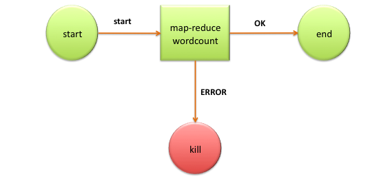

# Oozie, Workflow Engine for Apache Hadoop

## Navigation

- Developer Documentation
  - [Overview](#dg_overview)
  - [Oozie Quick Start](#dg_quickstart)
  - [Running the Examples](#dg_examples)
  - [Workflow Functional Specification](#workflowfunctionalspec)
  - [Coordinator Functional Specification](#coordinatorfunctionalspec)
  - [Bundle Functional Specification](#bundlefunctionalspec)
  - [Command Line Tool](#dg_commandlinetool)
  - [Workflow Re-runs Explained](#dg_workflowrerun)
  - [HCatalog Integration Explained](#dg_hcatalogintegration)
  - [Oozie Web Services API](#webservicesapi)
  - [Action Authentication](#dg_actionauthentication)
  - [Fluent Job API](#dg_fluentjobapi)
- Action Extensions
  - [Email Action](#dg_emailactionextension)
  - [Shell Action](#dg_shellactionextension)
  - [Hive Action](#dg_hiveactionextension)
  - [Hive 2 Action](#dg_hive2actionextension)
  - [Sqoop Action](#dg_sqoopactionextension)
  - [Ssh Action](#dg_sshactionextension)
  - [DistCp Action](#dg_distcpactionextension)
  - [Spark Action](#dg_sparkactionextension)
  - [Git Action](#dg_gitactionextension)
  - [Writing a Custom Action Executor](#dg_customactionexecutor)
- Job Status and SLA Monitoring
  - [JMS Notifications for Job and SLA](#dg_jmsnotifications)
  - [Configuring and Monitoring SLA](#dg_slamonitoring)
- [Security](#ag_install--security)
- Other pages
  - [Coordinator Rerun](#dg_coordinatorrerun)
  - [Building Oozie](#eng_building)
  - [Oozie, Workflow Engine for Apache Hadoop](#index)

## Content

<a id="dg_overview"></a>

<!-- source_url: https://oozie.apache.org/docs/5.2.1/DG_Overview.html -->

<!-- page_index: 1 -->

# Oozie Workflow Overview

[::Go back to Oozie Documentation Index::](#index)

<a id="dg_overview--oozie-workflow-overview"></a>

# Oozie Workflow Overview

Oozie is a server based *Workflow Engine* specialized in running workflow jobs with actions that run Hadoop Map/Reduce and Pig jobs.

Oozie is a Java Web-Application that runs in a Java servlet-container.

For the purposes of Oozie, a workflow is a collection of actions (i.e. Hadoop Map/Reduce jobs, Pig jobs) arranged in a control dependency DAG (Directed Acyclic Graph). “control dependency” from one action to another means that the second action can’t run until the first action has completed.

Oozie workflows definitions are written in hPDL (a XML Process Definition Language similar to [JBOSS JBPM](http://www.jboss.org/jbossjbpm/) jPDL).

Oozie workflow actions start jobs in remote systems (i.e. Hadoop, Pig). Upon action completion, the remote systems callback Oozie to notify the action completion, at this point Oozie proceeds to the next action in the workflow.

Oozie uses a custom SecurityManager inside it’s launcher to catch exit() calls from the user code. Make sure to delegate checkExit() calls to Oozie’s SecurityManager if the user code uses its own SecurityManager. The Launcher also grants java.security.AllPermission by default to the user code.

Oozie workflows contain control flow nodes and action nodes.

Control flow nodes define the beginning and the end of a workflow ( start, end and fail nodes) and provide a mechanism to control the workflow execution path ( decision, fork and join nodes).

Action nodes are the mechanism by which a workflow triggers the execution of a computation/processing task. Oozie provides support for different types of actions: Hadoop map-reduce, Hadoop file system, Pig, SSH, HTTP, eMail and Oozie sub-workflow. Oozie can be extended to support additional type of actions.

Oozie workflows can be parameterized (using variables like ${inputDir} within the workflow definition). When submitting a workflow job values for the parameters must be provided. If properly parameterized (i.e. using different output directories) several identical workflow jobs can concurrently.

<a id="dg_overview--wordcount-workflow-example"></a>

## WordCount Workflow Example

**Workflow Diagram:**



**hPDL Workflow Definition:**

```
<workflow-app name='wordcount-wf' xmlns="uri:oozie:workflow:0.1">
    <start to='wordcount'/>
    <action name='wordcount'>
        <map-reduce>
            <job-tracker>${jobTracker}</job-tracker>
            <name-node>${nameNode}</name-node>
            <configuration>
                <property>
                    <name>mapred.mapper.class</name>
                    <value>org.myorg.WordCount.Map</value>
                </property>
                <property>
                    <name>mapred.reducer.class</name>
                    <value>org.myorg.WordCount.Reduce</value>
                </property>
                <property>
                    <name>mapred.input.dir</name>
                    <value>${inputDir}</value>
                </property>
                <property>
                    <name>mapred.output.dir</name>
                    <value>${outputDir}</value>
                </property>
            </configuration>
        </map-reduce>
        <ok to='end'/>
        <error to='end'/>
    </action>
    <kill name='kill'>
        <message>Something went wrong: ${wf:errorCode('wordcount')}</message>
    </kill/>
    <end name='end'/>
</workflow-app>
```

[::Go back to Oozie Documentation Index::](#index)

---

<a id="dg_quickstart"></a>

<!-- source_url: https://oozie.apache.org/docs/5.2.1/DG_QuickStart.html -->

<!-- page_index: 2 -->

# Oozie Quick Start

[::Go back to Oozie Documentation Index::](#index)

<a id="dg_quickstart--oozie-quick-start"></a>

# Oozie Quick Start

These instructions install and run Oozie using an embedded Jetty server and an embedded Derby database.

For detailed install and configuration instructions refer to [Oozie Install](#ag_install).

- [Building Oozie](#dg_quickstart--building_oozie)
  - [System Requirements:](#dg_quickstart--system_requirements:)
  - [Building Oozie](#dg_quickstart--building_oozie)
- [Server Installation](#dg_quickstart--server_installation)
  - [System Requirements](#dg_quickstart--system_requirements)
  - [Server Installation](#dg_quickstart--server_installation)
- [Client Installation](#dg_quickstart--client_installation)
  - [System Requirements](#dg_quickstart--system_requirements)
  - [Client Installation](#dg_quickstart--client_installation)
- [Oozie Share Lib Installation](#dg_quickstart--oozie_share_lib_installation)

<a id="dg_quickstart--building-oozie"></a>

## Building Oozie

<a id="dg_quickstart--system-requirements:"></a>

### System Requirements:

- Unix box (tested on Mac OS X and Linux)
- Java JDK 1.8+
- Maven 3.0.1+
- Hadoop 2.6.0+
- Pig 0.10.1+

JDK commands (java, javac) must be in the command path.

The Maven command (mvn) must be in the command path.

<a id="dg_quickstart--building-oozie-2"></a>

### Building Oozie

Download a source distribution of Oozie from the “Releases” drop down menu on the [Oozie site](http://oozie.apache.org/).

Expand the source distribution tar.gz and change directories into it.

The simplest way to build Oozie is to run the mkdistro.sh script:

```
$ bin/mkdistro.sh [-DskipTests]
```

Running mkdistro.sh will create the binary distribution of Oozie. By default, oozie war will not contain hadoop and hcatalog libraries, however they are required for oozie to work. There are 2 options to add these libraries:

1. At install time, copy the hadoop and hcatalog libraries to libext and run oozie-setup.sh to setup Oozie. This is suitable when same oozie package needs to be used in multiple set-ups with different hadoop/hcatalog versions.
2. Build with -Puber which will bundle the required libraries in the oozie war. Further, the following options are available to customise the versions of the dependencies:


```
-Dhadoop.version=<version> - default 2.6.0
-Ptez - Bundle tez jars in hive and pig sharelibs. Useful if you want to use tez
+as the execution engine for those applications.
-Dpig.version=<version> - default 0.16.0
-Dpig.classifier=<classifier> - default h2
-Dsqoop.version=<version> - default 1.4.7
-Dsqoop.classifier=<classifier> - default hadoop260
-Djetty.version=<version> - default 9.3.20.v20170531
-Dopenjpa.version=<version> - default 2.2.2
-Dxerces.version=<version> - default 2.10.0
-Dcurator.version=<version> - default 2.5.0
-Dhive.version=<version - default 1.2.2
-Dhbase.version=<version> - default 1.2.3
-Dtez.version=<version> - default 0.8.4

*IMPORTANT:* Profile hadoop-3 must be activated if building against Hadoop 3
```

   More details on building Oozie can be found on the [Building Oozie](#eng_building) page.

<a id="dg_quickstart--server-installation"></a>

## Server Installation

<a id="dg_quickstart--system-requirements"></a>

### System Requirements

- Unix (tested in Linux and Mac OS X)
- Java 1.8+
- Hadoop
  - [Apache Hadoop](http://hadoop.apache.org) (tested with 1.2.1 & 2.6.0+)
- ExtJS library (optional, to enable Oozie webconsole)
  - [ExtJS 2.2](http://archive.cloudera.com/gplextras/misc/ext-2.2.zip)

The Java 1.8+ bin directory should be in the command path.

<a id="dg_quickstart--server-installation-2"></a>

### Server Installation

**IMPORTANT:** Oozie ignores any set value for OOZIE\_HOME, Oozie computes its home automatically.

- Build an Oozie binary distribution
- Download a Hadoop binary distribution
- Download ExtJS library (it must be version 2.2)

**NOTE:** The ExtJS library is not bundled with Oozie because it uses a different license.

**NOTE:** Oozie UI browser compatibility Chrome (all), Firefox (3.5), Internet Explorer (8.0), Opera (10.5).

**NOTE:** It is recommended to use a Oozie Unix user for the Oozie server.

Expand the Oozie distribution tar.gz.

Expand the Hadoop distribution tar.gz (as the Oozie Unix user).

**NOTE:** Configure the Hadoop cluster with proxyuser for the Oozie process.

The following two properties are required in Hadoop core-site.xml:

```
  <!-- OOZIE -->
  <property>
    <name>hadoop.proxyuser.[OOZIE_SERVER_USER].hosts</name>
    <value>[OOZIE_SERVER_HOSTNAME]</value>
  </property>
  <property>
    <name>hadoop.proxyuser.[OOZIE_SERVER_USER].groups</name>
    <value>[USER_GROUPS_THAT_ALLOW_IMPERSONATION]</value>
  </property>
```

Replace the capital letter sections with specific values and then restart Hadoop.

The ExtJS library is optional (only required for the Oozie web-console to work)

**IMPORTANT:** all Oozie server scripts (oozie-setup.sh, oozied.sh, oozie-start.sh, oozie-run.sh and oozie-stop.sh) run only under the Unix user that owns the Oozie installation directory, if necessary use sudo -u OOZIE\_USER when invoking the scripts.

As of Oozie 3.3.2, use of oozie-start.sh, oozie-run.sh, and oozie-stop.sh has been deprecated and will print a warning. The oozied.sh script should be used instead; passing it start, run, or stop as an argument will perform the behaviors of oozie-start.sh, oozie-run.sh, and oozie-stop.sh respectively.

Create a **libext/** directory in the directory where Oozie was expanded.

If using the ExtJS library copy the ZIP file to the **libext/** directory. If hadoop and hcatalog libraries are not already included in the war, add the corresponding libraries to **libext/** directory.

A “sharelib create -fs fs\_default\_name [-locallib sharelib]” command is available when running oozie-setup.sh for uploading new sharelib into hdfs where the first argument is the default fs name and the second argument is the Oozie sharelib to install, it can be a tarball or the expanded version of it. If the second argument is omitted, the Oozie sharelib tarball from the Oozie installation directory will be used. Upgrade command is deprecated, one should use create command to create new version of sharelib. Sharelib files are copied to new lib\_<timestamped> directory. At start, server picks the sharelib from latest time-stamp directory. While starting server also purge sharelib directory which is older than sharelib retention days (defined as oozie.service.ShareLibService.temp.sharelib.retention.days and 7 days is default).

db create|upgrade|postupgrade -run [-sqlfile <FILE>] command is for create, upgrade or postupgrade oozie db with an optional sql file

Run the oozie-setup.sh script to configure Oozie with all the components added to the **libext/** directory.

```
$ bin/oozie-setup.sh sharelib create -fs <FS_URI> [-locallib <PATH>] sharelib upgrade -fs <FS_URI> [-locallib <PATH>] db create|upgrade|postupgrade -run [-sqlfile <FILE>]
```

**IMPORTANT**: If the Oozie server needs to establish secure connection with an external server with a self-signed certificate, make sure you specify the location of a truststore that contains required certificates. It can be done by configuring oozie.https.truststore.file in oozie-site.xml, or by setting the javax.net.ssl.trustStore system property. If it is set in both places, the value passed as system property will be used.

Create the Oozie DB using the ‘ooziedb.sh’ command line tool:

```
$ bin/ooziedb.sh create -sqlfile oozie.sql -run

Validate DB Connection.
DONE
Check DB schema does not exist
DONE
Check OOZIE_SYS table does not exist
DONE
Create SQL schema
DONE
DONE
Create OOZIE_SYS table
DONE

Oozie DB has been created for Oozie version '3.2.0'

$
```

Start Oozie as a daemon process run:

```
$ bin/oozied.sh start
```

To start Oozie as a foreground process run:

```
$ bin/oozied.sh run
```

Check the Oozie log file logs/oozie.log to ensure Oozie started properly.

Using the Oozie command line tool check the status of Oozie:

```
$ bin/oozie admin -oozie http://localhost:11000/oozie -status
```

Using a browser go to the [Oozie web console](http://localhost:11000/oozie.html), Oozie status should be **NORMAL**.

Refer to the [Running the Examples](#dg_examples) document for details on running the examples.

<a id="dg_quickstart--client-installation"></a>

## Client Installation

<a id="dg_quickstart--system-requirements-2"></a>

### System Requirements

- Unix (tested in Linux and Mac OS X)
- Java 1.8+

The Java 1.8+ bin directory should be in the command path.

<a id="dg_quickstart--client-installation-2"></a>

### Client Installation

Copy and expand the oozie-client TAR.GZ file bundled with the distribution. Add the bin/ directory to the PATH.

Refer to the [Command Line Interface Utilities](#dg_commandlinetool) document for a full reference of the oozie command line tool.

NOTE: The Oozie server installation includes the Oozie client. The Oozie client should be installed in remote machines only.

<a id="dg_quickstart--oozie-share-lib-installation"></a>

## Oozie Share Lib Installation

Oozie share lib has been installed by oozie-setup.sh create command explained in the earlier section.

See the [Workflow Functional Specification](#workflowfunctionalspec--sharelib) and [Installation](#ag_install--oozie_share_lib) for more information about the Oozie ShareLib.

[::Go back to Oozie Documentation Index::](#index)

---

<a id="dg_examples"></a>

<!-- source_url: https://oozie.apache.org/docs/5.2.1/DG_Examples.html -->

<!-- page_index: 3 -->

# Oozie Examples

[::Go back to Oozie Documentation Index::](#index)

<a id="dg_examples--oozie-examples"></a>

# Oozie Examples

- [Command Line Examples](#dg_examples--command_line_examples)
  - [Setting Up the Examples](#dg_examples--setting_up_the_examples)
  - [Running the Examples](#dg_examples--running_the_examples)
- [Java API Example](#dg_examples--java_api_example)
- [Local Oozie Example](#dg_examples--local_oozie_example)
- [Fluent Job API Examples](#dg_examples--fluent_job_api_examples)

<a id="dg_examples--command-line-examples"></a>

## Command Line Examples

<a id="dg_examples--setting-up-the-examples"></a>

### Setting Up the Examples

Oozie examples are bundled within the Oozie distribution in the oozie-examples.tar.gz file.

Expanding this file will create an examples/ directory in the local file system.

The examples/ directory must be copied to the user HOME directory in HDFS:

```
$ hadoop fs -put examples examples
```

**NOTE:** If an examples directory already exists in HDFS, it must be deleted before copying it again. Otherwise files may not be copied.

<a id="dg_examples--running-the-examples"></a>

### Running the Examples

For the Streaming and Pig example, the [Oozie Share Library](#dg_quickstart--ooziesharelib) must be installed in HDFS.

Add Oozie bin/ to the environment PATH.

The examples assume the ResourceManager is localhost:8032 and the NameNode is hdfs://localhost:8020. If the actual values are different, the job properties files in the examples directory must be edited to the correct values.

The example applications are under the examples/app directory, one directory per example. The directory contains the application XML file (workflow, or workflow and coordinator), the job.properties file to submit the job and any JAR files the example may need.

The inputs for all examples are in the examples/input-data/ directory.

The examples create output under the examples/output-data/${EXAMPLE\_NAME} directory.

**Note**: The job.properties file needs to be a local file during submissions, and not a HDFS path.

**How to run an example application:**

```
$ oozie job -oozie http://localhost:11000/oozie -config examples/apps/map-reduce/job.properties -run. job: 14-20090525161321-oozie-tucu
```

Check the workflow job status:

```
$ oozie job -oozie http://localhost:11000/oozie -info 14-20090525161321-oozie-tucu..---------------------------------------------------------------------------------------------------------------------------------------------------------------- Workflow Name :  map-reduce-wf App Path      :  hdfs://localhost:8020/user/tucu/examples/apps/map-reduce Status        :  SUCCEEDED Run           :  0 User          :  tucu Group         :  users Created       :  2009-05-26 05:01 +0000 Started       :  2009-05-26 05:01 +0000 Ended         :  2009-05-26 05:01 +0000 Actions .---------------------------------------------------------------------------------------------------------------------------------------------------------------- Action Name             Type        Status     Transition  External Id            External Status  Error Code    Start Time              End Time .---------------------------------------------------------------------------------------------------------------------------------------------------------------- mr-node                 map-reduce  OK         end         job_200904281535_0254  SUCCEEDED        -             2009-05-26 05:01 +0000  2009-05-26 05:01 +0000 .----------------------------------------------------------------------------------------------------------------------------------------------------------------
```

To check the workflow job status via the Oozie web console, with a browser go to http://localhost:11000/oozie.

To avoid having to provide the -oozie option with the Oozie URL with every oozie command, set OOZIE\_URL env variable to the Oozie URL in the shell environment. For example:

```
$ export OOZIE_URL="http://localhost:11000/oozie" $
$ oozie job -info 14-20090525161321-oozie-tucu
```

<a id="dg_examples--java-api-example"></a>

## Java API Example

Oozie provides a [Java Client API](https://oozie.apache.org/docs/5.2.1/apidocs/org/org/apache/oozie/client/package-summary.html) that simplifies integrating Oozie with Java applications. This Java Client API is a convenience API to interact with Oozie Web-Services API.

The following code snippet shows how to submit an Oozie job using the Java Client API.

```
import org.apache.oozie.client.OozieClient; import org.apache.oozie.client.WorkflowJob;.import java.util.Properties;.....// get a OozieClient for local Oozie OozieClient wc = new OozieClient("http://bar:11000/oozie");.// create a workflow job configuration and set the workflow application path Properties conf = wc.createConfiguration(); conf.setProperty(OozieClient.APP_PATH, "hdfs://foo:8020/usr/tucu/my-wf-app");.// setting workflow parameters conf.setProperty("resourceManager", "foo:8032"); conf.setProperty("inputDir", "/usr/tucu/inputdir"); conf.setProperty("outputDir", "/usr/tucu/outputdir"); ....// submit and start the workflow job String jobId = wc.run(conf); System.out.println("Workflow job submitted");.// wait until the workflow job finishes printing the status every 10 seconds while (wc.getJobInfo(jobId).getStatus() == Workflow.Status.RUNNING) {System.out.println("Workflow job running ..."); Thread.sleep(10 * 1000);}.// print the final status of the workflow job System.out.println("Workflow job completed ..."); System.out.println(wf.getJobInfo(jobId)); ...
```

<a id="dg_examples--local-oozie-example"></a>

## Local Oozie Example

Oozie provides an embedded Oozie implementation, [LocalOozie](https://oozie.apache.org/docs/5.2.1/apidocs/org/apache/oozie/local/LocalOozie.html) , which is useful for development, debugging and testing of workflow applications within the convenience of an IDE.

The code snippet below shows the usage of the LocalOozie class. All the interaction with Oozie is done using Oozie OozieClient Java API, as shown in the previous section.

The examples bundled with Oozie include the complete and running class, LocalOozieExample from where this snippet was taken.

```
import org.apache.oozie.local.LocalOozie; import org.apache.oozie.client.OozieClient; import org.apache.oozie.client.WorkflowJob;.import java.util.Properties;....// start local Oozie LocalOozie.start();.// get a OozieClient for local Oozie OozieClient wc = LocalOozie.getClient();.// create a workflow job configuration and set the workflow application path Properties conf = wc.createConfiguration(); conf.setProperty(OozieClient.APP_PATH, "hdfs://foo:8020/usr/tucu/my-wf-app");.// setting workflow parameters conf.setProperty("resourceManager", "foo:8032"); conf.setProperty("inputDir", "/usr/tucu/inputdir"); conf.setProperty("outputDir", "/usr/tucu/outputdir"); ....// submit and start the workflow job String jobId = wc.run(conf); System.out.println("Workflow job submitted");.// wait until the workflow job finishes printing the status every 10 seconds while (wc.getJobInfo(jobId).getStatus() == WorkflowJob.Status.RUNNING) {System.out.println("Workflow job running ..."); Thread.sleep(10 * 1000);}.// print the final status of the workflow job System.out.println("Workflow job completed ..."); System.out.println(wc.getJobInfo(jobId));.// stop local Oozie LocalOozie.stop(); ...
```

Also asynchronous actions like FS action can be used / tested using LocalOozie / OozieClient API. Please see the module oozie-mini for details like fs-decision.xml workflow example.

<a id="dg_examples--fluent-job-api-examples"></a>

## Fluent Job API Examples

There are some elaborate examples how to use the [Fluent Job API](#dg_fluentjobapi), under examples/fluentjob/. There are two simple examples covered under [Fluent Job API :: A Simple Example](#dg_fluentjobapi--a_simple_example) and [Fluent Job API :: A More Verbose Example](#dg_fluentjobapi--a_more_verbose_example).

[::Go back to Oozie Documentation Index::](#index)

---

<a id="workflowfunctionalspec"></a>

<!-- source_url: https://oozie.apache.org/docs/5.2.1/WorkflowFunctionalSpec.html -->

<!-- page_index: 4 -->

# Oozie Specification, a Hadoop Workflow System

[::Go back to Oozie Documentation Index::](#index)

---

<a id="workflowfunctionalspec--oozie-specification-a-hadoop-workflow-system"></a>

# Oozie Specification, a Hadoop Workflow System

The goal of this document is to define a workflow engine system specialized in coordinating the execution of Hadoop Map/Reduce and Pig jobs.

- [Changelog](#workflowfunctionalspec--changelog)
- [0 Definitions](#workflowfunctionalspec--a0_definitions)
- [1 Specification Highlights](#workflowfunctionalspec--a1_specification_highlights)
- [2 Workflow Definition](#workflowfunctionalspec--a2_workflow_definition)
  - [2.1 Cycles in Workflow Definitions](#workflowfunctionalspec--a2.1_cycles_in_workflow_definitions)
- [3 Workflow Nodes](#workflowfunctionalspec--a3_workflow_nodes)
  - [3.1 Control Flow Nodes](#workflowfunctionalspec--a3.1_control_flow_nodes)
    - [3.1.1 Start Control Node](#workflowfunctionalspec--a3.1.1_start_control_node)
    - [3.1.2 End Control Node](#workflowfunctionalspec--a3.1.2_end_control_node)
    - [3.1.3 Kill Control Node](#workflowfunctionalspec--a3.1.3_kill_control_node)
    - [3.1.4 Decision Control Node](#workflowfunctionalspec--a3.1.4_decision_control_node)
    - [3.1.5 Fork and Join Control Nodes](#workflowfunctionalspec--a3.1.5_fork_and_join_control_nodes)
  - [3.2 Workflow Action Nodes](#workflowfunctionalspec--a3.2_workflow_action_nodes)
    - [3.2.1 Action Basis](#workflowfunctionalspec--a3.2.1_action_basis)
      - [3.2.1.1 Action Computation/Processing Is Always Remote](#workflowfunctionalspec--a3.2.1.1_action_computationprocessing_is_always_remote)
      - [3.2.1.2 Actions Are Asynchronous](#workflowfunctionalspec--a3.2.1.2_actions_are_asynchronous)
      - [3.2.1.3 Actions Have 2 Transitions, ok and error](#workflowfunctionalspec--a3.2.1.3_actions_have_2_transitions_ok_and_error)
      - [3.2.1.4 Action Recovery](#workflowfunctionalspec--a3.2.1.4_action_recovery)
    - [3.2.2 Map-Reduce Action](#workflowfunctionalspec--a3.2.2_map-reduce_action)
      - [3.2.2.1 Adding Files and Archives for the Job](#workflowfunctionalspec--a3.2.2.1_adding_files_and_archives_for_the_job)
      - [3.2.2.2 Configuring the MapReduce action with Java code](#workflowfunctionalspec--a3.2.2.2_configuring_the_mapreduce_action_with_java_code)
      - [3.2.2.3 Streaming](#workflowfunctionalspec--a3.2.2.3_streaming)
      - [3.2.2.4 Pipes](#workflowfunctionalspec--a3.2.2.4_pipes)
      - [3.2.2.5 Syntax](#workflowfunctionalspec--a3.2.2.5_syntax)
    - [3.2.3 Pig Action](#workflowfunctionalspec--a3.2.3_pig_action)
    - [3.2.4 Fs (HDFS) action](#workflowfunctionalspec--a3.2.4_fs_hdfs_action)
    - [3.2.5 Sub-workflow Action](#workflowfunctionalspec--a3.2.5_sub-workflow_action)
    - [3.2.6 Java Action](#workflowfunctionalspec--a3.2.6_java_action)
      - [3.2.6.1 Overriding an action’s Main class](#workflowfunctionalspec--a3.2.6.1_overriding_an_actions_main_class)
- [4 Parameterization of Workflows](#workflowfunctionalspec--a4_parameterization_of_workflows)
  - [4.1 Workflow Job Properties (or Parameters)](#workflowfunctionalspec--a4.1_workflow_job_properties_or_parameters)
  - [4.2 Expression Language Functions](#workflowfunctionalspec--a4.2_expression_language_functions)
    - [4.2.1 Basic EL Constants](#workflowfunctionalspec--a4.2.1_basic_el_constants)
    - [4.2.2 Basic EL Functions](#workflowfunctionalspec--a4.2.2_basic_el_functions)
    - [4.2.3 Workflow EL Functions](#workflowfunctionalspec--a4.2.3_workflow_el_functions)
    - [4.2.4 Hadoop EL Constants](#workflowfunctionalspec--a4.2.4_hadoop_el_constants)
    - [4.2.5 Hadoop EL Functions](#workflowfunctionalspec--a4.2.5_hadoop_el_functions)
    - [4.2.6 Hadoop Jobs EL Function](#workflowfunctionalspec--a4.2.6_hadoop_jobs_el_function)
    - [4.2.7 HDFS EL Functions](#workflowfunctionalspec--a4.2.7_hdfs_el_functions)
    - [4.2.8 HCatalog EL Functions](#workflowfunctionalspec--a4.2.8_hcatalog_el_functions)
- [5 Workflow Notifications](#workflowfunctionalspec--a5_workflow_notifications)
  - [5.1 Workflow Job Status Notification](#workflowfunctionalspec--a5.1_workflow_job_status_notification)
  - [5.2 Node Start and End Notifications](#workflowfunctionalspec--a5.2_node_start_and_end_notifications)
- [6 User Propagation](#workflowfunctionalspec--a6_user_propagation)
- [7 Workflow Application Deployment](#workflowfunctionalspec--a7_workflow_application_deployment)
- [8 External Data Assumptions](#workflowfunctionalspec--a8_external_data_assumptions)
- [9 Workflow Jobs Lifecycle](#workflowfunctionalspec--a9_workflow_jobs_lifecycle)
  - [9.1 Workflow Job Lifecycle](#workflowfunctionalspec--a9.1_workflow_job_lifecycle)
  - [9.2 Workflow Action Lifecycle](#workflowfunctionalspec--a9.2_workflow_action_lifecycle)
- [10 Workflow Jobs Recovery (re-run)](#workflowfunctionalspec--a10_workflow_jobs_recovery_re-run)
- [11 Oozie Web Services API](#workflowfunctionalspec--a11_oozie_web_services_api)
- [12 Client API](#workflowfunctionalspec--a12_client_api)
- [13 Command Line Tools](#workflowfunctionalspec--a13_command_line_tools)
- [14 Web UI Console](#workflowfunctionalspec--a14_web_ui_console)
- [15 Customizing Oozie with Extensions](#workflowfunctionalspec--a15_customizing_oozie_with_extensions)
- [16 Workflow Jobs Priority](#workflowfunctionalspec--a16_workflow_jobs_priority)
- [17 HDFS Share Libraries for Workflow Applications (since Oozie 2.3)](#workflowfunctionalspec--a17_hdfs_share_libraries_for_workflow_applications_since_oozie_2.3)
  - [17.1 Action Share Library Override (since Oozie 3.3)](#workflowfunctionalspec--a17.1_action_share_library_override_since_oozie_3.3)
  - [17.2 Action Share Library Exclude (since Oozie 5.2)](#workflowfunctionalspec--a17.2_action_share_library_exclude_since_oozie_5.2)
- [18 User-Retry for Workflow Actions (since Oozie 3.1)](#workflowfunctionalspec--a18_user-retry_for_workflow_actions_since_oozie_3.1)
- [19 Global Configurations](#workflowfunctionalspec--a19_global_configurations)
- [20 Suspend On Nodes](#workflowfunctionalspec--a20_suspend_on_nodes)
- [Appendixes](#workflowfunctionalspec--appendixes)
  - [Appendix A, Oozie Workflow and Common XML Schemas](#workflowfunctionalspec--appendix_a_oozie_workflow_and_common_xml_schemas)
    - [Oozie Workflow Schema Version 1.0](#workflowfunctionalspec--oozie_workflow_schema_version_1.0)
    - [Oozie Common Schema Version 1.0](#workflowfunctionalspec--oozie_common_schema_version_1.0)
    - [Oozie Workflow Schema Version 0.5](#workflowfunctionalspec--oozie_workflow_schema_version_0.5)
    - [Oozie Workflow Schema Version 0.4.5](#workflowfunctionalspec--oozie_workflow_schema_version_0.4.5)
    - [Oozie Workflow Schema Version 0.4](#workflowfunctionalspec--oozie_workflow_schema_version_0.4)
    - [Oozie Workflow Schema Version 0.3](#workflowfunctionalspec--oozie_workflow_schema_version_0.3)
    - [Oozie Workflow Schema Version 0.2.5](#workflowfunctionalspec--oozie_workflow_schema_version_0.2.5)
    - [Oozie Workflow Schema Version 0.2](#workflowfunctionalspec--oozie_workflow_schema_version_0.2)
    - [Oozie SLA Version 0.2](#workflowfunctionalspec--oozie_sla_version_0.2)
    - [Oozie SLA Version 0.1](#workflowfunctionalspec--oozie_sla_version_0.1)
    - [Oozie Workflow Schema Version 0.1](#workflowfunctionalspec--oozie_workflow_schema_version_0.1)
  - [Appendix B, Workflow Examples](#workflowfunctionalspec--appendix_b_workflow_examples)
    - [Fork and Join Example](#workflowfunctionalspec--fork_and_join_example)

<a id="workflowfunctionalspec--changelog"></a>

## Changelog

**2016FEB19**

- 3.2.7 Updated notes on System.exit(int n) behavior

**2015APR29**

- 3.2.1.4 Added notes about Java action retries
- 3.2.7 Added notes about Java action retries

**2014MAY08**

- 3.2.2.4 Added support for fully qualified job-xml path

**2013JUL03**

- Appendix A, Added new workflow schema 0.5 and SLA schema 0.2

**2012AUG30**

- 4.2.2 Added two EL functions (replaceAll and appendAll)

**2012JUL26**

- Appendix A, updated XML schema 0.4 to include parameters element
- 4.1 Updated to mention about parameters element as of schema 0.4

**2012JUL23**

- Appendix A, updated XML schema 0.4 (Fs action)
- 3.2.4 Updated to mention that a name-node, a job-xml, and a configuration element are allowed in the Fs action as of schema 0.4

**2012JUN19**

- Appendix A, added XML schema 0.4
- 3.2.2.4 Updated to mention that multiple job-xml elements are allowed as of schema 0.4
- 3.2.3 Updated to mention that multiple job-xml elements are allowed as of schema 0.4

**2011AUG17**

- 3.2.4 fs ‘chmod’ xml closing element typo in Example corrected

**2011AUG12**

- 3.2.4 fs ‘move’ action characteristics updated, to allow for consistent source and target paths and existing target path only if directory
- 18, Update the doc for user-retry of workflow action.

**2011FEB19**

- 10, Update the doc to rerun from the failed node.

**2010OCT31**

- 17, Added new section on Shared Libraries

**2010APR27**

- 3.2.3 Added new “arguments” tag to PIG actions
- 3.2.5 SSH actions are deprecated in Oozie schema 0.1 and removed in Oozie schema 0.2
- Appendix A, Added schema version 0.2

**2009OCT20**

- Appendix A, updated XML schema

**2009SEP15**

- 3.2.6 Removing support for sub-workflow in a different Oozie instance (removing the ‘oozie’ element)

**2009SEP07**

- 3.2.2.3 Added Map Reduce Pipes specifications.
- 3.2.2.4 Map-Reduce Examples. Previously was 3.2.2.3.

**2009SEP02**

- 10 Added missing skip nodes property name.
- 3.2.1.4 Reworded action recovery explanation.

**2009AUG26**

- 3.2.9 Added java action type
- 3.1.4 Example uses EL constant to refer to counter group/name

**2009JUN09**

- 12.2.4 Added build version resource to admin end-point
- 3.2.6 Added flag to propagate workflow configuration to sub-workflows
- 10 Added behavior for workflow job parameters given in the rerun
- 11.3.4 workflows info returns pagination information

**2009MAY18**

- 3.1.4 decision node, ‘default’ element, ‘name’ attribute changed to ‘to’
- 3.1.5 fork node, ‘transition’ element changed to ‘start’, ‘to’ attribute change to ‘path’
- 3.1.5 join node, ‘transition’ element remove, added ‘to’ attribute to ‘join’ element
- 3.2.1.4 Rewording on action recovery section
- 3.2.2 map-reduce action, added ‘job-tracker’, ‘name-node’ actions, ‘file’, ‘file’ and ‘archive’ elements
- 3.2.2.1 map-reduce action, remove from ‘streaming’ element ‘file’, ‘file’ and ‘archive’ elements
- 3.2.2.2 map-reduce action, reorganized streaming section
- 3.2.3 pig action, removed information about implementation (SSH), changed elements names
- 3.2.4 fs action, removed ‘fs-uri’ and ‘user-name’ elements, file system URI is now specified in path, user is propagated
- 3.2.6 sub-workflow action, renamed elements ‘oozie-url’ to ‘oozie’ and ‘workflow-app’ to ‘app-path’
- 4 Properties that are valid Java identifiers can be used as ${NAME}
- 4.1 Renamed default properties file from ‘configuration.xml’ to ‘default-configuration.xml’
- 4.2 Changes in EL Constants and Functions
- 5 Updated notification behavior and tokens
- 6 Changed user propagation behavior
- 7 Changed application packaging from ZIP to HDFS directory
- Removed application lifecycle and self containment model sections
- 10 Changed workflow job recovery, simplified recovery behavior
- 11 Detailed Web Services API
- 12 Updated Client API section
- 15 Updated Action Executor API section
- Appendix A XML namespace updated to ‘uri:oozie:workflow:0.1’
- Appendix A Updated XML schema to changes in map-reduce/pig/fs/ssh actions
- Appendix B Updated workflow example to schema changes

**2009MAR25**

- Changing all references of HWS to Oozie (project name)
- Typos, XML Formatting
- XML Schema URI correction

**2009MAR09**

- Changed CREATED job state to PREP to have same states as Hadoop
- Renamed ‘hadoop-workflow’ element to ‘workflow-app’
- Decision syntax changed to be ‘switch/case’ with no transition indirection
- Action nodes common root element ‘action’, with the action type as sub-element (using a single built-in XML schema)
- Action nodes have 2 explicit transitions ‘ok to’ and ‘error to’ enforced by XML schema
- Renamed ‘fail’ action element to ‘kill’
- Renamed ‘hadoop’ action element to ‘map-reduce’
- Renamed ‘hdfs’ action element to ‘fs’
- Updated all XML snippets and examples
- Made user propagation simpler and consistent
- Added Oozie XML schema to Appendix A
- Added workflow example to Appendix B

**2009FEB22**

- Opened [JIRA HADOOP-5303](https://issues.apache.org/jira/browse/HADOOP-5303)

**27/DEC/2012:**

- Added information on dropping hcatalog table partitions in prepare block
- Added hcatalog EL functions section

<a id="workflowfunctionalspec--0-definitions"></a>

## 0 Definitions

**Action:** An execution/computation task (Map-Reduce job, Pig job, a shell command). It can also be referred as task or ‘action node’.

**Workflow:** A collection of actions arranged in a control dependency DAG (Directed Acyclic Graph). “control dependency” from one action to another means that the second action can’t run until the first action has completed.

**Workflow Definition:** A programmatic description of a workflow that can be executed.

**Workflow Definition Language:** The language used to define a Workflow Definition.

**Workflow Job:** An executable instance of a workflow definition.

**Workflow Engine:** A system that executes workflows jobs. It can also be referred as a DAG engine.

<a id="workflowfunctionalspec--1-specification-highlights"></a>

## 1 Specification Highlights

A Workflow application is DAG that coordinates the following types of actions: Hadoop, Pig, and sub-workflows.

Flow control operations within the workflow applications can be done using decision, fork and join nodes. Cycles in workflows are not supported.

Actions and decisions can be parameterized with job properties, actions output (i.e. Hadoop counters) and file information (file exists, file size, etc). Formal parameters are expressed in the workflow definition as ${VAR} variables.

A Workflow application is a ZIP file that contains the workflow definition (an XML file), all the necessary files to run all the actions: JAR files for Map/Reduce jobs, shells for streaming Map/Reduce jobs, native libraries, Pig scripts, and other resource files.

Before running a workflow job, the corresponding workflow application must be deployed in Oozie.

Deploying workflow application and running workflow jobs can be done via command line tools, a WS API and a Java API.

Monitoring the system and workflow jobs can be done via a web console, command line tools, a WS API and a Java API.

When submitting a workflow job, a set of properties resolving all the formal parameters in the workflow definitions must be provided. This set of properties is a Hadoop configuration.

Possible states for a workflow jobs are: PREP, RUNNING, SUSPENDED, SUCCEEDED, KILLED and FAILED.

In the case of a action start failure in a workflow job, depending on the type of failure, Oozie will attempt automatic retries, it will request a manual retry or it will fail the workflow job.

Oozie can make HTTP callback notifications on action start/end/failure events and workflow end/failure events.

In the case of workflow job failure, the workflow job can be resubmitted skipping previously completed actions. Before doing a resubmission the workflow application could be updated with a patch to fix a problem in the workflow application code.

<a id="workflowfunctionalspec--2-workflow-definition"></a>

## 2 Workflow Definition

A workflow definition is a DAG with control flow nodes (start, end, decision, fork, join, kill) or action nodes (map-reduce, pig, etc.), nodes are connected by transitions arrows.

The workflow definition language is XML based and it is called hPDL (Hadoop Process Definition Language).

Refer to the Appendix A for the[Oozie Workflow Definition XML Schema](#workflowfunctionalspec--ooziewfschema). Appendix B has [Workflow Definition Examples](#workflowfunctionalspec--ooziewfexamples).

<a id="workflowfunctionalspec--2.1-cycles-in-workflow-definitions"></a>

### 2.1 Cycles in Workflow Definitions

Oozie does not support cycles in workflow definitions, workflow definitions must be a strict DAG.

At workflow application deployment time, if Oozie detects a cycle in the workflow definition it must fail the deployment.

<a id="workflowfunctionalspec--3-workflow-nodes"></a>

## 3 Workflow Nodes

Workflow nodes are classified in control flow nodes and action nodes:

- **Control flow nodes:** nodes that control the start and end of the workflow and workflow job execution path.
- **Action nodes:** nodes that trigger the execution of a computation/processing task.

Node names and transitions must be conform to the following pattern [a-zA-Z][\-\_a-zA-Z0-0]\*, of up to 20 characters long.

<a id="workflowfunctionalspec--3.1-control-flow-nodes"></a>

### 3.1 Control Flow Nodes

Control flow nodes define the beginning and the end of a workflow (the start, end and kill nodes) and provide a mechanism to control the workflow execution path (the decision, fork and join nodes).

<a id="workflowfunctionalspec--3.1.1-start-control-node"></a>

#### 3.1.1 Start Control Node

The start node is the entry point for a workflow job, it indicates the first workflow node the workflow job must transition to.

When a workflow is started, it automatically transitions to the node specified in the start.

A workflow definition must have one start node.

**Syntax:**

```
<workflow-app name="[WF-DEF-NAME]" xmlns="uri:oozie:workflow:1.0">
  ...
  <start to="[NODE-NAME]"/>
  ...
</workflow-app>
```

The to attribute is the name of first workflow node to execute.

**Example:**

```
<workflow-app name="foo-wf" xmlns="uri:oozie:workflow:1.0">
    ...
    <start to="firstHadoopJob"/>
    ...
</workflow-app>
```

<a id="workflowfunctionalspec--3.1.2-end-control-node"></a>

#### 3.1.2 End Control Node

The end node is the end for a workflow job, it indicates that the workflow job has completed successfully.

When a workflow job reaches the end it finishes successfully (SUCCEEDED).

If one or more actions started by the workflow job are executing when the end node is reached, the actions will be killed. In this scenario the workflow job is still considered as successfully run.

A workflow definition must have one end node.

**Syntax:**

```
<workflow-app name="[WF-DEF-NAME]" xmlns="uri:oozie:workflow:1.0">
    ...
    <end name="[NODE-NAME]"/>
    ...
</workflow-app>
```

The name attribute is the name of the transition to do to end the workflow job.

**Example:**

```
<workflow-app name="foo-wf" xmlns="uri:oozie:workflow:1.0">
    ...
    <end name="end"/>
</workflow-app>
```

<a id="workflowfunctionalspec--3.1.3-kill-control-node"></a>

#### 3.1.3 Kill Control Node

The kill node allows a workflow job to kill itself.

When a workflow job reaches the kill it finishes in error (KILLED).

If one or more actions started by the workflow job are executing when the kill node is reached, the actions will be killed.

A workflow definition may have zero or more kill nodes.

**Syntax:**

```
<workflow-app name="[WF-DEF-NAME]" xmlns="uri:oozie:workflow:1.0">
    ...
    <kill name="[NODE-NAME]">
        <message>[MESSAGE-TO-LOG]</message>
    </kill>
    ...
</workflow-app>
```

The name attribute in the kill node is the name of the Kill action node.

The content of the message element will be logged as the kill reason for the workflow job.

A kill node does not have transition elements because it ends the workflow job, as KILLED.

**Example:**

```
<workflow-app name="foo-wf" xmlns="uri:oozie:workflow:1.0">
    ...
    <kill name="killBecauseNoInput">
        <message>Input unavailable</message>
    </kill>
    ...
</workflow-app>
```

<a id="workflowfunctionalspec--3.1.4-decision-control-node"></a>

#### 3.1.4 Decision Control Node

A decision node enables a workflow to make a selection on the execution path to follow.

The behavior of a decision node can be seen as a switch-case statement.

A decision node consists of a list of predicates-transition pairs plus a default transition. Predicates are evaluated in order or appearance until one of them evaluates to true and the corresponding transition is taken. If none of the predicates evaluates to true the default transition is taken.

Predicates are JSP Expression Language (EL) expressions (refer to section 4.2 of this document) that resolve into a boolean value, true or false. For example:

```
    ${fs:fileSize('/usr/foo/myinputdir') gt 10 * GB}
```

**Syntax:**

```
<workflow-app name="[WF-DEF-NAME]" xmlns="uri:oozie:workflow:1.0"> ...<decision name="[NODE-NAME]"> <switch> <case to="[NODE_NAME]">[PREDICATE]</case> ...<case to="[NODE_NAME]">[PREDICATE]</case> <default to="[NODE_NAME]"/> </switch> </decision> ...</workflow-app>
```

The name attribute in the decision node is the name of the decision node.

Each case elements contains a predicate and a transition name. The predicate ELs are evaluated in order until one returns true and the corresponding transition is taken.

The default element indicates the transition to take if none of the predicates evaluates to true.

All decision nodes must have a default element to avoid bringing the workflow into an error state if none of the predicates evaluates to true.

**Example:**

```
<workflow-app name="foo-wf" xmlns="uri:oozie:workflow:1.0">
    ...
    <decision name="mydecision">
        <switch>
            <case to="reconsolidatejob">
              ${fs:fileSize(secondjobOutputDir) gt 10 * GB}
            </case> <case to="rexpandjob">
              ${fs:fileSize(secondjobOutputDir) lt 100 * MB}
            </case>
            <case to="recomputejob">
              ${ hadoop:counters('secondjob')[RECORDS][REDUCE_OUT] lt 1000000 }
            </case>
            <default to="end"/>
        </switch>
    </decision>
    ...
</workflow-app>
```

<a id="workflowfunctionalspec--3.1.5-fork-and-join-control-nodes"></a>

#### 3.1.5 Fork and Join Control Nodes

A fork node splits one path of execution into multiple concurrent paths of execution.

A join node waits until every concurrent execution path of a previous fork node arrives to it.

The fork and join nodes must be used in pairs. The join node assumes concurrent execution paths are children of the same fork node.

**Syntax:**

```
<workflow-app name="[WF-DEF-NAME]" xmlns="uri:oozie:workflow:1.0"> ...<fork name="[FORK-NODE-NAME]"> <path start="[NODE-NAME]" /> ...<path start="[NODE-NAME]" /> </fork> ...<join name="[JOIN-NODE-NAME]" to="[NODE-NAME]" /> ...</workflow-app>
```

The name attribute in the fork node is the name of the workflow fork node. The start attribute in the path elements in the fork node indicate the name of the workflow node that will be part of the concurrent execution paths.

The name attribute in the join node is the name of the workflow join node. The to attribute in the join node indicates the name of the workflow node that will executed after all concurrent execution paths of the corresponding fork arrive to the join node.

**Example:**

```
<workflow-app name="sample-wf" xmlns="uri:oozie:workflow:1.0">
    ...
    <fork name="forking">
        <path start="firstparalleljob"/>
        <path start="secondparalleljob"/>
    </fork>
    <action name="firstparallejob">
        <map-reduce>
            <resource-manager>foo:8032</resource-manager>
            <name-node>bar:8020</name-node>
            <job-xml>job1.xml</job-xml>
        </map-reduce>
        <ok to="joining"/>
        <error to="kill"/>
    </action>
    <action name="secondparalleljob">
        <map-reduce>
            <resource-manager>foo:8032</resource-manager>
            <name-node>bar:8020</name-node>
            <job-xml>job2.xml</job-xml>
        </map-reduce>
        <ok to="joining"/>
        <error to="kill"/>
    </action>
    <join name="joining" to="nextaction"/>
    ...
</workflow-app>
```

By default, Oozie performs some validation that any forking in a workflow is valid and won’t lead to any incorrect behavior or instability. However, if Oozie is preventing a workflow from being submitted and you are very certain that it should work, you can disable forkjoin validation so that Oozie will accept the workflow. To disable this validation just for a specific workflow, simply set oozie.wf.validate.ForkJoin to false in the job.properties file. To disable this validation for all workflows, simply set oozie.validate.ForkJoin to false in the oozie-site.xml file. Disabling this validation is determined by the AND of both of these properties, so it will be disabled if either or both are set to false and only enabled if both are set to true (or not specified).

<a id="workflowfunctionalspec--3.2-workflow-action-nodes"></a>

### 3.2 Workflow Action Nodes

Action nodes are the mechanism by which a workflow triggers the execution of a computation/processing task.

<a id="workflowfunctionalspec--3.2.1-action-basis"></a>

#### 3.2.1 Action Basis

The following sub-sections define common behavior and capabilities for all action types.

<a id="workflowfunctionalspec--3.2.1.1-action-computation-processing-is-always-remote"></a>

##### 3.2.1.1 Action Computation/Processing Is Always Remote

All computation/processing tasks triggered by an action node are remote to Oozie. No workflow application specific computation/processing task is executed within Oozie.

<a id="workflowfunctionalspec--3.2.1.2-actions-are-asynchronous"></a>

##### 3.2.1.2 Actions Are Asynchronous

All computation/processing tasks triggered by an action node are executed asynchronously by Oozie. For most types of computation/processing tasks triggered by workflow action, the workflow job has to wait until the computation/processing task completes before transitioning to the following node in the workflow.

The exception is the fs action that is handled as a synchronous action.

Oozie can detect completion of computation/processing tasks by two different means, callbacks and polling.

When a computation/processing tasks is started by Oozie, Oozie provides a unique callback URL to the task, the task should invoke the given URL to notify its completion.

For cases that the task failed to invoke the callback URL for any reason (i.e. a transient network failure) or when the type of task cannot invoke the callback URL upon completion, Oozie has a mechanism to poll computation/processing tasks for completion.

<a id="workflowfunctionalspec--3.2.1.3-actions-have-2-transitions-ok-and-error"></a>

##### 3.2.1.3 Actions Have 2 Transitions, ok and error

If a computation/processing task -triggered by a workflow- completes successfully, it transitions to ok.

If a computation/processing task -triggered by a workflow- fails to complete successfully, its transitions to error.

If a computation/processing task exits in error, there computation/processing task must provide error-code and error-message information to Oozie. This information can be used from decision nodes to implement a fine grain error handling at workflow application level.

Each action type must clearly define all the error codes it can produce.

<a id="workflowfunctionalspec--3.2.1.4-action-recovery"></a>

##### 3.2.1.4 Action Recovery

Oozie provides recovery capabilities when starting or ending actions.

Once an action starts successfully Oozie will not retry starting the action if the action fails during its execution. The assumption is that the external system (i.e. Hadoop) executing the action has enough resilience to recover jobs once it has started (i.e. Hadoop task retries).

Java actions are a special case with regard to retries. Although Oozie itself does not retry Java actions should they fail after they have successfully started, Hadoop itself can cause the action to be restarted due to a map task retry on the map task running the Java application. See the Java Action section below for more detail.

For failures that occur prior to the start of the job, Oozie will have different recovery strategies depending on the nature of the failure.

If the failure is of transient nature, Oozie will perform retries after a pre-defined time interval. The number of retries and timer interval for a type of action must be pre-configured at Oozie level. Workflow jobs can override such configuration.

Examples of a transient failures are network problems or a remote system temporary unavailable.

If the failure is of non-transient nature, Oozie will suspend the workflow job until an manual or programmatic intervention resumes the workflow job and the action start or end is retried. It is the responsibility of an administrator or an external managing system to perform any necessary cleanup before resuming the workflow job.

If the failure is an error and a retry will not resolve the problem, Oozie will perform the error transition for the action.

<a id="workflowfunctionalspec--3.2.2-map-reduce-action"></a>

#### 3.2.2 Map-Reduce Action

The map-reduce action starts a Hadoop map/reduce job from a workflow. Hadoop jobs can be Java Map/Reduce jobs or streaming jobs.

A map-reduce action can be configured to perform file system cleanup and directory creation before starting the map reduce job. This capability enables Oozie to retry a Hadoop job in the situation of a transient failure (Hadoop checks the non-existence of the job output directory and then creates it when the Hadoop job is starting, thus a retry without cleanup of the job output directory would fail).

The workflow job will wait until the Hadoop map/reduce job completes before continuing to the next action in the workflow execution path.

The counters of the Hadoop job and job exit status (FAILED, KILLED or SUCCEEDED) must be available to the workflow job after the Hadoop jobs ends. This information can be used from within decision nodes and other actions configurations.

The map-reduce action has to be configured with all the necessary Hadoop JobConf properties to run the Hadoop map/reduce job.

Hadoop JobConf properties can be specified as part of

- the config-default.xml or
- JobConf XML file bundled with the workflow application or
- <global> tag in workflow definition or
- Inline map-reduce action configuration or
- An implementation of OozieActionConfigurator specified by the <config-class> tag in workflow definition.

The configuration properties are loaded in the following above order i.e. streaming, job-xml, configuration, and config-class, and the precedence order is later values override earlier values.

Streaming and inline property values can be parameterized (templatized) using EL expressions.

The Hadoop mapred.job.tracker and fs.default.name properties must not be present in the job-xml and inline configuration.

<a id="workflowfunctionalspec--3.2.2.1-adding-files-and-archives-for-the-job"></a>

##### 3.2.2.1 Adding Files and Archives for the Job

The file, archive elements make available, to map-reduce jobs, files and archives. If the specified path is relative, it is assumed the file or archiver are within the application directory, in the corresponding sub-path. If the path is absolute, the file or archive it is expected in the given absolute path.

Files specified with the file element, will be symbolic links in the home directory of the task.

If a file is a native library (an ‘.so’ or a ‘.so.#’ file), it will be symlinked as and ‘.so’ file in the task running directory, thus available to the task JVM.

To force a symlink for a file on the task running directory, use a ‘#’ followed by the symlink name. For example ‘mycat.sh#cat’.

Refer to Hadoop distributed cache documentation for details more details on files and archives.

<a id="workflowfunctionalspec--3.2.2.2-configuring-the-mapreduce-action-with-java-code"></a>

##### 3.2.2.2 Configuring the MapReduce action with Java code

Java code can be used to further configure the MapReduce action. This can be useful if you already have “driver” code for your MapReduce action, if you’re more familiar with MapReduce’s Java API, if there’s some configuration that requires logic, or some configuration that’s difficult to do in straight XML (e.g. Avro).

Create a class that implements the org.apache.oozie.action.hadoop.OozieActionConfigurator interface from the “oozie-sharelib-oozie” artifact. It contains a single method that receives a JobConf as an argument. Any configuration properties set on this JobConf will be used by the MapReduce action.

The OozieActionConfigurator has this signature:

```
public interface OozieActionConfigurator {
    public void configure(JobConf actionConf) throws OozieActionConfiguratorException;
}
```

where actionConf is the JobConf you can update. If you need to throw an Exception, you can wrap it in an OozieActionConfiguratorException, also in the “oozie-sharelib-oozie” artifact.

For example:

```
package com.example;

import org.apache.hadoop.fs.Path;
import org.apache.hadoop.mapred.FileInputFormat;
import org.apache.hadoop.mapred.FileOutputFormat;
import org.apache.hadoop.mapred.JobConf;
import org.apache.oozie.action.hadoop.OozieActionConfigurator;
import org.apache.oozie.action.hadoop.OozieActionConfiguratorException;
import org.apache.oozie.example.SampleMapper;
import org.apache.oozie.example.SampleReducer;

public class MyConfigClass implements OozieActionConfigurator {

    @Override
    public void configure(JobConf actionConf) throws OozieActionConfiguratorException {
        if (actionConf.getUser() == null) {
            throw new OozieActionConfiguratorException("No user set");
        }
        actionConf.setMapperClass(SampleMapper.class);
        actionConf.setReducerClass(SampleReducer.class);
        FileInputFormat.setInputPaths(actionConf, new Path("/user/" + actionConf.getUser() + "/input-data"));
        FileOutputFormat.setOutputPath(actionConf, new Path("/user/" + actionConf.getUser() + "/output"));
        ...
    }
}
```

To use your config class in your MapReduce action, simply compile it into a jar, make the jar available to your action, and specify the class name in the config-class element (this requires at least schema 0.5):

```
<workflow-app name="[WF-DEF-NAME]" xmlns="uri:oozie:workflow:1.0"> ...<action name="[NODE-NAME]"> <map-reduce> ...<job-xml>[JOB-XML-FILE]</job-xml> <configuration> <property> <name>[PROPERTY-NAME]</name> <value>[PROPERTY-VALUE]</value> </property> ...</configuration> <config-class>com.example.MyConfigClass</config-class> ...</map-reduce> <ok to="[NODE-NAME]"/> <error to="[NODE-NAME]"/> </action> ...</workflow-app>
```

Another example of this can be found in the “map-reduce” example that comes with Oozie.

A useful tip: The initial JobConf passed to the configure method includes all of the properties listed in the configuration section of the MR action in a workflow. If you need to pass any information to your OozieActionConfigurator, you can simply put them here.

<a id="workflowfunctionalspec--3.2.2.3-streaming"></a>

##### 3.2.2.3 Streaming

Streaming information can be specified in the streaming element.

The mapper and reducer elements are used to specify the executable/script to be used as mapper and reducer.

User defined scripts must be bundled with the workflow application and they must be declared in the files element of the streaming configuration. If the are not declared in the files element of the configuration it is assumed they will be available (and in the command PATH) of the Hadoop slave machines.

Some streaming jobs require Files found on HDFS to be available to the mapper/reducer scripts. This is done using the file and archive elements described in the previous section.

The Mapper/Reducer can be overridden by a mapred.mapper.class or mapred.reducer.class properties in the job-xml file or configuration elements.

<a id="workflowfunctionalspec--3.2.2.4-pipes"></a>

##### 3.2.2.4 Pipes

Pipes information can be specified in the pipes element.

A subset of the command line options which can be used while using the Hadoop Pipes Submitter can be specified via elements - map, reduce, inputformat, partitioner, writer, program.

The program element is used to specify the executable/script to be used.

User defined program must be bundled with the workflow application.

Some pipe jobs require Files found on HDFS to be available to the mapper/reducer scripts. This is done using the file and archive elements described in the previous section.

Pipe properties can be overridden by specifying them in the job-xml file or configuration element.

<a id="workflowfunctionalspec--3.2.2.5-syntax"></a>

##### 3.2.2.5 Syntax

```
<workflow-app name="[WF-DEF-NAME]" xmlns="uri:oozie:workflow:1.0">
    ...
    <action name="[NODE-NAME]">
        <map-reduce>
            <resource-manager>[RESOURCE-MANAGER]</resource-manager>
            <name-node>[NAME-NODE]</name-node>
            <prepare>
                <delete path="[PATH]"/>
                ...
                <mkdir path="[PATH]"/>
                ...
            </prepare>
            <streaming>
                <mapper>[MAPPER-PROCESS]</mapper>
                <reducer>[REDUCER-PROCESS]</reducer>
                <record-reader>[RECORD-READER-CLASS]</record-reader>
                <record-reader-mapping>[NAME=VALUE]</record-reader-mapping>
                ...
                <env>[NAME=VALUE]</env>
                ...
            </streaming>
			<!-- Either streaming or pipes can be specified for an action, not both -->
            <pipes>
                <map>[MAPPER]</map>
                <reduce>[REDUCER]</reducer>
                <inputformat>[INPUTFORMAT]</inputformat>
                <partitioner>[PARTITIONER]</partitioner>
                <writer>[OUTPUTFORMAT]</writer>
                <program>[EXECUTABLE]</program>
            </pipes>
            <job-xml>[JOB-XML-FILE]</job-xml>
            <configuration>
                <property>
                    <name>[PROPERTY-NAME]</name>
                    <value>[PROPERTY-VALUE]</value>
                </property>
                ...
            </configuration>
            <config-class>com.example.MyConfigClass</config-class>
            <file>[FILE-PATH]</file>
            ...
            <archive>[FILE-PATH]</archive>
            ...
        </map-reduce>

        <ok to="[NODE-NAME]"/>
        <error to="[NODE-NAME]"/>
    </action>
    ...
</workflow-app>
```

The prepare element, if present, indicates a list of paths to delete before starting the job. This should be used exclusively for directory cleanup or dropping of hcatalog table or table partitions for the job to be executed. The delete operation will be performed in the fs.default.name filesystem for hdfs URIs. The format for specifying hcatalog table URI is hcat://[metastore server]:[port]/[database name]/[table name] and format to specify a hcatalog table partition URI is hcat://[metastore server]:[port]/[database name]/[table name]/[partkey1]=[value];[partkey2]=[value]. In case of a hcatalog URI, the hive-site.xml needs to be shipped using file tag and the hcatalog and hive jars need to be placed in workflow lib directory or specified using archive tag.

The job-xml element, if present, must refer to a Hadoop JobConf job.xml file bundled in the workflow application. By default the job.xml file is taken from the workflow application namenode, regardless the namenode specified for the action. To specify a job.xml on another namenode use a fully qualified file path. The job-xml element is optional and as of schema 0.4, multiple job-xml elements are allowed in order to specify multiple Hadoop JobConf job.xml files.

The configuration element, if present, contains JobConf properties for the Hadoop job.

Properties specified in the configuration element override properties specified in the file specified in the job-xml element.

As of schema 0.5, the config-class element, if present, contains a class that implements OozieActionConfigurator that can be used to further configure the MapReduce job.

Properties specified in the config-class class override properties specified in configuration element.

External Stats can be turned on/off by specifying the property *oozie.action.external.stats.write* as *true* or *false* in the configuration element of workflow.xml. The default value for this property is *false*.

The file element, if present, must specify the target symbolic link for binaries by separating the original file and target with a # (file#target-sym-link). This is not required for libraries.

The mapper and reducer process for streaming jobs, should specify the executable command with URL encoding. e.g. ‘%’ should be replaced by ‘%25’.

**Example:**

```
<workflow-app name="foo-wf" xmlns="uri:oozie:workflow:1.0">
    ...
    <action name="myfirstHadoopJob">
        <map-reduce>
            <resource-manager>foo:8032</resource-manager>
            <name-node>bar:8020</name-node>
            <prepare>
                <delete path="hdfs://foo:8020/usr/tucu/output-data"/>
            </prepare>
            <job-xml>/myfirstjob.xml</job-xml>
            <configuration>
                <property>
                    <name>mapred.input.dir</name>
                    <value>/usr/tucu/input-data</value>
                </property>
                <property>
                    <name>mapred.output.dir</name>
                    <value>/usr/tucu/input-data</value>
                </property>
                <property>
                    <name>mapred.reduce.tasks</name>
                    <value>${firstJobReducers}</value>
                </property>
                <property>
                    <name>oozie.action.external.stats.write</name>
                    <value>true</value>
                </property>
            </configuration>
        </map-reduce>
        <ok to="myNextAction"/>
        <error to="errorCleanup"/>
    </action>
    ...
</workflow-app>
```

In the above example, the number of Reducers to be used by the Map/Reduce job has to be specified as a parameter of the workflow job configuration when creating the workflow job.

**Streaming Example:**

```
<workflow-app name="sample-wf" xmlns="uri:oozie:workflow:1.0">
    ...
    <action name="firstjob">
        <map-reduce>
            <resource-manager>foo:8032</resource-manager>
            <name-node>bar:8020</name-node>
            <prepare>
                <delete path="${output}"/>
            </prepare>
            <streaming>
                <mapper>/bin/bash testarchive/bin/mapper.sh testfile</mapper>
                <reducer>/bin/bash testarchive/bin/reducer.sh</reducer>
            </streaming>
            <configuration>
                <property>
                    <name>mapred.input.dir</name>
                    <value>${input}</value>
                </property>
                <property>
                    <name>mapred.output.dir</name>
                    <value>${output}</value>
                </property>
                <property>
                    <name>stream.num.map.output.key.fields</name>
                    <value>3</value>
                </property>
            </configuration>
            <file>/users/blabla/testfile.sh#testfile</file>
            <archive>/users/blabla/testarchive.jar#testarchive</archive>
        </map-reduce>
        <ok to="end"/>
        <error to="kill"/>
    </action>
  ...
</workflow-app>
```

**Pipes Example:**

```
<workflow-app name="sample-wf" xmlns="uri:oozie:workflow:1.0">
    ...
    <action name="firstjob">
        <map-reduce>
            <resource-manager>foo:8032</resource-manager>
            <name-node>bar:8020</name-node>
            <prepare>
                <delete path="${output}"/>
            </prepare>
            <pipes>
                <program>bin/wordcount-simple#wordcount-simple</program>
            </pipes>
            <configuration>
                <property>
                    <name>mapred.input.dir</name>
                    <value>${input}</value>
                </property>
                <property>
                    <name>mapred.output.dir</name>
                    <value>${output}</value>
                </property>
            </configuration>
            <archive>/users/blabla/testarchive.jar#testarchive</archive>
        </map-reduce>
        <ok to="end"/>
        <error to="kill"/>
    </action>
  ...
</workflow-app>
```

<a id="workflowfunctionalspec--3.2.3-pig-action"></a>

#### 3.2.3 Pig Action

The pig action starts a Pig job.

The workflow job will wait until the pig job completes before continuing to the next action.

The pig action has to be configured with the resource-manager, name-node, pig script and the necessary parameters and configuration to run the Pig job.

A pig action can be configured to perform HDFS files/directories cleanup or HCatalog partitions cleanup before starting the Pig job. This capability enables Oozie to retry a Pig job in the situation of a transient failure (Pig creates temporary directories for intermediate data, thus a retry without cleanup would fail).

Hadoop JobConf properties can be specified as part of

- the config-default.xml or
- JobConf XML file bundled with the workflow application or
- <global> tag in workflow definition or
- Inline pig action configuration.

The configuration properties are loaded in the following above order i.e. job-xml and configuration, and the precedence order is later values override earlier values.

Inline property values can be parameterized (templatized) using EL expressions.

The YARN yarn.resourcemanager.address and HDFS fs.default.name properties must not be present in the job-xml and inline configuration.

As with Hadoop map-reduce jobs, it is possible to add files and archives to be available to the Pig job, refer to section [#FilesArchives][Adding Files and Archives for the Job].

**Syntax for Pig actions in Oozie schema 1.0:**

```
<workflow-app name="[WF-DEF-NAME]" xmlns="uri:oozie:workflow:1.0"> ...<action name="[NODE-NAME]"> <pig> <resource-manager>[RESOURCE-MANAGER]</resource-manager> <name-node>[NAME-NODE]</name-node> <prepare> <delete path="[PATH]"/> ...<mkdir path="[PATH]"/> ...</prepare> <job-xml>[JOB-XML-FILE]</job-xml> <configuration> <property> <name>[PROPERTY-NAME]</name> <value>[PROPERTY-VALUE]</value> </property> ...</configuration> <script>[PIG-SCRIPT]</script> <param>[PARAM-VALUE]</param> ...<param>[PARAM-VALUE]</param> <argument>[ARGUMENT-VALUE]</argument> ...<argument>[ARGUMENT-VALUE]</argument> <file>[FILE-PATH]</file> ...<archive>[FILE-PATH]</archive> ...</pig> <ok to="[NODE-NAME]"/> <error to="[NODE-NAME]"/> </action> ...</workflow-app>
```

**Syntax for Pig actions in Oozie schema 0.2:**

```
<workflow-app name="[WF-DEF-NAME]" xmlns="uri:oozie:workflow:0.2"> ...<action name="[NODE-NAME]"> <pig> <job-tracker>[JOB-TRACKER]</job-tracker> <name-node>[NAME-NODE]</name-node> <prepare> <delete path="[PATH]"/> ...<mkdir path="[PATH]"/> ...</prepare> <job-xml>[JOB-XML-FILE]</job-xml> <configuration> <property> <name>[PROPERTY-NAME]</name> <value>[PROPERTY-VALUE]</value> </property> ...</configuration> <script>[PIG-SCRIPT]</script> <param>[PARAM-VALUE]</param> ...<param>[PARAM-VALUE]</param> <argument>[ARGUMENT-VALUE]</argument> ...<argument>[ARGUMENT-VALUE]</argument> <file>[FILE-PATH]</file> ...<archive>[FILE-PATH]</archive> ...</pig> <ok to="[NODE-NAME]"/> <error to="[NODE-NAME]"/> </action> ...</workflow-app>
```

**Syntax for Pig actions in Oozie schema 0.1:**

```
<workflow-app name="[WF-DEF-NAME]" xmlns="uri:oozie:workflow:0.1"> ...<action name="[NODE-NAME]"> <pig> <job-tracker>[JOB-TRACKER]</job-tracker> <name-node>[NAME-NODE]</name-node> <prepare> <delete path="[PATH]"/> ...<mkdir path="[PATH]"/> ...</prepare> <job-xml>[JOB-XML-FILE]</job-xml> <configuration> <property> <name>[PROPERTY-NAME]</name> <value>[PROPERTY-VALUE]</value> </property> ...</configuration> <script>[PIG-SCRIPT]</script> <param>[PARAM-VALUE]</param> ...<param>[PARAM-VALUE]</param> <file>[FILE-PATH]</file> ...<archive>[FILE-PATH]</archive> ...</pig> <ok to="[NODE-NAME]"/> <error to="[NODE-NAME]"/> </action> ...</workflow-app>
```

The prepare element, if present, indicates a list of paths to delete before starting the job. This should be used exclusively for directory cleanup or dropping of hcatalog table or table partitions for the job to be executed. The delete operation will be performed in the fs.default.name filesystem for hdfs URIs. The format for specifying hcatalog table URI is hcat://[metastore server]:[port]/[database name]/[table name] and format to specify a hcatalog table partition URI is hcat://[metastore server]:[port]/[database name]/[table name]/[partkey1]=[value];[partkey2]=[value]. In case of a hcatalog URI, the hive-site.xml needs to be shipped using file tag and the hcatalog and hive jars need to be placed in workflow lib directory or specified using archive tag.

The job-xml element, if present, must refer to a Hadoop JobConf job.xml file bundled in the workflow application. The job-xml element is optional and as of schema 0.4, multiple job-xml elements are allowed in order to specify multiple Hadoop JobConf job.xml files.

The configuration element, if present, contains JobConf properties for the underlying Hadoop jobs.

Properties specified in the configuration element override properties specified in the file specified in the job-xml element.

External Stats can be turned on/off by specifying the property *oozie.action.external.stats.write* as *true* or *false* in the configuration element of workflow.xml. The default value for this property is *false*.

The inline and job-xml configuration properties are passed to the Hadoop jobs submitted by Pig runtime.

The script element contains the pig script to execute. The pig script can be templatized with variables of the form ${VARIABLE}. The values of these variables can then be specified using the params element.

NOTE: Oozie will perform the parameter substitution before firing the pig job. This is different from the [parameter substitution mechanism provided by Pig](http://wiki.apache.org/pig/ParameterSubstitution), which has a few limitations.

The params element, if present, contains parameters to be passed to the pig script.

**In Oozie schema 0.2:** The arguments element, if present, contains arguments to be passed to the pig script.

All the above elements can be parameterized (templatized) using EL expressions.

**Example for Oozie schema 0.2:**

```
<workflow-app name="sample-wf" xmlns="uri:oozie:workflow:0.2">
    ...
    <action name="myfirstpigjob">
        <pig>
            <job-tracker>foo:8021</job-tracker>
            <name-node>bar:8020</name-node>
            <prepare>
                <delete path="${jobOutput}"/>
            </prepare>
            <configuration>
                <property>
                    <name>mapred.compress.map.output</name>
                    <value>true</value>
                </property>
                <property>
                    <name>oozie.action.external.stats.write</name>
                    <value>true</value>
                </property>
            </configuration>
            <script>/mypigscript.pig</script>
            <argument>-param</argument>
            <argument>INPUT=${inputDir}</argument>
            <argument>-param</argument>
            <argument>OUTPUT=${outputDir}/pig-output3</argument>
        </pig>
        <ok to="myotherjob"/>
        <error to="errorcleanup"/>
    </action>
    ...
</workflow-app>
```

**Example for Oozie schema 0.1:**

```
<workflow-app name="sample-wf" xmlns="uri:oozie:workflow:0.1">
    ...
    <action name="myfirstpigjob">
        <pig>
            <job-tracker>foo:8021</job-tracker>
            <name-node>bar:8020</name-node>
            <prepare>
                <delete path="${jobOutput}"/>
            </prepare>
            <configuration>
                <property>
                    <name>mapred.compress.map.output</name>
                    <value>true</value>
                </property>
            </configuration>
            <script>/mypigscript.pig</script>
            <param>InputDir=/home/tucu/input-data</param>
            <param>OutputDir=${jobOutput}</param>
        </pig>
        <ok to="myotherjob"/>
        <error to="errorcleanup"/>
    </action>
    ...
</workflow-app>
```

<a id="workflowfunctionalspec--3.2.4-fs-hdfs-action"></a>

#### 3.2.4 Fs (HDFS) action

The fs action allows to manipulate files and directories in HDFS from a workflow application. The supported commands are move, delete, mkdir, chmod, touchz, setrep and chgrp.

The FS commands are executed synchronously from within the FS action, the workflow job will wait until the specified file commands are completed before continuing to the next action.

Path names specified in the fs action can be parameterized (templatized) using EL expressions. Path name should be specified as a absolute path. In case of move, delete, chmod and chgrp commands, a glob pattern can also be specified instead of an absolute path. For move, glob pattern can only be specified for source path and not the target.

Each file path must specify the file system URI, for move operations, the target must not specify the system URI.

**IMPORTANT:** For the purposes of copying files within a cluster it is recommended to refer to the distcp action instead. Refer to [distcp](#dg_distcpactionextension) action to copy files within a cluster.

**IMPORTANT:** All the commands within fs action do not happen atomically, if a fs action fails half way in the commands being executed, successfully executed commands are not rolled back. The fs action, before executing any command must check that source paths exist and target paths don’t exist (constraint regarding target relaxed for the move action. See below for details), thus failing before executing any command. Therefore the validity of all paths specified in one fs action are evaluated before any of the file operation are executed. Thus there is less chance of an error occurring while the fs action executes.

**Syntax:**

```
<workflow-app name="[WF-DEF-NAME]" xmlns="uri:oozie:workflow:1.0"> ...<action name="[NODE-NAME]"> <fs> <delete path='[PATH]' skip-trash='[true/false]'/> ...<mkdir path='[PATH]'/> ...<move source='[SOURCE-PATH]' target='[TARGET-PATH]'/> ...<chmod path='[PATH]' permissions='[PERMISSIONS]' dir-files='false' /> ...<touchz path='[PATH]' /> ...<chgrp path='[PATH]' group='[GROUP]' dir-files='false' /> ...<setrep path='[PATH]' replication-factor='2'/> </fs> <ok to="[NODE-NAME]"/> <error to="[NODE-NAME]"/> </action> ...</workflow-app>
```

The delete command deletes the specified path, if it is a directory it deletes recursively all its content and then deletes the directory. By default it does skip trash. It can be moved to trash by setting the value of skip-trash to ‘false’. It can also be used to drop hcat tables/partitions. This is the only FS command which supports HCatalog URIs as well. For eg:

```
<delete path='hcat://[metastore server]:[port]/[database name]/[table name]'/>
OR
<delete path='hcat://[metastore server]:[port]/[database name]/[table name]/[partkey1]=[value];[partkey2]=[value];...'/>
```

The mkdir command creates the specified directory, it creates all missing directories in the path. If the directory already exist it does a no-op.

In the move command the source path must exist. The following scenarios are addressed for a move:

- The file system URI(e.g. hdfs://{nameNode}) can be skipped in the target path. It is understood to be the same as that of the source. But if the target path does contain the system URI, it cannot be different than that of the source.
- The parent directory of the target path must exist
- For the target path, if it is a file, then it must not already exist.
- However, if the target path is an already existing directory, the move action will place your source as a child of the target directory.

The chmod command changes the permissions for the specified path. Permissions can be specified using the Unix Symbolic representation (e.g. -rwxrw-rw-) or an octal representation (755). When doing a chmod command on a directory, by default the command is applied to the directory and the files one level within the directory. To apply the chmod command to the directory, without affecting the files within it, the dir-files attribute must be set to false. To apply the chmod command recursively to all levels within a directory, put a recursive element inside the <chmod> element.

The touchz command creates a zero length file in the specified path if none exists. If one already exists, then touchz will perform a touch operation. Touchz works only for absolute paths.

The chgrp command changes the group for the specified path. When doing a chgrp command on a directory, by default the command is applied to the directory and the files one level within the directory. To apply the chgrp command to the directory, without affecting the files within it, the dir-files attribute must be set to false. To apply the chgrp command recursively to all levels within a directory, put a recursive element inside the <chgrp> element.

The setrep command changes replication factor of an hdfs file(s). Changing RF of directories or symlinks is not supported; this action requires an argument for RF.

**Example:**

```
<workflow-app name="sample-wf" xmlns="uri:oozie:workflow:1.0">
    ...
    <action name="hdfscommands">
         <fs>
            <delete path='hdfs://foo:8020/usr/tucu/temp-data'/>
            <mkdir path='archives/${wf:id()}'/>
            <move source='${jobInput}' target='archives/${wf:id()}/processed-input'/>
            <chmod path='${jobOutput}' permissions='-rwxrw-rw-' dir-files='true'><recursive/></chmod>
            <chgrp path='${jobOutput}' group='testgroup' dir-files='true'><recursive/></chgrp>
            <setrep path='archives/${wf:id()/filename(s)}' replication-factor='2'/>
        </fs>
        <ok to="myotherjob"/>
        <error to="errorcleanup"/>
    </action>
    ...
</workflow-app>
```

In the above example, a directory named after the workflow job ID is created and the input of the job, passed as workflow configuration parameter, is archived under the previously created directory.

As of schema 0.4, if a name-node element is specified, then it is not necessary for any of the paths to start with the file system URI as it is taken from the name-node element. This is also true if the name-node is specified in the global section (see [Global Configurations](#workflowfunctionalspec--globalconfigurations))

As of schema 0.4, zero or more job-xml elements can be specified; these must refer to Hadoop JobConf job.xml formatted files bundled in the workflow application. They can be used to set additional properties for the FileSystem instance.

As of schema 0.4, if a configuration element is specified, then it will also be used to set additional JobConf properties for the FileSystem instance. Properties specified in the configuration element override properties specified in the files specified by any job-xml elements.

**Example:**

```
<workflow-app name="sample-wf" xmlns="uri:oozie:workflow:0.4">
    ...
    <action name="hdfscommands">
        <fs>
           <name-node>hdfs://foo:8020</name-node>
           <job-xml>fs-info.xml</job-xml>
           <configuration>
             <property>
               <name>some.property</name>
               <value>some.value</value>
             </property>
           </configuration>
           <delete path='/usr/tucu/temp-data'/>
        </fs>
        <ok to="myotherjob"/>
        <error to="errorcleanup"/>
    </action>
    ...
</workflow-app>
```

<a id="workflowfunctionalspec--3.2.5-sub-workflow-action"></a>

#### 3.2.5 Sub-workflow Action

The sub-workflow action runs a child workflow job.

The parent workflow job will wait until the child workflow job has completed.

There can be several sub-workflows defined within a single workflow, each under its own action element.

**Syntax:**

```
<workflow-app name="[WF-DEF-NAME]" xmlns="uri:oozie:workflow:1.0">
    ...
    <action name="[NODE-NAME]">
        <sub-workflow>
            <app-path>[WF-APPLICATION-PATH]</app-path>
            <propagate-configuration/>
            <configuration>
                <property>
                    <name>[PROPERTY-NAME]</name>
                    <value>[PROPERTY-VALUE]</value>
                </property>
                ...
            </configuration>
        </sub-workflow>
        <ok to="[NODE-NAME]"/>
        <error to="[NODE-NAME]"/>
    </action>
    ...
</workflow-app>
```

The child workflow job runs in the same Oozie system instance where the parent workflow job is running.

The app-path element specifies the path to the workflow application of the child workflow job.

The propagate-configuration flag, if present, indicates that the workflow job configuration should be propagated to the child workflow.

The configuration section can be used to specify the job properties that are required to run the child workflow job.

The configuration of the sub-workflow action can be parameterized (templatized) using EL expressions.

**Example:**

```
<workflow-app name="sample-wf" xmlns="uri:oozie:workflow:1.0">
    ...
    <action name="a">
        <sub-workflow>
            <app-path>child-wf</app-path>
            <configuration>
                <property>
                    <name>input.dir</name>
                    <value>${wf:id()}/second-mr-output</value>
                </property>
            </configuration>
        </sub-workflow>
        <ok to="end"/>
        <error to="kill"/>
    </action>
    ...
</workflow-app>
```

In the above example, the workflow definition with the name child-wf will be run on the Oozie instance at .http://myhost:11000/oozie. The specified workflow application must be already deployed on the target Oozie instance.

A configuration parameter input.dir is being passed as job property to the child workflow job.

The subworkflow can inherit the lib jars from the parent workflow by setting oozie.subworkflow.classpath.inheritance to true in oozie-site.xml or on a per-job basis by setting oozie.wf.subworkflow.classpath.inheritance to true in a job.properties file. If both are specified, oozie.wf.subworkflow.classpath.inheritance has priority. If the subworkflow and the parent have conflicting jars, the subworkflow’s jar has priority. By default, oozie.wf.subworkflow.classpath.inheritance is set to false.

To prevent errant workflows from starting infinitely recursive subworkflows, oozie.action.subworkflow.max.depth can be specified in oozie-site.xml to set the maximum depth of subworkflow calls. For example, if set to 3, then a workflow can start subwf1, which can start subwf2, which can start subwf3; but if subwf3 tries to start subwf4, then the action will fail. The default is 50.

<a id="workflowfunctionalspec--3.2.6-java-action"></a>

#### 3.2.6 Java Action

The java action will execute the public static void main(String[] args) method of the specified main Java class.

Java applications are executed in the Hadoop cluster as map-reduce job with a single Mapper task.

The workflow job will wait until the java application completes its execution before continuing to the next action.

The java action has to be configured with the resource-manager, name-node, main Java class, JVM options and arguments.

To indicate an ok action transition, the main Java class must complete gracefully the main method invocation.

To indicate an error action transition, the main Java class must throw an exception.

The main Java class can call System.exit(int n). Exit code zero is regarded as OK, while non-zero exit codes will cause the java action to do an error transition and exit.

A java action can be configured to perform HDFS files/directories cleanup or HCatalog partitions cleanup before starting the Java application. This capability enables Oozie to retry a Java application in the situation of a transient or non-transient failure (This can be used to cleanup any temporary data which may have been created by the Java application in case of failure).

A java action can create a Hadoop configuration for interacting with a cluster (e.g. launching a map-reduce job). Oozie prepares a Hadoop configuration file which includes the environments site configuration files (e.g. hdfs-site.xml, mapred-site.xml, etc) plus the properties added to the <configuration> section of the java action. The Hadoop configuration file is made available as a local file to the Java application in its running directory. It can be added to the java actions Hadoop configuration by referencing the system property: oozie.action.conf.xml. For example:

```
// loading action conf prepared by Oozie
Configuration actionConf = new Configuration(false);
actionConf.addResource(new Path("file:///", System.getProperty("oozie.action.conf.xml")));
```

If oozie.action.conf.xml is not added then the job will pick up the mapred-default properties and this may result in unexpected behaviour. For repeated configuration properties later values override earlier ones.

Inline property values can be parameterized (templatized) using EL expressions.

The YARN yarn.resourcemanager.address (resource-manager) and HDFS fs.default.name (name-node) properties must not be present in the job-xml and in the inline configuration.

As with map-reduce and pig actions, it is possible to add files and archives to be available to the Java application. Refer to section [#FilesArchives][Adding Files and Archives for the Job].

The capture-output element can be used to propagate values back into Oozie context, which can then be accessed via EL-functions. This needs to be written out as a java properties format file. The filename is obtained via a System property specified by the constant oozie.action.output.properties

**IMPORTANT:** In order for a Java action to succeed on a secure cluster, it must propagate the Hadoop delegation token like in the following code snippet (this is benign on non-secure clusters):

```
// propagate delegation related props from launcher job to MR job
if (System.getenv("HADOOP_TOKEN_FILE_LOCATION") != null) {
    jobConf.set("mapreduce.job.credentials.binary", System.getenv("HADOOP_TOKEN_FILE_LOCATION"));
}
```

**IMPORTANT:** Because the Java application is run from within a Map-Reduce job, from Hadoop 0.20. onwards a queue must be assigned to it. The queue name must be specified as a configuration property.

**IMPORTANT:** The Java application from a Java action is executed in a single map task. If the task is abnormally terminated, such as due to a TaskTracker restart (e.g. during cluster maintenance), the task will be retried via the normal Hadoop task retry mechanism. To avoid workflow failure, the application should be written in a fashion that is resilient to such retries, for example by detecting and deleting incomplete outputs or picking back up from complete outputs. Furthermore, if a Java action spawns asynchronous activity outside the JVM of the action itself (such as by launching additional MapReduce jobs), the application must consider the possibility of collisions with activity spawned by the new instance.

**Syntax:**

```
<workflow-app name="[WF-DEF-NAME]" xmlns="uri:oozie:workflow:1.0"> ...<action name="[NODE-NAME]"> <java> <resource-manager>[RESOURCE-MANAGER]</resource-manager> <name-node>[NAME-NODE]</name-node> <prepare> <delete path="[PATH]"/> ...<mkdir path="[PATH]"/> ...</prepare> <job-xml>[JOB-XML]</job-xml> <configuration> <property> <name>[PROPERTY-NAME]</name> <value>[PROPERTY-VALUE]</value> </property> ...</configuration> <main-class>[MAIN-CLASS]</main-class> <java-opts>[JAVA-STARTUP-OPTS]</java-opts> <arg>ARGUMENT</arg> ...<file>[FILE-PATH]</file> ...<archive>[FILE-PATH]</archive> ...<capture-output /> </java> <ok to="[NODE-NAME]"/> <error to="[NODE-NAME]"/> </action> ...</workflow-app>
```

The prepare element, if present, indicates a list of paths to delete before starting the Java application. This should be used exclusively for directory cleanup or dropping of hcatalog table or table partitions for the Java application to be executed. In case of delete, a glob pattern can be used to specify path. The format for specifying hcatalog table URI is hcat://[metastore server]:[port]/[database name]/[table name] and format to specify a hcatalog table partition URI is hcat://[metastore server]:[port]/[database name]/[table name]/[partkey1]=[value];[partkey2]=[value]. In case of a hcatalog URI, the hive-site.xml needs to be shipped using file tag and the hcatalog and hive jars need to be placed in workflow lib directory or specified using archive tag.

The java-opts and java-opt elements, if present, contains the command line parameters which are to be used to start the JVM that will execute the Java application. Using this element is equivalent to using the mapred.child.java.opts or mapreduce.map.java.opts configuration properties, with the advantage that Oozie will append to these properties instead of simply setting them (e.g. if you have one of these properties specified in mapred-site.xml, setting it again in the configuration element will override it, but using java-opts or java-opt will instead append to it, preserving the original value). You can have either one java-opts, multiple java-opt, or neither; you cannot use both at the same time. In any case, Oozie will set both mapred.child.java.opts and mapreduce.map.java.opts to the same value based on combining them. In other words, after Oozie is finished:

```
mapred.child.java.opts  <-- "<mapred.child.java.opts> <mapreduce.map.java.opts> <java-opt...|java-opts>"
mapreduce.map.java.opts <-- "<mapred.child.java.opts> <mapreduce.map.java.opts> <java-opt...|java-opts>"
```

In the case that parameters are repeated, the latest instance of the parameter is used by Java. This means that java-opt (or java-opts) has the highest priority, followed by mapreduce.map.java.opts, and finally mapred.child.java.opts. When multiple java-opt are specified, they are included from top to bottom ordering, where the bottom has highest priority.

The arg elements, if present, contains arguments for the main function. The value of each arg element is considered a single argument and they are passed to the main method in the same order.

All the above elements can be parameterized (templatized) using EL expressions.

**Example:**

```
<workflow-app name="sample-wf" xmlns="uri:oozie:workflow:1.0">
    ...
    <action name="myfirstjavajob">
        <java>
            <resource-manager>foo:8032</resource-manager>
            <name-node>bar:8020</name-node>
            <prepare>
                <delete path="${jobOutput}"/>
            </prepare>
            <configuration>
                <property>
                    <name>mapred.queue.name</name>
                    <value>default</value>
                </property>
            </configuration>
            <main-class>org.apache.oozie.MyFirstMainClass</main-class>
            <java-opts>-Dblah</java-opts>
			<arg>argument1</arg>
			<arg>argument2</arg>
        </java>
        <ok to="myotherjob"/>
        <error to="errorcleanup"/>
    </action>
    ...
</workflow-app>
```

<a id="workflowfunctionalspec--3.2.6.1-overriding-an-action-s-main-class"></a>

##### 3.2.6.1 Overriding an action’s Main class

This feature is useful for developers to change the Main classes without having to recompile or redeploy Oozie.

For most actions (not just the Java action), you can override the Main class it uses by specifying the following configuration property and making sure that your class is included in the workflow’s classpath. If you specify this in the Java action, the main-class element has priority.

```
<property>
   <name>oozie.launcher.action.main.class</name>
   <value>org.my.CustomMain</value>
</property>
```

**Note:** Most actions typically pass information to their corresponding Main in specific ways; you should look at the action’s existing Main to see how it works before creating your own. In fact, its probably simplest to just subclass the existing Main and add/modify/overwrite any behavior you want to change.

<a id="workflowfunctionalspec--4-parameterization-of-workflows"></a>

## 4 Parameterization of Workflows

Workflow definitions can be parameterized.

When workflow node is executed by Oozie all the ELs are resolved into concrete values.

The parameterization of workflow definitions it done using JSP Expression Language syntax from the [JSP 2.0 Specification (JSP.2.3)](http://jcp.org/aboutJava/communityprocess/final/jsr152/index.html), allowing not only to support variables as parameters but also functions and complex expressions.

EL expressions can be used in the configuration values of action and decision nodes. They can be used in XML attribute values and in XML element and attribute values.

They cannot be used in XML element and attribute names. They cannot be used in the name of a node and they cannot be used within the transition elements of a node.

<a id="workflowfunctionalspec--4.1-workflow-job-properties-or-parameters"></a>

### 4.1 Workflow Job Properties (or Parameters)

When a workflow job is submitted to Oozie, the submitter may specify as many workflow job properties as required (similar to Hadoop JobConf properties).

Workflow applications may define default values for the workflow job or action parameters. They must be defined in a config-default.xml file bundled with the workflow application archive (refer to section ‘7 Workflow Applications Packaging’). Job or action properties specified in the workflow definition have precedence over the default values.

Properties that are a valid Java identifier, [A-Za-z\_][0-9A-Za-z\_]\*, are available as ‘${NAME}’ variables within the workflow definition.

Properties that are not valid Java Identifier, for example ‘job.tracker’, are available via the String wf:conf(String name) function. Valid identifier properties are available via this function as well.

Using properties that are valid Java identifiers result in a more readable and compact definition.

By using properties **Example:**

Parameterized Workflow definition:

```
<workflow-app name='hello-wf' xmlns="uri:oozie:workflow:1.0">
    ...
    <action name='firstjob'>
        <map-reduce>
            <resource-manager>${resourceManager}</resource-manager>
            <name-node>${nameNode}</name-node>
            <configuration>
                <property>
                    <name>mapred.mapper.class</name>
                    <value>com.foo.FirstMapper</value>
                </property>
                <property>
                    <name>mapred.reducer.class</name>
                    <value>com.foo.FirstReducer</value>
                </property>
                <property>
                    <name>mapred.input.dir</name>
                    <value>${inputDir}</value>
                </property>
                <property>
                    <name>mapred.output.dir</name>
                    <value>${outputDir}</value>
                </property>
            </configuration>
        </map-reduce>
        <ok to='secondjob'/>
        <error to='killcleanup'/>
    </action>
    ...
</workflow-app>
```

When submitting a workflow job for the workflow definition above, 3 workflow job properties must be specified:

- resourceManager:
- inputDir:
- outputDir:

If the above 3 properties are not specified, the job will fail.

As of schema 0.4, a list of formal parameters can be provided which will allow Oozie to verify, at submission time, that said properties are actually specified (i.e. before the job is executed and fails). Default values can also be provided.

**Example:**

The previous parameterized workflow definition with formal parameters:

```
<workflow-app name='hello-wf' xmlns="uri:oozie:workflow:1.0">
    <parameters>
        <property>
            <name>inputDir</name>
        </property>
        <property>
            <name>outputDir</name>
            <value>out-dir</value>
        </property>
    </parameters>
    ...
    <action name='firstjob'>
        <map-reduce>
            <resource-manager>${resourceManager}</resource-manager>
            <name-node>${nameNode}</name-node>
            <configuration>
                <property>
                    <name>mapred.mapper.class</name>
                    <value>com.foo.FirstMapper</value>
                </property>
                <property>
                    <name>mapred.reducer.class</name>
                    <value>com.foo.FirstReducer</value>
                </property>
                <property>
                    <name>mapred.input.dir</name>
                    <value>${inputDir}</value>
                </property>
                <property>
                    <name>mapred.output.dir</name>
                    <value>${outputDir}</value>
                </property>
            </configuration>
        </map-reduce>
        <ok to='secondjob'/>
        <error to='killcleanup'/>
    </action>
    ...
</workflow-app>
```

In the above example, if inputDir is not specified, Oozie will print an error message instead of submitting the job. If outputDir is not specified, Oozie will use the default value, out-dir.

<a id="workflowfunctionalspec--4.2-expression-language-functions"></a>

### 4.2 Expression Language Functions

Oozie, besides allowing the use of workflow job properties to parameterize workflow jobs, it provides a set of build in EL functions that enable a more complex parameterization of workflow action nodes as well as the predicates in decision nodes.

<a id="workflowfunctionalspec--4.2.1-basic-el-constants"></a>

#### 4.2.1 Basic EL Constants

- **KB:** 1024, one kilobyte.
- **MB:** 1024 \*\*\* KB, one megabyte.
- **GB:** 1024 \*\*\* MB, one gigabyte.
- **TB:** 1024 \*\*\* GB, one terabyte.
- **PB:** 1024 \*\*\* TG, one petabyte.

All the above constants are of type long.

<a id="workflowfunctionalspec--4.2.2-basic-el-functions"></a>

#### 4.2.2 Basic EL Functions

**String firstNotNull(String value1, String value2)**

It returns the first not null value, or null if both are null.

Note that if the output of this function is null and it is used as string, the EL library converts it to an empty string. This is the common behavior when using firstNotNull() in node configuration sections.

**String concat(String s1, String s2)**

It returns the concatenation of 2 strings. A string with null value is considered as an empty string.

**String replaceAll(String src, String regex, String replacement)**

Replace each occurrence of regular expression match in the first string with the replacement string and return the replaced string. A ‘regex’ string with null value is considered as no change. A ‘replacement’ string with null value is consider as an empty string.

**String appendAll(String src, String append, String delimeter)**

Add the append string into each splitted sub-strings of the first string(src). The split is performed into src string using the delimiter. E.g. appendAll("/a/b/,/c/b/,/c/d/", "ADD", ",") will return /a/b/ADD,/c/b/ADD,/c/d/ADD. A append string with null value is consider as an empty string. A delimiter string with value null is considered as no append in the string.

**String trim(String s)**

It returns the trimmed value of the given string. A string with null value is considered as an empty string.

**String urlEncode(String s)**

It returns the URL UTF-8 encoded value of the given string. A string with null value is considered as an empty string.

**String timestamp()**

It returns the current datetime in ISO8601 format, down to minutes (yyyy-MM-ddTHH:mmZ), in the Oozie’s processing timezone, i.e. 1997-07-16T19:20Z

**String toJsonStr(Map<String, String>)** (since Oozie 3.3)

It returns an XML encoded JSON representation of a Map<String, String>. This function is useful to encode as a single property the complete action-data of an action, **wf:actionData(String actionName)**, in order to pass it in full to another action.

**String toPropertiesStr(Map<String, String>)** (since Oozie 3.3)

It returns an XML encoded Properties representation of a Map<String, String>. This function is useful to encode as a single property the complete action-data of an action, **wf:actionData(String actionName)**, in order to pass it in full to another action.

**String toConfigurationStr(Map<String, String>)** (since Oozie 3.3)

It returns an XML encoded Configuration representation of a Map<String, String>. This function is useful to encode as a single property the complete action-data of an action, **wf:actionData(String actionName)**, in order to pass it in full to another action.

<a id="workflowfunctionalspec--4.2.3-workflow-el-functions"></a>

#### 4.2.3 Workflow EL Functions

**String wf:id()**

It returns the workflow job ID for the current workflow job.

**String wf:name()**

It returns the workflow application name for the current workflow job.

**String wf:appPath()**

It returns the workflow application path for the current workflow job.

**String wf:conf(String name)**

It returns the value of the workflow job configuration property for the current workflow job, or an empty string if undefined.

**String wf:user()**

It returns the user name that started the current workflow job.

**String wf:group()**

It returns the group/ACL for the current workflow job.

**String wf:callback(String stateVar)**

It returns the callback URL for the current workflow action node, stateVar can be a valid exit state (OK or ERROR) for the action or a token to be replaced with the exit state by the remote system executing the task.

**String wf:transition(String node)**

It returns the transition taken by the specified workflow action node, or an empty string if the action has not being executed or it has not completed yet.

**String wf:lastErrorNode()**

It returns the name of the last workflow action node that exit with an ERROR exit state, or an empty string if no action has exited with ERROR state in the current workflow job.

**String wf:errorCode(String node)**

It returns the error code for the specified action node, or an empty string if the action node has not exited with ERROR state.

Each type of action node must define its complete error code list.

**String wf:errorMessage(String message)**

It returns the error message for the specified action node, or an empty string if no action node has not exited with ERROR state.

The error message can be useful for debugging and notification purposes.

**int wf:run()**

It returns the run number for the current workflow job, normally 0 unless the workflow job is re-run, in which case indicates the current run.

**Map<String, String> wf:actionData(String node)**

This function is only applicable to action nodes that produce output data on completion.

The output data is in a Java Properties format and via this EL function it is available as a Map<String, String>.

**String wf:actionExternalId(String node)**

It returns the external Id for an action node, or an empty string if the action has not being executed or it has not completed yet.

**String wf:actionTrackerUri(String node)**

It returns the tracker URI for an action node, or an empty string if the action has not being executed or it has not completed yet.

**String wf:actionExternalStatus(String node)**

It returns the external status for an action node, or an empty string if the action has not being executed or it has not completed yet.

<a id="workflowfunctionalspec--4.2.4-hadoop-el-constants"></a>

#### 4.2.4 Hadoop EL Constants

- **RECORDS:** Hadoop record counters group name.
- **MAP\_IN:** Hadoop mapper input records counter name.
- **MAP\_OUT:** Hadoop mapper output records counter name.
- **REDUCE\_IN:** Hadoop reducer input records counter name.
- **REDUCE\_OUT:** Hadoop reducer input record counter name.
- **GROUPS:** 1024 \*\*\* Hadoop mapper/reducer record groups counter name.

<a id="workflowfunctionalspec--4.2.5-hadoop-el-functions"></a>

#### 4.2.5 Hadoop EL Functions

**Map < String, Map < String, Long > > hadoop:counters(String node)**

It returns the counters for a job submitted by a Hadoop action node. It returns 0 if the if the Hadoop job has not started yet and for undefined counters.

The outer Map key is a counter group name. The inner Map value is a Map of counter names and counter values.

The Hadoop EL constants defined in the previous section provide access to the Hadoop built in record counters.

This function can also be used to access specific action statistics information. Examples of action stats and their usage through EL Functions (referenced in workflow xml) are given below.

**Example of MR action stats:**

```
{
    "ACTION_TYPE": "MAP_REDUCE",
    "org.apache.hadoop.mapred.JobInProgress$Counter": {
        "TOTAL_LAUNCHED_REDUCES": 1,
        "TOTAL_LAUNCHED_MAPS": 1,
        "DATA_LOCAL_MAPS": 1
    },
    "FileSystemCounters": {
        "FILE_BYTES_READ": 1746,
        "HDFS_BYTES_READ": 1409,
        "FILE_BYTES_WRITTEN": 3524,
        "HDFS_BYTES_WRITTEN": 1547
    },
    "org.apache.hadoop.mapred.Task$Counter": {
        "REDUCE_INPUT_GROUPS": 33,
        "COMBINE_OUTPUT_RECORDS": 0,
        "MAP_INPUT_RECORDS": 33,
        "REDUCE_SHUFFLE_BYTES": 0,
        "REDUCE_OUTPUT_RECORDS": 33,
        "SPILLED_RECORDS": 66,
        "MAP_OUTPUT_BYTES": 1674,
        "MAP_INPUT_BYTES": 1409,
        "MAP_OUTPUT_RECORDS": 33,
        "COMBINE_INPUT_RECORDS": 0,
        "REDUCE_INPUT_RECORDS": 33
    }
}
```

Below is the workflow that describes how to access specific information using hadoop:counters() EL function from the MR stats. **Workflow xml:**

```
<workflow-app xmlns="uri:oozie:workflow:1.0" name="map-reduce-wf">
    <start to="mr-node"/>
    <action name="mr-node">
        <map-reduce>
            <resource-manager>${resourceManager}</resource-manager>
            <name-node>${nameNode}</name-node>
            <prepare>
                <delete path="${nameNode}/user/${wf:user()}/${examplesRoot}/output-data/${outputDir}"/>
            </prepare>
            <configuration>
                <property>
                    <name>mapred.job.queue.name</name>
                    <value>${queueName}</value>
                </property>
                <property>
                    <name>mapred.mapper.class</name>
                    <value>org.apache.oozie.example.SampleMapper</value>
                </property>
                <property>
                    <name>mapred.reducer.class</name>
                    <value>org.apache.oozie.example.SampleReducer</value>
                </property>
                <property>
                    <name>mapred.map.tasks</name>
                    <value>1</value>
                </property>
                <property>
                    <name>mapred.input.dir</name>
                    <value>/user/${wf:user()}/${examplesRoot}/input-data/text</value>
                </property>
                <property>
                    <name>mapred.output.dir</name>
                    <value>/user/${wf:user()}/${examplesRoot}/output-data/${outputDir}</value>
                </property>
				<property>
					<name>oozie.action.external.stats.write</name>
					<value>true</value>
				</property>
            </configuration>
        </map-reduce>
        <ok to="java1"/>
        <error to="fail"/>
    </action>
    <action name="java1">
        <java>
        <resource-manager>${resourceManager}</resource-manager>
	    <name-node>${nameNode}</name-node>
	    <configuration>
	       <property>
		    <name>mapred.job.queue.name</name>
		    <value>${queueName}</value>
		</property>
	    </configuration>
	    <main-class>MyTest</main-class>
	    <arg>  ${hadoop:counters("mr-node")["FileSystemCounters"]["FILE_BYTES_READ"]}</arg>
        <capture-output/>
        </java>
        <ok to="end" />
        <error to="fail" />
    </action>
    <kill name="fail">
        <message>Map/Reduce failed, error message[${wf:errorMessage(wf:lastErrorNode())}]</message>
    </kill>
    <end name="end"/>
</workflow-app>
```

**Example of Pig action stats:**

```
{
    "ACTION_TYPE": "PIG",
    "JOB_GRAPH": "job_201112191708_0008",
    "PIG_VERSION": "0.9.0",
    "FEATURES": "UNKNOWN",
    "ERROR_MESSAGE": null,
    "NUMBER_JOBS": "1",
    "RECORD_WRITTEN": "33",
    "BYTES_WRITTEN": "1410",
    "HADOOP_VERSION": "0.20.2",
    "SCRIPT_ID": "bbe016e9-f678-43c3-96fc-f24359957582",
    "PROACTIVE_SPILL_COUNT_RECORDS": "0",
    "PROACTIVE_SPILL_COUNT_OBJECTS": "0",
    "RETURN_CODE": "0",
    "ERROR_CODE": "-1",
    "SMM_SPILL_COUNT": "0",
    "DURATION": "36850",
    "job_201112191708_0008": {
        "MAP_INPUT_RECORDS": "33",
        "MIN_REDUCE_TIME": "0",
        "MULTI_STORE_COUNTERS": {},
        "MAX_REDUCE_TIME": "0",
        "NUMBER_REDUCES": "0",
        "ERROR_MESSAGE": null,
        "RECORD_WRITTEN": "33",
        "HDFS_BYTES_WRITTEN": "1410",
        "JOB_ID": "job_201112191708_0008",
        "REDUCE_INPUT_RECORDS": "0",
        "AVG_REDUCE_TIME": "0",
        "MAX_MAP_TIME": "9169",
        "BYTES_WRITTEN": "1410",
        "Alias": "A,B",
        "REDUCE_OUTPUT_RECORDS": "0",
        "SMMS_SPILL_COUNT": "0",
        "PROACTIVE_SPILL_COUNT_RECS": "0",
        "PROACTIVE_SPILL_COUNT_OBJECTS": "0",
        "HADOOP_COUNTERS": null,
        "MIN_MAP_TIME": "9169",
        "MAP_OUTPUT_RECORDS": "33",
        "AVG_MAP_TIME": "9169",
        "FEATURE": "MAP_ONLY",
        "NUMBER_MAPS": "1"
    }
}
```

Below is the workflow that describes how to access specific information using hadoop:counters() EL function from the Pig stats. **Workflow xml:**

```
<workflow-app xmlns="uri:oozie:workflow:1.0" name="pig-wf">
    <start to="pig-node"/>
    <action name="pig-node">
        <pig>
            <resource-manager>${resourceManager}</resource-manager>
            <name-node>${nameNode}</name-node>
            <prepare>
                <delete path="${nameNode}/user/${wf:user()}/${examplesRoot}/output-data/pig"/>
            </prepare>
            <configuration>
                <property>
                    <name>mapred.job.queue.name</name>
                    <value>${queueName}</value>
                </property>
                <property>
                    <name>mapred.compress.map.output</name>
                    <value>true</value>
                </property>
				<property>
					<name>oozie.action.external.stats.write</name>
					<value>true</value>
				</property>
            </configuration>
            <script>id.pig</script>
            <param>INPUT=/user/${wf:user()}/${examplesRoot}/input-data/text</param>
            <param>OUTPUT=/user/${wf:user()}/${examplesRoot}/output-data/pig</param>
        </pig>
        <ok to="java1"/>
        <error to="fail"/>
    </action>
    <action name="java1">
        <java>
            <resource-manager>${resourceManager}</resource-manager>
            <name-node>${nameNode}</name-node>
            <configuration>
               <property>
                    <name>mapred.job.queue.name</name>
                    <value>${queueName}</value>
                </property>
            </configuration>
            <main-class>MyTest</main-class>
            <arg>  ${hadoop:counters("pig-node")["JOB_GRAPH"]}</arg>
            <capture-output/>
        </java>
        <ok to="end" />
        <error to="fail" />
    </action>
    <kill name="fail">
        <message>Pig failed, error message[${wf:errorMessage(wf:lastErrorNode())}]</message>
    </kill>
    <end name="end"/>
</workflow-app>
```

**String hadoop:conf(String hadoopConfHostPort, String propName)**

It returns the value of a property of Hadoop configuration.

The hadoopConfHostPort is the ‘host:port’ of a Hadoop cluster, such as ‘NameNodeHostAddress:Port’ and ‘JobTrackerHostAddress:Port’. The propName is the name of target property. If hadoopConfHostPort could be connected, Hadoop Conf EL Function will return the value of propName from the specific host address and port. If hadoopConfHostPort could not be connected, Hadoop Conf EL Function will generate a default hadoop configuration object directly, and then return the value of target property.

**Example of usage of Hadoop Configuration EL Function:**

```
<action name="mr-node">
    <map-reduce>
        <resource-manager>${resourceManager}</resource-manager>
        <name-node>${nameNode}</name-node>
        <configuration>
            <property>
                <name>mapreduce.map.java.opts</name>
                <value>${hadoop:conf("9.181.7.69:9001","mapreduce.map.java.opts")} -Xss512k </value>
            </property>
        </configuration>
    </map-reduce>
    <ok to="end"/>
    <error to="fail"/>
</action>
```

<a id="workflowfunctionalspec--4.2.6-hadoop-jobs-el-function"></a>

#### 4.2.6 Hadoop Jobs EL Function

The function *wf:actionData()* can be used to access Hadoop ID’s for actions such as Pig, by specifying the key as *hadoopJobs*. An example is shown below.

```
<workflow-app xmlns="uri:oozie:workflow:1.0" name="pig-wf">
    <start to="pig-node"/>
    <action name="pig-node">
        <pig>
            <resource-manager>${resourceManager}</resource-manager>
            <name-node>${nameNode}</name-node>
            <prepare>
                <delete path="${nameNode}/user/${wf:user()}/${examplesRoot}/output-data/pig"/>
            </prepare>
            <configuration>
                <property>
                    <name>mapred.job.queue.name</name>
                    <value>${queueName}</value>
                </property>
                <property>
                    <name>mapred.compress.map.output</name>
                    <value>true</value>
                </property>
            </configuration>
            <script>id.pig</script>
            <param>INPUT=/user/${wf:user()}/${examplesRoot}/input-data/text</param>
            <param>OUTPUT=/user/${wf:user()}/${examplesRoot}/output-data/pig</param>
        </pig>
        <ok to="java1"/>
        <error to="fail"/>
    </action>
    <action name="java1">
        <java>
            <resource-manager>${resourceManager}</resource-manager>
            <name-node>${nameNode}</name-node>
            <configuration>
               <property>
                    <name>mapred.job.queue.name</name>
                    <value>${queueName}</value>
                </property>
            </configuration>
            <main-class>MyTest</main-class>
            <arg> ${wf:actionData("pig-node")["hadoopJobs"]}</arg>
            <capture-output/>
        </java>
        <ok to="end" />
        <error to="fail" />
    </action>
    <kill name="fail">
        <message>Pig failed, error message[${wf:errorMessage(wf:lastErrorNode())}]</message>
    </kill>
    <end name="end"/>
</workflow-app>
```

<a id="workflowfunctionalspec--4.2.7-hdfs-el-functions"></a>

#### 4.2.7 HDFS EL Functions

For all the functions in this section the path must include the FS URI. For example hdfs://foo:8020/user/tucu.

**boolean fs:exists(String path)**

It returns true or false depending if the specified path URI exists or not. If a glob pattern is used for the URI, it returns true when there is at least one matching path.

**boolean fs:isDir(String path)**

It returns true if the specified path URI exists and it is a directory, otherwise it returns false.

**long fs:dirSize(String path)**

It returns the size in bytes of all the files in the specified path. If the path is not a directory, or if it does not exist it returns -1. It does not work recursively, only computes the size of the files under the specified path.

**long fs:fileSize(String path)**

It returns the size in bytes of specified file. If the path is not a file, or if it does not exist it returns -1.

**long fs:blockSize(String path)**

It returns the block size in bytes of specified file. If the path is not a file, or if it does not exist it returns -1.

<a id="workflowfunctionalspec--4.2.8-hcatalog-el-functions"></a>

#### 4.2.8 HCatalog EL Functions

For all the functions in this section the URI must be a hcatalog URI identifying a table or set of partitions in a table. The format for specifying hcatalog table URI is hcat://[metastore server]:[port]/[database name]/[table name] and format to specify a hcatalog table partition URI is hcat://[metastore server]:[port]/[database name]/[table name]/[partkey1]=[value];[partkey2]=[value]. For example:

```

hcat://foo:8020/mydb/mytable
hcat://foo:8020/mydb/mytable/region=us;dt=20121212
```

**boolean hcat:exists(String uri)**

It returns true or false based on if the partitions in the table exists or not.

<a id="workflowfunctionalspec--5-workflow-notifications"></a>

## 5 Workflow Notifications

Workflow jobs can be configured to make an HTTP GET notification upon start and end of a workflow action node and upon the completion of a workflow job.

Oozie will make a best effort to deliver the notifications, in case of failure it will retry the notification a pre-configured number of times at a pre-configured interval before giving up.

See also [Coordinator Notifications](#coordinatorfunctionalspec--coordinatornotifications)

<a id="workflowfunctionalspec--5.1-workflow-job-status-notification"></a>

### 5.1 Workflow Job Status Notification

If the oozie.wf.workflow.notification.url property is present in the workflow job properties when submitting the job, Oozie will make a notification to the provided URL when the workflow job changes its status. oozie.wf.workflow.notification.proxy property can be used to configure either a http or socks proxy. The format is proxyHostname:port or proxyType@proxyHostname:port. If proxy type is not specified, it defaults to http. For eg: myhttpproxyhost.mydomain.com:80 or socks@mysockshost.mydomain.com:1080.

If the URL contains any of the following tokens, they will be replaced with the actual values by Oozie before making the notification:

- $jobId : The workflow job ID
- $status : the workflow current state
- $parentId : The parent ID of the workflow job. If there is no parent ID, it will be replaced with an empty string.

<a id="workflowfunctionalspec--5.2-node-start-and-end-notifications"></a>

### 5.2 Node Start and End Notifications

If the oozie.wf.action.notification.url property is present in the workflow job properties when submitting the job, Oozie will make a notification to the provided URL every time the workflow job enters and exits an action node. For decision nodes, Oozie will send a single notification with the name of the first evaluation that resolved to true. oozie.wf.workflow.notification.proxy property can be used to configure proxy, it should contain proxy host and port (xyz:4080).

If the URL contains any of the following tokens, they will be replaced with the actual values by Oozie before making the notification:

- $jobId : The workflow job ID
- $nodeName : The name of the workflow node
- $status : If the action has not completed yet, it contains the action status S:<STATUS>. If the action has ended, it contains the action transition T:<TRANSITION>

<a id="workflowfunctionalspec--6-user-propagation"></a>

## 6 User Propagation

When submitting a workflow job, the configuration must contain a user.name property. If security is enabled, Oozie must ensure that the value of the user.name property in the configuration match the user credentials present in the protocol (web services) request.

When submitting a workflow job, the configuration may contain the oozie.job.acl property (the group.name property has been deprecated). If authorization is enabled, this property is treated as as the ACL for the job, it can contain user and group IDs separated by commas.

The specified user and ACL are assigned to the created job.

Oozie must propagate the specified user and ACL to the system executing the actions.

It is not allowed for map-reduce, pig and fs actions to override user/group information.

<a id="workflowfunctionalspec--7-workflow-application-deployment"></a>

## 7 Workflow Application Deployment

While Oozie encourages the use of self-contained applications (J2EE application model), it does not enforce it.

Workflow applications are installed in an HDFS directory. To submit a job for a workflow application the path to the HDFS directory where the application is must be specified.

The layout of a workflow application directory is:

```
    - /workflow.xml
    - /config-default.xml
    |
    - /lib/ (**.jar;**.so)
```

A workflow application must contain at least the workflow definition, the workflow.xml file.

All configuration files and scripts (Pig and shell) needed by the workflow action nodes should be under the application HDFS directory.

All the JAR files and native libraries within the application ‘lib/’ directory are automatically added to the map-reduce and pig jobs classpath and LD\_PATH.

Additional JAR files and native libraries not present in the application ‘lib/’ directory can be specified in map-reduce and pig actions with the ‘file’ element (refer to the map-reduce and pig documentation).

For Map-Reduce jobs (not including streaming or pipes), additional jar files can also be included via an uber jar. An uber jar is a jar file that contains additional jar files within a “lib” folder. To let Oozie know about an uber jar, simply specify it with the oozie.mapreduce.uber.jar configuration property and Oozie will tell Hadoop MapReduce that it is an uber jar. The ability to specify an uber jar is governed by the oozie.action.mapreduce.uber.jar.enable property in oozie-site.xml. See [Oozie Install](#ag_install--uberjar) for more information.

```
<action name="mr-node">
    <map-reduce>
        <resource-manager>${resourceManager}</resource-manager>
        <name-node>${nameNode}</name-node>
        <configuration>
            <property>
                <name>oozie.mapreduce.uber.jar</name>
                <value>${nameNode}/user/${wf:user()}/my-uber-jar.jar</value>
            </property>
        </configuration>
    </map-reduce>
    <ok to="end"/>
    <error to="fail"/>
</action>
```

The config-default.xml file defines, if any, default values for the workflow job or action parameters. This file must be in the Hadoop Configuration XML format. EL expressions are not supported and user.name property cannot be specified in this file.

Any other resources like job.xml files referenced from a workflow action node must be included under the corresponding path, relative paths always start from the root of the workflow application.

<a id="workflowfunctionalspec--8-external-data-assumptions"></a>

## 8 External Data Assumptions

Oozie runs workflow jobs under the assumption all necessary data to execute an action is readily available at the time the workflow job is about to executed the action.

In addition, it is assumed, but it is not the responsibility of Oozie, that all input data used by a workflow job is immutable for the duration of the workflow job.

<a id="workflowfunctionalspec--9-workflow-jobs-lifecycle"></a>

## 9 Workflow Jobs Lifecycle

<a id="workflowfunctionalspec--9.1-workflow-job-lifecycle"></a>

### 9.1 Workflow Job Lifecycle

A workflow job can be in any of the following states:

PREP: When a workflow job is first created it will be in PREP state. The workflow job is defined but it is not running.

RUNNING: When a CREATED workflow job is started it goes into RUNNING state, it will remain in RUNNING state until it reaches its end state, ends in error or is suspended.

SUSPENDED: A RUNNING workflow job can be suspended, it will remain in SUSPENDED state until the workflow job is resumed or it is killed.

SUCCEEDED: When a RUNNING workflow job reaches the end node it ends reaching the SUCCEEDED final state.

KILLED: When a CREATED, RUNNING or SUSPENDED workflow job is killed by an administrator or the owner via a request to Oozie the workflow job ends reaching the KILLED final state.

FAILED: When a RUNNING workflow job fails due to an unexpected error it ends reaching the FAILED final state.

**Workflow job state valid transitions:**

- –> PREP
- PREP –> RUNNING | KILLED
- RUNNING –> SUSPENDED | SUCCEEDED | KILLED | FAILED
- SUSPENDED –> RUNNING | KILLED

<a id="workflowfunctionalspec--9.2-workflow-action-lifecycle"></a>

### 9.2 Workflow Action Lifecycle

When a workflow action is created, it is in the PREP state. If an attempt to start it succeeds, it transitions to the RUNNING state; if the attempt fails in a way that Oozie deems to be transient, and a non-zero number of retries is configured, it enters the START\_RETRY state and Oozie automatically retries the action until it either succeeds or the configured number of retries is reached. If the error is not transient or still persists after the retries, the job transitions to the START\_MANUAL state, where the user is expected to either kill the action or manually resume it (after fixing any issues).

From the RUNNING state, the action normally transitions to the DONE state. From DONE, it goes to OK if it ends successfully, otherwise to ERROR or USER\_RETRY.

If an error is encountered while Oozie is trying to end the action, the action transitions to the END\_RETRY state if the error is transient and a non-zero number of retries is configured, or to the END\_MANUAL state if it is not. In the END\_RETRY state, Oozie automatically retries ending the action until it either succeeds or the configured number of retries is reached. If the error persists, the action goes to the END\_MANUAL state, where the user is expected to either kill the action or manually resume it (after fixing any issues).

The USER\_RETRY state is used when retrying actions where the user has explicitly configured the number (and/or other properties) of retries. For more information, see [User-Retry for Workflow Actions](#workflowfunctionalspec--userretrywfactions). From USER\_RETRY, the action goes back to RUNNING and a retry is attempted. After the configured number of user retries, if the action is still failing, it goes to the ERROR state.

If an action is killed, it transitions to the KILLED state. If there is an error while attempting to kill the action, it goes to the FAILED state.

**Workflow action state valid transitions:**

- –> PREP
- PREP –> START\_RETRY | START\_MANUAL | RUNNING | KILLED
- START\_RETRY –> START\_MANUAL | RUNNING | KILLED
- START\_MANUAL –> RUNNING | KILLED
- USER\_RETRY –> RUNNING | DONE | KILLED
- RUNNING –> DONE | KILLED
- KILLED –> FAILED
- DONE –> OK | ERROR | USER\_RETRY | END\_RETRY | END\_MANUAL
- END\_RETRY –> END\_MANUAL | KILLED | OK | ERROR
- END\_MANUAL –> KILLED | OK | ERROR

<a id="workflowfunctionalspec--10-workflow-jobs-recovery-re-run"></a>

## 10 Workflow Jobs Recovery (re-run)

Oozie must provide a mechanism by which a failed workflow job can be resubmitted and executed starting after any action node that has completed its execution in the prior run. This is specially useful when the already executed action of a workflow job are too expensive to be re-executed.

It is the responsibility of the user resubmitting the workflow job to do any necessary cleanup to ensure that the rerun will not fail due to not cleaned up data from the previous run.

When starting a workflow job in recovery mode, the user must indicate either what workflow nodes in the workflow should be skipped or whether job should be restarted from the failed node. At any rerun, only one option should be selected. The workflow nodes to skip must be specified in the oozie.wf.rerun.skip.nodes job configuration property, node names must be separated by commas. On the other hand, user needs to specify oozie.wf.rerun.failnodes to rerun from the failed node. The value is true or false. All workflow nodes indicated as skipped must have completed in the previous run. If a workflow node has not completed its execution in its previous run, and during the recovery submission is flagged as a node to be skipped, the recovery submission must fail.

The recovery workflow job will run under the same workflow job ID as the original workflow job.

To submit a recovery workflow job the target workflow job to recover must be in an end state (SUCCEEDED, FAILED or KILLED).

A recovery run could be done using a new workflow application path under certain constraints (see next paragraph). This is to allow users to do a one off patch for the workflow application without affecting other running jobs for the same application.

A recovery run could be done using different workflow job parameters, the new values of the parameters will take effect only for the workflow nodes executed in the rerun.

The workflow application use for a re-run must match the execution flow, node types, node names and node configuration for all executed nodes that will be skipped during recovery. This cannot be checked by Oozie, it is the responsibility of the user to ensure this is the case.

Oozie provides the int wf:run() EL function to returns the current run for a job, this function allows workflow applications to perform custom logic at workflow definition level (i.e. in a decision node) or at action node level (i.e. by passing the value of the wf:run() function as a parameter to the task).

<a id="workflowfunctionalspec--11-oozie-web-services-api"></a>

## 11 Oozie Web Services API

See the [Web Services API](#webservicesapi) page.

<a id="workflowfunctionalspec--12-client-api"></a>

## 12 Client API

Oozie provides a Java [Client API](https://oozie.apache.org/docs/5.2.1/client/apidocs/org/apache/oozie/client/package-summary.html) that allows to perform all common workflow job operations.

The client API includes a [LocalOozie class](https://oozie.apache.org/docs/5.2.1/core/apidocs/org/apache/oozie/local/LocalOozie.html) useful for testing a workflow from within an IDE and for unit testing purposes.

The Client API is implemented as a client of the Web Services API.

<a id="workflowfunctionalspec--13-command-line-tools"></a>

## 13 Command Line Tools

Oozie provides command line tool that allows to perform all common workflow job operations.

The command line tool is implemented as a client of the Web Services API.

<a id="workflowfunctionalspec--14-web-ui-console"></a>

## 14 Web UI Console

Oozie provides a read-only Web based console that allows to allow to monitor Oozie system status, workflow applications status and workflow jobs status.

The Web base console is implemented as a client of the Web Services API.

<a id="workflowfunctionalspec--15-customizing-oozie-with-extensions"></a>

## 15 Customizing Oozie with Extensions

Out of the box Oozie provides support for a predefined set of action node types and Expression Language functions.

Oozie provides a well defined API, [Action executor](https://oozie.apache.org/docs/5.2.1/core/apidocs/org/apache/oozie/action/package-summary.html) API, to add support for additional action node types.

Extending Oozie should not require any code change to the Oozie codebase. It will require adding the JAR files providing the new functionality and declaring them in Oozie system configuration.

<a id="workflowfunctionalspec--16-workflow-jobs-priority"></a>

## 16 Workflow Jobs Priority

Oozie does not handle workflow jobs priority. As soon as a workflow job is ready to do a transition, Oozie will trigger the transition. Workflow transitions and action triggering are assumed to be fast and lightweight operations.

Oozie assumes that the remote systems are properly sized to handle the amount of remote jobs Oozie will trigger.

Any prioritization of jobs in the remote systems is outside of the scope of Oozie.

Workflow applications can influence the remote systems priority via configuration if the remote systems support it.

<a id="workflowfunctionalspec--17-hdfs-share-libraries-for-workflow-applications-since-oozie-2.3"></a>

## 17 HDFS Share Libraries for Workflow Applications (since Oozie 2.3)

Oozie supports job and system share libraries for workflow jobs.

Share libraries can simplify the deployment and management of common components across workflow applications.

For example, if a workflow job uses a share library with the Streaming, Pig & Har JARs files it does not have to bundled those JARs files in the workflow application lib/ path.

If workflow job uses a share library, Oozie will include all the JAR/SO files in the library in the classpath/libpath for all its actions.

A workflow job can specify a share library path using the job property oozie.libpath.

A workflow job can use the system share library by setting the job property oozie.use.system.libpath to true. oozie.use.system.libpath can be also configured at action configuration. oozie.use.system.libpath defined at action level overrides job property.

<a id="workflowfunctionalspec--17.1-action-share-library-override-since-oozie-3.3"></a>

### 17.1 Action Share Library Override (since Oozie 3.3)

Oozie share libraries are organized per action type, for example Pig action share library directory is share/lib/pig/ and Mapreduce Streaming share library directory is share/library/mapreduce-streaming/.

Oozie bundles a share library for specific versions of streaming, pig, hive, sqoop, distcp actions. These versions of streaming, pig, hive, sqoop and distcp have been tested and verified to work correctly with the version of Oozie that includes them. Oozie also bundles a separate share library for hcatalog, which can be used with pig, hive and java actions (since Oozie 4.x).

In addition, Oozie provides a mechanism to override the action share library JARs to allow using an alternate version of of the action JARs.

This mechanism enables Oozie administrators to patch share library JARs, to include alternate versions of the share libraries, to provide access to more than one version at the same time.

The share library override is supported at server level and at job level. The share library directory names are resolved using the following precedence order:

- oozie.action.sharelib.for.#ACTIONTYPE# in the action configuration
- oozie.action.sharelib.for.#ACTIONTYPE# in the job configuration
- oozie.action.sharelib.for.#ACTIONTYPE# in the oozie server configuration
- The action or custom action’s ActionExecutor getDefaultShareLibName() method

More than one share library directory name can be specified for an action by using a comma separated list (since Oozie 4.x). For example: When using HCatLoader and HCatStorer in pig, oozie.action.sharelib.for.pig can be set to pig,hcatalog to include both pig and hcatalog jars.

<a id="workflowfunctionalspec--17.2-action-share-library-exclude-since-oozie-5.2"></a>

### 17.2 Action Share Library Exclude (since Oozie 5.2)

Oozie allows to exclude files on its share library directory from being added to the Distributed Cache. This feature is useful to prevent the submitted applications from runtime jar conflict issues.

The unwanted files can be left out by setting oozie.action.sharelib.for.#ACTIONTYPE#.exclude configuration to a regex pattern. Libraries matching the pattern will not be added to the Distributed Cache.

The configuration is supported on action, job, and oozie server configuration level. The precedence order is the same as in the previous 17.1 paragraph.

*One should be very careful as it is easy to exclude very basic oozie jars with a wrongly set exclude pattern.*

Examples for using sharelib exclude on a java action: Actual share library content:

```
   /user/oozie/share/lib/lib20180701/oozie/lib-one-1.5.jar
   /user/oozie/share/lib/lib20180701/oozie/lib-two-1.5.jar
   /user/oozie/share/lib/lib20180701/java/lib-one-2.6.jar
   /user/oozie/share/lib/lib20180701/java/lib-two-2.6.jar
   /user/oozie/share/lib/lib20180701/java/component-connector.jar
```

If not setting oozie.action.sharelib.for.java.exclude, none of the jars will be excluded.

By setting oozie.action.sharelib.for.java.exclude to oozie/lib-one.\* the expected Distributed Cache content is:

```
   /user/oozie/share/lib/lib20180701/oozie/lib-two-1.5.jar
   /user/oozie/share/lib/lib20180701/java/lib-one-2.6.jar
   /user/oozie/share/lib/lib20180701/java/lib-two-2.6.jar
   /user/oozie/share/lib/lib20180701/java/component-connector.jar
```

By setting oozie.action.sharelib.for.java.exclude to oozie/lib-one.\*|component-connector.jar the expected Distributed Cache content is:

```
   /user/oozie/share/lib/lib20180701/oozie/lib-two-1.5.jar
   /user/oozie/share/lib/lib20180701/java/lib-one-2.6.jar
   /user/oozie/share/lib/lib20180701/java/lib-two-2.6.jar
```

By setting oozie.action.sharelib.for.java.exclude to oozie/lib-\*2.6.\* the expected Distributed Cache content is:

```
   /user/oozie/share/lib/lib20180701/oozie/lib-one-1.5.jar
   /user/oozie/share/lib/lib20180701/oozie/lib-two-1.5.jar
   /user/oozie/share/lib/lib20180701/java/component-connector.jar
```

<a id="workflowfunctionalspec--18-user-retry-for-workflow-actions-since-oozie-3.1"></a>

## 18 User-Retry for Workflow Actions (since Oozie 3.1)

Oozie provides User-Retry capabilities when an action is in ERROR or FAILED state.

Depending on the nature of the failure, Oozie can define what type of errors allowed for User-Retry. There are certain errors Oozie is allowing for user-retry in default, for example, file-exists-error FS009, FS008 when using chmod in workflow fs action, output-directory-exists-error JA018 in workflow map-reduce action, job-not-exists-error JA017 in action executor, FileNotFoundException JA008 in action executor, and IOException JA009 in action executor.

User-Retry allows user to give certain number of reties (must not exceed system max retries), so user can find the causes of that problem and fix them when action is in USER\_RETRY state. If failure or error does not go away after max retries, the action becomes FAILED or ERROR and Oozie marks workflow job to FAILED or KILLED.

Oozie administrator can allow more error codes to be handled for User-Retry. By adding this configuration oozie.service.LiteWorkflowStoreService.user.retry.error.code.ext to oozie.site.xml and error codes as value, these error codes will be considered as User-Retry after system restart.

Since Oozie 4.3, User-retry allows user to mention retry policy. The value for policy can be periodic or exponential, periodic being the default. Oozie administrator can define user retry policy for all workflow actions by adding this configuration oozie.service.LiteWorkflowStoreService.user.retry.policy to oozie.site.xml. This value will be considered as user retry policy after system restart. This value can be overridden while defining actions in workflow xml if needed. The retry-interval should be specified in minutes.

Examples of User-Retry in a workflow action is :

```
<workflow-app xmlns="uri:oozie:workflow:1.0" name="wf-name">
<action name="a" retry-max="2" retry-interval="1" retry-policy="exponential">
</action>
```

<a id="workflowfunctionalspec--19-global-configurations"></a>

## 19 Global Configurations

Oozie allows a global section to reduce the redundant resource-manager and name-node declarations for each action. The user can define a global section in the beginning of the workflow.xml. The global section may contain the job-xml, configuration, resource-manager, or name-node that the user would like to set for every action. If a user then redefines one of these in a specific action node, Oozie will update use the specific declaration instead of the global one for that action.

Example of a global element:

```
<workflow-app xmlns="uri:oozie:workflow:1.0" name="wf-name">
<global>
   <resource-manager>${resourceManager}</resource-manager>
   <name-node>${namd-node}</name-node>
   <job-xml>job1.xml</job-xml>
   <configuration>
        <property>
            <name>mapred.job.queue.name</name>
            <value>${queueName}</value>
        </property>
    </configuration>
</global>
...
```

<a id="workflowfunctionalspec--20-suspend-on-nodes"></a>

## 20 Suspend On Nodes

Specifying oozie.suspend.on.nodes in a job.properties file lets users specify a list of actions that will cause Oozie to automatically suspend the workflow upon reaching any of those actions; like breakpoints in a debugger. To continue running the workflow, the user simply uses the [-resume command from the Oozie CLI](#dg_commandlinetool--resuming_a_workflow_coordinator_or_bundle_job). Specifying a \* will cause Oozie to suspend the workflow on all nodes.

For example:

```
oozie.suspend.on.nodes=mr-node,my-pig-action,my-fork
```

Specifying the above in a job.properties file will cause Oozie to suspend the workflow when any of those three actions are about to be executed.

<a id="workflowfunctionalspec--appendixes"></a>

## Appendixes

<a id="workflowfunctionalspec--appendix-a-oozie-workflow-and-common-xml-schemas"></a>

### Appendix A, Oozie Workflow and Common XML Schemas

<a id="workflowfunctionalspec--oozie-workflow-schema-version-1.0"></a>

#### Oozie Workflow Schema Version 1.0

```
<xs:schema xmlns:xs="http://www.w3.org/2001/XMLSchema" xmlns:workflow="uri:oozie:workflow:1.0"
           elementFormDefault="qualified" targetNamespace="uri:oozie:workflow:1.0">
.
    <xs:include schemaLocation="oozie-common-1.0.xsd"/>
.
    <xs:element name="workflow-app" type="workflow:WORKFLOW-APP"/>
.
    <xs:simpleType name="IDENTIFIER">
        <xs:restriction base="xs:string">
            <xs:pattern value="([a-zA-Z_]([\-_a-zA-Z0-9])*){1,39}"/>
        </xs:restriction>
    </xs:simpleType>
.
    <xs:complexType name="WORKFLOW-APP">
        <xs:sequence>
            <xs:element name="parameters" type="workflow:PARAMETERS" minOccurs="0" maxOccurs="1"/>
            <xs:element name="global" type="workflow:GLOBAL" minOccurs="0" maxOccurs="1"/>
            <xs:element name="credentials" type="workflow:CREDENTIALS" minOccurs="0" maxOccurs="1"/>
            <xs:element name="start" type="workflow:START" minOccurs="1" maxOccurs="1"/>
            <xs:choice minOccurs="0" maxOccurs="unbounded">
                <xs:element name="decision" type="workflow:DECISION" minOccurs="1" maxOccurs="1"/>
                <xs:element name="fork" type="workflow:FORK" minOccurs="1" maxOccurs="1"/>
                <xs:element name="join" type="workflow:JOIN" minOccurs="1" maxOccurs="1"/>
                <xs:element name="kill" type="workflow:KILL" minOccurs="1" maxOccurs="1"/>
                <xs:element name="action" type="workflow:ACTION" minOccurs="1" maxOccurs="1"/>
            </xs:choice>
            <xs:element name="end" type="workflow:END" minOccurs="1" maxOccurs="1"/>
            <xs:any namespace="uri:oozie:sla:0.1 uri:oozie:sla:0.2" minOccurs="0" maxOccurs="1"/>
        </xs:sequence>
        <xs:attribute name="name" type="xs:string" use="required"/>
    </xs:complexType>
.
    <xs:complexType name="PARAMETERS">
        <xs:sequence>
            <xs:element name="property" minOccurs="1" maxOccurs="unbounded">
                <xs:complexType>
                    <xs:sequence>
                        <xs:element name="name" minOccurs="1" maxOccurs="1" type="xs:string"/>
                        <xs:element name="value" minOccurs="0" maxOccurs="1" type="xs:string"/>
                        <xs:element name="description" minOccurs="0" maxOccurs="1" type="xs:string"/>
                    </xs:sequence>
                </xs:complexType>
            </xs:element>
        </xs:sequence>
    </xs:complexType>
.
    <xs:complexType name="GLOBAL">
        <xs:sequence>
            <xs:choice>
                <xs:element name="job-tracker" type="xs:string" minOccurs="0" maxOccurs="1"/>
                <xs:element name="resource-manager" type="xs:string" minOccurs="0" maxOccurs="1"/>
            </xs:choice>
            <xs:element name="name-node" type="xs:string" minOccurs="0" maxOccurs="1"/>
            <xs:element name="launcher" type="workflow:LAUNCHER" minOccurs="0" maxOccurs="1"/>
            <xs:element name="job-xml" type="xs:string" minOccurs="0" maxOccurs="unbounded"/>
            <xs:element name="configuration" type="workflow:CONFIGURATION" minOccurs="0" maxOccurs="1"/>
        </xs:sequence>
    </xs:complexType>
.
    <xs:complexType name="START">
        <xs:attribute name="to" type="workflow:IDENTIFIER" use="required"/>
    </xs:complexType>

    <xs:complexType name="END">
        <xs:attribute name="name" type="workflow:IDENTIFIER" use="required"/>
    </xs:complexType>
.
    <xs:complexType name="DECISION">
        <xs:sequence>
            <xs:element name="switch" type="workflow:SWITCH" minOccurs="1" maxOccurs="1"/>
        </xs:sequence>
        <xs:attribute name="name" type="workflow:IDENTIFIER" use="required"/>
    </xs:complexType>
.
    <xs:element name="switch" type="workflow:SWITCH"/>

    <xs:complexType name="SWITCH">
        <xs:sequence>
            <xs:sequence>
                <xs:element name="case" type="workflow:CASE" minOccurs="1" maxOccurs="unbounded"/>
                <xs:element name="default" type="workflow:DEFAULT" minOccurs="1" maxOccurs="1"/>
            </xs:sequence>
        </xs:sequence>
    </xs:complexType>
.
    <xs:complexType name="CASE">
        <xs:simpleContent>
            <xs:extension base="xs:string">
                <xs:attribute name="to" type="workflow:IDENTIFIER" use="required"/>
            </xs:extension>
        </xs:simpleContent>
    </xs:complexType>
.
    <xs:complexType name="DEFAULT">
        <xs:attribute name="to" type="workflow:IDENTIFIER" use="required"/>
    </xs:complexType>
.
    <xs:complexType name="FORK_TRANSITION">
        <xs:attribute name="start" type="workflow:IDENTIFIER" use="required"/>
    </xs:complexType>
.
    <xs:complexType name="FORK">
        <xs:sequence>
            <xs:element name="path" type="workflow:FORK_TRANSITION" minOccurs="2" maxOccurs="unbounded"/>
        </xs:sequence>
        <xs:attribute name="name" type="workflow:IDENTIFIER" use="required"/>
    </xs:complexType>
.
    <xs:complexType name="JOIN">
        <xs:attribute name="name" type="workflow:IDENTIFIER" use="required"/>
        <xs:attribute name="to" type="workflow:IDENTIFIER" use="required"/>
    </xs:complexType>
.
    <xs:element name="kill" type="workflow:KILL"/>
.
    <xs:complexType name="KILL">
        <xs:sequence>
            <xs:element name="message" type="xs:string" minOccurs="1" maxOccurs="1"/>
        </xs:sequence>
        <xs:attribute name="name" type="workflow:IDENTIFIER" use="required"/>
    </xs:complexType>
.
    <xs:complexType name="ACTION_TRANSITION">
        <xs:attribute name="to" type="workflow:IDENTIFIER" use="required"/>
    </xs:complexType>
.
    <xs:element name="map-reduce" type="workflow:MAP-REDUCE"/>
    <xs:element name="pig" type="workflow:PIG"/>
    <xs:element name="sub-workflow" type="workflow:SUB-WORKFLOW"/>
    <xs:element name="fs" type="workflow:FS"/>
    <xs:element name="java" type="workflow:JAVA"/>
.
    <xs:complexType name="ACTION">
        <xs:sequence>
            <xs:choice minOccurs="1" maxOccurs="1">
                <xs:element name="map-reduce" type="workflow:MAP-REDUCE" minOccurs="1" maxOccurs="1"/>
                <xs:element name="pig" type="workflow:PIG" minOccurs="1" maxOccurs="1"/>
                <xs:element name="sub-workflow" type="workflow:SUB-WORKFLOW" minOccurs="1" maxOccurs="1"/>
                <xs:element name="fs" type="workflow:FS" minOccurs="1" maxOccurs="1"/>
                <xs:element name="java" type="workflow:JAVA" minOccurs="1" maxOccurs="1"/>
                <xs:any namespace="##other" minOccurs="1" maxOccurs="1"/>
            </xs:choice>
            <xs:element name="ok" type="workflow:ACTION_TRANSITION" minOccurs="1" maxOccurs="1"/>
            <xs:element name="error" type="workflow:ACTION_TRANSITION" minOccurs="1" maxOccurs="1"/>
            <xs:any namespace="uri:oozie:sla:0.1 uri:oozie:sla:0.2" minOccurs="0" maxOccurs="1"/>
        </xs:sequence>
        <xs:attribute name="name" type="workflow:IDENTIFIER" use="required"/>
        <xs:attribute name="cred" type="xs:string"/>
        <xs:attribute name="retry-max" type="xs:string"/>
        <xs:attribute name="retry-interval" type="xs:string"/>
        <xs:attribute name="retry-policy" type="xs:string"/>
    </xs:complexType>
.
    <xs:complexType name="MAP-REDUCE">
        <xs:sequence>
            <xs:choice>
                <xs:element name="job-tracker" type="xs:string" minOccurs="0" maxOccurs="1"/>
                <xs:element name="resource-manager" type="xs:string" minOccurs="0" maxOccurs="1"/>
            </xs:choice>
            <xs:element name="name-node" type="xs:string" minOccurs="0" maxOccurs="1"/>
            <xs:element name="prepare" type="workflow:PREPARE" minOccurs="0" maxOccurs="1"/>
            <xs:choice minOccurs="0" maxOccurs="1">
                <xs:element name="streaming" type="workflow:STREAMING" minOccurs="0" maxOccurs="1"/>
                <xs:element name="pipes" type="workflow:PIPES" minOccurs="0" maxOccurs="1"/>
            </xs:choice>
            <xs:element name="launcher" type="workflow:LAUNCHER" minOccurs="0" maxOccurs="1"/>
            <xs:element name="job-xml" type="xs:string" minOccurs="0" maxOccurs="unbounded"/>
            <xs:element name="configuration" type="workflow:CONFIGURATION" minOccurs="0" maxOccurs="1"/>
            <xs:element name="config-class" type="xs:string" minOccurs="0" maxOccurs="1"/>
            <xs:element name="file" type="xs:string" minOccurs="0" maxOccurs="unbounded"/>
            <xs:element name="archive" type="xs:string" minOccurs="0" maxOccurs="unbounded"/>
        </xs:sequence>
    </xs:complexType>
.
    <xs:complexType name="PIG">
        <xs:sequence>
            <xs:choice>
                <xs:element name="job-tracker" type="xs:string" minOccurs="0" maxOccurs="1"/>
                <xs:element name="resource-manager" type="xs:string" minOccurs="0" maxOccurs="1"/>
            </xs:choice>
            <xs:element name="name-node" type="xs:string" minOccurs="0" maxOccurs="1"/>
            <xs:element name="prepare" type="workflow:PREPARE" minOccurs="0" maxOccurs="1"/>
            <xs:element name="launcher" type="workflow:LAUNCHER" minOccurs="0" maxOccurs="1"/>
            <xs:element name="job-xml" type="xs:string" minOccurs="0" maxOccurs="unbounded"/>
            <xs:element name="configuration" type="workflow:CONFIGURATION" minOccurs="0" maxOccurs="1"/>
            <xs:element name="script" type="xs:string" minOccurs="1" maxOccurs="1"/>
            <xs:element name="param" type="xs:string" minOccurs="0" maxOccurs="unbounded"/>
            <xs:element name="argument" type="xs:string" minOccurs="0" maxOccurs="unbounded"/>
            <xs:element name="file" type="xs:string" minOccurs="0" maxOccurs="unbounded"/>
            <xs:element name="archive" type="xs:string" minOccurs="0" maxOccurs="unbounded"/>
        </xs:sequence>
    </xs:complexType>
.
    <xs:complexType name="SUB-WORKFLOW">
        <xs:sequence>
            <xs:element name="app-path" type="xs:string" minOccurs="1" maxOccurs="1"/>
            <xs:element name="propagate-configuration" type="workflow:FLAG" minOccurs="0" maxOccurs="1"/>
            <xs:element name="configuration" type="workflow:CONFIGURATION" minOccurs="0" maxOccurs="1"/>
        </xs:sequence>
    </xs:complexType>
.
    <xs:complexType name="FS">
        <xs:sequence>
            <xs:element name="name-node" type="xs:string" minOccurs="0" maxOccurs="1"/>
            <xs:element name="job-xml" type="xs:string" minOccurs="0" maxOccurs="unbounded"/>
            <xs:element name="configuration" type="workflow:CONFIGURATION" minOccurs="0" maxOccurs="1"/>
            <xs:choice minOccurs="0" maxOccurs="unbounded">
                <xs:element name="delete" type="workflow:DELETE"/>
                <xs:element name="mkdir" type="workflow:MKDIR"/>
                <xs:element name="move" type="workflow:MOVE"/>
                <xs:element name="chmod" type="workflow:CHMOD"/>
                <xs:element name="touchz" type="workflow:TOUCHZ"/>
                <xs:element name="chgrp" type="workflow:CHGRP"/>
            </xs:choice>
        </xs:sequence>
    </xs:complexType>
.
    <xs:complexType name="JAVA">
        <xs:sequence>
            <xs:choice>
                <xs:element name="job-tracker" type="xs:string" minOccurs="0" maxOccurs="1"/>
                <xs:element name="resource-manager" type="xs:string" minOccurs="0" maxOccurs="1"/>
            </xs:choice>
            <xs:element name="name-node" type="xs:string" minOccurs="0" maxOccurs="1"/>
            <xs:element name="prepare" type="workflow:PREPARE" minOccurs="0" maxOccurs="1"/>
            <xs:element name="launcher" type="workflow:LAUNCHER" minOccurs="0" maxOccurs="1"/>
            <xs:element name="job-xml" type="xs:string" minOccurs="0" maxOccurs="unbounded"/>
            <xs:element name="configuration" type="workflow:CONFIGURATION" minOccurs="0" maxOccurs="1"/>
            <xs:element name="main-class" type="xs:string" minOccurs="1" maxOccurs="1"/>
            <xs:choice minOccurs="0" maxOccurs="1">
                <xs:element name="java-opts" type="xs:string" minOccurs="1" maxOccurs="1"/>
                <xs:element name="java-opt" type="xs:string" minOccurs="1" maxOccurs="unbounded"/>
            </xs:choice>
            <xs:element name="arg" type="xs:string" minOccurs="0" maxOccurs="unbounded"/>
            <xs:element name="file" type="xs:string" minOccurs="0" maxOccurs="unbounded"/>
            <xs:element name="archive" type="xs:string" minOccurs="0" maxOccurs="unbounded"/>
            <xs:element name="capture-output" type="workflow:FLAG" minOccurs="0" maxOccurs="1"/>
        </xs:sequence>
    </xs:complexType>
.
    <xs:complexType name="STREAMING">
        <xs:sequence>
            <xs:element name="mapper" type="xs:string" minOccurs="0" maxOccurs="1"/>
            <xs:element name="reducer" type="xs:string" minOccurs="0" maxOccurs="1"/>
            <xs:element name="record-reader" type="xs:string" minOccurs="0" maxOccurs="1"/>
            <xs:element name="record-reader-mapping" type="xs:string" minOccurs="0" maxOccurs="unbounded"/>
            <xs:element name="env" type="xs:string" minOccurs="0" maxOccurs="unbounded"/>
        </xs:sequence>
    </xs:complexType>
.
    <xs:complexType name="PIPES">
        <xs:sequence>
            <xs:element name="map" type="xs:string" minOccurs="0" maxOccurs="1"/>
            <xs:element name="reduce" type="xs:string" minOccurs="0" maxOccurs="1"/>
            <xs:element name="inputformat" type="xs:string" minOccurs="0" maxOccurs="1"/>
            <xs:element name="partitioner" type="xs:string" minOccurs="0" maxOccurs="1"/>
            <xs:element name="writer" type="xs:string" minOccurs="0" maxOccurs="1"/>
            <xs:element name="program" type="xs:string" minOccurs="0" maxOccurs="1"/>
        </xs:sequence>
    </xs:complexType>
.
    <xs:complexType name="CREDENTIALS">
        <xs:sequence minOccurs="0" maxOccurs="unbounded">
            <xs:element name="credential" type="workflow:CREDENTIAL"/>
        </xs:sequence>
    </xs:complexType>
.
    <xs:complexType name="CREDENTIAL">
        <xs:sequence  minOccurs="0" maxOccurs="unbounded" >
                 <xs:element name="property" minOccurs="1" maxOccurs="unbounded">
                    <xs:complexType>
                       <xs:sequence>
                            <xs:element name="name" minOccurs="1" maxOccurs="1" type="xs:string"/>
                            <xs:element name="value" minOccurs="1" maxOccurs="1" type="xs:string"/>
                            <xs:element name="description" minOccurs="0" maxOccurs="1" type="xs:string"/>
                       </xs:sequence>
                    </xs:complexType>
                 </xs:element>
        </xs:sequence>
        <xs:attribute name="name" type="xs:string" use="required"/>
        <xs:attribute name="type" type="xs:string" use="required"/>
    </xs:complexType>
.
</xs:schema>
```

<a id="workflowfunctionalspec--oozie-common-schema-version-1.0"></a>

#### Oozie Common Schema Version 1.0

```
<xs:schema xmlns:xs="http://www.w3.org/2001/XMLSchema" elementFormDefault="qualified">
.
    <xs:complexType name="LAUNCHER">
        <xs:choice maxOccurs="unbounded">
            <!-- Oozie Launcher job memory in MB -->
            <xs:element name="memory.mb" minOccurs="0" type="xs:unsignedInt"/>
            <xs:element name="vcores" minOccurs="0" type="xs:unsignedInt"/>
            <xs:element name="java-opts" minOccurs="0" type="xs:string"/>
            <xs:element name="env" minOccurs="0" type="xs:string"/>
            <xs:element name="queue" minOccurs="0" type="xs:string"/>
            <xs:element name="sharelib" minOccurs="0" type="xs:string"/>
            <xs:element name="view-acl" minOccurs="0" type="xs:string"/>
            <xs:element name="modify-acl" minOccurs="0" type="xs:string"/>
        </xs:choice>
    </xs:complexType>
.
    <xs:complexType name="CONFIGURATION">
        <xs:sequence>
            <xs:element name="property" minOccurs="1" maxOccurs="unbounded">
                <xs:complexType>
                    <xs:sequence>
                        <xs:element name="name" minOccurs="1" maxOccurs="1" type="xs:string"/>
                        <xs:element name="value" minOccurs="1" maxOccurs="1" type="xs:string"/>
                        <xs:element name="description" minOccurs="0" maxOccurs="1" type="xs:string"/>
                    </xs:sequence>
                </xs:complexType>
            </xs:element>
        </xs:sequence>
    </xs:complexType>
.
    <xs:complexType name="PREPARE">
        <xs:sequence>
            <xs:element name="delete" type="DELETE" minOccurs="0" maxOccurs="unbounded"/>
            <xs:element name="mkdir" type="MKDIR" minOccurs="0" maxOccurs="unbounded"/>
        </xs:sequence>
    </xs:complexType>
.
    <xs:complexType name="DELETE">
        <xs:attribute name="path" type="xs:string" use="required"/>
    </xs:complexType>
.
    <xs:complexType name="MKDIR">
        <xs:attribute name="path" type="xs:string" use="required"/>
    </xs:complexType>
.
    <xs:complexType name="FLAG"/>
.
    <xs:complexType name="MOVE">
        <xs:attribute name="source" type="xs:string" use="required"/>
        <xs:attribute name="target" type="xs:string" use="required"/>
    </xs:complexType>
.
    <xs:complexType name="CHMOD">
        <xs:sequence>
            <xs:element name="recursive" type="FLAG" minOccurs="0" maxOccurs="1"/>
        </xs:sequence>
        <xs:attribute name="path" type="xs:string" use="required"/>
        <xs:attribute name="permissions" type="xs:string" use="required"/>
        <xs:attribute name="dir-files" type="xs:string"/>
    </xs:complexType>
.
    <xs:complexType name="TOUCHZ">
        <xs:attribute name="path" type="xs:string" use="required"/>
    </xs:complexType>
.
    <xs:complexType name="CHGRP">
        <xs:sequence>
            <xs:element name="recursive" type="FLAG" minOccurs="0" maxOccurs="1"/>
        </xs:sequence>
        <xs:attribute name="path" type="xs:string" use="required"/>
        <xs:attribute name="group" type="xs:string" use="required"/>
        <xs:attribute name="dir-files" type="xs:string"/>
    </xs:complexType>
.
</xs:schema>
```

<a id="workflowfunctionalspec--oozie-workflow-schema-version-0.5"></a>

#### Oozie Workflow Schema Version 0.5

```
<xs:schema xmlns:xs="http://www.w3.org/2001/XMLSchema" xmlns:workflow="uri:oozie:workflow:0.5"
           elementFormDefault="qualified" targetNamespace="uri:oozie:workflow:0.5">

    <xs:element name="workflow-app" type="workflow:WORKFLOW-APP"/>

    <xs:simpleType name="IDENTIFIER">
        <xs:restriction base="xs:string">
            <xs:pattern value="([a-zA-Z_]([\-_a-zA-Z0-9])*){1,39}"/>
        </xs:restriction>
    </xs:simpleType>

    <xs:complexType name="WORKFLOW-APP">
        <xs:sequence>
            <xs:element name="parameters" type="workflow:PARAMETERS" minOccurs="0" maxOccurs="1"/>
            <xs:element name="global" type="workflow:GLOBAL" minOccurs="0" maxOccurs="1"/>
            <xs:element name="credentials" type="workflow:CREDENTIALS" minOccurs="0" maxOccurs="1"/>
            <xs:element name="start" type="workflow:START" minOccurs="1" maxOccurs="1"/>
            <xs:choice minOccurs="0" maxOccurs="unbounded">
                <xs:element name="decision" type="workflow:DECISION" minOccurs="1" maxOccurs="1"/>
                <xs:element name="fork" type="workflow:FORK" minOccurs="1" maxOccurs="1"/>
                <xs:element name="join" type="workflow:JOIN" minOccurs="1" maxOccurs="1"/>
                <xs:element name="kill" type="workflow:KILL" minOccurs="1" maxOccurs="1"/>
                <xs:element name="action" type="workflow:ACTION" minOccurs="1" maxOccurs="1"/>
            </xs:choice>
            <xs:element name="end" type="workflow:END" minOccurs="1" maxOccurs="1"/>
            <xs:any namespace="uri:oozie:sla:0.1 uri:oozie:sla:0.2" minOccurs="0" maxOccurs="1"/>
        </xs:sequence>
        <xs:attribute name="name" type="xs:string" use="required"/>
    </xs:complexType>

    <xs:complexType name="PARAMETERS">
        <xs:sequence>
            <xs:element name="property" minOccurs="1" maxOccurs="unbounded">
                <xs:complexType>
                    <xs:sequence>
                        <xs:element name="name" minOccurs="1" maxOccurs="1" type="xs:string"/>
                        <xs:element name="value" minOccurs="0" maxOccurs="1" type="xs:string"/>
                        <xs:element name="description" minOccurs="0" maxOccurs="1" type="xs:string"/>
                    </xs:sequence>
                </xs:complexType>
            </xs:element>
        </xs:sequence>
    </xs:complexType>

    <xs:complexType name="GLOBAL">
        <xs:sequence>
            <xs:element name="job-tracker" type="xs:string" minOccurs="0" maxOccurs="1"/>
            <xs:element name="name-node" type="xs:string" minOccurs="0" maxOccurs="1"/>
            <xs:element name="job-xml" type="xs:string" minOccurs="0" maxOccurs="unbounded"/>
            <xs:element name="configuration" type="workflow:CONFIGURATION" minOccurs="0" maxOccurs="1"/>
        </xs:sequence>
    </xs:complexType>

    <xs:complexType name="START">
        <xs:attribute name="to" type="workflow:IDENTIFIER" use="required"/>
    </xs:complexType>

    <xs:complexType name="END">
        <xs:attribute name="name" type="workflow:IDENTIFIER" use="required"/>
    </xs:complexType>

    <xs:complexType name="DECISION">
        <xs:sequence>
            <xs:element name="switch" type="workflow:SWITCH" minOccurs="1" maxOccurs="1"/>
        </xs:sequence>
        <xs:attribute name="name" type="workflow:IDENTIFIER" use="required"/>
    </xs:complexType>

    <xs:element name="switch" type="workflow:SWITCH"/>

    <xs:complexType name="SWITCH">
        <xs:sequence>
            <xs:sequence>
                <xs:element name="case" type="workflow:CASE" minOccurs="1" maxOccurs="unbounded"/>
                <xs:element name="default" type="workflow:DEFAULT" minOccurs="1" maxOccurs="1"/>
            </xs:sequence>
        </xs:sequence>
    </xs:complexType>

    <xs:complexType name="CASE">
        <xs:simpleContent>
            <xs:extension base="xs:string">
                <xs:attribute name="to" type="workflow:IDENTIFIER" use="required"/>
            </xs:extension>
        </xs:simpleContent>
    </xs:complexType>

    <xs:complexType name="DEFAULT">
        <xs:attribute name="to" type="workflow:IDENTIFIER" use="required"/>
    </xs:complexType>

    <xs:complexType name="FORK_TRANSITION">
        <xs:attribute name="start" type="workflow:IDENTIFIER" use="required"/>
    </xs:complexType>

    <xs:complexType name="FORK">
        <xs:sequence>
            <xs:element name="path" type="workflow:FORK_TRANSITION" minOccurs="2" maxOccurs="unbounded"/>
        </xs:sequence>
        <xs:attribute name="name" type="workflow:IDENTIFIER" use="required"/>
    </xs:complexType>

    <xs:complexType name="JOIN">
        <xs:attribute name="name" type="workflow:IDENTIFIER" use="required"/>
        <xs:attribute name="to" type="workflow:IDENTIFIER" use="required"/>
    </xs:complexType>

    <xs:element name="kill" type="workflow:KILL"/>

    <xs:complexType name="KILL">
        <xs:sequence>
            <xs:element name="message" type="xs:string" minOccurs="1" maxOccurs="1"/>
        </xs:sequence>
        <xs:attribute name="name" type="workflow:IDENTIFIER" use="required"/>
    </xs:complexType>

    <xs:complexType name="ACTION_TRANSITION">
        <xs:attribute name="to" type="workflow:IDENTIFIER" use="required"/>
    </xs:complexType>

    <xs:element name="map-reduce" type="workflow:MAP-REDUCE"/>
    <xs:element name="pig" type="workflow:PIG"/>
    <xs:element name="sub-workflow" type="workflow:SUB-WORKFLOW"/>
    <xs:element name="fs" type="workflow:FS"/>
    <xs:element name="java" type="workflow:JAVA"/>

    <xs:complexType name="ACTION">
        <xs:sequence>
            <xs:choice minOccurs="1" maxOccurs="1">
                <xs:element name="map-reduce" type="workflow:MAP-REDUCE" minOccurs="1" maxOccurs="1"/>
                <xs:element name="pig" type="workflow:PIG" minOccurs="1" maxOccurs="1"/>
                <xs:element name="sub-workflow" type="workflow:SUB-WORKFLOW" minOccurs="1" maxOccurs="1"/>
                <xs:element name="fs" type="workflow:FS" minOccurs="1" maxOccurs="1"/>
                <xs:element name="java" type="workflow:JAVA" minOccurs="1" maxOccurs="1"/>
                <xs:any namespace="##other" minOccurs="1" maxOccurs="1"/>
            </xs:choice>
            <xs:element name="ok" type="workflow:ACTION_TRANSITION" minOccurs="1" maxOccurs="1"/>
            <xs:element name="error" type="workflow:ACTION_TRANSITION" minOccurs="1" maxOccurs="1"/>
            <xs:any namespace="uri:oozie:sla:0.1 uri:oozie:sla:0.2" minOccurs="0" maxOccurs="1"/>
        </xs:sequence>
        <xs:attribute name="name" type="workflow:IDENTIFIER" use="required"/>
        <xs:attribute name="cred" type="xs:string"/>
        <xs:attribute name="retry-max" type="xs:string"/>
        <xs:attribute name="retry-interval" type="xs:string"/>
        <xs:attribute name="retry-policy" type="xs:string"/>
    </xs:complexType>

    <xs:complexType name="MAP-REDUCE">
        <xs:sequence>
            <xs:element name="job-tracker" type="xs:string" minOccurs="0" maxOccurs="1"/>
            <xs:element name="name-node" type="xs:string" minOccurs="0" maxOccurs="1"/>
            <xs:element name="prepare" type="workflow:PREPARE" minOccurs="0" maxOccurs="1"/>
            <xs:choice minOccurs="0" maxOccurs="1">
                <xs:element name="streaming" type="workflow:STREAMING" minOccurs="0" maxOccurs="1"/>
                <xs:element name="pipes" type="workflow:PIPES" minOccurs="0" maxOccurs="1"/>
            </xs:choice>
            <xs:element name="job-xml" type="xs:string" minOccurs="0" maxOccurs="unbounded"/>
            <xs:element name="configuration" type="workflow:CONFIGURATION" minOccurs="0" maxOccurs="1"/>
            <xs:element name="config-class" type="xs:string" minOccurs="0" maxOccurs="1"/>
            <xs:element name="file" type="xs:string" minOccurs="0" maxOccurs="unbounded"/>
            <xs:element name="archive" type="xs:string" minOccurs="0" maxOccurs="unbounded"/>
        </xs:sequence>
    </xs:complexType>

    <xs:complexType name="PIG">
        <xs:sequence>
            <xs:element name="job-tracker" type="xs:string" minOccurs="0" maxOccurs="1"/>
            <xs:element name="name-node" type="xs:string" minOccurs="0" maxOccurs="1"/>
            <xs:element name="prepare" type="workflow:PREPARE" minOccurs="0" maxOccurs="1"/>
            <xs:element name="job-xml" type="xs:string" minOccurs="0" maxOccurs="unbounded"/>
            <xs:element name="configuration" type="workflow:CONFIGURATION" minOccurs="0" maxOccurs="1"/>
            <xs:element name="script" type="xs:string" minOccurs="1" maxOccurs="1"/>
            <xs:element name="param" type="xs:string" minOccurs="0" maxOccurs="unbounded"/>
            <xs:element name="argument" type="xs:string" minOccurs="0" maxOccurs="unbounded"/>
            <xs:element name="file" type="xs:string" minOccurs="0" maxOccurs="unbounded"/>
            <xs:element name="archive" type="xs:string" minOccurs="0" maxOccurs="unbounded"/>
        </xs:sequence>
    </xs:complexType>

    <xs:complexType name="SUB-WORKFLOW">
        <xs:sequence>
            <xs:element name="app-path" type="xs:string" minOccurs="1" maxOccurs="1"/>
            <xs:element name="propagate-configuration" type="workflow:FLAG" minOccurs="0" maxOccurs="1"/>
            <xs:element name="configuration" type="workflow:CONFIGURATION" minOccurs="0" maxOccurs="1"/>
        </xs:sequence>
    </xs:complexType>

    <xs:complexType name="FS">
        <xs:sequence>
            <xs:element name="name-node" type="xs:string" minOccurs="0" maxOccurs="1"/>
            <xs:element name="job-xml" type="xs:string" minOccurs="0" maxOccurs="unbounded"/>
            <xs:element name="configuration" type="workflow:CONFIGURATION" minOccurs="0" maxOccurs="1"/>
            <xs:choice minOccurs="0" maxOccurs="unbounded">
                <xs:element name="delete" type="workflow:DELETE"/>
                <xs:element name="mkdir" type="workflow:MKDIR"/>
                <xs:element name="move" type="workflow:MOVE"/>
                <xs:element name="chmod" type="workflow:CHMOD"/>
                <xs:element name="touchz" type="workflow:TOUCHZ"/>
                <xs:element name="chgrp" type="workflow:CHGRP"/>
            </xs:choice>
        </xs:sequence>
    </xs:complexType>

    <xs:complexType name="JAVA">
        <xs:sequence>
            <xs:element name="job-tracker" type="xs:string" minOccurs="0" maxOccurs="1"/>
            <xs:element name="name-node" type="xs:string" minOccurs="0" maxOccurs="1"/>
            <xs:element name="prepare" type="workflow:PREPARE" minOccurs="0" maxOccurs="1"/>
            <xs:element name="job-xml" type="xs:string" minOccurs="0" maxOccurs="unbounded"/>
            <xs:element name="configuration" type="workflow:CONFIGURATION" minOccurs="0" maxOccurs="1"/>
            <xs:element name="main-class" type="xs:string" minOccurs="1" maxOccurs="1"/>
            <xs:choice minOccurs="0" maxOccurs="1">
                <xs:element name="java-opts" type="xs:string" minOccurs="1" maxOccurs="1"/>
                <xs:element name="java-opt" type="xs:string" minOccurs="1" maxOccurs="unbounded"/>
            </xs:choice>
            <xs:element name="arg" type="xs:string" minOccurs="0" maxOccurs="unbounded"/>
            <xs:element name="file" type="xs:string" minOccurs="0" maxOccurs="unbounded"/>
            <xs:element name="archive" type="xs:string" minOccurs="0" maxOccurs="unbounded"/>
            <xs:element name="capture-output" type="workflow:FLAG" minOccurs="0" maxOccurs="1"/>
        </xs:sequence>
    </xs:complexType>

    <xs:complexType name="FLAG"/>

    <xs:complexType name="CONFIGURATION">
        <xs:sequence>
            <xs:element name="property" minOccurs="1" maxOccurs="unbounded">
                <xs:complexType>
                    <xs:sequence>
                        <xs:element name="name" minOccurs="1" maxOccurs="1" type="xs:string"/>
                        <xs:element name="value" minOccurs="1" maxOccurs="1" type="xs:string"/>
                        <xs:element name="description" minOccurs="0" maxOccurs="1" type="xs:string"/>
                    </xs:sequence>
                </xs:complexType>
            </xs:element>
        </xs:sequence>
    </xs:complexType>

    <xs:complexType name="STREAMING">
        <xs:sequence>
            <xs:element name="mapper" type="xs:string" minOccurs="0" maxOccurs="1"/>
            <xs:element name="reducer" type="xs:string" minOccurs="0" maxOccurs="1"/>
            <xs:element name="record-reader" type="xs:string" minOccurs="0" maxOccurs="1"/>
            <xs:element name="record-reader-mapping" type="xs:string" minOccurs="0" maxOccurs="unbounded"/>
            <xs:element name="env" type="xs:string" minOccurs="0" maxOccurs="unbounded"/>
        </xs:sequence>
    </xs:complexType>

    <xs:complexType name="PIPES">
        <xs:sequence>
            <xs:element name="map" type="xs:string" minOccurs="0" maxOccurs="1"/>
            <xs:element name="reduce" type="xs:string" minOccurs="0" maxOccurs="1"/>
            <xs:element name="inputformat" type="xs:string" minOccurs="0" maxOccurs="1"/>
            <xs:element name="partitioner" type="xs:string" minOccurs="0" maxOccurs="1"/>
            <xs:element name="writer" type="xs:string" minOccurs="0" maxOccurs="1"/>
            <xs:element name="program" type="xs:string" minOccurs="0" maxOccurs="1"/>
        </xs:sequence>
    </xs:complexType>

    <xs:complexType name="PREPARE">
        <xs:sequence>
            <xs:element name="delete" type="workflow:DELETE" minOccurs="0" maxOccurs="unbounded"/>
            <xs:element name="mkdir" type="workflow:MKDIR" minOccurs="0" maxOccurs="unbounded"/>
        </xs:sequence>
    </xs:complexType>

    <xs:complexType name="DELETE">
        <xs:attribute name="path" type="xs:string" use="required"/>
        <xs:attribute name="skip-trash" type="xs:boolean" use="optional"/>
    </xs:complexType>

    <xs:complexType name="MKDIR">
        <xs:attribute name="path" type="xs:string" use="required"/>
    </xs:complexType>

    <xs:complexType name="MOVE">
        <xs:attribute name="source" type="xs:string" use="required"/>
        <xs:attribute name="target" type="xs:string" use="required"/>
    </xs:complexType>

    <xs:complexType name="CHMOD">
        <xs:sequence>
            <xs:element name="recursive" type="workflow:FLAG" minOccurs="0" maxOccurs="1"></xs:element>
        </xs:sequence>
        <xs:attribute name="path" type="xs:string" use="required"/>
        <xs:attribute name="permissions" type="xs:string" use="required"/>
        <xs:attribute name="dir-files" type="xs:string"/>
    </xs:complexType>

    <xs:complexType name="TOUCHZ">
        <xs:attribute name="path" type="xs:string" use="required"/>
    </xs:complexType>

    <xs:complexType name="CHGRP">
        <xs:sequence>
            <xs:element name="recursive" type="workflow:FLAG" minOccurs="0" maxOccurs="1"></xs:element>
        </xs:sequence>
        <xs:attribute name="path" type="xs:string" use="required"/>
        <xs:attribute name="group" type="xs:string" use="required"/>
        <xs:attribute name="dir-files" type="xs:string"/>
    </xs:complexType>

    <xs:complexType name="CREDENTIALS">
        <xs:sequence minOccurs="0" maxOccurs="unbounded">
            <xs:element name="credential" type="workflow:CREDENTIAL"/>
        </xs:sequence>
    </xs:complexType>

    <xs:complexType name="CREDENTIAL">
        <xs:sequence  minOccurs="0" maxOccurs="unbounded" >
                 <xs:element name="property" minOccurs="1" maxOccurs="unbounded">
                    <xs:complexType>
                       <xs:sequence>
                            <xs:element name="name" minOccurs="1" maxOccurs="1" type="xs:string"/>
                            <xs:element name="value" minOccurs="1" maxOccurs="1" type="xs:string"/>
                            <xs:element name="description" minOccurs="0" maxOccurs="1" type="xs:string"/>
                       </xs:sequence>
                    </xs:complexType>
                 </xs:element>
        </xs:sequence>
        <xs:attribute name="name" type="xs:string" use="required"/>
        <xs:attribute name="type" type="xs:string" use="required"/>
    </xs:complexType>
</xs:schema>
```

<a id="workflowfunctionalspec--oozie-workflow-schema-version-0.4.5"></a>

#### Oozie Workflow Schema Version 0.4.5

```
<xs:schema xmlns:xs="http://www.w3.org/2001/XMLSchema" xmlns:workflow="uri:oozie:workflow:0.4.5"
           elementFormDefault="qualified" targetNamespace="uri:oozie:workflow:0.4.5">

    <xs:element name="workflow-app" type="workflow:WORKFLOW-APP"/>

    <xs:simpleType name="IDENTIFIER">
        <xs:restriction base="xs:string">
            <xs:pattern value="([a-zA-Z_]([\-_a-zA-Z0-9])*){1,39}"/>
        </xs:restriction>
    </xs:simpleType>

    <xs:complexType name="WORKFLOW-APP">
        <xs:sequence>
            <xs:element name="parameters" type="workflow:PARAMETERS" minOccurs="0" maxOccurs="1"/>
            <xs:element name="global" type="workflow:GLOBAL" minOccurs="0" maxOccurs="1"/>
            <xs:element name="credentials" type="workflow:CREDENTIALS" minOccurs="0" maxOccurs="1"/>
            <xs:element name="start" type="workflow:START" minOccurs="1" maxOccurs="1"/>
            <xs:choice minOccurs="0" maxOccurs="unbounded">
                <xs:element name="decision" type="workflow:DECISION" minOccurs="1" maxOccurs="1"/>
                <xs:element name="fork" type="workflow:FORK" minOccurs="1" maxOccurs="1"/>
                <xs:element name="join" type="workflow:JOIN" minOccurs="1" maxOccurs="1"/>
                <xs:element name="kill" type="workflow:KILL" minOccurs="1" maxOccurs="1"/>
                <xs:element name="action" type="workflow:ACTION" minOccurs="1" maxOccurs="1"/>
            </xs:choice>
            <xs:element name="end" type="workflow:END" minOccurs="1" maxOccurs="1"/>
            <xs:any namespace="uri:oozie:sla:0.1" minOccurs="0" maxOccurs="1"/>
        </xs:sequence>
        <xs:attribute name="name" type="xs:string" use="required"/>
    </xs:complexType>

    <xs:complexType name="PARAMETERS">
        <xs:sequence>
            <xs:element name="property" minOccurs="1" maxOccurs="unbounded">
                <xs:complexType>
                    <xs:sequence>
                        <xs:element name="name" minOccurs="1" maxOccurs="1" type="xs:string"/>
                        <xs:element name="value" minOccurs="0" maxOccurs="1" type="xs:string"/>
                        <xs:element name="description" minOccurs="0" maxOccurs="1" type="xs:string"/>
                    </xs:sequence>
                </xs:complexType>
            </xs:element>
        </xs:sequence>
    </xs:complexType>

    <xs:complexType name="GLOBAL">
        <xs:sequence>
            <xs:element name="job-tracker" type="xs:string" minOccurs="0" maxOccurs="1"/>
            <xs:element name="name-node" type="xs:string" minOccurs="0" maxOccurs="1"/>
            <xs:element name="job-xml" type="xs:string" minOccurs="0" maxOccurs="unbounded"/>
            <xs:element name="configuration" type="workflow:CONFIGURATION" minOccurs="0" maxOccurs="1"/>
        </xs:sequence>
    </xs:complexType>

    <xs:complexType name="START">
        <xs:attribute name="to" type="workflow:IDENTIFIER" use="required"/>
    </xs:complexType>

    <xs:complexType name="END">
        <xs:attribute name="name" type="workflow:IDENTIFIER" use="required"/>
    </xs:complexType>

    <xs:complexType name="DECISION">
        <xs:sequence>
            <xs:element name="switch" type="workflow:SWITCH" minOccurs="1" maxOccurs="1"/>
        </xs:sequence>
        <xs:attribute name="name" type="workflow:IDENTIFIER" use="required"/>
    </xs:complexType>

    <xs:element name="switch" type="workflow:SWITCH"/>

    <xs:complexType name="SWITCH">
        <xs:sequence>
            <xs:sequence>
                <xs:element name="case" type="workflow:CASE" minOccurs="1" maxOccurs="unbounded"/>
                <xs:element name="default" type="workflow:DEFAULT" minOccurs="1" maxOccurs="1"/>
            </xs:sequence>
        </xs:sequence>
    </xs:complexType>

    <xs:complexType name="CASE">
        <xs:simpleContent>
            <xs:extension base="xs:string">
                <xs:attribute name="to" type="workflow:IDENTIFIER" use="required"/>
            </xs:extension>
        </xs:simpleContent>
    </xs:complexType>

    <xs:complexType name="DEFAULT">
        <xs:attribute name="to" type="workflow:IDENTIFIER" use="required"/>
    </xs:complexType>

    <xs:complexType name="FORK_TRANSITION">
        <xs:attribute name="start" type="workflow:IDENTIFIER" use="required"/>
    </xs:complexType>

    <xs:complexType name="FORK">
        <xs:sequence>
            <xs:element name="path" type="workflow:FORK_TRANSITION" minOccurs="2" maxOccurs="unbounded"/>
        </xs:sequence>
        <xs:attribute name="name" type="workflow:IDENTIFIER" use="required"/>
    </xs:complexType>

    <xs:complexType name="JOIN">
        <xs:attribute name="name" type="workflow:IDENTIFIER" use="required"/>
        <xs:attribute name="to" type="workflow:IDENTIFIER" use="required"/>
    </xs:complexType>

    <xs:element name="kill" type="workflow:KILL"/>

    <xs:complexType name="KILL">
        <xs:sequence>
            <xs:element name="message" type="xs:string" minOccurs="1" maxOccurs="1"/>
        </xs:sequence>
        <xs:attribute name="name" type="workflow:IDENTIFIER" use="required"/>
    </xs:complexType>

    <xs:complexType name="ACTION_TRANSITION">
        <xs:attribute name="to" type="workflow:IDENTIFIER" use="required"/>
    </xs:complexType>

    <xs:element name="map-reduce" type="workflow:MAP-REDUCE"/>
    <xs:element name="pig" type="workflow:PIG"/>
    <xs:element name="sub-workflow" type="workflow:SUB-WORKFLOW"/>
    <xs:element name="fs" type="workflow:FS"/>
    <xs:element name="java" type="workflow:JAVA"/>

    <xs:complexType name="ACTION">
        <xs:sequence>
            <xs:choice minOccurs="1" maxOccurs="1">
                <xs:element name="map-reduce" type="workflow:MAP-REDUCE" minOccurs="1" maxOccurs="1"/>
                <xs:element name="pig" type="workflow:PIG" minOccurs="1" maxOccurs="1"/>
                <xs:element name="sub-workflow" type="workflow:SUB-WORKFLOW" minOccurs="1" maxOccurs="1"/>
                <xs:element name="fs" type="workflow:FS" minOccurs="1" maxOccurs="1"/>
                <xs:element name="java" type="workflow:JAVA" minOccurs="1" maxOccurs="1"/>
                <xs:any namespace="##other" minOccurs="1" maxOccurs="1"/>
            </xs:choice>
            <xs:element name="ok" type="workflow:ACTION_TRANSITION" minOccurs="1" maxOccurs="1"/>
            <xs:element name="error" type="workflow:ACTION_TRANSITION" minOccurs="1" maxOccurs="1"/>
            <xs:any namespace="uri:oozie:sla:0.1" minOccurs="0" maxOccurs="1"/>
        </xs:sequence>
        <xs:attribute name="name" type="workflow:IDENTIFIER" use="required"/>
        <xs:attribute name="cred" type="xs:string"/>
        <xs:attribute name="retry-max" type="xs:string"/>
        <xs:attribute name="retry-interval" type="xs:string"/>
    </xs:complexType>

    <xs:complexType name="MAP-REDUCE">
        <xs:sequence>
            <xs:element name="job-tracker" type="xs:string" minOccurs="0" maxOccurs="1"/>
            <xs:element name="name-node" type="xs:string" minOccurs="0" maxOccurs="1"/>
            <xs:element name="prepare" type="workflow:PREPARE" minOccurs="0" maxOccurs="1"/>
            <xs:choice minOccurs="0" maxOccurs="1">
                <xs:element name="streaming" type="workflow:STREAMING" minOccurs="0" maxOccurs="1"/>
                <xs:element name="pipes" type="workflow:PIPES" minOccurs="0" maxOccurs="1"/>
            </xs:choice>
            <xs:element name="job-xml" type="xs:string" minOccurs="0" maxOccurs="unbounded"/>
            <xs:element name="configuration" type="workflow:CONFIGURATION" minOccurs="0" maxOccurs="1"/>
            <xs:element name="file" type="xs:string" minOccurs="0" maxOccurs="unbounded"/>
            <xs:element name="archive" type="xs:string" minOccurs="0" maxOccurs="unbounded"/>
        </xs:sequence>
    </xs:complexType>

    <xs:complexType name="PIG">
        <xs:sequence>
            <xs:element name="job-tracker" type="xs:string" minOccurs="0" maxOccurs="1"/>
            <xs:element name="name-node" type="xs:string" minOccurs="0" maxOccurs="1"/>
            <xs:element name="prepare" type="workflow:PREPARE" minOccurs="0" maxOccurs="1"/>
            <xs:element name="job-xml" type="xs:string" minOccurs="0" maxOccurs="unbounded"/>
            <xs:element name="configuration" type="workflow:CONFIGURATION" minOccurs="0" maxOccurs="1"/>
            <xs:element name="script" type="xs:string" minOccurs="1" maxOccurs="1"/>
            <xs:element name="param" type="xs:string" minOccurs="0" maxOccurs="unbounded"/>
            <xs:element name="argument" type="xs:string" minOccurs="0" maxOccurs="unbounded"/>
            <xs:element name="file" type="xs:string" minOccurs="0" maxOccurs="unbounded"/>
            <xs:element name="archive" type="xs:string" minOccurs="0" maxOccurs="unbounded"/>
        </xs:sequence>
    </xs:complexType>

    <xs:complexType name="SUB-WORKFLOW">
        <xs:sequence>
            <xs:element name="app-path" type="xs:string" minOccurs="1" maxOccurs="1"/>
            <xs:element name="propagate-configuration" type="workflow:FLAG" minOccurs="0" maxOccurs="1"/>
            <xs:element name="configuration" type="workflow:CONFIGURATION" minOccurs="0" maxOccurs="1"/>
        </xs:sequence>
    </xs:complexType>

    <xs:complexType name="FS">
        <xs:sequence>
            <xs:element name="name-node" type="xs:string" minOccurs="0" maxOccurs="1"/>
            <xs:element name="job-xml" type="xs:string" minOccurs="0" maxOccurs="unbounded"/>
            <xs:element name="configuration" type="workflow:CONFIGURATION" minOccurs="0" maxOccurs="1"/>
            <xs:choice minOccurs="0" maxOccurs="unbounded">
                <xs:element name="delete" type="workflow:DELETE"/>
                <xs:element name="mkdir" type="workflow:MKDIR"/>
                <xs:element name="move" type="workflow:MOVE"/>
                <xs:element name="chmod" type="workflow:CHMOD"/>
                <xs:element name="touchz" type="workflow:TOUCHZ"/>
                <xs:element name="chgrp" type="workflow:CHGRP"/>
            </xs:choice>
        </xs:sequence>
    </xs:complexType>

    <xs:complexType name="JAVA">
        <xs:sequence>
            <xs:element name="job-tracker" type="xs:string" minOccurs="0" maxOccurs="1"/>
            <xs:element name="name-node" type="xs:string" minOccurs="0" maxOccurs="1"/>
            <xs:element name="prepare" type="workflow:PREPARE" minOccurs="0" maxOccurs="1"/>
            <xs:element name="job-xml" type="xs:string" minOccurs="0" maxOccurs="unbounded"/>
            <xs:element name="configuration" type="workflow:CONFIGURATION" minOccurs="0" maxOccurs="1"/>
            <xs:element name="main-class" type="xs:string" minOccurs="1" maxOccurs="1"/>
            <xs:choice minOccurs="0" maxOccurs="1">
                <xs:element name="java-opts" type="xs:string" minOccurs="1" maxOccurs="1"/>
                <xs:element name="java-opt" type="xs:string" minOccurs="1" maxOccurs="unbounded"/>
            </xs:choice>
            <xs:element name="arg" type="xs:string" minOccurs="0" maxOccurs="unbounded"/>
            <xs:element name="file" type="xs:string" minOccurs="0" maxOccurs="unbounded"/>
            <xs:element name="archive" type="xs:string" minOccurs="0" maxOccurs="unbounded"/>
            <xs:element name="capture-output" type="workflow:FLAG" minOccurs="0" maxOccurs="1"/>
        </xs:sequence>
    </xs:complexType>

    <xs:complexType name="FLAG"/>

    <xs:complexType name="CONFIGURATION">
        <xs:sequence>
            <xs:element name="property" minOccurs="1" maxOccurs="unbounded">
                <xs:complexType>
                    <xs:sequence>
                        <xs:element name="name" minOccurs="1" maxOccurs="1" type="xs:string"/>
                        <xs:element name="value" minOccurs="1" maxOccurs="1" type="xs:string"/>
                        <xs:element name="description" minOccurs="0" maxOccurs="1" type="xs:string"/>
                    </xs:sequence>
                </xs:complexType>
            </xs:element>
        </xs:sequence>
    </xs:complexType>

    <xs:complexType name="STREAMING">
        <xs:sequence>
            <xs:element name="mapper" type="xs:string" minOccurs="0" maxOccurs="1"/>
            <xs:element name="reducer" type="xs:string" minOccurs="0" maxOccurs="1"/>
            <xs:element name="record-reader" type="xs:string" minOccurs="0" maxOccurs="1"/>
            <xs:element name="record-reader-mapping" type="xs:string" minOccurs="0" maxOccurs="unbounded"/>
            <xs:element name="env" type="xs:string" minOccurs="0" maxOccurs="unbounded"/>
        </xs:sequence>
    </xs:complexType>

    <xs:complexType name="PIPES">
        <xs:sequence>
            <xs:element name="map" type="xs:string" minOccurs="0" maxOccurs="1"/>
            <xs:element name="reduce" type="xs:string" minOccurs="0" maxOccurs="1"/>
            <xs:element name="inputformat" type="xs:string" minOccurs="0" maxOccurs="1"/>
            <xs:element name="partitioner" type="xs:string" minOccurs="0" maxOccurs="1"/>
            <xs:element name="writer" type="xs:string" minOccurs="0" maxOccurs="1"/>
            <xs:element name="program" type="xs:string" minOccurs="0" maxOccurs="1"/>
        </xs:sequence>
    </xs:complexType>

    <xs:complexType name="PREPARE">
        <xs:sequence>
            <xs:element name="delete" type="workflow:DELETE" minOccurs="0" maxOccurs="unbounded"/>
            <xs:element name="mkdir" type="workflow:MKDIR" minOccurs="0" maxOccurs="unbounded"/>
        </xs:sequence>
    </xs:complexType>

    <xs:complexType name="DELETE">
        <xs:attribute name="path" type="xs:string" use="required"/>
    </xs:complexType>

    <xs:complexType name="MKDIR">
        <xs:attribute name="path" type="xs:string" use="required"/>
    </xs:complexType>

    <xs:complexType name="MOVE">
        <xs:attribute name="source" type="xs:string" use="required"/>
        <xs:attribute name="target" type="xs:string" use="required"/>
    </xs:complexType>

    <xs:complexType name="CHMOD">
        <xs:sequence>
            <xs:element name="recursive" type="workflow:FLAG" minOccurs="0" maxOccurs="1"></xs:element>
        </xs:sequence>
        <xs:attribute name="path" type="xs:string" use="required"/>
        <xs:attribute name="permissions" type="xs:string" use="required"/>
        <xs:attribute name="dir-files" type="xs:string"/>
    </xs:complexType>

    <xs:complexType name="TOUCHZ">
        <xs:attribute name="path" type="xs:string" use="required"/>
    </xs:complexType>

    <xs:complexType name="CHGRP">
        <xs:sequence>
            <xs:element name="recursive" type="workflow:FLAG" minOccurs="0" maxOccurs="1"></xs:element>
        </xs:sequence>
        <xs:attribute name="path" type="xs:string" use="required"/>
        <xs:attribute name="group" type="xs:string" use="required"/>
        <xs:attribute name="dir-files" type="xs:string"/>
    </xs:complexType>

    <xs:complexType name="CREDENTIALS">
        <xs:sequence minOccurs="0" maxOccurs="unbounded">
            <xs:element name="credential" type="workflow:CREDENTIAL"/>
        </xs:sequence>
    </xs:complexType>

    <xs:complexType name="CREDENTIAL">
        <xs:sequence  minOccurs="0" maxOccurs="unbounded" >
                 <xs:element name="property" minOccurs="1" maxOccurs="unbounded">
                    <xs:complexType>
                       <xs:sequence>
                            <xs:element name="name" minOccurs="1" maxOccurs="1" type="xs:string"/>
                            <xs:element name="value" minOccurs="1" maxOccurs="1" type="xs:string"/>
                            <xs:element name="description" minOccurs="0" maxOccurs="1" type="xs:string"/>
                       </xs:sequence>
                    </xs:complexType>
                 </xs:element>
        </xs:sequence>
        <xs:attribute name="name" type="xs:string" use="required"/>
        <xs:attribute name="type" type="xs:string" use="required"/>
    </xs:complexType>
</xs:schema>
```

<a id="workflowfunctionalspec--oozie-workflow-schema-version-0.4"></a>

#### Oozie Workflow Schema Version 0.4

```
<xs:schema xmlns:xs="http://www.w3.org/2001/XMLSchema" xmlns:workflow="uri:oozie:workflow:0.4"
           elementFormDefault="qualified" targetNamespace="uri:oozie:workflow:0.4">

    <xs:element name="workflow-app" type="workflow:WORKFLOW-APP"/>

    <xs:simpleType name="IDENTIFIER">
        <xs:restriction base="xs:string">
            <xs:pattern value="([a-zA-Z_]([\-_a-zA-Z0-9])*){1,39}"/>
        </xs:restriction>
    </xs:simpleType>

    <xs:complexType name="WORKFLOW-APP">
        <xs:sequence>
            <xs:element name="parameters" type="workflow:PARAMETERS" minOccurs="0" maxOccurs="1"/>
            <xs:element name="global" type="workflow:GLOBAL" minOccurs="0" maxOccurs="1"/>
            <xs:element name="credentials" type="workflow:CREDENTIALS" minOccurs="0" maxOccurs="1"/>
            <xs:element name="start" type="workflow:START" minOccurs="1" maxOccurs="1"/>
            <xs:choice minOccurs="0" maxOccurs="unbounded">
                <xs:element name="decision" type="workflow:DECISION" minOccurs="1" maxOccurs="1"/>
                <xs:element name="fork" type="workflow:FORK" minOccurs="1" maxOccurs="1"/>
                <xs:element name="join" type="workflow:JOIN" minOccurs="1" maxOccurs="1"/>
                <xs:element name="kill" type="workflow:KILL" minOccurs="1" maxOccurs="1"/>
                <xs:element name="action" type="workflow:ACTION" minOccurs="1" maxOccurs="1"/>
            </xs:choice>
            <xs:element name="end" type="workflow:END" minOccurs="1" maxOccurs="1"/>
            <xs:any namespace="uri:oozie:sla:0.1" minOccurs="0" maxOccurs="1"/>
        </xs:sequence>
        <xs:attribute name="name" type="xs:string" use="required"/>
    </xs:complexType>

    <xs:complexType name="PARAMETERS">
        <xs:sequence>
            <xs:element name="property" minOccurs="1" maxOccurs="unbounded">
                <xs:complexType>
                    <xs:sequence>
                        <xs:element name="name" minOccurs="1" maxOccurs="1" type="xs:string"/>
                        <xs:element name="value" minOccurs="0" maxOccurs="1" type="xs:string"/>
                        <xs:element name="description" minOccurs="0" maxOccurs="1" type="xs:string"/>
                    </xs:sequence>
                </xs:complexType>
            </xs:element>
        </xs:sequence>
    </xs:complexType>

    <xs:complexType name="GLOBAL">
    	<xs:sequence>
            <xs:element name="job-tracker" type="xs:string" minOccurs="0" maxOccurs="1"/>
            <xs:element name="name-node" type="xs:string" minOccurs="0" maxOccurs="1"/>
            <xs:element name="job-xml" type="xs:string" minOccurs="0" maxOccurs="unbounded"/>
            <xs:element name="configuration" type="workflow:CONFIGURATION" minOccurs="0" maxOccurs="1"/>
        </xs:sequence>
    </xs:complexType>

    <xs:complexType name="START">
        <xs:attribute name="to" type="workflow:IDENTIFIER" use="required"/>
    </xs:complexType>

    <xs:complexType name="END">
        <xs:attribute name="name" type="workflow:IDENTIFIER" use="required"/>
    </xs:complexType>

    <xs:complexType name="DECISION">
        <xs:sequence>
            <xs:element name="switch" type="workflow:SWITCH" minOccurs="1" maxOccurs="1"/>
        </xs:sequence>
        <xs:attribute name="name" type="workflow:IDENTIFIER" use="required"/>
    </xs:complexType>

    <xs:element name="switch" type="workflow:SWITCH"/>

    <xs:complexType name="SWITCH">
        <xs:sequence>
            <xs:sequence>
                <xs:element name="case" type="workflow:CASE" minOccurs="1" maxOccurs="unbounded"/>
                <xs:element name="default" type="workflow:DEFAULT" minOccurs="1" maxOccurs="1"/>
            </xs:sequence>
        </xs:sequence>
    </xs:complexType>

    <xs:complexType name="CASE">
        <xs:simpleContent>
            <xs:extension base="xs:string">
                <xs:attribute name="to" type="workflow:IDENTIFIER" use="required"/>
            </xs:extension>
        </xs:simpleContent>
    </xs:complexType>

    <xs:complexType name="DEFAULT">
        <xs:attribute name="to" type="workflow:IDENTIFIER" use="required"/>
    </xs:complexType>

    <xs:complexType name="FORK_TRANSITION">
        <xs:attribute name="start" type="workflow:IDENTIFIER" use="required"/>
    </xs:complexType>

    <xs:complexType name="FORK">
        <xs:sequence>
            <xs:element name="path" type="workflow:FORK_TRANSITION" minOccurs="2" maxOccurs="unbounded"/>
        </xs:sequence>
        <xs:attribute name="name" type="workflow:IDENTIFIER" use="required"/>
    </xs:complexType>

    <xs:complexType name="JOIN">
        <xs:attribute name="name" type="workflow:IDENTIFIER" use="required"/>
        <xs:attribute name="to" type="workflow:IDENTIFIER" use="required"/>
    </xs:complexType>

    <xs:element name="kill" type="workflow:KILL"/>

    <xs:complexType name="KILL">
        <xs:sequence>
            <xs:element name="message" type="xs:string" minOccurs="1" maxOccurs="1"/>
        </xs:sequence>
        <xs:attribute name="name" type="workflow:IDENTIFIER" use="required"/>
    </xs:complexType>

    <xs:complexType name="ACTION_TRANSITION">
        <xs:attribute name="to" type="workflow:IDENTIFIER" use="required"/>
    </xs:complexType>

    <xs:element name="map-reduce" type="workflow:MAP-REDUCE"/>
    <xs:element name="pig" type="workflow:PIG"/>
    <xs:element name="sub-workflow" type="workflow:SUB-WORKFLOW"/>
    <xs:element name="fs" type="workflow:FS"/>
    <xs:element name="java" type="workflow:JAVA"/>

    <xs:complexType name="ACTION">
        <xs:sequence>
            <xs:choice minOccurs="1" maxOccurs="1">
                <xs:element name="map-reduce" type="workflow:MAP-REDUCE" minOccurs="1" maxOccurs="1"/>
                <xs:element name="pig" type="workflow:PIG" minOccurs="1" maxOccurs="1"/>
                <xs:element name="sub-workflow" type="workflow:SUB-WORKFLOW" minOccurs="1" maxOccurs="1"/>
                <xs:element name="fs" type="workflow:FS" minOccurs="1" maxOccurs="1"/>
                <xs:element name="java" type="workflow:JAVA" minOccurs="1" maxOccurs="1"/>
                <xs:any namespace="##other" minOccurs="1" maxOccurs="1"/>
            </xs:choice>
            <xs:element name="ok" type="workflow:ACTION_TRANSITION" minOccurs="1" maxOccurs="1"/>
            <xs:element name="error" type="workflow:ACTION_TRANSITION" minOccurs="1" maxOccurs="1"/>
            <xs:any namespace="uri:oozie:sla:0.1" minOccurs="0" maxOccurs="1"/>
        </xs:sequence>
        <xs:attribute name="name" type="workflow:IDENTIFIER" use="required"/>
        <xs:attribute name="cred" type="xs:string"/>
        <xs:attribute name="retry-max" type="xs:string"/>
        <xs:attribute name="retry-interval" type="xs:string"/>
    </xs:complexType>

    <xs:complexType name="MAP-REDUCE">
        <xs:sequence>
            <xs:element name="job-tracker" type="xs:string" minOccurs="1" maxOccurs="1"/>
            <xs:element name="name-node" type="xs:string" minOccurs="1" maxOccurs="1"/>
            <xs:element name="prepare" type="workflow:PREPARE" minOccurs="0" maxOccurs="1"/>
            <xs:choice minOccurs="0" maxOccurs="1">
                <xs:element name="streaming" type="workflow:STREAMING" minOccurs="0" maxOccurs="1"/>
                <xs:element name="pipes" type="workflow:PIPES" minOccurs="0" maxOccurs="1"/>
            </xs:choice>
            <xs:element name="job-xml" type="xs:string" minOccurs="0" maxOccurs="unbounded"/>
            <xs:element name="configuration" type="workflow:CONFIGURATION" minOccurs="0" maxOccurs="1"/>
            <xs:element name="file" type="xs:string" minOccurs="0" maxOccurs="unbounded"/>
            <xs:element name="archive" type="xs:string" minOccurs="0" maxOccurs="unbounded"/>
        </xs:sequence>
    </xs:complexType>

    <xs:complexType name="PIG">
        <xs:sequence>
            <xs:element name="job-tracker" type="xs:string" minOccurs="1" maxOccurs="1"/>
            <xs:element name="name-node" type="xs:string" minOccurs="1" maxOccurs="1"/>
            <xs:element name="prepare" type="workflow:PREPARE" minOccurs="0" maxOccurs="1"/>
            <xs:element name="job-xml" type="xs:string" minOccurs="0" maxOccurs="unbounded"/>
            <xs:element name="configuration" type="workflow:CONFIGURATION" minOccurs="0" maxOccurs="1"/>
            <xs:element name="script" type="xs:string" minOccurs="1" maxOccurs="1"/>
            <xs:element name="param" type="xs:string" minOccurs="0" maxOccurs="unbounded"/>
            <xs:element name="argument" type="xs:string" minOccurs="0" maxOccurs="unbounded"/>
            <xs:element name="file" type="xs:string" minOccurs="0" maxOccurs="unbounded"/>
            <xs:element name="archive" type="xs:string" minOccurs="0" maxOccurs="unbounded"/>
        </xs:sequence>
    </xs:complexType>

    <xs:complexType name="SUB-WORKFLOW">
        <xs:sequence>
            <xs:element name="app-path" type="xs:string" minOccurs="1" maxOccurs="1"/>
            <xs:element name="propagate-configuration" type="workflow:FLAG" minOccurs="0" maxOccurs="1"/>
            <xs:element name="configuration" type="workflow:CONFIGURATION" minOccurs="0" maxOccurs="1"/>
        </xs:sequence>
    </xs:complexType>

    <xs:complexType name="FS">
	<xs:sequence>
            <xs:element name="name-node" type="xs:string" minOccurs="0" maxOccurs="1"/>
            <xs:element name="job-xml" type="xs:string" minOccurs="0" maxOccurs="unbounded"/>
            <xs:element name="configuration" type="workflow:CONFIGURATION" minOccurs="0" maxOccurs="1"/>
            <xs:choice minOccurs="0" maxOccurs="unbounded">
                <xs:element name="delete" type="workflow:DELETE"/>
                <xs:element name="mkdir" type="workflow:MKDIR"/>
                <xs:element name="move" type="workflow:MOVE"/>
                <xs:element name="chmod" type="workflow:CHMOD"/>
                <xs:element name="touchz" type="workflow:TOUCHZ"/>
            </xs:choice>
        </xs:sequence>
    </xs:complexType>

    <xs:complexType name="JAVA">
        <xs:sequence>
            <xs:element name="job-tracker" type="xs:string" minOccurs="1" maxOccurs="1"/>
            <xs:element name="name-node" type="xs:string" minOccurs="1" maxOccurs="1"/>
            <xs:element name="prepare" type="workflow:PREPARE" minOccurs="0" maxOccurs="1"/>
            <xs:element name="job-xml" type="xs:string" minOccurs="0" maxOccurs="unbounded"/>
            <xs:element name="configuration" type="workflow:CONFIGURATION" minOccurs="0" maxOccurs="1"/>
            <xs:element name="main-class" type="xs:string" minOccurs="1" maxOccurs="1"/>
            <xs:element name="java-opts" type="xs:string" minOccurs="0" maxOccurs="1"/>
            <xs:element name="arg" type="xs:string" minOccurs="0" maxOccurs="unbounded"/>
            <xs:element name="file" type="xs:string" minOccurs="0" maxOccurs="unbounded"/>
            <xs:element name="archive" type="xs:string" minOccurs="0" maxOccurs="unbounded"/>
            <xs:element name="capture-output" type="workflow:FLAG" minOccurs="0" maxOccurs="1"/>
        </xs:sequence>
    </xs:complexType>

    <xs:complexType name="FLAG"/>

    <xs:complexType name="CONFIGURATION">
        <xs:sequence>
            <xs:element name="property" minOccurs="1" maxOccurs="unbounded">
                <xs:complexType>
                    <xs:sequence>
                        <xs:element name="name" minOccurs="1" maxOccurs="1" type="xs:string"/>
                        <xs:element name="value" minOccurs="1" maxOccurs="1" type="xs:string"/>
                        <xs:element name="description" minOccurs="0" maxOccurs="1" type="xs:string"/>
                    </xs:sequence>
                </xs:complexType>
            </xs:element>
        </xs:sequence>
    </xs:complexType>

    <xs:complexType name="STREAMING">
        <xs:sequence>
            <xs:element name="mapper" type="xs:string" minOccurs="0" maxOccurs="1"/>
            <xs:element name="reducer" type="xs:string" minOccurs="0" maxOccurs="1"/>
            <xs:element name="record-reader" type="xs:string" minOccurs="0" maxOccurs="1"/>
            <xs:element name="record-reader-mapping" type="xs:string" minOccurs="0" maxOccurs="unbounded"/>
            <xs:element name="env" type="xs:string" minOccurs="0" maxOccurs="unbounded"/>
        </xs:sequence>
    </xs:complexType>

    <xs:complexType name="PIPES">
        <xs:sequence>
            <xs:element name="map" type="xs:string" minOccurs="0" maxOccurs="1"/>
            <xs:element name="reduce" type="xs:string" minOccurs="0" maxOccurs="1"/>
            <xs:element name="inputformat" type="xs:string" minOccurs="0" maxOccurs="1"/>
            <xs:element name="partitioner" type="xs:string" minOccurs="0" maxOccurs="1"/>
            <xs:element name="writer" type="xs:string" minOccurs="0" maxOccurs="1"/>
            <xs:element name="program" type="xs:string" minOccurs="0" maxOccurs="1"/>
        </xs:sequence>
    </xs:complexType>

    <xs:complexType name="PREPARE">
        <xs:sequence>
            <xs:element name="delete" type="workflow:DELETE" minOccurs="0" maxOccurs="unbounded"/>
            <xs:element name="mkdir" type="workflow:MKDIR" minOccurs="0" maxOccurs="unbounded"/>
        </xs:sequence>
    </xs:complexType>

    <xs:complexType name="DELETE">
        <xs:attribute name="path" type="xs:string" use="required"/>
    </xs:complexType>

    <xs:complexType name="MKDIR">
        <xs:attribute name="path" type="xs:string" use="required"/>
    </xs:complexType>

    <xs:complexType name="MOVE">
        <xs:attribute name="source" type="xs:string" use="required"/>
        <xs:attribute name="target" type="xs:string" use="required"/>
    </xs:complexType>

    <xs:complexType name="CHMOD">
        <xs:sequence>
            <xs:element name="recursive" type="workflow:FLAG" minOccurs="0" maxOccurs="1"></xs:element>
        </xs:sequence>
        <xs:attribute name="path" type="xs:string" use="required"/>
        <xs:attribute name="permissions" type="xs:string" use="required"/>
        <xs:attribute name="dir-files" type="xs:string"/>
    </xs:complexType>

    <xs:complexType name="CREDENTIALS">
        <xs:sequence minOccurs="0" maxOccurs="unbounded">
            <xs:element name="credential" type="workflow:CREDENTIAL"/>
		</xs:sequence>
    </xs:complexType>

   	<xs:complexType name="CREDENTIAL">
        <xs:sequence  minOccurs="0" maxOccurs="unbounded" >
                   <xs:element name="property" minOccurs="1" maxOccurs="unbounded">
                	<xs:complexType>
	                    <xs:sequence>
	                        <xs:element name="name" minOccurs="1" maxOccurs="1" type="xs:string"/>
	                        <xs:element name="value" minOccurs="1" maxOccurs="1" type="xs:string"/>
	                        <xs:element name="description" minOccurs="0" maxOccurs="1" type="xs:string"/>
	                    </xs:sequence>
                	</xs:complexType>
           		</xs:element>
        </xs:sequence>
        <xs:attribute name="name" type="xs:string" use="required"/>
        <xs:attribute name="type" type="xs:string" use="required"/>
    </xs:complexType>
</xs:schema>
```

<a id="workflowfunctionalspec--oozie-workflow-schema-version-0.3"></a>

#### Oozie Workflow Schema Version 0.3

```
<xs:schema xmlns:xs="http://www.w3.org/2001/XMLSchema" xmlns:workflow="uri:oozie:workflow:0.3"
           elementFormDefault="qualified" targetNamespace="uri:oozie:workflow:0.3">

    <xs:element name="workflow-app" type="workflow:WORKFLOW-APP"/>

    <xs:simpleType name="IDENTIFIER">
        <xs:restriction base="xs:string">
            <xs:pattern value="([a-zA-Z_]([\-_a-zA-Z0-9])*){1,39})"/>
        </xs:restriction>
    </xs:simpleType>

    <xs:complexType name="WORKFLOW-APP">
        <xs:sequence>
        	<xs:element name="credentials" type="workflow:CREDENTIALS" minOccurs="0" maxOccurs="1"/>
            <xs:element name="start" type="workflow:START" minOccurs="1" maxOccurs="1"/>
            <xs:choice minOccurs="0" maxOccurs="unbounded">
                <xs:element name="decision" type="workflow:DECISION" minOccurs="1" maxOccurs="1"/>
                <xs:element name="fork" type="workflow:FORK" minOccurs="1" maxOccurs="1"/>
                <xs:element name="join" type="workflow:JOIN" minOccurs="1" maxOccurs="1"/>
                <xs:element name="kill" type="workflow:KILL" minOccurs="1" maxOccurs="1"/>
                <xs:element name="action" type="workflow:ACTION" minOccurs="1" maxOccurs="1"/>
            </xs:choice>
            <xs:element name="end" type="workflow:END" minOccurs="1" maxOccurs="1"/>
            <xs:any namespace="uri:oozie:sla:0.1" minOccurs="0" maxOccurs="1"/>
        </xs:sequence>
        <xs:attribute name="name" type="workflow:IDENTIFIER" use="required"/>
    </xs:complexType>

    <xs:complexType name="START">
        <xs:attribute name="to" type="workflow:IDENTIFIER" use="required"/>
    </xs:complexType>

    <xs:complexType name="END">
        <xs:attribute name="name" type="workflow:IDENTIFIER" use="required"/>
    </xs:complexType>

    <xs:complexType name="DECISION">
        <xs:sequence>
            <xs:element name="switch" type="workflow:SWITCH" minOccurs="1" maxOccurs="1"/>
        </xs:sequence>
        <xs:attribute name="name" type="workflow:IDENTIFIER" use="required"/>
    </xs:complexType>

    <xs:element name="switch" type="workflow:SWITCH"/>

    <xs:complexType name="SWITCH">
        <xs:sequence>
            <xs:sequence>
                <xs:element name="case" type="workflow:CASE" minOccurs="1" maxOccurs="unbounded"/>
                <xs:element name="default" type="workflow:DEFAULT" minOccurs="1" maxOccurs="1"/>
            </xs:sequence>
        </xs:sequence>
    </xs:complexType>

    <xs:complexType name="CASE">
        <xs:simpleContent>
            <xs:extension base="xs:string">
                <xs:attribute name="to" type="workflow:IDENTIFIER" use="required"/>
            </xs:extension>
        </xs:simpleContent>
    </xs:complexType>

    <xs:complexType name="DEFAULT">
        <xs:attribute name="to" type="workflow:IDENTIFIER" use="required"/>
    </xs:complexType>

    <xs:complexType name="FORK_TRANSITION">
        <xs:attribute name="start" type="workflow:IDENTIFIER" use="required"/>
    </xs:complexType>

    <xs:complexType name="FORK">
        <xs:sequence>
            <xs:element name="path" type="workflow:FORK_TRANSITION" minOccurs="2" maxOccurs="unbounded"/>
        </xs:sequence>
        <xs:attribute name="name" type="workflow:IDENTIFIER" use="required"/>
    </xs:complexType>

    <xs:complexType name="JOIN">
        <xs:attribute name="name" type="workflow:IDENTIFIER" use="required"/>
        <xs:attribute name="to" type="workflow:IDENTIFIER" use="required"/>
    </xs:complexType>

    <xs:element name="kill" type="workflow:KILL"/>

    <xs:complexType name="KILL">
        <xs:sequence>
            <xs:element name="message" type="xs:string" minOccurs="1" maxOccurs="1"/>
        </xs:sequence>
        <xs:attribute name="name" type="workflow:IDENTIFIER" use="required"/>
    </xs:complexType>

    <xs:complexType name="ACTION_TRANSITION">
        <xs:attribute name="to" type="workflow:IDENTIFIER" use="required"/>
    </xs:complexType>

    <xs:element name="map-reduce" type="workflow:MAP-REDUCE"/>
    <xs:element name="pig" type="workflow:PIG"/>
    <xs:element name="sub-workflow" type="workflow:SUB-WORKFLOW"/>
    <xs:element name="fs" type="workflow:FS"/>
    <xs:element name="java" type="workflow:JAVA"/>

    <xs:complexType name="ACTION">
        <xs:sequence>
            <xs:choice minOccurs="1" maxOccurs="1">
                <xs:element name="map-reduce" type="workflow:MAP-REDUCE" minOccurs="1" maxOccurs="1"/>
                <xs:element name="pig" type="workflow:PIG" minOccurs="1" maxOccurs="1"/>
                <xs:element name="sub-workflow" type="workflow:SUB-WORKFLOW" minOccurs="1" maxOccurs="1"/>
                <xs:element name="fs" type="workflow:FS" minOccurs="1" maxOccurs="1"/>
                <xs:element name="java" type="workflow:JAVA" minOccurs="1" maxOccurs="1"/>
                <xs:any namespace="##other" minOccurs="1" maxOccurs="1"/>
            </xs:choice>
            <xs:element name="ok" type="workflow:ACTION_TRANSITION" minOccurs="1" maxOccurs="1"/>
            <xs:element name="error" type="workflow:ACTION_TRANSITION" minOccurs="1" maxOccurs="1"/>
            <xs:any namespace="uri:oozie:sla:0.1" minOccurs="0" maxOccurs="1"/>
        </xs:sequence>
        <xs:attribute name="name" type="workflow:IDENTIFIER" use="required"/>
        <xs:attribute name="cred" type="xs:string"/>
        <xs:attribute name="retry-max" type="xs:string"/>
        <xs:attribute name="retry-interval" type="xs:string"/>
    </xs:complexType>

    <xs:complexType name="MAP-REDUCE">
        <xs:sequence>
            <xs:element name="job-tracker" type="xs:string" minOccurs="1" maxOccurs="1"/>
            <xs:element name="name-node" type="xs:string" minOccurs="1" maxOccurs="1"/>
            <xs:element name="prepare" type="workflow:PREPARE" minOccurs="0" maxOccurs="1"/>
            <xs:choice minOccurs="0" maxOccurs="1">
                <xs:element name="streaming" type="workflow:STREAMING" minOccurs="0" maxOccurs="1"/>
                <xs:element name="pipes" type="workflow:PIPES" minOccurs="0" maxOccurs="1"/>
            </xs:choice>
            <xs:element name="job-xml" type="xs:string" minOccurs="0" maxOccurs="1"/>
            <xs:element name="configuration" type="workflow:CONFIGURATION" minOccurs="0" maxOccurs="1"/>
            <xs:element name="file" type="xs:string" minOccurs="0" maxOccurs="unbounded"/>
            <xs:element name="archive" type="xs:string" minOccurs="0" maxOccurs="unbounded"/>
        </xs:sequence>
    </xs:complexType>

    <xs:complexType name="PIG">
        <xs:sequence>
            <xs:element name="job-tracker" type="xs:string" minOccurs="1" maxOccurs="1"/>
            <xs:element name="name-node" type="xs:string" minOccurs="1" maxOccurs="1"/>
            <xs:element name="prepare" type="workflow:PREPARE" minOccurs="0" maxOccurs="1"/>
            <xs:element name="job-xml" type="xs:string" minOccurs="0" maxOccurs="1"/>
            <xs:element name="configuration" type="workflow:CONFIGURATION" minOccurs="0" maxOccurs="1"/>
            <xs:element name="script" type="xs:string" minOccurs="1" maxOccurs="1"/>
            <xs:element name="param" type="xs:string" minOccurs="0" maxOccurs="unbounded"/>
            <xs:element name="argument" type="xs:string" minOccurs="0" maxOccurs="unbounded"/>
            <xs:element name="file" type="xs:string" minOccurs="0" maxOccurs="unbounded"/>
            <xs:element name="archive" type="xs:string" minOccurs="0" maxOccurs="unbounded"/>
        </xs:sequence>
    </xs:complexType>

    <xs:complexType name="SUB-WORKFLOW">
        <xs:sequence>
            <xs:element name="app-path" type="xs:string" minOccurs="1" maxOccurs="1"/>
            <xs:element name="propagate-configuration" type="workflow:FLAG" minOccurs="0" maxOccurs="1"/>
            <xs:element name="configuration" type="workflow:CONFIGURATION" minOccurs="0" maxOccurs="1"/>
        </xs:sequence>
    </xs:complexType>

    <xs:complexType name="FS">
        <xs:sequence>
            <xs:element name="delete" type="workflow:DELETE" minOccurs="0" maxOccurs="unbounded"/>
            <xs:element name="mkdir" type="workflow:MKDIR" minOccurs="0" maxOccurs="unbounded"/>
            <xs:element name="move" type="workflow:MOVE" minOccurs="0" maxOccurs="unbounded"/>
            <xs:element name="chmod" type="workflow:CHMOD" minOccurs="0" maxOccurs="unbounded"/>
        </xs:sequence>
    </xs:complexType>

    <xs:complexType name="JAVA">
        <xs:sequence>
            <xs:element name="job-tracker" type="xs:string" minOccurs="1" maxOccurs="1"/>
            <xs:element name="name-node" type="xs:string" minOccurs="1" maxOccurs="1"/>
            <xs:element name="prepare" type="workflow:PREPARE" minOccurs="0" maxOccurs="1"/>
            <xs:element name="job-xml" type="xs:string" minOccurs="0" maxOccurs="1"/>
            <xs:element name="configuration" type="workflow:CONFIGURATION" minOccurs="0" maxOccurs="1"/>
            <xs:element name="main-class" type="xs:string" minOccurs="1" maxOccurs="1"/>
            <xs:element name="java-opts" type="xs:string" minOccurs="0" maxOccurs="1"/>
            <xs:element name="arg" type="xs:string" minOccurs="0" maxOccurs="unbounded"/>
            <xs:element name="file" type="xs:string" minOccurs="0" maxOccurs="unbounded"/>
            <xs:element name="archive" type="xs:string" minOccurs="0" maxOccurs="unbounded"/>
            <xs:element name="capture-output" type="workflow:FLAG" minOccurs="0" maxOccurs="1"/>
        </xs:sequence>
    </xs:complexType>

    <xs:complexType name="FLAG"/>

    <xs:complexType name="CONFIGURATION">
        <xs:sequence>
            <xs:element name="property" minOccurs="1" maxOccurs="unbounded">
                <xs:complexType>
                    <xs:sequence>
                        <xs:element name="name" minOccurs="1" maxOccurs="1" type="xs:string"/>
                        <xs:element name="value" minOccurs="1" maxOccurs="1" type="xs:string"/>
                        <xs:element name="description" minOccurs="0" maxOccurs="1" type="xs:string"/>
                    </xs:sequence>
                </xs:complexType>
            </xs:element>
        </xs:sequence>
    </xs:complexType>

    <xs:complexType name="STREAMING">
        <xs:sequence>
            <xs:element name="mapper" type="xs:string" minOccurs="0" maxOccurs="1"/>
            <xs:element name="reducer" type="xs:string" minOccurs="0" maxOccurs="1"/>
            <xs:element name="record-reader" type="xs:string" minOccurs="0" maxOccurs="1"/>
            <xs:element name="record-reader-mapping" type="xs:string" minOccurs="0" maxOccurs="unbounded"/>
            <xs:element name="env" type="xs:string" minOccurs="0" maxOccurs="unbounded"/>
        </xs:sequence>
    </xs:complexType>

    <xs:complexType name="PIPES">
        <xs:sequence>
            <xs:element name="map" type="xs:string" minOccurs="0" maxOccurs="1"/>
            <xs:element name="reduce" type="xs:string" minOccurs="0" maxOccurs="1"/>
            <xs:element name="inputformat" type="xs:string" minOccurs="0" maxOccurs="1"/>
            <xs:element name="partitioner" type="xs:string" minOccurs="0" maxOccurs="1"/>
            <xs:element name="writer" type="xs:string" minOccurs="0" maxOccurs="1"/>
            <xs:element name="program" type="xs:string" minOccurs="0" maxOccurs="1"/>
        </xs:sequence>
    </xs:complexType>

    <xs:complexType name="PREPARE">
        <xs:sequence>
            <xs:element name="delete" type="workflow:DELETE" minOccurs="0" maxOccurs="unbounded"/>
            <xs:element name="mkdir" type="workflow:MKDIR" minOccurs="0" maxOccurs="unbounded"/>
        </xs:sequence>
    </xs:complexType>

    <xs:complexType name="DELETE">
        <xs:attribute name="path" type="xs:string" use="required"/>
    </xs:complexType>

    <xs:complexType name="MKDIR">
        <xs:attribute name="path" type="xs:string" use="required"/>
    </xs:complexType>

    <xs:complexType name="MOVE">
        <xs:attribute name="source" type="xs:string" use="required"/>
        <xs:attribute name="target" type="xs:string" use="required"/>
    </xs:complexType>

    <xs:complexType name="CHMOD">
        <xs:attribute name="path" type="xs:string" use="required"/>
        <xs:attribute name="permissions" type="xs:string" use="required"/>
        <xs:attribute name="dir-files" type="xs:string"/>
    </xs:complexType>

    <xs:complexType name="CREDENTIALS">
        <xs:sequence minOccurs="0" maxOccurs="unbounded">
            <xs:element name="credential" type="workflow:CREDENTIAL"/>
		</xs:sequence>
    </xs:complexType>

   	<xs:complexType name="CREDENTIAL">
        <xs:sequence  minOccurs="0" maxOccurs="unbounded" >
                   <xs:element name="property" minOccurs="1" maxOccurs="unbounded">
                	<xs:complexType>
	                    <xs:sequence>
	                        <xs:element name="name" minOccurs="1" maxOccurs="1" type="xs:string"/>
	                        <xs:element name="value" minOccurs="1" maxOccurs="1" type="xs:string"/>
	                        <xs:element name="description" minOccurs="0" maxOccurs="1" type="xs:string"/>
	                    </xs:sequence>
                	</xs:complexType>
           		</xs:element>
        </xs:sequence>
        <xs:attribute name="name" type="xs:string" use="required"/>
        <xs:attribute name="type" type="xs:string" use="required"/>
    </xs:complexType>


</xs:schema>
```

<a id="workflowfunctionalspec--oozie-workflow-schema-version-0.2.5"></a>

#### Oozie Workflow Schema Version 0.2.5

```
<xs:schema xmlns:xs="http://www.w3.org/2001/XMLSchema" xmlns:workflow="uri:oozie:workflow:0.2.5"
           elementFormDefault="qualified" targetNamespace="uri:oozie:workflow:0.2.5">

    <xs:element name="workflow-app" type="workflow:WORKFLOW-APP"/>

    <xs:simpleType name="IDENTIFIER">
        <xs:restriction base="xs:string">
            <xs:pattern value="([a-zA-Z_]([\-_a-zA-Z0-9])*){1,39})"/>
        </xs:restriction>
    </xs:simpleType>

    <xs:complexType name="WORKFLOW-APP">
        <xs:sequence>
        	<xs:element name="credentials" type="workflow:CREDENTIALS" minOccurs="0" maxOccurs="1"/>
            <xs:element name="start" type="workflow:START" minOccurs="1" maxOccurs="1"/>
            <xs:choice minOccurs="0" maxOccurs="unbounded">
                <xs:element name="decision" type="workflow:DECISION" minOccurs="1" maxOccurs="1"/>
                <xs:element name="fork" type="workflow:FORK" minOccurs="1" maxOccurs="1"/>
                <xs:element name="join" type="workflow:JOIN" minOccurs="1" maxOccurs="1"/>
                <xs:element name="kill" type="workflow:KILL" minOccurs="1" maxOccurs="1"/>
                <xs:element name="action" type="workflow:ACTION" minOccurs="1" maxOccurs="1"/>
            </xs:choice>
            <xs:element name="end" type="workflow:END" minOccurs="1" maxOccurs="1"/>
            <xs:any namespace="uri:oozie:sla:0.1" minOccurs="0" maxOccurs="1"/>
        </xs:sequence>
        <xs:attribute name="name" type="workflow:IDENTIFIER" use="required"/>
    </xs:complexType>

    <xs:complexType name="START">
        <xs:attribute name="to" type="workflow:IDENTIFIER" use="required"/>
    </xs:complexType>

    <xs:complexType name="END">
        <xs:attribute name="name" type="workflow:IDENTIFIER" use="required"/>
    </xs:complexType>

    <xs:complexType name="DECISION">
        <xs:sequence>
            <xs:element name="switch" type="workflow:SWITCH" minOccurs="1" maxOccurs="1"/>
        </xs:sequence>
        <xs:attribute name="name" type="workflow:IDENTIFIER" use="required"/>
    </xs:complexType>

    <xs:element name="switch" type="workflow:SWITCH"/>

    <xs:complexType name="SWITCH">
        <xs:sequence>
            <xs:sequence>
                <xs:element name="case" type="workflow:CASE" minOccurs="1" maxOccurs="unbounded"/>
                <xs:element name="default" type="workflow:DEFAULT" minOccurs="1" maxOccurs="1"/>
            </xs:sequence>
        </xs:sequence>
    </xs:complexType>

    <xs:complexType name="CASE">
        <xs:simpleContent>
            <xs:extension base="xs:string">
                <xs:attribute name="to" type="workflow:IDENTIFIER" use="required"/>
            </xs:extension>
        </xs:simpleContent>
    </xs:complexType>

    <xs:complexType name="DEFAULT">
        <xs:attribute name="to" type="workflow:IDENTIFIER" use="required"/>
    </xs:complexType>

    <xs:complexType name="FORK_TRANSITION">
        <xs:attribute name="start" type="workflow:IDENTIFIER" use="required"/>
    </xs:complexType>

    <xs:complexType name="FORK">
        <xs:sequence>
            <xs:element name="path" type="workflow:FORK_TRANSITION" minOccurs="2" maxOccurs="unbounded"/>
        </xs:sequence>
        <xs:attribute name="name" type="workflow:IDENTIFIER" use="required"/>
    </xs:complexType>

    <xs:complexType name="JOIN">
        <xs:attribute name="name" type="workflow:IDENTIFIER" use="required"/>
        <xs:attribute name="to" type="workflow:IDENTIFIER" use="required"/>
    </xs:complexType>

    <xs:element name="kill" type="workflow:KILL"/>

    <xs:complexType name="KILL">
        <xs:sequence>
            <xs:element name="message" type="xs:string" minOccurs="1" maxOccurs="1"/>
        </xs:sequence>
        <xs:attribute name="name" type="workflow:IDENTIFIER" use="required"/>
    </xs:complexType>

    <xs:complexType name="ACTION_TRANSITION">
        <xs:attribute name="to" type="workflow:IDENTIFIER" use="required"/>
    </xs:complexType>

    <xs:element name="map-reduce" type="workflow:MAP-REDUCE"/>
    <xs:element name="pig" type="workflow:PIG"/>
    <xs:element name="sub-workflow" type="workflow:SUB-WORKFLOW"/>
    <xs:element name="fs" type="workflow:FS"/>
    <xs:element name="java" type="workflow:JAVA"/>

    <xs:complexType name="ACTION">
        <xs:sequence>
            <xs:choice minOccurs="1" maxOccurs="1">
                <xs:element name="map-reduce" type="workflow:MAP-REDUCE" minOccurs="1" maxOccurs="1"/>
                <xs:element name="pig" type="workflow:PIG" minOccurs="1" maxOccurs="1"/>
                <xs:element name="sub-workflow" type="workflow:SUB-WORKFLOW" minOccurs="1" maxOccurs="1"/>
                <xs:element name="fs" type="workflow:FS" minOccurs="1" maxOccurs="1"/>
                <xs:element name="java" type="workflow:JAVA" minOccurs="1" maxOccurs="1"/>
                <xs:any namespace="##other" minOccurs="1" maxOccurs="1"/>
            </xs:choice>
            <xs:element name="ok" type="workflow:ACTION_TRANSITION" minOccurs="1" maxOccurs="1"/>
            <xs:element name="error" type="workflow:ACTION_TRANSITION" minOccurs="1" maxOccurs="1"/>
            <xs:any namespace="uri:oozie:sla:0.1" minOccurs="0" maxOccurs="1"/>
        </xs:sequence>
        <xs:attribute name="name" type="workflow:IDENTIFIER" use="required"/>
        <xs:attribute name="cred" type="xs:string"/>
    </xs:complexType>

    <xs:complexType name="MAP-REDUCE">
        <xs:sequence>
            <xs:element name="job-tracker" type="xs:string" minOccurs="1" maxOccurs="1"/>
            <xs:element name="name-node" type="xs:string" minOccurs="1" maxOccurs="1"/>
            <xs:element name="prepare" type="workflow:PREPARE" minOccurs="0" maxOccurs="1"/>
            <xs:choice minOccurs="0" maxOccurs="1">
                <xs:element name="streaming" type="workflow:STREAMING" minOccurs="0" maxOccurs="1"/>
                <xs:element name="pipes" type="workflow:PIPES" minOccurs="0" maxOccurs="1"/>
            </xs:choice>
            <xs:element name="job-xml" type="xs:string" minOccurs="0" maxOccurs="1"/>
            <xs:element name="configuration" type="workflow:CONFIGURATION" minOccurs="0" maxOccurs="1"/>
            <xs:element name="file" type="xs:string" minOccurs="0" maxOccurs="unbounded"/>
            <xs:element name="archive" type="xs:string" minOccurs="0" maxOccurs="unbounded"/>
        </xs:sequence>
    </xs:complexType>

    <xs:complexType name="PIG">
        <xs:sequence>
            <xs:element name="job-tracker" type="xs:string" minOccurs="1" maxOccurs="1"/>
            <xs:element name="name-node" type="xs:string" minOccurs="1" maxOccurs="1"/>
            <xs:element name="prepare" type="workflow:PREPARE" minOccurs="0" maxOccurs="1"/>
            <xs:element name="job-xml" type="xs:string" minOccurs="0" maxOccurs="1"/>
            <xs:element name="configuration" type="workflow:CONFIGURATION" minOccurs="0" maxOccurs="1"/>
            <xs:element name="script" type="xs:string" minOccurs="1" maxOccurs="1"/>
            <xs:element name="param" type="xs:string" minOccurs="0" maxOccurs="unbounded"/>
            <xs:element name="argument" type="xs:string" minOccurs="0" maxOccurs="unbounded"/>
            <xs:element name="file" type="xs:string" minOccurs="0" maxOccurs="unbounded"/>
            <xs:element name="archive" type="xs:string" minOccurs="0" maxOccurs="unbounded"/>
        </xs:sequence>
    </xs:complexType>

    <xs:complexType name="SUB-WORKFLOW">
        <xs:sequence>
            <xs:element name="app-path" type="xs:string" minOccurs="1" maxOccurs="1"/>
            <xs:element name="propagate-configuration" type="workflow:FLAG" minOccurs="0" maxOccurs="1"/>
            <xs:element name="configuration" type="workflow:CONFIGURATION" minOccurs="0" maxOccurs="1"/>
        </xs:sequence>
    </xs:complexType>

    <xs:complexType name="FS">
        <xs:sequence>
            <xs:element name="delete" type="workflow:DELETE" minOccurs="0" maxOccurs="unbounded"/>
            <xs:element name="mkdir" type="workflow:MKDIR" minOccurs="0" maxOccurs="unbounded"/>
            <xs:element name="move" type="workflow:MOVE" minOccurs="0" maxOccurs="unbounded"/>
            <xs:element name="chmod" type="workflow:CHMOD" minOccurs="0" maxOccurs="unbounded"/>
        </xs:sequence>
    </xs:complexType>

    <xs:complexType name="JAVA">
        <xs:sequence>
            <xs:element name="job-tracker" type="xs:string" minOccurs="1" maxOccurs="1"/>
            <xs:element name="name-node" type="xs:string" minOccurs="1" maxOccurs="1"/>
            <xs:element name="prepare" type="workflow:PREPARE" minOccurs="0" maxOccurs="1"/>
            <xs:element name="job-xml" type="xs:string" minOccurs="0" maxOccurs="1"/>
            <xs:element name="configuration" type="workflow:CONFIGURATION" minOccurs="0" maxOccurs="1"/>
            <xs:element name="main-class" type="xs:string" minOccurs="1" maxOccurs="1"/>
            <xs:element name="java-opts" type="xs:string" minOccurs="0" maxOccurs="1"/>
            <xs:element name="arg" type="xs:string" minOccurs="0" maxOccurs="unbounded"/>
            <xs:element name="file" type="xs:string" minOccurs="0" maxOccurs="unbounded"/>
            <xs:element name="archive" type="xs:string" minOccurs="0" maxOccurs="unbounded"/>
            <xs:element name="capture-output" type="workflow:FLAG" minOccurs="0" maxOccurs="1"/>
        </xs:sequence>
    </xs:complexType>

    <xs:complexType name="FLAG"/>

    <xs:complexType name="CONFIGURATION">
        <xs:sequence>
            <xs:element name="property" minOccurs="1" maxOccurs="unbounded">
                <xs:complexType>
                    <xs:sequence>
                        <xs:element name="name" minOccurs="1" maxOccurs="1" type="xs:string"/>
                        <xs:element name="value" minOccurs="1" maxOccurs="1" type="xs:string"/>
                        <xs:element name="description" minOccurs="0" maxOccurs="1" type="xs:string"/>
                    </xs:sequence>
                </xs:complexType>
            </xs:element>
        </xs:sequence>
    </xs:complexType>

    <xs:complexType name="STREAMING">
        <xs:sequence>
            <xs:element name="mapper" type="xs:string" minOccurs="0" maxOccurs="1"/>
            <xs:element name="reducer" type="xs:string" minOccurs="0" maxOccurs="1"/>
            <xs:element name="record-reader" type="xs:string" minOccurs="0" maxOccurs="1"/>
            <xs:element name="record-reader-mapping" type="xs:string" minOccurs="0" maxOccurs="unbounded"/>
            <xs:element name="env" type="xs:string" minOccurs="0" maxOccurs="unbounded"/>
        </xs:sequence>
    </xs:complexType>

    <xs:complexType name="PIPES">
        <xs:sequence>
            <xs:element name="map" type="xs:string" minOccurs="0" maxOccurs="1"/>
            <xs:element name="reduce" type="xs:string" minOccurs="0" maxOccurs="1"/>
            <xs:element name="inputformat" type="xs:string" minOccurs="0" maxOccurs="1"/>
            <xs:element name="partitioner" type="xs:string" minOccurs="0" maxOccurs="1"/>
            <xs:element name="writer" type="xs:string" minOccurs="0" maxOccurs="1"/>
            <xs:element name="program" type="xs:string" minOccurs="0" maxOccurs="1"/>
        </xs:sequence>
    </xs:complexType>

    <xs:complexType name="PREPARE">
        <xs:sequence>
            <xs:element name="delete" type="workflow:DELETE" minOccurs="0" maxOccurs="unbounded"/>
            <xs:element name="mkdir" type="workflow:MKDIR" minOccurs="0" maxOccurs="unbounded"/>
        </xs:sequence>
    </xs:complexType>

    <xs:complexType name="DELETE">
        <xs:attribute name="path" type="xs:string" use="required"/>
    </xs:complexType>

    <xs:complexType name="MKDIR">
        <xs:attribute name="path" type="xs:string" use="required"/>
    </xs:complexType>

    <xs:complexType name="MOVE">
        <xs:attribute name="source" type="xs:string" use="required"/>
        <xs:attribute name="target" type="xs:string" use="required"/>
    </xs:complexType>

    <xs:complexType name="CHMOD">
        <xs:attribute name="path" type="xs:string" use="required"/>
        <xs:attribute name="permissions" type="xs:string" use="required"/>
        <xs:attribute name="dir-files" type="xs:string"/>
    </xs:complexType>

    <xs:complexType name="CREDENTIALS">
        <xs:sequence minOccurs="0" maxOccurs="unbounded">
            <xs:element name="credential" type="workflow:CREDENTIAL"/>
		</xs:sequence>
    </xs:complexType>

   	<xs:complexType name="CREDENTIAL">
        <xs:sequence  minOccurs="0" maxOccurs="unbounded" >
                   <xs:element name="property" minOccurs="1" maxOccurs="unbounded">
                	<xs:complexType>
	                    <xs:sequence>
	                        <xs:element name="name" minOccurs="1" maxOccurs="1" type="xs:string"/>
	                        <xs:element name="value" minOccurs="1" maxOccurs="1" type="xs:string"/>
	                        <xs:element name="description" minOccurs="0" maxOccurs="1" type="xs:string"/>
	                    </xs:sequence>
                	</xs:complexType>
           		</xs:element>
        </xs:sequence>
        <xs:attribute name="name" type="xs:string" use="required"/>
        <xs:attribute name="type" type="xs:string" use="required"/>
    </xs:complexType>
</xs:schema>
```

<a id="workflowfunctionalspec--oozie-workflow-schema-version-0.2"></a>

#### Oozie Workflow Schema Version 0.2

```
<?xml version="1.0" encoding="UTF-8"?>
<xs:schema xmlns:xs="http://www.w3.org/2001/XMLSchema" xmlns:workflow="uri:oozie:workflow:0.2"
    elementFormDefault="qualified" targetNamespace="uri:oozie:workflow:0.2">

    <xs:element name="workflow-app" type="workflow:WORKFLOW-APP"/>

    <xs:simpleType name="IDENTIFIER">
        <xs:restriction base="xs:string">
            <xs:pattern value="([a-zA-Z_]([\-_a-zA-Z0-9])*){1,39})"/>
        </xs:restriction>
    </xs:simpleType>

    <xs:complexType name="WORKFLOW-APP">
        <xs:sequence>
            <xs:element name="start" type="workflow:START" minOccurs="1" maxOccurs="1"/>
            <xs:choice minOccurs="0" maxOccurs="unbounded">
                <xs:element name="decision" type="workflow:DECISION" minOccurs="1" maxOccurs="1"/>
                <xs:element name="fork" type="workflow:FORK" minOccurs="1" maxOccurs="1"/>
                <xs:element name="join" type="workflow:JOIN" minOccurs="1" maxOccurs="1"/>
                <xs:element name="kill" type="workflow:KILL" minOccurs="1" maxOccurs="1"/>
                <xs:element name="action" type="workflow:ACTION" minOccurs="1" maxOccurs="1"/>
            </xs:choice>
            <xs:element name="end" type="workflow:END" minOccurs="1" maxOccurs="1"/>
            <xs:any namespace="uri:oozie:sla:0.1" minOccurs="0" maxOccurs="1"/>
        </xs:sequence>
        <xs:attribute name="name" type="workflow:IDENTIFIER" use="required"/>
    </xs:complexType>

    <xs:complexType name="START">
        <xs:attribute name="to" type="workflow:IDENTIFIER" use="required"/>
    </xs:complexType>

    <xs:complexType name="END">
        <xs:attribute name="name" type="workflow:IDENTIFIER" use="required"/>
    </xs:complexType>

    <xs:complexType name="DECISION">
        <xs:sequence>
            <xs:element name="switch" type="workflow:SWITCH" minOccurs="1" maxOccurs="1"/>
        </xs:sequence>
        <xs:attribute name="name" type="workflow:IDENTIFIER" use="required"/>
    </xs:complexType>

    <xs:element name="switch" type="workflow:SWITCH"/>

    <xs:complexType name="SWITCH">
        <xs:sequence>
            <xs:sequence>
                <xs:element name="case" type="workflow:CASE" minOccurs="1" maxOccurs="unbounded"/>
                <xs:element name="default" type="workflow:DEFAULT" minOccurs="1" maxOccurs="1"/>
            </xs:sequence>
        </xs:sequence>
    </xs:complexType>

    <xs:complexType name="CASE">
        <xs:simpleContent>
            <xs:extension base="xs:string">
                <xs:attribute name="to" type="workflow:IDENTIFIER" use="required"/>
            </xs:extension>
        </xs:simpleContent>
    </xs:complexType>

    <xs:complexType name="DEFAULT">
        <xs:attribute name="to" type="workflow:IDENTIFIER" use="required"/>
    </xs:complexType>

    <xs:complexType name="FORK_TRANSITION">
        <xs:attribute name="start" type="workflow:IDENTIFIER" use="required"/>
    </xs:complexType>

    <xs:complexType name="FORK">
        <xs:sequence>
            <xs:element name="path" type="workflow:FORK_TRANSITION" minOccurs="2" maxOccurs="unbounded"/>
        </xs:sequence>
        <xs:attribute name="name" type="workflow:IDENTIFIER" use="required"/>
    </xs:complexType>

    <xs:complexType name="JOIN">
        <xs:attribute name="name" type="workflow:IDENTIFIER" use="required"/>
        <xs:attribute name="to" type="workflow:IDENTIFIER" use="required"/>
    </xs:complexType>

    <xs:element name="kill" type="workflow:KILL"/>

    <xs:complexType name="KILL">
        <xs:sequence>
            <xs:element name="message" type="xs:string" minOccurs="1" maxOccurs="1"/>
        </xs:sequence>
        <xs:attribute name="name" type="workflow:IDENTIFIER" use="required"/>
    </xs:complexType>

    <xs:complexType name="ACTION_TRANSITION">
        <xs:attribute name="to" type="workflow:IDENTIFIER" use="required"/>
    </xs:complexType>

    <xs:element name="map-reduce" type="workflow:MAP-REDUCE"/>
    <xs:element name="pig" type="workflow:PIG"/>
    <xs:element name="sub-workflow" type="workflow:SUB-WORKFLOW"/>
    <xs:element name="fs" type="workflow:FS"/>
    <xs:element name="java" type="workflow:JAVA"/>

    <xs:complexType name="ACTION">
        <xs:sequence>
            <xs:choice minOccurs="1" maxOccurs="1">
                <xs:element name="map-reduce" type="workflow:MAP-REDUCE" minOccurs="1" maxOccurs="1"/>
                <xs:element name="pig" type="workflow:PIG" minOccurs="1" maxOccurs="1"/>
                <xs:element name="sub-workflow" type="workflow:SUB-WORKFLOW" minOccurs="1" maxOccurs="1"/>
                <xs:element name="fs" type="workflow:FS" minOccurs="1" maxOccurs="1"/>
                <xs:element name="java" type="workflow:JAVA" minOccurs="1" maxOccurs="1"/>
                <xs:any namespace="##other" minOccurs="1" maxOccurs="1"/>
            </xs:choice>
            <xs:element name="ok" type="workflow:ACTION_TRANSITION" minOccurs="1" maxOccurs="1"/>
            <xs:element name="error" type="workflow:ACTION_TRANSITION" minOccurs="1" maxOccurs="1"/>
            <xs:any namespace="uri:oozie:sla:0.1" minOccurs="0" maxOccurs="1"/>
        </xs:sequence>
        <xs:attribute name="name" type="workflow:IDENTIFIER" use="required"/>
    </xs:complexType>

    <xs:complexType name="MAP-REDUCE">
        <xs:sequence>
            <xs:element name="job-tracker" type="xs:string" minOccurs="1" maxOccurs="1"/>
            <xs:element name="name-node" type="xs:string" minOccurs="1" maxOccurs="1"/>
            <xs:element name="prepare" type="workflow:PREPARE" minOccurs="0" maxOccurs="1"/>
            <xs:choice minOccurs="0" maxOccurs="1">
                <xs:element name="streaming" type="workflow:STREAMING" minOccurs="0" maxOccurs="1"/>
                <xs:element name="pipes" type="workflow:PIPES" minOccurs="0" maxOccurs="1"/>
            </xs:choice>
            <xs:element name="job-xml" type="xs:string" minOccurs="0" maxOccurs="1"/>
            <xs:element name="configuration" type="workflow:CONFIGURATION" minOccurs="0" maxOccurs="1"/>
            <xs:element name="file" type="xs:string" minOccurs="0" maxOccurs="unbounded"/>
            <xs:element name="archive" type="xs:string" minOccurs="0" maxOccurs="unbounded"/>
        </xs:sequence>
    </xs:complexType>

    <xs:complexType name="PIG">
        <xs:sequence>
            <xs:element name="job-tracker" type="xs:string" minOccurs="1" maxOccurs="1"/>
            <xs:element name="name-node" type="xs:string" minOccurs="1" maxOccurs="1"/>
            <xs:element name="prepare" type="workflow:PREPARE" minOccurs="0" maxOccurs="1"/>
            <xs:element name="job-xml" type="xs:string" minOccurs="0" maxOccurs="1"/>
            <xs:element name="configuration" type="workflow:CONFIGURATION" minOccurs="0" maxOccurs="1"/>
            <xs:element name="script" type="xs:string" minOccurs="1" maxOccurs="1"/>
            <xs:element name="param" type="xs:string" minOccurs="0" maxOccurs="unbounded"/>
            <xs:element name="argument" type="xs:string" minOccurs="0" maxOccurs="unbounded"/>
            <xs:element name="file" type="xs:string" minOccurs="0" maxOccurs="unbounded"/>
            <xs:element name="archive" type="xs:string" minOccurs="0" maxOccurs="unbounded"/>
        </xs:sequence>
    </xs:complexType>

    <xs:complexType name="SUB-WORKFLOW">
        <xs:sequence>
            <xs:element name="app-path" type="xs:string" minOccurs="1" maxOccurs="1"/>
            <xs:element name="propagate-configuration" type="workflow:FLAG" minOccurs="0" maxOccurs="1"/>
            <xs:element name="configuration" type="workflow:CONFIGURATION" minOccurs="0" maxOccurs="1"/>
        </xs:sequence>
    </xs:complexType>

    <xs:complexType name="FS">
        <xs:sequence>
            <xs:element name="delete" type="workflow:DELETE" minOccurs="0" maxOccurs="unbounded"/>
            <xs:element name="mkdir" type="workflow:MKDIR" minOccurs="0" maxOccurs="unbounded"/>
            <xs:element name="move" type="workflow:MOVE" minOccurs="0" maxOccurs="unbounded"/>
            <xs:element name="chmod" type="workflow:CHMOD" minOccurs="0" maxOccurs="unbounded"/>
        </xs:sequence>
    </xs:complexType>

    <xs:complexType name="JAVA">
        <xs:sequence>
            <xs:element name="job-tracker" type="xs:string" minOccurs="1" maxOccurs="1"/>
            <xs:element name="name-node" type="xs:string" minOccurs="1" maxOccurs="1"/>
            <xs:element name="prepare" type="workflow:PREPARE" minOccurs="0" maxOccurs="1"/>
            <xs:element name="job-xml" type="xs:string" minOccurs="0" maxOccurs="1"/>
            <xs:element name="configuration" type="workflow:CONFIGURATION" minOccurs="0" maxOccurs="1"/>
            <xs:element name="main-class" type="xs:string" minOccurs="1" maxOccurs="1"/>
            <xs:element name="java-opts" type="xs:string" minOccurs="0" maxOccurs="1"/>
            <xs:element name="arg" type="xs:string" minOccurs="0" maxOccurs="unbounded"/>
            <xs:element name="file" type="xs:string" minOccurs="0" maxOccurs="unbounded"/>
            <xs:element name="archive" type="xs:string" minOccurs="0" maxOccurs="unbounded"/>
            <xs:element name="capture-output" type="workflow:FLAG" minOccurs="0" maxOccurs="1"/>
        </xs:sequence>
    </xs:complexType>

    <xs:complexType name="FLAG"/>

    <xs:complexType name="CONFIGURATION">
        <xs:sequence>
            <xs:element name="property" minOccurs="1" maxOccurs="unbounded">
                <xs:complexType>
                    <xs:sequence>
                        <xs:element name="name" minOccurs="1" maxOccurs="1" type="xs:string"/>
                        <xs:element name="value" minOccurs="1" maxOccurs="1" type="xs:string"/>
                        <xs:element name="description" minOccurs="0" maxOccurs="1" type="xs:string"/>
                    </xs:sequence>
                </xs:complexType>
            </xs:element>
        </xs:sequence>
    </xs:complexType>

    <xs:complexType name="STREAMING">
        <xs:sequence>
            <xs:element name="mapper" type="xs:string" minOccurs="0" maxOccurs="1"/>
            <xs:element name="reducer" type="xs:string" minOccurs="0" maxOccurs="1"/>
            <xs:element name="record-reader" type="xs:string" minOccurs="0" maxOccurs="1"/>
            <xs:element name="record-reader-mapping" type="xs:string" minOccurs="0" maxOccurs="unbounded"/>
            <xs:element name="env" type="xs:string" minOccurs="0" maxOccurs="unbounded"/>
        </xs:sequence>
    </xs:complexType>

    <xs:complexType name="PIPES">
        <xs:sequence>
            <xs:element name="map" type="xs:string" minOccurs="0" maxOccurs="1"/>
            <xs:element name="reduce" type="xs:string" minOccurs="0" maxOccurs="1"/>
            <xs:element name="inputformat" type="xs:string" minOccurs="0" maxOccurs="1"/>
            <xs:element name="partitioner" type="xs:string" minOccurs="0" maxOccurs="1"/>
            <xs:element name="writer" type="xs:string" minOccurs="0" maxOccurs="1"/>
            <xs:element name="program" type="xs:string" minOccurs="0" maxOccurs="1"/>
        </xs:sequence>
    </xs:complexType>

    <xs:complexType name="PREPARE">
        <xs:sequence>
            <xs:element name="delete" type="workflow:DELETE" minOccurs="0" maxOccurs="unbounded"/>
            <xs:element name="mkdir" type="workflow:MKDIR" minOccurs="0" maxOccurs="unbounded"/>
        </xs:sequence>
    </xs:complexType>

    <xs:complexType name="DELETE">
        <xs:attribute name="path" type="xs:string" use="required"/>
    </xs:complexType>

    <xs:complexType name="MKDIR">
        <xs:attribute name="path" type="xs:string" use="required"/>
    </xs:complexType>

    <xs:complexType name="MOVE">
        <xs:attribute name="source" type="xs:string" use="required"/>
        <xs:attribute name="target" type="xs:string" use="required"/>
    </xs:complexType>

    <xs:complexType name="CHMOD">
        <xs:attribute name="path" type="xs:string" use="required" />
        <xs:attribute name="permissions" type="xs:string" use="required" />
        <xs:attribute name="dir-files" type="xs:string" />
    </xs:complexType>

</xs:schema>
```

<a id="workflowfunctionalspec--oozie-sla-version-0.2"></a>

#### Oozie SLA Version 0.2

- Supported in Oozie workflow schema version 0.5

```
<xs:schema xmlns:xs="http://www.w3.org/2001/XMLSchema"
           xmlns:sla="uri:oozie:sla:0.2" elementFormDefault="qualified"
           targetNamespace="uri:oozie:sla:0.2">

    <xs:element name="info" type="sla:SLA-INFO"/>

    <xs:complexType name="SLA-INFO">
        <xs:sequence>
            <xs:element name="nominal-time" type="xs:string" minOccurs="1"
                        maxOccurs="1"/>
            <xs:element name="should-start" type="xs:string" minOccurs="0"
                        maxOccurs="1"/>
            <xs:element name="should-end" type="xs:string" minOccurs="1"
                        maxOccurs="1"/>
            <xs:element name="max-duration" type="xs:string" minOccurs="0"
                        maxOccurs="1"/>

            <xs:element name="alert-events" type="xs:string" minOccurs="0"
                        maxOccurs="1"/>
            <xs:element name="alert-contact" type="xs:string" minOccurs="0"
                        maxOccurs="1"/>
            <xs:element name="notification-msg" type="xs:string" minOccurs="0"
                        maxOccurs="1"/>
            <xs:element name="upstream-apps" type="xs:string" minOccurs="0"
                        maxOccurs="1"/>
        </xs:sequence>
    </xs:complexType>

</xs:schema>
```

<a id="workflowfunctionalspec--oozie-sla-version-0.1"></a>

#### Oozie SLA Version 0.1

- Oozie SLA schema is supported in Oozie workflow schema version 0.2 onwards

```
<?xml version="1.0" encoding="UTF-8"?>
<xs:schema xmlns:xs="http://www.w3.org/2001/XMLSchema"
	xmlns:sla="uri:oozie:sla:0.1" elementFormDefault="qualified"
	targetNamespace="uri:oozie:sla:0.1">

	<xs:element name="info" type="sla:SLA-INFO" />

	<xs:complexType name="SLA-INFO">
		<xs:sequence>
			<xs:element name="app-name" type="xs:string" minOccurs="1"
				maxOccurs="1" />

			<xs:element name="nominal-time" type="xs:string"
				minOccurs="1" maxOccurs="1" />
			<xs:element name="should-start" type="xs:string"
				minOccurs="1" maxOccurs="1" />
			<xs:element name="should-end" type="xs:string" minOccurs="1"
				maxOccurs="1" />

			<xs:element name="parent-client-id" type="xs:string"
				minOccurs="0" maxOccurs="1" />
			<xs:element name="parent-sla-id" type="xs:string"
				minOccurs="0" maxOccurs="1" />

			<xs:element name="notification-msg" type="xs:string"
				minOccurs="0" maxOccurs="1" />
			<xs:element name="alert-contact" type="xs:string"
				minOccurs="1" maxOccurs="1" />
			<xs:element name="dev-contact" type="xs:string" minOccurs="1"
				maxOccurs="1" />
			<xs:element name="qa-contact" type="xs:string" minOccurs="1"
				maxOccurs="1" />
			<xs:element name="se-contact" type="xs:string" minOccurs="1"
				maxOccurs="1" />
			<xs:element name="alert-frequency" type="sla:alert-frequencyType"
				minOccurs="0" maxOccurs="1" />
			<xs:element name="alert-percentage" type="sla:alert-percentageType"
				minOccurs="0" maxOccurs="1" />

			<xs:element name="upstream-apps" type="xs:string"
				minOccurs="0" maxOccurs="1" />

		</xs:sequence>
	</xs:complexType>
    <xs:simpleType name="alert-percentageType">
         <xs:restriction base="xs:integer">
              <xs:minInclusive value="0"/>
              <xs:maxInclusive value="100"/>
         </xs:restriction>
    </xs:simpleType>

    <xs:simpleType name="alert-frequencyType">
        <xs:restriction base="xs:string">
            <xs:enumeration value="NONE"></xs:enumeration>
            <xs:enumeration value="LAST_HOUR"></xs:enumeration>
            <xs:enumeration value="LAST_DAY"></xs:enumeration>
            <xs:enumeration value="LAST_MONTH"></xs:enumeration>
        </xs:restriction>
    </xs:simpleType>

</xs:schema>
```

<a id="workflowfunctionalspec--oozie-workflow-schema-version-0.1"></a>

#### Oozie Workflow Schema Version 0.1

```
<?xml version="1.0" encoding="UTF-8"?>
<xs:schema xmlns:xs="http://www.w3.org/2001/XMLSchema" xmlns:workflow="uri:oozie:workflow:0.1"
    elementFormDefault="qualified" targetNamespace="uri:oozie:workflow:0.1">
    <xs:element name="workflow-app" type="workflow:WORKFLOW-APP"/>
    <xs:simpleType name="IDENTIFIER">
        <xs:restriction base="xs:string">
            <xs:pattern value="([a-zA-Z]([\-_a-zA-Z0-9])*){1,39})"/>
        </xs:restriction>
    </xs:simpleType>
    <xs:complexType name="WORKFLOW-APP">
        <xs:sequence>
            <xs:element name="start" type="workflow:START" minOccurs="1" maxOccurs="1"/>
            <xs:choice minOccurs="0" maxOccurs="unbounded">
                <xs:element name="decision" type="workflow:DECISION" minOccurs="1" maxOccurs="1"/>
                <xs:element name="fork" type="workflow:FORK" minOccurs="1" maxOccurs="1"/>
                <xs:element name="join" type="workflow:JOIN" minOccurs="1" maxOccurs="1"/>
                <xs:element name="kill" type="workflow:KILL" minOccurs="1" maxOccurs="1"/>
                <xs:element name="action" type="workflow:ACTION" minOccurs="1" maxOccurs="1"/>
            </xs:choice>
            <xs:element name="end" type="workflow:END" minOccurs="1" maxOccurs="1"/>
        </xs:sequence>
        <xs:attribute name="name" type="workflow:IDENTIFIER" use="required"/>
    </xs:complexType>
    <xs:complexType name="START">
        <xs:attribute name="to" type="workflow:IDENTIFIER" use="required"/>
    </xs:complexType>
    <xs:complexType name="END">
        <xs:attribute name="name" type="workflow:IDENTIFIER" use="required"/>
    </xs:complexType>
    <xs:complexType name="DECISION">
        <xs:sequence>
            <xs:element name="switch" type="workflow:SWITCH" minOccurs="1" maxOccurs="1"/>
        </xs:sequence>
        <xs:attribute name="name" type="workflow:IDENTIFIER" use="required"/>
    </xs:complexType>
    <xs:element name="switch" type="workflow:SWITCH"/>
    <xs:complexType name="SWITCH">
        <xs:sequence>
            <xs:sequence>
                <xs:element name="case" type="workflow:CASE" minOccurs="1" maxOccurs="unbounded"/>
                <xs:element name="default" type="workflow:DEFAULT" minOccurs="1" maxOccurs="1"/>
            </xs:sequence>
        </xs:sequence>
    </xs:complexType>
    <xs:complexType name="CASE">
        <xs:simpleContent>
            <xs:extension base="xs:string">
                <xs:attribute name="to" type="workflow:IDENTIFIER" use="required"/>
            </xs:extension>
        </xs:simpleContent>
    </xs:complexType>
    <xs:complexType name="DEFAULT">
        <xs:attribute name="to" type="workflow:IDENTIFIER" use="required"/>
    </xs:complexType>
    <xs:complexType name="FORK_TRANSITION">
        <xs:attribute name="start" type="workflow:IDENTIFIER" use="required"/>
    </xs:complexType>
    <xs:complexType name="FORK">
        <xs:sequence>
            <xs:element name="path" type="workflow:FORK_TRANSITION" minOccurs="2" maxOccurs="unbounded"/>
        </xs:sequence>
        <xs:attribute name="name" type="workflow:IDENTIFIER" use="required"/>
    </xs:complexType>
    <xs:complexType name="JOIN">
        <xs:attribute name="name" type="workflow:IDENTIFIER" use="required"/>
        <xs:attribute name="to" type="workflow:IDENTIFIER" use="required"/>
    </xs:complexType>
    <xs:element name="kill" type="workflow:KILL"/>
    <xs:complexType name="KILL">
        <xs:sequence>
            <xs:element name="message" type="xs:string" minOccurs="1" maxOccurs="1"/>
        </xs:sequence>
        <xs:attribute name="name" type="workflow:IDENTIFIER" use="required"/>
    </xs:complexType>
    <xs:complexType name="ACTION_TRANSITION">
        <xs:attribute name="to" type="workflow:IDENTIFIER" use="required"/>
    </xs:complexType>
    <xs:element name="map-reduce" type="workflow:MAP-REDUCE"/>
    <xs:element name="pig" type="workflow:PIG"/>
    <xs:element name="ssh" type="workflow:SSH"/>
    <xs:element name="sub-workflow" type="workflow:SUB-WORKFLOW"/>
    <xs:element name="fs" type="workflow:FS"/>
    <xs:element name="java" type="workflow:JAVA"/>
    <xs:complexType name="ACTION">
        <xs:sequence>
            <xs:choice minOccurs="1" maxOccurs="1">
                <xs:element name="map-reduce" type="workflow:MAP-REDUCE" minOccurs="1" maxOccurs="1"/>
                <xs:element name="pig" type="workflow:PIG" minOccurs="1" maxOccurs="1"/>
                <xs:element name="ssh" type="workflow:SSH" minOccurs="1" maxOccurs="1"/>
                <xs:element name="sub-workflow" type="workflow:SUB-WORKFLOW" minOccurs="1" maxOccurs="1"/>
                <xs:element name="fs" type="workflow:FS" minOccurs="1" maxOccurs="1"/>
                <xs:element name="java" type="workflow:JAVA" minOccurs="1" maxOccurs="1"/>
                <xs:any namespace="##other" minOccurs="1" maxOccurs="1"/>
            </xs:choice>
            <xs:element name="ok" type="workflow:ACTION_TRANSITION" minOccurs="1" maxOccurs="1"/>
            <xs:element name="error" type="workflow:ACTION_TRANSITION" minOccurs="1" maxOccurs="1"/>
        </xs:sequence>
        <xs:attribute name="name" type="workflow:IDENTIFIER" use="required"/>
    </xs:complexType>
    <xs:complexType name="MAP-REDUCE">
        <xs:sequence>
            <xs:element name="job-tracker" type="xs:string" minOccurs="1" maxOccurs="1"/>
            <xs:element name="name-node" type="xs:string" minOccurs="1" maxOccurs="1"/>
            <xs:element name="prepare" type="workflow:PREPARE" minOccurs="0" maxOccurs="1"/>
            <xs:choice minOccurs="0" maxOccurs="1">
                <xs:element name="streaming" type="workflow:STREAMING" minOccurs="0" maxOccurs="1"/>
                <xs:element name="pipes" type="workflow:PIPES" minOccurs="0" maxOccurs="1"/>
            </xs:choice>
            <xs:element name="job-xml" type="xs:string" minOccurs="0" maxOccurs="1"/>
            <xs:element name="configuration" type="workflow:CONFIGURATION" minOccurs="0" maxOccurs="1"/>
            <xs:element name="file" type="xs:string" minOccurs="0" maxOccurs="unbounded"/>
            <xs:element name="archive" type="xs:string" minOccurs="0" maxOccurs="unbounded"/>
        </xs:sequence>
    </xs:complexType>
    <xs:complexType name="PIG">
        <xs:sequence>
            <xs:element name="job-tracker" type="xs:string" minOccurs="1" maxOccurs="1"/>
            <xs:element name="name-node" type="xs:string" minOccurs="1" maxOccurs="1"/>
            <xs:element name="prepare" type="workflow:PREPARE" minOccurs="0" maxOccurs="1"/>
            <xs:element name="job-xml" type="xs:string" minOccurs="0" maxOccurs="1"/>
            <xs:element name="configuration" type="workflow:CONFIGURATION" minOccurs="0" maxOccurs="1"/>
            <xs:element name="script" type="xs:string" minOccurs="1" maxOccurs="1"/>
            <xs:element name="param" type="xs:string" minOccurs="0" maxOccurs="unbounded"/>
            <xs:element name="file" type="xs:string" minOccurs="0" maxOccurs="unbounded"/>
            <xs:element name="archive" type="xs:string" minOccurs="0" maxOccurs="unbounded"/>
        </xs:sequence>
    </xs:complexType>
    <xs:complexType name="SSH">
        <xs:sequence>
            <xs:element name="host" type="xs:string" minOccurs="1" maxOccurs="1"/>
            <xs:element name="command" type="xs:string" minOccurs="1" maxOccurs="1"/>
            <xs:element name="args" type="xs:string" minOccurs="0" maxOccurs="unbounded"/>
            <xs:element name="capture-output" type="workflow:FLAG" minOccurs="0" maxOccurs="1"/>
        </xs:sequence>
    </xs:complexType>
    <xs:complexType name="SUB-WORKFLOW">
        <xs:sequence>
            <xs:element name="app-path" type="xs:string" minOccurs="1" maxOccurs="1"/>
            <xs:element name="propagate-configuration" type="workflow:FLAG" minOccurs="0" maxOccurs="1"/>
            <xs:element name="configuration" type="workflow:CONFIGURATION" minOccurs="0" maxOccurs="1"/>
        </xs:sequence>
    </xs:complexType>
    <xs:complexType name="FS">
        <xs:sequence>
            <xs:element name="delete" type="workflow:DELETE" minOccurs="0" maxOccurs="unbounded"/>
            <xs:element name="mkdir" type="workflow:MKDIR" minOccurs="0" maxOccurs="unbounded"/>
            <xs:element name="move" type="workflow:MOVE" minOccurs="0" maxOccurs="unbounded"/>
            <xs:element name="chmod" type="workflow:CHMOD" minOccurs="0" maxOccurs="unbounded"/>
        </xs:sequence>
    </xs:complexType>
    <xs:complexType name="JAVA">
        <xs:sequence>
            <xs:element name="job-tracker" type="xs:string" minOccurs="1" maxOccurs="1"/>
            <xs:element name="name-node" type="xs:string" minOccurs="1" maxOccurs="1"/>
            <xs:element name="prepare" type="workflow:PREPARE" minOccurs="0" maxOccurs="1"/>
            <xs:element name="job-xml" type="xs:string" minOccurs="0" maxOccurs="1"/>
            <xs:element name="configuration" type="workflow:CONFIGURATION" minOccurs="0" maxOccurs="1"/>
            <xs:element name="main-class" type="xs:string" minOccurs="1" maxOccurs="1"/>
            <xs:element name="java-opts" type="xs:string" minOccurs="0" maxOccurs="1"/>
            <xs:element name="arg" type="xs:string" minOccurs="0" maxOccurs="unbounded"/>
            <xs:element name="file" type="xs:string" minOccurs="0" maxOccurs="unbounded"/>
            <xs:element name="archive" type="xs:string" minOccurs="0" maxOccurs="unbounded"/>
            <xs:element name="capture-output" type="workflow:FLAG" minOccurs="0" maxOccurs="1"/>
        </xs:sequence>
    </xs:complexType>
    <xs:complexType name="FLAG"/>
    <xs:complexType name="CONFIGURATION">
        <xs:sequence>
            <xs:element name="property" minOccurs="1" maxOccurs="unbounded">
                <xs:complexType>
                    <xs:sequence>
                        <xs:element name="name" minOccurs="1" maxOccurs="1" type="xs:string"/>
                        <xs:element name="value" minOccurs="1" maxOccurs="1" type="xs:string"/>
                        <xs:element name="description" minOccurs="0" maxOccurs="1" type="xs:string"/>
                    </xs:sequence>
                </xs:complexType>
            </xs:element>
        </xs:sequence>
    </xs:complexType>
    <xs:complexType name="STREAMING">
        <xs:sequence>
            <xs:element name="mapper" type="xs:string" minOccurs="0" maxOccurs="1"/>
            <xs:element name="reducer" type="xs:string" minOccurs="0" maxOccurs="1"/>
            <xs:element name="record-reader" type="xs:string" minOccurs="0" maxOccurs="1"/>
            <xs:element name="record-reader-mapping" type="xs:string" minOccurs="0" maxOccurs="unbounded"/>
            <xs:element name="env" type="xs:string" minOccurs="0" maxOccurs="unbounded"/>
        </xs:sequence>
    </xs:complexType>
    <xs:complexType name="PIPES">
        <xs:sequence>
            <xs:element name="map" type="xs:string" minOccurs="0" maxOccurs="1"/>
            <xs:element name="reduce" type="xs:string" minOccurs="0" maxOccurs="1"/>
            <xs:element name="inputformat" type="xs:string" minOccurs="0" maxOccurs="1"/>
            <xs:element name="partitioner" type="xs:string" minOccurs="0" maxOccurs="1"/>
            <xs:element name="writer" type="xs:string" minOccurs="0" maxOccurs="1"/>
            <xs:element name="program" type="xs:string" minOccurs="0" maxOccurs="1"/>
        </xs:sequence>
    </xs:complexType>
    <xs:complexType name="PREPARE">
        <xs:sequence>
            <xs:element name="delete" type="workflow:DELETE" minOccurs="0" maxOccurs="unbounded"/>
            <xs:element name="mkdir" type="workflow:MKDIR" minOccurs="0" maxOccurs="unbounded"/>
        </xs:sequence>
    </xs:complexType>
    <xs:complexType name="DELETE">
        <xs:attribute name="path" type="xs:string" use="required"/>
    </xs:complexType>
    <xs:complexType name="MKDIR">
        <xs:attribute name="path" type="xs:string" use="required"/>
    </xs:complexType>
    <xs:complexType name="MOVE">
        <xs:attribute name="source" type="xs:string" use="required"/>
        <xs:attribute name="target" type="xs:string" use="required"/>
    </xs:complexType>
    <xs:complexType name="CHMOD">
        <xs:attribute name="path" type="xs:string" use="required" />
        <xs:attribute name="permissions" type="xs:string" use="required" />
        <xs:attribute name="dir-files" type="xs:string" />
    </xs:complexType>
</xs:schema>
```

<a id="workflowfunctionalspec--appendix-b-workflow-examples"></a>

### Appendix B, Workflow Examples

<a id="workflowfunctionalspec--fork-and-join-example"></a>

#### Fork and Join Example

The following workflow definition example executes 4 Map-Reduce jobs in 3 steps, 1 job, 2 jobs in parallel and 1 job.

The output of the jobs in the previous step are use as input for the next jobs.

**Required workflow job parameters:**

- resourcemanager : ResourceManager HOST:PORT
- namenode : NameNode HOST:PORT
- input : input directory
- output : output directory

```
<workflow-app name='example-forkjoinwf' xmlns="uri:oozie:workflow:1.0">
    <start to='firstjob' />
    <action name="firstjob">
        <map-reduce>
            <resource-manager>${resourcemanager}</resource-manager>
            <name-node>${namenode}</name-node>
            <configuration>
                <property>
                    <name>mapred.mapper.class</name>
                    <value>org.apache.hadoop.example.IdMapper</value>
                </property>
                <property>
                    <name>mapred.reducer.class</name>
                    <value>org.apache.hadoop.example.IdReducer</value>
                </property>
                <property>
                    <name>mapred.map.tasks</name>
                    <value>1</value>
                </property>
                <property>
                    <name>mapred.input.dir</name>
                    <value>${input}</value>
                </property>
                <property>
                    <name>mapred.output.dir</name>
                    <value>/usr/foo/${wf:id()}/temp1</value>
                </property>
            </configuration>
        </map-reduce>
        <ok to="fork" />
        <error to="kill" />
    </action>
    <fork name='fork'>
        <path start='secondjob' />
        <path start='thirdjob' />
    </fork>
    <action name="secondjob">
        <map-reduce>
            <resource-manager>${resourcemanager}</resource-manager>
            <name-node>${namenode}</name-node>
            <configuration>
                <property>
                    <name>mapred.mapper.class</name>
                    <value>org.apache.hadoop.example.IdMapper</value>
                </property>
                <property>
                    <name>mapred.reducer.class</name>
                    <value>org.apache.hadoop.example.IdReducer</value>
                </property>
                <property>
                    <name>mapred.map.tasks</name>
                    <value>1</value>
                </property>
                <property>
                    <name>mapred.input.dir</name>
                    <value>/usr/foo/${wf:id()}/temp1</value>
                </property>
                <property>
                    <name>mapred.output.dir</name>
                    <value>/usr/foo/${wf:id()}/temp2</value>
                </property>
            </configuration>
        </map-reduce>
        <ok to="join" />
        <error to="kill" />
    </action>
    <action name="thirdjob">
        <map-reduce>
            <resource-manager>${resourcemanager}</resource-manager>
            <name-node>${namenode}</name-node>
            <configuration>
                <property>
                    <name>mapred.mapper.class</name>
                    <value>org.apache.hadoop.example.IdMapper</value>
                </property>
                <property>
                    <name>mapred.reducer.class</name>
                    <value>org.apache.hadoop.example.IdReducer</value>
                </property>
                <property>
                    <name>mapred.map.tasks</name>
                    <value>1</value>
                </property>
                <property>
                    <name>mapred.input.dir</name>
                    <value>/usr/foo/${wf:id()}/temp1</value>
                </property>
                <property>
                    <name>mapred.output.dir</name>
                    <value>/usr/foo/${wf:id()}/temp3</value>
                </property>
            </configuration>
        </map-reduce>
        <ok to="join" />
        <error to="kill" />
    </action>
    <join name='join' to='finalejob'/>
    <action name="finaljob">
        <map-reduce>
            <resource-manager>${resourcemanager}</resource-manager>
            <name-node>${namenode}</name-node>
            <configuration>
                <property>
                    <name>mapred.mapper.class</name>
                    <value>org.apache.hadoop.example.IdMapper</value>
                </property>
                <property>
                    <name>mapred.reducer.class</name>
                    <value>org.apache.hadoop.example.IdReducer</value>
                </property>
                <property>
                    <name>mapred.map.tasks</name>
                    <value>1</value>
                </property>
                <property>
                    <name>mapred.input.dir</name>
                    <value>/usr/foo/${wf:id()}/temp2,/usr/foo/${wf:id()}/temp3
                    </value>
                </property>
                <property>
                    <name>mapred.output.dir</name>
                    <value>${output}</value>
                </property>
            </configuration>
        </map-reduce>
        <ok to="end" />
        <ok to="kill" />
    </action>
    <kill name="kill">
        <message>Map/Reduce failed, error message[${wf:errorMessage()}]</message>
    </kill>
    <end name='end'/>
</workflow-app>
```

[::Go back to Oozie Documentation Index::](#index)

---

<a id="coordinatorfunctionalspec"></a>

<!-- source_url: https://oozie.apache.org/docs/5.2.1/CoordinatorFunctionalSpec.html -->

<!-- page_index: 5 -->

# Oozie Coordinator Specification

[::Go back to Oozie Documentation Index::](#index)

---

<a id="coordinatorfunctionalspec--oozie-coordinator-specification"></a>

# Oozie Coordinator Specification

The goal of this document is to define a coordinator engine system specialized in submitting workflows based on time and data triggers.

- [Changelog](#coordinatorfunctionalspec--changelog)
- [1. Coordinator Overview](#coordinatorfunctionalspec--a1._coordinator_overview)
- [2. Definitions](#coordinatorfunctionalspec--a2._definitions)
- [3. Expression Language for Parameterization](#coordinatorfunctionalspec--a3._expression_language_for_parameterization)
- [4. Datetime, Frequency and Time-Period Representation](#coordinatorfunctionalspec--a4._datetime_frequency_and_time-period_representation)
  - [4.1. Datetime](#coordinatorfunctionalspec--a4.1._datetime)
    - [4.1.1 End of the day in Datetime Values](#coordinatorfunctionalspec--a4.1.1_end_of_the_day_in_datetime_values)
  - [4.2. Timezone Representation](#coordinatorfunctionalspec--a4.2._timezone_representation)
  - [4.3. Timezones and Daylight-Saving](#coordinatorfunctionalspec--a4.3._timezones_and_daylight-saving)
  - [4.4. Frequency and Time-Period Representation](#coordinatorfunctionalspec--a4.4._frequency_and_time-period_representation)
    - [4.4.1. The coord:days(int n) and coord:endOfDays(int n) EL functions](#coordinatorfunctionalspec--a4.4.1._the_coord:daysint_n_and_coord:endofdaysint_n_el_functions)
      - [4.4.1.1. The coord:days(int n) EL function](#coordinatorfunctionalspec--a4.4.1.1._the_coord:daysint_n_el_function)
      - [4.4.1.2. The coord:endOfDays(int n) EL function](#coordinatorfunctionalspec--a4.4.1.2._the_coord:endofdaysint_n_el_function)
    - [4.4.2. The coord:months(int n) and coord:endOfMonths(int n) EL functions](#coordinatorfunctionalspec--a4.4.2._the_coord:monthsint_n_and_coord:endofmonthsint_n_el_functions)
      - [4.4.2.1. The coord:months(int n) EL function](#coordinatorfunctionalspec--a4.4.2.1._the_coord:monthsint_n_el_function)
      - [4.4.2.2. The coord:endOfMonths(int n) EL function](#coordinatorfunctionalspec--a4.4.2.2._the_coord:endofmonthsint_n_el_function)
    - [4.4.3. The coord:endOfWeeks(int n) EL function](#coordinatorfunctionalspec--a4.4.3._the_coord:endofweeksint_n_el_function)
    - [4.4.4. Cron syntax in coordinator frequency](#coordinatorfunctionalspec--a4.4.4._cron_syntax_in_coordinator_frequency)
- [5. Dataset](#coordinatorfunctionalspec--a5._dataset)
  - [5.1. Synchronous Datasets](#coordinatorfunctionalspec--a5.1._synchronous_datasets)
  - [5.2. Dataset URI-Template types](#coordinatorfunctionalspec--a5.2._dataset_uri-template_types)
  - [5.3. Asynchronous Datasets](#coordinatorfunctionalspec--a5.3._asynchronous_datasets)
  - [5.4. Dataset Definitions](#coordinatorfunctionalspec--a5.4._dataset_definitions)
- [6. Coordinator Application](#coordinatorfunctionalspec--a6._coordinator_application)
  - [6.1. Concepts](#coordinatorfunctionalspec--a6.1._concepts)
    - [6.1.1. Coordinator Application](#coordinatorfunctionalspec--a6.1.1._coordinator_application)
    - [6.1.2. Coordinator Job](#coordinatorfunctionalspec--a6.1.2._coordinator_job)
    - [6.1.3. Coordinator Action](#coordinatorfunctionalspec--a6.1.3._coordinator_action)
      - [6.1.3.1. Coordinator Action Creation (Materialization)](#coordinatorfunctionalspec--a6.1.3.1._coordinator_action_creation_materialization)
      - [6.1.3.2. Coordinator Action Status](#coordinatorfunctionalspec--a6.1.3.2._coordinator_action_status)
    - [6.1.4. Input Events](#coordinatorfunctionalspec--a6.1.4._input_events)
    - [6.1.5. Output Events](#coordinatorfunctionalspec--a6.1.5._output_events)
    - [6.1.6. Coordinator Action Execution Policies](#coordinatorfunctionalspec--a6.1.6._coordinator_action_execution_policies)
    - [6.1.7. Data Pipeline Application](#coordinatorfunctionalspec--a6.1.7._data_pipeline_application)
  - [6.2. Synchronous Coordinator Application Example](#coordinatorfunctionalspec--a6.2._synchronous_coordinator_application_example)
  - [6.3. Synchronous Coordinator Application Definition](#coordinatorfunctionalspec--a6.3._synchronous_coordinator_application_definition)
  - [6.4. Asynchronous Coordinator Application Definition](#coordinatorfunctionalspec--a6.4._asynchronous_coordinator_application_definition)
  - [6.5. Parameterization of Coordinator Applications](#coordinatorfunctionalspec--a6.5._parameterization_of_coordinator_applications)
  - [6.6. Parameterization of Dataset Instances in Input and Output Events](#coordinatorfunctionalspec--a6.6._parameterization_of_dataset_instances_in_input_and_output_events)
    - [6.6.1. coord:current(int n) EL Function for Synchronous Datasets](#coordinatorfunctionalspec--a6.6.1._coord:currentint_n_el_function_for_synchronous_datasets)
    - [6.6.2. coord:offset(int n, String timeUnit) EL Function for Synchronous Datasets](#coordinatorfunctionalspec--a6.6.2._coord:offsetint_n_string_timeunit_el_function_for_synchronous_datasets)
    - [6.6.3. coord:hoursInDay(int n) EL Function for Synchronous Datasets](#coordinatorfunctionalspec--a6.6.3._coord:hoursindayint_n_el_function_for_synchronous_datasets)
    - [6.6.4. coord:daysInMonth(int n) EL Function for Synchronous Datasets](#coordinatorfunctionalspec--a6.6.4._coord:daysinmonthint_n_el_function_for_synchronous_datasets)
    - [6.6.5. coord:tzOffset() EL Function for Synchronous Datasets](#coordinatorfunctionalspec--a6.6.5._coord:tzoffset_el_function_for_synchronous_datasets)
    - [6.6.6. coord:latest(int n) EL Function for Synchronous Datasets](#coordinatorfunctionalspec--a6.6.6._coord:latestint_n_el_function_for_synchronous_datasets)
    - [6.6.7. coord:future(int n, int limit) EL Function for Synchronous Datasets](#coordinatorfunctionalspec--a6.6.7._coord:futureint_n_int_limit_el_function_for_synchronous_datasets)
    - [6.6.8. coord:absolute(String timeStamp) EL Function for Synchronous Datasets](#coordinatorfunctionalspec--a6.6.8._coord:absolutestring_timestamp_el_function_for_synchronous_datasets)
    - [6.6.9. coord:endOfMonths(int n) EL Function for Synchronous Datasets](#coordinatorfunctionalspec--a6.6.9._coord:endofmonthsint_n_el_function_for_synchronous_datasets)
    - [6.6.10. coord:endOfWeeks(int n) EL Function for Synchronous Datasets](#coordinatorfunctionalspec--a6.6.10._coord:endofweeksint_n_el_function_for_synchronous_datasets)
    - [6.6.11. coord:endOfDays(int n) EL Function for Synchronous Datasets](#coordinatorfunctionalspec--a6.6.11._coord:endofdaysint_n_el_function_for_synchronous_datasets)
    - [6.6.12. coord:version(int n) EL Function for Asynchronous Datasets](#coordinatorfunctionalspec--a6.6.12._coord:versionint_n_el_function_for_asynchronous_datasets)
    - [6.6.13. coord:latest(int n) EL Function for Asynchronous Datasets](#coordinatorfunctionalspec--a6.6.13._coord:latestint_n_el_function_for_asynchronous_datasets)
    - [6.6.14. Dataset Instance Resolution for Instances Before the Initial Instance](#coordinatorfunctionalspec--a6.6.14._dataset_instance_resolution_for_instances_before_the_initial_instance)
  - [6.7. Parameterization of Coordinator Application Actions](#coordinatorfunctionalspec--a6.7._parameterization_of_coordinator_application_actions)
    - [6.7.1. coord:dataIn(String name) EL Function](#coordinatorfunctionalspec--a6.7.1._coord:datainstring_name_el_function)
    - [6.7.2. coord:dataOut(String name) EL Function](#coordinatorfunctionalspec--a6.7.2._coord:dataoutstring_name_el_function)
    - [6.7.3. coord:nominalTime() EL Function](#coordinatorfunctionalspec--a6.7.3._coord:nominaltime_el_function)
    - [6.7.4. coord:actualTime() EL Function](#coordinatorfunctionalspec--a6.7.4._coord:actualtime_el_function)
    - [6.7.5. coord:user() EL Function (since Oozie 2.3)](#coordinatorfunctionalspec--a6.7.5._coord:user_el_function_since_oozie_2.3)
  - [6.8 Using HCatalog data instances in Coordinator Applications (since Oozie 4.x)](#coordinatorfunctionalspec--a6.8_using_hcatalog_data_instances_in_coordinator_applications_since_oozie_4.x)
    - [6.8.1 coord:databaseIn(String name), coord:databaseOut(String name) EL function](#coordinatorfunctionalspec--a6.8.1_coord:databaseinstring_name_coord:databaseoutstring_name_el_function)
    - [6.8.2 coord:tableIn(String name), coord:tableOut(String name) EL function](#coordinatorfunctionalspec--a6.8.2_coord:tableinstring_name_coord:tableoutstring_name_el_function)
    - [6.8.3 coord:dataInPartitionFilter(String name, String type) EL function](#coordinatorfunctionalspec--a6.8.3_coord:datainpartitionfilterstring_name_string_type_el_function)
    - [6.8.4 coord:dataOutPartitions(String name) EL function](#coordinatorfunctionalspec--a6.8.4_coord:dataoutpartitionsstring_name_el_function)
    - [6.8.5 coord:dataInPartitionMin(String name, String partition) EL function](#coordinatorfunctionalspec--a6.8.5_coord:datainpartitionminstring_name_string_partition_el_function)
    - [6.8.6 coord:dataInPartitionMax(String name, String partition) EL function](#coordinatorfunctionalspec--a6.8.6_coord:datainpartitionmaxstring_name_string_partition_el_function)
    - [6.8.7 coord:dataOutPartitionValue(String name, String partition) EL function](#coordinatorfunctionalspec--a6.8.7_coord:dataoutpartitionvaluestring_name_string_partition_el_function)
    - [6.8.8 coord:dataInPartitions(String name, String type) EL function](#coordinatorfunctionalspec--a6.8.8_coord:datainpartitionsstring_name_string_type_el_function)
  - [6.9. Parameterization of Coordinator Application](#coordinatorfunctionalspec--a6.9._parameterization_of_coordinator_application)
    - [6.9.1. coord:dateOffset(String baseDate, int instance, String timeUnit) EL Function](#coordinatorfunctionalspec--a6.9.1._coord:dateoffsetstring_basedate_int_instance_string_timeunit_el_function)
    - [6.9.2. coord:dateTzOffset(String baseDate, String timezone) EL Function](#coordinatorfunctionalspec--a6.9.2._coord:datetzoffsetstring_basedate_string_timezone_el_function)
    - [6.9.3. coord:formatTime(String ts, String format) EL Function (since Oozie 2.3.2)](#coordinatorfunctionalspec--a6.9.3._coord:formattimestring_ts_string_format_el_function_since_oozie_2.3.2)
    - [6.9.4. coord:epochTime(String ts, String millis) EL Function (since Oozie 4.3)](#coordinatorfunctionalspec--a6.9.4._coord:epochtimestring_ts_string_millis_el_function_since_oozie_4.3)
  - [6.10. Conditional coordinator input logic](#coordinatorfunctionalspec--a6.10._conditional_coordinator_input_logic)
- [7. Handling Timezones and Daylight Saving Time](#coordinatorfunctionalspec--a7._handling_timezones_and_daylight_saving_time)
  - [7.1. Handling Timezones with No Day Light Saving Time](#coordinatorfunctionalspec--a7.1._handling_timezones_with_no_day_light_saving_time)
  - [7.2. Handling Timezones with Daylight Saving Time](#coordinatorfunctionalspec--a7.2._handling_timezones_with_daylight_saving_time)
  - [7.3. Timezone and Daylight Saving Tools](#coordinatorfunctionalspec--a7.3._timezone_and_daylight_saving_tools)
- [8. Operational Considerations](#coordinatorfunctionalspec--a8._operational_considerations)
  - [8.1. Reprocessing](#coordinatorfunctionalspec--a8.1._reprocessing)
- [9. User Propagation](#coordinatorfunctionalspec--a9._user_propagation)
- [10. Coordinator Application Deployment](#coordinatorfunctionalspec--a10._coordinator_application_deployment)
  - [10.1. Organizing Coordinator Applications](#coordinatorfunctionalspec--a10.1._organizing_coordinator_applications)
    - [10.1.1. Dataset Names Collision Resolution](#coordinatorfunctionalspec--a10.1.1._dataset_names_collision_resolution)
- [11. Coordinator Job Submission](#coordinatorfunctionalspec--a11._coordinator_job_submission)
- [12. SLA Handling](#coordinatorfunctionalspec--a12._sla_handling)
  - [Coordinator SLA Example](#coordinatorfunctionalspec--coordinator_sla_example)
  - [Workflow SLA Example](#coordinatorfunctionalspec--workflow_sla_example)
- [13. Web Services API](#coordinatorfunctionalspec--a13._web_services_api)
- [14. Coordinator Rerun](#coordinatorfunctionalspec--a14._coordinator_rerun)
  - [Rerunning a Coordinator Action or Multiple Actions](#coordinatorfunctionalspec--rerunning_a_coordinator_action_or_multiple_actions)
- [15. Coordinator Notifications](#coordinatorfunctionalspec--a15._coordinator_notifications)
  - [15.1 Coordinator Action Status Notification](#coordinatorfunctionalspec--a15.1_coordinator_action_status_notification)
- [Appendixes](#coordinatorfunctionalspec--appendixes)
  - [Appendix A, Oozie Coordinator XML-Schema](#coordinatorfunctionalspec--appendix_a_oozie_coordinator_xml-schema)
    - [Oozie Coordinator Schema 0.5](#coordinatorfunctionalspec--oozie_coordinator_schema_0.5)
    - [Oozie Coordinator Schema 0.4](#coordinatorfunctionalspec--oozie_coordinator_schema_0.4)
    - [Oozie Coordinator Schema 0.2](#coordinatorfunctionalspec--oozie_coordinator_schema_0.2)
    - [Oozie Coordinator Schema 0.1](#coordinatorfunctionalspec--oozie_coordinator_schema_0.1)
    - [Oozie SLA Schemas](#coordinatorfunctionalspec--oozie_sla_schemas)
      - [Oozie SLA Version 0.2](#coordinatorfunctionalspec--oozie_sla_version_0.2)
      - [Oozie SLA Version 0.1](#coordinatorfunctionalspec--oozie_sla_version_0.1)

<a id="coordinatorfunctionalspec--changelog"></a>

## Changelog

**03/JUL/2013**

- Appendix A, Added new coordinator schema 0.4, sla schema 0.2 and changed schemas ordering to newest first

**07/JAN/2013**

- 6.8 Added section on new EL functions for datasets defined with HCatalog

**26/JUL/2012**

- Appendix A, updated XML schema 0.4 to include parameters element
- 6.5 Updated to mention about parameters element as of schema 0.4

**23/NOV/2011:**

- Update execution order typo

**05/MAY/2011:**

- Update coordinator schema 0.2

**09/MAR/2011:**

- Update coordinator status

**02/DEC/2010:**

- Update coordinator done-flag

**26/AUG/2010:**

- Update coordinator rerun

**09/JUN/2010:**

- Clean up unsupported functions

**02/JUN/2010:**

- Update all EL functions in CoordFunctionalSpec with “coord:” prefix

**02/OCT/2009:**

- Added Appendix A, Oozie Coordinator XML-Schema
- Change #5.3., Datasets definition supports ‘include’ element

**29/SEP/2009:**

- Change #4.4.1, added ${coord:endOfDays(int n)} EL function
- Change #4.4.2, added ${coord:endOfMonths(int n)} EL function

**11/SEP/2009:**

- Change #6.6.4. ${coord:tzOffset()} EL function now returns offset in minutes. Added more explanation on behavior
- Removed ‘oozie’ URL from action workflow invocation, per arch review feedback coord&wf run on the same instance

**07/SEP/2009:**

- Full rewrite of sections #4 and #7
- Added sections #6.1.7, #6.6.2, #6.6.3 & #6.6.4
- Rewording through the spec definitions
- Updated all examples and syntax to latest changes

**03/SEP/2009:**

- Change #2. Definitions. Some rewording in the definitions
- Change #6.6.4. Replaced ${coord:next(int n)} with ${coord:version(int n)} EL Function
- Added #6.6.5. Dataset Instance Resolution for Instances Before the Initial Instance

<a id="coordinatorfunctionalspec--1.-coordinator-overview"></a>

## 1. Coordinator Overview

Users typically run map-reduce, hadoop-streaming, hdfs and/or Pig jobs on the grid. Multiple of these jobs can be combined to form a workflow job. [Oozie, Hadoop Workflow System](https://issues.apache.org/jira/browse/HADOOP-5303) defines a workflow system that runs such jobs.

Commonly, workflow jobs are run based on regular time intervals and/or data availability. And, in some cases, they can be triggered by an external event.

Expressing the condition(s) that trigger a workflow job can be modeled as a predicate that has to be satisfied. The workflow job is started after the predicate is satisfied. A predicate can reference to data, time and/or external events. In the future, the model can be extended to support additional event types.

It is also necessary to connect workflow jobs that run regularly, but at different time intervals. The outputs of multiple subsequent runs of a workflow become the input to the next workflow. For example, the outputs of last 4 runs of a workflow that runs every 15 minutes become the input of another workflow that runs every 60 minutes. Chaining together these workflows result it is referred as a data application pipeline.

The Oozie **Coordinator** system allows the user to define and execute recurrent and interdependent workflow jobs (data application pipelines).

Real world data application pipelines have to account for reprocessing, late processing, catchup, partial processing, monitoring, notification and SLAs.

This document defines the functional specification for the Oozie Coordinator system.

<a id="coordinatorfunctionalspec--2.-definitions"></a>

## 2. Definitions

**Actual time:** The actual time indicates the time when something actually happens.

**Nominal time:** The nominal time specifies the time when something should happen. In theory the nominal time and the actual time should match, however, in practice due to delays the actual time may occur later than the nominal time.

**Dataset:** Collection of data referred to by a logical name. A dataset normally has several instances of data and each one of them can be referred individually. Each dataset instance is represented by a unique set of URIs.

**Synchronous Dataset:** Synchronous datasets instances are generated at fixed time intervals and there is a dataset instance associated with each time interval. Synchronous dataset instances are identified by their nominal time. For example, in the case of a HDFS based dataset, the nominal time would be somewhere in the file path of the dataset instance: hdfs://foo:8020/usr/logs/2009/04/15/23/30. In the case of HCatalog table partitions, the nominal time would be part of some partition values: hcat://bar:8020/mydb/mytable/year=2009;month=04;dt=15;region=us.

**Coordinator Action:** A coordinator action is a workflow job that is started when a set of conditions are met (input dataset instances are available).

**Coordinator Application:** A coordinator application defines the conditions under which coordinator actions should be created (the frequency) and when the actions can be started. The coordinator application also defines a start and an end time. Normally, coordinator applications are parameterized. A Coordinator application is written in XML.

**Coordinator Job:** A coordinator job is an executable instance of a coordination definition. A job submission is done by submitting a job configuration that resolves all parameters in the application definition.

**Data pipeline:** A data pipeline is a connected set of coordinator applications that consume and produce interdependent datasets.

**Coordinator Definition Language:** The language used to describe datasets and coordinator applications.

**Coordinator Engine:** A system that executes coordinator jobs.

<a id="coordinatorfunctionalspec--3.-expression-language-for-parameterization"></a>

## 3. Expression Language for Parameterization

Coordinator application definitions can be parameterized with variables, built-in constants and built-in functions.

At execution time all the parameters are resolved into concrete values.

The parameterization of workflow definitions it done using JSP Expression Language syntax from the [JSP 2.0 Specification (JSP.2.3)](http://jcp.org/aboutJava/communityprocess/final/jsr152/index.html), allowing not only to support variables as parameters but also functions and complex expressions.

EL expressions can be used in XML attribute values and XML text element values. They cannot be used in XML element and XML attribute names.

Refer to section #6.5 ‘Parameterization of Coordinator Applications’ for more details.

<a id="coordinatorfunctionalspec--4.-datetime-frequency-and-time-period-representation"></a>

## 4. Datetime, Frequency and Time-Period Representation

Oozie processes coordinator jobs in a fixed timezone with no DST (typically UTC), this timezone is referred as ‘Oozie processing timezone’.

The Oozie processing timezone is used to resolve coordinator jobs start/end times, job pause times and the initial-instance of datasets. Also, all coordinator dataset instance URI templates are resolved to a datetime in the Oozie processing time-zone.

All the datetimes used in coordinator applications and job parameters to coordinator applications must be specified in the Oozie processing timezone. If Oozie processing timezone is UTC, the qualifier is **Z**. If Oozie processing time zone is other than UTC, the qualifier must be the GMT offset, (+/-)####.

For example, a datetime in UTC is 2012-08-12T00:00Z, the same datetime in GMT+5:30 is 2012-08-12T05:30+0530.

For simplicity, the rest of this specification uses UTC datetimes.

<a id="coordinatorfunctionalspec--4.1.-datetime"></a>

### 4.1. Datetime

If the Oozie processing timezone is UTC, all datetime values are always in [UTC](http://en.wikipedia.org/wiki/Coordinated_Universal_Time) down to a minute precision, ‘YYYY-MM-DDTHH:mmZ’.

For example 2009-08-10T13:10Z is August 10th 2009 at 13:10 UTC.

If the Oozie processing timezone is a GMT offset GMT(+/-)####, all datetime values are always in [ISO 8601](http://en.wikipedia.org/wiki/ISO_8601) in the corresponding GMT offset down to a minute precision, ‘YYYY-MM-DDTHH:mmGMT(+/-)####’.

For example 2009-08-10T13:10+0530 is August 10th 2009 at 13:10 GMT+0530, India timezone.

<a id="coordinatorfunctionalspec--4.1.1-end-of-the-day-in-datetime-values"></a>

#### 4.1.1 End of the day in Datetime Values

It is valid to express the end of day as a ‘24:00’ hour (i.e. 2009-08-10T24:00Z).

However, for all calculations and display, Oozie resolves such dates as the zero hour of the following day (i.e. 2009-08-11T00:00Z).

<a id="coordinatorfunctionalspec--4.2.-timezone-representation"></a>

### 4.2. Timezone Representation

There is no widely accepted standard to identify timezones.

Oozie Coordinator will understand the following timezone identifiers:

- Generic NON-DST timezone identifier: GMT[+/-]##:## (i.e.: GMT+05:30)
- UTC timezone identifier: UTC (i.e.: 2009-06-06T00:00Z)
- ZoneInfo identifiers, with DST support, understood by Java JDK (about 600 IDs) (i.e.: America/Los\_Angeles)

Due to DST shift from PST to PDT, it is preferred that GMT, UTC or Region/City timezone notation is used in favor of direct three-letter ID (PST, PDT, BST, etc.). For example, America/Los\_Angeles switches from PST to PDT at a DST shift. If used directly, PST will not handle DST shift when time is switched to PDT.

Oozie Coordinator must provide a tool for developers to list all supported timezone identifiers.

<a id="coordinatorfunctionalspec--4.3.-timezones-and-daylight-saving"></a>

### 4.3. Timezones and Daylight-Saving

While Oozie coordinator engine works in a fixed timezone with no DST (typically UTC), it provides DST support for coordinator applications.

The baseline datetime for datasets and coordinator applications are expressed in UTC. The baseline datetime is the time of the first occurrence.

Datasets and coordinator applications also contain a timezone indicator.

The use of UTC as baseline enables a simple way of mix and matching datasets and coordinator applications that use a different timezone by just adding the timezone offset.

The timezone indicator enables Oozie coordinator engine to properly compute frequencies that are daylight-saving sensitive. For example: a daily frequency can be 23, 24 or 25 hours for timezones that observe daylight-saving. Weekly and monthly frequencies are also affected by this as the number of hours in the day may change.

Section #7 ‘Handling Timezones and Daylight Saving Time’ explains how coordinator applications can be written to handle timezones and daylight-saving-time properly.

<a id="coordinatorfunctionalspec--4.4.-frequency-and-time-period-representation"></a>

### 4.4. Frequency and Time-Period Representation

Frequency is used to capture the periodic intervals at which datasets that are produced, and coordinator applications are scheduled to run.

This time periods representation is also used to specify non-recurrent time-periods, for example a timeout interval.

For datasets and coordinator applications the frequency time-period is applied N times to the baseline datetime to compute recurrent times.

Frequency is always expressed in minutes.

Because the number of minutes in day may vary for timezones that observe daylight saving time, constants cannot be use to express frequencies greater than a day for datasets and coordinator applications for such timezones. For such uses cases, Oozie coordinator provides 2 EL functions, ${coord:days(int n)} and ${coord:months(int n)}.

Frequencies can be expressed using EL constants and EL functions that evaluate to an positive integer number.

Coordinator Frequencies can also be expressed using cron syntax.

**Examples:**

| **EL Constant** | **Value** | **Example** |
| --- | --- | --- |
| ${coord:minutes(int n)} | *n* | ${coord:minutes(45)} –> 45 |
| ${coord:hours(int n)} | *n \* 60* | ${coord:hours(3)} –> 180 |
| ${coord:days(int n)} | *variable* | ${coord:days(2)} –> minutes in 2 full days from the current date |
| ${coord:months(int n)} | *variable* | ${coord:months(1)} –> minutes in a 1 full month from the current date |
| ${cron syntax} | *variable* | ${0,10 15 \* \* 2-6} –> a job that runs every weekday at 3:00pm and 3:10pm UTC time |

Note that, though ${coord:days(int n)} and ${coord:months(int n)} EL functions are used to calculate minutes precisely including variations due to daylight saving time for Frequency representation, when specified for coordinator timeout interval, one day is calculated as 24 hours and one month is calculated as 30 days for simplicity.

<a id="coordinatorfunctionalspec--4.4.1.-the-coord:days-int-n-and-coord:endofdays-int-n-el-functions"></a>

#### 4.4.1. The coord:days(int n) and coord:endOfDays(int n) EL functions

The ${coord:days(int n)} and ${coord:endOfDays(int n)} EL functions should be used to handle day based frequencies.

Constant values should not be used to indicate a day based frequency (every 1 day, every 1 week, etc) because the number of hours in every day is not always the same for timezones that observe daylight-saving time.

It is a good practice to use always these EL functions instead of using a constant expression (i.e. 24 \* 60) even if the timezone for which the application is being written for does not support daylight saving time. This makes application foolproof to country legislation changes and also makes applications portable across timezones.

<a id="coordinatorfunctionalspec--4.4.1.1.-the-coord:days-int-n-el-function"></a>

##### 4.4.1.1. The coord:days(int n) EL function

The ${coord:days(int n)} EL function returns the number of minutes for ‘n’ complete days starting with the day of the specified nominal time for which the computation is being done.

The ${coord:days(int n)} EL function includes **all** the minutes of the current day, regardless of the time of the day of the current nominal time.

**Examples:**

<table border="0" class="table table-striped">
<thead>
<tr>
<th> Starting Nominal UTC time </th>
<th> Timezone </th>
<th> Usage </th>
<th> Value </th>
<th> First Occurrence </th>
<th> Comments </th></tr>
</thead><tbody>
<tr>
<td> 2009-01-01T08:00Z </td>
<td> UTC </td>
<td> ${coord:days(1)} </td>
<td> 1440 </td>
<td> 2009-01-01T08:00Z </td>
<td> total minutes on 2009JAN01 UTC time </td></tr>
<tr>
<td> 2009-01-01T08:00Z </td>
<td> America/Los_Angeles </td>
<td> ${coord:days(1)} </td>
<td> 1440 </td>
<td> 2009-01-01T08:00Z </td>
<td> total minutes in 2009JAN01 PST8PDT time </td></tr>
<tr>
<td> 2009-01-01T08:00Z </td>
<td> America/Los_Angeles </td>
<td> ${coord:days(2)} </td>
<td> 2880 </td>
<td> 2009-01-01T08:00Z </td>
<td> total minutes in 2009JAN01 and 2009JAN02 PST8PDT time </td></tr>
<tr>
<td colspan="5"> </td></tr>
<tr>
<td> 2009-03-08T08:00Z </td>
<td> UTC </td>
<td> ${coord:days(1)} </td>
<td> 1440 </td>
<td> 2009-03-08T08:00Z </td>
<td> total minutes on 2009MAR08 UTC time </td></tr>
<tr>
<td> 2009-03-08T08:00Z </td>
<td> Europe/London </td>
<td> ${coord:days(1)} </td>
<td> 1440 </td>
<td> 2009-03-08T08:00Z </td>
<td> total minutes in 2009MAR08 BST1BDT time </td></tr>
<tr>
<td> 2009-03-08T08:00Z </td>
<td> America/Los_Angeles </td>
<td> ${coord:days(1)} </td>
<td> 1380 </td>
<td> 2009-03-08T08:00Z </td>
<td> total minutes in 2009MAR08 PST8PDT time   (2009MAR08 is DST switch in the US) </td></tr>
<tr>
<td> 2009-03-08T08:00Z </td>
<td> UTC </td>
<td> ${coord:days(2)} </td>
<td> 2880 </td>
<td> 2009-03-08T08:00Z </td>
<td> total minutes in 2009MAR08 and 2009MAR09 UTC time </td></tr>
<tr>
<td> 2009-03-08T08:00Z </td>
<td> America/Los_Angeles </td>
<td> ${coord:days(2)} </td>
<td> 2820 </td>
<td> 2009-03-08T08:00Z </td>
<td> total minutes in 2009MAR08 and 2009MAR09 PST8PDT time   (2009MAR08 is DST switch in the US) </td></tr>
<tr>
<td> 2009-03-09T08:00Z </td>
<td> America/Los_Angeles </td>
<td> ${coord:days(1)} </td>
<td> 1440 </td>
<td> 2009-03-09T07:00Z </td>
<td> total minutes in 2009MAR09 PST8PDT time   (2009MAR08 is DST ON, frequency tick is earlier in UTC) </td></tr>
</tbody>
</table>

For all these examples, the first occurrence of the frequency will be at 08:00Z (UTC time).

<a id="coordinatorfunctionalspec--4.4.1.2.-the-coord:endofdays-int-n-el-function"></a>

##### 4.4.1.2. The coord:endOfDays(int n) EL function

The ${coord:endOfDays(int n)} EL function is identical to the ${coord:days(int n)} except that it shifts the first occurrence to the end of the day for the specified timezone before computing the interval in minutes.

**Examples:**

<table border="0" class="table table-striped">
<thead>
<tr>
<th> Starting Nominal UTC time </th>
<th> Timezone </th>
<th> Usage </th>
<th> Value </th>
<th> First Occurrence </th>
<th> Comments </th></tr>
</thead><tbody>
<tr>
<td> 2009-01-01T08:00Z </td>
<td> UTC </td>
<td> ${coord:endOfDays(1)} </td>
<td> 1440 </td>
<td> 2009-01-02T00:00Z </td>
<td> first occurrence in 2009JAN02 00:00 UTC time,   first occurrence shifted to the end of the UTC day </td></tr>
<tr>
<td> 2009-01-01T08:00Z </td>
<td> America/Los_Angeles </td>
<td> ${coord:endOfDays(1)} </td>
<td> 1440 </td>
<td> 2009-01-02T08:00Z </td>
<td> first occurrence in 2009JAN02 08:00 UTC time,   first occurrence shifted to the end of the PST8PDT day </td></tr>
<tr>
<td> 2009-01-01T08:01Z </td>
<td> America/Los_Angeles </td>
<td> ${coord:endOfDays(1)} </td>
<td> 1440 </td>
<td> 2009-01-02T08:00Z </td>
<td> first occurrence in 2009JAN02 08:00 UTC time,   first occurrence shifted to the end of the PST8PDT day </td></tr>
<tr>
<td> 2009-01-01T18:00Z </td>
<td> America/Los_Angeles </td>
<td> ${coord:endOfDays(1)} </td>
<td> 1440 </td>
<td> 2009-01-02T08:00Z </td>
<td> first occurrence in 2009JAN02 08:00 UTC time,   first occurrence shifted to the end of the PST8PDT day </td></tr>
<tr>
<td colspan="5"> </td></tr>
<tr>
<td> 2009-03-07T09:00Z </td>
<td> America/Los_Angeles </td>
<td> ${coord:endOfDays(1)} </td>
<td> 1380 </td>
<td> 2009-03-08T08:00Z </td>
<td> first occurrence in 2009MAR08 08:00 UTC time   first occurrence shifted to the end of the PST8PDT day </td></tr>
<tr>
<td> 2009-03-08T07:00Z </td>
<td> America/Los_Angeles </td>
<td> ${coord:endOfDays(1)} </td>
<td> 1440 </td>
<td> 2009-03-08T08:00Z </td>
<td> first occurrence in 2009MAR08 08:00 UTC time   first occurrence shifted to the end of the PST8PDT day </td></tr>
<tr>
<td> 2009-03-09T07:00Z </td>
<td> America/Los_Angeles </td>
<td> ${coord:endOfDays(1)} </td>
<td> 1440 </td>
<td> 2009-03-10T07:00Z </td>
<td> first occurrence in 2009MAR10 07:00 UTC time   (2009MAR08 is DST switch in the US),   first occurrence shifted to the end of the PST8PDT day </td></tr>
</tbody>
</table>

```
<coordinator-app name="hello-coord" frequency="${coord:days(1)}"
                  start="2009-01-02T08:00Z" end="2009-01-04T08:00Z" timezone="America/Los_Angeles"
                 xmlns="uri:oozie:coordinator:0.5">
      <controls>
        <timeout>10</timeout>
        <concurrency>${concurrency_level}</concurrency>
        <execution>${execution_order}</execution>
        <throttle>${materialization_throttle}</throttle>
      </controls>

      <datasets>
       <dataset name="din" frequency="${coord:endOfDays(1)}"
                initial-instance="2009-01-02T08:00Z" timezone="America/Los_Angeles">
         <uri-template>${baseFsURI}/${YEAR}/${MONTH}/${DAY}/${HOUR}/${MINUTE}</uri-template>
        </dataset>
       <dataset name="dout" frequency="${coord:minutes(30)}"
                initial-instance="2009-01-02T08:00Z" timezone="UTC">
         <uri-template>${baseFsURI}/${YEAR}/${MONTH}/${DAY}/${HOUR}/${MINUTE}</uri-template>
        </dataset>
      </datasets>

      <input-events>
         <data-in name="input" dataset="din">
				<instance>${coord:current(0)}</instance>
         </data-in>
      </input-events>

      <output-events>
         <data-out name="output" dataset="dout">
				<instance>${coord:current(1)}</instance>
         </data-out>
      </output-events>

      <action>
        <workflow>
          <app-path>${wf_app_path}</app-path>
          <configuration>
              <property>
              <name>wfInput</name>
              <value>${coord:dataIn('input')}</value>
            </property>
            <property>
              <name>wfOutput</name>
              <value>${coord:dataOut('output')}</value>
            </property>
         </configuration>
       </workflow>
      </action>
 </coordinator-app>
```

<a id="coordinatorfunctionalspec--4.4.2.-the-coord:months-int-n-and-coord:endofmonths-int-n-el-functions"></a>

#### 4.4.2. The coord:months(int n) and coord:endOfMonths(int n) EL functions

The ${coord:months(int n)} and ${coord:endOfMonths(int n)} EL functions should be used to handle month based frequencies.

Constant values cannot be used to indicate a month based frequency because the number of days in a month changes month to month and on leap years; plus the number of hours in every day of the month are not always the same for timezones that observe daylight-saving time.

<a id="coordinatorfunctionalspec--4.4.2.1.-the-coord:months-int-n-el-function"></a>

##### 4.4.2.1. The coord:months(int n) EL function

The ${coord:months(int n)} EL function returns the number of minutes for ‘n’ complete months starting with the month of the current nominal time for which the computation is being done.

The ${coord:months(int n)} EL function includes **all** the minutes of the current month, regardless of the day of the month of the current nominal time.

**Examples:**

<table border="0" class="table table-striped">
<thead>
<tr>
<th> Starting Nominal UTC time </th>
<th> Timezone </th>
<th> Usage </th>
<th> Value </th>
<th> First Occurrence </th>
<th> Comments </th></tr>
</thead><tbody>
<tr>
<td> 2009-01-01T08:00Z </td>
<td> UTC </td>
<td> ${coord:months(1)} </td>
<td> 44640 </td>
<td> 2009-01-01T08:00Z </td>
<td>total minutes for 2009JAN UTC time </td></tr>
<tr>
<td> 2009-01-01T08:00Z </td>
<td> America/Los_Angeles </td>
<td> ${coord:months(1)} </td>
<td> 44640 </td>
<td> 2009-01-01T08:00Z </td>
<td> total minutes in 2009JAN PST8PDT time </td></tr>
<tr>
<td> 2009-01-01T08:00Z </td>
<td> America/Los_Angeles </td>
<td> ${coord:months(2)} </td>
<td> 84960 </td>
<td> 2009-01-01T08:00Z </td>
<td> total minutes in 2009JAN and 2009FEB PST8PDT time </td></tr>
<tr>
<td colspan="5"> </td></tr>
<tr>
<td> 2009-03-08T08:00Z </td>
<td> UTC </td>
<td> ${coord:months(1)} </td>
<td> 44640 </td>
<td> 2009-03-08T08:00Z </td>
<td> total minutes on 2009MAR UTC time </td></tr>
<tr>
<td> 2009-03-08T08:00Z </td>
<td> Europe/London </td>
<td> ${coord:months(1)} </td>
<td> 44580 </td>
<td> 2009-03-08T08:00Z </td>
<td> total minutes in 2009MAR BST1BDT time   (2009MAR29 is DST switch in Europe) </td></tr>
<tr>
<td> 2009-03-08T08:00Z </td>
<td> America/Los_Angeles </td>
<td> ${coord:months(1)} </td>
<td> 44580 </td>
<td> 2009-03-08T08:00Z </td>
<td> total minutes in 2009MAR PST8PDT time   (2009MAR08 is DST switch in the US) </td></tr>
<tr>
<td> 2009-03-08T08:00Z </td>
<td> UTC </td>
<td> ${coord:months(2)} </td>
<td> 87840 </td>
<td> 2009-03-08T08:00Z </td>
<td> total minutes in 2009MAR and 2009APR UTC time </td></tr>
<tr>
<td> 2009-03-08T08:00Z </td>
<td> America/Los_Angeles </td>
<td> ${coord:months(2)} </td>
<td> 87780 </td>
<td> 2009-03-08T08:00Z </td>
<td> total minutes in 2009MAR and 2009APR PST8PDT time   (2009MAR08 is DST switch in US) </td></tr>
</tbody>
</table>

<a id="coordinatorfunctionalspec--4.4.2.2.-the-coord:endofmonths-int-n-el-function"></a>

##### 4.4.2.2. The coord:endOfMonths(int n) EL function

The ${coord:endOfMonths(int n)} EL function is identical to the ${coord:months(int n)} except that it shifts the first occurrence to the end of the month for the specified timezone before computing the interval in minutes.

**Examples:**

| **Starting Nominal UTC time** | **Timezone** | **Usage** | **Value** | **First Occurrence** | **Comments** |
| --- | --- | --- | --- | --- | --- |
| 2009-01-01T00:00Z | UTC | ${coord:endOfMonths(1)} | 40320 | 2009-02-01T00:00Z | first occurrence in 2009FEB 00:00 UTC time |
| 2009-01-01T08:00Z | UTC | ${coord:endOfMonths(1)} | 40320 | 2009-02-01T00:00Z | first occurrence in 2009FEB 00:00 UTC time |
| 2009-01-31T08:00Z | UTC | ${coord:endOfMonths(1)} | 40320 | 2009-02-01T00:00Z | first occurrence in 2009FEB 00:00 UTC time |
| 2009-01-01T08:00Z | America/Los\_Angeles | ${coord:endOfMonths(1)} | 40320 | 2009-02-01T08:00Z | first occurrence in 2009FEB 08:00 UTC time |
| 2009-02-02T08:00Z | America/Los\_Angeles | ${coord:endOfMonths(1)} | 44580 | 2009-03-01T08:00Z | first occurrence in 2009MAR 08:00 UTC time |
| 2009-02-01T08:00Z | America/Los\_Angeles | ${coord:endOfMonths(1)} | 44580 | 2009-03-01T08:00Z | first occurrence in 2009MAR 08:00 UTC time |

```
<coordinator-app name="hello-coord" frequency="${coord:months(1)}"
                  start="2009-01-02T08:00Z" end="2009-04-02T08:00Z" timezone="America/Los_Angeles"
                 xmlns="uri:oozie:coordinator:0.5">
      <controls>
        <timeout>10</timeout>
        <concurrency>${concurrency_level}</concurrency>
        <execution>${execution_order}</execution>
        <throttle>${materialization_throttle}</throttle>
      </controls>

      <datasets>
       <dataset name="din" frequency="${coord:endOfMonths(1)}"
                initial-instance="2009-01-02T08:00Z" timezone="America/Los_Angeles">
         <uri-template>${baseFsURI}/${YEAR}/${MONTH}/${DAY}/${HOUR}/${MINUTE}</uri-template>
        </dataset>
       <dataset name="dout" frequency="${coord:minutes(30)}"
                initial-instance="2009-01-02T08:00Z" timezone="UTC">
         <uri-template>${baseFsURI}/${YEAR}/${MONTH}/${DAY}/${HOUR}/${MINUTE}</uri-template>
        </dataset>
      </datasets>

      <input-events>
         <data-in name="input" dataset="din">
				<instance>${coord:current(0)}</instance>
         </data-in>
      </input-events>

      <output-events>
         <data-out name="output" dataset="dout">
				<instance>${coord:current(1)}</instance>
         </data-out>
      </output-events>

      <action>
        <workflow>
          <app-path>${wf_app_path}</app-path>
          <configuration>
              <property>
              <name>wfInput</name>
              <value>${coord:dataIn('input')}</value>
            </property>
            <property>
              <name>wfOutput</name>
              <value>${coord:dataOut('output')}</value>
            </property>
         </configuration>
       </workflow>
      </action>
 </coordinator-app>
```

<a id="coordinatorfunctionalspec--4.4.3.-the-coord:endofweeks-int-n-el-function"></a>

#### 4.4.3. The coord:endOfWeeks(int n) EL function

The ${coord:endOfWeeks(int n)} EL function shifts the first occurrence to the start of the week for the specified timezone before computing the interval in minutes. The start of the week depends on the Java’s implementation of [Calendar.getFirstDayOfWeek()](https://docs.oracle.com/javase/8/docs/api/java/util/Calendar.html#getFirstDayOfWeek--) i.e. first day of the week is SUNDAY in the U.S., MONDAY in France.

**Examples:**

| **Starting Nominal UTC time** | **Timezone** | **Usage** | **Value** | **First Occurrence** | **Comments** |
| --- | --- | --- | --- | --- | --- |
| 2017-01-04T00:00Z | UTC | ${coord:endOfWeeks(1)} | 10080 | 2017-01-08T00:00Z | first occurrence on 2017JAN08 08:00 UTC time |
| 2017-01-04T08:00Z | UTC | ${coord:endOfWeeks(1)} | 10080 | 2017-01-08T08:00Z | first occurrence on 2017JAN08 08:00 UTC time |
| 2017-01-06T08:00Z | UTC | ${coord:endOfWeeks(1)} | 10080 | 2017-01-08T08:00Z | first occurrence on 2017JAN08 08:00 UTC time |
| 2017-01-04T08:00Z | America/Los\_Angeles | ${coord:endOfWeeks(1)} | 10080 | 2017-01-08T08:00Z | first occurrence in 2017JAN08 08:00 UTC time |
| 2017-01-06T08:00Z | America/Los\_Angeles | ${coord:endOfWeeks(1)} | 10080 | 2017-01-08T08:00Z | first occurrence in 2017JAN08 08:00 UTC time |

```
<coordinator-app name="hello-coord" frequency="${coord:endOfWeeks(1)}"
                  start="2017-01-04T08:00Z" end="2017-12-31T08:00Z" timezone="America/Los_Angeles"
                 xmlns="uri:oozie:coordinator:0.5">
      <controls>
        <timeout>10</timeout>
        <concurrency>${concurrency_level}</concurrency>
        <execution>${execution_order}</execution>
        <throttle>${materialization_throttle}</throttle>
      </controls>

      <datasets>
       <dataset name="din" frequency="${coord:endOfWeeks(1)}"
                initial-instance="2017-01-01T08:00Z" timezone="America/Los_Angeles">
         <uri-template>${baseFsURI}/${YEAR}/${MONTH}/${DAY}</uri-template>
        </dataset>
       <dataset name="dout" frequency="${coord:endOfWeeks(1)}"
                initial-instance="2017-01-01T08:00Z" timezone="UTC">
         <uri-template>${baseFsURI}/${YEAR}/${MONTH}/${DAY}</uri-template>
        </dataset>
      </datasets>

      <input-events>
         <data-in name="input" dataset="din">
            <instance>${coord:current(0)}</instance>
         </data-in>
      </input-events>

      <output-events>
         <data-out name="output" dataset="dout">
            <instance>${coord:current(1)}</instance>
         </data-out>
      </output-events>

      <action>
        <workflow>
          <app-path>${wf_app_path}</app-path>
          <configuration>
              <property>
              <name>wfInput</name>
              <value>${coord:dataIn('input')}</value>
            </property>
            <property>
              <name>wfOutput</name>
              <value>${coord:dataOut('output')}</value>
            </property>
         </configuration>
       </workflow>
      </action>
 </coordinator-app>
```

<a id="coordinatorfunctionalspec--4.4.4.-cron-syntax-in-coordinator-frequency"></a>

#### 4.4.4. Cron syntax in coordinator frequency

Oozie has historically allowed only very basic forms of scheduling: You could choose to run jobs separated by a certain number of minutes, hours, days or weeks. That’s all. This works fine for processes that need to run continuously all year like building a search index to power an online website.

However, there are a lot of cases that don’t fit this model. For example, maybe you want to export data to a reporting system used during the day by business analysts. It would be wasteful to run the jobs when no analyst is going to take advantage of the new information, such as overnight. You might want a policy that says “only run these jobs on weekdays between 6AM and 8PM”. Previous versions of Oozie didn’t support this kind of complex scheduling policy without requiring multiple identical coordinators. Cron-scheduling improves the user experience in this area, allowing for a lot more flexibility.

Cron is a standard time-based job scheduling mechanism in unix-like operating system. It is used extensively by system administrators to setup jobs and maintain software environment. Cron syntax generally consists of five fields, minutes, hours, date of month, month, and day of week respectively although multiple variations do exist.

```
<coordinator-app name="cron-coord" frequency="0/10 1/2 ** ** *" start="${start}" end="${end}" timezone="UTC"
                 xmlns="uri:oozie:coordinator:0.2">
        <action>
        <workflow>
            <app-path>${workflowAppUri}</app-path>
            <configuration>
                <property>
                    <name>jobTracker</name>
                    <value>${jobTracker}</value>
                </property>
                <property>
                    <name>nameNode</name>
                    <value>${nameNode}</value>
                </property>
                <property>
                    <name>queueName</name>
                    <value>${queueName}</value>
                </property>
            </configuration>
        </workflow>
    </action>
</coordinator-app>
```

Cron expressions are comprised of 5 required fields. The fields respectively are described as follows:

| **Field name** | **Allowed Values** | **Allowed Special Characters** |
| --- | --- | --- |
| Minutes | 0-59 | , - \* / |
| Hours | 0-23 | , - \* / |
| Day-of-month | 1-31 | , - \* ? / L W |
| Month | 1-12 or JAN-DEC | , - \* / |
| Day-of-Week | 1-7 or SUN-SAT | , - \* ? / L # |

The ‘\*\*’ character is used to specify all values. For example, “\*\*” in the minute field means “every minute”.

The ‘?’ character is allowed for the day-of-month and day-of-week fields. It is used to specify ‘no specific value’. This is useful when you need to specify something in one of the two fields, but not the other.

The ‘-’ character is used to specify ranges For example “10-12” in the hour field means “the hours 10, 11 and 12”.

The ‘,’ character is used to specify additional values. For example “MON,WED,FRI” in the day-of-week field means “the days Monday, Wednesday, and Friday”.

The ‘/’ character is used to specify increments. For example “0/15” in the minutes field means “the minutes 0, 15, 30, and 45”. And “5/15” in the minutes field means “the minutes 5, 20, 35, and 50”. Specifying ‘\*’ before the ‘/’ is equivalent to specifying 0 is the value to start with. Essentially, for each field in the expression, there is a set of numbers that can be turned on or off. For minutes, the numbers range from 0 to 59. For hours 0 to 23, for days of the month 0 to 31, and for months 1 to 12. The “/” character simply helps you turn on every “nth” value in the given set. Thus “7/6” in the month field only turns on month “7”, it does NOT mean every 6th month, please note that subtlety.

The ‘L’ character is allowed for the day-of-month and day-of-week fields. This character is short-hand for “last”, but it has different meaning in each of the two fields. For example, the value “L” in the day-of-month field means “the last day of the month” - day 31 for January, day 28 for February on non-leap years. If used in the day-of-week field by itself, it simply means “7” or “SAT”. But if used in the day-of-week field after another value, it means “the last xxx day of the month” - for example “6L” means “the last Friday of the month”. You can also specify an offset from the last day of the month, such as “L-3” which would mean the third-to-last day of the calendar month. When using the ‘L’ option, it is important not to specify lists, or ranges of values, as you’ll get confusing/unexpected results.

The ‘W’ character is allowed for the day-of-month field. This character is used to specify the weekday (Monday-Friday) nearest the given day. As an example, if you were to specify “15W” as the value for the day-of-month field, the meaning is: “the nearest weekday to the 15th of the month”. So if the 15th is a Saturday, the trigger will fire on Friday the 14th. If the 15th is a Sunday, the trigger will fire on Monday the 16th. If the 15th is a Tuesday, then it will fire on Tuesday the 15th. However if you specify “1W” as the value for day-of-month, and the 1st is a Saturday, the trigger will fire on Monday the 3rd, as it will not ‘jump’ over the boundary of a month’s days. The ‘W’ character can only be specified when the day-of-month is a single day, not a range or list of days.

The ‘L’ and ‘W’ characters can also be combined for the day-of-month expression to yield ‘LW’, which translates to “last weekday of the month”.

The ‘#’ character is allowed for the day-of-week field. This character is used to specify “the nth” XXX day of the month. For example, the value of “6#3” in the day-of-week field means the third Friday of the month (day 6 = Friday and “#3” = the 3rd one in the month). Other examples: “2#1” = the first Monday of the month and “4#5” = the fifth Wednesday of the month. Note that if you specify “#5” and there is not 5 of the given day-of-week in the month, then no firing will occur that month. If the ‘#’ character is used, there can only be one expression in the day-of-week field (“3#1,6#3” is not valid, since there are two expressions).

The legal characters and the names of months and days of the week are not case sensitive.

If a user specifies an invalid cron syntax to run something on Feb, 30th for example: “0 10 30 2 \*”, the coordinator job will not be created and an invalid coordinator frequency parse exception will be thrown.

If a user has a coordinator job that materializes no action during run time, for example: frequency of “0 10 \*\* \*\* \*” with start time of 2013-10-18T21:00Z and end time of 2013-10-18T22:00Z, the coordinator job submission will be rejected and an invalid coordinator attribute exception will be thrown.

**Examples:**

| **Cron Expression** | **Meaning** |
| --- | --- |
| 10 9 \*\* \*\* \* | Runs everyday at 9:10am |
| 10,30,45 9 \*\* \*\* \* | Runs everyday at 9:10am, 9:30am, and 9:45am |
| 0 \* 30 JAN 2-6 | Runs at 0 minute of every hour on weekdays and 30th of January |
| 0/20 9-17 \*\* \*\* 2-5 | Runs every Mon, Tue, Wed, and Thurs at minutes 0, 20, 40 from 9am to 5pm |
| 1 2 L-3 \*\* \*\* | Runs every third-to-last day of month at 2:01am |
| 1 2 6W 3 ? | Runs on the nearest weekday to March, 6th every year at 2:01am |
| 1 2 \* 3 3#2 | Runs every second Tuesday of March at 2:01am every year |
| 0 10,13 \*\* \*\* MON-FRI | Runs every weekday at 10am and 1pm |

NOTES:

```
Cron expression and syntax in Oozie are inspired by Quartz:http://quartz-scheduler.org/api/2.0.0/org/quartz/CronExpression.html.
However, there is a major difference between Quartz cron and Oozie cron in which Oozie cron doesn't have "Seconds" field
since everything in Oozie functions at the minute granularity at most. Everything related to Oozie cron syntax should be based
on the documentation in the Oozie documentation.

Cron expression uses oozie server processing timezone. Since default oozie processing timezone is UTC, if you want to
run a job on every weekday at 10am in Tokyo, Japan(UTC + 9), your cron expression should be "0 1 * * 2-6" instead of
the "0 10 * * 2-6" which you might expect.

Overflowing ranges is supported but strongly discouraged - that is, having a larger number on the left hand side than the right.
You might do 22-2 to catch 10 o'clock at night until 2 o'clock in the morning, or you might have NOV-FEB.
It is very important to note that overuse of overflowing ranges creates ranges that don't make sense and
no effort has been made to determine which interpretation CronExpression chooses.
An example would be "0 14-6 ? * FRI-MON".
```

<a id="coordinatorfunctionalspec--5.-dataset"></a>

## 5. Dataset

A dataset is a collection of data referred to by a logical name.

A dataset instance is a particular occurrence of a dataset and it is represented by a unique set of URIs. A dataset instance can be individually referred. Dataset instances for datasets containing ranges are identified by a set of unique URIs, otherwise a dataset instance is identified by a single unique URI.

Datasets are typically defined in some central place for a business domain and can be accessed by the coordinator. Because of this, they can be defined once and used many times.

A dataset is a synchronous (produced at regular time intervals, it has an expected frequency) input.

A dataset instance is considered to be immutable while it is being consumed by coordinator jobs.

<a id="coordinatorfunctionalspec--5.1.-synchronous-datasets"></a>

### 5.1. Synchronous Datasets

Instances of synchronous datasets are produced at regular time intervals, at an expected frequency. They are also referred to as “clocked datasets”.

Synchronous dataset instances are identified by their nominal creation time. The nominal creation time is normally specified in the dataset instance URI.

A synchronous dataset definition contains the following information:

- **name:**  The dataset name. It must be a valid Java identifier.
- **frequency:** \* It represents the rate, in minutes at which data is *periodically* created. The granularity is in minutes and can be expressed using EL expressions, for example: ${5 \*\* HOUR}.
- **initial-instance:**  The UTC datetime of the initial instance of the dataset. The initial-instance also provides the baseline datetime to compute instances of the dataset using multiples of the frequency.
- **timezone:** The timezone of the dataset.
- **uri-template:** The URI template that identifies the dataset and can be resolved into concrete URIs to identify a particular dataset instance. The URI template is constructed using:
  - **constants**  See the allowable EL Time Constants below. Ex: ${YEAR}/${MONTH}.
  - **variables**  Variables must be resolved at the time a coordinator job is submitted to the coordinator engine. They are normally provided a job parameters (configuration properties). Ex: ${market}/${language}
- **done-flag:** This flag denotes when a dataset instance is ready to be consumed.
  - If the done-flag is omitted the coordinator will wait for the presence of a \_SUCCESS file in the directory (Note: MapReduce jobs create this on successful completion automatically).
  - If the done-flag is present but empty, then the existence of the directory itself indicates that the dataset is ready.
  - If the done-flag is present but non-empty, Oozie will check for the presence of the named file within the directory, and will be considered ready (done) when the file exists.

The following EL constants can be used within synchronous dataset URI templates:

| **EL Constant** | **Resulting Format** | **Comments** |
| --- | --- | --- |
| YEAR | *YYYY* | 4 digits representing the year |
| MONTH | *MM* | 2 digits representing the month of the year, January = 1 |
| DAY | *DD* | 2 digits representing the day of the month |
| HOUR | *HH* | 2 digits representing the hour of the day, in 24 hour format, 0 - 23 |
| MINUTE | *mm* | 2 digits representing the minute of the hour, 0 - 59 |

**Syntax:**

```
  <dataset name="[NAME]" frequency="[FREQUENCY]"
           initial-instance="[DATETIME]" timezone="[TIMEZONE]">
    <uri-template>[URI TEMPLATE]</uri-template>
    <done-flag>[FILE NAME]</done-flag>
  </dataset>
```

IMPORTANT: The values of the EL constants in the dataset URIs (in HDFS) are expected in UTC. Oozie Coordinator takes care of the timezone conversion when performing calculations.

**Examples:**

1. **A dataset produced once every day at 00:15 PST8PDT and done-flag is set to empty:**


```
  <dataset name="logs" frequency="${coord:days(1)}"
           initial-instance="2009-02-15T08:15Z" timezone="America/Los_Angeles">
    <uri-template>
      hdfs://foo:8020/app/logs/${market}/${YEAR}${MONTH}/${DAY}/data
    </uri-template>
    <done-flag></done-flag>
  </dataset>
```

   The dataset would resolve to the following URIs and Coordinator looks for the existence of the directory itself:


```
  [market] will be replaced with user given property.

  hdfs://foo:8020/usr/app/[market]/2009/02/15/data
  hdfs://foo:8020/usr/app/[market]/2009/02/16/data
  hdfs://foo:8020/usr/app/[market]/2009/02/17/data
  ...
```

2. **A dataset available on the 10th of each month and done-flag is default ‘\_SUCCESS’:**


```
  <dataset name="stats" frequency="${coord:months(1)}"
           initial-instance="2009-01-10T10:00Z" timezone="America/Los_Angeles">
    <uri-template>hdfs://foo:8020/usr/app/stats/${YEAR}/${MONTH}/data</uri-template>
  </dataset>
```

   The dataset would resolve to the following URIs:


```
  hdfs://foo:8020/usr/app/stats/2009/01/data
  hdfs://foo:8020/usr/app/stats/2009/02/data
  hdfs://foo:8020/usr/app/stats/2009/03/data
  ...
```

   The dataset instances are not ready until ‘\_SUCCESS’ exists in each path:


```
  hdfs://foo:8020/usr/app/stats/2009/01/data/_SUCCESS
  hdfs://foo:8020/usr/app/stats/2009/02/data/_SUCCESS
  hdfs://foo:8020/usr/app/stats/2009/03/data/_SUCCESS
  ...
```

3. **A dataset available at the end of every quarter and done-flag is ‘trigger.dat’:**


```
  <dataset name="stats" frequency="${coord:months(3)}"
           initial-instance="2009-01-31T20:00Z" timezone="America/Los_Angeles">
    <uri-template>
      hdfs://foo:8020/usr/app/stats/${YEAR}/${MONTH}/data
    </uri-template>
    <done-flag>trigger.dat</done-flag>
  </dataset>
```

   The dataset would resolve to the following URIs:


```
  hdfs://foo:8020/usr/app/stats/2009/01/data
  hdfs://foo:8020/usr/app/stats/2009/04/data
  hdfs://foo:8020/usr/app/stats/2009/07/data
  ...
```

   The dataset instances are not ready until ‘trigger.dat’ exists in each path:


```
  hdfs://foo:8020/usr/app/stats/2009/01/data/trigger.dat
  hdfs://foo:8020/usr/app/stats/2009/04/data/trigger.dat
  hdfs://foo:8020/usr/app/stats/2009/07/data/trigger.dat
  ...
```

4. **Normally the URI template of a dataset has a precision similar to the frequency:**


```
  <dataset name="logs" frequency="${coord:days(1)}"
           initial-instance="2009-01-01T10:30Z" timezone="America/Los_Angeles">
    <uri-template>
      hdfs://foo:8020/usr/app/logs/${YEAR}/${MONTH}/${DAY}/data
    </uri-template>
  </dataset>
```

   The dataset would resolve to the following URIs:


```
  hdfs://foo:8020/usr/app/logs/2009/01/01/data
  hdfs://foo:8020/usr/app/logs/2009/01/02/data
  hdfs://foo:8020/usr/app/logs/2009/01/03/data
  ...
```

5. **However, if the URI template has a finer precision than the dataset frequency:**


```
  <dataset name="logs" frequency="${coord:days(1)}"
           initial-instance="2009-01-01T10:30Z" timezone="America/Los_Angeles">
    <uri-template>
      hdfs://foo:8020/usr/app/logs/${YEAR}/${MONTH}/${DAY}/${HOUR}/${MINUTE}/data
    </uri-template>
  </dataset>
```

   The dataset resolves to the following URIs with fixed values for the finer precision template variables:


```
  hdfs://foo:8020/usr/app/logs/2009/01/01/10/30/data
  hdfs://foo:8020/usr/app/logs/2009/01/02/10/30/data
  hdfs://foo:8020/usr/app/logs/2009/01/03/10/30/data
  ...
```

<a id="coordinatorfunctionalspec--5.2.-dataset-uri-template-types"></a>

### 5.2. Dataset URI-Template types

Each dataset URI could be a HDFS path URI denoting a HDFS directory: hdfs://foo:8020/usr/logs/20090415 or a HCatalog partition URI identifying a set of table partitions: hcat://bar:8020/logsDB/logsTable/dt=20090415;region=US.

HCatalog enables table and storage management for Pig, Hive and MapReduce. The format to specify a HCatalog table partition URI is hcat://[metastore server]:[port]/[database name]/[table name]/[partkey1]=[value];[partkey2]=[value];...

For example,

```
  <dataset name="logs" frequency="${coord:days(1)}"
           initial-instance="2009-02-15T08:15Z" timezone="America/Los_Angeles">
    <uri-template>
      hcat://myhcatmetastore:9080/database1/table1/myfirstpartitionkey=myfirstvalue;mysecondpartitionkey=mysecondvalue
    </uri-template>
    <done-flag></done-flag>
  </dataset>
```

<a id="coordinatorfunctionalspec--5.3.-asynchronous-datasets"></a>

### 5.3. Asynchronous Datasets

- TBD

<a id="coordinatorfunctionalspec--5.4.-dataset-definitions"></a>

### 5.4. Dataset Definitions

Dataset definitions are grouped in XML files. **IMPORTANT:** Please note that if an XML namespace version is specified for the coordinator-app element in the coordinator.xml file, no namespace needs to be defined separately for the datasets element (even if the dataset is defined in a separate file). Specifying it at multiple places might result in xml errors while submitting the coordinator job.

**Syntax:**

```
 <!-- Synchronous datasets -->
<datasets>
  <include>[SHARED_DATASETS]</include>
  ...
  <dataset name="[NAME]" frequency="[FREQUENCY]"
           initial-instance="[DATETIME]" timezone="[TIMEZONE]">
    <uri-template>[URI TEMPLATE]</uri-template>
  </dataset>
  ...
</datasets>
```

**Example:**

```
<datasets>.<include>hdfs://foo:8020/app/dataset-definitions/globallogs.xml</include>.<dataset name="logs" frequency="${coord:hours(12)}" initial-instance="2009-02-15T08:15Z" timezone="Americas/Los_Angeles"> <uri-template> hdfs://foo:8020/app/logs/${market}/${YEAR}${MONTH}/${DAY}/${HOUR}/${MINUTE}/data </uri-template> </dataset>.<dataset name="stats" frequency="${coord:months(1)}" initial-instance="2009-01-10T10:00Z" timezone="Americas/Los_Angeles"> <uri-template>hdfs://foo:8020/usr/app/stats/${YEAR}/${MONTH}/data</uri-template> </dataset>.</datasets>
```

<a id="coordinatorfunctionalspec--6.-coordinator-application"></a>

## 6. Coordinator Application

<a id="coordinatorfunctionalspec--6.1.-concepts"></a>

### 6.1. Concepts

<a id="coordinatorfunctionalspec--6.1.1.-coordinator-application"></a>

#### 6.1.1. Coordinator Application

A coordinator application is a program that triggers actions (commonly workflow jobs) when a set of conditions are met. Conditions can be a time frequency, the availability of new dataset instances or other external events.

Types of coordinator applications:

- **Synchronous:** Its coordinator actions are created at specified time intervals.

Coordinator applications are normally parameterized.

<a id="coordinatorfunctionalspec--6.1.2.-coordinator-job"></a>

#### 6.1.2. Coordinator Job

To create a coordinator job, a job configuration that resolves all coordinator application parameters must be provided to the coordinator engine.

A coordinator job is a running instance of a coordinator application running from a start time to an end time. The start time must be earlier than the end time.

At any time, a coordinator job is in one of the following status: **PREP, RUNNING, RUNNINGWITHERROR, PREPSUSPENDED, SUSPENDED, SUSPENDEDWITHERROR, PREPPAUSED, PAUSED, PAUSEDWITHERROR, SUCCEEDED, DONEWITHERROR, KILLED, FAILED**.

Valid coordinator job status transitions are:

- **PREP –> PREPSUSPENDED | PREPPAUSED | RUNNING | KILLED**
- **RUNNING –> RUNNINGWITHERROR | SUSPENDED | PAUSED | SUCCEEDED | KILLED**
- **RUNNINGWITHERROR –> RUNNING | SUSPENDEDWITHERROR | PAUSEDWITHERROR | DONEWITHERROR | KILLED | FAILED**
- **PREPSUSPENDED –> PREP | KILLED**
- **SUSPENDED –> RUNNING | KILLED**
- **SUSPENDEDWITHERROR –> RUNNINGWITHERROR | KILLED**
- **PREPPAUSED –> PREP | KILLED**
- **PAUSED –> SUSPENDED | RUNNING | KILLED**
- **PAUSEDWITHERROR –> SUSPENDEDWITHERROR | RUNNINGWITHERROR | KILLED**
- **FAILED | KILLED –> IGNORED**
- **IGNORED –> RUNNING**

When a coordinator job is submitted, oozie parses the coordinator job XML. Oozie then creates a record for the coordinator with status **PREP** and returns a unique ID. The coordinator is also started immediately if pause time is not set.

When a user requests to suspend a coordinator job that is in **PREP** state, oozie puts the job in status **PREPSUSPENDED**. Similarly, when pause time reaches for a coordinator job with **PREP** status, oozie puts the job in status **PREPPAUSED**.

Conversely, when a user requests to resume a **PREPSUSPENDED** coordinator job, oozie puts the job in status **PREP**. And when pause time is reset for a coordinator job and job status is **PREPPAUSED**, oozie puts the job in status **PREP**.

When a coordinator job starts, oozie puts the job in status **RUNNING** and start materializing workflow jobs based on job frequency. If any workflow job goes to **FAILED/KILLED/TIMEDOUT** state, the coordinator job is put in **RUNNINGWITHERROR**

When a user requests to kill a coordinator job, oozie puts the job in status **KILLED** and it sends kill to all submitted workflow jobs.

When a user requests to suspend a coordinator job that is in **RUNNING** status, oozie puts the job in status **SUSPENDED** and it suspends all submitted workflow jobs. Similarly, when a user requests to suspend a coordinator job that is in **RUNNINGWITHERROR** status, oozie puts the job in status **SUSPENDEDWITHERROR** and it suspends all submitted workflow jobs.

When pause time reaches for a coordinator job that is in **RUNNING** status, oozie puts the job in status **PAUSED**. Similarly, when pause time reaches for a coordinator job that is in **RUNNINGWITHERROR** status, oozie puts the job in status **PAUSEDWITHERROR**.

Conversely, when a user requests to resume a **SUSPENDED** coordinator job, oozie puts the job in status **RUNNING**. Also, when a user requests to resume a **SUSPENDEDWITHERROR** coordinator job, oozie puts the job in status **RUNNINGWITHERROR**. And when pause time is reset for a coordinator job and job status is **PAUSED**, oozie puts the job in status **RUNNING**. Also, when the pause time is reset for a coordinator job and job status is **PAUSEDWITHERROR**, oozie puts the job in status **RUNNINGWITHERROR**

A coordinator job creates workflow jobs (commonly coordinator actions) only for the duration of the coordinator job and only if the coordinator job is in **RUNNING** status. If the coordinator job has been suspended, when resumed it will create all the coordinator actions that should have been created during the time it was suspended, actions will not be lost, they will delayed.

When the coordinator job materialization finishes and all workflow jobs finish, oozie updates the coordinator status accordingly. For example, if all workflows are **SUCCEEDED**, oozie puts the coordinator job into **SUCCEEDED** status. If all workflows are **FAILED**, oozie puts the coordinator job into **FAILED** status. If all workflows are **KILLED**, the coordinator job status changes to KILLED. However, if any workflow job finishes with not **SUCCEEDED** and combination of **KILLED**, **FAILED** or **TIMEOUT**, oozie puts the coordinator job into **DONEWITHERROR**. If all coordinator actions are **TIMEDOUT**, oozie puts the coordinator job into **DONEWITHERROR**.

A coordinator job in **FAILED** or **KILLED** status can be changed to **IGNORED** status. A coordinator job in **IGNORED** status can be changed to **RUNNING** status.

<a id="coordinatorfunctionalspec--6.1.3.-coordinator-action"></a>

#### 6.1.3. Coordinator Action

A coordinator job creates and executes coordinator actions.

A coordinator action is normally a workflow job that consumes and produces dataset instances.

Once an coordinator action is created (this is also referred as the action being materialized), the coordinator action will be in waiting until all required inputs for execution are satisfied or until the waiting times out.

<a id="coordinatorfunctionalspec--6.1.3.1.-coordinator-action-creation-materialization"></a>

##### 6.1.3.1. Coordinator Action Creation (Materialization)

A coordinator job has one driver event that determines the creation (materialization) of its coordinator actions (typically a workflow job).

- For synchronous coordinator jobs the driver event is the frequency of the coordinator job.

<a id="coordinatorfunctionalspec--6.1.3.2.-coordinator-action-status"></a>

##### 6.1.3.2. Coordinator Action Status

Once a coordinator action has been created (materialized) the coordinator action qualifies for execution. At this point, the action status is **WAITING**.

A coordinator action in **WAITING** status must wait until all its input events are available before is ready for execution. When a coordinator action is ready for execution its status is **READY**.

A coordinator action in **WAITING** status may timeout before it becomes ready for execution. Then the action status is **TIMEDOUT**.

A coordinator action may remain in **READY** status for a while, without starting execution, due to the concurrency execution policies of the coordinator job.

A coordinator action in **READY** or **WAITING** status changes to **SKIPPED** status if the execution strategy is LAST\_ONLY and the current time is past the next action’s nominal time. See section 6.3 for more details.

A coordinator action in **READY** or **WAITING** status changes to **SKIPPED** status if the execution strategy is NONE and the current time is past the action’s nominal time + 1 minute. See section 6.3 for more details.

A coordinator action in **READY** status changes to **SUBMITTED** status if total current **RUNNING** and **SUBMITTED** actions are less than concurrency execution limit.

A coordinator action in **SUBMITTED** status changes to **RUNNING** status when the workflow engine start execution of the coordinator action.

A coordinator action is in **RUNNING** status until the associated workflow job completes its execution. Depending on the workflow job completion status, the coordinator action will be in **SUCCEEDED**, **KILLED** or **FAILED** status.

A coordinator action in **WAITING**, **READY**, **SUBMITTED** or **RUNNING** status can be killed, changing to **KILLED** status.

A coordinator action in **SUBMITTED** or **RUNNING** status can also fail, changing to **FAILED** status.

A coordinator action in **FAILED**, **KILLED**, or **TIMEDOUT** status can be changed to **IGNORED** status. A coordinator action in **IGNORED** status can be rerun, changing to **WAITING** status.

Valid coordinator action status transitions are:

- **WAITING –> READY | TIMEDOUT | SKIPPED | KILLED**
- **READY –> SUBMITTED | SKIPPED | KILLED**
- **SUBMITTED –> RUNNING | KILLED | FAILED**
- **RUNNING –> SUCCEEDED | KILLED | FAILED**
- **FAILED | KILLED | TIMEDOUT –> IGNORED**
- **IGNORED –> WAITING**

<a id="coordinatorfunctionalspec--6.1.4.-input-events"></a>

#### 6.1.4. Input Events

The Input events of a coordinator application specify the input conditions that are required in order to execute a coordinator action.

In the current specification input events are restricted to dataset instances availability.

All the datasets instances defined as input events must be available for the coordinator action to be ready for execution ( **READY** status).

Input events are normally parameterized. For example, the last 24 hourly instances of the ‘searchlogs’ dataset.

Input events can be refer to multiple instances of multiple datasets. For example, the last 24 hourly instances of the ‘searchlogs’ dataset and the last weekly instance of the ‘celebrityRumours’ dataset.

<a id="coordinatorfunctionalspec--6.1.5.-output-events"></a>

#### 6.1.5. Output Events

A coordinator action can produce one or more dataset(s) instances as output.

Dataset instances produced as output by one coordinator actions may be consumed as input by another coordinator action(s) of other coordinator job(s).

The chaining of coordinator jobs via the datasets they produce and consume is referred as a **data pipeline.**

In the current specification coordinator job output events are restricted to dataset instances.

<a id="coordinatorfunctionalspec--6.1.6.-coordinator-action-execution-policies"></a>

#### 6.1.6. Coordinator Action Execution Policies

The execution policies for the actions of a coordinator job can be defined in the coordinator application.

- Timeout: A coordinator job can specify the timeout for its coordinator actions, this is, how long the coordinator action will be in *WAITING* or *READY* status before giving up on its execution.
- Concurrency: A coordinator job can specify the concurrency for its coordinator actions, this is, how many coordinator actions are allowed to run concurrently ( **RUNNING** status) before the coordinator engine starts throttling them.
- Execution strategy: A coordinator job can specify the execution strategy of its coordinator actions when there is backlog of coordinator actions in the coordinator engine. The different execution strategies are ‘oldest first’, ‘newest first’, ‘none’ and ‘last one only’. A backlog normally happens because of delayed input data, concurrency control or because manual re-runs of coordinator jobs.
- Throttle: A coordinator job can specify the materialization or creation throttle value for its coordinator actions, this is, how many maximum coordinator actions are allowed to be in WAITING state concurrently.

<a id="coordinatorfunctionalspec--6.1.7.-data-pipeline-application"></a>

#### 6.1.7. Data Pipeline Application

Commonly, multiple workflow applications are chained together to form a more complex application.

Workflow applications are run on regular basis, each of one of them at their own frequency. The data consumed and produced by these workflow applications is relative to the nominal time of workflow job that is processing the data. This is a **coordinator application**.

The output of multiple workflow jobs of a single workflow application is then consumed by a single workflow job of another workflow application, this is done on regular basis as well. These workflow jobs are triggered by recurrent actions of coordinator jobs. This is a set of **coordinator jobs** that inter-depend on each other via the data they produce and consume.

This set of interdependent **coordinator applications** is referred as a **data pipeline application**.

<a id="coordinatorfunctionalspec--6.2.-synchronous-coordinator-application-example"></a>

### 6.2. Synchronous Coordinator Application Example

- The checkouts synchronous dataset is created every 15 minutes by an online checkout store.
- The hourlyRevenue synchronous dataset is created every hour and contains the hourly revenue.
- The dailyRevenue synchronous dataset is created every day and contains the daily revenue.
- The monthlyRevenue synchronous dataset is created every month and contains the monthly revenue.
- The revenueCalculator-wf workflow consumes checkout data and produces as output the corresponding revenue.
- The rollUpRevenue-wf workflow consumes revenue data and produces a consolidated output.
- The hourlyRevenue-coord coordinator job triggers, every hour, a revenueCalculator-wf workflow. It specifies as input the last 4 checkouts dataset instances and it specifies as output a new instance of the hourlyRevenue dataset.
- The dailyRollUpRevenue-coord coordinator job triggers, every day, a rollUpRevenue-wf workflow. It specifies as input the last 24 hourlyRevenue dataset instances and it specifies as output a new instance of the dailyRevenue dataset.
- The monthlyRollUpRevenue-coord coordinator job triggers, once a month, a rollUpRevenue-wf workflow. It specifies as input all the dailyRevenue dataset instance of the month and it specifies as output a new instance of the monthlyRevenue dataset.

This example contains describes all the components that conform a data pipeline: datasets, coordinator jobs and coordinator actions (workflows).

The coordinator actions (the workflows) are completely agnostic of datasets and their frequencies, they just use them as input and output data (i.e. HDFS files or directories). Furthermore, as the example shows, the same workflow can be used to process similar datasets of different frequencies.

The frequency of the hourlyRevenue-coord coordinator job is 1 hour, this means that every hour a coordinator action is created. A coordinator action will be executed only when the 4 checkouts dataset instances for the corresponding last hour are available, until then the coordinator action will remain as created (materialized), in **WAITING** status. Once the 4 dataset instances for the corresponding last hour are available, the coordinator action will be executed and it will start a revenueCalculator-wf workflow job.

<a id="coordinatorfunctionalspec--6.3.-synchronous-coordinator-application-definition"></a>

### 6.3. Synchronous Coordinator Application Definition

A synchronous coordinator definition is a is defined by a name, start time and end time, the frequency of creation of its coordinator actions, the input events, the output events and action control information:

- **start:**  The start datetime for the job. Starting at this time actions will be materialized. Refer to section #3 ‘Datetime Representation’ for syntax details.
- **end:**  The end datetime for the job. When actions will stop being materialized. Refer to section #3 ‘Datetime Representation’ for syntax details.
- **timezone:** The timezone of the coordinator application.
- **frequency:**  The frequency, in minutes, to materialize actions. Refer to section #4 ‘Time Interval Representation’ for syntax details.
- Control information:
  - **timeout:**  The maximum time, in minutes, that a materialized action will be waiting for the additional conditions to be satisfied before being discarded. A timeout of 0 indicates that at the time of materialization all the other conditions must be satisfied, else the action will be discarded. A timeout of 0 indicates that if all the input events are not satisfied at the time of action materialization, the action should timeout immediately. A timeout of -1 indicates no timeout, the materialized action will wait forever for the other conditions to be satisfied. The default value is -1. The timeout can only cause a WAITING action to transition to TIMEDOUT; once the data dependency is satisified, a WAITING action transitions to READY, and the timeout no longer has any affect, even if the action hasn’t transitioned to SUBMITTED or RUNNING when it expires.
  - **concurrency:**  The maximum number of actions for this job that can be running at the same time. This value allows to materialize and submit multiple instances of the coordinator app, and allows operations to catchup on delayed processing. The default value is 1.
  - **execution:**  Specifies the execution order if multiple instances of the coordinator job have satisfied their execution criteria. Valid values are: \*\* FIFO (oldest first) \**default*.
    - LIFO (newest first).
    - LAST\_ONLY (see explanation below).
    - NONE (see explanation below).
  - **throttle:**  The maximum coordinator actions are allowed to be in WAITING state concurrently. The default value is 12.
- **datasets:**  The datasets coordinator application uses.
- **input-events:**  The coordinator job input events.
  - **data-in:**  It defines one job input condition that resolves to one or more instances of a dataset.
    - **name:**  input condition name.
    - **dataset:**  dataset name.
    - **instance:**  refers to a single dataset instance (the time for a synchronous dataset).
    - **start-instance:**  refers to the beginning of an instance range (the time for a synchronous dataset).
    - **end-instance:**  refers to the end of an instance range (the time for a synchronous dataset).
- **output-events:**  The coordinator job output events.
  - **data-out:**  It defines one job output that resolves to a dataset instance.
    - **name:**  output name.
    - **dataset:**  dataset name.
    - **instance:**  dataset instance that will be generated by coordinator action.
    - **nocleanup:**  disable cleanup of the output dataset in rerun if true, even when nocleanup option is not used in CLI command.
- **action:**  The coordinator action to execute.
  - **workflow:**  The workflow job invocation. Workflow job properties can refer to the defined data-in and data-out elements.

**LAST\_ONLY:** While FIFO and LIFO simply specify the order in which READY actions should be executed, LAST\_ONLY can actually cause some actions to be SKIPPED and is a little harder to understand. When LAST\_ONLY is set, an action that is WAITING or READY will be SKIPPED when the current time is past the next action’s nominal time. For example, suppose action 1 and 2 are both READY, the current time is 5:00pm, and action 2’s nominal time is 5:10pm. In 10 minutes from now, at 5:10pm, action 1 will become SKIPPED, assuming it doesn’t transition to SUBMITTED (or a terminal state) before then. This sounds similar to the timeout control, but there are some important differences:

- The timeout time is configurable while the LAST\_ONLY time is effectively the frequency.
- Reaching the timeout causes an action to transition to TIMEDOUT, which will cause the Coordinator Job to become RUNNINGWITHERROR and eventually DONEWITHERROR. With LAST\_ONLY, an action becomes SKIPPED and the Coordinator Job remains RUNNING and eventually DONE.
- The timeout is looking satisfying the data dependency, while LAST\_ONLY is looking at the action itself. This means that the timeout can only cause a transition from WAITING, while LAST\_ONLY can cause a transition from WAITING or READY.

LAST\_ONLY is useful if you want a recurring job, but do not actually care about the individual instances and just always want the latest action. For example, if you have a coordinator running every 10 minutes and take Oozie down for 1 hour, when Oozie comes back, there would normally be 6 actions WAITING or READY to run. However, with LAST\_ONLY, only the current one will go to SUBMITTED and then RUNNING; the others will go to SKIPPED.

**NONE:** Similar to LAST\_ONLY except instead of looking at the next action’s nominal time, it looks at oozie.coord.execution.none.tolerance in oozie-site.xml (default is 1 minute). When NONE is set, an action that is WAITING or READY will be SKIPPED when the current time is more than the configured number of minutes (tolerance) past that action’s nominal time. For example, suppose action 1 and 2 are both READY, the current time is 5:20pm, and both actions’ nominal times are before 5:19pm. Both actions will become SKIPPED, assuming they don’t transition to SUBMITTED (or a terminal state) before then.

**Syntax:**

```
<coordinator-app name="[NAME]" frequency="[FREQUENCY]" start="[DATETIME]" end="[DATETIME]" timezone="[TIMEZONE]" xmlns="uri:oozie:coordinator:0.1"> <controls> <timeout>[TIME_PERIOD]</timeout> <concurrency>[CONCURRENCY]</concurrency> <execution>[EXECUTION_STRATEGY]</execution> </controls>.<datasets> <include>[SHARED_DATASETS]</include> ....<!-- Synchronous datasets --> <dataset name="[NAME]" frequency="[FREQUENCY]" initial-instance="[DATETIME]" timezone="[TIMEZONE]"> <uri-template>[URI_TEMPLATE]</uri-template> </dataset> ....</datasets>.<input-events> <data-in name="[NAME]" dataset="[DATASET]"> <instance>[INSTANCE]</instance> ...</data-in> ...<data-in name="[NAME]" dataset="[DATASET]"> <start-instance>[INSTANCE]</start-instance> <end-instance>[INSTANCE]</end-instance> </data-in> ...</input-events> <output-events> <data-out name="[NAME]" dataset="[DATASET]"> <instance>[INSTANCE]</instance> </data-out> ...</output-events> <action> <workflow> <app-path>[WF-APPLICATION-PATH]</app-path> <configuration> <property> <name>[PROPERTY-NAME]</name> <value>[PROPERTY-VALUE]</value> </property> ...</configuration> </workflow> </action> </coordinator-app>
```

**Examples:**

**1. A Coordinator Job that creates an executes a single coordinator action:**

The following example describes a synchronous coordinator application that runs once a day for 1 day at the end of the day. It consumes an instance of a daily ‘logs’ dataset and produces an instance of a daily ‘siteAccessStats’ dataset.

**Coordinator application definition:**

```
   <coordinator-app name="hello-coord" frequency="${coord:days(1)}"
                    start="2009-01-02T08:00Z" end="2009-01-02T08:00Z"
                    timezone="America/Los_Angeles"
                    xmlns="uri:oozie:coordinator:0.1">
      <datasets>
        <dataset name="logs" frequency="${coord:days(1)}"
                 initial-instance="2009-01-02T08:00Z" timezone="America/Los_Angeles">
          <uri-template>hdfs://bar:8020/app/logs/${YEAR}${MONTH}/${DAY}/data</uri-template>
        </dataset>
        <dataset name="siteAccessStats" frequency="${coord:days(1)}"
                 initial-instance="2009-01-02T08:00Z" timezone="America/Los_Angeles">
          <uri-template>hdfs://bar:8020/app/stats/${YEAR}/${MONTH}/${DAY}/data</uri-template>
        </dataset>
      </datasets>
      <input-events>
        <data-in name="input" dataset="logs">
          <instance>2009-01-02T08:00Z</instance>
        </data-in>
      </input-events>
      <output-events>
         <data-out name="output" dataset="siteAccessStats">
           <instance>2009-01-02T08:00Z</instance>
         </data-out>
      </output-events>
      <action>
        <workflow>
          <app-path>hdfs://bar:8020/usr/joe/logsprocessor-wf</app-path>
          <configuration>
            <property>
              <name>wfInput</name>
              <value>${coord:dataIn('input')}</value>
            </property>
            <property>
              <name>wfOutput</name>
              <value>${coord:dataOut('output')}</value>
            </property>
         </configuration>
       </workflow>
      </action>
   </coordinator-app>
```

There are 2 synchronous datasets with a daily frequency and they are expected at the end of each PST8PDT day.

This coordinator job runs for 1 day on January 1st 2009 at 24:00 PST8PDT.

The workflow job invocation for the single coordinator action would resolve to:

```
  <workflow>
    <app-path>hdfs://bar:8020/usr/joe/logsprocessor-wf</app-path>
    <configuration>
      <property>
        <name>wfInput</name>
        <value>hdfs://bar:8020/app/logs/200901/02/data</value>
      </property>
      <property>
        <name>wfOutput</name>
        <value>hdfs://bar:8020/app/stats/2009/01/02/data</value>
      </property>
    </configuration>
  </workflow>
```

IMPORTANT: Note Oozie works in UTC datetimes, all URI templates resolve to UTC datetime values. Because of the timezone difference between UTC and PST8PDT, the URIs resolves to 2009-01-02T08:00Z (UTC) which is equivalent to 2009-01-01T24:00PST8PDT= (PST).

There is single input event, which resolves to January 1st PST8PDT instance of the ‘logs’ dataset. There is single output event, which resolves to January 1st PST8PDT instance of the ‘siteAccessStats’ dataset.

The ${coord:dataIn(String name)} and ${coord:dataOut(String name)} EL functions resolve to the dataset instance URIs of the corresponding dataset instances. These EL functions are properly defined in a subsequent section.

Because the ${coord:dataIn(String name)} and ${coord:dataOut(String name)} EL functions resolve to URIs, which are HDFS URIs, the workflow job itself does not deal with dataset instances, just HDFS URIs.

**2. A Coordinator Job that executes its coordinator action multiple times:**

A more realistic version of the previous example would be a coordinator job that runs for a year creating a daily action an consuming the daily ‘logs’ dataset instance and producing the daily ‘siteAccessStats’ dataset instance.

The coordinator application is identical, except for the frequency, ‘end’ date and parameterization in the input and output events sections:

```
   <coordinator-app name="hello-coord" frequency="${coord:days(1)}"
                    start="2009-01-02T08:00Z" end="2010-01-02T08:00Z"
                    timezone="America/Los_Angeles"
                    xmlns="uri:oozie:coordinator:0.1">
      <datasets>
        <dataset name="logs" frequency="${coord:days(1)}"
                 initial-instance="2009-01-02T08:00Z" timezone="America/Los_Angeles">
          <uri-template>hdfs://bar:8020/app/logs/${YEAR}${MONTH}/${DAY}/data</uri-template>
        </dataset>
        <dataset name="siteAccessStats" frequency="${coord:days(1)}"
                 initial-instance="2009-01-02T08:00Z" timezone="America/Los_Angeles">
          <uri-template>hdfs://bar:8020/app/stats/${YEAR}/${MONTH}/${DAY}/data</uri-template>
        </dataset>
      </datasets>
      <input-events>
        <data-in name="input" dataset="logs">
          <instance>${coord:current(0)}</instance>
        </data-in>
      </input-events>
      <output-events>
         <data-out name="output" dataset="siteAccessStats">
           <instance>${coord:current(0)}</instance>
         </data-out>
      </output-events>
      <action>
        <workflow>
          <app-path>hdfs://bar:8020/usr/joe/logsprocessor-wf</app-path>
          <configuration>
            <property>
              <name>wfInput</name>
              <value>${coord:dataIn('input')}</value>
            </property>
            <property>
              <name>wfOutput</name>
              <value>${coord:dataOut('output')}</value>
            </property>
         </configuration>
       </workflow>
      </action>
   </coordinator-app>
```

The ${coord:current(int offset)} EL function resolves to coordinator action creation time, that would be the current day at the time the coordinator action is created: 2009-01-02T08:00 ... 2010-01-01T08:00. This EL function is properly defined in a subsequent section.

There is single input event, which resolves to the current day instance of the ‘logs’ dataset.

There is single output event, which resolves to the current day instance of the ‘siteAccessStats’ dataset.

The workflow job invocation for the first coordinator action would resolve to:

```
  <workflow>
    <app-path>hdfs://bar:8020/usr/joe/logsprocessor-wf</app-path>
    <configuration>
      <property>
        <name>wfInput</name>
        <value>hdfs://bar:8020/app/logs/200901/02/data</value>
      </property>
      <property>
        <name>wfOutput</name>
        <value>hdfs://bar:8020/app/stats/2009/01/02/data</value>
      </property>
    </configuration>
  </workflow>
```

For the second coordinator action it would resolve to:

```
  <workflow>
    <app-path>hdfs://bar:8020/usr/joe/logsprocessor-wf</app-path>
    <configuration>
      <property>
        <name>wfInput</name>
        <value>hdfs://bar:8020/app/logs/200901/03/data</value>
      </property>
      <property>
        <name>wfOutput</name>
        <value>hdfs://bar:8020/app/stats/2009/01/03/data</value>
      </property>
    </configuration>
  </workflow>
```

And so on.

**3. A Coordinator Job that executes its coordinator action multiple times and as input takes multiple dataset instances:**

The following example is a variation of the example #2 where the synchronous coordinator application runs weekly. It consumes the of the last 7 instances of a daily ‘logs’ dataset and produces an instance of a weekly ‘weeklySiteAccessStats’ dataset.

‘logs’ is a synchronous dataset with a daily frequency and it is expected at the end of each day (24:00).

‘weeklystats’ is a synchronous dataset with a weekly frequency and it is expected at the end (24:00) of every 7th day.

The coordinator application frequency is weekly and it starts on the 7th day of the year:

```
   <coordinator-app name="hello2-coord" frequency="${coord:days(7)}"
                    start="2009-01-07T24:00Z" end="2009-12-12T24:00Z"
                    timezone="UTC"
                    xmlns="uri:oozie:coordinator:0.1">
      <datasets>
        <dataset name="logs" frequency="${coord:days(1)}"
                 initial-instance="2009-01-01T24:00Z" timezone="UTC">
          <uri-template>hdfs://bar:8020/app/logs/${YEAR}${MONTH}/${DAY}</uri-template>
        </dataset>
        <dataset name="weeklySiteAccessStats" frequency="${coord:days(7)}"
                 initial-instance="2009-01-07T24:00Z" timezone="UTC">
          <uri-template>hdfs://bar:8020/app/weeklystats/${YEAR}/${MONTH}/${DAY}</uri-template>
        </dataset>
      </datasets>
      <input-events>
        <data-in name="input" dataset="logs">
          <start-instance>${coord:current(-6)}</start-instance>
          <end-instance>${coord:current(0)}</end-instance>
        </data-in>
      </input-events>
      <output-events>
         <data-out name="output" dataset="siteAccessStats">
           <instance>${coord:current(0)}</instance>
         </data-out>
      </output-events>
      <action>
        <workflow>
          <app-path>hdfs://bar:8020/usr/joe/logsprocessor-wf</app-path>
          <configuration>
            <property>
              <name>wfInput</name>
              <value>${coord:dataIn('input')}</value>
            </property>
            <property>
              <name>wfOutput</name>
              <value>${coord:dataOut('output')}</value>
            </property>
         </configuration>
       </workflow>
      </action>
   </coordinator-app>
```

The ${coord:current(int offset)} EL function resolves to coordinator action creation time minus the specified offset multiplied by the dataset frequency. This EL function is properly defined in a subsequent section.

The input event, instead resolving to a single ‘logs’ dataset instance, it refers to a range of 7 dataset instances - the instance for 6 days ago, 5 days ago, … and today’s instance.

The output event resolves to the current day instance of the ‘weeklySiteAccessStats’ dataset. As the coordinator job will create a coordinator action every 7 days, dataset instances for the ‘weeklySiteAccessStats’ dataset will be created every 7 days.

The workflow job invocation for the first coordinator action would resolve to:

```
  <workflow>
    <app-path>hdfs://bar:8020/usr/joe/logsprocessor-wf</app-path>
    <configuration>
      <property>
        <name>wfInput</name>
        <value>
               hdfs://bar:8020/app/logs/200901/01,hdfs://bar:8020/app/logs/200901/02,
               hdfs://bar:8020/app/logs/200901/03,hdfs://bar:8020/app/logs/200901/05,
               hdfs://bar:8020/app/logs/200901/05,hdfs://bar:8020/app/logs/200901/06,
               hdfs://bar:8020/app/logs/200901/07
        </value>
      </property>
      <property>
        <name>wfOutput</name>
        <value>hdfs://bar:8020/app/stats/2009/01/07</value>
      </property>
    </configuration>
  </workflow>
```

For the second coordinator action it would resolve to:

```
  <workflow>
    <app-path>hdfs://bar:8020/usr/joe/logsprocessor-wf</app-path>
    <configuration>
      <property>
        <name>wfInput</name>
        <value>
               hdfs://bar:8020/app/logs/200901/08,hdfs://bar:8020/app/logs/200901/09,
               hdfs://bar:8020/app/logs/200901/10,hdfs://bar:8020/app/logs/200901/11,
               hdfs://bar:8020/app/logs/200901/12,hdfs://bar:8020/app/logs/200901/13,
               hdfs://bar:8020/app/logs/200901/16
        </value>
      </property>
      <property>
        <name>wfOutput</name>
        <value>hdfs://bar:8020/app/stats/2009/01/16</value>
      </property>
    </configuration>
  </workflow>
```

And so on.

<a id="coordinatorfunctionalspec--6.4.-asynchronous-coordinator-application-definition"></a>

### 6.4. Asynchronous Coordinator Application Definition

- TBD

<a id="coordinatorfunctionalspec--6.5.-parameterization-of-coordinator-applications"></a>

### 6.5. Parameterization of Coordinator Applications

When a coordinator job is submitted to Oozie, the submitter may specify as many coordinator job configuration properties as required (similar to Hadoop JobConf properties).

Configuration properties that are a valid Java identifier, [A-Za-z\_][0-9A-Za-z\_]\*, are available as ${NAME} variables within the coordinator application definition.

Configuration Properties that are not a valid Java identifier, for example job.tracker, are available via the ${coord:conf(String name)} function. Valid Java identifier properties are available via this function as well.

Using properties that are valid Java identifiers result in a more readable and compact definition.

Dataset definitions can be also parameterized, the parameters are resolved using the configuration properties of Job configuration used to submit the coordinator job.

If a configuration property used in the definitions is not provided with the job configuration used to submit a coordinator job, the value of the parameter will be undefined and the job submission will fail.

**Example:**

Coordinator application definition:

```
   <coordinator-app name="app-coord" frequency="${coord:days(1)}"
                    start="${jobStart}" end="${jobEnd}" timezone="${timezone}"
                    xmlns="uri:oozie:coordinator:0.1">
      <datasets>
        <dataset name="logs" frequency="${coord:hours(1)}"
                 initial-instance="${logsInitialInstance}" timezone="${timezone}">
          <uri-template>
            hdfs://bar:8020/app/logs/${market}/${language}/${YEAR}${MONTH}/${DAY}/${HOUR}
          </uri-template>
        </dataset>
      </datasets>
      <input-events>
        <data-in name="input" dataset="logs">
          <start-instance>${coord:current(-23)}</start-instance>
          <end-instance>${coord:current(0)}</end-instance>
        </data-in>
      </input-events>
      <action>
        <workflow>
        ...
       </workflow>
      </action>
   </coordinator-app>
```

In the above example there are 6 configuration parameters (variables) that have to be provided when submitting a job:

- jobStart : start datetime for the job, in UTC
- jobEnd : end datetime for the job, in UTC
- logsInitialInstance : expected time of the first logs instance, in UTC
- timezone : timezone for the job and the dataset
- market : market to compute by this job, used in the uri-template
- language : language to compute by this job, used in the uri-template

IMPORTANT: Note that this example is not completely correct as it always consumes the last 24 instances of the ‘logs’ dataset. It is assumed that all days have 24 hours. For timezones that observe daylight saving this application will not work as expected as it will consume the wrong number of dataset instances in DST switch days. To be able to handle these scenarios, the ${coord:hoursInDays(int n)} and ${coord:daysInMonths(int n)} EL functions must be used (refer to section #6.6.2 and #6.6.3).

If the above 6 properties are not specified, the job will fail.

As of schema 0.4, a list of formal parameters can be provided which will allow Oozie to verify, at submission time, that said properties are actually specified (i.e. before the job is executed and fails). Default values can also be provided.

**Example:**

The previous parameterized coordinator application definition with formal parameters:

```
   <coordinator-app name="app-coord" frequency="${coord:days(1)}"
                    start="${jobStart}" end="${jobEnd}" timezone="${timezone}"
                    xmlns="uri:oozie:coordinator:0.1">
      <parameters>
          <property>
              <name>jobStart</name>
          </property>
          <property>
              <name>jobEnd</name>
              <value>2012-12-01T22:00Z</value>
          </property>
      </parameters>
      <datasets>
        <dataset name="logs" frequency="${coord:hours(1)}"
                 initial-instance="${logsInitialInstance}" timezone="${timezone}">
          <uri-template>
            hdfs://bar:8020/app/logs/${market}/${language}/${YEAR}${MONTH}/${DAY}/${HOUR}
          </uri-template>
        </dataset>
      </datasets>
      <input-events>
        <data-in name="input" dataset="logs">
          <start-instance>${coord:current(-23)}</start-instance>
          <end-instance>${coord:current(0)}</end-instance>
        </data-in>
      </input-events>
      <action>
        <workflow>
        ...
       </workflow>
      </action>
   </coordinator-app>
```

In the above example, if jobStart is not specified, Oozie will print an error message instead of submitting the job. If jobEnd is not specified, Oozie will use the default value, 2012-12-01T22:00Z.

<a id="coordinatorfunctionalspec--6.6.-parameterization-of-dataset-instances-in-input-and-output-events"></a>

### 6.6. Parameterization of Dataset Instances in Input and Output Events

A coordinator application job typically launches several coordinator actions during its lifetime. A coordinator action typically uses its creation (materialization) time to resolve the specific datasets instances required for its input and output events.

The following EL functions are the means for binding the coordinator action creation time to the datasets instances of its input and output events.

<a id="coordinatorfunctionalspec--6.6.1.-coord:current-int-n-el-function-for-synchronous-datasets"></a>

#### 6.6.1. coord:current(int n) EL Function for Synchronous Datasets

${coord:current(int n)} represents the nth dataset instance for a **synchronous** dataset, relative to the coordinator action creation (materialization) time. The coordinator action creation (materialization) time is computed based on the coordinator job start time and its frequency. The nth dataset instance is computed based on the dataset’s initial-instance datetime, its frequency and the (current) coordinator action creation (materialization) time.

n can be a negative integer, zero or a positive integer.

${coord:current(int n)} returns the nominal datetime for nth dataset instance relative to the coordinator action creation (materialization) time.

${coord:current(int n)} performs the following calculation:

```
DS_II : dataset initial-instance (datetime)
DS_FREQ: dataset frequency (minutes)
CA_NT: coordinator action creation (materialization) nominal time

coord:current(int n) = DS_II + DS_FREQ * ( (CA_NT - DS_II) div DS_FREQ + n)
```

NOTE: The formula above is not 100% correct, because DST changes the calculation has to account for hour shifts. Oozie Coordinator must make the correct calculation accounting for DST hour shifts.

When a positive integer is used with the ${coord:current(int n)}, it refers to a dataset instance in the future from the coordinator action creation (materialization) time. This can be useful when creating dataset instances for future use by other systems.

The datetime returned by ${coord:current(int n)} returns the exact datetime for the computed dataset instance.

**IMPORTANT:** The coordinator engine does use output events to keep track of new dataset instances. Workflow jobs triggered from coordinator actions can leverage the coordinator engine capability to synthesize dataset instances URIs to create output directories.

**Examples:**

1. **${coord:current(int n)} datetime calculation:**

   Datasets Definition:


```
<datasets>.<dataset name="logs" frequency="${coord:days(1)}" initial-instance="2009-01-01T24:00Z" timezone="UTC"> <uri-template>hdfs://bar:8020/app/logs/${YEAR}${MONTH}/${DAY}</uri-template> </dataset>.<dataset name="weeklySiteAccessStats" frequency="${coord:days(7)}" initial-instance="2009-01-07T24:00Z" timezone="UTC"> <uri-template>hdfs://bar:8020/app/weeklystats/${YEAR}/${MONTH}/${DAY}</uri-template> </dataset>.</datasets>
```

   For a coordinator action creation time: 2009-05-29T24:00Z the ${coord:current(int n)} EL function would resolve to the following datetime values for the ‘logs’ and ‘weeklySiteStats’ datasets:


| **${coord:current(int offset)}** | **Dataset ‘logs’** | **Dataset ‘weeklySiteAccessStats’** |
| --- | --- | --- |
| ${coord:current(0)} | 2009-05-29T24:00Z | 2009-05-27T24:00Z |
| ${coord:current(1)} | 2009-05-30T24:00Z | 2009-06-03T24:00Z |
| ${coord:current(-1)} | 2009-05-28T24:00Z | 2009-05-20T24:00Z |
| ${coord:current(-3)} | 2009-05-26T24:00Z | 2009-05-06T24:00Z |

   Note, in the example above, how the datetimes resolved for the 2 datasets differ when the ${coord:current(int n)} function is invoked with the same argument. This is because the ${coord:current(int n)} function takes into consideration the initial-time and the frequency for the dataset for which is performing the calculation.

   Datasets Definition file ‘datasets.xml’:


```
<datasets>

  <dataset name="logs" frequency="${coord:hours(1)}"
           initial-instance="2009-01-01T01:00Z" timezone="UTC">
    <uri-template>hdfs://bar:8020/app/logs/${YEAR}${MONTH}/${DAY}/${HOUR}</uri-template>
  </dataset>

</datasets>
```

   a. Coordinator application definition that creates a coordinator action once a day for a year, that is 365 coordinator actions:


```
   <coordinator-app name="app-coord" frequency="${coord:days(1)}"
                    start="2009-01-01T24:00Z" end="2009-12-31T24:00Z" timezone="UTC"
                    xmlns="uri:oozie:coordinator:0.1">
      <datasets>
        <include>hdfs://foo:8020/app/dataset-definitions/datasets.xml</include>
      </datasets>
      <input-events>
        <data-in name="input" dataset="logs">
          <start-instance>${coord:current(-23)}</start-instance>
          <end-instance>${coord:current(0)}</end-instance>
        </data-in>
      </input-events>
      <action>
        <workflow>
        ...
       </workflow>
      </action>
   </coordinator-app>
```

   Each coordinator action will require as input events the last 24 (-23 to 0) dataset instances for the ‘logs’ dataset. Because the dataset ‘logs’ is a hourly dataset, it means all its instances for the last 24 hours.

   In this case, the dataset instances are used in a rolling window fashion.

   b. Coordinator application definition that creates a coordinator action once an hour for a year, that is 8760 (24\*8760) coordinator actions:


```
   <coordinator-app name="app-coord" frequency="${coord:hours(1)}"
                    start="2009-01-01T24:00Z" end="2009-12-31T24:00Z" timezone="UTC"
                    xmlns="uri:oozie:coordinator:0.1">
      <datasets>
        <include>hdfs://foo:8020/app/dataset-definitions/datasets.xml</include>
      </datasets>
      <input-events>
        <data-in name="input" dataset="logs">
          <start-instance>${coord:current(-23)}</start-instance>
          <end-instance>${coord:current(0)}</end-instance>
        </data-in>
      </input-events>
      <action>
        <workflow>
        ...
       </workflow>
      </action>
   </coordinator-app>
```

   Each coordinator action will require as input events the last 24 (-23 to 0) dataset instances for the ‘logs’ dataset. Similarly to the previous coordinator application example, it means all its instances for the last 24 hours.

   However, because the frequency is hourly instead of daily, each coordinator action will use the last 23 dataset instances used by the previous coordinator action plus a new one.

   In this case, the dataset instances are used in a sliding window fashion.
2. **Using ${coord:current(int n)} to specify dataset instances created by a coordinator application:**

   Datasets Definition file ‘datasets.xml’:


```
<datasets>.<dataset name="logs" frequency="${coord:hours(1)}" initial-instance="2009-01-01T01:00Z" timezone="UTC"> <uri-template>hdfs://bar:8020/app/logs/${YEAR}/${MONTH}/${DAY}/${HOUR}</uri-template> </dataset>.<dataset name="stats" frequency="${coord:days(1)}" initial-instance="2009-01-01T24:00Z" timezone="UTC"> <uri-template>hdfs://bar:8020/app/logs/${YEAR}/${MONTH}/${DAY}</uri-template> </dataset>.</datasets>
```

   Coordinator application definition:


```
   <coordinator-app name="app-coord" frequency="${coord:days(1)}"
                    start="2009-01-01T24:00Z" end="2009-12-31T24:00Z" timezone="UTC"
                    xmlns="uri:oozie:coordinator:0.1">
      <datasets>
        <include>hdfs://foo:8020/app/dataset-definitions/datasets.xml</include>
      </datasets>
      <input-events>
        <data-in name="input" dataset="logs">
          <start-instance>${coord:current(-23)}</start-instance>
          <end-instance>${coord:current(0)}</end-instance>
        </data-in>
      </input-events>
      <output-events>
        <data-out name="output" dataset="stats">
          <instance>${coord:current(0)}</instance>
        </data-out>
      </output-events>
      <action>
        <workflow>
        ...
       </workflow>
      </action>
   </coordinator-app>
```

   This coordinator application creates a coordinator action once a day for a year, this is 365 coordinator actions.

   Each coordinator action will require as input events the last 24 (-23 to 0) dataset instances for the ‘logs’ dataset.

   Each coordinator action will create as output event a new dataset instance for the ‘stats’ dataset.

   Note that the ‘stats’ dataset initial-instance and frequency match the coordinator application start and frequency.
3. **Using ${coord:current(int n)} to create a data-pipeline using a coordinator application:**

   This example shows how to chain together coordinator applications to create a data pipeline.

   Dataset definitions file ‘datasets.xml’:


```
   <!--- Dataset A - produced every 15 minutes. -->
.
  <dataset name="15MinLogs" frequency="${coord:minutes(15)}"
           initial-instance="2009-01-01T00:15:00Z" timezone="UTC">
    <uri-template>hdfs://bar:8020/app/logs/${YEAR}/${MONTH}/${DAY}/${HOUR}/${MINUTE}</uri-template>
  </dataset>
.
  <dataset name="1HourLogs" frequency="${coord:hours(1)}"
           initial-instance="2009-01-01T01:00:00Z" timezone="UTC">
    <uri-template>hdfs://bar:8020/app/logs/${YEAR}/${MONTH}/${DAY}/${HOUR}</uri-template>
  </dataset>
.
  <dataset name="1DayLogs" frequency="${coord:hours(24)}"
           initial-instance="2009-01-01T24:00:00Z" timezone="UTC">
    <uri-template>hdfs://bar:8020/app/logs/${YEAR}/${MONTH}/${DAY}</uri-template>
  </dataset>
```

   Coordinator application definitions. A data-pipeline with two coordinator-applications, one scheduled to run every hour, and another scheduled to run every day:


```
   <coordinator-app name="app-coord-hourly" frequency="${coord:hours(1)}"
                    start="2009-01-01T01:00Z" end="2009-12-31T24:00Z" timezone="UTC"
                    xmlns="uri:oozie:coordinator:0.1">
      <datasets>
        <include>hdfs://foo:8020/app/dataset-definitions/datasets.xml</include>
      </datasets>
      <input-events>
        <data-in name="input" dataset="15MinLogs">
          <start-instance>${coord:current(-3)}</start-instance>
          <end-instance>${coord:current(0)}</end-instance>
        </data-in>
      </input-events>
      <output-events>
        <data-out name="output" dataset="1HourLogs">
          <instance>${coord:current(0)}</instance>
        </data-out>
      </output-events>
      <action>
        <workflow>
        ...
       </workflow>
      </action>
   </coordinator-app>
```


```
   <coordinator-app name="app-coord-daily" frequency="${coord:days(1)}"
                    start="2009-01-01T24:00Z" end="2009-12-31T24:00Z" timezone="UTC"
                    xmlns="uri:oozie:coordinator:0.1">
      <datasets>
        <include>hdfs://foo:8020/app/dataset-definitions/datasets.xml</include>
      </datasets>
      <input-events>
        <data-in name="input" dataset="1HourLogs">
          <start-instance>${coord:current(-23)}</start-instance>
          <end-instance>${coord:current(0)}</end-instance>
        </data-in>
      </input-events>
      <output-events>
        <data-out name="output" dataset="1DayLogs">
          <instance>${coord:current(0)}</instance>
        </data-out>
      </output-events>
      <action>
        <workflow>
        ...
       </workflow>
      </action>
   </coordinator-app>
```

   The ‘app-coord-hourly’ coordinator application runs every every hour, uses 4 instances of the dataset “15MinLogs” to create one instance of the dataset “1HourLogs”

   The ‘app-coord-daily’ coordinator application runs every every day, uses 24 instances of “1HourLogs” to create one instance of “1DayLogs”

   The output datasets from the ‘app-coord-hourly’ coordinator application are the input to the ‘app-coord-daily’ coordinator application thereby forming a simple data-pipeline application.

<a id="coordinatorfunctionalspec--6.6.2.-coord:offset-int-n-string-timeunit-el-function-for-synchronous-datasets"></a>

#### 6.6.2. coord:offset(int n, String timeUnit) EL Function for Synchronous Datasets

${coord:offset(int n, String timeUnit)} represents the nth timeUnit, relative to the coordinator action creation (materialization) time. The coordinator action creation (materialization) time is computed based on the coordinator job start time and its frequency.

It is an alternative to the ${coord:current(int n)} command (see previous section) and can be used anywhere ${coord:current(int n)} can be used. The difference between the two functions is that ${coord:current(int n)} computes an offset based on the nth multiple of the frequency, while ${coord:offset(int n, String timeUnit)} computes an offset based on the nth multiple of timeUnit.

n can be a negative integer, zero or a positive integer.

timeUnit can be any one of the following constants: "MINUTE", "HOUR", "DAY", "MONTH", "YEAR"

${coord:offset(int n, String timeUnit)} returns the nominal datetime for nth timeUnit relative to the coordinator action creation (materialization) time.

When used directly, ${coord:offset(int n, String timeUnit)} performs the following calculation:

```
DS_FREQ: dataset frequency (minutes)
CA_NT = coordinator action creation (materialization) nominal time
coord:offset(int n, String timeUnit) = CA_NT + floor(timeUnit ** n div DS_FREQ) ** DS_FREQ
```

NOTE: The formula above is not 100% correct, because DST changes the calculation has to account for hour shifts. Oozie Coordinator must make the correct calculation accounting for DST hour shifts.

When used in ‘instance’ or ‘end-instance’ XML elements, the above equation is used; the effect of the floor function is to “rewind” the resolved datetime to match the latest instance before the resolved time. When used in ‘start-instance’ XML elements, a slight modification to the above equation is used; instead of being “rewinded”, the resolved datetime is “fastforwarded” to match the earliest instance after the resolved time. See the next two examples for more information.

**Examples:**

1. **${coord:offset(int n, String timeUnit)} datetime calculation:**

   Datasets Definition:


```
<datasets>.<dataset name="logs" frequency="${coord:days(1)}" initial-instance="2009-01-01T24:00Z" timezone="UTC"> <uri-template>hdfs://bar:8020/app/logs/${YEAR}${MONTH}/${DAY}</uri-template> </dataset>.<dataset name="weeklySiteAccessStats" frequency="${coord:days(7)}" initial-instance="2009-01-07T24:00Z" timezone="UTC"> <uri-template>hdfs://bar:8020/app/weeklystats/${YEAR}/${MONTH}/${DAY}</uri-template> </dataset>.</datasets>
```

   For a coordinator action creation time: 2009-05-29T24:00Z the ${coord:offset(int n, String timeUnit)} EL function would resolve to the following datetime values for the ‘logs’ and ‘weeklySiteStats’ datasets:


| **${coord:offset(int n, String timeUnit)}** | **Dataset ‘logs’** | **Dataset ‘weeklySiteAccessStats’** |
| --- | --- | --- |
| ${coord:offset(0, "MINUTE")} ${coord:offset(0, "HOUR")} ${coord:offset(0, "DAY")} ${coord:offset(0, "MONTH")} ${coord:offset(0, "YEAR")} | 2009-05-29T24:00Z | 2009-05-27T24:00Z |
| ${coord:offset(1440, "MINUTE")} ${coord:offset(24, "HOUR")} ${coord:offset(1, "DAY")} | 2009-05-30T24:00Z | 2009-05-27T24:00Z |
| ${coord:offset(-1440, "MINUTE")} ${coord:offset(-24, "HOUR")} ${coord:offset(-1, "DAY")} | 2009-05-28T24:00Z | 2009-05-20T24:00Z |
| ${coord:offset(-4320, "MINUTE")} ${coord:offset(-72, "HOUR")} ${coord:offset(-3, "DAY")} | 2009-05-26T24:00Z | 2009-05-20T24:00Z |
| ${coord:offset(11520, "MINUTE")} ${coord:offset(192, "HOUR")} ${coord:offset(8, "DAY")} | 2009-06-06T24:00Z | 2009-06-03T24:00Z |
| ${coord:offset(10, "MINUTE")} | 2009-05-29T24:00Z | 2009-05-27T24:00Z |

   Some things to note about the above example:

   1. When n is 0, the timeUnit doesn’t really matter because 0 minutes is the same as 0 hours, 0 days, etc
   2. There are multiple ways to express the same value (e.g. ${coord:offset(24, "HOUR")} is equivalent to ${coord:offset(1, "DAY")})
   3. The datetimes resolved for the 2 datasets differ when the ${coord:offset(int n, String timeUnit)} function is invoked with the same arguments. This is because the ${coord:offset(int n, String timeUnit)} function takes into consideration the initial-time and the frequency for the dataset for which is performing the calculation.
   4. As mentioned before, if the resolved time doesn’t fall exactly on an instance, it will get “rewinded” to match the latest instance before the resolved time. For example, ${coord:offset(1, "DAY")} is resolved to 2009-05-27T24:00Z for the ‘weeklysiteStats’ dataset even though this is the same as ${coord:offset(0, "DAY")}; this is because the frequency is 7 days, so ${coord:offset(1, "DAY")} had to be “rewinded”.
2. **“fastforwarding” in <start-instance> ${coord:offset(int n, String timeUnit)} calculation:**

   When specifying dataset instances, keep in mind that the resolved value of ${coord:offset(int n, String timeUnit)} must line up with an offset of a multiple of the frequency when used in an ‘instance’ XML element. However, when used in 'start-instance' and 'end-instance' XML elements, this is not a requirement. In this case, the function will automatically resolve the range of instances to match the offset of a multiple of the frequency that would fall between the 'start-instance' and 'end-instance' XML elements; in other words, 'start-instance' XML element is “fastforwarded” while 'end-instance' XML element is “rewinded”. So, in the example below, the frequency of the “logs” dataset is 1 hour while the 'start-instance' XML element is ${coord:offset(-90, "MINUTE")} (-1.5 hours). If this were in an 'instance' XML element, it would be “rewinded”, but here it is effectively equivalent to ${coord:offset(-60, "MINUTE")} or ${coord:current(-1)} as we are dealing with a range.

   Datasets Definition file ‘datasets.xml’:


```
<datasets>.<dataset name="logs" frequency="${coord:hours(1)}" initial-instance="2009-01-01T01:00Z" timezone="UTC"> <uri-template>hdfs://bar:8020/app/logs/${YEAR}/${MONTH}/${DAY}/${HOUR}</uri-template> </dataset>.<dataset name="stats" frequency="${coord:days(1)}" initial-instance="2009-01-01T24:00Z" timezone="UTC"> <uri-template>hdfs://bar:8020/app/logs/${YEAR}/${MONTH}/${DAY}</uri-template> </dataset>.</datasets>
```

   Coordinator application definition:


```
   <coordinator-app name="app-coord" frequency="${coord:days(1)}"
                    start="2009-01-01T24:00Z" end="2009-12-31T24:00Z" timezone="UTC"
                    xmlns="uri:oozie:coordinator:0.1">
      <datasets>
        <include>hdfs://foo:8020/app/dataset-definitions/datasets.xml</include>
      </datasets>
      <input-events>
        <data-in name="input" dataset="logs">
          <start-instance>${coord:offset(-90, "MINUTE")}</start-instance>
          <end-instance>${coord:offset(0, "DAY")}</end-instance>
        </data-in>
      </input-events>
      <output-events>
        <data-out name="output" dataset="stats">
          <instance>${coord:offset(0, "DAY")}</instance>
        </data-out>
      </output-events>
      <action>
        <workflow>
        ...
       </workflow>
      </action>
   </coordinator-app>
```

<a id="coordinatorfunctionalspec--6.6.3.-coord:hoursinday-int-n-el-function-for-synchronous-datasets"></a>

#### 6.6.3. coord:hoursInDay(int n) EL Function for Synchronous Datasets

The ${coord:hoursInDay(int n)} EL function returns the number of hours for the specified day, in a timezone/daylight-saving sensitive way.

n is offset (in days) from the current nominal time. A negative value is the nth previous day. Zero is the current day. A positive number is the nth next day.

The returned value is calculated taking into account timezone daylight-saving information.

Normally it returns 24, only DST switch days for the timezone in question it will return either 23 or 25.

**Examples:**

<table border="0" class="table table-striped">
<thead>
<tr>
<th> Nominal UTC time </th>
<th> Timezone </th>
<th> EndOfFlag </th>
<th> Usage </th>
<th> Value </th>
<th> Comments </th></tr>
</thead><tbody>
<tr>
<td> 2009-01-01T08:00Z </td>
<td> UTC </td>
<td> NO </td>
<td>${coord:hoursInDay(0)} </td>
<td> 24 </td>
<td> hours in 2009JAN01 UTC </td></tr>
<tr>
<td> 2009-01-01T08:00Z </td>
<td> America/Los_Angeles </td>
<td> NO </td>
<td>${coord:hoursInDay(0)} </td>
<td> 24 </td>
<td> hours in 2009JAN01 PST8PDT time </td></tr>
<tr>
<td> 2009-01-01T08:00Z </td>
<td> America/Los_Angeles </td>
<td> NO </td>
<td>${coord:hoursInDay(-1)} </td>
<td> 24 </td>
<td> hours in 2008DEC31 PST8PDT time </td></tr>
<tr>
<td colspan="5"> </td>
<td> </td></tr>
<tr>
<td> 2009-03-08T08:00Z </td>
<td> UTC </td>
<td> NO </td>
<td> ${coord:hoursInDay(0)} </td>
<td> 24 </td>
<td> hours in 2009MAR08 UTC time </td></tr>
<tr>
<td> 2009-03-08T08:00Z </td>
<td> Europe/London </td>
<td> NO </td>
<td> ${coord:hoursInDay(0)} </td>
<td> 24 </td>
<td> hours in 2009MAR08 BST1BDT time </td></tr>
<tr>
<td> 2009-03-08T08:00Z </td>
<td> America/Los_Angeles </td>
<td> NO </td>
<td> ${coord:hoursInDay(0)} </td>
<td> 23 </td>
<td> hours in 2009MAR08 PST8PDT time   (2009MAR08 is DST switch in the US) </td></tr>
<tr>
<td> 2009-03-08T08:00Z </td>
<td> America/Los_Angeles </td>
<td> NO </td>
<td> ${coord:hoursInDay(1)} </td>
<td> 24 </td>
<td> hours in 2009MAR09 PST8PDT time </td></tr>
<tr>
<td> 2009-03-07T08:00Z </td>
<td> America/Los_Angeles </td>
<td> EndOfDay </td>
<td> ${coord:hoursInDay(0)} </td>
<td> 24 </td>
<td> hours in 2009MAR07 PST8PDT time </td></tr>
<tr>
<td> 2009-03-07T08:00Z </td>
<td> America/Los_Angeles </td>
<td> EndOfDay </td>
<td> ${coord:hoursInDay(1)} </td>
<td> 23 </td>
<td> hours in 2009MAR08 PST8PDT time   (2009MAR08 is DST switch in the US) </td></tr>
</tbody>
</table>

Coordinator application definition:

```
   <coordinator-app name="app-coord" frequency="${coord:days(1)}"
                    start="${jobStart}" end="${jobEnd}" timezone="${timezone}"
                    xmlns="uri:oozie:coordinator:0.1">
      <datasets>
        <dataset name="logs" frequency="${coord:hours(1)}"
                 initial-instance="${logsInitialInstance}" timezone="${timezone}">
          <uri-template>
            hdfs://bar:8020/app/logs/${market}/${language}/${YEAR}${MONTH}/${DAY}/${HOUR}
          </uri-template>
        </dataset>
      </datasets>
      <input-events>
        <data-in name="input" dataset="logs">
          <start-instance>${coord:current( -(coord:hoursInDay(0) - 1) )}</start-instance>
          <end-instance>${coord:current(0)}</end-instance>
        </data-in>
      </input-events>
      <action>
        <workflow>
        ...
       </workflow>
      </action>
   </coordinator-app>
```

This example is the example of section #6.5 but with a minor change. The argument for the ${coord:current(int n)} function in the ‘start-instance’ element, instead using -23, the example now uses -(coord:hoursInDay(0) - 1).

This simple change fully enables this coordinator application to handle daily data (produced hourly) for any timezone, with timezones observing or not daylight saving.

For timezones observing daylight saving, on the days of DST switch, the function will resolve to 23 or 25, thus the dataset instances used will be for for the day in the DST sense.

For timezones not observing daylight saving, it always returns 24.

<a id="coordinatorfunctionalspec--6.6.4.-coord:daysinmonth-int-n-el-function-for-synchronous-datasets"></a>

#### 6.6.4. coord:daysInMonth(int n) EL Function for Synchronous Datasets

The ${coord:daysInMonth(int n)} EL function returns the number of days for month of the specified day.

n is offset (in months) from the current nominal time. A negative value is the nth previous month. Zero is the current month. A positive number is the nth next month.

The returned value is calculated taking into account leap years information.

The ${coord:daysInMonth(int n)} EL function can be used to express monthly ranges for dataset instances.

**Examples:**

<table border="0" class="table table-striped">
<thead>
<tr>
<th> Nominal UTC time </th>
<th> Timezone </th>
<th>EndOfFlag </th>
<th> Usage </th>
<th> Value </th>
<th> Comments </th></tr>
</thead><tbody>
<tr>
<td> 2008-02-01T00:00Z </td>
<td> UTC </td>
<td> NO </td>
<td> ${coord:daysInMonth(0)} </td>
<td> 29 </td>
<td> days in 2008FEB UTC time </td></tr>
<tr>
<td> 2009-02-01T00:00Z </td>
<td> UTC </td>
<td> NO </td>
<td> ${coord:daysInMonth(0)} </td>
<td> 28 </td>
<td> days in 2009FEB UTC time </td></tr>
<tr>
<td> 2009-02-01T00:00Z </td>
<td> UTC </td>
<td> NO </td>
<td> ${coord:daysInMonth(-1)} </td>
<td> 31 </td>
<td> days in 2009JAN UTC time </td></tr>
<tr>
<td> 2009-03-01T00:00Z </td>
<td> UTC </td>
<td> NO </td>
<td> ${coord:daysInMonth(1)} </td>
<td> 30 </td>
<td> days in 2009APR UTC time </td></tr>
<tr>
<td> 2009-02-01T00:00Z </td>
<td> Americas/Los_Angeles </td>
<td> NO </td>
<td>${coord:daysInMonth(0)} </td>
<td> 31 </td>
<td> days in 2009JAN PST8PDT time, note that the nominal time is UTC </td></tr>
<tr>
<td colspan="6"></td></tr>
<tr>
<td> 2008-02-01T00:00Z </td>
<td> UTC </td>
<td> EndOfMonth </td>
<td> ${coord:daysInMonth(0)} </td>
<td> 29 </td>
<td> days in 2008FEB UTC time </td></tr>
<tr>
<td> 2008-02-01T00:00Z </td>
<td> UTC </td>
<td> EndOfMonth </td>
<td> ${coord:daysInMonth(-1)} </td>
<td> 31 </td>
<td> days in 2008JAN UTC time </td></tr>
<tr>
<td> 2009-02-01T00:00Z </td>
<td> UTC </td>
<td> EndOfMonth </td>
<td> ${coord:daysInMonth(0)} </td>
<td> 28 </td>
<td> days in 2009FEB UTC time </td></tr>
<tr>
<td> 2009-02-01T00:00Z </td>
<td> UTC </td>
<td> EndOfMonth </td>
<td> ${coord:daysInMonth(-1)} </td>
<td> 31 </td>
<td> days in 2009JAN UTC time </td></tr>
<tr>
<td> 2009-03-01T00:00Z </td>
<td> UTC </td>
<td> EndOfMonth </td>
<td> ${coord:daysInMonth(1)} </td>
<td> 30 </td>
<td> days in 2009APR UTC time </td></tr>
<tr>
<td> 2009-02-01T00:00Z </td>
<td> Americas/Los_Angeles </td>
<td> EndOfMonth </td>
<td>${coord:daysInMonth(0)} </td>
<td> 31 </td>
<td> days in 2009JAN PST8PDT time, note that the nominal time is UTC </td></tr>
</tbody>
</table>

Coordinator application definition:

```
   <coordinator-app name="app-coord" frequency="${coord:months(1)}"
                    start="2009-01-31T24:00Z" end="2009-12-31T24:00" timezone="UTC"
                    xmlns="uri:oozie:coordinator:0.1">
      <datasets>
        <dataset name="logs" frequency="${coord:days(1)}"
                 initial-instance="2009-01-01T24:00Z" timezone="UTC">
          <uri-template>
            hdfs://bar:8020/app/logs/${market}/${language}/${YEAR}${MONTH}/${DAY}
          </uri-template>
        </dataset>
      </datasets>
      <input-events>
        <data-in name="input" dataset="logs">
          <start-instance>${coord:current( -(coord:daysInMonth(0) - 1) )}</start-instance>
          <end-instance>${coord:current(0)}</end-instance>
        </data-in>
      </input-events>
      <action>
        <workflow>
        ...
       </workflow>
      </action>
   </coordinator-app>
```

This example is a coordinator application that runs monthly, and consumes the daily feeds for the last month.

<a id="coordinatorfunctionalspec--6.6.5.-coord:tzoffset-el-function-for-synchronous-datasets"></a>

#### 6.6.5. coord:tzOffset() EL Function for Synchronous Datasets

${coord:tzOffset()} EL function returns the difference in **minutes** between a dataset timezone and the coordinator job timezone at the current nominal time. This EL function is useful when dealing with datasets from multiple timezones, but execute in a different timezone.

```
  DS_TZ : dataset TZ offset in minutes at the current nominal time (UTC offset)
  JOB_TZ: coordinator job UTC TZ offset in minutes at the current nominal time (UTC offset).

  coord:tzOffset() = DS_TZ - JOB_TZ
```

For example: Los Angeles Winter offset (no DST) is -480 (-08:00 hours). India offset is -330 (+05:30 hours).

The value returned by this function may change because of the daylight saving rules of the 2 timezones. For example, between Continental Europe and The U.S. West coast, most of the year the timezone different is 9 hours, but there are a few day or weeks.

IMPORTANT: While the offset is multiples of 60 for most timezones, it can be multiple of 30 mins when one of the timezones is has a ##:30 offset (i.e. India).

Refer to section #7, 3nd use case for a detailed example.

<a id="coordinatorfunctionalspec--6.6.6.-coord:latest-int-n-el-function-for-synchronous-datasets"></a>

#### 6.6.6. coord:latest(int n) EL Function for Synchronous Datasets

${coord:latest(int n)} represents the nth latest currently available instance of a **synchronous** dataset.

${coord:latest(int n)} is not relative to the coordinator action creation (materialization) time, it is the nth latest instance available when the action is started (when the workflow job is started).

If a coordinator job is suspended, when resumed, all usages of ${coord:latest(int n)} will be resolved to the currently existent instances.

Finally, it is not possible to represent the latest dataset when execution reaches a node in the workflow job. The resolution of latest dataset instances happens at action start time (workflow job start time).

The parameter n can be a negative integer or zero. Where 0 means the latest instance available, -1 means the second latest instance available, etc.

the ${coord:latest(int n)} ignores gaps in dataset instances, it just looks for the latest nth instance available.

**Example:** :

Coordinator application definition:

```
   <coordinator-app name="app-coord" frequency="${coord:hours(1)}"
                    start="2009-01-01T24:00Z" end="2009-12-31T24:00Z" timezone="UTC"
                    xmlns="uri:oozie:coordinator:0.1">
      <datasets>
        <dataset name="logs" frequency="${coord:hours(1)}"
                 initial-instance="2009-01-01T01:00Z" timezone="UTC">
          <uri-template>
            hdfs://bar:8020/app/logs/${YEAR}/${MONTH}/${DAY}/${HOUR}
          </uri-template>
        </dataset>
      </datasets>
      <input-events>
        <data-in name="input" dataset="logs">
          <instance>${coord:latest(-2)}</instance>
          <instance>${coord:latest(0)}</instance>
        </data-in>
      </input-events>
      <action>
        <workflow>
        ...
       </workflow>
      </action>
   </coordinator-app>
```

If the available dataset instances in HDFS at time of a coordinator action being executed are:

```
  hdfs://bar:8020/app/logs/2009/01/01
  hdfs://bar:8020/app/logs/2009/01/02
  hdfs://bar:8020/app/logs/2009/01/03
  	(missing)
  hdfs://bar:8020/app/logs/2009/01/05
  (missing)
  hdfs://bar:8020/app/logs/2009/01/07
  (missing)
  (missing)
  hdfs://bar:8020/app/logs/2009/01/10
```

Then, the dataset instances for the input events for the coordinator action will be:

```
  hdfs://bar:8020/app/logs/2009/01/05
  hdfs://bar:8020/app/logs/2009/01/10
```

<a id="coordinatorfunctionalspec--6.6.7.-coord:future-int-n-int-limit-el-function-for-synchronous-datasets"></a>

#### 6.6.7. coord:future(int n, int limit) EL Function for Synchronous Datasets

${coord:future(int n, int limit)} represents the nth currently available future instance of a **synchronous** dataset while looking ahead for ‘limit’ number of instances.

${coord:future(int n, int limit)} is relative to the coordinator action creation (materialization) time. The coordinator action creation (materialization) time is computed based on the coordinator job start time and its frequency. The nth dataset instance is computed based on the dataset’s initial-instance datetime, its frequency and the (current) coordinator action creation (materialization) time.

n can be a zero or a positive integer. Where 0 means the immediate instance available, 1 means the second next instance available, etc.

limit should be a positive integer. Where 3 means search for nth next instance and should not check beyond 3 instance.

The ${coord:future(int n, int limit)} ignores gaps in dataset instances, it just looks for the next nth instance available.

**Example:** :

Coordinator application definition:

```
   <coordinator-app name="app-coord" frequency="${coord:hours(1)}"
                    start="2009-01-01T24:00Z" end="2009-12-31T24:00Z" timezone="UTC"
                    xmlns="uri:oozie:coordinator:0.1">
      <datasets>
        <dataset name="logs" frequency="${coord:hours(1)}"
                 initial-instance="2009-01-01T01:00Z" timezone="UTC">
          <uri-template>
            hdfs://bar:8020/app/logs/${YEAR}/${MONTH}/${DAY}/${HOUR}
          </uri-template>
        </dataset>
      </datasets>
      <input-events>
        <data-in name="input" dataset="logs">
          <instance>${coord:future(0, 10)}</instance>
          <instance>${coord:future(2, 10)}</instance>
        </data-in>
      </input-events>
      <action>
        <workflow>
        ...
       </workflow>
      </action>
   </coordinator-app>
```

If the available dataset instances in HDFS at time of a coordinator action being executed are:

```
  hdfs://bar:8020/app/logs/2009/02/01
  (missing)
  (missing)
  (missing)
  hdfs://bar:8020/app/logs/2009/02/04
 (missing)
 (missing)
  hdfs://bar:8020/app/logs/2009/02/07
  (missing)
  (missing)
  (missing)
  hdfs://bar:8020/app/logs/2009/02/11
  (missing)
  (missing)
  hdfs://bar:8020/app/logs/2009/02/14
  (missing)
  hdfs://bar:8020/app/logs/2009/02/16
```

Then, the dataset instances for the input events for the coordinator action will be:

```
  hdfs://bar:8020/app/logs/2009/02/01
  hdfs://bar:8020/app/logs/2009/02/07
```

<a id="coordinatorfunctionalspec--6.6.8.-coord:absolute-string-timestamp-el-function-for-synchronous-datasets"></a>

#### 6.6.8. coord:absolute(String timeStamp) EL Function for Synchronous Datasets

${coord:absolute(String timeStamp)} represents absolute dataset instance time. coord:absolute is only supported with range where, start-instance is coord:absolute and end-instance is coord:current. Specifying a fixed date as the start instance is useful if your processing needs to process all dataset instances from a specific instance to the current instance.

**Example:** :

Coordinator application definition:

```
<coordinator-app name="app-coord" frequency="${coord:months(1)}"
                    start="2009-01-01T01:00Z" end="2009-12-31T00:00" timezone="UTC"
                    xmlns="uri:oozie:coordinator:0.4">
    <input-events>
        <data-in name="input" dataset="logs">
            <dataset name='a' frequency='7' initial-instance="2009-01-01T01:00Z"
                timezone='UTC' freq_timeunit='DAY' end_of_duration='NONE'>
                <uri-template>hdfs://bar:8020/app/logs/${YEAR}/${MONTH}/${DAY}
                </uri-template>
            </dataset>
            <start-instance>${coord:absolute("2009-01-01T01:00Z")}</start-instance>
            <end-instance>${coord:current(0)}</end-instance>
        </data-in>
    </input-events>
    <action>
        <workflow>
        .............
        </workflow>
    </action>
</coordinator-app>
```

Then, the dataset instances for the input events for the coordinator action at first run will be:

```
  hdfs://bar:8020/app/logs/2009/02/01
```

The dataset instances for the input events for the coordinator action at second run will be:

```
  hdfs://bar:8020/app/logs/2009/02/01
  hdfs://bar:8020/app/logs/2009/02/07
```

<a id="coordinatorfunctionalspec--6.6.9.-coord:endofmonths-int-n-el-function-for-synchronous-datasets"></a>

#### 6.6.9. coord:endOfMonths(int n) EL Function for Synchronous Datasets

${coord:endOfMonths(int n)} represents dataset instance at start of n th month. coord:endOfMonths is only supported with range, where start-instance is coord:endOfMonths and end-instance is coord:current. Specifying start of a month is useful if you want to process all the dataset instances from starting of a month to the current instance.

**Examples:**

1. **. ${coord:endOfMonths(int n)} datetime calculation:**

   Datasets Definition:


```
<datasets>.<dataset name="logs" frequency="${coord:days(1)}" initial-instance="2009-01-01T00:00Z" timezone="UTC"> <uri-template>hdfs://bar:8020/app/logs/${YEAR}${MONTH}/${DAY}</uri-template> </dataset>.</datasets>
```

   For a coordinator action creation time: 2009-05-29T00:00Z the ${coord:endOfMonths(int n)} EL function would resolve to the following datetime values for the ‘logs’ dataset:


| **${coord:endOfMonths(int offset)}** | **Dataset ‘logs’** | **Comments** |
| --- | --- | --- |
| ${coord:endOfMonths(-1)} | 2009-05-01T00:00Z | End of last month i.e. start of current month |
| ${coord:endOfMonths(0)} | 2009-06-01T00:00Z | End of current month i.e. start of next month |
| ${coord:endOfMonths(-2)} | 2009-04-01T00:00Z |  |
| ${coord:endOfMonths(-3)} | 2009-03-01T00:00Z |  |

   **Example:** :

   Coordinator application definition:


```
<coordinator-app name="app-coord" frequency="${coord:days(1)}"
                    start='2009-08-06T00:00Z' end="2009-12-31T00:00" timezone="UTC"
                    xmlns="uri:oozie:coordinator:0.4">
    <input-events>
        <data-in name="input" dataset="logs">
            <dataset name='a' frequency='1' initial-instance='2009-06-06T00:00Z'
                timezone='UTC' freq_timeunit='DAY' end_of_duration='NONE'>
                <uri-template>hdfs://bar:8020/app/logs/${YEAR}/${MONTH}/${DAY}
                </uri-template>
            </dataset>
            <start-instance>${coord:endOfMonths(-1)}</start-instance>
            <end-instance>${coord:current(0)}</end-instance>
        </data-in>
    </input-events>
    <action>
        <workflow>
        .............
        </workflow>
    </action>
</coordinator-app>
```

   Then, the dataset instances for the input events for the coordinator action at first run will be:


```
  hdfs://bar:8020/app/logs/2009/08/01
  hdfs://bar:8020/app/logs/2009/08/02
  hdfs://bar:8020/app/logs/2009/08/02
  hdfs://bar:8020/app/logs/2009/08/03
  hdfs://bar:8020/app/logs/2009/08/04
  hdfs://bar:8020/app/logs/2009/08/05
  hdfs://bar:8020/app/logs/2009/08/06
```

   The dataset instances for the input events for the coordinator action at second run will be:


```
  hdfs://bar:8020/app/logs/2009/08/01
  hdfs://bar:8020/app/logs/2009/08/02
  hdfs://bar:8020/app/logs/2009/08/02
  hdfs://bar:8020/app/logs/2009/08/03
  hdfs://bar:8020/app/logs/2009/08/04
  hdfs://bar:8020/app/logs/2009/08/05
  hdfs://bar:8020/app/logs/2009/08/06
  hdfs://bar:8020/app/logs/2009/08/07
```

<a id="coordinatorfunctionalspec--6.6.10.-coord:endofweeks-int-n-el-function-for-synchronous-datasets"></a>

#### 6.6.10. coord:endOfWeeks(int n) EL Function for Synchronous Datasets

${coord:endOfWeeks(int n)} represents dataset instance at start of n th week. The start of the week calculated similar to mentioned in [coord:endOfWeeks section above](#coordinatorfunctionalspec--a4.4.3._the_coord:endofweeksint_n_el_function). coord:endOfWeeks is only supported with range, where start-instance is coord:endOfWeeks and end-instance is coord:current. Specifying start of a week is useful if you want to process all the dataset instances from starting of a week to the current instance.

**Examples:**

1. **. ${coord:endOfWeeks(int n)} datetime calculation:**

   Datasets Definition:


```
<datasets>.<dataset name="logs" frequency="${coord:days(1)}" initial-instance="2009-01-01T00:00Z" timezone="UTC"> <uri-template>hdfs://bar:8020/app/logs/${YEAR}${MONTH}/${DAY}</uri-template> </dataset>.</datasets>
```

   For a coordinator action creation time: 2009-05-29T00:00Z the ${coord:endOfWeeks(int n)} EL function would resolve to the following datetime values for the ‘logs’ dataset:


| **${coord:endOfWeeks(int offset)}** | **Dataset ‘logs’** | **Comments** |
| --- | --- | --- |
| ${coord:endOfWeeks(-1)} | 2009-05-24T00:00Z | End of last week i.e. start of current week |
| ${coord:endOfWeeks(0)} | 2009-05-31T00:00Z | End of current week i.e. start of next week |
| ${coord:endOfWeeks(-2)} | 2009-05-17T00:00Z |  |
| ${coord:endOfWeeks(-4)} | 2009-05-03T00:00Z |  |

   **Example:** :

   Coordinator application definition:


```
<coordinator-app name="app-coord" frequency="${coord:days(1)}"
                    start='2009-08-06T00:00Z' end="2009-12-31T00:00" timezone="UTC"
                    xmlns="uri:oozie:coordinator:0.4">
    <input-events>
        <data-in name="input" dataset="logs">
            <dataset name='a' frequency='1' initial-instance='2009-06-06T00:00Z'
                timezone='UTC' freq_timeunit='DAY' end_of_duration='NONE'>
                <uri-template>hdfs://bar:8020/app/logs/${YEAR}/${MONTH}/${DAY}
                </uri-template>
            </dataset>
            <start-instance>${coord:endOfWeeks(-1)}</start-instance>
            <end-instance>${coord:current(0)}</end-instance>
        </data-in>
    </input-events>
    <action>
        <workflow>
        .............
        </workflow>
    </action>
</coordinator-app>
```

   Then, the dataset instances for the input events for the coordinator action at first run will be:


```
  hdfs://bar:8020/app/logs/2009/08/02
  hdfs://bar:8020/app/logs/2009/08/03
  hdfs://bar:8020/app/logs/2009/08/04
  hdfs://bar:8020/app/logs/2009/08/05
  hdfs://bar:8020/app/logs/2009/08/06
```

   The dataset instances for the input events for the coordinator action at second run will be:


```
  hdfs://bar:8020/app/logs/2009/08/02
  hdfs://bar:8020/app/logs/2009/08/03
  hdfs://bar:8020/app/logs/2009/08/04
  hdfs://bar:8020/app/logs/2009/08/05
  hdfs://bar:8020/app/logs/2009/08/06
  hdfs://bar:8020/app/logs/2009/08/07
```

<a id="coordinatorfunctionalspec--6.6.11.-coord:endofdays-int-n-el-function-for-synchronous-datasets"></a>

#### 6.6.11. coord:endOfDays(int n) EL Function for Synchronous Datasets

${coord:endOfDays(int n)} represents dataset instance at start of n th day. coord:endOfDays is only supported with range, where start-instance is coord:endOfDays and end-instance is coord:current. Specifying start of a day is useful if you want to process all the dataset instances from starting of a day to the current instance.

**Examples:**

1. **. ${coord:endOfDays(int n)} datetime calculation:**

   Datasets Definition:


```
<datasets>.<dataset name="logs" frequency="${coord:days(1)}" initial-instance="2009-01-01T00:00Z" timezone="UTC"> <uri-template>hdfs://bar:8020/app/logs/${YEAR}${MONTH}/${DAY}/${HOUR}/${MINUTE}</uri-template> </dataset>.</datasets>
```

   For a coordinator action creation time: 2009-05-25T23:00Z the ${coord:endOfDays(int n)} EL function would resolve to the following datetime values for the ‘logs’ dataset:


| **${coord:endOfDays(int offset)}** | **Dataset ‘logs’** | **Comments** |
| --- | --- | --- |
| ${coord:endOfDays(-1)} | 2009-05-25T00:00Z | End of previous day i.e. start of the current day |
| ${coord:endOfDays(0)} | 2009-05-26T00:00Z | End of current day i.e. start of the next day |
| ${coord:endOfDays(-2)} | 2009-05-24T00:00Z |  |
| ${coord:endOfDays(-4)} | 2009-05-22T00:00Z |  |

   **Example:** :

   Coordinator application definition:


```
<coordinator-app name="app-coord" frequency='60' freq_timeunit='MINUTE'
                    start='2009-08-06T00:00Z' end="2009-12-31T00:00" timezone="UTC"
                    xmlns="uri:oozie:coordinator:0.4">
    <input-events>
        <data-in name="input" dataset="logs">
            <dataset name='a' frequency='60' initial-instance='2009-06-06T00:00Z'
                timezone='UTC' freq_timeunit='MINUTE' end_of_duration='NONE'>
                <uri-template>hdfs://bar:8020/app/logs/${YEAR}/${MONTH}/${DAY}/${HOUR}/${MINUTE}
                </uri-template>
            </dataset>
            <start-instance>${coord:endOfDays(-1)}</start-instance>
            <end-instance>${coord:current(0)}</end-instance>
        </data-in>
    </input-events>
    <action>
        <workflow>
        .............
        </workflow>
    </action>
</coordinator-app>
```

   Then, the dataset instances for the input events for the coordinator action at first run will be:


```
  hdfs://bar:8020/app/logs/2009/08/06/00/00
  hdfs://bar:8020/app/logs/2009/08/06/01/00
  hdfs://bar:8020/app/logs/2009/08/06/02/00
  hdfs://bar:8020/app/logs/2009/08/06/03/00
  hdfs://bar:8020/app/logs/2009/08/06/04/00
  hdfs://bar:8020/app/logs/2009/08/06/05/00
```

   The dataset instances for the input events for the coordinator action at second run will be:


```
  hdfs://bar:8020/app/logs/2009/08/06/00/00
  hdfs://bar:8020/app/logs/2009/08/06/01/00
  hdfs://bar:8020/app/logs/2009/08/06/02/00
  hdfs://bar:8020/app/logs/2009/08/06/03/00
  hdfs://bar:8020/app/logs/2009/08/06/04/00
  hdfs://bar:8020/app/logs/2009/08/06/05/00
  hdfs://bar:8020/app/logs/2009/08/06/06/00
```

<a id="coordinatorfunctionalspec--6.6.12.-coord:version-int-n-el-function-for-asynchronous-datasets"></a>

#### 6.6.12. coord:version(int n) EL Function for Asynchronous Datasets

- TBD

<a id="coordinatorfunctionalspec--6.6.13.-coord:latest-int-n-el-function-for-asynchronous-datasets"></a>

#### 6.6.13. coord:latest(int n) EL Function for Asynchronous Datasets

- TBD

<a id="coordinatorfunctionalspec--6.6.14.-dataset-instance-resolution-for-instances-before-the-initial-instance"></a>

#### 6.6.14. Dataset Instance Resolution for Instances Before the Initial Instance

When defining input events that refer to dataset instances it may be possible that the resolution of instances is out of it lower bound. This is scenario is likely to happen when the instance resolution is very close to the initial-instance. This is useful for bootstrapping the application.

To address this edge scenario, Oozie Coordinator **silently ignores dataset instances out of bounds.**

**Example:** :

Coordinator application definition:

```
   <coordinator-app name="app-coord" frequency="${coord:hours(1)}"
                    start="2009-01-01T01:00Z" end="2009-12-31T24:00Z" timezone="UTC"
                    xmlns="uri:oozie:coordinator:0.1">
      <datasets>
        <dataset name="logs" frequency="${coord:hours(1)}"
                 initial-instance="2009-01-01T00:00Z"  timezone="UTC">
          <uri-template>
            hdfs://bar:8020/app/logs/${YEAR}/${MONTH}/${DAY}/${HOUR}
          </uri-template>
        </dataset>
      </datasets>
      <input-events>
        <data-in name="inputLogs" dataset="logs">
          <start-instance>${coord:current(-23)}</start-instance>
          <end-instance>${coord:current(0)}</end-instance>
        </data-in>
      </input-events>
      <action>
        <workflow>
        ...
       </workflow>
      </action>
   </coordinator-app>
```

In the case of the synchronous ‘logs’ dataset, for the first action of this coordinator job, the instances referred in the input events will resolve to just 1 instance. For the second action it will resolve to 2 instances. And so on. Only after the 24th action, the input events will resolve constantly to 24 instances. In other words, while ${coord:current(-23)} resolves to datetimes prior to the ‘initial-instance’ the required range will start from the ‘initial-instance’, ‘2009-01-01T00:00Z’ in this example.

<a id="coordinatorfunctionalspec--6.7.-parameterization-of-coordinator-application-actions"></a>

### 6.7. Parameterization of Coordinator Application Actions

Actions started by a coordinator application normally require access to the dataset instances resolved by the input and output events to be able to propagate them to the workflow job as parameters.

The following EL functions are the mechanism that enables this propagation.

<a id="coordinatorfunctionalspec--6.7.1.-coord:datain-string-name-el-function"></a>

#### 6.7.1. coord:dataIn(String name) EL Function

The ${coord:dataIn(String name)} EL function resolves to all the URIs for the dataset instances specified in an input event dataset section.

The ${coord:dataIn(String name)} is commonly used to pass the URIs of dataset instances that will be consumed by a workflow job triggered by a coordinator action.

**Example:** :

Coordinator application definition:

```
   <coordinator-app name="app-coord" frequency="${coord:days(1)}"
                    start="2009-01-01T24:00Z" end="2009-12-31T24:00Z" timezone="UTC"
                    xmlns="uri:oozie:coordinator:0.1">
      <datasets>
        <dataset name="logs" frequency="${coord:hours(1)}"
                 initial-instance="2009-01-01T01:00Z" timezone="UTC">
          <uri-template>
             hdfs://bar:8020/app/logs/${YEAR}/${MONTH}/${DAY}/${HOUR}
          </uri-template>
        </dataset>
      </datasets>
      <input-events>
        <data-in name="inputLogs" dataset="logs">
          <start-instance>${coord:current( -(coord:hoursInDay(0) - 1) )}</start-instance>
          <end-instance>${coord:current(-1)}</end-instance>
        </data-in>
      </input-events>
      <action>
        <workflow>
          <app-path>hdfs://bar:8020/usr/joe/logsprocessor-wf</app-path>
          <configuration>
            <property>
              <name>wfInput</name>
              <value>${coord:dataIn('inputLogs')}</value>
            </property>
         </configuration>
       </workflow>
      </action>
   </coordinator-app>
```

In this example, each coordinator action will use as input events the last day hourly instances of the ‘logs’ dataset.

The ${coord:dataIn(String name)} function enables the coordinator application to pass the URIs of all the dataset instances for the last day to the workflow job triggered by the coordinator action. For the “2009-01-02T00:00Z” run, the ${coord:dataIn('inputLogs')} function will resolve to:

```
  hdfs://bar:8020/app/logs/2009/01/01/01,
  hdfs://bar:8020/app/logs/2009/01/01/02,
  ...
  hdfs://bar:8020/app/logs/2009/01/01/23,
  hdfs://bar:8020/app/logs/2009/02/00/00
```

The ${coord:dataIn('inputLogs')} is used for workflow job configuration property ‘wfInput’ for the workflow job that will be submitted by the coordinator action on January 2nd 2009. Thus, when the workflow job gets started, the ‘wfInput’ workflow job configuration property will contain all the above URIs.

Note that all the URIs form a single string value and the URIs are separated by commas. Multiple HDFS URIs separated by commas can be specified as input data to a Map/Reduce job.

<a id="coordinatorfunctionalspec--6.7.2.-coord:dataout-string-name-el-function"></a>

#### 6.7.2. coord:dataOut(String name) EL Function

The ${coord:dataOut(String name)} EL function resolves to all the URIs for the dataset instance specified in an output event dataset section.

The ${coord:dataOut(String name)} is commonly used to pass the URIs of a dataset instance that will be produced by a workflow job triggered by a coordinator action.

**Example:** :

Datasets Definition file ‘datasets.xml’

```
<datasets>
.
  <dataset name="hourlyLogs" frequency="${coord:hours(1)}"
           initial-instance="2009-01-01T01:00Z" timezone="UTC">
    <uri-template>hdfs://bar:8020/app/logs/${YEAR}/${MONTH}/${DAY}/${HOUR}</uri-template>
  </dataset>
.
  <dataset name="dailyLogs" frequency="${coord:days(1)}"
           initial-instance="2009-01-01T24:00Z" timezone="UTC">
    <uri-template>hdfs://bar:8020/app/daily-logs/${YEAR}/${MONTH}/${DAY}</uri-template>
  </dataset>
</datasets>
```

Coordinator application definition:

```
   <coordinator-app name="app-coord" frequency="${coord:days(1)}"
                    start="2009-01-01T24:00Z" end="2009-12-31T24:00Z" timezone="UTC"
                    xmlns="uri:oozie:coordinator:0.1">
      <datasets>
        <include>hdfs://foo:8020/app/dataset-definitions/datasets.xml</include>
      </datasets>
      <input-events>
        <data-in name="inputLogs" dataset="hourlyLogs">
          <start-instance>${coord:current( -(coord:hoursInDay(0) -1) )}</start-instance>
          <end-instance>${coord:current(0)}</end-instance>
        </data-in>
      </input-events>
      <output-events>
        <data-out name="outputLogs" dataset="dailyLogs">
          <instance>${coord:current(0)}</instance>
        </data-out>
      </output-events>
      <action>
        <workflow>
          <app-path>hdfs://bar:8020/usr/joe/logsaggretor-wf</app-path>
          <configuration>
            <property>
              <name>wfInput</name>
              <value>${coord:dataIn('inputLogs')}</value>
            </property>
            <property>
              <name>wfOutput</name>
              <value>${coord:dataOut('outputLogs')}</value>
            </property>
         </configuration>
       </workflow>
      </action>
   </coordinator-app>
```

In this example, each coordinator action will use as input events the last 24 hourly instances of the ‘hourlyLogs’ dataset to create a ‘dailyLogs’ dataset instance.

The ${coord:dataOut(String name)} function enables the coordinator application to pass the URIs of the dataset instance that will be created by the workflow job triggered by the coordinator action. For the “2009-01-01T24:00Z” run, the ${coord:dataOut('dailyLogs')} function will resolve to:

```
  hdfs://bar:8020/app/logs/2009/01/02
```

NOTE: The use of 24:00 as hour is useful for human to denote end of the day, but internally Oozie handles it as the zero hour of the next day.

The ${coord:dataOut('dailyLogs')} is used for workflow job configuration property ‘wfOutput’ for the workflow job that will be submitted by the coordinator action on January 2nd 2009. Thus, when the workflow job gets started, the ‘wfOutput’ workflow job configuration property will contain the above URI.

<a id="coordinatorfunctionalspec--6.7.3.-coord:nominaltime-el-function"></a>

#### 6.7.3. coord:nominalTime() EL Function

The ${coord:nominalTime()} EL function resolves to the coordinator action creation (materialization) datetime.

The nominal times is always the coordinator job start datetime plus a multiple of the coordinator job frequency.

This is, when the coordinator action was created based on driver event. For synchronous coordinator applications this would be every tick of the frequency.

**Example:** :

Coordinator application definition:

```
   <coordinator-app name="app-coord" frequency="${coord:days(1)}"
                    start="2009-01-01T24:00Z" end="2009-12-31T24:00Z" timezone="UTC"
                    xmlns="uri:oozie:coordinator:0.1">
     <datasets>
       <dataset name="hourlyLogs" frequency="${coord:hours(1)}"
                initial-instance="2009-01-01T01:00Z" timezone="UTC">
         <uri-template>hdfs://bar:8020/app/logs/${YEAR}/${MONTH}/${DAY}/${HOUR}</uri-template>
       </dataset>
     </datasets>
      <input-events>
        <data-in name="inputLogs" dataset="hourlyLogs">
          <start-instance>${coord:current(-23)}</start-instance>
          <end-instance>${coord:current(0)}</end-instance>
        </data-in>
      </input-events>
      <action>
        <app-path>${nameNode}/user/${coord:user()}/examples/apps/aggregator</app-path>
        <configuration>
            <property>
              <name>nextInstance</name>
              <value>${coord:dateOffset(coord:nominalTime(), 1, 'DAY')}</value>
            </property>
            <property>
             <name>previousInstance</name>
              <value>${coord:dateOffset(coord:nominalTime(), -1, 'DAY')}</value>
            </property>
         </configuration>
      </action>
   </coordinator-app>
```

The nominal times for the coordinator actions of this coordinator application example are:

```
  2009-01-02T00:00Z
  2009-01-03T00:00Z
  2009-01-04T00:00Z
  ...
  2010-01-01T00:00Z
```

These are the times the action where created (materialized).

<a id="coordinatorfunctionalspec--6.7.4.-coord:actualtime-el-function"></a>

#### 6.7.4. coord:actualTime() EL Function

The ${coord:actualTime()} EL function resolves to the coordinator action actual creation datetime.

When the coordinator action is created based on driver event, the current time is saved to action. An action’s actual time is less than the nominal time if coordinator job is in running in current mode. If job is running as catch-up mode (job’s start time is in the past), the actual time is greater than the nominal time.

**Example:** :

Coordinator application definition:

```
   <coordinator-app name="app-coord" frequency="${coord:days(1)}"
                    start="2011-05-01T24:00Z" end="2011-12-31T24:00Z" timezone="UTC"
                    xmlns="uri:oozie:coordinator:0.1">
     <datasets>
       <dataset name="hourlyLogs" frequency="${coord:hours(1)}"
                initial-instance="2011-04-01T01:00Z" timezone="UTC">
         <uri-template>hdfs://bar:8020/app/logs/${YEAR}/${MONTH}/${DAY}/${HOUR}</uri-template>
       </dataset>
     </datasets>
      <input-events>
        <data-in name="inputLogs" dataset="hourlyLogs">
          <start-instance>${coord:current(-23)}</start-instance>
          <end-instance>${coord:current(0)}</end-instance>
        </data-in>
      </input-events>
      <action>
        <app-path>${nameNode}/user/${coord:user()}/examples/apps/aggregator</app-path>
        <configuration>
            <property>
              <name>actualTime</name>
              <value>${coord:formatTime(coord:actualTime(), 'yyyy-MM-dd')}</value>
            </property>
         </configuration>
      </action>
   </coordinator-app>
```

The actual time for the coordinator actions of this coordinator application example will look like:

If coordinator job was started at 2011-05-01, then actions’ actualTime is

```
  2011-05-01
  2011-05-02
  2011-05-03
  ...
  2011-12-31
```

<a id="coordinatorfunctionalspec--6.7.5.-coord:user-el-function-since-oozie-2.3"></a>

#### 6.7.5. coord:user() EL Function (since Oozie 2.3)

The coord:user() function returns the user that started the coordinator job.

<a id="coordinatorfunctionalspec--6.8-using-hcatalog-data-instances-in-coordinator-applications-since-oozie-4.x"></a>

### 6.8 Using HCatalog data instances in Coordinator Applications (since Oozie 4.x)

This section describes the different EL functions that work with HCatalog data dependencies, in order to write Coordinator applications that use HCatalog data dependencies.

<a id="coordinatorfunctionalspec--6.8.1-coord:databasein-string-name-coord:databaseout-string-name-el-function"></a>

#### 6.8.1 coord:databaseIn(String name), coord:databaseOut(String name) EL function

The functions ${coord:databaseIn(String name)} and ${coord:databaseOut(String name)} are used to pass the database name of HCat dataset instances, input and output respectively, that will be consumed by a workflow job triggered by a coordinator action.

For input database, you should pass the “data-in” name attribute of your ‘input-events’ configured in the coordinator. Similarly for output database, pass the “data-out” name attribute of your ‘output-events’.

To illustrate it better: If data belongs to ‘input-events’ and the name attribute of your <data-in> is “raw-logs”, use ${coord:databaseIn('raw-logs')}. Else if it belongs to ‘output-events’, and the name attribute of your <data-out> is “processed-logs”, use ${coord:databaseOut('processed-logs')}. Taking this passed argument as input, the EL functions give as string the ‘database’ name corresponding to your input or output data events.

Pitfall: Please note NOT to pass the <dataset> name itself (as defined under combined set <datasets>), as this function works on the ‘data-in’ and ‘data-out’ names.

Refer to the [Example](#coordinatorfunctionalspec--hcatpigexampleone) below for usage.

<a id="coordinatorfunctionalspec--6.8.2-coord:tablein-string-name-coord:tableout-string-name-el-function"></a>

#### 6.8.2 coord:tableIn(String name), coord:tableOut(String name) EL function

The functions ${coord:tableIn(String name)} and ${coord:tableOut(String name)} are used to pass the table name of HCat dataset instances, input and output respectively, that will be consumed by a workflow job triggered by a coordinator action.

For input table, you should pass the “data-in” name attribute of your ‘input-events’ configured in the coordinator. Similarly for output table, pass the “data-out” name attribute of your ‘output-events’.

To illustrate it better: If data belongs to ‘input-events’ and the name attribute of your <data-in> is “raw-logs”, use ${coord:tableIn('raw-logs')}. Similarly, if it belongs to ‘output-events’, and the name attribute of your <data-out> is “processed-logs”, use ${coord:tableOut('processed-logs')}. Taking this passed argument as input, the EL functions give as string the ‘table’ name corresponding to your input or output data events.

Pitfall: Please note NOT to pass the <dataset> name itself (as defined under combined set <datasets>), as this function works on the ‘data-in’ and ‘data-out’ names.

Refer to the [Example](#coordinatorfunctionalspec--hcatpigexampleone) below for usage.

<a id="coordinatorfunctionalspec--6.8.3-coord:datainpartitionfilter-string-name-string-type-el-function"></a>

#### 6.8.3 coord:dataInPartitionFilter(String name, String type) EL function

The ${coord:dataInPartitionFilter(String name, String type)} EL function resolves to a filter clause to filter all the partitions corresponding to the dataset instances specified in an input event dataset section. This EL function takes two arguments - the name of the input dataset, and the type of the workflow action which will be consuming this filter. There are 3 types - ‘pig’, ‘hive’ and ‘java’. This filter clause from the EL function is to be passed as a parameter in the respective action in the workflow.

The evaluated value of the filter clause will vary based on the action type passed to the EL function. In case of pig, the filter will have “``” as the equality operator in the condition. In case of hive and java, the filter will have “=” as the equality operator in the condition. The type java is for java actions, which use HCatInputFormat directly and launch jobs. The filter clause in that case can be used to construct the InputJobInfo in HCatInputFormat.setInput(Job job, InputJobInfo inputJobInfo).

Refer to the [Example](#coordinatorfunctionalspec--hcatpigexampleone) below for usage.

<a id="coordinatorfunctionalspec--6.8.4-coord:dataoutpartitions-string-name-el-function"></a>

#### 6.8.4 coord:dataOutPartitions(String name) EL function

The ${coord:dataOutPartitions(String name)} EL function resolves to a comma-separated list of partition key-value pairs for the output-event dataset. This can be passed as an argument to HCatStorer in Pig scripts or in case of java actions that directly use HCatOutputFormat and launch jobs, the partitions list can be parsed to construct partition values map for OutputJobInfo in HcatOutputFormat.setOutput(Job job, OutputJobInfo outputJobInfo).

The example below illustrates a pig job triggered by a coordinator, using the EL functions for HCat database, table, input partitions filter and output partitions. The example takes as input previous day’s hourly data to produce aggregated daily output.

**Example:**

**Coordinator application definition:**

```
   <coordinator-app name="app-coord" frequency="${coord:days(1)}"
                    start="2009-01-01T24:00Z" end="2009-12-31T24:00Z" timezone="UTC"
                    xmlns="uri:oozie:coordinator:0.3">
      <datasets>
        <dataset name="Click-data" frequency="${coord:hours(1)}"
                 initial-instance="2009-01-01T01:00Z" timezone="UTC">
          <uri-template>
             hcat://foo:11002/myInputDatabase/myInputTable/datestamp=${YEAR}${MONTH}${DAY}${HOUR};region=USA
          </uri-template>
        </dataset>
        <dataset name="Stats" frequency="${coord:days(1)}"
                 initial-instance="2009-01-01T01:00Z" timezone="UTC">
          <uri-template>
             hcat://foo:11002/myOutputDatabase/myOutputTable/datestamp=${YEAR}${MONTH}${DAY}
          </uri-template>
        </dataset>
      </datasets>
      <input-events>
        <data-in name="raw-logs" dataset="Click-data">
          <start-instance>${coord:current(-23)}</start-instance>
          <end-instance>${coord:current(0)}</end-instance>
        </data-in>
      </input-events>
      <output-events>
        <data-out name="processed-logs" dataset="Stats">
          <instance>${coord:current(0)}</instance>
        </data-out>
      </output-events>
      <action>
        <workflow>
          <app-path>hdfs://bar:8020/usr/joe/logsprocessor-wf</app-path>
          <configuration>
            <property>
              <name>IN_DB</name>
              <value>${coord:databaseIn('raw-logs')}</value>
            </property>
            <property>
              <name>IN_TABLE</name>
              <value>${coord:tableIn('raw-logs')}</value>
            </property>
            <property>
              <name>FILTER</name>
              <value>${coord:dataInPartitionFilter('raw-logs', 'pig')}</value>
            </property>
            <property>
              <name>OUT_DB</name>
              <value>${coord:databaseOut('processed-logs')}</value>
            </property>
            <property>
              <name>OUT_TABLE</name>
              <value>${coord:tableOut('processed-logs')}</value>
            </property>
            <property>
              <name>OUT_PARTITIONS</name>
              <value>${coord:dataOutPartitions('processed-logs')}</value>
            </property>
         </configuration>
       </workflow>
      </action>
   </coordinator-app>
```

Parameterizing the input/output databases and tables using the corresponding EL function as shown will make them available in the pig action of the workflow ‘logsprocessor-wf’.

Each coordinator action will use as input events the last 24 hourly instances of the ‘Click-data’ dataset. The ${coord:dataInPartitionFilter(String name, String type)} function enables the coordinator application to pass the Partition Filter corresponding to all the dataset instances for the last 24 hours to the workflow job triggered by the coordinator action. The ${coord:dataOutPartitions(String name)} function enables the coordinator application to pass the partition key-value string needed by the **HCatStorer** in Pig job when the workflow is triggered by the coordinator action.

**Workflow definition:**

```
<workflow-app xmlns="uri:oozie:workflow:0.3" name="logsprocessor-wf">
    <credentials>
      <credential name='hcatauth' type='hcat'>
        <property>
          <name>hcat.metastore.uri</name>
          <value>${HCAT_URI}</value>
        <property>
        </property>
          <name>hcat.metastore.principal</name>
          <value>${HCAT_PRINCIPAL}</value>
        <property>
      </credential>
    </credentials>
    <start to="pig-node"/>
    <action name="pig-node" cred="hcatauth">
        <pig>
            <job-tracker>${jobTracker}</job-tracker>
            <name-node>${nameNode}</name-node>
            <prepare>
                <delete path="hcat://foo:11002/${OUT_DB}/${OUT_TABLE}/date=${OUT_PARTITION_VAL_DATE}"/>
            </prepare>
            ...
            <script>id.pig</script>
            <param>HCAT_IN_DB=${IN_DB}</param>
            <param>HCAT_IN_TABLE=${IN_TABLE}</param>
            <param>HCAT_OUT_DB=${OUT_DB}</param>
            <param>HCAT_OUT_TABLE=${OUT_TABLE}</param>
            <param>PARTITION_FILTER=${FILTER}</param>
            <param>OUTPUT_PARTITIONS=${OUT_PARTITIONS}</param>
        <file>lib/hive-site.xml</file>
        </pig>
        <ok to="end"/>
        <error to="fail"/>
    </action>
    <kill name="fail">
        <message>Pig failed, error message[${wf:errorMessage(wf:lastErrorNode())}]</message>
    </kill>
    <end name="end"/>
</workflow-app>
```

**Important**: Ensure that the required hcatalog jars and hive-site.xml are in classpath, with versions corresponding to hcatalog installation. Refer [HCatalog Libraries](#dg_hcatalogintegration--hcataloglibraries) for the different ways to place them in the hadoop job classpath.

**Important**: See [Action Authentication](#dg_actionauthentication) for more information about how to access a secure HCatalog from any workflow action.

**Example usage in Pig:**

```
A = load '$HCAT_IN_DB.$HCAT_IN_TABLE' using org.apache.hive.hcatalog.pig.HCatLoader();
B = FILTER A BY $PARTITION_FILTER;
C = foreach B generate foo, bar;
store C into '$HCAT_OUT_DB.$HCAT_OUT_TABLE' using org.apache.hive.hcatalog.pig.HCatStorer('$OUTPUT_PARTITIONS');
```

For the 2009-01-02T00:00Z run with the given dataset instances, the above Pig script with resolved values would look like:

```
A = load 'myInputDatabase.myInputTable' using org.apache.hive.hcatalog.pig.HCatLoader();
B = FILTER A BY ((datestamp==2009010101 AND region==USA) OR
    (datestamp==2009010102 AND region==USA) OR
    ...
    (datestamp==2009010123 AND region==USA) OR
    (datestamp==2009010200 AND region==USA));
C = foreach B generate foo, bar;
store C into 'myOutputDatabase.myOutputTable' using org.apache.hive.hcatalog.pig.HCatStorer('datestamp=20090102,region=EUR');
```

<a id="coordinatorfunctionalspec--6.8.5-coord:datainpartitionmin-string-name-string-partition-el-function"></a>

#### 6.8.5 coord:dataInPartitionMin(String name, String partition) EL function

The ${coord:dataInPartitionMin(String name, String partition)} EL function resolves to the **minimum** value of the specified partition for all the dataset instances specified in an input event dataset section. It can be used to do range based filtering of partitions in pig scripts together with [dataInPartitionMax](#coordinatorfunctionalspec--datainpartitionmax) EL function.

Refer to the [Example](#coordinatorfunctionalspec--hcatpigexampletwo) below for usage.

<a id="coordinatorfunctionalspec--6.8.6-coord:datainpartitionmax-string-name-string-partition-el-function"></a>

#### 6.8.6 coord:dataInPartitionMax(String name, String partition) EL function

The ${coord:dataInPartitionMax(String name, String partition)} EL function resolves to the **maximum** value of the specified partition for all the dataset instances specified in an input event dataset section. It is a better practice to use dataInPartitionMin and dataInPartitionMax to form a range filter wherever possible instead of datainPartitionPigFilter as it will be more efficient for filtering.

Refer to the [Example](#coordinatorfunctionalspec--hcatpigexampletwo) below for usage.

<a id="coordinatorfunctionalspec--6.8.7-coord:dataoutpartitionvalue-string-name-string-partition-el-function"></a>

#### 6.8.7 coord:dataOutPartitionValue(String name, String partition) EL function

The ${coord:dataOutPartitionValue(String name, String partition)} EL function resolves to value of the specified partition for the output-event dataset; that will be consumed by a workflow job, e.g Pig job triggered by a coordinator action. This is another convenience function to use a single partition-key’s value if required, in addition to dataoutPartitionsPig() and either one can be used.

The example below illustrates a pig job triggered by a coordinator, using the aforementioned EL functions for input partition max/min values, output partition value, and database and table.

**Example:**

**Coordinator application definition:**

```
   <coordinator-app name="app-coord" frequency="${coord:days(1)}"
                    start="2009-01-01T24:00Z" end="2009-12-31T24:00Z" timezone="UTC"
                    xmlns="uri:oozie:coordinator:0.1">
      <datasets>
        <dataset name="Click-data" frequency="${coord:hours(1)}"
                 initial-instance="2009-01-01T01:00Z" timezone="UTC">
          <uri-template>
             hcat://foo:11002/myInputDatabase/myInputTable/datestamp=${YEAR}${MONTH}${DAY}${HOUR};region=USA
          </uri-template>
        </dataset>
        <dataset name="Stats" frequency="${coord:days(1)}"
                 initial-instance="2009-01-01T01:00Z" timezone="UTC">
          <uri-template>
             hcat://foo:11002/myOutputDatabase/myOutputTable/datestamp=${YEAR}${MONTH}${DAY};region=USA
          </uri-template>
        </dataset>
      </datasets>
      <input-events>
        <data-in name="raw-logs" dataset="Click-data">
          <start-instance>${coord:current(-23)}</start-instance>
          <end-instance>${coord:current(0)}</end-instance>
        </data-in>
      </input-events>
      <output-events>
        <data-out name="processed-logs" dataset="Stats">
          <instance>${coord:current(0)}</instance>
        </data-out>
      </output-events>
      <action>
        <workflow>
          <app-path>hdfs://bar:8020/usr/joe/logsprocessor-wf</app-path>
          <configuration>
            <property>
              <name>IN_DB</name>
              <value>${coord:databaseIn('raw-logs')}</value>
            </property>
            <property>
              <name>IN_TABLE</name>
              <value>${coord:tableIn('raw-logs')}</value>
            </property>
            <property>
              <name>DATE_MIN</name>
              <value>${coord:dataInPartitionMin('raw-logs','datestamp')}</value>
            </property>
            <property>
              <name>DATE_MAX</name>
              <value>${coord:dataInPartitionMax('raw-logs','datestamp')}</value>
            </property>
            <property>
              <name>OUT_DB</name>
              <value>${coord:databaseOut('processed-logs')}</value>
            </property>
            <property>
              <name>OUT_TABLE</name>
              <value>${coord:tableOut('processed-logs')}</value>
            </property>
            <property>
              <name>OUT_PARTITION_VAL_REGION</name>
              <value>${coord:dataOutPartitionValue('processed-logs','region')}</value>
            </property>
            <property>
              <name>OUT_PARTITION_VAL_DATE</name>
              <value>${coord:dataOutPartitionValue('processed-logs','datestamp')}</value>
            </property>
         </configuration>
       </workflow>
      </action>
   </coordinator-app>
```

In this example, each coordinator action will use as input events the last 24 hourly instances of the ‘logs’ dataset.

For the 2009-01-02T00:00Z run, the ${coord:dataInPartitionMin('raw-logs','datestamp')} function will resolve to the minimum of the 5 dataset instances for partition ‘datestamp’ i.e. among 2009010101, 2009010102, …., 2009010123, 2009010200, the minimum would be “2009010101”.

Similarly, the ${coord:dataInPartitionMax('raw-logs','datestamp')} function will resolve to the maximum of the 5 dataset instances for partition ‘datestamp’ i.e. among 2009010120, 2009010121, …., 2009010123, 2009010200, the maximum would be “2009010200”.

Finally, the ${coord:dataOutPartitionValue(String name, String partition)} function enables the coordinator application to pass a specified partition’s value string needed by the HCatStorer in Pig job. The ${coord:dataOutPartitionValue('processed-logs','region')} function will resolve to: “${region}” and ${coord:dataOutPartitionValue('processed-logs','datestamp')} function will resolve to: “20090102”.

For the workflow definition with <pig> action, refer to [previous example](#coordinatorfunctionalspec--hcatworkflow), with the following change in pig params in addition to database and table.

```
...
<param>PARTITION_DATE_MIN=${DATE_MIN}</param>
<param>PARTITION_DATE_MAX=${DATE_MAX}</param>
<param>REGION=${region}</param>
<param>OUT_PARTITION_VAL_REGION=${OUT_PARTITION_VAL_REGION}</param>
<param>OUT_PARTITION_VAL_DATE=${OUT_PARTITION_VAL_DATE}</param>
...
```

**Example usage in Pig:** This illustrates another pig script which filters partitions based on range, with range limits parameterized with the EL functions

```
A = load '$HCAT_IN_DB.$HCAT_IN_TABLE' using org.apache.hive.hcatalog.pig.HCatLoader();
B = FILTER A BY datestamp >= '$PARTITION_DATE_MIN' AND datestamp < '$PARTITION_DATE_MAX' AND region=='$REGION';
C = foreach B generate foo, bar;
store C into '$HCAT_OUT_DB.$HCAT_OUT_TABLE' using org.apache.hive.hcatalog.pig.HCatStorer('region=$OUT_PARTITION_VAL_REGION,datestamp=$OUT_PARTITION_VAL_DATE');
```

For example, for the 2009-01-02T00:00Z run with the given dataset instances, the above Pig script with resolved values would look like:

```
A = load 'myInputDatabase.myInputTable' using org.apache.hive.hcatalog.pig.HCatLoader();
B = FILTER A BY datestamp >= '2009010101' AND datestamp < '2009010200' AND region='APAC';
C = foreach B generate foo, bar;
store C into 'myOutputDatabase.myOutputTable' using org.apache.hive.hcatalog.pig.HCatStorer('region=APAC,datestamp=20090102');
```

<a id="coordinatorfunctionalspec--6.8.8-coord:datainpartitions-string-name-string-type-el-function"></a>

#### 6.8.8 coord:dataInPartitions(String name, String type) EL function

The ${coord:dataInPartitions(String name, String type)} EL function resolves to a list of partition key-value pairs for the input-event dataset. Currently the only type supported is ‘hive-export’. The ‘hive-export’ type supports only one partition instance and it can be used to create the complete partition value string that can be used in a hive query for partition export/import.

The example below illustrates a hive export-import job triggered by a coordinator, using the EL functions for HCat database, table, input partitions. The example replicates the hourly processed data across hive tables.

**Example:**

**Coordinator application definition:**

```
    <coordinator-app xmlns="uri:oozie:coordinator:0.3" name="app-coord"
    frequency="${coord:hours(1)}" start="2014-03-28T08:00Z"
    end="2030-01-01T00:00Z" timezone="UTC">

    <datasets>
        <dataset name="Stats-1" frequency="${coord:hours(1)}"
            initial-instance="2014-03-28T08:00Z" timezone="UTC">
            <uri-template>hcat://foo:11002/myInputDatabase1/myInputTable1/year=${YEAR};month=${MONTH};day=${DAY};hour=${HOUR}
            </uri-template>
        </dataset>
        <dataset name="Stats-2" frequency="${coord:hours(1)}"
            initial-instance="2014-03-28T08:00Z" timezone="UTC">
            <uri-template>hcat://foo:11002/myInputDatabase2/myInputTable2/year=${YEAR};month=${MONTH};day=${DAY};hour=${HOUR}
            </uri-template>
        </dataset>
    </datasets>
    <input-events>
        <data-in name="processed-logs-1" dataset="Stats-1">
            <instance>${coord:current(0)}</instance>
        </data-in>
    </input-events>
    <output-events>
        <data-out name="processed-logs-2" dataset="Stats-2">
            <instance>${coord:current(0)}</instance>
        </data-out>
    </output-events>
    <action>
      <workflow>
        <app-path>hdfs://bar:8020/usr/joe/logsreplicator-wf</app-path>
        <configuration>
          <property>
            <name>EXPORT_DB</name>
            <value>${coord:databaseIn('processed-logs-1')}</value>
          </property>
          <property>
            <name>EXPORT_TABLE</name>
            <value>${coord:tableIn('processed-logs-1')}</value>
          </property>
          <property>
            <name>IMPORT_DB</name>
            <value>${coord:databaseOut('processed-logs-2')}</value>
          </property>
          <property>
            <name>IMPORT_TABLE</name>
            <value>${coord:tableOut('processed-logs-2')}</value>
          </property>
          <property>
            <name>EXPORT_PARTITION</name>
            <value>${coord:dataInPartitions('processed-logs-1', 'hive-export')}</value>
          </property>
          <property>
            <name>EXPORT_PATH</name>
            <value>hdfs://bar:8020/staging/${coord:formatTime(coord:nominalTime(), 'yyyy-MM-dd-HH')}/data</value>
          </property>
        </configuration>
      </workflow>
    </action>
</coordinator-app>
```

Parameterizing the input/output databases and tables using the corresponding EL function as shown will make them available in the hive action of the workflow ‘logsreplicator-wf’.

Each coordinator action will use as input events the hourly instances of the ‘processed-logs-1’ dataset. The ${coord:dataInPartitions(String name, String type)} function enables the coordinator application to pass the partition corresponding to hourly dataset instances to the workflow job triggered by the coordinator action. The workflow passes this partition value to the hive export script that exports the hourly partition from source database to the staging location referred as EXPORT\_PATH. The hive import script imports the hourly partition from EXPORT\_PATH staging location into the target database.

**Workflow definition:**

```
<workflow-app xmlns="uri:oozie:workflow:0.3" name="logsreplicator-wf">
    <start to="table-export"/>
    <action name="table-export">
        <hive:hive xmlns:hive="uri:oozie:hive-action:0.2" xmlns="uri:oozie:hive-action:0.2">
            <job-tracker>${jobTracker}</job-tracker>
            <name-node>${nameNode}</name-node>
            <job-xml>${wf:appPath()}/conf/hive-site.xml</job-xml>
            <configuration>
                <property>
                    <name>mapred.job.queue.name</name>
                    <value>${queueName}</value>
                </property>
                <property>
                    <name>oozie.launcher.mapred.job.priority</name>
                    <value>${jobPriority}</value>
                </property>
            </configuration>
            <script>${wf:appPath()}/scripts/table-export.hql</script>
            <param>sourceDatabase=${EXPORT_DB}</param>
            <param>sourceTable=${EXPORT_TABLE}</param>
            <param>sourcePartition=${EXPORT_PARTITION}</param>
            <param>sourceStagingDir=${EXPORT_PATH}</param>
        </hive:hive>
        <ok to="table-import"/>
        <error to="fail"/>
    </action>
    <action name="table-import">
        <hive:hive xmlns:hive="uri:oozie:hive-action:0.2" xmlns="uri:oozie:hive-action:0.2">
            <job-tracker>${jobTracker}</job-tracker>
            <name-node>${nameNode}</name-node>
            <job-xml>${wf:appPath()}/conf/hive-site.xml</job-xml>
            <configuration>
                <property>
                    <name>mapred.job.queue.name</name>
                    <value>${queueName}</value>
                </property>
                <property>
                    <name>oozie.launcher.mapred.job.priority</name>
                    <value>${jobPriority}</value>
                </property>
            </configuration>
            <script>${wf:appPath()}/scripts/table-import.hql</script>
            <param>targetDatabase=${IMPORT_DB}</param>
            <param>targetTable=${IMPORT_TABLE}</param>
            <param>targetPartition=${EXPORT_PARTITION}</param>
            <param>sourceStagingDir=${EXPORT_PATH}</param>
        </hive:hive>
        <ok to="end"/>
        <error to="fail"/>
    </action>
    <kill name="fail">
        <message>
            Workflow failed, error message[${wf:errorMessage(wf:lastErrorNode())}]
        </message>
    </kill>
    <end name="end"/>
</workflow-app>
```

Ensure that the following jars are in classpath, with versions corresponding to hcatalog installation: hcatalog-core.jar, webhcat-java-client.jar, hive-common.jar, hive-exec.jar, hive-metastore.jar, hive-serde.jar, libfb303.jar. The hive-site.xml needs to be present in classpath as well.

**Example Hive Export script:** The following script exports a particular Hive table partition into staging location, where the partition value is computed through ${coord:dataInPartitions(String name, String type)} EL function.

```
export table ${sourceDatabase}.${sourceTable} partition (${sourcePartition}) to '${sourceStagingDir}';
```

For example, for the 2014-03-28T08:00Z run with the given dataset instances and ${coord:dataInPartitions( ‘processed-logs-1’, ‘hive-export’), the above Hive script with resolved values would look like:

```
export table myInputDatabase1/myInputTable1 partition (year='2014',month='03',day='28',hour='08') to 'hdfs://bar:8020/staging/2014-03-28-08';
```

**Example Hive Import script:** The following script imports a particular Hive table partition from staging location, where the partition value is computed through ${coord:dataInPartitions(String name, String type)} EL function.

```
use ${targetDatabase};
alter table ${targetTable} drop if exists partition ${targetPartition};
import table ${targetTable} partition (${targetPartition}) from '${sourceStagingDir}';
```

For example, for the 2014-03-28T08:00Z run with the given dataset instances and ${coord:dataInPartitions( ‘processed-logs-2’, ‘hive-export’), the above Hive script with resolved values would look like:

```
use myInputDatabase2;
alter table myInputTable2 drop if exists partition (year='2014',month='03',day='28',hour='08');
import table myInputTable2 partition (year='2014',month='03',day='28',hour='08') from 'hdfs://bar:8020/staging/2014-03-28-08';
```

<a id="coordinatorfunctionalspec--6.9.-parameterization-of-coordinator-application"></a>

### 6.9. Parameterization of Coordinator Application

This section describes the EL functions that could be used to parameterized both data-set and coordination application action.

<a id="coordinatorfunctionalspec--6.9.1.-coord:dateoffset-string-basedate-int-instance-string-timeunit-el-function"></a>

#### 6.9.1. coord:dateOffset(String baseDate, int instance, String timeUnit) EL Function

The ${coord:dateOffset(String baseDate, int instance, String timeUnit)} EL function calculates the date based on the following equation : newDate = baseDate + (instance \* timeUnit) In other words, it offsets the baseDate by the amount specified by instance and timeUnit.

The timeUnit argument accepts one of ‘DAY’, ‘MONTH’, ‘HOUR’, ‘MINUTE’, ‘MONTH’

For example, if baseDate is ‘2009-01-01T00:00Z’, instance is ‘2’ and timeUnit is ‘MONTH’, the return date will be ‘2009-03-01T00:00Z’. If baseDate is ‘2009-01-01T00:00Z’, instance is ‘1’ and timeUnit is ‘YEAR’, the return date will be ‘2010-01-01T00:00Z’.

**Example:** :

```
   <coordinator-app name="app-coord" frequency="${coord:days(1)}"
                    start="2009-01-01T23:00Z" end="2009-12-31T23:00Z" timezone="UTC"
                    xmlns="uri:oozie:coordinator:0.1">
      ......
      <action>
        <workflow>
          <app-path>hdfs://bar:8020/usr/joe/logsaggretor-wf</app-path>
          <configuration>
            <property>
              <name>nextInstance</name>
              <value>${coord:dateOffset(coord:nominalTime(), 1, 'DAY')}</value>
            </property>
            <property>
             <name>previousInstance</name>
              <value>${coord:dateOffset(coord:nominalTime(), -1, 'DAY')}</value>
            </property>
         </configuration>
       </workflow>
      </action>
   </coordinator-app>
```

In this example, the ‘nextInstance’ will be ‘2009-01-02T23:00Z’ for the first action. And the value of ‘previousInstance’ will be ‘2008-12-31T23:00Z’ for the same instance.

<a id="coordinatorfunctionalspec--6.9.2.-coord:datetzoffset-string-basedate-string-timezone-el-function"></a>

#### 6.9.2. coord:dateTzOffset(String baseDate, String timezone) EL Function

The ${coord:dateTzOffset(String baseDate, String timezone)} EL function calculates the date based on the following equation : newDate = baseDate + (Oozie processing timezone - timezone) In other words, it offsets the baseDate by the difference from Oozie processing timezone to the given timezone. It will account for daylight saving time based on the given baseDate and timezone.

The timezone argument accepts any timezone or GMT offset that is returned by the [“info -timezones”](#dg_commandlinetool--getting_a_list_of_time_zones) command. For example, “America/Los\_Angeles”.

For example, if baseDate is ‘2012-06-13T00:00Z’ and timezone is ‘America/Los\_Angeles’, the return date will be ‘2012-06-12T17:00Z’. But if baseDate is ‘2012-12-13T00:00Z’, then the return date will be ‘2012-12-12T16:00Z’. The difference in return dates occurs because the former occurs during Summer when DST is in effect (UTC-0700) and the latter occurs during Winter when DST is not in effect (UTC-0800).

**Example:** :

```
   <coordinator-app name="app-coord" frequency="${coord:days(1)}"
                    start="2009-01-01T24:00Z" end="2009-12-31T24:00Z" timezone="UTC"
                    xmlns="uri:oozie:coordinator:0.1">
      ......
      <action>
        <workflow>
          <app-path>hdfs://bar:8020/usr/joe/logsaggretor-wf</app-path>
          <configuration>
            <property>
              <name>myDate</name>
              <value>${coord:dateTzOffset(coord:nominalTime(), "America/Los_Angeles")}</value>
            </property>
         </configuration>
       </workflow>
      </action>
   </coordinator-app>
```

In this example, the ‘myDate’ will be ‘2009-01-01T15:00Z’ for the first action.

<a id="coordinatorfunctionalspec--6.9.3.-coord:formattime-string-ts-string-format-el-function-since-oozie-2.3.2"></a>

#### 6.9.3. coord:formatTime(String ts, String format) EL Function (since Oozie 2.3.2)

The ${coord:formatTime(String timeStamp, String format)} function allows transformation of the standard ISO8601 timestamp strings into other desired formats.

The format string should be in Java’s [SimpleDateFormat](http://download.oracle.com/javase/6/docs/api/java/text/SimpleDateFormat.html) format.

For example, if timeStamp is ‘2009-01-01T00:00Z’ and format is ‘yyyy’, the returned date string will be ‘2009’.

<a id="coordinatorfunctionalspec--6.9.4.-coord:epochtime-string-ts-string-millis-el-function-since-oozie-4.3"></a>

#### 6.9.4. coord:epochTime(String ts, String millis) EL Function (since Oozie 4.3)

The ${coord:epochTime(String timeStamp, String millis)} function allows transformation of the standard ISO8601 timestamp strings into Unix epoch time (seconds or milliseconds since January 1, 1970).

If millis is ‘false’, the returned time string will be the number of seconds since the epoch. If ‘true’, the returned time string will be the number of milliseconds since the epoch.

For example, if timeStamp is ‘2009-01-01T00:00Z’ and millis is ‘false’, the returned date string will be ‘1230768000’. If millis is ‘true’, the returned date string will be ‘1230768000000’.

<a id="coordinatorfunctionalspec--6.10.-conditional-coordinator-input-logic"></a>

### 6.10. Conditional coordinator input logic

By default, all input dependencies are “AND”, which means all dependencies has to be available before the action starts running.

With conditional input logic, one should able to specify conditional operations among multiple datasets.

Supported operators are OR, AND, COMBINE. OR and AND operators are nested, one can form multiple nested expressions using them.

- OR: Logical OR, where an expression will evaluate to true if one of the datasets is available.
- AND: Logical AND, where an expression will evaluate to true when all of the datasets are available.
- COMBINE : With combine, instances of A and B can be interleaved to get the final “combined” set of total instances. All datasets in combine should have the same range defined with the current EL function. Combine does not support latest and future EL functions. Combine cannot also be nested.

Additional options

- **MIN:**  Minimum number of input instances that should be available. This can be used in cases where inputs are optional and the processing can be done on a subset of input instances.
- WAIT (in minutes):  Wait is used to specify the amount of time to continue checking for availability of instances of a particular dataset before moving on to the next dataset defined in a OR condition. The wait time is calculated from the beginning of the nominal time of the action or the action creation time whichever is later. The main purpose of this is to give preference to the primary datasource before checking the secondary datasource.

Wait when used with min option has a totally different purpose. It is used to specify the additional amount of time to wait and check for more instances after the required minimum set of instances become available. Any additional instances that become available during the wait time are then included.

The conditional logic can be specified using the <input-logic> tag in the coordinator.xml using the [Oozie Coordinator Schema 0.5](#coordinatorfunctionalspec--oozie_coordinator_schema_0.5) and above. If not specified, the default behavior of “AND” of all defined input dependencies is applied.

Order of definition of the dataset matters. Availability of inputs is checked in that order. Only if input instances of the first dataset is not available, then the input instances of the second dataset will be checked and so on. In the case of AND or OR, the second dataset is picked only if the first dataset does not meet all the input dependencies first. In the case of COMBINE, only the input instances missing on the first dataset are checked for availability on the other datasets in order and then included.

coord:dataIn() function can be used to get the comma separated list of evaluated hdfs paths given the name of the conditional operator.

**Example:** :

```
<input-logic>
    <or name="AorB">
        <data-in dataset="A"/>
        <data-in dataset="B"/>
    </or>
</input-logic>
```

With above expression one can specify the dataset as AorB. Action will start running as soon dataset A or B is available. Dataset “A” has higher precedence over “B” because it is defined first. Oozie will first check for availability of dataset A and only if A is not available, availability of dataset B will be checked.

**Example:** :

```
<input-logic>
    <or name="AorBorC">
        <data-in dataset="A" wait = "60"/>
        <data-in dataset="B" wait = "90"/>
        <data-in dataset="C"/>
    </or>
</input-logic>
```

With the above expression, it will wait for 60 mins from the nominal time of the action or the action creation time whichever is later for all the instances of dataset A to be available. If it is not available in 60 minutes, then it will start checking for instances of dataset B. If instances of B are not available in another 30 minutes, then it will start checking for dataset C.

**Example:** :

```
<datasets>
       <dataset name="dataset_a" frequency="${coord:minutes(20)}" initial-instance="2010-01-01T00:00Z" timezone="UTC">
            <uri-template>${nameNode}/user/${coord:user()}/${examplesRoot}/input-data/rawLogs/${YEAR}/${MONTH}/${DAY}/${HOUR}/${MINUTE}</uri-template>
       </dataset>
       <dataset name="dataset_b" frequency="${coord:minutes(20)}" initial-instance="2010-01-01T00:00Z" timezone="UTC">
            <uri-template>${nameNode}/user/${coord:user()}/${examplesRoot}/input-data/rawLogs-2/${YEAR}/${MONTH}/${DAY}/${HOUR}/${MINUTE}</uri-template>
       </dataset>
</datasets>
<data-in name="A" dataset="dataset_a">
       <start-instance>${coord:current(-5)}</start-instance>
       <end-instance>${coord:current(-1)}</end-instance>
</data-in>
<data-in name="B" dataset="dataset_b">
       <start-instance>${coord:current(-5)}</start-instance>
       <end-instance>${coord:current(-1)}</end-instance>
</data-in>
<input-logic>
    <or>
        <and name="AorB">
              <data-in dataset="A"/>
              <data-in dataset="B"/>
        </and>
        <and name="CorD">
              <data-in dataset="C"/>
              <data-in dataset="D"/>
        </and>
    </or>
</input-logic>
```

Action will start running as soon as dependency A and B or C and D are available.

**Example:** :

```
<input-logic>
       <combine name="AorB">
            <data-in dataset="A"/>
            <data-in dataset="B"/>
       </combine>
</input-logic>
```

Combine function will first check instances from A and whatever is missing it will check from B.

**Example:** :

```
<input-logic>
    <data-in dataset="A" min=2/>
</input-logic>
```

Action will start running if available dependencies >= 2.

**Example:** :

```
<input-logic>
    <or name="AorB" min=2>
         <data-in dataset="A"/>
         <data-in dataset="B"/>
    </or>
</input-logic>
```

Action will start running if A has available dependencies >= 2 or B has available dependencies >= 2

**Example:** :

```
<input-logic>
    <or name="AorB" min="2">
        <data-in dataset="A" wait="10"/>
        <data-in dataset="B"/>
    </or>
</input-logic>
```

After the mininum two dependencies are available, processing will wait for additional 10 minutes to include any dependencies that become available during that period.

```
<input-logic>
    <or name="AorB" min="5" wait="10">
        <data-in dataset="A"/>
        <data-in dataset="B"/>
    </or>
</input-logic>
```

MIN and WAIT can be used at parent level, which will get propagated to child node. Above expression is equivalent to dataset A with min = 2 and wait = 10 minutes and dataset B with min = 2 and wait = 10 minutes.

**Example:** :

```
<input-logic>
    <or>
         <and name="AorB">
              <data-in dataset="A"/>
              <data-in dataset="B"/>
         </and>
         <and name="CorD">
              <data-in dataset="C"/>
              <data-in dataset="D"/>
         </and>
    </or>
</input-logic>
<action>
        <workflow>
            <app-path>hdfs:///tmp/workflows</app-path>
            <configuration>
            <property>
                    <name>inputCheckDataAorB</name>
                    <value>${coord:dataIn(AorB)}</value>
            </property>
            <property>
                    <name>inputCheckDataCorD</name>
                    <value>${coord:dataIn(CorD)}</value>
            </property>
            </configuration>
        </workflow>
</action>
```

Each nested operation can be named and passed into the workflow using coord:dataIn().

<a id="coordinatorfunctionalspec--7.-handling-timezones-and-daylight-saving-time"></a>

## 7. Handling Timezones and Daylight Saving Time

As mentioned in section #4.1.1 ‘Timezones and Daylight-Saving’, the coordinator engine works exclusively in UTC, and dataset and application definitions are always expressed in UTC.

**Example of nominal times in case of DST change:**

| **Frequency** | **Timezone** | **Nominal times in local time** | **Comments** |
| --- | --- | --- | --- |
| ${coord:months(1)} or ${10 23 1 1-12 \*} | America/Los\_Angeles | 2016-03-01T15:10 2016-04-01T15:10 2016-05-01T15:10 … 2016-11-01T15:10 2016-12-01T15:10 | DST Start on March 13, 2:00 am DST End on November 6, 2:00 am |
| ${coord:month(3)} or${10 13 1 \*\*/3 \*\*}= | America/Los\_Angeles | 2016-01-01T05:10 2016-04-01T05:10 2016-07-01T05:10 2016-10-01T05:10 2017-01-01T05:10 2017-04-01T05:10 2017-07-01T05:10 | DST Start on 2016 March 13, 2:00 am DST End on 2016 November 6, 2:00 am DST Start on 2017 March 12, 2:00 am |
| ${coord:days(20)} | America/Los\_Angeles | 2016-03-12T05:10 2016-04-01T05:10 2016-04-21T05:10 … 2016-11-07T05:10 2016-11-27T05:10 | DST Start on March 13, 2:00 am DST End on November 6, 2:00 am |
| ${10 13 \*\*/20 \*\* \*} | America/Los\_Angeles | 2016-03-01T05:10 2016-03-21T05:10 2016-11-01T05:10 2016-11-21T05:10 2016-12-01T05:10 | DST Start on March 13, 2:00 am DST End on November 6, 2:00 |
| ${coord:days(1)} or ${10 23 \*\* \*\* \*} | America/Los\_Angeles | 2016-03-11T15:10 2016-03-12T15:10 2016-03-13T15:10 2016-03-14T15:10 | DST Start on March 13, 2:00 am |
| ${coord:hours(24)} | America/Los\_Angeles | 2016-03-11T15:10 2016-03-12T15:10 2016-03-13T16:10 2016-03-14T16:10 | DST Start on March 13, 2:00 am, but since the time unit is in hours, there will be a shift in local time |
| ${coord:hours(1)} or ${10 \*\* \*\* \*\* \*\*} | America/Los\_Angeles | 2017-03-12T00:10 2017-03-12T01:10 2017-03-12T03:10 2017-03-12T04:10 | DST Start on March 12, 2:00 am, so hour 2 will be skipped |
| ${coord:hours(1)} or ${10 \*\* \*\* \*\* \*\*} | America/Los\_Angeles | 2017-11-05T00:10 2017-11-05T01:10 2017-11-05T01:10 2017-11-05T02:10 2017-11-05T03:10 | DST End on November 5, 2:00 am, so hour 1 will be doubled |
| ${10 \*\*/20 12-14 3 \*\*} | America/Los\_Angeles | 2016-03-12T12:10 2016-03-12T16:10 2016-03-13T13:10 2016-03-13T17:10 2016-03-14T13:10 … 2016-11-05T17:10 2016-11-06T12:10 2016-11-06T16:10 | DST Start on March 13, 2:00 am, so after this time the nominal times will be shifted DST End on November 6, 2:00 am |
| ${coord:hours(20)} | America/Los\_Angeles | 2016-03-12T05:10 2016-03-13T01:10 2016-03-13T22:10 2016-03-14T18:10 2016-03-15T14:10 … 2016-11-05T12:10 2016-11-06T07:10 2016-11-07T03:10 2016-11-07T23:10 | DST Start on March 13, 2:00, so here will be 21 hours in local time between the two materialization times DST End on November 6, 2:00 am, so here will be a 19 hour difference in local time |
| ${coord:minutes(30)} or ${\*\*/30 \*\* \*\* \*\* \*} | America/Los\_Angeles | 2016-03-13T01:00 2016-03-13T01:30 2016-03-13T02:00 2016-03-13T02:30 2016-03-13T04:00 2016-03-13T04:30 | DST Start on March 13, 2:00 am |

**IMPORTANT:** Please note, that in the actual implementation, DST corrections are not applied in case of higher frequencies than one day, so for this frequencies, some shifting in nominal times are expected.

<a id="coordinatorfunctionalspec--7.1.-handling-timezones-with-no-day-light-saving-time"></a>

### 7.1. Handling Timezones with No Day Light Saving Time

For timezones that don’t observe day light saving time, handling timezones offsets is trivial.

For these timezones, dataset and application definitions, it suffices to express datetimes taking into account the timezone offset.

**Example:** :

Coordinator application definition: A daily coordinator job for India timezone (+05:30) that consumes 24 hourly dataset instances from the previous day starting at the beginning of 2009 for a full year.

```
   <coordinator-app name="app-coord" frequency="${coord:days(1)}"
                    start="2008-12-31T19:30Z" end="2009-12-30T19:30Z" timezone="UTC"
                    xmlns="uri:oozie:coordinator:0.1">
      <datasets>
        <dataset name="hourlyLogs" frequency="${coord:hours(1)}"
                 initial-instance="2008-12-31T19:30Z"  timezone="UTC">
          <uri-template>hdfs://bar:8020/app/logs/${YEAR}/${MONTH}/${DAY}/${HOUR}</uri-template>
        </dataset>
      </datasets>
      <input-events>
        <data-in name="inputLogs" dataset="hourlyLogs">
          <start-instance>${coord:current(-23)}</start-instance>
          <end-instance>${coord:current(0)}</end-instance>
        </data-in>
      </input-events>
      <action>
      ...
      </action>
   </coordinator-app>
```

<a id="coordinatorfunctionalspec--7.2.-handling-timezones-with-daylight-saving-time"></a>

### 7.2. Handling Timezones with Daylight Saving Time

Oozie Coordinator provides all the necessary functionality to write coordinator applications that work properly when data and processing spans across multiple timezones and different daylight saving rules.

The following 2 use cases will be used to show how Oozie Coordinator built-in functionality can be used to handle such cases:

1 Process logs hourly data from the last day from US East-coast 1 Process logs hourly data from the last day from US East-coast and Continental Europe

**1. Process logs hourly data from the last day from US East-coast:**

```
<coordinator-app name="eastcoast-processing" frequency="${coord:days(1)}"
                 start="2009-01-02T05:00Z" end="2010-01-02T05:00Z" timezone="America/New_York"
                 xmlns="uri:oozie:coordinator:0.1">
  <datasets>
    <dataset name="eastlogs" frequency="${coord:hours(1)}"
             initial-instance="2009-01-01T06:00Z" timezone="America/New_York">
      <uri-template>
         hdfs://bar:8020/app/logs/eastcoast/${YEAR}/${MONTH}/${DAY}/${HOUR}
      </uri-template>
    </dataset>
  </datasets>
  <input-events>
    <data-in name="EC" dataset="eastlogs">
      <start-instance>${coord:current( -(coord:hoursInDay(0) - 1) )}</start-instance>
      <end-instance>${coord:current(0)}</end-instance>
    </data-in>
  </input-events>
  <action>
   <workflow>
     <app-path>hdfs://bar:8020/usr/joe/logsaggretor-wf</app-path>
     <configuration>
       <property>
         <name>wfInput</name>
         <value>${coord:dataIn('EC')}</value>
       </property>
    </configuration>
  </workflow>
  </action>
</coordinator-app>
```

Because the ${coord:days(1)} EL function is used to specify the job frequency, each coordinator action will be materialized (created) at 00:00 EST5EDT regardless of timezone daylight-saving adjustments (05:00 UTC in Winter and 04:00 UTC in Summer)

The ${coord:hoursInDay(-1)} EL function will resolve to number of hours of the previous day taking into account daylight-saving changes if any. It will resolve to 24 (on regular days), 23 (on spring forward day) or 25 (on fall backward day).

Because of the use of the ${coord:hoursInDay(-1)} EL function, the dataset instances range resolves [-24 .. -1], [-23 .. -1] or [-25 .. -1]. Thus, they will resolve into the exact number of dataset instances for the day taking daylight-saving adjustments into account.

Note that because the coordinator application and the dataset are in the same timezone, there is no need to do any hour offset corrections in the dataset instances being used as input for each coordinator action.

**2. Process logs hourly data from the last day from US East-coast and the US West-coast:**

```
<coordinator-app name="eastcoast-europe-processing" frequency="${coord:days(1)}"
                 start="2009-01-02T09:00Z" end="2010-01-02T09:00Z" timezone="America/Los_Angeles"
                 xmlns="uri:oozie:coordinator:0.1">
  <datasets>
    <dataset name="eastlogs" frequency="${coord:hours(1)}"
             initial-instance="2009-01-01T06:00Z" timezone="America/New_York">
      <uri-template>
         hdfs://bar:8020/app/logs/eastcoast/${YEAR}/${MONTH}/${DAY}/${HOUR}
      </uri-template>
    </dataset>
    <dataset name="estlogs" frequency="${coord:hours(1)}"
             initial-instance="2009-01-01T09:00Z" timezone="America/Los_Angeles">
      <uri-template>
         hdfs://bar:8020/app/logs/westcoast/${YEAR}/${MONTH}/${DAY}/${HOUR}
      </uri-template>
    </dataset>
  </datasets>
  <input-events>
    <data-in name="EC" dataset="eastlogs">
      <start-instance>${coord:current( -(coord:hoursInDay(0) - 1) -3)}</start-instance>
      <end-instance>${coord:current(-3)}</end-instance>
    </data-in>
    <data-in name="WC" dataset="westlogs">
      <start-instance>$coord:{current(- (coord:hoursInDay(0) - 1) )}</start-instance>
      <end-instance>${coord:current(0)}</end-instance>
    </data-in>
  </input-events>
  <action>
   <workflow>
     <app-path>hdfs://bar:8020/usr/joe/logsaggretor-wf</app-path>
     <configuration>
       <property>
         <name>wfInput</name>
         <value>${coord:dataIn('EC')},${coord:dataIn('WC')}</value>
       </property>
    </configuration>
  </workflow>
  </action>
</coordinator-app>
```

The additional complexity of this use case over the first use case is because the job and the datasets are not all in the same timezone. The corresponding timezone offset has to accounted for.

As the use care requires to process all the daily data for the East coast and the West coast, the processing has to be adjusted to the West coast end of the day because the day there finished 3 hours later and processing will have to wait until then.

The data input range for the East coast dataset must be adjusted (with -3) in order to take the data for the previous EST5EDT day.

**3. Process logs hourly data from the last day from US East-coast and Continental Europe:**

```
<coordinator-app name="eastcoast-europe-processing" frequency="${coord:days(1)}"
                 start="2009-01-02T05:00Z" end="2010-01-02T05:00Z" timezone="America/New_York"
                 xmlns="uri:oozie:coordinator:0.1">
  <datasets>
    <dataset name="eastlogs" frequency="${coord:hours(1)}"
             initial-instance="2009-01-01T06:00Z" timezone="America/New_York">
      <uri-template>
         hdfs://bar:8020/app/logs/eastcoast/${YEAR}/${MONTH}/${DAY}/${HOUR}
      </uri-template>
    </dataset>
    <dataset name="europelogs" frequency="${coord:hours(1)}"
             initial-instance="2009-01-01T01:00Z" timezone="Europe/Berlin">
      <uri-template>
         hdfs://bar:8020/app/logs/europe/${YEAR}/${MONTH}/${DAY}/${HOUR}
      </uri-template>
    </dataset>
  </datasets>
  <input-events>
    <data-in name="EC" dataset="eastlogs">
      <start-instance>${coord:current( -(coord:hoursInDay(0) - 1) )}</start-instance>
      <end-instance>${coord:current(-1)}</end-instance>
    </data-in>
    <data-in name="EU" dataset="eastlogs">
      <start-instance>${coord:current( -(coord:hoursInDay(0) -1) - coord:tzOffset()/60)}</start-instance>
      <end-instance>${coord:current( - coord:tzOffset()/60)}</end-instance>
    </data-in>
  </input-events>
  <action>
   <workflow>
     <app-path>hdfs://bar:8020/usr/joe/logsaggretor-wf</app-path>
     <configuration>
       <property>
         <name>wfInput</name>
         <value>${coord:dataIn('EC')}</value>
       </property>
    </configuration>
  </workflow>
  </action>
</coordinator-app>
```

The additional complexity of this use case over the second use case is because the timezones used for the job and the datasets do not follow the same daylight saving rules (Europe and the US apply the DST changes on different days).

Because of this, the timezone offset between Europe and the US is not constant. To obtain the current timezone offset between the coordinator job and a dataset, the ${coord:tzOffset()} EL function must be used.

As the use care requires to process all the daily data for the East coast and the continental Europe, the processing happens on East coast time (thus having daily data already available for both Europe and the East coast).

The data input range for the Europe dataset must be adjusted with the ${coord:tzOffset()} EL function in order to take the data for the previous EST5EDT day.

IMPORTANT: The ${coord:tzOffset()} function returns the offset in minutes, and the datasets in the example are hourly datasets. Because of this, the offset must be divided by 60 to compute the instance offset.

<a id="coordinatorfunctionalspec--7.3.-timezone-and-daylight-saving-tools"></a>

### 7.3. Timezone and Daylight Saving Tools

The Coordinator engine should provide tools to help developers convert and compute UTC datetimes to timezone datetimes and to daylight saving aware timezones.

<a id="coordinatorfunctionalspec--8.-operational-considerations"></a>

## 8. Operational Considerations

<a id="coordinatorfunctionalspec--8.1.-reprocessing"></a>

### 8.1. Reprocessing

- TBD

<a id="coordinatorfunctionalspec--9.-user-propagation"></a>

## 9. User Propagation

When submitting a coordinator job, the configuration must contain a user.name property. If security is enabled, Oozie must ensure that the value of the user.name property in the configuration match the user credentials present in the protocol (web services) request.

When submitting a coordinator job, the configuration may contain the oozie.job.acl property (the group.name property has been deprecated). If authorization is enabled, this property is treated as as the ACL for the job, it can contain user and group IDs separated by commas.

The specified user and ACL are assigned to the created coordinator job.

Oozie must propagate the specified user and ACL to the system executing the actions (workflow jobs).

<a id="coordinatorfunctionalspec--10.-coordinator-application-deployment"></a>

## 10. Coordinator Application Deployment

Coordinator applications consist exclusively of dataset definitions and coordinator application definitions. They must be installed in an HDFS directory. To submit a job for a coordinator application, the full HDFS path to coordinator application definition must be specified.

<a id="coordinatorfunctionalspec--10.1.-organizing-coordinator-applications"></a>

### 10.1. Organizing Coordinator Applications

The usage of Oozie Coordinator can be categorized in 3 different segments:

- *Small:* consisting of a single coordinator application with embedded dataset definitions
- *Medium:* consisting of a single shared dataset definitions and a few coordinator applications
- *Large:* consisting of a single or multiple shared dataset definitions and several coordinator applications

Systems that fall in the **medium** and (specially) in the **large** categories are usually referred as data pipeline systems.

Oozie Coordinator definition XML schemas provide a convenient and flexible mechanism for all 3 systems categorization define above.

For **small** systems: All dataset definitions and the coordinator application definition can be defined in a single XML file. The XML definition file is commonly in its own HDFS directory.

For **medium** systems: A single datasets XML file defines all shared/public datasets. Each coordinator application has its own definition file, they may have embedded/private datasets and they may refer, via inclusion, to the shared datasets XML file. All the XML definition files are grouped in a single HDFS directory.

For **large** systems: Multiple datasets XML file define all shared/public datasets. Each coordinator application has its own definition file, they may have embedded/private datasets and they may refer, via inclusion, to multiple shared datasets XML files. XML definition files are logically grouped in different HDFS directories.

NOTE: Oozie Coordinator does not enforce any specific organization, grouping or naming for datasets and coordinator application definition files.

The fact that each coordinator application is in a separate XML definition file simplifies coordinator job submission, monitoring and managing of jobs. Tools to support groups of jobs can be built on of the basic, per job, commands provided by the Oozie coordinator engine.

<a id="coordinatorfunctionalspec--10.1.1.-dataset-names-collision-resolution"></a>

#### 10.1.1. Dataset Names Collision Resolution

Embedded dataset definitions within a coordinator application cannot have the same name.

Dataset definitions within a dataset definition XML file cannot have the same name.

If a coordinator application includes one or more dataset definition XML files, there cannot be datasets with the same names in the 2 dataset definition XML files.

If any of the dataset name collisions occurs the coordinator job submission must fail.

If a coordinator application includes one or more dataset definition XML files and it has embedded dataset definitions, in case of dataset name collision between the included and the embedded definition files, the embedded dataset takes precedence over the included dataset.

<a id="coordinatorfunctionalspec--11.-coordinator-job-submission"></a>

## 11. Coordinator Job Submission

When a coordinator job is submitted to Oozie Coordinator, the submitter must specified all the required job properties plus the HDFS path to the coordinator application definition for the job.

The coordinator application definition HDFS path must be specified in the ‘oozie.coord.application.path’ job property.

All the coordinator job properties, the HDFS path for the coordinator application, the ‘user.name’ and ‘oozie.job.acl’ must be submitted to the Oozie coordinator engine using an XML configuration file (Hadoop XML configuration file).

**Example:** :

```
<?xml version="1.0" encoding="UTF-8"?>
<configuration>
    <property>
        <name>user.name</name>
        <value>joe</value>
    </property>
    <property>
        <name>oozie.coord.application.path</name>
        <value>hdfs://foo:8020/user/joe/myapps/hello-coord.xml</value>
    </property>
    ...
</configuration>
```

<a id="coordinatorfunctionalspec--12.-sla-handling"></a>

## 12. SLA Handling

Oozie 2.0 is integrated with GMS (Grid Monitoring System).

If you add **sla** tags to the Coordinator or Workflow XML files, then the SLA information will be propagated to the GMS system.

<a id="coordinatorfunctionalspec--coordinator-sla-example"></a>

### Coordinator SLA Example

```
<coordinator-app name="hello-coord" frequency="${coord:days(1)}"
                 start="2009-01-02T08:01Z" end="2010-01-01T08:01Z"
                 timezone="America/Los_Angeles"
                 xmlns="uri:oozie:coordinator:0.1"
                 xmlns:sla="uri:oozie:sla:0.1">

    <datasets>
        <dataset name="logs" frequency="${1 * HOURS}"
                 initial-instance="2009-01-01T09:00Z"
                 timezone="America/Los_Angeles">
            <uri-template>
                hdfs://bar:8020/app/logs/${YEAR}/${MONTH}/${DAY}/${HOUR}/data
            </uri-template>
        </dataset>
    </datasets>
    <input-events>
        <data-in name="input" dataset="logs">
            <start-instance>${coord:current( -(coord:hoursInDay(0) - 1) )}</start-instance>
            <end-instance>${coord:current(0)}</end-instance>
        </data-in>
    </input-events>
    <action>
        <workflow>
            <app-path>hdfs://bar:8020/usr/joe/hello-wf</app-path>
            <configuration>
                <property>
                    <name>input</name>
                    <value>${coord:dataIn('input')}</value>
                </property>
            </configuration>
        </workflow>
        <sla:info>
            <sla:nominal-time>${coord:nominalTime()}</sla:nominal-time>
            <sla:should-start>${5 * MINUTES}</sla:should-start>
            <sla:should-end>${55 * MINUTES}</sla:should-end>
            <sla:message>log processor run for: ${coord:nominalTime()}</sla:message>
            <sla:alert-contact>joe@example.com</sla:alert-contact>
            <sla:dev-contact>abc@example.com</sla:dev-contact>
            <sla:qa-contact>abc@example.com</sla:qa-contact>
            <sla:se-contact>abc@example.com</sla:se-contact>
            <sla:upstream-apps>application-a,application-b</sla:upstream-apps>
            <sla:alert-percentage>99</sla:alert-percentage>
            <sla:alert-frequency>${24 * LAST_HOUR}</sla:alert-frequency>
        </sla:info>
    </action>
</coordinator-app>
```

<a id="coordinatorfunctionalspec--workflow-sla-example"></a>

### Workflow SLA Example

```
<workflow-app name="hello-wf"
              xmlns="uri:oozie:workflow:0.2"
              xmlns:sla="uri:oozie:sla:0.1">
    <start to="grouper"/>

    <action name="grouper">
        <map-reduce>
            <job-tracker>${jobtracker}</job-tracker>
            <name-node>${namenode}</name-node>
            <configuration>
                <property>
                    <name>mapred.input.dir</name>
                    <value>${input}</value>
                </property>
                <property>
                    <name>mapred.output.dir</name>
                    <value>/usr/foo/${wf:id()}/temp1</value>
                </property>
            </configuration>
        </map-reduce>

        <ok to="end"/>
        <error to="end"/>
    </action>

    <sla:info>
        <sla:nominal-time>${nominal-time}</sla:nominal-time>
        <sla:should-start>${10 * MINUTES}</sla:should-start>
        <sla:should-end>${30 * MINUTES}</sla:should-end>
        <sla:message>abc.grouper for input ${input}</sla:message>
        <sla:alert-contact>joe@example.com</sla:alert-contact>
        <sla:dev-contact>abc@example.com</sla:dev-contact>
        <sla:qa-contact>abc@example.com</sla:qa-contact>
        <sla:se-contact>abc@example.com</sla:se-contact>
        <sla:upstream-apps>application-a,application-b</sla:upstream-apps>
        <sla:alert-percentage>99</sla:alert-percentage>
        <sla:alert-frequency>${24 * LAST_HOUR}</sla:alert-frequency>
    </sla:info>

    <end name="end"/>
</workflow-app>
```

- TBD

<a id="coordinatorfunctionalspec--13.-web-services-api"></a>

## 13. Web Services API

` See the [Web Services API](#webservicesapi) page.

<a id="coordinatorfunctionalspec--14.-coordinator-rerun"></a>

## 14. Coordinator Rerun

<a id="coordinatorfunctionalspec--rerunning-a-coordinator-action-or-multiple-actions"></a>

### Rerunning a Coordinator Action or Multiple Actions

Example:

```
$oozie job -rerun <coord_Job_id> [-nocleanup] [-refresh] [-failed]
[-config <arg> (job configuration file '.xml' or '.properties', this file can used to supply properties, which can be used for workflow)]
[-action 1, 3-4, 7-40] (-action or -date is required to rerun.)
[-date 2009-01-01T01:00Z::2009-05-31T23:59Z, 2009-11-10T01:00Z, 2009-12-31T22:00Z]
(if neither -action nor -date is given, the exception will be thrown.)
```

The rerun option reruns a terminated (TIMEDOUT, SUCCEEDED, KILLED, FAILED) coordinator action when coordinator job is not in FAILED or KILLED state.

After the command is executed the rerun coordinator action will be in WAITING status.

Refer to the [Rerunning Coordinator Actions](#dg_coordinatorrerun) for details on rerun.

<a id="coordinatorfunctionalspec--15.-coordinator-notifications"></a>

## 15. Coordinator Notifications

Coordinator jobs can be configured to make an HTTP GET notification upon whenever a coordinator action changes its status.

Oozie will make a best effort to deliver the notifications, in case of failure it will retry the notification a pre-configured number of times at a pre-configured interval before giving up.

See also [Workflow Notifications](#workflowfunctionalspec--workflownotifications)

<a id="coordinatorfunctionalspec--15.1-coordinator-action-status-notification"></a>

### 15.1 Coordinator Action Status Notification

If the oozie.coord.action.notification.url property is present in the coordinator job properties when submitting the job, Oozie will make a notification to the provided URL when any of the coordinator’s actions changes its status. oozie.coord.action.notification.proxy property can be used to configure either a http or socks proxy. The format is proxyHostname:port or proxyType@proxyHostname:port. If proxy type is not specified, it defaults to http. For eg: myhttpproxyhost.mydomain.com:80 or [socks@mysockshost.mydomain.com](mailto:socks@mysockshost.mydomain.com):1080.

If the URL contains any of the following tokens, they will be replaced with the actual values by Oozie before making the notification:

- $actionId : The coordinator action ID
- $status : The coordinator action’s current status

<a id="coordinatorfunctionalspec--appendixes"></a>

## Appendixes

<a id="coordinatorfunctionalspec--appendix-a-oozie-coordinator-xml-schema"></a>

### Appendix A, Oozie Coordinator XML-Schema

<a id="coordinatorfunctionalspec--oozie-coordinator-schema-0.5"></a>

#### Oozie Coordinator Schema 0.5

```
<xs:schema xmlns:xs="http://www.w3.org/2001/XMLSchema" xmlns:coordinator="uri:oozie:coordinator:0.5"
           elementFormDefault="qualified" targetNamespace="uri:oozie:coordinator:0.5">

    <xs:element name="coordinator-app" type="coordinator:COORDINATOR-APP"/>
    <xs:element name="datasets" type="coordinator:DATASETS"/>
    <xs:simpleType name="IDENTIFIER">
        <xs:restriction base="xs:string">
            <xs:pattern value="([a-zA-Z]([\-_a-zA-Z0-9])*){1,39}"/>
        </xs:restriction>
    </xs:simpleType>
    <xs:complexType name="COORDINATOR-APP">
        <xs:sequence>
            <xs:element name="parameters" type="coordinator:PARAMETERS" minOccurs="0" maxOccurs="1"/>
            <xs:element name="controls" type="coordinator:CONTROLS" minOccurs="0" maxOccurs="1"/>
            <xs:element name="datasets" type="coordinator:DATASETS" minOccurs="0" maxOccurs="1"/>
            <xs:element name="input-events" type="coordinator:INPUTEVENTS" minOccurs="0" maxOccurs="1"/>
            <xs:element name="input-logic" type="coordinator:INPUTLOGIC" minOccurs="0" maxOccurs="1"/>
            <xs:element name="output-events" type="coordinator:OUTPUTEVENTS" minOccurs="0" maxOccurs="1"/>
            <xs:element name="action" type="coordinator:ACTION" minOccurs="1" maxOccurs="1"/>
        </xs:sequence>
        <xs:attribute name="name" type="xs:string" use="required"/>
        <xs:attribute name="frequency" type="xs:string" use="required"/>
        <xs:attribute name="start" type="xs:string" use="required"/>
        <xs:attribute name="end" type="xs:string" use="required"/>
        <xs:attribute name="timezone" type="xs:string" use="required"/>
    </xs:complexType>
    <xs:complexType name="PARAMETERS">
        <xs:sequence>
            <xs:element name="property" minOccurs="1" maxOccurs="unbounded">
                <xs:complexType>
                    <xs:sequence>
                        <xs:element name="name" minOccurs="1" maxOccurs="1" type="xs:string"/>
                        <xs:element name="value" minOccurs="0" maxOccurs="1" type="xs:string"/>
                        <xs:element name="description" minOccurs="0" maxOccurs="1" type="xs:string"/>
                    </xs:sequence>
                </xs:complexType>
            </xs:element>
        </xs:sequence>
    </xs:complexType>
    <xs:complexType name="CONTROLS">
        <xs:sequence minOccurs="0" maxOccurs="1">
            <xs:element name="timeout" type="xs:string" minOccurs="0" maxOccurs="1"/>
            <xs:element name="concurrency" type="xs:string" minOccurs="0" maxOccurs="1"/>
            <xs:element name="execution" type="xs:string" minOccurs="0" maxOccurs="1"/>
            <xs:element name="throttle" type="xs:string" minOccurs="0" maxOccurs="1"/>
        </xs:sequence>
    </xs:complexType>
    <xs:complexType name="DATASETS">
        <xs:sequence minOccurs="0" maxOccurs="1">
            <xs:element name="include" type="xs:string" minOccurs="0" maxOccurs="unbounded"/>
            <xs:choice minOccurs="0" maxOccurs="unbounded">
                <xs:element name="dataset" type="coordinator:SYNCDATASET" minOccurs="0" maxOccurs="1"/>
                <xs:element name="async-dataset" type="coordinator:ASYNCDATASET" minOccurs="0" maxOccurs="1"/>
            </xs:choice>
        </xs:sequence>
    </xs:complexType>
    <xs:complexType name="SYNCDATASET">
        <xs:sequence>
            <xs:element name="uri-template" type="xs:string" minOccurs="1" maxOccurs="1"/>
            <xs:element name="done-flag" type="xs:string" minOccurs="0" maxOccurs="1"/>
        </xs:sequence>
        <xs:attribute name="name" type="coordinator:IDENTIFIER" use="required"/>
        <xs:attribute name="frequency" type="xs:string" use="required"/>
        <xs:attribute name="initial-instance" type="xs:string" use="required"/>
        <xs:attribute name="timezone" type="xs:string" use="required"/>
    </xs:complexType>
    <xs:complexType name="ASYNCDATASET">
        <xs:sequence>
            <xs:element name="uri-template" type="xs:string" minOccurs="1" maxOccurs="1"/>
        </xs:sequence>
        <xs:attribute name="name" type="coordinator:IDENTIFIER" use="required"/>
        <xs:attribute name="sequence-type" type="xs:string" use="required"/>
        <xs:attribute name="initial-version" type="xs:string" use="required"/>
    </xs:complexType>
    <xs:complexType name="INPUTEVENTS">
        <xs:choice minOccurs="1" maxOccurs="1">
            <xs:element name="and" type="coordinator:LOGICALAND" minOccurs="0" maxOccurs="1"/>
            <xs:element name="or" type="coordinator:LOGICALOR" minOccurs="0" maxOccurs="1"/>
            <xs:element name="data-in" type="coordinator:DATAIN" minOccurs="1" maxOccurs="unbounded"/>
        </xs:choice>
    </xs:complexType>
    <xs:complexType name="INPUTLOGIC">
        <xs:choice minOccurs="0" maxOccurs="unbounded">
            <xs:element name="and" type="coordinator:LOGICALAND" minOccurs="0" maxOccurs="unbounded"/>
            <xs:element name="or" type="coordinator:LOGICALOR" minOccurs="0" maxOccurs="unbounded"/>
            <xs:element name="combine" type="coordinator:COMBINE" minOccurs="0" maxOccurs="unbounded"/>
            <xs:element name="data-in" type="coordinator:LOGICALDATAIN" minOccurs="1" maxOccurs="unbounded"/>
        </xs:choice>
    </xs:complexType>
    <xs:complexType name="LOGICALAND">
        <xs:choice minOccurs="0" maxOccurs="unbounded">
            <xs:element name="and" type="coordinator:LOGICALAND" minOccurs="0" maxOccurs="unbounded"/>
            <xs:element name="or" type="coordinator:LOGICALOR" minOccurs="0" maxOccurs="unbounded"/>
            <xs:element name="data-in" type="coordinator:LOGICALDATAIN" minOccurs="1" maxOccurs="unbounded"/>
            <xs:element name="combine" type="coordinator:COMBINE" minOccurs="0" maxOccurs="unbounded"/>
        </xs:choice>
        <xs:attribute name="name" type="xs:string" use="optional"/>
        <xs:attribute name="min" type="xs:string" use="optional"/>
        <xs:attribute name="wait" type="xs:string" use="optional"/>
    </xs:complexType>
    <xs:complexType name="LOGICALOR">
        <xs:choice minOccurs="0" maxOccurs="unbounded">
            <xs:element name="and" type="coordinator:LOGICALAND" minOccurs="0" maxOccurs="unbounded"/>
            <xs:element name="or" type="coordinator:LOGICALOR" minOccurs="0" maxOccurs="unbounded"/>
            <xs:element name="data-in" type="coordinator:LOGICALDATAIN" minOccurs="1" maxOccurs="unbounded"/>
            <xs:element name="combine" type="coordinator:COMBINE" minOccurs="0" maxOccurs="unbounded"/>
        </xs:choice>
        <xs:attribute name="name" type="xs:string" use="optional"/>
        <xs:attribute name="min" type="xs:string" use="optional"/>
        <xs:attribute name="wait" type="xs:string" use="optional"/>
    </xs:complexType>
    <xs:complexType name="COMBINE">
        <xs:choice minOccurs="0" maxOccurs="unbounded">
            <xs:element name="data-in" type="coordinator:LOGICALDATAIN" minOccurs="2" maxOccurs="unbounded"/>
        </xs:choice>
        <xs:attribute name="name" type="xs:string" use="optional"/>
        <xs:attribute name="min" type="xs:string" use="optional"/>
        <xs:attribute name="wait" type="xs:string" use="optional"/>
    </xs:complexType>
    <xs:complexType name="LOGICALDATAIN">
        <xs:attribute name="name" type="xs:string" use="optional"/>
        <xs:attribute name="min" type="xs:string" use="optional"/>
        <xs:attribute name="wait" type="xs:string" use="optional"/>
        <xs:attribute name="dataset" type="xs:string" use="required"/>
    </xs:complexType>
    <xs:complexType name="DATAIN">
        <xs:choice minOccurs="1" maxOccurs="1">
            <xs:element name="instance" type="xs:string" minOccurs="1" maxOccurs="unbounded"/>
            <xs:sequence minOccurs="1" maxOccurs="1">
                <xs:element name="start-instance" type="xs:string" minOccurs="1" maxOccurs="1"/>
                <xs:element name="end-instance" type="xs:string" minOccurs="1" maxOccurs="1"/>
            </xs:sequence>
        </xs:choice>
        <xs:attribute name="name" type="coordinator:IDENTIFIER" use="required"/>
        <xs:attribute name="dataset" type="xs:string" use="required"/>
    </xs:complexType>
    <xs:complexType name="OUTPUTEVENTS">
        <xs:sequence minOccurs="1" maxOccurs="1">
            <xs:element name="data-out" type="coordinator:DATAOUT" minOccurs="1" maxOccurs="unbounded"/>
        </xs:sequence>
    </xs:complexType>
    <xs:complexType name="DATAOUT">
        <xs:sequence minOccurs="1" maxOccurs="1">
            <xs:element name="instance" type="xs:string" minOccurs="1" maxOccurs="1"/>
        </xs:sequence>
        <xs:attribute name="name" type="coordinator:IDENTIFIER" use="required"/>
        <xs:attribute name="dataset" type="xs:string" use="required"/>
        <xs:attribute name="nocleanup" type="xs:boolean" use="optional"/>
    </xs:complexType>
    <xs:complexType name="ACTION">
        <xs:sequence minOccurs="1" maxOccurs="1">
            <xs:element name="workflow" type="coordinator:WORKFLOW" minOccurs="1" maxOccurs="1"/>
            <xs:any namespace="uri:oozie:sla:0.1 uri:oozie:sla:0.2" minOccurs="0" maxOccurs="1"/>
        </xs:sequence>
    </xs:complexType>
    <xs:complexType name="WORKFLOW">
        <xs:sequence>
            <xs:element name="app-path" type="xs:string" minOccurs="1" maxOccurs="1"/>
            <xs:element name="configuration" type="coordinator:CONFIGURATION" minOccurs="0" maxOccurs="1"/>
        </xs:sequence>
    </xs:complexType>

    <xs:complexType name="FLAG"/>
    <xs:complexType name="CONFIGURATION">
        <xs:sequence>
            <xs:element name="property" minOccurs="1" maxOccurs="unbounded">
                <xs:complexType>
                    <xs:sequence>
                        <xs:element name="name" minOccurs="1" maxOccurs="1" type="xs:string"/>
                        <xs:element name="value" minOccurs="1" maxOccurs="1" type="xs:string"/>
                        <xs:element name="description" minOccurs="0" maxOccurs="1" type="xs:string"/>
                    </xs:sequence>
                </xs:complexType>
            </xs:element>
        </xs:sequence>
    </xs:complexType>
</xs:schema>
```

<a id="coordinatorfunctionalspec--oozie-coordinator-schema-0.4"></a>

#### Oozie Coordinator Schema 0.4

```
<xs:schema xmlns:xs="http://www.w3.org/2001/XMLSchema" xmlns:coordinator="uri:oozie:coordinator:0.2"
           elementFormDefault="qualified" targetNamespace="uri:oozie:coordinator:0.2">

    <xs:element name="coordinator-app" type="coordinator:COORDINATOR-APP"/>
    <xs:element name="datasets" type="coordinator:DATASETS"/>
    <xs:simpleType name="IDENTIFIER">
        <xs:restriction base="xs:string">
            <xs:pattern value="([a-zA-Z]([\-_a-zA-Z0-9])*){1,39})"/>
        </xs:restriction>
    </xs:simpleType>
    <xs:complexType name="COORDINATOR-APP">
        <xs:sequence>
            <xs:element name="parameters" type="coordinator:PARAMETERS" minOccurs="0" maxOccurs="1"/>
            <xs:element name="controls" type="coordinator:CONTROLS" minOccurs="0" maxOccurs="1"/>
            <xs:element name="datasets" type="coordinator:DATASETS" minOccurs="0" maxOccurs="1"/>
            <xs:element name="input-events" type="coordinator:INPUTEVENTS" minOccurs="0" maxOccurs="1"/>
            <xs:element name="output-events" type="coordinator:OUTPUTEVENTS" minOccurs="0" maxOccurs="1"/>
            <xs:element name="action" type="coordinator:ACTION" minOccurs="1" maxOccurs="1"/>
        </xs:sequence>
        <xs:attribute name="name" type="coordinator:IDENTIFIER" use="required"/>
        <xs:attribute name="frequency" type="xs:string" use="required"/>
        <xs:attribute name="start" type="xs:string" use="required"/>
        <xs:attribute name="end" type="xs:string" use="required"/>
        <xs:attribute name="timezone" type="xs:string" use="required"/>
    </xs:complexType>
    <xs:complexType name="PARAMETERS">
        <xs:sequence>
            <xs:element name="property" minOccurs="1" maxOccurs="unbounded">
                <xs:complexType>
                    <xs:sequence>
                        <xs:element name="name" minOccurs="1" maxOccurs="1" type="xs:string"/>
                        <xs:element name="value" minOccurs="0" maxOccurs="1" type="xs:string"/>
                        <xs:element name="description" minOccurs="0" maxOccurs="1" type="xs:string"/>
                    </xs:sequence>
                </xs:complexType>
            </xs:element>
        </xs:sequence>
    </xs:complexType>
    <xs:complexType name="CONTROLS">
        <xs:sequence minOccurs="0" maxOccurs="1">
            <xs:element name="timeout" type="xs:string" minOccurs="0" maxOccurs="1"/>
            <xs:element name="concurrency" type="xs:string" minOccurs="0" maxOccurs="1"/>
            <xs:element name="execution" type="xs:string" minOccurs="0" maxOccurs="1"/>
            <xs:element name="throttle" type="xs:string" minOccurs="0" maxOccurs="1"/>
        </xs:sequence>
    </xs:complexType>
    <xs:complexType name="DATASETS">
        <xs:sequence minOccurs="0" maxOccurs="1">
            <xs:element name="include" type="xs:string" minOccurs="0" maxOccurs="unbounded"/>
            <xs:choice minOccurs="0" maxOccurs="unbounded">
                <xs:element name="dataset" type="coordinator:SYNCDATASET" minOccurs="0" maxOccurs="1"/>
            </xs:choice>
        </xs:sequence>
    </xs:complexType>
    <xs:complexType name="SYNCDATASET">
        <xs:sequence>
            <xs:element name="uri-template" type="xs:string" minOccurs="1" maxOccurs="1"/>
            <xs:element name="done-flag" type="xs:string" minOccurs="0" maxOccurs="1"/>
        </xs:sequence>
        <xs:attribute name="name" type="coordinator:IDENTIFIER" use="required"/>
        <xs:attribute name="frequency" type="xs:string" use="required"/>
        <xs:attribute name="initial-instance" type="xs:string" use="required"/>
        <xs:attribute name="timezone" type="xs:string" use="required"/>
    </xs:complexType>
    <xs:complexType name="INPUTEVENTS">
        <xs:sequence minOccurs="1" maxOccurs="1">
            <xs:element name="data-in" type="coordinator:DATAIN" minOccurs="1" maxOccurs="unbounded"/>
        </xs:sequence>
    </xs:complexType>
    <xs:complexType name="DATAIN">
        <xs:choice minOccurs="1" maxOccurs="1">
            <xs:element name="instance" type="xs:string" minOccurs="1" maxOccurs="unbounded"/>
            <xs:sequence minOccurs="1" maxOccurs="1">
                <xs:element name="start-instance" type="xs:string" minOccurs="1" maxOccurs="1"/>
                <xs:element name="end-instance" type="xs:string" minOccurs="1" maxOccurs="1"/>
            </xs:sequence>
        </xs:choice>
        <xs:attribute name="name" type="coordinator:IDENTIFIER" use="required"/>
        <xs:attribute name="dataset" type="coordinator:IDENTIFIER" use="required"/>
    </xs:complexType>
    <xs:complexType name="OUTPUTEVENTS">
        <xs:sequence minOccurs="1" maxOccurs="1">
            <xs:element name="data-out" type="coordinator:DATAOUT" minOccurs="1" maxOccurs="unbounded"/>
        </xs:sequence>
    </xs:complexType>
    <xs:complexType name="DATAOUT">
        <xs:sequence minOccurs="1" maxOccurs="1">
            <xs:element name="instance" type="xs:string" minOccurs="1" maxOccurs="1"/>
        </xs:sequence>
        <xs:attribute name="name" type="coordinator:IDENTIFIER" use="required"/>
        <xs:attribute name="dataset" type="coordinator:IDENTIFIER" use="required"/>
        <xs:attribute name="nocleanup" type="xs:boolean" use="optional"/>
    </xs:complexType>
    <xs:complexType name="ACTION">
        <xs:sequence minOccurs="1" maxOccurs="1">
            <xs:element name="workflow" type="coordinator:WORKFLOW" minOccurs="1" maxOccurs="1"/>
            <xs:any namespace="uri:oozie:sla:0.1" minOccurs="0" maxOccurs="1"/>
        </xs:sequence>
    </xs:complexType>
    <xs:complexType name="WORKFLOW">
        <xs:sequence>
            <xs:element name="app-path" type="xs:string" minOccurs="1" maxOccurs="1"/>
            <xs:element name="configuration" type="coordinator:CONFIGURATION" minOccurs="0" maxOccurs="1"/>
        </xs:sequence>
    </xs:complexType>

    <xs:complexType name="FLAG"/>
    <xs:complexType name="CONFIGURATION">
        <xs:sequence>
            <xs:element name="property" minOccurs="1" maxOccurs="unbounded">
                <xs:complexType>
                    <xs:sequence>
                        <xs:element name="name" minOccurs="1" maxOccurs="1" type="xs:string"/>
                        <xs:element name="value" minOccurs="1" maxOccurs="1" type="xs:string"/>
                        <xs:element name="description" minOccurs="0" maxOccurs="1" type="xs:string"/>
                    </xs:sequence>
                </xs:complexType>
            </xs:element>
        </xs:sequence>
    </xs:complexType>
</xs:schema>
```

<a id="coordinatorfunctionalspec--oozie-coordinator-schema-0.2"></a>

#### Oozie Coordinator Schema 0.2

```
<xs:schema xmlns:xs="http://www.w3.org/2001/XMLSchema" xmlns:coordinator="uri:oozie:coordinator:0.2"
           elementFormDefault="qualified" targetNamespace="uri:oozie:coordinator:0.2">

    <xs:element name="coordinator-app" type="coordinator:COORDINATOR-APP"/>
    <xs:element name="datasets" type="coordinator:DATASETS"/>
    <xs:simpleType name="IDENTIFIER">
        <xs:restriction base="xs:string">
            <xs:pattern value="([a-zA-Z]([\-_a-zA-Z0-9])*){1,39})"/>
        </xs:restriction>
    </xs:simpleType>
    <xs:complexType name="COORDINATOR-APP">
        <xs:sequence>
            <xs:element name="controls" type="coordinator:CONTROLS" minOccurs="0" maxOccurs="1"/>
            <xs:element name="datasets" type="coordinator:DATASETS" minOccurs="0" maxOccurs="1"/>
            <xs:element name="input-events" type="coordinator:INPUTEVENTS" minOccurs="0" maxOccurs="1"/>
            <xs:element name="output-events" type="coordinator:OUTPUTEVENTS" minOccurs="0" maxOccurs="1"/>
            <xs:element name="action" type="coordinator:ACTION" minOccurs="1" maxOccurs="1"/>
        </xs:sequence>
        <xs:attribute name="name" type="coordinator:IDENTIFIER" use="required"/>
        <xs:attribute name="frequency" type="xs:string" use="required"/>
        <xs:attribute name="start" type="xs:string" use="required"/>
        <xs:attribute name="end" type="xs:string" use="required"/>
        <xs:attribute name="timezone" type="xs:string" use="required"/>
    </xs:complexType>
    <xs:complexType name="CONTROLS">
        <xs:sequence minOccurs="0" maxOccurs="1">
            <xs:element name="timeout" type="xs:string" minOccurs="0" maxOccurs="1"/>
            <xs:element name="concurrency" type="xs:string" minOccurs="0" maxOccurs="1"/>
            <xs:element name="execution" type="xs:string" minOccurs="0" maxOccurs="1"/>
            <xs:element name="throttle" type="xs:string" minOccurs="0" maxOccurs="1"/>
        </xs:sequence>
    </xs:complexType>
    <xs:complexType name="DATASETS">
        <xs:sequence minOccurs="0" maxOccurs="1">
            <xs:element name="include" type="xs:string" minOccurs="0" maxOccurs="unbounded"/>
            <xs:choice minOccurs="0" maxOccurs="unbounded">
                <xs:element name="dataset" type="coordinator:SYNCDATASET" minOccurs="0" maxOccurs="1"/>
            </xs:choice>
        </xs:sequence>
    </xs:complexType>
    <xs:complexType name="SYNCDATASET">
        <xs:sequence>
            <xs:element name="uri-template" type="xs:string" minOccurs="1" maxOccurs="1"/>
            <xs:element name="done-flag" type="xs:string" minOccurs="0" maxOccurs="1"/>
        </xs:sequence>
        <xs:attribute name="name" type="coordinator:IDENTIFIER" use="required"/>
        <xs:attribute name="frequency" type="xs:string" use="required"/>
        <xs:attribute name="initial-instance" type="xs:string" use="required"/>
        <xs:attribute name="timezone" type="xs:string" use="required"/>
    </xs:complexType>
    <xs:complexType name="INPUTEVENTS">
        <xs:sequence minOccurs="1" maxOccurs="1">
            <xs:element name="data-in" type="coordinator:DATAIN" minOccurs="1" maxOccurs="unbounded"/>
        </xs:sequence>
    </xs:complexType>
    <xs:complexType name="DATAIN">
        <xs:choice minOccurs="1" maxOccurs="1">
            <xs:element name="instance" type="xs:string" minOccurs="1" maxOccurs="unbounded"/>
            <xs:sequence minOccurs="1" maxOccurs="1">
                <xs:element name="start-instance" type="xs:string" minOccurs="1" maxOccurs="1"/>
                <xs:element name="end-instance" type="xs:string" minOccurs="1" maxOccurs="1"/>
            </xs:sequence>
        </xs:choice>
        <xs:attribute name="name" type="coordinator:IDENTIFIER" use="required"/>
        <xs:attribute name="dataset" type="coordinator:IDENTIFIER" use="required"/>
    </xs:complexType>
    <xs:complexType name="OUTPUTEVENTS">
        <xs:sequence minOccurs="1" maxOccurs="1">
            <xs:element name="data-out" type="coordinator:DATAOUT" minOccurs="1" maxOccurs="unbounded"/>
        </xs:sequence>
    </xs:complexType>
    <xs:complexType name="DATAOUT">
        <xs:sequence minOccurs="1" maxOccurs="1">
            <xs:element name="instance" type="xs:string" minOccurs="1" maxOccurs="1"/>
        </xs:sequence>
        <xs:attribute name="name" type="coordinator:IDENTIFIER" use="required"/>
        <xs:attribute name="dataset" type="coordinator:IDENTIFIER" use="required"/>
    </xs:complexType>
    <xs:complexType name="ACTION">
        <xs:sequence minOccurs="1" maxOccurs="1">
            <xs:element name="workflow" type="coordinator:WORKFLOW" minOccurs="1" maxOccurs="1"/>
            <xs:any namespace="uri:oozie:sla:0.1" minOccurs="0" maxOccurs="1"/>
        </xs:sequence>
    </xs:complexType>
    <xs:complexType name="WORKFLOW">
        <xs:sequence>
            <xs:element name="app-path" type="xs:string" minOccurs="1" maxOccurs="1"/>
            <xs:element name="configuration" type="coordinator:CONFIGURATION" minOccurs="0" maxOccurs="1"/>
        </xs:sequence>
    </xs:complexType>

    <xs:complexType name="FLAG"/>
    <xs:complexType name="CONFIGURATION">
        <xs:sequence>
            <xs:element name="property" minOccurs="1" maxOccurs="unbounded">
                <xs:complexType>
                    <xs:sequence>
                        <xs:element name="name" minOccurs="1" maxOccurs="1" type="xs:string"/>
                        <xs:element name="value" minOccurs="1" maxOccurs="1" type="xs:string"/>
                        <xs:element name="description" minOccurs="0" maxOccurs="1" type="xs:string"/>
                    </xs:sequence>
                </xs:complexType>
            </xs:element>
        </xs:sequence>
    </xs:complexType>
</xs:schema>
```

<a id="coordinatorfunctionalspec--oozie-coordinator-schema-0.1"></a>

#### Oozie Coordinator Schema 0.1

```
<xs:schema xmlns:xs="http://www.w3.org/2001/XMLSchema"  xmlns:coordinator="uri:oozie:coordinator:0.1"
    elementFormDefault="qualified" targetNamespace="uri:oozie:coordinator:0.1">

    <xs:element name="coordinator-app" type="coordinator:COORDINATOR-APP"/>
    <xs:element name="datasets" type="coordinator:DATASETS"/>
    <xs:simpleType name="IDENTIFIER">
        <xs:restriction base="xs:string">
            <xs:pattern value="([a-zA-Z]([\-_a-zA-Z0-9])*){1,39})"/>
        </xs:restriction>
    </xs:simpleType>
    <xs:complexType name="COORDINATOR-APP">
        <xs:sequence>
            <xs:element name="controls" type="coordinator:CONTROLS" minOccurs="0" maxOccurs="1"/>
            <xs:element name="datasets" type="coordinator:DATASETS" minOccurs="0" maxOccurs="1"/>
            <xs:element name="input-events" type="coordinator:INPUTEVENTS" minOccurs="0" maxOccurs="1"/>
            <xs:element name="output-events" type="coordinator:OUTPUTEVENTS" minOccurs="0" maxOccurs="1"/>
            <xs:element name="action" type="coordinator:ACTION" minOccurs="1" maxOccurs="1"/>
        </xs:sequence>
        <xs:attribute name="name" type="coordinator:IDENTIFIER" use="required"/>
        <xs:attribute name="frequency" type="xs:string" use="required"/>
        <xs:attribute name="start" type="xs:string" use="required"/>
        <xs:attribute name="end" type="xs:string" use="required"/>
        <xs:attribute name="timezone" type="xs:string" use="required"/>
    </xs:complexType>
    <xs:complexType name="CONTROLS">
        <xs:sequence minOccurs="0" maxOccurs="1">
            <xs:element name="timeout" type="xs:string" minOccurs="0" maxOccurs="1"/>
            <xs:element name="concurrency" type="xs:string" minOccurs="0" maxOccurs="1"/>
            <xs:element name="execution" type="xs:string" minOccurs="0" maxOccurs="1"/>
        </xs:sequence>
    </xs:complexType>
    <xs:complexType name="DATASETS">
        <xs:sequence minOccurs="0" maxOccurs="1">
            <xs:element name="include" type="xs:string" minOccurs="0" maxOccurs="unbounded"/>
            <xs:choice minOccurs="0" maxOccurs="unbounded">
                <xs:element name="dataset" type="coordinator:SYNCDATASET" minOccurs="0" maxOccurs="1"/>
            </xs:choice>
        </xs:sequence>
    </xs:complexType>
    <xs:complexType name="SYNCDATASET">
        <xs:sequence>
            <xs:element name="uri-template" type="xs:string" minOccurs="1" maxOccurs="1"/>
            <xs:element name="done-flag" type="xs:string" minOccurs="0" maxOccurs="1"/>
        </xs:sequence>
        <xs:attribute name="name" type="coordinator:IDENTIFIER" use="required"/>
        <xs:attribute name="frequency" type="xs:string" use="required"/>
        <xs:attribute name="initial-instance" type="xs:string" use="required"/>
        <xs:attribute name="timezone" type="xs:string" use="required"/>
    </xs:complexType>
    <xs:complexType name="INPUTEVENTS">
        <xs:sequence minOccurs="1" maxOccurs="1">
            <xs:element name="data-in" type="coordinator:DATAIN" minOccurs="1" maxOccurs="unbounded"/>
        </xs:sequence>
    </xs:complexType>
    <xs:complexType name="DATAIN">
        <xs:choice minOccurs="1" maxOccurs="1">
            <xs:element name="instance" type="xs:string" minOccurs="1" maxOccurs="unbounded"/>
            <xs:sequence minOccurs="1" maxOccurs="1">
                <xs:element name="start-instance" type="xs:string" minOccurs="1" maxOccurs="1"/>
                <xs:element name="end-instance" type="xs:string" minOccurs="1" maxOccurs="1"/>
            </xs:sequence>
        </xs:choice>
        <xs:attribute name="name" type="coordinator:IDENTIFIER" use="required"/>
        <xs:attribute name="dataset" type="coordinator:IDENTIFIER" use="required"/>
    </xs:complexType>
    <xs:complexType name="OUTPUTEVENTS">
        <xs:sequence minOccurs="1" maxOccurs="1">
            <xs:element name="data-out" type="coordinator:DATAOUT" minOccurs="1" maxOccurs="unbounded"/>
        </xs:sequence>
    </xs:complexType>
    <xs:complexType name="DATAOUT">
        <xs:sequence minOccurs="1" maxOccurs="1">
            <xs:element name="instance" type="xs:string" minOccurs="1" maxOccurs="1"/>
        </xs:sequence>
        <xs:attribute name="name" type="coordinator:IDENTIFIER" use="required"/>
        <xs:attribute name="dataset" type="coordinator:IDENTIFIER" use="required"/>
    </xs:complexType>
    <xs:complexType name="ACTION">
        <xs:sequence minOccurs="1" maxOccurs="1">
            <xs:element name="workflow" type="coordinator:WORKFLOW" minOccurs="1" maxOccurs="1"/>
            <xs:any namespace="uri:oozie:sla:0.1" minOccurs="0" maxOccurs="1"/>
        </xs:sequence>
    </xs:complexType>
    <xs:complexType name="WORKFLOW">
        <xs:sequence>
            <xs:element name="app-path" type="xs:string" minOccurs="1" maxOccurs="1"/>
            <xs:element name="configuration" type="coordinator:CONFIGURATION" minOccurs="0" maxOccurs="1"/>
        </xs:sequence>
    </xs:complexType>

    <xs:complexType name="FLAG"/>
    <xs:complexType name="CONFIGURATION">
        <xs:sequence>
            <xs:element name="property" minOccurs="1" maxOccurs="unbounded">
                <xs:complexType>
                    <xs:sequence>
                        <xs:element name="name" minOccurs="1" maxOccurs="1" type="xs:string"/>
                        <xs:element name="value" minOccurs="1" maxOccurs="1" type="xs:string"/>
                        <xs:element name="description" minOccurs="0" maxOccurs="1" type="xs:string"/>
                    </xs:sequence>
                </xs:complexType>
            </xs:element>
        </xs:sequence>
    </xs:complexType>
</xs:schema>
```

<a id="coordinatorfunctionalspec--oozie-sla-schemas"></a>

#### Oozie SLA Schemas

<a id="coordinatorfunctionalspec--oozie-sla-version-0.2"></a>

##### Oozie SLA Version 0.2

- Supported in Oozie coordinator schema version 0.4

```
<xs:schema xmlns:xs="http://www.w3.org/2001/XMLSchema"
           xmlns:sla="uri:oozie:sla:0.2" elementFormDefault="qualified"
           targetNamespace="uri:oozie:sla:0.2">

    <xs:element name="info" type="sla:SLA-INFO"/>

    <xs:complexType name="SLA-INFO">
        <xs:sequence>
            <xs:element name="nominal-time" type="xs:string" minOccurs="1"
                        maxOccurs="1"/>
            <xs:element name="should-start" type="xs:string" minOccurs="0"
                        maxOccurs="1"/>
            <xs:element name="should-end" type="xs:string" minOccurs="1"
                        maxOccurs="1"/>
            <xs:element name="max-duration" type="xs:string" minOccurs="0"
                        maxOccurs="1"/>

            <xs:element name="alert-events" type="xs:string" minOccurs="0"
                        maxOccurs="1"/>
            <xs:element name="alert-contact" type="xs:string" minOccurs="0"
                        maxOccurs="1"/>
            <xs:element name="notification-msg" type="xs:string" minOccurs="0"
                        maxOccurs="1"/>
            <xs:element name="upstream-apps" type="xs:string" minOccurs="0"
                        maxOccurs="1"/>
        </xs:sequence>
    </xs:complexType>

</xs:schema>
```

<a id="coordinatorfunctionalspec--oozie-sla-version-0.1"></a>

##### Oozie SLA Version 0.1

```
<?xml version="1.0" encoding="UTF-8"?>
<xs:schema xmlns:xs="http://www.w3.org/2001/XMLSchema"
	xmlns:sla="uri:oozie:sla:0.1" elementFormDefault="qualified"
	targetNamespace="uri:oozie:sla:0.1">

        <xs:element name="info" type="sla:SLA-INFO" />

	<xs:complexType name="SLA-INFO">
		<xs:sequence>
			<xs:element name="app-name" type="xs:string" minOccurs="1"
				maxOccurs="1" />

			<xs:element name="nominal-time" type="xs:string"
				minOccurs="1" maxOccurs="1" />
			<xs:element name="should-start" type="xs:string"
				minOccurs="1" maxOccurs="1" />
			<xs:element name="should-end" type="xs:string" minOccurs="1"
				maxOccurs="1" />

			<xs:element name="parent-client-id" type="xs:string"
				minOccurs="0" maxOccurs="1" />
			<xs:element name="parent-sla-id" type="xs:string"
				minOccurs="0" maxOccurs="1" />

			<xs:element name="notification-msg" type="xs:string"
				minOccurs="0" maxOccurs="1" />
			<xs:element name="alert-contact" type="xs:string"
				minOccurs="1" maxOccurs="1" />
			<xs:element name="dev-contact" type="xs:string" minOccurs="1"
				maxOccurs="1" />
			<xs:element name="qa-contact" type="xs:string" minOccurs="1"
				maxOccurs="1" />
			<xs:element name="se-contact" type="xs:string" minOccurs="1"
				maxOccurs="1" />
			<xs:element name="alert-frequency" type="sla:alert-frequencyType"
				minOccurs="0" maxOccurs="1" />
			<xs:element name="alert-percentage" type="sla:alert-percentageType"
				minOccurs="0" maxOccurs="1" />

			<xs:element name="upstream-apps" type="xs:string"
				minOccurs="0" maxOccurs="1" />

		</xs:sequence>
	</xs:complexType>
    <xs:simpleType name="alert-percentageType">
         <xs:restriction base="xs:integer">
              <xs:minInclusive value="0"/>
              <xs:maxInclusive value="100"/>
         </xs:restriction>
    </xs:simpleType>

    <xs:simpleType name="alert-frequencyType">
        <xs:restriction base="xs:string">
            <xs:enumeration value="NONE"></xs:enumeration>
            <xs:enumeration value="LAST_HOUR"></xs:enumeration>
            <xs:enumeration value="LAST_DAY"></xs:enumeration>
            <xs:enumeration value="LAST_MONTH"></xs:enumeration>
        </xs:restriction>
    </xs:simpleType>
</xs:schema>
```

[::Go back to Oozie Documentation Index::](#index)

---

<a id="bundlefunctionalspec"></a>

<!-- source_url: https://oozie.apache.org/docs/5.2.1/BundleFunctionalSpec.html -->

<!-- page_index: 6 -->

# Oozie Bundle Specification

[::Go back to Oozie Documentation Index::](#index)

---

<a id="bundlefunctionalspec--oozie-bundle-specification"></a>

# Oozie Bundle Specification

The goal of this document is to define a new oozie abstraction called bundle system specialized in submitting and maintaining a set of coordinator applications.

- [Changelog](#bundlefunctionalspec--changelog)
- [1. Bundle Overview](#bundlefunctionalspec--a1._bundle_overview)
- [2. Definitions](#bundlefunctionalspec--a2._definitions)
- [3. Expression Language for Parameterization](#bundlefunctionalspec--a3._expression_language_for_parameterization)
- [4. Bundle Job](#bundlefunctionalspec--a4._bundle_job)
  - [4.1. Bundle Job Status](#bundlefunctionalspec--a4.1._bundle_job_status)
  - [4.2. Transitions of Bundle Job Status](#bundlefunctionalspec--a4.2._transitions_of_bundle_job_status)
  - [4.3. Details of Status Transitions](#bundlefunctionalspec--a4.3._details_of_status_transitions)
  - [4.3. Bundle Application Definition](#bundlefunctionalspec--a4.3.__bundle_application_definition)
  - [4.4. Bundle Formal Parameters](#bundlefunctionalspec--a4.4.__bundle_formal_parameters)
- [5. User Propagation](#bundlefunctionalspec--a5._user_propagation)
- [6. Bundle Application Deployment](#bundlefunctionalspec--a6._bundle_application_deployment)
  - [6.1. Organizing Bundle Applications](#bundlefunctionalspec--a6.1._organizing_bundle_applications)
- [7. Bundle Job Submission](#bundlefunctionalspec--a7._bundle_job_submission)
- [8. Bundle Rerun](#bundlefunctionalspec--a8._bundle_rerun)
  - [8.1 Rerunning a Bundle Job](#bundlefunctionalspec--a8.1_rerunning_a_bundle_job)
  - [8.2 Rerun Arguments](#bundlefunctionalspec--a8.2_rerun_arguments)
- [Appendixes](#bundlefunctionalspec--appendixes)
  - [Appendix A, Oozie Bundle XML-Schema](#bundlefunctionalspec--appendix_a_oozie_bundle_xml-schema)
    - [Oozie Bundle Schema 0.1](#bundlefunctionalspec--oozie_bundle_schema_0.1)
    - [Oozie Bundle Schema 0.2](#bundlefunctionalspec--oozie_bundle_schema_0.2)

<a id="bundlefunctionalspec--changelog"></a>

## Changelog

<a id="bundlefunctionalspec--1.-bundle-overview"></a>

## 1. Bundle Overview

Bundle is a higher-level oozie abstraction that will batch a set of coordinator applications. The user will be able to start/stop/suspend/resume/rerun in the bundle level resulting a better and easy operational control.

More specifically, the oozie **Bundle** system allows the user to define and execute a bunch of coordinator applications often called a data pipeline. There is no explicit dependency among the coordinator applications in a bundle. However, a user could use the data dependency of coordinator applications to create an implicit data application pipeline.

<a id="bundlefunctionalspec--2.-definitions"></a>

## 2. Definitions

**Kick-off-time:** The time when a bundle should start and submit coordinator applications.

**Bundle Application:** A bundle application defines a set of coordinator applications and when to start those. Normally, bundle applications are parameterized. A bundle application is written in XML.

**Bundle Job:** A bundle job is an executable instance of a bundle application. A job submission is done by submitting a job configuration that resolves all parameters in the application definition.

**Bundle Definition Language:** The language used to describe bundle applications.

<a id="bundlefunctionalspec--3.-expression-language-for-parameterization"></a>

## 3. Expression Language for Parameterization

Bundle application definitions can be parameterized with variables.

At job submission time all the parameters are resolved into concrete values.

The parameterization of bundle definitions is done using JSP Expression Language syntax from the [JSP 2.0 Specification (JSP.2.3)](http://jcp.org/aboutJava/communityprocess/final/jsr152/index.html), allowing not only to support variables as parameters but also complex expressions.

EL expressions can be used in XML attribute values and XML text element values. They cannot be used in XML element and XML attribute names.

<a id="bundlefunctionalspec--4.-bundle-job"></a>

## 4. Bundle Job

<a id="bundlefunctionalspec--4.1.-bundle-job-status"></a>

### 4.1. Bundle Job Status

At any time, a bundle job is in one of the following status: **PREP, RUNNING, RUNNINGWITHERROR, SUSPENDED, PREPSUSPENDED, SUSPENDEDWITHERROR, PAUSED, PAUSEDWITHERROR, PREPPAUSED, SUCCEEDED, DONEWITHERROR, KILLED, FAILED**.

<a id="bundlefunctionalspec--4.2.-transitions-of-bundle-job-status"></a>

### 4.2. Transitions of Bundle Job Status

Valid bundle job status transitions are:

- **PREP –> PREPSUSPENDED | PREPPAUSED | RUNNING | KILLED**
- **RUNNING –> RUNNINGWITHERROR | SUSPENDED | PAUSED | SUCCEEDED | KILLED**
- **RUNNINGWITHERROR –> RUNNING | SUSPENDEDWITHERROR | PAUSEDWITHERROR | DONEWITHERROR | FAILED | KILLED**
- **PREPSUSPENDED –> PREP | KILLED**
- **SUSPENDED –> RUNNING | KILLED**
- **SUSPENDEDWITHERROR –> RUNNINGWITHERROR | KILLED**
- **PREPPAUSED –> PREP | KILLED**
- **PAUSED –> SUSPENDED | RUNNING | KILLED**
- **PAUSEDWITHERROR –> SUSPENDEDWITHERROR | RUNNINGWITHERROR | KILLED**

<a id="bundlefunctionalspec--4.3.-details-of-status-transitions"></a>

### 4.3. Details of Status Transitions

When a bundle job is submitted, oozie parses the bundle job XML. Oozie then creates a record for the bundle with status **PREP** and returns a unique ID.

When a user requests to suspend a bundle job that is in **PREP** state, oozie puts the job in status **PREPSUSPENDED**. Similarly, when pause time reaches for a bundle job with **PREP** status, oozie puts the job in status **PREPPAUSED**.

Conversely, when a user requests to resume a **PREPSUSPENDED** bundle job, oozie puts the job in status **PREP**. And when pause time is reset for a bundle job that is in **PREPPAUSED** state, oozie puts the job in status **PREP**.

There are two ways a bundle job could be started.

- If kick-off-time (defined in the bundle xml) reaches. The default value is null which means starts coordinators NOW.
- If user sends a start request to START the bundle.

When a bundle job starts, oozie puts the job in status **RUNNING** and it submits all the coordinator jobs. If any coordinator job goes to **FAILED/KILLED/DONEWITHERROR** state, the bundle job is put in **RUNNINGWITHERROR**

When a user requests to kill a bundle job, oozie puts the job in status **KILLED** and it sends kill to all submitted coordinator jobs.

When a user requests to suspend a bundle job that is in **RUNNING** status, oozie puts the job in status **SUSPENDED** and it suspends all submitted coordinator jobs. Similarly, when a user requests to suspend a bundle job that is in **RUNNINGWITHERROR** status, oozie puts the job in status **SUSPENDEDWITHERROR** and it suspends all submitted coordinator jobs.

When pause time reaches for a bundle job that is in **RUNNING** status, oozie puts the job in status **PAUSED**. When pause time reaches for a bundle job that is in **RUNNINGWITHERROR** status, oozie puts the job in status **PAUSEDWITHERROR**.

Conversely, when a user requests to resume a **SUSPENDED** bundle job, oozie puts the job in status **RUNNING**. Similarly, when a user requests to resume a **SUSPENDEDWITHERROR** bundle job, oozie puts the job in status **RUNNINGWITHERROR**. And when pause time is reset for a bundle job and job status is **PAUSED**, oozie puts the job in status **RUNNING**. Similarly, when the pause time is reset for a bundle job and job status is **PAUSEDWITHERROR**, oozie puts the job in status **RUNNINGWITHERROR**

When all the coordinator jobs finish, oozie updates the bundle status accordingly. If all coordinators reaches to the *same* terminal state, bundle job status also move to the same status. For example, if all coordinators are **SUCCEEDED**, oozie puts the bundle job into **SUCCEEDED** status. However, if all coordinator jobs don’t finish with the same status, oozie puts the bundle job into **DONEWITHERROR**.

<a id="bundlefunctionalspec--4.3.-bundle-application-definition"></a>

### 4.3. Bundle Application Definition

A bundle definition is defined in XML by a name, controls and one or more coordinator application specifications:

- **name:**  The name for the bundle job.
- **controls:**  The control specification for the bundle.
  - **kick-off-time:**  It defines when the bundle job should start and submit the coordinator applications. This field is optional and the default is **NOW** that means the job should start right-a-way.
- **coordinator:**  Coordinator application specification. There should be at least one coordinator application in any bundle.
  - **name:**  Name of the coordinator application. It can be used for referring this application through bundle to control such as kill, suspend, rerun.
  - **enabled:**  Enabled can be used to enable or disable a coordinator. It is optional. The default value for enabled is true.
  - **app-path:**  Path of the coordinator application definition in hdfs. This is a mandatory element.
  - **configuration:**  A hadoop like configuration to parameterize corresponding coordinator application. This is optional.
  - **Parameterization:**  Configuration properties that are a valid Java identifier, [A-Za-z\_][0-9A-Za-z\_]\*, are available as ${NAME} variables within the bundle application definition. Configuration properties that are not a valid Java identifier, for example job.tracker, are available via the ${bundle:conf(String name)} function. Valid Java identifier properties are available via this function as well.

**Syntax:**

```
       <bundle-app name=[NAME]  xmlns='uri:oozie:bundle:0.1'>
  <controls>
       <kick-off-time>[DATETIME]</kick-off-time>
  </controls>
   <coordinator name=[NAME] enabled=[TRUE | FALSE] >
       <app-path>[COORD-APPLICATION-PATH]</app-path>
          <configuration>
            <property>
              <name>[PROPERTY-NAME]</name>
              <value>[PROPERTY-VALUE]</value>
            </property>
            ...
         </configuration>
   </coordinator>
   ...
</bundle-app>
```

**Examples:**

**A Bundle Job that maintains two coordinator applications:**

```
<bundle-app name='APPNAME' xmlns:xsi='http://www.w3.org/2001/XMLSchema-instance' xmlns='uri:oozie:bundle:0.1'>
  <controls>
       <kick-off-time>${kickOffTime}</kick-off-time>
  </controls>
   <coordinator name="${bundle:conf('coordName1')}" >
       <app-path>${appPath}</app-path>
       <configuration>
         <property>
              <name>startTime1</name>
              <value>${bundle:conf('coord1.startTime1')}</value>
          </property>
         <property>
              <name>endTime1</name>
              <value>${END_TIME}</value>
          </property>
      </configuration>
   </coordinator>
   <coordinator name='coordJobFromBundle2' >
       <app-path>${appPath2}</app-path>
       <configuration>
         <property>
              <name>startTime2</name>
              <value>${START_TIME2}</value>
          </property>
         <property>
              <name>endTime2</name>
              <value>${END_TIME2}</value>
          </property>
      </configuration>
   </coordinator>
</bundle-app>
```

<a id="bundlefunctionalspec--4.4.-bundle-formal-parameters"></a>

### 4.4. Bundle Formal Parameters

As of schema 0.2, a list of formal parameters can be provided which will allow Oozie to verify, at submission time, that said properties are actually specified (i.e. before the job is executed and fails). Default values can also be provided.

**Example:**

The previous Bundle Job application definition with formal parameters:

```
<bundle-app name='APPNAME' xmlns:xsi='http://www.w3.org/2001/XMLSchema-instance' xmlns='uri:oozie:bundle:0.2'>
  <parameters>
      <property>
          <name>appPath</name>
      </property>
      <property>
          <name>appPath2</name>
          <value>hdfs://foo:8020/user/joe/job/job.properties</value>
      </property>
  </parameters>
  <controls>
       <kick-off-time>${kickOffTime}</kick-off-time>
  </controls>
   <coordinator name='coordJobFromBundle1' >
       <app-path>${appPath}</app-path>
       <configuration>
         <property>
              <name>startTime1</name>
              <value>${START_TIME}</value>
          </property>
         <property>
              <name>endTime1</name>
              <value>${END_TIME}</value>
          </property>
      </configuration>
   </coordinator>
   <coordinator name='coordJobFromBundle2' >
       <app-path>${appPath2}</app-path>
       <configuration>
         <property>
              <name>startTime2</name>
              <value>${START_TIME2}</value>
          </property>
         <property>
              <name>endTime2</name>
              <value>${END_TIME2}</value>
          </property>
      </configuration>
   </coordinator>
</bundle-app>
```

In the above example, if appPath is not specified, Oozie will print an error message instead of submitting the job. If appPath2 is not specified, Oozie will use the default value, hdfs://foo:8020/user/joe/job/job.properties.

<a id="bundlefunctionalspec--5.-user-propagation"></a>

## 5. User Propagation

When submitting a bundle job, the configuration must contain a user.name property. If security is enabled, Oozie must ensure that the value of the user.name property in the configuration match the user credentials present in the protocol (web services) request.

When submitting a bundle job, the configuration may contain the oozie.job.acl property (the group.name property has been deprecated). If authorization is enabled, this property is treated as as the ACL for the job, it can contain user and group IDs separated by commas.

The specified user and ACL are assigned to the created bundle job.

Oozie must propagate the specified user and ACL to the system executing its children jobs (coordinator jobs).

<a id="bundlefunctionalspec--6.-bundle-application-deployment"></a>

## 6. Bundle Application Deployment

A bundle application consist exclusively of bundle application definition and associated coordinator application specifications. They must be installed in an HDFS directory. To submit a job for a bundle application, the full HDFS path to bundle application definition must be specified.

<a id="bundlefunctionalspec--6.1.-organizing-bundle-applications"></a>

### 6.1. Organizing Bundle Applications

TBD.

<a id="bundlefunctionalspec--7.-bundle-job-submission"></a>

## 7. Bundle Job Submission

When a bundle job is submitted to Oozie, the submitter must specified all the required job properties plus the HDFS path to the bundle application definition for the job.

The bundle application definition HDFS path must be specified in the ‘oozie.bundle.application.path’ job property.

All the bundle job properties, the HDFS path for the bundle application, the ‘user.name’ and ‘oozie.job.acl’ must be submitted to the Oozie using an XML configuration file (Hadoop XML configuration file).

**Example:** :

```
<?xml version="1.0" encoding="UTF-8"?>
<configuration>
    <property>
        <name>user.name</name>
        <value>joe</value>
    </property>
    <property>
        <name>oozie.bundle.application.path</name>
        <value>hdfs://foo:8020/user/joe/mybundles/hello-bundle1.xml</value>
    </property>
    ...
</configuration>
```

<a id="bundlefunctionalspec--8.-bundle-rerun"></a>

## 8. Bundle Rerun

<a id="bundlefunctionalspec--8.1-rerunning-a-bundle-job"></a>

### 8.1 Rerunning a Bundle Job

Oozie provides a way of rerunning a bundle job. The user could request to rerun a subset of coordinators within a bundle by defining a list of coordinator’s names. In addition, a user could define a list of dates or ranges of dates (in UTC format) to rerun for those time windows. There is a way of asking whether to cleanup all output directories before rerun. By default, oozie will remove all output directories. Moreover, there is an option by which a user could ask to re-calculate the dynamic input directories defined by latest function in coordinators.

<a id="bundlefunctionalspec--8.2-rerun-arguments"></a>

### 8.2 Rerun Arguments

```
$oozie job -rerun <bundle_Job_id> [-coordinator <list of coordinator name separate by comma>
[-date 2009-01-01T01:00Z::2009-05-31T23:59Z, 2009-11-10T01:00Z, 2009-12-31T22:00Z]
  [-nocleanup] [-refresh]
```

- The rerun option reruns a bundle job that is *not* in (KILLED, FAILED, PREP, PREPPAUSED, PREPSUSPENDED).
- Rerun a bundle job that is in PAUSED state will reset the paused time.
- The option -coordinator determines the name of coordinator that will be rerun. By default all coordinators are rerun.
- Multiple ranges can be used in -date. See the above examples.
- The dates specified in -date must be UTC.
- If -nocleanup is given, corresponding coordinator directories will not be removed; otherwise the ‘output-event’ will be deleted.
- If -refresh is set, new dataset is re-evaluated for latest() and future() for the corresponding coordinators.
- If -refresh is set, all dependencies will be re-checked; otherwise only missed dependencies will be checked for the corresponding coordinators.

After the command is executed the rerun bundle job will be in RUNNING status.

Refer to the [Rerunning Coordinator Actions](#dg_coordinatorrerun) for details on rerun of coordinator job.

<a id="bundlefunctionalspec--appendixes"></a>

## Appendixes

<a id="bundlefunctionalspec--appendix-a-oozie-bundle-xml-schema"></a>

### Appendix A, Oozie Bundle XML-Schema

<a id="bundlefunctionalspec--oozie-bundle-schema-0.1"></a>

#### Oozie Bundle Schema 0.1

```
<xs:schema xmlns:xs="http://www.w3.org/2001/XMLSchema" xmlns:bundle="uri:oozie:bundle:0.1"
           elementFormDefault="qualified" targetNamespace="uri:oozie:bundle:0.1">

    <xs:element name="bundle-app" type="bundle:BUNDLE-APP"/>
    <xs:simpleType name="IDENTIFIER">
        <xs:restriction base="xs:string">
            <xs:pattern value="([a-zA-Z]([\-_a-zA-Z0-9])*){1,39})"/>
        </xs:restriction>
    </xs:simpleType>
    <xs:complexType name="BUNDLE-APP">
        <xs:sequence>
            <xs:element name="controls" type="bundle:CONTROLS" minOccurs="0" maxOccurs="1"/>
            <xs:element name="coordinator" type="bundle:COORDINATOR" minOccurs="1" maxOccurs="unbounded"/>
        </xs:sequence>
        <xs:attribute name="name" type="bundle:IDENTIFIER" use="required"/>
    </xs:complexType>
    <xs:complexType name="CONTROLS">
        <xs:sequence minOccurs="0" maxOccurs="1">
            <xs:element name="kick-off-time" type="xs:string" minOccurs="0" maxOccurs="1"/>
        </xs:sequence>
    </xs:complexType>
    <xs:complexType name="COORDINATOR">
        <xs:sequence  minOccurs="1" maxOccurs="1">
            <xs:element name="app-path" type="xs:string" minOccurs="1" maxOccurs="1"/>
            <xs:element name="configuration" type="bundle:CONFIGURATION" minOccurs="0" maxOccurs="1"/>
        </xs:sequence>
        <xs:attribute name="name" type="bundle:IDENTIFIER" use="required"/>
        <xs:attribute name="critical" type="xs:string" use="optional"/>
    </xs:complexType>
    <xs:complexType name="CONFIGURATION">
        <xs:sequence>
            <xs:element name="property" minOccurs="1" maxOccurs="unbounded">
                <xs:complexType>
                    <xs:sequence>
                        <xs:element name="name" minOccurs="1" maxOccurs="1" type="xs:string"/>
                        <xs:element name="value" minOccurs="1" maxOccurs="1" type="xs:string"/>
                        <xs:element name="description" minOccurs="0" maxOccurs="1" type="xs:string"/>
                    </xs:sequence>
                </xs:complexType>
            </xs:element>
        </xs:sequence>
    </xs:complexType>
</xs:schema>
```

<a id="bundlefunctionalspec--oozie-bundle-schema-0.2"></a>

#### Oozie Bundle Schema 0.2

```
<xs:schema xmlns:xs="http://www.w3.org/2001/XMLSchema" xmlns:bundle="uri:oozie:bundle:0.2"
           elementFormDefault="qualified" targetNamespace="uri:oozie:bundle:0.2">

    <xs:element name="bundle-app" type="bundle:BUNDLE-APP"/>
    <xs:simpleType name="IDENTIFIER">
        <xs:restriction base="xs:string">
            <xs:pattern value="([a-zA-Z]([\-_a-zA-Z0-9])*){1,39}"/>
        </xs:restriction>
    </xs:simpleType>
    <xs:complexType name="BUNDLE-APP">
        <xs:sequence>
            <xs:element name="parameters" type="bundle:PARAMETERS" minOccurs="0" maxOccurs="1"/>
            <xs:element name="controls" type="bundle:CONTROLS" minOccurs="0" maxOccurs="1"/>
            <xs:element name="coordinator" type="bundle:COORDINATOR" minOccurs="1" maxOccurs="unbounded"/>
        </xs:sequence>
        <xs:attribute name="name" type="xs:string" use="required"/>
    </xs:complexType>
    <xs:complexType name="PARAMETERS">
        <xs:sequence>
            <xs:element name="property" minOccurs="1" maxOccurs="unbounded">
                <xs:complexType>
                    <xs:sequence>
                        <xs:element name="name" minOccurs="1" maxOccurs="1" type="xs:string"/>
                        <xs:element name="value" minOccurs="0" maxOccurs="1" type="xs:string"/>
                        <xs:element name="description" minOccurs="0" maxOccurs="1" type="xs:string"/>
                    </xs:sequence>
                </xs:complexType>
            </xs:element>
        </xs:sequence>
    </xs:complexType>
    <xs:complexType name="CONTROLS">
        <xs:sequence minOccurs="0" maxOccurs="1">
            <xs:element name="kick-off-time" type="xs:string" minOccurs="0" maxOccurs="1"/>
        </xs:sequence>
    </xs:complexType>
    <xs:complexType name="COORDINATOR">
        <xs:sequence  minOccurs="1" maxOccurs="1">
            <xs:element name="app-path" type="xs:string" minOccurs="1" maxOccurs="1"/>
            <xs:element name="configuration" type="bundle:CONFIGURATION" minOccurs="0" maxOccurs="1"/>
        </xs:sequence>
        <xs:attribute name="name" type="bundle:IDENTIFIER" use="required"/>
        <xs:attribute name="critical" type="xs:string" use="optional"/>
        <xs:attribute name="enabled" type="xs:string" use="optional"/>
    </xs:complexType>
    <xs:complexType name="CONFIGURATION">
        <xs:sequence>
            <xs:element name="property" minOccurs="1" maxOccurs="unbounded">
                <xs:complexType>
                    <xs:sequence>
                        <xs:element name="name" minOccurs="1" maxOccurs="1" type="xs:string"/>
                        <xs:element name="value" minOccurs="1" maxOccurs="1" type="xs:string"/>
                        <xs:element name="description" minOccurs="0" maxOccurs="1" type="xs:string"/>
                    </xs:sequence>
                </xs:complexType>
            </xs:element>
        </xs:sequence>
    </xs:complexType>
</xs:schema>
```

[::Go back to Oozie Documentation Index::](#index)

---

<a id="dg_commandlinetool"></a>

<!-- source_url: https://oozie.apache.org/docs/5.2.1/DG_CommandLineTool.html -->

<!-- page_index: 7 -->

# Command Line Interface Utilities

[::Go back to Oozie Documentation Index::](#index)

<a id="dg_commandlinetool--command-line-interface-utilities"></a>

# Command Line Interface Utilities

- [Introduction](#dg_commandlinetool--introduction)
- [Oozie Command Line Usage](#dg_commandlinetool--oozie_command_line_usage)
  - [Oozie basic commands](#dg_commandlinetool--oozie_basic_commands)
  - [Oozie job operation commands](#dg_commandlinetool--oozie_job_operation_commands)
  - [Oozie jobs operation commands](#dg_commandlinetool--oozie_jobs_operation_commands)
  - [Oozie admin operation commands](#dg_commandlinetool--oozie_admin_operation_commands)
  - [Oozie validate command](#dg_commandlinetool--oozie_validate_command)
  - [Oozie SLA operation commands](#dg_commandlinetool--oozie_sla_operation_commands)
  - [Oozie Pig submit command](#dg_commandlinetool--oozie_pig_submit_command)
  - [Oozie Hive submit command](#dg_commandlinetool--oozie_hive_submit_command)
  - [Oozie Sqoop submit command](#dg_commandlinetool--oozie_sqoop_submit_command)
  - [Oozie info command](#dg_commandlinetool--oozie_info_command)
  - [Oozie MapReduce job command](#dg_commandlinetool--oozie_mapreduce_job_command)
- [Common CLI Options](#dg_commandlinetool--common_cli_options)
  - [Authentication](#dg_commandlinetool--authentication)
  - [Impersonation, doAs](#dg_commandlinetool--impersonation_doas)
  - [Oozie URL](#dg_commandlinetool--oozie_url)
  - [Time zone](#dg_commandlinetool--time_zone)
  - [Debug Mode](#dg_commandlinetool--debug_mode)
  - [CLI retry](#dg_commandlinetool--cli_retry)
- [Job Operations](#dg_commandlinetool--job_operations)
  - [Submitting a Workflow, Coordinator or Bundle Job](#dg_commandlinetool--submitting_a_workflow_coordinator_or_bundle_job)
  - [Starting a Workflow, Coordinator or Bundle Job](#dg_commandlinetool--starting_a_workflow_coordinator_or_bundle_job)
  - [Running a Workflow, Coordinator or Bundle Job](#dg_commandlinetool--running_a_workflow_coordinator_or_bundle_job)
  - [Suspending a Workflow, Coordinator or Bundle Job](#dg_commandlinetool--suspending_a_workflow_coordinator_or_bundle_job)
  - [Resuming a Workflow, Coordinator or Bundle Job](#dg_commandlinetool--resuming_a_workflow_coordinator_or_bundle_job)
  - [Killing a Workflow, Coordinator or Bundle Job](#dg_commandlinetool--killing_a_workflow_coordinator_or_bundle_job)
  - [Killing a Coordinator Action or Multiple Actions](#dg_commandlinetool--killing_a_coordinator_action_or_multiple_actions)
  - [Changing endtime/concurrency/pausetime/status of a Coordinator Job](#dg_commandlinetool--changing_endtimeconcurrencypausetimestatus_of_a_coordinator_job)
  - [Changing endtime/pausetime of a Bundle Job](#dg_commandlinetool--changing_endtimepausetime_of_a_bundle_job)
  - [Rerunning a Workflow Job](#dg_commandlinetool--rerunning_a_workflow_job)
  - [Rerunning a Coordinator Action or Multiple Actions](#dg_commandlinetool--rerunning_a_coordinator_action_or_multiple_actions)
  - [Rerunning a Bundle Job](#dg_commandlinetool--rerunning_a_bundle_job)
  - [Checking the Information and Status of a Workflow, Coordinator or Bundle Job or a Coordinator Action](#dg_commandlinetool--checking_the_information_and_status_of_a_workflow_coordinator_or_bundle_job_or_a_coordinator_action)
  - [Listing all the Workflows for a Coordinator Action](#dg_commandlinetool--listing_all_the_workflows_for_a_coordinator_action)
  - [Listing all retry attempts of a workflow action](#dg_commandlinetool--listing_all_retry_attempts_of_a_workflow_action)
  - [Checking the xml definition of a Workflow, Coordinator or Bundle Job](#dg_commandlinetool--checking_the_xml_definition_of_a_workflow_coordinator_or_bundle_job)
  - [Checking the server logs of a Workflow, Coordinator or Bundle Job](#dg_commandlinetool--checking_the_server_logs_of_a_workflow_coordinator_or_bundle_job)
  - [Checking the server error logs of a Workflow, Coordinator or Bundle Job](#dg_commandlinetool--checking_the_server_error_logs_of_a_workflow_coordinator_or_bundle_job)
  - [Checking the audit logs of a Workflow, Coordinator or Bundle Job](#dg_commandlinetool--checking_the_audit_logs_of_a_workflow_coordinator_or_bundle_job)
  - [Checking the server logs for particular actions of a Coordinator Job](#dg_commandlinetool--checking_the_server_logs_for_particular_actions_of_a_coordinator_job)
  - [Filtering the server logs with logfilter options](#dg_commandlinetool--filtering_the_server_logs_with_logfilter_options)
  - [Dryrun of Coordinator Job](#dg_commandlinetool--dryrun_of_coordinator_job)
  - [Dryrun of Workflow Job](#dg_commandlinetool--dryrun_of_workflow_job)
  - [Dryrun of Bundle Job](#dg_commandlinetool--dryrun_of_bundle_job)
  - [Updating coordinator definition and properties](#dg_commandlinetool--updating_coordinator_definition_and_properties)
  - [Ignore a Coordinator Job](#dg_commandlinetool--ignore_a_coordinator_job)
  - [Ignore a Coordinator Action or Multiple Coordinator Actions](#dg_commandlinetool--ignore_a_coordinator_action_or_multiple_coordinator_actions)
  - [Polling an Oozie job](#dg_commandlinetool--polling_an_oozie_job)
  - [Changing job SLA definition and alerting](#dg_commandlinetool--changing_job_sla_definition_and_alerting)
  - [Getting missing dependencies of coordinator action(s)](#dg_commandlinetool--getting_missing_dependencies_of_coordinator_actions)
  - [Checking a workflow definition generated by a Fluent Job API jar file](#dg_commandlinetool--checking_a_workflow_definition_generated_by_a_fluent_job_api_jar_file)
  - [Submitting a workflow definition generated by a Fluent Job API jar file](#dg_commandlinetool--submitting_a_workflow_definition_generated_by_a_fluent_job_api_jar_file)
  - [Running a workflow definition generated by a Fluent Job API jar file](#dg_commandlinetool--running_a_workflow_definition_generated_by_a_fluent_job_api_jar_file)
- [Jobs Operations](#dg_commandlinetool--jobs_operations)
  - [Checking the Status of multiple Workflow Jobs](#dg_commandlinetool--checking_the_status_of_multiple_workflow_jobs)
  - [Checking the Status of multiple Coordinator Jobs](#dg_commandlinetool--checking_the_status_of_multiple_coordinator_jobs)
  - [Checking the Status of multiple Bundle Jobs](#dg_commandlinetool--checking_the_status_of_multiple_bundle_jobs)
  - [Bulk kill, suspend or resume multiple jobs](#dg_commandlinetool--bulk_kill_suspend_or_resume_multiple_jobs)
  - [Bulk monitoring for jobs launched via Bundles](#dg_commandlinetool--bulk_monitoring_for_jobs_launched_via_bundles)
- [Admin Operations](#dg_commandlinetool--admin_operations)
  - [Checking the Status of the Oozie System](#dg_commandlinetool--checking_the_status_of_the_oozie_system)
  - [Changing the Status of the Oozie System](#dg_commandlinetool--changing_the_status_of_the_oozie_system)
  - [Displaying the Build Version of the Oozie System](#dg_commandlinetool--displaying_the_build_version_of_the_oozie_system)
  - [Displaying the queue dump of the Oozie System](#dg_commandlinetool--displaying_the_queue_dump_of_the_oozie_system)
  - [Displaying the list of available Oozie Servers](#dg_commandlinetool--displaying_the_list_of_available_oozie_servers)
  - [Displaying the Oozie server configuration](#dg_commandlinetool--displaying_the_oozie_server_configuration)
  - [Displaying the Oozie server OS environment](#dg_commandlinetool--displaying_the_oozie_server_os_environment)
  - [Displaying the Oozie server Java system properties](#dg_commandlinetool--displaying_the_oozie_server_java_system_properties)
  - [Displaying the Oozie server Instrumentation](#dg_commandlinetool--displaying_the_oozie_server_instrumentation)
  - [Displaying the Oozie server Metrics](#dg_commandlinetool--displaying_the_oozie_server_metrics)
  - [Running purge command](#dg_commandlinetool--running_purge_command)
- [Validate Operations](#dg_commandlinetool--validate_operations)
  - [Validating a Workflow XML](#dg_commandlinetool--validating_a_workflow_xml)
  - [Getting list of available sharelib](#dg_commandlinetool--getting_list_of_available_sharelib)
  - [Update system sharelib](#dg_commandlinetool--update_system_sharelib)
- [SLA Operations](#dg_commandlinetool--sla_operations)
  - [Getting a list of SLA events](#dg_commandlinetool--getting_a_list_of_sla_events)
  - [Getting the SLA event with particular sequenceID](#dg_commandlinetool--getting_the_sla_event_with_particular_sequenceid)
  - [Getting information about SLA events using filter](#dg_commandlinetool--getting_information_about_sla_events_using_filter)
- [Pig Operations](#dg_commandlinetool--pig_operations)
  - [Submitting a pig job through HTTP](#dg_commandlinetool--submitting_a_pig_job_through_http)
- [Hive Operations](#dg_commandlinetool--hive_operations)
  - [Submitting a hive job through HTTP](#dg_commandlinetool--submitting_a_hive_job_through_http)
- [Sqoop Operations](#dg_commandlinetool--sqoop_operations)
  - [Submitting a sqoop job through HTTP](#dg_commandlinetool--submitting_a_sqoop_job_through_http)
- [Info Operations](#dg_commandlinetool--info_operations)
  - [Getting a list of time zones](#dg_commandlinetool--getting_a_list_of_time_zones)
- [Map-reduce Operations](#dg_commandlinetool--map-reduce_operations)
  - [Submitting a map-reduce job](#dg_commandlinetool--submitting_a_map-reduce_job)
- [Getting Oozie diagnostics bundles](#dg_commandlinetool--getting_oozie_diagnostics_bundles)

<a id="dg_commandlinetool--introduction"></a>

## Introduction

Oozie provides a command line utility, oozie, to perform job and admin tasks. All operations are done via sub-commands of the oozie CLI.

The oozie CLI interacts with Oozie via its WS API.

<a id="dg_commandlinetool--oozie-command-line-usage"></a>

## Oozie Command Line Usage

```
usage:
      the env variable 'OOZIE_URL' is used as default value for the '-oozie' option
      the env variable 'OOZIE_TIMEZONE' is used as default value for the '-timezone' option
      the env variable 'OOZIE_AUTH' is used as default value for the '-auth' option
      custom headers for Oozie web services can be specified using '-Dheader:NAME=VALUE'
```

<a id="dg_commandlinetool--oozie-basic-commands"></a>

### Oozie basic commands

```
oozie help      : display usage

oozie version   : show client version
```

<a id="dg_commandlinetool--oozie-job-operation-commands"></a>

### Oozie job operation commands

```
oozie job <OPTIONS>           : job operations
          -action <arg>         coordinator rerun/kill on action ids (requires -rerun/-kill);
                                coordinator log retrieval on action ids (requires -log)
          -allruns              Get workflow jobs corresponding to a coordinator action
                                including all the reruns
          -auditlog <arg>       job audit log
          -auth <arg>           select authentication type [SIMPLE|BASIC|KERBEROS]
          -change <arg>         change a coordinator or bundle job
          -config <arg>         job configuration file '.xml' or '.properties'
          -configcontent <arg>  job configuration
          -coordinator <arg>    bundle rerun on coordinator names (requires -rerun)
          -D <property=value>   set/override value for given property
          -date <arg>           coordinator/bundle rerun on action dates (requires -rerun);
                                coordinator log retrieval on action dates (requires -log)
          -debug                Use debug mode to see debugging statements on stdout
          -definition <arg>     job definition
          -diff <arg>           Show diff of the new coord definition and properties with the
                                existing one (default true)
          -doas <arg>           doAs user, impersonates as the specified user
          -dryrun               Dryrun a workflow (since 3.3.2), a coordinator (since 2.0)
                                or a bundle (since 5.1) job without actually executing it
          -errorlog <arg>       job error log
          -failed               runs the failed workflow actions of the coordinator actions
                                (requires -rerun)
          -filter <arg>         <key><comparator><value>[;<key><comparator><value>]*
                                (All Coordinator actions satisfying the filters will be
                                retrieved).
                                key: status or nominaltime
                                comparator: =, !=, <, <=, >, >=. = is used as OR and others
                                as AND
                                status: values are valid status like SUCCEEDED, KILLED etc.
                                Only = and != apply for status
                                nominaltime: time of format yyyy-MM-dd'T'HH:mm'Z'
          -ignore <arg>         change status of a coordinator job or action to IGNORED
                                (-action required to ignore coord actions)
          -info <arg>           info of a job
          -interval <arg>       polling interval in minutes (default is 5, requires -poll)
          -kill <arg>           kill a job (coordinator can mention -action or -date)
          -len <arg>            number of actions (default TOTAL ACTIONS, requires -info)
          -localtime            use local time (same as passing your time zone to -timezone).
                                Overrides -timezone option
          -log <arg>            job log
          -logfilter <arg>      job log search parameter. Can be specified as -logfilter
                                opt1=val1;opt2=val1;opt3=val1. Supported options are recent,
                                start, end, loglevel, text, limit and debug
          -missingdeps <arg>    List missing dependencies of a coord action. To specify
                                multiple actions, use with -action or -date option.
          -nocleanup            do not clean up output-events of the coordinator rerun
                                actions (requires -rerun)
          -offset <arg>         job info offset of actions (default '1', requires -info)
          -oozie <arg>          Oozie URL
          -order <arg>          order to show coord actions (default ascending order, 'desc'
                                for descending order, requires -info)
          -password <arg>       password for BASIC authentication
          -poll <arg>           poll Oozie until a job reaches a terminal state or a timeout
                                occurs
          -refresh              re-materialize the coordinator rerun actions (requires
                                -rerun)
          -rerun <arg>          rerun a job  (coordinator requires -action or -date, bundle
                                requires -coordinator or -date)
          -resume <arg>         resume a job
          -retries <arg>        Get information of the retry attempts for a given workflow
                                action
          -run                  run a job
          -runjar <arg>         generate and run job definition
          -slachange <arg>      Update sla param for jobs, supported param are should-start,
                                should-end, nominal-time and max-duration
          -sladisable <arg>     disables sla alerts for the job and its children
          -slaenable <arg>      enables sla alerts for the job and its children
          -start <arg>          start a job
          -submit               submit a job
          -submitjar <arg>      generate and submit job definition
          -suspend <arg>        suspend a job
          -timeout <arg>        timeout in minutes (default is 30, negative values indicate
                                no timeout, requires -poll)
          -timezone <arg>       use time zone with the specified ID (default GMT).
                                See 'oozie info -timezones' for a list
          -update <arg>         Update coord definition and properties
          -username <arg>       username for BASIC authentication
          -validatejar <arg>    generate and check job definition
          -value <arg>          new endtime/concurrency/pausetime value for changing a
                                coordinator job
          -verbose              verbose mode
```

<a id="dg_commandlinetool--oozie-jobs-operation-commands"></a>

### Oozie jobs operation commands

```
oozie jobs <OPTIONS>          : jobs status
           -auth <arg>          select authentication type [SIMPLE|BASIC|KERBEROS]
           -bulk <arg>          key-value pairs to filter bulk jobs response. e.g.
                                bundle=<B>\;coordinators=<C>\;actionstatus=<S>\;startcreatedtime=
                                <SC>\;endcreatedtime=<EC>\;startscheduledtime=<SS>\;endscheduledt
                                ime=<ES>\; bundle, coordinators and actionstatus can be multiple
                                comma separated values. Bundle and coordinators can be id(s) or
                                appName(s) of those jobs. Specifying bundle is mandatory, other
                                params are optional
           -doas <arg>          doAs user, impersonates as the specified user
           -filter <arg>
                                text=<*>\;user=<U>\;name=<N>\;group=<G>\;status=<S>\;frequency=<F
                                >\;unit=<M>\;startcreatedtime=<SC>\;endcreatedtime=<EC>
                                \;sortBy=<SB>
                                (text filter: matches partially with name and user or complete
                                match with job ID. Valid unit values are 'months', 'days',
                                'hours' or 'minutes'. startcreatedtime, endcreatedtime: time of
                                format yyyy-MM-dd'T'HH:mm'Z'. Valid values for sortBy are
                                'createdTime' or 'lastModifiedTime'.)
           -jobtype <arg>       job type ('Supported in Oozie-2.0 or later versions ONLY -
                                'coordinator' or 'bundle' or 'wf'(default))
           -kill                bulk kill operation
           -len <arg>           number of jobs (default '100')
           -localtime           use local time (same as passing your time zone to -timezone).
                                Overrides -timezone option
           -offset <arg>        jobs offset (default '1')
           -oozie <arg>         Oozie URL
           -password <arg>      password for BASIC authentication
           -resume              bulk resume operation
           -suspend             bulk suspend operation
           -timezone <arg>      use time zone with the specified ID (default GMT).
                                See 'oozie info -timezones' for a list
           -username <arg>      username for BASIC authentication
           -verbose             verbose mode
```

<a id="dg_commandlinetool--oozie-admin-operation-commands"></a>

### Oozie admin operation commands

```
oozie admin <OPTIONS>         : admin operations
            -auth <arg>         select authentication type [SIMPLE|BASIC|KERBEROS]
            -configuration      show Oozie system configuration
            -doas <arg>         doAs user, impersonates as the specified user
            -instrumentation    show Oozie system instrumentation
            -javasysprops       show Oozie Java system properties
            -metrics            show Oozie system metrics
            -oozie <arg>        Oozie URL
            -osenv              show Oozie system OS environment
            -password <arg>     password for BASIC authentication
            -purge <arg>        purge old oozie workflow, coordinator and bundle records from
                                DB (parameter unit: day)
            -queuedump          show Oozie server queue elements
            -servers            list available Oozie servers (more than one only if HA is
                                enabled)
            -shareliblist       List available sharelib that can be specified in a workflow
                                action
            -sharelibupdate     Update server to use a newer version of sharelib
            -status             show the current system status
            -systemmode <arg>   Supported in Oozie-2.0 or later versions ONLY. Change oozie
                                system mode [NORMAL|NOWEBSERVICE|SAFEMODE]
            -username <arg>     username for BASIC authentication
            -version            show Oozie server build version
```

<a id="dg_commandlinetool--oozie-validate-command"></a>

### Oozie validate command

```
oozie validate <OPTIONS> <ARGS> : validate a workflow, coordinator, bundle XML file
               -auth <arg>       select authentication type [SIMPLE|BASIC|KERBEROS]
               -oozie <arg>      Oozie URL
               -password <arg>   password for BASIC authentication
               -username <arg>   username for BASIC authentication
```

<a id="dg_commandlinetool--oozie-sla-operation-commands"></a>

### Oozie SLA operation commands

```
oozie sla <OPTIONS>           : sla operations (Deprecated with Oozie 4.0)
          -auth <arg>           select authentication type [SIMPLE|BASIC|KERBEROS]
          -filter <arg>         filter of SLA events. e.g., jobid=<J>\;appname=<A>
          -len <arg>            number of results (default '100', max '1000')
          -offset <arg>         start offset (default '0')
          -oozie <arg>          Oozie URL
          -password <arg>       password for BASIC authentication
          -username <arg>       username for BASIC authentication
```

<a id="dg_commandlinetool--oozie-pig-submit-command"></a>

### Oozie Pig submit command

```
oozie pig <OPTIONS> -X <ARGS> : submit a pig job, everything after '-X' are pass-through parameters to pig, any '-D' arguments
                                after '-X' are put in <configuration>
          -auth <arg>           select authentication type [SIMPLE|BASIC|KERBEROS]
          -config <arg>         job configuration file '.properties'
          -D <property=value>   set/override value for given property
          -doas <arg>           doAs user, impersonates as the specified user
          -file <arg>           pig script
          -oozie <arg>          Oozie URL
          -P <property=value>   set parameters for script
          -password <arg>       password for BASIC authentication
          -username <arg>       username for BASIC authentication
```

<a id="dg_commandlinetool--oozie-hive-submit-command"></a>

### Oozie Hive submit command

```
oozie hive <OPTIONS> -X<ARGS>  : submit a hive job, everything after '-X' are pass-through parameters to hive,
                                 any '-D' arguments after '-X' are put in <configuration>
           -auth <arg>           select authentication type [SIMPLE|BASIC|KERBEROS]
           -config <arg>         job configuration file '.properties'
           -D <property=value>   set/override value for given property
           -doas <arg>           doAs user, impersonates as the specified user
           -file <arg>           hive script
           -oozie <arg>          Oozie URL
           -P <property=value>   set parameters for script
           -password <arg>       password for BASIC authentication
           -username <arg>       username for BASIC authentication
```

<a id="dg_commandlinetool--oozie-sqoop-submit-command"></a>

### Oozie Sqoop submit command

```
oozie sqoop <OPTIONS> -X <ARGS> : submit a sqoop job, everything after '-X' are pass-through parameters to sqoop, any '-D'
 arguments after '-X' are put in <configuration>
            -auth <arg>           select authentication type [SIMPLE|BASIC|KERBEROS]
            -command <command>    sqoop command
            -config <arg>         job configuration file '.properties'
            -D <property=value>   set/override value for given property
            -doas <arg>           doAs user, impersonates as the specified user
            -oozie <arg>          Oozie URL
            -password <arg>       password for BASIC authentication
            -username <arg>       username for BASIC authentication
```

<a id="dg_commandlinetool--oozie-info-command"></a>

### Oozie info command

```
oozie info <OPTIONS>           : get more detailed info about specific topics
          -timezones             display a list of available time zones
```

<a id="dg_commandlinetool--oozie-mapreduce-job-command"></a>

### Oozie MapReduce job command

```
oozie mapreduce <OPTIONS>           : submit a mapreduce job
                -auth <arg>           select authentication type [SIMPLE|BASIC|KERBEROS]
                -config <arg>         job configuration file '.properties'
                -D <property=value>   set/override value for given property
                -doas <arg>           doAs user, impersonates as the specified user
                -oozie <arg>          Oozie URL
                -password <arg>       password for BASIC authentication
                -username <arg>       username for BASIC authentication
```

<a id="dg_commandlinetool--common-cli-options"></a>

## Common CLI Options

<a id="dg_commandlinetool--authentication"></a>

### Authentication

The oozie CLI automatically perform authentication if the Oozie server requests it. By default it supports both pseudo/simple authentication and Kerberos HTTP SPNEGO authentication.

To perform a specific authentication, the auth option with authentication type requests Oozie client to run the specified authentication mechanism only. Oozie client provides three types simple, basic and kerberos which supports pseudo/simple and Kerberos. Basic authentication can be used, when the server sits behind a proxy which accepts basic authentication, and use Kerberos to authorize to Oozie itself.

For pseudo/simple authentication the oozie CLI uses the user name of the current OS user.

For Kerberos HTTP SPNEGO authentication the oozie CLI uses the default principal for the OS Kerberos cache (normally the principal that did kinit).

Oozie uses Apache Hadoop-Auth (Java HTTP SPNEGO) library for authentication. This library can be extended to support other authentication mechanisms.

Once authentication is performed successfully the received authentication token is cached in the user home directory in the .oozie-auth-token file with owner-only permissions. Subsequent requests reuse the cached token while valid.

The use of the cache file can be disabled by invoking the oozie CLI with the -Doozie.auth.token.cache=false option.

To use an custom authentication mechanism, a Hadoop-Auth Authenticator implementation must be specified with the -Dauthenticator.class=CLASS option.

<a id="dg_commandlinetool--impersonation-doas"></a>

### Impersonation, doAs

The -doas option allows the current user to impersonate other users when interacting with the Oozie system. The current user must be configured as a proxyuser in the Oozie system. The proxyuser configuration may restrict from which hosts a user may impersonate users, as well as users of which groups can be impersonated.

<a id="dg_commandlinetool--oozie-url"></a>

### Oozie URL

All oozie CLI sub-commands expect the -oozie OOZIE\_URL option indicating the URL of the Oozie system to run the command against. If the OOZIE\_URL environment variable has not been set, oozie will use the default URL specified in oozie-client-env.sh (equivalent to !http://$(hostname -f):11000/oozie).

If the -oozie option is not specified, the oozie CLI will look for the OOZIE\_URL environment variable and uses it if set.

If the option is not provided and the environment variable is not set, the oozie CLI will fail.

<a id="dg_commandlinetool--time-zone"></a>

### Time zone

The -timezone TIME\_ZONE\_ID option in the job and jobs sub-commands allows you to specify the time zone to use in the output of those sub-commands. The TIME\_ZONE\_ID should be one of the standard Java Time Zone IDs. You can get a list of the available time zones with the command oozie info -timezones.

If the -localtime option is used, it will cause Oozie to use whatever the time zone is of the machine. If both -localtime and -timezone TIME\_ZONE\_ID are used, the -localtime option will override the -timezone TIME\_ZONE\_ID option. If neither option is given, Oozie will look for the OOZIE\_TIMEZONE environment variable and uses it if set. If neither option is given and the environment variable is not set, or if Oozie is given an invalid time zone, it will use GMT.

<a id="dg_commandlinetool--debug-mode"></a>

### Debug Mode

If you export OOZIE\_DEBUG=1 then the Oozie CLI will output the Web Services API details used by any commands you execute. This is useful for debugging purposes to or see how the Oozie CLI works with the WS API.

<a id="dg_commandlinetool--cli-retry"></a>

### CLI retry

Oozie CLI retries connection to Oozie servers for transparent high availability failover when one of the Oozie servers go down. Oozie CLI command will retry for all commands in case of ConnectException. In case of SocketException, all commands except PUT and POST will have retry logic. All job submit are POST call, examples of PUT and POST commands can be find out from [WebServicesAPI](#webservicesapi). Retry count can be configured with system property oozie.connection.retry.count. Default count is 4.

<a id="dg_commandlinetool--job-operations"></a>

## Job Operations

<a id="dg_commandlinetool--submitting-a-workflow-coordinator-or-bundle-job"></a>

### Submitting a Workflow, Coordinator or Bundle Job

- Submitting bundle feature is only supported in Oozie 3.0 or later. Similarly, all bundle operation features below are only supported in Oozie 3.0 or later.

Example:

```
$ oozie job -oozie http://localhost:11000/oozie -config job.properties -submit. job: 14-20090525161321-oozie-joe
```

The parameters for the job must be provided in a file, either a Java Properties file (.properties) or a Hadoop XML Configuration file (.xml). This file must be specified with the -config option.

The workflow application path must be specified in the file with the oozie.wf.application.path property. The coordinator application path must be specified in the file with the oozie.coord.application.path property.The bundle application path must be specified in the file with the oozie.bundle.application.path property. Specified path must be an HDFS path.

The job will be created, but it will not be started, it will be in PREP status.

<a id="dg_commandlinetool--starting-a-workflow-coordinator-or-bundle-job"></a>

### Starting a Workflow, Coordinator or Bundle Job

Example:

```
$ oozie job -oozie http://localhost:11000/oozie -start 14-20090525161321-oozie-joe
```

The start option starts a previously submitted workflow job or bundle job that is in PREP status.

After the command is executed the workflow job will be in RUNNING status and bundle job will be in RUNNINGstatus.

A coordinator job does not support the start action. It will show the following error message when trying to start it via the CLI:

```
Error: E0303 : E0303: Invalid parameter value, [action] = [start]
```

<a id="dg_commandlinetool--running-a-workflow-coordinator-or-bundle-job"></a>

### Running a Workflow, Coordinator or Bundle Job

Example:

```
$ oozie job -oozie http://localhost:11000/oozie -config job.properties -run. job: 15-20090525161321-oozie-joe
```

The run option creates and starts a workflow job, coordinator job or bundle job.

The parameters for the job must be provided in a file, either a Java Properties file (.properties) or a Hadoop XML Configuration file (.xml). This file must be specified with the -config option.

The workflow application path must be specified in the file with the oozie.wf.application.path property. The coordinator application path must be specified in the file with the oozie.coord.application.path property. The bundle application path must be specified in the file with the oozie.bundle.application.path property.The specified path must be an HDFS path.

The job will be created and it will started, the job will be in RUNNING status.

<a id="dg_commandlinetool--suspending-a-workflow-coordinator-or-bundle-job"></a>

### Suspending a Workflow, Coordinator or Bundle Job

Example:

```
$ oozie job -oozie http://localhost:11000/oozie -suspend 14-20090525161321-oozie-joe
```

The suspend option suspends a workflow job in RUNNING status. After the command is executed the workflow job will be in SUSPENDED status.

The suspend option suspends a coordinator/bundle job in RUNNING, RUNNINGWITHERROR or PREP status. When the coordinator job is suspended, running coordinator actions will stay in running and the workflows will be suspended. If the coordinator job is in RUNNINGstatus, it will transit to SUSPENDEDstatus; if it is in RUNNINGWITHERRORstatus, it will transit to SUSPENDEDWITHERROR; if it is in PREPstatus, it will transit to PREPSUSPENDEDstatus.

When the bundle job is suspended, running coordinators will be suspended. If the bundle job is in RUNNINGstatus, it will transit to SUSPENDEDstatus; if it is in RUNNINGWITHERRORstatus, it will transit to SUSPENDEDWITHERROR; if it is in PREPstatus, it will transit to PREPSUSPENDEDstatus.

<a id="dg_commandlinetool--resuming-a-workflow-coordinator-or-bundle-job"></a>

### Resuming a Workflow, Coordinator or Bundle Job

Example:

```
$ oozie job -oozie http://localhost:11000/oozie -resume 14-20090525161321-oozie-joe
```

The resume option resumes a workflow job in SUSPENDED status.

After the command is executed the workflow job will be in RUNNING status.

The suspend option suspends a coordinator/bundle job in SUSPENDED, SUSPENDEDWITHERROR or PREPSUSPENDED status. If the coordinator job is in SUSPENDEDstatus, it will transit to RUNNINGstatus; if it is in SUSPENDEDWITHERRORstatus, it will transit to RUNNINGWITHERROR; if it is in PREPSUSPENDEDstatus, it will transit to PREPstatus.

When the coordinator job is resumed it will create all the coordinator actions that should have been created during the time it was suspended, actions will not be lost, they will delayed.

When the bundle job is resumed, suspended coordinators will resume running. If the bundle job is in SUSPENDEDstatus, it will transit to RUNNINGstatus; if it is in SUSPENDEDWITHERRORstatus, it will transit to RUNNINGWITHERROR; if it is in PREPSUSPENDEDstatus, it will transit to PREPstatus.

<a id="dg_commandlinetool--killing-a-workflow-coordinator-or-bundle-job"></a>

### Killing a Workflow, Coordinator or Bundle Job

Example:

```
$ oozie job -oozie http://localhost:11000/oozie -kill 14-20090525161321-oozie-joe
```

The kill option kills a workflow job in PREP, SUSPENDED or RUNNING status and a coordinator/bundle job in PREP, RUNNING, PREPSUSPENDED, SUSPENDED, PREPPAUSED, or PAUSED status.

After the command is executed the job will be in KILLED status.

<a id="dg_commandlinetool--killing-a-coordinator-action-or-multiple-actions"></a>

### Killing a Coordinator Action or Multiple Actions

Example:

```
$oozie job -kill <coord_Job_id> [-action 1, 3-4, 7-40] [-date 2009-01-01T01:00Z::2009-05-31T23:59Z, 2009-11-10T01:00Z, 2009-12-31T22:00Z]
```

- The kill option here for a range of coordinator actions kills a non-terminal (RUNNING, WAITING, READY, SUSPENDED) coordinator action when coordinator job is not in FAILED or KILLED state.
- Either -action or -date should be given.
- If neither -action nor -date is given, the exception will be thrown. Also if BOTH -action and -date are given, an error will be thrown.
- Multiple ranges can be used in -action or -date. See the above example.
- If one of the actions in the given list of -action is already in terminal state, the output of this command will only include the other actions.
- The dates specified in -date must be UTC.
- Single date specified in -date must be able to find an action with matched nominal time to be effective.
- After the command is executed the killed coordinator action will have KILLED status.

<a id="dg_commandlinetool--changing-endtime-concurrency-pausetime-status-of-a-coordinator-job"></a>

### Changing endtime/concurrency/pausetime/status of a Coordinator Job

Example:

```
$ oozie job -oozie http://localhost:11000/oozie -change 14-20090525161321-oozie-joe -value endtime=2011-12-01T05:00Z\;concurrency=100\;2011-10-01T05:00Z
$ oozie job -oozie http://localhost:11000/oozie -change 0000001-140321155112907-oozie-puru-C  -value status=RUNNING
```

The endtime/concurrency/pausetime option changes a coordinator job that is not in KILLED status.

Valid value names are:

- endtime: the end time of the coordinator job.
- concurrency: the concurrency of the coordinator job.
- pausetime: the pause time of the coordinator job.
- status: new status for coordinator job.

Conditions and usage:

- Repeated value names are not allowed.
- New end time should not be before job’s start time and last action time.
- If end time is before job start time and if the job has not materialized any actions, then job status is changed to SUCCEEDED.
- Currently status only takes RUNNING and can be used to change the status of FAILED, KILLED, IGNORED coordinator job to RUNNING and resuming materialization. This status change command does not affect the status of already materialized actions in the coordinator. If there are FAILED, KILLED or IGNORED coordinator actions they have to be rerun separately.
- New concurrency value has to be a valid integer.
- All lookahead actions which are in WAITING/READY state will be revoked according to the new pause/end time. If any action after new pause/end time is not in WAITING/READY state, an exception will be thrown.
- Also empty string "" can be used to reset pause time to none.
- Endtime/concurrency/pausetime of IGNORED Job cannot be changed.

After the command is executed the job’s end time, concurrency or pause time should be changed. If an already-succeeded job changes its end time, its status will become running.

<a id="dg_commandlinetool--changing-endtime-pausetime-of-a-bundle-job"></a>

### Changing endtime/pausetime of a Bundle Job

Example:

```
$ oozie job -oozie http://localhost:11000/oozie -change 14-20090525161321-oozie-joe -value pausetime=2011-12-01T05:00Z
```

The change option changes a bundle job that is not in KILLED status.

Valid value names are:

- pausetime: the pause time of the bundle job.
- endtime: the end time of the bundle job.

Repeated value names are not allowed. An empty string "" can be used to reset pause time to none. New end time should not be before job’s kickoff time.

Bundle will execute pause/end date change command on each coordinator job. Refer conditions and usage section of coordinator change command for more details [Coordinator job change command](#dg_commandlinetool--changing_endtimeconcurrencypausetimestatus_of_a_coordinator_job).

<a id="dg_commandlinetool--rerunning-a-workflow-job"></a>

### Rerunning a Workflow Job

Example:

```
$ oozie job -oozie http://localhost:11000/oozie -config job.properties -rerun 14-20090525161321-oozie-joe
```

The rerun option reruns a completed ( SUCCEEDED, FAILED or KILLED ) job skipping the specified nodes.

The parameters for the job must be provided in a file, either a Java Properties file (.properties) or a Hadoop XML Configuration file (.xml). This file must be specified with the -config option.

The workflow application path must be specified in the file with the oozie.wf.application.path property. The specified path must be an HDFS path.

The list of nodes to skipped must be provided in the oozie.wf.rerun.skip.nodes property separated by commas.

After the command is executed the job will be in RUNNING status.

Refer to the [Rerunning Workflow Jobs](#dg_workflowrerun) for details on rerun.

<a id="dg_commandlinetool--rerunning-a-coordinator-action-or-multiple-actions"></a>

### Rerunning a Coordinator Action or Multiple Actions

Example:

```
$oozie job -rerun <coord_Job_id> [-nocleanup] [-refresh] [-failed] [-config <arg>]
[-action 1, 3-4, 7-40] (-action or -date is required to rerun.)
[-date 2009-01-01T01:00Z::2009-05-31T23:59Z, 2009-11-10T01:00Z, 2009-12-31T22:00Z]
(if neither -action nor -date is given, the exception will be thrown.)
```

The rerun option reruns a terminated (TIMEDOUT, SUCCEEDED, KILLED, FAILED, IGNORED) coordinator action when coordinator job is not in FAILED or KILLED state.

After the command is executed the rerun coordinator action will be in WAITING status.

Refer to the [Rerunning Coordinator Actions](#dg_coordinatorrerun) for details on rerun.

<a id="dg_commandlinetool--rerunning-a-bundle-job"></a>

### Rerunning a Bundle Job

Example:

```
$oozie job -rerun <bundle_Job_id> [-nocleanup] [-refresh]
[-coordinator c1, c3, c4] (-coordinator or -date is required to rerun.)
[-date 2009-01-01T01:00Z::2009-05-31T23:59Z, 2009-11-10T01:00Z, 2009-12-31T22:00Z]
(if neither -coordinator nor -date is given, the exception will be thrown.)
```

The rerun option reruns coordinator actions belonging to specified coordinators within the specified date range.

After the command is executed the rerun coordinator action will be in WAITING status.

<a id="dg_commandlinetool--checking-the-information-and-status-of-a-workflow-coordinator-or-bundle-job-or-a-coordinator-action"></a>

### Checking the Information and Status of a Workflow, Coordinator or Bundle Job or a Coordinator Action

Example:

```
$ oozie job -oozie http://localhost:11000/oozie -info 14-20090525161321-oozie-joe..---------------------------------------------------------------------------------------------------------------------------------------------------------------- Workflow Name :  map-reduce-wf App Path      :  hdfs://localhost:8020/user/joe/workflows/map-reduce Status        :  SUCCEEDED Run           :  0 User          :  joe Group         :  users Created       :  2009-05-26 05:01 +0000 Started       :  2009-05-26 05:01 +0000 Ended         :  2009-05-26 05:01 +0000 Actions .---------------------------------------------------------------------------------------------------------------------------------------------------------------- Action Name             Type        Status     Transition  External Id            External Status  Error Code    Start                   End .---------------------------------------------------------------------------------------------------------------------------------------------------------------- hadoop1                 map-reduce  OK         end         job_200904281535_0254  SUCCEEDED        -             2009-05-26 05:01 +0000  2009-05-26 05:01 +0000 .----------------------------------------------------------------------------------------------------------------------------------------------------------------
```

The info option can display information about a workflow job or coordinator job or coordinator action. The info option for a Coordinator job will retrieve the Coordinator actions ordered by nominal time. However, the info command may timeout if the number of Coordinator actions are very high. In that case, info should be used with offset and len option.

The offset and len option should be used for pagination. offset determines the start offset of the action returned among all the actions that matched the filter criteria. len determines number of actions to be returned.

The localtime option displays times in local time, if not specified times are displayed in GMT.

The filter option can be used to filter coordinator actions based on some criteria. The filter option syntax is: <key><comparator><value>[;<key><comparator><value>]\*. (Note escape \ needed before semicolon to specify multiple names for filter in shell) key: status or nominalTime comparator: , !, <, <, >, > value: valid status like SUCCEEDED, KILLED, RUNNING etc. Only and ! apply for status value for nominalTime is valid date of the format yyyy-MM-dd’T’HH:mm’Z’ (like 2014-06-01T00:00Z)

Multiple values must be specified as different name value pairs. The query is formed by doing AND of all conditions, with the exception of = which uses OR if there are multiple values for the same key. For example, filter ’statusRUNNING;statusWAITING;nominalTime>2014-06-01T00:00Z' maps to query (status RUNNING OR status = WAITING) AND nominalTime >2014-06-01T00:00Z which returns all waiting or running actions with nominalTime > 2014-06-01T00:00Z.

Currently, the filter option can be used only with an info option on Coordinator job.

The verbose option gives more detailed information for all the actions, if checking for workflow job or coordinator job. An example below shows how the verbose option can be used to gather action statistics information for a job:

```
$ oozie job -oozie http://localhost:11000/oozie -info 0000001-111219170928042-oozie-para-W@mr-node -verbose ID : 0000001-111219170928042-oozie-para-W@mr-node ------------------------------------------------------------------------------------------------------------------------------------Console URL : http://localhost:50030/jobdetails.jsp?jobid=job_201112191708_0006
Error Code        : -
Error Message     : -
External ID       : job_201112191708_0006
External Status   : SUCCEEDED
Name              : mr-node
Retries           : 0
Tracker URI       : localhost:8021
Type              : map-reduce
Started           : 2011-12-20 01:12
Status            : OK
Ended             : 2011-12-20 01:12
External Stats    : {"org.apache.hadoop.mapred.JobInProgress$Counter":{"TOTAL_LAUNCHED_REDUCES":1,"TOTAL_LAUNCHED_MAPS":1,"DATA_LOCAL_MAPS":1},"ACTION_TYPE":"MAP_REDUCE","FileSystemCounters":{"FILE_BYTES_READ":1746,"HDFS_BYTES_READ":1409,"FILE_BYTES_WRITTEN":3524,"HDFS_BYTES_WRITTEN":1547},"org.apache.hadoop.mapred.Task$Counter":{"REDUCE_INPUT_GROUPS":33,"COMBINE_OUTPUT_RECORDS":0,"MAP_INPUT_RECORDS":33,"REDUCE_SHUFFLE_BYTES":0,"REDUCE_OUTPUT_RECORDS":33,"SPILLED_RECORDS":66,"MAP_OUTPUT_BYTES":1674,"MAP_INPUT_BYTES":1409,"MAP_OUTPUT_RECORDS":33,"COMBINE_INPUT_RECORDS":0,"REDUCE_INPUT_RECORDS":33}}
External ChildIDs : null
------------------------------------------------------------------------------------------------------------------------------------
```

The two fields External Stats and External ChildIDs display the action statistics information (that includes counter information in case of MR action and PigStats information in case of a pig action) and child ids of the given job.

Note that the user can turn on/off External Stats by specifying the property *oozie.action.external.stats.write* as *true* or *false* in workflow.xml. By default, it is set to false (not to collect External Stats). External ChildIDs will always be stored.

<a id="dg_commandlinetool--listing-all-the-workflows-for-a-coordinator-action"></a>

### Listing all the Workflows for a Coordinator Action

A coordinator action kicks off different workflows for its original run and all subsequent reruns. Getting a list of those workflow ids is a useful tool to keep track of your actions’ runs and to go debug the workflow job logs if required. Along with ids, it also lists their statuses, and start and end times for quick reference.

This is achieved by using the Coordinator Action info command and specifying a flag **allruns** along with the info command.

```
$ oozie job -info 0000001-111219170928042-oozie-joe-C@1 -allruns -oozie http://localhost:11000/oozie.Job ID                                   Status    Started                 Ended .---------------------------------------------------------------------------------------------------- 0000001-140324163709596-oozie-joe-W     SUCCEEDED 2014-03-24 23:40 GMT    2014-03-24 23:40 GMT .---------------------------------------------------------------------------------------------------- 0000000-140324164318985-oozie-joe-W     SUCCEEDED 2014-03-24 23:44 GMT    2014-03-24 23:44 GMT .---------------------------------------------------------------------------------------------------- 0000001-140324164318985-oozie-joe-W     SUCCEEDED 2014-03-24 23:44 GMT    2014-03-24 23:44 GMT .----------------------------------------------------------------------------------------------------
```

<a id="dg_commandlinetool--listing-all-retry-attempts-of-a-workflow-action"></a>

### Listing all retry attempts of a workflow action

When retry-max is specified for an action in the workflow definition, and there is a failure, it will be retried till it succeeds or retry-max attempts are exhausted. To get information on all the retry attempts, -retries command can be used.

```
$ oozie job -retries 0000000-161212175234862-oozie-puru-W@pig-node -oozie http://localhost:11000/oozie ID : 0000000-161212175234862-oozie-puru-W@pig-node ------------------------------------------------------------------------------------------------------------------------------------ Attempt : 1 Start Time : Tue, 13 Dec 2016 01:56:24 GMT End Time : Tue, 13 Dec 2016 01:56:27 GMT Console URL : http://localhost:50030/jobdetails.jsp?jobid=job_201612051339_2650 ------------------------------------------------------------------------------------------------------------------------------------ Attempt : 2 Start Time : Tue, 13 Dec 2016 01:56:24 GMT End Time : Tue, 13 Dec 2016 01:56:27 GMT Console URL : http://localhost:50030/jobdetails.jsp?jobid=job_201612051339_2650 ------------------------------------------------------------------------------------------------------------------------------------ Attempt : 3 Start Time : Tue, 13 Dec 2016 01:56:24 GMT End Time : Tue, 13 Dec 2016 01:56:27 GMT Console URL : http://localhost:50030/jobdetails.jsp?jobid=job_201612051339_2650 ------------------------------------------------------------------------------------------------------------------------------------ $
```

<a id="dg_commandlinetool--checking-the-xml-definition-of-a-workflow-coordinator-or-bundle-job"></a>

### Checking the xml definition of a Workflow, Coordinator or Bundle Job

Example:

```
$ oozie job -oozie http://localhost:11000/oozie -definition 14-20090525161321-oozie-joe. <workflow-app xmlns="uri:oozie:workflow:0.2" name="sm3-segment-2413"> <start to="p0"/> <action name="p0"> </action> <end name="end"/> </workflow-app>
```

<a id="dg_commandlinetool--checking-the-server-logs-of-a-workflow-coordinator-or-bundle-job"></a>

### Checking the server logs of a Workflow, Coordinator or Bundle Job

Example:

```
$ oozie job -oozie http://localhost:11000/oozie -log 14-20090525161321-oozie-joe
```

<a id="dg_commandlinetool--checking-the-server-error-logs-of-a-workflow-coordinator-or-bundle-job"></a>

### Checking the server error logs of a Workflow, Coordinator or Bundle Job

Example:

```
$ oozie job -oozie http://localhost:11000/oozie -errorlog 0000000-150121110331712-oozie-puru-B 2015-01-21 11:33:29,090 WARN CoordSubmitXCommand:523 - SERVER[-] USER[-] GROUP[-] TOKEN[-] APP[-] JOB[0000000-150121110331712-oozie-puru-B] ACTION[] SAXException :org.xml.sax.SAXParseException; lineNumber: 20; columnNumber: 22; cvc-complex-type.2.4.a: Invalid content was found starting with element 'concurrency'. One of '{"uri:oozie:coordinator:0.2":controls, "uri:oozie:coordinator:0.2":datasets, "uri:oozie:coordinator:0.2":input-events, "uri:oozie:coordinator:0.2":output-events, "uri:oozie:coordinator:0.2":action}' is expected. at org.apache.xerces.util.ErrorHandlerWrapper.createSAXParseException(Unknown Source) at org.apache.xerces.util.ErrorHandlerWrapper.error(Unknown Source) at org.apache.xerces.impl.XMLErrorReporter.reportError(Unknown Source) at org.apache.xerces.impl.XMLErrorReporter.reportError(Unknown Source) at org.apache.xerces.impl.XMLErrorReporter.reportError(Unknown Source) at org.apache.xerces.impl.xs.XMLSchemaValidator$XSIErrorReporter.reportError(Unknown Source) at org.apache.xerces.impl.xs.XMLSchemaValidator.reportSchemaError(Unknown Source) at org.apache.xerces.impl.xs.XMLSchemaValidator.handleStartElement(Unknown Source) at org.apache.xerces.impl.xs.XMLSchemaValidator.startElement(Unknown Source) at org.apache.xerces.impl.XMLNSDocumentScannerImpl.scanStartElement(Unknown Source) at org.apache.xerces.impl.XMLDocumentFragmentScannerImpl$FragmentContentDispatcher.dispatch(Unknown Source) at org.apache.xerces.impl.XMLDocumentFragmentScannerImpl.scanDocument(Unknown Source) at org.apache.xerces.parsers.XML11Configuration.parse(Unknown Source) at org.apache.xerces.parsers.XML11Configuration.parse(Unknown Source) at org.apache.xerces.jaxp.validation.StreamValidatorHelper.validate(Unknown Source) at org.apache.xerces.jaxp.validation.ValidatorImpl.validate(Unknown Source)
```

<a id="dg_commandlinetool--checking-the-audit-logs-of-a-workflow-coordinator-or-bundle-job"></a>

### Checking the audit logs of a Workflow, Coordinator or Bundle Job

Example:

```
$ oozie job -oozie http://localhost:11000/oozie -auditlog 0000000-150322000230582-oozie-puru-C 2015-03-22 00:04:35,494 INFO oozieaudit:520 - IP [-], USER [purushah], GROUP [null], APP [-], JOBID [0000000-150322000230582-oozie-puru-C], OPERATION [start], PARAMETER [null], STATUS [SUCCESS], HTTPCODE [200], ERRORCODE [null], ERRORMESSAGE [null] 2015-03-22 00:05:13,823 INFO oozieaudit:520 - IP [-], USER [purushah], GROUP [null], APP [-], JOBID [0000000-150322000230582-oozie-puru-C], OPERATION [suspend], PARAMETER [0000000-150322000230582-oozie-puru-C], STATUS [SUCCESS], HTTPCODE [200], ERRORCODE [null], ERRORMESSAGE [null] 2015-03-22 00:06:59,561 INFO oozieaudit:520 - IP [-], USER [purushah], GROUP [null], APP [-], JOBID [0000000-150322000230582-oozie-puru-C], OPERATION [suspend], PARAMETER [0000000-150322000230582-oozie-puru-C], STATUS [SUCCESS], HTTPCODE [200], ERRORCODE [null], ERRORMESSAGE [null] 2015-03-22 23:22:20,012 INFO oozieaudit:520 - IP [-], USER [purushah], GROUP [null], APP [-], JOBID [0000000-150322000230582-oozie-puru-C], OPERATION [suspend], PARAMETER [0000000-150322000230582-oozie-puru-C], STATUS [SUCCESS], HTTPCODE [200], ERRORCODE [null], ERRORMESSAGE [null] 2015-03-22 23:28:48,218 INFO oozieaudit:520 - IP [-], USER [purushah], GROUP [null], APP [-], JOBID [0000000-150322000230582-oozie-puru-C], OPERATION [resume], PARAMETER [0000000-150322000230582-oozie-puru-C], STATUS [SUCCESS], HTTPCODE [200], ERRORCODE [null], ERRORMESSAGE [null]
```

<a id="dg_commandlinetool--checking-the-server-logs-for-particular-actions-of-a-coordinator-job"></a>

### Checking the server logs for particular actions of a Coordinator Job

Example:

```
$ oozie job -log <coord_job_id> [-action 1, 3-4, 7-40] (-action is optional.)
```

<a id="dg_commandlinetool--filtering-the-server-logs-with-logfilter-options"></a>

### Filtering the server logs with logfilter options

User can provide multiple option to filter logs using -logfilter opt1=val1;opt2=val1;opt3=val1. This can be used to fetch only just logs of interest faster as fetching Oozie server logs is slow due to the overhead of pattern matching. Available options are:

- recent: Specify recent hours/min of logs to scan. The recent offset specified is taken relative to the end time specified, job end time or the current system time if the job is still running in that order of precedence. For eg: recent=3h or recent=30m will fetch logs starting 3 hours/30 minutes before the end time and up to the end time. H/h is used to denote hour and M/m is used to denote minutes. If no suffix is specified default is hours.
- start: Start time for scanning logs. Default is start time of the job. User can provide a valid date or offset similar to recent option. Valid date formats are “yyyy-MM-dd’T’HH:mm’Z’” and “yyyy-MM-dd HH:mm:ss,SSS”. When an offset is specified, it is calculated relative to the start time of the job. For eg: start=2h will fetch logs starting 2 hours after the job was started.
- end: End time for scanning logs. Default is end time of the job or current system time if the job is still running. User can provide a valid date or offset similar to start option. When an offset is specified, it is calculated relative to start time i.e job start time . For eg: end=2h will fetch logs from start time and start time plus 2 hours.
- loglevel : Multiple log levels separated by “|” can be specified. Supported log levels are ALL, DEBUG, ERROR, INFO, TRACE, WARN, FATAL.
- text: String to search in logs.
- limit : Limit number of line to be searched. Log search will end when when n lines(excluding stack-trace) have been matched.
- debug : Prints debug information on the log files, time ranges and patterns being searched for. Can be used to debug if expected logs are not shown with the filter options provided.

Examples. Searching log with log level ERROR or WARN will only give log with Error and Warning (with stack-trace) only. This will be useful if job has failed and user want to find error logs with exception.

```
$ ./oozie job -log 0000006-140319184715726-oozie-puru-W -logfilter loglevel=WARN\;limit=3 -oozie http://localhost:11000/oozie/2014-03-20 10:01:52,977 WARN ActionStartXCommand:542 - SERVER[ ] USER[-] GROUP[-] TOKEN[] APP[map-reduce-wf] JOB[0000006-140319184715726-oozie-puru-W] ACTION[0000006-140319184715726-oozie-puru-W@:start:] [***0000006-140319184715726-oozie-puru-W@:start:***]Action status=DONE 2014-03-20 10:01:52,977 WARN ActionStartXCommand:542 - SERVER[ ] USER[-] GROUP[-] TOKEN[] APP[map-reduce-wf] JOB[0000006-140319184715726-oozie-puru-W] ACTION[0000006-140319184715726-oozie-puru-W@:start:] [***0000006-140319184715726-oozie-puru-W@:start:***]Action updated in DB! 2014-03-20 10:01:53,189 WARN ActionStartXCommand:542 - SERVER[ ] USER[-] GROUP[-] TOKEN[] APP[map-reduce-wf] JOB[0000006-140319184715726-oozie-puru-W] ACTION[0000006-140319184715726-oozie-puru-W@mr-node-1] Error starting action [mr-node-1]. ErrorType [TRANSIENT], ErrorCode [JA009], Message [JA009: java.io.IOException: java.io.IOException: Queue "aaadefault" does not exist at org.apache.hadoop.mapred.JobTracker.submitJob(JobTracker.java:3615) at org.apache.hadoop.mapred.JobTracker.submitJob(JobTracker.java:3561) at sun.reflect.NativeMethodAccessorImpl.invoke0(Native Method) at sun.reflect.NativeMethodAccessorImpl.invoke(NativeMethodAccessorImpl.java:39) at sun.reflect.DelegatingMethodAccessorImpl.invoke(DelegatingMethodAccessorImpl.java:25) at java.lang.reflect.Method.invoke(Method.java:597) at org.apache.hadoop.ipc.RPC$Server.call(RPC.java:587) at org.apache.hadoop.ipc.Server$Handler$1.run(Server.java:1432) at org.apache.hadoop.ipc.Server$Handler$1.run(Server.java:1428) at java.security.AccessController.doPrivileged(Native Method) at javax.security.auth.Subject.doAs(Subject.java:394) at org.apache.hadoop.security.UserGroupInformation.doAs(UserGroupInformation.java:1190) at org.apache.hadoop.ipc.Server$Handler.run(Server.java:1426) Caused by: java.io.IOException: Queue "aaadefault" does not exist at org.apache.hadoop.mapred.JobInProgress.<init>(JobInProgress.java:433) at org.apache.hadoop.mapred.JobTracker.submitJob(JobTracker.java:3613)... 12 more $
```

Search with specific text and recent option.

```
$ ./oozie job -log 0000003-140319184715726-oozie-puru-C -logfilter text=Missing\;limit=4\;recent=1h -oozie http://localhost:11000/oozie/2014-03-20 09:59:50,329 INFO CoordActionInputCheckXCommand:539 - SERVER[ ] USER[-] GROUP[-] TOKEN[-] APP[-] JOB[0000003-140319184715726-oozie-puru-C] ACTION[0000003-140319184715726-oozie-puru-C@1] [0000003-140319184715726-oozie-puru-C@1]::CoordActionInputCheck:: Missing deps:hdfs://localhost:9000/user/purushah/examples/input-data/rawLogs/2014-03-20 09:59:50,330 INFO CoordActionInputCheckXCommand:539 - SERVER[ ] USER[-] GROUP[-] TOKEN[-] APP[-] JOB[0000003-140319184715726-oozie-puru-C] ACTION[0000003-140319184715726-oozie-puru-C@1] [0000003-140319184715726-oozie-puru-C@1]::ActionInputCheck:: In checkListOfPaths: hdfs://localhost:9000/user/purushah/examples/input-data/rawLogs/ is Missing. 2014-03-20 10:02:19,087 INFO CoordActionInputCheckXCommand:539 - SERVER[ ] USER[-] GROUP[-] TOKEN[-] APP[-] JOB[0000003-140319184715726-oozie-puru-C] ACTION[0000003-140319184715726-oozie-puru-C@2] [0000003-140319184715726-oozie-puru-C@2]::CoordActionInputCheck:: Missing deps:hdfs://localhost:9000/user/purushah/examples/input-data/rawLogs/2014-03-20 10:02:19,088 INFO CoordActionInputCheckXCommand:539 - SERVER[ ] USER[-] GROUP[-] TOKEN[-] APP[-] JOB[0000003-140319184715726-oozie-puru-C] ACTION[0000003-140319184715726-oozie-puru-C@2] [0000003-140319184715726-oozie-puru-C@2]::ActionInputCheck:: In checkListOfPaths: hdfs://localhost:9000/user/purushah/examples/input-data/rawLogs/ is Missing. $
```

Search example with specific date range.

```
$ ./oozie job -log 0000003-140319184715726-oozie-puru-C -logfilter "start=2014-03-20 10:00:57,063;end=2014-03-20 10:10:57,063" -oozie http://localhost:11000/oozie/2014-03-20 10:00:57,063 INFO CoordActionUpdateXCommand:539 - SERVER[ ] USER[-] GROUP[-] TOKEN[-] APP[-] JOB[0000003-140319184715726-oozie-puru-C] ACTION[0000003-140319184715726-oozie-puru-C@1] Updating Coordinator action id :0000003-140319184715726-oozie-puru-C@1 status to KILLED, pending = 0 2014-03-20 10:02:18,967 INFO CoordMaterializeTransitionXCommand:539 - SERVER[ ] USER[-] GROUP[-] TOKEN[] APP[aggregator-coord] JOB[0000003-140319184715726-oozie-puru-C] ACTION[-] materialize actions for tz=Coordinated Universal Time,
 start=Thu Dec 31 18:00:00 PST 2009, end=Thu Dec 31 19:00:00 PST 2009,
 timeUnit 12,
 frequency :60:MINUTE,
 lastActionNumber 1
2014-03-20 10:02:18,971  WARN CoordELFunctions:542 - SERVER[ ] USER[-] GROUP[-] TOKEN[] APP[aggregator-coord] JOB[0000003-140319184715726-oozie-puru-C] ACTION[-] If the initial instance of the dataset is later than the current-instance specified, such as coord:current(-200) in this case, an empty string is returned. This means that no data is available at the current-instance specified by the user and the user could try modifying his initial-instance to an earlier time.
2014-03-20 10:02:18,975  INFO CoordMaterializeTransitionXCommand:539 - SERVER[ ] USER[-] GROUP[-] TOKEN[] APP[aggregator-coord] JOB[0000003-140319184715726-oozie-puru-C] ACTION[-] [0000003-140319184715726-oozie-puru-C]: all actions have been materialized, set pending to true
2014-03-20 10:02:18,975  INFO CoordMaterializeTransitionXCommand:539 - SERVER[ ] USER[-] GROUP[-] TOKEN[] APP[aggregator-coord] JOB[0000003-140319184715726-oozie-puru-C] ACTION[-] Coord Job status updated to = RUNNING
```

<a id="dg_commandlinetool--dryrun-of-coordinator-job"></a>

### Dryrun of Coordinator Job

- This feature is only supported in Oozie 2.0 or later.

Example:

```
$ oozie job -oozie http://localhost:11000/oozie -dryrun -config job.properties ***coordJob after parsing: *** <coordinator-app xmlns="uri:oozie:coordinator:0.1" name="sla_coord" frequency="20"
start="2009-03-06T010:00Z" end="2009-03-20T11:00Z" timezone="America/Los_Angeles">
  <output-events>
    <data-out name="Output" dataset="DayLogs">
      <dataset name="DayLogs" frequency="1440" initial-instance="2009-01-01T00:00Z" timezone="UTC" freq_timeunit="MINUTE" end_of_duration="NONE">
        <uri-template>hdfs://localhost:8020/user/angeloh/coord_examples/${YEAR}/${MONTH}/${DAY}</uri-template>
      </dataset>
      <instance>${coord:current(0)}</instance>
    </data-out>
  </output-events>
  <action>
  </action>
</coordinator-app>

***actions for instance***
***total coord actions is 1 ***
------------------------------------------------------------------------------------------------------------------------------------
coordAction instance: 1:
<coordinator-app xmlns="uri:oozie:coordinator:0.1" name="sla_coord" frequency="20"
start="2009-03-06T010:00Z" end="2009-03-20T11:00Z" timezone="America/Los_Angeles">
  <output-events>
    <data-out name="Output" dataset="DayLogs">
      <uris>hdfs://localhost:8020/user/angeloh/coord_examples/2009/03/06</uris>
      <dataset name="DayLogs" frequency="1440" initial-instance="2009-01-01T00:00Z" timezone="UTC" freq_timeunit="MINUTE" end_of_duration="NONE">
        <uri-template>hdfs://localhost:8020/user/angeloh/coord_examples/${YEAR}/${MONTH}/${DAY}</uri-template>
      </dataset>
    </data-out>
  </output-events>
  <action>
  </action>
</coordinator-app>
------------------------------------------------------------------------------------------------------------------------------------
```

The dryrun option tests running a coordinator job with given job properties and does not create the job.

The parameters for the job must be provided in a file, either a Java Properties file (.properties) or a Hadoop XML Configuration file (.xml). This file must be specified with the -config option.

The coordinator application path must be specified in the file with the oozie.coord.application.path property. The specified path must be an HDFS path.

<a id="dg_commandlinetool--dryrun-of-workflow-job"></a>

### Dryrun of Workflow Job

- This feature is only supported in Oozie 3.3.2 or later.

Example:

```
$ oozie job -oozie http://localhost:11000/oozie -dryrun -config job.properties OK
```

The dryrun option tests running a workflow job with given job properties and does not create the job.

The parameters for the job must be provided in a file, either a Java Properties file (.properties) or a Hadoop XML Configuration file (.xml). This file must be specified with the -config option.

The workflow application path must be specified in the file with the oozie.wf.application.path property. The specified path must be an HDFS path.

If the workflow is accepted (i.e. Oozie is able to successfully read and parse it), it will return "OK"; otherwise, it will return an error message describing why it was rejected.

<a id="dg_commandlinetool--dryrun-of-bundle-job"></a>

### Dryrun of Bundle Job

- This feature is only supported in Oozie 5.1 or later.

Example:

```
$ oozie job -oozie http://localhost:11000/oozie -dryrun -config job.properties ***Bundle job after parsing: *** <bundle-app xmlns="uri:oozie:bundle:0.2" xmlns:xsi="http://www.w3.org/2001/XMLSchema-instance" name="My Bundle"> <parameters> <property> <name>oozie.use.system.libpath</name> <value>true</value> </property> </parameters> <controls> <kick-off-time>2017-02-14T00:13Z</kick-off-time> </controls> <coordinator name="My Coordinator-0"> <app-path>hdfs://localhost:8020/user/hue/oozie/deployments/_admin_-oozie-24-1487060026.39</app-path> <configuration> <property> <name>wf_application_path</name> <value>hdfs://localhost:8020/user/hue/oozie/workspaces/hue-oozie-1486786607.01</value> </property> <property> <name>start_date</name> <value>2017-02-14T08:12Z</value> </property> <property> <name>end_date</name> <value>2017-02-21T08:12Z</value> </property> </configuration> </coordinator> </bundle-app>
```

The dryrun option tests running a bundle job with given job properties and does not create the job.

The parameters for the job must be provided in a file, either a Java Properties file (.properties) or a Hadoop XML Configuration file (.xml). This file must be specified with the -config option.

If the bundle job is accepted (i.e. Oozie is able to successfully read and parse it), it will return the parsed bundle job in xml; otherwise, it will return an error message describing why it was rejected.

<a id="dg_commandlinetool--updating-coordinator-definition-and-properties"></a>

### Updating coordinator definition and properties

Existing coordinator definition will be replaced by new definition. The refreshed coordinator would keep the same coordinator ID, state, and coordinator actions. All created coord action(including in WAITING) will use old configuration. One can rerun actions with -refresh option, -refresh option will use new configuration to rerun coord action

Update command also verifies coordinator definition like submit command, if there is any issue with definition, update will fail. Update command with -dryrun will show coordinator definition and properties differences. Config option is optional, if not specified existing coordinator property is used to find coordinator path.

Update command doesn’t allow update of coordinator name, frequency, start time, end time and timezone and will fail on an attempt to change any of them. To change end time of coordinator use the -change command.

To change the entire XML for a running coordinator, hdfs path for the new XML can be specified as oozie.coord.application.path in job.properties. Then, use -config job.properties in the update command.

```
$ oozie job -oozie http://localhost:11000/oozie -config job.properties -update 0000005-140402104721140-oozie-puru-C -dryrun. **********Job definition changes********** @@ -3,8 +3,8 @@ <concurrency>1</concurrency> </controls> <input-events> - <data-in name="input" dataset="raw-logs"> - <dataset name="raw-logs" frequency="20" initial-instance="2010-01-01T00:00Z" timezone="UTC" freq_timeunit="MINUTE" end_of_duration="NONE"> + <data-in name="input" dataset="raw-logs-rename"> + <dataset name="raw-logs-rename" frequency="20" initial-instance="2010-01-01T00:00Z" timezone="UTC" freq_timeunit="MINUTE" end_of_duration="NONE"> <uri-template>hdfs://localhost:9000/user/purushah/examples/input-data/rawLogs/</uri-template> <done-flag /> </dataset> ********************************** **********Job conf changes********** @@ -8,10 +8,6 @@ <value>hdfs://localhost:9000/user/purushah/examples/apps/aggregator/coordinator.xml</value> </property> <property> - <name>old</name> - <value>test</value> - </property> - <property> <name>user.name</name> <value>purushah</value> </property> @@ -28,6 +24,10 @@ <value>hdfs://localhost:9000</value> </property> <property> + <name>adding</name> + <value>new</value> + </property> + <property> <name>jobTracker</name> <value>localhost:9001</value> </property> **********************************
```

<a id="dg_commandlinetool--ignore-a-coordinator-job"></a>

### Ignore a Coordinator Job

Example:

```
$oozie job -ignore <coord_Job_id>
```

The ignore option changes a coordinator job in KILLED, FAILED to IGNORED state. When a coordinator job in a bundle is in IGNORED state, the coordinator job doesn’t impact the state of the bundle job. For example, when a coordinator job in a bundle failed and afterwards ignored, the bundle job becomes SUCCEEDED instead of DONEWITHERROR as long as other coordinator jobs in the bundle succeeded. A ignored coordinator job can be changed to RUNNING using -change command. Refer to the [Coordinator job change command](#dg_commandlinetool--changing_endtimeconcurrencypausetimestatus_of_a_coordinator_job) for details.

<a id="dg_commandlinetool--ignore-a-coordinator-action-or-multiple-coordinator-actions"></a>

### Ignore a Coordinator Action or Multiple Coordinator Actions

Example:

```
$oozie job -ignore <coord_Job_id> -action 1,3-4,7-40
```

The ignore option changes a coordinator action(s) in terminal state (KILLED, FAILED, TIMEDOUT) to IGNORED state, while not changing the state of the coordinator job. When a coordinator action is in IGNORED state, the action doesn’t impact the state of a coordinator job. For example, when a coordinator action failed and afterwards ignored, a coordinator job becomes SUCCEEDED instead of DONEWITHERROR as long as other coordinator actions succeeded.

A ignored coordinator action can be rerun using -rerun command. Refer to the [Rerunning Coordinator Actions](#dg_coordinatorrerun) for details. When a workflow job of a ignored coordinator action is rerun, the coordinator action becomes RUNNING state.

<a id="dg_commandlinetool--polling-an-oozie-job"></a>

### Polling an Oozie job

This command allows polling the Oozie server for an Oozie job until it reaches a completed status (e.g. SUCCEEDED, KILLED, etc).

Example:

```
$ oozie job -poll <job_id> -interval 10 -timeout 60 -verbose. RUNNING RUNNING RUNNING SUCCEEDED
```

The -poll argument takes a valid Workflow Job ID, Coordinator Job ID, Coordinator Action ID, or Bundle Job ID.

All other arguments are optional:

- verbose will cause the job status to be printed at each poll; otherwise, there will be no output
- interval allows specifying the polling interval in minutes (default is 5)
- timeout allows specifying the timeout in minutes (default is 30 minutes); negative values indicate no timeout

<a id="dg_commandlinetool--changing-job-sla-definition-and-alerting"></a>

### Changing job SLA definition and alerting

- slaenable command can be used to enable job sla alerts.
- sladisable command can be used to disable job sla alerts.
- slachange command can be used to change sla job definition.
- Supported parameters for sla change command are should-start, should-end and max-duration. Please specify the value in single quotes instead of double quotes in command line to avoid bash interpreting braces in EL functions and causing error.
- All sla commands takes -action or -date parameter. For bundle jobs additional -coordinator (coord\_name/id) parameter can be passed. Sla change command need extra parameter -value to specify new sla definition.
- Sla commands without -action or -date parameter is applied to all non terminated actions and all future actions.
- Sla commands with -action or -date parameter will be applied to only non terminated actions.

Eg.

```
  $oozie job -slaenable <coord_Job_id> [-action 1,3-4,7-40] [-date 2009-01-01T01:00Z::2009-05-31T23:59Z,2009-11-10T01:00Z::2009-12-31T22:00Z]
  $oozie job -sladisable <coord_Job_id> [-action 1,3-4,7-40] [-date 2009-01-01T01:00Z::2009-05-31T23:59Z,2009-11-10T01:00Z::2009-12-31T22:00Z]
  $oozie job -slachange <coord_Job_id> [-action 1,3-4,7-40] [-date 2009-01-01T01:00Z::2009-05-31T23:59Z,2009-11-10T01:00Z::2009-12-31T22:00Z] -value 'sla-max-duration=${10 ** MINUTES};sla-should-end=${30 ** MINUTES};sla-max-duration=${30 * MINUTES}'
  $oozie job -slaenable <bundle_job_id> [-action 1,3-4,7-40] [-date 2009-01-01T01:00Z::2009-05-31T23:59Z,2009-11-10T01:00Z::2009-12-31T22:00Z] [-coordinator <List_of_coord_names/ids]
```

<a id="dg_commandlinetool--getting-missing-dependencies-of-coordinator-action-s"></a>

### Getting missing dependencies of coordinator action(s)

- Coordination action id can be specified directly for getting missing dependencies of a single action.
- To get information on multiple actions, either -action or -date option can be specified with the coordinator job id.
- missingdeps command doesn’t recompute dependencies. It list missing dependencies which were last computed.
- Oozie checks missing dependencies sequentially, and it will stop on first missing dependency. Blocked On is the first missing dependency for action. So, there could be a chance that Oozie will report some missing dependencies, but it might be present. To resolve the waiting issue, one should fix the blockedOn missing dependency.
- For input logic, missingdeps command doesn’t compute input-logic expression. It will report everything which is missing or not computed.

```
$oozie job  -oozie http://localhost:11000/oozie -missingdeps 0000000-170104141851590-oozie-puru-C -action 1
$oozie job  -oozie http://localhost:11000/oozie -missingdeps 0000000-170104141851590-oozie-puru-C@1
.
CoordAction :  1
Blocked on  : hdfs://localhost:9000/user/purushah/examples/input-data/rawLogs/2010/01/01/00/00/_SUCCESS
.
Dataset     : input-1
Pending Dependencies :
      hdfs://localhost:9000/user/purushah/examples/input-data/rawLogs/2010/01/01/01/00/_SUCCESS
.
Dataset     : input-2
Pending Dependencies :
      hdfs://localhost:9000/user/purushah/examples/input-data/rawLogs/2010/01/01/01/00/_SUCCESS
      hdfs://localhost:9000/user/purushah/examples/input-data/rawLogs/2010/01/01/00/40/_SUCCESS
      hdfs://localhost:9000/user/purushah/examples/input-data/rawLogs/2010/01/01/00/20/_SUCCESS
      hdfs://localhost:9000/user/purushah/examples/input-data/rawLogs/2010/01/01/00/00/_SUCCESS
$
```

<a id="dg_commandlinetool--checking-a-workflow-definition-generated-by-a-fluent-job-api-jar-file"></a>

### Checking a workflow definition generated by a Fluent Job API jar file

Since Oozie 5.1.0.

Generate a workflow definition given the Fluent Job API jar file supplied at command line, and check for its correctness.

**Preconditions:**

- the Fluent Job API jar file has to be present and readable by the current user at the local path provided
- the folder containing the Fluent Job API jar file provided has to be writable by the current user, since the generated workflow definition is written there

If the -verbose option is provided, a lot more debugging output, including the generated workflow definition, is given.

For more information what an Fluent Job API jar file is, how to build it etc., refer to [Fluent Job API - API JAR format](#dg_fluentjobapi--ae.a_appendix_a_api_jar_format).

**Example:**

```
$ oozie job -oozie http://localhost:11000/oozie -validatejar /tmp/workflow-api-jar.jar Valid workflow-app
```

**Example (verbose):**

```
$ oozie job -oozie http://localhost:11000/oozie -validatejar /tmp/workflow-api-jar.jar -verbose Checking API jar:/tmp/workflow-api-jar.jar Loading API jar /tmp/workflow-api-jar.jar Workflow job definition generated from API jar:<?xml version="1.0" encoding="UTF-8" standalone="yes"?> <workflow:workflow-app xmlns:workflow="uri:oozie:workflow:1.0" ... name="shell-example">... </workflow:workflow-app>. API jar is written to /tmp/workflow1876390751841950810.xml Servlet response is:Valid workflow-app API jar is valid.
```

<a id="dg_commandlinetool--submitting-a-workflow-definition-generated-by-a-fluent-job-api-jar-file"></a>

### Submitting a workflow definition generated by a Fluent Job API jar file

Since Oozie 5.1.0.

Generate a workflow definition given the Fluent Job API jar file supplied at command line, write it to a provided or generated HDFS location, and submit.

**Preconditions:**

- all the parameters that are present in the workflow definition have to be supplied either as command line parameters or via job.properties passed along with the -config option
- the Fluent Job API jar file has to be present and readable by the current user at the local path provided
- the folder containing the Fluent Job API jar file provided has to be writable by the current user, since the generated workflow definition is written there
- the HDFS folder either given by -Doozie.wf.application.path command line parameter, or in its absence contained by oozie-site.xml#oozie.client.jobs.application.generated.path has to be writable by the current user

If the -verbose option is provided, a lot more debugging output, including the generated workflow definition, is given.

For more information what an Fluent Job API jar file is, how to build it etc., refer to [Fluent Job API - API JAR format](#dg_fluentjobapi--ae.a_appendix_a_api_jar_format).

**Example:**

```
$ oozie job -oozie http://localhost:11000/oozie -submitjar /tmp/workflow-api-jar.jar -config /tmp/job.properties job: 0000009-180107110323219-oozie-oozi-W
```

**Example (verbose):**

```
$ oozie job -oozie http://localhost:11000/oozie -submitjar /tmp/workflow-api-jar.jar -config /tmp/job.properties -verbose Submitting a job based on API jar: /tmp/workflow-api-jar.jar Loading API jar /tmp/workflow-api-jar.jar Workflow job definition generated from API jar:<?xml version="1.0" encoding="UTF-8" standalone="yes"?> <workflow:workflow-app xmlns:workflow="uri:oozie:workflow:1.0" ... name="shell-example">... </workflow:workflow-app>. job: 0000010-180107110323219-oozie-oozi-W Job based on API jar submitted successfully.
```

<a id="dg_commandlinetool--running-a-workflow-definition-generated-by-a-fluent-job-api-jar-file"></a>

### Running a workflow definition generated by a Fluent Job API jar file

Since Oozie 5.1.0.

Generate a workflow definition given the Fluent Job API jar file supplied at command line, write it to a provided or generated HDFS location, submit and run.

**Preconditions:**

- all the parameters that are present in the workflow definition have to be supplied either as command line parameters or via job.properties passed along with the -config option
- the Fluent Job API jar file has to be present and readable by the current user at the local path provided
- the folder containing the Fluent Job API jar file provided has to be writable by the current user, since the generated workflow definition is written there
- the HDFS folder either given by -Doozie.wf.application.path command line parameter, or in its absence contained by oozie-site.xml#oozie.client.jobs.application.generated.path has to be writable by the current user

If the -verbose option is provided, a lot more debugging output, including the generated workflow definition, is given.

For more information what an Fluent Job API jar file is, how to build it etc., refer to [Fluent Job API - API JAR format](#dg_fluentjobapi--ae.a_appendix_a_api_jar_format).

**Example:**

```
$ oozie job -oozie http://localhost:11000/oozie -runjar /tmp/workflow-api-jar.jar -config /tmp/job.properties job: 0000011-180107110323219-oozie-oozi-W
```

**Example (verbose):**

```
$ oozie job -oozie http://localhost:11000/oozie -runjar /tmp/workflow-api-jar.jar -config /tmp/job.properties -verbose Submitting a job based on API jar: /tmp/workflow-api-jar.jar Loading API jar /tmp/workflow-api-jar.jar Workflow job definition generated from API jar:<?xml version="1.0" encoding="UTF-8" standalone="yes"?> <workflow:workflow-app xmlns:workflow="uri:oozie:workflow:1.0" ... name="shell-example">... </workflow:workflow-app>. job: 0000010-180107110323219-oozie-oozi-W Job based on API jar run successfully.
```

<a id="dg_commandlinetool--jobs-operations"></a>

## Jobs Operations

<a id="dg_commandlinetool--checking-the-status-of-multiple-workflow-jobs"></a>

### Checking the Status of multiple Workflow Jobs

Example:

```
$ oozie jobs -oozie http://localhost:11000/oozie -localtime -len 2 -filter status=RUNNING. Job Id Workflow Name Status Run User Group Created Started Ended.----------------------------------------------------------------------------------------------------------------------------------------------------------------4-20090527151008-oozie-joe hadoopel-wf RUNNING 0 joe other 2009-05-27 15:34 +0530 2009-05-27 15:34 +0530 -0-20090527151008-oozie-joe hadoopel-wf RUNNING 0 joe other 2009-05-27 15:15 +0530 2009-05-27 15:15 +0530 -.----------------------------------------------------------------------------------------------------------------------------------------------------------------
```

The jobs sub-command will display information about multiple jobs.

The offset and len option specified the offset and number of jobs to display, default values are 1 and 100 respectively.

The localtime option displays times in local time, if not specified times are displayed in GMT.

The verbose option gives more detailed information for each job.

A filter can be specified after all options.

The filteroption syntax is: [NAME=VALUE][;NAME=VALUE]\*.

Valid filter names are:

- text: any text that might be a part of application name or a part of user name or a complete job ID
- name: the workflow application name from the workflow definition.
- user: the user that submitted the job.
- group: the group for the job.
- status: the status of the job.
- startcreatedtime: the start of time window in specifying createdtime range filter.
- endcreatedtime: the end of time window in specifying createdtime range filter
- sortby: order the results. Supported values for sortby are: createdTime and lastModifiedTime

The query will do an AND among all the filter names. The query will do an OR among all the filter values for the same name. Multiple values must be specified as different name value pairs.

startCreatedTime and endCreatedTime should be specified either in **ISO8601 (UTC)** format (**yyyy-MM-dd’T’HH:mm’Z’**) or a offset value in days or hours from the current time. For example, -2d means the current time - 2 days. -3h means the current time - 3 hours, -5m means the current time - 5 minutes

<a id="dg_commandlinetool--checking-the-status-of-multiple-coordinator-jobs"></a>

### Checking the Status of multiple Coordinator Jobs

- This feature is only supported in Oozie 2.0 or later.

Example:

```
$ oozie jobs -oozie http://localhost:11000/oozie -jobtype coordinator.Job ID                                                                                   App Name               Status      Freq Unit                    Started                 Next Materialized .---------------------------------------------------------------------------------------------------------------------------------------------------------------- 0004165-100531045722929-oozie-wrkf-C     smaggs-xaggsptechno-coordinator SUCCEEDED 1440 MINUTE       2010-05-27 00:00        2010-05-29 00:00 .---------------------------------------------------------------------------------------------------------------------------------------------------------------- 0003823-100531045722929-oozie-wrkf-C     coordcal2880minutescurrent SUCCEEDED 2880 MINUTE       2010-02-01 16:30        2010-02-05 16:30 .----------------------------------------------------------------------------------------------------------------------------------------------------------------
```

The jobtype option specified the job type to display, default value is ‘wf’. To see the coordinator jobs, value is ‘coordinator’.

Valid filter names are:

- name: the workflow application name from the workflow definition.
- user: the user that submitted the job.
- group: the group for the job.
- status: the status of the job.
- frequency: the frequency of the Coordinator job.
- unit: the time unit. It can take one of the following four values: months, days, hours or minutes. Time unit should be added only when frequency is specified.
- sortby: order the results. Supported values for sortby are: createdTime and lastModifiedTime

<a id="dg_commandlinetool--checking-the-status-of-multiple-bundle-jobs"></a>

### Checking the Status of multiple Bundle Jobs

- This feature is only supported in Oozie 3.0 or later.

Example:

```
$ oozie jobs -oozie http://localhost:11000/oozie -jobtype bundle Job ID                                   Bundle Name    Status    Kickoff             Created             User         Group .------------------------------------------------------------------------------------------------------------------------------------ 0000027-110322105610515-oozie-chao-B     BUNDLE-TEST    RUNNING   2012-01-15 00:24    2011-03-22 18:07    joe        users .------------------------------------------------------------------------------------------------------------------------------------ 0000001-110322105610515-oozie-chao-B     BUNDLE-TEST    RUNNING   2012-01-15 00:24    2011-03-22 18:06    joe        users .------------------------------------------------------------------------------------------------------------------------------------ 0000000-110322105610515-oozie-chao-B     BUNDLE-TEST    DONEWITHERROR2012-01-15 00:24    2011-03-22 17:58    joe        users .------------------------------------------------------------------------------------------------------------------------------------
```

The jobtype option specified the job type to display, default value is ‘wf’. To see the bundle jobs, value is ‘bundle’.

<a id="dg_commandlinetool--bulk-kill-suspend-or-resume-multiple-jobs"></a>

### Bulk kill, suspend or resume multiple jobs

Example:

```
$ oozie jobs -oozie http://localhost:11000/oozie -kill|-suspend|-resume -filter name=cron-coord -jobtype coordinator The following jobs have been killed|suspended|resumed Job ID                                   App Name       Status    Freq Unit         Started                 Next Materialized .------------------------------------------------------------------------------------------------------------------------------------ 0000005-150224141553231-oozie-bzha-C     cron-coord     KILLED    10   MINUTE       2015-02-24 22:05 GMT    2015-02-24 23:05 GMT .------------------------------------------------------------------------------------------------------------------------------------ 0000001-150224141553231-oozie-bzha-C     cron-coord     KILLED    10   MINUTE       2015-02-24 22:00 GMT    2015-02-24 23:00 GMT .------------------------------------------------------------------------------------------------------------------------------------ 0000000-150224141553231-oozie-bzha-C     cron-coord     KILLED    10   MINUTE       2015-02-25 22:00 GMT    - .------------------------------------------------------------------------------------------------------------------------------------
```

The above command will kill, suspend, or resume all the coordinator jobs with name of “cron-coord” starting with offset 1 to 50. The jobs sub-command will bulk modify all the jobs that satisfy the filter, len, offset, and jobtype options when adding a -kill|-suspend|-resume option. Another way to think about is the subcommand works to modify all the jobs that will be displayed if the write option(kill|suspend|resume) is not there.

The offset and len option specified the offset and number of jobs to be modified, default values are 1 and 50 respectively. The jobtype option specifies the type of jobs to be modified, be it “wf”, “coordinator” or “bundle”. default value is “wf”.

A filter can be specified after all options.

The filteroption syntax is: [NAME=VALUE][;NAME=VALUE]\*.

Valid filter names are:

- name: the workflow application name from the workflow definition.
- user: the user that submitted the job.
- group: the group for the job.
- status: the status of the job.
- frequency: the frequency of the Coordinator job.
- unit: the time unit. It can take one of the following four values: months, days, hours or minutes. Time unit should be added only when frequency is specified.
- sortby: order the results. Supported values for sortby are: createdTime and lastModifiedTime

The query will do an AND among all the filter names. The query will do an OR among all the filter values for the same name. Multiple values must be specified as different name value pairs.

The following example shows how to suspend the first 20 bundle jobs whose name is “bundle-app”:

```
$ oozie jobs -oozie http://localhost:11000/oozie -suspend -filter name=bundle-app -jobtype bundle -len 20
```

<a id="dg_commandlinetool--bulk-monitoring-for-jobs-launched-via-bundles"></a>

### Bulk monitoring for jobs launched via Bundles

- This command-line query helps to directly query for a bulk of jobs using a set of rich filters. The jobs need to have a parent **Bundle**, and this performs a deep query to provide results about all the workflows that satisfy your filters. These results display relevant job-ids, app-names, and error message (if any) and are most helpful when you need to monitor a bulk of jobs and get a gist, while avoiding typing multiple queries.

This feature is only supported in Oozie 3.3 or later.

Example 1:

```
$ oozie jobs -oozie http://localhost:11000/oozie -bulk bundle=bundle-app-1. Bundle Name Bundle ID Coord Name Coord Action ID External ID Status Created Time Error Message.-------------------------------------------------------------------------------------------------------------------------------------------------------------------------------------------------bundle-app-1 0000000-130408151805946-oozie-chit-B coord-1 0000001-130408151805946-oozie-chit-C@1 0000002-130408151805946-oozie-chit-W KILLED 2013-04-08 22:20 GMT null.-------------------------------------------------------------------------------------------------------------------------------------------------------------------------------------------------
```

Example 2: This example illustrates giving multiple arguments and -verbose option.

*NOTE: The filter string after -bulk should be enclosed within quotes*

```
.$ oozie jobs -oozie http://localhost:11000/oozie -bulk 'bundle=bundle-app-2;actionstatus=SUCCEEDED' -verbose.Bundle Name : bundle-app-2 .------------------------------------------------------------------------------------------------------------------------------------ Bundle ID        : 0000000-130422184245158-oozie-chit-B Coordinator Name : coord-1 Coord Action ID  : 0000001-130422184245158-oozie-chit-C@1 Action Status    : SUCCEEDED External ID      : 0000002-130422184245158-oozie-chit-W Created Time     : 2013-04-23 01:43 GMT User             : user_xyz Error Message    : - .------------------------------------------------------------------------------------------------------------------------------------
```

You can type ‘help’ to view usage for the CLI options and filters available. Namely:

- bundle: Bundle app-name (mandatory)
- coordinators: multiple, comma-separated Coordinator app-names. By default, if none specified, all coordinators pertaining to the bundle are included
- actionstatus: status of jobs (default job-type is coordinator action aka workflow job) you wish to filter on. Default value is (KILLED,FAILED)
- startcreatedtime/endcreatedtime: specify boundaries for the created-time. Only jobs created within this window are included.
- startscheduledtime/endscheduledtime: specify boundaries for the nominal-time. Only jobs scheduled to run within this window are included.

```
$ oozie jobs <OPTIONS> : jobs status -bulk <arg> key-value pairs to filter bulk jobs response. e.g.
                                   bundle=<B>\;coordinators=<C>\;actionstatus=<S>\;
                                   startcreatedtime=<SC>\;endcreatedtime=<EC>\;
                                   startscheduledtime=<SS>\;endscheduledtime=<ES>\;
                                   coordinators and actionstatus can be multiple comma
                                   separated values. "bundle" and "coordinators" are 'names' of those jobs.
                                   Bundle name is mandatory, other params are optional
```

Similar to the usual jobs filter, different filter arguments here should be separated by semicolon (;).

<a id="dg_commandlinetool--admin-operations"></a>

## Admin Operations

<a id="dg_commandlinetool--checking-the-status-of-the-oozie-system"></a>

### Checking the Status of the Oozie System

Example:

```
$ oozie admin -oozie http://localhost:11000/oozie -status. Safemode: OFF
```

It returns the current status of the Oozie system.

<a id="dg_commandlinetool--changing-the-status-of-the-oozie-system"></a>

### Changing the Status of the Oozie System

- This feature is only supported in Oozie 2.0 or later.

Example:

```
$ oozie admin -oozie http://localhost:11000/oozie -systemmode [NORMAL|NOWEBSERVICE|SAFEMODE]. Safemode: ON
```

It returns the current status of the Oozie system.

<a id="dg_commandlinetool--displaying-the-build-version-of-the-oozie-system"></a>

### Displaying the Build Version of the Oozie System

Example:

```
$ oozie admin -oozie http://localhost:11000/oozie -version. Oozie server build version: 2.0.2.1-0.20.1.3092118008--
```

It returns the Oozie server build version.

<a id="dg_commandlinetool--displaying-the-queue-dump-of-the-oozie-system"></a>

### Displaying the queue dump of the Oozie System

- This feature is for administrator debugging purpose

Example:

```
$ oozie admin -oozie http://localhost:11000/oozie -queuedump. [Server Queue Dump]:(coord_action_start,1),(coord_action_start,1),(coord_action_start,1) (coord_action_ready,1) (action.check,2)
```

It returns the Oozie server current queued commands.

<a id="dg_commandlinetool--displaying-the-list-of-available-oozie-servers"></a>

### Displaying the list of available Oozie Servers

Example:

```
$ oozie admin -oozie http://hostA:11000/oozie -servers hostA : http://hostA:11000/oozie hostB : http://hostB:11000/oozie hostC : http://hostC:11000/oozie
```

It returns a list of available Oozie Servers. This is useful when Oozie is configured for [High Availability](#ag_install--ha); if not, it will simply return the one Oozie Server.

<a id="dg_commandlinetool--displaying-the-oozie-server-configuration"></a>

### Displaying the Oozie server configuration

Example:

```
$ oozie admin -oozie http://localhost:11000/oozie -configuration local.realm : LOCALHOST oozie.JobCommand.job.console.url : http://localhost:11000/oozie?job=oozie.action.fs.glob.max : 1000 oozie.action.jobinfo.enable : false oozie.action.launcher.mapreduce.job.ubertask.enable : true oozie.action.launcher.yarn.timeline-service.enabled : false oozie.action.mapreduce.uber.jar.enable : false oozie.action.max.output.data : 2048 oozie.action.retries.max : 3...
```

It returns a list of the configuration properties and values from oozie-site.xml and oozie-default.xml being used by the Oozie server.

<a id="dg_commandlinetool--displaying-the-oozie-server-os-environment"></a>

### Displaying the Oozie server OS environment

Example:

```
$ oozie admin -oozie http://localhost:11000/oozie -osenv... JETTY_OPTS : -Doozie.home.dir=/Users/asasvari/dev/oozie -Doozie.config.dir=/Users/asasvari/dev/oozie/conf -Doozie.log.dir=/Users/asasvari/dev/oozie/logs -Doozie.data.dir=/Users/asasvari/dev/oozie/data -Doozie.config.file=oozie-site.xml -Doozie.log4j.file=oozie-log4j.properties -Doozie.log4j.reload=10 -Djava.library.path= -cp /Users/asasvari/dev/oozie/embedded-oozie-server/**:/Users/asasvari/dev/oozie/embedded-oozie-server/dependency/**:/Users/asasvari/dev/oozie/lib/**:/Users/asasvari/dev/oozie/libtools/**:/Users/asasvari/dev/oozie/embedded-oozie-server JETTY_OUT : /Users/asasvari/dev/oozie/logs/jetty.out JETTY_PID_FILE : /Users/asasvari/dev/oozie/embedded-oozie-server/oozie.pid OOZIE_CONFIG : /Users/asasvari/dev/oozie/conf OOZIE_CONFIG_FILE : oozie-site.xml OOZIE_DATA : /Users/asasvari/dev/oozie/data OOZIE_HOME : /Users/asasvari/dev/oozie OOZIE_LOG : /Users/asasvari/dev/oozie/logs OOZIE_LOG4J_FILE : oozie-log4j.properties OOZIE_LOG4J_RELOAD : 10...
```

It returns a list of OS environment variables in the Oozie server.

<a id="dg_commandlinetool--displaying-the-oozie-server-java-system-properties"></a>

### Displaying the Oozie server Java system properties

Example:

```
$ oozie admin -oozie http://localhost:11000/oozie -javasysprops... oozie.config.dir : /Users/asasvari/dev/oozie/conf oozie.config.file : oozie-site.xml oozie.data.dir : /Users/asasvari/dev/oozie/data oozie.home.dir : /Users/asasvari/dev/oozie oozie.log.dir : /Users/asasvari/dev/oozie/logs oozie.log4j.file : oozie-log4j.properties oozie.log4j.reload : 10...
```

It returns a list of java system properties in the Oozie server.

<a id="dg_commandlinetool--displaying-the-oozie-server-instrumentation"></a>

### Displaying the Oozie server Instrumentation

Deprecated and by default disabled since 5.0.0.

Example:

```
$ oozie admin -oozie http://localhost:11000/oozie -instrumentation COUNTERS --------callablequeue.executed : 1 callablequeue.queued : 1 commands.purge.executions : 1...

VARIABLES
---------
configuration.action.types : [hive, shell, :START:, :FORK:, switch, spark, ssh, hive2, pig, :END:, email, distcp, :KILL:, sub-workflow, fs, java, :JOIN:, sqoop, map-reduce]
configuration.config.dir : /Users/rkanter/dev/oozie/conf
configuration.config.file : /Users/rkanter/dev/oozie/conf/oozie-site.xml
...

SAMPLERS
---------
callablequeue.queue.size : 0.0
callablequeue.threads.active : 0.0
jdbc.connections.active : 0.0
...

TIMERS
---------
callablequeue.time.in.queue
	own time standard deviation : -1.0
	own average time : 1
	own max time : 1
	own min time : 1
	total time standard deviation : -1.0
	total average time : 1
	total max time : 1
	total min time : 1
	ticks : 1
commands.purge.call
	own time standard deviation : -1.0
	own average time : 222
	own max time : 222
	own min time : 222
	total time standard deviation : -1.0
	total average time : 222
	total max time : 222
	total min time : 222
	ticks : 1
...
```

It returns the instrumentation from the Oozie server. Keep in mind that timers and counters that the Oozie server hasn’t incremented yet will not show up.

**Note:** If Instrumentation is enabled, then Metrics is unavailable.

<a id="dg_commandlinetool--displaying-the-oozie-server-metrics"></a>

### Displaying the Oozie server Metrics

By default enabled since 5.0.0.

Example:

```
$ oozie admin -oozie http://localhost:11000/oozie -metrics COUNTERS --------callablequeue.executed : 1 callablequeue.queued : 1 commands.purge.executions : 1...

GAUGES
------
configuration.action.types : [hive, shell, :START:, :FORK:, switch, spark, ssh, hive2, pig, :END:, email, distcp, :KILL:, sub-workflow, fs, java, :JOIN:, sqoop, map-reduce]
configuration.config.dir : /Users/rkanter/dev/oozie/conf
configuration.config.file : /Users/rkanter/dev/oozie/conf/oozie-site.xml
...

TIMERS
------
callablequeue.time.in.queue.timer
	999th percentile : 4.0
	99th percentile : 4.0
	98th percentile : 4.0
	95th percentile : 4.0
	75th percentile : 4.0
	50th percentile : 4.0
	mean : 4.0
	max : 4.0
	min : 4.0
	count : 1
	standard deviation : 0.0
	15 minute rate : 0.0
	5 minute rate : 0.0
	1 minute rate : 0.0
	mean rate : 0.0
	duration units : milliseconds
	rate units : calls/millisecond
commands.purge.call.timer
	999th percentile : 260.0
	99th percentile : 260.0
	98th percentile : 260.0
	95th percentile : 260.0
	75th percentile : 260.0
	50th percentile : 260.0
	mean : 260.0
	max : 260.0
	min : 260.0
	count : 1
	standard deviation : 0.0
	15 minute rate : 0.0
	5 minute rate : 0.0
	1 minute rate : 0.0
	mean rate : 0.0
	duration units : milliseconds
	rate units : calls/millisecond
...

HISTOGRAMS
----------
callablequeue.queue.size.histogram
	999th percentile : 0.0
	99th percentile : 0.0
	98th percentile : 0.0
	95th percentile : 0.0
	75th percentile : 0.0
	50th percentile : 0.0
	mean : 0.0
	max : 0.0
	min : 0.0
	count : 13
	standard deviation : 0.0
callablequeue.threads.active.histogram
	999th percentile : 10.0
	99th percentile : 10.0
	98th percentile : 10.0
	95th percentile : 10.0
	75th percentile : 0.0
	50th percentile : 0.0
	mean : 0.8461538461538461
	max : 10.0
	min : 0.0
	count : 13
	standard deviation : 2.764240517940803
...
```

It returns the metrics from the Oozie server. Keep in mind that timers and counters that the Oozie server hasn’t incremented yet will not show up.

**Note:** If Metrics is enabled, then Instrumentation is unavailable.

<a id="dg_commandlinetool--running-purge-command"></a>

### Running purge command

Oozie admin purge command cleans up the Oozie Workflow/Coordinator/Bundle records based on the parameters. The unit for parameters is day. Purge command will delete the workflow records (wf=30) older than 30 days, coordinator records (coord=7) older than 7 days and bundle records (bundle=7) older than 7 days. The limit (limit=10) defines, number of records to be fetch at a time. Turn (oldCoordAction=true/false) on/off coordinator action record purging for long running coordinators. If any of the parameter is not provided, then it will be taken from the oozie-default/oozie-site configuration.

Example:

```
$ oozie admin -purge wf=30\;coord=7\;bundle=7\;limit=10\;oldCoordAction=true

Purge command executed successfully
```

<a id="dg_commandlinetool--validate-operations"></a>

## Validate Operations

<a id="dg_commandlinetool--validating-a-workflow-xml"></a>

### Validating a Workflow XML

Example:

```
$ oozie validate myApp/workflow.xml.
Error: E0701: XML schema error, workflow.xml, org.xml.sax.SAXParseException: cvc-complex-type.2.4.a:
       Invalid content was found starting with element 'xend'. One of '{"uri:oozie:workflow:0.1":decision,
       "uri:oozie:workflow:0.1":fork, "uri:oozie:workflow:0.1":join, "uri:oozie:workflow:0.1":kill,
       "uri:oozie:workflow:0.1":action, "uri:oozie:workflow:0.1":end}' is expected.
```

```
$ oozie validate /home/test/myApp/coordinator.xml.
Error: E0701: XML schema error, coordinator.xml, org.xml.sax.SAXParseException; lineNumber: 4; columnNumber: 52; cvc-elt.1.a:
       Cannot find the declaration of element 'coordinator-app-invalid'.
```

```
$ oozie validate hdfs://localhost:8020/user/test/myApp/bundle.xml.
Error: E0701: XML schema error, bundle.xml, org.xml.sax.SAXParseException: cvc-complex-type.2.4.b:
       The content of element 'bundle-app' is not complete. One of '{"uri:oozie:bundle:0.1":coordinator}' is expected.
```

It performs an XML Schema validation on the specified workflow, coordinator, bundle XML file. The XML file can be a local file or in HDFS.

<a id="dg_commandlinetool--getting-list-of-available-sharelib"></a>

### Getting list of available sharelib

This command is used to get list of available sharelib. If the name of the sharelib is passed as an argument (regex supported) then all corresponding files are also listed.

```
$ oozie admin -oozie http://localhost:11000/oozie -shareliblist [Available ShareLib] oozie hive distcp hcatalog sqoop mapreduce-streaming pig

$ oozie admin -oozie http://localhost:11000/oozie -sharelib pig* [Available ShareLib] pig hdfs://localhost:9000/user/purushah/share/lib/lib_20131114095729/pig/pig.jar hdfs://localhost:9000/user/purushah/share/lib/lib_20131114095729/pig/piggybank.jar
```

<a id="dg_commandlinetool--update-system-sharelib"></a>

### Update system sharelib

This command makes the oozie server(s) to pick up the latest version of sharelib present under oozie.service.WorkflowAppService.system.libpath directory based on the sharelib directory timestamp or reloads the sharelib metafile if one is configured. The main purpose is to update the sharelib on the oozie server without restarting.

```
$ oozie admin -oozie http://localhost:11000/oozie -sharelibupdate [ShareLib update status] ShareLib update status]
    host = host1:8080
    status = Successful
    sharelibDirOld = hdfs://localhost:9000/user/purushah/share/lib/lib_20131114095729
    sharelibDirNew = hdfs://localhost:9000/user/purushah/share/lib/lib_20131120163343

    host = host2:8080
    status = Successful
    sharelibDirOld = hdfs://localhost:9000/user/purushah/share/lib/lib_20131114095729
    sharelibDirNew = hdfs://localhost:9000/user/purushah/share/lib/lib_20131120163343

    host = host3:8080
    status = Server not found
```

Sharelib update for metafile configuration.

```
$ oozie admin -oozie http://localhost:11000/oozie -sharelibupdate [ShareLib update status]
    host = host1
    status = Successful
    sharelibMetaFile = hdfs://localhost:9000/user/purushah/sharelib_metafile.property
    sharelibMetaFileOldTimeStamp = Thu, 21 Nov 2013 00:40:04 GMT
    sharelibMetaFileNewTimeStamp = Thu, 21 Nov 2013 01:01:25 GMT

    host = host2
    status = Successful
    sharelibMetaFile = hdfs://localhost:9000/user/purushah/sharelib_metafile.property
    sharelibMetaFileOldTimeStamp = Thu, 21 Nov 2013 00:40:04 GMT
    sharelibMetaFileNewTimeStamp = Thu, 21 Nov 2013 01:01:25 GMT
```

<a id="dg_commandlinetool--sla-operations"></a>

## SLA Operations

<a id="dg_commandlinetool--getting-a-list-of-sla-events"></a>

### Getting a list of SLA events

This set of sla commands are deprecated as of Oozie 4.0 with a newer SLA monitoring system.

Example:

```
$ oozie sla -oozie http://localhost:11000/oozie -len 3. <sla-message> <event> <sequence-id>1</sequence-id> <registration> <sla-id>0000000-130130150445097-oozie-joe-C@1</sla-id> <app-type>COORDINATOR_ACTION</app-type> <app-name>aggregator-sla-app</app-name> <user>joe</user> <group /> <parent-sla-id>null</parent-sla-id> <expected-start>2013-01-30T23:00Z</expected-start> <expected-end>2013-01-30T23:30Z</expected-end> <status-timestamp>2013-02-08T18:51Z</status-timestamp> <notification-msg>Notifying User for 2013-01-30T23:00Z nominal time</notification-msg> <alert-contact>www@yahoo.com</alert-contact> <dev-contact>abc@yahoo.com</dev-contact> <qa-contact>abc@yahoo.com</qa-contact> <se-contact>abc@yahoo.com</se-contact> <alert-percentage>80</alert-percentage> <alert-frequency>LAST_HOUR</alert-frequency> <upstream-apps /> <job-status>CREATED</job-status> <job-data /> </registration> </event> <event> <sequence-id>2</sequence-id> <status> <sla-id>0000000-130130150445097-oozie-joe-C@1</sla-id> <status-timestamp>2013-01-30T23:05Z</status-timestamp> <job-status>STARTED</job-status> <job-data /> </status> </event> <event> <sequence-id>3</sequence-id> <status> <sla-id>0000000-130130150445097-oozie-joe-C@1</sla-id> <status-timestamp>2013-01-30T23:30Z</status-timestamp> <job-status>SUCCEEDED</job-status> <job-data /> </status> </event> <last-sequence-id>3</last-sequence-id> </sla-message>
```

The offset and len option specified the offset and number of sla events to display, default values are 1 and 100 respectively.

The offset corresponds to sequence ID of an event.

The max value of len limited by oozie server setting which defaults to ‘1000’. To get more than 1000 events, it is necessary to iterate based on the number of records you want.

The return message is XML format that can be easily consumed by SLA users.

<a id="dg_commandlinetool--getting-the-sla-event-with-particular-sequenceid"></a>

### Getting the SLA event with particular sequenceID

- This feature is only supported in Oozie 2.0 or later.

Example: Get the SLA event with sequenceID = 3 (Note that offset corresponds to sequence ID)

```
$ oozie sla -oozie http://localhost:11000/oozie -offset 2 -len 1. <sla-message> <event> <sequence-id>3</sequence-id> <status> <sla-id>0000000-130130150445097-oozie-joe-C@1</sla-id> <status-timestamp>2013-01-30T23:05Z</status-timestamp> <job-status>SUCCEEDED</job-status> <job-data /> </status> </event> <last-sequence-id>3</last-sequence-id> </sla-message>
```

<a id="dg_commandlinetool--getting-information-about-sla-events-using-filter"></a>

### Getting information about SLA events using filter

- This feature is only supported in Oozie 2.0 or later.

Example:

```
$ oozie sla -filter jobid=0000000-130130150445097-oozie-joe-C@1\;appname=aggregator-sla-app -len 1 -oozie http://localhost:11000/oozie

<sla-message>
  <event>
    <sequence-id>1</sequence-id>
    <registration>
      <sla-id>0000000-130130150445097-oozie-joe-C@1</sla-id>
      <app-type>COORDINATOR_ACTION</app-type>
      <app-name>aggregator-sla-app</app-name>
      <user>joe</user>
      <group />
      <parent-sla-id>null</parent-sla-id>
      <expected-start>2010-01-01T02:00Z</expected-start>
      <expected-end>2010-01-01T03:00Z</expected-end>
      <status-timestamp>2013-01-30T23:05Z</status-timestamp>
      <notification-msg>Notifying User for 2010-01-01T01:00Z nominal time</notification-msg>
      <alert-contact>www@yahoo.com</alert-contact>
      <dev-contact>abc@yahoo.com</dev-contact>
      <qa-contact>abc@yahoo.com</qa-contact>
      <se-contact>abc@yahoo.com</se-contact>
      <alert-percentage>80</alert-percentage>
      <alert-frequency>LAST_HOUR</alert-frequency>
      <upstream-apps />
      <job-status>CREATED</job-status>
      <job-data />
    </registration>
  </event>
</sla-message>
```

A filter can be specified after all options.

The filteroption syntax is: [NAME=VALUE][\;NAME=VALUE]\*. Note \ before semi-colon is for escape.

Valid filter names are:

- jobid: workflow action/job id, coordinator action/job id
- appname: the coordinator/workflow application name

The query will do an AND among all the filter names. The query will do an OR among all the filter values for the same name. Multiple values must be specified as different name value pairs.

<a id="dg_commandlinetool--pig-operations"></a>

## Pig Operations

<a id="dg_commandlinetool--submitting-a-pig-job-through-http"></a>

### Submitting a pig job through HTTP

Syntax:

```
$ oozie pig -file PIG-SCRIPT -config OOZIE-CONFIG [-Dkey=value] [-Pkey=value] [-X [-Dkey=value opts for Launcher/Job configuration] [Other opts to pass to Pig]]
```

Example:

```
$ oozie pig -file pigScriptFile -config job.properties -Dfs.default.name=hdfs://localhost:8020 -PINPUT=/user/me/in -POUTPUT=/user/me/out -X -Dmapred.job.queue.name=UserQueue -param_file params.job: 14-20090525161321-oozie-joe-W.$cat job.properties fs.default.name=hdfs://localhost:8020 mapreduce.jobtracker.kerberos.principal=ccc dfs.namenode.kerberos.principal=ddd oozie.libpath=hdfs://localhost:8020/user/oozie/pig/lib/
```

The parameters for the job must be provided in a Java Properties file (.properties). jobtracker, namenode, libpath must be specified in this file. pigScriptFile is a local file. All jar files (including pig jar file) and all other files needed by the pig job (e.g., parameter file in above example) need to be uploaded onto HDFS under libpath beforehand. In addition to a parameter file, specifying script parameters can be done via -Pkey=value. The workflow.xml will be created in Oozie server internally. Users can get the workflow.xml from console or command line(-definition). The -D options passed after the -X will be placed into the generated workflow’s <configuration> elements (and make it to the configuration used by Pig); any other opts after -X will be passed as-is to the invoked Pig program. Multiple -D and -P arguments can be specified.

The job will be created and run right away.

<a id="dg_commandlinetool--hive-operations"></a>

## Hive Operations

<a id="dg_commandlinetool--submitting-a-hive-job-through-http"></a>

### Submitting a hive job through HTTP

Syntax:

```
$ oozie hive -file HIVE-SCRIPT -config OOZIE-CONFIG [-Dkey=value] [-Pkey=value] [-X [-Dkey=value opts for Launcher/Job configuration] [Other opts to pass to Hive]]
```

Example:

```
$ oozie hive -file hiveScriptFile -config job.properties -Dfs.default.name=hdfs://localhost:8020 -PINPUT=/user/me/in -POUTPUT=/user/me/out -X -Dmapred.job.queue.name=UserQueue -v.job: 14-20090525161321-oozie-joe-W.$cat job.properties fs.default.name=hdfs://localhost:8020 mapreduce.jobtracker.kerberos.principal=ccc dfs.namenode.kerberos.principal=ddd oozie.libpath=hdfs://localhost:8020/user/oozie/hive/lib/
```

The parameters for the job must be provided in a Java Properties file (.properties). jobtracker, namenode, libpath must be specified in this file. hiveScriptFile is a local file. All jar files (including hive jar file) and all other files needed by the hive job need to be uploaded onto HDFS under libpath beforehand. Specifying script parameters can be done via -Pkey=value. The workflow.xml will be created in Oozie server internally. Users can get the workflow.xml from console or command line(-definition). The -D options passed after the -X will be placed into the generated workflow’s <configuration> elements (and make it to the configuration used by Hive); any other opts after -X will be passed as-is to the invoked Hive program. Multiple -D and -P arguments can be specified.

The job will be created and run right away.

<a id="dg_commandlinetool--sqoop-operations"></a>

## Sqoop Operations

<a id="dg_commandlinetool--submitting-a-sqoop-job-through-http"></a>

### Submitting a sqoop job through HTTP

Syntax:

```
$ oozie sqoop [-Dkey=value] -command completeSqoopCommand -config OOZIE-CONFIG [-X [-Dkey=value opts for Launcher/Job configuration]]
```

Example:

```
$ oozie sqoop -oozie http://localhost:11000/oozie -Dfs.default.name=hdfs://localhost:8020 -command import --connect jdbc:mysql://localhost:3306/oozie --username oozie --password oozie --table WF_JOBS --target-dir '/user/${wf:user()}/${examplesRoot}/output-data/sqoop' -m 1 -config job.properties -X -Dmapred.job.queue.name=default. job: 14-20090525161322-oozie-joe-W.
```

Sqoop Freeform Example:

```
$ oozie sqoop -oozie http://localhost:11000/oozie -command import --connect jdbc:mysql://localhost:3306/oozie --username oozie --password oozie --query "SELECT a.id FROM WF_JOBS a WHERE \$CONDITIONS" --target-dir '/user/${wf:user()}/${examplesRoot}/output-data/sqoop' -m 1 -config job.properties -X -Dmapred.job.queue.name=default.job: 14-20090525161321-oozie-joe-W.$cat job.properties fs.default.name=hdfs://localhost:8020 mapreduce.jobtracker.kerberos.principal=ccc dfs.namenode.kerberos.principal=ddd oozie.libpath=hdfs://localhost:8020/user/oozie/sqoop/lib/
```

The parameters for the job must be provided in a Java Properties file (.properties). jobtracker, namenode, libpath must be specified in this file. All jar files (including sqoop jar file) and all other files needed by the sqoop job need to be uploaded onto HDFS under libpath beforehand. The workflow.xml will be created in Oozie server internally. Users can get the workflow.xml from console or command line(-definition). The -D options passed after the -X will be placed into the generated workflow’s <configuration> elements (and make it to the configuration used by Sqoop); Multiple -D arguments can be specified.

The job will be created and run right away.

Note: in the freeform query example, the “select” query itself must be double quoted and the “$” sign in the query is properly escaped by "". And all other variables containing “$” within sqoop command are escaped by single quoting the variable itself like the value of “–target-dir”. All the “-D” arguments before “-X” that are overriding given property must be placed before the “-command” argument.

<a id="dg_commandlinetool--info-operations"></a>

## Info Operations

The Info sub-command provides a convenient place for Oozie to display misc information.

<a id="dg_commandlinetool--getting-a-list-of-time-zones"></a>

### Getting a list of time zones

Example:

```
$ oozie info -timezones. The format is "SHORT_NAME (ID)" Give the ID to the -timezone argument GMT offsets can also be used (e.g. GMT-07:00, GMT-0700, GMT+05:30, GMT+0530) Available Time Zones :SST (Pacific/Midway) NUT (Pacific/Niue) SST (Pacific/Pago_Pago) SST (Pacific/Samoa) SST (US/Samoa) HAST (America/Adak) HAST (America/Atka) HST (HST)...
```

The -timezones option will print out a (long) list of all available time zones.

These IDs (the text in the parentheses) are what should be used for the -timezone TIME\_ZONE\_ID option in the job and jobs sub-commands

<a id="dg_commandlinetool--map-reduce-operations"></a>

## Map-reduce Operations

<a id="dg_commandlinetool--submitting-a-map-reduce-job"></a>

### Submitting a map-reduce job

Example:

```
$ oozie mapreduce -oozie http://localhost:11000/oozie -config job.properties
```

The parameters must be in the Java Properties file (.properties). This file must be specified for a map-reduce job. The properties file must specify the mapred.mapper.class, mapred.reducer.class, mapred.input.dir, mapred.output.dir, oozie.libpath, mapred.job.tracker, and fs.default.name properties.

The map-reduce job will be created and submitted. All jar files and all other files needed by the mapreduce job need to be uploaded onto HDFS under libpath beforehand. The workflow.xml will be created in Oozie server internally. Users can get the workflow.xml from console or command line(-definition).

<a id="dg_commandlinetool--getting-oozie-diagnostics-bundles"></a>

## Getting Oozie diagnostics bundles

A tool that collects a diagnostic bundle of information from Oozie. Collected information includes available Oozie ShareLibs; effective configuration, system properties, environment variables, thread dump of the Oozie server; instrumentation logs; dump of queued commands; details about workflow(s) (such as workflow xml, logs, current state, job properties), coordinator(s) and bundle(s). When retrieving coordinator information, the tool will also try to fetch information about related child workflow(s).

Syntax:

```
$ oozie-diag-bundle-collector.sh [-jobs <id ...>] [-maxchildactions <n>] [-numbundles <n>] [-numcoordinators <n>] [-numworkflows <n>] -oozie <url> -output <dir>
```

where -jobs <id …> Detailed information on the given job IDs will be collected (default: none) -maxchildactions <n> Maximum number of Workflow or Coordinator actions that will be collected (default: 10) -numbundles <n> Detailed information on the last n Bundles will be collected (default: 0) -numcoordinators <n> Detailed information on the last n Coordinators will be collected (default: 0) -numworkflows <n> Detailed information on the last n workflows will be collected (default: 0) -oozie <url> Required: Oozie URL (or specify with OOZIE\_URL env var) -output <dir> Required: Directory to output the zip file

Example:

```
$ oozie-diag-bundle-collector.sh -jobs 0000001-170918144116149-oozie-test-W -oozie http://localhost:11000/oozie -output diag

...

Using Temporary Directory: /var/folders/9q/f8p_r6gj0wbck49_dc092q_m0000gp/T/1505748796767-0
Getting Sharelib Information...Done
Getting Configuration...Done
Getting OS Environment Variables...Done
Getting Java System Properties...Done
Getting Queue Dump...Done
Getting Thread Dump...Done
Getting Instrumentation...Skipping (Instrumentation is unavailable)
Getting Metrics...Done
Getting Details for 0000001-170918144116149-oozie-test-W...Done
Creating Zip File: /var/lib/oozie/diag/oozie-diag-bundle-1505748797206.zip...Done
```

Before executing the command, make sure OOZIE\_HOME environment variable is set correctly. If Oozie authorization is enabled, then the user must be an admin user in order to perform admin operations (for example getting a Thread dump of the Oozie server). If the output directory does not exist, the tool will create it and store generated bundle there.

[::Go back to Oozie Documentation Index::](#index)

---

<a id="dg_workflowrerun"></a>

<!-- source_url: https://oozie.apache.org/docs/5.2.1/DG_WorkflowReRun.html -->

<!-- page_index: 8 -->

# Workflow ReRun

[::Go back to Oozie Documentation Index::](#index)

<a id="dg_workflowrerun--workflow-rerun"></a>

# Workflow ReRun

- [Configs](#dg_workflowrerun--configs)
- [Pre-Conditions](#dg_workflowrerun--pre-conditions)
- [ReRun](#dg_workflowrerun--rerun)

<a id="dg_workflowrerun--configs"></a>

## Configs

- oozie.wf.application.path
- Only one of following two configurations is mandatory. Both should not be defined at the same time.
  - oozie.wf.rerun.skip.nodes
  - oozie.wf.rerun.failnodes
- Skip nodes are comma separated list of action names. They can be any action nodes including decision node. If this value is empty, or null, and oozie.wf.rerun.failnodes is false, than the whole workflow is rerunned.
- The valid value of oozie.wf.rerun.failnodes is true or false. By default its value is false. In case of setting this value to true, all the nodes where the status is OK will be skipped.
- If secured hadoop version is used, the following two properties needs to be specified as well
  - mapreduce.jobtracker.kerberos.principal
  - dfs.namenode.kerberos.principal.
- Configurations can be passed as -D param.

```
$ oozie job -oozie http://localhost:11000/oozie -rerun 14-20090525161321-oozie-joe -Doozie.wf.rerun.skip.nodes=<>
```

<a id="dg_workflowrerun--pre-conditions"></a>

## Pre-Conditions

- Workflow with id wfId should exist.
- Workflow with id wfId should be in SUCCEEDED/KILLED/FAILED.
- If specified , nodes in the config oozie.wf.rerun.skip.nodes must be completed successfully.

<a id="dg_workflowrerun--rerun"></a>

## ReRun

- Reloads the configs.
- If no configuration is passed, existing coordinator/workflow configuration will be used. If configuration is passed then, it will be merged with existing workflow configuration. Input configuration will take the precedence.
- Currently there is no way to remove an existing configuration but only override by passing a different value in the input configuration.
- Creates a new Workflow Instance with the same wfId.
- Deletes the actions that are not skipped from the DB and copies data from old Workflow Instance to new one for skipped actions.
- Action handler will skip the nodes given in the config with the same exit transition as before.

[::Go back to Oozie Documentation Index::](#index)

---

<a id="dg_hcatalogintegration"></a>

<!-- source_url: https://oozie.apache.org/docs/5.2.1/DG_HCatalogIntegration.html -->

<!-- page_index: 9 -->

# HCatalog Integration (Since Oozie 4.x)

[::Go back to Oozie Documentation Index::](#index)

<a id="dg_hcatalogintegration--hcatalog-integration-since-oozie-4.x"></a>

# HCatalog Integration (Since Oozie 4.x)

- [HCatalog Overview](#dg_hcatalogintegration--hcatalog_overview)
  - [HCatalog notifications](#dg_hcatalogintegration--hcatalog_notifications)
- [Oozie HCatalog Integration](#dg_hcatalogintegration--oozie_hcatalog_integration)
  - [Oozie Server Configuration](#dg_hcatalogintegration--oozie_server_configuration)
  - [HCatalog URI Format](#dg_hcatalogintegration--hcatalog_uri_format)
  - [HCatalog Libraries](#dg_hcatalogintegration--hcatalog_libraries)
  - [Coordinator](#dg_hcatalogintegration--coordinator)
  - [Workflow](#dg_hcatalogintegration--workflow)
  - [Known Issues](#dg_hcatalogintegration--known_issues)

<a id="dg_hcatalogintegration--hcatalog-overview"></a>

## HCatalog Overview

HCatalog is a table and storage management layer for Hadoop that enables users with different data processing tools - Pig, MapReduce, and Hive - to more easily read and write data on the grid. HCatalog’s table abstraction presents users with a relational view of data in the Hadoop distributed file system (HDFS).

Read [HCatalog Documentation](https://cwiki.apache.org/confluence/display/Hive/HCatalog) to know more about HCatalog. Working with HCatalog using pig is detailed in [HCatLoader and HCatStorer](https://cwiki.apache.org/confluence/display/Hive/HCatalog+LoadStore). Working with HCatalog using MapReduce directly is detailed in [HCatInputFormat and HCatOutputFormat](https://cwiki.apache.org/confluence/display/Hive/HCatalog+InputOutput).

<a id="dg_hcatalogintegration--hcatalog-notifications"></a>

### HCatalog notifications

HCatalog provides notifications through a JMS provider like ActiveMQ when a new partition is added to a table in the database. This allows applications to consume those events and schedule the work that depends on them. In case of Oozie, the notifications are used to determine the availability of HCatalog partitions defined as data dependencies in the Coordinator and trigger workflows.

Read [HCatalog Notification](https://cwiki.apache.org/confluence/display/Hive/HCatalog+Notification) to know more about notifications in HCatalog.

<a id="dg_hcatalogintegration--oozie-hcatalog-integration"></a>

## Oozie HCatalog Integration

Oozie’s Coordinators so far have been supporting HDFS directories as a input data dependency. When a HDFS URI template is specified as a dataset and input events are defined in Coordinator for the dataset, Oozie performs data availability checks by polling the HDFS directory URIs resolved based on the nominal time. When all the data dependencies are met, the Coordinator’s workflow is triggered which then consumes the available HDFS data.

With addition of HCatalog support, Coordinators also support specifying a set of HCatalog tables or table partitions as a dataset. The workflow is triggered when the HCatalog table partitions are available and the workflow actions can then read the partition data. A mix of HDFS and HCatalog dependencies can be specified as input data dependencies. Similar to HDFS directories, HCatalog table partitions can also be specified as output dataset events.

With HDFS data dependencies, Oozie has to poll HDFS every time to determine the availability of a directory. If the HCatalog server is configured to publish partition availability notifications to a JMS provider, Oozie can be configured to subscribe to it and trigger jobs immediately. This pub-sub model reduces pressure on Namenode and also cuts down on delays caused by polling intervals.

In the absence of a message bus in the deployment, Oozie will always poll the HCatalog server directly for partition availability with the same frequency as the HDFS polling. Even when subscribed to notifications, Oozie falls back to polling HCatalog server for partitions that were available before the coordinator action was materialized and to deal with missed notifications due to system downtimes. The frequency of the fallback polling is usually lower than the constant polling. Defaults are 10 minutes and 1 minute respectively.

<a id="dg_hcatalogintegration--oozie-server-configuration"></a>

### Oozie Server Configuration

Refer to [HCatalog Configuration](#ag_install--hcatalog_configuration) section of [Oozie Install](#ag_install) documentation for the Oozie server side configuration required to support HCatalog table partitions as a data dependency.

<a id="dg_hcatalogintegration--hcatalog-uri-format"></a>

### HCatalog URI Format

Oozie supports specifying HCatalog partitions as a data dependency through a URI notation. The HCatalog partition URI is used to identify a set of table partitions: hcat://bar:8020/logsDB/logsTable/dt=20090415;region=US

The format to specify a HCatalog table URI is:

hcat://[metastore server]:[port]/[database name]/[table name]

The format to specify a HCatalog table partition URI is:

hcat://[metastore server]:[port]/[database name]/[table name]/[partkey1]=[value];[partkey2]=[value];…

For example,

```
  <dataset name="logs" frequency="${coord:days(1)}"
           initial-instance="2009-02-15T08:15Z" timezone="America/Los_Angeles">
    <uri-template>
      hcat://myhcatmetastore:9080/database1/table1/datestamp=${YEAR}${MONTH}${DAY}${HOUR};region=USA
    </uri-template>
  </dataset>
```

Post Oozie-4.3.0 release, Oozie also supports the multiple HCatalog servers in the URI. Each of the server needs to be separated by single comma (,).

The format to specify a HCatalog table partition URI with multiple HCatalog server is:

hcat://[metastore\_server]:[port],[metastore\_server]:[port]/[database\_name]/[table\_name]/[partkey1]=[value];[partkey2]=[value];…

For example,

```
  <dataset name="logs" frequency="${coord:days(1)}"
           initial-instance="2009-02-15T08:15Z" timezone="America/Los_Angeles">
    <uri-template>
      hcat://myhcatmetastore:9080,myhcatmetastore:9080/database1/table1/datestamp=${YEAR}${MONTH}${DAY}${HOUR};region=USA
    </uri-template>
  </dataset>
```

The regex for parsing the multiple HCatalog URI is exposed via oozie-site.xml, So Users can modify if there is any requirement. Key for the regex is: oozie.hcat.uri.regex.pattern

For example, following has multiple HCatalog URI with multiple HCatalog servers. To understand this, Oozie will split them into two HCatalog URIs. For splitting the URIs, above mentioned regex is used.

hcat://hostname1:1000,hcat://hostname2:2000/mydb/clicks/datastamp=12;region=us,scheme://hostname3:3000,scheme://hostname4:4000,scheme://hostname5:5000/db/table/p1=12;p2=us

After split: (This is internal Oozie mechanism)

hcat://hostname1:1000,hcat://hostname2:2000/mydb/clicks/datastamp=12;region=us

scheme://hostname3:3000,scheme://hostname4:4000,scheme://hostname5:5000/db/table/p1=12;p2=us

<a id="dg_hcatalogintegration--hcatalog-libraries"></a>

### HCatalog Libraries

A workflow action interacting with HCatalog requires the following jars in the classpath: hcatalog-core.jar, hcatalog-pig-adapter.jar, webhcat-java-client.jar, hive-common.jar, hive-exec.jar, hive-metastore.jar, hive-serde.jar and libfb303.jar. hive-site.xml which has the configuration to talk to the HCatalog server also needs to be in the classpath. The correct version of HCatalog and hive jars should be placed in classpath based on the version of HCatalog installed on the cluster.

The jars can be added to the classpath of the action using one of the below ways.

- You can place the jars and hive-site.xml in the system shared library. The shared library for a pig, hive or java action can be overridden to include hcatalog shared libraries along with the action’s shared library. Refer to [Shared Libraries](#workflowfunctionalspec--a17_hdfs_share_libraries_for_workflow_applications_since_oozie_2.3) for more information. The oozie-sharelib-[version].tar.gz in the oozie distribution bundles the required HCatalog jars in a hcatalog sharelib. If using a different version of HCatalog than the one bundled in the sharelib, copy the required HCatalog jars from such version into the sharelib.
- You can place the jars and hive-site.xml in the workflow application lib/ path.
- You can specify the location of the jar files in archive tag and the hive-site.xml in file tag in the corresponding pig, hive or java action.

<a id="dg_hcatalogintegration--coordinator"></a>

### Coordinator

Refer to [Coordinator Functional Specification](#coordinatorfunctionalspec) for more information about

- how to specify HCatalog partitions as a data dependency using input dataset events
- how to specify HCatalog partitions as output dataset events
- the various EL functions available to work with HCatalog dataset events and how to use them to access HCatalog partitions in pig, hive or java actions in a workflow.

<a id="dg_hcatalogintegration--workflow"></a>

### Workflow

Refer to [Workflow Functional Specification](#workflowfunctionalspec) for more information about

- how to drop HCatalog table/partitions in the prepare block of a action
- the HCatalog EL functions available to use in workflows

Refer to [Action Authentication](#dg_actionauthentication) for more information about

- how to access a secure HCatalog from any action (e.g. hive, pig, etc) in a workflow

<a id="dg_hcatalogintegration--known-issues"></a>

### Known Issues

- When rerunning a coordinator action without specifying -nocleanup option if the ‘output-event’ are hdfs directories, then they are deleted. But if the ‘output-event’ is a hcatalog partition, currently the partition is not dropped.

---

<a id="webservicesapi"></a>

<!-- source_url: https://oozie.apache.org/docs/5.2.1/WebServicesAPI.html -->

<!-- page_index: 10 -->

# Oozie –

[::Go back to Oozie Documentation Index::](#index)

---

- [Oozie Web Services API, V1 (Workflow, Coordinator, And Bundle)](#webservicesapi--oozie_web_services_api_v1_workflow_coordinator_and_bundle)
  - [Versions End-Point](#webservicesapi--versions_end-point)
  - [Admin End-Point](#webservicesapi--admin_end-point)
    - [System Status](#webservicesapi--system_status)
    - [OS Environment](#webservicesapi--os_environment)
    - [Java System Properties](#webservicesapi--java_system_properties)
    - [Oozie Configuration](#webservicesapi--oozie_configuration)
    - [Oozie Instrumentation](#webservicesapi--oozie_instrumentation)
    - [Oozie Metrics](#webservicesapi--oozie_metrics)
    - [Version](#webservicesapi--version)
    - [Available Time Zones](#webservicesapi--available_time_zones)
    - [Queue Dump](#webservicesapi--queue_dump)
    - [Available Oozie Servers](#webservicesapi--available_oozie_servers)
    - [List available sharelib](#webservicesapi--list_available_sharelib)
    - [Update system sharelib](#webservicesapi--update_system_sharelib)
    - [Purge Command](#webservicesapi--purge_command)
  - [Job and Jobs End-Points](#webservicesapi--job_and_jobs_end-points)
    - [Job Submission](#webservicesapi--job_submission)
    - [Standard Job Submission](#webservicesapi--standard_job_submission)
    - [Proxy MapReduce Job Submission](#webservicesapi--proxy_mapreduce_job_submission)
    - [Proxy Pig Job Submission](#webservicesapi--proxy_pig_job_submission)
    - [Proxy Hive Job Submission](#webservicesapi--proxy_hive_job_submission)
    - [Proxy Sqoop Job Submission](#webservicesapi--proxy_sqoop_job_submission)
    - [Embedded workflow XML Job Submission](#webservicesapi--embedded_workflow_xml_job_submission)
    - [Managing a Job](#webservicesapi--managing_a_job)
      - [Re-Running a Workflow Job](#webservicesapi--re-running_a_workflow_job)
      - [Re-Running a coordinator job](#webservicesapi--re-running_a_coordinator_job)
      - [Re-Running a bundle job](#webservicesapi--re-running_a_bundle_job)
      - [Changing endtime/concurrency/pausetime of a Coordinator Job](#webservicesapi--changing_endtimeconcurrencypausetime_of_a_coordinator_job)
      - [Updating coordinator definition and properties](#webservicesapi--updating_coordinator_definition_and_properties)
    - [Job Information](#webservicesapi--job_information)
    - [Job Application Definition](#webservicesapi--job_application_definition)
    - [Job Log](#webservicesapi--job_log)
    - [Job Error Log](#webservicesapi--job_error_log)
    - [Job Audit Log](#webservicesapi--job_audit_log)
    - [Filtering the server logs with logfilter options](#webservicesapi--filtering_the_server_logs_with_logfilter_options)
    - [Job graph](#webservicesapi--job_graph)
    - [Job Status](#webservicesapi--job_status)
    - [Changing job SLA definition and alerting](#webservicesapi--changing_job_sla_definition_and_alerting)
  - [Getting missing dependencies of coordinator action(s)](#webservicesapi--getting_missing_dependencies_of_coordinator_actions)
    - [Jobs Information](#webservicesapi--jobs_information)
    - [Bulk modify jobs](#webservicesapi--bulk_modify_jobs)
    - [Jobs information using Bulk API](#webservicesapi--jobs_information_using_bulk_api)
- [Oozie Web Services API, V2 (Workflow , Coordinator And Bundle)](#webservicesapi--oozie_web_services_api_v2_workflow__coordinator_and_bundle)
  - [Job and Jobs End-Points](#webservicesapi--job_and_jobs_end-points)
    - [Job Information](#webservicesapi--job_information)
    - [Managing a Job](#webservicesapi--managing_a_job)
      - [Ignore a Coordinator Job or Action](#webservicesapi--ignore_a_coordinator_job_or_action)
  - [Validate End-Point](#webservicesapi--validate_end-point)
    - [Validate a local file](#webservicesapi--validate_a_local_file)
    - [Validate a file in HDFS](#webservicesapi--validate_a_file_in_hdfs)

<a id="webservicesapi--oozie-web-services-api-v1-workflow-coordinator-and-bundle"></a>

## Oozie Web Services API, V1 (Workflow, Coordinator, And Bundle)

The Oozie Web Services API is a HTTP REST JSON API.

All responses are in UTF-8.

Assuming Oozie is running at OOZIE\_URL, the following web services end points are supported:

- <OOZIE\_URL>/versions
- <OOZIE\_URL>/v1/admin
- <OOZIE\_URL>/v1/job
- <OOZIE\_URL>/v1/jobs
- <OOZIE\_URL>/v2/job
- <OOZIE\_URL>/v2/jobs
- <OOZIE\_URL>/v2/admin
- <OOZIE\_URL>/v2/sla

Documentation on the API is below; in some cases, looking at the corresponding command in the [Command Line Documentation](#dg_commandlinetool) page will provide additional details and examples. Most of the functionality offered by the Oozie CLI is using the WS API. If you export OOZIE\_DEBUG then the Oozie CLI will output the WS API details used by any commands you execute. This is useful for debugging purposes to or see how the Oozie CLI works with the WS API.

<a id="webservicesapi--versions-end-point"></a>

### Versions End-Point

*Identical to the corresponding Oozie v0 WS API*

This endpoint is for clients to perform protocol negotiation.

It support only HTTP GET request and not sub-resources.

It returns the supported Oozie protocol versions by the server.

Current returned values are 0, 1, 2.

**Request:**

```
GET /oozie/versions
```

**Response:**

```
HTTP/1.1 200 OK
Content-Type: application/json;charset=UTF-8
.
[0,1]
```

<a id="webservicesapi--admin-end-point"></a>

### Admin End-Point

This endpoint is for obtaining Oozie system status and configuration information.

It supports the following sub-resources: status, os-env, sys-props, configuration, instrumentation, systems, available-timezones.

<a id="webservicesapi--system-status"></a>

#### System Status

*Identical to the corresponding Oozie v0 WS API*

A HTTP GET request returns the system status.

**Request:**

```
GET /oozie/v1/admin/status
```

**Response:**

```
HTTP/1.1 200 OK
Content-Type: application/json;charset=UTF-8
.
{"systemMode":NORMAL}
```

With a HTTP PUT request it is possible to change the system status between NORMAL, NOWEBSERVICE, and SAFEMODE.

**Request:**

```
PUT /oozie/v1/admin/status?systemmode=SAFEMODE
```

**Response:**

```
HTTP/1.1 200 OK
```

<a id="webservicesapi--os-environment"></a>

#### OS Environment

*Identical to the corresponding Oozie v0 WS API*

A HTTP GET request returns the Oozie system OS environment.

**Request:**

```
GET /oozie/v1/admin/os-env
```

**Response:**

```
HTTP/1.1 200 OK Content-Type: application/json;charset=UTF-8.{TERM: "xterm",JAVA_HOME: "/usr/java/latest",XCURSOR_SIZE: "",SSH_CLIENT: "::ffff:127.0.0.1 49082 22",XCURSOR_THEME: "default",INPUTRC: "/etc/inputrc",HISTSIZE: "1000",PATH: "/usr/java/latest/bin" KDE_FULL_SESSION: "true",LANG: "en_US.UTF-8",...}
```

<a id="webservicesapi--java-system-properties"></a>

#### Java System Properties

*Identical to the corresponding Oozie v0 WS API*

A HTTP GET request returns the Oozie Java system properties.

**Request:**

```
GET /oozie/v1/admin/java-sys-properties
```

**Response:**

```
HTTP/1.1 200 OK Content-Type: application/json;charset=UTF-8.{java.vm.version: "11.0-b15",sun.jnu.encoding: "UTF-8",java.vendor.url: "http://java.sun.com/",java.vm.info: "mixed mode",...}
```

<a id="webservicesapi--oozie-configuration"></a>

#### Oozie Configuration

*Identical to the corresponding Oozie v0 WS API*

A HTTP GET request returns the Oozie system configuration.

**Request:**

```
GET /oozie/v1/admin/configuration
```

**Response:**

```
HTTP/1.1 200 OK Content-Type: application/json;charset=UTF-8.{oozie.service.SchedulerService.threads: "5",oozie.service.ActionService.executor.classes: " org.apache.oozie.dag.action.decision.DecisionActionExecutor,org.apache.oozie.dag.action.hadoop.HadoopActionExecutor,org.apache.oozie.dag.action.hadoop.FsActionExecutor ",oozie.service.CallableQueueService.threads.min: "10",oozie.service.DBLiteWorkflowStoreService.oozie.autoinstall: "true",...}
```

<a id="webservicesapi--oozie-instrumentation"></a>

#### Oozie Instrumentation

*Identical to the corresponding Oozie v0 WS API*

Deprecated and by default disabled since 5.0.0.

A HTTP GET request returns the Oozie instrumentation information. Keep in mind that timers and counters that the Oozie server hasn’t incremented yet will not show up.

**Note:** If Instrumentation is enabled, then Metrics is unavailable.

**Request:**

```
GET /oozie/v1/admin/instrumentation
```

**Response:**

```
HTTP/1.1 200 OK Content-Type: application/json;charset=UTF-8.{timers: [{group: "db",data: [{ownMinTime: 2,ownTimeStdDev: 0,totalTimeStdDev: 0,ownTimeAvg: 3,ticks: 117,name: "update-workflow",ownMaxTime: 32,totalMinTime: 2,totalMaxTime: 32,totalTimeAvg: 3 },...] },...],samplers: [{group: "callablequeue",data: [{name: "threads.active",value: 1.8333333333333333 },{name: "delayed.queue.size",value: 0 },{name: "queue.size",value: 0}] },...],variables: [{group: "jvm",data: [{name: "max.memory",value: 506920960 },{name: "total.memory",value: 56492032 },{name: "free.memory",value: 45776800}] },...]}
```

<a id="webservicesapi--oozie-metrics"></a>

#### Oozie Metrics

*Available in the Oozie v2 WS API and later*

A HTTP GET request returns the Oozie metrics information. Keep in mind that timers and counters that the Oozie server hasn’t incremented yet will not show up.

**Note:** If Metrics is enabled, then Instrumentation is unavailable.

**Note:** by default enabled since 5.0.0.

**Request:**

```
GET /oozie/v2/admin/metrics
```

**Response:**

```
HTTP/1.1 200 OK Content-Type: application/json;charset=UTF-8.{"gauges" : {"jvm.memory.non-heap.committed" : {"value" : 62590976 },"oozie.mode" : {"value" : "NORMAL" },...},"timers" : {"commands.action.end.call.timer" : {"mean" : 108.5,"p50" : 111.5,"p75" : 165.5,"p999" : 169,"count" : 4,"p95" : 169,"max" : 169,"mean_rate" : 0,"duration_units" : "milliseconds","p98" : 169,"m1_rate" : 0,"rate_units" : "calls/millisecond","m15_rate" : 0,"stddev" : 62.9417720330995,"m5_rate" : 0,"p99" : 169,"min" : 42 },...},"histograms" : {"callablequeue.threads.active.histogram" : {"p999" : 1,"mean" : 0.0625,"min" : 0,"p75" : 0,"p95" : 1,"count" : 48,"p98" : 1,"stddev" : 0.24462302739504083,"max" : 1,"p99" : 1,"p50" : 0 },...},"counters" : {"commands.job.info.executions" : {"count" : 9 },"jpa.CoordJobsGetPendingJPAExecutor" : {"count" : 1 },"jpa.GET_WORKFLOW" : {"count" : 10 },...}}
```

<a id="webservicesapi--version"></a>

#### Version

*Identical to the corresponding Oozie v0 WS API*

A HTTP GET request returns the Oozie build version.

**Request:**

```
GET /oozie/v1/admin/build-version
```

**Response:**

```
HTTP/1.1 200 OK
Content-Type: application/json;charset=UTF-8
.
{buildVersion: "3.0.0-SNAPSHOT" }
```

<a id="webservicesapi--available-time-zones"></a>

#### Available Time Zones

A HTTP GET request returns the available time zones.

**Request:**

```
GET /oozie/v1/admin/available-timezones
```

**Response:**

```
HTTP/1.1 200 OK Content-Type: application/json;charset=UTF-8.{"available-timezones":[{"timezoneDisplayName":"SST (Pacific\/Midway)","timezoneId":"Pacific\/Midway" },{"timezoneDisplayName":"NUT (Pacific\/Niue)","timezoneId":"Pacific\/Niue" },{"timezoneDisplayName":"SST (Pacific\/Pago_Pago)","timezoneId":"Pacific\/Pago_Pago" },{"timezoneDisplayName":"SST (Pacific\/Samoa)","timezoneId":"Pacific\/Samoa" },{"timezoneDisplayName":"SST (US\/Samoa)","timezoneId":"US\/Samoa" },{"timezoneDisplayName":"HAST (America\/Adak)","timezoneId":"America\/Adak" },{"timezoneDisplayName":"HAST (America\/Atka)","timezoneId":"America\/Atka" },{"timezoneDisplayName":"HST (HST)","timezoneId":"HST" },...]}
```

<a id="webservicesapi--queue-dump"></a>

#### Queue Dump

A HTTP GET request returns the queue dump of the Oozie system. This is an administrator debugging feature.

**Request:**

```
GET /oozie/v1/admin/queue-dump
```

<a id="webservicesapi--available-oozie-servers"></a>

#### Available Oozie Servers

A HTTP GET request returns the list of available Oozie Servers. This is useful when Oozie is configured for [High Availability](#ag_install--ha); if not, it will simply return the one Oozie Server.

**Request:**

```
GET /oozie/v2/admin/available-oozie-servers
```

**Response:**

```
HTTP/1.1 200 OK Content-Type: application/json;charset=UTF-8.{"hostA": "http://hostA:11000/oozie","hostB": "http://hostB:11000/oozie","hostC": "http://hostC:11000/oozie",}
```

<a id="webservicesapi--list-available-sharelib"></a>

#### List available sharelib

A HTTP GET request to get list of available sharelib. If the name of the sharelib is passed as an argument (regex supported) then all corresponding files are also listed.

**Request:**

```
GET /oozie/v2/admin/list_sharelib
```

**Response:**

```
HTTP/1.1 200 OK Content-Type: application/json;charset=UTF-8 {"sharelib":["oozie","hive","distcp","hcatalog","sqoop","mapreduce-streaming","pig"]}
```

**Request:**

```
GET /oozie/v2/admin/list_sharelib?lib=pig*
```

**Response:**

```
HTTP/1.1 200 OK
Content-Type: application/json;charset=UTF-8

{
    "sharelib":
            [
                {
                    "pig":
                        {
                            "sharelibFiles":
                                [
                                    hdfs://localhost:9000/user/purushah/share/lib/lib_20131114095729/pig/pig.jar
                                    hdfs://localhost:9000/user/purushah/share/lib/lib_20131114095729/pig/piggybank.jar
                                ]
                        }
                }
            ]
}
```

<a id="webservicesapi--update-system-sharelib"></a>

#### Update system sharelib

This webservice call makes the oozie server(s) to pick up the latest version of sharelib present under oozie.service.WorkflowAppService.system.libpath directory based on the sharelib directory timestamp or reloads the sharelib metafile if one is configured. The main purpose is to update the sharelib on the oozie server without restarting.

**Request:**

```
GET /oozie/v2/admin/update_sharelib
```

**Response:**

```
HTTP/1.1 200 OK Content-Type: application/json;charset=UTF-8 [{"sharelibUpdate":{"host":"server1","status":"Server not found"} },{"sharelibUpdate":{"host":"server2","status":"Successful","sharelibDirOld":"hdfs://localhost:51951/user/purushah/share/lib/lib_20140107181218","sharelibDirNew":"hdfs://localhost:51951/user/purushah/share/lib/lib_20140107181218"} },{"sharelibUpdate":{"host":"server3","status":"Successful","sharelibDirOld":"hdfs://localhost:51951/user/purushah/share/lib/lib_20140107181218","sharelibDirNew":"hdfs://localhost:51951/user/purushah/share/lib/lib_20140107181218"}}]
```

<a id="webservicesapi--purge-command"></a>

#### Purge Command

Oozie admin purge command cleans up the Oozie Workflow/Coordinator/Bundle records based on the parameters. The unit for parameters is day.

Purge command will delete the workflow records (wf=30) older than 30 days, coordinator records (coord=7) older than 7 days and bundle records (bundle=7) older than 7 days. The limit (limit=10) defines, number of records to be fetch at a time. Turn (oldCoordActiontrue/false)on/off= coordinator action record purging for long running coordinators. If any of the parameter is not provided, then it will be taken from the oozie-default/oozie-site configuration.

**Request:**

```
GET /oozie/v2/admin/purge?wf=30&coord=7&bundle=7&limit=10&oldCoordAction=true
```

**Response:**

```
{
  "purge": "Purge command executed successfully"
}
```

<a id="webservicesapi--job-and-jobs-end-points"></a>

### Job and Jobs End-Points

*Modified in Oozie v1 WS API*

These endpoints are for submitting, managing and retrieving information of workflow, coordinator, and bundle jobs.

<a id="webservicesapi--job-submission"></a>

#### Job Submission

<a id="webservicesapi--standard-job-submission"></a>

#### Standard Job Submission

An HTTP POST request with an XML configuration as payload creates a job.

The type of job is determined by the presence of one of the following 3 properties:

- oozie.wf.application.path : path to a workflow application directory, creates a workflow job
- oozie.coord.application.path : path to a coordinator application file, creates a coordinator job
- oozie.bundle.application.path : path to a bundle application file, creates a bundle job

Or, if none of those are present, the jobtype parameter determines the type of job to run. It can either be mapreduce or pig.

**Request:**

```
POST /oozie/v1/jobs
Content-Type: application/xml;charset=UTF-8
.
<?xml version="1.0" encoding="UTF-8"?>
<configuration>
    <property>
        <name>user.name</name>
        <value>bansalm</value>
    </property>
    <property>
        <name>oozie.wf.application.path</name>
        <value>hdfs://foo:8020/user/bansalm/myapp/</value>
    </property>
    ...
</configuration>
```

**Response:**

```
HTTP/1.1 201 CREATED
Content-Type: application/json;charset=UTF-8
.
{
  id: "job-3"
}
```

A created job will be in PREP status. If the query string parameter ‘action=start’ is provided in the POST URL, the job will be started immediately and its status will be RUNNING.

Coordinator jobs with start time in the future they will not create any action until the start time happens.

A coordinator job will remain in PREP status until it’s triggered, in which case it will change to RUNNING status. The ‘action=start’ parameter is not valid for coordinator jobs.

<a id="webservicesapi--proxy-mapreduce-job-submission"></a>

#### Proxy MapReduce Job Submission

You can submit a Workflow that contains a single MapReduce action without writing a workflow.xml. Any required Jars or other files must already exist in HDFS.

The following properties are required; any additional parameters needed by the MapReduce job can also be specified here:

- fs.default.name: The NameNode
- mapred.job.tracker: The JobTracker
- mapred.mapper.class: The map-task classname
- mapred.reducer.class: The reducer-task classname
- mapred.input.dir: The map-task input directory
- mapred.output.dir: The reduce-task output directory
- user.name: The username of the user submitting the job
- oozie.libpath: A directory in HDFS that contains necessary Jars for your job
- oozie.proxysubmission: Must be set to true

**Request:**

```
POST /oozie/v1/jobs?jobtype=mapreduce
Content-Type: application/xml;charset=UTF-8
.
<?xml version="1.0" encoding="UTF-8"?>
<configuration>
    <property>
        <name>fs.default.name</name>
        <value>hdfs://localhost:8020</value>
    </property>
    <property>
        <name>mapred.job.tracker</name>
        <value>localhost:8021</value>
    </property>
    <property>
        <name>mapred.mapper.class</name>
        <value>org.apache.oozie.example.SampleMapper</value>
    </property>
    <property>
        <name>mapred.reducer.class</name>
        <value>org.apache.oozie.example.SampleReducer</value>
    </property>
    <property>
        <name>mapred.input.dir</name>
        <value>hdfs://localhost:8020/user/rkanter/examples/input-data/text</value>
    </property>
    <property>
        <name>mapred.output.dir</name>
        <value>hdfs://localhost:8020/user/rkanter/examples/output-data/map-reduce</value>
    </property>
    <property>
        <name>user.name</name>
        <value>rkanter</value>
    </property>
    <property>
        <name>oozie.libpath</name>
        <value>hdfs://localhost:8020/user/rkanter/examples/apps/map-reduce/lib</value>
    </property>
    <property>
        <name>oozie.proxysubmission</name>
        <value>true</value>
    </property>
</configuration>
```

**Response:**

```
HTTP/1.1 201 CREATED
Content-Type: application/json;charset=UTF-8
.
{
  id: "job-3"
}
```

<a id="webservicesapi--proxy-pig-job-submission"></a>

#### Proxy Pig Job Submission

You can submit a Workflow that contains a single Pig action without writing a workflow.xml. Any required Jars or other files must already exist in HDFS.

The following properties are required:

- fs.default.name: The NameNode
- mapred.job.tracker: The JobTracker
- user.name: The username of the user submitting the job
- oozie.pig.script: Contains the pig script you want to run (the actual script, not a file path)
- oozie.libpath: A directory in HDFS that contains necessary Jars for your job
- oozie.proxysubmission: Must be set to true

The following properties are optional:

- oozie.pig.script.params.size: The number of parameters you’ll be passing to Pig required
- oozie.pig.script.params.n: A parameter (variable definition for the script) in ‘key=value’ format, the ‘n’ should be an integer starting with 0 to indicate the parameter number
- oozie.pig.options.size: The number of options you’ll be passing to Pig
- oozie.pig.options.n: An argument to pass to Pig, the ‘n’ should be an integer starting with 0 to indicate the option number

The oozie.pig.options.n parameters are sent directly to Pig without any modification unless they start with -D, in which case they are put into the <configuration> element of the action.

In addition to passing parameters to Pig with oozie.pig.script.params.n, you can also create a properties file on HDFS and reference it with the -param\_file option in oozie.pig.script.options.n; both are shown in the following example.

```
$ hadoop fs -cat /user/rkanter/pig_params.properties
INPUT=/user/rkanter/examples/input-data/text
```

**Request:**

```
POST /oozie/v1/jobs?jobtype=pig
Content-Type: application/xml;charset=UTF-8
.
<?xml version="1.0" encoding="UTF-8"?>
<configuration>
    <property>
        <name>fs.default.name</name>
        <value>hdfs://localhost:8020</value>
    </property>
    <property>
        <name>mapred.job.tracker</name>
        <value>localhost:8021</value>
    </property>
    <property>
        <name>user.name</name>
        <value>rkanter</value>
    </property>
    <property>
        <name>oozie.pig.script</name>
        <value>
            A = load '$INPUT' using PigStorage(':');
            B = foreach A generate $0 as id;
            store B into '$OUTPUT' USING PigStorage();
        </value>
    </property>
    <property>
        <name>oozie.pig.script.params.size</name>
        <value>1</value>
    </property>
    <property>
        <name>oozie.pig.script.params.0</name>
        <value>OUTPUT=/user/rkanter/examples/output-data/pig</value>
    </property>
    <property>
        <name>oozie.pig.options.size</name>
        <value>2</value>
    </property>
    <property>
        <name>oozie.pig.options.0</name>
        <value>-param_file</value>
    </property>
    <property>
        <name>oozie.pig.options.1</name>
        <value>hdfs://localhost:8020/user/rkanter/pig_params.properties</value>
    </property>
    <property>
        <name>oozie.libpath</name>
        <value>hdfs://localhost:8020/user/rkanter/share/lib/pig</value>
    </property>
    <property>
        <name>oozie.proxysubmission</name>
        <value>true</value>
    </property>
</configuration>
```

**Response:**

```
HTTP/1.1 201 CREATED
Content-Type: application/json;charset=UTF-8
.
{
  id: "job-3"
}
```

<a id="webservicesapi--proxy-hive-job-submission"></a>

#### Proxy Hive Job Submission

You can submit a Workflow that contains a single Hive action without writing a workflow.xml. Any required Jars or other files must already exist in HDFS.

The following properties are required:

- fs.default.name: The NameNode
- mapred.job.tracker: The JobTracker
- user.name: The username of the user submitting the job
- oozie.hive.script: Contains the hive script you want to run (the actual script, not a file path)
- oozie.libpath: A directory in HDFS that contains necessary Jars for your job
- oozie.proxysubmission: Must be set to true

The following properties are optional:

- oozie.hive.script.params.size: The number of parameters you’ll be passing to Hive
- oozie.hive.script.params.n: A parameter (variable definition for the script) in ‘key=value’ format, the ‘n’ should be an integer starting with 0 to indicate the parameter number
- oozie.hive.options.size: The number of options you’ll be passing to Hive
- oozie.hive.options.n: An argument to pass to Hive, the ‘n’ should be an integer starting with 0 to indicate the option number

The oozie.hive.options.n parameters are sent directly to Hive without any modification unless they start with -D, in which case they are put into the <configuration> element of the action.

**Request:**

```
POST /oozie/v1/jobs?jobtype=hive
Content-Type: application/xml;charset=UTF-8
.
<?xml version="1.0" encoding="UTF-8"?>
<configuration>
    <property>
        <name>fs.default.name</name>
        <value>hdfs://localhost:8020</value>
    </property>
    <property>
        <name>mapred.job.tracker</name>
        <value>localhost:8021</value>
    </property>
    <property>
        <name>user.name</name>
        <value>rkanter</value>
    </property>
    <property>
        <name>oozie.hive.script</name>
        <value>
            CREATE EXTERNAL TABLE test (a INT) STORED AS TEXTFILE LOCATION '${INPUT}';
            INSERT OVERWRITE DIRECTORY '${OUTPUT}' SELECT * FROM test;
        </value>
    </property>
    <property>
        <name>oozie.hive.script.params.size</name>
        <value>2</value>
    </property>
    <property>
        <name>oozie.hive.script.params.0</name>
        <value>OUTPUT=/user/rkanter/examples/output-data/hive</value>
    </property>
    <property>
        <name>oozie.hive.script.params.1</name>
        <value>INPUT=/user/rkanter/examples/input-data/table</value>
    </property>
    <property>
        <name>oozie.libpath</name>
        <value>hdfs://localhost:8020/user/rkanter/share/lib/hive</value>
    </property>
    <property>
        <name>oozie.proxysubmission</name>
        <value>true</value>
    </property>
</configuration>
```

**Response:**

```
HTTP/1.1 201 CREATED
Content-Type: application/json;charset=UTF-8
.
{
  id: "job-3"
}
```

<a id="webservicesapi--proxy-sqoop-job-submission"></a>

#### Proxy Sqoop Job Submission

You can submit a Workflow that contains a single Sqoop command without writing a workflow.xml. Any required Jars or other files must already exist in HDFS.

The following properties are required:

- fs.default.name: The NameNode
- mapred.job.tracker: The JobTracker
- user.name: The username of the user submitting the job
- oozie.sqoop.command: The sqoop command you want to run where each argument occupies one line or separated by “\n”
- oozie.libpath: A directory in HDFS that contains necessary Jars for your job
- oozie.proxysubmission: Must be set to true

The following properties are optional:

- oozie.sqoop.options.size: The number of options you’ll be passing to Sqoop Hadoop job
- oozie.sqoop.options.n: An argument to pass to Sqoop hadoop job conf, the ‘n’ should be an integer starting with 0 to indicate the option number

**Request:**

```
POST /oozie/v1/jobs?jobtype=sqoop
Content-Type: application/xml;charset=UTF-8
.
<?xml version="1.0" encoding="UTF-8"?>
<configuration>
    <property>
        <name>fs.default.name</name>
        <value>hdfs://localhost:8020</value>
    </property>
    <property>
        <name>mapred.job.tracker</name>
        <value>localhost:8021</value>
    </property>
    <property>
        <name>user.name</name>
        <value>bzhang</value>
    </property>
    <property>
        <name>oozie.sqoop.command</name>
        <value>
            import
            --connect
            jdbc:mysql://localhost:3306/oozie
            --username
            oozie
            --password
            oozie
            --table
            WF_JOBS
            --target-dir
            /user/${wf:user()}/${examplesRoot}/output-data/sqoop
        </value>
    </property>
        <name>oozie.libpath</name>
        <value>hdfs://localhost:8020/user/bzhang/share/lib/sqoop</value>
    </property>
    <property>
        <name>oozie.proxysubmission</name>
        <value>true</value>
    </property>
</configuration>
```

**Response:**

```
HTTP/1.1 201 CREATED
Content-Type: application/json;charset=UTF-8
.
{
  id: "job-3"
}
```

<a id="webservicesapi--embedded-workflow-xml-job-submission"></a>

#### Embedded workflow XML Job Submission

You can submit a workflow XML embedded into the XML configuration. This job submission mode makes it possible to submit a job using a single REST API call, instead of the separate workflow.xml upload and REST API call of the standard job submission mode.

The following property is required:

- oozie.jobs.api.generated.xml: The workflow XML. Note that the XML should be HTML escaped.

**Request:**

```
POST /oozie/v1/jobs?action=start
Content-Type: application/xml;charset=UTF-8
.
<configuration>
  <property>
    <name>resourceManager</name>
    <value>localhost:8032</value>
  </property>
  <property>
    <name>nameNode</name>
    <value>hdfs://localhost:9000</value>
  </property>
  <property>
    <name>queueName</name>
    <value>default</value>
  </property>
  <property>
    <name>user.name</name>
    <value>testuser</value>
  </property>
  <property>
    <name>oozie.jobs.api.generated.xml</name>
    <value>&lt;workflow-app xmlns=&quot;uri:oozie:workflow:1.0&quot; name=&quot;shell-wf&quot;&gt;
    &lt;start to=&quot;shell-node&quot;/&gt;
    &lt;action name=&quot;shell-node&quot;&gt;
        &lt;shell xmlns=&quot;uri:oozie:shell-action:1.0&quot;&gt;
            &lt;resource-manager&gt;${resourceManager}&lt;/resource-manager&gt;
            &lt;name-node&gt;${nameNode}&lt;/name-node&gt;
            &lt;configuration&gt;
                &lt;property&gt;
                    &lt;name&gt;mapred.job.queue.name&lt;/name&gt;
                    &lt;value&gt;${queueName}&lt;/value&gt;
                &lt;/property&gt;
            &lt;/configuration&gt;
            &lt;exec&gt;echo&lt;/exec&gt;
            &lt;argument&gt;my_output=Hello Oozie&lt;/argument&gt;
            &lt;capture-output/&gt;
        &lt;/shell&gt;
        &lt;ok to=&quot;check-output&quot;/&gt;
        &lt;error to=&quot;fail&quot;/&gt;
    &lt;/action&gt;
    &lt;decision name=&quot;check-output&quot;&gt;
        &lt;switch&gt;
            &lt;case to=&quot;end&quot;&gt;
                ${wf:actionData('shell-node')['my_output'] eq 'Hello Oozie'}
            &lt;/case&gt;
            &lt;default to=&quot;fail-output&quot;/&gt;
        &lt;/switch&gt;
    &lt;/decision&gt;
    &lt;kill name=&quot;fail&quot;&gt;
        &lt;message&gt;Shell action failed, error message[${wf:errorMessage(wf:lastErrorNode())}]&lt;/message&gt;
    &lt;/kill&gt;
    &lt;kill name=&quot;fail-output&quot;&gt;
        &lt;message&gt;Incorrect output, expected [Hello Oozie] but was [${wf:actionData('shell-node')['my_output']}]&lt;/message&gt;
    &lt;/kill&gt;
    &lt;end name=&quot;end&quot;/&gt;
&lt;/workflow-app&gt;
    </value>
  </property>
</configuration>
```

**Response:**

```
HTTP/1.1 201 CREATED
Content-Type: application/json;charset="UTF-8"
.
{
  id: "0000047-181005142721927-oozie-test-W"
}
```

<a id="webservicesapi--managing-a-job"></a>

#### Managing a Job

A HTTP PUT request starts, suspends, resumes, kills, update or dryruns a job.

**Request:**

```
PUT /oozie/v1/job/job-3?action=start
```

**Response:**

```
HTTP/1.1 200 OK
```

Valid values for the ‘action’ parameter are ‘start’, ‘suspend’, ‘resume’, ‘kill’, ‘dryrun’, ‘rerun’, and ‘change’.

Rerunning and changing a job require additional parameters, and are described below:

<a id="webservicesapi--re-running-a-workflow-job"></a>

##### Re-Running a Workflow Job

A workflow job in SUCCEEDED, KILLED or FAILED status can be partially rerun specifying a list of workflow nodes to skip during the rerun. All the nodes in the skip list must have complete its execution.

The rerun job will have the same job ID.

A rerun request is done with a HTTP PUT request with a rerun action.

**Request:**

```
PUT /oozie/v1/job/job-3?action=rerun
Content-Type: application/xml;charset=UTF-8
.
<?xml version="1.0" encoding="UTF-8"?>
<configuration>
    <property>
        <name>user.name</name>
        <value>tucu</value>
    </property>
    <property>
        <name>oozie.wf.application.path</name>
        <value>hdfs://foo:8020/user/tucu/myapp/</value>
    </property>
    <property>
        <name>oozie.wf.rerun.skip.nodes</name>
        <value>firstAction,secondAction</value>
    </property>
    ...
</configuration>
```

**Response:**

```
HTTP/1.1 200 OK
```

<a id="webservicesapi--re-running-a-coordinator-job"></a>

##### Re-Running a coordinator job

A coordinator job in RUNNING SUCCEEDED, KILLED or FAILED status can be partially rerun by specifying the coordinator actions to re-execute.

A rerun request is done with an HTTP PUT request with a coord-rerun action.

The type of the rerun can be date or action.

The scope of the rerun depends on the type: \* date: a comma-separated list of date ranges. Each date range element is specified with dates separated by :: \* action: a comma-separated list of action ranges. Each action range is specified with two action numbers separated by -

The refresh parameter can be true or false to specify if the user wants to refresh an action’s input and output events.

The nocleanup parameter can be true or false to specify is the user wants to cleanup output events for the rerun actions.

**Request:**

```
PUT /oozie/v1/job/job-3?action=coord-rerun&type=action&scope=1-2&refresh=false&nocleanup=false
.
```

or

```
PUT /oozie/v1/job/job-3?action=coord-rerun&type=date2009-02-01T00:10Z::2009-03-01T00:10Z&scope=&refresh=false&nocleanup=false
.
```

**Response:**

```
HTTP/1.1 200 OK
```

<a id="webservicesapi--re-running-a-bundle-job"></a>

##### Re-Running a bundle job

A coordinator job in RUNNING SUCCEEDED, KILLED or FAILED status can be partially rerun by specifying the coordinators to re-execute.

A rerun request is done with an HTTP PUT request with a bundle-rerun action.

A comma separated list of coordinator job names (not IDs) can be specified in the coord-scope parameter.

The date-scope parameter is a comma-separated list of date ranges. Each date range element is specified with dates separated by ::. If empty or not included, Oozie will figure this out for you

The refresh parameter can be true or false to specify if the user wants to refresh the coordinator’s input and output events.

The nocleanup parameter can be true or false to specify is the user wants to cleanup output events for the rerun coordinators.

**Request:**

```
PUT /oozie/v1/job/job-3?action=bundle-rerun&coord-scope=coord-1&refresh=false&nocleanup=false
.
```

**Response:**

```
HTTP/1.1 200 OK
```

<a id="webservicesapi--changing-endtime-concurrency-pausetime-of-a-coordinator-job"></a>

##### Changing endtime/concurrency/pausetime of a Coordinator Job

A coordinator job not in KILLED status can have it’s endtime, concurrency, or pausetime changed.

A change request is done with an HTTP PUT request with a change action.

The value parameter can contain any of the following: \* endtime: the end time of the coordinator job. \* concurrency: the concurrency of the coordinator job. \* pausetime: the pause time of the coordinator job.

Multiple arguments can be passed to the value parameter by separating them with a ‘;’ character.

If an already-succeeded job changes its end time, its status will become running.

**Request:**

```
PUT /oozie/v1/job/job-3?action=change&value=endtime=2011-12-01T05:00Z
.
```

or

```
PUT /oozie/v1/job/job-3?action=change&value=concurrency=100
.
```

or

```
PUT /oozie/v1/job/job-3?action=change&value=pausetime=2011-12-01T05:00Z
.
```

or

```
PUT /oozie/v1/job/job-3?action=change&value=endtime=2011-12-01T05:00Z;concurrency=100;pausetime=2011-12-01T05:00Z
.
```

**Response:**

```
HTTP/1.1 200 OK
```

<a id="webservicesapi--updating-coordinator-definition-and-properties"></a>

##### Updating coordinator definition and properties

Existing coordinator definition and properties will be replaced by new definition and properties. Refer [Updating coordinator definition and properties](#dg_commandlinetool--updating_coordinator_definition_and_properties)

```
PUT oozie/v2/job/0000000-140414102048137-oozie-puru-C?action=update
```

**Response:**

```
HTTP/1.1 200 OK
Content-Type: application/json;charset=UTF-8
{"update":
     {"diff":"**********Job definition changes**********\n******************************************\n**********Job conf changes****************\n@@ -8,16 +8,12 @@\n
          <value>hdfs:\/\/localhost:9000\/user\/purushah\/examples\/apps\/aggregator\/coordinator.xml<\/value>\r\n   <\/property>\r\n   <property>\r\n
          -    <name>user.name<\/name>\r\n
          -    <value>purushah<\/value>\r\n
          -    <\/property>\r\n
          -  <property>\r\n     <name>start<\/name>\r\n
               <value>2010-01-01T01:00Z<\/value>\r\n   <\/property>\r\n   <property>\r\n
          -    <name>newproperty<\/name>\r\n
          -    <value>new<\/value>\r\n
          +    <name>user.name<\/name>\r\n
          +    <value>purushah<\/value>\r\n   <\/property>\r\n   <property>\r\n
               <name>queueName<\/name>\r\n******************************************\n"
      }
}
```

<a id="webservicesapi--job-information"></a>

#### Job Information

A HTTP GET request retrieves the job information.

**Request:**

```
GET /oozie/v1/job/job-3?show=info&timezone=GMT
```

**Response for a workflow job:**

```
HTTP/1.1 200 OK
Content-Type: application/json;charset=UTF-8
.
{
  id: "0-200905191240-oozie-W",
  appName: "indexer-workflow",
  appPath: "hdfs://user/bansalm/indexer.wf",
  externalId: "0-200905191230-oozie-pepe",
  user: "bansalm",
  status: "RUNNING",
  conf: "<configuration> ... </configuration>",
  createdTime: "Thu, 01 Jan 2009 00:00:00 GMT",
  startTime: "Fri, 02 Jan 2009 00:00:00 GMT",
  endTime: null,
  run: 0,
  actions: [
    {
      id: "0-200905191240-oozie-W@indexer",
      name: "indexer",
      type: "map-reduce",
      conf: "<configuration> ...</configuration>",
      startTime: "Thu, 01 Jan 2009 00:00:00 GMT",
      endTime: "Fri, 02 Jan 2009 00:00:00 GMT",
      status: "OK",
      externalId: "job-123-200903101010",
      externalStatus: "SUCCEEDED",
      trackerUri: "foo:8021",
      consoleUrl: "http://foo:50040/jobdetailshistory.jsp?jobId=...",
      transition: "reporter",
      data: null,
      errorCode: null,
      errorMessage: null,
      retries: 0
    },
    ...
  ]
}
```

**Response for a coordinator job:**

```
HTTP/1.1 200 OK
Content-Type: application/json;charset=UTF-8
.
{
  id: "0-200905191240-oozie-C",
  appName: "indexer-Coord",
  appPath: "hdfs://user/bansalm/myapp/logprocessor-coord.xml",
  externalId: "0-200905191230-oozie-pepe",
  user: "bansalm",
  status: "RUNNING",
  conf: "<configuration> ... </configuration>",
  createdTime: "Thu, 01 Jan 2009 00:00:00 GMT",
  startTime: "Fri, 02 Jan 2009 00:00:00 GMT",
  endTime: "Fri, 31 Dec 2009 00:00:00 GMT",
  frequency: "${days(1)}"
  actions: [
    {
      id: "0000010-130426111815091-oozie-bansalm-C@1",
      createdTime: "Fri, 26 Apr 2013 20:57:07 GMT",
      externalId: "",
      missingDependencies: "",
      runConf: null,
      createdConf: null,
      consoleUrl: null,
      nominalTime: "Fri, 01 Jan 2010 01:00:00 GMT",
  ...
}
```

**Response for a bundle job:**

```
HTTP/1.1 200 OK Content-Type: application/json;charset=UTF-8.{jobType: "bundle",id: "0-200905191240-oozie-B",appName: "new-bundle",appPath: "hdfs://user/bansalm/myapp/logprocessor-bundle.xml",externalId: "0-200905191230-oozie-pepe",user: "bansalm",status: "RUNNING",conf: "<configuration> ... </configuration>",createdTime: "Thu, 01 Jan 2009 00:00:00 GMT",startTime: "Fri, 02 Jan 2009 00:00:00 GMT",endTime: "Fri, 31 Dec 2009 00:00:00 GMT" bundleCoordJobs: [{status: "RUNNING",concurrency: 1,conf: "<configuration> ... </configuration>",executionPolicy: "FIFO",toString: "Coordinator application id[0000010-130426111815091-oozie-bansalm-C] status[RUNNING]",coordJobName: "coord-1",endTime: "Fri, 01 Jan 2010 03:00:00 GMT",...} ...}
```

**Getting all the Workflows corresponding to a Coordinator Action:**

A coordinator action kicks off different workflows for its original run and all subsequent reruns. Getting a list of those workflow ids is a useful tool to keep track of your actions’ runs and to go debug the workflow job logs if required. Along with ids, it also lists their statuses, and start and end times for quick reference.

Both v1 and v2 API are supported. v0 is not supported.

```
GET /oozie/v2/job/0000001-111219170928042-oozie-joe-C@1?show=allruns
```

**Response**

```
HTTP/1.1 200 OK Content-Type: application/json;charset=UTF-8.{"workflows":[{"startTime":"Mon, 24 Mar 2014 23:40:53 GMT","id":"0000001-140324163709596-oozie-chit-W","status":"SUCCEEDED","endTime":"Mon, 24 Mar 2014 23:40:54 GMT" },{"startTime":"Mon, 24 Mar 2014 23:44:01 GMT","id":"0000000-140324164318985-oozie-chit-W","status":"SUCCEEDED","endTime":"Mon, 24 Mar 2014 23:44:01 GMT" },{"startTime":"Mon, 24 Mar 2014 23:44:24 GMT","id":"0000001-140324164318985-oozie-chit-W","status":"SUCCEEDED","endTime":"Mon, 24 Mar 2014 23:44:24 GMT"} ]}
```

An alternate API is also available for the same output. With this API, one can pass the coordinator **JOB** Id followed by query params - type=action and scope=<action-number>. One single action number can be passed at a time.

```
GET /oozie/v2/job/0000001-111219170928042-oozie-joe-C?show=allruns&type=action&scope=1
```

**Retrieve a subset of actions**

Query parameters, offset and length can be specified with a workflow job to retrieve specific actions. Default is offset=0, len=1000

```
GET /oozie/v1/job/0000002-130507145349661-oozie-joe-W?show=info&offset=5&len=10
```

Query parameters, offset, length, filter can be specified with a coordinator job to retrieve specific actions. Query parameter, order with value “desc” can be used to retrieve the latest coordinator actions materialized instead of actions from @1. Query parameters filter can be used to retrieve coordinator actions matching specific status. Default is offset=0, len=0 for v2/job (i.e., does not return any coordinator actions) and offset=0, len=1000 with v1/job and v0/job. So if you need actions to be returned with v2 API, specifying len parameter is necessary. Default order is “asc”.

```
GET /oozie/v1/job/0000001-111219170928042-oozie-joe-C?show=info&offset=5&len=10&filter=status%3DKILLED&order=desc
```

Note that the filter is URL encoded, its decoded value is status=KILLED.

```
GET /oozie/v1/job/0000001-111219170928042-oozie-joe-C?show=info&filter=status%21%3DSUCCEEDED&order=desc
```

This retrieves coordinator actions except for SUCCEEDED status, which is useful for debugging.

**Retrieve information of the retry attempts of the workflow action:**

```
GET oozie/v2/job/0000000-161212175234862-oozie-puru-W@pig-node?show=retries
```

**Response**

```
HTTP/1.1 200 OK Content-Type: application/json;charset=UTF-8.{"retries":[{"startTime": "Tue, 13 Dec 2016 01:54:13 GMT","consoleUrl": "http://localhost:50030/jobdetails.jsp?jobid=job_201612051339_2648","endTime": "Tue, 13 Dec 2016 01:54:20 GMT","attempt": "1" },{"startTime": "Tue, 13 Dec 2016 01:55:20 GMT","consoleUrl": "http://localhost:50030/jobdetails.jsp?jobid=job_201612051339_2649","endTime": "Tue, 13 Dec 2016 01:55:24 GMT","attempt": "2"}]}
```

<a id="webservicesapi--job-application-definition"></a>

#### Job Application Definition

A HTTP GET request retrieves the workflow or a coordinator job definition file.

**Request:**

```
GET /oozie/v1/job/job-3?show=definition
```

**Response for a workflow job:**

```
HTTP/1.1 200 OK Content-Type: application/xml;charset=UTF-8.<?xml version="1.0" encoding="UTF-8"?> <workflow-app name='xyz-app' xmlns="uri:oozie:workflow:0.1"> <start to='firstaction' /> ...<end name='end' /> </workflow-app>
```

**Response for a coordinator job:**

```
HTTP/1.1 200 OK Content-Type: application/xml;charset=UTF-8.<?xml version="1.0" encoding="UTF-8"?> <coordinator-app name='abc-app' xmlns="uri:oozie:coordinator:0.1" frequency="${days(1)} start="2009-01-01T00:00Z" end="2009-12-31T00:00Z" timezone="America/Los_Angeles"> <datasets> ...</datasets> ...</coordinator-app>
```

**Response for a bundle job:**

```
HTTP/1.1 200 OK Content-Type: application/xml;charset=UTF-8.<?xml version="1.0" encoding="UTF-8"?> <bundle-app name='abc-app' xmlns="uri:oozie:coordinator:0.1" start="2009-01-01T00:00Z" end="2009-12-31T00:00Z""> <datasets> ...</datasets> ...</bundle-app>
```

<a id="webservicesapi--job-log"></a>

#### Job Log

An HTTP GET request retrieves the job log.

**Request:**

```
GET /oozie/v1/job/job-3?show=log
```

**Response:**

```
HTTP/1.1 200 OK
Content-Type: text/plain;charset=UTF-8
.
...
23:21:31,272 TRACE oozieapp:526 - USER[bansalm] GROUP[other] TOKEN[-] APP[test-wf] JOB[0-20090518232130-oozie-tucu] ACTION[mr-1] Start
23:21:31,305 TRACE oozieapp:526 - USER[bansalm] GROUP[other] TOKEN[-] APP[test-wf] JOB[0-20090518232130-oozie-tucu] ACTION[mr-1] End
...
```

<a id="webservicesapi--job-error-log"></a>

#### Job Error Log

An HTTP GET request retrieves the job error log.

**Request:**

```
GET /oozie/v2/job/0000000-150121110331712-oozie-puru-B?show=errorlog
```

**Response:**

```
HTTP/1.1 200 OK
Content-Type: text/plain;charset=UTF-8
2015-01-21 11:33:29,090  WARN CoordSubmitXCommand:523 - SERVER[-] USER[-] GROUP[-] TOKEN[-] APP[-] JOB[0000000-150121110331712-oozie-puru-B] ACTION[] SAXException :
org.xml.sax.SAXParseException; lineNumber: 20; columnNumber: 22; cvc-complex-type.2.4.a: Invalid content was found starting with element 'concurrency'. One of '{"uri:oozie:coordinator:0.2":controls, "uri:oozie:coordinator:0.2":datasets, "uri:oozie:coordinator:0.2":input-events, "uri:oozie:coordinator:0.2":output-events, "uri:oozie:coordinator:0.2":action}' is expected.
        at org.apache.xerces.util.ErrorHandlerWrapper.createSAXParseException(Unknown Source)
        at org.apache.xerces.util.ErrorHandlerWrapper.error(Unknown Source)
...
```

<a id="webservicesapi--job-audit-log"></a>

#### Job Audit Log

An HTTP GET request retrieves the job audit log.

**Request:**

```
GET /oozie/v2/job/0000000-150322000230582-oozie-puru-C?show=auditlog
```

**Response:**

```
HTTP/1.1 200 OK
Content-Type: text/plain;charset=UTF-8
2015-03-22 00:04:35,494  INFO oozieaudit:520 - IP [-], USER [purushah], GROUP [null], APP [-], JOBID [0000000-150322000230582-oozie-puru-C], OPERATION [start], PARAMETER [null], STATUS [SUCCESS], HTTPCODE [200], ERRORCODE [null], ERRORMESSAGE [null]
2015-03-22 00:05:13,823  INFO oozieaudit:520 - IP [-], USER [purushah], GROUP [null], APP [-], JOBID [0000000-150322000230582-oozie-puru-C], OPERATION [suspend], PARAMETER [0000000-150322000230582-oozie-puru-C], STATUS [SUCCESS], HTTPCODE [200], ERRORCODE [null], ERRORMESSAGE [null]
2015-03-22 00:06:59,561  INFO oozieaudit:520 - IP [-], USER [purushah], GROUP [null], APP [-], JOBID [0000000-150322000230582-oozie-puru-C], OPERATION [suspend], PARAMETER [0000000-150322000230582-oozie-puru-C], STATUS [SUCCESS], HTTPCODE [200], ERRORCODE [null], ERRORMESSAGE [null]
2015-03-22 23:22:20,012  INFO oozieaudit:520 - IP [-], USER [purushah], GROUP [null], APP [-], JOBID [0000000-150322000230582-oozie-puru-C], OPERATION [suspend], PARAMETER [0000000-150322000230582-oozie-puru-C], STATUS [SUCCESS], HTTPCODE [200], ERRORCODE [null], ERRORMESSAGE [null]
2015-03-22 23:28:48,218  INFO oozieaudit:520 - IP [-], USER [purushah], GROUP [null], APP [-], JOBID [0000000-150322000230582-oozie-puru-C], OPERATION [resume], PARAMETER [0000000-150322000230582-oozie-puru-C], STATUS [SUCCESS], HTTPCODE [200], ERRORCODE [null], ERRORMESSAGE [null]
```

<a id="webservicesapi--filtering-the-server-logs-with-logfilter-options"></a>

#### Filtering the server logs with logfilter options

User can provide multiple option to filter logs using -logfilter opt1=val1;opt2=val1;opt3=val1. This can be used to fetch only just logs of interest faster as fetching Oozie server logs is slow due to the overhead of pattern matching.

```
GET /oozie/v1/job/0000003-140319184715726-oozie-puru-C?show=log&logfilter=limit=3;loglevel=WARN
```

Refer to the [Filtering the server logs with logfilter options](#dg_commandlinetool--filtering_the_server_logs_with_logfilter_options) for more details.

<a id="webservicesapi--job-graph"></a>

#### Job graph

An HTTP GET request returns the image of the workflow DAG (rendered as a PNG or SVG image, or as a DOT string).

- The nodes that are being executed are painted yellow
- The nodes that have successfully executed are painted green
- The nodes that have failed execution are painted red
- The nodes that are yet to be executed are pained gray
- An arc painted green marks the successful path taken so far
- An arc painted red marks the failure of the node and highlights the *error* action
- An arc painted gray marks a path not taken yet

**PNG request:**

```
GET /oozie/v1/job/job-3?show=graph[&show-kill=true][&format=png]
```

**PNG response:**

```
HTTP/1.1 200 OK
Content-Type: image/png
Content-Length: {image_size_in_bytes}

{image_bits}
```

**SVG request:**

```
GET /oozie/v1/job/job-3?show=graph[&show-kill=true]&format=svg
```

**SVG response:**

```
HTTP/1.1 200 OK
Content-Type: image/svg+xml
Content-Length: {image_size_in_bytes}

{image_bits}
```

**DOT request:**

```
GET /oozie/v1/job/job-3?show=graph[&show-kill=true]&format=dot
```

**DOT response:**

```
HTTP/1.1 200 OK
Content-Type: text/plain
Content-Length: {dot_size_in_bytes}

{dot_bytes}
```

The optional show-kill parameter shows kill node in the graph. Valid values for this parameter are 1, yes, and true. This parameter has no effect when workflow fails and the failure node leads to the kill node; in that case kill node is shown always.

The optional format parameter describes whether the response has to be rendered as a PNG image, or an SVG image, or a DOT string. When omitted, format is considered as png for backwards compatibility. Oozie Web UI uses the svg format.

The node labels are the node names provided in the workflow XML.

This API returns HTTP 400 when run on a resource other than a workflow, viz. bundle and coordinator.

Note that when running on JDK8 the supported minimum minor version for this feature is 1.8.0\_u40.

<a id="webservicesapi--job-status"></a>

#### Job Status

An HTTP GET request that returns the current status (e.g. SUCCEEDED, KILLED, etc) of a given job. If you are only interested in the status, and don’t want the rest of the information that the info query provides, it is recommended to use this call as it is more efficient.

**Request**

```
GET /oozie/v2/job/0000000-140908152307821-oozie-rkan-C?show=status
```

**Response**

```
HTTP/1.1 200 OK
Content-Type: application/json;charset=UTF-8
.
{
  "status" : "SUCCEEDED"
}
```

It accepts any valid Workflow Job ID, Coordinator Job ID, Coordinator Action ID, or Bundle Job ID.

<a id="webservicesapi--changing-job-sla-definition-and-alerting"></a>

#### Changing job SLA definition and alerting

An HTTP PUT request to change job SLA alert status/SLA definition.

- All sla commands takes actions-list or date parameter.
- date: a comma-separated list of date ranges. Each date range element is specified with dates separated by ::
- action-list: a comma-separated list of action ranges. Each action range is specified with two action numbers separated by -
- For bundle jobs additional coordinators (coord\_name/id) parameter can be passed.
- Sla change command need extra parameter value to specify new sla definition.
- Changing SLA definition

SLA definition of should-start, should-end, nominal-time and max-duration can be changed.

```
PUT /oozie/v2/job/0000003-140319184715726-oozie-puru-C?action=sla-change&value=<key>=<value>;...;<key>=<value>
```

- Disabling SLA alert

```
PUT /oozie/v2/job/0000003-140319184715726-oozie-puru-C?action=sla-disable&action-list=3-4
```

Will disable SLA alert for actions 3 and 4.

```
PUT /oozie/v1/job/0000003-140319184715726-oozie-puru-C?action=sla-disable&date=2009-02-01T00:10Z::2009-03-01T00:10Z
```

Will disable SLA alert for actions whose nominal time is in-between 2009-02-01T00:10Z 2009-03-01T00:10Z (inclusive).

```
PUT /oozie/v1/job/0000004-140319184715726-oozie-puru-B?action=sla-disable&date=2009-02-01T00:10Z::2009-03-01T00:10Z&coordinators=abc
```

For bundle jobs additional coordinators (list of comma separated coord\_name/id) parameter can be passed.

- Enabling SLA alert

```
PUT /oozie/v2/job/0000003-140319184715726-oozie-puru-C?action=sla-enable&action-list=1,14,17-20
```

Will enable SLA alert for actions 1,14,17,18,19,20.

<a id="webservicesapi--getting-missing-dependencies-of-coordinator-action-s"></a>

### Getting missing dependencies of coordinator action(s)

```
GET oozie/v2/job/0000000-170104115137443-oozie-puru-C?show=missing-dependencies&action-list=1,20
```

**Response**

```
HTTP/1.1 200 OK Content-Type: application/json;charset=UTF-8
{"missingDependencies":[{"blockedOn": "hdfs://localhost:9000/user/purushah/examples/input-data/rawLogs/2010/01/01/00/00/_SUCCESS","dataSets":[{"missingDependencies":["hdfs://localhost:9000/user/purushah/examples/input-data/rawLogs/2010/01/01/00/00/_SUCCESS" ],"dataSet": "input-2"} ],"id": 1 },{"blockedOn": "hdfs://localhost:9000/user/purushah/examples/input-data/rawLogs/2010/01/01/20/00/_SUCCESS","dataSets":[{"missingDependencies":["hdfs://localhost:9000/user/purushah/examples/input-data/rawLogs/2010/01/01/20/00/_SUCCESS","hdfs://localhost:9000/user/purushah/examples/input-data/rawLogs/2010/01/01/19/40/_SUCCESS","hdfs://localhost:9000/user/purushah/examples/input-data/rawLogs/2010/01/01/19/20/_SUCCESS","hdfs://localhost:9000/user/purushah/examples/input-data/rawLogs/2010/01/01/19/00/_SUCCESS","hdfs://localhost:9000/user/purushah/examples/input-data/rawLogs/2010/01/01/18/40/_SUCCESS","hdfs://localhost:9000/user/purushah/examples/input-data/rawLogs/2010/01/01/18/20/_SUCCESS" ],"dataSet": "input-2"} ],"id": 20 }]}
```

<a id="webservicesapi--jobs-information"></a>

#### Jobs Information

A HTTP GET request retrieves workflow and coordinator jobs information.

**Request:**

```
GET /oozie/v1/jobs?filter=user%3Dbansalm&offset=1&len=50&timezone=GMT
```

Note that the filter is URL encoded, its decoded value is user=bansalm.

**Response:**

```
HTTP/1.1 200 OK Content-Type: application/json;charset=UTF-8.{offset: 1,len: 50,total: 1002,**jobs: [{**    jobType: "workflow" id: "0-200905191240-oozie-W",appName: "indexer-workflow",appPath: "hdfs://user/tucu/indexer-wf",user: "bansalm",group: "other",status: "RUNNING",createdTime: "Thu, 01 Jan 2009 00:00:00 GMT",startTime: "Fri, 02 Jan 2009 00:00:00 GMT",endTime: null,info: "run=0",},{**    jobType: "coordinator" id: "0-200905191240-oozie-C",appName: "logprocessor-coord",appPath: "hdfs://user/bansalm/myapp/logprocessor-coord.xml",user: "bansalm",group: "other",status: "RUNNING",createdTime: "Thu, 01 Jan 2009 00:00:00 GMT",startTime: "Fri, 02 Jan 2009 00:00:00 GMT",endTime: "Fri, 31 Dec 2009 00:00:00 GMT",info: "nextAction=5",},{**    jobType: "bundle" id: "0-200905191240-oozie-B",appName: "logprocessor-bundle",appPath: "hdfs://user/bansalm/myapp/logprocessor-bundle.xml",user: "bansalm",group: "other",status: "RUNNING",createdTime: "Thu, 01 Jan 2009 00:00:00 GMT",startTime: "Fri, 02 Jan 2009 00:00:00 GMT",endTime: "Fri, 31 Dec 2009 00:00:00 GMT",},...]}
```

No action information is returned when querying for multiple jobs.

The syntax for the filter is [NAME=VALUE][;NAME=VALUE]\*

Valid filter names are:

- text: any text that might be a part of application name or a part of user name or a complete job ID
- name: the application name from the workflow/coordinator/bundle definition
- user: the user who submitted the job
- group: the group for the job (support for the group filter is discontinued. version: 3.2.0 OOZIE-228).
- id: the id of the workflow/coordinator/bundle job
- status: the status of the job
- startCreatedTime : the start of the window about workflow job’s created time
- endCreatedTime : the end of above window
- sortby: order the results. Supported values for sortby are: createdTime and lastModifiedTime

The query will do an AND among all the filter names.

The query will do an OR among all the filter values for the same name. Multiple values must be specified as different name value pairs.

Additionally the offset and len parameters can be used for pagination. The start parameter is base 1.

Moreover, the jobtype parameter could be used to determine what type of job is looking for. The valid values of job type are: wf, coordinator or bundle.

startCreatedTime and endCreatedTime should be specified either in **ISO8601 (UTC)** format **(yyyy-MM-dd’T’HH:mm’Z’)** or a offset value in days or hours or minutes from the current time. For example, -2d means the (current time - 2 days), -3h means the (current time - 3 hours), -5m means the (current time - 5 minutes).

<a id="webservicesapi--bulk-modify-jobs"></a>

#### Bulk modify jobs

A HTTP PUT request can kill, suspend, or resume all jobs that satisfy the url encoded parameters.

**Request:**

```
PUT /oozie/v1/jobs?action=kill&filter=name%3Dcron-coord&offset=1&len=50&jobtype=coordinator
```

This request will kill all the coordinators with name=cron-coord up to 50 of them.

Note that the filter is URL encoded, its decoded value is name=cron-coord.

The syntax for the filter is [NAME=VALUE][;NAME=VALUE]\*

Valid filter names are:

- name: the application name from the workflow/coordinator/bundle definition
- user: the user that submitted the job
- group: the group for the job
- status: the status of the job

The query will do an AND among all the filter names.

The query will do an OR among all the filter values for the same name. Multiple values must be specified as different name value pairs.

Additionally the offset and len parameters can be used for pagination. The start parameter is base 1.

Moreover, the jobtype parameter could be used to determine what type of job is looking for. The valid values of job type are: wf, coordinator or bundle

**Response:**

```
HTTP/1.1 200 OK Content-Type: application/json;charset=UTF-8.{offset: 1,len: 50,total: 2,**jobs: [{**    jobType: "coordinator" id: "0-200905191240-oozie-C",appName: "cron-coord",appPath: "hdfs://user/bansalm/app/cron-coord.xml",user: "bansalm",group: "other",status: "KILLED",createdTime: "Thu, 01 Jan 2009 00:00:00 GMT",startTime: "Fri, 02 Jan 2009 00:00:00 GMT",endTime: "Fri, 31 Dec 2009 00:00:00 GMT",info: "nextAction=5",},{**    jobType: "coordinator" id: "0-200905191240-oozie-C",appName: "cron-coord",appPath: "hdfs://user/bansalm/myapp/cron-coord.xml",user: "bansalm",group: "other",status: "KILLED",createdTime: "Thu, 01 Jan 2009 00:00:00 GMT",startTime: "Fri, 02 Jan 2009 00:00:00 GMT",endTime: "Fri, 31 Dec 2009 00:00:00 GMT",},...]}
```

```
PUT /oozie/v1/jobs?action=suspend&filter=status%3Drunning&offset=1&len=50&jobtype=wf
```

This request will suspend all the workflows with status=running up to 50 of them. Note that the filter is URL encoded, its decoded value is status=running.

**Response:**

```
HTTP/1.1 200 OK Content-Type: application/json;charset=UTF-8.{offset: 1,len: 50,total: 50,**jobs: [{**    jobType: "workflow" id: "0-200905191240-oozie-W",appName: "indexer-workflow",appPath: "hdfs://user/tucu/indexer-wf",user: "bansalm",group: "other",status: "SUSPENDED",createdTime: "Thu, 01 Jan 2009 00:00:00 GMT",startTime: "Fri, 02 Jan 2009 00:00:00 GMT",endTime: null,info: "run=0",},{**    jobType: "workflow" id: "0-200905191240-oozie-W",appName: "logprocessor-wf",appPath: "hdfs://user/bansalm/myapp/workflow.xml",user: "bansalm",group: "other",status: "SUSPENDED",createdTime: "Thu, 01 Jan 2009 00:00:00 GMT",startTime: "Fri, 02 Jan 2009 00:00:00 GMT",endTime: null,info: "run=0",},...]}
```

<a id="webservicesapi--jobs-information-using-bulk-api"></a>

#### Jobs information using Bulk API

A HTTP GET request retrieves a bulk response for all actions, corresponding to a particular bundle, that satisfy user specified criteria. This is useful for monitoring purposes, where user can find out about the status of downstream jobs with a single bulk request. The criteria are used for filtering the actions returned. Valid options (*case insensitive*) for these request criteria are:

- **bundle**: the application name from the bundle definition
- **coordinators**: the application name(s) from the coordinator definition.
- **actionStatus**: the status of coordinator action (Valid values are WAITING, READY, SUBMITTED, RUNNING, SUSPENDED, TIMEDOUT, SUCCEEDED, KILLED, FAILED)
- **startCreatedTime**: the start of the window you want to look at, of the actions’ created time
- **endCreatedTime**: the end of above window
- **startScheduledTime**: the start of the window you want to look at, of the actions’ scheduled i.e. nominal time.
- **endScheduledTime**: the end of above window

Specifying ‘bundle’ is REQUIRED. All the rest are OPTIONAL but that might result in thousands of results depending on the size of your job. (pagination comes into play then)

If no ‘actionStatus’ values provided, by default KILLED,FAILED will be used. For e.g if the query string is only “bundle=MyBundle”, the response will have all actions (across all coordinators) whose status is KILLED or FAILED

The query will do an AND among all the filter names, and OR among each filter name’s values.

The syntax for the request criteria is [NAME=VALUE][;NAME=VALUE]\*

For ‘coordinators’ and ‘actionStatus’, if user wants to check for multiple values, they can be passed in a comma-separated manner. **Note**: The query will do an OR among them. Hence no need to repeat the criteria name

All the time values should be specified in **ISO8601 (UTC)** format i.e. **yyyy-MM-dd’T’HH:mm’Z’**

Additionally the offset and len parameters can be used as usual for pagination. The start parameter is base 1.

If you specify a coordinator in the list, that does not exist, no error is thrown; simply the response will be empty or pertaining to the other valid coordinators. However, if bundle name provided does not exist, an error is thrown.

**Request:**

```
GET /oozie/v1/jobs?bulk=bundle%3Dmy-bundle-app;coordinators%3Dmy-coord-1,my-coord-5;actionStatus%3DKILLED&offset=1&len=50
```

Note that the filter is URL encoded, its decoded value is user=chitnis. If typing in browser URL, one can type decoded value itself i.e. using ‘=’

**Response:**

```
HTTP/1.1 200 OK Content-Type: application/json;charset=UTF-8.{offset: 1,len: 50,total: 1002,**  bulkresponses: [**  {bulkbundle:{bundleJobName: "my-bundle-app",bundleJobId: "0-200905191240-oozie-B",status: "SUSPENDED",},bulkcoord:{coordJobName: "my-coord-1",status: "SUSPENDED",},bulkaction:{id: "0-200905191240-oozie-C@21",coordJobId: "0-200905191240-oozie-C",actionNumber: 21,externalId: "job_00076_0009",status: "KILLED",externalStatus: "FAILED",errorCode: "E0902",errorMessage: "Input file corrupt",createdTime: "Fri, 02 Jan 2009 00:00:00 GMT",nominalTime: "Thu, 01 Jan 2009 00:00:00 GMT",missingDependencies: "hdfs://nn:port/user/joe/file.txt" },},**  {bulkbundle:{bundleJobName: "my-bundle-app",bundleJobId: "0-200905191240-oozie-B",status: "SUSPENDED",} bulkcoord:{coordJobName: "my-coord-5",status: "SUSPENDED",} bulkaction:{id: "0-200905191245-oozie-C@114",coordJobId: "0-200905191245-oozie-C",actionNumber: 114,externalId: "job_00076_0265",status: "KILLED",externalStatus: "KILLED",errorCode: "E0603",errorMessage: "SQL error in operation ...",createdTime: "Fri, 02 Jan 2009 00:00:00 GMT",nominalTime: "Thu, 01 Jan 2009 00:00:00 GMT",missingDependencies:}} ...]}
```

<a id="webservicesapi--oozie-web-services-api-v2-workflow-coordinator-and-bundle"></a>

## Oozie Web Services API, V2 (Workflow , Coordinator And Bundle)

The Oozie Web Services API is a HTTP REST JSON API.

All responses are in UTF-8.

Assuming Oozie is running at OOZIE\_URL, the following web services end points are supported:

- <OOZIE\_URL>/versions
- <OOZIE\_URL>/v2/admin
- <OOZIE\_URL>/v2/job
- <OOZIE\_URL>/v2/jobs

**Changes in v2 job API:**

There is a difference in the JSON format of Job Information API (\*/job) particularly for map-reduce action. No change for other actions. In v1, externalId and consoleUrl point to spawned child job ID, and externalChildIDs is null in map-reduce action. In v2, externalId and consoleUrl point to launcher job ID, and externalChildIDs is spawned child job ID in map-reduce action.

v2 supports retrieving of JMS topic on which job notifications are sent

**REST API URL:**

```
GET http://localhost:11000/oozie/v2/job/0000002-130507145349661-oozie-vira-W?show=jmstopic
```

**Changes in v2 admin API:**

v2 adds support for retrieving JMS connection information related to JMS notifications.

**REST API URL:**

```
GET http://localhost:11000/oozie/v2/admin/jmsinfo
```

v2/jobs remain the same as v1/jobs

<a id="webservicesapi--job-and-jobs-end-points-2"></a>

### Job and Jobs End-Points

<a id="webservicesapi--job-information-2"></a>

#### Job Information

A HTTP GET request retrieves the job information.

**Request:**

```
GET /oozie/v2/job/job-3?show=info&timezone=GMT
```

**Response for a workflow job:**

```
HTTP/1.1 200 OK
Content-Type: application/json;charset=UTF-8
.
{
**jobType: "workflow",
  id: "0-200905191240-oozie-W",
  appName: "indexer-workflow",
  appPath: "hdfs://user/bansalm/indexer.wf",
  externalId: "0-200905191230-oozie-pepe",
  user: "bansalm",
  group: "other",
  status: "RUNNING",
  conf: "<configuration> ... </configuration>",
  createdTime: "Thu, 01 Jan 2009 00:00:00 GMT",
  startTime: "Fri, 02 Jan 2009 00:00:00 GMT",
  endTime: null,
  run: 0,
  actions: [
    {
      id: "0-200905191240-oozie-W@indexer",
      name: "indexer",
      type: "map-reduce",
      conf: "<configuration> ...</configuration>",
      startTime: "Thu, 01 Jan 2009 00:00:00 GMT",
      endTime: "Fri, 02 Jan 2009 00:00:00 GMT",
      status: "OK",
      externalId: "job-123-200903101010",
      externalStatus: "SUCCEEDED",
      trackerUri: "foo:8021",
      consoleUrl: "http://foo:50040/jobdetailshistory.jsp?jobId=job-123-200903101010",
      transition: "reporter",
      data: null,
      stats: null,
      externalChildIDs: "job-123-200903101011"
      errorCode: null,
      errorMessage: null,
      retries: 0
    },
    ...
  ]
}
```

<a id="webservicesapi--managing-a-job-2"></a>

#### Managing a Job

<a id="webservicesapi--ignore-a-coordinator-job-or-action"></a>

##### Ignore a Coordinator Job or Action

A ignore request is done with an HTTP PUT request with a ignore

The type parameter supports action only. The scope parameter can contain coordinator action id(s) to be ignored. Multiple action ids can be passed to the scope parameter

**Request:**

Ignore a coordinator job

```
PUT /oozie/v2/job/job-3?action=ignore
```

Ignore coordinator actions

```
PUT /oozie/v2/job/job-3?action=ignore&type=action&scope=3-4
```

<a id="webservicesapi--validate-end-point"></a>

### Validate End-Point

This endpoint is to validate a workflow, coordinator, bundle XML file.

<a id="webservicesapi--validate-a-local-file"></a>

#### Validate a local file

**Request:**

```
POST /oozie/v2/validate?file=/home/test/myApp/workflow.xml
Content-Type: application/xml;charset=UTF-8
.
<?xml version="1.0" encoding="UTF-8" standalone="yes"?>
<workflow-app xmlns="uri:oozie:workflow:0.3" name="test">
    <start to="shell"/>
    <action name="shell">
        <shell xmlns="uri:oozie:shell-action:0.3">
            <job-tracker>${jobTracker}</job-tracker>
            <name-node>${nameNode}</name-node>
            <exec>script.sh</exec>
            <argument></argument>
            <file>script.sh</file>
            <capture-output/>
        </shell>
        <ok to="end"/>
        <error to="fail"/>
    </action>
    <kill name="fail">
        <message>failed, error message[${wf:errorMessage(wf:lastErrorNode())}]</message>
    </kill>
    <end name="end"/>
</workflow-app>
```

**Response:**

```
HTTP/1.1 200 OK
Content-Type: application/json;charset=UTF-8
.
{
  validate: "Valid workflow-app"
}
```

<a id="webservicesapi--validate-a-file-in-hdfs"></a>

#### Validate a file in HDFS

You can validate a workflow, coordinator, bundle XML file in HDFS. The XML file must already exist in HDFS.

**Request:**

```
POST /oozie/v2/validate?file=hdfs://localhost:8020/user/test/myApp/workflow.xml
Content-Type: application/xml;charset=UTF-8
.
```

**Response:**

```
HTTP/1.1 200 OK
Content-Type: application/json;charset=UTF-8
.
{
  validate: "Valid workflow-app"
}
```

---

<a id="dg_actionauthentication"></a>

<!-- source_url: https://oozie.apache.org/docs/5.2.1/DG_ActionAuthentication.html -->

<!-- page_index: 11 -->

# Action Authentication

[::Go back to Oozie Documentation Index::](#index)

<a id="dg_actionauthentication--action-authentication"></a>

# Action Authentication

- [Background](#dg_actionauthentication--background)
- [Oozie Server Configuration](#dg_actionauthentication--oozie_server_configuration)
- [Workflow Changes](#dg_actionauthentication--workflow_changes)
- [Built-in Credentials Implementations](#dg_actionauthentication--built-in_credentials_implementations)

<a id="dg_actionauthentication--background"></a>

## Background

A secure cluster requires that actions have been authenticated (typically via Kerberos). However, due to the way that Oozie runs actions, Kerberos credentials are not easily made available to actions launched by Oozie. For many action types, this is not a problem because they are self contained (beyond core Hadoop components). For example, a Pig action typically only talks to MapReduce and HDFS. However, some actions require talking to external services (e.g. HCatalog, HBase Region Server, Hive Server 2) and in these cases, the actions require some extra configuration in Oozie to authenticate. To be clear, this extra configuration is only required if an action will be talking to these types of external services; running a typical MapReduce, Pig, Hive, etc action will not require any of this.

For these situations, Oozie will have to use its Kerberos credentials to obtain “delegation tokens” (think of it like a cookie) on behalf of the user from the service in question. The details of what this means is beyond the scope of this documentation, but basically, Oozie needs some extra configuration in the workflow so that it can obtain this delegation token.

<a id="dg_actionauthentication--oozie-server-configuration"></a>

## Oozie Server Configuration

The code to obtain delegation tokens is pluggable so that it is easy to add support for different services by simply subclassing org.apache.oozie.action.hadoop.Credentials to retrieve a delegation token from the service and add it to the Configuration.

Out of the box, Oozie already comes with support for some credential types (see [Built-in Credentials Implementations](#dg_actionauthentication--built-in_credentials_implementations)). The credential classes that Oozie should load are specified by the following property in oozie-site.xml. The left hand side of the equals sign is the type for the credential type, while the right hand side is the class.

```
   <property>
      <name>oozie.credentials.credentialclasses</name>
      <value>
         hcat=org.apache.oozie.action.hadoop.HCatCredentials,
         hbase=org.apache.oozie.action.hadoop.HbaseCredentials,
         hive2=org.apache.oozie.action.hadoop.Hive2Credentials
      </value>
   </property>
```

<a id="dg_actionauthentication--workflow-changes"></a>

## Workflow Changes

The user should add a credentials section to the top of their workflow that contains 1 or more credential sections. Each of these credential sections contains a name for the credential, the type for the credential, and any configuration properties needed by that type of credential for obtaining a delegation token. The credentials section is available in workflow schema version 0.3 and later.

For example, the following workflow is configured to obtain an HCatalog delegation token, which is given to a Pig action so that the Pig action can talk to a secure HCatalog:

```
   <workflow-app xmlns='uri:oozie:workflow:0.4' name='pig-wf'>
      <credentials>
         <credential name='my-hcat-creds' type='hcat'>
            <property>
               <name>hcat.metastore.uri</name>
               <value>HCAT_URI</value>
            </property>
            <property>
               <name>hcat.metastore.principal</name>
               <value>HCAT_PRINCIPAL</value>
            </property>
         </credential>
      </credentials>
      ...
      <action name='pig' cred='my-hcat-creds'>
         <pig>
            <job-tracker>JT</job-tracker>
            <name-node>NN</name-node>
            <configuration>
               <property>
                  <name>TESTING</name>
                  <value>${start}</value>
               </property>
            </configuration>
         </pig>
      </action>
      ...
   </workflow-app>
```

The type of the credential is “hcat”, which is the type name we gave for the HCatCredentials class in oozie-site.xml. We gave the credential a name, “my-hcat-creds”, which can be whatever you want; we then specify cred=‘my-hcat-creds’ in the Pig action, so that Oozie will include these credentials with the action. You can include multiple credentials with an action by specifying a comma-separated list of credential names. And finally, the HCatCredentials required two properties (the metastore URI and principal), which we also specified.

Adding the credentials section to a workflow and referencing it in an action will make Oozie always try to obtain that delegation token. Ordinarily, this would mean that you cannot re-use this workflow in a non-secure cluster without editing it because trying to obtain the delegation token will likely fail. However, you can tell Oozie to ignore the credentials for a workflow by setting the job-level property oozie.credentials.skip to true; this will allow you to use the same workflow.xml in a secure and non-secure cluster by simply changing the job-level property at runtime. If omitted or set to false, Oozie will handle the credentials section normally. In addition, you can also set this property at the action-level or server-level to skip getting credentials for just that action or for all workflows, respectively. The order of priority is this:

1. oozie.credentials.skip in the configuration section of an action, if set
2. oozie.credentials.skip in the job.properties for a workflow, if set
3. oozie.credentials.skip in oozie-site.xml for all workflows, if set
4. (don’t skip)

<a id="dg_actionauthentication--built-in-credentials-implementations"></a>

## Built-in Credentials Implementations

Oozie currently comes with the following Credentials implementations:

1. HCatalog and Hive Metastore: org.apache.oozie.action.hadoop.HCatCredentials
2. HBase: org.apache.oozie.action.hadoop.HBaseCredentials
3. Hive Server 2: org.apache.oozie.action.hadoop.Hive2Credentials

HCatCredentials requires these two properties:

1. hcat.metastore.principal or hive.metastore.kerberos.principal
2. hcat.metastore.uri or hive.metastore.uris

**Note:** The HCatalog Metastore and Hive Metastore are one and the same and so the “hcat” type credential can also be used to talk to a secure Hive Metastore, though the property names would still start with “hcat.”.

HBase does not require any additional properties since the hbase-site.xml on the Oozie server provides necessary information to obtain a delegation token; though properties can be overwritten here if desired.

Hive2Credentials requires these two properties:

1. hive2.server.principal
2. hive2.jdbc.url

[::Go back to Oozie Documentation Index::](#index)

---

<a id="dg_fluentjobapi"></a>

<!-- source_url: https://oozie.apache.org/docs/5.2.1/DG_FluentJobAPI.html -->

<!-- page_index: 12 -->

# Fluent Job API

[::Go back to Oozie Documentation Index::](#index)

<a id="dg_fluentjobapi--fluent-job-api"></a>

# Fluent Job API

- [Introduction](#dg_fluentjobapi--introduction)
  - [Motivation](#dg_fluentjobapi--motivation)
  - [Goals](#dg_fluentjobapi--goals)
  - [Non-goals](#dg_fluentjobapi--non-goals)
  - [Approach](#dg_fluentjobapi--approach)
- [How To Use](#dg_fluentjobapi--how_to_use)
  - [A Simple Example](#dg_fluentjobapi--a_simple_example)
  - [A More Verbose Example](#dg_fluentjobapi--a_more_verbose_example)
  - [Running the JavaMain example](#dg_fluentjobapi--running_the_javamain_example)
    - [Compilation](#dg_fluentjobapi--compilation)
    - [Jar creation](#dg_fluentjobapi--jar_creation)
    - [Validating the jar](#dg_fluentjobapi--validating_the_jar)
  - [Running the jar](#dg_fluentjobapi--running_the_jar)
  - [Runtime Limitations](#dg_fluentjobapi--runtime_limitations)
- [Appendixes](#dg_fluentjobapi--appendixes)
  - [AE.A Appendix A, API JAR format](#dg_fluentjobapi--ae.a_appendix_a_api_jar_format)
  - [AE.B Appendix B, Some Useful Builder classes](#dg_fluentjobapi--ae.b_appendix_b_some_useful_builder_classes)
  - [AE.C Appendix C, How To Extend](#dg_fluentjobapi--ae.c_appendix_c_how_to_extend)
  - [AE.D Appendix D, API compatibility guarantees](#dg_fluentjobapi--ae.d_appendix_d_api_compatibility_guarantees)

<a id="dg_fluentjobapi--introduction"></a>

## Introduction

Oozie is a mature workflow scheduler system. XML is the standard way of defining workflow, coordinator, or bundle jobs. For users who prefer an alternative, the Fluent Job API provides a Java interface instead.

<a id="dg_fluentjobapi--motivation"></a>

### Motivation

Prior to Oozie 5.1.0, the following ways were available to submit a workflow, coordinator, or bundle job: through Oozie CLI or via HTTP submit a generic workflow, coordinator, or bundle job, or submit a Pig, Hive, Sqoop, or MapReduce workflow job.

As the generic way goes, the user has to have uploaded a workflow, coordinator, or bundle XML and all necessary dependencies like scripts, JAR or ZIP files, to HDFS beforehand, as well as have a job.properties file at command line and / or provide any missing parameters as part of the command.

As the specific Pig, Hive, or Sqoop ways go, the user can provide all necessary parameters as part of the command issued. A workflow.xml file will be generated with all the necessary details and stored to HDFS so that Oozie can grab it. Note that dependencies have to be uploaded to HDFS beforehand as well.

There are some usability problems by using the XML job definition. XML is not an ideal way to express dependencies and a directed acyclic graph (DAG). We have to define a control flow, that is, which action follows the actual one. It’s also necessary to build the whole control flow up front as XML is a declarative language that doesn’t allow for dynamic evaluation. We have to define also boilerplate actions like start and end - those are present in every Oozie workflow, still need to explicitly define these.

Apart from boilerplate actions, all the transitions between actions have also to be defined and taken care of. Furthermore, multiple similar actions cannot inherit common properties from each other. Again, the reason being workflows are defined in XML.

Fork and join actions have to be defined in pairs, that is, there shouldn’t be defined a join those incoming actions do not share the same ancestor fork. Such situations would result still in a DAG, but Oozie doesn’t currently allow that. Note that with Fluent Job API new dependencies are introduced automatically when the DAG represented by API code couldn’t have been expressed as fork / join pairs automatically.

Either way, there were no programmatic ways to define workflow jobs. That doesn’t mean users could not generate XML themselves - actually this is something HUE’s Oozie UI also tries to target.

<a id="dg_fluentjobapi--goals"></a>

### Goals

Fluent Job API aims to solve following from the user’s perspective. It provides a Java API instead of declarative XML to define workflows. It defines dependencies across actions as opposed to defining a control flow. This is how data engineers and data scientists think. It eliminates all boilerplate actions and transitions. Only the necessary bits should be defined.

Multiple similar actions can inherit from each other. In fact, since Fluent Job API is programmatic, it’s possible to generate actions or even workflows using conditional, iterative, or recursive structures.

Fluent Job API is backwards compatible with workflows defined as XML. That is, it should also be possible to have a Fluent Job API workflow rendered as XML, as well as coexist XML based and Fluent Job API based workflows in the same Oozie installation at the same time all workflow action types. When XSDs change, as few manual steps are necessary as possible both on API internal and public side.

<a id="dg_fluentjobapi--non-goals"></a>

### Non-goals

The following points are not targeted for the initial release of Fluent Job API with Oozie 5.1.0. It doesn’t provide API in any language other than Java. It doesn’t provide a REPL. It doesn’t allow for dynamic action instantiation depending on e.g. conditional logic. That is, using the API users still have to implement the whole workflow generation logic in advance.

It has no support for programmatic coordinators and bundles, or even EL expressions created by API builders. Note that EL expressions for workflows can now be expressed the way these are used in XML workflow definitions, as strings in the right places.

At the moment only the transformation from Fluent Job API to workflow definition is present. The other direction, from workflow definition to Fluent Job API JAR artifact, though sensible, is not supported.

It’s based only on latest XSDs. Older XSD versions, as well as conversion between XSD versions are not supported. Also no support for user-supplied custom actions / XSDs.

Most of the non-goals may be targeted as enhancements of the Fluent Job API for future Oozie releases.

<a id="dg_fluentjobapi--approach"></a>

### Approach

When using the Fluent Job API, the following points are different from the XML jobs definition. Instead of control flow (successor) definition, the user can define dependencies (parents of an action).

All boilerplate (start, end, …) has been eliminated, only nodes having useful actions have to be defined.

Control flow and necessary boilerplate are generated automatically by keeping user defined dependencies, and possibly introducing new dependencies to keep Oozie workflow format of nested fork / join pairs. Note that not every dependency DAG can be expressed in the Oozie workflow format. When this is not possible, user is notified at build time.

<a id="dg_fluentjobapi--how-to-use"></a>

## How To Use

<a id="dg_fluentjobapi--a-simple-example"></a>

### A Simple Example

The simplest thing to create using the Oozie Fluent Job API is a workflow consisting of only one action. Let’s see how it goes, step by step.

First, put the project org.apache.oozie:oozie-fluent-job-api to the build path. In case of a Maven managed build, create a new Maven project and declare a Maven dependency to org.apache.oozie:oozie-fluent-job-api.

Then, create a class that implements WorkflowFactory and implement the method WorkflowFactory#create(). inside that method, create a ShellAction using ShellActionBuilder, fill in some attributes then create a Workflow using WorkflowBuilder using the ShellAction just built. Return the Workflow.

Compile a Fluent Job API jar that has the Main-Class attribute set to the WorkflowFactory subclass just created, e.g. shell-workflow.jar.

Moving on, [check via command line](#dg_commandlinetool--checking_a_workflow_definition_generated_by_a_fluent_job_api_jar_file) that the compiled API JAR file is valid.

As a finishing touch, [run via command line](#dg_commandlinetool--running_a_workflow_definition_generated_by_a_fluent_job_api_jar_file) the Fluent Job API workflow.

**For reference, a simplistic API JAR example consisting of a Workflow having only one ShellAction:**

```
public class MyFirstWorkflowFactory implements WorkflowFactory {.@Override public Workflow create() {final ShellAction shellAction = ShellActionBuilder.create() .withName("shell-action") .withResourceManager("${resourceManager}") .withNameNode("${nameNode}") .withConfigProperty("mapred.job.queue.name", "${queueName}") .withExecutable("echo") .withArgument("my_output=Hello Oozie") .withCaptureOutput(true) .build();.final Workflow shellWorkflow = new WorkflowBuilder() .withName("shell-workflow") .withDagContainingNode(shellAction).build();.return shellWorkflow;}}
```

**After check, the generated workflow XML looks like this:**

```
<?xml version="1.0" encoding="UTF-8" standalone="yes"?>
<workflow:workflow-app xmlns:workflow="uri:oozie:workflow:1.0"  xmlns:shell="uri:oozie:shell-action:1.0" name="shell-workflow">
.
    <workflow:start to="parent"/>
.
    <workflow:kill name="kill">
        <workflow:message>Action failed, error message[${wf:errorMessage(wf:lastErrorNode())}]</workflow:message>
    </workflow:kill>
.
    <workflow:action name="shell-action">
        <shell:shell>
            <shell:resource-manager>${resourceManager}</shell:resource-manager>
            <shell:name-node>${nameNode}</shell:name-node>
            <shell:configuration>
                <shell:property>
                    <shell:name>mapred.job.queue.name</shell:name>
                    <shell:value>${queueName}</shell:value>
                </shell:property>
            </shell:configuration>
            <shell:exec>echo</shell:exec>
            <shell:argument>my_output=Hello Oozie</shell:argument>
            <shell:capture-output/>
        </shell:shell>
        <workflow:ok to="end"/>
        <workflow:error to="kill"/>
    </workflow:action>
.
    <workflow:end name="end"/>
.
</workflow:workflow-app>
```

<a id="dg_fluentjobapi--a-more-verbose-example"></a>

### A More Verbose Example

**Error handling**

If you would like to provide some error handling in case of action failure, you should add an ErrorHandler to the Node representing the action. The error handler action will be added as the "error-transition" of the original action in the generated Oozie workflow XML. Both the "ok-transition" and the "error-transition" of the error handler action itself will lead to an autogenerated kill node.

**Here you find an example consisting of a Workflow having three ShellActions, an error handler EmailAction, and one decision to sort out which way to go:**

```
public class MySecondWorkflowFactory implements WorkflowFactory {
.
    @Override
    public Workflow create() {
        final ShellAction parent = ShellActionBuilder.create()
                .withName("parent")
                .withResourceManager("${resourceManager}")
                .withNameNode("${nameNode}")
                .withConfigProperty("mapred.job.queue.name", "${queueName}")
                .withExecutable("echo")
                .withArgument("my_output=Hello Oozie")
                .withCaptureOutput(true)
                .withErrorHandler(ErrorHandler.buildAsErrorHandler(EmailActionBuilder.create()
                        .withName("email-on-error")
                        .withRecipient("somebody@apache.org")
                        .withSubject("Workflow error")
                        .withBody("Shell action failed, error message[${wf:errorMessage(wf:lastErrorNode())}]")))
                .build();
.
        ShellActionBuilder.createFromExistingAction(parent)
                .withName("happy-path")
                .withParentWithCondition(parent, "${wf:actionData('parent')['my_output'] eq 'Hello Oozie'}")
                .withoutArgument("my_output=Hello Oozie")
                .withArgument("Happy path")
                .withCaptureOutput(null)
                .build();
.
        ShellActionBuilder.createFromExistingAction(parent)
                .withName("sad-path")
                .withParentDefaultConditional(parent)
                .withArgument("Sad path")
                .build();
.
        final Workflow workflow = new WorkflowBuilder()
                .withName("shell-example")
                .withDagContainingNode(parent).build();
.
        return workflow;
    }
}
```

**After check, the generated workflow XML looks like this:**

```
<?xml version="1.0" encoding="UTF-8" standalone="yes"?>
<workflow:workflow-app ... name="shell-example">
.
    <workflow:start to="parent"/>
.
    <workflow:kill name="kill">
        <workflow:message>Action failed, error message[${wf:errorMessage(wf:lastErrorNode())}]</workflow:message>
    </workflow:kill>
.
    <workflow:action name="email-on-error">
        <email:email>
            <email:to>somebody@apache.org</email:to>
            <email:subject>Workflow error</email:subject>
            <email:body>Shell action failed, error message[${wf:errorMessage(wf:lastErrorNode())}]</email:body>
        </email:email>
        <workflow:ok to="kill"/>
        <workflow:error to="kill"/>
    </workflow:action>
.
    <workflow:action name="parent">
        <shell:shell>
            <shell:resource-manager>${resourceManager}</shell:resource-manager>
            <shell:name-node>${nameNode}</shell:name-node>
            <shell:configuration>
                <shell:property>
                    <shell:name>mapred.job.queue.name</shell:name>
                    <shell:value>${queueName}</shell:value>
                </shell:property>
            </shell:configuration>
            <shell:exec>echo</shell:exec>
            <shell:argument>my_output=Hello Oozie</shell:argument>
            <shell:capture-output/>
        </shell:shell>
        <workflow:ok to="decision1"/>
        <workflow:error to="email-on-error"/>
    </workflow:action>
.
    <workflow:decision name="decision1">
        <workflow:switch>
            <workflow:case to="happy-path">${wf:actionData('parent')['my_output'] eq 'Hello Oozie'}</workflow:case>
            <workflow:default to="sad-path"/>
        </workflow:switch>
    </workflow:decision>
.
    <workflow:action name="happy-path">
        <shell:shell>
            <shell:resource-manager>${resourceManager}</shell:resource-manager>
            <shell:name-node>${nameNode}</shell:name-node>
            <shell:configuration>
                <shell:property>
                    <shell:name>mapred.job.queue.name</shell:name>
                    <shell:value>${queueName}</shell:value>
                </shell:property>
            </shell:configuration>
            <shell:exec>echo</shell:exec>
            <shell:argument>Happy path</shell:argument>
        </shell:shell>
        <workflow:ok to="end"/>
        <workflow:error to="email-on-error"/>
    </workflow:action>
.
    <workflow:action name="sad-path">
        <shell:shell>
            <shell:resource-manager>${resourceManager}</shell:resource-manager>
            <shell:name-node>${nameNode}</shell:name-node>
            <shell:configuration>
                <shell:property>
                    <shell:name>mapred.job.queue.name</shell:name>
                    <shell:value>${queueName}</shell:value>
                </shell:property>
            </shell:configuration>
            <shell:exec>echo</shell:exec>
            <shell:argument>my_output=Hello Oozie</shell:argument>
            <shell:argument>Sad path</shell:argument>
            <shell:capture-output/>
        </shell:shell>
        <workflow:ok to="end"/>
        <workflow:error to="email-on-error"/>
    </workflow:action>
.
    <workflow:end name="end"/>
.
</workflow:workflow-app>
```

<a id="dg_fluentjobapi--running-the-javamain-example"></a>

### Running the JavaMain example

Oozie contains several simple Fluent Job API examples. The JavaMain Fluent JOB API example generates a workflow similar to the basic java-main example.

The source code for all the Fluent Job API examples can be found in the oozie-examples.tar.gz file.

<a id="dg_fluentjobapi--compilation"></a>

#### Compilation

To compile the examples we also need the oozie-fluent-job-api jar file. The name of the file also contains the Oozie version number, in this example we assume that the name of the file is oozie-fluent-job-api-5.1.0.jar.

Assuming that the src directory contains the source files we can use the following command to compile the JavaMain example:

```
javac -classpath oozie-fluent-job-api-5.1.0.jar src/org/apache/oozie/example/fluentjob/JavaMain.java
```

<a id="dg_fluentjobapi--jar-creation"></a>

#### Jar creation

The next command creates the jar file:

```
jar cfe fluentjob-javamain-example.jar org.apache.oozie.example.fluentjob.JavaMain -C src \
org/apache/oozie/example/fluentjob/JavaMain.class
```

This jar contains only the JavaMain.class file. The content of the MAINFEST.MF file is the following:

```
Manifest-Version: 1.0
Created-By: 1.8.0_171 (Oracle Corporation)
Main-Class: org.apache.oozie.example.fluentjob.JavaMain
```

<a id="dg_fluentjobapi--validating-the-jar"></a>

#### Validating the jar

It is possible to validate the jar file:

```
oozie job -oozie http://localhost:11000/oozie -validatejar fluentjob-javamain-example.jar
```

The command should print out: Valid workflow-app

If we also use the -verbose option the command prints out the generated XML as well:

```
<?xml version="1.0" encoding="UTF-8" standalone="yes"?>
<workflow:workflow-app xmlns:email="uri:oozie:email-action:0.2" xmlns:workflow="uri:oozie:workflow:1.0" name="java-main-example">
    <workflow:start to="java-main"/>
    <workflow:kill name="kill">
        <workflow:message>Action failed, error message[${wf:errorMessage(wf:lastErrorNode())}]</workflow:message>
    </workflow:kill>
    <workflow:action name="email-on-error">
        <email:email>
            <email:to>somebody@apache.org</email:to>
            <email:subject>Workflow error</email:subject>
            <email:body>Shell action failed, error message[${wf:errorMessage(wf:lastErrorNode())}]</email:body>
        </email:email>
        <workflow:ok to="kill"/>
        <workflow:error to="kill"/>
    </workflow:action>
    <workflow:action name="java-main">
        <workflow:java>
            <workflow:resource-manager>${resourceManager}</workflow:resource-manager>
            <workflow:name-node>${nameNode}</workflow:name-node>
            <workflow:configuration>
                <workflow:property>
                    <workflow:name>mapred.job.queue.name</workflow:name>
                    <workflow:value>${queueName}</workflow:value>
                </workflow:property>
            </workflow:configuration>
            <workflow:main-class>org.apache.oozie.example.DemoJavaMain</workflow:main-class>
            <workflow:arg>Hello</workflow:arg>
            <workflow:arg>Oozie!</workflow:arg>
            <workflow:archive>${nameNode}/user/${wf:user()}/${examplesRoot}/apps/java-main/lib/oozie-examples-${projectVersion}.jar</workflow:archive>
        </workflow:java>
        <workflow:ok to="end"/>
        <workflow:error to="email-on-error"/>
    </workflow:action>
    <workflow:end name="end"/>
</workflow:workflow-app>
```

<a id="dg_fluentjobapi--running-the-jar"></a>

### Running the jar

To run the jar it is also necessary to provide a properties file using the -config option:

```
oozie job -oozie http://localhost:11000/oozie -runjar fluentjob-javamain-example.jar -config fluentjob-javamain.properties
```

The contents of the fluentjob-javamain.properties file is similar to the job.properties file of the basic java-main example, but we also need one extra property called projectVersion. The following shows a sample properties file:

```
resourceManager=localhost:8032
nameNode=hdfs://localhost:9000
queueName=default
examplesRoot=examples
projectVersion=5.1.0
```

It is also possible to use the -verbose option here if we want to print out the generated XML.

<a id="dg_fluentjobapi--runtime-limitations"></a>

### Runtime Limitations

Even if Fluent Job API tries to abstract away the task of assembly job descriptor XML files, there are some runtime limitations apart from the [non-goals section](#dg_fluentjobapi--non-goals). All such limitations are based on the current implementations and subject to further improvements and fixes.

There is only one kill possibility in every workflow. That is, there can be defined only one action to be executed just before any other action turns to be killed. Furthermore, kill goes to end directly. That means, there cannot be defined an intricate network of kill nodes, cascading sometimes to other action nodes, avoiding going to end in the first place.

There are places where decision node generation fails, throwing an Exception. The problem is that during the transformation, Fluent Job API reaches a state where there is a fork that transitions to two decision nodes, which in turn split into two paths each. One of the paths from the first decision joins a path from the other decision, but the remaining conditional paths never meet. Therefore, not all paths originating from the fork converge to the same join.

<a id="dg_fluentjobapi--appendixes"></a>

## Appendixes

<a id="dg_fluentjobapi--ae.a-appendix-a-api-jar-format"></a>

### AE.A Appendix A, API JAR format

It’s kept simple - all the necessary Java class files that are needed are packed into a JAR file, that has a META-INF/MANIFEST.MF with a single entry having the Main-Class attribute set to the fully qualified name of the entry class, the one that implements WorkflowFactory:

```
Main-Class: org.apache.oozie.jobs.api.factory.MyFirstWorkflowFactory
```

**An example of the command line assembly of such an API JAR:**

```
jar cfe simple-workflow.jar org.apache.oozie.fluentjob.api.factory.MyFirstWorkflowFactory \
-C /Users/forsage/Workspace/oozie/fluent-job/fluent-job-api/target/classes \
org/apache/oozie/jobs/api/factory/MyFirstWorkflowFactory.class
```

<a id="dg_fluentjobapi--ae.b-appendix-b-some-useful-builder-classes"></a>

### AE.B Appendix B, Some Useful Builder classes

For a complete list of Builder classes, please have a look at oozie-fluent-job-api artifact’s following packages:

- org.apache.oozie.fluentjob.api.action - ActionBuilder classes
- org.apache.oozie.fluentjob.api.factory - the single entry point, WorkflowFactory is here
- org.apache.oozie.fluentjob.api.workflow - workflow related Builder classes

On examples how to use these please see oozie-examples artifact’s org.apache.oozie.example.fluentjob package.

<a id="dg_fluentjobapi--ae.c-appendix-c-how-to-extend"></a>

### AE.C Appendix C, How To Extend

Sometimes there are new XSD versions of an existing custom or core workflow action, sometimes it’s a new custom workflow action that gets introduced. In any case, Fluent Job API needs to keep up with the changes.

Here are the steps needed:

- in fluent-job-api/pom.xml extend or modify jax-maven-plugin section arguments by a new argument
- in fluent-job-api/src/main/xjb/bindings.xml extend by a new or modify an existing jaxb:bindings
- in fluent-job-api, org.apache.oozie.fluentjob.api.mapping package, introduce a new or modify an existing DozerConverter
- in dozer\_config.xml, introduce a new or modify an existing converter inside custom-converters
- in fluent-job-api, org.apache.oozie.fluentjob.api.action, introduce a new Action and a new Builder
- write new / modify existing relevant unit and integration tests

<a id="dg_fluentjobapi--ae.d-appendix-d-api-compatibility-guarantees"></a>

### AE.D Appendix D, API compatibility guarantees

Fluent Job API is available beginning version 5.1.0. It’s marked @InterfaceAudience.Private (intended for use in Oozie itself) and @InterfaceStability.Unstable (no stability guarantees are provided across any level of release granularity) to indicate that for the next few minor releases it’s bound to change a lot.

Beginning from around 5.4.0 planning the next phase, @InterfaceStability.Evolving (compatibility breaking only between minors), and a few minor releases later, @InterfaceAudience.Public (safe to use outside of Oozie).

[::Go back to Oozie Documentation Index::](#index)

---

<a id="dg_emailactionextension"></a>

<!-- source_url: https://oozie.apache.org/docs/5.2.1/DG_EmailActionExtension.html -->

<!-- page_index: 13 -->

# Oozie Email Action Extension

[::Go back to Oozie Documentation Index::](#index)

---

<a id="dg_emailactionextension--oozie-email-action-extension"></a>

# Oozie Email Action Extension

- [3.2.4 Email action](#dg_emailactionextension--a3.2.4_email_action)
- [AE.A Appendix A, Email XML-Schema](#dg_emailactionextension--ae.a_appendix_a_email_xml-schema)

<a id="dg_emailactionextension--3.2.4-email-action"></a>

## 3.2.4 Email action

The email action allows sending emails in Oozie from a workflow application. An email action must provide to addresses, cc addresses (optional), bcc addresses (optional), a subject and a body. Multiple recipients of an email can be provided as comma separated addresses.

The email action is executed synchronously, and the workflow job will wait until the specified emails are sent before continuing to the next action.

All values specified in the email action can be parameterized (templatized) using EL expressions.

**Syntax:**

```
<workflow-app name="[WF-DEF-NAME]" xmlns="uri:oozie:workflow:0.1">
    ...
    <action name="[NODE-NAME]">
        <email xmlns="uri:oozie:email-action:0.2">
            <to>[COMMA-SEPARATED-TO-ADDRESSES]</to>
            <cc>[COMMA-SEPARATED-CC-ADDRESSES]</cc> <!-- cc is optional -->
            <bcc>[COMMA-SEPARATED-BCC-ADDRESSES]</bcc> <!-- bcc is optional -->
            <subject>[SUBJECT]</subject>
            <body>[BODY]</body>
            <content_type>[CONTENT-TYPE]</content_type> <!-- content_type is optional -->
            <attachment>[COMMA-SEPARATED-HDFS-FILE-PATHS]</attachment> <!-- attachment is optional -->
        </email>
        <ok to="[NODE-NAME]"/>
        <error to="[NODE-NAME]"/>
    </action>
    ...
</workflow-app>
```

The to and cc and bcc commands are used to specify recipients who should get the mail. Multiple email recipients can be provided using comma-separated values. Providing a to command is necessary, while the cc or bcc may optionally be used along.

The subject and body commands are used to specify subject and body of the mail. From uri:oozie:email-action:0.2 one can also specify mail content type as <content\_type>text/html</content\_type>. “text/plain” is default.

The attachment is used to attach a file(s) on HDFS to the mail. Multiple attachment can be provided using comma-separated values. Non fully qualified path is considered as a file on default HDFS. A local file cannot be attached.

**Configuration**

The email action requires some SMTP server configuration to be present (in oozie-site.xml). The following are the values it looks for:

- oozie.email.smtp.host - The host where the email action may find the SMTP server (localhost by default).
- oozie.email.smtp.port - The port to connect to for the SMTP server (25 by default).
- oozie.email.from.address - The from address to be used for mailing all emails (oozie@localhost by default).
- oozie.email.smtp.auth - Boolean property that toggles if authentication is to be done or not. (false by default).
- oozie.email.smtp.starttls.enable - Boolean property that toggles if use TLS communication or not. (false by default).
- oozie.email.smtp.username - If authentication is enabled, the username to login as (empty by default).
- oozie.email.smtp.password - If authentication is enabled, the username’s password (empty by default).
- oozie.email.attachment.enabled - Boolean property that toggles if configured attachments are to be placed into the emails. (false by default).
- oozie.email.smtp.socket.timeout.ms - The timeout to apply over all SMTP server socket operations (10000ms by default).

**Example:**

```
<workflow-app name="sample-wf" xmlns="uri:oozie:workflow:0.1">
    ...
    <action name="an-email">
        <email xmlns="uri:oozie:email-action:0.1">
            <to>bob@initech.com,the.other.bob@initech.com</to>
            <cc>will@initech.com</cc>
            <bcc>yet.another.bob@initech.com</bcc>
            <subject>Email notifications for ${wf:id()}</subject>
            <body>The wf ${wf:id()} successfully completed.</body>
        </email>
        <ok to="myotherjob"/>
        <error to="errorcleanup"/>
    </action>
    ...
</workflow-app>
```

In the above example, an email is sent to ‘bob’, ‘the.other.bob’, ‘will’ (cc), yet.another.bob (bcc) with the subject and body both containing the workflow ID after substitution.

<a id="dg_emailactionextension--ae.a-appendix-a-email-xml-schema"></a>

## AE.A Appendix A, Email XML-Schema

```
<xs:schema xmlns:xs="http://www.w3.org/2001/XMLSchema"
           xmlns:email="uri:oozie:email-action:0.2" elementFormDefault="qualified"
           targetNamespace="uri:oozie:email-action:0.2">
.
    <xs:element name="email" type="email:ACTION"/>
.
    <xs:complexType name="ACTION">
        <xs:sequence>
            <xs:element name="to" type="xs:string" minOccurs="1" maxOccurs="1"/>
            <xs:element name="cc" type="xs:string" minOccurs="0" maxOccurs="1"/>
            <xs:element name="bcc" type="xs:string" minOccurs="0" maxOccurs="1"/>
            <xs:element name="subject" type="xs:string" minOccurs="1" maxOccurs="1"/>
            <xs:element name="body" type="xs:string" minOccurs="1" maxOccurs="1"/>
            <xs:element name="content_type" type="xs:string" minOccurs="0" maxOccurs="1"/>
            <xs:element name="attachment" type="xs:string" minOccurs="0" maxOccurs="1"/>
        </xs:sequence>
    </xs:complexType>
</xs:schema>
```

**GMail example to oozie-site.xml**

```
oozie.email.smtp.host=smtp.gmail.com
oozie.email.smtp.port=587
oozie.email.from.address=<some email address>
oozie.email.smtp.auth=true
oozie.email.smtp.starttls.enable=true
oozie.email.smtp.username=<Gmail Id>
oozie.email.smtp.password=<Gmail Pass>
```

[::Go back to Oozie Documentation Index::](#index)

---

<a id="dg_shellactionextension"></a>

<!-- source_url: https://oozie.apache.org/docs/5.2.1/DG_ShellActionExtension.html -->

<!-- page_index: 14 -->

# Oozie Shell Action Extension

[::Go back to Oozie Documentation Index::](#index)

---

<a id="dg_shellactionextension--oozie-shell-action-extension"></a>

# Oozie Shell Action Extension

- [Shell Action](#dg_shellactionextension--shell_action)
  - [Shell Action Configuration](#dg_shellactionextension--shell_action_configuration)
  - [Shell Action Logging](#dg_shellactionextension--shell_action_logging)
  - [Shell Action Limitations](#dg_shellactionextension--shell_action_limitations)
- [Appendix, Shell XML-Schema](#dg_shellactionextension--appendix_shell_xml-schema)
  - [AE.A Appendix A, Shell XML-Schema](#dg_shellactionextension--ae.a_appendix_a_shell_xml-schema)
    - [Shell Action Schema Version 1.0](#dg_shellactionextension--shell_action_schema_version_1.0)
    - [Shell Action Schema Version 0.3](#dg_shellactionextension--shell_action_schema_version_0.3)
    - [Shell Action Schema Version 0.2](#dg_shellactionextension--shell_action_schema_version_0.2)
    - [Shell Action Schema Version 0.1](#dg_shellactionextension--shell_action_schema_version_0.1)

<a id="dg_shellactionextension--shell-action"></a>

## Shell Action

The shell action runs a Shell command.

The workflow job will wait until the Shell command completes before continuing to the next action.

To run the Shell job, you have to configure the shell action with the job-tracker, name-node and Shell exec elements as well as the necessary arguments and configuration.

A shell action can be configured to create or delete HDFS directories before starting the Shell job.

Shell *launcher* configuration can be specified with a file, using the job-xml element, and inline, using the configuration elements.

Oozie EL expressions can be used in the inline configuration. Property values specified in the configuration element override values specified in the job-xml file.

Note that YARN yarn.resourcemanager.address (resource-manager) and HDFS fs.default.name (name-node) properties must not be present in the inline configuration.

As with Hadoop map-reduce jobs, it is possible to add files and archives in order to make them available to the Shell job. Refer to the [WorkflowFunctionalSpec#FilesArchives][Adding Files and Archives for the Job] section for more information about this feature.

The output (STDOUT) of the Shell job can be made available to the workflow job after the Shell job ends. This information could be used from within decision nodes. If the output of the Shell job is made available to the workflow job the shell command must follow the following requirements:

- The format of the output must be a valid Java Properties file.
- The size of the output must not exceed 2KB.

**Syntax:**

```
<workflow-app name="[WF-DEF-NAME]" xmlns="uri:oozie:workflow:1.0"> ...<action name="[NODE-NAME]"> <shell xmlns="uri:oozie:shell-action:1.0"> <resource-manager>[RESOURCE-MANAGER]</resource-manager> <name-node>[NAME-NODE]</name-node> <prepare> <delete path="[PATH]"/> ...<mkdir path="[PATH]"/> ...</prepare> <job-xml>[SHELL SETTINGS FILE]</job-xml> <configuration> <property> <name>[PROPERTY-NAME]</name> <value>[PROPERTY-VALUE]</value> </property> ...</configuration> <exec>[SHELL-COMMAND]</exec> <argument>[ARG-VALUE]</argument> ...<argument>[ARG-VALUE]</argument> <env-var>[VAR1=VALUE1]</env-var> ...<env-var>[VARN=VALUEN]</env-var> <file>[FILE-PATH]</file> ...<archive>[FILE-PATH]</archive> ...<capture-output/> </shell> <ok to="[NODE-NAME]"/> <error to="[NODE-NAME]"/> </action> ...</workflow-app>
```

The prepare element, if present, indicates a list of paths to delete or create before starting the job. Specified paths must start with hdfs://HOST:PORT.

The job-xml element, if present, specifies a file containing configuration for the Shell job. As of schema 0.2, multiple job-xml elements are allowed in order to specify multiple job.xml files.

The configuration element, if present, contains configuration properties that are passed to the Shell job.

The exec element must contain the path of the Shell command to execute. The arguments of Shell command can then be specified using one or more argument element.

The argument element, if present, contains argument to be passed to the Shell command.

The env-var element, if present, contains the environment to be passed to the Shell command. env-var should contain only one pair of environment variable and value. If the pair contains the variable such as $PATH, it should follow the Unix convention such as PATH=$PATH:mypath. Don’t use ${PATH} which will be substituted by Oozie’s EL evaluator.

A shell action creates a Hadoop configuration. The Hadoop configuration is made available as a local file to the Shell application in its running directory. The exact file path is exposed to the spawned shell using the environment variable called OOZIE\_ACTION\_CONF\_XML.The Shell application can access the environment variable to read the action configuration XML file path.

If the capture-output element is present, it indicates Oozie to capture output of the STDOUT of the shell command execution. The Shell command output must be in Java Properties file format and it must not exceed 2KB. From within the workflow definition, the output of an Shell action node is accessible via the String action:output(String node, String key) function (Refer to section ‘4.2.6 Action EL Functions’).

All the above elements can be parameterized (templatized) using EL expressions.

**Example:**

How to run any shell script or perl script or CPP executable

```
<workflow-app xmlns='uri:oozie:workflow:1.0' name='shell-wf'>
    <start to='shell1' />
    <action name='shell1'>
        <shell xmlns="uri:oozie:shell-action:1.0">
            <resource-manager>${resourceManager}</resource-manager>
            <name-node>${nameNode}</name-node>
            <configuration>
                <property>
                  <name>mapred.job.queue.name</name>
                  <value>${queueName}</value>
                </property>
            </configuration>
            <exec>${EXEC}</exec>
            <argument>A</argument>
            <argument>B</argument>
            <file>${EXEC}#${EXEC}</file> <!--Copy the executable to compute node's current working directory -->
        </shell>
        <ok to="end" />
        <error to="fail" />
    </action>
    <kill name="fail">
        <message>Script failed, error message[${wf:errorMessage(wf:lastErrorNode())}]</message>
    </kill>
    <end name='end' />
</workflow-app>
```

The corresponding job properties file used to submit Oozie job could be as follows:

```
oozie.wf.application.path=hdfs://localhost:8020/user/kamrul/workflows/script

#Execute is expected to be in the Workflow directory.
#Shell Script to run
EXEC=script.sh
#CPP executable. Executable should be binary compatible to the compute node OS.
#EXEC=hello
#Perl script
#EXEC=script.pl

resourceManager=localhost:8032
nameNode=hdfs://localhost:8020
queueName=default
```

How to run any java program bundles in a jar.

```
<workflow-app xmlns='uri:oozie:workflow:1.0' name='shell-wf'>
    <start to='shell1' />
    <action name='shell1'>
        <shell xmlns="uri:oozie:shell-action:1.0">
            <resource-manager>${resourceManager}</resource-manager>
            <name-node>${nameNode}</name-node>
            <configuration>
                <property>
                  <name>mapred.job.queue.name</name>
                  <value>${queueName}</value>
                </property>
            </configuration>
            <exec>java</exec>
            <argument>-classpath</argument>
            <argument>./${EXEC}:$CLASSPATH</argument>
            <argument>Hello</argument>
            <file>${EXEC}#${EXEC}</file> <!--Copy the jar to compute node current working directory -->
        </shell>
        <ok to="end" />
        <error to="fail" />
    </action>
    <kill name="fail">
        <message>Script failed, error message[${wf:errorMessage(wf:lastErrorNode())}]</message>
    </kill>
    <end name='end' />
</workflow-app>
```

The corresponding job properties file used to submit Oozie job could be as follows:

```
oozie.wf.application.path=hdfs://localhost:8020/user/kamrul/workflows/script

#Hello.jar file is expected to be in the Workflow directory.
EXEC=Hello.jar

resourceManager=localhost:8032
nameNode=hdfs://localhost:8020
queueName=default
```

<a id="dg_shellactionextension--shell-action-configuration"></a>

### Shell Action Configuration

- oozie.action.shell.setup.hadoop.conf.dir - Generates a config directory with various core/hdfs/yarn/mapred-site.xml files and points HADOOP\_CONF\_DIR and YARN\_CONF\_DIR env-vars to it, before the Script is invoked. XML is sourced from the action configuration. Useful when the Shell script passed uses various hadoop commands. Default is false.
- oozie.action.shell.setup.hadoop.conf.dir.write.log4j.properties - When oozie.action.shell.setup.hadoop.conf.dir is enabled, toggle if a log4j.properties file should also be written under the configuration files directory. Default is true.
- oozie.action.shell.setup.hadoop.conf.dir.log4j.content - When oozie.action.shell.setup.hadoop.conf.dir.write.log4j.properties is enabled, the content to write into the log4j.properties file under the configuration files directory. Default is a simple console based stderr logger, as presented below:

```
log4j.rootLogger=${hadoop.root.logger}
hadoop.root.logger=INFO,console
log4j.appender.console=org.apache.log4j.ConsoleAppender
log4j.appender.console.target=System.err
log4j.appender.console.layout=org.apache.log4j.PatternLayout
log4j.appender.console.layout.ConversionPattern=%d{yy/MM/dd HH:mm:ss} %p %c{2}: %m%n
```

<a id="dg_shellactionextension--shell-action-logging"></a>

### Shell Action Logging

Shell action’s stdout and stderr output are redirected to the Oozie Launcher map-reduce job task STDOUT that runs the shell command.

From Oozie web-console, from the Shell action pop up using the ‘Console URL’ link, it is possible to navigate to the Oozie Launcher map-reduce job task logs via the Hadoop job-tracker web-console.

<a id="dg_shellactionextension--shell-action-limitations"></a>

### Shell Action Limitations

Although Shell action can execute any shell command, there are some limitations.

- No interactive command is supported.
- Command can’t be executed as different user using sudo.
- User has to explicitly upload the required 3rd party packages (such as jar, so lib, executable etc). Oozie provides a way using <file> and <archive> tag through Hadoop’s Distributed Cache to upload.
- Since Oozie will execute the shell command into a Hadoop compute node, the default installation of utility in the compute node might not be fixed. However, the most common unix utilities are usually installed on all compute nodes. It is important to note that Oozie could only support the commands that are installed into the compute nodes or that are uploaded through Distributed Cache.

<a id="dg_shellactionextension--appendix-shell-xml-schema"></a>

## Appendix, Shell XML-Schema

<a id="dg_shellactionextension--ae.a-appendix-a-shell-xml-schema"></a>

### AE.A Appendix A, Shell XML-Schema

<a id="dg_shellactionextension--shell-action-schema-version-1.0"></a>

#### Shell Action Schema Version 1.0

```
<xs:schema xmlns:xs="http://www.w3.org/2001/XMLSchema"
           xmlns:shell="uri:oozie:shell-action:1.0"
           elementFormDefault="qualified"
           targetNamespace="uri:oozie:shell-action:1.0">
.
    <xs:include schemaLocation="oozie-common-1.0.xsd"/>
.
    <xs:element name="shell" type="shell:ACTION"/>
.
    <xs:complexType name="ACTION">
      <xs:sequence>
            <xs:choice>
                <xs:element name="job-tracker" type="xs:string" minOccurs="0" maxOccurs="1"/>
                <xs:element name="resource-manager" type="xs:string" minOccurs="0" maxOccurs="1"/>
            </xs:choice>
            <xs:element name="name-node" type="xs:string" minOccurs="0" maxOccurs="1"/>
            <xs:element name="prepare" type="shell:PREPARE" minOccurs="0" maxOccurs="1"/>
            <xs:element name="launcher" type="shell:LAUNCHER" minOccurs="0" maxOccurs="1"/>
            <xs:element name="job-xml" type="xs:string" minOccurs="0" maxOccurs="unbounded"/>
            <xs:element name="configuration" type="shell:CONFIGURATION" minOccurs="0" maxOccurs="1"/>
            <xs:element name="exec" type="xs:string" minOccurs="1" maxOccurs="1"/>
            <xs:element name="argument" type="xs:string" minOccurs="0" maxOccurs="unbounded"/>
            <xs:element name="env-var" type="xs:string" minOccurs="0" maxOccurs="unbounded"/>
            <xs:element name="file" type="xs:string" minOccurs="0" maxOccurs="unbounded"/>
            <xs:element name="archive" type="xs:string" minOccurs="0" maxOccurs="unbounded"/>
            <xs:element name="capture-output" type="shell:FLAG" minOccurs="0" maxOccurs="1"/>
        </xs:sequence>
    </xs:complexType>
.
</xs:schema>
```

<a id="dg_shellactionextension--shell-action-schema-version-0.3"></a>

#### Shell Action Schema Version 0.3

```
<xs:schema xmlns:xs="http://www.w3.org/2001/XMLSchema"
           xmlns:shell="uri:oozie:shell-action:0.3" elementFormDefault="qualified"
           targetNamespace="uri:oozie:shell-action:0.3">

    <xs:element name="shell" type="shell:ACTION"/>

    <xs:complexType name="ACTION">
      <xs:sequence>
            <xs:element name="job-tracker" type="xs:string" minOccurs="0" maxOccurs="1"/>
            <xs:element name="name-node" type="xs:string" minOccurs="0" maxOccurs="1"/>
            <xs:element name="prepare" type="shell:PREPARE" minOccurs="0" maxOccurs="1"/>
            <xs:element name="job-xml" type="xs:string" minOccurs="0" maxOccurs="unbounded"/>
            <xs:element name="configuration" type="shell:CONFIGURATION" minOccurs="0" maxOccurs="1"/>
            <xs:element name="exec" type="xs:string" minOccurs="1" maxOccurs="1"/>
            <xs:element name="argument" type="xs:string" minOccurs="0" maxOccurs="unbounded"/>
            <xs:element name="env-var" type="xs:string" minOccurs="0" maxOccurs="unbounded"/>
            <xs:element name="file" type="xs:string" minOccurs="0" maxOccurs="unbounded"/>
            <xs:element name="archive" type="xs:string" minOccurs="0" maxOccurs="unbounded"/>
            <xs:element name="capture-output" type="shell:FLAG" minOccurs="0" maxOccurs="1"/>
        </xs:sequence>
    </xs:complexType>

    <xs:complexType name="FLAG"/>

    <xs:complexType name="CONFIGURATION">
        <xs:sequence>
            <xs:element name="property" minOccurs="1" maxOccurs="unbounded">
                <xs:complexType>
                    <xs:sequence>
                        <xs:element name="name" minOccurs="1" maxOccurs="1" type="xs:string"/>
                        <xs:element name="value" minOccurs="1" maxOccurs="1" type="xs:string"/>
                        <xs:element name="description" minOccurs="0" maxOccurs="1" type="xs:string"/>
                    </xs:sequence>
                </xs:complexType>
            </xs:element>
        </xs:sequence>
    </xs:complexType>

    <xs:complexType name="PREPARE">
        <xs:sequence>
            <xs:element name="delete" type="shell:DELETE" minOccurs="0" maxOccurs="unbounded"/>
            <xs:element name="mkdir" type="shell:MKDIR" minOccurs="0" maxOccurs="unbounded"/>
        </xs:sequence>
    </xs:complexType>

    <xs:complexType name="DELETE">
        <xs:attribute name="path" type="xs:string" use="required"/>
    </xs:complexType>

    <xs:complexType name="MKDIR">
        <xs:attribute name="path" type="xs:string" use="required"/>
    </xs:complexType>

</xs:schema>
```

<a id="dg_shellactionextension--shell-action-schema-version-0.2"></a>

#### Shell Action Schema Version 0.2

```
<xs:schema xmlns:xs="http://www.w3.org/2001/XMLSchema"
           xmlns:shell="uri:oozie:shell-action:0.2" elementFormDefault="qualified"
           targetNamespace="uri:oozie:shell-action:0.2">

    <xs:element name="shell" type="shell:ACTION"/>

    <xs:complexType name="ACTION">
      <xs:sequence>
            <xs:element name="job-tracker" type="xs:string" minOccurs="1" maxOccurs="1"/>
            <xs:element name="name-node" type="xs:string" minOccurs="1" maxOccurs="1"/>
            <xs:element name="prepare" type="shell:PREPARE" minOccurs="0" maxOccurs="1"/>
            <xs:element name="job-xml" type="xs:string" minOccurs="0" maxOccurs="unbounded"/>
            <xs:element name="configuration" type="shell:CONFIGURATION" minOccurs="0" maxOccurs="1"/>
            <xs:element name="exec" type="xs:string" minOccurs="1" maxOccurs="1"/>
            <xs:element name="argument" type="xs:string" minOccurs="0" maxOccurs="unbounded"/>
            <xs:element name="env-var" type="xs:string" minOccurs="0" maxOccurs="unbounded"/>
            <xs:element name="file" type="xs:string" minOccurs="0" maxOccurs="unbounded"/>
            <xs:element name="archive" type="xs:string" minOccurs="0" maxOccurs="unbounded"/>
            <xs:element name="capture-output" type="shell:FLAG" minOccurs="0" maxOccurs="1"/>
        </xs:sequence>
    </xs:complexType>

    <xs:complexType name="FLAG"/>

    <xs:complexType name="CONFIGURATION">
        <xs:sequence>
            <xs:element name="property" minOccurs="1" maxOccurs="unbounded">
                <xs:complexType>
                    <xs:sequence>
                        <xs:element name="name" minOccurs="1" maxOccurs="1" type="xs:string"/>
                        <xs:element name="value" minOccurs="1" maxOccurs="1" type="xs:string"/>
                        <xs:element name="description" minOccurs="0" maxOccurs="1" type="xs:string"/>
                    </xs:sequence>
                </xs:complexType>
            </xs:element>
        </xs:sequence>
    </xs:complexType>

    <xs:complexType name="PREPARE">
        <xs:sequence>
            <xs:element name="delete" type="shell:DELETE" minOccurs="0" maxOccurs="unbounded"/>
            <xs:element name="mkdir" type="shell:MKDIR" minOccurs="0" maxOccurs="unbounded"/>
        </xs:sequence>
    </xs:complexType>

    <xs:complexType name="DELETE">
        <xs:attribute name="path" type="xs:string" use="required"/>
    </xs:complexType>

    <xs:complexType name="MKDIR">
        <xs:attribute name="path" type="xs:string" use="required"/>
    </xs:complexType>

</xs:schema>
```

<a id="dg_shellactionextension--shell-action-schema-version-0.1"></a>

#### Shell Action Schema Version 0.1

```
<?xml version="1.0" encoding="UTF-8"?>
<!--
  Licensed to the Apache Software Foundation (ASF) under one
  or more contributor license agreements.  See the NOTICE file
  distributed with this work for additional information
  regarding copyright ownership.  The ASF licenses this file
  to you under the Apache License, Version 2.0 (the
  "License"); you may not use this file except in compliance
  with the License.  You may obtain a copy of the License at

       http://www.apache.org/licenses/LICENSE-2.0

  Unless required by applicable law or agreed to in writing, software
  distributed under the License is distributed on an "AS IS" BASIS,
  WITHOUT WARRANTIES OR CONDITIONS OF ANY KIND, either express or implied.
  See the License for the specific language governing permissions and
  limitations under the License.
-->

<xs:schema xmlns:xs="http://www.w3.org/2001/XMLSchema"
           xmlns:shell="uri:oozie:shell-action:0.1" elementFormDefault="qualified"
           targetNamespace="uri:oozie:shell-action:0.1">

    <xs:element name="shell" type="shell:ACTION"/>

    <xs:complexType name="ACTION">
      <xs:sequence>
            <xs:element name="job-tracker" type="xs:string" minOccurs="1" maxOccurs="1"/>
            <xs:element name="name-node" type="xs:string" minOccurs="1" maxOccurs="1"/>
            <xs:element name="prepare" type="shell:PREPARE" minOccurs="0" maxOccurs="1"/>
            <xs:element name="job-xml" type="xs:string" minOccurs="0" maxOccurs="1"/>
            <xs:element name="configuration" type="shell:CONFIGURATION" minOccurs="0" maxOccurs="1"/>
             <xs:element name="exec" type="xs:string" minOccurs="1" maxOccurs="1"/>
            <xs:element name="argument" type="xs:string" minOccurs="0" maxOccurs="unbounded"/>
            <xs:element name="env-var" type="xs:string" minOccurs="0" maxOccurs="unbounded"/>
            <xs:element name="file" type="xs:string" minOccurs="0" maxOccurs="unbounded"/>
            <xs:element name="archive" type="xs:string" minOccurs="0" maxOccurs="unbounded"/>
            <xs:element name="capture-output" type="shell:FLAG" minOccurs="0" maxOccurs="1"/>
        </xs:sequence>
    </xs:complexType>

    <xs:complexType name="FLAG"/>

    <xs:complexType name="CONFIGURATION">
        <xs:sequence>
            <xs:element name="property" minOccurs="1" maxOccurs="unbounded">
                <xs:complexType>
                    <xs:sequence>
                        <xs:element name="name" minOccurs="1" maxOccurs="1" type="xs:string"/>
                        <xs:element name="value" minOccurs="1" maxOccurs="1" type="xs:string"/>
                        <xs:element name="description" minOccurs="0" maxOccurs="1" type="xs:string"/>
                    </xs:sequence>
                </xs:complexType>
            </xs:element>
        </xs:sequence>
    </xs:complexType>

    <xs:complexType name="PREPARE">
        <xs:sequence>
            <xs:element name="delete" type="shell:DELETE" minOccurs="0" maxOccurs="unbounded"/>
            <xs:element name="mkdir" type="shell:MKDIR" minOccurs="0" maxOccurs="unbounded"/>
        </xs:sequence>
    </xs:complexType>

    <xs:complexType name="DELETE">
        <xs:attribute name="path" type="xs:string" use="required"/>
    </xs:complexType>

    <xs:complexType name="MKDIR">
        <xs:attribute name="path" type="xs:string" use="required"/>
    </xs:complexType>

</xs:schema>
```

[::Go back to Oozie Documentation Index::](#index)

---

<a id="dg_hiveactionextension"></a>

<!-- source_url: https://oozie.apache.org/docs/5.2.1/DG_HiveActionExtension.html -->

<!-- page_index: 15 -->

# Oozie Hive Action Extension

[::Go back to Oozie Documentation Index::](#index)

---

<a id="dg_hiveactionextension--oozie-hive-action-extension"></a>

# Oozie Hive Action Extension

- [Hive Action](#dg_hiveactionextension--hive_action)
  - [Hive Default and Site Configuration Files](#dg_hiveactionextension--hive_default_and_site_configuration_files)
  - [Hive Action Logging](#dg_hiveactionextension--hive_action_logging)
- [Appendix, Hive XML-Schema](#dg_hiveactionextension--appendix_hive_xml-schema)
  - [AE.A Appendix A, Hive XML-Schema](#dg_hiveactionextension--ae.a_appendix_a_hive_xml-schema)
    - [Hive Action Schema Version 1.0](#dg_hiveactionextension--hive_action_schema_version_1.0)
    - [Hive Action Schema Version 0.6](#dg_hiveactionextension--hive_action_schema_version_0.6)
    - [Hive Action Schema Version 0.5](#dg_hiveactionextension--hive_action_schema_version_0.5)
    - [Hive Action Schema Version 0.4](#dg_hiveactionextension--hive_action_schema_version_0.4)
    - [Hive Action Schema Version 0.3](#dg_hiveactionextension--hive_action_schema_version_0.3)
    - [Hive Action Schema Version 0.2](#dg_hiveactionextension--hive_action_schema_version_0.2)

<a id="dg_hiveactionextension--hive-action"></a>

## Hive Action

The hive action runs a Hive job.

The workflow job will wait until the Hive job completes before continuing to the next action.

To run the Hive job, you have to configure the hive action with the resource-manager, name-node and Hive script (or Hive query) elements as well as the necessary parameters and configuration.

A hive action can be configured to create or delete HDFS directories before starting the Hive job.

Hive configuration can be specified with a file, using the job-xml element, and inline, using the configuration elements.

Oozie EL expressions can be used in the inline configuration. Property values specified in the configuration element override values specified in the job-xml file.

Note that YARN yarn.resourcemanager.address (resource-manager) and HDFS fs.default.name (name-node) properties must not be present in the inline configuration.

As with Hadoop map-reduce jobs, it is possible to add files and archives in order to make them available to the Hive job. Refer to the [WorkflowFunctionalSpec#FilesArchives][Adding Files and Archives for the Job] section for more information about this feature.

Oozie Hive action supports Hive scripts with parameter variables, their syntax is ${VARIABLES}.

**Syntax:**

```
<workflow-app name="[WF-DEF-NAME]" xmlns="uri:oozie:workflow:1.0"> ...<action name="[NODE-NAME]"> <hive xmlns="uri:oozie:hive-action:1.0"> <resource-manager>[RESOURCE-MANAGER]</resource-manager> <name-node>[NAME-NODE]</name-node> <prepare> <delete path="[PATH]"/> ...<mkdir path="[PATH]"/> ...</prepare> <job-xml>[HIVE SETTINGS FILE]</job-xml> <configuration> <property> <name>[PROPERTY-NAME]</name> <value>[PROPERTY-VALUE]</value> </property> ...</configuration> <script>[HIVE-SCRIPT]</script> <param>[PARAM-VALUE]</param> ...<param>[PARAM-VALUE]</param> <file>[FILE-PATH]</file> ...<archive>[FILE-PATH]</archive> ...</hive> <ok to="[NODE-NAME]"/> <error to="[NODE-NAME]"/> </action> ...</workflow-app>
```

The prepare element, if present, indicates a list of paths to delete or create before starting the job. Specified paths must start with hdfs://HOST:PORT.

The job-xml element, if present, specifies a file containing configuration for the Hive job. As of schema 0.3, multiple job-xml elements are allowed in order to specify multiple job.xml files.

The configuration element, if present, contains configuration properties that are passed to the Hive job.

The script element must contain the path of the Hive script to execute. The Hive script can be templatized with variables of the form ${VARIABLE}. The values of these variables can then be specified using the params element.

The query element available from uri:oozie:hive-action:0.6, can be used instead of the script element. It allows for embedding queries within the worklfow.xml directly. Similar to the script element, it also allows for the templatization of variables in the form ${VARIABLE}.

The params element, if present, contains parameters to be passed to the Hive script.

All the above elements can be parameterized (templatized) using EL expressions.

**Example:**

```
<workflow-app name="sample-wf" xmlns="uri:oozie:workflow:1.0">
    ...
    <action name="myfirsthivejob">
        <hive xmlns="uri:oozie:hive-action:1.0">
            <resource-manager>foo:8032</resource-manager>
            <name-node>bar:8020</name-node>
            <prepare>
                <delete path="${jobOutput}"/>
            </prepare>
            <configuration>
                <property>
                    <name>mapred.compress.map.output</name>
                    <value>true</value>
                </property>
            </configuration>
            <script>myscript.q</script>
            <param>InputDir=/home/tucu/input-data</param>
            <param>OutputDir=${jobOutput}</param>
        </hive>
        <ok to="myotherjob"/>
        <error to="errorcleanup"/>
    </action>
    ...
</workflow-app>
```

<a id="dg_hiveactionextension--hive-default-and-site-configuration-files"></a>

### Hive Default and Site Configuration Files

Hive (as of Hive 0.8) ignores a hive-default.xml file. As a result, Oozie (as of Oozie 3.4) ignores the oozie.hive.defaults property that was previously required by earlier versions of Oozie for the Hive action.

<a id="dg_hiveactionextension--hive-action-logging"></a>

### Hive Action Logging

Hive action logs are redirected to the Oozie Launcher map-reduce job task STDOUT/STDERR that runs Hive.

From Oozie web-console, from the Hive action pop up using the ‘Console URL’ link, it is possible to navigate to the Oozie Launcher map-reduce job task logs via the Hadoop job-tracker web-console.

The logging level of the Hive action can set in the Hive action configuration using the property oozie.hive.log.level. The default value is INFO.

<a id="dg_hiveactionextension--appendix-hive-xml-schema"></a>

## Appendix, Hive XML-Schema

<a id="dg_hiveactionextension--ae.a-appendix-a-hive-xml-schema"></a>

### AE.A Appendix A, Hive XML-Schema

<a id="dg_hiveactionextension--hive-action-schema-version-1.0"></a>

#### Hive Action Schema Version 1.0

```
<xs:schema xmlns:xs="http://www.w3.org/2001/XMLSchema"
           xmlns:hive="uri:oozie:hive-action:1.0"
           elementFormDefault="qualified"
           targetNamespace="uri:oozie:hive-action:1.0">
.
    <xs:include schemaLocation="oozie-common-1.0.xsd"/>
.
    <xs:element name="hive" type="hive:ACTION"/>
.
    <xs:complexType name="ACTION">
        <xs:sequence>
            <xs:choice>
                <xs:element name="job-tracker" type="xs:string" minOccurs="0" maxOccurs="1"/>
                <xs:element name="resource-manager" type="xs:string" minOccurs="0" maxOccurs="1"/>
            </xs:choice>
            <xs:element name="name-node" type="xs:string" minOccurs="0" maxOccurs="1"/>
            <xs:element name="prepare" type="hive:PREPARE" minOccurs="0" maxOccurs="1"/>
            <xs:element name="launcher" type="hive:LAUNCHER" minOccurs="0" maxOccurs="1"/>
            <xs:element name="job-xml" type="xs:string" minOccurs="0" maxOccurs="unbounded"/>
            <xs:element name="configuration" type="hive:CONFIGURATION" minOccurs="0" maxOccurs="1"/>
            <xs:choice minOccurs="1" maxOccurs="1">
                <xs:element name="script" type="xs:string" minOccurs="1" maxOccurs="1"/>
                <xs:element name="query" type="xs:string" minOccurs="1" maxOccurs="1"/>
            </xs:choice>
            <xs:element name="param" type="xs:string" minOccurs="0" maxOccurs="unbounded"/>
            <xs:element name="argument" type="xs:string" minOccurs="0" maxOccurs="unbounded"/>
            <xs:element name="file" type="xs:string" minOccurs="0" maxOccurs="unbounded"/>
            <xs:element name="archive" type="xs:string" minOccurs="0" maxOccurs="unbounded"/>
        </xs:sequence>
    </xs:complexType>
.
</xs:schema>
```

<a id="dg_hiveactionextension--hive-action-schema-version-0.6"></a>

#### Hive Action Schema Version 0.6

```
<xs:schema xmlns:xs="http://www.w3.org/2001/XMLSchema"
           xmlns:hive="uri:oozie:hive-action:0.6" elementFormDefault="qualified"
           targetNamespace="uri:oozie:hive-action:0.6">
.
    <xs:element name="hive" type="hive:ACTION"/>
.
    <xs:complexType name="ACTION">
        <xs:sequence>
            <xs:element name="job-tracker" type="xs:string" minOccurs="0" maxOccurs="1"/>
            <xs:element name="name-node" type="xs:string" minOccurs="0" maxOccurs="1"/>
            <xs:element name="prepare" type="hive:PREPARE" minOccurs="0" maxOccurs="1"/>
            <xs:element name="job-xml" type="xs:string" minOccurs="0" maxOccurs="unbounded"/>
            <xs:element name="configuration" type="hive:CONFIGURATION" minOccurs="0" maxOccurs="1"/>
            <xs:choice minOccurs="1" maxOccurs="1">
                <xs:element name="script" type="xs:string" minOccurs="1" maxOccurs="1"/>
                <xs:element name="query"  type="xs:string" minOccurs="1" maxOccurs="1"/>
            </xs:choice>
            <xs:element name="param" type="xs:string" minOccurs="0" maxOccurs="unbounded"/>
            <xs:element name="argument" type="xs:string" minOccurs="0" maxOccurs="unbounded"/>
            <xs:element name="file" type="xs:string" minOccurs="0" maxOccurs="unbounded"/>
            <xs:element name="archive" type="xs:string" minOccurs="0" maxOccurs="unbounded"/>
        </xs:sequence>
    </xs:complexType>
.
    <xs:complexType name="CONFIGURATION">
        <xs:sequence>
            <xs:element name="property" minOccurs="1" maxOccurs="unbounded">
                <xs:complexType>
                    <xs:sequence>
                        <xs:element name="name" minOccurs="1" maxOccurs="1" type="xs:string"/>
                        <xs:element name="value" minOccurs="1" maxOccurs="1" type="xs:string"/>
                        <xs:element name="description" minOccurs="0" maxOccurs="1" type="xs:string"/>
                    </xs:sequence>
                </xs:complexType>
            </xs:element>
        </xs:sequence>
    </xs:complexType>
.
    <xs:complexType name="PREPARE">
        <xs:sequence>
            <xs:element name="delete" type="hive:DELETE" minOccurs="0" maxOccurs="unbounded"/>
            <xs:element name="mkdir" type="hive:MKDIR" minOccurs="0" maxOccurs="unbounded"/>
        </xs:sequence>
    </xs:complexType>
.
    <xs:complexType name="DELETE">
        <xs:attribute name="path" type="xs:string" use="required"/>
    </xs:complexType>
.
    <xs:complexType name="MKDIR">
        <xs:attribute name="path" type="xs:string" use="required"/>
    </xs:complexType>
.
</xs:schema>
```

<a id="dg_hiveactionextension--hive-action-schema-version-0.5"></a>

#### Hive Action Schema Version 0.5

```
<xs:schema xmlns:xs="http://www.w3.org/2001/XMLSchema"
           xmlns:hive="uri:oozie:hive-action:0.5" elementFormDefault="qualified"
           targetNamespace="uri:oozie:hive-action:0.5">
.
    <xs:element name="hive" type="hive:ACTION"/>
.
    <xs:complexType name="ACTION">
        <xs:sequence>
            <xs:element name="job-tracker" type="xs:string" minOccurs="0" maxOccurs="1"/>
            <xs:element name="name-node" type="xs:string" minOccurs="0" maxOccurs="1"/>
            <xs:element name="prepare" type="hive:PREPARE" minOccurs="0" maxOccurs="1"/>
            <xs:element name="job-xml" type="xs:string" minOccurs="0" maxOccurs="unbounded"/>
            <xs:element name="configuration" type="hive:CONFIGURATION" minOccurs="0" maxOccurs="1"/>
            <xs:element name="script" type="xs:string" minOccurs="1" maxOccurs="1"/>
            <xs:element name="param" type="xs:string" minOccurs="0" maxOccurs="unbounded"/>
            <xs:element name="argument" type="xs:string" minOccurs="0" maxOccurs="unbounded"/>
            <xs:element name="file" type="xs:string" minOccurs="0" maxOccurs="unbounded"/>
            <xs:element name="archive" type="xs:string" minOccurs="0" maxOccurs="unbounded"/>
        </xs:sequence>
    </xs:complexType>
.
    <xs:complexType name="CONFIGURATION">
        <xs:sequence>
            <xs:element name="property" minOccurs="1" maxOccurs="unbounded">
                <xs:complexType>
                    <xs:sequence>
                        <xs:element name="name" minOccurs="1" maxOccurs="1" type="xs:string"/>
                        <xs:element name="value" minOccurs="1" maxOccurs="1" type="xs:string"/>
                        <xs:element name="description" minOccurs="0" maxOccurs="1" type="xs:string"/>
                    </xs:sequence>
                </xs:complexType>
            </xs:element>
        </xs:sequence>
    </xs:complexType>
.
    <xs:complexType name="PREPARE">
        <xs:sequence>
            <xs:element name="delete" type="hive:DELETE" minOccurs="0" maxOccurs="unbounded"/>
            <xs:element name="mkdir" type="hive:MKDIR" minOccurs="0" maxOccurs="unbounded"/>
        </xs:sequence>
    </xs:complexType>
.
    <xs:complexType name="DELETE">
        <xs:attribute name="path" type="xs:string" use="required"/>
    </xs:complexType>
.
    <xs:complexType name="MKDIR">
        <xs:attribute name="path" type="xs:string" use="required"/>
    </xs:complexType>
.
</xs:schema>
```

<a id="dg_hiveactionextension--hive-action-schema-version-0.4"></a>

#### Hive Action Schema Version 0.4

```
<xs:schema xmlns:xs="http://www.w3.org/2001/XMLSchema"
           xmlns:hive="uri:oozie:hive-action:0.4" elementFormDefault="qualified"
           targetNamespace="uri:oozie:hive-action:0.4">
.
    <xs:element name="hive" type="hive:ACTION"/>
.
    <xs:complexType name="ACTION">
        <xs:sequence>
            <xs:element name="job-tracker" type="xs:string" minOccurs="0" maxOccurs="1"/>
            <xs:element name="name-node" type="xs:string" minOccurs="0" maxOccurs="1"/>
            <xs:element name="prepare" type="hive:PREPARE" minOccurs="0" maxOccurs="1"/>
            <xs:element name="job-xml" type="xs:string" minOccurs="0" maxOccurs="unbounded"/>
            <xs:element name="configuration" type="hive:CONFIGURATION" minOccurs="0" maxOccurs="1"/>
            <xs:element name="script" type="xs:string" minOccurs="1" maxOccurs="1"/>
            <xs:element name="param" type="xs:string" minOccurs="0" maxOccurs="unbounded"/>
            <xs:element name="file" type="xs:string" minOccurs="0" maxOccurs="unbounded"/>
            <xs:element name="archive" type="xs:string" minOccurs="0" maxOccurs="unbounded"/>
        </xs:sequence>
    </xs:complexType>
.
    <xs:complexType name="CONFIGURATION">
        <xs:sequence>
            <xs:element name="property" minOccurs="1" maxOccurs="unbounded">
                <xs:complexType>
                    <xs:sequence>
                        <xs:element name="name" minOccurs="1" maxOccurs="1" type="xs:string"/>
                        <xs:element name="value" minOccurs="1" maxOccurs="1" type="xs:string"/>
                        <xs:element name="description" minOccurs="0" maxOccurs="1" type="xs:string"/>
                    </xs:sequence>
                </xs:complexType>
            </xs:element>
        </xs:sequence>
    </xs:complexType>
.
    <xs:complexType name="PREPARE">
        <xs:sequence>
            <xs:element name="delete" type="hive:DELETE" minOccurs="0" maxOccurs="unbounded"/>
            <xs:element name="mkdir" type="hive:MKDIR" minOccurs="0" maxOccurs="unbounded"/>
        </xs:sequence>
    </xs:complexType>
.
    <xs:complexType name="DELETE">
        <xs:attribute name="path" type="xs:string" use="required"/>
    </xs:complexType>
.
    <xs:complexType name="MKDIR">
        <xs:attribute name="path" type="xs:string" use="required"/>
    </xs:complexType>
.
</xs:schema>
```

<a id="dg_hiveactionextension--hive-action-schema-version-0.3"></a>

#### Hive Action Schema Version 0.3

```
<xs:schema xmlns:xs="http://www.w3.org/2001/XMLSchema"
           xmlns:hive="uri:oozie:hive-action:0.3" elementFormDefault="qualified"
           targetNamespace="uri:oozie:hive-action:0.3">
.
    <xs:element name="hive" type="hive:ACTION"/>
.
    <xs:complexType name="ACTION">
        <xs:sequence>
            <xs:element name="job-tracker" type="xs:string" minOccurs="1" maxOccurs="1"/>
            <xs:element name="name-node" type="xs:string" minOccurs="1" maxOccurs="1"/>
            <xs:element name="prepare" type="hive:PREPARE" minOccurs="0" maxOccurs="1"/>
            <xs:element name="job-xml" type="xs:string" minOccurs="0" maxOccurs="unbounded"/>
            <xs:element name="configuration" type="hive:CONFIGURATION" minOccurs="0" maxOccurs="1"/>
            <xs:element name="script" type="xs:string" minOccurs="1" maxOccurs="1"/>
            <xs:element name="param" type="xs:string" minOccurs="0" maxOccurs="unbounded"/>
            <xs:element name="file" type="xs:string" minOccurs="0" maxOccurs="unbounded"/>
            <xs:element name="archive" type="xs:string" minOccurs="0" maxOccurs="unbounded"/>
        </xs:sequence>
    </xs:complexType>
.
    <xs:complexType name="CONFIGURATION">
        <xs:sequence>
            <xs:element name="property" minOccurs="1" maxOccurs="unbounded">
                <xs:complexType>
                    <xs:sequence>
                        <xs:element name="name" minOccurs="1" maxOccurs="1" type="xs:string"/>
                        <xs:element name="value" minOccurs="1" maxOccurs="1" type="xs:string"/>
                        <xs:element name="description" minOccurs="0" maxOccurs="1" type="xs:string"/>
                    </xs:sequence>
                </xs:complexType>
            </xs:element>
        </xs:sequence>
    </xs:complexType>
.
    <xs:complexType name="PREPARE">
        <xs:sequence>
            <xs:element name="delete" type="hive:DELETE" minOccurs="0" maxOccurs="unbounded"/>
            <xs:element name="mkdir" type="hive:MKDIR" minOccurs="0" maxOccurs="unbounded"/>
        </xs:sequence>
    </xs:complexType>
.
    <xs:complexType name="DELETE">
        <xs:attribute name="path" type="xs:string" use="required"/>
    </xs:complexType>
.
    <xs:complexType name="MKDIR">
        <xs:attribute name="path" type="xs:string" use="required"/>
    </xs:complexType>
.
</xs:schema>
```

<a id="dg_hiveactionextension--hive-action-schema-version-0.2"></a>

#### Hive Action Schema Version 0.2

```
<xs:schema xmlns:xs="http://www.w3.org/2001/XMLSchema"
           xmlns:hive="uri:oozie:hive-action:0.2" elementFormDefault="qualified"
           targetNamespace="uri:oozie:hive-action:0.2">
.
    <xs:element name="hive" type="hive:ACTION"/>
.
    <xs:complexType name="ACTION">
        <xs:sequence>
            <xs:element name="job-tracker" type="xs:string" minOccurs="1" maxOccurs="1"/>
            <xs:element name="name-node" type="xs:string" minOccurs="1" maxOccurs="1"/>
            <xs:element name="prepare" type="hive:PREPARE" minOccurs="0" maxOccurs="1"/>
            <xs:element name="job-xml" type="xs:string" minOccurs="0" maxOccurs="1"/>
            <xs:element name="configuration" type="hive:CONFIGURATION" minOccurs="0" maxOccurs="1"/>
            <xs:element name="script" type="xs:string" minOccurs="1" maxOccurs="1"/>
            <xs:element name="param" type="xs:string" minOccurs="0" maxOccurs="unbounded"/>
            <xs:element name="file" type="xs:string" minOccurs="0" maxOccurs="unbounded"/>
            <xs:element name="archive" type="xs:string" minOccurs="0" maxOccurs="unbounded"/>
        </xs:sequence>
    </xs:complexType>
.
    <xs:complexType name="CONFIGURATION">
        <xs:sequence>
            <xs:element name="property" minOccurs="1" maxOccurs="unbounded">
                <xs:complexType>
                    <xs:sequence>
                        <xs:element name="name" minOccurs="1" maxOccurs="1" type="xs:string"/>
                        <xs:element name="value" minOccurs="1" maxOccurs="1" type="xs:string"/>
                        <xs:element name="description" minOccurs="0" maxOccurs="1" type="xs:string"/>
                    </xs:sequence>
                </xs:complexType>
            </xs:element>
        </xs:sequence>
    </xs:complexType>
.
    <xs:complexType name="PREPARE">
        <xs:sequence>
            <xs:element name="delete" type="hive:DELETE" minOccurs="0" maxOccurs="unbounded"/>
            <xs:element name="mkdir" type="hive:MKDIR" minOccurs="0" maxOccurs="unbounded"/>
        </xs:sequence>
    </xs:complexType>
.
    <xs:complexType name="DELETE">
        <xs:attribute name="path" type="xs:string" use="required"/>
    </xs:complexType>
.
    <xs:complexType name="MKDIR">
        <xs:attribute name="path" type="xs:string" use="required"/>
    </xs:complexType>
.
</xs:schema>
```

[::Go back to Oozie Documentation Index::](#index)

---

<a id="dg_hive2actionextension"></a>

<!-- source_url: https://oozie.apache.org/docs/5.2.1/DG_Hive2ActionExtension.html -->

<!-- page_index: 16 -->

# Oozie Hive 2 Action Extension

[::Go back to Oozie Documentation Index::](#index)

---

<a id="dg_hive2actionextension--oozie-hive-2-action-extension"></a>

# Oozie Hive 2 Action Extension

- [Hive 2 Action](#dg_hive2actionextension--hive_2_action)
  - [Security](#dg_hive2actionextension--security)
- [Appendix, Hive 2 XML-Schema](#dg_hive2actionextension--appendix_hive_2_xml-schema)
  - [AE.A Appendix A, Hive 2 XML-Schema](#dg_hive2actionextension--ae.a_appendix_a_hive_2_xml-schema)
    - [Hive 2 Action Schema Version 1.0](#dg_hive2actionextension--hive_2_action_schema_version_1.0)
    - [Hive 2 Action Schema Version 0.2](#dg_hive2actionextension--hive_2_action_schema_version_0.2)
    - [Hive 2 Action Schema Version 0.1](#dg_hive2actionextension--hive_2_action_schema_version_0.1)

<a id="dg_hive2actionextension--hive-2-action"></a>

## Hive 2 Action

The hive2 action runs Beeline to connect to Hive Server 2.

The workflow job will wait until the Hive Server 2 job completes before continuing to the next action.

To run the Hive Server 2 job, you have to configure the hive2 action with the resource-manager, name-node, jdbc-url, password elements, and either Hive’s script or query element, as well as the necessary parameters and configuration.

A hive2 action can be configured to create or delete HDFS directories before starting the Hive Server 2 job.

Oozie EL expressions can be used in the inline configuration. Property values specified in the configuration element override values specified in the job-xml file.

As with Hadoop map-reduce jobs, it is possible to add files and archives in order to make them available to Beeline. Refer to the [Adding Files and Archives for the Job](#workflowfunctionalspec--filesarchives) section for more information about this feature.

Oozie Hive 2 action supports Hive scripts with parameter variables, their syntax is ${VARIABLES}.

**Syntax:**

```
<workflow-app name="[WF-DEF-NAME]" xmlns="uri:oozie:workflow:1.0"> ...<action name="[NODE-NAME]"> <hive2 xmlns="uri:oozie:hive2-action:1.0"> <resource-manager>[RESOURCE-MANAGER]</resource-manager> <name-node>[NAME-NODE]</name-node> <prepare> <delete path="[PATH]"/> ...<mkdir path="[PATH]"/> ...</prepare> <job-xml>[HIVE SETTINGS FILE]</job-xml> <configuration> <property> <name>[PROPERTY-NAME]</name> <value>[PROPERTY-VALUE]</value> </property> ...</configuration> <jdbc-url>[jdbc:hive2://HOST:10000/default]</jdbc-url> <password>[PASS]</password> <script>[HIVE-SCRIPT]</script> <param>[PARAM-VALUE]</param> ...<param>[PARAM-VALUE]</param> <argument>[ARG-VALUE]</argument> ...<argument>[ARG-VALUE]</argument> <file>[FILE-PATH]</file> ...<archive>[FILE-PATH]</archive> ...</hive2> <ok to="[NODE-NAME]"/> <error to="[NODE-NAME]"/> </action> ...</workflow-app>
```

The prepare element, if present, indicates a list of paths to delete or create before starting the job. Specified paths must start with hdfs://HOST:PORT.

The job-xml element, if present, specifies a file containing configuration for Beeline. Multiple job-xml elements are allowed in order to specify multiple job.xml files.

The configuration element, if present, contains configuration properties that are passed to the Beeline job.

The jdbc-url element must contain the JDBC URL for the Hive Server 2. Beeline will use this to know where to connect to.

The password element must contain the password of the current user. However, the password is only used if Hive Server 2 is backed by something requiring a password (e.g. LDAP); non-secured Hive Server 2 or Kerberized Hive Server 2 don’t require a password so in those cases the password is ignored and can be omitted from the action XML. It is up to the user to ensure that a password is specified when required.

The script element must contain the path of the Hive script to execute. The Hive script can be templatized with variables of the form ${VARIABLE}. The values of these variables can then be specified using the params element.

The query element available from uri:oozie:hive2-action:0.2, can be used instead of the script element. It allows for embedding queries within the worklfow.xml directly. Similar to the script element, it also allows for the templatization of variables in the form ${VARIABLE}.

The params element, if present, contains parameters to be passed to the Hive script.

The argument element, if present, contains arguments to be passed as-is to Beeline.

All the above elements can be parameterized (templatized) using EL expressions.

**Example:**

```
<workflow-app name="sample-wf" xmlns="uri:oozie:workflow:1.0">
    ...
    <action name="my-hive2-action">
        <hive2 xmlns="uri:oozie:hive2-action:1.0">
            <resource-manager>foo:8032</resource-manager>
            <name-node>bar:8020</name-node>
            <prepare>
                <delete path="${jobOutput}"/>
            </prepare>
            <configuration>
                <property>
                    <name>mapred.compress.map.output</name>
                    <value>true</value>
                </property>
            </configuration>
            <jdbc-url>jdbc:hive2://localhost:10000/default</jdbc-url>
            <password>foo</password>
            <script>myscript.q</script>
            <param>InputDir=/home/rkanter/input-data</param>
            <param>OutputDir=${jobOutput}</param>
        </hive2>
        <ok to="my-other-action"/>
        <error to="error-cleanup"/>
    </action>
    ...
</workflow-app>
```

<a id="dg_hive2actionextension--security"></a>

### Security

As mentioned above, password is only used in cases where Hive Server 2 is backed by something requiring a password (e.g. LDAP). Non-secured Hive Server 2 and Kerberized Hive Server 2 don’t require a password so in these cases it can be omitted.

<a id="dg_hive2actionextension--appendix-hive-2-xml-schema"></a>

## Appendix, Hive 2 XML-Schema

<a id="dg_hive2actionextension--ae.a-appendix-a-hive-2-xml-schema"></a>

### AE.A Appendix A, Hive 2 XML-Schema

<a id="dg_hive2actionextension--hive-2-action-schema-version-1.0"></a>

#### Hive 2 Action Schema Version 1.0

```
<xs:schema xmlns:xs="http://www.w3.org/2001/XMLSchema"
           xmlns:hive2="uri:oozie:hive2-action:1.0" elementFormDefault="qualified"
           targetNamespace="uri:oozie:hive2-action:1.0">
.
    <xs:include schemaLocation="oozie-common-1.0.xsd"/>
.
    <xs:element name="hive2" type="hive2:ACTION"/>
.
    <xs:complexType name="ACTION">
        <xs:sequence>
            <xs:choice>
                <xs:element name="job-tracker" type="xs:string" minOccurs="0" maxOccurs="1"/>
                <xs:element name="resource-manager" type="xs:string" minOccurs="0" maxOccurs="1"/>
            </xs:choice>
            <xs:element name="name-node" type="xs:string" minOccurs="0" maxOccurs="1"/>
            <xs:element name="prepare" type="hive2:PREPARE" minOccurs="0" maxOccurs="1"/>
            <xs:element name="launcher" type="hive2:LAUNCHER" minOccurs="0" maxOccurs="1"/>
            <xs:element name="job-xml" type="xs:string" minOccurs="0" maxOccurs="unbounded"/>
            <xs:element name="configuration" type="hive2:CONFIGURATION" minOccurs="0" maxOccurs="1"/>
            <xs:element name="jdbc-url" type="xs:string" minOccurs="1" maxOccurs="1"/>
            <xs:element name="password" type="xs:string" minOccurs="0" maxOccurs="1"/>
            <xs:choice minOccurs="1" maxOccurs="1">
                <xs:element name="script" type="xs:string" minOccurs="1" maxOccurs="1"/>
                <xs:element name="query" type="xs:string" minOccurs="1" maxOccurs="1"/>
            </xs:choice>
            <xs:element name="param" type="xs:string" minOccurs="0" maxOccurs="unbounded"/>
            <xs:element name="argument" type="xs:string" minOccurs="0" maxOccurs="unbounded"/>
            <xs:element name="file" type="xs:string" minOccurs="0" maxOccurs="unbounded"/>
            <xs:element name="archive" type="xs:string" minOccurs="0" maxOccurs="unbounded"/>
        </xs:sequence>
    </xs:complexType>
.
</xs:schema>
```

<a id="dg_hive2actionextension--hive-2-action-schema-version-0.2"></a>

#### Hive 2 Action Schema Version 0.2

```
<xs:schema xmlns:xs="http://www.w3.org/2001/XMLSchema"
           xmlns:hive2="uri:oozie:hive2-action:0.2" elementFormDefault="qualified"
           targetNamespace="uri:oozie:hive2-action:0.2">
.
    <xs:element name="hive2" type="hive2:ACTION"/>
.
    <xs:complexType name="ACTION">
        <xs:sequence>
            <xs:element name="job-tracker" type="xs:string" minOccurs="0" maxOccurs="1"/>
            <xs:element name="name-node" type="xs:string" minOccurs="0" maxOccurs="1"/>
            <xs:element name="prepare" type="hive2:PREPARE" minOccurs="0" maxOccurs="1"/>
            <xs:element name="job-xml" type="xs:string" minOccurs="0" maxOccurs="unbounded"/>
            <xs:element name="configuration" type="hive2:CONFIGURATION" minOccurs="0" maxOccurs="1"/>
            <xs:element name="jdbc-url" type="xs:string" minOccurs="1" maxOccurs="1"/>
            <xs:element name="password" type="xs:string" minOccurs="0" maxOccurs="1"/>
            <xs:choice minOccurs="1" maxOccurs="1">
                <xs:element name="script" type="xs:string" minOccurs="1" maxOccurs="1"/>
                <xs:element name="query"  type="xs:string" minOccurs="1" maxOccurs="1"/>
            </xs:choice>
            <xs:element name="param" type="xs:string" minOccurs="0" maxOccurs="unbounded"/>
            <xs:element name="argument" type="xs:string" minOccurs="0" maxOccurs="unbounded"/>
            <xs:element name="file" type="xs:string" minOccurs="0" maxOccurs="unbounded"/>
            <xs:element name="archive" type="xs:string" minOccurs="0" maxOccurs="unbounded"/>
        </xs:sequence>
    </xs:complexType>
.
    <xs:complexType name="CONFIGURATION">
        <xs:sequence>
            <xs:element name="property" minOccurs="1" maxOccurs="unbounded">
                <xs:complexType>
                    <xs:sequence>
                        <xs:element name="name" minOccurs="1" maxOccurs="1" type="xs:string"/>
                        <xs:element name="value" minOccurs="1" maxOccurs="1" type="xs:string"/>
                        <xs:element name="description" minOccurs="0" maxOccurs="1" type="xs:string"/>
                    </xs:sequence>
                </xs:complexType>
            </xs:element>
        </xs:sequence>
    </xs:complexType>
.
    <xs:complexType name="PREPARE">
        <xs:sequence>
            <xs:element name="delete" type="hive2:DELETE" minOccurs="0" maxOccurs="unbounded"/>
            <xs:element name="mkdir" type="hive2:MKDIR" minOccurs="0" maxOccurs="unbounded"/>
        </xs:sequence>
    </xs:complexType>
.
    <xs:complexType name="DELETE">
        <xs:attribute name="path" type="xs:string" use="required"/>
    </xs:complexType>
.
    <xs:complexType name="MKDIR">
        <xs:attribute name="path" type="xs:string" use="required"/>
    </xs:complexType>
.
</xs:schema>
```

<a id="dg_hive2actionextension--hive-2-action-schema-version-0.1"></a>

#### Hive 2 Action Schema Version 0.1

```
<xs:schema xmlns:xs="http://www.w3.org/2001/XMLSchema"
           xmlns:hive2="uri:oozie:hive2-action:0.1" elementFormDefault="qualified"
           targetNamespace="uri:oozie:hive2-action:0.1">
.
    <xs:element name="hive2" type="hive2:ACTION"/>
.
    <xs:complexType name="ACTION">
        <xs:sequence>
            <xs:element name="job-tracker" type="xs:string" minOccurs="0" maxOccurs="1"/>
            <xs:element name="name-node" type="xs:string" minOccurs="0" maxOccurs="1"/>
            <xs:element name="prepare" type="hive2:PREPARE" minOccurs="0" maxOccurs="1"/>
            <xs:element name="job-xml" type="xs:string" minOccurs="0" maxOccurs="unbounded"/>
            <xs:element name="configuration" type="hive2:CONFIGURATION" minOccurs="0" maxOccurs="1"/>
            <xs:element name="jdbc-url" type="xs:string" minOccurs="1" maxOccurs="1"/>
            <xs:element name="password" type="xs:string" minOccurs="0" maxOccurs="1"/>
            <xs:element name="script" type="xs:string" minOccurs="1" maxOccurs="1"/>
            <xs:element name="param" type="xs:string" minOccurs="0" maxOccurs="unbounded"/>
            <xs:element name="argument" type="xs:string" minOccurs="0" maxOccurs="unbounded"/>
            <xs:element name="file" type="xs:string" minOccurs="0" maxOccurs="unbounded"/>
            <xs:element name="archive" type="xs:string" minOccurs="0" maxOccurs="unbounded"/>
        </xs:sequence>
    </xs:complexType>
.
    <xs:complexType name="CONFIGURATION">
        <xs:sequence>
            <xs:element name="property" minOccurs="1" maxOccurs="unbounded">
                <xs:complexType>
                    <xs:sequence>
                        <xs:element name="name" minOccurs="1" maxOccurs="1" type="xs:string"/>
                        <xs:element name="value" minOccurs="1" maxOccurs="1" type="xs:string"/>
                        <xs:element name="description" minOccurs="0" maxOccurs="1" type="xs:string"/>
                    </xs:sequence>
                </xs:complexType>
            </xs:element>
        </xs:sequence>
    </xs:complexType>
.
    <xs:complexType name="PREPARE">
        <xs:sequence>
            <xs:element name="delete" type="hive2:DELETE" minOccurs="0" maxOccurs="unbounded"/>
            <xs:element name="mkdir" type="hive2:MKDIR" minOccurs="0" maxOccurs="unbounded"/>
        </xs:sequence>
    </xs:complexType>
.
    <xs:complexType name="DELETE">
        <xs:attribute name="path" type="xs:string" use="required"/>
    </xs:complexType>
.
    <xs:complexType name="MKDIR">
        <xs:attribute name="path" type="xs:string" use="required"/>
    </xs:complexType>
.
</xs:schema>
```

[::Go back to Oozie Documentation Index::](#index)

---

<a id="dg_sqoopactionextension"></a>

<!-- source_url: https://oozie.apache.org/docs/5.2.1/DG_SqoopActionExtension.html -->

<!-- page_index: 17 -->

# Oozie Sqoop Action Extension

[::Go back to Oozie Documentation Index::](#index)

---

<a id="dg_sqoopactionextension--oozie-sqoop-action-extension"></a>

# Oozie Sqoop Action Extension

- [Sqoop Action](#dg_sqoopactionextension--sqoop_action)
  - [Sqoop Action Counters](#dg_sqoopactionextension--sqoop_action_counters)
  - [Sqoop Action Logging](#dg_sqoopactionextension--sqoop_action_logging)
- [Appendix, Sqoop XML-Schema](#dg_sqoopactionextension--appendix_sqoop_xml-schema)
  - [AE.A Appendix A, Sqoop XML-Schema](#dg_sqoopactionextension--ae.a_appendix_a_sqoop_xml-schema)
    - [Sqoop Action Schema Version 1.0](#dg_sqoopactionextension--sqoop_action_schema_version_1.0)
    - [Sqoop Action Schema Version 0.3](#dg_sqoopactionextension--sqoop_action_schema_version_0.3)
    - [Sqoop Action Schema Version 0.2](#dg_sqoopactionextension--sqoop_action_schema_version_0.2)

<a id="dg_sqoopactionextension--sqoop-action"></a>

## Sqoop Action

**IMPORTANT:** The Sqoop action requires Apache Hadoop 1.x or 2.x.

The sqoop action runs a Sqoop job.

The workflow job will wait until the Sqoop job completes before continuing to the next action.

To run the Sqoop job, you have to configure the sqoop action with the resource-manager, name-node and Sqoop command or arg elements as well as configuration.

A sqoop action can be configured to create or delete HDFS directories before starting the Sqoop job.

Sqoop configuration can be specified with a file, using the job-xml element, and inline, using the configuration elements.

Oozie EL expressions can be used in the inline configuration. Property values specified in the configuration element override values specified in the job-xml file.

Note that YARN yarn.resourcemanager.address / resource-manager and HDFS fs.default.name / name-node properties must not be present in the inline configuration.

As with Hadoop map-reduce jobs, it is possible to add files and archives in order to make them available to the Sqoop job. Refer to the [WorkflowFunctionalSpec#FilesArchives][Adding Files and Archives for the Job] section for more information about this feature.

**Syntax:**

```
<workflow-app name="[WF-DEF-NAME]" xmlns="uri:oozie:workflow:1.0"> ...<action name="[NODE-NAME]"> <sqoop xmlns="uri:oozie:sqoop-action:1.0"> <resource-manager>[RESOURCE-MANAGER]</resource-manager> <name-node>[NAME-NODE]</name-node> <prepare> <delete path="[PATH]"/> ...<mkdir path="[PATH]"/> ...</prepare> <configuration> <property> <name>[PROPERTY-NAME]</name> <value>[PROPERTY-VALUE]</value> </property> ...</configuration> <command>[SQOOP-COMMAND]</command> <arg>[SQOOP-ARGUMENT]</arg> ...<file>[FILE-PATH]</file> ...<archive>[FILE-PATH]</archive> ...</sqoop> <ok to="[NODE-NAME]"/> <error to="[NODE-NAME]"/> </action> ...</workflow-app>
```

The prepare element, if present, indicates a list of paths to delete or create before starting the job. Specified paths must start with hdfs://HOST:PORT.

The job-xml element, if present, specifies a file containing configuration for the Sqoop job. As of schema 0.3, multiple job-xml elements are allowed in order to specify multiple job.xml files.

The configuration element, if present, contains configuration properties that are passed to the Sqoop job.

**Sqoop command**

The Sqoop command can be specified either using the command element or multiple arg elements.

When using the command element, Oozie will split the command into multiple arguments. There are two command splitting algorithms in Oozie.

If oozie.action.sqoop.shellsplitter property is set to false Oozie will split the command on every space.

If oozie.action.sqoop.shellsplitter property is set to true Oozie will split the command like bash splits the commands. In this case it’s possible to group strings together using quotes. For instance oozie will split --query "select \* from employee" into two tokens: --query and select \* from employee.

The default value of the oozie.action.sqoop.shellsplitter property is false.

When using the arg elements, Oozie will pass each argument value as an argument to Sqoop.

Consult the Sqoop documentation for a complete list of valid Sqoop commands.

All the above elements can be parameterized (templatized) using EL expressions.

**Examples:**

Using the command element:

```
<workflow-app name="sample-wf" xmlns="uri:oozie:workflow:1.0">
    ...
    <action name="myfirsthivejob">
        <sqoop xmlns="uri:oozie:sqoop-action:1.0">
            <resource-manager>foo:8032</resource-manager>
            <name-node>bar:8020</name-node>
            <prepare>
                <delete path="${jobOutput}"/>
            </prepare>
            <configuration>
                <property>
                    <name>mapred.compress.map.output</name>
                    <value>true</value>
                </property>
            </configuration>
            <command>import  --connect jdbc:hsqldb:file:db.hsqldb --table TT --target-dir hdfs://localhost:8020/user/tucu/foo -m 1</command>
        </sqoop>
        <ok to="myotherjob"/>
        <error to="errorcleanup"/>
    </action>
    ...
</workflow-app>
```

The same Sqoop action using arg elements:

```
<workflow-app name="sample-wf" xmlns="uri:oozie:workflow:1.0">
    ...
    <action name="myfirstsqoopjob">
        <sqoop xmlns="uri:oozie:sqoop-action:1.0">
            <resource-manager>foo:8032</resource-manager>
            <name-node>bar:8020</name-node>
            <prepare>
                <delete path="${jobOutput}"/>
            </prepare>
            <configuration>
                <property>
                    <name>mapred.compress.map.output</name>
                    <value>true</value>
                </property>
            </configuration>
            <arg>import</arg>
            <arg>--connect</arg>
            <arg>jdbc:hsqldb:file:db.hsqldb</arg>
            <arg>--table</arg>
            <arg>TT</arg>
            <arg>--target-dir</arg>
            <arg>hdfs://localhost:8020/user/tucu/foo</arg>
            <arg>-m</arg>
            <arg>1</arg>
        </sqoop>
        <ok to="myotherjob"/>
        <error to="errorcleanup"/>
    </action>
    ...
</workflow-app>
```

NOTE: The arg elements syntax, while more verbose, allows to have spaces in a single argument, something useful when using free from queries.

<a id="dg_sqoopactionextension--sqoop-action-counters"></a>

### Sqoop Action Counters

The counters of the map-reduce job run by the Sqoop action are available to be used in the workflow via the [hadoop:counters() EL function](#workflowfunctionalspec--hadoopcountersel).

If the Sqoop action run an import all command, the hadoop:counters() EL will return the aggregated counters of all map-reduce jobs run by the Sqoop import all command.

<a id="dg_sqoopactionextension--sqoop-action-logging"></a>

### Sqoop Action Logging

Sqoop action logs are redirected to the Oozie Launcher map-reduce job task STDOUT/STDERR that runs Sqoop.

From Oozie web-console, from the Sqoop action pop up using the ‘Console URL’ link, it is possible to navigate to the Oozie Launcher map-reduce job task logs via the Hadoop job-tracker web-console.

The logging level of the Sqoop action can set in the Sqoop action configuration using the property oozie.sqoop.log.level. The default value is INFO.

<a id="dg_sqoopactionextension--appendix-sqoop-xml-schema"></a>

## Appendix, Sqoop XML-Schema

<a id="dg_sqoopactionextension--ae.a-appendix-a-sqoop-xml-schema"></a>

### AE.A Appendix A, Sqoop XML-Schema

<a id="dg_sqoopactionextension--sqoop-action-schema-version-1.0"></a>

#### Sqoop Action Schema Version 1.0

```
<xs:schema xmlns:xs="http://www.w3.org/2001/XMLSchema"
           xmlns:sqoop="uri:oozie:sqoop-action:1.0"
           elementFormDefault="qualified"
           targetNamespace="uri:oozie:sqoop-action:1.0">
.
    <xs:include schemaLocation="oozie-common-1.0.xsd"/>
.
    <xs:element name="sqoop" type="sqoop:ACTION"/>
.
    <xs:complexType name="ACTION">
        <xs:sequence>
            <xs:choice>
                <xs:element name="job-tracker" type="xs:string" minOccurs="0" maxOccurs="1"/>
                <xs:element name="resource-manager" type="xs:string" minOccurs="0" maxOccurs="1"/>
            </xs:choice>
            <xs:element name="name-node" type="xs:string" minOccurs="0" maxOccurs="1"/>
            <xs:element name="prepare" type="sqoop:PREPARE" minOccurs="0" maxOccurs="1"/>
            <xs:element name="launcher" type="sqoop:LAUNCHER" minOccurs="0" maxOccurs="1"/>
            <xs:element name="job-xml" type="xs:string" minOccurs="0" maxOccurs="unbounded"/>
            <xs:element name="configuration" type="sqoop:CONFIGURATION" minOccurs="0" maxOccurs="1"/>
            <xs:choice>
                <xs:element name="command" type="xs:string" minOccurs="1" maxOccurs="1"/>
                <xs:element name="arg" type="xs:string" minOccurs="1" maxOccurs="unbounded"/>
            </xs:choice>
            <xs:element name="file" type="xs:string" minOccurs="0" maxOccurs="unbounded"/>
            <xs:element name="archive" type="xs:string" minOccurs="0" maxOccurs="unbounded"/>
        </xs:sequence>
    </xs:complexType>
.
</xs:schema>
```

<a id="dg_sqoopactionextension--sqoop-action-schema-version-0.3"></a>

#### Sqoop Action Schema Version 0.3

```
<xs:schema xmlns:xs="http://www.w3.org/2001/XMLSchema"
           xmlns:sqoop="uri:oozie:sqoop-action:0.3" elementFormDefault="qualified"
           targetNamespace="uri:oozie:sqoop-action:0.3">

    <xs:element name="sqoop" type="sqoop:ACTION"/>

    <xs:complexType name="ACTION">
        <xs:sequence>
            <xs:element name="job-tracker" type="xs:string" minOccurs="1" maxOccurs="1"/>
            <xs:element name="name-node" type="xs:string" minOccurs="1" maxOccurs="1"/>
            <xs:element name="prepare" type="sqoop:PREPARE" minOccurs="0" maxOccurs="1"/>
            <xs:element name="job-xml" type="xs:string" minOccurs="0" maxOccurs="unbounded"/>
            <xs:element name="configuration" type="sqoop:CONFIGURATION" minOccurs="0" maxOccurs="1"/>
            <xs:choice>
                <xs:element name="command" type="xs:string" minOccurs="1" maxOccurs="1"/>
                <xs:element name="arg" type="xs:string" minOccurs="1" maxOccurs="unbounded"/>
            </xs:choice>
            <xs:element name="file" type="xs:string" minOccurs="0" maxOccurs="unbounded"/>
            <xs:element name="archive" type="xs:string" minOccurs="0" maxOccurs="unbounded"/>
        </xs:sequence>
    </xs:complexType>

    <xs:complexType name="CONFIGURATION">
        <xs:sequence>
            <xs:element name="property" minOccurs="1" maxOccurs="unbounded">
                <xs:complexType>
                    <xs:sequence>
                        <xs:element name="name" minOccurs="1" maxOccurs="1" type="xs:string"/>
                        <xs:element name="value" minOccurs="1" maxOccurs="1" type="xs:string"/>
                        <xs:element name="description" minOccurs="0" maxOccurs="1" type="xs:string"/>
                    </xs:sequence>
                </xs:complexType>
            </xs:element>
        </xs:sequence>
    </xs:complexType>

    <xs:complexType name="PREPARE">
        <xs:sequence>
            <xs:element name="delete" type="sqoop:DELETE" minOccurs="0" maxOccurs="unbounded"/>
            <xs:element name="mkdir" type="sqoop:MKDIR" minOccurs="0" maxOccurs="unbounded"/>
        </xs:sequence>
    </xs:complexType>

    <xs:complexType name="DELETE">
        <xs:attribute name="path" type="xs:string" use="required"/>
    </xs:complexType>

    <xs:complexType name="MKDIR">
        <xs:attribute name="path" type="xs:string" use="required"/>
    </xs:complexType>

</xs:schema>
```

<a id="dg_sqoopactionextension--sqoop-action-schema-version-0.2"></a>

#### Sqoop Action Schema Version 0.2

```
<xs:schema xmlns:xs="http://www.w3.org/2001/XMLSchema"
           xmlns:sqoop="uri:oozie:sqoop-action:0.2" elementFormDefault="qualified"
           targetNamespace="uri:oozie:sqoop-action:0.2">

    <xs:element name="sqoop" type="sqoop:ACTION"/>
.
    <xs:complexType name="ACTION">
        <xs:sequence>
            <xs:element name="job-tracker" type="xs:string" minOccurs="1" maxOccurs="1"/>
            <xs:element name="name-node" type="xs:string" minOccurs="1" maxOccurs="1"/>
            <xs:element name="prepare" type="sqoop:PREPARE" minOccurs="0" maxOccurs="1"/>
            <xs:element name="job-xml" type="xs:string" minOccurs="0" maxOccurs="1"/>
            <xs:element name="configuration" type="sqoop:CONFIGURATION" minOccurs="0" maxOccurs="1"/>
            <xs:choice>
                <xs:element name="command" type="xs:string" minOccurs="1" maxOccurs="1"/>
                <xs:element name="arg" type="xs:string" minOccurs="1" maxOccurs="unbounded"/>
            </xs:choice>
            <xs:element name="file" type="xs:string" minOccurs="0" maxOccurs="unbounded"/>
            <xs:element name="archive" type="xs:string" minOccurs="0" maxOccurs="unbounded"/>
        </xs:sequence>
    </xs:complexType>
.
    <xs:complexType name="CONFIGURATION">
        <xs:sequence>
            <xs:element name="property" minOccurs="1" maxOccurs="unbounded">
                <xs:complexType>
                    <xs:sequence>
                        <xs:element name="name" minOccurs="1" maxOccurs="1" type="xs:string"/>
                        <xs:element name="value" minOccurs="1" maxOccurs="1" type="xs:string"/>
                        <xs:element name="description" minOccurs="0" maxOccurs="1" type="xs:string"/>
                    </xs:sequence>
                </xs:complexType>
            </xs:element>
        </xs:sequence>
    </xs:complexType>
.
    <xs:complexType name="PREPARE">
        <xs:sequence>
            <xs:element name="delete" type="sqoop:DELETE" minOccurs="0" maxOccurs="unbounded"/>
            <xs:element name="mkdir" type="sqoop:MKDIR" minOccurs="0" maxOccurs="unbounded"/>
        </xs:sequence>
    </xs:complexType>
.
    <xs:complexType name="DELETE">
        <xs:attribute name="path" type="xs:string" use="required"/>
    </xs:complexType>
.
    <xs:complexType name="MKDIR">
        <xs:attribute name="path" type="xs:string" use="required"/>
    </xs:complexType>
.
</xs:schema>
```

[::Go back to Oozie Documentation Index::](#index)

---

<a id="dg_sshactionextension"></a>

<!-- source_url: https://oozie.apache.org/docs/5.2.1/DG_SshActionExtension.html -->

<!-- page_index: 18 -->

# Oozie Ssh Action Extension

[::Go back to Oozie Documentation Index::](#index)

---

<a id="dg_sshactionextension--oozie-ssh-action-extension"></a>

# Oozie Ssh Action Extension

- [Ssh Action](#dg_sshactionextension--ssh_action)
- [Appendix, Ssh XML-Schema](#dg_sshactionextension--appendix_ssh_xml-schema)
  - [AE.A Appendix A, Ssh XML-Schema](#dg_sshactionextension--ae.a_appendix_a_ssh_xml-schema)
    - [Ssh Action Schema Version 0.2](#dg_sshactionextension--ssh_action_schema_version_0.2)
    - [Ssh Action Schema Version 0.1](#dg_sshactionextension--ssh_action_schema_version_0.1)

<a id="dg_sshactionextension--ssh-action"></a>

## Ssh Action

The ssh action starts a shell command on a remote machine as a remote secure shell in background. The workflow job will wait until the remote shell command completes before continuing to the next action.

The shell command must be present in the remote machine and it must be available for execution via the command path.

The shell command is executed in the home directory of the specified user in the remote host.

The output (STDOUT) of the ssh job can be made available to the workflow job after the ssh job ends. This information could be used from within decision nodes. If the output of the ssh job is made available to the workflow job the shell command must follow the following requirements:

- The format of the output must be a valid Java Properties file.
- The size of the output must not exceed 2KB.

Note: Ssh Action will fail if any output is written to standard error / output upon login (e.g. .bashrc of the remote user contains ls -a).

Note: Ssh Action will fail if oozie fails to ssh connect to host for action status check (e.g., the host is under heavy load, or network is bad) after a configurable number (3 by default) of retries. The first retry will wait a configurable period of time ( 3 seconds by default) before check. The following retries will wait 2 times of previous wait time.

**Syntax:**

```
<workflow-app name="[WF-DEF-NAME]" xmlns="uri:oozie:workflow:1.0">
    ...
    <action name="[NODE-NAME]">
        <ssh xmlns="uri:oozie:ssh-action:0.1">
            <host>[USER]@[HOST]</host>
            <command>[SHELL]</command>
            <args>[ARGUMENTS]</args>
            ...
            <capture-output/>
        </ssh>
        <ok to="[NODE-NAME]"/>
        <error to="[NODE-NAME]"/>
    </action>
    ...
</workflow-app>
```

The host indicates the user and host where the shell will be executed.

**IMPORTANT:** The oozie.action.ssh.allow.user.at.host property, in the oozie-site.xml configuration, indicates if an alternate user than the one submitting the job can be used for the ssh invocation. By default this property is set to true.

The command element indicates the shell command to execute.

The args element, if present, contains parameters to be passed to the shell command. If more than one args element is present they are concatenated in order. When an args element contains a space, even when quoted, it will be considered as separate arguments (i.e. “Hello World” becomes “Hello” and “World”). Starting with ssh schema 0.2, you can use the arg element (note that this is different than the args element) to specify arguments that have a space in them (i.e. “Hello World” is preserved as “Hello World”). You can use either args elements, arg elements, or neither; but not both in the same action.

If the capture-output element is present, it indicates Oozie to capture output of the STDOUT of the ssh command execution. The ssh command output must be in Java Properties file format and it must not exceed 2KB. From within the workflow definition, the output of an ssh action node is accessible via the =String action:output(String node, String key)= function (Refer to section ‘4.2.6 Action EL Functions’).

The configuration of the ssh action can be parameterized (templatized) using EL expressions.

**Example:**

```
<workflow-app name="sample-wf" xmlns="uri:oozie:workflow:1.0">
    ...
    <action name="myssjob">
        <ssh xmlns="uri:oozie:ssh-action:0.1">
            <host>foo@bar.com<host>
            <command>uploaddata</command>
            <args>jdbc:derby://bar.com:1527/myDB</args>
            <args>hdfs://foobar.com:8020/usr/tucu/myData</args>
        </ssh>
        <ok to="myotherjob"/>
        <error to="errorcleanup"/>
    </action>
    ...
</workflow-app>
```

In the above example, the uploaddata shell command is executed with two arguments, jdbc:derby://foo.com:1527/myDB and hdfs://foobar.com:8020/usr/tucu/myData.

The uploaddata shell must be available in the remote host and available in the command path.

The output of the command will be ignored because the capture-output element is not present.

<a id="dg_sshactionextension--appendix-ssh-xml-schema"></a>

## Appendix, Ssh XML-Schema

<a id="dg_sshactionextension--ae.a-appendix-a-ssh-xml-schema"></a>

### AE.A Appendix A, Ssh XML-Schema

<a id="dg_sshactionextension--ssh-action-schema-version-0.2"></a>

#### Ssh Action Schema Version 0.2

```
<xs:schema xmlns:xs="http://www.w3.org/2001/XMLSchema"
           xmlns:ssh="uri:oozie:ssh-action:0.2" elementFormDefault="qualified"
           targetNamespace="uri:oozie:ssh-action:0.2">
.
    <xs:element name="ssh" type="ssh:ACTION"/>
.
    <xs:complexType name="ACTION">
        <xs:sequence>
            <xs:element name="host" type="xs:string" minOccurs="1" maxOccurs="1"/>
            <xs:element name="command" type="xs:string" minOccurs="1" maxOccurs="1"/>
            <xs:choice>
              <xs:element name="args" type="xs:string" minOccurs="0" maxOccurs="unbounded"/>
              <xs:element name="arg" type="xs:string" minOccurs="0" maxOccurs="unbounded"/>
            </xs:choice>
            <xs:element name="capture-output" type="ssh:FLAG" minOccurs="0" maxOccurs="1"/>
        </xs:sequence>
    </xs:complexType>
.
    <xs:complexType name="FLAG"/>
.
</xs:schema>
```

<a id="dg_sshactionextension--ssh-action-schema-version-0.1"></a>

#### Ssh Action Schema Version 0.1

```
<xs:schema xmlns:xs="http://www.w3.org/2001/XMLSchema" xmlns:ssh="uri:oozie:ssh-action:0.1" elementFormDefault="qualified" targetNamespace="uri:oozie:ssh-action:0.1">.<xs:element name="ssh" type="ssh:ACTION"/>.<xs:complexType name="ACTION"> <xs:sequence> <xs:element name="host" type="xs:string" minOccurs="1" maxOccurs="1"/> <xs:element name="command" type="xs:string" minOccurs="1" maxOccurs="1"/> <xs:element name="args" type="xs:string" minOccurs="0" maxOccurs="unbounded"/> <xs:element name="capture-output" type="ssh:FLAG" minOccurs="0" maxOccurs="1"/> </xs:sequence> </xs:complexType>.<xs:complexType name="FLAG"/>.</xs:schema>
```

[::Go back to Oozie Documentation Index::](#index)

---

<a id="dg_distcpactionextension"></a>

<!-- source_url: https://oozie.apache.org/docs/5.2.1/DG_DistCpActionExtension.html -->

<!-- page_index: 19 -->

# Oozie DistCp Action Extension

[::Go back to Oozie Documentation Index::](#index)

---

<a id="dg_distcpactionextension--oozie-distcp-action-extension"></a>

# Oozie DistCp Action Extension

- [DistCp Action](#dg_distcpactionextension--distcp_action)
- [Appendix, DistCp XML-Schema](#dg_distcpactionextension--appendix_distcp_xml-schema)
  - [AE.A Appendix A, DistCp XML-Schema](#dg_distcpactionextension--ae.a_appendix_a_distcp_xml-schema)
    - [DistCp Action Schema Version 1.0](#dg_distcpactionextension--distcp_action_schema_version_1.0)
    - [DistCp Action Schema Version 0.2](#dg_distcpactionextension--distcp_action_schema_version_0.2)
    - [DistCp Action Schema Version 0.1](#dg_distcpactionextension--distcp_action_schema_version_0.1)

<a id="dg_distcpactionextension--distcp-action"></a>

## DistCp Action

The DistCp action uses Hadoop distributed copy to copy files from one cluster to another or within the same cluster.

**IMPORTANT:** The DistCp action may not work properly with all configurations (secure, insecure) in all versions of Hadoop. For example, distcp between two secure clusters is tested and works well. Same is true with two insecure clusters. In cases where a secure and insecure clusters are involved, distcp will not work.

Both Hadoop clusters have to be configured with proxyuser for the Oozie process as explained [here](#dg_quickstart--hadoopproxyuser) on the Quick Start page.

**Syntax:**

```
<workflow-app name="[WF-DEF-NAME]" xmlns="uri:oozie:workflow:1.0">
    ...
    <action name="distcp-example">
        <distcp xmlns="uri:oozie:distcp-action:1.0">
            <resource-manager>${resourceManager}</resource-manager>
            <name-node>${nameNode1}</name-node>
            <arg>${nameNode1}/path/to/input.txt</arg>
            <arg>${nameNode2}/path/to/output.txt</arg>
            </distcp>
        <ok to="end"/>
        <error to="fail"/>
    </action>
    ...
</workflow-app>
```

The first arg indicates the input and the second arg indicates the output. In the above example, the input is on namenode1 and the output is on namenode2.

**IMPORTANT:** If using the DistCp action between 2 secure clusters, the following property must be added to the configuration of the action:

```
<property>
    <name>oozie.launcher.mapreduce.job.hdfs-servers</name>
    <value>${nameNode1},${nameNode2}</value>
</property>
```

The DistCp action is also commonly used to copy files within the same cluster. Cases where copying files within a directory to another directory or directories to target directory is supported. Example below will illustrate a copy within a cluster, notice the source and target nameNode is the same and use of \* syntax is supported to represent only child files or directories within a source directory. For the sake of the example, jobTracker and resourceManager are synonymous.

**Syntax:**

```
<workflow-app name="[WF-DEF-NAME]" xmlns="uri:oozie:workflow:1.0">
    ...
    <action name="copy-example">
        <distcp xmlns="uri:oozie:distcp-action:1.0">
            <resource-manager>${resourceManager}</resource-manager>
            <name-node>${nameNode}</name-node>
            <arg>${nameNode}/path/to/source/*</arg>
            <arg>${nameNode}/path/to/target/</arg>
        </distcp>
        <ok to="end"/>
        <error to="fail"/>
    </action>
    ...
</workflow-app>
```

<a id="dg_distcpactionextension--appendix-distcp-xml-schema"></a>

## Appendix, DistCp XML-Schema

<a id="dg_distcpactionextension--ae.a-appendix-a-distcp-xml-schema"></a>

### AE.A Appendix A, DistCp XML-Schema

<a id="dg_distcpactionextension--distcp-action-schema-version-1.0"></a>

#### DistCp Action Schema Version 1.0

```
<xs:schema xmlns:xs="http://www.w3.org/2001/XMLSchema"
           xmlns:distcp="uri:oozie:distcp-action:1.0" elementFormDefault="qualified"
           targetNamespace="uri:oozie:distcp-action:1.0">
.
    <xs:include schemaLocation="oozie-common-1.0.xsd"/>
.
    <xs:element name="distcp" type="distcp:ACTION"/>
.
    <xs:complexType name="ACTION">
        <xs:sequence>
            <xs:choice>
                <xs:element name="job-tracker" type="xs:string" minOccurs="0" maxOccurs="1"/>
                <xs:element name="resource-manager" type="xs:string" minOccurs="0" maxOccurs="1"/>
            </xs:choice>
            <xs:element name="name-node" type="xs:string" minOccurs="0" maxOccurs="1"/>
            <xs:element name="prepare" type="distcp:PREPARE" minOccurs="0" maxOccurs="1"/>
            <xs:element name="launcher" type="distcp:LAUNCHER" minOccurs="0" maxOccurs="1"/>
            <xs:element name="configuration" type="distcp:CONFIGURATION" minOccurs="0" maxOccurs="1"/>
            <xs:element name="java-opts" type="xs:string" minOccurs="0" maxOccurs="1"/>
            <xs:element name="arg" type="xs:string" minOccurs="0" maxOccurs="unbounded"/>
        </xs:sequence>
    </xs:complexType>
.
</xs:schema>
```

<a id="dg_distcpactionextension--distcp-action-schema-version-0.2"></a>

#### DistCp Action Schema Version 0.2

```
<xs:schema xmlns:xs="http://www.w3.org/2001/XMLSchema"
           xmlns:distcp="uri:oozie:distcp-action:0.2" elementFormDefault="qualified"
           targetNamespace="uri:oozie:distcp-action:0.2">
.
    <xs:element name="distcp" type="distcp:ACTION"/>
.
    <xs:complexType name="ACTION">
        <xs:sequence>
                <xs:element name="job-tracker" type="xs:string" minOccurs="0" maxOccurs="1"/>
                <xs:element name="name-node" type="xs:string" minOccurs="0" maxOccurs="1"/>
                <xs:element name="prepare" type="distcp:PREPARE" minOccurs="0" maxOccurs="1"/>
                <xs:element name="configuration" type="distcp:CONFIGURATION" minOccurs="0" maxOccurs="1"/>
                <xs:element name="java-opts" type="xs:string" minOccurs="0" maxOccurs="1"/>
                <xs:element name="arg" type="xs:string" minOccurs="0" maxOccurs="unbounded"/>
        </xs:sequence>
    </xs:complexType>
.
    <xs:complexType name="CONFIGURATION">
        <xs:sequence>
            <xs:element name="property" minOccurs="1" maxOccurs="unbounded">
                <xs:complexType>
                    <xs:sequence>
                        <xs:element name="name" minOccurs="1" maxOccurs="1" type="xs:string"/>
                        <xs:element name="value" minOccurs="1" maxOccurs="1" type="xs:string"/>
                        <xs:element name="description" minOccurs="0" maxOccurs="1" type="xs:string"/>
                    </xs:sequence>
                </xs:complexType>
            </xs:element>
        </xs:sequence>
    </xs:complexType>
.
    <xs:complexType name="PREPARE">
        <xs:sequence>
            <xs:element name="delete" type="distcp:DELETE" minOccurs="0" maxOccurs="unbounded"/>
            <xs:element name="mkdir" type="distcp:MKDIR" minOccurs="0" maxOccurs="unbounded"/>
        </xs:sequence>
    </xs:complexType>
.
    <xs:complexType name="DELETE">
        <xs:attribute name="path" type="xs:string" use="required"/>
    </xs:complexType>
.
    <xs:complexType name="MKDIR">
        <xs:attribute name="path" type="xs:string" use="required"/>
    </xs:complexType>
.
</xs:schema>
```

<a id="dg_distcpactionextension--distcp-action-schema-version-0.1"></a>

#### DistCp Action Schema Version 0.1

```
<xs:schema xmlns:xs="http://www.w3.org/2001/XMLSchema"
           xmlns:distcp="uri:oozie:distcp-action:0.1" elementFormDefault="qualified"
           targetNamespace="uri:oozie:distcp-action:0.1">
.
    <xs:element name="distcp" type="distcp:ACTION"/>
.
    <xs:complexType name="ACTION">
        <xs:sequence>
                <xs:element name="job-tracker" type="xs:string" minOccurs="1" maxOccurs="1"/>
                <xs:element name="name-node" type="xs:string" minOccurs="1" maxOccurs="1"/>
                <xs:element name="prepare" type="distcp:PREPARE" minOccurs="0" maxOccurs="1"/>
                <xs:element name="configuration" type="distcp:CONFIGURATION" minOccurs="0" maxOccurs="1"/>
                <xs:element name="java-opts" type="xs:string" minOccurs="0" maxOccurs="1"/>
                <xs:element name="arg" type="xs:string" minOccurs="0" maxOccurs="unbounded"/>
        </xs:sequence>
    </xs:complexType>
.
    <xs:complexType name="CONFIGURATION">
        <xs:sequence>
            <xs:element name="property" minOccurs="1" maxOccurs="unbounded">
                <xs:complexType>
                    <xs:sequence>
                        <xs:element name="name" minOccurs="1" maxOccurs="1" type="xs:string"/>
                        <xs:element name="value" minOccurs="1" maxOccurs="1" type="xs:string"/>
                        <xs:element name="description" minOccurs="0" maxOccurs="1" type="xs:string"/>
                    </xs:sequence>
                </xs:complexType>
            </xs:element>
        </xs:sequence>
    </xs:complexType>
.
    <xs:complexType name="PREPARE">
        <xs:sequence>
            <xs:element name="delete" type="distcp:DELETE" minOccurs="0" maxOccurs="unbounded"/>
            <xs:element name="mkdir" type="distcp:MKDIR" minOccurs="0" maxOccurs="unbounded"/>
        </xs:sequence>
    </xs:complexType>
.
    <xs:complexType name="DELETE">
        <xs:attribute name="path" type="xs:string" use="required"/>
    </xs:complexType>
.
    <xs:complexType name="MKDIR">
        <xs:attribute name="path" type="xs:string" use="required"/>
    </xs:complexType>
.
</xs:schema>
```

[::Go back to Oozie Documentation Index::](#index)

---

<a id="dg_sparkactionextension"></a>

<!-- source_url: https://oozie.apache.org/docs/5.2.1/DG_SparkActionExtension.html -->

<!-- page_index: 20 -->

# Oozie Spark Action Extension

[::Go back to Oozie Documentation Index::](#index)

---

<a id="dg_sparkactionextension--oozie-spark-action-extension"></a>

# Oozie Spark Action Extension

- [Spark Action](#dg_sparkactionextension--spark_action)
  - [Spark Action Logging](#dg_sparkactionextension--spark_action_logging)
  - [Spark on YARN](#dg_sparkactionextension--spark_on_yarn)
  - [PySpark with Spark Action](#dg_sparkactionextension--pyspark_with_spark_action)
  - [Using Symlink in <jar>](#dg_sparkactionextension--using_symlink_in_jar)
- [Appendix, Spark XML-Schema](#dg_sparkactionextension--appendix_spark_xml-schema)
  - [AE.A Appendix A, Spark XML-Schema](#dg_sparkactionextension--ae.a_appendix_a_spark_xml-schema)
    - [Spark Action Schema Version 1.0](#dg_sparkactionextension--spark_action_schema_version_1.0)
    - [Spark Action Schema Version 0.2](#dg_sparkactionextension--spark_action_schema_version_0.2)
    - [Spark Action Schema Version 0.1](#dg_sparkactionextension--spark_action_schema_version_0.1)

<a id="dg_sparkactionextension--spark-action"></a>

## Spark Action

The spark action runs a Spark job.

The workflow job will wait until the Spark job completes before continuing to the next action.

To run the Spark job, you have to configure the spark action with the resource-manager, name-node, Spark master elements as well as the necessary elements, arguments and configuration.

Spark options can be specified in an element called spark-opts.

A spark action can be configured to create or delete HDFS directories before starting the Spark job.

Oozie EL expressions can be used in the inline configuration. Property values specified in the configuration element override values specified in the job-xml file.

**Syntax:**

```
<workflow-app name="[WF-DEF-NAME]" xmlns="uri:oozie:workflow:1.0">
    ...
    <action name="[NODE-NAME]">
        <spark xmlns="uri:oozie:spark-action:1.0">
            <resource-manager>[RESOURCE-MANAGER]</resource-manager>
            <name-node>[NAME-NODE]</name-node>
            <prepare>
               <delete path="[PATH]"/>
               ...
               <mkdir path="[PATH]"/>
               ...
            </prepare>
            <job-xml>[SPARK SETTINGS FILE]</job-xml>
            <configuration>
                <property>
                    <name>[PROPERTY-NAME]</name>
                    <value>[PROPERTY-VALUE]</value>
                </property>
                ...
            </configuration>
            <master>[SPARK MASTER URL]</master>
            <mode>[SPARK MODE]</mode>
            <name>[SPARK JOB NAME]</name>
            <class>[SPARK MAIN CLASS]</class>
            <jar>[SPARK DEPENDENCIES JAR / PYTHON FILE]</jar>
            <spark-opts>[SPARK-OPTIONS]</spark-opts>
            <arg>[ARG-VALUE]</arg>
                ...
            <arg>[ARG-VALUE]</arg>
            ...
        </spark>
        <ok to="[NODE-NAME]"/>
        <error to="[NODE-NAME]"/>
    </action>
    ...
</workflow-app>
```

The prepare element, if present, indicates a list of paths to delete or create before starting the job. Specified paths must start with hdfs://HOST:PORT.

The job-xml element, if present, specifies a file containing configuration for the Spark job. Multiple job-xml elements are allowed in order to specify multiple job.xml files.

The configuration element, if present, contains configuration properties that are passed to the Spark job.

The master element indicates the url of the Spark Master. Ex: spark://host:port, mesos://host:port, yarn-cluster, yarn-client, or local.

The mode element if present indicates the mode of spark, where to run spark driver program. Ex: client,cluster. This is typically not required because you can specify it as part of master (i.e. masteryarn, modeclient is equivalent to master=yarn-client). A local master always runs in client mode.

Depending on the master (and mode) entered, the Spark job will run differently as follows:

- local mode: everything runs here in the Launcher Job.
- yarn-client mode: the driver runs here in the Launcher Job and the executor in Yarn.
- yarn-cluster mode: the driver and executor run in Yarn.

The name element indicates the name of the spark application.

The class element if present, indicates the spark’s application main class.

The jar element indicates a comma separated list of jars or python files.

The spark-opts element, if present, contains a list of Spark options that can be passed to Spark. Spark configuration options can be passed by specifying ‘–conf key=value’ or other Spark CLI options. Values containing whitespaces can be enclosed by double quotes.

Some examples of the spark-opts element:

- ‘–conf key=value’
- ‘–conf key1=value1 value2’
- ‘–conf key1=“value1 value2”’
- ‘–conf key1=value1 key2=“value2 value3”’
- ‘–conf key=value –verbose –properties-file user.properties’

There are several ways to define properties that will be passed to Spark. They are processed in the following order:

- propagated from oozie.service.SparkConfigurationService.spark.configurations
- read from a localized spark-defaults.conf file
- read from a file defined in spark-opts via the --properties-file
- properties defined in spark-opts element

(The latter takes precedence over the former.) The server propagated properties, the spark-defaults.conf and the user-defined properties file are merged together into a single properties file as Spark handles only one file in its --properties-file option.

The arg element if present, contains arguments that can be passed to spark application.

In case some property values are present both in spark-defaults.conf and as property key/value pairs generated by Oozie, the user configured values from spark-defaults.conf are prepended to the ones generated by Oozie, as part of the Spark arguments list.

Following properties to prepend to Spark arguments:

- spark.executor.extraClassPath
- spark.driver.extraClassPath
- spark.executor.extraJavaOptions
- spark.driver.extraJavaOptions

All the above elements can be parameterized (templatized) using EL expressions.

**Example:**

```
<workflow-app name="sample-wf" xmlns="uri:oozie:workflow:1.0">
    ...
    <action name="myfirstsparkjob">
        <spark xmlns="uri:oozie:spark-action:1.0">
            <resource-manager>foo:8032</resource-manager>
            <name-node>bar:8020</name-node>
            <prepare>
                <delete path="${jobOutput}"/>
            </prepare>
            <configuration>
                <property>
                    <name>mapred.compress.map.output</name>
                    <value>true</value>
                </property>
            </configuration>
            <master>local[*]</master>
            <mode>client</mode>
            <name>Spark Example</name>
            <class>org.apache.spark.examples.mllib.JavaALS</class>
            <jar>/lib/spark-examples_2.10-1.1.0.jar</jar>
            <spark-opts>--executor-memory 20G --num-executors 50
             --conf spark.executor.extraJavaOptions="-XX:+HeapDumpOnOutOfMemoryError -XX:HeapDumpPath=/tmp"</spark-opts>
            <arg>inputpath=hdfs://localhost/input/file.txt</arg>
            <arg>value=2</arg>
        </spark>
        <ok to="myotherjob"/>
        <error to="errorcleanup"/>
    </action>
    ...
</workflow-app>
```

<a id="dg_sparkactionextension--spark-action-logging"></a>

### Spark Action Logging

Spark action logs are redirected to the Oozie Launcher map-reduce job task STDOUT/STDERR that runs Spark.

From Oozie web-console, from the Spark action pop up using the ‘Console URL’ link, it is possible to navigate to the Oozie Launcher map-reduce job task logs via the Hadoop job-tracker web-console.

<a id="dg_sparkactionextension--spark-on-yarn"></a>

### Spark on YARN

To ensure that your Spark job shows up in the Spark History Server, make sure to specify these three Spark configuration properties either in spark-opts with --conf or from oozie.service.SparkConfigurationService.spark.configurations in oozie-site.xml.

1. spark.yarn.historyServer.address=SPH-HOST:18088
2. spark.eventLog.dir=hdfs://NN:8020/user/spark/applicationHistory
3. spark.eventLog.enabled=true

<a id="dg_sparkactionextension--pyspark-with-spark-action"></a>

### PySpark with Spark Action

To submit PySpark scripts with Spark Action, pyspark dependencies must be available in sharelib or in workflow’s lib/ directory. For more information, please refer to [installation document.](#ag_install--oozie_share_lib)

**Example:**

```
<workflow-app name="sample-wf" xmlns="uri:oozie:workflow:1.0">
    ....
    <action name="myfirstpysparkjob">
        <spark xmlns="uri:oozie:spark-action:1.0">
            <resource-manager>foo:8032</resource-manager>
            <name-node>bar:8020</name-node>
            <prepare>
                <delete path="${jobOutput}"/>
            </prepare>
            <configuration>
                <property>
                    <name>mapred.compress.map.output</name>
                    <value>true</value>
                </property>
            </configuration>
            <master>yarn-cluster</master>
            <name>Spark Example</name>
            <jar>pi.py</jar>
            <spark-opts>--executor-memory 20G --num-executors 50
            --conf spark.executor.extraJavaOptions="-XX:+HeapDumpOnOutOfMemoryError -XX:HeapDumpPath=/tmp"</spark-opts>
            <arg>100</arg>
        </spark>
        <ok to="myotherjob"/>
        <error to="errorcleanup"/>
    </action>
    ...
</workflow-app>
```

The jar element indicates python file. Refer to the file by it’s localized name, because only local files are allowed in PySpark. The py file should be in the lib/ folder next to the workflow.xml or added using the file element so that it’s localized to the working directory with just its name.

<a id="dg_sparkactionextension--using-symlink-in-jar"></a>

### Using Symlink in <jar>

A symlink must be specified using [file](#workflowfunctionalspec--a3.2.2.1_adding_files_and_archives_for_the_job) element. Then, you can use the symlink name in jar element.

**Example:**

Specifying relative path for symlink:

Make sure that the file is within the application directory i.e. oozie.wf.application.path .

```
<spark xmlns="uri:oozie:spark-action:1.0"> ...<jar>py-spark-example-symlink.py</jar> ......<file>py-spark.py#py-spark-example-symlink.py</file> ...</spark>
```

Specifying full path for symlink:

```
<spark xmlns="uri:oozie:spark-action:1.0"> ...<jar>spark-example-symlink.jar</jar> ......<file>hdfs://localhost:8020/user/testjars/all-oozie-examples.jar#spark-example-symlink.jar</file> ...</spark>
```

<a id="dg_sparkactionextension--appendix-spark-xml-schema"></a>

## Appendix, Spark XML-Schema

<a id="dg_sparkactionextension--ae.a-appendix-a-spark-xml-schema"></a>

### AE.A Appendix A, Spark XML-Schema

<a id="dg_sparkactionextension--spark-action-schema-version-1.0"></a>

#### Spark Action Schema Version 1.0

```
<xs:schema xmlns:xs="http://www.w3.org/2001/XMLSchema"
           xmlns:spark="uri:oozie:spark-action:1.0" elementFormDefault="qualified"
           targetNamespace="uri:oozie:spark-action:1.0">
.
    <xs:include schemaLocation="oozie-common-1.0.xsd"/>
.
    <xs:element name="spark" type="spark:ACTION"/>
.
    <xs:complexType name="ACTION">
        <xs:sequence>
            <xs:choice>
                <xs:element name="job-tracker" type="xs:string" minOccurs="0" maxOccurs="1"/>
                <xs:element name="resource-manager" type="xs:string" minOccurs="0" maxOccurs="1"/>
            </xs:choice>
            <xs:element name="name-node" type="xs:string" minOccurs="0" maxOccurs="1"/>
            <xs:element name="prepare" type="spark:PREPARE" minOccurs="0" maxOccurs="1"/>
            <xs:element name="launcher" type="spark:LAUNCHER" minOccurs="0" maxOccurs="1"/>
            <xs:element name="job-xml" type="xs:string" minOccurs="0" maxOccurs="unbounded"/>
            <xs:element name="configuration" type="spark:CONFIGURATION" minOccurs="0" maxOccurs="1"/>
            <xs:element name="master" type="xs:string" minOccurs="1" maxOccurs="1"/>
            <xs:element name="mode" type="xs:string" minOccurs="0" maxOccurs="1"/>
            <xs:element name="name" type="xs:string" minOccurs="1" maxOccurs="1"/>
            <xs:element name="class" type="xs:string" minOccurs="0" maxOccurs="1"/>
            <xs:element name="jar" type="xs:string" minOccurs="1" maxOccurs="1"/>
            <xs:element name="spark-opts" type="xs:string" minOccurs="0" maxOccurs="1"/>
            <xs:element name="arg" type="xs:string" minOccurs="0" maxOccurs="unbounded"/>
            <xs:element name="file" type="xs:string" minOccurs="0" maxOccurs="unbounded"/>
            <xs:element name="archive" type="xs:string" minOccurs="0" maxOccurs="unbounded"/>
        </xs:sequence>
    </xs:complexType>
.
</xs:schema>
```

<a id="dg_sparkactionextension--spark-action-schema-version-0.2"></a>

#### Spark Action Schema Version 0.2

```
<xs:schema xmlns:xs="http://www.w3.org/2001/XMLSchema"
           xmlns:spark="uri:oozie:spark-action:0.2" elementFormDefault="qualified"
           targetNamespace="uri:oozie:spark-action:0.2">

    <xs:element name="spark" type="spark:ACTION"/>

    <xs:complexType name="ACTION">
        <xs:sequence>
            <xs:element name="job-tracker" type="xs:string" minOccurs="0" maxOccurs="1"/>
            <xs:element name="name-node" type="xs:string" minOccurs="0" maxOccurs="1"/>
            <xs:element name="prepare" type="spark:PREPARE" minOccurs="0" maxOccurs="1"/>
            <xs:element name="job-xml" type="xs:string" minOccurs="0" maxOccurs="unbounded"/>
            <xs:element name="configuration" type="spark:CONFIGURATION" minOccurs="0" maxOccurs="1"/>
            <xs:element name="master" type="xs:string" minOccurs="1" maxOccurs="1"/>
            <xs:element name="mode" type="xs:string" minOccurs="0" maxOccurs="1"/>
            <xs:element name="name" type="xs:string" minOccurs="1" maxOccurs="1"/>
            <xs:element name="class" type="xs:string" minOccurs="0" maxOccurs="1"/>
            <xs:element name="jar" type="xs:string" minOccurs="1" maxOccurs="1"/>
            <xs:element name="spark-opts" type="xs:string" minOccurs="0" maxOccurs="1"/>
            <xs:element name="arg" type="xs:string" minOccurs="0" maxOccurs="unbounded"/>
            <xs:element name="file" type="xs:string" minOccurs="0" maxOccurs="unbounded"/>
            <xs:element name="archive" type="xs:string" minOccurs="0" maxOccurs="unbounded"/>
        </xs:sequence>
    </xs:complexType>

    <xs:complexType name="CONFIGURATION">
        <xs:sequence>
            <xs:element name="property" minOccurs="1" maxOccurs="unbounded">
                <xs:complexType>
                    <xs:sequence>
                        <xs:element name="name" minOccurs="1" maxOccurs="1" type="xs:string"/>
                        <xs:element name="value" minOccurs="1" maxOccurs="1" type="xs:string"/>
                        <xs:element name="description" minOccurs="0" maxOccurs="1" type="xs:string"/>
                    </xs:sequence>
                </xs:complexType>
            </xs:element>
        </xs:sequence>
    </xs:complexType>

    <xs:complexType name="PREPARE">
        <xs:sequence>
            <xs:element name="delete" type="spark:DELETE" minOccurs="0" maxOccurs="unbounded"/>
            <xs:element name="mkdir" type="spark:MKDIR" minOccurs="0" maxOccurs="unbounded"/>
        </xs:sequence>
    </xs:complexType>

    <xs:complexType name="DELETE">
        <xs:attribute name="path" type="xs:string" use="required"/>
    </xs:complexType>

    <xs:complexType name="MKDIR">
        <xs:attribute name="path" type="xs:string" use="required"/>
    </xs:complexType>

</xs:schema>
```

<a id="dg_sparkactionextension--spark-action-schema-version-0.1"></a>

#### Spark Action Schema Version 0.1

```
<xs:schema xmlns:xs="http://www.w3.org/2001/XMLSchema"
           xmlns:spark="uri:oozie:spark-action:0.1" elementFormDefault="qualified"
           targetNamespace="uri:oozie:spark-action:0.1">

    <xs:element name="spark" type="spark:ACTION"/>

    <xs:complexType name="ACTION">
        <xs:sequence>
            <xs:element name="job-tracker" type="xs:string" minOccurs="1" maxOccurs="1"/>
            <xs:element name="name-node" type="xs:string" minOccurs="1" maxOccurs="1"/>
            <xs:element name="prepare" type="spark:PREPARE" minOccurs="0" maxOccurs="1"/>
            <xs:element name="job-xml" type="xs:string" minOccurs="0" maxOccurs="unbounded"/>
            <xs:element name="configuration" type="spark:CONFIGURATION" minOccurs="0" maxOccurs="1"/>
            <xs:element name="master" type="xs:string" minOccurs="1" maxOccurs="1"/>
            <xs:element name="mode" type="xs:string" minOccurs="0" maxOccurs="1"/>
            <xs:element name="name" type="xs:string" minOccurs="1" maxOccurs="1"/>
            <xs:element name="class" type="xs:string" minOccurs="0" maxOccurs="1"/>
            <xs:element name="jar" type="xs:string" minOccurs="1" maxOccurs="1"/>
            <xs:element name="spark-opts" type="xs:string" minOccurs="0" maxOccurs="1"/>
            <xs:element name="arg" type="xs:string" minOccurs="0" maxOccurs="unbounded"/>
        </xs:sequence>
    </xs:complexType>

    <xs:complexType name="CONFIGURATION">
        <xs:sequence>
            <xs:element name="property" minOccurs="1" maxOccurs="unbounded">
                <xs:complexType>
                    <xs:sequence>
                        <xs:element name="name" minOccurs="1" maxOccurs="1" type="xs:string"/>
                        <xs:element name="value" minOccurs="1" maxOccurs="1" type="xs:string"/>
                        <xs:element name="description" minOccurs="0" maxOccurs="1" type="xs:string"/>
                    </xs:sequence>
                </xs:complexType>
            </xs:element>
        </xs:sequence>
    </xs:complexType>

    <xs:complexType name="PREPARE">
        <xs:sequence>
            <xs:element name="delete" type="spark:DELETE" minOccurs="0" maxOccurs="unbounded"/>
            <xs:element name="mkdir" type="spark:MKDIR" minOccurs="0" maxOccurs="unbounded"/>
        </xs:sequence>
    </xs:complexType>

    <xs:complexType name="DELETE">
        <xs:attribute name="path" type="xs:string" use="required"/>
    </xs:complexType>

    <xs:complexType name="MKDIR">
        <xs:attribute name="path" type="xs:string" use="required"/>
    </xs:complexType>

</xs:schema>
```

[::Go back to Oozie Documentation Index::](#index)

---

<a id="dg_gitactionextension"></a>

<!-- source_url: https://oozie.apache.org/docs/5.2.1/DG_GitActionExtension.html -->

<!-- page_index: 21 -->

# Oozie Git Action Extension

[::Go back to Oozie Documentation Index::](#index)

---

<a id="dg_gitactionextension--oozie-git-action-extension"></a>

# Oozie Git Action Extension

- [Git Action](#dg_gitactionextension--git_action)
- [Appendix, Git XML-Schema](#dg_gitactionextension--appendix_git_xml-schema)
  - [AE.A Appendix A, Git XML-Schema](#dg_gitactionextension--ae.a_appendix_a_git_xml-schema)
    - [Git Action Schema Version 1.0](#dg_gitactionextension--git_action_schema_version_1.0)

<a id="dg_gitactionextension--git-action"></a>

## Git Action

The git action allows one to clone a Git repository into HDFS. The supported options are git-uri, branch, key-path and destination-uri.

The git clone action is executed asynchronously by one of the YARN containers assigned to run on the cluster. If an SSH key is specified it will be created on the file system in a YARN container’s local directory, relying on YARN NodeManager to remove the file after the action has run.

Path names specified in the git action should be able to be parameterized (templatized) using EL expressions, e.g. ${wf:user()} . Path name should be specified as an absolute path. Each file path must specify the file system URI.

**Syntax:**

```
<workflow-app name="[WF-DEF-NAME]" xmlns="uri:oozie:workflow:1.0"> ...<action name="[NODE-NAME]"> <git> <git-uri>[SOURCE-URI]</git-uri> ...<branch>[BRANCH]</branch> ...<key-path>[HDFS-PATH]</key-path> ...<destination-uri>[HDFS-PATH]</destination-uri> </git> <ok to="[NODE-NAME]"/> <error to="[NODE-NAME]"/> </action> ...</workflow-app>
```

**Example:**

```
<workflow-app name="sample-wf" xmlns="uri:oozie:workflow:0.1">
    ...
    <action name="clone_oozie">
        <git>
            <git-uri>https://github.com/apache/oozie</git-uri>
            <destination-uri>hdfs://my_git_repo_directory</destination-uri>
        </git>
        <ok to="myotherjob"/>
        <error to="errorcleanup"/>
    </action>
    ...
</workflow-app>
```

In the above example, a Git repository on e.g. GitHub.com is cloned to the HDFS directory my\_git\_repo\_directory which should not exist previously on the filesystem. Note that repository addresses outside of GitHub.com but accessible to the YARN container running the Git action may also be used.

If a name-node element is specified, then it is not necessary for any of the paths to start with the file system URI as it is taken from the name-node element.

The resource-manager (Oozie 5.x) element has to be specified to name the YARN ResourceManager address.

If any of the paths need to be served from another HDFS namenode, its address has to be part of that filesystem URI prefix:

```
<workflow-app name="[WF-DEF-NAME]" xmlns="uri:oozie:workflow:1.0"> ...<action name="[NODE-NAME]"> <git> ...<name-node>hdfs://name-node.first.company.com:8020</name-node> ...<key-path>hdfs://name-node.second.company.com:8020/[HDFS-PATH]</key-path> ...</git> ...</action> ...</workflow-app>
```

This is also true if the name-node is specified in the global section (see [Global Configurations](#workflowfunctionalspec--globalconfigurations)).

Be aware that key-path might point to a secure object store location other than the current fs.defaultFS. In that case, appropriate file permissions are still necessary (readable by submitting user), credentials provided, etc.

As of workflow schema 1.0, zero or more job-xml elements can be specified; these must refer to Hadoop JobConf job.xml formatted files bundled in the workflow application. They can be used to set additional properties for the FileSystem instance.

As of schema workflow schema 1.0, if a configuration element is specified, then it will also be used to set additional JobConf properties for the FileSystem instance. Properties specified in the configuration element are overridden by properties specified in the files specified by any job-xml elements.

**Example:**

```
<workflow-app name="[WF-DEF-NAME]" xmlns="uri:oozie:workflow:1.0"> ...<action name="[NODE-NAME]"> <git> ...<name-node>hdfs://foo:8020</name-node> <job-xml>fs-info.xml</job-xml> <configuration> <property> <name>some.property</name> <value>some.value</value> </property> </configuration> </git> ...</action> ...</workflow>
```

<a id="dg_gitactionextension--appendix-git-xml-schema"></a>

## Appendix, Git XML-Schema

<a id="dg_gitactionextension--ae.a-appendix-a-git-xml-schema"></a>

### AE.A Appendix A, Git XML-Schema

<a id="dg_gitactionextension--git-action-schema-version-1.0"></a>

#### Git Action Schema Version 1.0

```
<xs:schema xmlns:xs="http://www.w3.org/2001/XMLSchema"
           xmlns:git="uri:oozie:git-action:1.0"
           elementFormDefault="qualified"
           targetNamespace="uri:oozie:git-action:1.0">
    <xs:include schemaLocation="oozie-common-1.0.xsd"/>
    <xs:element name="git" type="git:ACTION"/>
    <xs:complexType name="ACTION">
        <xs:sequence>
            <xs:element name="resource-manager" type="xs:string" minOccurs="0" maxOccurs="1"/>
            <xs:element name="name-node" type="xs:string" minOccurs="1" maxOccurs="1"/>
            <xs:element name="prepare" type="git:PREPARE" minOccurs="0" maxOccurs="1"/>
            <xs:element name="git-uri" type="xs:string" minOccurs="1" maxOccurs="1"/>
            <xs:element name="branch" type="xs:string" minOccurs="0" maxOccurs="1"/>
            <xs:element name="key-path" type="xs:string" minOccurs="0" maxOccurs="1"/>
            <xs:element name="destination-uri" type="xs:string" minOccurs="1" maxOccurs="1"/>
            <xs:element name="configuration" type="git:CONFIGURATION" minOccurs="0" maxOccurs="1"/>
        </xs:sequence>
    </xs:complexType>
</xs:schema>
```

[::Go back to Oozie Documentation Index::](#index)

---

<a id="dg_customactionexecutor"></a>

<!-- source_url: https://oozie.apache.org/docs/5.2.1/DG_CustomActionExecutor.html -->

<!-- page_index: 22 -->

# Custom Action Nodes

[::Go back to Oozie Documentation Index::](#index)

<a id="dg_customactionexecutor--custom-action-nodes"></a>

# Custom Action Nodes

- [Introduction](#dg_customactionexecutor--introduction)
- [Writing a custom Action Node](#dg_customactionexecutor--writing_a_custom_action_node)
  - [ActionExecutor.Context](#dg_customactionexecutor--actionexecutor.context)
  - [Constructor](#dg_customactionexecutor--constructor)
  - [initActionType()](#dg_customactionexecutor--initactiontype)
  - [start(ActionExecutor.Context context, Action action)](#dg_customactionexecutor--startactionexecutor.context_context_action_action)
  - [check(ActionExecutor.Context context, Action action)](#dg_customactionexecutor--checkactionexecutor.context_context_action_action)
  - [kill(ActionExecutor.Context context, Action action)](#dg_customactionexecutor--killactionexecutor.context_context_action_action)
  - [end(ActionExecutor.Context context, Action action)](#dg_customactionexecutor--endactionexecutor.context_context_action_action)
  - [Registering Errors](#dg_customactionexecutor--registering_errors)
- [Deploying a custom Action Executor](#dg_customactionexecutor--deploying_a_custom_action_executor)

<a id="dg_customactionexecutor--introduction"></a>

## Introduction

Oozie can be extended to support additional action types by writing a custom [Action Node](#workflowfunctionalspec--actionnodes). Action Nodes can be synchronous or asynchronous.

- Synchronous Node - Sync nodes are executed inline by Oozie, which waits for completion of these nodes before proceeding. Hence, these nodes should almost never be used and are meant for lightweight tasks like FileSystem move, mkdir, delete.
- Asynchronous Nodes - Oozie starts asynchronous nodes, and then monitors the action being executed for completion. This is done via a callback from the action or Oozie polling for the action status.

<a id="dg_customactionexecutor--writing-a-custom-action-node"></a>

## Writing a custom Action Node

Action Executors are configured in the oozie configuration file oozie-site.xml. These executors are loaded during Oozie startup. [Deploying a Custom Action Executor](#dg_customactionexecutor--deploying_a_custom_action_executor).

Action Executors MUST extend the ActionExecutor class and override the required methods.

Most methods take as argument the Execution Context and the actual Action object with various configuration properties resolved.

<a id="dg_customactionexecutor--actionexecutor.context"></a>

### ActionExecutor.Context

The Execution context gives Action Nodes access to configuration properties, methods to set the state of the action, methods to set variables which are to be made available later in the execution path.

**The following methods from the ActionExecutor interface should be implemented.**

<a id="dg_customactionexecutor--constructor"></a>

### Constructor

A no argument constructor should be implemented, which calls super(ACTION\_TYPE). ACTION\_TYPE is the name of the action which will be used in the workflow xml, and is used by Oozie to instantiate the correct type of Executor.

<a id="dg_customactionexecutor--initactiontype"></a>

### initActionType()

This method is called once during initialization of the Action Executor during Oozie startup. Any common initialization code for the Action Node should go here.

As an example, setting up of error handling for the Custom Action should be done here.

This method must call super.initActionType() as it’s first statement.

<a id="dg_customactionexecutor--start-actionexecutor.context-context-action-action"></a>

### start(ActionExecutor.Context context, Action action)

The action start up happens here.

- Async Actions - The action should be started and context.setStartData(externalId, trackerUri, consoleUrl) must be set. A check can be made for whether the action has completed, in which case context.setExecutionData(externalStatus, actionData) must be called.
- Sync Actions - The action should be started and should complete execution. context.setExecutionData(externalStatus, actionData) must be called.

<a id="dg_customactionexecutor--check-actionexecutor.context-context-action-action"></a>

### check(ActionExecutor.Context context, Action action)

check(...) is used by Oozie to poll for the status of the action. This method should interact with the action started previously, and update the status. If the action has completed, context.setExecutionData(externalStatus, actionData) must be called. Otherwise, the status can be updated using context.setExternalStatus(externalStatus).

For sync actions, this method will not be called, and should throw an UnsupportedOperationException().

<a id="dg_customactionexecutor--kill-actionexecutor.context-context-action-action"></a>

### kill(ActionExecutor.Context context, Action action)

kill(...) is called when there is an attempt to kill the running job or action. No workflow transition is made after this.

The implementation for a custom action should interact with and kill the running action, and take care of any cleanup which may be required. context.setEndData(status, signalValue) should be called with both values set to Action.Status.KILLED.

<a id="dg_customactionexecutor--end-actionexecutor.context-context-action-action"></a>

### end(ActionExecutor.Context context, Action action)

end(...) is used for any cleanup or processing which may need to be done after completion of the action. After any processing, context.setEndData(status, signalValue) should be called to complete execution of the action and trigger the next workflow transition. signalValue can be Action.Status.OK or Action.Status.ERROR.

<a id="dg_customactionexecutor--registering-errors"></a>

### Registering Errors

Oozie actions can generate different types of Errors.

- TRANSIENT - will be retried
- NON TRANSIENT - the job will be suspended and can be resumed later by human intervention, after fixing whatever problem caused this error.
- ERROR - causes the error transition to be taken.
- FAILED - the action and the job are set to FAILED state. No transitions are taken. registerError(exceptionClassName, errorType, errorMessage) can be used to register possible exceptions while executing the action, along with their type and error message. This will normally be done during initialization of the Action Executor.

<a id="dg_customactionexecutor--deploying-a-custom-action-executor"></a>

## Deploying a custom Action Executor

Action Nodes can be registered in the oozie configuration file oozie-site.xml, by changing the property ‘oozie.service.ActionService.executor.ext.classes’. For multiple Executors, the class name should be separated by commas.

```
    <name>oozie.service.ActionService.executor.ext.classes</name>
    <value>
      org.apache.oozie.wf.action.decision.CustomActionExecutor,
	  Custom_Action_Executr_2.class
    </value>
  </property>
```

Any configuration properties to be made available to this class should also be added to oozie-site.xml. The convention to be followed for naming these properties is ‘oozie.action.[ActionName].property.name’

The XML schema (XSD) for the new Actions should be added to oozie-site.xml, under the property ‘oozie.service.WorkflowSchemaService.ext.schemas’. A comma separated list for multiple Action schemas.

The XML schema (XSD) for the new action should be also added to Fluent Job API. Please refer to [Fluent Job API :: How To Extend](#dg_fluentjobapi--ae.c_appendix_c_how_to_extend) for details.

The executor class should be placed along with the oozie webapp in the correct path. Once Oozie is restarted, the custom action node can be used in workflows.

[::Go back to Oozie Documentation Index::](#index)

---

<a id="dg_jmsnotifications"></a>

<!-- source_url: https://oozie.apache.org/docs/5.2.1/DG_JMSNotifications.html -->

<!-- page_index: 23 -->

# JMS Notifications

[::Go back to Oozie Documentation Index::](#index)

<a id="dg_jmsnotifications--jms-notifications"></a>

# JMS Notifications

- [Overview](#dg_jmsnotifications--overview)
- [Oozie Server Configuration](#dg_jmsnotifications--oozie_server_configuration)
- [Consuming Notifications](#dg_jmsnotifications--consuming_notifications)
  - [Notification types](#dg_jmsnotifications--notification_types)
  - [JMS Topic](#dg_jmsnotifications--jms_topic)
  - [JMS Message Format](#dg_jmsnotifications--jms_message_format)
  - [JMS Client](#dg_jmsnotifications--jms_client)
    - [Example](#dg_jmsnotifications--example)
    - [Applying Selectors](#dg_jmsnotifications--applying_selectors)

<a id="dg_jmsnotifications--overview"></a>

## Overview

Since Oozie 4.0, Oozie supports publishing notifications to a JMS Provider for job status changes and SLA met and miss events. This provides an alternative to polling Oozie for Job or SLA related information and getting events as they happen without any delay. Clients can be written to consume these notifications and integrate with different monitoring and alerting systems.

<a id="dg_jmsnotifications--oozie-server-configuration"></a>

## Oozie Server Configuration

Refer to [Notifications Configuration](#ag_install--notifications_configuration) section of [Oozie Install](#ag_install) documentation for the Oozie server side configuration required to support publishing notifications to a JMS Provider. The JNDI properties for the JMS provider, the topics to publish to and the notification types to publish (Job and/or SLA) need to be configured.

<a id="dg_jmsnotifications--consuming-notifications"></a>

## Consuming Notifications

<a id="dg_jmsnotifications--notification-types"></a>

### Notification types

Job and SLA notifications are published to the configured JMS Provider on the configured topics.

Job status change notifications include job start, success, failure, suspended, etc. Currently only workflow job and coordinator action status change notifications are published.

SLA notifications include START\_MET, END\_MET, DURATION\_MET, START\_MISS, END\_MISS, DURATION\_MISS events and are published for a workflow job, workflow action or coordinator action for which SLA information is configured in the job xml. Refer to [SLA Configuration](#dg_slamonitoring--configuring_sla_in_applications) for information on configuring SLA for a workflow or coordinator.

<a id="dg_jmsnotifications--jms-topic"></a>

### JMS Topic

Consumers interested in notification on events will require to know the JNDI properties to connect to the JMS provider. They will also need to know the JMS topic on which notifications for a particular job are published.

Oozie Client provides the following APIs :

```
public JMSConnectionInfo getJMSConnectionInfo()
public String getJMSTopicName(String jobId)
```

The JMSConnectionInfo exposes 3 methods:

```
Properties getJNDIProperties();
String getTopicPattern(AppType appType);
String getTopicPrefix();
```

The topic is obtained by concatenating topic prefix and the substituted value for topic pattern. The topic pattern can be a constant value like workflow or coordinator which the administrator has configured or a variable (either ${username} or ${jobId}). If ${username}, it has to be substituted with the name of the user who has submitted the job; and if ${jobId} it has to be substituted with the job Id. Administrators can chose to publish messages to topics containing user names to avoid having one topic containing all messages and all users having to apply selectors to filter the message they are interested in.

The getJMSTopicName API can be used if the job id is already known and will give the exact topic name to which the notifications for that job are published.

<a id="dg_jmsnotifications--jms-message-format"></a>

### JMS Message Format

JMS messages published are javax.jms.TextMessage. The body contains JSON and the header contains multiple properties that can be used as selectors. The header properties are not repeated in the body of the message to keep the messages small.

**Message Header:** The different header properties are:

- msgType - Value can be JOB or SLA.
- user - The user who submitted the job.
- appName - Application name of the job.
- appType - Type of the job. One of WORKFLOW\_JOB, WORKFLOW\_ACTION, COORDINATOR\_ACTION
- slaStatus - Applicable only to SLA messages. Value is one of NOT\_STARTED, IN\_PROCESS, MET, MISS
- eventStatus - It takes one of the following values- START\_MET, START\_MISS, DURATION\_MET, DURATION\_MISS, END\_MET, END\_MISS for SLA notifications. It can take any of the following values- WAITING, STARTED, SUCCESS, SUSPEND, FAILURE for job notifications. Note that event status is different from the Job status. It is included in the header to provide better filtering. Below is the mapping of event status to the actual status of workflow job or coordinator action.

WAITING = When a Coordinator Action is waiting for input dependency

STARTED = When the Workflow Job or Coordinator Action is in RUNNING state

SUCCESS = When the Workflow Job or Coordinator Action is in SUCCEEDED state

SUSPEND = When the Workflow Job or Coordinator Action is in SUSPENDED state

FAILURE = When the Workflow Job or Coordinator Action is in terminal state other than SUCCEEDED.

**Message Body for Job Notifications:** Sample JSON response for different job and sla events as below.

```
Workflow Job in RUNNING state:
{"status":"RUNNING","id":"0000042-130618221729631-oozie-oozi-W","startTime":1342915200000}
```

```
Workflow Job in FAILED state:
{"status":"FAILED","errorCode":"EL_ERROR","errorMessage":"variable [dummyvalue] cannot be resolved",
"id":"0000042-130618221729631-oozie-oozi-W","startTime":1342915200000,"endTime":1366672183543}
```

```
Workflow Job in SUCCEEDED state:
{"status":"SUCCEEDED","id":"0000039-130618221729631-oozie-oozi-W","startTime":1342915200000,
"parentId":"0000025-130618221729631-oozie-oozi-C@1","endTime":1366676224154}
```

```
Workflow Job in SUSPENDED state:
{"status":"SUSPENDED","id":"0000039-130618221729631-oozie-oozi-W","startTime":1342915200000,
"parentId":"0000025-130618221729631-oozie-oozi-C@1"}
```

```
Coordinator Action in WAITING state:
{"status":"WAITING","nominalTime":1310342400000,"missingDependency":"hdfs://gsbl90107.blue.com:8020/user/john/dir1/file1",
"id":"0000025-130618221729631-oozie-oozi-C@1","startTime":1342915200000,"parentId":"0000025-130618221729631-oozie-oozi-C"}
```

```
Coordinator Action in RUNNING state:
{"status":"RUNNING","nominalTime":1310342400000,"id":"0000025-130618221729631-oozie-oozi-C@1",
"startTime":1342915200000,"parentId":"0000025-130618221729631-oozie-oozi-C"}
```

```
Coordinator Action in SUCCEEDED state:
{"status":"SUCCEEDED","nominalTime":1310342400000,"id":"0000025-130618221729631-oozie-oozi-C@1",
"startTime":1342915200000,"parentId":"0000025-130618221729631-oozie-oozi-C","endTime":1366677082799}
```

```
Coordinator Action in FAILED state:
{"status":"FAILED","errorCode":"E0101","errorMessage":"dummyError","nominalTime":1310342400000,
"id":"0000025-130618221729631-oozie-oozi-C@1","startTime":1342915200000,
"parentId":"0000025-130618221729631-oozie-oozi-C","endTime":1366677140818}
```

**Message Body for SLA Notifications:**

```
Workflow Job in sla END_MISS state:
{"id":"0000000-000000000000001-oozie-wrkf-C@1","parentId":"0000000-000000000000001-oozie-wrkf-C",
"expectedStartTime":1356998400000,"notificationMessage":"notification of start miss","actualStartTime":1357002000000,
"expectedDuration":-1, "actualDuration":3600,"expectedEndTime":1356998400000,"actualEndTime":1357002000000}
```

<a id="dg_jmsnotifications--jms-client"></a>

### JMS Client

Oozie provides a helper class JMSMessagingUtils for consumers to deserialize the JMS messages back to Java objects. The below method getEventMessage() expects a sub type of EventMessage. There are different implementations of EventMessage - WorkflowJobMessage, CoordinatorActionMessage and SLAMessage.

```
<T extends EventMessage> T JMSMessagingUtils.getEventMessage(Message jmsMessage)
```

<a id="dg_jmsnotifications--example"></a>

#### Example

Below is a sample code to consume notifications.

First, create the Oozie client and retrieve the JNDI properties to make a connection to the JMS server.

```
   OozieClient oc = new OozieClient("http://localhost:11000/oozie");
   JMSConnectionInfo jmsInfo = oc.getJMSConnectionInfo();
   Properties jndiProperties = jmsInfo.getJNDIProperties();
   Context jndiContext = new InitialContext(jndiProperties);
   String connectionFactoryName = (String) jndiContext.getEnvironment().get("connectionFactoryNames");
   ConnectionFactory connectionFactory = (ConnectionFactory) jndiContext.lookup(connectionFactoryName);
   Connection connection = connectionFactory.createConnection();
   Session session = connection.createSession(false, Session.AUTO_ACKNOWLEDGE);
   String topicPrefix = jmsInfo.getTopicPrefix();
   String topicPattern = jmsInfo.getTopicPattern(AppType.WORKFLOW_JOB);
   // Following code checks if the topic pattern is
   //'username', then the topic name is set to the actual user submitting the job
   String topicName = null;
   if (topicPattern.equals("${username}")) {
       topicName = "john";
   // Following code checks if the topic pattern is
   //'jobId', then the topic name is set to the job id
   } else if (topicPattern.equals("${jobId}")) {
       topicName = "0000004-140328125200198-oozie-oozi-W";
   }
   Destination topic = session.createTopic(topicPrefix+topicName);
   MessageConsumer consumer = session.createConsumer(topic);
   consumer.setMessageListener(this);
   connection.start();
```

To start receiving messages, the JMS [MessageListener](http://docs.oracle.com/javaee/6/api/javax/jms/MessageListener.html) interface needs to be implemented. Also, its onMessage() method needs to be implemented. This method will be called whenever a message is available on the JMS bus.

```
public void onMessage(Message message) {if (message.getStringProperty(JMSHeaderConstants.MESSAGE_TYPE).equals(MessageType.SLA.name())){SLAMessage slaMessage = JMSMessagingUtils.getEventMessage(message); // Further processing} else if (message.getStringProperty(JMSHeaderConstants.APP_TYPE).equals(AppType.WORKFLOW_JOB.name())){WorkflowJobMessage wfJobMessage = JMSMessagingUtils.getEventMessage(message); // Further processing}}
```

<a id="dg_jmsnotifications--applying-selectors"></a>

#### Applying Selectors

Below is a sample ActiveMQ text message header properties section.

```
ActiveMQTextMessage
{properties = {appName = map-reduce-wf, msgType=JOB, appType=WORKFLOW_JOB, user=john, msgFormat=json, eventStatus=STARTED} ...}
```

On the header properties, consumers can apply JMS selectors to filter messages from JMS provider. They are listed at [JMSHeaderConstants](https://oozie.apache.org/docs/docs/client/apidocs/org/apache/oozie/client/event/jms/JMSHeaderConstants.html)

Sample use of selector to filter events related to Job which have failed and has a particular app-name

```
String selector=JMSHeaderConstants.EVENT_STATUS + "='FAILURE' AND " + JMSHeaderConstants.APP_NAME + "='app-name'";
MessageConsumer consumer = session.createConsumer(topic, selector);
```

---

<a id="dg_slamonitoring"></a>

<!-- source_url: https://oozie.apache.org/docs/5.2.1/DG_SLAMonitoring.html -->

<!-- page_index: 24 -->

# Oozie SLA Monitoring

[::Go back to Oozie Documentation Index::](#index)

<a id="dg_slamonitoring--oozie-sla-monitoring"></a>

# Oozie SLA Monitoring

- [Overview](#dg_slamonitoring--overview)
- [Oozie Server Configuration](#dg_slamonitoring--oozie_server_configuration)
- [SLA Tracking](#dg_slamonitoring--sla_tracking)
  - [Event Status](#dg_slamonitoring--event_status)
  - [SLA Status](#dg_slamonitoring--sla_status)
- [Configuring SLA in Applications](#dg_slamonitoring--configuring_sla_in_applications)
  - [SLA Definition in Workflow](#dg_slamonitoring--sla_definition_in_workflow)
  - [SLA Definition in Workflow Action](#dg_slamonitoring--sla_definition_in_workflow_action)
  - [SLA Definition in Coordinator Action](#dg_slamonitoring--sla_definition_in_coordinator_action)
- [Accessing SLA Information](#dg_slamonitoring--accessing_sla_information)
  - [Scenario 1: Workflow Job Start\_Miss](#dg_slamonitoring--scenario_1:_workflow_job_start_miss)
  - [Scenario 2: Workflow Action End\_Miss](#dg_slamonitoring--scenario_2:_workflow_action_end_miss)
  - [Scenario 3: Coordinator Action Duration\_Miss](#dg_slamonitoring--scenario_3:_coordinator_action_duration_miss)
  - [Scenario 4: All Coordinator actions in a Bundle](#dg_slamonitoring--scenario_4:_all_coordinator_actions_in_a_bundle)
  - [Scenario 5: Workflow jobs actually started in a 24 hour period](#dg_slamonitoring--scenario_5:_workflow_jobs_actually_started_in_a_24_hour_period)
  - [Scenario 6: Workflow jobs executed much faster than required](#dg_slamonitoring--scenario_6:_workflow_jobs_executed_much_faster_than_required)
  - [Scenario 7: Coordinator actions with START\_MET or END\_MET event status](#dg_slamonitoring--scenario_7:_coordinator_actions_with_start_met_or_end_met_event_status)
  - [Scenario 8: Not yet started workflow jobs expected to start before a specified date.](#dg_slamonitoring--scenario_8:_not_yet_started_workflow_jobs_expected_to_start_before_a_specified_date.)
  - [Scenario 9: Filtering for app\_name using % wildchar](#dg_slamonitoring--scenario_9:_filtering_for_app_name_using__wildchar)
  - [Scenario 9: Filtering for app\_name using % wildchar and sorting the order by the application name in descending order](#dg_slamonitoring--scenario_9:_filtering_for_app_name_using__wildchar_and_sorting_the_order_by_the_application_name_in_descending_order)
  - [Sample Email Alert](#dg_slamonitoring--sample_email_alert)
  - [Changing job SLA definition and alerting](#dg_slamonitoring--changing_job_sla_definition_and_alerting)
    - [1. Specify in Bundle XML during submission.](#dg_slamonitoring--a1._specify_in_bundle_xml_during_submission.)
    - [2. Specify during Coordinator job submission or update](#dg_slamonitoring--a2._specify_during_coordinator_job_submission_or_update)
    - [3. Change using command line](#dg_slamonitoring--a3._change_using_command_line)
    - [4. Change using REST API](#dg_slamonitoring--a4._change_using_rest_api)
- [In-memory SLA entries and database content](#dg_slamonitoring--in-memory_sla_entries_and_database_content)
- [Known issues](#dg_slamonitoring--known_issues)

<a id="dg_slamonitoring--overview"></a>

## Overview

Critical jobs can have certain SLA requirements associated with them. This SLA can be in terms of time i.e. a maximum allowed time limit associated with when the job should start, by when should it end, and its duration of run. Oozie workflows and coordinators allow defining such SLA limits in the application definition xml.

With the addition of SLA Monitoring, Oozie can now actively monitor the state of these SLA-sensitive jobs and send out notifications for SLA mets and misses.

In versions earlier than 4.x, this was a passive feature where users needed to query the Oozie client SLA API to fetch the records regarding job status changes, and use their own custom calculation engine to compute whether SLA was met or missed, based on initial definition of time limits.

Oozie now also has a SLA tab in the Oozie UI, where users can query for SLA information and have a summarized view of how their jobs fared against their SLAs.

<a id="dg_slamonitoring--oozie-server-configuration"></a>

## Oozie Server Configuration

Refer to [Notifications Configuration](#ag_install--notifications_configuration) for configuring Oozie server to track SLA for jobs and send notifications.

<a id="dg_slamonitoring--sla-tracking"></a>

## SLA Tracking

Oozie allows tracking SLA for meeting the following criteria:

- Start time
- End time
- Job Duration

<a id="dg_slamonitoring--event-status"></a>

### Event Status

Corresponding to each of these 3 criteria, your jobs are processed for whether Met or Miss i.e.

- START\_MET, START\_MISS
- END\_MET, END\_MISS
- DURATION\_MET, DURATION\_MISS

<a id="dg_slamonitoring--sla-status"></a>

### SLA Status

Expected end-time is the most important criterion for majority of users while deciding overall SLA Met or Miss. Hence the *“SLA\_Status”* for a job will transition through these four stages

- Not\_Started <– Job not yet begun
- In\_Process <– Job started and is running, and SLAs are being tracked
- Met <– caused by an END\_MET
- Miss <– caused by an END\_MISS

In addition to overshooting expected end-time, and END\_MISS (and so an eventual SLA MISS) also occurs when the job does not end successfully e.g. goes to error state - Failed/Killed/Error/Timedout.

<a id="dg_slamonitoring--configuring-sla-in-applications"></a>

## Configuring SLA in Applications

To make your jobs trackable for SLA, you simply need to add the <sla:info> tag to your workflow application definition. If you were already using the existing SLA schema in your workflows (Schema xmlns:sla=“uri:oozie:sla:0.1”), you don’t need to do anything extra to receive SLA notifications via JMS messages. This new SLA monitoring framework is backward-compatible - no need to change application XML for now and you can continue to fetch old records via the [command line API](#dg_commandlinetool--slaoperations). However, usage of old schema and API is deprecated and we strongly recommend using new schema.

- New SLA schema is ‘uri:oozie:sla:0.2’
- In order to use new SLA schema, you will need to upgrade your workflow/coordinator schema to 0.5 i.e. ‘uri:oozie:workflow:0.5’

<a id="dg_slamonitoring--sla-definition-in-workflow"></a>

### SLA Definition in Workflow

Example:

```
<workflow-app name="test-wf-job-sla"
              xmlns="uri:oozie:workflow:0.5"
              xmlns:sla="uri:oozie:sla:0.2">
    <start to="grouper"/>
    <action name="grouper">
        <map-reduce>
            <job-tracker>jt</job-tracker>
            <name-node>nn</name-node>
            <configuration>
                <property>
                    <name>mapred.input.dir</name>
                    <value>input</value>
                </property>
                <property>
                    <name>mapred.output.dir</name>
                    <value>output</value>
                </property>
            </configuration>
        </map-reduce>
        <ok to="end"/>
        <error to="end"/>
    </action>
    <end name="end"/>
    <sla:info>
        <sla:nominal-time>${nominal_time}</sla:nominal-time>
        <sla:should-start>${10 * MINUTES}</sla:should-start>
        <sla:should-end>${30 * MINUTES}</sla:should-end>
        <sla:max-duration>${30 * MINUTES}</sla:max-duration>
        <sla:alert-events>start_miss,end_miss,duration_miss</sla:alert-events>
        <sla:alert-contact>joe@example.com</sla:alert-contact>
    </sla:info>
</workflow-app>
```

For the list of tags usable under <sla:info>, refer to [Schemas Appendix](#workflowfunctionalspec--slaschema). This new schema is much more compact and meaningful, getting rid of redundant and unused tags.

- nominal-time: As the name suggests, this is the time relative to which your jobs’ SLAs will be calculated. Generally since Oozie workflows are aligned with synchronous data dependencies, this nominal time can be parameterized to be passed the value of your coordinator nominal time. Nominal time is also required in case of independent workflows and you can specify the time in which you expect the workflow to be run if you don’t have a synchronous dataset associated with it.
- should-start: Relative to nominal-time this is the amount of time (along with time-unit - MINUTES, HOURS, DAYS) within which your job should *start running* to meet SLA. This is optional.
- should-end: Relative to nominal-time this is the amount of time (along with time-unit - MINUTES, HOURS, DAYS) within which your job should *finish* to meet SLA.
- max-duration: This is the maximum amount of time (along with time-unit - MINUTES, HOURS, DAYS) your job is expected to run. This is optional.
- alert-events: Specify the types of events for which **Email** alerts should be sent. Allowable values in this comma-separated list are start\_miss, end\_miss and duration\_miss. \*\_met events can generally be deemed low priority and hence email alerting for these is not necessary. However, note that this setting is only for alerts via *email* alerts and not via JMS messages, where all events send out notifications, and user can filter them using desired selectors. This is optional and only applicable when alert-contact is configured.
- alert-contact: Specify a comma separated list of email addresses where you wish your alerts to be sent. This is optional and need not be configured if you just want to view your job SLA history in the UI and do not want to receive email alerts.

NOTE: All tags can be parameterized as a EL function or a fixed value.

Same schema can be applied to and embedded under Workflow-Action as well as Coordinator-Action XML.

<a id="dg_slamonitoring--sla-definition-in-workflow-action"></a>

### SLA Definition in Workflow Action

```
<workflow-app name="test-wf-action-sla" xmlns="uri:oozie:workflow:0.5" xmlns:sla="uri:oozie:sla:0.2">
    <start to="grouper"/>
    <action name="grouper">
        ...
        <ok to="end"/>
        <error to="end"/>
        <sla:info>
            <sla:nominal-time>${nominal_time}</sla:nominal-time>
            <sla:should-start>${10 * MINUTES}</sla:should-start>
        ...
        </sla:info>
    </action>
    <end name="end"/>
</workflow-app>
```

<a id="dg_slamonitoring--sla-definition-in-coordinator-action"></a>

### SLA Definition in Coordinator Action

```
<coordinator-app name="test-coord-sla" frequency="${coord:days(1)}" freq_timeunit="DAY"
    end_of_duration="NONE" start="2013-06-20T08:01Z" end="2013-12-01T08:01Z"
    timezone="America/Los_Angeles" xmlns="uri:oozie:coordinator:0.4" xmlns:sla="uri:oozie:sla:0.2">
    <action>
        <workflow>
            <app-path>${wfAppPath}</app-path>
        </workflow>
        <sla:info>
            <sla:nominal-time>${nominal_time}</sla:nominal-time>
            ...
        </sla:info>
    </action>
</coordinator-app>
```

<a id="dg_slamonitoring--accessing-sla-information"></a>

## Accessing SLA Information

SLA information is accessible via the following ways:

- Through the SLA tab of the Oozie Web UI.
- JMS messages sent to a configured JMS provider for instantaneous tracking.
- RESTful API to query for SLA summary.
- As an Instrumentation.Counter entry that is accessible via RESTful API and reflects to the number of all SLA tracked external entities. Name of this counter is sla-calculator.sla-map.

For JMS Notifications, you have to have a message broker in place, on which Oozie publishes messages and you can hook on a subscriber to receive those messages. For more info on setting up and consuming JMS messages, refer [JMS Notifications](#dg_jmsnotifications) documentation.

In the REST API, the following filters can be applied while fetching SLA information:

- app\_name - Application name
- id - id of the workflow job, workflow action or coordinator action
- parent\_id - Parent id of the workflow job, workflow action or coordinator action
- nominal\_after and nominal\_before - Start and End range for nominal time of the workflow or coordinator.
- bundle - Bundle Job ID or Bundle App Name. Fetches SLA information for actions of all coordinators in that bundle.
- event\_status - event status such as START\_MET/START\_MISS/DURATION\_MET/DURATION\_MISS/END\_MET/END\_MISS
- sla\_status - sla status such as NOT\_STARTED/IN\_PROCESS/MET/MISS
- job\_status - job status such as CREATED/STARTED/SUCCEEDED/KILLED/FAILED
- app\_type - application type such as COORDINATOR\_ACTION/COORDINATOR\_JOB/WORKFLOW\_JOB/WORKFLOW\_ACTION
- user\_name - the username of the user who submitted the job
- created\_after and created\_before - Start and End range for created time of the workflow or coordinator.
- expectedstart\_after and expectedstart\_before - Start and End range for expected start time of the workflow or coordinator.
- expectedend\_after and expectedend\_before - Start and End range for expected end time of the workflow or coordinator.
- actualstart\_after and actualstart\_before - Start and End range for actual start time of the workflow or coordinator.
- actualend\_after and actualend\_before - Start and End range for actual end time of the workflow or coordinator.
- actual\_duration\_min and actual\_duration\_max - Min and Max range for actual duration (in milliseconds)
- expected\_duration\_min and expected\_duration\_max - Min and Max range for expected duration (in milliseconds)

It is possible to specify multiple filter conditions with semicolon separation, only information meeting all the conditions will be fetched.

Multiple event\_status and sla\_status can be specified with comma separation. When multiple statuses are specified, they are considered as OR. For example, event\_status=START\_MET,END\_MISS list the coordinator actions where event status is either START\_MET OR END\_MISS.

For the app\_name, app\_type, user\_name, and job\_status filter fields two wildchars can also be used: the percent sign ( % ) represents zero, one, or multiple characters, the underscore ( \_ ) character represents a single character.

For compatibility reasons nominal\_start and nominal\_end filter names can also be used instead of nominal\_after and nominal\_before.

When timezone query parameter is specified, the expected and actual start/end time returned is formatted. If not specified, the number of milliseconds that have elapsed since January 1, 1970 00:00:00.000 GMT is returned.

It is possible to specify the ordering of the list by using the sortby and the order parameters. The possible values for the sortby parameter are: actualDuration, actualEndTS, actualStartTS, appName, appType, createdTimeTS, eventProcessed, eventStatus, expectedDuration, expectedEndTS, expectedStartTS, jobId, jobStatus, lastModifiedTS, nominalTimeTS, parentId, slaStatus, and user. The possible value for the order parameter are: desc and asc. The default value for the sortby parameter is nominalTimeTS, the default value for the order parameter is asc. If several items has the same sortby column values the these items will be sorted by the ascending order of the nominalTimeTS field.

The examples below demonstrate the use of REST API and explains the JSON response.

<a id="dg_slamonitoring--scenario-1:-workflow-job-start_miss"></a>

### Scenario 1: Workflow Job Start\_Miss

**Request:**

```
GET <oozie-host>:<port>/oozie/v2/sla?timezone=GMT&filter=nominal_after=2013-06-18T00:01Z;nominal_before=2013-06-23T00:01Z;app_name=my-sla-app
```

**JSON Response**

```
{

    id : "000056-1238791320234-oozie-joe-W"
    parentId : "000001-1238791320234-oozie-joe-C@8"
    appType : "WORKFLOW_JOB"
    msgType : "SLA"
    appName : "my-sla-app"
    slaStatus : "IN_PROCESS"
    jobStatus : "RUNNING"
    user: "joe"
    nominalTime: "2013-16-22T05:00Z"
    expectedStartTime: "2013-16-22T05:10Z" <-- (should start by this time)
    actualStartTime: "2013-16-22T05:30Z" <-- (20 min late relative to expected start)
    expectedEndTime: "2013-16-22T05:40Z" <-- (should end by this time)
    actualEndTime: null
    expectedDuration: 900000 <-- (expected duration in milliseconds)
    actualDuration: 120000 <-- (actual duration in milliseconds)
    notificationMessage: "My Job has encountered an SLA event!"
    upstreamApps: "dependent-app-1, dependent-app-2"

}
```

<a id="dg_slamonitoring--scenario-2:-workflow-action-end_miss"></a>

### Scenario 2: Workflow Action End\_Miss

**Request:**

```
GET <oozie-host>:<port>/oozie/v2/sla?timezone=GMT&filter=parent_id=000056-1238791320234-oozie-joe-W
```

**JSON Response**

```
{

    id : "000056-1238791320234-oozie-joe-W@map-reduce-action"
    parentId : "000056-1238791320234-oozie-joe-W"
    appType : "WORKFLOW_ACTION"
    msgType : "SLA"
    appName : "map-reduce-action"
    slaStatus : "MISS"
    jobStatus : "SUCCEEDED"
    user: "joe"
    nominalTime: "2013-16-22T05:00Z"
    expectedStartTime: "2013-16-22T05:10Z"
    actualStartTime: "2013-16-22T05:05Z"
    expectedEndTime: "2013-16-22T05:40Z" <-- (should end by this time)
    actualEndTime: "2013-16-22T06:00Z" <-- (20 min late relative to expected end)
    expectedDuration: 3600000 <-- (expected duration in milliseconds)
    actualDuration: 3300000 <-- (actual duration in milliseconds)
    notificationMessage: "My Job has encountered an SLA event!"
    upstreamApps: "dependent-app-1, dependent-app-2"

}
```

<a id="dg_slamonitoring--scenario-3:-coordinator-action-duration_miss"></a>

### Scenario 3: Coordinator Action Duration\_Miss

**Request:**

```
GET <oozie-host>:<port>/oozie/v2/sla?timezone=GMT&filter=id=000001-1238791320234-oozie-joe-C
```

**JSON Response**

```
{

    id : "000001-1238791320234-oozie-joe-C@2"
    parentId : "000001-1238791320234-oozie-joe-C"
    appType : "COORDINATOR_ACTION"
    msgType : "SLA"
    appName : "my-coord-app"
    slaStatus : "MET"
    jobStatus : "SUCCEEDED"
    user: "joe"
    nominalTime: "2013-16-22T05:00Z"
    expectedStartTime: "2013-16-22T05:10Z"
    actualStartTime: "2013-16-22T05:05Z"
    expectedEndTime: "2013-16-22T05:40Z"
    actualEndTime: "2013-16-22T05:30Z"
    expectedDuration: 900000 <-- (expected duration in milliseconds)
    actualDuration: 1500000 <- (actual duration in milliseconds)
    notificationMessage: "My Job has encountered an SLA event!"
    upstreamApps: "dependent-app-1, dependent-app-2"

}
```

Scenario #3 is particularly interesting because it is an overall “MET” because it met its expected End-time, but it is “Duration\_Miss” because the actual run (between actual start and actual end) exceeded expected duration.

<a id="dg_slamonitoring--scenario-4:-all-coordinator-actions-in-a-bundle"></a>

### Scenario 4: All Coordinator actions in a Bundle

**Request:**

```
GET <oozie-host>:<port>/oozie/v2/sla?timezone=GMT&filter=bundle=1234567-150130225116604-oozie-B;event_status=END_MISS
```

**JSON Response**

```
{
    id : "000001-1238791320234-oozie-joe-C@1"
    parentId : "000001-1238791320234-oozie-joe-C"
    appType : "COORDINATOR_ACTION"
    msgType : "SLA"
    appName : "my-coord-app"
    slaStatus : "MET"
    eventStatus : "START_MET,DURATION_MISS,END_MISS"
    user: "joe"
    nominalTime: "2014-01-10T12:00Z"
    expectedStartTime: "2014-01-10T12:00Z"
    actualStartTime: "2014-01-10T11:59Z"
    startDelay: -1
    expectedEndTime: "2014-01-10T13:00Z"
    actualEndTime: "2014-01-10T13:05Z"
    endDelay: 5
    expectedDuration: 3600000 <-- (expected duration in milliseconds)
    actualDuration: 3960000 <-- (actual duration in milliseconds)
    durationDelay: 6 <-- (duration delay in minutes)
}
{
    id : "000001-1238791320234-oozie-joe-C@2"
    parentId : "000001-1238791320234-oozie-joe-C"
    appType : "COORDINATOR_ACTION"
    msgType : "SLA"
    appName : "my-coord-app"
    slaStatus : "MET"
    eventStatus : "START_MISS,DURATION_MET,END_MISS"
    user: "joe"
    nominalTime: "2014-01-11T12:00Z"
    expectedStartTime: "2014-01-11T12:00Z"
    actualStartTime: "2014-01-11T12:05Z"
    startDelay: 5
    expectedEndTime: "2014-01-11T13:00Z"
    actualEndTime: "2014-01-11T13:01Z"
    endDelay: 1
    expectedDuration: 3600000 <-- (expected duration in milliseconds)
    actualDuration: 3360000 <-- (actual duration in milliseconds)
    durationDelay: -4 <-- (duration delay in minutes)
}
```

Scenario #4 (All Coordinator actions in a Bundle) is to get SLA information of all coordinator actions under bundle job in one call. startDelay/durationDelay/endDelay values returned indicate how much delay compared to expected time (positive values in case of MISS, and negative values in case of MET).

<a id="dg_slamonitoring--scenario-5:-workflow-jobs-actually-started-in-a-24-hour-period"></a>

### Scenario 5: Workflow jobs actually started in a 24 hour period

*Request:*

```
GET <oozie-host>:<port>/oozie/v2/sla?timezone=GMT&filter=app_type=WORKFLOW_JOB;actualstart_after=2018-08-13T00:01Z;actualstart_before=2018-08-14T00:01Z
```

*JSON Response*

```
{
      "nominalTime": "Fri, 01 Jan 2010 01:00:00 GMT",
      "jobStatus": "SUCCEEDED",
      "expectedEnd": "Fri, 01 Jan 2010 01:10:00 GMT",
      "appName": "one-op-wf",
      "actualEnd": "Mon, 13 Aug 2018 14:49:21 GMT",
      "actualDuration": 503,
      "expectedStart": "Fri, 01 Jan 2010 01:01:00 GMT",
      "expectedDuration": 300000,
      "durationDelay": -4,
      "slaStatus": "MISS",
      "appType": "WORKFLOW_JOB",
      "slaAlertStatus": "Enabled",
      "eventStatus": "DURATION_MET,END_MISS,START_MISS",
      "startDelay": 4531068,
      "id": "0000001-180813160322492-oozie-test-W",
      "lastModified": "Mon, 13 Aug 2018 14:49:31 GMT",
      "user": "testuser",
      "actualStart": "Mon, 13 Aug 2018 14:49:20 GMT",
      "endDelay": 4531059
    },
    {
      "nominalTime": "Fri, 01 Jan 2010 02:00:00 GMT",
      "jobStatus": "SUCCEEDED",
      "expectedEnd": "Fri, 01 Jan 2010 02:10:00 GMT",
      "appName": "one-op-wf",
      "actualEnd": "Mon, 13 Aug 2018 14:49:21 GMT",
      "actualDuration": 222,
      "expectedStart": "Fri, 01 Jan 2010 02:01:00 GMT",
      "expectedDuration": 300000,
      "durationDelay": -4,
      "slaStatus": "MISS",
      "appType": "WORKFLOW_JOB",
      "slaAlertStatus": "Enabled",
      "eventStatus": "DURATION_MET,END_MISS,START_MISS",
      "startDelay": 4531008,
      "id": "0000002-180813160322492-oozie-test-W",
      "lastModified": "Mon, 13 Aug 2018 14:49:41 GMT",
      "user": "testuser",
      "actualStart": "Mon, 13 Aug 2018 14:49:21 GMT",
      "endDelay": 4530999
    }
```

Scenario #5 is to get SLA information of all workflow jobs by filtering for the actual start date instead of the nominal start date.

<a id="dg_slamonitoring--scenario-6:-workflow-jobs-executed-much-faster-than-required"></a>

### Scenario 6: Workflow jobs executed much faster than required

*Request:*

```
GET <oozie-host>:<port>/oozie/v2/sla?timezone=GMT&filter=app_type=WORKFLOW_JOB;expected_duration_min=10000;actual_duration_max=1000
```

*JSON Response*

```
{
      "nominalTime": "Fri, 01 Jan 2010 01:00:00 GMT",
      "jobStatus": "SUCCEEDED",
      "expectedEnd": "Fri, 01 Jan 2010 01:10:00 GMT",
      "appName": "one-op-wf",
      "actualEnd": "Mon, 13 Aug 2018 14:49:21 GMT",
      "actualDuration": 503,
      "expectedStart": "Fri, 01 Jan 2010 01:01:00 GMT",
      "expectedDuration": 300000,
      "durationDelay": -4,
      "slaStatus": "MISS",
      "appType": "WORKFLOW_JOB",
      "slaAlertStatus": "Enabled",
      "eventStatus": "DURATION_MET,END_MISS,START_MISS",
      "startDelay": 4531068,
      "id": "0000001-180813160322492-oozie-test-W",
      "lastModified": "Mon, 13 Aug 2018 14:49:31 GMT",
      "user": "testuser",
      "actualStart": "Mon, 13 Aug 2018 14:49:20 GMT",
      "endDelay": 4531059
    },
    {
      "nominalTime": "Fri, 01 Jan 2010 02:00:00 GMT",
      "jobStatus": "SUCCEEDED",
      "expectedEnd": "Fri, 01 Jan 2010 02:10:00 GMT",
      "appName": "one-op-wf",
      "actualEnd": "Mon, 13 Aug 2018 14:49:21 GMT",
      "actualDuration": 222,
      "expectedStart": "Fri, 01 Jan 2010 02:01:00 GMT",
      "expectedDuration": 300000,
      "durationDelay": -4,
      "slaStatus": "MISS",
      "appType": "WORKFLOW_JOB",
      "slaAlertStatus": "Enabled",
      "eventStatus": "DURATION_MET,END_MISS,START_MISS",
      "startDelay": 4531008,
      "id": "0000002-180813160322492-oozie-test-W",
      "lastModified": "Mon, 13 Aug 2018 14:49:41 GMT",
      "user": "testuser",
      "actualStart": "Mon, 13 Aug 2018 14:49:21 GMT",
      "endDelay": 4530999
    }
```

Scenario #6 is to get SLA information of all workflow jobs where the expected duration was more than 10 seconds (10000ms), but the actual duration was less than a second (1000ms).

<a id="dg_slamonitoring--scenario-7:-coordinator-actions-with-start_met-or-end_met-event-status"></a>

### Scenario 7: Coordinator actions with START\_MET or END\_MET event status

*Request:*

```
GET <oozie-host>:<port>/oozie/v2/sla?timezone=GMT&filter=app_type=COORDINATOR_ACTION;event_status=START_MET,END_MET
```

*JSON Response*

```
    {
      "nominalTime": "Fri, 01 Jan 2010 01:00:00 GMT",
      "jobStatus": "SUCCEEDED",
      "expectedEnd": "Fri, 01 Jan 2010 01:10:00 GMT",
      "appName": "aggregator-coord",
      "actualEnd": "Wed, 29 Aug 2018 10:29:59 GMT",
      "actualDuration": 167,
      "expectedStart": "Tue, 18 Feb 2200 11:41:46 GMT",
      "expectedDuration": 60000,
      "parentId": "0000006-180829120813646-oozie-test-C",
      "durationDelay": 0,
      "slaStatus": "MISS",
      "appType": "COORDINATOR_ACTION",
      "slaAlertStatus": "Disabled",
      "eventStatus": "START_MET,DURATION_MET,END_MISS",
      "startDelay": -95446151,
      "id": "0000006-180829120813646-oozie-test-C@1",
      "lastModified": "Wed, 29 Aug 2018 10:30:07 GMT",
      "user": "testuser",
      "actualStart": "Wed, 29 Aug 2018 10:29:59 GMT",
      "endDelay": 4553839
    },
    {
      "nominalTime": "Fri, 01 Jan 2010 01:00:00 GMT",
      "jobStatus": "SUCCEEDED",
      "expectedEnd": "Fri, 05 Jan 2029 11:39:31 GMT",
      "appName": "aggregator-coord",
      "actualEnd": "Wed, 29 Aug 2018 10:15:48 GMT",
      "actualDuration": 394,
      "expectedStart": "Fri, 01 Jan 2010 01:01:00 GMT",
      "expectedDuration": 60000,
      "parentId": "0000000-180829120813646-oozie-test-C",
      "durationDelay": 0,
      "slaStatus": "MET",
      "appType": "COORDINATOR_ACTION",
      "slaAlertStatus": "Disabled",
      "eventStatus": "START_MISS,DURATION_MET,END_MET",
      "startDelay": 4553834,
      "id": "0000000-180829120813646-oozie-test-C@1",
      "lastModified": "Wed, 29 Aug 2018 10:15:57 GMT",
      "user": "testuser",
      "actualStart": "Wed, 29 Aug 2018 10:15:48 GMT",
      "endDelay": -5446163
    },
    {
      "nominalTime": "Fri, 01 Jan 2010 02:00:00 GMT",
      "jobStatus": "SUCCEEDED",
      "expectedEnd": "Fri, 01 Jan 2010 02:10:00 GMT",
      "appName": "aggregator-coord",
      "actualEnd": "Wed, 29 Aug 2018 10:29:59 GMT",
      "actualDuration": 172,
      "expectedStart": "Tue, 18 Feb 2200 12:41:46 GMT",
      "expectedDuration": 60000,
      "parentId": "0000006-180829120813646-oozie-test-C",
      "durationDelay": 0,
      "slaStatus": "MISS",
      "appType": "COORDINATOR_ACTION",
      "slaAlertStatus": "Disabled",
      "eventStatus": "START_MET,DURATION_MET,END_MISS",
      "startDelay": -95446211,
      "id": "0000006-180829120813646-oozie-test-C@2",
      "lastModified": "Wed, 29 Aug 2018 10:30:17 GMT",
      "user": "testuser",
      "actualStart": "Wed, 29 Aug 2018 10:29:59 GMT",
      "endDelay": 4553779
    },
    {
      "nominalTime": "Fri, 01 Jan 2010 02:00:00 GMT",
      "jobStatus": "SUCCEEDED",
      "expectedEnd": "Fri, 05 Jan 2029 12:39:31 GMT",
      "appName": "aggregator-coord",
      "actualEnd": "Wed, 29 Aug 2018 10:15:48 GMT",
      "actualDuration": 208,
      "expectedStart": "Fri, 01 Jan 2010 02:01:00 GMT",
      "expectedDuration": 60000,
      "parentId": "0000000-180829120813646-oozie-test-C",
      "durationDelay": 0,
      "slaStatus": "MET",
      "appType": "COORDINATOR_ACTION",
      "slaAlertStatus": "Disabled",
      "eventStatus": "START_MISS,DURATION_MET,END_MET",
      "startDelay": 4553774,
      "id": "0000000-180829120813646-oozie-test-C@2",
      "lastModified": "Wed, 29 Aug 2018 10:16:07 GMT",
      "user": "testuser",
      "actualStart": "Wed, 29 Aug 2018 10:15:48 GMT",
      "endDelay": -5446223
    }
```

Scenario #7 shows the possibility of filtering multiple event statuses. We list two comma separated statuses (START\_MET,END\_MET) and list coordinator actions with either START\_MET or END\_MET event status.

<a id="dg_slamonitoring--scenario-8:-not-yet-started-workflow-jobs-expected-to-start-before-a-specified-date."></a>

### Scenario 8: Not yet started workflow jobs expected to start before a specified date.

*Request:*

```
GET <oozie-host>:<port>/oozie/v2/sla?timezone=GMT&filter=app_type=WORKFLOW_JOB;sla_status=NOT_STARTED;expectedstart_before=2018-08-14T00:01Z
```

*JSON Response*

```
    {
      "nominalTime": "Fri, 01 Jan 2010 01:00:00 GMT",
      "jobStatus": "PREP",
      "expectedEnd": "Fri, 01 Jan 2010 01:10:00 GMT",
      "appName": "one-op-wf",
      "actualEnd": null,
      "actualDuration": -1,
      "expectedStart": "Fri, 01 Jan 2010 01:01:00 GMT",
      "expectedDuration": 300000,
      "slaStatus": "NOT_STARTED",
      "appType": "WORKFLOW_JOB",
      "slaAlertStatus": "Enabled",
      "eventStatus": "START_MISS,END_MISS",
      "startDelay": 4561259,
      "id": "0000031-180903152228376-oozie-test-W",
      "lastModified": "Mon, 03 Sep 2018 14:00:50 GMT",
      "user": "testuser",
      "actualStart": null,
      "endDelay": 4561250
    }
```

Scenario #8 shows the possibility to list problematic jobs even before they start. It also shows the possibility to combine several filter fields.

<a id="dg_slamonitoring--scenario-9:-filtering-for-app_name-using-wildchar"></a>

### Scenario 9: Filtering for app\_name using % wildchar

*Request:*

```
GET <oozie-host>:<port>/oozie/v2/sla?timezone=GMT&filter=app_name=appname-%25
```

Note that the filter is URL encoded, its decoded value is app\_name=appname-%

*JSON Response*

```
      "nominalTime": "Fri, 01 Jan 2010 01:00:00 GMT",
      "jobStatus": "SUCCEEDED",
      "expectedEnd": "Fri, 01 Jan 2010 01:10:00 GMT",
      "appName": "appname-2",
      "actualEnd": "Wed, 19 Sep 2018 15:02:48 GMT",
      "actualDuration": 245,
      "expectedStart": "Fri, 01 Jan 2010 01:01:00 GMT",
      "expectedDuration": 300000,
      "durationDelay": -4,
      "slaStatus": "MISS",
      "appType": "WORKFLOW_JOB",
      "slaAlertStatus": "Enabled",
      "eventStatus": "START_MISS,END_MISS,DURATION_MET",
      "startDelay": 4584361,
      "id": "0000003-180919170132414-oozie-test-W",
      "lastModified": "Wed, 19 Sep 2018 15:02:56 GMT",
      "user": "testuser",
      "actualStart": "Wed, 19 Sep 2018 15:02:48 GMT",
      "endDelay": 4584352
    },
    {
      "nominalTime": "Fri, 01 Jan 2010 01:00:00 GMT",
      "jobStatus": "SUCCEEDED",
      "expectedEnd": "Fri, 01 Jan 2010 01:10:00 GMT",
      "appName": "appname-1",
      "actualEnd": "Wed, 19 Sep 2018 15:02:23 GMT",
      "actualDuration": 378,
      "expectedStart": "Fri, 01 Jan 2010 01:01:00 GMT",
      "expectedDuration": 300000,
      "durationDelay": -4,
      "slaStatus": "MISS",
      "appType": "WORKFLOW_JOB",
      "slaAlertStatus": "Enabled",
      "eventStatus": "START_MISS,END_MISS,DURATION_MET",
      "startDelay": 4584361,
      "id": "0000001-180919170132414-oozie-test-W",
      "lastModified": "Wed, 19 Sep 2018 15:02:26 GMT",
      "user": "testuser",
      "actualStart": "Wed, 19 Sep 2018 15:02:23 GMT",
      "endDelay": 4584352
    }
```

<a id="dg_slamonitoring--scenario-9:-filtering-for-app_name-using-wildchar-and-sorting-the-order-by-the-application-name-in-descending-order"></a>

### Scenario 9: Filtering for app\_name using % wildchar and sorting the order by the application name in descending order

*Request:*

```
GET <oozie-host>:<port>/oozie/v2/sla?timezone=GMT&filter=app_name=appname-%25&sortby=appName&order=desc
```

Note that the filter is URL encoded, its decoded value is app\_name=appname-%

*JSON Response*

```
{
      "nominalTime": "Fri, 01 Jan 2010 01:00:00 GMT",
      "jobStatus": "SUCCEEDED",
      "expectedEnd": "Fri, 01 Jan 2010 01:10:00 GMT",
      "appName": "appname-2",
      "actualEnd": "Wed, 19 Sep 2018 15:02:48 GMT",
      "actualDuration": 245,
      "expectedStart": "Fri, 01 Jan 2010 01:01:00 GMT",
      "expectedDuration": 300000,
      "durationDelay": -4,
      "slaStatus": "MISS",
      "appType": "WORKFLOW_JOB",
      "slaAlertStatus": "Enabled",
      "eventStatus": "START_MISS,END_MISS,DURATION_MET",
      "startDelay": 4584361,
      "id": "0000003-180919170132414-oozie-test-W",
      "lastModified": "Wed, 19 Sep 2018 15:02:56 GMT",
      "user": "testuser",
      "actualStart": "Wed, 19 Sep 2018 15:02:48 GMT",
      "endDelay": 4584352
    },
    {
      "nominalTime": "Fri, 01 Jan 2010 01:00:00 GMT",
      "jobStatus": "SUCCEEDED",
      "expectedEnd": "Fri, 01 Jan 2010 01:10:00 GMT",
      "appName": "appname-1",
      "actualEnd": "Wed, 19 Sep 2018 15:02:23 GMT",
      "actualDuration": 378,
      "expectedStart": "Fri, 01 Jan 2010 01:01:00 GMT",
      "expectedDuration": 300000,
      "durationDelay": -4,
      "slaStatus": "MISS",
      "appType": "WORKFLOW_JOB",
      "slaAlertStatus": "Enabled",
      "eventStatus": "START_MISS,END_MISS,DURATION_MET",
      "startDelay": 4584361,
      "id": "0000001-180919170132414-oozie-test-W",
      "lastModified": "Wed, 19 Sep 2018 15:02:26 GMT",
      "user": "testuser",
      "actualStart": "Wed, 19 Sep 2018 15:02:23 GMT",
      "endDelay": 4584352
    }
```

<a id="dg_slamonitoring--sample-email-alert"></a>

### Sample Email Alert

```
Subject: OOZIE - SLA END_MISS (AppName=wf-sla-job, JobID=0000004-130610225200680-oozie-oozi-W)


Status:
  SLA Status - END_MISS
  Job Status - RUNNING
  Notification Message - Missed SLA for Data Pipeline job
Job Details:
  App Name - wf-sla-job
  App Type - WORKFLOW_JOB
  User - strat_ci
  Job ID - 0000004-130610225200680-oozie-oozi-W
  Job URL - http://host.domain.com:4080/oozie//?job=0000004-130610225200680-oozie-oozi-W
  Parent Job ID - N/A
  Parent Job URL - N/A
  Upstream Apps - wf-sla-up-app
SLA Details:
  Nominal Time - Mon Jun 10 23:33:00 UTC 2013
  Expected Start Time - Mon Jun 10 23:35:00 UTC 2013
  Actual Start Time - Mon Jun 10 23:34:04 UTC 2013
  Expected End Time - Mon Jun 10 23:38:00 UTC 2013
  Expected Duration (in mins) - 5
  Actual Duration (in mins) - -1
```

<a id="dg_slamonitoring--changing-job-sla-definition-and-alerting"></a>

### Changing job SLA definition and alerting

Following are ways to enable/disable SLA alerts for coordinator actions.

<a id="dg_slamonitoring--1.-specify-in-bundle-xml-during-submission."></a>

#### 1. Specify in Bundle XML during submission.

Following properties can be specified in bundle xml as properties for coordinator.

oozie.sla.disable.alerts.older.than this property can be specified in hours, the SLA notification for coord actions will be disabled whose nominal is time older then this value. Default is 48 hours.

```
<property>
    <name>oozie.sla.disable.alerts.older.than</name>
    <value>12</value>
</property>
```

oozie.sla.disable.alerts List of coord actions to be disabled. Value can be specified as list of coord actions or date range.

```
<property>
    <name>oozie.sla.disable.alerts</name>
    <value>1,3-4,7-10</value>
</property>
```

Will disable alert for coord actions 1,3,5,7,8,9,10

oozie.sla.enable.alerts List of coord actions to be enabled. Value can be specified as list of coord actions or date range.

```
<property>
    <name>oozie.sla.enable.alerts</name>
    <value>2009-01-01T01:00Z::2009-05-31T23:59Z</value>
</property>
```

This will enable SLA alert for coord actions whose nominal time is in between (inclusive) 2009-01-01T01:00Z and 2009-05-31T23:59Z.

ALL keyword can be specified to specify all actions. Below property will disable SLA notifications for all coord actions.

```
<property>
    <name>oozie.sla.disable.alerts</name>
    <value>ALL</value>
</property>
```

<a id="dg_slamonitoring--2.-specify-during-coordinator-job-submission-or-update"></a>

#### 2. Specify during Coordinator job submission or update

Above properties can be specified in job.properties in [Coord job update command](#dg_commandlinetool--updating_coordinator_definition_and_properties), in [Coord job submit command](#dg_commandlinetool--submitting_a_workflow_coordinator_or_bundle_job) or in [Coord job run command](#dg_commandlinetool--running_a_workflow_coordinator_or_bundle_job)

<a id="dg_slamonitoring--3.-change-using-command-line"></a>

#### 3. Change using command line

Refer [Changing job SLA definition and alerting](#dg_commandlinetool--changing_job_sla_definition_and_alerting) for commandline usage.

<a id="dg_slamonitoring--4.-change-using-rest-api"></a>

#### 4. Change using REST API

Refer the REST API [Changing job SLA definition and alerting](#webservicesapi--changing_job_sla_definition_and_alerting).

<a id="dg_slamonitoring--in-memory-sla-entries-and-database-content"></a>

## In-memory SLA entries and database content

There are special circumstances when the in-memory SLACalcStatus entries can exist without the workflow or coordinator job or action instances in database. For example:

- SLA tracked database content may already have been deleted, and SLA\_SUMMARY entry is not present anymore in database
- SLA tracked database content and SLA\_SUMMARY entry aren’t yet present in database

By the time SLAService scheduled job will be running, SLA map contents are checked. When the SLA\_SUMMARY entry for the in-memory SLA entry is missing, a counter is increased. When this counter reaches the server-wide preconfigured value oozie.sla.service.SLAService.maximum.retry.count (by default 3), in-memory SLA entry will get purged.

<a id="dg_slamonitoring--known-issues"></a>

## Known issues

There are two known issues when you define SLA for a workflow action. \* If there are decision nodes and SLA is defined for a workflow action not in the execution path because of the decision node, you will still get an SLA\_MISS notification. \* If you have dangling action nodes in your workflow definition and SLA is defined for it, you will still get an SLA\_MISS notification.

[::Go back to Oozie Documentation Index::](#index)

---

<a id="ag_install"></a>

<!-- source_url: https://oozie.apache.org/docs/5.2.1/AG_Install.html -->

<!-- page_index: 25 -->

# Oozie Installation and Configuration

[::Go back to Oozie Documentation Index::](#index)

<a id="ag_install--oozie-installation-and-configuration"></a>

# Oozie Installation and Configuration

- [Basic Setup](#ag_install--basic_setup)
- [Environment Setup](#ag_install--environment_setup)
- [Oozie Server Setup](#ag_install--oozie_server_setup)
  - [Setting Up Oozie with an Alternate Tomcat](#ag_install--setting_up_oozie_with_an_alternate_tomcat)
- [Database Configuration](#ag_install--database_configuration)
- [Database Migration](#ag_install--database_migration)
- [Oozie Configuration](#ag_install--oozie_configuration)
  - [Oozie Configuration Properties](#ag_install--oozie_configuration_properties)
  - [Precedence of Configuration Properties](#ag_install--precedence_of_configuration_properties)
    - [Overriding Configuration Values](#ag_install--overriding_configuration_values)
    - [Prepending Configuration Values](#ag_install--prepending_configuration_values)
  - [Logging Configuration](#ag_install--logging_configuration)
  - [Oozie User Authentication Configuration](#ag_install--oozie_user_authentication_configuration)
  - [Oozie Hadoop Authentication Configuration](#ag_install--oozie_hadoop_authentication_configuration)
  - [User ProxyUser Configuration](#ag_install--user_proxyuser_configuration)
  - [User Authorization Configuration](#ag_install--user_authorization_configuration)
    - [Defining Admin Users](#ag_install--defining_admin_users)
    - [Defining Access Control Lists](#ag_install--defining_access_control_lists)
  - [Oozie System ID Configuration](#ag_install--oozie_system_id_configuration)
  - [Filesystem Configuration](#ag_install--filesystem_configuration)
  - [HCatalog Configuration](#ag_install--hcatalog_configuration)
  - [Notifications Configuration](#ag_install--notifications_configuration)
  - [Setting Up Oozie with HTTPS (SSL)](#ag_install--setting_up_oozie_with_https_ssl)
    - [To use a Self-Signed Certificate](#ag_install--to_use_a_self-signed_certificate)
    - [To use a Certificate from a Certificate Authority](#ag_install--to_use_a_certificate_from_a_certificate_authority)
    - [Configure the Oozie Server to use SSL (HTTPS)](#ag_install--configure_the_oozie_server_to_use_ssl_https)
    - [Configure the Oozie Client to connect using SSL (HTTPS)](#ag_install--configure_the_oozie_client_to_connect_using_ssl_https)
    - [Connect to the Oozie Web UI using SSL (HTTPS)](#ag_install--connect_to_the_oozie_web_ui_using_ssl_https)
    - [Additional considerations for Oozie HA with SSL](#ag_install--additional_considerations_for_oozie_ha_with_ssl)
  - [Fine Tuning an Oozie Server](#ag_install--fine_tuning_an_oozie_server)
  - [Using Instrumentation instead of Metrics](#ag_install--using_instrumentation_instead_of_metrics)
  - [High Availability (HA)](#ag_install--high_availability_ha)
    - [Pre-requisites](#ag_install--pre-requisites)
    - [Installation/Configuration Steps](#ag_install--installationconfiguration_steps)
    - [Security](#ag_install--security)
    - [JobId sequence](#ag_install--jobid_sequence)
- [Starting and Stopping Oozie](#ag_install--starting_and_stopping_oozie)
- [Oozie Command Line Installation](#ag_install--oozie_command_line_installation)
- [Oozie Share Lib](#ag_install--oozie_share_lib)
- [Oozie Coordinators/Bundles Processing Timezone](#ag_install--oozie_coordinatorsbundles_processing_timezone)
- [MapReduce Workflow Uber Jars](#ag_install--mapreduce_workflow_uber_jars)
- [Advanced/Custom Environment Settings](#ag_install--advancedcustom_environment_settings)
- [Oozie behind a trusted proxy](#ag_install--oozie_behind_a_trusted_proxy)

<a id="ag_install--basic-setup"></a>

## Basic Setup

Follow the instructions at [Oozie Quick Start](#dg_quickstart).

<a id="ag_install--environment-setup"></a>

## Environment Setup

**IMPORTANT:** Oozie ignores any set value for OOZIE\_HOME, Oozie computes its home automatically.

When running Oozie with its embedded Jetty server, the conf/oozie-env.sh file can be used to configure the following environment variables used by Oozie:

**JETTY\_OPTS** : settings for the Embedded Jetty that runs Oozie. Java System properties for Oozie should be specified in this variable. No default value.

**OOZIE\_CONFIG\_FILE** : Oozie configuration file to load from Oozie configuration directory. Default value oozie-site.xml.

**OOZIE\_LOGS** : Oozie logs directory. Default value logs/ directory in the Oozie installation directory.

**OOZIE\_LOG4J\_FILE** : Oozie Log4J configuration file to load from Oozie configuration directory. Default value oozie-log4j.properties.

**OOZIE\_LOG4J\_RELOAD** : Reload interval of the Log4J configuration file, in seconds. Default value 10

**OOZIE\_CHECK\_OWNER** : If set to true, Oozie setup/start/run/stop scripts will check that the owner of the Oozie installation directory matches the user invoking the script. The default value is undefined and interpreted as a false.

**OOZIE\_INSTANCE\_ID** : The instance id of the Oozie server. When using HA, each server instance should have a unique instance id. Default value ${OOZIE\_HTTP\_HOSTNAME}

<a id="ag_install--oozie-server-setup"></a>

## Oozie Server Setup

The oozie-setup.sh script prepares the embedded Jetty server to run Oozie.

The oozie-setup.sh script options are:

```
Usage  : oozie-setup.sh <Command and OPTIONS>
          sharelib create -fs FS_URI [-locallib SHARED_LIBRARY] [-extralib EXTRA_SHARED_LIBRARY] [-concurrency CONCURRENCY]
                                                                (create sharelib for oozie,
                                                                FS_URI is the fs.default.name
                                                                for hdfs uri; SHARED_LIBRARY, path to the
                                                                Oozie sharelib to install, it can be a tarball
                                                                or an expanded version of it. If omitted,
                                                                the Oozie sharelib tarball from the Oozie
                                                                installation directory will be used.
                                                                EXTRA_SHARED_LIBRARY represents extra sharelib resources.
                                                                This option requires a pair of sharelibname
                                                                and comma-separated list of pathnames in the following format:
                                                                sharelib-name=path-name-1,path-name-2
                                                                In case of more than one sharelib, this option can be specified
                                                                multiple times.
                                                                CONCURRENCY is a number of threads to be used
                                                                for copy operations.
                                                                By default 1 thread will be used)
                                                                (action fails if sharelib is already installed
                                                                in HDFS)
          sharelib upgrade -fs FS_URI [-locallib SHARED_LIBRARY] ([deprecated][use create command to create new version]
                                                                  upgrade existing sharelib, fails if there
                                                                  is no existing sharelib installed in HDFS)
          db create|upgrade|postupgrade -run [-sqlfile <FILE>] (create, upgrade or postupgrade oozie db with an
                                                                optional sql File)
          export <file>                                         exports the oozie database to the specified
                                                                file in zip format
          import <file>                                         imports the oozie database from the zip file
                                                                created by export
          (without options prints this usage information)
```

If a directory libext/ is present in Oozie installation directory, the oozie-setup.sh script will include all JARs in Jetty’s webapp/WEB\_INF/lib/ directory.

If the ExtJS ZIP file is present in the libext/ directory, it will be added to the Jetty’s webapp/ directory as well. The ExtJS library file name be ext-2.2.zip.

<a id="ag_install--setting-up-oozie-with-an-alternate-tomcat"></a>

### Setting Up Oozie with an Alternate Tomcat

Use the addtowar.sh script to prepare the Oozie server only if Oozie will run with a different servlet container than the embedded Jetty provided with the distribution.

The addtowar.sh script adds Hadoop JARs, JDBC JARs and the ExtJS library to the Oozie WAR file.

The addtowar.sh script options are:

```
 Usage  : addtowar <OPTIONS>
 Options: -inputwar INPUT_OOZIE_WAR
          -outputwar OUTPUT_OOZIE_WAR
          [-hadoop HADOOP_VERSION HADOOP_PATH]
          [-extjs EXTJS_PATH]
          [-jars JARS_PATH] (multiple JAR path separated by ':')
          [-secureWeb WEB_XML_PATH] (path to secure web.xml)
```

The original oozie.war file is in the Oozie server installation directory.

After the Hadoop JARs and the ExtJS library has been added to the oozie.war file Oozie is ready to run.

Delete any previous deployment of the oozie.war from the servlet container (if using Tomcat, delete oozie.war and oozie directory from Tomcat’s webapps/ directory)

Deploy the prepared oozie.war file (the one that contains the Hadoop JARs and the ExtJS library) in the servlet container (if using Tomcat, copy the prepared oozie.war file to Tomcat’s webapps/ directory).

**IMPORTANT:** Only one Oozie instance can be deployed per Tomcat instance.

<a id="ag_install--database-configuration"></a>

## Database Configuration

Oozie works with HSQL, Derby, MySQL, Oracle, PostgreSQL or SQL Server databases.

By default, Oozie is configured to use Embedded Derby.

Oozie bundles the JDBC drivers for HSQL, Embedded Derby and PostgreSQL.

HSQL is normally used for test cases as it is an in-memory database and all data is lost every time Oozie is stopped.

If using Derby, MySQL, Oracle, PostgreSQL, or SQL Server, the Oozie database schema must be created using the ooziedb.sh command line tool.

If using MySQL, Oracle, or SQL Server, the corresponding JDBC driver JAR file must be copied to Oozie’s libext/ directory and it must be added to Oozie WAR file using the bin/addtowar.sh or the oozie-setup.sh scripts using the -jars option.

**IMPORTANT:** It is recommended to set the database’s timezone to GMT (consult your database’s documentation on how to do this). Databases don’t handle Daylight Saving Time shifts correctly, and may cause problems if you run any Coordinators with actions scheduled to materialize during the 1 hour period where we “fall back”. For Derby, you can add ‘-Duser.timezone=GMT’ to JETTY\_OPTS in oozie-env.sh to set this. Alternatively, if using MySQL, you can have Oozie use GMT with MySQL without setting MySQL’s timezone to GMT by adding ‘useLegacyDatetimeCode=false&serverTimezone=GMT’ arguments to the JDBC URL, oozie.service.JPAService.jdbc.url. Be advised that changing the timezone on an existing Oozie database while Coordinators are already running may cause Coordinators to shift by the offset of their timezone from GMT once after making this change.

The SQL database used by Oozie is configured using the following configuration properties (default values shown):

```
  oozie.db.schema.name=oozie
  oozie.service.JPAService.create.db.schema=false
  oozie.service.JPAService.validate.db.connection=false
  oozie.service.JPAService.jdbc.driver=org.apache.derby.jdbc.EmbeddedDriver
  oozie.service.JPAService.jdbc.url=jdbc:derby:${oozie.data.dir}/${oozie.db.schema.name}-db;create=true
  oozie.service.JPAService.jdbc.username=sa
  oozie.service.JPAService.jdbc.password=
  oozie.service.JPAService.pool.max.active.conn=10
```

**NOTE:** If the oozie.db.schema.create property is set to true (default value is false) the Oozie tables will be created automatically without having to use the ooziedb command line tool. Setting this property to true it is recommended only for development.

**NOTE:** If the oozie.db.schema.create property is set to true, the oozie.service.JPAService.validate.db.connection property value is ignored and Oozie handles it as set to false.

Once oozie-site.xml has been configured with the database configuration execute the ooziedb.sh command line tool to create the database:

```
$ bin/ooziedb.sh create -sqlfile oozie.sql -run

Validate DB Connection.
DONE
Check DB schema does not exist
DONE
Check OOZIE_SYS table does not exist
DONE
Create SQL schema
DONE
DONE
Create OOZIE_SYS table
DONE

Oozie DB has been created for Oozie version '3.2.0'

The SQL commands have been written to: oozie.sql

$
```

NOTE: If using MySQL, Oracle, or SQL Server, copy the corresponding JDBC driver JAR file to the libext/ directory before running the ooziedb.sh command line tool.

NOTE: If instead using the ‘-run’ option, the -sqlfile <FILE> option is used, then all the database changes will be written to the specified file and the database won’t be modified.

If using HSQL there is no need to use the ooziedb command line tool as HSQL is an in-memory database. Use the following configuration properties in the oozie-site.xml:

```
  oozie.db.schema.name=oozie
  oozie.service.JPAService.create.db.schema=true
  oozie.service.JPAService.validate.db.connection=false
  oozie.service.JPAService.jdbc.driver=org.hsqldb.jdbcDriver
  oozie.service.JPAService.jdbc.url=jdbc:hsqldb:mem:${oozie.db.schema.name}
  oozie.service.JPAService.jdbc.username=sa
  oozie.service.JPAService.jdbc.password=
  oozie.service.JPAService.pool.max.active.conn=10
```

If you are interested in fine tuning how Oozie can retry database operations on failing database connectivity or errors, you can set following properties to other values. Here are the default ones:

```
  oozie.service.JPAService.retry.initial-wait-time.ms=100
  oozie.service.JPAService.retry.maximum-wait-time.ms=30000
  oozie.service.JPAService.retry.max-retries=10
```

If you set either oozie.service.JPAService.retry.max-retries or oozie.service.JPAService.retry.maximum-wait-time.ms to 0, no retry attempts will be made on any database connectivity issues. Exact settings for these properties depend also on how much load is on Oozie regarding workflow and coordinator jobs.

The database operation retry functionality kicks in when there is a javax.persistence.PersistenceException those root cause is not part of the normal everyday operation - filtered against a blacklist consisting of descendants like NoSuchResultException, NonUniqueResultException, and the like. This way Oozie won’t retry database operations on errors that are more related to the current query, or otherwise part of the everyday life. This way it’s ensured that this blacklist is database agnostic.

It has been tested with a MySQL / failing every minute 10 seconds / an Oozie coordinator job of an Oozie workflow consisting of four workflow actions (some of them are asynchronous). On this setup Oozie was recovering after each and every database outage.

To set up such a failing MySQL scenario following has to be performed:

- Set oozie.service.JPAService.connection.data.source to org.apache.oozie.util.db.BasicDataSourceWrapper within oozie-site.xml
- Set oozie.service.JPAService.jdbc.driver to org.apache.oozie.util.db.FailingMySQLDriverWrapper within oozie-site.xml
- Restart Oozie server
- Submit / start some workflows, coordinators etc.
- See how Oozie is retrying on injected database errors by looking at the Oozie server logs, grepping JPAException instances with following message prefix: Deliberately failing to prepare statement.

<a id="ag_install--database-migration"></a>

## Database Migration

Oozie provides an easy way to switch between databases without losing any data. Oozie servers should be stopped during the database migration process. The export of the database can be done using the following command:

```
$ bin/oozie-setup.sh export /tmp/oozie_db.zip 1 rows exported from OOZIE_SYS 50 rows exported from WF_JOBS 340 rows exported from WF_ACTIONS 10 rows exported from COORD_JOBS 70 rows exported from COORD_ACTIONS 0 rows exported from BUNDLE_JOBS 0 rows exported from BUNDLE_ACTIONS 0 rows exported from SLA_REGISTRATION 0 rows exported from SLA_SUMMARY
```

The database configuration is read from oozie-site.xml. After updating the configuration to point to the new database, the tables have to be created with ooziedb.sh in the [Database configuration](#ag_install--database_configuration) section above. Once the tables are created, they can be filled with data using the following command:

```
$ bin/oozie-setup.sh import /tmp/oozie_db.zip Loading to Oozie database version 3 50 rows imported to WF_JOBS 340 rows imported to WF_ACTIONS 10 rows imported to COORD_JOBS 70 rows imported to COORD_ACTIONS 0 rows imported to BUNDLE_JOBS 0 rows imported to BUNDLE_ACTIONS 0 rows imported to SLA_REGISTRATION 0 rows imported to SLA_SUMMARY
```

NOTE: The database version of the zip must match the version of the Oozie database it’s imported to.

After starting the Oozie server, the history and the currently running workflows should be available.

**IMPORTANT:** The tool was primarily developed to make the migration from embedded databases (e.g. Derby) to standalone databases (e.g. MySQL, PosgreSQL, Oracle, MS SQL Server), though it will work between any supported databases. It is **not** optimized to handle databases over 1 Gb. If the database size is larger, it should be purged before migration.

<a id="ag_install--oozie-configuration"></a>

## Oozie Configuration

By default, Oozie configuration is read from Oozie’s conf/ directory

The Oozie configuration is distributed in 3 different files:

- oozie-site.xml : Oozie server configuration
- oozie-log4j.properties : Oozie logging configuration
- adminusers.txt : Oozie admin users list

<a id="ag_install--oozie-configuration-properties"></a>

### Oozie Configuration Properties

All Oozie configuration properties and their default values are defined in the oozie-default.xml file.

Oozie resolves configuration property values in the following order:

- If a Java System property is defined, it uses its value
- Else, if the Oozie configuration file (oozie-site.xml) contains the property, it uses its value
- Else, it uses the default value documented in the oozie-default.xml file

**NOTE:** The oozie-default.xml file found in Oozie’s conf/ directory is not used by Oozie, it is there for reference purposes only.

<a id="ag_install--precedence-of-configuration-properties"></a>

### Precedence of Configuration Properties

For compatibility reasons across Hadoop / Oozie versions, some configuration properties can be defined using multiple keys in the launcher configuration. Beginning with Oozie 5.0.0, some of them can be overridden, some others will be prepended to default configuration values.

<a id="ag_install--overriding-configuration-values"></a>

#### Overriding Configuration Values

Overriding happens for following configuration entries with oozie.launcher prefix, by switching oozie.launcher.override (on by default).

For those, following is the general approach:

- check whether a YARN compatible entry is present. If yes, use it to override default value
- check whether a MapReduce v2 compatible entry is present. If yes, use it to override default value
- check whether a MapReduce v1 compatible entry is present. If yes, use it to override default value
- use default value

Such properties are (legend: YARN / MapReduce v2 / MapReduce v1):

- max attempts of the MapReduce Application Master:
  - N / A
  - mapreduce.map.maxattempts
  - mapred.map.max.attempts
- memory amount in MB of the MapReduce Application Master:
  - yarn.app.mapreduce.am.resource.mb
  - mapreduce.map.memory.mb
  - mapred.job.map.memory.mb
- CPU vcore count of the MapReduce Application Master:
  - yarn.app.mapreduce.am.resource.cpu-vcores
  - mapreduce.map.cpu.vcores
  - N / A
- logging level of the MapReduce Application Master:
  - N / A
  - mapreduce.map.log.level
  - mapred.map.child.log.level
- MapReduce Application Master JVM options:
  - yarn.app.mapreduce.am.command-opts
  - mapreduce.map.java.opts
  - mapred.child.java.opts
- MapReduce Application Master environment variable settings:
  - yarn.app.mapreduce.am.env
  - mapreduce.map.env
  - mapred.child.env
- MapReduce Application Master job priority:
  - N / A
  - mapreduce.job.priority
  - mapred.job.priority
- MapReduce Application Master job queue name:
  - N / A
  - mapreduce.job.queuename
  - mapred.job.queue.name
- MapReduce View ACL settings:
  - N / A
  - mapreduce.job.acl-view-job
  - N / A
- MapReduce Modify ACL settings:
  - N / A
  - mapreduce.job.acl-modify-job
  - N / A

This list can be extended or modified by adding new configuration entries or updating existing values beginning with oozie.launcher.override. within oozie-site.xml. Examples can be found in oozie-default.xml.

<a id="ag_install--prepending-configuration-values"></a>

#### Prepending Configuration Values

Prepending happens for following configuration entries with oozie.launcher prefix, by switching oozie.launcher.prepend (on by default).

For those, following is the general approach:

- check whether a YARN compatible entry is present. If yes, use it to prepend to default value
- use default value

Such properties are (legend: YARN only):

- MapReduce Application Master JVM options: yarn.app.mapreduce.am.admin-command-opts
- MapReduce Application Master environment settings: yarn.app.mapreduce.am.admin.user.env

This list can be extended or modified by adding new configuration entries or updating existing values beginning with oozie.launcher.prepend. within oozie-site.xml. Examples can be found in oozie-default.xml.

<a id="ag_install--logging-configuration"></a>

### Logging Configuration

By default, Oozie log configuration is defined in the oozie-log4j.properties configuration file.

If the Oozie log configuration file changes, Oozie reloads the new settings automatically.

By default, Oozie logs to Oozie’s logs/ directory.

Oozie logs in 4 different files:

- oozie.log: web services log streaming works from this log
- oozie-ops.log: messages for Admin/Operations to monitor
- oozie-instrumentation.log: instrumentation data, every 60 seconds (configurable)
- oozie-audit.log: audit messages, workflow jobs changes

The embedded Jetty and embedded Derby log files are also written to Oozie’s logs/ directory.

<a id="ag_install--oozie-user-authentication-configuration"></a>

### Oozie User Authentication Configuration

Oozie supports Kerberos HTTP SPNEGO authentication, pseudo/simple authentication and anonymous access for client connections.

Anonymous access (**default**) does not require the user to authenticate and the user ID is obtained from the job properties on job submission operations, other operations are anonymous.

Pseudo/simple authentication requires the user to specify the user name on the request, this is done by the PseudoAuthenticator class by injecting the user.name parameter in the query string of all requests. The user.name parameter value is taken from the client process Java System property user.name.

Kerberos HTTP SPNEGO authentication requires the user to perform a Kerberos HTTP SPNEGO authentication sequence.

If Pseudo/simple or Kerberos HTTP SPNEGO authentication mechanisms are used, Oozie will return the user an authentication token HTTP Cookie that can be used in later requests as identity proof.

Oozie uses Apache Hadoop-Auth (Java HTTP SPNEGO) library for authentication. This library can be extended to support other authentication mechanisms.

Oozie user authentication is configured using the following configuration properties (default values shown):

```
  oozie.authentication.type=simple
  oozie.authentication.token.validity=36000
  oozie.authentication.signature.secret=
  oozie.authentication.cookie.domain=
  oozie.authentication.simple.anonymous.allowed=true
  oozie.authentication.kerberos.principal=HTTP/localhost@${local.realm}
  oozie.authentication.kerberos.keytab=${oozie.service.HadoopAccessorService.keytab.file}
```

The type defines authentication used for Oozie HTTP endpoint, the supported values are: simple | kerberos | #AUTHENTICATION\_HANDLER\_CLASSNAME#.

The token.validity indicates how long (in seconds) an authentication token is valid before it has to be renewed.

The signature.secret is the signature secret for signing the authentication tokens. It is recommended to not set this, in which case Oozie will randomly generate one on startup.

The oozie.authentication.cookie.domain The domain to use for the HTTP cookie that stores the authentication token. In order to authentication to work correctly across all Hadoop nodes web-consoles the domain must be correctly set.

The simple.anonymous.allowed indicates if anonymous requests are allowed. This setting is meaningful only when using ‘simple’ authentication.

The kerberos.principal indicates the Kerberos principal to be used for HTTP endpoint. The principal MUST start with ‘HTTP/’ as per Kerberos HTTP SPNEGO specification.

The kerberos.keytab indicates the location of the keytab file with the credentials for the principal. It should be the same keytab file Oozie uses for its Kerberos credentials for Hadoop.

<a id="ag_install--oozie-hadoop-authentication-configuration"></a>

### Oozie Hadoop Authentication Configuration

Oozie works with Hadoop versions which support Kerberos authentication.

Oozie Hadoop authentication is configured using the following configuration properties (default values shown):

```
  oozie.service.HadoopAccessorService.kerberos.enabled=false
  local.realm=LOCALHOST
  oozie.service.HadoopAccessorService.keytab.file=${user.home}/oozie.keytab
  oozie.service.HadoopAccessorService.kerberos.principal=${user.name}/localhost@{local.realm}
```

The above default values are for a Hadoop 0.20 secure distribution (with support for Kerberos authentication).

To enable Kerberos authentication, the following property must be set:

```
  oozie.service.HadoopAccessorService.kerberos.enabled=true
```

When using Kerberos authentication, the following properties must be set to the correct values (default values shown):

```
  local.realm=LOCALHOST
  oozie.service.HadoopAccessorService.keytab.file=${user.home}/oozie.keytab
  oozie.service.HadoopAccessorService.kerberos.principal=${user.name}/localhost@{local.realm}
```

**IMPORTANT:** When using Oozie with a Hadoop 20 with Security distribution, the Oozie user in Hadoop must be configured as a proxy user.

<a id="ag_install--user-proxyuser-configuration"></a>

### User ProxyUser Configuration

Oozie supports impersonation or proxyuser functionality (identical to Hadoop proxyuser capabilities and conceptually similar to Unix ‘sudo’).

Proxyuser enables other systems that are Oozie clients to submit jobs on behalf of other users.

Because proxyuser is a powerful capability, Oozie provides the following restriction capabilities (similar to Hadoop):

- Proxyuser is an explicit configuration on per proxyuser user basis.
- A proxyuser user can be restricted to impersonate other users from a set of hosts.
- A proxyuser user can be restricted to impersonate users belonging to a set of groups.

There are 2 configuration properties needed to set up a proxyuser:

- oozie.service.ProxyUserService.proxyuser.#USER#.hosts: hosts from where the user #USER# can impersonate other users.
- oozie.service.ProxyUserService.proxyuser.#USER#.groups: groups the users being impersonated by user #USER# must belong to.

Both properties support the ‘\*’ wildcard as value. Although this is recommended only for testing/development.

<a id="ag_install--user-authorization-configuration"></a>

### User Authorization Configuration

Oozie has a basic authorization model:

- Users have read access to all jobs
- Users have write access to their own jobs
- Users have write access to jobs based on an Access Control List (list of users and groups)
- Users have read access to admin operations
- Admin users have write access to all jobs
- Admin users have write access to admin operations

If security is disabled all users are admin users.

Oozie security is set via the following configuration property (default value shown):

```
  oozie.service.AuthorizationService.security.enabled=false
```

NOTE: the old ACL model where a group was provided is still supported if the following property is set in oozie-site.xml:

```
  oozie.service.AuthorizationService.default.group.as.acl=true
```

<a id="ag_install--defining-admin-users"></a>

#### Defining Admin Users

Admin users are determined from the list of admin groups, specified in oozie.service.AuthorizationService.admin.groups property. Use commas to separate multiple groups, spaces, tabs and ENTER characters are trimmed.

If the above property for admin groups is not set, then defining the admin users can happen in the following manners. The list of admin users can be in the conf/adminusers.txt file. The syntax of this file is:

- One user name per line
- Empty lines and lines starting with ‘#’ are ignored

Admin users can also be defined in oozie.serviceAuthorizationService.admin.users property. Use commas to separate multiple admin users, spaces, tabs and ENTER characters are trimmed.

In case there are admin users defined using both methods, the effective list of admin users will be the union of the admin users found in the adminusers.txt and those specified with oozie.serviceAuthorizationService.admin.users.

<a id="ag_install--defining-access-control-lists"></a>

#### Defining Access Control Lists

Access Control Lists are defined in the following ways:

- workflow job submission over CLI: configuration property group.name of job.properties
- workflow job submission over HTTP: configuration property group.name of the XML submitted over HTTP
- workflow job re-run: configuration property oozie.job.acl (preferred) or configuration property group.name of job.properties
- coordinator job submission over CLI: configuration property oozie.job.acl (preferred) or configuration property group.name of job.properties
- bundle job submission over CLI: configuration property oozie.job.acl (preferred) or configuration property group.name of job.properties

For all other workflow, coordinator, or bundle actions the ACL set in beforehand will be used as basis.

Once the ACL for the job is defined, Oozie will check over HDFS whether the user trying to perform a specific action is part of the necessary group(s). For implementation details please check out org.apache.hadoop.security.Groups#getGroups(String user).

Note that it’s enough that the submitting user be part of at least one group of the ACL. Note also that the ACL can contain user names as well. If there is an ACL defined and the submitting user isn’t part of any group or user name present in the ACL, an AuthorizationException is thrown.

**Example: A typical ACL setup**

Detail of job.properties on workflow job submission:

```
user.name=joe
group.name=marketing,admin,qa,root
```

HDFS group membership of HDFS user joe is qa. That is, the check to org.apache.hadoop.security.Groups#getGroups("joe") returns qa. Hence, ACL check will pass inside AuthorizationService, because the user.name provided belongs to at least of the ACL list elements provided as group.name.

<a id="ag_install--oozie-system-id-configuration"></a>

### Oozie System ID Configuration

Oozie has a system ID that is is used to generate the Oozie temporary runtime directory, the workflow job IDs, and the workflow action IDs.

Two Oozie systems running with the same ID will not have any conflict but in case of troubleshooting it will be easier to identify resources created/used by the different Oozie systems if they have different system IDs (default value shown):

```
  oozie.system.id=oozie-${user.name}
```

<a id="ag_install--filesystem-configuration"></a>

### Filesystem Configuration

Oozie lets you to configure the allowed Filesystems by using the following configuration property in oozie-site.xml:

```
  <property>
    <name>oozie.service.HadoopAccessorService.supported.filesystems</name>
    <value>hdfs</value>
  </property>
```

The above value, hdfs, which is the default, means that Oozie will only allow HDFS filesystems to be used. Examples of other filesystems that Oozie is compatible with are: hdfs, hftp, webhdfs, and viewfs. Multiple filesystems can be specified as comma-separated values. Putting a \* will allow any filesystem type, effectively disabling this check.

<a id="ag_install--hcatalog-configuration"></a>

### HCatalog Configuration

Refer to the [Oozie HCatalog Integration](#dg_hcatalogintegration) document for a overview of HCatalog and integration of Oozie with HCatalog. This section explains the various settings to be configured in oozie-site.xml on the Oozie server to enable Oozie to work with HCatalog.

**Adding HCatalog jars to Oozie war:**

For Oozie server to talk to HCatalog server, HCatalog and hive jars need to be in the server classpath. hive-site.xml which has the configuration to talk to the HCatalog server also needs to be in the classpath or specified by the following configuration property in oozie-site.xml:

```
  <property>
    <name>oozie.service.HCatAccessorService.hcat.configuration</name>
    <value>/local/filesystem/path/to/hive-site.xml</value>
  </property>
```

The hive-site.xml can also be placed in a location on HDFS and the above property can have a value of hdfs://HOST:PORT/path/to/hive-site.xml to point there instead of the local file system.

The oozie-[version]-hcataloglibs.tar.gz in the oozie distribution bundles the required hcatalog and hive jars that needs to be placed in the Oozie server classpath. If using a version of HCatalog bundled in Oozie hcataloglibs/, copy the corresponding HCatalog jars from hcataloglibs/ to the libext/ directory. If using a different version of HCatalog, copy the required HCatalog jars from such version in the libext/ directory. This needs to be done before running the oozie-setup.sh script so that these jars get added for Oozie.

**Configure HCatalog URI Handling:**

```
  <property>
    <name>oozie.service.URIHandlerService.uri.handlers</name>
    <value>org.apache.oozie.dependency.FSURIHandler,org.apache.oozie.dependency.HCatURIHandler</value>
    <description>
        Enlist the different uri handlers supported for data availability checks.
    </description>
  </property>
```

The above configuration defines the different uri handlers which check for existence of data dependencies defined in a Coordinator. The default value is org.apache.oozie.dependency.FSURIHandler. FSURIHandler supports uris with schemes defined in the configuration oozie.service.HadoopAccessorService.supported.filesystems which are hdfs, hftp and webhcat by default. HCatURIHandler supports uris with the scheme as hcat.

**Configure HCatalog services:**

```
  <property>
    <name>oozie.services.ext</name>
    <value>
        org.apache.oozie.service.JMSAccessorService,
        org.apache.oozie.service.PartitionDependencyManagerService,
        org.apache.oozie.service.HCatAccessorService
      </value>
    <description>
          To add/replace services defined in 'oozie.services' with custom implementations.
          Class names must be separated by commas.
    </description>
  </property>
```

PartitionDependencyManagerService and HCatAccessorService are required to work with HCatalog and support Coordinators having HCatalog uris as data dependency. If the HCatalog server is configured to publish partition availability notifications to a JMS compliant messaging provider like ActiveMQ, then JMSAccessorService needs to be added to oozie.services.ext to handle those notifications.

**Configure JMS Provider JNDI connection mapping for HCatalog:**

```
  <property>
    <name>oozie.service.HCatAccessorService.jmsconnections</name>
    <value>
      hcat://hcatserver.colo1.com:8020=java.naming.factory.initial#Dummy.Factory;java.naming.provider.url#tcp://broker.colo1.com:61616,
      default=java.naming.factory.initial#org.apache.activemq.jndi.ActiveMQInitialContextFactory;java.naming.provider.url#tcp://broker.colo.com:61616;connectionFactoryNames#ConnectionFactory
    </value>
    <description>
        Specify the map  of endpoints to JMS configuration properties. In general, endpoint
        identifies the HCatalog server URL. "default" is used if no endpoint is mentioned
        in the query. If some JMS property is not defined, the system will use the property
        defined jndi.properties. jndi.properties files is retrieved from the application classpath.
        Mapping rules can also be provided for mapping Hcatalog servers to corresponding JMS providers.
        hcat://${1}.${2}.com:8020=java.naming.factory.initial#Dummy.Factory;java.naming.provider.url#tcp://broker.${2}.com:61616
    </description>
  </property>
```

Currently HCatalog does not provide APIs to get the connection details to connect to the JMS Provider it publishes notifications to. It only has APIs which provide the topic name in the JMS Provider to which the notifications are published for a given database table. So the JMS Provider’s connection properties needs to be manually configured in Oozie using the above setting. You can either provide a default JNDI configuration which will be used as the JMS Provider for all HCatalog servers, or can specify a configuration per HCatalog server URL or provide a configuration based on a rule matching multiple HCatalog server URLs. For example: With the configuration of hcat://${1}.${2}.com:8020=java.naming.factory.initial#Dummy.Factory;java.naming.provider.url#tcp://broker.${2}.com:61616, request URL of hcat://server1.colo1.com:8020will map totcp://broker.colo1.com:61616, hcat://server2.colo2.com:8020 will map totcp://broker.colo2.com:61616 and so on.

**Configure HCatalog Polling Frequency:**

```
  <property>
    <name>oozie.service.coord.push.check.requeue.interval
        </name>
    <value>600000</value>
    <description>Command re-queue interval for push dependencies (in millisecond).
    </description>
  </property>
```

If there is no JMS Provider configured for a HCatalog Server, then oozie polls HCatalog based on the frequency defined in oozie.service.coord.input.check.requeue.interval. This config also applies to HDFS polling. If there is a JMS provider configured for a HCatalog Server, then oozie polls HCatalog based on the frequency defined in oozie.service.coord.push.check.requeue.interval as a fallback. The defaults for oozie.service.coord.input.check.requeue.interval and oozie.service.coord.push.check.requeue.interval are 1 minute and 10 minutes respectively.

<a id="ag_install--notifications-configuration"></a>

### Notifications Configuration

Oozie supports publishing notifications to a JMS Provider for job status changes and SLA met and miss events. For more information on the feature, refer [JMS Notifications](#dg_jmsnotifications) documentation. Oozie can also send email notifications on SLA misses.

- **Message Broker Installation**: For Oozie to send/receive messages, a JMS-compliant broker should be installed. Apache ActiveMQ is a popular JMS-compliant broker usable for this purpose. See [here](http://activemq.apache.org/getting-started.html) for instructions on installing and running ActiveMQ.
- **Services**: Add/modify oozie.services.ext property in oozie-site.xml to include the following services.

```
     <property>
        <name>oozie.services.ext</name>
        <value>
            org.apache.oozie.service.JMSAccessorService,
            org.apache.oozie.service.JMSTopicService,
            org.apache.oozie.service.EventHandlerService,
            org.apache.oozie.sla.service.SLAService
        </value>
     </property>
```

- **Event Handlers**:

```
     <property>
        <name>oozie.service.EventHandlerService.event.listeners</name>
        <value>
            org.apache.oozie.jms.JMSJobEventListener,
            org.apache.oozie.sla.listener.SLAJobEventListener,
            org.apache.oozie.jms.JMSSLAEventListener,
            org.apache.oozie.sla.listener.SLAEmailEventListener
        </value>
     </property>
```

It is also recommended to increase oozie.service.SchedulerService.threads to 15 for faster event processing and sending notifications. The services and their functions are as follows: JMSJobEventListener - Sends JMS job notifications JMSSLAEventListener - Sends JMS SLA notifications SLAEmailEventListener - Sends Email SLA notifications SLAJobEventListener - Processes job events and calculates SLA. Does not send any notifications

- **JMS properties**: Add oozie.jms.producer.connection.properties property in oozie-site.xml. Its value corresponds to an identifier (e.g. default) assigned to a semi-colon separated key#value list of properties from your JMS broker’s jndi.properties file. The important properties are java.naming.factory.initial and java.naming.provider.url.

As an example, if using ActiveMQ in local env, the property can be set to

```
     <property>
        <name>oozie.jms.producer.connection.properties</name>
        <value>
            java.naming.factory.initial#org.apache.activemq.jndi.ActiveMQInitialContextFactory;java.naming.provider.url#tcp://localhost:61616;connectionFactoryNames#ConnectionFactory
        </value>
     </property>
```

- **JMS Topic name**: JMS consumers listen on a particular “topic”. Hence Oozie needs to define a topic variable with which to publish messages about the various jobs.

```
     <property>
        <name>oozie.service.JMSTopicService.topic.name</name>
        <value>
            default=${username}
        </value>
        <description>
            Topic options are ${username}, ${jobId}, or a fixed string which can be specified as default or for a
            particular job type.
            For e.g To have a fixed string topic for workflows, coordinators and bundles,
            specify in the following comma-separated format: {jobtype1}={some_string1}, {jobtype2}={some_string2}
            where job type can be WORKFLOW, COORDINATOR or BUNDLE.
            Following example defines topic for workflow job, workflow action, coordinator job, coordinator action,
            bundle job and bundle action
            WORKFLOW=workflow,
            COORDINATOR=coordinator,
            BUNDLE=bundle
            For jobs with no defined topic, default topic will be ${username}
        </description>
     </property>
```

Another related property is the topic prefix.

```
     <property>
        <name>oozie.service.JMSTopicService.topic.prefix</name>
        <value></value>
        <description>
            This can be used to append a prefix to the topic in oozie.service.JMSTopicService.topic.name. For eg: oozie.
        </description>
     </property>
```

<a id="ag_install--setting-up-oozie-with-https-ssl"></a>

### Setting Up Oozie with HTTPS (SSL)

**IMPORTANT**: The default HTTPS configuration will cause all Oozie URLs to use HTTPS except for the JobTracker callback URLs. This is to simplify configuration (no changes needed outside of Oozie), but this is okay because Oozie doesn’t inherently trust the callbacks anyway; they are used as hints.

The related environment variables are explained at [Environment Setup](#ag_install--environment_setup).

You can use either a certificate from a Certificate Authority or a Self-Signed Certificate. Using a self-signed certificate requires some additional configuration on each Oozie client machine. If possible, a certificate from a Certificate Authority is recommended because it’s simpler to configure.

There’s also some additional considerations when using Oozie HA with HTTPS.

<a id="ag_install--to-use-a-self-signed-certificate"></a>

#### To use a Self-Signed Certificate

There are many ways to create a Self-Signed Certificate, this is just one way. We will be using the [keytool](http://docs.oracle.com/javase/6/docs/technotes/tools/solaris/keytool.html) program, which is included with your JRE. If it’s not on your path, you should be able to find it in $JAVA\_HOME/bin.

1. Run the following command (as the Oozie user) to create the keystore file, which will be named .keystore and located in the Oozie user’s home directory.


```
keytool -genkeypair -alias jetty -keyalg RSA -dname "CN=hostname" -storepass password -keypass password
```

   The hostname should be the host name of the Oozie Server or a wildcard on the subdomain it belongs to. Make sure to include the “CN=” part. You can change storepass and keypass values, but they should be the same. If you do want to use something other than password, you’ll also need to change the value of the oozie.https.keystore.pass property in oozie-site.xml to match; password is the default.

   For example, if your Oozie server was at oozie.int.example.com, then you would do this:


```
keytool -genkeypair -alias jetty -keyalg RSA -dname "CN=oozie.int.example.com" -storepass password -keypass password
```

   If you’re going to be using Oozie HA, it’s simplest if you have a single certificate that all Oozie servers in the HA group can use. To do that, you’ll need to use a wildcard on the subdomain it belongs to:


```
keytool -genkeypair -alias jetty -keyalg RSA -dname "CN=*.int.example.com" -storepass password -keypass password
```

   The above would work on any server in the int.example.com domain.
2. Run the following command (as the Oozie user) to export a certificate file from the keystore file:


```
keytool -exportcert -alias jetty -file path/to/anywhere/certificate.cert -storepass password
```

3. Run the following command (as any user) to create a truststore containing the certificate we just exported:


```
keytool -import -alias jetty -file path/to/certificate.cert -keystore /path/to/anywhere/oozie.truststore -storepass password2
```

   You’ll need the oozie.truststore later if you’re using the Oozie client (or other Java-based client); otherwise, you can skip this step. The storepass value here is only used to verify or change the truststore and isn’t typically required when only reading from it; so it does not have to be given to users only using the client.

<a id="ag_install--to-use-a-certificate-from-a-certificate-authority"></a>

#### To use a Certificate from a Certificate Authority

1. You will need to make a request to a Certificate Authority in order to obtain a proper Certificate; please consult a Certificate Authority on this procedure. If you’re going to be using Oozie HA, it’s simplest if you have a single certificate that all Oozie servers in the HA group can use. To do that, you’ll need to use a wild on the subdomain it belongs to (e.g. “\*.int.example.com”).
2. Once you have your .cert file, run the following command (as the Oozie user) to create a keystore file from your certificate:


```
keytool -import -alias jetty -file path/to/certificate.cert
```

   The keystore file will be named .keystore and located in the Oozie user’s home directory.

<a id="ag_install--configure-the-oozie-server-to-use-ssl-https"></a>

#### Configure the Oozie Server to use SSL (HTTPS)

1. Make sure the Oozie server isn’t running
2. Configure settings necessary for enabling SSL/TLS support in oozie-site.xml.

   2a. Set oozie.https.enabled to true. To revert back to HTTP, set oozie.https.enabled to false.

   2b. Set location and password for the keystore and location for truststore by setting oozie.https.keystore.file, oozie.https.keystore.pass, oozie.https.truststore.file.

   **Note:** oozie.https.truststore.file can be overridden by setting javax.net.ssl.trustStore system property, oozie.https.keystore.pass by setting javax.net.ssl.trustStorePassword.

   The default HTTPS port Oozie listens on for secure connections is 11443; it can be changed via oozie.https.port.

   It is possible to specify other HTTPS settings via oozie-site.xml: - To include / exclude cipher suites, set oozie.https.include.cipher.suites / oozie.https.exclude.cipher.suites. - To include / exclude TLS protocols, set oozie.https.include.protocols / oozie.https.exclude.protocols. **Note:** Exclude is always preferred over include (i.e. if you both include and exclude an entity, it will be excluded).

   **Note:** When SSL is enabled, HTTP Strict-Transport\_security (HSTS) is also enabled. The default value for max-age is 31536000 (one year). This can be changed by setting oozie.hsts.max.age.seconds property. Setting it to 0 or negative value, will disable HSTS.
3. Start the Oozie server

   **Note:** If using Oozie HA, make sure that each Oozie server has a copy of the .keystore file.

<a id="ag_install--configure-the-oozie-client-to-connect-using-ssl-https"></a>

#### Configure the Oozie Client to connect using SSL (HTTPS)

The first two steps are only necessary if you are using a Self-Signed Certificate; the third is required either way. Also, these steps must be done on every machine where you intend to use the Oozie Client.

1. Copy or download the oozie.truststore file onto the client machine
2. When using any Java-based program, you’ll need to pass -Djavax.net.ssl.trustStore to the JVM. To do this for the Oozie client:


```
export OOZIE_CLIENT_OPTS='-Djavax.net.ssl.trustStore=/path/to/oozie.truststore'
```

3. When using the Oozie Client, you will need to use https://oozie.server.hostname:11443/oozie instead of http://oozie.server.hostname:11000/oozie – Java will not automatically redirect from the http address to the https address.

<a id="ag_install--connect-to-the-oozie-web-ui-using-ssl-https"></a>

#### Connect to the Oozie Web UI using SSL (HTTPS)

1. Use https://oozie.server.hostname:11443/oozie though most browsers should automatically redirect you if you use http://oozie.server.hostname:11000/oozie

   **IMPORTANT**: If using a Self-Signed Certificate, your browser will warn you that it can’t verify the certificate or something similar. You will probably have to add your certificate as an exception.

<a id="ag_install--additional-considerations-for-oozie-ha-with-ssl"></a>

#### Additional considerations for Oozie HA with SSL

You’ll need to configure the load balancer to do SSL pass-through. This will allow the clients talking to Oozie to use the SSL certificate provided by the Oozie servers (so the load balancer does not need one). Please consult your load balancer’s documentation on how to configure this. Make sure to point the load balancer at the https://HOST:HTTPS\_PORT addresses for your Oozie servers. Clients can then connect to the load balancer at https://LOAD\_BALANCER\_HOST:PORT.

**Important:** Callbacks from the ApplicationMaster are done via http or https depending on what you enter for the OOZIE\_BASE\_URL property. If you are using a Certificate from a Certificate Authority, you can simply put the https address here. If you are using a self-signed certificate, you have to do one of the following options (Option 1 is recommended):

Option 1) You’ll need to follow the steps in the [Configure the Oozie Client to connect using SSL (HTTPS)](#ag_install--configure_the_oozie_client_to_connect_using_ssl_https) section, but on the host of the ApplicationMaster. You can then set OOZIE\_BASE\_URL to the load balancer https address. This will allow the ApplicationMaster to contact the Oozie server with https (like the Oozie client, they are also Java programs).

Option 2) You’ll need setup another load balancer, or another “pool” on the existing load balancer, with the http addresses of the Oozie servers. You can then set OOZIE\_BASE\_URL to the load balancer http address. Clients should use the https load balancer address. This will allow clients to use https while the ApplicationMaster uses http for callbacks.

<a id="ag_install--fine-tuning-an-oozie-server"></a>

### Fine Tuning an Oozie Server

Refer to the [oozie-default.xml](assets/files/oozie-default_5805d5cd6b8adb98.xml) for details.

<a id="ag_install--using-instrumentation-instead-of-metrics"></a>

### Using Instrumentation instead of Metrics

As of version 4.1.0, Oozie includes a replacement for the Instrumentation based on Codahale’s Metrics library. It includes a number of improvements over the original Instrumentation included in Oozie. They both report most of the same information, though the formatting is slightly different and there’s some additional information in the Metrics version; the format of the output to the oozie-instrumentation log is also different.

As of version 5.0.0, MetricsInstrumentationService is the default one, it’s enlisted in oozie.services:

```
<property> <name>oozie.services</name> <value> ...org.apache.oozie.service.MetricsInstrumentationService,...</value> </property>
```

The deprecated InstrumentationService can be enabled by adding InstrumentationService reference to the list of oozie.services.ext:

```
<property> <name>oozie.services.ext</name> <value> ...org.apache.oozie.service.InstrumentationService,...</value> </property>
```

By default the admin/instrumentation REST endpoint is no longer be available and instead the admin/metrics endpoint can be used (see the [Web Services API](#webservicesapi--oozie_metrics) documentation for more details); the Oozie Web UI also replaces the “Instrumentation” tab with a “Metrics” tab.

If the deprecated InstrumentationService is used, the admin/instrumentation REST endpoint gets enabled, the admin/metrics REST endpoint is no longer available (see the [Web Services API](#webservicesapi--oozie_metrics) documentation for more details); the Oozie Web UI also replaces the “Metrics” tab with the “Instrumentation” tab.

We can also publish the instrumentation metrics to the external server graphite or ganglia. For this the following properties should be specified in oozie-site.xml :

```
    <property>
        <name>oozie.external_monitoring.enable</name>
        <value>false</value>
        <description>
            If the oozie functional metrics needs to be exposed to the metrics-server backend, set it to true
            If set to true, the following properties has to be specified : oozie.metrics.server.name,
            oozie.metrics.host, oozie.metrics.prefix, oozie.metrics.report.interval.sec, oozie.metrics.port
        </description>
    </property>

    <property>
        <name>oozie.external_monitoring.type</name>
        <value>graphite</value>
        <description>
            The name of the server to which we want to send the metrics, would be graphite or ganglia.
        </description>
    </property>

    <property>
        <name>oozie.external_monitoring.address</name>
        <value>http://localhost:2020</value>
    </property>

    <property>
        <name>oozie.external_monitoring.metricPrefix</name>
        <value>oozie</value>
    </property>

    <property>
        <name>oozie.external_monitoring.reporterIntervalSecs</name>
        <value>60</value>
    </property>
```

We can also publish the instrumentation metrics via JMX interface. For this the following property should be specified in oozie-site.xml :

```
    <property>
         <name>oozie.jmx_monitoring.enable</name>
         <value>false</value>
         <description>
             If the oozie functional metrics needs to be exposed via JMX interface, set it to true.
         </description>
     </property>>
```

<a id="ag_install--high-availability-ha"></a>

### High Availability (HA)

Multiple Oozie Servers can be configured against the same database to provide High Availability (HA) of the Oozie service.

<a id="ag_install--pre-requisites"></a>

#### Pre-requisites

1. A database that supports multiple concurrent connections. In order to have full HA, the database should also have HA support, or it becomes a single point of failure.

   **NOTE:** The default derby database does not support this
2. A ZooKeeper ensemble.

   Apache ZooKeeper is a distributed, open-source coordination service for distributed applications; the Oozie servers use it for coordinating access to the database and communicating with each other. In order to have full HA, there should be at least 3 ZooKeeper servers. More information on ZooKeeper can be found [here](http://zookeeper.apache.org).
3. Multiple Oozie servers.

   **IMPORTANT:** While not strictly required for all configuration properties, all of the servers should ideally have exactly the same configuration for consistency’s sake.
4. A Loadbalancer, Virtual IP, or Round-Robin DNS.

   This is used to provide a single entry-point for users and for callbacks from the JobTracker/ResourceManager. The load balancer should be configured for round-robin between the Oozie servers to distribute the requests. Users (using either the Oozie client, a web browser, or the REST API) should connect through the load balancer. In order to have full HA, the load balancer should also have HA support, or it becomes a single point of failure.

<a id="ag_install--installation-configuration-steps"></a>

#### Installation/Configuration Steps

1. Install identically configured Oozie servers normally. Make sure they are all configured against the same database and make sure that you DO NOT start them yet.
2. Add the following services to the extension services configuration property in oozie-site.xml in all Oozie servers. This will make Oozie use the ZooKeeper versions of these services instead of the default implementations.


```
<property>
    <name>oozie.services.ext</name>
    <value>
        org.apache.oozie.service.ZKLocksService,
        org.apache.oozie.service.ZKXLogStreamingService,
        org.apache.oozie.service.ZKJobsConcurrencyService,
        org.apache.oozie.service.ZKUUIDService
    </value>
</property>
```

3. Add the following property to oozie-site.xml in all Oozie servers. It should be a comma-separated list of host:port pairs of the ZooKeeper servers. The default value is shown below.


```
<property>
   <name>oozie.zookeeper.connection.string</name>
   <value>localhost:2181</value>
</property>
```

4. (Optional) Add the following property to oozie-site.xml in all Oozie servers to specify the namespace to use. All of the Oozie Servers that are planning on talking to each other should have the same namespace. If there are multiple Oozie setups each doing their own HA, they should have their own namespace. The default value is shown below.


```
<property>
    <name>oozie.zookeeper.namespace</name>
    <value>oozie</value>
</property>
```

5. Change the value of OOZIE\_BASE\_URL in oozie-site.xml to point to the loadbalancer or virtual IP, for example:


```
<property>
    <name>oozie.base.url</name>
    <value>http://my.loadbalancer.hostname:11000/oozie</value>
</property>
```

6. (Optional) If using a secure cluster, see [Security](#ag_install--security) below on configuring Kerberos with Oozie HA.
7. Start the ZooKeeper servers.
8. Start the Oozie servers.

   Note: If one of the Oozie servers becomes unavailable, querying Oozie for the logs from a job in the Web UI, REST API, or client may be missing information until that server comes back up.

<a id="ag_install--security"></a>

#### Security

Oozie HA works with the existing Oozie security framework and settings. For HA features (log streaming, share lib, etc) to work properly in a secure setup, following property can be set on each server. If oozie.server.authentication.type is not set, then server-server authentication will fall back on oozie.authentication.type.

```
<property>
    <name>oozie.server.authentication.type</name>
    <value>kerberos</value>
</property>
```

Below are some additional steps and information specific to Oozie HA:

1. (Optional) To prevent unauthorized users or programs from interacting with or reading the znodes used by Oozie in ZooKeeper, you can tell Oozie to use Kerberos-backed ACLs. To enforce this for all of the Oozie-related znodes, simply add the following property to oozie-site.xml in all Oozie servers and set it to true. The default is false.


```
<property>
    <name>oozie.zookeeper.secure</name>
    <value>true</value>
</property>
```

   Note: The Kerberos principals of each of the Oozie servers should have the same primary name (i.e. in primary/instance@REALM, each server should have the same value for primary).

   **Important:** Once this property is set to true, it will set the ACLs on all existing Oozie-related znodes to only allow Kerberos authenticated users with a principal that has the same primary as described above (also for any subsequently created new znodes). This means that if you ever want to turn this feature off, you will have to manually connect to ZooKeeper using a Kerberos principal with the same primary and either delete all znodes under and including the namespace (i.e. if oozie.zookeeper.namespace oozie= then that would be /oozie); alternatively, instead of deleting them all, you can manually set all of their ACLs to world:anyone. In either case, make sure that no Oozie servers are running while this is being done.

   Also, in your zoo.cfg for ZooKeeper, make sure to set the following properties:


```
authProvider.1=org.apache.zookeeper.server.auth.SASLAuthenticationProvider
kerberos.removeHostFromPrincipal=true
kerberos.removeRealmFromPrincipal=true
```

2. Until Hadoop 2.5.0 and later, there is a known limitation where each Oozie server can only use one HTTP principal. However, for Oozie HA, we need to use two HTTP principals: HTTP/oozie-server-host@realm and HTTP/load-balancer-host@realm. This allows access to each Oozie server directly and through the load balancer. While users should always go through the load balancer, certain features (e.g. log streaming) require the Oozie servers to talk to each other directly; it can also be helpful for an administrator to talk directly to an Oozie server. So, if using a Hadoop version prior to 2.5.0, you will have to choose which HTTP principal to use as you cannot use both; it is recommended to choose HTTP/load-balancer-host@realm so users can connect through the load balancer. This will prevent Oozie servers from talking to each other directly, which will effectively disable log streaming.

   For Hadoop 2.5.0 and later:

   2a. When creating the keytab used by Oozie, make sure to include Oozie’s principal and the two HTTP principals mentioned above.

   2b. Set oozie.authentication.kerberos.principal to \* (that is, an asterisks) so it will use both HTTP principals.

   For earlier versions of Hadoop:

   2a. When creating the keytab used by Oozie, make sure to include Oozie’s principal and the load balancer HTTP principal

   2b. Set oozie.authentication.kerberos.principal to HTTP/load-balancer-host@realm.
3. With Hadoop 2.6.0 and later, a rolling random secret that is synchronized across all Oozie servers will be used for signing the Oozie auth tokens. This is done automatically when HA is enabled; no additional configuration is needed.

   For earlier versions of Hadoop, each server will have a different random secret. This will still work but will likely result in additional calls to the KDC to authenticate users to the Oozie server (because the auth tokens will not be accepted by other servers, which will cause a fallback to Kerberos).
4. If you’d like to use HTTPS (SSL) with Oozie HA, there’s some additional considerations that need to be made. See the [Setting Up Oozie with HTTPS (SSL)](#ag_install--setting_up_oozie_with_https_ssl) section for more information.

<a id="ag_install--jobid-sequence"></a>

#### JobId sequence

Oozie in HA mode, uses ZK to generate job id sequence. Job Ids are of following format. <Id sequence>-<yyMMddHHmmss(server start time)>-<system\_id>-<W/C/B>

Where, <systemId> is configured as oozie.system.id (default is “oozie-” + “user.name”) W/C/B is suffix to job id indicating that generated job is a type of workflow or coordinator or bundle.

Maximum allowed character for job id sequence is 40. “Id sequence” is stored in ZK and reset to 0 once maximum job id sequence is reached. Maximum job id sequence is configured as oozie.service.ZKUUIDService.jobid.sequence.max, default value is 99999999990.

```
<property>
    <name>oozie.service.ZKUUIDService.jobid.sequence.max</name>
    <value>99999999990</value>
</property>
```

<a id="ag_install--starting-and-stopping-oozie"></a>

## Starting and Stopping Oozie

Use the standard commands to start and stop Oozie.

<a id="ag_install--oozie-command-line-installation"></a>

## Oozie Command Line Installation

Copy and expand the oozie-client TAR.GZ file bundled with the distribution. Add the bin/ directory to the PATH.

Refer to the [Command Line Interface Utilities](#dg_commandlinetool) document for a full reference of the oozie command line tool.

<a id="ag_install--oozie-share-lib"></a>

## Oozie Share Lib

The Oozie sharelib TAR.GZ file bundled with the distribution contains the necessary files to run Oozie map-reduce streaming, pig, hive, sqooop, and distcp actions. There is also a sharelib for HCatalog. The sharelib is required for these actions to work; any other actions (mapreduce, shell, ssh, and java) do not require the sharelib to be installed.

As of Oozie 4.0, the following property is included. If true, Oozie will create and ship a “launcher jar” to hdfs that contains classes necessary for the launcher job. If false, Oozie will not do this, and it is assumed that the necessary classes are in their respective sharelib jars or the “oozie” sharelib instead. When false, the sharelib is required for ALL actions; when true, the sharelib is only required for actions that need additional jars (the original list from above).

```
<property>
    <name>oozie.action.ship.launcher.jar</name>
    <value>true</value>
</property>
```

Using sharelib CLI, sharelib files are copied to new lib\_<timestamped> directory. At start, server picks the sharelib from latest time-stamp directory. While starting, server also purges sharelib directory which are older than sharelib retention days (defined as oozie.service.ShareLibService.temp.sharelib.retention.days and 7 days is default).

Sharelib mapping file can be also configured. Configured file is a key value mapping, where key will be the sharelib name for the action and value is a comma separated list of DFS or local filesystem directories or jar files. Local filesystem refers to the local filesystem of the node where the Oozie launcher is running. This can be configured in oozie-site.xml as :

```
  <!-- OOZIE -->
    <property>
        <name>oozie.service.ShareLibService.mapping.file</name>
        <value></value>
        <description>
            Sharelib mapping files contains list of key=value,
            where key will be the sharelib name for the action and value is a comma separated list of
            DFS or local filesystem directories or jar files.
            Example.
            oozie.pig_10=hdfs:///share/lib/pig/pig-0.10.1/lib/
            oozie.pig=hdfs:///share/lib/pig/pig-0.11.1/lib/
            oozie.distcp=hdfs:///share/lib/hadoop-2.2.0/share/hadoop/tools/lib/hadoop-distcp-2.2.0.jar
            oozie.spark=hdfs:///share/lib/spark/lib/,hdfs:///share/lib/spark/python/lib/pyspark.zip,hdfs:///share/lib/spark/python/lib/py4j-0-9-src.zip
            oozie.hive=file:///usr/local/oozie/share/lib/hive/
        </description>
    </property>
```

Example mapping file with local filesystem resources:

```
    <property>
        <name>oozie.service.ShareLibService.mapping.file</name>
        <value>
            oozie.distcp=file:///usr/local/oozie/share/lib/distcp
            oozie.hcatalog=file:///usr/local/oozie/share/lib/hcatalog
            oozie.hive=file:///usr/local/oozie/share/lib/hive
            oozie.hive2=file:///usr/local/oozie/share/lib/hive2
            oozie.mapreduce-streaming=file:///usr/local/oozie/share/lib/mapreduce-streaming
            oozie.oozie=file://usr/local/oozie/share/lib/oozie
            oozie.pig=file:///usr/local/oozie/share/lib/pig
            oozie.spark=file:///usr/local/oozie/share/lib/spark
            oozie.sqoop=file:///usr/localoozie/share/lib/sqoop
        </value>
    </property>
```

If you are using local filesystem resources in the mapping file, make sure corresponding jars are already deployed to all the nodes where Oozie launcher jobs will be executed, and the files are readable by the launchers. To do this, you can extract Oozie sharelib TAR.GZ file in the directory of your choice on the nodes, and set permission of the files.

Oozie sharelib TAR.GZ file bundled with the distribution does not contain pyspark and py4j zip files since they vary with Apache Spark version. Therefore, to run pySpark using Spark Action, user need to specify pyspark and py4j zip files. These files can be added either to workflow’s lib/ directory, to the sharelib or in sharelib mapping file.

<a id="ag_install--oozie-coordinators-bundles-processing-timezone"></a>

## Oozie Coordinators/Bundles Processing Timezone

By default Oozie runs coordinator and bundle jobs using UTC timezone for datetime values specified in the application XML and in the job parameter properties. This includes coordinator applications start and end times of jobs, coordinator datasets initial-instance, and bundle applications kickoff times. In addition, coordinator dataset instance URI templates will be resolved using datetime values of the Oozie processing timezone.

It is possible to set the Oozie processing timezone to a timezone that is an offset of UTC, alternate timezones must expressed in using a GMT offset ( GMT+/-#### ). For example: GMT+0530 (India timezone).

To change the default UTC timezone, use the oozie.processing.timezone property in the oozie-site.xml. For example:

```
<configuration>
    <property>
        <name>oozie.processing.timezone</name>
        <value>GMT+0530</value>
    </property>
</configuration>
```

**IMPORTANT:** If using a processing timezone other than UTC, all datetime values in coordinator and bundle jobs must be expressed in the corresponding timezone, for example 2012-08-08T12:42+0530.

**NOTE:** It is strongly encouraged to use UTC, the default Oozie processing timezone.

For more details on using an alternate Oozie processing timezone, please refer to the [Coordinator Functional Specification, section ‘4. Datetime’](#coordinatorfunctionalspec--datetime)

<a id="ag_install--mapreduce-workflow-uber-jars"></a>

## MapReduce Workflow Uber Jars

For Map-Reduce jobs (not including streaming or pipes), additional jar files can also be included via an uber jar. An uber jar is a jar file that contains additional jar files within a “lib” folder (see [Workflow Functional Specification](#workflowfunctionalspec--appdeployment) for more information). Submitting a workflow with an uber jar requires at least Hadoop 2.2.0 or 1.2.0. As such, using uber jars in a workflow is disabled by default. To enable this feature, use the oozie.action.mapreduce.uber.jar.enable property in the oozie-site.xml (and make sure to use a supported version of Hadoop).

```
<configuration>
    <property>
        <name>oozie.action.mapreduce.uber.jar.enable</name>
        <value>true</value>
    </property>
</configuration>
```

<a id="ag_install--advanced-custom-environment-settings"></a>

## Advanced/Custom Environment Settings

Oozie can be configured to use Unix standard filesystem hierarchy for its different files (configuration, logs, data and temporary files).

These settings must be done in the bin/oozie-env.sh script.

This script is sourced before the configuration oozie-env.sh and supports additional environment variables (shown with their default values):

```
export OOZIE_CONFIG=${OOZIE_HOME}/conf
export OOZIE_DATA={OOZIE_HOME}/data
export OOZIE_LOG={OOZIE_HOME}/logs
export JETTY_OUT=${OOZIE_LOGS}/jetty.out
export JETTY_PID=/tmp/oozie.pid
```

Sample values to make Oozie follow Unix standard filesystem hierarchy:

```
export OOZIE_CONFIG=/etc/oozie
export OOZIE_DATA=/var/lib/oozie
export OOZIE_LOG=/var/log/oozie
export JETTY_PID=/tmp/oozie.pid
```

[::Go back to Oozie Documentation Index::](#index)

<a id="ag_install--oozie-behind-a-trusted-proxy"></a>

## Oozie behind a trusted proxy

Oozie can be configured to work behind a proxy server - eg Apache Knox - which handles the Kerberos authentication for the incoming requests. In this case, the command line client can be configured to use basic authentication - and a custom user name and password - to authenticate with Knox. It has the advantage, that the client doesn’t need Kerberos to be set up.

---

<a id="dg_coordinatorrerun"></a>

<!-- source_url: https://oozie.apache.org/docs/5.2.1/DG_CoordinatorRerun.html -->

<!-- page_index: 26 -->

# Coordinator Rerun

[::Go back to Oozie Documentation Index::](#index)

<a id="dg_coordinatorrerun--coordinator-rerun"></a>

# Coordinator Rerun

- [Pre-Conditions](#dg_coordinatorrerun--pre-conditions)
- [Rerun Arguments](#dg_coordinatorrerun--rerun_arguments)
- [Rerun coordinator actions](#dg_coordinatorrerun--rerun_coordinator_actions)

<a id="dg_coordinatorrerun--pre-conditions"></a>

## Pre-Conditions

- Rerun coordinator action must be in TIMEDOUT/SUCCEEDED/KILLED/FAILED.
- Coordinator actions cannot be rerun if the coordinator job is in the PREP or IGNORED state.
- Rerun a PAUSED coordinator job, the status and pause time and pending flag will not be reset.
- Rerun a SUSPENDED coordinator job, the status will reset to RUNNING.
- All rerun actions must exist already.
- Coordinator Rerun will only use the original configs from first run.
- Coordinator Rerun will not re-read the coordinator.xml in hdfs.

<a id="dg_coordinatorrerun--rerun-arguments"></a>

## Rerun Arguments

```
$oozie job -rerun <coord_Job_id> [-nocleanup] [-refresh] [-failed] [-config <arg>]
[-action 1, 3-4, 7-40] (-action or -date is required to rerun.)
[-date 2009-01-01T01:00Z::2009-05-31T23:59Z, 2009-11-10T01:00Z, 2009-12-31T22:00Z]
(if neither -action nor -date is given, the exception will be thrown.)
```

- Either -action or -date should be given.
- If -action and -date both are given, an error will be thrown.
- Multiple ranges can be used in -action or -date. See the above examples.
- If one of action in the given list of -action does not exist or not in terminal state, the rerun throws an error.
- The dates specified in -date must be UTC.
- Single date specified in -date must be able to find an action with matched nominal time to be effective.
- If -nocleanup is given, coordinator directories will not be removed; otherwise the ‘output-event’ will be deleted, unless nocleanup attribute is explicitly set in coordinator.xml
- If -refresh is set, new dataset is re-evaluated for latest() and future().
- If -refresh is set, all dependencies will be re-checked; otherwise only missed dependencies will be checked.
- If -failed is set, re-runs the failed workflow actions of the coordinator actions.
- -config can be used to supply properties to workflow by job configuration file ‘.xml’ or ‘.properties’.

<a id="dg_coordinatorrerun--rerun-coordinator-actions"></a>

## Rerun coordinator actions

- Rerun terminated (timeout, succeeded, killed, failed) coordinator actions.
- By default, Oozie will delete the ‘output-event’ directories before changing actions’ status and materializing actions.
- If coordinator job is RUNNING, rerun actions will be materialized and compete with current running actions.
- Rerun for job, user should use job’s start date and end date in -date.
- If the user specifies a date range (say Jan 1 to May 1), the actions that will be re-run are the existing actions within that range. If the existing actions are action #5….#40, which map to Jan 15 to Feb 15, then only those actions will run.
- The rerun action\_id and nominal\_time of the actions which are eligible to rerun will be returned.

[::Go back to Oozie Documentation Index::](#index)

---

<a id="eng_building"></a>

<!-- source_url: https://oozie.apache.org/docs/5.2.1/ENG_Building.html -->

<!-- page_index: 27 -->

# Building Oozie

[::Go back to Oozie Documentation Index::](#index)

<a id="eng_building--building-oozie"></a>

# Building Oozie

- [System Requirements](#eng_building--system_requirements)
- [Oozie Documentation Generation](#eng_building--oozie_documentation_generation)
- [Passphrase-less SSH Setup](#eng_building--passphrase-less_ssh_setup)
- [Building with different Java Versions](#eng_building--building_with_different_java_versions)
- [Building and Testing Oozie](#eng_building--building_and_testing_oozie)
  - [Examples Running Oozie Testcases with Different Configurations](#eng_building--examples_running_oozie_testcases_with_different_configurations)
  - [Build Options Reference](#eng_building--build_options_reference)
  - [Testing Map Reduce Pipes Action](#eng_building--testing_map_reduce_pipes_action)
  - [Testing using dist\_test and grind](#eng_building--testing_using_dist_test_and_grind)
- [Building an Oozie Distribution](#eng_building--building_an_oozie_distribution)
- [IDE Setup](#eng_building--ide_setup)

<a id="eng_building--system-requirements"></a>

## System Requirements

- Unix box (tested on Mac OS X and Linux)
- Java JDK 1.8+
- [Maven 3.0.1+](http://maven.apache.org/)
- [Hadoop 2.6.0+](http://hadoop.apache.org/core/releases.html)
- [Pig 0.10.1+](http://hadoop.apache.org/pig/releases.html)

JDK commands (java, javac) must be in the command path.

The Maven command (mvn) must be in the command path.

<a id="eng_building--oozie-documentation-generation"></a>

## Oozie Documentation Generation

To generate the documentation, Oozie uses a Doxia plugin for Maven with markdown support.

```
$ mvn install
```

<a id="eng_building--passphrase-less-ssh-setup"></a>

## Passphrase-less SSH Setup

**NOTE: SSH actions are deprecated in Oozie 2.**

To run SSH Testcases and for easier Hadoop start/stop configure SSH to localhost to be passphrase-less.

Create your SSH keys without a passphrase and add the public key to the authorized file:

```
$ ssh-keygen -t dsa
$ cat ~/.ssh/id_dsa.pub >> ~/.ssh/authorized_keys2
```

Test that you can ssh without password:

```
$ ssh localhost
```

<a id="eng_building--building-with-different-java-versions"></a>

## Building with different Java Versions

Oozie requires a minimum Java version of 1.8. Any newer version can be used but by default bytecode will be generated which is compatible with 1.8. This can be changed by specifying the build property **targetJavaVersion**.

<a id="eng_building--building-and-testing-oozie"></a>

## Building and Testing Oozie

The JARs for the specified Hadoop and Pig versions must be available in one of the Maven repositories defined in Oozie main ‘pom.xml’ file. Or they must be installed in the local Maven cache.

<a id="eng_building--examples-running-oozie-testcases-with-different-configurations"></a>

### Examples Running Oozie Testcases with Different Configurations

**Using embedded Hadoop minicluster with ‘simple’ authentication:**

```
$ mvn clean test
```

**Using a Hadoop cluster with ‘simple’ authentication:**

```
$ mvn clean test -Doozie.test.hadoop.minicluster=false
```

**Using embedded Hadoop minicluster with ‘simple’ authentication and Derby database:**

```
$ mvn clean test -Doozie.test.hadoop.minicluster=false -Doozie.test.db=derby
```

**Using a Hadoop cluster with ‘kerberos’ authentication:**

```
$ mvn clean test -Doozie.test.hadoop.minicluster=false -Doozie.test.hadoop.security=kerberos
```

NOTE: The embedded minicluster cannot be used when testing with ‘kerberos’ authentication.

**Using a custom Oozie configuration for testcases:**

```
$ mvn clean test -Doozie.test.config.file=/home/tucu/custom-oozie-sitel.xml
```

**Running the testcases with different databases:**

```
$ mvn clean test -Doozie.test.db=[hsqldb*|derby|mysql|postgres|oracle]
```

Using mysql and oracle enables profiles that will include their JARs files in the build. If using oracle, the Oracle JDBC JAR file must be manually installed in the local Maven cache (the JAR is not available in public Maven repos).

<a id="eng_building--build-options-reference"></a>

### Build Options Reference

All these options can be set using **-D**.

Except for the options marked with (\*), the options can be specified in the test.properties in the root of the Oozie project. The options marked with (\*) are used in Maven POMs, thus they don’t take effect if specified in the test.properties file (which is loaded by the XTestCase class at class initialization time).

**hadoop.version** (\*): indicates the Hadoop version you wish to build Oozie against specifically. It will substitute this value in the Oozie POM properties and pull the corresponding Hadoop artifacts from Maven. The default version is 2.6.0 and that is the minimum supported Hadoop version.

**generateSite** (\*): generates Oozie documentation, default is undefined (no documentation is generated)

**skipTests** (\*): skips the execution of all testcases, no value required, default is undefined

**test**= (\*): runs a single test case, to run a test give the test class name without package and extension, no default

**oozie.test.db**= (\*): indicates the database to use for running the testcases, supported values are ‘hsqldb’, ‘derby’, ‘mysql’, ‘postgres’ and ‘oracle’; default value is ‘hsqldb’. For each database there is core/src/test/resources/DATABASE-oozie-site.xml file preconfigured.

**oozie.test.properties** (\*): indicates the file to load the test properties from, by default is test.properties. Having this option allows having different test properties sets, for example: minicluster, simple & kerberos.

**oozie.test.waitfor.ratio**= : multiplication factor for testcases using waitfor, the ratio is used to adjust the effective time out. For slow machines the ratio should be increased. The default value is 1.

**oozie.test.config.file**= : indicates a custom Oozie configuration file for running the testcases. The specified file must be an absolute path. For example, it can be useful to specify different database than HSQL for running the testcases.

**oozie.test.hadoop.minicluster**= : indicates if Hadoop minicluster should be started for testcases, default value ‘true’

**oozie.test.job.tracker**= : indicates the URI of the JobTracker when using a Hadoop cluster for testing, default value ‘localhost:8021’

**oozie.test.name.node**= : indicates the URI of the NameNode when using a Hadoop cluster for testing, default value ‘hdfs://localhost:8020’

**oozie.test.hadoop.security**= : indicates the type of Hadoop authentication for testing, valid values are ‘simple’ or ’kerberos, default value ‘simple’

**oozie.test.kerberos.keytab.file**= : indicates the location of the keytab file, default value ‘${user.home}/oozie.keytab’

**oozie.test.kerberos.realm**= : indicates the Kerberos real, default value ‘LOCALHOST’

**oozie.test.kerberos.oozie.principal**= : indicates the Kerberos principal for oozie, default value ‘${user.name}/localhost’

**oozie.test.kerberos.jobtracker.principal**= : indicates the Kerberos principal for the JobTracker, default value ‘mapred/localhost’

**oozie.test.kerberos.namenode.principal**= : indicates the Kerberos principal for the NameNode, default value ‘hdfs/localhost’

**oozie.test.user.oozie**= : specifies the user ID used to start Oozie server in testcases, default value is ${user.name}.

**oozie.test.user.test**= : specifies primary user ID used as the user submitting jobs to Oozie Server in testcases, default value is test.

**oozie.test.user.test2**= : specifies secondary user ID used as the user submitting jobs to Oozie Server in testcases, default value is test2.

**oozie.test.user.test3**= : specifies secondary user ID used as the user submitting jobs to Oozie Server in testcases, default value is test3.

**oozie.test.group**= : specifies group ID used as group when submitting jobs to Oozie Server in testcases, default value is testg.

NOTE: The users/group specified in **oozie.test.user.test2**, **oozie.test.user.test3** and **oozie.test.user.group** are used for the authorization testcases only.

**oozie.test.dir**: specifies the directory where theoozietestsdirectory will be created, default value is/tmp=. The oozietests directory is used by testcases when they need a local filesystem directory.

**hadoop.log.dir**= : specifies the directory where Hadoop minicluster will write its logs during testcases, default value is /tmp.

**test.exclude**: specifies a testcase class (just the class name) to exclude for the tests run, for example =TestSubmitCommand.

**test.exclude.pattern**: specifies one or more patterns for testcases to exclude, for example =\*\*/Test\*Command.java.

<a id="eng_building--testing-map-reduce-pipes-action"></a>

### Testing Map Reduce Pipes Action

Pipes testcases require Hadoop’s **wordcount-simple** pipes binary example to run. The **wordcount-simple** pipes binary should be compiled for the build platform and copied into Oozie’s **core/src/test/resources/** directory. The binary file must be named **wordcount-simple**.

If the **wordcount-simple** pipes binary file is not available the testcase will do a NOP and it will print to its output file the following message ‘SKIPPING TEST: TestPipesMain, binary ‘wordcount-simple’ not available in the classpath’.

There are 2 testcases that use the **wordcount-simple** pipes binary, **TestPipesMain** and **TestMapReduceActionExecutor**, the ’SKIPPING TEST…" message would appear in the testcase log file of both testcases.

<a id="eng_building--testing-using-dist_test-and-grind"></a>

### Testing using dist\_test and grind

Testing using [dist\_test](https://github.com/cloudera/dist_test) framework with [grind](https://github.com/cloudera/dist_test/blob/master/docs/grind.md) front end might not work using the default 3.0.2 version of the maven dependency plugin. It is necessary to downgrade to version 2.10 using -Dmaven-dependency-plugin.version=2.10 .

Maven flags for grind can be specified using GRIND\_MAVEN\_FLAGS environment variable:

```
export GRIND_MAVEN_FLAGS=-Dmaven.dependency.plugin.version=2.10
grind test --java-version 8
```

<a id="eng_building--building-an-oozie-distribution"></a>

## Building an Oozie Distribution

An Oozie distribution bundles an embedded Jetty server.

The simplest way to build Oozie is to run the mkdistro.sh script:

```
$ bin/mkdistro.sh [-DskipTests]
Running =mkdistro.sh= will create the binary distribution of Oozie. The following options are available to customise
the versions of the dependencies:
-Puber - Bundle required hadoop and hcatalog libraries in oozie war
-Dhadoop.version=<version> - default 2.6.0
-Ptez - Bundle tez jars in hive and pig sharelibs. Useful if you want to use tez
as the execution engine for those applications.
-Dpig.version=<version> - default 0.16.0
-Dpig.classifier=<classifier> - default h2
-Dsqoop.version=<version> - default 1.4.7
-Dsqoop.classifier=<classifier> - default hadoop260
-jetty.version=<version> - default 9.3.20.v20170531
-Dopenjpa.version=<version> - default 2.2.2
-Dxerces.version=<version> - default 2.10.0
-Dcurator.version=<version> - default 2.5.0
-Dhive.version=<version> - default 1.2.2
-Dhbase.version=<version> - default 1.2.3
-Dtez.version=<version> - default 0.8.4
```

**IMPORTANT:** Profile hadoop-3 must be activated if building against Hadoop 3

The following properties should be specified when building a release:

- -DgenerateDocs : forces the generation of Oozie documentation
- -Dbuild.time= : timestamps the distribution
- -Dvc.revision= : specifies the source control revision number of the distribution
- -Dvc.url= : specifies the source control URL of the distribution

The provided bin/mkdistro.sh script runs the above Maven invocation setting all these properties to the right values (the ‘vc.\*’ properties are obtained from the local git repository).

<a id="eng_building--ide-setup"></a>

## IDE Setup

Eclipse and IntelliJ can use directly Oozie Maven project files.

The only special consideration is that the following source directories from the client module must be added to the core module source path:

- client/src/main/java : as source directory
- client/src/main/resources : as source directory
- client/src/test/java : as test-source directory
- client/src/test/resources : as test-source directory

[::Go back to Oozie Documentation Index::](#index)

---

<a id="index"></a>

<!-- source_url: https://oozie.apache.org/docs/5.2.1/index.html -->

<!-- page_index: 28 -->

<a id="index--oozie-workflow-engine-for-apache-hadoop"></a>

# Oozie, Workflow Engine for Apache Hadoop

Oozie v3 is a server based *Bundle Engine* that provides a higher-level oozie abstraction that will batch a set of coordinator applications. The user will be able to start/stop/suspend/resume/rerun a set coordinator jobs in the bundle level resulting a better and easy operational control.

Oozie v2 is a server based *Coordinator Engine* specialized in running workflows based on time and data triggers. (e.g. wait for my input data to exist before running my workflow).

Oozie v1 is a server based *Workflow Engine* specialized in running workflow jobs with actions that execute Hadoop Map/Reduce and Pig jobs.

- [Distribution Contents](#index--distribution_contents)
- [Quick Start](#index--quick_start)
- [Developer Documentation](#index--developer_documentation)
  - [Action Extensions](#index--action_extensions)
  - [Job Status and SLA Monitoring](#index--job_status_and_sla_monitoring)
- [Administrator Documentation](#index--administrator_documentation)
- [Licensing Information](#index--licensing_information)
- [Engineering Documentation](#index--engineering_documentation)
- [MiniOozie Documentation](#index--minioozie_documentation)
- [Oozie User Authentication Documentation](#index--oozie_user_authentication_documentation)

<a id="index--distribution-contents"></a>

## Distribution Contents

Oozie distribution consists of a single ‘tar.gz’ file containing:

- Readme, license, notice & [Release log](assets/files/release-log_4560d187a61d69a2.txt) files.
- Oozie server: oozie-server directory.
- Scripts: bin/ directory, client and server scripts.
- Binaries: lib/ directory, client JAR files.
- Configuration: conf/ server configuration directory.
- Archives:
  - oozie-client-\*.tar.gz: Client tools.
  - oozie.war: Oozie WAR file.
  - docs.zip: Documentation.
  - oozie-examples-\*.tar.gz: Examples.
  - oozie-sharelib-\*.tar.gz: Share libraries (with Streaming, Pig JARs).

<a id="index--quick-start"></a>

## Quick Start

Enough reading already? Follow the steps in [Oozie Quick Start](#dg_quickstart) to get Oozie up and running.

<a id="index--developer-documentation"></a>

## Developer Documentation

- [Overview](#dg_overview)
- [Oozie Quick Start](#dg_quickstart)
- [Running the Examples](#dg_examples)
- [Workflow Functional Specification](#workflowfunctionalspec)
- [Coordinator Functional Specification](#coordinatorfunctionalspec)
- [Bundle Functional Specification](#bundlefunctionalspec)
- [EL Expression Language Quick Reference](https://docs.oracle.com/javaee/7/tutorial/jsf-el.htm)
- [Command Line Tool](#dg_commandlinetool)
- [Workflow Re-runs Explained](#dg_workflowrerun)
- [HCatalog Integration Explained](#dg_hcatalogintegration)
- [Oozie Client Javadocs](https://oozie.apache.org/docs/5.2.1/client/apidocs/index.html)
- [Oozie Core Javadocs](https://oozie.apache.org/docs/5.2.1/core/apidocs/index.html)
- [Oozie Web Services API](#webservicesapi)
- [Action Authentication](#dg_actionauthentication)
- [Fluent Job API](#dg_fluentjobapi)

<a id="index--action-extensions"></a>

### Action Extensions

- [Email Action](#dg_emailactionextension)
- [Shell Action](#dg_shellactionextension)
- [Hive Action](#dg_hiveactionextension)
- [Hive 2 Action](#dg_hive2actionextension)
- [Sqoop Action](#dg_sqoopactionextension)
- [Ssh Action](#dg_sshactionextension)
- [DistCp Action](#dg_distcpactionextension)
- [Spark Action](#dg_sparkactionextension)
- [Git Action](#dg_gitactionextension)
- [Writing a Custom Action Executor](#dg_customactionexecutor)

<a id="index--job-status-and-sla-monitoring"></a>

### Job Status and SLA Monitoring

- [JMS Notifications for Job and SLA](#dg_jmsnotifications)
- [Configuring and Monitoring SLA](#dg_slamonitoring)

<a id="index--administrator-documentation"></a>

## Administrator Documentation

- [Oozie Install](#ag_install)
- [Oozie Logging](https://oozie.apache.org/docs/5.2.1/AG_OozieLogging.html)
- [Hadoop Configuration](https://oozie.apache.org/docs/5.2.1/AG_HadoopConfiguration.html)
- [Action Configuration](https://oozie.apache.org/docs/5.2.1/AG_ActionConfiguration.html)
- [Oozie Monitoring](https://oozie.apache.org/docs/5.2.1/AG_Monitoring.html)
- [Command Line Tool](#dg_commandlinetool)
- [Oozie Upgrade](https://oozie.apache.org/docs/5.2.1/AG_OozieUpgrade.html)

<a id="index--licensing-information"></a>

## Licensing Information

Oozie is distributed under [Apache License 2.0](http://www.apache.org/licenses/LICENSE-2.0).

For details on the license of the dependent components, refer to the [Dependencies Report, Licenses section](https://oozie.apache.org/docs/5.2.1/dependencies.html#Licenses).

Oozie bundles an embedded Jetty 9.x.

Some of the components in the dependencies report don’t mention their license in the published POM. They are:

- JDOM: [JDOM License](http://www.jdom.org/docs/faq.html#a0030) (Apache style).
- Oro: [Apache License 2.0](http://www.apache.org/licenses/LICENSE-2.0).

<a id="index--engineering-documentation"></a>

## Engineering Documentation

- [Building Oozie](#eng_building)
- [Dependencies Report](https://oozie.apache.org/docs/5.2.1/dependencies.html)

<a id="index--minioozie-documentation"></a>

## MiniOozie Documentation

- [Testing User Oozie Applications Using MiniOozie](https://oozie.apache.org/docs/5.2.1/ENG_MiniOozie.html)

<a id="index--oozie-user-authentication-documentation"></a>

## Oozie User Authentication Documentation

- [Create Custom Oozie Authentication](https://oozie.apache.org/docs/5.2.1/ENG_Custom_Authentication.html)

---
