# Overview

## Navigation

- [Overview](#index)
- [Quick Start](#quick-start)
  - [Installation](#quick-start-installation)
    - [Docker](#quick-start-installation-docker)
    - [Kubernetes](#quick-start-installation-kubernetes)
    - [Bare Metal](#quick-start-installation-bare-metal)
  - [Reading and Writing Data in Ozone](#quick-start-reading-writing-data)
- [Core Concepts](#core-concepts)
  - [Architecture](#core-concepts-architecture)
    - [Overview](#core-concepts-architecture-overview)
    - [Ozone Manager](#core-concepts-architecture-ozone-manager)
    - [Storage Container Manager](#core-concepts-architecture-storage-container-manager)
    - [Ozone S3 Gateway](#core-concepts-architecture-s3-gateway)
    - [Datanodes](#core-concepts-architecture-datanodes)
    - [Recon](#core-concepts-architecture-recon)
  - [Replication](#core-concepts-replication)
    - [Storage Containers](#core-concepts-replication-storage-containers)
    - [Write Pipelines](#core-concepts-replication-write-pipelines)
    - [Ratis](#core-concepts-replication-ratis)
    - [Erasure Coding](#core-concepts-replication-erasure-coding)
  - [Namespace](#core-concepts-namespace)
    - [Overview](#core-concepts-namespace-overview)
    - [Volumes](#core-concepts-namespace-volumes)
      - [Overview](#core-concepts-namespace-volumes-overview)
      - [Owners](#core-concepts-namespace-volumes-owners)
      - [Quotas](#core-concepts-namespace-volumes-quotas)
    - [Buckets](#core-concepts-namespace-buckets)
      - [Overview](#core-concepts-namespace-buckets-overview)
      - [Owners](#core-concepts-namespace-buckets-owners)
      - [Quotas](#core-concepts-namespace-buckets-quotas)
      - [Layouts](#core-concepts-namespace-buckets-layouts)
        - [Object Store (OBS)](#core-concepts-namespace-buckets-layouts-object-store)
        - [File System Optimized (FSO)](#core-concepts-namespace-buckets-layouts-file-system-optimized)
      - [Default Replication Type](#core-concepts-namespace-buckets-replication)
      - [Encryption](#core-concepts-namespace-buckets-encryption)
      - [Links](#core-concepts-namespace-buckets-links)
      - [Snapshots](#core-concepts-namespace-buckets-snapshots)
    - [Keys](#core-concepts-namespace-keys)
      - [Overview](#core-concepts-namespace-keys-overview)
  - [Security](#core-concepts-security)
    - [Kerberos](#core-concepts-security-kerberos)
    - [ACLs](#core-concepts-security-acls)
      - [Native ACLs](#core-concepts-security-acls-native-acls)
      - [Ranger authorization policies](#core-concepts-security-acls-ranger-acls)
  - [High Availability](#core-concepts-high-availability)
    - [SCM High Availability](#core-concepts-high-availability-scm-ha)
    - [Ozone Manager High Availability](#core-concepts-high-availability-om-ha)
  - [Comparison with Other Storage Technologies](#core-concepts-comparison)
- [User Guide](#user-guide)
  - [Client Interfaces](#user-guide-client-interfaces)
    - [Ozone Shell](#user-guide-client-interfaces-o3)
    - [ofs](#user-guide-client-interfaces-ofs)
    - [S3 API](#user-guide-client-interfaces-s3)
      - [Overview](#user-guide-client-interfaces-s3-s3-api)
      - [Securing S3](#user-guide-client-interfaces-s3-securing-s3)
    - [s3a](#user-guide-client-interfaces-s3a)
    - [HttpFS Gateway](#user-guide-client-interfaces-httpfs)
    - [Java Client API](#user-guide-client-interfaces-java-client-api)
    - [Accessing Apache Ozone from Python](#user-guide-client-interfaces-python)
    - [CSI Protocol](#user-guide-client-interfaces-csi-protocol)
    - [Native C/C++ Client Access to Ozone](#user-guide-client-interfaces-native-cpp)
  - [Clients](#user-guide-clients)
    - [Ozone](#user-guide-clients-ozone)
    - [HDFS](#user-guide-clients-hdfs)
    - [S3](#user-guide-clients-s3)
  - [Integrations](#user-guide-integrations)
    - [Hive](#user-guide-integrations-hive)
    - [Hue](#user-guide-integrations-hue)
    - [Iceberg](#user-guide-integrations-iceberg)
    - [Impala](#user-guide-integrations-impala)
    - [Oozie](#user-guide-integrations-oozie)
    - [Spark](#user-guide-integrations-spark)
    - [Trino](#user-guide-integrations-trino)
    - [DistCp](#user-guide-integrations-hadoop-distcp)
    - [Flink](#user-guide-integrations-flink)
    - [HBase](#user-guide-integrations-hbase)
- [Administrator Guide](#administrator-guide)
  - [Installation](#administrator-guide-installation)
    - [Deployment Architecture](#administrator-guide-installation-deployment-architecture)
    - [Reference Architecture](#administrator-guide-installation-reference-architecture)
    - [Hardware and Sizing](#administrator-guide-installation-hardware-and-sizing)
    - [Installing the Ozone Binaries](#administrator-guide-installation-installing-binaries)
    - [Initializing Cluster](#administrator-guide-installation-initializing-cluster)
  - [Configuration](#administrator-guide-configuration)
    - [Basic](#administrator-guide-configuration-basic)
      - [Configuration Files](#administrator-guide-configuration-basic-configuration-files)
      - [Environment Variables](#administrator-guide-configuration-basic-environment-variables)
      - [Network](#administrator-guide-configuration-basic-network)
        - [Ozone Manager](#administrator-guide-configuration-basic-network-ozone-manager)
        - [Storage Container Manager](#administrator-guide-configuration-basic-network-storage-container-manager)
        - [Datanodes](#administrator-guide-configuration-basic-network-datanode)
        - [Recon](#administrator-guide-configuration-basic-network-recon)
        - [S3 Gateways](#administrator-guide-configuration-basic-network-s3-gateway)
        - [Default Ports](#administrator-guide-configuration-basic-network-default-ports)
      - [Directories](#administrator-guide-configuration-basic-directories)
        - [Ozone Manager](#administrator-guide-configuration-basic-directories-ozone-manager)
        - [Storage Container Manager](#administrator-guide-configuration-basic-directories-storage-container-manager)
        - [Datanodes](#administrator-guide-configuration-basic-directories-datanode)
        - [Recon](#administrator-guide-configuration-basic-directories-recon)
    - [Logging](#administrator-guide-configuration-logging)
      - [Application Logs](#administrator-guide-configuration-logging-application-logs)
      - [Audit Logs](#administrator-guide-configuration-logging-audit-logs)
    - [Security](#administrator-guide-configuration-security)
      - [Administrators](#administrator-guide-configuration-security-administrators)
      - [Kerberos](#administrator-guide-configuration-security-kerberos)
      - [HTTPS](#administrator-guide-configuration-security-https)
      - [Apache Knox](#administrator-guide-configuration-security-knox)
      - [Encryption](#administrator-guide-configuration-security-encryption)
        - [Network Encryption](#administrator-guide-configuration-security-encryption-network-encryption)
          - [Hadoop RPC](#administrator-guide-configuration-security-encryption-network-encryption-hadoop-rpc)
          - [gRPC TLS](#administrator-guide-configuration-security-encryption-network-encryption-grpc)
          - [Web UI HTTPS](#administrator-guide-configuration-security-encryption-network-encryption-web-ui-https)
        - [Transparent Data Encryption (TDE)](#administrator-guide-configuration-security-encryption-transparent-data-encryption)
      - [Apache Ranger](#administrator-guide-configuration-security-ranger)
      - [Securing S3 Secrets](#administrator-guide-configuration-security-securing-s3-secrets)
    - [Performance](#administrator-guide-configuration-performance)
      - [Production Deployment](#administrator-guide-configuration-performance-placeholder)
      - [Topology](#administrator-guide-configuration-performance-topology)
      - [Multi-Raft](#administrator-guide-configuration-performance-multi-raft)
      - [RocksDB In Apache Ozone](#administrator-guide-configuration-performance-rocksdb)
      - [Streaming Write Pipeline](#administrator-guide-configuration-performance-streaming-write-pipeline)
      - [Calculating EC Pipeline Limits](#administrator-guide-configuration-performance-calculating-ec-pipeline-limits)
      - [Calculating Ratis Pipeline Limits](#administrator-guide-configuration-performance-calculating-ratis-pipeline-limits)
      - [S3 Gateway Load Balancing](#administrator-guide-configuration-performance-s3-gateway-load-balancing)
      - [Fairness](#administrator-guide-configuration-performance-fair-call-queue)
    - [High Availability](#administrator-guide-configuration-high-availability)
      - [SCM HA Configuration](#administrator-guide-configuration-high-availability-scm-ha)
      - [OM HA Configuration](#administrator-guide-configuration-high-availability-om-ha)
      - [Client Failover](#administrator-guide-configuration-high-availability-client-failover)
    - [Appendix](#administrator-guide-configuration-appendix)
  - [Operations](#administrator-guide-operations)
    - [Start and Stop](#administrator-guide-operations-start-and-stop)
    - [Upgrade and Downgrade](#administrator-guide-operations-upgrade-and-downgrade)
    - [Decommissioning and Maintenance](#administrator-guide-operations-node-decommissioning-and-maintenance)
      - [Ozone Manager](#administrator-guide-operations-node-decommissioning-and-maintenance-ozone-manager)
      - [Storage Container Manager](#administrator-guide-operations-node-decommissioning-and-maintenance-storage-container-manager)
      - [Datanode](#administrator-guide-operations-node-decommissioning-and-maintenance-datanodes)
        - [Datanode Decommission](#administrator-guide-operations-node-decommissioning-and-maintenance-datanodes-datanode-decommission)
        - [Datanode Maintenance Mode](#administrator-guide-operations-node-decommissioning-and-maintenance-datanodes-datanode-maintenance)
    - [Disk Replacement](#administrator-guide-operations-disk-replacement)
      - [Ozone Manager](#administrator-guide-operations-disk-replacement-ozone-manager)
      - [Storage Container Manager](#administrator-guide-operations-disk-replacement-storage-container-manager)
      - [Datanodes](#administrator-guide-operations-disk-replacement-datanodes)
      - [Recon](#administrator-guide-operations-disk-replacement-recon)
    - [Container Replication Report](#administrator-guide-operations-container-replication-report)
    - [Data Balancing](#administrator-guide-operations-data-balancing)
      - [Balancing Data Among Datanodes](#administrator-guide-operations-data-balancing-container-balancer)
    - [Certificate Rotation](#administrator-guide-operations-certificate-rotation)
    - [S3 Multi-Tenancy](#administrator-guide-operations-s3-multi-tenancy)
      - [Overview](#administrator-guide-operations-s3-multi-tenancy-overview)
      - [Setup](#administrator-guide-operations-s3-multi-tenancy-setup)
      - [Tenant Commands](#administrator-guide-operations-s3-multi-tenancy-tenant-commands)
      - [Access Control](#administrator-guide-operations-s3-multi-tenancy-access-control)
    - [Snapshots](#administrator-guide-operations-snapshots)
      - [Snapshots Overview](#administrator-guide-operations-snapshots-overview)
      - [Snapshot Configuration Properties](#administrator-guide-operations-snapshots-configuration-properties)
    - [Observability](#administrator-guide-operations-observability)
      - [CLI](#administrator-guide-operations-observability-cli)
      - [Recon](#administrator-guide-operations-observability-recon)
        - [Recon Web UI](#administrator-guide-operations-observability-recon-recon-web-ui)
        - [Recon REST API](#administrator-guide-operations-observability-recon-recon-rest-api)
      - [Web UIs](#administrator-guide-operations-observability-web-uis)
      - [Prometheus](#administrator-guide-operations-observability-prometheus)
      - [Grafana](#administrator-guide-operations-observability-grafana)
      - [Distributed tracing](#administrator-guide-operations-observability-distributed-tracing)
    - [Leader Transfer](#administrator-guide-operations-leader-transfer)
      - [Ozone Manager](#administrator-guide-operations-leader-transfer-ozone-manager)
      - [Storage Container Manager](#administrator-guide-operations-leader-transfer-storage-container-manager)
    - [Quota in Ozone](#administrator-guide-operations-quota)
    - [Tools](#administrator-guide-operations-tools)
      - [Ozone Repair](#administrator-guide-operations-tools-ozone-repair)
      - [Ozone Admin](#administrator-guide-operations-tools-ozone-admin)
      - [Ozone Debug](#administrator-guide-operations-tools-ozone-debug)
        - [LDB Tool](#administrator-guide-operations-tools-ozone-debug-ldb-tool)
        - [Debug OM](#administrator-guide-operations-tools-ozone-debug-debug-om)
        - [Debug Datanode](#administrator-guide-operations-tools-ozone-debug-debug-datanode)
        - [Debug Replicas](#administrator-guide-operations-tools-ozone-debug-debug-replicas)
        - [Ratis Log Parser](#administrator-guide-operations-tools-ozone-debug-ratis-log-parser)
        - [Audit Parser](#administrator-guide-operations-tools-ozone-debug-audit-parser-exact)
        - [Container Replica Debugger Tool](#administrator-guide-operations-tools-ozone-debug-container-replica-debugger-tool)
    - [Trash](#administrator-guide-operations-trash)
    - [Dynamic Property Reload](#administrator-guide-operations-dynamic-property-reload)
- [System Internals](#system-internals)
  - [Components](#system-internals-components)
    - [Ozone Manager](#system-internals-components-ozone-manager)
      - [Disk Layout](#system-internals-components-ozone-manager-disk-layout)
      - [RocksDB Schema](#system-internals-components-ozone-manager-rocksdb-schema)
      - [In-Memory Storage](#system-internals-components-ozone-manager-in-memory-storage)
      - [Startup Sequence](#system-internals-components-ozone-manager-startup-sequence)
      - [Roles](#system-internals-components-ozone-manager-roles)
      - [Write Request Flow](#system-internals-components-ozone-manager-write-request-flow)
      - [Read Request Flow](#system-internals-components-ozone-manager-read-request-flow)
      - [High Availability](#system-internals-components-ozone-manager-high-availability)
    - [Storage Container Manager](#system-internals-components-storage-container-manager)
      - [Disk Layout](#system-internals-components-storage-container-manager-disk-layout)
      - [RocksDB Schema](#system-internals-components-storage-container-manager-rocksdb-schema)
      - [In-Memory Storage](#system-internals-components-storage-container-manager-in-memory-storage)
      - [Startup Sequence](#system-internals-components-storage-container-manager-startup-sequence)
      - [Roles](#system-internals-components-storage-container-manager-roles)
      - [Admin Write Request Flow](#system-internals-components-storage-container-manager-admin-write-request-flow)
      - [Admin Read Request Flow](#system-internals-components-storage-container-manager-admin-read-request-flow)
    - [Datanode](#system-internals-components-datanode)
      - [Disk Layout](#system-internals-components-datanode-disk-layout)
      - [Datanode Container Schema v3](#system-internals-components-datanode-rocksdb-schema)
      - [In-Memory Storage](#system-internals-components-datanode-in-memory-storage)
      - [Startup Sequence](#system-internals-components-datanode-startup-sequence)
      - [Write Request Flow](#system-internals-components-datanode-write-request-flow)
      - [Read Request Flow](#system-internals-components-datanode-read-request-flow)
    - [Recon](#system-internals-components-recon)
      - [Disk Layout](#system-internals-components-recon-disk-layout)
      - [RocksDB Layout](#system-internals-components-recon-rocksdb-schema)
      - [SQL Schema](#system-internals-components-recon-sql-schema)
      - [In-Memory Storage](#system-internals-components-recon-in-memory-storage)
      - [Startup Sequence](#system-internals-components-recon-startup-sequence)
      - [Syncing Data From Ozone Manager](#system-internals-components-recon-syncing-data-from-om)
      - [Syncing Data From Storage Container Manager](#system-internals-components-recon-syncing-data-from-scm)
      - [Syncing Data From Datanodes](#system-internals-components-recon-syncing-data-from-datanodes)
    - [S3 Gateway](#system-internals-components-s3-gateway)
      - [Overview](#system-internals-components-s3-gateway-overview)
      - [Request Flow](#system-internals-components-s3-gateway-request-flow)
    - [Client](#system-internals-components-client)
      - [Startup Sequence](#system-internals-components-client-startup-sequence)
      - [In-Memory Storage](#system-internals-components-client-in-memory-storage)
      - [Jars](#system-internals-components-client-jars)
    - [HttpFS Gateway](#system-internals-components-httpfs-gateway)
      - [Overview](#system-internals-components-httpfs-gateway-overview)
  - [Data Operations](#system-internals-data-operations)
    - [Write](#system-internals-data-operations-write)
    - [Read](#system-internals-data-operations-read)
    - [Delete](#system-internals-data-operations-delete)
  - [Data Integrity](#system-internals-data-integrity)
    - [Checksums](#system-internals-data-integrity-checksums)
    - [Datanode Container Scanner](#system-internals-data-integrity-container-scanner)
    - [Datanode Volume Scanner](#system-internals-data-integrity-volume-scanner)
  - [Replication](#system-internals-replication)
    - [Metadata](#system-internals-replication-metadata)
    - [Data](#system-internals-replication-data)
      - [Write Pipelines](#system-internals-replication-data-write-pipelines)
        - [Overview](#system-internals-replication-data-write-pipelines-overview)
        - [Types](#system-internals-replication-data-write-pipelines-types)
        - [States](#system-internals-replication-data-write-pipelines-states)
        - [Reports](#system-internals-replication-data-write-pipelines-reports)
        - [Creation](#system-internals-replication-data-write-pipelines-creation)
        - [Persistence](#system-internals-replication-data-write-pipelines-persistence)
        - [Destruction](#system-internals-replication-data-write-pipelines-destruction)
      - [Containers](#system-internals-replication-data-containers)
        - [Overview](#system-internals-replication-data-containers-overview)
        - [Types](#system-internals-replication-data-containers-types)
        - [States](#system-internals-replication-data-containers-states)
        - [Reports](#system-internals-replication-data-containers-reports)
        - [Creation](#system-internals-replication-data-containers-creation)
        - [Persistence](#system-internals-replication-data-containers-persistence)
        - [Deletion](#system-internals-replication-data-containers-destruction)
        - [Replication](#system-internals-replication-data-containers-replication)
        - [Reconstruction](#system-internals-replication-data-containers-offline-reconstruction)
      - [SCM Replication Manager](#system-internals-replication-data-replication-manager)
      - [SCM Container Balancer](#system-internals-replication-data-container-balancer)
  - [Security](#system-internals-security)
    - [Kerberos](#system-internals-security-kerberos)
    - [Symmetric Encryption](#system-internals-security-symmetric-encryption)
    - [Tokens](#system-internals-security-tokens)
    - [Certificates](#system-internals-security-certificates)
    - [TLS](#system-internals-security-tls)
    - [SASL](#system-internals-security-sasl)
    - [S3 Credentials](#system-internals-security-s3-credentials)
  - [Network Protocols](#system-internals-network-protocols)
    - [Overview](#system-internals-network-protocols-overview)
    - [Client](#system-internals-network-protocols-client)
    - [Server](#system-internals-network-protocols-server)
  - [Features](#system-internals-features)
    - [Filesystem Optimization (FSO)](#system-internals-features-filesystem-optimization)
    - [Upgrade and Downgrade](#system-internals-features-upgrade-downgrade)
    - [Snapshot Deletion Lifecycle](#system-internals-features-bucket-snapshot-deletion-lifecycle)
    - [Bucket Snapshot](#system-internals-features-bucket-snapshots)
    - [Erasure Coding](#system-internals-features-erasure-coding)
    - [Snapshot Defragmentation](#system-internals-features-snapshot-defragmentation)
    - [OM Bootstrapping with Snapshots](#system-internals-features-om-bootstrapping-with-snapshots)
- [Developer Guide](#developer-guide)
  - [Build](#developer-guide-build)
    - [Maven](#developer-guide-build-maven)
    - [Intellij](#developer-guide-build-intellij)
    - [Docker Images](#developer-guide-build-docker-images)
  - [Run](#developer-guide-run)
    - [Intellij](#developer-guide-run-intellij)
    - [Docker Compose](#developer-guide-run-docker-compose)
    - [Kubernetes](#developer-guide-run-kubernetes)
  - [Test](#developer-guide-test)
    - [Unit Tests](#developer-guide-test-unit-tests)
    - [Integration Tests](#developer-guide-test-integration-tests)
    - [Acceptance Tests](#developer-guide-test-acceptance-tests)
    - [Continuous Integration](#developer-guide-test-continuous-integration)
    - [Static Analysis](#developer-guide-test-static-analysis)
  - [Project](#developer-guide-project)
    - [Git Branches and Tags](#developer-guide-project-branches-and-tags)
    - [Release Manager Guide](#developer-guide-project-release-guide)
    - [JavaDoc](#developer-guide-project-javadoc)

## Content

<a id="index"></a>

<!-- source_url: https://ozone.apache.org/docs/ -->

<!-- page_index: 1 -->

# Overview

Version: 2.1.0

Apache Ozone is a scalable, distributed object store designed for lakehouse workloads, AI/ML, and cloud-native applications.
Originating from the BigData analytics ecosystem, it handles both small and large files, supporting deployments up to billions of objects and exabytes of capacity.
Ozone provides strong consistency guarantees, multiple protocol interfaces (including S3 compatibility), and configurable durability options.

Ozone includes features relevant to large-scale storage requirements:

Ozone's architecture separates metadata management from data storage. The Ozone Manager (OM) and
Storage Container Manager (SCM) handle metadata operations, while Datanodes manage the physical storage of data blocks.
This design allows for independent scaling of these components and supports incremental cluster growth.

Ozone offers configurable data durability options per bucket or per object:

- **Replication (RATIS):** Uses 3-way replication via the [Ratis (Raft)](https://ratis.apache.org) consensus protocol for high availability.
- **Erasure Coding (EC):** Supports various EC codecs (e.g., Reed-Solomon) to reduce storage overhead compared to replication while maintaining specified durability levels.

Security features are integrated at multiple layers:

- **Authentication:** Supports Kerberos integration for user and service authentication.
- **Authorization:** Provides Access Control Lists (ACLs) for managing permissions at the volume, bucket, and key levels. Supports Apache Ranger integration for centralized policy management.
- **Encryption:** Supports TLS/SSL for data in transit and Transparent Data Encryption (TDE) for data at rest.
- **Tokens:** Uses delegation tokens and block tokens for access control in distributed operations.

Ozone's design considers performance for different access patterns:

- **Throughput:** Intended for streaming reads and writes of large files. Data can be served directly from Datanodes after initial metadata lookup.
- **Latency:** Metadata operations are managed by OM and SCM, designed for low-latency access.
- **Small File Handling:** Includes mechanisms for managing metadata and storage for large quantities of small files.

Applications can access data stored in Ozone through several interfaces:

- **S3 Protocol:** Provides an S3-compatible REST API, allowing use with S3-native applications and tools.
- **Hadoop Compatible File System (ofs):** Offers the `ofs://` scheme for integration with Hadoop ecosystem tools (e.g., Iceberg, Spark, Hive, Flink, MapReduce).
- **Native Java Client API:** A client library for Java applications.
- **Command Line Interface (CLI):** Provides tools for administrative tasks and data interaction.

Ozone includes features aimed at optimizing storage utilization:

- **Erasure Coding:** Can reduce the physical storage footprint compared to 3x replication.
- **Small File Handling:** Manages metadata and block allocation for small files.
- **Containerization:** Groups data blocks into larger Storage Containers, which can simplify management and disk I/O.

Ozone uses a hierarchical namespace and provides management tools:

- **Namespace:** Organizes data into Volumes (often mapped to tenants) and Buckets (containers for objects), which hold Keys (objects/files).
- **Quotas:** Administrators can set storage quotas at the Volume and Bucket levels.
- **Snapshots:** Supports point-in-time, read-only snapshots of buckets for data protection and versioning.

Ozone provides strong consistency for metadata and data operations. Reads reflect the results of the latest successfully completed write operations.

The design of Ozone leads to certain characteristics relevant for large-scale data management:

Factors influencing storage costs include:

- **Storage Efficiency:** Erasure Coding can reduce physical storage requirements.
- **Hardware:** Designed to run on commodity hardware.
- **Licensing:** Apache Ozone is open-source software under the Apache License 2.0.
- **Scalability:** Clusters can be expanded by adding nodes or racks. Data rebalancing mechanisms help manage utilization.

Aspects related to storage administration include:

- **Unified Storage:** Can potentially serve as a common storage layer for different types of workloads.
- **Management Tools:** Includes the Recon web UI for monitoring and CLI tools for administration.
- **Maintenance:** Supports features like rolling upgrades, node decommissioning, and data balancing.

Ozone's S3 compatibility allows applications developed for S3 to run on-premises using Ozone. This can be relevant for hybrid cloud strategies or migrating workloads between on-premises and cloud environments.

---

<a id="quick-start"></a>

<!-- source_url: https://ozone.apache.org/docs/quick-start/ -->

<!-- page_index: 2 -->

# Quick Start

Version: 2.1.0

This section provides instructions to quickly start an Ozone instance on your local machine and run basic operations against it.

[<a id="quick-start--installation"></a>

## 🗃️ Installation

3 items](#quick-start-installation)

[<a id="quick-start--reading-and-writing-data-in-ozone"></a>

## 📄️ Reading and Writing Data in Ozone

Apache Ozone provides multiple interfaces for reading and writing data, catering to different use cases and client](#quick-start-reading-writing-data)

---

<a id="quick-start-installation"></a>

<!-- source_url: https://ozone.apache.org/docs/quick-start/installation/ -->

<!-- page_index: 3 -->

# Ozone Installation Quick Start

Version: 2.1.0

This section provides instructions to quickly install an Ozone instance on your local machine that can be used for testing and evaluation. For instructions to install a production Ozone instance, see the [Administrator Guide](#administrator-guide-installation).

[<a id="quick-start-installation--docker"></a>

## 📄️ Docker

Apache Ozone can be quickly deployed using Docker Compose, making it ideal for development, testing, and evaluation purposes. This guide walks you through setting up a multi-node Ozone cluster using pre-built Docker images.](#quick-start-installation-docker)

[<a id="quick-start-installation--kubernetes"></a>

## 📄️ Kubernetes

Ozone is designed to work well under Kubernetes. This document provides a guide for deploying and experimenting with Ozone on K8s, using Helm Chart, MiniKube or a self-hosted Kubernetes cluster.](#quick-start-installation-kubernetes)

[<a id="quick-start-installation--bare-metal"></a>

## 📄️ Bare Metal

This guide covers setting up Apache Ozone on physical or virtual machines. Choose between manual installation or automated deployment using the Ozone Installer tool.](#quick-start-installation-bare-metal)

---

<a id="quick-start-installation-docker"></a>

<!-- source_url: https://ozone.apache.org/docs/quick-start/installation/docker/ -->

<!-- page_index: 4 -->

# Try Ozone With Docker

Version: 2.1.0

Apache Ozone can be quickly deployed using Docker Compose, making it ideal for development, testing, and evaluation purposes. This guide walks you through setting up a multi-node Ozone cluster using pre-built Docker images.

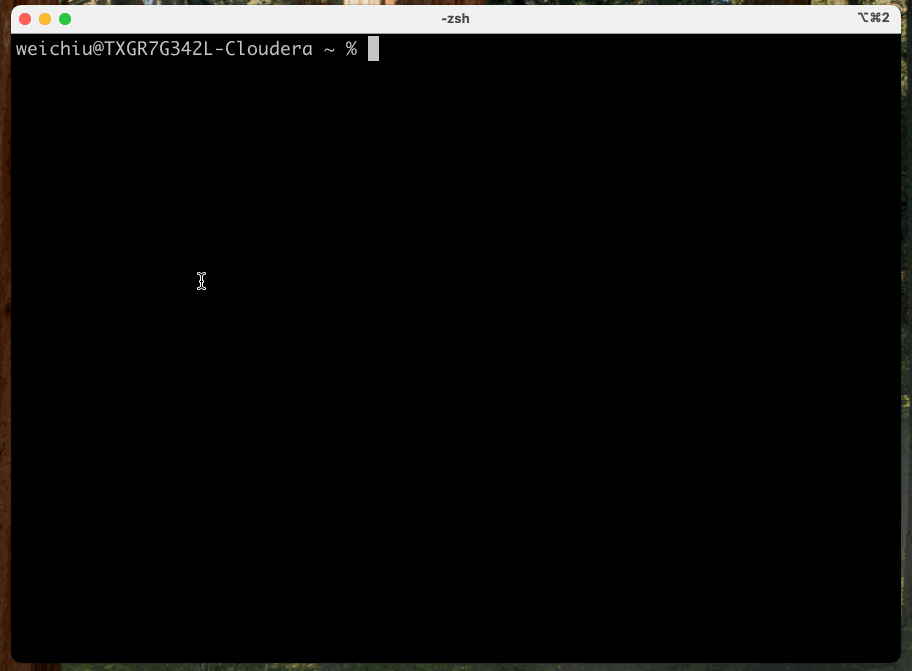

- [Docker Engine](https://docs.docker.com/engine/install/) - Latest stable version
- [Docker Compose](https://docs.docker.com/compose/install/) - Latest stable version

First, obtain Ozone's sample Docker Compose configuration:

```bash
# Download the latest Docker Compose configuration file curl -O https://raw.githubusercontent.com/apache/ozone-docker/refs/heads/latest/docker-compose.yaml
```

Start your Ozone cluster with three Datanodes using the following command:

```bash
docker compose up -d --scale datanode=3 
```

This command will:

- Automatically pull required images from Docker Hub
- Create a multi-node cluster with the core Ozone services
- Start all components in detached mode

1. Check the status of your Ozone cluster components:


```bash
docker compose ps 
```

   You should see output similar to this:


```bash
NAME                IMAGE                      COMMAND                  SERVICE    CREATED          STATUS          PORTS 
docker-datanode-1   apache/ozone:1.4.1-rocky   "/usr/local/bin/dumb…"   datanode   14 seconds ago   Up 13 seconds   0.0.0.0:32958->9864/tcp, :::32958->9864/tcp 
docker-datanode-2   apache/ozone:1.4.1-rocky   "/usr/local/bin/dumb…"   datanode   14 seconds ago   Up 13 seconds   0.0.0.0:32957->9864/tcp, :::32957->9864/tcp 
docker-datanode-3   apache/ozone:1.4.1-rocky   "/usr/local/bin/dumb…"   datanode   14 seconds ago   Up 12 seconds   0.0.0.0:32959->9864/tcp, :::32959->9864/tcp 
docker-om-1         apache/ozone:1.4.1-rocky   "/usr/local/bin/dumb…"   om         14 seconds ago   Up 13 seconds   0.0.0.0:9874->9874/tcp, :::9874->9874/tcp 
docker-recon-1      apache/ozone:1.4.1-rocky   "/usr/local/bin/dumb…"   recon      14 seconds ago   Up 13 seconds   0.0.0.0:9888->9888/tcp, :::9888->9888/tcp 
docker-s3g-1        apache/ozone:1.4.1-rocky   "/usr/local/bin/dumb…"   s3g        14 seconds ago   Up 13 seconds   0.0.0.0:9878->9878/tcp, :::9878->9878/tcp 
docker-scm-1        apache/ozone:1.4.1-rocky   "/usr/local/bin/dumb…"   scm        14 seconds ago   Up 13 seconds   0.0.0.0:9876->9876/tcp, :::9876->9876/tcp 
```

2. Check the Ozone version


```bash
docker compose exec om bash 
ozone version 
```

3. Access the Ozone Recon server, which provides monitoring and management capabilities by navigating to the [Recon server home page](http://localhost:9888).

You can customize your Ozone deployment by modifying the configuration parameters in the `docker-compose.yaml` file:

1. **Common Configurations**: Located under the `x-common-config` section
2. **Service-Specific Settings**: Found under the `environment` section of individual services

As an example, to update the port on which Recon listens to, append the following configuration:

```yaml
x-common-config: 
  ... 
  OZONE-SITE.XML_ozone.recon.http-address: 0.0.0.0:9090 
```

Refer to the [Configuring Ozone For Production](#administrator-guide-configuration) page for more configuration guidelines.

Now that your Ozone cluster is up and running, you can enter any container and explore the environment.

```bash
docker compose exec om bash 
```

Next, learn how to [read and write data](#quick-start-reading-writing-data) into Ozone.

---

<a id="quick-start-installation-kubernetes"></a>

<!-- source_url: https://ozone.apache.org/docs/quick-start/installation/kubernetes/ -->

<!-- page_index: 5 -->

# Try Ozone With Kubernetes

Version: 2.1.0

> [!NOTE]
> the `kubernetes/examples/minikube` resource set is optimized for minikube usage:
>
> - You can have multiple Datanodes even if you have only one host (in a real production cluster usually you need one Datanode per physical host)
> - The services are published with node port

---

<a id="quick-start-installation-bare-metal"></a>

<!-- source_url: https://ozone.apache.org/docs/quick-start/installation/bare-metal/ -->

<!-- page_index: 6 -->

# Try Ozone on Bare Metal

Version: 2.1.0

> [!NOTE]
> We will be using `/opt/ozone` as the base directory for Ozone configs and binaries, and `/data/ozone` for the application data and metadata in all of our examples. Feel free to use any path as per your environment.

---

<a id="quick-start-reading-writing-data"></a>

<!-- source_url: https://ozone.apache.org/docs/quick-start/reading-writing-data/ -->

<!-- page_index: 7 -->

# Reading and Writing Data in Ozone

Version: 2.1.0

Apache Ozone provides multiple interfaces for reading and writing data, catering to different use cases and client
preferences. This guide explains how to use the three primary interfaces within a Docker environment:

1. **Ozone Shell (`ozone sh`)** - The native command-line interface
2. **ofs (Ozone File System)** - Hadoop-compatible file system interface
3. **S3 API** - Amazon S3 compatible REST interface

All examples assume you already have a running Ozone cluster using Docker Compose as described in
the [Docker Installation Guide](#quick-start-installation-docker).

Let's start 5 Datanodes because the Erasure Coding example below requires at least 5 replicas:

```bash
docker compose up -d --scale datanode=5 
```

| Interface | Strengths | Use Cases |
| --- | --- | --- |
| **Ozone Shell** | - Full feature access Advanced operations Detailed metadata | - Administrative tasks Bucket/volume management Quota/ACL management |
| **ofs** | - Familiar HDFS-like commands Works with existing Hadoop applications Full cluster view | - Hadoop ecosystem integration Applications that need filesystem semantics |
| **S3 API** | - Industry standard Works with existing S3 clients Language-independent | - Web applications Multi-language environments Existing S3 applications |

The Ozone Shell provides direct access to all Ozone features through a command-line interface. All commands follow the
pattern:

```bash
ozone sh <object-type> <action> <path> [options] 
```

Where `<object-type>` is `volume`, `bucket`, or `key`.

To use the Ozone Shell in your Docker environment, execute commands inside the `om` container:

```bash
# Example for Docker Compose docker compose exec om bash
 
# Now you can run 'ozone sh' commands
```

Volumes are the top-level namespace in Ozone.

```bash
# Create a volume ozone sh volume create /vol1
 
# List all volumes ozone sh volume list /
 
# Get volume details ozone sh volume info /vol1
 
# Delete a volume (must be empty) ozone sh volume delete /vol1
 
# Delete a volume recursively (deletes all buckets and keys within the volume, then the volume itself)
# WARNING: No recovery option after using this command, and no trash for FSO buckets. Requires confirmation. ozone sh volume delete -r /vol1
```

First, create a volume (skip this step if the `volume` vol1 exists)

```bash
ozone sh volume create /vol1 
```

Buckets are containers for keys (objects) within volumes.

```bash
# Create a bucket ozone sh bucket create /vol1/bucket1
 
# List all buckets in a volume ozone sh bucket list /vol1
 
# Get bucket details ozone sh bucket info /vol1/bucket1
 
# Delete a bucket (must be empty) ozone sh bucket delete /vol1/bucket1
 
# Delete a bucket recursively (deletes all keys within the bucket, then the bucket itself)
# WARNING: No recovery option, deleted keys won't move to trash. Requires confirmation. ozone sh bucket delete -r /vol1/bucket1
```

First, create a bucket (skip this step if the bucket bucket1 exists)

```bash
ozone sh bucket create /vol1/bucket1 
```

Keys are the actual data objects stored in Ozone.

```bash
# Create a test file locally echo "Hello Ozone via Shell" > test_shell.txt
 
# Upload a file (put source to destination) ozone sh key put /vol1/bucket1/test_shell.txt test_shell.txt
 
# Upload with specific replication type
# For RATIS: use -r ONE or THREE ozone sh key put -t RATIS -r THREE /vol1/bucket1/key1_ratis test_shell.txt
# For EC: use format CODEC-DATA-PARITY-CHUNKSIZE (e.g., rs-3-2-1024k, rs-6-3-1024k, rs-10-4-1024k) ozone sh key put -t EC -r rs-3-2-1024k /vol1/bucket1/key1_ec test_shell.txt
 
# Download a file (get source to destination) ozone sh key get /vol1/bucket1/test_shell.txt ./downloaded_shell.txt
 
# Force overwrite when downloading (use -f or --force) ozone sh key get --force /vol1/bucket1/test_shell.txt ./downloaded_shell.txt
 
# Get key information ozone sh key info /vol1/bucket1/test_shell.txt
 
# List keys in a bucket ozone sh key list /vol1/bucket1
 
# Copy a key within Ozone (not directly supported, use put/get or other interfaces)
 
# Rename a key ozone sh key rename /vol1/bucket1 test_shell.txt renamed_shell.txt
 
# Delete a key ozone sh key delete /vol1/bucket1/renamed_shell.txt
 
# Note: In FSO buckets, deleted keys are moved to trash at /<volume>/<bucket>/.Trash/<user>
# In OBS buckets, deletion is permanent.
```

ofs provides a Hadoop-compatible file system interface (`ofs://`), making it seamless to use with applications designed
for HDFS.

ofs uses standard Hadoop filesystem commands.

```bash
# Create volume and bucket (using filesystem semantics) ozone fs -mkdir -p ofs://om/vol1/bucketofs
 
# Upload a file echo "Hello from OFS" > local_ofs.txt ozone fs -put local_ofs.txt ofs://om/vol1/bucketofs/
 
# Copy from local with explicit destination path ozone fs -copyFromLocal local_ofs.txt ofs://om/vol1/bucketofs/remote_file.txt
 
# List files in a bucket ozone fs -ls ofs://om/vol1/bucketofs/
 
# List recursively (lists all keys under /vol1/bucketofs) ozone fs -ls -R ofs://om/vol1/bucketofs/
 
# Download a file ozone fs -get ofs://om/vol1/bucketofs/local_ofs.txt ./downloaded_ofs.txt
 
# Display file contents ozone fs -cat ofs://om/vol1/bucketofs/local_ofs.txt
 
# Move a file (rename) ozone fs -mv ofs://om/vol1/bucketofs/local_ofs.txt ofs://om/vol1/bucketofs/moved_ofs.txt
 
# Copy a file within the filesystem ozone fs -cp ofs://om/vol1/bucketofs/moved_ofs.txt ofs://om/vol1/bucketofs/copy_ofs.txt
 
# Delete a file (moves to trash if enabled and bucket is FSO) ozone fs -rm ofs://om/vol1/bucketofs/copy_ofs.txt
 
# Delete a file and skip trash (permanently delete without moving to trash) ozone fs -rm -skipTrash ofs://om/vol1/bucketofs/moved_ofs.txt
 
# Create an empty file ozone fs -touchz ofs://om/vol1/bucketofs/empty_file.txt
```

```bash
# Get file checksum ozone fs -checksum ofs://om/vol1/bucketofs/empty_file.txt
```

The S3 API provides compatibility with applications designed for Amazon S3. It's accessible via the S3 Gateway service, typically running on port `9878` in the Docker setup.

In the default non-secure Docker setup, you can use any values for credentials.

```bash
# Set environment variables (can be done outside the containers) export AWS_ACCESS_KEY_ID=testuser export AWS_SECRET_ACCESS_KEY=testuser-secret export AWS_ENDPOINT_URL=http://s3g:9878
```

*(Note: Setting `AWS_ENDPOINT_URL` simplifies the `aws` commands below)*

The AWS CLI can be used from your local machine (if installed) or from within a container that has it.

```bash
# Ensure AWS CLI is installed locally or use a container with it.
 
# Create a bucket (maps to /s3v/<bucket-name> in Ozone namespace) aws s3api create-bucket --bucket=s3bucket
 
# List buckets aws s3api list-buckets
 
# Upload a file echo "Hello S3" > s3_test.txt aws s3 cp s3_test.txt s3://s3bucket/
 
# List objects in a bucket aws s3 ls s3://s3bucket/
 
# Download a file aws s3 cp s3://s3bucket/s3_test.txt ./downloaded_s3.txt
 
# Delete an object aws s3 rm s3://s3bucket/s3_test.txt
 
# Delete a bucket (must be empty) aws s3api delete-bucket --bucket=s3bucket
```

Ozone allows accessing the same data through different interfaces.

| Data Location | Ozone Shell Path | ofs Path | S3 Path |
| --- | --- | --- | --- |
| vol1/bucket1/file.txt | `/vol1/bucket1/file.txt` | `ofs://<ozone service id>/vol1/bucket1/file.txt` | `s3://bucket1/file.txt` (if S3V configured to serve vol1) |
| s3v/s3bucket/file.txt | `/s3v/s3bucket/file.txt` | `ofs://<ozone service id>/s3v/s3bucket/file.txt` | `s3://s3bucket/file.txt` |

*(Note: `om` in `ofs://` path refers to the Ozone Manager service address)*

Objects created via S3 reside in the special `/s3v` volume.

```bash
# Assuming 's3bucket' was created via S3 API and contains 's3_test.txt'
 
docker compose exec om bash 
ozone sh key list /s3v/s3bucket 
ozone sh key get /s3v/s3bucket/s3_test.txt /tmp/from_s3.txt 
exit 
```

Create a FSO bucket in the /s3v

```bash
ozone sh bucket create /s3v/fsobucket --layout fso 
```

Upload a file using AWS CLI

```bash
aws s3 cp s3_test.txt s3://fsobucket/ 
```

Access the file via ofs

```bash
 
ozone fs -ls ofs://om/s3v/fsobucket/ 
 
ozone fs -cat ofs://om/s3v/fsobucket/s3_test.txt 
 
```

You can make buckets created outside `/s3v` accessible via the S3 Gateway using links.

```bash
# Inside om/client container docker compose exec om bash
 
# Create a regular bucket ozone sh volume create /myvol ozone sh bucket create /myvol/mybucket
 
# Create an S3-accessible link (target must exist, link name becomes S3 bucket name) ozone sh bucket link /myvol/mybucket /s3v/linkedbucket exit
 
# Now access 'linkedbucket' via S3 CLI (outside container) aws s3 cp local_file.txt s3://linkedbucket/aws s3 ls s3://linkedbucket/
```

Ozone buckets can have different internal layouts:

1. **FILE\_SYSTEM\_OPTIMIZED (FSO):** Default. Better for hierarchical operations (like `ozone fs -mkdir`), supports trash
   for `ozone fs -rm`. Recommended for Hadoop/filesystem workloads.
2. **OBJECT\_STORE (OBS):** Legacy layout. May offer slight performance benefits for flat object access patterns. No
   trash support.

```bash
# Create buckets with specific layouts (inside om/client container)
# Short form ozone sh bucket create /vol1/fsobucket --layout fso ozone sh bucket create /vol1/obsbucket --layout obs
 
# Long form
# ozone sh bucket create /vol1/fsobucket --layout FILE_SYSTEM_OPTIMIZED
# ozone sh bucket create /vol1/obsbucket --layout OBJECT_STORE
```

Most operations work on both, but FSO is generally preferred unless specific OBS characteristics are needed.

You have learned how to perform basic read/write operations in Ozone using three different interfaces: Ozone Shell, ofs, and the S3 API. Each interface has its strengths, and Ozone's multi-protocol design allows you to choose the best tool
for the job while accessing the same underlying data.

---

<a id="core-concepts"></a>

<!-- source_url: https://ozone.apache.org/docs/core-concepts/ -->

<!-- page_index: 8 -->

# Core Concepts

Version: 2.1.0

This section covers Ozone concepts that are helpful for both users and administrators to understand. Topics in this section will be referenced throughout the documentation.

[<a id="core-concepts--architecture"></a>

## 🗃️ Architecture

6 items](#core-concepts-architecture)

[<a id="core-concepts--replication"></a>

## 🗃️ Replication

4 items](#core-concepts-replication)

[<a id="core-concepts--namespace"></a>

## 🗃️ Namespace

4 items](#core-concepts-namespace)

[<a id="core-concepts--security"></a>

## 🗃️ Security

2 items](#core-concepts-security)

[<a id="core-concepts--high-availability"></a>

## 🗃️ High Availability

2 items](#core-concepts-high-availability)

[<a id="core-concepts--comparison-with-other-storage-technologies"></a>

## 📄️ Comparison with Other Storage Technologies

This document provides a high-level comparison of Apache Ozone with other storage technologies.](#core-concepts-comparison)

---

<a id="core-concepts-architecture"></a>

<!-- source_url: https://ozone.apache.org/docs/core-concepts/architecture/ -->

<!-- page_index: 9 -->

# Architecture

Version: 2.1.0

This section describes the architecture and components within Ozone.

[<a id="core-concepts-architecture--overview"></a>

## 📄️ Overview

Ozone is a fault-tolerant, distributed object store optimized for Big Data workloads. Its primary design goal is scalability, aiming to support billions of objects.](#core-concepts-architecture-overview)

[<a id="core-concepts-architecture--ozone-manager"></a>

## 📄️ Ozone Manager

Ozone Manager](#core-concepts-architecture-ozone-manager)

[<a id="core-concepts-architecture--storage-container-manager"></a>

## 📄️ Storage Container Manager

Storage Container Manager (SCM) is the leader node of the block space management.](#core-concepts-architecture-storage-container-manager)

[<a id="core-concepts-architecture--ozone-s3-gateway"></a>

## 📄️ Ozone S3 Gateway

Apache Ozone’s S3 Gateway (often called S3G) is a component that provides an Amazon S3-compatible REST interface for Ozone’s object store.](#core-concepts-architecture-s3-gateway)

[<a id="core-concepts-architecture--datanodes"></a>

## 📄️ Datanodes

Datanodes are the worker bees of Ozone. All data is stored on data nodes. Clients write data in terms of blocks.](#core-concepts-architecture-datanodes)

[<a id="core-concepts-architecture--recon"></a>

## 📄️ Recon

Recon serves as a management and monitoring console for Ozone. It gives a bird's-eye view of Ozone and helps users troubleshoot any issues by presenting the current state of the cluster through REST based APIs and rich web UI.](#core-concepts-architecture-recon)

---

<a id="core-concepts-architecture-overview"></a>

<!-- source_url: https://ozone.apache.org/docs/core-concepts/architecture/overview/ -->

<!-- page_index: 10 -->

# Overview

Version: 2.1.0

Ozone is a fault-tolerant, distributed object store optimized for Big Data workloads. Its primary design goal is scalability, aiming to support billions of objects.

Ozone achieves better scalability by separating namespace management from block space management.

- The **Ozone Manager (OM)** daemon handles namespace-related tasks, like managing volumes, buckets, and keys.
- The **Storage Container Manager (SCM)** manages the physical storage layer, including the data nodes and the blocks that form the data.

The block diagram below illustrates Ozone's main components and their interactions.

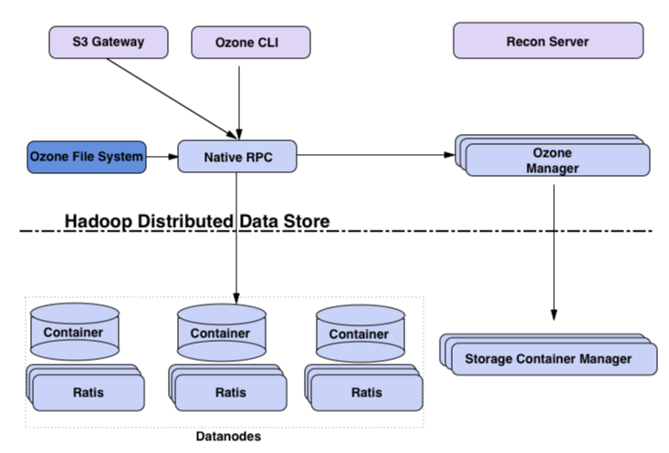

- **Clients** interact with Ozone to read and write data.
- The **Ozone Manager (OM)** acts as the namespace manager. It handles client requests for creating, deleting, or looking up keys.
- The **Storage Container Manager (SCM)** is the manager of the physical data layer. It manages the **Datanodes** and the replication of data.
- **Datanodes** are responsible for storing the actual data, which is organized into logical units called **blocks**.
- **Recon** is a management server for Ozone. It provides a user interface and API to monitor and manage the Ozone cluster.

Ozone's namespace is organized into a hierarchy of volumes, buckets, and keys.

- **Volumes** are similar to home directories and can only be created by an administrator. They are the basis for storage accounting.
- **Buckets** are contained within volumes. Users can create many buckets within a volume.
- **Keys** hold the actual data and reside within buckets.

This separation of the logical namespace from the physical storage layer is a key aspect of Ozone's scalability.

Another way to understand Ozone is by looking at its functional layers.

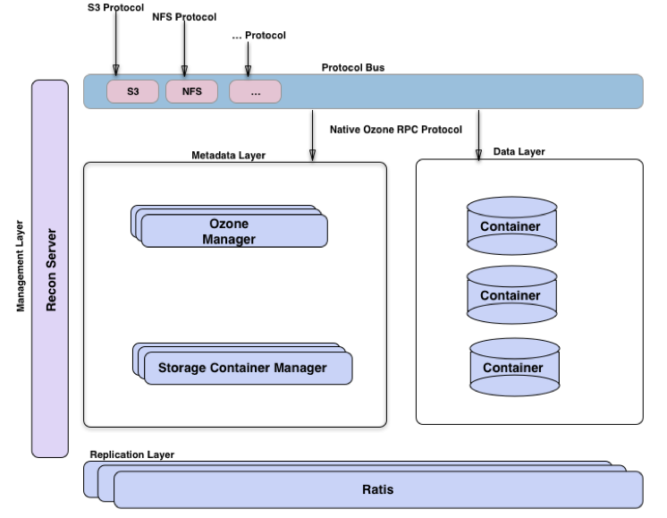

- The **Metadata Management Layer** is composed of the Ozone Manager and Storage Container Manager.
- The **Data Storage Layer** consists of the Datanodes, which are managed by SCM. Data is stored in logical blocks, which are grouped into containers for replication.
- The **Replication Layer** is powered by [Ratis](#core-concepts-replication-ratis), a Java-based implementation of the Raft consensus protocol. Ratis ensures that metadata is reliably replicated across OM and SCM instances and maintains data consistency during write operations on the Datanodes.
- The **Protocol Bus** allows Ozone to be extended with different protocols. Currently, it supports an S3-compatible protocol. This bus allows new object store or file system protocols to be implemented on top of Ozone's native protocol.

This layered architecture, combined with a clear separation of metadata and data management, allows Ozone to scale to handle billions of objects while maintaining high performance and fault tolerance.

---

<a id="core-concepts-architecture-ozone-manager"></a>

<!-- source_url: https://ozone.apache.org/docs/core-concepts/architecture/ozone-manager/ -->

<!-- page_index: 11 -->

# Ozone Manager

Version: 2.1.0

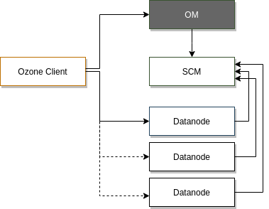

Ozone Manager (OM) is the namespace manager for Ozone.

This means that when you want to write some data, you ask Ozone Manager for a block and Ozone Manager gives you a block and remembers that information. When you want to read that file back, you need to find the address of the block and the Ozone Manager returns it to you.

Ozone Manager also allows users to organize keys under a volume and bucket. Volumes and buckets are part of the namespace and managed by Ozone Manager.

Each Ozone volume is the root of an independent namespace under OM. This is very different from HDFS which provides a single rooted file system.

Ozone's namespace is a collection of volumes or is a forest instead of a single rooted tree as in HDFS. This property makes it easy to deploy multiple OMs for scaling(pending future development).

OM maintains a list of volumes, buckets, and keys. For each user, it maintains a list of volumes. For each volume, the list of buckets and for each bucket the list of keys.

Ozone Manager will use [Apache Ratis](https://ratis.apache.org/) (A Raft protocol implementation) to replicate Ozone Manager state. This will ensure High Availability for Ozone Manager.

The relationship between Ozone Manager and Storage Container Manager (SCM) is best understood if we trace what happens during a key write and key read.

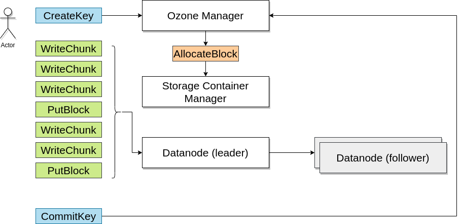

- To write a key to Ozone, a client tells Ozone Manager that it would like to write a key into a bucket that lives inside a specific volume. Once Ozone Manager determines that you are allowed to write a key to the specified bucket, OM needs to allocate a block for the client to write data.
- To allocate a block, Ozone Manager sends a request to Storage Container Manager (SCM); SCM is the manager of data nodes. SCM picks three data nodes into which client can write data. SCM allocates the block and returns the block ID to Ozone Manager.
- Ozone Manager records this block information in its metadata and returns the block and a block token (a security permission to write data to the block) to the client.
- The client uses the block token to prove that it is allowed to write data to the block and writes data to the data node.
- Once the write is complete on the data node, the client will update the block information on Ozone Manager.

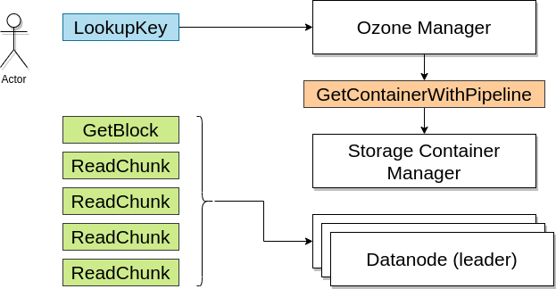

- Key reads are simpler, the client requests the block list from the Ozone Manager
- Ozone Manager will return the block list and block tokens which allows the client to read the data from data nodes.
- Client connects to the data node and presents the block token and reads the data from the data node.

For a detailed view of Ozone Manager this section gives a quick overview about the provided network services and the stored persisted data.

Ozone provides a network service for the client and for administration commands. The main service calls:

- Key, Bucket, Volume / CRUD
- Multipart upload (Initiate, Complete…)
  - Supports upload of huge files in multiple steps
- FS related calls (optimized for hierarchical queries instead of a flat ObjectStore namespace)
  - GetFileStatus, CreateDirectory, CreateFile, LookupFile
- ACL related
  - Managing ACLs if [Native ACLs](#core-concepts-security-acls-native-acls) are used instead of [Ranger ACLs](#core-concepts-security-acls-ranger-acls)
- Delegation token (Get / Renew / Cancel)
  - For security
- Admin APIs
  - Get S3 secret
  - ServiceList (used for service discovery)
  - DBUpdates (used by Recon downloads snapshots)

The following data is persisted in Ozone Manager side in a specific RocksDB directory:

- Volume / Bucket / Key tables
  - This is the main responsibility of OM
  - Key metadata contains the block id (which includes container id) to find the data
- OpenKey table
  - for keys which are created, but not yet committed
- Delegation token table
  - for security
- PrefixInfo table
  - specific index table to store directory level ACL and to provide better performance for hierarchical queries
- S3 secret table
  - For S3 secret management
- Multipart info table
  - Inflight uploads should be tracked
- Deleted table
  - To track the blocks which should be deleted from the Datanodes

| Key | Default | Description |
| --- | --- | --- |
| `ozone.om.address` | 0.0.0.0:9862 | RPC address of the OM. Required by the client. |
| `ozone.om.http-address` | 0.0.0.0:9874 | Default port of the HTTP server. |
| `ozone.metadata.dirs` | none | Directory to store persisted data (RocksDB). |

---

<a id="core-concepts-architecture-storage-container-manager"></a>

<!-- source_url: https://ozone.apache.org/docs/core-concepts/architecture/storage-container-manager/ -->

<!-- page_index: 12 -->

# Storage Container Manager

Version: 2.1.0

> [!NOTE]
> Client doesn't connect directly to the SCM.

---

<a id="core-concepts-architecture-s3-gateway"></a>

<!-- source_url: https://ozone.apache.org/docs/core-concepts/architecture/s3-gateway/ -->

<!-- page_index: 13 -->

# Ozone S3 Gateway

Version: 2.1.0

Apache Ozone’s S3 Gateway (often called **S3G**) is a component that provides an Amazon S3-compatible REST interface for Ozone’s object store.
In essence, it allows any S3 client or tool to read and write data in Ozone as if it were talking to AWS S3.
The S3 Gateway runs as a **separate, stateless service** on top of Ozone, translating HTTP S3 API calls into Ozone’s native storage operations.

This design lets users leverage the rich ecosystem of S3-compatible applications with Ozone, without modifying those applications.

Ozone’s S3 Gateway acts as a **REST front-end** that speaks the S3 protocol and bridges it to the Ozone backend.
It is **stateless**, meaning it does not persist data or metadata locally between requests – all state is stored in the Ozone cluster itself.

Being stateless allows multiple S3 Gateway instances to run in parallel behind a load balancer for scaling and high availability.
The idea of stateless also allows S3G to be deployed in Kubernetes quite easily.
The gateway supports a broad set of S3 operations – create/delete buckets, PUT/GET objects, list objects, perform multipart uploads – using standard S3 SDKs or CLI tools.

Under the hood, each operation is translated into the appropriate Ozone calls:

- A PUT object request becomes a `putKey` write operation.
- A GET object becomes a `getKey` read operation.

In Ozone, data is organized into **volumes**, **buckets**, and **keys**. By default, the S3 Gateway uses a special
volume named `/s3v` to store all S3 buckets (this is configurable via the `ozone.s3g.volume.name` property).

Each S3 bucket created is represented as a bucket under the `/s3v` volume in Ozone. Objects (keys) are stored within those buckets. This mapping is transparent to the end user.

The default bucket layout for S3 buckets (`OBJECT_STORE`) can be configured using the `ozone.s3g.default.bucket.layout` property. This property defines the storage layout for buckets created via the S3 Gateway.

The S3 Gateway does the following:

- It receives S3 REST API calls from clients.
- It translates them and forwards metadata operations to OM.
- It streams data directly to and from Datanodes.

This stateless gateway can be scaled horizontally.

Runs an embedded HTTP server exposing REST endpoints like:

- `PUT /<bucket>/<key>`
- `GET /<bucket>/<key>`

Handles authentication headers, content length, and routing.

Each S3 operation is mapped to Ozone APIs:

- Create Bucket → create in `/s3v` volume
- List Buckets → query all user-owned buckets under `/s3v`
- Put/Get Object → `putKey` / `getKey`

It also assembles proper S3-compliant response formats.

Uses Ozone client libraries to:

- Call OM for metadata operations
- Stream data to/from Datanodes

Bulk data does not flow through OM – it goes directly between gateway and Datanodes.

The gateway:

- Does not persist state
- Uses lightweight in-memory caches
- Depends on OM for coordination and user/token validation

This simplifies scaling and failure recovery.

Supports AWS Signature-style authentication (if enabled):

- Only AWS Signature V4 is supported (the older AWS Signature V2 is not).
- Validates access/secret keys via OM
- Uses OM’s stored credentials
- Relies on OM for final authorization

Supports Kerberos authentication for secure clusters; In unsecured mode, allows anonymous or dummy access.

The Ozone S3 Gateway is a **protocol adapter**:

- It translates REST S3 operations into native Ozone calls.
- It doesn’t store or manage data – it delegates to OM and Datanodes.
- Its stateless, scalable design enables multiple instances behind load balancers.
- It enables seamless use of existing S3-compatible clients and tools.

For more details, refer to the other documentation:

- [Ozone S3 Gateway Interface](#user-guide-client-interfaces-s3-s3-api)
- [S3 Multi-Tenancy](#administrator-guide-operations-s3-multi-tenancy-overview)
- [Securing S3](#user-guide-client-interfaces-s3-securing-s3)
- [Network Ports](#administrator-guide-configuration-basic-network-default-ports)

---

<a id="core-concepts-architecture-datanodes"></a>

<!-- source_url: https://ozone.apache.org/docs/core-concepts/architecture/datanodes/ -->

<!-- page_index: 14 -->

# Datanodes

Version: 2.1.0

Datanodes are the worker bees of Ozone. All data is stored on data nodes. Clients write data in terms of blocks.
Datanode aggregates these blocks into a storage container. A storage container is the data streams and metadata about
the blocks written by the clients.

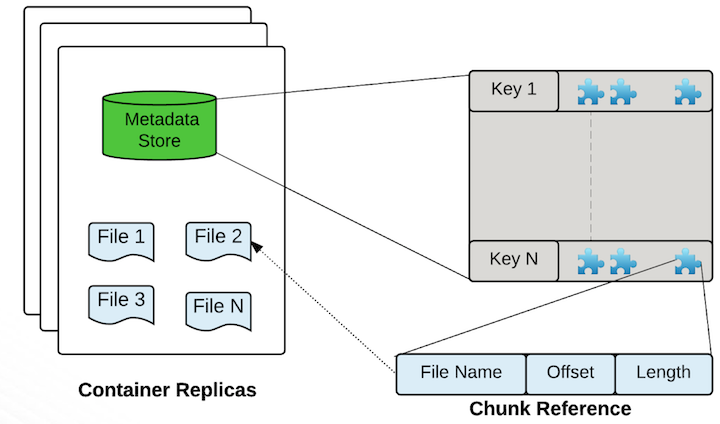

A storage container is a self-contained super block. It has a list of Ozone blocks that reside inside it, as well as on-disk
files which contain the actual data streams. This is the default Storage container format. From Ozone's perspective, container
is a protocol spec, actual storage layouts does not matter. In other words, it is trivial to extend or bring new container layouts.
Hence this should be treated as a reference implementation of containers under Ozone.

When a client wants to read a key from Ozone, the client sends the name of the key to the Ozone Manager. Ozone Manager returns
the list of Ozone blocks that make up that key.

An Ozone block contains the container ID and a local ID. The figure below shows the logical layout of the Ozone block.

![Ozone Block]()

The container ID lets the clients discover the location of the container.
The authoritative information about where a container is located is with the Storage Container Manager (SCM). In most cases, the container location will be cached by Ozone Manager and will be returned along with the Ozone blocks.

Once the client is able to locate the container, the client will connect to the Datanode and read the data stream specified
by *Container ID:Local ID*. In other words, the local ID serves as index into the container which describes what data stream to read from.

How does SCM know where the containers are located? This is very similar to what HDFS does; the data nodes regularly send
container reports like block reports. Container reports are far more concise than block reports. For example, an Ozone deployment
with a 196 TB data node will have around 40 thousand containers, compared to HDFS block count of million and half blocks—a 40x
reduction in the block reports.

This extra indirection helps tremendously with scaling Ozone. SCM has far less block data to process and the namespace
service (Ozone Manager) as a different service are critical to scaling Ozone.

In the context of an Ozone Datanode, a "volume" refers to a physical disk or storage device managed by the Datanode. Each
volume can store many containers, which are the fundamental units of storage in Ozone. This is different from the "volume"
concept in Ozone Manager, which refers to a namespace for organizing buckets and keys.

The status of volumes, including used space, available space and whether or not they are operational (healthy) or failed, can be looked up from Datanode Web UI.

The property `hdds.datanode.dir` defines the set of volumes (disks) managed by a Datanode. You can specify one or more
directories, separated by commas. Each directory represents a volume. For example: `/data1/disk1,/data2/disk2`, which configures
the Datanode to manage two volumes.

When a Datanode needs to select a volume to store new data, it uses a volume choosing policy. The policy is controlled by
the property `hdds.datanode.volume.choosing.policy`. There are two main policies:

- **CapacityVolumeChoosingPolicy (default)**: This policy randomly selects two volumes with enough available space and chooses the one with
  lower utilization (i.e., more free space). This approach increases the likelihood that less-used disks are chosen, helping to balance disk usage over time.
- **RoundRobinVolumeChoosingPolicy**: This policy selects volumes in a round-robin order, cycling through all available volumes.
  It does not consider the current utilization of each disk, but ensures even distribution of new containers across all disks.

| Property Name | Default Value | Description |
| --- | --- | --- |
| `hdds.datanode.volume.choosing.policy` | `CapacityVolumeChoosingPolicy` | The policy used to select a volume for new containers. |
| `hdds.datanode.volume.min.free.space` | `20GB` | Minimum free space required on a volume to be eligible for new containers. |
| `hdds.datanode.volume.min.free.space.percent` | `0.02` | Minimum free space percentage required on a volume to be eligible for new containers. |

Over time, operations like adding or replacing disks can cause uneven disk usage. Ozone provides a **Disk Balancer** feature to automatically balance disk usage across Datanode volumes. The Disk Balancer can be enabled via the `hdds.datanode.disk.balancer.enabled` configuration property and is managed through CLI commands.

| Key | Default | Description |
| --- | --- | --- |
| `dfs.container.ratis.datanode.storage.dir` | none | This directory is used for storing Ratis metadata like logs. |
| `ozone.scm.datanode.id.dir` | none | The path that Datanodes will use to store the Datanode ID. |
| `hdds.datanode.dir` | none | Determines where HDDS data will be stored on the local filesystem. |
| `hdds.datanode.dir.du.reserved` | none | Reserved space in bytes per volume. Always leave this much space free for non dfs use. |
| `ozone.metadata.dirs` | none | Directory to store persisted data (RocksDB). |
| `ozone.recon.address` | 0.0.0.0:9891 | RPC address of the Recon. Use host:port to connect Recon. |

---

<a id="core-concepts-architecture-recon"></a>

<!-- source_url: https://ozone.apache.org/docs/core-concepts/architecture/recon/ -->

<!-- page_index: 15 -->

# Recon

Version: 2.1.0

Recon serves as a management and monitoring console for Ozone. It gives a bird's-eye view of Ozone and helps users troubleshoot any issues by presenting the current state of the cluster through REST based APIs and rich web UI.

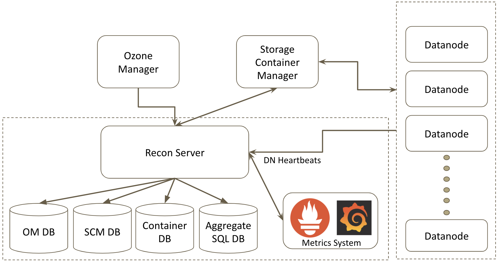

On a high level, Recon collects and aggregates metadata from Ozone Manager (OM), Storage Container Manager (SCM) and Datanodes (DN) and acts as a central management and monitoring console. Ozone administrators can use Recon to query the current state of the system without overloading OM or SCM.

Recon maintains multiple databases to enable batch processing, faster querying and to persist aggregate information. It maintains a local copy of OM db and SCM db along with a SQL database for persisting aggregate information.

Recon also integrates with Prometheus to provide a HTTP endpoint to query Prometheus for Ozone metrics and also to display a few crucial point in time metrics in the web UI.

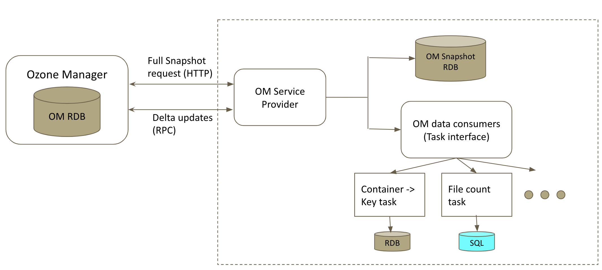

Recon gets a full snapshot of OM rocks db initially from the leader OM's HTTP endpoint, untars the file and initializes RocksDB for querying locally. The database is kept in sync by periodically requesting delta updates from the leader OM via RPC calls from the last applied sequence id. If for any reason, the delta updates could not be retrieved or applied to the local db, a full snapshot is requested again to keep the local db in sync with OM db. Due to this, Recon can show stale information since the local db will not always be in sync.

The db updates retrieved from OM is then converted into a batch of events for further processing by OM db tasks via [Recon Task Framework](#core-concepts-architecture-recon--task-framework).

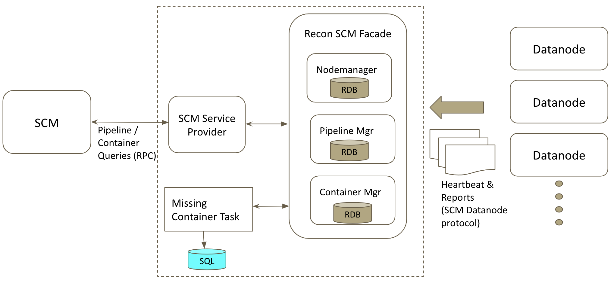

Recon also acts as a passive SCM for Datanodes. When Recon is configured in the cluster, all the Datanodes register with Recon and send heartbeats, container reports, incremental container reports etc. to Recon similar to SCM. Recon uses all the information it gets from Datanodes to construct its own copy of SCM rocks db locally. Recon never sends any command to Datanodes in response and just acts as a passive SCM for faster lookup of SCM metadata.

Recon has its own Task framework to enable batch processing of data obtained from OM and SCM. A task can listen to and act upon db events such as `PUT`, `DELETE`, `UPDATE`, etc. on either OM db or SCM db. Based on this, a task either implements `org.apache.hadoop.ozone.recon.tasks.ReconOmTask` or extends `org.apache.hadoop.ozone.recon.scm.ReconScmTask`.

An example `ReconOmTask` is `ContainerKeyMapperTask` that persists the container -> key mapping in RocksDB. This is useful to understand which keys were part
of the container when the container is reported missing or is in a bad health state. Another example is FileSizeCountTask which keeps track of count of
files within a given file size range in a SQL database. These tasks have implementations for two scenarios:

- Full snapshot (`reprocess()`)
- Delta updates (`process()`)

When a full snapshot of OM db is obtained from the leader OM, the `reprocess()` is called on all the registered OM tasks. On subsequent delta updates, `process()` is called on these OM tasks.

An example `ReconScmTask` is `ContainerHealthTask` that runs in configurable intervals to scan the list of all the containers and to persist the state of unhealthy containers (`MISSING`, `MIS_REPLICATED`, `UNDER_REPLICATED`, `OVER_REPLICATED`) in a SQL table. This information is used to determine if there are any missing containers in the cluster.

Recon can integrate with any Prometheus instance configured to collected metrics and can display useful information in Recon UI in Datanodes and Pipelines pages. Recon also exposes a proxy endpoint
([/metrics](https://ozone.apache.org/docs/edge/interface/reconapi.html#metrics)) to query Prometheus. This integration can be enabled by setting this configuration `ozone.recon.prometheus.http.endpoint` to the Prometheus endpoint like `ozone.recon.prometheus.http.endpoint=http://prometheus:9090`.

[Link to complete API Reference](#administrator-guide-operations-observability-recon-recon-rest-api)

- A local copy of [OM database](#core-concepts-architecture-ozone-manager--persisted-state)
- A local copy of [SCM database](#core-concepts-architecture-storage-container-manager--persisted-state)

The following data is persisted in Recon in the specified RocksDB directory:

- **ContainerKey table**
  - Stores the mapping (container, key) -> count
- **ContainerKeyCount table**
  - Stores containerID -> no. of keys count within the container

The following data is stored in the configured SQL database (**default is Derby**):

- **GlobalStats table**
  - A Key -> Value table to store aggregate information like total number of volumes / buckets / keys present in the cluster
- **FileCountBySize table**
  - Keeps track of the number of files present within a file size range in the cluster
- **ReconTaskStatus table**
  - Keeps track of the status and last run timestamp of the registered OM and SCM db tasks in the [Recon Task Framework](#core-concepts-architecture-recon--task-framework)
- **ContainerHistory table**
  - Stores ContainerReplica -> Datanode mapping with last known timestamp. This is used to determine the last known Datanodes when a container is reported missing
- **UnhealthyContainers table**
  - Keeps track of all the Unhealthy Containers (MISSING, UNDER\_REPLICATED, OVER\_REPLICATED, MIS\_REPLICATED) in the cluster at any given time

| Key | Default | Description |
| --- | --- | --- |
| `ozone.recon.http-address` | 0.0.0.0:9888 | The address and the base port where the Recon web UI will listen on. |
| `ozone.recon.address` | 0.0.0.0:9891 | RPC address of the Recon. |
| `ozone.recon.heatmap.provider` | none | HeatMapProvider for Recon. |
| `ozone.recon.db.dir` | none | Directory where the Recon Server stores its metadata. |
| `ozone.recon.om.db.dir` | none | Directory where the Recon Server stores its OM snapshot DB. |
| `ozone.recon.om.snapshot.task.interval.delay` | 10m | Interval in MINUTES by Recon to request OM DB Snapshot / delta updates. |
| `ozone.recon.task.missingcontainer.interval` | 300s | Time interval of the periodic check for Unhealthy Containers in the cluster. |
| `ozone.recon.task.safemode.wait.threshold` | 300s | Max time for Recon to wait before it exits out of safe or warmup mode. |
| `ozone.recon.sql.db.jooq.dialect` | DERBY | Please refer to [SQL Dialect](https://www.jooq.org/javadoc/latest/org.jooq/org/jooq/SQLDialect.html) to specify a different dialect. |
| `ozone.recon.sql.db.jdbc.url` | `jdbc:derby:$&#123;ozone.recon.db.dir&#125;` `/ozone_recon_derby.db` | Recon SQL database jdbc url. |
| `ozone.recon.sql.db.username` | none | Recon SQL database username. |
| `ozone.recon.sql.db.password` | none | Recon SQL database password. |
| `ozone.recon.sql.db.driver` | `org.apache.derby.jdbc.EmbeddedDriver` | Recon SQL database jdbc driver. |
| `ozone.recon.prometheus.http.endpoint` | none | Prometheus HTTP endpoint URL for Recon to integrate with Prometheus. Enables display of metrics in Recon UI and exposes a proxy endpoint to query Prometheus. Example: `http://prometheus:9090`. |
| `ozone.recon.scmconfig` | none | Prefix for SCM configuration. |
| `ozone.recon.db.dirs.permissions` | `750` | Permissions for the metadata directories for Recon. The permissions can either be octal or symbolic. If the default permissions are not set then the default value of 750 will be used. |
| `ozone.recon.datanode.address` | none | Datanode address for Recon. |
| `ozone.recon.heatmap.enable` | `false` | To enable/disable Recon heatmap feature. Along with this config, user must also provide the implementation of `org.apache.hadoop.ozone.recon.heatmap.IHeatMapProvider` interface and configure in `ozone.recon.heatmap.provider` configuration. |
| `ozone.recon.https-address` | `0.0.0.0:9889` | The address and the base port where the Recon web UI will listen on using HTTPS. If the port is 0 then the server will start on a free port. |
| `ozone.recon.datanode.bind.host` | `0.0.0.0` | Bind host for Datanode address. |

---

<a id="core-concepts-replication"></a>

<!-- source_url: https://ozone.apache.org/docs/core-concepts/replication/ -->

<!-- page_index: 16 -->

# Data and Metadata Replication

Version: 2.1.0

This section describes how data and metadata are replicated consistently within Ozone.

[<a id="core-concepts-replication--storage-containers"></a>

## 📄️ Storage Containers

Storage Containers, or Containers (not to be confused with Docker containers) are the fundamental replication unit of Ozone, they are managed by the Storage Container Manager (SCM) service.](#core-concepts-replication-storage-containers)

[<a id="core-concepts-replication--write-pipelines"></a>

## 📄️ Write Pipelines

Write pipelines are a fundamental component of Apache Ozone's storage architecture, enabling reliable data storage across distributed nodes. This document provides a comprehensive overview of write pipelines, covering both replication and erasure coding approaches, their architecture, implementation details, and usage patterns.](#core-concepts-replication-write-pipelines)

[<a id="core-concepts-replication--ratis"></a>

## 📄️ Ratis

Apache Ratis is a highly customizable open-source Java implementation](#core-concepts-replication-ratis)

[<a id="core-concepts-replication--erasure-coding"></a>

## 📄️ Erasure Coding

Background](#core-concepts-replication-erasure-coding)

---

<a id="core-concepts-replication-storage-containers"></a>

<!-- source_url: https://ozone.apache.org/docs/core-concepts/replication/storage-containers/ -->

<!-- page_index: 17 -->

# Storage Containers

Version: 2.1.0

Storage Containers, or Containers (not to be confused with Docker containers) are the fundamental replication unit of Ozone, they are managed by the Storage Container Manager (SCM) service.

Containers are big binary units (5GB by default) which can contain multiple blocks:

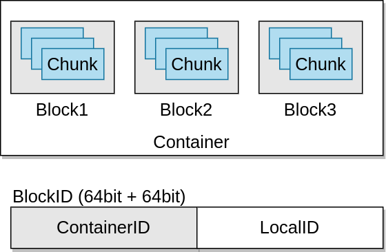

Blocks are local information and not managed by SCM. Therefore even if billions of small files are created in the system (which means billions of blocks are created), only of the status of the containers will be reported by the Datanodes and containers will be replicated.
When Ozone Manager requests a new Block allocation from the SCM, SCM will identify the suitable container and generate a block id which contains `ContainerId` + `LocalId`. Client will connect to the Datanode which stores the Container, and Datanode can manage the separated block based on the `LocalId`.

When a container is created it starts in an OPEN state. When it's full (~5GB data is written), container will be closed and becomes a CLOSED container.

The fundamental differences between OPEN and CLOSED containers:

| OPEN | CLOSED |
| --- | --- |
| Mutable | Immutable |
| Replicated with RAFT (Ratis) | Replicated with async container copy |
| Raft leader is used to READ / WRITE | All the nodes can be used to READ |

---

<a id="core-concepts-replication-write-pipelines"></a>

<!-- source_url: https://ozone.apache.org/docs/core-concepts/replication/write-pipelines/ -->

<!-- page_index: 18 -->

# Write Pipelines

Version: 2.1.0

Write pipelines are a fundamental component of Apache Ozone's storage architecture, enabling reliable data storage across distributed nodes. This document provides a comprehensive overview of write pipelines, covering both replication and erasure coding approaches, their architecture, implementation details, and usage patterns.

Write pipelines are groups of Datanodes that work together as a unit to store and replicate data in Ozone. They serve as the foundation for Ozone's data redundancy strategy, providing:

- A coordinated path for write operations across multiple nodes
- Consistency guarantees for data replication
- Efficient management of data distribution and storage

The Storage Container Manager (SCM) is responsible for creating and managing write pipelines, selecting appropriate Datanodes based on factors like availability, capacity, and network topology.

Ozone supports different types of write pipelines to accommodate various durability and storage efficiency requirements:

Ratis pipelines use the [Apache Ratis](https://ratis.apache.org/) implementation of the Raft consensus protocol for strongly consistent replication.

- **Structure**: Typically consists of three Datanodes (one leader, multiple followers)
- **Consistency**: Provides strong consistency through synchronous replication
- **Durability**: Data is fully replicated on all nodes in the pipeline
- **Use Case**: Default replication strategy for most Ozone deployments

![Ratis Replication Pipeline]()

The original Ozone replication pipeline (V1) uses the Ratis Async API for data replication across multiple Datanodes:

1. Client buffers data locally until a certain threshold is reached
2. Data is sent to the leader Datanode in the pipeline
3. Leader replicates data to follower Datanodes
4. Once a quorum of Datanodes acknowledge the write, the operation is considered successful

This approach ensures data consistency but has some limitations in terms of network topology awareness and buffer handling efficiency.

The newer Streaming Write Pipeline (V2) in Ozone leverages the Ratis Streaming API to provide significant performance improvements:

**Key Enhancements:**

- Better network topology awareness
- Elimination of unnecessary buffer copying (Netty zero copy)
- Improved CPU and disk utilization on Datanodes
- More efficient parallelism in data processing

The Streaming Write Pipeline introduces a new network protocol that enables direct streaming of data from client to Datanodes, reducing overhead and improving throughput.

**Configuration:**

To enable the Streaming Write Pipeline (V2), configure these properties in `ozone-site.xml`:

```xml
<property> 
  <name>hdds.container.ratis.datastream.enabled</name> 
  <value>true</value> 
  <description>Enable data stream of container</description> 
</property> 
 
<property> 
  <name>hdds.container.ratis.datastream.port</name> 
  <value>9855</value> 
  <description>The datastream port number of container</description> 
</property> 
 
<property> 
  <name>ozone.fs.datastream.enabled</name> 
  <value>true</value> 
  <description>Enable filesystem write via ratis streaming</description> 
</property> 
```

Erasure coded (EC) pipelines use mathematical techniques to achieve data durability with lower storage overhead than full replication.

- **Structure**: Distributes data chunks and parity chunks across multiple Datanodes
- **Efficiency**: Requires less storage space than full replication (e.g., 50% overhead instead of 200%)
- **Recovery**: Can reconstruct data from a subset of available chunks
- **Use Case**: Optimized for large data sets where storage efficiency is critical

![Erasure Coded Pipeline]()

EC in Ozone uses a striping data model where:

1. Data is divided into fixed-size chunks (typically 1MB)
2. The chunks are organized into stripes
3. For each stripe, parity chunks are computed
4. The chunks are distributed across Datanodes

For example, with an RS (Reed-Solomon) 6-3 configuration:

- Data is split into 6 data chunks
- 3 parity chunks are computed
- These 9 chunks together form a "Stripe"
- Multiple stripes using the same set of Datanodes form a "BlockGroup"

This approach provides 50% storage overhead compared to 200% with 3x replication, while maintaining similar durability guarantees.

To use Erasure Coding in Ozone, you can configure EC at the bucket level or per key:

**Setting EC at bucket creation:**

```bash
ozone sh bucket create <bucket path> --type EC --replication rs-6-3-1024k 
```

**Changing EC configuration for an existing bucket:**

```bash
ozone sh bucket set-replication-config <bucket path> --type EC --replication rs-3-2-1024k 
```

**Setting EC when creating a key:**

```bash
ozone sh key put <Ozone Key Object Path> <Local File> --type EC --replication rs-6-3-1024k 
```

Supported EC configurations include:

- `RS-3-2-1024k`: Reed-Solomon with 3 data chunks, 2 parity chunks, 1MB chunk size
- `RS-6-3-1024k`: Reed-Solomon with 6 data chunks, 3 parity chunks, 1MB chunk size (recommended)
- `XOR-2-1-1024k`: XOR coding with 2 data chunks, 1 parity chunk, 1MB chunk size

Write pipelines follow a well-defined lifecycle, managed by the Storage Container Manager:

1. **Creation**: SCM selects appropriate Datanodes and creates a pipeline
2. **Active**: Pipeline accepts write operations and manages replication
3. **Closing**: Pipeline stops accepting new writes when it reaches capacity limits
4. **Closed**: Pipeline becomes read-only after all write operations complete
5. **Recovery/Reconstruction**: If a node fails, SCM may initiate recovery procedures

The write operation in Ozone follows these steps through the pipeline:

1. **Client Request**: Client contacts the Ozone Manager (OM) to create or write to a key
2. **Block Allocation**: OM requests block allocation from SCM
3. **Pipeline Selection**: SCM selects an appropriate pipeline for the write operation
4. **Data Transfer**: Client streams data directly to the leader Datanode in the pipeline
5. **Replication**: For Ratis pipelines, the leader replicates data to followers using the Raft protocol; for EC pipelines, the client distributes different chunks to different Datanodes
6. **Acknowledgment**: Once all replicas are written, the client receives confirmation

![Write Pipeline Flow]()

The replication write pipeline is implemented through several key classes:

- **BlockOutputStream**: Base class that manages the overall write process
- **RatisBlockOutputStream**: Implements the Ratis-specific functionality for replication
- **CommitWatcher**: Tracks commit status across all Datanodes in the pipeline
- **XceiverClient**: Handles communication with Datanodes

The write process follows these steps:

1. Client creates a `BlockOutputStream` for the allocated block
2. Data is written in chunks, which are buffered locally
3. When buffer fills or flush is triggered, data is written to Datanodes
4. Each chunk is assigned a sequential index and checksummed
5. After all data is written, a putBlock operation finalizes the block

EC write pipeline implementation involves several key components:

- **ECKeyOutputStream**: Main client-side class that manages EC writes
- **ECChunkBuffers**: Maintains buffers for both data and parity chunks
- **ECBlockOutputStreamEntry**: Manages Datanode connections and write operations
- **RawErasureEncoder**: Performs the mathematical encoding to generate parity chunks

The EC write process follows these steps:

1. **Data Buffering**: Client buffers incoming data into chunks
2. **Stripe Formation**: When all data chunks for a stripe are filled, parity is generated
3. **Parallel Write**: Data and parity chunks are written to different Datanodes
4. **Commit**: After all chunks are written, the stripe is committed

Containers are the fundamental storage units in Ozone, and their relationship with pipelines is essential to understand:

- Each container (typically 5GB) is associated with a specific pipeline
- Multiple containers can exist within a single pipeline
- When a container is in the OPEN state, it actively receives data via its pipeline
- Once a container is CLOSED, its data can be accessed via any replica node

| Feature | Replication (RATIS/THREE) | Erasure Coding (RS-6-3) |
| --- | --- | --- |
| Storage Overhead | 200% (3x copies) | 50% (9 chunks for 6 data chunks) |
| Write Performance | Higher throughput for small writes | Better for large sequential writes |
| Read Performance | Consistent performance, any replica can serve | Slightly lower for intact data, reconstruction penalty for lost chunks |
| CPU Usage | Lower | Higher (encoding/decoding overhead) |
| Network Bandwidth | Higher during writes | Lower during writes |
| Minimum Nodes | 3 | Depends on config (9 for RS-6-3) |
| Use Cases | Hot data, random access, small files | Warm/cold data, large files, archival |

**When to use Replication:**

- For frequently accessed "hot" data
- For workloads with small random writes
- When raw write performance is critical
- When CPU resources are limited

**When to use Erasure Coding:**

- For "warm" or "cold" data with lower access frequency
- For large files with sequential access patterns
- To optimize storage costs while maintaining durability
- For archival or backup storage

Both write pipelines implement sophisticated error handling:

**Replication Pipeline:**

- Uses Ratis consensus protocol to handle failures
- Automatically recovers from minority Datanode failures
- Supports pipeline reconstruction if leader fails
- Implements idempotent operations for retries

**EC Pipeline:**

- Tracks failures at the individual chunk level
- Can retry specific chunk writes to failed Datanodes
- Maintains stripe status to ensure consistency
- Implements checksum validation for data integrity

**Optimizing Replication Write Pipeline:**

- Adjust buffer sizes based on workload (`hdds.client.buffer.size.max`)
- Configure flush periods for write-heavy workloads
- Use Streaming Pipeline (V2) for high-throughput scenarios
- Consider network topology when placing Datanodes

**Optimizing EC Write Pipeline:**

- Choose EC configuration based on workload characteristics
- Enable ISA-L hardware acceleration for better performance
- Adjust chunk size for optimal performance
- Balance between parallelism and overhead

Both write pipelines expose metrics that can be monitored through Ozone's Prometheus endpoint or JMX interface:

**Key Metrics for Replication Pipeline:**

- Write throughput
- Average chunk write latency
- Pipeline creation time
- Ratis consensus latency

**Key Metrics for EC Pipeline:**

- Encode time per stripe
- Chunk distribution latency
- Success rate of first-time stripe writes
- Parity calculation overhead

The pipeline architecture in Ozone provides several key benefits:

1. **Reliability**: Automatic failure detection and recovery mechanisms
2. **Consistency**: Strong consistency guarantees for data replication
3. **Scalability**: Efficient management of write operations across thousands of nodes
4. **Flexibility**: Support for different replication strategies depending on needs
5. **Performance**: Optimized data flow paths that minimize network overhead

Write pipelines form the backbone of Apache Ozone's data redundancy architecture, ensuring data is reliably stored and replicated across the cluster. By understanding how write pipelines work, administrators and users can make informed decisions about their Ozone deployment and effectively tune it for specific use cases. Whether you need the raw performance of replication or the storage efficiency of erasure coding, Ozone's write pipelines provide the foundation for durable and consistent data storage.

---

<a id="core-concepts-replication-ratis"></a>

<!-- source_url: https://ozone.apache.org/docs/core-concepts/replication/ratis/ -->

<!-- page_index: 19 -->

# Ratis

Version: 2.1.0

[Apache Ratis](https://ratis.apache.org/) is a highly customizable open-source Java implementation
of the [Raft consensus protocol](https://raft.github.io/). Raft is an easily understandable consensus
algorithm designed to manage replicated state. Unlike ZooKeeper or other Raft implementations such as etcd, Ratis is designed as a library rather than a standalone consensus server, which simplifies its management
and integration.

Ozone leverages Ratis to replicate system states across multiple nodes, ensuring high availability and
redundancy. When using Ratis for replication, each piece of data written by clients is replicated to 3 Datanodes.
Within Ozone, Ratis is employed in critical components such as the [Ozone Manager](#core-concepts-namespace-overview), [Storage Container Manager](#core-concepts-architecture-overview), and Datanodes. It forms the central pillar for the
High Availability (HA) mechanisms of both the Ozone Manager (OM-HA) and Storage Container Manager (SCM-HA).

For more detailed information, please visit the [Apache Ratis website](https://ratis.apache.org/).

---

<a id="core-concepts-replication-erasure-coding"></a>

<!-- source_url: https://ozone.apache.org/docs/core-concepts/replication/erasure-coding/ -->

<!-- page_index: 20 -->

# Erasure Coding

Version: 2.1.0

Distributed systems basic expectation is to provide the data durability.
To provide the higher data durability, many popular storage systems use replication
approach which is expensive. The Apache Ozone supports `RATIS/THREE` replication scheme.
The Ozone default replication scheme `RATIS/THREE` has 200% overhead in storage
space and other resources (e.g., network bandwidth).
However, for warm and cold datasets with relatively low I/O activities, additional
block replicas are rarely accessed during normal operations, but still consume the same
amount of resources as the first replica.

Therefore, a natural improvement is to use Erasure Coding (EC) in place of replication, which provides the same level of fault-tolerance with much less storage space.
In typical EC setups, the storage overhead is no more than 50%. The replication factor of an EC file is meaningless.
Instead of replication factor, we introduced ReplicationConfig interface to specify the required type of replication, either `RATIS/THREE` or `EC`.

Integrating EC with Ozone can improve storage efficiency while still providing similar
data durability as traditional replication-based Ozone deployments.
As an example, a 3x replicated file with 6 blocks will consume 6\*3 = `18` blocks of disk space.
But with EC (6 data, 3 parity) deployment, it will only consume `9` blocks of disk space.

The storage data layout is a key factor in the implementation of EC. After deep analysis
and several technical consideration, the most fitting data layout is striping model.
The data striping layout is not new. The striping model already adapted by several other
file systems(Ex: Quantcast File System, Hadoop Distributed File System etc) successfully before.

For example, with the EC (6 data, 3 parity) scheme, the data chunks will be distributed to first 6 data nodes in order
and then client generates the 3 parity chunks and transfer to remaining 3 nodes in order.
These 9 chunks together we call as "Stripe". Next 6 chunks will be distributed to the same first 6 data nodes again
and the parity to remaining 3 nodes. These 9 data nodes stored blocks together called as "BlockGroup".

If the application is continuing to write beyond the size of `6 * BLOCK_SIZE`, then client will request new block group from Ozone Manager.

The core logic of erasure coding writes are placed at Ozone client.
When client creates the file, Ozone Manager allocates the block group(`d + p`)
number of nodes from the pipeline provider and return the same to client.
As data is coming in from the application, client will write first d number of chunks
to d number of data nodes in block group. It will also cache the d number chunks
to generate the parity chunks. Once parity chunks generated, it will transfer the
same to the remaining p nodes in order. Once all blocks reached their configured sizes, client will request the new block group nodes.

Below diagram depicts the block allocation in containers as logical groups.
For interest of space, we assumed EC(3, 2) Replication Config for the diagram.

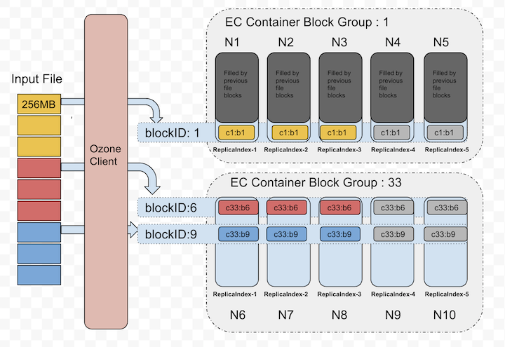

Let's zoom out the blockID: 1 data layout from the above picture, that showed in the following picture.
This picture shows how the chunks will be laid out in data node blocks.

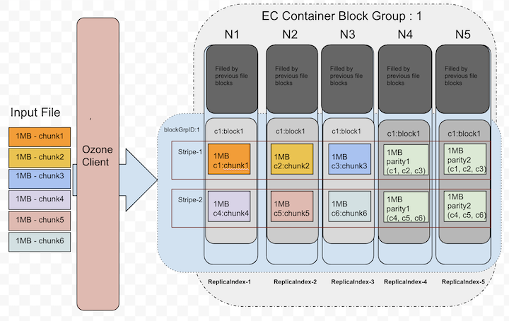

Currently, the EC client re-used the data transfer end-points to transfer the data to data nodes.
The XceiverClientGRPC client used for writing data and putBlock info.
The Datanode side changes are minimal as we reused the same existing transfer protocols.
The EC data block written at the Datanode is same as any other block in non-EC mode.
In a single block group, container id numbers are same in all nodes. A file can have multiple block groups.
Each block group will have `d+p` number of block and all ids are same.

**d** - Number of data blocks in a block group

**p** - Number of parity blocks in a block group

For reads, OM will provide the node location details as part of key lookup.
If the key is erasure coded, Ozone client reads it in EC fashion. Since the data layout
is different(see the previous section about write path), reads should consider the layout and do the reads accordingly.

The EC client will open the connections to DNs based on the expected locations. When all data locations are available, it will attempt to do plain reads chunk by chunk in round robin fashion from d data blocks.

Below picture shows the order when there are no failures while reading.

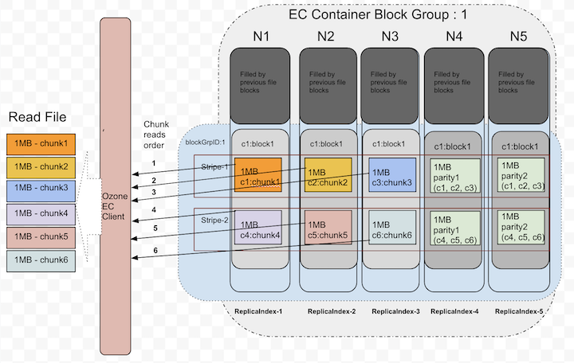

Until it sees read failures, there is no need of doing EC reconstruction.

When client detects there are failures while reading or when starting the reads, Ozone EC client is capable of reconstructing/recovering the lost data by doing the EC decoding.
To do the EC decoding it needs to read parity replicas. This is a degraded read as it needs to do reconstruction.
This reconstruction is completely transparent to the applications.

Below picture depicts how it uses parity replicas in reconstruction.

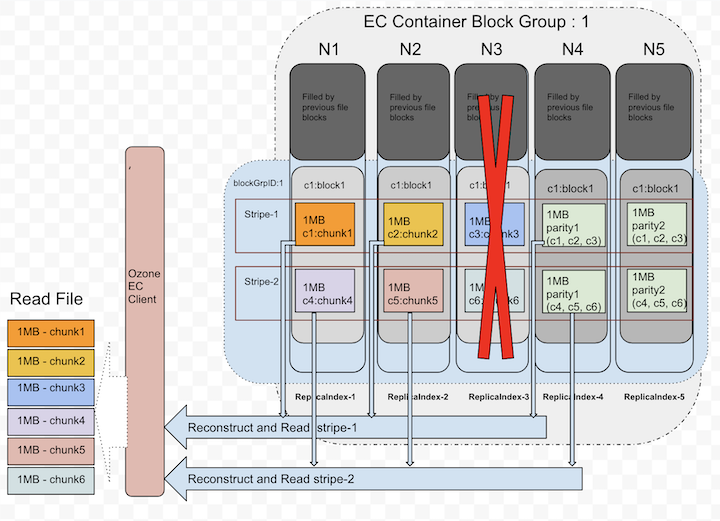

Apache Ozone built with the pure 'Object Storage' semantics. However, many big data
eco system projects still uses file system APIs. To provide both worlds best access to Ozone, it's provided both faces of interfaces. In both cases, keys/files would be written into buckets under the hood.
So, EC Replication Configs can be set at bucket level.
The EC policy encapsulates how to encode/decode a file.

Each EC Replication Config defined by the following pieces of information:

1. **data:** Data blocks number in an EC block group.
2. **parity:** Parity blocks number in an EC block group.
3. **ecChunkSize:** The size of a striping chunk. This determines the granularity of striped reads and writes.
4. **codec:** This is to indicate the type of EC algorithms (e.g., `RS`(Reed-Solomon), `XOR`).

To pass the EC Replication Config in command line or configuration files, we need to use the following format:
*codec*-*num data blocks*-*num parity blocks*-*EC chunk size*

Currently, there are three built-in EC Replication Configs supported: `RS-3-2-1024k`, `RS-6-3-1024k`, `RS-10-4-1024k`.
The most recommended option is `RS-6-3-1024k`. When a key/file created without specifying the Replication Config, it inherits the EC Replication Config of its bucket if it's available.

Changing the bucket level EC Replication Config only affect new files created within the bucket.
Once a file has been created, its EC Replication Config cannot be changed currently.

---

<a id="core-concepts-namespace"></a>

<!-- source_url: https://ozone.apache.org/docs/core-concepts/namespace/ -->

<!-- page_index: 21 -->

# Namespace Layout

Version: 2.1.0

This section documents the layout of Ozone's namespace.

[<a id="core-concepts-namespace--overview"></a>

## 📄️ Overview

Apache Ozone organizes data in a three-level hierarchy: Volumes, Buckets, and Keys. This structure provides a flexible and scalable way to manage large datasets, similar to how traditional file systems use directories and files, but optimized for object storage.](#core-concepts-namespace-overview)

[<a id="core-concepts-namespace--volumes"></a>

## 🗃️ Volumes

3 items](#core-concepts-namespace-volumes)

[<a id="core-concepts-namespace--buckets"></a>

## 🗃️ Buckets

8 items](#core-concepts-namespace-buckets)

[<a id="core-concepts-namespace--keys"></a>

## 🗃️ Keys

1 item](#core-concepts-namespace-keys)

---

<a id="core-concepts-namespace-overview"></a>

<!-- source_url: https://ozone.apache.org/docs/core-concepts/namespace/overview/ -->

<!-- page_index: 22 -->

# Overview of Ozone's Namespace

Version: 2.1.0

Apache Ozone organizes data in a three-level hierarchy: Volumes, Buckets, and Keys. This structure provides a flexible and scalable way to manage large datasets, similar to how traditional file systems use directories and files, but optimized for object storage.

- **[Volumes](#core-concepts-namespace-volumes-overview):** The top-level organizational unit, akin to user accounts or home directories.
- **[Buckets](#core-concepts-namespace-buckets-overview):** Reside within volumes, similar to directories or folders, and contain the actual data objects.
- **[Keys](#core-concepts-namespace-keys-overview):** The fundamental data objects, analogous to files, stored inside buckets.

```text
Volume 
└─── Bucket 
    ├─── Key 1 
    ├─── Key 2 
    └─── ... 
```

This hierarchy is managed by the Ozone Manager, which is the principal namespace service of Ozone.

---

<a id="core-concepts-namespace-volumes"></a>

<!-- source_url: https://ozone.apache.org/docs/core-concepts/namespace/volumes/ -->

<!-- page_index: 23 -->

# Volumes

Version: 2.1.0

This section documents configuration and use cases for volumes: Ozone's highest level of namespace organization.

[<a id="core-concepts-namespace-volumes--overview"></a>

## 📄️ Overview

What is a Volume?](#core-concepts-namespace-volumes-overview)

[<a id="core-concepts-namespace-volumes--owners"></a>

## 📄️ Owners

1. Overview](#core-concepts-namespace-volumes-owners)

[<a id="core-concepts-namespace-volumes--quotas"></a>

## 📄️ Quotas

What are Volume Quotas?](#core-concepts-namespace-volumes-quotas)

---

<a id="core-concepts-namespace-volumes-overview"></a>

<!-- source_url: https://ozone.apache.org/docs/core-concepts/namespace/volumes/overview/ -->

<!-- page_index: 24 -->

# Volumes Overview

Version: 2.1.0

A **Volume** in Ozone is the highest level of the namespace hierarchy. It serves as a logical container for one or more buckets. Conceptually, a volume can be thought of as a user's home directory or a project space, providing a clear separation of data ownership and management.

**Key Characteristics:**

- **Administrative Control:** Only administrators can create or delete volumes. This ensures proper resource allocation and access control at the highest level.
- **Storage Accounting:** Volumes are used as the basis for storage accounting, allowing administrators to track resource usage per volume.
- **Container for Buckets:** A volume can contain any number of buckets.

> [!NOTE]
> **Volume/Bucket Naming Convention**
> To maintain S3 compatibility, Ozone volume and bucket name follows S3 naming convention.
>
> This means volume/bucket names in Ozone:
>
> Allowed Characters and Length:
>
> - Allowed characters: Lowercase letters (a-z), numbers (0-9), dots (.), and hyphens (-)
> - Length: Must be between 3 and 63 characters long
> - Start and End: Must begin and end with a letter or a number
>
> Prohibitions:
>
> - Cannot contain uppercase letters or underscores (\_)
> - Cannot be formatted as an IP address (e.g., 192.168.5.4)
> - Cannot have consecutive periods (e.g., my..bucket) or have dashes adjacent to periods (e.g., my-.bucket)
> - Cannot end with a dash
>
> This can cause trouble when migrating HDFS workloads to Ozone, since HDFS path names are POSIX-compliant.
>
> To allow underscore (`_`) in volume and bucket names while still enforcing the other S3 naming rules, configure the property `ozone.om.namespace.s3.strict` to `false` in the `ozone-site.xml` of Ozone Manager. (This does not relax the rules for other non-S3 characters.)

Volumes are typically created and managed using the Ozone command-line interface (CLI). For example:

```bash
ozone sh volume create /myvolume 
```

For more details on volume operations, refer to the [Ozone CLI documentation](#user-guide-client-interfaces-o3--volume-operations).

Ozone enforces a configurable limit on the number of volumes a user can own. This limit is controlled by the configuration property:

**Maximum number of volumes a user can own:**

- **Default:** 1024 volumes per user
- **Configuration property:** `ozone.om.user.max.volume`
- **Error:** If exceeded, the operation fails with **USER\_TOO\_MANY\_VOLUMES** error and message: `"Too many volumes for user: {owner}"`

```xml
<property> 
  <name>ozone.om.user.max.volume</name> 
  <value>1024</value> 
  <description>Maximum number of volumes a user can own</description> 
</property> 
```

Volumes can have quotas applied to them, limiting the total storage space or the number of namespaces (buckets) they can consume. This is crucial for multi-tenant environments to prevent any single user or project from monopolizing resources.

- **Storage Space Quota:** Limits the total data size within the volume.
- **Namespace Quota:** Limits the number of buckets that can be created within the volume.

For comprehensive information on configuring and managing quotas, see the [Quota Management documentation](#administrator-guide-operations-quota).

Access to volumes is controlled via ACLs, which define permissions for users and groups. These permissions determine who can create buckets within a volume, list its contents, or perform other operations.

- **Create:** Allows creating buckets within the volume.
- **List:** Allows listing buckets within the volume.
- **Read:** Allows reading metadata of the volume.
- **Write:** Allows writing metadata of the volume.
- **Delete:** Allows deleting the volume (if empty or recursively).

ACLs can be set and managed using the Ozone CLI. Refer to the [Security ACLs documentation](#core-concepts-security-acls-native-acls) for more in-depth information.

For compatibility with the S3 API, Ozone uses a special volume, typically `/s3v`. By default, all buckets accessed via the S3 interface are stored under this volume. It's also possible to expose buckets from other Ozone volumes via the S3 interface using "bucket linking."
For more details, refer to the [S3 Protocol documentation](#user-guide-client-interfaces-s3-s3-api) and [S3 Multi-Tenancy documentation](#administrator-guide-operations-s3-multi-tenancy-overview).

It's important to distinguish between the logical "volumes" managed by the Ozone Manager (as described above) and the physical "volumes" (disks) managed by the Datanodes.

- **Ozone Manager Volumes:** Logical namespace containers for buckets and keys.
- **Datanode Volumes:** Physical storage devices (disks) on a Datanode where actual data blocks are stored in containers.

For more information on Datanode volume management, refer to the [Datanodes documentation](#core-concepts-architecture-datanodes).

---

<a id="core-concepts-namespace-volumes-owners"></a>

<!-- source_url: https://ozone.apache.org/docs/core-concepts/namespace/volumes/owners/ -->

<!-- page_index: 25 -->

# Volume Owners

Version: 2.1.0

Every volume in Ozone has an **owner** property that identifies the user who owns the volume. The volume owner is a fundamental concept in Ozone's access control and resource management system. It plays a crucial role in determining permissions, storage accounting, and multi-tenant isolation.

While volumes also have an `admin` field in their metadata structure, **with Native ACLs** (`OzoneNativeAuthorizer`), this field is stored but not functionally used by Ozone Manager for authorization or access control purposes. Authorization checks rely on ACLs and the volume owner instead.
The behavior of the `admin` field may differ when using `RangerOzoneAuthorizer`.

When creating a volume, the owner can be explicitly specified using the `--user` command-line option:

```bash
ozone sh volume create /myvolume --user alice ozone sh volume info /myvolume {"metadata" : { },"name" : "myvolume","admin" : "om","owner" : "alice",...}
```

If the `--user` option is not provided during volume creation, Ozone automatically sets the owner to the **authenticated user identity** as determined by `UserGroupInformation.getCurrentUser()`. The behavior differs based on the cluster security configuration:

- **Secure/Kerberos mode**: The owner is set to the Kerberos principal (or its short name) of the authenticated user. For example, if authenticated as Kerberos principal `om@REALM`, the volume owner will be `om`.
- **Non-secure mode**: The owner is typically set to the Linux user running the CLI command. For example, if you run the command as Linux user `root`, the volume owner will be `root`.

```bash
# Owner defaults to authenticated user ozone sh volume create /myvolume
# secure mode kerberos authenticated user ozone sh volume info /myvolume {"metadata" : { },"name" : "myvolume","admin" : "om","owner" : "om",...}
# unsecure mode linux user root ozone sh volume info /myvolume {"metadata" : { },"name" : "myvolume","admin" : "root","owner" : "root",...}
```

**Default Behavior:**

- If `--user` is not provided, the owner defaults to the authenticated user creating the volume.
- The `ozone sh volume create` command does not allow setting the admin user. The admin can only be set using the Ozone o3 native Java API.

**Example Output:**

When viewing volume information, you can see the default ACLs:

```bash
# Volume created with explicit owner
$ ozone sh volume create /myvolume --user alice
$ ozone sh volume info /myvolume {"name" : "myvolume","admin" : "om","owner" : "alice","acls" : [ {"type" : "USER","name" : "alice","aclScope" : "ACCESS","aclList" : [ "ALL" ]} ]}
 
# Volume created without specifying owner (defaults to authenticated user)
$ ozone sh volume create /myvol1
$ ozone sh volume info /myvol1 {"name" : "myvol1","admin" : "om","owner" : "om","acls" : [ {"type" : "USER","name" : "om","aclScope" : "ACCESS","aclList" : [ "ALL" ]}, {"type" : "GROUP","name" : "om","aclScope" : "ACCESS","aclList" : [ "READ", "LIST" ]} ]}
```

**Note:** While the volume owner has these default ACLs, they typically don't need them because owner privileges bypass ACL checks entirely. However, these ACLs are useful for:

- Audit and compliance tracking
- Documentation of intended permissions
- Cases where ACLs might be evaluated before owner checks

The volume owner can be changed after creation using the volume update command:

```bash
ozone sh volume update /myvolume --user bob 
{ 
  "metadata" : { }, 
  "name" : "myvolume", 
  "admin" : "om", 
  "owner" : "bob", 
  "quotaInBytes" : -1, 
  "quotaInNamespace" : -1, 
  "usedNamespace" : 0, 
  "creationTime" : "2026-01-25T15:12:12.922Z", 
  "modificationTime" : "2026-01-25T15:20:35.530Z", 
  "acls" : [ { 
    "type" : "USER", 
    "name" : "alice", 
    "aclScope" : "ACCESS", 
    "aclList" : [ "ALL" ], 
    "aclSet" : [ "ALL" ] 
  } ], 
  "refCount" : 0 
} 
```

**Requirements for Changing Ownership:**

- **Permissions:** The user attempting to change ownership must have `WRITE_ACL` permission on the volume. This ensures that only authorized users can transfer ownership.

**Owner vs. ACLs:**

Changing the volume owner via `ozone sh volume update --user <new_user>` updates the ownership metadata but **does not automatically modify ACLs**. The previous owner's ACL entries remain unchanged. If you need to revoke the old owner's access entirely, you must manage ACLs separately using ACL update commands.

> [!NOTE]
> **Volume-Level Operations and Permissions**
> Volume-level operations with respect to permissions can differ between Native ACL and Ranger ACL implementations. The permission requirements described here are specific to Native ACLs.

For detailed information on how permissions and operations work for both **Native ACL** and **Ranger ACL**, refer to the [ACLs documentation](#core-concepts-security-acls).

The volume owner receives special privileges that provide comprehensive access to the volume and all resources within it. These privileges are enforced by Ozone's native authorizer (`OzoneNativeAuthorizer`) and bypass standard ACL checks.

The volume owner can perform operations on buckets, keys, and prefixes within their volume **without requiring explicit ACL permissions**. This means the owner has **implicit access** to all resources in their volume, regardless of ACL settings on those resources. The owner check happens before any ACL evaluation, providing a fast-path for owner operations.

Volume owners **can delete their own volumes** because volumes are created with default ACLs that grant the owner `ALL` permissions, which includes `DELETE` permission.

**Requirements for Volume Deletion:**

- **DELETE Permission:** The requester must have `DELETE` ACL permission on the volume.
- **Empty Volume:** The volume must contain no buckets. All buckets must be deleted before the volume can be deleted.
- **Zero Reference Count:** The volume's `refCount` must be 0. If `refCount > 0`, it indicates that Ozone features (like multi-tenancy) hold a "lock" on the volume. The lock must be released first (e.g., via `ozone tenant delete <tenantId>`).

> [!NOTE]
> Volume creation is still an **administrative operation** that requires administrator privileges. Only administrators can create volumes.

---

<a id="core-concepts-namespace-volumes-quotas"></a>

<!-- source_url: https://ozone.apache.org/docs/core-concepts/namespace/volumes/quotas/ -->

<!-- page_index: 26 -->

# Volume Quotas

Version: 2.1.0

Volume quotas in Ozone provide a mechanism to limit resource consumption at the volume level. They enable administrators to control and manage storage resources in multi-tenant environments, preventing any single volume from monopolizing cluster resources.

Quotas act as upper bounds that constrain how much storage space and how many objects can be stored within a volume. When quotas are set, Ozone enforces these limits during write operations, ensuring that resource usage stays within the defined boundaries.

Ozone defines two types of quota: namespace quota and storage space quota.

- **Namespace Quota:** A namespace quota limits the number of objects in a volume. This number cannot be greater than `LONG.MAX_VALUE` in Java.
- **Storage Space Quota:** A storage space quota limits the maximum used space of a volume. It allows the use of units B, KB, MB, GB and TB.

- **Hierarchical Enforcement:** Volume quotas apply to the aggregate of all contained buckets
- **Visibility:** Quota usage and limits can be monitored through the CLI and management interfaces
- **Enforcement:** When a quota is reached, write operations fail with a descriptive error message

> [!NOTE]
> **Important Notes**
> - By default, the volume quota is unlimited.
> - The total quota of the buckets cannot exceed the volume quota.
> - Volume quota has no effect if bucket quota is not set.
> - Volume having linked bucket do not consume space quota for keys within linked bucket. Linked bucket keys will consume space quota of source volume and source bucket.
> - If the cluster is upgraded from old version less than 1.1.0, use of quota on older volumes and buckets (We can confirm by looking at the info for the volume or bucket, and if the quota value is -2 the volume or bucket is old) is not recommended. Since the old key is not counted to the bucket's usedBytes and namespace quota, the quota setting is inaccurate at this point.

You can set both space and namespace quotas at the same time:

```bash
# Set both space (1TB) and namespace (1 million objects) quotas simultaneously ozone sh volume setquota --space-quota=1TB --namespace-quota=1000000 /volume1
 
# Check current quota settings and usage ozone sh volume info /volume1
 
# Clear the space quota (set space limit to unlimited) ozone sh volume clrquota --space-quota /volume1
 
# Clear the namespace quota (set object count limit to unlimited) ozone sh volume clrquota --namespace-quota /volume1
```

For detailed information on how to set and manage both types of volume quotas using CLI commands separately, see the [Quota Operations Guide](#administrator-guide-operations-quota).

---

<a id="core-concepts-namespace-buckets"></a>

<!-- source_url: https://ozone.apache.org/docs/core-concepts/namespace/buckets/ -->

<!-- page_index: 27 -->

# Buckets

Version: 2.1.0

This section documents configuration and use cases for buckets: the second level of organization in Ozone's namespace.

[<a id="core-concepts-namespace-buckets--overview"></a>

## 📄️ Overview

What is a Bucket?](#core-concepts-namespace-buckets-overview)

[<a id="core-concepts-namespace-buckets--owners"></a>

## 📄️ Owners

1. Overview](#core-concepts-namespace-buckets-owners)

[<a id="core-concepts-namespace-buckets--quotas"></a>

## 📄️ Quotas

Quota Management](#core-concepts-namespace-buckets-quotas)

[<a id="core-concepts-namespace-buckets--layouts"></a>

## 🗃️ Layouts

2 items](#core-concepts-namespace-buckets-layouts)

[<a id="core-concepts-namespace-buckets--default-replication-type"></a>

## 📄️ Default Replication Type

TODO: File a subtask under HDDS-9857 and complete this page or section.](#core-concepts-namespace-buckets-replication)

[<a id="core-concepts-namespace-buckets--encryption"></a>

## 📄️ Encryption

Transparent Data Encryption - TDE](#core-concepts-namespace-buckets-encryption)

[<a id="core-concepts-namespace-buckets--links"></a>

## 📄️ Links

Bucket linking allows exposing a bucket from one volume (or even another bucket) as if it were in a different location, particularly useful for S3 compatibility or cross-tenant access. This creates a symbolic link-like behavior. For more information, see the S3 Protocol documentation and S3 Multi-Tenancy documentation.](#core-concepts-namespace-buckets-links)

[<a id="core-concepts-namespace-buckets--snapshots"></a>

## 📄️ Snapshots

A Snapshot is a point-in-time, read-only image of a Bucket.](#core-concepts-namespace-buckets-snapshots)

---

<a id="core-concepts-namespace-buckets-overview"></a>

<!-- source_url: https://ozone.apache.org/docs/core-concepts/namespace/buckets/overview/ -->

<!-- page_index: 28 -->

# Buckets Overview

Version: 2.1.0

A **Bucket** is the second level in the Ozone data hierarchy, residing within a volume. Buckets are analogous to directories or folders in a traditional file system.
They serve as containers for keys (data objects).

**Key Characteristics:**

- **Contained within Volumes:** Every bucket must belong to a volume.
- **Container for Keys:** A bucket can contain any number of keys.
- **No Nested Buckets:** Unlike directories, buckets cannot contain other buckets.

> [!NOTE]
> **Volume/Bucket Naming Convention**
> To maintain S3 compatibility, Ozone volume and bucket name follows S3 naming convention.
>
> This means volume/bucket names in Ozone:
>
> Allowed Characters and Length:
>
> - Allowed characters: Lowercase letters (a-z), numbers (0-9), dots (.), and hyphens (-)
> - Length: Must be between 3 and 63 characters long
> - Start and End: Must begin and end with a letter or a number
>
> Prohibitions:
>
> - Cannot contain uppercase letters or underscores (\_)
> - Cannot be formatted as an IP address (e.g., 192.168.5.4)
> - Cannot have consecutive periods (e.g., my..bucket) or have dashes adjacent to periods (e.g., my-.bucket)
> - Cannot end with a dash
>
> This can cause trouble when migrating HDFS workloads to Ozone, since HDFS path names are POSIX-compliant.
>
> To allow underscore (`_`) in volume and bucket names while still enforcing the other S3 naming rules, configure the property `ozone.om.namespace.s3.strict` to `false` in the `ozone-site.xml` of Ozone Manager. (This does not relax the rules for other non-S3 characters.)

Buckets are created within a specified volume.

```bash
ozone sh bucket create /myvolume/mybucket 
```

For more details on bucket operations, refer to the [Ozone CLI documentation](#user-guide-client-interfaces-o3--bucket-operations).

Ozone supports different bucket layouts, primarily:

- **Object Store (OBS):** The traditional object storage layout, where keys are stored with their full path names. This is suitable for S3-like access patterns.
  For more details, refer to the [Object Store documentation](#core-concepts-namespace-buckets-layouts-object-store).
- **File System Optimized (FSO):** An optimized layout for Hadoop Compatible File System (HCFS) semantics, where intermediate directories are stored separately, improving performance for file system operations like listing and renaming.
  For more details, refer to the [Prefix FSO documentation](#core-concepts-namespace-buckets-layouts-file-system-optimized).

Erasure Coding (EC) can be enabled at the bucket level to define data redundancy strategies. This allows for more efficient storage compared to replication, especially for large datasets.
For more information, see the [Erasure Coding documentation](#core-concepts-replication-erasure-coding).

Ozone's snapshot feature allows users to take point-in-time consistent images of a given bucket. These snapshots are immutable and can be used for backup, recovery, archival, and incremental replication purposes.
For more details, refer to the [Ozone Snapshot documentation](#core-concepts-namespace-buckets-snapshots).

Ozone provides features to support GDPR compliance, particularly the "right to be forgotten." When a GDPR-compliant bucket is created, encryption keys for deleted data are immediately removed, making the data unreadable even if the underlying blocks haven't been physically purged yet.
For more details, refer to the [GDPR documentation](https://ozone.apache.org/docs/edge/security/gdpr.html).

Bucket linking allows exposing a bucket from one volume (or even another bucket) as if it were in a different location, particularly useful for S3 compatibility or cross-tenant access. This creates a symbolic link-like behavior.
For more information, see the [Bucket Links documentation](#core-concepts-namespace-buckets-links).

ACLs define permissions for buckets, controlling who can list keys, read/write data, or delete the bucket.
For more details, refer to the [Security ACLs documentation](#core-concepts-security-acls-native-acls).

---

<a id="core-concepts-namespace-buckets-owners"></a>

<!-- source_url: https://ozone.apache.org/docs/core-concepts/namespace/buckets/owners/ -->

<!-- page_index: 29 -->

# Bucket Owners

Version: 2.1.0

> [!NOTE]
> Volume ownership takes precedence over bucket ownership in access control decisions. If a user is the volume owner, they have full access regardless of bucket ownership.

---

<a id="core-concepts-namespace-buckets-quotas"></a>

<!-- source_url: https://ozone.apache.org/docs/core-concepts/namespace/buckets/quotas/ -->

<!-- page_index: 30 -->

# Bucket Quotas

Version: 2.1.0

Similar to volumes, buckets can also have storage space and namespace quotas applied to them.
For comprehensive information on configuring and managing quotas, see the [Quota Management documentation](#administrator-guide-operations-quota).

---

<a id="core-concepts-namespace-buckets-layouts"></a>

<!-- source_url: https://ozone.apache.org/docs/core-concepts/namespace/buckets/layouts/ -->

<!-- page_index: 31 -->

# Bucket Layouts

Version: 2.1.0

This section documents the different bucket layouts supported by Ozone and their use cases.

[<a id="core-concepts-namespace-buckets-layouts--object-store-obs"></a>

## 📄️ Object Store (OBS)

1. Overview](#core-concepts-namespace-buckets-layouts-object-store)

[<a id="core-concepts-namespace-buckets-layouts--file-system-optimized-fso"></a>

## 📄️ File System Optimized (FSO)

Overview](#core-concepts-namespace-buckets-layouts-file-system-optimized)

---

<a id="core-concepts-namespace-buckets-layouts-object-store"></a>

<!-- source_url: https://ozone.apache.org/docs/core-concepts/namespace/buckets/layouts/object-store/ -->

<!-- page_index: 32 -->

# Object Store Buckets (OBS)

Version: 2.1.0

> [!NOTE]
> Apache Ozone supports three bucket layout types:
>
> - **OBJECT\_STORE (OBS)**, **FILE\_SYSTEM\_OPTIMIZED (FSO)** and **LEGACY** (deprecated layout for backward compatibility).

---

<a id="core-concepts-namespace-buckets-layouts-file-system-optimized"></a>

<!-- source_url: https://ozone.apache.org/docs/core-concepts/namespace/buckets/layouts/file-system-optimized/ -->

<!-- page_index: 33 -->

# File System Optimized Buckets (FSO)

Version: 2.1.0

> [!NOTE]
> FSO is the default bucket layout in Ozone. To explicitly specify FSO layout when creating a bucket, use the `--layout` flag:
>
> ```bash
> ozone sh bucket create /<volume-name>/<bucket-name> --layout FILE_SYSTEM_OPTIMIZED
> ```

---

<a id="core-concepts-namespace-buckets-replication"></a>

<!-- source_url: https://ozone.apache.org/docs/core-concepts/namespace/buckets/replication/ -->

<!-- page_index: 34 -->

# Bucket Level Default Replication Type

Version: 2.1.0

**TODO:** File a subtask under [HDDS-9857](https://issues.apache.org/jira/browse/HDDS-9857) and complete this page or section.

---

<a id="core-concepts-namespace-buckets-encryption"></a>

<!-- source_url: https://ozone.apache.org/docs/core-concepts/namespace/buckets/encryption/ -->

<!-- page_index: 35 -->

# Bucket Level Encryption

Version: 2.1.0

Buckets can be configured for Transparent Data Encryption (TDE) at the time of creation.
When TDE is enabled, all data written to the bucket is automatically encrypted at rest using a specified encryption key.
For detailed steps on setting up and using TDE, refer to the [Securing TDE documentation](#administrator-guide-configuration-security-encryption-transparent-data-encryption).

---

<a id="core-concepts-namespace-buckets-links"></a>

<!-- source_url: https://ozone.apache.org/docs/core-concepts/namespace/buckets/links/ -->

<!-- page_index: 36 -->

# Bucket Links

Version: 2.1.0

Bucket linking allows exposing a bucket from one volume (or even another bucket) as if it were in a different location, particularly useful for S3 compatibility or cross-tenant access. This creates a symbolic link-like behavior. For more information, see the [S3 Protocol documentation](#user-guide-client-interfaces-s3) and [S3 Multi-Tenancy documentation](#administrator-guide-operations-s3-multi-tenancy).

Ozone has one more element in the namespace hierarchy compared to S3: volumes. By default, all the buckets of the `/s3v` volume can be accessed with the S3 interface, but only the (Ozone) buckets of the `/s3v` volume are exposed.

Bucket linking provides a way to make buckets from any volume accessible through the S3 interface by creating a "symbolic link" to the target bucket.

Bucket links are particularly useful for:

- **S3 Compatibility**: Exposing buckets from non-S3 volumes through the S3 interface
- **Cross-Tenant Access**: Providing access to buckets across different volumes without data duplication
- **Namespace Organization**: Creating logical groupings of buckets without moving data
- **Access Control**: Controlling visibility of buckets through different access paths

To make any bucket available with the S3 interface, create a symbolic linked bucket:

```bash
ozone sh volume create /s3v 
ozone sh volume create /vol1 
 
ozone sh bucket create /vol1/bucket1 
ozone sh bucket link /vol1/bucket1 /s3v/common-bucket 
```

This example exposes the `/vol1/bucket1` Ozone bucket as an S3 compatible `common-bucket` via the S3 interface.

Bucket links are stored in the database the same way as regular buckets, but with additional information about the source volume and bucket they reference:

1. The source bucket (e.g., `/vol1/bucket1`) continues to store the actual data
2. The link bucket (e.g., `/s3v/common-bucket`) acts as a symbolic reference
3. Key operations (list, get, put, etc.) on the link bucket are transparently redirected to the source bucket
4. Bucket operations (info, delete, ACL) work on the link object itself
5. No data is copied or duplicated during the linking process

Once a bucket link is created, you can access it through the S3 interface just like any other bucket:

```bash
# Set up AWS credentials export AWS_ACCESS_KEY_ID=your-access-key export AWS_SECRET_ACCESS_KEY=your-secret-key
 
# Access the linked bucket through S3 interface aws s3api --endpoint http://localhost:9878 list-objects --bucket common-bucket
```

For implementation details, refer to the [Volume Management design document](https://ozone.apache.org/docs/edge/design/volume-management.html).

---

<a id="core-concepts-namespace-buckets-snapshots"></a>

<!-- source_url: https://ozone.apache.org/docs/core-concepts/namespace/buckets/snapshots/ -->

<!-- page_index: 37 -->

# Bucket Snapshots

Version: 2.1.0

A Snapshot is a point-in-time, read-only image of a Bucket.
It captures the exact state of the bucket at the moment of creation, allowing users to access historical data or perform backups without interrupting ongoing write operations.

- **Instantaneous**: Snapshot creation is an O(1) operation. It utilizes metadata within the Ozone Manager, making it extremely fast regardless of the bucket's size.
- **Efficient**: Snapshots do not duplicate data blocks physically. Storage space is claimed only when the live data is modified or deleted, ensuring storage efficiency.
- **Accessible**: Users can access snapshot data through the virtual `.snapshot` directory.

---

<a id="core-concepts-namespace-keys"></a>

<!-- source_url: https://ozone.apache.org/docs/core-concepts/namespace/keys/ -->

<!-- page_index: 38 -->

# Keys

Version: 2.1.0

This section documents the fundamental data objects in Ozone: keys, which are analogous to files in a traditional file system.

[<a id="core-concepts-namespace-keys--overview"></a>

## 📄️ Overview

What is a Key?](#core-concepts-namespace-keys-overview)

---

<a id="core-concepts-namespace-keys-overview"></a>

<!-- source_url: https://ozone.apache.org/docs/core-concepts/namespace/keys/overview/ -->

<!-- page_index: 39 -->

# Keys

Version: 2.1.0

A **Key** is the fundamental data object in Ozone, analogous to a file in a traditional file system. Keys are stored within buckets and represent the actual data that users interact with.

**Key Characteristics:**

- **Contained within Buckets:** Every key must reside within a bucket.
- **Immutable Data Blocks:** Once written, the underlying data blocks of a key are immutable. Updates or modifications to a key typically result in new versions or new data blocks being written, with the metadata pointing to the latest version.

Keys are created, read, and managed using the Ozone CLI or various client APIs (Java, S3, etc.).

```bash
ozone sh key put /myvolume/mybucket/mykey.txt /path/to/local/file.txt 
```

For more details on key operations, refer to the [Ozone CLI documentation](#user-guide-client-interfaces-o3--key-operations).

When a client writes a key, the Ozone Manager handles the metadata (key name, location of data blocks), and the Datanodes store the actual data blocks. For reads, the Ozone Manager provides the client with the locations of the data blocks, which the client then retrieves directly from the Datanodes.

For a deeper dive into the key write and read process, refer to the Ozone Manager documentation.

Ozone supports atomic key replacement, ensuring that a key is only overwritten if it hasn't changed since it was last read. This prevents lost updates in concurrent write scenarios.

For more details, refer to the Overwriting Key Only If Unchanged design document.

When keys are deleted from File System Optimized (FSO) buckets, they are moved to a trash directory, allowing for recovery. For Object Store (OBS) buckets, keys are permanently deleted.

For more information on the trash feature, refer to the [Trash documentation](#administrator-guide-operations-trash).

If the parent bucket is encrypted, all keys written to that bucket will be transparently encrypted.

For more details, refer to the [Transparent Data Encryption documentation](#administrator-guide-configuration-security-encryption-transparent-data-encryption).

ACLs can also be applied to individual keys, providing fine-grained control over read and write permissions.

For more details, refer to the [Native ACLs documentation](#core-concepts-security-acls-native-acls).

---

<a id="core-concepts-security"></a>

<!-- source_url: https://ozone.apache.org/docs/core-concepts/security/ -->

<!-- page_index: 40 -->

# Using a Secure Ozone Cluster

Version: 2.1.0

This section documents the primary mechanisms Ozone uses for authentication and authorization of users and administrators. To configure encryption and other security mechanisms within an Ozone cluster, see the [Administrator Guide](#administrator-guide-configuration-security).

[<a id="core-concepts-security--kerberos"></a>

## 📄️ Kerberos

TODO: File a subtask under HDDS-9857 and complete this page or section.](#core-concepts-security-kerberos)

[<a id="core-concepts-security--acls"></a>

## 🗃️ ACLs

2 items](#core-concepts-security-acls)

---

<a id="core-concepts-security-kerberos"></a>

<!-- source_url: https://ozone.apache.org/docs/core-concepts/security/kerberos/ -->

<!-- page_index: 41 -->

# Authentication with Kerberos

Version: 2.1.0

**TODO:** File a subtask under [HDDS-9857](https://issues.apache.org/jira/browse/HDDS-9857) and complete this page or section.

---

<a id="core-concepts-security-acls"></a>

<!-- source_url: https://ozone.apache.org/docs/core-concepts/security/acls/ -->

<!-- page_index: 42 -->

# Authorization With ACLs

Version: 2.1.0

This section covers Ozone's ACL support, which can be used to restrict access to different portions of the namespace once a user has authenticated with [Kerberos](#core-concepts-security-kerberos). To configure access for administrator operations that do not involve the Ozone namespace, see the [Administrator Guide](#administrator-guide-configuration-security-administrators).

[<a id="core-concepts-security-acls--native-acls"></a>

## 📄️ Native ACLs

Ozone supports a set of native ACLs.](#core-concepts-security-acls-native-acls)

[<a id="core-concepts-security-acls--ranger-authorization-policies"></a>

## 📄️ Ranger authorization policies

Ozone supports two authorization models: Native ACLs and Apache Ranger policies.](#core-concepts-security-acls-ranger-acls)

---

<a id="core-concepts-security-acls-native-acls"></a>

<!-- source_url: https://ozone.apache.org/docs/core-concepts/security/acls/native-acls/ -->

<!-- page_index: 43 -->

# Native ACLs

Version: 2.1.0

> [!TIP]
> A S3 user accessing Ozone via AWS v4 signature protocol will be translated to the appropriate Kerberos user by Ozone Manager.

---

<a id="core-concepts-security-acls-ranger-acls"></a>

<!-- source_url: https://ozone.apache.org/docs/core-concepts/security/acls/ranger-acls/ -->

<!-- page_index: 44 -->

# Ranger authorization policies

Version: 2.1.0

Ozone supports two authorization models: **Native ACLs** and **Apache Ranger policies**.

- [**Native ACLs**](#core-concepts-security-acls-native-acls) are managed through Ozone's command-line interface or APIs and are stored internally within Ozone's metadata. They are suitable for simpler security requirements and for environments where Ozone is run as a standalone service.
- **Apache Ranger** provides centralized security administration for the entire Hadoop ecosystem. If you are already using Ranger to manage permissions for other components like HDFS, Hive, or HBase, integrating Ozone with Ranger allows you to manage all access policies in one place. Ranger offers a user-friendly UI, centralized auditing, and more advanced policy features. For more information about configuring Apache Ranger authorization for Ozone, refer to [configuring Apache Ranger](#administrator-guide-configuration-security-ranger).

When Ranger is enabled, it becomes the sole authority for access control, and native ACLs are ignored.

The table below shows the mapping between Ozone operations and the required Ranger permissions. An Ozone Manager plugin synchronizes these policies from Ranger.

| `Operation` | `Volume permission` |
| --- | --- |
| `Create volume` | `CREATE` |
| `List volume` | `LIST` |
| `Get volume info` | `READ` |
| `Delete volume` | `DELETE` |
| `Set Quota` | `WRITE` |
| `Set Owner` | `WRITE_ACL` |
| `Create Tenant (and volume)` | `CREATE` |
| `Delete Tenant` | `WRITE_ACL` |

| `Operation` | `Volume permission` | `Bucket permission` |
| --- | --- | --- |
| `Create bucket` | `READ` | `CREATE` |
| `List bucket` | `LIST, READ` |  |
| `Get bucket info` | `READ` | `READ` |
| `Delete bucket` | `READ` | `DELETE` |
| `Update bucket property (quota, replication, ...)` | `READ` | `WRITE` |
| `List Snapshot` | `READ` | `LIST` |
| `List Trash` | `READ` | `LIST` |
| `Trash Recover` | `READ` | `WRITE` |
| `Set Owner` | `READ` | `WRITE_ACL` |

| `Operation` | `Volume permission` | `Bucket permission` | `Key permission` |
| --- | --- | --- | --- |
| `List key` | `READ` | `LIST, READ` |  |
| `Write key` | `READ` | `READ` | `CREATE, WRITE` |
| `Read key` | `READ` | `READ` | `READ` |

---

<a id="core-concepts-high-availability"></a>

<!-- source_url: https://ozone.apache.org/docs/core-concepts/high-availability/ -->

<!-- page_index: 45 -->

# High Availability

Version: 2.1.0

This section describes how Ozone achieves high availability for its metadata managers to eliminate single points of failure.

[<a id="core-concepts-high-availability--scm-high-availability"></a>

## 📄️ SCM High Availability

Ozone has two metadata-manager nodes (Ozone Manager for key space management and Storage Container Management for block space management) and multiple storage nodes (Datanode). Data is replicated between Datanodes with the help of RAFT consensus algorithm.](#core-concepts-high-availability-scm-ha)

[<a id="core-concepts-high-availability--ozone-manager-high-availability"></a>

## 📄️ Ozone Manager High Availability

Ozone has two metadata-manager nodes (Ozone Manager for key space management and Storage Container Manager for block space management) and multiple storage nodes (Datanode). Data is replicated between Datanodes with the help of RAFT consensus algorithm.](#core-concepts-high-availability-om-ha)

---

<a id="core-concepts-high-availability-scm-ha"></a>

<!-- source_url: https://ozone.apache.org/docs/core-concepts/high-availability/scm-ha/ -->

<!-- page_index: 46 -->

# SCM High Availability

Version: 2.1.0

Ozone has two metadata-manager nodes (*Ozone Manager* for key space management and *Storage Container Management* for block space management) and multiple storage nodes (Datanode). Data is replicated between Datanodes with the help of RAFT consensus algorithm.

To avoid any single point of failure the metadata-manager nodes also should have a HA setup.

Both Ozone Manager and Storage Container Manager supports HA. In this mode the internal state is replicated via RAFT (with Apache Ratis)

Please check the [OM HA documentation](#core-concepts-high-availability-om-ha) for HA setup of Ozone Manager (OM). While they can be setup for HA independently, a reliable, full HA setup requires enabling HA for both services.

To select between the available SCM nodes, a logical name (a `serviceId`) is required for each of the clusters which can be resolved to the IP addresses (and domain names) of the Storage Container Managers. Check out the [SCM HA configuration documentation](#administrator-guide-configuration-high-availability-scm-ha) for details on how to configure the service ID and map it to individual SCM nodes.

---

<a id="core-concepts-high-availability-om-ha"></a>

<!-- source_url: https://ozone.apache.org/docs/core-concepts/high-availability/om-ha/ -->

<!-- page_index: 47 -->

# Ozone Manager High Availability

Version: 2.1.0

Ozone has two metadata-manager nodes (*Ozone Manager* for key space management and *Storage Container Manager* for block space management) and multiple storage nodes (Datanode). Data is replicated between Datanodes with the help of RAFT consensus algorithm.

To avoid any single point of failure the metadata-manager nodes also should have a HA setup.

Both Ozone Manager and Storage Container Manager supports HA. In this mode the internal state is replicated via RAFT (with Apache Ratis).

This page explains the HA setup of Ozone Manager (OM). Please check the [SCM High Availability](#core-concepts-high-availability-scm-ha) page for SCM HA. While they can be setup for HA independently, a reliable, full HA setup requires enabling HA for both services.

A single Ozone Manager uses [RocksDB](https://github.com/facebook/rocksdb/) to persist metadata (volumes, buckets, keys) locally. HA version of Ozone Manager does exactly the same but all the data is replicated with the help of the RAFT consensus algorithm to follower Ozone Manager instances.

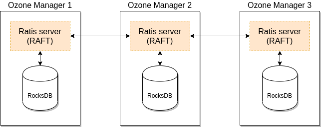

Client connects to the Leader Ozone Manager which processes the request and schedules the replication with RAFT. When the request is replicated to all the followers the leader can return with the response.

- **Configuration**: For detailed configuration instructions on setting up OM HA, see the [OM HA Configuration](#administrator-guide-configuration-high-availability-om-ha) documentation.
- **Implementation Details**: For in-depth technical details about the OM HA implementation, including the double buffer approach and automatic snapshot installation

---

<a id="core-concepts-comparison"></a>

<!-- source_url: https://ozone.apache.org/docs/core-concepts/comparison/ -->

<!-- page_index: 48 -->

# Comparison with Other Storage Technologies

Version: 2.1.0

This document provides a high-level comparison of Apache Ozone with other storage technologies.

Ozone is most often compared against other open source storage systems.

| Tech | Type | Consistency | Scale | Big Data Integration | License | Notes |
| --- | --- | --- | --- | --- | --- | --- |
| **Ozone** | Object / File | Strong | Exabyte scale, tens of billions keys | Native | Apache 2.0 | Modern Hadoop-native object store with S3 API |
| **HDFS** | File | Strong | PBs, billions files | Native | Apache 2.0 | Classic Hadoop FS, no S3 API, tight Hadoop integration |
| **Ceph** | Object / Block / File | Tunable / Eventual | Multi-PB, very large | Via S3 Gateway/CephFS | LGPLv2.1 / Ceph Foundation | General-purpose: underlying RADOS (object), RGW (object), CephFS (file) |
| **MinIO** | Object | Strong | Petabyte scale | Via S3 connectors | AGPLv3 (SSPL-like) | Cloud-native S3 API, lightweight, fast, no FS semantics |
| **Lustre** | Parallel File (POSIX) | Strong | PB scale, HPC | None | GPLv2 | HPC clusters, high-throughput parallel file system |
| **GlusterFS** | File (POSIX) | Eventually consistent | Large, multi-PB | None | GPLv3 | General-purpose scale-out distributed file storage |
| **OpenStack Swift** | Object | Eventual | Large, multi-PB | Via connectors | Apache 2.0 | S3-like multi-tenant object storage for private clouds |

Ozone shines when users are in need of an Apache licensed, strongly consistent storage system that can scale to billions of keys/files and hundreds of PBs to EBs.

| Tech | Type | Consistency | Scale | Big Data Integration | Performance Focus | Notes |
| --- | --- | --- | --- | --- | --- | --- |
| **Isilon (Dell PowerScale)** | File (Scale-Out NAS) | Strong | PBs, billions of files | Indirect | High throughput, good mixed IO | Enterprise NAS, POSIX compliant, good for mixed workloads, backup, analytics |
| **VAST** | File / Object | Strong | PBs | Yes, AI workloads | Ultra-low latency, all-flash NVMe | All-flash, NFS/S3, great for AI/ML and large unstructured datasets |
| **WEKA** | Parallel File | Strong | PBs | HPC, AI | Ultra-low latency, high IOPS | High-performance file, GPU clusters, NFS/SMB/S3 |
| **Spectrum Scale (GPFS)** | File (POSIX) | Strong | PBs | HPC, AI | High throughput, scale-out metadata | IBM, used in HPC/AI, policy tiering, good POSIX compliance |
| **Scality** | Object | Strong | PBs | Some | Good throughput for large objects | Enterprise S3 API, multi-region, backup archives, hybrid cloud |
| **Cloudian** | Object | Strong | PBs | Some | Good throughput for backup/archive | S3-compatible object storage, ransomware protection, hybrid cloud |

The proprietary systems offer enterprise-grade quality, but they often require proprietary or certified hardware.
Ozone shines when users look for commodity hardware, open systems and embrace the vibrant Apache big data open source community.

| Tech | Type | Consistency | Scale | Big Data Integration | Notes |
| --- | --- | --- | --- | --- | --- |
| **AWS S3** | Object | Strong | Exabyte+ | Native to cloud ecosystem | The de-facto standard for object storage; massive durability, S3 API leader |
| **Azure ABFS** | File/Object (Data Lake Storage) | Strong | Exabyte+ | Azure-native | HDFS-like semantics for Spark/Hadoop; optimized for analytics |
| **Google GCS** | Object | Strong | Exabyte+ | Native to cloud ecosystem | Globally distributed; strong consistency; well-integrated with BigQuery |
| **OCI Object Storage** | Object | Strong | Exabyte+ | Via S3 API & native services | Oracle’s S3-compatible storage; integrates with OCI Data Flow |
| **Alibaba OSS** | Object | Strong | Exabyte+ | Via S3 API & native services | S3-compatible, huge China/APAC footprint |
| **IBM Cloud Object Storage** | Object | Strong | Exabyte+ | Via S3 API & native services | S3-compatible, geo-dispersed erasure coding for durability |

These cloud storage offerings are only available from their respective public cloud vendors. In contrast, Ozone runs on-prem or in your private cloud, giving you full control.

In summary, Ozone is the best fit in the following scenarios:

1. Large on-prem big data clusters migrating from HDFS.
2. You want S3 APIs but need strong Hadoop integration.
3. You want to avoid vendor lock-in and grow cost-effectively on commodity hardware.
4. You’re building a private or hybrid cloud with other open-source tools.

---

<a id="user-guide"></a>

<!-- source_url: https://ozone.apache.org/docs/user-guide/ -->

<!-- page_index: 49 -->

# User Guide

Version: 2.1.0

This section provides instructions for end users to read and write data to an existing Ozone system.

[<a id="user-guide--client-interfaces"></a>

## 🗃️ Client Interfaces

9 items](#user-guide-client-interfaces)

[<a id="user-guide--clients"></a>

## 🗃️ Clients

3 items](#user-guide-clients)

[<a id="user-guide--integrations"></a>

## 🗃️ Integrations

10 items](#user-guide-integrations)

---

<a id="user-guide-client-interfaces"></a>

<!-- source_url: https://ozone.apache.org/docs/user-guide/client-interfaces/ -->

<!-- page_index: 50 -->

# Client Interfaces

Version: 2.1.0

This section documents the interfaces that clients can use to communicate with Ozone.

[<a id="user-guide-client-interfaces--ozone-shell"></a>

## 📄️ Ozone Shell

Ozone shell is the primary interface to interact with Ozone from the command line. Behind the scenes it uses the Java API.](#user-guide-client-interfaces-o3)

[<a id="user-guide-client-interfaces--ofs"></a>

## 📄️ ofs

The Hadoop compatible file system interface allows storage backends like Ozone to be easily integrated into Hadoop eco-system. Ozone file system is a Hadoop compatible file system.](#user-guide-client-interfaces-ofs)

[<a id="user-guide-client-interfaces--s3-api"></a>

## 🗃️ S3 API

2 items](#user-guide-client-interfaces-s3)

[<a id="user-guide-client-interfaces--s3a"></a>

## 📄️ s3a

Ozone exposes an S3-compatible REST interface via the S3 Gateway. Hadoop's S3A filesystem (s3a://) is a cloud connector that translates the AWS S3 API into a Hadoop-compatible file system interface. Hadoop-style data analytics tools such as Hive, Impala, and Spark can access Ozone's S3 interface using the Hadoop S3A connector, so you can use Ozone buckets from existing Hadoop ecosystem tools without application changes.](#user-guide-client-interfaces-s3a)

[<a id="user-guide-client-interfaces--httpfs-gateway"></a>

## 📄️ HttpFS Gateway

Ozone HttpFS can be used to integrate Ozone with other tools via REST API.](#user-guide-client-interfaces-httpfs)

[<a id="user-guide-client-interfaces--java-client-api"></a>

## 📄️ Java Client API

The Apache Ozone Java Client API provides programmatic access to Ozone storage.](#user-guide-client-interfaces-java-client-api)

[<a id="user-guide-client-interfaces--accessing-apache-ozone-from-python"></a>

## 📄️ Accessing Apache Ozone from Python

Apache Ozone project itself does not provide Python client libraries.](#user-guide-client-interfaces-python)

[<a id="user-guide-client-interfaces--csi-protocol"></a>

## 📄️ CSI Protocol

Ozone CSI support is still in alpha phase and buckets can be mounted only via 3rd party S3 compatible Fuse implementation (like Goofys).](#user-guide-client-interfaces-csi-protocol)

[<a id="user-guide-client-interfaces--native-c-c-client-access-to-ozone"></a>

## 📄️ Native C/C++ Client Access to Ozone

Components Summary](#user-guide-client-interfaces-native-cpp)

---

<a id="user-guide-client-interfaces-o3"></a>

<!-- source_url: https://ozone.apache.org/docs/user-guide/client-interfaces/o3/ -->

<!-- page_index: 51 -->

# Ozone Shell ( ozone sh )

Version: 2.1.0

> [!WARNING]
> In this case the standard `ozone sh <object_type> <action> <url>` scheme may be a bit confusing at first, as it results in the syntax `ozone sh key put <destination> <source>` instead of the arguably more natural order of `<source> <destination>`.

---

<a id="user-guide-client-interfaces-ofs"></a>

<!-- source_url: https://ozone.apache.org/docs/user-guide/client-interfaces/ofs/ -->

<!-- page_index: 52 -->

# ofs: Hadoop Compatible Interface

Version: 2.1.0

> [!WARNING]
> Currently, Ozone supports two schemes: `o3fs://` and `ofs://`.
>
> The biggest difference between `o3fs` and `ofs` is that `o3fs` supports operations only at a **single bucket**, while `ofs` supports operations across all volumes and buckets and provides a full view of all the volume/buckets.

---

<a id="user-guide-client-interfaces-s3"></a>

<!-- source_url: https://ozone.apache.org/docs/user-guide/client-interfaces/s3/ -->

<!-- page_index: 53 -->

# S3 API

Version: 2.1.0

This section documents Ozone's S3 compatible API support.

[<a id="user-guide-client-interfaces-s3--overview"></a>

## 📄️ Overview

Ozone provides S3 compatible REST interface to use the object store data with any S3 compatible tools.](#user-guide-client-interfaces-s3-s3-api)

[<a id="user-guide-client-interfaces-s3--securing-s3"></a>

## 📄️ Securing S3

To access an S3 bucket, users need AWS access key ID and AWS secret. Both of](#user-guide-client-interfaces-s3-securing-s3)

---

<a id="user-guide-client-interfaces-s3-s3-api"></a>

<!-- source_url: https://ozone.apache.org/docs/user-guide/client-interfaces/s3/s3-api/ -->

<!-- page_index: 54 -->

# Overview

Version: 2.1.0

Ozone provides S3 compatible REST interface to use the object store data with any S3 compatible tools.
S3 buckets are stored under the `/s3v` volume.

S3 Gateway is a separated component which provides the S3 compatible APIs. It should be started additional to the regular Ozone components.
You can start a Docker based cluster, including the S3 Gateway from the release package.

Go to the `compose/ozone` directory, and start the server:

```bash
docker-compose up -d --scale datanode=3 
```

You can access the S3 Gateway at `http://localhost:9878`

Ozone S3 Gateway supports both the virtual-host-style URL S3 bucket addresses (eg. <http://bucketname.host:9878>) and the path-style addresses (eg. <http://host:9878/bucketname>)
By default it uses the path-style addressing. To use virtual host style URLs set your main domain name in your `ozone-site.xml`:

```xml
<property> 
   <name>ozone.s3g.domain.name</name> 
   <value>s3g.internal</value> 
</property> 
```

The Ozone S3 Gateway implements a substantial subset of the Amazon S3 REST API. The tables below summarize each API’s support status, its feature, and any relevant notes, including known deviations from AWS S3 behavior.

| **API Name** | **Feature** | **Note** |
| --- | --- | --- |
| ✅ [ListBuckets](https://docs.aws.amazon.com/AmazonS3/latest/API/API_ListBuckets.html) | Lists all buckets owned by the authenticated user. | Returns the full bucket list. |
| ✅ [CreateBucket](https://docs.aws.amazon.com/AmazonS3/latest/API/API_CreateBucket.html) | Creates a new bucket. | **Non-compliant behavior:** The default bucket ACL may include extra group permissions instead of being strictly private. Bucket names must adhere to S3 naming conventions. |
| ✅ [HeadBucket](https://docs.aws.amazon.com/AmazonS3/latest/API/API_HeadBucket.html) | Checks for the existence of a bucket. | Returns a 200 status if the bucket exists. |
| ✅ [DeleteBucket](https://docs.aws.amazon.com/AmazonS3/latest/API/API_DeleteBucket.html) | Deletes a bucket. | Bucket must be empty before deletion. |
| ✅ [GetBucketLocation](https://docs.aws.amazon.com/AmazonS3/latest/API/API_GetBucketLocation.html) | Retrieves the location (region) of a bucket. | Typically returns a default region (e.g., `us-east-1`), which may differ from AWS if region-specific responses are expected. |

| **API Name** | **Feature** | **Note** |
| --- | --- | --- |
| ✅ [GetObject](https://docs.aws.amazon.com/AmazonS3/latest/API/API_GetObject.html) | Retrieves the contents of an object. | **Non-compliant behavior:** For non-existent objects, Ozone may return a generic 404 without the structured XML error body defined by AWS S3. |
| ✅ [HeadObject](https://docs.aws.amazon.com/AmazonS3/latest/API/API_HeadObject.html) | Retrieves metadata for an object. | Similar to GET Object, error responses for missing objects might lack detailed AWS-style error XML. |
| ✅ [PutObject](https://docs.aws.amazon.com/AmazonS3/latest/API/API_PutObject.html) | Uploads a new object. | Supports both single PUT and multipart uploads. **Non-compliant behavior:** Any ACL headers provided in the request are ignored. |
| ✅ [DeleteObject](https://docs.aws.amazon.com/AmazonS3/latest/API/API_DeleteObject.html) | Deletes a single object. | Returns standard error codes for missing objects. |
| ✅ [DeleteObjects](https://docs.aws.amazon.com/AmazonS3/latest/API/API_DeleteObjects.html) | Deletes multiple objects in one request. | Bulk delete operation with aggregated error reporting. |
| ✅ [CopyObject](https://docs.aws.amazon.com/AmazonS3/latest/API/API_CopyObject.html) | Copies an object (intra- or inter-bucket). | Supports metadata directives (COPY/REPLACE). **Non-compliant behavior:** Self-copying for metadata updates may differ slightly from AWS S3. |
| ✅ [ListObjectsV2](https://docs.aws.amazon.com/AmazonS3/latest/API/API_ListObjectsV2.html) | Lists objects in a bucket with filtering and pagination. | Supports prefix, delimiter, and continuation tokens. |

| **API Name** | **Feature** | **Note** |
| --- | --- | --- |
| ✅ [PutObjectTagging](https://docs.aws.amazon.com/AmazonS3/latest/API/API_PutObjectTagging.html) | Adds or updates tags on an object. | Fully supported; updates replace any existing tag set. |
| ✅ [GetObjectTagging](https://docs.aws.amazon.com/AmazonS3/latest/API/API_GetObjectTagging.html) | Retrieves the tag set of an object. | Returns the tag set as defined by the S3 API. |
| ✅ [DeleteObjectTagging](https://docs.aws.amazon.com/AmazonS3/latest/API/API_DeleteObjectTagging.html) | Removes the tag set from an object. | Clears all tags associated with the object. |

| **API Name** | **Feature** | **Note** |
| --- | --- | --- |
| ✅ [CreateMultipartUpload](https://docs.aws.amazon.com/AmazonS3/latest/API/API_CreateMultipartUpload.html) | Starts a multipart upload session. | Returns an UploadId for subsequent parts. |
| ✅ [UploadPart](https://docs.aws.amazon.com/AmazonS3/latest/API/API_UploadPart.html) | Uploads an individual part for a multipart upload. | Part numbering and ETag computation follow AWS semantics. |
| ✅ [ListMultipartUploads](https://docs.aws.amazon.com/AmazonS3/latest/API/API_ListMultipartUploads.html) | Lists in-progress multipart uploads in a bucket. | Up to 1000 multipart uploads are returned in a batch by default. |
| ✅ [ListParts](https://docs.aws.amazon.com/AmazonS3/latest/API/API_ListParts.html) | Lists uploaded parts for an in-progress multipart upload. | Supports pagination if many parts exist. |
| ✅ [CompleteMultipartUpload](https://docs.aws.amazon.com/AmazonS3/latest/API/API_CompleteMultipartUpload.html) | Assembles all uploaded parts into a final object. | Returns an ETag that follows AWS multipart rules. |
| ✅ [AbortMultipartUpload](https://docs.aws.amazon.com/AmazonS3/latest/API/API_AbortMultipartUpload.html) | Aborts an in-progress multipart upload. | Frees up storage used by uploaded parts. Incomplete multipart uploads older than 7 days are automatically aborted by Ozone. |

| **API Name** | **Feature** | **Note** |
| --- | --- | --- |
| ✅ Generate Presigned URL | Generates a temporary URL for accessing an object. | Uses AWS Signature V4. **Non-compliant behavior:** The generated URL may include a fixed default region rather than dynamically reflecting the bucket’s location. Ozone now supports generating presigned URLs for all major S3 operations, including `GetObject`, `PutObject`, `DeleteObject`, `HeadObject`, `HeadBucket`, `MultipartUpload`. |

> [!NOTE]
> **Additional Notes**
> - **Advanced Features Not Supported:**
>   - **ACLs, Bucket Policies, CORS Configuration, and Website Hosting:** These are not fully implemented; Ozone uses an internal permission model that deviates from AWS S3.
>   - **Bucket Versioning, Object Locking, Server-Side Encryption, and S3 Select:** These features are currently not supported.
>   - **Conditional Requests:** Support for conditional requests (e.g., `If-Match`, `If-None-Match`) is planned and tracked in [HDDS-13117](https://issues.apache.org/jira/browse/HDDS-13117).
>   - **Lifecycle configuration, cross region replication, S3 event notifications** are being implemented and in the roadmap.
> - While Ozone S3 Gateway provides extensive support for common S3 operations, users should be aware of the above non-compliant behaviors and limitations when integrating with applications expecting full AWS S3 functionality.
> - While Ozone S3 Gateway does not support S3 Server-Side Encryption, it does support encrypted buckets using Apache Ranger KMS. For more information, see the [Transparent Data Encryption](#administrator-guide-configuration-security-encryption-transparent-data-encryption) documentation.

If security is not enabled, you can *use* **any** AWS\_ACCESS\_KEY\_ID and AWS\_SECRET\_ACCESS\_KEY

If security is enabled, you can get the key and the secret with the `ozone s3 getsecret` command (\*Kerberos based authentication is required).

```bash
kinit -kt /etc/security/keytabs/testuser.keytab testuser/scm@EXAMPLE.COM 
ozone s3 getsecret 
awsAccessKey=testuser/scm@EXAMPLE.COM 
awsSecret=c261b6ecabf7d37d5f9ded654b1c724adac9bd9f13e247a235e567e8296d2999 
```

> [!NOTE]
> Starting in Ozone 1.4.0, the secret will be **shown only once** when generated with `getsecret`. If the secret is lost, the user would have to `revokesecret` first before regenerating a new secret with `getsecret`.

Now, you can use the key and the secret to access the S3 endpoint:

```bash
export AWS_ACCESS_KEY_ID=testuser/scm@EXAMPLE.COM 
export AWS_SECRET_ACCESS_KEY=c261b6ecabf7d37d5f9ded654b1c724adac9bd9f13e247a235e567e8296d2999 
aws s3api --endpoint http://localhost:9878 create-bucket --bucket bucket1 
```

To invalidate/revoke the secret, use `ozone s3 revokesecret` command. Parameter '-y' can be appended to skip the interactive confirmation.

```bash
ozone s3 revokesecret 
Enter 'y' to confirm S3 secret revocation for 'testuser/scm@EXAMPLE.COM': y 
S3 secret revoked. 
```

Ozone Manager administrators can run `ozone s3 getsecret` and `ozone s3 revokesecret` command with `-u` parameter to specify another users.

```bash
# Obtained Kerberos TGT for testuser/scm@EXAMPLE.COM with kinit,
# testuser/scm@EXAMPLE.COM is an OM admin. ozone s3 getsecret -u om/om@EXAMPLE.COM
awsAccessKey=om/om@EXAMPLE.COM 
awsSecret=1e9379d0424cce6669b1a501ff14834e46dee004ee868b41a313b49eabcfb68f 
 
ozone s3 revokesecret -u om/om@EXAMPLE.COM -y 
S3 secret revoked. 
```

Ozone has one more element in the name-space hierarchy compared to S3: the volumes. By default, all the buckets of the `/s3v` volume can be accessed with S3 interface but only the (Ozone) buckets of the `/s3v` volumes are exposed.

To make any other buckets available with the S3 interface a "symbolic linked" bucket can be created:

```bash
ozone sh volume create /s3v 
ozone sh volume create /vol1 
 
ozone sh bucket create /vol1/bucket1 
ozone sh bucket link /vol1/bucket1 /s3v/common-bucket 
```

This example expose the `/vol1/bucket1` Ozone bucket as an S3 compatible `common-bucket` via the S3 interface.

> [!NOTE]
> The implementation details of the bucket-linking feature can be found in the [design doc](https://ozone.apache.org/docs/edge/design/volume-management.html).

`aws` CLI could be used by specifying the custom REST endpoint.

```bash
aws s3api --endpoint http://localhost:9878 create-bucket --bucket buckettest 
```

Or

```bash
aws s3 ls --endpoint http://localhost:9878 s3://buckettest 
```

Ozone's S3 Gateway enables integration with a wide range of cloud-native and analytics applications. Here are some examples of tools and platforms known to work with Ozone (in alphabetical order):

- [Clickhouse](https://clickhouse.com/docs/en/integrations/s3)
- [Fluentd](https://docs.fluentd.org/output/s3) can send logs directly to Ozone via the S3 Gateway.
- [JuiceFS](https://juicefs.com/docs/community/s3_gateway/)
- [Starburst](https://docs.starburst.io/latest/connector/starburst-ozone.html) (Starburst also supports Ozone `ofs://`)
- [Teradata NOS](https://docs.teradata.com/r/Enterprise_IntelliFlex_VMware/Teradata-VantageTM-Native-Object-Store-Getting-Started-Guide-17.20)
- [CyberDuck](https://cyberduck.io/) See the [tutorial page](https://ozone.apache.org/docs/edge/interface/cyberduckozones3.html)

This list is not exhaustive—any application that supports the S3 protocol can potentially connect to Ozone, making it easy to adopt Ozone in modern data pipelines and cloud-native workflows.

---

<a id="user-guide-client-interfaces-s3-securing-s3"></a>

<!-- source_url: https://ozone.apache.org/docs/user-guide/client-interfaces/s3/securing-s3/ -->

<!-- page_index: 55 -->

# Securing S3

Version: 2.1.0

> [!WARNING]
> **caution**
> Please note: These S3 credentials are like your Kerberos passwords
> that give complete access to your buckets.

---

<a id="user-guide-client-interfaces-s3a"></a>

<!-- source_url: https://ozone.apache.org/docs/user-guide/client-interfaces/s3a/ -->

<!-- page_index: 56 -->

# s3a and Ozone

Version: 2.1.0

> [!NOTE]
> For generating and revoking Ozone S3 secrets, see the **Security** section of the [S3 Protocol](#user-guide-client-interfaces-s3-s3-api--security) page.

---

<a id="user-guide-client-interfaces-httpfs"></a>

<!-- source_url: https://ozone.apache.org/docs/user-guide/client-interfaces/httpfs/ -->

<!-- page_index: 57 -->

# HttpFS Gateway

Version: 2.1.0

Ozone HttpFS can be used to integrate Ozone with other tools via REST API.

HttpFS is a service that provides a REST HTTP gateway supporting File System operations (read and write).
It is interoperable with the **WebHDFS** REST HTTP API.

HttpFS can be used to access data on an Ozone cluster behind of a firewall.
For example, the HttpFS service acts as a gateway and is the only system that is allowed to cross the firewall into the cluster.

HttpFS can be used to access data in Ozone using HTTP utilities (such as curl and wget) and HTTP libraries Perl from other languages than Java.

The **WebHDFS** client FileSystem implementation can be used to access HttpFS using the Ozone filesystem command line tool (`ozone fs`) as well as from Java applications using the Hadoop FileSystem Java API.

To try it out, follow the [instructions](#quick-start-installation-docker) to start the Ozone cluster with Docker Compose.

```bash
docker compose up -d --scale datanode=3 
```

You can/should find now the HttpFS gateway in Docker with the name like `ozone_httpfs`, and it can be accessed through `localhost:14000`.
HttpFS HTTP web-service API calls are HTTP REST calls that map to an Ozone file system operation.

Here's some example usage:

```bash
# creates a volume called `volume1`. curl -i -X PUT "http://localhost:14000/webhdfs/v1/volume1?op=MKDIRS&user.name=hdfs"
```

Example Output:

```bash
HTTP/1.1 200 OK 
Date: Sat, 18 Oct 2025 07:51:21 GMT 
Cache-Control: no-cache 
Expires: Sat, 18 Oct 2025 07:51:21 GMT 
Pragma: no-cache 
Content-Type: application/json 
X-Content-Type-Options: nosniff 
X-XSS-Protection: 1; mode=block 
Set-Cookie: hadoop.auth="u=hdfs&p=hdfs&t=simple-dt&e=1760809881100&s=OCdVOi8eyMguFySkmEJxm5EkRfj6NbAM9agi5Gue1Iw="; Path=/; HttpOnly 
Content-Length: 17 
 
{"boolean":true} 
```

```bash
# creates a bucket called `bucket1`. curl -i -X PUT "http://localhost:14000/webhdfs/v1/volume1/bucket1?op=MKDIRS&user.name=hdfs"
```

Example Output:

```bash
HTTP/1.1 200 OK 
Date: Sat, 18 Oct 2025 07:52:06 GMT 
Cache-Control: no-cache 
Expires: Sat, 18 Oct 2025 07:52:06 GMT 
Pragma: no-cache 
Content-Type: application/json 
X-Content-Type-Options: nosniff 
X-XSS-Protection: 1; mode=block 
Set-Cookie: hadoop.auth="u=hdfs&p=hdfs&t=simple-dt&e=1760809926682&s=yvOaeaRCVJZ+z+nZQ/rM/Y01pzEmS9Pe2mE9f0b+TWw="; Path=/; HttpOnly 
Content-Length: 17 
 
{"boolean":true} 
```

```bash
echo "hello" >> ./README.txt 
curl -i -X PUT "http://localhost:14000/webhdfs/v1/volume1/bucket1/user/foo/README.txt?op=CREATE&data=true&user.name=hdfs" -T ./README.txt -H "Content-Type: application/octet-stream"  
```

Example Output:

```bash
HTTP/1.1 100 Continue 
 
HTTP/1.1 201 Created 
Date: Sat, 18 Oct 2025 08:33:33 GMT 
Cache-Control: no-cache 
Expires: Sat, 18 Oct 2025 08:33:33 GMT 
Pragma: no-cache 
X-Content-Type-Options: nosniff 
X-XSS-Protection: 1; mode=block 
Set-Cookie: hadoop.auth="u=hdfs&p=hdfs&t=simple-dt&e=1760812413286&s=09t7xKu/p/fjCJiQNL3bvW/Q7mTw28IbeNqDGlslZ6w="; Path=/; HttpOnly 
Location: http://localhost:14000/webhdfs/v1/volume1/bucket1/user/foo/README.txt 
Content-Type: application/json 
Content-Length: 84 
 
{"Location":"http://localhost:14000/webhdfs/v1/volume1/bucket1/user/foo/README.txt"} 
```

```bash
# returns the content of the key `/user/foo/README.txt`. curl 'http://localhost:14000/webhdfs/v1/volume1/bucket1/user/foo/README.txt?op=OPEN&user.name=foo' hello
```

Here are the tables of WebHDFS REST APIs and their state of support in Ozone.

| Operation | Support |
| --- | --- |
| Create and Write to a File | supported |
| Append to a File | not implemented in Ozone |
| Concat File(s) | not implemented in Ozone |
| Open and Read a File | supported |
| Make a Directory | supported |
| Create a Symbolic Link | not implemented in Ozone |
| Rename a File/Directory | supported (with limitations) |
| Delete a File/Directory | supported |
| Truncate a File | not implemented in Ozone. |
| Status of a File/Directory | supported |
| List a Directory | supported |
| List a File | supported |
| Iteratively List a Directory | unsupported |

| Operation | Support |
| --- | --- |
| Get Content Summary of a Directory | supported |
| Get Quota Usage of a Directory | supported |
| Set Quota | not implemented in Ozone FileSystem API |
| Set Quota By Storage Type | not implemented in Ozone |
| Get File Checksum | unsupported (to be fixed) |
| Get Home Directory | unsupported (to be fixed) |
| Get Trash Root | unsupported |
| Set Permission | not implemented in Ozone FileSystem API |
| Set Owner | not implemented in Ozone FileSystem API |
| Set Replication Factor | not implemented in Ozone FileSystem API |
| Set Access or Modification Time | not implemented in Ozone FileSystem API |
| Modify ACL Entries | not implemented in Ozone FileSystem API |
| Remove ACL Entries | not implemented in Ozone FileSystem API |
| Remove Default ACL | not implemented in Ozone FileSystem API |
| Remove ACL | not implemented in Ozone FileSystem API |
| Set ACL | not implemented in Ozone FileSystem API |
| Get ACL Status | not implemented in Ozone FileSystem API |
| Check access | not implemented in Ozone FileSystem API |

HttpFS supports proxy user (user impersonation) functionality, which allows a user to perform operations on behalf of another user. This is useful when HttpFS is used as a gateway and you want to allow certain users to impersonate other users.

To configure proxy users, you need to add the following properties to `httpfs-site.xml`.

For each user that should be allowed to perform impersonation, you need to configure two properties:

1. **`httpfs.proxyuser.#USER#.hosts`**: List of hosts from which the user is allowed to perform impersonation operations.
2. **`httpfs.proxyuser.#USER#.groups`**: List of groups whose users can be impersonated by the specified user.

Replace `#USER#` with the actual username of the user who should be allowed to perform impersonation.

```xml
<property> 
  <name>httpfs.proxyuser.knoxuser.hosts</name> 
  <value>*</value> 
  <description> 
    List of hosts the 'knoxuser' user is allowed to perform 'doAs' 
    operations. 
     
    The value can be the '*' wildcard or a comma-separated list of hostnames. 
     
    For multiple users, copy this property and replace the user name 
    in the property name. 
  </description> 
</property> 
 
<property> 
  <name>httpfs.proxyuser.knoxuser.groups</name> 
  <value>*</value> 
  <description> 
    List of groups the 'knoxuser' user is allowed to impersonate users 
    from to perform 'doAs' operations. 
     
    The value can be the '*' wildcard or a comma-separated list of group names. 
     
    For multiple users, copy this property and replace the user name 
    in the property name. 
  </description> 
</property> 
```

In this example, the user `knoxuser` is allowed to impersonate any user from any host. For production environments, it's recommended to restrict these values to specific hosts and groups instead of using the wildcard `*`.

If you encounter an error like:

```bash
User: user/host @REALM is not allowed to impersonate user01 
```

This indicates that the proxy user configuration is missing or incorrect. Ensure that:

1. The `httpfs.proxyuser.#USER#.hosts` property is set with appropriate host values
2. The `httpfs.proxyuser.#USER#.groups` property is set with appropriate group values
3. The HttpFS service has been restarted after configuration changes

- [HttpFS Server Setup](https://hadoop.apache.org/docs/stable/hadoop-hdfs-httpfs/ServerSetup.html)
- [Using HTTP Tools](https://hadoop.apache.org/docs/stable/hadoop-hdfs-httpfs/ServerSetup.html)

---

<a id="user-guide-client-interfaces-java-client-api"></a>

<!-- source_url: https://ozone.apache.org/docs/user-guide/client-interfaces/java-client-api/ -->

<!-- page_index: 58 -->

# Java Client API

Version: 2.1.0

The Apache Ozone Java Client API provides programmatic access to Ozone storage.

For detailed API documentation, refer to the [OzoneClient Javadoc](https://javadoc.io/doc/org.apache.ozone/ozone-client/latest/org/apache/hadoop/ozone/client/OzoneClient.html).
Ozone ships with its own client library that supports RPC. For generic use cases the S3
compatible REST interface also can be used instead of the Ozone client.

The Ozone client factory creates the Ozone client. To get a RPC client we can call

```java
OzoneClient ozClient = OzoneClientFactory.getRpcClient(); 
```

If the user want to create a client based on the configuration, then they can
call

```java
OzoneClient ozClient = OzoneClientFactory.getClient(); 
```

and an appropriate client based on configuration will be returned.

The hierarchy of data inside Ozone is a volume, bucket and a key.
A volume is a collection of buckets.
A bucket is a collection of keys.
To write data to the Ozone, you need a volume, bucket and a key.

Once we have a client, we need to get a reference to the ObjectStore. This
is done via

```java
ObjectStore objectStore = ozClient.getObjectStore(); 
```

An object store represents an active cluster against which the client is working.

```java
// Let us create a volume to store our game assets. 
// This uses default arguments for creating that volume. 
objectStore.createVolume("assets"); 
 
// Let us verify that the volume got created. 
OzoneVolume assets = objectStore.getVolume("assets"); 
```

It is possible to pass an array of arguments to the createVolume by creating volume arguments.

Once you have a volume, you can create buckets inside the volume.

```java
// Let us create a bucket called videos. 
assets.createBucket("videos"); 
OzoneBucket video = assets.getBucket("videos"); 
```

At this point we have a usable volume and a bucket. Our volume is called *assets* and bucket is called *videos*.

Now we can create a Key.

With a bucket object the users can now read and write keys. The following code reads a video called intro.mp4 from the local disk and stores in the *video* bucket that we just created.

```java
// read data from the file, this is a user provided function. 
byte [] videoData = readFile("intro.mp4"); 
 
// Create an output stream and write data. 
OzoneOutputStream videoStream = video.createKey("intro.mp4", 1048576); 
videoStream.write(videoData); 
 
// Close the stream when it is done. 
videoStream.close(); 
 
 
// We can use the same bucket to read the file that we just wrote, by creating an input Stream. 
// Let us allocate a byte array to hold the video first. 
byte[] data = new byte[(int)1048576]; 
OzoneInputStream introStream = video.readKey("intro.mp4"); 
// read intro.mp4 into the data buffer 
introStream.read(data); 
introStream.close(); 
```

Here is a complete example of the code that we just wrote. Please note the close functions being called in this program.

```java
// Let us create a client 
OzoneClient ozClient = OzoneClientFactory.getClient(); 
 
// Get a reference to the ObjectStore using the client 
ObjectStore objectStore = ozClient.getObjectStore(); 
 
// Let us create a volume to store our game assets. 
// This default arguments for creating that volume. 
objectStore.createVolume("assets"); 
 
// Let us verify that the volume got created. 
OzoneVolume assets = objectStore.getVolume("assets"); 
 
// Let us create a bucket called videos. 
assets.createBucket("videos"); 
OzoneBucket video = assets.getBucket("videos"); 
 
// read data from the file, this is assumed to be a user provided function. 
byte [] videoData = readFile("intro.mp4"); 
 
// Create an output stream and write data. 
OzoneOutputStream videoStream = video.createKey("intro.mp4", 1048576); 
videoStream.write(videoData); 
 
// Close the stream when it is done. 
videoStream.close(); 
 
 
// We can use the same bucket to read the file that we just wrote, by creating an input Stream. 
// Let us allocate a byte array to hold the video first. 
 
byte[] data = new byte[(int)1048576]; 
OzoneInputStream introStream = video.readKey("intro.mp4"); 
introStream.read(data); 
 
// Close the stream when it is done. 
introStream.close(); 
 
// Close the client. 
ozClient.close(); 
```

---

<a id="user-guide-client-interfaces-python"></a>

<!-- source_url: https://ozone.apache.org/docs/user-guide/client-interfaces/python/ -->

<!-- page_index: 59 -->

# Accessing Apache Ozone from Python

Version: 2.1.0

> [!NOTE]
> Configure fs.defaultFS in the core-site.xml to point to the Ozone cluster. For example,
>
> ```xml
> <configuration>
>   <property>
>     <name>fs.defaultFS</name>
>     <value>ofs://om:9862</value>
>     <description>Ozone Manager endpoint</description>
>   </property>
> </configuration>
> ```

---

<a id="user-guide-client-interfaces-csi-protocol"></a>

<!-- source_url: https://ozone.apache.org/docs/user-guide/client-interfaces/csi-protocol/ -->

<!-- page_index: 60 -->

# CSI Protocol

Version: 2.1.0

> [!WARNING]
> Ozone CSI support is still in alpha phase and buckets can be mounted only via 3rd party S3 compatible Fuse implementation (like Goofys).
> Fuse over S3 can provide only limited performance compared to a native Fuse file system.
> Long-term Ozone may support a custom solution to mount buckets which provides better user experience (with fuse or NFS or any other solution).
> Until that CSI is recommended to use only if you can live with this limitation and your use case is tested carefully.

---

<a id="user-guide-client-interfaces-native-cpp"></a>

<!-- source_url: https://ozone.apache.org/docs/user-guide/client-interfaces/native-cpp/ -->

<!-- page_index: 61 -->

# Native C/C++ Client Access to Ozone

Version: 2.1.0

- **libhdfs**: The standard Hadoop C API. It is a JNI bridge between C/C++ and Java FileSystem implementations.
- **libo3fs**: Lightweight wrapper exposing a simplified API for Ozone clients. It is built on top of `libhdfs`.
- **OFS (Ozone FileSystem)**: Java-based filesystem client used internally by `libhdfs` to interact with Ozone.

Native C/C++ applications can access Ozone volumes and buckets using Hadoop HDFS's `libhdfs` JNI library.
As an example, Apache Impala uses this library to access Ozone.

To demonstrate, we built a simple wrapper [`libo3fs`](https://github.com/apache/hadoop-ozone/tree/master/hadoop-ozone/native-client/libo3fs) around `libhdfs`.
Applications can choose to use either `libo3fs` or directly use the low level `libhdfs` library for basic file operations.

The native client leverages the Hadoop `libhdfs` C API for low-level JNI bindings, and implements additional wrappers in `libo3fs` to support Ozone semantics. Internally:

- `libo3fs` wraps Ozone FileSystem APIs for basic file operations (read/write).
- `libhdfs` implements JNI interface.
- JNI calls link back to a JVM-based Ozone client to execute operations.

- Apache Ozone built from source (`ozone-dist/`)
- Hadoop with compiled `libhdfs.so`
- Java 8 or later
- Linux (kernel > 2.6.9)

The following steps assume you have Ozone built from source code, the Hadoop binary distribution downloaded and extracted, and the environment variables `OZONE_HOME` and `HADOOP_HOME` set to their respective directories.

```bash
wget https://archive.apache.org/dist/hadoop/common/hadoop-3.4.0/hadoop-3.4.0.tar.gz 
tar -xzf hadoop-3.4.0.tar.gz 
```

```bash
export JAVA_HOME=/path/to/java 
export HADOOP_HOME=/path/to/hadoop 
export OZONE_HOME=/path/to/ozone 
 
cd $OZONE_HOME/hadoop-ozone/native-client/libo3fs 
gcc -fPIC -pthread \ 
  -I$HADOOP_HOME/include \ 
  -g -c o3fs.c 
 
gcc -shared -o libo3fs.so o3fs.o \ 
  $HADOOP_HOME/lib/native/libhdfs.so 
```

```bash
cd $OZONE_HOME/hadoop-ozone/native-client/libo3fs-examples 
gcc -fPIC -pthread -I$OZONE_HOME/hadoop-ozone/native-client/libo3fs \ 
  -I$HADOOP_HOME/include -g -c libo3fs_read.c 
gcc -fPIC -pthread -I$OZONE_HOME/hadoop-ozone/native-client/libo3fs \ 
  -I$HADOOP_HOME/include -g -c libo3fs_write.c 
```

```bash
# o3fs_read gcc -o o3fs_read libo3fs_read.o -L$HADOOP_HOME/lib/native -lhdfs \ -L$JAVA_HOME/lib/server -ljvm \ -L$OZONE_HOME/hadoop-ozone/native-client/libo3fs -lo3fs -pthread
 
# o3fs_write gcc -o o3fs_write libo3fs_write.o -L$HADOOP_HOME/lib/native -lhdfs \ -L$JAVA_HOME/lib/server -ljvm \ -L$OZONE_HOME/hadoop-ozone/native-client/libo3fs -lo3fs -pthread
```

```bash
export CLASSPATH=$($OZONE_HOME/bin/ozone classpath ozone-tools) 
export LD_LIBRARY_PATH=\ 
$HADOOP_HOME/lib/native:\ 
$JAVA_HOME/lib/server:\ 
$OZONE_HOME/hadoop-ozone/native-client/libo3fs 
```

```shell
ozone sh volume create my-volume 
ozone sh bucket create /my-volume/my-bucket 
```

```shell
// o3fs_write writes a 100-byte file named 'file1' using a 100-byte buffer to the 'my-bucket' bucket in the 'my-volume' volume, 
// connecting to an Ozone Manager (om) on port 9862. 
./o3fs_write file1 100 100 om 9862 my-bucket my-volume 
```

- Only basic file I/O operations are supported (no directory listing, ACLs, etc.); use `libhdfs` directly for advanced features.
- JNI dependency requires compatible JVM and shared libraries
- Testing has been limited to Linux; No Windows nor Mac supported

- [Ozone FileSystem Java Interface](https://ozone.apache.org/docs/edge/interface/ofs.html)
- [Hadoop libhdfs Docs](https://hadoop.apache.org/docs/stable/hadoop-project-dist/hadoop-hdfs/LibHdfs.html)
- [JNI and Native Libraries in Hadoop](https://hadoop.apache.org/docs/stable/hadoop-project-dist/hadoop-common/NativeLibraries.html)

---

<a id="user-guide-clients"></a>

<!-- source_url: https://ozone.apache.org/docs/user-guide/clients/ -->

<!-- page_index: 62 -->

# Ozone Clients

Version: 2.1.0

This section provides instructions to install, configure, and run various clients to read and write data to Ozone.

[<a id="user-guide-clients--ozone"></a>

## 📄️ Ozone

Document how to install, configure and run Ozone's client. This should also include](#user-guide-clients-ozone)

[<a id="user-guide-clients--hdfs"></a>

## 📄️ HDFS

Link to HDFS documentation to install and configure an HDFS client. Document how to configure it to work against Ozone. This should also include which interfaces it supports (ofs, s3a).](#user-guide-clients-hdfs)

[<a id="user-guide-clients--s3"></a>

## 📄️ S3

Document how to set it up an S3 client to run against Ozone (access key and secret key).](#user-guide-clients-s3)

---

<a id="user-guide-clients-ozone"></a>

<!-- source_url: https://ozone.apache.org/docs/user-guide/clients/ozone/ -->

<!-- page_index: 63 -->

# The Ozone Client

Version: 2.1.0

Document how to install, configure and run Ozone's client. This should also include

- Which interfaces it supports (ofs, o3, Java).
- Information about configuration files it reads (core-site.xml, client log4j).
- Environment variables and common JVM flags (`-D`) that can be used at the CLI.

**TODO:** File a subtask under [HDDS-9858](https://issues.apache.org/jira/browse/HDDS-9858) and complete this page or section.

---

<a id="user-guide-clients-hdfs"></a>

<!-- source_url: https://ozone.apache.org/docs/user-guide/clients/hdfs/ -->

<!-- page_index: 64 -->

# Using an HDFS Client With Ozone

Version: 2.1.0

Link to HDFS documentation to install and configure an HDFS client. Document how to configure it to work against Ozone. This should also include which interfaces it supports (ofs, s3a).

**TODO:** File a subtask under [HDDS-9858](https://issues.apache.org/jira/browse/HDDS-9858) and complete this page or section.

---

<a id="user-guide-clients-s3"></a>

<!-- source_url: https://ozone.apache.org/docs/user-guide/clients/s3/ -->

<!-- page_index: 65 -->

# Using an S3 Client With Ozone

Version: 2.1.0

Document how to set it up an S3 client to run against Ozone (access key and secret key).

- Any S3 compatible client should work against Ozone's S3 interface.
- The Ozone Java client is not required to be present, but can be used to generate secrets.
- A kerberos principal is required to initially generate a secret.

**TODO:** File a subtask under [HDDS-9858](https://issues.apache.org/jira/browse/HDDS-9858) and complete this page or section.

---

<a id="user-guide-integrations"></a>

<!-- source_url: https://ozone.apache.org/docs/user-guide/integrations/ -->

<!-- page_index: 66 -->

# Integrating Ozone Storage With Other Systems

Version: 2.1.0

This section provides instructions to configure other systems to use Ozone for storage.

[<a id="user-guide-integrations--hive"></a>

## 📄️ Hive

Apache Hive has supported Apache Ozone since Hive 4.0. To enable Hive to work with Ozone paths, ensure that the ozone-filesystem-hadoop3 JAR is added to the Hive classpath.](#user-guide-integrations-hive)

[<a id="user-guide-integrations--hue"></a>

## 📄️ Hue

TODO: File a subtask under HDDS-9858 and complete this page or section.](#user-guide-integrations-hue)

[<a id="user-guide-integrations--iceberg"></a>

## 📄️ Iceberg

Apache Iceberg is an open table format for huge analytic datasets. It is designed to improve on the limitations of traditional table formats like Hive and provides features such as schema evolution, hidden partitioning, and time travel.](#user-guide-integrations-iceberg)

[<a id="user-guide-integrations--impala"></a>

## 📄️ Impala

Starting with version 4.2.0, Apache Impala provides full support for querying data stored in Apache Ozone. To utilize this functionality, ensure that your Ozone version is 1.4.0 or later.](#user-guide-integrations-impala)

[<a id="user-guide-integrations--oozie"></a>

## 📄️ Oozie

TODO: File a subtask under HDDS-9858 and complete this page or section.](#user-guide-integrations-oozie)

[<a id="user-guide-integrations--spark"></a>

## 📄️ Spark

Apache Spark is a widely used unified analytics engine for large-scale data processing. Ozone can serve as a scalable storage layer for Spark applications, allowing you to read and write data directly from/to Ozone clusters using familiar Spark APIs.](#user-guide-integrations-spark)

[<a id="user-guide-integrations--trino"></a>

## 📄️ Trino

TODO: File a subtask under HDDS-9858 and complete this page or section.](#user-guide-integrations-trino)

[<a id="user-guide-integrations--distcp"></a>

## 📄️ DistCp

Hadoop DistCp is a command-line, MapReduce-based tool for bulk data copying.](#user-guide-integrations-hadoop-distcp)

[<a id="user-guide-integrations--flink"></a>

## 📄️ Flink

Apache Flink is a powerful, open-source distributed processing framework designed for stateful computations over both bounded and unbounded data streams at any scale. It enables high-throughput, low-latency, and fault-tolerant processing while offering elastic scaling capabilities to handle millions of events per second across thousands of cores.](#user-guide-integrations-flink)

[<a id="user-guide-integrations--hbase"></a>

## 📄️ HBase

Apache Ozone supports integration with Apache HBase, allowing you to use Ozone as the underlying storage layer for HBase tables. This integration leverages the ofs:// scheme to provide a scalable and robust filesystem for HBase Region Servers.](#user-guide-integrations-hbase)

---

<a id="user-guide-integrations-hive"></a>

<!-- source_url: https://ozone.apache.org/docs/user-guide/integrations/hive/ -->

<!-- page_index: 67 -->

# Hive

Version: 2.1.0

Apache Hive has supported Apache Ozone since Hive 4.0. To enable Hive to work with Ozone paths, ensure that the `ozone-filesystem-hadoop3` JAR is added to the Hive classpath.

Hive supports the following protocols for accessing Ozone data:

- ofs
- o3fs
- s3a

Hive is compatible with Ozone buckets configured with either:

- RATIS (Replication)
- Erasure Coding

Hive provides two methods to interact with data in Ozone:

- Managed Tables
- External Tables

To store managed tables in Ozone, update the following properties in the `hive-site.xml` configuration file:

```xml
<property> 
  <name>hive.metastore.warehouse.dir</name> 
  <value>ofs://ozone1/vol1/bucket1/warehouse/</value> 
</property> 
```

You can create a managed table with a standard `CREATE TABLE` statement:

```sql
CREATE TABLE myTable ( 
    id INT, 
    name STRING 
); 
```

Data can be loaded into a Hive table from an Ozone location:

```sql
LOAD DATA INPATH 'ofs://ozone1/vol1/bucket1/table.csv' INTO TABLE myTable; 
```

You can define a custom Ozone path for a database using the `MANAGEDLOCATION` clause:

```sql
CREATE DATABASE d1 MANAGEDLOCATION 'ofs://ozone1/vol1/bucket1/data'; 
```

Tables created in the database d1 will be stored under the specified path:

`ofs://ozone1/vol1/bucket1/data`

You can confirm that Hive references the correct Ozone path using:

```sql
SHOW CREATE DATABASE d1; 
```

Output Example:

```text
+----------------------------------------------------+ |                   createdb_stmt                    | +----------------------------------------------------+ | CREATE DATABASE `d1`                               | | LOCATION                                           | |   'ofs://ozone1/vol1/bucket1/external/d1.db'       | | MANAGEDLOCATION                                    | |   'ofs://ozone1/vol1/bucket1/data'                 | +----------------------------------------------------+
```

Hive allows the creation of external tables to query existing data stored in Ozone.

```sql
CREATE EXTERNAL TABLE external_table ( 
    id INT, 
    name STRING 
) 
LOCATION 'ofs://ozone1/vol1/bucket1/table1'; 
```

- With external tables, the data is expected to be created and managed by another tool.
- Hive queries the data as-is.
- Note: Dropping an external table in Hive does not delete the associated data.

To set a default path for external tables, configure the following property in the `hive-site.xml` file:

```xml
<property> 
  <name>hive.metastore.warehouse.external.dir</name> 
  <value>ofs://ozone1/vol1/bucket1/external/</value> 
</property> 
```

This property specifies the base directory for external tables when no explicit LOCATION is provided.

To confirm the table's metadata and location, use:

```sql
SHOW CREATE TABLE external_table; 
```

Output Example:

```text
+----------------------------------------------------+ 
|                   createtab_stmt                   | 
+----------------------------------------------------+ 
| CREATE EXTERNAL TABLE `external_table`(            | 
|   `id` int,                                        | 
|   `name` string)                                   | 
| ROW FORMAT SERDE                                   | 
|   'org.apache.hadoop.hive.serde2.lazy.LazySimpleSerDe'  | 
| STORED AS INPUTFORMAT                              | 
|   'org.apache.hadoop.mapred.TextInputFormat'       | 
| OUTPUTFORMAT                                       | 
|   'org.apache.hadoop.hive.ql.io.HiveIgnoreKeyTextOutputFormat' | 
| LOCATION                                           | 
|   'ofs://ozone1/vol1/bucket1/table1'               | 
| TBLPROPERTIES (                                    | 
|   'bucketing_version'='2',                         | 
|   'transient_lastDdlTime'='1734725573')            | 
+----------------------------------------------------+ 
```

In addition to ofs, Hive can access Ozone using the S3 Gateway via the S3A file system.

For more information, consult:

- The [S3 Protocol](#user-guide-client-interfaces-s3-s3-api)
- The [Hadoop S3A](https://hadoop.apache.org/docs/current/hadoop-aws/tools/hadoop-aws/index.html) documentation.

---

<a id="user-guide-integrations-hue"></a>

<!-- source_url: https://ozone.apache.org/docs/user-guide/integrations/hue/ -->

<!-- page_index: 68 -->

# Hue

Version: 2.1.0

**TODO:** File a subtask under [HDDS-9858](https://issues.apache.org/jira/browse/HDDS-9858) and complete this page or section.

---

<a id="user-guide-integrations-iceberg"></a>

<!-- source_url: https://ozone.apache.org/docs/user-guide/integrations/iceberg/ -->

<!-- page_index: 69 -->

# Apache Iceberg

Version: 2.1.0

[Apache Iceberg](https://iceberg.apache.org/) is an open table format for huge analytic datasets. It is designed to improve on the limitations of traditional table formats like Hive and provides features such as schema evolution, hidden partitioning, and time travel.

Iceberg uses Ozone storage layer to build scalable data lakehouses, acting as the durable system of record for table data and metadata. Ozone’s native atomic rename capability supports Iceberg’s atomic commit requirements, providing strong consistency for data management without external locking services. Ozone's ability to handle high object counts and its strong consistency model (via Ratis) make it a suitable, reliable backend for Iceberg's transactional, snapshot-based structure.

- **Storage and Metadata Management:** Iceberg stores data files and metadata files (manifests, snapshots) directly on Ozone.
- **Atomic Operations:** Ozone supports necessary atomic operations for Iceberg’s commit process, ensuring data consistency during concurrent writes.
- **Performance:** The combination allows for petabyte-scale analytics and fast query planning, overcoming the scalability bottlenecks of traditional HDFS Namenodes.
- **Compatibility:** Iceberg interacts with Ozone using S3-compatible APIs or Hadoop FileSystem interfaces, allowing for seamless integration.

This tutorial shows how to get started with Apache Iceberg to Apache Ozone using the S3 Gateway, with Docker Compose.

- Unsecure Ozone and Iceberg clusters.
- Ozone S3G enables virtual-host style addressing with a subdomain `s3.ozone`.
  - The subdomain and the subdomain with the bucket name `warehouse.s3.ozone` are mapped to the S3 Gateway.
- Iceberg accesses Ozone via S3 Gateway.

Create a `docker-compose.yaml` file with the following content to

- Spin up a single Datanode Ozone cluster
- Start the S3 Gateway with the required configurations for Iceberg
  - Wait for OM to be ready before starting
  - Create the bucket `warehouse` on startup
  - Mark the S3 Gateway as healthy only after the bucket is created because this is a pre-requisite for Iceberg containers.
  - Define and map the bucket subdomain to the S3 Gateway.

```yaml
# Licensed to the Apache Software Foundation (ASF) under one 
# or more contributor license agreements.  See the NOTICE file 
# distributed with this work for additional information 
# regarding copyright ownership.  The ASF licenses this file 
# to you under the Apache License, Version 2.0 (the 
# "License"); you may not use this file except in compliance 
# with the License.  You may obtain a copy of the License at 
# 
#     http://www.apache.org/licenses/LICENSE-2.0 
# 
# Unless required by applicable law or agreed to in writing, software 
# distributed under the License is distributed on an "AS IS" BASIS, 
# WITHOUT WARRANTIES OR CONDITIONS OF ANY KIND, either express or implied. 
# See the License for the specific language governing permissions and 
# limitations under the License. 
 
x-image: 
  &image 
  image: ${OZONE_IMAGE:-apache/ozone}:${OZONE_IMAGE_VERSION:-2.1.0}${OZONE_IMAGE_FLAVOR:-} 
 
x-common-config: 
  &common-config 
  OZONE-SITE.XML_hdds.datanode.dir: "/data/hdds" 
  OZONE-SITE.XML_ozone.metadata.dirs: "/data/metadata" 
  OZONE-SITE.XML_ozone.om.address: "om" 
  OZONE-SITE.XML_ozone.om.http-address: "om:9874" 
  OZONE-SITE.XML_ozone.recon.address: "recon:9891" 
  OZONE-SITE.XML_ozone.recon.db.dir: "/data/metadata/recon" 
  OZONE-SITE.XML_ozone.replication: "1" 
  OZONE-SITE.XML_ozone.scm.block.client.address: "scm" 
  OZONE-SITE.XML_ozone.scm.client.address: "scm" 
  OZONE-SITE.XML_ozone.scm.datanode.id.dir: "/data/metadata" 
  OZONE-SITE.XML_ozone.scm.names: "scm" 
  no_proxy: "om,recon,scm,s3g,localhost,127.0.0.1" 
  OZONE-SITE.XML_hdds.scm.safemode.min.datanode: "1" 
  OZONE-SITE.XML_hdds.scm.safemode.healthy.pipeline.pct: "0" 
  OZONE-SITE.XML_ozone.s3g.domain.name: "s3.ozone" 
 
version: "3" 
services: 
  datanode: 
    <<: *image 
    ports: 
      - 9864 
    command: ["ozone","datanode"] 
    environment: 
      <<: *common-config 
    networks: 
      iceberg_net: 
  om: 
    <<: *image 
    ports: 
      - 9874:9874 
    environment: 
      <<: *common-config 
      CORE-SITE.XML_hadoop.proxyuser.hadoop.hosts: "*" 
      CORE-SITE.XML_hadoop.proxyuser.hadoop.groups: "*" 
      ENSURE_OM_INITIALIZED: /data/metadata/om/current/VERSION 
      WAITFOR: scm:9876 
    command: ["ozone","om"] 
    networks: 
      iceberg_net: 
  scm: 
    <<: *image 
    ports: 
      - 9876:9876 
    environment: 
      <<: *common-config 
      ENSURE_SCM_INITIALIZED: /data/metadata/scm/current/VERSION 
    command: ["ozone","scm"] 
    networks: 
      iceberg_net: 
  recon: 
    <<: *image 
    ports: 
      - 9888:9888 
    environment: 
      <<: *common-config 
    command: ["ozone","recon"] 
    networks: 
      iceberg_net: 
  s3g: 
    <<: *image 
    ports: 
      - 9878:9878 
    environment: 
      <<: *common-config 
      WAITFOR: om:9874 
    command: 
      - sh 
      - -c 
      - | 
        set -e 
        ozone s3g & 
        s3g_pid=$$! 
        until ozone sh volume list >/dev/null 2>&1; do echo '...waiting...' && sleep 1; done; 
        ozone sh bucket delete /s3v/warehouse || true 
        ozone sh bucket create /s3v/warehouse 
        wait "$$s3g_pid" 
    healthcheck: 
      test: [ "CMD", "ozone", "sh", "bucket", "info", "/s3v/warehouse" ] 
      interval: 5s 
      timeout: 3s 
      retries: 10 
      start_period: 30s 
    networks: 
      iceberg_net: 
        aliases: 
          - s3.ozone 
          - warehouse.s3.ozone 
```

```yaml
services: 
  spark-iceberg: 
    image: tabulario/spark-iceberg 
    container_name: spark-iceberg 
    build: spark/ 
    networks: 
      iceberg_net: 
    depends_on: 
      rest: 
        condition: service_started 
      s3g: 
        condition: service_healthy 
    volumes: 
      - ./warehouse:/home/iceberg/warehouse 
    environment: 
      - AWS_ACCESS_KEY_ID=admin 
      - AWS_SECRET_ACCESS_KEY=password 
      - AWS_REGION=us-east-1 
    ports: 
      - 8888:8888 
      - 8080:8080 
      - 10000:10000 
      - 10001:10001 
  rest: 
    image: apache/iceberg-rest-fixture 
    container_name: iceberg-rest 
    networks: 
      iceberg_net: 
    ports: 
      - 8181:8181 
    environment: 
      - AWS_ACCESS_KEY_ID=admin 
      - AWS_SECRET_ACCESS_KEY=password 
      - AWS_REGION=us-east-1 
      - CATALOG_WAREHOUSE=s3://warehouse/ 
      - CATALOG_IO__IMPL=org.apache.iceberg.aws.s3.S3FileIO 
      - CATALOG_S3_ENDPOINT=http://s3.ozone:9878 
 
networks: 
  iceberg_net: 
```

With both `docker-compose.yaml` (for Ozone) and `docker-compose-flink.yml` (for Flink) in the same directory, you can start both services together, sharing the same network, using:

```bash
export COMPOSE_FILE=docker-compose.yaml:iceberg-spark.yml 
docker compose up -d 
```

Verify containers are running:

```bash
docker ps 
```

```bash
docker exec -it spark-iceberg spark-sql 
```

You should now be in:

```text
spark-sql ()> 
```

Create an Iceberg table stored in Ozone S3:

```sql
    CREATE NAMESPACE IF NOT EXISTS demo.nyc; 
    CREATE TABLE demo.nyc.taxis 
    ( 
      vendor_id bigint, 
      trip_id bigint, 
      trip_distance float, 
      fare_amount double, 
      store_and_fwd_flag string 
    ) 
    PARTITIONED BY (vendor_id); 
```

Insert data into the table:

```sql
    INSERT INTO demo.nyc.taxis 
    VALUES (1, 1000371, 1.8, 15.32, 'N'), (2, 1000372, 2.5, 22.15, 'N'), (2, 1000373, 0.9, 9.01, 'N'), (1, 1000374, 8.4, 42.13, 'Y'); 
```

Query the table:

```sql
    SELECT * FROM demo.nyc.taxis; 
```

Verify data files are stored in Ozone S3:

```bash
docker compose exec -it s3g ozone fs -ls -R ofs://om/s3v/warehouse 
```

Spark UI is available at `http://localhost:8080`. You can monitor the Spark jobs here.

---

<a id="user-guide-integrations-impala"></a>

<!-- source_url: https://ozone.apache.org/docs/user-guide/integrations/impala/ -->

<!-- page_index: 70 -->

# Impala

Version: 2.1.0

Starting with version 4.2.0, Apache Impala provides full support for querying data stored in Apache Ozone. To utilize this functionality, ensure that your Ozone version is 1.4.0 or later.

Impala supports the following protocols for accessing Ozone data:

- ofs
- s3a

Note: The o3fs protocol is **NOT** supported by Impala.

Impala is compatible with Ozone buckets configured with either:

- **RATIS** (Replication)
- **Erasure Coding**

Impala provides two approaches to interact with Ozone:

- Managed Tables
- External Tables

If the Hive Warehouse Directory is located in Ozone, you can execute Impala queries without any changes, treating the Ozone file system like HDFS. For example:

```sql
CREATE DATABASE d1; 
```

```sql
CREATE TABLE t1 (x INT, s STRING); 
```

The data will be stored under the Hive Warehouse Directory path in Ozone.

You can create managed databases, tables, or partitions at a specific Ozone path using the `LOCATION` clause. Example:

```sql
CREATE DATABASE d1 LOCATION 'ofs://ozone1/vol1/bucket1/d1.db'; 
```

```sql
CREATE TABLE t1 LOCATION 'ofs://ozone1/vol1/bucket1/table1'; 
```

You can create an external table in Impala to query Ozone data. For example:

```sql
CREATE EXTERNAL TABLE external_table ( 
  id INT, 
  name STRING 
) 
LOCATION 'ofs://ozone1/vol1/bucket1/table1'; 
```

- With external tables, the data is expected to be created and managed by another tool.
- Impala queries the data as-is.
- The metadata is stored under the external warehouse directory.
- Note: Dropping an external table in Impala does not delete the associated data.

In addition to ofs, Impala can access Ozone via the S3 Gateway using the S3A file system. For more details, refer to

- The [S3 Protocol](#user-guide-client-interfaces-s3-s3-api)
- The [Hadoop S3A](https://hadoop.apache.org/docs/current/hadoop-aws/tools/hadoop-aws/index.html) documentation.

For additional information, consult the Apache Impala User Documentation
[Using Impala with Apache Ozone Storage](https://impala.apache.org/docs/build/html/topics/impala_ozone.html).

---

<a id="user-guide-integrations-oozie"></a>

<!-- source_url: https://ozone.apache.org/docs/user-guide/integrations/oozie/ -->

<!-- page_index: 71 -->

# Oozie

Version: 2.1.0

**TODO:** File a subtask under [HDDS-9858](https://issues.apache.org/jira/browse/HDDS-9858) and complete this page or section.

---

<a id="user-guide-integrations-spark"></a>

<!-- source_url: https://ozone.apache.org/docs/user-guide/integrations/spark/ -->

<!-- page_index: 72 -->

# Using Apache Spark with Ozone

Version: 2.1.0

> [!NOTE]
> This guide covers Apache Spark 3.x. Examples were tested with Spark 3.5.x and Apache Ozone 2.1.0.

---

<a id="user-guide-integrations-trino"></a>

<!-- source_url: https://ozone.apache.org/docs/user-guide/integrations/trino/ -->

<!-- page_index: 73 -->

# Trino

Version: 2.1.0

**TODO:** File a subtask under [HDDS-9858](https://issues.apache.org/jira/browse/HDDS-9858) and complete this page or section.

---

<a id="user-guide-integrations-hadoop-distcp"></a>

<!-- source_url: https://ozone.apache.org/docs/user-guide/integrations/hadoop-distcp/ -->

<!-- page_index: 74 -->

# Hadoop DistCp

Version: 2.1.0

Hadoop DistCp is a command-line, MapReduce-based tool for bulk data copying.

The `hadoop distcp` command can be used to copy data to and from Ozone and any Hadoop-compatible file systems, such as HDFS or S3A.

To copy files from a source Ozone cluster directory to a destination Ozone cluster directory, use the following command:

```bash
hadoop distcp ofs://ozone1/vol1/bucket/dir1 ofs://ozone2/vol2/bucket2/dir2 
```

You must define the service IDs for both `ozone1` and `ozone2` clusters in the `ozone-site.xml` configuration file. For example:

```xml
<property> 
  <name>ozone.om.service.ids</name> 
  <value>ozone1,ozone2</value> 
</property> 
```

Next, define their logical mappings. For more details, refer to the OM High Availability documentation.

DistCp performs a file checksum check to ensure file integrity. However, since the default checksum type of HDFS (`CRC32C`) differs from that of Ozone (`CRC32`), the file checksum check will cause the DistCp job to fail.

To prevent job failures, specify checksum options in the DistCp command to force Ozone to use the same checksum type as HDFS.

**Example:**

```bash
hadoop distcp \ 
  -Ddfs.checksum.combine.mode=COMPOSITE_CRC \ 
  -Dozone.client.checksum.type=CRC32C \ 
  hdfs://ns1/tmp ofs://ozone1/vol1/bucket1/dst 
```

> **Note:**
> The parameter `-Ddfs.checksum.combine.mode=COMPOSITE_CRC` is not required if the HDFS cluster is running Hadoop 3.1.1 or later.

Alternatively, you can skip the file checksum check entirely:

```bash
hadoop distcp \ 
  -skipcrccheck \ 
  hdfs://ns1/tmp ofs://ozone1/vol1/bucket1/dst 
```

When copying files from Ozone to HDFS, similar issues can occur due to differences in checksum types. In this case, you must configure the checksum type for HDFS, as it is the destination system.

**Example:**

```bash
hadoop distcp \ 
  -Ddfs.checksum.combine.mode=COMPOSITE_CRC \ 
  -Ddfs.checksum.type=CRC32 \ 
  ofs://ozone1/vol1/bucket1/src hdfs://ns1/tmp/dst  
```

By specifying the appropriate checksum configuration or skipping the validation, you can ensure that DistCp jobs complete successfully when transferring data between HDFS and Ozone.

When data resides in an HDFS encryption zone or Ozone encrypted buckets, the file checksum will not match. This is because the underlying block data differs due to the use of a new EDEK (Encryption Data Encryption Key) at the destination. In such cases, specify the `-skipcrccheck` parameter to avoid job failures.

> **Note:**
> DistCp is supported between encrypted Ozone clusters starting with Ozone 2.0.

For more information about using Hadoop DistCp, consult the [Hadoop DistCp Guide](https://hadoop.apache.org/docs/current/hadoop-distcp/DistCp.html).

If a DistCp command fails and the error output contains “OzoneToken”, indicating an issue with retrieving a delegation token from the destination (or source) Ozone cluster, ensure that Ozone’s security is explicitly enabled in the client’s configuration.

Add the following property to `ozone-site.xml` on the node where you run the DistCp command:

```xml
<property> 
  <name>ozone.security.enabled</name> 
  <value>true</value> 
</property> 
```

This helps the client correctly engage in secure communication protocols with Ozone.

**Affected Versions:** Ozone 1.x

When issuing DistCp commands (or other HDFS-compatible commands like `hdfs dfs -ls`) against an Ozone cluster in a different Kerberos realm than the client or source/destination cluster, Ozone 1.x versions may produce an error similar to:

```text
24/02/07 18:47:36 INFO retry.RetryInvocationHandler: com.google.protobuf.ServiceException: java.io.IOException: DestHost:destPort host1.dst.example.com:9862, LocalHost:localPort host1.src.example.com/10.140.99.144:0. Failed on local exception: java.io.IOException: Couldn't set up IO streams: java.lang.IllegalArgumentException: Server has invalid Kerberos principal: om/host1.dst.example.com@DST.LOCAL, expecting: OM/host1.dst.example.com@REALM, while invoking $Proxy10.submitRequest over nodeId=om26,nodeAddress=host1.dst.example.com:9862 after 3 failover attempts. Trying to failover immediately. 
```

**Cause:**
This typically occurs because the Ozone Manager’s Kerberos principal (`ozone.om.kerberos.principal`) is not defined or interpreted in a way that accommodates cross-realm interactions. The client expects a principal from its own realm or a specifically trusted one, and a mismatch occurs. This issue is addressed in Ozone 2.0.

**Workaround (for Ozone 1.x):**
To resolve this in Ozone 1.x, add the following property to the `ozone-site.xml` on the client machine running DistCp (and potentially on the Ozone Managers if they also need to inter-communicate across realms):

```xml
<property> 
  <name>ozone.om.kerberos.principal.pattern</name> 
  <value>*</value> 
</property> 
```

This configuration relaxes the principal matching, allowing the client to accept Ozone Manager principals from different realms.

**Fix:**
This bug is tracked by **HDDS-10328** and is fixed in Ozone 2.0 and later versions. Upgrading to Ozone 2.0+ is the recommended long-term solution.

In environments with bidirectional cross-realm Kerberos trust, DistCp jobs (which run as MapReduce jobs) may fail during execution due to errors renewing delegation tokens. An example error is:

```text
24/02/08 00:35:00 ERROR tools.DistCp: Exception encountered 
java.io.IOException: org.apache.hadoop.yarn.exceptions.YarnException: Failed to submit application_1707350431298_0001 to YARN: Failed to renew token: Kind: HDFS_DELEGATION_TOKEN, Service: 10.140.99.144:8020, Ident: (token for systest: HDFS_DELEGATION_TOKEN owner=user1@SRC.EXAMPLE.COM, renewer=yarn, realUser=, issueDate=1707352474394, maxDate=1707957274394, sequenceNumber=44, masterKeyId=14) 
```

This can happen when the MapReduce job attempts to renew a delegation token for a remote HDFS or Ozone filesystem, and the renewal fails due to cross-realm complexities. The `Service` field in the error (e.g., `10.140.99.144:8020`) usually indicates the filesystem whose token renewal failed.

**Solution:**
You can prevent the DistCp MapReduce job from attempting to renew delegation tokens for specific HDFS-compatible filesystems by using the `-Dmapreduce.job.hdfs-servers.token-renewal.exclude` parameter. The value should be the authority (hostname or service ID) of the cluster whose tokens are causing renewal issues.

**Parameter:**

```bash
-Dmapreduce.job.hdfs-servers.token-renewal.exclude=<authority_of_filesystem_to_exclude> 
```

For an HDFS cluster, `<authority_of_filesystem_to_exclude>` would be its NameNode address (e.g., `namenode.example.com:8020` or just `namenode.example.com` if the port is standard). For an Ozone cluster, it would be its service ID (e.g., `ozoneprod`).

**Example:**
If you are running the DistCp command on a YARN cluster associated with the destination Ozone cluster (`ofs://ozone1707264383/...`) and copying data from a source HDFS cluster (`hdfs://host1.src.example.com:8020/...`), and the token renewal for the source HDFS cluster is failing:

```bash
hadoop distcp \ 
  -Dmapreduce.job.hdfs-servers.token-renewal.exclude=host1.src.example.com \ 
  -Ddfs.checksum.combine.mode=COMPOSITE_CRC \ 
  -Dozone.client.checksum.type=CRC32C \ 
  hdfs://host1.src.example.com:8020/tmp/ \ 
  ofs://ozone1707264383/tmp/dest 
```

In this example, `host1.src.example.com` is the authority of the source HDFS cluster, and its tokens will not be renewed by the DistCp MapReduce job. Adjust the value based on which cluster’s (source or destination, HDFS or Ozone) token renewals are problematic.

---

<a id="user-guide-integrations-flink"></a>

<!-- source_url: https://ozone.apache.org/docs/user-guide/integrations/flink/ -->

<!-- page_index: 75 -->

# Apache Flink

Version: 2.1.0

[Apache Flink](https://flink.apache.org/) is a powerful, open-source distributed processing framework designed for stateful computations over both bounded and unbounded data streams at any scale. It enables high-throughput, low-latency, and fault-tolerant processing while offering elastic scaling capabilities to handle millions of events per second across thousands of cores.

Apache Flink can use Apache Ozone for reading and writing data, and for storing essential operational components like application state checkpoints and savepoints.

This tutorial shows how to get started with connecting Apache Flink to Apache Ozone using the S3 Gateway, with Docker Compose.

- Unsecure Ozone and Flink clusters.
- Ozone S3G enables path style access. To enable virtual-host style addressing see [here](#user-guide-client-interfaces-s3-s3-api--url-schema).
- Flink accesses Ozone via S3 Gateway.

First, obtain Ozone's sample Docker Compose configuration and save it as `docker-compose.yaml`:

```bash
curl -O https://raw.githubusercontent.com/apache/ozone-docker/refs/heads/latest/docker-compose.yaml 
```

Edit the `docker-compose.yaml`:

Append the last 2 SCM safemode configurations to the `x-common-config:` section to enable starting with a single Datanode.

```bash
x-common-config: 
   &common-config 
   ... 
   no_proxy: "om,recon,scm,s3g,localhost,127.0.0.1" 
   OZONE-SITE.XML_hdds.scm.safemode.min.datanode: "1" 
   OZONE-SITE.XML_hdds.scm.safemode.healthy.pipeline.pct: "0"  
```

Refer to the [Docker quick start page](#quick-start-installation-docker) for details.

```yaml
services: 
  jobmanager: 
    image: flink:scala_2.12-java17 
    command: > 
      bash -c "mkdir -p /opt/flink/plugins/s3-fs-hadoop && 
      cp /opt/flink/opt/flink-s3-fs-hadoop-*.jar /opt/flink/plugins/s3-fs-hadoop/ && 
      /docker-entrypoint.sh jobmanager" 
    ports: 
      - "8081:8081" 
    environment: 
      AWS_ACCESS_KEY_ID: ozone 
      AWS_SECRET_ACCESS_KEY: ozone 
      FLINK_PROPERTIES: | 
        jobmanager.rpc.address: jobmanager 
        fs.s3a.endpoint: http://s3g:9878 
        fs.s3a.path.style.access: true 
        fs.s3a.connection.ssl.enabled: false 
        fs.s3a.access.key: ozone 
        fs.s3a.secret.key: ozone 
 
  taskmanager: 
    image: flink:scala_2.12-java17 
    command: > 
      bash -c "mkdir -p /opt/flink/plugins/s3-fs-hadoop && 
      cp /opt/flink/opt/flink-s3-fs-hadoop-*.jar /opt/flink/plugins/s3-fs-hadoop/ && 
      /docker-entrypoint.sh taskmanager" 
    depends_on: 
      - jobmanager 
    environment: 
      AWS_ACCESS_KEY_ID: ozone 
      AWS_SECRET_ACCESS_KEY: ozone 
      FLINK_PROPERTIES: | 
        jobmanager.rpc.address: jobmanager 
        taskmanager.numberOfTaskSlots: 4 
        fs.s3a.endpoint: http://s3g:9878 
        fs.s3a.path.style.access: true 
        fs.s3a.connection.ssl.enabled: false 
        fs.s3a.access.key: ozone 
        fs.s3a.secret.key: ozone 
```

With both `docker-compose.yaml` (for Ozone) and `docker-compose-flink.yml` (for Flink) in the same directory, you can start both services together, sharing the same network, using:

```bash
export COMPOSE_FILE=docker-compose.yaml:docker-compose-flink.yml 
docker compose up -d 
```

Verify containers are running:

```bash
docker ps 
```

You need to connect to Ozone (for example, `s3g`) to create a OBS bucket:

```bash
docker compose exec -it s3g ozone sh bucket create s3v/bucket1 -l obs 
```

```bash
docker compose exec -it jobmanager ./bin/sql-client.sh 
```

You should now be in:

```text
Flink SQL> 
```

Important: Must use BATCH mode otherwise multi-part upload fails.

```sql
SET 'execution.runtime-mode' = 'BATCH'; 
 
CREATE TABLE ozone_sink ( 
  id STRING, 
  ts TIMESTAMP(3) 
) WITH ( 
  'connector' = 'filesystem', 
  'path' = 's3a://bucket1/ozone_sink/', 
  'format' = 'csv' 
); 
```

Insert data:

```sql
INSERT INTO ozone_sink VALUES ('hello', CURRENT_TIMESTAMP); 
```

Query it:

```sql
SELECT * FROM ozone_sink; 
```

If this works, Flink is successfully reading/writing Ozone via S3.

Open your browser:

```text
http://localhost:8081/ 
```

Here you can:

- See running and completed jobs
- Inspect TaskManagers
- Debug failures visually

This is the first place to look if something goes wrong.

- Flink Docker images do not ship with S3 enabled
- The S3 plugin must exist in both JM and TM
- Flink and Ozone should be started using a combined Docker Compose file (`COMPOSE_FILE`) to ensure they share the same network.
- Always use `s3a://` with `flink-s3-fs-hadoop`
- Check `http://localhost:8081/` to confirm jobs are running
- **Batch mode is required** for Flink SQL to avoid multipart upload failures to Ozone. Use `SET 'execution.runtime-mode' = 'BATCH';`

---

<a id="user-guide-integrations-hbase"></a>

<!-- source_url: https://ozone.apache.org/docs/user-guide/integrations/hbase/ -->

<!-- page_index: 76 -->

# HBase

Version: 2.1.0

Apache Ozone supports integration with Apache HBase, allowing you to use Ozone as the underlying storage layer for HBase tables. This integration leverages the `ofs://` scheme to provide a scalable and robust filesystem for HBase Region Servers.

- An active Apache Ozone cluster.
- Ozone must be configured to use **Ratis replication**. HBase does not currently support Erasure Coded (EC) buckets.

Before configuring HBase, you must prepare the Ozone filesystem:

- **Create Volume and Bucket:** Create a dedicated volume and bucket for HBase. Ensure the bucket is **File System Optimized (FSO)**.
- **Permissions:** If using Apache Ranger, grant the `hbase` user `READ/WRITE` permissions for the specific Ozone volume and bucket.

Update your `ozone-site.xml` (or via your cluster management tool) with the following properties to enable HBase compatibility:

| Property | Value | Description |
| --- | --- | --- |
| `ozone.fs.hsync.enabled` | `true` | Required for HBase WAL (Write Ahead Log) durability. |
| `ozone.hbase.enhancements.allowed` | `true` | Enables Ozone-side optimizations for HBase. |
| `ozone.client.hbase.enhancements.allowed` | `true` | Enables client-side optimizations. |
| `ozone.client.stream.putblock.piggybacking` | `true` | Improves performance for small writes. |
| `ozone.client.incremental.chunk.list` | `true` | Optimizes metadata handling for HBase. |

Configure HBase to point to the Ozone filesystem. Update `hbase-site.xml` with the following:

- **Root Directory:** Set `hbase.rootdir` to your Ozone path using the `ofs://` scheme.


```xml
<property> 
  <name>hbase.rootdir</name> 
  <value>ofs://[service-id]/[volume]/[bucket]/hbase</value> 
</property> 
```

- **Scheme Support:** Note that only `ofs://` is supported. The older `o3fs://` scheme is not supported for HBase integration.

Now you are ready to start your HBase cluster with Ozone.

The following features are currently **not supported** when running HBase on Ozone:

- **HBase Features:** Medium Object Storage (MOB), Favored Nodes, Hedged Read, Storage Policy, and Short Circuit Read.
- **Ozone Features:** Snapshots, Erasure Coded (EC) buckets, and Object Store (OBS) buckets.
- **Phoenix:** Phoenix User Defined Functions (UDF) are not supported on Ozone.

---

<a id="administrator-guide"></a>

<!-- source_url: https://ozone.apache.org/docs/administrator-guide/ -->

<!-- page_index: 77 -->

# Administrator Guide

Version: 2.1.0

This section contains instructions for administrators to install and maintain a production Ozone system.

[<a id="administrator-guide--installation"></a>

## 🗃️ Installation

5 items](#administrator-guide-installation)

[<a id="administrator-guide--configuration"></a>

## 🗃️ Configuration

6 items](#administrator-guide-configuration)

[<a id="administrator-guide--operations"></a>

## 🗃️ Operations

15 items](#administrator-guide-operations)

---

<a id="administrator-guide-installation"></a>

<!-- source_url: https://ozone.apache.org/docs/administrator-guide/installation/ -->

<!-- page_index: 78 -->

# Installing Ozone In Production

Version: 2.1.0

This section documents how to install a production Ozone system.

[<a id="administrator-guide-installation--deployment-architecture"></a>

## 📄️ Deployment Architecture

TODO: File a subtask under HDDS-9859 and complete this page or section.](#administrator-guide-installation-deployment-architecture)

[<a id="administrator-guide-installation--reference-architecture"></a>

## 📄️ Reference Architecture

Several hardware and software vendors publish reference architectures for Apache Ozone. The Apache Ozone project does not endorse any of the vendors but we'd like to provide the links to these reference architectures to help users build a cluster.](#administrator-guide-installation-reference-architecture)

[<a id="administrator-guide-installation--hardware-and-sizing"></a>

## 📄️ Hardware and Sizing

This guide outlines the hardware requirements and sizing recommendations for Apache Ozone clusters of different scales. Proper hardware selection is critical for achieving optimal performance, reliability, and cost-effectiveness.](#administrator-guide-installation-hardware-and-sizing)

[<a id="administrator-guide-installation--installing-the-ozone-binaries"></a>

## 📄️ Installing the Ozone Binaries

This section outlines the steps to obtain and install the Apache Ozone binaries on your hosts.](#administrator-guide-installation-installing-binaries)

[<a id="administrator-guide-installation--initializing-cluster"></a>

## 📄️ Initializing Cluster

After installing the binaries, the next step is to initialize the cluster. This section provides instructions on how to initialize a new Ozone cluster.](#administrator-guide-installation-initializing-cluster)

---

<a id="administrator-guide-installation-deployment-architecture"></a>

<!-- source_url: https://ozone.apache.org/docs/administrator-guide/installation/deployment-architecture/ -->

<!-- page_index: 79 -->

# Deployment Architecture

Version: 2.1.0

**TODO:** File a subtask under [HDDS-9859](https://issues.apache.org/jira/browse/HDDS-9859) and complete this page or section.

---

<a id="administrator-guide-installation-reference-architecture"></a>

<!-- source_url: https://ozone.apache.org/docs/administrator-guide/installation/reference-architecture/ -->

<!-- page_index: 80 -->

# Reference Architecture

Version: 2.1.0

Several hardware and software vendors publish reference architectures for Apache Ozone. The Apache Ozone project does not endorse any of the vendors but we'd like to provide the links to these reference architectures to help users build a cluster.

- **Cisco:** [Cisco](https://www.cisco.com/c/en/us/td/docs/unified_computing/ucs/UCS_CVDs/cdip_ucs_cloudera_ozone.html)
- **Cloudera:** [Cloudera](https://docs.cloudera.com/cdp-private-cloud-base/7.3.1/cdp-private-cloud-base-installation/topics/cdpdc-ozone.html)
- **Hitachi:** [Hitachi](https://www.hitachivantara.com/content/dam/hvac/pdfs/architecture-guide/analytics-infrastructure-for-apache-ozone.pdf)
- **Dell:** [Dell](https://infohub.delltechnologies.com/en-uk/l/design-guide-data-management-with-cloudera-data-platform-on-intel-powered-dell-emc-infrastructure/architecture-concepts-20/)
- **Lenovo:** [Lenovo](https://lenovopress.lenovo.com/lp1458-big-data-reference-design-for-cloudera-data-platform)

---

<a id="administrator-guide-installation-hardware-and-sizing"></a>

<!-- source_url: https://ozone.apache.org/docs/administrator-guide/installation/hardware-and-sizing/ -->

<!-- page_index: 81 -->

# Hardware and Sizing

Version: 2.1.0

This guide outlines the hardware requirements and sizing recommendations for Apache Ozone clusters of different scales. Proper hardware selection is critical for achieving optimal performance, reliability, and cost-effectiveness.

Note: Apache Ozone can run on a single node inside Kubernetes and serve all functionality for development, testing, and small workloads. The hardware specifications in this guide reflect common configurations for production deployments. Your choice of hardware should depend on your desired scale, performance requirements, and workload characteristics.

When planning an Ozone deployment, consider these key principles:

- **Separate Metadata and Data Hardware**: Metadata services (OM, SCM) have different requirements than data services (Datanodes).
- **SSD/NVMe for Metadata**: All metadata services require fast storage for RocksDB.
- **Scale Metadata Vertically**: Add more resources to existing metadata nodes rather than more nodes.
- **Scale Datanodes Horizontally**: Add more Datanode machines as capacity and throughput needs grow.
- **Plan for Failure**: Size the cluster to handle expected failures of drives and nodes. Do not exceed 400 TB raw Datanode capacity.

- Use enterprise-class drives in production environments
- Use SAS HDD drives for data nodes
- Use SSD/NVMe optimized for mixed workloads as system drives
- Use NVMe or SAS SSD optimized for heavy write workloads for metadata and Ratis logs
- Use hardware RAID1 for system drives and metadata storage
- Leave at least 20% free space on metadata drives for RocksDB compaction
- Factor in drive failure rates (typically 1–5% annually) for capacity planning and use SMART to monitor drive health.

- Reserve at least 4-8GB for OS and other services on each node
- Budget memory to avoid swap usage but do not disable swap entirely; this prevents the OOM killer from terminating critical processes unpredictably.
- For co-located services (OM+SCM), size the heap to accommodate both services plus overhead
- Use G1GC collector for production JVMs

- Design racks with expansion capacity in mind
- Datanodes can be added in increments of 1+ nodes
- Plan for hardware replacement cycles (typically 3-5 years)

Proper network planning is essential for Ozone performance:

Ensure network bandwidth matches aggregate disk throughput

- For HDDs: ~150-200MB/s per drive
- For SSDs: ~500MB/s+ per drive
- For NVMe: ~1-3GB/s+ per drive

- Limit oversubscription to 2:1 ratio maximum
- Ideal: 1:1 subscription for metadata and heavy workloads

A minimal production-ready deployment should include:

- 3 nodes for OM HA (can be co-located with SCM)
- 3 nodes for SCM HA (can be co-located with OM)
- At least a single Recon instance
- Minimum 10 Datanodes for RS-6-3 encoding, 15 Datanodes for RS-10-4

- 3 metadata nodes (running both OM and SCM)
- 10+ Datanodes

Consolidated architecture with 3 metadata nodes and 10+ Datanodes.

- 2x 16-core CPUs (32 cores total)
- 128GB RAM
- 31GB JVM heap per service (OM and SCM)
- 2x 480GB SSD mixed workload drives in RAID1 for OS
- 2x 2TB write optimized NVMe in RAID1
- 2x 25GbE network ports

- 2x 16-core CPUs (32 cores total)
- 128GB RAM
- 31GB JVM heap
- 2x 480GB SSD mixed workload drives in RAID1 for OS
- 6+ SAS HDDs
- 2x 480GB write optimized NVMe in RAID1 (metadata)
- 2x 25GbE network ports

Dedicated service architecture.

- 2x 20-core CPUs (40 cores total)
- 256GB RAM
- 48GB JVM heap
- 2x 480GB SSD mixed workload drives in RAID1 for OS
- 2x 4TB write optimized NVMe in RAID1
- 2x 100GbE network ports

- 2x 20-core CPUs (40 cores total)
- 256GB RAM
- 48GB JVM heap
- 2x 480GB SSD mixed workload drives in RAID1 for OS
- 2x 4TB write optimized NVMe in RAID1
- 2x 100GbE network ports

- 2x 16-core CPUs (32 cores total)
- 128GB RAM
- 48GB JVM heap
- 2x 480GB SSD mixed workload drives in RAID1 for OS
- 6+ SAS HDDs
- 2x 480GB write optimized NVMe in RAID1 (metadata)
- 2x 100GbE network ports

- 2x 12-core CPUs (24 cores total)
- 128GB RAM
- 48GB JVM heap
- 2x 2TB NVMe in RAID1
- 2x 100GbE network

- 2x 16-core CPUs (32 cores total)
- 128GB RAM
- 48 GB JVM heap
- 2x 480GB SSD mixed workload drives in RAID1 for OS
- 2x 100GbE network ports

Consider co-locating S3 Gateways with applications that use them or use dedicated hardware or software L7 load balancer for balancing traffic between S3 Gateways.

---

<a id="administrator-guide-installation-installing-binaries"></a>

<!-- source_url: https://ozone.apache.org/docs/administrator-guide/installation/installing-binaries/ -->

<!-- page_index: 82 -->

# Installing the Ozone Binaries

Version: 2.1.0

This section outlines the steps to obtain and install the Apache Ozone binaries on your hosts.

First, identify the hosts where Ozone will be installed. The installation steps described below should be performed on each designated host.

To obtain the Ozone binaries, you have two primary options:

1. **Official Apache Ozone Releases**:
   For official releases, navigate to the [Downloads page](https://ozone.apache.org/download) to get the released binary tarball. Follow the instructions to verify the integrity of the tarball.
2. **Build from Source**:
   Alternatively, you can build Ozone from its source code. Follow the detailed instructions in the [Developer Guide: Building Ozone With Maven](#developer-guide-build-maven).

If you downloaded a binary tarball, untar it to your desired installation path:

```bash
tar zxvf ozone-<version>.tar.gz -C /path/to/ozone 
```

To use an RPM or DEB package, execute the appropriate command:

For RPM:

```bash
dnf install ozone-<version>-1.noarch.rpm 
```

or

```bash
yum install ozone-<version>-1.noarch.rpm 
```

For DEB:

```bash
apt install ozone_<version>-<linux_distro>_.deb 
```

---

<a id="administrator-guide-installation-initializing-cluster"></a>

<!-- source_url: https://ozone.apache.org/docs/administrator-guide/installation/initializing-cluster/ -->

<!-- page_index: 83 -->

# Initializing Cluster

Version: 2.1.0

> [!NOTE]
> **info**
> For simplicity, here we show the steps for non-HA cluster (1 OM, 1 SCM). To configure OM HA or to convert from non-HA to HA, see the [OM HA documentation](#administrator-guide-configuration-high-availability-om-ha). To configure SCM HA or to convert from non-HA to HA, see the [SCM HA documentation](#administrator-guide-configuration-high-availability-scm-ha).

---

<a id="administrator-guide-configuration"></a>

<!-- source_url: https://ozone.apache.org/docs/administrator-guide/configuration/ -->

<!-- page_index: 84 -->

# Configuring Ozone For Production

Version: 2.1.0

This section documents how to configure Ozone in a production environment.

[<a id="administrator-guide-configuration--basic"></a>

## 🗃️ Basic

4 items](#administrator-guide-configuration-basic)

[<a id="administrator-guide-configuration--logging"></a>

## 🗃️ Logging

2 items](#administrator-guide-configuration-logging)

[<a id="administrator-guide-configuration--security"></a>

## 🗃️ Security

7 items](#administrator-guide-configuration-security)

[<a id="administrator-guide-configuration--performance"></a>

## 🗃️ Performance

9 items](#administrator-guide-configuration-performance)

[<a id="administrator-guide-configuration--high-availability"></a>

## 🗃️ High Availability

3 items](#administrator-guide-configuration-high-availability)

[<a id="administrator-guide-configuration--appendix"></a>

## 📄️ Appendix

TODO HDDS-10683 Fill in this page with a table of all configuration keys.](#administrator-guide-configuration-appendix)

---

<a id="administrator-guide-configuration-basic"></a>

<!-- source_url: https://ozone.apache.org/docs/administrator-guide/configuration/basic/ -->

<!-- page_index: 85 -->

# Basic Ozone Configuration

Version: 2.1.0

This section documents the minimal set of configurations required for Ozone to run.

[<a id="administrator-guide-configuration-basic--configuration-files"></a>

## 📄️ Configuration Files

Apache Ozone services are configured using XML files. These configuration files define various parameters that control the behavior of Ozone Managers (OM), Storage Container Managers (SCM), Datanodes (DN), and other related services like S3 Gateway and HttpFS.](#administrator-guide-configuration-basic-configuration-files)

[<a id="administrator-guide-configuration-basic--environment-variables"></a>

## 📄️ Environment Variables

The ozone-env.sh script, located at $OZONE\_HOME/etc/hadoop, defines the environment variables used by Ozone processes.](#administrator-guide-configuration-basic-environment-variables)

[<a id="administrator-guide-configuration-basic--network"></a>

## 🗃️ Network

6 items](#administrator-guide-configuration-basic-network)

[<a id="administrator-guide-configuration-basic--directories"></a>

## 🗃️ Directories

4 items](#administrator-guide-configuration-basic-directories)

---

<a id="administrator-guide-configuration-basic-configuration-files"></a>

<!-- source_url: https://ozone.apache.org/docs/administrator-guide/configuration/basic/configuration-files/ -->

<!-- page_index: 86 -->

# Configuration Files

Version: 2.1.0

Apache Ozone services are configured using XML files. These configuration files define various parameters that control the behavior of Ozone Managers (OM), Storage Container Managers (SCM), Datanodes (DN), and other related services like S3 Gateway and HttpFS.

The primary configuration files for an Ozone server are:

- **`ozone-site.xml`**: This file contains Ozone-specific configurations. Most of the parameters you'll set for your Ozone cluster will reside here.
- **`core-site.xml`**: This file contains core configurations that are common across various services that integrate with or run alongside Ozone. Parameters related to file system client behavior, I/O settings, and some security aspects might be defined here.
- **`httpfs-site.xml`**: This file is specific to the HttpFS service, which provides a REST HTTP gateway to Ozone. It contains configurations related to the HttpFS server, such as its port, authentication settings, and proxy user definitions.

All these configuration files follow a standard XML format, consisting of a `<configuration>` root element, inside which each configuration property is defined using `<property>` tags. Each `<property>` tag contains a `<name>` tag for the property key and a `<value>` tag for its value.

Example:

```xml
<?xml version="1.0"?> 
<?xml-stylesheet type="text/xsl" href="configuration.xsl"?> 
<configuration> 
  <property> 
    <name>ozone.om.address</name> 
    <value>0.0.0.0:9862</value> 
  </property> 
  <property> 
    <name>ozone.scm.client.address</name> 
    <value>0.0.0.0:9850</value> 
  </property> 
</configuration> 
```

Ozone services read their configuration from files typically located in a designated `conf` directory. When running Ozone directly, this usually means the `etc/hadoop` directory within your Ozone installation path. The `OZONE_CONF_DIR` environment variable can be used to specify a custom location for this directory.

The loading order and precedence of configuration files are as follows:

1. **Default Configurations**: Each service has a set of default configurations embedded within its JAR files (e.g., [`ozone-default.xml`](https://github.com/apache/ozone/blob/master/hadoop-hdds/common/src/main/resources/ozone-default.xml)). These provide baseline settings.
2. **Site-Specific Configurations**: Files like `ozone-site.xml`, `core-site.xml`, and `httpfs-site.xml` located in the `conf` directory override the default settings. These are where administrators customize the cluster's behavior.

For example, if Ozone is installed at `/opt/ozone`, the configuration files would typically be located at `/opt/ozone/etc/hadoop/`.

When deploying with Docker or Kubernetes, the configuration files are usually mounted into the container's designated configuration directory (e.g., `/opt/ozone/etc/hadoop` inside a Docker container).

Specific configuration keys will be documented in later sections.

---

<a id="administrator-guide-configuration-basic-environment-variables"></a>

<!-- source_url: https://ozone.apache.org/docs/administrator-guide/configuration/basic/environment-variables/ -->

<!-- page_index: 87 -->

# Environment Variables

Version: 2.1.0

The `ozone-env.sh` script, located at `$OZONE_HOME/etc/hadoop`, defines the environment variables used by Ozone processes.

> Note: The following list is not exhaustive but includes the most commonly used environment variables.

These environment variables apply to all Ozone processes.

| Variable | Default Value | Description |
| --- | --- | --- |
| `JAVA_HOME` | (none) | The path to the Java installation. Must be set on most platforms, but is auto-detected on macOS. |
| `OZONE_HOME` | Auto-detected from script location | The path to the Ozone installation directory. |
| `OZONE_CONF_DIR` | `$OZONE_HOME/etc/hadoop` | The directory containing Ozone configuration files. |
| `OZONE_LOG_DIR` | `$OZONE_HOME/logs` | The directory where Ozone log files are stored. |
| `OZONE_PID_DIR` | `/tmp` | The directory where daemon PID files are stored. |
| `OZONE_OPTS` | `-Djava.net.preferIPv4Stack=true` | Universal Java options applied to all Ozone processes. |
| `OZONE_HEAPSIZE_MAX` | (JVM default) | The maximum JVM heap size (`-Xmx`). If not set, the JVM auto-scales. |
| `OZONE_HEAPSIZE_MIN` | (JVM default) | The minimum JVM heap size (`-Xms`). If not set, the JVM auto-scales. |

These environment variables apply only to certain Ozone services or roles.

| Variable | Default Value | Description |
| --- | --- | --- |
| `OZONE_SERVER_OPTS` | (none) | Options for all Ozone server daemons (appended to `OZONE_OPTS`). |
| `OZONE_CLIENT_OPTS` | (empty) | Specifies Java properties for Ozone commands and clients. |
| `OZONE_OM_OPTS` | (empty) | Specifies Java properties for the Ozone Manager (OM). |
| `OZONE_SCM_OPTS` | (empty) | Specifies Java properties for the Storage Container Manager (SCM). |
| `OZONE_DATANODE_OPTS` | (empty) | Specifies Java properties for Datanodes. |
| `OZONE_S3G_OPTS` | (empty) | Specifies Java properties for the S3 Gateway. |
| `OZONE_RECON_OPTS` | (empty) | Specifies Java properties for the Recon server. |

> [!NOTE]
> **HttpFS Gateway Configuration**
> The HttpFS Gateway does not use an `OZONE_HTTPFS_OPTS` variable. Its specific JVM properties must be added to the global `OZONE_OPTS` variable.

There are several ways to set these environment variables, depending on your needs.

For multi-user environments, creating a system-wide profile file ensures that variables are set for all users. A common practice is to create a file in `/etc/profile.d/`, which is loaded by most shells on login.

**Example for `/etc/profile.d/ozone.sh`:**

```bash
export JAVA_HOME="$(/usr/libexec/java_home)" 
export OZONE_HOME=/opt/ozone 
export OZONE_CONF_DIR=/etc/ozone 
```

After creating this file, users must log out and log back in for the changes to take effect.

If you only need to set variables for a single user, you can add them to their personal shell profile.

- For Bash users, add to `~/.bashrc` or `~/.bash_profile`.
- For Zsh users, add to `~/.zshrc`.
- For other shells, consult their documentation.

**Example for `~/.bashrc`:**

```bash
export OZONE_HOME=~/ozone 
export OZONE_CONF_DIR=$OZONE_HOME/etc/hadoop 
```

After editing, you must reload the profile (e.g., `source ~/.bashrc`) or open a new shell session.

For quick tests or one-off commands, you can set an environment variable for a single command's execution.

```bash
OZONE_HEAPSIZE_MAX=16G ozone sh volume create /vol1 
```

---

<a id="administrator-guide-configuration-basic-network"></a>

<!-- source_url: https://ozone.apache.org/docs/administrator-guide/configuration/basic/network/ -->

<!-- page_index: 88 -->

# Network Related Configurations

Version: 2.1.0

This section documents configurations for network communication between Ozone components.

[<a id="administrator-guide-configuration-basic-network--ozone-manager"></a>

## 📄️ Ozone Manager

TODO: File a subtask under HDDS-9859 and complete this page or section.](#administrator-guide-configuration-basic-network-ozone-manager)

[<a id="administrator-guide-configuration-basic-network--storage-container-manager"></a>

## 📄️ Storage Container Manager

TODO: File a subtask under HDDS-9859 and complete this page or section.](#administrator-guide-configuration-basic-network-storage-container-manager)

[<a id="administrator-guide-configuration-basic-network--datanodes"></a>

## 📄️ Datanodes

TODO: File a subtask under HDDS-9859 and complete this page or section.](#administrator-guide-configuration-basic-network-datanode)

[<a id="administrator-guide-configuration-basic-network--recon"></a>

## 📄️ Recon

TODO: File a subtask under HDDS-9859 and complete this page or section.](#administrator-guide-configuration-basic-network-recon)

[<a id="administrator-guide-configuration-basic-network--s3-gateways"></a>

## 📄️ S3 Gateways

TODO: File a subtask under HDDS-9859 and complete this page or section.](#administrator-guide-configuration-basic-network-s3-gateway)

[<a id="administrator-guide-configuration-basic-network--default-ports"></a>

## 📄️ Default Ports

This document provides a comprehensive overview of the network ports utilized by Apache Ozone.](#administrator-guide-configuration-basic-network-default-ports)

---

<a id="administrator-guide-configuration-basic-network-ozone-manager"></a>

<!-- source_url: https://ozone.apache.org/docs/administrator-guide/configuration/basic/network/ozone-manager/ -->

<!-- page_index: 89 -->

# Network Configuration for Ozone Manager

Version: 2.1.0

**TODO:** File a subtask under [HDDS-9859](https://issues.apache.org/jira/browse/HDDS-9859) and complete this page or section.

---

<a id="administrator-guide-configuration-basic-network-storage-container-manager"></a>

<!-- source_url: https://ozone.apache.org/docs/administrator-guide/configuration/basic/network/storage-container-manager/ -->

<!-- page_index: 90 -->

# Network Configuration for Storage Container Manager

Version: 2.1.0

**TODO:** File a subtask under [HDDS-9859](https://issues.apache.org/jira/browse/HDDS-9859) and complete this page or section.

---

<a id="administrator-guide-configuration-basic-network-datanode"></a>

<!-- source_url: https://ozone.apache.org/docs/administrator-guide/configuration/basic/network/datanode/ -->

<!-- page_index: 91 -->

# Network Configuration for Datanodes

Version: 2.1.0

**TODO:** File a subtask under [HDDS-9859](https://issues.apache.org/jira/browse/HDDS-9859) and complete this page or section.

---

<a id="administrator-guide-configuration-basic-network-recon"></a>

<!-- source_url: https://ozone.apache.org/docs/administrator-guide/configuration/basic/network/recon/ -->

<!-- page_index: 92 -->

# Network Configuration for Recon

Version: 2.1.0

**TODO:** File a subtask under [HDDS-9859](https://issues.apache.org/jira/browse/HDDS-9859) and complete this page or section.

---

<a id="administrator-guide-configuration-basic-network-s3-gateway"></a>

<!-- source_url: https://ozone.apache.org/docs/administrator-guide/configuration/basic/network/s3-gateway/ -->

<!-- page_index: 93 -->

# Network Configuration for S3 Gateways

Version: 2.1.0

**TODO:** File a subtask under [HDDS-9859](https://issues.apache.org/jira/browse/HDDS-9859) and complete this page or section.

---

<a id="administrator-guide-configuration-basic-network-default-ports"></a>

<!-- source_url: https://ozone.apache.org/docs/administrator-guide/configuration/basic/network/default-ports/ -->

<!-- page_index: 94 -->

# Default Ports Used by Ozone

Version: 2.1.0

> [!NOTE]
> Except for `ozone.om.grpc.port`, all the above OM properties are suffixed with `service_id.node_id`.
> For example: `ozone.om.address.cluster1.om1`.

---

<a id="administrator-guide-configuration-basic-directories"></a>

<!-- source_url: https://ozone.apache.org/docs/administrator-guide/configuration/basic/directories/ -->

<!-- page_index: 95 -->

# Directory Related Configurations

Version: 2.1.0

This section documents configurations for directories that Ozone components will store their data in.

[<a id="administrator-guide-configuration-basic-directories--ozone-manager"></a>

## 📄️ Ozone Manager

This section describes the directory-related configuration properties used by Ozone Manager (OM).](#administrator-guide-configuration-basic-directories-ozone-manager)

[<a id="administrator-guide-configuration-basic-directories--storage-container-manager"></a>

## 📄️ Storage Container Manager

TODO: File a subtask under HDDS-9859 and complete this page or section.](#administrator-guide-configuration-basic-directories-storage-container-manager)

[<a id="administrator-guide-configuration-basic-directories--datanodes"></a>

## 📄️ Datanodes

TODO: File a subtask under HDDS-9859 and complete this page or section.](#administrator-guide-configuration-basic-directories-datanode)

[<a id="administrator-guide-configuration-basic-directories--recon"></a>

## 📄️ Recon

TODO: File a subtask under HDDS-9859 and complete this page or section.](#administrator-guide-configuration-basic-directories-recon)

---

<a id="administrator-guide-configuration-basic-directories-ozone-manager"></a>

<!-- source_url: https://ozone.apache.org/docs/administrator-guide/configuration/basic/directories/ozone-manager/ -->

<!-- page_index: 96 -->

# Directory Configurations for Ozone Manager

Version: 2.1.0

This section describes the directory-related configuration properties used by Ozone Manager (OM).

| Property Name | Description | Tags | Default/Example Value | Sample Value |
| --- | --- | --- | --- | --- |
| `ozone.om.db.dirs` | Directory where the OzoneManager stores its metadata. If not defined, falls back to `ozone.metadata.dirs`. | OZONE, OM, STORAGE, PERFORMANCE | Empty (creates directory if it doesn't exist) | `/var/data/ozone/om` |
| `ozone.om.db.dirs.permissions` | Permissions for the metadata directories for Ozone Manager. Defaults to `750` if not defined. |  | `750` | `750` |
| `ozone.om.ratis.storage.dir` | Directory for storing OM's Ratis metadata like logs. Should use fast storage like SSD. | OZONE, OM, STORAGE, MANAGEMENT, Ratis | Falls back to `ozone.metadata.dirs` if undefined | `/var/data/ozone/ratis` |
| `ozone.om.ratis.snapshot.dir` | Directory for storing OM's snapshot-related files like the `ratisSnapshotIndex` and DB checkpoint. | OZONE, OM, STORAGE, MANAGEMENT, Ratis | Falls back to `ozone.metadata.dirs` if undefined | `/var/data/ozone/snapshot` |
| `ozone.om.snapshot.diff.db.dir` | Directory where OzoneManager stores snapshot diff-related data. | OZONE, OM | Falls back to `ozone.metadata.dirs` if undefined | `/var/data/ozone/diff` |

---

<a id="administrator-guide-configuration-basic-directories-storage-container-manager"></a>

<!-- source_url: https://ozone.apache.org/docs/administrator-guide/configuration/basic/directories/storage-container-manager/ -->

<!-- page_index: 97 -->

# Directory Configurations for Storage Container Manager

Version: 2.1.0

**TODO:** File a subtask under [HDDS-9859](https://issues.apache.org/jira/browse/HDDS-9859) and complete this page or section.

---

<a id="administrator-guide-configuration-basic-directories-datanode"></a>

<!-- source_url: https://ozone.apache.org/docs/administrator-guide/configuration/basic/directories/datanode/ -->

<!-- page_index: 98 -->

# Directory Configurations for Datanodes

Version: 2.1.0

**TODO:** File a subtask under [HDDS-9859](https://issues.apache.org/jira/browse/HDDS-9859) and complete this page or section.

---

<a id="administrator-guide-configuration-basic-directories-recon"></a>

<!-- source_url: https://ozone.apache.org/docs/administrator-guide/configuration/basic/directories/recon/ -->

<!-- page_index: 99 -->

# Directory Configurations for Recon

Version: 2.1.0

**TODO:** File a subtask under [HDDS-9859](https://issues.apache.org/jira/browse/HDDS-9859) and complete this page or section.

---

<a id="administrator-guide-configuration-logging"></a>

<!-- source_url: https://ozone.apache.org/docs/administrator-guide/configuration/logging/ -->

<!-- page_index: 100 -->

# Logging Configuration

Version: 2.1.0

This section documents configurations for various server side logs in Ozone.

[<a id="administrator-guide-configuration-logging--application-logs"></a>

## 📄️ Application Logs

Service Logs](#administrator-guide-configuration-logging-application-logs)

[<a id="administrator-guide-configuration-logging--audit-logs"></a>

## 📄️ Audit Logs

Audit logs record security-sensitive operations, providing a trail of actions performed on the cluster. The following services produce audit logs:](#administrator-guide-configuration-logging-audit-logs)

---

<a id="administrator-guide-configuration-logging-application-logs"></a>

<!-- source_url: https://ozone.apache.org/docs/administrator-guide/configuration/logging/application-logs/ -->

<!-- page_index: 101 -->

# Configuring Application Logs

Version: 2.1.0

Each Ozone service (Ozone Manager, Storage Container Manager, Datanode, S3 Gateway, and Recon) generates its own log file. These logs contain detailed information about the service’s operations, including errors and warnings.

By default, log files are stored in the `$OZONE_LOG_DIR` directory, which is usually set to the `logs` directory under the Ozone installation. The log file names are specific to each service, for example:

- `ozone-om-....log` for Ozone Manager
- `ozone-scm-....log` for Storage Container Manager
- `ozone-datanode-....log` for Datanode

The logging behavior for each service is controlled by its `log4j.properties` file, located in the service’s `$OZONE_CONF_DIR` directory, usually `etc/hadoop`. You can modify this file to change the log level, logging outputs, and other logging parameters.

In addition to the main service log, Datanode also generates container-specific logs that track container replica-level events. These logs record brief messages about container state changes (open, closing, closed, unhealthy), replication events, reconstruction, reconciliation, container moves, and other container lifecycle events.

Container logs are configured via `dn-container-log4j2.properties` and are stored as `dn-container-${hostName}.log` in the `$OZONE_LOG_DIR` directory.

```text
2026-02-01 16:08:59,261 | INFO  | ID=2 | Index=0 | BCSID=0 | State=OPEN | Volume=/hadoop-ozone/datanode/data/hdds | DataChecksum=0 | 
2026-02-03 12:49:36,139 | INFO  | ID=2 | Index=0 | BCSID=1172 | State=CLOSING | Volume=/hadoop-ozone/datanode/data/hdds | DataChecksum=0 | 
2026-02-03 12:49:37,443 | INFO  | ID=2 | Index=0 | BCSID=1172 | State=CLOSED | Volume=/hadoop-ozone/datanode/data/hdds | DataChecksum=4117a7a2 | 
2026-02-03 13:31:17,149 | INFO  | ID=2018 | Index=0 | BCSID=159 | State=CLOSING | Volume=/mnt/dummy_disk1/hadoop-ozone/datanode/data/hdds | DataChecksum=0 | 
2026-02-03 13:31:17,205 | WARN  | ID=2018 | Index=0 | BCSID=159 | State=QUASI_CLOSED | Volume=/mnt/dummy_disk1/hadoop-ozone/datanode/data/hdds | DataChecksum=2a21d155 | Ratis group removed. Group id: group-82AA09A3DA8C | 
```

You can increase the log verbosity for debugging purposes for both services and CLI tools.

To enable debug logging for a service, you need to modify its `log4j.properties` file. Change the log level for the desired logger from `INFO` to `DEBUG`. For example, to enable debug logging for the Ozone Manager, you would edit its `log4j.properties` and change the following line:

```properties
rootLogger.level = info 
```

to

```properties
rootLogger.level = debug 
```

After saving the file and restarting the service, the service will start logging more detailed debug information.

To enable debug logging for Ozone CLI tools (e.g., `ozone sh volume create`), you can set the `OZONE_ROOT_LOGGER` environment variable to `debug`:

```bash
export OZONE_ROOT_LOGGER=DEBUG,console 
ozone sh volume create /vol1 
```

Alternatively, you can use the --loglevel option with the Ozone command:

```bash
ozone --loglevel debug sh volume create /vol1 
```

---

<a id="administrator-guide-configuration-logging-audit-logs"></a>

<!-- source_url: https://ozone.apache.org/docs/administrator-guide/configuration/logging/audit-logs/ -->

<!-- page_index: 102 -->

# Configuring Audit Logs

Version: 2.1.0

Audit logs record security-sensitive operations, providing a trail of actions performed on the cluster. The following services produce audit logs:

- Ozone Manager
- Storage Container Manager
- Datanode
- S3 Gateway

Audit log configurations are set in `*-audit-log4j2.properties` files. You can change the corresponding files to update the audit log policies for each component.

Here is an example of an audit log entry from the Ozone Manager:

```text
INFO  | OMAudit | ? | user=hdfs | ip=127.0.0.1 | op=CREATE_VOLUME | params={volume=vol1, admin=hdfs, owner=hdfs} | result=SUCCESS 
```

This entry shows that the user `hdfs` successfully created a volume named `vol1`.

The default log appender is a rolling appender. The following configurations can be added for the deletion of out-of-date AuditLogs.

```properties
appender.rolling.strategy.type=DefaultRolloverStrategy 
 
appender.rolling.strategy.max=3000 
 
appender.rolling.strategy.delete.type=Delete 
 
appender.rolling.strategy.delete.basePath=${sys:hadoop.log.dir} 
 
appender.rolling.strategy.delete.maxDepth=1 
 
appender.rolling.strategy.delete.ifFileName.type=IfFileName 
 
appender.rolling.strategy.delete.ifFileName.glob=om-audit-*.log.gz 
 
appender.rolling.strategy.delete.ifLastModified.type=IfLastModified 
 
appender.rolling.strategy.delete.ifLastModified.age=30d 
```

For more details, please check [Log4j2 Delete on Rollover](https://logging.apache.org/log4j/2.x/manual/appenders.html#CustomDeleteOnRollover).

---

<a id="administrator-guide-configuration-security"></a>

<!-- source_url: https://ozone.apache.org/docs/administrator-guide/configuration/security/ -->

<!-- page_index: 103 -->

# Security Configuration

Version: 2.1.0

This section documents how to configure a secure Ozone cluster in a production environment.

[<a id="administrator-guide-configuration-security--administrators"></a>

## 📄️ Administrators

Ozone identifies administrators through specific configuration properties, allowing for fine-grained control over administrative access. These properties define users and groups with elevated privileges, or read-only administrative access.](#administrator-guide-configuration-security-administrators)

[<a id="administrator-guide-configuration-security--kerberos"></a>

## 📄️ Kerberos

Ozone depends on Kerberos to make the clusters secure. Historically, HDFS has supported running in an isolated secure networks where it is possible to deploy without securing the cluster.](#administrator-guide-configuration-security-kerberos)

[<a id="administrator-guide-configuration-security--https"></a>

## 📄️ HTTPS

This document describes how to configure Ozone HTTP web-consoles to require user authentication.](#administrator-guide-configuration-security-https)

[<a id="administrator-guide-configuration-security--apache-knox"></a>

## 📄️ Apache Knox

TODO: File a subtask under HDDS-9859 and complete this page or section.](#administrator-guide-configuration-security-knox)

[<a id="administrator-guide-configuration-security--encryption"></a>

## 🗃️ Encryption

2 items](#administrator-guide-configuration-security-encryption)

[<a id="administrator-guide-configuration-security--apache-ranger"></a>

## 📄️ Apache Ranger

Apache Ranger™ is a framework to enable, monitor and manage comprehensive data security across the Hadoop platform and beyond. Apache Ranger has supported authorization for Ozone since version 2.0. However, due to improvements and bug fixes, using the latest release is recommended.](#administrator-guide-configuration-security-ranger)

[<a id="administrator-guide-configuration-security--securing-s3-secrets"></a>

## 📄️ Securing S3 Secrets

By default, S3 secrets are stored in the Ozone Manager’s RocksDB. For enhanced security, Ozone can be configured to use HashiCorp Vault as an external secret storage backend.](#administrator-guide-configuration-security-securing-s3-secrets)

---

<a id="administrator-guide-configuration-security-administrators"></a>

<!-- source_url: https://ozone.apache.org/docs/administrator-guide/configuration/security/administrators/ -->

<!-- page_index: 104 -->

# Configuring Ozone Administrators

Version: 2.1.0

Ozone identifies administrators through specific configuration properties, allowing for fine-grained control over administrative access. These properties define users and groups with elevated privileges, or read-only administrative access.

These properties define the primary administrators for the Ozone cluster.

| Property Name | Description | Default Value |
| --- | --- | --- |
| `ozone.administrators` | Comma-separated list of user names who are considered Ozone administrators. If this property is not explicitly set, the user who launches an Ozone service will be automatically designated as the initial administrator. | (empty) |
| `ozone.administrators.groups` | Comma-separated list of group names whose members are considered Ozone administrators. Users belonging to any of these groups will have administrative access. | (empty) |

These properties define users and groups with read-only administrative access, allowing them to perform read operations without standard access checks.

| Property Name | Description | Default Value |
| --- | --- | --- |
| `ozone.readonly.administrators` | Comma-separated list of user names who have read-only administrative access. These users can perform read operations without undergoing regular access checks. | (empty) |
| `ozone.readonly.administrators.groups` | Comma-separated list of group names whose members have read-only administrative access. Users in these groups can perform read operations bypassing normal access controls. | (empty) |

These properties define administrators with privileges specific to the S3 Gateway interface.

| Property Name | Description | Default Value |
| --- | --- | --- |
| `ozone.s3.administrators` | Comma-separated list of user names who have S3-specific administrative access. These users can access admin-only information from the S3 Gateway. If this property is empty, users defined in `ozone.administrators` will automatically have S3 administrative privileges. | (empty) |
| `ozone.s3.administrators.groups` | Comma-separated list of group names whose members have S3-specific administrative access. Members of these groups can access admin-only information from the S3 Gateway. | (empty) |

These properties define administrators for the Recon service, which provides monitoring and management capabilities for the Ozone cluster.

| Property Name | Description | Default Value |
| --- | --- | --- |
| `ozone.recon.administrators` | Comma-separated list of user names who are Recon administrators. These users can access admin-only information from Recon. Note that users defined in `ozone.administrators` will always have access to all Recon information regardless of this setting. | (empty) |
| `ozone.recon.administrators.groups` | Comma-separated list of group names whose members are Recon administrators. Users in these groups can access admin-only information from Recon. | (empty) |

It is enough for a user to be defined in `ozone.administrators` or be directly or indirectly in a group defined in `ozone.administrators.groups` to have full administrative access across Ozone services.

---

<a id="administrator-guide-configuration-security-kerberos"></a>

<!-- source_url: https://ozone.apache.org/docs/administrator-guide/configuration/security/kerberos/ -->

<!-- page_index: 105 -->

# Configuring Kerberos

Version: 2.1.0

> [!NOTE]
> For general configuration on enabling Kerberos based SPNEGO authentication for HTTP web-consoles, refer to [Configuring HTTP authentication using Kerberos SPNEGO](#administrator-guide-configuration-security-https).

---

<a id="administrator-guide-configuration-security-https"></a>

<!-- source_url: https://ozone.apache.org/docs/administrator-guide/configuration/security/https/ -->

<!-- page_index: 106 -->

# Configuring HTTP authentication using Kerberos SPNEGO

Version: 2.1.0

This document describes how to configure Ozone HTTP web-consoles to require user authentication.

By default Ozone HTTP web-consoles (OM, SCM, S3G, Recon, Datanode) allow access without authentication based on the following default configurations.

| Property | Value |
| --- | --- |
| `ozone.security.http.kerberos.enabled` | `false` |
| `ozone.http.filter.initializers` |  |

If you have an SPNEGO enabled Ozone cluster and want to disable it for all Ozone services, just make sure the two key mentioned are configured as above.

However, they can be configured to require Kerberos authentication using HTTP SPNEGO protocol (supported by browsers like Firefox and Chrome). To achieve that, the following keys must be configured first.

| Property | Value |
| --- | --- |
| `hadoop.security.authentication` | `kerberos` |
| `ozone.security.http.kerberos.enabled` | `true` |
| `ozone.http.filter.initializers` | `org.apache.hadoop.security.AuthenticationFilterInitializer` |

After that, individual component needs to configure properly to completely enable SPNEGO or SIMPLE authentication.

| Property | Value |
| --- | --- |
| `ozone.om.http.auth.type` | `kerberos` |
| `ozone.om.http.auth.kerberos.principal` | `HTTP/_HOST@REALM` |
| `ozone.om.http.auth.kerberos.keytab` | `/path/to/HTTP.keytab` |

| Property | Value |
| --- | --- |
| `ozone.s3g.http.auth.type` | `kerberos` |
| `ozone.s3g.http.auth.kerberos.principal` | `HTTP/_HOST@REALM` |
| `ozone.s3g.http.auth.kerberos.keytab` | `/path/to/HTTP.keytab` |

| Property | Value |
| --- | --- |
| `ozone.recon.http.auth.type` | `kerberos` |
| `ozone.recon.http.auth.kerberos.principal` | `HTTP/_HOST@REALM` |
| `ozone.recon.http.auth.kerberos.keytab` | `/path/to/HTTP.keytab` |

| Property | Value |
| --- | --- |
| `ozone.scm.http.auth.type` | `kerberos` |
| `ozone.scm.http.auth.kerberos.principal` | `HTTP/_HOST@REALM` |
| `ozone.scm.http.auth.kerberos.keytab` | `/path/to/HTTP.keytab` |

| Property | Value |
| --- | --- |
| `ozone.datanode.http.auth.type` | `kerberos` |
| `ozone.datanode.http.auth.kerberos.principal` | `HTTP/_HOST@REALM` |
| `ozone.datanode.http.auth.kerberos.keytab` | `/path/to/HTTP.keytab` |

Note: Ozone Datanode does not have a default webpage, which prevents you from accessing “/” or “/index.html”. But it does provide standard servlet like `jmx/conf/jstack` via HTTP.

In addition, Ozone HTTP web-console support the equivalent of Hadoop’s Pseudo/Simple authentication. If this option is enabled, the user name must be specified in the first browser interaction using the user.name query string parameter. e.g., <http://scm:9876/?user.name=scmadmin>.

| Property | Value |
| --- | --- |
| `ozone.om.http.auth.type` | `simple` |
| `ozone.om.http.auth.simple.anonymous.allowed` | `false` |

If you don’t want to specify the user.name in the query string parameter, change `ozone.om.http.auth.simple.anonymous.allowed` to true.

| Property | Value |
| --- | --- |
| `ozone.s3g.http.auth.type` | `simple` |
| `ozone.s3g.http.auth.simple.anonymous.allowed` | `false` |

If you don’t want to specify the user.name in the query string parameter, change `ozone.s3g.http.auth.simple.anonymous.allowed` to true.

| Property | Value |
| --- | --- |
| `ozone.recon.http.auth.type` | `simple` |
| `ozone.recon.http.auth.simple.anonymous.allowed` | `false` |

If you don’t want to specify the user.name in the query string parameter, change `ozone.recon.http.auth.simple.anonymous.allowed` to true.

| Property | Value |
| --- | --- |
| `ozone.scm.http.auth.type` | `simple` |
| `ozone.scm.http.auth.simple.anonymous.allowed` | `false` |

If you don’t want to specify the user.name in the query string parameter, change `hdds.scm.http.auth.simple.anonymous.allowed` to true.

| Property | Value |
| --- | --- |
| `ozone.datanode.http.auth.type` | `simple` |
| `ozone.datanode.http.auth.simple.anonymous.allowed` | `false` |

If you don’t want to specify the user.name in the query string parameter, change `hdds.datanode.http.auth.simple.anonymous.allowed` to true.

---

<a id="administrator-guide-configuration-security-knox"></a>

<!-- source_url: https://ozone.apache.org/docs/administrator-guide/configuration/security/knox/ -->

<!-- page_index: 107 -->

# Configuring Apache Knox

Version: 2.1.0

**TODO:** File a subtask under [HDDS-9859](https://issues.apache.org/jira/browse/HDDS-9859) and complete this page or section.

---

<a id="administrator-guide-configuration-security-encryption"></a>

<!-- source_url: https://ozone.apache.org/docs/administrator-guide/configuration/security/encryption/ -->

<!-- page_index: 108 -->

# Encryption Configuration

Version: 2.1.0

This section documents the different types of encryption supported by Ozone and how to configure them.

[<a id="administrator-guide-configuration-security-encryption--network-encryption"></a>

## 🗃️ Network Encryption

3 items](#administrator-guide-configuration-security-encryption-network-encryption)

[<a id="administrator-guide-configuration-security-encryption--transparent-data-encryption-tde"></a>

## 📄️ Transparent Data Encryption (TDE)

Ozone Transparent Data Encryption (TDE) enables you to encrypt data at rest. TDE is enabled at the bucket level when a bucket is created. To use TDE, an administrator must first configure a Key Management Server (KMS). Ozone can work with Hadoop KMS and Ranger KMS. The KMS URI needs to be provided to Ozone via the core-site.xml configuration file.](#administrator-guide-configuration-security-encryption-transparent-data-encryption)

---

<a id="administrator-guide-configuration-security-encryption-network-encryption"></a>

<!-- source_url: https://ozone.apache.org/docs/administrator-guide/configuration/security/encryption/network-encryption/ -->

<!-- page_index: 109 -->

# Network Encryption Configuration

Version: 2.1.0

This section documents encryption configurations for each type of network communication in Ozone.

[<a id="administrator-guide-configuration-security-encryption-network-encryption--hadoop-rpc"></a>

## 📄️ Hadoop RPC

Ozone traffic may be transferred via Hadoop RPC for client-to-OM (Ozone Manager) communication. To encrypt client-OM communication, configure hadoop.rpc.protection to privacy in your core-site.xml. This ensures that all data exchanged over Hadoop RPC is encrypted.](#administrator-guide-configuration-security-encryption-network-encryption-hadoop-rpc)

[<a id="administrator-guide-configuration-security-encryption-network-encryption--grpc-tls"></a>

## 📄️ gRPC TLS

Ozone traffic may be transferred via gRPC (e.g., Ratis write pipeline or client reading blocks from Datanode). To enable TLS for gRPC traffic, set hdds.grpc.tls.enabled to true. This encrypts communication between Ozone services that use gRPC.](#administrator-guide-configuration-security-encryption-network-encryption-grpc)

[<a id="administrator-guide-configuration-security-encryption-network-encryption--web-ui-https"></a>

## 📄️ Web UI HTTPS

Ozone exposes multiple Web UIs (OM, SCM, Datanode, HttpFS, Recon, S3 Gateway). This page describes how to enable HTTPS for these Web UIs and how to configure optional mutual TLS (mTLS) using server and client certificates.](#administrator-guide-configuration-security-encryption-network-encryption-web-ui-https)

---

<a id="administrator-guide-configuration-security-encryption-network-encryption-hadoop-rpc"></a>

<!-- source_url: https://ozone.apache.org/docs/administrator-guide/configuration/security/encryption/network-encryption/hadoop-rpc/ -->

<!-- page_index: 110 -->

# Configuring Hadoop RPC With SASL

Version: 2.1.0

Ozone traffic may be transferred via Hadoop RPC for client-to-OM (Ozone Manager) communication. To encrypt client-OM communication, configure `hadoop.rpc.protection` to `privacy` in your `core-site.xml`. This ensures that all data exchanged over Hadoop RPC is encrypted.

Hadoop RPC is encrypted using the algorithm selected by the Java SASL, which is typically 3DES or RC4. Note that the Hadoop RPC throughput may drop due to encryption overhead.

For more information, check out [Hadoop in Secure Mode](https://hadoop.apache.org/docs/current/hadoop-project-dist/hadoop-common/SecureMode.html).

```xml
<property> 
  <name>hadoop.rpc.protection</name> 
  <value>privacy</value> 
</property> 
```

The default transport class for communication with the Ozone Manager (OM) is `org.apache.hadoop.ozone.om.protocolPB.Hadoop3OmTransportFactory`. However, users can configure the system to use a gRPC-based transport class for client-to-OM communication by setting the `ozone.om.transport.class` configuration property to `org.apache.hadoop.ozone.om.protocolPB.GrpcOmTransportFactory`.

In this case, the Hadoop RPC encryption configuration is not applicable. Refer to the [Configuring gRPC With TLS](#administrator-guide-configuration-security-encryption-network-encryption-grpc) page to encrypt gRPC-based communication.

---

<a id="administrator-guide-configuration-security-encryption-network-encryption-grpc"></a>

<!-- source_url: https://ozone.apache.org/docs/administrator-guide/configuration/security/encryption/network-encryption/grpc/ -->

<!-- page_index: 111 -->

# Configuring gRPC With TLS

Version: 2.1.0

Ozone traffic may be transferred via gRPC (e.g., Ratis write pipeline or client reading blocks from Datanode). To enable TLS for gRPC traffic, set `hdds.grpc.tls.enabled` to **true**. This encrypts communication between Ozone services that use gRPC.

In Apache Ozone, mTLS requirements are split across two distinct communication layers:

| Communication Layer | Protocol | mTLS Requirement | Configuration Key(s) |
| --- | --- | --- | --- |
| Peer-to-Peer (Core) | gRPC / Ratis | Required (Hardcoded) | `ozone.security.enabled` & `hdds.grpc.tls.enabled` |
| Management / Web | HTTPS | Optional | `ozone.https.client.need-auth` (default: **false**) |

For the primary peer-to-peer communication (consensus, replication, heartbeats), Ozone effectively mandates mTLS by default whenever TLS is enabled in a secure cluster, using the SCM's internal Certificate Authority to issue and verify peer identities. For the HTTPS layer, mTLS is an optional extra security measure.

Clients (including the S3 Gateway) are often treated as "external" entities. While the S3 Gateway is part of the Ozone distribution, it utilizes the standard client libraries which are designed to work from machines that do not have SCM-issued certificates, relying instead on Kerberos for identity and tokens for data access.

Add the following property to your `ozone-site.xml` configuration file:

```xml
<property> 
  <name>hdds.grpc.tls.enabled</name> 
  <value>true</value> 
  <description>Enable TLS for gRPC traffic</description> 
</property> 
```

For information on protecting other types of in-transit traffic in Ozone, see:

- [Hadoop RPC Encryption](#administrator-guide-configuration-security-encryption-network-encryption-hadoop-rpc) - For client-to-Ozone Manager communication
- [Default Ports](#administrator-guide-configuration-basic-network-default-ports) - For details on network ports and transport types

---

<a id="administrator-guide-configuration-security-encryption-network-encryption-web-ui-https"></a>

<!-- source_url: https://ozone.apache.org/docs/administrator-guide/configuration/security/encryption/network-encryption/web-ui-https/ -->

<!-- page_index: 112 -->

# Configuring HTTPS for Web UI

Version: 2.1.0

Ozone exposes multiple Web UIs (OM, SCM, Datanode, HttpFS, Recon, S3 Gateway). This page describes how to enable HTTPS for these Web UIs and how to configure optional mutual TLS (mTLS) using server and client certificates.

For authentication (Kerberos/SIMPLE) of the HTTP endpoints, see the **Securing HTTP** documentation. This page focuses on transport encryption only.

HTTPS for Web UIs is controlled globally by the `ozone.http.policy` property.

| Property | Default | Description |
| --- | --- | --- |
| `ozone.http.policy` | `HTTP_ONLY` | Controls whether HTTPS is enabled for Ozone daemons' HTTP endpoints. |

**Supported values** (from [`ozone-default.xml`](https://github.com/apache/ozone/blob/master/hadoop-hdds/common/src/main/resources/ozone-default.xml)):

- `HTTP_ONLY`: Service is provided only over HTTP.
- `HTTPS_ONLY`: Service is provided only over HTTPS.
- `HTTP_AND_HTTPS`: Both HTTP and HTTPS ports are enabled.

To enable HTTPS for Web UIs, set the policy in `ozone-site.xml`, for example:

```xml
<property> 
  <name>ozone.http.policy</name> 
  <value>HTTPS_ONLY</value> 
</property> 
```

Or, to keep both HTTP and HTTPS available:

```xml
<property> 
  <name>ozone.http.policy</name> 
  <value>HTTP_AND_HTTPS</value> 
</property> 
```

Each service has separate configuration keys for its HTTP and HTTPS Web UI endpoints. HTTPS uses different ports than HTTP.

From `ozone-default.xml` and the Network Ports reference:

- `ozone.om.http-address` – default `0.0.0.0:9874` (HTTP Web UI)
- `ozone.om.https-address` – default `0.0.0.0:9875` (HTTPS Web UI)

Example in `ozone-site.xml`:

```xml
<property> 
  <name>ozone.om.http-address</name> 
  <value>0.0.0.0:9874</value> 
</property> 
 
<property> 
  <name>ozone.om.https-address</name> 
  <value>0.0.0.0:9875</value> 
</property> 
```

When HA is enabled, append the service ID and node ID to each property, for example: `ozone.om.https-address.service1.om1`.

The same pattern is used for other Web UIs:

- **SCM**: `ozone.scm.http-address`, `ozone.scm.https-address` (defaults 0.0.0.0:9876, 0.0.0.0:9877)
- **Recon**: `ozone.recon.http-address`, `ozone.recon.https-address` (defaults 0.0.0.0:9888, 0.0.0.0:9889)
- **S3 Gateway (S3G)**: `ozone.s3g.http-address`, `ozone.s3g.https-address` (defaults 0.0.0.0:9878, 0.0.0.0:9879)
- **Datanode**: `hdds.datanode.http-address`, `hdds.datanode.https-address` (defaults 0.0.0.0:9882, 0.0.0.0:9883)
- **HttpFS**: use `httpfs.http.port` and corresponding SSL settings (see HttpFS documentation)

See the [Default Ports](#administrator-guide-configuration-basic-network-default-ports) reference for the full list of default ports and keys.

Ozone uses standard Hadoop SSL configuration. The main entry point is the server keystore resource.

From [`ozone-default.xml`](https://github.com/apache/ozone/blob/master/hadoop-hdds/common/src/main/resources/ozone-default.xml):

| Property | Default | Description |
| --- | --- | --- |
| `ozone.https.server.keystore.resource` | `ssl-server.xml` | Resource file from which server keystore information is read |
| `ssl.server.keystore.location` | *(empty)* | Filesystem path to the server keystore file |
| `ssl.server.keystore.password` | *(empty)* | Password for the server keystore |
| `ssl.server.keystore.keypassword` | *(empty)* | Password for the private key in the keystore |
| `ssl.server.truststore.location` | *(empty)* | Filesystem path to the server truststore file |
| `ssl.server.truststore.password` | *(empty)* | Password for the server truststore |

In `ozone-site.xml`, you can override the server SSL resource file name:

```xml
<property> 
  <name>ozone.https.server.keystore.resource</name> 
  <value>ssl-server.xml</value> 
</property> 
```

This resource is usually found on the classpath and contains the keystore/truststore definitions.

In the referenced `ssl-server.xml` (or the file named by `ozone.https.server.keystore.resource`), configure the keystore and truststore locations and passwords:

```xml
<configuration> 
  <property> 
    <name>ssl.server.keystore.location</name> 
    <value>/etc/security/keystores/ozone-server.jks</value> 
  </property> 
 
  <property> 
    <name>ssl.server.keystore.password</name> 
    <value>changeit</value> 
  </property> 
 
  <property> 
    <name>ssl.server.keystore.keypassword</name> 
    <value>changeit</value> 
  </property> 
 
  <property> 
    <name>ssl.server.truststore.location</name> 
    <value>/etc/security/keystores/ozone-truststore.jks</value> 
  </property> 
 
  <property> 
    <name>ssl.server.truststore.password</name> 
    <value>changeit</value> 
  </property> 
</configuration> 
```

- The keystore must contain a certificate whose hostname matches the Web UI URL.
- All hosts running Ozone Web UI roles must be able to read the keystore and truststore files.
- Use strong passwords and protect these files carefully.

By default, the server does **not** require a client certificate.

From [`ozone-default.xml`](https://github.com/apache/ozone/blob/master/hadoop-hdds/common/src/main/resources/ozone-default.xml):

| Property | Default | Description |
| --- | --- | --- |
| `ozone.https.client.need-auth` | `false` | Whether SSL client certificate authentication is required (mTLS). |
| `ozone.https.client.keystore.resource` | `ssl-client.xml` | Resource file describing the client keystore/truststore. |

To require client certificates (mTLS) for HTTPS Web UIs:

```xml
<property> 
  <name>ozone.https.client.need-auth</name> 
  <value>true</value> 
</property> 
```

Then configure the client SSL resource:

```xml
<property> 
  <name>ozone.https.client.keystore.resource</name> 
  <value>ssl-client.xml</value> 
</property> 
```

In `ssl-client.xml`, define the client keystore and truststore, for example:

```xml
<configuration> 
  <property> 
    <name>ssl.client.keystore.location</name> 
    <value>/etc/security/keystores/ozone-client.jks</value> 
  </property> 
 
  <property> 
    <name>ssl.client.keystore.password</name> 
    <value>changeit</value> 
  </property> 
 
  <property> 
    <name>ssl.client.truststore.location</name> 
    <value>/etc/security/keystores/ozone-client-truststore.jks</value> 
  </property> 
 
  <property> 
    <name>ssl.client.truststore.password</name> 
    <value>changeit</value> 
  </property> 
</configuration> 
```

- The server truststore (`ssl.server.truststore.location`) must trust the CA that signed client certificates.
- The client truststore must trust the server certificate's CA.
- For browser access, client certificates must be available in the browser's key store or the underlying OS keychain.

Below is a minimal example that enables HTTPS-only access to the OM Web UI with server-side TLS.

In `ozone-site.xml`:

```xml
<configuration> 
  <property> 
    <name>ozone.http.policy</name> 
    <value>HTTPS_ONLY</value> 
  </property> 
 
  <property> 
    <name>ozone.om.https-address</name> 
    <value>0.0.0.0:9875</value> 
  </property> 
 
  <property> 
    <name>ozone.https.server.keystore.resource</name> 
    <value>ssl-server.xml</value> 
  </property> 
</configuration> 
```

In the referenced `ssl-server.xml`:

```xml
<configuration> 
  <property> 
    <name>ssl.server.keystore.location</name> 
    <value>/etc/security/keystores/ozone-server.jks</value> 
  </property> 
  <property> 
    <name>ssl.server.keystore.password</name> 
    <value>changeit</value> 
  </property> 
  <property> 
    <name>ssl.server.keystore.keypassword</name> 
    <value>changeit</value> 
  </property> 
  <property> 
    <name>ssl.server.truststore.location</name> 
    <value>/etc/security/keystores/ozone-truststore.jks</value> 
  </property> 
  <property> 
    <name>ssl.server.truststore.password</name> 
    <value>changeit</value> 
  </property> 
</configuration> 
```

After configuring the server (and optionally client) keystores, restart Ozone services so the HTTPS and mTLS settings take effect.

---

<a id="administrator-guide-configuration-security-encryption-transparent-data-encryption"></a>

<!-- source_url: https://ozone.apache.org/docs/administrator-guide/configuration/security/encryption/transparent-data-encryption/ -->

<!-- page_index: 113 -->

# Transparent Data Encryption (TDE)

Version: 2.1.0

Ozone Transparent Data Encryption (TDE) enables you to encrypt data at rest. TDE is enabled at the bucket level when a bucket is created. To use TDE, an administrator must first configure a Key Management Server (KMS). Ozone can work with **Hadoop KMS** and **Ranger KMS**. The KMS URI needs to be provided to Ozone via the `core-site.xml` configuration file.

Once the KMS is configured, users can create an encryption key and then create an encrypted bucket using that key. All data written to an encrypted bucket will be transparently encrypted on the server-side, and data read from the bucket will be transparently decrypted.

1. **Set up a Key Management Server (KMS):**

   - **Hadoop KMS:** Follow the instructions in the [Hadoop KMS documentation](https://hadoop.apache.org/docs/r3.4.1/hadoop-kms/index.html).
   - **Ranger KMS:** Ranger KMS can also be used. For Ranger KMS, encryption keys can be managed via the Ranger KMS management console or its [REST API](https://ranger.apache.org/kms/apidocs/index.html), in addition to the `hadoop key` command line interface.
2. **Configure Ozone:**
   Add the following property to Ozone’s `core-site.xml`:


```xml
<property> 
  <name>hadoop.security.key.provider.path</name> 
  <value>kms://http@kms-host:9600/kms</value> 
</property> 
```

   Replace `kms://http@kms-host:9600/kms` with the actual URI of your KMS. For example, `kms://http@kms1.example.com:9600/kms`

Use the `hadoop key create` command to create an encryption key in the configured KMS:

```shell
hadoop key create <key_name> [-size <key_bit_length>] [-cipher <cipher_suite>] [-description <description>] 
```

- `<key_name>`: The name of the encryption key.
- **`-size <key_bit_length>` (Optional):** Specifies the key bit length. The default is 128 bits (defined by `hadoop.security.key.default.bitlength`).
  Ranger KMS supports both 128 and 256 bits. Hadoop KMS is also commonly used with 128 and 256 bit keys; for specific version capabilities, consult the Hadoop KMS documentation. Valid AES key lengths are 128, 192, and 256 bits.
- **`-cipher <cipher_suite>` (Optional):** Specifies the cipher suite. Currently, only **`AES/CTR/NoPadding`** (the default) is supported.
- `-description <description>` (Optional): A description for the key.

For example:

```shell
hadoop key create enckey -size 256 -cipher AES/CTR/NoPadding -description "Encryption key for my_bucket" 
```

Use the Ozone shell `ozone sh bucket create` command with the `-k` (or `--bucketkey`) option to specify the encryption key:

```shell
ozone sh bucket create --bucketkey <key_name> /<volume_name>/<bucket_name> 
```

For example:

```shell
ozone sh bucket create --bucketkey enckey /vol1/encrypted_bucket 
```

Now, all data written to `/vol1/encrypted_bucket` will be encrypted at rest. As long as the client is configured correctly to use the key, such encryption is completely transparent to the end users.

Since Ozone leverages Hadoop's encryption library, performance optimization strategies similar to HDFS encryption apply:

> [!WARNING]
> **Hardware Acceleration: Architecture Support**
> The OpenSSL-based hardware acceleration discussed below is currently only supported on x86 architectures. ARM64 architectures are not supported at this time.

1. **Enable AES-NI Hardware Acceleration:**

   - Install OpenSSL development libraries: On most Linux distributions, install `openssl-devel` (or `libssl-dev` on Debian/Ubuntu) to provide `libcrypto.so`, which is utilized by the Hadoop native library for hardware-accelerated encryption.
   - Use servers with CPUs that support the AES-NI instruction set and RDRAND instruction (most modern Intel and AMD CPUs do)
2. **Install and Configure Native Libraries:**

   - Ensure that the native `libhadoop.so` library is properly installed


```shell
ozone debug checknative 
```

   - The output should show "true" for the Hadoop library
   - To troubleshoot native library loading issues on Ozone Datanode and applications, configure their log level to DEBUG. The log messages below are examples, and actual paths may vary. The following log message indicates that the libhadoop native library fails to load:


```bash
25/06/14 01:25:21 DEBUG util.NativeCodeLoader: Trying to load the custom-built native-hadoop library... 
25/06/14 01:25:21 DEBUG util.NativeCodeLoader: Failed to load native-hadoop with error: java.lang.UnsatisfiedLinkError: no hadoop in java.library.path 
25/06/14 01:25:21 DEBUG util.NativeCodeLoader: java.library.path=/opt/hadoop/lib/native:/usr/java/packages/lib/amd64:/usr/lib64:/lib64:/lib:/usr/lib 
25/06/14 01:25:21 WARN util.NativeCodeLoader: Unable to load native-hadoop library for your platform... using builtin-java classes where applicable 
```

   - And the following log message indicates OpenSSL library fails to load:


```bash
25/06/14 01:18:53 DEBUG crypto.OpensslCipher: Failed to load OpenSSL Cipher. 
java.lang.UnsatisfiedLinkError: Cannot load libcrypto.so (libcrypto.so: cannot open shared object file: No such file or directory)! 
at org.apache.hadoop.crypto.OpensslCipher.initIDs(Native Method) 
at org.apache.hadoop.crypto.OpensslCipher.<clinit>(OpensslCipher.java:89) 
at org.apache.hadoop.crypto.OpensslAesCtrCryptoCodec.<init>(OpensslAesCtrCryptoCodec.java:50) 
```

3. **Validate Hardware Acceleration:**

   - To verify if AES-NI is being utilized, check OpenSSL acceleration:


```shell
openssl speed -evp aes-256-ctr 
```

Ozone’s S3 Gateway (S3G) allows you to access encrypted buckets. However, it's important to note that **Ozone does not support S3-SSE (Server-Side Encryption) or S3-CSE (Client-Side Encryption) in the way AWS S3 does.** That said, Ozone S3 buckets can be encrypted using Ranger KMS or Hadoop KMS to provide a guarantee similar to S3-SSE with client-supplied keys (SSE-C).

When creating an encrypted bucket that will be accessed via S3G:

1. **Create the bucket under the `/s3v` volume:**
   The `/s3v` volume is the default volume for S3 buckets.


```shell
ozone sh bucket create --bucketkey <key_name> /s3v/<bucket_name> --layout=OBJECT_STORE 
```

2. **Alternatively, create an encrypted bucket elsewhere and link it:**


```shell
ozone sh bucket create --bucketkey <key_name> /<volume_name>/<bucket_name> --layout=OBJECT_STORE 
ozone sh bucket link /<volume_name>/<bucket_name> /s3v/<link_name> 
```

Note 1: An encrypted bucket cannot be created via S3 APIs. It must be done using Ozone shell commands as shown above.
After creating an encrypted bucket, all the keys added to this bucket using s3g will be encrypted.

Note 2: `--layout=OBJECT_STORE` is specified in the above examples
for full compatibility with S3 (which is the default value for the `--layout`
argument, but explicitly added here to make a point).

Bucket created with the `OBJECT_STORE` type will NOT be accessible via
HCFS (ofs or o3fs) at all. And such access will be rejected. For instance:

```bash
$ ozone fs -ls ofs://ozone1/s3v/encryptedbucket/-ls: Bucket: encryptedbucket has layout: OBJECT_STORE, which does not support file system semantics. Bucket Layout must be FILE_SYSTEM_OPTIMIZED or LEGACY.
```

```bash
$ ozone fs -ls o3fs://encryptedbucket.s3v.ozone1/22/02/07 00:00:00 WARN fs.FileSystem: Failed to initialize fileystem o3fs://encryptedbucket.s3v.ozone1/: java.lang.IllegalArgumentException: Bucket: encryptedbucket has layout: OBJECT_STORE, which does not support file system semantics. Bucket Layout must be FILE_SYSTEM_OPTIMIZED or LEGACY. -ls: Bucket: encryptedbucket has layout: OBJECT_STORE, which does not support file system semantics. Bucket Layout must be FILE_SYSTEM_OPTIMIZED or LEGACY.
```

If one wants the bucket to be accessible from both S3G and HCFS (ofs and o3fs)
at the same time, use `--layout=FILE_SYSTEM_OPTIMIZED` instead.

However, in buckets with `FILE_SYSTEM_OPTIMIZED` layout, some irregular S3 key
names may be rejected or normalized, which can be undesired.

When accessing an S3G-enabled encrypted bucket:

The below three configurations must be added to the kms-site.xml to allow the S3Gateway principal to act as a proxy for other users. In this example, `ozone.s3g.kerberos.principal` is assumed to be `s3g`

```xml
<property> 
  <name>hadoop.kms.proxyuser.s3g.users</name> 
  <value>user1,user2,user3</value> 
  <description> 
    Specifies the list of users that the S3 Gateway (`s3g`) is allowed to impersonate when interacting with the KMS. Use `*` to allow all users. 
  </description> 
</property> 
<property> 
  <name>hadoop.kms.proxyuser.s3g.groups</name> 
  <value>group1,group2,group3</value> 
  <description> 
    Specifies the list of groups whose members `s3g` is allowed to impersonate when making requests to the KMS. Use `*` to allow all groups. 
  </description> 
</property> 
<property> 
  <name>hadoop.kms.proxyuser.s3g.hosts</name> 
  <value>s3g-host1.com</value> 
  <description> 
    Specifies the hostnames or IPs from which `s3g` is permitted to send proxy requests to the KMS. Use `*` to allow all hosts. 
  </description> 
</property> 
```

Key Management Servers (KMS) may enforce key access authorization. **Hadoop KMS supports ACLs (Access Control Lists) for fine-grained permission control, while Ranger KMS supports Ranger policies for encryption keys.** Ensure that the appropriate users have the necessary permissions based on the KMS type in use.

For example, when using Ranger KMS for authorization, to allow the user `om` (the Ozone Manager user) to access the key `enckey` and the user `hdfs` (a typical HDFS service user) to manage keys, you might have policies in Ranger KMS like:

- **Policy for `om` user (or the user running the Ozone Manager):**
  - Resource: `keyname=enckey`
  - Permissions: `DECRYPT_EEK` (Decrypt Encrypted Encryption Key)
- **Policy for S3 Gateway proxy user (e.g., the user specified in `ozone.s3g.kerberos.principal`, typically `s3g`):**
  - Resource: `keyname=enckey` (or specific keys for S3 buckets)
  - Permissions: `DECRYPT_EEK`
- **Policy for administrative users (e.g., `hdfs` or a key admin group):**
  - Resource: `keyname=*` (or specific keys)
  - Permissions: `CREATE_KEY`, `DELETE_KEY`, `GET_KEYS`, `ROLL_NEW_VERSION`

Refer to the Ranger documentation for detailed instructions on configuring KMS policies if you are using Ranger KMS. For Hadoop KMS, consult its [Hadoop KMS documentation](https://hadoop.apache.org/docs/r3.4.1/hadoop-kms/index.html#ACLs_.28Access_Control_Lists.29) for managing ACLs.

- For more background on Transparent Data Encryption concepts, you can refer to the [Transparent Encryption in HDFS documentation](https://hadoop.apache.org/docs/current/hadoop-project-dist/hadoop-hdfs/TransparentEncryption.html).
- For detailed information on Hadoop KMS, see the [Hadoop KMS documentation](https://hadoop.apache.org/docs/r3.4.1/hadoop-kms/index.html).
- For OpenSSL crypto performance tuning, refer to [Intel's AES-NI optimization guide](https://software.intel.com/content/www/us/en/develop/articles/intel-advanced-encryption-standard-aes-instructions-set.html).

---

<a id="administrator-guide-configuration-security-ranger"></a>

<!-- source_url: https://ozone.apache.org/docs/administrator-guide/configuration/security/ranger/ -->

<!-- page_index: 114 -->

# Configuring Apache Ranger

Version: 2.1.0

Apache Ranger™ is a framework to enable, monitor and manage comprehensive data security across the Hadoop platform and beyond. Apache Ranger has supported authorization for Ozone since version 2.0. However, due to improvements and bug fixes, using the [latest release](https://ranger.apache.org/download.html) is recommended.

To use Apache Ranger, you must have Apache Ranger installed in your Hadoop Cluster. For installation instructions of Apache Ranger, please take a look at the [Apache Ranger website](https://ranger.apache.org/index.html).

If you have a working Apache Ranger installation that is aware of Ozone, then configuring Ozone to work with Apache Ranger is trivial. You have to enable the ACLs support and set the acl authorizer class inside Ozone to be Ranger authorizer. Please add the following properties to the `ozone-site.xml`.

| Property | Value |
| --- | --- |
| `ozone.acl.enabled` | `true` |
| `ozone.acl.authorizer.class` | `org.apache.ranger.authorization.ozone.authorizer.RangerOzoneAuthorizer` |

To use the `RangerOzoneAuthorizer`, you also need to add the following environment variables to `ozone-env.sh`:

```bash
export OZONE_MANAGER_CLASSPATH="${OZONE_HOME}/share/ozone/lib/libext/*" 
```

The *ranger-ozone-plugin JARs* are the Java libraries that come with the **Apache Ranger Ozone plugin**. They contain the implementation classes (for example `RangerOzoneAuthorizer`) that allow Ozone Manager to delegate authorization checks to Ranger.

You obtain these JARs when you install Apache Ranger and enable the Ozone plugin; see the [Apache Ranger documentation](https://ranger.apache.org/) for installation steps. To make the plugin available to Ozone Manager, ensure that these JARs are on the Ozone Manager classpath. In the example above, the JARs are copied into `${OZONE_HOME}/share/ozone/lib/libext/` and that directory is added to `OZONE_MANAGER_CLASSPATH`.

If your distribution installs the Ranger Ozone plugin into another directory, point `OZONE_MANAGER_CLASSPATH` to that location instead, for example:

```bash
export OZONE_MANAGER_CLASSPATH=/opt/ranger/ozone-plugin/lib/* 
```

If Ranger is installed on a different host, copy the Ranger Ozone plugin JARs from that installation to a directory on the Ozone Manager host (such as `share/ozone/lib/libext/`) and reference that directory from `OZONE_MANAGER_CLASSPATH` so that Ozone Manager can load the plugin at startup.

---

<a id="administrator-guide-configuration-security-securing-s3-secrets"></a>

<!-- source_url: https://ozone.apache.org/docs/administrator-guide/configuration/security/securing-s3-secrets/ -->

<!-- page_index: 115 -->

# External S3 Secret Storage with HashiCorp Vault

Version: 2.1.0

By default, S3 secrets are stored in the Ozone Manager’s RocksDB. For enhanced security, Ozone can be configured to use HashiCorp Vault as an external secret storage backend.

To enable Vault integration, you need to configure the following properties in `ozone-site.xml`:

| Property | Description |
| --- | --- |
| `ozone.secret.s3.store.provider` | The S3 secret storage provider to use. Set this to `org.apache.hadoop.ozone.s3.remote.vault.VaultS3SecretStorageProvider` to enable Vault. |
| `ozone.secret.s3.store.remote.vault.address` | The address of the Vault server (e.g., `http://vault:8200`). |
| `ozone.secret.s3.store.remote.vault.namespace` | The Vault namespace to use. |
| `ozone.secret.s3.store.remote.vault.enginever` | The version of the Vault secrets engine (e.g., `2`). |
| `ozone.secret.s3.store.remote.vault.secretpath` | The path where the secrets are stored in Vault. |
| `ozone.secret.s3.store.remote.vault.auth` | The authentication method to use with Vault. Supported values are `TOKEN` and `APPROLE`. |
| `ozone.secret.s3.store.remote.vault.auth.token` | The Vault authentication token. Required if `ozone.secret.s3.store.remote.vault.auth` is set to `TOKEN`. |
| `ozone.secret.s3.store.remote.vault.auth.approle.id` | The AppRole RoleID. Required if `ozone.secret.s3.store.remote.vault.auth` is set to `APPROLE`. |
| `ozone.secret.s3.store.remote.vault.auth.approle.secret` | The AppRole SecretID. Required if `ozone.secret.s3.store.remote.vault.auth` is set to `APPROLE`. |
| `ozone.secret.s3.store.remote.vault.auth.approle.path` | The AppRole path. Required if `ozone.secret.s3.store.remote.vault.auth` is set to `APPROLE`. |
| `ozone.secret.s3.store.remote.vault.trust.store.type` | The type of the trust store (e.g., `JKS`). |
| `ozone.secret.s3.store.remote.vault.trust.store.path` | The path to the trust store file. |
| `ozone.secret.s3.store.remote.vault.trust.store.password` | The password for the trust store. |
| `ozone.secret.s3.store.remote.vault.key.store.type` | The type of the key store (e.g., `JKS`). |
| `ozone.secret.s3.store.remote.vault.key.store.path` | The path to the key store file. |
| `ozone.secret.s3.store.remote.vault.key.store.password` | The password for the key store. |

Here is an example of how to configure Ozone to use Vault for S3 secret storage with token authentication:

```xml
<property> 
  <name>ozone.secret.s3.store.provider</name> 
  <value>org.apache.hadoop.ozone.s3.remote.vault.VaultS3SecretStorageProvider</value> 
</property> 
<property> 
  <name>ozone.secret.s3.store.remote.vault.address</name> 
  <value>http://localhost:8200</value> 
</property> 
<property> 
  <name>ozone.secret.s3.store.remote.vault.enginever</name> 
  <value>2</value> 
</property> 
<property> 
  <name>ozone.secret.s3.store.remote.vault.secretpath</name> 
  <value>secret</value> 
</property> 
<property> 
  <name>ozone.secret.s3.store.remote.vault.auth</name> 
  <value>TOKEN</value> 
</property> 
<property> 
  <name>ozone.secret.s3.store.remote.vault.auth.token</name> 
  <value>your-vault-token</value> 
</property> 
```

Here is an example of how to configure Ozone to use Vault for S3 secret storage with SSL:

```xml
<property> 
  <name>ozone.secret.s3.store.provider</name> 
  <value>org.apache.hadoop.ozone.s3.remote.vault.VaultS3SecretStorageProvider</value> 
</property> 
<property> 
  <name>ozone.secret.s3.store.remote.vault.address</name> 
  <value>https://localhost:8200</value> 
</property> 
<property> 
  <name>ozone.secret.s3.store.remote.vault.enginever</name> 
  <value>2</value> 
</property> 
<property> 
  <name>ozone.secret.s3.store.remote.vault.secretpath</name> 
  <value>secret</value> 
</property> 
<property> 
  <name>ozone.secret.s3.store.remote.vault.auth</name> 
  <value>TOKEN</value> 
</property> 
<property> 
  <name>ozone.secret.s3.store.remote.vault.auth.token</name> 
  <value>your-vault-token</value> 
</property> 
<property> 
  <name>ozone.secret.s3.store.remote.vault.trust.store.path</name> 
  <value>/path/to/truststore.jks</value> 
</property> 
<property> 
  <name>ozone.secret.s3.store.remote.vault.trust.store.password</name> 
  <value>truststore-password</value> 
</property> 
<property> 
  <name>ozone.secret.s3.store.remote.vault.key.store.path</name> 
  <value>/path/to/keystore.jks</value> 
</property> 
<property> 
  <name>ozone.secret.s3.store.remote.vault.key.store.password</name> 
  <value>keystore-password</value> 
</property> 
```

- [HashiCorp Vault Documentation](https://developer.hashicorp.com/vault/docs)

---

<a id="administrator-guide-configuration-performance"></a>

<!-- source_url: https://ozone.apache.org/docs/administrator-guide/configuration/performance/ -->

<!-- page_index: 116 -->

# Performance Related Configurations

Version: 2.1.0

This section documents how to configure Ozone to optimize performance.

[<a id="administrator-guide-configuration-performance--production-deployment"></a>

## 📄️ Production Deployment

This document provides guidance on the requirements and best practices for a production deployment of Apache Ozone.](#administrator-guide-configuration-performance-placeholder)

[<a id="administrator-guide-configuration-performance--topology"></a>

## 📄️ Topology

Apache Ozone uses topology information (e.g., rack placement) to optimize data access and improve resilience. A fully rack-aware cluster needs:](#administrator-guide-configuration-performance-topology)

[<a id="administrator-guide-configuration-performance--multi-raft"></a>

## 📄️ Multi-Raft

Multi-Raft in Datanodes](#administrator-guide-configuration-performance-multi-raft)

[<a id="administrator-guide-configuration-performance--rocksdb-in-apache-ozone"></a>

## 📄️ RocksDB In Apache Ozone

This page covers advanced topics. Ozone administration normally does not require changing these settings.](#administrator-guide-configuration-performance-rocksdb)

[<a id="administrator-guide-configuration-performance--streaming-write-pipeline"></a>

## 📄️ Streaming Write Pipeline

This document discusses the Streaming Write Pipeline feature in Ozone. It is implemented with the Ratis Streaming API.](#administrator-guide-configuration-performance-streaming-write-pipeline)

[<a id="administrator-guide-configuration-performance--calculating-ec-pipeline-limits"></a>

## 📄️ Calculating EC Pipeline Limits

The target number of open EC pipelines SCM aims to maintain is calculated dynamically for each EC replication configuration (e.g., RS-6-3, RS-3-2). The calculation is based on the following two properties, with the final target being the greater of the two resulting values.](#administrator-guide-configuration-performance-calculating-ec-pipeline-limits)

[<a id="administrator-guide-configuration-performance--calculating-ratis-pipeline-limits"></a>

## 📄️ Calculating Ratis Pipeline Limits

ReplicationFactor.THREE is controlled by three configuration properties that limit the](#administrator-guide-configuration-performance-calculating-ratis-pipeline-limits)

[<a id="administrator-guide-configuration-performance--s3-gateway-load-balancing"></a>

## 📄️ S3 Gateway Load Balancing

The Ozone S3 Gateway is designed to be stateless, which means it does not store any data on the node where it is running. This stateless architecture allows you to run multiple S3 Gateway nodes and load balance traffic between them.](#administrator-guide-configuration-performance-s3-gateway-load-balancing)

[<a id="administrator-guide-configuration-performance--fairness"></a>

## 📄️ Fairness

What is FairCallQueue?](#administrator-guide-configuration-performance-fair-call-queue)

---

<a id="administrator-guide-configuration-performance-placeholder"></a>

<!-- source_url: https://ozone.apache.org/docs/administrator-guide/configuration/performance/placeholder/ -->

<!-- page_index: 117 -->

# Production Deployment

Version: 2.1.0

This document provides guidance on the requirements and best practices for a production deployment of Apache Ozone.

A typical production Ozone cluster includes the following services:

- **Ozone Manager (OM)**: Manages the namespace and metadata of the Ozone cluster. A production cluster requires 3 OM instances for high availability.
- **Storage Container Manager (SCM)**: Manages the data nodes and pipelines. A production cluster requires 3 SCM instances for high availability.
- **Datanode**: Stores the actual data in containers. A production cluster requires at least 3 Datanodes.
- **Recon**: A web-based UI for monitoring and managing the Ozone cluster. A Recon server is strongly recommended, though not required.
- **S3 Gateway (S3G)**: An S3-compatible gateway for accessing Ozone. Multiple S3 Gateway instances are strongly recommended to load balance S3 traffic.
- **HttpFS**: An WebHDFS-compatible API for accessing Ozone. This is an optional component.

- **Hardware**: Bare metal machines are recommended for optimal performance. Virtual machines or containers are not recommended for production deployments.
- **Operating System**: Linux (recommended distributions: Red Hat 8/Rocky 8+, Ubuntu, SUSE; supported architectures: x86/ARM).
- **Java Development Kit (JDK)**: Version 8 or higher.
- **Time Synchronization**: A time synchronization service such as Chrony or ntpd must be enabled to prevent time drift.

- **Ozone Manager (OM), Storage Container Manager (SCM), and Recon**: Recommended heap size in large production clusters is 64GB.
- **Datanode, S3 Gateway, and HttpFS**: Recommended heap size is 31GB.

- **Ozone Manager (OM), Storage Container Manager (SCM), and Recon Metadata Storage**: Use SAS SSD or NVMe SSD for metadata (RocksDB and Ratis) to ensure optimal performance. It is recommended to use RAID 1 (disk mirroring) for the metadata disks to protect against disk failures.
- **Datanode Storage**:
  - **Ratis Log**: Use SAS SSD or NVMe SSD for the Ratis log directory for low latency writes.
  - **Container Data**: Hard disks are acceptable for container data storage.
  - **Disk Configuration**: It is recommended to use a JBOD (Just a Bunch Of Disks) configuration instead of RAID. Ozone is a replicated distributed storage system and handles data redundancy. Using RAID can decrease performance without providing additional data protection benefits.
- **Storage Type**: Use direct-attached storage. Do not use Network Attached Storage (NAS) or Storage Area Network (SAN).

- **Network Bandwidth**: A minimum of 25Gbps network card bandwidth is recommended.
- **Network Topology**: A leaf-spine network topology with an oversubscription ratio below 3:1 is recommended for predictable performance.

- **Kerberos**: A Kerberos environment, including a Key Distribution Center (KDC), is recommended for enhanced security.

- **CPU Governor**: Set the CPU scaling driver to `performance` mode to maximize performance.
- **Transparent Hugepage**: Disable Transparent Hugepage to avoid performance issues.
- **SELinux**: Disable SELinux.
- **Swappiness**: Set `vm.swappiness=1` to minimize swapping.

- **LVM**: Disable Logical Volume Manager (LVM) for data drives.
- **File System**: Use `ext4` or `xfs` file systems.
- **Mount Options**: Mount drives with the `noatime` option to reduce unnecessary disk writes. For SSDs, also add the `discard` option.

- **Monitoring**: Install [Prometheus](#administrator-guide-operations-observability-prometheus) and [Grafana](#administrator-guide-operations-observability-grafana) for monitoring the Ozone cluster. For audit logs, consider using a log ingestion framework such as the ELK Stack (Elasticsearch, Logstash, and Kibana) with FileBeat, or other similar frameworks. Alternatively, you can use Apache Ranger to manage audit logs.
- **Pipeline Limits**: Increase the number of allowed write pipelines to better suit your workload by adjusting `ozone.scm.datanode.pipeline.limit`. See the [Multi-Raft](#administrator-guide-configuration-performance-multi-raft) documentation for the formula to calculate appropriate pipeline limits based on your metadata disk configuration.
- **Heap Sizes**: Configure sufficient heap sizes for Ozone Manager (OM), Storage Container Manager (SCM), Recon, Datanode, S3 Gateway (S3G), and HttpFS services to ensure stability.

---

<a id="administrator-guide-configuration-performance-topology"></a>

<!-- source_url: https://ozone.apache.org/docs/administrator-guide/configuration/performance/topology/ -->

<!-- page_index: 118 -->

# Configuring Network Topology

Version: 2.1.0

> [!NOTE]
> Both Ozone Manager (OM) and Storage Container Manager (SCM) use network topology information. It is critical to maintain a consistent topology assignment across all OM and SCM instances in the cluster.

---

<a id="administrator-guide-configuration-performance-multi-raft"></a>

<!-- source_url: https://ozone.apache.org/docs/administrator-guide/configuration/performance/multi-raft/ -->

<!-- page_index: 119 -->

# Multi-Raft

Version: 2.1.0

Multi-Raft support allows a Datanode to participate
multiple Ratis replication groups (pipelines) at the same time
for improving write throughput and ensuring better utilization
of disk and network resources.
This is particularly useful when Datanodes have multiple disks
or the network has a very high bandwidth.

The early Ozone versions supported only one Raft pipeline per Datanode.
This limited its concurrent write handling capacity for replicated data
and led to under-utilization of resources.
The use of Multi-Raft tremendously improved the resource utilization.

- Ozone 0.5.0 or later
- Replication type: Ratis
- Multiple metadata directories on each Datanode
  (via `hdds.container.ratis.datanode.storage.dir`)
  - Adequate CPU, memory, and network bandwidth

SCM can now create overlapping pipelines:
each Datanode can join multiple Raft groups
up to a configurable limit.
This boosts concurrency and avoids idle nodes and idle disks.
Raft logs are stored separately on different metadata directories
in order to reduce disk contention.
Ratis handles concurrent logs per node.

- `hdds.container.ratis.datanode.storage.dir` (no default)
  - A list of metadata directory paths.
- `ozone.scm.datanode.pipeline.limit` (default: 2)
  - The maximum number of pipelines per Datanode can be engaged in.
    The value 0 means that the pipeline limit per Datanode will be determined
    by the number of metadata disks reported per Datanode;
    see the next property.
- `ozone.scm.pipeline.per.metadata.disk` (default: 2)
  - The maximum number of pipelines for a Datanode is determined
    by the number of disks in that Datanode.
    This property is effective only when the previous property is set to 0.
    The value of this property must be greater than 0.

See [Calculating Ratis Pipeline Limits](#administrator-guide-configuration-performance-calculating-ratis-pipeline-limits) for how SCM applies cluster-wide and Datanode-level limits (including `ozone.scm.ratis.pipeline.limit`).

1. Configure Datanode metadata directories:


```xml
<property> 
  <name>hdds.container.ratis.datanode.storage.dir</name> 
  <value>/disk1/ratis,/disk2/ratis,/disk3/ratis,/disk4/ratis</value> 
</property> 
```

2. Set pipeline limits in `ozone-site.xml`:


```xml
<property> 
  <name>ozone.scm.datanode.pipeline.limit</name> 
  <value>0</value> 
</property> 
<property> 
  <name>ozone.scm.pipeline.per.metadata.disk</name> 
  <value>2</value> 
</property> 
```

3. Restart SCM and Datanodes.
4. Validate with:


```bash
ozone admin pipeline list 
ozone admin datanode list 
```

- Monitor with `ozone admin` CLI and the Recon UI.
- Ensure pipeline count matches expectations.
  For optimal I/O isolation,
  configure `hdds.container.ratis.datanode.storage.dir`
  with paths on multiple distinct physical disks.
  The Ratis pipelines will be distributed accordingly.
  - Be cautious with very high pipeline counts due to memory/CPU overhead.

Any Ratis configuration properties can be set by prepending a corresponding prefix.
The following table shows the prefixes in each Ozone component.

| Ozone Components | Configuration Prefixes | Examples: To set `raft.server.write.byte-limit` |
| --- | --- | --- |
| Ozone Manager (OM) | `ozone.om.ha.` | Use `ozone.om.ha.raft.server.write.byte-limit` |
| Storage Container Manager (SCM) | `ozone.scm.ha.` | Use `ozone.scm.ha.raft.server.write.byte-limit` |
| Datanode | `hdds.ratis.` | Use `hdds.ratis.raft.server.write.byte-limit` |
| Ozone Client | `hdds.ratis.` | Use `hdds.ratis.raft.server.write.byte-limit` |

See also [Apache Ratis configuration
documentation](https://github.com/apache/ratis/blob/ratis-3.2.1/ratis-docs/src/site/markdown/configurations.md).

- Global configuration: cannot set per-node limits
- Requires restart after changing storage dirs
- No effect on Erasure-Coding (EC) pipelines

- Design doc: [HDDS-1564 Ozone multi-raft support](https://ozone.apache.org/docs/edge/design/multiraft.html)

---

<a id="administrator-guide-configuration-performance-rocksdb"></a>

<!-- source_url: https://ozone.apache.org/docs/administrator-guide/configuration/performance/rocksdb/ -->

<!-- page_index: 120 -->

# RocksDB in Apache Ozone

Version: 2.1.0

> [!NOTE]
> This page covers advanced topics. Ozone administration normally does **not** require changing these settings.

---

<a id="administrator-guide-configuration-performance-streaming-write-pipeline"></a>

<!-- source_url: https://ozone.apache.org/docs/administrator-guide/configuration/performance/streaming-write-pipeline/ -->

<!-- page_index: 121 -->

# Streaming Write Pipeline

Version: 2.1.0

This document discusses the Streaming Write Pipeline feature in Ozone. It is implemented with the Ratis Streaming API.

> [!NOTE]
> **Write Pipeline Versions**
> Note that the existing Ozone Write Pipeline is implemented with the Ratis Async API. We refer to the new Streaming Write Pipeline as Write Pipeline V2 and the existing Async Write Pipeline as Write Pipeline V1.

The Streaming Write Pipeline V2 increases the performance by providing better network topology awareness and removing the performance bottlenecks in V1. The V2 implementation also avoids unnecessary buffer copying (by Netty zero copy) and has a better utilization of the CPUs and the disks in each Datanode.

For detailed architectural information about write pipelines, see the [Write Pipelines documentation](#core-concepts-replication-write-pipelines).

Set the following properties to the Ozone configuration file `ozone-site.xml`.

To enable the Streaming Write Pipeline feature, set the following property to **true**:

```xml
<property> 
  <name>hdds.container.ratis.datastream.enabled</name> 
  <value>true</value> 
  <description>Enable data stream of container</description> 
</property> 
```

Datanodes listen to the following port for the streaming traffic:

```xml
<property> 
  <name>hdds.container.ratis.datastream.port</name> 
  <value>9855</value> 
  <description>The datastream port number of container</description> 
</property> 
```

To use Streaming in FileSystem API, set the following property to **true**:

```xml
<property> 
  <name>ozone.fs.datastream.enabled</name> 
  <value>true</value> 
  <description> 
    Enable filesystem write via ratis streaming. 
  </description> 
</property> 
```

The new `OzoneDataStreamOutput` class is very similar to the existing `OzoneOutputStream` class, except that `OzoneDataStreamOutput` uses `ByteBuffer` as a parameter in the `write` methods while `OzoneOutputStream` uses `byte[]`. The reason of using a `ByteBuffer`, instead of a `byte[]`, is to support zero buffer copying. A typical `write` method is shown below:

OzoneDataStreamOutput:

```java
public void write(ByteBuffer b, int off, int len) throws IOException; 
```

OzoneOutputStream:

```java
public void write(byte[] b, int off, int len) throws IOException; 
```

Using `ByteBuffer` enables zero-copy operations, reducing CPU overhead and improving throughput.

The following new methods are added to `OzoneBucket` for creating keys using the Streaming Write Pipeline.

```java
public OzoneDataStreamOutput createStreamKey(String key, long size) 
    throws IOException; 
```

```java
public OzoneDataStreamOutput createStreamKey(String key, long size, 
    ReplicationConfig replicationConfig, Map<String, String> keyMetadata) 
    throws IOException; 
```

```java
public OzoneDataStreamOutput createStreamKey(String key, long size, 
    ReplicationConfig replicationConfig, Map<String, String> keyMetadata, 
    Map<String, String> tags) throws IOException; 
```

For multipart uploads:

```java
public OzoneDataStreamOutput createMultipartStreamKey(String key, long size, 
    int partNumber, String uploadID) throws IOException; 
```

Note that the methods above have the same parameter list as the existing `createKey` and `createMultipartKey` methods.

Below is an example to create a key from a local file using a memory-mapped buffer:

```java
// Create a memory-mapped buffer from a local file: 
final FileChannel channel = ...  // local file channel 
final long length = ...          // length of the data 
final ByteBuffer mapped = channel.map(FileChannel.MapMode.READ_ONLY, 0, length); 
 
// Create an OzoneDataStreamOutput 
final OzoneBucket bucket = ...   // an Ozone bucket 
final String key = ...           // the key name 
final OzoneDataStreamOutput out = bucket.createStreamKey(key, length); 
 
// Write the memory-mapped buffer to the key output 
out.write(mapped); 
 
// close 
out.close();      // In practice, use try-with-resource to close it. 
channel.close();  // In practice, use try-with-resource to close it. 
```

- [Write Pipelines](#core-concepts-replication-write-pipelines) - Architectural overview of V1 and V2 pipelines
- [Java Client API](#user-guide-client-interfaces-java-client-api) - General Ozone Java client documentation
- [Ozone Write Pipeline V2 with Ratis Streaming](https://www.cloudera.com/blog/technical/ozone-write-pipeline-v2-with-ratis-streaming.html) - Technical blog post

---

<a id="administrator-guide-configuration-performance-calculating-ec-pipeline-limits"></a>

<!-- source_url: https://ozone.apache.org/docs/administrator-guide/configuration/performance/calculating-ec-pipeline-limits/ -->

<!-- page_index: 122 -->

# Calculating EC Pipeline Limits

Version: 2.1.0

The target number of open EC pipelines SCM aims to maintain is calculated dynamically for each EC replication configuration (e.g., RS-6-3, RS-3-2). The calculation is based on the following two properties, with the final target being the greater of the two resulting values.

- `ozone.scm.ec.pipeline.minimum`

  - **Description**: The guaranteed minimum number of open pipelines to maintain for each EC configuration, regardless of other factors.
  - **Default Value**: `5`
- `ozone.scm.ec.pipeline.per.volume.factor`

  - **Description**: A factor used to calculate a target number of pipelines based on the total number of healthy volumes across all Datanodes in the cluster.
  - **Default Value**: `1.0`

SCM first calculates a volume-based target using the formula:
`(<pipeline.per.volume.factor> * <total healthy volumes>) / <required nodes for EC config>`

The final target number of pipelines is then determined by:
`max(<volume-based target>, <pipeline.minimum>)`

Consider a cluster with **200 total healthy volumes** across all Datanodes and an EC policy of **RS-6-3** (which requires 9 nodes).

- `ozone.scm.ec.pipeline.minimum` = **5** (default)
- `ozone.scm.ec.pipeline.per.volume.factor` = **1.0** (default)

1. The volume-based target is: `(1.0 * 200) / 9 = 22`
2. The final target is: `max(22, 5) = 22`

SCM will attempt to create and maintain approximately **22** open, RS-6-3 EC pipelines.

The default values are a good starting point for most clusters. If you have a very high number of volumes and a write-heavy EC workload, you might consider slightly increasing the `pipeline.per.volume.factor`. Conversely, for read-heavy workloads, the default minimum of 5 pipelines is often sufficient.

---

<a id="administrator-guide-configuration-performance-calculating-ratis-pipeline-limits"></a>

<!-- source_url: https://ozone.apache.org/docs/administrator-guide/configuration/performance/calculating-ratis-pipeline-limits/ -->

<!-- page_index: 123 -->

# Calculating Ratis Pipeline Limits

Version: 2.1.0

ReplicationFactor.THREE is controlled by three configuration properties that limit the
number of pipelines in the cluster at a cluster-wide level and a datanode level, respectively.
The number of pipelines created by SCM is restricted by these limits.

1. **Cluster-wide Limit (`ozone.scm.ratis.pipeline.limit`)**

   - **Description**: An absolute, global limit for the total number of open Ratis pipelines
     across the entire cluster. This acts as a final cap on the total number of pipelines.
   - **Default Value**: `0` (which means no global limit by default).
2. **Datanode-level Fixed Limit (`ozone.scm.datanode.pipeline.limit`)**

   - **Description**: When set to a positive number, this property defines a fixed maximum number of pipelines for
     every datanode.
   - **Default Value**: `2`
   - **Cluster-wide Limit Calculation**: If this property is set,
     the number of pipelines in the cluster is in addition limited by
     `(<this value> * <number of healthy datanodes>) / 3`.
3. **Datanode-level Dynamic Limit (`ozone.scm.pipeline.per.metadata.disk`)**

   - **Description**: This property takes effect when `ozone.scm.datanode.pipeline.limit` is not set to a positive number.
     It calculates a dynamic limit for each datanode based on its available metadata disks.
   - **Default Value**: `2`

SCM first calculates a target number of pipelines based on either the **Datanode-level Fixed Limit** or the
**Datanode-level Dynamic Limit**. It then compares this calculated target to the **Cluster-wide Limit**. The
**lowest value** is used as the final target for the number of open pipelines.

**Example (Dynamic Limit):**

Consider a cluster with **10 healthy datanodes**.

- **8 datanodes** have 4 metadata disks each.
- **2 datanodes** have 2 metadata disks each.

And the configuration is:

- `ozone.scm.ratis.pipeline.limit` = **30** (A global cap is set)
- `ozone.scm.datanode.pipeline.limit` = **0** (Use dynamic calculation)
- `ozone.scm.pipeline.per.metadata.disk` = **2** (Default)

**Calculation Steps:**

1. Calculate the limit for the first group of datanodes: `8 datanodes * (2 pipelines/disk * 4 disks/datanode) = 64 pipelines`
2. Calculate the limit for the second group of datanodes: `2 datanodes * (2 pipelines/disk * 2 disks/datanode) = 8 pipelines`
3. Calculate the total raw target from the dynamic limit: `(64 + 8) / 3 = 24`
4. Compare with the global limit: `min(24, 30) = 24`

SCM will attempt to create and maintain approximately **24** open, FACTOR\_THREE Ratis pipelines.

**Production Recommendation:**

For most production deployments, using the dynamic per-disk limit (`ozone.scm.datanode.pipeline.limit=0`) is
recommended, as it allows the cluster to scale pipeline capacity naturally with its resources. You can use the
global limit (`ozone.scm.ratis.pipeline.limit`) as a safety cap if needed. A good starting value for
`ozone.scm.pipeline.per.metadata.disk` is **2**. Monitor the section **Pipeline Statistics** in SCM web UI, or run
the command `ozone admin pipeline list` to see if the actual number of pipelines aligns with your configured targets.

---

<a id="administrator-guide-configuration-performance-s3-gateway-load-balancing"></a>

<!-- source_url: https://ozone.apache.org/docs/administrator-guide/configuration/performance/s3-gateway-load-balancing/ -->

<!-- page_index: 124 -->

# Using Multiple S3 Gateways for Load Balancing

Version: 2.1.0

The Ozone S3 Gateway is designed to be stateless, which means it does not store any data on the node where it is running. This stateless architecture allows you to run multiple S3 Gateway nodes and load balance traffic between them.

If you find that a single S3 Gateway is becoming a bottleneck for your S3 traffic, you can improve the throughput by adding more S3 Gateway nodes to your cluster. You can then use a load balancer, such as HAProxy, to distribute the traffic among the S3 Gateway nodes in a round-robin fashion.

The Ozone source code includes a Docker Compose example for running multiple S3 Gateways with HAProxy. You can find it in the `hadoop-ozone/dist/src/main/compose/common` directory.

- [S3-haproxy.cfg](https://github.com/apache/ozone/blob/master/hadoop-ozone/dist/src/main/compose/common/s3-haproxy.cfg)
- [S3-haproxy.yaml](https://github.com/apache/ozone/blob/master/hadoop-ozone/dist/src/main/compose/common/s3-haproxy.yaml)

These examples can help you get started with running a load-balanced S3 Gateway setup.

---

<a id="administrator-guide-configuration-performance-fair-call-queue"></a>

<!-- source_url: https://ozone.apache.org/docs/administrator-guide/configuration/performance/fair-call-queue/ -->

<!-- page_index: 125 -->

# Fairness

Version: 2.1.0

Fair Call Queue (FCQ) is a multi-level priority queue that schedules RPC requests based on user identity. It works with a scheduler (typically `DecayRpcScheduler`) to track each user's call volume over time, assign priority levels based on usage patterns, and distribute processing capacity fairly across all users using a weighted round-robin multiplexer.

This document contains information for setting up the `FairCallQueue` feature with Ozone. In order for FairCallQueue to be enabled and used, Hadoop RPC must be used as transport protocol for `OM - S3G communication`. There is no implementation for gRPC yet.

There is a custom `IdentityProvider` implementation for Ozone that must be specified in the configuration, otherwise there is no S3G impersonation which makes the FairCallQueue ineffective since it’s only reading one user, the S3G special user instead of the S3G client user.

Fairness is crucial in multi-tenant environments where multiple users or applications access Ozone through the S3 Gateway. Without fair scheduling:

- A single high-volume user or application can flood the request queue, causing other users' requests to wait indefinitely or timeout
- Users with legitimate but lower-volume workloads may experience unacceptable latency as their requests are delayed behind a backlog of requests from a single dominant user.
- System resources could be monopolized by aggressive clients
- Quality of service (QoS) guarantees cannot be maintained

By implementing fair call queuing, Ozone ensures that all users receive equitable access to OM resources, leading to more predictable performance and better multi-tenancy support.

FCQ should be applied at the **Ozone Manager (OM)** level for the **S3 Gateway (S3G) → Ozone Manager** communication path.
When S3 Gateway forwards requests from multiple S3 clients to the Ozone Manager, FCQ uses each request's S3 access ID to
identify users and prioritize requests based on their recent call volume, ensuring fair resource distribution across all users.

Ozone leverages Hadoop's `FairCallQueue` framework for implementing fairness. For detailed information about how `FairCallQueue` works, its architecture, and advanced configuration options, refer to the [Hadoop FairCallQueue documentation](https://hadoop.apache.org/docs/stable/hadoop-project-dist/hadoop-common/FairCallQueue.html).

There must be a port specified to which the OM will forward any activity
and the `FairCallQueue` and `DecayRpcScheduler` will listen to.
Furthermore, this port will have to be part of every configuration name.

Port used for below examples : 9862

```xml
<property> 
   <name>ozone.om.address</name> 
   <value>OMDomain:9862</value> 
</property> 
 
<property> 
    <name>ozone.om.s3.grpc.server_enabled</name> 
    <value>false</value> 
</property> 
 
<property> 
    <name>ozone.om.transport.class</name> 
    <value>org.apache.hadoop.ozone.om.protocolPB.Hadoop3OmTransportFactory</value> 
</property> 
 
<property> 
   <name>ipc.9862.callqueue.impl</name> 
   <value>org.apache.hadoop.ipc_.FairCallQueue</value> 
</property> 
 
<property> 
   <name>ipc.9862.scheduler.impl</name> 
   <value>org.apache.hadoop.ipc_.DecayRpcScheduler</value> 
</property> 
 
<property> 
   <name>ipc.9862.identity-provider.impl</name> 
   <value>org.apache.hadoop.ozone.om.helpers.OzoneIdentityProvider</value> 
</property> 
 
<property> 
   <name>ipc.9862.scheduler.priority.levels</name> 
   <value>2</value> 
</property> 
 
<property> 
   <name>ipc.9862.backoff.enable</name> 
   <value>true</value> 
</property> 
 
<property> 
   <name>ipc.9862.faircallqueue.multiplexer.weights</name> 
   <value>2,1</value> 
</property> 
 
<property> 
    <name>ipc.9862.decay-scheduler.thresholds</name> 
    <value>50</value> 
</property> 
```

1. **Check Logs**: After starting OM, verify in the logs that FCQ is initialized:


```text
FairCallQueue is in use with <N> queues with total capacity of <capacity> 
```

2. **Verify Metrics**: Check that FCQ metrics are being collected (via JMX or metrics endpoint):

   - `FairCallQueueSize_p<N>` for each priority level
   - `FairCallQueueOverflowedCalls_p<N>` for overflow statistics

1. **FCQ not working**: Verify `OzoneIdentityProvider` is configured, gRPC is disabled (`ozone.om.s3.grpc.server_enabled=false`), and port numbers match across all `ipc.<port>.*` properties.
2. **High latency**: Increase queue capacity (`ipc.server.max.callqueue.length`) or adjust scheduler thresholds (`ipc.<port>.decay-scheduler.thresholds`).
3. **Configuration errors**: Ensure port consistency between `ozone.om.address` and `ipc.<port>.*` properties, and verify all class names are correct.
4. **Monitor metrics**: Check `FairCallQueueSize_p<N>` and `FairCallQueueOverflowedCalls_p<N>` via JMX to diagnose queue behavior.

---

<a id="administrator-guide-configuration-high-availability"></a>

<!-- source_url: https://ozone.apache.org/docs/administrator-guide/configuration/high-availability/ -->

<!-- page_index: 126 -->

# High Availability

Version: 2.1.0

This section covers the configuration of High Availability (HA) features in Apache Ozone.

[<a id="administrator-guide-configuration-high-availability--scm-ha-configuration"></a>

## 📄️ SCM HA Configuration

Configuration](#administrator-guide-configuration-high-availability-scm-ha)

[<a id="administrator-guide-configuration-high-availability--om-ha-configuration"></a>

## 📄️ OM HA Configuration

Ozone Manager (OM) High Availability ensures that there is no single point of failure for the metadata-manager node responsible for key space management. In HA mode, the internal state is replicated via RAFT (with Apache Ratis) across multiple Ozone Manager instances.](#administrator-guide-configuration-high-availability-om-ha)

[<a id="administrator-guide-configuration-high-availability--client-failover"></a>

## 📄️ Client Failover

Overview](#administrator-guide-configuration-high-availability-client-failover)

---

<a id="administrator-guide-configuration-high-availability-scm-ha"></a>

<!-- source_url: https://ozone.apache.org/docs/administrator-guide/configuration/high-availability/scm-ha/ -->

<!-- page_index: 127 -->

# SCM High Availability Configuration

Version: 2.1.0

One Ozone configuration (`ozone-site.xml`) can support multiple SCM HA node set, multiple Ozone clusters. To select between the available SCM nodes a logical name is required for each of the clusters which can be resolved to the IP addresses (and domain names) of the Storage Container Managers.

This logical name is called `serviceId` and can be configured in the `ozone-site.xml`

Most of the time you need to set only the values of your current cluster:

```xml
<property> 
   <name>ozone.scm.service.ids</name> 
   <value>cluster1</value> 
</property> 
```

For each of the defined `serviceId` a logical configuration name should be defined for each of the servers

```xml
<property> 
   <name>ozone.scm.nodes.cluster1</name> 
   <value>scm1,scm2,scm3</value> 
</property> 
```

The defined prefixes can be used to define the address of each of the SCM services:

```xml
<property> 
   <name>ozone.scm.address.cluster1.scm1</name> 
   <value>host1</value> 
</property> 
<property> 
   <name>ozone.scm.address.cluster1.scm2</name> 
   <value>host2</value> 
</property> 
<property> 
   <name>ozone.scm.address.cluster1.scm3</name> 
   <value>host3</value> 
</property> 
```

For reliable HA support choose 3 independent nodes to form a quorum.

The initialization of the **first** SCM-HA node is the same as a non-HA SCM:

```bash
ozone scm --init 
```

Second and third nodes should be *bootstrapped* instead of init. These clusters will join to the configured RAFT quorum. The id of the current server is identified by DNS name or can be set explicitly by `ozone.scm.node.id`. Most of the time you don't need to set it as DNS based id detection can work well.

```bash
ozone scm --bootstrap 
```

Note: both commands perform one-time initialization. SCM still needs to be started by running `ozone --daemon start scm`.

For information on manually transferring SCM leadership, refer to the [Storage Container Manager Leader Transfer](#administrator-guide-operations-leader-transfer-storage-container-manager) documentation.

In some environments (e.g. Kubernetes) we need to have a common, unified way to initialize SCM HA quorum. As a reminder, the standard initialization flow is the following:

1. On the first, "primordial" node: `ozone scm --init`
2. On second/third nodes: `ozone scm --bootstrap`

This can be improved: primordial SCM can be configured by setting `ozone.scm.primordial.node.id` in the config to one of the nodes.

```xml
<property> 
   <name>ozone.scm.primordial.node.id</name> 
   <value>scm1</value> 
</property> 
```

With this configuration both `scm --init` and `scm --bootstrap` can be safely executed on **all** SCM nodes. Each node will only perform the action applicable to it based on the `ozone.scm.primordial.node.id` and its own node ID.

Note: SCM still needs to be started after the init/bootstrap process.

```bash
ozone scm --init 
ozone scm --bootstrap 
ozone --daemon start scm 
```

For Docker/Kubernetes, use `ozone scm` to start it in the foreground.

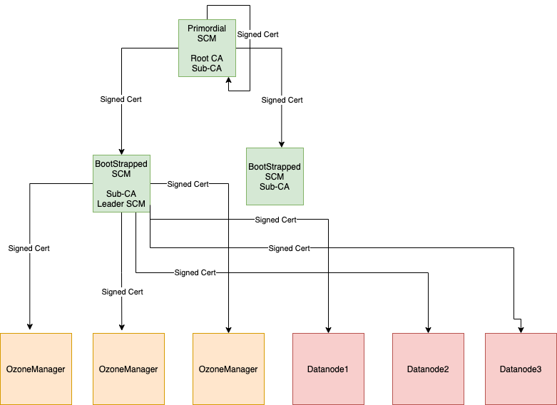

In a secure SCM HA cluster on the SCM where we perform init, we call this SCM as a primordial SCM.
Primordial SCM starts root-CA with self-signed certificates and is used to issue a signed certificate
to itself and other bootstrapped SCM's. Only primordial SCM can issue signed certificates for other SCM's.
So, primordial SCM has a special role in the SCM HA cluster, as it is the only one that can issue certificates to SCM's.

The primordial SCM takes a root-CA role, which signs all SCM instances with a sub-CA certificate.
The sub-CA certificates are used by SCM to sign certificates for OM/Datanodes.

When bootstrapping a SCM, it gets a signed certificate from the primary SCM and starts sub-CA.

Sub-CA on the SCM's are used to issue signed certificates for OM/DN in the cluster. Only the leader SCM issues a certificate to OM/DN.

```xml
<property> 
<name>ozone.security.enable</name> 
<value>true</value> 
</property> 
 
<property> 
<name>hdds.grpc.tls.enabled</name> 
<value>true</value> 
</property> 
```

Above configs are needed in addition to normal SCM HA configuration.

Primordial SCM is determined from the config `ozone.scm.primordial.node.id`.
The value for this can be node id or hostname of the SCM. If the config is
not defined, the node where init is run is considered as the primordial SCM.

```bash
bin/ozone scm --init 
```

This will set up a public,private key pair and self-signed certificate for root CA
and also generate public, private key pair and CSR to get a signed certificate for sub-CA from root CA.

```bash
bin/ozone scm --bootstrap 
```

This will set up a public, private key pair for sub CA and generate CSR to get a
signed certificate for sub-CA from root CA.

> [!NOTE]
> : Make sure to run **--init** only on one of the SCM host if
> primordial SCM is not defined. Bring up other SCM's using **--bootstrap**.

- Unsecure HA cluster upgrade to secure HA cluster is not supported.

SCM HA uses Apache Ratis to replicate state between the members of the SCM HA quorum. Each node maintains the block management metadata in local RocksDB.

This replication process is a simpler version of OM HA replication process as it doesn't use any double buffer (as the overall db thourghput of SCM requests are lower)

Datanodes are sending all the reports (Container reports, Pipeline reports...) to *all* SCM nodes in parallel. Only the leader node can assign/create new containers, and only the leader node sends commands back to the Datanodes.

After starting an SCM-HA it can be validated if the SCM nodes are forming one single quorum instead of 3 individual SCM nodes.

First, check if all the SCM nodes store the same ClusterId metadata:

```bash
cat /data/metadata/scm/current/VERSION 
```

ClusterId is included in the VERSION file and should be the same in all the SCM nodes:

```bash
#Tue Mar 16 10:19:33 UTC 2021 
cTime=1615889973116 
clusterID=CID-130fb246-1717-4313-9b62-9ddfe1bcb2e7 
nodeType=SCM 
scmUuid=e6877ce5-56cd-4f0b-ad60-4c8ef9000882 
layoutVersion=0 
```

You can also create data and double check with `ozone debug` tool if all the container metadata is replicated.

```bash
bin/ozone freon randomkeys --numOfVolumes=1 --numOfBuckets=1 --numOfKeys=10000 --keySize=524288 --replicationType=RATIS --numOfThreads=8 --factor=THREE --bufferSize=1048576 
 
 
# use debug ldb to check scm.db on all the machines bin/ozone debug ldb --db=/tmp/metadata/scm.db ls
 
 
bin/ozone debug ldb --db=/tmp/metadata/scm.db scan --column-family=containers 
```

Add additional SCM nodes and extend the cluster configuration to reflect the newly added nodes.
Bootstrap the newly added SCM nodes with `scm --bootstrap` command and start the SCM service.
Note: Make sure that the `ozone.scm.primordial.node.id` property is pointed to the existing SCM before you run the `bootstrap` command on the newly added SCM nodes.

---

<a id="administrator-guide-configuration-high-availability-om-ha"></a>

<!-- source_url: https://ozone.apache.org/docs/administrator-guide/configuration/high-availability/om-ha/ -->

<!-- page_index: 128 -->

# Ozone Manager High Availability

Version: 2.1.0

> [!NOTE]
> **info**
> For conceptual information about OM HA, see the [OM HA documentation](#core-concepts-high-availability-om-ha).

---

<a id="administrator-guide-configuration-high-availability-client-failover"></a>

<!-- source_url: https://ozone.apache.org/docs/administrator-guide/configuration/high-availability/client-failover/ -->

<!-- page_index: 129 -->

# HA Client Failover

Version: 2.1.0

This document describes how Ozone clients handle failover and retry logic to ensure high availability and reliability. In Ozone's high availability (HA) setup, clients need to automatically failover between multiple service instances (Ozone Manager, Storage Container Manager) and retry operations when encountering failures with Datanodes.

The failover and retry mechanisms operate transparently to client applications. Clients automatically detect failures, switch to alternative service instances, and retry operations according to configurable policies. An exception is only raised to the application layer after all retry attempts have been exhausted.

Clients always submit requests to the leader Ozone Manager (OM). If the `leader` is `unknown`, clients start by sending requests to the first OM in the configuration and retries other OMs until a leader is found.

If client to OM is Hadoop RPC transport(`HadoopRpcOMFailoverProxyProvider`), failover or retry may happen if the OM:

- is not reachable,
- is not the leader, or
- is the leader but not ready to accept requests.

The failover mechanism retries up to **500 times** (`ozone.client.failover.max.attempts`), with **2 seconds** between each failover retry (`ozone.client.wait.between.retries.millis`).
If an OM is not aware of the current leader, the client tries the next OM in round-robin fashion. Otherwise, the client retries contacting the current leader.

Additionally, it is crucial to ensure clients and OM have consistent node mapping configurations, otherwise failover may not reach the leader OM.

When using gRPC transport (`GrpcOMFailoverProxyProvider`), the failover behavior is similar to Hadoop RPC transport, using the same retry policies and configuration parameters.

Client (client, OM, or Datanode) to SCM failover is controlled by configuration properties in `SCMClientConfig`. Clients try to connect to the leader SCM.
If the SCM provides a suggested leader in the exception, the client fails over to that leader. Otherwise, the client tries the next SCM in round-robin fashion.

The failover configuration properties are:

| Property | Default | Description |
| --- | --- | --- |
| `hdds.scmclient.rpc.timeout` | 15min | RPC timeout for SCM. If `ipc.client.ping` is set to true and this RPC-timeout is greater than the value of `ipc.ping.interval`, the effective value of the RPC-timeout is rounded up to multiple of `ipc.ping.interval`. |
| `hdds.scmclient.max.retry.timeout` | 10min | Maximum retry timeout for SCM Client. |
| `hdds.scmclient.failover.max.retry` | 15 | Maximum retry count for SCM Client when failover happens. If `maxRetryTimeout / retryInterval` is larger than this value, the calculated value is used instead. |
| `hdds.scmclient.failover.retry.interval` | 2s | Time to wait between retry attempts to other SCM IP. |

Clients retry Datanodes in the pipeline in order upon failure, in other words clients attempting to access a block belonging to a Ratis/3 pipeline may retry up to 3 Datanodes. The retry behavior differs for read and write operations:

**Read Operations:**

- Clients retry each Datanode 3 times (`ozone.client.read.max.retries`)
- 1 second pause between retries (`ozone.client.read.retry.interval`)
- Maximum retries: **3 × number of Datanodes**

**Write Operations:**

- Clients retry each Datanode 5 times (`ozone.client.max.retries`)
- No pause between retries (`ozone.client.retry.interval`, default: 0)
- Maximum retries: **5 × number of Datanodes**

| Property | Default | Description |
| --- | --- | --- |
| `ozone.client.read.max.retries` | 3 | Maximum number of retries by Ozone Client on encountering connectivity exception when reading a key. |
| `ozone.client.read.retry.interval` | 1 second | Time duration in seconds a client will wait before retrying a read key request on encountering a connectivity exception from Datanodes. |
| `ozone.client.max.retries` | 5 | Maximum number of retries by Ozone Client on encountering exception while writing a key. |
| `ozone.client.retry.interval` | 0 | Time duration a client will wait before retrying a write key request on encountering an exception. By default there is no wait. |

---

<a id="administrator-guide-configuration-appendix"></a>

<!-- source_url: https://ozone.apache.org/docs/administrator-guide/configuration/appendix/ -->

<!-- page_index: 130 -->

# Configuration Key Appendix

Version: 2.1.0

**TODO** [HDDS-10683](https://issues.apache.org/jira/browse/HDDS-10683) Fill in this page with a table of all configuration keys.

---

<a id="administrator-guide-operations"></a>

<!-- source_url: https://ozone.apache.org/docs/administrator-guide/operations/ -->

<!-- page_index: 131 -->

# Administrator Operations

Version: 2.1.0

This section documents operations required by administrators to maintain an Ozone system in a production environment.

[<a id="administrator-guide-operations--start-and-stop"></a>

## 📄️ Start and Stop

This guide describes how to start and stop an Ozone cluster, assuming it has already been configured and initialized.](#administrator-guide-operations-start-and-stop)

[<a id="administrator-guide-operations--upgrade-and-downgrade"></a>

## 📄️ Upgrade and Downgrade

Ozone supports non-rolling upgrades and downgrades, where all components are stopped first, and then restarted with the upgraded or downgraded versions.](#administrator-guide-operations-upgrade-and-downgrade)

[<a id="administrator-guide-operations--decommissioning-and-maintenance"></a>

## 🗃️ Decommissioning and Maintenance

3 items](#administrator-guide-operations-node-decommissioning-and-maintenance)

[<a id="administrator-guide-operations--disk-replacement"></a>

## 🗃️ Disk Replacement

4 items](#administrator-guide-operations-disk-replacement)

[<a id="administrator-guide-operations--container-replication-report"></a>

## 📄️ Container Replication Report

Ozone continuously monitors the health of containers to handle the loss of disks or nodes and re-replicates data to maintain a healthy replication count. The status of this replication can be viewed with the Container Report command which can be run as follows:](#administrator-guide-operations-container-replication-report)

[<a id="administrator-guide-operations--data-balancing"></a>

## 🗃️ Data Balancing

1 item](#administrator-guide-operations-data-balancing)

[<a id="administrator-guide-operations--certificate-rotation"></a>

## 📄️ Certificate Rotation

TODO: File a subtask under HDDS-9859 and complete this page or section.](#administrator-guide-operations-certificate-rotation)

[<a id="administrator-guide-operations--s3-multi-tenancy"></a>

## 🗃️ S3 Multi-Tenancy

4 items](#administrator-guide-operations-s3-multi-tenancy)

[<a id="administrator-guide-operations--snapshots"></a>

## 🗃️ Snapshots

2 items](#administrator-guide-operations-snapshots)

[<a id="administrator-guide-operations--observability"></a>

## 🗃️ Observability

6 items](#administrator-guide-operations-observability)

[<a id="administrator-guide-operations--leader-transfer"></a>

## 🗃️ Leader Transfer

2 items](#administrator-guide-operations-leader-transfer)

[<a id="administrator-guide-operations--quota-in-ozone"></a>

## 📄️ Quota in Ozone

Client usage](#administrator-guide-operations-quota)

[<a id="administrator-guide-operations--tools"></a>

## 🗃️ Tools

3 items](#administrator-guide-operations-tools)

[<a id="administrator-guide-operations--trash"></a>

## 📄️ Trash

The trash feature in Ozone provides a way to recover files that have been accidentally deleted. When enabled, deleted files are moved to a trash directory instead of being permanently removed.](#administrator-guide-operations-trash)

[<a id="administrator-guide-operations--dynamic-property-reload"></a>

## 📄️ Dynamic Property Reload

Ozone supports dynamic reloading of certain configuration properties without restarting services. This enables operators to tune cluster behavior, adjust limits, and update settings in production without service disruption.](#administrator-guide-operations-dynamic-property-reload)

---

<a id="administrator-guide-operations-start-and-stop"></a>

<!-- source_url: https://ozone.apache.org/docs/administrator-guide/operations/start-and-stop/ -->

<!-- page_index: 132 -->

# Starting and Stopping the Ozone Cluster

Version: 2.1.0

This guide describes how to start and stop an Ozone cluster, assuming it has already been configured and initialized.

Run the following command on each SCM host:

```bash
ozone --daemon start scm 
```

Run the following command on each OM host:

```bash
ozone --daemon start om 
```

At this point Ozone's name services, the Ozone Manager, and the block service SCM are both running.

Now we need to start the Datanodes. Please run the following command on each Datanode.

```bash
ozone --daemon start datanode 
```

Wait until SCM exits safe mode

```bash
ozone admin safemode wait -t 240 
```

At this point SCM, Ozone Manager and Datanodes are up and running and are ready to serve requests.

If you need to start optional services like the Recon server, S3 Gateway, or HttpFS Gateway, you can start them separately:

```bash
ozone --daemon start recon 
ozone --daemon start s3g 
ozone --daemon start httpfs 
```

If you want to make your life simpler, you can just run:

```bash
start-ozone.sh 
```

This assumes that you have set up the `workers` file correctly and ssh configuration that allows ssh-ing to all Datanodes.

1. You are expected to list all hostnames or IP addresses in your `${OZONE_CONF_DIR}/workers` file, one per line.
2. You have passwordless SSH access configured from the control node to all other nodes in the cluster.

To stop all core services, you can use the `stop-ozone.sh` script from your SCM or OM node:

```bash
stop-ozone.sh 
```

To stop services individually, you can run the following commands on their respective nodes:

```bash
ozone --daemon stop scm 
ozone --daemon stop om 
ozone --daemon stop datanode 
```

To stop optional services, run the following commands on their respective nodes:

```bash
ozone --daemon stop recon 
ozone --daemon stop s3g 
ozone --daemon stop httpfs 
```

---

<a id="administrator-guide-operations-upgrade-and-downgrade"></a>

<!-- source_url: https://ozone.apache.org/docs/administrator-guide/operations/upgrade-and-downgrade/ -->

<!-- page_index: 133 -->

# Upgrade and Downgrade

Version: 2.1.0

Ozone supports non-rolling upgrades and downgrades, where all components are stopped first, and then restarted with the upgraded or downgraded versions.

After upgrading components, the upgrade process is divided into two states:

1. **Pre-finalized**: When the current components are stopped and the new versions are started, they will see that the data on disk was written by a previous version of Ozone and enter a pre-finalized state. In the pre-finalized state:

   - The cluster can be downgraded at any time by stopping all components and restarting with the old versions.
   - Backwards incompatible features introduced in the new version will be disallowed by the cluster.
   - The cluster will remain fully operational with all functionality present in the old version still allowed.
   - Any data created while pre-finalized will remain readable after downgrade.
2. **Finalized**: When a finalize command is given to OM or SCM, they will enter a finalized state. In the finalized state:

   - The cluster can no longer be downgraded.
   - All new features of the cluster introduced in the new version can be used.

**OM**: `ozone admin om finalizationstatus`. If using OM HA, finalization status is checked for the quorum, not individual OMs.

**SCM**: `ozone admin scm finalizationstatus`. SCM will report that finalization is complete once it has finalized and is aware of enough finalized Datanodes to form a write pipeline. The remaining Datanodes will finalize asynchronously and be incorporated into write pipelines after informing SCM that they have finalized.

**Datanodes**: `ozone admin datanode list` will list all Datanodes and their health state as seen by SCM. If SCM is finalized, then Datanodes whose health state is `HEALTHY` have informed SCM that they have finalized. Datanodes whose health state is `HEALTHY_READONLY` have not yet informed SCM that they have finished finalization. `HEALTHY_READONLY` (pre-finalized) Datanodes remain readable, so the cluster is operational even if some otherwise healthy Datanodes have not yet finalized. `STALE` or `DEAD` Datanodes will be told to finalize by SCM once they are reachable again.

Starting with your current version of Ozone, complete the following steps to upgrade to a newer version of Ozone.

1. If using OM HA and currently running Ozone 1.2.0 or greater, prepare the Ozone Manager. If OM HA is not being used, this step can be skipped.


```bash
ozone admin om prepare -id=<om-sevice-id> 
```

   The `prepare` command will block the Ozone Managers from receiving all write requests. See [Ozone Manager Prepare For Upgrade](https://ozone.apache.org/docs/edge/design/omprepare.html) for more information
2. Stop all components.
3. Replace artifacts of all components with the newer versions.
4. Start the components

   1. Start the SCM and Datanodes as usual:


```bash
ozone --daemon start scm 
ozone --daemon start datanode 
```

   2. Start the Ozone Manager using the `--upgrade` flag to take it out of prepare mode.


```bash
ozone --daemon start om --upgrade 
```

      - There also exists a `--downgrade` flag which is an alias of `--upgrade`. The name used does not matter.

> [!IMPORTANT]
> - : All OMs must be started with the `--upgrade` or `--downgrade` flag in this step. If some of the OMs are not started with this flag by mistake, run `ozone admin om cancelprepare -id=<om-sevice-id>` to make sure all OMs leave prepare mode.

   At this point, the cluster is upgraded to a pre-finalized state and fully operational. The cluster can be downgraded by repeating the above steps, but restoring the older versions of components in step 3, instead of the newer versions. To finalize the cluster to use new features, continue on with the following steps.

   **Once the following steps are performed, downgrading will not be possible.**
5. Finalize SCM


```bash
ozone admin scm finalizeupgrade 
```

   At this point, SCM will tell all of the Datanodes to finalize. Once SCM has finalized enough Datanodes to form a write pipeline, it will return that finalization was successful. The remaining pre-finalized Datanodes will be in a read-only state until they indicate to SCM that they have finalized. Write requests will be directed to finalized Datanodes only.
6. Finalize OM


```bash
ozone admin om finalizeupgrade -id=<om-service-id> 
```

At this point, the cluster is finalized and the upgrade is complete.

---

<a id="administrator-guide-operations-node-decommissioning-and-maintenance"></a>

<!-- source_url: https://ozone.apache.org/docs/administrator-guide/operations/node-decommissioning-and-maintenance/ -->

<!-- page_index: 134 -->

# Node Decommissioning and Maintenance

Version: 2.1.0

This section contains instructions to remove Ozone nodes from the cluster in a controlled manner.

[<a id="administrator-guide-operations-node-decommissioning-and-maintenance--ozone-manager"></a>

## 📄️ Ozone Manager

Ozone Manager (OM) decommissioning is the process in which you gracefully remove one of the OM from the OM HA Ring.](#administrator-guide-operations-node-decommissioning-and-maintenance-ozone-manager)

[<a id="administrator-guide-operations-node-decommissioning-and-maintenance--storage-container-manager"></a>

## 📄️ Storage Container Manager

Storage Container Manager (SCM) decommissioning is the process in which you can gracefully remove one of the SCM from the SCM HA Ring.](#administrator-guide-operations-node-decommissioning-and-maintenance-storage-container-manager)

[<a id="administrator-guide-operations-node-decommissioning-and-maintenance--datanode"></a>

## 🗃️ Datanode

2 items](#administrator-guide-operations-node-decommissioning-and-maintenance-datanodes)

---

<a id="administrator-guide-operations-node-decommissioning-and-maintenance-ozone-manager"></a>

<!-- source_url: https://ozone.apache.org/docs/administrator-guide/operations/node-decommissioning-and-maintenance/ozone-manager/ -->

<!-- page_index: 135 -->

# Decommissioning an Ozone Manager

Version: 2.1.0

Ozone Manager (OM) decommissioning is the process in which you gracefully remove one of the OM from the OM HA Ring.

To decommission an OM and remove the node from the OM HA ring, the following steps need to be executed.

1. Add the *OM NodeId* of the OM Node to be decommissioned to the `ozone.om.decommissioned.nodes.<omServiceId>` property in `ozone-site.xml` of all
   other OMs.
2. Run the following command to decommission an OM node.

```shell
ozone admin om decommission -id=<om-service-id> -nodeid=<decommissioning-om-node-id> -hostname=<decommissioning-om-node-address> [optional --force] 
```

The *force* option will skip checking whether OM configurations in `ozone-site.xml` have been updated with the decommissioned node added to
`ozone.om.decommissioned.nodes` property.

> [!NOTE]
> - It is recommended to bootstrap another OM node before decommissioning one to maintain HA.

---

<a id="administrator-guide-operations-node-decommissioning-and-maintenance-storage-container-manager"></a>

<!-- source_url: https://ozone.apache.org/docs/administrator-guide/operations/node-decommissioning-and-maintenance/storage-container-manager/ -->

<!-- page_index: 136 -->

# Decommissioning a Storage Container Manager

Version: 2.1.0

Storage Container Manager (SCM) decommissioning is the process in which you can gracefully remove one of the SCM from the SCM HA Ring.

To decommission an SCM and remove the node from the SCM HA ring, the following steps need to be executed.

```shell
ozone admin scm decommission [-hV] [--service-id=<scmServiceId>] -nodeid=<nodeId> 
```

You can obtain the `nodeId` by executing this command, `ozone admin scm roles`

If you want to decommission the **leader** SCM, you must first transfer the leadership to a different SCM and then decommission the node.

To transfer the leader, we can execute below command,

```shell
ozone admin scm transfer [--service-id=<scmServiceId>] -n=<nodeId> 
```

After successful leadership change you can proceed with decommissioning.

If you want to decommission the **primordial** SCM, you have to change the `ozone.scm.primordial.node.id` property to point to a different SCM and then proceed with decommissioning.

During SCM decommissioning the private key of the decommissioned SCM should be manually deleted. The private keys can be found inside `hdds.metadata.dir`.

Manual deletion is needed until we have certificate revocation support (HDDS-8399)

---

<a id="administrator-guide-operations-node-decommissioning-and-maintenance-datanodes"></a>

<!-- source_url: https://ozone.apache.org/docs/administrator-guide/operations/node-decommissioning-and-maintenance/datanodes/ -->

<!-- page_index: 137 -->

# Datanode Decommissioning and Maintenance

Version: 2.1.0

The Datanode Decommission is the process that removes the existing Datanode from the Ozone cluster while ensuring that the new data should not be written to the decommissioned Datanode. When you initiate the process of decommissioning a Datanode, Ozone automatically ensures that all the storage containers on that Datanode have an additional copy created on another Datanode before the decommission completes. So, Datanode will keep running after it has been decommissioned and may be used for reads, but not for writes until it is stopped manually.

The Datanode Maintenance mode is a feature in Apache Ozone that allows you to temporarily take a Datanode offline for maintenance operations (e.g., hardware upgrades, software updates) without triggering immediate data replication. Unlike decommissioning, which aims to permanently remove a Datanode and its data from the cluster, maintenance mode is designed for temporary outages.

[<a id="administrator-guide-operations-node-decommissioning-and-maintenance-datanodes--datanode-decommission"></a>

## 📄️ Datanode Decommission

The Datanode decommission is the process that removes the existing Datanode from the Ozone cluster while ensuring that the new data should not be written to the decommissioned Datanode. When you initiate the process of decommissioning a Datanode, Ozone automatically ensures that all the storage containers on that Datanode have an additional copy created on another Datanode before the decommission completes. So, Datanode will keep running after it has been decommissioned and may be used for reads, but not for writes until it is stopped manually.](#administrator-guide-operations-node-decommissioning-and-maintenance-datanodes-datanode-decommission)

[<a id="administrator-guide-operations-node-decommissioning-and-maintenance-datanodes--datanode-maintenance-mode"></a>

## 📄️ Datanode Maintenance Mode

Maintenance mode is a feature in Apache Ozone that allows you to temporarily take a Datanode offline for maintenance operations (e.g., hardware upgrades, software updates) without triggering immediate data replication. Unlike decommissioning, which aims to permanently remove a Datanode and its data from the cluster, maintenance mode is designed for temporary outages.](#administrator-guide-operations-node-decommissioning-and-maintenance-datanodes-datanode-maintenance)

---

<a id="administrator-guide-operations-node-decommissioning-and-maintenance-datanodes-datanode-decommission"></a>

<!-- source_url: https://ozone.apache.org/docs/administrator-guide/operations/node-decommissioning-and-maintenance/datanodes/datanode-decommission/ -->

<!-- page_index: 138 -->

# Datanode Decommission

Version: 2.1.0

> [!NOTE]
> There is currently no CLI command to manually "forget" a node without a restart.

---

<a id="administrator-guide-operations-node-decommissioning-and-maintenance-datanodes-datanode-maintenance"></a>

<!-- source_url: https://ozone.apache.org/docs/administrator-guide/operations/node-decommissioning-and-maintenance/datanodes/datanode-maintenance/ -->

<!-- page_index: 139 -->

# Datanode Maintenance Mode

Version: 2.1.0

Maintenance mode is a feature in Apache Ozone that allows you to temporarily take a Datanode offline for maintenance operations (e.g., hardware upgrades, software updates) without triggering immediate data replication. Unlike decommissioning, which aims to permanently remove a Datanode and its data from the cluster, maintenance mode is designed for temporary outages.

While in maintenance mode, a Datanode does not accept new writes but may still serve reads, assuming containers are healthy and online. Existing data on the Datanode will remain in place, and replication of its data will only be triggered if the Datanode remains in maintenance mode beyond a configurable timeout period. This allows for planned downtime without unnecessary data movement, reducing network overhead and cluster load.

The Datanode transitions through the following operational states during maintenance:

1. **IN\_SERVICE**: The Datanode is fully operational and participating in data writes and reads.
2. **ENTERING\_MAINTENANCE**: The Datanode is transitioning into maintenance mode. New writes will be avoided.
3. **IN\_MAINTENANCE**: The Datanode is in maintenance mode. Data will not be written to it. If the Datanode remains in this state beyond the configured maintenance window, its data will start to be replicated to other Datanodes to ensure data durability.

To place a Datanode into maintenance mode, use the `ozone admin datanode maintenance` command. You can specify a duration for the maintenance period. If no duration is specified, a default duration will be used (this can be configured).

To check the current state of the Datanodes, including their operational state, you can execute the following command:

```shell
ozone admin datanode list 
```

To start maintenance mode for one or more Datanodes:

```shell
ozone admin datanode maintenance [-hV] [-id=<scmServiceId>] [--scm=<scm>] [--end=<hours>] [--force] [<hosts>...] 
```

- `<hosts>`: A space-separated list of hostnames or IP addresses of the Datanodes to put into maintenance mode.
- `--end=<hours>`: Optional. Automatically end maintenance after the given hours. By default, maintenance must be ended manually.
- `--force`: Optional. Forcefully try to put the Datanode(s) into maintenance mode.

To take a Datanode out of maintenance mode and return it to `IN_SERVICE` state, you can use the `recommission` command:

```shell
ozone admin datanode recommission [-hV] [-id=<scmServiceId>] [--scm=<scm>] [<hosts>...] 
```

The following properties, typically set in `ozone-site.xml`, are relevant to maintenance mode:

| Property | Default Value | Description |
| --- | --- | --- |
| `hdds.scm.replication.maintenance.replica.minimum` | `2` | The minimum number of container replicas which must be available for a node to enter maintenance. If putting a node into maintenance reduces the available replicas for any container below this level, the node will remain in the ENTERING\_MAINTENANCE state until a new replica is created. |
| `hdds.scm.replication.maintenance.remaining.redundancy` | `1` | The number of redundant containers in a group which must be available for a node to enter maintenance. If putting a node into maintenance reduces the redundancy below this value, the node will remain in the `ENTERING_MAINTENANCE` state until a new replica is created. For Ratis containers, the default value of 1 ensures at least two replicas are online, meaning 1 more can be lost without data becoming unavailable. For any EC container it will have at least dataNum + 1 online, allowing the loss of 1 more replica before data becomes unavailable. Currently only EC containers use this setting. Ratis containers use `hdds.scm.replication.maintenance.replica.minimum`. For EC, if nodes are in maintenance, it is likely reconstruction reads will be required if some of the data replicas are offline. This is seamless to the client, but will affect read performance. |

The following SCM metrics are relevant to Datanode decommissioning and maintenance across all tracked nodes.

- `DecommissioningMaintenanceNodesTotal`: This metric reports the total number of Datanodes that are currently in either decommissioning or maintenance mode.
- `RecommissionNodesTotal`: This metric reports the total number of Datanodes that are currently being recommissioned (i.e., returning to `IN_SERVICE` state from either decommissioning or maintenance mode).
- `PipelinesWaitingToCloseTotal`: This metric reports the total number of Datanodes tracked with pipelines waiting to close.
- `ContainersUnderReplicatedTotal`: This metric reports the total number of containers under replicated in tracked nodes.
- `ContainersUnClosedTotal`: This metric reports the total number of containers not fully closed in tracked nodes.
- `ContainersSufficientlyReplicatedTotal`: This metric reports the total number of containers sufficiently replicated in tracked nodes.

The following SCM metrics are relevant to Datanode decommissioning and maintenance per node.

- `UnderReplicatedDN`: Number of under-replicated containers for the specific host
- `PipelinesWaitingToCloseDN`: Number of pipelines waiting to close for the specific host
- `SufficientlyReplicatedDN`: Number of sufficiently replicated containers for the specific host
- `UnclosedContainersDN`: Number of containers not fully closed for the specific host
- `StartTimeDN`: Timestamp when decommissioning was started for the specific host

---

<a id="administrator-guide-operations-disk-replacement"></a>

<!-- source_url: https://ozone.apache.org/docs/administrator-guide/operations/disk-replacement/ -->

<!-- page_index: 140 -->

# Disk Replacement

Version: 2.1.0

This section contains instructions to replace disks on Ozone nodes.

[<a id="administrator-guide-operations-disk-replacement--ozone-manager"></a>

## 📄️ Ozone Manager

Audience: Cluster Administrators](#administrator-guide-operations-disk-replacement-ozone-manager)

[<a id="administrator-guide-operations-disk-replacement--storage-container-manager"></a>

## 📄️ Storage Container Manager

Audience: Cluster Administrators](#administrator-guide-operations-disk-replacement-storage-container-manager)

[<a id="administrator-guide-operations-disk-replacement--datanodes"></a>

## 📄️ Datanodes

Overview](#administrator-guide-operations-disk-replacement-datanodes)

[<a id="administrator-guide-operations-disk-replacement--recon"></a>

## 📄️ Recon

Audience: Cluster Administrators](#administrator-guide-operations-disk-replacement-recon)

---

<a id="administrator-guide-operations-disk-replacement-ozone-manager"></a>

<!-- source_url: https://ozone.apache.org/docs/administrator-guide/operations/disk-replacement/ozone-manager/ -->

<!-- page_index: 141 -->

# Replacing Ozone Manager Disks

Version: 2.1.0

**Audience:** Cluster Administrators

**Prerequisites:** Familiarity with Ozone cluster administration and Linux system administration.

---

When a disk containing the Ozone Manager (OM) metadata directory fails, proper recovery procedures are critical to maintain cluster availability and prevent data loss. This document provides comprehensive, step-by-step guidance for safely replacing failed disks on OM nodes, with distinct procedures for standalone and High-Availability (HA) configurations. Following these procedures correctly ensures minimal downtime and maintains the integrity of your Ozone cluster's metadata.

- **Purpose**
  This guide provides the steps required to safely replace a failed disk on an Ozone Manager (OM) node.
- **Impact of OM Disk Failure**
  The OM disk is critical as it stores the RocksDB database containing the entire object store namespace (volumes, buckets, keys) and block locations. A failure of this disk can lead to metadata loss if not handled correctly.
- **Crucial Distinction: HA vs. Non-HA**
  The recovery procedure depends entirely on whether your OM is a single, standalone instance or part of a High-Availability (HA) Ratis-based quorum. The HA procedure is significantly safer and results in no cluster downtime. Running a standalone OM is not recommended for production environments.

---

> **Important:** The following steps assume Ozone configuration files are intact. If the configuration files are corrupt, they need to be restored from a backup (if applicable) before proceeding with the disk replacement procedure.

Before starting, the administrator should:

1. **Identify the Failed Disk:** Use system tools (`dmesg`, `smartctl`, etc.) to confirm which disk has failed and its mount point.
2. **Identify OM Directories:** Check your `ozone-site.xml` to confirm which Ozone directories are on the failed disk. The most important ones are:

   - `ozone.om.db.dirs`: The primary OM metadata database (RocksDB). This directory stores the entire object store namespace.
   - `ozone.om.ratis.storage.dir`: The Ratis storage directory (if configured on a separate disk). This directory stores Ratis metadata like logs. If not explicitly configured, it falls back to `ozone.metadata.dirs`. For production environments, it is recommended to configure this on a separate, fast disk (preferably SSD) for better performance.
3. **Prepare the Replacement Disk:** Have a new, healthy disk physically installed, formatted, and mounted on the system at the same path as the failed disk. Ensure it has the correct ownership and permissions for the user that runs the OM process. The default permissions for OM metadata directories are **750** (configurable via `ozone.om.db.dirs.permissions`).

---

This is a high-risk, manual disaster recovery process that will require cluster downtime.

1. **STOP THE ENTIRE CLUSTER:** Shut down all clients, Datanodes, SCM, and the Ozone Manager to prevent any further state changes.
2. **Attempt Data Recovery:** If the failed disk is still partially readable, make a best-effort attempt to copy the contents of the `ozone.om.db.dirs` directory to a safe, temporary location.
3. **If Recovery Fails, Restore from Backup:** If the OM database files are unrecoverable, you must restore from your most recent backup. This document does not cover the backup process itself, but it is the only path to recovery in this scenario.
4. **Replace and Configure Disk:** Physically replace the hardware and ensure the new, empty disk is mounted at the correct path defined in `ozone.om.db.dirs`.
5. **Restore Metadata:** Copy the recovered data **(from Step 2)** or the restored backup data **(from Step 3)** to the `ozone.om.db.dirs` path on the new disk.
6. **Restart and Verify:**

   - Start the SCM and Ozone Manager services.
   - Once the OM is running, start the Datanodes.
   - Run `ozone sh volume list` and other basic commands to verify that the namespace is intact and the cluster is operational.

---

This procedure is much safer, leverages the built-in redundancy of the OM HA cluster, and does not require full cluster downtime.

1. **STOP THE FAILED OM INSTANCE:** On the node with the failed disk, stop only the Ozone Manager process. The other OMs will continue operating, and one of them will remain the leader, serving client requests.
2. **Replace and Configure Disk:** Physically replace the hardware. Mount the new, empty disk at the path defined in `ozone.om.db.dirs` and ensure it has the correct ownership and permissions. If `ozone.om.ratis.storage.dir` was also on the failed disk, ensure it is properly configured on the new disk as well.
3. **Verify Configuration:** Before proceeding, ensure that all existing OMs have their `ozone-site.xml` configuration files updated with the configuration details of the OM being recovered (nodeId, address, port, etc.). The bootstrap process will verify this by checking all OMs' on-disk configurations. If an existing OM does not have updated configs, it can crash when bootstrap is initiated.
4. **RE-INITIALIZE THE OM:**

   - This is the key step. Since the local database is gone, the OM needs to be "reborn" by getting a complete copy of the latest state from the current OM leader.
   - Run the OM with the `--bootstrap` parameter to trigger this process. For example:


```bash
ozone om --bootstrap 
```

     This command will detect that the OM belongs to an existing Ratis ring but has no local state.
5. **START THE OM AND MONITOR:**

   - Start the Ozone Manager service on the repaired node (if not already started by the bootstrap command).
   - Tail the OM's log file (`.log` and `.out`). You should see messages indicating that it is connecting to the OM HA ring and that a "snapshot" is being installed. This means the current OM leader is streaming the entire metadata database to this new follower.
   - This process can take some time, depending on the size of your metadata.
6. **VERIFY:** Once the snapshot installation is complete, the OM will finish starting, join the Ratis ring as a follower, and begin receiving live updates.

   - You can check the OM Web UI on any of the OM nodes. The list of peers should now show all OMs as healthy.
   - Alternatively, use the command `ozone admin om roles -id <OM_SERVICE_ID>` to verify that all OMs are showing as LEADER or FOLLOWER.
   - The cluster is now back at full redundancy and the procedure is complete.

---

1. **Disk Space Requirements for Snapshots**

   - **Critical:** When an Ozone Manager (OM) acts as a follower in an HA setup, it downloads snapshot tarballs from the leader to its local metadata directory.
   - Always ensure your OM disks have **at least 2x the current OM database size** to accommodate the existing data and incoming snapshots.
   - This prevents disk space issues and maintains cluster stability during recovery operations.
2. **Separating Ratis Logs**

   - If you have configured `ozone.om.ratis.storage.dir` on a separate, dedicated disk (recommended for performance), a failure of that disk would follow the same HA recovery procedure.
   - The OM would automatically rebuild its Ratis logs from the other members of the ring when it starts.
3. **Disk Monitoring**

   - This procedure highlights the importance of actively monitoring disk health (`smartd`, etc.) to replace disks proactively before a catastrophic failure.

---

<a id="administrator-guide-operations-disk-replacement-storage-container-manager"></a>

<!-- source_url: https://ozone.apache.org/docs/administrator-guide/operations/disk-replacement/storage-container-manager/ -->

<!-- page_index: 142 -->

# Replacing Storage Container Manager Disks

Version: 2.1.0

> [!NOTE]
> The bootstrap command does NOT start the SCM daemon. It only prepares the configuration and storage state. You must start the SCM service separately after bootstrap completes.

---

<a id="administrator-guide-operations-disk-replacement-datanodes"></a>

<!-- source_url: https://ozone.apache.org/docs/administrator-guide/operations/disk-replacement/datanodes/ -->

<!-- page_index: 143 -->

# Replacing Datanode Disks

Version: 2.1.0

> [!NOTE]
> By default, metadata and database volumes share the same physical disks as data volumes. They can be configured on separate disks (e.g., SSDs) for better performance, but this is optional.

---

<a id="administrator-guide-operations-disk-replacement-recon"></a>

<!-- source_url: https://ozone.apache.org/docs/administrator-guide/operations/disk-replacement/recon/ -->

<!-- page_index: 144 -->

# Replacing Recon Disks

Version: 2.1.0

> [!NOTE]
> Unlike critical services like OM or SCM, a Recon disk failure does **not impact core cluster operations**. Client reads and writes continue normally because Recon is not in the data I/O path. All data stored on the Recon disk can be fully rebuilt from the active OM and SCM services, making disk replacement a straightforward, low-risk procedure that can be performed without cluster downtime.

---

<a id="administrator-guide-operations-container-replication-report"></a>

<!-- source_url: https://ozone.apache.org/docs/administrator-guide/operations/container-replication-report/ -->

<!-- page_index: 145 -->

# Container Replication Report

Version: 2.1.0

Ozone continuously monitors the health of containers to handle the loss of disks or nodes and re-replicates data to maintain a healthy replication count. The status of this replication can be viewed with the *Container Report* command which can be run as follows:

```text
# ozone admin container report 
Container Summary Report generated at 2023-08-14T13:01:43Z 
========================================================== 
 
 
Container State Summary 
======================= 
OPEN: 10 
CLOSING: 0 
QUASI_CLOSED: 4 
CLOSED: 95 
DELETING: 0 
DELETED: 298 
RECOVERING: 0 
 
 
Container Health Summary 
======================== 
UNDER_REPLICATED: 69 
MIS_REPLICATED: 0 
OVER_REPLICATED: 0 
MISSING: 11 
UNHEALTHY: 0 
EMPTY: 4 
OPEN_UNHEALTHY: 0 
QUASI_CLOSED_STUCK: 0 
 
 
First 100 UNDER_REPLICATED containers: 
#1001, #2003, #4001, #4002, #4004, #4005, #5002, #6006, #6009, #7003, #7006, #9004, #9006, #10002, #11001 
 
 
First 100 MISSING containers: 
#6010, #7004, #7005, #24002, #24003, #24004, #28001, #31001, #34003, #54001, #61003 
 
 
First 100 EMPTY containers: 
#52005, #54003, #55001, #55002 
```

The most pertinent container states of interest to an administrator are `UNDER_REPLICATED`, `MISSING` and `UNHEALTHY`.

Under-Replicated containers have less than the number of expected replicas, likely due to decommissioning operations or node/disk failures which are routine in large clusters. This is usually a transient state and indicates that Ozone is currently working to restore these containers to full health.

A container is missing if there are not enough replicas available to read it. This state is usually reached if we had multiple disk or node failures across the cluster in a short amount of time. It may resolve automatically if some of the hardware failures were transient. Else, manual intervention will be needed to restore the failed hardware to a working state in order to recover these containers.

A container is unhealthy if it is not missing and there are insufficient healthy replicas to allow the container to be read completely.

This state can be reached if all available replicas became unhealthy or corrupted in a short amount of time. This should be a rare scenario. Recovery may be possible with the Reconciler feature.

---

<a id="administrator-guide-operations-data-balancing"></a>

<!-- source_url: https://ozone.apache.org/docs/administrator-guide/operations/data-balancing/ -->

<!-- page_index: 146 -->

# README

Version: 2.1.0

This section documents about balancing data across Datanodes (Container Balancer) in an Ozone cluster.

[<a id="administrator-guide-operations-data-balancing--balancing-data-among-datanodes"></a>

## 📄️ Balancing Data Among Datanodes

Overview](#administrator-guide-operations-data-balancing-container-balancer)

---

<a id="administrator-guide-operations-data-balancing-container-balancer"></a>

<!-- source_url: https://ozone.apache.org/docs/administrator-guide/operations/data-balancing/container-balancer/ -->

<!-- page_index: 147 -->

# Container Balancer

Version: 2.1.0

The Container Balancer is a tool in Apache Ozone that balances data containers across the cluster.
Its primary goal is to ensure an even distribution of data based on disk space usage on Datanodes.
This helps to prevent some Datanodes from becoming full while others remain underutilized.

The balancer operates by moving `CLOSED` container replicas, which means it doesn't interfere with active I/O operations.
It is designed to work with both regular and Erasure Coded (EC) containers.
To maintain cluster stability, the Container Balancer's startup is delayed after a Storage Container Manager (SCM) failover.

The Container Balancer is managed through the `ozone admin containerbalancer` command.

To start the Container Balancer with default settings:

```bash
ozone admin containerbalancer start 
```

You can also start the balancer with specific options:

```bash
ozone admin containerbalancer start [options] 
```

**Options:**

| Option | Description |
| --- | --- |
| `-t`, `--threshold` | The percentage deviation from the average utilization of the cluster after which a Datanode will be rebalanced. Default is 10%. |
| `-i`, `--iterations` | The maximum number of consecutive iterations the balancer will run for. Default is 10. Use -1 for infinite iterations. |
| `-d`, `--maxDatanodesPercentageToInvolvePerIteration` | The maximum percentage of healthy, in-service Datanodes that can be involved in balancing in one iteration. Default is 20%. |
| `-s`, `--maxSizeToMovePerIterationInGB` | The maximum size of data in GB to be moved in one iteration. Default is 500GB. |
| `-e`, `--maxSizeEnteringTargetInGB` | The maximum size in GB that can enter a target Datanode in one iteration. Default is 26GB. |
| `-l`, `--maxSizeLeavingSourceInGB` | The maximum size in GB that can leave a source Datanode in one iteration. Default is 26GB. |
| `--balancing-iteration-interval-minutes` | The interval in minutes between each iteration of the Container Balancer. Default is 70 minutes. |
| `--move-timeout-minutes` | The time in minutes to allow a single container to move from source to target. Default is 65 minutes. |
| `--move-replication-timeout-minutes` | The time in minutes to allow a single container's replication from source to target as part of a container move. Default is 50 minutes. |
| `--move-network-topology-enable` | Whether to consider network topology when selecting a target for a source. Default is false. |
| `--include-datanodes` | A comma-separated list of Datanode hostnames or IP addresses to be included in balancing. |
| `--exclude-datanodes` | A comma-separated list of Datanode hostnames or IP addresses to be excluded from balancing. |

To check the status of the Container Balancer:

```bash
ozone admin containerbalancer status 
```

To get a more detailed status, including the history of iterations:

```bash
ozone admin containerbalancer status -v --history 
```

To stop the Container Balancer:

```bash
ozone admin containerbalancer stop 
```

The Container Balancer can also be configured through the `ozone-site.xml` file.

| Property | Description | Default Value |
| --- | --- | --- |
| `hdds.container.balancer.utilization.threshold` | A cluster is considered balanced if for each Datanode, the utilization of the Datanode differs from the utilization of the cluster no more than this threshold. | 10% |
| `hdds.container.balancer.datanodes.involved.max.percentage.per.iteration` | Maximum percentage of healthy, in-service Datanodes that can be involved in balancing in one iteration. | 20% |
| `hdds.container.balancer.size.moved.max.per.iteration` | The maximum size of data that will be moved by Container Balancer in one iteration. | 500GB |
| `hdds.container.balancer.size.entering.target.max` | The maximum size that can enter a target Datanode in each iteration. | 26GB |
| `hdds.container.balancer.size.leaving.source.max` | The maximum size that can leave a source Datanode in each iteration. | 26GB |
| `hdds.container.balancer.iterations` | The number of iterations that Container Balancer will run for. | 10 |
| `hdds.container.balancer.exclude.containers` | A comma-separated list of container IDs to exclude from balancing. | "" |
| `hdds.container.balancer.move.timeout` | The amount of time to allow a single container to move from source to target. | 65m |
| `hdds.container.balancer.move.replication.timeout` | The amount of time to allow a single container's replication from source to target as part of a container move. | 50m |
| `hdds.container.balancer.balancing.iteration.interval` | The interval period between each iteration of Container Balancer. | 70m |
| `hdds.container.balancer.include.datanodes` | A comma-separated list of Datanode hostnames or IP addresses. Only the Datanodes specified in this list are balanced. | "" |
| `hdds.container.balancer.exclude.datanodes` | A comma-separated list of Datanode hostnames or IP addresses. The Datanodes specified in this list are excluded from balancing. | "" |
| `hdds.container.balancer.move.networkTopology.enable` | Whether to take network topology into account when selecting a target for a source. | false |
| `hdds.container.balancer.trigger.du.before.move.enable` | Whether to send a command to all healthy and in-service data nodes to run `du` immediately before starting a balance iteration. | false |

---

<a id="administrator-guide-operations-certificate-rotation"></a>

<!-- source_url: https://ozone.apache.org/docs/administrator-guide/operations/certificate-rotation/ -->

<!-- page_index: 148 -->

# Certificate Rotation

Version: 2.1.0

**TODO:** File a subtask under [HDDS-9859](https://issues.apache.org/jira/browse/HDDS-9859) and complete this page or section.

This page may need to be split into a header with multiple sub-pages. If extra configuration is necessary, a page may be needed under the configuration section of the admin guide as well.

---

<a id="administrator-guide-operations-s3-multi-tenancy"></a>

<!-- source_url: https://ozone.apache.org/docs/administrator-guide/operations/s3-multi-tenancy/ -->

<!-- page_index: 149 -->

# S3 Multi-Tenancy

Version: 2.1.0

This section describes S3 Multi-Tenancy setup and operations in Ozone.

[<a id="administrator-guide-operations-s3-multi-tenancy--overview"></a>

## 📄️ Overview

Before Ozone multi-tenancy, all S3 access to Ozone (via S3 Gateway) were confined to a single designated S3 volume (that is volume s3v, by default).](#administrator-guide-operations-s3-multi-tenancy-overview)

[<a id="administrator-guide-operations-s3-multi-tenancy--setup"></a>

## 📄️ Setup

Steps to enable S3 Multi-Tenancy feature in Ozone clusters.](#administrator-guide-operations-s3-multi-tenancy-setup)

[<a id="administrator-guide-operations-s3-multi-tenancy--tenant-commands"></a>

## 📄️ Tenant Commands

For a higher level understanding of multi-tenancy architecture, see the Multi-Tenancy Overview.](#administrator-guide-operations-s3-multi-tenancy-tenant-commands)

[<a id="administrator-guide-operations-s3-multi-tenancy--access-control"></a>

## 📄️ Access Control

Ozone multi-tenancy relies on Apache Ranger to enforce access control to resources.](#administrator-guide-operations-s3-multi-tenancy-access-control)

---

<a id="administrator-guide-operations-s3-multi-tenancy-overview"></a>

<!-- source_url: https://ozone.apache.org/docs/administrator-guide/operations/s3-multi-tenancy/overview/ -->

<!-- page_index: 150 -->

# S3 Multi-Tenancy Overview

Version: 2.1.0

> [!NOTE]
> This multi-tenant feature allows Ozone resources to be compartmentalized in different isolation zones (tenants).
>
> This multi-tenant support will also allow users to access Ozone volumes over AWS S3 APIs (without any modifications to the APIs).

---

<a id="administrator-guide-operations-s3-multi-tenancy-setup"></a>

<!-- source_url: https://ozone.apache.org/docs/administrator-guide/operations/s3-multi-tenancy/setup/ -->

<!-- page_index: 151 -->

# Multi-Tenancy Setup

Version: 2.1.0

> [!WARNING]
> Make sure the user behind the Kerberos principal (e.g. `om`) has Admin privilege in Ranger, otherwise some functionality will break. This is a limitation of Apache Ranger at the moment. e.g. background sync won't be able to get the policyVersion to function properly, and create/update/delete Ranger role will fail.

---

<a id="administrator-guide-operations-s3-multi-tenancy-tenant-commands"></a>

<!-- source_url: https://ozone.apache.org/docs/administrator-guide/operations/s3-multi-tenancy/tenant-commands/ -->

<!-- page_index: 152 -->

# Tenant Commands

Version: 2.1.0

For a higher level understanding of multi-tenancy architecture, see the [Multi-Tenancy Overview](#administrator-guide-operations-s3-multi-tenancy-overview).

All Multi-Tenancy subcommands are located under CLI `ozone tenant`.

The commands below assume a Kerberized Ozone cluster with Ranger install. Enabling HTTPS on S3 Gateway is optional but recommended.

The exit code of a successful tenant command should be `0`. A non-zero exit code indicates failure, which should be accompanied an error message.

If the OzoneManagers are running in HA, append `--om-service-id=` accordingly to the commands.

Create a new tenant in the current Ozone cluster. This operation requires Ozone cluster administrator privilege.

Apart from adding new OM DB entries, creating a tenant also does the following in the background:

1. Creates a volume of the exact same name. Therefore, volume name restrictions apply to the tenant name as well. Specifying a custom volume name during tenant creation is not supported yet. Tenant volume cannot be changed once the tenant is created.
2. Creates two new Ranger roles, `tenantName-UserRole` and `tenantName-AdminRole`.
3. Creates new Ranger policies that allows all tenant users to list and create buckets by default under the tenant volume, but only bucket owners and tenant admins are allowed to access the bucket contents.

```bash
ozone tenant [--verbose] create <TENANT_NAME> 
```

Example:

```bash
bash-4.2$ kinit -kt /etc/security/keytabs/om.keytab om/om@EXAMPLE.COM 
bash-4.2$ ozone tenant create tenantone 
2022-02-16 00:00:00,000 [main] INFO rpc.RpcClient: Creating Tenant: 'tenantone', with new volume: 'tenantone' 
```

Verbose output example:

```bash
bash-4.2$ ozone tenant --verbose create tenantone 
2022-02-16 00:00:00,000 [main] INFO rpc.RpcClient: Creating Tenant: 'tenantone', with new volume: 'tenantone' 
{ 
  "tenantId": "tenantone" 
} 
```

List all tenants in an Ozone cluster. Optionally, use `--json` to print the detailed result in JSON.

```bash
ozone tenant list [--json] 
```

Example:

```bash
bash-4.2$ ozone tenant list 
tenantone 
```

```bash
bash-4.2$ ozone tenant list --json [{"tenantId": "tenantone","bucketNamespaceName": "tenantone","userRoleName": "tenantone-UserRole","adminRoleName": "tenantone-AdminRole","bucketNamespacePolicyName": "tenantone-VolumeAccess","bucketPolicyName": "tenantone-BucketAccess"}]
```

The first user in a tenant must be assigned by an Ozone cluster administrator.

By default when user `testuser` is assigned to tenant `tenantone`, the generated Access ID for the user in this tenant is `tenantone$testuser`.

- Be sure to enclose the Access ID in single quotes in Bash when using it so it doesn't get expanded as environment variables.

It is possible to assign a user to multiple tenants.

```bash
ozone tenant [--verbose] user assign <USER_NAME> --tenant=<TENANT_NAME> 
```

`<USER_NAME>` should be a short user name for a Kerberos principal, e.g. `testuser` when the Kerberos principal is `testuser/scm@EXAMPLE.COM`

Example:

```bash
bash-4.2$ ozone tenant user assign testuser --tenant=tenantone 
export AWS_ACCESS_KEY_ID='tenantone$testuser' 
export AWS_SECRET_ACCESS_KEY='<GENERATED_SECRET>' 
 
bash-4.2$ ozone tenant user assign testuser --tenant=tenantone 
TENANT_USER_ACCESS_ID_ALREADY_EXISTS accessId 'tenantone$testuser' already exists! 
```

```bash
bash-4.2$ ozone tenant --verbose user assign testuser2 --tenant=tenantone 
export AWS_ACCESS_KEY_ID='tenantone$testuser2' 
export AWS_SECRET_ACCESS_KEY='<GENERATED_SECRET>' 
Assigned 'testuser2' to 'tenantone' with accessId 'tenantone$testuser2'. 
```

The first user in a tenant must be assigned by an Ozone cluster administrator.

Both delegated and non-delegated tenant admin can assign and revoke **regular** tenant users.

The only difference between delegated tenant admin and non-delegated tenant admin is that delegated tenant admin can assign and revoke tenant **admins** in the tenant, while non-delegated tenant admin can't.

By default, `ozone tenant assignadmin` assigns a **non-delegated** tenant admin. To assign a **delegated** tenant admin, specify `--delegated` or `-d`.

It is possible to assign a user to be tenant admins in multiple tenants. Just a reminder, the user would have a different access ID under each tenant.

```bash
ozone tenant user assignadmin <ACCESS_ID> [-d|--delegated] --tenant=<TENANT_NAME> 
```

Example:

```bash
bash-4.2$ ozone tenant user assignadmin 'tenantone$testuser' --tenant=tenantone 
```

By default, if the command succeeds, it exits with `0` and prints nothing. Use `--verbose` to print the result in JSON.

```bash
bash-4.2$ ozone tenant --verbose user assignadmin 'tenantone$testuser' --tenant=tenantone 
{ 
  "accessId": "tenantone$testuser", 
  "tenantId": "tenantone", 
  "isAdmin": true, 
  "isDelegatedAdmin": true 
} 
```

Once `testuser` becomes a tenant admin of `tenantone`, one can kinit as `testuser` and assign new users to the tenant, even new tenant admins (if delegated). Example commands for illustration:

```bash
kinit -kt /etc/security/keytabs/testuser.keytab testuser/scm@EXAMPLE.COM 
ozone tenant user assign testuser2 --tenant=tenantone 
ozone tenant user assignadmin 'tenantone$testuser2' --tenant=tenantone 
```

```bash
ozone tenant user list [--json] <TENANT_NAME> 
```

Example:

```bash
bash-4.2$ ozone tenant user list tenantone 
- User 'testuser' with accessId 'tenantone$testuser' 
- User 'testuser2' with accessId 'tenantone$testuser2' 
```

```bash
bash-4.2$ ozone tenant user list --json tenantone [{"user": "testuser","accessId": "tenantone$testuser" },{"user": "testuser2","accessId": "tenantone$testuser2"}]
```

This command lists all tenants a user is assigned to.

```bash
ozone tenant user info [--json] <USER_NAME> 
```

Example:

```bash
bash-4.2$ ozone tenant user info testuser 
User 'testuser' is assigned to: 
- Tenant 'tenantone' delegated admin with accessId 'tenantone$testuser' 
```

```bash
bash-4.2$ ozone tenant user info --json testuser {"user": "testuser","tenants": [{"accessId": "tenantone$testuser","tenantId": "tenantone","isAdmin": true,"isDelegatedAdmin": true}]}
```

Get secret key by tenant user access ID.

Unlike `ozone s3 getsecret`, it doesn't generate a key if the access ID doesn't exist.

```bash
ozone tenant user get-secret <ACCESS_ID> 
```

or

```bash
ozone tenant user getsecret <ACCESS_ID> 
```

Example:

```bash
bash-4.2$ ozone tenant user get-secret 'tenantone$testuser' 
export AWS_ACCESS_KEY_ID='tenantone$testuser' 
export AWS_SECRET_ACCESS_KEY='<GENERATED_SECRET>' 
```

Set secret key for a tenant user access ID.

Secret key length should be at least 8 characters.

```bash
ozone tenant user set-secret <ACCESS_ID> --secret <SECRET_KEY> 
```

or

```bash
ozone tenant user setsecret <ACCESS_ID> --secret <SECRET_KEY> 
```

Example:

```bash
bash-4.2$ ozone tenant user set-secret 'tenantone$testuser' --secret 'NEW_SECRET' 
export AWS_ACCESS_KEY_ID='tenantone$testuser' 
export AWS_SECRET_ACCESS_KEY='NEW_SECRET' 
```

```bash
ozone tenant [--verbose] user revokeadmin <ACCESS_ID> 
```

Example:

```bash
bash-4.2$ ozone tenant user revokeadmin 'tenantone$testuser' 
```

```bash
bash-4.2$ ozone tenant --verbose user revokeadmin 'tenantone$testuser' 
{ 
  "accessId": "tenantone$testuser", 
  "isAdmin": false, 
  "isDelegatedAdmin": false 
} 
```

```bash
ozone tenant [--verbose] user revoke <ACCESS_ID> 
```

Example:

```bash
bash-4.2$ ozone tenant user revoke 'tenantone$testuser' 
```

With verbose output:

```bash
bash-4.2$ ozone tenant --verbose user revoke 'tenantone$testuser' 
Revoked accessId 'tenantone$testuser'. 
```

In order to be able to delete a tenant, the tenant has to be empty. i.e. All users need to be revoked before a tenant can be deleted. Otherwise OM will throw `TENANT_NOT_EMPTY` exception and refuse to delete the tenant.

Note that it is intentional by design that the volume created and associated with the tenant during tenant creation is not removed. An admin has to remove the volume manually as prompt in the CLI, if deemed necessary.

Verbose option, in addition, will print the Ozone Manager RAW response in JSON.

```bash
ozone tenant [--verbose] delete <TENANT_NAME> 
```

Example:

```bash
bash-4.2$ ozone tenant delete tenantone 
Deleted tenant 'tenantone'. 
But the associated volume 'tenantone' is not removed. To delete it, run 
    ozone sh volume delete tenantone 
```

With verbose output:

```bash
bash-4.2$ ozone tenant --verbose delete tenantone Deleted tenant 'tenantone'.But the associated volume 'tenantone' is not removed. To delete it, run ozone sh volume delete tenantone
{"tenantId": "tenantone","volumeName": "tenantone","volumeRefCount": 0}
```

If an Ozone cluster admin (or whoever has the permission to delete the volume in Ranger) tries delete a volume before the tenant is deleted using the command above, the `ozone sh volume delete` command would fail because the volume reference count is not zero:

```bash
bash-4.2$ ozone sh volume delete tenantone 
VOLUME_IS_REFERENCED Volume reference count is not zero (1). Ozone features are enabled on this volume. Try `ozone tenant delete <tenantId>` first. 
```

Bucket links can be used to allow access to buckets outside of the tenant volume.

Bucket (sym)links are a special type of bucket that points to other buckets in the same Ozone cluster. It is similar to POSIX symbolic links.

An example to create a bucket link:

```bash
ozone tenant linkbucket /vol1/bucket1 /tenantone/linked-bucket1 
```

The command above creates a bucket symlink `linked-bucket1` in volume `tenantone`, which points to `bucket1` in `vol1`.

As long as the user running this command has the permission to create a bucket in the target volume `tenantone`, the command will succeed.

- The link bucket command itself does not check for permission to access the source volume and bucket.
- The link bucket command will not even check if the source volume and bucket exists.
- Permission check will be performed when the bucket symlink is actually accessed.
  - In order to grant a user in tenant `tenantone` access the bucket, a new policy should be added by a Ranger admin that allow that user intended permissions (`READ, WRITE, LIST, CREATE, DELETE, ...`) to the source bucket `bucket1` in volume `vol1`.
- At the moment, `ozone tenant linkbucket` command is equivalent to `ozone sh bucket link` command. See the [Bucket Links](#core-concepts-namespace-buckets-links) documentation for more details.

Here is an example of accessing the bucket using AWS CLI, with tenant `tenantone` created and `testuser` assigned to the tenant.

```bash
bash-4.2$ aws configure 
AWS Access Key ID [****************fslf]: tenantone$testuser 
AWS Secret Access Key [****************fslf]: <GENERATED_SECRET> 
Default region name [us-west-1]: 
Default output format [None]: 
```

```bash
bash-4.2$ aws s3api --endpoint-url http://s3g:9878 list-buckets {"Buckets": []} bash-4.2$ aws s3api --endpoint-url http://s3g:9878 create-bucket --bucket bucket-test1 {"Location": "http://s3g:9878/bucket-test1"} bash-4.2$ aws s3api --endpoint-url http://s3g:9878 list-buckets {"Buckets": [{"Name": "bucket-test1","CreationDate": "2022-02-16T00:05:00.000Z"}]}
```

The bucket created with `aws s3api` is also visible under Ozone CLI:

```bash
bash-4.2$ ozone sh bucket list /tenantone 
[ { 
  "metadata" : { }, 
  "volumeName" : "tenantone", 
  "name" : "bucket-test1", 
  "storageType" : "DISK", 
  "versioning" : false, 
  "usedBytes" : 0, 
  "usedNamespace" : 0, 
  "creationTime" : "2022-02-16T00:05:00.000Z", 
  "modificationTime" : "2022-02-16T00:05:00.000Z", 
  "quotaInBytes" : -1, 
  "quotaInNamespace" : -1, 
  "bucketLayout" : "OBJECT_STORE", 
  "owner" : "root", 
  "link" : false 
} ] 
```

```bash
bash-4.2$ aws s3api --endpoint-url http://s3g:9878 put-object --bucket bucket-test1 --key file1 --body README.md bash-4.2$ aws s3api --endpoint-url http://s3g:9878 list-objects --bucket bucket-test1 {"Contents": [{"Key": "file1","LastModified": "2022-02-16T00:10:00.000Z","ETag": "e99f93dedfe22e9a133dc3c634f14634","Size": 3811,"StorageClass": "STANDARD"}]}
```

```bash
bash-4.2$ aws s3api --endpoint-url http://s3g:9878 get-object --bucket bucket-test1 --key file1 file1-get.txt 
{ 
    "AcceptRanges": "bytes", 
    "LastModified": "Wed, 16 Feb 2022 00:10:00 GMT", 
    "ContentLength": 3811, 
    "CacheControl": "no-cache", 
    "ContentType": "application/octet-stream", 
    "Expires": "Wed, 16 Feb 2022 00:15:00 GMT", 
    "Metadata": {} 
} 
bash-4.2$ diff file1-get.txt README.md 
```

---

<a id="administrator-guide-operations-s3-multi-tenancy-access-control"></a>

<!-- source_url: https://ozone.apache.org/docs/administrator-guide/operations/s3-multi-tenancy/access-control/ -->

<!-- page_index: 153 -->

# Access Control with Ranger

Version: 2.1.0

> [!WARNING]
> **DO NOT** manually edit any Ranger roles created by Ozone. Any changes to them will be overwritten by the Ozone Manager's Ranger sync thread. Changes in tenant membership should be done using the [tenant CLI commands](#administrator-guide-operations-s3-multi-tenancy-tenant-commands).

---

<a id="administrator-guide-operations-snapshots"></a>

<!-- source_url: https://ozone.apache.org/docs/administrator-guide/operations/snapshots/ -->

<!-- page_index: 154 -->

# Snapshots

Version: 2.1.0

This section documents how to manage and configure Ozone snapshots.

[<a id="administrator-guide-operations-snapshots--snapshots-overview"></a>

## 📄️ Snapshots Overview

Introduction](#administrator-guide-operations-snapshots-overview)

[<a id="administrator-guide-operations-snapshots--snapshot-configuration-properties"></a>

## 📄️ Snapshot Configuration Properties

Key configurations for Ozone snapshots.](#administrator-guide-operations-snapshots-configuration-properties)

---

<a id="administrator-guide-operations-snapshots-overview"></a>

<!-- source_url: https://ozone.apache.org/docs/administrator-guide/operations/snapshots/overview/ -->

<!-- page_index: 155 -->

# Snapshots Overview

Version: 2.1.0

Ozone Snapshots let you create point-in-time, consistent, read-only images of a bucket. Key uses include:

- **Backup and Restore**: For regular data protection and recovery.
- **Archival and Compliance**: For long-term data retention.
- **Replication and Disaster Recovery (DR)**: For copying bucket images to remote DR sites.
- **Incremental Replication**: `DistCp` with `SnapshotDiff` efficiently syncs buckets.

Ozone Snapshots provide point-in-time, read-only copies of buckets. This relies on Ozone's immutable data blocks. When a snapshot is taken, Ozone Manager (OM) copies the bucket's metadata (key namespace) using its RocksDB store. Data blocks aren't duplicated; they are preserved as long as any snapshot or the live bucket references them. Background services reclaim unreferenced blocks.

The SnapshotDiff feature compares two snapshots (or a snapshot and the live bucket) to identify changes like added, deleted, modified, or renamed keys, caching results for speed.

Ozone snapshots version bucket metadata within the OM. A dedicated snapshot metadata table in RocksDB records the key directory tree at snapshot creation. This is an instant operation as it involves metadata pointers (via RocksDB checkpoints) rather than data copying. Each snapshot has a unique ID and name.

When keys are changed or deleted in the live bucket, their data blocks are retained if a snapshot references them. This means that taking a snapshot during a large delete operation will preserve the deleted keys in the snapshot, preventing space reclamation until the snapshot is removed. This is by design to maintain snapshot consistency. Deleting a snapshot makes its exclusively referenced blocks reclaimable by background cleanup processes.

**SnapshotDiff Implementation:** Differences are computed using RocksDB key comparisons and a compaction DAG for recent changes (default: 30 days). For older snapshots or if DAG data is compacted, a full metadata scan is used. Diff results (`+` add, `-` delete, `M` modify, `R` rename) are cached.

**Snapshot Data Storage:** Snapshot metadata resides in OM's RocksDB. Diff job data is stored in `ozone.om.snapshot.diff.db.dir` (defaults to OM metadata directory).

For more details, see Prashant Pogde's [Introducing Apache Ozone Snapshots](https://medium.com/@prashantpogde/introducing-apache-ozone-snapshots-af82e976142f).

This section shows how to manage Ozone snapshots via CLI and Java.

Manage snapshots using `ozone sh` or `ozone fs` (Hadoop-compatible) commands:

```bash
ozone sh snapshot create /vol1/bucket1 [snapshotName] 
# Or via Hadoop FS interface:
# ozone fs -createSnapshot ofs://om-service/vol1/bucket1 [snapshotName]
```

Requires bucket owner or admin privilege. If `snapshotName` is omitted, it's auto-generated (e.g., `s20250530-005848.163`). Custom names must be unique, valid DNS names.

```bash
ozone sh snapshot delete /vol1/bucket1 <snapshotName> 
# Or via Hadoop FS interface:
# ozone fs -deleteSnapshot ofs://om-service/vol1/bucket1 <snapshotName>
```

```bash
ozone sh snapshot list /vol1/bucket1 
# Or via Hadoop FS interface (list .snapshot directory):
# ozone fs -ls /vol1/bucket1/.snapshot
```

Snapshots appear in the bucket's read-only `.snapshot` directory.

List keys:

```bash
ozone sh key list /vol1/bucket1/.snapshot/<snapshotName> 
# Or: ozone fs -ls /vol1/bucket1/.snapshot/<snapshotName>
```

Get a key:

```bash
ozone sh key get /vol1/bucket1/.snapshot/<snapshotName>/reports/Q1.csv ./Q1_snapshot.csv 
```

Requires read privileges on the bucket.

Shows changes between two snapshots or a snapshot and the live bucket.

```bash
ozone sh snapshot diff /vol1/bucket1 <snap1> <snap2_or_live_bucket> 
```

Output prefixes: `+` (add), `-` (delete), `M` (modify), `R` (rename). Use `-p`, `-t` for pagination.
Manage diff jobs: `ozone sh snapshot listDiff /vol1/bucket1`, `ozone sh snapshot cancelDiff <jobId>`.

Lists snapshot diff jobs for a bucket.

```bash
ozone sh snapshot listDiff /vol1/bucket1 
```

By default, lists jobs with `in_progress` status. Use `--job-status` to filter by specific status:

```bash
# List jobs with specific status (queued, in_progress, done, failed, rejected) ozone sh snapshot listDiff /vol1/bucket1 --job-status done
```

Use `--all-status` to list all jobs regardless of status:

```bash
# List all snapshot diff jobs regardless of status ozone sh snapshot listDiff /vol1/bucket1 --all-status
```

**Note:** The difference between `--all-status` and `-all` (or `-a`):

- `--all-status`: Controls which jobs to show based on status (lists all jobs regardless of status)
- `-all` (or `-a`): Controls the number of results returned (pagination option, removes pagination limit, **not related to snapshot diff job status**)

For example:

```bash
# List all jobs regardless of status, with pagination limit removed ozone sh snapshot listDiff /vol1/bucket1 --all-status -all
# Or limit results to 10 items ozone sh snapshot listDiff /vol1/bucket1 --all-status -l 10
```

```bash
ozone sh snapshot info /vol1/bucket1 <snapshotName> 
```

Shows ID, creation time, status, and space usage (Reference and Exclusive Size).

CLI operations call Ozone Manager RPCs and enforce authorization.

Manage and access snapshots using Java APIs:

Use Ozone FileSystem (ofs) API (Hadoop `FileSystem`).

```java
// Example: Create, list, read, rename, delete snapshots 
Configuration conf = new OzoneConfiguration(); 
FileSystem fs = FileSystem.get(new Path("ofs://om-service/vol1/bucket1").toUri(), conf); 
Path bucketPath = new Path("/vol1/bucket1"); 
 
// fs.createSnapshot(bucketPath, "snapshotName"); 
// fs.listStatus(new Path(bucketPath, ".snapshot")); 
// fs.open(new Path(bucketPath, ".snapshot/snapshotName/key")); 
// fs.rename(new Path(bucketPath, ".snapshot/oldName"), new Path(bucketPath, ".snapshot/newName")); 
// fs.deleteSnapshot(bucketPath, "snapshotName"); 
```

Handle `OMException` or `IOException`. Snapshots are in the bucket's `.snapshot` directory.

Refer to the Ozone File System API guide for more details.

Use `OzoneClient` and `ObjectStore` API.

```java
// Example: Create, list, get info, rename, delete snapshots 
OzoneClient ozClient = OzoneClientFactory.getRpcClient(conf); 
ObjectStore store = ozClient.getObjectStore(); 
 
// store.createSnapshot("vol1", "bucket1", "snapshotName"); 
// store.listSnapshot("vol1", "bucket1", null, null); 
// store.getSnapshotInfo("vol1", "bucket1", "snapshotName"); 
// store.renameSnapshot("vol1", "bucket1", "oldName", "newName"); 
// store.deleteSnapshot("vol1", "bucket1", "snapshotName"); 
```

Handle exceptions for privilege or non-existent snapshot issues.

Use HttpFS Gateway (WebHDFS-compatible REST API) for filesystem operations on snapshots (e.g., reading from `.snapshot` paths). Create/delete/rename are supported; `getSnapshotDiff` is not yet.

Note: Snapshot configuration may change over time. Check `ozone-default.xml` for the most up-to-date settings.

Key snapshot-related configuration properties include:

- `ozone.om.snapshot.diff.db.dir`: Directory for snapshot diff job data (defaults to OM metadata directory)
- Configuration for snapshot retention policies
- Snapshot cleanup and background service settings

For detailed snapshot configuration properties, see [Snapshot Configuration Properties](#administrator-guide-operations-snapshots-configuration-properties).

Monitor OM heap usage with many snapshots or large diffs. Enable Ozone Native ACLs or Ranger for access control.

**Monitoring Snapshots:** Use OM metrics (Prometheus, RPC) for snapshot counts, diff operations, etc. Check OM logs for snapshot-related messages.

Snapshot operations require specific privileges:

- **Create, Delete, Rename Snapshot:** Require admin or bucket owner privileges. Access is denied otherwise.
- **List Snapshots, Get Snapshot Info:** Require read/list access to the bucket. Users who can list bucket contents can typically list its snapshots.
- **SnapshotDiff, Cancel/List SnapshotDiff Jobs:** Require read access to the bucket, as diffs reveal key information.

Ozone supports native ACLs and optional Ranger policies for snapshot authorization. The behavior described assumes native ACLs. If using Ranger, ensure appropriate permissions are configured for snapshot operations.

Ozone and HDFS snapshots are conceptually similar but differ in key aspects:

- **Granularity:** Ozone snapshots are bucket-level; HDFS snapshots can be taken at any directory level (if snapshottable).
- **Metadata vs. Data Changes:** Both track key/file changes. Ozone snapshots don't version bucket metadata changes (e.g., quotas, ACLs).
- **Access and Restore:** Both use a `.snapshot` path for read-only access. Restoring in Ozone is a manual copy process (e.g., using DistCp); no automatic rollback.
- **Implementation:** Ozone uses OM's key-value store (RocksDB) for O(1) metadata-pointer-based snapshots. HDFS also uses metadata manipulation but Ozone's object-store nature means no Datanode-level block tracking for snapshots; all intelligence is in OM.

Key limitations for Ozone snapshots include:

- **S3 Interface Support:** Snapshot operations (create, list, delete) are not available via the S3 API or `s3a` connector. Manage snapshots using Ozone RPC (shell, `ozone fs`, Java API). Snapshotted data can be read via S3 using the `.snapshot/snapshotName/keyName` path.
- **Ratis & EC Buckets:** Snapshots work for both Ratis and EC buckets, managed via Ozone interfaces.
- **Reserved Namespace Name `.snapshot`:** `.snapshot` is a reserved name at the root of a bucket and cannot be used for user-created keys or directories.
- **Snapshot Performance and Scale:** While creating snapshots is fast, a very large number of snapshots per bucket (thousands) can increase OM metadata size and potentially slow down listing operations. Snapshot diff performance is generally not affected by the number of snapshots but by concurrent diff operations.
- **Space Utilization Reporting:** Space used by snapshots (data no longer in the active bucket but retained by snapshots) is reported in `ozone sh snapshot info`. Deleting a snapshot frees space asynchronously.
- **Hard Link Upper Limit:** RocksDB checkpoints use hard links, limited to 65,535 per file by the filesystem. This restricts the number of snapshots per bucket.

Refer to project release notes for updates on these limitations.

For optimal performance and stability when using Ozone snapshots, especially in production, consider the following system configurations:

- **Open File Descriptors:** Increase the `nofile` ulimit (e.g., to 64,000 or higher) for the Ozone Manager (OM) process to handle numerous RocksDB files and snapshot operations.
- **Metadata Storage:** Use high-performance storage like NVMe SSDs for OM metadata directories (`ozone.metadata.dirs`) to improve I/O for snapshot and diff operations.
- **OM Resources:** Allocate sufficient RAM (e.g., 16-32GB+, monitor GC) and CPU to the Ozone Manager, particularly for clusters with many snapshots or concurrent diff jobs.
- **Datanode Disk Space:** Account for increased disk usage on Datanodes, as snapshots retain data blocks that would otherwise be deleted. Plan capacity based on snapshot retention policies and change rates.
- **Filesystem & Kernel:** Use filesystems like ext4 or xfs (often preferred for RocksDB) for OM metadata. Ensure disk schedulers and RAID configurations are optimized for low latency.
- **Networking:** Ensure robust network connectivity to the OM, as snapshot diffs or HttpFS access can involve significant data transfer.

Always test snapshot operations under your expected load to fine-tune these configurations.

---

<a id="administrator-guide-operations-snapshots-configuration-properties"></a>

<!-- source_url: https://ozone.apache.org/docs/administrator-guide/operations/snapshots/configuration-properties/ -->

<!-- page_index: 156 -->

# Snapshot Configuration Properties

Version: 2.1.0

Key configurations for Ozone snapshots.

These parameters, defined in `ozone-site.xml`, control how Ozone manages snapshots.

| Property | Default Value | Description |
| --- | --- | --- |
| `ozone.om.fs.snapshot.max.limit` | 10000 | Max snapshots per bucket. Safety limit. |
| `ozone.om.ratis.snapshot.dir` | ratis-snapshot under OM DB dir | The directory where OM Ratis snapshots are stored. |
| `ozone.om.ratis.snapshot.max.total.sst.size` | 100000000 | The maximum total size of SST files to be included in a Ratis snapshot. |
| `ozone.om.snapshot.load.native.lib` | true | Use native RocksDB library for snapshot operations. Set to false as a workaround for native library issues. |
| `ozone.om.snapshot.checkpoint.dir.creation.poll.timeout` | 20s | Timeout for polling the creation of the snapshot checkpoint directory. |

| Property | Default Value | Description |
| --- | --- | --- |
| `ozone.om.snapshot.diff.db.dir` | OM metadata dir | Directory for SnapshotDiff job data. Use a spacious location for large diffs. |
| `ozone.om.snapshot.force.full.diff` | false | Force a full diff for all snapshot diff jobs. |
| `ozone.om.snapshot.diff.disable.native.libs` | false | Disable native libraries for snapshot diff. |
| `ozone.om.snapshot.diff.max.page.size` | 1000 | Maximum page size for snapshot diff. |
| `ozone.om.snapshot.diff.thread.pool.size` | 10 | Thread pool size for snapshot diff. |
| `ozone.om.snapshot.diff.job.default.wait.time` | 1m | Default wait time for a snapshot diff job. |
| `ozone.om.snapshot.diff.max.allowed.keys.changed.per.job` | 10000000 | Maximum number of keys allowed to be changed per snapshot diff job. |

| Property | Default Value | Description |
| --- | --- | --- |
| `ozone.snapshot.key.deleting.limit.per.task` | 20000 | The maximum number of keys scanned by the snapshot deleting service in a single run. |
| `ozone.om.snapshot.compact.non.snapshot.diff.tables` | false | When enabled, allows compaction of tables not tracked by snapshot diffs after snapshots are evicted from the cache. |
| `ozone.om.snapshot.compaction.dag.max.time.allowed` | 30 days | Window for efficient SnapshotDiff. Older diffs may be slower. |
| `ozone.om.snapshot.prune.compaction.backup.batch.size` | 2000 | Batch size for pruning compaction backups. |
| `ozone.om.snapshot.compaction.dag.prune.daemon.run.interval` | 10m | Interval for the compaction DAG pruning daemon. |
| `ozone.om.snapshot.diff.max.jobs.purge.per.task` | 100 | Maximum number of snapshot diff jobs to purge per task. |
| `ozone.om.snapshot.diff.job.report.persistent.time` | 7d | Persistence time for snapshot diff job reports. |
| `ozone.om.snapshot.diff.cleanup.service.run.interval` | 1m | Interval for the snapshot diff cleanup service. |
| `ozone.om.snapshot.diff.cleanup.service.timeout` | 5m | Timeout for the snapshot diff cleanup service. |
| `ozone.om.snapshot.cache.cleanup.service.run.interval` | 1m | Interval for the snapshot cache cleanup service. |
| `ozone.snapshot.filtering.limit.per.task` | 2 | The maximum number of snapshots to be filtered in a single run of the snapshot filtering service. |
| `ozone.snapshot.deleting.limit.per.task` | 10 | The maximum number of snapshots to be deleted in a single run of the snapshot deleting service. |
| `ozone.snapshot.filtering.service.interval` | 60s | Interval for the snapshot filtering service. |
| `ozone.snapshot.deleting.service.timeout` | 300s | Timeout for the snapshot deleting service. |
| `ozone.snapshot.deleting.service.interval` | 30s | Interval for the snapshot deleting service. |
| `ozone.snapshot.deep.cleaning.enabled` | false | Enable deep cleaning of snapshots. |

| Property | Default Value | Description |
| --- | --- | --- |
| `ozone.om.snapshot.rocksdb.metrics.enabled` | false | Enable detailed RocksDB metrics for snapshots. Use for debugging/monitoring. |
| `ozone.om.snapshot.cache.max.size` | 10 | Maximum size of the snapshot cache soft limit. |
| `ozone.om.snapshot.db.max.open.files` | 100 | Maximum number of open files for the snapshot database. |

| Property | Default Value | Description |
| --- | --- | --- |
| `ozone.om.snapshot.provider.socket.timeout` | 5000s | Socket timeout for the snapshot provider. |
| `ozone.om.snapshot.provider.connection.timeout` | 5000s | Connection timeout for the snapshot provider. |
| `ozone.om.snapshot.provider.request.timeout` | 5m | Request timeout for the snapshot provider. |

These settings, defined in `ozone-default.xml`, apply specifically to Recon.

| Property | Default Value | Description |
| --- | --- | --- |
| `ozone.recon.om.snapshot.task.initial.delay` | 1m | Initial delay for the OM snapshot task in Recon. |
| `ozone.recon.om.snapshot.task.interval.delay` | 5s | Interval for the OM snapshot task in Recon. |
| `ozone.recon.om.snapshot.task.flush.param` | false | Flush parameter for the OM snapshot task in Recon. |

---

<a id="administrator-guide-operations-observability"></a>

<!-- source_url: https://ozone.apache.org/docs/administrator-guide/operations/observability/ -->

<!-- page_index: 157 -->

# Observability

Version: 2.1.0

This section documents tools that can be used to monitor or inspect the state of a running Ozone cluster.

[<a id="administrator-guide-operations-observability--cli"></a>

## 📄️ CLI

ozone insight](#administrator-guide-operations-observability-cli)

[<a id="administrator-guide-operations-observability--recon"></a>

## 🗃️ Recon

2 items](#administrator-guide-operations-observability-recon)

[<a id="administrator-guide-operations-observability--web-uis"></a>

## 📄️ Web UIs

Apache Ozone provides lightweight, read-only Web UIs for core services to support](#administrator-guide-operations-observability-web-uis)

[<a id="administrator-guide-operations-observability--prometheus"></a>

## 📄️ Prometheus

Ozone has native support for Prometheus integration. All internal metrics (collected by Hadoop metrics framework) are published under the /prom HTTP endpoint. (For example under http9876/prom for SCM).](#administrator-guide-operations-observability-prometheus)

[<a id="administrator-guide-operations-observability--grafana"></a>

## 📄️ Grafana

Once Prometheus is up and running, Grana can be configured to monitor and](#administrator-guide-operations-observability-grafana)

[<a id="administrator-guide-operations-observability--distributed-tracing"></a>

## 📄️ Distributed tracing

Distributed tracing can help to understand performance bottleneck with visualizing end-to-end performance.](#administrator-guide-operations-observability-distributed-tracing)

---

<a id="administrator-guide-operations-observability-cli"></a>

<!-- source_url: https://ozone.apache.org/docs/administrator-guide/operations/observability/cli/ -->

<!-- page_index: 158 -->

# CLI

Version: 2.1.0

> [!WARNING]
> Under the hood `ozone insight` uses HTTP endpoints to retrieve the required information (`/conf`, `/prom` and `/logLevel` endpoints). It's not yet supported in secure environment.

---

<a id="administrator-guide-operations-observability-recon"></a>

<!-- source_url: https://ozone.apache.org/docs/administrator-guide/operations/observability/recon/ -->

<!-- page_index: 159 -->

# Recon

Version: 2.1.0

This section documents Recon. Recon is Ozone's observability server that provides a web UI and REST APIs to gain insight about a running Ozone system.

[<a id="administrator-guide-operations-observability-recon--recon-web-ui"></a>

## 📄️ Recon Web UI

TODO: File a subtask under HDDS-9859 and complete this page or section.](#administrator-guide-operations-observability-recon-recon-web-ui)

[<a id="administrator-guide-operations-observability-recon--recon-rest-api"></a>

## 📄️ Recon REST API

Ozone Recon's public REST API follows the OpenAPI specification, and is documented below.](#administrator-guide-operations-observability-recon-recon-rest-api)

---

<a id="administrator-guide-operations-observability-recon-recon-web-ui"></a>

<!-- source_url: https://ozone.apache.org/docs/administrator-guide/operations/observability/recon/recon-web-ui/ -->

<!-- page_index: 160 -->

# Recon Web UI

Version: 2.1.0

**TODO:** File a subtask under [HDDS-9859](https://issues.apache.org/jira/browse/HDDS-9859) and complete this page or section.

---

<a id="administrator-guide-operations-observability-recon-recon-rest-api"></a>

<!-- source_url: https://ozone.apache.org/docs/administrator-guide/operations/observability/recon/recon-rest-api/ -->

<!-- page_index: 161 -->

# Recon REST API

Version: 2.1.0

Ozone Recon's public **REST API** follows the [OpenAPI specification](https://www.openapis.org/), and is documented below.

The API is defined in the [recon-api.yaml](assets/files/recon-api-de453964a2111c6629c468ad7f48e2e4_cda70f11328d2950.yaml) OpenAPI specification file and is available under the [Apache 2.0 License](http://www.apache.org/licenses/LICENSE-2.0.html).

Recon Server URL:API Version:Apply

> [!NOTE]
> (Default for Docker quick start. Change server/version and click Apply.)

---

<a id="administrator-guide-operations-observability-web-uis"></a>

<!-- source_url: https://ozone.apache.org/docs/administrator-guide/operations/observability/web-uis/ -->

<!-- page_index: 162 -->

# Web UIs

Version: 2.1.0

Apache Ozone provides lightweight, read-only Web UIs for core services to support
operational observability and troubleshooting. The primary service UIs are
Storage Container Manager (SCM) and Ozone Manager (OM).

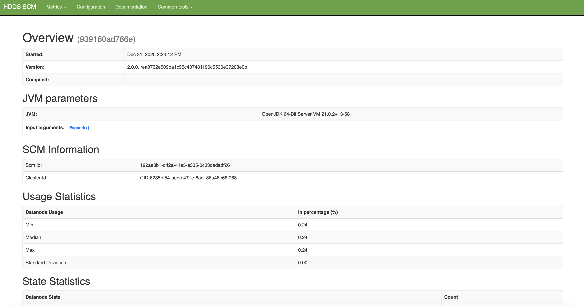

The SCM Web UI exposes the runtime state and health of the storage layer
managed by SCM. At a high level, it provides:

- Service overview: SCM identity, version, JVM runtime, and cluster identifiers
- Cluster summaries: Aggregate statistics for Datanode usage, capacity,
  pipelines, and containers
- Datanode visibility: Per-node operational state, capacity usage, and
  heartbeat status
- Safemode and HA status: Safemode rule evaluation and readiness information
  in HA deployments

The SCM Web UI also includes RPC metrics, showing operation counts, average latency, and success/failure statistics for SCM RPC calls.

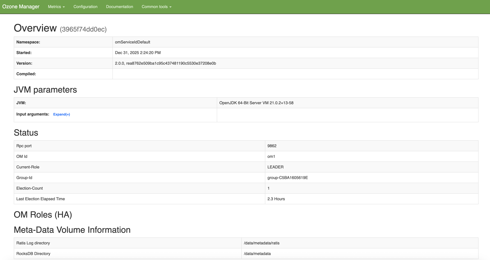

The Ozone Manager (OM) Web UI focuses on the metadata and namespace management
layer. It provides:

- Service overview: OM identity, namespace, version, JVM runtime, and startup
  information
- HA and leadership status: Current role (leader/follower), election details,
  and group identifiers
- Metadata storage information: Ratis log and RocksDB directory locations

In addition to standard RPC metrics, the OM Web UI exposes OM-specific metrics
related to metadata operations and namespace activity, enabling operators to
observe OM behavior beyond raw RPC performance.

Both SCM and OM expose a common set of diagnostic endpoints and servlets:

- RPC Metrics – Number of operations, average latency, and success/failure counts
- JMX – JVM and service metrics via JMX
- Config – Effective runtime configuration of the service
- Stacks – Thread dump of the running process
- Log Level – View and dynamically adjust logging levels

These endpoints are primarily intended for debugging, diagnostics, and
integration with external monitoring systems.

---

<a id="administrator-guide-operations-observability-prometheus"></a>

<!-- source_url: https://ozone.apache.org/docs/administrator-guide/operations/observability/prometheus/ -->

<!-- page_index: 163 -->

# Tracking Metrics With Prometheus

Version: 2.1.0

Ozone has native support for Prometheus integration. All internal metrics (collected by Hadoop metrics framework) are published under the `/prom` HTTP endpoint. (For example under <http://localhost:9876/prom> for SCM).

The Prometheus endpoint is turned on by default but can be turned off by the `hdds.prometheus.endpoint.enabled` configuration variable.

In a secure environment the page is guarded with SPNEGO authentication which is not supported by Prometheus. To enable monitoring in a secure environment, a specific authentication token can be configured

Example `ozone-site.xml`:

```xml
<property> 
   <name>hdds.prometheus.endpoint.token</name> 
   <value>putyourtokenhere</value> 
</property> 
```

Example prometheus configuration:

```yaml
scrape_configs: 
  - job_name: ozone 
    bearer_token: <putyourtokenhere> 
    metrics_path: /prom 
    static_configs: 
     - targets: 
         - "127.0.0.1:9876" 
```

---

<a id="administrator-guide-operations-observability-grafana"></a>

<!-- source_url: https://ozone.apache.org/docs/administrator-guide/operations/observability/grafana/ -->

<!-- page_index: 164 -->

# Dashboarding With Grafana

Version: 2.1.0

Once Prometheus is up and running, Grana can be configured to monitor and
visualize Ozone metrics.

In the Grafana web UI, go to `Add Data Sources` and then select `Prometheus`.

Enter the Prometheus hostname/port in the `HTTP`. For example, `http://localhost:9094`
(verify the port used by looking at Prometheus command line flags `-web.listen-address`.
The port can also be found from Prometheus web UI → Status → Command-Line Flags.)

Choose Prometheus type: `Prometheus`

Choose Prometheus version: `2.37.x`

Finish the setup by clicking on `Save and Test`.

Apache Ozone comes with a default Grafana dashboard. Follow the instructions
below to import it:

Download dashboard JSON:

```shell
wget https://raw.githubusercontent.com/apache/ozone/master/hadoop-ozone/dist/src/main/compose/common/grafana/dashboards/Ozone%20-%20Overall%20Metrics.json 
```

Open Grafana portal and click on Dashboards on the left and select `Import`.

Click at `Upload JSON file` and select the file `Ozone - Overall Metrics.json`
that was just downloaded.

The dashboard is now imported.

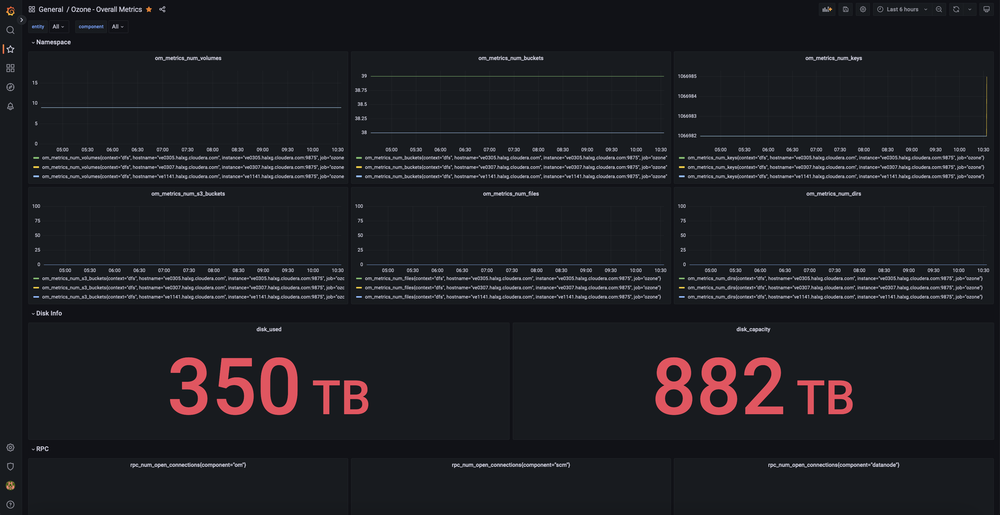

Repeat the same for [Object Metrics](https://raw.githubusercontent.com/Xushaohong/ozone/master/hadoop-ozone/dist/src/main/compose/common/grafana/dashboards/Ozone%20-%20Object%20Metrics.json)
dashboard and [RPC Metrics](https://raw.githubusercontent.com/Xushaohong/ozone/master/hadoop-ozone/dist/src/main/compose/common/grafana/dashboards/Ozone%20-%20RPC%20Metrics.json)
dashboard.

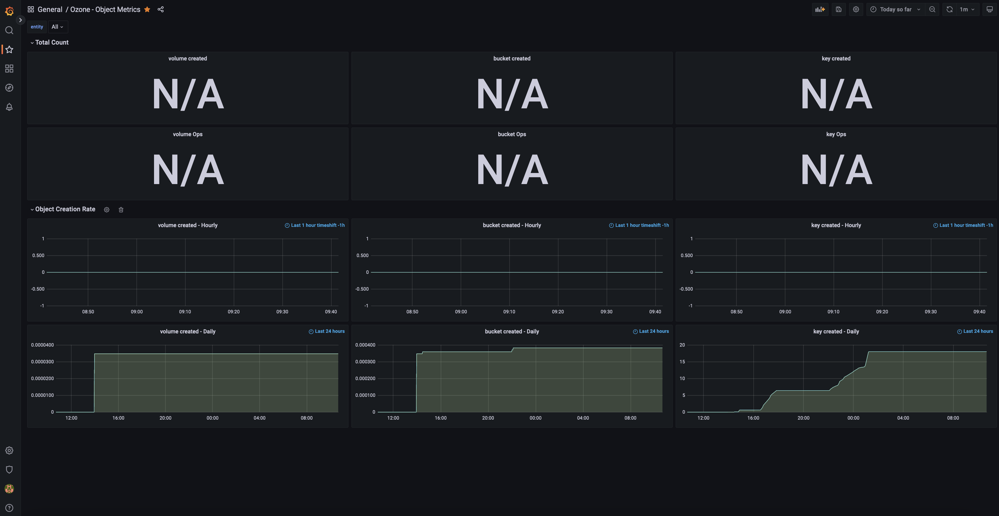

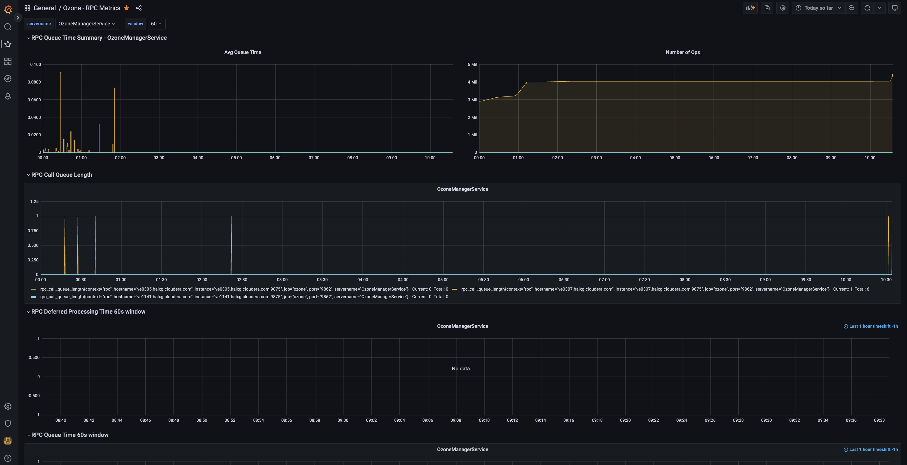

More dashboards are constantly being added. Check out the [dashboard repo](https://github.com/apache/ozone/tree/master/hadoop-ozone/dist/src/main/compose/common/grafana/dashboards)
for more.

Check out the official Grafana doc [Monitor Apache Ozone with Prometheus and Grafana
Cloud](https://grafana.com/docs/grafana-cloud/send-data/metrics/metrics-prometheus/prometheus-config-examples/the-apache-software-foundation-apache-ozone/)
for more details.

---

<a id="administrator-guide-operations-observability-distributed-tracing"></a>

<!-- source_url: https://ozone.apache.org/docs/administrator-guide/operations/observability/distributed-tracing/ -->

<!-- page_index: 165 -->

# Distributed tracing

Version: 2.1.0

Distributed tracing can help to understand performance bottleneck with visualizing end-to-end performance.
Ozone makes use of [OpenTelemetry](https://opentelemetry.io/) API for tracing and uses OTLP with gRPC format for sending traces.
[jaeger](https://jaegertracing.io) tracing library as collector can collect traces from Ozone over default port 4317 (as default).

Tracing is turned off by default, but can be turned on with `hdds.tracing.enabled` from `ozone-site.xml`

```xml
<property> 
   <name>hdds.tracing.enabled</name> 
   <value>true</value> 
</property> 
```

Below are the configuration steps for setting the collector endpoint and sampling strategy. Set these environment variables to be set for each Ozone component (OM, SCM, Datanode) and for the Ozone client to enable tracing.

```env
OTEL_EXPORTER_OTLP_ENDPOINT=http://localhost:4317 
OTEL_TRACES_SAMPLER_ARG=0.01 
```

This configuration will record 1% of the requests to limit the performance overhead.

---

<a id="administrator-guide-operations-leader-transfer"></a>

<!-- source_url: https://ozone.apache.org/docs/administrator-guide/operations/leader-transfer/ -->

<!-- page_index: 166 -->

# Leader Transfer

Version: 2.1.0

This section contains instructions to manually transfer the leadership to a specific node or to a randomly chosen follower.

[<a id="administrator-guide-operations-leader-transfer--ozone-manager"></a>

## 📄️ Ozone Manager

The ozone admin om transfer command allows you to manually transfer the leadership of the Ozone Manager (OM) Raft group to a specific OM node or to a randomly chosen follower.](#administrator-guide-operations-leader-transfer-ozone-manager)

[<a id="administrator-guide-operations-leader-transfer--storage-container-manager"></a>

## 📄️ Storage Container Manager

The ozone admin scm transfer command allows you to manually transfer the leadership of the Storage Container Manager (SCM) Raft group to a specific SCM node or to a randomly chosen follower.](#administrator-guide-operations-leader-transfer-storage-container-manager)

---

<a id="administrator-guide-operations-leader-transfer-ozone-manager"></a>

<!-- source_url: https://ozone.apache.org/docs/administrator-guide/operations/leader-transfer/ozone-manager/ -->

<!-- page_index: 167 -->

# Ozone Manager Leader Transfer

Version: 2.1.0

The `ozone admin om transfer` command allows you to manually transfer the leadership of the Ozone Manager (OM) Raft group to a specific OM node or to a randomly chosen follower.

```bash
ozone admin om transfer -id <OM_SERVICE_ID> -n <NEW_LEADER_ID> 
ozone admin om transfer -id <OM_SERVICE_ID> -r 
```

- `-id, --service-id`: Specifies the Ozone Manager Service ID.
- `-n, --newLeaderId, --new-leader-id`: The node ID of the OM to which leadership will be transferred (e.g., `om1`).
- `-r, --random`: Randomly chooses a follower to transfer leadership to.

To transfer leadership to `om2` in a cluster with service ID `cluster1`:

```bash
ozone admin om transfer -id cluster1 -n om2 
```

To transfer leadership to a random follower:

```bash
ozone admin om transfer -id cluster1 -r 
```

---

<a id="administrator-guide-operations-leader-transfer-storage-container-manager"></a>

<!-- source_url: https://ozone.apache.org/docs/administrator-guide/operations/leader-transfer/storage-container-manager/ -->

<!-- page_index: 168 -->

# Storage Container Manager Leader Transfer

Version: 2.1.0

The `ozone admin scm transfer` command allows you to manually transfer the leadership of the Storage Container Manager (SCM) Raft group to a specific SCM node or to a randomly chosen follower.

Be aware of the node's status(eg. Safemode, Operational status), Ozone currently has no ability to check the target node's status before transferring the leadership.

```bash
ozone admin scm transfer -id <SCM_SERVICE_ID> -n <NEW_LEADER_ID> 
ozone admin scm transfer -id <SCM_SERVICE_ID> -r 
```

- `-id, --service-id`: Specifies the SCM Service ID.
- `-n, --newLeaderId, --new-leader-id`: The SCM UUID (Raft peer ID) of the SCM to which leadership will be transferred (e.g., `e6877ce5-56cd-4f0b-ad60-4c8ef9000882`).
- `-r, --random`: Randomly chooses a follower to transfer leadership to.

To transfer leadership to a specific SCM in a cluster with service ID `cluster1`:

```bash
ozone admin scm transfer -id cluster1 -n e6877ce5-56cd-4f0b-ad60-4c8ef9000882 
```

To transfer leadership to a random follower:

```bash
ozone admin scm transfer -id cluster1 -r 
```

---

<a id="administrator-guide-operations-quota"></a>

<!-- source_url: https://ozone.apache.org/docs/administrator-guide/operations/quota/ -->

<!-- page_index: 169 -->

# Quota in Ozone

Version: 2.1.0

Storage space level quotas allow the use of units B, KB, MB, GB and TB. Represents how much storage Spaces will be used.

- Decimals are not supported while setting quota for volume and bucket. For example, 1.5 TB.
- Ensure that the minimum storage quota is default block size x replication factor. If you set the value lesser than the default block size x replication factor, while writing the data (key put) operation, an operation error is displayed.

```shell
bin/ozone sh volume create --space-quota 5MB /volume1 
```

This means setting the storage space of Volume1 to 5MB

```shell
bin/ozone sh volume setquota --space-quota 10GB /volume1 
```

This behavior changes the quota of Volume1 to 10GB.

```shell
bin/ozone sh bucket create --space-quota 5MB /volume1/bucket1 
```

That means bucket1 allows us to use 5MB of storage.

```shell
bin/ozone sh bucket setquota  --space-quota 10GB /volume1/bucket1  
```

This behavior changes the quota for Bucket1 to 10GB

Total bucket quota should not be greater than its Volume quota. If we have a 10MB Volume, The sum of the sizes of all buckets under this volume cannot exceed 10MB, otherwise the bucket set quota fails.

```shell
bin/ozone sh volume clrquota --space-quota /volume1 
bin/ozone sh bucket clrquota --space-quota /volume1/bucket1 
```

```shell
bin/ozone sh volume info /volume1 
bin/ozone sh bucket info /volume1/bucket1 
```

We can get the quota value and usedBytes in the info of volume and bucket.

Namespace quota is a number that represents how many unique names can be used. This number cannot be greater than LONG.MAX\_VALUE in Java.

```shell
bin/ozone sh volume create --namespace-quota 100 /volume1 
```

This means setting the namespace quota of Volume1 to 100.

```shell
bin/ozone sh volume setquota --namespace-quota 1000 /volume1 
```

This behavior changes the namespace quota of Volume1 to 1000.

```shell
bin/ozone sh bucket create --namespace-quota 100 /volume1/bucket1 
```

That means bucket1 allows us to use 100 of namespace.

```shell
bin/ozone sh bucket setquota --namespace-quota 1000 /volume1/bucket1  
```

This behavior changes the quota for Bucket1 to 1000.

```shell
bin/ozone sh volume clrquota --namespace-quota /volume1 
bin/ozone sh bucket clrquota --namespace-quota /volume1/bucket1 
```

```shell
bin/ozone sh volume info /volume1 
bin/ozone sh bucket info /volume1/bucket1 
```

We can get the quota value and usedNamespace in the info of volume and bucket.

---

<a id="administrator-guide-operations-tools"></a>

<!-- source_url: https://ozone.apache.org/docs/administrator-guide/operations/tools/ -->

<!-- page_index: 170 -->

# Tools

Version: 2.1.0

Ozone provides a set of command-line tools that can be used to manage and operate an Ozone cluster.

All commands are invoked via the `ozone` script.

---

Commands used to start or stop Ozone services.

- **`scm`** – Storage Container Manager service
- **`om`** – Ozone Manager service
- **`datanode`** – HDDS DataNode service
- **`s3g`** – S3-compatible REST gateway
- **`recon`** – Recon Web UI service
- **`httpfs`** – HttpFS gateway

---

- **`sh`** – Manage volumes, buckets, and keys
- **`fs`** – Ozone filesystem commands (similar to `hdfs dfs`)
- **`version`** – Print Ozone and HDDS version information

---

- **`admin`** – Admin and developer commands for Ozone components
- **`insight`** – Display filtered logs, metrics, or configs for debugging
- **`classpath`** – Print Hadoop classpath
- **`dtutil`** – Delegation token operations
- **`envvars`** – Display computed Hadoop environment variables
- **`getconf`** – Read Ozone configuration values
- **`genconf`** – Generate minimal `ozone-site.xml`

---

- **`freon`** – Ozone load generator

---

[<a id="administrator-guide-operations-tools--ozone-repair"></a>

## 📄️ Ozone Repair

Ozone Repair (ozone repair) is an advanced tool to repair Ozone. The nodes being repaired must be stopped before the tool is run.](#administrator-guide-operations-tools-ozone-repair)

[<a id="administrator-guide-operations-tools--ozone-admin"></a>

## 📄️ Ozone Admin

ozone admin command is a collection of tools intended to be used only by admins.](#administrator-guide-operations-tools-ozone-admin)

[<a id="administrator-guide-operations-tools--ozone-debug"></a>

## 🗃️ Ozone Debug

7 items](#administrator-guide-operations-tools-ozone-debug)

---

<a id="administrator-guide-operations-tools-ozone-repair"></a>

<!-- source_url: https://ozone.apache.org/docs/administrator-guide/operations/tools/ozone-repair/ -->

<!-- page_index: 171 -->

# Ozone Repair

Version: 2.1.0

> [!NOTE]
> All repair commands support a `--dry-run` option which allows a user to see what repair the command will be performing without actually making any changes to the cluster.
>
> Use the `--force` flag to override the running service check in false-positive cases.

---

<a id="administrator-guide-operations-tools-ozone-admin"></a>

<!-- source_url: https://ozone.apache.org/docs/administrator-guide/operations/tools/ozone-admin/ -->

<!-- page_index: 172 -->

# Ozone Admin

Version: 2.1.0

`ozone admin` command is a collection of tools intended to be used only by admins.

A quick overview of the available functionalities:

- `ozone admin safemode`
  Check the safe mode status and force entering or leaving safe mode.
  The `--verbose` option prints the validation status of all rules that evaluate safe mode status.
- `ozone admin container`
  Containers are the unit of replication.
  Subcommands help debug the current container state (list / get / create / …).
- `ozone admin pipeline`
  Helps check available pipelines (Datanodes sets).
- `ozone admin datanode`
  Provides information about Datanodes.
- `ozone admin printTopology`
  Displays rack-awareness related information.
- `ozone admin replicationmanager`
  Checks replication status and can start or stop replication in emergencies.
- `ozone admin om`
  Ozone Manager HA related tools to retrieve cluster information.

For more detailed usage, see the output of `--help`.

```bash
$ ozone admin --help
 
Usage: ozone admin [-hV] [--verbose] [-conf=<configurationPath>] 
                   [-D=<String=String>]... [COMMAND] 
 
Developer tools for Ozone Admin operations 
 
Options: 
  -conf=<configurationPath> 
  -D, --set=<String=String> 
  -h, --help      Show this help message and exit. 
  -V, --version   Print version information and exit. 
      --verbose   More verbose output. Show the stack trace of the errors. 
 
Commands: 
  containerbalancer   ContainerBalancer specific operations 
  replicationmanager  ReplicationManager specific operations 
  safemode            Safe mode specific operations 
  printTopology       Print a tree of the network topology as reported by SCM 
  cert                Certificate related operations 
  container           Container specific operations 
  datanode            Datanode specific operations 
  pipeline            Pipeline specific operations 
  namespace           Namespace Summary specific admin operations 
  om                  Ozone Manager specific admin operations 
  reconfig            Dynamically reconfigure server without restarting it 
  scm                 Ozone Storage Container Manager specific admin operations 
```

---

<a id="administrator-guide-operations-tools-ozone-debug"></a>

<!-- source_url: https://ozone.apache.org/docs/administrator-guide/operations/tools/ozone-debug/ -->

<!-- page_index: 173 -->

# Debug Tools

Version: 2.1.0

Ozone Debug command (`ozone debug`) is a collection of developer tools intended to help in debugging and get more information of various components of ozone.

It includes the following tools:

- **ldb** - Tools to debug RocksDB related issues.
- **om** - Debug commands related to OM.
- **datanode** - Debug commands related to Datanode.
- **replicas** - Debug commands for key replica related issues.
- **ratis** - Debug commands related to Ratis.
- **auditparser** - A tool to parse and query Ozone audit logs.
- **log** - A tool to parse and provide insights on logs, currently supports only the datanode’s container logs.
- **checknative** - Checks if native libraries are loaded
- **version** - Show internal version of Ozone components

For more information see the following subpages:

[<a id="administrator-guide-operations-tools-ozone-debug--ldb-tool"></a>

## 📄️ LDB Tool

Ozone heavily uses RocksDB for storing metadata.](#administrator-guide-operations-tools-ozone-debug-ldb-tool)

[<a id="administrator-guide-operations-tools-ozone-debug--debug-om"></a>

## 📄️ Debug OM

Debug commands related to OM.](#administrator-guide-operations-tools-ozone-debug-debug-om)

[<a id="administrator-guide-operations-tools-ozone-debug--debug-datanode"></a>

## 📄️ Debug Datanode

Debug commands related to Datanode. Currently, only container replica related commands are available.](#administrator-guide-operations-tools-ozone-debug-debug-datanode)

[<a id="administrator-guide-operations-tools-ozone-debug--debug-replicas"></a>

## 📄️ Debug Replicas

Debug commands for retrieving information and performing various checks on the key replicas in Datanodes.](#administrator-guide-operations-tools-ozone-debug-debug-replicas)

[<a id="administrator-guide-operations-tools-ozone-debug--ratis-log-parser"></a>

## 📄️ Ratis Log Parser

The Ratis log parser tool takes a segment file as input and gives a human-readable output.](#administrator-guide-operations-tools-ozone-debug-ratis-log-parser)

[<a id="administrator-guide-operations-tools-ozone-debug--audit-parser"></a>

## 📄️ Audit Parser

Audit Parser tool can be used for querying the Ozone audit logs.](#administrator-guide-operations-tools-ozone-debug-audit-parser-exact)

[<a id="administrator-guide-operations-tools-ozone-debug--container-replica-debugger-tool"></a>

## 📄️ Container Replica Debugger Tool

The tool processes container log files from Ozone Datanodes to track state transitions. It provides CLI commands for querying containers based on different attributes.](#administrator-guide-operations-tools-ozone-debug-container-replica-debugger-tool)

---

<a id="administrator-guide-operations-tools-ozone-debug-ldb-tool"></a>

<!-- source_url: https://ozone.apache.org/docs/administrator-guide/operations/tools/ozone-debug/ldb-tool/ -->

<!-- page_index: 174 -->

# LDB Tool

Version: 2.1.0

> [!TIP]
> Multiple filtering options can be used together in a single command.

---

<a id="administrator-guide-operations-tools-ozone-debug-debug-om"></a>

<!-- source_url: https://ozone.apache.org/docs/administrator-guide/operations/tools/ozone-debug/debug-om/ -->

<!-- page_index: 175 -->

# Debug OM

Version: 2.1.0

Debug commands related to OM.
It has the following subcommands:

Creates a DAG image of the current compaction log of an OM.db instance. It is downloaded to the specified location.

```bash
Usage: ozone debug om generate-compaction-dag [-hV] [--verbose] --db=<dbPath> 
       -o=<imageLocation> 
Create an image of the current compaction log DAG. This command is an offline 
command. i.e., it can run on any instance of om.db and does not require OM to 
be up. 
      --db=<dbPath>   Path to OM RocksDB 
  -h, --help          Show this help message and exit. 
  -o, --output-file=<imageLocation> 
                      Path to location at which image will be downloaded. 
                        Should include the image file name with ".png" 
                        extension. 
  -V, --version       Print version information and exit. 
      --verbose       More verbose output. Show the stack trace of the errors. 
```

Parses the contents of a prefix.

```bash
Usage: ozone debug om prefix [--verbose] --bucket=<bucket> --db=<dbPath> 
                             --path=<filePath> --volume=<volume> 
Parse prefix contents 
      --bucket=<bucket>   bucket name 
      --db=<dbPath>       Path to OM RocksDB 
      --path=<filePath>   prefixFile Path 
      --verbose           More verbose output. Show the stack trace of the 
                            errors. 
      --volume=<volume>   volume name 
```

[Next >>](#administrator-guide-operations-tools-ozone-debug-debug-datanode)

---

<a id="administrator-guide-operations-tools-ozone-debug-debug-datanode"></a>

<!-- source_url: https://ozone.apache.org/docs/administrator-guide/operations/tools/ozone-debug/debug-datanode/ -->

<!-- page_index: 176 -->

# Debug Datanode

Version: 2.1.0

Debug commands related to Datanode. Currently, only container replica related commands are available.
Following is the usage and the subcommands available under the `ozone debug datanode container` command:

```bash
Usage: ozone debug datanode container [-hV] [--verbose] [COMMAND] 
Container replica specific operations to be executed on datanodes only 
  -h, --help      Show this help message and exit. 
  -V, --version   Print version information and exit. 
      --verbose   More verbose output. Show the stack trace of the errors. 
Commands: 
  list     Show container info of all container replicas on datanode 
  info     Show container info of a container replica on datanode 
  export   Export one container to a tarball 
  inspect  Check the metadata of all container replicas on this datanode. 
```

[Next >>](#administrator-guide-operations-tools-ozone-debug-debug-replicas)

---

<a id="administrator-guide-operations-tools-ozone-debug-debug-replicas"></a>

<!-- source_url: https://ozone.apache.org/docs/administrator-guide/operations/tools/ozone-debug/debug-replicas/ -->

<!-- page_index: 177 -->

# Debug Replicas

Version: 2.1.0

Debug commands for retrieving information and performing various checks on the key replicas in Datanodes.

```bash
Usage: ozone debug replicas [--verbose] [COMMAND] 
Debug commands for replica-related issues, retrieving replica information from 
the OM and performing checks over the network against a running cluster. 
      --verbose   More verbose output. Show the stack trace of the errors. 
Commands: 
  chunk-info  Returns chunk location information about an existing key 
  verify      Run checks to verify data across replicas. By default prints only 
                the keys with failed checks. 
```

For a given URI of a key, the command returns all the chunks’ location information.

```bash
Usage: ozone debug replicas chunk-info [-hV] [--verbose] <value> 
Returns chunk location information about an existing key 
      <value>     URI of the key (format: volume/bucket/key). 
                  Ozone URI could either be a full URI or short URI. 
                  Full URI should start with o3://, in case of non-HA 
                  clusters it should be followed by the host name and 
                  optionally the port number. In case of HA clusters 
                  the service id should be used. Service id provides a 
                  logical name for multiple hosts and it is defined 
                  in the property ozone.om.service.ids. 
                  Example of a full URI with host name and port number 
                  for a key: 
                  o3://omhostname:9862/vol1/bucket1/key1 
                  With a service id for a volume: 
                  o3://omserviceid/vol1/ 
                  Short URI should start from the volume. 
                  Example of a short URI for a bucket: 
                  vol1/bucket1 
                  Any unspecified information will be identified from 
                  the config files. 
 
  -h, --help      Show this help message and exit. 
  -V, --version   Print version information and exit. 
      --verbose   More verbose output. Show the stack trace of the errors. 
```

Verify data across replicas. There are multiple checks available, which can be selected using the command line options:

```bash
Usage: ozone debug replicas verify [-hV] [--all-results] [--verbose] 
                                   [--container-cache-size=<containerCacheSize>] 
                                   [-id=<scmServiceId>] [--scm=<scm>] 
                                   ([--checksums] [--block-existence] 
                                   [--container-state]) <uri> 
Run checks to verify data across replicas. By default prints only the keys with 
failed checks. 
      <uri>               Ozone URI could either be a full URI or short URI. 
                          Full URI should start with o3://, in case of non-HA 
                          clusters it should be followed by the host name and 
                          optionally the port number. In case of HA clusters 
                          the service id should be used. Service id provides a 
                          logical name for multiple hosts and it is defined 
                          in the property ozone.om.service.ids. 
                          Example of a full URI with host name and port number 
                          for a key: 
                          o3://omhostname:9862/vol1/bucket1/key1 
                          With a service id for a volume: 
                          o3://omserviceid/vol1/ 
                          Short URI should start from the volume. 
                          Example of a short URI for a bucket: 
                          vol1/bucket1 
                          Any unspecified information will be identified from 
                          the config files. 
 
      --all-results       Print results for all passing and failing keys 
      --block-existence   Check for block existence on datanodes. 
      --checksums         Do client side data checksum validation of all 
                            replicas. 
      --container-cache-size=<containerCacheSize> 
                          Size (in number of containers) of the in-memory cache 
                            for container state verification 
                            '--container-state'. Default is 1 million 
                            containers (which takes around 43MB). Value must be 
                            greater than zero, otherwise the default of 1 
                            million is considered. Note: This option is ignored 
                            if '--container-state' option is not used. 
      --container-state   Check the container and replica states. Containers in 
                            [DELETING, DELETED] states, or its replicas in 
                            [DELETED, UNHEALTHY, INVALID] states fail the check. 
  -h, --help              Show this help message and exit. 
      -id, --service-id=<scmServiceId> 
                          ServiceId of SCM HA Cluster 
      --scm=<scm>         The destination scm (host:port) 
  -V, --version           Print version information and exit. 
      --verbose           More verbose output. Show the stack trace of the 
                            errors. 
```

[Next >>](#administrator-guide-operations-tools-ozone-debug-ratis-log-parser)

---

<a id="administrator-guide-operations-tools-ozone-debug-ratis-log-parser"></a>

<!-- source_url: https://ozone.apache.org/docs/administrator-guide/operations/tools/ozone-debug/ratis-log-parser/ -->

<!-- page_index: 178 -->

# Ratis Log Parser

Version: 2.1.0

The Ratis log parser tool takes a segment file as input and gives a human-readable output.
It can be used to parse Ratis logs from different components by specifying the corresponding role.

```bash
Usage: ozone debug ratis parse [-hV] [--verbose] [--role=<role>] -s=<segmentFile> 
Shell for printing Ratis Log in understandable text 
  -h, --help          Show this help message and exit. 
      --role=<role>   Component role for parsing. Values: om, scm, datanode 
                        Default: generic 
  -s, --segmentPath, --segment-path=<segmentFile> 
                      Path of the segment file 
  -V, --version       Print version information and exit. 
      --verbose       More verbose output. Show the stack trace of the errors. 
```

[Next >>](#administrator-guide-operations-tools-ozone-debug-audit-parser-exact)

---

<a id="administrator-guide-operations-tools-ozone-debug-audit-parser-exact"></a>

<!-- source_url: https://ozone.apache.org/docs/administrator-guide/operations/tools/ozone-debug/audit-parser-exact/ -->

<!-- page_index: 179 -->

# Audit Parser

Version: 2.1.0

Audit Parser tool can be used for querying the Ozone audit logs.
This tool creates a sqlite database at the specified path. If the database
already exists, it will avoid creating a database.

The database contains only one table called `audit` defined as:

```sql
CREATE TABLE IF NOT EXISTS audit ( 
datetime text, 
level varchar(7), 
logger varchar(7), 
user text, 
ip text, 
op text, 
params text, 
result varchar(7), 
exception text, 
UNIQUE(datetime,level,logger,user,ip,op,params,result)) 
```

Usage:

```bash
ozone debug auditparser <path to db file> [COMMAND] [PARAM] 
```

To load an audit log to database:

```bash
ozone debug auditparser <path to db file> load <path to audit log> 
```

Load command creates the audit table described above.

To run a custom read-only query:

```bash
ozone debug auditparser <path to db file> query <select query enclosed within double quotes> 
```

Audit Parser comes with a set of templates(most commonly used queries).

To run a template query:

```bash
ozone debug auditparser <path to db file> template <templateName> 
```

Following templates are available:

| Template Name | Description | SQL |
| --- | --- | --- |
| top5users | Top 5 users | select user,count(\*) as total from audit group by user order by total DESC limit 5 |
| top5cmds | Top 5 commands | select op,count(\*) as total from audit group by op order by total DESC limit 5 |
| top5activetimebyseconds | Top 5 active times, grouped by seconds | select substr(datetime,1,charindex(',',datetime)-1) as dt,count(\*) as thecount from audit group by dt order by thecount DESC limit 5 |

[Next >>](#administrator-guide-operations-tools-ozone-debug-container-replica-debugger-tool)

---

<a id="administrator-guide-operations-tools-ozone-debug-container-replica-debugger-tool"></a>

<!-- source_url: https://ozone.apache.org/docs/administrator-guide/operations/tools/ozone-debug/container-replica-debugger-tool/ -->

<!-- page_index: 180 -->

# Container Replica Debugger Tool

Version: 2.1.0

The tool processes container log files from Ozone Datanodes to track state transitions. It provides CLI commands for querying containers based on different attributes.

Containers are the most important part of Ozone. Most of the Ozone operations happen on them. Containers in Ozone go through different states in their lifecycle.
In the past we have seen different issues on container state. To debug problems we always use manual steps and identify problems w.r.t containers and this takes a lot of time. To optimize debugability we can show historical timeline and other information w.r.t containers.

An offline tool that would analyse the dn-container log files and help us find issues related to the containers across the Datanodes in the cluster.

This component is responsible for processing log files, extracting relevant log entries, and storing them in batches to be inserted into the database.

**The command is as follows:**

```bash
ozone debug log container --db=<path to db> parse --path=<path to logs folder> --thread-count=<n> 
```

- **Directory Traversal**: It recursively scans a specified directory for container log files,only files with names matching the pattern `dn-container-<roll>.log.<datanodeId>` are considered.Log files are parsed concurrently using multiple threads for efficient processing.
- **Line-by-Line Processing**: Each log line is split using a pipe delimiter and parsed into key-value components.
- **Field Extraction**: Key fields include:
  - **Timestamp**
  - **logLevel**: INFO, WARN, ERROR.
  - **ID, BCSID, State, and Index**: Extracted from key-value pairs.
- **Error Message Capture**: Any remaining unstructured part of the log line is stored as `errorMessage`, especially relevant for WARN or ERROR level logs.
- **Replication Index Filtering**: Only log entries with Index = 0 are processed. This limits current processing to Ratis-replicated containers. Future improvements may support EC replication.

The tool uses a temporary SQLite database to store and manage information extracted from container logs. This helps organize the data so that both the complete history and the latest status of each container replica on a Datanode can be analyzed easily.

1. **DatanodeContainerLogTable — Detailed Log History**
   This table stores a complete history of state changes for each container replica on every Datanode.

   - Container ID
   - Datanode ID
   - State (such as OPEN, CLOSED, etc.)
   - BCSID (Block Commit Sequence ID)
   - Timestamp
   - Log Level
   - Error Message (if any)
   - Index Value

   The data in this table shows a complete timeline of state transitions and BCSID changes, helping to trace how each container replica evolved over time.
2. **ContainerLogTable — Latest Status Summary**
   This table contains only the most recent state and BCSID for each unique container and Datanode pair.

   - Container ID
   - Datanode ID
   - Latest State
   - Latest BCSID

   This table provides a simplified view of the current state and BCSID of all container replicas, which helps with quick status checks and summaries.

This Ozone debug CLI command helps to identify containers that were opened more than the required number (for Ratis, it is 3) by tracking the first three “OPEN” states and flagging any subsequent “OPEN” state as problematic if it occurs on the same Datanode or on a different Datanode after the initial events.

This command displays the **Container ID** along with the count of replicas in the ‘OPEN’ state for each listed container. It also provides the total number of containers that have duplicate ‘OPEN’ state entries.

**The command is as follows:**

```bash
ozone debug log container --db=<path to db> duplicate-open 
```

**Sample output:**

```bash
Container ID: 2187256 - OPEN state count: 4 
. 
. 
. 
Container ID: 12377064 - OPEN state count: 5 
Container ID: 12377223 - OPEN state count: 5 
Container ID: 12377631 - OPEN state count: 4 
Container ID: 12377904 - OPEN state count: 5 
Container ID: 12378161 - OPEN state count: 4 
Container ID: 12378352 - OPEN state count: 5 
Container ID: 12378789 - OPEN state count: 5 
Container ID: 12379337 - OPEN state count: 5 
Container ID: 12379489 - OPEN state count: 5 
Container ID: 12380526 - OPEN state count: 5 
Container ID: 12380898 - OPEN state count: 5 
Container ID: 12642718 - OPEN state count: 4 
Container ID: 12644806 - OPEN state count: 4 
Total containers that might have duplicate OPEN state : 1579 
```

This Ozone debug CLI command provides a complete state transition history for each replica of the container whose ID is provided via the command.
The command also provides analysis over the container such as if the container has issues like:

- Duplicate OPEN states
- Mismatched replication
- Under-replication or over-replication
- Unhealthy replicas
- Open-unhealthy
- Quasi-closed stuck containers

The command provides key details such as:

- Datanode id
- Container id
- BCSID
- TimeStamp
- Index Value
- Message (if any associated with that particular replica)

**The command is as follows:**

```bash
ozone debug log container --db=<path to database> info <containerID> 
```

**Sample output:**

```bash
Timestamp               | Container ID | Datanode ID | Container State  | BCSID   | Message             | Index Value 
---------------------------------------------------------------------------------------------------------------------- 
2024-06-04 15:07:55,390 | 700          | 100         | QUASI_CLOSED     | 353807 | No error             | 0 
2024-06-04 14:50:18,177 | 700          | 150         | QUASI_CLOSED     | 353807 | No error             | 0 
2024-04-04 10:32:29,026 | 700          | 250         | OPEN             | 0      | No error             | 0 
2024-06-04 14:44:28,126 | 700          | 250         | CLOSING          | 353807 | No error             | 0 
2024-06-04 14:47:59,893 | 700          | 250         | QUASI_CLOSED     | 353807 | Ratis group removed  | 0 
2024-06-04 14:50:17,038 | 700          | 250         | QUASI_CLOSED     | 353807 | No error             | 0 
2024-06-04 14:50:18,184 | 700          | 250         | QUASI_CLOSED     | 353807 | No error             | 0 
2024-04-04 10:32:29,026 | 700          | 400         | OPEN             | 0      | No error             | 0 
Container 700 might be QUASI_CLOSED_STUCK. 
```

This Ozone debug CLI command lists all the containers which are either UNDER-REPLICATED, OVER-REPLICATED, UNHEALTHY, or QUASI\_CLOSED stuck.

This command displays the **Container ID** along with the count of replicas in the specified health state for each listed container.

**The command options used are:**

- List containers by health type: this by default provides only 100 rows in the result

```bash
ozone debug log container --db=<path to db> list --health=<type> 
```

- List containers by health type with a specified row limit:

```bash
ozone debug log container --db=<path to db> list --health=<type>  --length=<limit> 
```

- List all containers by health type, overriding the row limit:

```bash
ozone debug log container --db=<path to db> list --health=<type>  --all 
```

**Sample output:**

```bash
ozone debug log container --db=path/to/db list --health=UNHEALTHY --all 
```

```bash
Container ID = 6002 - Count = 1 Container ID = 6201 - Count = 1...Container ID = 136662 - Count = 3 Container ID = 136837 - Count = 3 Container ID = 199954 - Count = 3 Container ID = 237747 - Count = 3 Container ID = 2579099 - Count = 1 Container ID = 2626888 - Count = 1 Container ID = 2627711 - Count = 1 Container ID = 2627751 - Count = 2 Number of containers listed: 25085
```

This Ozone debug CLI command helps to list replicas of all the containers which have the state provided via the CLI command as their latest state.

The command provides key details such as:

- Datanode id
- Container id
- BCSID
- TimeStamp - The most recent timestamp associated with the container replica state
- Index Value
- Message (if any associated with that particular replica)

**The command options used are:**

- List containers by state: this by default provides only 100 rows in the result

```bash
ozone debug log container --db=<path to db> list --lifecycle=<state> 
```

- List containers by state with a specified row limit:

```bash
ozone debug log container --db=<path to db> list --lifecycle=<state> --length=<limit> 
```

- List all containers by state, overriding the row limit:

```bash
ozone debug log container --db=<path to db> list --lifecycle=<state> --all 
```

**Sample output:**

```bash
ozone debug log container --db=path/to/db list --lifecycle=CLOSED --all 
```

```bash
Timestamp                 | Datanode ID | Container ID | BCSID  | Message        | Index Value 
--------------------------------------------------------------------------------------------------- 
2024-07-23 12:02:12,981   | 360         | 1            | 75654  | No error       | 0 
2024-07-23 11:56:21,106   | 365         | 1            | 75654  | Volume failure | 0 
2024-07-23 11:56:21,106   | 365         | 1            | 75654  | Volume failure | 0 
2024-08-29 14:11:32,879   | 415         | 1            | 30     | No error       | 0 
2024-08-29 14:11:17,533   | 430         | 1            | 30     | No error       | 0 
2024-06-20 11:50:09,496   | 460         | 1            | 75654  | No error       | 0 
2024-07-23 12:02:11,633   | 500         | 1            | 75654  | No error       | 0 
2024-06-20 12:03:24,230   | 505         | 2            | 83751  | No error       | 0 
2024-07-10 04:00:33,131   | 540         | 2            | 83751  | No error       | 0 
2024-07-10 04:00:46,825   | 595         | 2            | 83751  | No error       | 0 
```

- This tool assumes that all dn-container log files are already extracted from the Datanodes and placed into a directory.
- For the parsing command, if the DB path is not provided, a new database will be created in the current working directory with the default filename `container_datanode.db`.
- For all other commands, if the DB path is not provided, it will look for a default database (`container_datanode.db`) file in the current directory. If it doesn’t exist, it will throw an error asking to provide a valid path.

---

<a id="administrator-guide-operations-trash"></a>

<!-- source_url: https://ozone.apache.org/docs/administrator-guide/operations/trash/ -->

<!-- page_index: 181 -->

# Trash

Version: 2.1.0

The trash feature in Ozone provides a way to recover files that have been accidentally deleted. When enabled, deleted files are moved to a trash directory instead of being permanently removed.

To enable the trash feature, you need to add the following configuration properties to the Ozone Manager's `core-site.xml`:

```xml
<property> 
  <name>fs.trash.interval</name> 
  <value>360</value> <!-- Time in minutes --> 
</property> 
 
<property> 
  <name>fs.trash.classname</name> 
  <value>org.apache.hadoop.fs.ozone.OzoneTrashPolicy</value> 
</property> 
```

The `fs.trash.interval` property specifies the minimum time, in minutes, for which a deleted file will be kept in the trash. After this interval, the trash emptier will permanently delete the file. A value of 0 disables the trash feature.

The `fs.trash.classname` property should be set to `org.apache.hadoop.fs.ozone.OzoneTrashPolicy` to use Ozone's trash implementation.

When the trash feature is enabled, any file deleted using the `ozone fs -rm` command will be moved to the trash.

The trash directory is located at `/<volume>/<bucket>/.Trash/<username>`. For example, if the user `testuser` deletes a file from `/vol1/bucket1`, the file will be moved to `/vol1/bucket1/.Trash/testuser/Current/`.

To permanently delete a file and bypass the trash, use the `-skipTrash` option with the `rm` command:

```bash
ozone fs -rm -skipTrash /<volume>/<bucket>/<key> 
```

The trash emptier is a background process that periodically deletes files from the trash directory after the configured `fs.trash.interval` has passed. The interval at which the trash emptier runs can be configured with the `ozone.fs.trash.checkpoint.interval` property in `ozone-site.xml`.

```xml
<property> 
  <name>ozone.fs.trash.checkpoint.interval</name> 
  <value>60</value> <!-- Time in minutes --> 
</property> 
```

If this property is not set, it defaults to the value of `fs.trash.checkpoint.interval`.

---

<a id="administrator-guide-operations-dynamic-property-reload"></a>

<!-- source_url: https://ozone.apache.org/docs/administrator-guide/operations/dynamic-property-reload/ -->

<!-- page_index: 182 -->

# Dynamic Property Reload

Version: 2.1.0

Ozone supports dynamic reloading of certain configuration properties without restarting services. This enables operators to tune cluster behavior, adjust limits, and update settings in production without service disruption.

When a property is marked as reconfigurable, you can:

1. Modify the property value in the configuration file (`ozone-site.xml`)
2. Invoke the reconfig command to apply the changes to the running service

The reconfiguration is performed asynchronously, and you can check the status to verify completion.

```shell
ozone admin reconfig --service=[OM|SCM|DATANODE] --address=<ip:port|hostname:port> <operation> 
```

| Option | Description |
| --- | --- |
| `--service` | The service type: `OM`, `SCM`, or `DATANODE` |
| `--address` | RPC address of the target server (e.g., `hadoop1:9862` or `192.168.1.10:9862`). Required unless `--in-service-datanodes` is specified. |
| `--in-service-datanodes` | (Datanode only) Apply to all IN\_SERVICE Datanodes |

| Operation | Description |
| --- | --- |
| `start` | Execute reconfiguration asynchronously |
| `status` | Check the status of a reconfiguration task |
| `properties` | List all reconfigurable properties for the service |

| Property | Default | Description |
| --- | --- | --- |
| `ozone.administrators` | - | Comma-separated list of Ozone administrators |
| `ozone.readonly.administrators` | - | Comma-separated list of read-only administrators |
| `ozone.om.server.list.max.size` | `1000` | Maximum server-side response size for list operations |
| `ozone.om.volume.listall.allowed` | `true` | Allow all users to list all volumes |
| `ozone.om.follower.read.local.lease.enabled` | `false` | Enable local lease for follower read optimization |
| `ozone.om.follower.read.local.lease.lag.limit` | `10000` | Maximum log lag for follower reads |
| `ozone.om.follower.read.local.lease.time.ms` | `5000` | Lease time in milliseconds for follower reads |
| `ozone.key.deleting.limit.per.task` | `50000` | Maximum keys to delete per task |
| `ozone.directory.deleting.service.interval` | `60s` | Directory deletion service run interval |
| `ozone.thread.number.dir.deletion` | `10` | Number of threads for directory deletion |
| `ozone.snapshot.filtering.service.interval` | `60s` | Snapshot SST filtering service run interval |

| Property | Default | Description |
| --- | --- | --- |
| `ozone.administrators` | - | Comma-separated list of Ozone administrators |
| `ozone.readonly.administrators` | - | Comma-separated list of read-only administrators |
| `hdds.scm.block.deletion.per-interval.max` | `500000` | Maximum blocks SCM processes per deletion interval |
| `hdds.scm.replication.thread.interval` | `300s` | Interval for the replication monitor thread |
| `hdds.scm.replication.under.replicated.interval` | `30s` | Frequency to check the under-replicated queue |
| `hdds.scm.replication.over.replicated.interval` | `30s` | Frequency to check the over-replicated queue |
| `hdds.scm.replication.event.timeout` | `12m` | Timeout for replication/deletion commands |
| `hdds.scm.replication.event.timeout.datanode.offset` | `6m` | Offset subtracted from event timeout for Datanode deadline |
| `hdds.scm.replication.maintenance.replica.minimum` | `2` | Minimum replicas required for node maintenance |
| `hdds.scm.replication.maintenance.remaining.redundancy` | `1` | Remaining redundancy required for maintenance (EC) |
| `hdds.scm.replication.datanode.replication.limit` | `20` | Max replication commands queued per Datanode |
| `hdds.scm.replication.datanode.reconstruction.weight` | `3` | Weight multiplier for reconstruction commands |
| `hdds.scm.replication.datanode.delete.container.limit` | `40` | Max delete container commands queued per Datanode |
| `hdds.scm.replication.inflight.limit.factor` | `0.75` | Factor to scale cluster-wide replication limit |
| `hdds.scm.replication.container.sample.limit` | `100` | Number of containers sampled per state for debugging |
| `ozone.scm.ec.pipeline.minimum` | `5` | Minimum EC pipelines to keep open |
| `ozone.scm.ec.pipeline.per.volume.factor` | `1` | Factor for calculating EC pipelines based on volumes |

| Property | Default | Description |
| --- | --- | --- |
| `hdds.datanode.block.deleting.limit.per.interval` | `20000` | Maximum blocks deleted per interval on a Datanode |
| `hdds.datanode.block.delete.threads.max` | `5` | Maximum threads for block deletion |
| `ozone.block.deleting.service.workers` | `10` | Number of block deletion service workers |
| `ozone.block.deleting.service.interval` | `60s` | Block deletion service run interval |
| `ozone.block.deleting.service.timeout` | `300s` | Block deletion service timeout |
| `hdds.datanode.replication.streams.limit` | `10` | Maximum replication streams per Datanode |

To view all properties that can be dynamically reconfigured:

```shell
$ ozone admin reconfig --service=OM --address=hadoop1:9862 properties OM: Node [hadoop1:9862] Reconfigurable properties:ozone.administrators ozone.om.server.list.max.size ozone.om.volume.listall.allowed
```

Modify `ozone.administrators` in `ozone-site.xml`, then execute:

```shell
$ ozone admin reconfig --service=OM --address=hadoop1:9862 start OM: Started reconfiguration task on node [hadoop1:9862].
 
$ ozone admin reconfig --service=OM --address=hadoop1:9862 status OM: Reconfiguring status for node [hadoop1:9862]: started at Wed Dec 28 19:04:44 CST 2022 and finished at Wed Dec 28 19:04:44 CST 2022. SUCCESS: Changed property ozone.administrators From: "hadoop" To: "hadoop,bigdata"
```

Modify `ozone.administrators` in `ozone-site.xml`, then execute:

```shell
$ ozone admin reconfig --service=SCM --address=hadoop1:9860 start SCM: Started reconfiguration task on node [hadoop1:9860].
 
$ ozone admin reconfig --service=SCM --address=hadoop1:9860 status SCM: Reconfiguring status for node [hadoop1:9860]: started at Wed Dec 28 19:04:44 CST 2022 and finished at Wed Dec 28 19:04:44 CST 2022. SUCCESS: Changed property ozone.administrators From: "hadoop" To: "hadoop,bigdata"
```

Modify `hdds.datanode.block.deleting.limit.per.interval` in `ozone-site.xml`, then execute:

```shell
$ ozone admin reconfig --service=DATANODE --address=hadoop1:19864 start Datanode: Started reconfiguration task on node [hadoop1:19864].
 
$ ozone admin reconfig --service=DATANODE --address=hadoop1:19864 status Datanode: Reconfiguring status for node [hadoop1:19864]: started at Wed Dec 28 19:04:44 CST 2022 and finished at Wed Dec 28 19:04:44 CST 2022. SUCCESS: Changed property hdds.datanode.block.deleting.limit.per.interval From: "20000" To: "30000"
```

To perform reconfiguration on all IN\_SERVICE Datanodes simultaneously:

```shell
$ ozone admin reconfig --service=DATANODE --in-service-datanodes start Datanode: Started reconfiguration task on node [hadoop1:19864]. Datanode: Started reconfiguration task on node [hadoop2:19864]. Datanode: Started reconfiguration task on node [hadoop3:19864]. Reconfig successfully 3 nodes, failure 0 nodes.
```

To list properties across all Datanodes:

```shell
$ ozone admin reconfig --service=DATANODE --in-service-datanodes properties Datanode: Node [hadoop1:19864] Reconfigurable properties:hdds.datanode.block.deleting.limit.per.interval Datanode: Node [hadoop2:19864] Reconfigurable properties:hdds.datanode.block.deleting.limit.per.interval Datanode: Node [hadoop3:19864] Reconfigurable properties:hdds.datanode.block.deleting.limit.per.interval Reconfig successfully 3 nodes, failure 0 nodes.
```

1. **Test in non-production first**: Always validate configuration changes in a test environment before applying to production.
2. **Change one property at a time**: When making multiple changes, apply them incrementally to isolate the impact of each change.
3. **Monitor after changes**: Watch cluster metrics and logs after reconfiguration to ensure the changes have the desired effect.
4. **Document changes**: Keep a record of configuration changes for troubleshooting and audit purposes.
5. **Use batch operations carefully**: When using `--in-service-datanodes`, ensure all nodes should receive the same configuration.

---

<a id="system-internals"></a>

<!-- source_url: https://ozone.apache.org/docs/system-internals/ -->

<!-- page_index: 183 -->

# System Internals

Version: 2.1.0

This section documents the internal workings of Ozone for developers. Familiarity with this section is not required for users or administrators to work with Ozone.

[<a id="system-internals--components"></a>

## 🗃️ Components

7 items](#system-internals-components)

[<a id="system-internals--data-operations"></a>

## 🗃️ Data Operations

3 items](#system-internals-data-operations)

[<a id="system-internals--data-integrity"></a>

## 🗃️ Data Integrity

3 items](#system-internals-data-integrity)

[<a id="system-internals--replication"></a>

## 🗃️ Replication

2 items](#system-internals-replication)

[<a id="system-internals--security"></a>

## 🗃️ Security

7 items](#system-internals-security)

[<a id="system-internals--network-protocols"></a>

## 🗃️ Network Protocols

3 items](#system-internals-network-protocols)

[<a id="system-internals--features"></a>

## 🗃️ Features

7 items](#system-internals-features)

---

<a id="system-internals-components"></a>

<!-- source_url: https://ozone.apache.org/docs/system-internals/components/ -->

<!-- page_index: 184 -->

# Ozone Components

Version: 2.1.0

The internal workings of each Ozone component are documented in this section.

[<a id="system-internals-components--ozone-manager"></a>

## 🗃️ Ozone Manager

8 items](#system-internals-components-ozone-manager)

[<a id="system-internals-components--storage-container-manager"></a>

## 🗃️ Storage Container Manager

7 items](#system-internals-components-storage-container-manager)

[<a id="system-internals-components--datanode"></a>

## 🗃️ Datanode

6 items](#system-internals-components-datanode)

[<a id="system-internals-components--recon"></a>

## 🗃️ Recon

8 items](#system-internals-components-recon)

[<a id="system-internals-components--s3-gateway"></a>

## 🗃️ S3 Gateway

2 items](#system-internals-components-s3-gateway)

[<a id="system-internals-components--client"></a>

## 🗃️ Client

3 items](#system-internals-components-client)

[<a id="system-internals-components--httpfs-gateway"></a>

## 🗃️ HttpFS Gateway

1 item](#system-internals-components-httpfs-gateway)

---

<a id="system-internals-components-ozone-manager"></a>

<!-- source_url: https://ozone.apache.org/docs/system-internals/components/ozone-manager/ -->

<!-- page_index: 185 -->

# Ozone Manager Internals

Version: 2.1.0

This section documents the internal workings of the Ozone Manager.

[<a id="system-internals-components-ozone-manager--disk-layout"></a>

## 📄️ Disk Layout

TODO: File a subtask under HDDS-9862 and complete this page or section.](#system-internals-components-ozone-manager-disk-layout)

[<a id="system-internals-components-ozone-manager--rocksdb-schema"></a>

## 📄️ RocksDB Schema

TODO: File a subtask under HDDS-9862 and complete this page or section.](#system-internals-components-ozone-manager-rocksdb-schema)

[<a id="system-internals-components-ozone-manager--in-memory-storage"></a>

## 📄️ In-Memory Storage

TODO: File a subtask under HDDS-9862 and complete this page or section.](#system-internals-components-ozone-manager-in-memory-storage)

[<a id="system-internals-components-ozone-manager--startup-sequence"></a>

## 📄️ Startup Sequence

TODO: File a subtask under HDDS-9862 and complete this page or section.](#system-internals-components-ozone-manager-startup-sequence)

[<a id="system-internals-components-ozone-manager--roles"></a>

## 📄️ Roles

TODO: File a subtask under HDDS-9862 and complete this page or section.](#system-internals-components-ozone-manager-roles)

[<a id="system-internals-components-ozone-manager--write-request-flow"></a>

## 📄️ Write Request Flow

TODO: File a subtask under HDDS-9862 and complete this page or section.](#system-internals-components-ozone-manager-write-request-flow)

[<a id="system-internals-components-ozone-manager--read-request-flow"></a>

## 📄️ Read Request Flow

TODO: File a subtask under HDDS-9862 and complete this page or section.](#system-internals-components-ozone-manager-read-request-flow)

[<a id="system-internals-components-ozone-manager--high-availability"></a>

## 📄️ High Availability

Ozone has two metadata-manager nodes (Ozone Manager for key space management and Storage Container Manager for block space management) and multiple storage nodes (Datanode). Data is replicated between Datanodes with the help of RAFT consensus algorithm.](#system-internals-components-ozone-manager-high-availability)

---

<a id="system-internals-components-ozone-manager-disk-layout"></a>

<!-- source_url: https://ozone.apache.org/docs/system-internals/components/ozone-manager/disk-layout/ -->

<!-- page_index: 186 -->

# Ozone Manager Disk Layout

Version: 2.1.0

**TODO:** File a subtask under [HDDS-9862](https://issues.apache.org/jira/browse/HDDS-9862) and complete this page or section.

---

<a id="system-internals-components-ozone-manager-rocksdb-schema"></a>

<!-- source_url: https://ozone.apache.org/docs/system-internals/components/ozone-manager/rocksdb-schema/ -->

<!-- page_index: 187 -->

# Ozone Manager RocksDB Schema

Version: 2.1.0

**TODO:** File a subtask under [HDDS-9862](https://issues.apache.org/jira/browse/HDDS-9862) and complete this page or section.

---

<a id="system-internals-components-ozone-manager-in-memory-storage"></a>

<!-- source_url: https://ozone.apache.org/docs/system-internals/components/ozone-manager/in-memory-storage/ -->

<!-- page_index: 188 -->

# Ozone Manager In-Memory Storage

Version: 2.1.0

**TODO:** File a subtask under [HDDS-9862](https://issues.apache.org/jira/browse/HDDS-9862) and complete this page or section.

- Volume and bucket tables
- RocksDB block cache
- Container cache

---

<a id="system-internals-components-ozone-manager-startup-sequence"></a>

<!-- source_url: https://ozone.apache.org/docs/system-internals/components/ozone-manager/startup-sequence/ -->

<!-- page_index: 189 -->

# Ozone Manager Startup Sequence

Version: 2.1.0

**TODO:** File a subtask under [HDDS-9862](https://issues.apache.org/jira/browse/HDDS-9862) and complete this page or section.

---

<a id="system-internals-components-ozone-manager-roles"></a>

<!-- source_url: https://ozone.apache.org/docs/system-internals/components/ozone-manager/roles/ -->

<!-- page_index: 190 -->

# Ozone Manager Roles

Version: 2.1.0

**TODO:** File a subtask under [HDDS-9862](https://issues.apache.org/jira/browse/HDDS-9862) and complete this page or section.

---

<a id="system-internals-components-ozone-manager-write-request-flow"></a>

<!-- source_url: https://ozone.apache.org/docs/system-internals/components/ozone-manager/write-request-flow/ -->

<!-- page_index: 191 -->

# Ozone Manager Write Request Flow

Version: 2.1.0

**TODO:** File a subtask under [HDDS-9862](https://issues.apache.org/jira/browse/HDDS-9862) and complete this page or section.

---

<a id="system-internals-components-ozone-manager-read-request-flow"></a>

<!-- source_url: https://ozone.apache.org/docs/system-internals/components/ozone-manager/read-request-flow/ -->

<!-- page_index: 192 -->

# Ozone Manager Read Request Flow

Version: 2.1.0

**TODO:** File a subtask under [HDDS-9862](https://issues.apache.org/jira/browse/HDDS-9862) and complete this page or section.

---

<a id="system-internals-components-ozone-manager-high-availability"></a>

<!-- source_url: https://ozone.apache.org/docs/system-internals/components/ozone-manager/high-availability/ -->

<!-- page_index: 193 -->

# Ozone Manager High Availability

Version: 2.1.0

Ozone has two metadata-manager nodes (*Ozone Manager* for key space management and *Storage Container Manager* for block space management) and multiple storage nodes (Datanode). Data is replicated between Datanodes with the help of RAFT consensus algorithm.

To avoid any single point of failure the metadata-manager nodes also should have a HA setup.

Both Ozone Manager and Storage Container Manager supports HA. In this mode the internal state is replicated via RAFT (with Apache Ratis)

This document explains the HA setup of Ozone Manager (OM) HA, please check the [SCM HA documentation](#core-concepts-high-availability-scm-ha) for SCM HA. While they can be setup for HA independently, a reliable, full HA setup requires enabling HA for both services.

A single Ozone Manager uses [RocksDB](https://github.com/facebook/rocksdb/) to persist metadata (volumes, buckets, keys) locally. HA version of Ozone Manager does exactly the same but all the data is replicated with the help of the RAFT consensus algorithm to follower Ozone Manager instances.


Client connects to the Leader Ozone Manager which process the request and schedule the replication with RAFT. When the request is replicated to all the followers the leader can return with the response.

Raft can guarantee the replication of any request if the request is persisted to the RAFT log on the majority of the nodes. To achieve high throughput with Ozone Manager, it returns with the response even if the request is persisted only to the RAFT logs.

RocksDB instance are updated by a background thread with batching transactions (so called "double buffer" as when one of the buffers is used to commit the data the other one collects all the new requests for the next commit.) To make all data available for the next request even if the background process has not yet written them, the key data is cached in the memory.

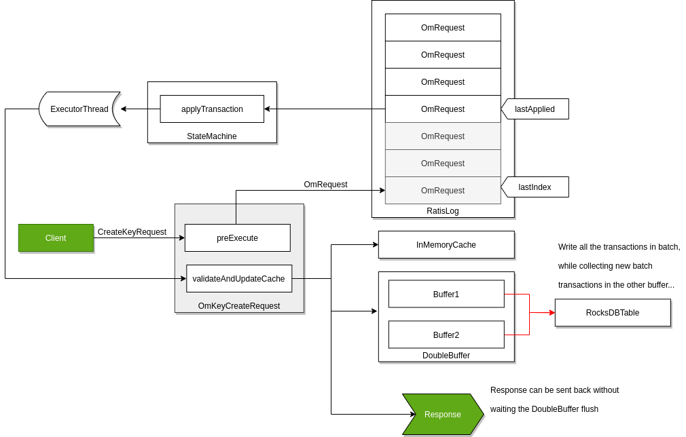

The details of this approach are discussed in a separate design doc but it's an integral part of the OM HA design.

Sometimes an OM follower node may be offline or fall far behind the OM leader's raft log.
Then, it cannot easily catch up by replaying individual log entries.
The OM HA implementation includes an automatic snapshot installation
and recovery process for such cases.

How it works:

1. Leader determines that the follower is too far behind.
2. Leader notifies the follower to install a snapshot.
3. The follower downloads and installs the latest snapshot from the leader.
4. After installing the snapshot, the follower OM resumes normal operation and log replication from the new state.

This logic is implemented in the `OzoneManagerStateMachine.notifyInstallSnapshotFromLeader()`;
see the [code](https://github.com/apache/ozone/blob/ozone-2.0.0/hadoop-ozone/ozone-manager/src/main/java/org/apache/hadoop/ozone/om/ratis/OzoneManagerStateMachine.java#L520-L531)
in Release 2.0.0.

Note that this `Raft Snapshot`, used for OM HA state synchronization, is distinct from `Ozone Snapshot`, which is used for data backup and recovery purposes.

In most scenarios, stale OMs will recover automatically, even if they have missed a large number of operations.
Manual intervention (such as running `ozone om --bootstrap`) is only required when adding a new OM node to the cluster.

When an Ozone Manager (OM) acts as a follower in an HA setup, it downloads snapshot tarballs from the leader to its
local metadata directory. Therefore, always ensure your OM disks have at least 2x the current OM database size to
accommodate the existing data and incoming snapshots, preventing disk space issues and maintaining cluster stability.

- Design doc [HDDS-505 Ozone Manager HA](https://ozone.apache.org/docs/edge/design/omha.html)
- For troubleshooting OM HA snapshot installation issues, see the troubleshooting documentation.
- Ozone distribution contains an example OM HA configuration, under the `compose/ozone-om-ha` directory which can be tested with the help of [Docker Compose](#developer-guide-run-docker-compose).
- [Apache Ratis State Machine API documentation](https://github.com/apache/ratis/blob/ratis-3.1.3/ratis-server-api/src/main/java/org/apache/ratis/statemachine/StateMachine.java)

---

<a id="system-internals-components-storage-container-manager"></a>

<!-- source_url: https://ozone.apache.org/docs/system-internals/components/storage-container-manager/ -->

<!-- page_index: 194 -->

# Storage Container Manager Internals

Version: 2.1.0

This section documents the internal workings of the Storage Container Manager.

[<a id="system-internals-components-storage-container-manager--disk-layout"></a>

## 📄️ Disk Layout

TODO: File a subtask under HDDS-9862 and complete this page or section.](#system-internals-components-storage-container-manager-disk-layout)

[<a id="system-internals-components-storage-container-manager--rocksdb-schema"></a>

## 📄️ RocksDB Schema

TODO: File a subtask under HDDS-9862 and complete this page or section.](#system-internals-components-storage-container-manager-rocksdb-schema)

[<a id="system-internals-components-storage-container-manager--in-memory-storage"></a>

## 📄️ In-Memory Storage

TODO: File a subtask under HDDS-9862 and complete this page or section.](#system-internals-components-storage-container-manager-in-memory-storage)

[<a id="system-internals-components-storage-container-manager--startup-sequence"></a>

## 📄️ Startup Sequence

TODO: File a subtask under HDDS-9862 and complete this page or section.](#system-internals-components-storage-container-manager-startup-sequence)

[<a id="system-internals-components-storage-container-manager--roles"></a>

## 📄️ Roles

TODO: File a subtask under HDDS-9862 and complete this page or section.](#system-internals-components-storage-container-manager-roles)

[<a id="system-internals-components-storage-container-manager--admin-write-request-flow"></a>

## 📄️ Admin Write Request Flow

TODO: File a subtask under HDDS-9862 and complete this page or section.](#system-internals-components-storage-container-manager-admin-write-request-flow)

[<a id="system-internals-components-storage-container-manager--admin-read-request-flow"></a>

## 📄️ Admin Read Request Flow

TODO: File a subtask under HDDS-9862 and complete this page or section.](#system-internals-components-storage-container-manager-admin-read-request-flow)

---

<a id="system-internals-components-storage-container-manager-disk-layout"></a>

<!-- source_url: https://ozone.apache.org/docs/system-internals/components/storage-container-manager/disk-layout/ -->

<!-- page_index: 195 -->

# Storage Container Manager Disk Layout

Version: 2.1.0

**TODO:** File a subtask under [HDDS-9862](https://issues.apache.org/jira/browse/HDDS-9862) and complete this page or section.

---

<a id="system-internals-components-storage-container-manager-rocksdb-schema"></a>

<!-- source_url: https://ozone.apache.org/docs/system-internals/components/storage-container-manager/rocksdb-schema/ -->

<!-- page_index: 196 -->

# Storage Container Manager RocksDB Schema

Version: 2.1.0

**TODO:** File a subtask under [HDDS-9862](https://issues.apache.org/jira/browse/HDDS-9862) and complete this page or section.

---

<a id="system-internals-components-storage-container-manager-in-memory-storage"></a>

<!-- source_url: https://ozone.apache.org/docs/system-internals/components/storage-container-manager/in-memory-storage/ -->

<!-- page_index: 197 -->

# Storage Container Manager In-Memory Storage

Version: 2.1.0

**TODO:** File a subtask under [HDDS-9862](https://issues.apache.org/jira/browse/HDDS-9862) and complete this page or section.

---

<a id="system-internals-components-storage-container-manager-startup-sequence"></a>

<!-- source_url: https://ozone.apache.org/docs/system-internals/components/storage-container-manager/startup-sequence/ -->

<!-- page_index: 198 -->

# Storage Container Manager Startup Sequence

Version: 2.1.0

**TODO:** File a subtask under [HDDS-9862](https://issues.apache.org/jira/browse/HDDS-9862) and complete this page or section.

---

<a id="system-internals-components-storage-container-manager-roles"></a>

<!-- source_url: https://ozone.apache.org/docs/system-internals/components/storage-container-manager/roles/ -->

<!-- page_index: 199 -->

# Storage Container Manager Roles

Version: 2.1.0

**TODO:** File a subtask under [HDDS-9862](https://issues.apache.org/jira/browse/HDDS-9862) and complete this page or section.

- Leader makes writes to state and updates followers based on Datanode reports.

---

<a id="system-internals-components-storage-container-manager-admin-write-request-flow"></a>

<!-- source_url: https://ozone.apache.org/docs/system-internals/components/storage-container-manager/admin-write-request-flow/ -->

<!-- page_index: 200 -->

# Storage Container Manager Admin Write Request flow

Version: 2.1.0

**TODO:** File a subtask under [HDDS-9862](https://issues.apache.org/jira/browse/HDDS-9862) and complete this page or section.

---

<a id="system-internals-components-storage-container-manager-admin-read-request-flow"></a>

<!-- source_url: https://ozone.apache.org/docs/system-internals/components/storage-container-manager/admin-read-request-flow/ -->

<!-- page_index: 201 -->

# Storage Container Manager Admin Read Request Flow

Version: 2.1.0

**TODO:** File a subtask under [HDDS-9862](https://issues.apache.org/jira/browse/HDDS-9862) and complete this page or section.

---

<a id="system-internals-components-datanode"></a>

<!-- source_url: https://ozone.apache.org/docs/system-internals/components/datanode/ -->

<!-- page_index: 202 -->

# Datanode Internals

Version: 2.1.0

This section documents the internal workings of the Datanode.

[<a id="system-internals-components-datanode--disk-layout"></a>

## 📄️ Disk Layout

TODO: File a subtask under HDDS-9862 and complete this page or section.](#system-internals-components-datanode-disk-layout)

[<a id="system-internals-components-datanode--datanode-container-schema-v3"></a>

## 📄️ Datanode Container Schema v3

In Ozone, user data are separated into blocks and stored in HDDS Containers. Containers are the fundamental replication unit of Ozone/HDDS. Each Container has its metadata and data. Data are saved as files on disk. Metadata is saved in RocksDB.](#system-internals-components-datanode-rocksdb-schema)

[<a id="system-internals-components-datanode--in-memory-storage"></a>

## 📄️ In-Memory Storage

TODO: File a subtask under HDDS-9862 and complete this page or section.](#system-internals-components-datanode-in-memory-storage)

[<a id="system-internals-components-datanode--startup-sequence"></a>

## 📄️ Startup Sequence

TODO: File a subtask under HDDS-9862 and complete this page or section.](#system-internals-components-datanode-startup-sequence)

[<a id="system-internals-components-datanode--write-request-flow"></a>

## 📄️ Write Request Flow

TODO: File a subtask under HDDS-9862 and complete this page or section.](#system-internals-components-datanode-write-request-flow)

[<a id="system-internals-components-datanode--read-request-flow"></a>

## 📄️ Read Request Flow

TODO: File a subtask under HDDS-9862 and complete this page or section.](#system-internals-components-datanode-read-request-flow)

---

<a id="system-internals-components-datanode-disk-layout"></a>

<!-- source_url: https://ozone.apache.org/docs/system-internals/components/datanode/disk-layout/ -->

<!-- page_index: 203 -->

# Datanode Disk Layout

Version: 2.1.0

**TODO:** File a subtask under [HDDS-9862](https://issues.apache.org/jira/browse/HDDS-9862) and complete this page or section.

---

<a id="system-internals-components-datanode-rocksdb-schema"></a>

<!-- source_url: https://ozone.apache.org/docs/system-internals/components/datanode/rocksdb-schema/ -->

<!-- page_index: 204 -->

# Datanode Container Schema v3

Version: 2.1.0

In Ozone, user data are separated into blocks and stored in HDDS Containers. Containers are the fundamental replication unit of Ozone/HDDS. Each Container has its metadata and data. Data are saved as files on disk. Metadata is saved in RocksDB.

Earlier, there was one RocksDB for each Container on Datanode. With user data continuously growing, there will be hundreds of thousands of RocksDB instances on one Datanode. It's a big challenge to manage this amount of RocksDB instances in one JVM.

Unlike the previous approach, Container Schema v3 uses only one RocksDB for each data volume, holding all metadata of Containers in this RocksDB.

This is mainly a Datanode feature, which doesn't require much configuration. By default, it is enabled.

Here is a configuration which disables this feature if the "one RocksDB for each container" mode is more preferred. Please be noted that once the feature is enabled, it's strongly suggested not to disable it later.

```xml
<property> 
   <name>hdds.datanode.container.schema.v3.enabled</name> 
   <value>false</value> 
   <description>Disable or enable this feature.</description> 
</property> 
```

Without any specific configuration, the single RocksDB will be created under the data volume configured in `hdds.datanode.dir`.

For some advanced cluster admins who have the high performance requirement, they can leverage quick storages to save RocksDB. In this case, configure these two properties:

```xml
<property> 
   <name>hdds.datanode.container.db.dir</name> 
   <value/> 
   <description>This setting is optional. Specify where the per-disk RocksDB instances will be stored.</description> 
</property> 
 
<property> 
   <name>hdds.datanode.failed.db.volumes.tolerated</name> 
   <value>-1</value> 
   <description>The number of db volumes that are allowed to fail before a Datanode stops offering service. 
   Default -1 means unlimited, but we should have at least one good volume left.</description> 
</property> 
```

Existing containers each has one RocksDB for them will be still accessible after this feature is enabled. All container data will co-exist in an existing Ozone cluster.

- Design doc: [HDDS-3630 Merge Container RocksDB in DN](https://ozone.apache.org/docs/edge/design/dn-merge-rocksdb.html)
- Jira: [HDDS-3630](https://issues.apache.org/jira/browse/HDDS-3630)

---

<a id="system-internals-components-datanode-in-memory-storage"></a>

<!-- source_url: https://ozone.apache.org/docs/system-internals/components/datanode/in-memory-storage/ -->

<!-- page_index: 205 -->

# Datanode In-Memory Storage

Version: 2.1.0

**TODO:** File a subtask under [HDDS-9862](https://issues.apache.org/jira/browse/HDDS-9862) and complete this page or section.

---

<a id="system-internals-components-datanode-startup-sequence"></a>

<!-- source_url: https://ozone.apache.org/docs/system-internals/components/datanode/startup-sequence/ -->

<!-- page_index: 206 -->

# Datanode Startup Sequence

Version: 2.1.0

**TODO:** File a subtask under [HDDS-9862](https://issues.apache.org/jira/browse/HDDS-9862) and complete this page or section.

---

<a id="system-internals-components-datanode-write-request-flow"></a>

<!-- source_url: https://ozone.apache.org/docs/system-internals/components/datanode/write-request-flow/ -->

<!-- page_index: 207 -->

# Datanode Write Request Flow

Version: 2.1.0

**TODO:** File a subtask under [HDDS-9862](https://issues.apache.org/jira/browse/HDDS-9862) and complete this page or section.

---

<a id="system-internals-components-datanode-read-request-flow"></a>

<!-- source_url: https://ozone.apache.org/docs/system-internals/components/datanode/read-request-flow/ -->

<!-- page_index: 208 -->

# Datanode Read Request Flow

Version: 2.1.0

**TODO:** File a subtask under [HDDS-9862](https://issues.apache.org/jira/browse/HDDS-9862) and complete this page or section.

---

<a id="system-internals-components-recon"></a>

<!-- source_url: https://ozone.apache.org/docs/system-internals/components/recon/ -->

<!-- page_index: 209 -->

# Recon Internals

Version: 2.1.0

This section documents the internal workings of Recon.

[<a id="system-internals-components-recon--disk-layout"></a>

## 📄️ Disk Layout

TODO: File a subtask under HDDS-9862 and complete this page or section.](#system-internals-components-recon-disk-layout)

[<a id="system-internals-components-recon--rocksdb-layout"></a>

## 📄️ RocksDB Layout

TODO: File a subtask under HDDS-9862 and complete this page or section.](#system-internals-components-recon-rocksdb-schema)

[<a id="system-internals-components-recon--sql-schema"></a>

## 📄️ SQL Schema

TODO: File a subtask under HDDS-9862 and complete this page or section.](#system-internals-components-recon-sql-schema)

[<a id="system-internals-components-recon--in-memory-storage"></a>

## 📄️ In-Memory Storage

TODO: File a subtask under HDDS-9862 and complete this page or section.](#system-internals-components-recon-in-memory-storage)

[<a id="system-internals-components-recon--startup-sequence"></a>

## 📄️ Startup Sequence

TODO: File a subtask under HDDS-9862 and complete this page or section.](#system-internals-components-recon-startup-sequence)

[<a id="system-internals-components-recon--syncing-data-from-ozone-manager"></a>

## 📄️ Syncing Data From Ozone Manager

TODO: File a subtask under HDDS-9862 and complete this page or section.](#system-internals-components-recon-syncing-data-from-om)

[<a id="system-internals-components-recon--syncing-data-from-storage-container-manager"></a>

## 📄️ Syncing Data From Storage Container Manager

TODO: File a subtask under HDDS-9862 and complete this page or section.](#system-internals-components-recon-syncing-data-from-scm)

[<a id="system-internals-components-recon--syncing-data-from-datanodes"></a>

## 📄️ Syncing Data From Datanodes

TODO: File a subtask under HDDS-9862 and complete this page or section.](#system-internals-components-recon-syncing-data-from-datanodes)

---

<a id="system-internals-components-recon-disk-layout"></a>

<!-- source_url: https://ozone.apache.org/docs/system-internals/components/recon/disk-layout/ -->

<!-- page_index: 210 -->

# Recon Disk Layout

Version: 2.1.0

**TODO:** File a subtask under [HDDS-9862](https://issues.apache.org/jira/browse/HDDS-9862) and complete this page or section.

---

<a id="system-internals-components-recon-rocksdb-schema"></a>

<!-- source_url: https://ozone.apache.org/docs/system-internals/components/recon/rocksdb-schema/ -->

<!-- page_index: 211 -->

# RocksDB Layout

Version: 2.1.0

**TODO:** File a subtask under [HDDS-9862](https://issues.apache.org/jira/browse/HDDS-9862) and complete this page or section.

---

<a id="system-internals-components-recon-sql-schema"></a>

<!-- source_url: https://ozone.apache.org/docs/system-internals/components/recon/sql-schema/ -->

<!-- page_index: 212 -->

# SQL Schema

Version: 2.1.0

**TODO:** File a subtask under [HDDS-9862](https://issues.apache.org/jira/browse/HDDS-9862) and complete this page or section.

---

<a id="system-internals-components-recon-in-memory-storage"></a>

<!-- source_url: https://ozone.apache.org/docs/system-internals/components/recon/in-memory-storage/ -->

<!-- page_index: 213 -->

# Recon In-Memory Storage

Version: 2.1.0

**TODO:** File a subtask under [HDDS-9862](https://issues.apache.org/jira/browse/HDDS-9862) and complete this page or section.

---

<a id="system-internals-components-recon-startup-sequence"></a>

<!-- source_url: https://ozone.apache.org/docs/system-internals/components/recon/startup-sequence/ -->

<!-- page_index: 214 -->

# Recon Startup Sequence

Version: 2.1.0

**TODO:** File a subtask under [HDDS-9862](https://issues.apache.org/jira/browse/HDDS-9862) and complete this page or section.

---

<a id="system-internals-components-recon-syncing-data-from-om"></a>

<!-- source_url: https://ozone.apache.org/docs/system-internals/components/recon/syncing-data-from-om/ -->

<!-- page_index: 215 -->

# How Recon Syncs Data From Ozone Manager

Version: 2.1.0

**TODO:** File a subtask under [HDDS-9862](https://issues.apache.org/jira/browse/HDDS-9862) and complete this page or section.

---

<a id="system-internals-components-recon-syncing-data-from-scm"></a>

<!-- source_url: https://ozone.apache.org/docs/system-internals/components/recon/syncing-data-from-scm/ -->

<!-- page_index: 216 -->

# How Recon Syncs Data From Storage Container Manager

Version: 2.1.0

**TODO:** File a subtask under [HDDS-9862](https://issues.apache.org/jira/browse/HDDS-9862) and complete this page or section.

---

<a id="system-internals-components-recon-syncing-data-from-datanodes"></a>

<!-- source_url: https://ozone.apache.org/docs/system-internals/components/recon/syncing-data-from-datanodes/ -->

<!-- page_index: 217 -->

# How Recon Syncs Data From Datanodes

Version: 2.1.0

**TODO:** File a subtask under [HDDS-9862](https://issues.apache.org/jira/browse/HDDS-9862) and complete this page or section.

---

<a id="system-internals-components-s3-gateway"></a>

<!-- source_url: https://ozone.apache.org/docs/system-internals/components/s3-gateway/ -->

<!-- page_index: 218 -->

# S3 Gateway Internals

Version: 2.1.0

This section documents the internal workings of the S3 Gateway.

[<a id="system-internals-components-s3-gateway--overview"></a>

## 📄️ Overview

TODO: File a subtask under HDDS-9862 and complete this page or section.](#system-internals-components-s3-gateway-overview)

[<a id="system-internals-components-s3-gateway--request-flow"></a>

## 📄️ Request Flow

TODO: File a subtask under HDDS-9862 and complete this page or section.](#system-internals-components-s3-gateway-request-flow)

---

<a id="system-internals-components-s3-gateway-overview"></a>

<!-- source_url: https://ozone.apache.org/docs/system-internals/components/s3-gateway/overview/ -->

<!-- page_index: 219 -->

# S3 Gateway Overview

Version: 2.1.0

**TODO:** File a subtask under [HDDS-9862](https://issues.apache.org/jira/browse/HDDS-9862) and complete this page or section.

- Stateless
- Converts REST calls to Ozone client calls
- No startup steps
- No disk state
- Persistent client connections

---

<a id="system-internals-components-s3-gateway-request-flow"></a>

<!-- source_url: https://ozone.apache.org/docs/system-internals/components/s3-gateway/request-flow/ -->

<!-- page_index: 220 -->

# S3 Gateway Request flow

Version: 2.1.0

**TODO:** File a subtask under [HDDS-9862](https://issues.apache.org/jira/browse/HDDS-9862) and complete this page or section.

---

<a id="system-internals-components-client"></a>

<!-- source_url: https://ozone.apache.org/docs/system-internals/components/client/ -->

<!-- page_index: 221 -->

# Ozone Client Internals

Version: 2.1.0

This section documents the internal workings of the Ozone Java client.

[<a id="system-internals-components-client--startup-sequence"></a>

## 📄️ Startup Sequence

TODO: File a subtask under HDDS-9862 and complete this page or section.](#system-internals-components-client-startup-sequence)

[<a id="system-internals-components-client--in-memory-storage"></a>

## 📄️ In-Memory Storage

TODO: File a subtask under HDDS-9862 and complete this page or section.](#system-internals-components-client-in-memory-storage)

[<a id="system-internals-components-client--jars"></a>

## 📄️ Jars

TODO: File a subtask under HDDS-9862 and complete this page or section.](#system-internals-components-client-jars)

---

<a id="system-internals-components-client-startup-sequence"></a>

<!-- source_url: https://ozone.apache.org/docs/system-internals/components/client/startup-sequence/ -->

<!-- page_index: 222 -->

# Client Startup Sequence

Version: 2.1.0

**TODO:** File a subtask under [HDDS-9862](https://issues.apache.org/jira/browse/HDDS-9862) and complete this page or section.

- Ozone shell script invokes the correct jar.
- Client makes `getServiceInfo` call to Ozone Manager.

---

<a id="system-internals-components-client-in-memory-storage"></a>

<!-- source_url: https://ozone.apache.org/docs/system-internals/components/client/in-memory-storage/ -->

<!-- page_index: 223 -->

# Ozone Client In-Memory Storage

Version: 2.1.0

**TODO:** File a subtask under [HDDS-9862](https://issues.apache.org/jira/browse/HDDS-9862) and complete this page or section.

- Info the client saves after the get service info call.
- Ratis client cache, current OM leader.

---

<a id="system-internals-components-client-jars"></a>

<!-- source_url: https://ozone.apache.org/docs/system-internals/components/client/jars/ -->

<!-- page_index: 224 -->

# Client Jars

Version: 2.1.0

**TODO:** File a subtask under [HDDS-9862](https://issues.apache.org/jira/browse/HDDS-9862) and complete this page or section.

Explain how HDFS client is able to use Ozone by adding the fat client to the classpath, providing different implementations for the `FileSystem` interface methods.

---

<a id="system-internals-components-httpfs-gateway"></a>

<!-- source_url: https://ozone.apache.org/docs/system-internals/components/httpfs-gateway/ -->

<!-- page_index: 225 -->

# HttpFS Gateway Internals

Version: 2.1.0

This section documents the internal workings of the HttpFS Gateway.

[<a id="system-internals-components-httpfs-gateway--overview"></a>

## 📄️ Overview

Architecture](#system-internals-components-httpfs-gateway-overview)

---

<a id="system-internals-components-httpfs-gateway-overview"></a>

<!-- source_url: https://ozone.apache.org/docs/system-internals/components/httpfs-gateway/overview/ -->

<!-- page_index: 226 -->

# HttpFS Gateway Overview

Version: 2.1.0

Ozone HttpFS is forked from the HDFS HttpFS endpoint implementation ([HDDS-5448](https://issues.apache.org/jira/browse/HDDS-5448)).
Ozone HttpFS is intended to be added optionally as a role in an Ozone cluster, similar to [S3 Gateway](https://ozone.apache.org/docs/edge/design/s3gateway.html).

Technically, HttpFS is a Jetty-based web application.
It serves as a gateway that translates REST API requests into Hadoop FileSystem API calls to interact with the cluster.
As a separate service, it requires independent startup alongside the core Ozone components.

HttpFS supports multiple security protocols, including Hadoop pseudo-authentication, Kerberos SPNEGO, and pluggable authentication modules.
It also includes support for Hadoop proxy users.

---

<a id="system-internals-data-operations"></a>

<!-- source_url: https://ozone.apache.org/docs/system-internals/data-operations/ -->

<!-- page_index: 227 -->

# Implementation of Data Operations

Version: 2.1.0

This section documents how read, write, and delete operations are implemented within Ozone.

[<a id="system-internals-data-operations--write"></a>

## 📄️ Write

TODO: File a subtask under HDDS-9862 and complete this page or section.](#system-internals-data-operations-write)

[<a id="system-internals-data-operations--read"></a>

## 📄️ Read

TODO: File a subtask under HDDS-9862 and complete this page or section.](#system-internals-data-operations-read)

[<a id="system-internals-data-operations--delete"></a>

## 📄️ Delete

TODO: File a subtask under HDDS-9862 and complete this page or section.](#system-internals-data-operations-delete)

---

<a id="system-internals-data-operations-write"></a>

<!-- source_url: https://ozone.apache.org/docs/system-internals/data-operations/write/ -->

<!-- page_index: 228 -->

# Implementation of Write Operations

Version: 2.1.0

**TODO:** File a subtask under [HDDS-9862](https://issues.apache.org/jira/browse/HDDS-9862) and complete this page or section.

Trace every part of a write request from beginning to end. This includes:

- Client getting encryption keys
- Client calling OM to create key
- OM validating client's Kerberos principal
- OM checking permissions (Ranger or Native ACLs)
- OM allocating blocks from SCM
- OM creating open key
  - Mention open key cleanup service, and that if key is not committed within a given time it will be picked up for [deletion](#system-internals-data-operations-delete--deleting-data)
- OM generating block tokens from the shared secret previously retrieved from SCM
- OM returning container, blocks, pipeline, block tokens
- Client sending checksums and Datanodes validating
- Client sending block tokens and Datanode validating based on the shared secret from SCM
- Client sending write chunk and put block requests to the Datanodes
  - For Ratis:
    - Include topology choices of which Datanodes to use
    - Include failover handling
  - For [EC](#system-internals-features-erasure-coding) and Ratis Streaming, link to their feature pages.
- Client allocating more blocks if needed
- Client committing to OM
- OM checking the current namespace
  - Bucket must still exist
  - Existing key will be overwritten
- OM committing the data and returning to the client

---

<a id="system-internals-data-operations-read"></a>

<!-- source_url: https://ozone.apache.org/docs/system-internals/data-operations/read/ -->

<!-- page_index: 229 -->

# Implementation of Read Operations

Version: 2.1.0

**TODO:** File a subtask under [HDDS-9862](https://issues.apache.org/jira/browse/HDDS-9862) and complete this page or section.

Trace every part of a read request from beginning to end. This includes:

- Client getting encryption keys
- Client calling OM to create key
- OM validating client's Kerberos principal
- OM checking permissions (Ranger or Native ACLs)
- OM generating block tokens from the shared secret previously retrieved from SCM
- OM getting block locations from SCM or from its cache.
- OM returning container, blocks, pipeline, block tokens
- Client sending block tokens and Datanode validating based on the shared secret from SCM
- Client sending read chunk requests to Datanode to fetch the data.
  - For replication:
    - Include topology choices of which Datanodes to use
    - Include failover handling
  - For EC, link to the [EC feature page](#system-internals-features-erasure-coding).
- Client validating checksums

---

<a id="system-internals-data-operations-delete"></a>

<!-- source_url: https://ozone.apache.org/docs/system-internals/data-operations/delete/ -->

<!-- page_index: 230 -->

# Implementation of Delete Operations

Version: 2.1.0

**TODO:** File a subtask under [HDDS-9862](https://issues.apache.org/jira/browse/HDDS-9862) and complete this page or section.

Trace every part of a delete request from beginning to end. This includes:

- Client getting encryption keys
- Client calling OM to delete the key
- OM validating client's Kerberos principal
- OM checking permissions (Ranger or Native ACLs)
- OM marking the key for deletion and removing it from the namespace.
- OM acking to the client
- OM sending blocks to delete to SCM
- SCM sending blocks to delete to the Datanode
- Datanode removes data

Note that delete works the same regardless of replication type. Also document timing of background services and their batch size to estimate the rate of deletion.

---

<a id="system-internals-data-integrity"></a>

<!-- source_url: https://ozone.apache.org/docs/system-internals/data-integrity/ -->

<!-- page_index: 231 -->

# Implementation of Data Integrity Checks

Version: 2.1.0

This section documents the implementation of Ozone's data integrity checks.

[<a id="system-internals-data-integrity--checksums"></a>

## 📄️ Checksums

TODO: File a subtask under HDDS-9862 and complete this page or section.](#system-internals-data-integrity-checksums)

[<a id="system-internals-data-integrity--datanode-container-scanner"></a>

## 📄️ Datanode Container Scanner

TODO: File a subtask under HDDS-9862 and complete this page or section.](#system-internals-data-integrity-container-scanner)

[<a id="system-internals-data-integrity--datanode-volume-scanner"></a>

## 📄️ Datanode Volume Scanner

TODO: File a subtask under HDDS-9862 and complete this page or section.](#system-internals-data-integrity-volume-scanner)

---

<a id="system-internals-data-integrity-checksums"></a>

<!-- source_url: https://ozone.apache.org/docs/system-internals/data-integrity/checksums/ -->

<!-- page_index: 232 -->

# Checksum System Internals

Version: 2.1.0

**TODO:** File a subtask under [HDDS-9862](https://issues.apache.org/jira/browse/HDDS-9862) and complete this page or section.

Document the internal implementations of read and write checksums for chunks and stripes.

---

<a id="system-internals-data-integrity-container-scanner"></a>

<!-- source_url: https://ozone.apache.org/docs/system-internals/data-integrity/container-scanner/ -->

<!-- page_index: 233 -->

# Datanode Container Scanner

Version: 2.1.0

**TODO:** File a subtask under [HDDS-9862](https://issues.apache.org/jira/browse/HDDS-9862) and complete this page or section.

---

<a id="system-internals-data-integrity-volume-scanner"></a>

<!-- source_url: https://ozone.apache.org/docs/system-internals/data-integrity/volume-scanner/ -->

<!-- page_index: 234 -->

# Datanode Volume Scanner

Version: 2.1.0

**TODO:** File a subtask under [HDDS-9862](https://issues.apache.org/jira/browse/HDDS-9862) and complete this page or section.

---

<a id="system-internals-replication"></a>

<!-- source_url: https://ozone.apache.org/docs/system-internals/replication/ -->

<!-- page_index: 235 -->

# Implementation of Metadata and Data Replication

Version: 2.1.0

This section documents the implementation of metadata and data replication.

[<a id="system-internals-replication--metadata"></a>

## 📄️ Metadata

TODO: File a subtask under HDDS-9862 and complete this page or section.](#system-internals-replication-metadata)

[<a id="system-internals-replication--data"></a>

## 🗃️ Data

4 items](#system-internals-replication-data)

---

<a id="system-internals-replication-metadata"></a>

<!-- source_url: https://ozone.apache.org/docs/system-internals/replication/metadata/ -->

<!-- page_index: 236 -->

# Implementation of Metadata Replication

Version: 2.1.0

**TODO:** File a subtask under [HDDS-9862](https://issues.apache.org/jira/browse/HDDS-9862) and complete this page or section.

Document how OM and SCM replicate data using Ratis. This includes individual append entries requests and snapshot installs for lagging followers.

---

<a id="system-internals-replication-data"></a>

<!-- source_url: https://ozone.apache.org/docs/system-internals/replication/data/ -->

<!-- page_index: 237 -->

# Implementation of Data Replication

Version: 2.1.0

This section documents the implementation of data replication in Ozone's block storage layer.

[<a id="system-internals-replication-data--write-pipelines"></a>

## 🗃️ Write Pipelines

7 items](#system-internals-replication-data-write-pipelines)

[<a id="system-internals-replication-data--containers"></a>

## 🗃️ Containers

9 items](#system-internals-replication-data-containers)

[<a id="system-internals-replication-data--scm-replication-manager"></a>

## 📄️ SCM Replication Manager

The Replication Manager (RM) is a critical thread which runs inside the leader SCM daemon in an Ozone cluster. Its role is to periodically check the health of each container in the cluster, and take action for any containers which are not optimally replicated. Often that action involves arranging for new replicas of the container to be created, but it can also involve closing the replicas, deleting empty replicas, and so on.](#system-internals-replication-data-replication-manager)

[<a id="system-internals-replication-data--scm-container-balancer"></a>

## 📄️ SCM Container Balancer

TODO: File a subtask under HDDS-9862 and complete this page or section.](#system-internals-replication-data-container-balancer)

---

<a id="system-internals-replication-data-write-pipelines"></a>

<!-- source_url: https://ozone.apache.org/docs/system-internals/replication/data/write-pipelines/ -->

<!-- page_index: 238 -->

# Write Pipeline Implementation

Version: 2.1.0

This section documents the implementation of pipelines: groups of datanodes that Ozone uses to write data.

[<a id="system-internals-replication-data-write-pipelines--overview"></a>

## 📄️ Overview

TODO: File a subtask under HDDS-9862 and complete this page or section.](#system-internals-replication-data-write-pipelines-overview)

[<a id="system-internals-replication-data-write-pipelines--types"></a>

## 📄️ Types

TODO: File a subtask under HDDS-9862 and complete this page or section.](#system-internals-replication-data-write-pipelines-types)

[<a id="system-internals-replication-data-write-pipelines--states"></a>

## 📄️ States

TODO: File a subtask under HDDS-9862 and complete this page or section.](#system-internals-replication-data-write-pipelines-states)

[<a id="system-internals-replication-data-write-pipelines--reports"></a>

## 📄️ Reports

TODO: File a subtask under HDDS-9862 and complete this page or section.](#system-internals-replication-data-write-pipelines-reports)

[<a id="system-internals-replication-data-write-pipelines--creation"></a>

## 📄️ Creation

TODO: File a subtask under HDDS-9862 and complete this page or section.](#system-internals-replication-data-write-pipelines-creation)

[<a id="system-internals-replication-data-write-pipelines--persistence"></a>

## 📄️ Persistence

TODO: File a subtask under HDDS-9862 and complete this page or section.](#system-internals-replication-data-write-pipelines-persistence)

[<a id="system-internals-replication-data-write-pipelines--destruction"></a>

## 📄️ Destruction

TODO: File a subtask under HDDS-9862 and complete this page or section.](#system-internals-replication-data-write-pipelines-destruction)

---

<a id="system-internals-replication-data-write-pipelines-overview"></a>

<!-- source_url: https://ozone.apache.org/docs/system-internals/replication/data/write-pipelines/overview/ -->

<!-- page_index: 239 -->

# Write Pipeline Overview

Version: 2.1.0

**TODO:** File a subtask under [HDDS-9862](https://issues.apache.org/jira/browse/HDDS-9862) and complete this page or section.

---

<a id="system-internals-replication-data-write-pipelines-types"></a>

<!-- source_url: https://ozone.apache.org/docs/system-internals/replication/data/write-pipelines/types/ -->

<!-- page_index: 240 -->

# Types of Write Pipelines

Version: 2.1.0

**TODO:** File a subtask under [HDDS-9862](https://issues.apache.org/jira/browse/HDDS-9862) and complete this page or section.

Document differences in Ratis, EC, and Standalone write pipelines.

---

<a id="system-internals-replication-data-write-pipelines-states"></a>

<!-- source_url: https://ozone.apache.org/docs/system-internals/replication/data/write-pipelines/states/ -->

<!-- page_index: 241 -->

# Write Pipeline States

Version: 2.1.0

**TODO:** File a subtask under [HDDS-9862](https://issues.apache.org/jira/browse/HDDS-9862) and complete this page or section.

---

<a id="system-internals-replication-data-write-pipelines-reports"></a>

<!-- source_url: https://ozone.apache.org/docs/system-internals/replication/data/write-pipelines/reports/ -->

<!-- page_index: 242 -->

# Write Pipeline Reports

Version: 2.1.0

**TODO:** File a subtask under [HDDS-9862](https://issues.apache.org/jira/browse/HDDS-9862) and complete this page or section.

---

<a id="system-internals-replication-data-write-pipelines-creation"></a>

<!-- source_url: https://ozone.apache.org/docs/system-internals/replication/data/write-pipelines/creation/ -->

<!-- page_index: 243 -->

# Write Pipeline Creation

Version: 2.1.0

**TODO:** File a subtask under [HDDS-9862](https://issues.apache.org/jira/browse/HDDS-9862) and complete this page or section.

---

<a id="system-internals-replication-data-write-pipelines-persistence"></a>

<!-- source_url: https://ozone.apache.org/docs/system-internals/replication/data/write-pipelines/persistence/ -->

<!-- page_index: 244 -->

# Write Pipeline Persistence

Version: 2.1.0

**TODO:** File a subtask under [HDDS-9862](https://issues.apache.org/jira/browse/HDDS-9862) and complete this page or section.

Document how write pipelines are persisted on SCM and Datanodes and re-used on restart.

---

<a id="system-internals-replication-data-write-pipelines-destruction"></a>

<!-- source_url: https://ozone.apache.org/docs/system-internals/replication/data/write-pipelines/destruction/ -->

<!-- page_index: 245 -->

# Write Pipeline Destruction

Version: 2.1.0

**TODO:** File a subtask under [HDDS-9862](https://issues.apache.org/jira/browse/HDDS-9862) and complete this page or section.

Document conditions that can cause a write pipeline to be closed, and what steps are taken when this happens.

---

<a id="system-internals-replication-data-containers"></a>

<!-- source_url: https://ozone.apache.org/docs/system-internals/replication/data/containers/ -->

<!-- page_index: 246 -->

# Storage Container Implementation

Version: 2.1.0

This section documents the implementation of storage containers: Ozone's unit of data replication.

[<a id="system-internals-replication-data-containers--overview"></a>

## 📄️ Overview

TODO: File a subtask under HDDS-9862 and complete this page or section.](#system-internals-replication-data-containers-overview)

[<a id="system-internals-replication-data-containers--types"></a>

## 📄️ Types

TODO: File a subtask under HDDS-9862 and complete this page or section.](#system-internals-replication-data-containers-types)

[<a id="system-internals-replication-data-containers--states"></a>

## 📄️ States

TODO: File a subtask under HDDS-9862 and complete this page or section.](#system-internals-replication-data-containers-states)

[<a id="system-internals-replication-data-containers--reports"></a>

## 📄️ Reports

TODO: File a subtask under HDDS-9862 and complete this page or section.](#system-internals-replication-data-containers-reports)

[<a id="system-internals-replication-data-containers--creation"></a>

## 📄️ Creation

TODO: File a subtask under HDDS-9862 and complete this page or section.](#system-internals-replication-data-containers-creation)

[<a id="system-internals-replication-data-containers--persistence"></a>

## 📄️ Persistence

TODO: File a subtask under HDDS-9862 and complete this page or section.](#system-internals-replication-data-containers-persistence)

[<a id="system-internals-replication-data-containers--deletion"></a>

## 📄️ Deletion

TODO: File a subtask under HDDS-9862 and complete this page or section.](#system-internals-replication-data-containers-destruction)

[<a id="system-internals-replication-data-containers--replication"></a>

## 📄️ Replication

Overview](#system-internals-replication-data-containers-replication)

[<a id="system-internals-replication-data-containers--reconstruction"></a>

## 📄️ Reconstruction

TODO: File a subtask under HDDS-9862 and complete this page or section.](#system-internals-replication-data-containers-offline-reconstruction)

---

<a id="system-internals-replication-data-containers-overview"></a>

<!-- source_url: https://ozone.apache.org/docs/system-internals/replication/data/containers/overview/ -->

<!-- page_index: 247 -->

# Containers Overview

Version: 2.1.0

**TODO:** File a subtask under [HDDS-9862](https://issues.apache.org/jira/browse/HDDS-9862) and complete this page or section.

---

<a id="system-internals-replication-data-containers-types"></a>

<!-- source_url: https://ozone.apache.org/docs/system-internals/replication/data/containers/types/ -->

<!-- page_index: 248 -->

# Types of Containers

Version: 2.1.0

**TODO:** File a subtask under [HDDS-9862](https://issues.apache.org/jira/browse/HDDS-9862) and complete this page or section.

Document differences in Ratis, EC (data and parity), and Standalone containers.

---

<a id="system-internals-replication-data-containers-states"></a>

<!-- source_url: https://ozone.apache.org/docs/system-internals/replication/data/containers/states/ -->

<!-- page_index: 249 -->

# Container States

Version: 2.1.0

**TODO:** File a subtask under [HDDS-9862](https://issues.apache.org/jira/browse/HDDS-9862) and complete this page or section.

Document container states in SCM and replicas.

---

<a id="system-internals-replication-data-containers-reports"></a>

<!-- source_url: https://ozone.apache.org/docs/system-internals/replication/data/containers/reports/ -->

<!-- page_index: 250 -->

# Container Reports

Version: 2.1.0

**TODO:** File a subtask under [HDDS-9862](https://issues.apache.org/jira/browse/HDDS-9862) and complete this page or section.

---

<a id="system-internals-replication-data-containers-creation"></a>

<!-- source_url: https://ozone.apache.org/docs/system-internals/replication/data/containers/creation/ -->

<!-- page_index: 251 -->

# Container Creation

Version: 2.1.0

**TODO:** File a subtask under [HDDS-9862](https://issues.apache.org/jira/browse/HDDS-9862) and complete this page or section.

---

<a id="system-internals-replication-data-containers-persistence"></a>

<!-- source_url: https://ozone.apache.org/docs/system-internals/replication/data/containers/persistence/ -->

<!-- page_index: 252 -->

# Container Persistence

Version: 2.1.0

**TODO:** File a subtask under [HDDS-9862](https://issues.apache.org/jira/browse/HDDS-9862) and complete this page or section.

Document how write containers are persisted on SCM and Datanodes and re-used on restart.

---

<a id="system-internals-replication-data-containers-destruction"></a>

<!-- source_url: https://ozone.apache.org/docs/system-internals/replication/data/containers/destruction/ -->

<!-- page_index: 253 -->

# Container Deletion

Version: 2.1.0

**TODO:** File a subtask under [HDDS-9862](https://issues.apache.org/jira/browse/HDDS-9862) and complete this page or section.

---

<a id="system-internals-replication-data-containers-replication"></a>

<!-- source_url: https://ozone.apache.org/docs/system-internals/replication/data/containers/replication/ -->

<!-- page_index: 254 -->

# Container Replication

Version: 2.1.0

> [!NOTE]
> Both regular container replication and EC container replication respect the same `hdds.scm.replication.push` configuration setting. EC container replication scenarios (decommissioning, under-replication, maintenance mode, mis-replication) will use push mode when the configuration is `true` (default) or pull mode when set to `false`.

---

<a id="system-internals-replication-data-containers-offline-reconstruction"></a>

<!-- source_url: https://ozone.apache.org/docs/system-internals/replication/data/containers/offline-reconstruction/ -->

<!-- page_index: 255 -->

# Container Reconstruction

Version: 2.1.0

**TODO:** File a subtask under [HDDS-9862](https://issues.apache.org/jira/browse/HDDS-9862) and complete this page or section.

Document EC offline reconstruction process.

---

<a id="system-internals-replication-data-replication-manager"></a>

<!-- source_url: https://ozone.apache.org/docs/system-internals/replication/data/replication-manager/ -->

<!-- page_index: 256 -->

# SCM Replication Manager

Version: 2.1.0

The Replication Manager (RM) is a critical thread which runs inside the leader SCM daemon in an Ozone cluster. Its role is to periodically check the health of each container in the cluster, and take action for any containers which are not optimally replicated. Often that action involves arranging for new replicas of the container to be created, but it can also involve closing the replicas, deleting empty replicas, and so on.

The RM process is split into stages - one to check containers and identify those that need action and another to process the actionable containers.

The check phase runs periodically at 5 minute intervals. First it gathers a list of all containers on the cluster, and each container is passed through a chain of rules to identify if it has any issues. These rules are arranged in a similar way to the “Chain of Responsibility” design pattern, where the first rule which “matches” causes the chain to exit. Each type of check is implemented in a standalone Java class, and the checks are processed in a defined order:

```java
containerCheckChain = new OpenContainerHandler(this); 
containerCheckChain 
   .addNext(new ClosingContainerHandler(this, clock)) 
   .addNext(new QuasiClosedContainerHandler(this)) 
   .addNext(new MismatchedReplicasHandler(this)) 
   .addNext(new EmptyContainerHandler(this)) 
   .addNext(new DeletingContainerHandler(this)) 
   .addNext(ecReplicationCheckHandler) 
   .addNext(ratisReplicationCheckHandler) 
   .addNext(new ClosedWithUnhealthyReplicasHandler(this)) 
   .addNext(ecMisReplicationCheckHandler) 
   .addNext(new RatisUnhealthyReplicationCheckHandler()) 
   .addNext(new VulnerableUnhealthyReplicasHandler(this)); 
```

Each time the check phase of the Replication Manager runs, it generates a report which can be accessed via the command *container report* command. This command is described in the administrator guide under [Replication Manager Report](#administrator-guide-operations-container-replication-report).

The first section of the report “Container State Summary” summarizes the state of all containers in the cluster. Containers can move through these states as they are opened, filled with block data and have data removed over time. A container should only be in one of these states at any time, and the sum of the containers in this section should equal the number of containers in the cluster.


Each state is explored in the following sections.

Open containers are available for writes into the cluster.

Closing containers are in the process of being closed. They will transition to closing when they have enough data to be considered full, or there is an issue with the write pipeline, such as a Datanode going down.

A container moves to quasi-closed when a Datanode attempts to close the replica, but it was not able to close it cleanly due to the Ratis Pipeline being unavailable. This could happen if a Datanode goes down unexpectedly, for example. Replication Manager will attempt to close the container by identifying the replica with the highest Block Commit Sequence ID (BCSID) and close it. As replicas with older BCSID are stale, new copies will be made from the closed replica before removing the stale replicas.

Closed containers have successfully transitioned from closing to closed. This is a normal state for containers to move to, and the majority of containers in the cluster should be in this state.

Containers which were closed and had all blocks deleted over time leaving them empty transition to deleting. The containers remain in this state until all the replicas have been removed from the Datanodes.

When the “deleting” process completes and all replicas have been removed, the container will move to the deleted state and remain there.

Recovering is a temporary state container replicas can go into on the Datanodes, and is related to EC reconstruction. The report should always have a count of zero for this state, as the state is not managed by the Replication Manager.

The next section of the report lists the number of containers in various health states on the cluster. Note that a count of “healthy” containers is not presented, only degraded states. In an otherwise healthy cluster, the Replication Manager should work to correct the state of any containers in the states listed, except for Missing and Unhealthy which it cannot repair.

Under-Replicated containers have less than the number of expected replicas. This could be caused by decommissioning or maintenance mode transitions on the Datanode, or due to failed disks or failed nodes within the cluster. Unhealthy replicas also make a container under-replicated, as they have an issue which must be corrected. See the Unhealthy section below for more details on the unhealthy state. The Replication Manager will schedule commands to make additional copies of the under replicated containers.

If the container has the correct number of replicas, but they are not spread across sufficient racks to meet the requirements of the container placement policy, the container is Mis-Replicated. Again, Replication Manager will work to move replicas to additional racks by making new copies of the relevant replicas and then removing the excess.

Over Replicated containers have too many replicas. This could occur due to correcting mis-replication, or if a decommissioned or down host is returned to the cluster after the under replication has been corrected. Replication Manager will schedule delete replica commands to remove the excess replicas while maintaining the container placement policy rules around rack placement.

A container is missing if there are not enough replicas available to read it. For a Ratis container, that would mean zero copies are online. For an EC container, it is marked as missing if less than “data number” of replicas are available. Eg, for a RS-6-3 container, having less than 6 replicas online would render it missing. For missing containers, the Replication Manager cannot do anything to correct them. Manual intervention will be needed to bring lost nodes back into the cluster, or take steps to remove the containers from SCM and any related keys from OM, as the data will not be accessible.

A container is unhealthy, if it is not missing and there are insufficient healthy replicas to allow the container to be read completely.

A replica can get marked as unhealthy by the scanner process on the Datanode for various reasons. For example, it can detect if a block in the container has an invalid checksum and mark the replica unhealthy. For a Ratis container, it will be marked as unhealthy if all its container replicas are unhealthy with no healthy replicas available. Note that it may be possible to read most of the data in an unhealthy container. For Ratis, each replica could have a different issue affecting a different block in each replica, for example a checksum violation on read. The Ozone client would catch the read error and try the read again from another replica. However data recovery will depend on the number and level of corruption, and whether the same blocks are corrupted in all replicas.

A Ratis container with 3 replicas, Healthy, Healthy, Unhealthy is still fully readable and hence recoverable, so it will be marked as under replicated as the unhealthy replica needs to be replaced. A Ratis container with 3 Unhealthy replicas will be marked as unhealthy. It is not missing, as there are replicas available and it is not under-replicated as it has all 3 copies. A Ratis container with only 2 unhealthy replicas is both unhealthy and under replicated, and it will be marked as both Unhealthy and Under-Replicated. The Replication Manager will attempt to make an additional copy of the unhealthy container to resolve the under replication, but it will not be able to correct the unhealthy state without manual intervention, as there is no good copy to copy from.

EC containers are similar. They are only marked unhealthy if they are not missing (at least data number of replicas available), but there isn’t at least “data number” of healthy replicas. See the following tables for examples:

| Index = 1 | Index = 2 | Index = 3 | Index = 4 | Index = 5 | State |
| --- | --- | --- | --- | --- | --- |
| Healthy | Healthy | Healthy | Unhealthy | Unhealthy | Under-Rep |
| Healthy | Healthy | Healthy |  |  | Under-Rep |
| Healthy | Healthy | Unhealthy |  |  | Unhealthy |
| Healthy | Healthy |  |  |  | Missing |
| Healthy | Healthy + Unhealthy |  |  |  | Missing and Over Replicated |
| Healthy | Healthy + Unhealthy | Healthy |  |  | Under and Over Replicated |

Note it is possible for an EC container to be both Unhealthy and Over Replicated, as there may be two copies of the same index, one healthy and one unhealthy.

If a container is unhealthy, the Replication Manager will not be able to correct it without some manual intervention, as unhealthy replicas cannot be used in reconstruction. It may be possible to read much of the data from the container as an unhealthy container may only have an issue with a single block, but if there are legitimate corruptions in an unhealthy EC container it is likely at least some of the data is unreadable.

A container is marked as empty if it has been closed and then all data blocks stored in the container have been removed. When this is detected, the container transitions from CLOSED to DELETING and therefore containers should only stay in the Empty state until the next Replication Manager check stage.

When a container is open, it is expected that all the replicas are also in the same open state. If an issue occurs, which causes a replica to move from the open state, the Replication Manager will mark the container as Open Unhealthy and trigger the close process. Normally such a container will have transitioned to Closing or Closed by the next Replication Manager check stage.

This is relevant only for Ratis containers. When a container is in the quasi-closed state, the Replication Manager needs to wait for the majority of replicas (2 out of 3) to reach the quasi-closed state before it can transition the container to closed. While this is not the case, the container will be marked as quasi-closed Stuck.

To facilitate investigating issues with degraded containers, the report includes a sample of the first 100 container IDs in each state and includes them in the report. Given these IDs, it is possible to see if the same containers are continuously stuck, and also get more information about the container via the “ozone admin container info ID” command.

To protect the cluster from being overloaded with replication tasks, it is important that a limited number of replication tasks run on the cluster at any time. The load on Datanodes can change over time and this will impact their speed at processing the tasks. In addition to throttling concurrent work, it is important the replication coordinator (SCM) does not queue too many tasks on Datanodes. If tasks are queued on a slow Datanode, then SCM cannot reschedule the task elsewhere until it times out. It is preferable to schedule the work on the Datanodes in smaller increments, with a goal of giving the Datanode enough work to keep it busy for a heartbeat duration.

Datanodes are given replication tasks in the response to their periodic heartbeat. Included in the heartbeat from the Datanode, is a report detailing the number of each type of command currently queued on the Datanode. Any commands queued on SCM in the “Datanode Command Queue” are sent to the Datanode in the heartbeat response, and the Datanode command count is stored in the SCM NodeManager. The command count stored in Node Manager is the sum of the count reported by the Datanode and the number of commands sent in the heartbeat response.

Replication Manager can use the stored command counts to limit the number of commands queued on a Datanode.

Replication Manager schedules 3 types of commands which must be throttled:

1. Replicate Container Commands - Used to correct Ratis under replication, both Ratis and EC mis-replication and to make extra copies of a container during decommission and maintenance for both Ratis and EC containers.
2. Delete Container Replica Commands - Used to resolve over replication and also to delete containers in unexpected states.
3. EC Reconstruction - These are the most expensive commands which are used to recover lost EC replicas.

The following sections will explore the throttling use for each of the major command types.

In the Legacy Replication Manager, a replicate container command was sent to the node which will receive the new target, and the command would contain a list of available sources it can download from. When the under replicated containers were concentrated on a few source nodes, this resulted in commands running on lots of targets attempting to download from a limited number of sources at the same time, overloading them.

Now, the commands are sent to the source node and instructed to send the command to the new target. Normally, the target nodes are quite random, but in the case of decommission, and especially with EC containers on a decommissioning node, the sources can be concentrated on only a single or few nodes, so this tends to work better.

To balance and throttle the load of Replicate Commands on each Datanode, replication manager uses the current command count stored in Node Manager. Any source nodes which have too many commands scheduled are filtered out and those that remain are sorted based on the number of commands queued. The command is sent to the Datanode with the least commands queued.

If all sources have too many commands queued, the container cannot be replicated, and the command is requeued to be tried again later.

Note there are two types of replication commands - simple replication and EC Reconstruction. On the Datanode they share the same Datanode queue and worker thread pool, so it makes sense to have a single combined limit. As EC Reconstruction commands are more expensive to process than replication commands, they are given a weighting so that queuing one command counts 1 \* weight to the limit. The default weight is currently 3.

The Balancer process also sends replicate commands via the Replication Manager API to even out the space used on nodes across the cluster. The Balancer works using the concept of an iteration. It assesses the state of the cluster and decides which nodes are over and under utilized. Then it schedules a large number of move commands to move data from the overused nodes to underused nodes. These commands are scheduled on the Datanodes, initially as Replicate Container Commands, and as they complete as Delete Container Replica commands.

This can create a large number of commands on the Datanode queues and may also impact the more important replication of containers if some nodes go offline. To combat this, the Replicate Container Commands can be sent with two priorities - Normal and Low. The Balancer always sends Low priority Replicate Container commands, while Replication Manager always sends Normal priority commands. Low priority commands do not count toward the queue size reported in the Datanode heartbeat. If the Datanode has Normal priority commands queued, the Low priority commands will not be processed. That way, if there is a large amount of Balancer work scheduled, and some essential replication work is required, it will get priority.

The Balancer also schedules commands with a larger timeout, to give time for the large iteration of work to complete and also to cater for any higher priority commands which may slow its progress.

Deleting a container is a less resource intensive operation than replicating a container, but as a container can have many small block files, it can still take a bit of time to run on a Datanode, and therefore should be throttled.

Depending on container placement, type and the placement policy, to resolve an over-replicated container a Delete Container Replica command may need to be sent to a specific Datanode or it could be sent to any node hosting a copy of the replica. For example, with EC, an over replicated container would indicate at least 2 copies of at least one replica index. In this case, the delete command could be sent to either replica, but container placement may restrict that to a single replica.

The delete container commands are throttled in much the same way as for Replicate Container Commands. When a delete command is attempted, the current command count is checked and if the Datanode is overloaded, another replica is tried or the container will be requeued and attempted again later.

Unlike with Replication commands, there is no priority ordering for delete container replica commands, for several reasons:

1. Delete is less important than replication, as a delayed delete cannot result in data loss.
2. The balancer delete commands are triggered by the completion of a replicate command and this rate of completion naturally throttles the delete.
3. Delete commands are less resource intensive, and hence the Datanode should be able to deal with a large number quickly.

EC Reconstruction commands are the most expensive commands scheduled on Datanodes. A reconstruction command will recover between 1 and EC scheme parity number replicas and read from EC scheme data number replicas.

For an EC 6-3 container, 6 Datanodes will be used as sources to read data from, while between 1 and 3 target Datanodes will receive the recovered data. One of the target Datanodes will also act as the coordinator and read from the sources, perform the EC reconstruction calculation and write the recovered data to a new local container and also to remote containers if there are multiple replicas being recovered.

The coordinator node will receive the command and the total number of commands queued on a Datanode can be throttled in the same way as before, using the command count queue in Node Manager. With replication commands, the command must be sent to an existing source, so the nodes which can receive the command are limited. With EC Reconstruction, the command is sent to a target, and the target is selected somewhat randomly from the spare nodes on the cluster.

For this reason it makes sense to track the nodes which have reached their command limit, and avoid selecting them as a target. This is achieved by updating an exclude list in the replication manager when the last schedule command reached the limit for that node. There is a callback which tells the replication manager the Datanode has heartbeat via replicationManager.DatanodeCommandCountUpdate() to remove nodes from the exclude list. At this time the exclude list is only used when selecting targets for reconstruction commands, not for replication commands.

EC Reconstruction commands share the same limits on the Datanodes as replication commands, but reconstruction commands are given a weighting (default 3 at the current time) as they are more expensive for the coordinator node to run.

For EC Reconstruction, there are many other nodes involved in a reconstruction command. The command coordinator will need to read from several sources and write to itself and possibly other nodes if more than one replica is being reconstructed. Limiting the number of commands queued on a given node may not provide sufficient throttling if many nodes are attempting EC reconstruction simultaneously.

For replication, the entire container must be tarred and sent in a single stream to a new target. EC will read a container block by block, more like a client reading from the cluster, therefore the read load it places on hosts is likely to be less intensive and spread over a longer period than replication, allowing more requests to be interleaved without performance issues.

EC container groups should also be larger than Ratis containers. The combined data size in a group can be up to 10 times larger than a Ratis container (EC-10-4), so there are likely to be fewer EC containers in a cluster for a given data size than Ratis, resulting in fewer reconstruction commands being required.

At the current time, the plan is to continue with the simple throttling as described above and monitor how well it works in practice. There will also be a global replication limit, as described before to limit the total number of inflight operations.

When a node hosting a Ratis container is decommissioned, there are generally 3 sources available for the container replicas. One on the decommissioning host, and then 2 others on somewhat random nodes across the cluster. This allows the decommissioning load and hence speed of decommission to be shared across many more nodes.

For an EC container, the decommissioning host is likely the only source of the replica which needs to be copied and hence the decommission will be slower.

A host which is decommissioning is generally not used for Ratis reads unless there are no other nodes available, but it would still be used for EC reads to avoid online reconstruction. As decommission progresses on the node, and new copies are formed, the read load will decline over time. Furthermore, decommissioning nodes are not used for writes, so they should be under less load than other cluster nodes.

Due to the reduced load on a decommissioning host, it is possible to increase the number of commands queued on a decommissioning host and also increase the size of the executor thread pool to process the commands.

When a Datanode switches to a decommissioning state, it will adjust the size of the replication supervisor thread pool higher, and if the node returns to the In Service state, it will return to the lower thread pool limit.

Similarly when scheduling commands, SCM can allocate more commands to the decommissioning host, as it should process them more quickly due to the lower load and increased thread pool.

As well as the above Datanode limits, it is possible to configure a global replication limit, limiting the number of inflight containers pending creation. A larger cluster would be capable of having more inflight replication than a smaller cluster, so the limit should be a function of the number of Datanodes on the cluster, and the limit of the number of commands which can be queued per Datanode and some weighting factor.

For example, if each Datanode can queue 20 replication commands, and there are 100 nodes in the cluster, then the natural limit is 20 \* 100. However, that assumes that commands are queued evenly across all Datanodes, which is unlikely. With a global limit we would prefer that all Datanodes are not fully loaded with replication commands simultaneously, so we may want to impose a limit of half that number, with a factor of 0.5, eg 20 \* 100 \* 0.5 = 1k pending replications.

At one extreme this would result in all Datanodes in the cluster having half their maximum tasks queued, but in practice, some DNs are likely to be at their limit while others have zero or less than half queued.

If the limits were perfectly defined, such that in a single heartbeat a Datanode can complete all its queued work just at the end of the heartbeat interval, then reducing the number of queued commands by half would make the Datanode busy for only half its heartbeat interval. As the Datanodes will all heartbeat at different times, all the busy and non-work periods across all the Datanodes would combine in a load profile that would show some Datanodes are always idle, reducing the overall load on the cluster.

Datanodes have a queue limit, but they process the queue with a thread pool (default 10). So even if they have a queue of 20,10 would be running concurrently. Furthermore, if the queue is filled with EC Reconstruction commands, with weighting factor of 3, then the limit is ceil(20 / 3) which is 7, reducing the commands running in parallel when they are more expensive. Another way to reduce or increase the replication load in the cluster is by adjusting the Datanode replication thread pool size. Ideally, the Datanode thread pool is sized to a level that allows the Datanode to replicate “thread pool” number of tasks simultaneously with little impact on client workloads. While network bandwidth can become a limiting factor, the number of disks is more likely to be the first bottleneck, and therefore the thread pool size should ideally be based on the number of disks on the node.

Rather than using command counts to set the global limit, the ContainerReplicaPendingOps table inside SCM can be used. It keeps a running count of the number of replicas pending creation on the cluster, and is updated in a close to real time way via the Incremental Container Reports from SCM. It also handles EC Reconstruction commands that may create several replicas as it keeps a record of each container being added, so we can count the real number of containers being added, rather than just the command count.

Container replica deletes tend to be targeted to a single node, and the Datanode already has a thread pool to handle them, which limits the number running concurrently. There is also no network impact when deleting a container. Therefore, there is no global command limit for delete commands.

Defaults are given in brackets after the parameter.

- `hdds.scm.replication.datanode.replication.limit` - (20) Total number of replication commands that can be queued on a Datanode. The limit is made up of number\_of\_replication\_commands + reconstruction\_weight \* number\_of\_reconstruction\_commands
- `hdds.scm.replication.datanode.reconstruction.weight` - (3) The weight to apply to multiple reconstruction commands before adding to the Datanode.replication.limit.
- `hdds.scm.replication.datanode.delete.container.limit` - (40) The total number of delete container commands to queue on a given Datanode.
- `hdds.scm.replication.inflight.limit.factor` - (0.75) The overall replication task limit on a cluster is the number of healthy nodes, times the Datanode.replication.limit. This factor, which should be between zero and 1, scales that limit down to reduce the overall number of replicas pending creation on the cluster. A setting of zero disables global limit checking. A setting of 1 effectively disables it, by making the limit equal to the above equation. However if there are many decommissioning nodes on the cluster, the decommission nodes will have a higher than normal limit, so the setting of 1 may still provide some limit in extreme circumstances.
- `hdds.datanode.replication.outofservice.limit.factor` - (2.0) When a Datanode is decommissioning its replication thread pool (`hdds.datanode.replication.streams.limit (10)`) is multiplied by this factor to allocate more threads for replication . On SCM, the limit for any Datanode which is not IN\_SERVICE (ie decommission or maintenance) is also increased by the same factor. This allows the node to dedicate more resources to replication as it will not be used to writes and will be reduced in priority for reads.
- `hdds.scm.replication.event.timeout` - (300 seconds) The amount of time SCM allows for a task scheduled on a Datanode to complete. After this duration, the Datanode will discard the command and SCM will assume it has been lost and schedule another if still relevant.

For EC Reconstruction, there are so many other nodes involved in a reconstruction command it may not be sufficient to throttle only on the target node. The targets are likely to be quite random across the cluster, and if every node on the cluster got a few reconstruction commands, it would possibly overload the cluster as it tries to perform all the operations on the other nodes.

For replication commands, if the sources are quite random, and for some reason there are only a few target nodes, it is not good if all the sources are replicating to the same target.

For these two reasons, should we attempt to limit the number of commands referencing nodes other than the command targets? Eg a replication command is sent to a single source and it copies a container to a target. We could count 1 toward the target node and perhaps count 1 toward the source. An EC Reconstruction would reference EC Data number sources and up to EC parity number targets. We could count 1 against each of those nodes.

If the count against a given node is beyond some threshold, then that node should be excluded as a target, or being used as an EC source.

The under replication handler thread currently runs in a loop, and it processes its queue until the queue is empty and then sleeps. Any failed tasks are held in a list and added back to the queue after the iteration completes.

We could keep this list of “used nodes” for an iteration and then reset it. It would not be perfect, but the goal is to have the Datanodes complete their work in a heartbeat or two. If we have the sleep interval set at 2 x heartbeat interval, then it may work quite well.

It is not simple to have a persisted set of node usage counts, as we don’t get any feedback on when commands complete.

In theory it would be possible for SCM to send commands to a Datanode to tell it to adjust its thread pool size to scale up or down the number of simultaneous replication tasks which can run. If SCM noted a lot of under replication on the cluster, it could decide to increase the Datanode thread pool size to give priority to the cluster repairing under replication rather than client workloads.

A Datanode with more disks should be able to handle more replication tasks simultaneously than a Datanode with few disks. It is also possible to have mixed sized nodes in a cluster, and Datanodes with a large number of disks would ideally have a different replication thread pool size than nodes with fewer disks. As it stands, the replication thread pool size is a static value, but it could be make into a simple function on the number of disks, eg 2 \* number of disks, with a max value.

Similarly, on SCM it would be able to queue more commands on these larger nodes and ideally SCM queue limits would be adjusted higher for larger nodes, and also take that into consideration in any global limit for replication tasks. At the moment, I believe SCM is not aware of the disk count on a Datanode, but if that information was included in the heartbeat, then SCM could have a queue limit based on the disk count (and replication thread pool size).

Alternatively, the Datanode could include the replication thread pool size in the heartbeat, and then SCM could impose the replication limit based on that.

---

<a id="system-internals-replication-data-container-balancer"></a>

<!-- source_url: https://ozone.apache.org/docs/system-internals/replication/data/container-balancer/ -->

<!-- page_index: 257 -->

# SCM Container Balancer

Version: 2.1.0

**TODO:** File a subtask under [HDDS-9862](https://issues.apache.org/jira/browse/HDDS-9862) and complete this page or section.

---

<a id="system-internals-security"></a>

<!-- source_url: https://ozone.apache.org/docs/system-internals/security/ -->

<!-- page_index: 258 -->

# Security Within Ozone

Version: 2.1.0

This section documents the various security features used within Ozone.

[<a id="system-internals-security--kerberos"></a>

## 📄️ Kerberos

1. Kerberos](#system-internals-security-kerberos)

[<a id="system-internals-security--symmetric-encryption"></a>

## 📄️ Symmetric Encryption

In secure mode, Ozone issues tokens to authorize and verify each block and container access. Traditionally, each token is signed by Ozone Manager (OM) or Storage Container Manager (SCM) using RSA private keys and verified by Datanodes using public keys and certificates. However, with RSA private key sizes of 2048 bits, the signing operation is computationally expensive and can contribute more than 80% to the latency of read/write operations in Ozone Manager.](#system-internals-security-symmetric-encryption)

[<a id="system-internals-security--tokens"></a>

## 📄️ Tokens

Ozone uses token-based authentication to secure access to data stored in containers and blocks.](#system-internals-security-tokens)

[<a id="system-internals-security--certificates"></a>

## 📄️ Certificates

TODO: File a subtask under HDDS-9862 and complete this page or section.](#system-internals-security-certificates)

[<a id="system-internals-security--tls"></a>

## 📄️ TLS

TODO: File a subtask under HDDS-9862 and complete this page or section.](#system-internals-security-tls)

[<a id="system-internals-security--sasl"></a>

## 📄️ SASL

TODO: File a subtask under HDDS-9862 and complete this page or section.](#system-internals-security-sasl)

[<a id="system-internals-security--s3-credentials"></a>

## 📄️ S3 Credentials

TODO: File a subtask under HDDS-9862 and complete this page or section.](#system-internals-security-s3-credentials)

---

<a id="system-internals-security-kerberos"></a>

<!-- source_url: https://ozone.apache.org/docs/system-internals/security/kerberos/ -->

<!-- page_index: 259 -->

# How Ozone Uses Kerberos

Version: 2.1.0

> [!NOTE]
> `_HOST` is replaced with the actual hostname at runtime, and `REALM` should be replaced with your Kerberos realm (e.g., `EXAMPLE.COM`).

---

<a id="system-internals-security-symmetric-encryption"></a>

<!-- source_url: https://ozone.apache.org/docs/system-internals/security/symmetric-encryption/ -->

<!-- page_index: 260 -->

# Symmetric Encryption Within Ozone

Version: 2.1.0

In secure mode, Ozone issues tokens to authorize and verify each block and container access. Traditionally, each token is signed by Ozone Manager (OM) or Storage Container Manager (SCM) using RSA private keys and verified by Datanodes using public keys and certificates. However, with RSA private key sizes of 2048 bits, the signing operation is computationally expensive and can contribute more than 80% to the latency of read/write operations in Ozone Manager.

Since Ozone Manager is not horizontally scalable by design, minimizing operational costs is critical for achieving sub-millisecond latencies. Asymmetric key signing cannot meet this requirement. The solution is to use symmetric-key algorithms, such as HMAC with SHA256, to sign tokens—similar to how HDFS operates. This approach reduces signature generation costs from milliseconds to microseconds.

| Aspect | Asymmetric (RSA-2048) | Symmetric (HMAC-SHA256) |
| --- | --- | --- |
| Signing Speed | Milliseconds | Microseconds |
| CPU Overhead | High | Low |
| Latency Impact | >80% of OM read/write latency | Negligible |
| Scalability | Limited by signing cost | Highly scalable |

Symmetric key algorithms require both the signer (OM) and the verifier (Datanodes) to share the same SecretKey. This necessitates managing SecretKey distribution and lifecycle across Ozone components.

**Component Responsibilities:**

| Component | Role |
| --- | --- |
| **SCM** | Source of truth. Generates, rotates, stores, and distributes SecretKeys. |
| **OM** | Fetches current SecretKey from SCM, caches it, and signs block tokens using HMAC. |
| **Datanodes** | Receive SecretKeys via heartbeat/register, verify tokens using cached keys. |

**SecretKey Flow:**

Each SecretKey encapsulates:

- **ID**: Unique identifier for the SecretKey
- **creationTime**: Timestamp of key creation
- **expiryTime**: creationTime + X days (configurable expiry duration)
- **secretKey**: The actual symmetric key material

- SCM generates SecretKeys and stores them persistently in the SCM file system
- Each SCM generates its own SecretKeys independently
- SCM maintains both the current active SecretKey and all non-expired keys
- Keys are stored in a KeyStore file in `<hdds.metadata.dir>/scm/<hdds.key.dir.name>`
- File permissions are restricted to read-only access for the SCM process owner

SCM proactively generates and distributes the next SecretKey to ensure the current active key is always available on Datanodes before it becomes active:

```java
// When SCM first starts 
currentKey = generateSecretKey(); 
nextKey = generateSecretKey(); 
allKeys.add(currentKey); 
allKeys.add(nextKey); 
 
// Key rotation (periodic) 
currentKey = nextKey; 
nextKey = generateSecretKey(); 
allKeys.add(nextKey); 
filterExpiredSecretKeys(allKeys); 
```

During each rotation cycle:

1. The previously generated `nextKey` becomes the `currentKey`
2. A new `nextKey` is generated for the upcoming cycle
3. Expired SecretKeys are removed from the active set

- OM retrieves the current SecretKey from SCM (leader) via RPC
- For performance, OM caches the SecretKey in memory with a configurable TTL
- Signed tokens include the SecretKey ID, allowing Datanodes to identify which key to use for verification

Datanodes receive SecretKeys through two mechanisms:

1. **Registration**: When a Datanode joins or rejoins a cluster, it registers with all SCM instances and fetches all current non-expired SecretKeys
2. **Heartbeat**: During heartbeat processing, SCM checks if new SecretKeys need to be distributed and includes them in the heartbeat response

Datanodes store SecretKeys in memory using a HashMap for fast lookup by ID. They also periodically remove expired keys.

After restarting, OM calls SCM to fetch and cache the current SecretKey.

After restarting, SCM:

1. Reads the stored file to load non-expired SecretKeys
2. Removes any expired keys
3. Assigns the `currentKey` based on timestamps of loaded keys
4. Generates a new `nextKey` if needed

If all stored keys have expired, SCM behaves as if starting fresh.

The following table illustrates SCM key restoration behavior with a 7-day key expiry period. In this example, `kN` represents a key generated on day N. Assume SCM was running until Day 6 and stored keys k1-k7 (where k6 was `currentKey` and k7 was `nextKey`), then went down. The table shows what happens when SCM restarts on different days:

| Stored Keys | Restart Day | Key Restoration Result |
| --- | --- | --- |
| k1-k7 | Day 6 | `currentKey` = k6, `nextKey` = k7, `allKeys` = [k1, k2, k3, k4, k5, k6, k7] |
| k1-k7 | Day 7 | `currentKey` = k7, `nextKey` = generateNewKey(), `allKeys` = [k1, k2, k3, k4, k5, k6, k7, nextKey] |
| k1-k7 | Day 8 | `currentKey` = k7, `nextKey` = generateNewKey(), `allKeys` = [k2, k3, k4, k5, k6, k7, nextKey] |
| k1-k7 | Day 13 | `currentKey` = k7, `nextKey` = generateNewKey(), `allKeys` = [k7, nextKey] |
| k1-k7 | Day 14 | `currentKey` = generateNewKey(), `nextKey` = generateNewKey(), `allKeys` = [currentKey, nextKey] |

**Notes:**

- Day 6: Same day as shutdown, keys restored as-is
- Day 7: k7 promoted to current, new nextKey generated
- Day 8: k1 expired (generated Day 1 + 7 days = Day 8), removed from allKeys
- Day 13: Only k7 remains valid, k1-k6 all expired
- Day 14: All stored keys expired (k7: Day 7 + 7 = Day 14), fresh keys generated

When SCM leadership transfers to a new instance:

- The new SCM's SecretKeys should already be present on Datanodes (since Datanodes register with all SCM instances)
- OM can continue using its cached SecretKey until the cache expires
- Edge cases where a Datanode lacks a required SecretKey are handled through eventual consistency mechanisms

If a Datanode cannot find a required SecretKey:

1. It triggers an immediate heartbeat to update SecretKeys from all SCMs
2. Returns a `SecretKeyNotFound` error to the client
3. The client retries with other nodes in the pipeline
4. If all nodes fail, the client requests fresh block information from OM with a flag to refresh the SecretKey cache
5. A metric is emitted to expose the situation for monitoring

Following NIST SP 800-133 recommendations for Message Authentication Codes, Ozone uses **HMAC** as it is:

- Highly performant
- Supported by Java Security Core
- Compliant with security standards

The default configuration uses **HMAC with SHA256**, which provides 128-bit security strength per NIST SP 800-57.

SecretKeys are generated using Java's `SecureRandom`, which complies with FIPS 140-2 requirements for approved Random Number Generators.

- SecretKeys are persisted in a KeyStore file
- File permissions are restricted to owner-only read access
- Location: `<hdds.metadata.dir>/scm/<hdds.key.dir.name>`

SecretKeys are transferred between SCM, OM, and Datanodes via TLS-protected RPC connections, ensuring confidentiality during transit.

- [HDDS-7733](https://issues.apache.org/jira/browse/HDDS-7733) - Performance analysis of token signing
- [NIST SP 800-133](https://csrc.nist.gov/publications/detail/sp/800-133/rev-2/final) - Recommendation for Cryptographic Key Generation
- [NIST SP 800-57](https://csrc.nist.gov/publications/detail/sp/800-57-part-1/rev-5/final) - Recommendation for Key Management

---

<a id="system-internals-security-tokens"></a>

<!-- source_url: https://ozone.apache.org/docs/system-internals/security/tokens/ -->

<!-- page_index: 261 -->

# Token Based Authentication Within Ozone

Version: 2.1.0

Ozone uses token-based authentication to secure access to data stored in containers and blocks.
Tokens are short-lived credentials that authorize specific operations without requiring clients to repeatedly
authenticate with the central authority.

Ozone implements two types of tokens:

- **Delegation Tokens** for namespace operations
- **Block Tokens** for fine-grained data access,
- **Container Tokens** for container-level administrative operations.

- **Granularity:** `Namespace-level`. A Delegation Token grants access to perform metadata and namespace operations across the entire Ozone cluster, such as creating volumes, buckets, and keys, or listing objects.
- **Issuer:** `Ozone Manager (OM)`. The OM generates Delegation Tokens when a client initially authenticates (**typically via Kerberos**) and requests a delegation token. This is because the OM is responsible for managing the namespace and metadata operations within Ozone.
- **Usage Context:** A Delegation Token is used when a client needs to perform control-plane operations (namespace/metadata operations) without repeatedly authenticating with Kerberos. For example:

  1. A client application starts and authenticates with Kerberos to the Ozone Manager.
  2. The client requests a Delegation Token from the OM, which issues a token that represents the user's identity.
  3. For subsequent operations like creating a volume, listing buckets, or creating keys, the client uses this Delegation Token instead of Kerberos credentials.
  4. The token can be renewed before expiry, allowing long-running applications to continue operating without re-authentication.
- **Information Carried (`OzoneTokenIdentifier`):** The token identifier contains:

  - The owner (effective username).
  - The renewer (who can renew the token).
  - The real user (actual user if impersonation is used).
  - Issue date and expiration date.
  - Sequence number and master key ID for token management.
  - Secret key ID (for symmetric signing) or OM certificate serial ID (deprecated).
  - OM service ID for multi-OM deployments.
- **Token Types:** The `OzoneTokenIdentifier` supports two subtypes:

  - `DELEGATION_TOKEN`: Standard delegation token for namespace operations.
  - `S3AUTHINFO`: S3 authentication information (AWS Signature Version 4) for S3-compatible access.

- **Granularity:** `Block-level`. A Block Token grants access to a single, specific block within a container.
- **Issuer:** `Ozone Manager (OM)`. The OM generates Block Tokens when a client requests to write or read a block. This is because the OM is responsible for managing the block namespace within the object store.
- **Usage Context:** A Block Token is used when a client needs to perform a data-plane operation (read/write) on a specific block. For example:

  1. A client wants to write data for key1.
  2. It contacts the OM, which allocates a new block (e.g., block123) for key1.
  3. The OM returns the location of block123 (which includes the Datanodes) and a unique Block Token for `block123`.
  4. The client then uses this specific Block Token to write data for block123 to the Datanodes.
- **Information Carried (`OzoneBlockTokenIdentifier`):** The token identifier contains:

  - The user/owner ID.
  - The BlockID it authorizes.
  - The access modes it permits (e.g., READ, WRITE, DELETE).
  - The expiration time.

- **Granularity:** `Container-level`. A Container Token grants access to an entire container, which can contain many blocks.
- **Issuer:** `Storage Container Manager (SCM)`. The SCM generates Container Tokens. This is logical because the SCM is responsible for managing containers and their placement across Datanodes, but it is unaware of the individual blocks inside them.
- **Usage Context:** A Container Token is used for operations that concern the container as a whole, often for administrative or maintenance tasks that bypass the Ozone Manager. For example:

  1. An administrator uses the `ozone debug replicas verify` command to check the integrity of replicas for a container.
  2. The admin tool contacts the SCM to get a Container Token for the specified ContainerID.
  3. The tool then uses this token to communicate directly with Datanodes to perform the verification.
  4. Another example is when the SCM itself issues commands to Datanodes (e.g., to close a container). It generates a Container Token to authorize its own command.
- **Information Carried (`ContainerTokenIdentifier`):** The token identifier contains:

  - The user/owner ID.
  - The ContainerID it authorizes.
  - Expiration time.
  - It does not specify individual blocks or fine-grained access modes like a Block Token does.

| Feature | Delegation Token | Block Token | Container Token |
| --- | --- | --- | --- |
| **Scope of Access** | Entire namespace (all volumes, buckets, keys) | A single Block | An entire Container |
| **Generated By** | Ozone Manager (OM) | Ozone Manager (OM) | Storage Container Manager (SCM) |
| **Primary Use Case** | Authorizing namespace/metadata operations (create volumes, buckets, keys, list operations) | Authorizing client data operations (read/write blocks) | Authorizing administrative or management operations on containers |
| **Typical User** | End-client applications performing namespace operations | End-client applications writing/reading keys | Ozone-internal processes (like SCM) or admin tools (ozone debug) |
| **Renewable** | Yes | No (short-lived, get new one when expired) | No (short-lived) |
| **Default Enabled** | Yes (when security enabled) | Yes (when security enabled) | No (disabled by default) |

In short, think of it like this:

- A **Delegation Token** is your general admission pass to the movie theater complex (Ozone cluster), given to you by the main ticket counter (Ozone Manager), allowing you to access all attractions (namespace operations) without repeatedly showing your ID (Kerberos credentials).
- A **Block Token** is your ticket to a specific seat in a movie theater, given to you by the box office (Ozone Manager).
- A **Container Token** is a master key for the entire theater room, given to you by the building manager (SCM) for maintenance or inspection purposes.

---

<a id="system-internals-security-certificates"></a>

<!-- source_url: https://ozone.apache.org/docs/system-internals/security/certificates/ -->

<!-- page_index: 262 -->

# Certificates Within Ozone

Version: 2.1.0

**TODO:** File a subtask under [HDDS-9862](https://issues.apache.org/jira/browse/HDDS-9862) and complete this page or section.

Document how Ozone generates and uses certificates. This includes primordial SCM and SCMs as root and sub-CAs.

---

<a id="system-internals-security-tls"></a>

<!-- source_url: https://ozone.apache.org/docs/system-internals/security/tls/ -->

<!-- page_index: 263 -->

# TLS Within Ozone

Version: 2.1.0

**TODO:** File a subtask under [HDDS-9862](https://issues.apache.org/jira/browse/HDDS-9862) and complete this page or section.

Document how Ozone sets up TLS/mTLS connections between components.

---

<a id="system-internals-security-sasl"></a>

<!-- source_url: https://ozone.apache.org/docs/system-internals/security/sasl/ -->

<!-- page_index: 264 -->

# SASL Within Ozone

Version: 2.1.0

**TODO:** File a subtask under [HDDS-9862](https://issues.apache.org/jira/browse/HDDS-9862) and complete this page or section.

---

<a id="system-internals-security-s3-credentials"></a>

<!-- source_url: https://ozone.apache.org/docs/system-internals/security/s3-credentials/ -->

<!-- page_index: 265 -->

# S3 Credentials Within Ozone

Version: 2.1.0

**TODO:** File a subtask under [HDDS-9862](https://issues.apache.org/jira/browse/HDDS-9862) and complete this page or section.

Document how Ozone maps S3 credentials to Kerberos principals for authentication.

---

<a id="system-internals-network-protocols"></a>

<!-- source_url: https://ozone.apache.org/docs/system-internals/network-protocols/ -->

<!-- page_index: 266 -->

# Network Protocols Within Ozone

Version: 2.1.0

This section documents the various network protocols used within Ozone.

[<a id="system-internals-network-protocols--overview"></a>

## 📄️ Overview

TODO: File a subtask under HDDS-9862 and complete this page or section.](#system-internals-network-protocols-overview)

[<a id="system-internals-network-protocols--client"></a>

## 📄️ Client

TODO: File a subtask under HDDS-9862 and complete this page or section.](#system-internals-network-protocols-client)

[<a id="system-internals-network-protocols--server"></a>

## 📄️ Server

TODO: File a subtask under HDDS-9862 and complete this page or section.](#system-internals-network-protocols-server)

---

<a id="system-internals-network-protocols-overview"></a>

<!-- source_url: https://ozone.apache.org/docs/system-internals/network-protocols/overview/ -->

<!-- page_index: 267 -->

# Overview of Network Protocols Used Within Ozone

Version: 2.1.0

**TODO:** File a subtask under [HDDS-9862](https://issues.apache.org/jira/browse/HDDS-9862) and complete this page or section.

Provide a list of the different network protocols used within Ozone (gRPC, Hadoop RPC, Netty, HTTP) their purpose, and how they are secured (TLS, SASL). A system diagram with each connection's protocol labelled would be good to have here too.

---

<a id="system-internals-network-protocols-client"></a>

<!-- source_url: https://ozone.apache.org/docs/system-internals/network-protocols/client/ -->

<!-- page_index: 268 -->

# Network Protocols Used By Ozone Clients

Version: 2.1.0

**TODO:** File a subtask under [HDDS-9862](https://issues.apache.org/jira/browse/HDDS-9862) and complete this page or section.

For each section, indicate the network protocol that is used, why it is used, and how it is secured. Some intro/explanation at the top here would be good too.

| Client | Server | Protocol | Authentication | Authorization | Encryption | Notes |
| --- | --- | --- | --- | --- | --- | --- |
| S3 Client | S3 Gateway | HTTPS | S3 Secrets | ACLs | TLS | S3 Gateway REST API is compatible with regular S3 HTTP clients. |
| HDFS Client | Ozone Manager | Hadoop RPC | Kerberos | ACLs | SASL | HDFS client uses Ozone client jar internally to communicate with Ozone. |
| Ozone Client | Ozone Manager | Hadoop RPC | Kerberos | ACLs | SASL | Hadoop RPC is used to transfer Kerberos information. |
| Ozone Client | Storage Container Manager |  |  |  |  |  |
| Ozone Client | Datanode | gRPC |  |  |  |  |
| Ozone Client | Kerberos KDC |  |  |  |  |  |
| Ozone Client | Ranger KMS |  |  |  |  |  |
| REST Client | HttpFS Server |  |  |  |  |  |
| REST Client | Recon REST API | HTTPS | Kerberos + SPNEGO | [Configured Ozone Administrators](#administrator-guide-configuration-security-administrators) | TLS |  |
| Web Browser | Recon UI | HTTPS | Kerberos + SPNEGO/Apache Knox | [Configured Ozone Administrators](#administrator-guide-configuration-security-administrators) | TLS |  |
| Web Browser | Ozone WebUIs | HTTPS | Kerberos + SPNEGO/Apache Knox |  | TLS |  |

---

<a id="system-internals-network-protocols-server"></a>

<!-- source_url: https://ozone.apache.org/docs/system-internals/network-protocols/server/ -->

<!-- page_index: 269 -->

# Network Protocols Used Among Ozone Servers

Version: 2.1.0

**TODO:** File a subtask under [HDDS-9862](https://issues.apache.org/jira/browse/HDDS-9862) and complete this page or section.

For each section, indicate the network protocol that is used, why it is used, and how it is secured. Add some intro/explanation at the top here.

| Client | Server | Protocol | Authentication | Encryption | Notes |
| --- | --- | --- | --- | --- | --- |
| Ozone Manager | Storage Container Manager | gRPC | Certificate | TLS | Used to allocate blocks, delete blocks, and get block locations. |
| Ozone Manager | Ranger |  |  |  |  |
| Ozone Manager | S3 Secret Store |  |  |  |  |
| Datanode | Datanode |  |  |  |  |
| Datanode | Storage Container Manager |  |  |  |  |
| Datanode | Recon |  |  |  |  |
| Recon | Ozone Manager |  |  |  |  |
| Recon | Storage Container Manager |  |  |  |  |
| All Ozone Components | Kerberos KDC |  |  |  |  |
| Prometheus | All Ozone Components |  |  |  |  |

---

<a id="system-internals-features"></a>

<!-- source_url: https://ozone.apache.org/docs/system-internals/features/ -->

<!-- page_index: 270 -->

# Implementation of Ozone Features

Version: 2.1.0

This section documents the implementations of various Ozone features.

[<a id="system-internals-features--filesystem-optimization-fso"></a>

## 📄️ Filesystem Optimization (FSO)

The prefix-based File System Optimization feature supports atomic rename and delete of any directory at any level in the](#system-internals-features-filesystem-optimization)

[<a id="system-internals-features--upgrade-and-downgrade"></a>

## 📄️ Upgrade and Downgrade

TODO: File a subtask under HDDS-9862 and complete this page or section.](#system-internals-features-upgrade-downgrade)

[<a id="system-internals-features--snapshot-deletion-lifecycle"></a>

## 📄️ Snapshot Deletion Lifecycle

This document describes the internal lifecycle of snapshot deletion in Apache Ozone, from the initial user request to the final physical removal of data and metadata.](#system-internals-features-bucket-snapshot-deletion-lifecycle)

[<a id="system-internals-features--bucket-snapshot"></a>

## 📄️ Bucket Snapshot

For snapshot defragmentation (YAML sidecars, on-disk layout, configuration, and workflow), see Snapshot Defragmentation.](#system-internals-features-bucket-snapshots)

[<a id="system-internals-features--erasure-coding"></a>

## 📄️ Erasure Coding

TODO: File a subtask under HDDS-9862 and complete this page or section.](#system-internals-features-erasure-coding)

[<a id="system-internals-features--snapshot-defragmentation"></a>

## 📄️ Snapshot Defragmentation

<!---](#system-internals-features-snapshot-defragmentation)

[<a id="system-internals-features--om-bootstrapping-with-snapshots"></a>

## 📄️ OM Bootstrapping with Snapshots

Problem Statement](#system-internals-features-om-bootstrapping-with-snapshots)

---

<a id="system-internals-features-filesystem-optimization"></a>

<!-- source_url: https://ozone.apache.org/docs/system-internals/features/filesystem-optimization/ -->

<!-- page_index: 271 -->

# File System Optimization (FSO) System Internals

Version: 2.1.0

The prefix-based File System Optimization feature supports atomic rename and delete of any directory at any level in the
namespace in deterministic/constant time.

This feature can be enabled for each specific bucket that requires it by setting the `--layout` flag
to `FILE_SYSTEM_OPTIMIZED` at the time of bucket creation.

```bash
ozone sh bucket create /<volume-name>/<bucket-name> --layout FILE_SYSTEM_OPTIMIZED 
```

Note: File System Optimization favors Hadoop Compatible File System instead of S3 compatibility. Some irregular S3 key
names may be rejected or normalized.

This feature is strongly recommended to be turned ON for Ozone buckets mainly used via Hadoop compatible interfaces, especially with high number of files in deep directory hierarchy.

OzoneManager supports two metadata bucket layout formats - Object Store (OBS) and File System Optimized (FSO).

Object Store (OBS) is the existing OM metadata format, which stores key entry with full path name. In File System
Optimized (FSO) buckets, OM metadata format stores intermediate directories into `DirectoryTable` and files
into `FileTable` as shown in the below picture. The key to the table is the name of a directory or a file prefixed by
the unique identifier of its parent directory, `<parent unique-id>/<filename>`.

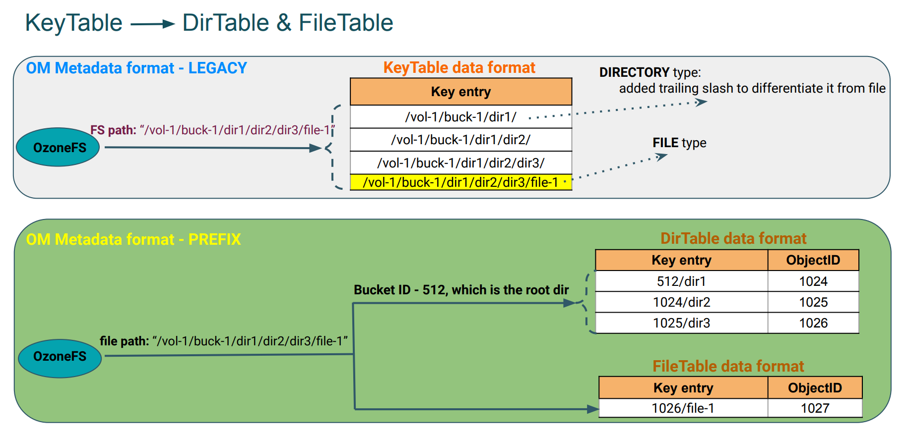

Following picture describes the OM metadata changes while performing a delete
operation on a directory.

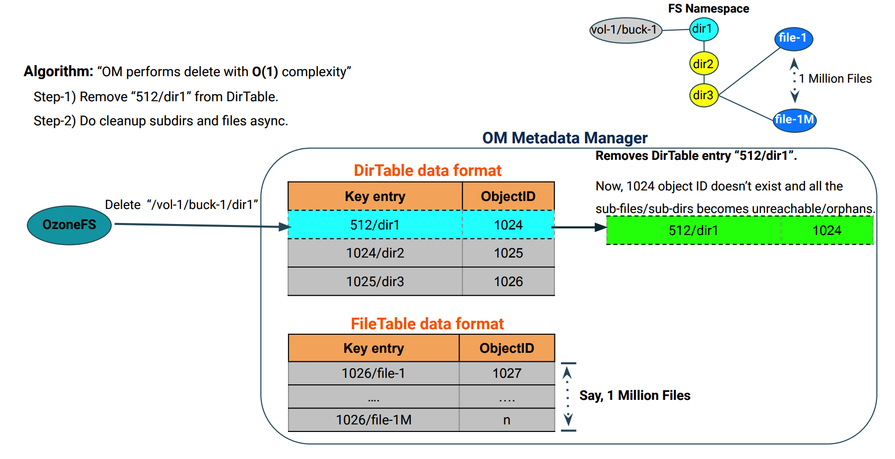

Following picture describes the OM metadata changes while performing a rename
operation on a directory.

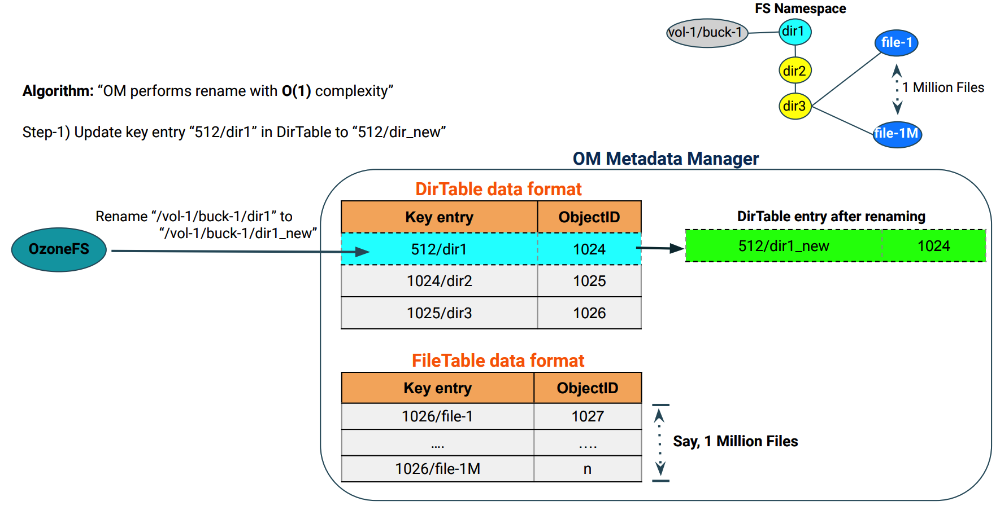

The following configuration can be configured in `ozone-site.xml` to define the default value for bucket layout during bucket creation
if the client has not specified the bucket layout argument.
Supported values are `OBJECT_STORE`, `FILE_SYSTEM_OPTIMIZED` and `LEGACY`.

By default, this config value is empty. Ozone will default to `FILE_SYSTEM_OPTIMIZED` bucket layout if it finds an empty config value.

```xml
<property> 
    <name>ozone.default.bucket.layout</name> 
    <value/> 
</property> 
```

---

<a id="system-internals-features-upgrade-downgrade"></a>

<!-- source_url: https://ozone.apache.org/docs/system-internals/features/upgrade-downgrade/ -->

<!-- page_index: 272 -->

# Upgrade and Downgrade System Internals

Version: 2.1.0

**TODO:** File a subtask under [HDDS-9862](https://issues.apache.org/jira/browse/HDDS-9862) and complete this page or section.

---

<a id="system-internals-features-bucket-snapshot-deletion-lifecycle"></a>

<!-- source_url: https://ozone.apache.org/docs/system-internals/features/bucket-snapshot-deletion-lifecycle/ -->

<!-- page_index: 273 -->

# Snapshot Deletion Lifecycle

Version: 2.1.0

This document describes the internal lifecycle of snapshot deletion in Apache Ozone, from the initial user request to the final physical removal of data and metadata.

The snapshot deletion process is divided into four main phases:

- **Trigger:** User executes the command `ozone sh snapshot delete <bucket> <snapshot>`.
- **Operation:**
  - The Ozone Manager (OM) receives the request and validates it.
  - The snapshot's status is updated to `SNAPSHOT_DELETED` in the `SnapshotInfoTable`.
  - The `deletionTime` is set to the current timestamp.
- **Result:** This phase only "labels" the snapshot for deletion. It does not yet adjust the snapshot chain or reclaim any data. The snapshot remains in the system but is now a candidate for the background reclamation service.

- **Trigger:** A background service that runs periodically.
- **Operation:**
  - The service identifies snapshots with the `SNAPSHOT_DELETED` status.
  - It processes the deleted snapshot's internal tracking tables: `deletedTable`, `deletedDirTable`, and `renamedTable`.
  - **Data Moving:** It moves entries from these tables to either:
    1. The **next active snapshot** in the chain (if one exists).
    2. The **Active Object Store (AOS)** (the main bucket) if no subsequent snapshot exists.
- **Settling:** Once all keys and directories for the snapshot have been successfully moved (i.e., the snapshot's deleted tables are empty), the service collects the snapshot's DB key into a "purge list".

- **Trigger:** Triggered by the `SnapshotDeletingService` once a snapshot is fully "empty" (all keys reclaimed).
- **Chain Adjustment (The Surgeon):** This is where the actual snapshot chain surgery occurs. The service updates the `previousSnapshotId` of the next snapshot in the chain to point to the deleted snapshot's predecessor, effectively "stitching" the chain back together.
- **Deep Clean Flag:** It sets `setDeepClean(false)` on the next snapshots. This signals the `KeyDeletingService` that it can now perform a "deeper" cleanup because a snapshot in the middle of the chain has been removed, potentially uncovering more keys that are no longer referenced by any snapshot.
- **Removal (The Janitor):** The snapshot record is removed from the `SnapshotInfoTable` cache, and the corresponding checkpoint directory on disk is deleted.

- **Operation:** The Ozone Manager double-buffer flushes the transaction to disk.
- **Result:** The snapshot record is physically and permanently deleted from the RocksDB `snapshotInfoTable`.

---

| Component | Role | Description |
| --- | --- | --- |
| **`OMSnapshotDeleteRequest`** | The Labeler | Marks the snapshot for death by updating its status. |
| **`SnapshotDeletingService`** | The Reclaimer | Moves the data references to the next snapshot or AOS. |
| **`OMSnapshotPurgeRequest`** | The Surgeon & Janitor | Re-links the snapshot chain and deletes the physical records. |

---

<a id="system-internals-features-bucket-snapshots"></a>

<!-- source_url: https://ozone.apache.org/docs/system-internals/features/bucket-snapshots/ -->

<!-- page_index: 274 -->

# Bucket Snapshot System Internals

Version: 2.1.0

For snapshot defragmentation (YAML sidecars, on-disk layout, configuration, and workflow), see [Snapshot Defragmentation](#system-internals-features-snapshot-defragmentation).

For detailed information on how snapshots are deleted internally, see the [Snapshot Deletion Lifecycle](#system-internals-features-bucket-snapshot-deletion-lifecycle) page.

**TODO:** File a subtask under [HDDS-9862](https://issues.apache.org/jira/browse/HDDS-9862) and complete this page or section.

---

<a id="system-internals-features-erasure-coding"></a>

<!-- source_url: https://ozone.apache.org/docs/system-internals/features/erasure-coding/ -->

<!-- page_index: 275 -->

# Erasure Coding System Internals

Version: 2.1.0

**TODO:** File a subtask under [HDDS-9862](https://issues.apache.org/jira/browse/HDDS-9862) and complete this page or section.

---

<a id="system-internals-features-snapshot-defragmentation"></a>

<!-- source_url: https://ozone.apache.org/docs/system-internals/features/snapshot-defragmentation/ -->

<!-- page_index: 276 -->

# Snapshot Defragmentation

Version: 2.1.0

Feature documentation from [apache/ozone#10131](https://github.com/apache/ozone/pull/10131) ([HDDS-15113](https://issues.apache.org/jira/browse/HDDS-15113)).

An Ozone snapshot is created as a RocksDB checkpoint of the active OM DB. A
new snapshot is cheap because its SST files are hard links to the active DB SST
files. Over time, active DB compactions rewrite SST files. Older snapshot
directories continue to pin their original SST files while newer snapshots pin
newer versions of the same metadata. With many long-lived snapshots and high
metadata churn, the disk usage under the snapshot checkpoint directory can grow
roughly with the number of snapshots rather than with the number of live unique
keys.

Snapshot defragmentation rewrites each snapshot into a versioned checkpoint
that contains only the data needed for that snapshot. It uses the previous
snapshot in the same bucket path chain plus the changed SST/key ranges for the
current snapshot, so the newest defragmented copy does not keep a full, independent copy of every historical SST file.

Snapshot defragmentation was previously called snapshot compaction during the
design phase. Snapshot defragmentation is not the same as RocksDB automatic
compaction of snapshot DBs. Snapshot DB automatic compaction remains disabled
because the snapshot diff path relies on stable SST metadata.

The implementation is centered on these classes:

- `SnapshotDefragService`: background and on-demand service that rewrites
  snapshot checkpoint directories.
- `OmSnapshotLocalData` and `OmSnapshotLocalDataYaml`: local per-OM metadata
  persisted in YAML sidecar files.
- `OmSnapshotLocalDataManager`: loads YAML files, maintains the in-memory
  dependency graph for `(snapshotId, version)` nodes, resolves previous
  snapshot versions, and removes orphaned version metadata.
- `CompositeDeltaDiffComputer`, `RDBDifferComputer`, and `FullDiffComputer`:
  compute the SST files that may contain differences between two snapshots.
- `SstFileSetReader` and `TableMergeIterator`: read candidate keys from delta
  SST files as a sorted stream and compare the current and previous snapshot
  tables without issuing an independent point lookup for every candidate key.
- `OmSnapshotManager`: opens the current snapshot version and deletes old
  checkpoint directories after a version switch.

The defrag service is local to each OM. The rewritten checkpoint directories
and YAML files are not Ratis-replicated state. In an HA deployment, each OM has
its own local snapshot DB directories and must defragment its own copies. The
admin command can target any OM node.

The active OM DB lives under the OM metadata directory selected by
`ozone.om.db.dirs`. If that property is not set, OM falls back to
`ozone.metadata.dirs`.

For an OM metadata directory `<om-meta-dir>`, snapshot checkpoint directories
live under:

```text
<om-meta-dir>/db.snapshots/checkpointState/ 
```

The current implementation does not place defragmented DBs under a separate
`checkpointStateDefragged` directory. The original and defragmented versions
are sibling directories in `checkpointState`:

```text
<om-meta-dir>/db.snapshots/checkpointState/om.db-<snapshot_uuid> 
<om-meta-dir>/db.snapshots/checkpointState/om.db-<snapshot_uuid>-<version> 
```

Version `0` is the original, non-defragmented checkpoint and has no version
suffix. Versions greater than `0` are produced by snapshot defragmentation.
Normally only the current version's directory remains after a successful
defrag cleanup. The following paths show how the directory name changes over a
snapshot's lifetime; they are not expected to coexist in normal steady state:

```text
# Before first defrag: 
/var/lib/ozone/om/db.snapshots/checkpointState/om.db-3d0a...9f62 
 
# After first successful defrag: 
/var/lib/ozone/om/db.snapshots/checkpointState/om.db-3d0a...9f62-1 
 
# After the next successful defrag: 
/var/lib/ozone/om/db.snapshots/checkpointState/om.db-3d0a...9f62-2 
```

Older directories can exist briefly during a version switch or after an
interrupted cleanup, but the normal post-defrag path deletes older checkpoint
directories for that snapshot DB.

Each snapshot also has one local YAML sidecar next to the version `0`
directory:

```text
<om-meta-dir>/db.snapshots/checkpointState/om.db-3d0a...9f62.yaml 
```

Temporary work is created under:

```text
<om-meta-dir>/db.snapshots/checkpointState/tmp_defrag/ 
<om-meta-dir>/db.snapshots/checkpointState/tmp_defrag/differSstFiles/ 
```

`SnapshotDefragService` deletes and recreates `tmp_defrag` on service startup
and deletes it on shutdown.

When an OM DB checkpoint is served to another OM, the checkpoint code uses the
current version from the local YAML metadata and includes that snapshot DB
directory. The bootstrap transfer also includes the required
`om.db-<snapshot_uuid>.yaml` sidecars. The inode-based transfer path explicitly
archives the YAML files for the snapshots present in the checkpoint and for any
previous local-data nodes they depend on; the directory-walk transfer path
includes sidecar files while selecting only the current snapshot DB directories.
The bootstrap write lock waits for the OM double buffer to flush before
collecting files, and the inode-based path also holds the snapshot cache lock
and the local data manager lock while resolving snapshot directories and YAML
paths. Snapshots in the intermediate `SNAPSHOT_DELETED` state can still be
copied because they remain in `SnapshotInfo`; fully purged snapshots are no
longer present there.

Snapshot defrag metadata is stored in `OmSnapshotLocalData` YAML, not in
`SnapshotInfo` and not in the Ratis log. Important fields are:

| Field | Meaning |
| --- | --- |
| `snapshotId` | Snapshot UUID. Must match the checkpoint directory name. |
| `checksum` | Checksum of the YAML representation, used to detect corrupted local metadata. |
| `previousSnapshotId` | The previous snapshot in the same bucket path chain that this local data is resolved against. |
| `version` | Current version to open. `0` means the original checkpoint; `> 0` means a defragmented version. |
| `needsDefrag` | Explicit local flag that forces the service to defragment the snapshot. |
| `isSSTFiltered` | YAML marker used by the older `SstFilteringService` path. Defrag disables that service when it is enabled. |
| `versionSstFileInfos` | Map from snapshot version to `VersionMeta`. This replaces the earlier split between `notDefraggedSstFileList` and `defraggedSstFileList`. |
| `VersionMeta.previousSnapshotVersion` | The version of `previousSnapshotId` that this version depends on. |
| `VersionMeta.sstFiles` | SST file metadata for `keyTable`, `directoryTable`, and `fileTable`. Each nested `SstFileInfo` uses `fileName`, `startKey`, `endKey`, and `columnFamily`; `fileName` is stored without the `.sst` extension. |
| `dbTxSequenceNumber` | Largest RocksDB sequence number observed in tracked SST files when the original snapshot YAML is created. Used by the checkpoint differ. |
| `transactionInfo` | Purge transaction marker used to remove local metadata only after the purge has flushed to disk. |
| `lastDefragTime` | Serialized by the YAML class, but current defrag decisions are based on `version`, `needsDefrag`, and `versionSstFileInfos`. |

On every snapshot creation, OM creates the YAML sidecar and captures live SST
file metadata for `keyTable`, `directoryTable`, and `fileTable` as version
`0`. This metadata is read from the newly created snapshot checkpoint DB, not
from the active OM DB, so an active DB compaction immediately after checkpoint
creation cannot corrupt the snapshot's local SST tracking. This happens even
when the periodic snapshot defrag service is disabled. New snapshots are
committed with `needsDefrag = true`. During upgrade/finalization, `OmSnapshotLocalDataManager` also creates missing YAML files for snapshots
already present in `SnapshotInfo`; active snapshots get their tracked SST
metadata, and the synthesized YAML is marked `needsDefrag = true`. When a new
defragmented version is added, the current version is incremented, the new
version's SST list is captured from RocksDB, and `needsDefrag` is cleared.

`OmSnapshotLocalDataManager` keeps an in-memory graph of local version
dependencies. Each node is a `(snapshotId, version)` pair and points to the
`(previousSnapshotId, previousSnapshotVersion)` it depends on. The graph is
rebuilt from YAML at OM startup. It is used to:

- reject deletion of a version that is still referenced by another snapshot
  version;
- resolve a snapshot's previous-version dependency when the path chain changes
  after purge;
- identify orphaned versions and YAML files that can be removed after purge.

Snapshot defragmentation is disabled by default.

| Property | Default | Meaning |
| --- | --- | --- |
| `ozone.snapshot.defrag.service.interval` | `-1` | Background interval. A value `<= 0` disables the service. |
| `ozone.snapshot.defrag.limit.per.task` | `1` | Maximum number of snapshots defragmented in one service run. |
| `ozone.snapshot.defrag.service.timeout` | `300s` | Timeout for one service run. |
| `ozone.om.snapshot.local.data.manager.service.interval` | `5m` | Interval for the local YAML/version orphan cleanup thread. A value `<= 0` disables the cleanup thread. |

The service is gated by the `SNAPSHOT_DEFRAG` OM layout feature. It also
requires the Rocks tools native library; if the library is unavailable, an
on-demand run returns without defragmenting snapshots.

If defrag is enabled, `KeyManagerImpl` does not start `SstFilteringService`, even when the SST filtering interval is configured. Defrag already filters the
tracked snapshot tables by bucket prefix while building the rewritten
checkpoint. If defrag is disabled and SST filtering is enabled, the older SST
filtering service still removes irrelevant SST files from version `0`
snapshots and writes the `sstFiltered` marker file.

Manual defrag is exposed through:

```bash
ozone admin om snapshot defrag --service-id=<om-service-id> --node-id=<om-node-id> 
ozone admin om snapshot defrag --service-id=<om-service-id> --node-id=<om-node-id> --no-wait 
```

The command requires the defrag service to be initialized on the target OM.
Any OM in an HA service can run it because the rewritten snapshot DB state is
local to that OM.

`SnapshotDefragService` iterates the global snapshot chain in forward order and
processes active snapshots only. For each snapshot, it resolves the path
previous snapshot in the same bucket. Incremental defrag is based on the path
chain, not merely the global creation order.

The service decides that a snapshot needs defrag when either:

- the local `needsDefrag` flag is true; or
- the snapshot's current version depends on an older version of its resolved
  previous snapshot than the previous snapshot's current version.

The second condition is what propagates defrag after a previous snapshot is
rewritten or when snapshot purge changes the path chain.

The main workflow is:

1. Acquire the bootstrap read lock and load `SnapshotInfo` plus local YAML.
2. Create a temporary checkpoint in `tmp_defrag`.

   - If this is the first snapshot in the path chain, checkpoint the current
     snapshot.
   - Otherwise, checkpoint the current version of the path previous snapshot.
3. Drop non-incremental column families from the temporary checkpoint. They are
   reloaded from the current snapshot later.
4. For the first snapshot in the path chain, do a full defrag of `keyTable`,
   `directoryTable`, and `fileTable`:

   - delete ranges outside the bucket prefix;
   - compact each tracked table with forced bottommost-level compaction so the
     range tombstones are removed from the rewritten checkpoint.
5. For later snapshots, do incremental defrag of the same tracked tables:

   - compute delta SST files between the path previous snapshot and the current
     snapshot;
   - group deltas by column family;
   - read candidate keys from the delta SST files, merge them with the previous
     and current snapshot tables, and write only changed keys or tombstones into
     a temporary SST file;
   - ingest the resulting SST file into the temporary checkpoint.
6. Acquire a write `SNAPSHOT_DB_CONTENT_LOCK` for the current snapshot. This is
   the lock that prevents concurrent snapshot content changes while the service
   reloads non-incremental tables and switches versions. Snapshot reads and
   deep-clean writes use `SNAPSHOT_DB_LOCK` or read `SNAPSHOT_DB_CONTENT_LOCK`
   in the same lock hierarchy. The DAG-based lock ordering allows the content
   lock to be acquired before snapshot DB and local-data locks; code paths avoid
   acquiring the content lock while already holding local-data locks.
7. Dump and ingest non-incremental tables from the current snapshot into the
   checkpoint. The tracked tables (`keyTable`, `directoryTable`, `fileTable`)
   are skipped because they were already rebuilt.
8. Close the temporary checkpoint metadata manager and move the checkpoint
   directory to the next version path:


```text
<om-meta-dir>/db.snapshots/checkpointState/om.db-<snapshot_uuid>-<next_version> 
```

9. Open the new version, add its live SST metadata to
   `versionSstFileInfos`, update `version`, and clear `needsDefrag`.
10. After a successful version switch, delete older checkpoint directory
    versions for that same snapshot after acquiring the snapshot DB cache write
    lock. For example, after switching from version `1` to version `2`,
    `om.db-<snapshot_uuid>-1` is removed locally once there are no open cached
    handles for that snapshot DB. Version `0` is normally removed after the
    first successful defrag that creates version `1`; if an older directory is
    still present from an interrupted earlier cleanup, the same deletion path
    can remove it. The YAML version metadata may remain longer than the
    directories when another snapshot version still references it.
    `OmSnapshotLocalDataManager` removes orphaned version metadata later.
    This directory deletion intentionally remains under
    `SNAPSHOT_DB_CONTENT_LOCK` so stale cached handles cannot write to an old
    version while it is being removed.
11. Release `SNAPSHOT_DB_CONTENT_LOCK`.

Defrag uses only the column families tracked by the checkpoint differ:
`keyTable`, `directoryTable`, and `fileTable`.

`CompositeDeltaDiffComputer` first tries `RDBDifferComputer`. The differ uses
the local `versionSstFileInfos` metadata and the active DB compaction DAG. When
the current snapshot version is `0`, the DAG path can be used to find the SST
files that changed since the previous snapshot. For versions greater than `0`, the differ falls back to comparing SST file metadata by version because
defragmented versions are already rewritten snapshot DBs rather than raw active
DB checkpoints.

If the DAG-based differ cannot produce a complete answer, the code falls back
to `FullDiffComputer`. The full differ compares relevant SST files by inode
when inode metadata is available, and falls back to comparing full file lists
when inode comparison fails. It considers files unique to either endpoint and
skips common files only when the file identity proves that they are the same
SST.

The delta computers materialize candidate SSTs as hard links under
`tmp_defrag/differSstFiles` before returning them to the defrag service. This
keeps the source SST content stable while the service reads it, even if the
original source path later becomes eligible for cleanup.

The delta files identify candidate SSTs, not final row-level changes. The
defrag service still reads keys from those files, compares current and previous
snapshot table values, writes only changed records or tombstones to a new SST
file, and ingests that file into the checkpoint. If there is exactly one delta
file for a table and the current snapshot version is already greater than `0`, the service can ingest that delta file directly.

`SstFileSetReader` returns candidate keys as a sorted merged stream and can
read tombstones through the raw SST reader. The defrag path uses key-only
iteration, `CodecBuffer`, and direct buffers where possible. Because candidate
keys are sorted, `TableMergeIterator` can walk the current and previous RocksDB
tables with forward iterators and seeks instead of issuing independent point
gets for every candidate key.

The snapshot diff API and report-generation flow do not change after snapshot
defragmentation. `SnapshotDiffManager` still submits a diff job, opens the
current snapshot DB versions through `OmSnapshotManager`, asks
`CompositeDeltaDiffComputer` for candidate SST files, reads candidate keys with
`SstFileSetReader`, compares the from/to snapshot tables with
`TableMergeIterator`, and builds the object-ID maps used to produce the final
diff report.

The internal SST-candidate path changes based on the current local version of
the to-snapshot:

- Before defrag, the to-snapshot is version `0`, which is the original OM DB
  checkpoint. `RDBDifferComputer` can ask `RocksDBCheckpointDiffer` to walk the
  active DB compaction DAG and use the YAML `dbTxSequenceNumber` plus version
  `0` SST metadata to identify changed SSTs. If the DAG cannot provide a
  complete answer, `CompositeDeltaDiffComputer` falls back to `FullDiffComputer`.
- After defrag, the to-snapshot's current version is greater than `0`, and that
  version is a rewritten snapshot DB rather than an active DB checkpoint
  produced by normal RocksDB compactions. The differ resolves the from-snapshot
  dependency through `OmSnapshotLocalDataManager`, passes the YAML
  `versionSstFileInfos` version map into `RocksDBCheckpointDiffer`, and compares
  SST metadata for the relevant snapshot versions instead of using the
  compaction-DAG walk. The full-diff fallback is still available, and
  `--forceFullDiff` continues to bypass the DAG path.

Snapshot reads go through `OmSnapshotManager` and `SnapshotCache`. The cache
loader reads the snapshot's current version from `OmSnapshotLocalDataManager`
and opens:

```text
<om-meta-dir>/db.snapshots/checkpointState/om.db-<snapshot_uuid>[-<version>] 
```

The read path does not scan for the highest directory suffix on disk. The YAML
current version is the source of truth: moving a new checkpoint directory is
not visible to readers until the YAML current version is committed.

Before opening a snapshot cache entry, the loader waits for the snapshot create
transaction recorded in `SnapshotInfo.createTransactionInfo` to flush to the OM
DB. This prevents a follower or a fast reader from opening a snapshot whose
checkpoint directory or YAML sidecar exists in memory or on disk before the
corresponding create transaction is durable.

Snapshot delete first marks `SnapshotInfo` as `SNAPSHOT_DELETED`. Later, `SnapshotDeletingService` submits an internal purge request. Purge updates the
next snapshots' path/global previous IDs in `SnapshotInfo`, removes the purged
snapshot from the chain, records purge `transactionInfo` in the purged
snapshot's local YAML, invalidates the snapshot cache entry, and deletes the
purged snapshot's checkpoint directories.

The purge path does not directly write `needsDefrag = true` into the next
snapshot's YAML. Instead, the next time local data for that snapshot is opened
for defrag, `OmSnapshotLocalDataManager` resolves the updated
`pathPreviousSnapshotId`. If that changes the dependency or if the referenced
previous snapshot version is stale, the provider marks or reports the snapshot
as needing defrag.

Old checkpoint directories for a snapshot are deleted immediately after that
snapshot is successfully defragmented to a newer version. Old version metadata
and YAML files are cleaned separately from checkpoint directories by
`OmSnapshotLocalDataManagerService`, a single-threaded scheduler owned by
`OmSnapshotLocalDataManager`.

On startup, the local data manager loads all `om.db-<snapshot_uuid>.yaml`
files, rebuilds the in-memory version dependency graph, and queues every
loaded snapshot ID for an orphan check. Later commits can queue additional
snapshot IDs:

- when a snapshot gains or removes local versions;
- when a snapshot's resolved `previousSnapshotId` changes after purge updates
  the path chain;
- when purge records `transactionInfo` in a snapshot's YAML.

Each cleanup pass checks the queued snapshot IDs. A version entry can be
removed from YAML when no other local version node depends on it and either:

- the version is not `0` and is not the snapshot's current version; or
- the snapshot itself has been purged.

Version `0` is kept for active snapshots even when it has no dependents, because a newly created or unresolved snapshot can still depend on the original
version. If a snapshot has purge `transactionInfo` but the purge transaction
has not flushed to the OM DB yet, the cleanup thread keeps the YAML and
re-queues the snapshot for a later pass. When the purge has flushed and no
versions remain, the YAML file is deleted.

`OmSnapshotInternalMetrics` records defrag progress since the last OM restart:
total defrag operations, total failures, skipped snapshots, full defrag
operations and failures, incrementally defragged snapshots and failures, full
defrag tables compacted, and incremental delta files processed.

`OMPerformanceMetrics` records the latency of the last full defrag operation
and the last incremental defrag operation in milliseconds. With trace logging
enabled, `SnapshotDefragService` also logs before/after directory statistics
for each defragmented snapshot, including total files, SST file count, and
directory byte usage.

After a full pass, each active snapshot's current version is a compact, bucket-scoped checkpoint that reuses the previous path snapshot plus the
snapshot's own changes. This reduces duplicate SST retention for long snapshot
chains while keeping snapshot reads and snapshot-diff computation based on
ordinary RocksDB checkpoints and SST metadata.

For background on the original scale problem and early design discussion, see
[HDDS-13003](https://issues.apache.org/jira/browse/HDDS-13003).

---

<a id="system-internals-features-om-bootstrapping-with-snapshots"></a>

<!-- source_url: https://ozone.apache.org/docs/system-internals/features/om-bootstrapping-with-snapshots/ -->

<!-- page_index: 277 -->

# OM Bootstrapping with Snapshots

Version: 2.1.0

The current bootstrapping mechanism for OM has inconsistencies when dealing with Snapshotted OM RocksDBs. Bootstrapping
occurs without locking mechanisms, and active transactions may still modify snapshots RocksDB during the process.
This can lead to a corrupted RocksDB instance on the follower OM post-bootstrapping. To resolve this, the bootstrapping
process must operate on a consistent system state.

Jira Ticket: [HDDS-12090](https://issues.apache.org/jira/browse/HDDS-12090)

When a snapshot is taken on an Ozone bucket, the following steps occur:

1. A RocksDB checkpoint of the active `om.db` is created.
2. Deleted entries are removed from the `deletedKeyTable` and `deletedDirTable` in the Active Object Store (AOS) RocksDB.
   This is to just prevent the blocks from getting purged without checking for the key's presence in the correct snapshot in the snapshot chain.
3. A new entry is added to the `snapshotInfoTable` in the AOS RocksDB.

The current model involves the follower OM initiating an HTTP request to the leader OM, which provides a consistent view of its state.
Before bucket snapshots were introduced, this process relied solely on an AOS RocksDB checkpoint. However, with snapshots, multiple RocksDB
instances (AOS RocksDB + snapshot RocksDBs) must be handled, complicating the process.

- **Follower Initiation:**
  - Sends an exclude list of files already copied in previous batches.
- **Leader Actions:**
  - Creates an AOS RocksDB checkpoint.
  - Performs a directory walk through:
    - AOS RocksDB checkpoint directory.
    - Snapshot RocksDB directories.
    - Backup SST file directory (compaction backup directory).
  - Identifies unique files to be copied in the next batch.
  - Transfers files in batches, recreating hardlinks on the follower side as needed.

1. Active transactions during bootstrapping may modify snapshot RocksDBs, leading to inconsistencies.
2. Partial data copies can occur when double-buffer flushes or other snapshot-related operations are in progress.
3. Large snapshot data sizes (often in GBs) require multi-batch transfers, increasing the risk of data corruption.

Snapshot Cache is the class which is responsible for maintaining all RocksDB handles corresponding to a snapshot.
The RocksDB handles are closed by the snapshot cache from time to time if there are no references of the
RocksDB being used by any of the threads in the system. Hence any operation on a snapshot would go through the snapshot
cache increasing the reference count of that snapshot. Implementing a lock for this snapshot cache would prevent any newer
threads from requesting a snapshot RocksDB handle from the snapshot cache. Thus any operation under this lock will have a
consistent view of the entire snapshot. The only downside to this is that it would block the double buffer thread, hence any operation performed under this thread has to be lightweight so that it doesn't end up running for a long
period of time. (P.S. With Sumit's implementation of optimized Gatekeeping model and getting rid of double buffer from
OM would result in only blocking the snapshot operations which should be fine since these operations are only fired by background threads.)

With the above implementation of a lock there is a way to get a consistent snapshot of the entire OM. Now lets dive into various approaches to overall bootstrap flow.

This approach builds the current model by introducing size thresholds to manage locks and data transfers more efficiently.

1. **Follower Initiation:**
   - Sends an exclude list of previously copied files (identified by `inodeId`).
2. **Leader Directory Walk:**
   - Walks through AOS RocksDB, snapshot RocksDBs, and backup SST directories to identify files to transfer.
   - Compares against the exclude list to avoid duplicate transfers.
3. If the total size of files to be copied is more than `ozone.om.ratis.snapshot.lock.max.total.size.threshold` then the
   files would be directly sent over the stream as a tarball where the name of the files is the inodeId of the file.
4. If the total size of files to be copied is less than equal to `ozone.om.ratis.snapshot.lock.max.total.size.threshold`
   then the snapshot cache lock is taken after waiting for the snapshot cache to completely get empty (No snapshot RocksDB should be open). Under the lock following operations would be performed:
   - Take the AOS RocksDB checkpoint.
   - A complete directory walk is done on AOS checkpoint RocksDB directory + all the snapshot RocksDB directories + backup sst
     file directory (compaction log directory) to figure out all the files to be copied and any file already present in the exclude list would be excluded.
   - These files are added to the tarball where again the name of the file would be the inodeId of the file.
5. As the files are being iterated the path of each file and their corresponding inodeIds would be tracked. When it is the
   last batch this map would also be written as a text file in the final tarball to recreate all the hardlinks on the follower node.

The only drawback with this approach is that we might end up sending more data over the network because some sst files sent
over the network could have been replaced because of compaction running concurrently on the active object store. But at the
same time since the entire bootstrap operation is supposed to finish in the order of a few minutes, the amount of extra data
would be really minimal assuming we could utmost write 30 MBs of data assuming there are 30000 keys written in 2 mins each
key would be around 1 KB.

This approach builds on the approach1 where along with introducing size thresholds under locks manage locks, we only rely
on the number of files changed under the snapshot directory as the threshold.

1. **Follower Initiation:**
   - Sends an exclude list of previously copied files (identified by `inodeId`).
2. **Leader Directory Walk:**
   - Walks through AOS RocksDB, snapshot RocksDBs, and backup SST directories to identify files to transfer.
   - Compares against the exclude list to avoid duplicate transfers.
3. If either the total size to be copied or the total number of files under the snapshot RocksDB directory to be copied is
   more than `ozone.om.ratis.snapshot.max.total.sst.size` respectively then the files would be directly sent over the stream as
   a tarball where the name of the files is the inodeId of the file.
4. If the total file size to be copied under the snapshot RocksDB directory is less than or equal to `ozone.om.ratis.snapshot.max.total.sst.size`
   then the snapshot cache lock is taken after waiting for the snapshot cache to completely get empty (No snapshot RocksDB should be open).
   Under the lock following operations would be performed:
   - Take the AOS RocksDB checkpoint.
   - A complete directory walk is done on all the snapshot RocksDB directories to figure out all the files to be copied and any file already present in the exclude list would be excluded.
   - Hard links of these files are added to tmp directory on the leader.
   - Exit lock
   - After the lock all files under the tmp directory, AOS RocksDB checkpoint directory and compaction backup directory have to be written to the tarball. As the files are being iterated the path of each file and their corresponding inodeIds would be tracked. Since this is the last batch this map would also be written as a text file in the final tarball to recreate all the hardlinks on the follower node.

The drawbacks for this approach are the same as approach 1, but here we are optimizing on the amount of time lock is held
by performing very lightweight operations under the lock. So this is a more optimal approach since it minimises the lock wait time on other threads.

The approach 2 here proposes to create a single tarball file on the disk and stream the chunks of the tarball over multiple
http batch request from the follower.

Following is the flow for creating the tarball:

1. Snapshot cache lock is taken after waiting for the snapshot cache to become completely empty (No snapshot RocksDB should be open). Under the lock following operations would be performed:
   - Take the AOS RocksDB checkpoint.
   - A complete directory walk is done on AOS RocksDB directory + all the snapshot RocksDB directories + backup sst file
     directory (compaction log directory) to figure out all the files to be copied to create a single tarball.
2. This tarball should be streamed batch by batch to the follower in a paginated fashion.

The drawback with this approach is that the double buffer would be blocked for a really long time if there is a lot of data to be tarballed. If the total snapshot size of the OM dbs put together is 1 TB, considering the tarball writes go to an NVMe and considering the write throughput for an NVMe drive is around 5 GB/sec then the tarball write might take a total of 1024/5 secs = 3 mins. Blocking the double buffer thread for 3 mins seems to be a bad idea, but at the same time this would only happen if there is snapshot operation in flight or in the double buffer queue already.

The approach 3 here proposes to create a RocksDB checkpoint for each and every snapshot RocksDB in the system along with
the AOS RocksDB under the snapshot cache lock. Outside of the lock we could either create a single tarball file as done
in approach 2 or stream the files in batches as multiple tarball file similar to approach 1 to the follower.

Following is the flow for creating the tarball:

1. Snapshot cache lock is taken after waiting for the snapshot cache to become completely empty (No snapshot RocksDB should be open).
   Under the lock following operations would be performed:
   - Take the AOS RocksDB checkpoint.
   - Take RocksDB checkpoint of each and every snapshot in the system by iterating through the snapshotInfo table of AOS checkpoint RocksDB.
2. Now the files in the checkpoint directories have to be streamed to the follower as done in either approach 1 or approach 2.

The drawback with this approach is that this would double the number of hardlinks in the file system which could have potential
impact on performance during bootstrap, considering the case in systems where the total number of files and hardlinks in the system
order up to 5 million files.

Approach 1 is the most optimized solution as it balances the amount of time under the lock by minimising the amount of IO
ops inside the lock by introducing another threshold config to track this. Moreover, taking this approach will also need the
most minimal amount of code change as it doesn't differ from the current approach by much. While approach 2 might look simpler
but this would imply revamping the entire bootstrap logic currently in place and moreover this approach might increase the
total amount of time inside the lock which would imply blocking the double buffer thread of extended amounts of time if it
comes to this situation, which approach 1 tries to avoid.

Final approach implemented is the **Approach 1.1**.

---

<a id="developer-guide"></a>

<!-- source_url: https://ozone.apache.org/docs/developer-guide/ -->

<!-- page_index: 278 -->

# Developer Guide

Version: 2.1.0

This section provides a guide for developers looking to contribute to the Ozone project.

[<a id="developer-guide--build"></a>

## 🗃️ Build

3 items](#developer-guide-build)

[<a id="developer-guide--run"></a>

## 🗃️ Run

3 items](#developer-guide-run)

[<a id="developer-guide--test"></a>

## 🗃️ Test

5 items](#developer-guide-test)

[<a id="developer-guide--project"></a>

## 🗃️ Project

3 items](#developer-guide-project)

---

<a id="developer-guide-build"></a>

<!-- source_url: https://ozone.apache.org/docs/developer-guide/build/ -->

<!-- page_index: 279 -->

# Building Ozone

Version: 2.1.0

This section provides instructions for developers to build Ozone from source.

[<a id="developer-guide-build--maven"></a>

## 📄️ Maven

This guide explains how to build Apache Ozone from source using Maven and prepare it for deployment.](#developer-guide-build-maven)

[<a id="developer-guide-build--intellij"></a>

## 📄️ Intellij

TODO: File a subtask under HDDS-9861 and complete this page or section.](#developer-guide-build-intellij)

[<a id="developer-guide-build--docker-images"></a>

## 📄️ Docker Images

This page provides an overview of the Docker images maintained by the Apache Ozone community for developing and testing Ozone. It also describes the workflow to be followed when making changes to one of these images.](#developer-guide-build-docker-images)

---

<a id="developer-guide-build-maven"></a>

<!-- source_url: https://ozone.apache.org/docs/developer-guide/build/maven/ -->

<!-- page_index: 280 -->

# Building Ozone With Maven

Version: 2.1.0

> [!NOTE]
> This command does not run acceptance tests. Refer to the [acceptance tests](#developer-guide-test-acceptance-tests) page for test execution instructions.

---

<a id="developer-guide-build-intellij"></a>

<!-- source_url: https://ozone.apache.org/docs/developer-guide/build/intellij/ -->

<!-- page_index: 281 -->

# Ozone Development With Intellij

Version: 2.1.0

**TODO:** File a subtask under [HDDS-9861](https://issues.apache.org/jira/browse/HDDS-9861) and complete this page or section.

Guide for setting up Intellij for Ozone development and workarounds for common problems.

---

<a id="developer-guide-build-docker-images"></a>

<!-- source_url: https://ozone.apache.org/docs/developer-guide/build/docker-images/ -->

<!-- page_index: 282 -->

# Building Ozone Docker Images

Version: 2.1.0

This page provides an overview of the Docker images maintained by the Apache Ozone community for developing and testing Ozone. It also describes the workflow to be followed when making changes to one of these images.

[ozone-runner](https://github.com/apache/ozone-docker-runner) is the base image with tools for running and testing Ozone, but does not include any Ozone artifacts.

Developers and CI workflows rely on it heavily to run/test custom Ozone builds (using the local build via bind-mount). It also serves as the base image for `apache/ozone` (see next section).

Published to [Docker Hub](https://hub.docker.com/r/apache/ozone-runner) and [GitHub](https://github.com/apache/ozone-docker-runner/pkgs/container/ozone-runner).

Development happens on branch `master`, relevant changes are cherry-picked to branch `jdk11`.

The image can be built simply by running the helper script `build.sh`:

```bash
./build.sh 
```

Images are tagged by date, and come in two flavors: `jdk21` (for Ozone 2.0+) and `jdk11` (for Ozone 1.x).

Publishing Docker tags:

1. Add a Git tag for the commit following the existing pattern (`<date>-<n>-<flavor>`, where `<n>` starts at 1, and is incremented if multiple images need to be published the same day).
2. Push the Git tag to the origin repo (`apache/ozone-docker-testkrb5`). This will trigger a workflow run to apply the tag to the Docker image.

[ozone](https://github.com/apache/ozone-docker) is built on top of `ozone-runner`, adding the binaries built for official Ozone releases.

These are used for testing compatibility of various Ozone versions, and upgrade from one version to another. May also be useful for running quick experiments with specific version of Ozone, without the need to download or rebuild it.

Published to [Docker Hub](https://hub.docker.com/r/apache/ozone) and [GitHub](https://github.com/apache/ozone-docker/pkgs/container/ozone).

Development branch: `latest`.

The image can be built simply by running the helper script `build.sh`:

```bash
./build.sh 
```

This will create a single-platform image for your architecture. Build automation in GitHub Actions creates multi-platform image for `amd64` and `arm64`.

It can be customized via environment variables defined at build time.

```bash
# the URL to download Ozone from; allows using custom tarball or local mirror OZONE_URL
 
# version of Ozone to include in the image; ignored if URL is also specified OZONE_VERSION
 
# the base image name in repo/image format OZONE_RUNNER_IMAGE
 
# the base image version to use OZONE_RUNNER_VERSION
```

Images are tagged by Ozone version numbers and optional flavor. Flavor `-rocky` was introduced when `ozone-runner` was changed from CentOS to Rocky Linux due to CentOS end-of-life, to avoid breaking things for existing users. Future images will be published only with Rocky Linux, with and without flavor suffix.

Image tags are derived from branch names: push to the branch `ozone-<tag>` gets published with `<tag>` (e.g. `ozone-1.4.1 -> 1.4.1`).

Publishing Docker tags:

1. Update the version-specific branch:
   - The latest release version can usually be updated by fast-forwarding the branch: `git merge --ff-only origin/latest`. This allows CI workflow to tag the existing image from `latest` branch, instead of building completely new image.
   - For other versions branch can be updated by cherry-picking one or more commits.
2. Push the branch to the origin repo (`apache/ozone-docker`). This will trigger a workflow run to publish the image.

[ozone-testkrb5](https://github.com/apache/ozone-docker-testkrb5) is used as KDC in tests where Kerberos is enabled.

Published only to [GitHub](https://github.com/apache/ozone-docker-testkrb5/pkgs/container/ozone-testkrb5), because it is completely insecure, and should be used only for testing.

Development branch: `master`.

The image can be built simply by running the helper script `build.sh`:

```bash
./build.sh 
```

Images are tagged by date.

Publishing Docker tags:

1. Add a Git tag for the commit following existing pattern (`<date>-<n>`, where `<n>` starts at 1, and is incremented if multiple images need to be published the same day).
2. Push the Git tag to the origin repo (`apache/ozone-docker-testkrb5`). This will trigger a workflow run to apply the tag to the Docker image.

---

<a id="developer-guide-run"></a>

<!-- source_url: https://ozone.apache.org/docs/developer-guide/run/ -->

<!-- page_index: 283 -->

# Running a Custom Ozone Build

Version: 2.1.0

This section documents various ways to run a custom build of Ozone on a local machine.

[<a id="developer-guide-run--intellij"></a>

## 📄️ Intellij

TODO: File a subtask under HDDS-9861 and complete this page or section.](#developer-guide-run-intellij)

[<a id="developer-guide-run--docker-compose"></a>

## 📄️ Docker Compose

This guide walks you through the process of building Apache Ozone from source and running it using Docker Compose. This approach is particularly useful for development, testing, and understanding Ozone's architecture.](#developer-guide-run-docker-compose)

[<a id="developer-guide-run--kubernetes"></a>

## 📄️ Kubernetes

The Kubernetes examples and scripts in this project have been tested with Kubernetes 1.34.2 (k3s v1.34.2+k3s1).](#developer-guide-run-kubernetes)

---

<a id="developer-guide-run-intellij"></a>

<!-- source_url: https://ozone.apache.org/docs/developer-guide/run/intellij/ -->

<!-- page_index: 284 -->

# Running Ozone From Intellij

Version: 2.1.0

**TODO:** File a subtask under [HDDS-9861](https://issues.apache.org/jira/browse/HDDS-9861) and complete this page or section.

---

<a id="developer-guide-run-docker-compose"></a>

<!-- source_url: https://ozone.apache.org/docs/developer-guide/run/docker-compose/ -->

<!-- page_index: 285 -->

# Running Ozone From Docker Compose

Version: 2.1.0

This guide walks you through the process of building Apache Ozone from source and running it using Docker Compose. This approach is particularly useful for development, testing, and understanding Ozone's architecture.

Before you begin, ensure you have installed:

- [Docker Engine](https://docs.docker.com/engine/install/) - Latest stable version
- [Docker Compose](https://docs.docker.com/compose/install/) - Latest stable version

First, build Ozone from source following our [Build with Maven](#developer-guide-build-maven) guide.

Navigate to the compose directory in your build output:

```bash
cd ./hadoop-ozone/dist/target/ozone-<VERSION>/compose/ozone 
```

You can customize your Ozone deployment by modifying the configuration parameters in the `docker-compose.yaml` file:

1. **Common Configurations**: Located under the `x-common-config` section
2. **Service-Specific Settings**: Found under the `environment` section of individual services

Example configuration modification:

```yaml
# Example configuration modifications 
x-common-config: 
  environment: 
    OZONE-SITE.XML_ozone.scm.container.size: 1GB 
    OZONE-SITE.XML_ozone.scm.block.size: 256MB 
```

Start your Ozone cluster:

```bash
docker compose up -d --scale datanode=3 
```

This command creates a fully functional Apache Ozone cluster using the `ozone-docker-runner` base image, which mounts your locally compiled Ozone binaries.

This image shows the containers that will be created by the `docker compose up -d` command when running the default Docker Compose configuration under `/compose/ozone` .

Your Ozone cluster includes the following components:

- **Storage Container Manager (SCM)**: Manages storage containers and block allocation
- **Ozone Manager (OM)**: Handles namespace operations and metadata management
- **S3 Gateway**: Provides S3-compatible API access
- **Recon**: Monitoring and management service
- **Datanodes**: Distributed storage nodes
- **HttpFS**: HTTP-based filesystem interface

Here are the key commands for managing your Ozone cluster:

```bash
# Start the cluster docker compose up -d
 
# Stop and remove all containers docker compose down
 
# Monitor service logs docker compose logs -f [service_name]
 
# Scale the number of datanodes docker compose up -d --scale datanode=3
 
# Check cluster status docker compose ps
```

Access the Ozone command-line interface from any Ozone container:

```bash
# Enter the Ozone Manager container or any other container docker compose exec om bash
 
# Run Ozone commands ozone
```

The compose directory includes several specialized configurations for different use cases:

| Configuration | Purpose |
| --- | --- |
| ozone-ha | High availability deployment setup |
| ozonesecure | Security features with SSL and Kerberos |
| ozone-topology | Rack-aware deployment configuration |
| upgrade | Non-rolling upgrade testing environment |

To explore these configurations:

```bash
cd hadoop-ozone/dist/target/ozone-*-SNAPSHOT/compose/ 
```

After setting up your development cluster:

1. Explore the [Ozone CLI documentation](#user-guide-client-interfaces-o3)
2. Experiment with the various compose configurations for specific use cases

---

<a id="developer-guide-run-kubernetes"></a>

<!-- source_url: https://ozone.apache.org/docs/developer-guide/run/kubernetes/ -->

<!-- page_index: 286 -->

# Ozone on Kubernetes

Version: 2.1.0

> [!NOTE]
> The Kubernetes examples and scripts in this project have been tested with Kubernetes 1.34.2 (k3s v1.34.2+k3s1).

---

<a id="developer-guide-test"></a>

<!-- source_url: https://ozone.apache.org/docs/developer-guide/test/ -->

<!-- page_index: 287 -->

# Testing Ozone

Version: 2.1.0

This section documents how to run and modify tests against Ozone.

[<a id="developer-guide-test--unit-tests"></a>

## 📄️ Unit Tests

TODO: File a subtask under HDDS-9861 and complete this page or section.](#developer-guide-test-unit-tests)

[<a id="developer-guide-test--integration-tests"></a>

## 📄️ Integration Tests

TODO: File a subtask under HDDS-9861 and complete this page or section.](#developer-guide-test-integration-tests)

[<a id="developer-guide-test--acceptance-tests"></a>

## 📄️ Acceptance Tests

Acceptance tests validate the complete Ozone system from an end-user perspective. They deploy and test Ozone in a containerized environment that closely resembles real-world deployments.](#developer-guide-test-acceptance-tests)

[<a id="developer-guide-test--continuous-integration"></a>

## 📄️ Continuous Integration

TODO: File a subtask under HDDS-9861 and complete this page or section.](#developer-guide-test-continuous-integration)

[<a id="developer-guide-test--static-analysis"></a>

## 📄️ Static Analysis

Apache Ozone uses static code analysis tools to identify potential bugs, code smells, security vulnerabilities, and other issues before they make it into production. SonarQube is the primary tool used for comprehensive code quality analysis.](#developer-guide-test-static-analysis)

---

<a id="developer-guide-test-unit-tests"></a>

<!-- source_url: https://ozone.apache.org/docs/developer-guide/test/unit-tests/ -->

<!-- page_index: 288 -->

# Unit Tests

Version: 2.1.0

**TODO:** File a subtask under [HDDS-9861](https://issues.apache.org/jira/browse/HDDS-9861) and complete this page or section.

- Scope of Unit tests
- Junit 4 vs 5.
- Directory layout of test resources
- Configuring log level.

---

<a id="developer-guide-test-integration-tests"></a>

<!-- source_url: https://ozone.apache.org/docs/developer-guide/test/integration-tests/ -->

<!-- page_index: 289 -->

# Integration Tests

Version: 2.1.0

**TODO:** File a subtask under [HDDS-9861](https://issues.apache.org/jira/browse/HDDS-9861) and complete this page or section.

- Scope. When to use integration tests vs unit or acceptance.
- What is MinOzoneCluster?
- Package structure. (integration-test package and dependency reasons for having its own package)

---

<a id="developer-guide-test-acceptance-tests"></a>

<!-- source_url: https://ozone.apache.org/docs/developer-guide/test/acceptance-tests/ -->

<!-- page_index: 290 -->

# Acceptance Tests

Version: 2.1.0

Acceptance tests validate the complete Ozone system from an end-user perspective. They deploy and test Ozone in a containerized environment that closely resembles real-world deployments.

Acceptance tests serve as the final validation layer in Ozone's testing strategy:

- **Unit Tests**: Test individual classes in isolation
- **Integration** Tests: Test component interactions using in-memory clusters
- **Acceptance Tests**: Test the entire system as deployed in containers

Acceptance tests are ideal for:

- End-to-end workflows
- API compliance (especially S3)
- Security configurations
- System behavior under various conditions
- External interfaces and integrations

Ozone uses [Robot Framework](https://robotframework.org/) for acceptance testing. Robot Framework is a generic test automation framework that uses a keyword-driven approach to testing.

You can run acceptance tests in any environment after [installing robot framework](https://github.com/robotframework/robotframework/blob/master/INSTALL.rst)

- Human-readable test syntax
- Extensive test libraries
- Test case organization by feature
- Detailed test reports
- Ability to create custom keywords

Acceptance tests are located in the `hadoop-ozone/dist/src/main/smoketest/` directory.

```text
smoketest/ 
├── basic/               # Basic functionality tests 
├── s3/                  # S3 gateway tests 
├── security/            # Security and authentication tests 
├── recon/               # Recon service tests 
├── ozone-lib/           # Shared libraries and utilities   
├── commonlib.robot      # Common test keywords 
└── compose/             # Docker Compose test environment 
    ├── ozone/           # Ozone-specific test configurations 
    ├── security/        # Secure test configurations 
    └── ha/              # HA test configurations 
```

Robot Framework tests are written in `test_name.robot` files with a structured format:

```text
*** Settings *** 
Documentation       Test Ozone volume operations 
Library             OperatingSystems 
Resource            ../ozone-lib/shell.robot 
 
*** Variables *** 
${volume}           vol1 
 
*** Test Cases *** 
Create Volume 
    Execute             ozone sh volume create /${volume} 
    Execute             ozone sh volume list 
    Should contain      ${OUTPUT}       ${volume} 
 
Delete Volume 
    Execute             ozone sh volume delete /${volume} 
    Execute             ozone sh volume list 
    Should not contain  ${OUTPUT}       ${volume} 
```

```bash
# Go to the compose directory cd hadoop-ozone/dist/src/main/compose/
 
# Run all tests./test-all.sh
 
# Run single test docker-compose up -d
# wait...../test-single.sh scm basic/basic.robot
```

Ozone provides several pre-configured test environments:

Basic Ozone cluster with minimal services.

Ozone cluster with Kerberos security enabled.

Ozone cluster with multiple OMs and SCMs for HA testing.

Running S3 specific tests requires the following setup:

1. Create a bucket
2. Configure your local `aws cli`
3. Set bucket/endpointurl during the robot test execution

```bash
robot -v bucket:ozonetest -v OZONE_TEST:false -v OZONE_S3_SET_CREDENTIALS:false -v ENDPOINT_URL:https://s3.us-east-2.amazonaws.com smoketest/s3 
```

After running tests, Robot Framework generates detailed HTML reports:

- `report.html`: Summary report of all test cases
- `log.html`: Detailed log of test execution
- `output.xml`: XML output for processing with other tools

These reports are typically found in the `robot-results/` directory.

1. Use existing keywords: Leverage existing keywords from `commonlib.robot` and other libraries
2. Create reusable keywords: Define new keywords for complex operations
3. Clear test descriptions: Each test case should have a clear purpose
4. Independent tests: Tests should not depend on each other
5. Proper teardown: Always clean up resources in teardown sections
6. Meaningful assertions: Verify the right conditions with proper assertions

---

<a id="developer-guide-test-continuous-integration"></a>

<!-- source_url: https://ozone.apache.org/docs/developer-guide/test/continuous-integration/ -->

<!-- page_index: 291 -->

# Continuous Integration With GitHub Actions

Version: 2.1.0

**TODO:** File a subtask under [HDDS-9861](https://issues.apache.org/jira/browse/HDDS-9861) and complete this page or section.

Aggregate content from our various GitHub actions guides, including

- [ci.md](https://github.com/apache/ozone/blob/master/.github/ci.md)
- [CONTRIBUTING.md](https://github.com/apache/ozone/blob/master/CONTRIBUTING.md#check-your-contribution)
- <https://cwiki.apache.org/confluence/display/OZONE/Ozone+CI+with+Github+Actions>
- <https://cwiki.apache.org/confluence/display/OZONE/Github+Actions+tips+and+tricks>.

---

<a id="developer-guide-test-static-analysis"></a>

<!-- source_url: https://ozone.apache.org/docs/developer-guide/test/static-analysis/ -->

<!-- page_index: 292 -->

# Static Code Analysis

Version: 2.1.0

Apache Ozone uses static code analysis tools to identify potential bugs, code smells, security vulnerabilities, and other issues before they make it into production. SonarQube is the primary tool used for comprehensive code quality analysis.

[SonarQube](https://www.sonarqube.org/) is an open-source platform for continuous inspection of code quality. It performs automatic reviews with static analysis to detect:

- Bugs and logic errors
- Code smells (maintainability issues)
- Security vulnerabilities
- Duplicated code
- Test coverage gaps
- Coding standard violations

Apache Ozone uses SonarCloud, a cloud-based version of SonarQube, for continuous code quality analysis.

The Ozone project's SonarCloud dashboard is publicly available at: <https://sonarcloud.io/project/overview?id=hadoop-ozone>

SonarCloud analysis is triggered automatically on:

- Merges to the main branch
- Release tag creation

The analysis is integrated into the GitHub Actions CI workflow in .github/workflows/ci.yml.

The SonarCloud dashboard provides high-level metrics including:

- **Quality Gate Status**: Overall pass/fail status based on quality thresholds
- **Bugs**: Logic errors and potential runtime issues
- **Vulnerabilities**: Security issues
- **Code Smells**: Maintainability issues
- **Coverage**: Percentage of code covered by tests
- **Duplications**: Percentage of duplicated code

SonarQube categorizes issues by severity:

- **Blocker**: Issues that must be fixed immediately (risk of system failure)
- **Critical**: High-impact issues requiring urgent attention
- **Major**: Default severity for most issues
- **Minor**: Low-impact issues with minimal risk

> [!NOTE]
> **Info**
> - : Non-critical issues that represent best practice violations

Typically maintenance-related issues like:

```java
// Before: Magic number if (retryCount > 5) {// Retry logic}
// After: Named constant private static final int MAX_RETRY_COUNT = 5;
if (retryCount > MAX_RETRY_COUNT) {// Retry logic}
```

Logic errors that could cause runtime issues:

```java
// Before: Potential NullPointerException 
String value = map.get("key").toString(); 
 
// After: Null check 
String rawValue = map.get("key"); 
String value = rawValue != null ? rawValue.toString() : ""; 
```

Issues that could expose security weaknesses:

```java
// Before: Hardcoded credentials 
private static final String PASSWORD = "p@ssw0rd"; 
 
// After: Configuration-based approach 
private String password = configuration.get("security.password"); 
```

In addition to SonarQube, Ozone uses several other static analysis tools:

Detects potential bugs in Java code through bytecode analysis.

```shell
# Run SpotBugs cd hadoop-ozone/dev-support/checks./findbugs.sh
```

Configuration is `in hadoop-ozone/dev-support/checks/findbugs.sh`

Source code analyzer that finds common programming flaws.

```shell
# Run PMD cd hadoop-ozone/dev-support/checks./pmd.sh
```

Rules are defined in `dev-support/pmd/pmd-ruleset.xml`

Enforces coding standards and conventions.

```shell
# Run Checkstyle cd hadoop-ozone/dev-support/checks./checkstyle.sh
```

Enforces Apache license header in all files

```shell
# Run rat cd hadoop-ozone/dev-support/checks./rat.sh
```

Exclusions are defined in `dev-support/rat/rat-exclusions.txt`

1. **Fix issues early**: Address static analysis findings as you develop
2. **Prioritize by severity**: Focus on Blocker and Critical issues first
3. **Maintain test coverage**: Keep coverage high to catch regressions
4. **Understand false positives**: Some issues may be false alarms; use `@SuppressWarnings` with care
5. **Run locally before pushing**: Run static analysis checks locally to catch issues early

```shell
# Run all static analysis checks cd hadoop-ozone/dev-support/checks./findbugs.sh./pmd.sh./checkstyle.sh./rat.sh
```

- [SonarSource Rules](https://rules.sonarsource.com/java/) - Detailed explanations of Java rules
- [SpotBugs Bug Patterns](https://spotbugs.readthedocs.io/en/latest/bugDescriptions.html) - Explanations of bug patterns
- [PMD Rules](https://pmd.github.io/latest/pmd_rules_java.html) - Complete list of PMD rules
- [Checkstyle Checks](https://checkstyle.sourceforge.io/checks.html) - Available Checkstyle checks
  cspell.yaml

---

<a id="developer-guide-project"></a>

<!-- source_url: https://ozone.apache.org/docs/developer-guide/project/ -->

<!-- page_index: 293 -->

# Project Guide

Version: 2.1.0

This section documents how various aspects of the Apache Ozone project are managed.

[<a id="developer-guide-project--git-branches-and-tags"></a>

## 📄️ Git Branches and Tags

TODO: File a subtask under HDDS-9861 and complete this page or section.](#developer-guide-project-branches-and-tags)

[<a id="developer-guide-project--release-manager-guide"></a>

## 📄️ Release Manager Guide

This document describes the process to release Apache Ozone. The process is not yet scripted, and the documentation is a work in progress.](#developer-guide-project-release-guide)

[<a id="developer-guide-project--javadoc"></a>

## 📄️ JavaDoc

You can find the latest Ozone JavaDoc at the following URL:](#developer-guide-project-javadoc)

---

<a id="developer-guide-project-branches-and-tags"></a>

<!-- source_url: https://ozone.apache.org/docs/developer-guide/project/branches-and-tags/ -->

<!-- page_index: 294 -->

# Git Branches and Tags

Version: 2.1.0

**TODO:** File a subtask under [HDDS-9861](https://issues.apache.org/jira/browse/HDDS-9861) and complete this page or section.

- Most development happens on master
- Try to keep master releasable
- Usage of branches and tags to mark releases

- When to use feature branches
- Feature branch merge process, including vote and checklist from Confluence.
  - Checklist can be attached to Github PR and mailing list, does not need to be updated on the website.

---

<a id="developer-guide-project-release-guide"></a>

<!-- source_url: https://ozone.apache.org/docs/developer-guide/project/release-guide/ -->

<!-- page_index: 295 -->

# Apache Release Manager Guide

Version: 2.1.0

> [!NOTE]
> As of Ozone 2.0.0, we have optional native libraries for fault inject tool and Ozone Snapshot features. It is recommended to build on a Linux so users can use these features.

---

<a id="developer-guide-project-javadoc"></a>

<!-- source_url: https://ozone.apache.org/docs/developer-guide/project/javadoc/ -->

<!-- page_index: 296 -->

# Ozone JavaDoc API

Version: 2.1.0

> [!NOTE]
> The Javadoc is available for version 2.1.0 and later.

---
