# Apache Paimon

## Navigation

- [Concepts](#concepts)
  - [Basic Concepts](#concepts-basic-concepts)
  - [Concurrency Control](#concepts-concurrency-control)
  - [Catalog](#concepts-catalog)
  - [System Tables](#concepts-system-tables)
  - [Data Types](#concepts-data-types)
  - [Functions](#concepts-functions)
  - [Views](#concepts-views)
  - [RESTCatalog](#concepts-rest)
    - [Bear Token](#concepts-rest-bear)
    - [DLF Token](#concepts-rest-dlf)
    - [Tables](#concepts-rest-tables)
    - [PVFS](#concepts-rest-pvfs)
  - [Specification](#concepts-spec)
    - [Schema](#concepts-spec-schema)
    - [Snapshot](#concepts-spec-snapshot)
    - [Manifest](#concepts-spec-manifest)
    - [DataFile](#concepts-spec-datafile)
    - [FileFormat](#concepts-spec-fileformat)
    - [Row Format](#concepts-spec-rowformat)
    - [Table Index](#concepts-spec-tableindex)
    - [File Index](#concepts-spec-fileindex)
- [Append Table](#append-table)
  - [Incremental Clustering](#append-table-incremental-clustering)
  - [Bucketed Append](#append-table-bucketed)
  - [Row Tracking](#append-table-row-tracking)
- [PrimaryKey Table](#primary-key-table)
  - [Data Distribution](#primary-key-table-data-distribution)
  - [Table Mode](#primary-key-table-table-mode)
  - [Changelog Producer](#primary-key-table-changelog-producer)
  - [Sequence & Rowkind](#primary-key-table-sequence-rowkind)
  - [Compaction](#primary-key-table-compaction)
  - [Query Performance](#primary-key-table-query-performance)
  - [Chain Table](#primary-key-table-chain-table)
  - [PK Clustering Override](#primary-key-table-pk-clustering-override)
  - [Merge Engine](#primary-key-table-merge-engine)
    - [Partial Update](#primary-key-table-merge-engine-partial-update)
    - [Aggregation](#primary-key-table-merge-engine-aggregation)
    - [First Row](#primary-key-table-merge-engine-first-row)
- [Multimodal Table](#multimodal-table)
  - [Data Evolution](#multimodal-table-data-evolution)
  - [Blob Storage](#multimodal-table-blob)
  - [Vector Storage](#multimodal-table-vector)
  - [Global Index](#multimodal-table-global-index)
- [Engine Flink](#flink)
  - [Quick Start](#flink-quick-start)
  - [SQL DDL](#flink-sql-ddl)
  - [SQL Write](#flink-sql-write)
  - [SQL Query](#flink-sql-query)
  - [Consumer ID](#flink-consumer-id)
  - [SQL Lookup](#flink-sql-lookup)
  - [SQL Alter](#flink-sql-alter)
  - [Default Value](#flink-default-value)
  - [Procedures](#flink-procedures)
  - [Action Jars](#flink-action-jars)
  - [Savepoint](#flink-savepoint)
- [Engine Spark](#spark)
  - [Quick Start](#spark-quick-start)
  - [SQL DDL](#spark-sql-ddl)
  - [SQL Functions](#spark-sql-functions)
  - [SQL Write](#spark-sql-write)
  - [SQL Query](#spark-sql-query)
  - [SQL Alter](#spark-sql-alter)
  - [Auxiliary](#spark-auxiliary)
  - [Default Value](#spark-default-value)
  - [DataFrame](#spark-dataframe)
  - [SQL Upsert](#spark-sql-upsert)
  - [Structured Streaming](#spark-structured-streaming)
  - [Procedures](#spark-procedures)
- [PyPaimon & AI](#pypaimon)
  - [Python API](#pypaimon-python-api)
  - [Manage Tags](#pypaimon-manage-tags)
  - [Ray Data](#pypaimon-ray-data)
  - [Daft](#pypaimon-daft)
  - [PyTorch](#pypaimon-pytorch)
  - [Data Evolution](#pypaimon-data-evolution)
  - [Global Index](#pypaimon-global-index)
  - [System Tables](#pypaimon-system-tables)
  - [FUSE Support](#pypaimon-fuse-support)
  - [PyJindoSDK Support](#pypaimon-pyjindosdk-support)
  - [SQL Query](#pypaimon-sql)
  - [Command Line Interface](#pypaimon-cli)
- [Ecosystem](#ecosystem)
  - [StarRocks](#ecosystem-starrocks)
  - [Doris](#ecosystem-doris)
  - [Hive](#ecosystem-hive)
  - [Trino](#ecosystem-trino)
  - [Amoro](#ecosystem-amoro)
- [CDC Ingestion](#cdc-ingestion)
  - [Mysql CDC](#cdc-ingestion-mysql-cdc)
  - [Postgres CDC](#cdc-ingestion-postgres-cdc)
  - [Kafka CDC](#cdc-ingestion-kafka-cdc)
  - [Mongo CDC](#cdc-ingestion-mongo-cdc)
  - [Pulsar CDC](#cdc-ingestion-pulsar-cdc)
  - [Flink CDC](#cdc-ingestion-flink-cdc)
- [Maintenance](#maintenance)
  - [Filesystems](#maintenance-filesystems)
  - [Write Performance](#maintenance-write-performance)
  - [Dedicated Compaction](#maintenance-dedicated-compaction)
  - [Manage Snapshots](#maintenance-manage-snapshots)
  - [Rescale Bucket](#maintenance-rescale-bucket)
  - [Manage Tags](#maintenance-manage-tags)
  - [Metrics](#maintenance-metrics)
  - [Manage Privileges](#maintenance-manage-privileges)
  - [Manage Branches](#maintenance-manage-branches)
  - [Manage Partitions](#maintenance-manage-partitions)
  - [Configurations](#maintenance-configurations)
- [Program API](#program-api)
  - [REST API](#program-api-rest-api)
  - [Flink API](#program-api-flink-api)
  - [Java API](#program-api-java-api)
  - [Catalog API](#program-api-catalog-api)
  - [Cpp API](#program-api-cpp-api)
  - [Rust API](#program-api-rust-api)
  - [Local Cache](#program-api-file-cache)
- Migration
  - [Migration From Hive](#migration-migration-from-hive)
  - [Upsert To Partitioned](#migration-upsert-to-partitioned)
  - [Clone To Paimon](#migration-clone-to-paimon)
- [Iceberg Metadata](#iceberg)
  - [Append Table](#iceberg-append-table)
  - [Primary Key Table](#iceberg-primary-key-table)
  - [Iceberg Tags](#iceberg-iceberg-tags)
  - [Hive Catalogs](#iceberg-hive-catalog)
  - [Rest Catalog](#iceberg-rest-catalog)
  - [Ecosystem](#iceberg-ecosystem)
  - [Configurations](#iceberg-configurations)
- Project
  - [Download](#project-download)
  - [Contributing](#project-contributing)
  - [Committer](#project-committer)
  - [Security](#project-security)
- [Learn Paimon](#learn-paimon)
  - [Understand Files](#learn-paimon-understand-files)
  - [Scenario Guide](#learn-paimon-scenario-guide)
- Other pages
  - [Apache Paimon](#index)

## Content

<a id="concepts"></a>

<!-- source_url: https://paimon.apache.org/docs/master/concepts/ -->

<!-- page_index: 1 -->

# Overview

Apache Paimon's Architecture:

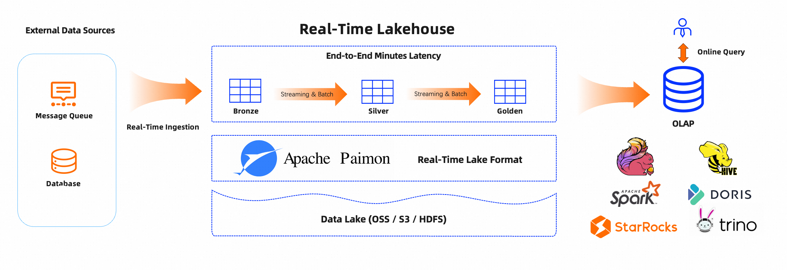

As shown in the architecture above:

**Read/Write:** Paimon supports a versatile way to read/write data and perform OLAP queries.

- For reads, it supports consuming data
  - from historical snapshots (in batch mode),
  - from the latest offset (in streaming mode), or
  - reading incremental snapshots in a hybrid way.
- For writes, it supports
  - streaming synchronization from the changelog of databases (CDC)
  - batch insert/overwrite from offline data.

**Ecosystem:** In addition to Apache Flink, Paimon also supports read by other computation
engines like Apache Spark, StarRocks, Apache Doris, Apache Hive and Trino.

**Internal:**

- Under the hood, Paimon stores the columnar files on the filesystem/object-store
- The metadata of the file is saved in the manifest file, providing large-scale storage and data skipping.
- For primary key table, uses the LSM tree structure to support a large volume of data updates and high-performance queries.

For streaming engines like Apache Flink, there are typically three types of connectors:

- Message queue, such as Apache Kafka, it is used in both source and
  intermediate stages in this pipeline, to guarantee the latency stay
  within seconds.
- OLAP system, such as ClickHouse, it receives processed data in
  streaming fashion and serving user's ad-hoc queries.
- Batch storage, such as Apache Hive, it supports various operations
  of the traditional batch processing, including `INSERT OVERWRITE`.

Paimon provides table abstraction. It is used in a way that
does not differ from the traditional database:

- In `batch` execution mode, it acts like a Hive table and
  supports various operations of Batch SQL. Query it to see the
  latest snapshot.
- In `streaming` execution mode, it acts like a message queue.
  Query it acts like querying a stream changelog from a message queue
  where historical data never expires.

---

<a id="concepts-basic-concepts"></a>

<!-- source_url: https://paimon.apache.org/docs/master/concepts/basic-concepts/ -->

<!-- page_index: 2 -->

# Basic Concepts

All files of a table are stored under one base directory. Paimon files are organized in a layered style. The following image illustrates the file layout. Starting from a snapshot file, Paimon readers can recursively access all records from the table.


All snapshot files are stored in the `snapshot` directory.

A snapshot file is a JSON file containing information about this snapshot, including

- the schema file in use
- the manifest list containing all changes of this snapshot

A snapshot captures the state of a table at some point in time. Users can access the latest data of a table through the
latest snapshot. By time traveling, users can also access the previous state of a table through an earlier snapshot.

All manifest lists and manifest files are stored in the `manifest` directory.

A manifest list is a list of manifest file names.

A manifest file is a file containing changes about LSM data files and changelog files. For example, which LSM data file is created and which file is deleted in the corresponding snapshot.

Data files are grouped by partitions. Currently, Paimon supports using parquet (default), orc and avro as data file's format.

Paimon adopts the same partitioning concept as Apache Hive to separate data.

Partitioning is an optional way of dividing a table into related parts based on the values of particular columns like date, city, and department. Each table can have one or more partition keys to identify a particular partition.

By partitioning, users can efficiently operate on a slice of records in the table.

Paimon writers use two-phase commit protocol to atomically commit a batch of records to the table. Each commit produces
at most two [snapshots](#concepts-basic-concepts--snapshot) at commit time. It depends on the incremental write and compaction strategy. If only incremental writes are performed without triggering a compaction operation, only an incremental snapshot will be created. If a compaction operation is triggered, an incremental snapshot and a compacted snapshot will be created.

For any two writers modifying a table at the same time, as long as they do not modify the same partition, their commits
can occur in parallel. If they modify the same partition, only snapshot isolation is guaranteed. That is, the final table
state may be a mix of the two commits, but no changes are lost.
See [dedicated compaction job](#maintenance-dedicated-compaction--dedicated-compaction-job) for more info.

---

<a id="concepts-concurrency-control"></a>

<!-- source_url: https://paimon.apache.org/docs/master/concepts/concurrency-control/ -->

<!-- page_index: 3 -->

# Concurrency Control

Paimon supports optimistic concurrency for multiple concurrent write jobs.

Each job writes data at its own pace and generates a new snapshot based on the current snapshot by applying incremental
files (deleting or adding files) at the time of committing.

There may be two types of commit failures here:

1. Snapshot conflict: the snapshot id has been preempted, the table has generated a new snapshot from another job. OK, let's commit again.
2. Files conflict: The file that this job wants to delete has been deleted by another jobs. At this point, the job can only fail. (For streaming jobs, it will fail and restart, intentionally failover once)

Paimon's snapshot ID is unique, so as long as the job writes its snapshot file to the file system, it is considered successful.

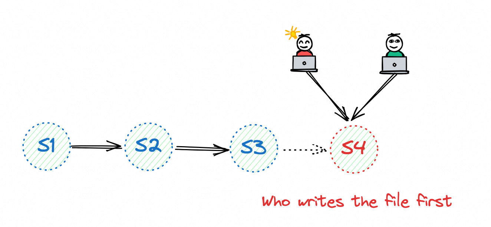

Paimon uses the file system's renaming mechanism to commit snapshots, which is secure for HDFS as it ensures
transactional and atomic renaming.

But for object storage such as OSS and S3, their `'RENAME'` does not have atomic semantic. We need to configure Hive or
jdbc metastore and enable `'lock.enabled'` option for the catalog. Otherwise, there may be a chance of losing the snapshot.

When Paimon commits a file deletion (which is only a logical deletion), it checks for conflicts with the latest snapshot.
If there are conflicts (which means the file has been logically deleted), it can no longer continue on this commit node, so it can only intentionally trigger a failover to restart, and the job will retrieve the latest status from the filesystem
in the hope of resolving this conflict.

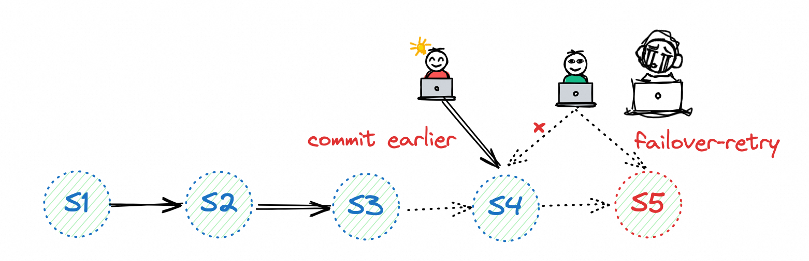

Paimon will ensure that there is no data loss or duplication here, but if two streaming jobs are writing at the same
time and there are conflicts, you will see that they are constantly restarting, which is not a good thing.

The essence of conflict lies in deleting files (logically), and deleting files is born from compaction, so as long as
we close the compaction of the writing job (Set 'write-only' to true) and start a separate job to do the compaction work, everything is very good.

See [dedicated compaction job](#maintenance-dedicated-compaction--dedicated-compaction-job) for more info.

---

<a id="concepts-catalog"></a>

<!-- source_url: https://paimon.apache.org/docs/master/concepts/catalog/ -->

<!-- page_index: 4 -->

# Catalog

Paimon provides a Catalog abstraction to manage the table of contents and metadata. The Catalog abstraction provides
a series of ways to help you better integrate with computing engines. We always recommend that you use Catalog to
access the Paimon table.

Paimon catalogs currently support four types of metastores:

- `filesystem` metastore (default), which stores both metadata and table files in filesystems.
- `hive` metastore, which additionally stores metadata in Hive metastore. Users can directly access the tables from Hive.
- `jdbc` metastore, which additionally stores metadata in relational databases such as MySQL, Postgres, etc.
- `rest` metastore, which is designed to provide a lightweight way to access any catalog backend from a single client.

Metadata and table files are stored under `hdfs:///path/to/warehouse`.

```sql
-- Flink SQL 
CREATE CATALOG my_catalog WITH ( 
    'type' = 'paimon', 
    'warehouse' = 'hdfs:///path/to/warehouse' 
); 
```

By using the Paimon REST catalog, changes to the catalog will be directly stored in a remote catalog server which exposed through REST API.
See [Paimon REST Catalog](#concepts-rest).

By using Paimon Hive catalog, changes to the catalog will directly affect the corresponding Hive metastore. Tables
created in such catalog can also be accessed directly from Hive. Metadata and table files are stored under
`hdfs:///path/to/warehouse`. In addition, schema is also stored in Hive metastore.

```sql
-- Flink SQL 
CREATE CATALOG my_hive WITH ( 
    'type' = 'paimon', 
    'metastore' = 'hive', 
    -- 'warehouse' = 'hdfs:///path/to/warehouse', default use 'hive.metastore.warehouse.dir' in HiveConf 
); 
```

By default, Paimon does not synchronize newly created partitions into Hive metastore. Users will see an unpartitioned
table in Hive. Partition push-down will be carried out by filter push-down instead.

If you want to see a partitioned table in Hive and also synchronize newly created partitions into Hive metastore, please set the table option `metastore.partitioned-table` to true.

By using the Paimon JDBC catalog, changes to the catalog will be directly stored in relational databases such as SQLite, MySQL, postgres, etc.

```sql
-- Flink SQL 
CREATE CATALOG my_jdbc WITH ( 
    'type' = 'paimon', 
    'metastore' = 'jdbc', 
    'uri' = 'jdbc:mysql://<host>:<port>/<databaseName>', 
    'jdbc.user' = '...',  
    'jdbc.password' = '...',  
    'catalog-key'='jdbc', 
    'warehouse' = 'hdfs:///path/to/warehouse' 
); 
```

---

<a id="concepts-system-tables"></a>

<!-- source_url: https://paimon.apache.org/docs/master/concepts/system-tables/ -->

<!-- page_index: 5 -->

# System Tables

> [!NOTE]
> **info**
> The `table-read.sequence-number.enabled` option cannot be set via SQL hints.

---

<a id="concepts-data-types"></a>

<!-- source_url: https://paimon.apache.org/docs/master/concepts/data-types/ -->

<!-- page_index: 6 -->

# Data Types

A data type describes the logical type of a value in the table ecosystem. It can be used to declare input and/or output types of operations.

All data types supported by Paimon are as follows:

<table class="table table-bordered">
<thead>
<tr>
<th>DataType</th>
<th>Description</th>
</tr>
</thead>
<tbody>
<tr>
<td><code>BOOLEAN</code></td>
<td><code>Data type of a boolean with a (possibly) three-valued logic of TRUE, FALSE, and UNKNOWN.</code></td>
</tr>
<tr>
<td><code>CHAR</code>
<code>CHAR(n)</code>
</td>
<td><code>Data type of a fixed-length character string.</code>
<code>The type can be declared using CHAR(n) where n is the number of code points. n must have a value between 1 and 2,147,483,647 (both inclusive). If no length is specified, n is equal to 1. </code>
</td>
</tr>
<tr>
<td><code>VARCHAR</code>
<code>VARCHAR(n)</code>
<code>STRING</code>
</td>
<td><code>Data type of a variable-length character string.</code>
<code>The type can be declared using VARCHAR(n) where n is the maximum number of code points. n must have a value between 1 and 2,147,483,647 (both inclusive). If no length is specified, n is equal to 1. </code>
<code>STRING is a synonym for VARCHAR(2147483647).</code>
</td>
</tr>
<tr>
<td><code>BINARY</code>
<code>BINARY(n)</code>
</td>
<td><code>Data type of a fixed-length binary string (=a sequence of bytes).</code>
<code>The type can be declared using BINARY(n) where n is the number of bytes. n must have a value between 1 and 2,147,483,647 (both inclusive). If no length is specified, n is equal to 1.</code>
</td>
</tr>
<tr>
<td><code>VARBINARY</code>
<code>VARBINARY(n)</code>
<code>BYTES</code>
</td>
<td><code>Data type of a variable-length binary string (=a sequence of bytes).</code>
<code>The type can be declared using VARBINARY(n) where n is the maximum number of bytes. n must have a value between 1 and 2,147,483,647 (both inclusive). If no length is specified, n is equal to 1.</code>
<code>BYTES is a synonym for VARBINARY(2147483647).</code>
</td>
</tr>
<tr>
<td><code>DECIMAL</code>
<code>DECIMAL(p)</code>
<code>DECIMAL(p, s)</code>
</td>
<td><code>Data type of a decimal number with fixed precision and scale.</code>
<code>The type can be declared using DECIMAL(p, s) where p is the number of digits in a number (precision) and s is the number of digits to the right of the decimal point in a number (scale). p must have a value between 1 and 38 (both inclusive). s must have a value between 0 and p (both inclusive). The default value for p is 10. The default value for s is 0.</code>
</td>
</tr>
<tr>
<td><code>TINYINT</code></td>
<td><code>Data type of a 1-byte signed integer with values from -128 to 127.</code></td>
</tr>
<tr>
<td><code>SMALLINT</code></td>
<td><code>Data type of a 2-byte signed integer with values from -32,768 to 32,767.</code></td>
</tr>
<tr>
<td><code>INT</code></td>
<td><code>Data type of a 4-byte signed integer with values from -2,147,483,648 to 2,147,483,647.</code></td>
</tr>
<tr>
<td><code>BIGINT</code></td>
<td><code>Data type of an 8-byte signed integer with values from -9,223,372,036,854,775,808 to 9,223,372,036,854,775,807.</code></td>
</tr>
<tr>
<td><code>FLOAT</code></td>
<td><code>Data type of a 4-byte single precision floating point number.</code>
<code>Compared to the SQL standard, the type does not take parameters.</code>
</td>
</tr>
<tr>
<td><code>DOUBLE</code></td>
<td><code>Data type of an 8-byte double precision floating point number.</code></td>
</tr>
<tr>
<td><code>DATE</code></td>
<td><code>Data type of a date consisting of year-month-day with values ranging from 0000-01-01 to 9999-12-31.</code>
<code>Compared to the SQL standard, the range starts at year 0000.</code>
</td>
</tr>
<tr>
<td><code>TIME</code>
<code>TIME(p)</code>
</td>
<td><code>Data type of a time without time zone consisting of hour:minute:second[.fractional] with up to nanosecond precision and values ranging from 00:00:00.000000000 to 23:59:59.999999999.</code>
<code>The type can be declared using TIME(p) where p is the number of digits of fractional seconds (precision). p must have a value between 0 and 9 (both inclusive). If no precision is specified, p is equal to 0.</code>
</td>
</tr>
<tr>
<td><code>TIMESTAMP</code>
<code>TIMESTAMP(p)</code>
</td>
<td><code>Data type of a timestamp without time zone consisting of year-month-day hour:minute:second[.fractional] with up to nanosecond precision and values ranging from 0000-01-01 00:00:00.000000000 to 9999-12-31 23:59:59.999999999.</code>
<code>The type can be declared using TIMESTAMP(p) where p is the number of digits of fractional seconds (precision). p must have a value between 0 and 9 (both inclusive). If no precision is specified, p is equal to 6.</code>
</td>
</tr>
<tr>
<td><code>TIMESTAMP WITH LOCAL TIME ZONE</code>
<code>TIMESTAMP(p) WITH LOCAL TIME ZONE</code>
</td>
<td><code>Data type of a timestamp with local time zone consisting of year-month-day hour:minute:second[.fractional] zone with up to nanosecond precision and values ranging from 0000-01-01 00:00:00.000000000 +14:59 to 9999-12-31 23:59:59.999999999 -14:59.</code>
<code>This type fills the gap between time zone free and time zone mandatory timestamp types by allowing the interpretation of UTC timestamps according to the configured session time zone. A  conversion from and to int describes the number of seconds since epoch. A conversion from and to long describes the number of milliseconds since epoch.</code>
</td>
</tr>
<tr>
<td><code>ARRAY&lt;t&gt;</code></td>
<td><code>Data type of an array of elements with same subtype.</code>
<code>Compared to the SQL standard, the maximum cardinality of an array cannot be specified but is fixed at 2,147,483,647. Also, any valid type is supported as a subtype.</code>
<code>The type can be declared using ARRAY&lt;t&gt; where t is the data type of the contained elements.</code>
</td>
</tr>
<tr>
<td><code>MAP&lt;kt, vt&gt;</code></td>
<td><code>Data type of an associative array that maps keys (including NULL) to values (including NULL). A map cannot contain duplicate keys; each key can map to at most one value.</code>
<code>There is no restriction of element types; it is the responsibility of the user to ensure uniqueness.</code>
<code>The type can be declared using MAP&lt;kt, vt&gt; where kt is the data type of the key elements and vt is the data type of the value elements.</code>
</td>
</tr>
<tr>
<td><code>MULTISET&lt;t&gt;</code></td>
<td><code>Data type of a multiset (=bag). Unlike a set, it allows for multiple instances for each of its elements with a common subtype. Each unique value (including NULL) is mapped to some multiplicity.</code>
<code>There is no restriction of element types; it is the responsibility of the user to ensure uniqueness.</code>
<code>The type can be declared using MULTISET&lt;t&gt; where t is the data type of the contained elements.</code>
</td>
</tr>
<tr>
<td><code>ROW&lt;n0 t0, n1 t1, ...&gt;</code>
<code>ROW&lt;n0 t0 'd0', n1 t1 'd1', ...&gt;</code>
</td>
<td><code>Data type of a sequence of fields.</code>
<code>A field consists of a field name, field type, and an optional description. The most specific type of a row of a table is a row type. In this case, each column of the row corresponds to the field of the row type that has the same ordinal position as the column.</code>
<code>Compared to the SQL standard, an optional field description simplifies the handling with complex structures.</code>
<code>A row type is similar to the STRUCT type known from other non-standard-compliant frameworks.</code>
<code>The type can be declared using ROW&lt;n0 t0 'd0', n1 t1 'd1', ...&gt; where n is the unique name of a field, t is the logical type of a field, d is the description of a field.</code>
</td>
</tr>
<tr>
<td><code>VARIANT</code></td>
<td><code>Data type of semi-structured data.</code>
<code>Designed for storing any semi-structured data, including ARRAY, MAP, and scalar types. VARIANT can only store MAP types with keys of type STRING.</code>
<code>Note: Requires Flink 2.0+ and Spark 4.0+.</code>
</td>
</tr>
<tr>
<td><code>BLOB</code></td>
<td><code>Data type of a binary large object.</code>
<code>Designed for storing large binary data such as images, videos, audio files, and other multimodal data. Unlike BYTES type which stores data inline, BLOB stores large binary data in separate files and maintains references to them, providing better performance for large objects.</code>
<pre><code>Note: Requires 'row-tracking.enabled' and 'data-evolution.enabled' to be set to true. See <a href="#multimodal-table-blob">Blob Type</a> for details.</code></pre>
</td>
</tr>
</tbody></table>

---

<a id="concepts-functions"></a>

<!-- source_url: https://paimon.apache.org/docs/master/concepts/functions/ -->

<!-- page_index: 7 -->

# Functions

Paimon introduces a Function abstraction designed to support functions in a standard format for compute engine, addressing:

- **Unified Column-Level Filtering and Processing:** Facilitates operations at the column level, including tasks such as encryption and decryption of data.
- **Parameterized View Capabilities:** Supports parameterized operations within views, enhancing the dynamism and usability of data retrieval processes.

Currently, Paimon supports three types of functions:

1. **File Function:** Users can define functions within a file, providing flexibility and modular support for function definition.
2. **Lambda Function:** Empowering users to define functions using Java lambda expressions, enabling inline, concise, and functional-style operations.
3. **SQL Function:** Users can define functions directly within SQL, which integrates seamlessly with SQL-based data processing.

Paimon functions can be utilized within Apache Flink to execute complex data operations. Below are the SQL commands for creating, altering, and dropping functions in Flink environments.

To create a new function in Flink SQL:

```sql
-- Flink SQL 
CREATE FUNCTION mydb.parse_str 
    AS 'com.streaming.flink.udf.StrUdf'  
    LANGUAGE JAVA 
    USING JAR 'oss://my_bucket/my_location/udf.jar' [, JAR 'oss://my_bucket/my_location/a.jar']; 
```

This statement creates a Java-based user-defined function named `parse_str` within the `mydb` database, utilizing specified JAR files from an object storage location.

To modify an existing function in Flink SQL:

```sql
-- Flink SQL 
ALTER FUNCTION mydb.parse_str 
    AS 'com.streaming.flink.udf.StrUdf2'  
    LANGUAGE JAVA; 
```

This command changes the implementation of the `parse_str` function to use a new Java class definition.

To remove a function from Flink SQL:

```sql
-- Flink SQL 
DROP FUNCTION mydb.parse_str; 
```

This statement deletes the existing `parse_str` function from the `mydb` database, relinquishing its functionality.

see [SQL Functions](#spark-sql-functions--user-defined-function)

---

<a id="concepts-views"></a>

<!-- source_url: https://paimon.apache.org/docs/master/concepts/views/ -->

<!-- page_index: 8 -->

# Views

A view is a logical table that encapsulates business logic and domain-specific semantics.
While most compute engines support views natively, each engine stores view metadata in proprietary formats, creating interoperability challenges across different platforms.
Paimon views abstracting engine-specific query dialects and establishing unified metadata standards.
View metadata could enable centralized view management that facilitates cross-engine sharing and reduces maintenance complexity in heterogeneous computing environments.

View metadata is persisted only when the catalog implementation supports it:

- **Hive metastore catalog** – view metadata is stored together with table metadata inside the
  metastore warehouse.
- **REST catalog** – view metadata is kept in the REST backend and exposed through the catalog API.

File-system catalogs do not currently support views because they lack persistent metadata storage.

| Field | Type | Description |
| --- | --- | --- |
| `query` | `string` | Canonical SQL `SELECT` statement that defines the view. |
| `dialect` | `string` | SQL dialect identifier (for example, `spark` or `flink`). |

Multiple representations can be stored for the same version so that different engines can access the
view using their native dialect.

Use `CREATE VIEW` or `CREATE OR REPLACE VIEW` to register a view. Paimon assigns a UUID, writes the
first metadata file, and records version `1`.

```sql
CREATE VIEW sales_view AS 
SELECT region, SUM(amount) AS total_amount 
FROM sales 
GROUP BY region; 
```

Paimon provides the `sys.alter_view_dialect` procedure so that engines can manage multiple SQL
representations for the same view version.

```sql
-- Add a Flink dialect 
CALL [catalog.]sys.alter_view_dialect('view_identifier', 'add', 'flink', 'SELECT ...'); 
 
-- Update the stored Flink dialect 
CALL [catalog.]sys.alter_view_dialect('view_identifier', 'update', 'flink', 'SELECT ...'); 
 
-- Drop the Flink dialect representation 
CALL [catalog.]sys.alter_view_dialect('view_identifier', 'drop', 'flink'); 
```

```sql
-- Add a Spark dialect 
CALL sys.alter_view_dialect('view_identifier', 'add', 'spark', 'SELECT ...'); 
 
-- Update the Spark dialect 
CALL sys.alter_view_dialect('view_identifier', 'update', 'spark', 'SELECT ...'); 
 
-- Drop the Spark dialect 
CALL sys.alter_view_dialect('view_identifier', 'drop', 'spark'); 
```

`DROP VIEW view_name;`

- [Spark SQL DDL – Views](#spark-sql-ddl--view)
- [REST Catalog Overview](#concepts-rest)
- [REST Catalog View API](https://paimon.apache.org/docs/master/concepts/rest/rest-api)

---

<a id="concepts-rest"></a>

<!-- source_url: https://paimon.apache.org/docs/master/concepts/rest/ -->

<!-- page_index: 9 -->

# RESTCatalog

Paimon REST Catalog provides a lightweight implementation to access the catalog service. Paimon could access the
catalog service through a catalog server which implements REST API. You can see all APIs in [REST API](https://paimon.apache.org/docs/master/concepts/rest/rest-api).

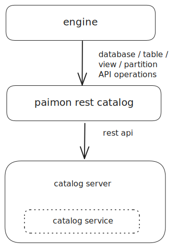

1. User Defined Technology-Specific Logic Implementation
   - All technology-specific logic within the catalog server.
   - This ensures that the user can define logic that could be owned by the user.
2. Decoupled Architecture
   - The REST Catalog interacts with the catalog server through a well-defined REST API.
   - This decoupling allows for independent evolution and scaling of the catalog server and clients.
3. Language Agnostic
   - Developers can implement the catalog server in any programming language, provided that it adheres to the specified REST API.
   - This flexibility enables teams to utilize their existing tech stacks and expertise.
4. Support for Any Catalog Backend
   - REST Catalog is designed to work with any catalog backend.
   - As long as they implement the relevant APIs, they can seamlessly integrate with REST Catalog.

REST Catalog offers adaptable solution for accessing the catalog service. According to [REST API](https://paimon.apache.org/docs/master/concepts/rest/rest-api) is decoupled
from the catalog service.

Technology-specific Logic is encapsulated on the catalog server. At the same time, the catalog server supports any
backend and languages.

RESTCatalog supports multiple access authentication methods, including the following:

1. [Bear Token](#concepts-rest-bear).
2. [DLF Token](#concepts-rest-dlf).

See [REST API](https://paimon.apache.org/docs/master/concepts/rest/rest-api).

---

<a id="concepts-rest-bear"></a>

<!-- source_url: https://paimon.apache.org/docs/master/concepts/rest/bear/ -->

<!-- page_index: 10 -->

# Bear Token

A bearer token is an encrypted string, typically generated by the server based on a secret key. When the client
sends a request to the server, it must include `Authorization: Bearer <token>` in the request header. After receiving
the request, the server extracts the `<token>` and validates its legitimacy. If the validation passes, the
authentication is successful.

```sql
CREATE CATALOG `paimon-rest-catalog` 
WITH ( 
    'type' = 'paimon', 
    'uri' = '<catalog server url>', 
    'metastore' = 'rest', 
    'warehouse' = 'my_instance_name', 
    'token.provider' = 'bear' 
    'token' = '<token>' 
); 
```

---

<a id="concepts-rest-dlf"></a>

<!-- source_url: https://paimon.apache.org/docs/master/concepts/rest/dlf/ -->

<!-- page_index: 11 -->

# DLF Token

> [!NOTE]
> **info**
> The `'warehouse'` is your catalog instance name on the server, not the path.

---

<a id="concepts-rest-tables"></a>

<!-- source_url: https://paimon.apache.org/docs/master/concepts/rest/tables/ -->

<!-- page_index: 12 -->

# Tables

Paimon supports tables:

1. paimon table: Paimon Data Table with or without Primary key
2. format-table: file format table refers to a directory that contains multiple files of the same format, where
   operations on this table allow for reading or writing to these files, compatible with Hive tables.
3. object table: provides metadata indexes for unstructured data objects in the specified Object Storage directory.

See [Paimon with Primary key](#primary-key-table).

Primary keys consist of a set of columns that contain unique values for each record. Paimon enforces data ordering by
sorting the primary key within each bucket, allowing streaming update and streaming changelog read.

The definition of primary key is similar to that of standard SQL, as it ensures that there is only one data entry for
the same primary key during batch queries.

<div class="theme-tabs-container tabs-container tabList__CuJ"><ul><li>Flink SQL</li><li>Spark SQL</li></ul><div><div><div><div><pre><code><div><span>CREATE</span><span> </span><span>TABLE</span><span> my_table </span><span>(</span><span></span> </div><div><span>    a </span><span>INT</span><span> </span><span>PRIMARY</span><span> </span><span>KEY</span><span> </span><span>NOT</span><span> ENFORCED</span><span>,</span><span></span> </div><div><span>    b STRING</span> </div><div><span></span><span>)</span><span> </span><span>WITH</span><span> </span><span>(</span><span></span> </div><div><span>    </span><span>'bucket'</span><span>=</span><span>'8'</span><span></span> </div><div><span></span><span>)</span> </div></code></pre></div></div></div><div><div><div><pre><code><div><span>CREATE</span><span> </span><span>TABLE</span><span> my_table </span><span>(</span><span></span> </div><div><span>    a </span><span>INT</span><span>,</span><span></span> </div><div><span>    b STRING</span> </div><div><span></span><span>)</span><span> TBLPROPERTIES </span><span>(</span><span></span> </div><div><span>    </span><span>'primary-key'</span><span> </span><span>=</span><span> </span><span>'a'</span><span>,</span><span></span> </div><div><span>    </span><span>'bucket'</span><span> </span><span>=</span><span> </span><span>'8'</span><span></span> </div><div><span></span><span>)</span> </div></code></pre></div></div></div></div></div>

See [Append Table](#append-table).

If a table does not have a primary key defined, it is an append table. Compared to the primary key table, it does not
have the ability to directly receive changelogs. It cannot be directly updated with data through streaming upsert. It
can only receive incoming data from append data.

However, it also supports batch sql: DELETE, UPDATE, and MERGE-INTO.

```sql
CREATE TABLE my_table ( 
    a INT, 
    b STRING 
) 
```

The Hive tables inside the metastore will be mapped to Paimon's Format Table for computing engines (Spark, Hive, Flink)
to read and write.

Format table refers to a directory that contains multiple files of the same format, where operations on this table
allow for reading or writing to these files, facilitating the retrieval of existing data and the addition of new files.

Partitioned file format table just like the standard hive format. Partitions are discovered and inferred based on
directory structure.

Currently only support `CSV`, `Parquet`, `ORC`, `JSON` formats.

<div class="theme-tabs-container tabs-container tabList__CuJ"><ul><li>Flink-CSV</li><li>Spark-CSV</li><li>Flink-Parquet</li><li>Spark-Parquet</li><li>Flink-JSON</li><li>Spark-JSON</li></ul><div><div><div><div><pre><code><div><span>CREATE</span><span> </span><span>TABLE</span><span> my_csv_table </span><span>(</span><span></span> </div><div><span>    a </span><span>INT</span><span>,</span><span></span> </div><div><span>    b STRING</span> </div><div><span></span><span>)</span><span> </span><span>WITH</span><span> </span><span>(</span><span></span> </div><div><span>    </span><span>'type'</span><span>=</span><span>'format-table'</span><span>,</span><span></span> </div><div><span>    </span><span>'file.format'</span><span>=</span><span>'csv'</span><span>,</span><span></span> </div><div><span>    </span><span>'csv.field-delimiter'</span><span>=</span><span>','</span><span></span> </div><div><span></span><span>)</span> </div></code></pre></div></div></div><div><div><div><pre><code><div><span>CREATE</span><span> </span><span>TABLE</span><span> my_csv_table </span><span>(</span><span></span> </div><div><span>    a </span><span>INT</span><span>,</span><span></span> </div><div><span>    b STRING</span> </div><div><span></span><span>)</span><span> </span><span>USING</span><span> csv OPTIONS </span><span>(</span><span>'csv.field-delimiter'</span><span> </span><span>','</span><span>)</span> </div></code></pre></div></div></div><div><div><div><pre><code><div><span>CREATE</span><span> </span><span>TABLE</span><span> my_parquet_table </span><span>(</span><span></span> </div><div><span>    a </span><span>INT</span><span>,</span><span></span> </div><div><span>    b STRING</span> </div><div><span></span><span>)</span><span> </span><span>WITH</span><span> </span><span>(</span><span></span> </div><div><span>    </span><span>'type'</span><span>=</span><span>'format-table'</span><span>,</span><span></span> </div><div><span>    </span><span>'file.format'</span><span>=</span><span>'parquet'</span><span></span> </div><div><span></span><span>)</span> </div></code></pre></div></div></div><div><div><div><pre><code><div><span>CREATE</span><span> </span><span>TABLE</span><span> my_parquet_table </span><span>(</span><span></span> </div><div><span>    a </span><span>INT</span><span>,</span><span></span> </div><div><span>    b STRING</span> </div><div><span></span><span>)</span><span> </span><span>USING</span><span> parquet</span> </div></code></pre></div></div></div><div><div><div><pre><code><div><span>CREATE</span><span> </span><span>TABLE</span><span> my_json_table </span><span>(</span><span></span> </div><div><span>    a </span><span>INT</span><span>,</span><span></span> </div><div><span>    b STRING</span> </div><div><span></span><span>)</span><span> </span><span>WITH</span><span> </span><span>(</span><span></span> </div><div><span>    </span><span>'type'</span><span>=</span><span>'format-table'</span><span>,</span><span></span> </div><div><span>    </span><span>'file.format'</span><span>=</span><span>'json'</span><span></span> </div><div><span></span><span>)</span> </div></code></pre></div></div></div><div><div><div><pre><code><div><span>CREATE</span><span> </span><span>TABLE</span><span> my_json_table </span><span>(</span><span></span> </div><div><span>    a </span><span>INT</span><span>,</span><span></span> </div><div><span>    b STRING</span> </div><div><span></span><span>)</span><span> </span><span>USING</span><span> json</span> </div></code></pre></div></div></div></div></div>

Object Table is a virtual table for unstructured data objects in the specified object storage directory. Users can:

1. Use the virtual file system (Under development) to read and write files.
2. Or use the SQL computing engine to read it as a structured file list.

The object table is managed by Catalog and can also have access permissions. Now, only REST Catalog supports Object
Table.

To Create an object table:

<div class="theme-tabs-container tabs-container tabList__CuJ"><ul><li>Flink-SQL</li><li>Spark-SQL</li></ul><div><div><div><div><pre><code><div><span>CREATE</span><span> </span><span>TABLE</span><span> </span><span>`</span><span>my_object_table</span><span>`</span><span> </span><span>WITH</span><span> </span><span>(</span><span></span> </div><div><span>  </span><span>'type'</span><span> </span><span>=</span><span> </span><span>'object-table'</span><span></span> </div><div><span></span><span>)</span><span>;</span> </div></code></pre></div></div></div><div><div><div><pre><code><div><span>CREATE</span><span> </span><span>TABLE</span><span> </span><span>`</span><span>my_object_table</span><span>`</span><span> TBLPROPERTIES </span><span>(</span><span></span> </div><div><span>  </span><span>'type'</span><span> </span><span>=</span><span> </span><span>'object-table'</span><span></span> </div><div><span></span><span>)</span><span>;</span> </div></code></pre></div></div></div></div></div>

We recommend using [pvfs](#concepts-rest-pvfs). to access files in the object table, access to the files
through the permission system of Paimon REST Catalog.

---

<a id="concepts-rest-pvfs"></a>

<!-- source_url: https://paimon.apache.org/docs/master/concepts/rest/pvfs/ -->

<!-- page_index: 13 -->

# Paimon Virtual Storage

The REST Catalog provides built-in storage, including Paimon Table, Format Table, and Object Table (also known as Fileset or Volume), both of which require direct access to the file system. And our REST Catalog generates UUID paths, which makes it difficult
to directly access the file system.

So there is PVFS, which can allow users to access it through similar methods `pvfs://catalog_name/database_name/table_name/`, use the path to access all internal tables in the REST Catalog, including Paimon Table, Format Table, and Object Table.
Another advantage is that all user access to this file system is through the permission system of Paimon REST Catalog, without the need to maintain another file system permission system.

For example, if you have a catalog named 'my\_catalog', the list behavior should be:

- `listStatus(Path('pvfs://my_catalog/'))`: return all databases, only virtual paths in FileStatus.
- `listStatus(Path('pvfs://my_catalog/my_database'))`: return all tables, only virtual paths in FileStatus.

All paths return virtual paths, reading and writing files will actually read and write data according to the true path
of the table.

- `newInputStream(Path('pvfs://my_catalog/my_database/my_table'))`: get the real path from rest server, and use real filesystem to read data.

Provide a Java SDK to implement Hadoop FileSystem. In this way, compute engines can integrate 'PVFS' very easy.

For example, Java code can do:

```java
Configuration conf = new Configuration(); 
conf.set("fs.AbstractFileSystem.pvfs.impl", "org.apache.paimon.vfs.hadoop.Pvfs"); 
conf.set("fs.pvfs.impl", "org.apache.paimon.vfs.hadoop.PaimonVirtualFileSystem"); 
conf.set("fs.pvfs.uri", "http://localhost:10000"); 
conf.set("fs.pvfs.token.provider", "bear"); 
conf.set("fs.pvfs.token", "token"); 
Path path = new Path("pvfs://catalog_name/database_name/table_name/a.csv"); 
FileSystem fs = path.getFileSystem(conf); 
FileStatus fileStatus = fs.getFileStatus(path); 
```

For example, Spark SQL can do:

```scala
val spark = SparkSession.builder() 
.appName("PVFS CSV Analysis") 
.config("spark.hadoop.fs.pvfs.impl", "org.apache.paimon.vfs.hadoop.PaimonVirtualFileSystem") 
.config("spark.hadoop.fs.pvfs.uri", "http://localhost:10000") 
.config("spark.hadoop.fs.pvfs.token.provider", "bear") 
.config("spark.hadoop.fs.pvfs.token", "token") 
.getOrCreate() 
spark.sql( 
s""" 
|CREATE TEMPORARY VIEW csv_table 
|USING csv 
|OPTIONS ( 
|  path 'pvfs://catalog_name/database_name/my_format_table_name/a.csv', 
|  header 'true', 
|  inferSchema 'true' 
|) 
""".stripMargin 
) 
 
spark.sql("SELECT * FROM csv_table LIMIT 5").show() 
```

For example, use Hadoop shell command:

```xml
<!-- Configure following configuration in hadoop `core-site.xml` --> 
<property> 
  <name>fs.AbstractFileSystem.pvfs.impl</name> 
  <value>org.apache.paimon.vfs.hadoop.Pvfs</value> 
</property> 
 
<property> 
  <name>fs.pvfs.impl</name> 
  <value>org.apache.paimon.vfs.hadoop.PaimonVirtualFileSystem</value> 
</property> 
 
<property> 
  <name>fs.pvfs.uri</name> 
  <value>http://localhost:10000</value> 
</property> 
 
<property> 
  <name>fs.pvfs.token.provider</name> 
  <value>bear</value> 
</property> 
 
<property> 
  <name>fs.pvfs.token</name> 
  <value>token</value> 
</property> 
```

Example: execute hadoop shell to list the virtual path

```shell
./${HADOOP_HOME}/bin/hadoop dfs -ls pvfs://catalog_name/database_name/table_name 
```

Python SDK provide fsspec style API, can be easily integrated to Python ecosystem.

For example, Python code can do:

```python
import pypaimon 
 
options = { 
    'uri': 'key', 
    'token.provider': 'bear', 
    'token': '<token>' 
} 
fs = pypaimon.PaimonVirtualFileSystem(options) 
fs.ls("pvfs://catalog_name/database_name/table_name") 
```

For example, Pyarrow can do:

```python
import pypaimon 
import pyarrow.parquet as pq 
 
options = { 
    'uri': 'key', 
    'token.provider': 'bear', 
    'token': '<token>' 
} 
fs = pypaimon.PaimonVirtualFileSystem(options) 
path = 'pvfs://catalog_name/database_name/table_name/a.parquet' 
dataset = pq.ParquetDataset(path, filesystem=fs) 
table = dataset.read() 
df = table.to_pandas() 
```

For example, Ray can do:

```python
import pypaimon 
import ray 
 
options = { 
    'uri': 'key', 
    'token.provider': 'bear', 
    'token': '<token>' 
} 
fs = pypaimon.PaimonVirtualFileSystem(options) 
 
ds = ray.data.read_parquet(filesystem=fs,paths="pvfs://....parquet") 
```

---

<a id="concepts-spec"></a>

<!-- source_url: https://paimon.apache.org/docs/master/concepts/spec/ -->

<!-- page_index: 14 -->

# Spec Overview

This is the specification for the Paimon table format, this document standardizes the underlying file structure and
design of Paimon.


- Schema: fields, primary keys definition, partition keys definition and options.
- Snapshot: the entrance to all data committed at some specific time point.
- Manifest list: includes several manifest files.
- Manifest: includes several data files or changelog files.
- Data File: contains incremental records.
- Changelog File: contains records produced by changelog-producer.
- Global Index: index for a bucket or partition.
- Data File Index: index for a data file.

Run Flink SQL with Paimon:

```sql
CREATE CATALOG my_catalog WITH ( 
    'type' = 'paimon', 
    'warehouse' = '/your/path' 
);        
USE CATALOG my_catalog; 
 
CREATE TABLE my_table ( 
    k INT PRIMARY KEY NOT ENFORCED, 
    f0 INT, 
    f1 STRING 
); 
 
INSERT INTO my_table VALUES (1, 11, '111'); 
```

Take a look to the disk:

```shell
warehouse 
└── default.db 
    └── my_table 
        ├── bucket-0 
        │   └── data-59f60cb9-44af-48cc-b5ad-59e85c663c8f-0.orc 
        ├── index 
        │   └── index-5625e6d9-dd44-403b-a738-2b6ea92e20f1-0 
        ├── manifest 
        │   ├── index-manifest-5d670043-da25-4265-9a26-e31affc98039-0 
        │   ├── manifest-6758823b-2010-4d06-aef0-3b1b597723d6-0 
        │   ├── manifest-list-9f856d52-5b33-4c10-8933-a0eddfaa25bf-0 
        │   └── manifest-list-9f856d52-5b33-4c10-8933-a0eddfaa25bf-1 
        ├── schema 
        │   └── schema-0 
        └── snapshot 
            ├── EARLIEST 
            ├── LATEST 
            └── snapshot-1 
```

---

<a id="concepts-spec-schema"></a>

<!-- source_url: https://paimon.apache.org/docs/master/concepts/spec/schema/ -->

<!-- page_index: 15 -->

# Schema

The version of the schema file starts from 0 and currently retains all versions of the schema. There may be old files
that rely on the old schema version, so its deletion should be done with caution.

Schema File is JSON, it includes:

1. fields: data field list, data field contains `id`, `name`, `type`, field id is used to support schema evolution.
2. partitionKeys: field name list, partition definition of the table, it cannot be modified.
3. primaryKeys: field name list, primary key definition of the table, it cannot be modified.
4. options: map<string, string>, no ordered, options of the table, including a lot of capabilities and optimizations.

```json
{ 
  "version" : 3, 
  "id" : 0, 
  "fields" : [ { 
    "id" : 0, 
    "name" : "order_id", 
    "type" : "BIGINT NOT NULL" 
  }, { 
    "id" : 1, 
    "name" : "order_name", 
    "type" : "STRING" 
  }, { 
    "id" : 2, 
    "name" : "order_user_id", 
    "type" : "BIGINT" 
  }, { 
    "id" : 3, 
    "name" : "order_shop_id", 
    "type" : "BIGINT" 
  } ], 
  "highestFieldId" : 3, 
  "partitionKeys" : [ ], 
  "primaryKeys" : [ "order_id" ], 
  "options" : { 
    "bucket" : "5" 
  }, 
  "comment" : "", 
  "timeMillis" : 1720496663041 
} 
```

For old versions:

- version 1: should put `bucket -> 1` to options if there is no `bucket` key.
- version 1 & 2: should put `file.format -> orc` to options if there is no `file.format` key.

DataField represents a column of the table.

1. id: int, column id, automatic increment, it is used for schema evolution.
2. name: string, column name.
3. type: data type, it is very similar to SQL type string.
4. description: string.

Updating the schema should generate a new schema file.

```shell
warehouse 
└── default.db 
    └── my_table 
        ├── schema 
            ├── schema-0 
            ├── schema-1 
            └── schema-2 
```

There is a reference to schema in the snapshot. The schema file with the highest numerical value is usually the latest
schema file.

Old schema files cannot be directly deleted because there may be old data files that reference old schema files. When
reading table, it is necessary to rely on them for schema evolution reading.

---

<a id="concepts-spec-snapshot"></a>

<!-- source_url: https://paimon.apache.org/docs/master/concepts/spec/snapshot/ -->

<!-- page_index: 16 -->

# Snapshot

Each commit generates a snapshot file, and the version of the snapshot file starts from 1 and must be continuous.
`EARLIEST` and `LATEST` are hint files at the beginning and end of the snapshot list, and they can be inaccurate.
When hint files are inaccurate, the read will scan all snapshot files to determine the beginning and end.

```shell
warehouse 
└── default.db 
    └── my_table 
        ├── snapshot 
            ├── EARLIEST 
            ├── LATEST 
            ├── snapshot-1 
            ├── snapshot-2 
            └── snapshot-3 
```

Writing commit will preempt the next snapshot id, and once the snapshot file is successfully written, this commit will
be visible.

Snapshot File is JSON, it includes:

1. version: Snapshot file version, current is 3.
2. id: snapshot id, same to file name.
3. schemaId: the corresponding schema version for this commit.
4. baseManifestList: a manifest list recording all changes from the previous snapshots.
5. deltaManifestList: a manifest list recording all new changes occurred in this snapshot.
6. changelogManifestList: a manifest list recording all changelog produced in this snapshot, null if no changelog is produced.
7. indexManifest: a manifest recording all index files of this table, null if no table index file.
8. commitUser: usually generated by UUID, it is used for recovery of streaming writes, one stream write job with one user.
9. commitIdentifier: transaction id corresponding to streaming write, each transaction may result in multiple commits for different commitKinds.
10. commitKind: type of changes in this snapshot, including append, compact, overwrite and analyze.
11. timeMillis: commit time millis.
12. logOffsets: commit log offsets.
13. totalRecordCount: record count of all changes occurred in this snapshot.
14. deltaRecordCount: record count of all new changes occurred in this snapshot.
15. changelogRecordCount: record count of all changelog produced in this snapshot.
16. watermark: watermark for input records, from Flink watermark mechanism, Long.MIN\_VALUE if there is no watermark.
17. statistics: stats file name for statistics of this table.

---

<a id="concepts-spec-manifest"></a>

<!-- source_url: https://paimon.apache.org/docs/master/concepts/spec/manifest/ -->

<!-- page_index: 17 -->

# Manifest

```shell
├── manifest 
    └── manifest-list-51c16f7b-421c-4bc0-80a0-17677f343358-1 
```

Manifest List includes meta of several manifest files. Its name contains UUID, it is an avro file, the schema is:

1. \_FILE\_NAME: STRING, manifest file name.
2. \_FILE\_SIZE: BIGINT, manifest file size.
3. \_NUM\_ADDED\_FILES: BIGINT, number added files in manifest.
4. \_NUM\_DELETED\_FILES: BIGINT, number deleted files in manifest.
5. \_PARTITION\_STATS: SimpleStats, partition stats, the minimum and maximum values of partition fields in this manifest are beneficial
   for skipping certain manifest files during queries, it is a SimpleStats.
6. \_SCHEMA\_ID: BIGINT, schema id when writing this manifest file.

Manifest includes meta of several data files or changelog files or table-index files. Its name contains UUID, it is an
avro file.

The changes of the file are saved in the manifest, and the file can be added or deleted. Manifests should be in
an orderly manner, and the same file may be added or deleted multiple times. The last version should be read. This
design can make commit lighter to support file deletion generated by compaction.

Data Manifest includes meta of several data files or changelog files.

```shell
├── manifest 
    └── manifest-6758823b-2010-4d06-aef0-3b1b597723d6-0 
```

The schema is:

1. \_KIND: TINYINT, ADD or DELETE, 2. \_PARTITION: BYTES, partition spec, a BinaryRow.
3. \_BUCKET: INT, bucket of this file.
4. \_TOTAL\_BUCKETS: INT, total buckets when write this file, it is used for verification after bucket changes.
5. \_FILE: data file meta.

The data file meta is:

1. \_FILE\_NAME: STRING, file name.
2. \_FILE\_SIZE: BIGINT, file size.
3. \_ROW\_COUNT: BIGINT, total number of rows (including add & delete) in this file.
4. \_MIN\_KEY: STRING, the minimum key of this file.
5. \_MAX\_KEY: STRING, the maximum key of this file.
6. \_KEY\_STATS: SimpleStats, the statistics of the key.
7. \_VALUE\_STATS: SimpleStats, the statistics of the value.
8. \_MIN\_SEQUENCE\_NUMBER: BIGINT, the minimum sequence number.
9. \_MAX\_SEQUENCE\_NUMBER: BIGINT, the maximum sequence number.
10. \_SCHEMA\_ID: BIGINT, schema id when write this file.
11. \_LEVEL: INT, level of this file, in LSM.
12. \_EXTRA\_FILES: ARRAY, extra files for this file, for example, data file index file.
13. \_CREATION\_TIME: TIMESTAMP\_MILLIS, creation time of this file.
14. \_DELETE\_ROW\_COUNT: BIGINT, rowCount = addRowCount + deleteRowCount.
15. \_EMBEDDED\_FILE\_INDEX: BYTES, if data file index is too small, store the index in manifest.
16. \_FILE\_SOURCE: TINYINT, indicate whether this file is generated as an APPEND or COMPACT file.
17. \_VALUE\_STATS\_COLS: ARRAY, statistical column in metadata.
18. \_EXTERNAL\_PATH: external path of this file, null if it is in warehouse.

Index Manifest includes meta of several [table-index](#concepts-spec-tableindex) files.

```shell
├── manifest 
    └── index-manifest-5d670043-da25-4265-9a26-e31affc98039-0 
```

The schema is:

1. \_KIND: TINYINT, ADD or DELETE, 2. \_PARTITION: BYTES, partition spec, a BinaryRow.
3. \_BUCKET: INT, bucket of this file.
4. \_INDEX\_TYPE: STRING, "HASH" or "DELETION\_VECTORS".
5. \_FILE\_NAME: STRING, file name.
6. \_FILE\_SIZE: BIGINT, file size.
7. \_ROW\_COUNT: BIGINT, total number of rows.
8. \_DELETIONS\_VECTORS\_RANGES: Metadata only used by "DELETION\_VECTORS", is an array of deletion vector meta, the schema of each deletion vector meta is:
   1. f0: the data file name corresponding to this deletion vector.
   2. f1: the starting offset of this deletion vector in the index file.
   3. f2: the length of this deletion vector in the index file.
   4. \_CARDINALITY: the number of deleted rows.

SimpleStats is nested row, the schema is:

1. \_MIN\_VALUES: BYTES, BinaryRow, the minimum values of the columns.
2. \_MAX\_VALUES: BYTES, BinaryRow, the maximum values of the columns.
3. \_NULL\_COUNTS: ARRAY, the number of nulls of the columns.

BinaryRow is backed by bytes instead of Object. It can significantly reduce the serialization/deserialization of Java
objects.

A Row has two part: Fixed-length part and variable-length part. Fixed-length part contains 1 byte header and null bit
set and field values. Null bit set is used for null tracking and is aligned to 8-byte word boundaries. `Field values`
holds fixed-length primitive types and variable-length values which can be stored in 8 bytes inside. If it does not fit
the variable-length field, then store the length and offset of variable-length part.

---

<a id="concepts-spec-datafile"></a>

<!-- source_url: https://paimon.apache.org/docs/master/concepts/spec/datafile/ -->

<!-- page_index: 18 -->

# DataFile

Consider a Partition table via Flink SQL:

```sql
CREATE TABLE part_t ( 
    f0 INT, 
    f1 STRING, 
    dt STRING 
) PARTITIONED BY (dt); 
 
INSERT INTO part_t VALUES (1, '11', '20240514'); 
```

The file system will be:

```shell
part_t 
├── dt=20240514 
│   └── bucket-0 
│       └── data-ca1c3c38-dc8d-4533-949b-82e195b41bd4-0.orc 
├── manifest 
│   ├── manifest-08995fe5-c2ac-4f54-9a5f-d3af1fcde41d-0 
│   ├── manifest-list-51c16f7b-421c-4bc0-80a0-17677f343358-0 
│   └── manifest-list-51c16f7b-421c-4bc0-80a0-17677f343358-1 
├── schema 
│   └── schema-0 
└── snapshot 
    ├── EARLIEST 
    ├── LATEST 
    └── snapshot-1 
```

Paimon adopts the same partitioning concept as Apache Hive to separate data. The files of the partition will be placed
in a separate partition directory.

The storage of all Paimon tables relies on buckets, and data files are stored in the bucket directory. The
relationship between various table types and buckets in Paimon:

1. Primary Key Table:
   1. bucket = -1: Default mode, the dynamic bucket mode records which bucket the key corresponds to through the index
      files. The index records the correspondence between the hash value of the primary-key and the bucket.
   2. bucket = 10: The data is distributed to the corresponding buckets according to the hash value of bucket key (
      default is primary key).
2. Append Table:
   1. bucket = -1: Default mode, ignoring bucket concept, although all data is written to bucket-0, the parallelism of
      reads and writes is unrestricted.
   2. bucket = 10: You need to define bucket-key too, the data is distributed to the corresponding buckets according to
      the hash value of bucket key.

The name of data file is `data-${uuid}-${id}.${format}`. For the append table, the file stores the data of the table
without adding any new columns. But for the primary key table, each row of data stores additional system columns:

1. Primary key columns, `_KEY_` prefix to key columns, this is to avoid conflicts with columns of the table. It's optional,
   Paimon version 1.0 and above will retrieve the primary key fields from value\_columns.
2. `_VALUE_KIND`: TINYINT, row is deleted or added. Similar to RocksDB, each row of data can be deleted or added, which will be
   used for updating the primary key table.
3. `_SEQUENCE_NUMBER`: BIGINT, this number is used for comparison during updates, determining which data came first and which
   data came later.
4. Value columns. All columns declared in the table.

For example, data file for table:

```sql
CREATE TABLE T ( 
    a INT PRIMARY KEY NOT ENFORCED, 
    b INT, 
    c INT 
); 
```

Its file has 6 columns: `_KEY_a`, `_VALUE_KIND`, `_SEQUENCE_NUMBER`, `a`, `b`, `c`.

When `data-file.thin-mode` enabled, its file has 5 columns: `_VALUE_KIND`, `_SEQUENCE_NUMBER`, `a`, `b`, `c`.

- Value columns. All columns declared in the table.

For example, data file for table:

```sql
CREATE TABLE T ( 
    a INT, 
    b INT, 
    c INT 
); 
```

Its file has 3 columns: `a`, `b`, `c`.

Changelog file and Data file are exactly the same, it only takes effect on the primary key table. It is similar to the
Binlog in a database, recording changes to the data in the table.

---

<a id="concepts-spec-fileformat"></a>

<!-- source_url: https://paimon.apache.org/docs/master/concepts/spec/fileformat/ -->

<!-- page_index: 19 -->

# File Format

Currently, supports Parquet, Avro, ORC, CSV, JSON, Lance, Vortex, Mosaic, and Row file formats.

- Recommended column format is Parquet, which has a high compression rate and fast column projection queries.
- Recommended row based format is Avro, which has good performance on reading and writing full row (all columns).
- Recommended format for wide tables is [Mosaic](https://paimon.apache.org/docs/mosaic/), a columnar-bucket hybrid format with column bucketing for parallel I/O.
- Recommended columnar format for point lookups is [Vortex](https://github.com/spiraldb/vortex), which uses adaptive encoding for excellent point-query performance and efficient vector data compression.
- Recommended format for row-number based O(1) lookups is Row, which stores data in row-oriented blocks with ZSTD compression and supports fast random access by row number.
- Recommended testing format is CSV, which has better readability but the worst read-write performance.
- Recommended format for ML workloads is Lance, which is optimized for vector search and machine learning use cases.

Parquet is the default file format for Paimon.

The following table lists the type mapping from Paimon type to Parquet type.

| Paimon Type | Parquet type | Parquet logical type |
| --- | --- | --- |
| CHAR / VARCHAR / STRING | BINARY | UTF8 |
| BOOLEAN | BOOLEAN |  |
| BINARY / VARBINARY | BINARY |  |
| DECIMAL(P, S) | P <= 9: INT32, P <= 18: INT64, P > 18: FIXED\_LEN\_BYTE\_ARRAY | DECIMAL(P, S) |
| TINYINT | INT32 | INT\_8 |
| SMALLINT | INT32 | INT\_16 |
| INT | INT32 |  |
| BIGINT | INT64 |  |
| FLOAT | FLOAT |  |
| DOUBLE | DOUBLE |  |
| DATE | INT32 | DATE |
| TIME | INT32 | TIME\_MILLIS |
| TIMESTAMP(P) | P <= 3: INT64, P <= 6: INT64, P > 6: INT96 | P <= 3: MILLIS, P <= 6: MICROS, P > 6: NONE |
| TIMESTAMP\_LOCAL\_ZONE(P) | P <= 3: INT64, P <= 6: INT64, P > 6: INT96 | P <= 3: MILLIS, P <= 6: MICROS, P > 6: NONE |
| ARRAY | 3-LEVEL LIST | LIST |
| MAP | 3-LEVEL MAP | MAP |
| MULTISET | 3-LEVEL MAP | MAP |
| ROW | GROUP |  |

Limitations:

1. [Parquet does not support nullable map keys](https://github.com/apache/parquet-format/blob/master/LogicalTypes#maps).
2. Parquet TIMESTAMP type with precision 9 will use INT96, but this int96 is a time zone converted value and requires additional adjustments.

The following table lists the type mapping from Paimon type to Avro type.

| Paimon type | Avro type | Avro logical type |
| --- | --- | --- |
| CHAR / VARCHAR / STRING | string |  |
| `BOOLEAN` | `boolean` |  |
| `BINARY / VARBINARY` | `bytes` |  |
| `DECIMAL` | `bytes` | `decimal` |
| `TINYINT` | `int` |  |
| `SMALLINT` | `int` |  |
| `INT` | `int` |  |
| `BIGINT` | `long` |  |
| `FLOAT` | `float` |  |
| `DOUBLE` | `double` |  |
| `DATE` | `int` | `date` |
| `TIME` | `int` | `time-millis` |
| `TIMESTAMP` | P <= 3: long, P <= 6: long, P > 6: unsupported | P <= 3: timestampMillis, P <= 6: timestampMicros, P > 6: unsupported |
| `TIMESTAMP_LOCAL_ZONE` | P <= 3: long, P <= 6: long, P > 6: unsupported | P <= 3: localTimestampMillis, P <= 6: localTimestampMicros, P > 6: unsupported |
| `ARRAY` | `array` |  |
| `MAP` (key must be string/char/varchar type) | `map` |  |
| `MULTISET` (element must be string/char/varchar type) | `map` |  |
| `ROW` | `record` |  |

Note:

In addition to the types listed above, for nullable types. Paimon maps nullable types to Avro `union(something, null)`, where `something` is the Avro type converted from Paimon type.

You can refer to [Avro Specification](https://avro.apache.org/docs/1.12.0/specification/) for more information about Avro types.

The following table lists the type mapping from Paimon type to Orc type.

| Paimon Type | Orc physical type | Orc logical type |
| --- | --- | --- |
| CHAR | bytes | CHAR |
| VARCHAR | bytes | VARCHAR |
| STRING | bytes | STRING |
| BOOLEAN | long | BOOLEAN |
| BYTES | bytes | BINARY |
| DECIMAL | decimal | DECIMAL |
| TINYINT | long | BYTE |
| SMALLINT | long | SHORT |
| INT | long | INT |
| BIGINT | long | LONG |
| FLOAT | double | FLOAT |
| DOUBLE | double | DOUBLE |
| DATE | long | DATE |
| TIMESTAMP | timestamp | TIMESTAMP |
| TIMESTAMP\_LOCAL\_ZONE | timestamp | TIMESTAMP\_INSTANT |
| ARRAY | - | LIST |
| MAP | - | MAP |
| ROW | - | STRUCT |

Limitations:

1. ORC has a time zone bias when mapping `TIMESTAMP_LOCAL_ZONE` type, saving the millis value corresponding to the UTC
   literal time. Due to compatibility issues, this behavior cannot be modified.

Experimental feature, not recommended for production.

Format Options:

<table class="table table-bordered">
<thead>
<tr>
<th>Option</th>
<th>Default</th>
<th>Type</th>
<th>Description</th>
</tr>
</thead>
<tbody>
<tr>
<td><a id="concepts-spec-fileformat--csv.field-delimiter"></a>

csv.field-delimiter</td>
<td><code>,</code></td>
<td>String</td>
<td>Field delimiter character (<code>','</code> by default), must be single character. You can use backslash to specify special characters, e.g. <code>'\t'</code> represents the tab character.
      </td>
</tr>
<tr>
<td><a id="concepts-spec-fileformat--csv.line-delimiter"></a>

csv.line-delimiter</td>
<td><code>\n</code></td>
<td>String</td>
<td>The line delimiter for CSV format</td>
</tr>
<tr>
<td><a id="concepts-spec-fileformat--csv.quote-character"></a>

csv.quote-character</td>
<td><code>"</code></td>
<td>String</td>
<td>Quote character for enclosing field values (<code>"</code> by default).</td>
</tr>
<tr>
<td><a id="concepts-spec-fileformat--csv.escape-character"></a>

csv.escape-character</td>
<td>\</td>
<td>String</td>
<td>The escape character for CSV format.</td>
</tr>
<tr>
<td><a id="concepts-spec-fileformat--csv.include-header"></a>

csv.include-header</td>
<td>false</td>
<td>Boolean</td>
<td>Whether to include header in CSV files.</td>
</tr>
<tr>
<td><a id="concepts-spec-fileformat--csv.null-literal"></a>

csv.null-literal</td>
<td><code>""</code></td>
<td>String</td>
<td>Null literal string that is interpreted as a null value (disabled by default).</td>
</tr>
<tr>
<td><a id="concepts-spec-fileformat--csv.mode"></a>

csv.mode</td>
<td><code>PERMISSIVE</code></td>
<td>String</td>
<td>Allows a mode for dealing with corrupt records during reading. Currently supported values are <code>'PERMISSIVE'</code>, <code>'DROPMALFORMED'</code> and <code>'FAILFAST'</code>:
      <ul>
<li>Option <code>'PERMISSIVE'</code> sets malformed fields to null.</li>
<li>Option <code>'DROPMALFORMED'</code> ignores the whole corrupted records.</li>
<li>Option <code>'FAILFAST'</code> throws an exception when it meets corrupted records.</li>
</ul>
</td>
</tr>
</tbody></table>

Paimon CSV format uses [jackson databind API](https://github.com/FasterXML/jackson-databind) to parse and generate CSV string.

The following table lists the type mapping from Paimon type to CSV type.

| Paimon type | CSV type |
| --- | --- |
| `CHAR / VARCHAR / STRING` | `string` |
| `BOOLEAN` | `boolean` |
| `BINARY / VARBINARY` | `string with encoding: base64` |
| `DECIMAL` | `number` |
| `TINYINT` | `number` |
| `SMALLINT` | `number` |
| `INT` | `number` |
| `BIGINT` | `number` |
| `FLOAT` | `number` |
| `DOUBLE` | `number` |
| `DATE` | `string with format: date` |
| `TIME` | `string with format: time` |
| `TIMESTAMP` | `string with format: date-time` |
| `TIMESTAMP_LOCAL_ZONE` | `string with format: date-time` |

Experimental feature, not recommended for production.

Format Options:

| Option | Default | Type | Description |
| --- | --- | --- | --- |
| <a id="concepts-spec-fileformat--text.line-delimiter"></a>

 ##### text.line-delimiter | `\n` | String | The line delimiter for TEXT format |

The Paimon text table contains only one field, and it is of string type.

Experimental feature, not recommended for production.

Format Options:

<table class="table table-bordered">
<thead>
<tr>
<th>Option</th>
<th>Default</th>
<th>Type</th>
<th>Description</th>
</tr>
</thead>
<tbody>
<tr>
<td><a id="concepts-spec-fileformat--json.ignore-parse-errors"></a>

json.ignore-parse-errors</td>
<td>false</td>
<td>Boolean</td>
<td>Whether to ignore parse errors for JSON format. Skip fields and rows with parse errors instead of failing. Fields are set to null in case of errors.</td>
</tr>
<tr>
<td><a id="concepts-spec-fileformat--json.map-null-key-mode"></a>

json.map-null-key-mode</td>
<td><code>FAIL</code></td>
<td>String</td>
<td>How to handle map keys that are null. Currently supported values are <code>'FAIL'</code>, <code>'DROP'</code> and <code>'LITERAL'</code>:
      <ul>
<li>Option <code>'FAIL'</code> will throw exception when encountering map with null key.</li>
<li>Option <code>'DROP'</code> will drop null key entries for map.</li>
<li>Option <code>'LITERAL'</code> will replace null key with string literal. The string literal is defined by <code>json.map-null-key-literal</code> option.</li>
</ul>
</td>
</tr>
<tr>
<td><a id="concepts-spec-fileformat--json.map-null-key-literal"></a>

json.map-null-key-literal</td>
<td><code>null</code></td>
<td>String</td>
<td>Literal to use for null map keys when <code>json.map-null-key-mode</code> is LITERAL.</td>
</tr>
<tr>
<td><a id="concepts-spec-fileformat--json.line-delimiter"></a>

json.line-delimiter</td>
<td><code>\n</code></td>
<td>String</td>
<td>The line delimiter for JSON format.</td>
</tr>
</tbody></table>

Paimon JSON format uses [jackson databind API](https://github.com/FasterXML/jackson-databind) to parse and generate JSON string.

The following table lists the type mapping from Paimon type to JSON type.

| Paimon type | JSON type |
| --- | --- |
| `CHAR / VARCHAR / STRING` | `string` |
| `BOOLEAN` | `boolean` |
| `BINARY / VARBINARY` | `string with encoding: base64` |
| `DECIMAL` | `number` |
| `TINYINT` | `number` |
| `SMALLINT` | `number` |
| `INT` | `number` |
| `BIGINT` | `number` |
| `FLOAT` | `number` |
| `DOUBLE` | `number` |
| `DATE` | `string with format: date` |
| `TIME` | `string with format: time` |
| `TIMESTAMP` | `string with format: date-time` |
| `TIMESTAMP_LOCAL_ZONE` | `string with format: date-time (with UTC time zone)` |
| `ARRAY` | `array` |
| `MAP` | `object` |
| `MULTISET` | `object` |
| `ROW` | `object` |

Lance is a modern columnar data format optimized for machine learning and vector search workloads. It provides high-performance read and write operations with native support for Apache Arrow.

The following table lists the type mapping from Paimon type to Lance (Arrow) type.

| Paimon Type | Lance (Arrow) type |
| --- | --- |
| CHAR / VARCHAR / STRING | UTF8 |
| BOOLEAN | BOOL |
| BINARY / VARBINARY | BINARY |
| DECIMAL(P, S) | DECIMAL128(P, S) |
| TINYINT | INT8 |
| SMALLINT | INT16 |
| INT | INT32 |
| BIGINT | INT64 |
| FLOAT | FLOAT |
| DOUBLE | DOUBLE |
| DATE | DATE32 |
| TIME | TIME32 / TIME64 |
| TIMESTAMP(P) | TIMESTAMP (unit based on precision) |
| ARRAY | LIST |
| MULTISET | LIST |
| ROW | STRUCT |

Limitations:

1. Lance file format does not support `MAP` type.
2. Lance file format does not support `TIMESTAMP_LOCAL_ZONE` type.

[Vortex](https://github.com/spiraldb/vortex) is a columnar file format that uses adaptive, data-dependent encodings to achieve high compression ratios while maintaining fast scan performance. It supports native predicate pushdown and efficient column projection.

Key features:

- **Adaptive Encoding**: Automatically selects the best encoding per column based on data distribution
- **Native Predicate Pushdown**: Supports filter expressions pushed down to the scan layer
- **Column Projection**: Only reads requested columns from disk

Limitations:

1. Vortex does not support `MAP` or `MULTISET` types.

[Mosaic](https://paimon.apache.org/docs/mosaic/) is a columnar-bucket hybrid format optimized for wide tables. It groups columns into buckets and compresses each bucket independently with ZSTD, enabling efficient column projection that only reads the buckets containing requested columns.

Key features:

- **Column Bucketing**: Columns are grouped into configurable buckets for parallel I/O, significantly reducing read amplification on wide tables
- **Row Group Statistics**: Per-row-group min/max/null\_count statistics enable row group skipping during scan
- **ZSTD Compression**: All data is compressed with ZSTD (configurable level)
- **Arrow-native**: Uses Apache Arrow as the in-memory representation for zero-copy integration

Format Options:

| Option | Default | Type | Description |
| --- | --- | --- | --- |
| <a id="concepts-spec-fileformat--mosaic.num-buckets"></a>

 ##### mosaic.num-buckets | auto | Integer | Number of column buckets for parallel I/O. When set to 0 or not specified, the format auto-determines the bucket count. |
| <a id="concepts-spec-fileformat--mosaic.stats-columns"></a>

 ##### mosaic.stats-columns | (empty) | String | Comma-separated column names to collect min/max statistics for filter pushdown. Empty means no statistics are collected. |

Limitations:

1. Mosaic does not support complex types: ARRAY, MAP, MULTISET, ROW, VARIANT, BLOB, VECTOR.

For more details, see the [Mosaic documentation](https://paimon.apache.org/docs/mosaic/).

The Row format is a row-oriented storage format designed for O(1) random access by row number. Data is organized in blocks with ZSTD Level 1 compression. Each block contains complete rows serialized in a compact binary format with an offset array for direct row positioning.

Key features:

- **O(1) Row Lookup**: Block index + in-block offset array enables direct access to any row by its global row number
- **Block-level ZSTD Compression**: Each block is independently compressed for good compression ratio with fast decompression
- **Compact Serialization**: Rows are serialized with a null bitmap followed by field values in sequence, minimizing overhead
- **Selection Pushdown**: Supports RoaringBitmap-based row selection, skipping entire blocks that contain no selected rows

The Row format supports all Paimon data types: BOOLEAN, TINYINT, SMALLINT, INT, BIGINT, FLOAT, DOUBLE, CHAR, VARCHAR, BINARY, VARBINARY, DECIMAL, DATE, TIME, TIMESTAMP, TIMESTAMP\_LOCAL\_ZONE, VARIANT, ARRAY, MAP, ROW.

For detailed file layout and binary format specification, see [Row Format](#concepts-spec-rowformat).

The BLOB format is a specialized format for storing large binary objects such as images, videos, and other multimodal data. Unlike other formats that store data inline, BLOB format stores large binary data in separate files with an optimized layout for random access.

BLOB files use the `.blob` extension and have the following structure:

```text
+------------------+ | Blob Entry 1     | |   Magic Number   |  4 bytes (1481511375, Little Endian) |   Blob Data      |  Variable length |   Length         |  8 bytes (Little Endian) |   CRC32          |  4 bytes (Little Endian) +------------------+ | Blob Entry 2     | |   ...            | +------------------+ | Index            |  Variable (Delta-Varint compressed) +------------------+ | Index Length     |  4 bytes (Little Endian) | Version          |  1 byte +------------------+
```

Key features:

- **CRC32 Checksums**: Each blob entry has a CRC32 checksum for data integrity verification
- **Indexed Access**: The index at the end enables efficient random access to any blob in the file
- **Delta-Varint Compression**: The index uses delta-varint compression for space efficiency

Limitations:

1. BLOB format only supports a single BLOB type column per file.
2. BLOB format does not support predicate pushdown.
3. Statistics collection is not supported for BLOB columns.

For usage details, configuration options, and examples, see [Blob Type](#multimodal-table-blob).

---

<a id="concepts-spec-rowformat"></a>

<!-- source_url: https://paimon.apache.org/docs/master/concepts/spec/rowformat/ -->

<!-- page_index: 20 -->

# Row Format Specification

The Row format (`.row`) is a row-oriented file format optimized for O(1) random access by row number. It is designed for scenarios where fast point lookups by row position are critical, such as deletion vector applications and changelog materialization.

A `.row` file consists of three sections:

```text
+====================================================================+ |                        ROW FILE (.row)                              | +====================================================================+ | Data Block 0 (ZSTD compressed)                                     | | Data Block 1 (ZSTD compressed)                                     | | ...                                                                | | Data Block K (ZSTD compressed)                                     | +--------------------------------------------------------------------+ | Block Index (Delta+ZigZag+Varint encoded)                          | +--------------------------------------------------------------------+ | Footer (fixed 32 bytes)                                            | +====================================================================+
```

Each data block is independently ZSTD Level 1 compressed. The uncompressed content has the following layout:

```text
+-----------------------------------------------------------+ 
| row_0_bytes | row_1_bytes | ... | row_N_bytes             | 
+-----------------------------------------------------------+ 
| offset[0] (int32 LE) | offset[1] | ... | offset[N]       | 
+-----------------------------------------------------------+ 
| row_count (int32 LE)                                      | 
+-----------------------------------------------------------+ 
```

- **Row data region**: Each row is serialized sequentially using the compact row format (see below).
- **Offset array**: An array of int32 little-endian values, one per row, storing the byte offset of each row within the uncompressed block.
- **Row count**: A single int32 little-endian value at the very end of the block, storing the number of rows in this block.

A new block is flushed when the estimated uncompressed size reaches the configured block size threshold (default 64 KB, configurable via `file.block-size`).

Each row is serialized as:

```text
+-----------------------------------------------+ 
| null_bitmap | field_0 | field_1 | ... | field_N | 
+-----------------------------------------------+ 
```

**Null bitmap**: `ceil(arity / 8)` bytes. Bit `i` is set (1) if field `i` is null. The bit position is `byte[i/8] & (1 << (i%8))`. Non-null fields are serialized in order; null fields occupy no space beyond the bitmap bit.

All multi-byte primitives use **little-endian** byte order.

| Paimon Type | Encoding |
| --- | --- |
| BOOLEAN | 1 byte: 0 = false, 1 = true |
| TINYINT | 1 byte signed |
| SMALLINT | 2 bytes int16 LE |
| INT / DATE / TIME | 4 bytes int32 LE |
| BIGINT | 8 bytes int64 LE |
| FLOAT | 4 bytes IEEE 754 LE |
| DOUBLE | 8 bytes IEEE 754 LE |
| CHAR / VARCHAR | varint(length) + UTF-8 bytes |
| BINARY / VARBINARY | varint(length) + raw bytes |
| DECIMAL(P, S) where P <= 18 | 8 bytes int64 LE (unscaled long) |
| DECIMAL(P, S) where P > 18 | varint(length) + unscaled bytes (big-endian two's complement) |
| TIMESTAMP(P) where P <= 3 | 8 bytes int64 LE (epoch millis) |
| TIMESTAMP(P) where P > 3 | 8 bytes int64 LE (epoch millis) + varint(nanoOfMillisecond) |
| VARIANT | varint(len1) + value bytes + varint(len2) + metadata bytes |

Variable-length integer encoding (unsigned LEB128):

- Each byte uses 7 bits for data and 1 bit (MSB) as continuation flag.
- If MSB = 1, more bytes follow. If MSB = 0, this is the last byte.
- Maximum 5 bytes for int32 values.

**ARRAY**:

```text
varint(size) | null_bitmap[ceil(size/8) bytes] | element_0 | element_1 | ... | element_N 
```

Null bitmap uses the same bit layout as row nulls. Non-null elements are serialized in order using the element type's encoding.

**MAP**:

A map is serialized as two arrays (keys array followed by values array):

```text
[keys array] [values array] 
```

Each array follows the ARRAY encoding above (varint size + null bitmap + elements). Both keys and values support null entries.

**ROW (nested)**:

Nested rows use the same format as top-level rows:

```text
null_bitmap[ceil(arity/8) bytes] | field_0 | field_1 | ... | field_N 
```

The block index stores metadata for all blocks, enabling binary search to locate the block containing a given row number.

```text
+--------------------------------------------------------------------+ 
| varint(len_0) | encoded_block_compressed_sizes                      | 
| varint(len_1) | encoded_block_uncompressed_sizes                    | 
| varint(len_2) | encoded_block_row_starts                            | 
+--------------------------------------------------------------------+ 
```

Each of the three arrays is encoded using **Delta + ZigZag + Varint** compression:

1. Compute deltas between consecutive values
2. ZigZag encode each delta (maps signed to unsigned)
3. Varint encode each ZigZag value

This is highly efficient for monotonically increasing sequences (row starts) and similar-valued sequences (sizes).

The arrays are:

- **blockCompressedSizes**: Compressed size of each block. Block offsets are derived by prefix sum (first block starts at file position 0).
- **blockUncompressedSizes**: Uncompressed size of each block (needed to allocate decompression buffer)
- **blockRowStarts**: Cumulative row count at the start of each block (for binary search)

The footer is a fixed 32-byte structure at the end of the file:

```text
+-----------------------------------------------+ | totalRowCount   | int64  | 8 bytes | LE       | | blockCount      | int32  | 4 bytes | LE       | | indexOffset      | int64  | 8 bytes | LE       | | indexLength      | int32  | 4 bytes | LE       | | version          | int8   | 1 byte  |          | | reserved         |        | 3 bytes |          | | magic            | int32  | 4 bytes | LE       | +-----------------------------------------------+
```

- **totalRowCount**: Total number of rows in the file.
- **blockCount**: Number of data blocks.
- **indexOffset**: Byte offset in the file where the block index starts.
- **indexLength**: Length in bytes of the block index section.
- **version**: Format version, currently `1`.
- **reserved**: 3 bytes reserved for future use (must be 0).
- **magic**: `0x524F5753` (ASCII "ROWS"), used for format validation.

To read a specific row by its global row number:

1. **Read Footer**: Seek to file end - 32 bytes, read the 32-byte footer. Validate magic number.
2. **Read Block Index**: Seek to `indexOffset`, read `indexLength` bytes, decode the three arrays. Compute block offsets by prefix sum of `blockCompressedSizes[]`.
3. **Binary Search**: Search `blockRowStarts[]` to find block `b` where `blockRowStarts[b] <= rowNum < blockRowStarts[b+1]`.
4. **Read Block**: Seek to `blockOffset(b)`, read `blockCompressedSizes[b]` bytes.
5. **Decompress**: ZSTD decompress into a buffer of size `blockUncompressedSizes[b]`.
6. **Locate Row**: Compute `localIdx = rowNum - blockRowStarts[b]`. Read `offsets[localIdx]` from the offset array at the end of the decompressed block.
7. **Deserialize**: Read the row starting at the computed offset using the row serialization format.

Column projection is applied after full row deserialization. Since the compact row format serializes fields sequentially without per-field offset metadata, individual fields cannot be skipped during deserialization. After the complete row is deserialized, a projection mapping selects the requested columns.

Row selection via `RoaringBitmap32` enables efficient filtering:

1. For each block, check if the selection bitmap intersects with `[blockRowStart, blockRowEnd)`.
2. If no intersection, skip the entire block (no I/O or decompression).
3. If there is an intersection, decompress the block and only deserialize the selected rows using their local indices.

| Option | Default | Description |
| --- | --- | --- |
| `file.block-size` | 64 KB | Uncompressed block size threshold. Larger blocks improve compression ratio but increase read amplification for point lookups. |
| ZSTD Level | 1 | Fixed at level 1 for fast compression with reasonable ratio. |

---

<a id="concepts-spec-tableindex"></a>

<!-- source_url: https://paimon.apache.org/docs/master/concepts/spec/tableindex/ -->

<!-- page_index: 21 -->

# Table index

Table Index files is in the `index` directory.

Dynamic bucket index is used to store the correspondence between the hash value of the primary-key and the bucket.

Its structure is very simple, only storing hash values in the file:

HASH\_VALUE | HASH\_VALUE | HASH\_VALUE | HASH\_VALUE | ...

HASH\_VALUE is the hash value of the primary-key. 4 bytes, BIG\_ENDIAN.

Deletion file is used to store the deleted records position for each data file. Each bucket has one deletion file for
primary key table.


The deletion file is a binary file, and the format is as follows:

- First, record version by a byte. Current version is 1.
- Then, record <size of serialized bin, serialized bin, checksum of serialized bin> in sequence.
- Size and checksum are BIG\_ENDIAN Integer.

For each serialized bin, its serialization format is determined by `deletion-vectors.bitmap64`.
Paimon will use a 32-bit bitmap to store deleted records by default, but if `deletion-vectors.bitmap64` is set to true, a 64-bit bitmap will be used.
Serialization of the two bitmaps is different. Note that only 64-bit bitmap implementation is compatible with Iceberg.

Serialized bin for 32-bit bitmap:(default)

- First, record a const magic number by an int (BIG\_ENDIAN). Current the magic number is 1581511376.
- Then, record a 32-bit serialized bitmap. Which is a [RoaringBitmap](https://github.com/RoaringBitmap/RoaringBitmap) (org.roaringbitmap.RoaringBitmap).

Serialized bin for 64-bit bitmap:

- First, record a const magic number by an int (LITTLE\_ENDIAN). Current the magic number is 1681511377.
- Then, record a 64-bit serialized bitmap. Which supports positive 64-bit positions (the most significant bit must be 0),
  but is optimized for cases where most positions fit in 32 bits by using an array of 32-bit Roaring bitmaps. The internal bitmap array is grown as needed to accommodate the largest position.
  The serialization of the 64-bit bitmap is as follows:
  - First, record the size of bitmaps array by a long (LITTLE\_ENDIAN).
  - Then, record the index by an int (LITTLE\_ENDIAN) and serialized bytes of each bitmap in the array in sequence.

---

<a id="concepts-spec-fileindex"></a>

<!-- source_url: https://paimon.apache.org/docs/master/concepts/spec/fileindex/ -->

<!-- page_index: 22 -->

# File index

> [!WARNING]
> Deprecated. Using the range-bitmap index instead.

---

<a id="append-table"></a>

<!-- source_url: https://paimon.apache.org/docs/master/append-table/ -->

<!-- page_index: 23 -->

# Overview

If a table does not have a primary key defined, it is an append table. Compared to the primary key table, it does not
have the ability to directly receive changelogs. It cannot be directly updated with data through upsert. It can only
receive incoming data from append data.

<div class="theme-tabs-container tabs-container tabList__CuJ"><ul><li>Flink</li></ul><div><div><div><div><pre><code><div><span>CREATE</span><span> </span><span>TABLE</span><span> my_table </span><span>(</span><span></span> </div><div><span>    product_id </span><span>BIGINT</span><span>,</span><span></span> </div><div><span>    price </span><span>DOUBLE</span><span>,</span><span></span> </div><div><span>    sales </span><span>BIGINT</span><span></span> </div><div><span></span><span>)</span><span> </span><span>WITH</span><span> </span><span>(</span><span></span> </div><div><span>    </span><span>-- 'target-file-size' = '256 MB',</span><span></span> </div><div><span>    </span><span>-- 'file.format' = 'parquet',</span><span></span> </div><div><span>    </span><span>-- 'file.compression' = 'zstd',</span><span></span> </div><div><span>    </span><span>-- 'file.compression.zstd-level' = '3'</span><span></span> </div><div><span></span><span>)</span><span>;</span> </div></code></pre></div></div></div></div></div>

Batch write and batch read in typical application scenarios, similar to a regular Hive partition table, but compared to
the Hive table, it can bring:

1. Time travel enables reproducible queries that use exactly the same table snapshot, or lets users easily examine
   changes. Version rollback allows users to quickly correct problems by resetting tables to a good state.
2. Scan planning is fast — data files are pruned with partition and column-level stats, using table metadata. File
   Index (BloomFilter, Bitmap, Range Bitmap) and aggregate push-down further accelerate queries.
3. Schema evolution supports add, drop, update, or rename columns, and has no side-effects.
4. Rich ecosystem — adds tables to compute engines including Flink, Spark, Hive, Trino, Presto, StarRocks, and Doris,
   working just like a SQL table.
5. Incremental Clustering with z-order/hilbert/order sorting to optimize data layout at low cost.
6. Streaming read & write like a queue, DELETE / UPDATE / MERGE INTO support low-cost row-level operations.

You can stream write to the Append table in a very flexible way through Flink, or read the Append table through
Flink, using it like a queue. The only difference is that its latency is in minutes. Its advantages are very low cost
and the ability to push down filters and projection.

**Pre small files merging**

"Pre" means that this compact occurs before committing files to the snapshot.

If Flink's checkpoint interval is short (for example, 30 seconds), each snapshot may produce lots of small changelog
files. Too many files may put a burden on the distributed storage cluster.

In order to compact small changelog files into large ones, you can set the table option `precommit-compact = true`.
Default value of this option is false, if true, it will add a compact coordinator and worker operator after the
writer operator, which copies changelog files into large ones.

**Post small files merging**

"Post" means that this compact occurs after committing files to the snapshot.

In streaming write job, without bucket definition, there is no compaction in writer, instead, will use
`Compact Coordinator` to scan the small files and pass compaction task to `Compact Worker`. In streaming mode, if you
run insert sql in flink, the topology will be like this:


Do not worry about backpressure, compaction never backpressure.

If you set `write-only` to true, the `Compact Coordinator` and `Compact Worker` will be removed in the topology.

The auto compaction is only supported in Flink engine streaming mode. You can also start a compaction job in Flink by
Flink action in Paimon and disable all the other compactions by setting `write-only`.

**Streaming Query**

You can stream the Append table and use it like a Message Queue. As with primary key tables, there are two options
for streaming reads:

1. By default, Streaming read produces the latest snapshot on the table upon first startup, and continue to read the
   latest incremental records.
2. You can specify `scan.mode`, `scan.snapshot-id`, `scan.timestamp-millis` and/or `scan.file-creation-time-millis` to
   stream read incremental only.

Similar to flink-kafka, order is not guaranteed by default, if your data has some sort of order requirement, you also
need to consider defining a `bucket-key`, see [Bucketed Append](#append-table-bucketed)

Append Table supports aggregate push down:

```sql
SELECT COUNT(*) FROM TABLE WHERE DT = '20230101'; 
```

This query can be accelerated during compilation and returns very quickly.

For Spark SQL, table with default `metadata.stats-mode` can be accelerated:

```sql
SELECT MIN(a), MAX(b) FROM TABLE WHERE DT = '20230101'; 
 
SELECT * FROM TABLE ORDER BY a LIMIT 1; 
```

Min max topN query can be also accelerated during compilation and returns very quickly.

Paimon by default records the maximum and minimum values of each field in the manifest file.

In the query, according to the `WHERE` condition of the query, together with the statistics in the manifest we can
perform file filtering. If the filtering effect is good, the query that would have cost minutes will be accelerated to
milliseconds to complete the execution.

Often the data distribution is not always ideal for filtering, so can we sort the data by the field in `WHERE` condition?
You can take a look at [Flink COMPACT Action](#maintenance-dedicated-compaction--sort-compact), [Flink COMPACT Procedure](#flink-procedures) or [Spark COMPACT Procedure](#spark-procedures).

You can use file index too, it filters files by indexing on the reading side.

Define `file-index.bitmap.columns`, Data file index is an external index file and Paimon will create its
corresponding index file for each file. If the index file is too small, it will be stored directly in the manifest, otherwise in the directory of the data file. Each data file corresponds to an index file, which has a separate file
definition and can contain different types of indexes with multiple columns.

Different file indexes may be efficient in different scenarios. For example bloom filter may speed up query in point lookup
scenario. Using a bitmap may consume more space but can result in greater accuracy.

- [BloomFilter](#concepts-spec-fileindex--index-bloomfilter): `file-index.bloom-filter.columns`.
- [Bitmap](#concepts-spec-fileindex--index-bitmap): `file-index.bitmap.columns`.
- [Range Bitmap](#concepts-spec-fileindex--index-range-bitmap): `file-index.range-bitmap.columns`.

If you want to add file index to existing table, without any rewrite, you can use `rewrite_file_index` procedure. Before
we use the procedure, you should config appropriate configurations in target table. You can use ALTER clause to config
`file-index.<filter-type>.columns` to the table.

How to invoke: see [flink procedures](#flink-procedures)

Now, only Spark SQL supports DELETE & UPDATE & MERGE INTO, you can take a look at [Spark Write](#spark-sql-write).

Example:

```sql
DELETE FROM my_table WHERE currency = 'UNKNOWN'; 
```

Update append table has two modes:

1. COW (Copy on Write): search for the hit files and then rewrite each file to remove the data that needs to be deleted
   from the files. This operation is costly.
2. MOW (Merge on Write): By specifying `'deletion-vectors.enabled' = 'true'`, the Deletion Vectors mode can be enabled.
   Only marks certain records of the corresponding file for deletion and writes the deletion file, without rewriting the entire file.

---

<a id="append-table-incremental-clustering"></a>

<!-- source_url: https://paimon.apache.org/docs/master/append-table/incremental-clustering/ -->

<!-- page_index: 24 -->

# Incremental Clustering

> [!NOTE]
> **info**
> only support running Incremental Clustering in batch mode.

---

<a id="append-table-bucketed"></a>

<!-- source_url: https://paimon.apache.org/docs/master/append-table/bucketed/ -->

<!-- page_index: 25 -->

# Bucketed Append

You can define the `bucket` and `bucket-key` to get a bucketed append table.

Example to create bucketed append table:

<div class="theme-tabs-container tabs-container tabList__CuJ"><ul><li>Flink</li></ul><div><div><div><div><pre><code><div><span>CREATE</span><span> </span><span>TABLE</span><span> my_table </span><span>(</span><span></span> </div><div><span>    product_id </span><span>BIGINT</span><span>,</span><span></span> </div><div><span>    price </span><span>DOUBLE</span><span>,</span><span></span> </div><div><span>    sales </span><span>BIGINT</span><span></span> </div><div><span></span><span>)</span><span> </span><span>WITH</span><span> </span><span>(</span><span></span> </div><div><span>    </span><span>'bucket'</span><span> </span><span>=</span><span> </span><span>'8'</span><span>,</span><span></span> </div><div><span>    </span><span>'bucket-key'</span><span> </span><span>=</span><span> </span><span>'product_id'</span><span></span> </div><div><span></span><span>)</span><span>;</span> </div></code></pre></div></div></div></div></div>

The primary and most significant advantage of a bucketed append table is **data skipping**. When queries contain
equality (`=`) or `IN` filter conditions on the `bucket-key`, Paimon can efficiently push these predicates down to
skip irrelevant bucket files entirely. This means a large number of files that do not match the filter are pruned
before reading, drastically reducing I/O and accelerating queries.

For example, if `bucket-key` is `product_id` and you query:

```sql
SELECT * FROM my_table WHERE product_id = 12345; 
 
SELECT * FROM my_table WHERE product_id IN (1, 2, 3); 
```

Paimon will only read the bucket that contains the matching `product_id` values, filtering out all other bucket files.
This is extremely effective when the table has many buckets and you are querying a small subset of bucket-key values.

Bucketed table can also be used to accelerate join queries by avoiding costly shuffle operations in batch processing.
For example, you can use the following Spark SQL to read a Paimon table:

```sql
SET spark.sql.sources.v2.bucketing.enabled = true; 
 
CREATE TABLE FACT_TABLE (order_id INT, f1 STRING) TBLPROPERTIES ('bucket'='10', 'bucket-key' = 'order_id'); 
 
CREATE TABLE DIM_TABLE (order_id INT, f2 STRING) TBLPROPERTIES ('bucket'='10', 'primary-key' = 'order_id'); 
 
SELECT * FROM FACT_TABLE JOIN DIM_TABLE on t1.order_id = t4.order_id; 
```

The `spark.sql.sources.v2.bucketing.enabled` config is used to enable bucketing for V2 data sources. When turned on, Spark will recognize the specific distribution reported by a V2 data source through SupportsReportPartitioning, and
will try to avoid shuffle if necessary.

The costly join shuffle will be avoided if two tables have the same bucketing strategy and same number of buckets.

An ordinary Append table has no strict ordering guarantees for its streaming writes and reads, but there are some cases
where you need to define a key similar to Kafka's.

Every record in the same bucket is ordered strictly, streaming read will transfer the record to down-stream exactly in
the order of writing. To use this mode, you do not need to config special configurations, all the data will go into one
bucket as a queue.

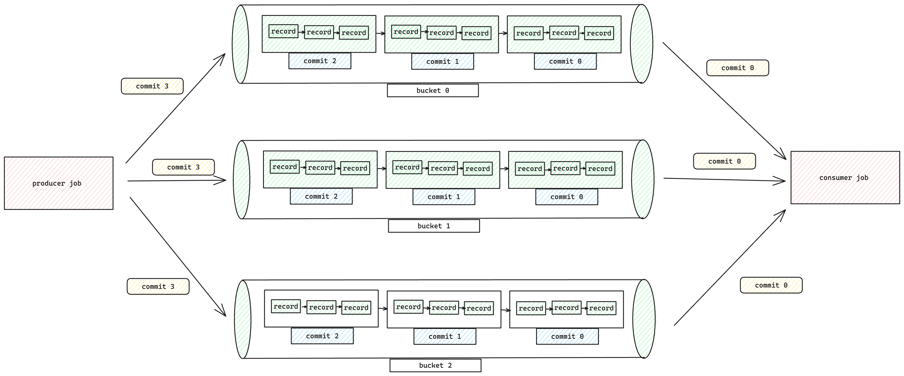

**Streaming Read Order**

For streaming reads, records are produced in the following order:

- For any two records from two different partitions
  - If `scan.plan-sort-partition` is set to true, the record with a smaller partition value will be produced first.
  - Otherwise, the record with an earlier partition creation time will be produced first.
- For any two records from the same partition and the same bucket, the first written record will be produced first.
- For any two records from the same partition but two different buckets, different buckets are processed by different tasks, there is no order guarantee between them.

**Watermark Definition**

You can define watermark for reading Paimon tables:

```sql
CREATE TABLE t ( 
    `user` BIGINT, 
    product STRING, 
    order_time TIMESTAMP(3), 
    WATERMARK FOR order_time AS order_time - INTERVAL '5' SECOND 
) WITH (...); 
 
-- launch a bounded streaming job to read paimon_table 
SELECT window_start, window_end, COUNT(`user`) FROM TABLE( 
 TUMBLE(TABLE t, DESCRIPTOR(order_time), INTERVAL '10' MINUTES)) GROUP BY window_start, window_end; 
```

You can also enable [Flink Watermark alignment](https://nightlies.apache.org/flink/flink-docs-stable/docs/dev/datastream/event-time/generating_watermarks/#watermark-alignment-_beta_), which will make sure no sources/splits/shards/partitions increase their watermarks too far ahead of the rest:

| Key | Default | Type | Description |
| --- | --- | --- | --- |
| <a id="append-table-bucketed--scan.watermark.alignment.group"></a>

 ##### scan.watermark.alignment.group | (none) | String | A group of sources to align watermarks. |
| <a id="append-table-bucketed--scan.watermark.alignment.max-drift"></a>

 ##### scan.watermark.alignment.max-drift | (none) | Duration | Maximal drift to align watermarks, before we pause consuming from the source/task/partition. |

**Bounded Stream**

Streaming Source can also be bounded, you can specify 'scan.bounded.watermark' to define the end condition for bounded streaming mode, stream reading will end until a larger watermark snapshot is encountered.

Watermark in snapshot is generated by writer, for example, you can specify a kafka source and declare the definition of watermark.
When using this kafka source to write to Paimon table, the snapshots of Paimon table will generate the corresponding watermark, so that you can use the feature of bounded watermark when streaming reads of this Paimon table.

```sql
CREATE TABLE kafka_table ( 
    `user` BIGINT, 
    product STRING, 
    order_time TIMESTAMP(3), 
    WATERMARK FOR order_time AS order_time - INTERVAL '5' SECOND 
) WITH ('connector' = 'kafka'...); 
 
-- launch a streaming insert job 
INSERT INTO paimon_table SELECT * FROM kakfa_table; 
 
-- launch a bounded streaming job to read paimon_table 
SELECT * FROM paimon_table /*+ OPTIONS('scan.bounded.watermark'='...') */; 
```

---

<a id="append-table-row-tracking"></a>

<!-- source_url: https://paimon.apache.org/docs/master/append-table/row-tracking/ -->

<!-- page_index: 26 -->

# Row tracking

Row tracking allows Paimon to track row-level tracking in a Paimon append table. Once enabled on a Paimon table, two more hidden columns will be added to the table schema:

- `_ROW_ID`: BIGINT, this is a unique identifier for each row in the table. It is used to track the update of the row and can be used to identify the row in case of update, merge into or delete.
- `_SEQUENCE_NUMBER`: BIGINT, this is field indicates which `version` of this record is. It actually is the snapshot-id of the snapshot that this row belongs to. It is used to track the update of the row version.

Hidden columns follows the following rules:

- Whenever we read from one table with row tracking enabled, the `_ROW_ID` and `_SEQUENCE_NUMBER` will be `NOT NULL`.
- If we append records to row-tracking table in the first time, we don't actually write them to the data file, they are lazy assigned by committer.
- If one row moved from one file to another file for **any reason**, the `_ROW_ID` column should be copied to the target file. The `_SEQUENCE_NUMBER` field should be set to `NULL` if the record is changed, otherwise, copy it too.
- Whenever we read from a row-tracking table, we firstly read `_ROW_ID` and `_SEQUENCE_NUMBER` from the data file, then we read the value columns from the data file. If they found `NULL`, we read from `DataFileMeta` to fall back to the lazy assigned values. Anyway, it has no way to be `NULL`.

To enable row-tracking, you must config `row-tracking.enabled` to `true` in the table options when creating an append table.
Consider an example via Flink SQL:

```sql
CREATE TABLE part_t ( 
    f0 INT, 
    f1 STRING, 
    dt STRING 
) PARTITIONED BY (dt) 
WITH ('row-tracking.enabled' = 'true'); 
```

Notice that:

- Row tracking is only supported for unaware append tables, not for primary key tables. Which means you can't define `bucket` and `bucket-key` for the table.
- Only spark support update, merge into and delete operations on row-tracking tables, Flink SQL does not support these operations yet.
- This function is experimental, this line will be removed after being stable.

After creating a row-tracking table, you can insert data into it as usual. The `_ROW_ID` and `_SEQUENCE_NUMBER` columns will be automatically managed by Paimon.

```sql
CREATE TABLE t (id INT, data STRING) TBLPROPERTIES ('row-tracking.enabled' = 'true'); 
INSERT INTO t VALUES (11, 'a'), (22, 'b') 
```

You can select the row tracking meta column with the following sql in spark:

```sql
SELECT id, data, _ROW_ID, _SEQUENCE_NUMBER FROM t; 
```

You will get the following result:

```text
+---+----+-------+----------------+ 
| id|data|_ROW_ID|_SEQUENCE_NUMBER| 
+---+----+-------+----------------+ 
| 11|   a|      0|               1| 
| 22|   b|      1|               1| 
+---+----+-------+----------------+ 
```

Then you can update and query the table again:

```sql
UPDATE t SET data = 'new-data-update' WHERE id = 11; 
-- Alternatively, update using the hidden row id `_ROW_ID` 
UPDATE t SET data = 'new-data-update' WHERE _ROW_ID = 0; 
SELECT id, data, _ROW_ID, _SEQUENCE_NUMBER FROM t; 
```

You will get:

```text
+---+---------------+-------+----------------+ 
| id|           data|_ROW_ID|_SEQUENCE_NUMBER| 
+---+---------------+-------+----------------+ 
| 22|              b|      1|               1| 
| 11|new-data-update|      0|               2| 
+---+---------------+-------+----------------+ 
```

You can also merge into the table, suppose you have a source table `s` that contains (22, 'new-data-merge') and (33, 'c'):

```sql
MERGE INTO t USING s 
ON t.id = s.id 
WHEN MATCHED THEN UPDATE SET t.data = s.data 
WHEN NOT MATCHED THEN INSERT *; 
```

You will get:

```text
+---+---------------+-------+----------------+ 
| id|           data|_ROW_ID|_SEQUENCE_NUMBER| 
+---+---------------+-------+----------------+ 
| 11|new-data-update|      0|               2| 
| 22| new-data-merge|      1|               3| 
| 33|              c|      2|               3| 
+---+---------------+-------+----------------+ 
```

You can also delete from the table:

```sql
DELETE FROM t WHERE id = 11; 
-- Alternatively, delete using the hidden row id `_ROW_ID` 
DELETE FROM t WHERE _ROW_ID = 0; 
```

You will get:

```text
+---+---------------+-------+----------------+ 
| id|           data|_ROW_ID|_SEQUENCE_NUMBER| 
+---+---------------+-------+----------------+ 
| 22| new-data-merge|      1|               3| 
| 33|              c|      2|               3| 
+---+---------------+-------+----------------+ 
```

---

<a id="primary-key-table"></a>

<!-- source_url: https://paimon.apache.org/docs/master/primary-key-table/ -->

<!-- page_index: 27 -->

# Overview

If you define a table with primary key, you can insert, update or delete records in the table.

Primary keys consist of a set of columns that contain unique values for each record. Paimon enforces data ordering by
sorting the primary key within each bucket, allowing users to achieve high performance by applying filtering conditions
on the primary key. See [CREATE TABLE](#flink-sql-ddl--create-table).

Unpartitioned tables, or partitions in partitioned tables, are sub-divided into buckets, to provide extra structure to the data that may be used for more efficient querying.

Each bucket directory contains an LSM tree and its [changelog files](#primary-key-table-changelog-producer).

The range for a bucket is determined by the hash value of one or more columns in the records. Users can specify bucketing columns by providing the [`bucket-key` option](#maintenance-configurations--coreoptions). If no `bucket-key` option is specified, the primary key (if defined) or the complete record will be used as the bucket key.

A bucket is the smallest storage unit for reads and writes, so the number of buckets limits the maximum processing parallelism. This number should not be too big, though, as it will result in lots of small files and low read performance. In general, the recommended data size in each bucket is about 200MB - 1GB.

Also, see [rescale bucket](#maintenance-rescale-bucket) if you want to adjust the number of buckets after a table is created.

Paimon adopts the LSM tree (log-structured merge-tree) as the data structure for file storage. This documentation briefly introduces the concepts about LSM trees.

LSM tree organizes files into several sorted runs. A sorted run consists of one or multiple data files and each data file belongs to exactly one sorted run.

Records within a data file are sorted by their primary keys. Within a sorted run, ranges of primary keys of data files never overlap.

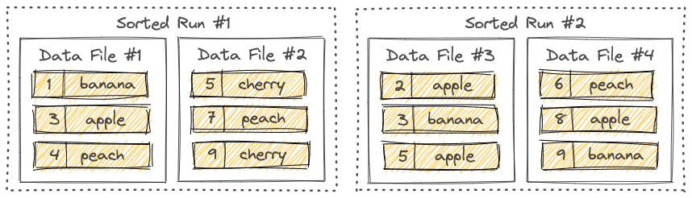

As you can see, different sorted runs may have overlapped primary key ranges, and may even contain the same primary key. When querying the LSM tree, all sorted runs must be combined and all records with the same primary key must be merged according to the user-specified [merge engine](#primary-key-table-merge-engine) and the timestamp of each record.

New records written into the LSM tree will be first buffered in memory. When the memory buffer is full, all records in memory will be sorted and flushed to disk. A new sorted run is now created.

---

<a id="primary-key-table-data-distribution"></a>

<!-- source_url: https://paimon.apache.org/docs/master/primary-key-table/data-distribution/ -->

<!-- page_index: 28 -->

# Data Distribution

> [!NOTE]
> **info**
> Dynamic Bucket only support single write job. Please do not start multiple jobs to write to the same partition
> (this can lead to duplicate data). Even if you enable `'write-only'` and start a dedicated compaction job, it won't work.

---

<a id="primary-key-table-table-mode"></a>

<!-- source_url: https://paimon.apache.org/docs/master/primary-key-table/table-mode/ -->

<!-- page_index: 29 -->

# Table Mode

> [!NOTE]
> **info**
> Visibility guarantee: Tables in deletion vectors mode, the files with level 0 will only be visible after compaction.
> So by default, compaction is synchronous, and if asynchronous is turned on, there may be delays in the data.

---

<a id="primary-key-table-changelog-producer"></a>

<!-- source_url: https://paimon.apache.org/docs/master/primary-key-table/changelog-producer/ -->

<!-- page_index: 30 -->

# Changelog Producer

> [!NOTE]
> **info**
> `changelog-producer` may significantly reduce compaction performance, please do not enable it unless necessary.

---

<a id="primary-key-table-sequence-rowkind"></a>

<!-- source_url: https://paimon.apache.org/docs/master/primary-key-table/sequence-rowkind/ -->

<!-- page_index: 31 -->

# Sequence and Rowkind

> [!NOTE]
> **info**
> User defined sequence fields conflict with features such as `first_row` and `first_value`, which may result in unexpected results.

---

<a id="primary-key-table-compaction"></a>

<!-- source_url: https://paimon.apache.org/docs/master/primary-key-table/compaction/ -->

<!-- page_index: 32 -->

# Compaction

When more and more records are written into the LSM tree, the number of sorted runs will increase. Because querying an
LSM tree requires all sorted runs to be combined, too many sorted runs will result in a poor query performance, or even
out of memory.

To limit the number of sorted runs, we have to merge several sorted runs into one big sorted run once in a while. This
procedure is called compaction.

However, compaction is a resource intensive procedure which consumes a certain amount of CPU time and disk IO, so too
frequent compaction may in turn result in slower writes. It is a trade-off between query and write performance. Paimon
currently adopts a compaction strategy similar to Rocksdb's [universal compaction](https://github.com/facebook/rocksdb/wiki/Universal-Compaction).

Compaction solves:

1. Reduce Level 0 files to avoid poor query performance.
2. Produce changelog via [changelog-producer](#primary-key-table-changelog-producer).
3. Produce deletion vectors for [MOW mode](#primary-key-table-table-mode--merge-on-write).
4. Snapshot Expiration, Tag Expiration, Partitions Expiration.

Limitation:

- There can only be one job working on the same partition's compaction, otherwise it will cause conflicts and one side will throw an exception failure.

Writing performance is almost always affected by compaction, so its tuning is crucial.

Compaction is inherently asynchronous, but if you want it to be completely asynchronous without blocking writes, expecting a mode for maximum writing throughput, the compaction can be done slowly and not in a hurry.
You can use the following strategies for your table:

```shell
num-sorted-run.stop-trigger = 2147483647 
sort-spill-threshold = 10 
lookup-wait = false 
```

This configuration will generate more files during peak write periods and gradually merge them for optimal read
performance during low write periods.

In general, if you expect multiple jobs to be written to the same table, you need to separate the compaction. You can
use [dedicated compaction job](#maintenance-dedicated-compaction--dedicated-compaction-job).

In compaction, you can configure record-Level expire time to expire records, you should configure:

1. `'record-level.expire-time'`: time retain for records.
2. `'record-level.time-field'`: time field for record level expire.

Expiration happens in compaction, and there is no strong guarantee to expire records in time.
You can trigger a full compaction manually to expire records which were not expired in time.

Paimon Compaction uses [Universal-Compaction](https://github.com/facebook/rocksdb/wiki/Universal-Compaction).
By default, when there is too much incremental data, Full Compaction will be automatically performed. You don't usually
have to worry about it.

Paimon also provides a configuration that allows for regular execution of Full Compaction.

1. 'compaction.optimization-interval': Implying how often to perform an optimization full compaction, this
   configuration is used to ensure the query timeliness of the read-optimized system table.
2. 'full-compaction.delta-commits': Full compaction will be constantly triggered after delta commits. Its disadvantage
   is that it can only perform compaction synchronously, which will affect writing efficiency.

When primary key table is configured with `lookup` [changelog producer](#primary-key-table-changelog-producer)
or `first-row` [merge-engine](#primary-key-table-merge-engine)
or has enabled `deletion vectors` for [MOW mode](#primary-key-table-table-mode--merge-on-write), Paimon will
use a radical compaction strategy to force compacting level 0 files to higher levels for every compaction trigger.

Paimon also provides configurations to optimize the frequency of this compaction.

1. 'lookup-compact': compact mode used for lookup compaction. Possible values: `radical`, will use
   `ForceUpLevel0Compaction` strategy to radically compact new files; `gentle`, will use `UniversalCompaction` strategy
   to gently compact new files;
2. 'lookup-compact.max-interval': The max interval for a forced L0 lookup compaction to be triggered in `gentle` mode.
   This option is only valid when `lookup-compact` mode is `gentle`.

By configuring 'lookup-compact' as `gentle`, new files in L0 will not be compacted immediately, this may greatly
reduce the overall resource usage at the expense of worse data freshness in certain cases.

When the number of sorted runs is small, Paimon writers will perform compaction asynchronously in separated threads, so
records can be continuously written into the table. However, to avoid unbounded growth of sorted runs, writers will
pause writing when the number of sorted runs hits the threshold. The following table property determines
the threshold.

| Option | Required | Default | Type | Description |
| --- | --- | --- | --- | --- |
| <a id="primary-key-table-compaction--num-sorted-run.stop-trigger"></a>

 ##### num-sorted-run.stop-trigger | No | (none) | Integer | The number of sorted runs that trigger the stopping of writes, the default value is 'num-sorted-run.compaction-trigger' + 3. |

Write stalls will become less frequent when `num-sorted-run.stop-trigger` becomes larger, thus improving writing
performance. However, if this value becomes too large, more memory and CPU time will be needed when querying the
table. If you are concerned about the OOM problem, please configure the following option.
Its value depends on your memory size.

| Option | Required | Default | Type | Description |
| --- | --- | --- | --- | --- |
| <a id="primary-key-table-compaction--sort-spill-threshold"></a>

 ##### sort-spill-threshold | No | (none) | Integer | If the maximum number of sort readers exceeds this value, a spill will be attempted. This prevents too many readers from consuming too much memory and causing OOM. |

Paimon uses [LSM tree](#primary-key-table--lsm-trees) which supports a large number of updates. LSM organizes files in several [sorted runs](#primary-key-table--sorted-runs). When querying records from an LSM tree, all sorted runs must be combined to produce a complete view of all records.

One can easily see that too many sorted runs will result in poor query performance. To keep the number of sorted runs in a reasonable range, Paimon writers will automatically perform [compactions](#primary-key-table-compaction). The following table property determines the minimum number of sorted runs to trigger a compaction.

| Option | Required | Default | Type | Description |
| --- | --- | --- | --- | --- |
| <a id="primary-key-table-compaction--num-sorted-run.compaction-trigger"></a>

 ##### num-sorted-run.compaction-trigger | No | 5 | Integer | The sorted run number to trigger compaction. Includes level0 files (one file one sorted run) and high-level runs (one level one sorted run). |

Compaction will become less frequent when `num-sorted-run.compaction-trigger` becomes larger, thus improving writing performance. However, if this value becomes too large, more memory and CPU time will be needed when querying the table. This is a trade-off between writing and query performance.

---

<a id="primary-key-table-query-performance"></a>

<!-- source_url: https://paimon.apache.org/docs/master/primary-key-table/query-performance/ -->

<!-- page_index: 33 -->

# Query Performance

The table schema has the greatest impact on query performance. See [Table Mode](#primary-key-table-table-mode).

For Merge On Read table, the most important thing you should pay attention to is the number of buckets, which will limit
the concurrency of reading data.

For MOW (Deletion Vectors) or COW table or [Read Optimized](#concepts-system-tables--read-optimized-table) table, there is no limit to the concurrency of reading data, and they can also utilize some filtering conditions for non-primary-key columns.

Table with Deletion Vectors Enabled supports aggregate push down:

```sql
SELECT COUNT(*) FROM TABLE WHERE DT = '20230101'; 
```

This query can be accelerated during compilation and returns very quickly.

For Spark SQL, table with default `metadata.stats-mode` can be accelerated:

```sql
SELECT MIN(a), MAX(b) FROM TABLE WHERE DT = '20230101'; 
```

Min max query can be also accelerated during compilation and returns very quickly.

For a regular bucketed table (For example, bucket = 5), the filtering conditions of the primary key will greatly
accelerate queries and reduce the reading of a large number of files.

For full-compacted file, or for primary-key table with `'deletion-vectors.enabled'`, you can use file index, it filters
files by indexing on the reading side.

Define `file-index.bitmap.columns`, Data file index is an external index file and Paimon will create its
corresponding index file for each file. If the index file is too small, it will be stored directly in the manifest, otherwise in the directory of the data file. Each data file corresponds to an index file, which has a separate file
definition and can contain different types of indexes with multiple columns.

Different file indexes may be efficient in different scenarios. For example bloom filter may speed up query in point lookup
scenario. Using a bitmap may consume more space but can result in greater accuracy.

- [BloomFilter](#concepts-spec-fileindex--index-bloomfilter): `file-index.bloom-filter.columns`.
- [Bitmap](#concepts-spec-fileindex--index-bitmap): `file-index.bitmap.columns`.
- [Range Bitmap](#concepts-spec-fileindex--index-range-bitmap): `file-index.range-bitmap.columns`.

If you want to add file index to existing table, without any rewrite, you can use `rewrite_file_index` procedure. Before
we use the procedure, you should config appropriate configurations in target table. You can use ALTER clause to config
`file-index.<filter-type>.columns` to the table.

How to invoke: see [flink procedures](#flink-procedures)

Fixed Bucketed table (e.g. bucket = 10) can be used to avoid shuffle if necessary in batch query, for example, you can
use the following Spark SQL to read a Paimon table:

```sql
SET spark.sql.sources.v2.bucketing.enabled = true; 
 
CREATE TABLE FACT_TABLE (order_id INT, f1 STRING) TBLPROPERTIES ('bucket'='10', 'primary-key' = 'order_id'); 
 
CREATE TABLE DIM_TABLE (order_id INT, f2 STRING) TBLPROPERTIES ('bucket'='10', 'primary-key' = 'order_id'); 
 
SELECT * FROM FACT_TABLE JOIN DIM_TABLE on t1.order_id = t4.order_id; 
```

The `spark.sql.sources.v2.bucketing.enabled` config is used to enable bucketing for V2 data sources. When turned on, Spark will recognize the specific distribution reported by a V2 data source through SupportsReportPartitioning, and
will try to avoid shuffle if necessary.

The costly join shuffle will be avoided if two tables have the same bucketing strategy and same number of buckets.

---

<a id="primary-key-table-chain-table"></a>

<!-- source_url: https://paimon.apache.org/docs/master/primary-key-table/chain-table/ -->

<!-- page_index: 34 -->

# Chain Table

Chain table is a new capability for primary key tables that transforms how you process incremental data.
Imagine a scenario where you periodically store a full snapshot of data (for example, once a day), even
though only a small portion changes between snapshots. ODS binlog dump is a typical example of this pattern.

Taking a daily binlog dump job as an example. A batch job merges yesterday's full dataset with today's
incremental changes to produce a new full dataset. This approach has two clear drawbacks:

- Full computation: Merge operation includes all data, and it will involve shuffle, which results in poor performance.
- Full storage: Store a full set of data every day, and the changed data usually accounts for a very small proportion.

Paimon addresses this problem by directly consuming only the changed data and performing merge-on-read.
In this way, full computation and storage are turned into incremental mode:

- Incremental computation: The offline ETL daily job only needs to consume the changed data of the current day and do not require merging all data.
- Incremental Storage: Only store the changed data each day, and asynchronously compact it periodically (e.g., weekly) to build a global chain table within the lifecycle.
  

Based on the regular table, chain table introduces snapshot and delta branches to represent full and incremental
data respectively. When writing, you specify the branch to write full or incremental data. When reading, paimon
automatically chooses the appropriate strategy based on the read mode, such as full, incremental, or hybrid.

To enable chain table, you must config `chain-table.enabled` to true in the table options when creating the
table, and the snapshot and delta branch need to be created as well.





```sql
CREATE TABLE default.t ( 
    `t1` string , 
    `t2` string , 
    `t3` string 
) PARTITIONED BY (`date` string) 
TBLPROPERTIES ( 
  'chain-table.enabled' = 'true', 
  -- props about primary key table   
  'primary-key' = 'date,t1', 
  'sequence.field' = 't2', 
  'bucket-key' = 't1', 
  'bucket' = '2', 
  -- props about partition 
  'partition.timestamp-pattern' = '$date',  
  'partition.timestamp-formatter' = 'yyyyMMdd' 
); 
 
CALL sys.create_branch('default.t', 'snapshot'); 
 
CALL sys.create_branch('default.t', 'delta'); 
 
ALTER TABLE default.t SET tblproperties  
    ('scan.fallback-snapshot-branch' = 'snapshot',  
     'scan.fallback-delta-branch' = 'delta'); 
  
ALTER TABLE `default`.`t$branch_snapshot` SET tblproperties 
    ('scan.fallback-snapshot-branch' = 'snapshot', 
     'scan.fallback-delta-branch' = 'delta'); 
 
ALTER TABLE `default`.`t$branch_delta` SET tblproperties  
    ('scan.fallback-snapshot-branch' = 'snapshot', 
     'scan.fallback-delta-branch' = 'delta'); 
```





```sql
CREATE TABLE default.t ( 
    `t1` STRING, 
    `t2` STRING, 
    `t3` STRING, 
    `dt` STRING 
) PARTITIONED BY (`dt`) WITH ( 
  'chain-table.enabled' = 'true', 
  'primary-key' = 'dt,t1', 
  'sequence.field' = 't2', 
  'bucket-key' = 't1', 
  'bucket' = '2', 
  'partition.timestamp-pattern' = '$dt',  
  'partition.timestamp-formatter' = 'yyyyMMdd' 
); 
 
CALL sys.create_branch('default.t', 'snapshot'); 
 
CALL sys.create_branch('default.t', 'delta'); 
 
ALTER TABLE default.t SET ( 
    'scan.fallback-snapshot-branch' = 'snapshot',  
    'scan.fallback-delta-branch' = 'delta'); 
  
ALTER TABLE `default`.`t$branch_snapshot` SET ( 
    'scan.fallback-snapshot-branch' = 'snapshot', 
    'scan.fallback-delta-branch' = 'delta'); 
 
ALTER TABLE `default`.`t$branch_delta` SET ( 
    'scan.fallback-snapshot-branch' = 'snapshot', 
    'scan.fallback-delta-branch' = 'delta'); 
```





Notice that:

- Chain table is only supported for primary key table, which means you should define `bucket` and `bucket-key` for the table.
- Chain table should ensure that the schema of each branch is consistent.
- Both Spark and Flink batch read/write are supported. Flink streaming read/write is not supported.
- Chain compact is not supported for now, and it will be supported later.
- Deletion vector is not supported for chain table.

After creating a chain table, you can read and write data in the following ways.

- Full Write: Write data to t$branch\_snapshot.

```sql
insert overwrite `default`.`t$branch_snapshot` partition (date = '20250810')  
    values ('1', '1', '1');  
```

- Incremental Write: Write data to t$branch\_delta.

```sql
insert overwrite `default`.`t$branch_delta` partition (date = '20250811')  
    values ('2', '1', '1'); 
```

- Full Query: If the snapshot branch has full partition, read it directly; otherwise, read on chain merge mode.

```sql
select t1, t2, t3 from default.t where date = '20250811' 
```

you will get the following result:

```text
+---+----+-----+  
| t1|  t2|   t3|  
+---+----+-----+  
| 1 |   1|   1 |            
| 2 |   1|   1 |                
+---+----+-----+  
```

- Incremental Query: Read the incremental partition from t$branch\_delta

```sql
select t1, t2, t3 from `default`.`t$branch_delta` where date = '20250811' 
```

you will get the following result:

```text
+---+----+-----+  
| t1|  t2|   t3|  
+---+----+-----+       
| 2 |   1|   1 |                
+---+----+-----+  
```

- Hybrid Query: Read both full and incremental data simultaneously.

```sql
select t1, t2, t3 from default.t where date = '20250811' 
union all 
select t1, t2, t3 from `default`.`t$branch_delta` where date = '20250811' 
```

you will get the following result:

```text
+---+----+-----+  
| t1|  t2|   t3|  
+---+----+-----+  
| 1 |   1|   1 |            
| 2 |   1|   1 |   
| 2 |   1|   1 |                
+---+----+-----+  
```

In real-world scenarios, a table often has multiple partition dimensions. For example, data may be
partitioned by both `region` and `date`. In such cases, different regions are independent data silos —
each should maintain its own chain independently rather than sharing one global chain across all regions.

Paimon supports this pattern via **group partition**: partition keys are divided into two parts:

- **Group partition keys** (prefix fields): Dimensions that identify independent data silos (e.g., `region`).
  Each distinct combination of group partition values forms its own independent chain.
- **Chain partition keys** (suffix fields): Dimensions that form the time-ordered chain within a group
  (e.g., `date`).

Use `chain-table.chain-partition-keys` to specify the chain dimension. This value must be a
**contiguous suffix** of the table's partition keys. Partition fields before it automatically become the
group dimension. If this option is not set, all partitions belong to a single implicit group (the
default behavior for single-dimension partitioned tables).

Consider an example where the table is partitioned by `region` and `date`, and you want each region to
have its own chain:

```sql
CREATE TABLE default.t ( 
    `t1` string , 
    `t2` string , 
    `t3` string 
) PARTITIONED BY (`region` string, `date` string) 
TBLPROPERTIES ( 
  'chain-table.enabled' = 'true', 
  'primary-key' = 'region,date,t1', 
  'sequence.field' = 't2', 
  'bucket-key' = 't1', 
  'bucket' = '2', 
  'partition.timestamp-pattern' = '$date', 
  'partition.timestamp-formatter' = 'yyyyMMdd', 
  -- specify that only `date` is the chain dimension; `region` becomes the group dimension 
  'chain-table.chain-partition-keys' = 'date' 
); 
```

With this configuration:

- Partition keys: `[region, date]`
- Group partition keys: `[region]` — CN and US each have their own independent chain
- Chain partition keys: `[date]` — time-ordered chain within each region

When reading a partition like `(region='CN', date='20250811')`, Paimon finds the nearest earlier
snapshot partition **within the same region** (e.g., `(region='CN', date='20250810')`) as the chain
anchor, and merges forward through the delta data for the CN group only. The US group is resolved
independently using its own anchor.

For hourly partitioned tables with a regional dimension, you can set both `dt` and `hour` as chain
partition keys:

```sql
'chain-table.chain-partition-keys' = 'dt,hour' 
```

This treats `(dt, hour)` as the composite chain dimension and everything before it (e.g., `region`) as
the group dimension.

Chain tables support automatic partition expiration via the standard `partition.expiration-time` option.
However, the expiration algorithm differs from normal tables to preserve chain integrity.

In a normal table, every partition older than the cutoff (`now - partition.expiration-time`) is dropped
independently. Chain tables cannot do this because a delta partition depends on its nearest earlier
snapshot partition as an anchor for merge-on-read. Dropping the anchor would break the chain.

Chain table expiration works in **segments**. A segment consists of one snapshot partition and all the
delta partitions whose time falls between that snapshot and the next snapshot in sorted order. The
segment is the atomic unit of expiration: either the entire segment is expired, or nothing in it is.

The algorithm per group:

1. List all snapshot branch partitions sorted by chain partition time.
2. Filter to those before the cutoff (`now - partition.expiration-time`).
3. If fewer than 2 snapshots are before the cutoff, nothing can be expired — the only one must be kept
   as the anchor.
4. The most recent snapshot before the cutoff is the **anchor** (kept). All earlier snapshots and their
   associated delta partitions form expirable segments.
5. Delta partitions are dropped before snapshot partitions so that the commit pre-check always passes.

For tables with group partitions, each group is processed independently. A group with many expired
snapshots can have segments expired while another group with only one snapshot before the cutoff retains
all of its data.

```sql
ALTER TABLE default.t SET TBLPROPERTIES ('partition.expiration-time' = '30 d','partition.expiration-check-interval' = '1 d' ); ALTER TABLE `default`.`t$branch_snapshot` SET TBLPROPERTIES ('partition.expiration-time' = '30 d','partition.expiration-check-interval' = '1 d' ); ALTER TABLE `default`.`t$branch_delta` SET TBLPROPERTIES ('partition.expiration-time' = '30 d','partition.expiration-check-interval' = '1 d' );
```

Suppose the snapshot branch has partitions `S(0101)`, `S(0201)`, `S(0301)` and the delta branch has
`D(0110)`, `D(0210)`, `D(0315)`. On `2025-03-31` with a 30-day retention the cutoff is `2025-03-01`:

- Snapshots before cutoff: `S(0101)`, `S(0201)`. Anchor = `S(0201)` (kept).
- Segment 1 expired: `S(0101)` + `D(0110)` (delta between `S(0101)` and `S(0201)`).
- Remaining: `S(0201)`, `S(0301)`, `D(0210)`, `D(0315)`.

- **Delta-only groups are not expired.** If a group has delta partitions but no snapshot partition, its
  deltas are the only copy of that group's data. Partition expiration will not touch them. They will
  start to be expired once at least two snapshot partitions exist for the group and fall before the
  cutoff.
- **Conflict detection is anchor-aware.** When `partition.expiration-strategy` is `values-time`, the
  conflict detection during writes correctly recognizes that anchor partitions are retained and does not
  reject writes to them.
- The `partition.expiration-time` and `partition.expiration-check-interval` options should be set
  consistently across the main table and both branches.

---

<a id="primary-key-table-pk-clustering-override"></a>

<!-- source_url: https://paimon.apache.org/docs/master/primary-key-table/pk-clustering-override/ -->

<!-- page_index: 35 -->

# PK Clustering Override

> [!NOTE]
> **info**
> Although data files are no longer sorted by the primary key, filtering on bucket-key fields (which default to the
> primary key) still benefits from bucket pruning. The query engine can skip entire buckets that do not contain matching
> values, so queries like `WHERE id = 12345` remain efficient.

---

<a id="primary-key-table-merge-engine"></a>

<!-- source_url: https://paimon.apache.org/docs/master/primary-key-table/merge-engine/ -->

<!-- page_index: 36 -->

# Overview

> [!NOTE]
> **info**
> Always set `table.exec.sink.upsert-materialize` to `NONE` in Flink SQL TableConfig, sink upsert-materialize may
> result in strange behavior. When the input is out of order, we recommend that you use
> [Sequence Field](#primary-key-table-sequence-rowkind--sequence-field) to correct disorder.

---

<a id="primary-key-table-merge-engine-partial-update"></a>

<!-- source_url: https://paimon.apache.org/docs/master/primary-key-table/merge-engine/partial-update/ -->

<!-- page_index: 37 -->

# Partial Update

> [!NOTE]
> **info**
> For streaming queries, `partial-update` merge engine must be used together with `lookup` or `full-compaction`
> [changelog producer](#primary-key-table-changelog-producer). ('input' changelog producer is also supported, but only returns input records.)

---

<a id="primary-key-table-merge-engine-aggregation"></a>

<!-- source_url: https://paimon.apache.org/docs/master/primary-key-table/merge-engine/aggregation/ -->

<!-- page_index: 38 -->

# Aggregation

> [!NOTE]
> **info**
> NOTE: Always set `table.exec.sink.upsert-materialize` to `NONE` in Flink SQL TableConfig.

---

<a id="primary-key-table-merge-engine-first-row"></a>

<!-- source_url: https://paimon.apache.org/docs/master/primary-key-table/merge-engine/first-row/ -->

<!-- page_index: 39 -->

# First Row

> [!NOTE]
> **info**
> `first-row` merge engine only supports `none` and `lookup` changelog producer.
> For streaming queries must be used with the `lookup` [changelog producer](#primary-key-table-changelog-producer).

---

<a id="multimodal-table"></a>

<!-- source_url: https://paimon.apache.org/docs/master/multimodal-table/ -->

<!-- page_index: 40 -->

# Overview

Multimodal Table extends the Append Table with capabilities for storing and querying multimodal data — images, videos, audio, vectors, and full-text content — all within a single table. It is built on top of the
[Data Evolution](#multimodal-table-data-evolution) mode, which enables efficient partial column updates and schema evolution without
rewriting entire data files.

Key capabilities:

- **[Data Evolution](#multimodal-table-data-evolution)**: Update partial columns without rewriting entire files, enabling efficient schema evolution.
- **[Blob Storage](#multimodal-table-blob)**: Store large binary objects (images, videos, audio) in dedicated `.blob` files with efficient column projection.
- **[Vector Storage](#multimodal-table-vector)**: Store and manage vector embeddings in dedicated Vortex-format files optimized for vector workloads.
- **[Global Index](#multimodal-table-global-index)**: Build BTree, vector (DiskANN), and full-text (Tantivy) indexes for efficient lookups and similarity search.

All multimodal features require the following table properties:

```sql
'row-tracking.enabled' = 'true', 
'data-evolution.enabled' = 'true' 
```

---

<a id="multimodal-table-data-evolution"></a>

<!-- source_url: https://paimon.apache.org/docs/master/multimodal-table/data-evolution/ -->

<!-- page_index: 41 -->

# Data Evolution

Paimon supports complete Schema Evolution, allowing you to freely add, modify, or delete column schema. But how to
backfill newly added columns or update column data.

Data Evolution Mode is a new feature for Append tables that revolutionizes how you handle data evolution, particularly when adding new columns. This mode allows you to update partial columns without rewriting entire data
files. Instead, it writes new column data to separate files and intelligently merges them with the original data
during read operations.

The data evolution mode offers significant advantages for your data lake architecture:

- Efficient Partial Column Updates: With this mode, you can use Spark's MERGE INTO statement to update a subset of columns. This avoids the high I/O cost of rewriting the whole file, as only the updated columns are written.
- Reduced File Rewrites: In scenarios with frequent schema changes, such as adding new columns, the traditional method requires constant file rewriting. Data evolution mode eliminates this overhead by appending new column data to dedicated files. This approach is much more efficient and reduces the burden on your storage system.
- Optimized Read Performance: The new mode is designed for seamless data retrieval. During query execution, Paimon's engine efficiently combines the original data with the new column data, ensuring that read performance remains uncompromised. The merge process is highly optimized, so your queries run just as fast as they would on a single, consolidated file.

To enable data evolution, you must enable row-tracking and set the `row-tracking.enabled` and `data-evolution.enabled` property to `true` when creating an append table. This ensures that the table is ready for efficient schema evolution operations.

Use Spark Sql as an example:

```sql
CREATE TABLE target_table (id INT, b INT, c INT) TBLPROPERTIES ( 
    'row-tracking.enabled' = 'true', 
    'data-evolution.enabled' = 'true' 
); 
 
INSERT INTO target_table VALUES (1, 1, 1), (2, 2, 2); 
```

Now we could update partial columns by spark 'MERGE INTO' statement or flink 'data\_evolution\_merge\_into' procedure:

```sql
CREATE TABLE source_table (id INT, b INT); 
INSERT INTO source_table VALUES (1, 11), (2, 22), (3, 33); 
 
MERGE INTO target_table AS t 
USING source_table AS s 
ON t.id = s.id 
WHEN MATCHED THEN UPDATE SET t.b = s.b 
WHEN NOT MATCHED THEN INSERT (id, b, c) VALUES (id, b, 0); 
 
SELECT * FROM target_table; 
+----+----+----+ 
| id | b  | c  | 
+----+----+----+ 
| 1  | 11 | 1  | 
| 2  | 22 | 2  | 
| 3  | 33 | 0  | 
```

This statement updates only the `b` column in the target table `target_table` based on the matching records from the source table
`source_table`. The `id` column and `c` column remain unchanged, and new records are inserted with the specified values. The difference between this and table those are not enabled with data evolution is that only the `b` column data is written to new files.

Note that:

- Data Evolution Table does not support 'Delete' and 'Update' statement yet.
- Merge Into for Data Evolution Table does not support 'WHEN NOT MATCHED BY SOURCE' clause.

Since Flink does not currently support the MERGE INTO syntax, we simulate the merge-into process using the data\_evolution\_merge\_into procedure, as shown below:

```sql
CREATE TABLE source_table (id INT, b INT); 
INSERT INTO source_table VALUES (1, 11), (2, 22), (3, 33); 
 
CALL sys.data_evolution_merge_into( 
    'my_db.target_table',  
    '',   /* Optional target alias */ 
    '',   /* Optional source sqls */ 
    'source_table', 
    'source_table.id=target_table.id', 
    'b=source_table.b', 
    2     /* Specify sink parallelism */ 
); 
 
SELECT * FROM source_table 
+----+----+----+ 
| id | b  | c  | 
+----+----+----+ 
| 1  | 11 | 1  | 
| 2  | 22 | 2  | 
```

Note that:

- Compared to Spark implementation, Flink data\_evolution\_merge\_into procedure only supports updating/inserting new columns now. Inserting new rows is not supported yet.

Self-merge refers to the case where the source and target of the merge operation are the **same table**. This is useful
when you want to transform existing column values in place — for example, applying a UDF to rewrite a column.

Since the source table cannot be the same as the target table directly, you need to create a **temporary view** based on
the system table `T$row_tracking` (which exposes the hidden `_ROW_ID` column) and use `_ROW_ID` as the merge condition.

```sql
-- 1. Register a UDF 
CREATE TEMPORARY FUNCTION concat_string AS 'com.example.StringConcatUdf'; 
 
-- 2. Create a view from the row-tracking system table 
CREATE TEMPORARY VIEW source_view AS 
SELECT _ROW_ID, concat_string(name) AS name 
FROM my_db.target_table$row_tracking; 
 
-- 3. Self-merge: update the name column using the UDF result 
CALL sys.data_evolution_merge_into( 
    'my_db.target_table', 
    'TempT', 
    -- alternatively, you could also pass the create sqls in procedure directly 
    -- like: 'CREATE TEMPORARY FUNCTION concat_string AS ''com.example.StringConcatUdf''; CREATE TEMPORARY VIEW XXX' 
    '', 
    'source_view', 
    'TempT._ROW_ID=source_view._ROW_ID', 
    'name=source_view.name', 
    2 
); 
```

Note that:

- The source and target table name cannot be the same. You must create a temporary view as the source.
- use `view._ROW_ID` = `source._ROW_ID` to identify the self-merge pattern.
- `_ROW_ID` is only available via the `$row_tracking` system table.
- Self-merge only supports `WHEN MATCHED THEN UPDATE` semantics.

Through the RowId metadata, files are organized into a file group.

When writing: MERGE INTO clause for Data Evolution Table only updates the specified columns, and writes the updated column data to new files. The original data files remain unchanged.

When reading: Paimon reads both the original data files and the new files containing the updated column data. It then merges the data from these two sources to present a unified view of the table. This merging process is optimized to ensure that read performance is not significantly impacted.

After writing, the files in `target_table` like below:


When reading, the files with the same `first row id` will merge fields.


The advantage to the mode is:

- Avoid rewriting the whole file when updating partial columns, reducing I/O cost.
- The read performance is not significantly impacted, as the merge process is optimized.
- The disk space is used more efficiently, as only the updated columns are written to new files.

---

<a id="multimodal-table-blob"></a>

<!-- source_url: https://paimon.apache.org/docs/master/multimodal-table/blob/ -->

<!-- page_index: 42 -->

# Blob Storage

The `BLOB` (Binary Large Object) type is a data type designed for storing multimodal data such as images, videos, audio files, and other large binary objects in Paimon tables. Unlike traditional `BYTES` type which stores binary data inline with other columns, `BLOB` type stores large binary data in separate files and maintains references to them, providing better performance for large objects.

The Blob Storage is based on Data Evolution mode.

The Blob type is ideal for:

- **Image Storage**: Store product images, user avatars, medical imaging data
- **Video Content**: Store video clips, surveillance footage, multimedia content
- **Audio Files**: Store voice recordings, music files, podcast episodes
- **Document Storage**: Store PDF documents, office files, large text files
- **Machine Learning**: Store embeddings, model weights, feature vectors
- **Any Large Binary Data**: Any data that is too large to store efficiently inline

When you define a table with a Blob column, Paimon automatically separates the storage:

1. **Normal Data Files** (e.g., `.parquet`, `.orc`): Store regular columns (INT, STRING, etc.)
2. **Blob Data Files** (`.blob`): Store the actual blob data

For example, given a table with schema `(id INT, name STRING, picture BLOB)`:

```text
table/ 
├── bucket-0/ 
│   ├── data-uuid-0.parquet      # Contains id, name columns 
│   ├── data-uuid-1.blob         # Contains picture blob data 
│   ├── data-uuid-2.blob         # Contains more picture blob data 
│   └── ... 
├── manifest/ 
├── schema/ 
└── snapshot/ 
```

This separation provides several benefits:

- Efficient column projection (reading non-blob columns doesn't load blob data)
- Optimized file rolling based on blob size
- Better compression for regular columnar data

For details about the blob file format structure, see [File Format - BLOB](#concepts-spec-fileformat--blob).

Paimon supports four storage modes for BLOB fields, selected via **comment directives** on the column:

1. **Default blob storage** (`__BLOB_FIELD`)
   Blob bytes are written to Paimon-managed `.blob` files under the table path.
2. **Descriptor-only storage** (`__BLOB_DESCRIPTOR_FIELD`)
   Only serialized `BlobDescriptor` bytes are stored inline in data files. Paimon does not write `.blob` files for these fields, and writes must provide descriptor-based input.
3. **External-storage descriptor mode** (`__BLOB_EXTERNAL_STORAGE_FIELD`)
   At write time, Paimon writes the raw blob data to the configured `blob-external-storage-path` and stores only serialized `BlobDescriptor` bytes inline in data files.
4. **Blob view storage** (`__BLOB_VIEW_FIELD`)
   Serialized `BlobViewStruct` bytes are stored inline. The struct points to a BLOB value in an upstream table by table identifier, BLOB field, and row id. The actual blob bytes are resolved from the upstream table at read time.

This allows one table to mix different storage modes for different BLOB columns.

| Option | Required | Default | Type | Description |
| --- | --- | --- | --- | --- |
| <a id="multimodal-table-blob--blob-as-descriptor"></a>

 ##### blob-as-descriptor | No | false | Boolean | Controls read output format for blob fields. When set to true, queries return serialized BlobDescriptor bytes; when false, queries return actual blob bytes. This option is dynamic and can be changed with `ALTER TABLE ... SET`. |
| <a id="multimodal-table-blob--blob-write-null-on-missing-file"></a>

 ##### blob-write-null-on-missing-file | No | false | Boolean | When enabled for Flink writes, if a descriptor BLOB value references a file that does not exist, Paimon writes `NULL` for that value and logs a warning instead of failing when reading the descriptor. |
| <a id="multimodal-table-blob--blob-view.resolve.enabled"></a>

 ##### blob-view.resolve.enabled | No | true | Boolean | Controls whether blob view fields are resolved to the upstream BLOB content at read time. Set to `false` when forwarding blob view references from one view table to another. |
| <a id="multimodal-table-blob--blob-external-storage-path"></a>

 ##### blob-external-storage-path | No | (none) | String | External storage path for fields declared with `__BLOB_EXTERNAL_STORAGE_FIELD`. Orphan file cleanup is not applied to this path. |
| <a id="multimodal-table-blob--blob.target-file-size"></a>

 ##### blob.target-file-size | No | (same as target-file-size) | MemorySize | Target size for blob files. When a blob file reaches this size, a new file is created. If not specified, uses the same value as `target-file-size`. |
| <a id="multimodal-table-blob--row-tracking.enabled"></a>

 ##### row-tracking.enabled | Yes\* | false | Boolean | Must be enabled for blob tables to support row-level operations. |
| <a id="multimodal-table-blob--data-evolution.enabled"></a>

 ##### data-evolution.enabled | Yes\* | false | Boolean | Must be enabled for blob tables to support schema evolution. |

\*Required for blob functionality to work correctly.

Specifically, if the storage system of the input BlobDescriptor differs from that used by Paimon, you can specify the storage configuration for the input blob descriptor using the prefix
`blob-descriptor.`. For example, if the source data is stored in a different OSS endpoint, you can configure it as below (using flink sql as an example):

```sql
CREATE TABLE image_table ( 
    id INT, 
    name STRING, 
    image BYTES COMMENT '__BLOB_FIELD' 
) WITH ( 
    'row-tracking.enabled' = 'true', 
    'data-evolution.enabled' = 'true', 
    'fs.oss.endpoint' = 'aaa',                   -- This is for Paimon's own config 
    'blob-descriptor.fs.oss.endpoint' = 'bbb'    -- This is for input blob descriptors' config 
); 
```

The recommended way to create a blob table in SQL is to use the **comment directive** `__BLOB_FIELD`, `__BLOB_DESCRIPTOR_FIELD`, or `__BLOB_VIEW_FIELD` on the column. Paimon automatically converts the column type to `BLOB` and registers it in the corresponding option.

<div class="theme-tabs-container tabs-container tabList__CuJ"><ul><li>Flink SQL</li><li>Spark SQL</li><li>Java API</li><li>Python API</li></ul><div><div><div><div><pre><code><div><span>CREATE</span><span> </span><span>TABLE</span><span> image_table </span><span>(</span><span></span> </div><div><span>    id </span><span>INT</span><span>,</span><span></span> </div><div><span>    name STRING</span><span>,</span><span></span> </div><div><span>    image BYTES </span><span>COMMENT</span><span> </span><span>'__BLOB_FIELD; product image'</span><span></span> </div><div><span></span><span>)</span><span> </span><span>WITH</span><span> </span><span>(</span><span></span> </div><div><span>    </span><span>'row-tracking.enabled'</span><span> </span><span>=</span><span> </span><span>'true'</span><span>,</span><span></span> </div><div><span>    </span><span>'data-evolution.enabled'</span><span> </span><span>=</span><span> </span><span>'true'</span><span></span> </div><div><span></span><span>)</span><span>;</span><span></span> </div><div><span></span> </div><div><span></span><span>-- Multiple blob columns with different storage modes</span><span></span> </div><div><span></span><span>CREATE</span><span> </span><span>TABLE</span><span> media_table </span><span>(</span><span></span> </div><div><span>    id </span><span>INT</span><span>,</span><span></span> </div><div><span>    photo BYTES </span><span>COMMENT</span><span> </span><span>'__BLOB_FIELD; original photo'</span><span>,</span><span></span> </div><div><span>    thumbnail BYTES </span><span>COMMENT</span><span> </span><span>'__BLOB_DESCRIPTOR_FIELD; thumbnail descriptor'</span><span>,</span><span></span> </div><div><span>    preview BYTES </span><span>COMMENT</span><span> </span><span>'__BLOB_VIEW_FIELD; preview from upstream'</span><span></span> </div><div><span></span><span>)</span><span> </span><span>WITH</span><span> </span><span>(</span><span></span> </div><div><span>    </span><span>'row-tracking.enabled'</span><span> </span><span>=</span><span> </span><span>'true'</span><span>,</span><span></span> </div><div><span>    </span><span>'data-evolution.enabled'</span><span> </span><span>=</span><span> </span><span>'true'</span><span></span> </div><div><span></span><span>)</span><span>;</span> </div></code></pre></div></div></div><div><div><div><pre><code><div><span>CREATE</span><span> </span><span>TABLE</span><span> image_table </span><span>(</span><span></span> </div><div><span>    id </span><span>INT</span><span>,</span><span></span> </div><div><span>    name STRING</span><span>,</span><span></span> </div><div><span>    image </span><span>BINARY</span><span> </span><span>COMMENT</span><span> </span><span>'__BLOB_FIELD; product image'</span><span></span> </div><div><span></span><span>)</span><span> TBLPROPERTIES </span><span>(</span><span></span> </div><div><span>    </span><span>'row-tracking.enabled'</span><span> </span><span>=</span><span> </span><span>'true'</span><span>,</span><span></span> </div><div><span>    </span><span>'data-evolution.enabled'</span><span> </span><span>=</span><span> </span><span>'true'</span><span></span> </div><div><span></span><span>)</span><span>;</span> </div></code></pre></div></div></div><div><div><div><pre><code><div><span>// Java API uses BlobType directly, with comment directive for auto option registration</span><span></span> </div><div><span></span><span>Schema</span><span> schema </span><span>=</span><span> </span><span>Schema</span><span>.</span><span>newBuilder</span><span>(</span><span>)</span><span></span> </div><div><span>        </span><span>.</span><span>column</span><span>(</span><span>"id"</span><span>,</span><span> </span><span>DataTypes</span><span>.</span><span>INT</span><span>(</span><span>)</span><span>)</span><span></span> </div><div><span>        </span><span>.</span><span>column</span><span>(</span><span>"name"</span><span>,</span><span> </span><span>DataTypes</span><span>.</span><span>STRING</span><span>(</span><span>)</span><span>)</span><span></span> </div><div><span>        </span><span>.</span><span>column</span><span>(</span><span>"image"</span><span>,</span><span> </span><span>DataTypes</span><span>.</span><span>BYTES</span><span>(</span><span>)</span><span>,</span><span> </span><span>"__BLOB_FIELD; product image"</span><span>)</span><span></span> </div><div><span>        </span><span>.</span><span>option</span><span>(</span><span>"row-tracking.enabled"</span><span>,</span><span> </span><span>"true"</span><span>)</span><span></span> </div><div><span>        </span><span>.</span><span>option</span><span>(</span><span>"data-evolution.enabled"</span><span>,</span><span> </span><span>"true"</span><span>)</span><span></span> </div><div><span>        </span><span>.</span><span>build</span><span>(</span><span>)</span><span>;</span> </div></code></pre></div></div></div><div><div><div><pre><code><div><span>import</span><span> pyarrow </span><span>as</span><span> pa</span> </div><div><span></span><span>from</span><span> pypaimon </span><span>import</span><span> Schema</span> </div><div><span></span> </div><div><span></span><span># pa.large_binary() is automatically recognized as BLOB type</span><span></span> </div><div><span>pa_schema </span><span>=</span><span> pa</span><span>.</span><span>schema</span><span>(</span><span>[</span><span></span> </div><div><span>    </span><span>(</span><span>'id'</span><span>,</span><span> pa</span><span>.</span><span>int32</span><span>(</span><span>)</span><span>)</span><span>,</span><span></span> </div><div><span>    </span><span>(</span><span>'name'</span><span>,</span><span> pa</span><span>.</span><span>string</span><span>(</span><span>)</span><span>)</span><span>,</span><span></span> </div><div><span>    </span><span>(</span><span>'image'</span><span>,</span><span> pa</span><span>.</span><span>large_binary</span><span>(</span><span>)</span><span>)</span><span>,</span><span></span> </div><div><span></span><span>]</span><span>)</span><span></span> </div><div><span></span> </div><div><span>schema </span><span>=</span><span> Schema</span><span>.</span><span>from_pyarrow_schema</span><span>(</span><span></span> </div><div><span>    pa_schema</span><span>,</span><span></span> </div><div><span>    options</span><span>=</span><span>{</span><span></span> </div><div><span>        </span><span>'row-tracking.enabled'</span><span>:</span><span> </span><span>'true'</span><span>,</span><span></span> </div><div><span>        </span><span>'data-evolution.enabled'</span><span>:</span><span> </span><span>'true'</span><span>,</span><span></span> </div><div><span>    </span><span>}</span><span></span> </div><div><span></span><span>)</span> </div></code></pre></div></div></div></div></div>

The comment directive format is `__DIRECTIVE; optional user comment`. Paimon converts the `BYTES`/`BINARY` type to `BLOB`, registers the field in the corresponding option, and stores the text after `;` as the column's real comment.

Supported directives:

| Directive | Storage mode | Option |
| --- | --- | --- |
| `__BLOB_FIELD` | Raw bytes in `.blob` files | `blob-field` |
| `__BLOB_DESCRIPTOR_FIELD` | Descriptor bytes inline | `blob-descriptor-field` |
| `__BLOB_VIEW_FIELD` | View reference inline | `blob-view-field` |
| `__BLOB_EXTERNAL_STORAGE_FIELD` | Raw data to external path, descriptor inline | `blob-external-storage-field` + `blob-descriptor-field` |

The same comment directive works with `ALTER TABLE ADD COLUMN`:

<div class="theme-tabs-container tabs-container tabList__CuJ"><ul><li>Flink SQL</li><li>Spark SQL</li><li>Java API</li><li>Python API</li></ul><div><div><div><div><pre><code><div><span>ALTER</span><span> </span><span>TABLE</span><span> image_table </span><span>ADD</span><span> picture BYTES </span><span>COMMENT</span><span> </span><span>'__BLOB_FIELD'</span><span>;</span><span></span> </div><div><span></span> </div><div><span></span><span>ALTER</span><span> </span><span>TABLE</span><span> image_table</span> </div><div><span>    </span><span>ADD</span><span> video BYTES </span><span>COMMENT</span><span> </span><span>'__BLOB_DESCRIPTOR_FIELD; promotional video'</span><span>;</span> </div></code></pre></div></div></div><div><div><div><pre><code><div><span>ALTER</span><span> </span><span>TABLE</span><span> image_table </span><span>ADD</span><span> </span><span>COLUMN</span><span> picture </span><span>BINARY</span><span> </span><span>COMMENT</span><span> </span><span>'__BLOB_FIELD'</span><span>;</span><span></span> </div><div><span></span> </div><div><span></span><span>ALTER</span><span> </span><span>TABLE</span><span> image_table</span> </div><div><span>    </span><span>ADD</span><span> </span><span>COLUMN</span><span> video </span><span>BINARY</span><span> </span><span>COMMENT</span><span> </span><span>'__BLOB_DESCRIPTOR_FIELD; promotional video'</span><span>;</span> </div></code></pre></div></div></div><div><div><div><pre><code><div><span>// Java API: add column with BlobType directly</span><span></span> </div><div><span>schemaManager</span><span>.</span><span>commitChanges</span><span>(</span><span></span> </div><div><span>    </span><span>SchemaChange</span><span>.</span><span>addColumn</span><span>(</span><span>"picture"</span><span>,</span><span> </span><span>DataTypes</span><span>.</span><span>BLOB</span><span>(</span><span>)</span><span>)</span><span>)</span><span>;</span><span></span> </div><div><span></span> </div><div><span></span><span>// Or use comment directive like SQL</span><span></span> </div><div><span>schemaManager</span><span>.</span><span>commitChanges</span><span>(</span><span></span> </div><div><span>    </span><span>SchemaChange</span><span>.</span><span>addColumn</span><span>(</span><span>"video"</span><span>,</span><span> </span><span>DataTypes</span><span>.</span><span>BYTES</span><span>(</span><span>)</span><span>,</span><span></span> </div><div><span>        </span><span>"__BLOB_DESCRIPTOR_FIELD; promotional video"</span><span>,</span><span> </span><span>null</span><span>)</span><span>)</span><span>;</span> </div></code></pre></div></div></div><div><div><div><pre><code><div><span># pa.large_binary() is automatically recognized as BLOB type</span><span></span> </div><div><span>catalog</span><span>.</span><span>alter_table</span><span>(</span><span></span> </div><div><span>    </span><span>'default.image_table'</span><span>,</span><span></span> </div><div><span>    </span><span>[</span><span>(</span><span>'add'</span><span>,</span><span> </span><span>'picture'</span><span>,</span><span> pa</span><span>.</span><span>large_binary</span><span>(</span><span>)</span><span>)</span><span>]</span><span></span> </div><div><span></span><span>)</span> </div></code></pre></div></div></div></div></div>

<div class="theme-tabs-container tabs-container tabList__CuJ"><ul><li>Flink SQL</li><li>Spark SQL</li><li>Java API</li><li>Python API</li></ul><div><div><div><div><pre><code><div><span>INSERT</span><span> </span><span>INTO</span><span> image_table </span><span>VALUES</span><span> </span><span>(</span><span>1</span><span>,</span><span> </span><span>'sample'</span><span>,</span><span> X</span><span>'89504E470D0A1A0A'</span><span>)</span><span>;</span><span></span> </div><div><span></span> </div><div><span></span><span>INSERT</span><span> </span><span>INTO</span><span> image_table</span> </div><div><span></span><span>SELECT</span><span> id</span><span>,</span><span> name</span><span>,</span><span> content </span><span>FROM</span><span> source_table</span><span>;</span> </div></code></pre></div></div></div><div><div><div><pre><code><div><span>INSERT</span><span> </span><span>INTO</span><span> image_table </span><span>VALUES</span><span> </span><span>(</span><span>1</span><span>,</span><span> </span><span>'sample'</span><span>,</span><span> X</span><span>'89504E470D0A1A0A'</span><span>)</span><span>;</span> </div></code></pre></div></div></div><div><div><div><pre><code><div><span>GenericRow</span><span> row </span><span>=</span><span> </span><span>GenericRow</span><span>.</span><span>of</span><span>(</span><span></span> </div><div><span>        </span><span>1</span><span>,</span><span></span> </div><div><span>        </span><span>BinaryString</span><span>.</span><span>fromString</span><span>(</span><span>"sample"</span><span>)</span><span>,</span><span></span> </div><div><span>        </span><span>new</span><span> </span><span>BlobData</span><span>(</span><span>imageBytes</span><span>)</span><span></span> </div><div><span></span><span>)</span><span>;</span><span></span> </div><div><span>write</span><span>.</span><span>write</span><span>(</span><span>row</span><span>)</span><span>;</span> </div></code></pre></div></div></div><div><div><div><pre><code><div><span>data </span><span>=</span><span> pa</span><span>.</span><span>table</span><span>(</span><span>{</span><span></span> </div><div><span>    </span><span>'id'</span><span>:</span><span> pa</span><span>.</span><span>array</span><span>(</span><span>[</span><span>1</span><span>]</span><span>,</span><span> </span><span>type</span><span>=</span><span>pa</span><span>.</span><span>int32</span><span>(</span><span>)</span><span>)</span><span>,</span><span></span> </div><div><span>    </span><span>'name'</span><span>:</span><span> pa</span><span>.</span><span>array</span><span>(</span><span>[</span><span>'sample'</span><span>]</span><span>)</span><span>,</span><span></span> </div><div><span>    </span><span>'image'</span><span>:</span><span> pa</span><span>.</span><span>array</span><span>(</span><span>[</span><span>b'\x89PNG\r\n\x1a\n'</span><span>]</span><span>,</span><span> </span><span>type</span><span>=</span><span>pa</span><span>.</span><span>large_binary</span><span>(</span><span>)</span><span>)</span><span>,</span><span></span> </div><div><span></span><span>}</span><span>)</span><span></span> </div><div><span>writer</span><span>.</span><span>write_arrow</span><span>(</span><span>data</span><span>)</span> </div></code></pre></div></div></div></div></div>

<div class="theme-tabs-container tabs-container tabList__CuJ"><ul><li>SQL</li><li>Java API</li></ul><div><div><div><div><pre><code><div><span>-- Select all columns including blob</span><span></span> </div><div><span></span><span>SELECT</span><span> </span><span>*</span><span> </span><span>FROM</span><span> image_table</span><span>;</span><span></span> </div><div><span></span> </div><div><span></span><span>-- Select only non-blob columns (efficient - doesn't load blob data)</span><span></span> </div><div><span></span><span>SELECT</span><span> id</span><span>,</span><span> name </span><span>FROM</span><span> image_table</span><span>;</span><span></span> </div><div><span></span> </div><div><span></span><span>-- Return descriptor bytes instead of actual blob bytes</span><span></span> </div><div><span></span><span>ALTER</span><span> </span><span>TABLE</span><span> image_table </span><span>SET</span><span> </span><span>(</span><span>'blob-as-descriptor'</span><span> </span><span>=</span><span> </span><span>'true'</span><span>)</span><span>;</span><span></span> </div><div><span></span><span>SELECT</span><span> image </span><span>FROM</span><span> image_table</span><span>;</span> </div></code></pre></div></div></div><div><div><div><pre><code><div><span>Blob</span><span> blob </span><span>=</span><span> row</span><span>.</span><span>getBlob</span><span>(</span><span>2</span><span>)</span><span>;</span><span></span> </div><div><span></span> </div><div><span></span><span>// Load into memory</span><span></span> </div><div><span></span><span>byte</span><span>[</span><span>]</span><span> data </span><span>=</span><span> blob</span><span>.</span><span>toData</span><span>(</span><span>)</span><span>;</span><span></span> </div><div><span></span> </div><div><span></span><span>// Stream (recommended for large blobs)</span><span></span> </div><div><span></span><span>try</span><span> </span><span>(</span><span>SeekableInputStream</span><span> in </span><span>=</span><span> blob</span><span>.</span><span>newInputStream</span><span>(</span><span>)</span><span>)</span><span> </span><span>{</span><span></span> </div><div><span>    in</span><span>.</span><span>seek</span><span>(</span><span>100</span><span>)</span><span>;</span><span>  </span><span>// random access</span><span></span> </div><div><span>    </span><span>byte</span><span>[</span><span>]</span><span> buffer </span><span>=</span><span> </span><span>new</span><span> </span><span>byte</span><span>[</span><span>1024</span><span>]</span><span>;</span><span></span> </div><div><span>    </span><span>int</span><span> bytesRead </span><span>=</span><span> in</span><span>.</span><span>read</span><span>(</span><span>buffer</span><span>)</span><span>;</span><span></span> </div><div><span></span><span>}</span><span></span> </div><div><span></span> </div><div><span></span><span>// Get descriptor reference (for descriptor-based blobs)</span><span></span> </div><div><span></span><span>BlobDescriptor</span><span> descriptor </span><span>=</span><span> blob</span><span>.</span><span>toDescriptor</span><span>(</span><span>)</span><span>;</span> </div></code></pre></div></div></div></div></div>

```java
Blob blob = Blob.fromData(imageBytes);                                         // byte array 
Blob blob = Blob.fromLocal("/path/to/image.png");                              // local file 
Blob blob = Blob.fromFile(fileIO, "s3://bucket/path/to/image.png");            // any FileIO 
Blob blob = Blob.fromFile(fileIO, "s3://bucket/large-file.bin", 1024, 2048);   // partial file 
Blob blob = Blob.fromHttp("https://example.com/image.png");                    // HTTP URL 
Blob blob = Blob.fromInputStream(() -> new FileInputStream("..."));            // InputStream 
Blob blob = Blob.fromDescriptor(uriReader, descriptor);                        // BlobDescriptor 
```

If you want downstream tables to **reuse** upstream blob files (no copying and no new `.blob` files), use `__BLOB_DESCRIPTOR_FIELD`:

```sql
CREATE TABLE descriptor_table ( 
    id INT, 
    image BYTES COMMENT '__BLOB_DESCRIPTOR_FIELD; reused image' 
) WITH ( 
    'row-tracking.enabled' = 'true', 
    'data-evolution.enabled' = 'true' 
); 
```

Paimon stores only serialized `BlobDescriptor` bytes in normal data files. Reading the blob follows the descriptor URI to access bytes, and writing requires descriptor input for those fields.

If you want Paimon to write raw blob data to a separate external location while keeping only descriptor bytes inline, use `__BLOB_EXTERNAL_STORAGE_FIELD`:

```sql
CREATE TABLE external_table ( 
    id INT, 
    image BYTES COMMENT '__BLOB_EXTERNAL_STORAGE_FIELD' 
) WITH ( 
    'row-tracking.enabled' = 'true', 
    'data-evolution.enabled' = 'true', 
    'blob-external-storage-path' = 'oss://bucket/path/' 
); 
```

For these fields:

- raw blob data is written to the configured external storage path
- normal data files keep only serialized `BlobDescriptor` bytes
- writes can still start from raw BLOB input
- the field is treated as descriptor-based for operations such as `MERGE INTO`

Blob view is useful when a downstream table should reference BLOB values already stored in an upstream table, without copying the bytes or creating new `.blob` files. A blob view field stores only a small `BlobViewStruct` inline. When the field is read, Paimon resolves the referenced BLOB from the upstream table.

Blob view requires:

- the upstream table to have row tracking enabled, so each row has a stable `_ROW_ID`
- the downstream field to be declared with `__BLOB_VIEW_FIELD` comment directive
- writes to provide a serialized `BlobViewStruct`; in Flink SQL, use the built-in `sys.blob_view` function

The Flink SQL function signature is:

```sql
sys.blob_view(table_name, field_name, row_id) 
```

Arguments:

- `table_name`: the upstream table name. It must be fully qualified as `database.table` or `catalog.database.table`. Unqualified table names are rejected.
- `field_name`: the upstream BLOB field name.
- `row_id`: the `_ROW_ID` value from the upstream row-tracking table.

The following example writes a downstream table whose `image_ref` field views the `image` field in `image_table`:

```sql
CREATE TABLE image_table ( 
    id INT, 
    name STRING, 
    image BYTES COMMENT '__BLOB_FIELD' 
) WITH ( 
    'row-tracking.enabled' = 'true', 
    'data-evolution.enabled' = 'true' 
); 
 
CREATE TABLE image_view_table ( 
    id INT, 
    label STRING, 
    image_ref BYTES COMMENT '__BLOB_VIEW_FIELD' 
) WITH ( 
    'row-tracking.enabled' = 'true', 
    'data-evolution.enabled' = 'true' 
); 
 
INSERT INTO image_view_table 
SELECT 
    id, 
    name AS label, 
    sys.blob_view('default.image_table', 'image', _ROW_ID) 
FROM `image_table$row_tracking`; 
```

If the current Paimon catalog name is included in the table name, the function also accepts `catalog.database.table`:

```sql
SELECT sys.blob_view('my_catalog.default.image_table', 'image', _ROW_ID) 
FROM `image_table$row_tracking`; 
```

Reads from `image_view_table.image_ref` return the referenced BLOB bytes in the same way as normal blob fields. The referenced upstream table and row must remain available for the view to be resolved.

**Forward Blob View References**

By default, reading a blob view field resolves the `BlobViewStruct` and returns the upstream BLOB
content. If you want to import data from one blob view table into another blob view table without
copying the BLOB bytes, read the source table with `blob-view.resolve.enabled=false` and write the
result into a target field declared with `__BLOB_VIEW_FIELD`.

With this option disabled, Paimon preserves the serialized `BlobViewStruct` during reads. When the
preserved value is written to another blob view field, the target table stores the same upstream
reference instead of creating a chained view reference.

For example, if table `T1` contains blob view references to BLOBs in table `T0`, importing `T1` into
`T2` with `blob-view.resolve.enabled=false` makes `T2` keep referencing `T0` directly.

```sql
CREATE TABLE t2 ( 
    id INT, 
    image_ref BYTES COMMENT '__BLOB_VIEW_FIELD' 
) WITH ( 
    'row-tracking.enabled' = 'true', 
    'data-evolution.enabled' = 'true' 
); 
 
-- Flink SQL example: the source table is read with blob view resolution disabled. 
INSERT INTO t2 
SELECT id, image_ref 
FROM t1 /*+ OPTIONS('blob-view.resolve.enabled'='false') */; 
```

For Data Evolution writes in Flink and Spark:

- raw-data BLOB columns are still rejected in partial-column `MERGE INTO` updates
- descriptor-based BLOB columns are allowed

For the Python equivalent, see [Blob Storage in pypaimon](https://paimon.apache.org/docs/master/pypaimon/blob).

1. **Append Table Only**: Blob type is designed for append-only tables. Primary key tables are not supported.
2. **No Predicate Pushdown**: Blob columns cannot be used in filter predicates.
3. **No Statistics**: Statistics collection is not supported for blob columns.
4. **Required Options**: `row-tracking.enabled` and `data-evolution.enabled` must be set to `true`.
5. **External Storage Cleanup**: Files written through `blob-external-storage-path` are outside Paimon's orphan file cleanup scope.
6. **Blob View Dependency**: Blob view fields depend on the referenced upstream table and row. If the upstream data is removed or no longer readable, the view cannot be resolved.

1. **Use Column Projection**: Always select only the columns you need. Avoid `SELECT *` if you don't need blob data.
2. **Set Appropriate Target File Size**: Configure `blob.target-file-size` based on your blob sizes. Larger values mean fewer files but larger individual files.
3. **Use Descriptor Fields When Reusing External Blob Files**: Use `__BLOB_DESCRIPTOR_FIELD` for fields that should keep descriptor references instead of writing new `.blob` files.
4. **Use External-Storage Fields When Accepting Raw Input But Storing Descriptors**: Use `__BLOB_EXTERNAL_STORAGE_FIELD` with `blob-external-storage-path` when upstream writes raw blob bytes but you want descriptor-based storage.
5. **Manage External Storage Lifecycle Separately**: Files written to `blob-external-storage-path` are not cleaned up by Paimon, so retention and deletion should be managed externally.
6. **Use Blob View to Avoid Copying BLOB Data**: Use `__BLOB_VIEW_FIELD` when a downstream table only needs to reference BLOB values from an upstream table.
7. **Use Partitioning**: Partition your blob tables by date or other dimensions to improve query performance and data management.

---

<a id="multimodal-table-vector"></a>

<!-- source_url: https://paimon.apache.org/docs/master/multimodal-table/vector/ -->

<!-- page_index: 43 -->

# Vector Storage

With the explosive growth of AI scenarios, vector storage has become increasingly important. Paimon provides optimized storage solutions specifically designed for vector data.

Paimon stores vector columns in dedicated files using the [Vortex](https://github.com/spiraldb/vortex) columnar format, which is optimized for vector workloads with high compression ratio and fast scan performance.

Paimon supports defining columns of type `VECTOR<t, n>`, which represents a fixed-length, dense vector column, where:

- **`t`**: The element type. Supports: `BOOLEAN`, `TINYINT`, `SMALLINT`, `INT`, `BIGINT`, `FLOAT`, `DOUBLE`;
- **`n`**: The vector dimension, must be a positive integer not exceeding `2,147,483,647`.

Compared to variable-length arrays, dense vectors provide:

- More natural semantic constraints, preventing mismatched lengths and `null` elements at the storage layer;
- Better point-lookup performance, eliminating offset array storage and access;
- Closer alignment with type representations in specialized vector engines, avoiding memory copies and type conversions.

**Notes**:

- Columns of `VECTOR` type cannot be used as primary key columns, partition columns, or for sorting.
- If a `VECTOR` value itself is not `null`, its elements are not allowed to be `null`.

Paimon stores vector columns in separate `.vector.vortex` files within Data Evolution tables, keeping scalar and vector data independently optimized.

File layout:

```text
table/ 
├── bucket-0/ 
│   ├── data-uuid-0.parquet       # Scalar columns (id, name, ...) 
│   ├── data-uuid-1.blob          # Blob data 
│   ├── data-uuid-2.vector.vortex # Vector columns in Vortex format 
│   └── ... 
├── manifest/ 
├── schema/ 
└── snapshot/ 
```

| Option | Description |
| --- | --- |
| `vector.file.format` | File format for dedicated vector files. Set to `vortex` to enable dedicated vector storage. |
| `vector.target-file-size` | Target file size for vector files. Defaults to `10 * 'target-file-size'`. |
| `row-tracking.enabled` | Must be `true` for dedicated vector storage. |
| `data-evolution.enabled` | Must be `true` for dedicated vector storage. |

The recommended way to create a vector table in SQL is to use the **comment directive** `__VECTOR_FIELD;dim` on the column. Paimon automatically converts the `ARRAY` type to `VECTOR` and registers the field in the `vector-field` option.

<div class="theme-tabs-container tabs-container tabList__CuJ"><ul><li>Flink SQL</li><li>Spark SQL</li><li>Java API</li><li>Python API</li></ul><div><div><div><div><pre><code><div><span>-- Comment directive: __VECTOR_FIELD;{dim}; optional comment</span><span></span> </div><div><span></span><span>CREATE</span><span> </span><span>TABLE</span><span> vector_table </span><span>(</span><span></span> </div><div><span>    id </span><span>BIGINT</span><span>,</span><span></span> </div><div><span>    embed ARRAY</span><span>&lt;</span><span>FLOAT</span><span>&gt;</span><span> </span><span>COMMENT</span><span> </span><span>'__VECTOR_FIELD;128; product embedding'</span><span></span> </div><div><span></span><span>)</span><span> </span><span>WITH</span><span> </span><span>(</span><span></span> </div><div><span>    </span><span>'vector.file.format'</span><span> </span><span>=</span><span> </span><span>'vortex'</span><span>,</span><span></span> </div><div><span>    </span><span>'row-tracking.enabled'</span><span> </span><span>=</span><span> </span><span>'true'</span><span>,</span><span></span> </div><div><span>    </span><span>'data-evolution.enabled'</span><span> </span><span>=</span><span> </span><span>'true'</span><span></span> </div><div><span></span><span>)</span><span>;</span><span></span> </div><div><span></span> </div><div><span></span><span>-- Multiple vector columns</span><span></span> </div><div><span></span><span>CREATE</span><span> </span><span>TABLE</span><span> multi_vector_table </span><span>(</span><span></span> </div><div><span>    id </span><span>BIGINT</span><span>,</span><span></span> </div><div><span>    embed1 ARRAY</span><span>&lt;</span><span>FLOAT</span><span>&gt;</span><span> </span><span>COMMENT</span><span> </span><span>'__VECTOR_FIELD;128'</span><span>,</span><span></span> </div><div><span>    embed2 ARRAY</span><span>&lt;</span><span>FLOAT</span><span>&gt;</span><span> </span><span>COMMENT</span><span> </span><span>'__VECTOR_FIELD;768'</span><span></span> </div><div><span></span><span>)</span><span> </span><span>WITH</span><span> </span><span>(</span><span></span> </div><div><span>    </span><span>'vector.file.format'</span><span> </span><span>=</span><span> </span><span>'vortex'</span><span>,</span><span></span> </div><div><span>    </span><span>'row-tracking.enabled'</span><span> </span><span>=</span><span> </span><span>'true'</span><span>,</span><span></span> </div><div><span>    </span><span>'data-evolution.enabled'</span><span> </span><span>=</span><span> </span><span>'true'</span><span></span> </div><div><span></span><span>)</span><span>;</span> </div></code></pre></div></div></div><div><div><div><pre><code><div><span>CREATE</span><span> </span><span>TABLE</span><span> vector_table </span><span>(</span><span></span> </div><div><span>    id </span><span>BIGINT</span><span>,</span><span></span> </div><div><span>    embed ARRAY</span><span>&lt;</span><span>FLOAT</span><span>&gt;</span><span> </span><span>COMMENT</span><span> </span><span>'__VECTOR_FIELD;128; product embedding'</span><span></span> </div><div><span></span><span>)</span><span> TBLPROPERTIES </span><span>(</span><span></span> </div><div><span>    </span><span>'vector.file.format'</span><span> </span><span>=</span><span> </span><span>'vortex'</span><span>,</span><span></span> </div><div><span>    </span><span>'row-tracking.enabled'</span><span> </span><span>=</span><span> </span><span>'true'</span><span>,</span><span></span> </div><div><span>    </span><span>'data-evolution.enabled'</span><span> </span><span>=</span><span> </span><span>'true'</span><span></span> </div><div><span></span><span>)</span><span>;</span> </div></code></pre></div></div></div><div><div><div><pre><code><div><span>// Java API uses VectorType directly — no comment directive needed</span><span></span> </div><div><span></span><span>Schema</span><span> schema </span><span>=</span><span> </span><span>Schema</span><span>.</span><span>newBuilder</span><span>(</span><span>)</span><span></span> </div><div><span>        </span><span>.</span><span>column</span><span>(</span><span>"id"</span><span>,</span><span> </span><span>DataTypes</span><span>.</span><span>BIGINT</span><span>(</span><span>)</span><span>)</span><span></span> </div><div><span>        </span><span>.</span><span>column</span><span>(</span><span>"embed"</span><span>,</span><span> </span><span>DataTypes</span><span>.</span><span>VECTOR</span><span>(</span><span>128</span><span>,</span><span> </span><span>DataTypes</span><span>.</span><span>FLOAT</span><span>(</span><span>)</span><span>)</span><span>)</span><span></span> </div><div><span>        </span><span>.</span><span>option</span><span>(</span><span>"vector.file.format"</span><span>,</span><span> </span><span>"vortex"</span><span>)</span><span></span> </div><div><span>        </span><span>.</span><span>option</span><span>(</span><span>"row-tracking.enabled"</span><span>,</span><span> </span><span>"true"</span><span>)</span><span></span> </div><div><span>        </span><span>.</span><span>option</span><span>(</span><span>"data-evolution.enabled"</span><span>,</span><span> </span><span>"true"</span><span>)</span><span></span> </div><div><span>        </span><span>.</span><span>option</span><span>(</span><span>"bucket"</span><span>,</span><span> </span><span>"-1"</span><span>)</span><span></span> </div><div><span>        </span><span>.</span><span>build</span><span>(</span><span>)</span><span>;</span> </div></code></pre></div></div></div><div><div><div><pre><code><div><span>import</span><span> pyarrow </span><span>as</span><span> pa</span> </div><div><span></span><span>from</span><span> pypaimon </span><span>import</span><span> Schema</span> </div><div><span></span> </div><div><span></span><span># Fixed-size list is automatically recognized as VECTOR type</span><span></span> </div><div><span>pa_schema </span><span>=</span><span> pa</span><span>.</span><span>schema</span><span>(</span><span>[</span><span></span> </div><div><span>    </span><span>(</span><span>'id'</span><span>,</span><span> pa</span><span>.</span><span>int64</span><span>(</span><span>)</span><span>)</span><span>,</span><span></span> </div><div><span>    </span><span>(</span><span>'embed'</span><span>,</span><span> pa</span><span>.</span><span>list_</span><span>(</span><span>pa</span><span>.</span><span>float32</span><span>(</span><span>)</span><span>,</span><span> </span><span>128</span><span>)</span><span>)</span><span>,</span><span></span> </div><div><span></span><span>]</span><span>)</span><span></span> </div><div><span></span> </div><div><span>schema </span><span>=</span><span> Schema</span><span>.</span><span>from_pyarrow_schema</span><span>(</span><span></span> </div><div><span>    pa_schema</span><span>,</span><span></span> </div><div><span>    options</span><span>=</span><span>{</span><span></span> </div><div><span>        </span><span>'vector.file.format'</span><span>:</span><span> </span><span>'vortex'</span><span>,</span><span></span> </div><div><span>        </span><span>'row-tracking.enabled'</span><span>:</span><span> </span><span>'true'</span><span>,</span><span></span> </div><div><span>        </span><span>'data-evolution.enabled'</span><span>:</span><span> </span><span>'true'</span><span>,</span><span></span> </div><div><span>        </span><span>'bucket'</span><span>:</span><span> </span><span>'-1'</span><span>,</span><span></span> </div><div><span>    </span><span>}</span><span></span> </div><div><span></span><span>)</span> </div></code></pre></div></div></div></div></div>

<div class="theme-tabs-container tabs-container tabList__CuJ"><ul><li>Flink SQL</li><li>Spark SQL</li><li>Java API</li><li>Python API</li></ul><div><div><div><div><pre><code><div><span>ALTER</span><span> </span><span>TABLE</span><span> vector_table</span> </div><div><span>    </span><span>ADD</span><span> embed2 ARRAY</span><span>&lt;</span><span>FLOAT</span><span>&gt;</span><span> </span><span>COMMENT</span><span> </span><span>'__VECTOR_FIELD;768; text embedding'</span><span>;</span> </div></code></pre></div></div></div><div><div><div><pre><code><div><span>ALTER</span><span> </span><span>TABLE</span><span> vector_table</span> </div><div><span>    </span><span>ADD</span><span> </span><span>COLUMN</span><span> embed2 ARRAY</span><span>&lt;</span><span>FLOAT</span><span>&gt;</span><span> </span><span>COMMENT</span><span> </span><span>'__VECTOR_FIELD;768; text embedding'</span><span>;</span> </div></code></pre></div></div></div><div><div><div><pre><code><div><span>// Java API: add column with VectorType directly</span><span></span> </div><div><span>schemaManager</span><span>.</span><span>commitChanges</span><span>(</span><span></span> </div><div><span>    </span><span>SchemaChange</span><span>.</span><span>addColumn</span><span>(</span><span>"embed2"</span><span>,</span><span> </span><span>DataTypes</span><span>.</span><span>VECTOR</span><span>(</span><span>768</span><span>,</span><span> </span><span>DataTypes</span><span>.</span><span>FLOAT</span><span>(</span><span>)</span><span>)</span><span>)</span><span>)</span><span>;</span><span></span> </div><div><span></span> </div><div><span></span><span>// Or use comment directive like SQL</span><span></span> </div><div><span>schemaManager</span><span>.</span><span>commitChanges</span><span>(</span><span></span> </div><div><span>    </span><span>SchemaChange</span><span>.</span><span>addColumn</span><span>(</span><span>"embed2"</span><span>,</span><span> </span><span>DataTypes</span><span>.</span><span>ARRAY</span><span>(</span><span>DataTypes</span><span>.</span><span>FLOAT</span><span>(</span><span>)</span><span>)</span><span>,</span><span></span> </div><div><span>        </span><span>"__VECTOR_FIELD;768; text embedding"</span><span>,</span><span> </span><span>null</span><span>)</span><span>)</span><span>;</span> </div></code></pre></div></div></div><div><div><div><pre><code><div><span>catalog</span><span>.</span><span>alter_table</span><span>(</span><span></span> </div><div><span>    </span><span>'default.vector_table'</span><span>,</span><span></span> </div><div><span>    </span><span>[</span><span>(</span><span>'add'</span><span>,</span><span> </span><span>'embed2'</span><span>,</span><span> pa</span><span>.</span><span>list_</span><span>(</span><span>pa</span><span>.</span><span>float32</span><span>(</span><span>)</span><span>,</span><span> </span><span>768</span><span>)</span><span>)</span><span>]</span><span></span> </div><div><span></span><span>)</span> </div></code></pre></div></div></div></div></div>

<div class="theme-tabs-container tabs-container tabList__CuJ"><ul><li>Flink SQL</li><li>Spark SQL</li><li>Java API</li><li>Python API</li></ul><div><div><div><div><pre><code><div><span>INSERT</span><span> </span><span>INTO</span><span> vector_table </span><span>VALUES</span><span> </span><span>(</span><span>1</span><span>,</span><span> ARRAY</span><span>[</span><span>1.0</span><span>,</span><span> </span><span>2.0</span><span>,</span><span> </span><span>3.0</span><span>,</span><span> </span><span>.</span><span>.</span><span>.</span><span>]</span><span>)</span><span>;</span> </div></code></pre></div></div></div><div><div><div><pre><code><div><span>INSERT</span><span> </span><span>INTO</span><span> vector_table </span><span>VALUES</span><span> </span><span>(</span><span>1</span><span>,</span><span> ARRAY</span><span>(</span><span>1.0</span><span>,</span><span> </span><span>2.0</span><span>,</span><span> </span><span>3.0</span><span>,</span><span> </span><span>.</span><span>.</span><span>.</span><span>)</span><span>)</span><span>;</span> </div></code></pre></div></div></div><div><div><div><pre><code><div><span>BatchWriteBuilder</span><span> builder </span><span>=</span><span> table</span><span>.</span><span>newBatchWriteBuilder</span><span>(</span><span>)</span><span>;</span><span></span> </div><div><span></span><span>try</span><span> </span><span>(</span><span>BatchTableWrite</span><span> write </span><span>=</span><span> builder</span><span>.</span><span>newWrite</span><span>(</span><span>)</span><span>;</span><span></span> </div><div><span>        </span><span>BatchTableCommit</span><span> commit </span><span>=</span><span> builder</span><span>.</span><span>newCommit</span><span>(</span><span>)</span><span>)</span><span> </span><span>{</span><span></span> </div><div><span>    </span><span>InternalVector</span><span> vector </span><span>=</span><span> </span><span>BinaryVector</span><span>.</span><span>fromPrimitiveArray</span><span>(</span><span>new</span><span> </span><span>float</span><span>[</span><span>]</span><span> </span><span>{</span><span>1.0f</span><span>,</span><span> </span><span>2.0f</span><span>,</span><span> </span><span>3.0f</span><span>}</span><span>)</span><span>;</span><span></span> </div><div><span>    write</span><span>.</span><span>write</span><span>(</span><span>GenericRow</span><span>.</span><span>of</span><span>(</span><span>1L</span><span>,</span><span> vector</span><span>)</span><span>)</span><span>;</span><span></span> </div><div><span>    commit</span><span>.</span><span>commit</span><span>(</span><span>write</span><span>.</span><span>prepareCommit</span><span>(</span><span>)</span><span>)</span><span>;</span><span></span> </div><div><span></span><span>}</span> </div></code></pre></div></div></div><div><div><div><pre><code><div><span>import</span><span> pyarrow </span><span>as</span><span> pa</span> </div><div><span></span> </div><div><span>data </span><span>=</span><span> pa</span><span>.</span><span>table</span><span>(</span><span>{</span><span></span> </div><div><span>    </span><span>'id'</span><span>:</span><span> pa</span><span>.</span><span>array</span><span>(</span><span>[</span><span>1</span><span>,</span><span> </span><span>2</span><span>,</span><span> </span><span>3</span><span>]</span><span>,</span><span> </span><span>type</span><span>=</span><span>pa</span><span>.</span><span>int64</span><span>(</span><span>)</span><span>)</span><span>,</span><span></span> </div><div><span>    </span><span>'embed'</span><span>:</span><span> pa</span><span>.</span><span>FixedSizeListArray</span><span>.</span><span>from_arrays</span><span>(</span><span></span> </div><div><span>        pa</span><span>.</span><span>array</span><span>(</span><span>[</span><span>1.0</span><span>,</span><span> </span><span>2.0</span><span>,</span><span> </span><span>3.0</span><span>,</span><span> </span><span>4.0</span><span>,</span><span> </span><span>5.0</span><span>,</span><span> </span><span>6.0</span><span>,</span><span> </span><span>7.0</span><span>,</span><span> </span><span>8.0</span><span>,</span><span> </span><span>9.0</span><span>]</span><span>,</span><span> </span><span>type</span><span>=</span><span>pa</span><span>.</span><span>float32</span><span>(</span><span>)</span><span>)</span><span>,</span><span></span> </div><div><span>        </span><span>3</span><span>  </span><span># dimension</span><span></span> </div><div><span>    </span><span>)</span><span>,</span><span></span> </div><div><span></span><span>}</span><span>)</span><span></span> </div><div><span></span> </div><div><span>write_builder </span><span>=</span><span> table</span><span>.</span><span>new_batch_write_builder</span><span>(</span><span>)</span><span></span> </div><div><span>writer </span><span>=</span><span> write_builder</span><span>.</span><span>new_write</span><span>(</span><span>)</span><span></span> </div><div><span>writer</span><span>.</span><span>write_arrow</span><span>(</span><span>data</span><span>)</span><span></span> </div><div><span>commit_messages </span><span>=</span><span> writer</span><span>.</span><span>prepare_commit</span><span>(</span><span>)</span><span></span> </div><div><span>write_builder</span><span>.</span><span>new_commit</span><span>(</span><span>)</span><span>.</span><span>commit</span><span>(</span><span>commit_messages</span><span>)</span><span></span> </div><div><span>writer</span><span>.</span><span>close</span><span>(</span><span>)</span> </div></code></pre></div></div></div></div></div>

<div class="theme-tabs-container tabs-container tabList__CuJ"><ul><li>Flink SQL</li><li>Spark SQL</li><li>Java API</li><li>Python API</li></ul><div><div><div><div><pre><code><div><span>SELECT</span><span> id</span><span>,</span><span> embed </span><span>FROM</span><span> vector_table</span><span>;</span> </div></code></pre></div></div></div><div><div><div><pre><code><div><span>SELECT</span><span> id</span><span>,</span><span> embed </span><span>FROM</span><span> vector_table</span><span>;</span> </div></code></pre></div></div></div><div><div><div><pre><code><div><span>ReadBuilder</span><span> readBuilder </span><span>=</span><span> table</span><span>.</span><span>newReadBuilder</span><span>(</span><span>)</span><span>;</span><span></span> </div><div><span></span><span>TableScan</span><span>.</span><span>Plan</span><span> plan </span><span>=</span><span> readBuilder</span><span>.</span><span>newScan</span><span>(</span><span>)</span><span>.</span><span>plan</span><span>(</span><span>)</span><span>;</span><span></span> </div><div><span></span><span>try</span><span> </span><span>(</span><span>RecordReader</span><span>&lt;</span><span>InternalRow</span><span>&gt;</span><span> reader </span><span>=</span><span> readBuilder</span><span>.</span><span>newRead</span><span>(</span><span>)</span><span>.</span><span>createReader</span><span>(</span><span>plan</span><span>)</span><span>)</span><span> </span><span>{</span><span></span> </div><div><span>    reader</span><span>.</span><span>forEachRemaining</span><span>(</span><span>row </span><span>-&gt;</span><span> </span><span>{</span><span></span> </div><div><span>        </span><span>long</span><span> id </span><span>=</span><span> row</span><span>.</span><span>getLong</span><span>(</span><span>0</span><span>)</span><span>;</span><span></span> </div><div><span>        </span><span>float</span><span>[</span><span>]</span><span> vector </span><span>=</span><span> row</span><span>.</span><span>getVector</span><span>(</span><span>1</span><span>)</span><span>.</span><span>toFloatArray</span><span>(</span><span>)</span><span>;</span><span></span> </div><div><span>        </span><span>System</span><span>.</span><span>out</span><span>.</span><span>println</span><span>(</span><span>id </span><span>+</span><span> </span><span>": "</span><span> </span><span>+</span><span> </span><span>Arrays</span><span>.</span><span>toString</span><span>(</span><span>vector</span><span>)</span><span>)</span><span>;</span><span></span> </div><div><span>    </span><span>}</span><span>)</span><span>;</span><span></span> </div><div><span></span><span>}</span> </div></code></pre></div></div></div><div><div><div><pre><code><div><span>read_builder </span><span>=</span><span> table</span><span>.</span><span>new_read_builder</span><span>(</span><span>)</span><span></span> </div><div><span>splits </span><span>=</span><span> read_builder</span><span>.</span><span>new_scan</span><span>(</span><span>)</span><span>.</span><span>plan</span><span>(</span><span>)</span><span>.</span><span>splits</span><span>(</span><span>)</span><span></span> </div><div><span>result </span><span>=</span><span> read_builder</span><span>.</span><span>new_read</span><span>(</span><span>)</span><span>.</span><span>to_arrow</span><span>(</span><span>splits</span><span>)</span><span></span> </div><div><span></span> </div><div><span></span><span>print</span><span>(</span><span>result</span><span>.</span><span>column</span><span>(</span><span>'embed'</span><span>)</span><span>.</span><span>to_pylist</span><span>(</span><span>)</span><span>)</span><span></span> </div><div><span></span><span># [[1.0, 2.0, 3.0], [4.0, 5.0, 6.0], [7.0, 8.0, 9.0]]</span> </div></code></pre></div></div></div></div></div>

---

<a id="multimodal-table-global-index"></a>

<!-- source_url: https://paimon.apache.org/docs/master/multimodal-table/global-index/ -->

<!-- page_index: 44 -->

# Global Index

Global Index is a powerful indexing mechanism for Data Evolution (append) tables. It enables efficient row-level lookups and filtering
without full-table scans. Paimon supports multiple global index types:

- **BTree Index**: A B-tree based index for scalar column lookups. Supports equality, IN, range predicates, and can be combined across multiple columns with AND/OR logic.
- **Vector Index**: An approximate nearest neighbor (ANN) index powered by DiskANN for vector similarity search.
- **Full-Text Index**: A full-text search index powered by Tantivy for text retrieval. Supports term matching and relevance scoring.

Global indexes work on top of Data Evolution tables. To use global indexes, your table **must** have:

- `'bucket' = '-1'` (unaware-bucket mode)
- `'row-tracking.enabled' = 'true'`
- `'data-evolution.enabled' = 'true'`

> Global index queries may not be exact when the index only covers part of the table data. If a query predicate matches the index, Paimon returns only the results from the indexed portion. Matching records in data that has not been indexed yet will not be returned.

Create a table with the required properties:

```sql
CREATE TABLE my_table ( 
    id INT, 
    name STRING, 
    embedding ARRAY<FLOAT>, 
    content STRING 
) TBLPROPERTIES ( 
    'bucket' = '-1', 
    'row-tracking.enabled' = 'true', 
    'data-evolution.enabled' = 'true', 
    'global-index.enabled' = 'true' 
); 
```

BTree index builds a logical B-tree structure over SST files, enabling efficient point lookups and range queries on scalar columns.

**Build BTree Index**

```sql
-- Create BTree index on 'name' column 
CALL sys.create_global_index( 
    table => 'db.my_table', 
    index_column => 'name', 
    index_type => 'btree' 
); 
```

**Query with BTree Index**

Once a BTree index is built, it is automatically used during scan when a filter predicate matches the indexed column.

```sql
SELECT * FROM my_table WHERE name IN ('a200', 'a300'); 
```

Vector Index provides approximate nearest neighbor (ANN) search based on the DiskANN algorithm. It is suitable for
vector similarity search scenarios such as recommendation systems, image retrieval, and RAG (Retrieval Augmented
Generation) applications.

**Build Vector Index**

```sql
-- Create Lumina vector index on 'embedding' column 
CALL sys.create_global_index( 
    table => 'db.my_table', 
    index_column => 'embedding', 
    index_type => 'lumina', 
    options => 'lumina.index.dimension=128' 
); 
```

The legacy index type `lumina-vector-ann` is still accepted for existing tables and SQL compatibility.

**Vector Search**

<div class="theme-tabs-container tabs-container tabList__CuJ"><ul><li>Spark SQL</li><li>Flink SQL (Procedure)</li><li>Java API</li></ul><div><div><div><div><pre><code><div><span>-- Search for top-5 nearest neighbors</span><span></span> </div><div><span></span><span>SELECT</span><span> </span><span>*</span><span> </span><span>FROM</span><span> vector_search</span><span>(</span><span>'my_table'</span><span>,</span><span> </span><span>'embedding'</span><span>,</span><span> array</span><span>(</span><span>1.0</span><span>f</span><span>,</span><span> </span><span>2.0</span><span>f</span><span>,</span><span> </span><span>3.0</span><span>f</span><span>)</span><span>,</span><span> </span><span>5</span><span>)</span><span>;</span> </div></code></pre></div></div></div><div><p>Unlike Spark's table-valued function, Flink uses a <code>CALL</code> procedure to perform vector search.
The procedure returns JSON-serialized rows as strings.</p><div><div><pre><code><div><span>-- Search for top-5 nearest neighbors</span><span></span> </div><div><span></span><span>CALL</span><span> sys</span><span>.</span><span>vector_search</span><span>(</span><span></span> </div><div><span>    </span><span>`</span><span>table</span><span>`</span><span> </span><span>=</span><span>&gt;</span><span> </span><span>'db.my_table'</span><span>,</span><span></span> </div><div><span>    vector_column </span><span>=</span><span>&gt;</span><span> </span><span>'embedding'</span><span>,</span><span></span> </div><div><span>    query_vector </span><span>=</span><span>&gt;</span><span> </span><span>'1.0,2.0,3.0'</span><span>,</span><span></span> </div><div><span>    top_k </span><span>=</span><span>&gt;</span><span> </span><span>5</span><span></span> </div><div><span></span><span>)</span><span>;</span><span></span> </div><div><span></span> </div><div><span></span><span>-- With projection (only return specific columns)</span><span></span> </div><div><span></span><span>CALL</span><span> sys</span><span>.</span><span>vector_search</span><span>(</span><span></span> </div><div><span>    </span><span>`</span><span>table</span><span>`</span><span> </span><span>=</span><span>&gt;</span><span> </span><span>'db.my_table'</span><span>,</span><span></span> </div><div><span>    vector_column </span><span>=</span><span>&gt;</span><span> </span><span>'embedding'</span><span>,</span><span></span> </div><div><span>    query_vector </span><span>=</span><span>&gt;</span><span> </span><span>'1.0,2.0,3.0'</span><span>,</span><span></span> </div><div><span>    top_k </span><span>=</span><span>&gt;</span><span> </span><span>5</span><span>,</span><span></span> </div><div><span>    projection </span><span>=</span><span>&gt;</span><span> </span><span>'id,name'</span><span></span> </div><div><span></span><span>)</span><span>;</span> </div></code></pre></div></div></div><div><div><div><pre><code><div><span>Table</span><span> table </span><span>=</span><span> catalog</span><span>.</span><span>getTable</span><span>(</span><span>identifier</span><span>)</span><span>;</span><span></span> </div><div><span></span> </div><div><span></span><span>// Step 1: Build vector search</span><span></span> </div><div><span></span><span>float</span><span>[</span><span>]</span><span> queryVector </span><span>=</span><span> </span><span>{</span><span>1.0f</span><span>,</span><span> </span><span>2.0f</span><span>,</span><span> </span><span>3.0f</span><span>}</span><span>;</span><span></span> </div><div><span></span><span>GlobalIndexResult</span><span> result </span><span>=</span><span> table</span><span>.</span><span>newVectorSearchBuilder</span><span>(</span><span>)</span><span></span> </div><div><span>        </span><span>.</span><span>withVector</span><span>(</span><span>queryVector</span><span>)</span><span></span> </div><div><span>        </span><span>.</span><span>withLimit</span><span>(</span><span>5</span><span>)</span><span></span> </div><div><span>        </span><span>.</span><span>withVectorColumn</span><span>(</span><span>"embedding"</span><span>)</span><span></span> </div><div><span>        </span><span>.</span><span>executeLocal</span><span>(</span><span>)</span><span>;</span><span></span> </div><div><span></span> </div><div><span></span><span>// Step 2: Read matching rows using the search result</span><span></span> </div><div><span></span><span>ReadBuilder</span><span> readBuilder </span><span>=</span><span> table</span><span>.</span><span>newReadBuilder</span><span>(</span><span>)</span><span>;</span><span></span> </div><div><span></span><span>TableScan</span><span>.</span><span>Plan</span><span> plan </span><span>=</span><span> readBuilder</span><span>.</span><span>newScan</span><span>(</span><span>)</span><span>.</span><span>withGlobalIndexResult</span><span>(</span><span>result</span><span>)</span><span>.</span><span>plan</span><span>(</span><span>)</span><span>;</span><span></span> </div><div><span></span><span>try</span><span> </span><span>(</span><span>RecordReader</span><span>&lt;</span><span>InternalRow</span><span>&gt;</span><span> reader </span><span>=</span><span> readBuilder</span><span>.</span><span>newRead</span><span>(</span><span>)</span><span>.</span><span>createReader</span><span>(</span><span>plan</span><span>)</span><span>)</span><span> </span><span>{</span><span></span> </div><div><span>    reader</span><span>.</span><span>forEachRemaining</span><span>(</span><span>row </span><span>-&gt;</span><span> </span><span>{</span><span></span> </div><div><span>        </span><span>System</span><span>.</span><span>out</span><span>.</span><span>println</span><span>(</span><span>"id="</span><span> </span><span>+</span><span> row</span><span>.</span><span>getInt</span><span>(</span><span>0</span><span>)</span><span> </span><span>+</span><span> </span><span>", name="</span><span> </span><span>+</span><span> row</span><span>.</span><span>getString</span><span>(</span><span>1</span><span>)</span><span>)</span><span>;</span><span></span> </div><div><span>    </span><span>}</span><span>)</span><span>;</span><span></span> </div><div><span></span><span>}</span> </div></code></pre></div></div></div></div></div>

Full-Text Index provides text search capabilities powered by Tantivy. It is suitable for text retrieval scenarios
such as document search, log analysis, and content-based filtering.

**Build Full-Text Index**

```sql
-- Create full-text index on 'content' column 
CALL sys.create_global_index( 
    table => 'db.my_table', 
    index_column => 'content', 
    index_type => 'tantivy-fulltext' 
); 
```

For other content where users often search by short character fragments, build the
index with Tantivy's `ngram` tokenizer:

```sql
CALL sys.create_global_index( 
    table => 'db.my_table', 
    index_column => 'content', 
    index_type => 'tantivy-fulltext', 
    options => 'tantivy.tokenizer=ngram,tantivy.ngram.min-gram=2,tantivy.ngram.max-gram=2' 
); 
```

For Chinese word segmentation, build the index with the `jieba` tokenizer:

```sql
CALL sys.create_global_index( 
    table => 'db.my_table', 
    index_column => 'content', 
    index_type => 'tantivy-fulltext', 
    options => 'tantivy.tokenizer=jieba' 
); 
```

For LanceDB-style analyzer customization, choose a base tokenizer and compose token filters:

```sql
CALL sys.create_global_index( 
    table => 'db.my_table', 
    index_column => 'content', 
    index_type => 'tantivy-fulltext', 
    options => 'tantivy.tokenizer=simple,tantivy.stem=true,tantivy.remove-stop-words=true' 
); 
```

Supported tokenizer options:

| Option | Default | Description |
| --- | --- | --- |
| `tantivy.tokenizer` | `default` | Tokenizer used by the full-text index. Supported values: `default`, `simple`, `whitespace`, `raw`, `ngram`, `jieba`. |
| `tantivy.ngram.min-gram` | `2` | Minimum gram length for the `ngram` tokenizer. |
| `tantivy.ngram.max-gram` | `2` | Maximum gram length for the `ngram` tokenizer. |
| `tantivy.ngram.prefix-only` | `false` | Whether the `ngram` tokenizer only emits prefix ngrams. |
| `tantivy.lower-case` | `true` | Whether configurable tokenizers lowercase emitted tokens. |
| `tantivy.max-token-length` | `40` | Maximum token length kept by configurable tokenizers. |
| `tantivy.ascii-folding` | `false` | Whether to normalize non-ASCII Latin characters to ASCII. |
| `tantivy.stem` | `false` | Whether to apply stemming to emitted tokens. |
| `tantivy.language` | `english` | Language used by stemming and built-in stop word filters. |
| `tantivy.remove-stop-words` | `false` | Whether to remove built-in stop words for the configured language. |
| `tantivy.stop-words` |  | Semicolon-separated custom stop words to remove. |
| `tantivy.with-position` | `true` | Whether to store term positions for phrase queries. Disable it to reduce index size when phrase queries are not needed. |

Tokenizer settings are persisted in global index metadata. Existing index files keep using the
tokenizer they were built with, even if later index builds use different options.
Paimon does not load arbitrary Rust tokenizer plugins from configuration; custom analysis is
provided by composing the supported tokenizer and filter options above. PyPaimon can query
`jieba` indexes when the Python `jieba` package is installed.

**Full-Text Search**

<div class="theme-tabs-container tabs-container tabList__CuJ"><ul><li>Spark SQL</li><li>Java API</li><li>Python SDK</li></ul><div><div><div><div><pre><code><div><span>-- Search for top-10 documents matching the query</span><span></span> </div><div><span></span><span>SELECT</span><span> </span><span>*</span><span> </span><span>FROM</span><span> full_text_search</span><span>(</span><span>'my_table'</span><span>,</span><span> </span><span>'content'</span><span>,</span><span> </span><span>'paimon lake format'</span><span>,</span><span> </span><span>10</span><span>)</span><span>;</span> </div></code></pre></div></div></div><div><div><div><pre><code><div><span>Table</span><span> table </span><span>=</span><span> catalog</span><span>.</span><span>getTable</span><span>(</span><span>identifier</span><span>)</span><span>;</span><span></span> </div><div><span></span> </div><div><span></span><span>// Step 1: Build full-text search</span><span></span> </div><div><span></span><span>GlobalIndexResult</span><span> result </span><span>=</span><span> table</span><span>.</span><span>newFullTextSearchBuilder</span><span>(</span><span>)</span><span></span> </div><div><span>        </span><span>.</span><span>withQueryText</span><span>(</span><span>"paimon lake format"</span><span>)</span><span></span> </div><div><span>        </span><span>.</span><span>withQueryOperator</span><span>(</span><span>"and"</span><span>)</span><span></span> </div><div><span>        </span><span>.</span><span>withLimit</span><span>(</span><span>10</span><span>)</span><span></span> </div><div><span>        </span><span>.</span><span>withTextColumn</span><span>(</span><span>"content"</span><span>)</span><span></span> </div><div><span>        </span><span>.</span><span>executeLocal</span><span>(</span><span>)</span><span>;</span><span></span> </div><div><span></span> </div><div><span></span><span>// Step 2: Read matching rows using the search result</span><span></span> </div><div><span></span><span>ReadBuilder</span><span> readBuilder </span><span>=</span><span> table</span><span>.</span><span>newReadBuilder</span><span>(</span><span>)</span><span>;</span><span></span> </div><div><span></span><span>TableScan</span><span>.</span><span>Plan</span><span> plan </span><span>=</span><span> readBuilder</span><span>.</span><span>newScan</span><span>(</span><span>)</span><span>.</span><span>withGlobalIndexResult</span><span>(</span><span>result</span><span>)</span><span>.</span><span>plan</span><span>(</span><span>)</span><span>;</span><span></span> </div><div><span></span><span>try</span><span> </span><span>(</span><span>RecordReader</span><span>&lt;</span><span>InternalRow</span><span>&gt;</span><span> reader </span><span>=</span><span> readBuilder</span><span>.</span><span>newRead</span><span>(</span><span>)</span><span>.</span><span>createReader</span><span>(</span><span>plan</span><span>)</span><span>)</span><span> </span><span>{</span><span></span> </div><div><span>    reader</span><span>.</span><span>forEachRemaining</span><span>(</span><span>row </span><span>-&gt;</span><span> </span><span>{</span><span></span> </div><div><span>        </span><span>System</span><span>.</span><span>out</span><span>.</span><span>println</span><span>(</span><span>"id="</span><span> </span><span>+</span><span> row</span><span>.</span><span>getInt</span><span>(</span><span>0</span><span>)</span><span> </span><span>+</span><span> </span><span>", content="</span><span> </span><span>+</span><span> row</span><span>.</span><span>getString</span><span>(</span><span>1</span><span>)</span><span>)</span><span>;</span><span></span> </div><div><span>    </span><span>}</span><span>)</span><span>;</span><span></span> </div><div><span></span><span>}</span> </div></code></pre></div></div></div><div><div><div><pre><code><div><span>table </span><span>=</span><span> catalog</span><span>.</span><span>get_table</span><span>(</span><span>'db.my_table'</span><span>)</span><span></span> </div><div><span></span> </div><div><span></span><span># Step 1: Build full-text search</span><span></span> </div><div><span>builder </span><span>=</span><span> table</span><span>.</span><span>new_full_text_search_builder</span><span>(</span><span>)</span><span></span> </div><div><span>builder</span><span>.</span><span>with_text_column</span><span>(</span><span>'content'</span><span>)</span><span></span> </div><div><span>builder</span><span>.</span><span>with_query_text</span><span>(</span><span>'paimon lake format'</span><span>)</span><span></span> </div><div><span>builder</span><span>.</span><span>with_query_operator</span><span>(</span><span>'and'</span><span>)</span><span></span> </div><div><span>builder</span><span>.</span><span>with_limit</span><span>(</span><span>10</span><span>)</span><span></span> </div><div><span>result </span><span>=</span><span> builder</span><span>.</span><span>execute_local</span><span>(</span><span>)</span><span></span> </div><div><span></span> </div><div><span></span><span># Step 2: Read matching rows using the search result</span><span></span> </div><div><span>read_builder </span><span>=</span><span> table</span><span>.</span><span>new_read_builder</span><span>(</span><span>)</span><span></span> </div><div><span>scan </span><span>=</span><span> read_builder</span><span>.</span><span>new_scan</span><span>(</span><span>)</span><span>.</span><span>with_global_index_result</span><span>(</span><span>result</span><span>)</span><span></span> </div><div><span>plan </span><span>=</span><span> scan</span><span>.</span><span>plan</span><span>(</span><span>)</span><span></span> </div><div><span>table_read </span><span>=</span><span> read_builder</span><span>.</span><span>new_read</span><span>(</span><span>)</span><span></span> </div><div><span>pa_table </span><span>=</span><span> table_read</span><span>.</span><span>to_arrow</span><span>(</span><span>plan</span><span>.</span><span>splits</span><span>(</span><span>)</span><span>)</span><span></span> </div><div><span></span><span>print</span><span>(</span><span>pa_table</span><span>)</span> </div></code></pre></div></div></div></div></div>

---

<a id="flink"></a>

<!-- source_url: https://paimon.apache.org/docs/master/flink/ -->

<!-- page_index: 45 -->

# Engine Flink

---

<a id="flink-quick-start"></a>

<!-- source_url: https://paimon.apache.org/docs/master/flink/quick-start/ -->

<!-- page_index: 46 -->

# Quick Start

> [!NOTE]
> **info**
> If the machine is in a hadoop environment, please ensure the value of the environment variable `HADOOP_CLASSPATH` include path to the common Hadoop libraries, you do not need to use the following pre-bundled Hadoop jar.

---

<a id="flink-sql-ddl"></a>

<!-- source_url: https://paimon.apache.org/docs/master/flink/sql-ddl/ -->

<!-- page_index: 47 -->

# SQL DDL

> [!NOTE]
> **info**
> If you need cross partition upsert (primary keys not contain all partition fields), see [Cross partition Upsert](#primary-key-table-data-distribution--cross-partitions-upsert) mode.

---

<a id="flink-sql-write"></a>

<!-- source_url: https://paimon.apache.org/docs/master/flink/sql-write/ -->

<!-- page_index: 48 -->

# SQL Write

> [!NOTE]
> **info**
> Important table properties setting:
>
> 1. Only [primary key table](#primary-key-table) supports this feature.
> 2. [MergeEngine](#primary-key-table-merge-engine) needs to be [deduplicate](#primary-key-table-merge-engine--deduplicate)
>    or [partial-update](#primary-key-table-merge-engine-partial-update) to support this feature.
> 3. Do not support updating primary keys.

---

<a id="flink-sql-query"></a>

<!-- source_url: https://paimon.apache.org/docs/master/flink/sql-query/ -->

<!-- page_index: 49 -->

# SQL Query

> [!WARNING]
> Paimon Source in Streaming mode is unbounded, like a queue that never ends.

---

<a id="flink-consumer-id"></a>

<!-- source_url: https://paimon.apache.org/docs/master/flink/consumer-id/ -->

<!-- page_index: 50 -->

# Consumer ID

> [!NOTE]
> **info**
> About `'consumer.mode'`, since the implementation of `exactly-once` mode and `at-least-once` mode are completely
> different, the state of flink is incompatible and cannot be restored from the state when switching modes.

---

<a id="flink-sql-lookup"></a>

<!-- source_url: https://paimon.apache.org/docs/master/flink/sql-lookup/ -->

<!-- page_index: 51 -->

# Lookup Joins

> [!NOTE]
> **info**
> If the main table (`orders`) is CDC stream, `allow_unordered` will be ignored by Flink SQL (only supports append stream), your streaming job may be blocked. You can try to use `audit_log` system table feature of Paimon to walk around
> (convert CDC stream to append stream).

---

<a id="flink-sql-alter"></a>

<!-- source_url: https://paimon.apache.org/docs/master/flink/sql-alter/ -->

<!-- page_index: 52 -->

# Altering Tables

> [!NOTE]
> **info**
> If you use object storage without REST Catalog, such as S3 or OSS, please use this syntax carefully, because the renaming of object storage is not atomic, and only partial files may be moved in case of failure.

---

<a id="flink-default-value"></a>

<!-- source_url: https://paimon.apache.org/docs/master/flink/default-value/ -->

<!-- page_index: 53 -->

# Default Value

Paimon allows specifying default values for columns. When users write to these tables without explicitly providing
values for certain columns, Paimon automatically generates default values for these columns.

Flink SQL does not have native support for default values, so we can only create a table without default values:

```sql
CREATE TABLE my_table ( 
    a BIGINT, 
    b STRING, 
    c INT, 
    tags ARRAY<STRING>, 
    properties MAP<STRING, STRING>, 
    nested ROW<x INT, y STRING> 
); 
```

We support the procedure of modifying column default values in Flink. You can add default value definitions after
creating the table:

```sql
-- Set simple type default values 
CALL sys.alter_column_default_value('default.my_table', 'b', 'my_value'); 
CALL sys.alter_column_default_value('default.my_table', 'c', '5'); 
 
-- Set complex type default values 
CALL sys.alter_column_default_value('default.my_table', 'tags', '[tag1, tag2, tag3]'); 
CALL sys.alter_column_default_value('default.my_table', 'properties', '{key1 -> value1, key2 -> value2}'); 
CALL sys.alter_column_default_value('default.my_table', 'nested', '{42, default_value}'); 
```

For SQL commands that execute table writes, such as the `INSERT`, `UPDATE`, and `MERGE` commands, `NULL` value is
parsed into the default value specified for the corresponding column.

For example:

```sql
INSERT INTO my_table (a) VALUES (1), (2); 
 
SELECT * FROM my_table; 
-- result: [[1, my_value, 5, [tag1, tag2, tag3], {key1=value1, key2=value2}, +I[42, default_value]], 
--          [2, my_value, 5, [tag1, tag2, tag3], {key1=value1, key2=value2}, +I[42, default_value]]] 
```

---

<a id="flink-procedures"></a>

<!-- source_url: https://paimon.apache.org/docs/master/flink/procedures/ -->

<!-- page_index: 54 -->

# Procedures

Flink 1.18 and later versions support [Call Statements](https://nightlies.apache.org/flink/flink-docs-master/docs/sql/reference/utility/call/), which make it easier to manipulate data and metadata of Paimon table by writing SQLs instead of submitting Flink jobs.

In 1.18, the procedure only supports passing arguments by position. You must pass all arguments in order, and if you
don't want to pass some arguments, you must use `''` as placeholder. For example, if you want to compact table `default.t`
with parallelism 4, but you don't want to specify partitions and sort strategy, the call statement should be
`CALL sys.compact('default.t', '', '', '', 'sink.parallelism=4')`.

In higher versions, the procedure supports passing arguments by name. You can pass arguments in any order and any optional
argument can be omitted. For the above example, the call statement is
`` CALL sys.compact(`table` => 'default.t', options => 'sink.parallelism=4') ``.

Specify partitions: we use string to represent partition filter. "," means "AND" and ";" means "OR". For example, if you want
to specify two partitions date=01 and date=02, you need to write 'date=01;date=02'; If you want to specify one partition
with date=01 and day=01, you need to write 'date=01,day=01'.

Table options syntax: we use string to represent table options. The format is 'key1=value1,key2=value2...'.

All available procedures are listed below.

| Procedure Name | Usage | Explanation | Example |
| --- | --- | --- | --- |
| compact | -- Use named argument CALL [catalog.]sys.compact( `table` => 'table', partitions => 'partitions', order\_strategy => 'order\_strategy', order\_by => 'order\_by', options => 'options', `where` => 'where', partition\_idle\_time => 'partition\_idle\_time', compact\_strategy => 'compact\_strategy') -- Use indexed argument CALL [catalog.]sys.compact('table') CALL [catalog.]sys.compact('table', 'partitions') CALL [catalog.]sys.compact('table', 'order\_strategy', 'order\_by') CALL [catalog.]sys.compact('table', 'partitions', 'order\_strategy', 'order\_by') CALL [catalog.]sys.compact('table', 'partitions', 'order\_strategy', 'order\_by', 'options') CALL [catalog.]sys.compact('table', 'partitions', 'order\_strategy', 'order\_by', 'options', 'where') CALL [catalog.]sys.compact('table', 'partitions', 'order\_strategy', 'order\_by', 'options', 'where', 'partition\_idle\_time') CALL [catalog.]sys.compact('table', 'partitions', 'order\_strategy', 'order\_by', 'options', 'where', 'partition\_idle\_time', 'compact\_strategy') | To compact a table. Arguments:- table(required): the target table identifier. - partitions(optional): partition filter. - order\_strategy(optional): 'order' or 'zorder' or 'hilbert' or 'none'. - order\_by(optional): the columns need to be sort. Left empty if 'order\_strategy' is 'none'. - options(optional): additional dynamic options of the table. It prioritizes higher than original `tableProp` and lower than `procedureArg`. - where(optional): partition predicate(Can't be used together with "partitions"). Note: as where is a keyword,a pair of backticks need to add around like `where`. - partition\_idle\_time(optional): this is used to do a full compaction for partition which had not received any new data for 'partition\_idle\_time'. And only these partitions will be compacted. This argument can not be used with order compact. - compact\_strategy(optional): this determines how to pick files to be merged, the default is determined by the runtime execution mode. 'full' strategy only supports batch mode. All files will be selected for merging. 'minor' strategy: Pick the set of files that need to be merged based on specified conditions. | -- use partition filter CALL sys.compact(`table` => 'default.T', partitions => 'p=0', order\_strategy => 'zorder', order\_by => 'a,b', options => 'sink.parallelism=4') -- use partition predicate CALL sys.compact(`table` => 'default.T', `where` => 'dt>10 and h<20', order\_strategy => 'zorder', order\_by => 'a,b', options => 'sink.parallelism=4') |
| compact\_database | -- Use named argument CALL [catalog.]sys.compact\_database( including\_databases => 'includingDatabases', mode => 'mode', including\_tables => 'includingTables', excluding\_tables => 'excludingTables', table\_options => 'tableOptions', partition\_idle\_time => 'partitionIdleTime', compact\_strategy => 'compact\_strategy') -- Use indexed argument CALL [catalog.]sys.compact\_database() CALL [catalog.]sys.compact\_database('includingDatabases') CALL [catalog.]sys.compact\_database('includingDatabases', 'mode') CALL [catalog.]sys.compact\_database('includingDatabases', 'mode', 'includingTables') CALL [catalog.]sys.compact\_database('includingDatabases', 'mode', 'includingTables', 'excludingTables') CALL [catalog.]sys.compact\_database('includingDatabases', 'mode', 'includingTables', 'excludingTables', 'tableOptions') CALL [catalog.]sys.compact\_database('includingDatabases', 'mode', 'includingTables', 'excludingTables', 'tableOptions', 'partitionIdleTime') CALL [catalog.]sys.compact\_database('includingDatabases', 'mode', 'includingTables', 'excludingTables', 'tableOptions', 'partitionIdleTime', 'compact\_strategy') | To compact databases. Arguments:- includingDatabases: to specify databases. You can use regular expression. - mode: compact mode. "divided": start a sink for each table, detecting the new table requires restarting the job; "combined" (default): start a single combined sink for all tables, the new table will be automatically detected. - includingTables: to specify tables. You can use regular expression. - excludingTables: to specify tables that are not compacted. You can use regular expression. - tableOptions: additional dynamic options of the table. - partition\_idle\_time: this is used to do a full compaction for partition which had not received any new data for 'partition\_idle\_time'. And only these partitions will be compacted. - compact\_strategy(optional): this determines how to pick files to be merged, the default is determined by the runtime execution mode. 'full' strategy only supports batch mode. All files will be selected for merging. 'minor' strategy: Pick the set of files that need to be merged based on specified conditions. | CALL sys.compact\_database( including\_databases => 'db1\|db2', mode => 'combined', including\_tables => 'table\_.\*', excluding\_tables => 'ignore', table\_options => 'sink.parallelism=4', compat\_strategy => 'full') |
| create\_tag | -- Use named argument -- based on the specified snapshot CALL [catalog.]sys.create\_tag(`table` => 'identifier', tag => 'tagName', snapshot\_id => snapshotId) -- based on the latest snapshot CALL [catalog.]sys.create\_tag(`table` => 'identifier', tag => 'tagName') -- Use indexed argument -- based on the specified snapshot CALL [catalog.]sys.create\_tag('identifier', 'tagName', snapshotId) -- based on the latest snapshot CALL [catalog.]sys.create\_tag('identifier', 'tagName') | To create a tag based on given snapshot. Arguments:- table: the target table identifier. Cannot be empty. - tagName: name of the new tag. - snapshotId (Long): id of the snapshot which the new tag is based on. - time\_retained: The maximum time retained for newly created tags. | CALL sys.create\_tag(`table` => 'default.T', tag => 'my\_tag', snapshot\_id => cast(10 as bigint), time\_retained => '1 d') |
| create\_tag\_from\_timestamp | -- Create a tag from the first snapshot whose commit-time greater than the specified timestamp. -- Use named argument CALL [catalog.]sys.create\_tag\_from\_timestamp(`table` => 'identifier', tag => 'tagName', timestamp => timestamp, time\_retained => time\_retained) -- Use indexed argument CALL [catalog.]sys.create\_tag\_from\_timestamp('identifier', 'tagName', timestamp, time\_retained) | To create a tag based on given timestamp. Arguments:- table: the target table identifier. Cannot be empty. - tag: name of the new tag. - timestamp (Long): Find the first snapshot whose commit-time greater than this timestamp. - time\_retained : The maximum time retained for newly created tags. | -- for Flink 1.18 CALL sys.create\_tag\_from\_timestamp('default.T', 'my\_tag', 1724404318750, '1 d') -- for Flink 1.19 and later CALL sys.create\_tag\_from\_timestamp(`table` => 'default.T', `tag` => 'my\_tag', `timestamp` => 1724404318750, time\_retained => '1 d') |
| create\_tag\_from\_watermark | -- Create a tag from the first snapshot whose watermark greater than the specified timestamp. -- Use named argument CALL [catalog.]sys.create\_tag\_from\_watermark(`table` => 'identifier', tag => 'tagName', watermark => watermark, time\_retained => time\_retained) -- Use indexed argument CALL [catalog.]sys.create\_tag\_from\_watermark('identifier', 'tagName', watermark, time\_retained) | To create a tag based on given watermark timestamp. Arguments:- table: the target table identifier. Cannot be empty. - tag: name of the new tag. - watermark (Long): Find the first snapshot whose watermark greater than the specified watermark. - time\_retained : The maximum time retained for newly created tags. | -- for Flink 1.18 CALL sys.create\_tag\_from\_watermark('default.T', 'my\_tag', 1724404318750, '1 d') -- for Flink 1.19 and later CALL sys.create\_tag\_from\_watermark(`table` => 'default.T', `tag` => 'my\_tag', `watermark` => 1724404318750, time\_retained => '1 d') |
| delete\_tag | -- Use named argument CALL [catalog.]sys.delete\_tag(`table` => 'identifier', tag => 'tagName') -- Use indexed argument CALL [catalog.]sys.delete\_tag('identifier', 'tagName') | To delete a tag. Arguments:- table: the target table identifier. Cannot be empty. - tagName: name of the tag to be deleted. If you specify multiple tags, delimiter is ','. | CALL sys.delete\_tag(`table` => 'default.T', tag => 'my\_tag') |
| replace\_tag | -- Use named argument -- replace tag with new time retained CALL [catalog.]sys.replace\_tag(`table` => 'identifier', tag => 'tagName', time\_retained => 'timeRetained') -- replace tag with new snapshot id and time retained CALL [catalog.]sys.replace\_tag(`table` => 'identifier', snapshot\_id => 'snapshotId') -- Use indexed argument -- replace tag with new snapshot id and time retained CALL [catalog.]sys.replace\_tag('identifier', 'tagName', 'snapshotId', 'timeRetained') | To replace an existing tag with new tag info. Arguments:- table: the target table identifier. Cannot be empty. - tag: name of the existed tag. Cannot be empty. - snapshot(Long): id of the snapshot which the tag is based on, it is optional. - time\_retained: The maximum time retained for the existing tag, it is optional. | -- for Flink 1.18 CALL sys.replace\_tag('default.T', 'my\_tag', 5, '1 d') -- for Flink 1.19 and later CALL sys.replace\_tag(`table` => 'default.T', tag => 'my\_tag', snapshot\_id => 5, time\_retained => '1 d') |
| expire\_tags | CALL [catalog.]sys.expire\_tags('identifier', 'older\_than') | To expire tags by time. Arguments:- table: the target table identifier. Cannot be empty. - older\_than: tagCreateTime before which tags will be removed. | CALL sys.expire\_tags(table => 'default.T', older\_than => '2024-09-06 11:00:00') |
| trigger\_tag\_automatic\_creation | CALL [catalog.]sys.trigger\_tag\_automatic\_creation('identifier') | Trigger the tag automatic creation. Arguments:- table: the target table identifier. Cannot be empty. | CALL sys.trigger\_tag\_automatic\_creation(table => 'default.T') |
| merge\_into | -- for Flink 1.18 CALL [catalog.]sys.merge\_into('identifier','targetAlias', 'sourceSqls','sourceTable','mergeCondition', 'matchedUpsertCondition','matchedUpsertSetting', 'notMatchedInsertCondition','notMatchedInsertValues', 'matchedDeleteCondition') -- for Flink 1.19 and later CALL [catalog.]sys.merge\_into( target\_table => 'identifier', target\_alias => 'targetAlias', source\_sqls => 'sourceSqls', source\_table => 'sourceTable', merge\_condition => 'mergeCondition', matched\_upsert\_condition => 'matchedUpsertCondition', matched\_upsert\_setting => 'matchedUpsertSetting', not\_matched\_insert\_condition => 'notMatchedInsertCondition', not\_matched\_insert\_values => 'notMatchedInsertValues', matched\_delete\_condition => 'matchedDeleteCondition', not\_matched\_by\_source\_upsert\_condition => 'notMatchedBySourceUpsertCondition', not\_matched\_by\_source\_upsert\_setting => 'notMatchedBySourceUpsertSetting', not\_matched\_by\_source\_delete\_condition => 'notMatchedBySourceDeleteCondition') | To perform "MERGE INTO" syntax. See [merge\_into action](#flink-action-jars--merging-into-table) for details of arguments. | -- for matched order rows, -- increase the price, -- and if there is no match, -- insert the order from -- the source table -- for Flink 1.18 CALL sys.merge\_into('default.T','','','default.S','T.id=S.order\_id','','price=T.price+20','','\*','') -- for Flink 1.19 and later CALL sys.merge\_into( target\_table => 'default.T', source\_table => 'default.S', merge\_condition => 'T.id=S.order\_id', matched\_upsert\_setting => 'price=T.price+20', not\_matched\_insert\_values => '\*') |
| data\_evolution\_merge\_into | -- Use indexed argument CALL [catalog].sys.data\_evolution\_merge\_into('targetTable','targetAlias', 'sourceSqls','sourceTable','mergeCondition','matchedUpdateSet',sinkParallelism) -- Use named argument CALL [catalog].sys.data\_evolution\_merge\_into( target\_table => 'identifier', target\_alias => 'targetAlias', source\_sqls => 'sourceSqls', source\_table => 'sourceTable', merge\_condition => 'mergeCondition', matched\_update\_set => 'matchedUpdateSet', sink\_parallelism => sinkParallelism) | To perform "MERGE INTO" syntax specially implemented for data-evolution tables. Please see [data evolution](#multimodal-table-data-evolution) for more information. | -- for Flink 1.18 CALL [catalog].sys.data\_evolution\_merge\_into('default.T', '', '', 'S', 'T.id=S.id', 'name=S.name', 2) -- for Flink 1.19 and later CALL [catalog].sys.data\_evolution\_merge\_into( target\_table => 'default.T', source\_table => 'S', merge\_condition => 'T.id=S.id', matched\_update\_set => 'name=S.name', sink\_parallelism => 2) |
| remove\_orphan\_files | -- Use named argument CALL [catalog.]sys.remove\_orphan\_files(`table` => 'identifier', older\_than => 'olderThan', dry\_run => 'dryRun', mode => 'mode') -- Use indexed argument CALL [catalog.]sys.remove\_orphan\_files('identifier') CALL [catalog.]sys.remove\_orphan\_files('identifier', 'olderThan') CALL [catalog.]sys.remove\_orphan\_files('identifier', 'olderThan', 'dryRun') CALL [catalog.]sys.remove\_orphan\_files('identifier', 'olderThan', 'dryRun','parallelism') CALL [catalog.]sys.remove\_orphan\_files('identifier', 'olderThan', 'dryRun','parallelism','mode') | To remove the orphan data files and metadata files. Arguments:- table: the target table identifier. Cannot be empty, you can use database\_name.\* to clean whole database. - olderThan: to avoid deleting newly written files, this procedure only deletes orphan files older than 1 day by default. This argument can modify the interval. - dryRun: when true, view only orphan files, don't actually remove files. Default is false. - parallelism: The maximum number of concurrent deleting files. By default is the number of processors available to the Java virtual machine. - mode: The mode of remove orphan clean procedure (local or distributed) . By default is distributed. | CALL sys.remove\_orphan\_files(`table` => 'default.T', older\_than => '2023-10-31 12:00:00') CALL sys.remove\_orphan\_files(`table` => 'default.\*', older\_than => '2023-10-31 12:00:00') CALL sys.remove\_orphan\_files(`table` => 'default.T', older\_than => '2023-10-31 12:00:00', dry\_run => true) CALL sys.remove\_orphan\_files(`table` => 'default.T', older\_than => '2023-10-31 12:00:00', dry\_run => false, parallelism => 5) CALL sys.remove\_orphan\_files(`table` => 'default.T', older\_than => '2023-10-31 12:00:00', dry\_run => false, parallelism => 5, mode => 'local') |
| remove\_unexisting\_files | -- Use named argument CALL [catalog.]sys.remove\_unexisting\_files(`table` => 'identifier', dry\_run => 'dryRun', parallelism => parallelism) -- Use indexed argument CALL [catalog.]sys.remove\_unexisting\_files('identifier') CALL [catalog.]sys.remove\_unexisting\_files('identifier', 'dryRun', 'parallelism') | Procedure to remove unexisting data files from manifest entries. See [Java docs](https://paimon.apache.org/docs/master/api/java/org/apache/paimon/flink/action/RemoveUnexistingFilesAction.html) for detailed use cases. Arguments:- table: the target table identifier. Cannot be empty, you can use database\_name.\* to clean whole database. - dry\_run (optional): only check what files will be removed, but not really remove them. Default is false. - parallelism (optional): number of parallelisms to check files in the manifests. Note that user is on his own risk using this procedure, which may cause data loss when used outside from the use cases listed in Java docs. | -- remove unexisting data files in the table `mydb.myt` CALL sys.remove\_unexisting\_files(`table` => 'mydb.myt') -- only check what files will be removed, but not really remove them (dry run) CALL sys.remove\_unexisting\_files(`table` => 'mydb.myt', `dry\_run` = true) |
| remove\_unexisting\_manifests | -- Use named argument CALL [catalog.]sys.remove\_unexisting\_files(`table` => 'identifier') | Procedure to remove unexisting manifest file from manifset-list. for detailed use cases. Arguments:- table: the target table identifier. Cannot be empty, you can use database.table$branch\_xx to remove branch table unexisting manifest file. Note that user is on his own risk using this procedure, which may cause data loss when used outside from the use cases listed in Java docs. | -- remove unexisting manifest file in the table `mydb.myt` CALL sys.remove\_unexisting\_manifests(`table` => 'mydb.myt') -- remove unexisting manifest file in the branch table `mydb.myt$branch\_rt` CALL sys.remove\_unexisting\_manifests(`table` => 'mydb.myt$branch\_rt') |
| reset\_consumer | -- Use named argument CALL [catalog.]sys.reset\_consumer(`table` => 'identifier', consumer\_id => 'consumerId', next\_snapshot\_id => 'nextSnapshotId') -- Use indexed argument -- reset the new next snapshot id in the consumer CALL [catalog.]sys.reset\_consumer('identifier', 'consumerId', nextSnapshotId) -- delete consumer CALL [catalog.]sys.reset\_consumer('identifier', 'consumerId') | To reset or delete consumer. Arguments:- table: the target table identifier. Cannot be empty. - consumerId: consumer to be reset or deleted. - nextSnapshotId (Long): the new next snapshot id of the consumer. | CALL sys.reset\_consumer(`table` => 'default.T', consumer\_id => 'myid', next\_snapshot\_id => cast(10 as bigint)) |
| clear\_consumers | -- Use named argument CALL [catalog.]sys.clear\_consumers(`table` => 'identifier', including\_consumers => 'includingConsumers', excluding\_consumers => 'excludingConsumers') -- Use indexed argument -- clear all consumers in the table CALL [catalog.]sys.clear\_consumers('identifier') -- clear some consumers in the table (accept regular expression) CALL [catalog.]sys.clear\_consumers('identifier', 'includingConsumers') -- exclude some consumers (accept regular expression) CALL [catalog.]sys.clear\_consumers('identifier', 'includingConsumers', 'excludingConsumers') | To reset or delete consumer. Arguments:- table: the target table identifier. Cannot be empty. - includingConsumers: consumers to be cleared. - excludingConsumers: consumers which not to be cleared. | CALL sys.clear\_consumers(`table` => 'default.T') CALL sys.clear\_consumers(`table` => 'default.T', including\_consumers => 'myid.\*') CALL sys.clear\_consumers(table => 'default.T', including\_consumers => '', excluding\_consumers => 'myid1.\*') CALL sys.clear\_consumers(table => 'default.T', including\_consumers => 'myid.\*', excluding\_consumers => 'myid1.\*') |
| rollback\_to | -- for Flink 1.18 -- rollback to a snapshot CALL [catalog.]sys.rollback\_to('identifier', snapshotId) -- rollback to a tag CALL [catalog.]sys.rollback\_to('identifier', 'tagName') -- for Flink 1.19 and later -- rollback to a snapshot CALL [catalog.]sys.rollback\_to(`table` => 'identifier', snapshot\_id => snapshotId) -- rollback to a tag CALL [catalog.]sys.rollback\_to(`table` => 'identifier', tag => 'tagName') | To rollback to a specific version of target table. Argument:- table: the target table identifier. Cannot be empty. - snapshotId (Long): id of the snapshot that will roll back to. - tagName: name of the tag that will roll back to. | -- for Flink 1.18 CALL sys.rollback\_to('default.T', 10) -- for Flink 1.19 and later CALL sys.rollback\_to(`table` => 'default.T', snapshot\_id => 10) |
| rollback\_to\_timestamp | -- for Flink 1.18 -- rollback to the snapshot which earlier or equal than timestamp. CALL [catalog.]sys.rollback\_to\_timestamp('identifier', timestamp) -- for Flink 1.19 and later -- rollback to the snapshot which earlier or equal than timestamp. CALL [catalog.]sys.rollback\_to\_timestamp(`table` => 'default.T', `timestamp` => timestamp) | To rollback to the snapshot which earlier or equal than timestamp. Argument:- table: the target table identifier. Cannot be empty. - timestamp (Long): Roll back to the snapshot which earlier or equal than timestamp. | -- for Flink 1.18 CALL sys.rollback\_to\_timestamp('default.T', 10) -- for Flink 1.19 and later CALL sys.rollback\_to\_timestamp(`table` => 'default.T', timestamp => 1730292023000) |
| rollback\_to\_watermark | -- for Flink 1.18 -- rollback to the snapshot which earlier or equal than watermark. CALL [catalog.]sys.rollback\_to\_watermark('identifier', watermark) -- for Flink 1.19 and later -- rollback to the snapshot which earlier or equal than watermark. CALL [catalog.]sys.rollback\_to\_watermark(`table` => 'default.T', `watermark` => watermark) | To rollback to the snapshot which earlier or equal than watermark. Argument:- table: the target table identifier. Cannot be empty. - watermark (Long): Roll back to the snapshot which earlier or equal than watermark. | -- for Flink 1.18 CALL sys.rollback\_to\_watermark('default.T', 1730292023000) -- for Flink 1.19 and later CALL sys.rollback\_to\_watermark(`table` => 'default.T', watermark => 1730292023000) |
| purge\_files | -- clear table with purge files. CALL [catalog.]sys.purge\_files('identifier') | To clear table with purge files. Argument:- table: the target table identifier. Cannot be empty. | CALL sys.purge\_files('default.T') |
| migrate\_database | -- for Flink 1.18 -- migrate all hive tables in database to paimon tables. CALL [catalog.]sys.migrate\_database('connector', 'dbIdentifier', 'options'[, <parallelism>]) -- for Flink 1.19 and later -- migrate all hive tables in database to paimon tables. CALL [catalog.]sys.migrate\_database(connector => 'connector', source\_database => 'dbIdentifier', options => 'options'[, <parallelism => parallelism>]) | To migrate all hive tables in database to paimon table. Argument:- connector: the origin database's type to be migrated, such as hive. Cannot be empty. - source\_database: name of the origin database to be migrated. Cannot be empty. - options: the table options of the paimon table to migrate. - parallelism: the parallelism for migrate process, default is core numbers of machine. | -- for Flink 1.18 CALL sys.migrate\_database('hive', 'db01', 'file.format=parquet', 6) -- for Flink 1.19 and later CALL sys.migrate\_database(connector => 'hive', source\_database => 'db01', options => 'file.format=parquet', parallelism => 6) |
| migrate\_table | -- migrate hive table to a paimon table. CALL [catalog.]sys.migrate\_table(connector => 'connector', source\_table => 'tableIdentifier', options => 'options'[, <parallelism => parallelism>]) | To migrate hive table to a paimon table. Argument:- connector: the origin table's type to be migrated, such as hive. Cannot be empty. - source\_table: name of the origin table to be migrated. Cannot be empty. - target\_table: name of the target paimon table to migrate. If not set would keep the same name with origin table - options: the table options of the paimon table to migrate. - parallelism: the parallelism for migrate process, default is core numbers of machine. - delete\_origin: If had set target\_table, can set delete\_origin to decide whether delete the origin table metadata from hms after migrate. Default is true | CALL sys.migrate\_table(connector => 'hive', source\_table => 'db01.t1', options => 'file.format=parquet', parallelism => 6) |
| migrate\_iceberg\_table | -- Use named argument CALL sys.migrate\_iceberg\_table(source\_table => 'database\_name.table\_name', iceberg\_options => 'iceberg\_options', options => 'paimon\_options', parallelism => parallelism); -- Use indexed argument CALL sys.migrate\_iceberg\_table('source\_table','iceberg\_options', 'options', 'parallelism'); | To migrate iceberg table to paimon. Arguments:- source\_table: string type, is used to specify the source iceberg table to migrate, it's required. - iceberg\_options: string type, is used to specify the configuration of migration, multiple configuration items are separated by commas. it's required. - options: string type, is used to specify the additional options for the target paimon table, it's optional. - parallelism: integer type, is used to specify the parallelism of the migration job, it's optional. | CALL sys.migrate\_iceberg\_table(source\_table => 'iceberg\_db.iceberg\_tbl',iceberg\_options => 'metadata.iceberg.storage=hadoop-catalog,iceberg\_warehouse=/path/to/iceberg/warehouse'); |
| expire\_snapshots | -- Use named argument CALL [catalog.]sys.expire\_snapshots( `table` => 'identifier', retain\_max => 'retain\_max', retain\_min => 'retain\_min', older\_than => 'older\_than', max\_deletes => 'max\_deletes', options => 'key1=value1,key2=value2') -- Use indexed argument -- for Flink 1.18 CALL [catalog.]sys.expire\_snapshots(table, retain\_max) -- for Flink 1.19 and later CALL [catalog.]sys.expire\_snapshots(table, retain\_max, retain\_min, older\_than, max\_deletes) | To expire snapshots. Argument:- table: the target table identifier. Cannot be empty. - retain\_max: the maximum number of completed snapshots to retain. - retain\_min: the minimum number of completed snapshots to retain. - order\_than: timestamp before which snapshots will be removed. - max\_deletes: the maximum number of snapshots that can be deleted at once. - options: the additional dynamic options of the table. It prioritizes higher than original `tableProp` and lower than `procedureArg`. | -- for Flink 1.18 CALL sys.expire\_snapshots('default.T', 2) -- for Flink 1.19 and later CALL sys.expire\_snapshots(`table` => 'default.T', retain\_max => 2) CALL sys.expire\_snapshots(`table` => 'default.T', older\_than => '2024-01-01 12:00:00') CALL sys.expire\_snapshots(`table` => 'default.T', older\_than => '2024-01-01 12:00:00', retain\_min => 10) CALL sys.expire\_snapshots(`table` => 'default.T', older\_than => '2024-01-01 12:00:00', max\_deletes => 10, options => 'snapshot.expire.limit=1') |
| expire\_changelogs | -- Use named argument CALL [catalog.]sys.expire\_changelogs( `table` => 'identifier', retain\_max => 'retain\_max', retain\_min => 'retain\_min', older\_than => 'older\_than', max\_deletes => 'max\_deletes') delete\_all => 'delete\_all') -- Use indexed argument -- for Flink 1.18 CALL [catalog.]sys.expire\_changelogs(table, retain\_max, retain\_min, older\_than, max\_deletes) CALL [catalog.]sys.expire\_changelogs(table, delete\_all) -- for Flink 1.19 and later CALL [catalog.]sys.expire\_changelogs(table, retain\_max, retain\_min, older\_than, max\_deletes, delete\_all) | To expire changelogs. Argument:- table: the target table identifier. Cannot be empty. - retain\_max: the maximum number of completed changelogs to retain. - retain\_min: the minimum number of completed changelogs to retain. - order\_than: timestamp before which changelogs will be removed. - max\_deletes: the maximum number of changelogs that can be deleted at once. - delete\_all: whether to delete all separated changelogs. | -- for Flink 1.18 CALL sys.expire\_changelogs('default.T', 4, 2, '2024-01-01 12:00:00', 2) CALL sys.expire\_changelogs('default.T', true) -- for Flink 1.19 and later CALL sys.expire\_changelogs(`table` => 'default.T', retain\_max => 2) CALL sys.expire\_changelogs(`table` => 'default.T', older\_than => '2024-01-01 12:00:00') CALL sys.expire\_changelogs(`table` => 'default.T', older\_than => '2024-01-01 12:00:00', retain\_min => 10) CALL sys.expire\_changelogs(`table` => 'default.T', older\_than => '2024-01-01 12:00:00', max\_deletes => 10) CALL sys.expire\_changelogs(`table` => 'default.T', delete\_all => true) |
| expire\_partitions | CALL [catalog.]sys.expire\_partitions(table, expiration\_time, timestamp\_formatter, expire\_strategy, options) | To expire partitions. Argument:- table: the target table identifier. Cannot be empty. - expiration\_time: the expiration interval of a partition. A partition will be expired if it's lifetime is over this value. Partition time is extracted from the partition value. - timestamp\_formatter: the formatter to format timestamp from string. - timestamp\_pattern: the pattern to get a timestamp from partitions. - expire\_strategy: specifies the expiration strategy for partition expiration, possible values: 'values-time' or 'update-time' , 'values-time' as default. - max\_expires: The maximum of limited expired partitions, it is optional. - options: the additional dynamic options of the table. It prioritizes higher than original `tableProp` and lower than `procedureArg`. | -- for Flink 1.18 CALL sys.expire\_partitions('default.T', '1 d', 'yyyy-MM-dd', '$dt', 'values-time') -- for Flink 1.19 and later CALL sys.expire\_partitions(`table` => 'default.T', expiration\_time => '1 d', timestamp\_formatter => 'yyyy-MM-dd', expire\_strategy => 'values-time') CALL sys.expire\_partitions(`table` => 'default.T', expiration\_time => '1 d', timestamp\_formatter => 'yyyy-MM-dd HH:mm', timestamp\_pattern => '$dt $hm', expire\_strategy => 'values-time', options => 'partition.expiration-max-num=2') |
| repair | -- repair all databases and tables in catalog CALL [catalog.]sys.repair() -- repair all tables in a specific database CALL [catalog.]sys.repair('databaseName') -- repair a table CALL [catalog.]sys.repair('databaseName.tableName') -- repair database and table in a string if you specify multiple tags, delimiter is ',' CALL [catalog.]sys.repair('databaseName01,database02.tableName01,database03') | Synchronize information from the file system to Metastore. Argument:- empty: all databases and tables in catalog. - databaseName : the target database name. - tableName: the target table identifier. | CALL sys.repair(`table` => 'test\_db.T') |
| rewrite\_file\_index | -- Use named argument CALL [catalog.]sys.rewrite\_file\_index(<`table` => identifier> [, <partitions => partitions>]) -- Use indexed argument CALL [catalog.]sys.rewrite\_file\_index(<identifier> [, <partitions>]) | Rewrite the file index for the table. Argument:- table: <databaseName>.<tableName>. - partitions : specific partitions. | -- rewrite the file index for the whole table CALL sys.rewrite\_file\_index(`table` => 'test\_db.T') -- rewrite the file index for the specified partition in the table CALL sys.rewrite\_file\_index(`table` => 'test\_db.T', partitions => 'pt=a') |
| reassign\_row\_id | -- Use named argument CALL [catalog.]sys.reassign\_row\_id(<`table` => identifier> [, <partitions => partitions>]) -- Use indexed argument CALL [catalog.]sys.reassign\_row\_id(<identifier> [, <partitions>]) | Reassign row IDs for a data evolution table by rewriting metadata. Argument:- table: <databaseName>.<tableName>. - partitions : specific partitions. | -- reassign row IDs for the whole table CALL sys.reassign\_row\_id(`table` => 'test\_db.T') -- reassign row IDs for the specified partition in the table CALL sys.reassign\_row\_id(`table` => 'test\_db.T', partitions => 'pt=a') |
| create\_branch | CALL [catalog.]sys.create\_branch(`table` => 'identifier', branch => 'branchName', tag => 'tagName') | To create a branch based on given tag, or just create empty branch. Arguments:- table: the target table identifier or branch identifier. Cannot be empty. - branch: name of the new branch. - tag: name of the tag which the new branch is based on. - ignoreIfExists: ignore if branch exists, default is false. | CALL sys.create\_branch(`table` => 'default.T', branch => 'branch1', tag => 'tag1') -- based on the specified branch's tag CALL sys.create\_branch(`table` => 'default.T$branch\_existBranchName', branch => 'branch1', tag => 'tag1') CALL sys.create\_branch(`table` => 'default.T', branch => 'branch1') |
| delete\_branch | -- Use named argument CALL [catalog.]sys.delete\_branch(`table` => 'identifier', branch => 'branchName') -- Use indexed argument CALL [catalog.]sys.delete\_branch('identifier', 'branchName') | To delete a branch. Arguments:- table: the target table identifier. Cannot be empty. - branchName: name of the branch to be deleted. If you specify multiple branches, delimiter is ','. | CALL sys.delete\_branch(`table` => 'default.T', branch => 'branch1') |
| rename\_branch | -- Use named argument CALL [catalog.]sys.rename\_branch(`table` => 'identifier', from\_branch => 'branchName', to\_branch => 'newBranchName') -- Use indexed argument CALL [catalog.]sys.rename\_branch('identifier', 'branchName', 'newBranchName') | To rename a branch. Arguments:- table: the target table identifier. Cannot be empty. - from\_branch: name of the branch to be renamed. - to\_branch: new name of the branch. | CALL sys.rename\_branch(`table` => 'default.T', from\_branch => 'branch1', to\_branch => 'branch2') |
| fast\_forward | -- Use named argument CALL [catalog.]sys.fast\_forward(`table` => 'identifier', branch => 'branchName') -- Use indexed argument CALL [catalog.]sys.fast\_forward('identifier', 'branchName') | To fast\_forward a branch to main branch. Arguments:- table: the target table identifier. Cannot be empty. - branchName: name of the branch to be merged. | CALL sys.fast\_forward(`table` => 'default.T', branch => 'branch1') |
| merge\_branch | -- Use named argument CALL [catalog.]sys.merge\_branch(`table` => 'identifier', source\_branch => 'sourceBranchName') CALL [catalog.]sys.merge\_branch(`table` => 'identifier', source\_branch => 'sourceBranchName', target\_branch => 'targetBranchName') | Merge data files from source branch into target branch for append-only tables. The table must be created with `'branch-merge.enabled' = 'true'`. This option enforces a pure-append table history by rejecting compaction and INSERT OVERWRITE, and it is incompatible with deletion vectors. Requires compatible schema history and consistent row-tracking settings between source and target. Arguments:- table: the table identifier. Cannot be empty. - source\_branch: name of the source branch to merge from. Cannot be empty. - target\_branch(optional): name of the target branch to merge into. Default is 'main'. | CALL sys.merge\_branch(`table` => 'default.T', source\_branch => 'branch1') CALL sys.merge\_branch(`table` => 'default.T', source\_branch => 'branch1', target\_branch => 'branch2') |
| compact\_manifest | CALL [catalog.]sys.compact\_manifest(`table` => 'identifier') CALL [catalog.]sys.compact\_manifest(`table` => 'identifier', 'options' => 'key1=value1,key2=value2') | To compact\_manifest the manifests. Arguments:- table: the target table identifier. Cannot be empty. - options: the additional dynamic options of the table. It prioritizes higher than original `tableProp` and lower than `procedureArg`. | CALL sys.compact\_manifest(`table` => 'default.T') |
| rescale | CALL [catalog.]sys.rescale(`table` => 'identifier', `bucket\_num` => bucket\_num, `partition` => 'partition', `scan\_parallelism` => scan\_parallelism, `sink\_parallelism` => sink\_parallelism) | Rescale one partition of a table. Arguments:- table: The target table identifier. Cannot be empty. - bucket\_num: Resulting bucket number after rescale. The default value of argument bucket\_num is the current bucket number of the table. Cannot be empty for postpone bucket tables. - partition: What partition to rescale. For partitioned table this argument cannot be empty. - scan\_parallelism: Parallelism of source operator. The default value is the current bucket number of the partition. - sink\_parallelism: Parallelism of sink operator. The default value is equal to bucket\_num. | CALL sys.rescale(`table` => 'default.T', `bucket\_num` => 16, `partition` => 'dt=20250217,hh=08') |
| alter\_view\_dialect | -- add dialect in the view CALL [catalog.]sys.alter\_view\_dialect('view\_identifier', 'add', 'flink', 'query') CALL [catalog.]sys.alter\_view\_dialect(`view` => 'view\_identifier', `action` => 'add', `query` => 'query') -- update dialect in the view CALL [catalog.]sys.alter\_view\_dialect('view\_identifier', 'update', 'flink', 'query') CALL [catalog.]sys.alter\_view\_dialect(`view` => 'view\_identifier', `action` => 'update', `query` => 'query') -- drop dialect in the view CALL [catalog.]sys.alter\_view\_dialect('view\_identifier', 'drop', 'flink') CALL [catalog.]sys.alter\_view\_dialect(`view` => 'view\_identifier', `action` => 'drop') | To alter view dialect. Arguments:- view: the target view identifier. Cannot be empty. - action: define change action like: add, update, drop. Cannot be empty. - engine: when engine which is not flink need define it. - query: query for the dialect when action is add and update it couldn't be empty. | -- add dialect in the view CALL sys.alter\_view\_dialect('view\_identifier', 'add', 'flink', 'query') CALL sys.alter\_view\_dialect(`view` => 'view\_identifier', `action` => 'add', `query` => 'query') -- update dialect in the view CALL sys.alter\_view\_dialect('view\_identifier', 'update', 'flink', 'query') CALL sys.alter\_view\_dialect(`view` => 'view\_identifier', `action` => 'update', `query` => 'query') -- drop dialect in the view CALL sys.alter\_view\_dialect('view\_identifier', 'drop', 'flink') CALL sys.alter\_view\_dialect(`view` => 'view\_identifier', `action` => 'drop') |
| create\_function | CALL [catalog.]sys.create\_function( 'function\_identifier', '[{"id": 0, "name":"length", "type":"INT"}, {"id": 1, "name":"width", "type":"INT"}]', '[{"id": 0, "name":"area", "type":"BIGINT"}]', true, 'comment', 'k1=v1,k2=v2') | To create a function. Arguments:- function: the target function identifier. Cannot be empty. - inputParams: inputParams of the function. - returnParams: returnParams of the function. - deterministic: Whether the function is deterministic. - comment: The comment for the function. - options: the additional dynamic options of the function. | CALL sys.create\_function(`function` => 'function\_identifier', inputParams => '[{"id": 0, "name":"length", "type":"INT"}, {"id": 1, "name":"width", "type":"INT"}]', returnParams => '[{"id": 0, "name":"area", "type":"BIGINT"}]', deterministic => true, comment => 'comment', options => 'k1=v1,k2=v2' ) |
| alter\_function | CALL [catalog.]sys.alter\_function( 'function\_identifier', '{"action" : "addDefinition", "name" : "flink", "definition" : {"type" : "file", "fileResources" : [{"resourceType": "JAR", "uri": "oss://mybucket/xxxx.jar"}], "language": "JAVA", "className": "xxxx", "functionName": "functionName" } }') | To alter a function. Arguments:- function: the target function identifier. Cannot be empty. - change: change of the function. | CALL sys.alter\_function(`function` => 'function\_identifier', `change` => '{"action" : "addDefinition", "name" : "flink", "definition" : {"type" : "file", "fileResources" : [{"resourceType": "JAR", "uri": "oss://mybucket/xxxx.jar"}], "language": "JAVA", "className": "xxxx", "functionName": "functionName" } }' ) |
| drop\_function | CALL [catalog.]sys.drop\_function('function\_identifier') | To drop a function. Arguments:- function: the target function identifier. Cannot be empty. | CALL sys.drop\_function(`function` => 'function\_identifier') |
| create\_global\_index | CALL [catalog.]sys.create\_global\_index( `table` => 'table', `index\_column` => 'columnName', `index\_type` => 'indexType', `partitions` => 'partitions', `options` => 'key1=value1,key2=value2') | To create a global index on a table for accelerating queries. Arguments:- table(required): the target table identifier. - index\_column(required): the column name to build index on. - index\_type(required): the type of global index, supported types include 'btree', 'lumina', 'tantivy-fulltext'. - partitions(optional): partition filter for selective index creation. - options(optional): additional dynamic options for index creation. | -- Create btree index CALL sys.create\_global\_index( `table` => 'default.T', `index\_column` => 'name', `index\_type` => 'btree') -- Create index for specific partitions CALL sys.create\_global\_index( `table` => 'default.T', `index\_column` => 'name', `index\_type` => 'btree', `partitions` => 'pt=p1;pt=p2') -- Create Tantivy full-text index with ngram tokenizer CALL sys.create\_global\_index( `table` => 'default.T', `index\_column` => 'content', `index\_type` => 'tantivy-fulltext', `options` => 'tantivy.tokenizer=ngram,tantivy.ngram.min-gram=2,tantivy.ngram.max-gram=2') -- Create Tantivy full-text index with jieba tokenizer CALL sys.create\_global\_index( `table` => 'default.T', `index\_column` => 'content', `index\_type` => 'tantivy-fulltext', `options` => 'tantivy.tokenizer=jieba') -- Create Tantivy full-text index with a custom analyzer CALL sys.create\_global\_index( `table` => 'default.T', `index\_column` => 'content', `index\_type` => 'tantivy-fulltext', `options` => 'tantivy.tokenizer=simple,tantivy.stem=true,tantivy.remove-stop-words=true') |
| drop\_global\_index | CALL [catalog.]sys.drop\_global\_index( `table` => 'table', `index\_column` => 'columnName', `index\_type` => 'indexType', `partitions` => 'partitions') | To drop global index files from a table. Arguments:- table(required): the target table identifier. - index\_column(required): the column name for which to drop the index. - index\_type(required): the type of global index to drop, e.g., 'btree'. - partitions(optional): partition specification for selective index deletion. | -- Drop all btree indexes for column 'name' CALL sys.drop\_global\_index( `table` => 'default.T', `index\_column` => 'name', `index\_type` => 'btree') -- Drop indexes only for specific partitions CALL sys.drop\_global\_index( `table` => 'default.T', `index\_column` => 'name', `index\_type` => 'btree', `partitions` => 'pt=p1;pt=p2') |
| vector\_search | CALL [catalog.]sys.vector\_search( `table` => 'identifier', vector\_column => 'columnName', query\_vector => 'v1,v2,...', top\_k => topK, projection => 'col1,col2', options => 'key1=value1;key2=value2') | To perform vector similarity search on a table with a global vector index. Returns JSON-serialized rows. Arguments:- table(required): the target table identifier. - vector\_column(required): the name of the vector column to search. - query\_vector(required): comma-separated float values representing the query vector, e.g. '1.0,2.0,3.0'. - top\_k(required): the number of nearest neighbors to return. - projection(optional): comma-separated column names to include in the result. If omitted, all columns are returned. - options(optional): additional dynamic options of the table. | CALL sys.vector\_search( `table` => 'default.T', vector\_column => 'embedding', query\_vector => '1.0,2.0,3.0', top\_k => 5) CALL sys.vector\_search( `table` => 'default.T', vector\_column => 'embedding', query\_vector => '1.0,2.0,3.0', top\_k => 5, projection => 'id,name') |

---

<a id="flink-action-jars"></a>

<!-- source_url: https://paimon.apache.org/docs/master/flink/action-jars/ -->

<!-- page_index: 55 -->

# Action Jars

> [!NOTE]
> **info**
> Important table properties setting:
>
> 1. Only [primary key table](#primary-key-table) supports this feature.
> 2. The action won't produce UPDATE\_BEFORE, so it's not recommended to set 'changelog-producer' = 'input'.

---

<a id="flink-savepoint"></a>

<!-- source_url: https://paimon.apache.org/docs/master/flink/savepoint/ -->

<!-- page_index: 56 -->

# Savepoint

Paimon has its own snapshot management, this may conflict with Flink's checkpoint management, causing exceptions when
restoring from savepoint (don't worry, it will not cause the storage to be damaged).

It is recommended that you use the following methods to savepoint:

1. Use Flink [Stop with savepoint](https://nightlies.apache.org/flink/flink-docs-stable/docs/ops/state/savepoints/#stopping-a-job-with-savepoint).
2. Use Paimon Tag with Flink Savepoint, and rollback-to-tag before restoring from savepoint.

This feature of Flink ensures that the last checkpoint is fully processed, which means there will be no more uncommitted
metadata left. This is very safe, so we recommend using this feature to stop and start job.

In Flink, we may consume from Kafka and then write to Paimon. Since Flink's checkpoint only retains a limited number, we will trigger a savepoint at certain time (such as code upgrades, data updates, etc.) to ensure that the state can
be retained for a longer time, so that the job can be restored incrementally.

Paimon's snapshot is similar to Flink's checkpoint, and both will automatically expire, but the tag feature of Paimon
allows snapshots to be retained for a long time. Therefore, we can combine the two features of Paimon's tag and Flink's
savepoint to achieve incremental recovery of job from the specified savepoint.

**Step 1: Enable automatically create tags for savepoint.**

You can set `sink.savepoint.auto-tag` to `true` to enable the feature of automatically creating tags for savepoint.

**Step 2: Trigger savepoint.**

You can refer to [Flink savepoint](https://nightlies.apache.org/flink/flink-docs-stable/docs/ops/state/savepoints/#operations)
to learn how to configure and trigger savepoint.

**Step 3: Choose the tag corresponding to the savepoint.**

The tag corresponding to the savepoint will be named in the form of `savepoint-${savepointID}`. You can refer to
[Tags Table](#concepts-system-tables--tags-table) to query.

**Step 4: Rollback the paimon table.**

[Rollback](#maintenance-manage-tags--rollback-to-tag) the Paimon table to the specified tag.

**Step 5: Restart from the savepoint.**

You can refer to [here](https://nightlies.apache.org/flink/flink-docs-stable/docs/ops/state/savepoints/#resuming-from-savepoints) to learn how to restart from a specified savepoint.

---

<a id="spark"></a>

<!-- source_url: https://paimon.apache.org/docs/master/spark/ -->

<!-- page_index: 57 -->

# Engine Spark

---

<a id="spark-quick-start"></a>

<!-- source_url: https://paimon.apache.org/docs/master/spark/quick-start/ -->

<!-- page_index: 58 -->

# Quick Start

> [!NOTE]
> **info**
> If you are using HDFS, make sure that the environment variable `HADOOP_HOME` or `HADOOP_CONF_DIR` is set.

---

<a id="spark-sql-ddl"></a>

<!-- source_url: https://paimon.apache.org/docs/master/spark/sql-ddl/ -->

<!-- page_index: 59 -->

# SQL DDL

Paimon catalogs currently support three types of metastores:

- `filesystem` metastore (default), which stores both metadata and table files in filesystems.
- `hive` metastore, which additionally stores metadata in Hive metastore. Users can directly access the tables from Hive.
- `jdbc` metastore, which additionally stores metadata in relational databases such as MySQL, Postgres, etc.

See [CatalogOptions](#maintenance-configurations--catalogoptions) for detailed options when creating a catalog.

The following Spark SQL registers and uses a Paimon catalog named `my_catalog`. Metadata and table files are stored under `hdfs:///path/to/warehouse`.

The following shell command registers a paimon catalog named `paimon`. Metadata and table files are stored under `hdfs:///path/to/warehouse`.

```bash
spark-sql ... \ 
    --conf spark.sql.catalog.paimon=org.apache.paimon.spark.SparkCatalog \ 
    --conf spark.sql.catalog.paimon.warehouse=hdfs:///path/to/warehouse 
```

You can define any default table options with the prefix `spark.sql.catalog.paimon.table-default.` for tables created in the catalog.

After `spark-sql` is started, you can switch to the `default` database of the `paimon` catalog with the following SQL.

```sql
USE paimon.default; 
```

By using Paimon Hive catalog, changes to the catalog will directly affect the corresponding Hive metastore. Tables created in such catalog can also be accessed directly from Hive.

To use Hive catalog, Database name, Table name and Field names should be **lower** case.

Your Spark installation should be able to detect, or already contains Hive dependencies. See [here](https://spark.apache.org/docs/latest/sql-data-sources-hive-tables.html) for more information.

The following shell command registers a Paimon Hive catalog named `paimon`. Metadata and table files are stored under `hdfs:///path/to/warehouse`. In addition, metadata is also stored in Hive metastore.

```bash
spark-sql ... \ 
    --conf spark.sql.catalog.paimon=org.apache.paimon.spark.SparkCatalog \ 
    --conf spark.sql.catalog.paimon.warehouse=hdfs:///path/to/warehouse \ 
    --conf spark.sql.catalog.paimon.metastore=hive \ 
    --conf spark.sql.catalog.paimon.uri=thrift://<hive-metastore-host-name>:<port> 
```

You can define any default table options with the prefix `spark.sql.catalog.paimon.table-default.` for tables created in the catalog.

After `spark-sql` is started, you can switch to the `default` database of the `paimon` catalog with the following SQL.

```sql
USE paimon.default; 
```

Also, you can create [SparkGenericCatalog](#spark-quick-start).

**Synchronizing Partitions into Hive Metastore**

By default, Paimon does not synchronize newly created partitions into Hive metastore. Users will see an unpartitioned table in Hive. Partition push-down will be carried out by filter push-down instead.

If you want to see a partitioned table in Hive and also synchronize newly created partitions into Hive metastore, please set the table property `metastore.partitioned-table` to true. Also see [CoreOptions](#maintenance-configurations--coreoptions).

By using the Paimon JDBC catalog, changes to the catalog will be directly stored in relational databases such as SQLite, MySQL, postgres, etc.

Currently, lock configuration is only supported for MySQL and SQLite. If you are using a different type of database for catalog storage, please do not configure `lock.enabled`.

Paimon JDBC Catalog in Spark needs to correctly add the corresponding jar package for connecting to the database. You should first download JDBC connector bundled jar and add it to classpath. such as MySQL, postgres

| database type | Bundle Name | SQL Client JAR |
| --- | --- | --- |
| mysql | mysql-connector-java | [Download](https://mvnrepository.com/artifact/mysql/mysql-connector-java) |
| postgres | postgresql | [Download](https://mvnrepository.com/artifact/org.postgresql/postgresql) |

```bash
spark-sql ... \ 
    --conf spark.sql.catalog.paimon=org.apache.paimon.spark.SparkCatalog \ 
    --conf spark.sql.catalog.paimon.warehouse=hdfs:///path/to/warehouse \ 
    --conf spark.sql.catalog.paimon.metastore=jdbc \ 
    --conf spark.sql.catalog.paimon.uri=jdbc:mysql://<host>:<port>/<databaseName> \ 
    --conf spark.sql.catalog.paimon.jdbc.user=... \ 
    --conf spark.sql.catalog.paimon.jdbc.password=... 
     
```

```sql
USE paimon.default; 
```

By using the Paimon REST catalog, changes to the catalog will be directly stored in remote server.

```bash
spark-sql ... \ 
    --conf spark.sql.catalog.paimon=org.apache.paimon.spark.SparkCatalog \ 
    --conf spark.sql.catalog.paimon.metastore=rest \ 
    --conf spark.sql.catalog.paimon.uri=<catalog server url> \ 
    --conf spark.sql.catalog.paimon.token.provider=bear \ 
    --conf spark.sql.catalog.paimon.token=<token> 
     
```

```bash
spark-sql ... \ 
    --conf spark.sql.catalog.paimon=org.apache.paimon.spark.SparkCatalog \ 
    --conf spark.sql.catalog.paimon.metastore=rest \ 
    --conf spark.sql.catalog.paimon.uri=<catalog server url> \ 
    --conf spark.sql.catalog.paimon.token.provider=dlf \ 
    --conf spark.sql.catalog.paimon.dlf.access-key-id=<access-key-id> \ 
    --conf spark.sql.catalog.paimon.dlf.access-key-secret=<security-token> 
     
```

```bash
spark-sql ... \ 
    --conf spark.sql.catalog.paimon=org.apache.paimon.spark.SparkCatalog \ 
    --conf spark.sql.catalog.paimon.metastore=rest \ 
    --conf spark.sql.catalog.paimon.uri=<catalog server url> \ 
    --conf spark.sql.catalog.paimon.token.provider=dlf \ 
    --conf spark.sql.catalog.paimon.dlf.access-key-id=<access-key-id> \ 
    --conf spark.sql.catalog.paimon.dlf.access-key-secret=<access-key-secret> \ 
    --conf spark.sql.catalog.paimon.dlf.security-token=<security-token> 
     
     
```

```sql
USE paimon.default; 
```

After use Paimon catalog, you can create and drop tables. Tables created in Paimon Catalogs are managed by the catalog.
When the table is dropped from catalog, its table files will also be deleted.

The following SQL assumes that you have registered and are using a Paimon catalog. It creates a managed table named
`my_table` with five columns in the catalog's `default` database, where `dt`, `hh` and `user_id` are the primary keys.

```sql
CREATE TABLE my_table ( 
    user_id BIGINT, 
    item_id BIGINT, 
    behavior STRING, 
    dt STRING, 
    hh STRING 
) TBLPROPERTIES ( 
    'primary-key' = 'dt,hh,user_id' 
); 
```

You can create partitioned table:

```sql
CREATE TABLE my_table ( 
    user_id BIGINT, 
    item_id BIGINT, 
    behavior STRING, 
    dt STRING, 
    hh STRING 
) PARTITIONED BY (dt, hh) TBLPROPERTIES ( 
    'primary-key' = 'dt,hh,user_id' 
); 
```

When the catalog's `metastore` type is `hive`, if the `location` is specified when creating a table, that table will be considered an external table; otherwise, it will be a managed table.

When you drop an external table, only the metadata in Hive will be removed, and the actual data files will not be deleted; whereas dropping a managed table will also delete the data.

```sql
CREATE TABLE my_table ( 
    user_id BIGINT, 
    item_id BIGINT, 
    behavior STRING, 
    dt STRING, 
    hh STRING 
) PARTITIONED BY (dt, hh) TBLPROPERTIES ( 
    'primary-key' = 'dt,hh,user_id' 
) LOCATION '/path/to/table'; 
```

Furthermore, if there is already data stored in the specified location, you can create the table without explicitly specifying the fields, partitions and props or other information.
In this case, the new table will inherit them all from the existing table's metadata.

However, if you manually specify them, you need to ensure that they are consistent with those of the existing table (props can be a subset). Therefore, it is strongly recommended not to specify them.

```sql
CREATE TABLE my_table LOCATION '/path/to/table'; 
```

Table can be created and populated by the results of a query, for example, we have a sql like this: `CREATE TABLE table_b AS SELECT id, name FORM table_a`, The resulting table `table_b` will be equivalent to create the table and insert the data with the following statement:
`CREATE TABLE table_b (id INT, name STRING); INSERT INTO table_b SELECT id, name FROM table_a;`

We can specify the primary key or partition when use `CREATE TABLE AS SELECT`, for syntax, please refer to the following sql.

```sql
CREATE TABLE my_table ( 
     user_id BIGINT, 
     item_id BIGINT 
); 
CREATE TABLE my_table_as AS SELECT * FROM my_table; 
 
/* partitioned table*/ 
CREATE TABLE my_table_partition ( 
      user_id BIGINT, 
      item_id BIGINT, 
      behavior STRING, 
      dt STRING, 
      hh STRING 
) PARTITIONED BY (dt, hh); 
CREATE TABLE my_table_partition_as PARTITIONED BY (dt) AS SELECT * FROM my_table_partition; 
 
/* change TBLPROPERTIES */ 
CREATE TABLE my_table_options ( 
       user_id BIGINT, 
       item_id BIGINT 
) TBLPROPERTIES ('file.format' = 'orc'); 
CREATE TABLE my_table_options_as TBLPROPERTIES ('file.format' = 'parquet') AS SELECT * FROM my_table_options; 
 
 
/* primary key */ 
CREATE TABLE my_table_pk ( 
     user_id BIGINT, 
     item_id BIGINT, 
     behavior STRING, 
     dt STRING, 
     hh STRING 
) TBLPROPERTIES ( 
    'primary-key' = 'dt,hh,user_id' 
); 
CREATE TABLE my_table_pk_as TBLPROPERTIES ('primary-key' = 'dt') AS SELECT * FROM my_table_pk; 
 
/* primary key + partition */ 
CREATE TABLE my_table_all ( 
    user_id BIGINT, 
    item_id BIGINT, 
    behavior STRING, 
    dt STRING, 
    hh STRING 
) PARTITIONED BY (dt, hh) TBLPROPERTIES ( 
    'primary-key' = 'dt,hh,user_id' 
); 
CREATE TABLE my_table_all_as PARTITIONED BY (dt) TBLPROPERTIES ('primary-key' = 'dt,hh') AS SELECT * FROM my_table_all; 
```

Paimon supports preserving snapshot history for Spark `REPLACE TABLE` from **Spark 3.4**.

```sql
CREATE TABLE my_table ( 
    user_id BIGINT, 
    item_id BIGINT, 
    behavior STRING 
) TBLPROPERTIES ( 
    'primary-key' = 'user_id', 
    'bucket' = '2' 
); 
 
INSERT INTO my_table VALUES (1, 10, 'pv'); 
 
REPLACE TABLE my_table ( 
    user_id BIGINT, 
    item_id BIGINT, 
    category STRING 
) TBLPROPERTIES ( 
    'primary-key' = 'user_id', 
    'bucket' = '4' 
); 
```

In Paimon, this is not an atomic replacement. Paimon changes Spark's drop+create replace path to
truncate the current table and commit a new schema, while preserving the table location and snapshot
history. The current table becomes empty and uses the new schema, but old snapshots can still be
queried by time travel.

```sql
SELECT * FROM my_table; 
 
SELECT * FROM my_table VERSION AS OF 1; 
```

`REPLACE TABLE` requires the table to exist. If the table does not exist, use
`CREATE OR REPLACE TABLE` instead.

`REPLACE TABLE` does not accept `AS SELECT`. To replace a table and populate it with query results, use `CREATE OR REPLACE TABLE ... AS SELECT`.

```sql
CREATE OR REPLACE TABLE my_table 
TBLPROPERTIES ( 
    'primary-key' = 'user_id', 
    'bucket' = '4' 
) 
AS SELECT user_id, item_id, behavior FROM source_table; 
```

When the existing table and target table use different table types, uses its fallback drop+create behavior instead of snapshot-preserving replace
behavior.

A new table can be created from an existing source table. Available from **Spark 3.4**.

```sql
CREATE TABLE target_table LIKE source_table; 
```

`CREATE TABLE LIKE` copies the source schema and partitioning.

In `SparkCatalog`, if `USING xxx` is not specified, the target inherits the source provider.

In `SparkGenericCatalog`, use `USING paimon` to enable Paimon `CREATE TABLE LIKE` semantics.

When Paimon handles the command, comments and table properties are copied only when the source and target providers are the same. If the providers are different, only the comment is copied.

`path`, `provider`, `location`, `owner`, `external` and `is-managed-location` are never copied. Users can still override the target table with `TBLPROPERTIES`.

`STORED AS` is not supported in `SparkCatalog`. In `SparkGenericCatalog`, commands without `USING paimon` use Spark native behavior.

```sql
CREATE TABLE source_tbl ( 
    id INT, 
    name STRING, 
    pt STRING 
) COMMENT 'source comment' 
PARTITIONED BY (pt) 
TBLPROPERTIES ('primary-key' = 'id,pt', 'bucket' = '5'); 
 
-- target inherits the source provider 
CREATE TABLE target_tbl LIKE source_tbl; 
```

Views are based on the result-set of an SQL query, when using `org.apache.paimon.spark.SparkCatalog`, views are managed by paimon itself.
And in this case, views are supported when the `metastore` type is `hive` or `rest`.

CREATE VIEW constructs a virtual table that has no physical data.

```sql
-- create a view or a temporary view. (temporary view should not specify database name) 
CREATE [TEMPORARY] VIEW <mydb>.v1 AS SELECT * FROM t1; 
 
-- create a view or a temporary view, if a view of same name already exists, it will be replaced. (temporary view should not specify database name) 
CREATE OR REPLACE [TEMPORARY] VIEW <mydb>.v1 AS SELECT * FROM t1; 
```

DROP VIEW removes the metadata associated with a specified view from the catalog.

```sql
-- drop a view or a temporary view. 
DROP VIEW <mydb>.v1; 
```

Create or replace a tag syntax with the following options.

- Create a tag with or without the snapshot id and time retention.
- Create an existed tag is not failed if using `IF NOT EXISTS` syntax.
- Update a tag using `REPLACE TAG` or `CREATE OR REPLACE TAG` syntax.

```sql
-- create a tag based on the latest snapshot and no retention. 
ALTER TABLE T CREATE TAG `TAG-1`; 
 
-- create a tag based on the latest snapshot and no retention if it doesn't exist. 
ALTER TABLE T CREATE TAG IF NOT EXISTS `TAG-1`; 
 
-- create a tag based on the latest snapshot and retain it for 7 day. 
ALTER TABLE T CREATE TAG `TAG-2` RETAIN 7 DAYS; 
 
-- create a tag based on snapshot-1 and no retention. 
ALTER TABLE T CREATE TAG `TAG-3` AS OF VERSION 1; 
 
-- create a tag based on snapshot-2 and retain it for 12 hour. 
ALTER TABLE T CREATE TAG `TAG-4` AS OF VERSION 2 RETAIN 12 HOURS; 
 
-- replace a existed tag with new snapshot id and new retention 
ALTER TABLE T REPLACE TAG `TAG-4` AS OF VERSION 2 RETAIN 24 HOURS; 
 
-- create or replace a tag, create tag if it not exist, replace tag if it exists. 
ALTER TABLE T CREATE OR REPLACE TAG `TAG-5` AS OF VERSION 2 RETAIN 24 HOURS; 
```

NOTE: If tag.automatic-creation is set, only one auto-tag could be created for one snapshot.

Delete a tag or multiple tags of a table.

```sql
-- delete a tag. 
ALTER TABLE T DELETE TAG `TAG-1`; 
 
-- delete a tag if it exists. 
ALTER TABLE T DELETE TAG IF EXISTS `TAG-1` 
 
-- delete multiple tags, delimiter is ','. 
ALTER TABLE T DELETE TAG `TAG-1,TAG-2`; 
```

Rename an existing tag with a new tag name.

```sql
ALTER TABLE T RENAME TAG `TAG-1` TO `TAG-2`; 
```

List all tags of a table.

```sql
SHOW TAGS T; 
```

---

<a id="spark-sql-functions"></a>

<!-- source_url: https://paimon.apache.org/docs/master/spark/sql-functions/ -->

<!-- page_index: 60 -->

# SQL Functions

This section introduce all available Paimon Spark functions.

`sys.max_pt($table_name)`

It accepts a string type literal to specify the table name and return a max-valid-toplevel partition value.

- **valid**: the partition which contains data files
- **toplevel**: only return the first partition value if the table has multi-partition columns

It would throw exception when:

- the table is not a partitioned table
- the partitioned table does not have partition
- all of the partitions do not contains data files

**Example**

```sql
SELECT sys.max_pt('t'); 
-- 20250101 
  
SELECT * FROM t where pt = sys.max_pt('t'); 
-- a, 20250101 
```

`sys.path_to_descriptor($file_path)`

Converts a file path (STRING) to a blob descriptor (BINARY). This function is useful when working with blob data stored in external files. It creates a blob descriptor that references the file at the specified path.

**Arguments:**

- `file_path` (STRING): The path to the external file containing the blob data.

**Returns:**

- A BINARY value representing the serialized blob descriptor.

**Example**

```sql
-- Insert blob data using path_to_descriptor function 
INSERT INTO t VALUES ('1', 'paimon', sys.path_to_descriptor('file:///path/to/blob_file')); 
 
-- Insert with partition 
INSERT OVERWRITE TABLE t PARTITION(ds='1017', batch='test') 
VALUES ('1', 'paimon', '1024', '12345678', '20241017', sys.path_to_descriptor('file:///path/to/blob_file')); 
```

`sys.descriptor_to_string($descriptor)`

Converts a blob descriptor (BINARY) to its string representation (STRING). This function is useful for debugging or displaying the contents of a blob descriptor in a human-readable format.

**Arguments:**

- `descriptor` (BINARY): The blob descriptor bytes to convert.

**Returns:**

- A STRING representation of the blob descriptor.

**Example**

```sql
-- Convert a blob descriptor to string for inspection 
SELECT sys.descriptor_to_string(content) FROM t WHERE id = '1'; 
-- [BlobDescriptor{version=1', uri='/path/to/data-2c103f6f-3857-4062-abc3-2e260374a68e-1.blob', offset=4, length=1048576}] 
```

Paimon Spark supports two types of user-defined functions: lambda functions and file-based functions.

This feature currently only supports the REST catalog.

Empowering users to define functions using Java lambda expressions, enabling inline, concise, and functional-style operations.

**Example**

```sql
-- Create Function 
CALL sys.create_function(`function` => 'my_db.area_func', 
  `inputParams` => '[{"id": 0, "name":"length", "type":"INT"}, {"id": 1, "name":"width", "type":"INT"}]', 
  `returnParams` => '[{"id": 0, "name":"area", "type":"BIGINT"}]', 
  `deterministic` => true, 
  `comment` => 'comment', 
  `options` => 'k1=v1,k2=v2' 
); 
 
-- Alter Function 
CALL sys.alter_function(`function` => 'my_db.area_func', 
  `change` => '{"action" : "addDefinition", "name" : "spark", "definition" : {"type" : "lambda", "definition" : "(Integer length, Integer width) -> { return (long) length * width; }", "language": "JAVA" } }' 
); 
 
-- Drop Function 
CALL sys.drop_function(`function` => 'my_db.area_func'); 
```

Users can define functions within a file, providing flexibility and modular support for function definition, only supports jar files now.

Currently, supports Spark or Hive implementations of UDFs and UDAFs, see [Spark UDFs](https://spark.apache.org/docs/latest/sql-ref-functions.html#udfs-user-defined-functions)

This feature requires Spark 3.4 or higher.

**Example**

```sql
-- Create Function or Temporary Function (Temporary function should not specify database name) 
CREATE [TEMPORARY] FUNCTION <mydb>.simple_udf 
AS 'com.example.SimpleUdf'  
USING JAR '/tmp/SimpleUdf.jar' [, JAR '/tmp/SimpleUdfR.jar']; 
 
-- Create or Replace Temporary Function (Temporary function should not specify database name) 
CREATE OR REPLACE [TEMPORARY] FUNCTION <mydb>.simple_udf  
AS 'com.example.SimpleUdf' 
USING JAR '/tmp/SimpleUdf.jar'; 
        
-- Describe Function 
DESCRIBE FUNCTION [EXTENDED] <mydb>.simple_udf; 
 
-- Drop Function 
DROP [TEMPORARY] FUNCTION <mydb>.simple_udf; 
```

---

<a id="spark-sql-write"></a>

<!-- source_url: https://paimon.apache.org/docs/master/spark/sql-write/ -->

<!-- page_index: 61 -->

# SQL Write

> [!NOTE]
> **info**
> Update primary key columns is not supported when the target table is a primary key table.

---

<a id="spark-sql-query"></a>

<!-- source_url: https://paimon.apache.org/docs/master/spark/sql-query/ -->

<!-- page_index: 62 -->

# SQL Query

> [!WARNING]
> If tag's name is a number and equals to a snapshot id, the VERSION AS OF syntax will consider tag first. For example, if
> you have a tag named '1' based on snapshot 2, the statement `SELECT * FROM t VERSION AS OF '1'` actually queries snapshot 2
> instead of snapshot 1.

---

<a id="spark-sql-alter"></a>

<!-- source_url: https://paimon.apache.org/docs/master/spark/sql-alter/ -->

<!-- page_index: 63 -->

# Altering Tables

> [!NOTE]
> **info**
> If you use object storage without REST Catalog, such as S3 or OSS, please use this syntax carefully, because the renaming of object storage is not atomic, and only partial files may be moved in case of failure.

---

<a id="spark-auxiliary"></a>

<!-- source_url: https://paimon.apache.org/docs/master/spark/auxiliary/ -->

<!-- page_index: 64 -->

# Auxiliary Statements

The SET command sets a property, returns the value of an existing property or returns all SQLConf properties with value and meaning.
The RESET command resets runtime configurations specific to the current session which were set via the SET command to their default values.

To set dynamic options globally, you need add the `spark.paimon.` prefix. You can also set dynamic table options at this format:
`spark.paimon.${catalogName}.${dbName}.${tableName}.${config_key}`. The catalogName/dbName/tableName can be `*`, which means matching all
the specific parts. Dynamic table options will override global options if there are conflicts.

```sql
-- set spark conf 
SET spark.sql.sources.partitionOverwriteMode=dynamic; 
 
-- set paimon conf 
SET spark.paimon.file.block-size=512M; 
 
-- reset conf 
RESET spark.paimon.file.block-size; 
 
-- set scan.snapshot-id=1 for the table default.T in any catalogs 
SET spark.paimon.*.default.T.scan.snapshot-id=1; 
SELECT * FROM default.T; 
 
-- set scan.snapshot-id=1 for the table T in any databases and catalogs 
SET spark.paimon.*.*.T.scan.snapshot-id=1; 
SELECT * FROM default.T; 
 
-- set scan.snapshot-id=2 for the table default.T1 in any catalogs and scan.snapshot-id=1 on other tables 
SET spark.paimon.scan.snapshot-id=1; 
SET spark.paimon.*.default.T1.scan.snapshot-id=2; 
SELECT * FROM default.T1 JOIN default.T2 ON xxxx; 
```

DESCRIBE TABLE statement returns the basic metadata information of a table or view. The metadata information includes column name, column type and column comment.

```sql
-- describe table or view 
DESCRIBE TABLE my_table; 
 
-- describe table or view with additional metadata 
DESCRIBE TABLE EXTENDED my_table; 
```

SHOW CREATE TABLE returns the CREATE TABLE statement or CREATE VIEW statement that was used to create a given table or view.

```sql
SHOW CREATE TABLE my_table; 
```

Returns the list of columns in a table. If the table does not exist, an exception is thrown.

```sql
SHOW COLUMNS FROM my_table; 
```

The SHOW PARTITIONS statement is used to list partitions of a table. An optional partition spec may be specified to return the partitions matching the supplied partition spec.

```sql
-- Lists all partitions for my_table 
SHOW PARTITIONS my_table; 
 
-- Lists partitions matching the supplied partition spec for my_table 
SHOW PARTITIONS my_table PARTITION (dt='20230817'); 
```

The SHOW TABLE EXTENDED statement is used to list table or partition information.

```sql
-- Lists tables that satisfy regular expressions 
SHOW TABLE EXTENDED IN db_name LIKE 'test*'; 
 
-- Lists the specified partition information for the table 
SHOW TABLE EXTENDED IN db_name LIKE 'table_name' PARTITION(pt = '2024'); 
```

The SHOW VIEWS statement returns all the views for an optionally specified database.

```sql
-- Lists all views 
SHOW VIEWS; 
 
-- Lists all views that satisfy regular expressions 
SHOW VIEWS LIKE 'test*'; 
```

The ANALYZE TABLE statement collects statistics about the table, that are to be used by the query optimizer to find a better query execution plan.
Paimon supports collecting table-level statistics and column statistics through analyze.

```sql
-- collect table-level statistics 
ANALYZE TABLE my_table COMPUTE STATISTICS; 
 
-- collect table-level statistics and column statistics for col1 
ANALYZE TABLE my_table COMPUTE STATISTICS FOR COLUMNS col1; 
 
-- collect table-level statistics and column statistics for all columns 
ANALYZE TABLE my_table COMPUTE STATISTICS FOR ALL COLUMNS; 
```

The REFRESH TABLE statement invalidates the cached entries, which include data and metadata of the given table.

In particular, when the caching catalog is enabled, Paimon will automatically cache the table's metadata. In multi-session scenarios, after a table is recreated in one session, this command must be used in another session to clear the cache.

```sql
REFRESH TABLE table_identifier; 
```

---

<a id="spark-default-value"></a>

<!-- source_url: https://paimon.apache.org/docs/master/spark/default-value/ -->

<!-- page_index: 65 -->

# Default Value

Paimon allows specifying default values for columns. When users write to these tables without explicitly providing
values for certain columns, Paimon automatically generates default values for these columns.

You can create a table with columns with default values using the following SQL:

```sql
CREATE TABLE my_table ( 
    a BIGINT, 
    b STRING DEFAULT 'my_value', 
    c INT DEFAULT 5, 
    tags ARRAY<STRING> DEFAULT ARRAY('tag1', 'tag2', 'tag3'), 
    properties MAP<STRING, STRING> DEFAULT MAP('key1', 'value1', 'key2', 'value2'), 
    nested STRUCT<x: INT, y: STRING> DEFAULT STRUCT(42, 'default_value') 
); 
```

For SQL commands that execute table writes, such as the `INSERT`, `UPDATE`, and `MERGE` commands, the `DEFAULT` keyword
or `NULL` value is parsed into the default value specified for the corresponding column.

For example:

```sql
INSERT INTO my_table (a) VALUES (1), (2); 
 
SELECT * FROM my_table; 
-- result: [[1, my_value, 5, [tag1, tag2, tag3], {'key1' -> 'value1', 'key2' -> 'value2'}, {42, default_value}], 
--          [2, my_value, 5, [tag1, tag2, tag3], {'key1' -> 'value1', 'key2' -> 'value2'}, {42, default_value}]] 
```

Paimon supports alter column default value.

For example:

```sql
CREATE TABLE T (a INT, b INT DEFAULT 2); 
 
INSERT INTO T (a) VALUES (1); 
-- result: [[1, 2]] 
 
ALTER TABLE T ALTER COLUMN b SET DEFAULT 3; 
 
INSERT INTO T (a) VALUES (2); 
-- result: [[1, 2], [2, 3]] 
```

The default value of `'b'` column has been changed to 3 from 2. You can also alter default values for complex types:

```sql
ALTER TABLE my_table ALTER COLUMN tags SET DEFAULT ARRAY('new_tag1', 'new_tag2'); 
 
INSERT INTO my_table (a) VALUES (3); 
-- result: [[1, my_value, 5, [tag1, tag2, tag3], {'key1' -> 'value1', 'key2' -> 'value2'}, {42, default_value}], 
--          [2, my_value, 5, [tag1, tag2, tag3], {'key1' -> 'value1', 'key2' -> 'value2'}, {42, default_value}], 
--          [3, my_value, 5, [new_tag1, new_tag2], {'key1' -> 'value1', 'key2' -> 'value2'}, {42, default_value}]] 
 
ALTER TABLE my_table ALTER COLUMN properties SET DEFAULT MAP('new_key', 'new_value'); 
 
INSERT INTO my_table (a) VALUES (4); 
-- result: [[1, my_value, 5, [tag1, tag2, tag3], {'key1' -> 'value1', 'key2' -> 'value2'}, {42, default_value}], 
--          [2, my_value, 5, [tag1, tag2, tag3], {'key1' -> 'value1', 'key2' -> 'value2'}, {42, default_value}], 
--          [3, my_value, 5, [new_tag1, new_tag2], {'key1' -> 'value1', 'key2' -> 'value2'}, {42, default_value}], 
--          [4, my_value, 5, [new_tag1, new_tag2], {'new_key' -> 'new_value'}, {42, default_value}]] 
```

Not support alter table add column with default value, for example: `ALTER TABLE T ADD COLUMN d INT DEFAULT 5;`.

---

<a id="spark-dataframe"></a>

<!-- source_url: https://paimon.apache.org/docs/master/spark/dataframe/ -->

<!-- page_index: 66 -->

# DataFrame

Paimon supports creating table, inserting data, and querying through the Spark DataFrame API.

You can specify table properties with `option` or set partition columns with `partitionBy` if needed.

```scala
val data: DataFrame = Seq((1, "x1", "p1"), (2, "x2", "p2")).toDF("a", "b", "pt") 
 
data.write.format("paimon") 
  .option("primary-key", "a,pt") 
  .option("k1", "v1") 
  .partitionBy("pt") 
  .saveAsTable("test_tbl") // or .save("/path/to/default.db/test_tbl") 
```

You can achieve INSERT INTO semantics by setting the mode to `append`.

```scala
val data: DataFrame = ... 
 
data.write.format("paimon") 
  .mode("append") 
  .insertInto("test_tbl") // or .saveAsTable("test_tbl") or .save("/path/to/default.db/test_tbl") 
```

Note: `insertInto` ignores the column names and just uses position-based write, if you need to write by column name, use `saveAsTable` or `save` instead.

You can achieve INSERT OVERWRITE semantics by setting the mode to `overwrite` with `insertInto`.

It supports dynamic partition overwritten for partitioned table.
To enable dynamic overwritten you need to set the Spark session configuration `spark.sql.sources.partitionOverwriteMode` to `dynamic`.

```scala
val data: DataFrame = ... 
 
data.write.format("paimon") 
  .mode("overwrite") 
  .insertInto("test_tbl") 
```

You can achieve REPLACE TABLE semantics by setting the mode to `overwrite` with `saveAsTable` or `save`.

It first drops the existing table and then create a new one, so you need to specify the table's properties or partition columns if needed.

```scala
val data: DataFrame = ... 
 
data.write.format("paimon") 
  .option("primary-key", "a,pt") 
  .option("k1", "v1") 
  .partitionBy("pt") 
  .mode("overwrite") 
  .saveAsTable("test_tbl") // or .save("/path/to/default.db/test_tbl") 
```

```scala
spark.read.format("paimon") 
  .table("t") // or .load("/path/to/default.db/test_tbl") 
  .show() 
```

To specify the catalog or database, you can use

```scala
// recommend 
spark.read.format("paimon") 
  .table("<catalogName>.<databaseName>.<tableName>") 
 
// or 
spark.read.format("paimon") 
  .option("catalog", "<catalogName>") 
  .option("database", "<databaseName>") 
  .option("table", "<tableName>") 
  .load("/path/to/default.db/test_tbl") 
```

You can specify other read configs through option:

```scala
// time travel 
spark.read.format("paimon") 
  .option("scan.snapshot-id", 1) 
  .table("t") 
```

---

<a id="spark-sql-upsert"></a>

<!-- source_url: https://paimon.apache.org/docs/master/spark/sql-upsert/ -->

<!-- page_index: 67 -->

# SQL Upsert

For table without primary key, Paimon supports upsert write mode: If the row with the same upsert key already exists, perform update; otherwise, perform insert.

Specify the following table properties when creating the table

- `upsert-key`: Defines the key columns used for upsert, cannot be used together with primary key.
  Unlike primary key, the upsert key value can be `null`, and null-equality matching is supported.
  Multiple columns separated by commas.
- `sequence.field` (optional): When new record share the same upsert key, the row with the larger `sequence.field` value is kept as the merge result.
  And it will also deduplicate the data being written.
  If `sequence.field` is not set, new record share the same upsert key simply update the existing one and no deduplication is performed.
  Multiple columns separated by commas.

Create table:

```sql
CREATE TABLE t (k1 INT, k2 INT, ts1 INT, ts2 INT, v STRING) 
TBLPROPERTIES ('upsert-key' = 'k1,k2', 'sequence.field' = 'ts1,ts2') 
```

Insert data1:

```sql
INSERT INTO t values 
(null, null, 2, 1, 'v1'), 
(null, null, 2, 2, 'v4'), 
(1, null, 1, 1, 'v1'), 
(1, 2, 1, 1, 'v1'), 
(1, 2, 2, 1, 'v2') 
```

Query result:

```sql
SELECT * FROM t ORDER BY k1, k2 
 
-- null, null, 2, 2, "v4" 
-- 1, null, 1, 1, "v1" 
-- 1, 2, 2, 1, "v2" 
```

Insert data2:

```sql
INSERT INTO t values 
(null, null, 2, 1, 'v5'), 
(null, 1, 1, 1, 'v1'), 
(1, null, 2, 1, 'v2'), 
(1, 1, 1, 1, 'v1'), 
(1, 2, 2, 0, 'v3') 
```

Query result:

```sql
SELECT * FROM t ORDER BY k1, k2 
 
-- null, null, 2, 2, "v4" 
-- null, 1, 1, 1, "v1" 
-- 1, null, 2, 1, "v2" 
-- 1, 1, 1, 1, "v1" 
-- 1, 2, 2, 1, "v2" 
```

---

<a id="spark-structured-streaming"></a>

<!-- source_url: https://paimon.apache.org/docs/master/spark/structured-streaming/ -->

<!-- page_index: 68 -->

# Structured Streaming

> [!NOTE]
> **info**
> Paimon Structured Streaming only supports the two `append` and `complete` modes.

---

<a id="spark-procedures"></a>

<!-- source_url: https://paimon.apache.org/docs/master/spark/procedures/ -->

<!-- page_index: 69 -->

# Procedures

This section introduce all available spark procedures about paimon.

| Procedure Name | Explanation | Example |
| --- | --- | --- |
| compact | To compact files. Argument:- table: the target table identifier. Cannot be empty. - partitions: partition filter. the comma (",") represents "AND", the semicolon (";") represents "OR". If you want to compact one partition with date=01 and day=01, you need to write 'date=01,day=01'. Left empty for all partitions. (Can't be used together with "where") - where: partition predicate. Left empty for all partitions. (Can't be used together with "partitions") - order\_strategy: 'order' or 'zorder' or 'hilbert' or 'none'. Left empty for 'none'. - order\_by: the columns need to be sort. Left empty if 'order\_strategy' is 'none'. - options: additional dynamic options of the table. It prioritizes higher than original `tableProp` and lower than `procedureArg`. - partition\_idle\_time: this is used to do a full compaction for partition which had not received any new data for 'partition\_idle\_time'. And only these partitions will be compacted. This argument can not be used with order compact. - compact\_strategy: this determines how to pick files to be merged, the default is determined by the runtime execution mode. 'full' strategy only supports batch mode. All files will be selected for merging. 'minor' strategy: Pick the set of files that need to be merged based on specified conditions. | SET spark.sql.shuffle.partitions=10; --set the compact parallelism CALL sys.compact(table => 'T', partitions => 'p=0;p=1', order\_strategy => 'zorder', order\_by => 'a,b') CALL sys.compact(table => 'T', where => 'p>0 and p<3', order\_strategy => 'zorder', order\_by => 'a,b') CALL sys.compact(table => 'T', where => 'dt>10 and h<20', order\_strategy => 'zorder', order\_by => 'a,b', options => 'target-file-size=128m') CALL sys.compact(table => 'T', partition\_idle\_time => '60s') CALL sys.compact(table => 'T', compact\_strategy => 'minor') |
| compact\_database | To compact all tables across one or more databases. Arguments:- including\_databases: regular expression to match databases to compact. Left empty to match all databases (i.e. '.\*'). - including\_tables: regular expression to match table identifiers (in 'db.table' form) to compact. Left empty to match all tables (i.e. '.\*'). - excluding\_tables: regular expression to match table identifiers to exclude from compaction. - options: additional dynamic options of the table. It prioritizes higher than original `tableProp` and lower than `procedureArg`. | -- compact all databases CALL sys.compact\_database() -- compact some databases (accept regular expression) CALL sys.compact\_database(including\_databases => 'db1\|db2') -- compact some tables (accept regular expression) CALL sys.compact\_database(including\_databases => 'db1', including\_tables => 'db1.table1\|db1.table2') -- exclude some tables (accept regular expression) CALL sys.compact\_database(including\_databases => 'db1', including\_tables => '.\*', excluding\_tables => '.\*ignore\_table') -- set table options CALL sys.compact\_database(including\_databases => 'db1', options => 'target-file-size=128m') |
| expire\_snapshots | To expire snapshots. Argument:- table: the target table identifier. Cannot be empty. - retain\_max: the maximum number of completed snapshots to retain. - retain\_min: the minimum number of completed snapshots to retain. - older\_than: timestamp before which snapshots will be removed. - max\_deletes: the maximum number of snapshots that can be deleted at once. - options: the additional dynamic options of the table. It prioritizes higher than original `tableProp` and lower than `procedureArg`. | CALL sys.expire\_snapshots(table => 'default.T', retain\_max => 10, options => 'snapshot.expire.limit=1') |
| expire\_partitions | To expire partitions. Argument:- table: the target table identifier. Cannot be empty. - expiration\_time: the expiration interval of a partition. A partition will be expired if it's lifetime is over this value. Partition time is extracted from the partition value. - timestamp\_formatter: the formatter to format timestamp from string. - timestamp\_pattern: the pattern to get a timestamp from partitions. - expire\_strategy: specifies the expiration strategy for partition expiration, possible values: 'values-time' or 'update-time' , 'values-time' as default. - max\_expires: The maximum of limited expired partitions, it is optional. - options: the additional dynamic options of the table. It prioritizes higher than original `tableProp` and lower than `procedureArg`. | CALL sys.expire\_partitions(table => 'default.T', expiration\_time => '1 d', timestamp\_formatter => 'yyyy-MM-dd', timestamp\_pattern => '$dt', expire\_strategy => 'values-time', options => 'partition.expiration-max-num=2') |
| create\_tag | To create a tag based on given snapshot. Arguments:- table: the target table identifier. Cannot be empty. - tag: name of the new tag. Cannot be empty. - snapshot(Long): id of the snapshot which the new tag is based on. - time\_retained: The maximum time retained for newly created tags. | -- based on snapshot 10 with 1d CALL sys.create\_tag(table => 'default.T', tag => 'my\_tag', snapshot => 10, time\_retained => '1 d') -- based on the latest snapshot CALL sys.create\_tag(table => 'default.T', tag => 'my\_tag') |
| create\_tag\_from\_timestamp | To create a tag based on given timestamp. Arguments:- table: the target table identifier. Cannot be empty. - tag: name of the new tag. - timestamp (Long): Find the first snapshot whose commit-time is greater than this timestamp. - time\_retained : The maximum time retained for newly created tags. | CALL sys.create\_tag\_from\_timestamp(`table` => 'default.T', `tag` => 'my\_tag', `timestamp` => 1724404318750, time\_retained => '1 d') |
| rename\_tag | Rename a tag with a new tag name. Arguments:- table: the target table identifier. Cannot be empty. - tag: name of the tag. Cannot be empty. - target\_tag: the new tag name to rename. Cannot be empty. | CALL sys.rename\_tag(table => 'default.T', tag => 'tag1', target\_tag => 'tag2') |
| replace\_tag | Replace an existing tag with new tag info. Arguments:- table: the target table identifier. Cannot be empty. - tag: name of the existed tag. Cannot be empty. - snapshot(Long): id of the snapshot which the tag is based on, it is optional. - time\_retained: The maximum time retained for the existing tag, it is optional. | CALL sys.replace\_tag(table => 'default.T', tag\_name => 'tag1', snapshot => 10, time\_retained => '1 d') |
| delete\_tag | To delete a tag. Arguments:- table: the target table identifier. Cannot be empty. - tag: name of the tag to be deleted. If you specify multiple tags, delimiter is ','. | CALL sys.delete\_tag(table => 'default.T', tag => 'my\_tag') |
| expire\_tags | To expire tags by time. Arguments:- table: the target table identifier. Cannot be empty. - older\_than: tagCreateTime before which tags will be removed. | CALL sys.expire\_tags(table => 'default.T', older\_than => '2024-09-06 11:00:00') |
| trigger\_tag\_automatic\_creation | Trigger the tag automatic creation. Arguments:- table: the target table identifier. Cannot be empty. | CALL sys.trigger\_tag\_automatic\_creation(table => 'default.T') |
| rollback | To rollback to a specific version of target table, note version/snapshot/tag must set one of them. Argument:- table: the target table identifier. Cannot be empty. - version: id of the snapshot or name of tag that will roll back to, version would be Deprecated. - snapshot: snapshot that will roll back to. - tag: tag that will roll back to. | CALL sys.rollback(table => 'default.T', version => 'my\_tag') CALL sys.rollback(table => 'default.T', version => 10) CALL sys.rollback(table => 'default.T', tag => 'tag1') CALL sys.rollback(table => 'default.T', snapshot => 2) |
| rollback\_to\_timestamp | To rollback to the snapshot which earlier or equal than timestamp. Argument:- table: the target table identifier. Cannot be empty. - timestamp: roll back to the snapshot which earlier or equal than timestamp. | CALL sys.rollback\_to\_timestamp(table => 'default.T', timestamp => 1730292023000) |
| rollback\_to\_watermark | To rollback to the snapshot which earlier or equal than watermark. Argument:- table: the target table identifier. Cannot be empty. - watermark: roll back to the snapshot which earlier or equal than watermark. | CALL sys.rollback\_to\_watermark(table => 'default.T', watermark => 1730292023000) |
| purge\_files | To clear table with purge files. Argument:- table: the target table identifier. Cannot be empty. | CALL sys.purge\_files(table => 'default.T') |
| migrate\_database | Migrate all hive tables in database to paimon tables. Arguments:- source\_type: the origin database's type to be migrated, such as hive. Cannot be empty. - database: name of the origin database to be migrated. Cannot be empty. - options: the table options of the paimon table to migrate. - options\_map: Options map for adding key-value options which is a map. - parallelism: the parallelism for migrate process, default is core numbers of machine. | CALL sys.migrate\_database(source\_type => 'hive', database => 'db01', options => 'file.format=parquet', options\_map => map('k1','v1'), parallelism => 6) |
| migrate\_table | Migrate hive table to a paimon table. Arguments:- source\_type: the origin table's type to be migrated, such as hive. Cannot be empty. - table: name of the origin table to be migrated. Cannot be empty. - options: the table options of the paimon table to migrate. - target\_table: name of the target paimon table to migrate. If not set would keep the same name with origin table - delete\_origin: If had set target\_table, can set delete\_origin to decide whether delete the origin table metadata from hms after migrate. Default is true - options\_map: Options map for adding key-value options which is a map. - parallelism: the parallelism for migrate process, default is core numbers of machine. | CALL sys.migrate\_table(source\_type => 'hive', table => 'default.T', options => 'file.format=parquet', options\_map => map('k1','v1'), parallelism => 6) |
| remove\_orphan\_files | To remove the orphan data files and metadata files. Arguments:- table: the target table identifier. Cannot be empty, you can use database\_name.\* to clean whole database. - older\_than: to avoid deleting newly written files, this procedure only deletes orphan files older than 1 day by default. This argument can modify the interval. - dry\_run: when true, view only orphan files, don't actually remove files. Default is false. - parallelism: The maximum number of concurrent deleting files. By default is the number of processors available to the Java virtual machine. - mode: The mode of remove orphan clean procedure (local or distributed) . By default is distributed. | CALL sys.remove\_orphan\_files(table => 'default.T', older\_than => '2023-10-31 12:00:00') CALL sys.remove\_orphan\_files(table => 'default.\*', older\_than => '2023-10-31 12:00:00') CALL sys.remove\_orphan\_files(table => 'default.T', older\_than => '2023-10-31 12:00:00', dry\_run => true) CALL sys.remove\_orphan\_files(table => 'default.T', older\_than => '2023-10-31 12:00:00', dry\_run => true, parallelism => 5) CALL sys.remove\_orphan\_files(table => 'default.T', older\_than => '2023-10-31 12:00:00', dry\_run => true, parallelism => 5, mode => 'local') |
| remove\_unexisting\_files | Procedure to remove unexisting data files from manifest entries. See [Java docs](https://paimon.apache.org/docs/master/api/java/org/apache/paimon/flink/action/RemoveUnexistingFilesAction.html) for detailed use cases. Arguments:- table: the target table identifier. Cannot be empty, you can use database\_name.\* to clean whole database. - dry\_run (optional): only check what files will be removed, but not really remove them. Default is false. - parallelism (optional): number of parallelisms to check files in the manifests. Note that user is on his own risk using this procedure, which may cause data loss when used outside from the use cases listed in Java docs. | -- remove unexisting data files in the table `mydb.myt` CALL sys.remove\_unexisting\_files(table => 'mydb.myt') -- only check what files will be removed, but not really remove them (dry run) CALL sys.remove\_unexisting\_files(table => 'mydb.myt', dry\_run = true) |
| repair | Synchronize information from the file system to Metastore. Argument:- database\_or\_table: empty or the target database name or the target table identifier, if you specify multiple tags, delimiter is ',' | CALL sys.repair('test\_db.T') CALL sys.repair('test\_db.T,test\_db01,test\_db.T2') |
| create\_branch | To merge a branch to main branch. Arguments:- table: the target table identifier or branch identifier. Cannot be empty. - branch: name of the branch to be merged. - tag: name of the new tag. Cannot be empty. - ignoreIfExists: ignore if branch exists, default is false. | CALL sys.create\_branch(table => 'test\_db.T', branch => 'test\_branch') CALL sys.create\_branch(table => 'test\_db.T', branch => 'test\_branch', tag => 'my\_tag') CALL sys.create\_branch(table => 'test\_db.T$branch\_existBranchName', branch => 'test\_branch', tag => 'my\_tag') |
| delete\_branch | To merge a branch to main branch. Arguments:- table: the target table identifier. Cannot be empty. - branch: name of the branch to be merged. If you specify multiple branches, delimiter is ','. | CALL sys.delete\_branch(table => 'test\_db.T', branch => 'test\_branch') |
| rename\_branch | To rename a branch. Arguments:- table: the target table identifier. Cannot be empty. - from\_branch: name of the branch to be renamed. - to\_branch: new name of the branch. | CALL sys.rename\_branch(table => 'test\_db.T', from\_branch => 'test\_branch', to\_branch => 'new\_branch') |
| fast\_forward | To fast\_forward a branch to main branch. Arguments:- table: the target table identifier. Cannot be empty. - branch: name of the branch to be merged. | CALL sys.fast\_forward(table => 'test\_db.T', branch => 'test\_branch') |
| merge\_branch | Merge data files from source branch into target branch for append-only tables. The table must be created with `'branch-merge.enabled' = 'true'`. This option enforces a pure-append table history by rejecting compaction and INSERT OVERWRITE, and it is incompatible with deletion vectors. Requires compatible schema history and consistent row-tracking settings between source and target. Arguments:- table: the table identifier. Cannot be empty. - source\_branch: name of the source branch to merge from. Cannot be empty. - target\_branch(optional): name of the target branch to merge into. Default is 'main'. | CALL sys.merge\_branch(table => 'test\_db.T', source\_branch => 'branch1') CALL sys.merge\_branch(table => 'test\_db.T', source\_branch => 'branch1', target\_branch => 'branch2') |
| reset\_consumer | To reset or delete consumer. Arguments:- table: the target table identifier. Cannot be empty. - consumerId: consumer to be reset or deleted. - nextSnapshotId (Long): the new next snapshot id of the consumer. | -- reset the new next snapshot id in the consumer CALL sys.reset\_consumer(table => 'default.T', consumerId => 'myid', nextSnapshotId => 10) -- delete consumer CALL sys.reset\_consumer(table => 'default.T', consumerId => 'myid') |
| clear\_consumers | To clear consumers. Arguments:- table: the target table identifier. Cannot be empty. - includingConsumers: consumers to be cleared. - excludingConsumers: consumers which not to be cleared. | -- clear all consumers in the table CALL sys.clear\_consumers(table => 'default.T') -- clear some consumers in the table (accept regular expression) CALL sys.clear\_consumers(table => 'default.T', includingConsumers => 'myid.\*') -- clear all consumers except excludingConsumers in the table (accept regular expression) CALL sys.clear\_consumers(table => 'default.T', includingConsumers => '', excludingConsumers => 'myid1.\*') -- clear all consumers with includingConsumers and excludingConsumers (accept regular expression) CALL sys.clear\_consumers(table => 'default.T', includingConsumers => 'myid.\*', excludingConsumers => 'myid1.\*') |
| mark\_partition\_done | To mark partition to be done. Arguments:- table: the target table identifier. Cannot be empty. - partitions: partitions need to be mark done, If you specify multiple partitions, delimiter is ';'. | -- mark single partition done CALL sys.mark\_partition\_done(table => 'default.T', partitions => 'day=2024-07-01') -- mark multiple partitions done CALL sys.mark\_partition\_done(table => 'default.T', partitions => 'day=2024-07-01;day=2024-07-02') |
| compact\_manifest | To compact\_manifest the manifests. Arguments:- table: the target table identifier. Cannot be empty. - options: the additional dynamic options of the table. It prioritizes higher than original `tableProp` and lower than `procedureArg`. | CALL sys.compact\_manifest(`table` => 'default.T') |
| alter\_view\_dialect | To alter view dialect. Arguments:- view: the target view identifier. Cannot be empty. - action: define change action like: add, update, drop. Cannot be empty. - engine: when engine which is not spark need define it. - query: query for the dialect when action is add and update it couldn't be empty. | -- add dialect in the view CALL sys.alter\_view\_dialect('view\_identifier', 'add', 'spark', 'query') CALL sys.alter\_view\_dialect(`view` => 'view\_identifier', `action` => 'add', `query` => 'query') -- update dialect in the view CALL sys.alter\_view\_dialect('view\_identifier', 'update', 'spark', 'query') CALL sys.alter\_view\_dialect(`view` => 'view\_identifier', `action` => 'update', `query` => 'query') -- drop dialect in the view CALL sys.alter\_view\_dialect('view\_identifier', 'drop', 'spark') CALL sys.alter\_view\_dialect(`view` => 'view\_identifier', `action` => 'drop') |
| create\_function | To create a function. Arguments:- function: the target function identifier. Cannot be empty. - inputParams: inputParams of the function. - returnParams: returnParams of the function. - deterministic: Whether the function is deterministic. - comment: The comment for the function. - options: the additional dynamic options of the function. | CALL sys.create\_function(`function` => 'function\_identifier', `inputParams` => '[{"id": 0, "name":"length", "type":"INT"}, {"id": 1, "name":"width", "type":"INT"}]', `returnParams` => '[{"id": 0, "name":"area", "type":"BIGINT"}]', `deterministic` => true, `comment` => 'comment', `options` => 'k1=v1,k2=v2' ) |
| alter\_function | To alter a function. Arguments:- function: the target function identifier. Cannot be empty. - change: change of the function. | CALL sys.alter\_function(`function` => 'function\_identifier', `change` => '{"action" : "addDefinition", "name" : "spark", "definition" : {"type" : "lambda", "definition" : "(Integer length, Integer width) -> { return (long) length \* width; }", "language": "JAVA" } }' ) |
| drop\_function | To drop a function. Arguments:- function: the target function identifier. Cannot be empty. | CALL sys.drop\_function(`function` => 'function\_identifier') |
| rewrite\_file\_index | To rewrite the file index for the table. Arguments:- table: the target table identifier. Cannot be empty. - where: partition predicate. Left empty for all partitions. | CALL sys.rewrite\_file\_index(table => "t") CALL sys.rewrite\_file\_index(table => "t", where => "day = '2025-08-17'") |
| create\_global\_index | To create global index files for a given column. The table must have `row-tracking.enabled=true`. Arguments:- table: the target table identifier. Cannot be empty. - index\_column: the name of the column to index. Cannot be empty. - index\_type: type of the index to build, e.g. 'btree'. Cannot be empty. - partitions: partition filter to limit the partitions on which to build the index. The comma (",") represents "AND", the semicolon (";") represents "OR". Left empty for all partitions. - options: additional dynamic options of the table. It prioritizes higher than original `tableProp` and lower than `procedureArg`. | CALL sys.create\_global\_index(table => 'default.T', index\_column => 'name', index\_type => 'btree') CALL sys.create\_global\_index(table => 'default.T', index\_column => 'name', index\_type => 'btree', partitions => 'pt=p1;pt=p2') CALL sys.create\_global\_index(table => 'default.T', index\_column => 'content', index\_type => 'tantivy-fulltext', options => 'tantivy.tokenizer=ngram,tantivy.ngram.min-gram=2,tantivy.ngram.max-gram=2') CALL sys.create\_global\_index(table => 'default.T', index\_column => 'content', index\_type => 'tantivy-fulltext', options => 'tantivy.tokenizer=jieba') CALL sys.create\_global\_index(table => 'default.T', index\_column => 'content', index\_type => 'tantivy-fulltext', options => 'tantivy.tokenizer=simple,tantivy.stem=true,tantivy.remove-stop-words=true') |
| drop\_global\_index | To drop global index files for a given column. Arguments:- table: the target table identifier. Cannot be empty. - index\_column: the name of the indexed column. Cannot be empty. - index\_type: type of the index to drop, e.g. 'btree'. Cannot be empty. - partitions: partition filter to limit the partitions from which to drop the index. The comma (",") represents "AND", the semicolon (";") represents "OR". Left empty for all partitions. | CALL sys.drop\_global\_index(table => 'default.T', index\_column => 'name', index\_type => 'btree', partitions => 'pt=p1') |
| copy | copy table files. Arguments:- source\_table: the source table identifier. Cannot be empty. - target\_table: the target table identifier. Cannot be empty. - where: partition predicate. Left empty for all partitions. | CALL sys.copy(source\_table => "t1", target\_table => "t1\_copy") CALL sys.copy(source\_table => "t1", target\_table => "t1\_copy", where => "day = '2025-08-17'") |
| rescale | Rescale partitions of a table by changing the bucket number. Arguments:- table: the target table identifier. Cannot be empty. - bucket\_num: resulting bucket number after rescale. The default value is the current bucket number of the table. Cannot be empty for postpone bucket tables. - partitions: partition filter. Left empty for all partitions. (Can't be used together with "where") - where: partition predicate. Left empty for all partitions. (Can't be used together with "partitions") | CALL sys.rescale(table => 'default.T', bucket\_num => 16, partitions => 'dt=20250217,hh=08;dt=20250217,hh=09') |

---

<a id="pypaimon"></a>

<!-- source_url: https://paimon.apache.org/docs/master/pypaimon/ -->

<!-- page_index: 70 -->

# Overview

PyPaimon is a Python implementation for connecting Paimon catalog, reading & writing tables. The complete Python
implementation of the brand new PyPaimon does not require JDK installation.

SDK is published at [pypaimon](https://pypi.org/project/pypaimon/). You can install by

```shell
pip install pypaimon 
```

You can build the source package by executing the following command:

```commandline
python3 setup.py sdist 
```

The package is under `dist/`. Then you can install the package by executing the following command:

```commandline
pip3 install dist/*.tar.gz 
```

The command will install the package and core dependencies to your local Python environment.

PyPaimon supports multiple file formats via optional extras:

```shell
# Mosaic format (columnar-bucket hybrid, optimized for wide tables) pip install pypaimon[mosaic]
 
# Lance format (optimized for ML / vector search) pip install pypaimon[lance]
 
# Vortex format (requires Python >= 3.11) pip install pypaimon[vortex]
```

---

<a id="pypaimon-python-api"></a>

<!-- source_url: https://paimon.apache.org/docs/master/pypaimon/python-api/ -->

<!-- page_index: 71 -->

# Python API

> [!WARNING]
> Currently, the feature of writing multiple times and committing once only supports append only table.

---

<a id="pypaimon-manage-tags"></a>

<!-- source_url: https://paimon.apache.org/docs/master/pypaimon/manage-tags/ -->

<!-- page_index: 72 -->

# Manage Tags

Just like Java API of Paimon, you can create a [tag](#maintenance-manage-tags) based on a snapshot. The tag will maintain the manifests and data files of the snapshot.
A typical usage is creating tags daily, then you can maintain the historical data of each day for batch reading.

You can create a tag with given name and snapshot ID, and delete a tag with given name.

```python
 
table = catalog.get_table('database_name.table_name') 
table.create_tag("tag2", snapshot_id=2)  # create tag2 based on snapshot 2 
table.create_tag("tag2")  # create tag2 based on latest snapshot 
table.delete_tag("tag2")  # delete tag2 
```

If snapshot\_id unset, snapshot\_id defaults to the latest.

You can rename a tag to a new name.

```python
 
table = catalog.get_table('database_name.table_name') 
table.rename_tag("old_tag", "new_tag")  # rename old_tag to new_tag 
```

You can read data from a specific tag.

```python
 
table = catalog.get_table('database_name.table_name') 
table.create_tag("tag2", snapshot_id=2) 
 
# Read from tag2 using scan.tag-name option 
table_with_tag = table.copy({"scan.tag-name": "tag2"}) 
read_builder = table_with_tag.new_read_builder() 
table_scan = read_builder.new_scan() 
table_read = read_builder.new_read() 
result = table_read.to_arrow(table_scan.plan().splits()) 
```

---

<a id="pypaimon-ray-data"></a>

<!-- source_url: https://paimon.apache.org/docs/master/pypaimon/ray-data/ -->

<!-- page_index: 73 -->

# Ray Data

This requires `ray` to be installed.

`pypaimon.ray` exposes a top-level `read_paimon` / `write_paimon` facade that
takes a table identifier and catalog options directly, mirroring the shape of
Ray's built-in Iceberg integration. The lower-level `TableRead.to_ray()` and
`TableWrite.write_ray()` entry points remain available for callers that have
already resolved a `(read_builder, splits)` pair or constructed a
`table_write` via the regular pypaimon API.

If your application uses Daft DataFrames and only needs Ray as Daft's execution
backend, see [Running Daft on Ray](#pypaimon-daft--running-daft-on-ray).

```python
from pypaimon.ray import read_paimon 
 
ray_dataset = read_paimon( 
    "database_name.table_name", 
    catalog_options={"warehouse": "/path/to/warehouse"}, 
) 
 
print(ray_dataset) 
# MaterializedDataset(num_blocks=1, num_rows=9, schema={f0: int32, f1: string}) 
 
print(ray_dataset.take(3)) 
# [{'f0': 1, 'f1': 'a'}, {'f0': 2, 'f1': 'b'}, {'f0': 3, 'f1': 'c'}] 
 
print(ray_dataset.to_pandas()) 
#    f0 f1 
# 0   1  a 
# 1   2  b 
# 2   3  c 
# 3   4  d 
# ... 
```

`read_paimon` opens its own catalog and resolves the table, so it is the
single-call equivalent of the four-step `CatalogFactory.create → get_table → new_read_builder → to_ray` boilerplate.

**Projection and limit:**

```python
ray_dataset = read_paimon( 
    "database_name.table_name", 
    catalog_options={"warehouse": "/path/to/warehouse"}, 
    projection=["id", "score"], 
    limit=1000, 
) 
```

**Distribution / scheduling:**

```python
ray_dataset = read_paimon( 
    "database_name.table_name", 
    catalog_options={"warehouse": "/path/to/warehouse"}, 
    override_num_blocks=4, 
    ray_remote_args={"num_cpus": 2, "max_retries": 3}, 
    concurrency=8, 
) 
```

**Time travel:**

```python
# Read a specific snapshot. 
ray_dataset = read_paimon( 
    "database_name.table_name", 
    catalog_options={"warehouse": "/path/to/warehouse"}, 
    snapshot_id=42, 
) 
 
# Read a tagged snapshot. 
ray_dataset = read_paimon( 
    "database_name.table_name", 
    catalog_options={"warehouse": "/path/to/warehouse"}, 
    tag_name="release-2026-04", 
) 
```

`snapshot_id` and `tag_name` are mutually exclusive.

**Parameters:**

- `table_identifier`: full table name, e.g. `"db_name.table_name"`.
- `catalog_options`: kwargs forwarded to `CatalogFactory.create()`,
  e.g. `{"warehouse": "/path/to/warehouse"}`.
- `filter`: optional `Predicate` to push down into the scan.
- `projection`: optional list of column names to read.
- `limit`: optional row limit applied at scan planning time.
- `snapshot_id`: optional snapshot id to time-travel to. Mutually
  exclusive with `tag_name`.
- `tag_name`: optional tag name to time-travel to. Mutually
  exclusive with `snapshot_id`.
- `override_num_blocks`: optional override for the number of output blocks.
  Must be `>= 1`.
- `ray_remote_args`: optional kwargs passed to `ray.remote()` in read tasks
  (e.g. `{"num_cpus": 2, "max_retries": 3}`).
- `concurrency`: optional max number of Ray tasks to run concurrently.
- `**read_args`: additional kwargs forwarded to `ray.data.read_datasource`
  (e.g. `per_task_row_limit` in Ray 2.52.0+).

If you already have a `read_builder` and `splits`, you can convert them to a
Ray Dataset directly:

```python
table_read = read_builder.new_read() 
splits = read_builder.new_scan().plan().splits() 
ray_dataset = table_read.to_ray( 
    splits, 
    override_num_blocks=4, 
    ray_remote_args={"num_cpus": 2, "max_retries": 3}, 
) 
```

`to_ray()` accepts the same `override_num_blocks`, `ray_remote_args`, `concurrency`, and `**read_args` parameters as `read_paimon`.

If you need to configure Ray's block size (e.g., when Paimon splits exceed
Ray's default 128MB block size), set it on the `DataContext` before calling
either `read_paimon` or `to_ray`:

```python
from ray.data import DataContext 
 
ctx = DataContext.get_current() 
ctx.target_max_block_size = 256 * 1024 * 1024  # 256MB (default is 128MB) 
```

See the [Ray Data API documentation](https://docs.ray.io/en/latest/data/api/doc/ray.data.read_datasource.html)
for more details.

```python
import ray 
from pypaimon.ray import write_paimon 
 
ray_dataset = ray.data.read_json("/path/to/data.jsonl") 
 
write_paimon( 
    ray_dataset, 
    "database_name.table_name", 
    catalog_options={"warehouse": "/path/to/warehouse"}, 
) 
```

`write_paimon` opens its own catalog, resolves the table, and commits the
write through Ray's Datasink API — there is no separate `prepare_commit` or
`close` step to run.

**Overwrite mode:**

```python
write_paimon( 
    ray_dataset, 
    "database_name.table_name", 
    catalog_options={"warehouse": "/path/to/warehouse"}, 
    overwrite=True, 
) 
```

**Distribution / scheduling:**

```python
write_paimon( 
    ray_dataset, 
    "database_name.table_name", 
    catalog_options={"warehouse": "/path/to/warehouse"}, 
    concurrency=4, 
    ray_remote_args={"num_cpus": 2}, 
) 
```

**HASH\_FIXED pre-clustering:**

HASH\_FIXED rows are always assigned to the correct Paimon bucket by
the writer. Pre-clustering is only a file-count optimization.

By default, `write_paimon` writes append-only HASH\_FIXED tables
without pre-clustering. This avoids Ray `groupby().map_groups()`
materializing an entire `(partition_keys..., bucket)` group on one Ray
node.

HASH\_FIXED primary-key tables reject the default/off mode. Direct Ray
writes can send the same bucket to multiple writer tasks, and those
writers can allocate overlapping sequence numbers. Use the explicit
`map_groups` mode until a bounded pre-clustering strategy preserves
per-bucket sequence ordering.

If every `(partition_keys..., bucket)` group fits in memory on a
single Ray node, you can opt in to the legacy small-file optimization:

```python
write_paimon( 
    ray_dataset, 
    "database_name.table_name", 
    catalog_options={"warehouse": "/path/to/warehouse"}, 
    hash_fixed_precluster="map_groups", 
) 
```

`hash_fixed_precluster="map_groups"` groups rows by
`(partition_keys..., bucket)` before writing so each group lands in a
single Ray task. This can reduce file count and keeps HASH\_FIXED
primary-key sequence generation per bucket in one writer task, but it
inherits Ray's `map_groups()` memory bound. Large append-only buckets
or hot append-only partitions should use the default mode or
`hash_fixed_precluster="off"`.

For non-HASH\_FIXED append-only tables, the dataset is written as-is.
Postpone-bucket primary-key tables (`bucket = -2`) are also written
as-is to the `bucket-postpone` directory. HASH\_DYNAMIC and
CROSS\_PARTITION primary-key Ray writes are not supported and fail fast, including the default dynamic-bucket primary-key table (`bucket = -1`).
Ray write tasks create independent Paimon writers, which can assign
overlapping buckets or sequence numbers for those modes.

**Parameters:**

- `dataset`: the Ray Dataset to write.
- `table_identifier`: full table name, e.g. `"db_name.table_name"`.
- `catalog_options`: kwargs forwarded to `CatalogFactory.create()`.
- `overwrite`: if `True`, overwrite existing data in the table.
- `concurrency`: optional max number of Ray write tasks to run concurrently.
- `ray_remote_args`: optional kwargs passed to `ray.remote()` in write tasks
  (e.g. `{"num_cpus": 2}`).
- `hash_fixed_precluster`: HASH\_FIXED pre-clustering mode. `"auto"` and
  `"off"` write append-only HASH\_FIXED tables directly and reject
  HASH\_FIXED primary-key tables. `"map_groups"` enables the legacy
  small-file optimization for HASH\_FIXED primary-key tables and requires
  each `(partition_keys..., bucket)` group to fit in memory on one Ray
  node. This option does not enable Ray writes for HASH\_DYNAMIC or
  CROSS\_PARTITION primary-key tables.

If you have already constructed a `table_write` from a write builder, you can
hand a Ray Dataset directly to it. `write_ray()` uses the same HASH\_FIXED
pre-clustering modes and safety checks as the top-level `write_paimon()` API.
It commits through the Ray Datasink API, so there is no `prepare_commit` /
`commit` step to run for the Ray write itself — just close the writer when you
are done with it:

```python
import ray 
 
table = catalog.get_table('database_name.table_name') 
 
# 1. Create table write. 
table_write = table.new_batch_write_builder().new_write() 
 
# 2. Write Ray Dataset 
ray_dataset = ray.data.read_json("/path/to/data.jsonl") 
table_write.write_ray( 
    ray_dataset, 
    overwrite=False, 
    concurrency=2, 
    hash_fixed_precluster="auto", 
    static_partition=None, 
) 
# Parameters: 
#   - dataset: Ray Dataset to write 
#   - overwrite: Whether to overwrite existing data (default: False) 
#   - concurrency: Optional max number of concurrent Ray tasks 
#   - ray_remote_args: Optional kwargs passed to ray.remote() (e.g., {"num_cpus": 2}) 
#   - hash_fixed_precluster: Same HASH_FIXED modes and primary-key safety 
#     checks as write_paimon() 
#   - static_partition: Optional partition spec to overwrite. When set, 
#     write_ray() runs in overwrite mode for this partition. 
 
# 3. Close resources 
table_write.close() 
```

The top-level `write_paimon()` API supports whole-table overwrite with the
`overwrite=True` flag above. With the lower-level `write_ray()` API, you can
use `overwrite=True` for whole-table overwrite and `static_partition={...}` for
partition overwrite:

```python
table_write.write_ray(ray_dataset, overwrite=True) 
table_write.write_ray(ray_dataset, static_partition={'dt': '2024-01-01'}) 
```

When using the lower-level builder API, you can also configure overwrite mode
on the write builder itself. The resulting `table_write` carries the overwrite
partition into `write_ray()`. A `static_partition` argument passed directly to
`write_ray()` overrides the builder-level partition:

```python
# overwrite whole table 
table_write = table.new_batch_write_builder().overwrite().new_write() 
table_write.write_ray(ray_dataset) 
 
# overwrite partition 'dt=2024-01-01' 
table_write = ( 
    table.new_batch_write_builder() 
    .overwrite({'dt': '2024-01-01'}) 
    .new_write() 
) 
table_write.write_ray(ray_dataset) 
```

`merge_into` updates (and optionally inserts) rows of a **data-evolution** table
from a source, like SQL `MERGE INTO`. Matched rows are updated in place by
`_ROW_ID`; only the touched columns are rewritten. Requires `ray >= 2.50` and a
target table with `'data-evolution.enabled'` and `'row-tracking.enabled'` set.

```python
from pypaimon.ray import merge_into, WhenMatched, WhenNotMatched 
 
metrics = merge_into( 
    target="database_name.table_name", 
    source=ray_dataset,          # ray.data.Dataset / pa.Table / pandas / table-name str 
    catalog_options={"warehouse": "/path/to/warehouse"}, 
    on=["id"],                   # or {"target_col": "source_col"} for renamed keys 
    when_matched=[WhenMatched(update="*")], 
    when_not_matched=[WhenNotMatched(insert="*")],             # optional 
) 
print(metrics)   # {"num_matched": 3, "num_inserted": 2, "num_unchanged": 0} 
```

Conditional clauses filter which matched/unmatched rows are acted on:

```python
merge_into( 
    target="db.table", 
    source=source_ds, 
    catalog_options=catalog_options, 
    on=["id"], 
    when_matched=[WhenMatched(update="*", condition="s.age > t.age")], 
    when_not_matched=[WhenNotMatched(insert="*", condition="s.age > 18")], 
) 
```

Conditions use SQL-style expressions with `s.` (source) and `t.` (target)
column prefixes. `WhenNotMatched` conditions may only reference source
columns (`s.*`). Requires the `datafusion` package: `pip install pypaimon[sql]`.

- `update` / `insert`: `"*"` updates/inserts all non-blob columns from source.
  A mapping selects specific columns:


```python
from pypaimon.ray import source_col, target_col, lit 
 
WhenMatched(update={"age": source_col("age"), "name": target_col("name")}) 
WhenNotMatched(insert={"id": source_col("id"), "status": lit("new")}) 
```

  `"s.<col>"` / `"t.<col>"` shorthands also work (`t.*` only in update).
  Use `lit()` for literals starting with `s.` or `t.`.
- `condition`: an optional SQL-style boolean expression. Use `s.<col>` and
  `t.<col>` to reference source and target columns.
- Multiple clauses are evaluated in order; the first matching condition wins:


```python
when_matched=[ 
    WhenMatched(update="*", condition="s.ts > t.ts"), 
    WhenMatched(update="*"),  # fallback for unmatched rows 
] 
```

**Parameters:**

- `source`: a `ray.data.Dataset`, `pyarrow.Table`, `pandas.DataFrame`, or a
  Paimon table identifier string. When a string is passed, it reads the table
  from the same `catalog_options` at the latest snapshot.
- `on`: key columns, or `{target_col: source_col}` for renamed keys.
- `num_partitions`: shuffle parallelism for the join and the write; defaults to
  `max(1, cluster_cpus * 2)`. Raise it for large merges on big clusters.
- `ray_remote_args`: Ray remote options applied to the merge's map/group
  tasks (update transform, group write, insert transform).
- `concurrency`: scheduling for the insert sink.

**Returns:** `{"num_matched", "num_inserted", "num_unchanged"}`. `num_matched`
counts the rows actually updated (after condition filtering). `num_unchanged`
is `0` in the current implementation.

For an end-to-end feature update workflow on Blob tables, see
[Distributed Feature Backfill with Ray](#learn-paimon-scenario-guide--distributed-feature-backfill-with-ray).

**Notes:**

- Partition key columns cannot be updated by matched clauses. If the target
  table is partitioned, `merge_into` raises an error when `when_matched` is
  specified, because cross-partition row movement is not implemented.
  Not-matched inserts into partitioned tables work normally.
- Blob columns are not written by `merge_into`: update leaves the existing
  `.blob` files untouched, and insert fills blob columns with `NULL`. The
  source data does not need to (and should not) carry blob columns.

---

<a id="pypaimon-daft"></a>

<!-- source_url: https://paimon.apache.org/docs/master/pypaimon/daft/ -->

<!-- page_index: 74 -->

# Daft

[Daft](https://www.daft.io/) is a distributed DataFrame engine for Python.
See also the [Daft Paimon connector documentation](https://docs.daft.ai/en/stable/connectors/paimon/).

This requires `daft` to be installed:

```bash
pip install 'pypaimon[daft]' 
```

To execute Daft plans on Ray, install both extras:

```bash
pip install 'pypaimon[daft,ray]' 
```

`pypaimon.daft` exposes a top-level `read_paimon` / `write_paimon` API that
takes a table identifier and catalog options directly.

```python
from pypaimon.daft import read_paimon 
 
df = read_paimon( 
    "database_name.table_name", 
    catalog_options={"warehouse": "/path/to/warehouse"}, 
) 
 
df.show() 
```

`read_paimon` opens its own catalog and resolves the table in a single call.

The returned DataFrame is lazy. Use standard Daft operations for filtering, projection, and limit — they are automatically pushed down into the Paimon scan
via Daft's DataSource protocol:

```python
import daft 
 
df = read_paimon( 
    "database_name.table_name", 
    catalog_options={"warehouse": "/path/to/warehouse"}, 
) 
 
# Filter pushdown (partition pruning + file-level skipping) 
df = df.where(daft.col("dt") == "2024-01-01") 
 
# Projection pushdown (only requested columns are read from disk) 
df = df.select("id", "name") 
 
# Limit pushdown 
df = df.limit(100) 
 
df.show() 
```

**Time travel:**

```python
# Read a specific snapshot. 
df = read_paimon( 
    "database_name.table_name", 
    catalog_options={"warehouse": "/path/to/warehouse"}, 
    snapshot_id=42, 
) 
 
# Read a tagged snapshot. 
df = read_paimon( 
    "database_name.table_name", 
    catalog_options={"warehouse": "/path/to/warehouse"}, 
    tag_name="release-2026-04", 
) 
```

`snapshot_id` and `tag_name` are mutually exclusive.

**Parameters:**

- `table_identifier`: full table name, e.g. `"db_name.table_name"`.
- `catalog_options`: kwargs forwarded to `CatalogFactory.create()`,
  e.g. `{"warehouse": "/path/to/warehouse"}`.
- `snapshot_id`: optional snapshot id to time-travel to. Mutually
  exclusive with `tag_name`.
- `tag_name`: optional tag name to time-travel to. Mutually
  exclusive with `snapshot_id`.
- `io_config`: optional Daft `IOConfig` for accessing object storage.
  If `None`, will be inferred from the catalog options.

For tables on object stores, credentials are inferred from the catalog options
automatically, or you can pass an explicit `IOConfig`:

```python
from daft.io import IOConfig, S3Config 
 
df = read_paimon( 
    "my_db.my_table", 
    catalog_options={ 
        "warehouse": "s3://my-bucket/warehouse", 
        "fs.s3.accessKeyId": "...", 
        "fs.s3.accessKeySecret": "...", 
    }, 
) 
df.show() 
```

**Features:**

- Append-only tables with Parquet format use Daft's native high-performance Parquet reader.
- Primary-key tables that require LSM merge fall back to pypaimon's built-in reader.
- Partition pruning, predicate pushdown, projection pushdown, and limit pushdown are all supported.

```python
import daft 
from pypaimon.daft import write_paimon 
 
df = daft.from_pydict({ 
    "id": [1, 2, 3], 
    "name": ["alice", "bob", "charlie"], 
    "dt": ["2024-01-01", "2024-01-01", "2024-01-01"], 
}) 
 
write_paimon( 
    df, 
    "database_name.table_name", 
    catalog_options={"warehouse": "/path/to/warehouse"}, 
) 
```

`write_paimon` opens its own catalog, resolves the table, and commits the
write through Daft's DataSink API.

**Overwrite mode:**

```python
write_paimon( 
    df, 
    "database_name.table_name", 
    catalog_options={"warehouse": "/path/to/warehouse"}, 
    mode="overwrite", 
) 
```

For unpartitioned tables, overwrite replaces the table contents. For
partitioned tables, overwrite follows Paimon's dynamic partition overwrite
semantics by default: only partitions present in the input DataFrame are
replaced, and existing partitions not present in the input are kept.

**Parameters:**

- `df`: the Daft DataFrame to write.
- `table_identifier`: full table name, e.g. `"db_name.table_name"`.
- `catalog_options`: kwargs forwarded to `CatalogFactory.create()`.
- `mode`: write mode — `"append"` (default) or `"overwrite"`.

`pypaimon.daft` works with Daft's Ray runner. Configure the runner before the
first Daft execution in the process:

```python
import daft 
import ray 
from daft import runners 
from pypaimon.daft import read_paimon, write_paimon 
 
ray.init()  # use address="auto" to connect to an existing Ray cluster 
runners.set_runner_ray() 
 
df = daft.from_pydict({ 
    "id": [1, 2, 3], 
    "name": ["alice", "bob", "charlie"], 
    "dt": ["2024-01-01", "2024-01-01", "2024-01-02"], 
}) 
 
write_paimon( 
    df, 
    "database_name.table_name", 
    catalog_options={"warehouse": "/path/to/warehouse"}, 
) 
 
result = ( 
    read_paimon( 
        "database_name.table_name", 
        catalog_options={"warehouse": "/path/to/warehouse"}, 
    ) 
    .where(daft.col("dt") == "2024-01-01") 
    .select("id", "name") 
) 
 
result.show() 
```

Use `pypaimon.daft` when your application is written with Daft DataFrames and
you want Daft to schedule the execution on Ray. Use `pypaimon.ray` instead when
your application directly reads or writes Ray Datasets.

Tables with BLOB columns (see [Blob Storage](https://paimon.apache.org/docs/master/pypaimon/blob)) can be read with Daft.
Blob columns are returned as `daft.File` references — the actual bytes are
**not** loaded until you explicitly read them.

> [!WARNING]
> **Daft's built-in connector does not support blob lazy loading yet**
> `daft.read_paimon()` currently reads blob data eagerly during the scan phase, ignoring column pruning and filter pushdown for blob columns.
> Use `from pypaimon.daft import read_paimon` instead for blob lazy loading.

When you read a blob table through `pypaimon.daft`, the connector
automatically enables descriptor mode internally. Blob columns appear as
`daft.File` references in the DataFrame — no bytes are fetched from storage
at this point. The actual I/O only happens when you call `file.open()` inside
a UDF, and only for the rows that survive earlier filters:

```python
import daft 
from daft import col 
from pypaimon.daft import read_paimon 
 
df = read_paimon( 
    "my_db.image_table", 
    catalog_options={"warehouse": "/path/to/warehouse"}, 
) 
 
# Filter runs BEFORE any blob bytes are read. 
df = df.where(col("id") < 100) 
 
# file.length returns the blob size from the descriptor (zero I/O). 
@daft.func(return_dtype=daft.DataType.int64()) 
def file_length(f: daft.File) -> int | None: 
    return None if f is None else f.length 
 
result = df.with_column("size", file_length(col("image"))) 
result.show() 
```

To read actual blob content (e.g., decode an image), use `file.open()`.
Only filtered rows trigger I/O:

```python
@daft.func 
def decode_image(file: daft.File) -> str: 
    with file.open() as f: 
        data = f.read() 
    return f"decoded {len(data)} bytes" 
 
result = df.with_column("info", decode_image(col("image"))) 
result.show() 
```

By default, `@daft.func` processes rows sequentially. To read blobs
concurrently within a single worker, use an async UDF with
`max_concurrency` and `asyncio.to_thread` (because `file.open().read()`
is synchronous blocking I/O):

```python
import asyncio 
 
def _read_blob(file: daft.File | None) -> str | None: 
    if file is None: 
        return None 
    with file.open() as f: 
        data = f.read() 
    return f"decoded {len(data)} bytes" 
 
@daft.func(max_concurrency=8) 
async def decode_image(file: daft.File | None) -> str | None: 
    return await asyncio.to_thread(_read_blob, file) 
 
result = df.with_column("info", decode_image(col("image"))) 
result.show() 
```

When running on Ray, the UDF calls are distributed across Ray workers
automatically — each worker processes its partition in parallel, giving you
batch-level concurrency without any extra code.

`file.open()` returns a seekable stream that supports `read(size)`, so you can
process large blobs in chunks without loading everything into memory:

```python
@daft.func(return_dtype=daft.DataType.binary()) 
def first_4k(file: daft.File) -> bytes | None: 
    if file is None: 
        return None 
    with file.open() as f: 
        return f.read(4096) 
 
result = df.with_column("header", first_4k(col("image"))) 
result.show() 
```

See [Blob Storage — Streaming for Large Blobs](https://paimon.apache.org/docs/master/pypaimon/blob#streaming-for-large-blobs)
for more details on the underlying `OffsetInputStream` API (`read(size)` /
`seek()` / `tell()`).

Paimon catalogs can integrate with Daft's unified `Catalog` / `Table` interfaces:

```python
import pypaimon 
from pypaimon.daft import PaimonCatalog 
 
inner = pypaimon.CatalogFactory.create({"warehouse": "/path/to/warehouse"}) 
catalog = PaimonCatalog(inner, name="my_paimon") 
 
# Browse 
catalog.list_namespaces() 
catalog.list_tables() 
 
# Read / write through catalog 
table = catalog.get_table("my_db.my_table") 
df = table.read() 
table.append(df) 
table.overwrite(df) 
```

You can also wrap a single table directly:

```python
from pypaimon.daft import PaimonTable 
 
inner_table = inner.get_table("my_db.my_table") 
table = PaimonTable(inner_table) 
df = table.read() 
```

```python
import daft 
from daft.io.partitioning import PartitionField 
 
schema = daft.from_pydict({"id": [1], "name": ["a"], "dt": ["2024-01-01"]}).schema() 
dt_field = schema["dt"] 
partition_fields = [PartitionField.create(dt_field)] 
 
table = catalog.create_table( 
    "my_db.new_table", 
    schema, 
    partition_fields=partition_fields, 
) 
 
# Primary-key table 
table = catalog.create_table( 
    "my_db.pk_table", 
    schema, 
    properties={"primary_keys": ["id", "dt"]}, 
    partition_fields=partition_fields, 
) 
```

---

<a id="pypaimon-pytorch"></a>

<!-- source_url: https://paimon.apache.org/docs/master/pypaimon/pytorch/ -->

<!-- page_index: 75 -->

# PyTorch

This requires `torch` to be installed.

You can read all the data into a `torch.utils.data.Dataset` or `torch.utils.data.IterableDataset`:

```python
from torch.utils.data import DataLoader 
 
table_read = read_builder.new_read() 
dataset = table_read.to_torch(splits, streaming=True, prefetch_concurrency=2) 
dataloader = DataLoader( 
    dataset, 
    batch_size=2, 
    num_workers=2,  # Concurrency to read data 
    shuffle=False 
) 
 
# Collect all data from dataloader 
for batch_idx, batch_data in enumerate(dataloader): 
    print(batch_data) 
 
# output: 
#   {'user_id': tensor([1, 2]), 'behavior': ['a', 'b']} 
#   {'user_id': tensor([3, 4]), 'behavior': ['c', 'd']} 
#   {'user_id': tensor([5, 6]), 'behavior': ['e', 'f']} 
#   {'user_id': tensor([7, 8]), 'behavior': ['g', 'h']} 
```

When the `streaming` parameter is true, it will iteratively read;
when it is false, it will read the full amount of data into memory.

**`prefetch_concurrency`** (default: 1): When streaming is true, number of threads used for parallel prefetch within each DataLoader worker. Set to a value greater than 1 to partition splits across threads and increase read throughput. Has no effect when streaming is false.

PyPaimon supports streaming shuffle for PyTorch `IterableDataset`. The shuffle
pipeline can be composed of three layers:

1. **Chunk shuffle**: split files into row chunks during scan planning and
   shuffle the generated chunk splits. This is enabled by
   `TableScan.with_chunk_shuffle(seed, chunk_size)`.
2. **Split interleave**: read from multiple splits in round-robin order inside
   each DataLoader worker.
3. **Buffer shuffle**: apply a reservoir-style row shuffle buffer before rows
   are yielded to PyTorch.

Chunk shuffle is a scan planning feature for append tables, including
Data Evolution append tables. For Data Evolution tables, chunk shuffle keeps
row-id-aligned data files and sidecar files together while slicing by row-id
range. Chunk shuffle should be used with file formats that **support random
access**. Currently, the random-access file formats are Lance, Vortex, Row, and
Blob. Primary-key tables and deletion-vector scans are not supported by
`with_chunk_shuffle`.

The second and third layers are Dataset features. They work on the splits you
pass to `to_torch`, so they can be used with either normal splits or
chunk-shuffled splits.

Use this when normal scan splits are enough and you only want split interleave
plus row buffer shuffle:

```python
from torch.utils.data import DataLoader 
 
table_scan = read_builder.new_scan() 
table_read = read_builder.new_read() 
splits = table_scan.plan().splits() 
 
dataset = table_read.to_torch( 
    splits, 
    streaming=True, 
    shuffle=True, 
    seed=42, 
    buffer_size=1000, 
    max_buffer_input_splits=10, 
) 
 
dataloader = DataLoader( 
    dataset, 
    batch_size=32, 
    num_workers=2, 
    shuffle=False, 
) 
```

`buffer_size` controls the row shuffle buffer. Larger values produce a better
approximation of global shuffle, at the cost of more memory. If
`max_buffer_input_splits` is `1`, split interleave is skipped and only buffer
shuffle is applied. `shuffle=True` requires `streaming=True` and does not
support `prefetch_concurrency > 1`.

For append tables, enable chunk shuffle during scan planning, then enable
Dataset shuffle when converting to PyTorch:

```python
from torch.utils.data import DataLoader 
 
seed = 42 
 
table_scan = read_builder.new_scan().with_chunk_shuffle( 
    seed=seed, 
    chunk_size=1000, 
) 
table_read = read_builder.new_read() 
splits = table_scan.plan().splits() 
 
dataset = table_read.to_torch( 
    splits, 
    streaming=True, 
    shuffle=True, 
    seed=seed, 
    buffer_size=1000, 
    max_buffer_input_splits=10, 
) 
 
dataloader = DataLoader( 
    dataset, 
    batch_size=32, 
    num_workers=2, 
    shuffle=False, 
) 
```

Call `dataset.set_epoch(epoch)` before creating or iterating a DataLoader for a
new training epoch if you want a different buffer-shuffle order for each epoch.

---

<a id="pypaimon-data-evolution"></a>

<!-- source_url: https://paimon.apache.org/docs/master/pypaimon/data-evolution/ -->

<!-- page_index: 76 -->

# Data Evolution

PyPaimon for Data Evolution mode. See [Data Evolution](#multimodal-table-data-evolution).

To use partial updates / data evolution, enable both options when creating the table:

- **`row-tracking.enabled`**: `true`
- **`data-evolution.enabled`**: `true`

Data evolution supports both batch and stream modes. The API differs as follows:

|  | Batch | Stream |
| --- | --- | --- |
| Builder | `table.new_batch_write_builder()` | `table.new_stream_write_builder()` |
| Write | `BatchTableWrite` | `StreamTableWrite` |
| Update | `BatchTableUpdate` | `StreamTableUpdate` |
| Commit | `BatchTableCommit` | `StreamTableCommit` |
| `commit_identifier` | Not required | Required (monotonically increasing integer) |
| Lifecycle | One-shot: each instance can commit only once | Reusable: same instance can commit many rounds |

Method signatures that differ between modes:

| Method | Batch | Stream |
| --- | --- | --- |
| `prepare_commit()` | `write.prepare_commit()` | `write.prepare_commit(commit_identifier)` |
| `update_by_arrow_with_row_id()` | `update.update_by_arrow_with_row_id(table)` | `update.update_by_arrow_with_row_id(table, commit_identifier)` |
| `upsert_by_arrow_with_key()` | `update.upsert_by_arrow_with_key(table, keys)` | `update.upsert_by_arrow_with_key(table, keys, commit_identifier)` |
| `commit()` | `commit.commit(messages)` | `commit.commit(messages, commit_identifier)` |

You can use `update_by_arrow_with_row_id` to update columns in data evolution tables.

The input data should include the `_ROW_ID` column. The update operation will automatically sort and match each `_ROW_ID`
to its corresponding `first_row_id`, then group rows with the same `first_row_id` and write them to a separate file.

**Requirements for `_ROW_ID` updates**

- **Update columns only**: include `_ROW_ID` plus the columns you want to update (partial schema is OK).

```python
import pyarrow as pa 
from pypaimon import CatalogFactory, Schema 
 
catalog = CatalogFactory.create({'warehouse': '/tmp/warehouse'}) 
catalog.create_database('default', False) 
 
simple_pa_schema = pa.schema([ 
  ('f0', pa.int8()), 
  ('f1', pa.int16()), 
]) 
schema = Schema.from_pyarrow_schema(simple_pa_schema, 
                                    options={'row-tracking.enabled': 'true', 'data-evolution.enabled': 'true'}) 
catalog.create_table('default.test_row_tracking', schema, False) 
table = catalog.get_table('default.test_row_tracking') 
 
# write all columns 
write_builder = table.new_batch_write_builder() 
table_write = write_builder.new_write() 
table_commit = write_builder.new_commit() 
expect_data = pa.Table.from_pydict({ 
  'f0': [-1, 2], 
  'f1': [-1001, 1002] 
}, schema=simple_pa_schema) 
table_write.write_arrow(expect_data) 
table_commit.commit(table_write.prepare_commit()) 
table_write.close() 
table_commit.close() 
 
# update partial columns 
write_builder = table.new_batch_write_builder() 
table_update = write_builder.new_update().with_update_type(['f0']) 
table_commit = write_builder.new_commit() 
data2 = pa.Table.from_pydict({ 
  '_ROW_ID': [0, 1], 
  'f0': [5, 6], 
}, schema=pa.schema([ 
  ('_ROW_ID', pa.int64()), 
  ('f0', pa.int8()), 
])) 
cmts = table_update.update_by_arrow_with_row_id(data2) 
table_commit.commit(cmts) 
table_commit.close() 
 
# content should be: 
#   'f0': [5, 6], 
#   'f1': [-1001, 1002] 
```

```python
import pyarrow as pa 
from pypaimon import CatalogFactory, Schema 
 
catalog = CatalogFactory.create({'warehouse': '/tmp/warehouse'}) 
catalog.create_database('default', False) 
 
simple_pa_schema = pa.schema([ 
  ('f0', pa.int8()), 
  ('f1', pa.int16()), 
]) 
schema = Schema.from_pyarrow_schema(simple_pa_schema, 
                                    options={'row-tracking.enabled': 'true', 'data-evolution.enabled': 'true'}) 
catalog.create_table('default.test_stream', schema, False) 
table = catalog.get_table('default.test_stream') 
 
# write initial data 
write_builder = table.new_batch_write_builder() 
table_write = write_builder.new_write() 
table_commit = write_builder.new_commit() 
table_write.write_arrow(pa.Table.from_pydict({ 
  'f0': [-1, 2], 
  'f1': [-1001, 1002] 
}, schema=simple_pa_schema)) 
table_commit.commit(table_write.prepare_commit()) 
table_write.close() 
table_commit.close() 
 
# stream update: each round uses a new commit_identifier 
stream_builder = table.new_stream_write_builder() 
table_update = stream_builder.new_update().with_update_type(['f0']) 
table_commit = stream_builder.new_commit() 
 
data1 = pa.Table.from_pydict({ 
  '_ROW_ID': [0], 
  'f0': [5], 
}, schema=pa.schema([('_ROW_ID', pa.int64()), ('f0', pa.int8())])) 
cmts1 = table_update.update_by_arrow_with_row_id(data1, commit_identifier=1) 
table_commit.commit(cmts1, commit_identifier=1) 
 
data2 = pa.Table.from_pydict({ 
  '_ROW_ID': [1], 
  'f0': [6], 
}, schema=pa.schema([('_ROW_ID', pa.int64()), ('f0', pa.int8())])) 
cmts2 = table_update.update_by_arrow_with_row_id(data2, commit_identifier=2) 
table_commit.commit(cmts2, commit_identifier=2) 
 
table_commit.close() 
```

Requires the same [Prerequisites](#pypaimon-data-evolution--prerequisites) (row-tracking and data-evolution enabled). On such tables you can filter by `_ROW_ID` to prune files at scan time. Supported: `equal('_ROW_ID', id)`, `is_in('_ROW_ID', [id1, ...])`, `between('_ROW_ID', low, high)`.

```python
pb = table.new_read_builder().new_predicate_builder() 
rb = table.new_read_builder().with_filter(pb.equal('_ROW_ID', 0)) 
result = rb.new_read().to_arrow(rb.new_scan().plan().splits()) 
```

If you want to **upsert** (update-or-insert) rows by one or more business key columns — without manually providing
`_ROW_ID` — use `upsert_by_arrow_with_key`. For each input row:

- **Key matches** an existing row → update that row in place.
- **No match** → append as a new row.

**Requirements**

- The table must have `data-evolution.enabled = true` and `row-tracking.enabled = true`.
- All `upsert_keys` must exist in both the table schema and the input data.
- For **partitioned tables**, the input data must contain all partition key columns. Partition keys are
  **automatically stripped** from `upsert_keys` during matching (since each partition is processed independently),
  so you do **not** need to include them in `upsert_keys`.

**Example: basic upsert**

```python
import pyarrow as pa 
from pypaimon import CatalogFactory, Schema 
 
catalog = CatalogFactory.create({'warehouse': '/tmp/warehouse'}) 
catalog.create_database('default', False) 
 
pa_schema = pa.schema([ 
    ('id', pa.int32()), 
    ('name', pa.string()), 
    ('age', pa.int32()), 
]) 
schema = Schema.from_pyarrow_schema( 
    pa_schema, 
    options={'row-tracking.enabled': 'true', 'data-evolution.enabled': 'true'}, 
) 
catalog.create_table('default.users', schema, False) 
table = catalog.get_table('default.users') 
 
# write initial data 
write_builder = table.new_batch_write_builder() 
write = write_builder.new_write() 
commit = write_builder.new_commit() 
write.write_arrow(pa.Table.from_pydict( 
    {'id': [1, 2], 'name': ['Alice', 'Bob'], 'age': [30, 25]}, 
    schema=pa_schema, 
)) 
commit.commit(write.prepare_commit()) 
write.close() 
commit.close() 
 
# upsert: update id=1, insert id=3 
write_builder = table.new_batch_write_builder() 
table_update = write_builder.new_update() 
table_commit = write_builder.new_commit() 
 
upsert_data = pa.Table.from_pydict( 
    {'id': [1, 3], 'name': ['Alice_v2', 'Charlie'], 'age': [31, 28]}, 
    schema=pa_schema, 
) 
cmts = table_update.upsert_by_arrow_with_key(upsert_data, upsert_keys=['id']) 
table_commit.commit(cmts) 
table_commit.close() 
 
# content should be: 
#   id=1: name='Alice_v2', age=31   (updated) 
#   id=2: name='Bob',      age=25   (unchanged) 
#   id=3: name='Charlie',  age=28   (new) 
```

**Example: partial-column upsert with `update_cols`**

Combine `with_update_type` with `upsert_by_arrow_with_key` to update only specific columns for
matched rows while still appending full rows for new keys:

```python
write_builder = table.new_batch_write_builder() 
table_update = write_builder.new_update().with_update_type(['age']) 
table_commit = write_builder.new_commit() 
 
upsert_data = pa.Table.from_pydict( 
    {'id': [1, 4], 'name': ['ignored', 'David'], 'age': [99, 22]}, 
    schema=pa_schema, 
) 
cmts = table_update.upsert_by_arrow_with_key(upsert_data, upsert_keys=['id']) 
table_commit.commit(cmts) 
table_commit.close() 
 
# id=1: only 'age' is updated to 99; 'name' remains 'Alice_v2' 
# id=4: appended as a full new row 
```

**Example: partitioned table with composite key**

```python
partitioned_schema = pa.schema([ 
    ('id', pa.int32()), 
    ('name', pa.string()), 
    ('region', pa.string()), 
]) 
schema = Schema.from_pyarrow_schema( 
    partitioned_schema, 
    partition_keys=['region'], 
    options={'row-tracking.enabled': 'true', 'data-evolution.enabled': 'true'}, 
) 
catalog.create_table('default.users_partitioned', schema, False) 
table = catalog.get_table('default.users_partitioned') 
 
# ... write initial data ... 
 
write_builder = table.new_batch_write_builder() 
table_update = write_builder.new_update() 
table_commit = write_builder.new_commit() 
 
upsert_data = pa.Table.from_pydict( 
    {'id': [1, 3], 'name': ['Alice_v2', 'Charlie'], 'region': ['US', 'EU']}, 
    schema=partitioned_schema, 
) 
# upsert_keys=['id'] only; partition key 'region' is auto-stripped 
cmts = table_update.upsert_by_arrow_with_key(upsert_data, upsert_keys=['id']) 
table_commit.commit(cmts) 
table_commit.close() 
```

**Notes**

- Execution is driven **partition-by-partition**: only one partition's key set is loaded into memory at a time.
- Duplicate keys in the input data are automatically deduplicated — the **last occurrence** is kept.
- The upsert is atomic per commit — all matched updates and new appends are included in the same commit.

```python
import pyarrow as pa 
from pypaimon import CatalogFactory, Schema 
 
catalog = CatalogFactory.create({'warehouse': '/tmp/warehouse'}) 
catalog.create_database('default', False) 
 
pa_schema = pa.schema([ 
    ('id', pa.int32()), 
    ('name', pa.string()), 
    ('age', pa.int32()), 
]) 
schema = Schema.from_pyarrow_schema( 
    pa_schema, 
    options={'row-tracking.enabled': 'true', 'data-evolution.enabled': 'true'}, 
) 
catalog.create_table('default.users_stream', schema, False) 
table = catalog.get_table('default.users_stream') 
 
# write initial data 
write_builder = table.new_batch_write_builder() 
write = write_builder.new_write() 
commit = write_builder.new_commit() 
write.write_arrow(pa.Table.from_pydict( 
    {'id': [1, 2], 'name': ['Alice', 'Bob'], 'age': [30, 25]}, 
    schema=pa_schema, 
)) 
commit.commit(write.prepare_commit()) 
write.close() 
commit.close() 
 
# stream upsert: each round uses a new commit_identifier 
stream_builder = table.new_stream_write_builder() 
table_update = stream_builder.new_update() 
table_commit = stream_builder.new_commit() 
 
upsert_data1 = pa.Table.from_pydict( 
    {'id': [1, 3], 'name': ['Alice_v2', 'Charlie'], 'age': [31, 28]}, 
    schema=pa_schema, 
) 
cmts1 = table_update.upsert_by_arrow_with_key(upsert_data1, upsert_keys=['id'], commit_identifier=1) 
table_commit.commit(cmts1, commit_identifier=1) 
 
upsert_data2 = pa.Table.from_pydict( 
    {'id': [2, 4], 'name': ['Bob_v2', 'David'], 'age': [26, 40]}, 
    schema=pa_schema, 
) 
cmts2 = table_update.upsert_by_arrow_with_key(upsert_data2, upsert_keys=['id'], commit_identifier=2) 
table_commit.commit(cmts2, commit_identifier=2) 
 
table_commit.close() 
```

The `with_update_type` and partitioned table patterns shown in Batch Mode also work in Stream Mode — just add `commit_identifier` to the `upsert_by_arrow_with_key` and `commit` calls.

If you want to **compute a derived column** (or **update an existing column based on other columns**) without providing
`_ROW_ID`, you can use the shard scan + rewrite workflow:

- Read only the columns you need (projection)
- Compute the new values in the same row order
- Write only the updated columns back
- Commit per shard

This is useful for backfilling a newly added column, or recomputing a column from other columns.

**Example: compute `d = c + b - a`**

```python
import pyarrow as pa 
from pypaimon import CatalogFactory, Schema 
 
catalog = CatalogFactory.create({'warehouse': '/tmp/warehouse'}) 
catalog.create_database('default', False) 
 
table_schema = pa.schema([ 
    ('a', pa.int32()), 
    ('b', pa.int32()), 
    ('c', pa.int32()), 
    ('d', pa.int32()), 
]) 
 
schema = Schema.from_pyarrow_schema( 
    table_schema, 
    options={'row-tracking.enabled': 'true', 'data-evolution.enabled': 'true'}, 
) 
catalog.create_table('default.t', schema, False) 
table = catalog.get_table('default.t') 
 
# write initial data (a, b, c only) 
write_builder = table.new_batch_write_builder() 
write = write_builder.new_write().with_write_type(['a', 'b', 'c']) 
commit = write_builder.new_commit() 
write.write_arrow(pa.Table.from_pydict({'a': [1, 2], 'b': [10, 20], 'c': [100, 200]})) 
commit.commit(write.prepare_commit()) 
write.close() 
commit.close() 
 
# shard update: read (a, b, c), write only (d) 
update = write_builder.new_update() 
update.with_read_projection(['a', 'b', 'c']) 
update.with_update_type(['d']) 
 
shard_idx = 0 
num_shards = 1 
upd = update.new_shard_updator(shard_idx, num_shards) 
reader = upd.arrow_reader() 
 
for batch in iter(reader.read_next_batch, None): 
    a = batch.column('a').to_pylist() 
    b = batch.column('b').to_pylist() 
    c = batch.column('c').to_pylist() 
    d = [ci + bi - ai for ai, bi, ci in zip(a, b, c)] 
 
    upd.update_by_arrow_batch( 
        pa.RecordBatch.from_pydict({'d': d}, schema=pa.schema([('d', pa.int32())])) 
    ) 
 
commit_messages = upd.prepare_commit() 
commit = write_builder.new_commit() 
commit.commit(commit_messages) 
commit.close() 
```

**Example: update an existing column `c = b - a`**

```python
update = write_builder.new_update() 
update.with_read_projection(['a', 'b']) 
update.with_update_type(['c']) 
 
upd = update.new_shard_updator(0, 1) 
reader = upd.arrow_reader() 
for batch in iter(reader.read_next_batch, None): 
    a = batch.column('a').to_pylist() 
    b = batch.column('b').to_pylist() 
    c = [bi - ai for ai, bi in zip(a, b)] 
    upd.update_by_arrow_batch( 
        pa.RecordBatch.from_pydict({'c': c}, schema=pa.schema([('c', pa.int32())])) 
    ) 
 
commit_messages = upd.prepare_commit() 
commit = write_builder.new_commit() 
commit.commit(commit_messages) 
commit.close() 
```

```python
import pyarrow as pa 
from pypaimon import CatalogFactory, Schema 
 
catalog = CatalogFactory.create({'warehouse': '/tmp/warehouse'}) 
catalog.create_database('default', False) 
 
table_schema = pa.schema([ 
    ('a', pa.int32()), 
    ('b', pa.int32()), 
    ('c', pa.int32()), 
    ('d', pa.int32()), 
]) 
 
schema = Schema.from_pyarrow_schema( 
    table_schema, 
    options={'row-tracking.enabled': 'true', 'data-evolution.enabled': 'true'}, 
) 
catalog.create_table('default.t_stream', schema, False) 
table = catalog.get_table('default.t_stream') 
 
# write initial data (a, b, c only) 
write_builder = table.new_batch_write_builder() 
write = write_builder.new_write().with_write_type(['a', 'b', 'c']) 
commit = write_builder.new_commit() 
write.write_arrow(pa.Table.from_pydict({'a': [1, 2], 'b': [10, 20], 'c': [100, 200]})) 
commit.commit(write.prepare_commit()) 
write.close() 
commit.close() 
 
# stream shard update: each round uses a new commit_identifier 
stream_builder = table.new_stream_write_builder() 
table_update = stream_builder.new_update() 
table_update.with_read_projection(['a', 'b', 'c']) 
table_update.with_update_type(['d']) 
table_commit = stream_builder.new_commit() 
 
upd = table_update.new_shard_updator(0, 1) 
reader = upd.arrow_reader() 
 
for batch in iter(reader.read_next_batch, None): 
    a = batch.column('a').to_pylist() 
    b = batch.column('b').to_pylist() 
    c = batch.column('c').to_pylist() 
    d = [ci + bi - ai for ai, bi, ci in zip(a, b, c)] 
 
    upd.update_by_arrow_batch( 
        pa.RecordBatch.from_pydict({'d': d}, schema=pa.schema([('d', pa.int32())])) 
    ) 
 
commit_messages = upd.prepare_commit() 
table_commit.commit(commit_messages, commit_identifier=1) 
```

**Notes**

- **Row order matters**: the batches you write must have the **same number of rows** as the batches you read, in the
  same order for that shard.
- **Parallelism**: run multiple shards by calling `new_shard_updator(shard_idx, num_shards)` for each shard.

---

<a id="pypaimon-global-index"></a>

<!-- source_url: https://paimon.apache.org/docs/master/pypaimon/global-index/ -->

<!-- page_index: 77 -->

# Global Index

PyPaimon supports querying global indexes built on Data Evolution (append) tables. Three index types are available:

- **BTree Index**: B-tree based index for scalar column lookups. Supports equality, IN, range, and combined predicates.
- **Vector Index (Lumina)**: Approximate nearest neighbor (ANN) index for vector similarity search.
- **Full-Text Index (Tantivy)**: Full-text search index for text retrieval with relevance scoring.

> Global indexes must be built beforehand (e.g., via Spark or Flink). See [Global Index](#multimodal-table-global-index) for how to create indexes.

BTree index is automatically used during scan when a filter predicate matches the indexed column. No special API is needed — just set a filter on the read builder.

```python
import pypaimon 
 
catalog = pypaimon.create_catalog(...) 
table = catalog.get_table("db.my_table") 
 
# BTree index is used automatically when filtering on indexed columns 
read_builder = table.new_read_builder() 
read_builder = read_builder.with_filter( 
    pypaimon.PredicateBuilder(table.fields) 
    .in_("name", ["a200", "a300"]) 
) 
 
scan = read_builder.new_scan() 
read = read_builder.new_read() 
splits = scan.plan().splits 
data = read.to_arrow(splits) 
```

Supported predicates: `equal`, `not_equal`, `less_than`, `less_or_equal`, `greater_than`, `greater_or_equal`, `in_`, `not_in`, `between`, `is_null`, `is_not_null`.

Use `VectorSearchBuilder` to perform approximate nearest neighbor search on a vector column, then read the matched rows.

```python
table = catalog.get_table("db.my_table") 
 
# Step 1: vector search to get matching row IDs 
builder = table.new_vector_search_builder() 
index_result = ( 
    builder 
    .with_vector_column("embedding") 
    .with_query_vector([1.0, 2.0, 3.0, ...]) 
    .with_limit(10) 
    .execute_local() 
) 
 
# Step 2: read actual data for matched rows 
read_builder = table.new_read_builder() 
scan = read_builder.new_scan() 
scan.with_global_index_result(index_result) 
read = read_builder.new_read() 
data = read.to_arrow(scan.plan().splits) 
```

You can also add a scalar filter to pre-filter rows before vector search:

```python
predicate = ( 
    pypaimon.PredicateBuilder(table.fields) 
    .equal("category", "electronics") 
) 
 
index_result = ( 
    table.new_vector_search_builder() 
    .with_vector_column("embedding") 
    .with_query_vector([1.0, 2.0, 3.0, ...]) 
    .with_limit(10) 
    .with_filter(predicate) 
    .execute_local() 
) 
 
read_builder = table.new_read_builder() 
scan = read_builder.new_scan() 
scan.with_global_index_result(index_result) 
read = read_builder.new_read() 
data = read.to_arrow(scan.plan().splits) 
```

Use `FullTextSearchBuilder` to perform full-text search on a text column, then read the matched rows.
PyPaimon reads the Tantivy tokenizer settings stored in the global index metadata. Indexes built
with `tantivy.tokenizer=ngram` can be queried from Python when the installed `tantivy-py` package
provides custom tokenizer support, including `Tokenizer.ngram`, `Tokenizer.simple`, `Tokenizer.whitespace`, `Tokenizer.raw`, `TextAnalyzerBuilder`, tokenizer filters, and
`Index.register_tokenizer`. Indexes built with `tantivy.tokenizer=jieba` can be queried from Python
when the `jieba` package is installed. Query terms use OR semantics by default; use
`with_query_operator("and")` to require all terms.

```python
table = catalog.get_table("db.my_table") 
 
# Step 1: full-text search to get matching row IDs 
builder = table.new_full_text_search_builder() 
index_result = ( 
    builder 
    .with_text_column("content") 
    .with_query_text("search keywords") 
    .with_query_operator("and") 
    .with_limit(20) 
    .execute_local() 
) 
 
# Step 2: read actual data for matched rows 
read_builder = table.new_read_builder() 
scan = read_builder.new_scan() 
scan.with_global_index_result(index_result) 
read = read_builder.new_read() 
data = read.to_arrow(scan.plan().splits) 
```

For better performance when reading from remote storage, consider enabling the [Local Cache](#program-api-file-cache).

---

<a id="pypaimon-system-tables"></a>

<!-- source_url: https://paimon.apache.org/docs/master/pypaimon/system-tables/ -->

<!-- page_index: 78 -->

# System Tables

PyPaimon exposes `table$<name>` system tables through the existing
catalog and read-builder APIs. The supported short names are:
`snapshots`, `schemas`, `options`, `manifests`, `files`, `partitions`, `tags`, and `branches`. Global tables under the `sys` database
(`sys.all_tables`, `sys.catalog_options`, ...) and the streaming
`audit_log` / `binlog` family are not exposed yet.

Reuse a single read builder for both the scan and the read so that any
projection or limit set on it is honoured by both sides:

```python
from pypaimon import CatalogFactory 
 
catalog = CatalogFactory.create({'warehouse': '/path/to/warehouse'}) 
snapshots = catalog.get_table('default.my_table$snapshots') 
 
read_builder = snapshots.new_read_builder() 
splits = read_builder.new_scan().plan().splits() 
print(read_builder.new_read().to_pandas(splits)) 
```

`with_projection` and `with_limit` chain on the same builder:

```python
read_builder = ( 
    snapshots.new_read_builder() 
    .with_projection(['snapshot_id', 'commit_user', 'commit_time']) 
    .with_limit(10) 
) 
splits = read_builder.new_scan().plan().splits() 
arrow_table = read_builder.new_read().to_arrow(splits) 
```

The returned object exposes the regular `Table` surface, so the same
read builder works with `to_pandas`, `to_arrow`, `to_iterator`, `to_record_batch_iterator`, and `to_duckdb`. Writes raise
`NotImplementedError` — system tables are read-only.

Each system table is listed below with its column layout (including
nullability) and primary-key choice. Tables are listed in the order
they appear in `SystemTableLoader`.

One row per persisted snapshot.

| Column | Type | Notes |
| --- | --- | --- |
| `snapshot_id` | BIGINT NOT NULL | Primary key |
| `schema_id` | BIGINT NOT NULL |  |
| `commit_user` | STRING NOT NULL |  |
| `commit_identifier` | BIGINT NOT NULL |  |
| `commit_kind` | STRING NOT NULL | `APPEND`, `COMPACT`, ... |
| `commit_time` | TIMESTAMP(3) NOT NULL |  |
| `base_manifest_list` | STRING NOT NULL |  |
| `delta_manifest_list` | STRING NOT NULL |  |
| `changelog_manifest_list` | STRING |  |
| `total_record_count` | BIGINT |  |
| `delta_record_count` | BIGINT |  |
| `changelog_record_count` | BIGINT |  |
| `watermark` | BIGINT |  |
| `next_row_id` | BIGINT |  |

Every committed schema version, with `fields` / `partition_keys` /
`primary_keys` / `options` encoded as compact JSON strings.

| Column | Type | Notes |
| --- | --- | --- |
| `schema_id` | BIGINT NOT NULL | Primary key |
| `fields` | STRING NOT NULL | JSON |
| `partition_keys` | STRING NOT NULL | JSON list |
| `primary_keys` | STRING NOT NULL | JSON list |
| `options` | STRING NOT NULL | JSON map |
| `comment` | STRING |  |
| `update_time` | TIMESTAMP(3) NOT NULL |  |

Two columns echoing the active table options.

| Column | Type | Notes |
| --- | --- | --- |
| `key` | STRING NOT NULL | Primary key |
| `value` | STRING NOT NULL |  |

Manifest list for the latest snapshot.

| Column | Type | Notes |
| --- | --- | --- |
| `file_name` | STRING NOT NULL | Primary key |
| `file_size` | BIGINT NOT NULL |  |
| `num_added_files` | BIGINT NOT NULL |  |
| `num_deleted_files` | BIGINT NOT NULL |  |
| `schema_id` | BIGINT NOT NULL |  |
| `min_partition_stats` | STRING | Placeholder (see Limitations) |
| `max_partition_stats` | STRING | Placeholder (see Limitations) |
| `min_row_id` | BIGINT |  |
| `max_row_id` | BIGINT |  |

One row per ADD entry surviving the latest snapshot. Stats columns are
compact JSON dictionaries keyed by column name. The wire name
`deleteRowCount` is intentionally camelCase.

| Column | Type | Notes |
| --- | --- | --- |
| `partition` | STRING | `pt=v/pt2=v2` |
| `bucket` | INT NOT NULL |  |
| `file_path` | STRING NOT NULL | Primary key |
| `file_format` | STRING NOT NULL |  |
| `schema_id` | BIGINT NOT NULL |  |
| `level` | INT NOT NULL |  |
| `record_count` | BIGINT NOT NULL |  |
| `file_size_in_bytes` | BIGINT NOT NULL |  |
| `min_key` | STRING | JSON list (PK tables only) |
| `max_key` | STRING | JSON list (PK tables only) |
| `null_value_counts` | STRING NOT NULL | JSON map |
| `min_value_stats` | STRING NOT NULL | JSON map |
| `max_value_stats` | STRING NOT NULL | JSON map |
| `min_sequence_number` | BIGINT |  |
| `max_sequence_number` | BIGINT |  |
| `creation_time` | TIMESTAMP(3) |  |
| `deleteRowCount` | BIGINT | camelCase wire name |
| `file_source` | STRING |  |
| `first_row_id` | BIGINT |  |
| `write_cols` | ARRAY |  |

Aggregated partition statistics for the latest snapshot.

| Column | Type | Notes |
| --- | --- | --- |
| `partition` | STRING | `pt=v/pt2=v2`; primary key |
| `record_count` | BIGINT NOT NULL |  |
| `file_size_in_bytes` | BIGINT NOT NULL |  |
| `file_count` | BIGINT NOT NULL |  |
| `last_update_time` | TIMESTAMP(3) |  |
| `created_at` | TIMESTAMP(3) | Filesystem path returns `NULL` |
| `created_by` | STRING | Filesystem path returns `NULL` |
| `updated_by` | STRING | Filesystem path returns `NULL` |
| `options` | STRING | Filesystem path returns `NULL` |
| `total_buckets` | INT NOT NULL |  |
| `done` | BOOLEAN NOT NULL | Filesystem path returns `False` |

Snapshot metadata for every tag.

| Column | Type | Notes |
| --- | --- | --- |
| `tag_name` | STRING NOT NULL | Primary key |
| `snapshot_id` | BIGINT NOT NULL |  |
| `schema_id` | BIGINT NOT NULL |  |
| `commit_time` | TIMESTAMP(3) NOT NULL |  |
| `record_count` | BIGINT |  |
| `create_time` | TIMESTAMP(3) | Currently emitted as `NULL` |
| `time_retained` | STRING | Currently emitted as `NULL` |

Every named branch with the branch directory's modification time.

| Column | Type | Notes |
| --- | --- | --- |
| `branch_name` | STRING NOT NULL | Primary key |
| `create_time` | TIMESTAMP(3) NOT NULL |  |

- **Predicate pushdown is not yet implemented.** Calling
  `with_filter(...)` is accepted, but invoking `new_read()` later will
  raise `NotImplementedError` rather than silently dropping the
  predicate. Filter the resulting Arrow table / DataFrame on the
  client side instead.
- **`min_partition_stats` / `max_partition_stats` in `$manifests`**
  are emitted as `NULL`. PyPaimon does not yet ship a helper that casts
  a partition row to its string form.
- **`tag.time_retained` and `tag.create_time` are `NULL`.** PyPaimon's
  `Tag` dataclass does not yet carry these fields — matching
  `FileSystemCatalog.get_tag`'s current behaviour.
- **`branch.create_time` falls back to epoch 0** when the underlying
  store cannot provide an mtime (some remote object stores via
  `PyArrowFileIO`). Local filesystem catalogs always populate the
  real time.
- **`partitions.created_at / created_by / updated_by / options / done`**
  are filled with placeholders for the filesystem path. REST-managed
  catalogs that expose those fields will be wired in a follow-up.
- **`list_tables` does not enumerate system tables.** System tables
  remain accessible through `get_table('db.t$name')`.

- `FilesystemCatalog` — fully supported.
- `RESTCatalog` — fully supported; columns that depend on catalog
  metadata (such as `$partitions.created_by`) are populated via the
  REST API where the server exposes them.

---

<a id="pypaimon-fuse-support"></a>

<!-- source_url: https://paimon.apache.org/docs/master/pypaimon/fuse-support/ -->

<!-- page_index: 79 -->

# FUSE Support

When using PyPaimon REST Catalog to access remote object storage (such as OSS, S3, or HDFS), data access typically goes through remote storage SDKs. However, in scenarios where remote storage paths are mounted locally via FUSE (Filesystem in Userspace), users can access data directly through local filesystem paths for better performance.

This feature enables PyPaimon to use local file access when FUSE mount is available, bypassing remote storage SDKs.

| Option | Type | Default | Description |
| --- | --- | --- | --- |
| `fuse.enabled` | Boolean | `false` | Whether to enable FUSE local path mapping |
| `fuse.root` | String | (none) | FUSE mounted local root path, e.g., `/mnt/fuse/warehouse` |
| `fuse.validation-mode` | String | `strict` | Validation mode: `strict`, `warn`, or `none` |

```python
from pypaimon import CatalogFactory 
 
catalog_options = { 
    'metastore': 'rest', 
    'uri': 'http://rest-server:8080', 
    'warehouse': 'oss://my-catalog/', 
    'token.provider': 'xxx', 
 
    # FUSE local path configuration 
    'fuse.enabled': 'true', 
    'fuse.root': '/mnt/fuse/warehouse', 
    'fuse.validation-mode': 'strict' 
} 
 
catalog = CatalogFactory.create(catalog_options) 
```

Validation is performed on first data access to verify FUSE mount correctness. The `validation-mode` controls behavior when the local path does not exist:

| Mode | Behavior | Use Case |
| --- | --- | --- |
| `strict` | Throw exception, block operation | Production, safety first |
| `warn` | Log warning, fallback to default FileIO | Testing, compatibility first |
| `none` | Skip validation, use directly | Trusted environment, performance first |

> [!NOTE]
> : Configuration errors (e.g., `fuse.enabled=true` but `fuse.root` not configured) will throw exceptions directly, regardless of validation mode.

1. When `fuse.enabled=true`, PyPaimon attempts to use local file access
2. On first data access, validation is triggered (unless mode is `none`)
3. Validation fetches the `default` database location and converts it to local path
4. If local path exists, subsequent data access uses `FuseLocalFileIO`
5. Path translation uses database/table logical names: remote path `oss://<catalog-id>/<db-id>/<table-id>` → local path `<root>/<db-name>/<table-name>`
6. If validation fails, behavior depends on `validation-mode`

Assume you have:

- Remote storage paths use UUIDs: `oss://clg-paimon-xxx/db-xxx/tbl-xxx`
- FUSE mount: `/mnt/fuse/warehouse` (mounted to `pvfs://demo_catalog`)
- FUSE exposes logical names: `/mnt/fuse/warehouse/my_db/my_table`

```python
from pypaimon import CatalogFactory 
 
catalog = CatalogFactory.create({ 
    'metastore': 'rest', 
    'uri': 'http://rest-server:8080', 
    'warehouse': 'oss://my-catalog/', 
    'fuse.enabled': 'true', 
    'fuse.root': '/mnt/fuse/warehouse', 
    'fuse.validation-mode': 'none' 
}) 
 
# When reading table 'my_db.my_table', PyPaimon will: 
# 1. Convert "oss://clg-paimon-xxx/db-xxx/tbl-xxx" to "/mnt/fuse/warehouse/my_db/my_table" 
# 2. Use FuseLocalFileIO to read from local path 
table = catalog.get_table('my_db.my_table') 
reader = table.new_read_builder().new_read() 
```

- Only catalog-level FUSE mount is supported (single `fuse.root` configuration)
- Validation only checks if local path exists, not data consistency
- If FUSE mount becomes unavailable after validation, file operations may fail

---

<a id="pypaimon-pyjindosdk-support"></a>

<!-- source_url: https://paimon.apache.org/docs/master/pypaimon/pyjindosdk-support/ -->

<!-- page_index: 80 -->

# PyJindoSDK Support

[JindoSDK](https://github.com/aliyun/alibabacloud-jindodata) is a high-performance storage SDK developed by Alibaba Cloud for accessing OSS (Object Storage Service) and other cloud storage systems. It provides optimized I/O performance and deep integration with the Alibaba Cloud ecosystem.

PyPaimon now supports using [PyJindoSDK](https://github.com/aliyun/alibabacloud-jindodata) (the Python binding of JindoSDK) to access OSS. Compared to the legacy implementation based on PyArrow's S3FileSystem, PyJindoSDK offers better performance and compatibility when working with OSS.

Install `pyjindosdk` via pip:

```shell
pip install pyjindosdk 
```

Once installed, PyPaimon will automatically use PyJindoSDK as the default file I/O implementation for accessing OSS. No additional configuration is required.

Since JindoSDK is a native implementation, pre-built Python packages may not be available for all OS or platform versions. If you need to fall back to the legacy PyArrow-based implementation for any reason, there are two ways to do so:

**Option 1: Set catalog option `fs.oss.impl` to `legacy`**

```python
from pypaimon import CatalogFactory 
 
catalog_options = { 
    'metastore': 'rest', 
    'uri': 'http://rest-server:8080', 
    'warehouse': 'oss://my-bucket/warehouse', 
 
    # Fallback to the legacy PyArrow S3FileSystem implementation 
    'fs.oss.impl': 'legacy', 
} 
 
catalog = CatalogFactory.create(catalog_options) 
```

**Option 2: Uninstall pyjindosdk**

Simply uninstalling the `pyjindosdk` package will cause PyPaimon to automatically fall back to the legacy implementation:

```shell
pip uninstall pyjindosdk 
```

---

<a id="pypaimon-sql"></a>

<!-- source_url: https://paimon.apache.org/docs/master/pypaimon/sql/ -->

<!-- page_index: 81 -->

# SQL Query

PyPaimon supports executing SQL queries on Paimon tables, powered by [pypaimon-rust](https://github.com/apache/paimon-rust/tree/main/bindings/python) and [DataFusion](https://datafusion.apache.org/).

SQL query support requires additional dependencies. Install them with:

```shell
pip install pypaimon[sql] 
```

This will install `pypaimon-rust` (which bundles DataFusion).

Create a `SQLContext`, register one or more catalogs with their options, and run SQL queries.

```python
from pypaimon_rust.datafusion import SQLContext 
import pyarrow as pa 
 
ctx = SQLContext() 
ctx.register_catalog("paimon", {"warehouse": "/path/to/warehouse"}) 
ctx.set_current_catalog("paimon") 
ctx.set_current_database("default") 
 
# Execute SQL and get PyArrow RecordBatches 
batches = ctx.sql("SELECT * FROM my_table") 
table = pa.Table.from_batches(batches) 
print(table) 
 
# Convert to Pandas DataFrame 
df = table.to_pandas() 
print(df) 
```

`SQLContext` can also be imported from `pypaimon`:

```python
from pypaimon import SQLContext 
```

The default catalog and default database can be configured via `set_current_catalog()` and `set_current_database()`, so you can reference tables in multiple ways:

```python
# Direct table name (uses default database) 
ctx.sql("SELECT * FROM my_table") 
 
# Two-part: database.table 
ctx.sql("SELECT * FROM mydb.my_table") 
 
# Three-part: catalog.database.table 
ctx.sql("SELECT * FROM paimon.mydb.my_table") 
```

`SQLContext` supports registering multiple catalogs for cross-catalog queries:

```python
ctx = SQLContext() 
ctx.register_catalog("a", {"warehouse": "/path/to/warehouse_a"}) 
ctx.register_catalog("b", { 
    "metastore": "rest", 
    "uri": "http://localhost:8080", 
    "warehouse": "warehouse_b", 
}) 
ctx.set_current_catalog("a") 
ctx.set_current_database("default") 
 
# Cross-catalog join 
batches = ctx.sql(""" 
    SELECT a_users.name, b_orders.amount 
    FROM a.default.users AS a_users 
    JOIN b.default.orders AS b_orders ON a_users.id = b_orders.user_id 
""") 
```

You can register PyArrow RecordBatches as temporary tables:

```python
batch = pa.record_batch([[1, 2], ["alice", "bob"]], names=["id", "name"]) 
ctx.register_batch("paimon.default.my_temp", batch) 
batches = ctx.sql("SELECT * FROM paimon.default.my_temp") 
```

The SQL engine is powered by Apache DataFusion, which supports a rich set of SQL syntax. For the full SQL reference, see the [paimon-rust SQL documentation](https://paimon-rust.apache.org/sql.html) which covers:

- **DDL**: `CREATE SCHEMA`, `CREATE TABLE` (with `PARTITIONED BY`, `PRIMARY KEY`, `WITH` options), `DROP TABLE`, `ALTER TABLE`, `CREATE TEMPORARY TABLE/VIEW`
- **DML**: `INSERT INTO`, `INSERT OVERWRITE` (dynamic/static partitions), `UPDATE`, `DELETE`, `MERGE INTO`, `TRUNCATE TABLE`
- **Procedures**: `CALL sys.create_tag`, `CALL sys.rollback_to`, etc.
- **Queries**: `SELECT`, column projection, filter pushdown, `COUNT(*)` pushdown
- **Time Travel**: `VERSION AS OF`, `TIMESTAMP AS OF`
- **Vector Search**: `vector_search()` table function
- **Full-Text Search**: `full_text_search()` table function
- **Dynamic Options**: `SET` / `RESET`
- **System Tables**: `$options`, `$schemas`, `$snapshots`, `$tags`, `$manifests`

For the DataFusion query syntax (JOINs, aggregations, subqueries, CTEs, window functions, etc.), see the [DataFusion SQL documentation](https://datafusion.apache.org/user-guide/sql/index.html).

---

<a id="pypaimon-cli"></a>

<!-- source_url: https://paimon.apache.org/docs/master/pypaimon/cli/ -->

<!-- page_index: 82 -->

# Command Line Interface

PyPaimon provides a command-line interface (CLI) for interacting with Paimon catalogs and tables.
The CLI allows you to read data from Paimon tables directly from the command line.

The CLI is installed automatically when you install PyPaimon:

```shell
pip install pypaimon 
```

After installation, the `paimon` command will be available in your terminal.

Before using the CLI, you need to create a catalog configuration file.
By default, the CLI looks for a `paimon.yaml` file in the current directory.

Create a `paimon.yaml` file with your catalog settings:

**Filesystem Catalog:**

```yaml
metastore: filesystem 
warehouse: /path/to/warehouse 
```

**REST Catalog:**

```yaml
metastore: rest 
uri: http://localhost:8080 
warehouse: catalog_name 
```

**Usage:**

```shell
paimon [OPTIONS] COMMAND [ARGS]... 
```

- `-c, --config PATH`: Path to catalog configuration file (default: `paimon.yaml`)
- `--help`: Show help message and exit

Read data from a Paimon table and display it in a tabular format.

```shell
paimon table read mydb.users 
```

**Options:**

- `--select, -s`: Select specific columns to read (comma-separated)
- `--where, -w`: Filter condition in SQL-like syntax
- `--limit, -l`: Maximum number of results to display (default: 100)
- `--format, -f`: Output format: `table` (default) or `json`

**Examples:**

```shell
# Read with limit paimon table read mydb.users -l 50
 
# Read specific columns paimon table read mydb.users -s id,name,age
 
# Filter with WHERE clause paimon table read mydb.users --where "age > 18"
 
# Combine select, where, and limit paimon table read mydb.users -s id,name -w "age >= 20 AND city = 'Beijing'" -l 50
 
# Output as JSON (for programmatic use) paimon table read mydb.users --format json
```

**WHERE Operators**

The `--where` option supports SQL-like filter expressions:

| Operator | Example |
| --- | --- |
| `=`, `!=`, `<>` | `name = 'Alice'` |
| `<`, `<=`, `>`, `>=` | `age > 18` |
| `IS NULL`, `IS NOT NULL` | `deleted_at IS NULL` |
| `IN (...)`, `NOT IN (...)` | `status IN ('active', 'pending')` |
| `BETWEEN ... AND ...` | `age BETWEEN 20 AND 30` |
| `LIKE` | `name LIKE 'A%'` |

Multiple conditions can be combined with `AND` and `OR` (AND has higher precedence). Parentheses are supported for grouping:

```shell
# AND condition paimon table read mydb.users -w "age >= 20 AND age <= 30"
 
# OR condition paimon table read mydb.users -w "city = 'Beijing' OR city = 'Shanghai'"
 
# Parenthesized grouping paimon table read mydb.users -w "(age > 18 OR name = 'Bob') AND city = 'Beijing'"
 
# IN list paimon table read mydb.users -w "city IN ('Beijing', 'Shanghai', 'Hangzhou')"
 
# BETWEEN paimon table read mydb.users -w "age BETWEEN 25 AND 35"
 
# LIKE pattern paimon table read mydb.users -w "name LIKE 'A%'"
 
# IS NULL / IS NOT NULL paimon table read mydb.users -w "email IS NOT NULL"
```

Literal values are automatically cast to the appropriate Python type based on the table schema (e.g., `INT` fields cast to `int`, `DOUBLE` to `float`).

Output:

```text
 id    name  age      city 
  1   Alice   25   Beijing 
  2     Bob   30  Shanghai 
  3 Charlie   35 Guangzhou 
  4   David   28  Shenzhen 
  5     Eve   32  Hangzhou 
```

Show the scan plan of a query without reading any data: the target snapshot, the pushed-down predicate / projection / limit, the partition / bucket / file-stats pruning funnel, and split-level signals (raw-convertible ratio, deletion-vector ratio, level histogram, files-per-split and split-size distribution). Useful for previewing the pruning effect of a predicate before actually running the read.

```shell
paimon table explain mydb.events 
```

**Options:**

- `--select, -s`: Project specific columns (comma-separated)
- `--where, -w`: Filter condition in SQL-like syntax (same operators as `table read`)
- `--limit, -l`: Row limit to push down
- `--verbose, -v`: List every split with its files
- `--format, -f`: Output format: `table` (default) or `json`

**Examples:**

```shell
# Whole-table scan plan paimon table explain mydb.events
 
# Push filter and projection through the planner paimon table explain mydb.events --where "dt = '2026-05-16' AND id = 7" -s dt,id,val
 
# List every split (and its files) instead of just the aggregates paimon table explain mydb.events -w "dt = '2026-05-16'" --verbose
 
# Machine-readable output for scripting (level_histogram keys are JSON strings) paimon table explain mydb.events --format json
```

Output:

```text
== PyPaimon Scan Plan == 
Table:              mydb.events (PK, HASH_FIXED) 
Snapshot:           5  (schema 0) 
Predicate:          (dt = '2026-05-16') AND (id = 7) 
Projection:         [dt, id, val] 
Limit:              <none> 
 
Partition pruning:  20 -> 4  (pruned 16) 
Bucket pruning:     4 -> 1  (pruned 3) 
File skipping:      1 -> 1  (pruned 0) 
 
Splits:             1 
  raw-convertible:  1 / 1 
  with DV:          0 / 1 
  all-above-L0:     0 / 1 
  files/split:      min=1  max=1  avg=1.00 
  size/split:       min=2.6 KiB  p50=2.6 KiB  p95=2.6 KiB  max=2.6 KiB 
 
Files:              1 
Total size:         2.6 KiB 
Estimated rows:     10   (merged: 10) 
Level histogram:    L0=1 
Deletion files:     0 
```

`explain` reads the manifest list and manifest files but never opens any data files, so it is dramatically cheaper than a real read on large tables.

Get and display table schema information in JSON format. The output format is the same as the schema JSON format used
in table create, making it easy to export and reuse table schemas.

```shell
paimon table get mydb.users 
```

Output:

```json
{"fields": [{"id": 0, "name": "user_id", "type": "BIGINT"},{"id": 1, "name": "username", "type": "STRING"},{"id": 2, "name": "email", "type": "STRING"},{"id": 3, "name": "age", "type": "INT"},{"id": 4, "name": "city", "type": "STRING"},{"id": 5, "name": "created_at", "type": "TIMESTAMP"},{"id": 6, "name": "is_active", "type": "BOOLEAN"} ],"partitionKeys": ["city"],"primaryKeys": ["user_id"],"options": {"bucket": "4","changelog-producer": "input" },"comment": "User information table"}
```

**Note:** The output JSON can be saved to a file and used directly with the `table create` command to recreate the table structure.

Get and display the latest snapshot information of a Paimon table in JSON format. The snapshot contains metadata about the current state of the table.

```shell
paimon table snapshot mydb.users 
```

Output:

```json
{ 
  "version": 3, 
  "id": 5, 
  "schemaId": 1, 
  "baseManifestList": "manifest-list-5-base-...", 
  "deltaManifestList": "manifest-list-5-delta-...", 
  "changelogManifestList": null, 
  "totalRecordCount": 1000, 
  "deltaRecordCount": 100, 
  "changelogRecordCount": null, 
  "commitUser": "user-123", 
  "commitIdentifier": 1709123456789, 
  "commitKind": "APPEND", 
  "timeMillis": 1709123456789, 
  "watermark": null, 
  "statistics": null, 
  "nextRowId": null 
} 
```

Create a new Paimon table with a schema defined in a JSON file. The schema JSON format is the same as the output from
`table get`, ensuring consistency and easy schema reuse.

**Options:**

- `--schema, -s`: Path to schema JSON file - **Required**
- `--ignore-if-exists, -i`: Do not raise error if table already exists

The schema JSON file follows the same format as output by `table get`:

**Field Properties:**

- `id`: Field ID (integer, typically starts from 0) - **Required**
- `name`: Field name - **Required**
- `type`: Field data type (e.g., `INT`, `BIGINT`, `STRING`, `TIMESTAMP`, `DECIMAL(10,2)`) - **Required**
- `description`: Optional field description

**Schema Properties:**

- `fields`: List of field definitions - **Required**
- `partitionKeys`: List of partition key column names
- `primaryKeys`: List of primary key column names
- `options`: Table options as key-value pairs
- `comment`: Table comment

**Example Workflow:**

1. Export schema from an existing table:


```shell
paimon table get mydb.users > users_schema.json 
```

2. Create a new table with the same schema:


```shell
paimon table create mydb.users_copy --schema users_schema.json 
```

Import data from CSV or JSON files into an existing Paimon table. This is useful for bulk loading data from external sources.

**Options:**

- `--input, -i`: Path to input file (CSV or JSON format) - **Required**

**Supported Formats:**

- **CSV** (`.csv`): Comma-separated values file
- **JSON** (`.json`): JSON file with array of objects format

The CSV file should have:

- A header row with column names matching the table schema
- Data types compatible with the table columns

```csv
id,name,age,city 
1,Alice,25,Beijing 
2,Bob,30,Shanghai 
3,Charlie,35,Guangzhou 
```

Output:

```text
Successfully imported 3 rows into 'mydb.users'. 
```

The JSON file should be an array of objects with keys matching the table column names.

```json
[ 
  {"id": 1, "name": "Alice", "age": 25, "city": "Beijing"}, 
  {"id": 2, "name": "Bob", "age": 30, "city": "Shanghai"}, 
  {"id": 3, "name": "Charlie", "age": 35, "city": "Guangzhou"} 
] 
```

Output:

```text
Successfully imported 3 rows into 'mydb.users'. 
```

- The target table must exist before importing data
- Column names in the file must match the table schema
- Data types should be compatible with the table schema
- The import operation appends data to the existing table

List partitions of a Paimon table. Supports optional pattern filtering to match specific partitions.

```shell
paimon table list-partitions mydb.orders 
```

**Options:**

- `--pattern, -p`: Partition name pattern to filter partitions
- `--format, -f`: Output format: `table` (default) or `json`

**Examples:**

```shell
# List all partitions paimon table list-partitions mydb.orders
 
# List partitions matching a pattern paimon table list-partitions mydb.orders --pattern "dt=2024*"
 
# Output as JSON (for programmatic use) paimon table list-partitions mydb.orders --format json
```

Output:

```text
              Partition  RecordCount  FileSizeInBytes  FileCount  LastFileCreationTime       UpdatedAt  UpdatedBy 
dt=2024-01-01,region=us          500          1048576         10         1704067200000  1704153600000      admin 
dt=2024-01-02,region=eu          300           524288          5         1704153600000  1704240000000      user1 
dt=2024-01-03,region=us          200           262144          3         1704240000000  1704326400000      admin 
```

Rename a table in the catalog. Both source and target must be specified in `database.table` format.

```shell
paimon table rename mydb.old_name mydb.new_name 
```

Output:

```text
Table 'mydb.old_name' renamed to 'mydb.new_name' successfully. 
```

**Note:** Both filesystem and REST catalogs support table rename. For filesystem catalogs, the rename is performed by renaming the underlying table directory.

Perform full-text search on a Paimon table with a Tantivy full-text index and display matching rows.

```shell
paimon table full-text-search mydb.articles --column content --query "paimon lake" 
```

**Options:**

- `--column, -c`: Text column to search on - **Required**
- `--query, -q`: Query text to search for - **Required**
- `--limit, -l`: Maximum number of results to return (default: 10)
- `--select, -s`: Select specific columns to display (comma-separated)
- `--format, -f`: Output format: `table` (default) or `json`

**Examples:**

```shell
# Basic full-text search paimon table full-text-search mydb.articles -c content -q "paimon lake"
 
# Search with limit paimon table full-text-search mydb.articles -c content -q "streaming data" -l 20
 
# Search with column projection paimon table full-text-search mydb.articles -c content -q "paimon" -s "id,title,content"
 
# Output as JSON paimon table full-text-search mydb.articles -c content -q "paimon" -f json
```

Output:

```text
 id                                            content 
  0  Apache Paimon is a streaming data lake platform 
  2  Paimon supports real-time data ingestion and... 
  4  Data lake platforms like Paimon handle large-... 
```

**Note:** The table must have a Tantivy full-text index built on the target column. PyPaimon uses
the tokenizer settings stored in the index metadata; ngram full-text indexes require a `tantivy-py`
package with custom tokenizer support, and jieba full-text indexes require the Python `jieba`
package. See [Global Index](#multimodal-table-global-index) for how to create full-text indexes.

Drop a table from the catalog. This will permanently delete the table and all its data.

**Options:**

- `--ignore-if-not-exists, -i`: Do not raise error if table does not exist

```shell
paimon table drop mydb.old_table 
```

Output:

```text
Table 'mydb.old_table' dropped successfully. 
```

**Warning:** This operation cannot be undone. All data in the table will be permanently deleted.

Alter a table's schema or options. This command supports multiple sub-commands for different types of schema changes.

```shell
paimon table alter DATABASE.TABLE [--ignore-if-not-exists] SUBCOMMAND [OPTIONS] 
```

**Global Options:**

- `--ignore-if-not-exists, -i`: Do not raise error if table does not exist

Set a table option (key-value pair):

```shell
paimon table alter mydb.users set-option -k snapshot.num-retained-max -v 10 
```

Remove a table option:

```shell
paimon table alter mydb.users remove-option -k snapshot.num-retained-max 
```

Add a new column to the table:

**Example:**

```shell
paimon table alter mydb.users add-column -n email -t STRING -c "User email address" 
```

**Example with position (first):**

```shell
paimon table alter mydb.users add-column -n row_id -t BIGINT --first 
```

**Example with position (after):**

```shell
paimon table alter mydb.users add-column -n email -t STRING --after name 
```

Drop a column from the table:

```shell
paimon table alter mydb.users drop-column -n email 
```

Rename an existing column:

```shell
paimon table alter mydb.users rename-column -n username -m user_name 
```

Alter an existing column's type, comment, or position. Multiple changes can be specified in a single command.

**Change Column Type:**

```shell
paimon table alter mydb.users alter-column -n age -t BIGINT 
```

**Change Column Comment:**

```shell
paimon table alter mydb.users alter-column -n age -c 'User age in years' 
```

**Change Column Position:**

```shell
paimon table alter mydb.users alter-column -n age --first 
 
paimon table alter mydb.users alter-column -n age --after name 
```

**Multiple changes in one command:**

```shell
paimon table alter mydb.users alter-column -n age -t BIGINT -c 'User age in years' 
```

```shell
paimon table alter mydb.users update-comment -c "Updated user information table" 
```

Get and display database information in JSON format.

```shell
paimon db get mydb 
```

Output:

```json
{ 
  "name": "mydb", 
  "options": {} 
} 
```

Create a new database.

```shell
# Create a simple database paimon db create mydb
 
# Create with properties paimon db create mydb -p '{"key1": "value1", "key2": "value2"}'
 
# Create and ignore if already exists paimon db create mydb -i
```

Drop an existing database.

```shell
# Drop a database paimon db drop mydb
 
# Drop and ignore if not exists paimon db drop mydb -i
 
# Drop with all tables (cascade) paimon db drop mydb --cascade
```

Alter database properties by setting or removing properties.

```shell
# Set properties paimon db alter mydb --set '{"key1": "value1", "key2": "value2"}'
 
# Remove properties paimon db alter mydb --remove key1 key2
 
# Set and remove properties in one command paimon db alter mydb --set '{"key1": "new_value"}' --remove key2
```

List all tables in a database.

```shell
paimon db list-tables mydb 
```

Output:

```text
orders 
products 
users 
```

List all databases in the catalog.

```shell
paimon catalog list-dbs 
```

Output:

```text
default 
mydb 
analytics 
```

Execute SQL queries on Paimon tables directly from the command line. This feature is powered by pypaimon-rust and DataFusion.

**Prerequisites:**

```shell
pip install pypaimon[sql] 
```

Execute a single SQL query and display the result:

```shell
paimon sql "SELECT * FROM users LIMIT 10" 
```

Output:

```text
 id    name  age      city 
  1   Alice   25   Beijing 
  2     Bob   30  Shanghai 
  3 Charlie   35 Guangzhou 
```

**Options:**

- `--format, -f`: Output format: `table` (default) or `json`

**Examples:**

```shell
# Direct table name (uses default catalog and database) paimon sql "SELECT * FROM users"
 
# Two-part: database.table paimon sql "SELECT * FROM mydb.users"
 
# Query with filter and aggregation paimon sql "SELECT city, COUNT(*) AS cnt FROM users GROUP BY city ORDER BY cnt DESC"
 
# Output as JSON paimon sql "SELECT * FROM users LIMIT 5" --format json
```

Start an interactive SQL session by running `paimon sql` without a query argument. The REPL supports arrow keys for line editing, and command history is persisted across sessions in `~/.paimon_history`.

```shell
paimon sql 
```

Output:

```text
    ____        _ 
   / __ \____ _(_)___ ___  ____  ____ 
  / /_/ / __ `/ / __ `__ \/ __ \/ __ \ 
 / ____/ /_/ / / / / / / / /_/ / / / / 
/_/    \__,_/_/_/ /_/ /_/\____/_/ /_/ 
 
  Powered by pypaimon-rust + DataFusion 
  Type 'help' for usage, 'exit' to quit. 
 
paimon> SHOW DATABASES; 
default 
mydb 
 
paimon> USE mydb; 
Using database 'mydb'. 
 
paimon> SHOW TABLES; 
orders 
users 
 
paimon> SELECT count(*) AS cnt 
     > FROM users 
     > WHERE age > 18; 
 cnt 
  42 
(1 row in 0.05s) 
 
paimon> exit 
Bye! 
```

SQL statements end with `;` and can span multiple lines. The continuation prompt  `>` indicates that more input is expected.

**REPL Commands:**

| Command | Description |
| --- | --- |
| `USE <database>;` | Switch the default database |
| `SHOW DATABASES;` | List all databases |
| `SHOW TABLES;` | List tables in the current database |
| `SELECT ...;` | Execute a SQL query |
| `help` | Show usage information |
| `exit` / `quit` | Exit the REPL |

For more details on SQL syntax and the Python API, see [SQL Query](#pypaimon-sql).

---

<a id="ecosystem"></a>

<!-- source_url: https://paimon.apache.org/docs/master/ecosystem/ -->

<!-- page_index: 83 -->

# Overview

| Engine | Version | Batch Read | Batch Write | Create Table | Alter Table | Streaming Write | Streaming Read | Batch Overwrite | DELETE & UPDATE | MERGE INTO | Time Travel |
| --- | --- | --- | --- | --- | --- | --- | --- | --- | --- | --- | --- |
| Flink | 1.16 - 1.20 | ✅ | ✅ | ✅ | ✅(1.17+) | ✅ | ✅ | ✅ | ✅(1.17+) | ❌ | ✅ |
| Spark | 3.2 - 4.0 | ✅ | ✅ | ✅ | ✅ | ✅(3.3+) | ✅(3.3+) | ✅ | ✅ | ✅ | ✅(3.3+) |
| Hive | 2.1 - 3.1 | ✅ | ✅ | ✅ | ❌ | ❌ | ❌ | ❌ | ❌ | ❌ | ✅ |
| Trino | 420 - 440 | ✅ | ✅(427+) | ✅(427+) | ✅(427+) | ❌ | ❌ | ❌ | ❌ | ❌ | ✅ |
| Presto | 0.236 - 0.280 | ✅ | ❌ | ✅ | ✅ | ❌ | ❌ | ❌ | ❌ | ❌ | ❌ |
| [StarRocks](https://docs.starrocks.io/docs/data_source/catalog/paimon_catalog/) | 3.1+ | ✅ | ❌ | ❌ | ❌ | ❌ | ❌ | ❌ | ❌ | ❌ | ✅ |
| [Doris](https://doris.apache.org/docs/dev/lakehouse/catalogs/paimon-catalog) | 2.0.6+ | ✅ | ❌ | ❌ | ❌ | ❌ | ❌ | ❌ | ❌ | ❌ | ✅ |

Flink is the most comprehensive streaming computing engine that is widely used for data CDC ingestion and the
construction of streaming pipelines.

Recommended version is Flink 1.17.2.

You can also use Spark Streaming to build a streaming pipeline. Spark's schema evolution capability will be better
implemented, but you must accept the mechanism of mini-batch.

Spark Batch is the most widely used batch computing engine.

Recommended version is Spark 3.5.8.

Flink Batch is also available, which can make your pipeline more integrated with streaming and batch unified.

StarRocks is the most recommended OLAP engine with the most advanced integration.

Recommended version is StarRocks 3.2.6.

You can also use Doris and Trino and Presto, or, you can just use Spark, Flink and Hive to query Paimon tables.

[Download Link](#project-download--engine-jars)

---

<a id="ecosystem-starrocks"></a>

<!-- source_url: https://paimon.apache.org/docs/master/ecosystem/starrocks/ -->

<!-- page_index: 84 -->

# StarRocks

This documentation is a guide for using Paimon in StarRocks.

Paimon currently supports StarRocks 3.1 and above. Recommended version is StarRocks 3.2.6 or above.

Paimon catalogs are registered by executing a `CREATE EXTERNAL CATALOG` SQL in StarRocks.
For example, you can use the following SQL to create a Paimon catalog named paimon\_catalog.

```sql
CREATE EXTERNAL CATALOG paimon_catalog PROPERTIES( 
    "type" = "paimon", 
    "paimon.catalog.type" = "filesystem", 
    "paimon.catalog.warehouse" = "oss://<your_bucket>/user/warehouse/" 
); 
```

More catalog types and configures can be seen in [Paimon catalog](https://docs.starrocks.io/docs/data_source/catalog/paimon_catalog/).

Suppose there already exists a database named `test_db` and a table named `test_tbl` in `paimon_catalog`, you can query this table using the following SQL:

```sql
SELECT * FROM paimon_catalog.test_db.test_tbl; 
```

You can access all kinds of Paimon system tables by StarRocks. For example, you can read the `ro`
(read-optimized) system table to improve reading performance of primary-key tables.

```sql
SELECT * FROM paimon_catalog.test_db.test_tbl$ro; 
```

For another example, you can query partition files of the table using the following SQL:

```sql
SELECT * FROM paimon_catalog.test_db.partition_tbl$partitions; /* +-----------+--------------+--------------------+------------+----------------------------+ | partition | record_count | file_size_in_bytes | file_count | last_update_time           | +-----------+--------------+--------------------+------------+----------------------------+ | [1]       |            1 |                645 |          1 | 2024-01-01 00:00:00.000000 | +-----------+--------------+--------------------+------------+----------------------------+ */
```

This section lists all supported type conversion between StarRocks and Paimon.
All StarRocks's data types can be found in this doc [StarRocks Data type overview](https://docs.starrocks.io/docs/sql-reference/data-types/).

| StarRocks Data Type | Paimon Data Type | Atomic Type |
| --- | --- | --- |
| `STRUCT` | `RowType` | false |
| `MAP` | `MapType` | false |
| `ARRAY` | `ArrayType` | false |
| `BOOLEAN` | `BooleanType` | true |
| `TINYINT` | `TinyIntType` | true |
| `SMALLINT` | `SmallIntType` | true |
| `INT` | `IntType` | true |
| `BIGINT` | `BigIntType` | true |
| `FLOAT` | `FloatType` | true |
| `DOUBLE` | `DoubleType` | true |
| `CHAR(length)` | `CharType(length)` | true |
| `VARCHAR(MAX_VARCHAR_LENGTH)` | `VarCharType(VarCharType.MAX_LENGTH)` | true |
| `VARCHAR(length)` | `VarCharType(length), length is less than VarCharType.MAX_LENGTH` | true |
| `DATE` | `DateType` | true |
| `DATETIME` | `TimestampType` | true |
| `DECIMAL(precision, scale)` | `DecimalType(precision, scale)` | true |
| `VARBINARY(length)` | `VarBinaryType(length)` | true |
| `DATETIME` | `LocalZonedTimestampType` | true |

---

<a id="ecosystem-doris"></a>

<!-- source_url: https://paimon.apache.org/docs/master/ecosystem/doris/ -->

<!-- page_index: 85 -->

# Doris

This documentation is a guide for using Paimon in Doris.

> More details can be found in [Apache Doris Website](https://doris.apache.org/docs/dev/lakehouse/catalogs/paimon-catalog)

Paimon currently supports Apache Doris 2.0.6 and above.

Use `CREATE CATALOG` statement in Apache Doris to create Paimon Catalog.

Doris support multi types of Paimon Catalogs. Here are some examples:

```sql
-- HDFS based Paimon Catalog 
CREATE CATALOG `paimon_hdfs` PROPERTIES ( 
    "type" = "paimon", 
    "warehouse" = "hdfs://172.21.0.1:8020/user/paimon", 
    "hadoop.username" = "hadoop" 
); 
 
-- Aliyun OSS based Paimon Catalog 
CREATE CATALOG `paimon_oss` PROPERTIES ( 
    "type" = "paimon", 
    "warehouse" = "oss://paimon-bucket/paimonoss", 
    "oss.endpoint" = "oss-cn-beijing.aliyuncs.com", 
    "oss.access_key" = "ak", 
    "oss.secret_key" = "sk" 
); 
 
-- Hive Metastore based Paimon Catalog 
CREATE CATALOG `paimon_hms` PROPERTIES ( 
    "type" = "paimon", 
    "paimon.catalog.type" = "hms", 
    "warehouse" = "hdfs://172.21.0.1:8020/user/zhangdong/paimon2", 
    "hive.metastore.uris" = "thrift://172.21.0.44:7004", 
    "hadoop.username" = "hadoop" 
); 
 
-- Integrate with Aliyun DLF 1.0 
CREATE CATALOG paimon_dlf PROPERTIES ( 
    'type' = 'paimon', 
    'paimon.catalog.type' = 'dlf', 
    'warehouse' = 'oss://paimon-bucket/paimonoss/', 
    'dlf.proxy.mode' = 'DLF_ONLY', 
    'dlf.uid' = 'xxxxx', 
    'dlf.region' = 'cn-beijing', 
    'dlf.access_key' = 'ak', 
    'dlf.secret_key' = 'sk' 
); 
 
-- Integrate with Aliyun DLF 3.0 Paimon Rest 
-- Apache Doris supported since version 3.1.0 
CREATE CATALOG dlf_paimon_rest PROPERTIES ( 
    'type' = 'paimon', 
    'uri' = 'http://cn-beijing-vpc.dlf.aliyuncs.com', 
    'warehouse' = 'catalog_name', 
    'paimon.rest.token.provider' = 'dlf', 
    'paimon.rest.dlf.access-key-id' = 'ak', 
    'paimon.rest.dlf.access-key-secret' = 'sk' 
); 
```

See [Apache Doris Website](https://doris.apache.org/docs/dev/lakehouse/catalogs/paimon-catalog#examples) for more examples.

1. Query Paimon table with full qualified name


```sql
SELECT * FROM paimon_hdfs.paimon_db.paimon_table; 
```

2. Switch to Paimon Catalog and query


```sql
SWITCH paimon_hdfs; 
USE paimon_db; 
SELECT * FROM paimon_table; 
```

- Read optimized for Primary Key Table

  Doris can utilize the [Read optimized](https://paimon.apache.org/docs/0.8/primary-key-table/read-optimized/) feature for Primary Key Table(release in Paimon 0.6), by reading base data files using native Parquet/ORC reader and delta file using JNI.
- Deletion Vectors

  Doris(2.1.4+) natively supports [Deletion Vectors](https://paimon.apache.org/docs/0.8/primary-key-table/deletion-vectors/)(released in Paimon 0.8).

| Doris Data Type | Paimon Data Type | Atomic Type |
| --- | --- | --- |
| `Boolean` | `BooleanType` | true |
| `TinyInt` | `TinyIntType` | true |
| `SmallInt` | `SmallIntType` | true |
| `Int` | `IntType` | true |
| `BigInt` | `BigIntType` | true |
| `Float` | `FloatType` | true |
| `Double` | `DoubleType` | true |
| `VarChar` | `VarCharType` | true |
| `Char` | `CharType` | true |
| `Binary` | `VarBinaryType, BinaryType` | true |
| `Decimal(precision, scale)` | `DecimalType(precision, scale)` | true |
| `Datetime` | `TimestampType,LocalZonedTimestampType` | true |
| `Date` | `DateType` | true |
| `Array` | `ArrayType` | false |
| `Map` | `MapType` | false |
| `Struct` | `RowType` | false |

---

<a id="ecosystem-hive"></a>

<!-- source_url: https://paimon.apache.org/docs/master/ecosystem/hive/ -->

<!-- page_index: 86 -->

# Hive

This documentation is a guide for using Paimon in Hive.

Paimon currently supports Hive 3.1, 2.3, 2.2, 2.1 and 2.1-cdh-6.3.

Paimon currently supports MR and Tez execution engine for Hive Read, and MR execution engine for Hive Write.
Note If you use beeline, please restart the hive cluster.

Download the jar file with corresponding version.

|  | Jar |
| --- | --- |
| Hive 3.1 | [paimon-hive-connector-3.1-1.5-SNAPSHOT.jar](https://repository.apache.org/snapshots/org/apache/paimon/paimon-hive-connector-3.1/1.5-SNAPSHOT/) |
| Hive 2.3 | [paimon-hive-connector-2.3-1.5-SNAPSHOT.jar](https://repository.apache.org/snapshots/org/apache/paimon/paimon-hive-connector-2.3/1.5-SNAPSHOT/) |
| Hive 2.2 | [paimon-hive-connector-2.2-1.5-SNAPSHOT.jar](https://repository.apache.org/snapshots/org/apache/paimon/paimon-hive-connector-2.2/1.5-SNAPSHOT/) |
| Hive 2.1 | [paimon-hive-connector-2.1-1.5-SNAPSHOT.jar](https://repository.apache.org/snapshots/org/apache/paimon/paimon-hive-connector-2.1/1.5-SNAPSHOT/) |
| Hive 2.1-cdh-6.3 | [paimon-hive-connector-2.1-cdh-6.3-1.5-SNAPSHOT.jar](https://repository.apache.org/snapshots/org/apache/paimon/paimon-hive-connector-2.1-cdh-6.3/1.5-SNAPSHOT/) |

You can also manually build bundled jar from the source code.

To build from source code, [clone the git repository](https://github.com/apache/paimon.git).

Build bundled jar with the following command.
`mvn clean install -DskipTests`

You can find Hive connector jar in `./paimon-hive/paimon-hive-connector-<hive-version>/target/paimon-hive-connector-<hive-version>-1.5-SNAPSHOT.jar`.

There are several ways to add this jar to Hive.

- You can create an `auxlib` folder under the root directory of Hive, and copy `paimon-hive-connector-1.5-SNAPSHOT.jar` into `auxlib`.
- You can also copy this jar to a path accessible by Hive, then use `add jar /path/to/paimon-hive-connector-1.5-SNAPSHOT.jar` to enable paimon support in Hive. Note that this method is not recommended. If you're using the MR execution engine and running a join statement, you may be faced with the exception `org.apache.hive.com.esotericsoftware.kryo.kryoexception: unable to find class`.

NOTE:

- If you are using HDFS :
  - Make sure that the environment variable `HADOOP_HOME` or `HADOOP_CONF_DIR` is set.
  - You can set `paimon.hadoop-load-default-config` =`false` to disable loading the default value from `core-default.xml`、`hdfs-default.xml`, which may lead smaller size for split.
- With hive cbo, it may lead to some incorrect query results, such as to query `struct` type with `not null` predicate, you can disable the cbo by `set hive.cbo.enable=false;` command.

Run the following Hive SQL in Hive CLI to access the created table.

```sql
-- Assume that paimon-hive-connector-<hive-version>-1.5-SNAPSHOT.jar is already in auxlib directory.-- List tables in Hive -- (you might need to switch to "default" database if you're not there by default)
SHOW TABLES;
/* OK test_table */
-- Read records from test_table
SELECT a, b FROM test_table ORDER BY a;
/* OK 1	Table 2	Store */
-- Insert records into test table -- Limitations:-- Only support INSERT INTO, not support INSERT OVERWRITE -- It is recommended to write to a non primary key table -- Writing to a primary key table may result in a large number of small files
INSERT INTO test_table VALUES (3, 'Paimon');
SELECT a, b FROM test_table ORDER BY a;
/* OK 1	Table 2	Store 3	Paimon */
-- time travel
SET paimon.scan.snapshot-id=1; SELECT a, b FROM test_table ORDER BY a; /* OK 1	Table 2	Store 3	Paimon */ SET paimon.scan.snapshot-id=null;
```

You can create new paimon tables in Hive. Run the following Hive SQL in Hive CLI.

```sql
-- Assume that paimon-hive-connector-1.5-SNAPSHOT.jar is already in auxlib directory. 
-- Let's create a new paimon table. 
 
SET hive.metastore.warehouse.dir=warehouse_path; 
 
CREATE TABLE hive_test_table( 
    a INT COMMENT 'The a field', 
    b STRING COMMENT 'The b field' 
) 
STORED BY 'org.apache.paimon.hive.PaimonStorageHandler'; 
```

To access existing paimon table, you can also register them as external tables in Hive. Run the following Hive SQL in Hive CLI.

```sql
-- Assume that paimon-hive-connector-1.5-SNAPSHOT.jar is already in auxlib directory. 
-- Let's use the test_table created in the above section. 
-- To create an external table, you don't need to specify any column or table properties. 
-- Pointing the location to the path of table is enough. 
 
CREATE EXTERNAL TABLE external_test_table 
STORED BY 'org.apache.paimon.hive.PaimonStorageHandler' 
LOCATION '/path/to/table/store/warehouse/default.db/test_table'; 
     
-- In addition to the way setting location above, you can also place the location setting in TBProperties 
-- to avoid Hive accessing Paimon's location through its own file system when creating tables. 
-- This method is effective in scenarios using Object storage,such as s3. 
 
CREATE EXTERNAL TABLE external_test_table 
STORED BY 'org.apache.paimon.hive.PaimonStorageHandler' 
TBLPROPERTIES ( 
 'paimon_location' ='s3://xxxxx/path/to/table/store/warehouse/default.db/test_table' 
); 
 
-- Read records from external_test_table 
 
SELECT a, b FROM external_test_table ORDER BY a; 
 
/* 
OK 
1	Table 
2	Store 
*/ 
 
-- Insert records into test table 
 
INSERT INTO external_test_table VALUES (3, 'Paimon'); 
 
SELECT a, b FROM external_test_table ORDER BY a; 
 
/* 
OK 
1	Table 
2	Store 
3	Paimon 
*/ 
 
```

This section lists all supported type conversion between Hive and Paimon.
All Hive's data types are available in package `org.apache.hadoop.hive.serde2.typeinfo`.

| Hive Data Type | Paimon Data Type | Atomic Type |
| --- | --- | --- |
| `StructTypeInfo` | `RowType` | false |
| `MapTypeInfo` | `MapType` | false |
| `ListTypeInfo` | `ArrayType` | false |
| `PrimitiveTypeInfo("boolean")` | `BooleanType` | true |
| `PrimitiveTypeInfo("tinyint")` | `TinyIntType` | true |
| `PrimitiveTypeInfo("smallint")` | `SmallIntType` | true |
| `PrimitiveTypeInfo("int")` | `IntType` | true |
| `PrimitiveTypeInfo("bigint")` | `BigIntType` | true |
| `PrimitiveTypeInfo("float")` | `FloatType` | true |
| `PrimitiveTypeInfo("double")` | `DoubleType` | true |
| `CharTypeInfo(length)` | `CharType(length)` | true |
| `PrimitiveTypeInfo("string")` | `VarCharType(VarCharType.MAX_LENGTH)` | true |
| `VarcharTypeInfo(length)` | `VarCharType(length), length is less than VarCharType.MAX_LENGTH` | true |
| `PrimitiveTypeInfo("date")` | `DateType` | true |
| `PrimitiveTypeInfo("timestamp")` | `TimestampType` | true |
| `DecimalTypeInfo(precision, scale)` | `DecimalType(precision, scale)` | true |
| `PrimitiveTypeInfo("binary")` | `VarBinaryType`, `BinaryType` | true |

---

<a id="ecosystem-trino"></a>

<!-- source_url: https://paimon.apache.org/docs/master/ecosystem/trino/ -->

<!-- page_index: 87 -->

# Trino

> [!WARNING]
> If tag's name is a number and equals to a snapshot id, the VERSION AS OF syntax will consider tag first. For example, if
> you have a tag named '1' based on snapshot 2, the statement `SELECT * FROM paimon.test_db.orders FOR VERSION AS OF '1'` actually queries snapshot 2
> instead of snapshot 1.

---

<a id="ecosystem-amoro"></a>

<!-- source_url: https://paimon.apache.org/docs/master/ecosystem/amoro/ -->

<!-- page_index: 88 -->

# Apache Amoro With Paimon

**[Apache Amoro(incubating)](https://amoro.apache.org)** is a Lakehouse management system built on open data lake formats. Working with compute engines including Flink, Spark, and Trino, Amoro brings pluggable and
**[Table Maintenance](https://amoro.apache.org/docs/latest/self-optimizing/)** features for a Lakehouse to provide out-of-the-box data warehouse experience, and helps data platforms or products easily build infra-decoupled, stream-and-batch-fused and lake-native architecture.
**[AMS](https://amoro.apache.org/docs/latest/#architecture)(Amoro Management Service)** provides Lakehouse management features, like self-optimizing, data expiration, etc. It also provides a unified catalog service for all compute engines, which can also be combined with existing metadata services like HMS(Hive Metastore).

<a id="ecosystem-amoro--table-format"></a>

# Table Format

Apache Amoro supports all catalog types supported by paimon, including common catalog: Hadoop, Hive, Glue, JDBC, Nessie and other third-party catalog.
Amoro supports all storage types supported by Paimon, including common store: Hadoop, S3, GCS, ECS, OSS, and so on.

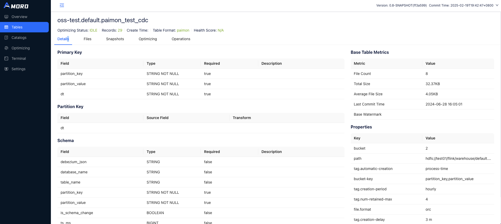

In the future, Paimon automatic optimization strategy will be supported, and users can achieve the best balance experience by cooperating with Amoro automatic optimization

---

<a id="cdc-ingestion"></a>

<!-- source_url: https://paimon.apache.org/docs/master/cdc-ingestion/ -->

<!-- page_index: 89 -->

# Overview

Paimon supports a variety of ways to ingest data into Paimon tables with schema evolution. This means that the added
columns are synchronized to the Paimon table in real time and the synchronization job will not be restarted for this purpose.

We currently support the following sync ways:

1. MySQL Synchronizing Table: synchronize one or multiple tables from MySQL into one Paimon table.
2. MySQL Synchronizing Database: synchronize the whole MySQL database into one Paimon database.
3. [Program API Sync](#program-api-flink-api--cdc-ingestion-table): synchronize your custom DataStream input into one Paimon table.
4. Kafka Synchronizing Table: synchronize one Kafka topic's table into one Paimon table.
5. Kafka Synchronizing Database: synchronize one Kafka topic containing multiple tables or multiple topics containing one table each into one Paimon database.
6. MongoDB Synchronizing Collection: synchronize one Collection from MongoDB into one Paimon table.
7. MongoDB Synchronizing Database: synchronize the whole MongoDB database into one Paimon database.
8. Pulsar Synchronizing Table: synchronize one Pulsar topic's table into one Paimon table.
9. Pulsar Synchronizing Database: synchronize one Pulsar topic containing multiple tables or multiple topics containing one table each into one Paimon database.

Suppose we have a MySQL table named `tableA`, it has three fields: `field_1`, `field_2`, `field_3`. When we want to load
this MySQL table to Paimon, we can do this in Flink SQL, or use [MySqlSyncTableAction](https://paimon.apache.org/docs/master/api/java/org/apache/paimon/flink/action/cdc/mysql/MySqlSyncTableAction).

**Flink SQL:**

In Flink SQL, if we change the table schema of the MySQL table after the ingestion, the table schema change will not be synchronized to Paimon.


**MySqlSyncTableAction:**

In [MySqlSyncTableAction](https://paimon.apache.org/docs/master/api/java/org/apache/paimon/flink/action/cdc/mysql/MySqlSyncTableAction), if we change the table schema of the MySQL table after the ingestion, the table schema change will be synchronized to Paimon, and the data of `field_4` which is newly added will be synchronized to Paimon too.

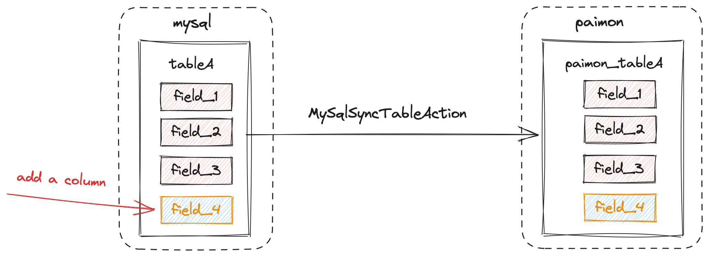

Cdc Ingestion supports a limited number of schema changes. Currently, the framework can not rename table, drop columns, so the
behaviors of `RENAME TABLE` and `DROP COLUMN` will be ignored, `RENAME COLUMN` will add a new column. Currently supported schema changes includes:

- Adding columns.
- Altering column types. More specifically,

  - altering from a string type (char, varchar, text) to another string type with longer length,
  - altering from a non-string type to string type (char, varchar, text),
  - altering from a binary type (binary, varbinary, blob) to another binary type with longer length,
  - altering from an integer type (tinyint, smallint, int, bigint) to another integer type with wider range,
  - altering from a floating-point type (float, double) to another floating-point type with wider range,

  are supported.

`--computed_column` are the definitions of computed columns. The argument field is from source table field name.

Temporal functions can convert date and epoch time to another form. A common use case is to generate partition values.

{{ $ref := ref . "maintenance/configurations.md" }}

| Function | Description |
| --- | --- |
| <a id="cdc-ingestion--year-temporal-column-precision"></a>

 ##### year(temporal-column [, precision]) | Extract year from the input. Output is an INT value represent the year. |
| <a id="cdc-ingestion--month-temporal-column-precision"></a>

 ##### month(temporal-column [, precision]) | Extract month of year from the input. Output is an INT value represent the month of year. |
| <a id="cdc-ingestion--day-temporal-column-precision"></a>

 ##### day(temporal-column [, precision]) | Extract day of month from the input. Output is an INT value represent the day of month. |
| <a id="cdc-ingestion--hour-temporal-column-precision"></a>

 ##### hour(temporal-column [, precision]) | Extract hour from the input. Output is an INT value represent the hour. |
| <a id="cdc-ingestion--minute-temporal-column-precision"></a>

 ##### minute(temporal-column [, precision]) | Extract minute from the input. Output is an INT value represent the minute. |
| <a id="cdc-ingestion--second-temporal-column-precision"></a>

 ##### second(temporal-column [, precision]) | Extract second from the input. Output is an INT value represent the second. |
| <a id="cdc-ingestion--date_format-temporal-column-format-string-precision"></a>

 ##### date\_format(temporal-column, format-string [, precision]) | Convert the input to desired formatted string. Output type is STRING. |
| <a id="cdc-ingestion--now"></a>

 ##### now() | Get the timestamp when ingesting the record. Output type is TIMESTAMP\_LTZ(3). |

The data type of the temporal-column can be one of the following cases:

1. DATE, DATETIME or TIMESTAMP.
2. Any integer numeric type (such as INT and BIGINT). In this case, the data will be considered as epoch time of `1970-01-01 00:00:00`.
   You should set precision of the value (default is 0).
3. STRING. In this case, if you didn't set the time unit, the data will be considered as formatted string of DATE,
   DATETIME or TIMESTAMP value. Otherwise, the data will be considered as string value of epoch time. So you must set time
   unit in the latter case.

The precision represents the unit of the epoch time. Currently, There are four valid precisions: `0` (for epoch seconds), `3` (for epoch milliseconds), `6`(for epoch microseconds) and `9` (for epoch nanoseconds). Take the time point
`1970-01-01 00:00:00.123456789` as an example, the epoch seconds are 0, the epoch milliseconds are 123, the epoch microseconds
are 123456, and the epoch nanoseconds are 123456789. The precision should match the input values. You can set precision
in this way: `date_format(epoch_col, yyyy-MM-dd, 0)`.

`date_format` is a flexible function which is able to convert the temporal value to various formats with different format
strings. A most common format string is `yyyy-MM-dd HH:mm:ss.SSS`. Another example is `yyyy-ww` which can extract the year
and the week-of-the-year from the input. Note that the output is affected by the locale. For example, in some regions the
first day of a week is Monday while in others is Sunday, so if you use `date_format(date_col, yyyy-ww)` and the input of
date\_col is 2024-01-07 (Sunday), the output maybe `2024-01` (if the first day of a week is Monday) or `2024-02` (if the
first day of a week is Sunday).

{{ $ref := ref . "maintenance/configurations.md" }}

| Function | Description |
| --- | --- |
| <a id="cdc-ingestion--substring-column-begininclusive"></a>

 ##### substring(column,beginInclusive) | Get column.substring(beginInclusive). Output is a STRING. |
| <a id="cdc-ingestion--substring-column-begininclusive-endexclusive"></a>

 ##### substring(column,beginInclusive,endExclusive) | Get column.substring(beginInclusive,endExclusive). Output is a STRING. |
| <a id="cdc-ingestion--truncate-column-width"></a>

 ##### truncate(column,width) | Truncate column by width. Output type is the same with column. If the column is a STRING, truncate(column,width) will truncate the string to width characters, namely `value.substring(0, width)`. If the column is an INT or LONG, truncate(column,width) will truncate the number with the algorithm `v - (((v % W) + W) % W)`. The `redundant` compute part is to keep the result always positive. If the column is a DECIMAL, truncate(column,width) will truncate the decimal with the algorithm: let `scaled\_W = decimal(W, scale(v))`, then return `v - (v % scaled\_W)`. |
| <a id="cdc-ingestion--cast-value-datatype"></a>

 ##### cast(value,dataType) | Get a constant value. The output is an atomic type, such as STRING, INT, BOOLEAN, etc. |
| <a id="cdc-ingestion--upper-value"></a>

 ##### upper(value) | Convert string column to upper case. The input should be a STRING and the output is a STRING. |
| <a id="cdc-ingestion--lower-value"></a>

 ##### lower(value) | Convert string column to lower case. The input should be a STRING and the output is a STRING. |
| <a id="cdc-ingestion--trim-value"></a>

 ##### trim(value) | Trim string column. The input should be a STRING and the output is a STRING. |

It is possible that some data types of upstream systems cannot be directly mapped to Paimon data types. We have some special
data types mapping rules:

1. MySQL `TINYINT(1)` type will be mapped to `Boolean`.
2. MySQL `BIT(1)` type will be mapped to `Boolean`.
3. MySQL `BIGINT UNSIGNED`, `BIGINT UNSIGNED ZEROFILL`, `SERIAL` will be mapped to `DECIMAL(20, 0)`.
4. MySQL `BINARY` will be mapped to Paimon `VARBINARY`. This is because the binary value is passed as bytes in binlog, so it
   should be mapped to byte type (`BYTES` or `VARBINARY`). We choose `VARBINARY` because it can retain the length information.
5. Some upstream systems may not pass decimal precision and scale information. In this case, we will use `DECIMAL(38, 18)`.
6. When using Hive catalog, MySQL `TIME` type will be mapped to `STRING`.

We provide some options to customize the mapping rules. Please use `--type_mapping option1,option2,...` to specify them:

1. `tinyint1-not-bool`: Map MySQL `TINYINT(1)` to Paimon `TINYINT` instead of `Boolean`.
2. `to-nullable`: Ignore all `NOT NULL` constraints (except primary keys).
3. `to-string`: Map all MySQL data type to `STRING`.
4. `char-to-string`: Map MySQL `CHAR(length)`/`VARCHAR(length)` types to `STRING`.
5. `longtext-to-bytes`: Map MySQL `LONGTEXT` types to `BYTES`.
6. `decimal_no_change`: Avoid that Paimon CDC framework automatically use `DECIMAL(38, 18)`.
7. `bigint-unsigned-to-bigint`: Map MySQL `BIGINT UNSIGNED`, `BIGINT UNSIGNED ZEROFILL`, `SERIAL` to Paimon `BIGINT`,
   but there is potential data overflow because `BIGINT UNSIGNED` can store up to 20 digits integer value but Paimon
   `BIGINT` can only store up to 19 digits integer value. So you should ensure the overflow won't occur when using this option.
8. `allow_non_string_to_string`: Schema change doesn't support non-string type to string by default. Use this option to allow this change.

Use `-Dexecution.checkpointing.interval=<interval>` to enable checkpointing and set interval. For 0.7 and later versions, if you haven't enabled checkpointing, Paimon will enable checkpointing by default and set checkpoint interval to 180 seconds.

Use `-Dpipeline.name=<job-name>` to set custom synchronization job name.

You can use `--table_conf` to set table properties and some flink job properties (like `sink.parallelism`). If the table is
created by the cdc job, the table's properties will be equal to the given properties. Otherwise, the job will use the given
properties to alter table's properties. But note that immutable options (like `merge-engine`) and bucket number won't be altered.

---

<a id="cdc-ingestion-mysql-cdc"></a>

<!-- source_url: https://paimon.apache.org/docs/master/cdc-ingestion/mysql-cdc/ -->

<!-- page_index: 90 -->

# MySQL CDC

> [!CAUTION]
> **danger**
> Only CDC 3.5.0 or above is supported.

---

<a id="cdc-ingestion-postgres-cdc"></a>

<!-- source_url: https://paimon.apache.org/docs/master/cdc-ingestion/postgres-cdc/ -->

<!-- page_index: 91 -->

# Postgres CDC

> [!CAUTION]
> **danger**
> Only CDC 3.5.0 or above is supported.

---

<a id="cdc-ingestion-kafka-cdc"></a>

<!-- source_url: https://paimon.apache.org/docs/master/cdc-ingestion/kafka-cdc/ -->

<!-- page_index: 92 -->

# Kafka CDC

> [!NOTE]
> **info**
> The JSON sources possibly missing some information. For example, Ogg and Maxwell format standards don't contain field
> types; When you write JSON sources into Flink Kafka sink, it will only reserve data and row type and drop other information.
> The synchronization job will try best to handle the problem as follows:
>
> 1. Usually, debezium-json contains 'schema' field, from which Paimon will retrieve data types. Make sure your debezium
>    json has this field, or Paimon will use 'STRING' type.
> 2. If missing field types, Paimon will use 'STRING' type as default.
> 3. If missing database name or table name, you cannot do database synchronization, but you can still do table synchronization.
> 4. If missing primary keys, the job might create non primary key table. You can set primary keys when submit job in table
>    synchronization.

---

<a id="cdc-ingestion-mongo-cdc"></a>

<!-- source_url: https://paimon.apache.org/docs/master/cdc-ingestion/mongo-cdc/ -->

<!-- page_index: 93 -->

# Mongo CDC

> [!CAUTION]
> **danger**
> Only CDC 3.5.0 or above is supported.

---

<a id="cdc-ingestion-pulsar-cdc"></a>

<!-- source_url: https://paimon.apache.org/docs/master/cdc-ingestion/pulsar-cdc/ -->

<!-- page_index: 94 -->

# Pulsar CDC

> [!NOTE]
> **info**
> The JSON sources possibly missing some information. For example, Ogg and Maxwell format standards don't contain field
> types; When you write JSON sources into Flink Pulsar sink, it will only reserve data and row type and drop other information.
> The synchronization job will try best to handle the problem as follows:
>
> 1. If missing field types, Paimon will use 'STRING' type as default.
> 2. If missing database name or table name, you cannot do database synchronization, but you can still do table synchronization.
> 3. If missing primary keys, the job might create non primary key table. You can set primary keys when submit job in table
>    synchronization.

---

<a id="cdc-ingestion-flink-cdc"></a>

<!-- source_url: https://paimon.apache.org/docs/master/cdc-ingestion/flink-cdc/ -->

<!-- page_index: 95 -->

# Flink CDC

Flink CDC is a streaming data integration tool for the Flink engine. It allows users to describe their ETL pipeline
logic via YAML elegantly and help users automatically generating customized Flink operators and submitting job.

The Paimon Pipeline connector can be used as both the Data Source or the Data Sink of the Flink CDC pipeline. This
document describes how to set up the Paimon Pipeline connector as the Data Source. If you are interested in using
Paimon as the Data Sink, please refer to Flink CDC's
[Paimon Pipeline Connector](https://nightlies.apache.org/flink/flink-cdc-docs-release-3.5/docs/connectors/pipeline-connectors/paimon/)
document.

- Synchronizes data from a Paimon warehouse, database or table to an external system supported by Flink CDC
- Synchronizes schema changes
- Automatically discovers newly created tables in the source Paimon warehouse.

The pipeline for reading data from Paimon and sink to Doris can be defined as follows:

```yaml
source: 
  type: paimon 
  name: Paimon Source 
  database: default 
  table: test_table 
  catalog.properties.metastore: filesystem 
  catalog.properties.warehouse: /path/warehouse 
 
sink: 
  type: doris 
  name: Doris Sink 
  fenodes: 127.0.0.1:8030 
  username: root 
  password: pass 
 
pipeline: 
  name: Paimon to Doris Pipeline 
  parallelism: 2 
```

| Key | Default | Type | Description |
| --- | --- | --- | --- |
| <a id="cdc-ingestion-flink-cdc--database"></a>

 ##### database | (none) | String | Name of the database to be scanned. By default, all databases will be scanned. |
| <a id="cdc-ingestion-flink-cdc--table"></a>

 ##### table | (none) | String | Name of the table to be scanned. By default, all tables will be scanned. |
| <a id="cdc-ingestion-flink-cdc--table.discovery-interval"></a>

 ##### table.discovery-interval | 1 min | Duration | The discovery interval of new tables. Only effective when database or table is not set. |

Apart from the pipeline connector options described above, in the CDC yaml file you can also configure options that
starts with `catalog.properties.`. For example, `catalog.properties.warehouse` or `catalog.properties.metastore`. Such
options will have their prefix removed and the rest be regarded as catalog options. Please refer to the
[Configurations](#maintenance-configurations) section for catalog options available.

- Data updates for primary key tables (-U, +U) will be replaced with -D and +I.
- Does not support dropping tables. If you need to drop a table from the Paimon warehouse, please restart the Flink CDC job after performing the drop operation. When the job restarts, it will stop reading data from the dropped table, and the target table in the external system will remain unchanged from its state before the job was stopped.
- Data from the same table will be consumed by the same Flink source subtask. If the amount of data varies significantly across different tables, performance bottlenecks caused by data skew may be observed in Flink CDC jobs.
- If the CDC job has consumed up to the latest snapshot of a table and the next snapshot is not available yet, the monitoring and consumption of this table may be temporarily paused until `continuous.discovery-interval` has passed.

| Paimon type | CDC type | NOTE |
| --- | --- | --- |
| TINYINT | TINYINT |  |
| SMALLINT | SMALLINT |  |
| INT | INT |  |
| BIGINT | BIGINT |  |
| FLOAT | FLOAT |  |
| DOUBLE | DOUBLE |  |
| DECIMAL(p, s) | DECIMAL(p, s) |  |
| BOOLEAN | BOOLEAN |  |
| DATE | DATE |  |
| TIMESTAMP | TIMESTAMP |  |
| TIMESTAMP\_LTZ | TIMESTAMP\_LTZ |  |
| CHAR(n) | CHAR(n) |  |
| VARCHAR(n) | VARCHAR(n) |  |

---

<a id="maintenance"></a>

<!-- source_url: https://paimon.apache.org/docs/master/maintenance/ -->

<!-- page_index: 96 -->

# Maintenance

---

<a id="maintenance-filesystems"></a>

<!-- source_url: https://paimon.apache.org/docs/master/maintenance/filesystems/ -->

<!-- page_index: 97 -->

# Filesystems

> [!NOTE]
> **info**
> If you have already configured [oss access through Flink](https://nightlies.apache.org/flink/flink-docs-stable/docs/deployment/filesystems/oss/) (Via Flink FileSystem), here you can skip the following configuration.

---

<a id="maintenance-write-performance"></a>

<!-- source_url: https://paimon.apache.org/docs/master/maintenance/write-performance/ -->

<!-- page_index: 98 -->

# Write Performance

Paimon's write performance is closely related to checkpoint, so if you need greater write throughput:

1. Flink Configuration (`'flink-conf.yaml'/'config.yaml'` or `SET` in SQL): Increase the checkpoint interval
   (`'execution.checkpointing.interval'`), increase max concurrent checkpoints to 3
   (`'execution.checkpointing.max-concurrent-checkpoints'`), or just use batch mode.
2. Increase `write-buffer-size`.
3. Enable `write-buffer-spillable`.
4. Rescale bucket number if you are using Fixed-Bucket mode.

Option `'changelog-producer' = 'lookup' or 'full-compaction'`, and option `'full-compaction.delta-commits'` have a
large impact on write performance, if it is a snapshot / full synchronization phase you can unset these options and
then enable them again in the incremental phase.

If you find that the input of the job shows a jagged pattern in the case of backpressure, it may be imbalanced work
nodes. You can consider turning on [Asynchronous Compaction](#primary-key-table-compaction--asynchronous-compaction) to observe if the
throughput is increased.

It is recommended that the parallelism of sink should be less than or equal to the number of buckets, preferably equal. You can control the parallelism of the sink with the `sink.parallelism` table property.

| Option | Required | Default | Type | Description |
| --- | --- | --- | --- | --- |
| <a id="maintenance-write-performance--sink.parallelism"></a>

 ##### sink.parallelism | No | (none) | Integer | Defines the parallelism of the sink operator. By default, the parallelism is determined by the framework using the same parallelism of the upstream chained operator. |

If your job suffers from primary key data skew
(for example, you want to count the number of views for each page in a website, and some particular pages are very popular among the users), you can set `'local-merge-buffer-size'` so that input records will be buffered and merged
before they're shuffled by bucket and written into sink.
This is particularly useful when the same primary key is updated frequently between snapshots.

The buffer will be flushed when it is full. We recommend starting with `64 mb`
when you are faced with data skew but don't know where to start adjusting buffer size.

(Currently, Local merging not works for CDC ingestion)

If you want to achieve ultimate compaction performance, you can consider using row storage file format AVRO.

- The advantage is that you can achieve high write throughput and compaction performance.
- The disadvantage is that your analysis queries will be slow, and the biggest problem with row storage is that it
  does not have the query projection. For example, if the table have 100 columns but only query a few columns, the
  IO of row storage cannot be ignored. Additionally, compression efficiency will decrease and storage costs will
  increase.

This a tradeoff.

Enable row storage through the following options:

```properties
file.format = avro 
metadata.stats-mode = none 
```

The collection of statistical information for row storage is a bit expensive, so I suggest turning off statistical
information as well.

If you don't want to modify all files to Avro format, at least you can consider modifying the files in the previous
layers to Avro format. You can use `'file.format.per.level' = '0:avro,1:avro'` to specify the files in the first two
layers to be in Avro format.

By default, Paimon uses zstd with level 1, you can modify the compression algorithm:

`'file.compression.zstd-level'`: Default zstd level is 1. For higher compression rates, it can be configured to 9, but the read and write speed will significantly decrease.

If there are too few buckets or resources, full-compaction may cause the checkpoint timeout, Flink's default
checkpoint timeout is 10 minutes.

If you expect stability even in this case, you can turn up the checkpoint timeout, for example:

```properties
execution.checkpointing.timeout = 60 min 
```

In the initialization of write, the writer of the bucket needs to read all historical files. If there is a bottleneck
here (For example, writing a large number of partitions simultaneously), you can use `sink.writer-coordinator.enabled`
to use a Flink coordinator to cache the read manifest data to accelerate initialization. The cache memory for coordinator
is `sink.writer-coordinator.cache-memory`, default is 1GB in Job Manager.

There are three main places in Paimon writer that takes up memory:

- Writer's memory buffer, shared and preempted by all writers of a single task. This memory value can be adjusted by the `write-buffer-size` table property.
- Memory consumed when merging several sorted runs for compaction. Can be adjusted by the `num-sorted-run.compaction-trigger` option to change the number of sorted runs to be merged.
- If the row is very large, reading too many lines of data at once will consume a lot of memory when making a compaction. Reducing the `read.batch-size` option can alleviate the impact of this case.
- The memory consumed by writing columnar ORC file. Decreasing the `orc.write.batch-size` option can reduce the consumption of memory for ORC format.
- If files are automatically compaction in the write task, dictionaries for certain large columns can significantly consume memory during compaction.
  - To disable dictionary encoding for all fields in Parquet format, set `'parquet.enable.dictionary'= 'false'`.
  - To disable dictionary encoding for all fields in ORC format, set `orc.dictionary.key.threshold='0'`. Additionally,set `orc.column.encoding.direct='field1,field2'` to disable dictionary encoding for specific columns.

If your Flink job does not rely on state, please avoid using managed memory, which you can control with the following Flink parameter:

```properties
taskmanager.memory.managed.size=1m 
```

Or you can use Flink managed memory for your write buffer to avoid OOM, set table property:

```properties
sink.use-managed-memory-allocator=true 
```

Committer node may use a large memory if the amount of data written to the table is particularly large, OOM may occur
if the memory is too small. In this case, you need to increase the Committer heap memory, but you may not want to
increase the memory of Flink's TaskManager uniformly, which may lead to a waste of memory.

You can use fine-grained-resource-management of Flink to increase committer heap memory only:

1. Configure Flink Configuration `cluster.fine-grained-resource-management.enabled: true`. (This is default after Flink 1.18)
2. Configure Paimon Table Options: `sink.committer-memory`, for example 300 MB, depends on your `TaskManager`.
   (`sink.committer-cpu` is also supported)
3. If you use Flink batch job write data into Paimon or run dedicated compaction, Configure Flink Configuration `fine-grained.shuffle-mode.all-blocking: true`.

---

<a id="maintenance-dedicated-compaction"></a>

<!-- source_url: https://paimon.apache.org/docs/master/maintenance/dedicated-compaction/ -->

<!-- page_index: 99 -->

# Dedicated Compaction

> [!NOTE]
> **info**
> For S3-like object store, its `'RENAME'` does not have atomic semantic. We need to configure Hive metastore and
> enable `'lock.enabled'` option for the catalog.

---

<a id="maintenance-manage-snapshots"></a>

<!-- source_url: https://paimon.apache.org/docs/master/maintenance/manage-snapshots/ -->

<!-- page_index: 100 -->

# Manage Snapshots

This section will describe the management and behavior related to snapshots.

Paimon writers generate one or two [snapshot](#concepts-basic-concepts--snapshot) per commit. Each snapshot may add some new data files or mark some old data files as deleted. However, the marked data files are not truly deleted because Paimon also supports time traveling to an earlier snapshot. They are only deleted when the snapshot expires.

Currently, expiration is automatically performed by Paimon writers when committing new changes. By expiring old snapshots, old data files and metadata files that are no longer used can be deleted to release disk space.

Snapshot expiration is controlled by the following table properties.

| Option | Required | Default | Type | Description |
| --- | --- | --- | --- | --- |
| <a id="maintenance-manage-snapshots--snapshot.time-retained"></a>

 ##### snapshot.time-retained | No | 1 h | Duration | The maximum time of completed snapshots to retain. |
| <a id="maintenance-manage-snapshots--snapshot.num-retained.min"></a>

 ##### snapshot.num-retained.min | No | 10 | Integer | The minimum number of completed snapshots to retain. Should be greater than or equal to 1. |
| <a id="maintenance-manage-snapshots--snapshot.num-retained.max"></a>

 ##### snapshot.num-retained.max | No | Integer.MAX\_VALUE | Integer | The maximum number of completed snapshots to retain. Should be greater than or equal to the minimum number. |
| <a id="maintenance-manage-snapshots--snapshot.expire.execution-mode"></a>

 ##### snapshot.expire.execution-mode | No | sync | Enum | Specifies the execution mode of expire. |
| <a id="maintenance-manage-snapshots--snapshot.expire.limit"></a>

 ##### snapshot.expire.limit | No | 10 | Integer | The maximum number of snapshots allowed to expire at a time. |

When the number of snapshots is less than `snapshot.num-retained.min`, no snapshots will be expired(even the condition `snapshot.time-retained` meet), after which `snapshot.num-retained.max` and `snapshot.time-retained` will be used to control the snapshot expiration until the remaining snapshot meets the condition.

The following example show more details(`snapshot.num-retained.min` is 2, `snapshot.time-retained` is 1h, `snapshot.num-retained.max` is 5):

> snapshot item is described using tuple (snapshotId, corresponding time)

| New Snapshots | All snapshots after expiration check | explanation |
| --- | --- | --- |
| (snapshots-1, 2023-07-06 10:00) | (snapshots-1, 2023-07-06 10:00) | No snapshot expired |
| (snapshots-2, 2023-07-06 10:20) | (snapshots-1, 2023-07-06 10:00) (snapshots-2, 2023-07-06 10:20) | No snapshot expired |
| (snapshots-3, 2023-07-06 10:40) | (snapshots-1, 2023-07-06 10:00) (snapshots-2, 2023-07-06 10:20) (snapshots-3, 2023-07-06 10:40) | No snapshot expired |
| (snapshots-4, 2023-07-06 11:00) | (snapshots-1, 2023-07-06 10:00) (snapshots-2, 2023-07-06 10:20) (snapshots-3, 2023-07-06 10:40) (snapshots-4, 2023-07-06 11:00) | No snapshot expired |
| (snapshots-5, 2023-07-06 11:20) | (snapshots-2, 2023-07-06 10:20) (snapshots-3, 2023-07-06 10:40) (snapshots-4, 2023-07-06 11:00) (snapshots-5, 2023-07-06 11:20) | snapshot-1 was expired because the condition `snapshot.time-retained` is not met |
| (snapshots-6, 2023-07-06 11:30) | (snapshots-3, 2023-07-06 10:40) (snapshots-4, 2023-07-06 11:00) (snapshots-5, 2023-07-06 11:20) (snapshots-6, 2023-07-06 11:30) | snapshot-2 was expired because the condition `snapshot.time-retained` is not met |
| (snapshots-7, 2023-07-06 11:35) | (snapshots-3, 2023-07-06 10:40) (snapshots-4, 2023-07-06 11:00) (snapshots-5, 2023-07-06 11:20) (snapshots-6, 2023-07-06 11:30) (snapshots-7, 2023-07-06 11:35) | No snapshot expired |
| (snapshots-8, 2023-07-06 11:36) | (snapshots-4, 2023-07-06 11:00) (snapshots-5, 2023-07-06 11:20) (snapshots-6, 2023-07-06 11:30) (snapshots-7, 2023-07-06 11:35) (snapshots-8, 2023-07-06 11:36) | snapshot-3 was expired because the condition `snapshot.num-retained.max` is not met |

Please note that too short retain time or too small retain number may result in:

- Batch queries cannot find the file. For example, the table is relatively large and
  the batch query takes 10 minutes to read, but the snapshot from 10 minutes ago
  expires, at which point the batch query will read a deleted snapshot.
- Streaming reading jobs on table files fail to restart.
  When the job restarts, the snapshot it recorded may have expired. (You can use
  [Consumer Id](#flink-consumer-id) to protect streaming reading
  in a small retain time of snapshot expiration).

By default, paimon will delete expired snapshots synchronously. When there are too
many files that need to be deleted, they may not be deleted quickly and back-pressured
to the upstream operator. To avoid this situation, users can use asynchronous expiration
mode by setting `snapshot.expire.execution-mode` to `async`. However, if your job runs in
batch mode, it is not recommended to use asynchronous expiration mode, as the expire task
may fail to complete successfully.

Manually expire a table's snapshots

<div class="theme-tabs-container tabs-container tabList__CuJ"><ul><li>Flink SQL</li><li>Flink Action</li><li>Spark</li></ul><div><div><p>Run the following command:</p><div><div><pre><code><div><span>-- for Flink 1.18</span><span></span> </div><div><span></span><span>CALL</span><span> sys</span><span>.</span><span>expire_snapshots</span><span>(</span><span>'database_name.table_name'</span><span>,</span><span> </span><span>2</span><span>)</span><span></span> </div><div><span></span><span>-- for Flink 1.19 and later</span><span></span> </div><div><span></span><span>CALL</span><span> sys</span><span>.</span><span>expire_snapshots</span><span>(</span><span>`</span><span>table</span><span>`</span><span> </span><span>=</span><span>&gt;</span><span> </span><span>'database_name.table_name'</span><span>,</span><span> retain_max </span><span>=</span><span>&gt;</span><span> </span><span>2</span><span>)</span><span></span> </div><div><span></span><span>CALL</span><span> sys</span><span>.</span><span>expire_snapshots</span><span>(</span><span>`</span><span>table</span><span>`</span><span> </span><span>=</span><span>&gt;</span><span> </span><span>'database_name.table_name'</span><span>,</span><span> older_than </span><span>=</span><span>&gt;</span><span> </span><span>'2024-01-01 12:00:00'</span><span>)</span><span></span> </div><div><span></span><span>CALL</span><span> sys</span><span>.</span><span>expire_snapshots</span><span>(</span><span>`</span><span>table</span><span>`</span><span> </span><span>=</span><span>&gt;</span><span> </span><span>'database_name.table_name'</span><span>,</span><span> older_than </span><span>=</span><span>&gt;</span><span> </span><span>'2024-01-01 12:00:00'</span><span>,</span><span> retain_min </span><span>=</span><span>&gt;</span><span> </span><span>10</span><span>)</span><span></span> </div><div><span></span><span>CALL</span><span> sys</span><span>.</span><span>expire_snapshots</span><span>(</span><span>`</span><span>table</span><span>`</span><span> </span><span>=</span><span>&gt;</span><span> </span><span>'database_name.table_name'</span><span>,</span><span> older_than </span><span>=</span><span>&gt;</span><span> </span><span>'2024-01-01 12:00:00'</span><span>,</span><span> max_deletes </span><span>=</span><span>&gt;</span><span> </span><span>10</span><span>,</span><span> options </span><span>=</span><span>&gt;</span><span> </span><span>'snapshot.expire.limit=1'</span><span>)</span> </div></code></pre></div></div></div><div><p>Run the following command:</p><div><div><pre><code><div><span>&lt;</span><span>FLINK_HOME</span><span>&gt;</span><span>/bin/flink run </span><span>\</span><span></span> </div><div><span>    /path/to/paimon-flink-action-1.5-SNAPSHOT.jar </span><span>\</span><span></span> </div><div><span>    expire_snapshots </span><span>\</span><span></span> </div><div><span>    </span><span>--warehouse</span><span> </span><span>&lt;</span><span>warehouse-path</span><span>&gt;</span><span> </span><span>\</span><span></span> </div><div><span>    </span><span>--identifier</span><span> </span><span>&lt;</span><span>identifier</span><span>&gt;</span><span> </span><span>\</span><span></span> </div><div><span>    </span><span>--older_than</span><span> </span><span>&lt;</span><span>timestamp</span><span>&gt;</span><span> </span><span>\</span><span></span> </div><div><span>    </span><span>--version</span><span> </span><span>&lt;</span><span>snapshot-id</span><span>&gt;</span><span> </span><span>\</span><span></span> </div><div><span>    </span><span>--max_deletes</span><span> </span><span>&lt;</span><span>max-deletes</span><span>&gt;</span><span> </span><span>\</span><span></span> </div><div><span>    </span><span>--retain_max</span><span> </span><span>&lt;</span><span>retain-max</span><span>&gt;</span><span> </span><span>\</span><span></span> </div><div><span>    </span><span>--retain_min</span><span> </span><span>&lt;</span><span>retain-min</span><span>&gt;</span><span> </span><span>\</span><span></span> </div><div><span>    </span><span>[</span><span>--catalog_conf </span><span>&lt;</span><span>paimon-catalog-conf</span><span>&gt;</span><span> </span><span>[</span><span>--catalog_conf </span><span>&lt;</span><span>paimon-catalog-conf</span><span>&gt;</span><span> </span><span>..</span><span>.</span><span>]</span><span>]</span> </div></code></pre></div></div></div><div><p>Run the following sql:</p><div><div><pre><code><div><span>CALL</span><span> sys</span><span>.</span><span>expire_snapshots</span><span>(</span><span>table</span><span> </span><span>=</span><span>&gt;</span><span> </span><span>'database_name.table_name'</span><span>,</span><span> retain_max </span><span>=</span><span>&gt;</span><span> </span><span>10</span><span>,</span><span> options </span><span>=</span><span>&gt;</span><span> </span><span>'snapshot.expire.limit=1'</span><span>)</span><span>;</span> </div></code></pre></div></div></div></div></div>

Rollback a table to a specific snapshot ID.

<div class="theme-tabs-container tabs-container tabList__CuJ"><ul><li>Flink SQL</li><li>Flink Action</li><li>Java API</li><li>Spark</li></ul><div><div><p>Run the following command:</p><div><div><pre><code><div><span>CALL</span><span> sys</span><span>.</span><span>rollback_to</span><span>(</span><span>`</span><span>table</span><span>`</span><span> </span><span>=</span><span>&gt;</span><span> </span><span>'database_name.table_name'</span><span>,</span><span> snapshot_id </span><span>=</span><span>&gt;</span><span> </span><span>&lt;</span><span>snasphot</span><span>-</span><span>id</span><span>&gt;</span><span>)</span><span>;</span> </div></code></pre></div></div></div><div><p>Run the following command:</p><div><div><pre><code><div><span>&lt;</span><span>FLINK_HOME</span><span>&gt;</span><span>/bin/flink run </span><span>\</span><span></span> </div><div><span>    /path/to/paimon-flink-action-1.5-SNAPSHOT.jar </span><span>\</span><span></span> </div><div><span>    rollback_to </span><span>\</span><span></span> </div><div><span>    </span><span>--warehouse</span><span> </span><span>&lt;</span><span>warehouse-path</span><span>&gt;</span><span> </span><span>\</span><span></span> </div><div><span>    </span><span>--database</span><span> </span><span>&lt;</span><span>database-name</span><span>&gt;</span><span> </span><span>\</span><span></span> </div><div><span>    </span><span>--table</span><span> </span><span>&lt;</span><span>table-name</span><span>&gt;</span><span> </span><span>\</span><span></span> </div><div><span>    </span><span>--version</span><span> </span><span>&lt;</span><span>snapshot-id</span><span>&gt;</span><span> </span><span>\</span><span></span> </div><div><span>    </span><span>[</span><span>--catalog_conf </span><span>&lt;</span><span>paimon-catalog-conf</span><span>&gt;</span><span> </span><span>[</span><span>--catalog_conf </span><span>&lt;</span><span>paimon-catalog-conf</span><span>&gt;</span><span> </span><span>..</span><span>.</span><span>]</span><span>]</span> </div></code></pre></div></div></div><div><div><div><pre><code><div><span>import</span><span> </span><span>org</span><span>.</span><span>apache</span><span>.</span><span>paimon</span><span>.</span><span>table</span><span>.</span><span>Table</span><span>;</span><span></span> </div><div><span></span> </div><div><span></span><span>public</span><span> </span><span>class</span><span> </span><span>RollbackTo</span><span> </span><span>{</span><span></span> </div><div><span></span> </div><div><span>    </span><span>public</span><span> </span><span>static</span><span> </span><span>void</span><span> </span><span>main</span><span>(</span><span>String</span><span>[</span><span>]</span><span> args</span><span>)</span><span> </span><span>{</span><span></span> </div><div><span>        </span><span>// before rollback:</span><span></span> </div><div><span>        </span><span>// snapshot-3</span><span></span> </div><div><span>        </span><span>// snapshot-4</span><span></span> </div><div><span>        </span><span>// snapshot-5</span><span></span> </div><div><span>        </span><span>// snapshot-6</span><span></span> </div><div><span>        </span><span>// snapshot-7</span><span></span> </div><div><span>      </span> </div><div><span>        table</span><span>.</span><span>rollbackTo</span><span>(</span><span>5</span><span>)</span><span>;</span><span></span> </div><div><span>        </span> </div><div><span>        </span><span>// after rollback:</span><span></span> </div><div><span>        </span><span>// snapshot-3</span><span></span> </div><div><span>        </span><span>// snapshot-4</span><span></span> </div><div><span>        </span><span>// snapshot-5</span><span></span> </div><div><span>    </span><span>}</span><span></span> </div><div><span></span><span>}</span> </div></code></pre></div></div></div><div><p>Run the following sql:</p><div><div><pre><code><div><span>CALL</span><span> sys</span><span>.</span><span>rollback</span><span>(</span><span>table</span><span> </span><span>=</span><span>&gt;</span><span> </span><span>'database_name.table_name'</span><span>,</span><span> </span><span>snapshot</span><span> </span><span>=</span><span>&gt;</span><span> snasphot_id</span><span>)</span><span>;</span> </div></code></pre></div></div></div></div></div>

Paimon files are deleted physically only when expiring snapshots. However, it is possible that some unexpected errors occurred
when deleting files, so that there may exist files that are not used by Paimon snapshots (so-called "orphan files"). You can
submit a `remove_orphan_files` job to clean them:

<div class="theme-tabs-container tabs-container tabList__CuJ"><ul><li>Spark SQL/Flink SQL</li><li>Flink Action</li></ul><div><div><div><div><pre><code><div><span>CALL</span><span> sys</span><span>.</span><span>remove_orphan_files</span><span>(</span><span>`</span><span>table</span><span>`</span><span> </span><span>=</span><span>&gt;</span><span> </span><span>'my_db.my_table'</span><span>,</span><span> </span><span>[</span><span>older_than </span><span>=</span><span>&gt;</span><span> </span><span>'2023-10-31 12:00:00'</span><span>]</span><span>)</span><span></span> </div><div><span></span> </div><div><span></span><span>CALL</span><span> sys</span><span>.</span><span>remove_orphan_files</span><span>(</span><span>`</span><span>table</span><span>`</span><span> </span><span>=</span><span>&gt;</span><span> </span><span>'my_db.*'</span><span>,</span><span> </span><span>[</span><span>older_than </span><span>=</span><span>&gt;</span><span> </span><span>'2023-10-31 12:00:00'</span><span>]</span><span>)</span> </div></code></pre></div></div></div><div><div><div><pre><code><div><span>&lt;</span><span>FLINK_HOME</span><span>&gt;</span><span>/bin/flink run </span><span>\</span><span></span> </div><div><span>    /path/to/paimon-flink-action-1.5-SNAPSHOT.jar </span><span>\</span><span></span> </div><div><span>    remove_orphan_files </span><span>\</span><span></span> </div><div><span>    </span><span>--warehouse</span><span> </span><span>&lt;</span><span>warehouse-path</span><span>&gt;</span><span> </span><span>\</span><span></span> </div><div><span>    </span><span>--database</span><span> </span><span>&lt;</span><span>database-name</span><span>&gt;</span><span> </span><span>\</span><span></span> </div><div><span>    </span><span>--table</span><span> </span><span>&lt;</span><span>table-name</span><span>&gt;</span><span> </span><span>\</span><span></span> </div><div><span>    </span><span>[</span><span>--older_than </span><span>&lt;</span><span>timestamp</span><span>&gt;</span><span>]</span><span> </span><span>\</span><span></span> </div><div><span>    </span><span>[</span><span>--dry_run </span><span>&lt;</span><span>false/true</span><span>&gt;</span><span>]</span><span> </span><span>\</span><span></span> </div><div><span>    </span><span>[</span><span>--parallelism </span><span>&lt;</span><span>parallelism</span><span>&gt;</span><span>]</span> </div></code></pre></div></div><p>To avoid deleting files that are newly added by other writing jobs, this action only deletes orphan files older than
1 day by default. The interval can be modified by <code>--older_than</code>. For example:</p><div><div><pre><code><div><span>&lt;</span><span>FLINK_HOME</span><span>&gt;</span><span>/bin/flink run </span><span>\</span><span></span> </div><div><span>    /path/to/paimon-flink-action-1.5-SNAPSHOT.jar </span><span>\</span><span></span> </div><div><span>    remove_orphan_files </span><span>\</span><span></span> </div><div><span>    </span><span>--warehouse</span><span> </span><span>&lt;</span><span>warehouse-path</span><span>&gt;</span><span> </span><span>\</span><span></span> </div><div><span>    </span><span>--database</span><span> </span><span>&lt;</span><span>database-name</span><span>&gt;</span><span> </span><span>\</span><span></span> </div><div><span>    </span><span>--table</span><span> T </span><span>\</span><span></span> </div><div><span>    </span><span>--older_than</span><span> </span><span>'2023-10-31 12:00:00'</span> </div></code></pre></div></div><p>The table can be <code>*</code> to clean all tables in the database.</p></div></div></div>

---

<a id="maintenance-rescale-bucket"></a>

<!-- source_url: https://paimon.apache.org/docs/master/maintenance/rescale-bucket/ -->

<!-- page_index: 101 -->

# Rescale Bucket

Since the number of total buckets dramatically influences the performance, Paimon allows users to
tune bucket numbers by `ALTER TABLE` command and reorganize data layout by `INSERT OVERWRITE`
without recreating the table/partition. When executing overwrite jobs, the framework will automatically
scan the data with the old bucket number and hash the record according to the current bucket number.

```sql
-- rescale number of total buckets 
ALTER TABLE table_identifier SET ('bucket' = '...'); 
 
-- reorganize data layout of table/partition 
INSERT OVERWRITE table_identifier [PARTITION (part_spec)] 
SELECT ...  
FROM table_identifier 
[WHERE part_spec]; 
```

Please note that

- `ALTER TABLE` only modifies the table's metadata and will **NOT** reorganize or reformat existing data.
  Reorganize existing data must be achieved by `INSERT OVERWRITE`.
- Rescale bucket number does not influence the read and running write jobs.
- Once the bucket number is changed, any newly scheduled `INSERT INTO` jobs which write to without-reorganized
  existing table/partition will throw a `TableException` with message like


```text
Try to write table/partition ... with a new bucket num ...,  
but the previous bucket num is ... Please switch to batch mode,  
and perform INSERT OVERWRITE to rescale current data layout first. 
```

- For partitioned table, it is possible to have different bucket number for different partitions. *E.g.*


```sql
ALTER TABLE my_table SET ('bucket' = '4'); 
INSERT OVERWRITE my_table PARTITION (dt = '2022-01-01') 
SELECT * FROM ...; 
 
ALTER TABLE my_table SET ('bucket' = '8'); 
INSERT OVERWRITE my_table PARTITION (dt = '2022-01-02') 
SELECT * FROM ...; 
```

- During overwrite period, make sure there are no other jobs writing the same table/partition.

Rescale bucket helps to handle sudden spikes in throughput. Suppose there is a daily streaming ETL task to sync transaction data. The table's DDL and pipeline
are listed as follows.

```sql
-- table DDL 
CREATE TABLE verified_orders ( 
    trade_order_id BIGINT, 
    item_id BIGINT, 
    item_price DOUBLE, 
    dt STRING, 
    PRIMARY KEY (dt, trade_order_id, item_id) NOT ENFORCED  
) PARTITIONED BY (dt) 
WITH ( 
    'bucket' = '16' 
); 
 
-- like from a kafka table  
CREATE temporary TABLE raw_orders( 
    trade_order_id BIGINT, 
    item_id BIGINT, 
    item_price BIGINT, 
    gmt_create STRING, 
    order_status STRING 
) WITH ( 
    'connector' = 'kafka', 
    'topic' = '...', 
    'properties.bootstrap.servers' = '...', 
    'format' = 'csv' 
    ... 
); 
 
-- streaming insert as bucket num = 16 
INSERT INTO verified_orders 
SELECT trade_order_id, 
       item_id, 
       item_price, 
       DATE_FORMAT(gmt_create, 'yyyy-MM-dd') AS dt 
FROM raw_orders 
WHERE order_status = 'verified'; 
```

The pipeline has been running well for the past few weeks. However, the data volume has grown fast recently, and the job's latency keeps increasing. To improve the data freshness, users can

- Suspend the streaming job with a savepoint ( see
  [Suspended State](https://nightlies.apache.org/flink/flink-docs-stable/docs/internals/job_scheduling/) and
  [Stopping a Job Gracefully Creating a Final Savepoint](https://nightlies.apache.org/flink/flink-docs-stable/docs/deployment/cli/#terminating-a-job) )


```bash
$ ./bin/flink stop \ --savepointPath /tmp/flink-savepoints \ $JOB_ID
```

- Increase the bucket number


```sql
-- scaling out 
ALTER TABLE verified_orders SET ('bucket' = '32'); 
```

- Switch to the batch mode and overwrite the current partition(s) to which the streaming job is writing


```sql
SET 'execution.runtime-mode' = 'batch'; 
-- suppose today is 2022-06-22 
-- case 1: there is no late event which updates the historical partitions, thus overwrite today's partition is enough 
INSERT OVERWRITE verified_orders PARTITION (dt = '2022-06-22') 
SELECT trade_order_id, 
       item_id, 
       item_price 
FROM verified_orders 
WHERE dt = '2022-06-22'; 
 
-- case 2: there are late events updating the historical partitions, but the range does not exceed 3 days 
INSERT OVERWRITE verified_orders 
SELECT trade_order_id, 
       item_id, 
       item_price, 
       dt 
FROM verified_orders 
WHERE dt IN ('2022-06-20', '2022-06-21', '2022-06-22'); 
```

- After overwrite job has finished, switch back to streaming mode. And now, the parallelism can be increased alongside with bucket number to restore the streaming job from the savepoint
  ( see [Start a SQL Job from a savepoint](https://nightlies.apache.org/flink/flink-docs-stable/docs/dev/table/sqlclient/#start-a-sql-job-from-a-savepoint) )


```sql
SET 'execution.runtime-mode' = 'streaming'; 
SET 'execution.savepoint.path' = <savepointPath>; 
 
INSERT INTO verified_orders 
SELECT trade_order_id, 
     item_id, 
     item_price, 
     DATE_FORMAT(gmt_create, 'yyyy-MM-dd') AS dt 
FROM raw_orders 
WHERE order_status = 'verified'; 
```

---

<a id="maintenance-manage-tags"></a>

<!-- source_url: https://paimon.apache.org/docs/master/maintenance/manage-tags/ -->

<!-- page_index: 102 -->

# Manage Tags

> [!NOTE]
> **info**
> If you choose Watermark, you may need to specify the time zone of watermark, if watermark is not in the
> UTC time zone, please configure `'sink.watermark-time-zone'`.

---

<a id="maintenance-metrics"></a>

<!-- source_url: https://paimon.apache.org/docs/master/maintenance/metrics/ -->

<!-- page_index: 103 -->

# Paimon Metrics

> [!NOTE]
> **info**
> 1. Please refer to [System Scope](https://nightlies.apache.org/flink/flink-docs-master/docs/ops/metrics/#system-scope) to understand Flink `scope`
> 2. Scan metrics are only supported by Flink versions >= 1.18

---

<a id="maintenance-manage-privileges"></a>

<!-- source_url: https://paimon.apache.org/docs/master/maintenance/manage-privileges/ -->

<!-- page_index: 104 -->

# Manage Privileges

> [!WARNING]
> This privilege system only prevents unwanted users from accessing tables through catalogs.
> It does not block access through temporary table (by specifying table path on filesystem), nor does it prevent user from directly modifying data files on filesystem.
> If you need more serious protection, use a filesystem with access management instead.

---

<a id="maintenance-manage-branches"></a>

<!-- source_url: https://paimon.apache.org/docs/master/maintenance/manage-branches/ -->

<!-- page_index: 105 -->

# Manage Branches

> [!WARNING]
> **Note:** The `Delete Branches` operation only deletes the metadata file. If you want to clear the data written during the branch, use [remove\_orphan\_files](#flink-procedures)

---

<a id="maintenance-manage-partitions"></a>

<!-- source_url: https://paimon.apache.org/docs/master/maintenance/manage-partitions/ -->

<!-- page_index: 106 -->

# Manage Partitions

> [!NOTE]
> **info**
> **Note:** After the partition expires, it is logically deleted and the latest snapshot cannot query its data. But the
> files in the file system are not immediately physically deleted, it depends on when the corresponding snapshot expires.
> See [Expire Snapshots](#maintenance-manage-snapshots--expire-snapshots).

---

<a id="maintenance-configurations"></a>

<!-- source_url: https://paimon.apache.org/docs/master/maintenance/configurations/ -->

<!-- page_index: 107 -->

# Configuration

Core options for paimon.

<table class="configuration table table-bordered">
<thead>
<tr>
<th>Key</th>
<th>Default</th>
<th>Type</th>
<th>Description</th>
</tr>
</thead>
<tbody>
<tr>
<td><a id="maintenance-configurations--add-column-before-partition"></a>

add-column-before-partition</td>
<td>false</td>
<td>Boolean</td>
<td>If true, when adding a new column without specifying a position, the column will be placed before the first partition column instead of at the end of the schema. This only takes effect for partitioned tables.</td>
</tr>
<tr>
<td><a id="maintenance-configurations--aggregation.remove-record-on-delete"></a>

aggregation.remove-record-on-delete</td>
<td>false</td>
<td>Boolean</td>
<td>Whether to remove the whole row in aggregation engine when -D records are received.</td>
</tr>
<tr>
<td><a id="maintenance-configurations--alter-column-null-to-not-null.disabled"></a>

alter-column-null-to-not-null.disabled</td>
<td>true</td>
<td>Boolean</td>
<td>If true, it disables altering column type from null to not null. Default is true. Users can disable this option to explicitly convert null column type to not null.</td>
</tr>
<tr>
<td><a id="maintenance-configurations--async-file-write"></a>

async-file-write</td>
<td>true</td>
<td>Boolean</td>
<td>Whether to enable asynchronous IO writing when writing files.</td>
</tr>
<tr>
<td><a id="maintenance-configurations--auto-create"></a>

auto-create</td>
<td>false</td>
<td>Boolean</td>
<td>Whether to create underlying storage when reading and writing the table.</td>
</tr>
<tr>
<td><a id="maintenance-configurations--blob-as-descriptor"></a>

blob-as-descriptor</td>
<td>false</td>
<td>Boolean</td>
<td>Write blob field using blob descriptor rather than blob bytes.</td>
</tr>
<tr>
<td><a id="maintenance-configurations--blob-compaction.enabled"></a>

blob-compaction.enabled</td>
<td>false</td>
<td>Boolean</td>
<td>Whether to compact blob files when compacting a data evolution table.</td>
</tr>
<tr>
<td><a id="maintenance-configurations--blob-descriptor-field"></a>

blob-descriptor-field</td>
<td>(none)</td>
<td>String</td>
<td>Comma-separated field names to treat as BLOB fields and store as serialized BlobDescriptor bytes inline in data files.</td>
</tr>
<tr>
<td><a id="maintenance-configurations--blob-external-storage-field"></a>

blob-external-storage-field</td>
<td>(none)</td>
<td>String</td>
<td>Comma-separated BLOB field names (must be a subset of 'blob-descriptor-field') whose raw data will be written to external storage at write time. The external storage path is configured via 'blob-external-storage-path'. Orphan file cleanup is not applied to that path.</td>
</tr>
<tr>
<td><a id="maintenance-configurations--blob-external-storage-path"></a>

blob-external-storage-path</td>
<td>(none)</td>
<td>String</td>
<td>The external storage path where raw BLOB data from fields configured by 'blob-external-storage-field' is written at write time. Orphan file cleanup is not applied to this path.</td>
</tr>
<tr>
<td><a id="maintenance-configurations--blob-field"></a>

blob-field</td>
<td>(none)</td>
<td>String</td>
<td>Specifies column names that should be stored as blob type. This is used when you want to treat a BYTES column as a BLOB. Fields listed in blob-descriptor-field or blob-view-field are also treated as BLOB fields.</td>
</tr>
<tr>
<td><a id="maintenance-configurations--blob-view-field"></a>

blob-view-field</td>
<td>(none)</td>
<td>String</td>
<td>Comma-separated field names to treat as BLOB fields and store as serialized BlobViewStruct bytes inline in data files and resolve from upstream tables at read time.</td>
</tr>
<tr>
<td><a id="maintenance-configurations--blob-view.resolve.enabled"></a>

blob-view.resolve.enabled</td>
<td>true</td>
<td>Boolean</td>
<td>Whether to resolve blob-view-field values from upstream tables at read time. Set to false to preserve BlobViewStruct references when forwarding blob view values to another blob-view table.</td>
</tr>
<tr>
<td><a id="maintenance-configurations--blob-write-null-on-missing-file"></a>

blob-write-null-on-missing-file</td>
<td>false</td>
<td>Boolean</td>
<td>Whether to write NULL for a descriptor BLOB value when the referenced file does not exist during Flink writes. When false, the write fails when the descriptor is read.</td>
</tr>
<tr>
<td><a id="maintenance-configurations--blob.split-by-file-size"></a>

blob.split-by-file-size</td>
<td>(none)</td>
<td>Boolean</td>
<td>Whether to consider blob file size as a factor when performing scan splitting.</td>
</tr>
<tr>
<td><a id="maintenance-configurations--blob.target-file-size"></a>

blob.target-file-size</td>
<td>(none)</td>
<td>MemorySize</td>
<td>Target size of a blob file. Default is value of TARGET_FILE_SIZE.</td>
</tr>
<tr>
<td><a id="maintenance-configurations--bucket"></a>

bucket</td>
<td>-1</td>
<td>Integer</td>
<td>Bucket number for file store. It should either be equal to -1 (dynamic bucket mode), -2 (postpone bucket mode), or it must be greater than 0 (fixed bucket mode).</td>
</tr>
<tr>
<td><a id="maintenance-configurations--bucket-append-ordered"></a>

bucket-append-ordered</td>
<td>true</td>
<td>Boolean</td>
<td>Whether to ignore the order of the buckets when reading data from an append-only table.</td>
</tr>
<tr>
<td><a id="maintenance-configurations--bucket-function.type"></a>

bucket-function.type</td>
<td>default</td>
<td><p>Enum</p></td>
<td>The bucket function for paimon bucket.

Possible values:<ul><li>"default": The default bucket function which will use arithmetic: bucket_id = Math.abs(hash_bucket_binary_row % numBuckets) to get bucket.</li><li>"mod": The modulus bucket function which will use modulus arithmetic: bucket_id = Math.floorMod(bucket_key_value, numBuckets) to get bucket. Note: the bucket key must be a single field of INT or BIGINT datatype.</li><li>"hive": The hive bucket function which will use hive-compatible hash arithmetic to get bucket.</li></ul></td>
</tr>
<tr>
<td><a id="maintenance-configurations--bucket-key"></a>

bucket-key</td>
<td>(none)</td>
<td>String</td>
<td>Specify the paimon distribution policy. Data is assigned to each bucket according to the hash value of bucket-key. If you specify multiple fields, delimiter is ','. If not specified, the primary key will be used; if there is no primary key, the full row will be used.</td>
</tr>
<tr>
<td><a id="maintenance-configurations--cache-page-size"></a>

cache-page-size</td>
<td>64 kb</td>
<td>MemorySize</td>
<td>Memory page size for caching.</td>
</tr>
<tr>
<td><a id="maintenance-configurations--chain-table.chain-partition-keys"></a>

chain-table.chain-partition-keys</td>
<td>(none)</td>
<td>String</td>
<td>Partition keys that participate in chain logic. Must be a contiguous suffix of the table's partition keys. Comma-separated. If not set, all partition keys participate in chain.</td>
</tr>
<tr>
<td><a id="maintenance-configurations--chain-table.enabled"></a>

chain-table.enabled</td>
<td>false</td>
<td>Boolean</td>
<td>Whether enabled chain table.</td>
</tr>
<tr>
<td><a id="maintenance-configurations--changelog-file.compression"></a>

changelog-file.compression</td>
<td>(none)</td>
<td>String</td>
<td>Changelog file compression.</td>
</tr>
<tr>
<td><a id="maintenance-configurations--changelog-file.format"></a>

changelog-file.format</td>
<td>(none)</td>
<td>String</td>
<td>Specify the message format of changelog files, currently parquet, avro and orc are supported.</td>
</tr>
<tr>
<td><a id="maintenance-configurations--changelog-file.prefix"></a>

changelog-file.prefix</td>
<td>"changelog-"</td>
<td>String</td>
<td>Specify the file name prefix of changelog files.</td>
</tr>
<tr>
<td><a id="maintenance-configurations--changelog-file.stats-mode"></a>

changelog-file.stats-mode</td>
<td>(none)</td>
<td>String</td>
<td>Changelog file metadata stats collection. none, counts, truncate(16), full is available.</td>
</tr>
<tr>
<td><a id="maintenance-configurations--changelog-producer"></a>

changelog-producer</td>
<td>none</td>
<td><p>Enum</p></td>
<td>Whether to double write to a changelog file. This changelog file keeps the details of data changes, it can be read directly during stream reads. This can be applied to tables with primary keys.

Possible values:<ul><li>"none": No changelog file.</li><li>"input": Double write to a changelog file when flushing memory table, the changelog is from input.</li><li>"full-compaction": Generate changelog files with each full compaction.</li><li>"lookup": Generate changelog files through 'lookup' compaction.</li></ul></td>
</tr>
<tr>
<td><a id="maintenance-configurations--changelog-producer.row-deduplicate"></a>

changelog-producer.row-deduplicate</td>
<td>false</td>
<td>Boolean</td>
<td>Whether to generate -U, +U changelog for the same record. This configuration is only valid for the changelog-producer is lookup or full-compaction.</td>
</tr>
<tr>
<td><a id="maintenance-configurations--changelog-producer.row-deduplicate-ignore-fields"></a>

changelog-producer.row-deduplicate-ignore-fields</td>
<td>(none)</td>
<td>String</td>
<td>Fields that are ignored for comparison while generating -U, +U changelog for the same record. This configuration is only valid for the changelog-producer.row-deduplicate is true.</td>
</tr>
<tr>
<td><a id="maintenance-configurations--changelog.num-retained.max"></a>

changelog.num-retained.max</td>
<td>(none)</td>
<td>Integer</td>
<td>The maximum number of completed changelog to retain. Should be greater than or equal to the minimum number.</td>
</tr>
<tr>
<td><a id="maintenance-configurations--changelog.num-retained.min"></a>

changelog.num-retained.min</td>
<td>(none)</td>
<td>Integer</td>
<td>The minimum number of completed changelog to retain. Should be greater than or equal to 1.</td>
</tr>
<tr>
<td><a id="maintenance-configurations--changelog.time-retained"></a>

changelog.time-retained</td>
<td>(none)</td>
<td>Duration</td>
<td>The maximum time of completed changelog to retain.</td>
</tr>
<tr>
<td><a id="maintenance-configurations--clustering.columns"></a>

clustering.columns</td>
<td>(none)</td>
<td>String</td>
<td>Specifies the column name(s) used for comparison during range partitioning, in the format 'columnName1,columnName2'. If not set or set to an empty string, it indicates that the range partitioning feature is not enabled. This option will be effective only for append table without primary keys and batch execution mode.</td>
</tr>
<tr>
<td><a id="maintenance-configurations--clustering.history-partition.idle-to-full-sort"></a>

clustering.history-partition.idle-to-full-sort</td>
<td>(none)</td>
<td>Duration</td>
<td>The duration after which a partition without new updates is considered a historical partition. Historical partitions will be automatically fully clustered during the cluster operation.</td>
</tr>
<tr>
<td><a id="maintenance-configurations--clustering.history-partition.limit"></a>

clustering.history-partition.limit</td>
<td>5</td>
<td>Integer</td>
<td>The limit of history partition number for automatically performing full clustering.</td>
</tr>
<tr>
<td><a id="maintenance-configurations--clustering.incremental"></a>

clustering.incremental</td>
<td>false</td>
<td>Boolean</td>
<td>Whether enable incremental clustering.</td>
</tr>
<tr>
<td><a id="maintenance-configurations--clustering.incremental.mode"></a>

clustering.incremental.mode</td>
<td>global-sort</td>
<td><p>Enum</p></td>
<td>The sort mode for incremental clustering compaction. 'global-sort' (default) performs a global range shuffle so output files are globally ordered. 'local-sort' skips the global shuffle and only sorts rows within each compaction task, producing files that are internally ordered. 'local-sort' is cheaper and sufficient for Parquet lookup optimizations.

Possible values:<ul><li>"global-sort": Perform global range shuffle and then local sort. Output files are globally ordered but require network shuffling.</li><li>"local-sort": Sort rows only within each compaction task without global shuffle. Every output file is internally ordered.</li></ul></td>
</tr>
<tr>
<td><a id="maintenance-configurations--clustering.incremental.optimize-write"></a>

clustering.incremental.optimize-write</td>
<td>false</td>
<td>Boolean</td>
<td>Whether enable perform clustering before write phase when incremental clustering is enabled.</td>
</tr>
<tr>
<td><a id="maintenance-configurations--clustering.strategy"></a>

clustering.strategy</td>
<td>"auto"</td>
<td>String</td>
<td>Specifies the comparison algorithm used for range partitioning, including 'zorder', 'hilbert', and 'order', corresponding to the z-order curve algorithm, hilbert curve algorithm, and basic type comparison algorithm, respectively. When not configured, it will automatically determine the algorithm based on the number of columns in 'clustering.by-columns'. 'order' is used for 1 column, 'zorder' for less than 5 columns, and 'hilbert' for 5 or more columns.</td>
</tr>
<tr>
<td><a id="maintenance-configurations--commit.callback.-.param"></a>

commit.callback.#.param</td>
<td>(none)</td>
<td>String</td>
<td>Parameter string for the constructor of class #. Callback class should parse the parameter by itself.</td>
</tr>
<tr>
<td><a id="maintenance-configurations--commit.callbacks"></a>

commit.callbacks</td>
<td>(none)</td>
<td>String</td>
<td>A list of commit callback classes to be called after a successful commit. Class names are connected with comma (example: com.test.CallbackA,com.sample.CallbackB).</td>
</tr>
<tr>
<td><a id="maintenance-configurations--commit.discard-duplicate-files"></a>

commit.discard-duplicate-files</td>
<td>false</td>
<td>Boolean</td>
<td>Whether discard duplicate files in commit.</td>
</tr>
<tr>
<td><a id="maintenance-configurations--commit.force-compact"></a>

commit.force-compact</td>
<td>false</td>
<td>Boolean</td>
<td>Whether to force a compaction before commit.</td>
</tr>
<tr>
<td><a id="maintenance-configurations--commit.force-create-snapshot"></a>

commit.force-create-snapshot</td>
<td>false</td>
<td>Boolean</td>
<td>In streaming job, whether to force creating snapshot when there is no data in this write-commit phase.</td>
</tr>
<tr>
<td><a id="maintenance-configurations--commit.max-retries"></a>

commit.max-retries</td>
<td>10</td>
<td>Integer</td>
<td>Maximum number of retries when commit failed.</td>
</tr>
<tr>
<td><a id="maintenance-configurations--commit.max-retry-wait"></a>

commit.max-retry-wait</td>
<td>10 s</td>
<td>Duration</td>
<td>Max retry wait time when commit failed.</td>
</tr>
<tr>
<td><a id="maintenance-configurations--commit.min-retry-wait"></a>

commit.min-retry-wait</td>
<td>10 ms</td>
<td>Duration</td>
<td>Min retry wait time when commit failed.</td>
</tr>
<tr>
<td><a id="maintenance-configurations--commit.strict-mode.last-safe-snapshot"></a>

commit.strict-mode.last-safe-snapshot</td>
<td>(none)</td>
<td>Long</td>
<td>If set, committer will check if there are other commit user's snapshot starting from the snapshot after this one. If found a COMPACT / OVERWRITE snapshot, or found a APPEND snapshot which committed files to fixed bucket, commit will be aborted.If the value of this option is -1, committer will not check for its first commit.</td>
</tr>
<tr>
<td><a id="maintenance-configurations--commit.timeout"></a>

commit.timeout</td>
<td>(none)</td>
<td>Duration</td>
<td>Timeout duration of retry when commit failed.</td>
</tr>
<tr>
<td><a id="maintenance-configurations--commit.user-prefix"></a>

commit.user-prefix</td>
<td>(none)</td>
<td>String</td>
<td>Specifies the commit user prefix.</td>
</tr>
<tr>
<td><a id="maintenance-configurations--compaction.delete-ratio-threshold"></a>

compaction.delete-ratio-threshold</td>
<td>0.2</td>
<td>Double</td>
<td>Ratio of the deleted rows in a data file to be forced compacted for append-only table.</td>
</tr>
<tr>
<td><a id="maintenance-configurations--compaction.file-num-limit"></a>

compaction.file-num-limit</td>
<td>100000</td>
<td>Integer</td>
<td>To avoid OOM caused by scanning compaction files, you can use this option to limit the for unaware-bucket append table compaction.</td>
</tr>
<tr>
<td><a id="maintenance-configurations--compaction.force-rewrite-all-files"></a>

compaction.force-rewrite-all-files</td>
<td>false</td>
<td>Boolean</td>
<td>Whether to force pick all files for a full compaction. Usually seen in a compaction task to external paths.</td>
</tr>
<tr>
<td><a id="maintenance-configurations--compaction.force-up-level-0"></a>

compaction.force-up-level-0</td>
<td>false</td>
<td>Boolean</td>
<td>If set to true, compaction strategy will always include all level 0 files in candidates.</td>
</tr>
<tr>
<td><a id="maintenance-configurations--compaction.incremental-size-threshold"></a>

compaction.incremental-size-threshold</td>
<td>(none)</td>
<td>MemorySize</td>
<td>When incremental size is bigger than this threshold, force a full compaction.</td>
</tr>
<tr>
<td><a id="maintenance-configurations--compaction.max-size-amplification-percent"></a>

compaction.max-size-amplification-percent</td>
<td>200</td>
<td>Integer</td>
<td>The size amplification is defined as the amount (in percentage) of additional storage needed to store a single byte of data in the merge tree for changelog mode table.</td>
</tr>
<tr>
<td><a id="maintenance-configurations--compaction.min.file-num"></a>

compaction.min.file-num</td>
<td>5</td>
<td>Integer</td>
<td>For file set [f_0,...,f_N], the minimum file number to trigger a compaction for append-only table.</td>
</tr>
<tr>
<td><a id="maintenance-configurations--compaction.offpeak-ratio"></a>

compaction.offpeak-ratio</td>
<td>0</td>
<td>Integer</td>
<td>Allows you to set a different (by default, more aggressive) percentage ratio for determining  whether larger sorted run's size are included in compactions during off-peak hours. Works in the  same way as compaction.size-ratio. Only applies if offpeak.start.hour and  offpeak.end.hour are also enabled.   For instance, if your cluster experiences low pressure between 2 AM  and 6 PM ,  you can configure `compaction.offpeak.start.hour=2` and `compaction.offpeak.end.hour=18` to define this period as off-peak hours.  During these hours, you can increase the off-peak compaction ratio (e.g. `compaction.offpeak-ratio=20`) to enable more aggressive data compaction</td>
</tr>
<tr>
<td><a id="maintenance-configurations--compaction.offpeak.end.hour"></a>

compaction.offpeak.end.hour</td>
<td>-1</td>
<td>Integer</td>
<td>The end of off-peak hours, expressed as an integer between 0 and 23, exclusive. Set to -1 to disable off-peak.</td>
</tr>
<tr>
<td><a id="maintenance-configurations--compaction.offpeak.start.hour"></a>

compaction.offpeak.start.hour</td>
<td>-1</td>
<td>Integer</td>
<td>The start of off-peak hours, expressed as an integer between 0 and 23, inclusive Set to -1 to disable off-peak</td>
</tr>
<tr>
<td><a id="maintenance-configurations--compaction.optimization-interval"></a>

compaction.optimization-interval</td>
<td>(none)</td>
<td>Duration</td>
<td>Implying how often to perform an optimization compaction, this configuration is used to ensure the query timeliness of the read-optimized system table.</td>
</tr>
<tr>
<td><a id="maintenance-configurations--compaction.size-ratio"></a>

compaction.size-ratio</td>
<td>1</td>
<td>Integer</td>
<td>Percentage flexibility while comparing sorted run size for changelog mode table. If the candidate sorted run(s) size is 1% smaller than the next sorted run's size, then include next sorted run into this candidate set.</td>
</tr>
<tr>
<td><a id="maintenance-configurations--compaction.small-file-ratio"></a>

compaction.small-file-ratio</td>
<td>0.7</td>
<td>Double</td>
<td>The ratio of target file size. Files whose size is smaller than target-file-size * compaction.small-file-ratio will be picked for compaction rewriting. This avoids compacting the same file repeatedly due to compression inaccuracy causing output files to be slightly smaller than the target size.</td>
</tr>
<tr>
<td><a id="maintenance-configurations--compaction.total-size-threshold"></a>

compaction.total-size-threshold</td>
<td>(none)</td>
<td>MemorySize</td>
<td>When total size is smaller than this threshold, force a full compaction.</td>
</tr>
<tr>
<td><a id="maintenance-configurations--consumer-id"></a>

consumer-id</td>
<td>(none)</td>
<td>String</td>
<td>Consumer id for recording the offset of consumption in the storage.</td>
</tr>
<tr>
<td><a id="maintenance-configurations--consumer.changelog-only"></a>

consumer.changelog-only</td>
<td>false</td>
<td>Boolean</td>
<td>If true, consumer will only affect changelog expiration and will not prevent snapshot from being expired.</td>
</tr>
<tr>
<td><a id="maintenance-configurations--consumer.expiration-time"></a>

consumer.expiration-time</td>
<td>(none)</td>
<td>Duration</td>
<td>The expiration interval of consumer files. A consumer file will be expired if it's lifetime after last modification is over this value.</td>
</tr>
<tr>
<td><a id="maintenance-configurations--consumer.ignore-progress"></a>

consumer.ignore-progress</td>
<td>false</td>
<td>Boolean</td>
<td>Whether to ignore consumer progress for the newly started job.</td>
</tr>
<tr>
<td><a id="maintenance-configurations--consumer.mode"></a>

consumer.mode</td>
<td>exactly-once</td>
<td><p>Enum</p></td>
<td>Specify the consumer consistency mode for table.

Possible values:<ul><li>"exactly-once": Readers consume data at snapshot granularity, and strictly ensure that the snapshot-id recorded in the consumer is the snapshot-id + 1 that all readers have exactly consumed.</li><li>"at-least-once": Each reader consumes snapshots at a different rate, and the snapshot with the slowest consumption progress among all readers will be recorded in the consumer.</li></ul></td>
</tr>
<tr>
<td><a id="maintenance-configurations--continuous.discovery-interval"></a>

continuous.discovery-interval</td>
<td>10 s</td>
<td>Duration</td>
<td>The discovery interval of continuous reading.</td>
</tr>
<tr>
<td><a id="maintenance-configurations--cross-partition-upsert.bootstrap-parallelism"></a>

cross-partition-upsert.bootstrap-parallelism</td>
<td>10</td>
<td>Integer</td>
<td>The parallelism for bootstrap in a single task for cross partition upsert.</td>
</tr>
<tr>
<td><a id="maintenance-configurations--cross-partition-upsert.index-ttl"></a>

cross-partition-upsert.index-ttl</td>
<td>(none)</td>
<td>Duration</td>
<td>The TTL in rocksdb index for cross partition upsert (primary keys not contain all partition fields), this can avoid maintaining too many indexes and lead to worse and worse performance, but please note that this may also cause data duplication.</td>
</tr>
<tr>
<td><a id="maintenance-configurations--data-evolution.enabled"></a>

data-evolution.enabled</td>
<td>false</td>
<td>Boolean</td>
<td>Whether enable data evolution for row tracking table.</td>
</tr>
<tr>
<td><a id="maintenance-configurations--data-evolution.merge-into.file-pruning"></a>

data-evolution.merge-into.file-pruning</td>
<td>true</td>
<td>Boolean</td>
<td>If true, enables the file-level pruning step for MergeInto partial column update on data-evolution tables. Set this to false when most files in the target partition are expected to be updated, so that the overhead of collecting touched file IDs outweighs the benefit of pruning untouched files.</td>
</tr>
<tr>
<td><a id="maintenance-configurations--data-evolution.merge-into.source-persist"></a>

data-evolution.merge-into.source-persist</td>
<td>false</td>
<td>Boolean</td>
<td>Whether to persist source when process merge into action on data evolution table.</td>
</tr>
<tr>
<td><a id="maintenance-configurations--data-file.external-paths"></a>

data-file.external-paths</td>
<td>(none)</td>
<td>String</td>
<td>The external paths where the data of this table will be written, multiple elements separated by commas.</td>
</tr>
<tr>
<td><a id="maintenance-configurations--data-file.external-paths.specific-fs"></a>

data-file.external-paths.specific-fs</td>
<td>(none)</td>
<td>String</td>
<td>The specific file system of the external path when data-file.external-paths.strategy is set to specific-fs, should be the prefix scheme of the external path, now supported are s3 and oss.</td>
</tr>
<tr>
<td><a id="maintenance-configurations--data-file.external-paths.strategy"></a>

data-file.external-paths.strategy</td>
<td>none</td>
<td><p>Enum</p></td>
<td>The strategy of selecting an external path when writing data.

Possible values:<ul><li>"none": Do not choose any external storage, data will still be written to the default warehouse path.</li><li>"specific-fs": Select a specific file system as the external path. Currently supported are S3 and OSS.</li><li>"round-robin": When writing a new file, a path is chosen from data-file.external-paths in turn.</li><li>"entropy-inject": When writing a new file, a path is chosen based on the hash value of the file's content.</li><li>"weight-robin": When writing a new file, a path is chosen based on configured weights.</li></ul></td>
</tr>
<tr>
<td><a id="maintenance-configurations--data-file.external-paths.weights"></a>

data-file.external-paths.weights</td>
<td>(none)</td>
<td>String</td>
<td>The weights for external paths when data-file.external-paths.strategy is set to weight-robin. Format: 'weight1,weight2,...' with weights corresponding to paths in data-file.external-paths by order. Example: '10,5,15' means first path has weight 10, second 5, third 15. Weights must be positive integers.</td>
</tr>
<tr>
<td><a id="maintenance-configurations--data-file.path-directory"></a>

data-file.path-directory</td>
<td>(none)</td>
<td>String</td>
<td>Specify the path directory of data files.</td>
</tr>
<tr>
<td><a id="maintenance-configurations--data-file.prefix"></a>

data-file.prefix</td>
<td>"data-"</td>
<td>String</td>
<td>Specify the file name prefix of data files.</td>
</tr>
<tr>
<td><a id="maintenance-configurations--data-file.thin-mode"></a>

data-file.thin-mode</td>
<td>false</td>
<td>Boolean</td>
<td>Enable data file thin mode to avoid duplicate columns storage.</td>
</tr>
<tr>
<td><a id="maintenance-configurations--delete.force-produce-changelog"></a>

delete.force-produce-changelog</td>
<td>false</td>
<td>Boolean</td>
<td>Force produce changelog in delete sql, or you can use 'streaming-read-overwrite' to read changelog from overwrite commit.</td>
</tr>
<tr>
<td><a id="maintenance-configurations--deletion-vector.index-file.target-size"></a>

deletion-vector.index-file.target-size</td>
<td>2 mb</td>
<td>MemorySize</td>
<td>The target size of deletion vector index file.</td>
</tr>
<tr>
<td><a id="maintenance-configurations--deletion-vectors.bitmap64"></a>

deletion-vectors.bitmap64</td>
<td>false</td>
<td>Boolean</td>
<td>Enable 64 bit bitmap implementation. Note that only 64 bit bitmap implementation is compatible with Iceberg.</td>
</tr>
<tr>
<td><a id="maintenance-configurations--deletion-vectors.enabled"></a>

deletion-vectors.enabled</td>
<td>false</td>
<td>Boolean</td>
<td>Whether to enable deletion vectors mode. In this mode, index files containing deletion vectors are generated when data is written, which marks the data for deletion. During read operations, by applying these index files, merging can be avoided.</td>
</tr>
<tr>
<td><a id="maintenance-configurations--deletion-vectors.merge-on-read"></a>

deletion-vectors.merge-on-read</td>
<td>false</td>
<td>Boolean</td>
<td>When deletion vectors are enabled, uncompacted files are not visible by default. Set this to true to enable merge-on-read, which makes uncompacted data visible at the cost of read performance. This option only affects batch scan visibility of DV level-0 files, it does not change streaming scan or changelog behavior.</td>
</tr>
<tr>
<td><a id="maintenance-configurations--deletion-vectors.modifiable"></a>

deletion-vectors.modifiable</td>
<td>false</td>
<td>Boolean</td>
<td>Whether to enable modifying deletion vectors mode.</td>
</tr>
<tr>
<td><a id="maintenance-configurations--disable-explicit-type-casting"></a>

disable-explicit-type-casting</td>
<td>false</td>
<td>Boolean</td>
<td>If true, it disables explicit type casting. For ex: it disables converting LONG type to INT type. Users can enable this option to disable explicit type casting</td>
</tr>
<tr>
<td><a id="maintenance-configurations--dynamic-bucket.assigner-parallelism"></a>

dynamic-bucket.assigner-parallelism</td>
<td>(none)</td>
<td>Integer</td>
<td>Parallelism of assigner operator for dynamic bucket mode, it is related to the number of initialized bucket, too small will lead to insufficient processing speed of assigner.</td>
</tr>
<tr>
<td><a id="maintenance-configurations--dynamic-bucket.initial-buckets"></a>

dynamic-bucket.initial-buckets</td>
<td>(none)</td>
<td>Integer</td>
<td>Initial buckets for a partition in assigner operator for dynamic bucket mode.</td>
</tr>
<tr>
<td><a id="maintenance-configurations--dynamic-bucket.max-buckets"></a>

dynamic-bucket.max-buckets</td>
<td>-1</td>
<td>Integer</td>
<td>Max buckets for a partition in dynamic bucket mode, It should either be equal to -1 (unlimited), or it must be greater than 0 (fixed upper bound).</td>
</tr>
<tr>
<td><a id="maintenance-configurations--dynamic-bucket.target-row-num"></a>

dynamic-bucket.target-row-num</td>
<td>2000000</td>
<td>Long</td>
<td>If the bucket is -1, for primary key table, is dynamic bucket mode, this option controls the target row number for one bucket.</td>
</tr>
<tr>
<td><a id="maintenance-configurations--dynamic-partition-overwrite"></a>

dynamic-partition-overwrite</td>
<td>true</td>
<td>Boolean</td>
<td>Whether only overwrite dynamic partition when overwriting a partitioned table with dynamic partition columns. Works only when the table has partition keys.</td>
</tr>
<tr>
<td><a id="maintenance-configurations--end-input.check-partition-expire"></a>

end-input.check-partition-expire</td>
<td>false</td>
<td>Boolean</td>
<td>Optional endInput check partition expire used in case of batch mode or bounded stream.</td>
</tr>
<tr>
<td><a id="maintenance-configurations--fields.default-aggregate-function"></a>

fields.default-aggregate-function</td>
<td>(none)</td>
<td>String</td>
<td>Default aggregate function of all fields for partial-update and aggregate merge function.</td>
</tr>
<tr>
<td><a id="maintenance-configurations--file-index.in-manifest-threshold"></a>

file-index.in-manifest-threshold</td>
<td>500 bytes</td>
<td>MemorySize</td>
<td>The threshold to store file index bytes in manifest.</td>
</tr>
<tr>
<td><a id="maintenance-configurations--file-index.read.enabled"></a>

file-index.read.enabled</td>
<td>true</td>
<td>Boolean</td>
<td>Whether enabled read file index.</td>
</tr>
<tr>
<td><a id="maintenance-configurations--file-operation.thread-num"></a>

file-operation.thread-num</td>
<td>(none)</td>
<td>Integer</td>
<td>The maximum number of concurrent file operations. By default is the number of processors available to the Java virtual machine.</td>
</tr>
<tr>
<td><a id="maintenance-configurations--file-reader-async-threshold"></a>

file-reader-async-threshold</td>
<td>10 mb</td>
<td>MemorySize</td>
<td>The threshold for read file async.</td>
</tr>
<tr>
<td><a id="maintenance-configurations--file.block-size"></a>

file.block-size</td>
<td>(none)</td>
<td>MemorySize</td>
<td>File block size of format, default value of orc stripe is 64 MB, and parquet row group is 128 MB.</td>
</tr>
<tr>
<td><a id="maintenance-configurations--file.compression"></a>

file.compression</td>
<td>"zstd"</td>
<td>String</td>
<td>Default file compression. For faster read and write, it is recommended to use zstd.</td>
</tr>
<tr>
<td><a id="maintenance-configurations--file.compression.per.level"></a>

file.compression.per.level</td>
<td></td>
<td>Map</td>
<td>Define different compression policies for different level, you can add the conf like this: 'file.compression.per.level' = '0:lz4,1:zstd'.</td>
</tr>
<tr>
<td><a id="maintenance-configurations--file.compression.zstd-level"></a>

file.compression.zstd-level</td>
<td>1</td>
<td>Integer</td>
<td>Default file compression zstd level. For higher compression rates, it can be configured to 9, but the read and write speed will significantly decrease.</td>
</tr>
<tr>
<td><a id="maintenance-configurations--file.format"></a>

file.format</td>
<td>"parquet"</td>
<td>String</td>
<td>Specify the message format of data files, currently orc, parquet and avro are supported.</td>
</tr>
<tr>
<td><a id="maintenance-configurations--file.format.per.level"></a>

file.format.per.level</td>
<td></td>
<td>Map</td>
<td>Define different file format for different level, you can add the conf like this: 'file.format.per.level' = '0:avro,3:parquet', if the file format for level is not provided, the default format which set by `file.format` will be used.</td>
</tr>
<tr>
<td><a id="maintenance-configurations--file.suffix.include.compression"></a>

file.suffix.include.compression</td>
<td>false</td>
<td>Boolean</td>
<td>Whether to add file compression type in the file name of data file and changelog file.</td>
</tr>
<tr>
<td><a id="maintenance-configurations--force-lookup"></a>

force-lookup</td>
<td>false</td>
<td>Boolean</td>
<td>Whether to force the use of lookup for compaction.</td>
</tr>
<tr>
<td><a id="maintenance-configurations--format-table.commit-hive-sync-url"></a>

format-table.commit-hive-sync-url</td>
<td>(none)</td>
<td>String</td>
<td>Format table commit hive sync uri.</td>
</tr>
<tr>
<td><a id="maintenance-configurations--format-table.file.compression"></a>

format-table.file.compression</td>
<td>(none)</td>
<td>String</td>
<td>Format table file compression.</td>
</tr>
<tr>
<td><a id="maintenance-configurations--format-table.implementation"></a>

format-table.implementation</td>
<td>paimon</td>
<td><p>Enum</p></td>
<td>Format table uses paimon or engine.

Possible values:<ul><li>"paimon": Paimon format table implementation.</li><li>"engine": Engine format table implementation.</li></ul></td>
</tr>
<tr>
<td><a id="maintenance-configurations--format-table.partition-path-only-value"></a>

format-table.partition-path-only-value</td>
<td>false</td>
<td>Boolean</td>
<td>Format table file path only contain partition value.</td>
</tr>
<tr>
<td><a id="maintenance-configurations--full-compaction.delta-commits"></a>

full-compaction.delta-commits</td>
<td>(none)</td>
<td>Integer</td>
<td>For streaming write, full compaction will be constantly triggered after delta commits. For batch write, full compaction will be triggered with each commit as long as this value is greater than 0.</td>
</tr>
<tr>
<td><a id="maintenance-configurations--global-index.build.max-parallelism"></a>

global-index.build.max-parallelism</td>
<td>4096</td>
<td>Integer</td>
<td>The max parallelism of Flink/Spark for building global index.</td>
</tr>
<tr>
<td><a id="maintenance-configurations--global-index.build.max-shard"></a>

global-index.build.max-shard</td>
<td>32</td>
<td>Integer</td>
<td>The preferred max number of shards for building global index. If the number of shards calculated by 'global-index.row-count-per-shard' exceeds this value, max-shard will be automatically increased to accommodate the data volume while keeping 'global-index.row-count-per-shard' unchanged.</td>
</tr>
<tr>
<td><a id="maintenance-configurations--global-index.column-update-action"></a>

global-index.column-update-action</td>
<td>THROW_ERROR</td>
<td><p>Enum</p></td>
<td>Defines the action to take when an update modifies columns that are covered by a global index.

Possible values:<ul><li>"THROW_ERROR"</li><li>"DROP_PARTITION_INDEX"</li></ul></td>
</tr>
<tr>
<td><a id="maintenance-configurations--global-index.enabled"></a>

global-index.enabled</td>
<td>true</td>
<td>Boolean</td>
<td>Whether to enable global index for scan.</td>
</tr>
<tr>
<td><a id="maintenance-configurations--global-index.external-path"></a>

global-index.external-path</td>
<td>(none)</td>
<td>String</td>
<td>Global index root directory, if not set, the global index files will be stored under the &lt;table-root-directory&gt;/index.</td>
</tr>
<tr>
<td><a id="maintenance-configurations--global-index.row-count-per-shard"></a>

global-index.row-count-per-shard</td>
<td>100000</td>
<td>Long</td>
<td>Row count per shard for global index.</td>
</tr>
<tr>
<td><a id="maintenance-configurations--global-index.thread-num"></a>

global-index.thread-num</td>
<td>32</td>
<td>Integer</td>
<td>The maximum number of concurrent threads for global index I/O.</td>
</tr>
<tr>
<td><a id="maintenance-configurations--ignore-delete"></a>

ignore-delete</td>
<td>false</td>
<td>Boolean</td>
<td>Whether to ignore delete records.</td>
</tr>
<tr>
<td><a id="maintenance-configurations--ignore-update-before"></a>

ignore-update-before</td>
<td>false</td>
<td>Boolean</td>
<td>Whether to ignore update-before records.</td>
</tr>
<tr>
<td><a id="maintenance-configurations--incremental-between"></a>

incremental-between</td>
<td>(none)</td>
<td>String</td>
<td>Read incremental changes between start snapshot (exclusive) and end snapshot (inclusive), for example, '5,10' means changes between snapshot 5 and snapshot 10.</td>
</tr>
<tr>
<td><a id="maintenance-configurations--incremental-between-scan-mode"></a>

incremental-between-scan-mode</td>
<td>auto</td>
<td><p>Enum</p></td>
<td>Scan kind when Read incremental changes between start snapshot (exclusive) and end snapshot (inclusive).

Possible values:<ul><li>"auto": Scan changelog files for the table which produces changelog files. Otherwise, scan newly changed files.</li><li>"delta": Scan newly changed files between snapshots.</li><li>"changelog": Scan changelog files between snapshots.</li><li>"diff": Get diff by comparing data of end snapshot with data of start snapshot.</li></ul></td>
</tr>
<tr>
<td><a id="maintenance-configurations--incremental-between-tag-to-snapshot"></a>

incremental-between-tag-to-snapshot</td>
<td>false</td>
<td>Boolean</td>
<td>Whether to read incremental changes between the snapshot corresponding to the tag.</td>
</tr>
<tr>
<td><a id="maintenance-configurations--incremental-between-timestamp"></a>

incremental-between-timestamp</td>
<td>(none)</td>
<td>String</td>
<td>Read incremental changes between start timestamp (exclusive) and end timestamp (inclusive), for example, 't1,t2' means changes between timestamp t1 and timestamp t2.</td>
</tr>
<tr>
<td><a id="maintenance-configurations--incremental-to-auto-tag"></a>

incremental-to-auto-tag</td>
<td>(none)</td>
<td>String</td>
<td>Used to specify the end tag (inclusive), and Paimon will find an earlier tag and return changes between them. If the tag doesn't exist or the earlier tag doesn't exist, return empty. This option requires 'tag.creation-period' and 'tag.period-formatter' configured.</td>
</tr>
<tr>
<td><a id="maintenance-configurations--index-file-in-data-file-dir"></a>

index-file-in-data-file-dir</td>
<td>false</td>
<td>Boolean</td>
<td>Whether index file in data file directory.</td>
</tr>
<tr>
<td><a id="maintenance-configurations--local-merge-buffer-size"></a>

local-merge-buffer-size</td>
<td>(none)</td>
<td>MemorySize</td>
<td>Local merge will buffer and merge input records before they're shuffled by bucket and written into sink. The buffer will be flushed when it is full.
Mainly to resolve data skew on primary keys. We recommend starting with 64 mb when trying out this feature.</td>
</tr>
<tr>
<td><a id="maintenance-configurations--local-sort.max-num-file-handles"></a>

local-sort.max-num-file-handles</td>
<td>128</td>
<td>Integer</td>
<td>The maximal fan-in for external merge sort. It limits the number of file handles. If it is too small, may cause intermediate merging. But if it is too large, it will cause too many files opened at the same time, consume memory and lead to random reading.</td>
</tr>
<tr>
<td><a id="maintenance-configurations--lookup-compact"></a>

lookup-compact</td>
<td>RADICAL</td>
<td><p>Enum</p></td>
<td>Lookup compact mode used for lookup compaction.

Possible values:<ul><li>"RADICAL"</li><li>"GENTLE"</li></ul></td>
</tr>
<tr>
<td><a id="maintenance-configurations--lookup-compact.max-interval"></a>

lookup-compact.max-interval</td>
<td>(none)</td>
<td>Integer</td>
<td>The max interval for a gentle mode lookup compaction to be triggered. For every interval, a forced lookup compaction will be performed to flush L0 files to higher level. This option is only valid when lookup-compact mode is gentle.</td>
</tr>
<tr>
<td><a id="maintenance-configurations--lookup-wait"></a>

lookup-wait</td>
<td>true</td>
<td>Boolean</td>
<td>When need to lookup, commit will wait for compaction by lookup.</td>
</tr>
<tr>
<td><a id="maintenance-configurations--lookup.cache-file-retention"></a>

lookup.cache-file-retention</td>
<td>1 h</td>
<td>Duration</td>
<td>The cached files retention time for lookup. After the file expires, if there is a need for access, it will be re-read from the DFS to build an index on the local disk.</td>
</tr>
<tr>
<td><a id="maintenance-configurations--lookup.cache-max-disk-size"></a>

lookup.cache-max-disk-size</td>
<td>infinite</td>
<td>MemorySize</td>
<td>Max disk size for lookup cache, you can use this option to limit the use of local disks.</td>
</tr>
<tr>
<td><a id="maintenance-configurations--lookup.cache-max-memory-size"></a>

lookup.cache-max-memory-size</td>
<td>256 mb</td>
<td>MemorySize</td>
<td>Max memory size for lookup cache.</td>
</tr>
<tr>
<td><a id="maintenance-configurations--lookup.cache-spill-compression"></a>

lookup.cache-spill-compression</td>
<td>"zstd"</td>
<td>String</td>
<td>Spill compression for lookup cache, currently zstd, none, lz4 and lzo are supported.</td>
</tr>
<tr>
<td><a id="maintenance-configurations--lookup.cache.bloom.filter.enabled"></a>

lookup.cache.bloom.filter.enabled</td>
<td>true</td>
<td>Boolean</td>
<td>Whether to enable the bloom filter for lookup cache.</td>
</tr>
<tr>
<td><a id="maintenance-configurations--lookup.cache.bloom.filter.fpp"></a>

lookup.cache.bloom.filter.fpp</td>
<td>0.05</td>
<td>Double</td>
<td>Define the default false positive probability for lookup cache bloom filters.</td>
</tr>
<tr>
<td><a id="maintenance-configurations--lookup.cache.high-priority-pool-ratio"></a>

lookup.cache.high-priority-pool-ratio</td>
<td>0.25</td>
<td>Double</td>
<td>The fraction of cache memory that is reserved for high-priority data like index, filter.</td>
</tr>
<tr>
<td><a id="maintenance-configurations--lookup.hash-load-factor"></a>

lookup.hash-load-factor</td>
<td>0.75</td>
<td>Float</td>
<td>The index load factor for lookup.</td>
</tr>
<tr>
<td><a id="maintenance-configurations--lookup.merge-buffer-size"></a>

lookup.merge-buffer-size</td>
<td>8 mb</td>
<td>MemorySize</td>
<td>Buffer memory size for one key merging in lookup.</td>
</tr>
<tr>
<td><a id="maintenance-configurations--lookup.merge-records-threshold"></a>

lookup.merge-records-threshold</td>
<td>1024</td>
<td>Integer</td>
<td>Threshold for merging records to binary buffer in lookup.</td>
</tr>
<tr>
<td><a id="maintenance-configurations--lookup.remote-file.enabled"></a>

lookup.remote-file.enabled</td>
<td>false</td>
<td>Boolean</td>
<td>Whether to enable the remote file for lookup.</td>
</tr>
<tr>
<td><a id="maintenance-configurations--lookup.remote-file.level-threshold"></a>

lookup.remote-file.level-threshold</td>
<td>-2147483648</td>
<td>Integer</td>
<td>Level threshold of lookup to generate remote lookup files. Level files below this threshold will not generate remote lookup files.</td>
</tr>
<tr>
<td><a id="maintenance-configurations--manifest.compression"></a>

manifest.compression</td>
<td>"zstd"</td>
<td>String</td>
<td>Default file compression for manifest.</td>
</tr>
<tr>
<td><a id="maintenance-configurations--manifest.delete-file-drop-stats"></a>

manifest.delete-file-drop-stats</td>
<td>false</td>
<td>Boolean</td>
<td>For DELETE manifest entry in manifest file, drop stats to reduce memory and storage. Default value is false only for compatibility of old reader.</td>
</tr>
<tr>
<td><a id="maintenance-configurations--manifest.format"></a>

manifest.format</td>
<td>"avro"</td>
<td>String</td>
<td>Specify the message format of manifest files.</td>
</tr>
<tr>
<td><a id="maintenance-configurations--manifest.full-compaction-threshold-size"></a>

manifest.full-compaction-threshold-size</td>
<td>16 mb</td>
<td>MemorySize</td>
<td>The size threshold for triggering full compaction of manifest.</td>
</tr>
<tr>
<td><a id="maintenance-configurations--manifest.merge-min-count"></a>

manifest.merge-min-count</td>
<td>30</td>
<td>Integer</td>
<td>To avoid frequent manifest merges, this parameter specifies the minimum number of ManifestFileMeta to merge. Note: when 'manifest-sort.enabled' is true, this minimum-count gate is only applied to the trailing sub-segment of a section that exceeds 'manifest-sort.max-rewrite-size'. Small under-budget sections are sorted and rewritten directly, so two small manifest files may be merged into one even when their count is below this threshold and full compaction is not triggered.</td>
</tr>
<tr>
<td><a id="maintenance-configurations--manifest-sort.enabled"></a>

manifest-sort.enabled</td>
<td>false</td>
<td>Boolean</td>
<td>Whether to invoke manifest sort rewrite during commit. Note: enabling this changes the semantics of 'manifest.merge-min-count'. In the sort rewrite path, small manifest files within the rewrite budget are sorted and merged directly, so the minimum-count gate no longer prevents merging a small number of under-budget manifest files when full compaction is not triggered.</td>
</tr>
<tr>
<td><a id="maintenance-configurations--manifest-sort.partition-field"></a>

manifest-sort.partition-field</td>
<td>(none)</td>
<td>String</td>
<td>Partition field name to sort manifest entries by. Validated by schema validation, if not configured, defaults to the first partition field.</td>
</tr>
<tr>
<td><a id="maintenance-configurations--manifest-sort.max-rewrite-size"></a>

manifest-sort.max-rewrite-size</td>
<td>256 mb</td>
<td>MemorySize</td>
<td>Maximum total size of manifest files to rewrite in a single sort rewrite pass. Sections exceeding this limit are skipped. Set to a larger value to allow more aggressive sort rewriting. The cap only limits the sorted rewrite portion and full/minor cleanup may still happen beyond it.</td>
</tr>
<tr>
<td><a id="maintenance-configurations--manifest.target-file-size"></a>

manifest.target-file-size</td>
<td>8 mb</td>
<td>MemorySize</td>
<td>Suggested file size of a manifest file.</td>
</tr>
<tr>
<td><a id="maintenance-configurations--merge-engine"></a>

merge-engine</td>
<td>deduplicate</td>
<td><p>Enum</p></td>
<td>Specify the merge engine for table with primary key.

Possible values:<ul><li>"deduplicate": De-duplicate and keep the last row.</li><li>"partial-update": Partial update non-null fields.</li><li>"aggregation": Aggregate fields with same primary key.</li><li>"first-row": De-duplicate and keep the first row.</li></ul></td>
</tr>
<tr>
<td><a id="maintenance-configurations--metadata.stats-dense-store"></a>

metadata.stats-dense-store</td>
<td>true</td>
<td>Boolean</td>
<td>Whether to store statistic densely in metadata (manifest files), which will significantly reduce the storage size of metadata when the none statistic mode is set. Note, when this mode is enabled with 'metadata.stats-mode:none', the Paimon sdk in reading engine requires at least version 0.9.1 or 1.0.0 or higher.</td>
</tr>
<tr>
<td><a id="maintenance-configurations--metadata.stats-keep-first-n-columns"></a>

metadata.stats-keep-first-n-columns</td>
<td>-1</td>
<td>Integer</td>
<td>Define how many columns' stats are kept in metadata file from front to end. Default value '-1' means ignoring this config.</td>
</tr>
<tr>
<td><a id="maintenance-configurations--metadata.stats-mode"></a>

metadata.stats-mode</td>
<td>"truncate(16)"</td>
<td>String</td>
<td>The mode of metadata stats collection. none, counts, truncate(16), full is available.
<ul><li>"none": means disable the metadata stats collection.</li></ul><ul><li>"counts" means only collect the null count.</li></ul><ul><li>"full": means collect the null count, min/max value.</li></ul><ul><li>"truncate(16)": means collect the null count, min/max value with truncated length of 16.</li></ul><ul><li>Field level stats mode can be specified by fields.{field_name}.stats-mode</li></ul></td>
</tr>
<tr>
<td><a id="maintenance-configurations--metadata.stats-mode.per.level"></a>

metadata.stats-mode.per.level</td>
<td></td>
<td>Map</td>
<td>Define different 'metadata.stats-mode' for different level, you can add the conf like this: 'metadata.stats-mode.per.level' = '0:none', if the metadata.stats-mode for level is not provided, the default mode which set by `metadata.stats-mode` will be used.</td>
</tr>
<tr>
<td><a id="maintenance-configurations--metastore.partitioned-table"></a>

metastore.partitioned-table</td>
<td>false</td>
<td>Boolean</td>
<td>Whether to create this table as a partitioned table in metastore.
For example, if you want to list all partitions of a Paimon table in Hive, you need to create this table as a partitioned table in Hive metastore.
This config option does not affect the default filesystem metastore.</td>
</tr>
<tr>
<td><a id="maintenance-configurations--metastore.tag-to-partition"></a>

metastore.tag-to-partition</td>
<td>(none)</td>
<td>String</td>
<td>Whether to create this table as a partitioned table for mapping non-partitioned table tags in metastore. This allows the Hive engine to view this table in a partitioned table view and use partitioning field to read specific partitions (specific tags).</td>
</tr>
<tr>
<td><a id="maintenance-configurations--metastore.tag-to-partition.preview"></a>

metastore.tag-to-partition.preview</td>
<td>none</td>
<td><p>Enum</p></td>
<td>Whether to preview tag of generated snapshots in metastore. This allows the Hive engine to query specific tag before creation.

Possible values:<ul><li>"none": No automatically created tags.</li><li>"process-time": Based on the time of the machine, create TAG once the processing time passes period time plus delay.</li><li>"watermark": Based on the watermark of the input, create TAG once the watermark passes period time plus delay.</li><li>"batch": In the batch processing scenario, the tag corresponding to the current snapshot is generated after the task is completed.</li></ul></td>
</tr>
<tr>
<td><a id="maintenance-configurations--num-levels"></a>

num-levels</td>
<td>(none)</td>
<td>Integer</td>
<td>Total level number, for example, there are 3 levels, including 0,1,2 levels.</td>
</tr>
<tr>
<td><a id="maintenance-configurations--num-sorted-run.compaction-trigger"></a>

num-sorted-run.compaction-trigger</td>
<td>5</td>
<td>Integer</td>
<td>The sorted run number to trigger compaction. Includes level0 files (one file one sorted run) and high-level runs (one level one sorted run).</td>
</tr>
<tr>
<td><a id="maintenance-configurations--num-sorted-run.stop-trigger"></a>

num-sorted-run.stop-trigger</td>
<td>(none)</td>
<td>Integer</td>
<td>The number of sorted runs that trigger the stopping of writes, the default value is 'num-sorted-run.compaction-trigger' + 3.</td>
</tr>
<tr>
<td><a id="maintenance-configurations--overwrite-upgrade"></a>

overwrite-upgrade</td>
<td>true</td>
<td>Boolean</td>
<td>Whether to try upgrading the data files after overwriting a primary key table.</td>
</tr>
<tr>
<td><a id="maintenance-configurations--page-size"></a>

page-size</td>
<td>64 kb</td>
<td>MemorySize</td>
<td>Memory page size.</td>
</tr>
<tr>
<td><a id="maintenance-configurations--parquet.enable.dictionary"></a>

parquet.enable.dictionary</td>
<td>(none)</td>
<td>Integer</td>
<td>Turn off the dictionary encoding for all fields in parquet.</td>
</tr>
<tr>
<td><a id="maintenance-configurations--partial-update.remove-record-on-delete"></a>

partial-update.remove-record-on-delete</td>
<td>false</td>
<td>Boolean</td>
<td>Whether to remove the whole row in partial-update engine when -D records are received.</td>
</tr>
<tr>
<td><a id="maintenance-configurations--partial-update.remove-record-on-sequence-group"></a>

partial-update.remove-record-on-sequence-group</td>
<td>(none)</td>
<td>String</td>
<td>When -D records of the given sequence groups are received, remove the whole row.</td>
</tr>
<tr>
<td><a id="maintenance-configurations--partition"></a>

partition</td>
<td>(none)</td>
<td>String</td>
<td>Define partition by table options, cannot define partition on DDL and table options at the same time.</td>
</tr>
<tr>
<td><a id="maintenance-configurations--partition.default-name"></a>

partition.default-name</td>
<td>"__DEFAULT_PARTITION__"</td>
<td>String</td>
<td>The default partition name in case the dynamic partition column value is null/empty string.</td>
</tr>
<tr>
<td><a id="maintenance-configurations--partition.end-input-to-done"></a>

partition.end-input-to-done</td>
<td>false</td>
<td>Boolean</td>
<td>Whether mark the done status to indicate that the data is ready when end input.</td>
</tr>
<tr>
<td><a id="maintenance-configurations--partition.expiration-batch-size"></a>

partition.expiration-batch-size</td>
<td>(none)</td>
<td>Integer</td>
<td>The batch size of partition expiration. By default, all partitions to be expired will be expired together, which may cause a risk of out-of-memory. Use this parameter to divide partition expiration process and mitigate memory pressure.</td>
</tr>
<tr>
<td><a id="maintenance-configurations--partition.expiration-check-interval"></a>

partition.expiration-check-interval</td>
<td>1 h</td>
<td>Duration</td>
<td>The check interval of partition expiration.</td>
</tr>
<tr>
<td><a id="maintenance-configurations--partition.expiration-max-num"></a>

partition.expiration-max-num</td>
<td>100</td>
<td>Integer</td>
<td>The default deleted num of partition expiration.</td>
</tr>
<tr>
<td><a id="maintenance-configurations--partition.expiration-strategy"></a>

partition.expiration-strategy</td>
<td>"values-time"</td>
<td>String</td>
<td>The strategy determines how to extract the partition time and compare it with the current time.<ul><li>"values-time": This strategy compares the time extracted from the partition value with the current time.</li><li>"update-time": This strategy compares the last update time of the partition with the current time.</li></ul></td>
</tr>
<tr>
<td><a id="maintenance-configurations--partition.expiration-time"></a>

partition.expiration-time</td>
<td>(none)</td>
<td>Duration</td>
<td>The expiration interval of a partition. A partition will be expired if it's lifetime is over this value. Partition time is extracted from the partition value.</td>
</tr>
<tr>
<td><a id="maintenance-configurations--partition.idle-time-to-report-statistic"></a>

partition.idle-time-to-report-statistic</td>
<td>0 ms</td>
<td>Duration</td>
<td>Set a time duration when a partition has no new data after this time duration, start to report the partition statistics to hms.</td>
</tr>
<tr>
<td><a id="maintenance-configurations--partition.legacy-name"></a>

partition.legacy-name</td>
<td>true</td>
<td>Boolean</td>
<td>The legacy partition name is using `toString` for all types. If false, using cast to string for all types.</td>
</tr>
<tr>
<td><a id="maintenance-configurations--partition.mark-done-action"></a>

partition.mark-done-action</td>
<td>"success-file"</td>
<td>String</td>
<td>Action to mark a partition done is to notify the downstream application that the partition has finished writing, the partition is ready to be read. 1. 'success-file': add '_success' file to directory. 2. 'done-partition': add 'xxx.done' partition to metastore. 3. 'mark-event': mark partition event to metastore. 4. 'http-report': report partition mark done to remote http server. 5. 'custom': use policy class to create a mark-partition policy. Both can be configured at the same time: 'done-partition,success-file,mark-event,custom'.</td>
</tr>
<tr>
<td><a id="maintenance-configurations--partition.mark-done-action.custom.class"></a>

partition.mark-done-action.custom.class</td>
<td>(none)</td>
<td>String</td>
<td>The partition mark done class for implement PartitionMarkDoneAction interface. Only work in custom mark-done-action.</td>
</tr>
<tr>
<td><a id="maintenance-configurations--partition.mark-done-action.http.params"></a>

partition.mark-done-action.http.params</td>
<td>(none)</td>
<td>String</td>
<td>Http client request parameters will be written to the request body, this can only be used by http-report partition mark done action.</td>
</tr>
<tr>
<td><a id="maintenance-configurations--partition.mark-done-action.http.url"></a>

partition.mark-done-action.http.url</td>
<td>(none)</td>
<td>String</td>
<td>Mark done action will reports the partition to the remote http server, this can only be used by http-report partition mark done action.</td>
</tr>
<tr>
<td><a id="maintenance-configurations--partition.sink-strategy"></a>

partition.sink-strategy</td>
<td>NONE</td>
<td><p>Enum</p></td>
<td>This is only for partitioned append table or postpone pk table, and the purpose is to reduce small files and improve write performance. Through this repartitioning strategy to reduce the number of partitions written by each task to as few as possible.<ul><li>none: Rebalanced or Forward partitioning, this is the default behavior, this strategy is suitable for the number of partitions you write in a batch is much smaller than write parallelism.</li><li>hash: Hash the partitions value, this strategy is suitable for the number of partitions you write in a batch is greater equals than write parallelism.</li><li>partition_dynamic: Dynamically adjusts shuffle strategy based on partition key traffic patterns. This mode monitors data distribution across partitions and rebalances load across downstream subtasks. Suitable when partition traffic is skewed and you want balanced write throughput.</li></ul>

Possible values:<ul><li>"NONE"</li><li>"HASH"</li><li>"PARTITION_DYNAMIC"</li></ul></td>
</tr>
<tr>
<td><a id="maintenance-configurations--partition.timestamp-format.strict"></a>

partition.timestamp-format.strict</td>
<td>false</td>
<td>Boolean</td>
<td>When enabled, if a partition value does not match the 'partition.timestamp-formatter' or 'partition.timestamp-pattern' configuration, an error will be thrown during writing. This helps prevent dirty partition directories caused by incorrectly specified partition fields.</td>
</tr>
<tr>
<td><a id="maintenance-configurations--partition.timestamp-formatter"></a>

partition.timestamp-formatter</td>
<td>(none)</td>
<td>String</td>
<td>The formatter to format timestamp from string. It can be used with 'partition.timestamp-pattern' to create a formatter using the specified value.<ul><li>Default formatter is 'yyyy-MM-dd HH:mm:ss' and 'yyyy-MM-dd'.</li><li>Supports multiple partition fields like '$year-$month-$day $hour:00:00'.</li><li>The timestamp-formatter is compatible with Java's DateTimeFormatter.</li></ul></td>
</tr>
<tr>
<td><a id="maintenance-configurations--partition.timestamp-pattern"></a>

partition.timestamp-pattern</td>
<td>(none)</td>
<td>String</td>
<td>You can specify a pattern to get a timestamp from partitions. The formatter pattern is defined by 'partition.timestamp-formatter'.<ul><li>By default, read from the first field.</li><li>If the timestamp in the partition is a single field called 'dt', you can use '$dt'.</li><li>If it is spread across multiple fields for year, month, day, and hour, you can use '$year-$month-$day $hour:00:00'.</li><li>If the timestamp is in fields dt and hour, you can use '$dt $hour:00:00'.</li></ul></td>
</tr>
<tr>
<td><a id="maintenance-configurations--pk-clustering-override"></a>

pk-clustering-override</td>
<td>false</td>
<td>Boolean</td>
<td>Enables clustering by non-primary key fields. When set to true, the physical sort order of data files is determined by the configured 'clustering.columns' instead of the primary key, optimizing query performance for non-PK columns.</td>
</tr>
<tr>
<td><a id="maintenance-configurations--postpone.batch-write-fixed-bucket"></a>

postpone.batch-write-fixed-bucket</td>
<td>true</td>
<td>Boolean</td>
<td>Whether to write the data into fixed bucket for batch writing a postpone bucket table.</td>
</tr>
<tr>
<td><a id="maintenance-configurations--postpone.batch-write-fixed-bucket.max-parallelism"></a>

postpone.batch-write-fixed-bucket.max-parallelism</td>
<td>2048</td>
<td>Integer</td>
<td>The number of partitions for global index.</td>
</tr>
<tr>
<td><a id="maintenance-configurations--postpone.default-bucket-num"></a>

postpone.default-bucket-num</td>
<td>1</td>
<td>Integer</td>
<td>Bucket number for the partitions compacted for the first time in postpone bucket tables.</td>
</tr>
<tr>
<td><a id="maintenance-configurations--primary-key"></a>

primary-key</td>
<td>(none)</td>
<td>String</td>
<td>Define primary key by table options, cannot define primary key on DDL and table options at the same time.</td>
</tr>
<tr>
<td><a id="maintenance-configurations--query-auth.enabled"></a>

query-auth.enabled</td>
<td>false</td>
<td>Boolean</td>
<td>Enable query auth to give Catalog the opportunity to perform column level and row level permission validation on queries.</td>
</tr>
<tr>
<td><a id="maintenance-configurations--read.batch-size"></a>

read.batch-size</td>
<td>1024</td>
<td>Integer</td>
<td>Read batch size for any file format if it supports.</td>
</tr>
<tr>
<td><a id="maintenance-configurations--record-level.expire-time"></a>

record-level.expire-time</td>
<td>(none)</td>
<td>Duration</td>
<td>Record level expire time for primary key table, expiration happens in compaction, there is no strong guarantee to expire records in time. You must specific 'record-level.time-field' too.</td>
</tr>
<tr>
<td><a id="maintenance-configurations--record-level.time-field"></a>

record-level.time-field</td>
<td>(none)</td>
<td>String</td>
<td>Time field for record level expire. It supports the following types: `timestamps in seconds with INT`,`timestamps in seconds with BIGINT`, `timestamps in milliseconds with BIGINT` or `timestamp`.</td>
</tr>
<tr>
<td><a id="maintenance-configurations--row-tracking.enabled"></a>

row-tracking.enabled</td>
<td>false</td>
<td>Boolean</td>
<td>Whether enable unique row id for append table.</td>
</tr>
<tr>
<td><a id="maintenance-configurations--row-tracking.partition-group-on-commit"></a>

row-tracking.partition-group-on-commit</td>
<td>true</td>
<td>Boolean</td>
<td>When row-tracking is enabled, whether to group new file metas by partition before commit, so that assigned row IDs are contiguous within each partition.This is useful if you want to build global indices on this table. </td>
</tr>
<tr>
<td><a id="maintenance-configurations--rowkind.field"></a>

rowkind.field</td>
<td>(none)</td>
<td>String</td>
<td>The field that generates the row kind for primary key table, the row kind determines which data is '+I', '-U', '+U' or '-D'.</td>
</tr>
<tr>
<td><a id="maintenance-configurations--scan.bounded.watermark"></a>

scan.bounded.watermark</td>
<td>(none)</td>
<td>Long</td>
<td>End condition "watermark" for bounded streaming mode. Stream reading will end when a larger watermark snapshot is encountered.</td>
</tr>
<tr>
<td><a id="maintenance-configurations--scan.creation-time-millis"></a>

scan.creation-time-millis</td>
<td>(none)</td>
<td>Long</td>
<td>Optional timestamp used in case of "from-creation-timestamp" scan mode.</td>
</tr>
<tr>
<td><a id="maintenance-configurations--scan.fallback-branch"></a>

scan.fallback-branch</td>
<td>(none)</td>
<td>String</td>
<td>When a batch job queries from a table, if a partition does not exist in the current branch, the reader will try to get this partition from this fallback branch.</td>
</tr>
<tr>
<td><a id="maintenance-configurations--scan.fallback-branch.read-fail-fast"></a>

scan.fallback-branch.read-fail-fast</td>
<td>false</td>
<td>Boolean</td>
<td>Whether to fail the read immediately when reading from a fallback branch throws. By default the failure is logged with the full stack trace and the reader falls through to the current branch, which can mask data issues. Set this to true to surface fallback branch errors to the caller instead.</td>
</tr>
<tr>
<td><a id="maintenance-configurations--scan.fallback-delta-branch"></a>

scan.fallback-delta-branch</td>
<td>(none)</td>
<td>String</td>
<td>When a batch job queries from a chain table, if a partition does not exist in either main or snapshot branch, the reader will try to get this partition from chain snapshot and delta branch together.</td>
</tr>
<tr>
<td><a id="maintenance-configurations--scan.fallback-snapshot-branch"></a>

scan.fallback-snapshot-branch</td>
<td>(none)</td>
<td>String</td>
<td>When a batch job queries from a chain table, if a partition does not exist in the main branch, the reader will try to get this partition from chain snapshot branch.</td>
</tr>
<tr>
<td><a id="maintenance-configurations--scan.file-creation-time-millis"></a>

scan.file-creation-time-millis</td>
<td>(none)</td>
<td>Long</td>
<td>After configuring this time, only the data files created after this time will be read. It is independent of snapshots, but it is imprecise filtering (depending on whether or not compaction occurs).</td>
</tr>
<tr>
<td><a id="maintenance-configurations--scan.ignore-corrupt-files"></a>

scan.ignore-corrupt-files</td>
<td>false</td>
<td>Boolean</td>
<td>Ignore corrupt files while scanning.</td>
</tr>
<tr>
<td><a id="maintenance-configurations--scan.ignore-lost-files"></a>

scan.ignore-lost-files</td>
<td>false</td>
<td>Boolean</td>
<td>Ignore lost files while scanning.</td>
</tr>
<tr>
<td><a id="maintenance-configurations--scan.manifest.parallelism"></a>

scan.manifest.parallelism</td>
<td>(none)</td>
<td>Integer</td>
<td>The parallelism of scanning manifest files, default value is the size of cpu processor. Note: Scale-up this parameter will increase memory usage while scanning manifest files. We can consider downsize it when we encounter an out of memory exception while scanning</td>
</tr>
<tr>
<td><a id="maintenance-configurations--scan.max-splits-per-task"></a>

scan.max-splits-per-task</td>
<td>10</td>
<td>Integer</td>
<td>Max split size should be cached for one task while scanning. If splits size cached in enumerator are greater than tasks size multiply by this value, scanner will pause scanning.</td>
</tr>
<tr>
<td><a id="maintenance-configurations--scan.mode"></a>

scan.mode</td>
<td>default</td>
<td><p>Enum</p></td>
<td>Specify the scanning behavior of the source.

Possible values:<ul><li>"default": Determines actual startup mode according to other table properties. If "scan.timestamp-millis" is set the actual startup mode will be "from-timestamp", and if "scan.snapshot-id" or "scan.tag-name" is set the actual startup mode will be "from-snapshot". Otherwise the actual startup mode will be "latest-full".</li><li>"latest-full": For streaming sources, produces the latest snapshot on the table upon first startup, and continue to read the latest changes. For batch sources, just produce the latest snapshot but does not read new changes.</li><li>"full": Deprecated. Same as "latest-full".</li><li>"latest": For streaming sources, continuously reads latest changes without producing a snapshot at the beginning. For batch sources, behaves the same as the "latest-full" startup mode.</li><li>"compacted-full": For streaming sources, produces a snapshot after the latest compaction on the table upon first startup, and continue to read the latest changes. For batch sources, just produce a snapshot after the latest compaction but does not read new changes. Snapshots of full compaction are picked when scheduled full-compaction is enabled.</li><li>"from-timestamp": For streaming sources, continuously reads changes starting from timestamp specified by "scan.timestamp-millis", without producing a snapshot at the beginning. For batch sources, produces a snapshot at timestamp specified by "scan.timestamp-millis" but does not read new changes.</li><li>"from-creation-timestamp": For streaming sources and batch sources, If timestamp specified by "scan.creation-time-millis" is during in the range of earliest snapshot and latest snapshot: mode is from-snapshot which snapshot is equal or later the timestamp. If timestamp is earlier than earliest snapshot or later than latest snapshot, mode is from-file-creation-time.</li><li>"from-file-creation-time": For streaming and batch sources, consumes a snapshot and filters the data files by creation time. For streaming sources, upon first startup, and continue to read the latest changes.</li><li>"from-snapshot": For streaming sources, continuously reads changes starting from snapshot specified by "scan.snapshot-id", without producing a snapshot at the beginning. For batch sources, produces a snapshot specified by "scan.snapshot-id" or "scan.tag-name" but does not read new changes.</li><li>"from-snapshot-full": For streaming sources, produces from snapshot specified by "scan.snapshot-id" on the table upon first startup, and continuously reads changes. For batch sources, produces a snapshot specified by "scan.snapshot-id" but does not read new changes.</li><li>"incremental": Read incremental changes between start and end snapshot or timestamp.</li></ul></td>
</tr>
<tr>
<td><a id="maintenance-configurations--scan.plan-auto-tag-for-read.time-retained"></a>

scan.plan-auto-tag-for-read.time-retained</td>
<td>(none)</td>
<td>Duration</td>
<td>When set, a temporary tag will be auto-created during batch scan planning to protect the read snapshot from expiration. The value specifies the tag's TTL. Should be longer than the longest expected batch read duration.</td>
</tr>
<tr>
<td><a id="maintenance-configurations--scan.plan-sort-partition"></a>

scan.plan-sort-partition</td>
<td>false</td>
<td>Boolean</td>
<td>Whether to sort plan files by partition fields, this allows you to read according to the partition order, even if your partition writes are out of order. It is recommended that you use this for streaming read of the 'append-only' table. By default, streaming read will read the full snapshot first. In order to avoid the disorder reading for partitions, you can open this option.</td>
</tr>
<tr>
<td><a id="maintenance-configurations--scan.primary-branch"></a>

scan.primary-branch</td>
<td>(none)</td>
<td>String</td>
<td>When a batch job queries from a table, if a partition exists in the primary branch, the reader will read this partition from the primary branch. Otherwise, the reader will read this partition from the current branch.</td>
</tr>
<tr>
<td><a id="maintenance-configurations--scan.snapshot-id"></a>

scan.snapshot-id</td>
<td>(none)</td>
<td>Long</td>
<td>Optional snapshot id used in case of "from-snapshot" or "from-snapshot-full" scan mode</td>
</tr>
<tr>
<td><a id="maintenance-configurations--scan.tag-name"></a>

scan.tag-name</td>
<td>(none)</td>
<td>String</td>
<td>Optional tag name used in case of "from-snapshot" scan mode.</td>
</tr>
<tr>
<td><a id="maintenance-configurations--scan.timestamp"></a>

scan.timestamp</td>
<td>(none)</td>
<td>String</td>
<td>Optional timestamp used in case of "from-timestamp" scan mode, it will be automatically converted to timestamp in unix milliseconds, use local time zone</td>
</tr>
<tr>
<td><a id="maintenance-configurations--scan.timestamp-millis"></a>

scan.timestamp-millis</td>
<td>(none)</td>
<td>Long</td>
<td>Optional timestamp used in case of "from-timestamp" scan mode. If there is no snapshot earlier than this time, the earliest snapshot will be chosen.</td>
</tr>
<tr>
<td><a id="maintenance-configurations--scan.watermark"></a>

scan.watermark</td>
<td>(none)</td>
<td>Long</td>
<td>Optional watermark used in case of "from-snapshot" scan mode. If there is no snapshot later than this watermark, will throw an exceptions.</td>
</tr>
<tr>
<td><a id="maintenance-configurations--sequence.field"></a>

sequence.field</td>
<td>(none)</td>
<td>String</td>
<td>The field that generates the sequence number for primary key table, the sequence number determines which data is the most recent.</td>
</tr>
<tr>
<td><a id="maintenance-configurations--sequence.field.sort-order"></a>

sequence.field.sort-order</td>
<td>ascending</td>
<td><p>Enum</p></td>
<td>Specify the order of sequence.field.

Possible values:<ul><li>"ascending": specifies sequence.field sort order is ascending.</li><li>"descending": specifies sequence.field sort order is descending.</li></ul></td>
</tr>
<tr>
<td><a id="maintenance-configurations--sequence.snapshot-ordering"></a>

sequence.snapshot-ordering</td>
<td>false</td>
<td>Boolean</td>
<td>When enabled, merge uses the commit snapshot id as the ordering key for primary-key conflicts: records from later snapshots always win. Designed for multi-writer scenarios on the same primary-key table where wall-clock sequence numbers cannot be globally ordered. The order of records within the same snapshot is not guaranteed. Mutually exclusive with sequence.field. Requires a primary-key table with write-only=true. Inline compaction is not allowed because snapshot ids are assigned only after commit. To compact such tables, run a dedicated compaction job/action with write-only=false.</td>
</tr>
<tr>
<td><a id="maintenance-configurations--sink.process-time-zone"></a>

sink.process-time-zone</td>
<td>(none)</td>
<td>String</td>
<td>The time zone to parse the long process time to TIMESTAMP value. The default value is JVM's default time zone. If you want to specify a time zone, you should either set a full name such as 'America/Los_Angeles' or a custom zone id such as 'GMT-08:00'. This option currently is used for extract tag name.</td>
</tr>
<tr>
<td><a id="maintenance-configurations--sink.watermark-time-zone"></a>

sink.watermark-time-zone</td>
<td>"UTC"</td>
<td>String</td>
<td>The time zone to parse the long watermark value to TIMESTAMP value. The default value is 'UTC', which means the watermark is defined on TIMESTAMP column or not defined. If the watermark is defined on TIMESTAMP_LTZ column, the time zone of watermark is user configured time zone, the value should be the user configured local time zone. The option value is either a full name such as 'America/Los_Angeles', or a custom timezone id such as 'GMT-08:00'.</td>
</tr>
<tr>
<td><a id="maintenance-configurations--snapshot.clean-empty-directories"></a>

snapshot.clean-empty-directories</td>
<td>false</td>
<td>Boolean</td>
<td>Whether to try to clean empty directories when expiring snapshots, if enabled, please note:<ul><li>hdfs: may print exceptions in NameNode.</li><li>oss/s3: may cause performance issue.</li></ul></td>
</tr>
<tr>
<td><a id="maintenance-configurations--snapshot.expire.execution-mode"></a>

snapshot.expire.execution-mode</td>
<td>sync</td>
<td><p>Enum</p></td>
<td>Specifies the execution mode of expire.

Possible values:<ul><li>"sync": Execute expire synchronously. If there are too many files, it may take a long time and block stream processing.</li><li>"async": Execute expire asynchronously. If the generation of snapshots is greater than the deletion, there will be a backlog of files.</li></ul></td>
</tr>
<tr>
<td><a id="maintenance-configurations--snapshot.expire.limit"></a>

snapshot.expire.limit</td>
<td>50</td>
<td>Integer</td>
<td>The maximum number of snapshots allowed to expire at a time.</td>
</tr>
<tr>
<td><a id="maintenance-configurations--snapshot.ignore-empty-commit"></a>

snapshot.ignore-empty-commit</td>
<td>(none)</td>
<td>Boolean</td>
<td>Whether ignore empty commit.</td>
</tr>
<tr>
<td><a id="maintenance-configurations--snapshot.num-retained.max"></a>

snapshot.num-retained.max</td>
<td>infinite</td>
<td>Integer</td>
<td>The maximum number of completed snapshots to retain. Should be greater than or equal to the minimum number.</td>
</tr>
<tr>
<td><a id="maintenance-configurations--snapshot.num-retained.min"></a>

snapshot.num-retained.min</td>
<td>10</td>
<td>Integer</td>
<td>The minimum number of completed snapshots to retain. Should be greater than or equal to 1.</td>
</tr>
<tr>
<td><a id="maintenance-configurations--snapshot.time-retained"></a>

snapshot.time-retained</td>
<td>1 h</td>
<td>Duration</td>
<td>The maximum time of completed snapshots to retain.</td>
</tr>
<tr>
<td><a id="maintenance-configurations--snapshot.watermark-idle-timeout"></a>

snapshot.watermark-idle-timeout</td>
<td>(none)</td>
<td>Duration</td>
<td>In watermarking, if a source remains idle beyond the specified timeout duration, it triggers snapshot advancement and facilitates tag creation.</td>
</tr>
<tr>
<td><a id="maintenance-configurations--sort-compaction.local-sample.magnification"></a>

sort-compaction.local-sample.magnification</td>
<td>1000</td>
<td>Integer</td>
<td>The magnification of local sample for sort-compaction.The size of local sample is sink parallelism * magnification.</td>
</tr>
<tr>
<td><a id="maintenance-configurations--sort-compaction.range-strategy"></a>

sort-compaction.range-strategy</td>
<td>SIZE</td>
<td><p>Enum</p></td>
<td>The range strategy of sort compaction, the default value is quantity.
If the data size allocated for the sorting task is uneven,which may lead to performance bottlenecks, the config can be set to size.

Possible values:<ul><li>"SIZE"</li><li>"QUANTITY"</li></ul></td>
</tr>
<tr>
<td><a id="maintenance-configurations--sort-engine"></a>

sort-engine</td>
<td>loser-tree</td>
<td><p>Enum</p></td>
<td>Specify the sort engine for table with primary key.

Possible values:<ul><li>"min-heap": Use min-heap for multiway sorting.</li><li>"loser-tree": Use loser-tree for multiway sorting. Compared with heapsort, loser-tree has fewer comparisons and is more efficient.</li></ul></td>
</tr>
<tr>
<td><a id="maintenance-configurations--sort-spill-buffer-size"></a>

sort-spill-buffer-size</td>
<td>64 mb</td>
<td>MemorySize</td>
<td>Amount of data to spill records to disk in spilled sort.</td>
</tr>
<tr>
<td><a id="maintenance-configurations--sort-spill-threshold"></a>

sort-spill-threshold</td>
<td>(none)</td>
<td>Integer</td>
<td>If the maximum number of sort readers exceeds this value, a spill will be attempted. This prevents too many readers from consuming too much memory and causing OOM.</td>
</tr>
<tr>
<td><a id="maintenance-configurations--source.split.open-file-cost"></a>

source.split.open-file-cost</td>
<td>4 mb</td>
<td>MemorySize</td>
<td>Open file cost of a source file. It is used to avoid reading too many files with a source split, which can be very slow.</td>
</tr>
<tr>
<td><a id="maintenance-configurations--source.split.target-size"></a>

source.split.target-size</td>
<td>128 mb</td>
<td>MemorySize</td>
<td>Target size of a source split when scanning a bucket.</td>
</tr>
<tr>
<td><a id="maintenance-configurations--spill-compression"></a>

spill-compression</td>
<td>"zstd"</td>
<td>String</td>
<td>Compression for spill, currently zstd, lzo and zstd are supported.</td>
</tr>
<tr>
<td><a id="maintenance-configurations--spill-compression.zstd-level"></a>

spill-compression.zstd-level</td>
<td>1</td>
<td>Integer</td>
<td>Default spill compression zstd level. For higher compression rates, it can be configured to 9, but the read and write speed will significantly decrease.</td>
</tr>
<tr>
<td><a id="maintenance-configurations--streaming-read-append-overwrite"></a>

streaming-read-append-overwrite</td>
<td>false</td>
<td>Boolean</td>
<td>Whether to read the delta from append table's overwrite commit in streaming mode.</td>
</tr>
<tr>
<td><a id="maintenance-configurations--streaming-read-overwrite"></a>

streaming-read-overwrite</td>
<td>false</td>
<td>Boolean</td>
<td>Whether to read the changes from overwrite in streaming mode. Cannot be set to true when changelog producer is full-compaction or lookup because it will read duplicated changes.</td>
</tr>
<tr>
<td><a id="maintenance-configurations--streaming.read.snapshot.delay"></a>

streaming.read.snapshot.delay</td>
<td>(none)</td>
<td>Duration</td>
<td>The delay duration of stream read when scan incremental snapshots.</td>
</tr>
<tr>
<td><a id="maintenance-configurations--table-read.sequence-number.enabled"></a>

table-read.sequence-number.enabled</td>
<td>false</td>
<td>Boolean</td>
<td>Whether to include the _SEQUENCE_NUMBER field when reading the audit_log or binlog system tables. This is only valid for primary key tables.</td>
</tr>
<tr>
<td><a id="maintenance-configurations--tag.automatic-completion"></a>

tag.automatic-completion</td>
<td>false</td>
<td>Boolean</td>
<td>Whether to automatically complete missing tags.</td>
</tr>
<tr>
<td><a id="maintenance-configurations--tag.automatic-creation"></a>

tag.automatic-creation</td>
<td>none</td>
<td><p>Enum</p></td>
<td>Whether to create tag automatically. And how to generate tags.

Possible values:<ul><li>"none": No automatically created tags.</li><li>"process-time": Based on the time of the machine, create TAG once the processing time passes period time plus delay.</li><li>"watermark": Based on the watermark of the input, create TAG once the watermark passes period time plus delay.</li><li>"batch": In the batch processing scenario, the tag corresponding to the current snapshot is generated after the task is completed.</li></ul></td>
</tr>
<tr>
<td><a id="maintenance-configurations--tag.batch.customized-name"></a>

tag.batch.customized-name</td>
<td>(none)</td>
<td>String</td>
<td>Use customized name when creating tags in Batch mode.</td>
</tr>
<tr>
<td><a id="maintenance-configurations--tag.callback.-.param"></a>

tag.callback.#.param</td>
<td>(none)</td>
<td>String</td>
<td>Parameter string for the constructor of class #. Callback class should parse the parameter by itself.</td>
</tr>
<tr>
<td><a id="maintenance-configurations--tag.callbacks"></a>

tag.callbacks</td>
<td>(none)</td>
<td>String</td>
<td>A list of commit callback classes to be called after a successful tag. Class names are connected with comma (example: com.test.CallbackA,com.sample.CallbackB).</td>
</tr>
<tr>
<td><a id="maintenance-configurations--tag.create-success-file"></a>

tag.create-success-file</td>
<td>false</td>
<td>Boolean</td>
<td>Whether to create tag success file for new created tags.</td>
</tr>
<tr>
<td><a id="maintenance-configurations--tag.creation-delay"></a>

tag.creation-delay</td>
<td>0 ms</td>
<td>Duration</td>
<td>How long is the delay after the period ends before creating a tag. This can allow some late data to enter the Tag.</td>
</tr>
<tr>
<td><a id="maintenance-configurations--tag.creation-period"></a>

tag.creation-period</td>
<td>daily</td>
<td><p>Enum</p></td>
<td>What frequency is used to generate tags.

Possible values:<ul><li>"daily": Generate a tag every day.</li><li>"hourly": Generate a tag every hour.</li><li>"two-hours": Generate a tag every two hours.</li></ul></td>
</tr>
<tr>
<td><a id="maintenance-configurations--tag.creation-period-duration"></a>

tag.creation-period-duration</td>
<td>(none)</td>
<td>Duration</td>
<td>The period duration for tag auto create periods.If user set it, tag.creation-period would be invalid.</td>
</tr>
<tr>
<td><a id="maintenance-configurations--tag.default-time-retained"></a>

tag.default-time-retained</td>
<td>(none)</td>
<td>Duration</td>
<td>The default maximum time retained for newly created tags. It affects both auto-created tags and manually created (by procedure) tags.</td>
</tr>
<tr>
<td><a id="maintenance-configurations--tag.num-retained-max"></a>

tag.num-retained-max</td>
<td>(none)</td>
<td>Integer</td>
<td>The maximum number of tags to retain. It only affects auto-created tags.</td>
</tr>
<tr>
<td><a id="maintenance-configurations--tag.period-formatter"></a>

tag.period-formatter</td>
<td>with_dashes</td>
<td><p>Enum</p></td>
<td>The date format for tag periods.

Possible values:<ul><li>"with_dashes": Dates and hours with dashes, e.g., 'yyyy-MM-dd HH'</li><li>"without_dashes": Dates and hours without dashes, e.g., 'yyyyMMdd HH'</li><li>"without_dashes_and_spaces": Dates and hours without dashes and spaces, e.g., 'yyyyMMddHH'</li></ul></td>
</tr>
<tr>
<td><a id="maintenance-configurations--tag.time-expire-enabled"></a>

tag.time-expire-enabled</td>
<td>true</td>
<td>Boolean</td>
<td>Whether to enable tag expiration by retained time.</td>
</tr>
<tr>
<td><a id="maintenance-configurations--target-file-size"></a>

target-file-size</td>
<td>(none)</td>
<td>MemorySize</td>
<td>Target size of a file.<ul><li>primary key table: the default value is 128 MB.</li><li>append table: the default value is 256 MB.</li></ul></td>
</tr>
<tr>
<td><a id="maintenance-configurations--type"></a>

type</td>
<td>table</td>
<td><p>Enum</p></td>
<td>Type of the table.

Possible values:<ul><li>"table": Normal Paimon table.</li><li>"format-table": A file format table refers to a directory that contains multiple files of the same format.</li><li>"materialized-table": A materialized table combines normal Paimon table and materialized SQL.</li><li>"object-table": An object table combines normal Paimon table and object location.</li><li>"lance-table": A lance table, see 'https://lancedb.github.io/lance/'.</li><li>"iceberg-table": An iceberg table, see 'https://iceberg.apache.org/'.</li></ul></td>
</tr>
<tr>
<td><a id="maintenance-configurations--upsert-key"></a>

upsert-key</td>
<td>(none)</td>
<td>String</td>
<td>Define upsert key to do MERGE INTO when executing INSERT INTO, cannot be defined with primary key.</td>
</tr>
<tr>
<td><a id="maintenance-configurations--variant.infershreddingschema"></a>

variant.inferShreddingSchema</td>
<td>false</td>
<td>Boolean</td>
<td>Whether to automatically infer the shredding schema when writing Variant columns.</td>
</tr>
<tr>
<td><a id="maintenance-configurations--variant.shredding.maxinferbufferrow"></a>

variant.shredding.maxInferBufferRow</td>
<td>4096</td>
<td>Integer</td>
<td>Maximum number of rows to buffer for schema inference.</td>
</tr>
<tr>
<td><a id="maintenance-configurations--variant.shredding.maxschemadepth"></a>

variant.shredding.maxSchemaDepth</td>
<td>50</td>
<td>Integer</td>
<td>Maximum traversal depth in Variant values during schema inference.</td>
</tr>
<tr>
<td><a id="maintenance-configurations--variant.shredding.maxschemawidth"></a>

variant.shredding.maxSchemaWidth</td>
<td>300</td>
<td>Integer</td>
<td>Maximum number of shredded fields allowed in an inferred schema.</td>
</tr>
<tr>
<td><a id="maintenance-configurations--variant.shredding.minfieldcardinalityratio"></a>

variant.shredding.minFieldCardinalityRatio</td>
<td>0.1</td>
<td>Double</td>
<td>Minimum fraction of rows that must contain a field for it to be shredded. Fields below this threshold will remain in the un-shredded Variant binary.</td>
</tr>
<tr>
<td><a id="maintenance-configurations--variant.shreddingschema"></a>

variant.shreddingSchema</td>
<td>(none)</td>
<td>String</td>
<td>The Variant shredding schema for writing.</td>
</tr>
<tr>
<td><a id="maintenance-configurations--vector-field"></a>

vector-field</td>
<td>(none)</td>
<td>String</td>
<td>Specifies column names that should be stored as vector type. This is used when you want to treat a ARRAY column as a VECTOR.</td>
</tr>
<tr>
<td><a id="maintenance-configurations--vector-search.distribute.enabled"></a>

vector-search.distribute.enabled</td>
<td>false</td>
<td>Boolean</td>
<td>Whether to process distributed vector search.</td>
</tr>
<tr>
<td><a id="maintenance-configurations--vector.file.format"></a>

vector.file.format</td>
<td>(none)</td>
<td>String</td>
<td>Specify the vector store file format.</td>
</tr>
<tr>
<td><a id="maintenance-configurations--vector.target-file-size"></a>

vector.target-file-size</td>
<td>(none)</td>
<td>MemorySize</td>
<td>Target size of a vector-store file. Default is the same as TARGET_FILE_SIZE.</td>
</tr>
<tr>
<td><a id="maintenance-configurations--visibility-callback.check-interval"></a>

visibility-callback.check-interval</td>
<td>10 s</td>
<td>Duration</td>
<td>The interval for checking visibility when visibility-callback enabled.</td>
</tr>
<tr>
<td><a id="maintenance-configurations--visibility-callback.enabled"></a>

visibility-callback.enabled</td>
<td>false</td>
<td>Boolean</td>
<td>Whether to enable the visibility wait callback that waits for compaction to complete after commit. This is useful for primary key tables with deletion vectors or postpone bucket mode to ensure data visibility, only used for batch mode or bounded stream.</td>
</tr>
<tr>
<td><a id="maintenance-configurations--visibility-callback.timeout"></a>

visibility-callback.timeout</td>
<td>30 min</td>
<td>Duration</td>
<td>The maximum time to wait for compaction to complete when visibility callback is enabled. If the timeout is reached, an exception will be thrown.</td>
</tr>
<tr>
<td><a id="maintenance-configurations--write-buffer-for-append"></a>

write-buffer-for-append</td>
<td>false</td>
<td>Boolean</td>
<td>This option only works for append-only table. Whether the write use write buffer to avoid out-of-memory error.</td>
</tr>
<tr>
<td><a id="maintenance-configurations--write-buffer-size"></a>

write-buffer-size</td>
<td>256 mb</td>
<td>MemorySize</td>
<td>Amount of data to build up in memory before converting to a sorted on-disk file.</td>
</tr>
<tr>
<td><a id="maintenance-configurations--write-buffer-spill.max-disk-size"></a>

write-buffer-spill.max-disk-size</td>
<td>infinite</td>
<td>MemorySize</td>
<td>The max disk to use for write buffer spill. This only work when the write buffer spill is enabled</td>
</tr>
<tr>
<td><a id="maintenance-configurations--write-buffer-spillable"></a>

write-buffer-spillable</td>
<td>true</td>
<td>Boolean</td>
<td>Whether the write buffer can be spillable.</td>
</tr>
<tr>
<td><a id="maintenance-configurations--write-max-writers-to-spill"></a>

write-max-writers-to-spill</td>
<td>10</td>
<td>Integer</td>
<td>When in batch append inserting, if the writer number is greater than this option, we open the buffer cache and spill function to avoid out-of-memory. </td>
</tr>
<tr>
<td><a id="maintenance-configurations--write-only"></a>

write-only</td>
<td>false</td>
<td>Boolean</td>
<td>If set to true, compactions and snapshot expiration will be skipped. This option is used along with dedicated compact jobs.</td>
</tr>
<tr>
<td><a id="maintenance-configurations--write.batch-memory"></a>

write.batch-memory</td>
<td>128 mb</td>
<td>MemorySize</td>
<td>Write batch memory for any file format if it supports.</td>
</tr>
<tr>
<td><a id="maintenance-configurations--write.batch-size"></a>

write.batch-size</td>
<td>1024</td>
<td>Integer</td>
<td>Write batch size for any file format if it supports.</td>
</tr>
<tr>
<td><a id="maintenance-configurations--zorder.var-length-contribution"></a>

zorder.var-length-contribution</td>
<td>8</td>
<td>Integer</td>
<td>The bytes of types (CHAR, VARCHAR, BINARY, VARBINARY) devote to the zorder sort.</td>
</tr>
</tbody>
</table>

Options for paimon catalog.

<table class="configuration table table-bordered">
<thead>
<tr>
<th>Key</th>
<th>Default</th>
<th>Type</th>
<th>Description</th>
</tr>
</thead>
<tbody>
<tr>
<td><a id="maintenance-configurations--cache-enabled"></a>

cache-enabled</td>
<td>true</td>
<td>Boolean</td>
<td>Controls whether the catalog will cache databases, tables, manifests and partitions.</td>
</tr>
<tr>
<td><a id="maintenance-configurations--cache.deletion-vectors.max-num"></a>

cache.deletion-vectors.max-num</td>
<td>100000</td>
<td>Integer</td>
<td>Controls the maximum number of deletion vector meta that can be cached.</td>
</tr>
<tr>
<td><a id="maintenance-configurations--cache.expire-after-access"></a>

cache.expire-after-access</td>
<td>10 min</td>
<td>Duration</td>
<td>Cache expiration policy: marks cache entries to expire after a specified duration has passed since their last access.</td>
</tr>
<tr>
<td><a id="maintenance-configurations--cache.expire-after-write"></a>

cache.expire-after-write</td>
<td>30 min</td>
<td>Duration</td>
<td>Cache expiration policy: marks cache entries to expire after a specified duration has passed since their last refresh.</td>
</tr>
<tr>
<td><a id="maintenance-configurations--cache.manifest.max-memory"></a>

cache.manifest.max-memory</td>
<td>(none)</td>
<td>MemorySize</td>
<td>Controls the maximum memory to cache manifest content.</td>
</tr>
<tr>
<td><a id="maintenance-configurations--cache.manifest.small-file-memory"></a>

cache.manifest.small-file-memory</td>
<td>128 mb</td>
<td>MemorySize</td>
<td>Controls the cache memory to cache small manifest files.</td>
</tr>
<tr>
<td><a id="maintenance-configurations--cache.manifest.small-file-threshold"></a>

cache.manifest.small-file-threshold</td>
<td>1 mb</td>
<td>MemorySize</td>
<td>Controls the threshold of small manifest file.</td>
</tr>
<tr>
<td><a id="maintenance-configurations--cache.partition.max-num"></a>

cache.partition.max-num</td>
<td>0</td>
<td>Long</td>
<td>Controls the max number for which partitions in the catalog are cached.</td>
</tr>
<tr>
<td><a id="maintenance-configurations--cache.snapshot.max-num-per-table"></a>

cache.snapshot.max-num-per-table</td>
<td>20</td>
<td>Integer</td>
<td>Controls the max number for snapshots per table in the catalog are cached.</td>
</tr>
<tr>
<td><a id="maintenance-configurations--case-sensitive"></a>

case-sensitive</td>
<td>(none)</td>
<td>Boolean</td>
<td>Indicates whether this catalog is case-sensitive.</td>
</tr>
<tr>
<td><a id="maintenance-configurations--client-pool-size"></a>

client-pool-size</td>
<td>2</td>
<td>Integer</td>
<td>Configure the size of the connection pool.</td>
</tr>
<tr>
<td><a id="maintenance-configurations--file-io.allow-cache"></a>

file-io.allow-cache</td>
<td>true</td>
<td>Boolean</td>
<td>Whether to allow static cache in file io implementation. If not allowed, this means that there may be a large number of FileIO instances generated, enabling caching can lead to resource leakage.</td>
</tr>
<tr>
<td><a id="maintenance-configurations--format-table.enabled"></a>

format-table.enabled</td>
<td>true</td>
<td>Boolean</td>
<td>Whether to support format tables, format table corresponds to a regular csv, parquet or orc table, allowing read and write operations. However, during these processes, it does not connect to the metastore; hence, newly added partitions will not be reflected in the metastore and need to be manually added as separate partition operations.</td>
</tr>
<tr>
<td><a id="maintenance-configurations--local-cache.block-size"></a>

local-cache.block-size</td>
<td>1 mb</td>
<td>MemorySize</td>
<td>Block size for local cache.</td>
</tr>
<tr>
<td><a id="maintenance-configurations--local-cache.dir"></a>

local-cache.dir</td>
<td>(none)</td>
<td>String</td>
<td>Directory for local block cache on disk. If not configured, memory cache is used instead.</td>
</tr>
<tr>
<td><a id="maintenance-configurations--local-cache.enabled"></a>

local-cache.enabled</td>
<td>false</td>
<td>Boolean</td>
<td>Whether to enable local block cache for file reads. If local-cache.dir is configured, disk cache is used; otherwise memory cache is used.</td>
</tr>
<tr>
<td><a id="maintenance-configurations--local-cache.max-size"></a>

local-cache.max-size</td>
<td>(none)</td>
<td>MemorySize</td>
<td>Maximum total size of the local block cache. Unlimited by default.</td>
</tr>
<tr>
<td><a id="maintenance-configurations--local-cache.whitelist"></a>

local-cache.whitelist</td>
<td>"meta,global-index"</td>
<td>String</td>
<td>Comma-separated list of file types to cache. Supported values: meta, global-index, bucket-index, data, file-index.</td>
</tr>
<tr>
<td><a id="maintenance-configurations--lock-acquire-timeout"></a>

lock-acquire-timeout</td>
<td>8 min</td>
<td>Duration</td>
<td>The maximum time to wait for acquiring the lock.</td>
</tr>
<tr>
<td><a id="maintenance-configurations--lock-check-max-sleep"></a>

lock-check-max-sleep</td>
<td>8 s</td>
<td>Duration</td>
<td>The maximum sleep time when retrying to check the lock.</td>
</tr>
<tr>
<td><a id="maintenance-configurations--lock.enabled"></a>

lock.enabled</td>
<td>(none)</td>
<td>Boolean</td>
<td>Enable Catalog Lock.</td>
</tr>
<tr>
<td><a id="maintenance-configurations--lock.type"></a>

lock.type</td>
<td>(none)</td>
<td>String</td>
<td>The Lock Type for Catalog, such as 'hive', 'zookeeper'.</td>
</tr>
<tr>
<td><a id="maintenance-configurations--metastore"></a>

metastore</td>
<td>"filesystem"</td>
<td>String</td>
<td>Metastore of paimon catalog, supports filesystem, hive and jdbc.</td>
</tr>
<tr>
<td><a id="maintenance-configurations--resolving-file-io.enabled"></a>

resolving-file-io.enabled</td>
<td>false</td>
<td>Boolean</td>
<td>Whether to enable resolving fileio, when this option is enabled, in conjunction with the table's property data-file.external-paths, Paimon can read and write to external storage paths, such as OSS or S3. In order to access these external paths correctly, you also need to configure the corresponding access key and secret key.</td>
</tr>
<tr>
<td><a id="maintenance-configurations--sync-all-properties"></a>

sync-all-properties</td>
<td>true</td>
<td>Boolean</td>
<td>Sync all table properties to the catalog metastore (e.g. Hive metastore, JDBC catalog store)</td>
</tr>
<tr>
<td><a id="maintenance-configurations--table.type"></a>

table.type</td>
<td>managed</td>
<td><p>Enum</p></td>
<td>Type of table.

Possible values:<ul><li>"managed": Paimon owned table where the entire lifecycle of the table data is managed.</li><li>"external": The table where Paimon has loose coupling with the data stored in external locations.</li></ul></td>
</tr>
<tr>
<td><a id="maintenance-configurations--uri"></a>

uri</td>
<td>(none)</td>
<td>String</td>
<td>Uri of metastore server.</td>
</tr>
<tr>
<td><a id="maintenance-configurations--warehouse"></a>

warehouse</td>
<td>(none)</td>
<td>String</td>
<td>The warehouse root path of catalog.</td>
</tr>
</tbody>
</table>

Options for Hive catalog.

<table class="configuration table table-bordered">
<thead>
<tr>
<th>Key</th>
<th>Default</th>
<th>Type</th>
<th>Description</th>
</tr>
</thead>
<tbody>
<tr>
<td><a id="maintenance-configurations--client-pool-cache.eviction-interval-ms"></a>

client-pool-cache.eviction-interval-ms</td>
<td>300000</td>
<td>Long</td>
<td>Setting the client's pool cache eviction interval(ms).
</td>
</tr>
<tr>
<td><a id="maintenance-configurations--client-pool-cache.keys"></a>

client-pool-cache.keys</td>
<td>(none)</td>
<td>String</td>
<td>Specify client cache key, multiple elements separated by commas.
<ul><li>"ugi":  the Hadoop UserGroupInformation instance that represents the current user using the cache.</li></ul><ul><li>"user_name" similar to UGI but only includes the user's name determined by UserGroupInformation#getUserName.</li></ul><ul><li>"conf": name of an arbitrary configuration. The value of the configuration will be extracted from catalog properties and added to the cache key. A conf element should start with a "conf:" prefix which is followed by the configuration name. E.g. specifying "conf:a.b.c" will add "a.b.c" to the key, and so that configurations with different default catalog wouldn't share the same client pool. Multiple conf elements can be specified.</li></ul></td>
</tr>
<tr>
<td><a id="maintenance-configurations--hadoop-conf-dir"></a>

hadoop-conf-dir</td>
<td>(none)</td>
<td>String</td>
<td>File directory of the core-site.xml、hdfs-site.xml、yarn-site.xml、mapred-site.xml. Currently, only local file system paths are supported.
If not configured, try to load from 'HADOOP_CONF_DIR' or 'HADOOP_HOME' system environment.
Configure Priority: 1.from 'hadoop-conf-dir' 2.from HADOOP_CONF_DIR  3.from HADOOP_HOME/conf 4.HADOOP_HOME/etc/hadoop.
</td>
</tr>
<tr>
<td><a id="maintenance-configurations--hive-conf-dir"></a>

hive-conf-dir</td>
<td>(none)</td>
<td>String</td>
<td>File directory of the hive-site.xml , used to create HiveMetastoreClient and security authentication, such as Kerberos, LDAP, Ranger and so on.
If not configured, try to load from 'HIVE_CONF_DIR' env.
</td>
</tr>
<tr>
<td><a id="maintenance-configurations--hive.skip-update-stats"></a>

hive.skip-update-stats</td>
<td>false</td>
<td>Boolean</td>
<td>If true, sets DO_NOT_UPDATE_STATS in the Hive EnvironmentContext when altering tables, preventing Hive from updating table statistics.</td>
</tr>
<tr>
<td><a id="maintenance-configurations--location-in-properties"></a>

location-in-properties</td>
<td>false</td>
<td>Boolean</td>
<td>Setting the location in properties of hive table/database.
If you don't want to access the location by the filesystem of hive when using a object storage such as s3,oss
you can set this option to true.
</td>
</tr>
<tr>
<td><a id="maintenance-configurations--metastore.client.class"></a>

metastore.client.class</td>
<td>"org.apache.hadoop.hive.metastore.HiveMetaStoreClient"</td>
<td>String</td>
<td>Class name of Hive metastore client.
NOTE: This class must directly implements org.apache.hadoop.hive.metastore.IMetaStoreClient.</td>
</tr>
</tbody>
</table>

Hive connector options for paimon.

| Key | Default | Type | Description |
| --- | --- | --- | --- |
| <a id="maintenance-configurations--paimon.respect.minmaxsplitsize.enabled"></a>

 ##### paimon.respect.minmaxsplitsize.enabled | false | Boolean | If true, Paimon will calculate the size of split through hive parameters about splits such as 'mapreduce.input.fileinputformat.split.minsize' and 'mapreduce.input.fileinputformat.split.maxsize', and then split. |
| <a id="maintenance-configurations--paimon.split.openfilecost"></a>

 ##### paimon.split.openfilecost | (none) | Long | The cost when open a file. The config will overwrite the table property 'source.split.open-file-cost'. |

Options for Jdbc catalog.

| Key | Default | Type | Description |
| --- | --- | --- | --- |
| <a id="maintenance-configurations--catalog-key"></a>

 ##### catalog-key | "jdbc" | String | Custom jdbc catalog store key. |
| <a id="maintenance-configurations--lock-key-max-length"></a>

 ##### lock-key-max-length | 255 | Integer | Set the maximum length of the lock key. The 'lock-key' is composed of concatenating three fields : 'catalog-key', 'database', and 'table'. |

Flink catalog options for paimon.

| Key | Default | Type | Description |
| --- | --- | --- | --- |
| <a id="maintenance-configurations--default-database"></a>

 ##### default-database | "default" | String |  |
| <a id="maintenance-configurations--disable-create-table-in-default-db"></a>

 ##### disable-create-table-in-default-db | false | Boolean | If true, creating table in default database is not allowed. Default is false. |

Flink connector options for paimon.

<table class="configuration table table-bordered">
<thead>
<tr>
<th>Key</th>
<th>Default</th>
<th>Type</th>
<th>Description</th>
</tr>
</thead>
<tbody>
<tr>
<td><a id="maintenance-configurations--changelog.precommit-compact.thread-num"></a>

changelog.precommit-compact.thread-num</td>
<td>(none)</td>
<td>Integer</td>
<td>Maximum number of threads to copy bytes from small changelog files. By default is the number of processors available to the Java virtual machine.</td>
</tr>
<tr>
<td><a id="maintenance-configurations--commit.custom-listeners"></a>

commit.custom-listeners</td>
<td>(none)</td>
<td>String</td>
<td>Commit listener will be called after a successful commit. This option list custom commit listener identifiers separated by comma.</td>
</tr>
<tr>
<td><a id="maintenance-configurations--end-input.watermark"></a>

end-input.watermark</td>
<td>(none)</td>
<td>Long</td>
<td>Optional endInput watermark used in case of batch mode or bounded stream.</td>
</tr>
<tr>
<td><a id="maintenance-configurations--filesystem.job-level-settings.enabled"></a>

filesystem.job-level-settings.enabled</td>
<td>true</td>
<td>Boolean</td>
<td>Enable pass job level filesystem settings to table file IO.</td>
</tr>
<tr>
<td><a id="maintenance-configurations--lookup.async"></a>

lookup.async</td>
<td>false</td>
<td>Boolean</td>
<td>Whether to enable async lookup join.</td>
</tr>
<tr>
<td><a id="maintenance-configurations--lookup.async-thread-number"></a>

lookup.async-thread-number</td>
<td>16</td>
<td>Integer</td>
<td>The thread number for lookup async.</td>
</tr>
<tr>
<td><a id="maintenance-configurations--lookup.bootstrap-parallelism"></a>

lookup.bootstrap-parallelism</td>
<td>4</td>
<td>Integer</td>
<td>The parallelism for bootstrap in a single task for lookup join.</td>
</tr>
<tr>
<td><a id="maintenance-configurations--lookup.cache"></a>

lookup.cache</td>
<td>AUTO</td>
<td><p>Enum</p></td>
<td>The cache mode of lookup join.

Possible values:<ul><li>"AUTO"</li><li>"FULL"</li><li>"MEMORY"</li></ul></td>
</tr>
<tr>
<td><a id="maintenance-configurations--lookup.dynamic-partition.refresh-interval"></a>

lookup.dynamic-partition.refresh-interval</td>
<td>1 h</td>
<td>Duration</td>
<td>Specific dynamic partition refresh interval for lookup, scan all partitions and obtain corresponding partition.</td>
</tr>
<tr>
<td><a id="maintenance-configurations--lookup.dynamic-partition.refresh.async"></a>

lookup.dynamic-partition.refresh.async</td>
<td>false</td>
<td>Boolean</td>
<td>Whether to refresh dynamic partition lookup table asynchronously. This option only works for full cache dimension table. When enabled, partition changes will be loaded in a background thread while the old partition data continues serving queries. When disabled (default), partition refresh is synchronous and blocks queries until the new partition data is fully loaded.</td>
</tr>
<tr>
<td><a id="maintenance-configurations--lookup.refresh.async"></a>

lookup.refresh.async</td>
<td>false</td>
<td>Boolean</td>
<td>Whether to refresh lookup table in an async thread.</td>
</tr>
<tr>
<td><a id="maintenance-configurations--lookup.refresh.async.pending-snapshot-count"></a>

lookup.refresh.async.pending-snapshot-count</td>
<td>5</td>
<td>Integer</td>
<td>If the pending snapshot count exceeds the threshold, lookup operator will refresh the table in sync.</td>
</tr>
<tr>
<td><a id="maintenance-configurations--lookup.refresh.full-load-threshold"></a>

lookup.refresh.full-load-threshold</td>
<td>(none)</td>
<td>Integer</td>
<td>If the pending snapshot count exceeds this threshold, lookup table will discard incremental updates and refresh the entire table from the latest snapshot. This can improve performance when there are many snapshots pending. Set to a reasonable value (e.g., 10) to enable this optimization. Default is Integer.MAX_VALUE (disabled). </td>
</tr>
<tr>
<td><a id="maintenance-configurations--lookup.refresh.time-periods-blacklist"></a>

lookup.refresh.time-periods-blacklist</td>
<td>(none)</td>
<td>String</td>
<td>The blacklist contains several time periods. During these time periods, the lookup table's cache refreshing is forbidden. Blacklist format is start1-&gt;end1,start2-&gt;end2,... , and the time format is yyyy-MM-dd HH:mm. Only used when lookup table is FULL cache mode.</td>
</tr>
<tr>
<td><a id="maintenance-configurations--partition.idle-time-to-done"></a>

partition.idle-time-to-done</td>
<td>(none)</td>
<td>Duration</td>
<td>Set a time duration when a partition has no new data after this time duration, mark the done status to indicate that the data is ready.</td>
</tr>
<tr>
<td><a id="maintenance-configurations--partition.mark-done-action.mode"></a>

partition.mark-done-action.mode</td>
<td>process-time</td>
<td><p>Enum</p></td>
<td>How to trigger partition mark done action.

Possible values:<ul><li>"process-time": Based on the time of the machine, mark the partition done once the processing time passes period time plus delay.</li><li>"watermark": Based on the watermark of the input, mark the partition done once the watermark passes period time plus delay.</li></ul></td>
</tr>
<tr>
<td><a id="maintenance-configurations--partition.mark-done.recover-from-state"></a>

partition.mark-done.recover-from-state</td>
<td>true</td>
<td>Boolean</td>
<td>Whether trigger partition mark done when recover from state.</td>
</tr>
<tr>
<td><a id="maintenance-configurations--partition.time-interval"></a>

partition.time-interval</td>
<td>(none)</td>
<td>Duration</td>
<td>You can specify time interval for partition, for example, daily partition is '1 d', hourly partition is '1 h'.</td>
</tr>
<tr>
<td><a id="maintenance-configurations--precommit-compact"></a>

precommit-compact</td>
<td>false</td>
<td>Boolean</td>
<td>If true, it will add a compact coordinator and worker operator after the writer operator,in order to compact several changelog files (for primary key tables) or newly created data files (for unaware bucket tables) from the same partition into large ones, which can decrease the number of small files.</td>
</tr>
<tr>
<td><a id="maintenance-configurations--read.shuffle-bucket-with-partition"></a>

read.shuffle-bucket-with-partition</td>
<td>true</td>
<td>Boolean</td>
<td>Whether shuffle by partition and bucket when read.</td>
</tr>
<tr>
<td><a id="maintenance-configurations--scan.bounded"></a>

scan.bounded</td>
<td>(none)</td>
<td>Boolean</td>
<td>Bounded mode for Paimon consumer. By default, Paimon automatically selects bounded mode based on the mode of the Flink job.</td>
</tr>
<tr>
<td><a id="maintenance-configurations--scan.dedicated-split-generation"></a>

scan.dedicated-split-generation</td>
<td>false</td>
<td>Boolean</td>
<td>If true, the split generation process would be performed during runtime on a Flink task, instead of on the JobManager during initialization phase.</td>
</tr>
<tr>
<td><a id="maintenance-configurations--scan.infer-parallelism"></a>

scan.infer-parallelism</td>
<td>true</td>
<td>Boolean</td>
<td>If it is false, parallelism of source are set by global parallelism. Otherwise, source parallelism is inferred from splits number (batch mode) or bucket number(streaming mode).</td>
</tr>
<tr>
<td><a id="maintenance-configurations--scan.infer-parallelism.max"></a>

scan.infer-parallelism.max</td>
<td>1024</td>
<td>Integer</td>
<td>If scan.infer-parallelism is true, limit the parallelism of source through this option.</td>
</tr>
<tr>
<td><a id="maintenance-configurations--scan.max-snapshot.count"></a>

scan.max-snapshot.count</td>
<td>-1</td>
<td>Integer</td>
<td>The max snapshot count to scan per checkpoint. Not limited when it's negative.</td>
</tr>
<tr>
<td><a id="maintenance-configurations--scan.parallelism"></a>

scan.parallelism</td>
<td>(none)</td>
<td>Integer</td>
<td>Define a custom parallelism for the scan source. By default, if this option is not defined, the planner will derive the parallelism for each statement individually by also considering the global configuration. If user enable the scan.infer-parallelism, the planner will derive the parallelism by inferred parallelism.</td>
</tr>
<tr>
<td><a id="maintenance-configurations--scan.partitions"></a>

scan.partitions</td>
<td>(none)</td>
<td>String</td>
<td>Specify the partitions to scan. Partitions should be given in the form of key1=value1,key2=value2. Partition keys not specified will be filled with the value of partition.default-name. Multiple partitions should be separated by semicolon (;). This option can support normal source tables and lookup join tables. There are two special values max_pt() and max_two_pt() are also supported to specify the (two) partition(s) with the largest partition value. For lookup source, the max partition(s) will be periodically refreshed; for normal source, the max partition(s) will be determined before job running without refreshing even for streaming jobs.</td>
</tr>
<tr>
<td><a id="maintenance-configurations--scan.remove-normalize"></a>

scan.remove-normalize</td>
<td>false</td>
<td>Boolean</td>
<td>Whether to force the removal of the normalize node when streaming read. Note: This is dangerous and is likely to cause data errors if downstream is used to calculate aggregation and the input is not complete changelog.</td>
</tr>
<tr>
<td><a id="maintenance-configurations--scan.split-enumerator.batch-size"></a>

scan.split-enumerator.batch-size</td>
<td>10</td>
<td>Integer</td>
<td>How many splits should assign to subtask per batch in StaticFileStoreSplitEnumerator to avoid exceed `akka.framesize` limit.</td>
</tr>
<tr>
<td><a id="maintenance-configurations--scan.split-enumerator.mode"></a>

scan.split-enumerator.mode</td>
<td>fair</td>
<td><p>Enum</p></td>
<td>The mode used by StaticFileStoreSplitEnumerator to assign splits.

Possible values:<ul><li>"fair": Distribute splits evenly when batch reading to prevent a few tasks from reading all.</li><li>"preemptive": Distribute splits preemptively according to the consumption speed of the task.</li></ul></td>
</tr>
<tr>
<td><a id="maintenance-configurations--scan.watermark.alignment.group"></a>

scan.watermark.alignment.group</td>
<td>(none)</td>
<td>String</td>
<td>A group of sources to align watermarks.</td>
</tr>
<tr>
<td><a id="maintenance-configurations--scan.watermark.alignment.max-drift"></a>

scan.watermark.alignment.max-drift</td>
<td>(none)</td>
<td>Duration</td>
<td>Maximal drift to align watermarks, before we pause consuming from the source/task/partition.</td>
</tr>
<tr>
<td><a id="maintenance-configurations--scan.watermark.alignment.update-interval"></a>

scan.watermark.alignment.update-interval</td>
<td>1 s</td>
<td>Duration</td>
<td>How often tasks should notify coordinator about the current watermark and how often the coordinator should announce the maximal aligned watermark.</td>
</tr>
<tr>
<td><a id="maintenance-configurations--scan.watermark.emit.strategy"></a>

scan.watermark.emit.strategy</td>
<td>on-event</td>
<td><p>Enum</p></td>
<td>Emit strategy for watermark generation.

Possible values:<ul><li>"on-periodic": Emit watermark periodically, interval is controlled by Flink 'pipeline.auto-watermark-interval'.</li><li>"on-event": Emit watermark per record.</li></ul></td>
</tr>
<tr>
<td><a id="maintenance-configurations--scan.watermark.idle-timeout"></a>

scan.watermark.idle-timeout</td>
<td>(none)</td>
<td>Duration</td>
<td>If no records flow in a partition of a stream for that amount of time, then that partition is considered "idle" and will not hold back the progress of watermarks in downstream operators.</td>
</tr>
<tr>
<td><a id="maintenance-configurations--sink.clustering.sample-factor"></a>

sink.clustering.sample-factor</td>
<td>100</td>
<td>Integer</td>
<td>Specifies the sample factor. Let S represent the total number of samples, F represent the sample factor, and P represent the sink parallelism, then S=F×P. The minimum allowed sample factor is 20.</td>
</tr>
<tr>
<td><a id="maintenance-configurations--sink.clustering.sort-in-cluster"></a>

sink.clustering.sort-in-cluster</td>
<td>true</td>
<td>Boolean</td>
<td>Indicates whether to further sort data belonged to each sink task after range partitioning.</td>
</tr>
<tr>
<td><a id="maintenance-configurations--sink.committer-cpu"></a>

sink.committer-cpu</td>
<td>1.0</td>
<td>Double</td>
<td>Sink committer cpu to control cpu cores of global committer.</td>
</tr>
<tr>
<td><a id="maintenance-configurations--sink.committer-memory"></a>

sink.committer-memory</td>
<td>(none)</td>
<td>MemorySize</td>
<td>Sink committer memory to control heap memory of global committer.</td>
</tr>
<tr>
<td><a id="maintenance-configurations--sink.committer-operator-chaining"></a>

sink.committer-operator-chaining</td>
<td>true</td>
<td>Boolean</td>
<td>Allow sink committer and writer operator to be chained together</td>
</tr>
<tr>
<td><a id="maintenance-configurations--sink.cross-partition.managed-memory"></a>

sink.cross-partition.managed-memory</td>
<td>256 mb</td>
<td>MemorySize</td>
<td>Weight of managed memory for RocksDB in cross-partition update, Flink will compute the memory size according to the weight, the actual memory used depends on the running environment.</td>
</tr>
<tr>
<td><a id="maintenance-configurations--sink.managed.writer-buffer-memory"></a>

sink.managed.writer-buffer-memory</td>
<td>256 mb</td>
<td>MemorySize</td>
<td>Weight of writer buffer in managed memory, Flink will compute the memory size for writer according to the weight, the actual memory used depends on the running environment.</td>
</tr>
<tr>
<td><a id="maintenance-configurations--sink.operator-uid.suffix"></a>

sink.operator-uid.suffix</td>
<td>(none)</td>
<td>String</td>
<td>Set the uid suffix for the writer, dynamic bucket assigner and committer operators. The uid format is ${UID_PREFIX}_${TABLE_NAME}_${USER_UID_SUFFIX}. If the uid suffix is not set, flink will automatically generate the operator uid, which may be incompatible when the topology changes.</td>
</tr>
<tr>
<td><a id="maintenance-configurations--sink.parallelism"></a>

sink.parallelism</td>
<td>(none)</td>
<td>Integer</td>
<td>Defines a custom parallelism for the sink. By default, if this option is not defined, the planner will derive the parallelism for each statement individually by also considering the global configuration.</td>
</tr>
<tr>
<td><a id="maintenance-configurations--sink.savepoint.auto-tag"></a>

sink.savepoint.auto-tag</td>
<td>false</td>
<td>Boolean</td>
<td>If true, a tag will be automatically created for the snapshot created by flink savepoint.</td>
</tr>
<tr>
<td><a id="maintenance-configurations--sink.use-managed-memory-allocator"></a>

sink.use-managed-memory-allocator</td>
<td>false</td>
<td>Boolean</td>
<td>If true, flink sink will use managed memory for merge tree; otherwise, it will create an independent memory allocator.</td>
</tr>
<tr>
<td><a id="maintenance-configurations--sink.writer-coordinator.cache-memory"></a>

sink.writer-coordinator.cache-memory</td>
<td>2 gb</td>
<td>MemorySize</td>
<td>Controls the cache memory of writer coordinator to cache manifest files in Job Manager.</td>
</tr>
<tr>
<td><a id="maintenance-configurations--sink.writer-coordinator.enabled"></a>

sink.writer-coordinator.enabled</td>
<td>false</td>
<td>Boolean</td>
<td>Enable sink writer coordinator to plan data files in Job Manager.</td>
</tr>
<tr>
<td><a id="maintenance-configurations--sink.writer-coordinator.page-size"></a>

sink.writer-coordinator.page-size</td>
<td>32 kb</td>
<td>MemorySize</td>
<td>Controls the page size for one RPC request of writer coordinator.</td>
</tr>
<tr>
<td><a id="maintenance-configurations--sink.writer-cpu"></a>

sink.writer-cpu</td>
<td>1.0</td>
<td>Double</td>
<td>Sink writer cpu to control cpu cores of writer.</td>
</tr>
<tr>
<td><a id="maintenance-configurations--sink.writer-memory"></a>

sink.writer-memory</td>
<td>(none)</td>
<td>MemorySize</td>
<td>Sink writer memory to control heap memory of writer.</td>
</tr>
<tr>
<td><a id="maintenance-configurations--sink.writer-refresh-detectors"></a>

sink.writer-refresh-detectors</td>
<td>(none)</td>
<td>String</td>
<td>The option groups which are expected to be refreshed when streaming writing, multiple option group separated by commas. Now only 'external-paths' is supported.</td>
</tr>
<tr>
<td><a id="maintenance-configurations--source.checkpoint-align.enabled"></a>

source.checkpoint-align.enabled</td>
<td>false</td>
<td>Boolean</td>
<td>Whether to align the flink checkpoint with the snapshot of the paimon table, If true, a checkpoint will only be made if a snapshot is consumed.</td>
</tr>
<tr>
<td><a id="maintenance-configurations--source.checkpoint-align.timeout"></a>

source.checkpoint-align.timeout</td>
<td>30 s</td>
<td>Duration</td>
<td>If the new snapshot has not been generated when the checkpoint starts to trigger, the enumerator will block the checkpoint and wait for the new snapshot. Set the maximum waiting time to avoid infinite waiting, if timeout, the checkpoint will fail. Note that it should be set smaller than the checkpoint timeout.</td>
</tr>
<tr>
<td><a id="maintenance-configurations--source.operator-uid.suffix"></a>

source.operator-uid.suffix</td>
<td>(none)</td>
<td>String</td>
<td>Set the uid suffix for the source operators. After setting, the uid format is ${UID_PREFIX}_${TABLE_NAME}_${USER_UID_SUFFIX}. If the uid suffix is not set, flink will automatically generate the operator uid, which may be incompatible when the topology changes.</td>
</tr>
<tr>
<td><a id="maintenance-configurations--unaware-bucket.compaction.parallelism"></a>

unaware-bucket.compaction.parallelism</td>
<td>(none)</td>
<td>Integer</td>
<td>Defines a custom parallelism for the unaware-bucket table compaction job. By default, if this option is not defined, the planner will derive the parallelism for each statement individually by also considering the global configuration.</td>
</tr>
<tr>
<td><a id="maintenance-configurations--unaware-bucket.no-shuffle"></a>

unaware-bucket.no-shuffle</td>
<td>false</td>
<td>Boolean</td>
<td>If true, the CDC sync pipeline will skip the network shuffle between source and writer operators. This is only supported for bucket-unaware (append) tables where each writer subtask independently appends data without bucket ownership constraints. This eliminates data transfer overhead when the source already provides suitable data distribution (e.g., Kafka partitions).</td>
</tr>
</tbody>
</table>

Spark catalog options for paimon.

| Key | Default | Type | Description |
| --- | --- | --- | --- |
| <a id="maintenance-configurations--catalog.create-underlying-session-catalog"></a>

 ##### catalog.create-underlying-session-catalog | false | Boolean | If true, create and use an underlying session catalog instead of default session catalog when use SparkGenericCatalog. |
| <a id="maintenance-configurations--defaultdatabase"></a>

 ##### defaultDatabase | "default" | String | The default database name. |
| <a id="maintenance-configurations--v1function.enabled"></a>

 ##### v1Function.enabled | true | Boolean | Whether to enable v1 function. |

Spark connector options for paimon.

| Key | Default | Type | Description |
| --- | --- | --- | --- |
| <a id="maintenance-configurations--read.allow.fullscan"></a>

 ##### read.allow.fullScan | true | Boolean | Whether to allow full scan when reading a partitioned table. |
| <a id="maintenance-configurations--read.changelog"></a>

 ##### read.changelog | false | Boolean | Whether to read row in the form of changelog (add rowkind column in row to represent its change type). |
| <a id="maintenance-configurations--read.stream.maxbytespertrigger"></a>

 ##### read.stream.maxBytesPerTrigger | (none) | Long | The maximum number of bytes returned in a single batch. |
| <a id="maintenance-configurations--read.stream.maxfilespertrigger"></a>

 ##### read.stream.maxFilesPerTrigger | (none) | Integer | The maximum number of files returned in a single batch. |
| <a id="maintenance-configurations--read.stream.maxrowspertrigger"></a>

 ##### read.stream.maxRowsPerTrigger | (none) | Long | The maximum number of rows returned in a single batch. |
| <a id="maintenance-configurations--read.stream.maxtriggerdelayms"></a>

 ##### read.stream.maxTriggerDelayMs | (none) | Long | The maximum delay between two adjacent batches, which used to create MinRowsReadLimit with read.stream.minRowsPerTrigger together. |
| <a id="maintenance-configurations--read.stream.minrowspertrigger"></a>

 ##### read.stream.minRowsPerTrigger | (none) | Long | The minimum number of rows returned in a single batch, which used to create MinRowsReadLimit with read.stream.maxTriggerDelayMs together. |
| <a id="maintenance-configurations--requiredsparkconfscheck.enabled"></a>

 ##### requiredSparkConfsCheck.enabled | true | Boolean | Whether to verify SparkSession is initialized with required configurations. |
| <a id="maintenance-configurations--source.split.target-size-with-column-pruning"></a>

 ##### source.split.target-size-with-column-pruning | false | Boolean | Whether to adjust the target split size based on pruned (projected) columns. If enabled, split size estimation uses only the columns actually being read. |
| <a id="maintenance-configurations--write.merge-schema"></a>

 ##### write.merge-schema | false | Boolean | If true, evolve the table schema to accept new columns from the incoming data. Existing column types are preserved and incoming values are cast to them; to also widen existing types, enable 'write.merge-schema.type-widening'. |
| <a id="maintenance-configurations--write.merge-schema.explicit-cast"></a>

 ##### write.merge-schema.explicit-cast | false | Boolean | Only effective when 'write.merge-schema.type-widening' is true. If true, also allow lossy type changes between compatible types (e.g. BIGINT -> INT, STRING -> DATE). |
| <a id="maintenance-configurations--write.merge-schema.type-widening"></a>

 ##### write.merge-schema.type-widening | false | Boolean | Only effective when 'write.merge-schema' is true. If true, widen an existing column type when the incoming data has a wider compatible type (e.g. INT -> BIGINT, DECIMAL precision increase). Lossy changes are still rejected unless 'write.merge-schema.explicit-cast' is also true. |
| <a id="maintenance-configurations--write.use-v2-write"></a>

 ##### write.use-v2-write | false | Boolean | If true, v2 write will be used. Currently, only HASH\_FIXED and BUCKET\_UNAWARE bucket modes are supported. Will fall back to v1 write for other bucket modes. Currently, Spark V2 write does not support TableCapability.STREAMING\_WRITE. |

| Key | Default | Type | Description |
| --- | --- | --- | --- |
| <a id="maintenance-configurations--orc.column.encoding.direct"></a>

 ##### orc.column.encoding.direct | (none) | Integer | Comma-separated list of fields for which dictionary encoding is to be skipped in orc. |
| <a id="maintenance-configurations--orc.dictionary.key.threshold"></a>

 ##### orc.dictionary.key.threshold | 0.8 | Double | If the number of distinct keys in a dictionary is greater than this fraction of the total number of non-null rows, turn off dictionary encoding in orc. Use 0 to always disable dictionary encoding. Use 1 to always use dictionary encoding. |
| <a id="maintenance-configurations--orc.timestamp-ltz.legacy.type"></a>

 ##### orc.timestamp-ltz.legacy.type | true | Boolean | This option is used to be compatible with the paimon-orc's old behavior for the `timestamp\_ltz` data type. |

The following options allow users to finely adjust RocksDB for better performance. You can either specify them in table properties or in dynamic table hints.

<table class="configuration table table-bordered">
<thead>
<tr>
<th>Key</th>
<th>Default</th>
<th>Type</th>
<th>Description</th>
</tr>
</thead>
<tbody>
<tr>
<td><a id="maintenance-configurations--lookup.cache-rows"></a>

lookup.cache-rows</td>
<td>10000</td>
<td>Long</td>
<td>The maximum number of rows to store in the cache.</td>
</tr>
<tr>
<td><a id="maintenance-configurations--lookup.continuous.discovery-interval"></a>

lookup.continuous.discovery-interval</td>
<td>(none)</td>
<td>Duration</td>
<td>The discovery interval of lookup continuous reading. This is used as an SQL hint. If it's not configured, the lookup function will fallback to 'continuous.discovery-interval'.</td>
</tr>
<tr>
<td><a id="maintenance-configurations--rocksdb.block.blocksize"></a>

rocksdb.block.blocksize</td>
<td>4 kb</td>
<td>MemorySize</td>
<td>The approximate size (in bytes) of user data packed per block. The default blocksize is '4KB'.</td>
</tr>
<tr>
<td><a id="maintenance-configurations--rocksdb.block.cache-size"></a>

rocksdb.block.cache-size</td>
<td>128 mb</td>
<td>MemorySize</td>
<td>The amount of the cache for data blocks in RocksDB.</td>
</tr>
<tr>
<td><a id="maintenance-configurations--rocksdb.block.metadata-blocksize"></a>

rocksdb.block.metadata-blocksize</td>
<td>4 kb</td>
<td>MemorySize</td>
<td>Approximate size of partitioned metadata packed per block. Currently applied to indexes block when partitioned index/filters option is enabled. The default blocksize is '4KB'.</td>
</tr>
<tr>
<td><a id="maintenance-configurations--rocksdb.bloom-filter.bits-per-key"></a>

rocksdb.bloom-filter.bits-per-key</td>
<td>10.0</td>
<td>Double</td>
<td>Bits per key that bloom filter will use, this only take effect when bloom filter is used. The default value is 10.0.</td>
</tr>
<tr>
<td><a id="maintenance-configurations--rocksdb.bloom-filter.block-based-mode"></a>

rocksdb.bloom-filter.block-based-mode</td>
<td>false</td>
<td>Boolean</td>
<td>If true, RocksDB will use block-based filter instead of full filter, this only take effect when bloom filter is used. The default value is 'false'.</td>
</tr>
<tr>
<td><a id="maintenance-configurations--rocksdb.compaction.level.max-size-level-base"></a>

rocksdb.compaction.level.max-size-level-base</td>
<td>256 mb</td>
<td>MemorySize</td>
<td>The upper-bound of the total size of level base files in bytes. The default value is '256MB'.</td>
</tr>
<tr>
<td><a id="maintenance-configurations--rocksdb.compaction.level.target-file-size-base"></a>

rocksdb.compaction.level.target-file-size-base</td>
<td>64 mb</td>
<td>MemorySize</td>
<td>The target file size for compaction, which determines a level-1 file size. The default value is '64MB'.</td>
</tr>
<tr>
<td><a id="maintenance-configurations--rocksdb.compaction.level.use-dynamic-size"></a>

rocksdb.compaction.level.use-dynamic-size</td>
<td>false</td>
<td>Boolean</td>
<td>If true, RocksDB will pick target size of each level dynamically. From an empty DB, RocksDB would make last level the base level, which means merging L0 data into the last level, until it exceeds max_bytes_for_level_base. And then repeat this process for second last level and so on. The default value is 'false'. For more information, please refer to <a href="https://github.com/facebook/rocksdb/wiki/Leveled-Compaction#level_compaction_dynamic_level_bytes-is-true">RocksDB's doc.</a></td>
</tr>
<tr>
<td><a id="maintenance-configurations--rocksdb.compaction.style"></a>

rocksdb.compaction.style</td>
<td>LEVEL</td>
<td><p>Enum</p></td>
<td>The specified compaction style for DB. Candidate compaction style is LEVEL, FIFO, UNIVERSAL or NONE, and Flink chooses 'LEVEL' as default style.

Possible values:<ul><li>"LEVEL"</li><li>"UNIVERSAL"</li><li>"FIFO"</li><li>"NONE"</li></ul></td>
</tr>
<tr>
<td><a id="maintenance-configurations--rocksdb.compression.type"></a>

rocksdb.compression.type</td>
<td>LZ4_COMPRESSION</td>
<td><p>Enum</p></td>
<td>The compression type.

Possible values:<ul><li>"NO_COMPRESSION"</li><li>"SNAPPY_COMPRESSION"</li><li>"ZLIB_COMPRESSION"</li><li>"BZLIB2_COMPRESSION"</li><li>"LZ4_COMPRESSION"</li><li>"LZ4HC_COMPRESSION"</li><li>"XPRESS_COMPRESSION"</li><li>"ZSTD_COMPRESSION"</li><li>"DISABLE_COMPRESSION_OPTION"</li></ul></td>
</tr>
<tr>
<td><a id="maintenance-configurations--rocksdb.files.open"></a>

rocksdb.files.open</td>
<td>-1</td>
<td>Integer</td>
<td>The maximum number of open files (per stateful operator) that can be used by the DB, '-1' means no limit. The default value is '-1'.</td>
</tr>
<tr>
<td><a id="maintenance-configurations--rocksdb.thread.num"></a>

rocksdb.thread.num</td>
<td>2</td>
<td>Integer</td>
<td>The maximum number of concurrent background flush and compaction jobs (per stateful operator). The default value is '2'.</td>
</tr>
<tr>
<td><a id="maintenance-configurations--rocksdb.use-bloom-filter"></a>

rocksdb.use-bloom-filter</td>
<td>false</td>
<td>Boolean</td>
<td>If true, every newly created SST file will contain a Bloom filter. It is disabled by default.</td>
</tr>
<tr>
<td><a id="maintenance-configurations--rocksdb.writebuffer.count"></a>

rocksdb.writebuffer.count</td>
<td>2</td>
<td>Integer</td>
<td>The maximum number of write buffers that are built up in memory. The default value is '2'.</td>
</tr>
<tr>
<td><a id="maintenance-configurations--rocksdb.writebuffer.number-to-merge"></a>

rocksdb.writebuffer.number-to-merge</td>
<td>1</td>
<td>Integer</td>
<td>The minimum number of write buffers that will be merged together before writing to storage. The default value is '1'.</td>
</tr>
<tr>
<td><a id="maintenance-configurations--rocksdb.writebuffer.size"></a>

rocksdb.writebuffer.size</td>
<td>64 mb</td>
<td>MemorySize</td>
<td>The amount of data built up in memory (backed by an unsorted log on disk) before converting to a sorted on-disk files. The default writebuffer size is '64MB'.</td>
</tr>
</tbody>
</table>

---

<a id="program-api"></a>

<!-- source_url: https://paimon.apache.org/docs/master/program-api/ -->

<!-- page_index: 108 -->

# Program API

---

<a id="program-api-rest-api"></a>

<!-- source_url: https://paimon.apache.org/docs/master/program-api/rest-api/ -->

<!-- page_index: 109 -->

# REST API

This is Java API for [REST](#concepts-rest).

Maven dependency:

```xml
<dependency> 
  <groupId>org.apache.paimon</groupId> 
  <artifactId>paimon-api</artifactId> 
  <version>1.5-SNAPSHOT</version> 
</dependency> 
```

Or download the jar file:

[Paimon API](https://repository.apache.org/snapshots/org/apache/paimon/paimon-api/1.5-SNAPSHOT/).

```java
import org.apache.paimon.options.Options; 
import org.apache.paimon.rest.RESTApi; 
 
import java.util.List; 
 
import static org.apache.paimon.options.CatalogOptions.WAREHOUSE; 
import static org.apache.paimon.rest.RESTCatalogOptions.DLF_ACCESS_KEY_ID; 
import static org.apache.paimon.rest.RESTCatalogOptions.DLF_ACCESS_KEY_SECRET; 
import static org.apache.paimon.rest.RESTCatalogOptions.TOKEN; 
import static org.apache.paimon.rest.RESTCatalogOptions.TOKEN_PROVIDER; 
import static org.apache.paimon.rest.RESTCatalogOptions.URI; 
 
public class RESTApiExample { 
 
    public static void main(String[] args) { 
        Options options = new Options(); 
        options.set(URI, "<catalog server url>"); 
        options.set(WAREHOUSE, "my_instance_name"); 
        setBearToken(options); // or setDlfToken 
 
        RESTApi api = new RESTApi(options); 
        List<String> tables = api.listTables("my_database"); 
        System.out.println(tables); 
    } 
 
    private static void setBearToken(Options options) { 
        options.set(TOKEN_PROVIDER, "bear"); 
        options.set(TOKEN, "<token>"); 
    } 
 
    private static void setDlfToken(Options options) { 
        options.set(TOKEN_PROVIDER, "dlf"); 
        options.set(DLF_ACCESS_KEY_ID, "<access-key-id>"); 
        options.set(DLF_ACCESS_KEY_SECRET, "<access-key-secret>"); 
    } 
} 
```

See more methods in `'RESTApi'`.

---

<a id="program-api-flink-api"></a>

<!-- source_url: https://paimon.apache.org/docs/master/program-api/flink-api/ -->

<!-- page_index: 110 -->

# Flink API

> [!NOTE]
> **info**
> If possible, recommend using Flink SQL or Spark SQL, or simply use SQL APIs in programs.

---

<a id="program-api-java-api"></a>

<!-- source_url: https://paimon.apache.org/docs/master/program-api/java-api/ -->

<!-- page_index: 111 -->

# Java API

> [!NOTE]
> **info**
> If possible, recommend using computing engines such as Flink SQL or Spark SQL.

---

<a id="program-api-catalog-api"></a>

<!-- source_url: https://paimon.apache.org/docs/master/program-api/catalog-api/ -->

<!-- page_index: 112 -->

# Catalog API

You can use the catalog to create databases. The created databases are persistence in the file system.

```java
import org.apache.paimon.catalog.Catalog;
public class CreateDatabase {
public static void main(String[] args) {try {Catalog catalog = CreateCatalog.createFilesystemCatalog(); catalog.createDatabase("my_db", false); } catch (Catalog.DatabaseAlreadyExistException e) {// do something}}}
```

You can use the catalog to determine whether the database exists

```java
import org.apache.paimon.catalog.Catalog;
public class DatabaseExists {
public static void main(String[] args) {Catalog catalog = CreateCatalog.createFilesystemCatalog(); boolean exists = catalog.databaseExists("my_db");}}
```

You can use the catalog to list databases.

```java
import org.apache.paimon.catalog.Catalog;
import java.util.List;
public class ListDatabases {
public static void main(String[] args) {Catalog catalog = CreateCatalog.createFilesystemCatalog(); List<String> databases = catalog.listDatabases();}}
```

You can use the catalog to drop database.

```java
import org.apache.paimon.catalog.Catalog;
public class DropDatabase {
public static void main(String[] args) {try {Catalog catalog = CreateCatalog.createFilesystemCatalog(); catalog.dropDatabase("my_db", false, true); } catch (Catalog.DatabaseNotEmptyException e) {// do something } catch (Catalog.DatabaseNotExistException e) {// do something}}}
```

You can use the catalog to alter database's properties.(ps: only support hive and jdbc catalog)

```java
import java.util.ArrayList; 
import org.apache.paimon.catalog.Catalog; 
 
public class AlterDatabase { 
 
    public static void main(String[] args) { 
        try { 
            Catalog catalog = CreateCatalog.createHiveCatalog(); 
            List<DatabaseChange> changes = new ArrayList<>(); 
            changes.add(DatabaseChange.setProperty("k1", "v1")); 
            changes.add(DatabaseChange.removeProperty("k2")); 
            catalog.alterDatabase("my_db", changes, true); 
        } catch (Catalog.DatabaseNotExistException e) { 
            // do something 
        } 
    } 
} 
```

You can use the catalog to determine whether the table exists

```java
import org.apache.paimon.catalog.Catalog; import org.apache.paimon.catalog.Identifier;
public class TableExists {
public static void main(String[] args) {Identifier identifier = Identifier.create("my_db", "my_table"); Catalog catalog = CreateCatalog.createFilesystemCatalog(); boolean exists = catalog.tableExists(identifier);}}
```

You can use the catalog to list tables.

```java
import org.apache.paimon.catalog.Catalog;
import java.util.List;
public class ListTables {
public static void main(String[] args) {try {Catalog catalog = CreateCatalog.createFilesystemCatalog(); List<String> tables = catalog.listTables("my_db"); } catch (Catalog.DatabaseNotExistException e) {// do something}}}
```

You can use the catalog to drop table.

```java
import org.apache.paimon.catalog.Catalog; import org.apache.paimon.catalog.Identifier;
public class DropTable {
public static void main(String[] args) {Identifier identifier = Identifier.create("my_db", "my_table"); try {Catalog catalog = CreateCatalog.createFilesystemCatalog(); catalog.dropTable(identifier, false); } catch (Catalog.TableNotExistException e) {// do something}}}
```

You can use the catalog to rename a table.

```java
import org.apache.paimon.catalog.Catalog; 
import org.apache.paimon.catalog.Identifier; 
 
public class RenameTable { 
 
    public static void main(String[] args) { 
        Identifier fromTableIdentifier = Identifier.create("my_db", "my_table"); 
        Identifier toTableIdentifier = Identifier.create("my_db", "test_table"); 
        try { 
            Catalog catalog = CreateCatalog.createFilesystemCatalog(); 
            catalog.renameTable(fromTableIdentifier, toTableIdentifier, false); 
        } catch (Catalog.TableAlreadyExistException e) { 
            // do something 
        } catch (Catalog.TableNotExistException e) { 
            // do something 
        } 
    } 
} 
```

You can use the catalog to alter a table, but you need to pay attention to the following points.

- Column %s cannot specify NOT NULL in the %s table.
- Cannot update partition column type in the table.
- Cannot change nullability of primary key.
- If the type of the column is nested row type, update the column type is not supported.
- Update column to nested row type is not supported.

```java
import org.apache.paimon.catalog.Catalog; 
import org.apache.paimon.catalog.Identifier; 
import org.apache.paimon.schema.Schema; 
import org.apache.paimon.schema.SchemaChange; 
import org.apache.paimon.types.DataField; 
import org.apache.paimon.types.DataTypes; 
 
import com.google.common.collect.Lists; 
 
import java.util.Arrays; 
import java.util.HashMap; 
import java.util.Map; 
 
public class AlterTable { 
 
    public static void main(String[] args) { 
        Identifier identifier = Identifier.create("my_db", "my_table"); 
 
        Map<String, String> options = new HashMap<>(); 
        options.put("bucket", "4"); 
 
        Catalog catalog = CreateCatalog.createFilesystemCatalog(); 
        catalog.createDatabase("my_db", false); 
 
        try { 
            catalog.createTable( 
                    identifier, 
                    new Schema( 
                            Lists.newArrayList( 
                                    new DataField(0, "col1", DataTypes.STRING(), "field1"), 
                                    new DataField(1, "col2", DataTypes.STRING(), "field2"), 
                                    new DataField(2, "col3", DataTypes.STRING(), "field3"), 
                                    new DataField(3, "col4", DataTypes.BIGINT(), "field4"), 
                                    new DataField( 
                                            4, 
                                            "col5", 
                                            DataTypes.ROW( 
                                                    new DataField( 
                                                            5, "f1", DataTypes.STRING(), "f1"), 
                                                    new DataField( 
                                                            6, "f2", DataTypes.STRING(), "f2"), 
                                                    new DataField( 
                                                            7, "f3", DataTypes.STRING(), "f3")), 
                                            "field5"), 
                                    new DataField(8, "col6", DataTypes.STRING(), "field6")), 
                            Lists.newArrayList("col1"), // partition keys 
                            Lists.newArrayList("col1", "col2"), // primary key 
                            options, 
                            "table comment"), 
                    false); 
        } catch (Catalog.TableAlreadyExistException e) { 
            // do something 
        } catch (Catalog.DatabaseNotExistException e) { 
            // do something 
        } 
 
        // add option 
        SchemaChange addOption = SchemaChange.setOption("snapshot.time-retained", "2h"); 
        // add column 
        SchemaChange addColumn = SchemaChange.addColumn("col1_after", DataTypes.STRING()); 
        // add a column after col1 
        SchemaChange.Move after = SchemaChange.Move.after("col1_after", "col1"); 
        SchemaChange addColumnAfterField = 
                SchemaChange.addColumn("col7", DataTypes.STRING(), "", after); 
        // rename column 
        SchemaChange renameColumn = SchemaChange.renameColumn("col3", "col3_new_name"); 
        // drop column 
        SchemaChange dropColumn = SchemaChange.dropColumn("col6"); 
        // update column comment 
        SchemaChange updateColumnComment = 
                SchemaChange.updateColumnComment(new String[]{"col4"}, "col4 field"); 
        // update nested column comment 
        SchemaChange updateNestedColumnComment = 
                SchemaChange.updateColumnComment(new String[]{"col5", "f1"}, "col5 f1 field"); 
        // update column type 
        SchemaChange updateColumnType = SchemaChange.updateColumnType("col4", DataTypes.DOUBLE()); 
        // update column position, you need to pass in a parameter of type Move 
        SchemaChange updateColumnPosition = 
                SchemaChange.updateColumnPosition(SchemaChange.Move.first("col4")); 
        // update column nullability 
        SchemaChange updateColumnNullability = 
                SchemaChange.updateColumnNullability(new String[]{"col4"}, false); 
        // update nested column nullability 
        SchemaChange updateNestedColumnNullability = 
                SchemaChange.updateColumnNullability(new String[]{"col5", "f2"}, false); 
 
        SchemaChange[] schemaChanges = 
                new SchemaChange[]{ 
                        addOption, 
                        removeOption, 
                        addColumn, 
                        addColumnAfterField, 
                        renameColumn, 
                        dropColumn, 
                        updateColumnComment, 
                        updateNestedColumnComment, 
                        updateColumnType, 
                        updateColumnPosition, 
                        updateColumnNullability, 
                        updateNestedColumnNullability 
                }; 
        try { 
            catalog.alterTable(identifier, Arrays.asList(schemaChanges), false); 
        } catch (Catalog.TableNotExistException e) { 
            // do something 
        } catch (Catalog.ColumnAlreadyExistException e) { 
            // do something 
        } catch (Catalog.ColumnNotExistException e) { 
            // do something 
        } 
    } 
} 
```

---

<a id="program-api-cpp-api"></a>

<!-- source_url: https://paimon.apache.org/docs/master/program-api/cpp-api/ -->

<!-- page_index: 113 -->

# Cpp API

Paimon C++ is a high-performance C++ implementation of Apache Paimon. Paimon C++ aims to provide a native, high-performance and extensible implementation that allows native engines to access the Paimon datalake
format with maximum efficiency.

[Paimon C++](https://github.com/alibaba/paimon-cpp.git) is currently governed under Alibaba open source
community. You can checkout the [document](https://alibaba.github.io/paimon-cpp/getting_started.html)
for more details about environment settings.

```sh
git clone https://github.com/alibaba/paimon-cpp.git 
cd paimon-cpp 
mkdir build-release 
cd build-release 
cmake .. 
make -j8       # if you have 8 CPU cores, otherwise adjust 
make install 
```

Before coming into contact with the Table, you need to create a Catalog.

```c++
#include "paimon/catalog/catalog.h" 
 
// Note that keys and values are all string 
std::map<std::string, std::string> options; 
PAIMON_ASSIGN_OR_RAISE(std::unique_ptr<paimon::Catalog> catalog, 
                       paimon::Catalog::Create(root_path, options)); 
```

Current C++ Paimon only supports filesystem catalog. In the future, we will support REST catalog.
See [Catalog](#concepts-catalog).

You can use the catalog to create table for writing data.

Table is located in a database. If you want to create table in a new database, you should create it.

```c++
PAIMON_RETURN_NOT_OK(catalog->CreateDatabase('database_name', options, /*ignore_if_exists=*/false)); 
```

Table schema contains fields definition, partition keys, primary keys, table options.
The field definition is described by `Arrow::Schema`. All arguments except fields definition are optional.

for example:

```c++
arrow::FieldVector fields = { 
    arrow::field("f0", arrow::utf8()), 
    arrow::field("f1", arrow::int32()), 
    arrow::field("f2", arrow::int32()), 
    arrow::field("f3", arrow::float64()), 
}; 
std::shared_ptr<arrow::Schema> schema = arrow::schema(fields); 
::ArrowSchema arrow_schema; 
arrow::Status arrow_status = arrow::ExportSchema(*schema, &arrow_schema); 
if (!arrow_status.ok()) { 
    return paimon::Status::Invalid(arrow_status.message()); 
} 
PAIMON_RETURN_NOT_OK(catalog->CreateTable(paimon::Identifier(db_name, table_name), 
                                            &arrow_schema, 
                                            /*partition_keys=*/{}, 
                                            /*primary_keys=*/{}, options, 
                                            /*ignore_if_exists=*/false)); 
```

See [Data Types](https://alibaba.github.io/paimon-cpp/user_guide/data_types.html) for all supported
`arrow-to-paimon` data types mapping.

Paimon table write is Two-Phase Commit, you can write many times, but once committed, no more data can be written.
C++ Paimon uses Apache Arrow as [in-memory format], check out [document](https://alibaba.github.io/paimon-cpp/user_guide/arrow.html)
for more details.

for example:

```c++
arrow::Result<std::shared_ptr<arrow::StructArray>> PrepareData(const arrow::FieldVector& fields) { 
    arrow::StringBuilder f0_builder; 
    arrow::Int32Builder f1_builder; 
    arrow::Int32Builder f2_builder; 
    arrow::DoubleBuilder f3_builder; 
 
    std::vector<std::tuple<std::string, int, int, double>> data = { 
        {"Alice", 1, 0, 11.0}, {"Bob", 1, 1, 12.1}, {"Cathy", 1, 2, 13.2}}; 
 
    for (const auto& row : data) { 
        ARROW_RETURN_NOT_OK(f0_builder.Append(std::get<0>(row))); 
        ARROW_RETURN_NOT_OK(f1_builder.Append(std::get<1>(row))); 
        ARROW_RETURN_NOT_OK(f2_builder.Append(std::get<2>(row))); 
        ARROW_RETURN_NOT_OK(f3_builder.Append(std::get<3>(row))); 
    } 
 
    std::shared_ptr<arrow::Array> f0_array, f1_array, f2_array, f3_array; 
    ARROW_RETURN_NOT_OK(f0_builder.Finish(&f0_array)); 
    ARROW_RETURN_NOT_OK(f1_builder.Finish(&f1_array)); 
    ARROW_RETURN_NOT_OK(f2_builder.Finish(&f2_array)); 
    ARROW_RETURN_NOT_OK(f3_builder.Finish(&f3_array)); 
 
    std::vector<std::shared_ptr<arrow::Array>> children = {f0_array, f1_array, f2_array, f3_array}; 
    auto struct_type = arrow::struct_(fields); 
    return std::make_shared<arrow::StructArray>(struct_type, f0_array->length(), children); 
} 
```

```c++
std::string table_path = root_path + "/" + db_name + ".db/" + table_name; 
std::string commit_user = "some_commit_user"; 
// write 
paimon::WriteContextBuilder context_builder(table_path, commit_user); 
PAIMON_ASSIGN_OR_RAISE(std::unique_ptr<paimon::WriteContext> write_context, 
                        context_builder.SetOptions(options).Finish()); 
PAIMON_ASSIGN_OR_RAISE(std::unique_ptr<paimon::FileStoreWrite> writer, 
                        paimon::FileStoreWrite::Create(std::move(write_context))); 
// prepare data 
auto struct_array = PrepareData(fields); 
if (!struct_array.ok()) { 
    return paimon::Status::Invalid(struct_array.status().ToString()); 
} 
::ArrowArray arrow_array; 
arrow_status = arrow::ExportArray(*struct_array.ValueUnsafe(), &arrow_array); 
if (!arrow_status.ok()) { 
    return paimon::Status::Invalid(arrow_status.message()); 
} 
paimon::RecordBatchBuilder batch_builder(&arrow_array); 
PAIMON_ASSIGN_OR_RAISE(std::unique_ptr<paimon::RecordBatch> record_batch, 
                        batch_builder.Finish()); 
PAIMON_RETURN_NOT_OK(writer->Write(std::move(record_batch))); 
PAIMON_ASSIGN_OR_RAISE(std::vector<std::shared_ptr<paimon::CommitMessage>> commit_message, 
                        writer->PrepareCommit()); 
 
// commit 
paimon::CommitContextBuilder commit_context_builder(table_path, commit_user); 
PAIMON_ASSIGN_OR_RAISE(std::unique_ptr<paimon::CommitContext> commit_context, 
                        commit_context_builder.SetOptions(options).Finish()); 
PAIMON_ASSIGN_OR_RAISE(std::unique_ptr<paimon::FileStoreCommit> committer, 
                        paimon::FileStoreCommit::Create(std::move(commit_context))); 
PAIMON_RETURN_NOT_OK(committer->Commit(commit_message)); 
```

A `ReadContextBuilder` is used to pass context to reader, push down and filter is done by reader.

```c++
ReadContextBuilder read_context_builder(table_path); 
```

You can use `PredicateBuilder` to build filters and pushdown them by `ReadContextBuilder`:

```c++
# Example filter: 'f3' > 12.0 OR 'f1' == 1 
PAIMON_ASSIGN_OR_RAISE( 
    auto predicate, 
    PredicateBuilder::Or( 
        {PredicateBuilder::GreaterThan(/*field_index=*/3, /*field_name=*/"f3", 
                                        FieldType::DOUBLE, Literal(static_cast<double>(12.0))), 
        PredicateBuilder::Equal(/*field_index=*/1, /*field_name=*/"f1", FieldType::INT, 
                                    Literal(1))})); 
ReadContextBuilder read_context_builder(table_path); 
read_context_builder.SetPredicate(predicate).EnablePredicateFilter(true); 
```

You can also pushdown projection by `ReadContextBuilder`:

```c++
# select f3 and f2 columns 
read_context_builder.SetReadSchema({"f3", "f1", "f2"}); 
```

Then you can step into Scan Plan stage to get `splits`:

```c++
// scan 
paimon::ScanContextBuilder scan_context_builder(table_path); 
PAIMON_ASSIGN_OR_RAISE(std::unique_ptr<paimon::ScanContext> scan_context, 
                        scan_context_builder.SetOptions(options).Finish()); 
PAIMON_ASSIGN_OR_RAISE(std::unique_ptr<paimon::TableScan> scanner, 
                        paimon::TableScan::Create(std::move(scan_context))); 
PAIMON_ASSIGN_OR_RAISE(std::shared_ptr<paimon::Plan> plan, scanner->CreatePlan()); 
auto splits = plan->Splits(); 
```

Finally, you can read data from the `splits` to arrow format.

This requires `C++ Arrow` to be installed.

```c++
PAIMON_ASSIGN_OR_RAISE(std::unique_ptr<paimon::ReadContext> read_context, 
                        read_context_builder.SetOptions(options).Finish()); 
PAIMON_ASSIGN_OR_RAISE(std::unique_ptr<paimon::TableRead> table_read, 
                        paimon::TableRead::Create(std::move(read_context))); 
PAIMON_ASSIGN_OR_RAISE(std::unique_ptr<paimon::BatchReader> batch_reader, 
                        table_read->CreateReader(splits)); 
arrow::ArrayVector result_array_vector; 
while (true) { 
    PAIMON_ASSIGN_OR_RAISE(paimon::BatchReader::ReadBatch batch, batch_reader->NextBatch()); 
    if (paimon::BatchReader::IsEofBatch(batch)) { 
        break; 
    } 
    auto& [c_array, c_schema] = batch; 
    auto arrow_result = arrow::ImportArray(c_array.get(), c_schema.get()); 
    if (!arrow_result.ok()) { 
        return paimon::Status::Invalid(arrow_result.status().ToString()); 
    } 
    auto result_array = arrow_result.ValueUnsafe(); 
    result_array_vector.push_back(result_array); 
} 
auto chunk_result = arrow::ChunkedArray::Make(result_array_vector); 
if (!chunk_result.ok()) { 
    return paimon::Status::Invalid(chunk_result.status().ToString()); 
} 
```

For more information, See [C++ Paimon Documentation](https://alibaba.github.io/paimon-cpp/index.html).

---

<a id="program-api-rust-api"></a>

<!-- source_url: https://paimon.apache.org/docs/master/program-api/rust-api/ -->

<!-- page_index: 114 -->

# Rust API

- [Paimon Rust Docs](https://paimon.apache.org/docs/rust/).
- [Paimon Rust Repo](https://github.com/apache/paimon-rust).

---

<a id="program-api-file-cache"></a>

<!-- source_url: https://paimon.apache.org/docs/master/program-api/file-cache/ -->

<!-- page_index: 115 -->

# Local Cache

When reading files from remote storage (S3, OSS, HDFS, etc.), each seek+read goes over the network. Paimon provides a block-level local cache that transparently caches file reads, significantly reducing remote I/O for repeated access patterns.

The cache supports two modes:

- **Disk cache**: when `local-cache.dir` is configured, blocks are cached on local disk.
- **Memory cache**: when `local-cache.dir` is not configured, blocks are cached in memory.

The cache classifies files by type. By default, only `meta` and `global-index` types are cached. You can customize this via the `local-cache.whitelist` option.

| File Type | Config Name | Examples | Default Cached |
| --- | --- | --- | --- |
| META | meta | snapshot, schema, manifest, statistics, tag | Yes |
| GLOBAL\_INDEX | global-index | BTree, Lumina, Tantivy index files | Yes |
| BUCKET\_INDEX | bucket-index | Hash, deletion vector index files | No |
| DATA | data | Data files (ORC, Parquet, etc.) | No |
| FILE\_INDEX | file-index | Data-file level bloom filter, bitmap | No |

All file types can be added to the whitelist. The default whitelist is `meta,global-index`.

This is a catalog-level option. Configure it when creating the catalog:

<div class="theme-tabs-container tabs-container tabList__CuJ"><ul><li>Java</li><li>Python</li></ul><div><div><div><div><pre><code><div><span>import</span><span> </span><span>org</span><span>.</span><span>apache</span><span>.</span><span>paimon</span><span>.</span><span>catalog</span><span>.</span><span>CatalogContext</span><span>;</span><span></span> </div><div><span></span><span>import</span><span> </span><span>org</span><span>.</span><span>apache</span><span>.</span><span>paimon</span><span>.</span><span>catalog</span><span>.</span><span>CatalogFactory</span><span>;</span><span></span> </div><div><span></span><span>import</span><span> </span><span>org</span><span>.</span><span>apache</span><span>.</span><span>paimon</span><span>.</span><span>options</span><span>.</span><span>Options</span><span>;</span><span></span> </div><div><span></span> </div><div><span></span><span>Options</span><span> options </span><span>=</span><span> </span><span>new</span><span> </span><span>Options</span><span>(</span><span>)</span><span>;</span><span></span> </div><div><span>options</span><span>.</span><span>set</span><span>(</span><span>"warehouse"</span><span>,</span><span> </span><span>"s3://my-bucket/warehouse"</span><span>)</span><span>;</span><span></span> </div><div><span>options</span><span>.</span><span>set</span><span>(</span><span>"local-cache.enabled"</span><span>,</span><span> </span><span>"true"</span><span>)</span><span>;</span><span></span> </div><div><span></span><span>// optional: use disk cache by specifying a directory</span><span></span> </div><div><span>options</span><span>.</span><span>set</span><span>(</span><span>"local-cache.dir"</span><span>,</span><span> </span><span>"/tmp/paimon-cache"</span><span>)</span><span>;</span><span></span> </div><div><span></span><span>// optional: customize limits</span><span></span> </div><div><span>options</span><span>.</span><span>set</span><span>(</span><span>"local-cache.max-size"</span><span>,</span><span> </span><span>"2gb"</span><span>)</span><span>;</span><span></span> </div><div><span>options</span><span>.</span><span>set</span><span>(</span><span>"local-cache.block-size"</span><span>,</span><span> </span><span>"1mb"</span><span>)</span><span>;</span><span></span> </div><div><span></span> </div><div><span></span><span>CatalogContext</span><span> context </span><span>=</span><span> </span><span>CatalogContext</span><span>.</span><span>create</span><span>(</span><span>options</span><span>)</span><span>;</span><span></span> </div><div><span></span><span>Catalog</span><span> catalog </span><span>=</span><span> </span><span>CatalogFactory</span><span>.</span><span>createCatalog</span><span>(</span><span>context</span><span>)</span><span>;</span><span></span> </div><div><span></span> </div><div><span></span><span>// All tables from this catalog will use the cache</span><span></span> </div><div><span></span><span>Table</span><span> table </span><span>=</span><span> catalog</span><span>.</span><span>getTable</span><span>(</span><span>Identifier</span><span>.</span><span>create</span><span>(</span><span>"my_db"</span><span>,</span><span> </span><span>"my_table"</span><span>)</span><span>)</span><span>;</span> </div></code></pre></div></div></div><div><div><div><pre><code><div><span>import</span><span> pypaimon</span> </div><div><span></span> </div><div><span>options </span><span>=</span><span> </span><span>{</span><span></span> </div><div><span>    </span><span>"warehouse"</span><span>:</span><span> </span><span>"s3://my-bucket/warehouse"</span><span>,</span><span></span> </div><div><span>    </span><span>"local-cache.enabled"</span><span>:</span><span> </span><span>"true"</span><span>,</span><span></span> </div><div><span>    </span><span># optional: use disk cache by specifying a directory</span><span></span> </div><div><span>    </span><span>"local-cache.dir"</span><span>:</span><span> </span><span>"/tmp/paimon-cache"</span><span>,</span><span></span> </div><div><span>    </span><span># optional: customize limits</span><span></span> </div><div><span>    </span><span>"local-cache.max-size"</span><span>:</span><span> </span><span>"2gb"</span><span>,</span><span></span> </div><div><span>    </span><span>"local-cache.block-size"</span><span>:</span><span> </span><span>"1mb"</span><span>,</span><span></span> </div><div><span></span><span>}</span><span></span> </div><div><span></span> </div><div><span>catalog </span><span>=</span><span> pypaimon</span><span>.</span><span>create_catalog</span><span>(</span><span>options</span><span>)</span><span></span> </div><div><span></span> </div><div><span></span><span># All tables from this catalog will use the cache</span><span></span> </div><div><span>table </span><span>=</span><span> catalog</span><span>.</span><span>get_table</span><span>(</span><span>"db.my_table"</span><span>)</span> </div></code></pre></div></div></div></div></div>

| Option | Type | Default | Description |
| --- | --- | --- | --- |
| `local-cache.enabled` | Boolean | false | Whether to enable local block cache for file reads. |
| `local-cache.dir` | String | (none) | Directory for storing cached blocks on disk. If not configured, memory cache is used. |
| `local-cache.max-size` | MemorySize | unlimited | Maximum total size of the cache. When exceeded, the least recently used blocks are evicted. |
| `local-cache.block-size` | MemorySize | 1 mb | Block size for caching. Files are logically divided into fixed-size blocks and cached independently. |
| `local-cache.whitelist` | String | meta,global-index | Comma-separated list of file types to cache. Supported values: `meta`, `global-index`, `bucket-index`, `data`, `file-index`. |

- Files are logically divided into fixed-size blocks (default 1 MB).
- On the first read, blocks are downloaded from remote storage and cached locally (on disk or in memory).
- Subsequent reads of the same block are served from the local cache, skipping remote I/O.
- When using disk cache, cache files are keyed by remote file path and block offset, so they persist across process restarts and can be reused.
- When the cache exceeds `max-size`, the least recently used blocks are evicted automatically.

The cache is created and managed by the Catalog. All tables obtained from the same catalog share a single cache instance. The cache lives as long as the Catalog object is reachable — no explicit close is needed.

In distributed computing frameworks (Flink, Spark), the `FileIO` is serialized and shipped to task managers. After deserialization, the cache is **not** recreated — reads fall through directly to the remote storage. This is by design: the cache lifecycle is bound to the Catalog that created it, and a deserialized `FileIO` is no longer managed by any Catalog.

If you need caching on task managers, create a new Catalog with cache options enabled on each worker node.

---

<a id="migration-migration-from-hive"></a>

<!-- source_url: https://paimon.apache.org/docs/master/migration/migration-from-hive/ -->

<!-- page_index: 116 -->

# Hive Table Migration

Apache Hive supports ORC, Parquet file formats that could be migrated to Paimon.
When migrating data to a paimon table, the origin table will be permanently disappeared. So please back up your data if you
still need the original table. The migrated table will be [append table](#append-table).

Now, we can use paimon hive catalog with Migrate Table Procedure to totally migrate a table from hive to paimon.
At the same time, you can use paimon hive catalog with Migrate Database Procedure to fully synchronize all tables in the database to paimon.

- Migrate Table Procedure: Paimon table does not exist, use the procedure upgrade hive table to paimon table. Hive table will disappear after action done.
- Migrate Database Procedure: Paimon table does not exist, use the procedure upgrade all hive tables in database to paimon table. All hive tables will disappear after action done.

These two actions now support file format of hive "orc" and "parquet" and "avro".

 **We highly recommend to back up hive table data before migrating, because migrating action is not atomic. If been interrupted while migrating, you may lose your data.**

<div class="theme-tabs-container tabs-container tabList__CuJ"><ul><li>Flink SQL</li><li>Flink Action</li></ul><div><div><div><div><pre><code><div><span>CREATE</span><span> CATALOG PAIMON </span><span>WITH</span><span> </span><span>(</span><span></span> </div><div><span>   </span><span>'type'</span><span>=</span><span>'paimon'</span><span>,</span><span></span> </div><div><span>   </span><span>'metastore'</span><span> </span><span>=</span><span> </span><span>'hive'</span><span>,</span><span></span> </div><div><span>   </span><span>'uri'</span><span> </span><span>=</span><span> </span><span>'thrift://localhost:9083'</span><span>,</span><span></span> </div><div><span>   </span><span>'warehouse'</span><span>=</span><span>'/path/to/warehouse/'</span><span>)</span><span>;</span><span></span> </div><div><span></span> </div><div><span></span><span>USE</span><span> CATALOG PAIMON</span><span>;</span><span></span> </div><div><span></span> </div><div><span></span><span>CALL</span><span> sys</span><span>.</span><span>migrate_table</span><span>(</span><span></span> </div><div><span>    connector </span><span>=</span><span>&gt;</span><span> </span><span>'hive'</span><span>,</span><span></span> </div><div><span>    source_table </span><span>=</span><span>&gt;</span><span> </span><span>'default.hivetable'</span><span>,</span><span></span> </div><div><span>    </span><span>-- You can specify the target table, and if the target table already exists</span><span></span> </div><div><span>    </span><span>-- the file will be migrated directly to it</span><span></span> </div><div><span>    </span><span>-- target_table =&gt; 'default.paimontarget',</span><span></span> </div><div><span>    </span><span>-- You can specify delete_origin is false, this won't delete hivetable</span><span></span> </div><div><span>    </span><span>-- delete_origin =&gt; false,</span><span></span> </div><div><span>    options </span><span>=</span><span>&gt;</span><span> </span><span>'file.format=orc'</span><span>)</span><span>;</span> </div></code></pre></div></div></div><div><div><div><pre><code><div><span>&lt;</span><span>FLINK_HOME</span><span>&gt;</span><span>/flink run ./paimon-flink-action-1.5-SNAPSHOT.jar </span><span>\</span><span></span> </div><div><span>migrate_table </span><span>\</span><span></span> </div><div><span></span><span>--warehouse</span><span> /path/to/warehouse </span><span>\</span><span></span> </div><div><span></span><span>--catalog_conf</span><span> </span><span>uri</span><span>=</span><span>thrift://localhost:9083 </span><span>\</span><span></span> </div><div><span></span><span>--catalog_conf</span><span> </span><span>metastore</span><span>=</span><span>hive </span><span>\</span><span></span> </div><div><span></span><span>--source_type</span><span> hive </span><span>\</span><span></span> </div><div><span></span><span>--table</span><span> default.hive_or_paimon</span> </div></code></pre></div></div></div></div></div>

After invoke, "hivetable" will totally convert to paimon format. Writing and reading the table by old "hive way" will fail.

<div class="theme-tabs-container tabs-container tabList__CuJ"><ul><li>Flink SQL</li><li>Flink Action</li></ul><div><div><div><div><pre><code><div><span>CREATE</span><span> CATALOG PAIMON </span><span>WITH</span><span> </span><span>(</span><span></span> </div><div><span>   </span><span>'type'</span><span>=</span><span>'paimon'</span><span>,</span><span> </span> </div><div><span>   </span><span>'metastore'</span><span> </span><span>=</span><span> </span><span>'hive'</span><span>,</span><span> </span> </div><div><span>   </span><span>'uri'</span><span> </span><span>=</span><span> </span><span>'thrift://localhost:9083'</span><span>,</span><span> </span> </div><div><span>   </span><span>'warehouse'</span><span>=</span><span>'/path/to/warehouse/'</span><span>)</span><span>;</span><span></span> </div><div><span></span> </div><div><span></span><span>USE</span><span> CATALOG PAIMON</span><span>;</span><span></span> </div><div><span></span> </div><div><span></span><span>CALL</span><span> sys</span><span>.</span><span>migrate_database</span><span>(</span><span></span> </div><div><span>    connector </span><span>=</span><span>&gt;</span><span> </span><span>'hive'</span><span>,</span><span></span> </div><div><span>    source_database </span><span>=</span><span>&gt;</span><span> </span><span>'default'</span><span>,</span><span></span> </div><div><span>    options </span><span>=</span><span>&gt;</span><span> </span><span>'file.format=orc'</span><span>)</span><span>;</span> </div></code></pre></div></div></div><div><div><div><pre><code><div><span>&lt;</span><span>FLINK_HOME</span><span>&gt;</span><span>/bin/flink run </span><span>\</span><span></span> </div><div><span>/path/to/paimon-flink-action-1.5-SNAPSHOT.jar </span><span>\</span><span></span> </div><div><span>migrate_databse </span><span>\</span><span></span> </div><div><span></span><span>--warehouse</span><span> </span><span>&lt;</span><span>warehouse-path</span><span>&gt;</span><span> </span><span>\</span><span></span> </div><div><span></span><span>--source_type</span><span> hive </span><span>\</span><span></span> </div><div><span></span><span>--database</span><span> </span><span>&lt;</span><span>database</span><span>&gt;</span><span> </span><span>\</span><span></span> </div><div><span></span><span>[</span><span>--catalog_conf </span><span>&lt;</span><span>paimon-catalog-conf</span><span>&gt;</span><span> </span><span>[</span><span>--catalog_conf </span><span>&lt;</span><span>paimon-catalog-conf</span><span>&gt;</span><span> </span><span>..</span><span>.</span><span>]</span><span>]</span><span> </span><span>\</span><span></span> </div><div><span></span><span>[</span><span>--options </span><span>&lt;</span><span>paimon-table-conf  </span><span>[</span><span>,paimon-table-conf </span><span>..</span><span>.</span><span>]</span><span>&gt;</span><span> </span><span>]</span> </div></code></pre></div></div><p>Example:</p><div><div><pre><code><div><span>&lt;</span><span>FLINK_HOME</span><span>&gt;</span><span>/flink run ./paimon-flink-action-1.5-SNAPSHOT.jar migrate_table </span><span>\</span><span></span> </div><div><span></span><span>--warehouse</span><span> /path/to/warehouse </span><span>\</span><span></span> </div><div><span></span><span>--catalog_conf</span><span> </span><span>uri</span><span>=</span><span>thrift://localhost:9083 </span><span>\</span><span></span> </div><div><span></span><span>--catalog_conf</span><span> </span><span>metastore</span><span>=</span><span>hive </span><span>\</span><span></span> </div><div><span></span><span>--source_type</span><span> hive </span><span>\</span><span></span> </div><div><span></span><span>--database</span><span> default</span> </div></code></pre></div></div></div></div></div>

After invoke, all tables in "default" database will totally convert to paimon format. Writing and reading the table by old "hive way" will fail.

---

<a id="migration-upsert-to-partitioned"></a>

<!-- source_url: https://paimon.apache.org/docs/master/migration/upsert-to-partitioned/ -->

<!-- page_index: 117 -->

# Upsert To Partitioned

> [!WARNING]
> **Note:** Only Hive Engine can be used to query these upsert-to-partitioned tables.

---

<a id="migration-clone-to-paimon"></a>

<!-- source_url: https://paimon.apache.org/docs/master/migration/clone-to-paimon/ -->

<!-- page_index: 118 -->

# Clone To Paimon

Clone supports cloning tables to Paimon tables.

1. Clone is `OVERWRITE` semantic that will overwrite the partitions of the target table according to the data.
2. Clone is reentrant, but it requires existing tables to contain all fields from the source table and have the
   same partition fields.

Currently, clone supports clone Hive tables in Hive Catalog to Paimon Catalog, supports Parquet, ORC, Avro formats, target table will be append table.

```bash
<FLINK_HOME>/flink run ./paimon-flink-action-1.5-SNAPSHOT.jar \ 
clone \ 
--database default \ 
--table hivetable \ 
--catalog_conf metastore=hive \ 
--catalog_conf uri=thrift://localhost:9088 \ 
--target_database test \ 
--target_table test_table \ 
--target_catalog_conf warehouse=my_warehouse \ 
--parallelism 10 \ 
--where <filter_spec> 
```

You can use filter spec to specify the filtering condition for the partition.

```bash
<FLINK_HOME>/flink run ./paimon-flink-action-1.5-SNAPSHOT.jar \ 
clone \ 
--database default \ 
--catalog_conf metastore=hive \ 
--catalog_conf uri=thrift://localhost:9088 \ 
--target_database test \ 
--parallelism 10 \ 
--target_catalog_conf warehouse=my_warehouse 
--included_tables <included_tables_spec> \ 
--excluded_tables <excluded_tables_spec> 
```

"--included\_tables" and "--excluded\_tables" are optional parameters, which are used to specify the tables that need or don't need to be cloned.
The format is `<database1>.<table1>,<database2>.<table2>,<database3>.<table3>`.
"--excluded\_tables" has higher priority than "--included\_tables" if you specified both.

```bash
<FLINK_HOME>/flink run ./paimon-flink-action-1.5-SNAPSHOT.jar \ 
clone \ 
--catalog_conf metastore=hive \ 
--catalog_conf uri=thrift://localhost:9088 \ 
--parallelism 10 \ 
--target_catalog_conf warehouse=my_warehouse \ 
--included_tables <included_tables_spec> \ 
--excluded_tables <excluded_tables_spec> 
```

"--included\_tables" and "--excluded\_tables" are optional parameters, which are used to specify the tables that need or don't need to be cloned.
The format is `<database1>.<table1>,<database2>.<table2>,<database3>.<table3>`.
"--excluded\_tables" has higher priority than "--included\_tables" if you specified both.

---

<a id="iceberg"></a>

<!-- source_url: https://paimon.apache.org/docs/master/iceberg/ -->

<!-- page_index: 119 -->

# Overview

> [!NOTE]
> **info**
> **Note on Timestamp Types:**
>
> - `TIMESTAMP` and `TIMESTAMP_LTZ` types with precision from 3 to 6 are mapped to standard Iceberg timestamp types
> - `TIMESTAMP` and `TIMESTAMP_LTZ` types with precision from 7 to 9 use nanosecond precision and require Iceberg v3 format

---

<a id="iceberg-append-table"></a>

<!-- source_url: https://paimon.apache.org/docs/master/iceberg/append-table/ -->

<!-- page_index: 120 -->

# Append Tables

Let's walk through a simple example, where we query Paimon tables with Iceberg connectors in Flink and Spark.
Before trying out this example, make sure that your compute engine already supports Iceberg.
Please refer to Iceberg's document if you haven't set up Iceberg.

- Flink: [Preparation when using Flink SQL Client](https://iceberg.apache.org/docs/latest/flink/#preparation-when-using-flink-sql-client)
- Spark: [Using Iceberg in Spark 3](https://iceberg.apache.org/docs/latest/spark-getting-started/#using-iceberg-in-spark-3)

Let's now create a Paimon append only table with Iceberg compatibility enabled and insert some data.

<div class="theme-tabs-container tabs-container tabList__CuJ"><ul><li>Flink SQL</li><li>Spark SQL</li></ul><div><div><div><div><pre><code><div><span>CREATE</span><span> CATALOG paimon_catalog </span><span>WITH</span><span> </span><span>(</span><span></span> </div><div><span>    </span><span>'type'</span><span> </span><span>=</span><span> </span><span>'paimon'</span><span>,</span><span></span> </div><div><span>    </span><span>'warehouse'</span><span> </span><span>=</span><span> </span><span>'&lt;path-to-warehouse&gt;'</span><span></span> </div><div><span></span><span>)</span><span>;</span><span></span> </div><div><span></span> </div><div><span></span><span>CREATE</span><span> </span><span>TABLE</span><span> paimon_catalog</span><span>.</span><span>`</span><span>default</span><span>`</span><span>.</span><span>cities </span><span>(</span><span></span> </div><div><span>    country STRING</span><span>,</span><span></span> </div><div><span>    name STRING</span> </div><div><span></span><span>)</span><span> </span><span>WITH</span><span> </span><span>(</span><span></span> </div><div><span>    </span><span>'metadata.iceberg.storage'</span><span> </span><span>=</span><span> </span><span>'hadoop-catalog'</span><span></span> </div><div><span></span><span>)</span><span>;</span><span></span> </div><div><span></span> </div><div><span></span><span>INSERT</span><span> </span><span>INTO</span><span> paimon_catalog</span><span>.</span><span>`</span><span>default</span><span>`</span><span>.</span><span>cities </span><span>VALUES</span><span> </span><span>(</span><span>'usa'</span><span>,</span><span> </span><span>'new york'</span><span>)</span><span>,</span><span> </span><span>(</span><span>'germany'</span><span>,</span><span> </span><span>'berlin'</span><span>)</span><span>,</span><span> </span><span>(</span><span>'usa'</span><span>,</span><span> </span><span>'chicago'</span><span>)</span><span>,</span><span> </span><span>(</span><span>'germany'</span><span>,</span><span> </span><span>'hamburg'</span><span>)</span><span>;</span> </div></code></pre></div></div></div><div><p>Start <code>spark-sql</code> with the following command line.</p><div><div><pre><code><div><span>spark-sql </span><span>--jars</span><span> </span><span>&lt;</span><span>path-to-paimon-jar</span><span>&gt;</span><span> </span><span>\</span><span></span> </div><div><span>    </span><span>--conf</span><span> </span><span>spark.sql.catalog.paimon_catalog</span><span>=</span><span>org.apache.paimon.spark.SparkCatalog </span><span>\</span><span></span> </div><div><span>    </span><span>--conf</span><span> </span><span>spark.sql.catalog.paimon_catalog.warehouse</span><span>=</span><span>&lt;</span><span>path-to-warehouse</span><span>&gt;</span><span> </span><span>\</span><span></span> </div><div><span>    </span><span>--packages</span><span> org.apache.iceberg:iceberg-spark-runtime-</span><span>&lt;</span><span>iceberg-version</span><span>&gt;</span><span> </span><span>\</span><span></span> </div><div><span>    </span><span>--conf</span><span> </span><span>spark.sql.catalog.iceberg_catalog</span><span>=</span><span>org.apache.iceberg.spark.SparkCatalog </span><span>\</span><span></span> </div><div><span>    </span><span>--conf</span><span> </span><span>spark.sql.catalog.iceberg_catalog.type</span><span>=</span><span>hadoop </span><span>\</span><span></span> </div><div><span>    </span><span>--conf</span><span> </span><span>spark.sql.catalog.iceberg_catalog.warehouse</span><span>=</span><span>&lt;</span><span>path-to-warehouse</span><span>&gt;</span><span>/iceberg </span><span>\</span><span></span> </div><div><span>    </span><span>--conf</span><span> spark.sql.catalog.iceberg_catalog.cache-enabled</span><span>=</span><span>false </span><span>\</span><span> </span><span># disable iceberg catalog caching to quickly see the result</span><span></span> </div><div><span>    </span><span>--conf</span><span> </span><span>spark.sql.extensions</span><span>=</span><span>org.apache.paimon.spark.extensions.PaimonSparkSessionExtensions,org.apache.iceberg.spark.extensions.IcebergSparkSessionExtensions</span> </div></code></pre></div></div><p>Run the following Spark SQL to create Paimon table and insert data.</p><div><div><pre><code><div><span>CREATE</span><span> </span><span>TABLE</span><span> paimon_catalog</span><span>.</span><span>`</span><span>default</span><span>`</span><span>.</span><span>cities </span><span>(</span><span></span> </div><div><span>    country STRING</span><span>,</span><span></span> </div><div><span>    name STRING</span> </div><div><span></span><span>)</span><span> TBLPROPERTIES </span><span>(</span><span></span> </div><div><span>    </span><span>'metadata.iceberg.storage'</span><span> </span><span>=</span><span> </span><span>'hadoop-catalog'</span><span></span> </div><div><span></span><span>)</span><span>;</span><span></span> </div><div><span></span> </div><div><span></span><span>INSERT</span><span> </span><span>INTO</span><span> paimon_catalog</span><span>.</span><span>`</span><span>default</span><span>`</span><span>.</span><span>cities </span><span>VALUES</span><span> </span><span>(</span><span>'usa'</span><span>,</span><span> </span><span>'new york'</span><span>)</span><span>,</span><span> </span><span>(</span><span>'germany'</span><span>,</span><span> </span><span>'berlin'</span><span>)</span><span>,</span><span> </span><span>(</span><span>'usa'</span><span>,</span><span> </span><span>'chicago'</span><span>)</span><span>,</span><span> </span><span>(</span><span>'germany'</span><span>,</span><span> </span><span>'hamburg'</span><span>)</span><span>;</span> </div></code></pre></div></div></div></div></div>

Now let's query this Paimon table with Iceberg connector.

<div class="theme-tabs-container tabs-container tabList__CuJ"><ul><li>Flink SQL</li><li>Spark SQL</li></ul><div><div><div><div><pre><code><div><span>CREATE</span><span> CATALOG iceberg_catalog </span><span>WITH</span><span> </span><span>(</span><span></span> </div><div><span>    </span><span>'type'</span><span> </span><span>=</span><span> </span><span>'iceberg'</span><span>,</span><span></span> </div><div><span>    </span><span>'catalog-type'</span><span> </span><span>=</span><span> </span><span>'hadoop'</span><span>,</span><span></span> </div><div><span>    </span><span>'warehouse'</span><span> </span><span>=</span><span> </span><span>'&lt;path-to-warehouse&gt;/iceberg'</span><span>,</span><span></span> </div><div><span>    </span><span>'cache-enabled'</span><span> </span><span>=</span><span> </span><span>'false'</span><span> </span><span>-- disable iceberg catalog caching to quickly see the result</span><span></span> </div><div><span></span><span>)</span><span>;</span><span></span> </div><div><span></span> </div><div><span></span><span>SELECT</span><span> </span><span>*</span><span> </span><span>FROM</span><span> iceberg_catalog</span><span>.</span><span>`</span><span>default</span><span>`</span><span>.</span><span>cities </span><span>WHERE</span><span> country </span><span>=</span><span> </span><span>'germany'</span><span>;</span><span></span> </div><div><span></span><span>/*</span> </div><div><span>+----+--------------------------------+--------------------------------+</span> </div><div><span>| op |                        country |                           name |</span> </div><div><span>+----+--------------------------------+--------------------------------+</span> </div><div><span>| +I |                        germany |                         berlin |</span> </div><div><span>| +I |                        germany |                        hamburg |</span> </div><div><span>+----+--------------------------------+--------------------------------+</span> </div><div><span>*/</span> </div></code></pre></div></div></div><div><div><div><pre><code><div><span>SELECT</span><span> </span><span>*</span><span> </span><span>FROM</span><span> iceberg_catalog</span><span>.</span><span>`</span><span>default</span><span>`</span><span>.</span><span>cities </span><span>WHERE</span><span> country </span><span>=</span><span> </span><span>'germany'</span><span>;</span><span></span> </div><div><span></span><span>/*</span> </div><div><span>germany berlin</span> </div><div><span>germany hamburg</span> </div><div><span>*/</span> </div></code></pre></div></div></div></div></div>

Let's insert more data and query again.

<div class="theme-tabs-container tabs-container tabList__CuJ"><ul><li>Flink SQL</li><li>Spark SQL</li></ul><div><div><div><div><pre><code><div><span>INSERT</span><span> </span><span>INTO</span><span> paimon_catalog</span><span>.</span><span>`</span><span>default</span><span>`</span><span>.</span><span>cities </span><span>VALUES</span><span> </span><span>(</span><span>'usa'</span><span>,</span><span> </span><span>'houston'</span><span>)</span><span>,</span><span> </span><span>(</span><span>'germany'</span><span>,</span><span> </span><span>'munich'</span><span>)</span><span>;</span><span></span> </div><div><span></span> </div><div><span></span><span>SELECT</span><span> </span><span>*</span><span> </span><span>FROM</span><span> iceberg_catalog</span><span>.</span><span>`</span><span>default</span><span>`</span><span>.</span><span>cities </span><span>WHERE</span><span> country </span><span>=</span><span> </span><span>'germany'</span><span>;</span><span></span> </div><div><span></span><span>/*</span> </div><div><span>+----+--------------------------------+--------------------------------+</span> </div><div><span>| op |                        country |                           name |</span> </div><div><span>+----+--------------------------------+--------------------------------+</span> </div><div><span>| +I |                        germany |                         munich |</span> </div><div><span>| +I |                        germany |                         berlin |</span> </div><div><span>| +I |                        germany |                        hamburg |</span> </div><div><span>+----+--------------------------------+--------------------------------+</span> </div><div><span>*/</span> </div></code></pre></div></div></div><div><div><div><pre><code><div><span>INSERT</span><span> </span><span>INTO</span><span> paimon_catalog</span><span>.</span><span>`</span><span>default</span><span>`</span><span>.</span><span>cities </span><span>VALUES</span><span> </span><span>(</span><span>'usa'</span><span>,</span><span> </span><span>'houston'</span><span>)</span><span>,</span><span> </span><span>(</span><span>'germany'</span><span>,</span><span> </span><span>'munich'</span><span>)</span><span>;</span><span></span> </div><div><span></span> </div><div><span></span><span>SELECT</span><span> </span><span>*</span><span> </span><span>FROM</span><span> iceberg_catalog</span><span>.</span><span>`</span><span>default</span><span>`</span><span>.</span><span>cities </span><span>WHERE</span><span> country </span><span>=</span><span> </span><span>'germany'</span><span>;</span><span></span> </div><div><span></span><span>/*</span> </div><div><span>germany munich</span> </div><div><span>germany berlin</span> </div><div><span>germany hamburg</span> </div><div><span>*/</span> </div></code></pre></div></div></div></div></div>

---

<a id="iceberg-primary-key-table"></a>

<!-- source_url: https://paimon.apache.org/docs/master/iceberg/primary-key-table/ -->

<!-- page_index: 121 -->

# Primary Key Tables

> [!NOTE]
> **info**
> note1: Upgrade the implementation of deletion vector to 64-bit bitmap if necessary.

---

<a id="iceberg-iceberg-tags"></a>

<!-- source_url: https://paimon.apache.org/docs/master/iceberg/iceberg-tags/ -->

<!-- page_index: 122 -->

# Iceberg Tags

When enable iceberg compatibility, Paimon Tags will also be synced to [Iceberg Tags](https://iceberg.apache.org/docs/nightly/branching/#historical-tags).
Tags are only synced to Iceberg if the referenced snapshot exists in the Iceberg table.

```sql
CREATE CATALOG paimon WITH ( 
    'type' = 'paimon', 
    'warehouse' = '<path-to-warehouse>' 
); 
 
CREATE CATALOG iceberg WITH ( 
    'type' = 'iceberg', 
    'catalog-type' = 'hadoop', 
    'warehouse' = '<path-to-warehouse>/iceberg', 
    'cache-enabled' = 'false' -- disable iceberg catalog caching to quickly see the result 
); 
 
-- create tag for paimon table 
CALL paimon.sys.create_tag('default.T', 'tag1', 1); 
 
-- query tag in iceberg table 
SELECT * FROM iceberg.`default`.T /*+ OPTIONS('tag'='tag1') */; 
```

---

<a id="iceberg-hive-catalog"></a>

<!-- source_url: https://paimon.apache.org/docs/master/iceberg/hive-catalog/ -->

<!-- page_index: 123 -->

# Hive Catalog

When creating Paimon table, set `'metadata.iceberg.storage' = 'hive-catalog'`.
This option value not only store Iceberg metadata like hadoop-catalog, but also create Iceberg external table in Hive.
This Paimon table can be accessed from Iceberg Hive catalog later.

To provide information about Hive metastore, you also need to set some (or all) of the following table options when creating Paimon table.

| Option | Default | Type | Description |
| --- | --- | --- | --- |
| <a id="iceberg-hive-catalog--metadata.iceberg.uri"></a>

 ##### metadata.iceberg.uri |  | String | Hive metastore uri for Iceberg Hive catalog. |
| <a id="iceberg-hive-catalog--metadata.iceberg.hive-conf-dir"></a>

 ##### metadata.iceberg.hive-conf-dir |  | String | hive-conf-dir for Iceberg Hive catalog. |
| <a id="iceberg-hive-catalog--metadata.iceberg.hadoop-conf-dir"></a>

 ##### metadata.iceberg.hadoop-conf-dir |  | String | hadoop-conf-dir for Iceberg Hive catalog. |
| <a id="iceberg-hive-catalog--metadata.iceberg.manifest-compression"></a>

 ##### metadata.iceberg.manifest-compression | snappy | String | Compression for Iceberg manifest files. |
| <a id="iceberg-hive-catalog--metadata.iceberg.manifest-legacy-version"></a>

 ##### metadata.iceberg.manifest-legacy-version | false | Boolean | Should use the legacy manifest version to generate Iceberg's 1.4 manifest files. |
| <a id="iceberg-hive-catalog--metadata.iceberg.hive-client-class"></a>

 ##### metadata.iceberg.hive-client-class | org.apache.hadoop.hive.metastore.HiveMetaStoreClient | String | Hive client class name for Iceberg Hive Catalog. |
| <a id="iceberg-hive-catalog--metadata.iceberg.glue.skip-archive"></a>

 ##### metadata.iceberg.glue.skip-archive | false | Boolean | Skip archive for AWS Glue catalog. |
| <a id="iceberg-hive-catalog--metadata.iceberg.hive-skip-update-stats"></a>

 ##### metadata.iceberg.hive-skip-update-stats | false | Boolean | Skip updating Hive stats. |

You can use Hive Catalog to connect AWS Glue metastore, you can use set `'metadata.iceberg.hive-client-class'` to
`'com.amazonaws.glue.catalog.metastore.AWSCatalogMetastoreClient'`.

> **Note:** You can use this [repo](https://github.com/promotedai/aws-glue-data-catalog-client-for-apache-hive-metastore) to build the required jar, include it in your path and configure the AWSCatalogMetastoreClient.

---

<a id="iceberg-rest-catalog"></a>

<!-- source_url: https://paimon.apache.org/docs/master/iceberg/rest-catalog/ -->

<!-- page_index: 124 -->

# Rest Catalog

When creating Paimon table, set `'metadata.iceberg.storage' = 'rest-catalog'`.
This option value will not only store Iceberg metadata like hadoop-catalog, but also create table in [iceberg rest catalog](https://iceberg.apache.org/terms/#decoupling-using-the-rest-catalog).
This Paimon table can be accessed from Iceberg Rest catalog later.

You need to provide information about Rest Catalog by setting options prefixed with `'metadata.iceberg.rest.'`, such as
`'metadata.iceberg.rest.uri' = 'https://localhost/'`. Paimon will try to use these options to initialize an iceberg rest catalog, and use this rest catalog to commit metadata.

**Dependency:**

This feature needs dependency:

[paimon-iceberg-1.5-SNAPSHOT.jar](https://repository.apache.org/snapshots/org/apache/paimon/paimon-iceberg/1.5-SNAPSHOT/),

and JDK version should be 11+.

You can also manually build the jar from the source code.(need JDK 11+)

To build from source code, [clone the git repository](https://github.com/apache/paimon.git).

Build bundled jar with the following command.

- `mvn clean install -DskipTests`

You can find the jar in `./paimon-iceberg/target/paimon-iceberg-1.5-SNAPSHOT.jar`.

**Example:**

Here is an example using flink sql:

```sql
-- create a paimon table 
CREATE TABLE `paimon`.`default`.`T` ( 
  pt INT, 
  k INT, 
  v INT, 
  PRIMARY KEY (pt, k) NOT ENFORCED 
) PARTITIONED BY (pt) WITH ( 
  'metadata.iceberg.storage' = 'rest-catalog', 
  'metadata.iceberg.rest.uri' = 'http://localhost:55807/', 
  'metadata.iceberg.rest.warehouse' = 'rck_warehouse', 
  'metadata.iceberg.rest.clients' = '1' 
); 
 
-- insert some data 
INSERT INTO `paimon`.`default`.`T` VALUES(1, 9, 90),(1, 10, 100),(1, 11, 110),(2, 20, 200); 
 
-- create an iceberg rest catalog 
CREATE CATALOG `iceberg` WITH ( 
  'type' = 'iceberg', 
  'catalog-type' = 'rest', 
  'uri' = 'http://localhost:55807/', 
  'clients' = '1', 
  'cache-enabled' = 'false' 
) 
 
-- verify the data in iceberg rest-catalog 
SELECT v, k, pt FROM `iceberg`.`default`.`T` ORDER BY pt, k; 
/* 
the query results: 
 90,  9, 1 
100, 10, 1 
110, 11, 1 
200, 20, 2 
*/ 
```

**Schema compatibility and Partition evolution:**

There is a fundamental difference between Paimon and Iceberg regarding the starting fieldId. Paimon uses fieldId 0, while Iceberg uses fieldId 1. If we create an Iceberg table using a Paimon schema directly, it will shift all fieldIds by +1, causing field disorder. However, it is possible to update the schema after table creation and start the schema from fieldId 0.

Table creation attempts to minimize issues with fieldId disorder and partition evolution by following a 2 option logic:

- Partition fieldId = 0: Paimon creates an empty schema first and then updates the schema to the actual one. Partition evolution is unavoidable.
- Partition fieldId > 0: Paimon creates an initial dummy schema first, offsetting partition fields correctly, and then updates the schema to the actual one, avoiding partition evolution.

**Note:**

Paimon will firstly write iceberg metadata in a separate directory like hadoop-catalog, and then commit metadata to iceberg rest catalog.
If the two are incompatible, we take the metadata stored in the separate directory as the reference.

There are some cases when committing to iceberg rest catalog:

1. table not exists in iceberg rest-catalog. It'll create the table in rest catalog first, and commit metadata.
2. table exists in iceberg rest-catalog and is compatible with the base metadata stored in the separate directory. It'll directly get the table and commit metadata.
3. table exists, and isn't compatible with the base metadata stored in the separate directory. It'll **drop the table and recreate the table**, then commit metadata.

---

<a id="iceberg-ecosystem"></a>

<!-- source_url: https://paimon.apache.org/docs/master/iceberg/ecosystem/ -->

<!-- page_index: 125 -->

# Iceberg Ecosystems

AWS Athena may use old manifest reader to read Iceberg manifest by names, we should let Paimon producing legacy Iceberg
manifest list file, you can enable: `'metadata.iceberg.manifest-legacy-version'`.

Duckdb may rely on files placed in the `root/data` directory, while Paimon is usually placed directly in the `root`
directory, so you can configure this parameter for the table to achieve compatibility:
`'data-file.path-directory' = 'data'`.

In this example, we use Trino Iceberg connector to access Paimon table through Iceberg Hive catalog.
Before trying out this example, make sure that you have configured Trino Iceberg connector.
See [Trino's document](https://trino.io/docs/current/connector/iceberg.html#general-configuration) for more information.

Let's first create a Paimon table with Iceberg compatibility enabled.

<div class="theme-tabs-container tabs-container tabList__CuJ"><ul><li>Flink SQL</li><li>Spark SQL</li></ul><div><div><div><div><pre><code><div><span>CREATE</span><span> CATALOG paimon_catalog </span><span>WITH</span><span> </span><span>(</span><span></span> </div><div><span>    </span><span>'type'</span><span> </span><span>=</span><span> </span><span>'paimon'</span><span>,</span><span></span> </div><div><span>    </span><span>'warehouse'</span><span> </span><span>=</span><span> </span><span>'&lt;path-to-warehouse&gt;'</span><span></span> </div><div><span></span><span>)</span><span>;</span><span></span> </div><div><span></span> </div><div><span></span><span>CREATE</span><span> </span><span>TABLE</span><span> paimon_catalog</span><span>.</span><span>`</span><span>default</span><span>`</span><span>.</span><span>animals </span><span>(</span><span></span> </div><div><span>    kind STRING</span><span>,</span><span></span> </div><div><span>    name STRING</span> </div><div><span></span><span>)</span><span> </span><span>WITH</span><span> </span><span>(</span><span></span> </div><div><span>    </span><span>'metadata.iceberg.storage'</span><span> </span><span>=</span><span> </span><span>'hive-catalog'</span><span>,</span><span></span> </div><div><span>    </span><span>'metadata.iceberg.uri'</span><span> </span><span>=</span><span> </span><span>'thrift://&lt;host&gt;:&lt;port&gt;'</span><span></span> </div><div><span></span><span>)</span><span>;</span><span></span> </div><div><span></span> </div><div><span></span><span>INSERT</span><span> </span><span>INTO</span><span> paimon_catalog</span><span>.</span><span>`</span><span>default</span><span>`</span><span>.</span><span>animals </span><span>VALUES</span><span> </span><span>(</span><span>'mammal'</span><span>,</span><span> </span><span>'cat'</span><span>)</span><span>,</span><span> </span><span>(</span><span>'mammal'</span><span>,</span><span> </span><span>'dog'</span><span>)</span><span>,</span><span> </span><span>(</span><span>'reptile'</span><span>,</span><span> </span><span>'snake'</span><span>)</span><span>,</span><span> </span><span>(</span><span>'reptile'</span><span>,</span><span> </span><span>'lizard'</span><span>)</span><span>;</span> </div></code></pre></div></div></div><div><p>Start <code>spark-sql</code> with the following command line.</p><div><div><pre><code><div><span>spark-sql </span><span>--jars</span><span> </span><span>&lt;</span><span>path-to-paimon-jar</span><span>&gt;</span><span> </span><span>\</span><span></span> </div><div><span>    </span><span>--conf</span><span> </span><span>spark.sql.catalog.paimon_catalog</span><span>=</span><span>org.apache.paimon.spark.SparkCatalog </span><span>\</span><span></span> </div><div><span>    </span><span>--conf</span><span> </span><span>spark.sql.catalog.paimon_catalog.warehouse</span><span>=</span><span>&lt;</span><span>path-to-warehouse</span><span>&gt;</span><span> </span><span>\</span><span></span> </div><div><span>    </span><span>--packages</span><span> org.apache.iceberg:iceberg-spark-runtime-</span><span>&lt;</span><span>iceberg-version</span><span>&gt;</span><span> </span><span>\</span><span></span> </div><div><span>    </span><span>--conf</span><span> </span><span>spark.sql.catalog.iceberg_catalog</span><span>=</span><span>org.apache.iceberg.spark.SparkCatalog </span><span>\</span><span></span> </div><div><span>    </span><span>--conf</span><span> </span><span>spark.sql.catalog.iceberg_catalog.type</span><span>=</span><span>hadoop </span><span>\</span><span></span> </div><div><span>    </span><span>--conf</span><span> </span><span>spark.sql.catalog.iceberg_catalog.warehouse</span><span>=</span><span>&lt;</span><span>path-to-warehouse</span><span>&gt;</span><span>/iceberg </span><span>\</span><span></span> </div><div><span>    </span><span>--conf</span><span> spark.sql.catalog.iceberg_catalog.cache-enabled</span><span>=</span><span>false </span><span>\</span><span> </span><span># disable iceberg catalog caching to quickly see the result</span><span></span> </div><div><span>    </span><span>--conf</span><span> </span><span>spark.sql.extensions</span><span>=</span><span>org.apache.paimon.spark.extensions.PaimonSparkSessionExtensions,org.apache.iceberg.spark.extensions.IcebergSparkSessionExtensions</span> </div></code></pre></div></div><p>Run the following Spark SQL to create Paimon table, insert/update data, and query with Iceberg catalog.</p><div><div><pre><code><div><span>CREATE</span><span> </span><span>TABLE</span><span> paimon_catalog</span><span>.</span><span>`</span><span>default</span><span>`</span><span>.</span><span>animals </span><span>(</span><span></span> </div><div><span>    kind STRING</span><span>,</span><span></span> </div><div><span>    name STRING</span> </div><div><span></span><span>)</span><span> TBLPROPERTIES </span><span>(</span><span></span> </div><div><span>    </span><span>'metadata.iceberg.storage'</span><span> </span><span>=</span><span> </span><span>'hive-catalog'</span><span>,</span><span></span> </div><div><span>    </span><span>'metadata.iceberg.uri'</span><span> </span><span>=</span><span> </span><span>'thrift://&lt;host&gt;:&lt;port&gt;'</span><span></span> </div><div><span></span><span>)</span><span>;</span><span></span> </div><div><span></span> </div><div><span></span><span>INSERT</span><span> </span><span>INTO</span><span> paimon_catalog</span><span>.</span><span>`</span><span>default</span><span>`</span><span>.</span><span>animals </span><span>VALUES</span><span> </span><span>(</span><span>'mammal'</span><span>,</span><span> </span><span>'cat'</span><span>)</span><span>,</span><span> </span><span>(</span><span>'mammal'</span><span>,</span><span> </span><span>'dog'</span><span>)</span><span>,</span><span> </span><span>(</span><span>'reptile'</span><span>,</span><span> </span><span>'snake'</span><span>)</span><span>,</span><span> </span><span>(</span><span>'reptile'</span><span>,</span><span> </span><span>'lizard'</span><span>)</span><span>;</span> </div></code></pre></div></div></div></div></div>

Start Trino using Iceberg catalog and query from Paimon table.

```sql
SELECT * FROM animals WHERE class = 'mammal'; 
/* 
   kind | name  
--------+------ 
 mammal | cat   
 mammal | dog   
*/ 
```

---

<a id="iceberg-configurations"></a>

<!-- source_url: https://paimon.apache.org/docs/master/iceberg/configurations/ -->

<!-- page_index: 126 -->

# Configurations

Options for Iceberg Compatibility.

<table class="configuration table table-bordered">
<thead>
<tr>
<th>Key</th>
<th>Default</th>
<th>Type</th>
<th>Description</th>
</tr>
</thead>
<tbody>
<tr>
<td><a id="iceberg-configurations--metadata.iceberg.compaction.max.file-num"></a>

metadata.iceberg.compaction.max.file-num</td>
<td>50</td>
<td>Integer</td>
<td>If number of small Iceberg manifest metadata files exceeds this limit, always trigger manifest metadata compaction regardless of their total size.</td>
</tr>
<tr>
<td><a id="iceberg-configurations--metadata.iceberg.compaction.min.file-num"></a>

metadata.iceberg.compaction.min.file-num</td>
<td>10</td>
<td>Integer</td>
<td>Minimum number of Iceberg manifest metadata files to trigger manifest metadata compaction.</td>
</tr>
<tr>
<td><a id="iceberg-configurations--metadata.iceberg.database"></a>

metadata.iceberg.database</td>
<td>(none)</td>
<td>String</td>
<td>Metastore database name for Iceberg Catalog. Set this as an iceberg database alias if using a centralized Catalog. Multiple databases can be specified with semicolons, e.g. 'db1;db2'. The table will be registered in each database.</td>
</tr>
<tr>
<td><a id="iceberg-configurations--metadata.iceberg.delete-after-commit.enabled"></a>

metadata.iceberg.delete-after-commit.enabled</td>
<td>true</td>
<td>Boolean</td>
<td>Whether to delete old metadata files after each table commit</td>
</tr>
<tr>
<td><a id="iceberg-configurations--metadata.iceberg.format-version"></a>

metadata.iceberg.format-version</td>
<td>2</td>
<td>Integer</td>
<td>The format version of iceberg table, the value can be 2 or 3. Note that only version 3 supports deletion vector.</td>
</tr>
<tr>
<td><a id="iceberg-configurations--metadata.iceberg.glue.skip-archive"></a>

metadata.iceberg.glue.skip-archive</td>
<td>false</td>
<td>Boolean</td>
<td>Skip archive for AWS Glue catalog.</td>
</tr>
<tr>
<td><a id="iceberg-configurations--metadata.iceberg.hadoop-conf-dir"></a>

metadata.iceberg.hadoop-conf-dir</td>
<td>(none)</td>
<td>String</td>
<td>hadoop-conf-dir for Iceberg Hive catalog.</td>
</tr>
<tr>
<td><a id="iceberg-configurations--metadata.iceberg.hive-client-class"></a>

metadata.iceberg.hive-client-class</td>
<td>"org.apache.hadoop.hive.metastore.HiveMetaStoreClient"</td>
<td>String</td>
<td>Hive client class name for Iceberg Hive Catalog.</td>
</tr>
<tr>
<td><a id="iceberg-configurations--metadata.iceberg.hive-conf-dir"></a>

metadata.iceberg.hive-conf-dir</td>
<td>(none)</td>
<td>String</td>
<td>hive-conf-dir for Iceberg Hive catalog.</td>
</tr>
<tr>
<td><a id="iceberg-configurations--metadata.iceberg.hive-skip-update-stats"></a>

metadata.iceberg.hive-skip-update-stats</td>
<td>false</td>
<td>Boolean</td>
<td>Skip updating Hive stats.</td>
</tr>
<tr>
<td><a id="iceberg-configurations--metadata.iceberg.manifest-compression"></a>

metadata.iceberg.manifest-compression</td>
<td>"snappy"</td>
<td>String</td>
<td>Compression for Iceberg manifest files.</td>
</tr>
<tr>
<td><a id="iceberg-configurations--metadata.iceberg.manifest-legacy-version"></a>

metadata.iceberg.manifest-legacy-version</td>
<td>false</td>
<td>Boolean</td>
<td>Should use the legacy manifest version to generate Iceberg's 1.4 manifest files.</td>
</tr>
<tr>
<td><a id="iceberg-configurations--metadata.iceberg.previous-versions-max"></a>

metadata.iceberg.previous-versions-max</td>
<td>0</td>
<td>Integer</td>
<td>The number of old metadata files to keep after each table commit. For rest-catalog, it will keep 1 old metadata at least.</td>
</tr>
<tr>
<td><a id="iceberg-configurations--metadata.iceberg.storage"></a>

metadata.iceberg.storage</td>
<td>disabled</td>
<td><p>Enum</p></td>
<td>When set, produce Iceberg metadata after a snapshot is committed, so that Iceberg readers can read Paimon's raw data files.

Possible values:<ul><li>"disabled": Disable Iceberg compatibility support.</li><li>"table-location": Store Iceberg metadata in each table's directory.</li><li>"hadoop-catalog": Store Iceberg metadata in a separate directory. This directory can be specified as the warehouse directory of an Iceberg Hadoop catalog.</li><li>"hive-catalog": Not only store Iceberg metadata like hadoop-catalog, but also create Iceberg external table in Hive.</li><li>"rest-catalog": Store Iceberg metadata in a REST catalog. This allows integration with Iceberg REST catalog services.</li></ul></td>
</tr>
<tr>
<td><a id="iceberg-configurations--metadata.iceberg.storage-location"></a>

metadata.iceberg.storage-location</td>
<td>(none)</td>
<td><p>Enum</p></td>
<td>To store Iceberg metadata in a separate directory or under table location

Possible values:<ul><li>"table-location": Store Iceberg metadata in each table's directory. Useful for standalone Iceberg tables or Java API access. Can also be used with Hive Catalog</li><li>"catalog-location": Store Iceberg metadata in a separate directory. Allows integration with Hive Catalog or Hadoop Catalog.</li></ul></td>
</tr>
<tr>
<td><a id="iceberg-configurations--metadata.iceberg.table"></a>

metadata.iceberg.table</td>
<td>(none)</td>
<td>String</td>
<td>Metastore table name for Iceberg Catalog.Set this as an iceberg table alias if using a centralized Catalog.</td>
</tr>
<tr>
<td><a id="iceberg-configurations--metadata.iceberg.uri"></a>

metadata.iceberg.uri</td>
<td>(none)</td>
<td>String</td>
<td>Hive metastore uri for Iceberg Hive catalog.</td>
</tr>
</tbody>
</table>

---

<a id="project-download"></a>

<!-- source_url: https://paimon.apache.org/docs/master/project/download/ -->

<!-- page_index: 127 -->

# Download

This documentation is a guide for downloading Paimon Jars.

| Version | Jar |
| --- | --- |
| Flink 2.0 | Not yet released |
| Flink 1.20 | [paimon-flink-1.20-1.5-SNAPSHOT.jar](https://repository.apache.org/snapshots/org/apache/paimon/paimon-flink-1.20/1.5-SNAPSHOT/) |
| Flink 1.19 | [paimon-flink-1.19-1.5-SNAPSHOT.jar](https://repository.apache.org/snapshots/org/apache/paimon/paimon-flink-1.19/1.5-SNAPSHOT/) |
| Flink 1.18 | [paimon-flink-1.18-1.5-SNAPSHOT.jar](https://repository.apache.org/snapshots/org/apache/paimon/paimon-flink-1.18/1.5-SNAPSHOT/) |
| Flink 1.17 | [paimon-flink-1.17-1.5-SNAPSHOT.jar](https://repository.apache.org/snapshots/org/apache/paimon/paimon-flink-1.17/1.5-SNAPSHOT/) |
| Flink 1.16 | [paimon-flink-1.16-1.5-SNAPSHOT.jar](https://repository.apache.org/snapshots/org/apache/paimon/paimon-flink-1.16/1.5-SNAPSHOT/) |
| Flink Action | [paimon-flink-action-1.5-SNAPSHOT.jar](https://repository.apache.org/snapshots/org/apache/paimon/paimon-flink-action/1.5-SNAPSHOT/) |
| Spark 4.1 | [paimon-spark-4.1\_2.13-1.5-SNAPSHOT.jar](https://repository.apache.org/snapshots/org/apache/paimon/paimon-spark-4.1_2.13/1.5-SNAPSHOT/) |
| Spark 4.0 | [paimon-spark-4.0\_2.13-1.5-SNAPSHOT.jar](https://repository.apache.org/snapshots/org/apache/paimon/paimon-spark-4.0_2.13/1.5-SNAPSHOT/) |
| Spark 3.5 | [paimon-spark-3.5\_2.12-1.5-SNAPSHOT.jar](https://repository.apache.org/snapshots/org/apache/paimon/paimon-spark-3.5_2.12/1.5-SNAPSHOT/) |
| Spark 3.4 | [paimon-spark-3.4\_2.12-1.5-SNAPSHOT.jar](https://repository.apache.org/snapshots/org/apache/paimon/paimon-spark-3.4_2.12/1.5-SNAPSHOT/) |
| Spark 3.3 | [paimon-spark-3.3\_2.12-1.5-SNAPSHOT.jar](https://repository.apache.org/snapshots/org/apache/paimon/paimon-spark-3.3_2.12/1.5-SNAPSHOT/) |
| Spark 3.2 | [paimon-spark-3.2\_2.12-1.5-SNAPSHOT.jar](https://repository.apache.org/snapshots/org/apache/paimon/paimon-spark-3.2_2.12/1.5-SNAPSHOT/) |
| Hive 3.1 | [paimon-hive-connector-3.1-1.5-SNAPSHOT.jar](https://repository.apache.org/snapshots/org/apache/paimon/paimon-hive-connector-3.1/1.5-SNAPSHOT/) |
| Hive 2.3 | [paimon-hive-connector-2.3-1.5-SNAPSHOT.jar](https://repository.apache.org/snapshots/org/apache/paimon/paimon-hive-connector-2.3/1.5-SNAPSHOT/) |
| Hive 2.2 | [paimon-hive-connector-2.2-1.5-SNAPSHOT.jar](https://repository.apache.org/snapshots/org/apache/paimon/paimon-hive-connector-2.2/1.5-SNAPSHOT/) |
| Hive 2.1 | [paimon-hive-connector-2.1-1.5-SNAPSHOT.jar](https://repository.apache.org/snapshots/org/apache/paimon/paimon-hive-connector-2.1/1.5-SNAPSHOT/) |
| Hive 2.1-cdh-6.3 | [paimon-hive-connector-2.1-cdh-6.3-1.5-SNAPSHOT.jar](https://repository.apache.org/snapshots/org/apache/paimon/paimon-hive-connector-2.1-cdh-6.3/1.5-SNAPSHOT/) |
| Trino 440 | [paimon-trino-440-1.5-SNAPSHOT-plugin.tar.gz](https://repository.apache.org/content/repositories/snapshots/org/apache/paimon/paimon-trino-440/1.5-SNAPSHOT/) |

| Version | Jar |
| --- | --- |
| paimon-oss | [paimon-oss-1.5-SNAPSHOT.jar](https://repository.apache.org/snapshots/org/apache/paimon/paimon-oss/1.5-SNAPSHOT/) |
| paimon-jindo | [paimon-jindo-1.5-SNAPSHOT.jar](https://repository.apache.org/snapshots/org/apache/paimon/paimon-jindo/1.5-SNAPSHOT/) |
| paimon-s3 | [paimon-s3-1.5-SNAPSHOT.jar](https://repository.apache.org/snapshots/org/apache/paimon/paimon-s3/1.5-SNAPSHOT/) |

| Version | Jar |
| --- | --- |
| paimon-bundle | [paimon-bundle-1.5-SNAPSHOT.jar](https://repository.apache.org/snapshots/org/apache/paimon/paimon-bundle/1.5-SNAPSHOT/) |

For unstable version, you can find git commit id in jar:

```shell
Manifest-Version: 1.0 
Implementation-Title: Paimon : Common 
Implementation-Version: 1.5-SNAPSHOT 
Specification-Vendor: The Apache Software Foundation 
Specification-Title: Paimon : Common 
Implementation-Vendor-Id: org.apache.paimon 
SCM-Branch: master 
Implementation-Vendor: The Apache Software Foundation 
SCM-Revision: c8b4772f3cb4b25b25537e1ab0775441c627bf1c 
Created-By: Apache Maven 3.2.5 
Build-Jdk: 1.8.0_301 
Specification-Version: 1.5-SNAPSHOT 
```

The `SCM-Revision` git commit id.

---

<a id="project-contributing"></a>

<!-- source_url: https://paimon.apache.org/docs/master/project/contributing/ -->

<!-- page_index: 128 -->

# Contributing

Apache Paimon is developed by an open and friendly community. Everybody is cordially welcome to join
the community and contribute to Apache Paimon. There are several ways to interact with the community and contribute
to Paimon including asking questions, filing bug reports, proposing new features, joining discussions on the mailing
lists, contributing code or documentation, improving website, testing release candidates and writing corresponding blog etc.

Contributing to Apache Paimon goes beyond writing code for the project. Below, we list different opportunities to help the project:

<table class="table table-bordered">
<thead>
<tr>
<th>Area</th>
<th>Further information</th>
</tr>
</thead>
<tbody>
<tr>
<td><span></span> Report Bug</td>
<td>To report a problem with Paimon, open <a href="https://github.com/apache/paimon/issues" rel="noopener noreferrer" target="_blank">Paimon's issues</a>.
      Please give detailed information about the problem you encountered and, if possible, add a description that helps to reproduce the problem.</td>
</tr>
<tr>
<td><span></span> Contribute Code</td>
<td>Read the <a href="#project-contributing--code-contribution-guide">Code Contribution Guide</a></td>
</tr>
<tr>
<td><span></span> Code Reviews</td>
<td>Read the <a href="#project-contributing--code-review-guide">Code Review Guide</a></td>
</tr>
<tr>
<td><span></span> Release Version</td>
<td>Releasing a new Paimon version.</td>
</tr>
<tr>
<td><span></span> Support Users</td>
<td>Reply to questions on the <a href="https://github.com/apache/paimon#mailing-lists" rel="noopener noreferrer" target="_blank">user mailing list</a>,
          check the latest issues in <a href="https://github.com/apache/paimon/issues" rel="noopener noreferrer" target="_blank">Issues</a> for tickets which are actually user questions.
      </td>
</tr>
<tr>
<td><span></span> Spread the Word About Paimon</td>
<td>Organize or attend a Paimon Meetup, contribute to the Paimon blog, share your conference, meetup or blog
          post on the <a href="https://github.com/apache/paimon#mailing-lists" rel="noopener noreferrer" target="_blank">dev@paimon.apache.org mailing list</a>.
      </td>
</tr>
<tr>
<td colspan="2">
<span></span> Any other question? Reach out to the
                     <a href="https://github.com/apache/paimon#mailing-lists" rel="noopener noreferrer" target="_blank">dev@paimon.apache.org mailing list</a> to get help!
      </td>
</tr>
</tbody></table>

Apache Paimon is maintained, improved, and extended by code contributions of volunteers. We welcome contributions to Paimon.

Please feel free to ask questions at any time. Either send a mail to the Dev mailing list or comment on the issue you are working on.

Create an Issue or mailing list discussion and reach consensus

**To request an issue, please note that it is not just a "please assign it to me", you need to explain your understanding of the issue, and your design, and if possible, you need to provide your POC code.**

Create the Pull Request and the approach agreed upon in the issue.

**1.Only create the PR if you are assigned to the issue. 2.Please associate an issue (if any), e.g. fix #123. 3.Please enable the actions of your own clone project.**

Work with the reviewer.

**1.Make sure no unrelated or unnecessary reformatting changes are included. 2.Please ensure that the test passing. 3.Please don't resolve conversation.**

A committer of Paimon checks if the contribution fulfills the requirements and merges the code to the codebase.

Every review needs to check the following six aspects. **We encourage to check these aspects in order, to avoid
spending time on detailed code quality reviews when formal requirements are not met or there is no consensus in
the community to accept the change.**

Check whether the contribution is sufficiently well-described to support a good review. Trivial changes and fixes
do not need a long description. If the implementation is exactly according to a prior discussion on issue or the
development mailing list, only a short reference to that discussion is needed.

If the implementation is different from the agreed approach in the consensus discussion, a detailed description of
the implementation is required for any further review of the contribution.

Some changes require attention and approval from specific committers.

If the pull request needs specific attention, one of the tagged committers/contributors should give the final approval.

- Does the code follow the right software engineering practices? Is the code correct, robust, maintainable, testable?
- Are the changes performance aware, when changing a performance sensitive part?
- Are the changes sufficiently covered by tests? Are the tests executing fast?
- If dependencies have been changed, were the NOTICE files updated?

Code guidelines can be found in the [Flink Java Code Style and Quality Guide](https://flink.apache.org/how-to-contribute/code-style-and-quality-java/).

If the pull request introduces a new feature, the feature should be documented.

When you have made enough contributions, you can be nominated as Paimon's Committer. See [Committer](#project-committer).

---

<a id="project-committer"></a>

<!-- source_url: https://paimon.apache.org/docs/master/project/committer/ -->

<!-- page_index: 129 -->

# Committer

There is no strict protocol for becoming a committer. Candidates for new committers are typically people that are
active contributors and community members. Candidates are suggested by current committers or PMC members, and
voted upon by the PMC.

If you would like to become a committer, you should engage with the community and start contributing to Apache Paimon in
any of the above ways. You might also want to talk to other committers and ask for their advice and guidance.

- Community contributions include helping to answer user questions on the mailing list, verifying release candidates,
  giving talks, organizing community events, and other forms of evangelism and community building. The "Apache Way" has
  a strong focus on the project community, and committers can be recognized for outstanding community contributions even
  without any code contributions.
- Code/technology contributions include contributed pull requests (patches), design discussions, reviews, testing,
  and other help in identifying and fixing bugs. Especially constructive and high quality design discussions, as well
  as helping other contributors, are strong indicators.

While the prior points give ways to identify promising candidates, the following are "must haves" for any committer candidate:

- Being community minded: The candidate understands the meritocratic principles of community management. They do not
  always optimize for as much as possible personal contribution, but will help and empower others where it makes sense.
- We trust that a committer candidate will use their write access to the repositories responsibly, and if in doubt,
  conservatively. It is important that committers are aware of what they know and what they don't know. In doubt,
  committers should ask for a second pair of eyes rather than commit to parts that they are not well familiar with.
- They have shown to be respectful towards other community members and constructive in discussions.

JetBrains provides a free license to Apache Committers, allowing them to access all JetBrains IDEs, such as
IntelliJ IDEA, PyCharm, and other desktop tools.

Please use your @apache.org email address to [All Products Packs for Apache committers](https://www.jetbrains.com/shop/eform/apache?product=ALL).

---

<a id="project-security"></a>

<!-- source_url: https://paimon.apache.org/docs/master/project/security/ -->

<!-- page_index: 130 -->

# Security

The Apache Paimon Project uses the standard process outlined by the
[Apache Security Team](https://www.apache.org/security/) for reporting
vulnerabilities.

Note that vulnerabilities should not be publicly disclosed until the project
has responded.

To report a possible security vulnerability, please email
**[security@apache.org](mailto:security@apache.org)**.

Apache Paimon is a data lake platform and a set of libraries and integrations
used inside larger systems such as catalogs, query engines, and services.

In most deployments, the primary trust and authorization boundaries are
enforced by the surrounding catalog, engine, service, operator configuration, and storage-level authorization rather than by Paimon alone.

Paimon security issues generally include:

- Secret or credential disclosure to a newly reachable audience (e.g., bearer
  tokens, access keys, or delegated storage tokens leaking across catalog,
  session, or table boundaries)
- Other cases where Paimon itself creates a new unauthorized capability
  rather than merely reflecting the trust decisions of a catalog, engine, or
  operator

Many other issues may still be valid bugs, but are not normally considered
security vulnerabilities in Paimon. This includes:

- Robustness issues such as malformed-input crashes or memory exhaustion
- Issues that require a malicious catalog, metastore, REST Catalog server, or
  other external service
- Issues that depend on operator misconfiguration (e.g., overly broad IAM
  policies, missing TLS)

Potential vulnerabilities that fall within this security model should be
reported privately using the process above. Other bugs and hardening issues
should be reported through the
[public issue tracker](https://github.com/apache/paimon/issues).

For a more detailed threat model used for maintainer triage and scanner
calibration, see the
[Apache Paimon Security Threat Model](https://github.com/apache/paimon/blob/master/SECURITY.md).

---

<a id="learn-paimon"></a>

<!-- source_url: https://paimon.apache.org/docs/master/learn-paimon/ -->

<!-- page_index: 131 -->

# Learn Paimon

---

<a id="learn-paimon-understand-files"></a>

<!-- source_url: https://paimon.apache.org/docs/master/learn-paimon/understand-files/ -->

<!-- page_index: 132 -->

# Understand Files

This article is specifically designed to clarify
the impact that various file operations have on files.

This page provides concrete examples and practical tips for
effectively managing them. Furthermore, through an in-depth
exploration of operations such as commit and compact, we aim to offer insights into the creation and updates of files.

Before delving further into this page, please ensure that you have read through the
following sections:

1. [Basic Concepts](#concepts-basic-concepts), 2. [Primary Key Table](#primary-key-table) and [Append Table](#append-table)
3. How to use Paimon in [Flink](#flink).

Start Flink SQL client via `./sql-client.sh` and execute the following
statements one by one to create a Paimon catalog.

```sql
CREATE CATALOG paimon WITH ( 
'type' = 'paimon', 
'warehouse' = 'file:///tmp/paimon' 
); 
 
USE CATALOG paimon; 
```

This will only create a directory at given path `file:///tmp/paimon`.

Execute the following create table statement will create a Paimon table with 3 fields:

```sql
CREATE TABLE T ( 
  id BIGINT, 
  a INT, 
  b STRING, 
  dt STRING COMMENT 'timestamp string in format yyyyMMdd', 
  PRIMARY KEY(id, dt) NOT ENFORCED 
) PARTITIONED BY (dt); 
```

This will create Paimon table `T` under the path `/tmp/paimon/default.db/T`, with its schema stored in `/tmp/paimon/default.db/T/schema/schema-0`

Run the following insert statement in Flink SQL:

```sql
INSERT INTO T VALUES (1, 10001, 'varchar00001', '20230501'); 
```

Once the Flink job is completed, the records are written to the Paimon table through a successful `commit`.
Users can verify the visibility of these records by executing the query `SELECT * FROM T` which will return a single row.
The commit process creates a snapshot located at the path `/tmp/paimon/default.db/T/snapshot/snapshot-1`.
The resulting file layout at snapshot-1 is as described below:


The content of snapshot-1 contains metadata of the snapshot, such as manifest list and schema id:

```json
{ 
  "version" : 3, 
  "id" : 1, 
  "schemaId" : 0, 
  "baseManifestList" : "manifest-list-4ccc-c07f-4090-958c-cfe3ce3889e5-0", 
  "deltaManifestList" : "manifest-list-4ccc-c07f-4090-958c-cfe3ce3889e5-1", 
  "changelogManifestList" : null, 
  "commitUser" : "7d758485-981d-4b1a-a0c6-d34c3eb254bf", 
  "commitIdentifier" : 9223372036854775807, 
  "commitKind" : "APPEND", 
  "timeMillis" : 1684155393354, 
  "logOffsets" : { }, 
  "totalRecordCount" : 1, 
  "deltaRecordCount" : 1, 
  "changelogRecordCount" : 0, 
  "watermark" : -9223372036854775808 
} 
```

Remind that a manifest list contains all changes of the snapshot, `baseManifestList` is the base
file upon which the changes in `deltaManifestList` is applied.
The first commit will result in 1 manifest file, and 2 manifest lists are
created (the file names might differ from those in your experiment):

```bash
./T/manifest: 
manifest-list-4ccc-c07f-4090-958c-cfe3ce3889e5-1	 
manifest-list-4ccc-c07f-4090-958c-cfe3ce3889e5-0 
manifest-2b833ea4-d7dc-4de0-ae0d-ad76eced75cc-0 
```

`manifest-2b833ea4-d7dc-4de0-ae0d-ad76eced75cc-0` is the manifest
file (manifest-1-0 in the above graph), which stores the information about the data files in the snapshot.

`manifest-list-4ccc-c07f-4090-958c-cfe3ce3889e5-0` is the
baseManifestList (manifest-list-1-base in the above graph), which is effectively empty.

`manifest-list-4ccc-c07f-4090-958c-cfe3ce3889e5-1` is the
deltaManifestList (manifest-list-1-delta in the above graph), which
contains a list of manifest entries that perform operations on data
files, which, in this case, is `manifest-1-0`.

Now let's insert a batch of records across different partitions and
see what happens. In Flink SQL, execute the following statement:

```sql
INSERT INTO T VALUES  
(2, 10002, 'varchar00002', '20230502'), 
(3, 10003, 'varchar00003', '20230503'), 
(4, 10004, 'varchar00004', '20230504'), 
(5, 10005, 'varchar00005', '20230505'), 
(6, 10006, 'varchar00006', '20230506'), 
(7, 10007, 'varchar00007', '20230507'), 
(8, 10008, 'varchar00008', '20230508'), 
(9, 10009, 'varchar00009', '20230509'), 
(10, 10010, 'varchar00010', '20230510'); 
```

The second `commit` takes place and executing `SELECT * FROM T` will return
10 rows. A new snapshot, namely `snapshot-2`, is created and gives us the
following physical file layout:

```bash
% ls -1tR ../T:
dt=20230501 
dt=20230502	 
dt=20230503	 
dt=20230504	 
dt=20230505	 
dt=20230506	 
dt=20230507	 
dt=20230508	 
dt=20230509	 
dt=20230510	 
snapshot 
schema 
manifest 
 
./T/snapshot: 
LATEST 
snapshot-2 
EARLIEST 
snapshot-1 
 
./T/manifest: 
manifest-list-9ac2-5e79-4978-a3bc-86c25f1a303f-1 # delta manifest list for snapshot-2 
manifest-list-9ac2-5e79-4978-a3bc-86c25f1a303f-0 # base manifest list for snapshot-2	 
manifest-f1267033-e246-4470-a54c-5c27fdbdd074-0	 # manifest file for snapshot-2 
 
manifest-list-4ccc-c07f-4090-958c-cfe3ce3889e5-1 # delta manifest list for snapshot-1  
manifest-list-4ccc-c07f-4090-958c-cfe3ce3889e5-0 # base manifest list for snapshot-1 
manifest-2b833ea4-d7dc-4de0-ae0d-ad76eced75cc-0  # manifest file for snapshot-1 
 
./T/dt=20230501/bucket-0: 
data-b75b7381-7c8b-430f-b7e5-a204cb65843c-0.orc 
 
... 
# each partition has the data written to bucket-0...
 
./T/schema: 
schema-0 
```

The new file layout as of snapshot-2 looks like
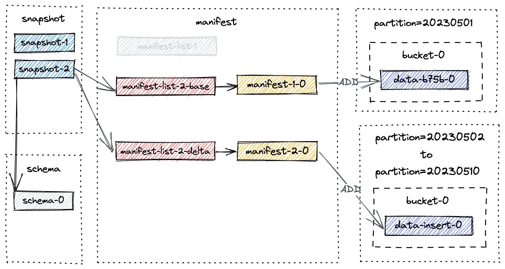

Now let's delete records that meet the condition `dt>=20230503`.
In Flink SQL, execute the following statement:

Batch

```sql
DELETE FROM T WHERE dt >= '20230503'; 
```

The third `commit` takes place and it gives us `snapshot-3`. Now, listing the files
under the table and your will find out no partition is dropped. Instead, a new data
file is created for partition `20230503` to `20230510`:

```bash
./T/dt=20230510/bucket-0: 
data-b93f468c-b56f-4a93-adc4-b250b3aa3462-0.orc # newer data file created by the delete statement  
data-0fcacc70-a0cb-4976-8c88-73e92769a762-0.orc # older data file created by the insert statement 
```

This make sense since we insert a record in the second commit (represented by
`+I[10, 10010, 'varchar00010', '20230510']`) and then delete
the record in the third commit. Executing `SELECT * FROM T` will return 2 rows, namely:

```text
+I[1, 10001, 'varchar00001', '20230501'] 
+I[2, 10002, 'varchar00002', '20230502'] 
```

The new file layout as of snapshot-3 looks like


Note that `manifest-3-0` contains 8 manifest entries of `ADD` operation type, corresponding to 8 newly written data files.

As you may have noticed, the number of small files will augment over successive
snapshots, which may lead to decreased read performance. Therefore, a full-compaction
is needed in order to reduce the number of small files.

Let's trigger the full-compaction now, and run a dedicated compaction job through `flink run`:

Batch

<div class="theme-tabs-container tabs-container tabList__CuJ"><ul><li>Flink SQL</li><li>Flink Action</li></ul><div><div><div><div><pre><code><div><span>CALL</span><span> sys</span><span>.</span><span>compact</span><span>(</span><span></span> </div><div><span>   </span><span>`</span><span>table</span><span>`</span><span> </span><span>=</span><span>&gt;</span><span> </span><span>'database_name.table_name'</span><span>,</span><span> </span> </div><div><span>   partitions </span><span>=</span><span>&gt;</span><span> </span><span>'partition_name'</span><span>,</span><span> </span> </div><div><span>   order_strategy </span><span>=</span><span>&gt;</span><span> </span><span>'order_strategy'</span><span>,</span><span></span> </div><div><span>   order_by </span><span>=</span><span>&gt;</span><span> </span><span>'order_by'</span><span>,</span><span></span> </div><div><span>   options </span><span>=</span><span>&gt;</span><span> </span><span>'paimon_table_dynamic_conf'</span><span></span> </div><div><span></span><span>)</span><span>;</span> </div></code></pre></div></div></div><div><div><div><pre><code><div><span>&lt;</span><span>FLINK_HOME</span><span>&gt;</span><span>/bin/flink run </span><span>\</span><span></span> </div><div><span>    </span><span>-D</span><span> execution.runtime-mode</span><span>=</span><span>batch </span><span>\</span><span></span> </div><div><span>    /path/to/paimon-flink-action-1.5-SNAPSHOT.jar </span><span>\</span><span></span> </div><div><span>    compact </span><span>\</span><span></span> </div><div><span>    </span><span>--warehouse</span><span> </span><span>&lt;</span><span>warehouse-path</span><span>&gt;</span><span> </span><span>\</span><span></span> </div><div><span>    </span><span>--database</span><span> </span><span>&lt;</span><span>database-name</span><span>&gt;</span><span> </span><span>\</span><span></span> </div><div><span>    </span><span>--table</span><span> </span><span>&lt;</span><span>table-name</span><span>&gt;</span><span> </span><span>\</span><span></span> </div><div><span>    </span><span>[</span><span>--partition </span><span>&lt;</span><span>partition-name</span><span>&gt;</span><span>]</span><span> </span><span>\</span><span></span> </div><div><span>    </span><span>[</span><span>--catalog_conf </span><span>&lt;</span><span>paimon-catalog-conf</span><span>&gt;</span><span> </span><span>[</span><span>--catalog_conf </span><span>&lt;</span><span>paimon-catalog-conf</span><span>&gt;</span><span> </span><span>..</span><span>.</span><span>]</span><span>]</span><span> </span><span>\</span><span></span> </div><div><span>    </span><span>[</span><span>--table_conf </span><span>&lt;</span><span>paimon-table-dynamic-conf</span><span>&gt;</span><span> </span><span>[</span><span>--table_conf </span><span>&lt;</span><span>paimon-table-dynamic-conf</span><span>&gt;</span><span>]</span><span> </span><span>..</span><span>.</span><span>]</span> </div></code></pre></div></div></div></div></div>

an example would be (suppose you're already in Flink home)

<div class="theme-tabs-container tabs-container tabList__CuJ"><ul><li>Flink SQL</li><li>Flink Action</li></ul><div><div><div><div><pre><code><div><span>CALL</span><span> sys</span><span>.</span><span>compact</span><span>(</span><span>'T'</span><span>)</span><span>;</span> </div></code></pre></div></div></div><div><div><div><pre><code><div><span>./bin/flink run </span><span>\</span><span></span> </div><div><span>    ./lib/paimon-flink-action-1.5-SNAPSHOT.jar </span><span>\</span><span></span> </div><div><span>    compact </span><span>\</span><span></span> </div><div><span>    </span><span>--path</span><span> file:///tmp/paimon/default.db/T</span> </div></code></pre></div></div></div></div></div>

All current table files will be compacted and a new snapshot, namely `snapshot-4`, is
made and contains the following information:

```json
{ 
  "version" : 3, 
  "id" : 4, 
  "schemaId" : 0, 
  "baseManifestList" : "manifest-list-9be16-82e7-4941-8b0a-7ce1c1d0fa6d-0", 
  "deltaManifestList" : "manifest-list-9be16-82e7-4941-8b0a-7ce1c1d0fa6d-1", 
  "changelogManifestList" : null, 
  "commitUser" : "a3d951d5-aa0e-4071-a5d4-4c72a4233d48", 
  "commitIdentifier" : 9223372036854775807, 
  "commitKind" : "COMPACT", 
  "timeMillis" : 1684163217960, 
  "logOffsets" : { }, 
  "totalRecordCount" : 2, 
  "deltaRecordCount" : -16, 
  "changelogRecordCount" : 0, 
  "watermark" : -9223372036854775808 
} 
```

The new file layout as of snapshot-4 looks like


Note that `manifest-4-0` contains 20 manifest entries (18 `DELETE` operations and 2 `ADD` operations)

1. For partition `20230503` to `20230510`, two `DELETE` operations for two data files
2. For partition `20230501` to `20230502`, one `DELETE` operation and one `ADD` operation for the same data file.
   This is because there has been an upgrade of the file from level 0 to the highest level. Please rest assured that
   this is only a change in metadata, and the file is still the same.

Execute the following statement to configure full-compaction:

```sql
ALTER TABLE T SET ('full-compaction.delta-commits' = '1'); 
```

It will create a new schema for Paimon table, namely `schema-1`, but no snapshot
has actually used this schema yet until the next commit.

Remind that the marked data files are not truly deleted until the snapshot expires and
no consumer depends on the snapshot. For more information, see [Expiring Snapshots](#maintenance-manage-snapshots--expire-snapshots).

During the process of snapshot expiration, the range of snapshots is initially determined, and then data files within these snapshots are marked for deletion.
A data file is `marked` for deletion only when there is a manifest entry of kind `DELETE` that references that specific data file.
This marking ensures that the file will not be utilized by subsequent snapshots and can be safely removed.

Let's say all 4 snapshots in the above diagram are about to expire. The expire process is as follows:

1. It first deletes all marked data files, and records any changed buckets.
2. It then deletes any changelog files and associated manifests.
3. Finally, it deletes the snapshots themselves and writes the earliest hint file.

If any directories are left empty after the deletion process, they will be deleted as well.

Let's say another snapshot, `snapshot-5` is created and snapshot expiration is triggered. `snapshot-1` to `snapshot-4` are
to be deleted. For simplicity, we will only focus on files from previous snapshots, the final layout after snapshot
expiration looks like:

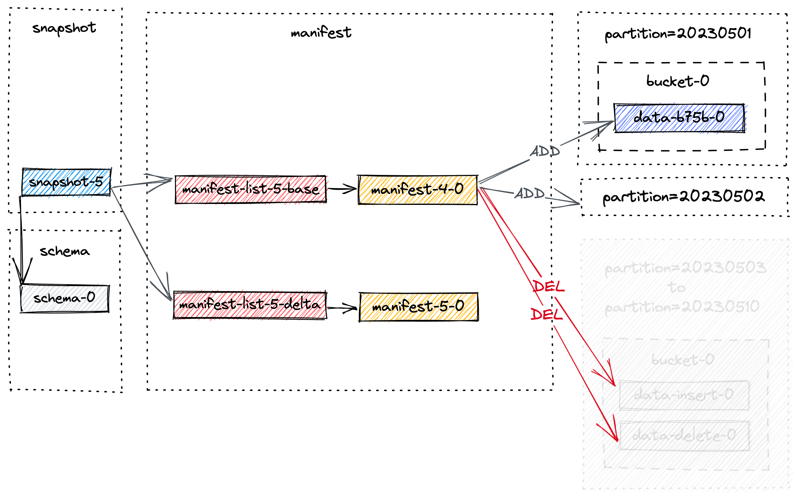

As a result, partition `20230503` to `20230510` are physically deleted.

Finally, we will examine Flink Stream Write by utilizing the example
of CDC ingestion. This section will address the capturing and writing of
change data into Paimon, as well as the mechanisms behind asynchronous compact
and snapshot commit and expiration.

To begin, let's take a closer look at the CDC ingestion workflow and
the unique roles played by each component involved.

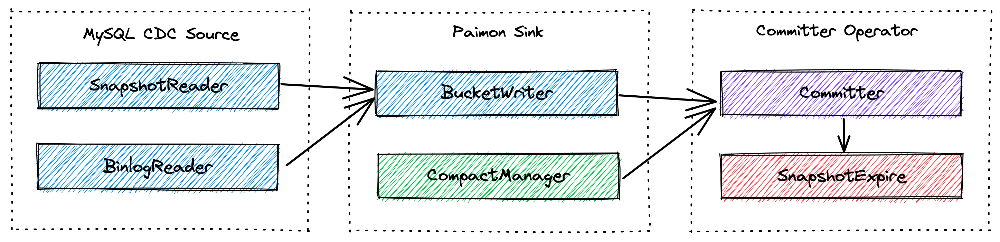

1. `MySQL CDC Source` uniformly reads snapshot and incremental data, with `SnapshotReader` reading snapshot data
   and `BinlogReader` reading incremental data, respectively.
2. `Paimon Sink` writes data into Paimon table in bucket level. The `CompactManager` within it will trigger compaction
   asynchronously.
3. `Committer Operator` is a singleton responsible for committing and expiring snapshots.

Next, we will go over end-to-end data flow.

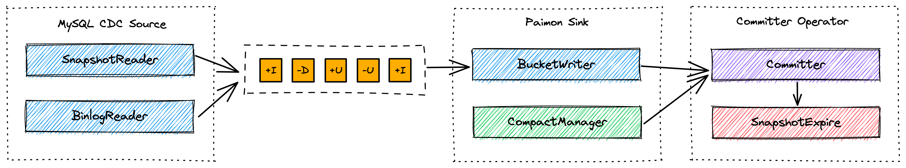

`MySQL Cdc Source` read snapshot and incremental data and emit them to downstream after normalization.

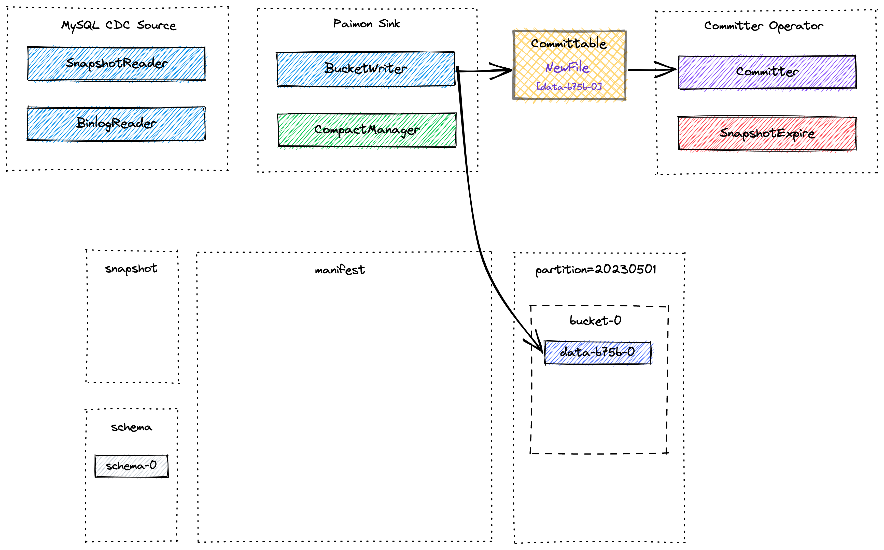

`Paimon Sink` first buffers new records in a heap-based LSM tree, and flushes them to disk when
the memory buffer is full. Note that each data file written is a sorted run. At this point, no manifest file and snapshot
is created. Right before Flink checkpoint takes places, `Paimon Sink` will flush all buffered records and send committable message
to downstream, which is read and committed by `Committer Operator` during checkpoint.

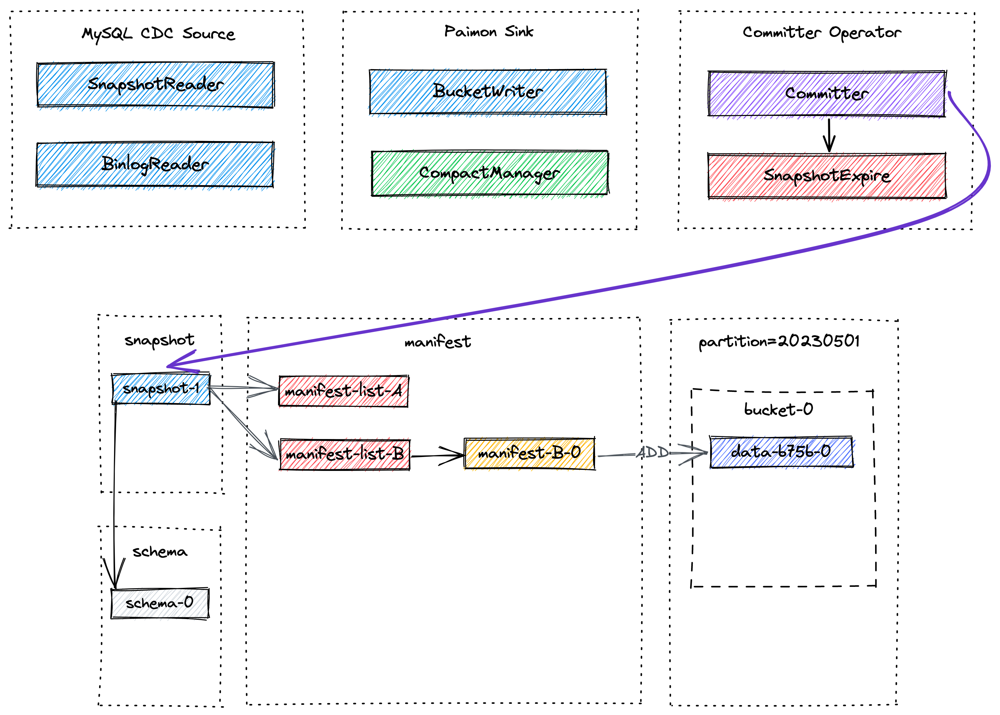

During checkpoint, `Committer Operator` will create a new snapshot and associate it with manifest lists so that the snapshot
contains information about all data files in the table.


At later point asynchronous compaction might take place, and the committable produced by `CompactManager` contains information
about previous files and merged files so that `Committer Operator` can construct corresponding manifest entries. In this case
`Committer Operator` might produce two snapshot during Flink checkpoint, one for data written (snapshot of kind `Append`) and the
other for compact (snapshot of kind `Compact`). If no data file is written during checkpoint interval, only snapshot of kind `Compact`
will be created. `Committer Operator` will check against snapshot expiration and perform
physical deletion of marked data files.

Many users are concerned about small files, which can lead to:

1. Stability issue: Too many small files in HDFS, NameNode will be overstressed.
2. Cost issue: A small file in HDFS will temporarily use the size of a minimum of one Block, for example 128 MB.
3. Query efficiency: The efficiency of querying too many small files will be affected.

Assuming you are using Flink Writer, each checkpoint generates 1-2 snapshots, and the checkpoint forces the files to be
generated on DFS, so the smaller the checkpoint interval the more small files will be generated.

1. So first thing is increase checkpoint interval.

By default, not only checkpoint will cause the file to be generated, but writer's memory (write-buffer-size) exhaustion
will also flush data to DFS and generate the corresponding file. You can enable `write-buffer-spillable` to generate
spilled files in writer to generate bigger files in DFS.

2. So second thing is increase `write-buffer-size` or enable `write-buffer-spillable`.


Paimon maintains multiple versions of files, compaction and deletion of files are logical and do not actually
delete files. Files are only really deleted when Snapshot is expired, so the first way to reduce files is to
reduce the time it takes for snapshot to be expired. Flink writer will automatically expire snapshots.

See [Expire Snapshots](#maintenance-manage-snapshots--expire-snapshots).

Paimon files are organized in a layered style. The following image illustrates the file layout. Starting
from a snapshot file, Paimon readers can recursively access all records from the table.


For example, the following table:

```sql
CREATE TABLE MyTable ( 
    user_id BIGINT, 
    item_id BIGINT, 
    behavior STRING, 
    dt STRING, 
    hh STRING, 
    PRIMARY KEY (dt, hh, user_id) NOT ENFORCED 
) PARTITIONED BY (dt, hh) WITH ( 
    'bucket' = '10' 
); 
```

The table data will be physically sliced into different partitions, and different buckets inside, so if the overall
data volume is too small, there is at least one file in a single bucket, I suggest you configure a smaller number
of buckets, otherwise there will be quite a few small files as well.

LSM tree organizes files into several sorted runs. A sorted run consists of one or multiple data files and each data
file belongs to exactly one sorted run.


By default, sorted runs number depends on `num-sorted-run.compaction-trigger`, see [Compaction for Primary Key Table](#primary-key-table-compaction), this means that there are at least 5 files in a bucket. If you want to reduce this number, you can keep fewer files, but write performance may suffer.

By default, Append also does automatic compaction to reduce the number of small files.

However, for Bucketed Append table, it will only compact the files within the Bucket for sequential
purposes, which may keep more small files. See [Bucketed Append](#append-table-bucketed).

Maybe you think the 5 files for the primary key table are actually okay, but the Append table (bucket)
may have 50 small files in a single bucket, which is very difficult to accept. Worse still, partitions that
are no longer active also keep so many small files.

Configure 'full-compaction.delta-commits' perform full-compaction periodically in Flink writing. And it can ensure
that partitions are full compacted before writing ends.

---

<a id="learn-paimon-scenario-guide"></a>

<!-- source_url: https://paimon.apache.org/docs/master/learn-paimon/scenario-guide/ -->

<!-- page_index: 133 -->

# Scenario Guide

This guide helps you choose the right Paimon table type and configuration for your specific use case. Paimon provides
**Primary Key Table**, **Append Table**, and **Multimodal Data Lake** capabilities — each with different modes and
configurations that are suited for different scenarios.

| Scenario | Table Type | Key Configuration |
| --- | --- | --- |
| CDC real-time sync from database | Primary Key Table | `deletion-vectors.enabled = true` |
| Streaming aggregation / metrics | Primary Key Table | `merge-engine = aggregation` |
| Multi-stream partial column updates | Primary Key Table | `merge-engine = partial-update` |
| Log deduplication (keep first) | Primary Key Table | `merge-engine = first-row` |
| Batch ETL / data warehouse layers | Append Table | Default (unaware-bucket) |
| High-frequency point queries on key | Append Table | `bucket = N, bucket-key = col` |
| Queue-like ordered streaming | Append Table | `bucket = N, bucket-key = col` |
| Large-scale OLAP with ad-hoc queries | Append Table | Incremental Clustering |
| Store images / videos / documents | Append Table (Blob) | `__BLOB_FIELD` comment, Data Evolution enabled |
| AI vector search / RAG | Append Table (Vector) | `VECTOR` type, Global Index (DiskANN) |
| AI feature engineering & column evolution | Append Table | `data-evolution.enabled = true` |
| Python AI pipeline (Ray / PyTorch) | Append Table | PyPaimon SDK |

---

Use a Primary Key Table when your data has a natural unique key and you need **real-time updates** (insert, update, delete).
See [Primary Key Table Overview](#primary-key-table).

**When:** You want to synchronize a MySQL / PostgreSQL / MongoDB table to the data lake in real-time with upsert
semantics. This is the most common use case for Primary Key Tables.

**Recommended Configuration:**

```sql
CREATE TABLE orders ( 
    order_id BIGINT, 
    user_id BIGINT, 
    amount DECIMAL(10,2), 
    status STRING, 
    update_time TIMESTAMP, 
    dt STRING, 
    PRIMARY KEY (order_id, dt) NOT ENFORCED 
) PARTITIONED BY (dt) WITH ( 
    'deletion-vectors.enabled' = 'true', 
    'changelog-producer' = 'lookup', 
    'sequence.field' = 'update_time' 
); 
```

**Why this configuration:**

- **`deletion-vectors.enabled = true`** (MOW mode): Enables [Merge On Write](#primary-key-table-table-mode--merge-on-write) with Deletion Vectors.
  This mode gives you the best balance of write and read performance. Compared to the default MOR mode, MOW
  avoids merging at read time, which greatly improves OLAP query performance.
- **`changelog-producer = lookup`**: Generates a complete [changelog](#primary-key-table-changelog-producer--lookup)
  for downstream streaming consumers. If your CDC source is directly connected to a database (e.g., MySQL CDC, Postgres CDC),
  you can use `changelog-producer = input` instead, since the database CDC stream already provides a complete changelog.
  However, if your CDC source comes from Kafka (or other message queues), `input` may not be reliable — use `lookup` to
  ensure changelog correctness. If no downstream streaming read is needed, you can omit this to save compaction resources.
- **`sequence.field = update_time`**: Guarantees correct update ordering even when data arrives out of order.
- **Bucketing**: Use the default Dynamic Bucket (`bucket = -1`). The system automatically adjusts bucket count based
  on data volume. If you are sensitive to data visibility latency, set a fixed bucket number (e.g. `'bucket' = '5'`)
  — roughly 1 bucket per 1GB of data in a partition.

**CDC Ingestion Tip:** Use [Paimon CDC Ingestion](#cdc-ingestion) for whole-database sync with
automatic table creation and schema evolution support.

**When:** Multiple data sources each contribute different columns to the same record, and you want to progressively
merge them into a complete wide table (e.g., orders from one stream + logistics info from another).

**Recommended Configuration:**

```sql
CREATE TABLE order_wide ( 
    order_id BIGINT PRIMARY KEY NOT ENFORCED, 
    -- from order stream 
    user_name STRING, 
    amount DECIMAL(10,2), 
    order_time TIMESTAMP, 
    -- from logistics stream 
    tracking_no STRING, 
    delivery_status STRING, 
    delivery_time TIMESTAMP 
) WITH ( 
    'merge-engine' = 'partial-update', 
    'fields.order_time.sequence-group' = 'user_name,amount', 
    'fields.delivery_time.sequence-group' = 'tracking_no,delivery_status', 
    'deletion-vectors.enabled' = 'true', 
    'changelog-producer' = 'lookup' 
); 
```

**Why:** The [partial-update](#primary-key-table-merge-engine-partial-update) merge engine allows each
stream to update only its own columns without overwriting the others. `sequence-group` ensures ordering within each
stream independently.

**When:** You need to pre-aggregate metrics in real-time (e.g., page views, total sales, UV count). Each incoming record
should be aggregated with the existing value, not replace it.

**Recommended Configuration:**

```sql
CREATE TABLE product_metrics ( 
    product_id BIGINT, 
    dt STRING, 
    total_sales BIGINT, 
    max_price DOUBLE, 
    uv VARBINARY, 
    PRIMARY KEY (product_id, dt) NOT ENFORCED 
) PARTITIONED BY (dt) WITH ( 
    'merge-engine' = 'aggregation', 
    'fields.total_sales.aggregate-function' = 'sum', 
    'fields.max_price.aggregate-function' = 'max', 
    'fields.uv.aggregate-function' = 'hll_sketch', 
    'deletion-vectors.enabled' = 'true', 
    'changelog-producer' = 'lookup' 
); 
```

**Why:** The [aggregation](#primary-key-table-merge-engine-aggregation) merge engine supports 20+
aggregate functions (`sum`, `max`, `min`, `count`, `hll_sketch`, `theta_sketch`, `collect`, `merge_map`, etc.), ideal
for real-time metric accumulation.

**When:** You receive a high-volume log stream with possible duplicates and only want to keep the first occurrence of
each key (e.g., first login event per user per day).

**Recommended Configuration:**

```sql
CREATE TABLE first_login ( 
    user_id BIGINT, 
    dt STRING, 
    login_time TIMESTAMP, 
    device STRING, 
    ip STRING, 
    PRIMARY KEY (user_id, dt) NOT ENFORCED 
) PARTITIONED BY (dt) WITH ( 
    'merge-engine' = 'first-row', 
    'changelog-producer' = 'lookup' 
); 
```

**Why:** The [first-row](#primary-key-table-merge-engine-first-row) merge engine keeps only the earliest
record for each primary key and produces insert-only changelog, making it perfect for streaming log deduplication.

| Mode | Config | Best For | Trade-off |
| --- | --- | --- | --- |
| Dynamic Bucket (default) | `bucket = -1` | Most scenarios, auto-scaling | Requires single write job |
| Fixed Bucket | `bucket = N` | Stable workloads, bucketed join | Manual rescaling needed |
| Postpone Bucket | `bucket = -2` | Adaptive Partition Level Bucket | New data not visible until compaction |

**General guideline:** ~1 bucket per 1GB of data in a partition, with each bucket containing 200MB–1GB of data.

| Mode | Config | Write Perf | Read Perf | Best For |
| --- | --- | --- | --- | --- |
| MOR (default) | — | Very good | Not so good | Write-heavy, less query |
| COW | `full-compaction.delta-commits = 1` | Very bad | Very good | Read-heavy, batch jobs |
| MOW | `deletion-vectors.enabled = true` | Good | Good | Balanced (recommended for most) |

---

Use an Append Table when your data **has no natural primary key**, or you are working with **batch ETL** pipelines
where data is only inserted and does not need upsert semantics.
See [Append Table Overview](#append-table).

Compared to Primary Key Tables, Append Tables have much better batch read/write performance, simpler design, and lower
resource consumption. **We recommend using Append Tables for most batch processing scenarios.**

**When:** Standard data warehouse layering (ODS → DWD → DWS → ADS), bulk INSERT OVERWRITE, or Spark / Hive style
batch processing.

**Recommended Configuration:**

```sql
CREATE TABLE dwd_events ( 
    event_id BIGINT, 
    user_id BIGINT, 
    event_type STRING, 
    event_time TIMESTAMP, 
    dt STRING 
) PARTITIONED BY (dt); 
```

No bucket configuration needed. This is an **unaware-bucket** append table — the simplest and most commonly used form.
Paimon automatically handles small file merging and supports:

- **Time travel** and version rollback.
- **Schema evolution** (add/drop/rename columns).
- **Data skipping** via min-max stats in manifest files.
- **File Index** (BloomFilter, Bitmap, Range Bitmap) for further query acceleration.
- **Row-level operations** (DELETE / UPDATE / MERGE INTO in Spark SQL).
- **Incremental Clustering** for advanced data layout optimization.

**Query Optimization Tip:** If your queries frequently filter on specific columns, consider using
[Incremental Clustering](#append-table-incremental-clustering) to sort data by those columns:

```sql
ALTER TABLE dwd_events SET ( 
    'clustering.incremental' = 'true', 
    'clustering.columns' = 'user_id' 
); 
```

Or define a File Index for point lookups:

```sql
ALTER TABLE dwd_events SET ( 
    'file-index.bloom-filter.columns' = 'user_id' 
); 
```

**When:** Your append table is frequently queried with equality or IN filters on a specific column
(e.g., `WHERE product_id = xxx`). This is the **most impactful** advantage of a bucketed append table.

**Recommended Configuration:**

```sql
CREATE TABLE product_logs ( 
    product_id BIGINT, 
    log_time TIMESTAMP, 
    message STRING, 
    dt STRING 
) PARTITIONED BY (dt) WITH ( 
    'bucket' = '16', 
    'bucket-key' = 'product_id' 
); 
```

**Why this is powerful:** The `bucket-key` enables **data skipping** — when a query contains `=` or `IN` conditions on
the bucket-key, Paimon pushes these predicates down and prunes all irrelevant bucket files entirely. With 16 buckets, a point query on `product_id` only reads ~1/16 of the data.

```sql
-- Only reads the bucket containing product_id=12345, skips all other 15 buckets 
SELECT * FROM product_logs WHERE product_id = 12345; 
 
-- Only reads buckets for these 3 values 
SELECT * FROM product_logs WHERE product_id IN (1, 2, 3); 
```

See [Bucketed Append — Data Skipping](#append-table-bucketed--data-skipping).

**Bucketed Join Bonus:** If two bucketed tables share the same `bucket-key` and bucket count, Spark can join them
**without shuffle**, significantly accelerating batch join queries:

```sql
SET spark.sql.sources.v2.bucketing.enabled = true; 
 
-- Both tables have bucket=16, bucket-key=product_id 
SELECT * FROM product_logs JOIN product_dim 
ON product_logs.product_id = product_dim.product_id; 
```

See [Bucketed Join](#append-table-bucketed--bucketed-join).

**When:** You want to use Paimon as a message queue replacement with strict ordering guarantees per key (similar to
Kafka partitioning), with the benefits of filter push-down and lower cost.

**Recommended Configuration:**

```sql
CREATE TABLE event_stream ( 
    user_id BIGINT, 
    event_type STRING, 
    event_time TIMESTAMP(3), 
    payload STRING, 
    WATERMARK FOR event_time AS event_time - INTERVAL '5' SECOND 
) WITH ( 
    'bucket' = '8', 
    'bucket-key' = 'user_id' 
); 
```

**Why:** Within the same bucket, records are strictly ordered by write time. Streaming reads deliver records in exact
write order per bucket. This gives you Kafka-like partitioned ordering at data lake cost.

See [Bucketed Streaming](#append-table-bucketed--bucketed-streaming).

| Mode | Config | Data Skipping | Bucketed Join | Ordered Streaming | Incremental Clustering |
| --- | --- | --- | --- | --- | --- |
| Unaware-Bucket (default) | No bucket config | Via min-max / file index | No | No | Yes |
| Bucketed | `bucket = N, bucket-key = col` | **Bucket-key filter pushdown** | Yes | Yes | No |

---

Paimon is a multimodal lakehouse for AI. You can keep multimodal data, metadata, and embeddings in the same table and
query them via vector search, full-text search, or SQL. All multimodal features are built on top of Append Tables with
[Data Evolution](#multimodal-table-data-evolution) mode enabled.

**When:** You need to store images, videos, audio files, documents, or model weights alongside structured metadata in
the data lake, and want efficient column projection without loading large binary data.

**Recommended Configuration:**

<div class="theme-tabs-container tabs-container tabList__CuJ"><ul><li>Flink SQL</li><li>Spark SQL</li></ul><div><div><div><div><pre><code><div><span>CREATE</span><span> </span><span>TABLE</span><span> image_table </span><span>(</span><span></span> </div><div><span>    id </span><span>INT</span><span>,</span><span></span> </div><div><span>    name STRING</span><span>,</span><span></span> </div><div><span>    label STRING</span><span>,</span><span></span> </div><div><span>    image BYTES </span><span>COMMENT</span><span> </span><span>'__BLOB_FIELD'</span><span></span> </div><div><span></span><span>)</span><span> </span><span>WITH</span><span> </span><span>(</span><span></span> </div><div><span>    </span><span>'row-tracking.enabled'</span><span> </span><span>=</span><span> </span><span>'true'</span><span>,</span><span></span> </div><div><span>    </span><span>'data-evolution.enabled'</span><span> </span><span>=</span><span> </span><span>'true'</span><span></span> </div><div><span></span><span>)</span><span>;</span> </div></code></pre></div></div></div><div><div><div><pre><code><div><span>CREATE</span><span> </span><span>TABLE</span><span> image_table </span><span>(</span><span></span> </div><div><span>    id </span><span>INT</span><span>,</span><span></span> </div><div><span>    name STRING</span><span>,</span><span></span> </div><div><span>    label STRING</span><span>,</span><span></span> </div><div><span>    image </span><span>BINARY</span><span> </span><span>COMMENT</span><span> </span><span>'__BLOB_FIELD'</span><span></span> </div><div><span></span><span>)</span><span> TBLPROPERTIES </span><span>(</span><span></span> </div><div><span>    </span><span>'row-tracking.enabled'</span><span> </span><span>=</span><span> </span><span>'true'</span><span>,</span><span></span> </div><div><span>    </span><span>'data-evolution.enabled'</span><span> </span><span>=</span><span> </span><span>'true'</span><span></span> </div><div><span></span><span>)</span><span>;</span> </div></code></pre></div></div></div></div></div>

**Why:** The [Blob Storage](#multimodal-table-blob) separates large binary data into dedicated `.blob` files
while metadata stays in standard columnar files (Parquet/ORC). This means:

- `SELECT id, name, label FROM image_table` does **not** load any blob data — very fast.
- Blob data supports streaming reads for large objects (videos, model weights) without loading entire files into memory.
- Supports multiple input methods: local files, HTTP URLs, InputStreams, and byte arrays.

**For external storage (e.g., blobs already in S3):**

```sql
CREATE TABLE video_table ( 
    id INT, 
    title STRING, 
    video BYTES COMMENT '__BLOB_EXTERNAL_STORAGE_FIELD' 
) WITH ( 
    'row-tracking.enabled' = 'true', 
    'data-evolution.enabled' = 'true', 
    'blob-external-storage-path' = 's3://my-bucket/paimon-blobs/' 
); 
```

This stores only descriptor references inline, while the actual blob data resides in external storage.

**When:** You are building a recommendation system, image retrieval, or RAG (Retrieval Augmented Generation)
application that needs approximate nearest neighbor (ANN) search on embeddings.

**Recommended Configuration:**

<div class="theme-tabs-container tabs-container tabList__CuJ"><ul><li>Spark SQL</li><li>Java API</li></ul><div><div><div><div><pre><code><div><span>CREATE</span><span> </span><span>TABLE</span><span> doc_embeddings </span><span>(</span><span></span> </div><div><span>    doc_id </span><span>INT</span><span>,</span><span></span> </div><div><span>    title STRING</span><span>,</span><span></span> </div><div><span>    content STRING</span><span>,</span><span></span> </div><div><span>    embedding ARRAY</span><span>&lt;</span><span>FLOAT</span><span>&gt;</span><span> </span><span>COMMENT</span><span> </span><span>'__VECTOR_FIELD;768'</span><span></span> </div><div><span></span><span>)</span><span> TBLPROPERTIES </span><span>(</span><span></span> </div><div><span>    </span><span>'row-tracking.enabled'</span><span> </span><span>=</span><span> </span><span>'true'</span><span>,</span><span></span> </div><div><span>    </span><span>'data-evolution.enabled'</span><span> </span><span>=</span><span> </span><span>'true'</span><span>,</span><span></span> </div><div><span>    </span><span>'global-index.enabled'</span><span> </span><span>=</span><span> </span><span>'true'</span><span>,</span><span></span> </div><div><span>    </span><span>'vector.file.format'</span><span> </span><span>=</span><span> </span><span>'lance'</span><span></span> </div><div><span></span><span>)</span><span>;</span> </div></code></pre></div></div></div><div><div><div><pre><code><div><span>Schema</span><span> schema </span><span>=</span><span> </span><span>Schema</span><span>.</span><span>newBuilder</span><span>(</span><span>)</span><span></span> </div><div><span>    </span><span>.</span><span>column</span><span>(</span><span>"doc_id"</span><span>,</span><span> </span><span>DataTypes</span><span>.</span><span>INT</span><span>(</span><span>)</span><span>)</span><span></span> </div><div><span>    </span><span>.</span><span>column</span><span>(</span><span>"title"</span><span>,</span><span> </span><span>DataTypes</span><span>.</span><span>STRING</span><span>(</span><span>)</span><span>)</span><span></span> </div><div><span>    </span><span>.</span><span>column</span><span>(</span><span>"content"</span><span>,</span><span> </span><span>DataTypes</span><span>.</span><span>STRING</span><span>(</span><span>)</span><span>)</span><span></span> </div><div><span>    </span><span>.</span><span>column</span><span>(</span><span>"embedding"</span><span>,</span><span> </span><span>DataTypes</span><span>.</span><span>VECTOR</span><span>(</span><span>768</span><span>,</span><span> </span><span>DataTypes</span><span>.</span><span>FLOAT</span><span>(</span><span>)</span><span>)</span><span>)</span><span></span> </div><div><span>    </span><span>.</span><span>option</span><span>(</span><span>"bucket"</span><span>,</span><span> </span><span>"-1"</span><span>)</span><span></span> </div><div><span>    </span><span>.</span><span>option</span><span>(</span><span>"row-tracking.enabled"</span><span>,</span><span> </span><span>"true"</span><span>)</span><span></span> </div><div><span>    </span><span>.</span><span>option</span><span>(</span><span>"data-evolution.enabled"</span><span>,</span><span> </span><span>"true"</span><span>)</span><span></span> </div><div><span>    </span><span>.</span><span>option</span><span>(</span><span>"global-index.enabled"</span><span>,</span><span> </span><span>"true"</span><span>)</span><span></span> </div><div><span>    </span><span>.</span><span>option</span><span>(</span><span>"vector.file.format"</span><span>,</span><span> </span><span>"lance"</span><span>)</span><span></span> </div><div><span>    </span><span>.</span><span>build</span><span>(</span><span>)</span><span>;</span> </div></code></pre></div></div></div></div></div>

**Build the vector index and search:**

```sql
-- Build DiskANN vector index 
CALL sys.create_global_index( 
    table => 'db.doc_embeddings', 
    index_column => 'embedding', 
    index_type => 'lumina', 
    options => 'lumina.index.dimension=768' 
); 
 
-- Search for top-5 nearest neighbors 
SELECT * FROM vector_search('doc_embeddings', 'embedding', array(0.1f, 0.2f, ...), 5); 
```

The legacy index type `lumina-vector-ann` is still accepted for existing tables and SQL compatibility.

**Why:** The [Global Index](#multimodal-table-global-index) with DiskANN provides high-performance ANN search.
Vector data is stored in dedicated `.vector.lance` files optimized for dense vectors, while scalar columns stay in
Parquet. You can also build a **BTree Index** on scalar columns for efficient filtering:

```sql
-- Build BTree index for scalar filtering 
CALL sys.create_global_index( 
    table => 'db.doc_embeddings', 
    index_column => 'title', 
    index_type => 'btree' 
); 
 
-- Scalar lookup is accelerated by BTree index 
SELECT * FROM doc_embeddings WHERE title IN ('doc_a', 'doc_b'); 
```

**When:** You have a feature store or data pipeline where new feature columns are added frequently, and you want to
backfill or update specific columns without rewriting entire data files.

**Recommended Configuration:**

```sql
CREATE TABLE feature_store ( 
    user_id INT, 
    age INT, 
    gender STRING, 
    purchase_count INT 
) TBLPROPERTIES ( 
    'row-tracking.enabled' = 'true', 
    'data-evolution.enabled' = 'true' 
); 
```

**Update only specific columns via MERGE INTO:**

```sql
-- Later, add a new feature column 
ALTER TABLE feature_store ADD COLUMNS (embedding ARRAY<FLOAT>); 
 
-- Backfill only the new column — no full file rewrite! 
MERGE INTO feature_store AS t 
USING embedding_source AS s 
ON t.user_id = s.user_id 
WHEN MATCHED THEN UPDATE SET t.embedding = s.embedding; 
```

**Why:** [Data Evolution](#multimodal-table-data-evolution) mode writes only the updated columns to new files
and merges them at read time. This is ideal for:

- Adding new feature columns and backfilling data without rewriting the entire table.
- Iterative ML feature engineering — add, update, or refine features as your model evolves.
- Reducing I/O cost and storage overhead for frequent partial column updates.

For pipelines that derive features from large payloads, keep the payload in Blob columns and update only the derived
feature columns. Ray can read the records to process, run distributed computation, and call PyPaimon's Ray `merge_into`
to write feature values back to the data-evolution table. The example assumes the target table has a key column `id`, a Blob column `payload`, and a non-Blob feature column `feature` to update.

```python
import ray 
from pypaimon.ray import read_paimon, merge_into, WhenMatched, source_col 
 
catalog_options = {"warehouse": "/path/to/warehouse"} 
target = "db.item_features" 
num_partitions = 1024 
 
# Keys selected by an upstream job. This can also come from another Paimon table, 
# Parquet files, or any Ray Dataset. 
records_to_process = ray.data.read_parquet("/path/to/records-to-process/") 
 
# Read only the columns needed for this job. 
target_rows = read_paimon( 
    target, 
    catalog_options=catalog_options, 
    projection=["id", "payload"], 
) 
 
selected = records_to_process.join( 
    target_rows, 
    join_type="inner", 
    num_partitions=num_partitions, 
    on=["id"], 
) 
 
def compute_feature(batch): 
    # Call your model service here. This example only keeps the shape simple. 
    payloads = batch["payload"].to_pylist() 
    return { 
        "id": batch["id"].to_pylist(), 
        "new_feature": [len(v) if v is not None else 0 for v in payloads], 
    } 
 
updates = selected.map_batches(compute_feature, batch_format="pyarrow") 
 
merge_into( 
    target=target, 
    source=updates, 
    catalog_options=catalog_options, 
    on=["id"], 
    when_matched=[ 
        WhenMatched(update={"feature": source_col("new_feature")}) 
    ], 
    num_partitions=num_partitions, 
) 
```

`merge_into` rewrites only the matched non-Blob columns. Existing Blob files stay unchanged, so the source dataset does
not need to carry Blob columns when it only updates feature fields. For very large key lists, tune Ray resources and
`num_partitions`; selecting target rows is still a distributed join.

**When:** You are building ML training or inference pipelines in Python and need to read/write Paimon tables natively
without JDK dependency.

**Example: Read data for model training:**

```python
from pypaimon import CatalogFactory 
from torch.utils.data import DataLoader 
 
# Connect to Paimon 
catalog = CatalogFactory.create({'warehouse': 's3://my-bucket/warehouse'}) 
table = catalog.get_table('db.feature_store') 
 
# Read with filter and projection 
read_builder = table.new_read_builder() 
read_builder = read_builder.with_projection(['user_id', 'embedding']) 
read_builder = read_builder.with_filter( 
    read_builder.new_predicate_builder().equal('gender', 'M') 
) 
splits = read_builder.new_scan().plan().splits() 
table_read = read_builder.new_read() 
 
# Option 1: Load into PyTorch DataLoader 
dataset = table_read.to_torch(splits, streaming=True, prefetch_concurrency=2) 
dataloader = DataLoader(dataset, batch_size=32, num_workers=4) 
for batch in dataloader: 
    # Training loop 
    pass 
 
# Option 2: Load into Ray for distributed processing 
ray_dataset = table_read.to_ray(splits, override_num_blocks=8) 
mapped = ray_dataset.map(lambda row: {'feat': row['embedding']}) 
 
# Option 3: Load into Pandas / PyArrow 
df = table_read.to_pandas(splits) 
arrow_table = table_read.to_arrow(splits) 
```

**Why:** [PyPaimon](#pypaimon) is a pure Python SDK (no JDK required) that integrates seamlessly
with the Python AI ecosystem:

- **PyTorch**: Direct `DataLoader` integration with streaming and prefetch support.
- **Ray**: Distributed data processing with configurable parallelism.
- **Pandas / PyArrow**: Native DataFrame and Arrow Table support for data science workflows.
- **Data Evolution**: Python API supports `update_by_arrow_with_row_id` and `upsert_by_arrow_with_key` for
  row-level updates from Python. See [PyPaimon Data Evolution](#pypaimon-data-evolution).

---

```text
Do you need upsert / update / delete? 
├── YES → Primary Key Table 
│   ├── Simple upsert (keep latest)? → merge-engine = deduplicate (default) 
│   ├── Progressive multi-column updates? → merge-engine = partial-update 
│   ├── Pre-aggregate metrics? → merge-engine = aggregation 
│   └── Dedup keep first? → merge-engine = first-row 
│ 
│   Table mode: 
│   ├── Most scenarios → deletion-vectors.enabled = true (MOW, recommended) 
│   ├── Write-heavy, query-light → default MOR 
│   └── Read-heavy, batch → full-compaction.delta-commits = 1 (COW) 
│ 
│   Bucket mode: 
│   ├── Most scenarios → bucket = -1 (Dynamic, default) 
│   ├── Stable workload, need bucketed join → bucket = N (Fixed) 
│   └── Unknown distribution → bucket = -2 (Postpone) 
│ 
└── NO → Append Table 
    ├── Standard batch ETL? → No bucket config (unaware-bucket) 
    │   └── Need query acceleration? → Incremental Clustering or File Index 
    │ 
    ├── Need bucket-key filter pushdown / join / ordered streaming? 
    │   → bucket = N, bucket-key = col (Bucketed Append) 
    │ 
    └── AI / Multimodal scenarios? → Enable Data Evolution 
        ├── Store images / videos / docs? → Blob Table (__BLOB_FIELD comment) 
        ├── Vector search / RAG? → VECTOR type + Global Index (DiskANN) 
        ├── Feature engineering? → Data Evolution (MERGE INTO partial columns) 
        └── Python pipeline? → PyPaimon (Ray / PyTorch / Pandas) 
```

---

<a id="index"></a>

<!-- source_url: https://paimon.apache.org/docs/master/ -->

<!-- page_index: 134 -->

<a id="index--apache-paimon"></a>

# Apache Paimon

Data Lake Platform — unified batch, streaming, and multimodal AI in a single lake format.

[Concepts](#concepts) · [Configurations](#maintenance-configurations) · [Download](#project-download)

📊 Large-Scale Analytics

Petabyte-scale tables with time travel, fast scan planning, schema evolution, and incremental clustering.

[📋

<a id="index--append-table"></a>

### Append Table

Append-only tables, incremental clustering, and streaming append](#append-table)
[✨

<a id="index--spark"></a>

### Spark

Quick start, SQL operations, DataFrames, structured streaming](#spark-quick-start)
[⚙️

<a id="index--maintenance"></a>

### Maintenance

Snapshots, tags, metrics, compaction, and performance tuning](#maintenance)

⚡ Realtime Streaming

LSM-powered streaming updates with multiple merge engines and changelog producers.

[🔑

<a id="index--primarykey-table"></a>

### PrimaryKey Table

Merge engines, changelog producers, compaction, and streaming updates](#primary-key-table)
[⚡

<a id="index--flink"></a>

### Flink

Quick start, SQL DDL/DML, streaming read & write, procedures](#flink-quick-start)
[🔄

<a id="index--cdc-ingestion"></a>

### CDC Ingestion

MySQL, PostgreSQL, Kafka, MongoDB, Pulsar CDC pipelines](#cdc-ingestion)

🧠 Multimodal AI

Vector search, full-text search, blob tables, and native Python SDK for ML pipelines.

[🧩

<a id="index--multimodal-table"></a>

### Multimodal Table

Data evolution, blob storage, vector storage, and global index](#multimodal-table)
[🐍

<a id="index--pypaimon-ai"></a>

### PyPaimon & AI

Python SDK, Ray, PyTorch, Pandas integration for AI & multimodal workloads](#pypaimon)
[🔗

<a id="index--ecosystem"></a>

### Ecosystem

StarRocks, Doris, Hive, Trino, Presto integrations](#ecosystem)

---
