# Welcome to the Apache Pulsar™ documentation portal

## Navigation

- [4.1.x](#index)
- [About](#index)
  - [Run Pulsar locally](#getting-started-standalone)
- [Get Started](#getting-started-home)
- [Deployment](#install-deploy-upgrade-landing)
- [Tutorials](#how-to-landing)
- [Development](#developers-landing)
- [Reference](#reference-landing)
  - [Pulsar APIs](#pulsar-api-overview)
  - [Terminology](#reference-terminology)
  - [Pulsar CLI tools](#reference-cli-tools)
  - [Pulsar Configuration](#reference-configuration)
- [Overview](#security-overview)
  - [End-to-End Encryption](#security-encryption)
- Other pages
  - [Pulsar adaptor for Apache Kafka](#adaptors-kafka)
  - [Pulsar adaptor for Apache Spark](#adaptors-spark)
  - [Pulsar adaptor for Apache Storm](#adaptors-storm)
  - [Managing Brokers](#admin-api-brokers)
  - [Managing Clusters](#admin-api-clusters)
  - [Pulsar admin interfaces - Features](#admin-api-features)
  - [Manage Functions](#admin-api-functions)
  - [Get started](#admin-api-get-started)
  - [Managing Namespaces](#admin-api-namespaces)
  - [Pulsar admin interfaces](#admin-api-overview)
  - [Manage packages](#admin-api-packages)
  - [Managing permissions](#admin-api-permissions)
  - [Manage Schemas](#admin-api-schemas)
  - [Managing Tenants](#admin-api-tenants)
  - [Pulsar admin interfaces - Tools](#admin-api-tools)
  - [Manage topics](#admin-api-topics)
  - [Manage transactions](#admin-api-transactions)
  - [Tutorial](#admin-api-tutorial)
  - [Pulsar admin interfaces - Use cases](#admin-api-use-cases)
  - [Anti-affinity namespaces](#administration-anti-affinity-namespaces)
  - [Pulsar geo-replication](#administration-geo)
  - [Isolate bookies](#administration-isolation-bookie)
  - [Isolate brokers](#administration-isolation-broker)
  - [Pulsar isolation](#administration-isolation)
  - [Configure metadata store](#administration-metadata-store)
  - [Pulsar proxy](#administration-proxy)
  - [Pulsar Manager](#administration-pulsar-manager)
  - [Pulsar Shell](#administration-pulsar-shell)
  - [Pulsar stats](#administration-stats)
  - [Upgrade Guide](#administration-upgrade)
  - [ZooKeeper and BookKeeper administration](#administration-zk-bk)
  - [Architecture Overview](#concepts-architecture-overview)
  - [Authentication and Authorization](#concepts-authentication)
  - [Benefits](#concepts-broker-load-balancing-benefits)
  - [Concepts](#concepts-broker-load-balancing-concepts)
  - [Features](#concepts-broker-load-balancing-features)
  - [Migration](#concepts-broker-load-balancing-migration)
  - [Overview](#concepts-broker-load-balancing-overview)
  - [Quick start](#concepts-broker-load-balancing-quick-start)
  - [Types](#concepts-broker-load-balancing-types)
  - [Use cases](#concepts-broker-load-balancing-use-cases)
  - [Pulsar Clients](#concepts-clients)
  - [Cluster-level failover](#concepts-cluster-level-failover)
  - [Messaging](#concepts-messaging)
  - [Multi Tenancy](#concepts-multi-tenancy)
  - [Multiple advertised listeners](#concepts-multiple-advertised-listeners)
  - [Pulsar Overview](#concepts-overview)
  - [Proxy support with SNI routing](#concepts-proxy-sni-routing)
  - [Geo Replication](#concepts-replication)
  - [Message dispatch throttling](#concepts-throttling)
  - [Topic Compaction](#concepts-topic-compaction)
  - [BookKeeper Ledger Metadata](#cookbooks-bookkeepermetadata)
  - [Topic compaction](#cookbooks-compaction)
  - [Message deduplication](#cookbooks-deduplication)
  - [Use Pulsar as a message queue](#cookbooks-message-queue)
  - [Non-persistent messaging](#cookbooks-non-persistent)
  - [Message retention and expiry](#cookbooks-retention-expiry)
  - [Deploy a Pulsar cluster on AWS using Terraform and Ansible](#deploy-aws)
  - [Deploying a multi-cluster on bare metal](#deploy-bare-metal-multi-cluster)
  - [Deploy a cluster on bare metal](#deploy-bare-metal)
  - [Deploy a cluster on Docker](#deploy-docker)
  - [Apache Pulsar Installation on IBM Kubernetes Cluster through Helm chart](#deploy-ibm)
  - [Overview](#deploy-kubernetes)
  - [Monitor](#deploy-monitoring)
  - [Broker load balancer](#develop-load-manager)
  - [Pulsar plugin development](#develop-plugin)
  - [Simulation tools](#develop-tools)
  - [Pulsar binary protocol specification](#developing-binary-protocol)
  - [Pulsar Functions CLI and YAML configs](#functions-cli)
  - [Pulsar Functions concepts](#functions-concepts)
  - [Debug with Functions CLI](#functions-debug-cli)
  - [Debug with localrun mode](#functions-debug-localrun)
  - [Debug with log topic](#functions-debug-log-topic)
  - [Debug with captured stderr](#functions-debug-stderr)
  - [Debug with unit test](#functions-debug-unit-test)
  - [Debug Pulsar Functions](#functions-debug)
  - [Default arguments of CLI](#functions-deploy-arguments)
  - [Use built-in functions](#functions-deploy-cluster-builtin)
  - [Enable end-to-end-encryption](#functions-deploy-cluster-encryption)
  - [Enable package management service](#functions-deploy-cluster-package)
  - [Enable parallel processing](#functions-deploy-cluster-parallelism)
  - [Allocate resources to function instance](#functions-deploy-cluster-resource)
  - [Deploy a function in cluster mode](#functions-deploy-cluster)
  - [Deploy a function in localrun mode](#functions-deploy-localrun)
  - [Trigger a function](#functions-deploy-trigger)
  - [Deploy Pulsar Functions](#functions-deploy)
  - [Call Pulsar admin APIs](#functions-develop-admin-api)
  - [Use APIs](#functions-develop-api)
  - [Produce function logs](#functions-develop-log)
  - [Use metrics to monitor functions](#functions-develop-metrics)
  - [Use schema registry](#functions-develop-schema-registry)
  - [Enable security on functions](#functions-develop-security)
  - [Use SerDe](#functions-develop-serde)
  - [Configure state storage](#functions-develop-state)
  - [Tutorials](#functions-develop-tutorial)
  - [Pass user-defined configurations](#functions-develop-user-defined-configs)
  - [Develop Pulsar Functions](#functions-develop)
  - [Pulsar Functions overview](#functions-overview)
  - [Package Go Functions](#functions-package-go)
  - [Package Java Functions](#functions-package-java)
  - [Package Python Functions](#functions-package-python)
  - [Package Pulsar Functions](#functions-package)
  - [Getting started with Pulsar Functions](#functions-quickstart)
  - [Customize Java runtime options](#functions-runtime-java-options)
  - [Configure Kubernetes runtime](#functions-runtime-kubernetes)
  - [Configure process runtime](#functions-runtime-process)
  - [Configure thread runtime](#functions-runtime-thread)
  - [Configure function runtime](#functions-runtime)
  - [Run function workers with brokers](#functions-worker-corun)
  - [Configure function workers for geo-replicated clusters](#functions-worker-for-geo-replication)
  - [Run function workers separately](#functions-worker-run-separately)
  - [Enable stateful functions](#functions-worker-stateful)
  - [Configure temporary file path](#functions-worker-temp-file-path)
  - [Troubleshooting](#functions-worker-troubleshooting)
  - [Set up function workers](#functions-worker)
  - [Run a Pulsar cluster locally with Docker Compose](#getting-started-docker-compose)
  - [Run a standalone Pulsar cluster in Docker](#getting-started-docker)
  - [Run a standalone Pulsar cluster in Kubernetes](#getting-started-helm)
  - [Deploy a Pulsar cluster on Kubernetes](#helm-deploy)
  - [Prepare Kubernetes resources](#helm-prepare)
  - [Upgrade Pulsar Helm release](#helm-upgrade)
  - [CDC connector](#io-cdc)
  - [Built-in connector](#io-connectors)
  - [How to debug Pulsar connectors](#io-debug)
  - [How to develop Pulsar connectors](#io-develop)
  - [Pulsar connector overview](#io-overview)
  - [How to connect Pulsar to database](#io-quickstart)
  - [How to use Pulsar connectors](#io-use)
  - [Pulsar Perf](#performance-pulsar-perf)
  - [Pulsar OpenTelemetry Metrics](#reference-metrics-opentelemetry)
  - [Pulsar metrics](#reference-metrics)
  - [Pulsar REST APIs](#reference-rest-api-overview)
  - [Get started](#schema-get-started)
  - [Overview](#schema-overview)
  - [Understand schema](#schema-understand)
  - [Authentication using Athenz](#security-athenz)
  - [Authentication and authorization in Pulsar](#security-authorization)
  - [Authentication using HTTP basic](#security-basic-auth)
  - [Bouncy Castle Providers](#security-bouncy-castle)
  - [Extend Authentication and Authorization in Pulsar](#security-extending)
  - [Authentication using tokens based on JSON Web Tokens](#security-jwt)
  - [Authentication using Kerberos](#security-kerberos)
  - [Authentication using OAuth 2.0 access tokens](#security-oauth2)
  - [Authentication using OpenID Connect](#security-openid-connect)
  - [Authentication using mTLS](#security-tls-authentication)
  - [TLS Encryption](#security-tls-transport)
  - [Use Aliyun OSS offloader with Pulsar](#tiered-storage-aliyun)
  - [Use AWS S3 offloader with Pulsar](#tiered-storage-aws)
  - [Use Azure BlobStore offloader with Pulsar](#tiered-storage-azure)
  - [Use filesystem offloader with Pulsar](#tiered-storage-filesystem)
  - [Use GCS offloader with Pulsar](#tiered-storage-gcs)
  - [Overview of tiered storage](#tiered-storage-overview)
  - [Use S3 offloader with Pulsar](#tiered-storage-s3)
  - [Create a namespace](#tutorials-namespace)
  - [Produce and consume messages](#tutorials-produce-consume)
  - [How to set up a tenant](#tutorials-tenant)
  - [How to create a topic](#tutorials-topic)
  - [Advanced features](#txn-advanced-features)
  - [How transactions work?](#txn-how)
  - [How to monitor transactions?](#txn-monitor)
  - [Get started](#txn-use)
  - [What are transactions?](#txn-what)
  - [Why transactions?](#txn-why)
  - [Window Functions Context](#window-functions-context)

## Content

<a id="index"></a>

<!-- source_url: https://pulsar.apache.org/docs/4.1.x/ -->

<!-- page_index: 1 -->

# Welcome to the Apache Pulsar™ documentation portal

---

This portal holds a variety of topics, tutorials, guides, and reference material to help you work with Pulsar.

Select one of the content blocks below to begin your Pulsar journey. If you ...

- Are new to Pulsar, start with **About Pulsar** to learn about features and concepts.
- Want to jump to the quickstart, select **Get Started**.
- Are an operator responsible for architecting and supporting Apache Pulsar, start with **Install, Deploy, Upgrade**.
- Are a developer who wants to master Apache Pulsar, select **Pulsar for Developers**.
- Want to try out Pulsar, select **How To** for access to the "hello world" tutorial.
- An experienced Pulsar coder looking for API, metrics, or configuration documentation, go to **Reference**.

[About Pulsar](#concepts-overview)
[Get Started](#getting-started-home)
[Install, Deploy, Upgrade](#install-deploy-upgrade-landing)
[Pulsar for Developers](#developers-landing)
[How To](#how-to-landing)
[Reference](#reference-landing)

---

As you probably know, we are working on a new user experience for our documentation portal that will make learning about and building on top of Apache Pulsar a much better experience. Whether you need overview concepts, how-to procedures, curated guides or quick references, we're building content to support it. This welcome page is just the first step. We will be providing updates every month.

---

Participation is not only welcomed – it's essential!

📚 There are multiple ways you can help to make the Pulsar documentation better:

- **Submit a Pull Request**: You'll find the "Edit this page" link at the bottom of each page. Click the link and follow the [Pulsar Documentation Contribution Guide](https://pulsar.apache.org/contribute/document-intro).
- **💡 Suggest changes**: If you found a mistake, the documentation is incomplete, but for any reason you're not ready to submit a PR, or you have any other suggestion, please click the appropriate link at the top right of any documentation page.
- **🛟 Get support**: If something isn't clear for you in the documentation, or you have general questions about Pulsar, you can ask the community by clicking the appropriate link at the top right of any documentation page. This way you will help people searching for the answer to this question in the future after someone from the community answers your question.

---

The Pulsar community on GitHub is active, passionate, and knowledgeable. Join discussions, voice opinions, suggest features, and dive into the code itself. Find your Pulsar family here at [apache/pulsar](https://github.com/apache/pulsar).

- Please go to [the community page](https://pulsar.apache.org/community/#section-discussions) to find the contact information for joining various communication channels.
- The main communication channel for the Apache Pulsar project are [the mailing lists](https://pulsar.apache.org/contact/).
- There's a separate page for Apache Pulsar [Security advisories and Security policy](https://pulsar.apache.org/security/).

---

<a id="getting-started-standalone"></a>

<!-- source_url: https://pulsar.apache.org/docs/4.1.x/getting-started-standalone/ -->

<!-- page_index: 2 -->

# Run a standalone Pulsar cluster locally

> [!TIP]
> If you're looking to run a full production Pulsar installation, see the [Deploying a Pulsar instance](#deploy-bare-metal) guide.

---

<a id="getting-started-home"></a>

<!-- source_url: https://pulsar.apache.org/docs/4.1.x/getting-started-home/ -->

<!-- page_index: 3 -->

# Get started

Getting up and running with Pulsar is simple. Download it, install it, and try it out.

You have three options. Click any of these links to begin your Pulsar journey!

- [Run a standalone Pulsar cluster locally](#getting-started-standalone) - Run a single instance of Pulsar in standalone mode on a single machine.
- [Run a standalone Pulsar cluster in Docker](#getting-started-docker) - Run one or more instances of Pulsar in a Docker container. If you want to quickly set up a small Pulsar cluster on your local laptop, go to [Run a Pulsar cluster with Docker Compose](#getting-started-docker-compose).
- [Run a standalone Pulsar cluster in Kubernetes](#getting-started-helm) - Run one or more instances of Pulsar in Kubernetes using a Helm chart.

---

<a id="install-deploy-upgrade-landing"></a>

<!-- source_url: https://pulsar.apache.org/docs/4.1.x/install-deploy-upgrade-landing/ -->

<!-- page_index: 4 -->

# Install, Deploy and Upgrade Pulsar

Any developer can install, deploy, and upgrade Apache Pulsar in a few simple steps and start building scalable, real-time applications quickly. The resources below will kickstart your deployment!

- [Set up a standalone Pulsar locally](#getting-started-standalone)
- [Deploy a Pulsar cluster on AWS using Terraform and Ansible](#deploy-aws)
- [Deploy a Pulsar cluster using Helm](#helm-deploy)
- [Upgrade Pulsar Helm release](#helm-upgrade)
- [Deploy a Pulsar cluster on IBM Cloud](#deploy-ibm)

---

<a id="how-to-landing"></a>

<!-- source_url: https://pulsar.apache.org/docs/4.1.x/how-to-landing/ -->

<!-- page_index: 5 -->

# How-to

Learning new software can be an overwhelming task, but relax – most aspects of Pulsar can be easily configured in just a few steps. These tutorials will show you how to quickly create topics, tenants, and namespaces, produce and consume messages, and more!

- [How to create a tenant](#tutorials-tenant)
- [How to create a namespace](#tutorials-namespace)
- [How to create a topic](#tutorials-topic)
- [How to produce and consume messages](#tutorials-produce-consume)

---

<a id="developers-landing"></a>

<!-- source_url: https://pulsar.apache.org/docs/4.1.x/developers-landing/ -->

<!-- page_index: 6 -->

# Pulsar for Developers

If you want to read top-viewed documents for developers, check out the following concepts, examples, and tutorials.

- [Pulsar concepts](#concepts-messaging)
- [Pulsar clients](https://pulsar.apache.org/docs/client-libraries/)
- [Pulsar APIs](#pulsar-api-overview)
  - [Pulsar admin APIs](#admin-api-overview)
  - [Pulsar REST APIs](#reference-rest-api-overview)
- [Pulsar contribution guide](https://pulsar.apache.org/contribute/)

If you want to learn how to develop Pulsar-related components, check out the following documents.

- [Create a test environment](#develop-tools)
- [Develop with the binary protocol](#developing-binary-protocol)
- [Develop broker load balancer](#develop-load-manager)
- [Develop plugins for Pulsar](#develop-plugin)

---

<a id="reference-landing"></a>

<!-- source_url: https://pulsar.apache.org/docs/4.1.x/reference-landing/ -->

<!-- page_index: 7 -->

# Reference

This reference section provides an overview of Apache Pulsar's key concepts, terminology, and features. You'll find more detailed information in the resources listed below. Happy streaming!

- [Pulsar APIs](#pulsar-api-overview)
  - [REST APIs](#reference-rest-api-overview)
- [Terminology](#reference-terminology)
- [Pulsar CLI tools](#reference-cli-tools)
- [Pulsar configuration](#reference-configuration)
- [Pulsar metrics](#reference-metrics)
- [Pulsar release notes](https://pulsar.apache.org/release-notes/)

---

<a id="pulsar-api-overview"></a>

<!-- source_url: https://pulsar.apache.org/docs/4.1.x/pulsar-api-overview/ -->

<!-- page_index: 8 -->

# Pulsar APIs

Pulsar is a messaging and streaming platform that scales across organizations of all sizes.

As the core building blocks of Pulsar, Pulsar APIs allow you to:

- build applications with Pulsar using client APIs
- administer Pulsar clusters using admin APIs

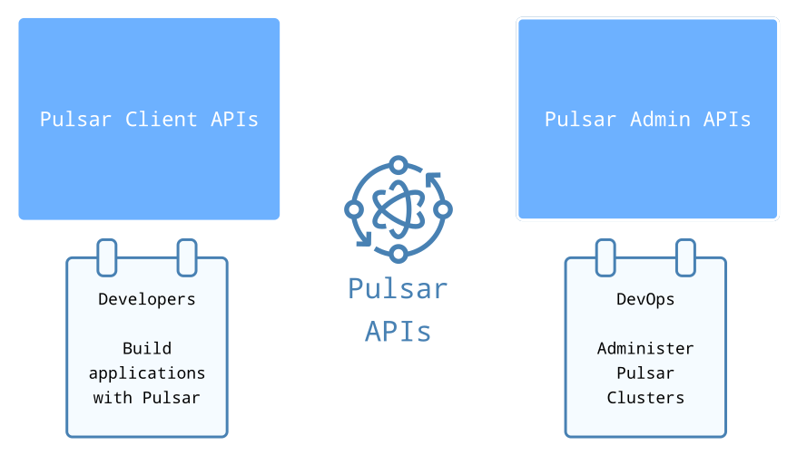

Pulsar client APIs encapsulate and optimize Pulsar's client-broker communication protocols and add additional features using Pulsar primitives.

With Pulsar client APIs, you can:

- create and configure producers, consumers, and readers
- produce and consume messages
- perform authentication and authorization tasks

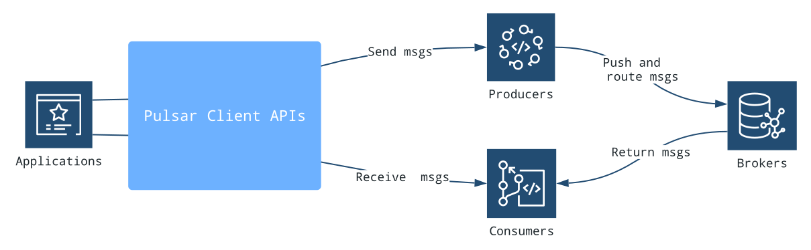

Pulsar exposes client APIs with language bindings. For more details about Pulsar clients, including language-specific client libraries, feature matrix, third-party clients, see [Pulsar client - Overview](https://pulsar.apache.org/docs/client-libraries/).

See [Pulsar admin API - Overview](#admin-api-overview).

Here is a simple comparison between Pulsar client APIs and Pulsar admin APIs.

Category Pulsar client APIs Pulsar admin APIs|  |  |  |  |  |  |  |  |  |  |  |  |  |  |  | | --- | --- | --- | --- | --- | --- | --- | --- | --- | --- | --- | --- | --- | --- | --- | | Audiences Developers DevOps|  |  |  |  |  |  |  |  |  |  |  |  | | --- | --- | --- | --- | --- | --- | --- | --- | --- | --- | --- | --- | | Goals Build applications with Pulsar Administer Pulsar clusters|  |  |  |  |  |  |  |  |  | | --- | --- | --- | --- | --- | --- | --- | --- | --- | | Use cases Pulsar client APIs help you create applications that rely on real-time data. For example, you can build a financial application to handle fraud alerts or an eCommerce application that creates recommendations based on user activities. Pulsar administration APIs let you administer the entire Pulsar instance, including clusters, tenants, namespaces, and topics, from a single endpoint. For example, you can configure security and compliance, or get information about brokers, check for any issues, and then troubleshoot solutions.|  |  |  |  |  |  | | --- | --- | --- | --- | --- | --- | | Key features - Process data with producers, consumers, readers, and TableView - Secure data with authentication and authorization - Protect data with transactions and schema - Stabilize data with cluster-level auto failover - Configure authentication and authorization - Set data retention and resource isolation policies - Facilitate workflow of application development - Troubleshoot Pulsar|  |  |  | | --- | --- | --- | | Interfaces - [Java client API](https://pulsar.apache.org/api/client/4.1.x/) - [C++ client API](https://pulsar.apache.org/api/cpp/4.1.x) - [Python client API](https://pulsar.apache.org/api/python/3.11.x) - [Go client API](https://pkg.go.dev/github.com/apache/pulsar-client-go/pulsar) - [Node.js client API](https://pulsar.apache.org/docs/client-libraries/node) - [WebSocket client API](https://pulsar.apache.org/docs/client-libraries/websocket#api-reference) - [C# client API](https://pulsar.apache.org/docs/client-libraries/dotnet) - [Java admin API](#admin-api-overview) - [REST API](#reference-rest-api-overview) | | | | | | | | | | | | | | | |

Audiences Developers DevOps|  |  |  |  |  |  |  |  |  |  |  |  | | --- | --- | --- | --- | --- | --- | --- | --- | --- | --- | --- | --- | | Goals Build applications with Pulsar Administer Pulsar clusters|  |  |  |  |  |  |  |  |  | | --- | --- | --- | --- | --- | --- | --- | --- | --- | | Use cases Pulsar client APIs help you create applications that rely on real-time data. For example, you can build a financial application to handle fraud alerts or an eCommerce application that creates recommendations based on user activities. Pulsar administration APIs let you administer the entire Pulsar instance, including clusters, tenants, namespaces, and topics, from a single endpoint. For example, you can configure security and compliance, or get information about brokers, check for any issues, and then troubleshoot solutions.|  |  |  |  |  |  | | --- | --- | --- | --- | --- | --- | | Key features - Process data with producers, consumers, readers, and TableView - Secure data with authentication and authorization - Protect data with transactions and schema - Stabilize data with cluster-level auto failover - Configure authentication and authorization - Set data retention and resource isolation policies - Facilitate workflow of application development - Troubleshoot Pulsar|  |  |  | | --- | --- | --- | | Interfaces - [Java client API](https://pulsar.apache.org/api/client/4.1.x/) - [C++ client API](https://pulsar.apache.org/api/cpp/4.1.x) - [Python client API](https://pulsar.apache.org/api/python/3.11.x) - [Go client API](https://pkg.go.dev/github.com/apache/pulsar-client-go/pulsar) - [Node.js client API](https://pulsar.apache.org/docs/client-libraries/node) - [WebSocket client API](https://pulsar.apache.org/docs/client-libraries/websocket#api-reference) - [C# client API](https://pulsar.apache.org/docs/client-libraries/dotnet) - [Java admin API](#admin-api-overview) - [REST API](#reference-rest-api-overview) | | | | | | | | | | | | |

Goals Build applications with Pulsar Administer Pulsar clusters|  |  |  |  |  |  |  |  |  | | --- | --- | --- | --- | --- | --- | --- | --- | --- | | Use cases Pulsar client APIs help you create applications that rely on real-time data. For example, you can build a financial application to handle fraud alerts or an eCommerce application that creates recommendations based on user activities. Pulsar administration APIs let you administer the entire Pulsar instance, including clusters, tenants, namespaces, and topics, from a single endpoint. For example, you can configure security and compliance, or get information about brokers, check for any issues, and then troubleshoot solutions.|  |  |  |  |  |  | | --- | --- | --- | --- | --- | --- | | Key features - Process data with producers, consumers, readers, and TableView - Secure data with authentication and authorization - Protect data with transactions and schema - Stabilize data with cluster-level auto failover - Configure authentication and authorization - Set data retention and resource isolation policies - Facilitate workflow of application development - Troubleshoot Pulsar|  |  |  | | --- | --- | --- | | Interfaces - [Java client API](https://pulsar.apache.org/api/client/4.1.x/) - [C++ client API](https://pulsar.apache.org/api/cpp/4.1.x) - [Python client API](https://pulsar.apache.org/api/python/3.11.x) - [Go client API](https://pkg.go.dev/github.com/apache/pulsar-client-go/pulsar) - [Node.js client API](https://pulsar.apache.org/docs/client-libraries/node) - [WebSocket client API](https://pulsar.apache.org/docs/client-libraries/websocket#api-reference) - [C# client API](https://pulsar.apache.org/docs/client-libraries/dotnet) - [Java admin API](#admin-api-overview) - [REST API](#reference-rest-api-overview) | | | | | | | | | |

Use cases Pulsar client APIs help you create applications that rely on real-time data. For example, you can build a financial application to handle fraud alerts or an eCommerce application that creates recommendations based on user activities. Pulsar administration APIs let you administer the entire Pulsar instance, including clusters, tenants, namespaces, and topics, from a single endpoint. For example, you can configure security and compliance, or get information about brokers, check for any issues, and then troubleshoot solutions.|  |  |  |  |  |  | | --- | --- | --- | --- | --- | --- | | Key features - Process data with producers, consumers, readers, and TableView - Secure data with authentication and authorization - Protect data with transactions and schema - Stabilize data with cluster-level auto failover - Configure authentication and authorization - Set data retention and resource isolation policies - Facilitate workflow of application development - Troubleshoot Pulsar|  |  |  | | --- | --- | --- | | Interfaces - [Java client API](https://pulsar.apache.org/api/client/4.1.x/) - [C++ client API](https://pulsar.apache.org/api/cpp/4.1.x) - [Python client API](https://pulsar.apache.org/api/python/3.11.x) - [Go client API](https://pkg.go.dev/github.com/apache/pulsar-client-go/pulsar) - [Node.js client API](https://pulsar.apache.org/docs/client-libraries/node) - [WebSocket client API](https://pulsar.apache.org/docs/client-libraries/websocket#api-reference) - [C# client API](https://pulsar.apache.org/docs/client-libraries/dotnet) - [Java admin API](#admin-api-overview) - [REST API](#reference-rest-api-overview) | | | | | | |

Key features - Process data with producers, consumers, readers, and TableView - Secure data with authentication and authorization - Protect data with transactions and schema - Stabilize data with cluster-level auto failover - Configure authentication and authorization - Set data retention and resource isolation policies - Facilitate workflow of application development - Troubleshoot Pulsar|  |  |  | | --- | --- | --- | | Interfaces - [Java client API](https://pulsar.apache.org/api/client/4.1.x/) - [C++ client API](https://pulsar.apache.org/api/cpp/4.1.x) - [Python client API](https://pulsar.apache.org/api/python/3.11.x) - [Go client API](https://pkg.go.dev/github.com/apache/pulsar-client-go/pulsar) - [Node.js client API](https://pulsar.apache.org/docs/client-libraries/node) - [WebSocket client API](https://pulsar.apache.org/docs/client-libraries/websocket#api-reference) - [C# client API](https://pulsar.apache.org/docs/client-libraries/dotnet) - [Java admin API](#admin-api-overview) - [REST API](#reference-rest-api-overview) | | | |

---

<a id="reference-terminology"></a>

<!-- source_url: https://pulsar.apache.org/docs/4.1.x/reference-terminology/ -->

<!-- page_index: 9 -->

# Pulsar Terminology

Here is a glossary of terms related to Apache Pulsar:

Pulsar is a distributed messaging system originally created by Yahoo but now under the stewardship of the Apache Software Foundation.

Namespace bundle is a virtual group of [topics](#concepts-messaging--topics) that belong to the same [namespace](#concepts-multi-tenancy--namespaces). A namespace bundle
is defined as a range between two 32-bit hashes, such as 0x00000000 and 0xffffffff.

Namespace is a virtual grouping of [topics](#concepts-messaging--topics), under a specific
[tenant](#concepts-multi-tenancy--tenants). A namespace is defined
by a string name, such as `my-tenant/my-namespace`.

Pub-sub is a messaging pattern in which [producer](#concepts-clients--producer) processes publish messages on [topics](#concepts-messaging--topics) that
are then consumed (processed) by [consumer](#concepts-clients--consumer) processes.

Pulsar readers are message processors much like Pulsar [consumers](#concepts-clients--consumer) but with two crucial differences:

- you can specify *where* on a topic readers begin processing messages (consumers always begin with the latest
  available unacked message);
- readers don't retain data or acknowledge messages.

Cursor is the subscription position for a [consumer](#concepts-clients--consumer).

Unacknowledged means a message that has been delivered to a consumer for processing but not yet confirmed as processed by the consumer.

Retention policy is the size and time limits that you can set on a [namespace](#concepts-multi-tenancy--namespaces) to configure retention of [messages](#concepts-messaging--messages)
that have already been [acknowledged](#concepts-messaging--acknowledgment).

Multi-tenancy is the ability to isolate [namespaces](#concepts-multi-tenancy--namespaces), specify quotas, and configure authentication and authorization
on a per-[tenant](#concepts-multi-tenancy--tenants) basis.

Failure domain is a logical domain under a Pulsar cluster. Each logical domain contains a pre-configured list of brokers.

Anti-affinity namespaces are a group of namespaces that have anti-affinity to each other.

Standalone is a lightweight Pulsar broker in which all components run in a single Java Virtual Machine (JVM) process. Standalone
clusters can be run on a single machine and are useful for development purposes.

Topic lookup is a service provided by Pulsar [brokers](#concepts-architecture-overview--brokers) that enables connecting clients to automatically determine
which Pulsar [cluster](#concepts-architecture-overview--clusters) is responsible for a [topic](#concepts-messaging--topics) (and thus where message traffic for
the topic needs to be routed).

Dispatcher is an asynchronous TCP server used for all data transfers in and out of a Pulsar [broker](#concepts-architecture-overview--brokers). The Pulsar
dispatcher uses a custom binary protocol for all communications.

Broker is a Pulsar server that receives, acknowledges, and delivers messages to consumers.
A Pulsar cluster can have one or more brokers.

Bookie is the name of an individual BookKeeper server. It is effectively the storage server of Pulsar.

---

<a id="reference-cli-tools"></a>

<!-- source_url: https://pulsar.apache.org/docs/4.1.x/reference-cli-tools/ -->

<!-- page_index: 10 -->

# Pulsar command-line tools

> [!TIP]
> For the latest and complete information about command-line tools, including commands, flags, descriptions, and more information, see the [reference doc](https://pulsar.apache.org/reference/#/4.1.x/).

---

<a id="reference-configuration"></a>

<!-- source_url: https://pulsar.apache.org/docs/4.1.x/reference-configuration/ -->

<!-- page_index: 11 -->

# Pulsar Configuration

For a complete list of Pulsar configuration, visit the [Pulsar Reference](https://pulsar.apache.org/reference/#/4.1.x/) website.

---

<a id="security-overview"></a>

<!-- source_url: https://pulsar.apache.org/docs/4.1.x/security-overview/ -->

<!-- page_index: 12 -->

# Pulsar security overview

> [!NOTE]
> There's a separate page for Apache Pulsar [Security advisories and Security policy](https://pulsar.apache.org/security/).

---

<a id="security-encryption"></a>

<!-- source_url: https://pulsar.apache.org/docs/4.1.x/security-encryption/ -->

<!-- page_index: 13 -->

# End-to-End Encryption

> [!NOTE]
> - The consumer's public key is shared with the producer, but only the consumer has the access to the private key.
> - Pulsar does not store the encryption key anywhere in the Pulsar service. If you lose or delete the private key, your message is irretrievably lost and unrecoverable.

---

<a id="adaptors-kafka"></a>

<!-- source_url: https://pulsar.apache.org/docs/4.1.x/adaptors-kafka/ -->

<!-- page_index: 14 -->

# Pulsar adaptor for Apache Kafka

> [!NOTE]
> The Pulsar Kafka wrapper artifacts (`pulsar-client-kafka` and `pulsar-client-kafka-original`) live in the separate [apache/pulsar-adapters](https://github.com/apache/pulsar-adapters) repository, and the last released version on Maven Central is [`2.11.0`](https://repo1.maven.org/maven2/org/apache/pulsar/pulsar-client-kafka/). Even when you run a newer Pulsar broker (3.x / 4.x), keep the dependency pinned to `2.11.0` -- newer matching artifacts are not published.

---

<a id="adaptors-spark"></a>

<!-- source_url: https://pulsar.apache.org/docs/4.1.x/adaptors-spark/ -->

<!-- page_index: 15 -->

# Pulsar adaptor for Apache Spark

The Spark Streaming receiver for Pulsar is a custom receiver that enables Apache [Spark Streaming](https://spark.apache.org/streaming/) to receive raw data from Pulsar.

An application can receive data in [Resilient Distributed Dataset](https://spark.apache.org/docs/latest/programming-guide.html#resilient-distributed-datasets-rdds) (RDD) format via the Spark Streaming receiver and can process it in a variety of ways.

To use the receiver, include a dependency for the `pulsar-spark` library in your Java configuration.

If you're using Maven, add this to your `pom.xml`:

```xml
<!-- in your <properties> block --> 
<pulsar.version>4.1.3</pulsar.version> 
 
<!-- in your <dependencies> block --> 
<dependency> 
  <groupId>org.apache.pulsar</groupId> 
  <artifactId>pulsar-spark</artifactId> 
  <version>${pulsar.version}</version> 
</dependency> 
```

If you're using Gradle, add this to your `build.gradle` file:

```groovy
def pulsarVersion = "4.1.3" 
 
dependencies { 
    compile group: 'org.apache.pulsar', name: 'pulsar-spark', version: pulsarVersion 
} 
```

Pass an instance of `SparkStreamingPulsarReceiver` to the `receiverStream` method in `JavaStreamingContext`:

```java
    String serviceUrl = "pulsar://localhost:6650/"; 
    String topic = "persistent://public/default/test_src"; 
    String subs = "test_sub"; 
 
    SparkConf sparkConf = new SparkConf().setMaster("local[*]").setAppName("Pulsar Spark Example"); 
 
    JavaStreamingContext jsc = new JavaStreamingContext(sparkConf, Durations.seconds(60)); 
 
    ConsumerConfigurationData<byte[]> pulsarConf = new ConsumerConfigurationData(); 
 
    Set<String> set = new HashSet(); 
    set.add(topic); 
    pulsarConf.setTopicNames(set); 
    pulsarConf.setSubscriptionName(subs); 
 
    SparkStreamingPulsarReceiver pulsarReceiver = new SparkStreamingPulsarReceiver( 
        serviceUrl, 
        pulsarConf, 
        new AuthenticationDisabled()); 
 
    JavaReceiverInputDStream<byte[]> lineDStream = jsc.receiverStream(pulsarReceiver); 
```

For a complete example, click [here](https://github.com/apache/pulsar-adapters/blob/master/examples/spark/src/main/java/org/apache/spark/streaming/receiver/example/SparkStreamingPulsarReceiverExample.java). In this example, the number of messages that contain the string "Pulsar" in received messages is counted.

Note that if needed, other Pulsar authentication classes can be used. For example, to use a token during authentication the following parameters for the `SparkStreamingPulsarReceiver` constructor can be set:

```java
SparkStreamingPulsarReceiver pulsarReceiver = new SparkStreamingPulsarReceiver( 
        serviceUrl, 
        pulsarConf, 
        new AuthenticationToken("token:<secret-JWT-token>")); 
```

---

<a id="adaptors-storm"></a>

<!-- source_url: https://pulsar.apache.org/docs/4.1.x/adaptors-storm/ -->

<!-- page_index: 16 -->

# Pulsar adaptor for Apache Storm

Pulsar Storm is an adaptor for integrating with [Apache Storm](http://storm.apache.org/) topologies. It provides core Storm implementations for sending and receiving data.

An application can inject data into a Storm topology via a generic Pulsar spout, as well as consume data from a Storm topology via a generic Pulsar bolt.

To use the Pulsar Storm Adaptor, you need to include dependency for Pulsar Storm Adaptor:

```xml
<dependency> 
  <groupId>org.apache.pulsar</groupId> 
  <artifactId>pulsar-storm</artifactId> 
  <version>${pulsar.version}</version> 
</dependency> 
```

The Pulsar Spout allows for the data published on a topic to be consumed by a Storm topology. It emits a Storm tuple based on the message received and the `MessageToValuesMapper` provided by the client.

The tuples that fail to be processed by the downstream bolts will be re-injected by the spout with an exponential backoff, within a configurable timeout (the default is 60 seconds) or a configurable number of retries, whichever comes first, after which it is acknowledged by the consumer. Here's an example construction of a spout:

```java
MessageToValuesMapper messageToValuesMapper = new MessageToValuesMapper() { 
 
    @Override 
    public Values toValues(Message msg) { 
        return new Values(new String(msg.getData())); 
    } 
 
    @Override 
    public void declareOutputFields(OutputFieldsDeclarer declarer) { 
        // declare the output fields 
        declarer.declare(new Fields("string")); 
    } 
}; 
 
// Configure a Pulsar Spout 
PulsarSpoutConfiguration spoutConf = new PulsarSpoutConfiguration(); 
spoutConf.setServiceUrl("pulsar://broker.messaging.usw.example.com:6650"); 
spoutConf.setTopic("persistent://my-property/usw/my-ns/my-topic1"); 
spoutConf.setSubscriptionName("my-subscriber-name1"); 
spoutConf.setMessageToValuesMapper(messageToValuesMapper); 
 
// Create a Pulsar Spout 
PulsarSpout spout = new PulsarSpout(spoutConf); 
```

For a complete example, click [here](https://github.com/apache/pulsar-adapters/blob/master/pulsar-storm/src/test/java/org/apache/pulsar/storm/PulsarSpoutTest.java).

The Pulsar bolt allows data in a Storm topology to be published on a topic. It publishes messages based on the Storm tuple received and the `TupleToMessageMapper` provided by the client.

A partitioned topic can also be used to publish messages on different topics. In the implementation of the `TupleToMessageMapper`, a "key" will need to be provided in the message which will send the messages with the same key to the same topic. Here's an example bolt:

```java
TupleToMessageMapper tupleToMessageMapper = new TupleToMessageMapper() { 
 
    @Override 
    public TypedMessageBuilder<byte[]> toMessage(TypedMessageBuilder<byte[]> msgBuilder, Tuple tuple) { 
        String receivedMessage = tuple.getString(0); 
        // message processing 
        String processedMsg = receivedMessage + "-processed"; 
        return msgBuilder.value(processedMsg.getBytes()); 
    } 
 
    @Override 
    public void declareOutputFields(OutputFieldsDeclarer declarer) { 
        // declare the output fields 
    } 
}; 
 
// Configure a Pulsar Bolt 
PulsarBoltConfiguration boltConf = new PulsarBoltConfiguration(); 
boltConf.setServiceUrl("pulsar://broker.messaging.usw.example.com:6650"); 
boltConf.setTopic("persistent://my-property/usw/my-ns/my-topic2"); 
boltConf.setTupleToMessageMapper(tupleToMessageMapper); 
 
// Create a Pulsar Bolt 
PulsarBolt bolt = new PulsarBolt(boltConf); 
```

---

<a id="admin-api-brokers"></a>

<!-- source_url: https://pulsar.apache.org/docs/4.1.x/admin-api-brokers/ -->

<!-- page_index: 17 -->

# Managing Brokers

> [!TIP]
> This page only shows **some frequently used operations**. For the latest and complete information, see the **reference docs** below.

---

<a id="admin-api-clusters"></a>

<!-- source_url: https://pulsar.apache.org/docs/4.1.x/admin-api-clusters/ -->

<!-- page_index: 18 -->

# Managing Clusters

> [!TIP]
> This page only shows **some frequently used operations**. For the latest and complete information, see the **reference docs** below.

---

<a id="admin-api-features"></a>

<!-- source_url: https://pulsar.apache.org/docs/4.1.x/admin-api-features/ -->

<!-- page_index: 19 -->

# Pulsar admin interfaces - Features

Below are the most common tasks you may want to do. For the exhaustive lists of tasks and the method to perform these tasks, see [Tools](#admin-api-tools).

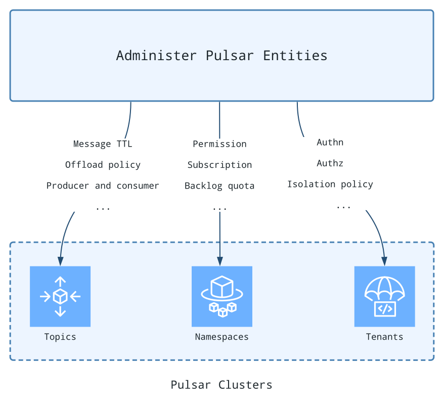

These administrative tasks are categorized based on Pulsar components.

Category Components What do you want to do?|  |  |  |  |  |  |  |  |  |  |  |  |  |  |  | | --- | --- | --- | --- | --- | --- | --- | --- | --- | --- | --- | --- | --- | --- | --- | | Server Broker Operations on brokers. For example, - Set dynamic configurations on brokers - Run health checks against brokers - Shutdown brokers - Get broker-level stats metrics|  |  |  |  |  |  |  |  |  |  |  |  | | --- | --- | --- | --- | --- | --- | --- | --- | --- | --- | --- | --- | | Storage Bookie Operations on bookie placement policy. For example, - Get or set bookie replacement policy|  |  |  |  |  |  |  |  |  | | --- | --- | --- | --- | --- | --- | --- | --- | --- | | Entities - Topic - Schema - Namespace - Tenant - Cluster Operations on topics, schemas, namespaces, tenants, or clusters. For example, - Create, update or delete topics, tenants, namespaces, or clusters - Set isolation policies, configure offload thresholds, or set permissions for namespaces - Upload, extract, or delete schemas|  |  |  |  |  |  | | --- | --- | --- | --- | --- | --- | | Stream processing - Function - Connector - Transaction - Package Operations on functions, function workers, or connectors. For example, - Create, update, and delete functions or connectors - Get stats of function workers, trigger rebalance of functions to workers Operations on transactions. For example, - Get stats of transactions - Update the scale of transaction coordinators Operations on packages. For example, - Upload, download, and delete packages|  |  |  | | --- | --- | --- | | Others - Proxy - Resource groups - Resource quotas Operations on proxy stats. For example, - Get various monitoring metrics for proxy stats Operations on resource groups. For example, - Create, update, and delete resource groups Operations on resource quotas. For example, - Set resource quota for namespace bundles | | | | | | | | | | | | | | | |

Server Broker Operations on brokers. For example, - Set dynamic configurations on brokers - Run health checks against brokers - Shutdown brokers - Get broker-level stats metrics|  |  |  |  |  |  |  |  |  |  |  |  | | --- | --- | --- | --- | --- | --- | --- | --- | --- | --- | --- | --- | | Storage Bookie Operations on bookie placement policy. For example, - Get or set bookie replacement policy|  |  |  |  |  |  |  |  |  | | --- | --- | --- | --- | --- | --- | --- | --- | --- | | Entities - Topic - Schema - Namespace - Tenant - Cluster Operations on topics, schemas, namespaces, tenants, or clusters. For example, - Create, update or delete topics, tenants, namespaces, or clusters - Set isolation policies, configure offload thresholds, or set permissions for namespaces - Upload, extract, or delete schemas|  |  |  |  |  |  | | --- | --- | --- | --- | --- | --- | | Stream processing - Function - Connector - Transaction - Package Operations on functions, function workers, or connectors. For example, - Create, update, and delete functions or connectors - Get stats of function workers, trigger rebalance of functions to workers Operations on transactions. For example, - Get stats of transactions - Update the scale of transaction coordinators Operations on packages. For example, - Upload, download, and delete packages|  |  |  | | --- | --- | --- | | Others - Proxy - Resource groups - Resource quotas Operations on proxy stats. For example, - Get various monitoring metrics for proxy stats Operations on resource groups. For example, - Create, update, and delete resource groups Operations on resource quotas. For example, - Set resource quota for namespace bundles | | | | | | | | | | | | |

Storage Bookie Operations on bookie placement policy. For example, - Get or set bookie replacement policy|  |  |  |  |  |  |  |  |  | | --- | --- | --- | --- | --- | --- | --- | --- | --- | | Entities - Topic - Schema - Namespace - Tenant - Cluster Operations on topics, schemas, namespaces, tenants, or clusters. For example, - Create, update or delete topics, tenants, namespaces, or clusters - Set isolation policies, configure offload thresholds, or set permissions for namespaces - Upload, extract, or delete schemas|  |  |  |  |  |  | | --- | --- | --- | --- | --- | --- | | Stream processing - Function - Connector - Transaction - Package Operations on functions, function workers, or connectors. For example, - Create, update, and delete functions or connectors - Get stats of function workers, trigger rebalance of functions to workers Operations on transactions. For example, - Get stats of transactions - Update the scale of transaction coordinators Operations on packages. For example, - Upload, download, and delete packages|  |  |  | | --- | --- | --- | | Others - Proxy - Resource groups - Resource quotas Operations on proxy stats. For example, - Get various monitoring metrics for proxy stats Operations on resource groups. For example, - Create, update, and delete resource groups Operations on resource quotas. For example, - Set resource quota for namespace bundles | | | | | | | | | |

Entities - Topic - Schema - Namespace - Tenant - Cluster Operations on topics, schemas, namespaces, tenants, or clusters. For example, - Create, update or delete topics, tenants, namespaces, or clusters - Set isolation policies, configure offload thresholds, or set permissions for namespaces - Upload, extract, or delete schemas|  |  |  |  |  |  | | --- | --- | --- | --- | --- | --- | | Stream processing - Function - Connector - Transaction - Package Operations on functions, function workers, or connectors. For example, - Create, update, and delete functions or connectors - Get stats of function workers, trigger rebalance of functions to workers Operations on transactions. For example, - Get stats of transactions - Update the scale of transaction coordinators Operations on packages. For example, - Upload, download, and delete packages|  |  |  | | --- | --- | --- | | Others - Proxy - Resource groups - Resource quotas Operations on proxy stats. For example, - Get various monitoring metrics for proxy stats Operations on resource groups. For example, - Create, update, and delete resource groups Operations on resource quotas. For example, - Set resource quota for namespace bundles | | | | | | |

Stream processing - Function - Connector - Transaction - Package Operations on functions, function workers, or connectors. For example, - Create, update, and delete functions or connectors - Get stats of function workers, trigger rebalance of functions to workers Operations on transactions. For example, - Get stats of transactions - Update the scale of transaction coordinators Operations on packages. For example, - Upload, download, and delete packages|  |  |  | | --- | --- | --- | | Others - Proxy - Resource groups - Resource quotas Operations on proxy stats. For example, - Get various monitoring metrics for proxy stats Operations on resource groups. For example, - Create, update, and delete resource groups Operations on resource quotas. For example, - Set resource quota for namespace bundles | | | |

Others - Proxy - Resource groups - Resource quotas Operations on proxy stats. For example, - Get various monitoring metrics for proxy stats Operations on resource groups. For example, - Create, update, and delete resource groups Operations on resource quotas. For example, - Set resource quota for namespace bundles |

- To understand the basics, see [Pulsar admin API - Overview](#admin-api-overview)
- To learn usage scenarios, see [Pulsar admin API - Use cases](#admin-api-use-cases).
- To perform administrative operations, see [Pulsar admin API - Tools](#admin-api-tools).
- To get up quickly, see [Pulsar admin API - Get started](#admin-api-get-started).
- To check the detailed usage, see the API references below.

  - [Java admin API](https://pulsar.apache.org/api/admin/4.1.x/)
  - [REST API](#reference-rest-api-overview)

---

<a id="admin-api-functions"></a>

<!-- source_url: https://pulsar.apache.org/docs/4.1.x/admin-api-functions/ -->

<!-- page_index: 20 -->

# Manage Functions

> [!TIP]
> This page only shows **some frequently used operations**. For the latest and complete information, see the **reference docs** below.

---

<a id="admin-api-get-started"></a>

<!-- source_url: https://pulsar.apache.org/docs/4.1.x/admin-api-get-started/ -->

<!-- page_index: 21 -->

# Get started

This guide walks you through the quickest way to get started with the following methods to manage topics.

<div class="theme-tabs-container tabs-container tabList__CuJ"><ul><li>pulsar-admin<li>REST API<li>Java</li></li></li></ul><div><div><p><a href="https://pulsar.apache.org/reference/#/4.1.x/pulsar-admin/">pulsar-admin CLI</a> is a command-line tool and is available in the bin folder of your Pulsar installation.</p></div><div><p><a href="https://pulsar.apache.org/admin-rest-api/?version=4.1.3" rel="noopener noreferrer" target="_blank">REST API</a> belongs to HTTP calls, which are made against the admin APIs provided by brokers. In addition, both the Java admin API and pulsar-admin CLI use the REST API.</p></div><div><p><a href="https://pulsar.apache.org/api/admin/4.1.x/" rel="noopener noreferrer" target="_blank">Java admin API</a> is a programmable interface written in Java.</p></div></div></div>

Check the detailed steps below.

<div class="theme-tabs-container tabs-container tabList__CuJ"><ul><li>pulsar-admin<li>REST API<li>Java</li></li></li></ul><div><div><p>To manage topics using pulsar-admin CLI, complte the following steps.<ol>
<li>
<p>Set the service URL.</p>
</li>
<li>
<p>Create a partitioned topic.</p>
</li>
<li>
<p>Update the number of a partition.</p>
</li>
<li>
<p>Produce messages to the topic.</p>
</li>
<li>
<p>Check the stats of the topic.</p>
</li>
<li>
<p>Delete the topic.</p>
</li>
</ol><p><strong>Prerequisites</strong><ul>
<li>Install and start Pulsar standalone. This tutorial runs Pulsar 2.11 as an example.</li>
</ul><p><strong>Steps</strong><p><strong>Step 1:</strong> Set the service URLs to point to the broker service in <a href="https://github.com/apache/pulsar/blob/master/conf/client.conf" rel="noopener noreferrer" target="_blank">client.conf</a>.<div><div><pre><code><div><span>webServiceUrl</span><span>=</span><span>http://localhost:8080/</span> </div><div><span></span><span>brokerServiceUrl</span><span>=</span><span>pulsar://localhost:6650/</span> </div></code></pre></div></div><p><strong>Step 2:</strong> Create a persistent topic named <em>test-topic-1</em> with 6 partitions.<p><strong>Input</strong><div><div><pre><code><div><span>bin/pulsar-admin topics create-partitioned-topic </span><span>\</span><span></span> </div><div><span>persistent://public/default/test-topic-1 </span><span>\</span><span></span> </div><div><span></span><span>--partitions</span><span> </span><span>6</span> </div></code></pre></div></div><p><strong>Output</strong><p>There is no output. You can check the status of the topic in Step 5.<p><strong>Step 3:</strong> Update the number of the partition to 8.<p><strong>Input</strong><div><div><pre><code><div><span>bin/pulsar-admin topics update-partitioned-topic </span><span>\</span><span></span> </div><div><span>persistent://public/default/test-topic-1 </span><span>\</span><span></span> </div><div><span></span><span>--partitions</span><span> </span><span>8</span> </div></code></pre></div></div><p><strong>Output</strong><p>There is no output. You can check the number of partitions in Step 5.<p><strong>Step 4:</strong> Produce some messages to the partitioned topic <em>test-topic-1</em>.<p><strong>Input</strong><div><div><pre><code><div><span>bin/pulsar-perf produce </span><span>-u</span><span> pulsar://localhost:6650 </span><span>-r</span><span> </span><span>1000</span><span> </span><span>-i</span><span> </span><span>1000</span><span> persistent://public/default/test-topic-1</span> </div></code></pre></div></div><p><strong>Output</strong><div><div><pre><code><div><span>2023</span><span>-03-07T15:33:56,832+0800 </span><span>[</span><span>main</span><span>]</span><span> INFO  org.apache.pulsar.testclient.PerformanceProducer - Starting Pulsar perf producer with config: </span><span>{</span><span></span> </div><div><span>  </span><span>"confFile"</span><span> </span><span>:</span><span> </span><span>"/Users/yu/apache-pulsar-2.11.0/conf/client.conf"</span><span>,</span> </div><div><span>  </span><span>"serviceURL"</span><span> </span><span>:</span><span> </span><span>"pulsar://localhost:6650"</span><span>,</span> </div><div><span>  </span><span>"authPluginClassName"</span><span> </span><span>:</span><span> </span><span>""</span><span>,</span> </div><div><span>  </span><span>"authParams"</span><span> </span><span>:</span><span> </span><span>""</span><span>,</span> </div><div><span>  </span><span>"tlsTrustCertsFilePath"</span><span> </span><span>:</span><span> </span><span>""</span><span>,</span> </div><div><span>  </span><span>"tlsAllowInsecureConnection"</span><span> </span><span>:</span><span> false,</span> </div><div><span>  </span><span>"tlsHostnameVerificationEnable"</span><span> </span><span>:</span><span> false,</span> </div><div><span>  </span><span>"maxConnections"</span><span> </span><span>:</span><span> </span><span>1</span><span>,</span> </div><div><span>  </span><span>"statsIntervalSeconds"</span><span> </span><span>:</span><span> </span><span>1000</span><span>,</span> </div><div><span>  </span><span>"ioThreads"</span><span> </span><span>:</span><span> </span><span>1</span><span>,</span> </div><div><span>  </span><span>"enableBusyWait"</span><span> </span><span>:</span><span> false,</span> </div><div><span>  </span><span>"listenerName"</span><span> </span><span>:</span><span> null,</span> </div><div><span>  </span><span>"listenerThreads"</span><span> </span><span>:</span><span> </span><span>1</span><span>,</span> </div><div><span>  </span><span>"maxLookupRequest"</span><span> </span><span>:</span><span> </span><span>50000</span><span>,</span> </div><div><span>  </span><span>"topics"</span><span> </span><span>:</span><span> </span><span>[</span><span> </span><span>"persistent://public/default/test-topic-1"</span><span> </span><span>]</span><span>,</span> </div><div><span>  </span><span>"numTestThreads"</span><span> </span><span>:</span><span> </span><span>1</span><span>,</span> </div><div><span>  </span><span>"msgRate"</span><span> </span><span>:</span><span> </span><span>1000</span><span>,</span> </div><div><span>  </span><span>"msgSize"</span><span> </span><span>:</span><span> </span><span>1024</span><span>,</span> </div><div><span>  </span><span>"numTopics"</span><span> </span><span>:</span><span> </span><span>1</span><span>,</span> </div><div><span></span><span>"numProducers"</span><span> </span><span>:</span><span> </span><span>1</span><span>,</span> </div><div><span>  </span><span>"separator"</span><span> </span><span>:</span><span> </span><span>"-"</span><span>,</span> </div><div><span>  </span><span>"sendTimeout"</span><span> </span><span>:</span><span> </span><span>0</span><span>,</span> </div><div><span>  </span><span>"producerName"</span><span> </span><span>:</span><span> null,</span> </div><div><span>  </span><span>"adminURL"</span><span> </span><span>:</span><span> </span><span>"http://localhost:8080/"</span><span>,</span> </div><div><span></span> </div><div><span></span><span>..</span><span>.</span> </div><div><span></span> </div><div><span></span><span>2023</span><span>-03-07T15:35:03,769+0800 </span><span>[</span><span>Thread-0</span><span>]</span><span> INFO  org.apache.pulsar.testclient.PerformanceProducer - Aggregated latency stats --- Latency: mean:   </span><span>8.931</span><span> ms - med:   </span><span>3.775</span><span> - 95pct:  </span><span>32.144</span><span> - 99pct:  </span><span>98.432</span><span> - </span><span>99</span><span>.9pct: </span><span>216.088</span><span> - </span><span>99</span><span>.99pct: </span><span>304.807</span><span> - </span><span>99</span><span>.999pct: </span><span>349.391</span><span> - Max: </span><span>351.235</span> </div></code></pre></div></div><p><strong>Step 5:</strong> Check the internal stats of the partitioned topic <em>test-topic-1</em>.<p><strong>Input</strong><div><div><pre><code><div><span>bin/pulsar-admin topics partitioned-stats-internal </span><span>\</span><span></span> </div><div><span>persistent://public/default/test-topic-1</span> </div></code></pre></div></div><p><strong>Output</strong><p>Below is a part of the output. For detailed explanations of topic stats, see Pulsar statistics.<div><div><pre><code><div><span>{</span><span></span> </div><div><span>  </span><span>"metadata"</span><span> </span><span>:</span><span> </span><span>{</span><span></span> </div><div><span>    </span><span>"partitions"</span><span> </span><span>:</span><span> </span><span>8</span><span></span> </div><div><span>  </span><span>}</span><span>,</span> </div><div><span>  </span><span>"partitions"</span><span> </span><span>:</span><span> </span><span>{</span><span></span> </div><div><span>    </span><span>"persistent://public/default/test-topic-1-partition-1"</span><span> </span><span>:</span><span> </span><span>{</span><span></span> </div><div><span>      </span><span>"entriesAddedCounter"</span><span> </span><span>:</span><span> </span><span>4213</span><span>,</span> </div><div><span>      </span><span>"numberOfEntries"</span><span> </span><span>:</span><span> </span><span>4213</span><span>,</span> </div><div><span>      </span><span>"totalSize"</span><span> </span><span>:</span><span> </span><span>8817693</span><span>,</span> </div><div><span>      </span><span>"currentLedgerEntries"</span><span> </span><span>:</span><span> </span><span>4212</span><span>,</span> </div><div><span>      </span><span>"currentLedgerSize"</span><span> </span><span>:</span><span> </span><span>8806289</span><span>,</span> </div><div><span>      </span><span>"lastLedgerCreatedTimestamp"</span><span> </span><span>:</span><span> </span><span>"2023-03-07T15:33:59.367+08:00"</span><span>,</span> </div><div><span>      </span><span>"waitingCursorsCount"</span><span> </span><span>:</span><span> </span><span>0</span><span>,</span> </div><div><span>      </span><span>"pendingAddEntriesCount"</span><span> </span><span>:</span><span> </span><span>0</span><span>,</span> </div><div><span>      </span><span>"lastConfirmedEntry"</span><span> </span><span>:</span><span> </span><span>"65:4211"</span><span>,</span> </div><div><span>      </span><span>"state"</span><span> </span><span>:</span><span> </span><span>"LedgerOpened"</span><span>,</span> </div><div><span>      </span><span>"ledgers"</span><span> </span><span>:</span><span> </span><span>[</span><span> </span><span>{</span><span></span> </div><div><span>        </span><span>"ledgerId"</span><span> </span><span>:</span><span> </span><span>49</span><span>,</span> </div><div><span>        </span><span>"entries"</span><span> </span><span>:</span><span> </span><span>1</span><span>,</span> </div><div><span>        </span><span>"size"</span><span> </span><span>:</span><span> </span><span>11404</span><span>,</span> </div><div><span>        </span><span>"offloaded"</span><span> </span><span>:</span><span> false,</span> </div><div><span>        </span><span>"underReplicated"</span><span> </span><span>:</span><span> </span><span>false</span><span></span> </div><div><span>      </span><span>}</span><span>, </span><span>{</span><span></span> </div><div><span>        </span><span>"ledgerId"</span><span> </span><span>:</span><span> </span><span>65</span><span>,</span> </div><div><span>        </span><span>"entries"</span><span> </span><span>:</span><span> </span><span>0</span><span>,</span> </div><div><span>        </span><span>"size"</span><span> </span><span>:</span><span> </span><span>0</span><span>,</span> </div><div><span>        </span><span>"offloaded"</span><span> </span><span>:</span><span> false,</span> </div><div><span>        </span><span>"underReplicated"</span><span> </span><span>:</span><span> </span><span>false</span><span></span> </div><div><span>      </span><span>}</span><span> </span><span>]</span><span>,</span> </div><div><span>      </span><span>"cursors"</span><span> </span><span>:</span><span> </span><span>{</span><span></span> </div><div><span>        </span><span>"test-subscriptio-1"</span><span> </span><span>:</span><span> </span><span>{</span><span></span> </div><div><span>          </span><span>"markDeletePosition"</span><span> </span><span>:</span><span> </span><span>"49:-1"</span><span>,</span> </div><div><span>          </span><span>"readPosition"</span><span> </span><span>:</span><span> </span><span>"49:0"</span><span>,</span> </div><div><span>          </span><span>"waitingReadOp"</span><span> </span><span>:</span><span> false,</span> </div><div><span>          </span><span>"pendingReadOps"</span><span> </span><span>:</span><span> </span><span>0</span><span>,</span> </div><div><span>          </span><span>"messagesConsumedCounter"</span><span> </span><span>:</span><span> </span><span>0</span><span>,</span> </div><div><span>          </span><span>"cursorLedger"</span><span> </span><span>:</span><span> -1,</span> </div><div><span>          </span><span>"cursorLedgerLastEntry"</span><span> </span><span>:</span><span> -1,</span> </div><div><span>  </span><span>"individuallyDeletedMessages"</span><span> </span><span>:</span><span> </span><span>"[]"</span><span>,</span> </div><div><span>          </span><span>"lastLedgerSwitchTimestamp"</span><span> </span><span>:</span><span> </span><span>"2023-03-06T16:41:32.801+08:00"</span><span>,</span> </div><div><span>          </span><span>"state"</span><span> </span><span>:</span><span> </span><span>"NoLedger"</span><span>,</span> </div><div><span>          </span><span>"numberOfEntriesSinceFirstNotAckedMessage"</span><span> </span><span>:</span><span> </span><span>1</span><span>,</span> </div><div><span>          </span><span>"totalNonContiguousDeletedMessagesRange"</span><span> </span><span>:</span><span> </span><span>0</span><span>,</span> </div><div><span>          </span><span>"subscriptionHavePendingRead"</span><span> </span><span>:</span><span> false,</span> </div><div><span>          </span><span>"subscriptionHavePendingReplayRead"</span><span> </span><span>:</span><span> false,</span> </div><div><span>          </span><span>"properties"</span><span> </span><span>:</span><span> </span><span>{</span><span> </span><span>}</span><span></span> </div><div><span>        </span><span>}</span><span>,</span> </div><div><span>        </span><span>"test-subscription-1"</span><span> </span><span>:</span><span> </span><span>{</span><span></span> </div><div><span>          </span><span>"markDeletePosition"</span><span> </span><span>:</span><span> </span><span>"49:-1"</span><span>,</span> </div><div><span>          </span><span>"readPosition"</span><span> </span><span>:</span><span> </span><span>"49:0"</span><span>,</span> </div><div><span>          </span><span>"waitingReadOp"</span><span> </span><span>:</span><span> false,</span> </div><div><span>          </span><span>"pendingReadOps"</span><span> </span><span>:</span><span> </span><span>0</span><span>,</span> </div><div><span>          </span><span>"messagesConsumedCounter"</span><span> </span><span>:</span><span> </span><span>0</span><span>,</span> </div><div><span>          </span><span>"cursorLedger"</span><span> </span><span>:</span><span> -1,</span> </div><div><span>          </span><span>"cursorLedgerLastEntry"</span><span> </span><span>:</span><span> -1,</span> </div><div><span>          </span><span>"individuallyDeletedMessages"</span><span> </span><span>:</span><span> </span><span>"[]"</span><span>,</span> </div><div><span>          </span><span>"lastLedgerSwitchTimestamp"</span><span> </span><span>:</span><span> </span><span>"2023-03-06T16:41:32.801+08:00"</span><span>,</span> </div><div><span>          </span><span>"state"</span><span> </span><span>:</span><span> </span><span>"NoLedger"</span><span>,</span> </div><div><span>          </span><span>"numberOfEntriesSinceFirstNotAckedMessage"</span><span> </span><span>:</span><span> </span><span>1</span><span>,</span> </div><div><span>          </span><span>"totalNonContiguousDeletedMessagesRange"</span><span> </span><span>:</span><span> </span><span>0</span><span>,</span> </div><div><span>          </span><span>"subscriptionHavePendingRead"</span><span> </span><span>:</span><span> false,</span> </div><div><span>          </span><span>"subscriptionHavePendingReplayRead"</span><span> </span><span>:</span><span> false,</span> </div><div><span>          </span><span>"properties"</span><span> </span><span>:</span><span> </span><span>{</span><span> </span><span>}</span><span></span> </div><div><span>        </span><span>}</span><span></span> </div><div><span>      </span><span>}</span><span>,</span> </div><div><span>      </span><span>"schemaLedgers"</span><span> </span><span>:</span><span> </span><span>[</span><span> </span><span>]</span><span>,</span> </div><div><span>      </span><span>"compactedLedger"</span><span> </span><span>:</span><span> </span><span>{</span><span></span> </div><div><span>        </span><span>"ledgerId"</span><span> </span><span>:</span><span> -1,</span> </div><div><span>        </span><span>"entries"</span><span> </span><span>:</span><span> -1,</span> </div><div><span>        </span><span>"size"</span><span> </span><span>:</span><span> -1,</span> </div><div><span>        </span><span>"offloaded"</span><span> </span><span>:</span><span> false,</span> </div><div><span>        </span><span>"underReplicated"</span><span> </span><span>:</span><span> </span><span>false</span><span></span> </div><div><span>      </span><span>}</span><span></span> </div><div><span>    </span><span>}</span><span>,</span> </div><div><span></span><span>..</span><span>.</span> </div></code></pre></div></div><p><strong>Step 6:</strong> Delete the topic <em>test-topic-1</em>.<p><strong>Input</strong><div><div><pre><code><div><span>bin/pulsar-admin topics delete-partitioned-topic persistent://public/default/test-topic-1</span> </div></code></pre></div></div><p><strong>Output</strong><p>There is no output. You can verify whether the <em>test-topic-1</em> exists or not using the following command.<p><strong>Input</strong><p>List topics in <code>public/default</code> namespace.<div><div><pre><code><div><span>bin/pulsar-admin topics list public/default</span> </div></code></pre></div></div></p></p></p></p></p></p></p></p></p></p></p></p></p></p></p></p></p></p></p></p></p></p></p></p></p></div><div><p>To manage topics using REST API, complete the following steps.<ol>
<li>
<p>Create a partitioned topic</p>
</li>
<li>
<p>Update the number of a partition.</p>
</li>
<li>
<p>Produce messages to the topic.</p>
</li>
<li>
<p>Check the stats of the topic.</p>
</li>
<li>
<p>Delete the topic.</p>
</li>
</ol><p><strong>Prerequisites</strong><ul>
<li>Install and start Pulsar standalone. This tutorial runs Pulsar 2.11 as an example.</li>
</ul><p><strong>Steps</strong><p><strong>Step 1:</strong> Create a persistent topic named <em>test-topic-2</em> with 4 partitions.<p><strong>Input</strong><div><div><pre><code><div><span>curl</span><span> </span><span>-X</span><span> PUT http://localhost:8080/admin/v2/persistent/public/default/test-topic-2/partitions </span><span>-H</span><span> </span><span>'Content-Type: application/json'</span><span> </span><span>-d</span><span> </span><span>"4"</span> </div></code></pre></div></div><p><strong>Output</strong><p>There is no output. You can check the topic in Step 4.<p><strong>Step 2:</strong> Update the number of the partition to 5.<p><strong>Input</strong><div><div><pre><code><div><span>curl</span><span> </span><span>-X</span><span> POST http://localhost:8080/admin/v2/persistent/public/default/test-topic-2/partitions </span><span>-H</span><span> </span><span>'Content-Type: application/json'</span><span> </span><span>-d</span><span> </span><span>"5"</span> </div></code></pre></div></div><p><strong>Output</strong><p>There is no output. You can check the status of the topic in Step 4.<p><strong>Step 3:</strong> Produce some messages to the partitioned topic <em>test-topic-2</em>.<p><strong>Input</strong><div><div><pre><code><div><span>bin/pulsar-perf produce </span><span>-u</span><span> pulsar://localhost:6650 </span><span>-r</span><span> </span><span>1000</span><span> </span><span>-i</span><span> </span><span>1000</span><span> persistent://public/default/test-topic-2</span> </div></code></pre></div></div><p><strong>Output</strong><div><div><pre><code><div><span>2023</span><span>-03-08T15:47:06,268+0800 </span><span>[</span><span>main</span><span>]</span><span> INFO  org.apache.pulsar.testclient.PerformanceProducer - Starting Pulsar perf producer with config: </span><span>{</span><span></span> </div><div><span>  </span><span>"confFile"</span><span> </span><span>:</span><span> </span><span>"/Users/yu/apache-pulsar-2.11.0/conf/client.conf"</span><span>,</span> </div><div><span>  </span><span>"serviceURL"</span><span> </span><span>:</span><span> </span><span>"pulsar://localhost:6650"</span><span>,</span> </div><div><span>  </span><span>"authPluginClassName"</span><span> </span><span>:</span><span> </span><span>""</span><span>,</span> </div><div><span>  </span><span>"authParams"</span><span> </span><span>:</span><span> </span><span>""</span><span>,</span> </div><div><span>  </span><span>"tlsTrustCertsFilePath"</span><span> </span><span>:</span><span> </span><span>""</span><span>,</span> </div><div><span>  </span><span>"tlsAllowInsecureConnection"</span><span> </span><span>:</span><span> false,</span> </div><div><span>  </span><span>"tlsHostnameVerificationEnable"</span><span> </span><span>:</span><span> false,</span> </div><div><span>  </span><span>"maxConnections"</span><span> </span><span>:</span><span> </span><span>1</span><span>,</span> </div><div><span>  </span><span>"statsIntervalSeconds"</span><span> </span><span>:</span><span> </span><span>1000</span><span>,</span> </div><div><span>  </span><span>"ioThreads"</span><span> </span><span>:</span><span> </span><span>1</span><span>,</span> </div><div><span>  </span><span>"enableBusyWait"</span><span> </span><span>:</span><span> false,</span> </div><div><span>  </span><span>"listenerName"</span><span> </span><span>:</span><span> null,</span> </div><div><span>  </span><span>"listenerThreads"</span><span> </span><span>:</span><span> </span><span>1</span><span>,</span> </div><div><span>  </span><span>"maxLookupRequest"</span><span> </span><span>:</span><span> </span><span>50000</span><span>,</span> </div><div><span>  </span><span>"topics"</span><span> </span><span>:</span><span> </span><span>[</span><span> </span><span>"persistent://public/default/test-topic-2"</span><span> </span><span>]</span><span>,</span> </div><div><span>  </span><span>"numTestThreads"</span><span> </span><span>:</span><span> </span><span>1</span><span>,</span> </div><div><span>  </span><span>"msgRate"</span><span> </span><span>:</span><span> </span><span>1000</span><span>,</span> </div><div><span>  </span><span>"msgSize"</span><span> </span><span>:</span><span> </span><span>1024</span><span>,</span> </div><div><span>  </span><span>"numTopics"</span><span> </span><span>:</span><span> </span><span>1</span><span>,</span> </div><div><span></span><span>"numProducers"</span><span> </span><span>:</span><span> </span><span>1</span><span>,</span> </div><div><span>  </span><span>"separator"</span><span> </span><span>:</span><span> </span><span>"-"</span><span>,</span> </div><div><span>  </span><span>"sendTimeout"</span><span> </span><span>:</span><span> </span><span>0</span><span>,</span> </div><div><span>  </span><span>"producerName"</span><span> </span><span>:</span><span> null,</span> </div><div><span>  </span><span>"adminURL"</span><span> </span><span>:</span><span> </span><span>"http://localhost:8080/"</span><span>,</span> </div><div><span>  </span><span>"deprecatedAuthPluginClassName"</span><span> </span><span>:</span><span> null,</span> </div><div><span>  </span><span>"maxOutstanding"</span><span> </span><span>:</span><span> </span><span>0</span><span>,</span> </div><div><span>  </span><span>"maxPendingMessagesAcrossPartitions"</span><span> </span><span>:</span><span> </span><span>0</span><span>,</span> </div><div><span>  </span><span>"partitions"</span><span> </span><span>:</span><span> null,</span> </div><div><span>  </span><span>"numMessages"</span><span> </span><span>:</span><span> </span><span>0</span><span>,</span> </div><div><span>  </span><span>"compression"</span><span> </span><span>:</span><span> </span><span>"NONE"</span><span>,</span> </div><div><span>  </span><span>"payloadFilename"</span><span> </span><span>:</span><span> null,</span> </div><div><span>  </span><span>"payloadDelimiter"</span><span> </span><span>:</span><span> </span><span>"</span><span>\\</span><span>n"</span><span>,</span> </div><div><span>  </span><span>"batchTimeMillis"</span><span> </span><span>:</span><span> </span><span>1.0</span><span>,</span> </div><div><span>  </span><span>"batchMaxMessages"</span><span> </span><span>:</span><span> </span><span>1000</span><span>,</span> </div><div><span>  </span><span>"batchMaxBytes"</span><span> </span><span>:</span><span> </span><span>4194304</span><span>,</span> </div><div><span>  </span><span>"testTime"</span><span> </span><span>:</span><span> </span><span>0</span><span>,</span> </div><div><span>  </span><span>"warmupTimeSeconds"</span><span> </span><span>:</span><span> </span><span>1.0</span><span>,</span> </div><div><span>  </span><span>"encKeyName"</span><span> </span><span>:</span><span> null,</span> </div><div><span>  </span><span>"encKeyFile"</span><span> </span><span>:</span><span> null,</span> </div><div><span>  </span><span>"delay"</span><span> </span><span>:</span><span> </span><span>0</span><span>,</span> </div><div><span>  </span><span>"exitOnFailure"</span><span> </span><span>:</span><span> false,</span> </div><div><span>  </span><span>"messageKeyGenerationMode"</span><span> </span><span>:</span><span> null,</span> </div><div><span>  </span><span>"producerAccessMode"</span><span> </span><span>:</span><span> </span><span>"Shared"</span><span>,</span> </div><div><span>  </span><span>"formatPayload"</span><span> </span><span>:</span><span> false,</span> </div><div><span>  </span><span>"formatterClass"</span><span> </span><span>:</span><span> </span><span>"org.apache.pulsar.testclient.DefaultMessageFormatter"</span><span>,</span> </div><div><span>  </span><span>"transactionTimeout"</span><span> </span><span>:</span><span> </span><span>10</span><span>,</span> </div><div><span>  </span><span>"numMessagesPerTransaction"</span><span> </span><span>:</span><span> </span><span>50</span><span>,</span> </div><div><span>  </span><span>"isEnableTransaction"</span><span> </span><span>:</span><span> false,</span> </div><div><span></span> </div><div><span>  </span><span>"isAbortTransaction"</span><span> </span><span>:</span><span> false,</span> </div><div><span>  </span><span>"histogramFile"</span><span> </span><span>:</span><span> null</span> </div><div><span></span><span>}</span><span></span> </div><div><span></span> </div><div><span></span><span>..</span><span>.</span> </div><div><span></span> </div><div><span></span><span>2023</span><span>-03-08T15:53:28,178+0800 </span><span>[</span><span>Thread-0</span><span>]</span><span> INFO  org.apache.pulsar.testclient.PerformanceProducer - Aggregated latency stats --- Latency: mean:   </span><span>4.481</span><span> ms - med:   </span><span>2.918</span><span> - 95pct:  </span><span>10.710</span><span> - 99pct:  </span><span>38.928</span><span> - </span><span>99</span><span>.9pct: </span><span>112.689</span><span> - </span><span>99</span><span>.99pct: </span><span>154.241</span><span> - </span><span>99</span><span>.999pct: </span><span>193.249</span><span> - Max: </span><span>241.717</span> </div></code></pre></div></div><p><strong>Step 4:</strong> Check the internal stats of the topic <em>test-topic-2</em>.<p><strong>Input</strong><div><div><pre><code><div><span>curl</span><span> </span><span>-X</span><span> GET http://localhost:8080/admin/v2/persistent/public/default/test-topic-2/partitioned-internalStats</span> </div></code></pre></div></div><p><strong>Output</strong><p>For detailed explanations of topic stats, see Pulsar statistics.<div><div><pre><code><div><span>{</span><span>"metadata"</span><span>:</span><span>{</span><span>"partitions"</span><span>:5</span><span>}</span><span>,</span><span>"partitions"</span><span>:</span><span>{</span><span>"persistent://public/default/test-topic-2-partition-3"</span><span>:</span><span>{</span><span>"entriesAddedCounter"</span><span>:47087,</span><span>"numberOfEntries"</span><span>:47087,</span><span>"totalSize"</span><span>:80406959,</span><span>"currentLedgerEntries"</span><span>:47087,</span><span>"currentLedgerSize"</span><span>:80406959,</span><span>"lastLedgerCreatedTimestamp"</span><span>:</span><span>"2023-03-08T15:47:07.273+08:00"</span><span>,</span><span>"waitingCursorsCount"</span><span>:0,</span><span>"pendingAddEntriesCount"</span><span>:0,</span><span>"lastConfirmedEntry"</span><span>:</span><span>"117:47086"</span><span>,</span><span>"state"</span><span>:</span><span>"LedgerOpened"</span><span>,</span><span>"ledgers"</span><span>:</span><span>[</span><span>{</span><span>"ledgerId"</span><span>:117,</span><span>"entries"</span><span>:0,</span><span>"size"</span><span>:0,</span><span>"offloaded"</span><span>:false,</span><span>"underReplicated"</span><span>:false</span><span>}</span><span>]</span><span>,</span><span>"cursors"</span><span>:</span><span>{</span><span>}</span><span>,</span><span>"schemaLedgers"</span><span>:</span><span>[</span><span>]</span><span>,</span><span>"compactedLedger"</span><span>:</span><span>{</span><span>"ledgerId"</span><span>:-1,</span><span>"entries"</span><span>:-1,</span><span>"size"</span><span>:-1,</span><span>"offloaded"</span><span>:false,</span><span>"underReplicated"</span><span>:false</span><span>}</span><span>}</span><span>,</span><span>"persistent://public/default/test-topic-2-partition-2"</span><span>:</span><span>{</span><span>"entriesAddedCounter"</span><span>:46995,</span><span>"numberOfEntries"</span><span>:46995,</span><span>"totalSize"</span><span>:80445417,</span><span>"currentLedgerEntries"</span><span>:46995,</span><span>"currentLedgerSize"</span><span>:80445417,</span><span>"lastLedgerCreatedTimestamp"</span><span>:</span><span>"2023-03-08T15:47:07.43+08:00"</span><span>,</span><span>"waitingCursorsCount"</span><span>:0,</span><span>"pendingAddEntriesCount"</span><span>:0,</span><span>"lastConfirmedEntry"</span><span>:</span><span>"118:46994"</span><span>,</span><span>"state"</span><span>:</span><span>"LedgerOpened"</span><span>,</span><span>"ledgers"</span><span>:</span><span>[</span><span>{</span><span>"ledgerId"</span><span>:118,</span><span>"entries"</span><span>:0,</span><span>"size"</span><span>:0,</span><span>"offloaded"</span><span>:false,</span><span>"underReplicated"</span><span>:false</span><span>}</span><span>]</span><span>,</span><span>..</span><span>.</span> </div></code></pre></div></div><p><strong>Step 5:</strong> Delete the topic <em>test-topic-2</em>.<p><strong>Input</strong><div><div><pre><code><div><span>curl -X DELETE http://localhost:8080/admin/v2/persistent/public/default/test-topic-2/partitions</span> </div></code></pre></div></div><p><strong>Output</strong><p>There is no output. You can verify whether the <em>test-topic-2</em> exists or not using the following command.<p><strong>Input</strong><p>List topics in <code>public/default</code> namespace.<div><div><pre><code><div><span>curl -X GET http://localhost:8080/admin/v2/persistent/public/default</span> </div></code></pre></div></div></p></p></p></p></p></p></p></p></p></p></p></p></p></p></p></p></p></p></p></p></p></p></p></p></div><div><p>To manage topics using Java admin API, complete following steps.<ol>
<li>
<p>Initiate a Pulsar Java client.</p>
</li>
<li>
<p>Create a partitioned topic</p>
</li>
<li>
<p>Update the number of a partition.</p>
</li>
<li>
<p>Produce messages to the topic.</p>
</li>
<li>
<p>Check the stats of the topic.</p>
</li>
<li>
<p>Delete the topic.</p>
</li>
</ol><p><strong>Prerequisites</strong><ul>
<li>
<p>Prepare a Java project and add the following dependency to your POM file.</p>
<div><div><pre><code><div><span>&lt;</span><span>dependency</span><span>&gt;</span><span></span> </div><div><span>      </span><span>&lt;</span><span>groupId</span><span>&gt;</span><span>org</span><span>.</span><span>apache</span><span>.</span><span>pulsar</span><span>&lt;</span><span>/</span><span>groupId</span><span>&gt;</span><span></span> </div><div><span>      </span><span>&lt;</span><span>artifactId</span><span>&gt;</span><span>pulsar</span><span>-</span><span>client</span><span>-</span><span>admin</span><span>&lt;</span><span>/</span><span>artifactId</span><span>&gt;</span><span></span> </div><div><span>      </span><span>&lt;</span><span>version</span><span>&gt;</span><span>4.1</span><span>.3</span><span>&lt;</span><span>/</span><span>version</span><span>&gt;</span><span></span> </div><div><span>  </span><span>&lt;</span><span>/</span><span>dependency</span><span>&gt;</span> </div></code></pre></div></div>
</li>
</ul><p><strong>Steps</strong><p><strong>Step 1:</strong> Initiate a Pulsar Java client in your Java project.<p><strong>Input</strong><div><div><pre><code><div><span>String</span><span> url </span><span>=</span><span> </span><span>"http://localhost:8080"</span><span>;</span><span></span> </div><div><span></span><span>PulsarAdmin</span><span> admin </span><span>=</span><span> </span><span>PulsarAdmin</span><span>.</span><span>builder</span><span>(</span><span>)</span><span></span> </div><div><span>    </span><span>.</span><span>serviceHttpUrl</span><span>(</span><span>url</span><span>)</span><span></span> </div><div><span>    </span><span>.</span><span>build</span><span>(</span><span>)</span><span>;</span> </div></code></pre></div></div><p><strong>Step 2:</strong> Create a partitioned topic <em>test-topic-1</em> with 4 partitions.<p><strong>Input</strong><div><div><pre><code><div><span>admin</span><span>.</span><span>topics</span><span>(</span><span>)</span><span>.</span><span>createPartitionedTopic</span><span>(</span><span>"persistent://public/default/test-topic-1"</span><span>,</span><span> </span><span>4</span><span>)</span><span>;</span> </div></code></pre></div></div><p><strong>Step 3:</strong> Update the number of the partition to 5.<p><strong>Input</strong><div><div><pre><code><div><span>admin</span><span>.</span><span>topics</span><span>(</span><span>)</span><span>.</span><span>updatePartitionedTopic</span><span>(</span><span>"test-topic-1"</span><span>,</span><span> </span><span>5</span><span>)</span><span>;</span> </div></code></pre></div></div><p><strong>Step 4:</strong> Produce some messages to the topic <em>test-topic-1</em>.<p><strong>Input</strong><div><div><pre><code><div><span>PulsarClient</span><span> client </span><span>=</span><span> </span><span>PulsarClient</span><span>.</span><span>builder</span><span>(</span><span>)</span><span></span> </div><div><span>    </span><span>.</span><span>serviceUrl</span><span>(</span><span>"pulsar://localhost:6650"</span><span>)</span><span></span> </div><div><span>    </span><span>.</span><span>build</span><span>(</span><span>)</span><span>;</span><span></span> </div><div><span></span> </div><div><span></span><span>Producer</span><span>&lt;</span><span>String</span><span>&gt;</span><span> producer </span><span>=</span><span> client</span><span>.</span><span>newProducer</span><span>(</span><span>Schema</span><span>.</span><span>STRING</span><span>)</span><span></span> </div><div><span>    </span><span>.</span><span>topic</span><span>(</span><span>"test-topic-1"</span><span>)</span><span></span> </div><div><span>    </span><span>.</span><span>blockIfQueueFull</span><span>(</span><span>true</span><span>)</span><span></span> </div><div><span>    </span><span>.</span><span>create</span><span>(</span><span>)</span><span>;</span><span></span> </div><div><span></span> </div><div><span></span><span>for</span><span> </span><span>(</span><span>int</span><span> i </span><span>=</span><span> </span><span>0</span><span>;</span><span> i </span><span>&lt;</span><span> </span><span>100</span><span>;</span><span> </span><span>++</span><span>i</span><span>)</span><span> </span><span>{</span><span></span> </div><div><span>    producer</span><span>.</span><span>newMessage</span><span>(</span><span>)</span><span>.</span><span>value</span><span>(</span><span>"test"</span><span>)</span><span>.</span><span>send</span><span>(</span><span>)</span><span>;</span><span></span> </div><div><span></span><span>}</span><span></span> </div><div><span>producer</span><span>.</span><span>close</span><span>(</span><span>)</span><span>;</span><span></span> </div><div><span>client</span><span>.</span><span>close</span><span>(</span><span>)</span><span>;</span> </div></code></pre></div></div><p><strong>Step 5:</strong> Check the stats of the topic <em>test-topic-1</em>.<p><strong>Input</strong><div><div><pre><code><div><span>PartitionedTopicStats</span><span> stats </span><span>=</span><span> admin</span><span>.</span><span>topics</span><span>(</span><span>)</span><span>.</span><span>getPartitionedStats</span><span>(</span><span>"persistent://public/default/test-topic-1"</span><span>,</span><span>false</span><span>)</span><span>;</span><span></span> </div><div><span></span><span>System</span><span>.</span><span>out</span><span>.</span><span>println</span><span>(</span><span>stats</span><span>.</span><span>getMsgInCounter</span><span>(</span><span>)</span><span>)</span><span>;</span> </div></code></pre></div></div><p><strong>Output</strong><div><div><pre><code><div><span>100</span> </div></code></pre></div></div><p><strong>Step 6:</strong> Delete the topic <em>test-topic-1</em>.<p><strong>Input</strong><div><div><pre><code><div><span>admin</span><span>.</span><span>topics</span><span>(</span><span>)</span><span>.</span><span>deletePartitionedTopic</span><span>(</span><span>"test-topic-1"</span><span>)</span><span>;</span> </div></code></pre></div></div></p></p></p></p></p></p></p></p></p></p></p></p></p></p></p></p></div></div></div>

- To understand basics, see [Pulsar admin API - Overview](#admin-api-overview)
- To learn usage scenarios, see [Pulsar admin API - Use cases](#admin-api-use-cases).
- To learn common administrative tasks, see [Pulsar admin API - Features](#admin-api-features).
- To perform administrative operations, see [Pulsar admin API - Tools](#admin-api-tools).
- To check the detailed usage, see the references below.

  - [pulsar-admin CLI](https://pulsar.apache.org/reference/#/4.1.x/pulsar-admin/)
  - Pulsar admin APIs

    - [REST API](#reference-rest-api-overview)
    - [Java admin API](https://pulsar.apache.org/api/admin/4.1.x/)

---

<a id="admin-api-namespaces"></a>

<!-- source_url: https://pulsar.apache.org/docs/4.1.x/admin-api-namespaces/ -->

<!-- page_index: 22 -->

# Managing Namespaces

> [!TIP]
> This page only shows **some frequently used operations**.
>
> - For the latest and complete information about `Pulsar admin`, including commands, flags, descriptions, and more information, see [Pulsar admin docs](https://pulsar.apache.org/reference/#/4.1.x/pulsar-admin/).
> - For the latest and complete information about `REST API`, including parameters, responses, samples, and more, see [REST](https://pulsar.apache.org/admin-rest-api#/) API doc.
> - For the latest and complete information about `Java admin API`, including classes, methods, descriptions, and more, see [Java admin API doc](https://pulsar.apache.org/api/admin/4.1.x/).

---

<a id="admin-api-overview"></a>

<!-- source_url: https://pulsar.apache.org/docs/4.1.x/admin-api-overview/ -->

<!-- page_index: 23 -->

# Pulsar admin interfaces

Pulsar admin APIs enable you to administer clusters programmatically. For example, you can create, update, delete, and manage all the entities within Pulsar instances (such as clusters, namespaces, tenants, topics, schemas, connectors, functions, and so on), and set various policies for data, resources, and security.

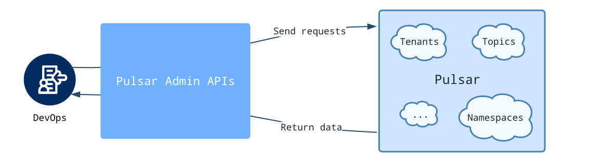

- To learn usage scenarios, see [Pulsar admin API - Use cases](#admin-api-use-cases).
- To learn common administrative tasks, see [Pulsar admin API - Features](#admin-api-features).
- To perform administrative operations, see [Pulsar admin API - Tools](#admin-api-tools).
- To get up quickly, see [Pulsar admin API - Get started](#admin-api-get-started).
- To check the detailed usage, see the API references below.

  - [Java admin API](https://pulsar.apache.org/api/admin/4.1.x/)
  - [REST API](#reference-rest-api-overview)

---

<a id="admin-api-packages"></a>

<!-- source_url: https://pulsar.apache.org/docs/4.1.x/admin-api-packages/ -->

<!-- page_index: 24 -->

# Manage packages

> [!TIP]
> This page only shows **some frequently used operations**.
>
> - For the latest and complete information about `Pulsar admin`, including commands, flags, descriptions, and more, see [Pulsar admin doc](https://pulsar.apache.org/reference/#/4.1.x/pulsar-admin/).
> - For the latest and complete information about `REST API`, including parameters, responses, samples, and more, see [REST](https://pulsar.apache.org/admin-rest-api#/) API doc.
> - For the latest and complete information about `Java admin API`, including classes, methods, descriptions, and more, see [Java admin API doc](https://pulsar.apache.org/api/admin/4.1.x/).

---

<a id="admin-api-permissions"></a>

<!-- source_url: https://pulsar.apache.org/docs/4.1.x/admin-api-permissions/ -->

<!-- page_index: 25 -->

# Managing permissions

> [!TIP]
> This page only shows **some frequently used operations**.
>
> - For the latest and complete information about `Pulsar admin`, including commands, flags, descriptions, and more, see [Pulsar admin docs](https://pulsar.apache.org/reference/#/4.1.x/pulsar-admin/).
> - For the latest and complete information about `REST API`, including parameters, responses, samples, and more, see [REST](https://pulsar.apache.org/admin-rest-api#/) API doc.
> - For the latest and complete information about `Java admin API`, including classes, methods, descriptions, and more, see [Java admin API doc](https://pulsar.apache.org/api/admin/4.1.x/).

---

<a id="admin-api-schemas"></a>

<!-- source_url: https://pulsar.apache.org/docs/4.1.x/admin-api-schemas/ -->

<!-- page_index: 26 -->

# Manage Schemas

> [!TIP]
> This page only shows **some frequently used operations**.
>
> - For the latest and complete information about `Pulsar admin`, including commands, flags, descriptions, and more, see [Pulsar admin docs](https://pulsar.apache.org/reference/#/4.1.x/pulsar-admin/).
> - For the latest and complete information about `REST API`, including parameters, responses, samples, and more, see [REST](https://pulsar.apache.org/admin-rest-api#/) API doc.
> - For the latest and complete information about `Java admin API`, including classes, methods, descriptions, and more, see [Java admin API doc](https://pulsar.apache.org/api/admin/4.1.x/).

---

<a id="admin-api-tenants"></a>

<!-- source_url: https://pulsar.apache.org/docs/4.1.x/admin-api-tenants/ -->

<!-- page_index: 27 -->

# Managing Tenants

> [!TIP]
> This page only shows **some frequently used operations**.
>
> - For the latest and complete information about `Pulsar admin`, including commands, flags, descriptions, and more, see [Pulsar admin docs](https://pulsar.apache.org/reference/#/4.1.x/pulsar-admin/).
> - For the latest and complete information about `REST API`, including parameters, responses, samples, and more, see [REST](https://pulsar.apache.org/admin-rest-api#/) API doc.
> - For the latest and complete information about `Java admin API`, including classes, methods, descriptions, and more, see [Java admin API doc](https://pulsar.apache.org/api/admin/4.1.x/).

---

<a id="admin-api-tools"></a>

<!-- source_url: https://pulsar.apache.org/docs/4.1.x/admin-api-tools/ -->

<!-- page_index: 28 -->

# Pulsar admin interfaces - Tools

You can manage Pulsar entities through the Pulsar admin layer via one of the following tools:

- Pulsar admin APIs

  - [Java admin API](https://pulsar.apache.org/api/admin/4.1.x/): It’s a programmable interface written in Java.
  - Go admin API (coming soon)
  - [REST API](https://pulsar.apache.org/admin-rest-api/?version=4.1.3): HTTP calls, which are made against the admin APIs provided by brokers. In addition, both the Java admin API and pulsar-admin CLI use the REST API.
- [pulsar-admin CLI](https://pulsar.apache.org/reference/#/4.1.x/pulsar-admin/): It’s a command-line tool and is available in the bin folder of your Pulsar installation.

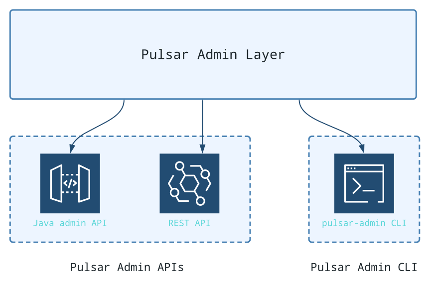

Here are the explanations and comparisons of these tools.

Category Tools When to use Considerations|  |  |  |  |  |  |  |  |  |  |  |  | | --- | --- | --- | --- | --- | --- | --- | --- | --- | --- | --- | --- | | Pulsar admin APIs [Java admin API](https://pulsar.apache.org/api/admin/4.1.x/) - If you want to implement your own admin interface client using Java and manage clusters. - If you want to manage resources programmatically rather than relying on external tools inside of unit tests. - If you want to use admin APIs in Java applications. - This method is only available in Java. - It needs more development work if you want to use it to build applications.|  |  |  |  |  |  |  |  | | --- | --- | --- | --- | --- | --- | --- | --- | | Pulsar admin APIs [REST API](https://pulsar.apache.org/admin-rest-api/?version=4.1.3) - If you want to implement your own admin interface client using other languages and manage clusters using scripts. - This method is the most complicated. - It needs more development work if you want to use it to build applications.|  |  |  |  | | --- | --- | --- | --- | | Pulsar admin CLI [pulsar-admin CLI](https://pulsar.apache.org/reference/#/4.1.x/pulsar-admin/) - If you want to get started with Pulsar admin APIs with minimal effort (e.g., no need to prepare an extra environment). - If you want to perform common administrative tasks. - This method is the most easy-to-use. - It’s challenging to use this method to build applications. - It takes a little more time because JVM starts slowly. | | | | | | | | | | | | | |

Pulsar admin APIs [Java admin API](https://pulsar.apache.org/api/admin/4.1.x/) - If you want to implement your own admin interface client using Java and manage clusters. - If you want to manage resources programmatically rather than relying on external tools inside of unit tests. - If you want to use admin APIs in Java applications. - This method is only available in Java. - It needs more development work if you want to use it to build applications.|  |  |  |  |  |  |  |  | | --- | --- | --- | --- | --- | --- | --- | --- | | Pulsar admin APIs [REST API](https://pulsar.apache.org/admin-rest-api/?version=4.1.3) - If you want to implement your own admin interface client using other languages and manage clusters using scripts. - This method is the most complicated. - It needs more development work if you want to use it to build applications.|  |  |  |  | | --- | --- | --- | --- | | Pulsar admin CLI [pulsar-admin CLI](https://pulsar.apache.org/reference/#/4.1.x/pulsar-admin/) - If you want to get started with Pulsar admin APIs with minimal effort (e.g., no need to prepare an extra environment). - If you want to perform common administrative tasks. - This method is the most easy-to-use. - It’s challenging to use this method to build applications. - It takes a little more time because JVM starts slowly. | | | | | | | | | |

Pulsar admin APIs [REST API](https://pulsar.apache.org/admin-rest-api/?version=4.1.3) - If you want to implement your own admin interface client using other languages and manage clusters using scripts. - This method is the most complicated. - It needs more development work if you want to use it to build applications.|  |  |  |  | | --- | --- | --- | --- | | Pulsar admin CLI [pulsar-admin CLI](https://pulsar.apache.org/reference/#/4.1.x/pulsar-admin/) - If you want to get started with Pulsar admin APIs with minimal effort (e.g., no need to prepare an extra environment). - If you want to perform common administrative tasks. - This method is the most easy-to-use. - It’s challenging to use this method to build applications. - It takes a little more time because JVM starts slowly. | | | | | |

Pulsar admin CLI [pulsar-admin CLI](https://pulsar.apache.org/reference/#/4.1.x/pulsar-admin/) - If you want to get started with Pulsar admin APIs with minimal effort (e.g., no need to prepare an extra environment). - If you want to perform common administrative tasks. - This method is the most easy-to-use. - It’s challenging to use this method to build applications. - It takes a little more time because JVM starts slowly. | |

- To understand the basics, see [Pulsar admin API - Overview](#admin-api-overview)
- To learn usage scenarios, see [Pulsar admin API - Use cases](#admin-api-use-cases).
- To learn common administrative tasks, see [Pulsar admin API - Features](#admin-api-features).
- To get up quickly, see [Pulsar admin API - Get started](#admin-api-get-started).
- To check the detailed usage, see the API references below.

  - [Java admin API](https://pulsar.apache.org/api/admin/4.1.x/)
  - [REST API](#reference-rest-api-overview)

---

<a id="admin-api-topics"></a>

<!-- source_url: https://pulsar.apache.org/docs/4.1.x/admin-api-topics/ -->

<!-- page_index: 29 -->

# Manage topics

> [!TIP]
> This page only shows **some frequently used operations**.
>
> - For the latest and complete information about `Pulsar admin`, including commands, flags, descriptions, and more, see [Pulsar admin docs](https://pulsar.apache.org/reference/#/4.1.x/pulsar-admin/).
> - For the latest and complete information about `REST API`, including parameters, responses, samples, and more, see [REST](https://pulsar.apache.org/admin-rest-api#/) API doc.
> - For the latest and complete information about `Java admin API`, including classes, methods, descriptions, and more, see [Java admin API doc](https://pulsar.apache.org/api/admin/4.1.x/).

---

<a id="admin-api-transactions"></a>

<!-- source_url: https://pulsar.apache.org/docs/4.1.x/admin-api-transactions/ -->

<!-- page_index: 30 -->

# Manage transactions

> [!TIP]
> This page only shows **some frequently used operations**.
>
> - For the latest and complete information about `Pulsar admin`, including commands, flags, descriptions, and more, see [Pulsar admin docs](https://pulsar.apache.org/reference/#/4.1.x/pulsar-admin/).
> - For the latest and complete information about `REST API`, including parameters, responses, samples, and more, see [REST](https://pulsar.apache.org/admin-rest-api#/) API doc.
> - For the latest and complete information about `Java admin API`, including classes, methods, descriptions, and more, see [Java admin API doc](https://pulsar.apache.org/api/admin/4.1.x/).

---

<a id="admin-api-tutorial"></a>

<!-- source_url: https://pulsar.apache.org/docs/4.1.x/admin-api-tutorial/ -->

<!-- page_index: 31 -->

# Tutorial

Each of the three admin interfaces (the `pulsar-admin` CLI tool, the [REST API](#reference-rest-api-overview), and the [Java admin API](https://pulsar.apache.org/api/admin/4.1.x/)) requires some special setup if you have enabled authentication in your Pulsar instance.

<div class="theme-tabs-container tabs-container tabList__CuJ"><ul><li>pulsar-admin<li>REST API<li>Java</li></li></li></ul><div><div><p>If you have enabled authentication, you need to provide an auth configuration to use the <code>pulsar-admin</code> tool. By default, the configuration for the <code>pulsar-admin</code> tool is in the <a href="https://github.com/apache/pulsar/blob/master/conf/client.conf" rel="noopener noreferrer" target="_blank"><code>conf/client.conf</code></a> file. The following are the available parameters:<table><thead><tr><th>Name<th>Description<th>Default<tbody><tr><td>webServiceUrl<td>The web URL for the cluster.<td><a href="http://localhost:8080/" rel="noopener noreferrer" target="_blank">http://localhost:8080/</a><tr><td>brokerServiceUrl<td>The Pulsar protocol URL for the cluster.<td>pulsar://localhost:6650/<tr><td>authPlugin<td>The authentication plugin.<td><tr><td>authParams<td>The authentication parameters for the cluster, as a comma-separated string.<td><tr><td>useTls<td>Whether or not TLS authentication will be enforced in the cluster.<td>false<tr><td>tlsAllowInsecureConnection<td>Accept untrusted TLS certificate from client.<td>false<tr><td>tlsTrustCertsFilePath<td>Path for the trusted TLS certificate file.<td></td></td></td></tr></td></td></td></tr></td></td></td></tr></td></td></td></tr></td></td></td></tr></td></td></td></tr></td></td></td></tr></tbody></th></th></th></tr></thead></table></p></div><div><p>You can find details for the REST API exposed by Pulsar brokers in the <a href="https://pulsar.apache.org/admin-rest-api/?version=4.1.3" rel="noopener noreferrer" target="_blank">REST API doc</a>.<p>If you want to test REST APIs in postman, you can use the REST API JSON files <a href="https://pulsar.apache.org/swagger/" rel="noopener noreferrer" target="_blank">here</a>.</p></p></div><div><p>To use the Java admin API, instantiate a <a href="https://pulsar.apache.org/api/admin/4.1.x/org/apache/pulsar/client/admin/PulsarAdmin" rel="noopener noreferrer" target="_blank">PulsarAdmin</a> object, and specify a URL for a Pulsar broker and a <a href="https://pulsar.apache.org/api/admin/4.1.x/org/apache/pulsar/client/admin/PulsarAdminBuilder" rel="noopener noreferrer" target="_blank">PulsarAdminBuilder</a> object. The following is a minimal example using <code>localhost</code>.<div><div><pre><code><div><span>String</span><span> url </span><span>=</span><span> </span><span>"http://localhost:8080"</span><span>;</span><span></span> </div><div><span></span><span>// Pass auth-plugin class fully-qualified name if Pulsar-security enabled</span><span></span> </div><div><span></span><span>String</span><span> authPluginClassName </span><span>=</span><span> </span><span>"com.org.MyAuthPluginClass"</span><span>;</span><span></span> </div><div><span></span><span>// Pass auth-param if auth-plugin class requires it</span><span></span> </div><div><span></span><span>String</span><span> authParams </span><span>=</span><span> </span><span>"param1=value1"</span><span>;</span><span></span> </div><div><span></span><span>boolean</span><span> tlsAllowInsecureConnection </span><span>=</span><span> </span><span>false</span><span>;</span><span></span> </div><div><span></span><span>String</span><span> tlsTrustCertsFilePath </span><span>=</span><span> </span><span>null</span><span>;</span><span></span> </div><div><span></span><span>PulsarAdmin</span><span> admin </span><span>=</span><span> </span><span>PulsarAdmin</span><span>.</span><span>builder</span><span>(</span><span>)</span><span></span> </div><div><span>    </span><span>.</span><span>authentication</span><span>(</span><span>authPluginClassName</span><span>,</span><span>authParams</span><span>)</span><span></span> </div><div><span>    </span><span>.</span><span>serviceHttpUrl</span><span>(</span><span>url</span><span>)</span><span></span> </div><div><span>    </span><span>.</span><span>tlsTrustCertsFilePath</span><span>(</span><span>tlsTrustCertsFilePath</span><span>)</span><span></span> </div><div><span>    </span><span>.</span><span>allowTlsInsecureConnection</span><span>(</span><span>tlsAllowInsecureConnection</span><span>)</span><span></span> </div><div><span>    </span><span>.</span><span>build</span><span>(</span><span>)</span><span>;</span> </div></code></pre></div></div><p>If you use multiple brokers, you can use multi-host like Pulsar service. For example,<div><div><pre><code><div><span>String</span><span> url </span><span>=</span><span> </span><span>"http://localhost:8080,localhost:8081,localhost:8082"</span><span>;</span><span></span> </div><div><span></span><span>// Below are the same to the line 2 - line 13 in the code snippet above</span><span></span> </div><div><span></span><span>// Pass auth-plugin class fully-qualified name if Pulsar-security enabled</span><span></span> </div><div><span></span><span>String</span><span> authPluginClassName </span><span>=</span><span> </span><span>"com.org.MyAuthPluginClass"</span><span>;</span><span></span> </div><div><span></span><span>// Pass auth-param if auth-plugin class requires it</span><span></span> </div><div><span></span><span>String</span><span> authParams </span><span>=</span><span> </span><span>"param1=value1"</span><span>;</span><span></span> </div><div><span></span><span>boolean</span><span> tlsAllowInsecureConnection </span><span>=</span><span> </span><span>false</span><span>;</span><span></span> </div><div><span></span><span>String</span><span> tlsTrustCertsFilePath </span><span>=</span><span> </span><span>null</span><span>;</span><span></span> </div><div><span></span><span>PulsarAdmin</span><span> admin </span><span>=</span><span> </span><span>PulsarAdmin</span><span>.</span><span>builder</span><span>(</span><span>)</span><span></span> </div><div><span>    </span><span>.</span><span>authentication</span><span>(</span><span>authPluginClassName</span><span>,</span><span>authParams</span><span>)</span><span></span> </div><div><span>    </span><span>.</span><span>serviceHttpUrl</span><span>(</span><span>url</span><span>)</span><span></span> </div><div><span>    </span><span>.</span><span>tlsTrustCertsFilePath</span><span>(</span><span>tlsTrustCertsFilePath</span><span>)</span><span></span> </div><div><span>    </span><span>.</span><span>allowTlsInsecureConnection</span><span>(</span><span>tlsAllowInsecureConnection</span><span>)</span><span></span> </div><div><span>    </span><span>.</span><span>build</span><span>(</span><span>)</span><span>;</span> </div></code></pre></div></div></p></p></div></div></div>

---

<a id="admin-api-use-cases"></a>

<!-- source_url: https://pulsar.apache.org/docs/4.1.x/admin-api-use-cases/ -->

<!-- page_index: 32 -->

# Pulsar admin interfaces - Use cases

Pulsar admin APIs are one of the best productivity tools. You can perform various tasks with them, for example:

- Administering Pulsar instances easily by creating, updating, or deleting objects with a single line of command, which increases management efficiency.
- Monitoring Pulsar or troubleshooting issues by getting the status and information about Pulsar clusters, which reduces maintenance costs.
- Facilitating the workflow of application development by implementing admin interface clients using your preferred languages (e.g., Go, Python, C++) based on REST APIs, which enhances developer experiences.

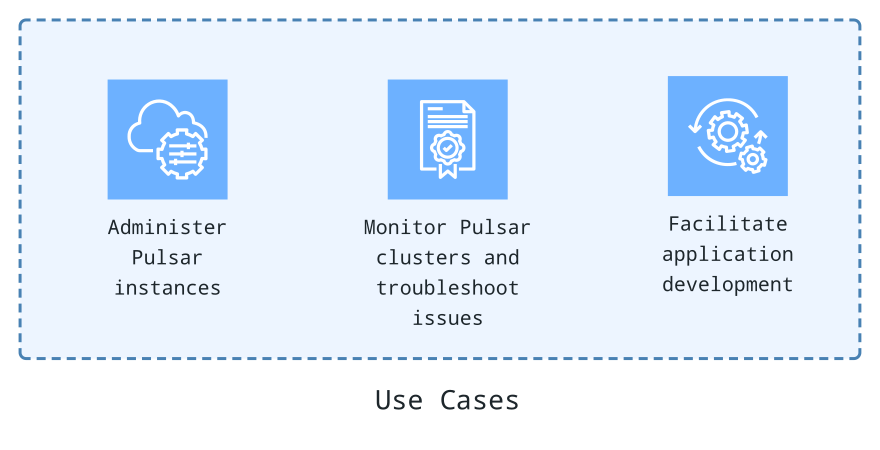

- To understand basics, see [Pulsar admin API - Overview](#admin-api-overview)
- To learn common administrative tasks, see [Pulsar admin API - Features](#admin-api-features).
- To perform administrative operations, see [Pulsar admin API - Tools](#admin-api-tools).
- To get up quickly, see [Pulsar admin API - Get started](#admin-api-get-started).
- To check the detailed usage, see the API references below.

  - [Java admin API](https://pulsar.apache.org/api/admin/4.1.x/)
  - [REST API](#reference-rest-api-overview)

---

<a id="administration-anti-affinity-namespaces"></a>

<!-- source_url: https://pulsar.apache.org/docs/4.1.x/administration-anti-affinity-namespaces/ -->

<!-- page_index: 33 -->

# Anti-affinity namespaces

> [!TIP]
> - Each namespace belongs to only one anti-affinity group. If a namespace with an existing anti-affinity assignment is assigned to another anti-affinity group, the original assignment is dropped.
> - If there are more anti-affinity namespaces than failure domains, the load manager distributes namespaces evenly across all the domains, and also every domain distributes namespaces evenly across all the brokers under that domain.

---

<a id="administration-geo"></a>

<!-- source_url: https://pulsar.apache.org/docs/4.1.x/administration-geo/ -->

<!-- page_index: 34 -->

# Pulsar geo-replication

> [!NOTE]
> The [replicated subscription](#administration-geo--replicated-subscriptions) feature requires 2-way geo-replication and is not available when geo-replication is configured as 1-way.

---

<a id="administration-isolation-bookie"></a>

<!-- source_url: https://pulsar.apache.org/docs/4.1.x/administration-isolation-bookie/ -->

<!-- page_index: 35 -->

# Isolate bookies

> [!TIP]
> - Both [rack-aware placement policy](#administration-isolation-bookie--rack-aware-placement-policy) and [region-aware placement policy](#administration-isolation-bookie--region-aware-placement-policy) can be used in all kinds of deployments where racks are a subset of a region. The major difference between the two policies is:
>
>   - With `RackawareEnsemblePlacementPolicy` configured, the BookKeeper client chooses bookies from different **racks** to reduce the single point of failure. If there is only one rack available, the policy falls back on choosing a random bookie across available ones.
>   - With `RegionAwareEnsemblePlacementPolicy` configured, the BookKeeper client chooses bookies from different **regions**; for the selected region, it chooses bookies from different racks if more than one ensemble falls into the same region.
> - Zone-aware placement policy (`ZoneAwareEnsemblePlacementPolicy`) can be used in a public cloud infrastructure where Availability Zones (AZs) are isolated locations within the data center regions that public cloud services originate from and operate in.

---

<a id="administration-isolation-broker"></a>

<!-- source_url: https://pulsar.apache.org/docs/4.1.x/administration-isolation-broker/ -->

<!-- page_index: 36 -->

# Isolate brokers

> [!TIP]
> To guarantee all the data that belongs to a namespace is stored in desired bookies, you can isolate the data of the namespace into user-defined groups of bookies. See [configure bookie affinity groups](#administration-isolation-bookie--configure-bookie-affinity-groups) for more details.

---

<a id="administration-isolation"></a>

<!-- source_url: https://pulsar.apache.org/docs/4.1.x/administration-isolation/ -->

<!-- page_index: 37 -->

# Pulsar isolation

> [!TIP]
> On top of [broker-level isolation](#administration-isolation-broker) and [bookie-level isolation](#administration-isolation-bookie), if you want to guarantee all the data that belongs to a namespace is stored in desired bookies, you can define and configure [bookie affinity groups](#administration-isolation-bookie--configure-bookie-affinity-groups). See [shared BookKeeper cluster deployment](#administration-isolation--shared-bookkeeper-cluster) for more details.

---

<a id="administration-metadata-store"></a>

<!-- source_url: https://pulsar.apache.org/docs/4.1.x/administration-metadata-store/ -->

<!-- page_index: 38 -->

# Configure metadata store

> [!NOTE]
> If you are using a standalone Pulsar or a single Pulsar cluster, you only need to configure one metadata store (via `metadataStoreUrl`) and it also serves as a configuration store.

---

<a id="administration-proxy"></a>

<!-- source_url: https://pulsar.apache.org/docs/4.1.x/administration-proxy/ -->

<!-- page_index: 39 -->

# Pulsar proxy

Pulsar proxy is an optional gateway. Pulsar proxy is used when direct connections between clients and Pulsar brokers are either infeasible or undesirable. For example, when you run Pulsar in a cloud environment or on [Kubernetes](https://kubernetes.io) or an analogous platform, you can run Pulsar proxy.

The Pulsar proxy is not intended to be exposed on the public internet. The security considerations in the current design expect network perimeter security. The requirement of network perimeter security can be achieved with private networks.

If a proxy deployment cannot be protected with network perimeter security, the alternative would be to use [Pulsar's "Proxy SNI routing" feature](#concepts-proxy-sni-routing) with a properly secured and audited solution. In that case Pulsar proxy component is not used at all.

Besides the Pulsar Proxy, the ["multiple advertised listeners" feature](#concepts-multiple-advertised-listeners) can be used to expose a Pulsar cluster to external clients. This also requires proper network perimeter security.

Before using a proxy, you need to configure it with a broker's address in the cluster. You can configure the broker URL in the proxy configuration, or the proxy to connect directly using service discovery.

> In a production environment service discovery is not recommended.

It is more secure to specify a URL to connect to the brokers.

Proxy authorization requires access to ZooKeeper, so if you use these broker URLs to connect to the brokers, you need to disable authorization at the Proxy level. Brokers still authorize requests after the proxy forwards them.

You can configure the broker URLs in `conf/proxy.conf` as follows.

```properties
brokerServiceURL=pulsar://brokers.example.com:6650 
brokerWebServiceURL=http://brokers.example.com:8080 
functionWorkerWebServiceURL=http://function-workers.example.com:8080 
```

If you use TLS, configure the broker URLs in the following way:

```properties
brokerServiceURLTLS=pulsar+ssl://brokers.example.com:6651 
brokerWebServiceURLTLS=https://brokers.example.com:8443 
functionWorkerWebServiceURL=https://function-workers.example.com:8443 
```

The hostname in the URLs provided should be a DNS entry that points to multiple brokers or a virtual IP address, which is backed by multiple broker IP addresses, so that the proxy does not lose connectivity to Pulsar cluster if a single broker becomes unavailable.

The ports to connect to the brokers (6650 and 8080, or in the case of TLS, 6651 and 8443) should be open in the network ACLs.

Note that if you do not use functions, you do not need to configure `functionWorkerWebServiceURL`.

Pulsar uses [ZooKeeper](https://zookeeper.apache.org) for service discovery. To connect the proxy to ZooKeeper, specify the following in `conf/proxy.conf`.

```properties
metadataStoreUrl=my-zk-0:2181,my-zk-1:2181,my-zk-2:2181 
configurationMetadataStoreUrl=my-zk-0:2184,my-zk-remote:2184 
```

> To use service discovery, you need to open the network ACLs, so the proxy can connects to the ZooKeeper nodes through the ZooKeeper client port (port `2181`) and the configuration store client port (port `2184`).

> However, it is not secure to use service discovery. Because if the network ACL is open, when someone compromises a proxy, they have full access to ZooKeeper.

The Pulsar Proxy trusts clients to provide valid target broker addresses to connect to.
Unless the Pulsar Proxy is explicitly configured to limit access, the Pulsar Proxy is vulnerable as described in the security advisory [Apache Pulsar Proxy target broker address isn't validated (CVE-2022-24280)](https://github.com/apache/pulsar/wiki/CVE-2022-24280).

It is necessary to limit proxied broker connections to known broker addresses by specifying `brokerProxyAllowedHostNames` and `brokerProxyAllowedIPAddresses` settings.

When specifying `brokerProxyAllowedHostNames`, it's possible to use a wildcard.
Please notice that `*` is a wildcard that matches any character in the hostname. It also matches dot `.` characters.

It is recommended to use a pattern that matches only the desired brokers and no other hosts in the local network. Pulsar lookups will use the default host name of the broker by default. This can be overridden with the `advertisedAddress` setting in `broker.conf`.

To increase security, it is also possible to restrict access with the `brokerProxyAllowedIPAddresses` setting. It is not mandatory to configure `brokerProxyAllowedIPAddresses` when `brokerProxyAllowedHostNames` is properly configured so that the pattern matches only the target brokers.
`brokerProxyAllowedIPAddresses` setting supports a comma separate list of IP address, IP address ranges and IP address networks [(supported format reference)](https://seancfoley.github.io/IPAddress/IPAddress/apidocs/inet/ipaddr/IPAddressString.html).

Example: limiting by host name in a Kubernetes deployment

```yaml
  # example of limiting to Kubernetes statefulset hostnames that contain "broker-" 
  PULSAR_PREFIX_brokerProxyAllowedHostNames: '*broker-*.*.*.svc.cluster.local' 
```

Example: limiting by both host name and ip address in a `proxy.conf` file for host deployment.

```properties
# require "broker" in host name 
brokerProxyAllowedHostNames=*broker*.localdomain 
# limit target ip addresses to a specific network 
brokerProxyAllowedIPAddresses=10.0.0.0/8 
```

Example: limiting by multiple host name patterns and multiple ip address ranges in a `proxy.conf` file for host deployment.

```properties
# require "broker" in host name 
brokerProxyAllowedHostNames=*broker*.localdomain,*broker*.otherdomain 
# limit target ip addresses to a specific network or range demonstrating multiple supported formats 
brokerProxyAllowedIPAddresses=10.10.0.0/16,192.168.1.100-120,172.16.2.*,10.1.2.3 
```

To start the proxy, run the following commands.

```bash
cd /path/to/pulsar/directory 
bin/pulsar proxy \ 
    --metadata-store zk:my-zk-1:2181,my-zk-2:2181,my-zk-3:2181 \ 
    --configuration-metadata-store zk:my-zk-1:2181,my-zk-2:2181,my-zk-3:2181 
```

> You can run multiple instances of the Pulsar proxy in a cluster.

Pulsar proxy runs in the foreground by default. To stop the proxy, simply stop the process in which the proxy is running.

You can run Pulsar proxy behind some kind of load-distributing frontend, such as an [HAProxy](https://www.digitalocean.com/community/tutorials/an-introduction-to-haproxy-and-load-balancing-concepts) load balancer.

Once your Pulsar proxy is up and running, preferably behind a load-distributing [frontend](#administration-proxy--proxy-frontends), clients can connect to the proxy via whichever address that the frontend uses. If the address is the DNS address `pulsar.cluster.default`, for example, the connection URL for clients is `pulsar://pulsar.cluster.default:6650`.

For more information on Proxy configuration, refer to [Pulsar proxy](#reference-configuration--pulsar-proxy).

---

<a id="administration-pulsar-manager"></a>

<!-- source_url: https://pulsar.apache.org/docs/4.1.x/administration-pulsar-manager/ -->

<!-- page_index: 40 -->

# Pulsar Manager

> [!NOTE]
> Pulsar Manager has been poorly maintained for a long time. Please take a look at the [Dekaf UI](https://pulsar.apache.org/docs/4.1.x/administration-dekaf-ui/) as an alternative to Pulsar Manager.

---

<a id="administration-pulsar-shell"></a>

<!-- source_url: https://pulsar.apache.org/docs/4.1.x/administration-pulsar-shell/ -->

<!-- page_index: 41 -->

# Pulsar Shell

> [!NOTE]
> The configuration file must be a valid `client.conf` file, the same one you use for `pulsar-admin`, `pulsar-client` and other client tools.

---

<a id="administration-stats"></a>

<!-- source_url: https://pulsar.apache.org/docs/4.1.x/administration-stats/ -->

<!-- page_index: 42 -->

# Pulsar stats

> [!NOTE]
> All stats below are **reset** to 0 upon broker restart or topic unloading, **except** the stats marked with asterisks \* (the values of them **keep unchanged**).

---

<a id="administration-upgrade"></a>

<!-- source_url: https://pulsar.apache.org/docs/4.1.x/administration-upgrade/ -->

<!-- page_index: 43 -->

# Upgrade Guide

> [!NOTE]
> Currently, Apache Pulsar is compatible between versions.

---

<a id="administration-zk-bk"></a>

<!-- source_url: https://pulsar.apache.org/docs/4.1.x/administration-zk-bk/ -->

<!-- page_index: 44 -->

# ZooKeeper and BookKeeper administration

> [!NOTE]
> Set `journalDirectory` and `ledgerDirectories` carefully. It is difficult to change them later.

---

<a id="concepts-architecture-overview"></a>

<!-- source_url: https://pulsar.apache.org/docs/4.1.x/concepts-architecture-overview/ -->

<!-- page_index: 45 -->

# Architecture Overview

> [!NOTE]
> In Pulsar, each topic is handled by only one broker. Initial requests from a client to read, update or delete a topic are sent to a broker that may not be the topic owner. If the broker cannot handle the request for this topic, it redirects the request to the appropriate broker.

---

<a id="concepts-authentication"></a>

<!-- source_url: https://pulsar.apache.org/docs/4.1.x/concepts-authentication/ -->

<!-- page_index: 46 -->

# Authentication and Authorization

Pulsar supports a pluggable [authentication](#security-overview) mechanism which can be configured at the proxy and/or the broker. Pulsar also supports a pluggable [authorization](#security-authorization) mechanism. These mechanisms work together to identify the client and its access rights on topics, namespaces and tenants.

---

<a id="concepts-broker-load-balancing-benefits"></a>

<!-- source_url: https://pulsar.apache.org/docs/4.1.x/concepts-broker-load-balancing-benefits/ -->

<!-- page_index: 47 -->

# Benefits

The broker load balancer plays a key role in preventing downtime and lost productivity. It not only ensures efficient use of all resources, but it also optimizes cluster performance, reliability, and capacity with lower latency. It delivers a number of benefits, including but not limited to the following.

It efficiently distributes the load to maximize broker resources since it allows you to:

- Reduce idle brokers and save cluster resources.
- Distribute data loads evenly and efficiently.

It improves performance since it allows you to:

- Reduce hot spots and maintain message pub/sub latency.
- Minimize the likelihood of Pulsar cluster downtime, scale clusters to meet constantly data-changing needs, and ensure that no broker is overworked. Without it, Pulsar clusters would likely have performance degradation (e.g., slow down, drop requests, or even fail) when topics are suddenly overloaded.

It increases the availability and fault tolerance since it allows you to:

- Minimize topic unavailable time by shifting pub/sub sessions from unavailable brokers to available brokers.
- Perform cluster maintenance without causing service disruption since pub/sub connections get rerouted to other brokers during maintenance.

It helps seamlessly scale up or down broker clusters since it allows you to:

- Unload topic loads automatically to new brokers when scaling up.
- Detect orphan topics and automatically and reassign them to available brokers when scaling down.

- To get a comprehensive understanding and discover the key insights, see [Broker load balancing | Overview](#concepts-broker-load-balancing-overview).
- To discover different usage scenarios, see [Broker load balancing | Use cases](#concepts-broker-load-balancing-use-cases).
- To explore functionalities, see [Broker load balancing | Features](#concepts-broker-load-balancing-features).
- To learn essential fundamentals, see [Broker load balancing | Concepts](#concepts-broker-load-balancing-concepts).
- To review various versions of broker load balancers, see [Broker load balancing | Types](#concepts-broker-load-balancing-types).
- To get up quickly, see [Broker load balancing | Quick start](#concepts-broker-load-balancing-quick-start).
- To migrate one broker load balancer type to another, see [Broker load balancing | Migration](#concepts-broker-load-balancing-migration).

---

<a id="concepts-broker-load-balancing-concepts"></a>

<!-- source_url: https://pulsar.apache.org/docs/4.1.x/concepts-broker-load-balancing-concepts/ -->

<!-- page_index: 48 -->

# Concepts

Pulsar provides robust support for load balancing to ensure efficient utilization of resources across Pulsar clusters. Load balancing in Pulsar involves distributing messages and partitions evenly among brokers and consumers to prevent hotspots and optimize performance.

Before getting started with load balancing, it's important to review the key components to ensure that resources are utilized efficiently and varying workloads can be handled by the system effectively.

In a Pulsar cluster, [brokers](#reference-terminology--broker) are responsible for serving messages for different topics and partitions. Broker load balancing ensures that each broker handles a proportional share of the load.

[Producers](#reference-terminology--producer) in Pulsar are responsible for publishing messages to topics. Pulsar clients (producers) connect to brokers to publish messages. Producer load balancing (i.e., connection pooling mechanism in Pulsar) ensures that producers are distributed across brokers to avoid overwhelming a single broker with too many connections.

[Consumers](#reference-terminology--consumer) in Pulsar are responsible for consuming messages from topics. Depending on how consumer load balancing is configured (i.e., using exclusive or shared consumers or auto-rebalancing), you can ensure even load distribution.

[Topics](#reference-terminology--topic) are the basic units for clients to publish and consume messages. Related topics are logically grouped into a namespace. To efficiently manage metadata and keep track of all of them moving through the system, Pulsar uses a strategy of grouping topics by partitioning on a namespace to create topic bundles.

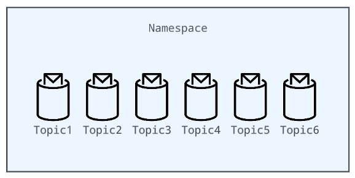

[Bundles](#reference-terminology--namespace-bundle) represent a range of partitions for a particular namespace in Pulsar, comprising a portion of the overall hash range of the namespace.

Bundle is introduced in Pulsar to represent a middle-layer group. Each bundle is an **assignment unit**, which means topics are assigned to brokers at the **bundle** level rather than the topic level.

The broker load balancer component is like a "traffic cop" sitting between clients and brokers. It balances topic sessions across brokers based on dynamic load data, such as broker resource usage (e.g., CPU, memory, network IO) and topic/bundle loads (e.g., throughput).

When properly balanced, the brokers can handle increased traffic and ensure that the system can scale seamlessly to accommodate growing workloads. Load balancing helps prevent bottlenecks and ensures that the resources of the cluster are utilized optimally, leading to better throughput and reduced message processing latency.

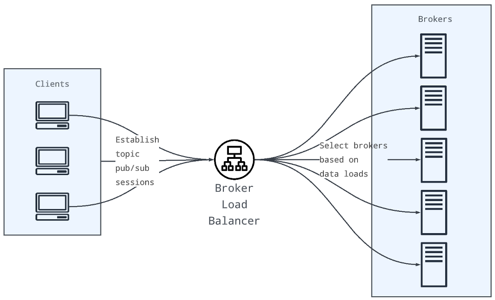

Topic bundling refers to the process of grouping topics into bundles. Pulsar organizes topics into bundles within a namespace. Each bundle is a range of partitions, and Pulsar can automatically distribute these bundles across brokers to achieve load balancing. This allows the cluster to scale more efficiently as brokers can independently manage their assigned bundles.

For example,

- Topic load statistics (e.g., message rates) are aggregated at the **bundle** layer, which reduces the cardinality of load samples to monitor.
- For dynamic topic-broker assignments, Pulsar persists these mappings at the **bundle** level, which decreases the space for storing dynamic topic-broker ownerships.

Pulsar allows you to dynamically scale the number of brokers, producers, and consumers to adapt to changing workloads. As brokers are added or removed, Pulsar handles the redistribution of partitions and bundles automatically.

Below is the workflow for grouping topics into bundles.

Internally, when a namespace is created, the namespace is sharded into a list of bundles.

When a topic is created or looked up for pub/sub sessions, brokers map the topic to a particular bundle by taking the hash of the topic name (for example, hash("my-topic") = 0x0000000F) and checking in which bundle the hash falls.

Here "topic" means either a **non-partitioned topic** or **one partition of a partitioned topic**. For partitioned topics, Pulsar internally considers partitions as separate topics, hence different partitions can be assigned to different bundles and brokers.

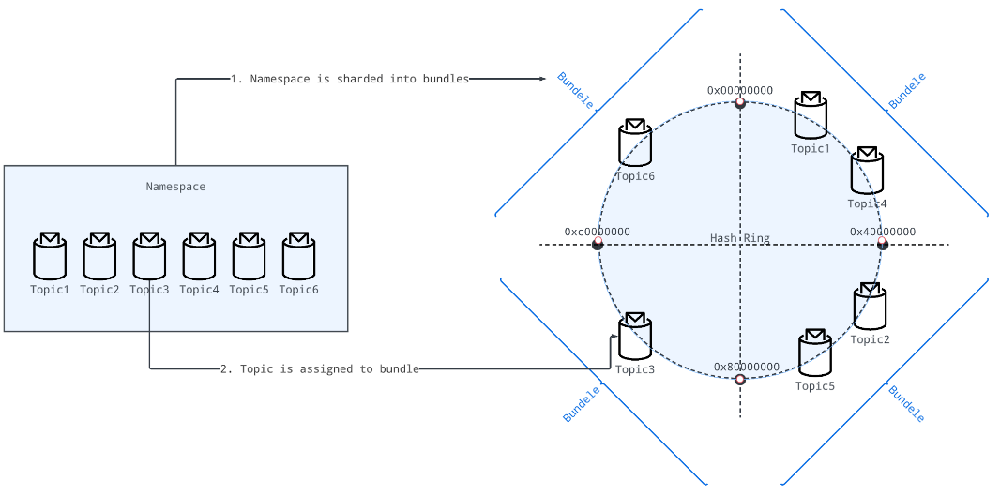

Bundle assignment refers to assigning bundles to brokers dynamically based on changing conditions.

For example, based on broker resource usage (e.g., CPU, memory, network IO) and bundle loads (e.g., throughput), a bundle is dynamically assigned to a particular broker. Each bundle is independent of the others and thus is independently assigned to different brokers. Each broker takes ownership of a bundle (aka, a subset of the topics for a namespace).

Bundle assignment plays a crucial role in achieving efficient load distribution and scalability within a Pulsar cluster. The purpose of bundle assignments is to ensure balanced resource utilization and facilitate dynamic scaling within the Pulsar architecture.

Below is the workflow for dynamic bundle assignment.

When a client starts using new topics (bundles) that are not assigned to any broker, a process is triggered to choose the best-suited broker to acquire ownership of these bundles according to the load conditions.

If a broker owning a bundle crashes, the bundle (topic) is reassigned to another available broker.

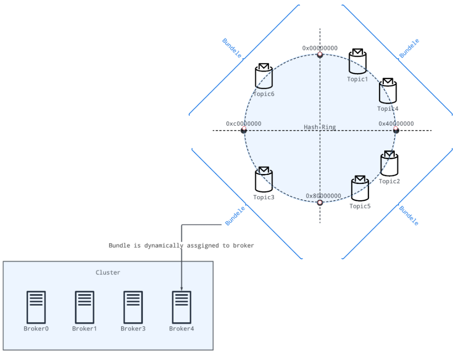

To discover the current bundle-broker ownership for a given topic, Pulsar uses a server-side discovery mechanism that redirects clients to the owner brokers' URLs. This discovery logic requires:

- Bundle key ranges for a given namespace, to map a topic to a bundle.
- Bundle-broker ownership mapping, to direct the client to the current owner or to trigger a new ownership acquisition in case there is no broker assigned.
- All bundle ranges and broker-bundle ownership mappings are stored in a metadata space, and brokers look up them when clients try to discover owner brokers. For performance reasons, these data are cached at the broker in-memory layer too.

Bundle splitting refers to the process of identifying and splitting overloaded bundles, which helps reduce hot spots, achieve more granular load balancing, improve resource utilization, and enable finer-grained horizontal scaling within the Pulsar cluster.

The bundle splitting process involves breaking down the original bundle into smaller bundles, each containing a subset of the original partitions. This allows for better distribution of the message and processing load across brokers in the cluster.

You can split bundles in the following ways:

- Automatic: enable Pulsar's automatic bundle splitting process when a namespace has a significant increase in workload or the number of partitions exceeds the optimal capacity for a single bundle.
- Manual: trigger bundle splitting manually, to divide an existing bundle into multiple smaller bundles.

Bundle splitting methods Definition When to use|  |  |  |  |  |  | | --- | --- | --- | --- | --- | --- | | Automatic Bundles are split automatically based on different [bundle splitting algorithms](#concepts-broker-load-balancing-concepts--bundle-splitting-algorithms). Automatic bundle splitting is most commonly used. You can use this method in various scenarios, such as when a bundle remains hot for a long time.|  |  |  | | --- | --- | --- | | Manual Bundles are split manually based on specified positions. Manual bundle splitting serves as a supplementary approach to automatic bundle splitting. You can use this method in various scenarios, such as: - If automatic bundle splitting is enabled, but there are still bundles that remain hot for a long time. - If you want to split bundles and redistribute traffic evenly before having any broker overloaded. | | | | | | |

Automatic Bundles are split automatically based on different [bundle splitting algorithms](#concepts-broker-load-balancing-concepts--bundle-splitting-algorithms). Automatic bundle splitting is most commonly used. You can use this method in various scenarios, such as when a bundle remains hot for a long time.|  |  |  | | --- | --- | --- | | Manual Bundles are split manually based on specified positions. Manual bundle splitting serves as a supplementary approach to automatic bundle splitting. You can use this method in various scenarios, such as: - If automatic bundle splitting is enabled, but there are still bundles that remain hot for a long time. - If you want to split bundles and redistribute traffic evenly before having any broker overloaded. | | | |

Manual Bundles are split manually based on specified positions. Manual bundle splitting serves as a supplementary approach to automatic bundle splitting. You can use this method in various scenarios, such as: - If automatic bundle splitting is enabled, but there are still bundles that remain hot for a long time. - If you want to split bundles and redistribute traffic evenly before having any broker overloaded. |

Below is the workflow for splitting bundles automatically or manually.

<div class="theme-tabs-container tabs-container tabList__CuJ"><ul><li>Automatic bundle splitting<li>Manual bundle splitting</li></li></ul><div><div><p>If the auto bundle split is enabled,<ul>
<li>
<p>For the modular load balancer, the leader broker will check if any bundle's load is beyond the threshold.</p>
</li>
<li>
<p>For the extensible load balancer, the load manager will check the bundle's load in each owner broker.</p>
</li>
</ul><p>Bundle splitting threshold can be set based on various conditions. Any existing bundle that exceeds any of the thresholds is a candidate to be split. The load balancer assigns the newly split bundles to other brokers, to facilitate the traffic distribution.<p>For how to enable bundle split and set bundle split thresholds automatically, see TBD (the docs is WIP, stay tuned!).<p>Now the target bundles which need to be split are found. Before splitting, the owner broker needs to compute the splitting positions based on <a href="#concepts-broker-load-balancing-concepts--bundle-splitting-algorithms">bundle splitting algorithms</a>.<p>Now the owner broker starts splitting the target bundles and then repartition them.<p>After the split, the owner broker updates the bundle ownerships and ranges in the metadata space. The newly split bundles can be automatically unloaded from the owner broker.<p>For example, if the bundle partition is [0x0000, 0x8000, 0xFFFF], and the splitting boundary is [0x4000] on the target bundle range, [0x0000, 0x8000).<p>Then the bundle partitions after split is [0x0000, 0x4000, 0x8000, 0xFFFF].<p>Then the bundle ranges after split is [0x0000, 0x4000), [0x4000, 0x8000), and [0x8000, 0xFFFF].</p></p></p></p></p></p></p></p></p></div><div><p>Based on the broker resource usage (for example, the number of topics or sessions, message rates, or bandwidth), you can choose a hot bundle to split.<ul>
<li>
<p>If you want to use the specified_positions_divide algorithm, you need to specify a splitting boundary.</p>
</li>
<li>
<p>If you want to use other <a href="#concepts-broker-load-balancing-concepts--bundle-splitting-algorithms">bundle splitting algorithms</a> except for the specified_positions_divide algorithm, those algorithms will calculate the position automatically.</p>
</li>
</ul><p>Step 3: split bundles at the specific boundaries from step 2.<p>For how to split bundles manually, please refer to <a href="https://pulsar.apache.org/reference/#/4.1.x/pulsar-admin/namespaces?id=split-bundle"><code>split-bundle</code></a> admin command.<p>Examples:<p>Split the largest bundle at the position that equally divides the topic count, and unload the child bundles immediately.<p><code>pulsar-admin namespaces split-bundle -b LARGEST -san topic_count_equally_divide -u my-tenant/my-namespace</code><p>If you already know the target bundle to split, you can specify it using the <code>--bundle(-b)</code> flag:<p><code>pulsar-admin namespaces split-bundle --bundle 0x00000000_0xffffffff my-tenant/my-namespace</code></p></p></p></p></p></p></p></p></div></div></div>

Bundle splitting positions can be calculated using different bundle splitting algorithms.

Below is a brief summary of bundle splitting algorithms.

Bundle splitting algorithm Definition When to use Available in automatic or manual method? Available version|  |  |  |  |  |  |  |  |  |  |  |  | | --- | --- | --- | --- | --- | --- | --- | --- | --- | --- | --- | --- | | range\_equally\_divide Split a bundle into two parts with the same hash range size. This is the **default** bundle splitting algorithm. Use when there are a large number of topics. - Automatic - Manual Pulsar 1.7 and later versions|  |  |  |  |  |  |  | | --- | --- | --- | --- | --- | --- | --- | | topic\_count\_equally\_divide Split a bundle into two parts with the same number of topics. Use when there are a small number of topics. - Automatic - Manual Pulsar 2.6 and later versions|  |  | | --- | --- | | specified\_positions\_divide Split a bundle into several parts by the specified positions.
> [!NOTE]
> Use when the automatic bundle splitting is turned off, or a bundle is not split even if the automatic bundle splitting is turned on. : Be cautious when using this algorithm. For example, if bundles are split into **too many small parts**, then these bundles could not be hit by the hash key. Currently, **bundle compaction is not supported**. - Manual Pulsar 2.11 and later versions|  |  |  |  |  | | --- | --- | --- | --- | --- | | flow\_or\_qps\_equally\_divide Split a bundle into several parts based on message rate and throughput. Use when splitting bundles proportional to traffic. - Automatic - Manual Pulsar 3.0 and later versions | | | | | | | |
 | | | | | | | | | | | | | | |

range\_equally\_divide Split a bundle into two parts with the same hash range size. This is the **default** bundle splitting algorithm. Use when there are a large number of topics. - Automatic - Manual Pulsar 1.7 and later versions|  |  |  |  |  |  |  | | --- | --- | --- | --- | --- | --- | --- | | topic\_count\_equally\_divide Split a bundle into two parts with the same number of topics. Use when there are a small number of topics. - Automatic - Manual Pulsar 2.6 and later versions|  |  | | --- | --- | | specified\_positions\_divide Split a bundle into several parts by the specified positions.
> [!NOTE]
> Use when the automatic bundle splitting is turned off, or a bundle is not split even if the automatic bundle splitting is turned on. : Be cautious when using this algorithm. For example, if bundles are split into **too many small parts**, then these bundles could not be hit by the hash key. Currently, **bundle compaction is not supported**. - Manual Pulsar 2.11 and later versions|  |  |  |  |  | | --- | --- | --- | --- | --- | | flow\_or\_qps\_equally\_divide Split a bundle into several parts based on message rate and throughput. Use when splitting bundles proportional to traffic. - Automatic - Manual Pulsar 3.0 and later versions | | | | | | | |
 | | | | | | | | | |

topic\_count\_equally\_divide Split a bundle into two parts with the same number of topics. Use when there are a small number of topics. - Automatic - Manual Pulsar 2.6 and later versions|  |  | | --- | --- | | specified\_positions\_divide Split a bundle into several parts by the specified positions.
> [!NOTE]
> Use when the automatic bundle splitting is turned off, or a bundle is not split even if the automatic bundle splitting is turned on. : Be cautious when using this algorithm. For example, if bundles are split into **too many small parts**, then these bundles could not be hit by the hash key. Currently, **bundle compaction is not supported**. - Manual Pulsar 2.11 and later versions|  |  |  |  |  | | --- | --- | --- | --- | --- | | flow\_or\_qps\_equally\_divide Split a bundle into several parts based on message rate and throughput. Use when splitting bundles proportional to traffic. - Automatic - Manual Pulsar 3.0 and later versions | | | | | | | |
 | | | | |

specified\_positions\_divide Split a bundle into several parts by the specified positions.
> [!NOTE]
> Use when the automatic bundle splitting is turned off, or a bundle is not split even if the automatic bundle splitting is turned on. : Be cautious when using this algorithm. For example, if bundles are split into **too many small parts**, then these bundles could not be hit by the hash key. Currently, **bundle compaction is not supported**. - Manual Pulsar 2.11 and later versions|  |  |  |  |  | | --- | --- | --- | --- | --- | | flow\_or\_qps\_equally\_divide Split a bundle into several parts based on message rate and throughput. Use when splitting bundles proportional to traffic. - Automatic - Manual Pulsar 3.0 and later versions | | | | | | | |

flow\_or\_qps\_equally\_divide Split a bundle into several parts based on message rate and throughput. Use when splitting bundles proportional to traffic. - Automatic - Manual Pulsar 3.0 and later versions | | |

range\_equally\_divide splits a bundle into two parts with the same hash range size.

For example, if the target bundle to split is (0x00000000, 0x80000000), then the bundle split boundary is [0x40000000].

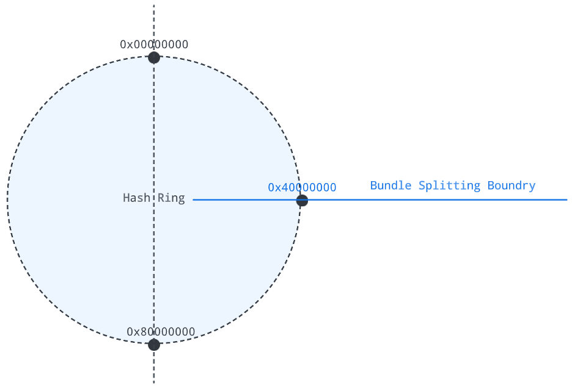

topic\_count\_equally\_divide splits a bundle into two parts with the same number of topics.

For example, if there are 6 topics in the target bundle [0x00000000, 0x80000000), then you can set the bundle splitting boundary at 0x50000000 to make the left and right sides of the number of topics the same.

```text
hash(topic1) = 0x10000000 
hash(topic2) = 0x20000000 
hash(topic3) = 0x35000000 
hash(topic4) = 0x65000000 
hash(topic5) = 0x70000000 
hash(topic6) = 0x75000000 
```

That is, the target bundle to split is [0x00000000, 0x80000000), and the bundle split boundary is [0x50000000].

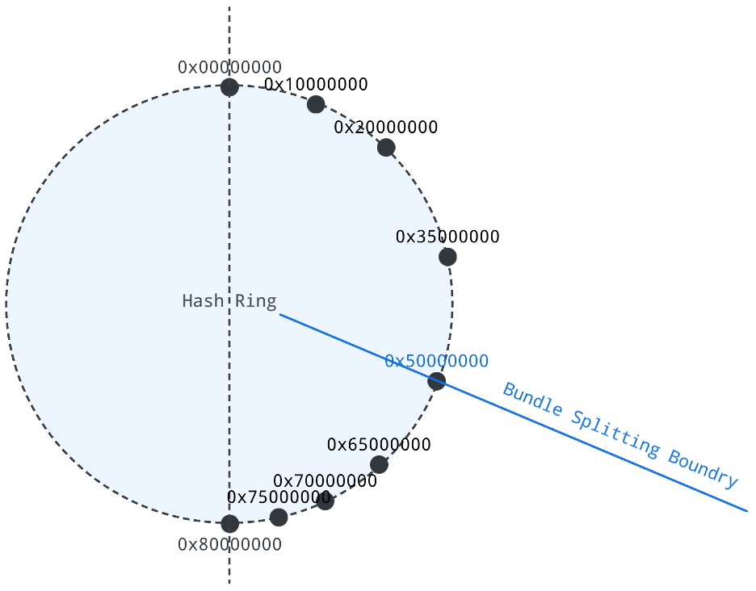

For implementation details, see [PR-6241: support evenly distribute topics count when splitting bundles](https://github.com/apache/pulsar/pull/6241).

specified\_positions\_divide splits bundles into several parts by specified positions.

For example, if you have 2 large topics and there are on the same bundle. Topic1 is at 0x30000000, topic2 is at 0x35000000, and the bundle range is [0x00000000, 0x40000000), then you can set the bundle split boundary as 0x33000000.

For implementation details, see [PIP-143: support split bundle by specified boundaries](https://github.com/apache/pulsar/issues/13761).

flow\_or\_qps\_equally\_divide splits bundles into several parts based on **message rate** (controlled by `loadBalancerNamespaceBundleMaxMsgRate`) or **message throughput** (controlled by `loadBalancerNamespaceBundleMaxBandwidthMbytes`). The split position is determined by reaching the threshold of either message rate or message throughput.

For example, suppose that you have 6 topics on a bundle range [0x00000000 to 0x80000000] as below.

Topic name Hash code Message rate Message throughput|  |  |  |  |  |  |  |  |  |  |  |  |  |  |  |  |  |  |  |  |  |  |  |  | | --- | --- | --- | --- | --- | --- | --- | --- | --- | --- | --- | --- | --- | --- | --- | --- | --- | --- | --- | --- | --- | --- | --- | --- | | t1 0x10000000 100/s 10M/s|  |  |  |  |  |  |  |  |  |  |  |  |  |  |  |  |  |  |  |  | | --- | --- | --- | --- | --- | --- | --- | --- | --- | --- | --- | --- | --- | --- | --- | --- | --- | --- | --- | --- | | t2 0x15000000 200/s 20M/s|  |  |  |  |  |  |  |  |  |  |  |  |  |  |  |  | | --- | --- | --- | --- | --- | --- | --- | --- | --- | --- | --- | --- | --- | --- | --- | --- | | t3 0x24000000 300/s 30M/s|  |  |  |  |  |  |  |  |  |  |  |  | | --- | --- | --- | --- | --- | --- | --- | --- | --- | --- | --- | --- | | t4 0x39000000 400/s 40M/s|  |  |  |  |  |  |  |  | | --- | --- | --- | --- | --- | --- | --- | --- | | t5 0x58000000 500/s 50M/s|  |  |  |  | | --- | --- | --- | --- | | t6 0x76000000 600/s 60M/s | | | | | | | | | | | | | | | | | | | | | | | | | |

t1 0x10000000 100/s 10M/s|  |  |  |  |  |  |  |  |  |  |  |  |  |  |  |  |  |  |  |  | | --- | --- | --- | --- | --- | --- | --- | --- | --- | --- | --- | --- | --- | --- | --- | --- | --- | --- | --- | --- | | t2 0x15000000 200/s 20M/s|  |  |  |  |  |  |  |  |  |  |  |  |  |  |  |  | | --- | --- | --- | --- | --- | --- | --- | --- | --- | --- | --- | --- | --- | --- | --- | --- | | t3 0x24000000 300/s 30M/s|  |  |  |  |  |  |  |  |  |  |  |  | | --- | --- | --- | --- | --- | --- | --- | --- | --- | --- | --- | --- | | t4 0x39000000 400/s 40M/s|  |  |  |  |  |  |  |  | | --- | --- | --- | --- | --- | --- | --- | --- | | t5 0x58000000 500/s 50M/s|  |  |  |  | | --- | --- | --- | --- | | t6 0x76000000 600/s 60M/s | | | | | | | | | | | | | | | | | | | | | |

t2 0x15000000 200/s 20M/s|  |  |  |  |  |  |  |  |  |  |  |  |  |  |  |  | | --- | --- | --- | --- | --- | --- | --- | --- | --- | --- | --- | --- | --- | --- | --- | --- | | t3 0x24000000 300/s 30M/s|  |  |  |  |  |  |  |  |  |  |  |  | | --- | --- | --- | --- | --- | --- | --- | --- | --- | --- | --- | --- | | t4 0x39000000 400/s 40M/s|  |  |  |  |  |  |  |  | | --- | --- | --- | --- | --- | --- | --- | --- | | t5 0x58000000 500/s 50M/s|  |  |  |  | | --- | --- | --- | --- | | t6 0x76000000 600/s 60M/s | | | | | | | | | | | | | | | | | |

t3 0x24000000 300/s 30M/s|  |  |  |  |  |  |  |  |  |  |  |  | | --- | --- | --- | --- | --- | --- | --- | --- | --- | --- | --- | --- | | t4 0x39000000 400/s 40M/s|  |  |  |  |  |  |  |  | | --- | --- | --- | --- | --- | --- | --- | --- | | t5 0x58000000 500/s 50M/s|  |  |  |  | | --- | --- | --- | --- | | t6 0x76000000 600/s 60M/s | | | | | | | | | | | | | |

t4 0x39000000 400/s 40M/s|  |  |  |  |  |  |  |  | | --- | --- | --- | --- | --- | --- | --- | --- | | t5 0x58000000 500/s 50M/s|  |  |  |  | | --- | --- | --- | --- | | t6 0x76000000 600/s 60M/s | | | | | | | | | |

t5 0x58000000 500/s 50M/s|  |  |  |  | | --- | --- | --- | --- | | t6 0x76000000 600/s 60M/s | | | | | |

t6 0x76000000 600/s 60M/s | |

The split position varies depending on the values of message rate or message throughput.

If you set

`loadBalancerNamespaceBundleMaxMsgRate`=450/s

`loadBalancerNamespaceBundleMaxBandwidthMbytes`=200M/s

Since

100/s+ 200/s < 450/s

100/s+ 200/s + 300/s > 450/s

So the split boundary is between t2 and t3, that is:

splitStartPosition = 0x15000000

splitEndPosition = 0x24000000

splitPosition = (0x15000000 + 0x24000000) / 2 = 0x19500000

Note that the **bundle split will be continued** as below:

------ 2nd bundle splitting ------

Since

300/s ＜ 450/s

300/s + 400/s > 450/s

So the split boundary is between t3 and t4, that is

splitStartPosition = 0x24000000

splitEndPosition = 0x39000000

splitPosition = 31500000 = (0x24000000 + 0x39000000) / 2

------ 3rd bundle splitting ------

Since

400/s ＜ 450/s

400/s + 500/s > 450/s

So the split boundary is between t4 and t5, that is

splitStartPosition = 0x39000000

splitEndPosition = 0x58000000

splitPosition = 48500000 = (0x39000000 + 0x58000000) /2

------ 4th bundle splitting ------

Since

500/s > 450/s

600/s > 450/s

So the split boundary is between t5 and t6, that is

splitStartPosition = 0x58000000

splitEndPosition = 0x76000000

splitPosition = 67000000 = (0x58000000 + 0x76000000) / 2

If you set

`loadBalancerNamespaceBundleMaxMsgRate`=1900/s

`loadBalancerNamespaceBundleMaxBandwidthMbytes`=90M/s

Since

10M/s+ 20M/s + 30M/s < 90M/s

10M/s+ 20M/s + 30M/s + 40M/s > 90M/s

So the split boundary is between t3 and t4, that is:

splitStartPosition = 0x24000000

splitEndPosition = 0x39000000

splitPosition = (0x24000000 + 0x39000000) / 2 = 0x31500000

Note that the **bundle split will be continued**:

------ 2nd bundle splitting ------

Since

40 + 50 ≤ 90

40 +50 + 60 > 90

So the split boundary is between t5 and t6, that is:

splitStartPosition = 0x58000000

splitEndPosition = 0x76000000

splitPosition = (0x58000000 + 0x0x76000000) / 2 = 0x67000000

If you set

`loadBalancerNamespaceBundleMaxMsgRate`=1100

`loadBalancerNamespaceBundleMaxBandwidthMbytes`=110

- From the **message rate** side:

  Since

  100/s+ 200/s + 300/s + 400/s < 1100/s

  100/s+ 200/s + 300/s + 400/s + 500/s > 1100/s

  So the split boundary is between t4 and t5, that is:

  splitStartPosition = 0x39000000

  splitEndPosition = 0x58000000

  splitPosition = (0x39000000 + 0x58000000) / 2 = 0x48500000
- From the **message throughput** side:

  Since

  10M/s+ 20M/s + 30M/s + 40M/s < 110M/s

  0M/s+ 20M/s + 30M/s + 40M/s + 50M/s > 110M/s

  So the split boundary is between t4 and t5, that is:

  splitStartPosition = 0x39000000

  splitEndPosition = 0x58000000

  splitPosition = (0x39000000 + 0x58000000) / 2 = 0x48500000

In summary, the split position is 0x48500000.

For implementation details, see [PIP-169: support split bundle by flow or QPS](https://github.com/apache/pulsar/issues/16782).

Bundle unloading (shedding) refers to the process of closing bundles (topics), releasing ownership, and reassigning bundles (topics) to a less-loaded broker from overloaded brokers, based on load conditions.

Bundle unloading balances the workload across brokers and optimizes resource utilization in the cluster. For example, when a Pulsar cluster experiences changing workloads or scaling events (e.g., adding or removing brokers), bundle unloading ensures that the partitions are evenly distributed and no broker becomes overloaded.

You can unload bundles in the following ways:

- Automatic: enable Pulsar's automatic bundle unloading process when a broker is overloaded.
- Manual: trigger bundle unloading manually, to unload a bundle from one broker to another broker within a Pulsar cluster.

Bundle unloading methods Definition When to use|  |  |  |  |  |  | | --- | --- | --- | --- | --- | --- | | Automatic When the load balancer recognizes a particular broker is overloaded, it forcefully unloads some bundles' traffic from the overloaded broker, so that the unloaded bundles (topics) can be reassigned to less-loaded brokers by the assignment process. Use when there is fluctuating traffic that varies over time.|  |  |  | | --- | --- | --- | | Manual You can manually trigger bundle unloading at any time. Manual bundle unloading serves as a **supplementary** approach to automatic bundle unloading. If the automatic unloading does not kick in (e.g., due to misconfiguration), you can trigger manual unloading to mitigate the load-imbalance issue. To avoid manual unload operations, you need to correctly tune load balance configs according to the cluster's traffic. | | | | | | |

Automatic When the load balancer recognizes a particular broker is overloaded, it forcefully unloads some bundles' traffic from the overloaded broker, so that the unloaded bundles (topics) can be reassigned to less-loaded brokers by the assignment process. Use when there is fluctuating traffic that varies over time.|  |  |  | | --- | --- | --- | | Manual You can manually trigger bundle unloading at any time. Manual bundle unloading serves as a **supplementary** approach to automatic bundle unloading. If the automatic unloading does not kick in (e.g., due to misconfiguration), you can trigger manual unloading to mitigate the load-imbalance issue. To avoid manual unload operations, you need to correctly tune load balance configs according to the cluster's traffic. | | | |

Manual You can manually trigger bundle unloading at any time. Manual bundle unloading serves as a **supplementary** approach to automatic bundle unloading. If the automatic unloading does not kick in (e.g., due to misconfiguration), you can trigger manual unloading to mitigate the load-imbalance issue. To avoid manual unload operations, you need to correctly tune load balance configs according to the cluster's traffic. |

Below is the workflow for unloading bundles automatically or manually.

<div class="theme-tabs-container tabs-container tabList__CuJ"><ul><li>Automatic bundle unloading<li>Manual bundle unloading</li></li></ul><div><div><p>With the broker load information collected from all brokers, the leader broker computes the resource usage of each broker based on the <a href="https://pulsar.apache.org/docs/4.1.x/concepts-broker-load-balancing-concepts/tbd/">bundle unloading strategies</a>.<p>If the lead broker finds a broker is overloaded, it will calculate the overloaded bundles, ask the overloaded broker to unload some bundles of topics, remove the target bundles' ownerships, and close the topic sessions and the client connections.<p>The unloaded bundles are assigned to less loaded brokers, and the clients connect to them.<ul>
<li>
<p>For the modular load balancer, bundles will be post-assigned to available brokers when clients send lookup requests.</p>
</li>
<li>
<p>For the extensible load balancer, bundles will be pre-assigned to available brokers when unloading.</p>
</li>
</ul><p>When unloading happens, the client experiences a small latency blip while the topic is reassigned.</p></p></p></p></div><div><p>Based on the broker resource usage (for example, CPU, network, and memory usage), you can choose hot bundles to unload.<p>Unload hot bundles to available brokers. Target bundles' ownerships will be transferred, and topic connections will be closed.<p>For how to unload bundles manually, please refer to <a href="https://pulsar.apache.org/reference/#/4.1.x/pulsar-admin/namespaces?id=unload"><code>unload</code></a> admin command.<p>Examples:<p>Unload a specific bundle (future topic lookup will assign the bundle to a new owner broker)<p><code>pulsar-admin namespaces unload my-tenant/my-namespace -b 0x00000000_0xffffffff</code><p>Unload a specific bundle to a destination broker<p><code>pulsar-admin namespaces unload my-tenant/my-namespace -b 0x00000000_0xffffffff -d broker-1</code><p>Unload all bundles in a namespace<p><code>pulsar-admin namespaces unload my-tenant/my-namespace</code></p></p></p></p></p></p></p></p></p></p></div></div></div>

You can choose different bundle unloading strategies based on your needs.

Below is a quick summary of bundle unloading strategies, which are **only applicable** for unloading bundles\*\* automatically\*\*.

Bundle unloading strategy Definition When to use Available version|  |  |  |  |  |  |  |  |  |  |  |  |  |  |  |  |  |  |  |  | | --- | --- | --- | --- | --- | --- | --- | --- | --- | --- | --- | --- | --- | --- | --- | --- | --- | --- | --- | --- | | OverloadShedder Unload bundles on brokers if a **broker's maximum resource usage** exceeds the configured threshold. Use when you want to set broker usage below a threshold. Pulsar 1.18 and later versions. This strategy is **only available** in the **modular** load balancer.| ThresholdShedder Unload bundles if a broker's average usage is greater than the\*\* cluster average usage\*\* plus **configured threshold**. Use when you want to evenly spread loads across all brokers base on cluster average usage. Pulsar 2.6 and later versions. This strategy is **only available** in the **modular** load balancer.| UniformLoadShedder Distribute load uniformly across all brokers, based on **minimal** and **maximum** load. Use when you want to compare the minimal and maximum loaded brokers. Pulsar 2.10.0 and later versions. This strategy is **only available** in the **modular** load balancer.| TransferShedder Unload bundles from the **highest** load brokers to the **lowest** load brokers until the standard deviation of the broker load distribution is below the configured threshold. This is the **default** strategy for the **extensible** load balancer. It pre-assigns destination brokers when unloading. Pulsar 3.0 and later versions. This strategy is **only available** in the **extensible** load balancer.| AvgShedder Unload bundles to keep the range of broker resource usage within the configured threshold. Use when you want to achieve greate service stability and load switching accuracy. Pulsar 3.0.6, 3.2.4, 3.3.1 and later versions. If you run version greater than 2.9 but below 3.0, you can try to cherry pick into your repository easily: <https://github.com/apache/pulsar/pull/22946> This strategy is only available in the modular load balancer. | | | | | | | | | | | | | | | | | | | | | |

OverloadShedder Unload bundles on brokers if a **broker's maximum resource usage** exceeds the configured threshold. Use when you want to set broker usage below a threshold. Pulsar 1.18 and later versions. This strategy is **only available** in the **modular** load balancer.| ThresholdShedder Unload bundles if a broker's average usage is greater than the\*\* cluster average usage\*\* plus **configured threshold**. Use when you want to evenly spread loads across all brokers base on cluster average usage. Pulsar 2.6 and later versions. This strategy is **only available** in the **modular** load balancer.| UniformLoadShedder Distribute load uniformly across all brokers, based on **minimal** and **maximum** load. Use when you want to compare the minimal and maximum loaded brokers. Pulsar 2.10.0 and later versions. This strategy is **only available** in the **modular** load balancer.| TransferShedder Unload bundles from the **highest** load brokers to the **lowest** load brokers until the standard deviation of the broker load distribution is below the configured threshold. This is the **default** strategy for the **extensible** load balancer. It pre-assigns destination brokers when unloading. Pulsar 3.0 and later versions. This strategy is **only available** in the **extensible** load balancer.| AvgShedder Unload bundles to keep the range of broker resource usage within the configured threshold. Use when you want to achieve greate service stability and load switching accuracy. Pulsar 3.0.6, 3.2.4, 3.3.1 and later versions. If you run version greater than 2.9 but below 3.0, you can try to cherry pick into your repository easily: <https://github.com/apache/pulsar/pull/22946> This strategy is only available in the modular load balancer. | | | | | | | | | | | | | | | | | |

ThresholdShedder Unload bundles if a broker's average usage is greater than the\*\* cluster average usage\*\* plus **configured threshold**. Use when you want to evenly spread loads across all brokers base on cluster average usage. Pulsar 2.6 and later versions. This strategy is **only available** in the **modular** load balancer.| UniformLoadShedder Distribute load uniformly across all brokers, based on **minimal** and **maximum** load. Use when you want to compare the minimal and maximum loaded brokers. Pulsar 2.10.0 and later versions. This strategy is **only available** in the **modular** load balancer.| TransferShedder Unload bundles from the **highest** load brokers to the **lowest** load brokers until the standard deviation of the broker load distribution is below the configured threshold. This is the **default** strategy for the **extensible** load balancer. It pre-assigns destination brokers when unloading. Pulsar 3.0 and later versions. This strategy is **only available** in the **extensible** load balancer.| AvgShedder Unload bundles to keep the range of broker resource usage within the configured threshold. Use when you want to achieve greate service stability and load switching accuracy. Pulsar 3.0.6, 3.2.4, 3.3.1 and later versions. If you run version greater than 2.9 but below 3.0, you can try to cherry pick into your repository easily: <https://github.com/apache/pulsar/pull/22946> This strategy is only available in the modular load balancer. | | | | | | | | | | | | | |

UniformLoadShedder Distribute load uniformly across all brokers, based on **minimal** and **maximum** load. Use when you want to compare the minimal and maximum loaded brokers. Pulsar 2.10.0 and later versions. This strategy is **only available** in the **modular** load balancer.| TransferShedder Unload bundles from the **highest** load brokers to the **lowest** load brokers until the standard deviation of the broker load distribution is below the configured threshold. This is the **default** strategy for the **extensible** load balancer. It pre-assigns destination brokers when unloading. Pulsar 3.0 and later versions. This strategy is **only available** in the **extensible** load balancer.| AvgShedder Unload bundles to keep the range of broker resource usage within the configured threshold. Use when you want to achieve greate service stability and load switching accuracy. Pulsar 3.0.6, 3.2.4, 3.3.1 and later versions. If you run version greater than 2.9 but below 3.0, you can try to cherry pick into your repository easily: <https://github.com/apache/pulsar/pull/22946> This strategy is only available in the modular load balancer. | | | | | | | | | |

TransferShedder Unload bundles from the **highest** load brokers to the **lowest** load brokers until the standard deviation of the broker load distribution is below the configured threshold. This is the **default** strategy for the **extensible** load balancer. It pre-assigns destination brokers when unloading. Pulsar 3.0 and later versions. This strategy is **only available** in the **extensible** load balancer.| AvgShedder Unload bundles to keep the range of broker resource usage within the configured threshold. Use when you want to achieve greate service stability and load switching accuracy. Pulsar 3.0.6, 3.2.4, 3.3.1 and later versions. If you run version greater than 2.9 but below 3.0, you can try to cherry pick into your repository easily: <https://github.com/apache/pulsar/pull/22946> This strategy is only available in the modular load balancer. | | | | | |

AvgShedder Unload bundles to keep the range of broker resource usage within the configured threshold. Use when you want to achieve greate service stability and load switching accuracy. Pulsar 3.0.6, 3.2.4, 3.3.1 and later versions. If you run version greater than 2.9 but below 3.0, you can try to cherry pick into your repository easily: <https://github.com/apache/pulsar/pull/22946> This strategy is only available in the modular load balancer. | |

OverloadShedder strategy sheds bundles on brokers if a broker's maximum resource usage exceeds the configured threshold (`loadBalancerBrokerOverloadedThresholdPercentage`).

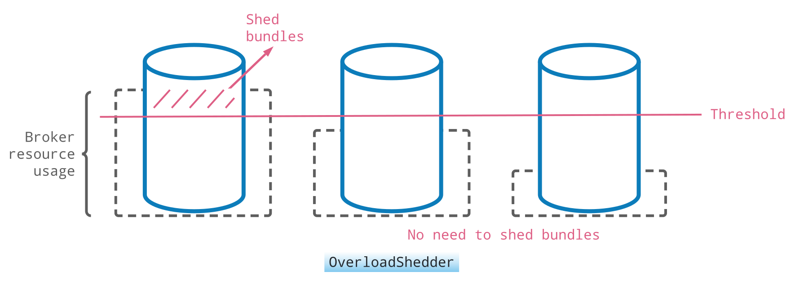

If a broker is overloaded and has at least two bundles assigned. At the same time, if that broker has at least one bundle that has not been unloaded, then this (these) bundle(s) will be unloaded. Bundles with higher message throughput will be unloaded before those with lower message throughput.

The determination of when a broker is overloaded is based on the threshold of CPU, network, and memory usage. Whenever either of those metrics reaches the threshold (the **default value** is 85%), the system triggers the bundle unloading.

ThresholdShedder strategy sheds the bundles if a **broker's average usage** is greater than the **cluster average usage** plus **configured threshold**.

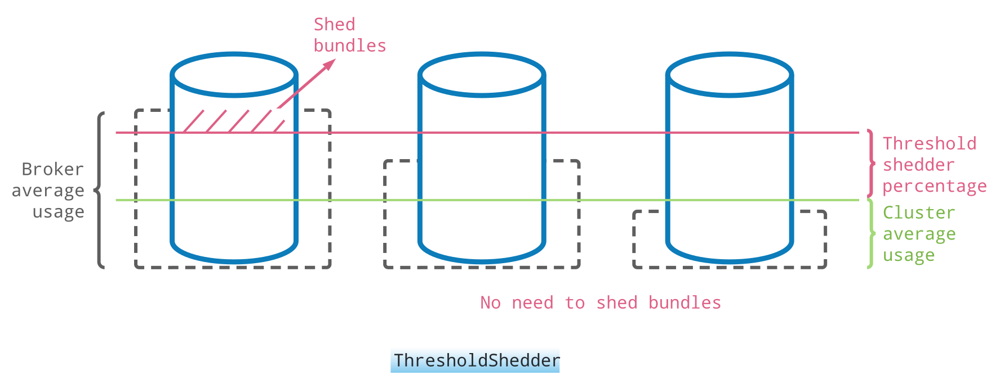

1. ThresholdShedder first computes the average resource usage of brokers for the whole cluster (that is, **cluster average usage**).

   - The resource usage for each broker is calculated using the method `LocalBrokerData#getMaxResourceUsageWithWeight`.
   - Historical observations are included in the running average based on the broker's setting for `loadBalancerHistoryResourcePercentage`.
2. ThresholdShedder compares each broker's average resource usage (based on current and historical resource usage) to the cluster average usage:

   a. If a **broker's resource usage** is greater than the **cluster average usage** plus the **configured threshold**, ThresholdShedder proposes removing enough bundles to bring the unloaded broker 5% below the **cluster average usage**. **Note** that recently unloaded bundles are **not unloaded again**.

   b. If a **broker's resource usage** is smaller than the **cluster average usage**, or smaller than the **cluster average usage** plus the **configured threshold**, no bundle will be unloaded.

For example, assume that you have 3 brokers and each broker’s average usage is as below.

Broker name Broker's average usage|  |  |  |  |  |  | | --- | --- | --- | --- | --- | --- | | broker1 40%|  |  |  |  | | --- | --- | --- | --- | | broker2 10%|  |  | | --- | --- | | broker3 10% | | | | | |

broker1 40%|  |  |  |  | | --- | --- | --- | --- | | broker2 10%|  |  | | --- | --- | | broker3 10% | | | |

broker2 10%|  |  | | --- | --- | | broker3 10% | |

broker3 10%

So the cluster average usage is 20% = (40% + 10% + 10%) / 3.

If you set the threshold (`loadBalancerBrokerThresholdShedderPercentage`) to 10%, then only broker1's certain bundles get unloaded, because the broker1's resource usage (40%) is greater than the sum (30%) of the **cluster average usage** (20%) plus **configured threshold** (10%).

UniformLoadShedder strategy distributes load uniformly across all brokers. It checks the load difference between the broker with the **highest** load and the broker with the **lowest** load. If the difference is higher than configured thresholds, either **message rate** (controlled by)`loadBalancerMsgRateDifferenceShedderThreshold` or **throughput** (controlled by `loadBalancerMsgThroughputMultiplierDifferenceShedderThreshold`), then it finds out bundles that can be unloaded to distribute traffic evenly across all brokers.

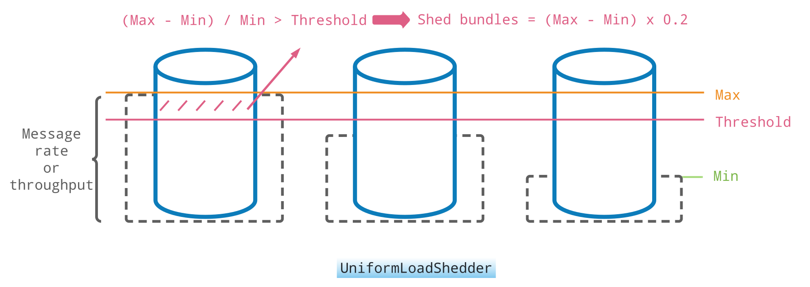

For implementation details, see [PR-12902: add uniform load shedder strategy to distribute traffic uniformly across brokers](https://github.com/apache/pulsar/pull/12902).

TransferShedder strategy unloads bundles from the **highest** load brokers to the **lowest** load brokers until all of the following are true:

- The standard deviation of the broker load distribution is below the configured threshold (loadBalancerBrokerLoadTargetStd, default value is 0.25).
- There are no significant underloaded brokers.

  - No broker receives 0 traffic.
  - No broker's load < avgLoad \* min(0.5, loadBalancerBrokerLoadTargetStd / 2)
- There is no significant overloaded brokers

  - No broker’s load > loadBalancerBrokerOverloadedThresholdPercentage && load > avgLoad + loadBalancerBrokerLoadTargetStd

Pulsar introduced TransferShedder to utilize the bundle transfer protocol from the extensible load balancer. With this bundle transfer protocol, the bundle ownership can be gracefully transferred from the source broker to the destination broker. This means that TransferShedder pre-assigns the destination brokers at the unloading time instead of client lookups. Hence, after unloading, clients can bypass the assignment process as the new owner is already assigned.

For implementation details, see [PIP-220: TransferShedder](https://github.com/apache/pulsar/issues/18215).

To use AvgShedder strategy, you need to configure following parameters:

```conf
loadBalancerLoadSheddingStrategy=org.apache.pulsar.broker.loadbalance.impl.AvgShedder 
 
loadBalancerLoadPlacementStrategy=org.apache.pulsar.broker.loadbalance.impl.AvgShedder 
 
maxUnloadPercentage = 0.5 
```

- AvgShedder binds shedding and placement strategies together to **avoid incorrect shedding and placement**. We need to ensure the configuration of `loadBalancerLoadSheddingStrategy` and `loadBalancerLoadPlacementStrategy` are the same.
- Setting `maxUnloadPercentage` to 0.5 means that AvgShedder will first pick out the highest and lowest loaded brokers, and then evenly distribute the traffic between them.

For example, if the broker rating of the current cluster is 20,30,52,70,80, and the message rate of the highest loaded broker(score 80) is 1000, and
the message rate of the lowest loaded broker(score 20) is 500. We introduce a threshold to determine whether trigger the bundle unload, for example, the threshold is 40. As the difference between the score of the highest and lowest loaded brokers is 80-20=60, which is greater than the threshold 40, the shedding strategy will be triggered.

To achieve the goal of evenly distributing the traffic between the highest and lowest loaded brokers, the shedding strategy will
try to make the message rate of two brokers the same, which is (1000+500)/2=750. The shedding strategy will unload 250 message rate from the
highest loaded broker to the lowest loaded broker. After the shedding strategy is completed, the message rate of two brokers will be
same, which is 750.

AvgShedder handle load jitter with **multiple hits algorithm**, which means that the threshold is triggered multiple times before the bundle unload is finally triggered.
For example, when the difference between a pair of brokers exceeds the threshold three times, load balancing is triggered.

In situations of cluster rolling restart or expansion, there is often a significant load difference between
different brokers, and we hope to complete load balancing more quickly.

Therefore, we introduce two thresholds:

- loadBalancerAvgShedderLowThreshold, default value is 15
- loadBalancerAvgShedderHighThreshold, default value is 40

Two thresholds correspond to two continuous hit count requirements:

- loadBalancerAvgShedderHitCountLowThreshold, default value is 8
- loadBalancerAvgShedderHitCountHighThreshold, default value of 2

When the difference in scores between two paired brokers exceeds the `loadBalancerAvgShedderLowThreshold` by
`loadBalancerAvgShedderHitCountLowThreshold` times, or exceeds the `loadBalancerAvgShedderHighThreshold` by
`loadBalancerAvgShedderHitCountHighThreshold` times, a bundle unload is triggered.
For example, with the default value, if the score difference exceeds 15, it needs to be triggered 8 times continuously, and if the score difference exceeds 40, it needs to be triggered 2 times continuously.

The larger the load difference between brokers, the smaller the number of times it takes to trigger bundle unloads, which can adapt to scenarios such as cluster rolling restart or expansion.

For implementation details, see [PIP-364: Introduce a new load balance algorithm AvgShedder](https://github.com/apache/pulsar/pull/22949).

- To get a comprehensive understanding and discover the key insights, see [Broker load balancing | Overview](#concepts-broker-load-balancing-overview).
- To discover different usage scenarios, see [Broker load balancing | Use cases](#concepts-broker-load-balancing-use-cases).
- To explore functionalities, see [Broker load balancing | Features](#concepts-broker-load-balancing-features).
- To understand advantages, see [Broker load balancing | Benefits](#concepts-broker-load-balancing-benefits).
- To review various versions of broker load balancers, see [Broker load balancing | Types](#concepts-broker-load-balancing-types).
- To get up quickly, see [Broker load balancing | Quick start](#concepts-broker-load-balancing-quick-start).
- To migrate one broker load balancer type to another, see [Broker load balancing | Migration](#concepts-broker-load-balancing-migration).

---

<a id="concepts-broker-load-balancing-features"></a>

<!-- source_url: https://pulsar.apache.org/docs/4.1.x/concepts-broker-load-balancing-features/ -->

<!-- page_index: 49 -->

# Features

In general, the main features of the broker load balancer are:

- Provide broker-topic discovery mapping to look up owner brokers for topics.
- [Split bundles](#concepts-broker-load-balancing-concepts--bundle-splitting) and transfer topic (bundle) ownerships dynamically based on data loads.
- Discover broker failures and recover disconnected pub/sub sessions to available brokers.

- To get a comprehensive understanding and discover the key insights, see [Broker load balancing | Overview](#concepts-broker-load-balancing-overview).
- To discover different usage scenarios, see [Broker load balancing | Use cases](#concepts-broker-load-balancing-use-cases).
- To understand advantages, see [Broker load balancing | Benefits](#concepts-broker-load-balancing-benefits).
- To learn essential fundamentals, see [Broker load balancing | Concepts](#concepts-broker-load-balancing-concepts).
- To review various versions of broker load balancers, see [Broker load balancing | Types](#concepts-broker-load-balancing-types).
- To get up quickly, see [Broker load balancing | Quick start](#concepts-broker-load-balancing-quick-start).
- To migrate one broker load balancer type to another, see [Broker load balancing | Migration](#concepts-broker-load-balancing-migration).

---

<a id="concepts-broker-load-balancing-migration"></a>

<!-- source_url: https://pulsar.apache.org/docs/4.1.x/concepts-broker-load-balancing-migration/ -->

<!-- page_index: 50 -->

# Migration

> [!NOTE]
> It is not recommended to migrate from the modular or extensible to the simple broker load balancer since the simple broker load balancer is deprecated and no longer in use.

---

<a id="concepts-broker-load-balancing-overview"></a>

<!-- source_url: https://pulsar.apache.org/docs/4.1.x/concepts-broker-load-balancing-overview/ -->

<!-- page_index: 51 -->

# Overview

Like other distributed systems, load balancing is important in messaging and streaming systems. Without it, load imbalance can cause hot-spot brokers, resulting in performance degradation, cluster unavailability, and wasted broker resources.

Due to the unpredictable topic volume and physical distance among distributed brokers, it is not easy to dynamically distribute message loads among brokers. It requires the system to continuously monitor and route message loads based on changing conditions without compromising system performance. For example:

- When topics receive high traffic, exhausting CPU or memory resources on particular brokers, the cluster offloads the overloaded brokers and redistributes the load to other brokers.
- When brokers experience low traffic, become idle, or are added or removed, the cluster rebalances the load to avoid wasting resources.
- When topics are redistributed to other brokers, the cluster ensures the topics are instantaneously available to clients. The topics continue to guarantee the system performance, such as persistence, [ordering](#concepts-messaging--ordering-guarantee), [deduplication](#concepts-messaging--message-deduplication), [subscription type](#concepts-messaging--subscription-types), etc.

Because Pulsar uses a [segment-centric architecture](#concepts-architecture-overview) and separates the message serving and storage layer, it is designed to benefit load balancing.

- At the persistence layer ([BookKeeper](https://bookkeeper.apache.org/)), message segments in topics are balanced across all the bookies in the cluster. When an individual bookie runs out of storage capacity, the rest segments are loaded into the available bookies.
- At the serving layer ([broker](#concepts-architecture-overview--brokers)), topic rearrangement (balance) is seamless. Brokers do not need to copy messages from one broker to another when rebalancing topics among brokers. Instead, the current owner broker temporarily closes the topic and client sessions and transfers the ownership to the selected broker. Then, the selected broker takes ownership of the topic and opens the topic sessions to the clients.

Pulsar uses automatic broker load balancing to monitor the brokers' load internally and then dynamically balances topic sessions according to the load across all available brokers as evenly, dynamically, and flexibly as possible. Consequently, it improves performance, availability, and usage of resources.

- To discover different usage scenarios, see [Broker load balancing | Use cases](#concepts-broker-load-balancing-use-cases).
- To explore functionalities, see [Broker load balancing | Features](#concepts-broker-load-balancing-features).
- To understand advantages, see [Broker load balancing | Benefits](#concepts-broker-load-balancing-benefits).
- To learn essential fundamentals, see [Broker load balancing | Concepts](#concepts-broker-load-balancing-concepts).
- To review various versions of broker load balancers, see [Broker load balancing | Types](#concepts-broker-load-balancing-types).
- To get up quickly, see [Broker load balancing | Quick start](#concepts-broker-load-balancing-quick-start).
- To migrate one broker load balancer type to another, see [Broker load balancing | Migration](#concepts-broker-load-balancing-migration).

---

<a id="concepts-broker-load-balancing-quick-start"></a>

<!-- source_url: https://pulsar.apache.org/docs/4.1.x/concepts-broker-load-balancing-quick-start/ -->

<!-- page_index: 52 -->

# Quick start

> [!TIP]
> If you use other ways instead of using a yaml file as above, you can choose a broker load balancer type or set an unloading strategy by updating [loadManagerClassName](https://github.com/apache/pulsar/blob/69d7a2bf14555f11a716a9545c5cf391d8179a27/conf/broker.conf#L1309C7-L1309C7) or [loadBalancerLoadSheddingStrategy](https://github.com/apache/pulsar/blob/69d7a2bf14555f11a716a9545c5cf391d8179a27/conf/broker.conf#L1324) in the broker.conf file
>
> It is not recommended to use the [pulsar-admin update-dynamic-config](https://pulsar.apache.org/docs/4.1.x/concepts-broker-load-balancing-quick-start/(/reference/#/4.1.x/pulsar-admin/brokers?id=update-dynamic-config)) because it will throw an exception if the Pulsar version and the unloading strategy are incompatible.

---

<a id="concepts-broker-load-balancing-types"></a>

<!-- source_url: https://pulsar.apache.org/docs/4.1.x/concepts-broker-load-balancing-types/ -->

<!-- page_index: 53 -->

# Types

Pulsar provides three types of broker load balancers:

- Simple broker load balancer: it existed since Pulsar's inception, but now is deprecated.
- [Modular broker load balancer](#concepts-broker-load-balancing-types--side-by-side-comparisons)
- [Extensible broker load balancer](#concepts-broker-load-balancing-types--side-by-side-comparisons)

The modular and extensible broker load balancer implements similar load balance functionalities with different system designs. For example, they both employ a similar approach to distributing data loads among brokers, including:

- Dynamic [bundle-broker assignment](#concepts-broker-load-balancing-concepts--bundle-assignment)
- Dynamic [bundle splitting](#concepts-broker-load-balancing-concepts--bundle-splitting)
- Dynamic [bundle unloading (shedding)](#concepts-broker-load-balancing-concepts--bundle-unloading)

However, for bundle ownership and load data stores, the modular load balancer uses ZooKeeper, whereas the extensible load balancer uses [System topics](#concepts-messaging--system-topic) and [Table views](#concepts-clients--tableview).

Dimension Modular broker load balancer Extensible broker load balancer|  |  |  |  |  |  |  |  |  |  |  |  |  |  |  | | --- | --- | --- | --- | --- | --- | --- | --- | --- | --- | --- | --- | --- | --- | --- | | Available version Pulsar 1.7.0 2017 Pulsar 3.0.0 2023|  |  |  |  |  |  |  |  |  |  |  |  | | --- | --- | --- | --- | --- | --- | --- | --- | --- | --- | --- | --- | | Load Balance Metadata Store and Replication Dependent on ZooKeeper for load balance metadata store and replication. - All broker load data and all bundle load data are stored in ZooKeeper and replicated to all brokers via ZooKeeper watchers. - All bundle ownerships are stored in ZooKeeper as ephemeral locks. Dependent on system topics and table views for load balance metadata store and replication. - All broker load data are stored in a non-persistent system topic and replicated to all brokers via table views. - Each broker publishes only top k bundles' load data in a non-persistent system topic, and only the leader broker consumes it via a table view. - Bundle ownerships are stored in a persistent system topic and replicated to all brokers via table views. Note: The absolute size of the replicated load data and the complexity of the replication decreased due to passing the data through memory-only, non-persistent topics.|  |  |  |  |  |  |  |  |  | | --- | --- | --- | --- | --- | --- | --- | --- | --- | | Load Balance Decision (Load Balance leader dependency) Single leader broker decides on bundle-broker assignment, bundle splitting, and bundle unloading. Note: The leader broker requires global load information Each broker decides and runs bundle-broker assignment (lookup) and bundle splitting based on the local (replicated) information. The leader broker still decides on bundle unloading globally.|  |  |  |  |  |  | | --- | --- | --- | --- | --- | --- | | Pub/sub reconnection upon bundle unloading When bundles are unloaded, the topics in the bundles are temporarily closed, and producers and consumers connect to new owner brokers. - Connecting to the new owner brokers involves redirecting lookup requests via the leader broker. Any broker can respond to the lookup requests to locate the new owner brokers without asking the leader broker. The reconnection does not go through the leader broker.|  |  |  | | --- | --- | --- | | Observability You can monitor and analyze load balance with various [metrics](#reference-metrics) It adds additional [metrics](#reference-metrics) and debug mode. For example: - Check the status of load balance decision breakdown and failure. - Use the dynamic debug mode configuration to dynamically turn on and off more load balance decision logs. | | | | | | | | | | | | | | | |

Available version Pulsar 1.7.0 2017 Pulsar 3.0.0 2023|  |  |  |  |  |  |  |  |  |  |  |  | | --- | --- | --- | --- | --- | --- | --- | --- | --- | --- | --- | --- | | Load Balance Metadata Store and Replication Dependent on ZooKeeper for load balance metadata store and replication. - All broker load data and all bundle load data are stored in ZooKeeper and replicated to all brokers via ZooKeeper watchers. - All bundle ownerships are stored in ZooKeeper as ephemeral locks. Dependent on system topics and table views for load balance metadata store and replication. - All broker load data are stored in a non-persistent system topic and replicated to all brokers via table views. - Each broker publishes only top k bundles' load data in a non-persistent system topic, and only the leader broker consumes it via a table view. - Bundle ownerships are stored in a persistent system topic and replicated to all brokers via table views. Note: The absolute size of the replicated load data and the complexity of the replication decreased due to passing the data through memory-only, non-persistent topics.|  |  |  |  |  |  |  |  |  | | --- | --- | --- | --- | --- | --- | --- | --- | --- | | Load Balance Decision (Load Balance leader dependency) Single leader broker decides on bundle-broker assignment, bundle splitting, and bundle unloading. Note: The leader broker requires global load information Each broker decides and runs bundle-broker assignment (lookup) and bundle splitting based on the local (replicated) information. The leader broker still decides on bundle unloading globally.|  |  |  |  |  |  | | --- | --- | --- | --- | --- | --- | | Pub/sub reconnection upon bundle unloading When bundles are unloaded, the topics in the bundles are temporarily closed, and producers and consumers connect to new owner brokers. - Connecting to the new owner brokers involves redirecting lookup requests via the leader broker. Any broker can respond to the lookup requests to locate the new owner brokers without asking the leader broker. The reconnection does not go through the leader broker.|  |  |  | | --- | --- | --- | | Observability You can monitor and analyze load balance with various [metrics](#reference-metrics) It adds additional [metrics](#reference-metrics) and debug mode. For example: - Check the status of load balance decision breakdown and failure. - Use the dynamic debug mode configuration to dynamically turn on and off more load balance decision logs. | | | | | | | | | | | | |

Load Balance Metadata Store and Replication Dependent on ZooKeeper for load balance metadata store and replication. - All broker load data and all bundle load data are stored in ZooKeeper and replicated to all brokers via ZooKeeper watchers. - All bundle ownerships are stored in ZooKeeper as ephemeral locks. Dependent on system topics and table views for load balance metadata store and replication. - All broker load data are stored in a non-persistent system topic and replicated to all brokers via table views. - Each broker publishes only top k bundles' load data in a non-persistent system topic, and only the leader broker consumes it via a table view. - Bundle ownerships are stored in a persistent system topic and replicated to all brokers via table views. Note: The absolute size of the replicated load data and the complexity of the replication decreased due to passing the data through memory-only, non-persistent topics.|  |  |  |  |  |  |  |  |  | | --- | --- | --- | --- | --- | --- | --- | --- | --- | | Load Balance Decision (Load Balance leader dependency) Single leader broker decides on bundle-broker assignment, bundle splitting, and bundle unloading. Note: The leader broker requires global load information Each broker decides and runs bundle-broker assignment (lookup) and bundle splitting based on the local (replicated) information. The leader broker still decides on bundle unloading globally.|  |  |  |  |  |  | | --- | --- | --- | --- | --- | --- | | Pub/sub reconnection upon bundle unloading When bundles are unloaded, the topics in the bundles are temporarily closed, and producers and consumers connect to new owner brokers. - Connecting to the new owner brokers involves redirecting lookup requests via the leader broker. Any broker can respond to the lookup requests to locate the new owner brokers without asking the leader broker. The reconnection does not go through the leader broker.|  |  |  | | --- | --- | --- | | Observability You can monitor and analyze load balance with various [metrics](#reference-metrics) It adds additional [metrics](#reference-metrics) and debug mode. For example: - Check the status of load balance decision breakdown and failure. - Use the dynamic debug mode configuration to dynamically turn on and off more load balance decision logs. | | | | | | | | | |

Load Balance Decision (Load Balance leader dependency) Single leader broker decides on bundle-broker assignment, bundle splitting, and bundle unloading. Note: The leader broker requires global load information Each broker decides and runs bundle-broker assignment (lookup) and bundle splitting based on the local (replicated) information. The leader broker still decides on bundle unloading globally.|  |  |  |  |  |  | | --- | --- | --- | --- | --- | --- | | Pub/sub reconnection upon bundle unloading When bundles are unloaded, the topics in the bundles are temporarily closed, and producers and consumers connect to new owner brokers. - Connecting to the new owner brokers involves redirecting lookup requests via the leader broker. Any broker can respond to the lookup requests to locate the new owner brokers without asking the leader broker. The reconnection does not go through the leader broker.|  |  |  | | --- | --- | --- | | Observability You can monitor and analyze load balance with various [metrics](#reference-metrics) It adds additional [metrics](#reference-metrics) and debug mode. For example: - Check the status of load balance decision breakdown and failure. - Use the dynamic debug mode configuration to dynamically turn on and off more load balance decision logs. | | | | | | |

Pub/sub reconnection upon bundle unloading When bundles are unloaded, the topics in the bundles are temporarily closed, and producers and consumers connect to new owner brokers. - Connecting to the new owner brokers involves redirecting lookup requests via the leader broker. Any broker can respond to the lookup requests to locate the new owner brokers without asking the leader broker. The reconnection does not go through the leader broker.|  |  |  | | --- | --- | --- | | Observability You can monitor and analyze load balance with various [metrics](#reference-metrics) It adds additional [metrics](#reference-metrics) and debug mode. For example: - Check the status of load balance decision breakdown and failure. - Use the dynamic debug mode configuration to dynamically turn on and off more load balance decision logs. | | | |

Observability You can monitor and analyze load balance with various [metrics](#reference-metrics) It adds additional [metrics](#reference-metrics) and debug mode. For example: - Check the status of load balance decision breakdown and failure. - Use the dynamic debug mode configuration to dynamically turn on and off more load balance decision logs. |

- To get a comprehensive understanding and discover the key insights, see [Broker load balancing | Overview](#concepts-broker-load-balancing-overview).
- To discover different usage scenarios, see [Broker load balancing | Use cases](#concepts-broker-load-balancing-use-cases).
- To explore functionalities, see [Broker load balancing | Features](#concepts-broker-load-balancing-features).
- To understand advantages, see [Broker load balancing | Benefits](#concepts-broker-load-balancing-benefits).
- To learn essential fundamentals, see [Broker load balancing | Concepts](#concepts-broker-load-balancing-concepts).
- To get up quickly, see [Broker load balancing | Quick start](#concepts-broker-load-balancing-quick-start).
- To migrate one broker load balancer type to another, see [Broker load balancing | Migration](#concepts-broker-load-balancing-migration).

---

<a id="concepts-broker-load-balancing-use-cases"></a>

<!-- source_url: https://pulsar.apache.org/docs/4.1.x/concepts-broker-load-balancing-use-cases/ -->

<!-- page_index: 54 -->

# Use cases

Below you can review common use cases for the [broker load balancer](#concepts-broker-load-balancing-overview).

The broker load balancer routes incoming data processing requests to available brokers for stable performance, making it ideal for quick horizontal scaling — whether in response to sudden traffic spikes or deliberate business expansions. In this case, you can run high-traffic applications with a lot of concurrent data requests in a fast and reliable manner.

The broker load balancer can increase cluster availability by re-routing data loads to other available brokers if a broker fails. This failover mechanism ensures the availability of the whole system.

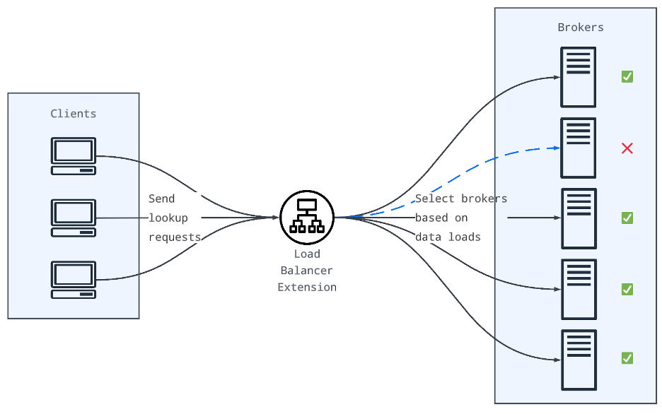

- To get a comprehensive understanding and discover the key insights, see [Broker load balancing | Overview](#concepts-broker-load-balancing-overview).
- To explore functionalities, see [Broker load balancing | Features](#concepts-broker-load-balancing-features).
- To understand advantages, see [Broker load balancing | Benefits](#concepts-broker-load-balancing-benefits).
- To learn essential fundamentals, see [Broker load balancing | Concepts](#concepts-broker-load-balancing-concepts).
- To review various versions of broker load balancers, see [Broker load balancing | Types](#concepts-broker-load-balancing-types).
- To get up quickly, see [Broker load balancing | Quick start](#concepts-broker-load-balancing-quick-start).
- To migrate one broker load balancer type to another, see [Broker load balancing | Migration](#concepts-broker-load-balancing-migration).

---

<a id="concepts-clients"></a>

<!-- source_url: https://pulsar.apache.org/docs/4.1.x/concepts-clients/ -->

<!-- page_index: 55 -->

# Pulsar Clients

> [!NOTE]
> Once an application creates a producer with `Exclusive` or `WaitForExclusive` access mode successfully, the instance of this application is guaranteed to be the **only writer** to the topic. Any other producers trying to produce messages on this topic will either get errors immediately or have to wait until they get the `Exclusive` access.
> For more information, see [PIP 68: Exclusive Producer](https://github.com/apache/pulsar/wiki/PIP-68:-Exclusive-Producer).

---

<a id="concepts-cluster-level-failover"></a>

<!-- source_url: https://pulsar.apache.org/docs/4.1.x/concepts-cluster-level-failover/ -->

<!-- page_index: 56 -->

# Cluster-level failover

This chapter describes the concept, benefits, use cases, constraints, usage, working principles, and more information about the cluster-level failover.

<div class="theme-tabs-container tabs-container tabList__CuJ"><ul><li>Automatic cluster-level failover<li>Controlled cluster-level failover</li></li></ul><div><div><p>Automatic cluster-level failover supports Pulsar clients switching from a primary cluster to one or several backup clusters automatically and seamlessly when it detects a failover event based on the configured detecting policy set by <strong>users</strong>.<p>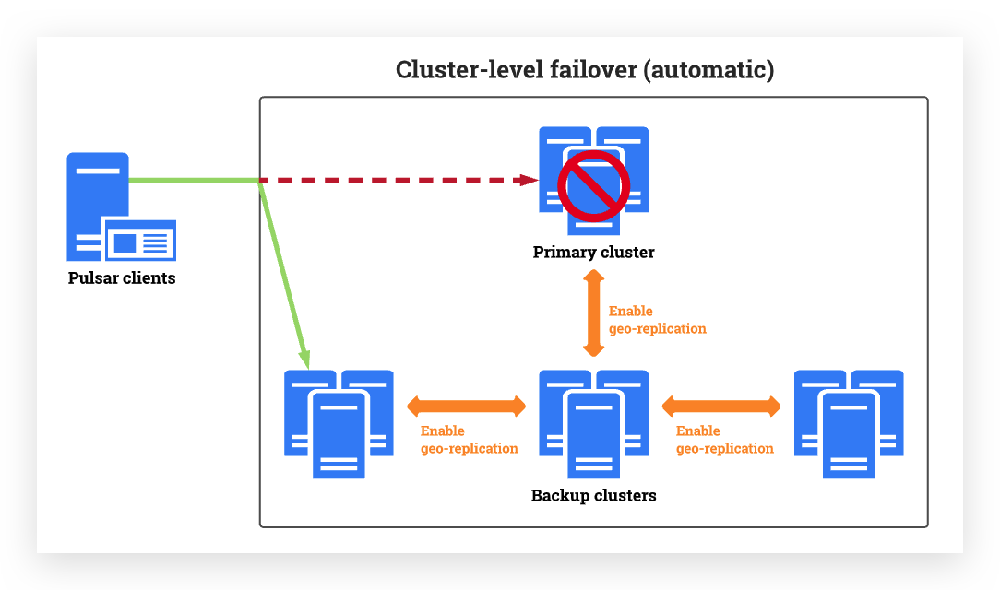</p></p></div><div><p>Controlled cluster-level failover supports Pulsar clients switching from a primary cluster to one or several backup clusters. The switchover is manually set by <strong>administrators</strong>.<p>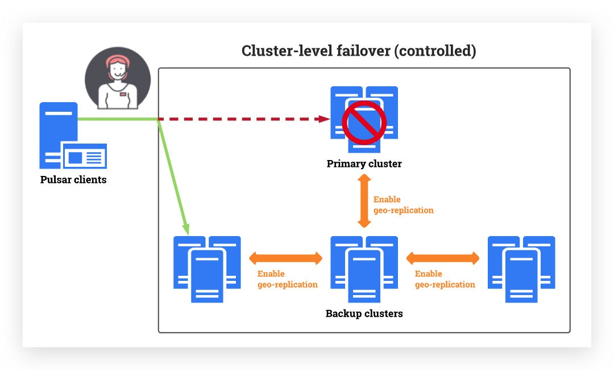</p></p></div></div></div>

Once the primary cluster functions again, Pulsar clients can switch back to the primary cluster. Most of the time users won't even notice a thing. Users can keep using applications and services without interruptions or timeouts.

The cluster-level failover provides fault tolerance, continuous availability, and high availability together. It brings a number of benefits, including but not limited to:

- Reduced cost

  Services can be switched and recovered automatically with no data loss.
- Simplified management

  Businesses can operate on an "always-on" basis since no immediate user intervention is required.
- Improved stability and robustness

  It ensures continuous performance and minimizes service downtime.

The cluster-level failover protects your environment in a number of ways, including but not limited to:

- Disaster recovery

  Cluster-level failover can automatically and seamlessly transfer the production workload on a primary cluster to one or several backup clusters, which ensures minimum data loss and reduced recovery time.
- Planned migration

  If you want to migrate production workloads from an old cluster to a new cluster, you can improve the migration efficiency with cluster-level failover. For example, you can test whether the data migration goes smoothly in case of a failover event, identify possible issues and risks before the migration.

<div class="theme-tabs-container tabs-container tabList__CuJ"><ul><li>Automatic cluster-level failover<li>Controlled cluster-level failover</li></li></ul><div><div><p>Automatic cluster-level failover is triggered when Pulsar clients cannot connect to the primary cluster for a prolonged period of time. This can be caused by any number of reasons including, but not limited to:<ul>
<li>
<p>Network failure</p>
<p>Internet connection is lost.</p>
</li>
<li>
<p>Power failure</p>
<p>Shutdown time of a primary cluster exceeds time limits.</p>
</li>
<li>
<p>Service error</p>
<p>Errors occur on a primary cluster (for example, the primary cluster does not function because of time limits).</p>
</li>
<li>
<p>Crashed storage space</p>
<p>The primary cluster does not have enough storage space, but the corresponding storage space on the backup server functions normally.</p>
</li>
</ul></p></div><div><p>Controlled cluster-level failover is triggered when administrators set the switchover manually.</p></div></div></div>

Obviously, the cluster-level failover does not succeed if the backup cluster is unreachable by active Pulsar clients. This can happen for many reasons, including but not limited to:

- Power failure

  The backup cluster is shut down or does not function normally.
- Crashed storage space

  Primary and backup clusters do not have enough storage space.
- If the failover is initiated, but no cluster can assume the role of an available cluster due to errors, and the primary cluster is not able to provide service normally.
- If you manually initiate a switchover, but services cannot be switched to the backup cluster server, then the system will attempt to switch services back to the primary cluster.
- Fail to authenticate or authorize between primary and backup clusters, or between two backup clusters.

Currently, cluster-level failover can perform probes to prevent data loss, but it can not check the status of backup clusters. If backup clusters are not healthy, you cannot produce or consume data.

The cluster-level failover is an extension of [geo-replication](#concepts-replication) to improve stability and robustness. The cluster-level failover depends on geo-replication, and they have some **differences** as below.

Influence Cluster-level failover Geo-replication|  |  |  |  |  |  |  |  |  | | --- | --- | --- | --- | --- | --- | --- | --- | --- | | Do administrators have heavy workloads? No or maybe. - For the **automatic** cluster-level failover, the cluster switchover is triggered automatically based on the policies set by **users**. - For the **controlled** cluster-level failover, the switchover is triggered manually by **administrators**. Yes. If a cluster fails, immediate administration intervention is required.|  |  |  |  |  |  | | --- | --- | --- | --- | --- | --- | | Result in data loss? No. For both **automatic** and **controlled** cluster-level failover, if the failed primary cluster doesn't replicate messages immediately to the backup cluster, the Pulsar client can't consume the non-replicated messages. After the primary cluster is restored and the Pulsar client switches back, the non-replicated data can still be consumed by the Pulsar client. Consequently, the data is not lost. - For the **automatic** cluster-level failover, services can be switched and recovered automatically with no data loss. - For the **controlled** cluster-level failover, services can be switched and recovered manually and data loss may happen. Yes. Pulsar clients and DNS systems have caches. When administrators switch the DNS from a primary cluster to a backup cluster, it takes some time for cache trigger timeout, which delays client recovery time and fails to produce or consume messages.|  |  |  | | --- | --- | --- | | Result in Pulsar client failure? No or maybe. - For **automatic** cluster-level failover, services can be switched and recovered automatically and the Pulsar client does not fail. - For **controlled** cluster-level failover, services can be switched and recovered manually, but the Pulsar client fails before administrators can take action. Same as above. | | | | | | | | | |

Do administrators have heavy workloads? No or maybe. - For the **automatic** cluster-level failover, the cluster switchover is triggered automatically based on the policies set by **users**. - For the **controlled** cluster-level failover, the switchover is triggered manually by **administrators**. Yes. If a cluster fails, immediate administration intervention is required.|  |  |  |  |  |  | | --- | --- | --- | --- | --- | --- | | Result in data loss? No. For both **automatic** and **controlled** cluster-level failover, if the failed primary cluster doesn't replicate messages immediately to the backup cluster, the Pulsar client can't consume the non-replicated messages. After the primary cluster is restored and the Pulsar client switches back, the non-replicated data can still be consumed by the Pulsar client. Consequently, the data is not lost. - For the **automatic** cluster-level failover, services can be switched and recovered automatically with no data loss. - For the **controlled** cluster-level failover, services can be switched and recovered manually and data loss may happen. Yes. Pulsar clients and DNS systems have caches. When administrators switch the DNS from a primary cluster to a backup cluster, it takes some time for cache trigger timeout, which delays client recovery time and fails to produce or consume messages.|  |  |  | | --- | --- | --- | | Result in Pulsar client failure? No or maybe. - For **automatic** cluster-level failover, services can be switched and recovered automatically and the Pulsar client does not fail. - For **controlled** cluster-level failover, services can be switched and recovered manually, but the Pulsar client fails before administrators can take action. Same as above. | | | | | | |

Result in data loss? No. For both **automatic** and **controlled** cluster-level failover, if the failed primary cluster doesn't replicate messages immediately to the backup cluster, the Pulsar client can't consume the non-replicated messages. After the primary cluster is restored and the Pulsar client switches back, the non-replicated data can still be consumed by the Pulsar client. Consequently, the data is not lost. - For the **automatic** cluster-level failover, services can be switched and recovered automatically with no data loss. - For the **controlled** cluster-level failover, services can be switched and recovered manually and data loss may happen. Yes. Pulsar clients and DNS systems have caches. When administrators switch the DNS from a primary cluster to a backup cluster, it takes some time for cache trigger timeout, which delays client recovery time and fails to produce or consume messages.|  |  |  | | --- | --- | --- | | Result in Pulsar client failure? No or maybe. - For **automatic** cluster-level failover, services can be switched and recovered automatically and the Pulsar client does not fail. - For **controlled** cluster-level failover, services can be switched and recovered manually, but the Pulsar client fails before administrators can take action. Same as above. | | | |

Result in Pulsar client failure? No or maybe. - For **automatic** cluster-level failover, services can be switched and recovered automatically and the Pulsar client does not fail. - For **controlled** cluster-level failover, services can be switched and recovered manually, but the Pulsar client fails before administrators can take action. Same as above. |

This chapter explains the working process of cluster-level failover. For more implementation details, see [PIP-121](https://github.com/apache/pulsar/issues/13315).

<div class="theme-tabs-container tabs-container tabList__CuJ"><ul><li>Automatic cluster-level failover<li>Controlled cluster-level failover</li></li></ul><div><div><p>In an automatic failover cluster, the primary cluster and backup cluster are aware of each other's availability. The automatic failover cluster performs the following actions without administrator intervention:<ol>
<li>
<p>The Pulsar client runs a probe task at intervals defined in <code>checkInterval</code>.</p>
</li>
<li>
<p>If the probe task finds the failure time of the primary cluster exceeds the time set in the <code>failoverDelay</code> parameter, it searches backup clusters for an available healthy cluster.</p>
<p>2a) If there are healthy backup clusters, the Pulsar client switches to a backup cluster in the order defined in <code>secondary</code>.</p>
<p>2b) If there is no healthy backup cluster, the Pulsar client does not perform the switchover, and the probe task continues to look for an available backup cluster.</p>
</li>
<li>
<p>The probe task checks whether the primary cluster functions well or not.</p>
<p>3a) If the primary cluster comes back and the continuous healthy time exceeds the time set in <code>switchBackDelay</code>, the Pulsar client switches back to the primary cluster.</p>
<p>3b) If the primary cluster does not come back, the Pulsar client does not perform the switchover.</p>
</li>
</ol><p>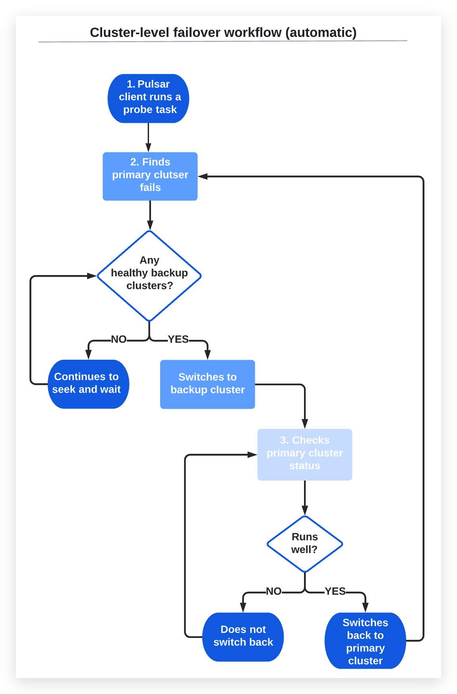</p></p></div><div><p>The controlled failover cluster performs the following actions with administrator intervention:<ol>
<li>
<p>The Pulsar client runs a probe task at intervals defined in <code>checkInterval</code>.</p>
</li>
<li>
<p>The probe task fetches the service URL configuration from the URL provider service, which is configured by <code>urlProvider</code>.</p>
<p>2a) If the service URL configuration is changed, the probe task switches to the target cluster without checking the health status of the target cluster.</p>
<p>2b) If the service URL configuration is not changed, the Pulsar client does not perform the switchover.</p>
</li>
<li>
<p>If the Pulsar client switches to the target cluster, the probe task continues to fetch service URL configuration from the URL provider service at intervals defined in <code>checkInterval</code>.</p>
<p>3a) If the service URL configuration is changed, the probe task switches to the target cluster without checking the health status of the target cluster.</p>
<p>3b) If the service URL configuration is not changed, it does not perform the switchover.</p>
</li>
</ol><p>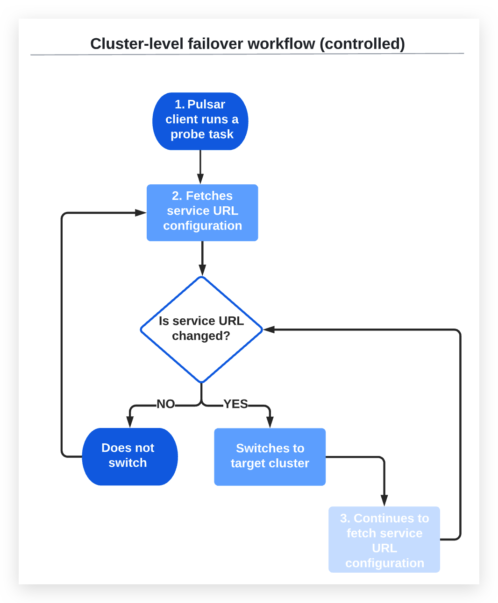</p></p></div></div></div>

See [Configure cluster-level failover](https://pulsar.apache.org/docs/client-libraries/cluster-level-failover).

---

<a id="concepts-messaging"></a>

<!-- source_url: https://pulsar.apache.org/docs/4.1.x/concepts-messaging/ -->

<!-- page_index: 57 -->

# Messaging

> [!NOTE]
> Cumulative acknowledgment cannot be used in [Shared or Key\_shared subscription type](#concepts-messaging--subscription-types), because Shared or Key\_Shared subscription type involves multiple consumers which have access to the same subscription. In Shared and Key\_Shared subscription types, messages should be acknowledged individually.

---

<a id="concepts-multi-tenancy"></a>

<!-- source_url: https://pulsar.apache.org/docs/4.1.x/concepts-multi-tenancy/ -->

<!-- page_index: 58 -->

# Multi Tenancy

Pulsar was created from the ground up as a multi-tenant system. To support multi-tenancy, Pulsar has a concept of tenants. Tenants can be spread across clusters and can each have their own [authentication and authorization](#security-overview) scheme applied to them. They are also the administrative unit at which storage quotas, [message TTL](#cookbooks-retention-expiry--time-to-live-ttl), and isolation policies can be managed.

The multi-tenant nature of Pulsar is reflected mostly visibly in topic URLs, which have this structure:

```http
persistent://tenant/namespace/topic 
```

As you can see, the tenant is the most basic unit of categorization for topics (more fundamental than the namespace and topic name).

A Pulsar tenant is an administrative unit for allocating capacity and enforcing an authentication or authorization scheme. To each tenant in a Pulsar instance, you can assign:

- An [authorization](#security-authorization) scheme
- The set of [clusters](#reference-terminology--cluster) to which the tenant's configuration applies

A Pulsar namespaces is a logical grouping of topics. Tenants and namespaces are two key concepts of Pulsar to support multi-tenancy.

- Pulsar is provisioned for specified tenants with appropriate capacity allocated to the tenant.
- A namespace is the administrative unit nomenclature within a tenant. The configuration policies set on a namespace apply to all the topics created in that namespace. A tenant may create multiple namespaces via self-administration using the REST API and the [`pulsar-admin`](https://pulsar.apache.org/reference/#/4.1.x/pulsar-admin/) CLI tool. For instance, a tenant with different applications can create a separate namespace for each application.

Names for topics in the same namespace will look like this:

```http
 
persistent://tenant/app1/topic-1 
 
persistent://tenant/app1/topic-2 
 
persistent://tenant/app1/topic-3 
 
```

Pulsar is a multi-tenant event streaming system. Administrators can manage the tenants and namespaces by setting policies at different levels. However, the policies, such as retention policy and storage quota policy, are only available at a namespace level. In many use cases, users need to set a policy at the topic level. The namespace change events approach is proposed for supporting topic-level policies in an efficient way. In this approach, Pulsar is used as an event log to store namespace change events (such as topic policy changes). The namespace change events approach has a few benefits:

- Avoid using ZooKeeper and introduce more loads to ZooKeeper.
- Use Pulsar as an event log for propagating the policy cache. It can scale efficiently.

Each namespace has a [system topic](#concepts-messaging--system-topic) named `__change_events`. This system topic stores change events for a given namespace. The following figure illustrates how to leverage the system topic to update topic-level policies.

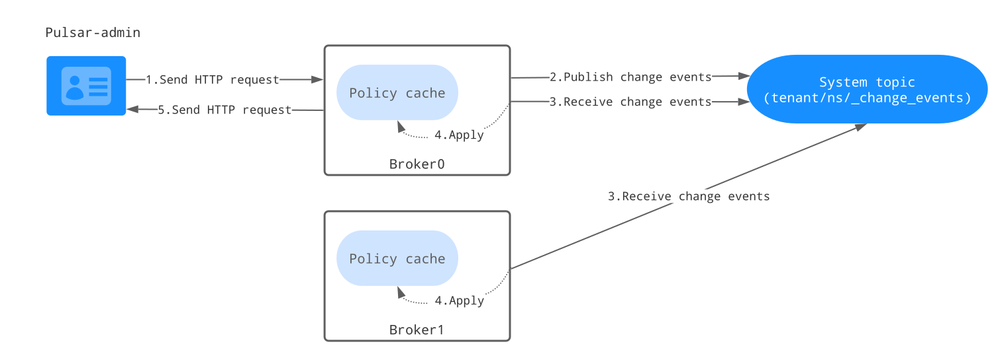

1. Pulsar Admin clients communicate with the Admin Restful API to update topic-level policies.
2. Any broker that receives the Admin HTTP request publishes a topic policy change event to the corresponding system topic (`__change_events`) of the namespace.
3. Each broker that owns a namespace bundle(s) subscribes to the system topic (`__change_events`) to receive the change events of the namespace.
4. Each broker applies the change events to its policy cache.
5. Once the policy cache is updated, the broker sends the response back to the Pulsar Admin clients.

---

<a id="concepts-multiple-advertised-listeners"></a>

<!-- source_url: https://pulsar.apache.org/docs/4.1.x/concepts-multiple-advertised-listeners/ -->

<!-- page_index: 59 -->

# Multiple advertised listeners

In production environments, Pulsar clusters often need to serve clients from different networks. The traditional approach for handling external connections is to deploy a [Pulsar Proxy](#administration-proxy), but in some cases, you might want direct client-to-broker connectivity without using the [Pulsar Proxy](#administration-proxy). Multiple advertised listeners enable this by allowing brokers to advertise different addresses to different clients.

When a client performs a lookup for a topic:

1. The client connects to a broker using the service URL.
2. The broker processes the lookup request and determines which broker owns the topic.
3. The broker returns the appropriate advertised address based on which listener the client connected through.
4. The client connects directly to the topic owner using the returned address.

With proper configuration of `bindAddresses`, the broker automatically determines which advertised address to return based on which port the client connected to.

For the service URL, there should be a load balancer that connects to any available broker.

When clients need to connect directly to brokers (bypassing the Pulsar Proxy), multiple advertised listeners are essential. This approach is particularly useful for:

- Reducing network hops by eliminating the proxy layer
- Simplifying deployment architecture in some scenarios
- Potential performance improvements for certain workloads
- Environments where direct broker connectivity is preferred

>
> [!NOTE]
> : Pulsar deployments expect network perimeter security. This type of deployment should be used only in trusted networks with trusted clients while ensuring network security is handled properly.

In typical deployments with multiple networks:

1. **Internal network**: Within the private network, brokers are accessible via private addresses (like 10.x.x.x, 172.16.x.x, or 192.168.x.x) on standard ports.
2. **External network**: For clients outside the private network, network address translation (NAT) maps external addresses/ports to internal broker addresses/ports.

Without proper configuration, external clients would receive internal broker addresses during topic lookups, making successful connections impossible.

Pulsar introduces three key configuration options to solve this problem:

- **advertisedListeners**: Specifies multiple addresses that the broker advertises to clients.
- **bindAddresses**: Maps each advertised listener to a specific local binding address and port.
- **internalListenerName**: Specifies which listener the broker uses for internal communication.

- **advertisedListeners**: Formatted as `<listener_name>:<protocol>://<host>:<port>,...`. Example:
  `advertisedListeners=internal:pulsar://192.168.1.11:6650,internal:pulsar+ssl://192.168.1.11:6651,external:pulsar://external-broker-1.example.com:6650,external:pulsar+ssl://external-broker-1.example.com:6651`
- **bindAddresses**: Maps each listener name to a local binding address and port. Example:
  `bindAddresses=internal:pulsar://0.0.0.0:6650,internal:pulsar+ssl://0.0.0.0:6651,external:pulsar://0.0.0.0:16650,external:pulsar+ssl://0.0.0.0:16651`
- **internalListenerName**: Specifies which listener is used for internal communication. Example:
  `internalListenerName=internal`

Here's a complete example showing how to configure brokers with multiple advertised listeners:

```properties
# Define advertised listeners for internal and external clients 
advertisedListeners=internal:pulsar://192.168.1.11:6650,internal:pulsar+ssl://192.168.1.11:6651,external:pulsar://external-broker-1.example.com:6650,external:pulsar+ssl://external-broker-1.example.com:6651 
 
# Define bind addresses for each listener 
bindAddresses=internal:pulsar://0.0.0.0:6650,internal:pulsar+ssl://0.0.0.0:6651,external:pulsar://0.0.0.0:16650,external:pulsar+ssl://0.0.0.0:16651 
 
# Specify the internal listener name 
internalListenerName=internal 
```

To make this work:

1. If you are using DNS names, register a unique name for each broker instance (for example, `external-broker-1.example.com`, `external-broker-2.example.com`, etc.).
2. Configure your network gateway or firewall to handle proxying or NAT for each broker instance so that the external IP and port are proxied to the internal IP and external listener port.
3. Add a load balancer that proxies to any healthy available broker on the external listener port.

With a properly configured broker, clients can connect without specifying a listener name:

In this example, "private-brokers.internal" is the internal load balancer for available brokers, and "external-brokers.example.com" is the external load balancer for available brokers, connecting to the bind address port of the external listener on each broker.

```java
// Internal client using standard protocol 
PulsarClient internalClient = PulsarClient.builder() 
    .serviceUrl("pulsar://private-brokers.internal:6650") 
    .build(); 
 
// Internal client using SSL 
PulsarClient internalSecureClient = PulsarClient.builder() 
    .serviceUrl("pulsar+ssl://private-brokers.internal:6651") 
    .build(); 
 
// External client with SSL 
PulsarClient externalClient = PulsarClient.builder() 
    .serviceUrl("pulsar+ssl://external-brokers.example.com:6651") 
    .build(); 
```

>
> [!NOTE]
> : While older Pulsar documentation suggested using the `listenerName` parameter in the client configuration, this approach is no longer necessary in cases when the `bindAddresses` is properly configured. The Pulsar lookup mechanism will return the appropriate advertised address based on the binding port.

While Pulsar Proxy is generally recommended for Kubernetes deployments, multiple advertised listeners can be used when direct broker access is required.
The Apache Pulsar Helm chart doesn't currently support this type of deployment. These instructions are provided as general guidance for using the `advertisedListeners` feature in Kubernetes deployments.
There are multiple ways to handle this in Kubernetes deployments. Advertised listeners are also required in some service mesh configurations.

NodePort deployment suggestions:

- Create individual NodePort (or LoadBalancer) services for each broker pod in a broker stateful set, mapping to the external listener binding ports.
- Create a single NodePort (or LoadBalancer) service for the cluster to be used as the serviceUrl for clients, mapping to the external listener binding ports.

```properties
# Advertised listeners for internal and external access 
advertisedListeners=internal:pulsar://192.168.1.11:6650,internal:pulsar+ssl://192.168.1.11:6651,external:pulsar://198.51.100.17:30650,external:pulsar+ssl://198.51.100.17:31650 
 
# Bind addresses with different ports for internal and external access 
bindAddresses=internal:pulsar://0.0.0.0:6650,internal:pulsar+ssl://0.0.0.0:6651,external:pulsar+ssl://0.0.0.0:16651 
 
# Specify the internal listener name 
internalListenerName=internal 
```

In the above example:

- `192.168.1.11` is the pod IP for the particular broker pod. The IP or hostname should be dynamically set in this configuration at broker startup.
- `198.51.100.17` is the external IP of the k8s node. In some cases this can be dynamically set based on the `status.hostIP` Kubernetes information.
- `30650` and `31650` are the specific NodePorts allocated for this broker pod. This can be dynamically calculated from a base port number by adding the StatefulSet pod index (`metadata.labels['statefulset.kubernetes.io/pod-index']`) to it.

---

<a id="concepts-overview"></a>

<!-- source_url: https://pulsar.apache.org/docs/4.1.x/concepts-overview/ -->

<!-- page_index: 60 -->

# Pulsar Overview

Pulsar is a multi-tenant, high-performance solution for server-to-server messaging. Originally developed by Yahoo, Pulsar is under the stewardship of the [Apache Software Foundation](https://www.apache.org/).

Key features of Pulsar are listed below:

- Native support for multiple clusters in a Pulsar instance, with seamless [geo-replication](#administration-geo) of messages across clusters.
- Very low publish and end-to-end latency.
- Seamless scalability to over a million topics.
- A simple [client API](#concepts-clients) with bindings for [Java](https://pulsar.apache.org/docs/client-libraries/java), [Go](https://pulsar.apache.org/docs/client-libraries/go), [Python](https://pulsar.apache.org/docs/client-libraries/python) and [C++](https://pulsar.apache.org/docs/client-libraries/cpp).
- Multiple [subscription types](#concepts-messaging--subscription-types) ([exclusive](#concepts-messaging--exclusive), [shared](#concepts-messaging--shared), and [failover](#concepts-messaging--failover)) for topics.
- Guaranteed message delivery with [persistent message storage](#concepts-architecture-overview--persistent-storage) provided by [Apache BookKeeper](http://bookkeeper.apache.org/).
  A serverless lightweight computing framework [Pulsar Functions](#functions-overview) offers the capability for stream-native data processing.
- A serverless connector framework [Pulsar IO](#io-overview), which is built on Pulsar Functions, makes it easier to move data in and out of Apache Pulsar.
- [Tiered Storage](#tiered-storage-overview) offloads data from hot/warm storage to cold/long-term storage (such as S3 and GCS) when the data is aging out.

- [Messaging Concepts](#concepts-messaging)
- [Architecture Overview](#concepts-architecture-overview)
- [Pulsar Clients](#concepts-clients)
- [Geo Replication](#concepts-replication)
- [Cluster-level failover](#concepts-cluster-level-failover)
- [Multi Tenancy](#concepts-multi-tenancy)
- [Authentication and Authorization](#concepts-authentication)
- [Topic Compaction](#concepts-topic-compaction)
- [Message throttling](#concepts-throttling)
- [Proxy support with SNI routing](#concepts-proxy-sni-routing)
- [Multiple advertised listeners](#concepts-multiple-advertised-listeners)

---

<a id="concepts-proxy-sni-routing"></a>

<!-- source_url: https://pulsar.apache.org/docs/4.1.x/concepts-proxy-sni-routing/ -->

<!-- page_index: 61 -->

# Proxy support with SNI routing

A proxy server is an intermediary server that forwards requests from multiple clients to different servers across the Internet. The proxy server acts as a "traffic cop" in both forward and reverse proxy scenarios, and benefits your system such as load balancing, performance, security, auto-scaling, and so on.

The proxy in Pulsar acts as a reverse proxy, and creates a gateway in front of brokers. Proxies such as Apache Traffic Server (ATS), HAProxy, Nginx, and Envoy are not supported in Pulsar. These proxy-servers support **SNI routing**. SNI routing is used to route traffic to a destination without terminating the SSL connection. Layer 4 routing provides greater transparency because the outbound connection is determined by examining the destination address in the client TCP packets.

Pulsar clients (Java, C++, Python) support [SNI routing protocol](https://github.com/apache/pulsar/wiki/PIP-60:-Support-Proxy-server-with-SNI-routing), so you can connect to brokers through the proxy. This document walks you through how to set up the ATS proxy, enable SNI routing, and connect Pulsar client to the broker through the ATS proxy.

To support [layer-4 SNI routing](https://docs.trafficserver.apache.org/en/latest/admin-guide/layer-4-routing.en.html) with ATS, the inbound connection must be a TLS connection. Pulsar client supports SNI routing protocol on TLS connection, so when Pulsar clients connect to broker through ATS proxy, Pulsar uses ATS as a reverse proxy.

Pulsar supports SNI routing for geo-replication, so brokers can connect to brokers in other clusters through the ATS proxy.

This section explains how to set up and use ATS as a reverse proxy, so Pulsar clients can connect to brokers through the ATS proxy using the SNI routing protocol on TLS connection.

To set up ATS proxy for layer 4 SNI routing, you need to configure the `records.conf` and `ssl_server_name.conf` files.

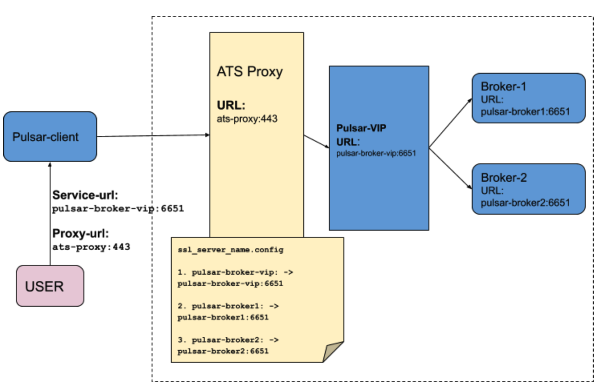

The [records.config](https://docs.trafficserver.apache.org/en/latest/admin-guide/files/records.config.en.html) file is located in the `/usr/local/etc/trafficserver/` directory by default. The file lists configurable variables used by the ATS.

To configure the `records.config` files, complete the following steps.

1. Update TLS port (`http.server_ports`) on which proxy listens, and update proxy certs (`ssl.client.cert.path` and `ssl.client.cert.filename`) to secure TLS tunneling.
2. Configure server ports (`http.connect_ports`) used for tunneling to the broker. If Pulsar brokers are listening on `4443` and `6651` ports, add the brokers service port in the `http.connect_ports` configuration.

The following is an example.

```conf
# PROXY TLS PORT 
CONFIG proxy.config.http.server_ports STRING 4443:ssl 4080 
# PROXY CERTS FILE PATH 
CONFIG proxy.config.ssl.client.cert.path STRING /proxy-cert.pem 
# PROXY KEY FILE PATH 
CONFIG proxy.config.ssl.client.cert.filename STRING /proxy-key.pem 
 
# The range of origin server ports that can be used for tunneling via CONNECT. # Traffic Server allows tunnels only to the specified ports. Supports both wildcards (*) and ranges (e.g. 0-1023). 
CONFIG proxy.config.http.connect_ports STRING 4443 6651 
```

The `ssl_server_name` file is used to configure TLS connection handling for inbound and outbound connections. The configuration is determined by the SNI values provided by the inbound connection. The file consists of a set of configuration items, and each is identified by an SNI value (`fqdn`). When an inbound TLS connection is made, the SNI value from the TLS negotiation is matched with the items specified in this file. If the values match, the values specified in that item override the default values.

The following example shows the mapping of the inbound SNI hostname coming from the client, and the actual broker service URL where requests should be redirected. For example, if the client sends the SNI header `pulsar-broker1`, the proxy creates a TLS tunnel by redirecting the request to the `pulsar-broker1:6651` service URL.

```conf
server_config = {{fqdn = 'pulsar-broker-vip',# Forward to Pulsar broker which is listening on 6651 tunnel_route = 'pulsar-broker-vip:6651' },{fqdn = 'pulsar-broker1',# Forward to Pulsar broker-1 which is listening on 6651 tunnel_route = 'pulsar-broker1:6651' },{fqdn = 'pulsar-broker2',# Forward to Pulsar broker-2 which is listening on 6651 tunnel_route = 'pulsar-broker2:6651' },}
```

After you configure the `ssl_server_name.config` and `records.config` files, the ATS-proxy server handles SNI routing and creates TCP tunnel between the client and the broker.

ATS SNI-routing works only with TLS. You need to enable TLS for the ATS proxy and brokers first, configure the SNI routing protocol, and then connect Pulsar clients to brokers through ATS proxy. Pulsar clients support SNI routing by connecting to the proxy, and sending the target broker URL to the SNI header. This process is processed internally. You only need to configure the following proxy configuration initially when you create a Pulsar client to use the SNI routing protocol.

<div class="theme-tabs-container tabs-container tabList__CuJ"><ul><li>Java<li>C++<li>Python</li></li></li></ul><div><div><div><div><pre><code><div><span>String</span><span> brokerServiceUrl </span><span>=</span><span> </span><span>"pulsar+ssl://pulsar-broker-vip:6651/"</span><span>;</span><span></span> </div><div><span></span><span>String</span><span> proxyUrl </span><span>=</span><span> </span><span>"pulsar+ssl://ats-proxy:443"</span><span>;</span><span></span> </div><div><span></span><span>ClientBuilder</span><span> clientBuilder </span><span>=</span><span> </span><span>PulsarClient</span><span>.</span><span>builder</span><span>(</span><span>)</span><span></span> </div><div><span>		</span><span>.</span><span>serviceUrl</span><span>(</span><span>brokerServiceUrl</span><span>)</span><span></span> </div><div><span>        </span><span>.</span><span>tlsTrustCertsFilePath</span><span>(</span><span>TLS_TRUST_CERT_FILE_PATH</span><span>)</span><span></span> </div><div><span>        </span><span>.</span><span>enableTls</span><span>(</span><span>true</span><span>)</span><span></span> </div><div><span>        </span><span>.</span><span>allowTlsInsecureConnection</span><span>(</span><span>false</span><span>)</span><span></span> </div><div><span>        </span><span>.</span><span>proxyServiceUrl</span><span>(</span><span>proxyUrl</span><span>,</span><span> </span><span>ProxyProtocol</span><span>.</span><span>SNI</span><span>)</span><span></span> </div><div><span>        </span><span>.</span><span>operationTimeout</span><span>(</span><span>1000</span><span>,</span><span> </span><span>TimeUnit</span><span>.</span><span>MILLISECONDS</span><span>)</span><span>;</span><span></span> </div><div><span></span> </div><div><span></span><span>Map</span><span>&lt;</span><span>String</span><span>,</span><span> </span><span>String</span><span>&gt;</span><span> authParams </span><span>=</span><span> </span><span>new</span><span> </span><span>HashMap</span><span>(</span><span>)</span><span>;</span><span></span> </div><div><span>authParams</span><span>.</span><span>put</span><span>(</span><span>"tlsCertFile"</span><span>,</span><span> </span><span>TLS_CLIENT_CERT_FILE_PATH</span><span>)</span><span>;</span><span></span> </div><div><span>authParams</span><span>.</span><span>put</span><span>(</span><span>"tlsKeyFile"</span><span>,</span><span> </span><span>TLS_CLIENT_KEY_FILE_PATH</span><span>)</span><span>;</span><span></span> </div><div><span>clientBuilder</span><span>.</span><span>authentication</span><span>(</span><span>AuthenticationTls</span><span>.</span><span>class</span><span>.</span><span>getName</span><span>(</span><span>)</span><span>,</span><span> authParams</span><span>)</span><span>;</span><span></span> </div><div><span></span> </div><div><span></span><span>PulsarClient</span><span> pulsarClient </span><span>=</span><span> clientBuilder</span><span>.</span><span>build</span><span>(</span><span>)</span><span>;</span> </div></code></pre></div></div></div><div><div><div><pre><code><div><span>ClientConfiguration config </span><span>=</span><span> </span><span>ClientConfiguration</span><span>(</span><span>)</span><span>;</span><span></span> </div><div><span>config</span><span>.</span><span>setUseTls</span><span>(</span><span>true</span><span>)</span><span>;</span><span></span> </div><div><span>config</span><span>.</span><span>setTlsTrustCertsFilePath</span><span>(</span><span>"/path/to/cacert.pem"</span><span>)</span><span>;</span><span></span> </div><div><span>config</span><span>.</span><span>setTlsAllowInsecureConnection</span><span>(</span><span>false</span><span>)</span><span>;</span><span></span> </div><div><span>config</span><span>.</span><span>setAuth</span><span>(</span><span>pulsar</span><span>::</span><span>AuthTls</span><span>::</span><span>create</span><span>(</span><span></span> </div><div><span>            </span><span>"/path/to/client-cert.pem"</span><span>,</span><span> </span><span>"/path/to/client-key.pem"</span><span>)</span><span>;</span><span>)</span><span>;</span><span></span> </div><div><span></span> </div><div><span>Client </span><span>client</span><span>(</span><span>"pulsar+ssl://ats-proxy:443"</span><span>,</span><span> config</span><span>)</span><span>;</span> </div></code></pre></div></div></div><div><div><div><pre><code><div><span>from</span><span> pulsar </span><span>import</span><span> Client</span><span>,</span><span> AuthenticationTLS</span> </div><div><span></span> </div><div><span>auth </span><span>=</span><span> AuthenticationTLS</span><span>(</span><span>"/path/to/my-role.cert.pem"</span><span>,</span><span> </span><span>"/path/to/my-role.key-pk8.pem"</span><span>)</span><span></span> </div><div><span>client </span><span>=</span><span> Client</span><span>(</span><span>"pulsar+ssl://ats-proxy:443"</span><span>,</span><span></span> </div><div><span>                tls_trust_certs_file_path</span><span>=</span><span>"/path/to/ca.cert.pem"</span><span>,</span><span></span> </div><div><span>                tls_allow_insecure_connection</span><span>=</span><span>False</span><span>,</span><span></span> </div><div><span>                authentication</span><span>=</span><span>auth</span><span>)</span> </div></code></pre></div></div></div></div></div>

You can use the ATS proxy for geo-replication. Pulsar brokers can connect to brokers in geo-replication by using SNI routing. To enable SNI routing for broker connection cross clusters, you need to configure SNI proxy URL to the cluster metadata. If you have configured SNI proxy URL in the cluster metadata, you can connect to broker cross clusters through the proxy over SNI routing.

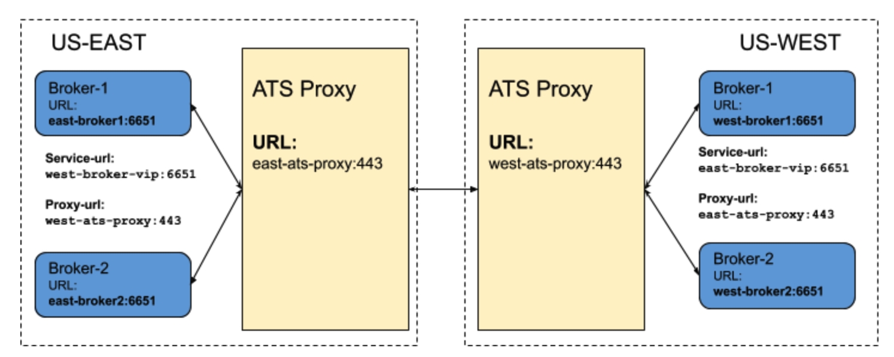

In this example, a Pulsar cluster is deployed into two separate regions, `us-west` and `us-east`. Both regions are configured with ATS proxy, and brokers in each region run behind the ATS proxy. We configure the cluster metadata for both clusters, so brokers in one cluster can use SNI routing and connect to brokers in other clusters through the ATS proxy.

(a) Configure the cluster metadata for `us-east` with `us-east` broker service URL and `us-east` ATS proxy URL with SNI proxy-protocol.

```shell
./pulsar-admin clusters update \ 
    --broker-url-secure pulsar+ssl://east-broker-vip:6651 \ 
    --url http://east-broker-vip:8080 \ 
    --proxy-protocol SNI \ 
    --proxy-url pulsar+ssl://east-ats-proxy:443 
```

(b) Configure the cluster metadata for `us-west` with `us-west` broker service URL and `us-west` ATS proxy URL with SNI proxy-protocol.

```shell
./pulsar-admin clusters update \ 
    --broker-url-secure pulsar+ssl://west-broker-vip:6651 \ 
    --url http://west-broker-vip:8080 \ 
    --proxy-protocol SNI \ 
    --proxy-url pulsar+ssl://west-ats-proxy:443 
```

---

<a id="concepts-replication"></a>

<!-- source_url: https://pulsar.apache.org/docs/4.1.x/concepts-replication/ -->

<!-- page_index: 62 -->

# Geo Replication

Regardless of industries, when an unforeseen event occurs and brings day-to-day operations to a halt, an organization needs a well-prepared disaster recovery plan to quickly restore service to clients. However, a disaster recovery plan usually requires a multi-datacenter deployment with geographically dispersed data centers. Such a multi-datacenter deployment requires a geo-replication mechanism to provide additional redundancy in case a data center fails.

Pulsar's geo-replication mechanism is typically used for disaster recovery, enabling the replication of persistently stored message data across multiple data centers. For instance, your application is publishing data in one region and you would like to process it for consumption in other regions. With Pulsar's geo-replication mechanism, messages can be produced and consumed in different geo-locations.

The diagram below illustrates the process of [geo-replication](#administration-geo). Whenever three producers (P1, P2 and P3) respectively publish messages to the T1 topic in three clusters, those messages are instantly replicated across clusters. Once the messages are replicated, two consumers (C1 and C2) can consume those messages from their clusters.

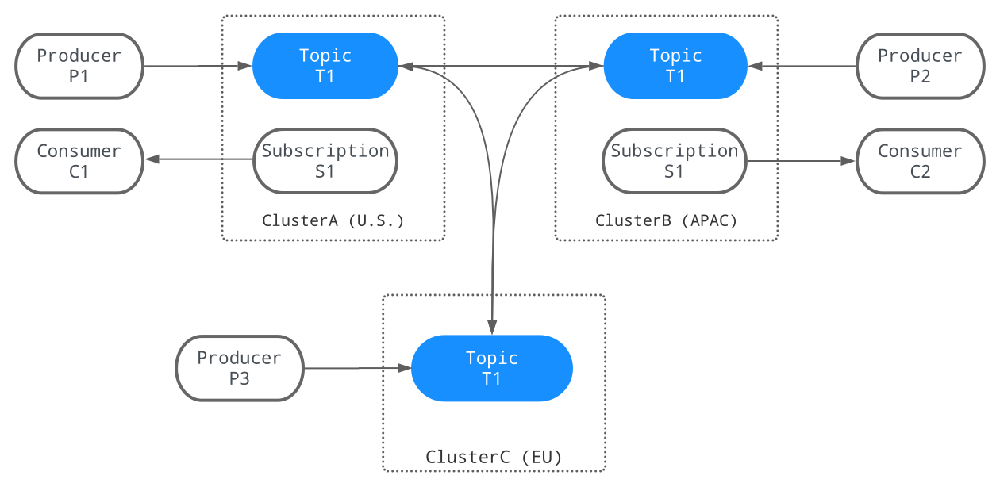

The geo-replication mechanism can be categorized into synchronous geo-replication and asynchronous geo-replication strategies. Pulsar supports both replication mechanisms.

An asynchronous geo-replicated cluster is composed of multiple physical clusters set up in different data centers. Messages produced on a Pulsar topic are first persisted to the local cluster and then replicated asynchronously to the remote clusters by brokers.

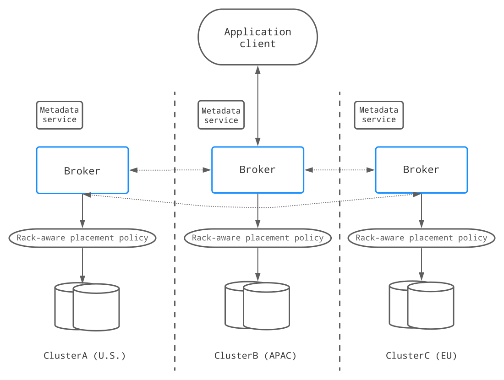

In normal cases, when there are no connectivity issues, messages are replicated immediately, at the same time as they are dispatched to local consumers. Typically, end-to-end delivery latency is defined by the network round-trip time (RTT) between the data centers. Applications can create producers and consumers in any of the clusters, even when the remote clusters are not reachable (for example, during a network partition).

Asynchronous geo-replication provides lower latency but may result in weaker consistency guarantees due to the potential replication lag that some data hasn't been replicated.

In synchronous geo-replication, data is synchronously replicated to multiple data centers and the client has to wait for an acknowledgment from the other data centers. As illustrated below, when the client issues a write request to one cluster, the written data will be replicated to the other two data centers. The write request is only acknowledged to the client when the majority of data centers (in this example, at least 2 data centers) have acknowledged that the write has been persisted.

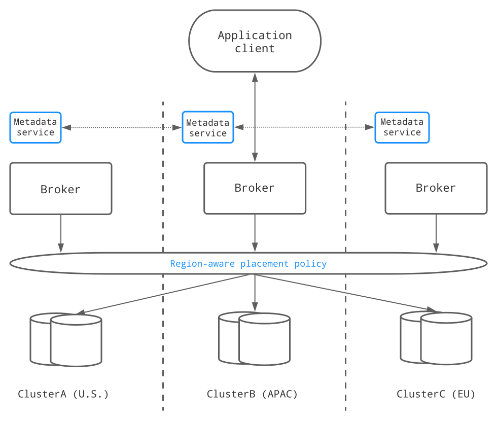

Synchronous geo-replication in Pulsar is achieved by BookKeeper. A synchronous geo-replicated cluster consists of a cluster of bookies and a cluster of brokers that run in multiple data centers, and a global Zookeeper installation (a ZooKeeper ensemble is running across multiple data centers). You need to configure a BookKeeper region-aware placement policy to store data across multiple data centers and guarantee availability constraints on writes.

Synchronous geo-replication provides the highest availability and also guarantees stronger data consistency between different data centers. However, your applications have to pay an extra latency penalty across data centers.

Pulsar provides a great degree of flexibility for customizing your replication strategy. You can set up different replication patterns to serve your replication strategy for an application between multiple data centers.

Pulsar supports the following replication patterns:

Using full-mesh replication and applying the [selective message replication](#administration-geo--selective-replication), you can customize your replication strategies and topologies between any number of data centers.


Active-active replication is a variation of full-mesh replication, with only two data centers. Producers can run at any data center to produce messages, and consumers can consume all messages from all data centers.

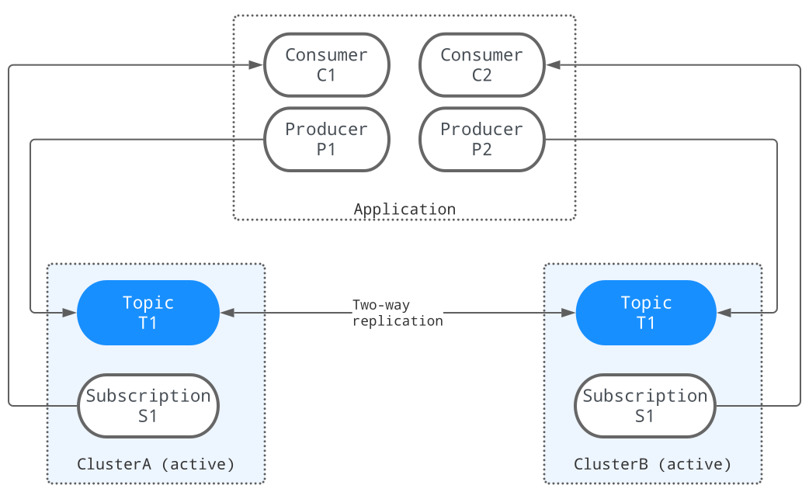

For how to use active-active replication to migrate data between clusters, refer to [here](#administration-geo--migrate-data-between-clusters-using-geo-replication).

The aggregation replication pattern is typically used when replicating messages from the edge to the cloud. For example, assume you have 3 clusters in 3 fronting data centers and one aggregated cluster in a central data center, and you want to replicate messages from multiple fronting data centers to the central data center for aggregation purposes. You can then create an individual namespace for the topics used by each fronting data center and assign the aggregated data center to those namespaces.

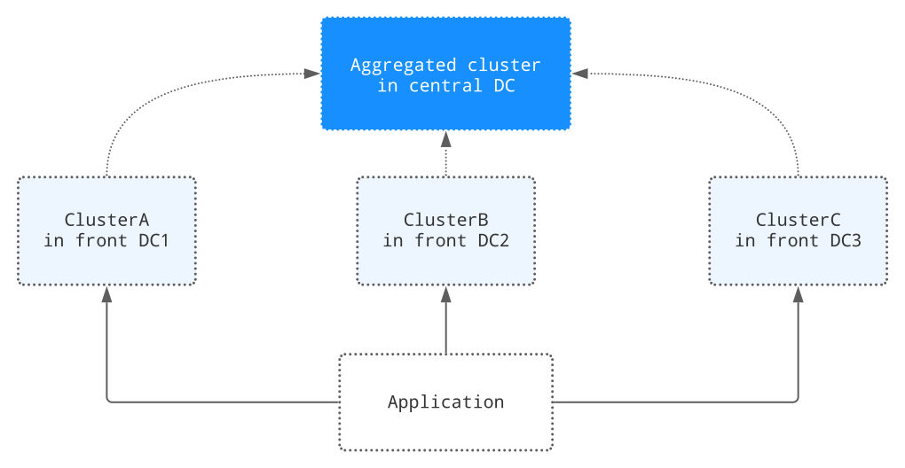

---

<a id="concepts-throttling"></a>

<!-- source_url: https://pulsar.apache.org/docs/4.1.x/concepts-throttling/ -->

<!-- page_index: 63 -->

# Message dispatch throttling

> [!NOTE]
> - The quota cannot be decreased before step 3, because the broker doesn't know the actual number of messages per entry or the actual entry size until it reads the data.
> - Operations like `seek` or `redeliver` may deliver messages to a client multiple times. The broker counts them as different messages and updates the counter.

---

<a id="concepts-topic-compaction"></a>

<!-- source_url: https://pulsar.apache.org/docs/4.1.x/concepts-topic-compaction/ -->

<!-- page_index: 64 -->

# Topic Compaction

Pulsar was built with highly scalable [persistent storage](#concepts-architecture-overview--persistent-storage) of message data as a primary objective. Pulsar topics enable you to persistently store as many unacknowledged messages as you need while preserving message ordering. By default, Pulsar stores *all* unacknowledged/unprocessed messages produced on a topic. Accumulating many unacknowledged messages on a topic is necessary for many Pulsar use cases but it can also be very time intensive for Pulsar consumers to "rewind" through the entire log of messages.

> For a more practical guide to topic compaction, see the [Topic compaction cookbook](#cookbooks-compaction).

For some use cases, consumers don't need a complete "image" of the topic log. They may only need a few values to construct a more "shallow" image of the log, perhaps even just the most recent value. For these kinds of use cases, Pulsar offers **topic compaction**. When you run compaction on a topic, Pulsar goes through a topic's backlog and removes messages that are *obscured* by later messages, i.e. topic compaction goes through the topic on a per-key basis and leaves only the most recent message associated with that key.

Pulsar's topic compaction feature:

- Allows for faster "rewind" through topic logs
- Applies only to [persistent topics](#concepts-architecture-overview--persistent-storage)
- Triggered automatically when the backlog reaches a certain size or can be triggered manually via the command line. See the [Topic compaction cookbook](#cookbooks-compaction)
- Is conceptually and operationally distinct from [retention and expiry](#concepts-messaging--message-retention-and-expiry). Topic compaction *does*, however, respect retention. If retention has removed a message from the message backlog of a topic, the message will also not be readable from the compacted topic ledger.

> An example use case for a compacted Pulsar topic would be a stock ticker topic. On a stock ticker topic, each message bears a timestamped dollar value for stocks for purchase (with the message key holding the stock symbol, e.g. `AAPL` or `GOOG`). With a stock ticker you may care only about the most recent value(s) of the stock and have no interest in historical data (i.e. you don't need to construct a complete image of the topic's sequence of messages per key). Compaction would be highly beneficial in this case because it would keep consumers from needing to rewind through obscured messages.

When topic compaction is triggered [via the CLI](#cookbooks-compaction), it works in the following steps:

1. Pulsar will iterate over the entire topic from beginning to end.

For each key that it encounters the compaction routine will keep a record of the latest occurrence of that key.

2. After that, the broker will create a new [BookKeeper ledger](#concepts-architecture-overview--ledgers) and make a second iteration through each message on the topic. For each message:

   - If the key matches the latest occurrence of that key, then the key's data payload, message ID, and metadata will be written to the newly created ledger.
   - If the key doesn't match the latest then the message will be skipped and left alone.
   - If any given message has an empty payload, it will be skipped and considered deleted (akin to the concept of [tombstones](https://en.wikipedia.org/wiki/Tombstone_(data_store)) in key-value databases).
3. At the end of this second iteration through the topic, the newly created BookKeeper ledger is closed and two things are written to the topic's metadata:

   - The ID of the BookKeeper ledger
   - The message ID of the last compacted message (this is known as the **compaction horizon** of the topic).

Once this metadata is written compaction is complete.

4. After the initial compaction operation, the Pulsar [broker](#concepts-architecture-overview--brokers) that owns the topic is notified whenever any future changes are made to the compaction horizon and compacted backlog. When such changes occur:

   - Clients (consumers and readers) that have read compacted enabled will attempt to read messages from a topic and either:
     - Read from the topic like normal (if the message ID is greater than or equal to the compaction horizon) or
     - Read beginning at the compaction horizon (if the message ID is lower than the compaction horizon)

---

<a id="cookbooks-bookkeepermetadata"></a>

<!-- source_url: https://pulsar.apache.org/docs/4.1.x/cookbooks-bookkeepermetadata/ -->

<!-- page_index: 65 -->

# BookKeeper Ledger Metadata

Pulsar stores data on BookKeeper ledgers, you can understand the contents of a ledger by inspecting the metadata attached to the ledger.
Such metadata are stored on ZooKeeper and they are readable using BookKeeper APIs.

Description of current metadata:

Scope Metadata name Metadata value|  |  |  |  |  |  |  |  |  |  |  |  |  |  |  |  |  |  | | --- | --- | --- | --- | --- | --- | --- | --- | --- | --- | --- | --- | --- | --- | --- | --- | --- | --- | | All ledgers application 'pulsar'|  |  |  |  |  |  |  |  |  |  |  |  |  |  |  | | --- | --- | --- | --- | --- | --- | --- | --- | --- | --- | --- | --- | --- | --- | --- | | All ledgers component 'managed-ledger', 'schema', 'compacted-topic'|  |  |  |  |  |  |  |  |  |  |  |  | | --- | --- | --- | --- | --- | --- | --- | --- | --- | --- | --- | --- | | Managed ledgers pulsar/managed-ledger name of the ledger|  |  |  |  |  |  |  |  |  | | --- | --- | --- | --- | --- | --- | --- | --- | --- | | Cursor pulsar/cursor name of the cursor|  |  |  |  |  |  | | --- | --- | --- | --- | --- | --- | | Compacted topic pulsar/compactedTopic name of the original topic|  |  |  | | --- | --- | --- | | Compacted topic pulsar/compactedTo id of the last compacted message | | | | | | | | | | | | | | | | | | |

All ledgers application 'pulsar'|  |  |  |  |  |  |  |  |  |  |  |  |  |  |  | | --- | --- | --- | --- | --- | --- | --- | --- | --- | --- | --- | --- | --- | --- | --- | | All ledgers component 'managed-ledger', 'schema', 'compacted-topic'|  |  |  |  |  |  |  |  |  |  |  |  | | --- | --- | --- | --- | --- | --- | --- | --- | --- | --- | --- | --- | | Managed ledgers pulsar/managed-ledger name of the ledger|  |  |  |  |  |  |  |  |  | | --- | --- | --- | --- | --- | --- | --- | --- | --- | | Cursor pulsar/cursor name of the cursor|  |  |  |  |  |  | | --- | --- | --- | --- | --- | --- | | Compacted topic pulsar/compactedTopic name of the original topic|  |  |  | | --- | --- | --- | | Compacted topic pulsar/compactedTo id of the last compacted message | | | | | | | | | | | | | | | |

All ledgers component 'managed-ledger', 'schema', 'compacted-topic'|  |  |  |  |  |  |  |  |  |  |  |  | | --- | --- | --- | --- | --- | --- | --- | --- | --- | --- | --- | --- | | Managed ledgers pulsar/managed-ledger name of the ledger|  |  |  |  |  |  |  |  |  | | --- | --- | --- | --- | --- | --- | --- | --- | --- | | Cursor pulsar/cursor name of the cursor|  |  |  |  |  |  | | --- | --- | --- | --- | --- | --- | | Compacted topic pulsar/compactedTopic name of the original topic|  |  |  | | --- | --- | --- | | Compacted topic pulsar/compactedTo id of the last compacted message | | | | | | | | | | | | |

Managed ledgers pulsar/managed-ledger name of the ledger|  |  |  |  |  |  |  |  |  | | --- | --- | --- | --- | --- | --- | --- | --- | --- | | Cursor pulsar/cursor name of the cursor|  |  |  |  |  |  | | --- | --- | --- | --- | --- | --- | | Compacted topic pulsar/compactedTopic name of the original topic|  |  |  | | --- | --- | --- | | Compacted topic pulsar/compactedTo id of the last compacted message | | | | | | | | | |

Cursor pulsar/cursor name of the cursor|  |  |  |  |  |  | | --- | --- | --- | --- | --- | --- | | Compacted topic pulsar/compactedTopic name of the original topic|  |  |  | | --- | --- | --- | | Compacted topic pulsar/compactedTo id of the last compacted message | | | | | | |

Compacted topic pulsar/compactedTopic name of the original topic|  |  |  | | --- | --- | --- | | Compacted topic pulsar/compactedTo id of the last compacted message | | | |

Compacted topic pulsar/compactedTo id of the last compacted message |

---

<a id="cookbooks-compaction"></a>

<!-- source_url: https://pulsar.apache.org/docs/4.1.x/cookbooks-compaction/ -->

<!-- page_index: 66 -->

# Topic compaction

> [!TIP]
> Compaction only works on messages that have keys (as in the stock ticker example the stock symbol serves as the key for each message). Keys can thus be thought of as the axis along which compaction is applied. Messages that don't have keys are simply ignored by compaction.
>
> PIP-318 introduced the `topicCompactionRetainNullKey` configuration on broker side, which allows you to configure whether to retain messages without keys during compaction. And since 3.2.0+ version, the default don't retain null-key message during topic compaction.
> For more information, see [PIP-318](https://github.com/apache/pulsar/blob/master/pip/pip-318.md).

---

<a id="cookbooks-deduplication"></a>

<!-- source_url: https://pulsar.apache.org/docs/4.1.x/cookbooks-deduplication/ -->

<!-- page_index: 67 -->

# Message deduplication

Message deduplication could affect the performance of the brokers during informational snapshots.

To use message deduplication in Pulsar, you need to configure your Pulsar brokers, namespaces, or topics. It is recommended to modify the configuration in the clients, for example, setting send timeout to infinity.

You can enable or disable message deduplication at broker, namespace, or topic level. By default, it is disabled on all brokers, namespaces, or topics. You can enable it in the following ways:

- Enable deduplication for all namespaces/topics at the broker level.
- Enable deduplication for a specific namespace with the `pulsar-admin namespaces` interface.
- Enable deduplication for a specific topic with the `pulsar-admin topics` interface.

You can configure message deduplication in Pulsar using the [`broker.conf`](#reference-configuration--broker) configuration file. The following deduplication-related parameters are available.

Parameter Description Default|  |  |  |  |  |  |  |  |  |  |  |  |  |  |  | | --- | --- | --- | --- | --- | --- | --- | --- | --- | --- | --- | --- | --- | --- | --- | | `brokerDeduplicationEnabled` Sets the default behavior for message deduplication in the Pulsar broker. If it is set to `true`, message deduplication is enabled on all namespaces/topics. If it is set to `false`, you have to enable or disable deduplication at the namespace level or the topic level. `false`| `brokerDeduplicationMaxNumberOfProducers` The maximum number of producers for which information is stored for deduplication purposes. `10000`| `brokerDeduplicationEntriesInterval` The number of entries after which a deduplication informational snapshot is taken. A larger interval leads to fewer snapshots being taken, though this lengthens the topic recovery time (the time required for entries published after the snapshot to be replayed). `1000`| `brokerDeduplicationSnapshotIntervalSeconds` The time period after which a deduplication informational snapshot is taken. It runs simultaneously with `brokerDeduplicationEntriesInterval`. `120`| `brokerDeduplicationProducerInactivityTimeoutMinutes` The time of inactivity (in minutes) after which the broker discards deduplication information related to a disconnected producer. `360` (6 hours) | | | | | | | | | | | | | | | |

`brokerDeduplicationEnabled` Sets the default behavior for message deduplication in the Pulsar broker. If it is set to `true`, message deduplication is enabled on all namespaces/topics. If it is set to `false`, you have to enable or disable deduplication at the namespace level or the topic level. `false`| `brokerDeduplicationMaxNumberOfProducers` The maximum number of producers for which information is stored for deduplication purposes. `10000`| `brokerDeduplicationEntriesInterval` The number of entries after which a deduplication informational snapshot is taken. A larger interval leads to fewer snapshots being taken, though this lengthens the topic recovery time (the time required for entries published after the snapshot to be replayed). `1000`| `brokerDeduplicationSnapshotIntervalSeconds` The time period after which a deduplication informational snapshot is taken. It runs simultaneously with `brokerDeduplicationEntriesInterval`. `120`| `brokerDeduplicationProducerInactivityTimeoutMinutes` The time of inactivity (in minutes) after which the broker discards deduplication information related to a disconnected producer. `360` (6 hours) | | | | | | | | | | | | |

`brokerDeduplicationMaxNumberOfProducers` The maximum number of producers for which information is stored for deduplication purposes. `10000`| `brokerDeduplicationEntriesInterval` The number of entries after which a deduplication informational snapshot is taken. A larger interval leads to fewer snapshots being taken, though this lengthens the topic recovery time (the time required for entries published after the snapshot to be replayed). `1000`| `brokerDeduplicationSnapshotIntervalSeconds` The time period after which a deduplication informational snapshot is taken. It runs simultaneously with `brokerDeduplicationEntriesInterval`. `120`| `brokerDeduplicationProducerInactivityTimeoutMinutes` The time of inactivity (in minutes) after which the broker discards deduplication information related to a disconnected producer. `360` (6 hours) | | | | | | | | | |

`brokerDeduplicationEntriesInterval` The number of entries after which a deduplication informational snapshot is taken. A larger interval leads to fewer snapshots being taken, though this lengthens the topic recovery time (the time required for entries published after the snapshot to be replayed). `1000`| `brokerDeduplicationSnapshotIntervalSeconds` The time period after which a deduplication informational snapshot is taken. It runs simultaneously with `brokerDeduplicationEntriesInterval`. `120`| `brokerDeduplicationProducerInactivityTimeoutMinutes` The time of inactivity (in minutes) after which the broker discards deduplication information related to a disconnected producer. `360` (6 hours) | | | | | | |

`brokerDeduplicationSnapshotIntervalSeconds` The time period after which a deduplication informational snapshot is taken. It runs simultaneously with `brokerDeduplicationEntriesInterval`. `120`| `brokerDeduplicationProducerInactivityTimeoutMinutes` The time of inactivity (in minutes) after which the broker discards deduplication information related to a disconnected producer. `360` (6 hours) | | | |

`brokerDeduplicationProducerInactivityTimeoutMinutes` The time of inactivity (in minutes) after which the broker discards deduplication information related to a disconnected producer. `360` (6 hours) |

By default, message deduplication is *disabled* on all Pulsar namespaces/topics. To enable it on all namespaces/topics, set the `brokerDeduplicationEnabled` parameter to `true` and restart the broker.

Even if you set the value for `brokerDeduplicationEnabled`, enabling or disabling via Pulsar admin CLI overrides the default settings at the broker level.

Though message deduplication is disabled by default at the broker level, you can enable message deduplication for a specific namespace or topic using the [`pulsar-admin namespaces set-deduplication`](https://pulsar.apache.org/reference/#/4.1.x/pulsar-admin/namespaces?id=set-deduplication) or the [`pulsar-admin topics set-deduplication`](https://pulsar.apache.org/reference/#/4.1.x/pulsar-admin/topics?id=set-deduplication) command. You can use the `--enable`/`-e` flag and specify the namespace/topic.

The following example shows how to enable message deduplication at the namespace level.

```bash
bin/pulsar-admin namespaces set-deduplication \ 
public/default \ 
--enable # or just -e 
```

Even if you enable message deduplication at the broker level, you can disable message deduplication for a specific namespace or topic using the [`pulsar-admin namespace set-deduplication`](https://pulsar.apache.org/reference/#/4.1.x/pulsar-admin/namespaces?id=set-deduplication) or the [`pulsar-admin topics set-deduplication`](https://pulsar.apache.org/reference/#/4.1.x/pulsar-admin/topics?id=set-deduplication) command. Use the `--disable`/`-d` flag and specify the namespace/topic.

The following example shows how to disable message deduplication at the namespace level.

```bash
bin/pulsar-admin namespaces set-deduplication \ 
public/default \ 
--disable # or just -d 
```

If you enable message deduplication in Pulsar brokers, namespaces, or topics, it is recommended to make the client retry infinitely the messages until it succeeds, otherwise it is possible to break the ordering guarantee as some requests may time out and the application does not know whether the request is successfully added to the topic or not.

So you need to complete the following tasks for your client producers:

1. Specify a name for the producer (this is a requirement, Pulsar will use the producer name to filter duplicated messages).
2. Set the message timeout to `0` (namely, no timeout).

The instructions for Java, Python, and C++ clients are different.

<div class="theme-tabs-container tabs-container tabList__CuJ"><ul><li>Java clients<li>Python clients<li>C++ clients</li></li></li></ul><div><div><p>To ensure the guarantee order on a <a href="https://pulsar.apache.org/docs/client-libraries/java-use#create-a-producer" rel="noopener noreferrer" target="_blank">Java producer</a> sending to a topic with message deduplication enabled, set the producer name using the <code>producerName</code> setter, and set the timeout to <code>0</code> using the <code>sendTimeout</code> setter.<div><div><pre><code><div><span>import</span><span> </span><span>org</span><span>.</span><span>apache</span><span>.</span><span>pulsar</span><span>.</span><span>client</span><span>.</span><span>api</span><span>.</span><span>Producer</span><span>;</span><span></span> </div><div><span></span><span>import</span><span> </span><span>org</span><span>.</span><span>apache</span><span>.</span><span>pulsar</span><span>.</span><span>client</span><span>.</span><span>api</span><span>.</span><span>PulsarClient</span><span>;</span><span></span> </div><div><span></span><span>import</span><span> </span><span>java</span><span>.</span><span>util</span><span>.</span><span>concurrent</span><span>.</span><span>TimeUnit</span><span>;</span><span></span> </div><div><span></span> </div><div><span></span><span>PulsarClient</span><span> pulsarClient </span><span>=</span><span> </span><span>PulsarClient</span><span>.</span><span>builder</span><span>(</span><span>)</span><span></span> </div><div><span>        </span><span>.</span><span>serviceUrl</span><span>(</span><span>"pulsar://localhost:6650"</span><span>)</span><span></span> </div><div><span>        </span><span>.</span><span>build</span><span>(</span><span>)</span><span>;</span><span></span> </div><div><span></span><span>Producer</span><span> producer </span><span>=</span><span> pulsarClient</span><span>.</span><span>newProducer</span><span>(</span><span>)</span><span></span> </div><div><span>        </span><span>.</span><span>producerName</span><span>(</span><span>"producer-1"</span><span>)</span><span></span> </div><div><span>        </span><span>.</span><span>topic</span><span>(</span><span>"persistent://public/default/topic-1"</span><span>)</span><span></span> </div><div><span>        </span><span>.</span><span>sendTimeout</span><span>(</span><span>0</span><span>,</span><span> </span><span>TimeUnit</span><span>.</span><span>SECONDS</span><span>)</span><span></span> </div><div><span>        </span><span>.</span><span>create</span><span>(</span><span>)</span><span>;</span> </div></code></pre></div></div></p></div><div><p>Not to break the guarantee order on a <a href="https://pulsar.apache.org/docs/client-libraries/python-use#create-a-producer" rel="noopener noreferrer" target="_blank">Python producer</a> sending to a topic with message deduplication active, set the producer name using <code>producer_name</code>, and set the timeout to <code>0</code> using <code>send_timeout_millis</code>.<div><div><pre><code><div><span>import</span><span> pulsar</span> </div><div><span></span> </div><div><span>client </span><span>=</span><span> pulsar</span><span>.</span><span>Client</span><span>(</span><span>"pulsar://localhost:6650"</span><span>)</span><span></span> </div><div><span>producer </span><span>=</span><span> client</span><span>.</span><span>create_producer</span><span>(</span><span></span> </div><div><span>    </span><span>"persistent://public/default/topic-1"</span><span>,</span><span></span> </div><div><span>    producer_name</span><span>=</span><span>"producer-1"</span><span>,</span><span></span> </div><div><span>    send_timeout_millis</span><span>=</span><span>0</span><span>)</span> </div></code></pre></div></div></p></div><div><p>Not to break the guarantee order on a <a href="https://pulsar.apache.org/docs/client-libraries/cpp-use#create-a-producer" rel="noopener noreferrer" target="_blank">C++ producer</a> sending to a topic with message deduplication active, set the producer name using <code>producer_name</code>, and set the timeout to <code>0</code> using <code>send_timeout_millis</code>.<div><div><pre><code><div><span>#</span><span>include</span><span> </span><span>&lt;pulsar/Client.h&gt;</span><span></span> </div><div><span></span> </div><div><span>std</span><span>::</span><span>string serviceUrl </span><span>=</span><span> </span><span>"pulsar://localhost:6650"</span><span>;</span><span></span> </div><div><span>std</span><span>::</span><span>string topic </span><span>=</span><span> </span><span>"persistent://some-tenant/ns1/topic-1"</span><span>;</span><span></span> </div><div><span>std</span><span>::</span><span>string producerName </span><span>=</span><span> </span><span>"producer-1"</span><span>;</span><span></span> </div><div><span></span> </div><div><span>Client </span><span>client</span><span>(</span><span>serviceUrl</span><span>)</span><span>;</span><span></span> </div><div><span></span> </div><div><span>ProducerConfiguration producerConfig</span><span>;</span><span></span> </div><div><span>producerConfig</span><span>.</span><span>setSendTimeout</span><span>(</span><span>0</span><span>)</span><span>;</span><span></span> </div><div><span>producerConfig</span><span>.</span><span>setProducerName</span><span>(</span><span>producerName</span><span>)</span><span>;</span><span></span> </div><div><span></span> </div><div><span>Producer producer</span><span>;</span><span></span> </div><div><span></span> </div><div><span>Result result </span><span>=</span><span> client</span><span>.</span><span>createProducer</span><span>(</span><span>topic</span><span>,</span><span> producerConfig</span><span>,</span><span> producer</span><span>)</span><span>;</span> </div></code></pre></div></div></p></div></div></div>

---

<a id="cookbooks-message-queue"></a>

<!-- source_url: https://pulsar.apache.org/docs/4.1.x/cookbooks-message-queue/ -->

<!-- page_index: 68 -->

# Use Pulsar as a message queue

> [!TIP]
> You can use the same Pulsar installation to act as a real-time message bus and as a message queue if you wish (or just one or the other). You can set aside some topics for real-time purposes and other topics for message queue purposes (or use specific namespaces for either purpose if you wish).

---

<a id="cookbooks-non-persistent"></a>

<!-- source_url: https://pulsar.apache.org/docs/4.1.x/cookbooks-non-persistent/ -->

<!-- page_index: 69 -->

# Non-persistent messaging

This cookbook provides:

- A basic [conceptual overview](#cookbooks-non-persistent--overview) of non-persistent topics
- Information about [configurable parameters](#cookbooks-non-persistent--configuration-for-standalone-mode) related to non-persistent topics
- A guide to the [CLI interface](#cookbooks-non-persistent--manage-with-cli) for managing non-persistent topics

By default, Pulsar persistently stores *all* unacknowledged messages on multiple bookies (storage nodes). Data for messages on persistent topics can thus survive broker restarts and subscriber failover.

Pulsar also, however, supports **non-persistent topics**, which are topics on which messages are *never* persisted to disk and live only in memory. When using non-persistent delivery, killing a Pulsar [broker](#reference-terminology--broker) or disconnecting a subscriber to a topic means that all in-transit messages are lost on that (non-persistent) topic, meaning that clients may see message loss.

Non-persistent topics have names of this form (note the `non-persistent` in the name):

```http
non-persistent://tenant/namespace/topic 
```

> For more high-level information about non-persistent topics, see the [Concepts and Architecture](#concepts-messaging--non-persistent-topics) documentation.

To use non-persistent topics, you need to [enable](#cookbooks-non-persistent--enable) them in your Pulsar broker configuration and differentiate them by name when interacting with them. This [`pulsar-client produce`](#reference-cli-tools) command, for example, would produce one message on a non-persistent topic in a standalone cluster:

```bash
bin/pulsar-client produce non-persistent://public/default/example-np-topic \ 
  --num-produce 1 \ 
  --messages "This message will be stored only in memory" 
```

> For a more thorough guide to non-persistent topics from an administrative perspective, see the [Non-persistent topics](#admin-api-topics) guide.

To enable non-persistent topics in a Pulsar broker, the [`enableNonPersistentTopics`](#reference-configuration--broker-enablenonpersistenttopics) must be set to `true`. This is the default, so you won't need to take any action to enable non-persistent messaging.

> If you're running Pulsar in standalone mode, the same configurable parameters are available but in the [`standalone.conf`](#reference-configuration--standalone) configuration file.

If you'd like to enable *only* non-persistent topics in a broker, you can set the [`enablePersistentTopics`](#reference-configuration--broker-enablepersistenttopics) parameter to `false` and the `enableNonPersistentTopics` parameter to `true`.

Non-persistent topics can be managed using the [`pulsar-admin non-persistent`](https://pulsar.apache.org/reference/#/4.1.x/pulsar-admin/topics?id=topics) command-line interface. With that interface, you can perform actions like [create a partitioned non-persistent topic](https://pulsar.apache.org/reference/#/4.1.x/pulsar-admin/topics?id=create-partitioned-topic), [get stats](https://pulsar.apache.org/reference/#/4.1.x/pulsar-admin/topics?id=stats) for a non-persistent topic, [list](https://pulsar.apache.org/reference/#/4.1.x/pulsar-admin/topics?id=list-partitioned-topics) non-persistent topics under a namespace, and more.

You shouldn't need to make any changes to your Pulsar clients to use non-persistent messaging beyond making sure that you use proper [topic names](#cookbooks-non-persistent--use) with `non-persistent` as the topic type.

---

<a id="cookbooks-retention-expiry"></a>

<!-- source_url: https://pulsar.apache.org/docs/4.1.x/cookbooks-retention-expiry/ -->

<!-- page_index: 70 -->

# Message retention and expiry

> [!NOTE]
> To disable the retention policy, you need to set both the size and time limit to `0`. Set either size or time limit to `0` is invalid.

---

<a id="deploy-aws"></a>

<!-- source_url: https://pulsar.apache.org/docs/4.1.x/deploy-aws/ -->

<!-- page_index: 71 -->

# Deploy a Pulsar cluster on AWS using Terraform and Ansible

> For instructions on deploying a single Pulsar cluster manually rather than using Terraform and Ansible, see [Deploying a Pulsar cluster on bare metal](#deploy-bare-metal). For instructions on manually deploying a multi-cluster Pulsar instance, see [Deploying a Pulsar instance on bare metal](#deploy-bare-metal-multi-cluster).

One of the easiest ways to get a Pulsar [cluster](#reference-terminology--cluster) running on [Amazon Web Services](https://aws.amazon.com/) (AWS) is to use the [Terraform](https://terraform.io) infrastructure provisioning tool and the [Ansible](https://www.ansible.com) server automation tool. Terraform can create the resources necessary for running the Pulsar cluster---[EC2](https://aws.amazon.com/ec2/) instances, networking and security infrastructure, etc.---While Ansible can install and run Pulsar on the provisioned resources.

To deploy a Pulsar cluster on AWS, complete the following steps.

To install a Pulsar cluster on AWS using Terraform and Ansible, you need to prepare the following things:

- An [AWS account](https://aws.amazon.com/account/) and the [`aws`](https://aws.amazon.com/cli/) command-line tool
- Python and [pip](https://pip.pypa.io/en/stable/)
- The [`terraform-inventory`](https://github.com/adammck/terraform-inventory) tool, which enables Ansible to use Terraform artifacts

You also need to make sure that you are currently logged into your AWS account via the `aws` tool:

```bash
aws configure 
```

You can install Ansible on Linux or macOS using pip.

```bash
pip install ansible 
```

You can install Terraform using the instructions [here](https://learn.hashicorp.com/tutorials/terraform/install-cli).

You also need to have the Terraform and Ansible configuration for Pulsar locally on your machine. You can find them in the [GitHub repository](https://github.com/apache/pulsar) of Pulsar, which you can fetch using Git commands:

```bash
git clone https://github.com/apache/pulsar 
cd pulsar/deployment/terraform-ansible/aws 
```

> If you already have an SSH key and want to use it, you can skip the step of generating an SSH key and update `private_key_file` setting in `ansible.cfg` file and `public_key_path` setting in `terraform.tfvars` file.
>
> For example, if you already have a private SSH key in `~/.ssh/pulsar_aws` and a public key in `~/.ssh/pulsar_aws.pub`, follow the steps below:
>
> 1. update `ansible.cfg` with following values:

>
```shell
private_key_file=~/.ssh/pulsar_aws 
```

> 2. update `terraform.tfvars` with following values:

>
```shell
public_key_path=~/.ssh/pulsar_aws.pub 
```

To create the necessary AWS resources using Terraform, you need to create an SSH key. Enter the following commands to create a private SSH key in `~/.ssh/id_rsa` and a public key in `~/.ssh/id_rsa.pub`:

```bash
ssh-keygen -t rsa 
```

Do *not* enter a passphrase (hit **Enter** instead when the prompt comes out). Enter the following command to verify that a key has been created:

```bash
ls ~/.ssh 
id_rsa               id_rsa.pub 
```

To start building AWS resources with Terraform, you need to install all Terraform dependencies. Enter the following command:

```bash
terraform init 
# This will create a .terraform folder
```

After that, you can apply the default Terraform configuration by entering this command:

```bash
terraform apply 
```

Then you see this prompt below:

```bash
Do you want to perform these actions? 
  Terraform will perform the actions described above. 
  Only 'yes' will be accepted to approve. 
 
  Enter a value: 
```

Type `yes` and hit **Enter**. Applying the configuration could take several minutes. When the configuration applying finishes, you can see `Apply complete!` along with some other information, including the number of resources created.

You can apply a non-default Terraform configuration by changing the values in the `terraform.tfvars` file. The following variables are available:

Variable name Description Default|  |  |  |  |  |  |  |  |  |  |  |  |  |  |  |  |  |  |  |  |  |  |  |  |  |  |  |  |  |  | | --- | --- | --- | --- | --- | --- | --- | --- | --- | --- | --- | --- | --- | --- | --- | --- | --- | --- | --- | --- | --- | --- | --- | --- | --- | --- | --- | --- | --- | --- | | `public_key_path` The path of the public key that you have generated. `~/.ssh/id_rsa.pub`| `region` The AWS region in which the Pulsar cluster runs `us-west-2`| `availability_zone` The AWS availability zone in which the Pulsar cluster runs `us-west-2a`| `aws_ami` The [Amazon Machine Image](http://docs.aws.amazon.com/AWSEC2/latest/UserGuide/AMIs.html) (AMI) that the cluster uses `ami-9fa343e7`| `num_zookeeper_nodes` The number of [ZooKeeper](https://zookeeper.apache.org) nodes in the ZooKeeper cluster 3|  |  |  |  |  |  |  |  |  |  |  |  |  |  |  | | --- | --- | --- | --- | --- | --- | --- | --- | --- | --- | --- | --- | --- | --- | --- | | `num_bookie_nodes` The number of bookies that runs in the cluster 3|  |  |  |  |  |  |  |  |  |  |  |  | | --- | --- | --- | --- | --- | --- | --- | --- | --- | --- | --- | --- | | `num_broker_nodes` The number of Pulsar brokers that runs in the cluster 2|  |  |  |  |  |  |  |  |  | | --- | --- | --- | --- | --- | --- | --- | --- | --- | | `num_proxy_nodes` The number of Pulsar proxies that runs in the cluster 1|  |  |  |  |  |  | | --- | --- | --- | --- | --- | --- | | `base_cidr_block` The root [CIDR](https://en.wikipedia.org/wiki/Classless_Inter-Domain_Routing) that network assets uses for the cluster `10.0.0.0/16`| `instance_types` The EC2 instance types to be used. This variable is a map with two keys: `zookeeper` for the ZooKeeper instances, `bookie` for the BookKeeper bookies and `broker` and `proxy` for Pulsar brokers and bookies `t2.small` (ZooKeeper), `i3.xlarge` (BookKeeper) and `c5.2xlarge` (Brokers/Proxies) | | | | | | | | | | | | | | | | | | | | | | | | | | | | | | |

`public_key_path` The path of the public key that you have generated. `~/.ssh/id_rsa.pub`| `region` The AWS region in which the Pulsar cluster runs `us-west-2`| `availability_zone` The AWS availability zone in which the Pulsar cluster runs `us-west-2a`| `aws_ami` The [Amazon Machine Image](http://docs.aws.amazon.com/AWSEC2/latest/UserGuide/AMIs.html) (AMI) that the cluster uses `ami-9fa343e7`| `num_zookeeper_nodes` The number of [ZooKeeper](https://zookeeper.apache.org) nodes in the ZooKeeper cluster 3|  |  |  |  |  |  |  |  |  |  |  |  |  |  |  | | --- | --- | --- | --- | --- | --- | --- | --- | --- | --- | --- | --- | --- | --- | --- | | `num_bookie_nodes` The number of bookies that runs in the cluster 3|  |  |  |  |  |  |  |  |  |  |  |  | | --- | --- | --- | --- | --- | --- | --- | --- | --- | --- | --- | --- | | `num_broker_nodes` The number of Pulsar brokers that runs in the cluster 2|  |  |  |  |  |  |  |  |  | | --- | --- | --- | --- | --- | --- | --- | --- | --- | | `num_proxy_nodes` The number of Pulsar proxies that runs in the cluster 1|  |  |  |  |  |  | | --- | --- | --- | --- | --- | --- | | `base_cidr_block` The root [CIDR](https://en.wikipedia.org/wiki/Classless_Inter-Domain_Routing) that network assets uses for the cluster `10.0.0.0/16`| `instance_types` The EC2 instance types to be used. This variable is a map with two keys: `zookeeper` for the ZooKeeper instances, `bookie` for the BookKeeper bookies and `broker` and `proxy` for Pulsar brokers and bookies `t2.small` (ZooKeeper), `i3.xlarge` (BookKeeper) and `c5.2xlarge` (Brokers/Proxies) | | | | | | | | | | | | | | | | | | | | | | | | | | | |

`region` The AWS region in which the Pulsar cluster runs `us-west-2`| `availability_zone` The AWS availability zone in which the Pulsar cluster runs `us-west-2a`| `aws_ami` The [Amazon Machine Image](http://docs.aws.amazon.com/AWSEC2/latest/UserGuide/AMIs.html) (AMI) that the cluster uses `ami-9fa343e7`| `num_zookeeper_nodes` The number of [ZooKeeper](https://zookeeper.apache.org) nodes in the ZooKeeper cluster 3|  |  |  |  |  |  |  |  |  |  |  |  |  |  |  | | --- | --- | --- | --- | --- | --- | --- | --- | --- | --- | --- | --- | --- | --- | --- | | `num_bookie_nodes` The number of bookies that runs in the cluster 3|  |  |  |  |  |  |  |  |  |  |  |  | | --- | --- | --- | --- | --- | --- | --- | --- | --- | --- | --- | --- | | `num_broker_nodes` The number of Pulsar brokers that runs in the cluster 2|  |  |  |  |  |  |  |  |  | | --- | --- | --- | --- | --- | --- | --- | --- | --- | | `num_proxy_nodes` The number of Pulsar proxies that runs in the cluster 1|  |  |  |  |  |  | | --- | --- | --- | --- | --- | --- | | `base_cidr_block` The root [CIDR](https://en.wikipedia.org/wiki/Classless_Inter-Domain_Routing) that network assets uses for the cluster `10.0.0.0/16`| `instance_types` The EC2 instance types to be used. This variable is a map with two keys: `zookeeper` for the ZooKeeper instances, `bookie` for the BookKeeper bookies and `broker` and `proxy` for Pulsar brokers and bookies `t2.small` (ZooKeeper), `i3.xlarge` (BookKeeper) and `c5.2xlarge` (Brokers/Proxies) | | | | | | | | | | | | | | | | | | | | | | | | |

`availability_zone` The AWS availability zone in which the Pulsar cluster runs `us-west-2a`| `aws_ami` The [Amazon Machine Image](http://docs.aws.amazon.com/AWSEC2/latest/UserGuide/AMIs.html) (AMI) that the cluster uses `ami-9fa343e7`| `num_zookeeper_nodes` The number of [ZooKeeper](https://zookeeper.apache.org) nodes in the ZooKeeper cluster 3|  |  |  |  |  |  |  |  |  |  |  |  |  |  |  | | --- | --- | --- | --- | --- | --- | --- | --- | --- | --- | --- | --- | --- | --- | --- | | `num_bookie_nodes` The number of bookies that runs in the cluster 3|  |  |  |  |  |  |  |  |  |  |  |  | | --- | --- | --- | --- | --- | --- | --- | --- | --- | --- | --- | --- | | `num_broker_nodes` The number of Pulsar brokers that runs in the cluster 2|  |  |  |  |  |  |  |  |  | | --- | --- | --- | --- | --- | --- | --- | --- | --- | | `num_proxy_nodes` The number of Pulsar proxies that runs in the cluster 1|  |  |  |  |  |  | | --- | --- | --- | --- | --- | --- | | `base_cidr_block` The root [CIDR](https://en.wikipedia.org/wiki/Classless_Inter-Domain_Routing) that network assets uses for the cluster `10.0.0.0/16`| `instance_types` The EC2 instance types to be used. This variable is a map with two keys: `zookeeper` for the ZooKeeper instances, `bookie` for the BookKeeper bookies and `broker` and `proxy` for Pulsar brokers and bookies `t2.small` (ZooKeeper), `i3.xlarge` (BookKeeper) and `c5.2xlarge` (Brokers/Proxies) | | | | | | | | | | | | | | | | | | | | | |

`aws_ami` The [Amazon Machine Image](http://docs.aws.amazon.com/AWSEC2/latest/UserGuide/AMIs.html) (AMI) that the cluster uses `ami-9fa343e7`| `num_zookeeper_nodes` The number of [ZooKeeper](https://zookeeper.apache.org) nodes in the ZooKeeper cluster 3|  |  |  |  |  |  |  |  |  |  |  |  |  |  |  | | --- | --- | --- | --- | --- | --- | --- | --- | --- | --- | --- | --- | --- | --- | --- | | `num_bookie_nodes` The number of bookies that runs in the cluster 3|  |  |  |  |  |  |  |  |  |  |  |  | | --- | --- | --- | --- | --- | --- | --- | --- | --- | --- | --- | --- | | `num_broker_nodes` The number of Pulsar brokers that runs in the cluster 2|  |  |  |  |  |  |  |  |  | | --- | --- | --- | --- | --- | --- | --- | --- | --- | | `num_proxy_nodes` The number of Pulsar proxies that runs in the cluster 1|  |  |  |  |  |  | | --- | --- | --- | --- | --- | --- | | `base_cidr_block` The root [CIDR](https://en.wikipedia.org/wiki/Classless_Inter-Domain_Routing) that network assets uses for the cluster `10.0.0.0/16`| `instance_types` The EC2 instance types to be used. This variable is a map with two keys: `zookeeper` for the ZooKeeper instances, `bookie` for the BookKeeper bookies and `broker` and `proxy` for Pulsar brokers and bookies `t2.small` (ZooKeeper), `i3.xlarge` (BookKeeper) and `c5.2xlarge` (Brokers/Proxies) | | | | | | | | | | | | | | | | | | |

`num_zookeeper_nodes` The number of [ZooKeeper](https://zookeeper.apache.org) nodes in the ZooKeeper cluster 3|  |  |  |  |  |  |  |  |  |  |  |  |  |  |  | | --- | --- | --- | --- | --- | --- | --- | --- | --- | --- | --- | --- | --- | --- | --- | | `num_bookie_nodes` The number of bookies that runs in the cluster 3|  |  |  |  |  |  |  |  |  |  |  |  | | --- | --- | --- | --- | --- | --- | --- | --- | --- | --- | --- | --- | | `num_broker_nodes` The number of Pulsar brokers that runs in the cluster 2|  |  |  |  |  |  |  |  |  | | --- | --- | --- | --- | --- | --- | --- | --- | --- | | `num_proxy_nodes` The number of Pulsar proxies that runs in the cluster 1|  |  |  |  |  |  | | --- | --- | --- | --- | --- | --- | | `base_cidr_block` The root [CIDR](https://en.wikipedia.org/wiki/Classless_Inter-Domain_Routing) that network assets uses for the cluster `10.0.0.0/16`| `instance_types` The EC2 instance types to be used. This variable is a map with two keys: `zookeeper` for the ZooKeeper instances, `bookie` for the BookKeeper bookies and `broker` and `proxy` for Pulsar brokers and bookies `t2.small` (ZooKeeper), `i3.xlarge` (BookKeeper) and `c5.2xlarge` (Brokers/Proxies) | | | | | | | | | | | | | | | |

`num_bookie_nodes` The number of bookies that runs in the cluster 3|  |  |  |  |  |  |  |  |  |  |  |  | | --- | --- | --- | --- | --- | --- | --- | --- | --- | --- | --- | --- | | `num_broker_nodes` The number of Pulsar brokers that runs in the cluster 2|  |  |  |  |  |  |  |  |  | | --- | --- | --- | --- | --- | --- | --- | --- | --- | | `num_proxy_nodes` The number of Pulsar proxies that runs in the cluster 1|  |  |  |  |  |  | | --- | --- | --- | --- | --- | --- | | `base_cidr_block` The root [CIDR](https://en.wikipedia.org/wiki/Classless_Inter-Domain_Routing) that network assets uses for the cluster `10.0.0.0/16`| `instance_types` The EC2 instance types to be used. This variable is a map with two keys: `zookeeper` for the ZooKeeper instances, `bookie` for the BookKeeper bookies and `broker` and `proxy` for Pulsar brokers and bookies `t2.small` (ZooKeeper), `i3.xlarge` (BookKeeper) and `c5.2xlarge` (Brokers/Proxies) | | | | | | | | | | | | |

`num_broker_nodes` The number of Pulsar brokers that runs in the cluster 2|  |  |  |  |  |  |  |  |  | | --- | --- | --- | --- | --- | --- | --- | --- | --- | | `num_proxy_nodes` The number of Pulsar proxies that runs in the cluster 1|  |  |  |  |  |  | | --- | --- | --- | --- | --- | --- | | `base_cidr_block` The root [CIDR](https://en.wikipedia.org/wiki/Classless_Inter-Domain_Routing) that network assets uses for the cluster `10.0.0.0/16`| `instance_types` The EC2 instance types to be used. This variable is a map with two keys: `zookeeper` for the ZooKeeper instances, `bookie` for the BookKeeper bookies and `broker` and `proxy` for Pulsar brokers and bookies `t2.small` (ZooKeeper), `i3.xlarge` (BookKeeper) and `c5.2xlarge` (Brokers/Proxies) | | | | | | | | | |

`num_proxy_nodes` The number of Pulsar proxies that runs in the cluster 1|  |  |  |  |  |  | | --- | --- | --- | --- | --- | --- | | `base_cidr_block` The root [CIDR](https://en.wikipedia.org/wiki/Classless_Inter-Domain_Routing) that network assets uses for the cluster `10.0.0.0/16`| `instance_types` The EC2 instance types to be used. This variable is a map with two keys: `zookeeper` for the ZooKeeper instances, `bookie` for the BookKeeper bookies and `broker` and `proxy` for Pulsar brokers and bookies `t2.small` (ZooKeeper), `i3.xlarge` (BookKeeper) and `c5.2xlarge` (Brokers/Proxies) | | | | | | |

`base_cidr_block` The root [CIDR](https://en.wikipedia.org/wiki/Classless_Inter-Domain_Routing) that network assets uses for the cluster `10.0.0.0/16`| `instance_types` The EC2 instance types to be used. This variable is a map with two keys: `zookeeper` for the ZooKeeper instances, `bookie` for the BookKeeper bookies and `broker` and `proxy` for Pulsar brokers and bookies `t2.small` (ZooKeeper), `i3.xlarge` (BookKeeper) and `c5.2xlarge` (Brokers/Proxies) | | | |

`instance_types` The EC2 instance types to be used. This variable is a map with two keys: `zookeeper` for the ZooKeeper instances, `bookie` for the BookKeeper bookies and `broker` and `proxy` for Pulsar brokers and bookies `t2.small` (ZooKeeper), `i3.xlarge` (BookKeeper) and `c5.2xlarge` (Brokers/Proxies) |

When you run the Ansible playbook, the following AWS resources are used:

- 9 total [Elastic Compute Cloud](https://aws.amazon.com/ec2) (EC2) instances running the [ami-9fa343e7](https://access.redhat.com/articles/3135091) Amazon Machine Image (AMI), which runs [Red Hat Enterprise Linux (RHEL) 7.4](https://access.redhat.com/documentation/en-us/red_hat_enterprise_linux/7/html-single/7.4_release_notes/index). By default, that includes:
  - 3 small VMs for ZooKeeper ([t3.small](https://www.ec2instances.info/?selected=t3.small) instances)
  - 3 larger VMs for BookKeeper [bookies](#reference-terminology--bookie) ([i3.xlarge](https://www.ec2instances.info/?selected=i3.xlarge) instances)
  - 2 larger VMs for Pulsar [brokers](#reference-terminology--broker) ([c5.2xlarge](https://www.ec2instances.info/?selected=c5.2xlarge) instances)
  - 1 larger VMs for Pulsar [proxy](#reference-terminology) ([c5.2xlarge](https://www.ec2instances.info/?selected=c5.2xlarge) instances)
- An EC2 [security group](http://docs.aws.amazon.com/AWSEC2/latest/UserGuide/using-network-security.html)
- A [virtual private cloud](https://aws.amazon.com/vpc/) (VPC) for security
- An [API Gateway](https://aws.amazon.com/api-gateway/) for connections from the outside world
- A [route table](http://docs.aws.amazon.com/AmazonVPC/latest/UserGuide/VPC_Route_Tables.html) for the Pulsar cluster's VPC
- A [subnet](http://docs.aws.amazon.com/AmazonVPC/latest/UserGuide/VPC_Subnets.html) for the VPC

All EC2 instances for the cluster run in the [us-west-2](http://docs.aws.amazon.com/AWSEC2/latest/UserGuide/using-regions-availability-zones.html) region.

When you apply the Terraform configuration by entering the command `terraform apply`, Terraform outputs a value for the `pulsar_service_url`. The value should look something like this:

```text
pulsar://pulsar-elb-1800761694.us-west-2.elb.amazonaws.com:6650 
```

You can fetch that value at any time by entering the command `terraform output pulsar_service_url` or parsing the `terraform.tstate` file (which is JSON, even though the filename does not reflect that):

```bash
cat terraform.tfstate | jq .modules[0].outputs.pulsar_service_url.value 
```

At any point, you can destroy all AWS resources associated with your cluster using Terraform's `destroy` command:

```bash
terraform destroy 
```

Before you run the Pulsar playbook, you need to mount the disks to the correct directories on those bookie nodes. Since different types of machines have different disk layouts, you need to update the task defined in the `setup-disk.yaml` file after changing the `instance_types` in your terraform config,

To setup disks on bookie nodes, enter this command:

```bash
ansible-playbook \ 
--user='ec2-user' \ 
--inventory=`which terraform-inventory` \ 
setup-disk.yaml 
```

When using Terraform version >= 0.12, and `terraform-inventory` throws an error: "Error reading tfstate file", add `TF_STATE=./` before the `ansible-playbook` command.

```bash
TF_STATE=./ \ 
ansible-playbook \ 
--user='ec2-user' \ 
--inventory=`which terraform-inventory` \ 
setup-disk.yaml 
```

After that, the disks are mounted under `/mnt/journal` as journal disk, and `/mnt/storage` as ledger disk.
Remember to enter this command just only once. If you attempt to enter this command again after you have run the Pulsar playbook, your disks might potentially be erased again, causing the bookies to fail to start up.

Once you have created the necessary AWS resources using Terraform, you can install and run Pulsar on the Terraform-created EC2 instances using Ansible.

(Optional) If you want to use any [built-in IO connectors](#io-connectors), edit the `Download Pulsar IO packages` task in the `deploy-pulsar.yaml` file and uncomment the connectors you want to use.

To run the playbook, enter this command:

```bash
ansible-playbook \ 
--user='ec2-user' \ 
--inventory=`which terraform-inventory` \ 
../deploy-pulsar.yaml 
```

If you have created a private SSH key at a location different from `~/.ssh/id_rsa`, you can specify the different location using the `--private-key` flag in the following command:

```bash
ansible-playbook \ 
--user='ec2-user' \ 
--inventory=`which terraform-inventory` \ 
--private-key="~/.ssh/some-non-default-key" \ 
../deploy-pulsar.yaml 
```

You can now access your running Pulsar using the unique Pulsar connection URL for your cluster, which you can obtain following the instructions [above](#deploy-aws--fetch-your-pulsar-connection-url).

For a quick demonstration of accessing the cluster, we can use the Python client for Pulsar and the Python shell. First, install the Pulsar Python module using pip:

```bash
pip install pulsar-client 
```

Now, open up the Python shell using the `python` command:

```bash
python 
```

Once you are in the shell, enter the following command:

```python
>>> import pulsar 
>>> client = pulsar.Client('pulsar://pulsar-elb-1800761694.us-west-2.elb.amazonaws.com:6650') 
# Make sure to use your connection URL 
>>> producer = client.create_producer('persistent://public/default/test-topic') 
>>> producer.send('Hello world') 
>>> client.close() 
```

If all of these commands are successful, Pulsar clients can now use your cluster!

---

<a id="deploy-bare-metal-multi-cluster"></a>

<!-- source_url: https://pulsar.apache.org/docs/4.1.x/deploy-bare-metal-multi-cluster/ -->

<!-- page_index: 72 -->

# Deploying a multi-cluster on bare metal

> [!TIP]
> 1. You can use single-cluster Pulsar installation in most use cases, such as experimenting with Pulsar or using Pulsar in a startup or a single team. If you need to run a multi-cluster Pulsar instance, see the [guide](#deploy-bare-metal-multi-cluster).
> 2. If you want to use all built-in [Pulsar IO](#io-overview) connectors, you need to download `apache-pulsar-io-connectors` package and install `apache-pulsar-io-connectors` under `connectors` directory in the pulsar directory on every broker node or every function-worker node if you have run a separate cluster of function workers for [Pulsar Functions](#functions-overview).
> 3. If you want to use [Tiered Storage](https://pulsar.apache.org/docs/4.1.x/concepts-tiered-storage/) feature in your Pulsar deployment, you need to download `apache-pulsar-offloaders` package and install `apache-pulsar-offloaders` under `offloaders` directory in the Pulsar directory on every broker node. For more details on how to configure this feature, you can refer to the [Tiered storage cookbook](https://pulsar.apache.org/docs/4.1.x/cookbooks-tiered-storage/).

---

<a id="deploy-bare-metal"></a>

<!-- source_url: https://pulsar.apache.org/docs/4.1.x/deploy-bare-metal/ -->

<!-- page_index: 73 -->

# Deploy a cluster on bare metal

> [!TIP]
> 1. You can use single-cluster Pulsar installation in most use cases, such as experimenting with Pulsar or using Pulsar in a startup or in a single team. If you need to run a multi-cluster Pulsar instance, see the [guide](#deploy-bare-metal-multi-cluster).
> 2. If you want to use all built-in [Pulsar IO](#io-overview) connectors, you need to download `apache-pulsar-io-connectors`package and install `apache-pulsar-io-connectors` under `connectors` directory in the pulsar directory on every broker node or on every function-worker node if you have run a separate cluster of function workers for [Pulsar Functions](#functions-overview).
> 3. If you want to use [Tiered Storage](https://pulsar.apache.org/docs/4.1.x/concepts-tiered-storage/) feature in your Pulsar deployment, you need to download `apache-pulsar-offloaders`package and install `apache-pulsar-offloaders` under `offloaders` directory in the Pulsar directory on every broker node. For more details of how to configure this feature, you can refer to the [Tiered storage cookbook](https://pulsar.apache.org/docs/4.1.x/cookbooks-tiered-storage/).

---

<a id="deploy-docker"></a>

<!-- source_url: https://pulsar.apache.org/docs/4.1.x/deploy-docker/ -->

<!-- page_index: 74 -->

# Deploy a cluster on Docker

To deploy a Pulsar cluster on Docker using Docker commands, you need to complete the following steps.

To run Pulsar on Docker, you need to create a container for each Pulsar component: ZooKeeper, bookie, and the broker. You can pull the images of ZooKeeper and bookie separately on Docker Hub, and pull the Pulsar image for the broker. You can also pull only one Pulsar image and create three containers with this image. This tutorial takes the second option as an example.

You can pull a Pulsar image from Docker Hub with the following command. If you do not want to use some connectors, you can use `apachepulsar/pulsar:latest` there.

```bash
docker pull apachepulsar/pulsar-all:latest 
```

To deploy a Pulsar cluster on Docker, you need to create a network and connect the containers of ZooKeeper, bookie, and broker to this network.
Use the following command to create the network `pulsar`:

```bash
docker network create pulsar 
```

Create a ZooKeeper container and start the ZooKeeper service.

```bash
docker run -d -p 2181:2181 --net=pulsar \ 
    -e metadataStoreUrl=zk:zookeeper:2181 \ 
    -e cluster-name=cluster-a -e managedLedgerDefaultEnsembleSize=1 \ 
    -e managedLedgerDefaultWriteQuorum=1 \ 
    -e managedLedgerDefaultAckQuorum=1 \ 
    -v $(pwd)/data/zookeeper:/pulsar/data/zookeeper \ 
    --name zookeeper --hostname zookeeper \ 
    apachepulsar/pulsar-all:latest \ 
    bash -c "bin/apply-config-from-env.py conf/zookeeper.conf && bin/generate-zookeeper-config.sh conf/zookeeper.conf && exec bin/pulsar zookeeper" 
```

After creating the ZooKeeper container successfully, you can use the following command to initialize the cluster metadata.

```bash
docker run --net=pulsar \ 
    --name initialize-pulsar-cluster-metadata \ 
    apachepulsar/pulsar-all:latest bash -c "bin/pulsar initialize-cluster-metadata \ 
--cluster cluster-a \ 
--zookeeper zookeeper:2181 \ 
--configuration-store zookeeper:2181 \ 
--web-service-url http://broker:8080 \ 
--broker-service-url pulsar://broker:6650" 
```

Create a bookie container and start the bookie service.

```bash
docker run -d -e clusterName=cluster-a \ 
    -e zkServers=zookeeper:2181 --net=pulsar \ 
    -e metadataServiceUri=metadata-store:zk:zookeeper:2181 \ 
    -v $(pwd)/data/bookkeeper:/pulsar/data/bookkeeper \ 
    --name bookie --hostname bookie \ 
    apachepulsar/pulsar-all:latest \ 
    bash -c "bin/apply-config-from-env.py conf/bookkeeper.conf && exec bin/pulsar bookie" 
```

Create a broker container and start the broker service.

```bash
docker run -d -p 6650:6650 -p 8080:8080 --net=pulsar \ 
    -e metadataStoreUrl=zk:zookeeper:2181 \ 
    -e zookeeperServers=zookeeper:2181 \ 
    -e clusterName=cluster-a \ 
    -e managedLedgerDefaultEnsembleSize=1 \ 
    -e managedLedgerDefaultWriteQuorum=1 \ 
    -e managedLedgerDefaultAckQuorum=1 \ 
    --name broker --hostname broker \ 
    apachepulsar/pulsar-all:latest \ 
    bash -c "bin/apply-config-from-env.py conf/broker.conf && exec bin/pulsar broker" 
```

---

<a id="deploy-ibm"></a>

<!-- source_url: https://pulsar.apache.org/docs/4.1.x/deploy-ibm/ -->

<!-- page_index: 75 -->

# Apache Pulsar Installation on IBM Kubernetes Cluster through Helm chart

> [!TIP]
> This tutorial uses Apache Pulsar 2.9.3 as an example. If you want to upgrade Pulsar version, follow the instructions in [Helm Upgrade Guide](https://pulsar.apache.org/docs/2.10.x/helm-upgrade/).

---

<a id="deploy-kubernetes"></a>

<!-- source_url: https://pulsar.apache.org/docs/4.1.x/deploy-kubernetes/ -->

<!-- page_index: 76 -->

# Overview

> [!TIP]
> - Templating in Helm is done through Golang's [text/template](https://golang.org/pkg/text/template/) and [sprig](https://godoc.org/github.com/Masterminds/sprig). For more information about how all the inner workings behave, check these documents:
>
>   - [Functions and Pipelines](https://helm.sh/docs/chart_template_guide/functions_and_pipelines/)
>   - [Subcharts and Globals](https://helm.sh/docs/chart_template_guide/subcharts_and_globals/)
> - For additional information on developing with Helm, check [tips and tricks](https://helm.sh/docs/howto/charts_tips_and_tricks/) in the Helm repository.

---

<a id="deploy-monitoring"></a>

<!-- source_url: https://pulsar.apache.org/docs/4.1.x/deploy-monitoring/ -->

<!-- page_index: 77 -->

# Monitor

You can use different ways to monitor a Pulsar cluster, exposing both metrics related to the usage of topics and the overall health of the individual components of the cluster.

You can collect broker stats, ZooKeeper stats, and BookKeeper stats.

You can collect Pulsar broker metrics from brokers and export the metrics in JSON format. The Pulsar broker metrics mainly have two types:

- *Destination dumps*, which contain stats for each topic. You can fetch the destination dumps using the command below:


```shell
bin/pulsar-admin broker-stats destinations 
```

- Broker metrics, which contain the broker information and topics stats aggregated at the namespace level. You can fetch the broker metrics by using the following command:


```shell
bin/pulsar-admin broker-stats monitoring-metrics 
```

All the message rates are updated every minute.

The aggregated broker metrics are also exposed in the [Prometheus](https://prometheus.io) format at:

```shell
http://$BROKER_ADDRESS:8080/metrics/ 
```

The local ZooKeeper, configuration store server and clients that are shipped with Pulsar can expose detailed stats through Prometheus.

```shell
http://$LOCAL_ZK_SERVER:8000/metrics 
http://$GLOBAL_ZK_SERVER:8001/metrics 
```

The default port of local ZooKeeper is `8000` and the default port of the configuration store is `8001`. You can use a different stats port by configuring `metricsProvider.httpPort` in the `conf/zookeeper.conf` file.

You can configure the stats frameworks for BookKeeper by modifying the `statsProviderClass` in the `conf/bookkeeper.conf` file.

The default BookKeeper configuration enables the Prometheus exporter. The configuration is included with Pulsar distribution.

```shell
http://$BOOKIE_ADDRESS:8000/metrics 
```

The default port for bookie is `8000`. You can change the port by configuring `prometheusStatsHttpPort` in the `conf/bookkeeper.conf` file.

The acknowledgment state is persistent to the ledger first. When the acknowledgment state fails to be persistent to the ledger, they are persistent to ZooKeeper. To track the stats of acknowledgment, you can configure the metrics for the managed cursor.

```text
pulsar_ml_cursor_persistLedgerSucceed(namespace=", ledger_name="", cursor_name:") 
pulsar_ml_cursor_persistLedgerErrors(namespace="", ledger_name="", cursor_name:"") 
pulsar_ml_cursor_persistZookeeperSucceed(namespace="", ledger_name="", cursor_name:"") 
pulsar_ml_cursor_persistZookeeperErrors(namespace="", ledger_name="", cursor_name:"") 
pulsar_ml_cursor_nonContiguousDeletedMessagesRange(namespace="", ledger_name="", cursor_name:"") 
```

Those metrics are added in the Prometheus interface, you can monitor and check the metrics stats in Grafana.

You can collect functions worker stats from `functions-worker` and export the metrics in JSON formats, which contain functions worker JVM metrics.

```shell
pulsar-admin functions-worker monitoring-metrics 
```

You can collect functions and connectors metrics from `functions-worker` and export the metrics in JSON formats.

```shell
pulsar-admin functions-worker function-stats 
```

The aggregated functions and connectors metrics can be exposed in Prometheus formats as below. You can get [`FUNCTIONS_WORKER_ADDRESS`](#functions-worker) and `WORKER_PORT` from the `functions_worker.yml` file.

```shell
http://$FUNCTIONS_WORKER_ADDRESS:$WORKER_PORT/metrics: 
```

You can use Prometheus to collect all the metrics exposed for Pulsar components and set up [Grafana](https://grafana.com/) dashboards to display the metrics and monitor your Pulsar cluster. For details, refer to [Prometheus guide](https://prometheus.io/docs/introduction/getting_started/).

When you run Pulsar on bare metal, you can provide the list of nodes to be probed. When you deploy Pulsar in a Kubernetes cluster, the monitoring is set up automatically. For details, refer to [Kubernetes instructions](#helm-deploy).

When you collect time-series statistics, the major problem is to make sure the number of dimensions attached to the data does not explode. Thus you only need to collect time series of metrics aggregated at the namespace level.

The per-topic dashboard instructions are available at [Pulsar manager](#administration-pulsar-manager).

You can use Grafana to create a dashboard driven by the data that is stored in Prometheus.

When you deploy Pulsar on Kubernetes with the Pulsar Helm Chart, a `pulsar-grafana` Docker image is enabled by default. You can use the docker image with the principal dashboards.

The following are some Grafana dashboards examples:

- [pulsar-grafana](#deploy-monitoring--grafana): a Grafana dashboard that displays metrics collected in Prometheus for Pulsar clusters running on Kubernetes.
- [apache-pulsar-grafana-dashboard](https://github.com/streamnative/apache-pulsar-grafana-dashboard): a collection of Grafana dashboard templates for different Pulsar components running on both Kubernetes and on-premise machines.

You can set alerting rules according to your Pulsar environment. To configure alerting rules for Apache Pulsar, refer to [alerting rules](https://prometheus.io/docs/prometheus/latest/configuration/alerting_rules/).

Pulsar emits OpenTelemetry metrics starting from version 3.3.0. OpenTelemetry log and trace signals are not exposed by
Pulsar. OpenTelemetry support is currently **experimental** and complements the pre-existing Prometheus metric system, with the goal of eventually replacing it. The metrics it exposes are semantically equivalent to the Prometheus metrics.

For a detailed list of OpenTelemetry metrics exposed by Pulsar, refer to [OpenTelemetry Metrics](#reference-metrics-opentelemetry).

Pulsar OpenTelemetry metrics are gradually being added for the broker only. Support for the proxy and function worker is
planned for a future release.

Pulsar natively supports OpenTelemetry via manual instrumentation, instead of relying on the OpenTelemetry automatic
instrumentation agent. Pulsar uses the auto-configuration [extension](https://github.com/open-telemetry/opentelemetry-java/blob/main/sdk-extensions/autoconfigure/README.md)
of OpenTelemetry to manage the SDK configuration. The extension allows parameter input from environment variables and
Java system properties. The instructions below rely on environment variables, but can be adapted to use system
properties too. These variables must be exposed to the Pulsar process via the respective deployment method.

Note that the experimental [file based configuration](https://github.com/open-telemetry/opentelemetry-java/blob/main/sdk-extensions/autoconfigure/README.md#file-configuration)
is not currently supported by Pulsar.

The experimental OpenTelemetry feature is explicitly disabled by default in Pulsar. Set environment variable
`OTEL_SDK_DISABLED=false` to enable the SDK. When disabled, metrics will not be collected nor exported.

Exporters using the native OpenTelemetry Protocol and Prometheus are included in the Pulsar distribution assembly by
default and can be used out-of-the-box. Other exporters are not currently supported.

The native OTLP exporter is the recommended way to obtain metrics out of Pulsar as the Apache Pulsar community is
working on modifying it (and not Prometheus) to be highly performant. Pulsar defaults to using the OTLP exporter unless
otherwise overridden by environment variable `OTEL_METRICS_EXPORTER`.

To use the exporter, set environment variable `OTEL_EXPORTER_OTLP_ENDPOINT` to the respective URL endpoint. This should
represent the location of the OpenTelemetry [Collector](https://opentelemetry.io/docs/collector/). Pulsar supports both
gRPC and HTTP endpoints.

The exporter periodically collects and sends metrics. This process occurs every 60 seconds by default, and can be
controlled by changing environment variable `OTEL_METRIC_EXPORT_INTERVAL`.

Additional parameters that can be configured, such as authentication, compression, and timeout, are described in the
exporter [documentation](https://github.com/open-telemetry/opentelemetry-java/blob/main/sdk-extensions/autoconfigure/README.md#otlp-exporter-span-metric-and-log-exporters).

If the remote OTLP collector sends data downstream to Prometheus or a Prometheus like-system, it is recommended to copy
OpenTelemetry resource attribute `pulsar.cluster` to Prometheus labels on each time-series (metric). This can be done
using [collector transformations](https://opentelemetry.io/docs/collector/transforming-telemetry/).

The example below leverages the [OpenTelemetry Transformation Language](https://github.com/open-telemetry/opentelemetry-collector-contrib/tree/main/pkg/ottl)
and the [transform processor](https://github.com/open-telemetry/opentelemetry-collector-contrib/tree/main/processor/transformprocessor)
to achieve this.

```text
metrics: 
  set(attributes["pulsar_cluster"], resource.attributes["pulsar.cluster"]) 
```

Pulsar supports exporting OpenTelemetry metrics in Prometheus format. This exporter is pull based and operates by
opening up a server in the local Pulsar process. To use it, set `OTEL_METRICS_EXPORTER=prometheus` and the Prometheus
listener details using the following environment variables:

```shell
OTEL_EXPORTER_PROMETHEUS_HOST 
OTEL_EXPORTER_PROMETHEUS_PORT 
```

This endpoint must be accessible by the remote Prometheus scrape server. Note that the exporter is less resource
efficient than the OTLP exporter.

All OpenTelemetry resource attributes are automatically copied to Prometheus labels on each time series.

For further configuration details, refer to the exporter
[documentation](https://github.com/open-telemetry/opentelemetry-java/blob/main/sdk-extensions/autoconfigure/README.md#prometheus-exporter).

Pulsar automatically sets the following resource attributes:

Attribute Description|  |  |  |  |  |  | | --- | --- | --- | --- | --- | --- | | `pulsar.cluster` The name of the Pulsar cluster.|  |  |  |  | | --- | --- | --- | --- | | `service.name` The name of the Pulsar service. For the broker, this defaults to `pulsar-broker`.| `service.version` The version of the Pulsar service. | | | | | |

`pulsar.cluster` The name of the Pulsar cluster.|  |  |  |  | | --- | --- | --- | --- | | `service.name` The name of the Pulsar service. For the broker, this defaults to `pulsar-broker`.| `service.version` The version of the Pulsar service. | | | |

`service.name` The name of the Pulsar service. For the broker, this defaults to `pulsar-broker`.| `service.version` The version of the Pulsar service. | |

`service.version` The version of the Pulsar service.

Any of these attributes can be overridden by means of environment variable `OTEL_RESOURCE_ATTRIBUTES`. Additional
attributes can be added too. For example:

```shell
OTEL_RESOURCE_ATTRIBUTES=pulsar.cluster=my-cluster,service.name=my-broker,service.version=1.0.0,custom.attr=custom-value 
```

For further details on configuring resource attributes, refer to the SDK [documentation](https://github.com/open-telemetry/opentelemetry-java/tree/main/sdk-extensions/autoconfigure#opentelemetry-resource-attributes).

Additional runtime resource attributes, such as hostname, process ID, or operating system, are automatically inferred by
the SDK using Resource Providers. For a description of these attributes, refer to the respective [documentation](https://github.com/open-telemetry/opentelemetry-java-instrumentation/tree/main/instrumentation/resources/library).
Further details regarding the configuration of Resource Providers can be obtained via the [documentation](https://github.com/open-telemetry/opentelemetry-java/tree/main/sdk-extensions/autoconfigure#resource-provider-spi).

OpenTelemetry provides an experimental mechanism to control the maximum cardinality of attributes. This is useful for
limiting the resource usage of the exporter. Pulsar sets the value to 10000 attributes by default. For brokers with a
large number of topics, this can prove insufficient. The value is controlled by environment variable
`OTEL_EXPERIMENTAL_METRICS_CARDINALITY_LIMIT`.

OpenTelemetry provides an experimental mechanism to control the reuse of metric attributes. This is particularly useful
for systems with high cardinality metrics, as it reduces the number of memory allocations caused by collector runs. The
mechanism is enabled by default in Pulsar, and can be overridden by environment variable
`OTEL_JAVA_EXPERIMENTAL_EXPORTER_MEMORY_MODE`. For further details and valid configuration values, refer to the
exporter configuration [documentation](https://opentelemetry.io/docs/languages/java/configuration/#exporters).

---

<a id="develop-load-manager"></a>

<!-- source_url: https://pulsar.apache.org/docs/4.1.x/develop-load-manager/ -->

<!-- page_index: 78 -->

# Broker load balancer

> [!NOTE]
> The following concepts are only availabe for the modular load manager.

---

<a id="develop-plugin"></a>

<!-- source_url: https://pulsar.apache.org/docs/4.1.x/develop-plugin/ -->

<!-- page_index: 79 -->

# Pulsar plugin development

You can develop various plugins for Pulsar, such as entry filters, protocol handlers, interceptors, and so on.

This chapter describes what additional servlets are and how to use them.

Pulsar offers a multitude of REST APIs to interact with it. To expose additional custom logic as a REST API, Pulsar offers the concept of additional servlets. These servlets run as plugins in either the broker or the pulsar proxy.

Take a look at [this example implementation](https://github.com/apache/pulsar/blob/master/tests/docker-images/java-test-plugins/src/main/java/org/apache/pulsar/tests/integration/plugins/RandomAdditionalServlet.java), or follow the steps below:

1. Create a Maven project.
2. Implement the `AdditionalServlet` or `AdditionalServletWithPulsarService` interface.
3. Package your project into a NAR file.
4. Configure the `broker.conf` file (or the `standalone.conf` file) and restart your broker.

For how to create a Maven project, see [here](https://maven.apache.org/guides/getting-started/maven-in-five-minutes.html).

1. Add a dependency for `pulsar-broker` in the `pom.xml` file as displayed. Otherwise, you can not find the [`AdditionalServlet`](https://github.com/apache/pulsar/blob/master/pulsar-broker-common/src/main/java/org/apache/pulsar/broker/web/plugin/servlet/AdditionalServlet.java) interface.


```xml
<dependency> 
   <groupId>org.apache.pulsar</groupId> 
   <artifactId>pulsar-broker</artifactId> 
   <version>${pulsar.version}</version> 
   <scope>provided</scope> 
</dependency> 
```

2. Implement the methods of the `AdditionalServlet` interface.

   - `loadConfig` allows you to configure your servlet by loading configuration properties from the `PulsarConfiguration`.
   - `getBasePath` defines the path your servlet will be loaded under.
   - `getServletHolder` returns the `ServletHolder` for this servlet.
   - `close` allows you to free up resources.
3. Describe a NAR file.

   Create an `additional_servlet.yml` file in the `resources/META-INF/services` directory to describe a NAR file.


```conf
name: my-servlet 
description: Describes my-servlet 
additionalServletClass: org.my.package.MyServlet 
```

1. Add the compiled plugin of the NAR file to your `pom.xml` file.


```xml
<build> 
   <finalName>${project.artifactId}</finalName> 
   <plugins> 
      <plugin> 
         <groupId>org.apache.nifi</groupId> 
         <artifactId>nifi-nar-maven-plugin</artifactId> 
         <version>1.5.0</version> 
         <extensions>true</extensions> 
         <configuration> 
            <finalName>${project.artifactId}-${project.version}</finalName> 
         </configuration> 
         <executions> 
            <execution> 
               <id>default-nar</id> 
               <phase>package</phase> 
               <goals> 
                  <goal>nar</goal> 
               </goals> 
            </execution> 
         </executions> 
      </plugin> 
   </plugins> 
</build> 
```

2. Generate a NAR file in the `target` directory.


```script
mvn clean install 
```

1. Configure the following parameters in the `broker.conf` file (or the `standalone.conf` file).


```conf
# Name of pluggable additional servlets 
# Multiple servlets need to be separated by commas. 
additionalServlets=my-servlet 
# The directory for all additional servlet implementations 
additionalServletDirectory=tempDir 
```

2. Restart your broker.

   You can see the following broker log if the plug-in is successfully loaded.


```text
Successfully loaded additional servlet for name `my-servlet` 
```

This chapter describes what the entry filter is and shows how to use the entry filter.

The entry filter is an extension point for implementing a custom message entry strategy. With an entry filter, you can decide **whether to send messages to consumers** (brokers can use the return values of entry filters to determine whether the messages need to be sent or discarded) or **send messages to specific consumers.**

To implement features such as tagged messages or custom delayed messages, use [`subscriptionProperties`](https://github.com/apache/pulsar/blob/ec0a44058d249a7510bb3d05685b2ee5e0874eb6/pulsar-client-api/src/main/java/org/apache/pulsar/client/api/ConsumerBuilder.java?_pjax=%23js-repo-pjax-container%2C%20div%5Bitemtype%3D%22http%3A%2F%2Fschema.org%2FSoftwareSourceCode%22%5D%20main%2C%20%5Bdata-pjax-container%5D#L174), [`properties`](https://github.com/apache/pulsar/blob/ec0a44058d249a7510bb3d05685b2ee5e0874eb6/pulsar-client-api/src/main/java/org/apache/pulsar/client/api/ConsumerBuilder.java?_pjax=%23js-repo-pjax-container%2C%20div%5Bitemtype%3D%22http%3A%2F%2Fschema.org%2FSoftwareSourceCode%22%5D%20main%2C%20%5Bdata-pjax-container%5D#L533), and entry filters.

Follow the steps below:

1. Create a Maven project.
2. Implement the `EntryFilter` interface.
3. Package the implementation class into a NAR file.
4. Configure the `broker.conf` file (or the `standalone.conf` file) and restart your broker.

For how to create a Maven project, see [here](https://maven.apache.org/guides/getting-started/maven-in-five-minutes.html).

1. Add a dependency for Pulsar broker in the `pom.xml` file to display. Otherwise, you can not find the [`EntryFilter` interface](https://github.com/apache/pulsar/blob/master/pulsar-broker/src/main/java/org/apache/pulsar/broker/service/plugin/EntryFilter.java).


```xml
<dependency> 
<groupId>org.apache.pulsar</groupId> 
<artifactId>pulsar-broker</artifactId> 
<version>${pulsar.version}</version> 
<scope>provided</scope> 
</dependency> 
```

2. Implement the [`FilterResult filterEntry(Entry entry, FilterContext context);` method](https://github.com/apache/pulsar/blob/2adb6661d5b82c5705ee00ce3ebc9941c99635d5/pulsar-broker/src/main/java/org/apache/pulsar/broker/service/plugin/EntryFilter.java#L34).

   - If the method returns `ACCEPT` or NULL, this message is sent to consumers.
   - If the method returns `REJECT`, this message is filtered out and it does not consume message permits.
   - If there are multiple entry filters, this message passes through all filters in the pipeline in a round-robin manner. If any entry filter returns `REJECT`, this message is discarded.

   You can get entry metadata, subscriptions, and other information through `FilterContext`.
3. Describe a NAR file.

   Create an `entry_filter.yml` or `entry_filter.yaml` file in the `resources/META-INF/services` directory to describe a NAR file.


```conf
# Entry filter name, which should be configured in the broker.conf file later 
name: entryFilter 
# Entry filter description 
description: entry filter 
# Implementation class name of entry filter 
entryFilterClass: com.xxxx.xxxx.xxxx.DefaultEntryFilterImpl 
```

1. Add the compiled plugin of the NAR file to your `pom.xml` file.


```xml
<build> 
        <finalName>${project.artifactId}</finalName> 
        <plugins> 
            <plugin> 
                <groupId>org.apache.nifi</groupId> 
                <artifactId>nifi-nar-maven-plugin</artifactId> 
                <version>1.5.0</version> 
                <extensions>true</extensions> 
                <configuration> 
                    <finalName>${project.artifactId}-${project.version}</finalName> 
                </configuration> 
                <executions> 
                    <execution> 
                        <id>default-nar</id> 
                        <phase>package</phase> 
                        <goals> 
                            <goal>nar</goal> 
                        </goals> 
                    </execution> 
                </executions> 
            </plugin> 
        </plugins> 
    </build> 
```

2. Generate a NAR file in the `target` directory.


```script
mvn clean install 
```

1. Configure the following parameters in the `broker.conf` file (or the `standalone.conf` file).


```conf
# Class name of pluggable entry filters 
# Multiple classes need to be separated by commas. 
entryFilterNames=entryFilter1,entryFilter2,entryFilter3 
# The directory for all entry filter implementations 
entryFiltersDirectory=tempDir 
```

2. Restart your broker.

   You can see the following broker log if the plug-in is successfully loaded.


```text
Successfully loaded entry filter for name `{name of your entry filter}` 
```

---

<a id="develop-tools"></a>

<!-- source_url: https://pulsar.apache.org/docs/4.1.x/develop-tools/ -->

<!-- page_index: 80 -->

# Simulation tools

It is sometimes necessary to create a test environment and incur artificial load to observe how well load managers
handle the load. The load simulation controller, the load simulation client, and the broker monitor were created as an
effort to make create this load and observe the effects on the managers more easily.

A simulation client is a machine that creates and subscribes to topics with configurable message rates and sizes.
Because it is sometimes necessary to simulate a large load to use multiple client machines, the user does not interact
with the simulation client directly but instead delegates their requests to the simulation controller, which will then
send signals to clients to start incurring load. The client implementation is in the class
`org.apache.pulsar.testclient.LoadSimulationClient`.

To Start a simulation client, use the `pulsar-perf` script with the command `simulation-client` as follows:

```shell
pulsar-perf simulation-client --port <listen port> --service-url <pulsar service url> 
```

The client will then be ready to receive controller commands.

The simulation controller sends signals to the simulation clients, requesting them to create new topics, stop old
topics, change the load incurred by topics, as well as several other tasks. It is implemented in the class
`org.apache.pulsar.testclient.LoadSimulationController` and presents a shell to the user as an interface to send
command with.

To start a simulation controller, use the `pulsar-perf` script with the command `simulation-controller` as follows:

```shell
pulsar-perf simulation-controller --cluster <cluster to simulate on> --client-port <listen port for clients> 
--clients <comma-separated list of client host names> 
```

The clients should already be started before the controller is started. You will then be presented with a simple prompt, where you can issue commands to simulation clients. Arguments often refer to tenant names, namespace names, and topic
names. In all cases, the BASE name of the tenants, namespaces, and topics are used. For example, for the topic
`persistent://my_tenant/my_cluster/my_namespace/my_topic`, the tenant name is `my_tenant`, the namespace name is
`my_namespace`, and the topic name is `my_topic`. The controller can perform the following actions:

- Create a topic with a producer and a consumer
  - `trade <tenant> <namespace> <topic> [--rate <message rate per second>] [--rand-rate <lower bound>,<upper bound>] [--size <message size in bytes>]`
- Create a group of topics with a producer and a consumer
  - `trade_group <tenant> <group> <num_namespaces> [--rate <message rate per second>] [--rand-rate <lower bound>,<upper bound>] [--separation <separation between creating topics in ms>] [--size <message size in bytes>] [--topics-per-namespace <number of topics to create per namespace>]`
- Change the configuration of an existing topic
  - `change <tenant> <namespace> <topic> [--rate <message rate per second>] [--rand-rate <lower bound>,<upper bound>] [--size <message size in bytes>]`
- Change the configuration of a group of topics
  - `change_group <tenant> <group> [--rate <message rate per second>] [--rand-rate <lower bound>,<upper bound>] [--size <message size in bytes>] [--topics-per-namespace <number of topics to create per namespace>]`
- Shutdown a previously created topic
  - `stop <tenant> <namespace> <topic>`
- Shutdown a previously created group of topics
  - `stop_group <tenant> <group>`
- Copy the historical data from one ZooKeeper to another and simulate based on the message rates and sizes in that history
  - `copy <tenant> <source zookeeper> <target zookeeper> [--rate-multiplier value]`
- Simulate the load of the historical data on the current ZooKeeper (should be same ZooKeeper being simulated on)
  - `simulate <tenant> <zookeeper> [--rate-multiplier value]`
- Stream the latest data from the given active ZooKeeper to simulate the real-time load of that ZooKeeper.
  - `stream <tenant> <zookeeper> [--rate-multiplier value]`

The "group" arguments in these commands allow the user to create or affect multiple topics at once. Groups are created
when calling the `trade_group` command, and all topics from these groups may be subsequently modified or stopped
with the `change_group` and `stop_group` commands respectively. All ZooKeeper arguments are of the form
`zookeeper_host:port`.

The commands `copy`, `simulate`, and `stream` are very similar but have significant differences. `copy` is used when
you want to simulate the load of a static, external ZooKeeper on the ZooKeeper you are simulating on. Thus, `source zookeeper` should be the ZooKeeper you want to copy and `target zookeeper` should be the ZooKeeper you are
simulating on, and then it will get the full benefit of the historical data of the source in both load manager
implementations. `simulate` on the other hand takes in only one ZooKeeper, the one you are simulating on. It assumes
that you are simulating on a ZooKeeper that has historical data for `SimpleLoadManagerImpl` and creates equivalent
historical data for `ModularLoadManagerImpl`. Then, the load according to the historical data is simulated by the
clients. Finally, `stream` takes in an active ZooKeeper different than the ZooKeeper being simulated on and streams
load data from it and simulates the real-time load. In all cases, the optional `rate-multiplier` argument allows the
user to simulate some proportion of the load. For instance, using `--rate-multiplier 0.05` will cause messages to
be sent at only `5%` of the rate of the load that is being simulated.

To observe the behavior of the load manager in these simulations, one may utilize the broker monitor, which is
implemented in `org.apache.pulsar.testclient.BrokerMonitor`. The broker monitor will print tabular load data to the
console as it is updated using watchers.

To start a broker monitor, use the `monitor-brokers` command in the `pulsar-perf` script:

```shell
pulsar-perf monitor-brokers --connect-string <zookeeper host:port> 
```

The console will then continuously print load data until it is interrupted.

---

<a id="developing-binary-protocol"></a>

<!-- source_url: https://pulsar.apache.org/docs/4.1.x/developing-binary-protocol/ -->

<!-- page_index: 81 -->

# Pulsar binary protocol specification

> [!NOTE]
> Before creating or connecting a producer, you need to perform [topic lookup](#developing-binary-protocol--topic-lookup) first.

---

<a id="functions-cli"></a>

<!-- source_url: https://pulsar.apache.org/docs/4.1.x/functions-cli/ -->

<!-- page_index: 82 -->

# Pulsar Functions CLI and YAML configs

The Pulsar admin interface enables you to create and manage Pulsar Functions through CLI. For the latest and complete information, including commands, flags, and descriptions, refer to [Pulsar admin CLI](https://pulsar.apache.org/reference/#/4.1.x/pulsar-admin/).

You can configure a function by using a predefined YAML file. The following table outlines the required fields and arguments.

Field Name Type Related Command Argument Description|  |  |  |  |  |  |  |  |  |  |  |  |  |  |  |  |  |  |  |  |  |  |  |  |  |  |  |  |  |  |  |  |  |  |  |  |  |  |  |  |  |  |  |  |  |  |  |  |  |  |  |  |  |  |  |  |  |  |  |  |  |  |  |  |  |  |  |  |  |  |  |  |  |  |  |  |  |  |  |  |  |  |  | | --- | --- | --- | --- | --- | --- | --- | --- | --- | --- | --- | --- | --- | --- | --- | --- | --- | --- | --- | --- | --- | --- | --- | --- | --- | --- | --- | --- | --- | --- | --- | --- | --- | --- | --- | --- | --- | --- | --- | --- | --- | --- | --- | --- | --- | --- | --- | --- | --- | --- | --- | --- | --- | --- | --- | --- | --- | --- | --- | --- | --- | --- | --- | --- | --- | --- | --- | --- | --- | --- | --- | --- | --- | --- | --- | --- | --- | --- | --- | --- | --- | --- | --- | | runtimeFlags String N/A Any flags that you want to pass to a runtime (for process & Kubernetes runtime only).|  |  |  |  |  |  |  |  |  |  |  |  |  |  |  |  |  |  |  |  |  |  |  |  |  |  |  |  |  |  |  |  |  |  |  |  |  |  |  |  |  |  |  |  |  |  |  |  |  |  |  |  |  |  |  |  |  |  |  |  |  |  |  |  |  |  |  |  |  |  |  |  |  |  |  |  |  |  |  | | --- | --- | --- | --- | --- | --- | --- | --- | --- | --- | --- | --- | --- | --- | --- | --- | --- | --- | --- | --- | --- | --- | --- | --- | --- | --- | --- | --- | --- | --- | --- | --- | --- | --- | --- | --- | --- | --- | --- | --- | --- | --- | --- | --- | --- | --- | --- | --- | --- | --- | --- | --- | --- | --- | --- | --- | --- | --- | --- | --- | --- | --- | --- | --- | --- | --- | --- | --- | --- | --- | --- | --- | --- | --- | --- | --- | --- | --- | --- | | tenant String `--tenant` The tenant of a function.|  |  |  |  |  |  |  |  |  |  |  |  |  |  |  |  |  |  |  |  |  |  |  |  |  |  |  |  |  |  |  |  |  |  |  |  |  |  |  |  |  |  |  |  |  |  |  |  |  |  |  |  |  |  |  |  |  |  |  |  |  |  |  |  |  |  |  |  |  |  |  |  |  |  |  | | --- | --- | --- | --- | --- | --- | --- | --- | --- | --- | --- | --- | --- | --- | --- | --- | --- | --- | --- | --- | --- | --- | --- | --- | --- | --- | --- | --- | --- | --- | --- | --- | --- | --- | --- | --- | --- | --- | --- | --- | --- | --- | --- | --- | --- | --- | --- | --- | --- | --- | --- | --- | --- | --- | --- | --- | --- | --- | --- | --- | --- | --- | --- | --- | --- | --- | --- | --- | --- | --- | --- | --- | --- | --- | --- | | namespace String `--namespace` The namespace of a function.|  |  |  |  |  |  |  |  |  |  |  |  |  |  |  |  |  |  |  |  |  |  |  |  |  |  |  |  |  |  |  |  |  |  |  |  |  |  |  |  |  |  |  |  |  |  |  |  |  |  |  |  |  |  |  |  |  |  |  |  |  |  |  |  |  |  |  |  |  |  |  | | --- | --- | --- | --- | --- | --- | --- | --- | --- | --- | --- | --- | --- | --- | --- | --- | --- | --- | --- | --- | --- | --- | --- | --- | --- | --- | --- | --- | --- | --- | --- | --- | --- | --- | --- | --- | --- | --- | --- | --- | --- | --- | --- | --- | --- | --- | --- | --- | --- | --- | --- | --- | --- | --- | --- | --- | --- | --- | --- | --- | --- | --- | --- | --- | --- | --- | --- | --- | --- | --- | --- | | name String `--name` The name of a function.|  |  |  |  |  |  |  |  |  |  |  |  |  |  |  |  |  |  |  |  |  |  |  |  |  |  |  |  |  |  |  |  |  |  |  |  |  |  |  |  |  |  |  |  |  |  |  |  |  |  |  |  |  |  |  |  |  |  |  |  |  |  |  |  |  |  |  | | --- | --- | --- | --- | --- | --- | --- | --- | --- | --- | --- | --- | --- | --- | --- | --- | --- | --- | --- | --- | --- | --- | --- | --- | --- | --- | --- | --- | --- | --- | --- | --- | --- | --- | --- | --- | --- | --- | --- | --- | --- | --- | --- | --- | --- | --- | --- | --- | --- | --- | --- | --- | --- | --- | --- | --- | --- | --- | --- | --- | --- | --- | --- | --- | --- | --- | --- | | className String `--classname` The class name of a function.|  |  |  |  |  |  |  |  |  |  |  |  |  |  |  |  |  |  |  |  |  |  |  |  |  |  |  |  |  |  |  |  |  |  |  |  |  |  |  |  |  |  |  |  |  |  |  |  |  |  |  |  |  |  |  |  |  |  |  |  |  |  |  | | --- | --- | --- | --- | --- | --- | --- | --- | --- | --- | --- | --- | --- | --- | --- | --- | --- | --- | --- | --- | --- | --- | --- | --- | --- | --- | --- | --- | --- | --- | --- | --- | --- | --- | --- | --- | --- | --- | --- | --- | --- | --- | --- | --- | --- | --- | --- | --- | --- | --- | --- | --- | --- | --- | --- | --- | --- | --- | --- | --- | --- | --- | --- | | functionType String `--function-type` The built-in function type.|  |  |  |  |  |  |  |  |  |  |  |  |  |  |  |  |  |  |  |  |  |  |  |  |  |  |  |  |  |  |  |  |  |  |  |  |  |  |  |  |  |  |  |  |  |  |  |  |  |  |  |  |  |  |  |  |  |  |  | | --- | --- | --- | --- | --- | --- | --- | --- | --- | --- | --- | --- | --- | --- | --- | --- | --- | --- | --- | --- | --- | --- | --- | --- | --- | --- | --- | --- | --- | --- | --- | --- | --- | --- | --- | --- | --- | --- | --- | --- | --- | --- | --- | --- | --- | --- | --- | --- | --- | --- | --- | --- | --- | --- | --- | --- | --- | --- | --- | | inputs List<String> `-i`, `--inputs` The input topics of a function. Multiple topics can be specified as a comma-separated list.|  |  |  |  |  |  |  |  |  |  |  |  |  |  |  |  |  |  |  |  |  |  |  |  |  |  |  |  |  |  |  |  |  |  |  |  |  |  |  |  |  |  |  |  |  |  |  |  |  |  |  |  |  |  |  | | --- | --- | --- | --- | --- | --- | --- | --- | --- | --- | --- | --- | --- | --- | --- | --- | --- | --- | --- | --- | --- | --- | --- | --- | --- | --- | --- | --- | --- | --- | --- | --- | --- | --- | --- | --- | --- | --- | --- | --- | --- | --- | --- | --- | --- | --- | --- | --- | --- | --- | --- | --- | --- | --- | --- | | customSerdeInputs Map<String,String> `--custom-serde-inputs` The mapping from input topics to SerDe class names.|  |  |  |  |  |  |  |  |  |  |  |  |  |  |  |  |  |  |  |  |  |  |  |  |  |  |  |  |  |  |  |  |  |  |  |  |  |  |  |  |  |  |  |  |  |  |  |  |  |  |  | | --- | --- | --- | --- | --- | --- | --- | --- | --- | --- | --- | --- | --- | --- | --- | --- | --- | --- | --- | --- | --- | --- | --- | --- | --- | --- | --- | --- | --- | --- | --- | --- | --- | --- | --- | --- | --- | --- | --- | --- | --- | --- | --- | --- | --- | --- | --- | --- | --- | --- | --- | | topicsPattern String `--topics-pattern` The topic pattern to consume from a list of topics under a namespace. **Note:** `--input` and `--topic-pattern` are mutually exclusive. For Java functions, you need to add the SerDe class name for a pattern in `--custom-serde-inputs`.| customSchemaInputs Map<String,String> `--custom-schema-inputs` The mapping from input topics to schema properties.|  |  |  |  |  |  |  |  |  |  |  |  |  |  |  |  |  |  |  |  |  |  |  |  |  |  |  |  |  |  |  |  |  |  |  |  |  |  |  |  |  |  |  | | --- | --- | --- | --- | --- | --- | --- | --- | --- | --- | --- | --- | --- | --- | --- | --- | --- | --- | --- | --- | --- | --- | --- | --- | --- | --- | --- | --- | --- | --- | --- | --- | --- | --- | --- | --- | --- | --- | --- | --- | --- | --- | --- | | customSchemaOutputs Map<String,String> `--custom-schema-outputs` The mapping from output topics to schema properties.|  |  |  |  |  |  |  |  |  |  |  |  |  |  |  |  |  |  |  |  |  |  |  |  |  |  |  |  |  |  |  |  |  |  |  |  |  |  |  | | --- | --- | --- | --- | --- | --- | --- | --- | --- | --- | --- | --- | --- | --- | --- | --- | --- | --- | --- | --- | --- | --- | --- | --- | --- | --- | --- | --- | --- | --- | --- | --- | --- | --- | --- | --- | --- | --- | --- | | inputSpecs Map<String,[ConsumerConfig](#functions-cli--consumerconfig)> `--input-specs` The mapping from inputs to custom configurations.|  |  |  |  |  |  |  |  |  |  |  |  |  |  |  |  |  |  |  |  |  |  |  |  |  |  |  |  |  |  |  |  |  |  |  | | --- | --- | --- | --- | --- | --- | --- | --- | --- | --- | --- | --- | --- | --- | --- | --- | --- | --- | --- | --- | --- | --- | --- | --- | --- | --- | --- | --- | --- | --- | --- | --- | --- | --- | --- | | output String `-o`, `--output` The output topic of a function. If none is specified, no output is written.|  |  |  |  |  |  |  |  |  |  |  |  |  |  |  |  |  |  |  |  |  |  |  |  |  |  |  |  |  |  |  | | --- | --- | --- | --- | --- | --- | --- | --- | --- | --- | --- | --- | --- | --- | --- | --- | --- | --- | --- | --- | --- | --- | --- | --- | --- | --- | --- | --- | --- | --- | --- | | producerConfig [ProducerConfig](#functions-cli--producerconfig) `--producer-config` The custom configurations for producers.|  |  |  |  |  |  |  |  |  |  |  |  |  |  |  |  |  |  |  |  |  |  |  |  |  |  |  | | --- | --- | --- | --- | --- | --- | --- | --- | --- | --- | --- | --- | --- | --- | --- | --- | --- | --- | --- | --- | --- | --- | --- | --- | --- | --- | --- | | outputSchemaType String `-st`, `--schema-type` The built-in schema type or custom schema class name used for message outputs.|  |  |  |  |  |  |  |  |  |  |  |  |  |  |  |  |  |  |  |  |  |  |  | | --- | --- | --- | --- | --- | --- | --- | --- | --- | --- | --- | --- | --- | --- | --- | --- | --- | --- | --- | --- | --- | --- | --- | | outputSerdeClassName String `--output-serde-classname` The SerDe class used for message outputs.|  |  |  |  |  |  |  |  |  |  |  |  |  |  |  |  |  |  |  | | --- | --- | --- | --- | --- | --- | --- | --- | --- | --- | --- | --- | --- | --- | --- | --- | --- | --- | --- | | logTopic String `--log-topic` The topic that the logs of a function are produced to.|  |  |  |  |  |  |  |  |  |  |  |  |  |  |  | | --- | --- | --- | --- | --- | --- | --- | --- | --- | --- | --- | --- | --- | --- | --- | | processingGuarantees String `--processing-guarantees` The processing guarantees (delivery semantics) applied to a function. Available values: `ATLEAST_ONCE`, `ATMOST_ONCE`, `EFFECTIVELY_ONCE`, `MANUAL`.| retainOrdering Boolean `--retain-ordering` Whether functions consume and process messages in order or not.|  |  |  |  |  |  |  | | --- | --- | --- | --- | --- | --- | --- | | retainKeyOrdering Boolean `--retain-key-ordering` Whether functions consume and process messages in key order or not.|  |  |  | | --- | --- | --- | | batchBuilder String `--batch-builder`
> [!NOTE]
> Use `producerConfig.batchBuilder` instead. : `batchBuilder` will be deprecated in code soon.| forwardSourceMessageProperty Boolean `--forward-source-message-property` Whether the properties of input messages are forwarded to output topics or not during processing. When the value is set to `false`, the forwarding is disabled.| userConfig Map<String,Object> `--user-config` User-defined config key/values.|  |  |  |  |  |  |  |  |  |  |  | | --- | --- | --- | --- | --- | --- | --- | --- | --- | --- | --- | | secrets Map<String,Object> `--secrets` The mapping from secretName to objects that encapsulate how the secret is fetched by the underlying secrets provider.|  |  |  |  |  |  |  | | --- | --- | --- | --- | --- | --- | --- | | runtime String N/A The runtime of a function. Available values: `java`,`python`, `go`.| autoAck Boolean `--auto-ack`
> > [!NOTE]
> > Whether the framework acknowledges messages automatically or not. : This configuration will be deprecated in future releases. If you specify a delivery semantic, the framework automatically acknowledges messages. If you do not want the framework to auto-ack messages, set the `processingGuarantees` to `MANUAL`.| maxMessageRetries Int `--max-message-retries` The number of retries to process a message before giving up.|  |  |  |  |  |  |  |  |  |  |  |  |  |  |  |  |  |  |  |  |  |  |  |  |  |  |  |  |  |  |  |  |  |  |  |  |  |  |  |  |  |  |  |  |  |  |  |  |  |  |  |  |  |  |  |  |  |  |  |  |  |  |  |  | | --- | --- | --- | --- | --- | --- | --- | --- | --- | --- | --- | --- | --- | --- | --- | --- | --- | --- | --- | --- | --- | --- | --- | --- | --- | --- | --- | --- | --- | --- | --- | --- | --- | --- | --- | --- | --- | --- | --- | --- | --- | --- | --- | --- | --- | --- | --- | --- | --- | --- | --- | --- | --- | --- | --- | --- | --- | --- | --- | --- | --- | --- | --- | --- | | deadLetterTopic String `--dead-letter-topic` The topic used for storing messages that are not processed successfully.|  |  |  |  |  |  |  |  |  |  |  |  |  |  |  |  |  |  |  |  |  |  |  |  |  |  |  |  |  |  |  |  |  |  |  |  |  |  |  |  |  |  |  |  |  |  |  |  |  |  |  |  |  |  |  |  |  |  |  |  | | --- | --- | --- | --- | --- | --- | --- | --- | --- | --- | --- | --- | --- | --- | --- | --- | --- | --- | --- | --- | --- | --- | --- | --- | --- | --- | --- | --- | --- | --- | --- | --- | --- | --- | --- | --- | --- | --- | --- | --- | --- | --- | --- | --- | --- | --- | --- | --- | --- | --- | --- | --- | --- | --- | --- | --- | --- | --- | --- | --- | | subName String `--subs-name` The name of Pulsar source subscription used for input-topic consumers if required.|  |  |  |  |  |  |  |  |  |  |  |  |  |  |  |  |  |  |  |  |  |  |  |  |  |  |  |  |  |  |  |  |  |  |  |  |  |  |  |  |  |  |  |  |  |  |  |  |  |  |  |  |  |  |  |  | | --- | --- | --- | --- | --- | --- | --- | --- | --- | --- | --- | --- | --- | --- | --- | --- | --- | --- | --- | --- | --- | --- | --- | --- | --- | --- | --- | --- | --- | --- | --- | --- | --- | --- | --- | --- | --- | --- | --- | --- | --- | --- | --- | --- | --- | --- | --- | --- | --- | --- | --- | --- | --- | --- | --- | --- | | parallelism Int `--parallelism` The parallelism factor of a function, that is, the number of function instances to run.|  |  |  |  |  |  |  |  |  |  |  |  |  |  |  |  |  |  |  |  |  |  |  |  |  |  |  |  |  |  |  |  |  |  |  |  |  |  |  |  |  |  |  |  |  |  |  |  |  |  |  |  | | --- | --- | --- | --- | --- | --- | --- | --- | --- | --- | --- | --- | --- | --- | --- | --- | --- | --- | --- | --- | --- | --- | --- | --- | --- | --- | --- | --- | --- | --- | --- | --- | --- | --- | --- | --- | --- | --- | --- | --- | --- | --- | --- | --- | --- | --- | --- | --- | --- | --- | --- | --- | | resources [Resources](#functions-cli--resources) N/A N/A|  |  |  |  |  |  |  |  |  |  |  |  |  |  |  |  |  |  |  |  |  |  |  |  |  |  |  |  |  |  |  |  |  |  |  |  |  |  |  |  |  |  |  |  |  |  |  |  | | --- | --- | --- | --- | --- | --- | --- | --- | --- | --- | --- | --- | --- | --- | --- | --- | --- | --- | --- | --- | --- | --- | --- | --- | --- | --- | --- | --- | --- | --- | --- | --- | --- | --- | --- | --- | --- | --- | --- | --- | --- | --- | --- | --- | --- | --- | --- | --- | | fqfn String `--fqfn` The Fully Qualified Function Name (FQFN) of a function.|  |  |  |  |  |  |  |  |  |  |  |  |  |  |  |  |  |  |  |  |  |  |  |  |  |  |  |  |  |  |  |  |  |  |  |  |  |  |  |  |  |  |  |  | | --- | --- | --- | --- | --- | --- | --- | --- | --- | --- | --- | --- | --- | --- | --- | --- | --- | --- | --- | --- | --- | --- | --- | --- | --- | --- | --- | --- | --- | --- | --- | --- | --- | --- | --- | --- | --- | --- | --- | --- | --- | --- | --- | --- | | windowConfig [WindowConfig](#functions-cli--windowconfig) N/A N/A|  |  |  |  |  |  |  |  |  |  |  |  |  |  |  |  |  |  |  |  |  |  |  |  |  |  |  |  |  |  |  |  |  |  |  |  |  |  |  |  | | --- | --- | --- | --- | --- | --- | --- | --- | --- | --- | --- | --- | --- | --- | --- | --- | --- | --- | --- | --- | --- | --- | --- | --- | --- | --- | --- | --- | --- | --- | --- | --- | --- | --- | --- | --- | --- | --- | --- | --- | | timeoutMs Long `--timeout-ms` The message timeout (in milliseconds).|  |  |  |  |  |  |  |  |  |  |  |  |  |  |  |  |  |  |  |  |  |  |  |  |  |  |  |  |  |  |  |  |  |  |  |  | | --- | --- | --- | --- | --- | --- | --- | --- | --- | --- | --- | --- | --- | --- | --- | --- | --- | --- | --- | --- | --- | --- | --- | --- | --- | --- | --- | --- | --- | --- | --- | --- | --- | --- | --- | --- | | jar String `--jar` The absolute path of the JAR file for a function (written in Java). It also supports URL paths that workers can download the package from, including HTTP, HTTPS, file (file protocol assuming that file already exists on worker host), and function (package URL from packages management service).|  |  |  |  |  |  |  |  |  |  |  |  |  |  |  |  |  |  |  |  |  |  |  |  |  |  |  |  |  |  |  |  | | --- | --- | --- | --- | --- | --- | --- | --- | --- | --- | --- | --- | --- | --- | --- | --- | --- | --- | --- | --- | --- | --- | --- | --- | --- | --- | --- | --- | --- | --- | --- | --- | | py String `--py` The absolute path of the main Python/Python wheel file for a function (written in Python). It also supports URL paths that workers can download the package from, including HTTP, HTTPS, file (file protocol assuming that file already exists on worker host), and function (package URL from packages management service).|  |  |  |  |  |  |  |  |  |  |  |  |  |  |  |  |  |  |  |  |  |  |  |  |  |  |  |  | | --- | --- | --- | --- | --- | --- | --- | --- | --- | --- | --- | --- | --- | --- | --- | --- | --- | --- | --- | --- | --- | --- | --- | --- | --- | --- | --- | --- | | go String `--go` The absolute path of the main Go executable binary for the function (written in Go). It also supports URL paths that workers can download the package from, including HTTP, HTTPS, file (file protocol assuming that file already exists on worker host), and function (package URL from packages management service).|  |  |  |  |  |  |  |  |  |  |  |  |  |  |  |  |  |  |  |  |  |  |  |  | | --- | --- | --- | --- | --- | --- | --- | --- | --- | --- | --- | --- | --- | --- | --- | --- | --- | --- | --- | --- | --- | --- | --- | --- | | cleanupSubscription Boolean `--cleanup-subscription` Whether the subscriptions that a function creates or uses should be deleted or not when the function is deleted. The default value is `true`| customRuntimeOptions String `--custom-runtime-options` A string that encodes options to customize the runtime.|  |  |  |  |  |  |  |  |  |  |  |  |  |  |  |  | | --- | --- | --- | --- | --- | --- | --- | --- | --- | --- | --- | --- | --- | --- | --- | --- | | maxPendingAsyncRequests Int `--max-message-retries` The max number of pending async requests per instance to avoid a large number of concurrent requests.|  |  |  |  |  |  |  |  |  |  |  |  | | --- | --- | --- | --- | --- | --- | --- | --- | --- | --- | --- | --- | | exposePulsarAdminClientEnabled Boolean N/A Whether the Pulsar admin client is exposed to function context or not. By default, it is disabled.|  |  |  |  |  |  |  |  | | --- | --- | --- | --- | --- | --- | --- | --- | | subscriptionPosition String `--subs-position` The position of Pulsar source subscription used for consuming messages from a specified location. The default value is `Latest`.| skipToLatest Boolean `--skip-to-latest` Whether the consumer should skip to the latest message once the function instance restarts. | | | | | | | | | | | | | | | | | | | | | | | | | | | | | | | | | | | | | | | | | | | | | | | | | | | | | | | | | | | | | | | | | | | | |
>  | | | | | | | | | | | | | | | | | | | |
 | | | | | | | | | | | | | | | | | | | | | | | | | | | | | | | | | | | | | | | | | | | | | | | | | | | | | | | | | | | | | | | | | | | | | | | | | | | | | | | | | | | | |

runtimeFlags String N/A Any flags that you want to pass to a runtime (for process & Kubernetes runtime only).|  |  |  |  |  |  |  |  |  |  |  |  |  |  |  |  |  |  |  |  |  |  |  |  |  |  |  |  |  |  |  |  |  |  |  |  |  |  |  |  |  |  |  |  |  |  |  |  |  |  |  |  |  |  |  |  |  |  |  |  |  |  |  |  |  |  |  |  |  |  |  |  |  |  |  |  |  |  |  | | --- | --- | --- | --- | --- | --- | --- | --- | --- | --- | --- | --- | --- | --- | --- | --- | --- | --- | --- | --- | --- | --- | --- | --- | --- | --- | --- | --- | --- | --- | --- | --- | --- | --- | --- | --- | --- | --- | --- | --- | --- | --- | --- | --- | --- | --- | --- | --- | --- | --- | --- | --- | --- | --- | --- | --- | --- | --- | --- | --- | --- | --- | --- | --- | --- | --- | --- | --- | --- | --- | --- | --- | --- | --- | --- | --- | --- | --- | --- | | tenant String `--tenant` The tenant of a function.|  |  |  |  |  |  |  |  |  |  |  |  |  |  |  |  |  |  |  |  |  |  |  |  |  |  |  |  |  |  |  |  |  |  |  |  |  |  |  |  |  |  |  |  |  |  |  |  |  |  |  |  |  |  |  |  |  |  |  |  |  |  |  |  |  |  |  |  |  |  |  |  |  |  |  | | --- | --- | --- | --- | --- | --- | --- | --- | --- | --- | --- | --- | --- | --- | --- | --- | --- | --- | --- | --- | --- | --- | --- | --- | --- | --- | --- | --- | --- | --- | --- | --- | --- | --- | --- | --- | --- | --- | --- | --- | --- | --- | --- | --- | --- | --- | --- | --- | --- | --- | --- | --- | --- | --- | --- | --- | --- | --- | --- | --- | --- | --- | --- | --- | --- | --- | --- | --- | --- | --- | --- | --- | --- | --- | --- | | namespace String `--namespace` The namespace of a function.|  |  |  |  |  |  |  |  |  |  |  |  |  |  |  |  |  |  |  |  |  |  |  |  |  |  |  |  |  |  |  |  |  |  |  |  |  |  |  |  |  |  |  |  |  |  |  |  |  |  |  |  |  |  |  |  |  |  |  |  |  |  |  |  |  |  |  |  |  |  |  | | --- | --- | --- | --- | --- | --- | --- | --- | --- | --- | --- | --- | --- | --- | --- | --- | --- | --- | --- | --- | --- | --- | --- | --- | --- | --- | --- | --- | --- | --- | --- | --- | --- | --- | --- | --- | --- | --- | --- | --- | --- | --- | --- | --- | --- | --- | --- | --- | --- | --- | --- | --- | --- | --- | --- | --- | --- | --- | --- | --- | --- | --- | --- | --- | --- | --- | --- | --- | --- | --- | --- | | name String `--name` The name of a function.|  |  |  |  |  |  |  |  |  |  |  |  |  |  |  |  |  |  |  |  |  |  |  |  |  |  |  |  |  |  |  |  |  |  |  |  |  |  |  |  |  |  |  |  |  |  |  |  |  |  |  |  |  |  |  |  |  |  |  |  |  |  |  |  |  |  |  | | --- | --- | --- | --- | --- | --- | --- | --- | --- | --- | --- | --- | --- | --- | --- | --- | --- | --- | --- | --- | --- | --- | --- | --- | --- | --- | --- | --- | --- | --- | --- | --- | --- | --- | --- | --- | --- | --- | --- | --- | --- | --- | --- | --- | --- | --- | --- | --- | --- | --- | --- | --- | --- | --- | --- | --- | --- | --- | --- | --- | --- | --- | --- | --- | --- | --- | --- | | className String `--classname` The class name of a function.|  |  |  |  |  |  |  |  |  |  |  |  |  |  |  |  |  |  |  |  |  |  |  |  |  |  |  |  |  |  |  |  |  |  |  |  |  |  |  |  |  |  |  |  |  |  |  |  |  |  |  |  |  |  |  |  |  |  |  |  |  |  |  | | --- | --- | --- | --- | --- | --- | --- | --- | --- | --- | --- | --- | --- | --- | --- | --- | --- | --- | --- | --- | --- | --- | --- | --- | --- | --- | --- | --- | --- | --- | --- | --- | --- | --- | --- | --- | --- | --- | --- | --- | --- | --- | --- | --- | --- | --- | --- | --- | --- | --- | --- | --- | --- | --- | --- | --- | --- | --- | --- | --- | --- | --- | --- | | functionType String `--function-type` The built-in function type.|  |  |  |  |  |  |  |  |  |  |  |  |  |  |  |  |  |  |  |  |  |  |  |  |  |  |  |  |  |  |  |  |  |  |  |  |  |  |  |  |  |  |  |  |  |  |  |  |  |  |  |  |  |  |  |  |  |  |  | | --- | --- | --- | --- | --- | --- | --- | --- | --- | --- | --- | --- | --- | --- | --- | --- | --- | --- | --- | --- | --- | --- | --- | --- | --- | --- | --- | --- | --- | --- | --- | --- | --- | --- | --- | --- | --- | --- | --- | --- | --- | --- | --- | --- | --- | --- | --- | --- | --- | --- | --- | --- | --- | --- | --- | --- | --- | --- | --- | | inputs List<String> `-i`, `--inputs` The input topics of a function. Multiple topics can be specified as a comma-separated list.|  |  |  |  |  |  |  |  |  |  |  |  |  |  |  |  |  |  |  |  |  |  |  |  |  |  |  |  |  |  |  |  |  |  |  |  |  |  |  |  |  |  |  |  |  |  |  |  |  |  |  |  |  |  |  | | --- | --- | --- | --- | --- | --- | --- | --- | --- | --- | --- | --- | --- | --- | --- | --- | --- | --- | --- | --- | --- | --- | --- | --- | --- | --- | --- | --- | --- | --- | --- | --- | --- | --- | --- | --- | --- | --- | --- | --- | --- | --- | --- | --- | --- | --- | --- | --- | --- | --- | --- | --- | --- | --- | --- | | customSerdeInputs Map<String,String> `--custom-serde-inputs` The mapping from input topics to SerDe class names.|  |  |  |  |  |  |  |  |  |  |  |  |  |  |  |  |  |  |  |  |  |  |  |  |  |  |  |  |  |  |  |  |  |  |  |  |  |  |  |  |  |  |  |  |  |  |  |  |  |  |  | | --- | --- | --- | --- | --- | --- | --- | --- | --- | --- | --- | --- | --- | --- | --- | --- | --- | --- | --- | --- | --- | --- | --- | --- | --- | --- | --- | --- | --- | --- | --- | --- | --- | --- | --- | --- | --- | --- | --- | --- | --- | --- | --- | --- | --- | --- | --- | --- | --- | --- | --- | | topicsPattern String `--topics-pattern` The topic pattern to consume from a list of topics under a namespace. **Note:** `--input` and `--topic-pattern` are mutually exclusive. For Java functions, you need to add the SerDe class name for a pattern in `--custom-serde-inputs`.| customSchemaInputs Map<String,String> `--custom-schema-inputs` The mapping from input topics to schema properties.|  |  |  |  |  |  |  |  |  |  |  |  |  |  |  |  |  |  |  |  |  |  |  |  |  |  |  |  |  |  |  |  |  |  |  |  |  |  |  |  |  |  |  | | --- | --- | --- | --- | --- | --- | --- | --- | --- | --- | --- | --- | --- | --- | --- | --- | --- | --- | --- | --- | --- | --- | --- | --- | --- | --- | --- | --- | --- | --- | --- | --- | --- | --- | --- | --- | --- | --- | --- | --- | --- | --- | --- | | customSchemaOutputs Map<String,String> `--custom-schema-outputs` The mapping from output topics to schema properties.|  |  |  |  |  |  |  |  |  |  |  |  |  |  |  |  |  |  |  |  |  |  |  |  |  |  |  |  |  |  |  |  |  |  |  |  |  |  |  | | --- | --- | --- | --- | --- | --- | --- | --- | --- | --- | --- | --- | --- | --- | --- | --- | --- | --- | --- | --- | --- | --- | --- | --- | --- | --- | --- | --- | --- | --- | --- | --- | --- | --- | --- | --- | --- | --- | --- | | inputSpecs Map<String,[ConsumerConfig](#functions-cli--consumerconfig)> `--input-specs` The mapping from inputs to custom configurations.|  |  |  |  |  |  |  |  |  |  |  |  |  |  |  |  |  |  |  |  |  |  |  |  |  |  |  |  |  |  |  |  |  |  |  | | --- | --- | --- | --- | --- | --- | --- | --- | --- | --- | --- | --- | --- | --- | --- | --- | --- | --- | --- | --- | --- | --- | --- | --- | --- | --- | --- | --- | --- | --- | --- | --- | --- | --- | --- | | output String `-o`, `--output` The output topic of a function. If none is specified, no output is written.|  |  |  |  |  |  |  |  |  |  |  |  |  |  |  |  |  |  |  |  |  |  |  |  |  |  |  |  |  |  |  | | --- | --- | --- | --- | --- | --- | --- | --- | --- | --- | --- | --- | --- | --- | --- | --- | --- | --- | --- | --- | --- | --- | --- | --- | --- | --- | --- | --- | --- | --- | --- | | producerConfig [ProducerConfig](#functions-cli--producerconfig) `--producer-config` The custom configurations for producers.|  |  |  |  |  |  |  |  |  |  |  |  |  |  |  |  |  |  |  |  |  |  |  |  |  |  |  | | --- | --- | --- | --- | --- | --- | --- | --- | --- | --- | --- | --- | --- | --- | --- | --- | --- | --- | --- | --- | --- | --- | --- | --- | --- | --- | --- | | outputSchemaType String `-st`, `--schema-type` The built-in schema type or custom schema class name used for message outputs.|  |  |  |  |  |  |  |  |  |  |  |  |  |  |  |  |  |  |  |  |  |  |  | | --- | --- | --- | --- | --- | --- | --- | --- | --- | --- | --- | --- | --- | --- | --- | --- | --- | --- | --- | --- | --- | --- | --- | | outputSerdeClassName String `--output-serde-classname` The SerDe class used for message outputs.|  |  |  |  |  |  |  |  |  |  |  |  |  |  |  |  |  |  |  | | --- | --- | --- | --- | --- | --- | --- | --- | --- | --- | --- | --- | --- | --- | --- | --- | --- | --- | --- | | logTopic String `--log-topic` The topic that the logs of a function are produced to.|  |  |  |  |  |  |  |  |  |  |  |  |  |  |  | | --- | --- | --- | --- | --- | --- | --- | --- | --- | --- | --- | --- | --- | --- | --- | | processingGuarantees String `--processing-guarantees` The processing guarantees (delivery semantics) applied to a function. Available values: `ATLEAST_ONCE`, `ATMOST_ONCE`, `EFFECTIVELY_ONCE`, `MANUAL`.| retainOrdering Boolean `--retain-ordering` Whether functions consume and process messages in order or not.|  |  |  |  |  |  |  | | --- | --- | --- | --- | --- | --- | --- | | retainKeyOrdering Boolean `--retain-key-ordering` Whether functions consume and process messages in key order or not.|  |  |  | | --- | --- | --- | | batchBuilder String `--batch-builder`
> [!NOTE]
> Use `producerConfig.batchBuilder` instead. : `batchBuilder` will be deprecated in code soon.| forwardSourceMessageProperty Boolean `--forward-source-message-property` Whether the properties of input messages are forwarded to output topics or not during processing. When the value is set to `false`, the forwarding is disabled.| userConfig Map<String,Object> `--user-config` User-defined config key/values.|  |  |  |  |  |  |  |  |  |  |  | | --- | --- | --- | --- | --- | --- | --- | --- | --- | --- | --- | | secrets Map<String,Object> `--secrets` The mapping from secretName to objects that encapsulate how the secret is fetched by the underlying secrets provider.|  |  |  |  |  |  |  | | --- | --- | --- | --- | --- | --- | --- | | runtime String N/A The runtime of a function. Available values: `java`,`python`, `go`.| autoAck Boolean `--auto-ack`
> > [!NOTE]
> > Whether the framework acknowledges messages automatically or not. : This configuration will be deprecated in future releases. If you specify a delivery semantic, the framework automatically acknowledges messages. If you do not want the framework to auto-ack messages, set the `processingGuarantees` to `MANUAL`.| maxMessageRetries Int `--max-message-retries` The number of retries to process a message before giving up.|  |  |  |  |  |  |  |  |  |  |  |  |  |  |  |  |  |  |  |  |  |  |  |  |  |  |  |  |  |  |  |  |  |  |  |  |  |  |  |  |  |  |  |  |  |  |  |  |  |  |  |  |  |  |  |  |  |  |  |  |  |  |  |  | | --- | --- | --- | --- | --- | --- | --- | --- | --- | --- | --- | --- | --- | --- | --- | --- | --- | --- | --- | --- | --- | --- | --- | --- | --- | --- | --- | --- | --- | --- | --- | --- | --- | --- | --- | --- | --- | --- | --- | --- | --- | --- | --- | --- | --- | --- | --- | --- | --- | --- | --- | --- | --- | --- | --- | --- | --- | --- | --- | --- | --- | --- | --- | --- | | deadLetterTopic String `--dead-letter-topic` The topic used for storing messages that are not processed successfully.|  |  |  |  |  |  |  |  |  |  |  |  |  |  |  |  |  |  |  |  |  |  |  |  |  |  |  |  |  |  |  |  |  |  |  |  |  |  |  |  |  |  |  |  |  |  |  |  |  |  |  |  |  |  |  |  |  |  |  |  | | --- | --- | --- | --- | --- | --- | --- | --- | --- | --- | --- | --- | --- | --- | --- | --- | --- | --- | --- | --- | --- | --- | --- | --- | --- | --- | --- | --- | --- | --- | --- | --- | --- | --- | --- | --- | --- | --- | --- | --- | --- | --- | --- | --- | --- | --- | --- | --- | --- | --- | --- | --- | --- | --- | --- | --- | --- | --- | --- | --- | | subName String `--subs-name` The name of Pulsar source subscription used for input-topic consumers if required.|  |  |  |  |  |  |  |  |  |  |  |  |  |  |  |  |  |  |  |  |  |  |  |  |  |  |  |  |  |  |  |  |  |  |  |  |  |  |  |  |  |  |  |  |  |  |  |  |  |  |  |  |  |  |  |  | | --- | --- | --- | --- | --- | --- | --- | --- | --- | --- | --- | --- | --- | --- | --- | --- | --- | --- | --- | --- | --- | --- | --- | --- | --- | --- | --- | --- | --- | --- | --- | --- | --- | --- | --- | --- | --- | --- | --- | --- | --- | --- | --- | --- | --- | --- | --- | --- | --- | --- | --- | --- | --- | --- | --- | --- | | parallelism Int `--parallelism` The parallelism factor of a function, that is, the number of function instances to run.|  |  |  |  |  |  |  |  |  |  |  |  |  |  |  |  |  |  |  |  |  |  |  |  |  |  |  |  |  |  |  |  |  |  |  |  |  |  |  |  |  |  |  |  |  |  |  |  |  |  |  |  | | --- | --- | --- | --- | --- | --- | --- | --- | --- | --- | --- | --- | --- | --- | --- | --- | --- | --- | --- | --- | --- | --- | --- | --- | --- | --- | --- | --- | --- | --- | --- | --- | --- | --- | --- | --- | --- | --- | --- | --- | --- | --- | --- | --- | --- | --- | --- | --- | --- | --- | --- | --- | | resources [Resources](#functions-cli--resources) N/A N/A|  |  |  |  |  |  |  |  |  |  |  |  |  |  |  |  |  |  |  |  |  |  |  |  |  |  |  |  |  |  |  |  |  |  |  |  |  |  |  |  |  |  |  |  |  |  |  |  | | --- | --- | --- | --- | --- | --- | --- | --- | --- | --- | --- | --- | --- | --- | --- | --- | --- | --- | --- | --- | --- | --- | --- | --- | --- | --- | --- | --- | --- | --- | --- | --- | --- | --- | --- | --- | --- | --- | --- | --- | --- | --- | --- | --- | --- | --- | --- | --- | | fqfn String `--fqfn` The Fully Qualified Function Name (FQFN) of a function.|  |  |  |  |  |  |  |  |  |  |  |  |  |  |  |  |  |  |  |  |  |  |  |  |  |  |  |  |  |  |  |  |  |  |  |  |  |  |  |  |  |  |  |  | | --- | --- | --- | --- | --- | --- | --- | --- | --- | --- | --- | --- | --- | --- | --- | --- | --- | --- | --- | --- | --- | --- | --- | --- | --- | --- | --- | --- | --- | --- | --- | --- | --- | --- | --- | --- | --- | --- | --- | --- | --- | --- | --- | --- | | windowConfig [WindowConfig](#functions-cli--windowconfig) N/A N/A|  |  |  |  |  |  |  |  |  |  |  |  |  |  |  |  |  |  |  |  |  |  |  |  |  |  |  |  |  |  |  |  |  |  |  |  |  |  |  |  | | --- | --- | --- | --- | --- | --- | --- | --- | --- | --- | --- | --- | --- | --- | --- | --- | --- | --- | --- | --- | --- | --- | --- | --- | --- | --- | --- | --- | --- | --- | --- | --- | --- | --- | --- | --- | --- | --- | --- | --- | | timeoutMs Long `--timeout-ms` The message timeout (in milliseconds).|  |  |  |  |  |  |  |  |  |  |  |  |  |  |  |  |  |  |  |  |  |  |  |  |  |  |  |  |  |  |  |  |  |  |  |  | | --- | --- | --- | --- | --- | --- | --- | --- | --- | --- | --- | --- | --- | --- | --- | --- | --- | --- | --- | --- | --- | --- | --- | --- | --- | --- | --- | --- | --- | --- | --- | --- | --- | --- | --- | --- | | jar String `--jar` The absolute path of the JAR file for a function (written in Java). It also supports URL paths that workers can download the package from, including HTTP, HTTPS, file (file protocol assuming that file already exists on worker host), and function (package URL from packages management service).|  |  |  |  |  |  |  |  |  |  |  |  |  |  |  |  |  |  |  |  |  |  |  |  |  |  |  |  |  |  |  |  | | --- | --- | --- | --- | --- | --- | --- | --- | --- | --- | --- | --- | --- | --- | --- | --- | --- | --- | --- | --- | --- | --- | --- | --- | --- | --- | --- | --- | --- | --- | --- | --- | | py String `--py` The absolute path of the main Python/Python wheel file for a function (written in Python). It also supports URL paths that workers can download the package from, including HTTP, HTTPS, file (file protocol assuming that file already exists on worker host), and function (package URL from packages management service).|  |  |  |  |  |  |  |  |  |  |  |  |  |  |  |  |  |  |  |  |  |  |  |  |  |  |  |  | | --- | --- | --- | --- | --- | --- | --- | --- | --- | --- | --- | --- | --- | --- | --- | --- | --- | --- | --- | --- | --- | --- | --- | --- | --- | --- | --- | --- | | go String `--go` The absolute path of the main Go executable binary for the function (written in Go). It also supports URL paths that workers can download the package from, including HTTP, HTTPS, file (file protocol assuming that file already exists on worker host), and function (package URL from packages management service).|  |  |  |  |  |  |  |  |  |  |  |  |  |  |  |  |  |  |  |  |  |  |  |  | | --- | --- | --- | --- | --- | --- | --- | --- | --- | --- | --- | --- | --- | --- | --- | --- | --- | --- | --- | --- | --- | --- | --- | --- | | cleanupSubscription Boolean `--cleanup-subscription` Whether the subscriptions that a function creates or uses should be deleted or not when the function is deleted. The default value is `true`| customRuntimeOptions String `--custom-runtime-options` A string that encodes options to customize the runtime.|  |  |  |  |  |  |  |  |  |  |  |  |  |  |  |  | | --- | --- | --- | --- | --- | --- | --- | --- | --- | --- | --- | --- | --- | --- | --- | --- | | maxPendingAsyncRequests Int `--max-message-retries` The max number of pending async requests per instance to avoid a large number of concurrent requests.|  |  |  |  |  |  |  |  |  |  |  |  | | --- | --- | --- | --- | --- | --- | --- | --- | --- | --- | --- | --- | | exposePulsarAdminClientEnabled Boolean N/A Whether the Pulsar admin client is exposed to function context or not. By default, it is disabled.|  |  |  |  |  |  |  |  | | --- | --- | --- | --- | --- | --- | --- | --- | | subscriptionPosition String `--subs-position` The position of Pulsar source subscription used for consuming messages from a specified location. The default value is `Latest`.| skipToLatest Boolean `--skip-to-latest` Whether the consumer should skip to the latest message once the function instance restarts. | | | | | | | | | | | | | | | | | | | | | | | | | | | | | | | | | | | | | | | | | | | | | | | | | | | | | | | | | | | | | | | | | | | | |
>  | | | | | | | | | | | | | | | | | | | |
 | | | | | | | | | | | | | | | | | | | | | | | | | | | | | | | | | | | | | | | | | | | | | | | | | | | | | | | | | | | | | | | | | | | | | | | | | | | | | | | | |

tenant String `--tenant` The tenant of a function.|  |  |  |  |  |  |  |  |  |  |  |  |  |  |  |  |  |  |  |  |  |  |  |  |  |  |  |  |  |  |  |  |  |  |  |  |  |  |  |  |  |  |  |  |  |  |  |  |  |  |  |  |  |  |  |  |  |  |  |  |  |  |  |  |  |  |  |  |  |  |  |  |  |  |  | | --- | --- | --- | --- | --- | --- | --- | --- | --- | --- | --- | --- | --- | --- | --- | --- | --- | --- | --- | --- | --- | --- | --- | --- | --- | --- | --- | --- | --- | --- | --- | --- | --- | --- | --- | --- | --- | --- | --- | --- | --- | --- | --- | --- | --- | --- | --- | --- | --- | --- | --- | --- | --- | --- | --- | --- | --- | --- | --- | --- | --- | --- | --- | --- | --- | --- | --- | --- | --- | --- | --- | --- | --- | --- | --- | | namespace String `--namespace` The namespace of a function.|  |  |  |  |  |  |  |  |  |  |  |  |  |  |  |  |  |  |  |  |  |  |  |  |  |  |  |  |  |  |  |  |  |  |  |  |  |  |  |  |  |  |  |  |  |  |  |  |  |  |  |  |  |  |  |  |  |  |  |  |  |  |  |  |  |  |  |  |  |  |  | | --- | --- | --- | --- | --- | --- | --- | --- | --- | --- | --- | --- | --- | --- | --- | --- | --- | --- | --- | --- | --- | --- | --- | --- | --- | --- | --- | --- | --- | --- | --- | --- | --- | --- | --- | --- | --- | --- | --- | --- | --- | --- | --- | --- | --- | --- | --- | --- | --- | --- | --- | --- | --- | --- | --- | --- | --- | --- | --- | --- | --- | --- | --- | --- | --- | --- | --- | --- | --- | --- | --- | | name String `--name` The name of a function.|  |  |  |  |  |  |  |  |  |  |  |  |  |  |  |  |  |  |  |  |  |  |  |  |  |  |  |  |  |  |  |  |  |  |  |  |  |  |  |  |  |  |  |  |  |  |  |  |  |  |  |  |  |  |  |  |  |  |  |  |  |  |  |  |  |  |  | | --- | --- | --- | --- | --- | --- | --- | --- | --- | --- | --- | --- | --- | --- | --- | --- | --- | --- | --- | --- | --- | --- | --- | --- | --- | --- | --- | --- | --- | --- | --- | --- | --- | --- | --- | --- | --- | --- | --- | --- | --- | --- | --- | --- | --- | --- | --- | --- | --- | --- | --- | --- | --- | --- | --- | --- | --- | --- | --- | --- | --- | --- | --- | --- | --- | --- | --- | | className String `--classname` The class name of a function.|  |  |  |  |  |  |  |  |  |  |  |  |  |  |  |  |  |  |  |  |  |  |  |  |  |  |  |  |  |  |  |  |  |  |  |  |  |  |  |  |  |  |  |  |  |  |  |  |  |  |  |  |  |  |  |  |  |  |  |  |  |  |  | | --- | --- | --- | --- | --- | --- | --- | --- | --- | --- | --- | --- | --- | --- | --- | --- | --- | --- | --- | --- | --- | --- | --- | --- | --- | --- | --- | --- | --- | --- | --- | --- | --- | --- | --- | --- | --- | --- | --- | --- | --- | --- | --- | --- | --- | --- | --- | --- | --- | --- | --- | --- | --- | --- | --- | --- | --- | --- | --- | --- | --- | --- | --- | | functionType String `--function-type` The built-in function type.|  |  |  |  |  |  |  |  |  |  |  |  |  |  |  |  |  |  |  |  |  |  |  |  |  |  |  |  |  |  |  |  |  |  |  |  |  |  |  |  |  |  |  |  |  |  |  |  |  |  |  |  |  |  |  |  |  |  |  | | --- | --- | --- | --- | --- | --- | --- | --- | --- | --- | --- | --- | --- | --- | --- | --- | --- | --- | --- | --- | --- | --- | --- | --- | --- | --- | --- | --- | --- | --- | --- | --- | --- | --- | --- | --- | --- | --- | --- | --- | --- | --- | --- | --- | --- | --- | --- | --- | --- | --- | --- | --- | --- | --- | --- | --- | --- | --- | --- | | inputs List<String> `-i`, `--inputs` The input topics of a function. Multiple topics can be specified as a comma-separated list.|  |  |  |  |  |  |  |  |  |  |  |  |  |  |  |  |  |  |  |  |  |  |  |  |  |  |  |  |  |  |  |  |  |  |  |  |  |  |  |  |  |  |  |  |  |  |  |  |  |  |  |  |  |  |  | | --- | --- | --- | --- | --- | --- | --- | --- | --- | --- | --- | --- | --- | --- | --- | --- | --- | --- | --- | --- | --- | --- | --- | --- | --- | --- | --- | --- | --- | --- | --- | --- | --- | --- | --- | --- | --- | --- | --- | --- | --- | --- | --- | --- | --- | --- | --- | --- | --- | --- | --- | --- | --- | --- | --- | | customSerdeInputs Map<String,String> `--custom-serde-inputs` The mapping from input topics to SerDe class names.|  |  |  |  |  |  |  |  |  |  |  |  |  |  |  |  |  |  |  |  |  |  |  |  |  |  |  |  |  |  |  |  |  |  |  |  |  |  |  |  |  |  |  |  |  |  |  |  |  |  |  | | --- | --- | --- | --- | --- | --- | --- | --- | --- | --- | --- | --- | --- | --- | --- | --- | --- | --- | --- | --- | --- | --- | --- | --- | --- | --- | --- | --- | --- | --- | --- | --- | --- | --- | --- | --- | --- | --- | --- | --- | --- | --- | --- | --- | --- | --- | --- | --- | --- | --- | --- | | topicsPattern String `--topics-pattern` The topic pattern to consume from a list of topics under a namespace. **Note:** `--input` and `--topic-pattern` are mutually exclusive. For Java functions, you need to add the SerDe class name for a pattern in `--custom-serde-inputs`.| customSchemaInputs Map<String,String> `--custom-schema-inputs` The mapping from input topics to schema properties.|  |  |  |  |  |  |  |  |  |  |  |  |  |  |  |  |  |  |  |  |  |  |  |  |  |  |  |  |  |  |  |  |  |  |  |  |  |  |  |  |  |  |  | | --- | --- | --- | --- | --- | --- | --- | --- | --- | --- | --- | --- | --- | --- | --- | --- | --- | --- | --- | --- | --- | --- | --- | --- | --- | --- | --- | --- | --- | --- | --- | --- | --- | --- | --- | --- | --- | --- | --- | --- | --- | --- | --- | | customSchemaOutputs Map<String,String> `--custom-schema-outputs` The mapping from output topics to schema properties.|  |  |  |  |  |  |  |  |  |  |  |  |  |  |  |  |  |  |  |  |  |  |  |  |  |  |  |  |  |  |  |  |  |  |  |  |  |  |  | | --- | --- | --- | --- | --- | --- | --- | --- | --- | --- | --- | --- | --- | --- | --- | --- | --- | --- | --- | --- | --- | --- | --- | --- | --- | --- | --- | --- | --- | --- | --- | --- | --- | --- | --- | --- | --- | --- | --- | | inputSpecs Map<String,[ConsumerConfig](#functions-cli--consumerconfig)> `--input-specs` The mapping from inputs to custom configurations.|  |  |  |  |  |  |  |  |  |  |  |  |  |  |  |  |  |  |  |  |  |  |  |  |  |  |  |  |  |  |  |  |  |  |  | | --- | --- | --- | --- | --- | --- | --- | --- | --- | --- | --- | --- | --- | --- | --- | --- | --- | --- | --- | --- | --- | --- | --- | --- | --- | --- | --- | --- | --- | --- | --- | --- | --- | --- | --- | | output String `-o`, `--output` The output topic of a function. If none is specified, no output is written.|  |  |  |  |  |  |  |  |  |  |  |  |  |  |  |  |  |  |  |  |  |  |  |  |  |  |  |  |  |  |  | | --- | --- | --- | --- | --- | --- | --- | --- | --- | --- | --- | --- | --- | --- | --- | --- | --- | --- | --- | --- | --- | --- | --- | --- | --- | --- | --- | --- | --- | --- | --- | | producerConfig [ProducerConfig](#functions-cli--producerconfig) `--producer-config` The custom configurations for producers.|  |  |  |  |  |  |  |  |  |  |  |  |  |  |  |  |  |  |  |  |  |  |  |  |  |  |  | | --- | --- | --- | --- | --- | --- | --- | --- | --- | --- | --- | --- | --- | --- | --- | --- | --- | --- | --- | --- | --- | --- | --- | --- | --- | --- | --- | | outputSchemaType String `-st`, `--schema-type` The built-in schema type or custom schema class name used for message outputs.|  |  |  |  |  |  |  |  |  |  |  |  |  |  |  |  |  |  |  |  |  |  |  | | --- | --- | --- | --- | --- | --- | --- | --- | --- | --- | --- | --- | --- | --- | --- | --- | --- | --- | --- | --- | --- | --- | --- | | outputSerdeClassName String `--output-serde-classname` The SerDe class used for message outputs.|  |  |  |  |  |  |  |  |  |  |  |  |  |  |  |  |  |  |  | | --- | --- | --- | --- | --- | --- | --- | --- | --- | --- | --- | --- | --- | --- | --- | --- | --- | --- | --- | | logTopic String `--log-topic` The topic that the logs of a function are produced to.|  |  |  |  |  |  |  |  |  |  |  |  |  |  |  | | --- | --- | --- | --- | --- | --- | --- | --- | --- | --- | --- | --- | --- | --- | --- | | processingGuarantees String `--processing-guarantees` The processing guarantees (delivery semantics) applied to a function. Available values: `ATLEAST_ONCE`, `ATMOST_ONCE`, `EFFECTIVELY_ONCE`, `MANUAL`.| retainOrdering Boolean `--retain-ordering` Whether functions consume and process messages in order or not.|  |  |  |  |  |  |  | | --- | --- | --- | --- | --- | --- | --- | | retainKeyOrdering Boolean `--retain-key-ordering` Whether functions consume and process messages in key order or not.|  |  |  | | --- | --- | --- | | batchBuilder String `--batch-builder`
> [!NOTE]
> Use `producerConfig.batchBuilder` instead. : `batchBuilder` will be deprecated in code soon.| forwardSourceMessageProperty Boolean `--forward-source-message-property` Whether the properties of input messages are forwarded to output topics or not during processing. When the value is set to `false`, the forwarding is disabled.| userConfig Map<String,Object> `--user-config` User-defined config key/values.|  |  |  |  |  |  |  |  |  |  |  | | --- | --- | --- | --- | --- | --- | --- | --- | --- | --- | --- | | secrets Map<String,Object> `--secrets` The mapping from secretName to objects that encapsulate how the secret is fetched by the underlying secrets provider.|  |  |  |  |  |  |  | | --- | --- | --- | --- | --- | --- | --- | | runtime String N/A The runtime of a function. Available values: `java`,`python`, `go`.| autoAck Boolean `--auto-ack`
> > [!NOTE]
> > Whether the framework acknowledges messages automatically or not. : This configuration will be deprecated in future releases. If you specify a delivery semantic, the framework automatically acknowledges messages. If you do not want the framework to auto-ack messages, set the `processingGuarantees` to `MANUAL`.| maxMessageRetries Int `--max-message-retries` The number of retries to process a message before giving up.|  |  |  |  |  |  |  |  |  |  |  |  |  |  |  |  |  |  |  |  |  |  |  |  |  |  |  |  |  |  |  |  |  |  |  |  |  |  |  |  |  |  |  |  |  |  |  |  |  |  |  |  |  |  |  |  |  |  |  |  |  |  |  |  | | --- | --- | --- | --- | --- | --- | --- | --- | --- | --- | --- | --- | --- | --- | --- | --- | --- | --- | --- | --- | --- | --- | --- | --- | --- | --- | --- | --- | --- | --- | --- | --- | --- | --- | --- | --- | --- | --- | --- | --- | --- | --- | --- | --- | --- | --- | --- | --- | --- | --- | --- | --- | --- | --- | --- | --- | --- | --- | --- | --- | --- | --- | --- | --- | | deadLetterTopic String `--dead-letter-topic` The topic used for storing messages that are not processed successfully.|  |  |  |  |  |  |  |  |  |  |  |  |  |  |  |  |  |  |  |  |  |  |  |  |  |  |  |  |  |  |  |  |  |  |  |  |  |  |  |  |  |  |  |  |  |  |  |  |  |  |  |  |  |  |  |  |  |  |  |  | | --- | --- | --- | --- | --- | --- | --- | --- | --- | --- | --- | --- | --- | --- | --- | --- | --- | --- | --- | --- | --- | --- | --- | --- | --- | --- | --- | --- | --- | --- | --- | --- | --- | --- | --- | --- | --- | --- | --- | --- | --- | --- | --- | --- | --- | --- | --- | --- | --- | --- | --- | --- | --- | --- | --- | --- | --- | --- | --- | --- | | subName String `--subs-name` The name of Pulsar source subscription used for input-topic consumers if required.|  |  |  |  |  |  |  |  |  |  |  |  |  |  |  |  |  |  |  |  |  |  |  |  |  |  |  |  |  |  |  |  |  |  |  |  |  |  |  |  |  |  |  |  |  |  |  |  |  |  |  |  |  |  |  |  | | --- | --- | --- | --- | --- | --- | --- | --- | --- | --- | --- | --- | --- | --- | --- | --- | --- | --- | --- | --- | --- | --- | --- | --- | --- | --- | --- | --- | --- | --- | --- | --- | --- | --- | --- | --- | --- | --- | --- | --- | --- | --- | --- | --- | --- | --- | --- | --- | --- | --- | --- | --- | --- | --- | --- | --- | | parallelism Int `--parallelism` The parallelism factor of a function, that is, the number of function instances to run.|  |  |  |  |  |  |  |  |  |  |  |  |  |  |  |  |  |  |  |  |  |  |  |  |  |  |  |  |  |  |  |  |  |  |  |  |  |  |  |  |  |  |  |  |  |  |  |  |  |  |  |  | | --- | --- | --- | --- | --- | --- | --- | --- | --- | --- | --- | --- | --- | --- | --- | --- | --- | --- | --- | --- | --- | --- | --- | --- | --- | --- | --- | --- | --- | --- | --- | --- | --- | --- | --- | --- | --- | --- | --- | --- | --- | --- | --- | --- | --- | --- | --- | --- | --- | --- | --- | --- | | resources [Resources](#functions-cli--resources) N/A N/A|  |  |  |  |  |  |  |  |  |  |  |  |  |  |  |  |  |  |  |  |  |  |  |  |  |  |  |  |  |  |  |  |  |  |  |  |  |  |  |  |  |  |  |  |  |  |  |  | | --- | --- | --- | --- | --- | --- | --- | --- | --- | --- | --- | --- | --- | --- | --- | --- | --- | --- | --- | --- | --- | --- | --- | --- | --- | --- | --- | --- | --- | --- | --- | --- | --- | --- | --- | --- | --- | --- | --- | --- | --- | --- | --- | --- | --- | --- | --- | --- | | fqfn String `--fqfn` The Fully Qualified Function Name (FQFN) of a function.|  |  |  |  |  |  |  |  |  |  |  |  |  |  |  |  |  |  |  |  |  |  |  |  |  |  |  |  |  |  |  |  |  |  |  |  |  |  |  |  |  |  |  |  | | --- | --- | --- | --- | --- | --- | --- | --- | --- | --- | --- | --- | --- | --- | --- | --- | --- | --- | --- | --- | --- | --- | --- | --- | --- | --- | --- | --- | --- | --- | --- | --- | --- | --- | --- | --- | --- | --- | --- | --- | --- | --- | --- | --- | | windowConfig [WindowConfig](#functions-cli--windowconfig) N/A N/A|  |  |  |  |  |  |  |  |  |  |  |  |  |  |  |  |  |  |  |  |  |  |  |  |  |  |  |  |  |  |  |  |  |  |  |  |  |  |  |  | | --- | --- | --- | --- | --- | --- | --- | --- | --- | --- | --- | --- | --- | --- | --- | --- | --- | --- | --- | --- | --- | --- | --- | --- | --- | --- | --- | --- | --- | --- | --- | --- | --- | --- | --- | --- | --- | --- | --- | --- | | timeoutMs Long `--timeout-ms` The message timeout (in milliseconds).|  |  |  |  |  |  |  |  |  |  |  |  |  |  |  |  |  |  |  |  |  |  |  |  |  |  |  |  |  |  |  |  |  |  |  |  | | --- | --- | --- | --- | --- | --- | --- | --- | --- | --- | --- | --- | --- | --- | --- | --- | --- | --- | --- | --- | --- | --- | --- | --- | --- | --- | --- | --- | --- | --- | --- | --- | --- | --- | --- | --- | | jar String `--jar` The absolute path of the JAR file for a function (written in Java). It also supports URL paths that workers can download the package from, including HTTP, HTTPS, file (file protocol assuming that file already exists on worker host), and function (package URL from packages management service).|  |  |  |  |  |  |  |  |  |  |  |  |  |  |  |  |  |  |  |  |  |  |  |  |  |  |  |  |  |  |  |  | | --- | --- | --- | --- | --- | --- | --- | --- | --- | --- | --- | --- | --- | --- | --- | --- | --- | --- | --- | --- | --- | --- | --- | --- | --- | --- | --- | --- | --- | --- | --- | --- | | py String `--py` The absolute path of the main Python/Python wheel file for a function (written in Python). It also supports URL paths that workers can download the package from, including HTTP, HTTPS, file (file protocol assuming that file already exists on worker host), and function (package URL from packages management service).|  |  |  |  |  |  |  |  |  |  |  |  |  |  |  |  |  |  |  |  |  |  |  |  |  |  |  |  | | --- | --- | --- | --- | --- | --- | --- | --- | --- | --- | --- | --- | --- | --- | --- | --- | --- | --- | --- | --- | --- | --- | --- | --- | --- | --- | --- | --- | | go String `--go` The absolute path of the main Go executable binary for the function (written in Go). It also supports URL paths that workers can download the package from, including HTTP, HTTPS, file (file protocol assuming that file already exists on worker host), and function (package URL from packages management service).|  |  |  |  |  |  |  |  |  |  |  |  |  |  |  |  |  |  |  |  |  |  |  |  | | --- | --- | --- | --- | --- | --- | --- | --- | --- | --- | --- | --- | --- | --- | --- | --- | --- | --- | --- | --- | --- | --- | --- | --- | | cleanupSubscription Boolean `--cleanup-subscription` Whether the subscriptions that a function creates or uses should be deleted or not when the function is deleted. The default value is `true`| customRuntimeOptions String `--custom-runtime-options` A string that encodes options to customize the runtime.|  |  |  |  |  |  |  |  |  |  |  |  |  |  |  |  | | --- | --- | --- | --- | --- | --- | --- | --- | --- | --- | --- | --- | --- | --- | --- | --- | | maxPendingAsyncRequests Int `--max-message-retries` The max number of pending async requests per instance to avoid a large number of concurrent requests.|  |  |  |  |  |  |  |  |  |  |  |  | | --- | --- | --- | --- | --- | --- | --- | --- | --- | --- | --- | --- | | exposePulsarAdminClientEnabled Boolean N/A Whether the Pulsar admin client is exposed to function context or not. By default, it is disabled.|  |  |  |  |  |  |  |  | | --- | --- | --- | --- | --- | --- | --- | --- | | subscriptionPosition String `--subs-position` The position of Pulsar source subscription used for consuming messages from a specified location. The default value is `Latest`.| skipToLatest Boolean `--skip-to-latest` Whether the consumer should skip to the latest message once the function instance restarts. | | | | | | | | | | | | | | | | | | | | | | | | | | | | | | | | | | | | | | | | | | | | | | | | | | | | | | | | | | | | | | | | | | | | |
>  | | | | | | | | | | | | | | | | | | | |
 | | | | | | | | | | | | | | | | | | | | | | | | | | | | | | | | | | | | | | | | | | | | | | | | | | | | | | | | | | | | | | | | | | | | | | | | | | | | |

namespace String `--namespace` The namespace of a function.|  |  |  |  |  |  |  |  |  |  |  |  |  |  |  |  |  |  |  |  |  |  |  |  |  |  |  |  |  |  |  |  |  |  |  |  |  |  |  |  |  |  |  |  |  |  |  |  |  |  |  |  |  |  |  |  |  |  |  |  |  |  |  |  |  |  |  |  |  |  |  | | --- | --- | --- | --- | --- | --- | --- | --- | --- | --- | --- | --- | --- | --- | --- | --- | --- | --- | --- | --- | --- | --- | --- | --- | --- | --- | --- | --- | --- | --- | --- | --- | --- | --- | --- | --- | --- | --- | --- | --- | --- | --- | --- | --- | --- | --- | --- | --- | --- | --- | --- | --- | --- | --- | --- | --- | --- | --- | --- | --- | --- | --- | --- | --- | --- | --- | --- | --- | --- | --- | --- | | name String `--name` The name of a function.|  |  |  |  |  |  |  |  |  |  |  |  |  |  |  |  |  |  |  |  |  |  |  |  |  |  |  |  |  |  |  |  |  |  |  |  |  |  |  |  |  |  |  |  |  |  |  |  |  |  |  |  |  |  |  |  |  |  |  |  |  |  |  |  |  |  |  | | --- | --- | --- | --- | --- | --- | --- | --- | --- | --- | --- | --- | --- | --- | --- | --- | --- | --- | --- | --- | --- | --- | --- | --- | --- | --- | --- | --- | --- | --- | --- | --- | --- | --- | --- | --- | --- | --- | --- | --- | --- | --- | --- | --- | --- | --- | --- | --- | --- | --- | --- | --- | --- | --- | --- | --- | --- | --- | --- | --- | --- | --- | --- | --- | --- | --- | --- | | className String `--classname` The class name of a function.|  |  |  |  |  |  |  |  |  |  |  |  |  |  |  |  |  |  |  |  |  |  |  |  |  |  |  |  |  |  |  |  |  |  |  |  |  |  |  |  |  |  |  |  |  |  |  |  |  |  |  |  |  |  |  |  |  |  |  |  |  |  |  | | --- | --- | --- | --- | --- | --- | --- | --- | --- | --- | --- | --- | --- | --- | --- | --- | --- | --- | --- | --- | --- | --- | --- | --- | --- | --- | --- | --- | --- | --- | --- | --- | --- | --- | --- | --- | --- | --- | --- | --- | --- | --- | --- | --- | --- | --- | --- | --- | --- | --- | --- | --- | --- | --- | --- | --- | --- | --- | --- | --- | --- | --- | --- | | functionType String `--function-type` The built-in function type.|  |  |  |  |  |  |  |  |  |  |  |  |  |  |  |  |  |  |  |  |  |  |  |  |  |  |  |  |  |  |  |  |  |  |  |  |  |  |  |  |  |  |  |  |  |  |  |  |  |  |  |  |  |  |  |  |  |  |  | | --- | --- | --- | --- | --- | --- | --- | --- | --- | --- | --- | --- | --- | --- | --- | --- | --- | --- | --- | --- | --- | --- | --- | --- | --- | --- | --- | --- | --- | --- | --- | --- | --- | --- | --- | --- | --- | --- | --- | --- | --- | --- | --- | --- | --- | --- | --- | --- | --- | --- | --- | --- | --- | --- | --- | --- | --- | --- | --- | | inputs List<String> `-i`, `--inputs` The input topics of a function. Multiple topics can be specified as a comma-separated list.|  |  |  |  |  |  |  |  |  |  |  |  |  |  |  |  |  |  |  |  |  |  |  |  |  |  |  |  |  |  |  |  |  |  |  |  |  |  |  |  |  |  |  |  |  |  |  |  |  |  |  |  |  |  |  | | --- | --- | --- | --- | --- | --- | --- | --- | --- | --- | --- | --- | --- | --- | --- | --- | --- | --- | --- | --- | --- | --- | --- | --- | --- | --- | --- | --- | --- | --- | --- | --- | --- | --- | --- | --- | --- | --- | --- | --- | --- | --- | --- | --- | --- | --- | --- | --- | --- | --- | --- | --- | --- | --- | --- | | customSerdeInputs Map<String,String> `--custom-serde-inputs` The mapping from input topics to SerDe class names.|  |  |  |  |  |  |  |  |  |  |  |  |  |  |  |  |  |  |  |  |  |  |  |  |  |  |  |  |  |  |  |  |  |  |  |  |  |  |  |  |  |  |  |  |  |  |  |  |  |  |  | | --- | --- | --- | --- | --- | --- | --- | --- | --- | --- | --- | --- | --- | --- | --- | --- | --- | --- | --- | --- | --- | --- | --- | --- | --- | --- | --- | --- | --- | --- | --- | --- | --- | --- | --- | --- | --- | --- | --- | --- | --- | --- | --- | --- | --- | --- | --- | --- | --- | --- | --- | | topicsPattern String `--topics-pattern` The topic pattern to consume from a list of topics under a namespace. **Note:** `--input` and `--topic-pattern` are mutually exclusive. For Java functions, you need to add the SerDe class name for a pattern in `--custom-serde-inputs`.| customSchemaInputs Map<String,String> `--custom-schema-inputs` The mapping from input topics to schema properties.|  |  |  |  |  |  |  |  |  |  |  |  |  |  |  |  |  |  |  |  |  |  |  |  |  |  |  |  |  |  |  |  |  |  |  |  |  |  |  |  |  |  |  | | --- | --- | --- | --- | --- | --- | --- | --- | --- | --- | --- | --- | --- | --- | --- | --- | --- | --- | --- | --- | --- | --- | --- | --- | --- | --- | --- | --- | --- | --- | --- | --- | --- | --- | --- | --- | --- | --- | --- | --- | --- | --- | --- | | customSchemaOutputs Map<String,String> `--custom-schema-outputs` The mapping from output topics to schema properties.|  |  |  |  |  |  |  |  |  |  |  |  |  |  |  |  |  |  |  |  |  |  |  |  |  |  |  |  |  |  |  |  |  |  |  |  |  |  |  | | --- | --- | --- | --- | --- | --- | --- | --- | --- | --- | --- | --- | --- | --- | --- | --- | --- | --- | --- | --- | --- | --- | --- | --- | --- | --- | --- | --- | --- | --- | --- | --- | --- | --- | --- | --- | --- | --- | --- | | inputSpecs Map<String,[ConsumerConfig](#functions-cli--consumerconfig)> `--input-specs` The mapping from inputs to custom configurations.|  |  |  |  |  |  |  |  |  |  |  |  |  |  |  |  |  |  |  |  |  |  |  |  |  |  |  |  |  |  |  |  |  |  |  | | --- | --- | --- | --- | --- | --- | --- | --- | --- | --- | --- | --- | --- | --- | --- | --- | --- | --- | --- | --- | --- | --- | --- | --- | --- | --- | --- | --- | --- | --- | --- | --- | --- | --- | --- | | output String `-o`, `--output` The output topic of a function. If none is specified, no output is written.|  |  |  |  |  |  |  |  |  |  |  |  |  |  |  |  |  |  |  |  |  |  |  |  |  |  |  |  |  |  |  | | --- | --- | --- | --- | --- | --- | --- | --- | --- | --- | --- | --- | --- | --- | --- | --- | --- | --- | --- | --- | --- | --- | --- | --- | --- | --- | --- | --- | --- | --- | --- | | producerConfig [ProducerConfig](#functions-cli--producerconfig) `--producer-config` The custom configurations for producers.|  |  |  |  |  |  |  |  |  |  |  |  |  |  |  |  |  |  |  |  |  |  |  |  |  |  |  | | --- | --- | --- | --- | --- | --- | --- | --- | --- | --- | --- | --- | --- | --- | --- | --- | --- | --- | --- | --- | --- | --- | --- | --- | --- | --- | --- | | outputSchemaType String `-st`, `--schema-type` The built-in schema type or custom schema class name used for message outputs.|  |  |  |  |  |  |  |  |  |  |  |  |  |  |  |  |  |  |  |  |  |  |  | | --- | --- | --- | --- | --- | --- | --- | --- | --- | --- | --- | --- | --- | --- | --- | --- | --- | --- | --- | --- | --- | --- | --- | | outputSerdeClassName String `--output-serde-classname` The SerDe class used for message outputs.|  |  |  |  |  |  |  |  |  |  |  |  |  |  |  |  |  |  |  | | --- | --- | --- | --- | --- | --- | --- | --- | --- | --- | --- | --- | --- | --- | --- | --- | --- | --- | --- | | logTopic String `--log-topic` The topic that the logs of a function are produced to.|  |  |  |  |  |  |  |  |  |  |  |  |  |  |  | | --- | --- | --- | --- | --- | --- | --- | --- | --- | --- | --- | --- | --- | --- | --- | | processingGuarantees String `--processing-guarantees` The processing guarantees (delivery semantics) applied to a function. Available values: `ATLEAST_ONCE`, `ATMOST_ONCE`, `EFFECTIVELY_ONCE`, `MANUAL`.| retainOrdering Boolean `--retain-ordering` Whether functions consume and process messages in order or not.|  |  |  |  |  |  |  | | --- | --- | --- | --- | --- | --- | --- | | retainKeyOrdering Boolean `--retain-key-ordering` Whether functions consume and process messages in key order or not.|  |  |  | | --- | --- | --- | | batchBuilder String `--batch-builder`
> [!NOTE]
> Use `producerConfig.batchBuilder` instead. : `batchBuilder` will be deprecated in code soon.| forwardSourceMessageProperty Boolean `--forward-source-message-property` Whether the properties of input messages are forwarded to output topics or not during processing. When the value is set to `false`, the forwarding is disabled.| userConfig Map<String,Object> `--user-config` User-defined config key/values.|  |  |  |  |  |  |  |  |  |  |  | | --- | --- | --- | --- | --- | --- | --- | --- | --- | --- | --- | | secrets Map<String,Object> `--secrets` The mapping from secretName to objects that encapsulate how the secret is fetched by the underlying secrets provider.|  |  |  |  |  |  |  | | --- | --- | --- | --- | --- | --- | --- | | runtime String N/A The runtime of a function. Available values: `java`,`python`, `go`.| autoAck Boolean `--auto-ack`
> > [!NOTE]
> > Whether the framework acknowledges messages automatically or not. : This configuration will be deprecated in future releases. If you specify a delivery semantic, the framework automatically acknowledges messages. If you do not want the framework to auto-ack messages, set the `processingGuarantees` to `MANUAL`.| maxMessageRetries Int `--max-message-retries` The number of retries to process a message before giving up.|  |  |  |  |  |  |  |  |  |  |  |  |  |  |  |  |  |  |  |  |  |  |  |  |  |  |  |  |  |  |  |  |  |  |  |  |  |  |  |  |  |  |  |  |  |  |  |  |  |  |  |  |  |  |  |  |  |  |  |  |  |  |  |  | | --- | --- | --- | --- | --- | --- | --- | --- | --- | --- | --- | --- | --- | --- | --- | --- | --- | --- | --- | --- | --- | --- | --- | --- | --- | --- | --- | --- | --- | --- | --- | --- | --- | --- | --- | --- | --- | --- | --- | --- | --- | --- | --- | --- | --- | --- | --- | --- | --- | --- | --- | --- | --- | --- | --- | --- | --- | --- | --- | --- | --- | --- | --- | --- | | deadLetterTopic String `--dead-letter-topic` The topic used for storing messages that are not processed successfully.|  |  |  |  |  |  |  |  |  |  |  |  |  |  |  |  |  |  |  |  |  |  |  |  |  |  |  |  |  |  |  |  |  |  |  |  |  |  |  |  |  |  |  |  |  |  |  |  |  |  |  |  |  |  |  |  |  |  |  |  | | --- | --- | --- | --- | --- | --- | --- | --- | --- | --- | --- | --- | --- | --- | --- | --- | --- | --- | --- | --- | --- | --- | --- | --- | --- | --- | --- | --- | --- | --- | --- | --- | --- | --- | --- | --- | --- | --- | --- | --- | --- | --- | --- | --- | --- | --- | --- | --- | --- | --- | --- | --- | --- | --- | --- | --- | --- | --- | --- | --- | | subName String `--subs-name` The name of Pulsar source subscription used for input-topic consumers if required.|  |  |  |  |  |  |  |  |  |  |  |  |  |  |  |  |  |  |  |  |  |  |  |  |  |  |  |  |  |  |  |  |  |  |  |  |  |  |  |  |  |  |  |  |  |  |  |  |  |  |  |  |  |  |  |  | | --- | --- | --- | --- | --- | --- | --- | --- | --- | --- | --- | --- | --- | --- | --- | --- | --- | --- | --- | --- | --- | --- | --- | --- | --- | --- | --- | --- | --- | --- | --- | --- | --- | --- | --- | --- | --- | --- | --- | --- | --- | --- | --- | --- | --- | --- | --- | --- | --- | --- | --- | --- | --- | --- | --- | --- | | parallelism Int `--parallelism` The parallelism factor of a function, that is, the number of function instances to run.|  |  |  |  |  |  |  |  |  |  |  |  |  |  |  |  |  |  |  |  |  |  |  |  |  |  |  |  |  |  |  |  |  |  |  |  |  |  |  |  |  |  |  |  |  |  |  |  |  |  |  |  | | --- | --- | --- | --- | --- | --- | --- | --- | --- | --- | --- | --- | --- | --- | --- | --- | --- | --- | --- | --- | --- | --- | --- | --- | --- | --- | --- | --- | --- | --- | --- | --- | --- | --- | --- | --- | --- | --- | --- | --- | --- | --- | --- | --- | --- | --- | --- | --- | --- | --- | --- | --- | | resources [Resources](#functions-cli--resources) N/A N/A|  |  |  |  |  |  |  |  |  |  |  |  |  |  |  |  |  |  |  |  |  |  |  |  |  |  |  |  |  |  |  |  |  |  |  |  |  |  |  |  |  |  |  |  |  |  |  |  | | --- | --- | --- | --- | --- | --- | --- | --- | --- | --- | --- | --- | --- | --- | --- | --- | --- | --- | --- | --- | --- | --- | --- | --- | --- | --- | --- | --- | --- | --- | --- | --- | --- | --- | --- | --- | --- | --- | --- | --- | --- | --- | --- | --- | --- | --- | --- | --- | | fqfn String `--fqfn` The Fully Qualified Function Name (FQFN) of a function.|  |  |  |  |  |  |  |  |  |  |  |  |  |  |  |  |  |  |  |  |  |  |  |  |  |  |  |  |  |  |  |  |  |  |  |  |  |  |  |  |  |  |  |  | | --- | --- | --- | --- | --- | --- | --- | --- | --- | --- | --- | --- | --- | --- | --- | --- | --- | --- | --- | --- | --- | --- | --- | --- | --- | --- | --- | --- | --- | --- | --- | --- | --- | --- | --- | --- | --- | --- | --- | --- | --- | --- | --- | --- | | windowConfig [WindowConfig](#functions-cli--windowconfig) N/A N/A|  |  |  |  |  |  |  |  |  |  |  |  |  |  |  |  |  |  |  |  |  |  |  |  |  |  |  |  |  |  |  |  |  |  |  |  |  |  |  |  | | --- | --- | --- | --- | --- | --- | --- | --- | --- | --- | --- | --- | --- | --- | --- | --- | --- | --- | --- | --- | --- | --- | --- | --- | --- | --- | --- | --- | --- | --- | --- | --- | --- | --- | --- | --- | --- | --- | --- | --- | | timeoutMs Long `--timeout-ms` The message timeout (in milliseconds).|  |  |  |  |  |  |  |  |  |  |  |  |  |  |  |  |  |  |  |  |  |  |  |  |  |  |  |  |  |  |  |  |  |  |  |  | | --- | --- | --- | --- | --- | --- | --- | --- | --- | --- | --- | --- | --- | --- | --- | --- | --- | --- | --- | --- | --- | --- | --- | --- | --- | --- | --- | --- | --- | --- | --- | --- | --- | --- | --- | --- | | jar String `--jar` The absolute path of the JAR file for a function (written in Java). It also supports URL paths that workers can download the package from, including HTTP, HTTPS, file (file protocol assuming that file already exists on worker host), and function (package URL from packages management service).|  |  |  |  |  |  |  |  |  |  |  |  |  |  |  |  |  |  |  |  |  |  |  |  |  |  |  |  |  |  |  |  | | --- | --- | --- | --- | --- | --- | --- | --- | --- | --- | --- | --- | --- | --- | --- | --- | --- | --- | --- | --- | --- | --- | --- | --- | --- | --- | --- | --- | --- | --- | --- | --- | | py String `--py` The absolute path of the main Python/Python wheel file for a function (written in Python). It also supports URL paths that workers can download the package from, including HTTP, HTTPS, file (file protocol assuming that file already exists on worker host), and function (package URL from packages management service).|  |  |  |  |  |  |  |  |  |  |  |  |  |  |  |  |  |  |  |  |  |  |  |  |  |  |  |  | | --- | --- | --- | --- | --- | --- | --- | --- | --- | --- | --- | --- | --- | --- | --- | --- | --- | --- | --- | --- | --- | --- | --- | --- | --- | --- | --- | --- | | go String `--go` The absolute path of the main Go executable binary for the function (written in Go). It also supports URL paths that workers can download the package from, including HTTP, HTTPS, file (file protocol assuming that file already exists on worker host), and function (package URL from packages management service).|  |  |  |  |  |  |  |  |  |  |  |  |  |  |  |  |  |  |  |  |  |  |  |  | | --- | --- | --- | --- | --- | --- | --- | --- | --- | --- | --- | --- | --- | --- | --- | --- | --- | --- | --- | --- | --- | --- | --- | --- | | cleanupSubscription Boolean `--cleanup-subscription` Whether the subscriptions that a function creates or uses should be deleted or not when the function is deleted. The default value is `true`| customRuntimeOptions String `--custom-runtime-options` A string that encodes options to customize the runtime.|  |  |  |  |  |  |  |  |  |  |  |  |  |  |  |  | | --- | --- | --- | --- | --- | --- | --- | --- | --- | --- | --- | --- | --- | --- | --- | --- | | maxPendingAsyncRequests Int `--max-message-retries` The max number of pending async requests per instance to avoid a large number of concurrent requests.|  |  |  |  |  |  |  |  |  |  |  |  | | --- | --- | --- | --- | --- | --- | --- | --- | --- | --- | --- | --- | | exposePulsarAdminClientEnabled Boolean N/A Whether the Pulsar admin client is exposed to function context or not. By default, it is disabled.|  |  |  |  |  |  |  |  | | --- | --- | --- | --- | --- | --- | --- | --- | | subscriptionPosition String `--subs-position` The position of Pulsar source subscription used for consuming messages from a specified location. The default value is `Latest`.| skipToLatest Boolean `--skip-to-latest` Whether the consumer should skip to the latest message once the function instance restarts. | | | | | | | | | | | | | | | | | | | | | | | | | | | | | | | | | | | | | | | | | | | | | | | | | | | | | | | | | | | | | | | | | | | | |
>  | | | | | | | | | | | | | | | | | | | |
 | | | | | | | | | | | | | | | | | | | | | | | | | | | | | | | | | | | | | | | | | | | | | | | | | | | | | | | | | | | | | | | | | | | | | | | | |

name String `--name` The name of a function.|  |  |  |  |  |  |  |  |  |  |  |  |  |  |  |  |  |  |  |  |  |  |  |  |  |  |  |  |  |  |  |  |  |  |  |  |  |  |  |  |  |  |  |  |  |  |  |  |  |  |  |  |  |  |  |  |  |  |  |  |  |  |  |  |  |  |  | | --- | --- | --- | --- | --- | --- | --- | --- | --- | --- | --- | --- | --- | --- | --- | --- | --- | --- | --- | --- | --- | --- | --- | --- | --- | --- | --- | --- | --- | --- | --- | --- | --- | --- | --- | --- | --- | --- | --- | --- | --- | --- | --- | --- | --- | --- | --- | --- | --- | --- | --- | --- | --- | --- | --- | --- | --- | --- | --- | --- | --- | --- | --- | --- | --- | --- | --- | | className String `--classname` The class name of a function.|  |  |  |  |  |  |  |  |  |  |  |  |  |  |  |  |  |  |  |  |  |  |  |  |  |  |  |  |  |  |  |  |  |  |  |  |  |  |  |  |  |  |  |  |  |  |  |  |  |  |  |  |  |  |  |  |  |  |  |  |  |  |  | | --- | --- | --- | --- | --- | --- | --- | --- | --- | --- | --- | --- | --- | --- | --- | --- | --- | --- | --- | --- | --- | --- | --- | --- | --- | --- | --- | --- | --- | --- | --- | --- | --- | --- | --- | --- | --- | --- | --- | --- | --- | --- | --- | --- | --- | --- | --- | --- | --- | --- | --- | --- | --- | --- | --- | --- | --- | --- | --- | --- | --- | --- | --- | | functionType String `--function-type` The built-in function type.|  |  |  |  |  |  |  |  |  |  |  |  |  |  |  |  |  |  |  |  |  |  |  |  |  |  |  |  |  |  |  |  |  |  |  |  |  |  |  |  |  |  |  |  |  |  |  |  |  |  |  |  |  |  |  |  |  |  |  | | --- | --- | --- | --- | --- | --- | --- | --- | --- | --- | --- | --- | --- | --- | --- | --- | --- | --- | --- | --- | --- | --- | --- | --- | --- | --- | --- | --- | --- | --- | --- | --- | --- | --- | --- | --- | --- | --- | --- | --- | --- | --- | --- | --- | --- | --- | --- | --- | --- | --- | --- | --- | --- | --- | --- | --- | --- | --- | --- | | inputs List<String> `-i`, `--inputs` The input topics of a function. Multiple topics can be specified as a comma-separated list.|  |  |  |  |  |  |  |  |  |  |  |  |  |  |  |  |  |  |  |  |  |  |  |  |  |  |  |  |  |  |  |  |  |  |  |  |  |  |  |  |  |  |  |  |  |  |  |  |  |  |  |  |  |  |  | | --- | --- | --- | --- | --- | --- | --- | --- | --- | --- | --- | --- | --- | --- | --- | --- | --- | --- | --- | --- | --- | --- | --- | --- | --- | --- | --- | --- | --- | --- | --- | --- | --- | --- | --- | --- | --- | --- | --- | --- | --- | --- | --- | --- | --- | --- | --- | --- | --- | --- | --- | --- | --- | --- | --- | | customSerdeInputs Map<String,String> `--custom-serde-inputs` The mapping from input topics to SerDe class names.|  |  |  |  |  |  |  |  |  |  |  |  |  |  |  |  |  |  |  |  |  |  |  |  |  |  |  |  |  |  |  |  |  |  |  |  |  |  |  |  |  |  |  |  |  |  |  |  |  |  |  | | --- | --- | --- | --- | --- | --- | --- | --- | --- | --- | --- | --- | --- | --- | --- | --- | --- | --- | --- | --- | --- | --- | --- | --- | --- | --- | --- | --- | --- | --- | --- | --- | --- | --- | --- | --- | --- | --- | --- | --- | --- | --- | --- | --- | --- | --- | --- | --- | --- | --- | --- | | topicsPattern String `--topics-pattern` The topic pattern to consume from a list of topics under a namespace. **Note:** `--input` and `--topic-pattern` are mutually exclusive. For Java functions, you need to add the SerDe class name for a pattern in `--custom-serde-inputs`.| customSchemaInputs Map<String,String> `--custom-schema-inputs` The mapping from input topics to schema properties.|  |  |  |  |  |  |  |  |  |  |  |  |  |  |  |  |  |  |  |  |  |  |  |  |  |  |  |  |  |  |  |  |  |  |  |  |  |  |  |  |  |  |  | | --- | --- | --- | --- | --- | --- | --- | --- | --- | --- | --- | --- | --- | --- | --- | --- | --- | --- | --- | --- | --- | --- | --- | --- | --- | --- | --- | --- | --- | --- | --- | --- | --- | --- | --- | --- | --- | --- | --- | --- | --- | --- | --- | | customSchemaOutputs Map<String,String> `--custom-schema-outputs` The mapping from output topics to schema properties.|  |  |  |  |  |  |  |  |  |  |  |  |  |  |  |  |  |  |  |  |  |  |  |  |  |  |  |  |  |  |  |  |  |  |  |  |  |  |  | | --- | --- | --- | --- | --- | --- | --- | --- | --- | --- | --- | --- | --- | --- | --- | --- | --- | --- | --- | --- | --- | --- | --- | --- | --- | --- | --- | --- | --- | --- | --- | --- | --- | --- | --- | --- | --- | --- | --- | | inputSpecs Map<String,[ConsumerConfig](#functions-cli--consumerconfig)> `--input-specs` The mapping from inputs to custom configurations.|  |  |  |  |  |  |  |  |  |  |  |  |  |  |  |  |  |  |  |  |  |  |  |  |  |  |  |  |  |  |  |  |  |  |  | | --- | --- | --- | --- | --- | --- | --- | --- | --- | --- | --- | --- | --- | --- | --- | --- | --- | --- | --- | --- | --- | --- | --- | --- | --- | --- | --- | --- | --- | --- | --- | --- | --- | --- | --- | | output String `-o`, `--output` The output topic of a function. If none is specified, no output is written.|  |  |  |  |  |  |  |  |  |  |  |  |  |  |  |  |  |  |  |  |  |  |  |  |  |  |  |  |  |  |  | | --- | --- | --- | --- | --- | --- | --- | --- | --- | --- | --- | --- | --- | --- | --- | --- | --- | --- | --- | --- | --- | --- | --- | --- | --- | --- | --- | --- | --- | --- | --- | | producerConfig [ProducerConfig](#functions-cli--producerconfig) `--producer-config` The custom configurations for producers.|  |  |  |  |  |  |  |  |  |  |  |  |  |  |  |  |  |  |  |  |  |  |  |  |  |  |  | | --- | --- | --- | --- | --- | --- | --- | --- | --- | --- | --- | --- | --- | --- | --- | --- | --- | --- | --- | --- | --- | --- | --- | --- | --- | --- | --- | | outputSchemaType String `-st`, `--schema-type` The built-in schema type or custom schema class name used for message outputs.|  |  |  |  |  |  |  |  |  |  |  |  |  |  |  |  |  |  |  |  |  |  |  | | --- | --- | --- | --- | --- | --- | --- | --- | --- | --- | --- | --- | --- | --- | --- | --- | --- | --- | --- | --- | --- | --- | --- | | outputSerdeClassName String `--output-serde-classname` The SerDe class used for message outputs.|  |  |  |  |  |  |  |  |  |  |  |  |  |  |  |  |  |  |  | | --- | --- | --- | --- | --- | --- | --- | --- | --- | --- | --- | --- | --- | --- | --- | --- | --- | --- | --- | | logTopic String `--log-topic` The topic that the logs of a function are produced to.|  |  |  |  |  |  |  |  |  |  |  |  |  |  |  | | --- | --- | --- | --- | --- | --- | --- | --- | --- | --- | --- | --- | --- | --- | --- | | processingGuarantees String `--processing-guarantees` The processing guarantees (delivery semantics) applied to a function. Available values: `ATLEAST_ONCE`, `ATMOST_ONCE`, `EFFECTIVELY_ONCE`, `MANUAL`.| retainOrdering Boolean `--retain-ordering` Whether functions consume and process messages in order or not.|  |  |  |  |  |  |  | | --- | --- | --- | --- | --- | --- | --- | | retainKeyOrdering Boolean `--retain-key-ordering` Whether functions consume and process messages in key order or not.|  |  |  | | --- | --- | --- | | batchBuilder String `--batch-builder`
> [!NOTE]
> Use `producerConfig.batchBuilder` instead. : `batchBuilder` will be deprecated in code soon.| forwardSourceMessageProperty Boolean `--forward-source-message-property` Whether the properties of input messages are forwarded to output topics or not during processing. When the value is set to `false`, the forwarding is disabled.| userConfig Map<String,Object> `--user-config` User-defined config key/values.|  |  |  |  |  |  |  |  |  |  |  | | --- | --- | --- | --- | --- | --- | --- | --- | --- | --- | --- | | secrets Map<String,Object> `--secrets` The mapping from secretName to objects that encapsulate how the secret is fetched by the underlying secrets provider.|  |  |  |  |  |  |  | | --- | --- | --- | --- | --- | --- | --- | | runtime String N/A The runtime of a function. Available values: `java`,`python`, `go`.| autoAck Boolean `--auto-ack`
> > [!NOTE]
> > Whether the framework acknowledges messages automatically or not. : This configuration will be deprecated in future releases. If you specify a delivery semantic, the framework automatically acknowledges messages. If you do not want the framework to auto-ack messages, set the `processingGuarantees` to `MANUAL`.| maxMessageRetries Int `--max-message-retries` The number of retries to process a message before giving up.|  |  |  |  |  |  |  |  |  |  |  |  |  |  |  |  |  |  |  |  |  |  |  |  |  |  |  |  |  |  |  |  |  |  |  |  |  |  |  |  |  |  |  |  |  |  |  |  |  |  |  |  |  |  |  |  |  |  |  |  |  |  |  |  | | --- | --- | --- | --- | --- | --- | --- | --- | --- | --- | --- | --- | --- | --- | --- | --- | --- | --- | --- | --- | --- | --- | --- | --- | --- | --- | --- | --- | --- | --- | --- | --- | --- | --- | --- | --- | --- | --- | --- | --- | --- | --- | --- | --- | --- | --- | --- | --- | --- | --- | --- | --- | --- | --- | --- | --- | --- | --- | --- | --- | --- | --- | --- | --- | | deadLetterTopic String `--dead-letter-topic` The topic used for storing messages that are not processed successfully.|  |  |  |  |  |  |  |  |  |  |  |  |  |  |  |  |  |  |  |  |  |  |  |  |  |  |  |  |  |  |  |  |  |  |  |  |  |  |  |  |  |  |  |  |  |  |  |  |  |  |  |  |  |  |  |  |  |  |  |  | | --- | --- | --- | --- | --- | --- | --- | --- | --- | --- | --- | --- | --- | --- | --- | --- | --- | --- | --- | --- | --- | --- | --- | --- | --- | --- | --- | --- | --- | --- | --- | --- | --- | --- | --- | --- | --- | --- | --- | --- | --- | --- | --- | --- | --- | --- | --- | --- | --- | --- | --- | --- | --- | --- | --- | --- | --- | --- | --- | --- | | subName String `--subs-name` The name of Pulsar source subscription used for input-topic consumers if required.|  |  |  |  |  |  |  |  |  |  |  |  |  |  |  |  |  |  |  |  |  |  |  |  |  |  |  |  |  |  |  |  |  |  |  |  |  |  |  |  |  |  |  |  |  |  |  |  |  |  |  |  |  |  |  |  | | --- | --- | --- | --- | --- | --- | --- | --- | --- | --- | --- | --- | --- | --- | --- | --- | --- | --- | --- | --- | --- | --- | --- | --- | --- | --- | --- | --- | --- | --- | --- | --- | --- | --- | --- | --- | --- | --- | --- | --- | --- | --- | --- | --- | --- | --- | --- | --- | --- | --- | --- | --- | --- | --- | --- | --- | | parallelism Int `--parallelism` The parallelism factor of a function, that is, the number of function instances to run.|  |  |  |  |  |  |  |  |  |  |  |  |  |  |  |  |  |  |  |  |  |  |  |  |  |  |  |  |  |  |  |  |  |  |  |  |  |  |  |  |  |  |  |  |  |  |  |  |  |  |  |  | | --- | --- | --- | --- | --- | --- | --- | --- | --- | --- | --- | --- | --- | --- | --- | --- | --- | --- | --- | --- | --- | --- | --- | --- | --- | --- | --- | --- | --- | --- | --- | --- | --- | --- | --- | --- | --- | --- | --- | --- | --- | --- | --- | --- | --- | --- | --- | --- | --- | --- | --- | --- | | resources [Resources](#functions-cli--resources) N/A N/A|  |  |  |  |  |  |  |  |  |  |  |  |  |  |  |  |  |  |  |  |  |  |  |  |  |  |  |  |  |  |  |  |  |  |  |  |  |  |  |  |  |  |  |  |  |  |  |  | | --- | --- | --- | --- | --- | --- | --- | --- | --- | --- | --- | --- | --- | --- | --- | --- | --- | --- | --- | --- | --- | --- | --- | --- | --- | --- | --- | --- | --- | --- | --- | --- | --- | --- | --- | --- | --- | --- | --- | --- | --- | --- | --- | --- | --- | --- | --- | --- | | fqfn String `--fqfn` The Fully Qualified Function Name (FQFN) of a function.|  |  |  |  |  |  |  |  |  |  |  |  |  |  |  |  |  |  |  |  |  |  |  |  |  |  |  |  |  |  |  |  |  |  |  |  |  |  |  |  |  |  |  |  | | --- | --- | --- | --- | --- | --- | --- | --- | --- | --- | --- | --- | --- | --- | --- | --- | --- | --- | --- | --- | --- | --- | --- | --- | --- | --- | --- | --- | --- | --- | --- | --- | --- | --- | --- | --- | --- | --- | --- | --- | --- | --- | --- | --- | | windowConfig [WindowConfig](#functions-cli--windowconfig) N/A N/A|  |  |  |  |  |  |  |  |  |  |  |  |  |  |  |  |  |  |  |  |  |  |  |  |  |  |  |  |  |  |  |  |  |  |  |  |  |  |  |  | | --- | --- | --- | --- | --- | --- | --- | --- | --- | --- | --- | --- | --- | --- | --- | --- | --- | --- | --- | --- | --- | --- | --- | --- | --- | --- | --- | --- | --- | --- | --- | --- | --- | --- | --- | --- | --- | --- | --- | --- | | timeoutMs Long `--timeout-ms` The message timeout (in milliseconds).|  |  |  |  |  |  |  |  |  |  |  |  |  |  |  |  |  |  |  |  |  |  |  |  |  |  |  |  |  |  |  |  |  |  |  |  | | --- | --- | --- | --- | --- | --- | --- | --- | --- | --- | --- | --- | --- | --- | --- | --- | --- | --- | --- | --- | --- | --- | --- | --- | --- | --- | --- | --- | --- | --- | --- | --- | --- | --- | --- | --- | | jar String `--jar` The absolute path of the JAR file for a function (written in Java). It also supports URL paths that workers can download the package from, including HTTP, HTTPS, file (file protocol assuming that file already exists on worker host), and function (package URL from packages management service).|  |  |  |  |  |  |  |  |  |  |  |  |  |  |  |  |  |  |  |  |  |  |  |  |  |  |  |  |  |  |  |  | | --- | --- | --- | --- | --- | --- | --- | --- | --- | --- | --- | --- | --- | --- | --- | --- | --- | --- | --- | --- | --- | --- | --- | --- | --- | --- | --- | --- | --- | --- | --- | --- | | py String `--py` The absolute path of the main Python/Python wheel file for a function (written in Python). It also supports URL paths that workers can download the package from, including HTTP, HTTPS, file (file protocol assuming that file already exists on worker host), and function (package URL from packages management service).|  |  |  |  |  |  |  |  |  |  |  |  |  |  |  |  |  |  |  |  |  |  |  |  |  |  |  |  | | --- | --- | --- | --- | --- | --- | --- | --- | --- | --- | --- | --- | --- | --- | --- | --- | --- | --- | --- | --- | --- | --- | --- | --- | --- | --- | --- | --- | | go String `--go` The absolute path of the main Go executable binary for the function (written in Go). It also supports URL paths that workers can download the package from, including HTTP, HTTPS, file (file protocol assuming that file already exists on worker host), and function (package URL from packages management service).|  |  |  |  |  |  |  |  |  |  |  |  |  |  |  |  |  |  |  |  |  |  |  |  | | --- | --- | --- | --- | --- | --- | --- | --- | --- | --- | --- | --- | --- | --- | --- | --- | --- | --- | --- | --- | --- | --- | --- | --- | | cleanupSubscription Boolean `--cleanup-subscription` Whether the subscriptions that a function creates or uses should be deleted or not when the function is deleted. The default value is `true`| customRuntimeOptions String `--custom-runtime-options` A string that encodes options to customize the runtime.|  |  |  |  |  |  |  |  |  |  |  |  |  |  |  |  | | --- | --- | --- | --- | --- | --- | --- | --- | --- | --- | --- | --- | --- | --- | --- | --- | | maxPendingAsyncRequests Int `--max-message-retries` The max number of pending async requests per instance to avoid a large number of concurrent requests.|  |  |  |  |  |  |  |  |  |  |  |  | | --- | --- | --- | --- | --- | --- | --- | --- | --- | --- | --- | --- | | exposePulsarAdminClientEnabled Boolean N/A Whether the Pulsar admin client is exposed to function context or not. By default, it is disabled.|  |  |  |  |  |  |  |  | | --- | --- | --- | --- | --- | --- | --- | --- | | subscriptionPosition String `--subs-position` The position of Pulsar source subscription used for consuming messages from a specified location. The default value is `Latest`.| skipToLatest Boolean `--skip-to-latest` Whether the consumer should skip to the latest message once the function instance restarts. | | | | | | | | | | | | | | | | | | | | | | | | | | | | | | | | | | | | | | | | | | | | | | | | | | | | | | | | | | | | | | | | | | | | |
>  | | | | | | | | | | | | | | | | | | | |
 | | | | | | | | | | | | | | | | | | | | | | | | | | | | | | | | | | | | | | | | | | | | | | | | | | | | | | | | | | | | | | | | | | | | |

className String `--classname` The class name of a function.|  |  |  |  |  |  |  |  |  |  |  |  |  |  |  |  |  |  |  |  |  |  |  |  |  |  |  |  |  |  |  |  |  |  |  |  |  |  |  |  |  |  |  |  |  |  |  |  |  |  |  |  |  |  |  |  |  |  |  |  |  |  |  | | --- | --- | --- | --- | --- | --- | --- | --- | --- | --- | --- | --- | --- | --- | --- | --- | --- | --- | --- | --- | --- | --- | --- | --- | --- | --- | --- | --- | --- | --- | --- | --- | --- | --- | --- | --- | --- | --- | --- | --- | --- | --- | --- | --- | --- | --- | --- | --- | --- | --- | --- | --- | --- | --- | --- | --- | --- | --- | --- | --- | --- | --- | --- | | functionType String `--function-type` The built-in function type.|  |  |  |  |  |  |  |  |  |  |  |  |  |  |  |  |  |  |  |  |  |  |  |  |  |  |  |  |  |  |  |  |  |  |  |  |  |  |  |  |  |  |  |  |  |  |  |  |  |  |  |  |  |  |  |  |  |  |  | | --- | --- | --- | --- | --- | --- | --- | --- | --- | --- | --- | --- | --- | --- | --- | --- | --- | --- | --- | --- | --- | --- | --- | --- | --- | --- | --- | --- | --- | --- | --- | --- | --- | --- | --- | --- | --- | --- | --- | --- | --- | --- | --- | --- | --- | --- | --- | --- | --- | --- | --- | --- | --- | --- | --- | --- | --- | --- | --- | | inputs List<String> `-i`, `--inputs` The input topics of a function. Multiple topics can be specified as a comma-separated list.|  |  |  |  |  |  |  |  |  |  |  |  |  |  |  |  |  |  |  |  |  |  |  |  |  |  |  |  |  |  |  |  |  |  |  |  |  |  |  |  |  |  |  |  |  |  |  |  |  |  |  |  |  |  |  | | --- | --- | --- | --- | --- | --- | --- | --- | --- | --- | --- | --- | --- | --- | --- | --- | --- | --- | --- | --- | --- | --- | --- | --- | --- | --- | --- | --- | --- | --- | --- | --- | --- | --- | --- | --- | --- | --- | --- | --- | --- | --- | --- | --- | --- | --- | --- | --- | --- | --- | --- | --- | --- | --- | --- | | customSerdeInputs Map<String,String> `--custom-serde-inputs` The mapping from input topics to SerDe class names.|  |  |  |  |  |  |  |  |  |  |  |  |  |  |  |  |  |  |  |  |  |  |  |  |  |  |  |  |  |  |  |  |  |  |  |  |  |  |  |  |  |  |  |  |  |  |  |  |  |  |  | | --- | --- | --- | --- | --- | --- | --- | --- | --- | --- | --- | --- | --- | --- | --- | --- | --- | --- | --- | --- | --- | --- | --- | --- | --- | --- | --- | --- | --- | --- | --- | --- | --- | --- | --- | --- | --- | --- | --- | --- | --- | --- | --- | --- | --- | --- | --- | --- | --- | --- | --- | | topicsPattern String `--topics-pattern` The topic pattern to consume from a list of topics under a namespace. **Note:** `--input` and `--topic-pattern` are mutually exclusive. For Java functions, you need to add the SerDe class name for a pattern in `--custom-serde-inputs`.| customSchemaInputs Map<String,String> `--custom-schema-inputs` The mapping from input topics to schema properties.|  |  |  |  |  |  |  |  |  |  |  |  |  |  |  |  |  |  |  |  |  |  |  |  |  |  |  |  |  |  |  |  |  |  |  |  |  |  |  |  |  |  |  | | --- | --- | --- | --- | --- | --- | --- | --- | --- | --- | --- | --- | --- | --- | --- | --- | --- | --- | --- | --- | --- | --- | --- | --- | --- | --- | --- | --- | --- | --- | --- | --- | --- | --- | --- | --- | --- | --- | --- | --- | --- | --- | --- | | customSchemaOutputs Map<String,String> `--custom-schema-outputs` The mapping from output topics to schema properties.|  |  |  |  |  |  |  |  |  |  |  |  |  |  |  |  |  |  |  |  |  |  |  |  |  |  |  |  |  |  |  |  |  |  |  |  |  |  |  | | --- | --- | --- | --- | --- | --- | --- | --- | --- | --- | --- | --- | --- | --- | --- | --- | --- | --- | --- | --- | --- | --- | --- | --- | --- | --- | --- | --- | --- | --- | --- | --- | --- | --- | --- | --- | --- | --- | --- | | inputSpecs Map<String,[ConsumerConfig](#functions-cli--consumerconfig)> `--input-specs` The mapping from inputs to custom configurations.|  |  |  |  |  |  |  |  |  |  |  |  |  |  |  |  |  |  |  |  |  |  |  |  |  |  |  |  |  |  |  |  |  |  |  | | --- | --- | --- | --- | --- | --- | --- | --- | --- | --- | --- | --- | --- | --- | --- | --- | --- | --- | --- | --- | --- | --- | --- | --- | --- | --- | --- | --- | --- | --- | --- | --- | --- | --- | --- | | output String `-o`, `--output` The output topic of a function. If none is specified, no output is written.|  |  |  |  |  |  |  |  |  |  |  |  |  |  |  |  |  |  |  |  |  |  |  |  |  |  |  |  |  |  |  | | --- | --- | --- | --- | --- | --- | --- | --- | --- | --- | --- | --- | --- | --- | --- | --- | --- | --- | --- | --- | --- | --- | --- | --- | --- | --- | --- | --- | --- | --- | --- | | producerConfig [ProducerConfig](#functions-cli--producerconfig) `--producer-config` The custom configurations for producers.|  |  |  |  |  |  |  |  |  |  |  |  |  |  |  |  |  |  |  |  |  |  |  |  |  |  |  | | --- | --- | --- | --- | --- | --- | --- | --- | --- | --- | --- | --- | --- | --- | --- | --- | --- | --- | --- | --- | --- | --- | --- | --- | --- | --- | --- | | outputSchemaType String `-st`, `--schema-type` The built-in schema type or custom schema class name used for message outputs.|  |  |  |  |  |  |  |  |  |  |  |  |  |  |  |  |  |  |  |  |  |  |  | | --- | --- | --- | --- | --- | --- | --- | --- | --- | --- | --- | --- | --- | --- | --- | --- | --- | --- | --- | --- | --- | --- | --- | | outputSerdeClassName String `--output-serde-classname` The SerDe class used for message outputs.|  |  |  |  |  |  |  |  |  |  |  |  |  |  |  |  |  |  |  | | --- | --- | --- | --- | --- | --- | --- | --- | --- | --- | --- | --- | --- | --- | --- | --- | --- | --- | --- | | logTopic String `--log-topic` The topic that the logs of a function are produced to.|  |  |  |  |  |  |  |  |  |  |  |  |  |  |  | | --- | --- | --- | --- | --- | --- | --- | --- | --- | --- | --- | --- | --- | --- | --- | | processingGuarantees String `--processing-guarantees` The processing guarantees (delivery semantics) applied to a function. Available values: `ATLEAST_ONCE`, `ATMOST_ONCE`, `EFFECTIVELY_ONCE`, `MANUAL`.| retainOrdering Boolean `--retain-ordering` Whether functions consume and process messages in order or not.|  |  |  |  |  |  |  | | --- | --- | --- | --- | --- | --- | --- | | retainKeyOrdering Boolean `--retain-key-ordering` Whether functions consume and process messages in key order or not.|  |  |  | | --- | --- | --- | | batchBuilder String `--batch-builder`
> [!NOTE]
> Use `producerConfig.batchBuilder` instead. : `batchBuilder` will be deprecated in code soon.| forwardSourceMessageProperty Boolean `--forward-source-message-property` Whether the properties of input messages are forwarded to output topics or not during processing. When the value is set to `false`, the forwarding is disabled.| userConfig Map<String,Object> `--user-config` User-defined config key/values.|  |  |  |  |  |  |  |  |  |  |  | | --- | --- | --- | --- | --- | --- | --- | --- | --- | --- | --- | | secrets Map<String,Object> `--secrets` The mapping from secretName to objects that encapsulate how the secret is fetched by the underlying secrets provider.|  |  |  |  |  |  |  | | --- | --- | --- | --- | --- | --- | --- | | runtime String N/A The runtime of a function. Available values: `java`,`python`, `go`.| autoAck Boolean `--auto-ack`
> > [!NOTE]
> > Whether the framework acknowledges messages automatically or not. : This configuration will be deprecated in future releases. If you specify a delivery semantic, the framework automatically acknowledges messages. If you do not want the framework to auto-ack messages, set the `processingGuarantees` to `MANUAL`.| maxMessageRetries Int `--max-message-retries` The number of retries to process a message before giving up.|  |  |  |  |  |  |  |  |  |  |  |  |  |  |  |  |  |  |  |  |  |  |  |  |  |  |  |  |  |  |  |  |  |  |  |  |  |  |  |  |  |  |  |  |  |  |  |  |  |  |  |  |  |  |  |  |  |  |  |  |  |  |  |  | | --- | --- | --- | --- | --- | --- | --- | --- | --- | --- | --- | --- | --- | --- | --- | --- | --- | --- | --- | --- | --- | --- | --- | --- | --- | --- | --- | --- | --- | --- | --- | --- | --- | --- | --- | --- | --- | --- | --- | --- | --- | --- | --- | --- | --- | --- | --- | --- | --- | --- | --- | --- | --- | --- | --- | --- | --- | --- | --- | --- | --- | --- | --- | --- | | deadLetterTopic String `--dead-letter-topic` The topic used for storing messages that are not processed successfully.|  |  |  |  |  |  |  |  |  |  |  |  |  |  |  |  |  |  |  |  |  |  |  |  |  |  |  |  |  |  |  |  |  |  |  |  |  |  |  |  |  |  |  |  |  |  |  |  |  |  |  |  |  |  |  |  |  |  |  |  | | --- | --- | --- | --- | --- | --- | --- | --- | --- | --- | --- | --- | --- | --- | --- | --- | --- | --- | --- | --- | --- | --- | --- | --- | --- | --- | --- | --- | --- | --- | --- | --- | --- | --- | --- | --- | --- | --- | --- | --- | --- | --- | --- | --- | --- | --- | --- | --- | --- | --- | --- | --- | --- | --- | --- | --- | --- | --- | --- | --- | | subName String `--subs-name` The name of Pulsar source subscription used for input-topic consumers if required.|  |  |  |  |  |  |  |  |  |  |  |  |  |  |  |  |  |  |  |  |  |  |  |  |  |  |  |  |  |  |  |  |  |  |  |  |  |  |  |  |  |  |  |  |  |  |  |  |  |  |  |  |  |  |  |  | | --- | --- | --- | --- | --- | --- | --- | --- | --- | --- | --- | --- | --- | --- | --- | --- | --- | --- | --- | --- | --- | --- | --- | --- | --- | --- | --- | --- | --- | --- | --- | --- | --- | --- | --- | --- | --- | --- | --- | --- | --- | --- | --- | --- | --- | --- | --- | --- | --- | --- | --- | --- | --- | --- | --- | --- | | parallelism Int `--parallelism` The parallelism factor of a function, that is, the number of function instances to run.|  |  |  |  |  |  |  |  |  |  |  |  |  |  |  |  |  |  |  |  |  |  |  |  |  |  |  |  |  |  |  |  |  |  |  |  |  |  |  |  |  |  |  |  |  |  |  |  |  |  |  |  | | --- | --- | --- | --- | --- | --- | --- | --- | --- | --- | --- | --- | --- | --- | --- | --- | --- | --- | --- | --- | --- | --- | --- | --- | --- | --- | --- | --- | --- | --- | --- | --- | --- | --- | --- | --- | --- | --- | --- | --- | --- | --- | --- | --- | --- | --- | --- | --- | --- | --- | --- | --- | | resources [Resources](#functions-cli--resources) N/A N/A|  |  |  |  |  |  |  |  |  |  |  |  |  |  |  |  |  |  |  |  |  |  |  |  |  |  |  |  |  |  |  |  |  |  |  |  |  |  |  |  |  |  |  |  |  |  |  |  | | --- | --- | --- | --- | --- | --- | --- | --- | --- | --- | --- | --- | --- | --- | --- | --- | --- | --- | --- | --- | --- | --- | --- | --- | --- | --- | --- | --- | --- | --- | --- | --- | --- | --- | --- | --- | --- | --- | --- | --- | --- | --- | --- | --- | --- | --- | --- | --- | | fqfn String `--fqfn` The Fully Qualified Function Name (FQFN) of a function.|  |  |  |  |  |  |  |  |  |  |  |  |  |  |  |  |  |  |  |  |  |  |  |  |  |  |  |  |  |  |  |  |  |  |  |  |  |  |  |  |  |  |  |  | | --- | --- | --- | --- | --- | --- | --- | --- | --- | --- | --- | --- | --- | --- | --- | --- | --- | --- | --- | --- | --- | --- | --- | --- | --- | --- | --- | --- | --- | --- | --- | --- | --- | --- | --- | --- | --- | --- | --- | --- | --- | --- | --- | --- | | windowConfig [WindowConfig](#functions-cli--windowconfig) N/A N/A|  |  |  |  |  |  |  |  |  |  |  |  |  |  |  |  |  |  |  |  |  |  |  |  |  |  |  |  |  |  |  |  |  |  |  |  |  |  |  |  | | --- | --- | --- | --- | --- | --- | --- | --- | --- | --- | --- | --- | --- | --- | --- | --- | --- | --- | --- | --- | --- | --- | --- | --- | --- | --- | --- | --- | --- | --- | --- | --- | --- | --- | --- | --- | --- | --- | --- | --- | | timeoutMs Long `--timeout-ms` The message timeout (in milliseconds).|  |  |  |  |  |  |  |  |  |  |  |  |  |  |  |  |  |  |  |  |  |  |  |  |  |  |  |  |  |  |  |  |  |  |  |  | | --- | --- | --- | --- | --- | --- | --- | --- | --- | --- | --- | --- | --- | --- | --- | --- | --- | --- | --- | --- | --- | --- | --- | --- | --- | --- | --- | --- | --- | --- | --- | --- | --- | --- | --- | --- | | jar String `--jar` The absolute path of the JAR file for a function (written in Java). It also supports URL paths that workers can download the package from, including HTTP, HTTPS, file (file protocol assuming that file already exists on worker host), and function (package URL from packages management service).|  |  |  |  |  |  |  |  |  |  |  |  |  |  |  |  |  |  |  |  |  |  |  |  |  |  |  |  |  |  |  |  | | --- | --- | --- | --- | --- | --- | --- | --- | --- | --- | --- | --- | --- | --- | --- | --- | --- | --- | --- | --- | --- | --- | --- | --- | --- | --- | --- | --- | --- | --- | --- | --- | | py String `--py` The absolute path of the main Python/Python wheel file for a function (written in Python). It also supports URL paths that workers can download the package from, including HTTP, HTTPS, file (file protocol assuming that file already exists on worker host), and function (package URL from packages management service).|  |  |  |  |  |  |  |  |  |  |  |  |  |  |  |  |  |  |  |  |  |  |  |  |  |  |  |  | | --- | --- | --- | --- | --- | --- | --- | --- | --- | --- | --- | --- | --- | --- | --- | --- | --- | --- | --- | --- | --- | --- | --- | --- | --- | --- | --- | --- | | go String `--go` The absolute path of the main Go executable binary for the function (written in Go). It also supports URL paths that workers can download the package from, including HTTP, HTTPS, file (file protocol assuming that file already exists on worker host), and function (package URL from packages management service).|  |  |  |  |  |  |  |  |  |  |  |  |  |  |  |  |  |  |  |  |  |  |  |  | | --- | --- | --- | --- | --- | --- | --- | --- | --- | --- | --- | --- | --- | --- | --- | --- | --- | --- | --- | --- | --- | --- | --- | --- | | cleanupSubscription Boolean `--cleanup-subscription` Whether the subscriptions that a function creates or uses should be deleted or not when the function is deleted. The default value is `true`| customRuntimeOptions String `--custom-runtime-options` A string that encodes options to customize the runtime.|  |  |  |  |  |  |  |  |  |  |  |  |  |  |  |  | | --- | --- | --- | --- | --- | --- | --- | --- | --- | --- | --- | --- | --- | --- | --- | --- | | maxPendingAsyncRequests Int `--max-message-retries` The max number of pending async requests per instance to avoid a large number of concurrent requests.|  |  |  |  |  |  |  |  |  |  |  |  | | --- | --- | --- | --- | --- | --- | --- | --- | --- | --- | --- | --- | | exposePulsarAdminClientEnabled Boolean N/A Whether the Pulsar admin client is exposed to function context or not. By default, it is disabled.|  |  |  |  |  |  |  |  | | --- | --- | --- | --- | --- | --- | --- | --- | | subscriptionPosition String `--subs-position` The position of Pulsar source subscription used for consuming messages from a specified location. The default value is `Latest`.| skipToLatest Boolean `--skip-to-latest` Whether the consumer should skip to the latest message once the function instance restarts. | | | | | | | | | | | | | | | | | | | | | | | | | | | | | | | | | | | | | | | | | | | | | | | | | | | | | | | | | | | | | | | | | | | | |
>  | | | | | | | | | | | | | | | | | | | |
 | | | | | | | | | | | | | | | | | | | | | | | | | | | | | | | | | | | | | | | | | | | | | | | | | | | | | | | | | | | | | | | | |

functionType String `--function-type` The built-in function type.|  |  |  |  |  |  |  |  |  |  |  |  |  |  |  |  |  |  |  |  |  |  |  |  |  |  |  |  |  |  |  |  |  |  |  |  |  |  |  |  |  |  |  |  |  |  |  |  |  |  |  |  |  |  |  |  |  |  |  | | --- | --- | --- | --- | --- | --- | --- | --- | --- | --- | --- | --- | --- | --- | --- | --- | --- | --- | --- | --- | --- | --- | --- | --- | --- | --- | --- | --- | --- | --- | --- | --- | --- | --- | --- | --- | --- | --- | --- | --- | --- | --- | --- | --- | --- | --- | --- | --- | --- | --- | --- | --- | --- | --- | --- | --- | --- | --- | --- | | inputs List<String> `-i`, `--inputs` The input topics of a function. Multiple topics can be specified as a comma-separated list.|  |  |  |  |  |  |  |  |  |  |  |  |  |  |  |  |  |  |  |  |  |  |  |  |  |  |  |  |  |  |  |  |  |  |  |  |  |  |  |  |  |  |  |  |  |  |  |  |  |  |  |  |  |  |  | | --- | --- | --- | --- | --- | --- | --- | --- | --- | --- | --- | --- | --- | --- | --- | --- | --- | --- | --- | --- | --- | --- | --- | --- | --- | --- | --- | --- | --- | --- | --- | --- | --- | --- | --- | --- | --- | --- | --- | --- | --- | --- | --- | --- | --- | --- | --- | --- | --- | --- | --- | --- | --- | --- | --- | | customSerdeInputs Map<String,String> `--custom-serde-inputs` The mapping from input topics to SerDe class names.|  |  |  |  |  |  |  |  |  |  |  |  |  |  |  |  |  |  |  |  |  |  |  |  |  |  |  |  |  |  |  |  |  |  |  |  |  |  |  |  |  |  |  |  |  |  |  |  |  |  |  | | --- | --- | --- | --- | --- | --- | --- | --- | --- | --- | --- | --- | --- | --- | --- | --- | --- | --- | --- | --- | --- | --- | --- | --- | --- | --- | --- | --- | --- | --- | --- | --- | --- | --- | --- | --- | --- | --- | --- | --- | --- | --- | --- | --- | --- | --- | --- | --- | --- | --- | --- | | topicsPattern String `--topics-pattern` The topic pattern to consume from a list of topics under a namespace. **Note:** `--input` and `--topic-pattern` are mutually exclusive. For Java functions, you need to add the SerDe class name for a pattern in `--custom-serde-inputs`.| customSchemaInputs Map<String,String> `--custom-schema-inputs` The mapping from input topics to schema properties.|  |  |  |  |  |  |  |  |  |  |  |  |  |  |  |  |  |  |  |  |  |  |  |  |  |  |  |  |  |  |  |  |  |  |  |  |  |  |  |  |  |  |  | | --- | --- | --- | --- | --- | --- | --- | --- | --- | --- | --- | --- | --- | --- | --- | --- | --- | --- | --- | --- | --- | --- | --- | --- | --- | --- | --- | --- | --- | --- | --- | --- | --- | --- | --- | --- | --- | --- | --- | --- | --- | --- | --- | | customSchemaOutputs Map<String,String> `--custom-schema-outputs` The mapping from output topics to schema properties.|  |  |  |  |  |  |  |  |  |  |  |  |  |  |  |  |  |  |  |  |  |  |  |  |  |  |  |  |  |  |  |  |  |  |  |  |  |  |  | | --- | --- | --- | --- | --- | --- | --- | --- | --- | --- | --- | --- | --- | --- | --- | --- | --- | --- | --- | --- | --- | --- | --- | --- | --- | --- | --- | --- | --- | --- | --- | --- | --- | --- | --- | --- | --- | --- | --- | | inputSpecs Map<String,[ConsumerConfig](#functions-cli--consumerconfig)> `--input-specs` The mapping from inputs to custom configurations.|  |  |  |  |  |  |  |  |  |  |  |  |  |  |  |  |  |  |  |  |  |  |  |  |  |  |  |  |  |  |  |  |  |  |  | | --- | --- | --- | --- | --- | --- | --- | --- | --- | --- | --- | --- | --- | --- | --- | --- | --- | --- | --- | --- | --- | --- | --- | --- | --- | --- | --- | --- | --- | --- | --- | --- | --- | --- | --- | | output String `-o`, `--output` The output topic of a function. If none is specified, no output is written.|  |  |  |  |  |  |  |  |  |  |  |  |  |  |  |  |  |  |  |  |  |  |  |  |  |  |  |  |  |  |  | | --- | --- | --- | --- | --- | --- | --- | --- | --- | --- | --- | --- | --- | --- | --- | --- | --- | --- | --- | --- | --- | --- | --- | --- | --- | --- | --- | --- | --- | --- | --- | | producerConfig [ProducerConfig](#functions-cli--producerconfig) `--producer-config` The custom configurations for producers.|  |  |  |  |  |  |  |  |  |  |  |  |  |  |  |  |  |  |  |  |  |  |  |  |  |  |  | | --- | --- | --- | --- | --- | --- | --- | --- | --- | --- | --- | --- | --- | --- | --- | --- | --- | --- | --- | --- | --- | --- | --- | --- | --- | --- | --- | | outputSchemaType String `-st`, `--schema-type` The built-in schema type or custom schema class name used for message outputs.|  |  |  |  |  |  |  |  |  |  |  |  |  |  |  |  |  |  |  |  |  |  |  | | --- | --- | --- | --- | --- | --- | --- | --- | --- | --- | --- | --- | --- | --- | --- | --- | --- | --- | --- | --- | --- | --- | --- | | outputSerdeClassName String `--output-serde-classname` The SerDe class used for message outputs.|  |  |  |  |  |  |  |  |  |  |  |  |  |  |  |  |  |  |  | | --- | --- | --- | --- | --- | --- | --- | --- | --- | --- | --- | --- | --- | --- | --- | --- | --- | --- | --- | | logTopic String `--log-topic` The topic that the logs of a function are produced to.|  |  |  |  |  |  |  |  |  |  |  |  |  |  |  | | --- | --- | --- | --- | --- | --- | --- | --- | --- | --- | --- | --- | --- | --- | --- | | processingGuarantees String `--processing-guarantees` The processing guarantees (delivery semantics) applied to a function. Available values: `ATLEAST_ONCE`, `ATMOST_ONCE`, `EFFECTIVELY_ONCE`, `MANUAL`.| retainOrdering Boolean `--retain-ordering` Whether functions consume and process messages in order or not.|  |  |  |  |  |  |  | | --- | --- | --- | --- | --- | --- | --- | | retainKeyOrdering Boolean `--retain-key-ordering` Whether functions consume and process messages in key order or not.|  |  |  | | --- | --- | --- | | batchBuilder String `--batch-builder`
> [!NOTE]
> Use `producerConfig.batchBuilder` instead. : `batchBuilder` will be deprecated in code soon.| forwardSourceMessageProperty Boolean `--forward-source-message-property` Whether the properties of input messages are forwarded to output topics or not during processing. When the value is set to `false`, the forwarding is disabled.| userConfig Map<String,Object> `--user-config` User-defined config key/values.|  |  |  |  |  |  |  |  |  |  |  | | --- | --- | --- | --- | --- | --- | --- | --- | --- | --- | --- | | secrets Map<String,Object> `--secrets` The mapping from secretName to objects that encapsulate how the secret is fetched by the underlying secrets provider.|  |  |  |  |  |  |  | | --- | --- | --- | --- | --- | --- | --- | | runtime String N/A The runtime of a function. Available values: `java`,`python`, `go`.| autoAck Boolean `--auto-ack`
> > [!NOTE]
> > Whether the framework acknowledges messages automatically or not. : This configuration will be deprecated in future releases. If you specify a delivery semantic, the framework automatically acknowledges messages. If you do not want the framework to auto-ack messages, set the `processingGuarantees` to `MANUAL`.| maxMessageRetries Int `--max-message-retries` The number of retries to process a message before giving up.|  |  |  |  |  |  |  |  |  |  |  |  |  |  |  |  |  |  |  |  |  |  |  |  |  |  |  |  |  |  |  |  |  |  |  |  |  |  |  |  |  |  |  |  |  |  |  |  |  |  |  |  |  |  |  |  |  |  |  |  |  |  |  |  | | --- | --- | --- | --- | --- | --- | --- | --- | --- | --- | --- | --- | --- | --- | --- | --- | --- | --- | --- | --- | --- | --- | --- | --- | --- | --- | --- | --- | --- | --- | --- | --- | --- | --- | --- | --- | --- | --- | --- | --- | --- | --- | --- | --- | --- | --- | --- | --- | --- | --- | --- | --- | --- | --- | --- | --- | --- | --- | --- | --- | --- | --- | --- | --- | | deadLetterTopic String `--dead-letter-topic` The topic used for storing messages that are not processed successfully.|  |  |  |  |  |  |  |  |  |  |  |  |  |  |  |  |  |  |  |  |  |  |  |  |  |  |  |  |  |  |  |  |  |  |  |  |  |  |  |  |  |  |  |  |  |  |  |  |  |  |  |  |  |  |  |  |  |  |  |  | | --- | --- | --- | --- | --- | --- | --- | --- | --- | --- | --- | --- | --- | --- | --- | --- | --- | --- | --- | --- | --- | --- | --- | --- | --- | --- | --- | --- | --- | --- | --- | --- | --- | --- | --- | --- | --- | --- | --- | --- | --- | --- | --- | --- | --- | --- | --- | --- | --- | --- | --- | --- | --- | --- | --- | --- | --- | --- | --- | --- | | subName String `--subs-name` The name of Pulsar source subscription used for input-topic consumers if required.|  |  |  |  |  |  |  |  |  |  |  |  |  |  |  |  |  |  |  |  |  |  |  |  |  |  |  |  |  |  |  |  |  |  |  |  |  |  |  |  |  |  |  |  |  |  |  |  |  |  |  |  |  |  |  |  | | --- | --- | --- | --- | --- | --- | --- | --- | --- | --- | --- | --- | --- | --- | --- | --- | --- | --- | --- | --- | --- | --- | --- | --- | --- | --- | --- | --- | --- | --- | --- | --- | --- | --- | --- | --- | --- | --- | --- | --- | --- | --- | --- | --- | --- | --- | --- | --- | --- | --- | --- | --- | --- | --- | --- | --- | | parallelism Int `--parallelism` The parallelism factor of a function, that is, the number of function instances to run.|  |  |  |  |  |  |  |  |  |  |  |  |  |  |  |  |  |  |  |  |  |  |  |  |  |  |  |  |  |  |  |  |  |  |  |  |  |  |  |  |  |  |  |  |  |  |  |  |  |  |  |  | | --- | --- | --- | --- | --- | --- | --- | --- | --- | --- | --- | --- | --- | --- | --- | --- | --- | --- | --- | --- | --- | --- | --- | --- | --- | --- | --- | --- | --- | --- | --- | --- | --- | --- | --- | --- | --- | --- | --- | --- | --- | --- | --- | --- | --- | --- | --- | --- | --- | --- | --- | --- | | resources [Resources](#functions-cli--resources) N/A N/A|  |  |  |  |  |  |  |  |  |  |  |  |  |  |  |  |  |  |  |  |  |  |  |  |  |  |  |  |  |  |  |  |  |  |  |  |  |  |  |  |  |  |  |  |  |  |  |  | | --- | --- | --- | --- | --- | --- | --- | --- | --- | --- | --- | --- | --- | --- | --- | --- | --- | --- | --- | --- | --- | --- | --- | --- | --- | --- | --- | --- | --- | --- | --- | --- | --- | --- | --- | --- | --- | --- | --- | --- | --- | --- | --- | --- | --- | --- | --- | --- | | fqfn String `--fqfn` The Fully Qualified Function Name (FQFN) of a function.|  |  |  |  |  |  |  |  |  |  |  |  |  |  |  |  |  |  |  |  |  |  |  |  |  |  |  |  |  |  |  |  |  |  |  |  |  |  |  |  |  |  |  |  | | --- | --- | --- | --- | --- | --- | --- | --- | --- | --- | --- | --- | --- | --- | --- | --- | --- | --- | --- | --- | --- | --- | --- | --- | --- | --- | --- | --- | --- | --- | --- | --- | --- | --- | --- | --- | --- | --- | --- | --- | --- | --- | --- | --- | | windowConfig [WindowConfig](#functions-cli--windowconfig) N/A N/A|  |  |  |  |  |  |  |  |  |  |  |  |  |  |  |  |  |  |  |  |  |  |  |  |  |  |  |  |  |  |  |  |  |  |  |  |  |  |  |  | | --- | --- | --- | --- | --- | --- | --- | --- | --- | --- | --- | --- | --- | --- | --- | --- | --- | --- | --- | --- | --- | --- | --- | --- | --- | --- | --- | --- | --- | --- | --- | --- | --- | --- | --- | --- | --- | --- | --- | --- | | timeoutMs Long `--timeout-ms` The message timeout (in milliseconds).|  |  |  |  |  |  |  |  |  |  |  |  |  |  |  |  |  |  |  |  |  |  |  |  |  |  |  |  |  |  |  |  |  |  |  |  | | --- | --- | --- | --- | --- | --- | --- | --- | --- | --- | --- | --- | --- | --- | --- | --- | --- | --- | --- | --- | --- | --- | --- | --- | --- | --- | --- | --- | --- | --- | --- | --- | --- | --- | --- | --- | | jar String `--jar` The absolute path of the JAR file for a function (written in Java). It also supports URL paths that workers can download the package from, including HTTP, HTTPS, file (file protocol assuming that file already exists on worker host), and function (package URL from packages management service).|  |  |  |  |  |  |  |  |  |  |  |  |  |  |  |  |  |  |  |  |  |  |  |  |  |  |  |  |  |  |  |  | | --- | --- | --- | --- | --- | --- | --- | --- | --- | --- | --- | --- | --- | --- | --- | --- | --- | --- | --- | --- | --- | --- | --- | --- | --- | --- | --- | --- | --- | --- | --- | --- | | py String `--py` The absolute path of the main Python/Python wheel file for a function (written in Python). It also supports URL paths that workers can download the package from, including HTTP, HTTPS, file (file protocol assuming that file already exists on worker host), and function (package URL from packages management service).|  |  |  |  |  |  |  |  |  |  |  |  |  |  |  |  |  |  |  |  |  |  |  |  |  |  |  |  | | --- | --- | --- | --- | --- | --- | --- | --- | --- | --- | --- | --- | --- | --- | --- | --- | --- | --- | --- | --- | --- | --- | --- | --- | --- | --- | --- | --- | | go String `--go` The absolute path of the main Go executable binary for the function (written in Go). It also supports URL paths that workers can download the package from, including HTTP, HTTPS, file (file protocol assuming that file already exists on worker host), and function (package URL from packages management service).|  |  |  |  |  |  |  |  |  |  |  |  |  |  |  |  |  |  |  |  |  |  |  |  | | --- | --- | --- | --- | --- | --- | --- | --- | --- | --- | --- | --- | --- | --- | --- | --- | --- | --- | --- | --- | --- | --- | --- | --- | | cleanupSubscription Boolean `--cleanup-subscription` Whether the subscriptions that a function creates or uses should be deleted or not when the function is deleted. The default value is `true`| customRuntimeOptions String `--custom-runtime-options` A string that encodes options to customize the runtime.|  |  |  |  |  |  |  |  |  |  |  |  |  |  |  |  | | --- | --- | --- | --- | --- | --- | --- | --- | --- | --- | --- | --- | --- | --- | --- | --- | | maxPendingAsyncRequests Int `--max-message-retries` The max number of pending async requests per instance to avoid a large number of concurrent requests.|  |  |  |  |  |  |  |  |  |  |  |  | | --- | --- | --- | --- | --- | --- | --- | --- | --- | --- | --- | --- | | exposePulsarAdminClientEnabled Boolean N/A Whether the Pulsar admin client is exposed to function context or not. By default, it is disabled.|  |  |  |  |  |  |  |  | | --- | --- | --- | --- | --- | --- | --- | --- | | subscriptionPosition String `--subs-position` The position of Pulsar source subscription used for consuming messages from a specified location. The default value is `Latest`.| skipToLatest Boolean `--skip-to-latest` Whether the consumer should skip to the latest message once the function instance restarts. | | | | | | | | | | | | | | | | | | | | | | | | | | | | | | | | | | | | | | | | | | | | | | | | | | | | | | | | | | | | | | | | | | | | |
>  | | | | | | | | | | | | | | | | | | | |
 | | | | | | | | | | | | | | | | | | | | | | | | | | | | | | | | | | | | | | | | | | | | | | | | | | | | | | | | | | | | |

inputs List<String> `-i`, `--inputs` The input topics of a function. Multiple topics can be specified as a comma-separated list.|  |  |  |  |  |  |  |  |  |  |  |  |  |  |  |  |  |  |  |  |  |  |  |  |  |  |  |  |  |  |  |  |  |  |  |  |  |  |  |  |  |  |  |  |  |  |  |  |  |  |  |  |  |  |  | | --- | --- | --- | --- | --- | --- | --- | --- | --- | --- | --- | --- | --- | --- | --- | --- | --- | --- | --- | --- | --- | --- | --- | --- | --- | --- | --- | --- | --- | --- | --- | --- | --- | --- | --- | --- | --- | --- | --- | --- | --- | --- | --- | --- | --- | --- | --- | --- | --- | --- | --- | --- | --- | --- | --- | | customSerdeInputs Map<String,String> `--custom-serde-inputs` The mapping from input topics to SerDe class names.|  |  |  |  |  |  |  |  |  |  |  |  |  |  |  |  |  |  |  |  |  |  |  |  |  |  |  |  |  |  |  |  |  |  |  |  |  |  |  |  |  |  |  |  |  |  |  |  |  |  |  | | --- | --- | --- | --- | --- | --- | --- | --- | --- | --- | --- | --- | --- | --- | --- | --- | --- | --- | --- | --- | --- | --- | --- | --- | --- | --- | --- | --- | --- | --- | --- | --- | --- | --- | --- | --- | --- | --- | --- | --- | --- | --- | --- | --- | --- | --- | --- | --- | --- | --- | --- | | topicsPattern String `--topics-pattern` The topic pattern to consume from a list of topics under a namespace. **Note:** `--input` and `--topic-pattern` are mutually exclusive. For Java functions, you need to add the SerDe class name for a pattern in `--custom-serde-inputs`.| customSchemaInputs Map<String,String> `--custom-schema-inputs` The mapping from input topics to schema properties.|  |  |  |  |  |  |  |  |  |  |  |  |  |  |  |  |  |  |  |  |  |  |  |  |  |  |  |  |  |  |  |  |  |  |  |  |  |  |  |  |  |  |  | | --- | --- | --- | --- | --- | --- | --- | --- | --- | --- | --- | --- | --- | --- | --- | --- | --- | --- | --- | --- | --- | --- | --- | --- | --- | --- | --- | --- | --- | --- | --- | --- | --- | --- | --- | --- | --- | --- | --- | --- | --- | --- | --- | | customSchemaOutputs Map<String,String> `--custom-schema-outputs` The mapping from output topics to schema properties.|  |  |  |  |  |  |  |  |  |  |  |  |  |  |  |  |  |  |  |  |  |  |  |  |  |  |  |  |  |  |  |  |  |  |  |  |  |  |  | | --- | --- | --- | --- | --- | --- | --- | --- | --- | --- | --- | --- | --- | --- | --- | --- | --- | --- | --- | --- | --- | --- | --- | --- | --- | --- | --- | --- | --- | --- | --- | --- | --- | --- | --- | --- | --- | --- | --- | | inputSpecs Map<String,[ConsumerConfig](#functions-cli--consumerconfig)> `--input-specs` The mapping from inputs to custom configurations.|  |  |  |  |  |  |  |  |  |  |  |  |  |  |  |  |  |  |  |  |  |  |  |  |  |  |  |  |  |  |  |  |  |  |  | | --- | --- | --- | --- | --- | --- | --- | --- | --- | --- | --- | --- | --- | --- | --- | --- | --- | --- | --- | --- | --- | --- | --- | --- | --- | --- | --- | --- | --- | --- | --- | --- | --- | --- | --- | | output String `-o`, `--output` The output topic of a function. If none is specified, no output is written.|  |  |  |  |  |  |  |  |  |  |  |  |  |  |  |  |  |  |  |  |  |  |  |  |  |  |  |  |  |  |  | | --- | --- | --- | --- | --- | --- | --- | --- | --- | --- | --- | --- | --- | --- | --- | --- | --- | --- | --- | --- | --- | --- | --- | --- | --- | --- | --- | --- | --- | --- | --- | | producerConfig [ProducerConfig](#functions-cli--producerconfig) `--producer-config` The custom configurations for producers.|  |  |  |  |  |  |  |  |  |  |  |  |  |  |  |  |  |  |  |  |  |  |  |  |  |  |  | | --- | --- | --- | --- | --- | --- | --- | --- | --- | --- | --- | --- | --- | --- | --- | --- | --- | --- | --- | --- | --- | --- | --- | --- | --- | --- | --- | | outputSchemaType String `-st`, `--schema-type` The built-in schema type or custom schema class name used for message outputs.|  |  |  |  |  |  |  |  |  |  |  |  |  |  |  |  |  |  |  |  |  |  |  | | --- | --- | --- | --- | --- | --- | --- | --- | --- | --- | --- | --- | --- | --- | --- | --- | --- | --- | --- | --- | --- | --- | --- | | outputSerdeClassName String `--output-serde-classname` The SerDe class used for message outputs.|  |  |  |  |  |  |  |  |  |  |  |  |  |  |  |  |  |  |  | | --- | --- | --- | --- | --- | --- | --- | --- | --- | --- | --- | --- | --- | --- | --- | --- | --- | --- | --- | | logTopic String `--log-topic` The topic that the logs of a function are produced to.|  |  |  |  |  |  |  |  |  |  |  |  |  |  |  | | --- | --- | --- | --- | --- | --- | --- | --- | --- | --- | --- | --- | --- | --- | --- | | processingGuarantees String `--processing-guarantees` The processing guarantees (delivery semantics) applied to a function. Available values: `ATLEAST_ONCE`, `ATMOST_ONCE`, `EFFECTIVELY_ONCE`, `MANUAL`.| retainOrdering Boolean `--retain-ordering` Whether functions consume and process messages in order or not.|  |  |  |  |  |  |  | | --- | --- | --- | --- | --- | --- | --- | | retainKeyOrdering Boolean `--retain-key-ordering` Whether functions consume and process messages in key order or not.|  |  |  | | --- | --- | --- | | batchBuilder String `--batch-builder`
> [!NOTE]
> Use `producerConfig.batchBuilder` instead. : `batchBuilder` will be deprecated in code soon.| forwardSourceMessageProperty Boolean `--forward-source-message-property` Whether the properties of input messages are forwarded to output topics or not during processing. When the value is set to `false`, the forwarding is disabled.| userConfig Map<String,Object> `--user-config` User-defined config key/values.|  |  |  |  |  |  |  |  |  |  |  | | --- | --- | --- | --- | --- | --- | --- | --- | --- | --- | --- | | secrets Map<String,Object> `--secrets` The mapping from secretName to objects that encapsulate how the secret is fetched by the underlying secrets provider.|  |  |  |  |  |  |  | | --- | --- | --- | --- | --- | --- | --- | | runtime String N/A The runtime of a function. Available values: `java`,`python`, `go`.| autoAck Boolean `--auto-ack`
> > [!NOTE]
> > Whether the framework acknowledges messages automatically or not. : This configuration will be deprecated in future releases. If you specify a delivery semantic, the framework automatically acknowledges messages. If you do not want the framework to auto-ack messages, set the `processingGuarantees` to `MANUAL`.| maxMessageRetries Int `--max-message-retries` The number of retries to process a message before giving up.|  |  |  |  |  |  |  |  |  |  |  |  |  |  |  |  |  |  |  |  |  |  |  |  |  |  |  |  |  |  |  |  |  |  |  |  |  |  |  |  |  |  |  |  |  |  |  |  |  |  |  |  |  |  |  |  |  |  |  |  |  |  |  |  | | --- | --- | --- | --- | --- | --- | --- | --- | --- | --- | --- | --- | --- | --- | --- | --- | --- | --- | --- | --- | --- | --- | --- | --- | --- | --- | --- | --- | --- | --- | --- | --- | --- | --- | --- | --- | --- | --- | --- | --- | --- | --- | --- | --- | --- | --- | --- | --- | --- | --- | --- | --- | --- | --- | --- | --- | --- | --- | --- | --- | --- | --- | --- | --- | | deadLetterTopic String `--dead-letter-topic` The topic used for storing messages that are not processed successfully.|  |  |  |  |  |  |  |  |  |  |  |  |  |  |  |  |  |  |  |  |  |  |  |  |  |  |  |  |  |  |  |  |  |  |  |  |  |  |  |  |  |  |  |  |  |  |  |  |  |  |  |  |  |  |  |  |  |  |  |  | | --- | --- | --- | --- | --- | --- | --- | --- | --- | --- | --- | --- | --- | --- | --- | --- | --- | --- | --- | --- | --- | --- | --- | --- | --- | --- | --- | --- | --- | --- | --- | --- | --- | --- | --- | --- | --- | --- | --- | --- | --- | --- | --- | --- | --- | --- | --- | --- | --- | --- | --- | --- | --- | --- | --- | --- | --- | --- | --- | --- | | subName String `--subs-name` The name of Pulsar source subscription used for input-topic consumers if required.|  |  |  |  |  |  |  |  |  |  |  |  |  |  |  |  |  |  |  |  |  |  |  |  |  |  |  |  |  |  |  |  |  |  |  |  |  |  |  |  |  |  |  |  |  |  |  |  |  |  |  |  |  |  |  |  | | --- | --- | --- | --- | --- | --- | --- | --- | --- | --- | --- | --- | --- | --- | --- | --- | --- | --- | --- | --- | --- | --- | --- | --- | --- | --- | --- | --- | --- | --- | --- | --- | --- | --- | --- | --- | --- | --- | --- | --- | --- | --- | --- | --- | --- | --- | --- | --- | --- | --- | --- | --- | --- | --- | --- | --- | | parallelism Int `--parallelism` The parallelism factor of a function, that is, the number of function instances to run.|  |  |  |  |  |  |  |  |  |  |  |  |  |  |  |  |  |  |  |  |  |  |  |  |  |  |  |  |  |  |  |  |  |  |  |  |  |  |  |  |  |  |  |  |  |  |  |  |  |  |  |  | | --- | --- | --- | --- | --- | --- | --- | --- | --- | --- | --- | --- | --- | --- | --- | --- | --- | --- | --- | --- | --- | --- | --- | --- | --- | --- | --- | --- | --- | --- | --- | --- | --- | --- | --- | --- | --- | --- | --- | --- | --- | --- | --- | --- | --- | --- | --- | --- | --- | --- | --- | --- | | resources [Resources](#functions-cli--resources) N/A N/A|  |  |  |  |  |  |  |  |  |  |  |  |  |  |  |  |  |  |  |  |  |  |  |  |  |  |  |  |  |  |  |  |  |  |  |  |  |  |  |  |  |  |  |  |  |  |  |  | | --- | --- | --- | --- | --- | --- | --- | --- | --- | --- | --- | --- | --- | --- | --- | --- | --- | --- | --- | --- | --- | --- | --- | --- | --- | --- | --- | --- | --- | --- | --- | --- | --- | --- | --- | --- | --- | --- | --- | --- | --- | --- | --- | --- | --- | --- | --- | --- | | fqfn String `--fqfn` The Fully Qualified Function Name (FQFN) of a function.|  |  |  |  |  |  |  |  |  |  |  |  |  |  |  |  |  |  |  |  |  |  |  |  |  |  |  |  |  |  |  |  |  |  |  |  |  |  |  |  |  |  |  |  | | --- | --- | --- | --- | --- | --- | --- | --- | --- | --- | --- | --- | --- | --- | --- | --- | --- | --- | --- | --- | --- | --- | --- | --- | --- | --- | --- | --- | --- | --- | --- | --- | --- | --- | --- | --- | --- | --- | --- | --- | --- | --- | --- | --- | | windowConfig [WindowConfig](#functions-cli--windowconfig) N/A N/A|  |  |  |  |  |  |  |  |  |  |  |  |  |  |  |  |  |  |  |  |  |  |  |  |  |  |  |  |  |  |  |  |  |  |  |  |  |  |  |  | | --- | --- | --- | --- | --- | --- | --- | --- | --- | --- | --- | --- | --- | --- | --- | --- | --- | --- | --- | --- | --- | --- | --- | --- | --- | --- | --- | --- | --- | --- | --- | --- | --- | --- | --- | --- | --- | --- | --- | --- | | timeoutMs Long `--timeout-ms` The message timeout (in milliseconds).|  |  |  |  |  |  |  |  |  |  |  |  |  |  |  |  |  |  |  |  |  |  |  |  |  |  |  |  |  |  |  |  |  |  |  |  | | --- | --- | --- | --- | --- | --- | --- | --- | --- | --- | --- | --- | --- | --- | --- | --- | --- | --- | --- | --- | --- | --- | --- | --- | --- | --- | --- | --- | --- | --- | --- | --- | --- | --- | --- | --- | | jar String `--jar` The absolute path of the JAR file for a function (written in Java). It also supports URL paths that workers can download the package from, including HTTP, HTTPS, file (file protocol assuming that file already exists on worker host), and function (package URL from packages management service).|  |  |  |  |  |  |  |  |  |  |  |  |  |  |  |  |  |  |  |  |  |  |  |  |  |  |  |  |  |  |  |  | | --- | --- | --- | --- | --- | --- | --- | --- | --- | --- | --- | --- | --- | --- | --- | --- | --- | --- | --- | --- | --- | --- | --- | --- | --- | --- | --- | --- | --- | --- | --- | --- | | py String `--py` The absolute path of the main Python/Python wheel file for a function (written in Python). It also supports URL paths that workers can download the package from, including HTTP, HTTPS, file (file protocol assuming that file already exists on worker host), and function (package URL from packages management service).|  |  |  |  |  |  |  |  |  |  |  |  |  |  |  |  |  |  |  |  |  |  |  |  |  |  |  |  | | --- | --- | --- | --- | --- | --- | --- | --- | --- | --- | --- | --- | --- | --- | --- | --- | --- | --- | --- | --- | --- | --- | --- | --- | --- | --- | --- | --- | | go String `--go` The absolute path of the main Go executable binary for the function (written in Go). It also supports URL paths that workers can download the package from, including HTTP, HTTPS, file (file protocol assuming that file already exists on worker host), and function (package URL from packages management service).|  |  |  |  |  |  |  |  |  |  |  |  |  |  |  |  |  |  |  |  |  |  |  |  | | --- | --- | --- | --- | --- | --- | --- | --- | --- | --- | --- | --- | --- | --- | --- | --- | --- | --- | --- | --- | --- | --- | --- | --- | | cleanupSubscription Boolean `--cleanup-subscription` Whether the subscriptions that a function creates or uses should be deleted or not when the function is deleted. The default value is `true`| customRuntimeOptions String `--custom-runtime-options` A string that encodes options to customize the runtime.|  |  |  |  |  |  |  |  |  |  |  |  |  |  |  |  | | --- | --- | --- | --- | --- | --- | --- | --- | --- | --- | --- | --- | --- | --- | --- | --- | | maxPendingAsyncRequests Int `--max-message-retries` The max number of pending async requests per instance to avoid a large number of concurrent requests.|  |  |  |  |  |  |  |  |  |  |  |  | | --- | --- | --- | --- | --- | --- | --- | --- | --- | --- | --- | --- | | exposePulsarAdminClientEnabled Boolean N/A Whether the Pulsar admin client is exposed to function context or not. By default, it is disabled.|  |  |  |  |  |  |  |  | | --- | --- | --- | --- | --- | --- | --- | --- | | subscriptionPosition String `--subs-position` The position of Pulsar source subscription used for consuming messages from a specified location. The default value is `Latest`.| skipToLatest Boolean `--skip-to-latest` Whether the consumer should skip to the latest message once the function instance restarts. | | | | | | | | | | | | | | | | | | | | | | | | | | | | | | | | | | | | | | | | | | | | | | | | | | | | | | | | | | | | | | | | | | | | |
>  | | | | | | | | | | | | | | | | | | | |
 | | | | | | | | | | | | | | | | | | | | | | | | | | | | | | | | | | | | | | | | | | | | | | | | | | | | | | | | |

customSerdeInputs Map<String,String> `--custom-serde-inputs` The mapping from input topics to SerDe class names.|  |  |  |  |  |  |  |  |  |  |  |  |  |  |  |  |  |  |  |  |  |  |  |  |  |  |  |  |  |  |  |  |  |  |  |  |  |  |  |  |  |  |  |  |  |  |  |  |  |  |  | | --- | --- | --- | --- | --- | --- | --- | --- | --- | --- | --- | --- | --- | --- | --- | --- | --- | --- | --- | --- | --- | --- | --- | --- | --- | --- | --- | --- | --- | --- | --- | --- | --- | --- | --- | --- | --- | --- | --- | --- | --- | --- | --- | --- | --- | --- | --- | --- | --- | --- | --- | | topicsPattern String `--topics-pattern` The topic pattern to consume from a list of topics under a namespace. **Note:** `--input` and `--topic-pattern` are mutually exclusive. For Java functions, you need to add the SerDe class name for a pattern in `--custom-serde-inputs`.| customSchemaInputs Map<String,String> `--custom-schema-inputs` The mapping from input topics to schema properties.|  |  |  |  |  |  |  |  |  |  |  |  |  |  |  |  |  |  |  |  |  |  |  |  |  |  |  |  |  |  |  |  |  |  |  |  |  |  |  |  |  |  |  | | --- | --- | --- | --- | --- | --- | --- | --- | --- | --- | --- | --- | --- | --- | --- | --- | --- | --- | --- | --- | --- | --- | --- | --- | --- | --- | --- | --- | --- | --- | --- | --- | --- | --- | --- | --- | --- | --- | --- | --- | --- | --- | --- | | customSchemaOutputs Map<String,String> `--custom-schema-outputs` The mapping from output topics to schema properties.|  |  |  |  |  |  |  |  |  |  |  |  |  |  |  |  |  |  |  |  |  |  |  |  |  |  |  |  |  |  |  |  |  |  |  |  |  |  |  | | --- | --- | --- | --- | --- | --- | --- | --- | --- | --- | --- | --- | --- | --- | --- | --- | --- | --- | --- | --- | --- | --- | --- | --- | --- | --- | --- | --- | --- | --- | --- | --- | --- | --- | --- | --- | --- | --- | --- | | inputSpecs Map<String,[ConsumerConfig](#functions-cli--consumerconfig)> `--input-specs` The mapping from inputs to custom configurations.|  |  |  |  |  |  |  |  |  |  |  |  |  |  |  |  |  |  |  |  |  |  |  |  |  |  |  |  |  |  |  |  |  |  |  | | --- | --- | --- | --- | --- | --- | --- | --- | --- | --- | --- | --- | --- | --- | --- | --- | --- | --- | --- | --- | --- | --- | --- | --- | --- | --- | --- | --- | --- | --- | --- | --- | --- | --- | --- | | output String `-o`, `--output` The output topic of a function. If none is specified, no output is written.|  |  |  |  |  |  |  |  |  |  |  |  |  |  |  |  |  |  |  |  |  |  |  |  |  |  |  |  |  |  |  | | --- | --- | --- | --- | --- | --- | --- | --- | --- | --- | --- | --- | --- | --- | --- | --- | --- | --- | --- | --- | --- | --- | --- | --- | --- | --- | --- | --- | --- | --- | --- | | producerConfig [ProducerConfig](#functions-cli--producerconfig) `--producer-config` The custom configurations for producers.|  |  |  |  |  |  |  |  |  |  |  |  |  |  |  |  |  |  |  |  |  |  |  |  |  |  |  | | --- | --- | --- | --- | --- | --- | --- | --- | --- | --- | --- | --- | --- | --- | --- | --- | --- | --- | --- | --- | --- | --- | --- | --- | --- | --- | --- | | outputSchemaType String `-st`, `--schema-type` The built-in schema type or custom schema class name used for message outputs.|  |  |  |  |  |  |  |  |  |  |  |  |  |  |  |  |  |  |  |  |  |  |  | | --- | --- | --- | --- | --- | --- | --- | --- | --- | --- | --- | --- | --- | --- | --- | --- | --- | --- | --- | --- | --- | --- | --- | | outputSerdeClassName String `--output-serde-classname` The SerDe class used for message outputs.|  |  |  |  |  |  |  |  |  |  |  |  |  |  |  |  |  |  |  | | --- | --- | --- | --- | --- | --- | --- | --- | --- | --- | --- | --- | --- | --- | --- | --- | --- | --- | --- | | logTopic String `--log-topic` The topic that the logs of a function are produced to.|  |  |  |  |  |  |  |  |  |  |  |  |  |  |  | | --- | --- | --- | --- | --- | --- | --- | --- | --- | --- | --- | --- | --- | --- | --- | | processingGuarantees String `--processing-guarantees` The processing guarantees (delivery semantics) applied to a function. Available values: `ATLEAST_ONCE`, `ATMOST_ONCE`, `EFFECTIVELY_ONCE`, `MANUAL`.| retainOrdering Boolean `--retain-ordering` Whether functions consume and process messages in order or not.|  |  |  |  |  |  |  | | --- | --- | --- | --- | --- | --- | --- | | retainKeyOrdering Boolean `--retain-key-ordering` Whether functions consume and process messages in key order or not.|  |  |  | | --- | --- | --- | | batchBuilder String `--batch-builder`
> [!NOTE]
> Use `producerConfig.batchBuilder` instead. : `batchBuilder` will be deprecated in code soon.| forwardSourceMessageProperty Boolean `--forward-source-message-property` Whether the properties of input messages are forwarded to output topics or not during processing. When the value is set to `false`, the forwarding is disabled.| userConfig Map<String,Object> `--user-config` User-defined config key/values.|  |  |  |  |  |  |  |  |  |  |  | | --- | --- | --- | --- | --- | --- | --- | --- | --- | --- | --- | | secrets Map<String,Object> `--secrets` The mapping from secretName to objects that encapsulate how the secret is fetched by the underlying secrets provider.|  |  |  |  |  |  |  | | --- | --- | --- | --- | --- | --- | --- | | runtime String N/A The runtime of a function. Available values: `java`,`python`, `go`.| autoAck Boolean `--auto-ack`
> > [!NOTE]
> > Whether the framework acknowledges messages automatically or not. : This configuration will be deprecated in future releases. If you specify a delivery semantic, the framework automatically acknowledges messages. If you do not want the framework to auto-ack messages, set the `processingGuarantees` to `MANUAL`.| maxMessageRetries Int `--max-message-retries` The number of retries to process a message before giving up.|  |  |  |  |  |  |  |  |  |  |  |  |  |  |  |  |  |  |  |  |  |  |  |  |  |  |  |  |  |  |  |  |  |  |  |  |  |  |  |  |  |  |  |  |  |  |  |  |  |  |  |  |  |  |  |  |  |  |  |  |  |  |  |  | | --- | --- | --- | --- | --- | --- | --- | --- | --- | --- | --- | --- | --- | --- | --- | --- | --- | --- | --- | --- | --- | --- | --- | --- | --- | --- | --- | --- | --- | --- | --- | --- | --- | --- | --- | --- | --- | --- | --- | --- | --- | --- | --- | --- | --- | --- | --- | --- | --- | --- | --- | --- | --- | --- | --- | --- | --- | --- | --- | --- | --- | --- | --- | --- | | deadLetterTopic String `--dead-letter-topic` The topic used for storing messages that are not processed successfully.|  |  |  |  |  |  |  |  |  |  |  |  |  |  |  |  |  |  |  |  |  |  |  |  |  |  |  |  |  |  |  |  |  |  |  |  |  |  |  |  |  |  |  |  |  |  |  |  |  |  |  |  |  |  |  |  |  |  |  |  | | --- | --- | --- | --- | --- | --- | --- | --- | --- | --- | --- | --- | --- | --- | --- | --- | --- | --- | --- | --- | --- | --- | --- | --- | --- | --- | --- | --- | --- | --- | --- | --- | --- | --- | --- | --- | --- | --- | --- | --- | --- | --- | --- | --- | --- | --- | --- | --- | --- | --- | --- | --- | --- | --- | --- | --- | --- | --- | --- | --- | | subName String `--subs-name` The name of Pulsar source subscription used for input-topic consumers if required.|  |  |  |  |  |  |  |  |  |  |  |  |  |  |  |  |  |  |  |  |  |  |  |  |  |  |  |  |  |  |  |  |  |  |  |  |  |  |  |  |  |  |  |  |  |  |  |  |  |  |  |  |  |  |  |  | | --- | --- | --- | --- | --- | --- | --- | --- | --- | --- | --- | --- | --- | --- | --- | --- | --- | --- | --- | --- | --- | --- | --- | --- | --- | --- | --- | --- | --- | --- | --- | --- | --- | --- | --- | --- | --- | --- | --- | --- | --- | --- | --- | --- | --- | --- | --- | --- | --- | --- | --- | --- | --- | --- | --- | --- | | parallelism Int `--parallelism` The parallelism factor of a function, that is, the number of function instances to run.|  |  |  |  |  |  |  |  |  |  |  |  |  |  |  |  |  |  |  |  |  |  |  |  |  |  |  |  |  |  |  |  |  |  |  |  |  |  |  |  |  |  |  |  |  |  |  |  |  |  |  |  | | --- | --- | --- | --- | --- | --- | --- | --- | --- | --- | --- | --- | --- | --- | --- | --- | --- | --- | --- | --- | --- | --- | --- | --- | --- | --- | --- | --- | --- | --- | --- | --- | --- | --- | --- | --- | --- | --- | --- | --- | --- | --- | --- | --- | --- | --- | --- | --- | --- | --- | --- | --- | | resources [Resources](#functions-cli--resources) N/A N/A|  |  |  |  |  |  |  |  |  |  |  |  |  |  |  |  |  |  |  |  |  |  |  |  |  |  |  |  |  |  |  |  |  |  |  |  |  |  |  |  |  |  |  |  |  |  |  |  | | --- | --- | --- | --- | --- | --- | --- | --- | --- | --- | --- | --- | --- | --- | --- | --- | --- | --- | --- | --- | --- | --- | --- | --- | --- | --- | --- | --- | --- | --- | --- | --- | --- | --- | --- | --- | --- | --- | --- | --- | --- | --- | --- | --- | --- | --- | --- | --- | | fqfn String `--fqfn` The Fully Qualified Function Name (FQFN) of a function.|  |  |  |  |  |  |  |  |  |  |  |  |  |  |  |  |  |  |  |  |  |  |  |  |  |  |  |  |  |  |  |  |  |  |  |  |  |  |  |  |  |  |  |  | | --- | --- | --- | --- | --- | --- | --- | --- | --- | --- | --- | --- | --- | --- | --- | --- | --- | --- | --- | --- | --- | --- | --- | --- | --- | --- | --- | --- | --- | --- | --- | --- | --- | --- | --- | --- | --- | --- | --- | --- | --- | --- | --- | --- | | windowConfig [WindowConfig](#functions-cli--windowconfig) N/A N/A|  |  |  |  |  |  |  |  |  |  |  |  |  |  |  |  |  |  |  |  |  |  |  |  |  |  |  |  |  |  |  |  |  |  |  |  |  |  |  |  | | --- | --- | --- | --- | --- | --- | --- | --- | --- | --- | --- | --- | --- | --- | --- | --- | --- | --- | --- | --- | --- | --- | --- | --- | --- | --- | --- | --- | --- | --- | --- | --- | --- | --- | --- | --- | --- | --- | --- | --- | | timeoutMs Long `--timeout-ms` The message timeout (in milliseconds).|  |  |  |  |  |  |  |  |  |  |  |  |  |  |  |  |  |  |  |  |  |  |  |  |  |  |  |  |  |  |  |  |  |  |  |  | | --- | --- | --- | --- | --- | --- | --- | --- | --- | --- | --- | --- | --- | --- | --- | --- | --- | --- | --- | --- | --- | --- | --- | --- | --- | --- | --- | --- | --- | --- | --- | --- | --- | --- | --- | --- | | jar String `--jar` The absolute path of the JAR file for a function (written in Java). It also supports URL paths that workers can download the package from, including HTTP, HTTPS, file (file protocol assuming that file already exists on worker host), and function (package URL from packages management service).|  |  |  |  |  |  |  |  |  |  |  |  |  |  |  |  |  |  |  |  |  |  |  |  |  |  |  |  |  |  |  |  | | --- | --- | --- | --- | --- | --- | --- | --- | --- | --- | --- | --- | --- | --- | --- | --- | --- | --- | --- | --- | --- | --- | --- | --- | --- | --- | --- | --- | --- | --- | --- | --- | | py String `--py` The absolute path of the main Python/Python wheel file for a function (written in Python). It also supports URL paths that workers can download the package from, including HTTP, HTTPS, file (file protocol assuming that file already exists on worker host), and function (package URL from packages management service).|  |  |  |  |  |  |  |  |  |  |  |  |  |  |  |  |  |  |  |  |  |  |  |  |  |  |  |  | | --- | --- | --- | --- | --- | --- | --- | --- | --- | --- | --- | --- | --- | --- | --- | --- | --- | --- | --- | --- | --- | --- | --- | --- | --- | --- | --- | --- | | go String `--go` The absolute path of the main Go executable binary for the function (written in Go). It also supports URL paths that workers can download the package from, including HTTP, HTTPS, file (file protocol assuming that file already exists on worker host), and function (package URL from packages management service).|  |  |  |  |  |  |  |  |  |  |  |  |  |  |  |  |  |  |  |  |  |  |  |  | | --- | --- | --- | --- | --- | --- | --- | --- | --- | --- | --- | --- | --- | --- | --- | --- | --- | --- | --- | --- | --- | --- | --- | --- | | cleanupSubscription Boolean `--cleanup-subscription` Whether the subscriptions that a function creates or uses should be deleted or not when the function is deleted. The default value is `true`| customRuntimeOptions String `--custom-runtime-options` A string that encodes options to customize the runtime.|  |  |  |  |  |  |  |  |  |  |  |  |  |  |  |  | | --- | --- | --- | --- | --- | --- | --- | --- | --- | --- | --- | --- | --- | --- | --- | --- | | maxPendingAsyncRequests Int `--max-message-retries` The max number of pending async requests per instance to avoid a large number of concurrent requests.|  |  |  |  |  |  |  |  |  |  |  |  | | --- | --- | --- | --- | --- | --- | --- | --- | --- | --- | --- | --- | | exposePulsarAdminClientEnabled Boolean N/A Whether the Pulsar admin client is exposed to function context or not. By default, it is disabled.|  |  |  |  |  |  |  |  | | --- | --- | --- | --- | --- | --- | --- | --- | | subscriptionPosition String `--subs-position` The position of Pulsar source subscription used for consuming messages from a specified location. The default value is `Latest`.| skipToLatest Boolean `--skip-to-latest` Whether the consumer should skip to the latest message once the function instance restarts. | | | | | | | | | | | | | | | | | | | | | | | | | | | | | | | | | | | | | | | | | | | | | | | | | | | | | | | | | | | | | | | | | | | | |
>  | | | | | | | | | | | | | | | | | | | |
 | | | | | | | | | | | | | | | | | | | | | | | | | | | | | | | | | | | | | | | | | | | | | | | | | | | | |

topicsPattern String `--topics-pattern` The topic pattern to consume from a list of topics under a namespace. **Note:** `--input` and `--topic-pattern` are mutually exclusive. For Java functions, you need to add the SerDe class name for a pattern in `--custom-serde-inputs`.| customSchemaInputs Map<String,String> `--custom-schema-inputs` The mapping from input topics to schema properties.|  |  |  |  |  |  |  |  |  |  |  |  |  |  |  |  |  |  |  |  |  |  |  |  |  |  |  |  |  |  |  |  |  |  |  |  |  |  |  |  |  |  |  | | --- | --- | --- | --- | --- | --- | --- | --- | --- | --- | --- | --- | --- | --- | --- | --- | --- | --- | --- | --- | --- | --- | --- | --- | --- | --- | --- | --- | --- | --- | --- | --- | --- | --- | --- | --- | --- | --- | --- | --- | --- | --- | --- | | customSchemaOutputs Map<String,String> `--custom-schema-outputs` The mapping from output topics to schema properties.|  |  |  |  |  |  |  |  |  |  |  |  |  |  |  |  |  |  |  |  |  |  |  |  |  |  |  |  |  |  |  |  |  |  |  |  |  |  |  | | --- | --- | --- | --- | --- | --- | --- | --- | --- | --- | --- | --- | --- | --- | --- | --- | --- | --- | --- | --- | --- | --- | --- | --- | --- | --- | --- | --- | --- | --- | --- | --- | --- | --- | --- | --- | --- | --- | --- | | inputSpecs Map<String,[ConsumerConfig](#functions-cli--consumerconfig)> `--input-specs` The mapping from inputs to custom configurations.|  |  |  |  |  |  |  |  |  |  |  |  |  |  |  |  |  |  |  |  |  |  |  |  |  |  |  |  |  |  |  |  |  |  |  | | --- | --- | --- | --- | --- | --- | --- | --- | --- | --- | --- | --- | --- | --- | --- | --- | --- | --- | --- | --- | --- | --- | --- | --- | --- | --- | --- | --- | --- | --- | --- | --- | --- | --- | --- | | output String `-o`, `--output` The output topic of a function. If none is specified, no output is written.|  |  |  |  |  |  |  |  |  |  |  |  |  |  |  |  |  |  |  |  |  |  |  |  |  |  |  |  |  |  |  | | --- | --- | --- | --- | --- | --- | --- | --- | --- | --- | --- | --- | --- | --- | --- | --- | --- | --- | --- | --- | --- | --- | --- | --- | --- | --- | --- | --- | --- | --- | --- | | producerConfig [ProducerConfig](#functions-cli--producerconfig) `--producer-config` The custom configurations for producers.|  |  |  |  |  |  |  |  |  |  |  |  |  |  |  |  |  |  |  |  |  |  |  |  |  |  |  | | --- | --- | --- | --- | --- | --- | --- | --- | --- | --- | --- | --- | --- | --- | --- | --- | --- | --- | --- | --- | --- | --- | --- | --- | --- | --- | --- | | outputSchemaType String `-st`, `--schema-type` The built-in schema type or custom schema class name used for message outputs.|  |  |  |  |  |  |  |  |  |  |  |  |  |  |  |  |  |  |  |  |  |  |  | | --- | --- | --- | --- | --- | --- | --- | --- | --- | --- | --- | --- | --- | --- | --- | --- | --- | --- | --- | --- | --- | --- | --- | | outputSerdeClassName String `--output-serde-classname` The SerDe class used for message outputs.|  |  |  |  |  |  |  |  |  |  |  |  |  |  |  |  |  |  |  | | --- | --- | --- | --- | --- | --- | --- | --- | --- | --- | --- | --- | --- | --- | --- | --- | --- | --- | --- | | logTopic String `--log-topic` The topic that the logs of a function are produced to.|  |  |  |  |  |  |  |  |  |  |  |  |  |  |  | | --- | --- | --- | --- | --- | --- | --- | --- | --- | --- | --- | --- | --- | --- | --- | | processingGuarantees String `--processing-guarantees` The processing guarantees (delivery semantics) applied to a function. Available values: `ATLEAST_ONCE`, `ATMOST_ONCE`, `EFFECTIVELY_ONCE`, `MANUAL`.| retainOrdering Boolean `--retain-ordering` Whether functions consume and process messages in order or not.|  |  |  |  |  |  |  | | --- | --- | --- | --- | --- | --- | --- | | retainKeyOrdering Boolean `--retain-key-ordering` Whether functions consume and process messages in key order or not.|  |  |  | | --- | --- | --- | | batchBuilder String `--batch-builder`
> [!NOTE]
> Use `producerConfig.batchBuilder` instead. : `batchBuilder` will be deprecated in code soon.| forwardSourceMessageProperty Boolean `--forward-source-message-property` Whether the properties of input messages are forwarded to output topics or not during processing. When the value is set to `false`, the forwarding is disabled.| userConfig Map<String,Object> `--user-config` User-defined config key/values.|  |  |  |  |  |  |  |  |  |  |  | | --- | --- | --- | --- | --- | --- | --- | --- | --- | --- | --- | | secrets Map<String,Object> `--secrets` The mapping from secretName to objects that encapsulate how the secret is fetched by the underlying secrets provider.|  |  |  |  |  |  |  | | --- | --- | --- | --- | --- | --- | --- | | runtime String N/A The runtime of a function. Available values: `java`,`python`, `go`.| autoAck Boolean `--auto-ack`
> > [!NOTE]
> > Whether the framework acknowledges messages automatically or not. : This configuration will be deprecated in future releases. If you specify a delivery semantic, the framework automatically acknowledges messages. If you do not want the framework to auto-ack messages, set the `processingGuarantees` to `MANUAL`.| maxMessageRetries Int `--max-message-retries` The number of retries to process a message before giving up.|  |  |  |  |  |  |  |  |  |  |  |  |  |  |  |  |  |  |  |  |  |  |  |  |  |  |  |  |  |  |  |  |  |  |  |  |  |  |  |  |  |  |  |  |  |  |  |  |  |  |  |  |  |  |  |  |  |  |  |  |  |  |  |  | | --- | --- | --- | --- | --- | --- | --- | --- | --- | --- | --- | --- | --- | --- | --- | --- | --- | --- | --- | --- | --- | --- | --- | --- | --- | --- | --- | --- | --- | --- | --- | --- | --- | --- | --- | --- | --- | --- | --- | --- | --- | --- | --- | --- | --- | --- | --- | --- | --- | --- | --- | --- | --- | --- | --- | --- | --- | --- | --- | --- | --- | --- | --- | --- | | deadLetterTopic String `--dead-letter-topic` The topic used for storing messages that are not processed successfully.|  |  |  |  |  |  |  |  |  |  |  |  |  |  |  |  |  |  |  |  |  |  |  |  |  |  |  |  |  |  |  |  |  |  |  |  |  |  |  |  |  |  |  |  |  |  |  |  |  |  |  |  |  |  |  |  |  |  |  |  | | --- | --- | --- | --- | --- | --- | --- | --- | --- | --- | --- | --- | --- | --- | --- | --- | --- | --- | --- | --- | --- | --- | --- | --- | --- | --- | --- | --- | --- | --- | --- | --- | --- | --- | --- | --- | --- | --- | --- | --- | --- | --- | --- | --- | --- | --- | --- | --- | --- | --- | --- | --- | --- | --- | --- | --- | --- | --- | --- | --- | | subName String `--subs-name` The name of Pulsar source subscription used for input-topic consumers if required.|  |  |  |  |  |  |  |  |  |  |  |  |  |  |  |  |  |  |  |  |  |  |  |  |  |  |  |  |  |  |  |  |  |  |  |  |  |  |  |  |  |  |  |  |  |  |  |  |  |  |  |  |  |  |  |  | | --- | --- | --- | --- | --- | --- | --- | --- | --- | --- | --- | --- | --- | --- | --- | --- | --- | --- | --- | --- | --- | --- | --- | --- | --- | --- | --- | --- | --- | --- | --- | --- | --- | --- | --- | --- | --- | --- | --- | --- | --- | --- | --- | --- | --- | --- | --- | --- | --- | --- | --- | --- | --- | --- | --- | --- | | parallelism Int `--parallelism` The parallelism factor of a function, that is, the number of function instances to run.|  |  |  |  |  |  |  |  |  |  |  |  |  |  |  |  |  |  |  |  |  |  |  |  |  |  |  |  |  |  |  |  |  |  |  |  |  |  |  |  |  |  |  |  |  |  |  |  |  |  |  |  | | --- | --- | --- | --- | --- | --- | --- | --- | --- | --- | --- | --- | --- | --- | --- | --- | --- | --- | --- | --- | --- | --- | --- | --- | --- | --- | --- | --- | --- | --- | --- | --- | --- | --- | --- | --- | --- | --- | --- | --- | --- | --- | --- | --- | --- | --- | --- | --- | --- | --- | --- | --- | | resources [Resources](#functions-cli--resources) N/A N/A|  |  |  |  |  |  |  |  |  |  |  |  |  |  |  |  |  |  |  |  |  |  |  |  |  |  |  |  |  |  |  |  |  |  |  |  |  |  |  |  |  |  |  |  |  |  |  |  | | --- | --- | --- | --- | --- | --- | --- | --- | --- | --- | --- | --- | --- | --- | --- | --- | --- | --- | --- | --- | --- | --- | --- | --- | --- | --- | --- | --- | --- | --- | --- | --- | --- | --- | --- | --- | --- | --- | --- | --- | --- | --- | --- | --- | --- | --- | --- | --- | | fqfn String `--fqfn` The Fully Qualified Function Name (FQFN) of a function.|  |  |  |  |  |  |  |  |  |  |  |  |  |  |  |  |  |  |  |  |  |  |  |  |  |  |  |  |  |  |  |  |  |  |  |  |  |  |  |  |  |  |  |  | | --- | --- | --- | --- | --- | --- | --- | --- | --- | --- | --- | --- | --- | --- | --- | --- | --- | --- | --- | --- | --- | --- | --- | --- | --- | --- | --- | --- | --- | --- | --- | --- | --- | --- | --- | --- | --- | --- | --- | --- | --- | --- | --- | --- | | windowConfig [WindowConfig](#functions-cli--windowconfig) N/A N/A|  |  |  |  |  |  |  |  |  |  |  |  |  |  |  |  |  |  |  |  |  |  |  |  |  |  |  |  |  |  |  |  |  |  |  |  |  |  |  |  | | --- | --- | --- | --- | --- | --- | --- | --- | --- | --- | --- | --- | --- | --- | --- | --- | --- | --- | --- | --- | --- | --- | --- | --- | --- | --- | --- | --- | --- | --- | --- | --- | --- | --- | --- | --- | --- | --- | --- | --- | | timeoutMs Long `--timeout-ms` The message timeout (in milliseconds).|  |  |  |  |  |  |  |  |  |  |  |  |  |  |  |  |  |  |  |  |  |  |  |  |  |  |  |  |  |  |  |  |  |  |  |  | | --- | --- | --- | --- | --- | --- | --- | --- | --- | --- | --- | --- | --- | --- | --- | --- | --- | --- | --- | --- | --- | --- | --- | --- | --- | --- | --- | --- | --- | --- | --- | --- | --- | --- | --- | --- | | jar String `--jar` The absolute path of the JAR file for a function (written in Java). It also supports URL paths that workers can download the package from, including HTTP, HTTPS, file (file protocol assuming that file already exists on worker host), and function (package URL from packages management service).|  |  |  |  |  |  |  |  |  |  |  |  |  |  |  |  |  |  |  |  |  |  |  |  |  |  |  |  |  |  |  |  | | --- | --- | --- | --- | --- | --- | --- | --- | --- | --- | --- | --- | --- | --- | --- | --- | --- | --- | --- | --- | --- | --- | --- | --- | --- | --- | --- | --- | --- | --- | --- | --- | | py String `--py` The absolute path of the main Python/Python wheel file for a function (written in Python). It also supports URL paths that workers can download the package from, including HTTP, HTTPS, file (file protocol assuming that file already exists on worker host), and function (package URL from packages management service).|  |  |  |  |  |  |  |  |  |  |  |  |  |  |  |  |  |  |  |  |  |  |  |  |  |  |  |  | | --- | --- | --- | --- | --- | --- | --- | --- | --- | --- | --- | --- | --- | --- | --- | --- | --- | --- | --- | --- | --- | --- | --- | --- | --- | --- | --- | --- | | go String `--go` The absolute path of the main Go executable binary for the function (written in Go). It also supports URL paths that workers can download the package from, including HTTP, HTTPS, file (file protocol assuming that file already exists on worker host), and function (package URL from packages management service).|  |  |  |  |  |  |  |  |  |  |  |  |  |  |  |  |  |  |  |  |  |  |  |  | | --- | --- | --- | --- | --- | --- | --- | --- | --- | --- | --- | --- | --- | --- | --- | --- | --- | --- | --- | --- | --- | --- | --- | --- | | cleanupSubscription Boolean `--cleanup-subscription` Whether the subscriptions that a function creates or uses should be deleted or not when the function is deleted. The default value is `true`| customRuntimeOptions String `--custom-runtime-options` A string that encodes options to customize the runtime.|  |  |  |  |  |  |  |  |  |  |  |  |  |  |  |  | | --- | --- | --- | --- | --- | --- | --- | --- | --- | --- | --- | --- | --- | --- | --- | --- | | maxPendingAsyncRequests Int `--max-message-retries` The max number of pending async requests per instance to avoid a large number of concurrent requests.|  |  |  |  |  |  |  |  |  |  |  |  | | --- | --- | --- | --- | --- | --- | --- | --- | --- | --- | --- | --- | | exposePulsarAdminClientEnabled Boolean N/A Whether the Pulsar admin client is exposed to function context or not. By default, it is disabled.|  |  |  |  |  |  |  |  | | --- | --- | --- | --- | --- | --- | --- | --- | | subscriptionPosition String `--subs-position` The position of Pulsar source subscription used for consuming messages from a specified location. The default value is `Latest`.| skipToLatest Boolean `--skip-to-latest` Whether the consumer should skip to the latest message once the function instance restarts. | | | | | | | | | | | | | | | | | | | | | | | | | | | | | | | | | | | | | | | | | | | | | | | | | | | | | | | | | | | | | | | | | | | | |
>  | | | | | | | | | | | | | | | | | | | |
 | | | | | | | | | | | | | | | | | | | | | | | | | | | | | | | | | | | | | | | | | | | | | | | | |

customSchemaInputs Map<String,String> `--custom-schema-inputs` The mapping from input topics to schema properties.|  |  |  |  |  |  |  |  |  |  |  |  |  |  |  |  |  |  |  |  |  |  |  |  |  |  |  |  |  |  |  |  |  |  |  |  |  |  |  |  |  |  |  | | --- | --- | --- | --- | --- | --- | --- | --- | --- | --- | --- | --- | --- | --- | --- | --- | --- | --- | --- | --- | --- | --- | --- | --- | --- | --- | --- | --- | --- | --- | --- | --- | --- | --- | --- | --- | --- | --- | --- | --- | --- | --- | --- | | customSchemaOutputs Map<String,String> `--custom-schema-outputs` The mapping from output topics to schema properties.|  |  |  |  |  |  |  |  |  |  |  |  |  |  |  |  |  |  |  |  |  |  |  |  |  |  |  |  |  |  |  |  |  |  |  |  |  |  |  | | --- | --- | --- | --- | --- | --- | --- | --- | --- | --- | --- | --- | --- | --- | --- | --- | --- | --- | --- | --- | --- | --- | --- | --- | --- | --- | --- | --- | --- | --- | --- | --- | --- | --- | --- | --- | --- | --- | --- | | inputSpecs Map<String,[ConsumerConfig](#functions-cli--consumerconfig)> `--input-specs` The mapping from inputs to custom configurations.|  |  |  |  |  |  |  |  |  |  |  |  |  |  |  |  |  |  |  |  |  |  |  |  |  |  |  |  |  |  |  |  |  |  |  | | --- | --- | --- | --- | --- | --- | --- | --- | --- | --- | --- | --- | --- | --- | --- | --- | --- | --- | --- | --- | --- | --- | --- | --- | --- | --- | --- | --- | --- | --- | --- | --- | --- | --- | --- | | output String `-o`, `--output` The output topic of a function. If none is specified, no output is written.|  |  |  |  |  |  |  |  |  |  |  |  |  |  |  |  |  |  |  |  |  |  |  |  |  |  |  |  |  |  |  | | --- | --- | --- | --- | --- | --- | --- | --- | --- | --- | --- | --- | --- | --- | --- | --- | --- | --- | --- | --- | --- | --- | --- | --- | --- | --- | --- | --- | --- | --- | --- | | producerConfig [ProducerConfig](#functions-cli--producerconfig) `--producer-config` The custom configurations for producers.|  |  |  |  |  |  |  |  |  |  |  |  |  |  |  |  |  |  |  |  |  |  |  |  |  |  |  | | --- | --- | --- | --- | --- | --- | --- | --- | --- | --- | --- | --- | --- | --- | --- | --- | --- | --- | --- | --- | --- | --- | --- | --- | --- | --- | --- | | outputSchemaType String `-st`, `--schema-type` The built-in schema type or custom schema class name used for message outputs.|  |  |  |  |  |  |  |  |  |  |  |  |  |  |  |  |  |  |  |  |  |  |  | | --- | --- | --- | --- | --- | --- | --- | --- | --- | --- | --- | --- | --- | --- | --- | --- | --- | --- | --- | --- | --- | --- | --- | | outputSerdeClassName String `--output-serde-classname` The SerDe class used for message outputs.|  |  |  |  |  |  |  |  |  |  |  |  |  |  |  |  |  |  |  | | --- | --- | --- | --- | --- | --- | --- | --- | --- | --- | --- | --- | --- | --- | --- | --- | --- | --- | --- | | logTopic String `--log-topic` The topic that the logs of a function are produced to.|  |  |  |  |  |  |  |  |  |  |  |  |  |  |  | | --- | --- | --- | --- | --- | --- | --- | --- | --- | --- | --- | --- | --- | --- | --- | | processingGuarantees String `--processing-guarantees` The processing guarantees (delivery semantics) applied to a function. Available values: `ATLEAST_ONCE`, `ATMOST_ONCE`, `EFFECTIVELY_ONCE`, `MANUAL`.| retainOrdering Boolean `--retain-ordering` Whether functions consume and process messages in order or not.|  |  |  |  |  |  |  | | --- | --- | --- | --- | --- | --- | --- | | retainKeyOrdering Boolean `--retain-key-ordering` Whether functions consume and process messages in key order or not.|  |  |  | | --- | --- | --- | | batchBuilder String `--batch-builder`
> [!NOTE]
> Use `producerConfig.batchBuilder` instead. : `batchBuilder` will be deprecated in code soon.| forwardSourceMessageProperty Boolean `--forward-source-message-property` Whether the properties of input messages are forwarded to output topics or not during processing. When the value is set to `false`, the forwarding is disabled.| userConfig Map<String,Object> `--user-config` User-defined config key/values.|  |  |  |  |  |  |  |  |  |  |  | | --- | --- | --- | --- | --- | --- | --- | --- | --- | --- | --- | | secrets Map<String,Object> `--secrets` The mapping from secretName to objects that encapsulate how the secret is fetched by the underlying secrets provider.|  |  |  |  |  |  |  | | --- | --- | --- | --- | --- | --- | --- | | runtime String N/A The runtime of a function. Available values: `java`,`python`, `go`.| autoAck Boolean `--auto-ack`
> > [!NOTE]
> > Whether the framework acknowledges messages automatically or not. : This configuration will be deprecated in future releases. If you specify a delivery semantic, the framework automatically acknowledges messages. If you do not want the framework to auto-ack messages, set the `processingGuarantees` to `MANUAL`.| maxMessageRetries Int `--max-message-retries` The number of retries to process a message before giving up.|  |  |  |  |  |  |  |  |  |  |  |  |  |  |  |  |  |  |  |  |  |  |  |  |  |  |  |  |  |  |  |  |  |  |  |  |  |  |  |  |  |  |  |  |  |  |  |  |  |  |  |  |  |  |  |  |  |  |  |  |  |  |  |  | | --- | --- | --- | --- | --- | --- | --- | --- | --- | --- | --- | --- | --- | --- | --- | --- | --- | --- | --- | --- | --- | --- | --- | --- | --- | --- | --- | --- | --- | --- | --- | --- | --- | --- | --- | --- | --- | --- | --- | --- | --- | --- | --- | --- | --- | --- | --- | --- | --- | --- | --- | --- | --- | --- | --- | --- | --- | --- | --- | --- | --- | --- | --- | --- | | deadLetterTopic String `--dead-letter-topic` The topic used for storing messages that are not processed successfully.|  |  |  |  |  |  |  |  |  |  |  |  |  |  |  |  |  |  |  |  |  |  |  |  |  |  |  |  |  |  |  |  |  |  |  |  |  |  |  |  |  |  |  |  |  |  |  |  |  |  |  |  |  |  |  |  |  |  |  |  | | --- | --- | --- | --- | --- | --- | --- | --- | --- | --- | --- | --- | --- | --- | --- | --- | --- | --- | --- | --- | --- | --- | --- | --- | --- | --- | --- | --- | --- | --- | --- | --- | --- | --- | --- | --- | --- | --- | --- | --- | --- | --- | --- | --- | --- | --- | --- | --- | --- | --- | --- | --- | --- | --- | --- | --- | --- | --- | --- | --- | | subName String `--subs-name` The name of Pulsar source subscription used for input-topic consumers if required.|  |  |  |  |  |  |  |  |  |  |  |  |  |  |  |  |  |  |  |  |  |  |  |  |  |  |  |  |  |  |  |  |  |  |  |  |  |  |  |  |  |  |  |  |  |  |  |  |  |  |  |  |  |  |  |  | | --- | --- | --- | --- | --- | --- | --- | --- | --- | --- | --- | --- | --- | --- | --- | --- | --- | --- | --- | --- | --- | --- | --- | --- | --- | --- | --- | --- | --- | --- | --- | --- | --- | --- | --- | --- | --- | --- | --- | --- | --- | --- | --- | --- | --- | --- | --- | --- | --- | --- | --- | --- | --- | --- | --- | --- | | parallelism Int `--parallelism` The parallelism factor of a function, that is, the number of function instances to run.|  |  |  |  |  |  |  |  |  |  |  |  |  |  |  |  |  |  |  |  |  |  |  |  |  |  |  |  |  |  |  |  |  |  |  |  |  |  |  |  |  |  |  |  |  |  |  |  |  |  |  |  | | --- | --- | --- | --- | --- | --- | --- | --- | --- | --- | --- | --- | --- | --- | --- | --- | --- | --- | --- | --- | --- | --- | --- | --- | --- | --- | --- | --- | --- | --- | --- | --- | --- | --- | --- | --- | --- | --- | --- | --- | --- | --- | --- | --- | --- | --- | --- | --- | --- | --- | --- | --- | | resources [Resources](#functions-cli--resources) N/A N/A|  |  |  |  |  |  |  |  |  |  |  |  |  |  |  |  |  |  |  |  |  |  |  |  |  |  |  |  |  |  |  |  |  |  |  |  |  |  |  |  |  |  |  |  |  |  |  |  | | --- | --- | --- | --- | --- | --- | --- | --- | --- | --- | --- | --- | --- | --- | --- | --- | --- | --- | --- | --- | --- | --- | --- | --- | --- | --- | --- | --- | --- | --- | --- | --- | --- | --- | --- | --- | --- | --- | --- | --- | --- | --- | --- | --- | --- | --- | --- | --- | | fqfn String `--fqfn` The Fully Qualified Function Name (FQFN) of a function.|  |  |  |  |  |  |  |  |  |  |  |  |  |  |  |  |  |  |  |  |  |  |  |  |  |  |  |  |  |  |  |  |  |  |  |  |  |  |  |  |  |  |  |  | | --- | --- | --- | --- | --- | --- | --- | --- | --- | --- | --- | --- | --- | --- | --- | --- | --- | --- | --- | --- | --- | --- | --- | --- | --- | --- | --- | --- | --- | --- | --- | --- | --- | --- | --- | --- | --- | --- | --- | --- | --- | --- | --- | --- | | windowConfig [WindowConfig](#functions-cli--windowconfig) N/A N/A|  |  |  |  |  |  |  |  |  |  |  |  |  |  |  |  |  |  |  |  |  |  |  |  |  |  |  |  |  |  |  |  |  |  |  |  |  |  |  |  | | --- | --- | --- | --- | --- | --- | --- | --- | --- | --- | --- | --- | --- | --- | --- | --- | --- | --- | --- | --- | --- | --- | --- | --- | --- | --- | --- | --- | --- | --- | --- | --- | --- | --- | --- | --- | --- | --- | --- | --- | | timeoutMs Long `--timeout-ms` The message timeout (in milliseconds).|  |  |  |  |  |  |  |  |  |  |  |  |  |  |  |  |  |  |  |  |  |  |  |  |  |  |  |  |  |  |  |  |  |  |  |  | | --- | --- | --- | --- | --- | --- | --- | --- | --- | --- | --- | --- | --- | --- | --- | --- | --- | --- | --- | --- | --- | --- | --- | --- | --- | --- | --- | --- | --- | --- | --- | --- | --- | --- | --- | --- | | jar String `--jar` The absolute path of the JAR file for a function (written in Java). It also supports URL paths that workers can download the package from, including HTTP, HTTPS, file (file protocol assuming that file already exists on worker host), and function (package URL from packages management service).|  |  |  |  |  |  |  |  |  |  |  |  |  |  |  |  |  |  |  |  |  |  |  |  |  |  |  |  |  |  |  |  | | --- | --- | --- | --- | --- | --- | --- | --- | --- | --- | --- | --- | --- | --- | --- | --- | --- | --- | --- | --- | --- | --- | --- | --- | --- | --- | --- | --- | --- | --- | --- | --- | | py String `--py` The absolute path of the main Python/Python wheel file for a function (written in Python). It also supports URL paths that workers can download the package from, including HTTP, HTTPS, file (file protocol assuming that file already exists on worker host), and function (package URL from packages management service).|  |  |  |  |  |  |  |  |  |  |  |  |  |  |  |  |  |  |  |  |  |  |  |  |  |  |  |  | | --- | --- | --- | --- | --- | --- | --- | --- | --- | --- | --- | --- | --- | --- | --- | --- | --- | --- | --- | --- | --- | --- | --- | --- | --- | --- | --- | --- | | go String `--go` The absolute path of the main Go executable binary for the function (written in Go). It also supports URL paths that workers can download the package from, including HTTP, HTTPS, file (file protocol assuming that file already exists on worker host), and function (package URL from packages management service).|  |  |  |  |  |  |  |  |  |  |  |  |  |  |  |  |  |  |  |  |  |  |  |  | | --- | --- | --- | --- | --- | --- | --- | --- | --- | --- | --- | --- | --- | --- | --- | --- | --- | --- | --- | --- | --- | --- | --- | --- | | cleanupSubscription Boolean `--cleanup-subscription` Whether the subscriptions that a function creates or uses should be deleted or not when the function is deleted. The default value is `true`| customRuntimeOptions String `--custom-runtime-options` A string that encodes options to customize the runtime.|  |  |  |  |  |  |  |  |  |  |  |  |  |  |  |  | | --- | --- | --- | --- | --- | --- | --- | --- | --- | --- | --- | --- | --- | --- | --- | --- | | maxPendingAsyncRequests Int `--max-message-retries` The max number of pending async requests per instance to avoid a large number of concurrent requests.|  |  |  |  |  |  |  |  |  |  |  |  | | --- | --- | --- | --- | --- | --- | --- | --- | --- | --- | --- | --- | | exposePulsarAdminClientEnabled Boolean N/A Whether the Pulsar admin client is exposed to function context or not. By default, it is disabled.|  |  |  |  |  |  |  |  | | --- | --- | --- | --- | --- | --- | --- | --- | | subscriptionPosition String `--subs-position` The position of Pulsar source subscription used for consuming messages from a specified location. The default value is `Latest`.| skipToLatest Boolean `--skip-to-latest` Whether the consumer should skip to the latest message once the function instance restarts. | | | | | | | | | | | | | | | | | | | | | | | | | | | | | | | | | | | | | | | | | | | | | | | | | | | | | | | | | | | | | | | | | | | | |
>  | | | | | | | | | | | | | | | | | | | |
 | | | | | | | | | | | | | | | | | | | | | | | | | | | | | | | | | | | | | | | | | | | | |

customSchemaOutputs Map<String,String> `--custom-schema-outputs` The mapping from output topics to schema properties.|  |  |  |  |  |  |  |  |  |  |  |  |  |  |  |  |  |  |  |  |  |  |  |  |  |  |  |  |  |  |  |  |  |  |  |  |  |  |  | | --- | --- | --- | --- | --- | --- | --- | --- | --- | --- | --- | --- | --- | --- | --- | --- | --- | --- | --- | --- | --- | --- | --- | --- | --- | --- | --- | --- | --- | --- | --- | --- | --- | --- | --- | --- | --- | --- | --- | | inputSpecs Map<String,[ConsumerConfig](#functions-cli--consumerconfig)> `--input-specs` The mapping from inputs to custom configurations.|  |  |  |  |  |  |  |  |  |  |  |  |  |  |  |  |  |  |  |  |  |  |  |  |  |  |  |  |  |  |  |  |  |  |  | | --- | --- | --- | --- | --- | --- | --- | --- | --- | --- | --- | --- | --- | --- | --- | --- | --- | --- | --- | --- | --- | --- | --- | --- | --- | --- | --- | --- | --- | --- | --- | --- | --- | --- | --- | | output String `-o`, `--output` The output topic of a function. If none is specified, no output is written.|  |  |  |  |  |  |  |  |  |  |  |  |  |  |  |  |  |  |  |  |  |  |  |  |  |  |  |  |  |  |  | | --- | --- | --- | --- | --- | --- | --- | --- | --- | --- | --- | --- | --- | --- | --- | --- | --- | --- | --- | --- | --- | --- | --- | --- | --- | --- | --- | --- | --- | --- | --- | | producerConfig [ProducerConfig](#functions-cli--producerconfig) `--producer-config` The custom configurations for producers.|  |  |  |  |  |  |  |  |  |  |  |  |  |  |  |  |  |  |  |  |  |  |  |  |  |  |  | | --- | --- | --- | --- | --- | --- | --- | --- | --- | --- | --- | --- | --- | --- | --- | --- | --- | --- | --- | --- | --- | --- | --- | --- | --- | --- | --- | | outputSchemaType String `-st`, `--schema-type` The built-in schema type or custom schema class name used for message outputs.|  |  |  |  |  |  |  |  |  |  |  |  |  |  |  |  |  |  |  |  |  |  |  | | --- | --- | --- | --- | --- | --- | --- | --- | --- | --- | --- | --- | --- | --- | --- | --- | --- | --- | --- | --- | --- | --- | --- | | outputSerdeClassName String `--output-serde-classname` The SerDe class used for message outputs.|  |  |  |  |  |  |  |  |  |  |  |  |  |  |  |  |  |  |  | | --- | --- | --- | --- | --- | --- | --- | --- | --- | --- | --- | --- | --- | --- | --- | --- | --- | --- | --- | | logTopic String `--log-topic` The topic that the logs of a function are produced to.|  |  |  |  |  |  |  |  |  |  |  |  |  |  |  | | --- | --- | --- | --- | --- | --- | --- | --- | --- | --- | --- | --- | --- | --- | --- | | processingGuarantees String `--processing-guarantees` The processing guarantees (delivery semantics) applied to a function. Available values: `ATLEAST_ONCE`, `ATMOST_ONCE`, `EFFECTIVELY_ONCE`, `MANUAL`.| retainOrdering Boolean `--retain-ordering` Whether functions consume and process messages in order or not.|  |  |  |  |  |  |  | | --- | --- | --- | --- | --- | --- | --- | | retainKeyOrdering Boolean `--retain-key-ordering` Whether functions consume and process messages in key order or not.|  |  |  | | --- | --- | --- | | batchBuilder String `--batch-builder`
> [!NOTE]
> Use `producerConfig.batchBuilder` instead. : `batchBuilder` will be deprecated in code soon.| forwardSourceMessageProperty Boolean `--forward-source-message-property` Whether the properties of input messages are forwarded to output topics or not during processing. When the value is set to `false`, the forwarding is disabled.| userConfig Map<String,Object> `--user-config` User-defined config key/values.|  |  |  |  |  |  |  |  |  |  |  | | --- | --- | --- | --- | --- | --- | --- | --- | --- | --- | --- | | secrets Map<String,Object> `--secrets` The mapping from secretName to objects that encapsulate how the secret is fetched by the underlying secrets provider.|  |  |  |  |  |  |  | | --- | --- | --- | --- | --- | --- | --- | | runtime String N/A The runtime of a function. Available values: `java`,`python`, `go`.| autoAck Boolean `--auto-ack`
> > [!NOTE]
> > Whether the framework acknowledges messages automatically or not. : This configuration will be deprecated in future releases. If you specify a delivery semantic, the framework automatically acknowledges messages. If you do not want the framework to auto-ack messages, set the `processingGuarantees` to `MANUAL`.| maxMessageRetries Int `--max-message-retries` The number of retries to process a message before giving up.|  |  |  |  |  |  |  |  |  |  |  |  |  |  |  |  |  |  |  |  |  |  |  |  |  |  |  |  |  |  |  |  |  |  |  |  |  |  |  |  |  |  |  |  |  |  |  |  |  |  |  |  |  |  |  |  |  |  |  |  |  |  |  |  | | --- | --- | --- | --- | --- | --- | --- | --- | --- | --- | --- | --- | --- | --- | --- | --- | --- | --- | --- | --- | --- | --- | --- | --- | --- | --- | --- | --- | --- | --- | --- | --- | --- | --- | --- | --- | --- | --- | --- | --- | --- | --- | --- | --- | --- | --- | --- | --- | --- | --- | --- | --- | --- | --- | --- | --- | --- | --- | --- | --- | --- | --- | --- | --- | | deadLetterTopic String `--dead-letter-topic` The topic used for storing messages that are not processed successfully.|  |  |  |  |  |  |  |  |  |  |  |  |  |  |  |  |  |  |  |  |  |  |  |  |  |  |  |  |  |  |  |  |  |  |  |  |  |  |  |  |  |  |  |  |  |  |  |  |  |  |  |  |  |  |  |  |  |  |  |  | | --- | --- | --- | --- | --- | --- | --- | --- | --- | --- | --- | --- | --- | --- | --- | --- | --- | --- | --- | --- | --- | --- | --- | --- | --- | --- | --- | --- | --- | --- | --- | --- | --- | --- | --- | --- | --- | --- | --- | --- | --- | --- | --- | --- | --- | --- | --- | --- | --- | --- | --- | --- | --- | --- | --- | --- | --- | --- | --- | --- | | subName String `--subs-name` The name of Pulsar source subscription used for input-topic consumers if required.|  |  |  |  |  |  |  |  |  |  |  |  |  |  |  |  |  |  |  |  |  |  |  |  |  |  |  |  |  |  |  |  |  |  |  |  |  |  |  |  |  |  |  |  |  |  |  |  |  |  |  |  |  |  |  |  | | --- | --- | --- | --- | --- | --- | --- | --- | --- | --- | --- | --- | --- | --- | --- | --- | --- | --- | --- | --- | --- | --- | --- | --- | --- | --- | --- | --- | --- | --- | --- | --- | --- | --- | --- | --- | --- | --- | --- | --- | --- | --- | --- | --- | --- | --- | --- | --- | --- | --- | --- | --- | --- | --- | --- | --- | | parallelism Int `--parallelism` The parallelism factor of a function, that is, the number of function instances to run.|  |  |  |  |  |  |  |  |  |  |  |  |  |  |  |  |  |  |  |  |  |  |  |  |  |  |  |  |  |  |  |  |  |  |  |  |  |  |  |  |  |  |  |  |  |  |  |  |  |  |  |  | | --- | --- | --- | --- | --- | --- | --- | --- | --- | --- | --- | --- | --- | --- | --- | --- | --- | --- | --- | --- | --- | --- | --- | --- | --- | --- | --- | --- | --- | --- | --- | --- | --- | --- | --- | --- | --- | --- | --- | --- | --- | --- | --- | --- | --- | --- | --- | --- | --- | --- | --- | --- | | resources [Resources](#functions-cli--resources) N/A N/A|  |  |  |  |  |  |  |  |  |  |  |  |  |  |  |  |  |  |  |  |  |  |  |  |  |  |  |  |  |  |  |  |  |  |  |  |  |  |  |  |  |  |  |  |  |  |  |  | | --- | --- | --- | --- | --- | --- | --- | --- | --- | --- | --- | --- | --- | --- | --- | --- | --- | --- | --- | --- | --- | --- | --- | --- | --- | --- | --- | --- | --- | --- | --- | --- | --- | --- | --- | --- | --- | --- | --- | --- | --- | --- | --- | --- | --- | --- | --- | --- | | fqfn String `--fqfn` The Fully Qualified Function Name (FQFN) of a function.|  |  |  |  |  |  |  |  |  |  |  |  |  |  |  |  |  |  |  |  |  |  |  |  |  |  |  |  |  |  |  |  |  |  |  |  |  |  |  |  |  |  |  |  | | --- | --- | --- | --- | --- | --- | --- | --- | --- | --- | --- | --- | --- | --- | --- | --- | --- | --- | --- | --- | --- | --- | --- | --- | --- | --- | --- | --- | --- | --- | --- | --- | --- | --- | --- | --- | --- | --- | --- | --- | --- | --- | --- | --- | | windowConfig [WindowConfig](#functions-cli--windowconfig) N/A N/A|  |  |  |  |  |  |  |  |  |  |  |  |  |  |  |  |  |  |  |  |  |  |  |  |  |  |  |  |  |  |  |  |  |  |  |  |  |  |  |  | | --- | --- | --- | --- | --- | --- | --- | --- | --- | --- | --- | --- | --- | --- | --- | --- | --- | --- | --- | --- | --- | --- | --- | --- | --- | --- | --- | --- | --- | --- | --- | --- | --- | --- | --- | --- | --- | --- | --- | --- | | timeoutMs Long `--timeout-ms` The message timeout (in milliseconds).|  |  |  |  |  |  |  |  |  |  |  |  |  |  |  |  |  |  |  |  |  |  |  |  |  |  |  |  |  |  |  |  |  |  |  |  | | --- | --- | --- | --- | --- | --- | --- | --- | --- | --- | --- | --- | --- | --- | --- | --- | --- | --- | --- | --- | --- | --- | --- | --- | --- | --- | --- | --- | --- | --- | --- | --- | --- | --- | --- | --- | | jar String `--jar` The absolute path of the JAR file for a function (written in Java). It also supports URL paths that workers can download the package from, including HTTP, HTTPS, file (file protocol assuming that file already exists on worker host), and function (package URL from packages management service).|  |  |  |  |  |  |  |  |  |  |  |  |  |  |  |  |  |  |  |  |  |  |  |  |  |  |  |  |  |  |  |  | | --- | --- | --- | --- | --- | --- | --- | --- | --- | --- | --- | --- | --- | --- | --- | --- | --- | --- | --- | --- | --- | --- | --- | --- | --- | --- | --- | --- | --- | --- | --- | --- | | py String `--py` The absolute path of the main Python/Python wheel file for a function (written in Python). It also supports URL paths that workers can download the package from, including HTTP, HTTPS, file (file protocol assuming that file already exists on worker host), and function (package URL from packages management service).|  |  |  |  |  |  |  |  |  |  |  |  |  |  |  |  |  |  |  |  |  |  |  |  |  |  |  |  | | --- | --- | --- | --- | --- | --- | --- | --- | --- | --- | --- | --- | --- | --- | --- | --- | --- | --- | --- | --- | --- | --- | --- | --- | --- | --- | --- | --- | | go String `--go` The absolute path of the main Go executable binary for the function (written in Go). It also supports URL paths that workers can download the package from, including HTTP, HTTPS, file (file protocol assuming that file already exists on worker host), and function (package URL from packages management service).|  |  |  |  |  |  |  |  |  |  |  |  |  |  |  |  |  |  |  |  |  |  |  |  | | --- | --- | --- | --- | --- | --- | --- | --- | --- | --- | --- | --- | --- | --- | --- | --- | --- | --- | --- | --- | --- | --- | --- | --- | | cleanupSubscription Boolean `--cleanup-subscription` Whether the subscriptions that a function creates or uses should be deleted or not when the function is deleted. The default value is `true`| customRuntimeOptions String `--custom-runtime-options` A string that encodes options to customize the runtime.|  |  |  |  |  |  |  |  |  |  |  |  |  |  |  |  | | --- | --- | --- | --- | --- | --- | --- | --- | --- | --- | --- | --- | --- | --- | --- | --- | | maxPendingAsyncRequests Int `--max-message-retries` The max number of pending async requests per instance to avoid a large number of concurrent requests.|  |  |  |  |  |  |  |  |  |  |  |  | | --- | --- | --- | --- | --- | --- | --- | --- | --- | --- | --- | --- | | exposePulsarAdminClientEnabled Boolean N/A Whether the Pulsar admin client is exposed to function context or not. By default, it is disabled.|  |  |  |  |  |  |  |  | | --- | --- | --- | --- | --- | --- | --- | --- | | subscriptionPosition String `--subs-position` The position of Pulsar source subscription used for consuming messages from a specified location. The default value is `Latest`.| skipToLatest Boolean `--skip-to-latest` Whether the consumer should skip to the latest message once the function instance restarts. | | | | | | | | | | | | | | | | | | | | | | | | | | | | | | | | | | | | | | | | | | | | | | | | | | | | | | | | | | | | | | | | | | | | |
>  | | | | | | | | | | | | | | | | | | | |
 | | | | | | | | | | | | | | | | | | | | | | | | | | | | | | | | | | | | | | | | |

inputSpecs Map<String,[ConsumerConfig](#functions-cli--consumerconfig)> `--input-specs` The mapping from inputs to custom configurations.|  |  |  |  |  |  |  |  |  |  |  |  |  |  |  |  |  |  |  |  |  |  |  |  |  |  |  |  |  |  |  |  |  |  |  | | --- | --- | --- | --- | --- | --- | --- | --- | --- | --- | --- | --- | --- | --- | --- | --- | --- | --- | --- | --- | --- | --- | --- | --- | --- | --- | --- | --- | --- | --- | --- | --- | --- | --- | --- | | output String `-o`, `--output` The output topic of a function. If none is specified, no output is written.|  |  |  |  |  |  |  |  |  |  |  |  |  |  |  |  |  |  |  |  |  |  |  |  |  |  |  |  |  |  |  | | --- | --- | --- | --- | --- | --- | --- | --- | --- | --- | --- | --- | --- | --- | --- | --- | --- | --- | --- | --- | --- | --- | --- | --- | --- | --- | --- | --- | --- | --- | --- | | producerConfig [ProducerConfig](#functions-cli--producerconfig) `--producer-config` The custom configurations for producers.|  |  |  |  |  |  |  |  |  |  |  |  |  |  |  |  |  |  |  |  |  |  |  |  |  |  |  | | --- | --- | --- | --- | --- | --- | --- | --- | --- | --- | --- | --- | --- | --- | --- | --- | --- | --- | --- | --- | --- | --- | --- | --- | --- | --- | --- | | outputSchemaType String `-st`, `--schema-type` The built-in schema type or custom schema class name used for message outputs.|  |  |  |  |  |  |  |  |  |  |  |  |  |  |  |  |  |  |  |  |  |  |  | | --- | --- | --- | --- | --- | --- | --- | --- | --- | --- | --- | --- | --- | --- | --- | --- | --- | --- | --- | --- | --- | --- | --- | | outputSerdeClassName String `--output-serde-classname` The SerDe class used for message outputs.|  |  |  |  |  |  |  |  |  |  |  |  |  |  |  |  |  |  |  | | --- | --- | --- | --- | --- | --- | --- | --- | --- | --- | --- | --- | --- | --- | --- | --- | --- | --- | --- | | logTopic String `--log-topic` The topic that the logs of a function are produced to.|  |  |  |  |  |  |  |  |  |  |  |  |  |  |  | | --- | --- | --- | --- | --- | --- | --- | --- | --- | --- | --- | --- | --- | --- | --- | | processingGuarantees String `--processing-guarantees` The processing guarantees (delivery semantics) applied to a function. Available values: `ATLEAST_ONCE`, `ATMOST_ONCE`, `EFFECTIVELY_ONCE`, `MANUAL`.| retainOrdering Boolean `--retain-ordering` Whether functions consume and process messages in order or not.|  |  |  |  |  |  |  | | --- | --- | --- | --- | --- | --- | --- | | retainKeyOrdering Boolean `--retain-key-ordering` Whether functions consume and process messages in key order or not.|  |  |  | | --- | --- | --- | | batchBuilder String `--batch-builder`
> [!NOTE]
> Use `producerConfig.batchBuilder` instead. : `batchBuilder` will be deprecated in code soon.| forwardSourceMessageProperty Boolean `--forward-source-message-property` Whether the properties of input messages are forwarded to output topics or not during processing. When the value is set to `false`, the forwarding is disabled.| userConfig Map<String,Object> `--user-config` User-defined config key/values.|  |  |  |  |  |  |  |  |  |  |  | | --- | --- | --- | --- | --- | --- | --- | --- | --- | --- | --- | | secrets Map<String,Object> `--secrets` The mapping from secretName to objects that encapsulate how the secret is fetched by the underlying secrets provider.|  |  |  |  |  |  |  | | --- | --- | --- | --- | --- | --- | --- | | runtime String N/A The runtime of a function. Available values: `java`,`python`, `go`.| autoAck Boolean `--auto-ack`
> > [!NOTE]
> > Whether the framework acknowledges messages automatically or not. : This configuration will be deprecated in future releases. If you specify a delivery semantic, the framework automatically acknowledges messages. If you do not want the framework to auto-ack messages, set the `processingGuarantees` to `MANUAL`.| maxMessageRetries Int `--max-message-retries` The number of retries to process a message before giving up.|  |  |  |  |  |  |  |  |  |  |  |  |  |  |  |  |  |  |  |  |  |  |  |  |  |  |  |  |  |  |  |  |  |  |  |  |  |  |  |  |  |  |  |  |  |  |  |  |  |  |  |  |  |  |  |  |  |  |  |  |  |  |  |  | | --- | --- | --- | --- | --- | --- | --- | --- | --- | --- | --- | --- | --- | --- | --- | --- | --- | --- | --- | --- | --- | --- | --- | --- | --- | --- | --- | --- | --- | --- | --- | --- | --- | --- | --- | --- | --- | --- | --- | --- | --- | --- | --- | --- | --- | --- | --- | --- | --- | --- | --- | --- | --- | --- | --- | --- | --- | --- | --- | --- | --- | --- | --- | --- | | deadLetterTopic String `--dead-letter-topic` The topic used for storing messages that are not processed successfully.|  |  |  |  |  |  |  |  |  |  |  |  |  |  |  |  |  |  |  |  |  |  |  |  |  |  |  |  |  |  |  |  |  |  |  |  |  |  |  |  |  |  |  |  |  |  |  |  |  |  |  |  |  |  |  |  |  |  |  |  | | --- | --- | --- | --- | --- | --- | --- | --- | --- | --- | --- | --- | --- | --- | --- | --- | --- | --- | --- | --- | --- | --- | --- | --- | --- | --- | --- | --- | --- | --- | --- | --- | --- | --- | --- | --- | --- | --- | --- | --- | --- | --- | --- | --- | --- | --- | --- | --- | --- | --- | --- | --- | --- | --- | --- | --- | --- | --- | --- | --- | | subName String `--subs-name` The name of Pulsar source subscription used for input-topic consumers if required.|  |  |  |  |  |  |  |  |  |  |  |  |  |  |  |  |  |  |  |  |  |  |  |  |  |  |  |  |  |  |  |  |  |  |  |  |  |  |  |  |  |  |  |  |  |  |  |  |  |  |  |  |  |  |  |  | | --- | --- | --- | --- | --- | --- | --- | --- | --- | --- | --- | --- | --- | --- | --- | --- | --- | --- | --- | --- | --- | --- | --- | --- | --- | --- | --- | --- | --- | --- | --- | --- | --- | --- | --- | --- | --- | --- | --- | --- | --- | --- | --- | --- | --- | --- | --- | --- | --- | --- | --- | --- | --- | --- | --- | --- | | parallelism Int `--parallelism` The parallelism factor of a function, that is, the number of function instances to run.|  |  |  |  |  |  |  |  |  |  |  |  |  |  |  |  |  |  |  |  |  |  |  |  |  |  |  |  |  |  |  |  |  |  |  |  |  |  |  |  |  |  |  |  |  |  |  |  |  |  |  |  | | --- | --- | --- | --- | --- | --- | --- | --- | --- | --- | --- | --- | --- | --- | --- | --- | --- | --- | --- | --- | --- | --- | --- | --- | --- | --- | --- | --- | --- | --- | --- | --- | --- | --- | --- | --- | --- | --- | --- | --- | --- | --- | --- | --- | --- | --- | --- | --- | --- | --- | --- | --- | | resources [Resources](#functions-cli--resources) N/A N/A|  |  |  |  |  |  |  |  |  |  |  |  |  |  |  |  |  |  |  |  |  |  |  |  |  |  |  |  |  |  |  |  |  |  |  |  |  |  |  |  |  |  |  |  |  |  |  |  | | --- | --- | --- | --- | --- | --- | --- | --- | --- | --- | --- | --- | --- | --- | --- | --- | --- | --- | --- | --- | --- | --- | --- | --- | --- | --- | --- | --- | --- | --- | --- | --- | --- | --- | --- | --- | --- | --- | --- | --- | --- | --- | --- | --- | --- | --- | --- | --- | | fqfn String `--fqfn` The Fully Qualified Function Name (FQFN) of a function.|  |  |  |  |  |  |  |  |  |  |  |  |  |  |  |  |  |  |  |  |  |  |  |  |  |  |  |  |  |  |  |  |  |  |  |  |  |  |  |  |  |  |  |  | | --- | --- | --- | --- | --- | --- | --- | --- | --- | --- | --- | --- | --- | --- | --- | --- | --- | --- | --- | --- | --- | --- | --- | --- | --- | --- | --- | --- | --- | --- | --- | --- | --- | --- | --- | --- | --- | --- | --- | --- | --- | --- | --- | --- | | windowConfig [WindowConfig](#functions-cli--windowconfig) N/A N/A|  |  |  |  |  |  |  |  |  |  |  |  |  |  |  |  |  |  |  |  |  |  |  |  |  |  |  |  |  |  |  |  |  |  |  |  |  |  |  |  | | --- | --- | --- | --- | --- | --- | --- | --- | --- | --- | --- | --- | --- | --- | --- | --- | --- | --- | --- | --- | --- | --- | --- | --- | --- | --- | --- | --- | --- | --- | --- | --- | --- | --- | --- | --- | --- | --- | --- | --- | | timeoutMs Long `--timeout-ms` The message timeout (in milliseconds).|  |  |  |  |  |  |  |  |  |  |  |  |  |  |  |  |  |  |  |  |  |  |  |  |  |  |  |  |  |  |  |  |  |  |  |  | | --- | --- | --- | --- | --- | --- | --- | --- | --- | --- | --- | --- | --- | --- | --- | --- | --- | --- | --- | --- | --- | --- | --- | --- | --- | --- | --- | --- | --- | --- | --- | --- | --- | --- | --- | --- | | jar String `--jar` The absolute path of the JAR file for a function (written in Java). It also supports URL paths that workers can download the package from, including HTTP, HTTPS, file (file protocol assuming that file already exists on worker host), and function (package URL from packages management service).|  |  |  |  |  |  |  |  |  |  |  |  |  |  |  |  |  |  |  |  |  |  |  |  |  |  |  |  |  |  |  |  | | --- | --- | --- | --- | --- | --- | --- | --- | --- | --- | --- | --- | --- | --- | --- | --- | --- | --- | --- | --- | --- | --- | --- | --- | --- | --- | --- | --- | --- | --- | --- | --- | | py String `--py` The absolute path of the main Python/Python wheel file for a function (written in Python). It also supports URL paths that workers can download the package from, including HTTP, HTTPS, file (file protocol assuming that file already exists on worker host), and function (package URL from packages management service).|  |  |  |  |  |  |  |  |  |  |  |  |  |  |  |  |  |  |  |  |  |  |  |  |  |  |  |  | | --- | --- | --- | --- | --- | --- | --- | --- | --- | --- | --- | --- | --- | --- | --- | --- | --- | --- | --- | --- | --- | --- | --- | --- | --- | --- | --- | --- | | go String `--go` The absolute path of the main Go executable binary for the function (written in Go). It also supports URL paths that workers can download the package from, including HTTP, HTTPS, file (file protocol assuming that file already exists on worker host), and function (package URL from packages management service).|  |  |  |  |  |  |  |  |  |  |  |  |  |  |  |  |  |  |  |  |  |  |  |  | | --- | --- | --- | --- | --- | --- | --- | --- | --- | --- | --- | --- | --- | --- | --- | --- | --- | --- | --- | --- | --- | --- | --- | --- | | cleanupSubscription Boolean `--cleanup-subscription` Whether the subscriptions that a function creates or uses should be deleted or not when the function is deleted. The default value is `true`| customRuntimeOptions String `--custom-runtime-options` A string that encodes options to customize the runtime.|  |  |  |  |  |  |  |  |  |  |  |  |  |  |  |  | | --- | --- | --- | --- | --- | --- | --- | --- | --- | --- | --- | --- | --- | --- | --- | --- | | maxPendingAsyncRequests Int `--max-message-retries` The max number of pending async requests per instance to avoid a large number of concurrent requests.|  |  |  |  |  |  |  |  |  |  |  |  | | --- | --- | --- | --- | --- | --- | --- | --- | --- | --- | --- | --- | | exposePulsarAdminClientEnabled Boolean N/A Whether the Pulsar admin client is exposed to function context or not. By default, it is disabled.|  |  |  |  |  |  |  |  | | --- | --- | --- | --- | --- | --- | --- | --- | | subscriptionPosition String `--subs-position` The position of Pulsar source subscription used for consuming messages from a specified location. The default value is `Latest`.| skipToLatest Boolean `--skip-to-latest` Whether the consumer should skip to the latest message once the function instance restarts. | | | | | | | | | | | | | | | | | | | | | | | | | | | | | | | | | | | | | | | | | | | | | | | | | | | | | | | | | | | | | | | | | | | | |
>  | | | | | | | | | | | | | | | | | | | |
 | | | | | | | | | | | | | | | | | | | | | | | | | | | | | | | | | | | | |

output String `-o`, `--output` The output topic of a function. If none is specified, no output is written.|  |  |  |  |  |  |  |  |  |  |  |  |  |  |  |  |  |  |  |  |  |  |  |  |  |  |  |  |  |  |  | | --- | --- | --- | --- | --- | --- | --- | --- | --- | --- | --- | --- | --- | --- | --- | --- | --- | --- | --- | --- | --- | --- | --- | --- | --- | --- | --- | --- | --- | --- | --- | | producerConfig [ProducerConfig](#functions-cli--producerconfig) `--producer-config` The custom configurations for producers.|  |  |  |  |  |  |  |  |  |  |  |  |  |  |  |  |  |  |  |  |  |  |  |  |  |  |  | | --- | --- | --- | --- | --- | --- | --- | --- | --- | --- | --- | --- | --- | --- | --- | --- | --- | --- | --- | --- | --- | --- | --- | --- | --- | --- | --- | | outputSchemaType String `-st`, `--schema-type` The built-in schema type or custom schema class name used for message outputs.|  |  |  |  |  |  |  |  |  |  |  |  |  |  |  |  |  |  |  |  |  |  |  | | --- | --- | --- | --- | --- | --- | --- | --- | --- | --- | --- | --- | --- | --- | --- | --- | --- | --- | --- | --- | --- | --- | --- | | outputSerdeClassName String `--output-serde-classname` The SerDe class used for message outputs.|  |  |  |  |  |  |  |  |  |  |  |  |  |  |  |  |  |  |  | | --- | --- | --- | --- | --- | --- | --- | --- | --- | --- | --- | --- | --- | --- | --- | --- | --- | --- | --- | | logTopic String `--log-topic` The topic that the logs of a function are produced to.|  |  |  |  |  |  |  |  |  |  |  |  |  |  |  | | --- | --- | --- | --- | --- | --- | --- | --- | --- | --- | --- | --- | --- | --- | --- | | processingGuarantees String `--processing-guarantees` The processing guarantees (delivery semantics) applied to a function. Available values: `ATLEAST_ONCE`, `ATMOST_ONCE`, `EFFECTIVELY_ONCE`, `MANUAL`.| retainOrdering Boolean `--retain-ordering` Whether functions consume and process messages in order or not.|  |  |  |  |  |  |  | | --- | --- | --- | --- | --- | --- | --- | | retainKeyOrdering Boolean `--retain-key-ordering` Whether functions consume and process messages in key order or not.|  |  |  | | --- | --- | --- | | batchBuilder String `--batch-builder`
> [!NOTE]
> Use `producerConfig.batchBuilder` instead. : `batchBuilder` will be deprecated in code soon.| forwardSourceMessageProperty Boolean `--forward-source-message-property` Whether the properties of input messages are forwarded to output topics or not during processing. When the value is set to `false`, the forwarding is disabled.| userConfig Map<String,Object> `--user-config` User-defined config key/values.|  |  |  |  |  |  |  |  |  |  |  | | --- | --- | --- | --- | --- | --- | --- | --- | --- | --- | --- | | secrets Map<String,Object> `--secrets` The mapping from secretName to objects that encapsulate how the secret is fetched by the underlying secrets provider.|  |  |  |  |  |  |  | | --- | --- | --- | --- | --- | --- | --- | | runtime String N/A The runtime of a function. Available values: `java`,`python`, `go`.| autoAck Boolean `--auto-ack`
> > [!NOTE]
> > Whether the framework acknowledges messages automatically or not. : This configuration will be deprecated in future releases. If you specify a delivery semantic, the framework automatically acknowledges messages. If you do not want the framework to auto-ack messages, set the `processingGuarantees` to `MANUAL`.| maxMessageRetries Int `--max-message-retries` The number of retries to process a message before giving up.|  |  |  |  |  |  |  |  |  |  |  |  |  |  |  |  |  |  |  |  |  |  |  |  |  |  |  |  |  |  |  |  |  |  |  |  |  |  |  |  |  |  |  |  |  |  |  |  |  |  |  |  |  |  |  |  |  |  |  |  |  |  |  |  | | --- | --- | --- | --- | --- | --- | --- | --- | --- | --- | --- | --- | --- | --- | --- | --- | --- | --- | --- | --- | --- | --- | --- | --- | --- | --- | --- | --- | --- | --- | --- | --- | --- | --- | --- | --- | --- | --- | --- | --- | --- | --- | --- | --- | --- | --- | --- | --- | --- | --- | --- | --- | --- | --- | --- | --- | --- | --- | --- | --- | --- | --- | --- | --- | | deadLetterTopic String `--dead-letter-topic` The topic used for storing messages that are not processed successfully.|  |  |  |  |  |  |  |  |  |  |  |  |  |  |  |  |  |  |  |  |  |  |  |  |  |  |  |  |  |  |  |  |  |  |  |  |  |  |  |  |  |  |  |  |  |  |  |  |  |  |  |  |  |  |  |  |  |  |  |  | | --- | --- | --- | --- | --- | --- | --- | --- | --- | --- | --- | --- | --- | --- | --- | --- | --- | --- | --- | --- | --- | --- | --- | --- | --- | --- | --- | --- | --- | --- | --- | --- | --- | --- | --- | --- | --- | --- | --- | --- | --- | --- | --- | --- | --- | --- | --- | --- | --- | --- | --- | --- | --- | --- | --- | --- | --- | --- | --- | --- | | subName String `--subs-name` The name of Pulsar source subscription used for input-topic consumers if required.|  |  |  |  |  |  |  |  |  |  |  |  |  |  |  |  |  |  |  |  |  |  |  |  |  |  |  |  |  |  |  |  |  |  |  |  |  |  |  |  |  |  |  |  |  |  |  |  |  |  |  |  |  |  |  |  | | --- | --- | --- | --- | --- | --- | --- | --- | --- | --- | --- | --- | --- | --- | --- | --- | --- | --- | --- | --- | --- | --- | --- | --- | --- | --- | --- | --- | --- | --- | --- | --- | --- | --- | --- | --- | --- | --- | --- | --- | --- | --- | --- | --- | --- | --- | --- | --- | --- | --- | --- | --- | --- | --- | --- | --- | | parallelism Int `--parallelism` The parallelism factor of a function, that is, the number of function instances to run.|  |  |  |  |  |  |  |  |  |  |  |  |  |  |  |  |  |  |  |  |  |  |  |  |  |  |  |  |  |  |  |  |  |  |  |  |  |  |  |  |  |  |  |  |  |  |  |  |  |  |  |  | | --- | --- | --- | --- | --- | --- | --- | --- | --- | --- | --- | --- | --- | --- | --- | --- | --- | --- | --- | --- | --- | --- | --- | --- | --- | --- | --- | --- | --- | --- | --- | --- | --- | --- | --- | --- | --- | --- | --- | --- | --- | --- | --- | --- | --- | --- | --- | --- | --- | --- | --- | --- | | resources [Resources](#functions-cli--resources) N/A N/A|  |  |  |  |  |  |  |  |  |  |  |  |  |  |  |  |  |  |  |  |  |  |  |  |  |  |  |  |  |  |  |  |  |  |  |  |  |  |  |  |  |  |  |  |  |  |  |  | | --- | --- | --- | --- | --- | --- | --- | --- | --- | --- | --- | --- | --- | --- | --- | --- | --- | --- | --- | --- | --- | --- | --- | --- | --- | --- | --- | --- | --- | --- | --- | --- | --- | --- | --- | --- | --- | --- | --- | --- | --- | --- | --- | --- | --- | --- | --- | --- | | fqfn String `--fqfn` The Fully Qualified Function Name (FQFN) of a function.|  |  |  |  |  |  |  |  |  |  |  |  |  |  |  |  |  |  |  |  |  |  |  |  |  |  |  |  |  |  |  |  |  |  |  |  |  |  |  |  |  |  |  |  | | --- | --- | --- | --- | --- | --- | --- | --- | --- | --- | --- | --- | --- | --- | --- | --- | --- | --- | --- | --- | --- | --- | --- | --- | --- | --- | --- | --- | --- | --- | --- | --- | --- | --- | --- | --- | --- | --- | --- | --- | --- | --- | --- | --- | | windowConfig [WindowConfig](#functions-cli--windowconfig) N/A N/A|  |  |  |  |  |  |  |  |  |  |  |  |  |  |  |  |  |  |  |  |  |  |  |  |  |  |  |  |  |  |  |  |  |  |  |  |  |  |  |  | | --- | --- | --- | --- | --- | --- | --- | --- | --- | --- | --- | --- | --- | --- | --- | --- | --- | --- | --- | --- | --- | --- | --- | --- | --- | --- | --- | --- | --- | --- | --- | --- | --- | --- | --- | --- | --- | --- | --- | --- | | timeoutMs Long `--timeout-ms` The message timeout (in milliseconds).|  |  |  |  |  |  |  |  |  |  |  |  |  |  |  |  |  |  |  |  |  |  |  |  |  |  |  |  |  |  |  |  |  |  |  |  | | --- | --- | --- | --- | --- | --- | --- | --- | --- | --- | --- | --- | --- | --- | --- | --- | --- | --- | --- | --- | --- | --- | --- | --- | --- | --- | --- | --- | --- | --- | --- | --- | --- | --- | --- | --- | | jar String `--jar` The absolute path of the JAR file for a function (written in Java). It also supports URL paths that workers can download the package from, including HTTP, HTTPS, file (file protocol assuming that file already exists on worker host), and function (package URL from packages management service).|  |  |  |  |  |  |  |  |  |  |  |  |  |  |  |  |  |  |  |  |  |  |  |  |  |  |  |  |  |  |  |  | | --- | --- | --- | --- | --- | --- | --- | --- | --- | --- | --- | --- | --- | --- | --- | --- | --- | --- | --- | --- | --- | --- | --- | --- | --- | --- | --- | --- | --- | --- | --- | --- | | py String `--py` The absolute path of the main Python/Python wheel file for a function (written in Python). It also supports URL paths that workers can download the package from, including HTTP, HTTPS, file (file protocol assuming that file already exists on worker host), and function (package URL from packages management service).|  |  |  |  |  |  |  |  |  |  |  |  |  |  |  |  |  |  |  |  |  |  |  |  |  |  |  |  | | --- | --- | --- | --- | --- | --- | --- | --- | --- | --- | --- | --- | --- | --- | --- | --- | --- | --- | --- | --- | --- | --- | --- | --- | --- | --- | --- | --- | | go String `--go` The absolute path of the main Go executable binary for the function (written in Go). It also supports URL paths that workers can download the package from, including HTTP, HTTPS, file (file protocol assuming that file already exists on worker host), and function (package URL from packages management service).|  |  |  |  |  |  |  |  |  |  |  |  |  |  |  |  |  |  |  |  |  |  |  |  | | --- | --- | --- | --- | --- | --- | --- | --- | --- | --- | --- | --- | --- | --- | --- | --- | --- | --- | --- | --- | --- | --- | --- | --- | | cleanupSubscription Boolean `--cleanup-subscription` Whether the subscriptions that a function creates or uses should be deleted or not when the function is deleted. The default value is `true`| customRuntimeOptions String `--custom-runtime-options` A string that encodes options to customize the runtime.|  |  |  |  |  |  |  |  |  |  |  |  |  |  |  |  | | --- | --- | --- | --- | --- | --- | --- | --- | --- | --- | --- | --- | --- | --- | --- | --- | | maxPendingAsyncRequests Int `--max-message-retries` The max number of pending async requests per instance to avoid a large number of concurrent requests.|  |  |  |  |  |  |  |  |  |  |  |  | | --- | --- | --- | --- | --- | --- | --- | --- | --- | --- | --- | --- | | exposePulsarAdminClientEnabled Boolean N/A Whether the Pulsar admin client is exposed to function context or not. By default, it is disabled.|  |  |  |  |  |  |  |  | | --- | --- | --- | --- | --- | --- | --- | --- | | subscriptionPosition String `--subs-position` The position of Pulsar source subscription used for consuming messages from a specified location. The default value is `Latest`.| skipToLatest Boolean `--skip-to-latest` Whether the consumer should skip to the latest message once the function instance restarts. | | | | | | | | | | | | | | | | | | | | | | | | | | | | | | | | | | | | | | | | | | | | | | | | | | | | | | | | | | | | | | | | | | | | |
>  | | | | | | | | | | | | | | | | | | | |
 | | | | | | | | | | | | | | | | | | | | | | | | | | | | | | | | |

producerConfig [ProducerConfig](#functions-cli--producerconfig) `--producer-config` The custom configurations for producers.|  |  |  |  |  |  |  |  |  |  |  |  |  |  |  |  |  |  |  |  |  |  |  |  |  |  |  | | --- | --- | --- | --- | --- | --- | --- | --- | --- | --- | --- | --- | --- | --- | --- | --- | --- | --- | --- | --- | --- | --- | --- | --- | --- | --- | --- | | outputSchemaType String `-st`, `--schema-type` The built-in schema type or custom schema class name used for message outputs.|  |  |  |  |  |  |  |  |  |  |  |  |  |  |  |  |  |  |  |  |  |  |  | | --- | --- | --- | --- | --- | --- | --- | --- | --- | --- | --- | --- | --- | --- | --- | --- | --- | --- | --- | --- | --- | --- | --- | | outputSerdeClassName String `--output-serde-classname` The SerDe class used for message outputs.|  |  |  |  |  |  |  |  |  |  |  |  |  |  |  |  |  |  |  | | --- | --- | --- | --- | --- | --- | --- | --- | --- | --- | --- | --- | --- | --- | --- | --- | --- | --- | --- | | logTopic String `--log-topic` The topic that the logs of a function are produced to.|  |  |  |  |  |  |  |  |  |  |  |  |  |  |  | | --- | --- | --- | --- | --- | --- | --- | --- | --- | --- | --- | --- | --- | --- | --- | | processingGuarantees String `--processing-guarantees` The processing guarantees (delivery semantics) applied to a function. Available values: `ATLEAST_ONCE`, `ATMOST_ONCE`, `EFFECTIVELY_ONCE`, `MANUAL`.| retainOrdering Boolean `--retain-ordering` Whether functions consume and process messages in order or not.|  |  |  |  |  |  |  | | --- | --- | --- | --- | --- | --- | --- | | retainKeyOrdering Boolean `--retain-key-ordering` Whether functions consume and process messages in key order or not.|  |  |  | | --- | --- | --- | | batchBuilder String `--batch-builder`
> [!NOTE]
> Use `producerConfig.batchBuilder` instead. : `batchBuilder` will be deprecated in code soon.| forwardSourceMessageProperty Boolean `--forward-source-message-property` Whether the properties of input messages are forwarded to output topics or not during processing. When the value is set to `false`, the forwarding is disabled.| userConfig Map<String,Object> `--user-config` User-defined config key/values.|  |  |  |  |  |  |  |  |  |  |  | | --- | --- | --- | --- | --- | --- | --- | --- | --- | --- | --- | | secrets Map<String,Object> `--secrets` The mapping from secretName to objects that encapsulate how the secret is fetched by the underlying secrets provider.|  |  |  |  |  |  |  | | --- | --- | --- | --- | --- | --- | --- | | runtime String N/A The runtime of a function. Available values: `java`,`python`, `go`.| autoAck Boolean `--auto-ack`
> > [!NOTE]
> > Whether the framework acknowledges messages automatically or not. : This configuration will be deprecated in future releases. If you specify a delivery semantic, the framework automatically acknowledges messages. If you do not want the framework to auto-ack messages, set the `processingGuarantees` to `MANUAL`.| maxMessageRetries Int `--max-message-retries` The number of retries to process a message before giving up.|  |  |  |  |  |  |  |  |  |  |  |  |  |  |  |  |  |  |  |  |  |  |  |  |  |  |  |  |  |  |  |  |  |  |  |  |  |  |  |  |  |  |  |  |  |  |  |  |  |  |  |  |  |  |  |  |  |  |  |  |  |  |  |  | | --- | --- | --- | --- | --- | --- | --- | --- | --- | --- | --- | --- | --- | --- | --- | --- | --- | --- | --- | --- | --- | --- | --- | --- | --- | --- | --- | --- | --- | --- | --- | --- | --- | --- | --- | --- | --- | --- | --- | --- | --- | --- | --- | --- | --- | --- | --- | --- | --- | --- | --- | --- | --- | --- | --- | --- | --- | --- | --- | --- | --- | --- | --- | --- | | deadLetterTopic String `--dead-letter-topic` The topic used for storing messages that are not processed successfully.|  |  |  |  |  |  |  |  |  |  |  |  |  |  |  |  |  |  |  |  |  |  |  |  |  |  |  |  |  |  |  |  |  |  |  |  |  |  |  |  |  |  |  |  |  |  |  |  |  |  |  |  |  |  |  |  |  |  |  |  | | --- | --- | --- | --- | --- | --- | --- | --- | --- | --- | --- | --- | --- | --- | --- | --- | --- | --- | --- | --- | --- | --- | --- | --- | --- | --- | --- | --- | --- | --- | --- | --- | --- | --- | --- | --- | --- | --- | --- | --- | --- | --- | --- | --- | --- | --- | --- | --- | --- | --- | --- | --- | --- | --- | --- | --- | --- | --- | --- | --- | | subName String `--subs-name` The name of Pulsar source subscription used for input-topic consumers if required.|  |  |  |  |  |  |  |  |  |  |  |  |  |  |  |  |  |  |  |  |  |  |  |  |  |  |  |  |  |  |  |  |  |  |  |  |  |  |  |  |  |  |  |  |  |  |  |  |  |  |  |  |  |  |  |  | | --- | --- | --- | --- | --- | --- | --- | --- | --- | --- | --- | --- | --- | --- | --- | --- | --- | --- | --- | --- | --- | --- | --- | --- | --- | --- | --- | --- | --- | --- | --- | --- | --- | --- | --- | --- | --- | --- | --- | --- | --- | --- | --- | --- | --- | --- | --- | --- | --- | --- | --- | --- | --- | --- | --- | --- | | parallelism Int `--parallelism` The parallelism factor of a function, that is, the number of function instances to run.|  |  |  |  |  |  |  |  |  |  |  |  |  |  |  |  |  |  |  |  |  |  |  |  |  |  |  |  |  |  |  |  |  |  |  |  |  |  |  |  |  |  |  |  |  |  |  |  |  |  |  |  | | --- | --- | --- | --- | --- | --- | --- | --- | --- | --- | --- | --- | --- | --- | --- | --- | --- | --- | --- | --- | --- | --- | --- | --- | --- | --- | --- | --- | --- | --- | --- | --- | --- | --- | --- | --- | --- | --- | --- | --- | --- | --- | --- | --- | --- | --- | --- | --- | --- | --- | --- | --- | | resources [Resources](#functions-cli--resources) N/A N/A|  |  |  |  |  |  |  |  |  |  |  |  |  |  |  |  |  |  |  |  |  |  |  |  |  |  |  |  |  |  |  |  |  |  |  |  |  |  |  |  |  |  |  |  |  |  |  |  | | --- | --- | --- | --- | --- | --- | --- | --- | --- | --- | --- | --- | --- | --- | --- | --- | --- | --- | --- | --- | --- | --- | --- | --- | --- | --- | --- | --- | --- | --- | --- | --- | --- | --- | --- | --- | --- | --- | --- | --- | --- | --- | --- | --- | --- | --- | --- | --- | | fqfn String `--fqfn` The Fully Qualified Function Name (FQFN) of a function.|  |  |  |  |  |  |  |  |  |  |  |  |  |  |  |  |  |  |  |  |  |  |  |  |  |  |  |  |  |  |  |  |  |  |  |  |  |  |  |  |  |  |  |  | | --- | --- | --- | --- | --- | --- | --- | --- | --- | --- | --- | --- | --- | --- | --- | --- | --- | --- | --- | --- | --- | --- | --- | --- | --- | --- | --- | --- | --- | --- | --- | --- | --- | --- | --- | --- | --- | --- | --- | --- | --- | --- | --- | --- | | windowConfig [WindowConfig](#functions-cli--windowconfig) N/A N/A|  |  |  |  |  |  |  |  |  |  |  |  |  |  |  |  |  |  |  |  |  |  |  |  |  |  |  |  |  |  |  |  |  |  |  |  |  |  |  |  | | --- | --- | --- | --- | --- | --- | --- | --- | --- | --- | --- | --- | --- | --- | --- | --- | --- | --- | --- | --- | --- | --- | --- | --- | --- | --- | --- | --- | --- | --- | --- | --- | --- | --- | --- | --- | --- | --- | --- | --- | | timeoutMs Long `--timeout-ms` The message timeout (in milliseconds).|  |  |  |  |  |  |  |  |  |  |  |  |  |  |  |  |  |  |  |  |  |  |  |  |  |  |  |  |  |  |  |  |  |  |  |  | | --- | --- | --- | --- | --- | --- | --- | --- | --- | --- | --- | --- | --- | --- | --- | --- | --- | --- | --- | --- | --- | --- | --- | --- | --- | --- | --- | --- | --- | --- | --- | --- | --- | --- | --- | --- | | jar String `--jar` The absolute path of the JAR file for a function (written in Java). It also supports URL paths that workers can download the package from, including HTTP, HTTPS, file (file protocol assuming that file already exists on worker host), and function (package URL from packages management service).|  |  |  |  |  |  |  |  |  |  |  |  |  |  |  |  |  |  |  |  |  |  |  |  |  |  |  |  |  |  |  |  | | --- | --- | --- | --- | --- | --- | --- | --- | --- | --- | --- | --- | --- | --- | --- | --- | --- | --- | --- | --- | --- | --- | --- | --- | --- | --- | --- | --- | --- | --- | --- | --- | | py String `--py` The absolute path of the main Python/Python wheel file for a function (written in Python). It also supports URL paths that workers can download the package from, including HTTP, HTTPS, file (file protocol assuming that file already exists on worker host), and function (package URL from packages management service).|  |  |  |  |  |  |  |  |  |  |  |  |  |  |  |  |  |  |  |  |  |  |  |  |  |  |  |  | | --- | --- | --- | --- | --- | --- | --- | --- | --- | --- | --- | --- | --- | --- | --- | --- | --- | --- | --- | --- | --- | --- | --- | --- | --- | --- | --- | --- | | go String `--go` The absolute path of the main Go executable binary for the function (written in Go). It also supports URL paths that workers can download the package from, including HTTP, HTTPS, file (file protocol assuming that file already exists on worker host), and function (package URL from packages management service).|  |  |  |  |  |  |  |  |  |  |  |  |  |  |  |  |  |  |  |  |  |  |  |  | | --- | --- | --- | --- | --- | --- | --- | --- | --- | --- | --- | --- | --- | --- | --- | --- | --- | --- | --- | --- | --- | --- | --- | --- | | cleanupSubscription Boolean `--cleanup-subscription` Whether the subscriptions that a function creates or uses should be deleted or not when the function is deleted. The default value is `true`| customRuntimeOptions String `--custom-runtime-options` A string that encodes options to customize the runtime.|  |  |  |  |  |  |  |  |  |  |  |  |  |  |  |  | | --- | --- | --- | --- | --- | --- | --- | --- | --- | --- | --- | --- | --- | --- | --- | --- | | maxPendingAsyncRequests Int `--max-message-retries` The max number of pending async requests per instance to avoid a large number of concurrent requests.|  |  |  |  |  |  |  |  |  |  |  |  | | --- | --- | --- | --- | --- | --- | --- | --- | --- | --- | --- | --- | | exposePulsarAdminClientEnabled Boolean N/A Whether the Pulsar admin client is exposed to function context or not. By default, it is disabled.|  |  |  |  |  |  |  |  | | --- | --- | --- | --- | --- | --- | --- | --- | | subscriptionPosition String `--subs-position` The position of Pulsar source subscription used for consuming messages from a specified location. The default value is `Latest`.| skipToLatest Boolean `--skip-to-latest` Whether the consumer should skip to the latest message once the function instance restarts. | | | | | | | | | | | | | | | | | | | | | | | | | | | | | | | | | | | | | | | | | | | | | | | | | | | | | | | | | | | | | | | | | | | | |
>  | | | | | | | | | | | | | | | | | | | |
 | | | | | | | | | | | | | | | | | | | | | | | | | | | | |

outputSchemaType String `-st`, `--schema-type` The built-in schema type or custom schema class name used for message outputs.|  |  |  |  |  |  |  |  |  |  |  |  |  |  |  |  |  |  |  |  |  |  |  | | --- | --- | --- | --- | --- | --- | --- | --- | --- | --- | --- | --- | --- | --- | --- | --- | --- | --- | --- | --- | --- | --- | --- | | outputSerdeClassName String `--output-serde-classname` The SerDe class used for message outputs.|  |  |  |  |  |  |  |  |  |  |  |  |  |  |  |  |  |  |  | | --- | --- | --- | --- | --- | --- | --- | --- | --- | --- | --- | --- | --- | --- | --- | --- | --- | --- | --- | | logTopic String `--log-topic` The topic that the logs of a function are produced to.|  |  |  |  |  |  |  |  |  |  |  |  |  |  |  | | --- | --- | --- | --- | --- | --- | --- | --- | --- | --- | --- | --- | --- | --- | --- | | processingGuarantees String `--processing-guarantees` The processing guarantees (delivery semantics) applied to a function. Available values: `ATLEAST_ONCE`, `ATMOST_ONCE`, `EFFECTIVELY_ONCE`, `MANUAL`.| retainOrdering Boolean `--retain-ordering` Whether functions consume and process messages in order or not.|  |  |  |  |  |  |  | | --- | --- | --- | --- | --- | --- | --- | | retainKeyOrdering Boolean `--retain-key-ordering` Whether functions consume and process messages in key order or not.|  |  |  | | --- | --- | --- | | batchBuilder String `--batch-builder`
> [!NOTE]
> Use `producerConfig.batchBuilder` instead. : `batchBuilder` will be deprecated in code soon.| forwardSourceMessageProperty Boolean `--forward-source-message-property` Whether the properties of input messages are forwarded to output topics or not during processing. When the value is set to `false`, the forwarding is disabled.| userConfig Map<String,Object> `--user-config` User-defined config key/values.|  |  |  |  |  |  |  |  |  |  |  | | --- | --- | --- | --- | --- | --- | --- | --- | --- | --- | --- | | secrets Map<String,Object> `--secrets` The mapping from secretName to objects that encapsulate how the secret is fetched by the underlying secrets provider.|  |  |  |  |  |  |  | | --- | --- | --- | --- | --- | --- | --- | | runtime String N/A The runtime of a function. Available values: `java`,`python`, `go`.| autoAck Boolean `--auto-ack`
> > [!NOTE]
> > Whether the framework acknowledges messages automatically or not. : This configuration will be deprecated in future releases. If you specify a delivery semantic, the framework automatically acknowledges messages. If you do not want the framework to auto-ack messages, set the `processingGuarantees` to `MANUAL`.| maxMessageRetries Int `--max-message-retries` The number of retries to process a message before giving up.|  |  |  |  |  |  |  |  |  |  |  |  |  |  |  |  |  |  |  |  |  |  |  |  |  |  |  |  |  |  |  |  |  |  |  |  |  |  |  |  |  |  |  |  |  |  |  |  |  |  |  |  |  |  |  |  |  |  |  |  |  |  |  |  | | --- | --- | --- | --- | --- | --- | --- | --- | --- | --- | --- | --- | --- | --- | --- | --- | --- | --- | --- | --- | --- | --- | --- | --- | --- | --- | --- | --- | --- | --- | --- | --- | --- | --- | --- | --- | --- | --- | --- | --- | --- | --- | --- | --- | --- | --- | --- | --- | --- | --- | --- | --- | --- | --- | --- | --- | --- | --- | --- | --- | --- | --- | --- | --- | | deadLetterTopic String `--dead-letter-topic` The topic used for storing messages that are not processed successfully.|  |  |  |  |  |  |  |  |  |  |  |  |  |  |  |  |  |  |  |  |  |  |  |  |  |  |  |  |  |  |  |  |  |  |  |  |  |  |  |  |  |  |  |  |  |  |  |  |  |  |  |  |  |  |  |  |  |  |  |  | | --- | --- | --- | --- | --- | --- | --- | --- | --- | --- | --- | --- | --- | --- | --- | --- | --- | --- | --- | --- | --- | --- | --- | --- | --- | --- | --- | --- | --- | --- | --- | --- | --- | --- | --- | --- | --- | --- | --- | --- | --- | --- | --- | --- | --- | --- | --- | --- | --- | --- | --- | --- | --- | --- | --- | --- | --- | --- | --- | --- | | subName String `--subs-name` The name of Pulsar source subscription used for input-topic consumers if required.|  |  |  |  |  |  |  |  |  |  |  |  |  |  |  |  |  |  |  |  |  |  |  |  |  |  |  |  |  |  |  |  |  |  |  |  |  |  |  |  |  |  |  |  |  |  |  |  |  |  |  |  |  |  |  |  | | --- | --- | --- | --- | --- | --- | --- | --- | --- | --- | --- | --- | --- | --- | --- | --- | --- | --- | --- | --- | --- | --- | --- | --- | --- | --- | --- | --- | --- | --- | --- | --- | --- | --- | --- | --- | --- | --- | --- | --- | --- | --- | --- | --- | --- | --- | --- | --- | --- | --- | --- | --- | --- | --- | --- | --- | | parallelism Int `--parallelism` The parallelism factor of a function, that is, the number of function instances to run.|  |  |  |  |  |  |  |  |  |  |  |  |  |  |  |  |  |  |  |  |  |  |  |  |  |  |  |  |  |  |  |  |  |  |  |  |  |  |  |  |  |  |  |  |  |  |  |  |  |  |  |  | | --- | --- | --- | --- | --- | --- | --- | --- | --- | --- | --- | --- | --- | --- | --- | --- | --- | --- | --- | --- | --- | --- | --- | --- | --- | --- | --- | --- | --- | --- | --- | --- | --- | --- | --- | --- | --- | --- | --- | --- | --- | --- | --- | --- | --- | --- | --- | --- | --- | --- | --- | --- | | resources [Resources](#functions-cli--resources) N/A N/A|  |  |  |  |  |  |  |  |  |  |  |  |  |  |  |  |  |  |  |  |  |  |  |  |  |  |  |  |  |  |  |  |  |  |  |  |  |  |  |  |  |  |  |  |  |  |  |  | | --- | --- | --- | --- | --- | --- | --- | --- | --- | --- | --- | --- | --- | --- | --- | --- | --- | --- | --- | --- | --- | --- | --- | --- | --- | --- | --- | --- | --- | --- | --- | --- | --- | --- | --- | --- | --- | --- | --- | --- | --- | --- | --- | --- | --- | --- | --- | --- | | fqfn String `--fqfn` The Fully Qualified Function Name (FQFN) of a function.|  |  |  |  |  |  |  |  |  |  |  |  |  |  |  |  |  |  |  |  |  |  |  |  |  |  |  |  |  |  |  |  |  |  |  |  |  |  |  |  |  |  |  |  | | --- | --- | --- | --- | --- | --- | --- | --- | --- | --- | --- | --- | --- | --- | --- | --- | --- | --- | --- | --- | --- | --- | --- | --- | --- | --- | --- | --- | --- | --- | --- | --- | --- | --- | --- | --- | --- | --- | --- | --- | --- | --- | --- | --- | | windowConfig [WindowConfig](#functions-cli--windowconfig) N/A N/A|  |  |  |  |  |  |  |  |  |  |  |  |  |  |  |  |  |  |  |  |  |  |  |  |  |  |  |  |  |  |  |  |  |  |  |  |  |  |  |  | | --- | --- | --- | --- | --- | --- | --- | --- | --- | --- | --- | --- | --- | --- | --- | --- | --- | --- | --- | --- | --- | --- | --- | --- | --- | --- | --- | --- | --- | --- | --- | --- | --- | --- | --- | --- | --- | --- | --- | --- | | timeoutMs Long `--timeout-ms` The message timeout (in milliseconds).|  |  |  |  |  |  |  |  |  |  |  |  |  |  |  |  |  |  |  |  |  |  |  |  |  |  |  |  |  |  |  |  |  |  |  |  | | --- | --- | --- | --- | --- | --- | --- | --- | --- | --- | --- | --- | --- | --- | --- | --- | --- | --- | --- | --- | --- | --- | --- | --- | --- | --- | --- | --- | --- | --- | --- | --- | --- | --- | --- | --- | | jar String `--jar` The absolute path of the JAR file for a function (written in Java). It also supports URL paths that workers can download the package from, including HTTP, HTTPS, file (file protocol assuming that file already exists on worker host), and function (package URL from packages management service).|  |  |  |  |  |  |  |  |  |  |  |  |  |  |  |  |  |  |  |  |  |  |  |  |  |  |  |  |  |  |  |  | | --- | --- | --- | --- | --- | --- | --- | --- | --- | --- | --- | --- | --- | --- | --- | --- | --- | --- | --- | --- | --- | --- | --- | --- | --- | --- | --- | --- | --- | --- | --- | --- | | py String `--py` The absolute path of the main Python/Python wheel file for a function (written in Python). It also supports URL paths that workers can download the package from, including HTTP, HTTPS, file (file protocol assuming that file already exists on worker host), and function (package URL from packages management service).|  |  |  |  |  |  |  |  |  |  |  |  |  |  |  |  |  |  |  |  |  |  |  |  |  |  |  |  | | --- | --- | --- | --- | --- | --- | --- | --- | --- | --- | --- | --- | --- | --- | --- | --- | --- | --- | --- | --- | --- | --- | --- | --- | --- | --- | --- | --- | | go String `--go` The absolute path of the main Go executable binary for the function (written in Go). It also supports URL paths that workers can download the package from, including HTTP, HTTPS, file (file protocol assuming that file already exists on worker host), and function (package URL from packages management service).|  |  |  |  |  |  |  |  |  |  |  |  |  |  |  |  |  |  |  |  |  |  |  |  | | --- | --- | --- | --- | --- | --- | --- | --- | --- | --- | --- | --- | --- | --- | --- | --- | --- | --- | --- | --- | --- | --- | --- | --- | | cleanupSubscription Boolean `--cleanup-subscription` Whether the subscriptions that a function creates or uses should be deleted or not when the function is deleted. The default value is `true`| customRuntimeOptions String `--custom-runtime-options` A string that encodes options to customize the runtime.|  |  |  |  |  |  |  |  |  |  |  |  |  |  |  |  | | --- | --- | --- | --- | --- | --- | --- | --- | --- | --- | --- | --- | --- | --- | --- | --- | | maxPendingAsyncRequests Int `--max-message-retries` The max number of pending async requests per instance to avoid a large number of concurrent requests.|  |  |  |  |  |  |  |  |  |  |  |  | | --- | --- | --- | --- | --- | --- | --- | --- | --- | --- | --- | --- | | exposePulsarAdminClientEnabled Boolean N/A Whether the Pulsar admin client is exposed to function context or not. By default, it is disabled.|  |  |  |  |  |  |  |  | | --- | --- | --- | --- | --- | --- | --- | --- | | subscriptionPosition String `--subs-position` The position of Pulsar source subscription used for consuming messages from a specified location. The default value is `Latest`.| skipToLatest Boolean `--skip-to-latest` Whether the consumer should skip to the latest message once the function instance restarts. | | | | | | | | | | | | | | | | | | | | | | | | | | | | | | | | | | | | | | | | | | | | | | | | | | | | | | | | | | | | | | | | | | | | |
>  | | | | | | | | | | | | | | | | | | | |
 | | | | | | | | | | | | | | | | | | | | | | | | |

outputSerdeClassName String `--output-serde-classname` The SerDe class used for message outputs.|  |  |  |  |  |  |  |  |  |  |  |  |  |  |  |  |  |  |  | | --- | --- | --- | --- | --- | --- | --- | --- | --- | --- | --- | --- | --- | --- | --- | --- | --- | --- | --- | | logTopic String `--log-topic` The topic that the logs of a function are produced to.|  |  |  |  |  |  |  |  |  |  |  |  |  |  |  | | --- | --- | --- | --- | --- | --- | --- | --- | --- | --- | --- | --- | --- | --- | --- | | processingGuarantees String `--processing-guarantees` The processing guarantees (delivery semantics) applied to a function. Available values: `ATLEAST_ONCE`, `ATMOST_ONCE`, `EFFECTIVELY_ONCE`, `MANUAL`.| retainOrdering Boolean `--retain-ordering` Whether functions consume and process messages in order or not.|  |  |  |  |  |  |  | | --- | --- | --- | --- | --- | --- | --- | | retainKeyOrdering Boolean `--retain-key-ordering` Whether functions consume and process messages in key order or not.|  |  |  | | --- | --- | --- | | batchBuilder String `--batch-builder`
> [!NOTE]
> Use `producerConfig.batchBuilder` instead. : `batchBuilder` will be deprecated in code soon.| forwardSourceMessageProperty Boolean `--forward-source-message-property` Whether the properties of input messages are forwarded to output topics or not during processing. When the value is set to `false`, the forwarding is disabled.| userConfig Map<String,Object> `--user-config` User-defined config key/values.|  |  |  |  |  |  |  |  |  |  |  | | --- | --- | --- | --- | --- | --- | --- | --- | --- | --- | --- | | secrets Map<String,Object> `--secrets` The mapping from secretName to objects that encapsulate how the secret is fetched by the underlying secrets provider.|  |  |  |  |  |  |  | | --- | --- | --- | --- | --- | --- | --- | | runtime String N/A The runtime of a function. Available values: `java`,`python`, `go`.| autoAck Boolean `--auto-ack`
> > [!NOTE]
> > Whether the framework acknowledges messages automatically or not. : This configuration will be deprecated in future releases. If you specify a delivery semantic, the framework automatically acknowledges messages. If you do not want the framework to auto-ack messages, set the `processingGuarantees` to `MANUAL`.| maxMessageRetries Int `--max-message-retries` The number of retries to process a message before giving up.|  |  |  |  |  |  |  |  |  |  |  |  |  |  |  |  |  |  |  |  |  |  |  |  |  |  |  |  |  |  |  |  |  |  |  |  |  |  |  |  |  |  |  |  |  |  |  |  |  |  |  |  |  |  |  |  |  |  |  |  |  |  |  |  | | --- | --- | --- | --- | --- | --- | --- | --- | --- | --- | --- | --- | --- | --- | --- | --- | --- | --- | --- | --- | --- | --- | --- | --- | --- | --- | --- | --- | --- | --- | --- | --- | --- | --- | --- | --- | --- | --- | --- | --- | --- | --- | --- | --- | --- | --- | --- | --- | --- | --- | --- | --- | --- | --- | --- | --- | --- | --- | --- | --- | --- | --- | --- | --- | | deadLetterTopic String `--dead-letter-topic` The topic used for storing messages that are not processed successfully.|  |  |  |  |  |  |  |  |  |  |  |  |  |  |  |  |  |  |  |  |  |  |  |  |  |  |  |  |  |  |  |  |  |  |  |  |  |  |  |  |  |  |  |  |  |  |  |  |  |  |  |  |  |  |  |  |  |  |  |  | | --- | --- | --- | --- | --- | --- | --- | --- | --- | --- | --- | --- | --- | --- | --- | --- | --- | --- | --- | --- | --- | --- | --- | --- | --- | --- | --- | --- | --- | --- | --- | --- | --- | --- | --- | --- | --- | --- | --- | --- | --- | --- | --- | --- | --- | --- | --- | --- | --- | --- | --- | --- | --- | --- | --- | --- | --- | --- | --- | --- | | subName String `--subs-name` The name of Pulsar source subscription used for input-topic consumers if required.|  |  |  |  |  |  |  |  |  |  |  |  |  |  |  |  |  |  |  |  |  |  |  |  |  |  |  |  |  |  |  |  |  |  |  |  |  |  |  |  |  |  |  |  |  |  |  |  |  |  |  |  |  |  |  |  | | --- | --- | --- | --- | --- | --- | --- | --- | --- | --- | --- | --- | --- | --- | --- | --- | --- | --- | --- | --- | --- | --- | --- | --- | --- | --- | --- | --- | --- | --- | --- | --- | --- | --- | --- | --- | --- | --- | --- | --- | --- | --- | --- | --- | --- | --- | --- | --- | --- | --- | --- | --- | --- | --- | --- | --- | | parallelism Int `--parallelism` The parallelism factor of a function, that is, the number of function instances to run.|  |  |  |  |  |  |  |  |  |  |  |  |  |  |  |  |  |  |  |  |  |  |  |  |  |  |  |  |  |  |  |  |  |  |  |  |  |  |  |  |  |  |  |  |  |  |  |  |  |  |  |  | | --- | --- | --- | --- | --- | --- | --- | --- | --- | --- | --- | --- | --- | --- | --- | --- | --- | --- | --- | --- | --- | --- | --- | --- | --- | --- | --- | --- | --- | --- | --- | --- | --- | --- | --- | --- | --- | --- | --- | --- | --- | --- | --- | --- | --- | --- | --- | --- | --- | --- | --- | --- | | resources [Resources](#functions-cli--resources) N/A N/A|  |  |  |  |  |  |  |  |  |  |  |  |  |  |  |  |  |  |  |  |  |  |  |  |  |  |  |  |  |  |  |  |  |  |  |  |  |  |  |  |  |  |  |  |  |  |  |  | | --- | --- | --- | --- | --- | --- | --- | --- | --- | --- | --- | --- | --- | --- | --- | --- | --- | --- | --- | --- | --- | --- | --- | --- | --- | --- | --- | --- | --- | --- | --- | --- | --- | --- | --- | --- | --- | --- | --- | --- | --- | --- | --- | --- | --- | --- | --- | --- | | fqfn String `--fqfn` The Fully Qualified Function Name (FQFN) of a function.|  |  |  |  |  |  |  |  |  |  |  |  |  |  |  |  |  |  |  |  |  |  |  |  |  |  |  |  |  |  |  |  |  |  |  |  |  |  |  |  |  |  |  |  | | --- | --- | --- | --- | --- | --- | --- | --- | --- | --- | --- | --- | --- | --- | --- | --- | --- | --- | --- | --- | --- | --- | --- | --- | --- | --- | --- | --- | --- | --- | --- | --- | --- | --- | --- | --- | --- | --- | --- | --- | --- | --- | --- | --- | | windowConfig [WindowConfig](#functions-cli--windowconfig) N/A N/A|  |  |  |  |  |  |  |  |  |  |  |  |  |  |  |  |  |  |  |  |  |  |  |  |  |  |  |  |  |  |  |  |  |  |  |  |  |  |  |  | | --- | --- | --- | --- | --- | --- | --- | --- | --- | --- | --- | --- | --- | --- | --- | --- | --- | --- | --- | --- | --- | --- | --- | --- | --- | --- | --- | --- | --- | --- | --- | --- | --- | --- | --- | --- | --- | --- | --- | --- | | timeoutMs Long `--timeout-ms` The message timeout (in milliseconds).|  |  |  |  |  |  |  |  |  |  |  |  |  |  |  |  |  |  |  |  |  |  |  |  |  |  |  |  |  |  |  |  |  |  |  |  | | --- | --- | --- | --- | --- | --- | --- | --- | --- | --- | --- | --- | --- | --- | --- | --- | --- | --- | --- | --- | --- | --- | --- | --- | --- | --- | --- | --- | --- | --- | --- | --- | --- | --- | --- | --- | | jar String `--jar` The absolute path of the JAR file for a function (written in Java). It also supports URL paths that workers can download the package from, including HTTP, HTTPS, file (file protocol assuming that file already exists on worker host), and function (package URL from packages management service).|  |  |  |  |  |  |  |  |  |  |  |  |  |  |  |  |  |  |  |  |  |  |  |  |  |  |  |  |  |  |  |  | | --- | --- | --- | --- | --- | --- | --- | --- | --- | --- | --- | --- | --- | --- | --- | --- | --- | --- | --- | --- | --- | --- | --- | --- | --- | --- | --- | --- | --- | --- | --- | --- | | py String `--py` The absolute path of the main Python/Python wheel file for a function (written in Python). It also supports URL paths that workers can download the package from, including HTTP, HTTPS, file (file protocol assuming that file already exists on worker host), and function (package URL from packages management service).|  |  |  |  |  |  |  |  |  |  |  |  |  |  |  |  |  |  |  |  |  |  |  |  |  |  |  |  | | --- | --- | --- | --- | --- | --- | --- | --- | --- | --- | --- | --- | --- | --- | --- | --- | --- | --- | --- | --- | --- | --- | --- | --- | --- | --- | --- | --- | | go String `--go` The absolute path of the main Go executable binary for the function (written in Go). It also supports URL paths that workers can download the package from, including HTTP, HTTPS, file (file protocol assuming that file already exists on worker host), and function (package URL from packages management service).|  |  |  |  |  |  |  |  |  |  |  |  |  |  |  |  |  |  |  |  |  |  |  |  | | --- | --- | --- | --- | --- | --- | --- | --- | --- | --- | --- | --- | --- | --- | --- | --- | --- | --- | --- | --- | --- | --- | --- | --- | | cleanupSubscription Boolean `--cleanup-subscription` Whether the subscriptions that a function creates or uses should be deleted or not when the function is deleted. The default value is `true`| customRuntimeOptions String `--custom-runtime-options` A string that encodes options to customize the runtime.|  |  |  |  |  |  |  |  |  |  |  |  |  |  |  |  | | --- | --- | --- | --- | --- | --- | --- | --- | --- | --- | --- | --- | --- | --- | --- | --- | | maxPendingAsyncRequests Int `--max-message-retries` The max number of pending async requests per instance to avoid a large number of concurrent requests.|  |  |  |  |  |  |  |  |  |  |  |  | | --- | --- | --- | --- | --- | --- | --- | --- | --- | --- | --- | --- | | exposePulsarAdminClientEnabled Boolean N/A Whether the Pulsar admin client is exposed to function context or not. By default, it is disabled.|  |  |  |  |  |  |  |  | | --- | --- | --- | --- | --- | --- | --- | --- | | subscriptionPosition String `--subs-position` The position of Pulsar source subscription used for consuming messages from a specified location. The default value is `Latest`.| skipToLatest Boolean `--skip-to-latest` Whether the consumer should skip to the latest message once the function instance restarts. | | | | | | | | | | | | | | | | | | | | | | | | | | | | | | | | | | | | | | | | | | | | | | | | | | | | | | | | | | | | | | | | | | | | |
>  | | | | | | | | | | | | | | | | | | | |
 | | | | | | | | | | | | | | | | | | | | |

logTopic String `--log-topic` The topic that the logs of a function are produced to.|  |  |  |  |  |  |  |  |  |  |  |  |  |  |  | | --- | --- | --- | --- | --- | --- | --- | --- | --- | --- | --- | --- | --- | --- | --- | | processingGuarantees String `--processing-guarantees` The processing guarantees (delivery semantics) applied to a function. Available values: `ATLEAST_ONCE`, `ATMOST_ONCE`, `EFFECTIVELY_ONCE`, `MANUAL`.| retainOrdering Boolean `--retain-ordering` Whether functions consume and process messages in order or not.|  |  |  |  |  |  |  | | --- | --- | --- | --- | --- | --- | --- | | retainKeyOrdering Boolean `--retain-key-ordering` Whether functions consume and process messages in key order or not.|  |  |  | | --- | --- | --- | | batchBuilder String `--batch-builder`
> [!NOTE]
> Use `producerConfig.batchBuilder` instead. : `batchBuilder` will be deprecated in code soon.| forwardSourceMessageProperty Boolean `--forward-source-message-property` Whether the properties of input messages are forwarded to output topics or not during processing. When the value is set to `false`, the forwarding is disabled.| userConfig Map<String,Object> `--user-config` User-defined config key/values.|  |  |  |  |  |  |  |  |  |  |  | | --- | --- | --- | --- | --- | --- | --- | --- | --- | --- | --- | | secrets Map<String,Object> `--secrets` The mapping from secretName to objects that encapsulate how the secret is fetched by the underlying secrets provider.|  |  |  |  |  |  |  | | --- | --- | --- | --- | --- | --- | --- | | runtime String N/A The runtime of a function. Available values: `java`,`python`, `go`.| autoAck Boolean `--auto-ack`
> > [!NOTE]
> > Whether the framework acknowledges messages automatically or not. : This configuration will be deprecated in future releases. If you specify a delivery semantic, the framework automatically acknowledges messages. If you do not want the framework to auto-ack messages, set the `processingGuarantees` to `MANUAL`.| maxMessageRetries Int `--max-message-retries` The number of retries to process a message before giving up.|  |  |  |  |  |  |  |  |  |  |  |  |  |  |  |  |  |  |  |  |  |  |  |  |  |  |  |  |  |  |  |  |  |  |  |  |  |  |  |  |  |  |  |  |  |  |  |  |  |  |  |  |  |  |  |  |  |  |  |  |  |  |  |  | | --- | --- | --- | --- | --- | --- | --- | --- | --- | --- | --- | --- | --- | --- | --- | --- | --- | --- | --- | --- | --- | --- | --- | --- | --- | --- | --- | --- | --- | --- | --- | --- | --- | --- | --- | --- | --- | --- | --- | --- | --- | --- | --- | --- | --- | --- | --- | --- | --- | --- | --- | --- | --- | --- | --- | --- | --- | --- | --- | --- | --- | --- | --- | --- | | deadLetterTopic String `--dead-letter-topic` The topic used for storing messages that are not processed successfully.|  |  |  |  |  |  |  |  |  |  |  |  |  |  |  |  |  |  |  |  |  |  |  |  |  |  |  |  |  |  |  |  |  |  |  |  |  |  |  |  |  |  |  |  |  |  |  |  |  |  |  |  |  |  |  |  |  |  |  |  | | --- | --- | --- | --- | --- | --- | --- | --- | --- | --- | --- | --- | --- | --- | --- | --- | --- | --- | --- | --- | --- | --- | --- | --- | --- | --- | --- | --- | --- | --- | --- | --- | --- | --- | --- | --- | --- | --- | --- | --- | --- | --- | --- | --- | --- | --- | --- | --- | --- | --- | --- | --- | --- | --- | --- | --- | --- | --- | --- | --- | | subName String `--subs-name` The name of Pulsar source subscription used for input-topic consumers if required.|  |  |  |  |  |  |  |  |  |  |  |  |  |  |  |  |  |  |  |  |  |  |  |  |  |  |  |  |  |  |  |  |  |  |  |  |  |  |  |  |  |  |  |  |  |  |  |  |  |  |  |  |  |  |  |  | | --- | --- | --- | --- | --- | --- | --- | --- | --- | --- | --- | --- | --- | --- | --- | --- | --- | --- | --- | --- | --- | --- | --- | --- | --- | --- | --- | --- | --- | --- | --- | --- | --- | --- | --- | --- | --- | --- | --- | --- | --- | --- | --- | --- | --- | --- | --- | --- | --- | --- | --- | --- | --- | --- | --- | --- | | parallelism Int `--parallelism` The parallelism factor of a function, that is, the number of function instances to run.|  |  |  |  |  |  |  |  |  |  |  |  |  |  |  |  |  |  |  |  |  |  |  |  |  |  |  |  |  |  |  |  |  |  |  |  |  |  |  |  |  |  |  |  |  |  |  |  |  |  |  |  | | --- | --- | --- | --- | --- | --- | --- | --- | --- | --- | --- | --- | --- | --- | --- | --- | --- | --- | --- | --- | --- | --- | --- | --- | --- | --- | --- | --- | --- | --- | --- | --- | --- | --- | --- | --- | --- | --- | --- | --- | --- | --- | --- | --- | --- | --- | --- | --- | --- | --- | --- | --- | | resources [Resources](#functions-cli--resources) N/A N/A|  |  |  |  |  |  |  |  |  |  |  |  |  |  |  |  |  |  |  |  |  |  |  |  |  |  |  |  |  |  |  |  |  |  |  |  |  |  |  |  |  |  |  |  |  |  |  |  | | --- | --- | --- | --- | --- | --- | --- | --- | --- | --- | --- | --- | --- | --- | --- | --- | --- | --- | --- | --- | --- | --- | --- | --- | --- | --- | --- | --- | --- | --- | --- | --- | --- | --- | --- | --- | --- | --- | --- | --- | --- | --- | --- | --- | --- | --- | --- | --- | | fqfn String `--fqfn` The Fully Qualified Function Name (FQFN) of a function.|  |  |  |  |  |  |  |  |  |  |  |  |  |  |  |  |  |  |  |  |  |  |  |  |  |  |  |  |  |  |  |  |  |  |  |  |  |  |  |  |  |  |  |  | | --- | --- | --- | --- | --- | --- | --- | --- | --- | --- | --- | --- | --- | --- | --- | --- | --- | --- | --- | --- | --- | --- | --- | --- | --- | --- | --- | --- | --- | --- | --- | --- | --- | --- | --- | --- | --- | --- | --- | --- | --- | --- | --- | --- | | windowConfig [WindowConfig](#functions-cli--windowconfig) N/A N/A|  |  |  |  |  |  |  |  |  |  |  |  |  |  |  |  |  |  |  |  |  |  |  |  |  |  |  |  |  |  |  |  |  |  |  |  |  |  |  |  | | --- | --- | --- | --- | --- | --- | --- | --- | --- | --- | --- | --- | --- | --- | --- | --- | --- | --- | --- | --- | --- | --- | --- | --- | --- | --- | --- | --- | --- | --- | --- | --- | --- | --- | --- | --- | --- | --- | --- | --- | | timeoutMs Long `--timeout-ms` The message timeout (in milliseconds).|  |  |  |  |  |  |  |  |  |  |  |  |  |  |  |  |  |  |  |  |  |  |  |  |  |  |  |  |  |  |  |  |  |  |  |  | | --- | --- | --- | --- | --- | --- | --- | --- | --- | --- | --- | --- | --- | --- | --- | --- | --- | --- | --- | --- | --- | --- | --- | --- | --- | --- | --- | --- | --- | --- | --- | --- | --- | --- | --- | --- | | jar String `--jar` The absolute path of the JAR file for a function (written in Java). It also supports URL paths that workers can download the package from, including HTTP, HTTPS, file (file protocol assuming that file already exists on worker host), and function (package URL from packages management service).|  |  |  |  |  |  |  |  |  |  |  |  |  |  |  |  |  |  |  |  |  |  |  |  |  |  |  |  |  |  |  |  | | --- | --- | --- | --- | --- | --- | --- | --- | --- | --- | --- | --- | --- | --- | --- | --- | --- | --- | --- | --- | --- | --- | --- | --- | --- | --- | --- | --- | --- | --- | --- | --- | | py String `--py` The absolute path of the main Python/Python wheel file for a function (written in Python). It also supports URL paths that workers can download the package from, including HTTP, HTTPS, file (file protocol assuming that file already exists on worker host), and function (package URL from packages management service).|  |  |  |  |  |  |  |  |  |  |  |  |  |  |  |  |  |  |  |  |  |  |  |  |  |  |  |  | | --- | --- | --- | --- | --- | --- | --- | --- | --- | --- | --- | --- | --- | --- | --- | --- | --- | --- | --- | --- | --- | --- | --- | --- | --- | --- | --- | --- | | go String `--go` The absolute path of the main Go executable binary for the function (written in Go). It also supports URL paths that workers can download the package from, including HTTP, HTTPS, file (file protocol assuming that file already exists on worker host), and function (package URL from packages management service).|  |  |  |  |  |  |  |  |  |  |  |  |  |  |  |  |  |  |  |  |  |  |  |  | | --- | --- | --- | --- | --- | --- | --- | --- | --- | --- | --- | --- | --- | --- | --- | --- | --- | --- | --- | --- | --- | --- | --- | --- | | cleanupSubscription Boolean `--cleanup-subscription` Whether the subscriptions that a function creates or uses should be deleted or not when the function is deleted. The default value is `true`| customRuntimeOptions String `--custom-runtime-options` A string that encodes options to customize the runtime.|  |  |  |  |  |  |  |  |  |  |  |  |  |  |  |  | | --- | --- | --- | --- | --- | --- | --- | --- | --- | --- | --- | --- | --- | --- | --- | --- | | maxPendingAsyncRequests Int `--max-message-retries` The max number of pending async requests per instance to avoid a large number of concurrent requests.|  |  |  |  |  |  |  |  |  |  |  |  | | --- | --- | --- | --- | --- | --- | --- | --- | --- | --- | --- | --- | | exposePulsarAdminClientEnabled Boolean N/A Whether the Pulsar admin client is exposed to function context or not. By default, it is disabled.|  |  |  |  |  |  |  |  | | --- | --- | --- | --- | --- | --- | --- | --- | | subscriptionPosition String `--subs-position` The position of Pulsar source subscription used for consuming messages from a specified location. The default value is `Latest`.| skipToLatest Boolean `--skip-to-latest` Whether the consumer should skip to the latest message once the function instance restarts. | | | | | | | | | | | | | | | | | | | | | | | | | | | | | | | | | | | | | | | | | | | | | | | | | | | | | | | | | | | | | | | | | | | | |
>  | | | | | | | | | | | | | | | | | | | |
 | | | | | | | | | | | | | | | | |

processingGuarantees String `--processing-guarantees` The processing guarantees (delivery semantics) applied to a function. Available values: `ATLEAST_ONCE`, `ATMOST_ONCE`, `EFFECTIVELY_ONCE`, `MANUAL`.| retainOrdering Boolean `--retain-ordering` Whether functions consume and process messages in order or not.|  |  |  |  |  |  |  | | --- | --- | --- | --- | --- | --- | --- | | retainKeyOrdering Boolean `--retain-key-ordering` Whether functions consume and process messages in key order or not.|  |  |  | | --- | --- | --- | | batchBuilder String `--batch-builder`
> [!NOTE]
> Use `producerConfig.batchBuilder` instead. : `batchBuilder` will be deprecated in code soon.| forwardSourceMessageProperty Boolean `--forward-source-message-property` Whether the properties of input messages are forwarded to output topics or not during processing. When the value is set to `false`, the forwarding is disabled.| userConfig Map<String,Object> `--user-config` User-defined config key/values.|  |  |  |  |  |  |  |  |  |  |  | | --- | --- | --- | --- | --- | --- | --- | --- | --- | --- | --- | | secrets Map<String,Object> `--secrets` The mapping from secretName to objects that encapsulate how the secret is fetched by the underlying secrets provider.|  |  |  |  |  |  |  | | --- | --- | --- | --- | --- | --- | --- | | runtime String N/A The runtime of a function. Available values: `java`,`python`, `go`.| autoAck Boolean `--auto-ack`
> > [!NOTE]
> > Whether the framework acknowledges messages automatically or not. : This configuration will be deprecated in future releases. If you specify a delivery semantic, the framework automatically acknowledges messages. If you do not want the framework to auto-ack messages, set the `processingGuarantees` to `MANUAL`.| maxMessageRetries Int `--max-message-retries` The number of retries to process a message before giving up.|  |  |  |  |  |  |  |  |  |  |  |  |  |  |  |  |  |  |  |  |  |  |  |  |  |  |  |  |  |  |  |  |  |  |  |  |  |  |  |  |  |  |  |  |  |  |  |  |  |  |  |  |  |  |  |  |  |  |  |  |  |  |  |  | | --- | --- | --- | --- | --- | --- | --- | --- | --- | --- | --- | --- | --- | --- | --- | --- | --- | --- | --- | --- | --- | --- | --- | --- | --- | --- | --- | --- | --- | --- | --- | --- | --- | --- | --- | --- | --- | --- | --- | --- | --- | --- | --- | --- | --- | --- | --- | --- | --- | --- | --- | --- | --- | --- | --- | --- | --- | --- | --- | --- | --- | --- | --- | --- | | deadLetterTopic String `--dead-letter-topic` The topic used for storing messages that are not processed successfully.|  |  |  |  |  |  |  |  |  |  |  |  |  |  |  |  |  |  |  |  |  |  |  |  |  |  |  |  |  |  |  |  |  |  |  |  |  |  |  |  |  |  |  |  |  |  |  |  |  |  |  |  |  |  |  |  |  |  |  |  | | --- | --- | --- | --- | --- | --- | --- | --- | --- | --- | --- | --- | --- | --- | --- | --- | --- | --- | --- | --- | --- | --- | --- | --- | --- | --- | --- | --- | --- | --- | --- | --- | --- | --- | --- | --- | --- | --- | --- | --- | --- | --- | --- | --- | --- | --- | --- | --- | --- | --- | --- | --- | --- | --- | --- | --- | --- | --- | --- | --- | | subName String `--subs-name` The name of Pulsar source subscription used for input-topic consumers if required.|  |  |  |  |  |  |  |  |  |  |  |  |  |  |  |  |  |  |  |  |  |  |  |  |  |  |  |  |  |  |  |  |  |  |  |  |  |  |  |  |  |  |  |  |  |  |  |  |  |  |  |  |  |  |  |  | | --- | --- | --- | --- | --- | --- | --- | --- | --- | --- | --- | --- | --- | --- | --- | --- | --- | --- | --- | --- | --- | --- | --- | --- | --- | --- | --- | --- | --- | --- | --- | --- | --- | --- | --- | --- | --- | --- | --- | --- | --- | --- | --- | --- | --- | --- | --- | --- | --- | --- | --- | --- | --- | --- | --- | --- | | parallelism Int `--parallelism` The parallelism factor of a function, that is, the number of function instances to run.|  |  |  |  |  |  |  |  |  |  |  |  |  |  |  |  |  |  |  |  |  |  |  |  |  |  |  |  |  |  |  |  |  |  |  |  |  |  |  |  |  |  |  |  |  |  |  |  |  |  |  |  | | --- | --- | --- | --- | --- | --- | --- | --- | --- | --- | --- | --- | --- | --- | --- | --- | --- | --- | --- | --- | --- | --- | --- | --- | --- | --- | --- | --- | --- | --- | --- | --- | --- | --- | --- | --- | --- | --- | --- | --- | --- | --- | --- | --- | --- | --- | --- | --- | --- | --- | --- | --- | | resources [Resources](#functions-cli--resources) N/A N/A|  |  |  |  |  |  |  |  |  |  |  |  |  |  |  |  |  |  |  |  |  |  |  |  |  |  |  |  |  |  |  |  |  |  |  |  |  |  |  |  |  |  |  |  |  |  |  |  | | --- | --- | --- | --- | --- | --- | --- | --- | --- | --- | --- | --- | --- | --- | --- | --- | --- | --- | --- | --- | --- | --- | --- | --- | --- | --- | --- | --- | --- | --- | --- | --- | --- | --- | --- | --- | --- | --- | --- | --- | --- | --- | --- | --- | --- | --- | --- | --- | | fqfn String `--fqfn` The Fully Qualified Function Name (FQFN) of a function.|  |  |  |  |  |  |  |  |  |  |  |  |  |  |  |  |  |  |  |  |  |  |  |  |  |  |  |  |  |  |  |  |  |  |  |  |  |  |  |  |  |  |  |  | | --- | --- | --- | --- | --- | --- | --- | --- | --- | --- | --- | --- | --- | --- | --- | --- | --- | --- | --- | --- | --- | --- | --- | --- | --- | --- | --- | --- | --- | --- | --- | --- | --- | --- | --- | --- | --- | --- | --- | --- | --- | --- | --- | --- | | windowConfig [WindowConfig](#functions-cli--windowconfig) N/A N/A|  |  |  |  |  |  |  |  |  |  |  |  |  |  |  |  |  |  |  |  |  |  |  |  |  |  |  |  |  |  |  |  |  |  |  |  |  |  |  |  | | --- | --- | --- | --- | --- | --- | --- | --- | --- | --- | --- | --- | --- | --- | --- | --- | --- | --- | --- | --- | --- | --- | --- | --- | --- | --- | --- | --- | --- | --- | --- | --- | --- | --- | --- | --- | --- | --- | --- | --- | | timeoutMs Long `--timeout-ms` The message timeout (in milliseconds).|  |  |  |  |  |  |  |  |  |  |  |  |  |  |  |  |  |  |  |  |  |  |  |  |  |  |  |  |  |  |  |  |  |  |  |  | | --- | --- | --- | --- | --- | --- | --- | --- | --- | --- | --- | --- | --- | --- | --- | --- | --- | --- | --- | --- | --- | --- | --- | --- | --- | --- | --- | --- | --- | --- | --- | --- | --- | --- | --- | --- | | jar String `--jar` The absolute path of the JAR file for a function (written in Java). It also supports URL paths that workers can download the package from, including HTTP, HTTPS, file (file protocol assuming that file already exists on worker host), and function (package URL from packages management service).|  |  |  |  |  |  |  |  |  |  |  |  |  |  |  |  |  |  |  |  |  |  |  |  |  |  |  |  |  |  |  |  | | --- | --- | --- | --- | --- | --- | --- | --- | --- | --- | --- | --- | --- | --- | --- | --- | --- | --- | --- | --- | --- | --- | --- | --- | --- | --- | --- | --- | --- | --- | --- | --- | | py String `--py` The absolute path of the main Python/Python wheel file for a function (written in Python). It also supports URL paths that workers can download the package from, including HTTP, HTTPS, file (file protocol assuming that file already exists on worker host), and function (package URL from packages management service).|  |  |  |  |  |  |  |  |  |  |  |  |  |  |  |  |  |  |  |  |  |  |  |  |  |  |  |  | | --- | --- | --- | --- | --- | --- | --- | --- | --- | --- | --- | --- | --- | --- | --- | --- | --- | --- | --- | --- | --- | --- | --- | --- | --- | --- | --- | --- | | go String `--go` The absolute path of the main Go executable binary for the function (written in Go). It also supports URL paths that workers can download the package from, including HTTP, HTTPS, file (file protocol assuming that file already exists on worker host), and function (package URL from packages management service).|  |  |  |  |  |  |  |  |  |  |  |  |  |  |  |  |  |  |  |  |  |  |  |  | | --- | --- | --- | --- | --- | --- | --- | --- | --- | --- | --- | --- | --- | --- | --- | --- | --- | --- | --- | --- | --- | --- | --- | --- | | cleanupSubscription Boolean `--cleanup-subscription` Whether the subscriptions that a function creates or uses should be deleted or not when the function is deleted. The default value is `true`| customRuntimeOptions String `--custom-runtime-options` A string that encodes options to customize the runtime.|  |  |  |  |  |  |  |  |  |  |  |  |  |  |  |  | | --- | --- | --- | --- | --- | --- | --- | --- | --- | --- | --- | --- | --- | --- | --- | --- | | maxPendingAsyncRequests Int `--max-message-retries` The max number of pending async requests per instance to avoid a large number of concurrent requests.|  |  |  |  |  |  |  |  |  |  |  |  | | --- | --- | --- | --- | --- | --- | --- | --- | --- | --- | --- | --- | | exposePulsarAdminClientEnabled Boolean N/A Whether the Pulsar admin client is exposed to function context or not. By default, it is disabled.|  |  |  |  |  |  |  |  | | --- | --- | --- | --- | --- | --- | --- | --- | | subscriptionPosition String `--subs-position` The position of Pulsar source subscription used for consuming messages from a specified location. The default value is `Latest`.| skipToLatest Boolean `--skip-to-latest` Whether the consumer should skip to the latest message once the function instance restarts. | | | | | | | | | | | | | | | | | | | | | | | | | | | | | | | | | | | | | | | | | | | | | | | | | | | | | | | | | | | | | | | | | | | | |
>  | | | | | | | | | | | | | | | | | | | |
 | | | | | | | | | | | | |

retainOrdering Boolean `--retain-ordering` Whether functions consume and process messages in order or not.|  |  |  |  |  |  |  | | --- | --- | --- | --- | --- | --- | --- | | retainKeyOrdering Boolean `--retain-key-ordering` Whether functions consume and process messages in key order or not.|  |  |  | | --- | --- | --- | | batchBuilder String `--batch-builder`
> [!NOTE]
> Use `producerConfig.batchBuilder` instead. : `batchBuilder` will be deprecated in code soon.| forwardSourceMessageProperty Boolean `--forward-source-message-property` Whether the properties of input messages are forwarded to output topics or not during processing. When the value is set to `false`, the forwarding is disabled.| userConfig Map<String,Object> `--user-config` User-defined config key/values.|  |  |  |  |  |  |  |  |  |  |  | | --- | --- | --- | --- | --- | --- | --- | --- | --- | --- | --- | | secrets Map<String,Object> `--secrets` The mapping from secretName to objects that encapsulate how the secret is fetched by the underlying secrets provider.|  |  |  |  |  |  |  | | --- | --- | --- | --- | --- | --- | --- | | runtime String N/A The runtime of a function. Available values: `java`,`python`, `go`.| autoAck Boolean `--auto-ack`
> > [!NOTE]
> > Whether the framework acknowledges messages automatically or not. : This configuration will be deprecated in future releases. If you specify a delivery semantic, the framework automatically acknowledges messages. If you do not want the framework to auto-ack messages, set the `processingGuarantees` to `MANUAL`.| maxMessageRetries Int `--max-message-retries` The number of retries to process a message before giving up.|  |  |  |  |  |  |  |  |  |  |  |  |  |  |  |  |  |  |  |  |  |  |  |  |  |  |  |  |  |  |  |  |  |  |  |  |  |  |  |  |  |  |  |  |  |  |  |  |  |  |  |  |  |  |  |  |  |  |  |  |  |  |  |  | | --- | --- | --- | --- | --- | --- | --- | --- | --- | --- | --- | --- | --- | --- | --- | --- | --- | --- | --- | --- | --- | --- | --- | --- | --- | --- | --- | --- | --- | --- | --- | --- | --- | --- | --- | --- | --- | --- | --- | --- | --- | --- | --- | --- | --- | --- | --- | --- | --- | --- | --- | --- | --- | --- | --- | --- | --- | --- | --- | --- | --- | --- | --- | --- | | deadLetterTopic String `--dead-letter-topic` The topic used for storing messages that are not processed successfully.|  |  |  |  |  |  |  |  |  |  |  |  |  |  |  |  |  |  |  |  |  |  |  |  |  |  |  |  |  |  |  |  |  |  |  |  |  |  |  |  |  |  |  |  |  |  |  |  |  |  |  |  |  |  |  |  |  |  |  |  | | --- | --- | --- | --- | --- | --- | --- | --- | --- | --- | --- | --- | --- | --- | --- | --- | --- | --- | --- | --- | --- | --- | --- | --- | --- | --- | --- | --- | --- | --- | --- | --- | --- | --- | --- | --- | --- | --- | --- | --- | --- | --- | --- | --- | --- | --- | --- | --- | --- | --- | --- | --- | --- | --- | --- | --- | --- | --- | --- | --- | | subName String `--subs-name` The name of Pulsar source subscription used for input-topic consumers if required.|  |  |  |  |  |  |  |  |  |  |  |  |  |  |  |  |  |  |  |  |  |  |  |  |  |  |  |  |  |  |  |  |  |  |  |  |  |  |  |  |  |  |  |  |  |  |  |  |  |  |  |  |  |  |  |  | | --- | --- | --- | --- | --- | --- | --- | --- | --- | --- | --- | --- | --- | --- | --- | --- | --- | --- | --- | --- | --- | --- | --- | --- | --- | --- | --- | --- | --- | --- | --- | --- | --- | --- | --- | --- | --- | --- | --- | --- | --- | --- | --- | --- | --- | --- | --- | --- | --- | --- | --- | --- | --- | --- | --- | --- | | parallelism Int `--parallelism` The parallelism factor of a function, that is, the number of function instances to run.|  |  |  |  |  |  |  |  |  |  |  |  |  |  |  |  |  |  |  |  |  |  |  |  |  |  |  |  |  |  |  |  |  |  |  |  |  |  |  |  |  |  |  |  |  |  |  |  |  |  |  |  | | --- | --- | --- | --- | --- | --- | --- | --- | --- | --- | --- | --- | --- | --- | --- | --- | --- | --- | --- | --- | --- | --- | --- | --- | --- | --- | --- | --- | --- | --- | --- | --- | --- | --- | --- | --- | --- | --- | --- | --- | --- | --- | --- | --- | --- | --- | --- | --- | --- | --- | --- | --- | | resources [Resources](#functions-cli--resources) N/A N/A|  |  |  |  |  |  |  |  |  |  |  |  |  |  |  |  |  |  |  |  |  |  |  |  |  |  |  |  |  |  |  |  |  |  |  |  |  |  |  |  |  |  |  |  |  |  |  |  | | --- | --- | --- | --- | --- | --- | --- | --- | --- | --- | --- | --- | --- | --- | --- | --- | --- | --- | --- | --- | --- | --- | --- | --- | --- | --- | --- | --- | --- | --- | --- | --- | --- | --- | --- | --- | --- | --- | --- | --- | --- | --- | --- | --- | --- | --- | --- | --- | | fqfn String `--fqfn` The Fully Qualified Function Name (FQFN) of a function.|  |  |  |  |  |  |  |  |  |  |  |  |  |  |  |  |  |  |  |  |  |  |  |  |  |  |  |  |  |  |  |  |  |  |  |  |  |  |  |  |  |  |  |  | | --- | --- | --- | --- | --- | --- | --- | --- | --- | --- | --- | --- | --- | --- | --- | --- | --- | --- | --- | --- | --- | --- | --- | --- | --- | --- | --- | --- | --- | --- | --- | --- | --- | --- | --- | --- | --- | --- | --- | --- | --- | --- | --- | --- | | windowConfig [WindowConfig](#functions-cli--windowconfig) N/A N/A|  |  |  |  |  |  |  |  |  |  |  |  |  |  |  |  |  |  |  |  |  |  |  |  |  |  |  |  |  |  |  |  |  |  |  |  |  |  |  |  | | --- | --- | --- | --- | --- | --- | --- | --- | --- | --- | --- | --- | --- | --- | --- | --- | --- | --- | --- | --- | --- | --- | --- | --- | --- | --- | --- | --- | --- | --- | --- | --- | --- | --- | --- | --- | --- | --- | --- | --- | | timeoutMs Long `--timeout-ms` The message timeout (in milliseconds).|  |  |  |  |  |  |  |  |  |  |  |  |  |  |  |  |  |  |  |  |  |  |  |  |  |  |  |  |  |  |  |  |  |  |  |  | | --- | --- | --- | --- | --- | --- | --- | --- | --- | --- | --- | --- | --- | --- | --- | --- | --- | --- | --- | --- | --- | --- | --- | --- | --- | --- | --- | --- | --- | --- | --- | --- | --- | --- | --- | --- | | jar String `--jar` The absolute path of the JAR file for a function (written in Java). It also supports URL paths that workers can download the package from, including HTTP, HTTPS, file (file protocol assuming that file already exists on worker host), and function (package URL from packages management service).|  |  |  |  |  |  |  |  |  |  |  |  |  |  |  |  |  |  |  |  |  |  |  |  |  |  |  |  |  |  |  |  | | --- | --- | --- | --- | --- | --- | --- | --- | --- | --- | --- | --- | --- | --- | --- | --- | --- | --- | --- | --- | --- | --- | --- | --- | --- | --- | --- | --- | --- | --- | --- | --- | | py String `--py` The absolute path of the main Python/Python wheel file for a function (written in Python). It also supports URL paths that workers can download the package from, including HTTP, HTTPS, file (file protocol assuming that file already exists on worker host), and function (package URL from packages management service).|  |  |  |  |  |  |  |  |  |  |  |  |  |  |  |  |  |  |  |  |  |  |  |  |  |  |  |  | | --- | --- | --- | --- | --- | --- | --- | --- | --- | --- | --- | --- | --- | --- | --- | --- | --- | --- | --- | --- | --- | --- | --- | --- | --- | --- | --- | --- | | go String `--go` The absolute path of the main Go executable binary for the function (written in Go). It also supports URL paths that workers can download the package from, including HTTP, HTTPS, file (file protocol assuming that file already exists on worker host), and function (package URL from packages management service).|  |  |  |  |  |  |  |  |  |  |  |  |  |  |  |  |  |  |  |  |  |  |  |  | | --- | --- | --- | --- | --- | --- | --- | --- | --- | --- | --- | --- | --- | --- | --- | --- | --- | --- | --- | --- | --- | --- | --- | --- | | cleanupSubscription Boolean `--cleanup-subscription` Whether the subscriptions that a function creates or uses should be deleted or not when the function is deleted. The default value is `true`| customRuntimeOptions String `--custom-runtime-options` A string that encodes options to customize the runtime.|  |  |  |  |  |  |  |  |  |  |  |  |  |  |  |  | | --- | --- | --- | --- | --- | --- | --- | --- | --- | --- | --- | --- | --- | --- | --- | --- | | maxPendingAsyncRequests Int `--max-message-retries` The max number of pending async requests per instance to avoid a large number of concurrent requests.|  |  |  |  |  |  |  |  |  |  |  |  | | --- | --- | --- | --- | --- | --- | --- | --- | --- | --- | --- | --- | | exposePulsarAdminClientEnabled Boolean N/A Whether the Pulsar admin client is exposed to function context or not. By default, it is disabled.|  |  |  |  |  |  |  |  | | --- | --- | --- | --- | --- | --- | --- | --- | | subscriptionPosition String `--subs-position` The position of Pulsar source subscription used for consuming messages from a specified location. The default value is `Latest`.| skipToLatest Boolean `--skip-to-latest` Whether the consumer should skip to the latest message once the function instance restarts. | | | | | | | | | | | | | | | | | | | | | | | | | | | | | | | | | | | | | | | | | | | | | | | | | | | | | | | | | | | | | | | | | | | | |
>  | | | | | | | | | | | | | | | | | | | |
 | | | | | | | | |

retainKeyOrdering Boolean `--retain-key-ordering` Whether functions consume and process messages in key order or not.|  |  |  | | --- | --- | --- | | batchBuilder String `--batch-builder`
> [!NOTE]
> Use `producerConfig.batchBuilder` instead. : `batchBuilder` will be deprecated in code soon.| forwardSourceMessageProperty Boolean `--forward-source-message-property` Whether the properties of input messages are forwarded to output topics or not during processing. When the value is set to `false`, the forwarding is disabled.| userConfig Map<String,Object> `--user-config` User-defined config key/values.|  |  |  |  |  |  |  |  |  |  |  | | --- | --- | --- | --- | --- | --- | --- | --- | --- | --- | --- | | secrets Map<String,Object> `--secrets` The mapping from secretName to objects that encapsulate how the secret is fetched by the underlying secrets provider.|  |  |  |  |  |  |  | | --- | --- | --- | --- | --- | --- | --- | | runtime String N/A The runtime of a function. Available values: `java`,`python`, `go`.| autoAck Boolean `--auto-ack`
> > [!NOTE]
> > Whether the framework acknowledges messages automatically or not. : This configuration will be deprecated in future releases. If you specify a delivery semantic, the framework automatically acknowledges messages. If you do not want the framework to auto-ack messages, set the `processingGuarantees` to `MANUAL`.| maxMessageRetries Int `--max-message-retries` The number of retries to process a message before giving up.|  |  |  |  |  |  |  |  |  |  |  |  |  |  |  |  |  |  |  |  |  |  |  |  |  |  |  |  |  |  |  |  |  |  |  |  |  |  |  |  |  |  |  |  |  |  |  |  |  |  |  |  |  |  |  |  |  |  |  |  |  |  |  |  | | --- | --- | --- | --- | --- | --- | --- | --- | --- | --- | --- | --- | --- | --- | --- | --- | --- | --- | --- | --- | --- | --- | --- | --- | --- | --- | --- | --- | --- | --- | --- | --- | --- | --- | --- | --- | --- | --- | --- | --- | --- | --- | --- | --- | --- | --- | --- | --- | --- | --- | --- | --- | --- | --- | --- | --- | --- | --- | --- | --- | --- | --- | --- | --- | | deadLetterTopic String `--dead-letter-topic` The topic used for storing messages that are not processed successfully.|  |  |  |  |  |  |  |  |  |  |  |  |  |  |  |  |  |  |  |  |  |  |  |  |  |  |  |  |  |  |  |  |  |  |  |  |  |  |  |  |  |  |  |  |  |  |  |  |  |  |  |  |  |  |  |  |  |  |  |  | | --- | --- | --- | --- | --- | --- | --- | --- | --- | --- | --- | --- | --- | --- | --- | --- | --- | --- | --- | --- | --- | --- | --- | --- | --- | --- | --- | --- | --- | --- | --- | --- | --- | --- | --- | --- | --- | --- | --- | --- | --- | --- | --- | --- | --- | --- | --- | --- | --- | --- | --- | --- | --- | --- | --- | --- | --- | --- | --- | --- | | subName String `--subs-name` The name of Pulsar source subscription used for input-topic consumers if required.|  |  |  |  |  |  |  |  |  |  |  |  |  |  |  |  |  |  |  |  |  |  |  |  |  |  |  |  |  |  |  |  |  |  |  |  |  |  |  |  |  |  |  |  |  |  |  |  |  |  |  |  |  |  |  |  | | --- | --- | --- | --- | --- | --- | --- | --- | --- | --- | --- | --- | --- | --- | --- | --- | --- | --- | --- | --- | --- | --- | --- | --- | --- | --- | --- | --- | --- | --- | --- | --- | --- | --- | --- | --- | --- | --- | --- | --- | --- | --- | --- | --- | --- | --- | --- | --- | --- | --- | --- | --- | --- | --- | --- | --- | | parallelism Int `--parallelism` The parallelism factor of a function, that is, the number of function instances to run.|  |  |  |  |  |  |  |  |  |  |  |  |  |  |  |  |  |  |  |  |  |  |  |  |  |  |  |  |  |  |  |  |  |  |  |  |  |  |  |  |  |  |  |  |  |  |  |  |  |  |  |  | | --- | --- | --- | --- | --- | --- | --- | --- | --- | --- | --- | --- | --- | --- | --- | --- | --- | --- | --- | --- | --- | --- | --- | --- | --- | --- | --- | --- | --- | --- | --- | --- | --- | --- | --- | --- | --- | --- | --- | --- | --- | --- | --- | --- | --- | --- | --- | --- | --- | --- | --- | --- | | resources [Resources](#functions-cli--resources) N/A N/A|  |  |  |  |  |  |  |  |  |  |  |  |  |  |  |  |  |  |  |  |  |  |  |  |  |  |  |  |  |  |  |  |  |  |  |  |  |  |  |  |  |  |  |  |  |  |  |  | | --- | --- | --- | --- | --- | --- | --- | --- | --- | --- | --- | --- | --- | --- | --- | --- | --- | --- | --- | --- | --- | --- | --- | --- | --- | --- | --- | --- | --- | --- | --- | --- | --- | --- | --- | --- | --- | --- | --- | --- | --- | --- | --- | --- | --- | --- | --- | --- | | fqfn String `--fqfn` The Fully Qualified Function Name (FQFN) of a function.|  |  |  |  |  |  |  |  |  |  |  |  |  |  |  |  |  |  |  |  |  |  |  |  |  |  |  |  |  |  |  |  |  |  |  |  |  |  |  |  |  |  |  |  | | --- | --- | --- | --- | --- | --- | --- | --- | --- | --- | --- | --- | --- | --- | --- | --- | --- | --- | --- | --- | --- | --- | --- | --- | --- | --- | --- | --- | --- | --- | --- | --- | --- | --- | --- | --- | --- | --- | --- | --- | --- | --- | --- | --- | | windowConfig [WindowConfig](#functions-cli--windowconfig) N/A N/A|  |  |  |  |  |  |  |  |  |  |  |  |  |  |  |  |  |  |  |  |  |  |  |  |  |  |  |  |  |  |  |  |  |  |  |  |  |  |  |  | | --- | --- | --- | --- | --- | --- | --- | --- | --- | --- | --- | --- | --- | --- | --- | --- | --- | --- | --- | --- | --- | --- | --- | --- | --- | --- | --- | --- | --- | --- | --- | --- | --- | --- | --- | --- | --- | --- | --- | --- | | timeoutMs Long `--timeout-ms` The message timeout (in milliseconds).|  |  |  |  |  |  |  |  |  |  |  |  |  |  |  |  |  |  |  |  |  |  |  |  |  |  |  |  |  |  |  |  |  |  |  |  | | --- | --- | --- | --- | --- | --- | --- | --- | --- | --- | --- | --- | --- | --- | --- | --- | --- | --- | --- | --- | --- | --- | --- | --- | --- | --- | --- | --- | --- | --- | --- | --- | --- | --- | --- | --- | | jar String `--jar` The absolute path of the JAR file for a function (written in Java). It also supports URL paths that workers can download the package from, including HTTP, HTTPS, file (file protocol assuming that file already exists on worker host), and function (package URL from packages management service).|  |  |  |  |  |  |  |  |  |  |  |  |  |  |  |  |  |  |  |  |  |  |  |  |  |  |  |  |  |  |  |  | | --- | --- | --- | --- | --- | --- | --- | --- | --- | --- | --- | --- | --- | --- | --- | --- | --- | --- | --- | --- | --- | --- | --- | --- | --- | --- | --- | --- | --- | --- | --- | --- | | py String `--py` The absolute path of the main Python/Python wheel file for a function (written in Python). It also supports URL paths that workers can download the package from, including HTTP, HTTPS, file (file protocol assuming that file already exists on worker host), and function (package URL from packages management service).|  |  |  |  |  |  |  |  |  |  |  |  |  |  |  |  |  |  |  |  |  |  |  |  |  |  |  |  | | --- | --- | --- | --- | --- | --- | --- | --- | --- | --- | --- | --- | --- | --- | --- | --- | --- | --- | --- | --- | --- | --- | --- | --- | --- | --- | --- | --- | | go String `--go` The absolute path of the main Go executable binary for the function (written in Go). It also supports URL paths that workers can download the package from, including HTTP, HTTPS, file (file protocol assuming that file already exists on worker host), and function (package URL from packages management service).|  |  |  |  |  |  |  |  |  |  |  |  |  |  |  |  |  |  |  |  |  |  |  |  | | --- | --- | --- | --- | --- | --- | --- | --- | --- | --- | --- | --- | --- | --- | --- | --- | --- | --- | --- | --- | --- | --- | --- | --- | | cleanupSubscription Boolean `--cleanup-subscription` Whether the subscriptions that a function creates or uses should be deleted or not when the function is deleted. The default value is `true`| customRuntimeOptions String `--custom-runtime-options` A string that encodes options to customize the runtime.|  |  |  |  |  |  |  |  |  |  |  |  |  |  |  |  | | --- | --- | --- | --- | --- | --- | --- | --- | --- | --- | --- | --- | --- | --- | --- | --- | | maxPendingAsyncRequests Int `--max-message-retries` The max number of pending async requests per instance to avoid a large number of concurrent requests.|  |  |  |  |  |  |  |  |  |  |  |  | | --- | --- | --- | --- | --- | --- | --- | --- | --- | --- | --- | --- | | exposePulsarAdminClientEnabled Boolean N/A Whether the Pulsar admin client is exposed to function context or not. By default, it is disabled.|  |  |  |  |  |  |  |  | | --- | --- | --- | --- | --- | --- | --- | --- | | subscriptionPosition String `--subs-position` The position of Pulsar source subscription used for consuming messages from a specified location. The default value is `Latest`.| skipToLatest Boolean `--skip-to-latest` Whether the consumer should skip to the latest message once the function instance restarts. | | | | | | | | | | | | | | | | | | | | | | | | | | | | | | | | | | | | | | | | | | | | | | | | | | | | | | | | | | | | | | | | | | | | |
>  | | | | | | | | | | | | | | | | | | | |
 | | | | |

batchBuilder String `--batch-builder`
> [!NOTE]
> Use `producerConfig.batchBuilder` instead. : `batchBuilder` will be deprecated in code soon.| forwardSourceMessageProperty Boolean `--forward-source-message-property` Whether the properties of input messages are forwarded to output topics or not during processing. When the value is set to `false`, the forwarding is disabled.| userConfig Map<String,Object> `--user-config` User-defined config key/values.|  |  |  |  |  |  |  |  |  |  |  | | --- | --- | --- | --- | --- | --- | --- | --- | --- | --- | --- | | secrets Map<String,Object> `--secrets` The mapping from secretName to objects that encapsulate how the secret is fetched by the underlying secrets provider.|  |  |  |  |  |  |  | | --- | --- | --- | --- | --- | --- | --- | | runtime String N/A The runtime of a function. Available values: `java`,`python`, `go`.| autoAck Boolean `--auto-ack`
> > [!NOTE]
> > Whether the framework acknowledges messages automatically or not. : This configuration will be deprecated in future releases. If you specify a delivery semantic, the framework automatically acknowledges messages. If you do not want the framework to auto-ack messages, set the `processingGuarantees` to `MANUAL`.| maxMessageRetries Int `--max-message-retries` The number of retries to process a message before giving up.|  |  |  |  |  |  |  |  |  |  |  |  |  |  |  |  |  |  |  |  |  |  |  |  |  |  |  |  |  |  |  |  |  |  |  |  |  |  |  |  |  |  |  |  |  |  |  |  |  |  |  |  |  |  |  |  |  |  |  |  |  |  |  |  | | --- | --- | --- | --- | --- | --- | --- | --- | --- | --- | --- | --- | --- | --- | --- | --- | --- | --- | --- | --- | --- | --- | --- | --- | --- | --- | --- | --- | --- | --- | --- | --- | --- | --- | --- | --- | --- | --- | --- | --- | --- | --- | --- | --- | --- | --- | --- | --- | --- | --- | --- | --- | --- | --- | --- | --- | --- | --- | --- | --- | --- | --- | --- | --- | | deadLetterTopic String `--dead-letter-topic` The topic used for storing messages that are not processed successfully.|  |  |  |  |  |  |  |  |  |  |  |  |  |  |  |  |  |  |  |  |  |  |  |  |  |  |  |  |  |  |  |  |  |  |  |  |  |  |  |  |  |  |  |  |  |  |  |  |  |  |  |  |  |  |  |  |  |  |  |  | | --- | --- | --- | --- | --- | --- | --- | --- | --- | --- | --- | --- | --- | --- | --- | --- | --- | --- | --- | --- | --- | --- | --- | --- | --- | --- | --- | --- | --- | --- | --- | --- | --- | --- | --- | --- | --- | --- | --- | --- | --- | --- | --- | --- | --- | --- | --- | --- | --- | --- | --- | --- | --- | --- | --- | --- | --- | --- | --- | --- | | subName String `--subs-name` The name of Pulsar source subscription used for input-topic consumers if required.|  |  |  |  |  |  |  |  |  |  |  |  |  |  |  |  |  |  |  |  |  |  |  |  |  |  |  |  |  |  |  |  |  |  |  |  |  |  |  |  |  |  |  |  |  |  |  |  |  |  |  |  |  |  |  |  | | --- | --- | --- | --- | --- | --- | --- | --- | --- | --- | --- | --- | --- | --- | --- | --- | --- | --- | --- | --- | --- | --- | --- | --- | --- | --- | --- | --- | --- | --- | --- | --- | --- | --- | --- | --- | --- | --- | --- | --- | --- | --- | --- | --- | --- | --- | --- | --- | --- | --- | --- | --- | --- | --- | --- | --- | | parallelism Int `--parallelism` The parallelism factor of a function, that is, the number of function instances to run.|  |  |  |  |  |  |  |  |  |  |  |  |  |  |  |  |  |  |  |  |  |  |  |  |  |  |  |  |  |  |  |  |  |  |  |  |  |  |  |  |  |  |  |  |  |  |  |  |  |  |  |  | | --- | --- | --- | --- | --- | --- | --- | --- | --- | --- | --- | --- | --- | --- | --- | --- | --- | --- | --- | --- | --- | --- | --- | --- | --- | --- | --- | --- | --- | --- | --- | --- | --- | --- | --- | --- | --- | --- | --- | --- | --- | --- | --- | --- | --- | --- | --- | --- | --- | --- | --- | --- | | resources [Resources](#functions-cli--resources) N/A N/A|  |  |  |  |  |  |  |  |  |  |  |  |  |  |  |  |  |  |  |  |  |  |  |  |  |  |  |  |  |  |  |  |  |  |  |  |  |  |  |  |  |  |  |  |  |  |  |  | | --- | --- | --- | --- | --- | --- | --- | --- | --- | --- | --- | --- | --- | --- | --- | --- | --- | --- | --- | --- | --- | --- | --- | --- | --- | --- | --- | --- | --- | --- | --- | --- | --- | --- | --- | --- | --- | --- | --- | --- | --- | --- | --- | --- | --- | --- | --- | --- | | fqfn String `--fqfn` The Fully Qualified Function Name (FQFN) of a function.|  |  |  |  |  |  |  |  |  |  |  |  |  |  |  |  |  |  |  |  |  |  |  |  |  |  |  |  |  |  |  |  |  |  |  |  |  |  |  |  |  |  |  |  | | --- | --- | --- | --- | --- | --- | --- | --- | --- | --- | --- | --- | --- | --- | --- | --- | --- | --- | --- | --- | --- | --- | --- | --- | --- | --- | --- | --- | --- | --- | --- | --- | --- | --- | --- | --- | --- | --- | --- | --- | --- | --- | --- | --- | | windowConfig [WindowConfig](#functions-cli--windowconfig) N/A N/A|  |  |  |  |  |  |  |  |  |  |  |  |  |  |  |  |  |  |  |  |  |  |  |  |  |  |  |  |  |  |  |  |  |  |  |  |  |  |  |  | | --- | --- | --- | --- | --- | --- | --- | --- | --- | --- | --- | --- | --- | --- | --- | --- | --- | --- | --- | --- | --- | --- | --- | --- | --- | --- | --- | --- | --- | --- | --- | --- | --- | --- | --- | --- | --- | --- | --- | --- | | timeoutMs Long `--timeout-ms` The message timeout (in milliseconds).|  |  |  |  |  |  |  |  |  |  |  |  |  |  |  |  |  |  |  |  |  |  |  |  |  |  |  |  |  |  |  |  |  |  |  |  | | --- | --- | --- | --- | --- | --- | --- | --- | --- | --- | --- | --- | --- | --- | --- | --- | --- | --- | --- | --- | --- | --- | --- | --- | --- | --- | --- | --- | --- | --- | --- | --- | --- | --- | --- | --- | | jar String `--jar` The absolute path of the JAR file for a function (written in Java). It also supports URL paths that workers can download the package from, including HTTP, HTTPS, file (file protocol assuming that file already exists on worker host), and function (package URL from packages management service).|  |  |  |  |  |  |  |  |  |  |  |  |  |  |  |  |  |  |  |  |  |  |  |  |  |  |  |  |  |  |  |  | | --- | --- | --- | --- | --- | --- | --- | --- | --- | --- | --- | --- | --- | --- | --- | --- | --- | --- | --- | --- | --- | --- | --- | --- | --- | --- | --- | --- | --- | --- | --- | --- | | py String `--py` The absolute path of the main Python/Python wheel file for a function (written in Python). It also supports URL paths that workers can download the package from, including HTTP, HTTPS, file (file protocol assuming that file already exists on worker host), and function (package URL from packages management service).|  |  |  |  |  |  |  |  |  |  |  |  |  |  |  |  |  |  |  |  |  |  |  |  |  |  |  |  | | --- | --- | --- | --- | --- | --- | --- | --- | --- | --- | --- | --- | --- | --- | --- | --- | --- | --- | --- | --- | --- | --- | --- | --- | --- | --- | --- | --- | | go String `--go` The absolute path of the main Go executable binary for the function (written in Go). It also supports URL paths that workers can download the package from, including HTTP, HTTPS, file (file protocol assuming that file already exists on worker host), and function (package URL from packages management service).|  |  |  |  |  |  |  |  |  |  |  |  |  |  |  |  |  |  |  |  |  |  |  |  | | --- | --- | --- | --- | --- | --- | --- | --- | --- | --- | --- | --- | --- | --- | --- | --- | --- | --- | --- | --- | --- | --- | --- | --- | | cleanupSubscription Boolean `--cleanup-subscription` Whether the subscriptions that a function creates or uses should be deleted or not when the function is deleted. The default value is `true`| customRuntimeOptions String `--custom-runtime-options` A string that encodes options to customize the runtime.|  |  |  |  |  |  |  |  |  |  |  |  |  |  |  |  | | --- | --- | --- | --- | --- | --- | --- | --- | --- | --- | --- | --- | --- | --- | --- | --- | | maxPendingAsyncRequests Int `--max-message-retries` The max number of pending async requests per instance to avoid a large number of concurrent requests.|  |  |  |  |  |  |  |  |  |  |  |  | | --- | --- | --- | --- | --- | --- | --- | --- | --- | --- | --- | --- | | exposePulsarAdminClientEnabled Boolean N/A Whether the Pulsar admin client is exposed to function context or not. By default, it is disabled.|  |  |  |  |  |  |  |  | | --- | --- | --- | --- | --- | --- | --- | --- | | subscriptionPosition String `--subs-position` The position of Pulsar source subscription used for consuming messages from a specified location. The default value is `Latest`.| skipToLatest Boolean `--skip-to-latest` Whether the consumer should skip to the latest message once the function instance restarts. | | | | | | | | | | | | | | | | | | | | | | | | | | | | | | | | | | | | | | | | | | | | | | | | | | | | | | | | | | | | | | | | | | | | |
>  | | | | | | | | | | | | | | | | | | | |
 |

forwardSourceMessageProperty Boolean `--forward-source-message-property` Whether the properties of input messages are forwarded to output topics or not during processing. When the value is set to `false`, the forwarding is disabled.| userConfig Map<String,Object> `--user-config` User-defined config key/values.|  |  |  |  |  |  |  |  |  |  |  | | --- | --- | --- | --- | --- | --- | --- | --- | --- | --- | --- | | secrets Map<String,Object> `--secrets` The mapping from secretName to objects that encapsulate how the secret is fetched by the underlying secrets provider.|  |  |  |  |  |  |  | | --- | --- | --- | --- | --- | --- | --- | | runtime String N/A The runtime of a function. Available values: `java`,`python`, `go`.| autoAck Boolean `--auto-ack`
> [!NOTE]
> Whether the framework acknowledges messages automatically or not. : This configuration will be deprecated in future releases. If you specify a delivery semantic, the framework automatically acknowledges messages. If you do not want the framework to auto-ack messages, set the `processingGuarantees` to `MANUAL`.| maxMessageRetries Int `--max-message-retries` The number of retries to process a message before giving up.|  |  |  |  |  |  |  |  |  |  |  |  |  |  |  |  |  |  |  |  |  |  |  |  |  |  |  |  |  |  |  |  |  |  |  |  |  |  |  |  |  |  |  |  |  |  |  |  |  |  |  |  |  |  |  |  |  |  |  |  |  |  |  |  | | --- | --- | --- | --- | --- | --- | --- | --- | --- | --- | --- | --- | --- | --- | --- | --- | --- | --- | --- | --- | --- | --- | --- | --- | --- | --- | --- | --- | --- | --- | --- | --- | --- | --- | --- | --- | --- | --- | --- | --- | --- | --- | --- | --- | --- | --- | --- | --- | --- | --- | --- | --- | --- | --- | --- | --- | --- | --- | --- | --- | --- | --- | --- | --- | | deadLetterTopic String `--dead-letter-topic` The topic used for storing messages that are not processed successfully.|  |  |  |  |  |  |  |  |  |  |  |  |  |  |  |  |  |  |  |  |  |  |  |  |  |  |  |  |  |  |  |  |  |  |  |  |  |  |  |  |  |  |  |  |  |  |  |  |  |  |  |  |  |  |  |  |  |  |  |  | | --- | --- | --- | --- | --- | --- | --- | --- | --- | --- | --- | --- | --- | --- | --- | --- | --- | --- | --- | --- | --- | --- | --- | --- | --- | --- | --- | --- | --- | --- | --- | --- | --- | --- | --- | --- | --- | --- | --- | --- | --- | --- | --- | --- | --- | --- | --- | --- | --- | --- | --- | --- | --- | --- | --- | --- | --- | --- | --- | --- | | subName String `--subs-name` The name of Pulsar source subscription used for input-topic consumers if required.|  |  |  |  |  |  |  |  |  |  |  |  |  |  |  |  |  |  |  |  |  |  |  |  |  |  |  |  |  |  |  |  |  |  |  |  |  |  |  |  |  |  |  |  |  |  |  |  |  |  |  |  |  |  |  |  | | --- | --- | --- | --- | --- | --- | --- | --- | --- | --- | --- | --- | --- | --- | --- | --- | --- | --- | --- | --- | --- | --- | --- | --- | --- | --- | --- | --- | --- | --- | --- | --- | --- | --- | --- | --- | --- | --- | --- | --- | --- | --- | --- | --- | --- | --- | --- | --- | --- | --- | --- | --- | --- | --- | --- | --- | | parallelism Int `--parallelism` The parallelism factor of a function, that is, the number of function instances to run.|  |  |  |  |  |  |  |  |  |  |  |  |  |  |  |  |  |  |  |  |  |  |  |  |  |  |  |  |  |  |  |  |  |  |  |  |  |  |  |  |  |  |  |  |  |  |  |  |  |  |  |  | | --- | --- | --- | --- | --- | --- | --- | --- | --- | --- | --- | --- | --- | --- | --- | --- | --- | --- | --- | --- | --- | --- | --- | --- | --- | --- | --- | --- | --- | --- | --- | --- | --- | --- | --- | --- | --- | --- | --- | --- | --- | --- | --- | --- | --- | --- | --- | --- | --- | --- | --- | --- | | resources [Resources](#functions-cli--resources) N/A N/A|  |  |  |  |  |  |  |  |  |  |  |  |  |  |  |  |  |  |  |  |  |  |  |  |  |  |  |  |  |  |  |  |  |  |  |  |  |  |  |  |  |  |  |  |  |  |  |  | | --- | --- | --- | --- | --- | --- | --- | --- | --- | --- | --- | --- | --- | --- | --- | --- | --- | --- | --- | --- | --- | --- | --- | --- | --- | --- | --- | --- | --- | --- | --- | --- | --- | --- | --- | --- | --- | --- | --- | --- | --- | --- | --- | --- | --- | --- | --- | --- | | fqfn String `--fqfn` The Fully Qualified Function Name (FQFN) of a function.|  |  |  |  |  |  |  |  |  |  |  |  |  |  |  |  |  |  |  |  |  |  |  |  |  |  |  |  |  |  |  |  |  |  |  |  |  |  |  |  |  |  |  |  | | --- | --- | --- | --- | --- | --- | --- | --- | --- | --- | --- | --- | --- | --- | --- | --- | --- | --- | --- | --- | --- | --- | --- | --- | --- | --- | --- | --- | --- | --- | --- | --- | --- | --- | --- | --- | --- | --- | --- | --- | --- | --- | --- | --- | | windowConfig [WindowConfig](#functions-cli--windowconfig) N/A N/A|  |  |  |  |  |  |  |  |  |  |  |  |  |  |  |  |  |  |  |  |  |  |  |  |  |  |  |  |  |  |  |  |  |  |  |  |  |  |  |  | | --- | --- | --- | --- | --- | --- | --- | --- | --- | --- | --- | --- | --- | --- | --- | --- | --- | --- | --- | --- | --- | --- | --- | --- | --- | --- | --- | --- | --- | --- | --- | --- | --- | --- | --- | --- | --- | --- | --- | --- | | timeoutMs Long `--timeout-ms` The message timeout (in milliseconds).|  |  |  |  |  |  |  |  |  |  |  |  |  |  |  |  |  |  |  |  |  |  |  |  |  |  |  |  |  |  |  |  |  |  |  |  | | --- | --- | --- | --- | --- | --- | --- | --- | --- | --- | --- | --- | --- | --- | --- | --- | --- | --- | --- | --- | --- | --- | --- | --- | --- | --- | --- | --- | --- | --- | --- | --- | --- | --- | --- | --- | | jar String `--jar` The absolute path of the JAR file for a function (written in Java). It also supports URL paths that workers can download the package from, including HTTP, HTTPS, file (file protocol assuming that file already exists on worker host), and function (package URL from packages management service).|  |  |  |  |  |  |  |  |  |  |  |  |  |  |  |  |  |  |  |  |  |  |  |  |  |  |  |  |  |  |  |  | | --- | --- | --- | --- | --- | --- | --- | --- | --- | --- | --- | --- | --- | --- | --- | --- | --- | --- | --- | --- | --- | --- | --- | --- | --- | --- | --- | --- | --- | --- | --- | --- | | py String `--py` The absolute path of the main Python/Python wheel file for a function (written in Python). It also supports URL paths that workers can download the package from, including HTTP, HTTPS, file (file protocol assuming that file already exists on worker host), and function (package URL from packages management service).|  |  |  |  |  |  |  |  |  |  |  |  |  |  |  |  |  |  |  |  |  |  |  |  |  |  |  |  | | --- | --- | --- | --- | --- | --- | --- | --- | --- | --- | --- | --- | --- | --- | --- | --- | --- | --- | --- | --- | --- | --- | --- | --- | --- | --- | --- | --- | | go String `--go` The absolute path of the main Go executable binary for the function (written in Go). It also supports URL paths that workers can download the package from, including HTTP, HTTPS, file (file protocol assuming that file already exists on worker host), and function (package URL from packages management service).|  |  |  |  |  |  |  |  |  |  |  |  |  |  |  |  |  |  |  |  |  |  |  |  | | --- | --- | --- | --- | --- | --- | --- | --- | --- | --- | --- | --- | --- | --- | --- | --- | --- | --- | --- | --- | --- | --- | --- | --- | | cleanupSubscription Boolean `--cleanup-subscription` Whether the subscriptions that a function creates or uses should be deleted or not when the function is deleted. The default value is `true`| customRuntimeOptions String `--custom-runtime-options` A string that encodes options to customize the runtime.|  |  |  |  |  |  |  |  |  |  |  |  |  |  |  |  | | --- | --- | --- | --- | --- | --- | --- | --- | --- | --- | --- | --- | --- | --- | --- | --- | | maxPendingAsyncRequests Int `--max-message-retries` The max number of pending async requests per instance to avoid a large number of concurrent requests.|  |  |  |  |  |  |  |  |  |  |  |  | | --- | --- | --- | --- | --- | --- | --- | --- | --- | --- | --- | --- | | exposePulsarAdminClientEnabled Boolean N/A Whether the Pulsar admin client is exposed to function context or not. By default, it is disabled.|  |  |  |  |  |  |  |  | | --- | --- | --- | --- | --- | --- | --- | --- | | subscriptionPosition String `--subs-position` The position of Pulsar source subscription used for consuming messages from a specified location. The default value is `Latest`.| skipToLatest Boolean `--skip-to-latest` Whether the consumer should skip to the latest message once the function instance restarts. | | | | | | | | | | | | | | | | | | | | | | | | | | | | | | | | | | | | | | | | | | | | | | | | | | | | | | | | | | | | | | | | | | | | |
 | | | | | | | | | | | | | | | | |

userConfig Map<String,Object> `--user-config` User-defined config key/values.|  |  |  |  |  |  |  |  |  |  |  | | --- | --- | --- | --- | --- | --- | --- | --- | --- | --- | --- | | secrets Map<String,Object> `--secrets` The mapping from secretName to objects that encapsulate how the secret is fetched by the underlying secrets provider.|  |  |  |  |  |  |  | | --- | --- | --- | --- | --- | --- | --- | | runtime String N/A The runtime of a function. Available values: `java`,`python`, `go`.| autoAck Boolean `--auto-ack`
> [!NOTE]
> Whether the framework acknowledges messages automatically or not. : This configuration will be deprecated in future releases. If you specify a delivery semantic, the framework automatically acknowledges messages. If you do not want the framework to auto-ack messages, set the `processingGuarantees` to `MANUAL`.| maxMessageRetries Int `--max-message-retries` The number of retries to process a message before giving up.|  |  |  |  |  |  |  |  |  |  |  |  |  |  |  |  |  |  |  |  |  |  |  |  |  |  |  |  |  |  |  |  |  |  |  |  |  |  |  |  |  |  |  |  |  |  |  |  |  |  |  |  |  |  |  |  |  |  |  |  |  |  |  |  | | --- | --- | --- | --- | --- | --- | --- | --- | --- | --- | --- | --- | --- | --- | --- | --- | --- | --- | --- | --- | --- | --- | --- | --- | --- | --- | --- | --- | --- | --- | --- | --- | --- | --- | --- | --- | --- | --- | --- | --- | --- | --- | --- | --- | --- | --- | --- | --- | --- | --- | --- | --- | --- | --- | --- | --- | --- | --- | --- | --- | --- | --- | --- | --- | | deadLetterTopic String `--dead-letter-topic` The topic used for storing messages that are not processed successfully.|  |  |  |  |  |  |  |  |  |  |  |  |  |  |  |  |  |  |  |  |  |  |  |  |  |  |  |  |  |  |  |  |  |  |  |  |  |  |  |  |  |  |  |  |  |  |  |  |  |  |  |  |  |  |  |  |  |  |  |  | | --- | --- | --- | --- | --- | --- | --- | --- | --- | --- | --- | --- | --- | --- | --- | --- | --- | --- | --- | --- | --- | --- | --- | --- | --- | --- | --- | --- | --- | --- | --- | --- | --- | --- | --- | --- | --- | --- | --- | --- | --- | --- | --- | --- | --- | --- | --- | --- | --- | --- | --- | --- | --- | --- | --- | --- | --- | --- | --- | --- | | subName String `--subs-name` The name of Pulsar source subscription used for input-topic consumers if required.|  |  |  |  |  |  |  |  |  |  |  |  |  |  |  |  |  |  |  |  |  |  |  |  |  |  |  |  |  |  |  |  |  |  |  |  |  |  |  |  |  |  |  |  |  |  |  |  |  |  |  |  |  |  |  |  | | --- | --- | --- | --- | --- | --- | --- | --- | --- | --- | --- | --- | --- | --- | --- | --- | --- | --- | --- | --- | --- | --- | --- | --- | --- | --- | --- | --- | --- | --- | --- | --- | --- | --- | --- | --- | --- | --- | --- | --- | --- | --- | --- | --- | --- | --- | --- | --- | --- | --- | --- | --- | --- | --- | --- | --- | | parallelism Int `--parallelism` The parallelism factor of a function, that is, the number of function instances to run.|  |  |  |  |  |  |  |  |  |  |  |  |  |  |  |  |  |  |  |  |  |  |  |  |  |  |  |  |  |  |  |  |  |  |  |  |  |  |  |  |  |  |  |  |  |  |  |  |  |  |  |  | | --- | --- | --- | --- | --- | --- | --- | --- | --- | --- | --- | --- | --- | --- | --- | --- | --- | --- | --- | --- | --- | --- | --- | --- | --- | --- | --- | --- | --- | --- | --- | --- | --- | --- | --- | --- | --- | --- | --- | --- | --- | --- | --- | --- | --- | --- | --- | --- | --- | --- | --- | --- | | resources [Resources](#functions-cli--resources) N/A N/A|  |  |  |  |  |  |  |  |  |  |  |  |  |  |  |  |  |  |  |  |  |  |  |  |  |  |  |  |  |  |  |  |  |  |  |  |  |  |  |  |  |  |  |  |  |  |  |  | | --- | --- | --- | --- | --- | --- | --- | --- | --- | --- | --- | --- | --- | --- | --- | --- | --- | --- | --- | --- | --- | --- | --- | --- | --- | --- | --- | --- | --- | --- | --- | --- | --- | --- | --- | --- | --- | --- | --- | --- | --- | --- | --- | --- | --- | --- | --- | --- | | fqfn String `--fqfn` The Fully Qualified Function Name (FQFN) of a function.|  |  |  |  |  |  |  |  |  |  |  |  |  |  |  |  |  |  |  |  |  |  |  |  |  |  |  |  |  |  |  |  |  |  |  |  |  |  |  |  |  |  |  |  | | --- | --- | --- | --- | --- | --- | --- | --- | --- | --- | --- | --- | --- | --- | --- | --- | --- | --- | --- | --- | --- | --- | --- | --- | --- | --- | --- | --- | --- | --- | --- | --- | --- | --- | --- | --- | --- | --- | --- | --- | --- | --- | --- | --- | | windowConfig [WindowConfig](#functions-cli--windowconfig) N/A N/A|  |  |  |  |  |  |  |  |  |  |  |  |  |  |  |  |  |  |  |  |  |  |  |  |  |  |  |  |  |  |  |  |  |  |  |  |  |  |  |  | | --- | --- | --- | --- | --- | --- | --- | --- | --- | --- | --- | --- | --- | --- | --- | --- | --- | --- | --- | --- | --- | --- | --- | --- | --- | --- | --- | --- | --- | --- | --- | --- | --- | --- | --- | --- | --- | --- | --- | --- | | timeoutMs Long `--timeout-ms` The message timeout (in milliseconds).|  |  |  |  |  |  |  |  |  |  |  |  |  |  |  |  |  |  |  |  |  |  |  |  |  |  |  |  |  |  |  |  |  |  |  |  | | --- | --- | --- | --- | --- | --- | --- | --- | --- | --- | --- | --- | --- | --- | --- | --- | --- | --- | --- | --- | --- | --- | --- | --- | --- | --- | --- | --- | --- | --- | --- | --- | --- | --- | --- | --- | | jar String `--jar` The absolute path of the JAR file for a function (written in Java). It also supports URL paths that workers can download the package from, including HTTP, HTTPS, file (file protocol assuming that file already exists on worker host), and function (package URL from packages management service).|  |  |  |  |  |  |  |  |  |  |  |  |  |  |  |  |  |  |  |  |  |  |  |  |  |  |  |  |  |  |  |  | | --- | --- | --- | --- | --- | --- | --- | --- | --- | --- | --- | --- | --- | --- | --- | --- | --- | --- | --- | --- | --- | --- | --- | --- | --- | --- | --- | --- | --- | --- | --- | --- | | py String `--py` The absolute path of the main Python/Python wheel file for a function (written in Python). It also supports URL paths that workers can download the package from, including HTTP, HTTPS, file (file protocol assuming that file already exists on worker host), and function (package URL from packages management service).|  |  |  |  |  |  |  |  |  |  |  |  |  |  |  |  |  |  |  |  |  |  |  |  |  |  |  |  | | --- | --- | --- | --- | --- | --- | --- | --- | --- | --- | --- | --- | --- | --- | --- | --- | --- | --- | --- | --- | --- | --- | --- | --- | --- | --- | --- | --- | | go String `--go` The absolute path of the main Go executable binary for the function (written in Go). It also supports URL paths that workers can download the package from, including HTTP, HTTPS, file (file protocol assuming that file already exists on worker host), and function (package URL from packages management service).|  |  |  |  |  |  |  |  |  |  |  |  |  |  |  |  |  |  |  |  |  |  |  |  | | --- | --- | --- | --- | --- | --- | --- | --- | --- | --- | --- | --- | --- | --- | --- | --- | --- | --- | --- | --- | --- | --- | --- | --- | | cleanupSubscription Boolean `--cleanup-subscription` Whether the subscriptions that a function creates or uses should be deleted or not when the function is deleted. The default value is `true`| customRuntimeOptions String `--custom-runtime-options` A string that encodes options to customize the runtime.|  |  |  |  |  |  |  |  |  |  |  |  |  |  |  |  | | --- | --- | --- | --- | --- | --- | --- | --- | --- | --- | --- | --- | --- | --- | --- | --- | | maxPendingAsyncRequests Int `--max-message-retries` The max number of pending async requests per instance to avoid a large number of concurrent requests.|  |  |  |  |  |  |  |  |  |  |  |  | | --- | --- | --- | --- | --- | --- | --- | --- | --- | --- | --- | --- | | exposePulsarAdminClientEnabled Boolean N/A Whether the Pulsar admin client is exposed to function context or not. By default, it is disabled.|  |  |  |  |  |  |  |  | | --- | --- | --- | --- | --- | --- | --- | --- | | subscriptionPosition String `--subs-position` The position of Pulsar source subscription used for consuming messages from a specified location. The default value is `Latest`.| skipToLatest Boolean `--skip-to-latest` Whether the consumer should skip to the latest message once the function instance restarts. | | | | | | | | | | | | | | | | | | | | | | | | | | | | | | | | | | | | | | | | | | | | | | | | | | | | | | | | | | | | | | | | | | | | |
 | | | | | | | | | | | | |

secrets Map<String,Object> `--secrets` The mapping from secretName to objects that encapsulate how the secret is fetched by the underlying secrets provider.|  |  |  |  |  |  |  | | --- | --- | --- | --- | --- | --- | --- | | runtime String N/A The runtime of a function. Available values: `java`,`python`, `go`.| autoAck Boolean `--auto-ack`
> [!NOTE]
> Whether the framework acknowledges messages automatically or not. : This configuration will be deprecated in future releases. If you specify a delivery semantic, the framework automatically acknowledges messages. If you do not want the framework to auto-ack messages, set the `processingGuarantees` to `MANUAL`.| maxMessageRetries Int `--max-message-retries` The number of retries to process a message before giving up.|  |  |  |  |  |  |  |  |  |  |  |  |  |  |  |  |  |  |  |  |  |  |  |  |  |  |  |  |  |  |  |  |  |  |  |  |  |  |  |  |  |  |  |  |  |  |  |  |  |  |  |  |  |  |  |  |  |  |  |  |  |  |  |  | | --- | --- | --- | --- | --- | --- | --- | --- | --- | --- | --- | --- | --- | --- | --- | --- | --- | --- | --- | --- | --- | --- | --- | --- | --- | --- | --- | --- | --- | --- | --- | --- | --- | --- | --- | --- | --- | --- | --- | --- | --- | --- | --- | --- | --- | --- | --- | --- | --- | --- | --- | --- | --- | --- | --- | --- | --- | --- | --- | --- | --- | --- | --- | --- | | deadLetterTopic String `--dead-letter-topic` The topic used for storing messages that are not processed successfully.|  |  |  |  |  |  |  |  |  |  |  |  |  |  |  |  |  |  |  |  |  |  |  |  |  |  |  |  |  |  |  |  |  |  |  |  |  |  |  |  |  |  |  |  |  |  |  |  |  |  |  |  |  |  |  |  |  |  |  |  | | --- | --- | --- | --- | --- | --- | --- | --- | --- | --- | --- | --- | --- | --- | --- | --- | --- | --- | --- | --- | --- | --- | --- | --- | --- | --- | --- | --- | --- | --- | --- | --- | --- | --- | --- | --- | --- | --- | --- | --- | --- | --- | --- | --- | --- | --- | --- | --- | --- | --- | --- | --- | --- | --- | --- | --- | --- | --- | --- | --- | | subName String `--subs-name` The name of Pulsar source subscription used for input-topic consumers if required.|  |  |  |  |  |  |  |  |  |  |  |  |  |  |  |  |  |  |  |  |  |  |  |  |  |  |  |  |  |  |  |  |  |  |  |  |  |  |  |  |  |  |  |  |  |  |  |  |  |  |  |  |  |  |  |  | | --- | --- | --- | --- | --- | --- | --- | --- | --- | --- | --- | --- | --- | --- | --- | --- | --- | --- | --- | --- | --- | --- | --- | --- | --- | --- | --- | --- | --- | --- | --- | --- | --- | --- | --- | --- | --- | --- | --- | --- | --- | --- | --- | --- | --- | --- | --- | --- | --- | --- | --- | --- | --- | --- | --- | --- | | parallelism Int `--parallelism` The parallelism factor of a function, that is, the number of function instances to run.|  |  |  |  |  |  |  |  |  |  |  |  |  |  |  |  |  |  |  |  |  |  |  |  |  |  |  |  |  |  |  |  |  |  |  |  |  |  |  |  |  |  |  |  |  |  |  |  |  |  |  |  | | --- | --- | --- | --- | --- | --- | --- | --- | --- | --- | --- | --- | --- | --- | --- | --- | --- | --- | --- | --- | --- | --- | --- | --- | --- | --- | --- | --- | --- | --- | --- | --- | --- | --- | --- | --- | --- | --- | --- | --- | --- | --- | --- | --- | --- | --- | --- | --- | --- | --- | --- | --- | | resources [Resources](#functions-cli--resources) N/A N/A|  |  |  |  |  |  |  |  |  |  |  |  |  |  |  |  |  |  |  |  |  |  |  |  |  |  |  |  |  |  |  |  |  |  |  |  |  |  |  |  |  |  |  |  |  |  |  |  | | --- | --- | --- | --- | --- | --- | --- | --- | --- | --- | --- | --- | --- | --- | --- | --- | --- | --- | --- | --- | --- | --- | --- | --- | --- | --- | --- | --- | --- | --- | --- | --- | --- | --- | --- | --- | --- | --- | --- | --- | --- | --- | --- | --- | --- | --- | --- | --- | | fqfn String `--fqfn` The Fully Qualified Function Name (FQFN) of a function.|  |  |  |  |  |  |  |  |  |  |  |  |  |  |  |  |  |  |  |  |  |  |  |  |  |  |  |  |  |  |  |  |  |  |  |  |  |  |  |  |  |  |  |  | | --- | --- | --- | --- | --- | --- | --- | --- | --- | --- | --- | --- | --- | --- | --- | --- | --- | --- | --- | --- | --- | --- | --- | --- | --- | --- | --- | --- | --- | --- | --- | --- | --- | --- | --- | --- | --- | --- | --- | --- | --- | --- | --- | --- | | windowConfig [WindowConfig](#functions-cli--windowconfig) N/A N/A|  |  |  |  |  |  |  |  |  |  |  |  |  |  |  |  |  |  |  |  |  |  |  |  |  |  |  |  |  |  |  |  |  |  |  |  |  |  |  |  | | --- | --- | --- | --- | --- | --- | --- | --- | --- | --- | --- | --- | --- | --- | --- | --- | --- | --- | --- | --- | --- | --- | --- | --- | --- | --- | --- | --- | --- | --- | --- | --- | --- | --- | --- | --- | --- | --- | --- | --- | | timeoutMs Long `--timeout-ms` The message timeout (in milliseconds).|  |  |  |  |  |  |  |  |  |  |  |  |  |  |  |  |  |  |  |  |  |  |  |  |  |  |  |  |  |  |  |  |  |  |  |  | | --- | --- | --- | --- | --- | --- | --- | --- | --- | --- | --- | --- | --- | --- | --- | --- | --- | --- | --- | --- | --- | --- | --- | --- | --- | --- | --- | --- | --- | --- | --- | --- | --- | --- | --- | --- | | jar String `--jar` The absolute path of the JAR file for a function (written in Java). It also supports URL paths that workers can download the package from, including HTTP, HTTPS, file (file protocol assuming that file already exists on worker host), and function (package URL from packages management service).|  |  |  |  |  |  |  |  |  |  |  |  |  |  |  |  |  |  |  |  |  |  |  |  |  |  |  |  |  |  |  |  | | --- | --- | --- | --- | --- | --- | --- | --- | --- | --- | --- | --- | --- | --- | --- | --- | --- | --- | --- | --- | --- | --- | --- | --- | --- | --- | --- | --- | --- | --- | --- | --- | | py String `--py` The absolute path of the main Python/Python wheel file for a function (written in Python). It also supports URL paths that workers can download the package from, including HTTP, HTTPS, file (file protocol assuming that file already exists on worker host), and function (package URL from packages management service).|  |  |  |  |  |  |  |  |  |  |  |  |  |  |  |  |  |  |  |  |  |  |  |  |  |  |  |  | | --- | --- | --- | --- | --- | --- | --- | --- | --- | --- | --- | --- | --- | --- | --- | --- | --- | --- | --- | --- | --- | --- | --- | --- | --- | --- | --- | --- | | go String `--go` The absolute path of the main Go executable binary for the function (written in Go). It also supports URL paths that workers can download the package from, including HTTP, HTTPS, file (file protocol assuming that file already exists on worker host), and function (package URL from packages management service).|  |  |  |  |  |  |  |  |  |  |  |  |  |  |  |  |  |  |  |  |  |  |  |  | | --- | --- | --- | --- | --- | --- | --- | --- | --- | --- | --- | --- | --- | --- | --- | --- | --- | --- | --- | --- | --- | --- | --- | --- | | cleanupSubscription Boolean `--cleanup-subscription` Whether the subscriptions that a function creates or uses should be deleted or not when the function is deleted. The default value is `true`| customRuntimeOptions String `--custom-runtime-options` A string that encodes options to customize the runtime.|  |  |  |  |  |  |  |  |  |  |  |  |  |  |  |  | | --- | --- | --- | --- | --- | --- | --- | --- | --- | --- | --- | --- | --- | --- | --- | --- | | maxPendingAsyncRequests Int `--max-message-retries` The max number of pending async requests per instance to avoid a large number of concurrent requests.|  |  |  |  |  |  |  |  |  |  |  |  | | --- | --- | --- | --- | --- | --- | --- | --- | --- | --- | --- | --- | | exposePulsarAdminClientEnabled Boolean N/A Whether the Pulsar admin client is exposed to function context or not. By default, it is disabled.|  |  |  |  |  |  |  |  | | --- | --- | --- | --- | --- | --- | --- | --- | | subscriptionPosition String `--subs-position` The position of Pulsar source subscription used for consuming messages from a specified location. The default value is `Latest`.| skipToLatest Boolean `--skip-to-latest` Whether the consumer should skip to the latest message once the function instance restarts. | | | | | | | | | | | | | | | | | | | | | | | | | | | | | | | | | | | | | | | | | | | | | | | | | | | | | | | | | | | | | | | | | | | | |
 | | | | | | | | |

runtime String N/A The runtime of a function. Available values: `java`,`python`, `go`.| autoAck Boolean `--auto-ack`
> [!NOTE]
> Whether the framework acknowledges messages automatically or not. : This configuration will be deprecated in future releases. If you specify a delivery semantic, the framework automatically acknowledges messages. If you do not want the framework to auto-ack messages, set the `processingGuarantees` to `MANUAL`.| maxMessageRetries Int `--max-message-retries` The number of retries to process a message before giving up.|  |  |  |  |  |  |  |  |  |  |  |  |  |  |  |  |  |  |  |  |  |  |  |  |  |  |  |  |  |  |  |  |  |  |  |  |  |  |  |  |  |  |  |  |  |  |  |  |  |  |  |  |  |  |  |  |  |  |  |  |  |  |  |  | | --- | --- | --- | --- | --- | --- | --- | --- | --- | --- | --- | --- | --- | --- | --- | --- | --- | --- | --- | --- | --- | --- | --- | --- | --- | --- | --- | --- | --- | --- | --- | --- | --- | --- | --- | --- | --- | --- | --- | --- | --- | --- | --- | --- | --- | --- | --- | --- | --- | --- | --- | --- | --- | --- | --- | --- | --- | --- | --- | --- | --- | --- | --- | --- | | deadLetterTopic String `--dead-letter-topic` The topic used for storing messages that are not processed successfully.|  |  |  |  |  |  |  |  |  |  |  |  |  |  |  |  |  |  |  |  |  |  |  |  |  |  |  |  |  |  |  |  |  |  |  |  |  |  |  |  |  |  |  |  |  |  |  |  |  |  |  |  |  |  |  |  |  |  |  |  | | --- | --- | --- | --- | --- | --- | --- | --- | --- | --- | --- | --- | --- | --- | --- | --- | --- | --- | --- | --- | --- | --- | --- | --- | --- | --- | --- | --- | --- | --- | --- | --- | --- | --- | --- | --- | --- | --- | --- | --- | --- | --- | --- | --- | --- | --- | --- | --- | --- | --- | --- | --- | --- | --- | --- | --- | --- | --- | --- | --- | | subName String `--subs-name` The name of Pulsar source subscription used for input-topic consumers if required.|  |  |  |  |  |  |  |  |  |  |  |  |  |  |  |  |  |  |  |  |  |  |  |  |  |  |  |  |  |  |  |  |  |  |  |  |  |  |  |  |  |  |  |  |  |  |  |  |  |  |  |  |  |  |  |  | | --- | --- | --- | --- | --- | --- | --- | --- | --- | --- | --- | --- | --- | --- | --- | --- | --- | --- | --- | --- | --- | --- | --- | --- | --- | --- | --- | --- | --- | --- | --- | --- | --- | --- | --- | --- | --- | --- | --- | --- | --- | --- | --- | --- | --- | --- | --- | --- | --- | --- | --- | --- | --- | --- | --- | --- | | parallelism Int `--parallelism` The parallelism factor of a function, that is, the number of function instances to run.|  |  |  |  |  |  |  |  |  |  |  |  |  |  |  |  |  |  |  |  |  |  |  |  |  |  |  |  |  |  |  |  |  |  |  |  |  |  |  |  |  |  |  |  |  |  |  |  |  |  |  |  | | --- | --- | --- | --- | --- | --- | --- | --- | --- | --- | --- | --- | --- | --- | --- | --- | --- | --- | --- | --- | --- | --- | --- | --- | --- | --- | --- | --- | --- | --- | --- | --- | --- | --- | --- | --- | --- | --- | --- | --- | --- | --- | --- | --- | --- | --- | --- | --- | --- | --- | --- | --- | | resources [Resources](#functions-cli--resources) N/A N/A|  |  |  |  |  |  |  |  |  |  |  |  |  |  |  |  |  |  |  |  |  |  |  |  |  |  |  |  |  |  |  |  |  |  |  |  |  |  |  |  |  |  |  |  |  |  |  |  | | --- | --- | --- | --- | --- | --- | --- | --- | --- | --- | --- | --- | --- | --- | --- | --- | --- | --- | --- | --- | --- | --- | --- | --- | --- | --- | --- | --- | --- | --- | --- | --- | --- | --- | --- | --- | --- | --- | --- | --- | --- | --- | --- | --- | --- | --- | --- | --- | | fqfn String `--fqfn` The Fully Qualified Function Name (FQFN) of a function.|  |  |  |  |  |  |  |  |  |  |  |  |  |  |  |  |  |  |  |  |  |  |  |  |  |  |  |  |  |  |  |  |  |  |  |  |  |  |  |  |  |  |  |  | | --- | --- | --- | --- | --- | --- | --- | --- | --- | --- | --- | --- | --- | --- | --- | --- | --- | --- | --- | --- | --- | --- | --- | --- | --- | --- | --- | --- | --- | --- | --- | --- | --- | --- | --- | --- | --- | --- | --- | --- | --- | --- | --- | --- | | windowConfig [WindowConfig](#functions-cli--windowconfig) N/A N/A|  |  |  |  |  |  |  |  |  |  |  |  |  |  |  |  |  |  |  |  |  |  |  |  |  |  |  |  |  |  |  |  |  |  |  |  |  |  |  |  | | --- | --- | --- | --- | --- | --- | --- | --- | --- | --- | --- | --- | --- | --- | --- | --- | --- | --- | --- | --- | --- | --- | --- | --- | --- | --- | --- | --- | --- | --- | --- | --- | --- | --- | --- | --- | --- | --- | --- | --- | | timeoutMs Long `--timeout-ms` The message timeout (in milliseconds).|  |  |  |  |  |  |  |  |  |  |  |  |  |  |  |  |  |  |  |  |  |  |  |  |  |  |  |  |  |  |  |  |  |  |  |  | | --- | --- | --- | --- | --- | --- | --- | --- | --- | --- | --- | --- | --- | --- | --- | --- | --- | --- | --- | --- | --- | --- | --- | --- | --- | --- | --- | --- | --- | --- | --- | --- | --- | --- | --- | --- | | jar String `--jar` The absolute path of the JAR file for a function (written in Java). It also supports URL paths that workers can download the package from, including HTTP, HTTPS, file (file protocol assuming that file already exists on worker host), and function (package URL from packages management service).|  |  |  |  |  |  |  |  |  |  |  |  |  |  |  |  |  |  |  |  |  |  |  |  |  |  |  |  |  |  |  |  | | --- | --- | --- | --- | --- | --- | --- | --- | --- | --- | --- | --- | --- | --- | --- | --- | --- | --- | --- | --- | --- | --- | --- | --- | --- | --- | --- | --- | --- | --- | --- | --- | | py String `--py` The absolute path of the main Python/Python wheel file for a function (written in Python). It also supports URL paths that workers can download the package from, including HTTP, HTTPS, file (file protocol assuming that file already exists on worker host), and function (package URL from packages management service).|  |  |  |  |  |  |  |  |  |  |  |  |  |  |  |  |  |  |  |  |  |  |  |  |  |  |  |  | | --- | --- | --- | --- | --- | --- | --- | --- | --- | --- | --- | --- | --- | --- | --- | --- | --- | --- | --- | --- | --- | --- | --- | --- | --- | --- | --- | --- | | go String `--go` The absolute path of the main Go executable binary for the function (written in Go). It also supports URL paths that workers can download the package from, including HTTP, HTTPS, file (file protocol assuming that file already exists on worker host), and function (package URL from packages management service).|  |  |  |  |  |  |  |  |  |  |  |  |  |  |  |  |  |  |  |  |  |  |  |  | | --- | --- | --- | --- | --- | --- | --- | --- | --- | --- | --- | --- | --- | --- | --- | --- | --- | --- | --- | --- | --- | --- | --- | --- | | cleanupSubscription Boolean `--cleanup-subscription` Whether the subscriptions that a function creates or uses should be deleted or not when the function is deleted. The default value is `true`| customRuntimeOptions String `--custom-runtime-options` A string that encodes options to customize the runtime.|  |  |  |  |  |  |  |  |  |  |  |  |  |  |  |  | | --- | --- | --- | --- | --- | --- | --- | --- | --- | --- | --- | --- | --- | --- | --- | --- | | maxPendingAsyncRequests Int `--max-message-retries` The max number of pending async requests per instance to avoid a large number of concurrent requests.|  |  |  |  |  |  |  |  |  |  |  |  | | --- | --- | --- | --- | --- | --- | --- | --- | --- | --- | --- | --- | | exposePulsarAdminClientEnabled Boolean N/A Whether the Pulsar admin client is exposed to function context or not. By default, it is disabled.|  |  |  |  |  |  |  |  | | --- | --- | --- | --- | --- | --- | --- | --- | | subscriptionPosition String `--subs-position` The position of Pulsar source subscription used for consuming messages from a specified location. The default value is `Latest`.| skipToLatest Boolean `--skip-to-latest` Whether the consumer should skip to the latest message once the function instance restarts. | | | | | | | | | | | | | | | | | | | | | | | | | | | | | | | | | | | | | | | | | | | | | | | | | | | | | | | | | | | | | | | | | | | | |
 | | | | |

autoAck Boolean `--auto-ack`
> [!NOTE]
> Whether the framework acknowledges messages automatically or not. : This configuration will be deprecated in future releases. If you specify a delivery semantic, the framework automatically acknowledges messages. If you do not want the framework to auto-ack messages, set the `processingGuarantees` to `MANUAL`.| maxMessageRetries Int `--max-message-retries` The number of retries to process a message before giving up.|  |  |  |  |  |  |  |  |  |  |  |  |  |  |  |  |  |  |  |  |  |  |  |  |  |  |  |  |  |  |  |  |  |  |  |  |  |  |  |  |  |  |  |  |  |  |  |  |  |  |  |  |  |  |  |  |  |  |  |  |  |  |  |  | | --- | --- | --- | --- | --- | --- | --- | --- | --- | --- | --- | --- | --- | --- | --- | --- | --- | --- | --- | --- | --- | --- | --- | --- | --- | --- | --- | --- | --- | --- | --- | --- | --- | --- | --- | --- | --- | --- | --- | --- | --- | --- | --- | --- | --- | --- | --- | --- | --- | --- | --- | --- | --- | --- | --- | --- | --- | --- | --- | --- | --- | --- | --- | --- | | deadLetterTopic String `--dead-letter-topic` The topic used for storing messages that are not processed successfully.|  |  |  |  |  |  |  |  |  |  |  |  |  |  |  |  |  |  |  |  |  |  |  |  |  |  |  |  |  |  |  |  |  |  |  |  |  |  |  |  |  |  |  |  |  |  |  |  |  |  |  |  |  |  |  |  |  |  |  |  | | --- | --- | --- | --- | --- | --- | --- | --- | --- | --- | --- | --- | --- | --- | --- | --- | --- | --- | --- | --- | --- | --- | --- | --- | --- | --- | --- | --- | --- | --- | --- | --- | --- | --- | --- | --- | --- | --- | --- | --- | --- | --- | --- | --- | --- | --- | --- | --- | --- | --- | --- | --- | --- | --- | --- | --- | --- | --- | --- | --- | | subName String `--subs-name` The name of Pulsar source subscription used for input-topic consumers if required.|  |  |  |  |  |  |  |  |  |  |  |  |  |  |  |  |  |  |  |  |  |  |  |  |  |  |  |  |  |  |  |  |  |  |  |  |  |  |  |  |  |  |  |  |  |  |  |  |  |  |  |  |  |  |  |  | | --- | --- | --- | --- | --- | --- | --- | --- | --- | --- | --- | --- | --- | --- | --- | --- | --- | --- | --- | --- | --- | --- | --- | --- | --- | --- | --- | --- | --- | --- | --- | --- | --- | --- | --- | --- | --- | --- | --- | --- | --- | --- | --- | --- | --- | --- | --- | --- | --- | --- | --- | --- | --- | --- | --- | --- | | parallelism Int `--parallelism` The parallelism factor of a function, that is, the number of function instances to run.|  |  |  |  |  |  |  |  |  |  |  |  |  |  |  |  |  |  |  |  |  |  |  |  |  |  |  |  |  |  |  |  |  |  |  |  |  |  |  |  |  |  |  |  |  |  |  |  |  |  |  |  | | --- | --- | --- | --- | --- | --- | --- | --- | --- | --- | --- | --- | --- | --- | --- | --- | --- | --- | --- | --- | --- | --- | --- | --- | --- | --- | --- | --- | --- | --- | --- | --- | --- | --- | --- | --- | --- | --- | --- | --- | --- | --- | --- | --- | --- | --- | --- | --- | --- | --- | --- | --- | | resources [Resources](#functions-cli--resources) N/A N/A|  |  |  |  |  |  |  |  |  |  |  |  |  |  |  |  |  |  |  |  |  |  |  |  |  |  |  |  |  |  |  |  |  |  |  |  |  |  |  |  |  |  |  |  |  |  |  |  | | --- | --- | --- | --- | --- | --- | --- | --- | --- | --- | --- | --- | --- | --- | --- | --- | --- | --- | --- | --- | --- | --- | --- | --- | --- | --- | --- | --- | --- | --- | --- | --- | --- | --- | --- | --- | --- | --- | --- | --- | --- | --- | --- | --- | --- | --- | --- | --- | | fqfn String `--fqfn` The Fully Qualified Function Name (FQFN) of a function.|  |  |  |  |  |  |  |  |  |  |  |  |  |  |  |  |  |  |  |  |  |  |  |  |  |  |  |  |  |  |  |  |  |  |  |  |  |  |  |  |  |  |  |  | | --- | --- | --- | --- | --- | --- | --- | --- | --- | --- | --- | --- | --- | --- | --- | --- | --- | --- | --- | --- | --- | --- | --- | --- | --- | --- | --- | --- | --- | --- | --- | --- | --- | --- | --- | --- | --- | --- | --- | --- | --- | --- | --- | --- | | windowConfig [WindowConfig](#functions-cli--windowconfig) N/A N/A|  |  |  |  |  |  |  |  |  |  |  |  |  |  |  |  |  |  |  |  |  |  |  |  |  |  |  |  |  |  |  |  |  |  |  |  |  |  |  |  | | --- | --- | --- | --- | --- | --- | --- | --- | --- | --- | --- | --- | --- | --- | --- | --- | --- | --- | --- | --- | --- | --- | --- | --- | --- | --- | --- | --- | --- | --- | --- | --- | --- | --- | --- | --- | --- | --- | --- | --- | | timeoutMs Long `--timeout-ms` The message timeout (in milliseconds).|  |  |  |  |  |  |  |  |  |  |  |  |  |  |  |  |  |  |  |  |  |  |  |  |  |  |  |  |  |  |  |  |  |  |  |  | | --- | --- | --- | --- | --- | --- | --- | --- | --- | --- | --- | --- | --- | --- | --- | --- | --- | --- | --- | --- | --- | --- | --- | --- | --- | --- | --- | --- | --- | --- | --- | --- | --- | --- | --- | --- | | jar String `--jar` The absolute path of the JAR file for a function (written in Java). It also supports URL paths that workers can download the package from, including HTTP, HTTPS, file (file protocol assuming that file already exists on worker host), and function (package URL from packages management service).|  |  |  |  |  |  |  |  |  |  |  |  |  |  |  |  |  |  |  |  |  |  |  |  |  |  |  |  |  |  |  |  | | --- | --- | --- | --- | --- | --- | --- | --- | --- | --- | --- | --- | --- | --- | --- | --- | --- | --- | --- | --- | --- | --- | --- | --- | --- | --- | --- | --- | --- | --- | --- | --- | | py String `--py` The absolute path of the main Python/Python wheel file for a function (written in Python). It also supports URL paths that workers can download the package from, including HTTP, HTTPS, file (file protocol assuming that file already exists on worker host), and function (package URL from packages management service).|  |  |  |  |  |  |  |  |  |  |  |  |  |  |  |  |  |  |  |  |  |  |  |  |  |  |  |  | | --- | --- | --- | --- | --- | --- | --- | --- | --- | --- | --- | --- | --- | --- | --- | --- | --- | --- | --- | --- | --- | --- | --- | --- | --- | --- | --- | --- | | go String `--go` The absolute path of the main Go executable binary for the function (written in Go). It also supports URL paths that workers can download the package from, including HTTP, HTTPS, file (file protocol assuming that file already exists on worker host), and function (package URL from packages management service).|  |  |  |  |  |  |  |  |  |  |  |  |  |  |  |  |  |  |  |  |  |  |  |  | | --- | --- | --- | --- | --- | --- | --- | --- | --- | --- | --- | --- | --- | --- | --- | --- | --- | --- | --- | --- | --- | --- | --- | --- | | cleanupSubscription Boolean `--cleanup-subscription` Whether the subscriptions that a function creates or uses should be deleted or not when the function is deleted. The default value is `true`| customRuntimeOptions String `--custom-runtime-options` A string that encodes options to customize the runtime.|  |  |  |  |  |  |  |  |  |  |  |  |  |  |  |  | | --- | --- | --- | --- | --- | --- | --- | --- | --- | --- | --- | --- | --- | --- | --- | --- | | maxPendingAsyncRequests Int `--max-message-retries` The max number of pending async requests per instance to avoid a large number of concurrent requests.|  |  |  |  |  |  |  |  |  |  |  |  | | --- | --- | --- | --- | --- | --- | --- | --- | --- | --- | --- | --- | | exposePulsarAdminClientEnabled Boolean N/A Whether the Pulsar admin client is exposed to function context or not. By default, it is disabled.|  |  |  |  |  |  |  |  | | --- | --- | --- | --- | --- | --- | --- | --- | | subscriptionPosition String `--subs-position` The position of Pulsar source subscription used for consuming messages from a specified location. The default value is `Latest`.| skipToLatest Boolean `--skip-to-latest` Whether the consumer should skip to the latest message once the function instance restarts. | | | | | | | | | | | | | | | | | | | | | | | | | | | | | | | | | | | | | | | | | | | | | | | | | | | | | | | | | | | | | | | | | | | | |
 |

maxMessageRetries Int `--max-message-retries` The number of retries to process a message before giving up.|  |  |  |  |  |  |  |  |  |  |  |  |  |  |  |  |  |  |  |  |  |  |  |  |  |  |  |  |  |  |  |  |  |  |  |  |  |  |  |  |  |  |  |  |  |  |  |  |  |  |  |  |  |  |  |  |  |  |  |  |  |  |  |  | | --- | --- | --- | --- | --- | --- | --- | --- | --- | --- | --- | --- | --- | --- | --- | --- | --- | --- | --- | --- | --- | --- | --- | --- | --- | --- | --- | --- | --- | --- | --- | --- | --- | --- | --- | --- | --- | --- | --- | --- | --- | --- | --- | --- | --- | --- | --- | --- | --- | --- | --- | --- | --- | --- | --- | --- | --- | --- | --- | --- | --- | --- | --- | --- | | deadLetterTopic String `--dead-letter-topic` The topic used for storing messages that are not processed successfully.|  |  |  |  |  |  |  |  |  |  |  |  |  |  |  |  |  |  |  |  |  |  |  |  |  |  |  |  |  |  |  |  |  |  |  |  |  |  |  |  |  |  |  |  |  |  |  |  |  |  |  |  |  |  |  |  |  |  |  |  | | --- | --- | --- | --- | --- | --- | --- | --- | --- | --- | --- | --- | --- | --- | --- | --- | --- | --- | --- | --- | --- | --- | --- | --- | --- | --- | --- | --- | --- | --- | --- | --- | --- | --- | --- | --- | --- | --- | --- | --- | --- | --- | --- | --- | --- | --- | --- | --- | --- | --- | --- | --- | --- | --- | --- | --- | --- | --- | --- | --- | | subName String `--subs-name` The name of Pulsar source subscription used for input-topic consumers if required.|  |  |  |  |  |  |  |  |  |  |  |  |  |  |  |  |  |  |  |  |  |  |  |  |  |  |  |  |  |  |  |  |  |  |  |  |  |  |  |  |  |  |  |  |  |  |  |  |  |  |  |  |  |  |  |  | | --- | --- | --- | --- | --- | --- | --- | --- | --- | --- | --- | --- | --- | --- | --- | --- | --- | --- | --- | --- | --- | --- | --- | --- | --- | --- | --- | --- | --- | --- | --- | --- | --- | --- | --- | --- | --- | --- | --- | --- | --- | --- | --- | --- | --- | --- | --- | --- | --- | --- | --- | --- | --- | --- | --- | --- | | parallelism Int `--parallelism` The parallelism factor of a function, that is, the number of function instances to run.|  |  |  |  |  |  |  |  |  |  |  |  |  |  |  |  |  |  |  |  |  |  |  |  |  |  |  |  |  |  |  |  |  |  |  |  |  |  |  |  |  |  |  |  |  |  |  |  |  |  |  |  | | --- | --- | --- | --- | --- | --- | --- | --- | --- | --- | --- | --- | --- | --- | --- | --- | --- | --- | --- | --- | --- | --- | --- | --- | --- | --- | --- | --- | --- | --- | --- | --- | --- | --- | --- | --- | --- | --- | --- | --- | --- | --- | --- | --- | --- | --- | --- | --- | --- | --- | --- | --- | | resources [Resources](#functions-cli--resources) N/A N/A|  |  |  |  |  |  |  |  |  |  |  |  |  |  |  |  |  |  |  |  |  |  |  |  |  |  |  |  |  |  |  |  |  |  |  |  |  |  |  |  |  |  |  |  |  |  |  |  | | --- | --- | --- | --- | --- | --- | --- | --- | --- | --- | --- | --- | --- | --- | --- | --- | --- | --- | --- | --- | --- | --- | --- | --- | --- | --- | --- | --- | --- | --- | --- | --- | --- | --- | --- | --- | --- | --- | --- | --- | --- | --- | --- | --- | --- | --- | --- | --- | | fqfn String `--fqfn` The Fully Qualified Function Name (FQFN) of a function.|  |  |  |  |  |  |  |  |  |  |  |  |  |  |  |  |  |  |  |  |  |  |  |  |  |  |  |  |  |  |  |  |  |  |  |  |  |  |  |  |  |  |  |  | | --- | --- | --- | --- | --- | --- | --- | --- | --- | --- | --- | --- | --- | --- | --- | --- | --- | --- | --- | --- | --- | --- | --- | --- | --- | --- | --- | --- | --- | --- | --- | --- | --- | --- | --- | --- | --- | --- | --- | --- | --- | --- | --- | --- | | windowConfig [WindowConfig](#functions-cli--windowconfig) N/A N/A|  |  |  |  |  |  |  |  |  |  |  |  |  |  |  |  |  |  |  |  |  |  |  |  |  |  |  |  |  |  |  |  |  |  |  |  |  |  |  |  | | --- | --- | --- | --- | --- | --- | --- | --- | --- | --- | --- | --- | --- | --- | --- | --- | --- | --- | --- | --- | --- | --- | --- | --- | --- | --- | --- | --- | --- | --- | --- | --- | --- | --- | --- | --- | --- | --- | --- | --- | | timeoutMs Long `--timeout-ms` The message timeout (in milliseconds).|  |  |  |  |  |  |  |  |  |  |  |  |  |  |  |  |  |  |  |  |  |  |  |  |  |  |  |  |  |  |  |  |  |  |  |  | | --- | --- | --- | --- | --- | --- | --- | --- | --- | --- | --- | --- | --- | --- | --- | --- | --- | --- | --- | --- | --- | --- | --- | --- | --- | --- | --- | --- | --- | --- | --- | --- | --- | --- | --- | --- | | jar String `--jar` The absolute path of the JAR file for a function (written in Java). It also supports URL paths that workers can download the package from, including HTTP, HTTPS, file (file protocol assuming that file already exists on worker host), and function (package URL from packages management service).|  |  |  |  |  |  |  |  |  |  |  |  |  |  |  |  |  |  |  |  |  |  |  |  |  |  |  |  |  |  |  |  | | --- | --- | --- | --- | --- | --- | --- | --- | --- | --- | --- | --- | --- | --- | --- | --- | --- | --- | --- | --- | --- | --- | --- | --- | --- | --- | --- | --- | --- | --- | --- | --- | | py String `--py` The absolute path of the main Python/Python wheel file for a function (written in Python). It also supports URL paths that workers can download the package from, including HTTP, HTTPS, file (file protocol assuming that file already exists on worker host), and function (package URL from packages management service).|  |  |  |  |  |  |  |  |  |  |  |  |  |  |  |  |  |  |  |  |  |  |  |  |  |  |  |  | | --- | --- | --- | --- | --- | --- | --- | --- | --- | --- | --- | --- | --- | --- | --- | --- | --- | --- | --- | --- | --- | --- | --- | --- | --- | --- | --- | --- | | go String `--go` The absolute path of the main Go executable binary for the function (written in Go). It also supports URL paths that workers can download the package from, including HTTP, HTTPS, file (file protocol assuming that file already exists on worker host), and function (package URL from packages management service).|  |  |  |  |  |  |  |  |  |  |  |  |  |  |  |  |  |  |  |  |  |  |  |  | | --- | --- | --- | --- | --- | --- | --- | --- | --- | --- | --- | --- | --- | --- | --- | --- | --- | --- | --- | --- | --- | --- | --- | --- | | cleanupSubscription Boolean `--cleanup-subscription` Whether the subscriptions that a function creates or uses should be deleted or not when the function is deleted. The default value is `true`| customRuntimeOptions String `--custom-runtime-options` A string that encodes options to customize the runtime.|  |  |  |  |  |  |  |  |  |  |  |  |  |  |  |  | | --- | --- | --- | --- | --- | --- | --- | --- | --- | --- | --- | --- | --- | --- | --- | --- | | maxPendingAsyncRequests Int `--max-message-retries` The max number of pending async requests per instance to avoid a large number of concurrent requests.|  |  |  |  |  |  |  |  |  |  |  |  | | --- | --- | --- | --- | --- | --- | --- | --- | --- | --- | --- | --- | | exposePulsarAdminClientEnabled Boolean N/A Whether the Pulsar admin client is exposed to function context or not. By default, it is disabled.|  |  |  |  |  |  |  |  | | --- | --- | --- | --- | --- | --- | --- | --- | | subscriptionPosition String `--subs-position` The position of Pulsar source subscription used for consuming messages from a specified location. The default value is `Latest`.| skipToLatest Boolean `--skip-to-latest` Whether the consumer should skip to the latest message once the function instance restarts. | | | | | | | | | | | | | | | | | | | | | | | | | | | | | | | | | | | | | | | | | | | | | | | | | | | | | | | | | | | | | | | | | |

deadLetterTopic String `--dead-letter-topic` The topic used for storing messages that are not processed successfully.|  |  |  |  |  |  |  |  |  |  |  |  |  |  |  |  |  |  |  |  |  |  |  |  |  |  |  |  |  |  |  |  |  |  |  |  |  |  |  |  |  |  |  |  |  |  |  |  |  |  |  |  |  |  |  |  |  |  |  |  | | --- | --- | --- | --- | --- | --- | --- | --- | --- | --- | --- | --- | --- | --- | --- | --- | --- | --- | --- | --- | --- | --- | --- | --- | --- | --- | --- | --- | --- | --- | --- | --- | --- | --- | --- | --- | --- | --- | --- | --- | --- | --- | --- | --- | --- | --- | --- | --- | --- | --- | --- | --- | --- | --- | --- | --- | --- | --- | --- | --- | | subName String `--subs-name` The name of Pulsar source subscription used for input-topic consumers if required.|  |  |  |  |  |  |  |  |  |  |  |  |  |  |  |  |  |  |  |  |  |  |  |  |  |  |  |  |  |  |  |  |  |  |  |  |  |  |  |  |  |  |  |  |  |  |  |  |  |  |  |  |  |  |  |  | | --- | --- | --- | --- | --- | --- | --- | --- | --- | --- | --- | --- | --- | --- | --- | --- | --- | --- | --- | --- | --- | --- | --- | --- | --- | --- | --- | --- | --- | --- | --- | --- | --- | --- | --- | --- | --- | --- | --- | --- | --- | --- | --- | --- | --- | --- | --- | --- | --- | --- | --- | --- | --- | --- | --- | --- | | parallelism Int `--parallelism` The parallelism factor of a function, that is, the number of function instances to run.|  |  |  |  |  |  |  |  |  |  |  |  |  |  |  |  |  |  |  |  |  |  |  |  |  |  |  |  |  |  |  |  |  |  |  |  |  |  |  |  |  |  |  |  |  |  |  |  |  |  |  |  | | --- | --- | --- | --- | --- | --- | --- | --- | --- | --- | --- | --- | --- | --- | --- | --- | --- | --- | --- | --- | --- | --- | --- | --- | --- | --- | --- | --- | --- | --- | --- | --- | --- | --- | --- | --- | --- | --- | --- | --- | --- | --- | --- | --- | --- | --- | --- | --- | --- | --- | --- | --- | | resources [Resources](#functions-cli--resources) N/A N/A|  |  |  |  |  |  |  |  |  |  |  |  |  |  |  |  |  |  |  |  |  |  |  |  |  |  |  |  |  |  |  |  |  |  |  |  |  |  |  |  |  |  |  |  |  |  |  |  | | --- | --- | --- | --- | --- | --- | --- | --- | --- | --- | --- | --- | --- | --- | --- | --- | --- | --- | --- | --- | --- | --- | --- | --- | --- | --- | --- | --- | --- | --- | --- | --- | --- | --- | --- | --- | --- | --- | --- | --- | --- | --- | --- | --- | --- | --- | --- | --- | | fqfn String `--fqfn` The Fully Qualified Function Name (FQFN) of a function.|  |  |  |  |  |  |  |  |  |  |  |  |  |  |  |  |  |  |  |  |  |  |  |  |  |  |  |  |  |  |  |  |  |  |  |  |  |  |  |  |  |  |  |  | | --- | --- | --- | --- | --- | --- | --- | --- | --- | --- | --- | --- | --- | --- | --- | --- | --- | --- | --- | --- | --- | --- | --- | --- | --- | --- | --- | --- | --- | --- | --- | --- | --- | --- | --- | --- | --- | --- | --- | --- | --- | --- | --- | --- | | windowConfig [WindowConfig](#functions-cli--windowconfig) N/A N/A|  |  |  |  |  |  |  |  |  |  |  |  |  |  |  |  |  |  |  |  |  |  |  |  |  |  |  |  |  |  |  |  |  |  |  |  |  |  |  |  | | --- | --- | --- | --- | --- | --- | --- | --- | --- | --- | --- | --- | --- | --- | --- | --- | --- | --- | --- | --- | --- | --- | --- | --- | --- | --- | --- | --- | --- | --- | --- | --- | --- | --- | --- | --- | --- | --- | --- | --- | | timeoutMs Long `--timeout-ms` The message timeout (in milliseconds).|  |  |  |  |  |  |  |  |  |  |  |  |  |  |  |  |  |  |  |  |  |  |  |  |  |  |  |  |  |  |  |  |  |  |  |  | | --- | --- | --- | --- | --- | --- | --- | --- | --- | --- | --- | --- | --- | --- | --- | --- | --- | --- | --- | --- | --- | --- | --- | --- | --- | --- | --- | --- | --- | --- | --- | --- | --- | --- | --- | --- | | jar String `--jar` The absolute path of the JAR file for a function (written in Java). It also supports URL paths that workers can download the package from, including HTTP, HTTPS, file (file protocol assuming that file already exists on worker host), and function (package URL from packages management service).|  |  |  |  |  |  |  |  |  |  |  |  |  |  |  |  |  |  |  |  |  |  |  |  |  |  |  |  |  |  |  |  | | --- | --- | --- | --- | --- | --- | --- | --- | --- | --- | --- | --- | --- | --- | --- | --- | --- | --- | --- | --- | --- | --- | --- | --- | --- | --- | --- | --- | --- | --- | --- | --- | | py String `--py` The absolute path of the main Python/Python wheel file for a function (written in Python). It also supports URL paths that workers can download the package from, including HTTP, HTTPS, file (file protocol assuming that file already exists on worker host), and function (package URL from packages management service).|  |  |  |  |  |  |  |  |  |  |  |  |  |  |  |  |  |  |  |  |  |  |  |  |  |  |  |  | | --- | --- | --- | --- | --- | --- | --- | --- | --- | --- | --- | --- | --- | --- | --- | --- | --- | --- | --- | --- | --- | --- | --- | --- | --- | --- | --- | --- | | go String `--go` The absolute path of the main Go executable binary for the function (written in Go). It also supports URL paths that workers can download the package from, including HTTP, HTTPS, file (file protocol assuming that file already exists on worker host), and function (package URL from packages management service).|  |  |  |  |  |  |  |  |  |  |  |  |  |  |  |  |  |  |  |  |  |  |  |  | | --- | --- | --- | --- | --- | --- | --- | --- | --- | --- | --- | --- | --- | --- | --- | --- | --- | --- | --- | --- | --- | --- | --- | --- | | cleanupSubscription Boolean `--cleanup-subscription` Whether the subscriptions that a function creates or uses should be deleted or not when the function is deleted. The default value is `true`| customRuntimeOptions String `--custom-runtime-options` A string that encodes options to customize the runtime.|  |  |  |  |  |  |  |  |  |  |  |  |  |  |  |  | | --- | --- | --- | --- | --- | --- | --- | --- | --- | --- | --- | --- | --- | --- | --- | --- | | maxPendingAsyncRequests Int `--max-message-retries` The max number of pending async requests per instance to avoid a large number of concurrent requests.|  |  |  |  |  |  |  |  |  |  |  |  | | --- | --- | --- | --- | --- | --- | --- | --- | --- | --- | --- | --- | | exposePulsarAdminClientEnabled Boolean N/A Whether the Pulsar admin client is exposed to function context or not. By default, it is disabled.|  |  |  |  |  |  |  |  | | --- | --- | --- | --- | --- | --- | --- | --- | | subscriptionPosition String `--subs-position` The position of Pulsar source subscription used for consuming messages from a specified location. The default value is `Latest`.| skipToLatest Boolean `--skip-to-latest` Whether the consumer should skip to the latest message once the function instance restarts. | | | | | | | | | | | | | | | | | | | | | | | | | | | | | | | | | | | | | | | | | | | | | | | | | | | | | | | | | | | | | |

subName String `--subs-name` The name of Pulsar source subscription used for input-topic consumers if required.|  |  |  |  |  |  |  |  |  |  |  |  |  |  |  |  |  |  |  |  |  |  |  |  |  |  |  |  |  |  |  |  |  |  |  |  |  |  |  |  |  |  |  |  |  |  |  |  |  |  |  |  |  |  |  |  | | --- | --- | --- | --- | --- | --- | --- | --- | --- | --- | --- | --- | --- | --- | --- | --- | --- | --- | --- | --- | --- | --- | --- | --- | --- | --- | --- | --- | --- | --- | --- | --- | --- | --- | --- | --- | --- | --- | --- | --- | --- | --- | --- | --- | --- | --- | --- | --- | --- | --- | --- | --- | --- | --- | --- | --- | | parallelism Int `--parallelism` The parallelism factor of a function, that is, the number of function instances to run.|  |  |  |  |  |  |  |  |  |  |  |  |  |  |  |  |  |  |  |  |  |  |  |  |  |  |  |  |  |  |  |  |  |  |  |  |  |  |  |  |  |  |  |  |  |  |  |  |  |  |  |  | | --- | --- | --- | --- | --- | --- | --- | --- | --- | --- | --- | --- | --- | --- | --- | --- | --- | --- | --- | --- | --- | --- | --- | --- | --- | --- | --- | --- | --- | --- | --- | --- | --- | --- | --- | --- | --- | --- | --- | --- | --- | --- | --- | --- | --- | --- | --- | --- | --- | --- | --- | --- | | resources [Resources](#functions-cli--resources) N/A N/A|  |  |  |  |  |  |  |  |  |  |  |  |  |  |  |  |  |  |  |  |  |  |  |  |  |  |  |  |  |  |  |  |  |  |  |  |  |  |  |  |  |  |  |  |  |  |  |  | | --- | --- | --- | --- | --- | --- | --- | --- | --- | --- | --- | --- | --- | --- | --- | --- | --- | --- | --- | --- | --- | --- | --- | --- | --- | --- | --- | --- | --- | --- | --- | --- | --- | --- | --- | --- | --- | --- | --- | --- | --- | --- | --- | --- | --- | --- | --- | --- | | fqfn String `--fqfn` The Fully Qualified Function Name (FQFN) of a function.|  |  |  |  |  |  |  |  |  |  |  |  |  |  |  |  |  |  |  |  |  |  |  |  |  |  |  |  |  |  |  |  |  |  |  |  |  |  |  |  |  |  |  |  | | --- | --- | --- | --- | --- | --- | --- | --- | --- | --- | --- | --- | --- | --- | --- | --- | --- | --- | --- | --- | --- | --- | --- | --- | --- | --- | --- | --- | --- | --- | --- | --- | --- | --- | --- | --- | --- | --- | --- | --- | --- | --- | --- | --- | | windowConfig [WindowConfig](#functions-cli--windowconfig) N/A N/A|  |  |  |  |  |  |  |  |  |  |  |  |  |  |  |  |  |  |  |  |  |  |  |  |  |  |  |  |  |  |  |  |  |  |  |  |  |  |  |  | | --- | --- | --- | --- | --- | --- | --- | --- | --- | --- | --- | --- | --- | --- | --- | --- | --- | --- | --- | --- | --- | --- | --- | --- | --- | --- | --- | --- | --- | --- | --- | --- | --- | --- | --- | --- | --- | --- | --- | --- | | timeoutMs Long `--timeout-ms` The message timeout (in milliseconds).|  |  |  |  |  |  |  |  |  |  |  |  |  |  |  |  |  |  |  |  |  |  |  |  |  |  |  |  |  |  |  |  |  |  |  |  | | --- | --- | --- | --- | --- | --- | --- | --- | --- | --- | --- | --- | --- | --- | --- | --- | --- | --- | --- | --- | --- | --- | --- | --- | --- | --- | --- | --- | --- | --- | --- | --- | --- | --- | --- | --- | | jar String `--jar` The absolute path of the JAR file for a function (written in Java). It also supports URL paths that workers can download the package from, including HTTP, HTTPS, file (file protocol assuming that file already exists on worker host), and function (package URL from packages management service).|  |  |  |  |  |  |  |  |  |  |  |  |  |  |  |  |  |  |  |  |  |  |  |  |  |  |  |  |  |  |  |  | | --- | --- | --- | --- | --- | --- | --- | --- | --- | --- | --- | --- | --- | --- | --- | --- | --- | --- | --- | --- | --- | --- | --- | --- | --- | --- | --- | --- | --- | --- | --- | --- | | py String `--py` The absolute path of the main Python/Python wheel file for a function (written in Python). It also supports URL paths that workers can download the package from, including HTTP, HTTPS, file (file protocol assuming that file already exists on worker host), and function (package URL from packages management service).|  |  |  |  |  |  |  |  |  |  |  |  |  |  |  |  |  |  |  |  |  |  |  |  |  |  |  |  | | --- | --- | --- | --- | --- | --- | --- | --- | --- | --- | --- | --- | --- | --- | --- | --- | --- | --- | --- | --- | --- | --- | --- | --- | --- | --- | --- | --- | | go String `--go` The absolute path of the main Go executable binary for the function (written in Go). It also supports URL paths that workers can download the package from, including HTTP, HTTPS, file (file protocol assuming that file already exists on worker host), and function (package URL from packages management service).|  |  |  |  |  |  |  |  |  |  |  |  |  |  |  |  |  |  |  |  |  |  |  |  | | --- | --- | --- | --- | --- | --- | --- | --- | --- | --- | --- | --- | --- | --- | --- | --- | --- | --- | --- | --- | --- | --- | --- | --- | | cleanupSubscription Boolean `--cleanup-subscription` Whether the subscriptions that a function creates or uses should be deleted or not when the function is deleted. The default value is `true`| customRuntimeOptions String `--custom-runtime-options` A string that encodes options to customize the runtime.|  |  |  |  |  |  |  |  |  |  |  |  |  |  |  |  | | --- | --- | --- | --- | --- | --- | --- | --- | --- | --- | --- | --- | --- | --- | --- | --- | | maxPendingAsyncRequests Int `--max-message-retries` The max number of pending async requests per instance to avoid a large number of concurrent requests.|  |  |  |  |  |  |  |  |  |  |  |  | | --- | --- | --- | --- | --- | --- | --- | --- | --- | --- | --- | --- | | exposePulsarAdminClientEnabled Boolean N/A Whether the Pulsar admin client is exposed to function context or not. By default, it is disabled.|  |  |  |  |  |  |  |  | | --- | --- | --- | --- | --- | --- | --- | --- | | subscriptionPosition String `--subs-position` The position of Pulsar source subscription used for consuming messages from a specified location. The default value is `Latest`.| skipToLatest Boolean `--skip-to-latest` Whether the consumer should skip to the latest message once the function instance restarts. | | | | | | | | | | | | | | | | | | | | | | | | | | | | | | | | | | | | | | | | | | | | | | | | | | | | | | | | | |

parallelism Int `--parallelism` The parallelism factor of a function, that is, the number of function instances to run.|  |  |  |  |  |  |  |  |  |  |  |  |  |  |  |  |  |  |  |  |  |  |  |  |  |  |  |  |  |  |  |  |  |  |  |  |  |  |  |  |  |  |  |  |  |  |  |  |  |  |  |  | | --- | --- | --- | --- | --- | --- | --- | --- | --- | --- | --- | --- | --- | --- | --- | --- | --- | --- | --- | --- | --- | --- | --- | --- | --- | --- | --- | --- | --- | --- | --- | --- | --- | --- | --- | --- | --- | --- | --- | --- | --- | --- | --- | --- | --- | --- | --- | --- | --- | --- | --- | --- | | resources [Resources](#functions-cli--resources) N/A N/A|  |  |  |  |  |  |  |  |  |  |  |  |  |  |  |  |  |  |  |  |  |  |  |  |  |  |  |  |  |  |  |  |  |  |  |  |  |  |  |  |  |  |  |  |  |  |  |  | | --- | --- | --- | --- | --- | --- | --- | --- | --- | --- | --- | --- | --- | --- | --- | --- | --- | --- | --- | --- | --- | --- | --- | --- | --- | --- | --- | --- | --- | --- | --- | --- | --- | --- | --- | --- | --- | --- | --- | --- | --- | --- | --- | --- | --- | --- | --- | --- | | fqfn String `--fqfn` The Fully Qualified Function Name (FQFN) of a function.|  |  |  |  |  |  |  |  |  |  |  |  |  |  |  |  |  |  |  |  |  |  |  |  |  |  |  |  |  |  |  |  |  |  |  |  |  |  |  |  |  |  |  |  | | --- | --- | --- | --- | --- | --- | --- | --- | --- | --- | --- | --- | --- | --- | --- | --- | --- | --- | --- | --- | --- | --- | --- | --- | --- | --- | --- | --- | --- | --- | --- | --- | --- | --- | --- | --- | --- | --- | --- | --- | --- | --- | --- | --- | | windowConfig [WindowConfig](#functions-cli--windowconfig) N/A N/A|  |  |  |  |  |  |  |  |  |  |  |  |  |  |  |  |  |  |  |  |  |  |  |  |  |  |  |  |  |  |  |  |  |  |  |  |  |  |  |  | | --- | --- | --- | --- | --- | --- | --- | --- | --- | --- | --- | --- | --- | --- | --- | --- | --- | --- | --- | --- | --- | --- | --- | --- | --- | --- | --- | --- | --- | --- | --- | --- | --- | --- | --- | --- | --- | --- | --- | --- | | timeoutMs Long `--timeout-ms` The message timeout (in milliseconds).|  |  |  |  |  |  |  |  |  |  |  |  |  |  |  |  |  |  |  |  |  |  |  |  |  |  |  |  |  |  |  |  |  |  |  |  | | --- | --- | --- | --- | --- | --- | --- | --- | --- | --- | --- | --- | --- | --- | --- | --- | --- | --- | --- | --- | --- | --- | --- | --- | --- | --- | --- | --- | --- | --- | --- | --- | --- | --- | --- | --- | | jar String `--jar` The absolute path of the JAR file for a function (written in Java). It also supports URL paths that workers can download the package from, including HTTP, HTTPS, file (file protocol assuming that file already exists on worker host), and function (package URL from packages management service).|  |  |  |  |  |  |  |  |  |  |  |  |  |  |  |  |  |  |  |  |  |  |  |  |  |  |  |  |  |  |  |  | | --- | --- | --- | --- | --- | --- | --- | --- | --- | --- | --- | --- | --- | --- | --- | --- | --- | --- | --- | --- | --- | --- | --- | --- | --- | --- | --- | --- | --- | --- | --- | --- | | py String `--py` The absolute path of the main Python/Python wheel file for a function (written in Python). It also supports URL paths that workers can download the package from, including HTTP, HTTPS, file (file protocol assuming that file already exists on worker host), and function (package URL from packages management service).|  |  |  |  |  |  |  |  |  |  |  |  |  |  |  |  |  |  |  |  |  |  |  |  |  |  |  |  | | --- | --- | --- | --- | --- | --- | --- | --- | --- | --- | --- | --- | --- | --- | --- | --- | --- | --- | --- | --- | --- | --- | --- | --- | --- | --- | --- | --- | | go String `--go` The absolute path of the main Go executable binary for the function (written in Go). It also supports URL paths that workers can download the package from, including HTTP, HTTPS, file (file protocol assuming that file already exists on worker host), and function (package URL from packages management service).|  |  |  |  |  |  |  |  |  |  |  |  |  |  |  |  |  |  |  |  |  |  |  |  | | --- | --- | --- | --- | --- | --- | --- | --- | --- | --- | --- | --- | --- | --- | --- | --- | --- | --- | --- | --- | --- | --- | --- | --- | | cleanupSubscription Boolean `--cleanup-subscription` Whether the subscriptions that a function creates or uses should be deleted or not when the function is deleted. The default value is `true`| customRuntimeOptions String `--custom-runtime-options` A string that encodes options to customize the runtime.|  |  |  |  |  |  |  |  |  |  |  |  |  |  |  |  | | --- | --- | --- | --- | --- | --- | --- | --- | --- | --- | --- | --- | --- | --- | --- | --- | | maxPendingAsyncRequests Int `--max-message-retries` The max number of pending async requests per instance to avoid a large number of concurrent requests.|  |  |  |  |  |  |  |  |  |  |  |  | | --- | --- | --- | --- | --- | --- | --- | --- | --- | --- | --- | --- | | exposePulsarAdminClientEnabled Boolean N/A Whether the Pulsar admin client is exposed to function context or not. By default, it is disabled.|  |  |  |  |  |  |  |  | | --- | --- | --- | --- | --- | --- | --- | --- | | subscriptionPosition String `--subs-position` The position of Pulsar source subscription used for consuming messages from a specified location. The default value is `Latest`.| skipToLatest Boolean `--skip-to-latest` Whether the consumer should skip to the latest message once the function instance restarts. | | | | | | | | | | | | | | | | | | | | | | | | | | | | | | | | | | | | | | | | | | | | | | | | | | | | | |

resources [Resources](#functions-cli--resources) N/A N/A|  |  |  |  |  |  |  |  |  |  |  |  |  |  |  |  |  |  |  |  |  |  |  |  |  |  |  |  |  |  |  |  |  |  |  |  |  |  |  |  |  |  |  |  |  |  |  |  | | --- | --- | --- | --- | --- | --- | --- | --- | --- | --- | --- | --- | --- | --- | --- | --- | --- | --- | --- | --- | --- | --- | --- | --- | --- | --- | --- | --- | --- | --- | --- | --- | --- | --- | --- | --- | --- | --- | --- | --- | --- | --- | --- | --- | --- | --- | --- | --- | | fqfn String `--fqfn` The Fully Qualified Function Name (FQFN) of a function.|  |  |  |  |  |  |  |  |  |  |  |  |  |  |  |  |  |  |  |  |  |  |  |  |  |  |  |  |  |  |  |  |  |  |  |  |  |  |  |  |  |  |  |  | | --- | --- | --- | --- | --- | --- | --- | --- | --- | --- | --- | --- | --- | --- | --- | --- | --- | --- | --- | --- | --- | --- | --- | --- | --- | --- | --- | --- | --- | --- | --- | --- | --- | --- | --- | --- | --- | --- | --- | --- | --- | --- | --- | --- | | windowConfig [WindowConfig](#functions-cli--windowconfig) N/A N/A|  |  |  |  |  |  |  |  |  |  |  |  |  |  |  |  |  |  |  |  |  |  |  |  |  |  |  |  |  |  |  |  |  |  |  |  |  |  |  |  | | --- | --- | --- | --- | --- | --- | --- | --- | --- | --- | --- | --- | --- | --- | --- | --- | --- | --- | --- | --- | --- | --- | --- | --- | --- | --- | --- | --- | --- | --- | --- | --- | --- | --- | --- | --- | --- | --- | --- | --- | | timeoutMs Long `--timeout-ms` The message timeout (in milliseconds).|  |  |  |  |  |  |  |  |  |  |  |  |  |  |  |  |  |  |  |  |  |  |  |  |  |  |  |  |  |  |  |  |  |  |  |  | | --- | --- | --- | --- | --- | --- | --- | --- | --- | --- | --- | --- | --- | --- | --- | --- | --- | --- | --- | --- | --- | --- | --- | --- | --- | --- | --- | --- | --- | --- | --- | --- | --- | --- | --- | --- | | jar String `--jar` The absolute path of the JAR file for a function (written in Java). It also supports URL paths that workers can download the package from, including HTTP, HTTPS, file (file protocol assuming that file already exists on worker host), and function (package URL from packages management service).|  |  |  |  |  |  |  |  |  |  |  |  |  |  |  |  |  |  |  |  |  |  |  |  |  |  |  |  |  |  |  |  | | --- | --- | --- | --- | --- | --- | --- | --- | --- | --- | --- | --- | --- | --- | --- | --- | --- | --- | --- | --- | --- | --- | --- | --- | --- | --- | --- | --- | --- | --- | --- | --- | | py String `--py` The absolute path of the main Python/Python wheel file for a function (written in Python). It also supports URL paths that workers can download the package from, including HTTP, HTTPS, file (file protocol assuming that file already exists on worker host), and function (package URL from packages management service).|  |  |  |  |  |  |  |  |  |  |  |  |  |  |  |  |  |  |  |  |  |  |  |  |  |  |  |  | | --- | --- | --- | --- | --- | --- | --- | --- | --- | --- | --- | --- | --- | --- | --- | --- | --- | --- | --- | --- | --- | --- | --- | --- | --- | --- | --- | --- | | go String `--go` The absolute path of the main Go executable binary for the function (written in Go). It also supports URL paths that workers can download the package from, including HTTP, HTTPS, file (file protocol assuming that file already exists on worker host), and function (package URL from packages management service).|  |  |  |  |  |  |  |  |  |  |  |  |  |  |  |  |  |  |  |  |  |  |  |  | | --- | --- | --- | --- | --- | --- | --- | --- | --- | --- | --- | --- | --- | --- | --- | --- | --- | --- | --- | --- | --- | --- | --- | --- | | cleanupSubscription Boolean `--cleanup-subscription` Whether the subscriptions that a function creates or uses should be deleted or not when the function is deleted. The default value is `true`| customRuntimeOptions String `--custom-runtime-options` A string that encodes options to customize the runtime.|  |  |  |  |  |  |  |  |  |  |  |  |  |  |  |  | | --- | --- | --- | --- | --- | --- | --- | --- | --- | --- | --- | --- | --- | --- | --- | --- | | maxPendingAsyncRequests Int `--max-message-retries` The max number of pending async requests per instance to avoid a large number of concurrent requests.|  |  |  |  |  |  |  |  |  |  |  |  | | --- | --- | --- | --- | --- | --- | --- | --- | --- | --- | --- | --- | | exposePulsarAdminClientEnabled Boolean N/A Whether the Pulsar admin client is exposed to function context or not. By default, it is disabled.|  |  |  |  |  |  |  |  | | --- | --- | --- | --- | --- | --- | --- | --- | | subscriptionPosition String `--subs-position` The position of Pulsar source subscription used for consuming messages from a specified location. The default value is `Latest`.| skipToLatest Boolean `--skip-to-latest` Whether the consumer should skip to the latest message once the function instance restarts. | | | | | | | | | | | | | | | | | | | | | | | | | | | | | | | | | | | | | | | | | | | | | | | | | |

fqfn String `--fqfn` The Fully Qualified Function Name (FQFN) of a function.|  |  |  |  |  |  |  |  |  |  |  |  |  |  |  |  |  |  |  |  |  |  |  |  |  |  |  |  |  |  |  |  |  |  |  |  |  |  |  |  |  |  |  |  | | --- | --- | --- | --- | --- | --- | --- | --- | --- | --- | --- | --- | --- | --- | --- | --- | --- | --- | --- | --- | --- | --- | --- | --- | --- | --- | --- | --- | --- | --- | --- | --- | --- | --- | --- | --- | --- | --- | --- | --- | --- | --- | --- | --- | | windowConfig [WindowConfig](#functions-cli--windowconfig) N/A N/A|  |  |  |  |  |  |  |  |  |  |  |  |  |  |  |  |  |  |  |  |  |  |  |  |  |  |  |  |  |  |  |  |  |  |  |  |  |  |  |  | | --- | --- | --- | --- | --- | --- | --- | --- | --- | --- | --- | --- | --- | --- | --- | --- | --- | --- | --- | --- | --- | --- | --- | --- | --- | --- | --- | --- | --- | --- | --- | --- | --- | --- | --- | --- | --- | --- | --- | --- | | timeoutMs Long `--timeout-ms` The message timeout (in milliseconds).|  |  |  |  |  |  |  |  |  |  |  |  |  |  |  |  |  |  |  |  |  |  |  |  |  |  |  |  |  |  |  |  |  |  |  |  | | --- | --- | --- | --- | --- | --- | --- | --- | --- | --- | --- | --- | --- | --- | --- | --- | --- | --- | --- | --- | --- | --- | --- | --- | --- | --- | --- | --- | --- | --- | --- | --- | --- | --- | --- | --- | | jar String `--jar` The absolute path of the JAR file for a function (written in Java). It also supports URL paths that workers can download the package from, including HTTP, HTTPS, file (file protocol assuming that file already exists on worker host), and function (package URL from packages management service).|  |  |  |  |  |  |  |  |  |  |  |  |  |  |  |  |  |  |  |  |  |  |  |  |  |  |  |  |  |  |  |  | | --- | --- | --- | --- | --- | --- | --- | --- | --- | --- | --- | --- | --- | --- | --- | --- | --- | --- | --- | --- | --- | --- | --- | --- | --- | --- | --- | --- | --- | --- | --- | --- | | py String `--py` The absolute path of the main Python/Python wheel file for a function (written in Python). It also supports URL paths that workers can download the package from, including HTTP, HTTPS, file (file protocol assuming that file already exists on worker host), and function (package URL from packages management service).|  |  |  |  |  |  |  |  |  |  |  |  |  |  |  |  |  |  |  |  |  |  |  |  |  |  |  |  | | --- | --- | --- | --- | --- | --- | --- | --- | --- | --- | --- | --- | --- | --- | --- | --- | --- | --- | --- | --- | --- | --- | --- | --- | --- | --- | --- | --- | | go String `--go` The absolute path of the main Go executable binary for the function (written in Go). It also supports URL paths that workers can download the package from, including HTTP, HTTPS, file (file protocol assuming that file already exists on worker host), and function (package URL from packages management service).|  |  |  |  |  |  |  |  |  |  |  |  |  |  |  |  |  |  |  |  |  |  |  |  | | --- | --- | --- | --- | --- | --- | --- | --- | --- | --- | --- | --- | --- | --- | --- | --- | --- | --- | --- | --- | --- | --- | --- | --- | | cleanupSubscription Boolean `--cleanup-subscription` Whether the subscriptions that a function creates or uses should be deleted or not when the function is deleted. The default value is `true`| customRuntimeOptions String `--custom-runtime-options` A string that encodes options to customize the runtime.|  |  |  |  |  |  |  |  |  |  |  |  |  |  |  |  | | --- | --- | --- | --- | --- | --- | --- | --- | --- | --- | --- | --- | --- | --- | --- | --- | | maxPendingAsyncRequests Int `--max-message-retries` The max number of pending async requests per instance to avoid a large number of concurrent requests.|  |  |  |  |  |  |  |  |  |  |  |  | | --- | --- | --- | --- | --- | --- | --- | --- | --- | --- | --- | --- | | exposePulsarAdminClientEnabled Boolean N/A Whether the Pulsar admin client is exposed to function context or not. By default, it is disabled.|  |  |  |  |  |  |  |  | | --- | --- | --- | --- | --- | --- | --- | --- | | subscriptionPosition String `--subs-position` The position of Pulsar source subscription used for consuming messages from a specified location. The default value is `Latest`.| skipToLatest Boolean `--skip-to-latest` Whether the consumer should skip to the latest message once the function instance restarts. | | | | | | | | | | | | | | | | | | | | | | | | | | | | | | | | | | | | | | | | | | | | | |

windowConfig [WindowConfig](#functions-cli--windowconfig) N/A N/A|  |  |  |  |  |  |  |  |  |  |  |  |  |  |  |  |  |  |  |  |  |  |  |  |  |  |  |  |  |  |  |  |  |  |  |  |  |  |  |  | | --- | --- | --- | --- | --- | --- | --- | --- | --- | --- | --- | --- | --- | --- | --- | --- | --- | --- | --- | --- | --- | --- | --- | --- | --- | --- | --- | --- | --- | --- | --- | --- | --- | --- | --- | --- | --- | --- | --- | --- | | timeoutMs Long `--timeout-ms` The message timeout (in milliseconds).|  |  |  |  |  |  |  |  |  |  |  |  |  |  |  |  |  |  |  |  |  |  |  |  |  |  |  |  |  |  |  |  |  |  |  |  | | --- | --- | --- | --- | --- | --- | --- | --- | --- | --- | --- | --- | --- | --- | --- | --- | --- | --- | --- | --- | --- | --- | --- | --- | --- | --- | --- | --- | --- | --- | --- | --- | --- | --- | --- | --- | | jar String `--jar` The absolute path of the JAR file for a function (written in Java). It also supports URL paths that workers can download the package from, including HTTP, HTTPS, file (file protocol assuming that file already exists on worker host), and function (package URL from packages management service).|  |  |  |  |  |  |  |  |  |  |  |  |  |  |  |  |  |  |  |  |  |  |  |  |  |  |  |  |  |  |  |  | | --- | --- | --- | --- | --- | --- | --- | --- | --- | --- | --- | --- | --- | --- | --- | --- | --- | --- | --- | --- | --- | --- | --- | --- | --- | --- | --- | --- | --- | --- | --- | --- | | py String `--py` The absolute path of the main Python/Python wheel file for a function (written in Python). It also supports URL paths that workers can download the package from, including HTTP, HTTPS, file (file protocol assuming that file already exists on worker host), and function (package URL from packages management service).|  |  |  |  |  |  |  |  |  |  |  |  |  |  |  |  |  |  |  |  |  |  |  |  |  |  |  |  | | --- | --- | --- | --- | --- | --- | --- | --- | --- | --- | --- | --- | --- | --- | --- | --- | --- | --- | --- | --- | --- | --- | --- | --- | --- | --- | --- | --- | | go String `--go` The absolute path of the main Go executable binary for the function (written in Go). It also supports URL paths that workers can download the package from, including HTTP, HTTPS, file (file protocol assuming that file already exists on worker host), and function (package URL from packages management service).|  |  |  |  |  |  |  |  |  |  |  |  |  |  |  |  |  |  |  |  |  |  |  |  | | --- | --- | --- | --- | --- | --- | --- | --- | --- | --- | --- | --- | --- | --- | --- | --- | --- | --- | --- | --- | --- | --- | --- | --- | | cleanupSubscription Boolean `--cleanup-subscription` Whether the subscriptions that a function creates or uses should be deleted or not when the function is deleted. The default value is `true`| customRuntimeOptions String `--custom-runtime-options` A string that encodes options to customize the runtime.|  |  |  |  |  |  |  |  |  |  |  |  |  |  |  |  | | --- | --- | --- | --- | --- | --- | --- | --- | --- | --- | --- | --- | --- | --- | --- | --- | | maxPendingAsyncRequests Int `--max-message-retries` The max number of pending async requests per instance to avoid a large number of concurrent requests.|  |  |  |  |  |  |  |  |  |  |  |  | | --- | --- | --- | --- | --- | --- | --- | --- | --- | --- | --- | --- | | exposePulsarAdminClientEnabled Boolean N/A Whether the Pulsar admin client is exposed to function context or not. By default, it is disabled.|  |  |  |  |  |  |  |  | | --- | --- | --- | --- | --- | --- | --- | --- | | subscriptionPosition String `--subs-position` The position of Pulsar source subscription used for consuming messages from a specified location. The default value is `Latest`.| skipToLatest Boolean `--skip-to-latest` Whether the consumer should skip to the latest message once the function instance restarts. | | | | | | | | | | | | | | | | | | | | | | | | | | | | | | | | | | | | | | | | | |

timeoutMs Long `--timeout-ms` The message timeout (in milliseconds).|  |  |  |  |  |  |  |  |  |  |  |  |  |  |  |  |  |  |  |  |  |  |  |  |  |  |  |  |  |  |  |  |  |  |  |  | | --- | --- | --- | --- | --- | --- | --- | --- | --- | --- | --- | --- | --- | --- | --- | --- | --- | --- | --- | --- | --- | --- | --- | --- | --- | --- | --- | --- | --- | --- | --- | --- | --- | --- | --- | --- | | jar String `--jar` The absolute path of the JAR file for a function (written in Java). It also supports URL paths that workers can download the package from, including HTTP, HTTPS, file (file protocol assuming that file already exists on worker host), and function (package URL from packages management service).|  |  |  |  |  |  |  |  |  |  |  |  |  |  |  |  |  |  |  |  |  |  |  |  |  |  |  |  |  |  |  |  | | --- | --- | --- | --- | --- | --- | --- | --- | --- | --- | --- | --- | --- | --- | --- | --- | --- | --- | --- | --- | --- | --- | --- | --- | --- | --- | --- | --- | --- | --- | --- | --- | | py String `--py` The absolute path of the main Python/Python wheel file for a function (written in Python). It also supports URL paths that workers can download the package from, including HTTP, HTTPS, file (file protocol assuming that file already exists on worker host), and function (package URL from packages management service).|  |  |  |  |  |  |  |  |  |  |  |  |  |  |  |  |  |  |  |  |  |  |  |  |  |  |  |  | | --- | --- | --- | --- | --- | --- | --- | --- | --- | --- | --- | --- | --- | --- | --- | --- | --- | --- | --- | --- | --- | --- | --- | --- | --- | --- | --- | --- | | go String `--go` The absolute path of the main Go executable binary for the function (written in Go). It also supports URL paths that workers can download the package from, including HTTP, HTTPS, file (file protocol assuming that file already exists on worker host), and function (package URL from packages management service).|  |  |  |  |  |  |  |  |  |  |  |  |  |  |  |  |  |  |  |  |  |  |  |  | | --- | --- | --- | --- | --- | --- | --- | --- | --- | --- | --- | --- | --- | --- | --- | --- | --- | --- | --- | --- | --- | --- | --- | --- | | cleanupSubscription Boolean `--cleanup-subscription` Whether the subscriptions that a function creates or uses should be deleted or not when the function is deleted. The default value is `true`| customRuntimeOptions String `--custom-runtime-options` A string that encodes options to customize the runtime.|  |  |  |  |  |  |  |  |  |  |  |  |  |  |  |  | | --- | --- | --- | --- | --- | --- | --- | --- | --- | --- | --- | --- | --- | --- | --- | --- | | maxPendingAsyncRequests Int `--max-message-retries` The max number of pending async requests per instance to avoid a large number of concurrent requests.|  |  |  |  |  |  |  |  |  |  |  |  | | --- | --- | --- | --- | --- | --- | --- | --- | --- | --- | --- | --- | | exposePulsarAdminClientEnabled Boolean N/A Whether the Pulsar admin client is exposed to function context or not. By default, it is disabled.|  |  |  |  |  |  |  |  | | --- | --- | --- | --- | --- | --- | --- | --- | | subscriptionPosition String `--subs-position` The position of Pulsar source subscription used for consuming messages from a specified location. The default value is `Latest`.| skipToLatest Boolean `--skip-to-latest` Whether the consumer should skip to the latest message once the function instance restarts. | | | | | | | | | | | | | | | | | | | | | | | | | | | | | | | | | | | | | |

jar String `--jar` The absolute path of the JAR file for a function (written in Java). It also supports URL paths that workers can download the package from, including HTTP, HTTPS, file (file protocol assuming that file already exists on worker host), and function (package URL from packages management service).|  |  |  |  |  |  |  |  |  |  |  |  |  |  |  |  |  |  |  |  |  |  |  |  |  |  |  |  |  |  |  |  | | --- | --- | --- | --- | --- | --- | --- | --- | --- | --- | --- | --- | --- | --- | --- | --- | --- | --- | --- | --- | --- | --- | --- | --- | --- | --- | --- | --- | --- | --- | --- | --- | | py String `--py` The absolute path of the main Python/Python wheel file for a function (written in Python). It also supports URL paths that workers can download the package from, including HTTP, HTTPS, file (file protocol assuming that file already exists on worker host), and function (package URL from packages management service).|  |  |  |  |  |  |  |  |  |  |  |  |  |  |  |  |  |  |  |  |  |  |  |  |  |  |  |  | | --- | --- | --- | --- | --- | --- | --- | --- | --- | --- | --- | --- | --- | --- | --- | --- | --- | --- | --- | --- | --- | --- | --- | --- | --- | --- | --- | --- | | go String `--go` The absolute path of the main Go executable binary for the function (written in Go). It also supports URL paths that workers can download the package from, including HTTP, HTTPS, file (file protocol assuming that file already exists on worker host), and function (package URL from packages management service).|  |  |  |  |  |  |  |  |  |  |  |  |  |  |  |  |  |  |  |  |  |  |  |  | | --- | --- | --- | --- | --- | --- | --- | --- | --- | --- | --- | --- | --- | --- | --- | --- | --- | --- | --- | --- | --- | --- | --- | --- | | cleanupSubscription Boolean `--cleanup-subscription` Whether the subscriptions that a function creates or uses should be deleted or not when the function is deleted. The default value is `true`| customRuntimeOptions String `--custom-runtime-options` A string that encodes options to customize the runtime.|  |  |  |  |  |  |  |  |  |  |  |  |  |  |  |  | | --- | --- | --- | --- | --- | --- | --- | --- | --- | --- | --- | --- | --- | --- | --- | --- | | maxPendingAsyncRequests Int `--max-message-retries` The max number of pending async requests per instance to avoid a large number of concurrent requests.|  |  |  |  |  |  |  |  |  |  |  |  | | --- | --- | --- | --- | --- | --- | --- | --- | --- | --- | --- | --- | | exposePulsarAdminClientEnabled Boolean N/A Whether the Pulsar admin client is exposed to function context or not. By default, it is disabled.|  |  |  |  |  |  |  |  | | --- | --- | --- | --- | --- | --- | --- | --- | | subscriptionPosition String `--subs-position` The position of Pulsar source subscription used for consuming messages from a specified location. The default value is `Latest`.| skipToLatest Boolean `--skip-to-latest` Whether the consumer should skip to the latest message once the function instance restarts. | | | | | | | | | | | | | | | | | | | | | | | | | | | | | | | | | |

py String `--py` The absolute path of the main Python/Python wheel file for a function (written in Python). It also supports URL paths that workers can download the package from, including HTTP, HTTPS, file (file protocol assuming that file already exists on worker host), and function (package URL from packages management service).|  |  |  |  |  |  |  |  |  |  |  |  |  |  |  |  |  |  |  |  |  |  |  |  |  |  |  |  | | --- | --- | --- | --- | --- | --- | --- | --- | --- | --- | --- | --- | --- | --- | --- | --- | --- | --- | --- | --- | --- | --- | --- | --- | --- | --- | --- | --- | | go String `--go` The absolute path of the main Go executable binary for the function (written in Go). It also supports URL paths that workers can download the package from, including HTTP, HTTPS, file (file protocol assuming that file already exists on worker host), and function (package URL from packages management service).|  |  |  |  |  |  |  |  |  |  |  |  |  |  |  |  |  |  |  |  |  |  |  |  | | --- | --- | --- | --- | --- | --- | --- | --- | --- | --- | --- | --- | --- | --- | --- | --- | --- | --- | --- | --- | --- | --- | --- | --- | | cleanupSubscription Boolean `--cleanup-subscription` Whether the subscriptions that a function creates or uses should be deleted or not when the function is deleted. The default value is `true`| customRuntimeOptions String `--custom-runtime-options` A string that encodes options to customize the runtime.|  |  |  |  |  |  |  |  |  |  |  |  |  |  |  |  | | --- | --- | --- | --- | --- | --- | --- | --- | --- | --- | --- | --- | --- | --- | --- | --- | | maxPendingAsyncRequests Int `--max-message-retries` The max number of pending async requests per instance to avoid a large number of concurrent requests.|  |  |  |  |  |  |  |  |  |  |  |  | | --- | --- | --- | --- | --- | --- | --- | --- | --- | --- | --- | --- | | exposePulsarAdminClientEnabled Boolean N/A Whether the Pulsar admin client is exposed to function context or not. By default, it is disabled.|  |  |  |  |  |  |  |  | | --- | --- | --- | --- | --- | --- | --- | --- | | subscriptionPosition String `--subs-position` The position of Pulsar source subscription used for consuming messages from a specified location. The default value is `Latest`.| skipToLatest Boolean `--skip-to-latest` Whether the consumer should skip to the latest message once the function instance restarts. | | | | | | | | | | | | | | | | | | | | | | | | | | | | | |

go String `--go` The absolute path of the main Go executable binary for the function (written in Go). It also supports URL paths that workers can download the package from, including HTTP, HTTPS, file (file protocol assuming that file already exists on worker host), and function (package URL from packages management service).|  |  |  |  |  |  |  |  |  |  |  |  |  |  |  |  |  |  |  |  |  |  |  |  | | --- | --- | --- | --- | --- | --- | --- | --- | --- | --- | --- | --- | --- | --- | --- | --- | --- | --- | --- | --- | --- | --- | --- | --- | | cleanupSubscription Boolean `--cleanup-subscription` Whether the subscriptions that a function creates or uses should be deleted or not when the function is deleted. The default value is `true`| customRuntimeOptions String `--custom-runtime-options` A string that encodes options to customize the runtime.|  |  |  |  |  |  |  |  |  |  |  |  |  |  |  |  | | --- | --- | --- | --- | --- | --- | --- | --- | --- | --- | --- | --- | --- | --- | --- | --- | | maxPendingAsyncRequests Int `--max-message-retries` The max number of pending async requests per instance to avoid a large number of concurrent requests.|  |  |  |  |  |  |  |  |  |  |  |  | | --- | --- | --- | --- | --- | --- | --- | --- | --- | --- | --- | --- | | exposePulsarAdminClientEnabled Boolean N/A Whether the Pulsar admin client is exposed to function context or not. By default, it is disabled.|  |  |  |  |  |  |  |  | | --- | --- | --- | --- | --- | --- | --- | --- | | subscriptionPosition String `--subs-position` The position of Pulsar source subscription used for consuming messages from a specified location. The default value is `Latest`.| skipToLatest Boolean `--skip-to-latest` Whether the consumer should skip to the latest message once the function instance restarts. | | | | | | | | | | | | | | | | | | | | | | | | | |

cleanupSubscription Boolean `--cleanup-subscription` Whether the subscriptions that a function creates or uses should be deleted or not when the function is deleted. The default value is `true`| customRuntimeOptions String `--custom-runtime-options` A string that encodes options to customize the runtime.|  |  |  |  |  |  |  |  |  |  |  |  |  |  |  |  | | --- | --- | --- | --- | --- | --- | --- | --- | --- | --- | --- | --- | --- | --- | --- | --- | | maxPendingAsyncRequests Int `--max-message-retries` The max number of pending async requests per instance to avoid a large number of concurrent requests.|  |  |  |  |  |  |  |  |  |  |  |  | | --- | --- | --- | --- | --- | --- | --- | --- | --- | --- | --- | --- | | exposePulsarAdminClientEnabled Boolean N/A Whether the Pulsar admin client is exposed to function context or not. By default, it is disabled.|  |  |  |  |  |  |  |  | | --- | --- | --- | --- | --- | --- | --- | --- | | subscriptionPosition String `--subs-position` The position of Pulsar source subscription used for consuming messages from a specified location. The default value is `Latest`.| skipToLatest Boolean `--skip-to-latest` Whether the consumer should skip to the latest message once the function instance restarts. | | | | | | | | | | | | | | | | | | | | | |

customRuntimeOptions String `--custom-runtime-options` A string that encodes options to customize the runtime.|  |  |  |  |  |  |  |  |  |  |  |  |  |  |  |  | | --- | --- | --- | --- | --- | --- | --- | --- | --- | --- | --- | --- | --- | --- | --- | --- | | maxPendingAsyncRequests Int `--max-message-retries` The max number of pending async requests per instance to avoid a large number of concurrent requests.|  |  |  |  |  |  |  |  |  |  |  |  | | --- | --- | --- | --- | --- | --- | --- | --- | --- | --- | --- | --- | | exposePulsarAdminClientEnabled Boolean N/A Whether the Pulsar admin client is exposed to function context or not. By default, it is disabled.|  |  |  |  |  |  |  |  | | --- | --- | --- | --- | --- | --- | --- | --- | | subscriptionPosition String `--subs-position` The position of Pulsar source subscription used for consuming messages from a specified location. The default value is `Latest`.| skipToLatest Boolean `--skip-to-latest` Whether the consumer should skip to the latest message once the function instance restarts. | | | | | | | | | | | | | | | | | |

maxPendingAsyncRequests Int `--max-message-retries` The max number of pending async requests per instance to avoid a large number of concurrent requests.|  |  |  |  |  |  |  |  |  |  |  |  | | --- | --- | --- | --- | --- | --- | --- | --- | --- | --- | --- | --- | | exposePulsarAdminClientEnabled Boolean N/A Whether the Pulsar admin client is exposed to function context or not. By default, it is disabled.|  |  |  |  |  |  |  |  | | --- | --- | --- | --- | --- | --- | --- | --- | | subscriptionPosition String `--subs-position` The position of Pulsar source subscription used for consuming messages from a specified location. The default value is `Latest`.| skipToLatest Boolean `--skip-to-latest` Whether the consumer should skip to the latest message once the function instance restarts. | | | | | | | | | | | | | |

exposePulsarAdminClientEnabled Boolean N/A Whether the Pulsar admin client is exposed to function context or not. By default, it is disabled.|  |  |  |  |  |  |  |  | | --- | --- | --- | --- | --- | --- | --- | --- | | subscriptionPosition String `--subs-position` The position of Pulsar source subscription used for consuming messages from a specified location. The default value is `Latest`.| skipToLatest Boolean `--skip-to-latest` Whether the consumer should skip to the latest message once the function instance restarts. | | | | | | | | | |

subscriptionPosition String `--subs-position` The position of Pulsar source subscription used for consuming messages from a specified location. The default value is `Latest`.| skipToLatest Boolean `--skip-to-latest` Whether the consumer should skip to the latest message once the function instance restarts. | | | | | |

skipToLatest Boolean `--skip-to-latest` Whether the consumer should skip to the latest message once the function instance restarts. | |

The following table outlines the nested fields and related arguments under the `inputSpecs` field.

Field Name Type Related Command Argument Description|  |  |  |  |  |  |  |  |  |  |  |  |  |  |  |  |  |  |  |  |  |  |  |  |  |  |  |  |  |  |  |  | | --- | --- | --- | --- | --- | --- | --- | --- | --- | --- | --- | --- | --- | --- | --- | --- | --- | --- | --- | --- | --- | --- | --- | --- | --- | --- | --- | --- | --- | --- | --- | --- | | schemaType String N/A N/A|  |  |  |  |  |  |  |  |  |  |  |  |  |  |  |  |  |  |  |  |  |  |  |  |  |  |  |  | | --- | --- | --- | --- | --- | --- | --- | --- | --- | --- | --- | --- | --- | --- | --- | --- | --- | --- | --- | --- | --- | --- | --- | --- | --- | --- | --- | --- | | serdeClassName String N/A N/A|  |  |  |  |  |  |  |  |  |  |  |  |  |  |  |  |  |  |  |  |  |  |  |  | | --- | --- | --- | --- | --- | --- | --- | --- | --- | --- | --- | --- | --- | --- | --- | --- | --- | --- | --- | --- | --- | --- | --- | --- | | isRegexPattern Boolean N/A N/A|  |  |  |  |  |  |  |  |  |  |  |  |  |  |  |  |  |  |  |  | | --- | --- | --- | --- | --- | --- | --- | --- | --- | --- | --- | --- | --- | --- | --- | --- | --- | --- | --- | --- | | schemaProperties Map<String,String> N/A N/A|  |  |  |  |  |  |  |  |  |  |  |  |  |  |  |  | | --- | --- | --- | --- | --- | --- | --- | --- | --- | --- | --- | --- | --- | --- | --- | --- | | consumerProperties Map<String,String> N/A N/A|  |  |  |  |  |  |  |  |  |  |  |  | | --- | --- | --- | --- | --- | --- | --- | --- | --- | --- | --- | --- | | receiverQueueSize Int N/A N/A|  |  |  |  |  |  |  |  | | --- | --- | --- | --- | --- | --- | --- | --- | | cryptoConfig [CryptoConfig](#functions-cli--cryptoconfig) N/A Refer to [code](https://github.com/apache/pulsar/blob/master/pulsar-client-admin-api/src/main/java/org/apache/pulsar/common/functions/CryptoConfig.java).| poolMessages Boolean N/A N/A | | | | | | | | | | | | | | | | | | | | | | | | | | | | | | | | | |

schemaType String N/A N/A|  |  |  |  |  |  |  |  |  |  |  |  |  |  |  |  |  |  |  |  |  |  |  |  |  |  |  |  | | --- | --- | --- | --- | --- | --- | --- | --- | --- | --- | --- | --- | --- | --- | --- | --- | --- | --- | --- | --- | --- | --- | --- | --- | --- | --- | --- | --- | | serdeClassName String N/A N/A|  |  |  |  |  |  |  |  |  |  |  |  |  |  |  |  |  |  |  |  |  |  |  |  | | --- | --- | --- | --- | --- | --- | --- | --- | --- | --- | --- | --- | --- | --- | --- | --- | --- | --- | --- | --- | --- | --- | --- | --- | | isRegexPattern Boolean N/A N/A|  |  |  |  |  |  |  |  |  |  |  |  |  |  |  |  |  |  |  |  | | --- | --- | --- | --- | --- | --- | --- | --- | --- | --- | --- | --- | --- | --- | --- | --- | --- | --- | --- | --- | | schemaProperties Map<String,String> N/A N/A|  |  |  |  |  |  |  |  |  |  |  |  |  |  |  |  | | --- | --- | --- | --- | --- | --- | --- | --- | --- | --- | --- | --- | --- | --- | --- | --- | | consumerProperties Map<String,String> N/A N/A|  |  |  |  |  |  |  |  |  |  |  |  | | --- | --- | --- | --- | --- | --- | --- | --- | --- | --- | --- | --- | | receiverQueueSize Int N/A N/A|  |  |  |  |  |  |  |  | | --- | --- | --- | --- | --- | --- | --- | --- | | cryptoConfig [CryptoConfig](#functions-cli--cryptoconfig) N/A Refer to [code](https://github.com/apache/pulsar/blob/master/pulsar-client-admin-api/src/main/java/org/apache/pulsar/common/functions/CryptoConfig.java).| poolMessages Boolean N/A N/A | | | | | | | | | | | | | | | | | | | | | | | | | | | | | |

serdeClassName String N/A N/A|  |  |  |  |  |  |  |  |  |  |  |  |  |  |  |  |  |  |  |  |  |  |  |  | | --- | --- | --- | --- | --- | --- | --- | --- | --- | --- | --- | --- | --- | --- | --- | --- | --- | --- | --- | --- | --- | --- | --- | --- | | isRegexPattern Boolean N/A N/A|  |  |  |  |  |  |  |  |  |  |  |  |  |  |  |  |  |  |  |  | | --- | --- | --- | --- | --- | --- | --- | --- | --- | --- | --- | --- | --- | --- | --- | --- | --- | --- | --- | --- | | schemaProperties Map<String,String> N/A N/A|  |  |  |  |  |  |  |  |  |  |  |  |  |  |  |  | | --- | --- | --- | --- | --- | --- | --- | --- | --- | --- | --- | --- | --- | --- | --- | --- | | consumerProperties Map<String,String> N/A N/A|  |  |  |  |  |  |  |  |  |  |  |  | | --- | --- | --- | --- | --- | --- | --- | --- | --- | --- | --- | --- | | receiverQueueSize Int N/A N/A|  |  |  |  |  |  |  |  | | --- | --- | --- | --- | --- | --- | --- | --- | | cryptoConfig [CryptoConfig](#functions-cli--cryptoconfig) N/A Refer to [code](https://github.com/apache/pulsar/blob/master/pulsar-client-admin-api/src/main/java/org/apache/pulsar/common/functions/CryptoConfig.java).| poolMessages Boolean N/A N/A | | | | | | | | | | | | | | | | | | | | | | | | | |

isRegexPattern Boolean N/A N/A|  |  |  |  |  |  |  |  |  |  |  |  |  |  |  |  |  |  |  |  | | --- | --- | --- | --- | --- | --- | --- | --- | --- | --- | --- | --- | --- | --- | --- | --- | --- | --- | --- | --- | | schemaProperties Map<String,String> N/A N/A|  |  |  |  |  |  |  |  |  |  |  |  |  |  |  |  | | --- | --- | --- | --- | --- | --- | --- | --- | --- | --- | --- | --- | --- | --- | --- | --- | | consumerProperties Map<String,String> N/A N/A|  |  |  |  |  |  |  |  |  |  |  |  | | --- | --- | --- | --- | --- | --- | --- | --- | --- | --- | --- | --- | | receiverQueueSize Int N/A N/A|  |  |  |  |  |  |  |  | | --- | --- | --- | --- | --- | --- | --- | --- | | cryptoConfig [CryptoConfig](#functions-cli--cryptoconfig) N/A Refer to [code](https://github.com/apache/pulsar/blob/master/pulsar-client-admin-api/src/main/java/org/apache/pulsar/common/functions/CryptoConfig.java).| poolMessages Boolean N/A N/A | | | | | | | | | | | | | | | | | | | | | |

schemaProperties Map<String,String> N/A N/A|  |  |  |  |  |  |  |  |  |  |  |  |  |  |  |  | | --- | --- | --- | --- | --- | --- | --- | --- | --- | --- | --- | --- | --- | --- | --- | --- | | consumerProperties Map<String,String> N/A N/A|  |  |  |  |  |  |  |  |  |  |  |  | | --- | --- | --- | --- | --- | --- | --- | --- | --- | --- | --- | --- | | receiverQueueSize Int N/A N/A|  |  |  |  |  |  |  |  | | --- | --- | --- | --- | --- | --- | --- | --- | | cryptoConfig [CryptoConfig](#functions-cli--cryptoconfig) N/A Refer to [code](https://github.com/apache/pulsar/blob/master/pulsar-client-admin-api/src/main/java/org/apache/pulsar/common/functions/CryptoConfig.java).| poolMessages Boolean N/A N/A | | | | | | | | | | | | | | | | | |

consumerProperties Map<String,String> N/A N/A|  |  |  |  |  |  |  |  |  |  |  |  | | --- | --- | --- | --- | --- | --- | --- | --- | --- | --- | --- | --- | | receiverQueueSize Int N/A N/A|  |  |  |  |  |  |  |  | | --- | --- | --- | --- | --- | --- | --- | --- | | cryptoConfig [CryptoConfig](#functions-cli--cryptoconfig) N/A Refer to [code](https://github.com/apache/pulsar/blob/master/pulsar-client-admin-api/src/main/java/org/apache/pulsar/common/functions/CryptoConfig.java).| poolMessages Boolean N/A N/A | | | | | | | | | | | | | |

receiverQueueSize Int N/A N/A|  |  |  |  |  |  |  |  | | --- | --- | --- | --- | --- | --- | --- | --- | | cryptoConfig [CryptoConfig](#functions-cli--cryptoconfig) N/A Refer to [code](https://github.com/apache/pulsar/blob/master/pulsar-client-admin-api/src/main/java/org/apache/pulsar/common/functions/CryptoConfig.java).| poolMessages Boolean N/A N/A | | | | | | | | | |

cryptoConfig [CryptoConfig](#functions-cli--cryptoconfig) N/A Refer to [code](https://github.com/apache/pulsar/blob/master/pulsar-client-admin-api/src/main/java/org/apache/pulsar/common/functions/CryptoConfig.java).| poolMessages Boolean N/A N/A | | | | | |

poolMessages Boolean N/A N/A | |

The following table outlines the nested fields and related arguments under the `producerConfig` field.

Field Name Type Related Command Argument Description|  |  |  |  |  |  |  |  |  |  |  |  |  |  |  |  |  |  |  |  |  |  |  |  | | --- | --- | --- | --- | --- | --- | --- | --- | --- | --- | --- | --- | --- | --- | --- | --- | --- | --- | --- | --- | --- | --- | --- | --- | | maxPendingMessages Int N/A The max size of a queue that holds messages pending to receive an acknowledgment from a broker.|  |  |  |  |  |  |  |  |  |  |  |  |  |  |  |  |  |  |  |  | | --- | --- | --- | --- | --- | --- | --- | --- | --- | --- | --- | --- | --- | --- | --- | --- | --- | --- | --- | --- | | maxPendingMessagesAcrossPartitions Int N/A The number of `maxPendingMessages` across all partitions.| useThreadLocalProducers Boolean N/A N/A|  |  |  |  |  |  |  |  |  |  |  |  | | --- | --- | --- | --- | --- | --- | --- | --- | --- | --- | --- | --- | | cryptoConfig [CryptoConfig](#functions-cli--cryptoconfig) N/A Refer to [code](https://github.com/apache/pulsar/blob/master/pulsar-client-admin-api/src/main/java/org/apache/pulsar/common/functions/CryptoConfig.java).| batchBuilder String `--batch-builder` The type of batch construction method. Available values: `DEFAULT` and `KEY_BASED`. The default value is `DEFAULT`.| compressionType String N/A Message data compression type used by a producer. The default value is [`LZ4`](https://github.com/lz4/lz4). Available options:- `NONE` (no compression) - [`ZLIB`](https://zlib.net/) - [`ZSTD`](https://facebook.github.io/zstd/) - [`SNAPPY`](https://google.github.io/snappy/) | | | | | | | | | | | | | | | | | | | | | | | | | |

maxPendingMessages Int N/A The max size of a queue that holds messages pending to receive an acknowledgment from a broker.|  |  |  |  |  |  |  |  |  |  |  |  |  |  |  |  |  |  |  |  | | --- | --- | --- | --- | --- | --- | --- | --- | --- | --- | --- | --- | --- | --- | --- | --- | --- | --- | --- | --- | | maxPendingMessagesAcrossPartitions Int N/A The number of `maxPendingMessages` across all partitions.| useThreadLocalProducers Boolean N/A N/A|  |  |  |  |  |  |  |  |  |  |  |  | | --- | --- | --- | --- | --- | --- | --- | --- | --- | --- | --- | --- | | cryptoConfig [CryptoConfig](#functions-cli--cryptoconfig) N/A Refer to [code](https://github.com/apache/pulsar/blob/master/pulsar-client-admin-api/src/main/java/org/apache/pulsar/common/functions/CryptoConfig.java).| batchBuilder String `--batch-builder` The type of batch construction method. Available values: `DEFAULT` and `KEY_BASED`. The default value is `DEFAULT`.| compressionType String N/A Message data compression type used by a producer. The default value is [`LZ4`](https://github.com/lz4/lz4). Available options:- `NONE` (no compression) - [`ZLIB`](https://zlib.net/) - [`ZSTD`](https://facebook.github.io/zstd/) - [`SNAPPY`](https://google.github.io/snappy/) | | | | | | | | | | | | | | | | | | | | | |

maxPendingMessagesAcrossPartitions Int N/A The number of `maxPendingMessages` across all partitions.| useThreadLocalProducers Boolean N/A N/A|  |  |  |  |  |  |  |  |  |  |  |  | | --- | --- | --- | --- | --- | --- | --- | --- | --- | --- | --- | --- | | cryptoConfig [CryptoConfig](#functions-cli--cryptoconfig) N/A Refer to [code](https://github.com/apache/pulsar/blob/master/pulsar-client-admin-api/src/main/java/org/apache/pulsar/common/functions/CryptoConfig.java).| batchBuilder String `--batch-builder` The type of batch construction method. Available values: `DEFAULT` and `KEY_BASED`. The default value is `DEFAULT`.| compressionType String N/A Message data compression type used by a producer. The default value is [`LZ4`](https://github.com/lz4/lz4). Available options:- `NONE` (no compression) - [`ZLIB`](https://zlib.net/) - [`ZSTD`](https://facebook.github.io/zstd/) - [`SNAPPY`](https://google.github.io/snappy/) | | | | | | | | | | | | | | | | | |

useThreadLocalProducers Boolean N/A N/A|  |  |  |  |  |  |  |  |  |  |  |  | | --- | --- | --- | --- | --- | --- | --- | --- | --- | --- | --- | --- | | cryptoConfig [CryptoConfig](#functions-cli--cryptoconfig) N/A Refer to [code](https://github.com/apache/pulsar/blob/master/pulsar-client-admin-api/src/main/java/org/apache/pulsar/common/functions/CryptoConfig.java).| batchBuilder String `--batch-builder` The type of batch construction method. Available values: `DEFAULT` and `KEY_BASED`. The default value is `DEFAULT`.| compressionType String N/A Message data compression type used by a producer. The default value is [`LZ4`](https://github.com/lz4/lz4). Available options:- `NONE` (no compression) - [`ZLIB`](https://zlib.net/) - [`ZSTD`](https://facebook.github.io/zstd/) - [`SNAPPY`](https://google.github.io/snappy/) | | | | | | | | | | | | | |

cryptoConfig [CryptoConfig](#functions-cli--cryptoconfig) N/A Refer to [code](https://github.com/apache/pulsar/blob/master/pulsar-client-admin-api/src/main/java/org/apache/pulsar/common/functions/CryptoConfig.java).| batchBuilder String `--batch-builder` The type of batch construction method. Available values: `DEFAULT` and `KEY_BASED`. The default value is `DEFAULT`.| compressionType String N/A Message data compression type used by a producer. The default value is [`LZ4`](https://github.com/lz4/lz4). Available options:- `NONE` (no compression) - [`ZLIB`](https://zlib.net/) - [`ZSTD`](https://facebook.github.io/zstd/) - [`SNAPPY`](https://google.github.io/snappy/) | | | | | | | | | |

batchBuilder String `--batch-builder` The type of batch construction method. Available values: `DEFAULT` and `KEY_BASED`. The default value is `DEFAULT`.| compressionType String N/A Message data compression type used by a producer. The default value is [`LZ4`](https://github.com/lz4/lz4). Available options:- `NONE` (no compression) - [`ZLIB`](https://zlib.net/) - [`ZSTD`](https://facebook.github.io/zstd/) - [`SNAPPY`](https://google.github.io/snappy/) | | | | | |

compressionType String N/A Message data compression type used by a producer. The default value is [`LZ4`](https://github.com/lz4/lz4). Available options:- `NONE` (no compression) - [`ZLIB`](https://zlib.net/) - [`ZSTD`](https://facebook.github.io/zstd/) - [`SNAPPY`](https://google.github.io/snappy/) | |

The following table outlines the nested fields and related arguments under the `resources` field.

Field Name Type Related Command Argument Description|  |  |  |  |  |  |  |  |  |  |  |  | | --- | --- | --- | --- | --- | --- | --- | --- | --- | --- | --- | --- | | cpu double `--cpu` The CPU in cores that need to be allocated per function instance (for Kubernetes runtime only).|  |  |  |  |  |  |  |  | | --- | --- | --- | --- | --- | --- | --- | --- | | ram Long `--ram` The RAM in bytes that need to be allocated per function instance (for process/Kubernetes runtime only).|  |  |  |  | | --- | --- | --- | --- | | disk Long `--disk` The disk in bytes that need to be allocated per function instance (for Kubernetes runtime only). | | | | | | | | | | | | | |

cpu double `--cpu` The CPU in cores that need to be allocated per function instance (for Kubernetes runtime only).|  |  |  |  |  |  |  |  | | --- | --- | --- | --- | --- | --- | --- | --- | | ram Long `--ram` The RAM in bytes that need to be allocated per function instance (for process/Kubernetes runtime only).|  |  |  |  | | --- | --- | --- | --- | | disk Long `--disk` The disk in bytes that need to be allocated per function instance (for Kubernetes runtime only). | | | | | | | | | |

ram Long `--ram` The RAM in bytes that need to be allocated per function instance (for process/Kubernetes runtime only).|  |  |  |  | | --- | --- | --- | --- | | disk Long `--disk` The disk in bytes that need to be allocated per function instance (for Kubernetes runtime only). | | | | | |

disk Long `--disk` The disk in bytes that need to be allocated per function instance (for Kubernetes runtime only). | |

The following table outlines the nested fields and related arguments under the `windowConfig` field.

Field Name Type Related Command Argument Description|  |  |  |  |  |  |  |  |  |  |  |  |  |  |  |  |  |  |  |  |  |  |  |  |  |  |  |  |  |  |  |  |  |  |  |  | | --- | --- | --- | --- | --- | --- | --- | --- | --- | --- | --- | --- | --- | --- | --- | --- | --- | --- | --- | --- | --- | --- | --- | --- | --- | --- | --- | --- | --- | --- | --- | --- | --- | --- | --- | --- | | windowLengthCount Int `--window-length-count` The number of messages per window.|  |  |  |  |  |  |  |  |  |  |  |  |  |  |  |  |  |  |  |  |  |  |  |  |  |  |  |  |  |  |  |  | | --- | --- | --- | --- | --- | --- | --- | --- | --- | --- | --- | --- | --- | --- | --- | --- | --- | --- | --- | --- | --- | --- | --- | --- | --- | --- | --- | --- | --- | --- | --- | --- | | windowLengthDurationMs Long `--window-length-duration-ms` The time duration (in milliseconds) per window.|  |  |  |  |  |  |  |  |  |  |  |  |  |  |  |  |  |  |  |  |  |  |  |  |  |  |  |  | | --- | --- | --- | --- | --- | --- | --- | --- | --- | --- | --- | --- | --- | --- | --- | --- | --- | --- | --- | --- | --- | --- | --- | --- | --- | --- | --- | --- | | slidingIntervalCount Int `--sliding-interval-count` The number of messages after which a window slides.|  |  |  |  |  |  |  |  |  |  |  |  |  |  |  |  |  |  |  |  |  |  |  |  | | --- | --- | --- | --- | --- | --- | --- | --- | --- | --- | --- | --- | --- | --- | --- | --- | --- | --- | --- | --- | --- | --- | --- | --- | | slidingIntervalDurationMs Long `--sliding-interval-duration-ms` The time duration after which a window slides.|  |  |  |  |  |  |  |  |  |  |  |  |  |  |  |  |  |  |  |  | | --- | --- | --- | --- | --- | --- | --- | --- | --- | --- | --- | --- | --- | --- | --- | --- | --- | --- | --- | --- | | lateDataTopic String N/A N/A|  |  |  |  |  |  |  |  |  |  |  |  |  |  |  |  | | --- | --- | --- | --- | --- | --- | --- | --- | --- | --- | --- | --- | --- | --- | --- | --- | | maxLagMs Long N/A N/A|  |  |  |  |  |  |  |  |  |  |  |  | | --- | --- | --- | --- | --- | --- | --- | --- | --- | --- | --- | --- | | watermarkEmitIntervalMs Long N/A N/A|  |  |  |  |  |  |  |  | | --- | --- | --- | --- | --- | --- | --- | --- | | timestampExtractorClassName String N/A N/A|  |  |  |  | | --- | --- | --- | --- | | actualWindowFunctionClassName String N/A N/A | | | | | | | | | | | | | | | | | | | | | | | | | | | | | | | | | | | | | |

windowLengthCount Int `--window-length-count` The number of messages per window.|  |  |  |  |  |  |  |  |  |  |  |  |  |  |  |  |  |  |  |  |  |  |  |  |  |  |  |  |  |  |  |  | | --- | --- | --- | --- | --- | --- | --- | --- | --- | --- | --- | --- | --- | --- | --- | --- | --- | --- | --- | --- | --- | --- | --- | --- | --- | --- | --- | --- | --- | --- | --- | --- | | windowLengthDurationMs Long `--window-length-duration-ms` The time duration (in milliseconds) per window.|  |  |  |  |  |  |  |  |  |  |  |  |  |  |  |  |  |  |  |  |  |  |  |  |  |  |  |  | | --- | --- | --- | --- | --- | --- | --- | --- | --- | --- | --- | --- | --- | --- | --- | --- | --- | --- | --- | --- | --- | --- | --- | --- | --- | --- | --- | --- | | slidingIntervalCount Int `--sliding-interval-count` The number of messages after which a window slides.|  |  |  |  |  |  |  |  |  |  |  |  |  |  |  |  |  |  |  |  |  |  |  |  | | --- | --- | --- | --- | --- | --- | --- | --- | --- | --- | --- | --- | --- | --- | --- | --- | --- | --- | --- | --- | --- | --- | --- | --- | | slidingIntervalDurationMs Long `--sliding-interval-duration-ms` The time duration after which a window slides.|  |  |  |  |  |  |  |  |  |  |  |  |  |  |  |  |  |  |  |  | | --- | --- | --- | --- | --- | --- | --- | --- | --- | --- | --- | --- | --- | --- | --- | --- | --- | --- | --- | --- | | lateDataTopic String N/A N/A|  |  |  |  |  |  |  |  |  |  |  |  |  |  |  |  | | --- | --- | --- | --- | --- | --- | --- | --- | --- | --- | --- | --- | --- | --- | --- | --- | | maxLagMs Long N/A N/A|  |  |  |  |  |  |  |  |  |  |  |  | | --- | --- | --- | --- | --- | --- | --- | --- | --- | --- | --- | --- | | watermarkEmitIntervalMs Long N/A N/A|  |  |  |  |  |  |  |  | | --- | --- | --- | --- | --- | --- | --- | --- | | timestampExtractorClassName String N/A N/A|  |  |  |  | | --- | --- | --- | --- | | actualWindowFunctionClassName String N/A N/A | | | | | | | | | | | | | | | | | | | | | | | | | | | | | | | | | |

windowLengthDurationMs Long `--window-length-duration-ms` The time duration (in milliseconds) per window.|  |  |  |  |  |  |  |  |  |  |  |  |  |  |  |  |  |  |  |  |  |  |  |  |  |  |  |  | | --- | --- | --- | --- | --- | --- | --- | --- | --- | --- | --- | --- | --- | --- | --- | --- | --- | --- | --- | --- | --- | --- | --- | --- | --- | --- | --- | --- | | slidingIntervalCount Int `--sliding-interval-count` The number of messages after which a window slides.|  |  |  |  |  |  |  |  |  |  |  |  |  |  |  |  |  |  |  |  |  |  |  |  | | --- | --- | --- | --- | --- | --- | --- | --- | --- | --- | --- | --- | --- | --- | --- | --- | --- | --- | --- | --- | --- | --- | --- | --- | | slidingIntervalDurationMs Long `--sliding-interval-duration-ms` The time duration after which a window slides.|  |  |  |  |  |  |  |  |  |  |  |  |  |  |  |  |  |  |  |  | | --- | --- | --- | --- | --- | --- | --- | --- | --- | --- | --- | --- | --- | --- | --- | --- | --- | --- | --- | --- | | lateDataTopic String N/A N/A|  |  |  |  |  |  |  |  |  |  |  |  |  |  |  |  | | --- | --- | --- | --- | --- | --- | --- | --- | --- | --- | --- | --- | --- | --- | --- | --- | | maxLagMs Long N/A N/A|  |  |  |  |  |  |  |  |  |  |  |  | | --- | --- | --- | --- | --- | --- | --- | --- | --- | --- | --- | --- | | watermarkEmitIntervalMs Long N/A N/A|  |  |  |  |  |  |  |  | | --- | --- | --- | --- | --- | --- | --- | --- | | timestampExtractorClassName String N/A N/A|  |  |  |  | | --- | --- | --- | --- | | actualWindowFunctionClassName String N/A N/A | | | | | | | | | | | | | | | | | | | | | | | | | | | | | |

slidingIntervalCount Int `--sliding-interval-count` The number of messages after which a window slides.|  |  |  |  |  |  |  |  |  |  |  |  |  |  |  |  |  |  |  |  |  |  |  |  | | --- | --- | --- | --- | --- | --- | --- | --- | --- | --- | --- | --- | --- | --- | --- | --- | --- | --- | --- | --- | --- | --- | --- | --- | | slidingIntervalDurationMs Long `--sliding-interval-duration-ms` The time duration after which a window slides.|  |  |  |  |  |  |  |  |  |  |  |  |  |  |  |  |  |  |  |  | | --- | --- | --- | --- | --- | --- | --- | --- | --- | --- | --- | --- | --- | --- | --- | --- | --- | --- | --- | --- | | lateDataTopic String N/A N/A|  |  |  |  |  |  |  |  |  |  |  |  |  |  |  |  | | --- | --- | --- | --- | --- | --- | --- | --- | --- | --- | --- | --- | --- | --- | --- | --- | | maxLagMs Long N/A N/A|  |  |  |  |  |  |  |  |  |  |  |  | | --- | --- | --- | --- | --- | --- | --- | --- | --- | --- | --- | --- | | watermarkEmitIntervalMs Long N/A N/A|  |  |  |  |  |  |  |  | | --- | --- | --- | --- | --- | --- | --- | --- | | timestampExtractorClassName String N/A N/A|  |  |  |  | | --- | --- | --- | --- | | actualWindowFunctionClassName String N/A N/A | | | | | | | | | | | | | | | | | | | | | | | | | |

slidingIntervalDurationMs Long `--sliding-interval-duration-ms` The time duration after which a window slides.|  |  |  |  |  |  |  |  |  |  |  |  |  |  |  |  |  |  |  |  | | --- | --- | --- | --- | --- | --- | --- | --- | --- | --- | --- | --- | --- | --- | --- | --- | --- | --- | --- | --- | | lateDataTopic String N/A N/A|  |  |  |  |  |  |  |  |  |  |  |  |  |  |  |  | | --- | --- | --- | --- | --- | --- | --- | --- | --- | --- | --- | --- | --- | --- | --- | --- | | maxLagMs Long N/A N/A|  |  |  |  |  |  |  |  |  |  |  |  | | --- | --- | --- | --- | --- | --- | --- | --- | --- | --- | --- | --- | | watermarkEmitIntervalMs Long N/A N/A|  |  |  |  |  |  |  |  | | --- | --- | --- | --- | --- | --- | --- | --- | | timestampExtractorClassName String N/A N/A|  |  |  |  | | --- | --- | --- | --- | | actualWindowFunctionClassName String N/A N/A | | | | | | | | | | | | | | | | | | | | | |

lateDataTopic String N/A N/A|  |  |  |  |  |  |  |  |  |  |  |  |  |  |  |  | | --- | --- | --- | --- | --- | --- | --- | --- | --- | --- | --- | --- | --- | --- | --- | --- | | maxLagMs Long N/A N/A|  |  |  |  |  |  |  |  |  |  |  |  | | --- | --- | --- | --- | --- | --- | --- | --- | --- | --- | --- | --- | | watermarkEmitIntervalMs Long N/A N/A|  |  |  |  |  |  |  |  | | --- | --- | --- | --- | --- | --- | --- | --- | | timestampExtractorClassName String N/A N/A|  |  |  |  | | --- | --- | --- | --- | | actualWindowFunctionClassName String N/A N/A | | | | | | | | | | | | | | | | | |

maxLagMs Long N/A N/A|  |  |  |  |  |  |  |  |  |  |  |  | | --- | --- | --- | --- | --- | --- | --- | --- | --- | --- | --- | --- | | watermarkEmitIntervalMs Long N/A N/A|  |  |  |  |  |  |  |  | | --- | --- | --- | --- | --- | --- | --- | --- | | timestampExtractorClassName String N/A N/A|  |  |  |  | | --- | --- | --- | --- | | actualWindowFunctionClassName String N/A N/A | | | | | | | | | | | | | |

watermarkEmitIntervalMs Long N/A N/A|  |  |  |  |  |  |  |  | | --- | --- | --- | --- | --- | --- | --- | --- | | timestampExtractorClassName String N/A N/A|  |  |  |  | | --- | --- | --- | --- | | actualWindowFunctionClassName String N/A N/A | | | | | | | | | |

timestampExtractorClassName String N/A N/A|  |  |  |  | | --- | --- | --- | --- | | actualWindowFunctionClassName String N/A N/A | | | | | |

actualWindowFunctionClassName String N/A N/A | |

The following table outlines the nested fields and related arguments under the `cryptoConfig` field.

Field Name Type Related Command Argument Description|  |  |  |  |  |  |  |  |  |  |  |  |  |  |  |  |  |  |  |  | | --- | --- | --- | --- | --- | --- | --- | --- | --- | --- | --- | --- | --- | --- | --- | --- | --- | --- | --- | --- | | cryptoKeyReaderClassName String N/A Refer to [code](https://github.com/apache/pulsar/blob/master/pulsar-client-admin-api/src/main/java/org/apache/pulsar/common/functions/CryptoConfig.java).| cryptoKeyReaderConfig Map<String,Object> N/A N/A|  |  |  |  |  |  |  |  |  |  |  |  | | --- | --- | --- | --- | --- | --- | --- | --- | --- | --- | --- | --- | | encryptionKeys String[] N/A N/A|  |  |  |  |  |  |  |  | | --- | --- | --- | --- | --- | --- | --- | --- | | producerCryptoFailureAction ProducerCryptoFailureAction N/A N/A|  |  |  |  | | --- | --- | --- | --- | | consumerCryptoFailureAction ConsumerCryptoFailureAction N/A N/A | | | | | | | | | | | | | | | | | | | | | |

cryptoKeyReaderClassName String N/A Refer to [code](https://github.com/apache/pulsar/blob/master/pulsar-client-admin-api/src/main/java/org/apache/pulsar/common/functions/CryptoConfig.java).| cryptoKeyReaderConfig Map<String,Object> N/A N/A|  |  |  |  |  |  |  |  |  |  |  |  | | --- | --- | --- | --- | --- | --- | --- | --- | --- | --- | --- | --- | | encryptionKeys String[] N/A N/A|  |  |  |  |  |  |  |  | | --- | --- | --- | --- | --- | --- | --- | --- | | producerCryptoFailureAction ProducerCryptoFailureAction N/A N/A|  |  |  |  | | --- | --- | --- | --- | | consumerCryptoFailureAction ConsumerCryptoFailureAction N/A N/A | | | | | | | | | | | | | | | | | |

cryptoKeyReaderConfig Map<String,Object> N/A N/A|  |  |  |  |  |  |  |  |  |  |  |  | | --- | --- | --- | --- | --- | --- | --- | --- | --- | --- | --- | --- | | encryptionKeys String[] N/A N/A|  |  |  |  |  |  |  |  | | --- | --- | --- | --- | --- | --- | --- | --- | | producerCryptoFailureAction ProducerCryptoFailureAction N/A N/A|  |  |  |  | | --- | --- | --- | --- | | consumerCryptoFailureAction ConsumerCryptoFailureAction N/A N/A | | | | | | | | | | | | | |

encryptionKeys String[] N/A N/A|  |  |  |  |  |  |  |  | | --- | --- | --- | --- | --- | --- | --- | --- | | producerCryptoFailureAction ProducerCryptoFailureAction N/A N/A|  |  |  |  | | --- | --- | --- | --- | | consumerCryptoFailureAction ConsumerCryptoFailureAction N/A N/A | | | | | | | | | |

producerCryptoFailureAction ProducerCryptoFailureAction N/A N/A|  |  |  |  | | --- | --- | --- | --- | | consumerCryptoFailureAction ConsumerCryptoFailureAction N/A N/A | | | | | |

consumerCryptoFailureAction ConsumerCryptoFailureAction N/A N/A | |

The following example shows how to configure a function using YAML or JSON.

<div class="theme-tabs-container tabs-container tabList__CuJ"><ul><li>YAML<li>JSON</li></li></ul><div><div><div><div><pre><code><div><span>tenant</span><span>:</span><span> </span><span>"public"</span><span></span> </div><div><span></span><span>namespace</span><span>:</span><span> </span><span>"default"</span><span></span> </div><div><span></span><span>name</span><span>:</span><span> </span><span>"config-file-function"</span><span></span> </div><div><span></span><span>inputs</span><span>:</span><span></span> </div><div><span>  </span><span>-</span><span> </span><span>"persistent://public/default/config-file-function-input-1"</span><span></span> </div><div><span>  </span><span>-</span><span> </span><span>"persistent://public/default/config-file-function-input-2"</span><span></span> </div><div><span></span><span>output</span><span>:</span><span> </span><span>"persistent://public/default/config-file-function-output"</span><span></span> </div><div><span></span><span>jar</span><span>:</span><span> </span><span>"function.jar"</span><span></span> </div><div><span></span><span>parallelism</span><span>:</span><span> </span><span>1</span><span></span> </div><div><span></span><span>resources</span><span>:</span><span></span> </div><div><span>  </span><span>cpu</span><span>:</span><span> </span><span>8</span><span></span> </div><div><span>  </span><span>ram</span><span>:</span><span> </span><span>8589934592</span><span></span> </div><div><span></span><span>autoAck</span><span>:</span><span> </span><span>true</span><span></span> </div><div><span></span><span>userConfig</span><span>:</span><span></span> </div><div><span>  </span><span>foo</span><span>:</span><span> </span><span>"bar"</span> </div></code></pre></div></div></div><div><div><div><pre><code><div><span>{</span><span></span> </div><div><span>  </span><span>"tenant"</span><span>:</span><span> </span><span>"public"</span><span>,</span><span></span> </div><div><span>  </span><span>"namespace"</span><span>:</span><span> </span><span>"default"</span><span>,</span><span></span> </div><div><span>  </span><span>"name"</span><span>:</span><span> </span><span>"config-file-function"</span><span>,</span><span></span> </div><div><span>  </span><span>"inputs"</span><span>:</span><span> </span><span>[</span><span></span> </div><div><span>    </span><span>"persistent://public/default/config-file-function-input-1"</span><span>,</span><span></span> </div><div><span>    </span><span>"persistent://public/default/config-file-function-input-2"</span><span></span> </div><div><span>  </span><span>]</span><span>,</span><span></span> </div><div><span>  </span><span>"output"</span><span>:</span><span> </span><span>"persistent://public/default/config-file-function-output"</span><span>,</span><span></span> </div><div><span>  </span><span>"jar"</span><span>:</span><span> </span><span>"function.jar"</span><span>,</span><span></span> </div><div><span>  </span><span>"parallelism"</span><span>:</span><span> </span><span>1</span><span>,</span><span></span> </div><div><span>  </span><span>"resources"</span><span>:</span><span> </span><span>{</span><span></span> </div><div><span>    </span><span>"cpu"</span><span>:</span><span> </span><span>8</span><span>,</span><span></span> </div><div><span>    </span><span>"ram"</span><span>:</span><span> </span><span>8589934592</span><span></span> </div><div><span>  </span><span>}</span><span>,</span><span></span> </div><div><span>  </span><span>"autoAck"</span><span>:</span><span> </span><span>true</span><span>,</span><span></span> </div><div><span>  </span><span>"userConfig"</span><span>:</span><span> </span><span>{</span><span></span> </div><div><span>    </span><span>"foo"</span><span>:</span><span> </span><span>"bar"</span><span></span> </div><div><span>  </span><span>}</span><span></span> </div><div><span></span><span>}</span> </div></code></pre></div></div></div></div></div>

---

<a id="functions-concepts"></a>

<!-- source_url: https://pulsar.apache.org/docs/4.1.x/functions-concepts/ -->

<!-- page_index: 83 -->

# Pulsar Functions concepts

> [!TIP]
> - By default, Pulsar Functions provide `at-least-once` delivery guarantees. If you create a function without supplying a value for the `--processingGuarantees` flag, the function provides `at-least-once` guarantees.
> - The `Exclusive` subscription type is **not** available in Pulsar Functions because:
>   - If there is only one instance, `exclusive` equals `failover`.
>   - If there are multiple instances, `exclusive` may crash and restart when functions restart. In this case, `exclusive` does not equal `failover`. Because when the master consumer disconnects, all non-acknowledged and subsequent messages are delivered to the next consumer in line.
> - To change the subscription type from `shared` to `key_shared`, you can use the `—retain-key-ordering` option in [`pulsar-admin`](https://pulsar.apache.org/reference/#/4.1.x/pulsar-admin/).

---

<a id="functions-debug-cli"></a>

<!-- source_url: https://pulsar.apache.org/docs/4.1.x/functions-debug-cli/ -->

<!-- page_index: 84 -->

# Debug with Functions CLI

> [!NOTE]
> When using the `--topic` option, you must specify the entire topic name. Otherwise, the following error occurs.
>
> ```text
> Function in trigger function has unidentified topic
> Reason: Function in trigger function has unidentified topic
> ```

---

<a id="functions-debug-localrun"></a>

<!-- source_url: https://pulsar.apache.org/docs/4.1.x/functions-debug-localrun/ -->

<!-- page_index: 85 -->

# Debug with localrun mode

> [!NOTE]
> Debugging with localrun mode is only available for Java functions in Pulsar 2.4.0 or later versions.

---

<a id="functions-debug-log-topic"></a>

<!-- source_url: https://pulsar.apache.org/docs/4.1.x/functions-debug-log-topic/ -->

<!-- page_index: 86 -->

# Debug with log topic

When using Pulsar Functions, you can generate logs predefined in functions to a specified log topic and configure consumers to consume messages from the log topic.

For example, the following function logs either a WARNING-level or INFO-level log based on whether the incoming string contains the word `danger` or not.

```java
import org.apache.pulsar.functions.api.Context; 
import org.apache.pulsar.functions.api.Function; 
import org.slf4j.Logger; 
 
public class LoggingFunction implements Function<String, Void> { 
    @Override 
    public void apply(String input, Context context) { 
        Logger LOG = context.getLogger(); 
        String messageId = new String(context.getMessageId()); 
 
        if (input.contains("danger")) { 
            LOG.warn("A warning was received in message {}", messageId); 
        } else { 
            LOG.info("Message {} received\nContent: {}", messageId, input); 
        } 
 
        return null; 
    } 
} 
```

As shown in the example, you can get the logger via `context.getLogger()` and assign the logger to the `LOG` variable of `slf4j`, so you can define your desired logs in a function using the `LOG` variable.

Meanwhile, you need to specify the topic that the logs can be produced to. The following is an example.

```bash
bin/pulsar-admin functions create \ 
  --log-topic persistent://public/default/logging-function-logs \ 
  # Other function configs
```

The message published to a log topic contains several properties:

- `loglevel`: the level of the log message.
- `fqn`: the fully qualified function name that pushes this log message.
- `instance`: the ID of the function instance that pushes this log message.

---

<a id="functions-debug-stderr"></a>

<!-- source_url: https://pulsar.apache.org/docs/4.1.x/functions-debug-stderr/ -->

<!-- page_index: 87 -->

# Debug with captured stderr

To debug why a function fails to start, you can find function startup information and captured stderr output in the `logs/functions/<tenant>/<namespace>/<function>/<function>-<instance>.log` file.

---

<a id="functions-debug-unit-test"></a>

<!-- source_url: https://pulsar.apache.org/docs/4.1.x/functions-debug-unit-test/ -->

<!-- page_index: 88 -->

# Debug with unit test

> [!NOTE]
> Pulsar uses TestNG for testing.

---

<a id="functions-debug"></a>

<!-- source_url: https://pulsar.apache.org/docs/4.1.x/functions-debug/ -->

<!-- page_index: 89 -->

# Debug Pulsar Functions

You can use the following methods to debug Pulsar Functions:

- [Debug with captured stderr](#functions-debug-stderr)
- [Debug with unit test](#functions-debug-unit-test)
- [Debug with localrun mode](#functions-debug-localrun)
- [Debug with log topic](#functions-debug-log-topic)
- [Debug with Functions CLI](#functions-debug-cli)

---

<a id="functions-deploy-arguments"></a>

<!-- source_url: https://pulsar.apache.org/docs/4.1.x/functions-deploy-arguments/ -->

<!-- page_index: 90 -->

# Default arguments of CLI

You can use function-related commands in the [`pulsar-admin`](https://pulsar.apache.org/reference/#/4.1.x/pulsar-admin/) CLI to deploy functions. Pulsar provides a variety of commands, such as:

- `create` command for deploying functions in [cluster mode](#functions-deploy-cluster)
- `trigger` command for [triggering](#functions-deploy-trigger) functions

The following table lists the parameters required in CLI and their default values.

Parameter Default value|  |  |  |  |  |  |  |  |  |  |  |  | | --- | --- | --- | --- | --- | --- | --- | --- | --- | --- | --- | --- | | Function name N/A You can specify any value for the function name (except org, library, or similar class names).|  |  |  |  |  |  |  |  |  |  | | --- | --- | --- | --- | --- | --- | --- | --- | --- | --- | | Tenant N/A The value is derived from the name of the input topics. For example, if the input topic form is `persistent://marketing/{namespace}/{topicName}`, the tenant name is `marketing`.| Namespace N/A The value is derived from the input topic name. If the input topic form is `persistent://marketing/asia/{topicName}`, the namespace is `asia`.| Output topic `{input topic}-{function name}-output`. For example, if an input topic name of a function is `incoming` and the function name is `exclamation`, the output topic name is `incoming-exclamation-output`.| [Processing guarantees](#functions-concepts--processing-guarantees-and-subscription-types) `ATLEAST_ONCE`| Pulsar service URL `pulsar://localhost:6650` | | | | | | | | | | | |

Function name N/A You can specify any value for the function name (except org, library, or similar class names).|  |  |  |  |  |  |  |  |  |  | | --- | --- | --- | --- | --- | --- | --- | --- | --- | --- | | Tenant N/A The value is derived from the name of the input topics. For example, if the input topic form is `persistent://marketing/{namespace}/{topicName}`, the tenant name is `marketing`.| Namespace N/A The value is derived from the input topic name. If the input topic form is `persistent://marketing/asia/{topicName}`, the namespace is `asia`.| Output topic `{input topic}-{function name}-output`. For example, if an input topic name of a function is `incoming` and the function name is `exclamation`, the output topic name is `incoming-exclamation-output`.| [Processing guarantees](#functions-concepts--processing-guarantees-and-subscription-types) `ATLEAST_ONCE`| Pulsar service URL `pulsar://localhost:6650` | | | | | | | | | |

Tenant N/A The value is derived from the name of the input topics. For example, if the input topic form is `persistent://marketing/{namespace}/{topicName}`, the tenant name is `marketing`.| Namespace N/A The value is derived from the input topic name. If the input topic form is `persistent://marketing/asia/{topicName}`, the namespace is `asia`.| Output topic `{input topic}-{function name}-output`. For example, if an input topic name of a function is `incoming` and the function name is `exclamation`, the output topic name is `incoming-exclamation-output`.| [Processing guarantees](#functions-concepts--processing-guarantees-and-subscription-types) `ATLEAST_ONCE`| Pulsar service URL `pulsar://localhost:6650` | | | | | | | |

Namespace N/A The value is derived from the input topic name. If the input topic form is `persistent://marketing/asia/{topicName}`, the namespace is `asia`.| Output topic `{input topic}-{function name}-output`. For example, if an input topic name of a function is `incoming` and the function name is `exclamation`, the output topic name is `incoming-exclamation-output`.| [Processing guarantees](#functions-concepts--processing-guarantees-and-subscription-types) `ATLEAST_ONCE`| Pulsar service URL `pulsar://localhost:6650` | | | | | |

Output topic `{input topic}-{function name}-output`. For example, if an input topic name of a function is `incoming` and the function name is `exclamation`, the output topic name is `incoming-exclamation-output`.| [Processing guarantees](#functions-concepts--processing-guarantees-and-subscription-types) `ATLEAST_ONCE`| Pulsar service URL `pulsar://localhost:6650` | | | |

[Processing guarantees](#functions-concepts--processing-guarantees-and-subscription-types) `ATLEAST_ONCE`| Pulsar service URL `pulsar://localhost:6650` | |

Pulsar service URL `pulsar://localhost:6650`

Take the `create` command for example. The following function has default values for the function name (`MyFunction`), tenant (`public`), namespace (`default`), subscription type (`SHARED`), processing guarantees (`ATLEAST_ONCE`), and Pulsar service URL (`pulsar://localhost:6650`).

```bash
bin/pulsar-admin functions create \ 
  --jar $PWD/my-pulsar-functions.jar \ 
  --classname org.example.MyFunction \ 
  --inputs my-function-input-topic1,my-function-input-topic2 
```

---

<a id="functions-deploy-cluster-builtin"></a>

<!-- source_url: https://pulsar.apache.org/docs/4.1.x/functions-deploy-cluster-builtin/ -->

<!-- page_index: 91 -->

# Use built-in functions

Similar to built-in connectors, the code of Java functions [packaged as NAR](#functions-package-java) that are placed in the `functions` directory of the function worker are loaded at startup and can be referenced when creating a function.

For instance if you have a built-in function with name `exclamation` in its `pulsar-io.yaml`, you can create a function instance with:

```bash
bin/pulsar-admin functions create \ 
  --function-type exclamation \ 
  --inputs persistent://public/default/input-1 \ 
  --output persistent://public/default/output-1 
```

To get the list of available built-in Functions, use the `available-functions` command:

```bash
bin/pulsar-admin functions available-functions 
```

If you add or delete a NAR file in a `functions` folder, reload the available built-in functions before using it.

```bash
bin/pulsar-admin functions reload 
```

---

<a id="functions-deploy-cluster-encryption"></a>

<!-- source_url: https://pulsar.apache.org/docs/4.1.x/functions-deploy-cluster-encryption/ -->

<!-- page_index: 92 -->

# Enable end-to-end-encryption

To enable end-to-end [encryption](#security-encryption), you can specify `--producer-config` and `--input-specs` in the [`pulsar-admin`](https://pulsar.apache.org/reference/#/4.1.x/pulsar-admin/) CLI with the public and private key pair configured by the application. Only the consumers with a valid key can decrypt the encrypted messages.

The encryption/decryption relevant configuration [`CryptoConfig`](#functions-cli) is included in both `ProducerConfig` and `inputSpecs`. The specific configurable fields about `CryptoConfig` are as follows:

```java
public class CryptoConfig { 
    private String cryptoKeyReaderClassName; 
    private Map<String, Object> cryptoKeyReaderConfig; 
 
    private String[] encryptionKeys; 
    private ProducerCryptoFailureAction producerCryptoFailureAction; 
 
    private ConsumerCryptoFailureAction consumerCryptoFailureAction; 
} 
```

- `producerCryptoFailureAction` defines the action that a producer takes if it fails to encrypt the data. Available options are `FAIL` or `SEND`.
- `consumerCryptoFailureAction` defines the action that a consumer takes if it fails to decrypt the recieved data. Available options are `FAIL`, `DISCARD`, or `CONSUME`.

For more information about these options, refer to [producer configurations](https://pulsar.apache.org/reference/#/4.1.x/client/client-configuration-producer) and [consumer configurations](https://pulsar.apache.org/reference/#/4.1.x/client/client-configuration-consumer).

---

<a id="functions-deploy-cluster-package"></a>

<!-- source_url: https://pulsar.apache.org/docs/4.1.x/functions-deploy-cluster-package/ -->

<!-- page_index: 93 -->

# Enable package management service

> [!TIP]
> To ensure high availability in a production deployment (a cluster with multiple brokers), set `packagesReplicas` to equal the number of bookies. The default value `1` is only for one-node cluster deployment.

---

<a id="functions-deploy-cluster-parallelism"></a>

<!-- source_url: https://pulsar.apache.org/docs/4.1.x/functions-deploy-cluster-parallelism/ -->

<!-- page_index: 94 -->

# Enable parallel processing

> [!TIP]
> For an existing function, you can adjust the parallelism by using the `update` command.

---

<a id="functions-deploy-cluster-resource"></a>

<!-- source_url: https://pulsar.apache.org/docs/4.1.x/functions-deploy-cluster-resource/ -->

<!-- page_index: 95 -->

# Allocate resources to function instance

> [!NOTE]
> The resources allocated to a given function are applied to each instance of the function. For example, if you apply 8GB of RAM to a function with a [parallelism](#functions-deploy-cluster-parallelism) of 5, you are applying 40GB of RAM for the function in total.

---

<a id="functions-deploy-cluster"></a>

<!-- source_url: https://pulsar.apache.org/docs/4.1.x/functions-deploy-cluster/ -->

<!-- page_index: 96 -->

# Deploy a function in cluster mode

Deploying a function in cluster mode uploads the function to a function worker, which means the function is scheduled by the worker.

To deploy a function in cluster mode, use the `create` command.

```bash
bin/pulsar-admin functions create \ 
  --py myfunc.py \ 
  --classname myfunc.SomeFunction \ 
  --inputs persistent://public/default/input-1 \ 
  --output persistent://public/default/output-1 
```

To update a function running in cluster mode, you can use the `update` command.

```bash
bin/pulsar-admin functions update \ 
  --py myfunc.py \ 
  --classname myfunc.SomeFunction \ 
  --inputs persistent://public/default/new-input-topic \ 
  --output persistent://public/default/new-output-topic 
```

**More options**

- [Allocate resources to function instances](#functions-deploy-cluster-resource)
- [Enable parallel processing](#functions-deploy-cluster-parallelism)
- [Enable end-to-end encryption](#functions-deploy-cluster-encryption)
- [Enable package management service](#functions-deploy-cluster-package)
- [Use built-in functions](#functions-deploy-cluster-builtin)

---

<a id="functions-deploy-localrun"></a>

<!-- source_url: https://pulsar.apache.org/docs/4.1.x/functions-deploy-localrun/ -->

<!-- page_index: 97 -->

# Deploy a function in localrun mode

> [!NOTE]
> In localrun mode, Java functions use thread runtime; Python and Go functions use process runtime.

---

<a id="functions-deploy-trigger"></a>

<!-- source_url: https://pulsar.apache.org/docs/4.1.x/functions-deploy-trigger/ -->

<!-- page_index: 98 -->

# Trigger a function

> [!TIP]
> With the [`pulsar-admin`](https://pulsar.apache.org/reference/#/4.1.x/pulsar-admin/) CLI, you can send messages to functions without using the [`pulsar-client`](#reference-cli-tools) tool or a language-specific client library.

---

<a id="functions-deploy"></a>

<!-- source_url: https://pulsar.apache.org/docs/4.1.x/functions-deploy/ -->

<!-- page_index: 99 -->

# Deploy Pulsar Functions

> [!NOTE]
> If you want to deploy user-defined functions in Python, you need to install the [python client](https://pulsar.apache.org/docs/client-libraries/python) on all the machines running [function workers](#functions-concepts--function-worker).

---

<a id="functions-develop-admin-api"></a>

<!-- source_url: https://pulsar.apache.org/docs/4.1.x/functions-develop-admin-api/ -->

<!-- page_index: 100 -->

# Call Pulsar admin APIs

Pulsar Functions that use the Java SDK have access to the Pulsar admin client, which allows the Pulsar admin client to manage API calls to your Pulsar clusters.

Below is an example of how to use the Pulsar admin client exposed from the function `context`.

```java
import org.apache.pulsar.client.admin.PulsarAdmin; import org.apache.pulsar.functions.api.Context; import org.apache.pulsar.functions.api.Function;
/** * In this particular example, for every input message,* the function resets the cursor of the current function's subscription to a * specified timestamp.*/ public class CursorManagementFunction implements Function<String, String> {
@Override public String process(String input, Context context) throws Exception {PulsarAdmin adminClient = context.getPulsarAdmin(); if (adminClient != null) {String topic = context.getCurrentRecord().getTopicName().isPresent() ? context.getCurrentRecord().getTopicName().get() : null; String subName = context.getTenant() + "/" + context.getNamespace() + "/" + context.getFunctionName(); if (topic != null) {// 1578188166 below is a random-pick timestamp adminClient.topics().resetCursor(topic, subName, 1578188166); return "reset cursor successfully";}} return null;}}
```

To enable your function to get access to the Pulsar admin client, you need to set `exposeAdminClientEnabled=true` in the `conf/functions_worker.yml` file. To test whether it is enabled or not, you can use the command `pulsar-admin functions localrun` with the flag `--web-service-url` as follows.

```bash
bin/pulsar-admin functions localrun \ 
 --jar $PWD/my-functions.jar \ 
 --classname my.package.CursorManagementFunction \ 
 --web-service-url http://pulsar-web-service:8080 \ 
 # Other function configs
```

---

<a id="functions-develop-api"></a>

<!-- source_url: https://pulsar.apache.org/docs/4.1.x/functions-develop-api/ -->

<!-- page_index: 101 -->

# Use APIs

> [!NOTE]
> Write Pulsar Functions in Python 3. To make sure your functions can run, you need to have Python 3 installed for functions workers and set Python 3 as the default interpreter.

---

<a id="functions-develop-log"></a>

<!-- source_url: https://pulsar.apache.org/docs/4.1.x/functions-develop-log/ -->

<!-- page_index: 102 -->

# Produce function logs

> [!TIP]
> The `functions_log4j2.xml` file is under your Pulsar configuration directory, for example, `/etc/pulsar/` on bare-metal, or `/pulsar/conf` on Kubernetes.

---

<a id="functions-develop-metrics"></a>

<!-- source_url: https://pulsar.apache.org/docs/4.1.x/functions-develop-metrics/ -->

<!-- page_index: 103 -->

# Use metrics to monitor functions

> [!NOTE]
> Using the language-native interface for Java or Python is **not** able to publish metrics and stats to Pulsar.

---

<a id="functions-develop-schema-registry"></a>

<!-- source_url: https://pulsar.apache.org/docs/4.1.x/functions-develop-schema-registry/ -->

<!-- page_index: 104 -->

# Use schema registry

Pulsar has a built-in [schema registry](#schema-overview) and is bundled with popular [schema types](#schema-understand--schema-type). Pulsar Functions can leverage the existing schema information from input topics and derive the input type. The schema registry applies to output topics as well.

The following table outlines the supportability of schema types in Pulsar Functions.

Schema Type Java Function Python Function Go Function|  |  |  |  |  |  |  |  |  |  |  |  |  |  |  |  |  |  |  |  |  |  |  |  |  |  |  |  |  |  |  |  | | --- | --- | --- | --- | --- | --- | --- | --- | --- | --- | --- | --- | --- | --- | --- | --- | --- | --- | --- | --- | --- | --- | --- | --- | --- | --- | --- | --- | --- | --- | --- | --- | | String ✅ ✅ |  |  |  |  |  |  |  |  |  |  |  |  |  |  |  |  |  |  |  |  |  |  |  |  |  |  |  |  | | --- | --- | --- | --- | --- | --- | --- | --- | --- | --- | --- | --- | --- | --- | --- | --- | --- | --- | --- | --- | --- | --- | --- | --- | --- | --- | --- | --- | | Avro ✅ ✅ |  |  |  |  |  |  |  |  |  |  |  |  |  |  |  |  |  |  |  |  |  |  |  |  | | --- | --- | --- | --- | --- | --- | --- | --- | --- | --- | --- | --- | --- | --- | --- | --- | --- | --- | --- | --- | --- | --- | --- | --- | | JSON ✅ ✅ |  |  |  |  |  |  |  |  |  |  |  |  |  |  |  |  |  |  |  |  | | --- | --- | --- | --- | --- | --- | --- | --- | --- | --- | --- | --- | --- | --- | --- | --- | --- | --- | --- | --- | | Protobuf ✅ |  |  |  |  |  |  |  |  |  |  |  |  |  |  |  |  | | --- | --- | --- | --- | --- | --- | --- | --- | --- | --- | --- | --- | --- | --- | --- | --- | | ProtobufNative ✅ |  |  |  |  |  |  |  |  |  |  |  |  | | --- | --- | --- | --- | --- | --- | --- | --- | --- | --- | --- | --- | | Key/Value ✅ |  |  |  |  |  |  |  |  | | --- | --- | --- | --- | --- | --- | --- | --- | | AUTO\_PRODUCE ✅ |  |  |  |  | | --- | --- | --- | --- | | AUTO\_CONSUME ✅ | | | | | | | | | | | | | | | | | | | | | | | | | | | | | | | | | |

String ✅ ✅ |  |  |  |  |  |  |  |  |  |  |  |  |  |  |  |  |  |  |  |  |  |  |  |  |  |  |  |  | | --- | --- | --- | --- | --- | --- | --- | --- | --- | --- | --- | --- | --- | --- | --- | --- | --- | --- | --- | --- | --- | --- | --- | --- | --- | --- | --- | --- | | Avro ✅ ✅ |  |  |  |  |  |  |  |  |  |  |  |  |  |  |  |  |  |  |  |  |  |  |  |  | | --- | --- | --- | --- | --- | --- | --- | --- | --- | --- | --- | --- | --- | --- | --- | --- | --- | --- | --- | --- | --- | --- | --- | --- | | JSON ✅ ✅ |  |  |  |  |  |  |  |  |  |  |  |  |  |  |  |  |  |  |  |  | | --- | --- | --- | --- | --- | --- | --- | --- | --- | --- | --- | --- | --- | --- | --- | --- | --- | --- | --- | --- | | Protobuf ✅ |  |  |  |  |  |  |  |  |  |  |  |  |  |  |  |  | | --- | --- | --- | --- | --- | --- | --- | --- | --- | --- | --- | --- | --- | --- | --- | --- | | ProtobufNative ✅ |  |  |  |  |  |  |  |  |  |  |  |  | | --- | --- | --- | --- | --- | --- | --- | --- | --- | --- | --- | --- | | Key/Value ✅ |  |  |  |  |  |  |  |  | | --- | --- | --- | --- | --- | --- | --- | --- | | AUTO\_PRODUCE ✅ |  |  |  |  | | --- | --- | --- | --- | | AUTO\_CONSUME ✅ | | | | | | | | | | | | | | | | | | | | | | | | | | | | | |

Avro ✅ ✅ |  |  |  |  |  |  |  |  |  |  |  |  |  |  |  |  |  |  |  |  |  |  |  |  | | --- | --- | --- | --- | --- | --- | --- | --- | --- | --- | --- | --- | --- | --- | --- | --- | --- | --- | --- | --- | --- | --- | --- | --- | | JSON ✅ ✅ |  |  |  |  |  |  |  |  |  |  |  |  |  |  |  |  |  |  |  |  | | --- | --- | --- | --- | --- | --- | --- | --- | --- | --- | --- | --- | --- | --- | --- | --- | --- | --- | --- | --- | | Protobuf ✅ |  |  |  |  |  |  |  |  |  |  |  |  |  |  |  |  | | --- | --- | --- | --- | --- | --- | --- | --- | --- | --- | --- | --- | --- | --- | --- | --- | | ProtobufNative ✅ |  |  |  |  |  |  |  |  |  |  |  |  | | --- | --- | --- | --- | --- | --- | --- | --- | --- | --- | --- | --- | | Key/Value ✅ |  |  |  |  |  |  |  |  | | --- | --- | --- | --- | --- | --- | --- | --- | | AUTO\_PRODUCE ✅ |  |  |  |  | | --- | --- | --- | --- | | AUTO\_CONSUME ✅ | | | | | | | | | | | | | | | | | | | | | | | | | |

JSON ✅ ✅ |  |  |  |  |  |  |  |  |  |  |  |  |  |  |  |  |  |  |  |  | | --- | --- | --- | --- | --- | --- | --- | --- | --- | --- | --- | --- | --- | --- | --- | --- | --- | --- | --- | --- | | Protobuf ✅ |  |  |  |  |  |  |  |  |  |  |  |  |  |  |  |  | | --- | --- | --- | --- | --- | --- | --- | --- | --- | --- | --- | --- | --- | --- | --- | --- | | ProtobufNative ✅ |  |  |  |  |  |  |  |  |  |  |  |  | | --- | --- | --- | --- | --- | --- | --- | --- | --- | --- | --- | --- | | Key/Value ✅ |  |  |  |  |  |  |  |  | | --- | --- | --- | --- | --- | --- | --- | --- | | AUTO\_PRODUCE ✅ |  |  |  |  | | --- | --- | --- | --- | | AUTO\_CONSUME ✅ | | | | | | | | | | | | | | | | | | | | | |

Protobuf ✅ |  |  |  |  |  |  |  |  |  |  |  |  |  |  |  |  | | --- | --- | --- | --- | --- | --- | --- | --- | --- | --- | --- | --- | --- | --- | --- | --- | | ProtobufNative ✅ |  |  |  |  |  |  |  |  |  |  |  |  | | --- | --- | --- | --- | --- | --- | --- | --- | --- | --- | --- | --- | | Key/Value ✅ |  |  |  |  |  |  |  |  | | --- | --- | --- | --- | --- | --- | --- | --- | | AUTO\_PRODUCE ✅ |  |  |  |  | | --- | --- | --- | --- | | AUTO\_CONSUME ✅ | | | | | | | | | | | | | | | | | |

ProtobufNative ✅ |  |  |  |  |  |  |  |  |  |  |  |  | | --- | --- | --- | --- | --- | --- | --- | --- | --- | --- | --- | --- | | Key/Value ✅ |  |  |  |  |  |  |  |  | | --- | --- | --- | --- | --- | --- | --- | --- | | AUTO\_PRODUCE ✅ |  |  |  |  | | --- | --- | --- | --- | | AUTO\_CONSUME ✅ | | | | | | | | | | | | | |

Key/Value ✅ |  |  |  |  |  |  |  |  | | --- | --- | --- | --- | --- | --- | --- | --- | | AUTO\_PRODUCE ✅ |  |  |  |  | | --- | --- | --- | --- | | AUTO\_CONSUME ✅ | | | | | | | | | |

AUTO\_PRODUCE ✅ |  |  |  |  | | --- | --- | --- | --- | | AUTO\_CONSUME ✅ | | | | | |

AUTO\_CONSUME ✅ | |

For more code examples, see [Java Functions](https://github.com/apache/pulsar/blob/master/pulsar-functions/java-examples/src/main/java/org/apache/pulsar/functions/api/examples/AutoSchemaFunction.java) and [Python Functions](https://github.com/apache/pulsar/blob/master/pulsar-functions/python-examples/).

---

<a id="functions-develop-security"></a>

<!-- source_url: https://pulsar.apache.org/docs/4.1.x/functions-develop-security/ -->

<!-- page_index: 105 -->

# Enable security on functions

> [!NOTE]
> Currently, only Java and Python runtime support `SecretsProvider`. The Java and Python Runtime have the following two providers:
>
> - ClearTextSecretsProvider (default for `DefaultSecretsProviderConfigurator`)
> - EnvironmentBasedSecretsProvider (default for `KubernetesSecretsProviderConfigurator`)

---

<a id="functions-develop-serde"></a>

<!-- source_url: https://pulsar.apache.org/docs/4.1.x/functions-develop-serde/ -->

<!-- page_index: 106 -->

# Use SerDe

> [!NOTE]
> Custom SerDe classes must be packaged with your function JARs.

---

<a id="functions-develop-state"></a>

<!-- source_url: https://pulsar.apache.org/docs/4.1.x/functions-develop-state/ -->

<!-- page_index: 107 -->

# Configure state storage

> [!NOTE]
> State storage is **not** available for Go functions.

---

<a id="functions-develop-tutorial"></a>

<!-- source_url: https://pulsar.apache.org/docs/4.1.x/functions-develop-tutorial/ -->

<!-- page_index: 108 -->

# Tutorials

> [!NOTE]
> The following example is a stateful function. By default, the state of a function is disabled. See [Enable stateful functions](#functions-worker-stateful) for more instructions.

---

<a id="functions-develop-user-defined-configs"></a>

<!-- source_url: https://pulsar.apache.org/docs/4.1.x/functions-develop-user-defined-configs/ -->

<!-- page_index: 109 -->

# Pass user-defined configurations

> [!NOTE]
> For all key/value pairs passed to Java functions, both keys and values are `string`. To set the value to be a different type, you need to deserialize it from the `string` type.

---

<a id="functions-develop"></a>

<!-- source_url: https://pulsar.apache.org/docs/4.1.x/functions-develop/ -->

<!-- page_index: 110 -->

# Develop Pulsar Functions

> [!NOTE]
> You can develop functions in Java, Python, or Go.
>
> - For supported Java versions, see [Pulsar runtime Java version recommendation](https://github.com/apache/pulsar#pulsar-runtime-java-version-recommendation).
> - For supported Python versions, see [Python client setup](https://pulsar.apache.org/docs/client-libraries/python-setup).

---

<a id="functions-overview"></a>

<!-- source_url: https://pulsar.apache.org/docs/4.1.x/functions-overview/ -->

<!-- page_index: 111 -->

# Pulsar Functions overview

Pulsar Functions are a serverless computing framework that runs on top of Pulsar and processes messages in the following way:

- consumes messages from one or more topics,
- applies a user-defined processing logic to the messages,
- publishes the outputs of the messages to other topics.

The diagram below illustrates the three steps in the functions computing process.

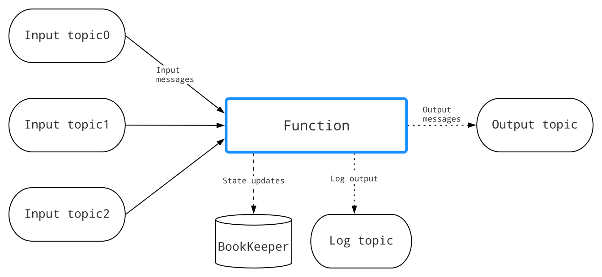

Each time a function receives a message, it completes the following consume-apply-publish steps.

1. Consumes the message from one or more **input topics**.
2. Applies the customized (user-supplied) processing logic to the message.
3. Publishes the output of the message, including:
   1. writes output messages to an **output topic** in Pulsar
   2. writes logs to a **log topic** (if it is configured)for debugging
   3. writes [state](#functions-develop-state) updates to BookKeeper (if it is configured)

You can write functions in Java, Python, and Go. For example, you can use Pulsar Functions to set up the following processing chain:

- A Python function listens for the `raw-sentences` topic and "sanitizes" incoming strings (removing extraneous white space and converting all characters to lowercase) and then publishes the results to a `sanitized-sentences` topic.
- A Java function listens for the `sanitized-sentences` topic, counts the number of times each word appears within a specified time [window](#functions-concepts--window-function), and publishes the results to a `results` topic.
- A Python function listens for the `results` topic and writes the results to a MySQL table.

See [Develop Pulsar Functions](#functions-develop) for more details.

Pulsar Functions perform simple computations on messages before routing the messages to consumers. These Lambda-style functions are specifically designed and integrated with Pulsar. The framework provides a simple computing framework on your Pulsar cluster and takes care of the underlying details of sending and receiving messages. You only need to focus on the business logic.

Pulsar Functions enable your organization to maximize the value of your data and enjoy the benefits of:

- Simplified deployment and operations - you can create a data pipeline without deploying a separate Stream Processing Engine (SPE), such as [Apache Storm](http://storm.apache.org/), [Apache Heron](https://heron.incubator.apache.org/), or [Apache Flink](https://flink.apache.org/).
- Serverless computing (when you use Kubernetes runtime)
- Maximized developer productivity (both language-native interfaces and SDKs for Java/Python/Go).
- Easy troubleshooting

Below are two simple examples of use cases for Pulsar Functions.

This figure shows the process of implementing the classic word count use case.

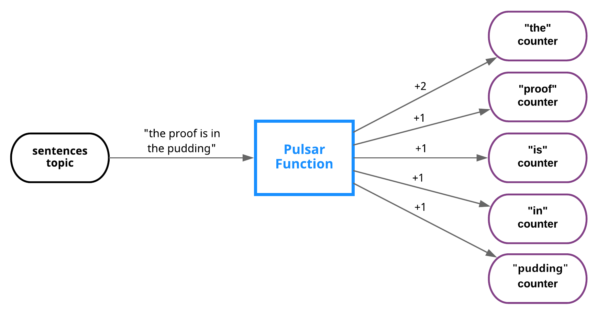

In this example, the function calculates a sum of the occurrences of every individual word published to a given topic.

This figure demonstrates the process of implementing a content-based routing use case.

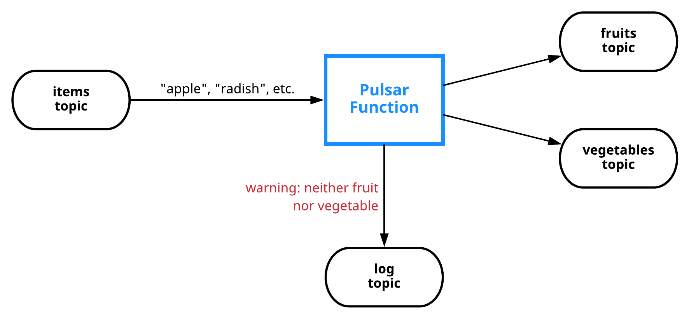

In this example, a function takes items (strings) as input and publishes them to either a `fruits` or `vegetables` topic, depending on the item. If an item is neither fruit nor vegetable, a warning is logged to a [log topic](#functions-develop-log).

- [Function concepts](#functions-concepts)
- [Function CLIs and configs](#functions-cli)

**For developers**

1. [Develop a function](#functions-develop).
2. [Debug a function](#functions-debug).
3. [Package a function](#functions-package).
4. [Deploy a function](#functions-deploy).

**For admins/operators**

1. [Set up function workers](#functions-worker).
2. [Configure function runtime](#functions-runtime).
3. [Deploy a function](#functions-deploy).

---

<a id="functions-package-go"></a>

<!-- source_url: https://pulsar.apache.org/docs/4.1.x/functions-package-go/ -->

<!-- page_index: 112 -->

# Package Go Functions

> [!NOTE]
> Currently, Go functions can be implemented only using SDK and the interface of functions is exposed in the form of SDK. Before using Go functions, you need to import `github.com/apache/pulsar/pulsar-function-go/pf`.

---

<a id="functions-package-java"></a>

<!-- source_url: https://pulsar.apache.org/docs/4.1.x/functions-package-java/ -->

<!-- page_index: 113 -->

# Package Java Functions

> [!NOTE]
> If you plan to package and distribute your function for others to use, you are obligated to
> license and copyright your own code properly. Remember to add the license and copyright to
> all libraries your code uses and to your distribution.
>
> If you use the [NAR](#functions-package-java--package-as-nar) method, the NAR plugin
> automatically creates a `DEPENDENCIES` file in the generated NAR package, including the proper
> licensing and copyrights of all libraries of your function.
>
> For the runtime Java version, refer to [Pulsar Runtime Java Version Recommendation](https://github.com/apache/pulsar/blob/master/README.md#pulsar-runtime-java-version-recommendation) according to your target Pulsar version.

---

<a id="functions-package-python"></a>

<!-- source_url: https://pulsar.apache.org/docs/4.1.x/functions-package-python/ -->

<!-- page_index: 114 -->

# Package Python Functions

> [!NOTE]
> The PIP method is only supported in Kubernetes runtime.

---

<a id="functions-package"></a>

<!-- source_url: https://pulsar.apache.org/docs/4.1.x/functions-package/ -->

<!-- page_index: 115 -->

# Package Pulsar Functions

If you want to submit and run functions in cluster mode, you need to package your functions first.

Before running a Pulsar function, you need to start Pulsar.

You can [run a standalone Pulsar in Docker](#getting-started-docker), or [run Pulsar in Kubernetes](#getting-started-helm). To check whether the Docker image starts, you can use the `docker ps` command.

- [Package Java functions](#functions-package-java)
- [Package Python functions](#functions-package-python)
- [Package Go functions](#functions-package-go)

---

<a id="functions-quickstart"></a>

<!-- source_url: https://pulsar.apache.org/docs/4.1.x/functions-quickstart/ -->

<!-- page_index: 116 -->

# Getting started with Pulsar Functions

> [!NOTE]
> Before starting functions, you need to [start Pulsar](#functions-quickstart--start-standalone-pulsar) and [create a test namespace](#functions-quickstart--create-a-namespace-for-test).

---

<a id="functions-runtime-java-options"></a>

<!-- source_url: https://pulsar.apache.org/docs/4.1.x/functions-runtime-java-options/ -->

<!-- page_index: 117 -->

# Customize Java runtime options

> [!NOTE]
> This setting **only** applies to process runtime and Kubernetes runtime.

---

<a id="functions-runtime-kubernetes"></a>

<!-- source_url: https://pulsar.apache.org/docs/4.1.x/functions-runtime-kubernetes/ -->

<!-- page_index: 118 -->

# Configure Kubernetes runtime

> [!TIP]
> For the rules of translating Pulsar object names into Kubernetes resource labels, see [instructions](#admin-api-overview--how-to-define-pulsar-resource-names-when-running-pulsar-in-kubernetes).

---

<a id="functions-runtime-process"></a>

<!-- source_url: https://pulsar.apache.org/docs/4.1.x/functions-runtime-process/ -->

<!-- page_index: 119 -->

# Configure process runtime

You can use the default configurations of process runtime in the `conf/functions_worker.yml` file.

If you want to customize more parameters, refer to the following example.

```yaml
functionRuntimeFactoryClassName: org.apache.pulsar.functions.runtime.process.ProcessRuntimeFactory 
functionRuntimeFactoryConfigs: 
  # the directory for storing the function logs 
  logDirectory: 
  # change the jar location only when you put the java instance jar in a different location 
  javaInstanceJarLocation: 
  # change the python instance location only when you put the python instance jar in a different location 
  pythonInstanceLocation: 
  # change the extra dependencies location: 
  extraFunctionDependenciesDir: 
```

For more details, see [code](https://github.com/apache/pulsar/blob/master/pulsar-functions/runtime/src/main/java/org/apache/pulsar/functions/runtime/process/ProcessRuntimeFactoryConfig.java).

Pulsar Functions now supports setting runtime parameters using a configuration file **in Python**.

**Example**

You can start a Python runtime using the configuration file `config.ini` with the following command.

```shell
pulsar-admin functions localrun \ 
  --py /path/to/python_instance.py \ 
  --config-file /path/to/config.ini \ 
  --classname MyFunction \ 
  --logging_level debug \ 
  --inputs persistent://public/default/my-input-topic \ 
  --output persistent://public/default/my-output-topic \ 
  --log-topic persistent://public/default/functions-logs 
```

`--config-file` is the path to the configuration file. Note that:

- The  `--config-file` should be written in `.ini` format, with each parameter being configured as `key = value`.

  **Example**


```ini
[DEFAULT] 
logging_level = info 
max_pending_async_requests = 1000 
max_concurrent_requests = 50 
```

- When you set a parameter through both the configuration file and the command line, like `logging_level` in the example above, the value set through the command line will **take precedence over** the one set through the configuration file. As a result, the value of `logging_level` is `debug`.

---

<a id="functions-runtime-thread"></a>

<!-- source_url: https://pulsar.apache.org/docs/4.1.x/functions-runtime-thread/ -->

<!-- page_index: 120 -->

# Configure thread runtime

> [!NOTE]
> If `absoluteValue` and `percentOfMaxDirectMemory` are both set, the smaller value is used.

---

<a id="functions-runtime"></a>

<!-- source_url: https://pulsar.apache.org/docs/4.1.x/functions-runtime/ -->

<!-- page_index: 121 -->

# Configure function runtime

> [!NOTE]
> For the runtime Java version, refer to [Pulsar Runtime Java Version Recommendation](https://github.com/apache/pulsar/blob/master/README.md#pulsar-runtime-java-version-recommendation) according to your target Pulsar version.

---

<a id="functions-worker-corun"></a>

<!-- source_url: https://pulsar.apache.org/docs/4.1.x/functions-worker-corun/ -->

<!-- page_index: 122 -->

# Run function workers with brokers

> [!NOTE]
> The `Service URLs` in the illustration represent Pulsar service URLs that Pulsar client and Pulsar admin use to connect to a Pulsar cluster.

---

<a id="functions-worker-for-geo-replication"></a>

<!-- source_url: https://pulsar.apache.org/docs/4.1.x/functions-worker-for-geo-replication/ -->

<!-- page_index: 123 -->

# Configure function workers for geo-replicated clusters

When running multiple clusters tied together with [geo replication](#concepts-replication), you need to use a different function namespace for each cluster. Otherwise, all functions share one namespace and potentially schedule assignments across clusters.

For example, if you have two clusters: `east-1` and `west-1`, you can configure the function workers for `east-1` and `west-1` respectively in the `conf/functions_worker.yml` file. This ensures the two different function workers use distinct sets of topics for their internal coordination.

```yaml
pulsarFunctionsCluster: east-1 
pulsarFunctionsNamespace: public/functions-east-1 
```

```yaml
pulsarFunctionsCluster: west-1 
pulsarFunctionsNamespace: public/functions-west-1 
```

---

<a id="functions-worker-run-separately"></a>

<!-- source_url: https://pulsar.apache.org/docs/4.1.x/functions-worker-run-separately/ -->

<!-- page_index: 124 -->

# Run function workers separately

> [!NOTE]
> The `Service URLs` in the illustration represent Pulsar service URLs that Pulsar client and Pulsar admin use to connect to a Pulsar cluster.

---

<a id="functions-worker-stateful"></a>

<!-- source_url: https://pulsar.apache.org/docs/4.1.x/functions-worker-stateful/ -->

<!-- page_index: 125 -->

# Enable stateful functions

> [!NOTE]
> When the stateful APIs of Pulsar Functions are required – for example, `putState()` and `queryState()` related interfaces – you need to enable the stateful function feature in function workers.

---

<a id="functions-worker-temp-file-path"></a>

<!-- source_url: https://pulsar.apache.org/docs/4.1.x/functions-worker-temp-file-path/ -->

<!-- page_index: 126 -->

# Configure temporary file path

Function workers use `java.io.tmpdir` in the JVM as the default temporary file path, which is also used as the default extraction file path for each NAR package. NAR packages require a local file path to extract and load to the Java class loader.

If you want to change the default extraction file path for NAR packages to another directory, you can add the following parameter with the desired directory in the `functions_worker.yml` file. The configuration varies depending on the [function runtime](#functions-concepts--function-runtime) you are using.

Function runtime Configuration for temporary file path|  |  |  |  | | --- | --- | --- | --- | | [Thread runtime](#functions-runtime-thread) [Process runtime](#functions-runtime-process) `narExtractionDirectory`| [Kubernetes runtime](#functions-runtime-kubernetes) `functionRuntimeFactoryConfigs.narExtractionDirectory` | | | |

[Thread runtime](#functions-runtime-thread) [Process runtime](#functions-runtime-process) `narExtractionDirectory`| [Kubernetes runtime](#functions-runtime-kubernetes) `functionRuntimeFactoryConfigs.narExtractionDirectory` | |

[Kubernetes runtime](#functions-runtime-kubernetes) `functionRuntimeFactoryConfigs.narExtractionDirectory`

---

<a id="functions-worker-troubleshooting"></a>

<!-- source_url: https://pulsar.apache.org/docs/4.1.x/functions-worker-troubleshooting/ -->

<!-- page_index: 127 -->

# Troubleshooting

**Error message: Namespace missing local cluster name in clusters list**

```text
 
Failed to get partitioned topic metadata: org.apache.pulsar.client.api.PulsarClientException$BrokerMetadataException: Namespace missing local cluster name in clusters list: local_cluster=xyz ns=public/functions clusters=[standalone] 
 
```

The error message displays when any of the following cases occurs:

- a broker is started with `functionsWorkerEnabled=true`, but `pulsarFunctionsCluster` in the `conf/functions_worker.yml` file is not set to the correct cluster.
- setting up a geo-replicated Pulsar cluster with `functionsWorkerEnabled=true`, while brokers in one cluster run well, brokers in the other cluster do not work well.

**Workaround**

If any of these cases happen, follow the instructions below to fix the problem.

1. Disable function workers by setting `functionsWorkerEnabled=false`, and restart brokers.
2. Get the current cluster list of the `public/functions` namespace.


```bash
bin/pulsar-admin namespaces get-clusters public/functions 
```

3. Check if the cluster is in the cluster list. If not, add it and update the list.


```bash
bin/pulsar-admin namespaces set-clusters --clusters <existing-clusters>,<new-cluster> public/functions 
```

4. After setting the cluster successfully, enable function workers by setting `functionsWorkerEnabled=true`.
5. Set the correct cluster name for the `pulsarFunctionsCluster` parameter in the `conf/functions_worker.yml` file.
6. Restart brokers.

---

<a id="functions-worker"></a>

<!-- source_url: https://pulsar.apache.org/docs/4.1.x/functions-worker/ -->

<!-- page_index: 128 -->

# Set up function workers

You have two ways to set up [function workers](#functions-concepts--function-worker).

- [Run function workers with brokers](#functions-worker-corun). Use it when:
  - resource isolation is not required when running functions in process or thread mode;
  - you configure the function workers to run functions on Kubernetes (where the resource isolation problem is addressed by Kubernetes).
- [Run function workers separately](#functions-worker-run-separately). Use it when you want to separate functions and brokers.

**Optional configurations**

- [Configure temporary file path](#functions-worker-temp-file-path)
- [Enable stateful functions](#functions-worker-stateful)
- [Configure function workers for geo-replicated clusters](#functions-worker-for-geo-replication)

**Reference**

- [Troubleshooting](#functions-worker-troubleshooting)

---

<a id="getting-started-docker-compose"></a>

<!-- source_url: https://pulsar.apache.org/docs/4.1.x/getting-started-docker-compose/ -->

<!-- page_index: 129 -->

# Run a Pulsar cluster locally with Docker Compose

To run Pulsar locally with Docker Compose, follow the steps below.

- [Docker](https://docs.docker.com/get-docker/) (version 20.10+ recommended)
- [Docker Compose](https://docs.docker.com/compose/install/) (version 2.0+ recommended)
- At least 8GB of available RAM for the cluster
- At least 10GB of free disk space

To get up and run a Pulsar cluster quickly, you can use the following template to create a `compose.yml` file by modifying or adding the configurations in the **environment** section.

```yaml
version: '3' 
networks: 
  pulsar: 
    driver: bridge 
services: 
  # Start zookeeper 
  zookeeper: 
    image: apachepulsar/pulsar:latest 
    container_name: zookeeper 
    restart: on-failure 
    networks: 
      - pulsar 
    volumes: 
      - ./data/zookeeper:/pulsar/data/zookeeper 
    environment: 
      - metadataStoreUrl=zk:zookeeper:2181 
      - PULSAR_MEM=-Xms256m -Xmx256m -XX:MaxDirectMemorySize=256m 
    command: 
      - bash 
      - -c 
      - | 
        bin/apply-config-from-env.py conf/zookeeper.conf && \ 
        bin/generate-zookeeper-config.sh conf/zookeeper.conf && \ 
        exec bin/pulsar zookeeper 
    healthcheck: 
      test: ["CMD", "bin/pulsar-zookeeper-ruok.sh"] 
      interval: 10s 
      timeout: 5s 
      retries: 30 
 
  # Init cluster metadata 
  pulsar-init: 
    container_name: pulsar-init 
    hostname: pulsar-init 
    image: apachepulsar/pulsar:latest 
    networks: 
      - pulsar 
    command: 
      - bash 
      - -c 
      - | 
        bin/pulsar initialize-cluster-metadata \ 
        --cluster cluster-a \ 
        --zookeeper zookeeper:2181 \ 
        --configuration-store zookeeper:2181 \ 
        --web-service-url http://broker:8080 \ 
        --broker-service-url pulsar://broker:6650 
    depends_on: 
      zookeeper: 
        condition: service_healthy 
 
  # Start bookie 
  bookie: 
    image: apachepulsar/pulsar:latest 
    container_name: bookie 
    restart: on-failure 
    networks: 
      - pulsar 
    environment: 
      - clusterName=cluster-a 
      - zkServers=zookeeper:2181 
      - metadataServiceUri=metadata-store:zk:zookeeper:2181 
      # otherwise every time we run docker compose up or down we fail to start due to Cookie 
      # See: https://github.com/apache/bookkeeper/blob/405e72acf42bb1104296447ea8840d805094c787/bookkeeper-server/src/main/java/org/apache/bookkeeper/bookie/Cookie.java#L57-68 
      - advertisedAddress=bookie 
      - BOOKIE_MEM=-Xms512m -Xmx512m -XX:MaxDirectMemorySize=256m 
    depends_on: 
      zookeeper: 
        condition: service_healthy 
      pulsar-init: 
        condition: service_completed_successfully 
    # Map the local directory to the container to avoid bookie startup failure due to insufficient container disks. 
    volumes: 
      - ./data/bookkeeper:/pulsar/data/bookkeeper 
    command: bash -c "bin/apply-config-from-env.py conf/bookkeeper.conf && exec bin/pulsar bookie" 
 
  # Start broker 
  broker: 
    image: apachepulsar/pulsar:latest 
    container_name: broker 
    hostname: broker 
    restart: on-failure 
    networks: 
      - pulsar 
    environment: 
      - metadataStoreUrl=zk:zookeeper:2181 
      - zookeeperServers=zookeeper:2181 
      - clusterName=cluster-a 
      - managedLedgerDefaultEnsembleSize=1 
      - managedLedgerDefaultWriteQuorum=1 
      - managedLedgerDefaultAckQuorum=1 
      - advertisedAddress=broker 
      - advertisedListeners=external:pulsar://127.0.0.1:6650 
      - PULSAR_MEM=-Xms512m -Xmx512m -XX:MaxDirectMemorySize=256m 
    depends_on: 
      zookeeper: 
        condition: service_healthy 
      bookie: 
        condition: service_started 
    ports: 
      - "6650:6650" 
      - "8080:8080" 
    command: bash -c "bin/apply-config-from-env.py conf/broker.conf && exec bin/pulsar broker" 
```

As preparation, create the data directories that the `compose.yml` file will bind-mount into the Pulsar containers.

On Linux, the mounted directories need to be owned by uid `10000` -- the default user inside the Pulsar Docker container -- so the containers can write to them:

```bash
sudo mkdir -p ./data/zookeeper ./data/bookkeeper 
sudo chown -R 10000 data 
```

> [!NOTE]
> **macOS and Windows (Docker Desktop)**
> On macOS and Windows, Docker Desktop runs containers inside a Linux VM and handles uid remapping for bind mounts for you, so the `chown -R 10000` step is not required and running it with `sudo` will typically fail or leave the files in a state that prevents `docker compose up` from starting cleanly (the bookie/zookeeper containers fail with permission errors on `./data/...`).
>
> If you see permission errors on startup, remove the `./data` directory (or reset its ownership to your user) and create it without `chown`:
>
> ```bash
> mkdir -p ./data/zookeeper ./data/bookkeeper
> ```

To create a Pulsar cluster by using the `compose.yml` file, run the following command.

```bash
docker compose up -d 
```

If you want to destroy the Pulsar cluster with all the containers, run the following command. It will also delete the network that the containers are connected to.

```bash
docker compose down 
```

---

<a id="getting-started-docker"></a>

<!-- source_url: https://pulsar.apache.org/docs/4.1.x/getting-started-docker/ -->

<!-- page_index: 130 -->

# Run a standalone Pulsar cluster in Docker

> [!TIP]
> By default, Pulsar uses RocksDB as the metadata store, which is recommended for standalone instances.
>
> If you encounter issues with RocksDB or need compatibility with existing ZooKeeper-based installations, you can use ZooKeeper as the metadata store by adding:
>
> ```text
> ...
> -e PULSAR_STANDALONE_USE_ZOOKEEPER=1 \
> ...
> ```
>
> Note: Switching metadata stores will create a new cluster. Don't apply this to existing instances unless you want to start fresh.

---

<a id="getting-started-helm"></a>

<!-- source_url: https://pulsar.apache.org/docs/4.1.x/getting-started-helm/ -->

<!-- page_index: 131 -->

# Run a standalone Pulsar cluster in Kubernetes

This section guides you through every step of installing and running Apache Pulsar with Helm on Kubernetes quickly.

For deploying a Pulsar cluster for production usage, read the documentation on [how to configure and install a Pulsar Helm chart](#helm-deploy).

> [!WARNING]
> **Security Notice**
> This quickstart guide uses default configurations suitable for development and testing only. The default Helm chart configuration **does not meet production security requirements**. For production deployments, you must review and customize security settings including authentication, authorization, TLS encryption, and network policies.

- Kubernetes server 1.25.0+ ([latest stable version](https://kubernetes.io/releases/patch-releases/#detailed-release-history-for-active-branches) recommended)
- kubectl version that is compatible with your k8s server version ([+/- 1 minor release version](https://kubernetes.io/docs/tasks/tools/install-kubectl-linux/#before-you-begin))
- Helm 3.12+ (choose a [helm version that is compatible with your k8s server version](https://helm.sh/docs/topics/version_skew/#supported-version-skew))
- At least 8GB of available RAM in your Kubernetes cluster
- At least 20GB of persistent storage available

> [!TIP]
> For the following steps, step 2 and step 3 are for **developers** and step 4 and step 5 are for **administrators**.

To run Pulsar with Helm on Kubernetes, follow the steps below.

Before installing a Pulsar Helm chart, you have to create a Kubernetes cluster. You can follow [the instructions](#helm-prepare) to prepare a Kubernetes cluster.

We use [Minikube](https://minikube.sigs.k8s.io/docs/start/) in this quick start guide. To prepare a Kubernetes cluster, follow these steps:

1. Create a Kubernetes cluster on Minikube.


```bash
minikube start --memory=8192 --cpus=4 
```

2. Set `kubectl` to use Minikube.


```bash
kubectl config use-context minikube 
```

3. To use the [Kubernetes Dashboard](https://kubernetes.io/docs/tasks/access-application-cluster/web-ui-dashboard/) with the local Kubernetes cluster on Minikube, enter the command below:


```bash
minikube dashboard 
```

   The command automatically triggers opening a webpage in your browser.

> [!NOTE]
> When running the script, you can use `-n` to specify the Kubernetes namespace where the Pulsar Helm chart is installed, `-k` to define the Pulsar Helm release name, and `-c` to create the Kubernetes namespace. For more information about the script, run `./scripts/pulsar/prepare_helm_release.sh --help`.

> [!TIP]
> Make sure the `values-minikube.yaml` file contains the following lines:
>
> ```yaml
> pulsar_manager:
>   configData:
>     ENV_SPRING_CONFIGURATION_FILE: "/pulsar-manager/pulsar-manager/application.properties"
>     SPRING_CONFIGURATION_FILE: "/pulsar-manager/pulsar-manager/application.properties"
>     PULSAR_MANAGER_OPTS: " -Dlog4j2.formatMsgNoLookups=true"
> ```

5. Check the status of all pods.


```bash
kubectl get pods -n pulsar 
```

   If all pods start up successfully, you can see that the `STATUS` is changed to `Running` or `Completed`.

   **Output**


```bash
NAME                                         READY   STATUS      RESTARTS   AGE 
pulsar-mini-bookie-0                         1/1     Running     0          9m27s 
pulsar-mini-bookie-init-5gphs                0/1     Completed   0          9m27s 
pulsar-mini-broker-0                         1/1     Running     0          9m27s 
pulsar-mini-grafana-6b7bcc64c7-4tkxd         1/1     Running     0          9m27s 
pulsar-mini-prometheus-5fcf5dd84c-w8mgz      1/1     Running     0          9m27s 
pulsar-mini-proxy-0                          1/1     Running     0          9m27s 
pulsar-mini-pulsar-init-t7cqt                0/1     Completed   0          9m27s 
pulsar-mini-pulsar-manager-9bcbb4d9f-htpcs   1/1     Running     0          9m27s 
pulsar-mini-toolset-0                        1/1     Running     0          9m27s 
pulsar-mini-zookeeper-0                      1/1     Running     0          9m27s 
```

6. Check the status of all services in the namespace `pulsar`.


```bash
kubectl get services -n pulsar 
```

   **Output**


```bash
NAME                         TYPE           CLUSTER-IP       EXTERNAL-IP   PORT(S)                       AGE 
pulsar-mini-bookie           ClusterIP      None             <none>        3181/TCP,8000/TCP             11m 
pulsar-mini-broker           ClusterIP      None             <none>        8080/TCP,6650/TCP             11m 
pulsar-mini-grafana          LoadBalancer   10.106.141.246   <pending>     3000:31905/TCP                11m 
pulsar-mini-prometheus       ClusterIP      None             <none>        9090/TCP                      11m 
pulsar-mini-proxy            LoadBalancer   10.97.240.109    <pending>     80:32305/TCP,6650:31816/TCP   11m 
pulsar-mini-pulsar-manager   LoadBalancer   10.103.192.175   <pending>     9527:30190/TCP                11m 
pulsar-mini-toolset          ClusterIP      None             <none>        <none>                        11m 
pulsar-mini-zookeeper        ClusterIP      None             <none>        2888/TCP,3888/TCP,2181/TCP    11m 
```

`pulsar-admin` is the CLI (Command-Line Interface) tool for Pulsar. In this step, you can use `pulsar-admin` to create resources, including tenants, namespaces, and topics.

> [!TIP]
> To perform a health check, you can use the `bin/pulsar-admin brokers healthcheck` command. For more information, see [Pulsar admin docs](https://pulsar.apache.org/reference/#/4.1.x/pulsar-admin/).

You can use the Pulsar client to create producers and consumers to produce and consume messages.

By default, the Pulsar Helm chart exposes the Pulsar cluster through a Kubernetes `LoadBalancer`. In Minikube, you can use the following command to check the proxy service.

```bash
kubectl get services -n pulsar | grep pulsar-mini-proxy 
```

You will see a similar output as below.

```bash
pulsar-mini-proxy            LoadBalancer   10.97.240.109    <pending>     80:32305/TCP,6650:31816/TCP   28m 
```

This output tells what are the node ports that Pulsar cluster's binary port and HTTP port are mapped to. The port after `80:` is the HTTP port while the port after `6650:` is the binary port.

Then you can find the IP address and exposed ports of your Minikube server by running the following command.

```bash
minikube service pulsar-mini-proxy -n pulsar 
```

**Output**

```bash
|-----------|-------------------|-------------|-------------------------| | NAMESPACE |       NAME        | TARGET PORT |           URL           | |-----------|-------------------|-------------|-------------------------| | pulsar    | pulsar-mini-proxy | http/80     | http://172.17.0.4:32305 | |           |                   | pulsar/6650 | http://172.17.0.4:31816 | |-----------|-------------------|-------------|-------------------------| 🏃  Starting tunnel for service pulsar-mini-proxy.|-----------|-------------------|-------------|------------------------| | NAMESPACE |       NAME        | TARGET PORT |          URL           | |-----------|-------------------|-------------|------------------------| | pulsar    | pulsar-mini-proxy |             | http://127.0.0.1:61853 | |           |                   |             | http://127.0.0.1:61854 | |-----------|-------------------|-------------|------------------------|
```

At this point, you can get the service URLs to connect to your Pulsar client. Here are URL examples:

```text
webServiceUrl=http://127.0.0.1:61853/ 
brokerServiceUrl=pulsar://127.0.0.1:61854/ 
```

Then you can proceed with the following steps:

1. Download the Apache Pulsar tarball from the [downloads page](https://pulsar.apache.org/download/).
2. Decompress the tarball based on your download file.


```bash
tar -xf <file-name>.tar.gz 
```

3. Expose `PULSAR_HOME`.

   (1) Enter the directory of the decompressed download file.

   (2) Expose `PULSAR_HOME` as the environment variable.


```bash
export PULSAR_HOME=$(pwd) 
```

4. Configure the Pulsar client.

   In the `${PULSAR_HOME}/conf/client.conf` file, replace `webServiceUrl` and `brokerServiceUrl` with the service URLs you get from the above steps.
5. Create a subscription to consume messages from `apache/pulsar/test-topic`.


```bash
bin/pulsar-client consume -s sub apache/pulsar/test-topic  -n 0 
```

6. Open a new terminal. In the new terminal, create a producer and send 10 messages to the `test-topic` topic.


```bash
bin/pulsar-client produce apache/pulsar/test-topic  -m "---------hello apache pulsar-------" -n 10 
```

7. Verify the results.

   - From the producer side

     **Output**

     The messages have been produced successfully.


```bash
18:15:15.489 [main] INFO  org.apache.pulsar.client.cli.PulsarClientTool - 10 messages successfully produced 
```

   - From the consumer side

     **Output**

     At the same time, you can receive the messages as below.


```bash
----- got message ----- 
---------hello apache pulsar------- 
----- got message ----- 
---------hello apache pulsar------- 
----- got message ----- 
---------hello apache pulsar------- 
----- got message ----- 
---------hello apache pulsar------- 
----- got message ----- 
---------hello apache pulsar------- 
----- got message ----- 
---------hello apache pulsar------- 
----- got message ----- 
---------hello apache pulsar------- 
----- got message ----- 
---------hello apache pulsar------- 
----- got message ----- 
---------hello apache pulsar------- 
----- got message ----- 
---------hello apache pulsar------- 
```

[Pulsar Manager](#administration-pulsar-manager) is a web-based GUI management tool for managing and monitoring Pulsar.

1. To create a superuser account, connect to the pulsar-manager pod and create the account:

```bash
kubectl exec -it YOUR_PULSAR_MANAGER_POD_NAME -n pulsar -- /bin/bash 
CSRF_TOKEN=$(curl http://localhost:7750/pulsar-manager/csrf-token) 
curl \ 
    -H "X-XSRF-TOKEN: $CSRF_TOKEN" \ 
    -H "Cookie: XSRF-TOKEN=$CSRF_TOKEN;" \ 
    -H 'Content-Type: application/json' \ 
    -X PUT http://localhost:7750/pulsar-manager/users/superuser \ 
    -d '{"name": "pulsar", "password": "pulsar", "description": "test", "email": "username@test.org"}' 
```

2. By default, the `Pulsar Manager` is exposed as a separate `LoadBalancer`. You can open the Pulsar Manager UI using the following command:


```bash
minikube service -n pulsar pulsar-mini-pulsar-manager 
```

3. The Pulsar Manager UI will be open in your browser. You can use the username `pulsar` and password `pulsar` to log into Pulsar Manager.
4. In Pulsar Manager UI, you can create an environment.

   - Click **New Environment** in the upper-left corner.
   - Type `pulsar-mini` for the field `Environment Name` in the pop-up window.
   - Type `http://pulsar-mini-broker:8080` for the field `Service URL` in the pop-up window.
   - Type `http://pulsar-mini-bookie:8080` for the field `Bookie URL` in the pop-up window.
   - Click **Confirm** in the pop-up window.
5. After successfully creating an environment, you can create `tenants`, `namespaces`, and `topics` using the Pulsar Manager.

Grafana is an open-source visualization tool, which can be used for visualizing time series data into dashboards.

1. By default, the Grafana is exposed as a separate `LoadBalancer`. You can open the Grafana UI using the following command:


```bash
minikube service pulsar-mini-grafana -n pulsar 
```

2. The Grafana UI is open in your browser. You can use the username `pulsar` and password `pulsar` to log into the Grafana Dashboard.
3. You can view dashboards for different components of a Pulsar cluster.

---

<a id="helm-deploy"></a>

<!-- source_url: https://pulsar.apache.org/docs/4.1.x/helm-deploy/ -->

<!-- page_index: 132 -->

# Deploy a Pulsar cluster on Kubernetes

> [!NOTE]
> Before installing the production instance of Pulsar, ensure to plan the storage settings to avoid extra storage migration work. Because after initial installation, you must edit Kubernetes objects manually if you want to change storage settings.

---

<a id="helm-prepare"></a>

<!-- source_url: https://pulsar.apache.org/docs/4.1.x/helm-prepare/ -->

<!-- page_index: 133 -->

# Prepare Kubernetes resources

For a fully functional Pulsar cluster, you need a few resources before deploying the Apache Pulsar Helm Chart. This section provides the information about the preparations you need to do before deploying the Pulsar Helm Chart.

Set up your environment by installing the required tools.

`kubectl` 1.18 or higher is the required tool that talks to the Kubernetes API. It needs to be compatible with your cluster ([+/- 1 minor release from your cluster](https://kubernetes.io/docs/tasks/tools/install-kubectl/#before-you-begin)). The server version of `kubectl` cannot be obtained until you connect to a cluster.

For the installation instructions, see the [Kubernetes documentation](https://kubernetes.io/docs/tasks/tools/install-kubectl/#install-kubectl).

Helm is the package manager for Kubernetes. The Apache Pulsar Helm Chart is supported with Helm v3 (3.0.2 or higher).

You can get the Helm from the project's [releases page](https://github.com/helm/helm/releases), or follow other options under the official documentation of [installing Helm](https://helm.sh/docs/intro/install/).

A Kubernetes cluster version 1.18 or higher is required for continuing the deployment. For details about how to create a Kubernetes cluster, see [Kubernetes documentation](https://kubernetes.io/docs/setup/production-environment/tools/).

---

<a id="helm-upgrade"></a>

<!-- source_url: https://pulsar.apache.org/docs/4.1.x/helm-upgrade/ -->

<!-- page_index: 134 -->

# Upgrade Pulsar Helm release

> [!NOTE]
> It's highly recommended to provide all values using the `helm upgrade --set key=value` syntax or the `-f values.yml` instead of using `--reuse-values`, because some of the current values might be deprecated.
>
> You can retrieve your previous `--set` arguments cleanly, with `helm get values <release-name>`. If you direct this into a file (`helm get values <release-name> > pulsar.yml`), you can safely pass this file through `-f`, namely `helm upgrade <release-name> apache/pulsar -f pulsar.yaml`. This safely replaces the behavior of `--reuse-values`.

---

<a id="io-cdc"></a>

<!-- source_url: https://pulsar.apache.org/docs/4.1.x/io-cdc/ -->

<!-- page_index: 135 -->

# CDC connector

CDC source connectors capture log changes of databases (such as MySQL, MongoDB, and PostgreSQL) into Pulsar.

> CDC source connectors are built on top of [Canal](https://github.com/alibaba/canal) and [Debezium](https://debezium.io/) and store all data into Pulsar cluster in a persistent, replicated, and partitioned way.

Currently, Pulsar has the following CDC connectors.

[Debezium source connector](https://pulsar.apache.org/docs/4.1.x/io-cdc-debezium/) - [org.apache.pulsar.io.debezium.DebeziumSource.java](https://github.com/apache/pulsar/blob/master/pulsar-io/debezium/core/src/main/java/org/apache/pulsar/io/debezium/DebeziumSource.java) - [org.apache.pulsar.io.debezium.mysql.DebeziumMysqlSource.java](https://github.com/apache/pulsar/blob/master/pulsar-io/debezium/mysql/src/main/java/org/apache/pulsar/io/debezium/mysql/DebeziumMysqlSource.java) - [org.apache.pulsar.io.debezium.postgres.DebeziumPostgresSource.java](https://github.com/apache/pulsar/blob/master/pulsar-io/debezium/postgres/src/main/java/org/apache/pulsar/io/debezium/postgres/DebeziumPostgresSource.java)

For more information about Canal and Debezium, see the information below.

Subject Reference|  |  |  |  |  |  |  |  | | --- | --- | --- | --- | --- | --- | --- | --- | | How to use Canal source connector with MySQL [Canal guide](https://github.com/alibaba/canal/wiki)| How does Canal work [Canal tutorial](https://github.com/alibaba/canal/wiki)| How to use Debezium source connector with MySQL [Debezium guide](https://debezium.io/docs/connectors/mysql/)| How does Debezium work [Debezium tutorial](https://debezium.io/docs/tutorial/) | | | | | | | |

How to use Canal source connector with MySQL [Canal guide](https://github.com/alibaba/canal/wiki)| How does Canal work [Canal tutorial](https://github.com/alibaba/canal/wiki)| How to use Debezium source connector with MySQL [Debezium guide](https://debezium.io/docs/connectors/mysql/)| How does Debezium work [Debezium tutorial](https://debezium.io/docs/tutorial/) | | | | | |

How does Canal work [Canal tutorial](https://github.com/alibaba/canal/wiki)| How to use Debezium source connector with MySQL [Debezium guide](https://debezium.io/docs/connectors/mysql/)| How does Debezium work [Debezium tutorial](https://debezium.io/docs/tutorial/) | | | |

How to use Debezium source connector with MySQL [Debezium guide](https://debezium.io/docs/connectors/mysql/)| How does Debezium work [Debezium tutorial](https://debezium.io/docs/tutorial/) | |

How does Debezium work [Debezium tutorial](https://debezium.io/docs/tutorial/)

---

<a id="io-connectors"></a>

<!-- source_url: https://pulsar.apache.org/docs/4.1.x/io-connectors/ -->

<!-- page_index: 136 -->

# Built-in connector

Pulsar distribution includes a set of common connectors that have been packaged and tested with the rest of Apache Pulsar. These built-in connectors import and export data from some of the most commonly used data systems.

Using any of these built-in connectors is as easy as writing a simple connector and running the connector locally or submitting the connector to a Pulsar Functions cluster.

Pulsar has various source connectors, which are sorted alphabetically as below.

- [Configuration](https://pulsar.apache.org/docs/4.1.x/io-canal-source/#configuration)
- [Example](https://pulsar.apache.org/docs/4.1.x/io-canal-source/#usage)
- [Java class](https://github.com/apache/pulsar/blob/master/pulsar-io/canal/src/main/java/org/apache/pulsar/io/canal/CanalStringSource.java)

- [Configuration](https://pulsar.apache.org/docs/4.1.x/io-debezium-source/#configuration)
- [Example](https://pulsar.apache.org/docs/4.1.x/io-debezium-source/#example-of-mysql)
- [Java class](https://github.com/apache/pulsar/blob/master/pulsar-io/debezium/mysql/src/main/java/org/apache/pulsar/io/debezium/mysql/DebeziumMysqlSource.java)

- [Configuration](https://pulsar.apache.org/docs/4.1.x/io-debezium-source/#configuration)
- [Example](https://pulsar.apache.org/docs/4.1.x/io-debezium-source/#example-of-postgresql)
- [Java class](https://github.com/apache/pulsar/blob/master/pulsar-io/debezium/postgres/src/main/java/org/apache/pulsar/io/debezium/postgres/DebeziumPostgresSource.java)

- [Configuration](https://pulsar.apache.org/docs/4.1.x/io-debezium-source/#configuration)
- [Example](https://pulsar.apache.org/docs/4.1.x/io-debezium-source/#example-of-mongodb)
- [Java class](https://github.com/apache/pulsar/blob/master/pulsar-io/debezium/mongodb/src/main/java/org/apache/pulsar/io/debezium/mongodb/DebeziumMongoDbSource.java)

- [Configuration](https://pulsar.apache.org/docs/4.1.x/io-debezium-source/#configuration)
- [Example](https://pulsar.apache.org/docs/4.1.x/io-debezium-source/#example-of-oracle)
- [Java class](https://github.com/apache/pulsar/blob/master/pulsar-io/debezium/oracle/src/main/java/org/apache/pulsar/io/debezium/oracle/DebeziumOracleSource.java)

- [Configuration](https://pulsar.apache.org/docs/4.1.x/io-debezium-source/#configuration)
- [Example](https://pulsar.apache.org/docs/4.1.x/io-debezium-source/#example-of-microsoft-sql)
- [Java class](https://github.com/apache/pulsar/blob/master/pulsar-io/debezium/mssql/src/main/java/org/apache/pulsar/io/debezium/mssql/DebeziumMsSqlSource.java)

- [Configuration](https://pulsar.apache.org/docs/4.1.x/io-dynamodb-source/#configuration)
- [Java class](https://github.com/apache/pulsar/blob/master/pulsar-io/dynamodb/src/main/java/org/apache/pulsar/io/dynamodb/DynamoDBSource.java)

- [Configuration](https://pulsar.apache.org/docs/4.1.x/io-file-source/#configuration)
- [Example](https://pulsar.apache.org/docs/4.1.x/io-file-source/#usage)
- [Java class](https://github.com/apache/pulsar/blob/master/pulsar-io/file/src/main/java/org/apache/pulsar/io/file/FileSource.java)

- [Configuration](https://pulsar.apache.org/docs/4.1.x/io-flume-source/#configuration)
- [Java class](https://github.com/apache/pulsar/blob/master/pulsar-io/flume/src/main/java/org/apache/pulsar/io/flume/FlumeConnector.java)

- [Configuration](https://pulsar.apache.org/docs/4.1.x/io-twitter-source/#configuration)
- [Java class](https://github.com/apache/pulsar/blob/master/pulsar-io/twitter/src/main/java/org/apache/pulsar/io/twitter/TwitterFireHose.java)

- [Configuration](https://pulsar.apache.org/docs/4.1.x/io-kafka-source/#configuration)
- [Example](https://pulsar.apache.org/docs/4.1.x/io-kafka-source/#usage)
- [Java class](https://github.com/apache/pulsar/blob/master/pulsar-io/kafka/src/main/java/org/apache/pulsar/io/kafka/KafkaAbstractSource.java)

- [Configuration](https://pulsar.apache.org/docs/4.1.x/io-kinesis-source/#configuration)
- [Java class](https://github.com/apache/pulsar/blob/master/pulsar-io/kinesis/src/main/java/org/apache/pulsar/io/kinesis/KinesisSource.java)

- [Configuration](https://pulsar.apache.org/docs/4.1.x/io-mongo-source/#configuration)
- [Java class](https://github.com/apache/pulsar/blob/master/pulsar-io/mongo/src/main/java/org/apache/pulsar/io/mongodb/MongoSource.java)

- [Configuration](https://pulsar.apache.org/docs/4.1.x/io-netty-source/#configuration)
- [Example of TCP](https://pulsar.apache.org/docs/4.1.x/io-netty-source/#tcp)
- [Example of HTTP](https://pulsar.apache.org/docs/4.1.x/io-netty-source/#http)
- [Java class](https://github.com/apache/pulsar/blob/master/pulsar-io/netty/src/main/java/org/apache/pulsar/io/netty/NettySource.java)

- [Configuration](https://pulsar.apache.org/docs/4.1.x/io-nsq-source/#configuration)
- [Java class](https://github.com/apache/pulsar/blob/master/pulsar-io/nsq/src/main/java/org/apache/pulsar/io/nsq/NSQSource.java)

- [Configuration](https://pulsar.apache.org/docs/4.1.x/io-rabbitmq-source/#configuration)
- [Java class](https://github.com/apache/pulsar/blob/master/pulsar-io/rabbitmq/src/main/java/org/apache/pulsar/io/rabbitmq/RabbitMQSource.java)

Pulsar has various sink connectors, which are sorted alphabetically as below.

- [Configuration](https://pulsar.apache.org/docs/4.1.x/io-aerospike-sink/#configuration)
- [Java class](https://github.com/apache/pulsar/blob/master/pulsar-io/aerospike/src/main/java/org/apache/pulsar/io/aerospike/AerospikeStringSink.java)

- [Configuration](https://pulsar.apache.org/docs/4.1.x/io-alluxio/#configuration)
- [Java class](https://github.com/apache/pulsar/blob/master/pulsar-io/alluxio/src/main/java/org/apache/pulsar/io/alluxio/sink/AlluxioSink.java)

- [Configuration](https://pulsar.apache.org/docs/4.1.x/io-azuredataexplorer-sink/#configuration)
- [Example](https://pulsar.apache.org/docs/4.1.x/io-azuredataexplorer-sink/#example)
- [Java class](https://github.com/apache/pulsar/blob/master/pulsar-io/azure-data-explorer/src/main/java/org/apache/pulsar/io/azuredataexplorer/ADXSink.java)

- [Configuration](https://pulsar.apache.org/docs/4.1.x/io-cassandra-sink/#configuration)
- [Example](https://pulsar.apache.org/docs/4.1.x/io-cassandra-sink/#usage)
- [Java class](https://github.com/apache/pulsar/blob/master/pulsar-io/cassandra/src/main/java/org/apache/pulsar/io/cassandra/CassandraStringSink.java)

- [Configuration](https://pulsar.apache.org/docs/4.1.x/io-elasticsearch-sink/#configuration)
- [Java class](https://github.com/apache/pulsar/blob/master/pulsar-io/elastic-search/src/main/java/org/apache/pulsar/io/elasticsearch/ElasticSearchSink.java)

- [Configuration](https://pulsar.apache.org/docs/4.1.x/io-flume-sink/#configuration)
- [Java class](https://github.com/apache/pulsar/blob/master/pulsar-io/flume/src/main/java/org/apache/pulsar/io/flume/sink/StringSink.java)

- [Configuration](https://pulsar.apache.org/docs/4.1.x/io-hbase-sink/#configuration)
- [Java class](https://github.com/apache/pulsar/blob/master/pulsar-io/hbase/src/main/java/org/apache/pulsar/io/hbase/HbaseAbstractConfig.java)

- [Configuration](https://pulsar.apache.org/docs/4.1.x/io-hdfs2-sink/#configuration)
- [Java class](https://github.com/apache/pulsar/blob/master/pulsar-io/hdfs2/src/main/java/org/apache/pulsar/io/hdfs2/AbstractHdfsConnector.java)

- [Configuration](https://pulsar.apache.org/docs/4.1.x/io-hdfs3-sink/#configuration)
- [Java class](https://github.com/apache/pulsar/blob/master/pulsar-io/hdfs3/src/main/java/org/apache/pulsar/io/hdfs3/AbstractHdfsConnector.java)

- [Configuration](https://pulsar.apache.org/docs/4.1.x/io-http-sink/#configuration)
- [Java class](https://github.com/apache/pulsar/blob/master/pulsar-io/http/src/main/java/org/apache/pulsar/io/http/HttpSink.java)

- [Configuration](https://pulsar.apache.org/docs/4.1.x/io-influxdb-sink/#configuration)
- [Java class](https://github.com/apache/pulsar/blob/master/pulsar-io/influxdb/src/main/java/org/apache/pulsar/io/influxdb/InfluxDBGenericRecordSink.java)

- [Configuration](https://pulsar.apache.org/docs/4.1.x/io-jdbc-sink/#configuration)
- [Example](https://pulsar.apache.org/docs/4.1.x/io-jdbc-sink/#example-of-clickhouse)
- [Java class](https://github.com/apache/pulsar/blob/master/pulsar-io/jdbc/clickhouse/src/main/java/org/apache/pulsar/io/jdbc/ClickHouseJdbcAutoSchemaSink.java)

- [Configuration](https://pulsar.apache.org/docs/4.1.x/io-jdbc-sink/#configuration)
- [Example](https://pulsar.apache.org/docs/4.1.x/io-jdbc-sink/#example-of-mariadb)
- [Java class](https://github.com/apache/pulsar/blob/master/pulsar-io/jdbc/mariadb/src/main/java/org/apache/pulsar/io/jdbc/MariadbJdbcAutoSchemaSink.java)

- [Configuration](https://pulsar.apache.org/docs/4.1.x/io-jdbc-sink/#configuration)
- [Example](https://pulsar.apache.org/docs/4.1.x/io-jdbc-sink/#example-of-openmldb)
- [Java class](https://github.com/apache/pulsar/blob/master/pulsar-io/jdbc/openmldb/src/main/java/org/apache/pulsar/io/jdbc/OpenMLDBJdbcAutoSchemaSink.java)

- [Configuration](https://pulsar.apache.org/docs/4.1.x/io-jdbc-sink/#configuration)
- [Example](https://pulsar.apache.org/docs/4.1.x/io-jdbc-sink/#example-of-postgresql)
- [Java class](https://github.com/apache/pulsar/blob/master/pulsar-io/jdbc/postgres/src/main/java/org/apache/pulsar/io/jdbc/PostgresJdbcAutoSchemaSink.java)

- [Configuration](https://pulsar.apache.org/docs/4.1.x/io-jdbc-sink/#configuration)
- [Example](https://pulsar.apache.org/docs/4.1.x/io-jdbc-sink/#example-of-sqlite)
- [Java class](https://github.com/apache/pulsar/blob/master/pulsar-io/jdbc/sqlite/src/main/java/org/apache/pulsar/io/jdbc/SqliteJdbcAutoSchemaSink.java)

- [Configuration](https://pulsar.apache.org/docs/4.1.x/io-kafka-sink/#configuration)
- [Java class](https://github.com/apache/pulsar/blob/master/pulsar-io/kafka/src/main/java/org/apache/pulsar/io/kafka/KafkaAbstractSink.java)

- [Configuration](https://pulsar.apache.org/docs/4.1.x/io-kinesis-sink/#configuration)
- [Java class](https://github.com/apache/pulsar/blob/master/pulsar-io/kinesis/src/main/java/org/apache/pulsar/io/kinesis/KinesisSink.java)

- [Configuration](https://pulsar.apache.org/docs/4.1.x/io-mongo-sink/#configuration)
- [Java class](https://github.com/apache/pulsar/blob/master/pulsar-io/mongo/src/main/java/org/apache/pulsar/io/mongodb/MongoSink.java)

- [Configuration](https://pulsar.apache.org/docs/4.1.x/io-rabbitmq-sink/#configuration)
- [Java class](https://github.com/apache/pulsar/blob/master/pulsar-io/rabbitmq/src/main/java/org/apache/pulsar/io/rabbitmq/RabbitMQSink.java)

- [Configuration](https://pulsar.apache.org/docs/4.1.x/io-redis-sink/#configuration)
- [Java class](https://github.com/apache/pulsar/blob/master/pulsar-io/redis/src/main/java/org/apache/pulsar/io/redis/RedisAbstractConfig.java)

- [Configuration](https://pulsar.apache.org/docs/4.1.x/io-solr-sink/#configuration)
- [Java class](https://github.com/apache/pulsar/blob/master/pulsar-io/solr/src/main/java/org/apache/pulsar/io/solr/SolrSinkConfig.java)

---

<a id="io-debug"></a>

<!-- source_url: https://pulsar.apache.org/docs/4.1.x/io-debug/ -->

<!-- page_index: 137 -->

# How to debug Pulsar connectors

> [!TIP]
> For more information about the `localrun` command, see [`localrun`](https://pulsar.apache.org/docs/4.1.x/reference-connector-admin/).

---

<a id="io-develop"></a>

<!-- source_url: https://pulsar.apache.org/docs/4.1.x/io-develop/ -->

<!-- page_index: 138 -->

# How to develop Pulsar connectors

> [!TIP]
> For more information about **how to create a source connector**, see [KafkaSource](https://github.com/apache/pulsar/tree/master//pulsar-io/kafka/src/main/java/org/apache/pulsar/io/kafka/KafkaAbstractSource.java).

---

<a id="io-overview"></a>

<!-- source_url: https://pulsar.apache.org/docs/4.1.x/io-overview/ -->

<!-- page_index: 139 -->

# Pulsar connector overview

Messaging systems are most powerful when you can easily use them with external systems like databases and other messaging systems.

**Pulsar IO connectors** enable you to easily create, deploy, and manage connectors that interact with external systems, such as [Apache Cassandra](https://cassandra.apache.org), [Aerospike](https://www.aerospike.com), and many others.

Pulsar IO connectors come in two types:

- [Source](#io-overview--source)
- [Sink](#io-overview--sink)

This diagram illustrates the relationship between source, Pulsar, and sink:

")

Source connectors **feed data from external systems into Pulsar**.

Common sources include other messaging systems and firehose-style data pipeline APIs.

For the complete list of Pulsar built-in source connectors, see [source connector](#io-connectors--source-connector).

Sink connectors **feed data from Pulsar into external systems**.

Common sinks include other messaging systems and SQL and NoSQL databases.

For the complete list of Pulsar built-in sink connectors, see [sink connector](#io-connectors--sink-connector).

Processing guarantees are used to handle errors when writing messages to Pulsar topics.

> Pulsar connectors and Functions use the **same** processing guarantees as below.

Delivery semantic Description|  |  |  |  |  |  | | --- | --- | --- | --- | --- | --- | | `at-most-once` Each message sent to a connector is to be **processed once** or **not to be processed**.| `at-least-once` Each message sent to a connector is to be **processed once** or **more than once**.| `effectively-once` Each message sent to a connector has **one output associated** with it. | | | | | |

`at-most-once` Each message sent to a connector is to be **processed once** or **not to be processed**.| `at-least-once` Each message sent to a connector is to be **processed once** or **more than once**.| `effectively-once` Each message sent to a connector has **one output associated** with it. | | | |

`at-least-once` Each message sent to a connector is to be **processed once** or **more than once**.| `effectively-once` Each message sent to a connector has **one output associated** with it. | |

`effectively-once` Each message sent to a connector has **one output associated** with it.

Processing guarantees for connectors not just rely on Pulsar guarantee but also **relate to external systems**, that is, **the implementation of source and sink**.

- Source

  Pulsar ensures that writing messages to Pulsar topics respects the processing guarantees. It is within Pulsar's control.
- Sink

  The processing guarantees rely on the sink implementation. If the sink implementation does not handle retries in an idempotent way, the sink does not respect the processing guarantees.

When creating a connector, you can set the processing guarantee with the following semantics:

- ATLEAST\_ONCE
- ATMOST\_ONCE
- EFFECTIVELY\_ONCE

> If `--processing-guarantees` is not specified when creating a connector, the default semantic is `ATLEAST_ONCE`.

Take **Admin CLI** as an example. For more information about **REST API** or **JAVA Admin API**, see [here](#io-use--create).

<div class="theme-tabs-container tabs-container tabList__CuJ"><ul><li>Source<li>Sink</li></li></ul><div><div><div><div><pre><code><div><span>bin/pulsar-admin sources create </span><span>\</span><span></span> </div><div><span>    --processing-guarantees ATMOST_ONCE </span><span>\</span><span></span> </div><div><span>    </span><span># Other source configs</span> </div></code></pre></div></div><p>For more information about the options of <code>pulsar-admin sources create</code>, see <a href="https://pulsar.apache.org/docs/4.1.x/reference-connector-admin/">here</a>.</p></div><div><div><div><pre><code><div><span>bin/pulsar-admin sinks create </span><span>\</span><span></span> </div><div><span>    --processing-guarantees EFFECTIVELY_ONCE </span><span>\</span><span></span> </div><div><span>    </span><span># Other sink configs</span> </div></code></pre></div></div><p>For more information about the options of <code>pulsar-admin sinks create</code>, see <a href="https://pulsar.apache.org/docs/4.1.x/reference-connector-admin/">here</a>.</p></div></div></div>

After creating a connector, you can update the processing guarantee with the following semantics:

- ATLEAST\_ONCE
- ATMOST\_ONCE
- EFFECTIVELY\_ONCE

Take **Admin CLI** as an example. For more information about **REST API** or **JAVA Admin API**, see [here](#io-use--create).

<div class="theme-tabs-container tabs-container tabList__CuJ"><ul><li>Source<li>Sink</li></li></ul><div><div><div><div><pre><code><div><span>bin/pulsar-admin sources update </span><span>\</span><span></span> </div><div><span>    --processing-guarantees EFFECTIVELY_ONCE </span><span>\</span><span></span> </div><div><span>    </span><span># Other source configs</span> </div></code></pre></div></div><p>For more information about the options of <code>pulsar-admin sources update</code>, see <a href="https://pulsar.apache.org/docs/4.1.x/reference-connector-admin/">here</a>.</p></div><div><div><div><pre><code><div><span>bin/pulsar-admin sinks update </span><span>\</span><span></span> </div><div><span>    --processing-guarantees ATMOST_ONCE </span><span>\</span><span></span> </div><div><span>    </span><span># Other sink configs</span> </div></code></pre></div></div><p>For more information about the options of <code>pulsar-admin sinks update</code>, see <a href="https://pulsar.apache.org/docs/4.1.x/reference-connector-admin/">here</a>.</p></div></div></div>

To manage Pulsar connectors (for example, create, update, start, stop, restart, reload, delete and perform other operations on connectors), you can use the `Connector Admin CLI` with sources and sinks subcommands. For the latest and complete information, see [Pulsar admin docs](https://pulsar.apache.org/reference/#/4.1.x/pulsar-admin/).

Connectors (sources and sinks) and Functions are components of instances, and they all run on Functions workers. When managing a source, sink or function via the `Connector Admin CLI` or `Functions Admin CLI`, an instance is started on a worker. For more information, see [Functions worker](#functions-worker).

---

<a id="io-quickstart"></a>

<!-- source_url: https://pulsar.apache.org/docs/4.1.x/io-quickstart/ -->

<!-- page_index: 140 -->

# How to connect Pulsar to database

> [!TIP]
> - These instructions assume you are running Pulsar in standalone mode. However, all the commands used in this tutorial can be used in a multi-node Pulsar cluster without any changes.
> - All the instructions are assumed to run at the root directory of a Pulsar binary distribution.

---

<a id="io-use"></a>

<!-- source_url: https://pulsar.apache.org/docs/4.1.x/io-use/ -->

<!-- page_index: 141 -->

# How to use Pulsar connectors

> [!NOTE]
> When using a non-built-in connector, you need to specify the path of an archive file for the connector.

---

<a id="performance-pulsar-perf"></a>

<!-- source_url: https://pulsar.apache.org/docs/4.1.x/performance-pulsar-perf/ -->

<!-- page_index: 142 -->

# Pulsar Perf

> [!TIP]
> For the latest and complete information about `pulsar-perf`, including commands, flags, descriptions, and more, see [`pulsar-perf`](https://pulsar.apache.org/reference/#/4.1.x/pulsar-perf/).

---

<a id="reference-metrics-opentelemetry"></a>

<!-- source_url: https://pulsar.apache.org/docs/4.1.x/reference-metrics-opentelemetry/ -->

<!-- page_index: 143 -->

# Pulsar OpenTelemetry Metrics

Pulsar exposes the following OpenTelemetry metrics.

The number of connections.

- Type: UpDownCounter
- Unit: `{connection}`
- Attributes:
  - `pulsar.connection.status` - The status of the connection. Can be one of:
    - `active`
    - `open`
    - `close`

The number of connection create operations.

- Type: UpDownCounter
- Unit: `{operation}`
- Attributes:
  - `pulsar.connection.create.operation.status` - The status of the create operation. Can be one of:
    - `success`
    - `failure`

The number of times a connection has been rate limited.

- Type: Counter
- Unit: `{operation}`
- Attributes:
  - `pulsar.connection.rate_limit.operation.name` - The name of the rate limiting operation performed. Can be one of:
    - `paused`
    - `resumed`
    - `throttled`
    - `unthrottled`

The number of Pulsar subscriptions of the topic served by this broker.

- Type: UpDownCounter
- Unit: `{subscription}`
- Attributes:
  - `pulsar.domain` - The domain of the topic. Can be one of:
    - `persistent`
    - `non-persistent`
  - `pulsar.tenant` - The topic tenant.
  - `pulsar.namespace` - The topic namespace.
  - `pulsar.topic` - The topic name.
  - `pulsar.partition.index` - The partition index of the topic. Present only if the topic is partitioned.

The number of active producers of the topic connected to this broker.

- Type: UpDownCounter
- Unit: `{producer}`
- Attributes:
  - `pulsar.domain` - The domain of the topic. Can be one of:
    - `persistent`
    - `non-persistent`
  - `pulsar.tenant` - The topic tenant.
  - `pulsar.namespace` - The topic namespace.
  - `pulsar.topic` - The topic name.
  - `pulsar.partition.index` - The partition index of the topic. Present only if the topic is partitioned.

The number of active consumers of the topic connected to this broker.

- Type: UpDownCounter
- Unit: `{consumer}`
- Attributes:
  - `pulsar.domain` - The domain of the topic. Can be one of:
    - `persistent`
    - `non-persistent`
  - `pulsar.tenant` - The topic tenant.
  - `pulsar.namespace` - The topic namespace.
  - `pulsar.topic` - The topic name.
  - `pulsar.partition.index` - The partition index of the topic. Present only if the topic is partitioned.

The total number of messages received for this topic.

- Type: Counter
- Unit: `{message}`
- Attributes:
  - `pulsar.domain` - The domain of the topic. Can be one of:
    - `persistent`
    - `non-persistent`
  - `pulsar.tenant` - The topic tenant.
  - `pulsar.namespace` - The topic namespace.
  - `pulsar.topic` - The topic name.
  - `pulsar.partition.index` - The partition index of the topic. Present only if the topic is partitioned.

The total number of messages read from this topic.

- Type: Counter
- Unit: `{message}`
- Attributes:
  - `pulsar.domain` - The domain of the topic. Can be one of:
    - `persistent`
    - `non-persistent`
  - `pulsar.tenant` - The topic tenant.
  - `pulsar.namespace` - The topic namespace.
  - `pulsar.topic` - The topic name.
  - `pulsar.partition.index` - The partition index of the topic. Present only if the topic is partitioned.

The total number of messages bytes received for this topic.

- Type: Counter
- Unit: `By`
- Attributes:
  - `pulsar.domain` - The domain of the topic. Can be one of:
    - `persistent`
    - `non-persistent`
  - `pulsar.tenant` - The topic tenant.
  - `pulsar.namespace` - The topic namespace.
  - `pulsar.topic` - The topic name.
  - `pulsar.partition.index` - The partition index of the topic. Present only if the topic is partitioned.

The total number of messages bytes read from this topic.

- Type: Counter
- Unit: `By`
- Attributes:
  - `pulsar.domain` - The domain of the topic. Can be one of:
    - `persistent`
    - `non-persistent`
  - `pulsar.tenant` - The topic tenant.
  - `pulsar.namespace` - The topic namespace.
  - `pulsar.topic` - The topic name.
  - `pulsar.partition.index` - The partition index of the topic. Present only if the topic is partitioned.

The latency in seconds for publishing messages.

- Type: Histogram
- Unit: `s`

The number of times the publish rate limit is triggered.

- Type: Counter
- Unit: `{event}`
- Attributes:
  - `pulsar.domain` - The domain of the topic. Can be one of:
    - `persistent`
    - `non-persistent`
  - `pulsar.tenant` - The topic tenant.
  - `pulsar.namespace` - The topic namespace.
  - `pulsar.topic` - The topic name.
  - `pulsar.partition.index` - The partition index of the topic. Present only if the topic is partitioned.

The total storage size of the messages in this topic, including storage used by replicas.

- Type: UpDownCounter
- Unit: `By`
- Attributes:
  - `pulsar.domain` - The domain of the topic. Can be one of:
    - `persistent`
    - `non-persistent`
  - `pulsar.tenant` - The topic tenant.
  - `pulsar.namespace` - The topic namespace.
  - `pulsar.topic` - The topic name.
  - `pulsar.partition.index` - The partition index of the topic. Present only if the topic is partitioned.

The storage size of the messages in this topic, excluding storage used by replicas.

- Type: UpDownCounter
- Unit: `By`
- Attributes:
  - `pulsar.domain` - The domain of the topic. Can be one of:
    - `persistent`
    - `non-persistent`
  - `pulsar.tenant` - The topic tenant.
  - `pulsar.namespace` - The topic namespace.
  - `pulsar.topic` - The topic name.
  - `pulsar.partition.index` - The partition index of the topic. Present only if the topic is partitioned.

The size of the backlog storage for this topic.

- Type: UpDownCounter
- Unit: `By`
- Attributes:
  - `pulsar.domain` - The domain of the topic. Can be one of:
    - `persistent`
    - `non-persistent`
  - `pulsar.tenant` - The topic tenant.
  - `pulsar.namespace` - The topic namespace.
  - `pulsar.topic` - The topic name.
  - `pulsar.partition.index` - The partition index of the topic. Present only if the topic is partitioned.

The total amount of the data in this topic offloaded to the tiered storage.

- Type: UpDownCounter
- Unit: `By`
- Attributes:
  - `pulsar.domain` - The domain of the topic. Can be one of:
    - `persistent`
    - `non-persistent`
  - `pulsar.tenant` - The topic tenant.
  - `pulsar.namespace` - The topic namespace.
  - `pulsar.topic` - The topic name.
  - `pulsar.partition.index` - The partition index of the topic. Present only if the topic is partitioned.

The size based backlog quota limit for this topic.

- Type: UpDownCounter
- Unit: `By`
- Attributes:
  - `pulsar.domain` - The domain of the topic. Can be one of:
    - `persistent`
    - `non-persistent`
  - `pulsar.tenant` - The topic tenant.
  - `pulsar.namespace` - The topic namespace.
  - `pulsar.topic` - The topic name.
  - `pulsar.partition.index` - The partition index of the topic. Present only if the topic is partitioned.

The time based backlog quota limit for this topic.

- Type: Gauge
- Unit: `s`
- Attributes:
  - `pulsar.domain` - The domain of the topic. Can be one of:
    - `persistent`
    - `non-persistent`
  - `pulsar.tenant` - The topic tenant.
  - `pulsar.namespace` - The topic namespace.
  - `pulsar.topic` - The topic name.
  - `pulsar.partition.index` - The partition index of the topic. Present only if the topic is partitioned.

The number of times a backlog was evicted since it has exceeded its quota.

- Type: Counter
- Unit: `{eviction}`
- Attributes:
  - `pulsar.domain` - The domain of the topic. Can be one of:
    - `persistent`
    - `non-persistent`
  - `pulsar.tenant` - The topic tenant.
  - `pulsar.namespace` - The topic namespace.
  - `pulsar.topic` - The topic name.
  - `pulsar.partition.index` - The partition index of the topic. Present only if the topic is partitioned.
  - `pulsar.backlog.quota.type` - The backlog quota type. Can be one of:
    - `size`
    - `time`

The age of the oldest unacknowledged message (backlog).

- Type: Gauge
- Unit: `s`
- Attributes:
  - `pulsar.domain` - The domain of the topic. Can be one of:
    - `persistent`
    - `non-persistent`
  - `pulsar.tenant` - The topic tenant.
  - `pulsar.namespace` - The topic namespace.
  - `pulsar.topic` - The topic name.
  - `pulsar.partition.index` - The partition index of the topic. Present only if the topic is partitioned.

The total message batches (entries) written to the storage for this topic.

- Type: Counter
- Unit: `{entry}`
- Attributes:
  - `pulsar.domain` - The domain of the topic. Can be one of:
    - `persistent`
    - `non-persistent`
  - `pulsar.tenant` - The topic tenant.
  - `pulsar.namespace` - The topic namespace.
  - `pulsar.topic` - The topic name.
  - `pulsar.partition.index` - The partition index of the topic. Present only if the topic is partitioned.

The total message batches (entries) read from the storage for this topic.

- Type: Counter
- Unit: `{entry}`
- Attributes:
  - `pulsar.domain` - The domain of the topic. Can be one of:
    - `persistent`
    - `non-persistent`
  - `pulsar.tenant` - The topic tenant.
  - `pulsar.namespace` - The topic namespace.
  - `pulsar.topic` - The topic name.
  - `pulsar.partition.index` - The partition index of the topic. Present only if the topic is partitioned.

The total number of messages removed by compaction.

- Type: Counter
- Unit: `{message}`
- Attributes:
  - `pulsar.domain` - The domain of the topic. Can be one of:
    - `persistent`
    - `non-persistent`
  - `pulsar.tenant` - The topic tenant.
  - `pulsar.namespace` - The topic namespace.
  - `pulsar.topic` - The topic name.
  - `pulsar.partition.index` - The partition index of the topic. Present only if the topic is partitioned.

The total number of compaction operations.

- Type: Counter
- Unit: `{operation}`
- Attributes:
  - `pulsar.domain` - The domain of the topic. Can be one of:
    - `persistent`
    - `non-persistent`
  - `pulsar.tenant` - The topic tenant.
  - `pulsar.namespace` - The topic namespace.
  - `pulsar.topic` - The topic name.
  - `pulsar.partition.index` - The partition index of the topic. Present only if the topic is partitioned.
  - `pulsar.compaction.status` - The compaction status. Can be one of:
    - `success`
    - `failure

The total time duration of compaction operations on the topic.

- Type: DoubleUpDownCounter
- Unit: `s`
- Attributes:
  - `pulsar.domain` - The domain of the topic. Can be one of:
    - `persistent`
    - `non-persistent`
  - `pulsar.tenant` - The topic tenant.
  - `pulsar.namespace` - The topic namespace.
  - `pulsar.topic` - The topic name.
  - `pulsar.partition.index` - The partition index of the topic. Present only if the topic is partitioned.

The total count of bytes read by the compaction process for this topic.

- Type: Counter
- Unit: `By`
- Attributes:
  - `pulsar.domain` - The domain of the topic. Can be one of:
    - `persistent`
    - `non-persistent`
  - `pulsar.tenant` - The topic tenant.
  - `pulsar.namespace` - The topic namespace.
  - `pulsar.topic` - The topic name.
  - `pulsar.partition.index` - The partition index of the topic. Present only if the topic is partitioned.

The total count of bytes written by the compaction process for this topic.

- Type: Counter
- Unit: `By`
- Attributes:
  - `pulsar.domain` - The domain of the topic. Can be one of:
    - `persistent`
    - `non-persistent`
  - `pulsar.tenant` - The topic tenant.
  - `pulsar.namespace` - The topic namespace.
  - `pulsar.topic` - The topic name.
  - `pulsar.partition.index` - The partition index of the topic. Present only if the topic is partitioned.

The total number of compacted entries.

- Type: Counter
- Unit: `{entry}`
- Attributes:
  - `pulsar.domain` - The domain of the topic. Can be one of:
    - `persistent`
    - `non-persistent`
  - `pulsar.tenant` - The topic tenant.
  - `pulsar.namespace` - The topic namespace.
  - `pulsar.topic` - The topic name.
  - `pulsar.partition.index` - The partition index of the topic. Present only if the topic is partitioned.

The total size of the compacted entries.

- Type: Counter
- Unit: `By`
- Attributes:
  - `pulsar.domain` - The domain of the topic. Can be one of:
    - `persistent`
    - `non-persistent`
  - `pulsar.tenant` - The topic tenant.
  - `pulsar.namespace` - The topic namespace.
  - `pulsar.topic` - The topic name.
  - `pulsar.partition.index` - The partition index of the topic. Present only if the topic is partitioned.

The number of transactions on this topic.

- Type: UpDownCounter
- Unit: `{transaction}`
- Attributes:
  - `pulsar.domain` - The domain of the topic. Can be one of:
    - `persistent`
    - `non-persistent`
  - `pulsar.tenant` - The topic tenant.
  - `pulsar.namespace` - The topic namespace.
  - `pulsar.topic` - The topic name.
  - `pulsar.partition.index` - The partition index of the topic. Present only if the topic is partitioned.
  - `pulsar.transaction.status` - The transaction status. Can be one of:
    - `active`
    - `committed`
    - `aborted`

The number of operations on the transaction buffer client.

- Type: Counter
- Unit: `{operation}`
- Attributes:
  - `pulsar.tenant` - The topic tenant.
  - `pulsar.namespace` - The topic namespace.
  - `pulsar.topic` - The topic name.
  - `pulsar.partition.index` - The partition index of the topic. Present only if the topic is partitioned.
  - `pulsar.transaction.status` - The status of the Pulsar transaction. Can be one of:
    - `aborted`
    - `committed`
  - `pulsar.transaction.buffer.client.operation.status` - The status of the Pulsar transaction buffer client operation. Can be one of:
    - `failure`
    - `success`

The total number of message batches (entries) delayed for dispatching.

- Type: UpDownCounter
- Unit: `{entry}`
- Attributes:
  - `pulsar.domain` - The domain of the topic. Can be one of:
    - `persistent`
    - `non-persistent`
  - `pulsar.tenant` - The topic tenant.
  - `pulsar.namespace` - The topic namespace.
  - `pulsar.topic` - The topic name.
  - `pulsar.partition.index` - The partition index of the topic. Present only if the topic is partitioned.

The duration of topic lookup requests (either binary or HTTP)

- Type: Histogram
- Unit: `second`
- Attributes:
  - `pulsar.lookup.response` - The response type of the lookup request
    - `failure`
    - `broker`
    - `redirect`

The number of pending lookup operations in the broker. When it reaches threshold "maxConcurrentLookupRequest" defined in broker.conf, new requests are rejected.

- Type: UpDownCounter
- Unit: `{operation}`

The maximum number of pending lookup operations in the broker. Equal to "maxConcurrentLookupRequest" defined in broker.conf.

- Type: UpDownCounter
- Unit: `{operation}`

The number of pending topic load operations in the broker. When it reaches threshold "maxConcurrentTopicLoadRequest" defined in broker.conf, new requests are rejected.

- Type: UpDownCounter
- Unit: `{operation}`

The maximum number of pending topic load operations in the broker. Equal to "maxConcurrentTopicLoadRequest" defined in broker.conf.

- Type: UpDownCounter
- Unit: `{operation}`

The total amount of data written to the metadata store.

- Type: Counter
- Unit: `{By}`
- Attributes:
  - `pulsar.metadata.store.name` - The name of the metadata store.

The number of batch operations in the metadata store executor queue.

- Type: UpDownCounter
- Unit: `{operation}`
- Attributes:
  - `pulsar.metadata.store.name` - The name of the metadata store.

The total number of messages dispatched to this consumer.

- Type: Counter
- Unit: `{message}`
- Attributes:
  - `pulsar.domain` - The domain of the topic. Can be one of:
    - `persistent`
    - `non-persistent`
  - `pulsar.tenant` - The topic tenant.
  - `pulsar.namespace` - The topic namespace.
  - `pulsar.topic` - The topic name.
  - `pulsar.subscription.name` - The topic subscription name.
  - `pulsar.subscription.type` - The subscription type.
  - `pulsar.consumer.name` - The name of the consumer.
  - `pulsar.consumer.id` - The ID of the consumer.

The total number of messages bytes dispatched to this consumer.

- Type: Counter
- Unit: `By`
- Attributes:
  - `pulsar.domain` - The domain of the topic. Can be one of:
    - `persistent`
    - `non-persistent`
  - `pulsar.tenant` - The topic tenant.
  - `pulsar.namespace` - The topic namespace.
  - `pulsar.topic` - The topic name.
  - `pulsar.subscription.name` - The topic subscription name.
  - `pulsar.subscription.type` - The subscription type.
  - `pulsar.consumer.name` - The name of the consumer.
  - `pulsar.consumer.id` - The ID of the consumer.

The total number of message acknowledgments received from this consumer.

- Type: Counter
- Unit: `{ack}`
- Attributes:
  - `pulsar.domain` - The domain of the topic. Can be one of:
    - `persistent`
    - `non-persistent`
  - `pulsar.tenant` - The topic tenant.
  - `pulsar.namespace` - The topic namespace.
  - `pulsar.topic` - The topic name.
  - `pulsar.subscription.name` - The topic subscription name.
  - `pulsar.subscription.type` - The subscription type.
  - `pulsar.consumer.name` - The name of the consumer.
  - `pulsar.consumer.id` - The ID of the consumer.

The total number of messages that have been redelivered to this consumer.

- Type: Counter
- Unit: `{message}`
- Attributes:
  - `pulsar.domain` - The domain of the topic. Can be one of:
    - `persistent`
    - `non-persistent`
  - `pulsar.tenant` - The topic tenant.
  - `pulsar.namespace` - The topic namespace.
  - `pulsar.topic` - The topic name.
  - `pulsar.subscription.name` - The topic subscription name.
  - `pulsar.subscription.type` - The subscription type.
  - `pulsar.consumer.name` - The name of the consumer.
  - `pulsar.consumer.id` - The ID of the consumer.

The number of messages currently unacknowledged by this consumer.

- Type: UpDownCounter
- Unit: `{message}`
- Attributes:
  - `pulsar.domain` - The domain of the topic. Can be one of:
    - `persistent`
    - `non-persistent`
  - `pulsar.tenant` - The topic tenant.
  - `pulsar.namespace` - The topic namespace.
  - `pulsar.topic` - The topic name.
  - `pulsar.subscription.name` - The topic subscription name.
  - `pulsar.subscription.type` - The subscription type.
  - `pulsar.consumer.name` - The name of the consumer.
  - `pulsar.consumer.id` - The ID of the consumer.

The number of permits currently available for this consumer.

- Type: UpDownCounter
- Unit: `{permit}`
- Attributes:
  - `pulsar.domain` - The domain of the topic. Can be one of:
    - `persistent`
    - `non-persistent`
  - `pulsar.tenant` - The topic tenant.
  - `pulsar.namespace` - The topic namespace.
  - `pulsar.topic` - The topic name.
  - `pulsar.subscription.name` - The topic subscription name.
  - `pulsar.subscription.type` - The subscription type.
  - `pulsar.consumer.name` - The name of the consumer.
  - `pulsar.consumer.id` - The ID of the consumer.

The number of acknowledgment operations on the ledger.

- Type: Counter
- Unit: `{operation}`
- Attributes:
  - `pulsar.namespace` - The topic namespace.
  - `pulsar.managed_ledger.name` - The name of the managed ledger.
  - `pulsar.managed_ledger.cursor.name` - The name of the managed cursor.
  - `pulsar.managed_ledger.cursor.operation.status` - The status of the managed cursor operation. Can be one of:
    - `success`
    - `failure`

The number of acknowledgment operations in the metadata store.

- Type: Counter
- Unit: `{operation}`
- Attributes:
  - `pulsar.namespace` - The topic namespace.
  - `pulsar.managed_ledger.name` - The name of the managed ledger.
  - `pulsar.managed_ledger.cursor.name` - The name of the managed cursor.
  - `pulsar.managed_ledger.cursor.operation.status` - The status of the managed cursor operation. Can be one of:
    - `success`
    - `failure`

The number of non-contiguous deleted messages ranges.

- Type: UpDownCounter
- Unit: `{range}`
- Attributes:
  - `pulsar.namespace` - The topic namespace.
  - `pulsar.managed_ledger.name` - The name of the managed ledger.
  - `pulsar.managed_ledger.cursor.name` - The name of the managed cursor.

The total amount of data written to the ledger.

- Type: Counter
- Unit: `{By}`
- Attributes:
  - `pulsar.namespace` - The topic namespace.
  - `pulsar.managed_ledger.name` - The name of the managed ledger.
  - `pulsar.managed_ledger.cursor.name` - The name of the managed cursor.

The total amount of data written to the ledger, not including replicas.

- Type: Counter
- Unit: `{By}`
- Attributes:
  - `pulsar.namespace` - The topic namespace.
  - `pulsar.managed_ledger.name` - The name of the managed ledger.
  - `pulsar.managed_ledger.cursor.name` - The name of the managed cursor.

The total amount of data read from the ledger.

- Type: Counter
- Unit: `{By}`
- Attributes:
  - `pulsar.namespace` - The topic namespace.
  - `pulsar.managed_ledger.name` - The name of the managed ledger.
  - `pulsar.managed_ledger.cursor.name` - The name of the managed cursor.

The total number of managed ledgers.

- Type: UpDownCounter
- Unit: `{managed_ledger}`

The total number of cache eviction operations.

- Type: Counter
- Unit: `{eviction}`

The number of entries in the entry cache.

- Type: UpDownCounter
- Unit: `{entry}`
- Attributes:
  - `pulsar.managed_ledger.cache.entry.status` - The status of the cache entry. Can be one of:
    - `active` - Indicates the number of entries currently in the cache. Equal to the `evicted - inserted`.
    - `inserted` - Indicates the total number of entries inserted into the cache.
    - `evicted` - Indicates the total number of entries evicted from the cache.

The byte amount of entries stored in the entry cache.

- Type: UpDownCounter
- Unit: `{By}`

The number of cache operations.

- Type: Counter
- Unit: `{entry}`
- Attributes:
  - `pulsar.managed_ledger.cache.operation.status` - The cache operation result. Can be one of:
    - `hit` - Indicates a successful cache lookup operation.
    - `miss` - Indicates a failed cache lookup operation.

The byte amount of data retrieved from cache operations.

- Type: Counter
- Unit: `{By}`
- Attributes:
  - `pulsar.managed_ledger.cache.operation.status` - The cache operation result. Can be one of:
    - `hit` - Indicates a successful cache lookup operation.
    - `miss` - Indicates a failed cache lookup operation.

The number of currently active allocations in the direct arena.

- Type: UpDownCounter
- Unit: `{allocation}`
- Attributes:
  - `pulsar.managed_ledger.pool.arena.type` - The arena type. Can be one of:
    - `small`
    - `normal`
    - `huge`

The memory allocated in the direct arena.

- Type: UpDownCounter
- Unit: `{By}`
- Attributes:
  - `pulsar.managed_ledger.pool.chunk.allocation.type` - The chunk allocation type. Can be one of:
    - `allocated`
    - `used`

The total number of messages received from this producer.

- Type: Counter
- Unit: `{message}`
- Attributes:
  - `pulsar.domain` - The domain of the topic. Can be one of:
    - `persistent`
    - `non-persistent`
  - `pulsar.tenant` - The topic tenant.
  - `pulsar.namespace` - The topic namespace.
  - `pulsar.topic` - The topic name.
  - `pulsar.producer.name` - The name of the producer.
  - `pulsar.producer.id` - The ID of the producer.
  - `pulsar.producer.access_mode` - The access mode of the producer. Can be one of:
    - `shared`
    - `exclusive`
    - `wait_for_exclusive`
    - `exclusive_with_fencing`

The total number of messages bytes received from this producer.

- Type: Counter
- Unit: `By`
- Attributes:
  - `pulsar.domain` - The domain of the topic. Can be one of:
    - `persistent`
    - `non-persistent`
  - `pulsar.tenant` - The topic tenant.
  - `pulsar.namespace` - The topic namespace.
  - `pulsar.topic` - The topic name.
  - `pulsar.producer.name` - The name of the producer.
  - `pulsar.producer.id` - The ID of the producer.
  - `pulsar.producer.access_mode` - The access mode of the producer. Can be one of:
    - `shared`
    - `exclusive`
    - `wait_for_exclusive`
    - `exclusive_with_fencing`

The total number of messages dropped from this producer.

- Type: Counter
- Unit: `{message}`
- Attributes:
  - `pulsar.domain` - The domain of the topic. Can be one of:
    - `persistent`
    - `non-persistent`
  - `pulsar.tenant` - The topic tenant.
  - `pulsar.namespace` - The topic namespace.
  - `pulsar.topic` - The topic name.
  - `pulsar.producer.name` - The name of the producer.
  - `pulsar.producer.id` - The ID of the producer.
  - `pulsar.producer.access_mode` - The access mode of the producer. Can be one of:
    - `shared`
    - `exclusive`
    - `wait_for_exclusive`
    - `exclusive_with_fencing`

The number of write operations to this ledger.

- Type: UpDownCounter
- Unit: `{operation}`
- Attributes:
  - `pulsar.namespace` - The managed ledger namespace.
  - `pulsar.managed_ledger.name` - The name of the managed ledger.
  - `pulsar.managed_ledger.operation.status` - The status of the managed ledger operation. Can be one of:
    - `success`
    - `failure`

The total number of messages bytes written to this ledger, excluding replicas.

- Type: Counter
- Unit: `By`
- Attributes:
  - `pulsar.namespace` - The managed ledger namespace.
  - `pulsar.managed_ledger.name` - The name of the managed ledger.

The total number of messages bytes written to this ledger, including replicas.

- Type: Counter
- Unit: `By`
- Attributes:
  - `pulsar.namespace` - The managed ledger namespace.
  - `pulsar.managed_ledger.name` - The name of the managed ledger.

The number of messages in backlog for all consumers from this ledger.

- Type: UpDownCounter
- Unit: `{message}`
- Attributes:
  - `pulsar.namespace` - The managed ledger namespace.
  - `pulsar.managed_ledger.name` - The name of the managed ledger.

The number of read operations from this ledger.

- Type: UpDownCounter
- Unit: `{operation}`
- Attributes:
  - `pulsar.namespace` - The managed ledger namespace.
  - `pulsar.managed_ledger.name` - The name of the managed ledger.
  - `pulsar.managed_ledger.operation.status` - The status of the managed ledger operation. Can be one of:
    - `success`
    - `failure`

The total number of messages bytes read from this ledger.

- Type: Counter
- Unit: `By`
- Attributes:
  - `pulsar.namespace` - The managed ledger namespace.
  - `pulsar.managed_ledger.name` - The name of the managed ledger.

The number of cache misses during read operations from this ledger.

- Type: UpDownCounter
- Unit: `{operation}`
- Attributes:
  - `pulsar.namespace` - The managed ledger namespace.
  - `pulsar.managed_ledger.name` - The name of the managed ledger.

The total number of mark delete operations for this ledger.

- Type: Counter
- Unit: `{operation}`
- Attributes:
  - `pulsar.namespace` - The managed ledger namespace.
  - `pulsar.managed_ledger.name` - The name of the managed ledger.

End-to-end write latency, including time spent in the executor queue.

- Type: Histogram
- Unit: `s`
- Attributes:
  - `pulsar.namespace` - The managed ledger namespace.

End-to end write latency.

- Type: Histogram
- Unit: `s`
- Attributes:
  - `pulsar.namespace` - The managed ledger namespace.

Time taken to switch to a new ledger.

- Type: Histogram
- Unit: `s`
- Attributes:
  - `pulsar.namespace` - The managed ledger namespace.

Size of entries written to the ledger.

- Type: Histogram
- Unit: `By`
- Attributes:
  - `pulsar.namespace` - The managed ledger namespace.

Maximum number of bytes that can be retained by managed ledger data read from storage or cache.

- Type: Counter
- Unit: `By`

Estimated number of bytes retained by managed ledger data read from storage or cache.

- Type: Counter
- Unit: `By`
- Attributes:
  - `pulsar.managed_ledger.inflight.read.usage.state` - Indicates managed ledger memory limiter usage state. Can be one of:
    - `used`
    - `free`

The thread limits for the pulsar-web executor pool.

- Type: UpDownCounter
- Unit: `{thread}`
- Attributes:
  - `pulsar.web.executor.thread.limit.type` - The limit type for the thread pool.
    - `max`
    - `min`

The current usage of threads in the pulsar-web executor pool.

- Type: UpDownCounter
- Unit: `{thread}`
- Attributes:
  - `pulsar.web.executor.thread.usage.type` - The usage type for the thread pool.
    - `active` - Indicates the number of threads actively serving requests.
    - `current` - Indicates the total number of threads currently associated with the pool.
    - `idle` - Indicates the number of threads available to serve requests.

The total number of messages received from the remote cluster through this replicator.

- Type: Counter
- Unit: `{message}`
- Attributes:
  - `pulsar.domain` - The domain of the topic. Can be one of:
    - `persistent`
    - `non-persistent`
  - `pulsar.tenant` - The topic tenant.
  - `pulsar.namespace` - The topic namespace.
  - `pulsar.topic` - The topic name.
  - `pulsar.partition.index` - The partition index of the topic. Present only if the topic is partitioned.
  - `pulsar.replication.remote.cluster.name` - The name of the remote cluster.

The total number of messages sent to the remote cluster through this replicator.

- Type: Counter
- Unit: `{message}`
- Attributes:
  - `pulsar.domain` - The domain of the topic. Can be one of:
    - `persistent`
    - `non-persistent`
  - `pulsar.tenant` - The topic tenant.
  - `pulsar.namespace` - The topic namespace.
  - `pulsar.topic` - The topic name.
  - `pulsar.partition.index` - The partition index of the topic. Present only if the topic is partitioned.
  - `pulsar.replication.remote.cluster.name` - The name of the remote cluster.

The total number of messages bytes received from the remote cluster through this replicator.

- Type: Counter
- Unit: `{By}`
- Attributes:
  - `pulsar.domain` - The domain of the topic. Can be one of:
    - `persistent`
    - `non-persistent`
  - `pulsar.tenant` - The topic tenant.
  - `pulsar.namespace` - The topic namespace.
  - `pulsar.topic` - The topic name.
  - `pulsar.partition.index` - The partition index of the topic. Present only if the topic is partitioned.
  - `pulsar.replication.remote.cluster.name` - The name of the remote cluster.

The total number of messages bytes sent to the remote cluster through this replicator.

- Type: Counter
- Unit: `{By}`
- Attributes:
  - `pulsar.domain` - The domain of the topic. Can be one of:
    - `persistent`
    - `non-persistent`
  - `pulsar.tenant` - The topic tenant.
  - `pulsar.namespace` - The topic namespace.
  - `pulsar.topic` - The topic name.
  - `pulsar.partition.index` - The partition index of the topic. Present only if the topic is partitioned.
  - `pulsar.replication.remote.cluster.name` - The name of the remote cluster.

The total number of messages in the backlog for this replicator.

- Type: Counter
- Unit: `{message}`
- Attributes:
  - `pulsar.domain` - The domain of the topic. Can be one of:
    - `persistent`
    - `non-persistent`
  - `pulsar.tenant` - The topic tenant.
  - `pulsar.namespace` - The topic namespace.
  - `pulsar.topic` - The topic name.
  - `pulsar.partition.index` - The partition index of the topic. Present only if the topic is partitioned.
  - `pulsar.replication.remote.cluster.name` - The name of the remote cluster.

The age of the oldest message in the replicator backlog.

- Type: Gauge
- Unit: `s`
- Attributes:
  - `pulsar.domain` - The domain of the topic. Can be one of:
    - `persistent`
    - `non-persistent`
  - `pulsar.tenant` - The topic tenant.
  - `pulsar.namespace` - The topic namespace.
  - `pulsar.topic` - The topic name.
  - `pulsar.partition.index` - The partition index of the topic. Present only if the topic is partitioned.
  - `pulsar.replication.remote.cluster.name` - The name of the remote cluster.

The total number of messages that expired for this replicator.

- Type: Counter
- Unit: `{message}`
- Attributes:
  - `pulsar.domain` - The domain of the topic. Can be one of:
    - `persistent`
    - `non-persistent`
  - `pulsar.tenant` - The topic tenant.
  - `pulsar.namespace` - The topic namespace.
  - `pulsar.topic` - The topic name.
  - `pulsar.partition.index` - The partition index of the topic. Present only if the topic is partitioned.
  - `pulsar.replication.remote.cluster.name` - The name of the remote cluster.

The total number of messages dropped by this replicator.

- Type: Counter
- Unit: `{message}`
- Attributes:
  - `pulsar.domain` - The domain of the topic. Can be one of:
    - `persistent`
    - `non-persistent`
  - `pulsar.tenant` - The topic tenant.
  - `pulsar.namespace` - The topic namespace.
  - `pulsar.topic` - The topic name.
  - `pulsar.partition.index` - The partition index of the topic. Present only if the topic is partitioned.
  - `pulsar.replication.remote.cluster.name` - The name of the remote cluster.

The duration of Schema Registry requests

- Type: Histogram
- Unit: `s`
- Attributes:
  - `pulsar.namespace` - The namespace referred by the Schema Registry request
  - `pulsar.schema_registry.request` - The Schema Registry request type
    - `get`
    - `list`
    - `put`
    - `delete`
  - `pulsar.schema_registry.response` - The Schema Registry response type
    - `success`
    - `failure`

The number of Schema Registry compatibility check operations performed by the broker.

- Type: Counter
- Unit: `{operation}`
- Attributes:
  - `pulsar.namespace` - The namespace referred by the compatibility check operation
  - `pulsar.schema_registry.compatibility_check.response` - The compatibility check response type
    - `compatible`
    - `incompatible`

Counter of HTTP requests processed by the rate limiting filter.

- Type: Counter
- Unit: `{request}`
- Attributes:
  - `pulsar.web.filter.rate_limit.result` - The result of the rate limiting operation. Can be one of:
    - `accepted`
    - `rejected`

The number of transactions handled by the coordinator.

- Type: UpDownCounter
- Unit: `{transaction}`
- Attributes:
  - `pulsar.transaction.coordinator.id` - The ID of the Pulsar transaction coordinator.
  - `pulsar.transaction.status` - The status of the Pulsar transaction. Can be one of:
    - `aborted`
    - `active`
    - `created`
    - `committed`
    - `timeout`

The number of transaction metadata entries appended by the coordinator.

- Type: Counter
- Unit: `{entry}`
- Attributes:
  - `pulsar.transaction.coordinator.id` - The ID of the Pulsar transaction coordinator.
  - `pulsar.transaction.status` - The status of the Pulsar transaction. Can be one of:
    - `aborted`
    - `active`
    - `created`
    - `committed`
    - `timeout`

The number of transactions handled by the persistent ack store.

- Type: Counter
- Unit: `{transaction}`
- Attributes:
  - `pulsar.tenant` - The topic tenant.
  - `pulsar.namespace` - The topic namespace.
  - `pulsar.topic` - The topic name.
  - `pulsar.partition.index` - The partition index of the topic. Present only if the topic is partitioned.
  - `pulsar.subscription.name` - The name of the Pulsar subscription.
  - `pulsar.transaction.status` - The Pulsar transaction status. Can be one of:
    - `aborted`
    - `committed`
  - `pulsar.transaction.pending.ack.store.operation.status` - The status of the pending acknowledgment store operation. Can be one of:
    - `failure`
    - `success`

The number of authentication operations.

- Type: Counter
- Unit: `{operation}`
- Attributes:
  - `pulsar.authentication.provider` - The name of the authentication provider class.
  - `pulsar.authentication.method` - The name of the authentication method.
  - `pulsar.authentication.result` - The authentication result. Can be one of:
    - `success`
    - `failure`
  - `pulsar.authentication.error` - The authentication error, if the result is `failure`.

The total number of expired tokens.

- Type: Counter
- Unit: `{token}`

The remaining time of expiring token in seconds.

- Type: Histogram
- Unit: `s`

The number of snapshot operations attempted.

- Type: Counter
- Unit: `{operation}`

Time taken to complete a consistent snapshot operation across clusters.

- Type: Histogram
- Unit: `s`
- Attributes:
  - `pulsar.replication.subscription.snapshot.operation.result` - The result of the snapshot operation. Can be one of:
    - `success`
    - `timeout`

---

<a id="reference-metrics"></a>

<!-- source_url: https://pulsar.apache.org/docs/4.1.x/reference-metrics/ -->

<!-- page_index: 144 -->

# Pulsar metrics

> [!NOTE]
> - Load balancing metrics are **not exposed by default**. If you want to access load balancing metrics, you need to expose them by setting the following configurations in the `broker.conf` or `standalone.conf` file and ensure that your cluster has an active producer or consumer.
>
> ```conf
> loadManagerClassName=org.apache.pulsar.broker.loadbalance.impl.ModularLoadManagerImpl
> loadBalancerEnabled=true
> exposeBundlesMetricsInPrometheus=true // Add this configuration to standalone.conf
> ```
>
> - Metrics with an asterisk (\*) are only available in the **extensible** load balancer.

---

<a id="reference-rest-api-overview"></a>

<!-- source_url: https://pulsar.apache.org/docs/4.1.x/reference-rest-api-overview/ -->

<!-- page_index: 145 -->

# Pulsar REST APIs

A REST API (also known as RESTful API, REpresentational State Transfer Application Programming Interface) is a set of definitions and protocols for building and integrating application software, using HTTP requests to GET, PUT, POST, and DELETE data following the REST standards. In essence, REST API is a set of remote calls using standard methods to request and return data in a specific format between two systems.

Pulsar provides a variety of REST APIs that enable you to interact with Pulsar to retrieve information or perform an action.

REST API category Description|  |  |  |  |  |  |  |  |  |  |  |  |  |  | | --- | --- | --- | --- | --- | --- | --- | --- | --- | --- | --- | --- | --- | --- | | [Admin](https://pulsar.apache.org/admin-rest-api/?version=4.1.3) REST APIs for administrative operations.|  |  |  |  |  |  |  |  |  |  |  |  | | --- | --- | --- | --- | --- | --- | --- | --- | --- | --- | --- | --- | | [Functions](https://pulsar.apache.org/functions-rest-api/?version=4.1.3) REST APIs for function-specific operations.|  |  |  |  |  |  |  |  |  |  | | --- | --- | --- | --- | --- | --- | --- | --- | --- | --- | | [Sources](https://pulsar.apache.org/source-rest-api/?version=4.1.3) REST APIs for source-specific operations.|  |  |  |  |  |  |  |  | | --- | --- | --- | --- | --- | --- | --- | --- | | [Sinks](https://pulsar.apache.org/sink-rest-api/?version=4.1.3) REST APIs for sink-specific operations.|  |  |  |  |  |  | | --- | --- | --- | --- | --- | --- | | [Packages](https://pulsar.apache.org/packages-rest-api/?version=4.1.3) REST APIs for package-specific operations. A package can be a group of functions, sources, and sinks.|  |  |  |  | | --- | --- | --- | --- | | [Transactions](https://pulsar.apache.org/transactions-rest-api/?version=4.1.3) REST APIs for transaction-specific operations.|  |  | | --- | --- | | [Lookup](https://pulsar.apache.org/lookup-rest-api/?version=4.1.3) REST APIs for lookup-specific operations, such as getting the owner broker of a topic, getting the namespace bundle that a topic belongs to, and so on. | | | | | | | | | | | | | |

[Admin](https://pulsar.apache.org/admin-rest-api/?version=4.1.3) REST APIs for administrative operations.|  |  |  |  |  |  |  |  |  |  |  |  | | --- | --- | --- | --- | --- | --- | --- | --- | --- | --- | --- | --- | | [Functions](https://pulsar.apache.org/functions-rest-api/?version=4.1.3) REST APIs for function-specific operations.|  |  |  |  |  |  |  |  |  |  | | --- | --- | --- | --- | --- | --- | --- | --- | --- | --- | | [Sources](https://pulsar.apache.org/source-rest-api/?version=4.1.3) REST APIs for source-specific operations.|  |  |  |  |  |  |  |  | | --- | --- | --- | --- | --- | --- | --- | --- | | [Sinks](https://pulsar.apache.org/sink-rest-api/?version=4.1.3) REST APIs for sink-specific operations.|  |  |  |  |  |  | | --- | --- | --- | --- | --- | --- | | [Packages](https://pulsar.apache.org/packages-rest-api/?version=4.1.3) REST APIs for package-specific operations. A package can be a group of functions, sources, and sinks.|  |  |  |  | | --- | --- | --- | --- | | [Transactions](https://pulsar.apache.org/transactions-rest-api/?version=4.1.3) REST APIs for transaction-specific operations.|  |  | | --- | --- | | [Lookup](https://pulsar.apache.org/lookup-rest-api/?version=4.1.3) REST APIs for lookup-specific operations, such as getting the owner broker of a topic, getting the namespace bundle that a topic belongs to, and so on. | | | | | | | | | | | |

[Functions](https://pulsar.apache.org/functions-rest-api/?version=4.1.3) REST APIs for function-specific operations.|  |  |  |  |  |  |  |  |  |  | | --- | --- | --- | --- | --- | --- | --- | --- | --- | --- | | [Sources](https://pulsar.apache.org/source-rest-api/?version=4.1.3) REST APIs for source-specific operations.|  |  |  |  |  |  |  |  | | --- | --- | --- | --- | --- | --- | --- | --- | | [Sinks](https://pulsar.apache.org/sink-rest-api/?version=4.1.3) REST APIs for sink-specific operations.|  |  |  |  |  |  | | --- | --- | --- | --- | --- | --- | | [Packages](https://pulsar.apache.org/packages-rest-api/?version=4.1.3) REST APIs for package-specific operations. A package can be a group of functions, sources, and sinks.|  |  |  |  | | --- | --- | --- | --- | | [Transactions](https://pulsar.apache.org/transactions-rest-api/?version=4.1.3) REST APIs for transaction-specific operations.|  |  | | --- | --- | | [Lookup](https://pulsar.apache.org/lookup-rest-api/?version=4.1.3) REST APIs for lookup-specific operations, such as getting the owner broker of a topic, getting the namespace bundle that a topic belongs to, and so on. | | | | | | | | | |

[Sources](https://pulsar.apache.org/source-rest-api/?version=4.1.3) REST APIs for source-specific operations.|  |  |  |  |  |  |  |  | | --- | --- | --- | --- | --- | --- | --- | --- | | [Sinks](https://pulsar.apache.org/sink-rest-api/?version=4.1.3) REST APIs for sink-specific operations.|  |  |  |  |  |  | | --- | --- | --- | --- | --- | --- | | [Packages](https://pulsar.apache.org/packages-rest-api/?version=4.1.3) REST APIs for package-specific operations. A package can be a group of functions, sources, and sinks.|  |  |  |  | | --- | --- | --- | --- | | [Transactions](https://pulsar.apache.org/transactions-rest-api/?version=4.1.3) REST APIs for transaction-specific operations.|  |  | | --- | --- | | [Lookup](https://pulsar.apache.org/lookup-rest-api/?version=4.1.3) REST APIs for lookup-specific operations, such as getting the owner broker of a topic, getting the namespace bundle that a topic belongs to, and so on. | | | | | | | |

[Sinks](https://pulsar.apache.org/sink-rest-api/?version=4.1.3) REST APIs for sink-specific operations.|  |  |  |  |  |  | | --- | --- | --- | --- | --- | --- | | [Packages](https://pulsar.apache.org/packages-rest-api/?version=4.1.3) REST APIs for package-specific operations. A package can be a group of functions, sources, and sinks.|  |  |  |  | | --- | --- | --- | --- | | [Transactions](https://pulsar.apache.org/transactions-rest-api/?version=4.1.3) REST APIs for transaction-specific operations.|  |  | | --- | --- | | [Lookup](https://pulsar.apache.org/lookup-rest-api/?version=4.1.3) REST APIs for lookup-specific operations, such as getting the owner broker of a topic, getting the namespace bundle that a topic belongs to, and so on. | | | | | |

[Packages](https://pulsar.apache.org/packages-rest-api/?version=4.1.3) REST APIs for package-specific operations. A package can be a group of functions, sources, and sinks.|  |  |  |  | | --- | --- | --- | --- | | [Transactions](https://pulsar.apache.org/transactions-rest-api/?version=4.1.3) REST APIs for transaction-specific operations.|  |  | | --- | --- | | [Lookup](https://pulsar.apache.org/lookup-rest-api/?version=4.1.3) REST APIs for lookup-specific operations, such as getting the owner broker of a topic, getting the namespace bundle that a topic belongs to, and so on. | | | |

[Transactions](https://pulsar.apache.org/transactions-rest-api/?version=4.1.3) REST APIs for transaction-specific operations.|  |  | | --- | --- | | [Lookup](https://pulsar.apache.org/lookup-rest-api/?version=4.1.3) REST APIs for lookup-specific operations, such as getting the owner broker of a topic, getting the namespace bundle that a topic belongs to, and so on. | |

[Lookup](https://pulsar.apache.org/lookup-rest-api/?version=4.1.3) REST APIs for lookup-specific operations, such as getting the owner broker of a topic, getting the namespace bundle that a topic belongs to, and so on.

---

<a id="schema-get-started"></a>

<!-- source_url: https://pulsar.apache.org/docs/4.1.x/schema-get-started/ -->

<!-- page_index: 146 -->

# Get started

> [!TIP]
> For a complete example of **schema storage** implementation, see the [BookKeeperSchemaStorage](https://github.com/apache/pulsar/blob/master/pulsar-broker/src/main/java/org/apache/pulsar/broker/service/schema/BookkeeperSchemaStorage.java) class.

---

<a id="schema-overview"></a>

<!-- source_url: https://pulsar.apache.org/docs/4.1.x/schema-overview/ -->

<!-- page_index: 147 -->

# Overview

> [!NOTE]
> Currently, Pulsar schema is available for [Java clients](https://pulsar.apache.org/docs/client-libraries/java), [Go clients](https://pulsar.apache.org/docs/client-libraries/go), [Python clients](https://pulsar.apache.org/docs/client-libraries/python), [Node.js clients](https://pulsar.apache.org/docs/client-libraries/node), [C++ clients](https://pulsar.apache.org/docs/client-libraries/cpp), and [C# clients](https://pulsar.apache.org/docs/client-libraries/dotnet).

---

<a id="schema-understand"></a>

<!-- source_url: https://pulsar.apache.org/docs/4.1.x/schema-understand/ -->

<!-- page_index: 148 -->

# Understand schema

> [!NOTE]
> Pulsar does not store any schema data in `SchemaInfo` for primitive types. Some of the primitive schema implementations can use the `properties` parameter to store implementation-specific tunable settings. For example, a string schema can use `properties` to store the encoding charset to serialize and deserialize strings.

---

<a id="security-athenz"></a>

<!-- source_url: https://pulsar.apache.org/docs/4.1.x/security-athenz/ -->

<!-- page_index: 149 -->

# Authentication using Athenz

> [!TIP]
> The `privateKey` parameter supports the following three pattern formats:
>
> - `file:///path/to/file`
> - `file:/path/to/file`
> - `data:application/x-pem-file;base64,<base64-encoded value>`

---

<a id="security-authorization"></a>

<!-- source_url: https://pulsar.apache.org/docs/4.1.x/security-authorization/ -->

<!-- page_index: 150 -->

# Authentication and authorization in Pulsar

> [!NOTE]
> This authorization method is only compatible with [JWT authentication](#security-jwt).

---

<a id="security-basic-auth"></a>

<!-- source_url: https://pulsar.apache.org/docs/4.1.x/security-basic-auth/ -->

<!-- page_index: 151 -->

# Authentication using HTTP basic

> [!NOTE]
> Currently, you can use MD5 (recommended) and CRYPT encryption to authenticate your password.

---

<a id="security-bouncy-castle"></a>

<!-- source_url: https://pulsar.apache.org/docs/4.1.x/security-bouncy-castle/ -->

<!-- page_index: 152 -->

# Bouncy Castle Providers

`Bouncy Castle` is a Java library that complements the default Java Cryptographic Extension (JCE), and it provides more cipher suites and algorithms than the default JCE provided by Sun.

In addition to that, `Bouncy Castle` has lots of utilities for reading arcane formats like PEM and ASN.1 that no sane person would want to rewrite themselves.

In Pulsar, security and crypto have dependencies on BouncyCastle Jars. For the detailed installing and configuring Bouncy Castle FIPS, see [BC FIPS Documentation](https://www.bouncycastle.org/documentation.html), especially the **User Guides** and **Security Policy** PDFs.

`Bouncy Castle` provides both [FIPS](https://www.bouncycastle.org/fips_faq.html) and non-FIPS versions. But in a JVM, you can not include both of the 2 versions, and you need to exclude the current version before including the other.

In Pulsar, the security and crypto methods also depend on `Bouncy Castle`, especially in [mTLS authentication](#security-tls-authentication) and [Transport Encryption](#security-encryption). This document contains the configuration between BouncyCastle FIPS(BC-FIPS) and non-FIPS(BC-non-FIPS) version while using Pulsar.

In Pulsar's `bouncy-castle` module, We provide 2 sub modules: `bouncy-castle-bc`(for non-FIPS versions) and `bouncy-castle-bcfips`(for FIPS version), to package BC jars together to make the include and exclude of `Bouncy Castle` easier.

To achieve this goal, we will need to package several `bouncy-castle` jars together into `bouncy-castle-bc` or `bouncy-castle-bcfips` jar.
Each of the original bouncy-castle jars is related to security, so BouncyCastle dutifully supplies signed of each jar.
But when we do the re-package, Maven shade explodes the BouncyCastle jar file which puts the signatures into META-INF, these signatures aren't valid for this new, uber-jar (signatures are only for the original BC jar).
Usually, You will meet error like `java.lang.SecurityException: Invalid signature file digest for Manifest main attributes`.

You can exclude these signatures in the mvn pom file to avoid the above error.

```xml
<exclude>META-INF/*.SF</exclude> 
<exclude>META-INF/*.DSA</exclude> 
<exclude>META-INF/*.RSA</exclude> 
```

But it can also lead to new, cryptic errors, e.g. `java.security.NoSuchAlgorithmException: PBEWithSHA256And256BitAES-CBC-BC SecretKeyFactory not available`
By explicitly specifying where to find the algorithm like this: `SecretKeyFactory.getInstance("PBEWithSHA256And256BitAES-CBC-BC","BC")`
It will get the real error: `java.security.NoSuchProviderException: JCE cannot authenticate the provider BC`

So, we used a [executable packer plugin](https://github.com/nthuemmel/executable-packer-maven-plugin) that uses a jar-in-jar approach to preserve the BouncyCastle signature in a single, executable jar.

Pulsar module `bouncy-castle-bc`, which is defined by `bouncy-castle/bc/pom.xml` contains the needed non-FIPS jars for Pulsar, and packaged as a jar-in-jar(need to provide `<classifier>pkg</classifier>`).

```xml
<dependency> 
  <groupId>org.bouncycastle</groupId> 
  <artifactId>bcpkix-jdk15on</artifactId> 
  <version>${bouncycastle.version}</version> 
</dependency> 
 
<dependency> 
  <groupId>org.bouncycastle</groupId> 
  <artifactId>bcprov-ext-jdk15on</artifactId> 
  <version>${bouncycastle.version}</version> 
</dependency> 
```

By using this `bouncy-castle-bc` module, you can easily include and exclude BouncyCastle non-FIPS jars.

For Pulsar client, user need the bouncy-castle module, so `pulsar-client-original` will include the `bouncy-castle-bc` module, and have `<classifier>pkg</classifier>` set to reference the `jar-in-jar` package.
It is included as the following example:

```xml
<dependency> 
  <groupId>org.apache.pulsar</groupId> 
  <artifactId>bouncy-castle-bc</artifactId> 
  <version>${pulsar.version}</version> 
  <classifier>pkg</classifier> 
</dependency> 
```

By default `bouncy-castle-bc` already included in `pulsar-client-original`, And `pulsar-client-original` has been included in a lot of other modules like `pulsar-client-admin`, `pulsar-broker`.
But for the above shaded jar and signatures reason, we should not package Pulsar's `bouncy-castle` module into `pulsar-client-all` other shaded modules directly, such as `pulsar-client-shaded`, `pulsar-client-admin-shaded` and `pulsar-broker-shaded`.
So in the shaded modules, we will exclude the `bouncy-castle` modules.

```xml
<filters> 
  <filter> 
    <artifact>org.apache.pulsar:pulsar-client-original</artifact> 
    <includes> 
      <include>**</include> 
    </includes> 
    <excludes> 
      <exclude>org/bouncycastle/**</exclude> 
    </excludes> 
  </filter> 
</filters> 
```

That means, `bouncy-castle` related jars are not shaded in these fat jars.

Pulsar module `bouncy-castle-bcfips`, which is defined by `bouncy-castle/bcfips/pom.xml`, contains the needed FIPS jars for Pulsar.
Similar to `bouncy-castle-bc`, `bouncy-castle-bcfips` is also packaged as a `jar-in-jar` package for easy include/exclude.

```xml
<dependency> 
  <groupId>org.bouncycastle</groupId> 
  <artifactId>bc-fips</artifactId> 
  <version>${bouncycastle.bc-fips.version}</version> 
</dependency> 
 
<dependency> 
  <groupId>org.bouncycastle</groupId> 
  <artifactId>bcpkix-fips</artifactId> 
  <version>${bouncycastle.bcpkix-fips.version}</version> 
</dependency> 
```

If you want to switch from BC-non-FIPS to BC-FIPS version, Here is an example for `pulsar-broker` module:

```xml
<dependency> 
  <groupId>org.apache.pulsar</groupId> 
  <artifactId>pulsar-broker</artifactId> 
  <version>${pulsar.version}</version> 
  <exclusions> 
    <exclusion> 
      <groupId>org.apache.pulsar</groupId> 
      <artifactId>bouncy-castle-bc</artifactId> 
    </exclusion> 
  </exclusions> 
</dependency> 
 
<dependency> 
  <groupId>org.apache.pulsar</groupId> 
  <artifactId>bouncy-castle-bcfips</artifactId> 
  <version>${pulsar.version}</version> 
  <classifier>pkg</classifier> 
</dependency> 
```

For more example, you can reference module `bcfips-include-test`.

---

<a id="security-extending"></a>

<!-- source_url: https://pulsar.apache.org/docs/4.1.x/security-extending/ -->

<!-- page_index: 153 -->

# Extend Authentication and Authorization in Pulsar

> [!TIP]
> Pulsar supports an authentication provider chain that contains multiple authentication providers with the same authentication method name.
>
> For example, your Pulsar cluster uses JSON Web Token (JWT) authentication (with an authentication method named `token`) and you want to upgrade it to use OAuth2.0 authentication with the same authentication name. In this case, you can implement your own authentication provider `AuthenticationProviderOAuth2` and configure `authenticationProviders` as follows.
>
> ```properties
> authenticationProviders=org.apache.pulsar.broker.authentication.AuthenticationProviderToken,org.apache.pulsar.broker.authentication.AuthenticationProviderOAuth2
> ```
>
> As a result, brokers look up the authentication providers with the `token` authentication method (JWT and OAuth2.0 authentication) when receiving requests to use the `token` authentication method. If a client cannot be authenticated via JWT authentication, OAuth2.0 authentication is used.

---

<a id="security-jwt"></a>

<!-- source_url: https://pulsar.apache.org/docs/4.1.x/security-jwt/ -->

<!-- page_index: 154 -->

# Authentication using tokens based on JSON Web Tokens

> [!NOTE]
> Always use [TLS encryption](#security-tls-transport) when connecting to the Pulsar service, because sending a token is equivalent to sending a password over the wire.

---

<a id="security-kerberos"></a>

<!-- source_url: https://pulsar.apache.org/docs/4.1.x/security-kerberos/ -->

<!-- page_index: 155 -->

# Authentication using Kerberos

> [!NOTE]
> Kerberos authentication uses the authenticated principal as the role token for [Pulsar authorization](#security-authorization). If you've enabled `authorizationEnabled`, you need to set `superUserRoles` in `broker.conf` that corresponds to the name registered in KDC. For example:
>
> ```bash
> superUserRoles=client/{clientIp}@EXAMPLE.COM
> ```

---

<a id="security-oauth2"></a>

<!-- source_url: https://pulsar.apache.org/docs/4.1.x/security-oauth2/ -->

<!-- page_index: 156 -->

# Authentication using OAuth 2.0 access tokens

> [!NOTE]
> The support for OAuth2 authentication is only available in Node.js client 1.6.2 and later versions.

---

<a id="security-openid-connect"></a>

<!-- source_url: https://pulsar.apache.org/docs/4.1.x/security-openid-connect/ -->

<!-- page_index: 157 -->

# Authentication using OpenID Connect

> [!NOTE]
> Pulsar's OpenID Connect integration is available from 3.0.0.

---

<a id="security-tls-authentication"></a>

<!-- source_url: https://pulsar.apache.org/docs/4.1.x/security-tls-authentication/ -->

<!-- page_index: 158 -->

# Authentication using mTLS

> [!NOTE]
> Configure `tlsTrustStorePath` when you set `useKeyStoreTls` to `true`.

---

<a id="security-tls-transport"></a>

<!-- source_url: https://pulsar.apache.org/docs/4.1.x/security-tls-transport/ -->

<!-- page_index: 159 -->

# TLS Encryption

> [!NOTE]
> Enabling TLS encryption may impact the performance due to encryption overhead.

---

<a id="tiered-storage-aliyun"></a>

<!-- source_url: https://pulsar.apache.org/docs/4.1.x/tiered-storage-aliyun/ -->

<!-- page_index: 160 -->

# Use Aliyun OSS offloader with Pulsar

> [!NOTE]
> Before offloading data from BookKeeper to Aliyun OSS, you need to configure some properties of the Aliyun OSS offload driver. Besides, you can also configure the Aliyun OSS offloader to run it automatically or trigger it manually.

---

<a id="tiered-storage-aws"></a>

<!-- source_url: https://pulsar.apache.org/docs/4.1.x/tiered-storage-aws/ -->

<!-- page_index: 161 -->

# Use AWS S3 offloader with Pulsar

> [!NOTE]
> Before offloading data from BookKeeper to AWS S3, you need to configure some properties of the AWS S3 offload driver.

---

<a id="tiered-storage-azure"></a>

<!-- source_url: https://pulsar.apache.org/docs/4.1.x/tiered-storage-azure/ -->

<!-- page_index: 162 -->

# Use Azure BlobStore offloader with Pulsar

> [!NOTE]
> Before offloading data from BookKeeper to Azure BlobStore, you need to configure some properties of the Azure BlobStore offload driver.

---

<a id="tiered-storage-filesystem"></a>

<!-- source_url: https://pulsar.apache.org/docs/4.1.x/tiered-storage-filesystem/ -->

<!-- page_index: 163 -->

# Use filesystem offloader with Pulsar

> [!NOTE]
> Before offloading data from BookKeeper to filesystem, you need to configure some properties of the filesystem offloader driver.

---

<a id="tiered-storage-gcs"></a>

<!-- source_url: https://pulsar.apache.org/docs/4.1.x/tiered-storage-gcs/ -->

<!-- page_index: 164 -->

# Use GCS offloader with Pulsar

> [!NOTE]
> Before offloading data from BookKeeper to GCS, you need to configure some properties of the GCS offloader driver.

---

<a id="tiered-storage-overview"></a>

<!-- source_url: https://pulsar.apache.org/docs/4.1.x/tiered-storage-overview/ -->

<!-- page_index: 165 -->

# Overview of tiered storage

> [!TIP]
> The [AWS S3 offloader](#tiered-storage-aws) registers specific AWS metadata, such as regions and service URLs and requests bucket location before performing any operations. If you cannot access the Amazon service, you can use the [S3 offloader](#tiered-storage-s3) instead since it is an S3 compatible API without the metadata.

---

<a id="tiered-storage-s3"></a>

<!-- source_url: https://pulsar.apache.org/docs/4.1.x/tiered-storage-s3/ -->

<!-- page_index: 166 -->

# Use S3 offloader with Pulsar

> [!NOTE]
> Before offloading data from BookKeeper to S3-compatible storage, you need to configure some properties of the S3 offload driver. Besides, you can also configure the S3 offloader to run it automatically or trigger it manually.

---

<a id="tutorials-namespace"></a>

<!-- source_url: https://pulsar.apache.org/docs/4.1.x/tutorials-namespace/ -->

<!-- page_index: 167 -->

# Create a namespace

[Namespaces](#concepts-multi-tenancy--namespaces) can be managed via:

- The namespaces command of the pulsar-admin tool
- The /admin/v2/namespaces endpoint of the admin [REST](https://pulsar.apache.org/admin-rest-api#/) API
- The namespaces method of the PulsarAdmin object in the Java API

In this tutorial, we create a namespace called pulsar in the tenant apache. Then we list namespaces of tenant apache to see if the namespace is created successfully.

To create the namespace, use the following command.

```bash
bin/pulsar-admin namespaces create apache/pulsar 
```

To verify the namespace, use the following command.

```bash
bin/pulsar-admin namespaces list apache 
```

You should see similar output to show the namespace apache/pulsar has been successfully created.

- [Set up a tenant](#tutorials-tenant)
- [Create a topic](#tutorials-topic)
- [Produce and consume messages](#tutorials-produce-consume)
- [Manage clusters](#admin-api-clusters)

---

<a id="tutorials-produce-consume"></a>

<!-- source_url: https://pulsar.apache.org/docs/4.1.x/tutorials-produce-consume/ -->

<!-- page_index: 168 -->

# Produce and consume messages

In this tutorial, we will:

- Configure the Pulsar client
- Create a subscription
- Create a producer
- Send test messages
- Verify the results

- [Set up a tenant](#tutorials-tenant)
- [Create a namespace](#tutorials-namespace)
- [Create a topic](#tutorials-topic)

To produce and consume messages, complete the following steps.

1. In the `${PULSAR_HOME}/conf/client.conf` file, replace `webServiceUrl` and `brokerServiceUrl` with your service URL.
2. Create a subscription to consume messages from `apache/pulsar/test-topic`.


```bash
bin/pulsar-client consume -s sub apache/pulsar/test-topic  -n 0 
```

3. In a new terminal, create a producer and send 10 messages to test-topic.


```bash
bin/pulsar-client produce apache/pulsar/test-topic  -m "---------hello apache pulsar-------" -n 10 
```

4. Verify the results.


```text
----- got message ----- 
---------hello apache pulsar------- 
----- got message ----- 
---------hello apache pulsar------- 
----- got message ----- 
---------hello apache pulsar------- 
----- got message ----- 
---------hello apache pulsar------- 
----- got message ----- 
---------hello apache pulsar------- 
----- got message ----- 
---------hello apache pulsar------- 
----- got message ----- 
---------hello apache pulsar------- 
----- got message ----- 
---------hello apache pulsar------- 
----- got message ----- 
---------hello apache pulsar------- 
----- got message ----- 
---------hello apache pulsar------- 
 
Output from the producer side shows the messages have been produced successfully: 
18:15:15.489 [main] INFO  org.apache.pulsar.client.cli.PulsarClientTool - 10 messages successfully produced. 
```

- [Manage clusters](#admin-api-clusters)

---

<a id="tutorials-tenant"></a>

<!-- source_url: https://pulsar.apache.org/docs/4.1.x/tutorials-tenant/ -->

<!-- page_index: 169 -->

# How to set up a tenant

Pulsar is a powerful messaging system you can use to process and route high volumes of data. Each [tenant](#concepts-multi-tenancy--tenants) provides a distinct unit of isolation with its own set of roles, permissions, configuration settings, and bookmarks.

In this tutorial, you will create a new tenant, named "apache" in your Pulsar cluster, hosted in K8s helm.

To create a tenant, complete the following steps.

1. Enter the toolset container.


```bash
kubectl exec -it -n pulsar pulsar-mini-toolset-0 -- /bin/bash 
```

2. In the toolset container, create a tenant named apache.


```bash
bin/pulsar-admin tenants create apache 
```

3. List the tenants to see if the tenant is created successfully.


```bash
bin/pulsar-admin tenants list 
```

   You should see a similar output as below.


```text
The tenant apache has been successfully created. 
"apache" 
"public" 
"pulsar" 
```

- [Create a namespace](#tutorials-namespace)
- [Create a topic](#tutorials-topic)
- [Run a standalone cluster in Kubernetes](#getting-started-helm)

---

<a id="tutorials-topic"></a>

<!-- source_url: https://pulsar.apache.org/docs/4.1.x/tutorials-topic/ -->

<!-- page_index: 170 -->

# How to create a topic

Apache Pulsar is a distributed messaging system that supports high performance and low latency. [Topics](#concepts-messaging--topics) are the primary way to structure data in Apache Pulsar. Each message in a topic has an offset, which uniquely identifies the message within the topic.

[Publish to partitioned topics](#admin-api-topics--publish-to-partitioned-topics)

To create a topic, complete the following steps.

1. Create `test-topic` with 4 partitions in the namespace `apache/pulsar`.


```bash
bin/pulsar-admin topics create-partitioned-topic apache/pulsar/test-topic -p 4 
```

2. List all the partitioned topics in the namespace `apache/pulsar`.


```bash
bin/pulsar-admin topics list-partitioned-topics apache/pulsar 
```

- [Set up a tenant](#tutorials-tenant)
- [Create a namespace](#tutorials-namespace)
- [Produce and consume messages](#tutorials-produce-consume)

---

<a id="txn-advanced-features"></a>

<!-- source_url: https://pulsar.apache.org/docs/4.1.x/txn-advanced-features/ -->

<!-- page_index: 171 -->

# Advanced features

You can use the following advanced features with transactions in Pulsar.

If you want to acknowledge batch messages with transactions, set `acknowledgmentAtBatchIndexLevelEnabled` to `true` in the [`broker.conf`](https://github.com/apache/pulsar/blob/master/conf/broker.conf) or [`standalone.conf`](https://github.com/apache/pulsar/blob/master/conf/standalone.conf) file.

```conf
acknowledgmentAtBatchIndexLevelEnabled=true 
```

This example enables batch messages ack in transactions in the consumer builder.

```java
Consumer<byte[]> consumer = pulsarClient 
    .newConsumer() 
    .topic(transferTopic) 
    .subscriptionName("transaction-sub") 
    .subscriptionInitialPosition(SubscriptionInitialPosition.Earliest) 
    .subscriptionType(SubscriptionType.Shared) 
    .enableBatchIndexAcknowledgment(true) // enable batch index acknowledgment 
    .subscribe(); 
```

If you want to enable authentication with transactions, follow the steps below.

1. [Grant "consume" permission](#admin-api-topics--grant-permission) to the `persistent://pulsar/system/transaction_coordinator_assign` topic.
2. [Configure authentication](https://pulsar.apache.org/docs/4.1.x/txn-advanced-features/security-overview/#authentication) in a Pulsar client.

If you want to guarantee exactly-once semantics with transactions, you can [enable message deduplication at the broker, namespace, or topic level](#cookbooks-deduplication--enable-message-deduplication-at-namespace-or-topic-level).

- To get up quickly, see [Pulsar transactions - Get started](#txn-use).

---

<a id="txn-how"></a>

<!-- source_url: https://pulsar.apache.org/docs/4.1.x/txn-how/ -->

<!-- page_index: 172 -->

# How transactions work?

This section describes transaction components and how the components work together. For the complete design details, see [PIP-31: Transactional Streaming](https://docs.google.com/document/d/145VYp09JKTw9jAT-7yNyFU255FptB2_B2Fye100ZXDI/edit#heading=h.bm5ainqxosrx).

It is important to know the following key concepts, which is a prerequisite for understanding how transactions work.

The transaction coordinator (TC) is a module running inside a Pulsar broker.

- It maintains the entire life cycle of transactions and prevents a transaction from getting into an incorrect status.
- It handles transaction timeout, and ensures that the transaction is aborted after a transaction timeout.

All the transaction metadata persists in the transaction log. The transaction log is backed by a Pulsar topic. If the transaction coordinator crashes, it can restore the transaction metadata from the transaction log.

The transaction log stores the transaction status rather than actual messages in the transaction (the actual messages are stored in the actual topic partitions).

Messages produced to a topic partition within a transaction are stored in the transaction buffer (TB) of that topic partition. The messages in the transaction buffer are not visible to consumers until the transactions are committed. The messages in the transaction buffer are discarded when the transactions are aborted.

Transaction buffer stores all ongoing and aborted transactions in memory. All messages are sent to the actual partitioned Pulsar topics. After transactions are committed, the messages in the transaction buffer are materialized (visible) to consumers. When the transactions are aborted, the messages in the transaction buffer are discarded.

Transaction ID (TxnID) identifies a unique transaction in Pulsar. The transaction ID is 128-bit. The highest 16 bits are reserved for the ID of the transaction coordinator, and the remaining bits are used for monotonically increasing numbers in each transaction coordinator. It is easy to locate the transaction crash with the TxnID.

Pending acknowledge state maintains message acknowledgments within a transaction before a transaction completes. If a message is in the pending acknowledge state, the message cannot be acknowledged by other transactions until the message is removed from the pending acknowledge state.

The pending acknowledge state is persisted in the pending acknowledge log (cursor ledger). A new broker can restore the state from the pending acknowledge log to ensure the acknowledgment is not lost.

To help you debug or tune the transaction for better performance, review the following diagrams and descriptions.

The data flow of a transaction can be split into several steps.

Before introducing the transaction in Pulsar, a producer is created and then messages are sent to brokers and stored in data logs.

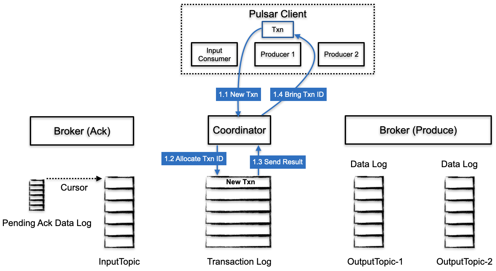

Let's walk through the steps for *beginning a transaction*.

Step Description|  |  |  |  |  |  |  |  | | --- | --- | --- | --- | --- | --- | --- | --- | | 1.1 The first step is that the Pulsar client finds the transaction coordinator.|  |  |  |  |  |  | | --- | --- | --- | --- | --- | --- | | 1.2 The transaction coordinator allocates a transaction ID for the transaction. In the transaction log, the transaction is logged with its transaction ID and status (OPEN), which ensures the transaction status is persisted regardless of transaction coordinator crashes.|  |  |  |  | | --- | --- | --- | --- | | 1.3 The transaction log sends the result of persisting the transaction ID to the transaction coordinator.|  |  | | --- | --- | | 1.4 After the transaction status entry is logged, the transaction coordinator brings the transaction ID back to the Pulsar client. | | | | | | | |

1.1 The first step is that the Pulsar client finds the transaction coordinator.|  |  |  |  |  |  | | --- | --- | --- | --- | --- | --- | | 1.2 The transaction coordinator allocates a transaction ID for the transaction. In the transaction log, the transaction is logged with its transaction ID and status (OPEN), which ensures the transaction status is persisted regardless of transaction coordinator crashes.|  |  |  |  | | --- | --- | --- | --- | | 1.3 The transaction log sends the result of persisting the transaction ID to the transaction coordinator.|  |  | | --- | --- | | 1.4 After the transaction status entry is logged, the transaction coordinator brings the transaction ID back to the Pulsar client. | | | | | |

1.2 The transaction coordinator allocates a transaction ID for the transaction. In the transaction log, the transaction is logged with its transaction ID and status (OPEN), which ensures the transaction status is persisted regardless of transaction coordinator crashes.|  |  |  |  | | --- | --- | --- | --- | | 1.3 The transaction log sends the result of persisting the transaction ID to the transaction coordinator.|  |  | | --- | --- | | 1.4 After the transaction status entry is logged, the transaction coordinator brings the transaction ID back to the Pulsar client. | | | |

1.3 The transaction log sends the result of persisting the transaction ID to the transaction coordinator.|  |  | | --- | --- | | 1.4 After the transaction status entry is logged, the transaction coordinator brings the transaction ID back to the Pulsar client. | |

1.4 After the transaction status entry is logged, the transaction coordinator brings the transaction ID back to the Pulsar client.

In this stage, the Pulsar client enters a transaction loop, repeating the `consume-process-produce` operation for all the messages that comprise the transaction. This is a long phase and is potentially composed of multiple produce and acknowledgment requests.

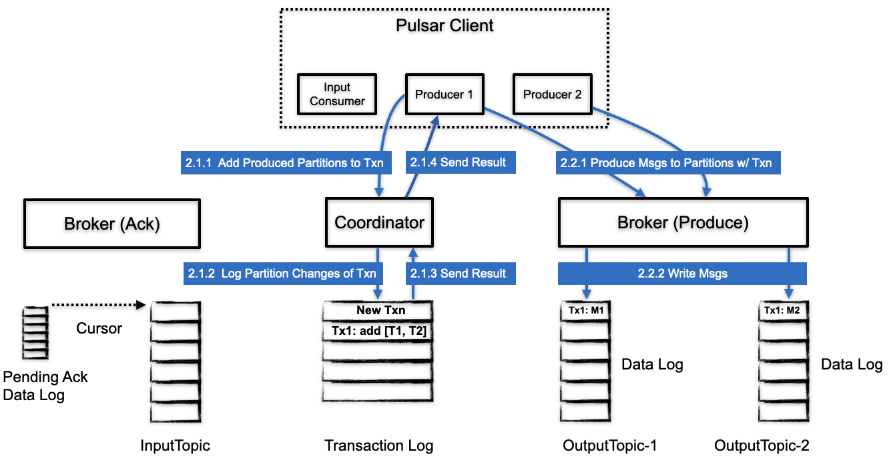

Let's walk through the steps for *publishing messages with a transaction*.

Step Description|  |  |  |  |  |  |  |  |  |  |  |  | | --- | --- | --- | --- | --- | --- | --- | --- | --- | --- | --- | --- | | 2.1.1 Before the Pulsar client produces messages to a new topic partition, it sends a request to the transaction coordinator to add the partition to the transaction.|  |  |  |  |  |  |  |  |  |  | | --- | --- | --- | --- | --- | --- | --- | --- | --- | --- | | 2.1.2 The transaction coordinator logs the partition changes of the transaction into the transaction log for durability, which ensures the transaction coordinator knows all the partitions that a transaction is handling. The transaction coordinator can commit or abort changes on each partition at the end-partition phase.|  |  |  |  |  |  |  |  | | --- | --- | --- | --- | --- | --- | --- | --- | | 2.1.3 The transaction log sends the result of logging the new partition (used for producing messages) to the transaction coordinator.|  |  |  |  |  |  | | --- | --- | --- | --- | --- | --- | | 2.1.4 The transaction coordinator sends the result of adding a new produced partition to the transaction.|  |  |  |  | | --- | --- | --- | --- | | 2.2.1 The Pulsar client starts producing messages to partitions. The flow of this part is the same as the normal flow of producing messages except that the batch of messages produced by a transaction contains transaction IDs.|  |  | | --- | --- | | 2.2.2 The broker writes messages to a partition. | | | | | | | | | | | |

2.1.1 Before the Pulsar client produces messages to a new topic partition, it sends a request to the transaction coordinator to add the partition to the transaction.|  |  |  |  |  |  |  |  |  |  | | --- | --- | --- | --- | --- | --- | --- | --- | --- | --- | | 2.1.2 The transaction coordinator logs the partition changes of the transaction into the transaction log for durability, which ensures the transaction coordinator knows all the partitions that a transaction is handling. The transaction coordinator can commit or abort changes on each partition at the end-partition phase.|  |  |  |  |  |  |  |  | | --- | --- | --- | --- | --- | --- | --- | --- | | 2.1.3 The transaction log sends the result of logging the new partition (used for producing messages) to the transaction coordinator.|  |  |  |  |  |  | | --- | --- | --- | --- | --- | --- | | 2.1.4 The transaction coordinator sends the result of adding a new produced partition to the transaction.|  |  |  |  | | --- | --- | --- | --- | | 2.2.1 The Pulsar client starts producing messages to partitions. The flow of this part is the same as the normal flow of producing messages except that the batch of messages produced by a transaction contains transaction IDs.|  |  | | --- | --- | | 2.2.2 The broker writes messages to a partition. | | | | | | | | | |

2.1.2 The transaction coordinator logs the partition changes of the transaction into the transaction log for durability, which ensures the transaction coordinator knows all the partitions that a transaction is handling. The transaction coordinator can commit or abort changes on each partition at the end-partition phase.|  |  |  |  |  |  |  |  | | --- | --- | --- | --- | --- | --- | --- | --- | | 2.1.3 The transaction log sends the result of logging the new partition (used for producing messages) to the transaction coordinator.|  |  |  |  |  |  | | --- | --- | --- | --- | --- | --- | | 2.1.4 The transaction coordinator sends the result of adding a new produced partition to the transaction.|  |  |  |  | | --- | --- | --- | --- | | 2.2.1 The Pulsar client starts producing messages to partitions. The flow of this part is the same as the normal flow of producing messages except that the batch of messages produced by a transaction contains transaction IDs.|  |  | | --- | --- | | 2.2.2 The broker writes messages to a partition. | | | | | | | |

2.1.3 The transaction log sends the result of logging the new partition (used for producing messages) to the transaction coordinator.|  |  |  |  |  |  | | --- | --- | --- | --- | --- | --- | | 2.1.4 The transaction coordinator sends the result of adding a new produced partition to the transaction.|  |  |  |  | | --- | --- | --- | --- | | 2.2.1 The Pulsar client starts producing messages to partitions. The flow of this part is the same as the normal flow of producing messages except that the batch of messages produced by a transaction contains transaction IDs.|  |  | | --- | --- | | 2.2.2 The broker writes messages to a partition. | | | | | |

2.1.4 The transaction coordinator sends the result of adding a new produced partition to the transaction.|  |  |  |  | | --- | --- | --- | --- | | 2.2.1 The Pulsar client starts producing messages to partitions. The flow of this part is the same as the normal flow of producing messages except that the batch of messages produced by a transaction contains transaction IDs.|  |  | | --- | --- | | 2.2.2 The broker writes messages to a partition. | | | |

2.2.1 The Pulsar client starts producing messages to partitions. The flow of this part is the same as the normal flow of producing messages except that the batch of messages produced by a transaction contains transaction IDs.|  |  | | --- | --- | | 2.2.2 The broker writes messages to a partition. | |

2.2.2 The broker writes messages to a partition.

In this phase, the Pulsar client sends a request to the transaction coordinator and a new subscription is acknowledged as a part of a transaction.

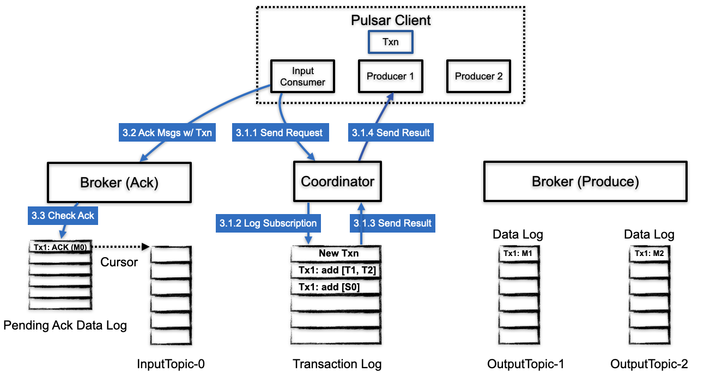

Let's walk through the steps for *acknowledging messages with a transaction*.

Step Description|  |  |  |  |  |  |  |  |  |  |  |  | | --- | --- | --- | --- | --- | --- | --- | --- | --- | --- | --- | --- | | 3.1.1 The Pulsar client sends a request to add an acknowledged subscription to the transaction coordinator.|  |  |  |  |  |  |  |  |  |  | | --- | --- | --- | --- | --- | --- | --- | --- | --- | --- | | 3.1.2 The transaction coordinator logs the addition of subscription, which ensures that it knows all subscriptions handled by a transaction and can commit or abort changes on each subscription at the end phase.|  |  |  |  |  |  |  |  | | --- | --- | --- | --- | --- | --- | --- | --- | | 3.1.3 The transaction log sends the result of logging the new partition (used for acknowledging messages) to the transaction coordinator.|  |  |  |  |  |  | | --- | --- | --- | --- | --- | --- | | 3.1.4 The transaction coordinator sends the result of adding the new acknowledged partition to the transaction.|  |  |  |  | | --- | --- | --- | --- | | 3.2 The Pulsar client acknowledges messages on the subscription. The flow of this part is the same as the normal flow of acknowledging messages except that the acknowledged request carries a transaction ID.|  |  | | --- | --- | | 3.3 The broker receiving the acknowledgment request checks if the acknowledgment belongs to a transaction or not. | | | | | | | | | | | |

3.1.1 The Pulsar client sends a request to add an acknowledged subscription to the transaction coordinator.|  |  |  |  |  |  |  |  |  |  | | --- | --- | --- | --- | --- | --- | --- | --- | --- | --- | | 3.1.2 The transaction coordinator logs the addition of subscription, which ensures that it knows all subscriptions handled by a transaction and can commit or abort changes on each subscription at the end phase.|  |  |  |  |  |  |  |  | | --- | --- | --- | --- | --- | --- | --- | --- | | 3.1.3 The transaction log sends the result of logging the new partition (used for acknowledging messages) to the transaction coordinator.|  |  |  |  |  |  | | --- | --- | --- | --- | --- | --- | | 3.1.4 The transaction coordinator sends the result of adding the new acknowledged partition to the transaction.|  |  |  |  | | --- | --- | --- | --- | | 3.2 The Pulsar client acknowledges messages on the subscription. The flow of this part is the same as the normal flow of acknowledging messages except that the acknowledged request carries a transaction ID.|  |  | | --- | --- | | 3.3 The broker receiving the acknowledgment request checks if the acknowledgment belongs to a transaction or not. | | | | | | | | | |

3.1.2 The transaction coordinator logs the addition of subscription, which ensures that it knows all subscriptions handled by a transaction and can commit or abort changes on each subscription at the end phase.|  |  |  |  |  |  |  |  | | --- | --- | --- | --- | --- | --- | --- | --- | | 3.1.3 The transaction log sends the result of logging the new partition (used for acknowledging messages) to the transaction coordinator.|  |  |  |  |  |  | | --- | --- | --- | --- | --- | --- | | 3.1.4 The transaction coordinator sends the result of adding the new acknowledged partition to the transaction.|  |  |  |  | | --- | --- | --- | --- | | 3.2 The Pulsar client acknowledges messages on the subscription. The flow of this part is the same as the normal flow of acknowledging messages except that the acknowledged request carries a transaction ID.|  |  | | --- | --- | | 3.3 The broker receiving the acknowledgment request checks if the acknowledgment belongs to a transaction or not. | | | | | | | |

3.1.3 The transaction log sends the result of logging the new partition (used for acknowledging messages) to the transaction coordinator.|  |  |  |  |  |  | | --- | --- | --- | --- | --- | --- | | 3.1.4 The transaction coordinator sends the result of adding the new acknowledged partition to the transaction.|  |  |  |  | | --- | --- | --- | --- | | 3.2 The Pulsar client acknowledges messages on the subscription. The flow of this part is the same as the normal flow of acknowledging messages except that the acknowledged request carries a transaction ID.|  |  | | --- | --- | | 3.3 The broker receiving the acknowledgment request checks if the acknowledgment belongs to a transaction or not. | | | | | |

3.1.4 The transaction coordinator sends the result of adding the new acknowledged partition to the transaction.|  |  |  |  | | --- | --- | --- | --- | | 3.2 The Pulsar client acknowledges messages on the subscription. The flow of this part is the same as the normal flow of acknowledging messages except that the acknowledged request carries a transaction ID.|  |  | | --- | --- | | 3.3 The broker receiving the acknowledgment request checks if the acknowledgment belongs to a transaction or not. | | | |

3.2 The Pulsar client acknowledges messages on the subscription. The flow of this part is the same as the normal flow of acknowledging messages except that the acknowledged request carries a transaction ID.|  |  | | --- | --- | | 3.3 The broker receiving the acknowledgment request checks if the acknowledgment belongs to a transaction or not. | |

3.3 The broker receiving the acknowledgment request checks if the acknowledgment belongs to a transaction or not.

At the end of a transaction, the Pulsar client decides to commit or abort the transaction. The transaction can be aborted when a conflict is detected in acknowledging messages.

When the Pulsar client finishes a transaction, it issues an end transaction request.

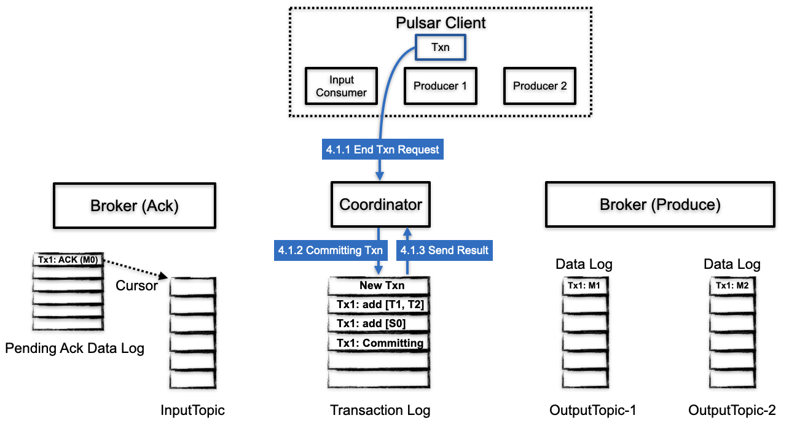

Let's walk through the steps for *ending the transaction*.

Step Description|  |  |  |  |  |  | | --- | --- | --- | --- | --- | --- | | 4.1.1 The Pulsar client issues an end transaction request (with a field indicating whether the transaction is to be committed or aborted) to the transaction coordinator.|  |  |  |  | | --- | --- | --- | --- | | 4.1.2 The transaction coordinator writes a COMMITTING or ABORTING message to its transaction log.|  |  | | --- | --- | | 4.1.3 The transaction log sends the result of logging the committing or aborting status. | | | | | |

4.1.1 The Pulsar client issues an end transaction request (with a field indicating whether the transaction is to be committed or aborted) to the transaction coordinator.|  |  |  |  | | --- | --- | --- | --- | | 4.1.2 The transaction coordinator writes a COMMITTING or ABORTING message to its transaction log.|  |  | | --- | --- | | 4.1.3 The transaction log sends the result of logging the committing or aborting status. | | | |

4.1.2 The transaction coordinator writes a COMMITTING or ABORTING message to its transaction log.|  |  | | --- | --- | | 4.1.3 The transaction log sends the result of logging the committing or aborting status. | |

4.1.3 The transaction log sends the result of logging the committing or aborting status.

The transaction coordinator starts the process of committing or aborting messages to all the partitions involved in this transaction.

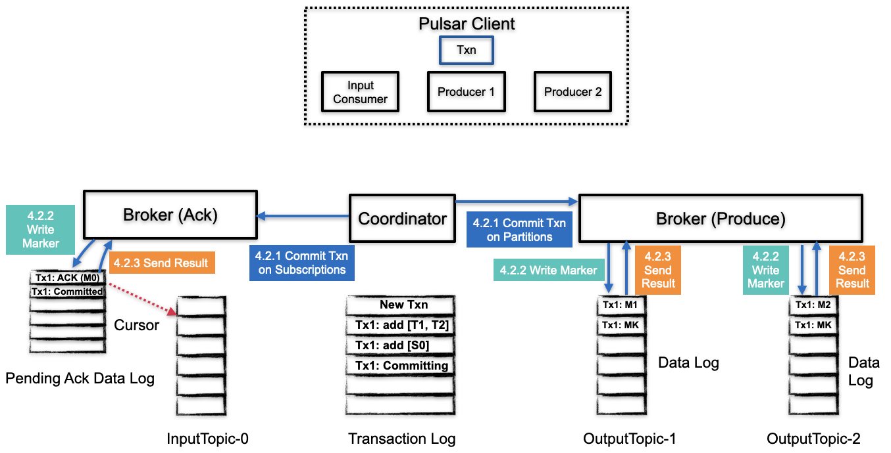

Let's walk through the steps for *finalizing a transaction*.

Step Description|  |  |  |  |  |  | | --- | --- | --- | --- | --- | --- | | 4.2.1 The transaction coordinator commits transactions on subscriptions and commits transactions on partitions at the same time.|  |  |  |  | | --- | --- | --- | --- | | 4.2.2 The broker (produce) writes produced committed markers to the actual partitions. At the same time, the broker (ack) writes acked committed marks to the subscription pending ack partitions.|  |  | | --- | --- | | 4.2.3 The data log sends the result of writing produced committed marks to the broker. At the same time, pending ack data log sends the result of writing acked committed marks to the broker. The cursor moves to the next position. | | | | | |

4.2.1 The transaction coordinator commits transactions on subscriptions and commits transactions on partitions at the same time.|  |  |  |  | | --- | --- | --- | --- | | 4.2.2 The broker (produce) writes produced committed markers to the actual partitions. At the same time, the broker (ack) writes acked committed marks to the subscription pending ack partitions.|  |  | | --- | --- | | 4.2.3 The data log sends the result of writing produced committed marks to the broker. At the same time, pending ack data log sends the result of writing acked committed marks to the broker. The cursor moves to the next position. | | | |

4.2.2 The broker (produce) writes produced committed markers to the actual partitions. At the same time, the broker (ack) writes acked committed marks to the subscription pending ack partitions.|  |  | | --- | --- | | 4.2.3 The data log sends the result of writing produced committed marks to the broker. At the same time, pending ack data log sends the result of writing acked committed marks to the broker. The cursor moves to the next position. | |

4.2.3 The data log sends the result of writing produced committed marks to the broker. At the same time, pending ack data log sends the result of writing acked committed marks to the broker. The cursor moves to the next position.

The transaction coordinator writes the final transaction status to the transaction log to complete the transaction.

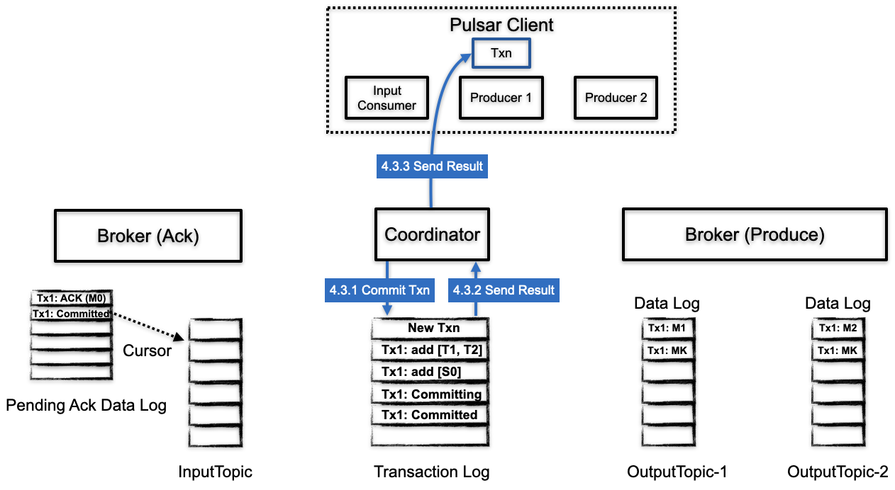

Let's walk through the steps for *marking a transaction as COMMITTED or ABORTED*.

Step Description|  |  |  |  |  |  | | --- | --- | --- | --- | --- | --- | | 4.3.1 After all produced messages and acknowledgments to all partitions involved in this transaction have been successfully committed or aborted, the transaction coordinator writes the final COMMITTED or ABORTED transaction status messages to its transaction log, indicating that the transaction is complete. All the messages associated with the transaction in its transaction log can be safely removed.|  |  |  |  | | --- | --- | --- | --- | | 4.3.2 The transaction log sends the result of the committed transaction to the transaction coordinator.|  |  | | --- | --- | | 4.3.3 The transaction coordinator sends the result of the committed transaction to the Pulsar client. | | | | | |

4.3.1 After all produced messages and acknowledgments to all partitions involved in this transaction have been successfully committed or aborted, the transaction coordinator writes the final COMMITTED or ABORTED transaction status messages to its transaction log, indicating that the transaction is complete. All the messages associated with the transaction in its transaction log can be safely removed.|  |  |  |  | | --- | --- | --- | --- | | 4.3.2 The transaction log sends the result of the committed transaction to the transaction coordinator.|  |  | | --- | --- | | 4.3.3 The transaction coordinator sends the result of the committed transaction to the Pulsar client. | | | |

4.3.2 The transaction log sends the result of the committed transaction to the transaction coordinator.|  |  | | --- | --- | | 4.3.3 The transaction coordinator sends the result of the committed transaction to the Pulsar client. | |

4.3.3 The transaction coordinator sends the result of the committed transaction to the Pulsar client.

---

<a id="txn-monitor"></a>

<!-- source_url: https://pulsar.apache.org/docs/4.1.x/txn-monitor/ -->

<!-- page_index: 173 -->

# How to monitor transactions?

You can monitor the status of the transactions in Prometheus and Grafana using the [transaction metrics](#reference-metrics--pulsar-transaction).

For how to configure Prometheus and Grafana, see [here](#deploy-monitoring).

---

<a id="txn-use"></a>

<!-- source_url: https://pulsar.apache.org/docs/4.1.x/txn-use/ -->

<!-- page_index: 174 -->

# Get started

> [!NOTE]
> Currently, [Pulsar transaction API](https://pulsar.apache.org/api/admin/4.1.x/) is available in **Pulsar 2.8.0 or later** versions. It is only available for **Java**, **Go** and **.NET** clients.

---

<a id="txn-what"></a>

<!-- source_url: https://pulsar.apache.org/docs/4.1.x/txn-what/ -->

<!-- page_index: 175 -->

# What are transactions?

Transactions strengthen the message delivery semantics of Apache Pulsar and [processing guarantees of Pulsar Functions](#functions-concepts--processing-guarantees-and-subscription-types). The Pulsar transaction API supports atomic writes and acknowledgments across multiple topics.

Transactions allow:

- A producer to send a batch of messages to multiple topics where all messages in the batch are eventually visible to any consumer, or none is ever visible to consumers.
- End-to-end exactly-once semantics (execute a `consume-process-produce` operation exactly once).

Pulsar transactions have the following semantics:

- All operations within a transaction are committed as a single unit.

  - Either all messages are committed, or none of them are.
  - Each message is written or processed exactly once, without data loss or duplicates (even in the event of failures).
  - If a transaction is aborted, all the writes and acknowledgments in this transaction rollback.
- A group of messages in a transaction can be received from, produced to, and acknowledged by multiple partitions.

  - Consumers are only allowed to read committed (acked) messages. In other words, the broker does not deliver transactional messages which are part of an open transaction or messages which are part of an aborted transaction.
  - Message writes across multiple partitions are atomic.
  - Message acks across multiple subscriptions are atomic. A message is acked successfully only once by a consumer under the subscription when acknowledging the message with the transaction ID.

Stream processing on Pulsar is a `consume-process-produce` operation on Pulsar topics:

- `Consume`: a source operator that runs a Pulsar consumer reads messages from one or multiple Pulsar topics.
- `Process`: a processing operator transforms the messages.
- `Produce`: a sink operator that runs a Pulsar producer writes the resulting messages to one or multiple Pulsar topics.

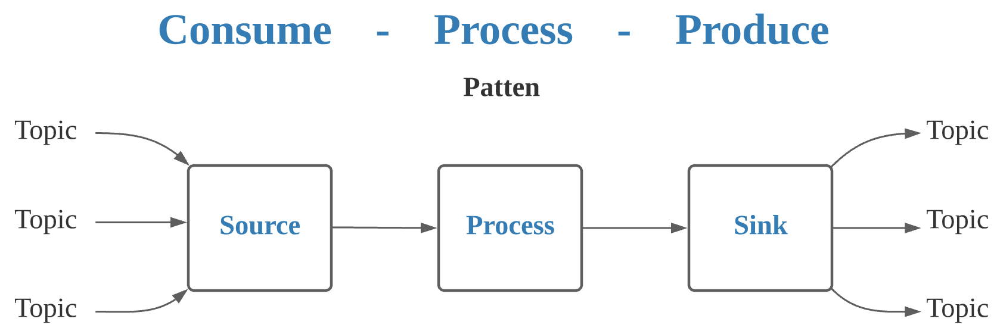

Pulsar transactions support end-to-end exactly-once stream processing, which means messages are not lost from a source operator and messages are not duplicated to a sink operator.

Prior to Pulsar 2.8.0, there was no easy way to build stream processing applications with Pulsar to achieve exactly-once processing guarantees. With the transaction introduced in Pulsar 2.8.0, the following services support exactly-once semantics:

- [Pulsar Flink connector](https://flink.apache.org/2021/01/07/pulsar-flink-connector-270.html)

  Prior to Pulsar 2.8.0, if you want to build stream applications using Pulsar and Flink, the Pulsar Flink connector only supported exactly-once source connector and at-least-once sink connector, which means the highest processing guarantee for end-to-end was at-least-once, there was a possibility that the resulting messages from streaming applications produce duplicated messages to the resulting topics in Pulsar.

  With the transaction introduced in Pulsar 2.8.0, the Pulsar Flink sink connector can support exactly-once semantics by implementing the designated `TwoPhaseCommitSinkFunction` and hooking up the Flink sink message lifecycle with Pulsar transaction API.
- Support for Pulsar Functions and other connectors will be added in future releases.

---

<a id="txn-why"></a>

<!-- source_url: https://pulsar.apache.org/docs/4.1.x/txn-why/ -->

<!-- page_index: 176 -->

# Why transactions?

Pulsar transactions (txn) enable event streaming applications to consume, process, and produce messages in one atomic operation. The reason for developing this feature can be summarized as below.

The demand for stream processing applications with stronger processing guarantees has grown along with the rise of stream processing. For example, in the financial industry, financial institutions use stream processing engines to process debits and credits for users. This type of use case requires that every message is processed exactly once, without exception.

In other words, if a stream processing application consumes message A and
produces the result as a message B (B = f(A)), then exactly-once processing
guarantee means that A can only be marked as consumed if and only if B is
successfully produced, and vice versa.

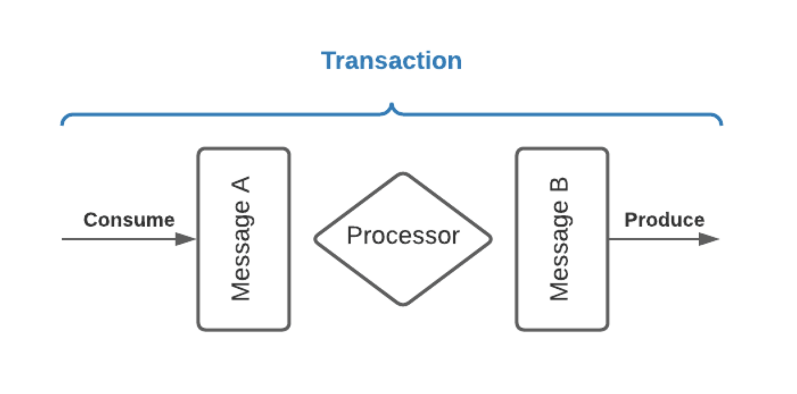

The Pulsar transactions API strengthens the message delivery semantics and the processing guarantees for stream processing. It enables stream processing applications to consume, process, and produce messages in one atomic operation. That means, a batch of messages in a transaction can be received from, produced to and acknowledged by many topic partitions. All the operations involved in a transaction succeed or fail as one single unit.

Avoiding data loss or duplication can be achieved by using the Pulsar idempotent producer, but it does not provide guarantees for writes across multiple partitions.

In Pulsar, the highest level of message delivery guarantee is using an [idempotent producer](#concepts-messaging--producer-idempotency) with the exactly once semantic at one single partition, that is, each message is persisted exactly once without data loss and duplication. However, there are some limitations in this solution:

- Due to the monotonic increasing sequence ID, this solution only works on a single partition and within a single producer session (that is, for producing one message), so there is no atomicity when producing multiple messages to one or multiple partitions.

  In this case, if there are some failures (for example, client / broker / bookie crashes, network failure, and more) in the process of producing and receiving messages, messages are re-processed and re-delivered, which may cause data loss or data duplication:

  - For the producer: if the producer retries sending messages, some messages are persisted multiple times; if the producer does not retry sending messages, some messages are persisted once and other messages are lost.
  - For the consumer: since the consumer does not know whether the broker has received messages or not, the consumer may not retry sending acks, which causes it to receive duplicate messages.
- Similarly, for Pulsar Function, it only guarantees the exactly once semantics for an idempotent function on a single event rather than processing multiple events or producing multiple results that can happen exactly.

  For example, if a function accepts multiple events and produces one result (for example, window function), the function may fail between producing the result and acknowledging the incoming messages, or even between acknowledging individual events, which causes all (or some) incoming messages to be re-delivered and reprocessed, and a new result is generated.

  However, many scenarios need atomic guarantees across multiple partitions and sessions.
- Consumers need to rely on more mechanisms to acknowledge (ack) messages once.

  For example, consumers are required to store the MessageID along with its acked state. After the topic is unloaded, the subscription can recover the acked state of this MessageID in memory when the topic is loaded again.

---

<a id="window-functions-context"></a>

<!-- source_url: https://pulsar.apache.org/docs/4.1.x/window-functions-context/ -->

<!-- page_index: 177 -->

# Window Functions Context

> [!NOTE]
> If a Pulsar window function uses the language-native interface for Java, that function is not able to publish metrics and stats to Pulsar.

---
